{0}------------------------------------------------

## A guide to convolution arithmetic for deep learning

Vincent Dumoulin $1\star$  and Francesco Visin $^{2\star\uparrow}$ 

 $\star \mathrm{MILA},$ Université de Montréal  $^\dagger\text{AIRLab},$  Politecnico di Milano

January 12, 2018

 $^1$ dumouliv@iro.umontreal.ca

 $2$ francesco.visin@polimi.it

{1}------------------------------------------------

All models are wrong, but some  $\emph{are useful}.$ 

GEORGE E. P. BOX

{2}------------------------------------------------

### Acknowledgements

The authors of this guide would like to thank David Warde-Farley, Guillaume Alain and Caglar Gulcehre for their valuable feedback. We are likewise grateful to all those who helped improve this tutorial with helpful comments, constructive criticisms and code contributions. Keep them coming!

Special thanks to Ethan Schoonover, creator of the Solarized color scheme,1 whose colors were used for the figures.

### Feedback

Your feedback is welcomed! We did our best to be as precise, informative and up to the point as possible, but should there be anything you feel might be an error or could be rephrased to be more precise or comprehensible, please don't refrain from contacting us. Likewise, drop us a line if you think there is something that might fit this technical report and you would like us to discuss - we will make our best effort to update this document.

### Source code and animations

The code used to generate this guide along with its figures is available on GitHub.2 There the reader can also find an animated version of the figures.

 $1$ http://ethanschoonover.com/solarized

 $2$ https://github.com/vdumoulin/conv\_arithmetic

{3}------------------------------------------------

# Contents

| $\mathbf{1}$   | 5 Introduction                                                                         |    |  |  |  |  |
|----------------|-------------------------------------------------------------------------------------------|----|--|--|--|--|
|                | Discrete convolutions 1.1                                                              | 6  |  |  |  |  |
|                | Pooling 1.2                                                                            | 10 |  |  |  |  |
| $\overline{2}$ | Convolution arithmetic                                                                    | 12 |  |  |  |  |
|                | No zero padding, unit strides $\ldots \ldots \ldots \ldots \ldots \ldots$ 2.1          | 12 |  |  |  |  |
|                | Zero padding, unit strides 2.2                                                         | 13 |  |  |  |  |
|                | 2.2.1 Half (same) padding $\ldots \ldots \ldots \ldots \ldots \ldots \ldots$              | 13 |  |  |  |  |
|                | Full padding 2.2.2                                                                     | 13 |  |  |  |  |
|                | No zero padding, non-unit strides $\dots \dots \dots \dots \dots \dots$ 2.3            | 15 |  |  |  |  |
|                | Zero padding, non-unit strides $\ldots \ldots \ldots \ldots \ldots \ldots \ldots$ 2.4  | 15 |  |  |  |  |
| 3              | Pooling arithmetic                                                                        | 18 |  |  |  |  |
| 4              | Transposed convolution arithmetic                                                         | 19 |  |  |  |  |
|                | Convolution as a matrix operation $\ldots \ldots \ldots \ldots \ldots$ 4.1             | 20 |  |  |  |  |
|                | Transposed convolution 4.2                                                             | 20 |  |  |  |  |
|                | No zero padding, unit strides, transposed $\ldots \ldots \ldots \ldots$ 4.3            | 21 |  |  |  |  |
|                | Zero padding, unit strides, transposed $\ldots \ldots \ldots \ldots \ldots$ 4.4        | 22 |  |  |  |  |
|                | Half (same) padding, transposed 4.4.1                                                  | 22 |  |  |  |  |
|                | Full padding, transposed 4.4.2                                                         | 22 |  |  |  |  |
|                | No zero padding, non-unit strides, transposed $\ldots \ldots \ldots$ 4.5               | 24 |  |  |  |  |
|                | Zero padding, non-unit strides, transposed $\ldots \ldots \ldots \ldots$ 4.6           | 24 |  |  |  |  |
| 5.             | Miscellaneous convolutions                                                                | 28 |  |  |  |  |
|                |                                                                                           |    |  |  |  |  |
|                | Dilated convolutions $\dots \dots \dots \dots \dots \dots \dots \dots \dots \dots$ 5.1 | 28 |  |  |  |  |

{4}------------------------------------------------

## Introduction

Deep convolutional neural networks (CNNs) have been at the heart of spectacular advances in deep learning. Although CNNs have been used as early as the nineties to solve character recognition tasks (Le Cun *et al.*, 1997), their current widespread application is due to much more recent work, when a deep CNN was used to beat state-of-the-art in the ImageNet image classification challenge (Krizhevsky et al., 2012).

Convolutional neural networks therefore constitute a very useful tool for machine learning practitioners. However, learning to use CNNs for the first time is generally an intimidating experience. A convolutional layer's output shape is affected by the shape of its input as well as the choice of kernel shape, zero padding and strides, and the relationship between these properties is not trivial to infer. This contrasts with fully-connected layers, whose output size is independent of the input size. Additionally, CNNs also usually feature a *pooling* stage, adding yet another level of complexity with respect to fully-connected networks. Finally, so-called transposed convolutional layers (also known as fractionally strided convolutional layers) have been employed in more and more work as of late (Zeiler et al., 2011; Zeiler and Fergus, 2014; Long et al., 2015; Radford et al., 2015; Visin et al., 2015; Im et al., 2016), and their relationship with convolutional layers has been explained with various degrees of clarity.

This guide's objective is twofold:

- 1. Explain the relationship between convolutional layers and transposed convolutional layers.
- 2. Provide an intuitive understanding of the relationship between input shape. kernel shape, zero padding, strides and output shape in convolutional, pooling and transposed convolutional layers.

In order to remain broadly applicable, the results shown in this guide are independent of implementation details and apply to all commonly used machine learning frameworks, such as Theano (Bergstra et al., 2010; Bastien et al., 2012), 

{5}------------------------------------------------

Torch (Collobert *et al.*, 2011), Tensorflow (Abadi *et al.*, 2015) and Caffe (Jia  $et al., 2014).$ 

This chapter briefly reviews the main building blocks of CNNs, namely discrete convolutions and pooling. For an in-depth treatment of the subject, see Chapter 9 of the Deep Learning textbook (Goodfellow *et al.*, 2016).

### $1.1$ Discrete convolutions

The bread and butter of neural networks is *affine transformations*: a vector is received as input and is multiplied with a matrix to produce an output (to which a bias vector is usually added before passing the result through a nonlinearity). This is applicable to any type of input, be it an image, a sound clip or an unordered collection of features: whatever their dimensionality, their representation can always be flattened into a vector before the transformation.

Images, sound clips and many other similar kinds of data have an intrinsic structure. More formally, they share these important properties:

- They are stored as multi-dimensional arrays.
- $\bullet$  They feature one or more axes for which ordering matters (e.g., width and height axes for an image, time axis for a sound clip).
- One axis, called the channel axis, is used to access different views of the data (e.g., the red, green and blue channels of a color image, or the left and right channels of a stereo audio track).

These properties are not exploited when an affine transformation is applied; in fact, all the axes are treated in the same way and the topological information is not taken into account. Still, taking advantage of the implicit structure of the data may prove very handy in solving some tasks, like computer vision and speech recognition, and in these cases it would be best to preserve it. This is where discrete convolutions come into play.

A discrete convolution is a linear transformation that preserves this notion of ordering. It is sparse (only a few input units contribute to a given output unit) and reuses parameters (the same weights are applied to multiple locations in the input).

Figure 1.1 provides an example of a discrete convolution. The light blue grid is called the *input feature map*. To keep the drawing simple, a single input feature map is represented, but it is not uncommon to have multiple feature maps stacked one onto another.1 A kernel (shaded area) of value

|          |   | 2 |
|----------|---|---|
| $\bf{2}$ | 2 |   |
|          |   | 2 |

{6}------------------------------------------------

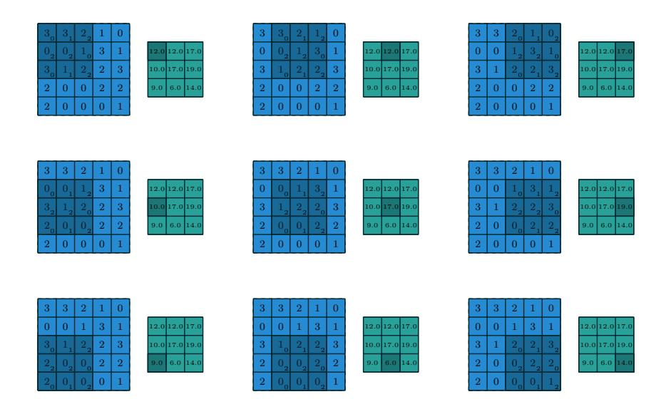

Figure 1.1: Computing the output values of a discrete convolution.

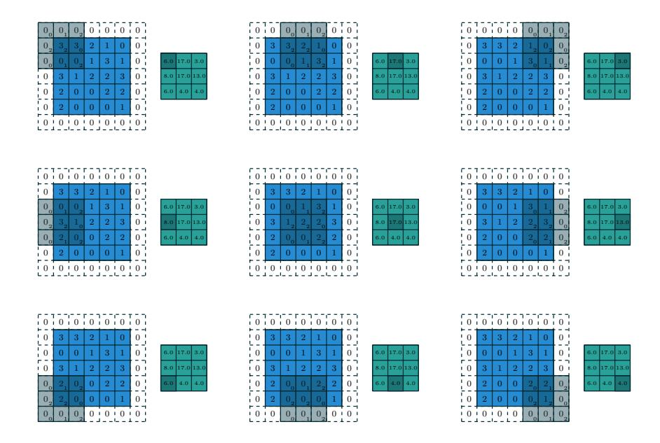

Figure 1.2: Computing the output values of a discrete convolution for  $N = 2$ ,  $i_1 = i_2 = 5$ ,  $k_1 = k_2 = 3$ ,  $s_1 = s_2 = 2$ , and  $p_1 = p_2 = 1$ .

{7}------------------------------------------------

slides across the input feature map. At each location, the product between each element of the kernel and the input element it overlaps is computed and the results are summed up to obtain the output in the current location. The procedure can be repeated using different kernels to form as many output feature maps as desired (Figure 1.3). The final outputs of this procedure are called *output feature maps.*2 If there are multiple input feature maps, the kernel will have to be 3-dimensional  $-$  or, equivalently each one of the feature maps will be convolved with a distinct kernel  $-$  and the resulting feature maps will be summed up elementwise to produce the output feature map.

The convolution depicted in Figure 1.1 is an instance of a 2-D convolution, but it can be generalized to N-D convolutions. For instance, in a 3-D convolution, the kernel would be a *cuboid* and would slide across the height, width and depth of the input feature map.

The collection of kernels defining a discrete convolution has a shape corresponding to some permutation of  $(n, m, k_1, \ldots, k_N)$ , where

> $n \equiv$  number of output feature maps,  $m \equiv$  number of input feature maps,  $k_i \equiv$  kernel size along axis j.

The following properties affect the output size  $o_j$  of a convolutional layer along axis  $i$ :

- $i_j$ : input size along axis j,
- $k_i$ : kernel size along axis j,
- $s_j$ : stride (distance between two consecutive positions of the kernel) along  $axis j,$
- $p_i$ : zero padding (number of zeros concatenated at the beginning and at the end of an axis) along axis  $j$ .

For instance, Figure 1.2 shows a  $3 \times 3$  kernel applied to a  $5 \times 5$  input padded with a  $1 \times 1$  border of zeros using  $2 \times 2$  strides.

Note that strides constitute a form of *subsampling*. As an alternative to being interpreted as a measure of how much the kernel is translated, strides can also be viewed as how much of the output is retained. For instance, moving the kernel by hops of two is equivalent to moving the kernel by hops of one but retaining only odd output elements (Figure 1.4).

 $^1 \mathrm{An}$  example of this is what was referred to earlier as  $channels$  for images and sound clips. 2While there is a distinction between convolution and cross-correlation from a signal processing perspective, the two become interchangeable when the kernel is learned. For the sake of simplicity and to stay consistent with most of the machine learning literature, the term convolution will be used in this guide.

{8}------------------------------------------------

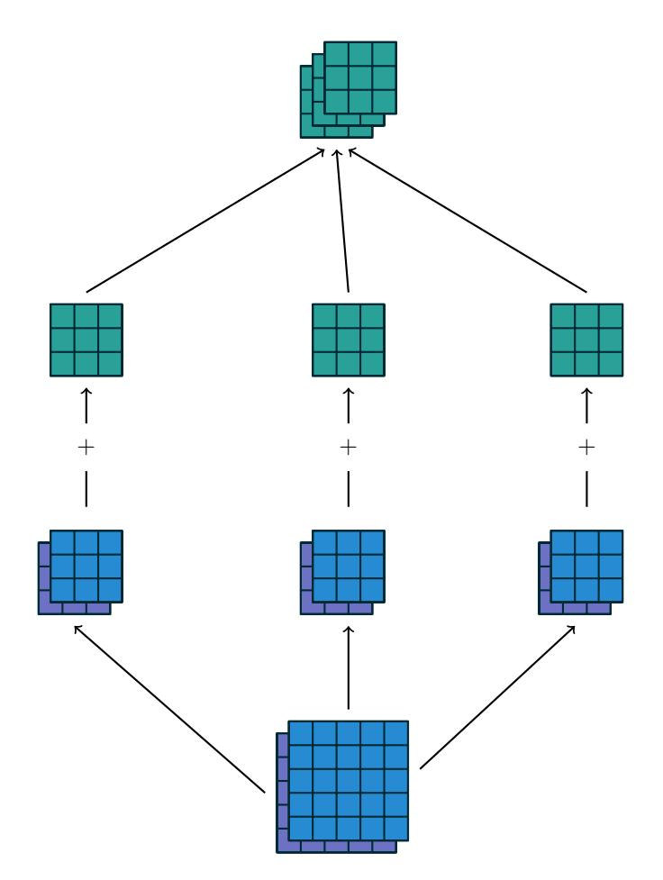

Figure 1.3: A convolution mapping from two input feature maps to three output feature maps using a  $3 \times 2 \times 3 \times 3$  collection of kernels w. In the left pathway, input feature map 1 is convolved with kernel  $w_{1,1}$  and input feature map 2 is convolved with kernel  $\mathbf{w}_{1,2}$ , and the results are summed together elementwise to form the first output feature map. The same is repeated for the middle and right pathways to form the second and third feature maps, and all three output feature maps are grouped together to form the output.

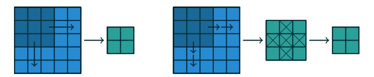

Figure 1.4: An alternative way of viewing strides. Instead of translating the  $3 \times 3$  kernel by increments of  $s = 2$  (left), the kernel is translated by increments of 1 and only one in  $s = 2$  output elements is retained (right).

{9}------------------------------------------------

### 1.2 Pooling

In addition to discrete convolutions themselves, *pooling* operations make up another important building block in CNNs. Pooling operations reduce the size of feature maps by using some function to summarize subregions, such as taking the average or the maximum value.

Pooling works by sliding a window across the input and feeding the content of the window to a *pooling function*. In some sense, pooling works very much like a discrete convolution, but replaces the linear combination described by the kernel with some other function. Figure 1.5 provides an example for average pooling, and Figure 1.6 does the same for max pooling.

The following properties affect the output size  $o_i$  of a pooling layer along axis  $j$ :

- $i_j$ : input size along axis j,
- $k_i$ : pooling window size along axis j,
- $s_j$ : stride (distance between two consecutive positions of the pooling window) along axis  $j$ .

{10}------------------------------------------------

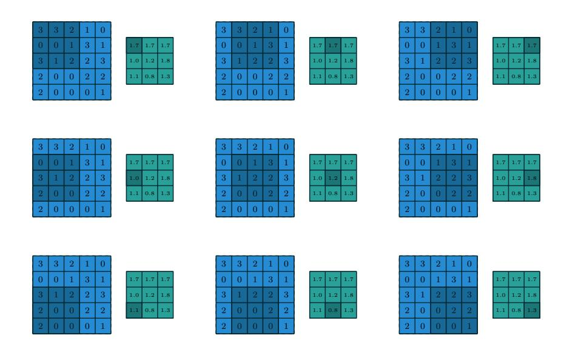

Figure 1.5: Computing the output values of a  $3 \times 3$  average pooling operation on a  $5\times 5$  input using  $1\times 1$  strides.

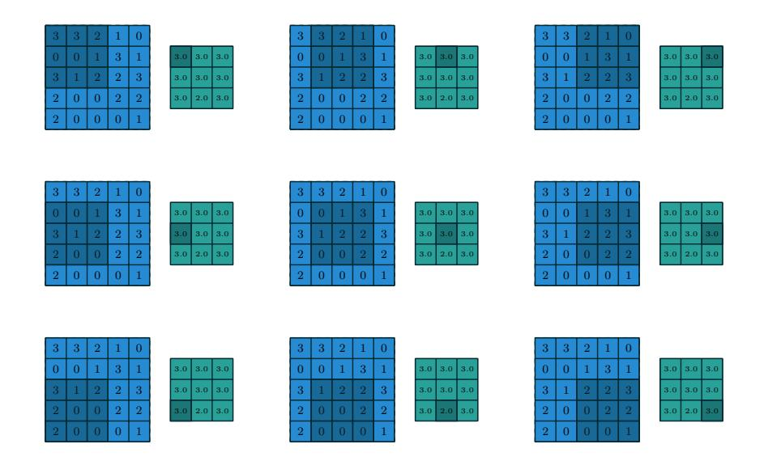

Figure 1.6: Computing the output values of a  $3 \times 3$  max pooling operation on a  $5\times 5$  input using  $1\times 1$  strides.

{11}------------------------------------------------

# **Convolution arithmetic**

The analysis of the relationship between convolutional layer properties is eased by the fact that they don't interact across axes, i.e., the choice of kernel size, stride and zero padding along axis  $j$  only affects the output size of axis  $j$ . Because of that, this chapter will focus on the following simplified setting:

- 2-D discrete convolutions  $(N = 2)$ ,
- square inputs  $(i_1 = i_2 = i)$ ,
- square kernel size  $(k_1 = k_2 = k)$ ,
- same strides along both axes  $(s_1 = s_2 = s)$ ,
- same zero padding along both axes  $(p_1 = p_2 = p)$ .

This facilitates the analysis and the visualization, but keep in mind that the results outlined here also generalize to the N-D and non-square cases.

### 2.1 No zero padding, unit strides

The simplest case to analyze is when the kernel just slides across every position of the input (i.e.,  $s = 1$  and  $p = 0$ ). Figure 2.1 provides an example for  $i = 4$ and  $k=3$ .

One way of defining the output size in this case is by the number of possible placements of the kernel on the input. Let's consider the width axis: the kernel starts on the leftmost part of the input feature map and slides by steps of one until it touches the right side of the input. The size of the output will be equal to the number of steps made, plus one, accounting for the initial position of the kernel (Figure 2.8a). The same logic applies for the height axis.

More formally, the following relationship can be inferred:

{12}------------------------------------------------

**Relationship 1.** For any i and k, and for  $s = 1$  and  $p = 0$ ,

 $o = (i - k) + 1.$ 

### Zero padding, unit strides $2.2$

To factor in zero padding (i.e., only restricting to  $s = 1$ ), let's consider its effect on the effective input size: padding with  $p$  zeros changes the effective input size from i to  $i + 2p$ . In the general case, Relationship 1 can then be used to infer the following relationship:

**Relationship 2.** For any *i*, *k* and *p*, and for 
$$
s = 1
$$
,  
$$
o = (i - k) + 2p + 1.
$$

Figure 2.2 provides an example for  $i = 5$ ,  $k = 4$  and  $p = 2$ .

In practice, two specific instances of zero padding are used quite extensively because of their respective properties. Let's discuss them in more detail.

#### $2.2.1$ Half (same) padding

Having the output size be the same as the input size (i.e.,  $o = i$ ) can be a desirable property:

**Relationship 3.** For any *i* and for *k* odd (
$$
k = 2n + 1
$$
,  $n \in \mathbb{N}$ ),  
\n $s = 1$  and  $p = \lfloor k/2 \rfloor = n$ ,  
\n $o = i + 2\lfloor k/2 \rfloor - (k - 1)$   
\n $= i + 2n - 2n$   
\n $= i$ .

This is sometimes referred to as *half* (or *same*) padding. Figure 2.3 provides an example for  $i = 5$ ,  $k = 3$  and (therefore)  $p = 1$ .

#### 2.2.2 Full padding

While convolving a kernel generally *decreases* the output size with respect to the input size, sometimes the opposite is required. This can be achieved with proper zero padding:

**Relationship 4.** For any *i* and *k*, and for 
$$
p = k - 1
$$
 and  $s = 1$ ,  
$$
o = i + 2(k - 1) - (k - 1)
$$
$$
= i + (k - 1).
$$

{13}------------------------------------------------

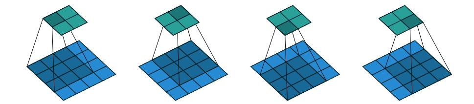

Figure 2.1: (No padding, unit strides) Convolving a  $3 \times 3$  kernel over a  $4 \times 4$ input using unit strides (i.e.,  $i = 4$ ,  $k = 3$ ,  $s = 1$  and  $p = 0$ ).

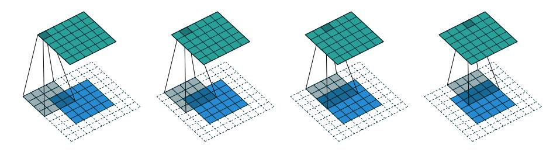

Figure 2.2: (Arbitrary padding, unit strides) Convolving a  $4 \times 4$  kernel over a  $5\times 5$  input padded with a  $2\times 2$  border of zeros using unit strides (i.e.,  $i=5,$  $k = 4, s = 1$  and  $p = 2$ ).

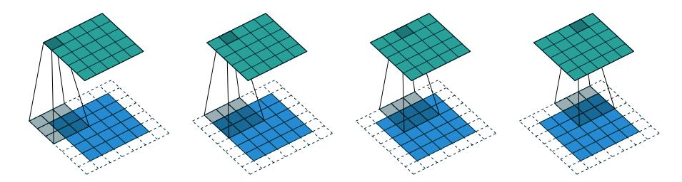

Figure 2.3: (Half padding, unit strides) Convolving a  $3 \times 3$  kernel over a  $5 \times 5$ input using half padding and unit strides (i.e.,  $i = 5$ ,  $k = 3$ ,  $s = 1$  and  $p = 1$ ).

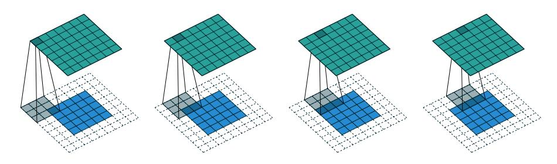

Figure 2.4: (Full padding, unit strides) Convolving a  $3 \times 3$  kernel over a  $5 \times 5$ input using full padding and unit strides (i.e.,  $i = 5$ ,  $k = 3$ ,  $s = 1$  and  $p = 2$ ).

{14}------------------------------------------------

This is sometimes referred to as *full* padding, because in this setting every possible partial or complete superimposition of the kernel on the input feature map is taken into account. Figure 2.4 provides an example for  $i = 5$ ,  $k = 3$  and (therefore)  $p=2$ .

### No zero padding, non-unit strides 2.3

All relationships derived so far only apply for unit-strided convolutions. Incorporating non unitary strides requires another inference leap. To facilitate the analysis, let's momentarily ignore zero padding (i.e.,  $s > 1$  and  $p = 0$ ). Figure 2.5 provides an example for  $i = 5$ ,  $k = 3$  and  $s = 2$ .

Once again, the output size can be defined in terms of the number of possible placements of the kernel on the input. Let's consider the width axis: the kernel starts as usual on the leftmost part of the input, but this time it slides by steps of size s until it touches the right side of the input. The size of the output is again equal to the number of steps made, plus one, accounting for the initial position of the kernel (Figure 2.8b). The same logic applies for the height axis.

From this, the following relationship can be inferred:

**Relationship 5.** For any i, k and s, and for  $p = 0$ .  $o = \left| \frac{i - k}{s} \right| + 1.$ 

The floor function accounts for the fact that sometimes the last possible step does not coincide with the kernel reaching the end of the input, i.e., some input units are left out (see Figure 2.7 for an example of such a case).

### 2.4 Zero padding, non-unit strides

The most general case (convolving over a zero padded input using non-unit strides) can be derived by applying Relationship 5 on an effective input of size  $i + 2p$ , in analogy to what was done for Relationship 2:

**Relationship 6.** For any *i*, *k*, *p* and *s*,  
$$
o = \left\lfloor \frac{i + 2p - k}{s} \right\rfloor + 1.
$$

 $\overline{1}$ 

As before, the floor function means that in some cases a convolution will produce the same output size for multiple input sizes. More specifically, if  $i + 2p - k$  is a multiple of s, then any input size  $j = i + a$ ,  $a \in \{0, ..., s - 1\}$  will produce the same output size. Note that this ambiguity applies only for  $s > 1$ .

Figure 2.6 shows an example with  $i = 5$ ,  $k = 3$ ,  $s = 2$  and  $p = 1$ , while Figure 2.7 provides an example for  $i = 6$ ,  $k = 3$ ,  $s = 2$  and  $p = 1$ . Interestingly, 

{15}------------------------------------------------

despite having different input sizes these convolutions share the same output size. While this doesn't affect the analysis for *convolutions*, this will complicate the analysis in the case of  $\emph{transposed convolutions}.$ 

{16}------------------------------------------------

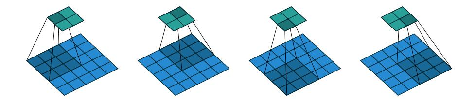

Figure 2.5: (No zero padding, arbitrary strides) Convolving a  $3 \times 3$  kernel over a  $5 \times 5$  input using  $2 \times 2$  strides (i.e.,  $i = 5$ ,  $k = 3$ ,  $s = 2$  and  $p = 0$ ).

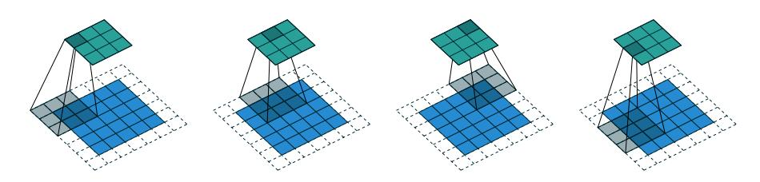

Figure 2.6: (Arbitrary padding and strides) Convolving a  $3 \times 3$  kernel over a  $5\times 5$  input padded with a  $1\times 1$  border of zeros using  $2\times 2$  strides (i.e.,  $i=5,$  $k = 3$ ,  $s = 2$  and  $p = 1$ ).

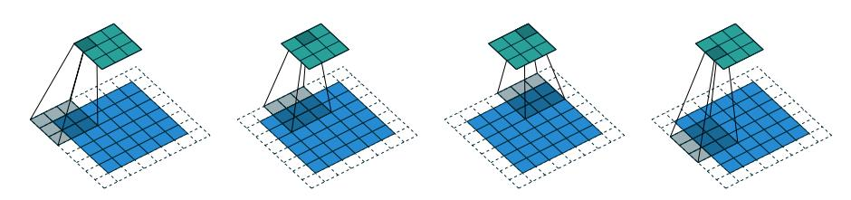

Figure 2.7: (Arbitrary padding and strides) Convolving a  $3 \times 3$  kernel over a  $6 \times 6$  input padded with a  $1 \times 1$  border of zeros using  $2 \times 2$  strides (i.e.,  $i = 6$ ,  $k = 3$ ,  $s = 2$  and  $p = 1$ ). In this case, the bottom row and right column of the zero padded input are not covered by the kernel.

| _ | ___ | _ __ |  |
|---|-----|---------|--|
|   |     |         |  |
|   |     |         |  |
|   |     |         |  |

|  | _ <b>STATE</b> |  |
|--|-------------------|--|
|  |                   |  |
|  |                   |  |
|  |                   |  |
|  |                   |  |

(a) The kernel has to slide two steps to the right to touch the right side of the input (and equivalently downwards). Adding one to account for the initial kernel position, the output size is  $3 \times 3$ .

(b) The kernel has to slide one step of size two to the right to touch the right side of the input (and equivalently downwards). Adding one to account for the initial kernel position, the output size is  $2\times 2.$ 

Figure 2.8: Counting kernel positions.

{17}------------------------------------------------

# Pooling arithmetic

In a neural network, pooling layers provide invariance to small translations of the input. The most common kind of pooling is max pooling, which consists in splitting the input in (usually non-overlapping) patches and outputting the maximum value of each patch. Other kinds of pooling exist, e.g., mean or average pooling, which all share the same idea of aggregating the input locally by applying a non-linearity to the content of some patches (Boureau  $et$   $al.$ ) 2010a, b, 2011; Saxe *et al.*, 2011).

Some readers may have noticed that the treatment of convolution arithmetic only relies on the assumption that some function is repeatedly applied onto subsets of the input. This means that the relationships derived in the previous chapter can be reused in the case of pooling arithmetic. Since pooling does not involve zero padding, the relationship describing the general case is as follows:

Relationship 7. For any  $i$ ,  $k$  and  $s$ ,  $o = \left\lfloor \frac{i-k}{s} \right\rfloor + 1.$ 

This relationship holds for any type of pooling.

{18}------------------------------------------------

# Transposed convolution arithmetic

The need for transposed convolutions generally arises from the desire to use a transformation going in the opposite direction of a normal convolution, i.e., from something that has the shape of the output of some convolution to something that has the shape of its input while maintaining a connectivity pattern that is compatible with said convolution. For instance, one might use such a transformation as the decoding layer of a convolutional autoencoder or to project feature maps to a higher-dimensional space.

Once again, the convolutional case is considerably more complex than the fully-connected case, which only requires to use a weight matrix whose shape has been transposed. However, since every convolution boils down to an efficient implementation of a matrix operation, the insights gained from the fully-connected case are useful in solving the convolutional case.

Like for convolution arithmetic, the dissertation about transposed convolution arithmetic is simplified by the fact that transposed convolution properties don't interact across axes.

The chapter will focus on the following setting:

- 2-D transposed convolutions  $(N = 2)$ ,
- square inputs  $(i_1 = i_2 = i),$
- square kernel size  $(k_1 = k_2 = k)$ ,
- same strides along both axes  $(s_1 = s_2 = s)$ ,
- same zero padding along both axes  $(p_1 = p_2 = p)$ .

Once again, the results outlined generalize to the N-D and non-square cases.

{19}------------------------------------------------

#### 4.1 Convolution as a matrix operation

Take for example the convolution represented in Figure 2.1. If the input and output were to be unrolled into vectors from left to right, top to bottom, the convolution could be represented as a sparse matrix  $C$  where the non-zero elements are the elements  $w_{i,j}$  of the kernel (with i and j being the row and column of the kernel respectively):

 $\overline{0}$  $\overline{0}$  $\overline{0}$  $w_{0,1}$   $w_{0,2}$  $w_{1,0}$   $w_{1,1}$   $w_{1,2}$  $w_{2,0}$   $w_{2,1}$   $w_{2,2}$  $w_{0,0}$  $w_{0,0}$   $w_{0,1}$   $w_{0,2}$   $w_{1,0}$   $w_{1,1}$   $w_{1,2}$   $w_{2,0}$   $w_{2,1}$   $w_{2,2}$   $w_{2,1}$   $w_{2,2}$   $w_{2,1}$   $w_{2,2}$   $w_{2,1}$   $w_{2,2}$   $w_{2,1}$   $w_{2,2}$   $w_{2,1}$   $w_{2,2}$   $w_{2,1}$   $w_{2,2}$   $w_{2,1}$   $w_{2,2}$   $w_{2,1}$   $w_{2,$  $\begin{matrix}0\\0\end{matrix}$  $\overline{0}$  $\overline{0}$ 

This linear operation takes the input matrix flattened as a 16-dimensional vector and produces a 4-dimensional vector that is later reshaped as the  $2 \times 2$ output matrix.

Using this representation, the backward pass is easily obtained by transposing C; in other words, the error is backpropagated by multiplying the loss with  $\mathbf{C}^T$ . This operation takes a 4-dimensional vector as input and produces a 16-dimensional vector as output, and its connectivity pattern is compatible with  $C$  by construction.

Notably, the kernel **w** defines both the matrices **C** and  $CT$  used for the forward and backward passes.

### 4.2 Transposed convolution

Let's now consider what would be required to go the other way around, i.e., map from a 4-dimensional space to a 16-dimensional space, while keeping the connectivity pattern of the convolution depicted in Figure 2.1. This operation is known as a *transposed convolution*.

Transposed convolutions – also called *fractionally strided convolutions* or  $deconvolutions1$  – work by swapping the forward and backward passes of a convolution. One way to put it is to note that the kernel defines a convolution, but whether it's a direct convolution or a transposed convolution is determined by how the forward and backward passes are computed.

For instance, although the kernel w defines a convolution whose forward and backward passes are computed by multiplying with  $C$  and  $CT$  respectively, it also defines a transposed convolution whose forward and backward passes are computed by multiplying with  $\mathbf{C}^T$  and  $(\mathbf{C}^T)^T = \mathbf{C}$  respectively.2

Finally note that it is always possible to emulate a transposed convolution with a direct convolution. The disadvantage is that it usually involves adding

 $1$ The term "deconvolution" is sometimes used in the literature, but we advocate against it on the grounds that a deconvolution is mathematically defined as the inverse of a convolution, which is different from a transposed convolution.

&lt;sup>2The transposed convolution operation can be thought of as the gradient of *some* convolution with respect to its input, which is usually how transposed convolutions are implemented in practice.

{20}------------------------------------------------

many columns and rows of zeros to the input, resulting in a much less efficient implementation.

Building on what has been introduced so far, this chapter will proceed somewhat backwards with respect to the convolution arithmetic chapter, deriving the properties of each transposed convolution by referring to the direct convolution with which it shares the kernel, and defining the equivalent direct convolution.

### 4.3 No zero padding, unit strides, transposed

The simplest way to think about a transposed convolution on a given input is to imagine such an input as being the result of a direct convolution applied on some initial feature map. The trasposed convolution can be then considered as the operation that allows to recover the *shape*  $3$  of this initial feature map.

Let's consider the convolution of a  $3 \times 3$  kernel on a  $4 \times 4$  input with unitary stride and no padding (i.e.,  $i = 4$ ,  $k = 3$ ,  $s = 1$  and  $p = 0$ ). As depicted in Figure 2.1, this produces a  $2 \times 2$  output. The transpose of this convolution will then have an output of shape  $4 \times 4$  when applied on a  $2 \times 2$  input.

Another way to obtain the result of a transposed convolution is to apply an equivalent – but much less efficient – direct convolution. The example described so far could be tackled by convolving a  $3 \times 3$  kernel over a  $2 \times 2$  input padded with a 2  $\times$  2 border of zeros using unit strides (i.e.,  $i' = 2$ ,  $k' = k$ ,  $s' = 1$  and  $p' = 2$ , as shown in Figure 4.1. Notably, the kernel's and stride's sizes remain the same, but the input of the transposed convolution is now zero padded.4

One way to understand the logic behind zero padding is to consider the connectivity pattern of the transposed convolution and use it to guide the design of the equivalent convolution. For example, the top left pixel of the input of the direct convolution only contribute to the top left pixel of the output, the top right pixel is only connected to the top right output pixel, and so on.

To maintain the same connectivity pattern in the equivalent convolution it is necessary to zero pad the input in such a way that the first (top-left) application of the kernel only touches the top-left pixel, i.e., the padding has to be equal to the size of the kernel minus one.

Proceeding in the same fashion it is possible to determine similar observations for the other elements of the image, giving rise to the following relationship:

 $3$ Note that the transposed convolution does not guarantee to recover the input itself, as it is not defined as the inverse of the convolution, but rather just returns a feature map that has the same width and height.

 $4$ Note that although equivalent to applying the transposed matrix, this visualization adds a lot of zero multiplications in the form of zero padding. This is done here for illustration purposes, but it is inefficient, and software implementations will normally not perform the useless zero multiplications.

{21}------------------------------------------------

**Relationship 8.** A convolution described by  $s = 1$ ,  $p = 0$  and k has an associated transposed convolution described by  $k' = k$ ,  $s' = s$ and  $p' = k - 1$  and its output size is

 $o' = i' + (k - 1).$ 

Interestingly, this corresponds to a fully padded convolution with unit strides.

### 4.4 Zero padding, unit strides, transposed

Knowing that the transpose of a non-padded convolution is equivalent to convolving a zero padded input, it would be reasonable to suppose that the transpose of a zero padded convolution is equivalent to convolving an input padded with less zeros.

It is indeed the case, as shown in Figure 4.2 for  $i = 5$ ,  $k = 4$  and  $p = 2$ . Formally, the following relationship applies for zero padded convolutions:

**Relationship 9.** A convolution described by  $s = 1$ , k and p has an associated transposed convolution described by  $k' = k$ ,  $s' = s$  and  $p' = k - p - 1$  and its output size is

$$
o' = i' + (k - 1) - 2p.
$$

#### Half (same) padding, transposed 4.4.1

By applying the same inductive reasoning as before, it is reasonable to expect that the equivalent convolution of the transpose of a half padded convolution is itself a half padded convolution, given that the output size of a half padded convolution is the same as its input size. Thus the following relation applies:

**Relationship 10.** A convolution described by  $k = 2n + 1$ ,  $n \in \mathbb{N}$ ,  $s = 1$  and  $p = \lfloor k/2 \rfloor = n$  has an associated transposed convolution described by  $k' = k$ ,  $s' = s$  and  $p' = p$  and its output size is  $o' = i' + (k - 1) - 2p$  $= i' + 2n - 2n$  $= i'.$ 

Figure 4.3 provides an example for  $i = 5$ ,  $k = 3$  and (therefore)  $p = 1$ .

#### 4.4.2 Full padding, transposed

Knowing that the equivalent convolution of the transpose of a non-padded convolution involves full padding, it is unsurprising that the equivalent of the transpose of a fully padded convolution is a non-padded convolution:

{22}------------------------------------------------

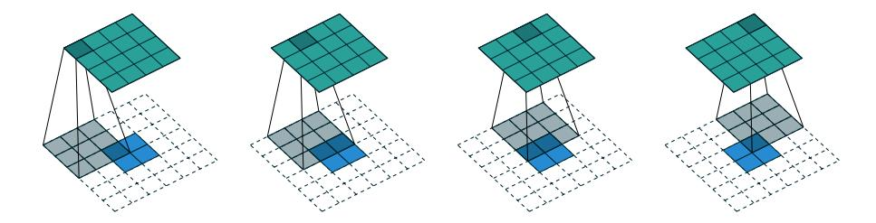

Figure 4.1: The transpose of convolving a  $3 \times 3$  kernel over a  $4 \times 4$  input using unit strides (i.e.,  $i = 4$ ,  $k = 3$ ,  $s = 1$  and  $p = 0$ ). It is equivalent to convolving a  $3\times 3$  kernel over a  $2\times 2$  input padded with a  $2\times 2$  border of zeros using unit strides (i.e.,  $i' = 2$ ,  $k' = k$ ,  $s' = 1$  and  $p' = 2$ ).

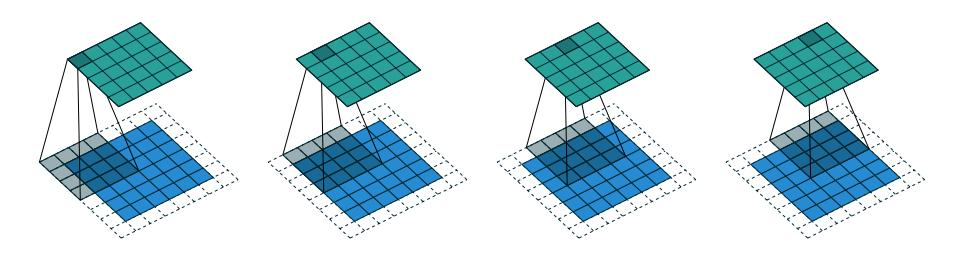

Figure 4.2: The transpose of convolving a  $4 \times 4$  kernel over a  $5 \times 5$  input padded with a 2  $\times$  2 border of zeros using unit strides (i.e.,  $i = 5$ ,  $k = 4$ ,  $s = 1$  and  $p = 2$ ). It is equivalent to convolving a  $4 \times 4$  kernel over a  $6 \times 6$  input padded with a  $1 \times 1$  border of zeros using unit strides (i.e.,  $i' = 6$ ,  $k' = k$ ,  $s' = 1$  and  $p'=1$ .

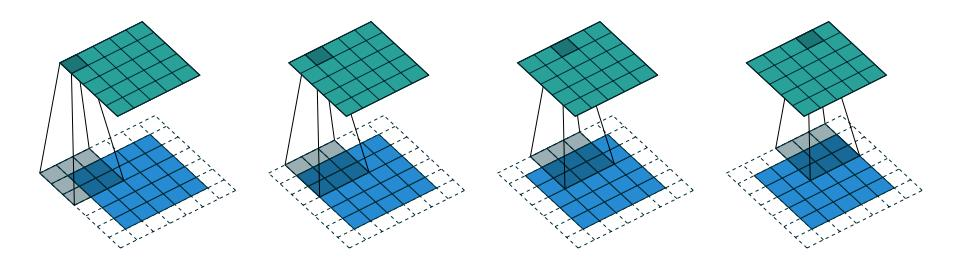

Figure 4.3: The transpose of convolving a  $3 \times 3$  kernel over a  $5 \times 5$  input using half padding and unit strides (i.e.,  $i = 5$ ,  $k = 3$ ,  $s = 1$  and  $p = 1$ ). It is equivalent to convolving a  $3 \times 3$  kernel over a  $5 \times 5$  input using half padding and unit strides (i.e.,  $i' = 5$ ,  $k' = k$ ,  $s' = 1$  and  $p' = 1$ ).

{23}------------------------------------------------

**Relationship 11.** A convolution described by  $s = 1$ , k and  $p = k-1$ has an associated transposed convolution described by  $k' = k$ ,  $s' = s$ and  $p' = 0$  and its output size is

$$
o' = i' + (k - 1) - 2p
$$
  
=  $i' - (k - 1)$ 

Figure 4.4 provides an example for  $i = 5$ ,  $k = 3$  and (therefore)  $p = 2$ .

#### 4.5 No zero padding, non-unit strides, transposed

Using the same kind of inductive logic as for zero padded convolutions, one might expect that the transpose of a convolution with  $s > 1$  involves an equivalent convolution with  $s < 1$ . As will be explained, this is a valid intuition, which is why transposed convolutions are sometimes called *fractionally strided convolutions.* 

Figure 4.5 provides an example for  $i = 5$ ,  $k = 3$  and  $s = 2$  which helps understand what fractional strides involve: zeros are inserted between input units, which makes the kernel move around at a slower pace than with unit strides.5

For the moment, it will be assumed that the convolution is non-padded  $(p = 0)$  and that its input size i is such that  $i - k$  is a multiple of s. In that case, the following relationship holds:

**Relationship 12.** A convolution described by  $p = 0$ , k and s and whose input size is such that  $i-k$  is a multiple of s, has an associated transposed convolution described by  $\tilde{i}'$ ,  $k' = k$ ,  $s' = 1$  and  $p' = k - 1$ , where  $\tilde{i}'$  is the size of the stretched input obtained by adding  $s-1$ zeros between each input unit, and its output size is

$$
o' = s(i'-1) + k.
$$

### 4.6 Zero padding, non-unit strides, transposed

When the convolution's input size i is such that  $i + 2p - k$  is a multiple of s, the analysis can extended to the zero padded case by combining Relationship 9 and Relationship 12:

 $5$ Doing so is inefficient and real-world implementations avoid useless multiplications by zero, but conceptually it is how the transpose of a strided convolution can be thought of.

{24}------------------------------------------------

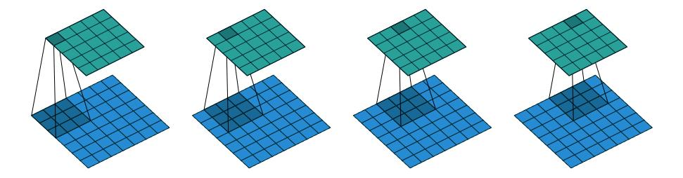

Figure 4.4: The transpose of convolving a  $3 \times 3$  kernel over a  $5 \times 5$  input using full padding and unit strides (i.e.,  $i = 5$ ,  $k = 3$ ,  $s = 1$  and  $p = 2$ ). It is equivalent to convolving a  $3 \times 3$  kernel over a  $7 \times 7$  input using unit strides (i.e.,  $i' = 7$ ,  $k' = k, s' = 1$  and  $p' = 0$ ).

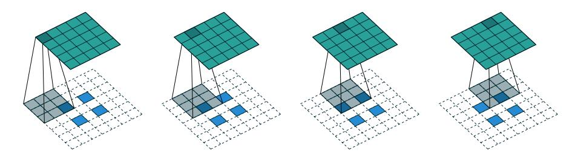

Figure 4.5: The transpose of convolving a  $3 \times 3$  kernel over a  $5 \times 5$  input using  $2 \times 2$  strides (i.e.,  $i = 5$ ,  $k = 3$ ,  $s = 2$  and  $p = 0$ ). It is equivalent to convolving a  $3 \times 3$  kernel over a  $2 \times 2$  input (with 1 zero inserted between inputs) padded with a 2 × 2 border of zeros using unit strides (i.e.,  $i' = 2$ ,  $\tilde{i}' = 3$ ,  $k' = k$ ,  $s' = 1$ and  $p'=2$ ).

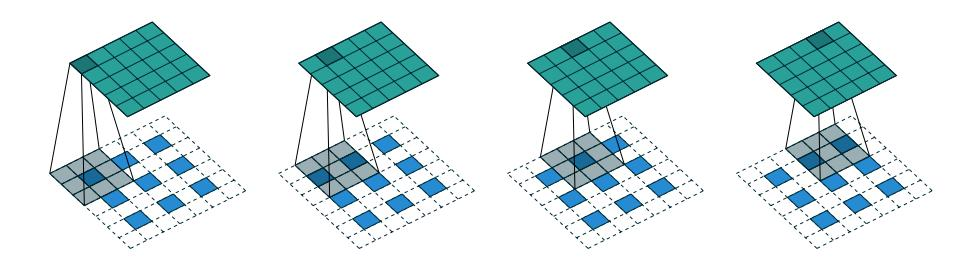

Figure 4.6: The transpose of convolving a  $3 \times 3$  kernel over a  $5 \times 5$  input padded with a  $1 \times 1$  border of zeros using  $2 \times 2$  strides (i.e.,  $i = 5$ ,  $k = 3$ ,  $s = 2$  and  $p = 1$ ). It is equivalent to convolving a  $3 \times 3$  kernel over a  $3 \times 3$  input (with 1 zero inserted between inputs) padded with a  $1 \times 1$  border of zeros using unit strides (i.e.,  $i' = 3$ ,  $\tilde{i}' = 5$ ,  $k' = k$ ,  $s' = 1$  and  $p' = 1$ ).

{25}------------------------------------------------

**Relationship 13.** A convolution described by  $k$ ,  $s$  and  $p$  and whose input size i is such that  $i+2p-k$  is a multiple of s has an associated transposed convolution described by  $\tilde{i}'$ ,  $k' = k$ ,  $s' = 1$  and  $p' =$  $k-p-1$ , where  $\tilde{i}'$  is the size of the stretched input obtained by adding  $s-1$  zeros between each input unit, and its output size is

$$
o' = s(i'-1) + k - 2p.
$$

Figure 4.6 provides an example for  $i = 5$ ,  $k = 3$ ,  $s = 2$  and  $p = 1$ .

The constraint on the size of the input  $i$  can be relaxed by introducing another parameter  $a \in \{0, \ldots, s-1\}$  that allows to distinguish between the s different cases that all lead to the same  $i'$ :

Relationship 14. A convolution described by  $k$ ,  $s$  and  $p$  has an associated transposed convolution described by a,  $\tilde{i}'$ ,  $k' = k$ ,  $s' = 1$ and  $p' = k - p - 1$ , where i' is the size of the stretched input obtained by adding  $s-1$  zeros between each input unit, and  $a = (i + 2p - k)$ mod s represents the number of zeros added to the bottom and right edges of the input, and its output size is

$$
o' = s(i'-1) + a + k - 2p.
$$

Figure 4.7 provides an example for  $i = 6$ ,  $k = 3$ ,  $s = 2$  and  $p = 1$ .

{26}------------------------------------------------

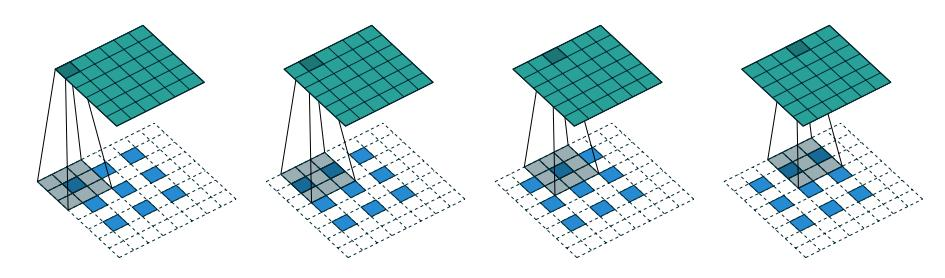

Figure 4.7: The transpose of convolving a  $3 \times 3$  kernel over a  $6 \times 6$  input padded with a  $1 \times 1$  border of zeros using  $2 \times 2$  strides (i.e.,  $i = 6, k = 3, s = 2$  and  $p = 1$ ). It is equivalent to convolving a  $3 \times 3$  kernel over a  $2 \times 2$  input (with 1 zero inserted between inputs) padded with a  $1 \times 1$  border of zeros (with an additional border of size 1 added to the bottom and right edges) using unit strides (i.e.,  $i' = 3$ ,  $\tilde{i}' = 5$ ,  $a = 1$ ,  $k' = k$ ,  $s' = 1$  and  $p' = 1$ ).

{27}------------------------------------------------

## Miscellaneous convolutions

### $5.1$ Dilated convolutions

Readers familiar with the deep learning literature may have noticed the term "dilated convolutions" (or "atrous convolutions", from the French expression con*volutions* à *trous*) appear in recent papers. Here we attempt to provide an intuitive understanding of dilated convolutions. For a more in-depth description and to understand in what contexts they are applied, see Chen  $et al. (2014); Yu$ and Koltun  $(2015)$ .

Dilated convolutions "inflate" the kernel by inserting spaces between the kernel elements. The dilation "rate" is controlled by an additional hyperparameter d. Implementations may vary, but there are usually  $d-1$  spaces inserted between kernel elements such that  $d=1$  corresponds to a regular convolution.

Dilated convolutions are used to cheaply increase the receptive field of output units without increasing the kernel size, which is especially effective when multiple dilated convolutions are stacked one after another. For a concrete example, see Oord *et al.* (2016), in which the proposed WaveNet model implements an autoregressive generative model for raw audio which uses dilated convolutions to condition new audio frames on a large context of past audio frames.

To understand the relationship tying the dilation rate  $d$  and the output size  $o$ , it is useful to think of the impact of  $d$  on the *effective kernel size*. A kernel of size  $k$  dilated by a factor  $d$  has an effective size

$$
\hat{k} = k + (k - 1)(d - 1).
$$

This can be combined with Relationship 6 to form the following relationship for dilated convolutions:

Relationship 15. For any  $i$ ,  $k$ ,  $p$  and  $s$ , and  $for$  a dilation rate  $d$ ,  $o = \left| \frac{i + 2p - k - (k - 1)(d - 1)}{s} \right| + 1.$ 

{28}------------------------------------------------

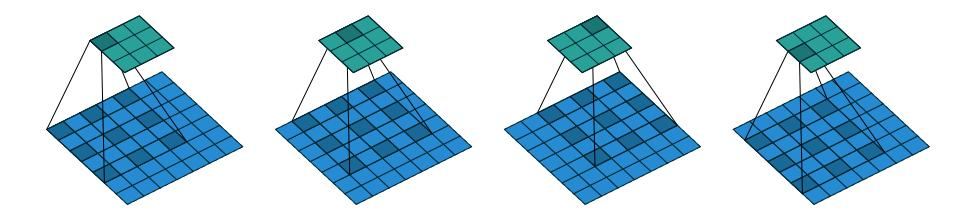

Figure 5.1: (Dilated convolution) Convolving a  $3\times3$  kernel over a  $7\times7$  input with a dilation factor of 2 (i.e.,  $i = 7$ ,  $k = 3$ ,  $d = 2$ ,  $s = 1$  and  $p = 0$ ).

Figure 5.1 provides an example for  $i=7,\,k=3$  and  $d=2.$ 

{29}------------------------------------------------

## **Bibliography**

- Abadi, M., Agarwal, A., Barham, P., Brevdo, E., Chen, Z., Citro, C., Corrado, G. S., Davis, A., Dean, J., Devin, M., et al. (2015). Tensorflow: Largescale machine learning on heterogeneous systems. Software available from  $tensor flow.org.$
- Bastien, F., Lamblin, P., Pascanu, R., Bergstra, J., Goodfellow, I., Bergeron, A., Bouchard, N., Warde-Farley, D., and Bengio, Y. (2012). Theano: new features and speed improvements.  $arXiv$  preprint  $arXiv:1211.5590$ .
- Bergstra, J., Breuleux, O., Bastien, F., Lamblin, P., Pascanu, R., Desjardins, G., Turian, J., Warde-Farley, D., and Bengio, Y. (2010). Theano: A cpu and gpu math compiler in python. In Proc. 9th Python in Science Conf, pages  $1 - 7$ .
- Boureau, Y., Bach, F., LeCun, Y., and Ponce, J. (2010a). Learning mid-level features for recognition. In Proc. International Conference on Computer Vision and Pattern Recognition  $(CVPR'10)$ . IEEE.
- Boureau, Y., Ponce, J., and LeCun, Y. (2010b). A theoretical analysis of feature pooling in vision algorithms. In Proc. International Conference on Machine learning  $(ICML'10)$ .
- Boureau, Y., Le Roux, N., Bach, F., Ponce, J., and LeCun, Y. (2011). Ask the locals: multi-way local pooling for image recognition. In *Proc. International* Conference on Computer Vision (ICCV'11). IEEE.
- Chen, L.-C., Papandreou, G., Kokkinos, I., Murphy, K., and Yuille, A. L. (2014). Semantic image segmentation with deep convolutional nets and fully connected crfs.  $arXiv$  preprint  $arXiv:1412.7062$ .
- Collobert, R., Kavukcuoglu, K., and Farabet, C. (2011). Torch7: A matlab-like environment for machine learning. In BigLearn, NIPS Workshop, number EPFL-CONF-192376.
- Goodfellow, I., Bengio, Y., and Courville, A. (2016). Deep learning. Book in preparation for MIT Press.

{30}------------------------------------------------

- Im, D. J., Kim, C. D., Jiang, H., and Memisevic, R. (2016). Generating images with recurrent adversarial networks.  $arXiv$  preprint  $arXiv:1602.05110$ .
- Jia, Y., Shelhamer, E., Donahue, J., Karayev, S., Long, J., Girshick, R., Guadarrama, S., and Darrell, T. (2014). Caffe: Convolutional architecture for fast feature embedding. In Proceedings of the ACM International Conference on Multimedia, pages 675–678. ACM.
- Krizhevsky, A., Sutskever, I., and Hinton, G. E. (2012). Imagenet classification with deep convolutional neural networks. In Advances in neural information processing systems, pages 1097-1105.
- Le Cun, Y., Bottou, L., and Bengio, Y. (1997). Reading checks with multilayer graph transformer networks. In Acoustics, Speech, and Signal Processing, 1997. ICASSP-97., 1997 IEEE International Conference on, volume 1, pages 151-154. IEEE.
- Long, J., Shelhamer, E., and Darrell, T. (2015). Fully convolutional networks for semantic segmentation. In Proceedings of the IEEE Conference on Computer *Vision and Pattern Recognition, pages 3431-3440.*
- Oord, A. v. d., Dieleman, S., Zen, H., Simonyan, K., Vinyals, O., Graves, A., Kalchbrenner, N., Senior, A., and Kavukcuoglu, K. (2016). Wavenet: A generative model for raw audio.  $arXiv$  preprint  $arXiv:1609.03499$ .
- Radford, A., Metz, L., and Chintala, S. (2015). Unsupervised representation learning with deep convolutional generative adversarial networks.  $arXiv$ preprint  $arXiv:1511.06434$ .
- Saxe, A., Koh, P. W., Chen, Z., Bhand, M., Suresh, B., and Ng, A. (2011). On random weights and unsupervised feature learning. In L. Getoor and T. Scheffer, editors, *Proceedings of the 28th International Conference on Ma*chine Learning (ICML-11), ICML '11, pages 1089-1096, New York, NY, USA. ACM.
- Visin, F., Kastner, K., Courville, A. C., Bengio, Y., Matteucci, M., and Cho, K. (2015). Reseg: A recurrent neural network for object segmentation.
- Yu, F. and Koltun, V. (2015). Multi-scale context aggregation by dilated convolutions. arXiv preprint arXiv:1511.07122.
- Zeiler, M. D. and Fergus, R. (2014). Visualizing and understanding convolutional networks. In *Computer vision-ECCV 2014*, pages 818-833. Springer.
- Zeiler, M. D., Taylor, G. W., and Fergus, R. (2011). Adaptive deconvolutional networks for mid and high level feature learning. In *Computer Vision (ICCV)*, 2011 IEEE International Conference on, pages 2018-2025. IEEE.