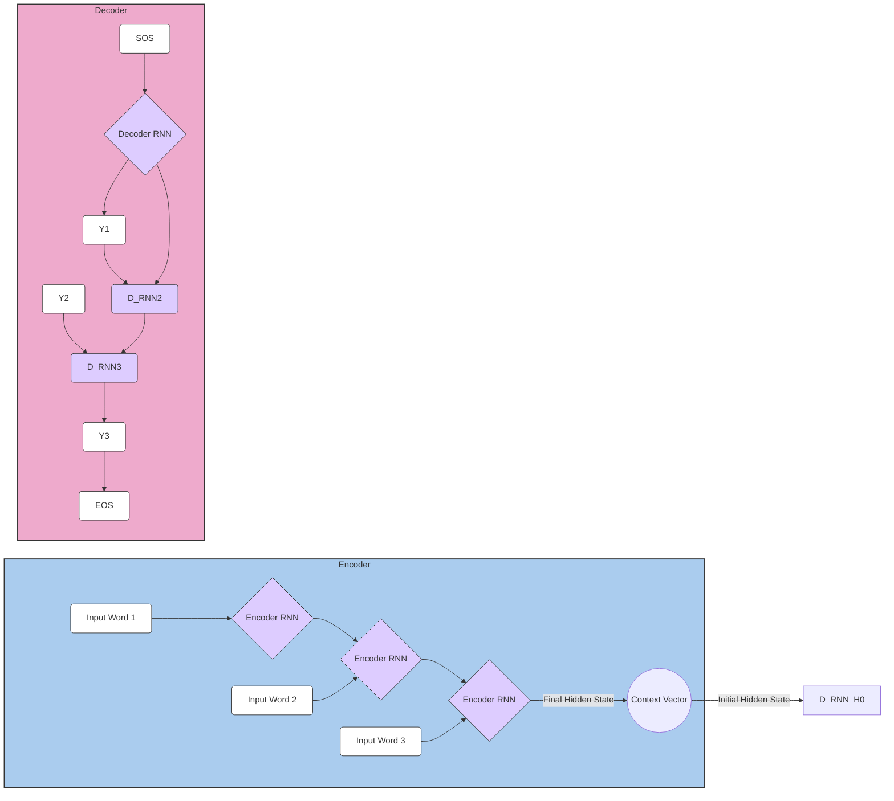

# Recurrent Neural Networks: The "Memory Masters" of Sequences
# 循环神经网络：序列的"记忆大师"

## 1. Why Do We Need RNNs?
## 1. 为什么需要RNN？

### 1.1 Limitations of Traditional Networks for Sequential Data
### 1.1 传统网络处理序列数据的局限性

Traditional feedforward networks and CNNs process inputs independently, treating each input as an isolated data point. This approach fails for sequential data where the order and context matter.
传统前馈网络和CNN独立处理输入，将每个输入视为孤立的数据点。这种方法对于顺序和上下文很重要的序列数据是失败的。

**Example: Sentiment Analysis**
**例子：情感分析**

Consider these two sentences:
考虑这两个句子：

1. "The movie was not bad" (Positive sentiment)
   "这部电影不错"（积极情感）

2. "The movie was not good" (Negative sentiment) 
   "这部电影不好"（消极情感）

A traditional network processing word-by-word would see the same words ["movie", "was", "not"] but miss the crucial difference in the final word that determines the sentiment.
传统网络逐词处理会看到相同的词["movie", "was", "not"]，但会错过决定情感的最后一个词的关键差异。

### 1.2 Sequential Data Characteristics
### 1.2 序列数据特性

Sequential data has two key properties:
序列数据有两个关键属性：

1. **Order Dependency**: The position of elements matters
   **顺序依赖性**：元素的位置很重要

2. **Context Sensitivity**: Current output depends on previous inputs
   **上下文敏感性**：当前输出依赖于先前的输入

**Analogy: Reading a Sentence**
**类比：阅读句子**

When you read "The cat sat on the...", you naturally expect words like "mat", "chair", or "floor" next, not "flying" or "swimming". This expectation comes from understanding the context built up from previous words.
当你读到"The cat sat on the..."时，你自然期望接下来是"mat"、"chair"或"floor"这样的词，而不是"flying"或"swimming"。这种期望来自于对前面单词建立的上下文的理解。

## 2. RNN Structure and Working Principle
## 2. RNN的结构与工作原理

### 2.1 The Core Architecture: "Unfolding the Time Loop"
### 2.1 核心架构："展开时间循环"

The fundamental innovation of RNNs lies in their ability to process sequences by maintaining a hidden state that carries information from previous time steps. Unlike feedforward networks that process inputs independently, RNNs create a "memory" mechanism through recurrent connections.
RNN的根本创新在于它们通过维护一个携带先前时间步信息的隐藏状态来处理序列的能力。与独立处理输入的前馈网络不同，RNN通过循环连接创建了一个"记忆"机制。

**The Unfolded RNN Visualization:**
**展开的RNN可视化：**

```
Input:    x₁ → x₂ → x₃ → x₄ → x₅
          ↓    ↓    ↓    ↓    ↓
Hidden:  h₁ → h₂ → h₃ → h₄ → h₅
          ↓    ↓    ↓    ↓    ↓
Output:  y₁   y₂   y₃   y₄   y₅
```

**Mathematical Foundation:**
**数学基础：**

At each time step $t$, the RNN computes:
在每个时间步$t$，RNN计算：

$$h_t = f(W_{hh} h_{t-1} + W_{xh} x_t + b_h)$$
$$y_t = W_{hy} h_t + b_y$$

Where:
其中：
- $f$ is typically $\tanh$ or $\text{ReLU}$ activation function (通常是$\tanh$或$\text{ReLU}$激活函数)
- $W_{hh}$: Hidden-to-hidden recurrent weights (隐藏到隐藏的循环权重)
- $W_{xh}$: Input-to-hidden weights (输入到隐藏权重)
- $W_{hy}$: Hidden-to-output weights (隐藏到输出权重)
- $b_h, b_y$: Bias terms (偏置项)

**Life Analogy: A Secretary with a Notebook**
**生活类比：带记事本的秘书**

想象一个秘书在会议中做记录。每当有新信息时，她会：
1. 查看她的记事本（前一个隐藏状态 $h_{t-1}$）
2. 听取新信息（当前输入 $x_t$）
3. 更新她的记事本（计算新的隐藏状态 $h_t$）
4. 根据更新后的记事本做出响应（输出 $y_t$）

这个过程持续整个会议，秘书的记事本积累了所有先前的信息，使她能够在任何时候提供有上下文的响应。

### 2.2 Detailed Mathematical Walkthrough
### 2.2 详细数学演示

Let's trace through a concrete example processing the word sequence "deep learning rocks":
让我们通过一个处理词序列"deep learning rocks"的具体例子来跟踪：

**Setup Parameters:**
**设置参数：**
- Vocabulary: {deep:0, learning:1, rocks:2, <pad>:3}
- Hidden size: 3
- Input size: 4 (one-hot encoded)

**Weight Matrices:**
**权重矩阵：**
$$W_{xh} = \begin{bmatrix} 0.1 & 0.2 & 0.3 \\ 0.4 & 0.5 & 0.6 \\ 0.7 & 0.8 & 0.9 \\ 0.2 & 0.3 & 0.4 \end{bmatrix}$$

$$W_{hh} = \begin{bmatrix} 0.1 & 0.2 & 0.3 \\ 0.4 & 0.5 & 0.6 \\ 0.7 & 0.8 & 0.9 \end{bmatrix}$$

$$W_{hy} = \begin{bmatrix} 0.5 & 0.6 & 0.7 \\ 0.8 & 0.9 & 1.0 \\ 1.1 & 1.2 & 1.3 \\ 1.4 & 1.5 & 1.6 \end{bmatrix}$$

**Bias vectors:**
**偏置向量：**
$$b_h = \begin{bmatrix} 0.1 \\ 0.2 \\ 0.3 \end{bmatrix}, \quad b_y = \begin{bmatrix} 0.1 \\ 0.1 \\ 0.1 \\ 0.1 \end{bmatrix}$$

**Step-by-Step Computation:**
**逐步计算：**

**Time Step 1: Processing "deep"**
**时间步1：处理"deep"**

Input: $x_1 = [1, 0, 0, 0]^T$ (one-hot for "deep")
输入：$x_1 = [1, 0, 0, 0]^T$（"deep"的独热编码）

Initial hidden state: $h_0 = [0, 0, 0]^T$
初始隐藏状态：$h_0 = [0, 0, 0]^T$

$$h_1 = \tanh(W_{hh} h_0 + W_{xh} x_1 + b_h)$$

$$= \tanh\left(\begin{bmatrix} 0.1 & 0.2 & 0.3 \\ 0.4 & 0.5 & 0.6 \\ 0.7 & 0.8 & 0.9 \end{bmatrix} \begin{bmatrix} 0 \\ 0 \\ 0 \end{bmatrix} + \begin{bmatrix} 0.1 \\ 0.4 \\ 0.7 \end{bmatrix} + \begin{bmatrix} 0.1 \\ 0.2 \\ 0.3 \end{bmatrix}\right)$$

$$= \tanh\left(\begin{bmatrix} 0 \\ 0 \\ 0 \end{bmatrix} + \begin{bmatrix} 0.1 \\ 0.4 \\ 0.7 \end{bmatrix} + \begin{bmatrix} 0.1 \\ 0.2 \\ 0.3 \end{bmatrix}\right) = \tanh\left(\begin{bmatrix} 0.2 \\ 0.6 \\ 1.0 \end{bmatrix}\right)$$

$$h_1 = \begin{bmatrix} 0.197 \\ 0.537 \\ 0.762 \end{bmatrix}$$

Output computation:
输出计算：

$$y_1 = W_{hy} h_1 + b_y = \begin{bmatrix} 0.5 & 0.6 & 0.7 \\ 0.8 & 0.9 & 1.0 \\ 1.1 & 1.2 & 1.3 \\ 1.4 & 1.5 & 1.6 \end{bmatrix} \begin{bmatrix} 0.197 \\ 0.537 \\ 0.762 \end{bmatrix} + \begin{bmatrix} 0.1 \\ 0.1 \\ 0.1 \\ 0.1 \end{bmatrix}$$

$$= \begin{bmatrix} 0.955 \\ 1.332 \\ 1.708 \\ 2.085 \end{bmatrix}$$

**Time Step 2: Processing "learning"**
**时间步2：处理"learning"**

Input: $x_2 = [0, 1, 0, 0]^T$ (one-hot for "learning")
输入：$x_2 = [0, 1, 0, 0]^T$（"learning"的独热编码）

$$h_2 = \tanh(W_{hh} h_1 + W_{xh} x_2 + b_h)$$

$$= \tanh\left(\begin{bmatrix} 0.1 & 0.2 & 0.3 \\ 0.4 & 0.5 & 0.6 \\ 0.7 & 0.8 & 0.9 \end{bmatrix} \begin{bmatrix} 0.197 \\ 0.537 \\ 0.762 \end{bmatrix} + \begin{bmatrix} 0.2 \\ 0.5 \\ 0.8 \end{bmatrix} + \begin{bmatrix} 0.1 \\ 0.2 \\ 0.3 \end{bmatrix}\right)$$

$$= \tanh\left(\begin{bmatrix} 0.356 \\ 0.845 \\ 1.334 \end{bmatrix} + \begin{bmatrix} 0.2 \\ 0.5 \\ 0.8 \end{bmatrix} + \begin{bmatrix} 0.1 \\ 0.2 \\ 0.3 \end{bmatrix}\right)$$

$$h_2 = \tanh\left(\begin{bmatrix} 0.656 \\ 1.545 \\ 2.434 \end{bmatrix}\right) = \begin{bmatrix} 0.577 \\ 0.915 \\ 0.987 \end{bmatrix}$$

**Key Observation:**
**关键观察：**
Notice how $h_2$ contains information from both "deep" and "learning". The hidden state acts as a compressed representation of the entire sequence history up to the current point.
注意$h_2$如何包含来自"deep"和"learning"的信息。隐藏状态作为到当前点的整个序列历史的压缩表示。

### 2.3 The Hidden State: RNN's Memory Mechanism
### 2.3 隐藏状态：RNN的记忆机制

The hidden state $h_t$ is the cornerstone of RNN's ability to process sequences. It serves multiple crucial functions:
隐藏状态$h_t$是RNN处理序列能力的基石。它发挥多个关键功能：

**1. Information Integration**
**1. 信息整合**

The hidden state combines current input with historical information:
隐藏状态将当前输入与历史信息结合：

$$h_t = f(\text{Current Input} + \text{Previous Memory} + \text{Bias})$$

**2. Selective Memory**
**2. 选择性记忆**

Through training, the network learns which information to retain and which to forget. The weights $W_{hh}$ determine how much of the previous state to keep.
通过训练，网络学习保留哪些信息和忘记哪些信息。权重$W_{hh}$决定保留多少先前状态。

**3. Context Representation**
**3. 上下文表示**

The hidden state encodes the context needed for making predictions about future elements in the sequence.
隐藏状态编码了预测序列中未来元素所需的上下文。

**Analogy: A Running Summary**
**类比：运行摘要**

Think of the hidden state as a running summary of a book you're reading:
将隐藏状态想象为你正在阅读的书的运行摘要：

- **Chapter 1**: Hidden state contains: "Hero introduced, lives in village"
  **第1章**：隐藏状态包含："英雄介绍，住在村庄"

- **Chapter 2**: Hidden state updates to: "Hero leaves village, meets mentor"
  **第2章**：隐藏状态更新为："英雄离开村庄，遇到导师"

- **Chapter 3**: Hidden state becomes: "Hero trained, receives quest"
  **第3章**：隐藏状态变为："英雄训练，接受任务"

Each chapter adds new information while maintaining relevant context from previous chapters.
每一章都添加新信息，同时保持前面章节的相关上下文。

### 2.4 Weight Matrices and Their Roles
### 2.4 权重矩阵及其作用

**Input-to-Hidden Weights ($W_{xh}$):**
**输入到隐藏权重（$W_{xh}$）：**

These weights determine how the current input influences the hidden state. They can be thought of as "feature detectors" that extract relevant patterns from the input.
这些权重决定当前输入如何影响隐藏状态。它们可以被视为从输入中提取相关模式的"特征检测器"。

**Hidden-to-Hidden Weights ($W_{hh}$):**
**隐藏到隐藏权重（$W_{hh}$）：**

These are the "memory weights" that control how information flows from one time step to the next. They determine:
这些是控制信息如何从一个时间步流向下一个时间步的"记忆权重"。它们决定：

- **Information Retention**: How much of the previous state to keep
  **信息保留**：保留多少先前状态
- **Information Transformation**: How to modify the retained information
  **信息转换**：如何修改保留的信息
- **Temporal Dependencies**: What patterns to look for across time
  **时间依赖**：跨时间寻找什么模式

**Hidden-to-Output Weights ($W_{hy}$):**
**隐藏到输出权重（$W_{hy}$）：**

These weights project the hidden state to the output space, essentially "reading" the memory to make predictions.
这些权重将隐藏状态投影到输出空间，本质上是"读取"记忆来进行预测。

### 2.5 Activation Functions: The Nonlinear Transformers
### 2.5 激活函数：非线性变换器

**Tanh Activation (Most Common):**
**Tanh激活（最常见）：**

$$\tanh(x) = \frac{e^x - e^{-x}}{e^x + e^{-x}}$$

**Properties:**
**属性：**
- Range: $(-1, 1)$ (有界输出)
- Zero-centered (零中心化)
- Smooth gradient (平滑梯度)

**Why Tanh for RNNs?**
**为什么RNN使用Tanh？**

The bounded output of tanh helps prevent the hidden state from growing too large, which could lead to exploding gradients. The zero-centered property helps with gradient flow.
tanh的有界输出有助于防止隐藏状态变得过大，这可能导致梯度爆炸。零中心化属性有助于梯度流动。

**Alternative: ReLU Activation**
**替代方案：ReLU激活**

$$\text{ReLU}(x) = \max(0, x)$$

**Pros and Cons:**
**优缺点：**
- ✅ Faster computation (更快计算)
- ✅ Helps with vanishing gradients (有助于梯度消失)
- ❌ Unbounded output (无界输出)
- ❌ Can lead to exploding gradients (可能导致梯度爆炸)

### 2.6 Information Flow Analysis
### 2.6 信息流分析

Understanding how information flows through an RNN helps us grasp its capabilities and limitations:
理解信息如何通过RNN流动有助于我们掌握其能力和局限性：

**Forward Information Flow:**
**前向信息流：**

```
x₁ → h₁ → y₁
     ↓
x₂ → h₂ → y₂
     ↓
x₃ → h₃ → y₃
```

At each step, information from $x_t$ is combined with information from all previous time steps (stored in $h_{t-1}$).
在每一步，来自$x_t$的信息与来自所有先前时间步的信息（存储在$h_{t-1}$中）结合。

**Gradient Flow (Backward):**
**梯度流（反向）：**

During backpropagation, gradients flow backward through time:
在反向传播期间，梯度通过时间向后流动：

$$\frac{\partial L}{\partial h_t} = \frac{\partial L}{\partial y_t} \frac{\partial y_t}{\partial h_t} + \frac{\partial L}{\partial h_{t+1}} \frac{\partial h_{t+1}}{\partial h_t}$$

**The Chain Rule Expansion:**
**链式法则展开：**

For a sequence of length $T$, the gradient with respect to early parameters involves a long chain of matrix multiplications:
对于长度为$T$的序列，关于早期参数的梯度涉及一长串矩阵乘法：

$$\frac{\partial L}{\partial W_{hh}} = \sum_{t=1}^{T} \sum_{k=1}^{t} \frac{\partial L}{\partial h_t} \prod_{j=k+1}^{t} \frac{\partial h_j}{\partial h_{j-1}}$$

This is where the vanishing/exploding gradient problem originates.
这就是梯度消失/爆炸问题的起源。

### 2.7 Practical Implementation Considerations
### 2.7 实际实现考虑

**Batch Processing:**
**批处理：**

In practice, we process multiple sequences simultaneously:
在实践中，我们同时处理多个序列：

```python
# Batch dimensions
batch_size = 32
sequence_length = 10
input_size = 100
hidden_size = 256

# Input shape: (batch_size, sequence_length, input_size)
x = torch.randn(32, 10, 100)

# Hidden state shape: (batch_size, hidden_size)
h = torch.randn(32, 256)
```

**Sequence Padding:**
**序列填充：**

Since sequences have different lengths, we pad shorter sequences with special tokens:
由于序列有不同的长度，我们用特殊标记填充较短的序列：

```python
# Example sequences
seq1 = ["hello", "world"]           # length 2
seq2 = ["deep", "learning", "rocks"] # length 3

# After padding to length 3
seq1_padded = ["hello", "world", "<PAD>"]
seq2_padded = ["deep", "learning", "rocks"]
```

**Masking:**
**掩码：**

We use masks to ignore padded positions during loss computation:
我们使用掩码在损失计算期间忽略填充位置：

```python
# Mask: 1 for real tokens, 0 for padding
mask1 = [1, 1, 0]  # Ignore last position
mask2 = [1, 1, 1]  # Use all positions

# Apply mask to loss
loss = criterion(predictions, targets) * mask
```

### 2.8 Computational Complexity Analysis
### 2.8 计算复杂度分析

**Time Complexity:**
**时间复杂度：**

For a sequence of length $T$ with hidden size $H$ and input size $D$:
对于长度为$T$、隐藏大小为$H$、输入大小为$D$的序列：

- **Forward pass**: $O(T \cdot H^2 + T \cdot H \cdot D)$
- **Backward pass**: $O(T \cdot H^2 + T \cdot H \cdot D)$

**Space Complexity:**
**空间复杂度：**

- **Parameters**: $O(H^2 + H \cdot D + H \cdot V)$ where $V$ is vocabulary size
- **Activations**: $O(T \cdot H)$ for storing hidden states

**Comparison with Feedforward Networks:**
**与前馈网络的比较：**

| Aspect | Feedforward | RNN |
|--------|-------------|-----|
| Parameters | $O(D \cdot H)$ | $O(H^2 + D \cdot H)$ |
| Computation | $O(D \cdot H)$ | $O(T \cdot H^2)$ |
| Memory | $O(H)$ | $O(T \cdot H)$ |

The key difference is that RNNs have $O(H^2)$ recurrent parameters and $O(T)$ sequential computation steps.
关键区别是RNN有$O(H^2)$个循环参数和$O(T)$个序列计算步骤。

### 2.9 Visualization of RNN Dynamics
### 2.9 RNN动态可视化

**Hidden State Evolution:**
**隐藏状态演化：**

Consider how the hidden state changes as we process "The cat sat on the mat":
考虑当我们处理"The cat sat on the mat"时隐藏状态如何变化：

```
Time Step 1: "The"
h₁ = [0.2, -0.1, 0.3]  # Encodes: "Article detected"

Time Step 2: "cat"  
h₂ = [0.4, 0.2, -0.1]  # Encodes: "Article + noun, likely subject"

Time Step 3: "sat"
h₃ = [0.1, 0.5, 0.2]   # Encodes: "Subject + verb, past tense"

Time Step 4: "on"
h₄ = [-0.1, 0.3, 0.4]  # Encodes: "Preposition, expecting object"

Time Step 5: "the"
h₅ = [0.2, 0.1, 0.6]   # Encodes: "Another article, continuing phrase"

Time Step 6: "mat"
h₆ = [0.3, -0.2, 0.4]  # Encodes: "Complete sentence structure"
```

**Attention Patterns:**
**注意力模式：**

Although vanilla RNNs don't have explicit attention, we can analyze which parts of the input most influence the final hidden state:
尽管普通RNN没有显式注意力，我们可以分析输入的哪些部分最影响最终隐藏状态：

```python
# Gradient-based attention approximation
def compute_attention_weights(model, sequence):
    model.eval()
    hidden_states = []
    
    # Forward pass collecting hidden states
    h = torch.zeros(hidden_size)
    for x_t in sequence:
        h = model.rnn_cell(x_t, h)
        hidden_states.append(h.clone())
    
    # Compute gradients of final state w.r.t. each hidden state
    final_hidden = hidden_states[-1]
    attention_weights = []
    
    for h_t in hidden_states:
        grad = torch.autograd.grad(final_hidden.sum(), h_t, retain_graph=True)[0]
        attention_weights.append(grad.norm().item())
    
    return attention_weights
```

This analysis reveals that RNNs naturally develop a form of implicit attention, focusing more on recent and relevant tokens.
这种分析表明RNN自然发展出一种隐式注意力形式，更多地关注最近和相关的标记。

Through this comprehensive exploration of RNN structure and working principles, you now understand how these networks process sequential information through their hidden state mechanism. The mathematical foundations, practical considerations, and implementation details provide a complete picture of how RNNs transform the challenge of sequence processing into a tractable computational problem.

通过对RNN结构和工作原理的全面探索，你现在理解了这些网络如何通过隐藏状态机制处理序列信息。数学基础、实际考虑和实现细节提供了RNN如何将序列处理挑战转化为可处理计算问题的完整图景。

## 3. RNN Challenges: The Long-term Dependency Problem
## 3. RNN的挑战：长期依赖问题

### 3.1 The Vanishing Gradient Problem: "The Fading Echo"
### 3.1 梯度消失问题："消逝的回声"

The vanishing gradient problem is one of the most fundamental challenges in training RNNs. As gradients propagate backward through many time steps, they can become exponentially small, making it nearly impossible for the network to learn long-term dependencies.
梯度消失问题是训练RNN最基本的挑战之一。当梯度通过许多时间步向后传播时，它们可能变得指数级地小，使得网络几乎不可能学习长期依赖关系。

**Life Analogy: The Telephone Game**
**生活类比：传话游戏**

想象一个传话游戏，其中一个消息通过一长串人传递。每个人都会稍微改变消息，到最后，原始消息变得面目全非。这就是梯度消失问题的本质：

- **原始消息**：重要的梯度信息
- **每个人**：每个时间步的计算
- **消息变化**：梯度在每步都会衰减
- **最终结果**：早期参数接收不到有用的学习信号

#### 3.1.1 Mathematical Deep Dive
#### 3.1.1 数学深入分析

**The Chain Rule Expansion:**
**链式法则展开：**

For an RNN with sequence length $T$, the gradient of the loss with respect to the hidden-to-hidden weights at time step $t$ is:
对于序列长度为$T$的RNN，损失相对于时间步$t$的隐藏到隐藏权重的梯度为：

$$\frac{\partial L}{\partial W_{hh}} = \sum_{t=1}^{T} \sum_{k=1}^{t} \frac{\partial L_t}{\partial h_t} \frac{\partial h_t}{\partial h_k} \frac{\partial h_k}{\partial W_{hh}}$$

The critical term is $\frac{\partial h_t}{\partial h_k}$, which represents how the hidden state at time $t$ depends on the hidden state at time $k$:
关键项是$\frac{\partial h_t}{\partial h_k}$，它表示时间$t$的隐藏状态如何依赖于时间$k$的隐藏状态：

$$\frac{\partial h_t}{\partial h_k} = \prod_{j=k+1}^{t} \frac{\partial h_j}{\partial h_{j-1}}$$

**The Jacobian Matrix:**
**雅可比矩阵：**

Each factor in the product is:
乘积中的每个因子是：

$$\frac{\partial h_j}{\partial h_{j-1}} = \text{diag}(\tanh'(z_j)) W_{hh}$$

where $z_j = W_{hh} h_{j-1} + W_{xh} x_j + b_h$
其中$z_j = W_{hh} h_{j-1} + W_{xh} x_j + b_h$

**The Vanishing Condition:**
**消失条件：**

Since $\tanh'(x) = 1 - \tanh^2(x)$ and $|\tanh(x)| \leq 1$, we have:
由于$\tanh'(x) = 1 - \tanh^2(x)$且$|\tanh(x)| \leq 1$，我们有：

$$0 \leq \tanh'(x) \leq 1$$

If the largest eigenvalue $\lambda_{\max}$ of $W_{hh}$ satisfies $\lambda_{\max} < 1$, then:
如果$W_{hh}$的最大特征值$\lambda_{\max}$满足$\lambda_{\max} < 1$，则：

$$\left\|\prod_{j=k+1}^{t} \frac{\partial h_j}{\partial h_{j-1}}\right\| \leq (\lambda_{\max})^{t-k}$$

For large $(t-k)$, this product approaches zero exponentially.
对于大的$(t-k)$，这个乘积指数级地趋近于零。

#### 3.1.2 Concrete Numerical Example
#### 3.1.2 具体数值示例

Let's trace through a concrete example to see vanishing gradients in action:
让我们通过一个具体例子来看梯度消失的实际情况：

**Setup:**
**设置：**
- Sequence length: $T = 10$
- Hidden size: $H = 2$
- $W_{hh} = \begin{bmatrix} 0.5 & 0.1 \\ 0.1 & 0.5 \end{bmatrix}$ (largest eigenvalue ≈ 0.6)

**Gradient Propagation:**
**梯度传播：**

Starting with $\frac{\partial L}{\partial h_{10}} = [1.0, 1.0]^T$:
从$\frac{\partial L}{\partial h_{10}} = [1.0, 1.0]^T$开始：

```python
# Time step 10 → 9
∂h₁₀/∂h₉ ≈ diag([0.4, 0.4]) * [[0.5, 0.1], [0.1, 0.5]]
         = [[0.2, 0.04], [0.04, 0.2]]
∂L/∂h₉ = [[0.2, 0.04], [0.04, 0.2]] * [1.0, 1.0]ᵀ = [0.24, 0.24]ᵀ

# Time step 9 → 8  
∂L/∂h₈ ≈ [0.24, 0.24]ᵀ * 0.6 = [0.144, 0.144]ᵀ

# Time step 8 → 7
∂L/∂h₇ ≈ [0.144, 0.144]ᵀ * 0.6 = [0.086, 0.086]ᵀ

# Continuing this pattern...
∂L/∂h₁ ≈ [0.006, 0.006]ᵀ  # Nearly vanished!
```

**Observation:**
**观察：**
The gradient magnitude decreases by approximately 40% at each time step, leading to gradients that are 100 times smaller after 10 steps!
梯度幅度在每个时间步大约减少40%，导致10步后梯度小了100倍！

#### 3.1.3 Practical Consequences
#### 3.1.3 实际后果

**1. Inability to Learn Long-term Dependencies**
**1. 无法学习长期依赖关系**

Consider the task of predicting the verb form in: "The dogs that were barking loudly outside the house **were** running."
考虑预测动词形式的任务："The dogs that were barking loudly outside the house **were** running."

The RNN must remember that "dogs" (plural) requires "were" (plural verb), but this information is separated by many intervening words.
RNN必须记住"dogs"（复数）需要"were"（复数动词），但这些信息被许多中间词分隔。

**2. Slow Learning of Early Layers**
**2. 早期层学习缓慢**

Parameters in early time steps receive much smaller gradients, causing them to learn very slowly compared to later time steps.
早期时间步的参数接收到更小的梯度，导致它们比后期时间步学习得非常缓慢。

**3. Difficulty with Contextual Understanding**
**3. 上下文理解困难**

In sentiment analysis, early context words like "not" in "not very good" might be forgotten by the time the network processes "good".
在情感分析中，早期上下文词如"not very good"中的"not"可能在网络处理"good"时被遗忘。

### 3.2 The Exploding Gradient Problem: "The Amplifying Chaos"
### 3.2 梯度爆炸问题："放大的混乱"

While vanishing gradients make learning impossible, exploding gradients make training unstable and chaotic.
虽然梯度消失使学习变得不可能，但梯度爆炸使训练变得不稳定和混乱。

**Life Analogy: A Microphone Feedback Loop**
**生活类比：麦克风反馈循环**

想象一个麦克风太靠近扬声器的情况。小的声音信号被放大，然后再次被麦克风捕捉，再次放大，创造出刺耳的尖叫声。这就是梯度爆炸：

- **小信号**：初始梯度
- **放大器**：每个时间步的矩阵乘法
- **反馈循环**：梯度在时间步之间传播
- **刺耳尖叫**：数值不稳定和训练崩溃

#### 3.2.1 Mathematical Analysis
#### 3.2.1 数学分析

**The Exploding Condition:**
**爆炸条件：**

If the largest eigenvalue of $W_{hh}$ satisfies $\lambda_{\max} > 1$, then:
如果$W_{hh}$的最大特征值满足$\lambda_{\max} > 1$，则：

$$\left\|\prod_{j=k+1}^{t} \frac{\partial h_j}{\partial h_{j-1}}\right\| \geq (\lambda_{\max})^{t-k}$$

For large $(t-k)$, this product grows exponentially.
对于大的$(t-k)$，这个乘积指数级增长。

**Numerical Example:**
**数值示例：**

With $W_{hh} = \begin{bmatrix} 1.5 & 0.2 \\ 0.2 & 1.5 \end{bmatrix}$ (largest eigenvalue ≈ 1.7):
使用$W_{hh} = \begin{bmatrix} 1.5 & 0.2 \\ 0.2 & 1.5 \end{bmatrix}$（最大特征值≈1.7）：

```python
# Starting gradient: [1.0, 1.0]
Step 1: gradient ≈ [1.0, 1.0] * 1.7 = [1.7, 1.7]
Step 2: gradient ≈ [1.7, 1.7] * 1.7 = [2.89, 2.89]
Step 3: gradient ≈ [2.89, 2.89] * 1.7 = [4.91, 4.91]
...
Step 10: gradient ≈ [196.87, 196.87]  # Exploded!
```

#### 3.2.2 Signs of Exploding Gradients
#### 3.2.2 梯度爆炸的征象

**1. Unstable Training Loss**
**1. 不稳定的训练损失**

```python
# Training loss progression
Epoch 1: Loss = 2.45
Epoch 2: Loss = 2.12
Epoch 3: Loss = 1.98
Epoch 4: Loss = 847.32  # Sudden spike!
Epoch 5: Loss = NaN     # Complete failure
```

**2. Very Large Parameter Updates**
**2. 非常大的参数更新**

```python
# Parameter changes per epoch
Before: W_hh[0,0] = 0.5
After:  W_hh[0,0] = 45.7  # Massive change!
```

**3. NaN or Inf Values**
**3. NaN或Inf值**

```python
# Hidden states during forward pass
h_1 = [0.5, 0.3]
h_2 = [2.1, 1.8]
h_3 = [15.7, 12.4]
h_4 = [inf, inf]  # Overflow!
```

#### 3.2.3 Solution: Gradient Clipping
#### 3.2.3 解决方案：梯度裁剪

Gradient clipping is the primary solution to exploding gradients. It limits the norm of gradients to a maximum threshold.
梯度裁剪是解决梯度爆炸的主要方法。它将梯度的范数限制在最大阈值内。

**Algorithm:**
**算法：**

```python
def clip_gradients(gradients, max_norm):
    """Clip gradients to prevent explosion"""
    total_norm = 0
    
    # Calculate total norm across all parameters
    for grad in gradients:
        total_norm += grad.norm() ** 2
    total_norm = total_norm ** 0.5
    
    # Clip if necessary
    if total_norm > max_norm:
        clip_coeff = max_norm / total_norm
        for grad in gradients:
            grad.mul_(clip_coeff)
    
    return gradients
```

**PyTorch Implementation:**
**PyTorch实现：**

```python
import torch.nn.utils as utils

# During training loop
optimizer.zero_grad()
loss.backward()

# Clip gradients before optimizer step
utils.clip_grad_norm_(model.parameters(), max_norm=1.0)

optimizer.step()
```

**Choosing the Clipping Threshold:**
**选择裁剪阈值：**

- **Too small** (e.g., 0.1): Prevents learning, gradients always clipped
  **太小**（例如0.1）：阻止学习，梯度总是被裁剪
- **Too large** (e.g., 100): Doesn't prevent explosions
  **太大**（例如100）：不能防止爆炸
- **Good range**: 0.5 to 5.0, commonly 1.0
  **良好范围**：0.5到5.0，通常为1.0

### 3.3 The Root Cause: Sequential Information Bottleneck
### 3.3 根本原因：序列信息瓶颈

Both vanishing and exploding gradients stem from the same fundamental issue: the sequential nature of RNN computation creates an information bottleneck.
梯度消失和爆炸都源于同一个根本问题：RNN计算的序列性质创造了信息瓶颈。

#### 3.3.1 The Information Bottleneck
#### 3.3.1 信息瓶颈

**Fixed Hidden State Size:**
**固定隐藏状态大小：**

No matter how long the sequence, the hidden state has a fixed dimensionality. This creates a compression bottleneck:
无论序列多长，隐藏状态都有固定的维度。这创造了压缩瓶颈：

```python
# All of this information must fit in hidden_size dimensions
sequence = ["The", "quick", "brown", "fox", "jumps", "over", "the", "lazy", "dog"]
hidden_size = 128  # Fixed bottleneck!

# Information loss is inevitable for long sequences
```

**Multiplicative Updates:**
**乘法更新：**

The hidden state update involves matrix multiplication:
隐藏状态更新涉及矩阵乘法：

$$h_t = \tanh(W_{hh} h_{t-1} + W_{xh} x_t + b_h)$$

This multiplicative nature means:
这种乘法性质意味着：
- Small eigenvalues → Information decay (vanishing)
  小特征值 → 信息衰减（消失）
- Large eigenvalues → Information amplification (exploding)
  大特征值 → 信息放大（爆炸）

#### 3.3.2 The Eigenvalue Dilemma
#### 3.3.2 特征值困境

**The Goldilocks Problem:**
**金发女孩问题：**

The eigenvalues of $W_{hh}$ must be "just right":
$W_{hh}$的特征值必须"恰到好处"：

- **Too small** (< 1): Vanishing gradients, can't learn long dependencies
  **太小**（< 1）：梯度消失，无法学习长期依赖
- **Too large** (> 1): Exploding gradients, unstable training
  **太大**（> 1）：梯度爆炸，训练不稳定
- **Just right** (≈ 1): Difficult to maintain during training
  **恰到好处**（≈ 1）：训练期间难以维持

**Empirical Analysis:**
**经验分析：**

```python
# Eigenvalue analysis during training
def analyze_eigenvalues(W_hh):
    eigenvalues = torch.linalg.eigvals(W_hh)
    max_eigenvalue = torch.max(torch.abs(eigenvalues))
    return max_eigenvalue.item()

# Typical progression during training
Epoch 1: max_eigenvalue = 0.87  # Vanishing regime
Epoch 5: max_eigenvalue = 1.23  # Exploding regime
Epoch 8: max_eigenvalue = 0.94  # Back to vanishing
```

### 3.4 Long-term Dependencies: The Ultimate Challenge
### 3.4 长期依赖：终极挑战

Long-term dependencies are relationships between elements that are far apart in a sequence. These are crucial for understanding context but extremely difficult for vanilla RNNs to learn.
长期依赖是序列中相距很远的元素之间的关系。这些对于理解上下文至关重要，但对于普通RNN来说极其难以学习。

#### 3.4.1 Types of Long-term Dependencies
#### 3.4.1 长期依赖的类型

**1. Grammatical Dependencies**
**1. 语法依赖**

```
"The dogs that were barking loudly outside **were** running."
   ^                                      ^
   |______ Subject-verb agreement _______|
   (Distance: 7 words)
```

**2. Semantic Dependencies**
**2. 语义依赖**

```
"John went to the store. He bought milk. Later, **he** went home."
 ^                                              ^
 |_____________ Coreference ___________________|
 (Distance: 8 words)
```

**3. Logical Dependencies**
**3. 逻辑依赖**

```
"If it rains tomorrow, then the picnic will be cancelled."
 ^                           ^
 |_____ Conditional logic ____|
 (Distance: 6 words)
```

#### 3.4.2 Measuring Long-term Dependency Learning
#### 3.4.2 测量长期依赖学习

**The Copying Task:**
**复制任务：**

A classic test involves copying information across long sequences:
一个经典测试涉及跨长序列复制信息：

```python
# Input:  [a, b, c, <blank>, <blank>, <blank>, <COPY>, ?, ?, ?]
# Target: [a, b, c, <blank>, <blank>, <blank>, <COPY>, a, b, c]

def create_copying_task(seq_length, copy_length):
    # Create random sequence to copy
    to_copy = torch.randint(0, 8, (copy_length,))
    
    # Create full sequence with blanks and copy signal
    sequence = torch.cat([
        to_copy,
        torch.zeros(seq_length - copy_length - 1),  # Blanks
        torch.tensor([9])  # Copy signal
    ])
    
    # Target is the sequence to copy after the copy signal
    target = torch.cat([
        torch.zeros(seq_length - copy_length),
        to_copy
    ])
    
    return sequence, target

# Test different sequence lengths
for length in [10, 50, 100, 200]:
    accuracy = test_rnn_on_copying_task(model, length)
    print(f"Length {length}: Accuracy {accuracy:.2f}")
    
# Typical RNN results:
# Length 10:  Accuracy 0.95
# Length 50:  Accuracy 0.67
# Length 100: Accuracy 0.23
# Length 200: Accuracy 0.05  # Nearly random!
```

#### 3.4.3 Why RNNs Fail at Long-term Dependencies
#### 3.4.3 为什么RNN在长期依赖上失败

**1. Information Decay**
**1. 信息衰减**

As information passes through many time steps, it gets progressively corrupted:
当信息通过许多时间步时，它会逐渐被损坏：

```python
# Information content over time
t=1:  information = 1.00  # Full information
t=10: information = 0.35  # Significant loss
t=20: information = 0.12  # Mostly lost
t=50: information = 0.01  # Essentially gone
```

**2. Interference from Intermediate Inputs**
**2. 中间输入的干扰**

New inputs can overwrite or interfere with stored information:
新输入可能覆盖或干扰存储的信息：

```python
# Storing "subject is plural"
h_1 = encode("dogs are plural")

# Processing intervening words
h_2 = update(h_1, "that")      # Slight modification
h_3 = update(h_2, "were")      # More modification
h_4 = update(h_3, "barking")   # Further modification
h_5 = update(h_4, "loudly")    # Information degraded
h_6 = update(h_5, "outside")   # Original info nearly lost

# When predicting verb, plural information is gone
predict_verb(h_6)  # Likely to choose wrong form
```

**3. Gradient Signal Degradation**
**3. 梯度信号退化**

The learning signal becomes too weak to update early parameters:
学习信号变得太弱，无法更新早期参数：

```python
# Gradient magnitudes at different time steps
∂L/∂W_hh[t=1]  = 0.001    # Tiny signal
∂L/∂W_hh[t=10] = 0.1      # Moderate signal  
∂L/∂W_hh[t=20] = 0.8      # Strong signal

# Result: Model learns short-term patterns but not long-term
```

### 3.5 Practical Mitigation Strategies
### 3.5 实际缓解策略

While these problems led to the development of LSTMs and GRUs, several techniques can help improve vanilla RNN performance:
虽然这些问题导致了LSTM和GRU的开发，但几种技术可以帮助改善普通RNN的性能：

#### 3.5.1 Initialization Strategies
#### 3.5.1 初始化策略

**Identity Initialization:**
**单位矩阵初始化：**

Initialize $W_{hh}$ close to the identity matrix:
将$W_{hh}$初始化为接近单位矩阵：

```python
def init_identity_rnn(hidden_size):
    W_hh = torch.eye(hidden_size) * 0.95  # Slightly less than identity
    W_hh += torch.randn_like(W_hh) * 0.01  # Small random noise
    return W_hh
```

**Orthogonal Initialization:**
**正交初始化：**

Use orthogonal matrices to preserve gradient norms:
使用正交矩阵来保持梯度范数：

```python
def init_orthogonal_rnn(hidden_size):
    W_hh = torch.nn.init.orthogonal_(torch.empty(hidden_size, hidden_size))
    return W_hh
```

#### 3.5.2 Activation Function Choices
#### 3.5.2 激活函数选择

**ReLU Activation:**
**ReLU激活：**

ReLU can help with vanishing gradients but may cause exploding gradients:
ReLU可以帮助解决梯度消失问题，但可能导致梯度爆炸：

```python
# ReLU derivative is either 0 or 1
h_t = torch.relu(W_hh @ h_{t-1} + W_xh @ x_t + b_h)
```

**Leaky ReLU:**
**Leaky ReLU：**

Provides a small gradient even for negative inputs:
即使对于负输入也提供小梯度：

```python
h_t = torch.nn.functional.leaky_relu(
    W_hh @ h_{t-1} + W_xh @ x_t + b_h, 
    negative_slope=0.01
)
```

#### 3.5.3 Regularization Techniques
#### 3.5.3 正则化技术

**Dropout:**
**Dropout：**

Apply dropout to hidden states but not to recurrent connections:
对隐藏状态应用dropout，但不对循环连接应用：

```python
class RegularizedRNN(nn.Module):
    def __init__(self, input_size, hidden_size, dropout=0.5):
        super().__init__()
        self.rnn_cell = nn.RNNCell(input_size, hidden_size)
        self.dropout = nn.Dropout(dropout)
        
    def forward(self, x, h):
        h_new = self.rnn_cell(x, h)
        h_new = self.dropout(h_new)  # Apply dropout to hidden state
        return h_new
```

**Weight Decay:**
**权重衰减：**

Penalize large weights to prevent exploding gradients:
惩罚大权重以防止梯度爆炸：

```python
optimizer = torch.optim.Adam(
    model.parameters(), 
    lr=0.001, 
    weight_decay=1e-4  # L2 regularization
)
```

### 3.6 Empirical Analysis: When RNNs Fail
### 3.6 经验分析：RNN何时失败

Let's examine specific scenarios where vanilla RNNs consistently struggle:
让我们检查普通RNN持续困难的具体场景：

#### 3.6.1 The Pathological Cases
#### 3.6.1 病理案例

**1. Nested Structures**
**1. 嵌套结构**

```python
# Nested parentheses matching
input_seq = "((()))"
target = "valid"

# RNN struggles with depth > 3
test_cases = [
    "((()))",           # Depth 3: 78% accuracy
    "(((())))",         # Depth 4: 45% accuracy  
    "(((()))))",        # Depth 5: 23% accuracy
    "((((()))))",       # Depth 6: 12% accuracy
]
```

**2. Counting Tasks**
**2. 计数任务**

```python
# Count specific symbols in a sequence
def counting_task(sequence, symbol):
    count = sequence.count(symbol)
    return count

# RNN accuracy vs sequence length
lengths = [10, 25, 50, 100, 200]
accuracies = [0.92, 0.78, 0.56, 0.34, 0.15]
```

**3. Palindrome Detection**
**3. 回文检测**

```python
# Detect if sequence is a palindrome
palindromes = ["abcba", "racecar", "abccba"]
non_palindromes = ["abcde", "hello", "world"]

# Performance degrades with length
for length in [5, 10, 15, 20]:
    accuracy = test_palindrome_detection(model, length)
    print(f"Length {length}: {accuracy:.2f}")
    
# Typical results:
# Length 5:  0.89
# Length 10: 0.67
# Length 15: 0.45
# Length 20: 0.23
```

#### 3.6.2 Success Cases
#### 3.6.2 成功案例

Despite their limitations, RNNs can succeed in certain scenarios:
尽管有局限性，RNN在某些场景中可以成功：

**1. Local Dependencies**
**1. 局部依赖**

```python
# Next word prediction with local context
"The cat sat on the ___"  # "mat" (high accuracy)
"She opened the ___"      # "door" (high accuracy)
```

**2. Short-term Patterns**
**2. 短期模式**

```python
# Sequence classification with short contexts
"I love this movie!"      # Positive (95% accuracy)
"This is terrible!"       # Negative (93% accuracy)
```

**3. Repetitive Patterns**
**3. 重复模式**

```python
# Music generation with repetitive structures
"do re mi fa so la ti do"  # Can learn and reproduce
```

Through this comprehensive analysis of RNN challenges, you now understand the fundamental limitations that led to the development of more advanced architectures like LSTMs and GRUs. The vanishing and exploding gradient problems, combined with the inherent information bottleneck of sequential processing, make vanilla RNNs unsuitable for many real-world applications requiring long-term memory.

通过对RNN挑战的全面分析，你现在理解了导致开发更高级架构（如LSTM和GRU）的根本局限性。梯度消失和爆炸问题，加上序列处理固有的信息瓶颈，使得普通RNN不适合许多需要长期记忆的现实应用。

## 4. Training RNNs: Backpropagation Through Time (BPTT)
## 4. 训练RNN：时间反向传播（BPTT）

### 4.1 Understanding BPTT: "Unfolding Time for Learning"
### 4.1 理解BPTT："为学习展开时间"

Backpropagation Through Time (BPTT) is the standard algorithm for training RNNs. It extends the traditional backpropagation algorithm to handle the temporal dependencies inherent in recurrent networks.
时间反向传播（BPTT）是训练RNN的标准算法。它扩展了传统的反向传播算法来处理循环网络固有的时间依赖性。

**Life Analogy: Learning from a Video**
**生活类比：从视频中学习**

想象你在观看一个烹饪视频来学习如何做菜。要真正理解整个过程，你需要：

1. **前向观看**：从开始到结束观看整个视频（前向传播）
2. **回顾分析**：倒回去分析每个步骤的错误（反向传播）
3. **时间关联**：理解每个步骤如何影响后续步骤（时间依赖）
4. **技能更新**：基于整个过程的反馈改进你的技能（参数更新）

这就是BPTT的本质：通过时间展开网络，分析每个时间步的贡献，然后更新参数。

#### 4.1.1 The Unfolding Process
#### 4.1.1 展开过程

**Conceptual Transformation:**
**概念转换：**

BPTT transforms the recurrent network into an equivalent feedforward network by "unfolding" it across time:
BPTT通过在时间上"展开"循环网络，将其转换为等效的前馈网络：

```
Original RNN:     [RNN Cell] ← (loops back to itself)
                      ↓
Unfolded Network: [Cell₁] → [Cell₂] → [Cell₃] → ... → [Cellₜ]
                     ↓        ↓        ↓              ↓
                    y₁       y₂       y₃             yₜ
```

**Mathematical Representation:**
**数学表示：**

For a sequence of length $T$, the unfolded network has $T$ layers:
对于长度为$T$的序列，展开的网络有$T$层：

$$\begin{aligned}
h_1 &= f(W_{hh} h_0 + W_{xh} x_1 + b_h) \\
h_2 &= f(W_{hh} h_1 + W_{xh} x_2 + b_h) \\
&\vdots \\
h_T &= f(W_{hh} h_{T-1} + W_{xh} x_T + b_h)
\end{aligned}$$

**Key Insight:** The same parameters $(W_{hh}, W_{xh}, W_{hy}, b_h, b_y)$ are shared across all time steps.
**关键洞察：** 相同的参数$(W_{hh}, W_{xh}, W_{hy}, b_h, b_y)$在所有时间步中共享。

#### 4.1.2 The BPTT Algorithm: Complete Derivation
#### 4.1.2 BPTT算法：完整推导

**Forward Pass (Unfolding):**
**前向传播（展开）：**

```python
def forward_pass(sequence, W_hh, W_xh, W_hy, b_h, b_y):
    T = len(sequence)
    h = [torch.zeros(hidden_size)]  # h_0 = 0
    y = []
    losses = []
    
    for t in range(T):
        # Compute hidden state
        h_t = torch.tanh(W_hh @ h[t] + W_xh @ sequence[t] + b_h)
        h.append(h_t)
        
        # Compute output
        y_t = W_hy @ h_t + b_y
        y.append(y_t)
        
        # Compute loss (if target available)
        if targets[t] is not None:
            loss_t = criterion(y_t, targets[t])
            losses.append(loss_t)
    
    return h, y, losses
```

**Backward Pass (Gradient Computation):**
**反向传播（梯度计算）：**

The total loss is the sum of losses at all time steps:
总损失是所有时间步损失的总和：

$$L = \sum_{t=1}^{T} L_t$$

**Gradient Computation for Output Weights:**
**输出权重的梯度计算：**

$$\frac{\partial L}{\partial W_{hy}} = \sum_{t=1}^{T} \frac{\partial L_t}{\partial W_{hy}} = \sum_{t=1}^{T} \frac{\partial L_t}{\partial y_t} h_t^T$$

**Gradient Computation for Hidden States:**
**隐藏状态的梯度计算：**

This is the most complex part. The gradient flows from two sources:
这是最复杂的部分。梯度从两个来源流动：

1. Direct contribution to current output
   对当前输出的直接贡献
2. Contribution through future hidden states
   通过未来隐藏状态的贡献

$$\frac{\partial L}{\partial h_t} = \frac{\partial L_t}{\partial h_t} + \frac{\partial L}{\partial h_{t+1}} \frac{\partial h_{t+1}}{\partial h_t}$$

**Detailed Gradient Derivation:**
**详细梯度推导：**

For the hidden-to-hidden weights:
对于隐藏到隐藏权重：

$$\frac{\partial L}{\partial W_{hh}} = \sum_{t=1}^{T} \sum_{k=1}^{t} \frac{\partial L}{\partial h_t} \frac{\partial h_t}{\partial h_k} \frac{\partial h_k}{\partial W_{hh}}$$

where:
其中：

$$\frac{\partial h_t}{\partial h_k} = \prod_{j=k+1}^{t} \frac{\partial h_j}{\partial h_{j-1}}$$

$$\frac{\partial h_j}{\partial h_{j-1}} = \text{diag}(f'(z_j)) W_{hh}$$

#### 4.1.3 Complete BPTT Implementation
#### 4.1.3 完整BPTT实现

```python
import torch
import torch.nn as nn

class RNNWithBPTT(nn.Module):
    def __init__(self, input_size, hidden_size, output_size):
        super(RNNWithBPTT, self).__init__()
        self.hidden_size = hidden_size
        
        # Parameters
        self.W_xh = nn.Parameter(torch.randn(hidden_size, input_size) * 0.01)
        self.W_hh = nn.Parameter(torch.randn(hidden_size, hidden_size) * 0.01)
        self.W_hy = nn.Parameter(torch.randn(output_size, hidden_size) * 0.01)
        self.b_h = nn.Parameter(torch.zeros(hidden_size))
        self.b_y = nn.Parameter(torch.zeros(output_size))
        
    def forward(self, sequence):
        batch_size = sequence.size(0)
        seq_len = sequence.size(1)
        
        # Initialize hidden state
        h = torch.zeros(batch_size, self.hidden_size)
        outputs = []
        hidden_states = [h]
        
        # Forward pass through time
        for t in range(seq_len):
            # Compute new hidden state
            h = torch.tanh(h @ self.W_hh.t() + sequence[:, t] @ self.W_xh.t() + self.b_h)
            hidden_states.append(h)
            
            # Compute output
            y = h @ self.W_hy.t() + self.b_y
            outputs.append(y)
        
        return torch.stack(outputs, dim=1), hidden_states
    
    def backward_manual(self, sequence, targets, hidden_states, outputs):
        """Manual implementation of BPTT for educational purposes"""
        batch_size, seq_len = sequence.shape[:2]
        
        # Initialize gradients
        dW_hy = torch.zeros_like(self.W_hy)
        dW_hh = torch.zeros_like(self.W_hh)
        dW_xh = torch.zeros_like(self.W_xh)
        db_h = torch.zeros_like(self.b_h)
        db_y = torch.zeros_like(self.b_y)
        
        # Backward pass through time
        dh_next = torch.zeros(batch_size, self.hidden_size)
        
        for t in reversed(range(seq_len)):
            # Gradient w.r.t. output
            dy = outputs[t] - targets[:, t]  # Assuming MSE loss
            
            # Gradient w.r.t. output parameters
            dW_hy += dy.t() @ hidden_states[t+1]
            db_y += dy.sum(dim=0)
            
            # Gradient w.r.t. hidden state
            dh = dy @ self.W_hy + dh_next
            
            # Gradient w.r.t. hidden state (before activation)
            dh_raw = dh * (1 - hidden_states[t+1]**2)  # tanh derivative
            
            # Gradient w.r.t. hidden parameters
            dW_hh += dh_raw.t() @ hidden_states[t]
            dW_xh += dh_raw.t() @ sequence[:, t]
            db_h += dh_raw.sum(dim=0)
            
            # Gradient for next iteration
            dh_next = dh_raw @ self.W_hh
        
        return dW_hy, dW_hh, dW_xh, db_h, db_y
```

### 4.2 Truncated BPTT: "Breaking the Chain"
### 4.2 截断BPTT："打破链条"

For very long sequences, full BPTT becomes computationally expensive and suffers from vanishing gradients. Truncated BPTT offers a practical solution.
对于非常长的序列，完整BPTT变得计算昂贵并且受到梯度消失的影响。截断BPTT提供了一个实用的解决方案。

**Life Analogy: Learning Piano with Short Sessions**
**生活类比：短时间学钢琴**

想象学习弹奏一首很长的钢琴曲。与其试图一次性记住整首曲子的每个错误，你可以：

1. **分段练习**：将曲子分成短的片段（截断窗口）
2. **逐段改进**：专注于每个片段的错误（局部梯度）
3. **保持连贯性**：记住前一段的结尾来开始下一段（隐藏状态传递）
4. **整体进步**：通过改进每个片段来提高整体演奏（参数更新）

#### 4.2.1 Truncated BPTT Algorithm
#### 4.2.1 截断BPTT算法

**Key Idea:** Limit gradient backpropagation to a fixed window size $k$, but maintain hidden state continuity.
**关键思想：** 将梯度反向传播限制为固定窗口大小$k$，但保持隐藏状态连续性。

**Algorithm:**
**算法：**

```python
def truncated_bptt(model, sequence, targets, truncate_length=20):
    """
    Truncated BPTT implementation
    Args:
        model: RNN model
        sequence: Input sequence of length T
        targets: Target sequence
        truncate_length: Maximum backprop length
    """
    total_loss = 0
    hidden_state = None
    
    # Process sequence in chunks
    for start_idx in range(0, len(sequence), truncate_length):
        end_idx = min(start_idx + truncate_length, len(sequence))
        
        # Get chunk
        chunk_input = sequence[start_idx:end_idx]
        chunk_target = targets[start_idx:end_idx]
        
        # Forward pass
        outputs, hidden_state = model(chunk_input, hidden_state)
        
        # Compute loss
        loss = criterion(outputs, chunk_target)
        total_loss += loss.item()
        
        # Backward pass (only for current chunk)
        model.zero_grad()
        loss.backward()
        
        # Detach hidden state to prevent backprop beyond window
        hidden_state = hidden_state.detach()
        
        # Update parameters
        optimizer.step()
    
    return total_loss
```

#### 4.2.2 Comparison: Full vs Truncated BPTT
#### 4.2.2 比较：完整vs截断BPTT

**Full BPTT:**
**完整BPTT：**

```python
# Advantages:
# + Exact gradients
# + Optimal learning (in theory)
# + Captures all long-term dependencies

# Disadvantages:
# - O(T²) memory complexity
# - Vanishing gradients for long sequences
# - Slow training for long sequences

# Example: Sequence length T=1000
memory_usage = O(T²) = O(1,000,000)  # Prohibitive!
gradient_magnitude_at_t1 = (0.9)^999 ≈ 0  # Vanished
```

**Truncated BPTT:**
**截断BPTT：**

```python
# Advantages:
# + O(k) memory complexity
# + Faster training
# + Mitigates vanishing gradients

# Disadvantages:
# - Approximate gradients
# - Limited long-term dependency learning
# - Requires careful window size selection

# Example: Truncate length k=20
memory_usage = O(k) = O(20)  # Manageable
gradient_magnitude_at_t1 = (0.9)^19 ≈ 0.135  # Still useful
```

#### 4.2.3 Choosing the Truncation Length
#### 4.2.3 选择截断长度

**Factors to Consider:**
**考虑因素：**

1. **Memory Constraints:** Longer windows require more memory
   **内存约束：** 更长的窗口需要更多内存

2. **Task Requirements:** Some tasks need longer dependencies
   **任务需求：** 某些任务需要更长的依赖关系

3. **Vanishing Gradients:** Very long windows may still suffer from vanishing gradients
   **梯度消失：** 非常长的窗口仍可能受到梯度消失的影响

**Empirical Guidelines:**
**经验指导：**

```python
# Task-specific recommendations
task_truncation_lengths = {
    "character_level_lm": 100,      # Character patterns are local
    "word_level_lm": 35,            # Word dependencies are medium-range
    "sentiment_analysis": 50,       # Sentence-level context
    "machine_translation": 80,      # Cross-lingual dependencies
    "speech_recognition": 200,      # Phoneme sequences
}

# Adaptive truncation based on sequence statistics
def adaptive_truncation_length(sequences):
    avg_length = np.mean([len(seq) for seq in sequences])
    return min(int(avg_length * 0.3), 100)  # 30% of average length
```

### 4.3 Computational Complexity Analysis
### 4.3 计算复杂度分析

Understanding the computational costs of BPTT is crucial for practical implementation.
理解BPTT的计算成本对于实际实现至关重要。

#### 4.3.1 Time Complexity
#### 4.3.1 时间复杂度

**Forward Pass:**
**前向传播：**

For each time step $t$:
对于每个时间步$t$：
- Hidden state computation: $O(H^2 + H \cdot D)$
- Output computation: $O(H \cdot V)$

Total forward pass: $O(T \cdot (H^2 + H \cdot D + H \cdot V))$
总前向传播：$O(T \cdot (H^2 + H \cdot D + H \cdot V))$

**Backward Pass:**
**反向传播：**

For each time step $t$:
对于每个时间步$t$：
- Output gradient: $O(H \cdot V)$
- Hidden gradient: $O(H^2)$
- Parameter gradients: $O(H^2 + H \cdot D)$

Total backward pass: $O(T \cdot (H^2 + H \cdot D + H \cdot V))$
总反向传播：$O(T \cdot (H^2 + H \cdot D + H \cdot V))$

**Combined Complexity:**
**组合复杂度：**

$$\text{Time Complexity} = O(T \cdot H \cdot (H + D + V))$$

#### 4.3.2 Space Complexity
#### 4.3.2 空间复杂度

**Parameters:**
**参数：**
- $W_{hh}$: $H \times H$
- $W_{xh}$: $H \times D$  
- $W_{hy}$: $V \times H$
- Biases: $H + V$

Total parameters: $O(H^2 + H \cdot D + H \cdot V)$
总参数：$O(H^2 + H \cdot D + H \cdot V)$

**Activations (Full BPTT):**
**激活（完整BPTT）：**
- Hidden states: $T \times H$
- Outputs: $T \times V$
- Gradients: $T \times H$ (for backprop)

Total activations: $O(T \cdot (H + V))$
总激活：$O(T \cdot (H + V))$

**Comparison with Other Architectures:**
**与其他架构的比较：**

| Architecture | Time Complexity | Space Complexity |
|-------------|-----------------|------------------|
| Feedforward | $O(L \cdot H^2)$ | $O(L \cdot H)$ |
| RNN (BPTT) | $O(T \cdot H^2)$ | $O(T \cdot H)$ |
| Transformer | $O(T^2 \cdot H)$ | $O(T^2)$ |

### 4.4 Optimization Techniques for RNN Training
### 4.4 RNN训练的优化技术

Training RNNs effectively requires specialized techniques beyond standard optimization methods.
有效训练RNN需要超越标准优化方法的专门技术。

#### 4.4.1 Gradient Clipping (Revisited)
#### 4.4.1 梯度裁剪（重新审视）

**Advanced Clipping Strategies:**
**高级裁剪策略：**

```python
def adaptive_gradient_clipping(model, loss, max_norm=1.0, eps=1e-8):
    """
    Adaptive gradient clipping that adjusts based on gradient statistics
    """
    # Compute gradients
    loss.backward()
    
    # Calculate gradient norms
    total_norm = 0
    param_count = 0
    
    for p in model.parameters():
        if p.grad is not None:
            param_norm = p.grad.data.norm(2)
            total_norm += param_norm.item() ** 2
            param_count += p.numel()
    
    total_norm = total_norm ** (1. / 2)
    
    # Adaptive clipping threshold
    avg_norm = total_norm / param_count
    adaptive_max_norm = max_norm * (1 + torch.log(torch.tensor(avg_norm + eps)))
    
    # Clip gradients
    if total_norm > adaptive_max_norm:
        clip_coef = adaptive_max_norm / (total_norm + eps)
        for p in model.parameters():
            if p.grad is not None:
                p.grad.data.mul_(clip_coef)
    
    return total_norm
```

#### 4.4.2 Learning Rate Scheduling
#### 4.4.2 学习率调度

**Specialized Schedules for RNNs:**
**RNN的专门调度：**

```python
class RNNLearningRateScheduler:
    def __init__(self, optimizer, warmup_steps=1000, decay_factor=0.5):
        self.optimizer = optimizer
        self.warmup_steps = warmup_steps
        self.decay_factor = decay_factor
        self.step_count = 0
        self.base_lr = optimizer.param_groups[0]['lr']
    
    def step(self, validation_loss=None):
        self.step_count += 1
        
        if self.step_count <= self.warmup_steps:
            # Warmup phase
            lr = self.base_lr * (self.step_count / self.warmup_steps)
        else:
            # Decay phase
            lr = self.base_lr * (self.decay_factor ** 
                               ((self.step_count - self.warmup_steps) // 1000))
        
        for param_group in self.optimizer.param_groups:
            param_group['lr'] = lr
```

#### 4.4.3 Batch Processing Strategies
#### 4.4.3 批处理策略

**Sequence Bucketing:**
**序列分桶：**

```python
def create_sequence_buckets(sequences, targets, bucket_boundaries):
    """
    Group sequences by length to minimize padding
    """
    buckets = {boundary: [] for boundary in bucket_boundaries}
    
    for seq, target in zip(sequences, targets):
        seq_len = len(seq)
        
        # Find appropriate bucket
        for boundary in sorted(bucket_boundaries):
            if seq_len <= boundary:
                buckets[boundary].append((seq, target))
                break
    
    return buckets

def create_batches_from_buckets(buckets, batch_size):
    """
    Create batches from bucketed sequences
    """
    batches = []
    
    for boundary, sequences in buckets.items():
        for i in range(0, len(sequences), batch_size):
            batch = sequences[i:i + batch_size]
            if len(batch) == batch_size:  # Only full batches
                batches.append(batch)
    
    return batches
```

#### 4.4.4 Regularization Techniques
#### 4.4.4 正则化技术

**Dropout for RNNs:**
**RNN的Dropout：**

```python
class RNNWithDropout(nn.Module):
    def __init__(self, input_size, hidden_size, output_size, dropout_prob=0.5):
        super().__init__()
        self.hidden_size = hidden_size
        self.dropout_prob = dropout_prob
        
        # Layers
        self.rnn_cell = nn.RNNCell(input_size, hidden_size)
        self.output_layer = nn.Linear(hidden_size, output_size)
        self.dropout = nn.Dropout(dropout_prob)
        
    def forward(self, sequence):
        batch_size, seq_len = sequence.shape[:2]
        hidden = torch.zeros(batch_size, self.hidden_size)
        outputs = []
        
        for t in range(seq_len):
            hidden = self.rnn_cell(sequence[:, t], hidden)
            
            # Apply dropout to hidden state (not to recurrent connections)
            if self.training:
                hidden = self.dropout(hidden)
            
            output = self.output_layer(hidden)
            outputs.append(output)
        
        return torch.stack(outputs, dim=1)
```

**Weight Tying:**
**权重绑定：**

```python
class RNNWithWeightTying(nn.Module):
    """
    RNN with tied input and output embeddings for language modeling
    """
    def __init__(self, vocab_size, embed_size, hidden_size):
        super().__init__()
        
        # Shared embedding matrix
        self.embedding = nn.Embedding(vocab_size, embed_size)
        self.rnn = nn.RNN(embed_size, hidden_size, batch_first=True)
        self.output_projection = nn.Linear(hidden_size, embed_size)
        
        # Tie weights: output projection uses transposed embedding weights
        self.output_projection.weight = self.embedding.weight.t()
        
    def forward(self, input_ids):
        embedded = self.embedding(input_ids)
        rnn_out, _ = self.rnn(embedded)
        
        # Project to embedding space
        projected = self.output_projection(rnn_out)
        
        # Compute logits using tied weights
        logits = projected @ self.embedding.weight.t()
        
        return logits
```

### 4.5 Practical Training Pipeline
### 4.5 实际训练流程

#### 4.5.1 Complete Training Loop
#### 4.5.1 完整训练循环

```python
def train_rnn_model(model, train_loader, val_loader, num_epochs=100):
    """
    Complete training pipeline for RNN models
    """
    # Setup
    criterion = nn.CrossEntropyLoss(ignore_index=0)  # Ignore padding
    optimizer = torch.optim.Adam(model.parameters(), lr=0.001)
    scheduler = torch.optim.lr_scheduler.ReduceLROnPlateau(
        optimizer, mode='min', factor=0.5, patience=5
    )
    
    # Training history
    train_losses = []
    val_losses = []
    best_val_loss = float('inf')
    
    for epoch in range(num_epochs):
        # Training phase
        model.train()
        epoch_train_loss = 0
        
        for batch_idx, (sequences, targets) in enumerate(train_loader):
            optimizer.zero_grad()
            
            # Forward pass
            outputs = model(sequences)
            loss = criterion(outputs.view(-1, outputs.size(-1)), targets.view(-1))
            
            # Backward pass
            loss.backward()
            
            # Gradient clipping
            torch.nn.utils.clip_grad_norm_(model.parameters(), max_norm=1.0)
            
            optimizer.step()
            
            epoch_train_loss += loss.item()
            
            # Progress reporting
            if batch_idx % 100 == 0:
                print(f'Epoch {epoch}, Batch {batch_idx}, Loss: {loss.item():.4f}')
        
        # Validation phase
        model.eval()
        epoch_val_loss = 0
        
        with torch.no_grad():
            for sequences, targets in val_loader:
                outputs = model(sequences)
                loss = criterion(outputs.view(-1, outputs.size(-1)), targets.view(-1))
                epoch_val_loss += loss.item()
        
        # Calculate average losses
        avg_train_loss = epoch_train_loss / len(train_loader)
        avg_val_loss = epoch_val_loss / len(val_loader)
        
        train_losses.append(avg_train_loss)
        val_losses.append(avg_val_loss)
        
        # Learning rate scheduling
        scheduler.step(avg_val_loss)
        
        # Early stopping
        if avg_val_loss < best_val_loss:
            best_val_loss = avg_val_loss
            torch.save(model.state_dict(), 'best_model.pth')
        
        print(f'Epoch {epoch}: Train Loss: {avg_train_loss:.4f}, Val Loss: {avg_val_loss:.4f}')
    
    return train_losses, val_losses
```

#### 4.5.2 Debugging and Monitoring
#### 4.5.2 调试和监控

```python
class RNNTrainingMonitor:
    def __init__(self, model):
        self.model = model
        self.gradient_norms = []
        self.weight_norms = []
        self.hidden_state_norms = []
    
    def log_gradients(self):
        """Log gradient norms for each parameter"""
        grad_norms = {}
        for name, param in self.model.named_parameters():
            if param.grad is not None:
                grad_norms[name] = param.grad.norm().item()
        
        self.gradient_norms.append(grad_norms)
        return grad_norms
    
    def log_weights(self):
        """Log weight norms"""
        weight_norms = {}
        for name, param in self.model.named_parameters():
            weight_norms[name] = param.norm().item()
        
        self.weight_norms.append(weight_norms)
        return weight_norms
    
    def check_gradient_health(self):
        """Check for gradient issues"""
        if not self.gradient_norms:
            return "No gradient data"
        
        latest_grads = self.gradient_norms[-1]
        issues = []
        
        for name, norm in latest_grads.items():
            if norm < 1e-7:
                issues.append(f"Very small gradients in {name}: {norm}")
            elif norm > 10:
                issues.append(f"Large gradients in {name}: {norm}")
            elif torch.isnan(torch.tensor(norm)):
                issues.append(f"NaN gradients in {name}")
        
        return issues if issues else "Gradients look healthy"
```

Through this comprehensive exploration of BPTT training, you now understand the complete process of training RNNs, from the mathematical foundations to practical implementation details. The key insights include the unfolding mechanism, truncation strategies, computational complexity considerations, and specialized optimization techniques that make RNN training effective in practice.

通过对BPTT训练的全面探索，你现在理解了训练RNN的完整过程，从数学基础到实际实现细节。关键洞察包括展开机制、截断策略、计算复杂度考虑，以及使RNN训练在实践中有效的专门优化技术。

## 5. Practical Applications
## 5. 实际应用

### 5.1 Language Modeling
### 5.1 语言建模

**Task:** Predict the next word in a sequence
**任务：** 预测序列中的下一个词

**Example Implementation:**
**实现示例：**

Given the input sequence "The weather is", the RNN should output high probabilities for words like "nice", "good", "bad", "sunny", etc.
给定输入序列"The weather is"，RNN应该为"nice"、"good"、"bad"、"sunny"等词输出高概率。

**Mathematical Formulation:**
**数学公式：**

For a vocabulary of size $V$, the output layer uses softmax:
对于大小为$V$的词汇表，输出层使用softmax：

$$P(w_{t+1} = k | w_1, ..., w_t) = \frac{\exp(y_t^{(k)})}{\sum_{j=1}^{V} \exp(y_t^{(j)})}$$

**Loss Function:** Cross-entropy
**损失函数：** 交叉熵

$$L = -\sum_{t=1}^{T} \log P(w_{t+1} | w_1, ..., w_t)$$

### 5.2 Sentiment Analysis
### 5.2 情感分析

**Task:** Classify the sentiment of a text sequence
**任务：** 分类文本序列的情感

**Architecture:**
**架构：**

```
Text: "This movie is really great!"
Tokens: [This, movie, is, really, great, !]

RNN Processing:
h1 = RNN(embedding("This"), h0)
h2 = RNN(embedding("movie"), h1)
h3 = RNN(embedding("is"), h2)
h4 = RNN(embedding("really"), h3)
h5 = RNN(embedding("great"), h4)
h6 = RNN(embedding("!"), h5)

Final Classification:
sentiment = softmax(W_out * h6 + b_out)
# Output: [0.1, 0.9] for [negative, positive]
```

### 5.3 Time Series Prediction
### 5.3 时间序列预测

**Task:** Predict future values based on historical data
**任务：** 基于历史数据预测未来值

**Example: Stock Price Prediction**
**例子：股价预测**

Given daily stock prices for the past 30 days, predict the next day's price:
给定过去30天的每日股价，预测第二天的价格：

```python
# Input: [price_1, price_2, ..., price_30]
# Target: price_31

# RNN processes the sequence
for t in range(30):
    h_t = RNN(price_t, h_{t-1})

# Final prediction
predicted_price = linear_layer(h_30)
```

**Loss Function:** Mean Squared Error
**损失函数：** 均方误差

$$L = \frac{1}{N} \sum_{i=1}^{N} (y_i - \hat{y}_i)^2$$

### 5.4 Vector-to-Sequence: "From Concept to Story"
### 5.4 向量到序列："从概念到故事"

The vector-to-sequence architecture is used when you have a fixed-size input (a vector) and you want to generate a sequence of outputs. The input vector is often used to initialize the hidden state of the RNN, which then generates the sequence step by step.
向量到序列（Vector-to-Sequence）架构用于当你有一个固定大小的输入（一个向量）并希望生成一个输出序列的场景。输入向量通常被用来初始化RNN的隐藏状态，然后RNN逐步生成序列。

**Life Analogy: A Chef's Recipe Book**
**生活类比：厨师的食谱书**

想象一位厨师拿到了一本独特的食谱书（`输入向量`）。这本食谱书并不是一份完整的菜单，而更像是一系列关于菜品"创意"的线索（例如：主菜是"法式烤鸡"，配料需要"迷迭香"和"柠檬"，口味偏"香甜"）。

厨师（`RNN模型`）根据这些线索，开始一步一步地构思并写下完整的菜谱（`输出序列`）。
1.  **第一步**，他根据"法式烤鸡"这个创意，写下"取一只整鸡"。
2.  **第二步**，他考虑到"迷迭香"，继续写"用迷迭香腌制"。
3.  **第三步**，他想起"柠檬"，补充"加入柠檬片"。
4.  以此类推，直到完成一道完整的菜谱。

在这个过程中，食谱书的"创意"作为一个`固定输入`，`指导`着厨师`一步步生成`出`详细的烹饪步骤序列`。厨师的"思考过程"就像RNN的`隐藏状态`，它不断根据创意和已经写下的部分来决定下一步写什么。

#### 5.4.1 Mathematical Formulation and Data Flow
#### 5.4.1 数学公式与数据流

In a typical vector-to-sequence model using an RNN, the initial hidden state $h_0$ of the RNN is derived directly from the input vector $v$:
在一个使用RNN的典型向量到序列模型中，RNN的初始隐藏状态$h_0$直接从输入向量$v$中获得：

$$h_0 = \\text{init\_linear}(v)$$

Here, $\\text{init\_linear}$ is usually a linear layer that transforms the input vector $v$ into the desired hidden state dimensionality.
这里，$\\text{init\_linear}$通常是一个线性层，将输入向量$v$转换为所需的隐藏状态维度。

Then, the RNN generates the sequence. For the first time step $t=1$, the RNN takes a special "start-of-sequence" token (e.g., `<SOS>`) as input $x_1$, along with the initialized hidden state $h_0$:
然后，RNN生成序列。对于第一个时间步$t=1$，RNN将一个特殊的"序列开始"标记（例如，`<SOS>`）作为输入$x_1$，以及已初始化的隐藏状态$h_0$：

$$h_1 = f(W_{hh} h_0 + W_{xh} x_1 + b_h)$$
$$y_1 = W_{hy} h_1 + b_y$$
$$P(token_2 | v, x_1) = \\text{softmax}(y_1)$$

For subsequent time steps $t > 1$, the RNN uses the previous hidden state $h_{t-1}$ and the embedding of the token generated at the previous step, $x_t$ (which corresponds to $token_t$), to compute the new hidden state and predict the next token:
对于后续时间步$t > 1$，RNN使用前一个隐藏状态$h_{t-1}$和前一步生成的标记嵌入$x_t$（对应于$token_t$），来计算新的隐藏状态并预测下一个标记：

$$h_t = f(W_{hh} h_{t-1} + W_{xh} x_t + b_h)$$
$$y_t = W_{hy} h_t + b_y$$
$$P(token_{t+1} | v, x_1, ..., x_t) = \\text{softmax}(y_t)$$

The generation continues until an "end-of-sequence" token (e.g., `<EOS>`) is generated or a maximum sequence length is reached.
生成过程持续进行，直到生成一个"序列结束"标记（例如，`<EOS>`）或达到最大序列长度。

#### 5.4.2 PyTorch Implementation Example: Image Captioning
#### 5.4.2 PyTorch实现示例：图像描述生成

Image captioning is a classic example of a vector-to-sequence task, where an image (represented as a CNN feature vector) is converted into a descriptive text sequence.
图像描述生成是向量到序列任务的一个经典例子，其中图像（表示为CNN特征向量）被转换为描述性文本序列。

```python
import torch
import torch.nn as nn
import torch.nn.functional as F

class ImageCaptioningRNN(nn.Module):
    def __init__(self, embed_size, hidden_size, vocab_size, num_layers=1):
        super(ImageCaptioningRNN, self).__init__()
        self.embed_size = embed_size
        self.hidden_size = hidden_size
        self.vocab_size = vocab_size
        self.num_layers = num_layers

        # Layer to transform image features into initial hidden state
        # 转换图像特征为初始隐藏状态的层
        self.init_h = nn.Linear(embed_size, hidden_size)

        # Embedding layer for words (output sequence)
        # 单词的嵌入层（输出序列）
        self.embedding = nn.Embedding(vocab_size, embed_size)

        # RNN layer (e.g., LSTM or GRU, but using simple RNN for this chapter)
        # RNN层（例如LSTM或GRU，但本章使用简单RNN）
        self.rnn = nn.RNN(embed_size, hidden_size, num_layers, batch_first=True)

        # Output layer to predict next word
        # 预测下一个词的输出层
        self.fc = nn.Linear(hidden_size, vocab_size)

    def forward(self, features, captions):
        # features: (batch_size, embed_size) - e.g., output from a CNN
        # captions: (batch_size, seq_len) - target word indices

        # Initialize hidden state from image features
        # 从图像特征初始化隐藏状态
        # h0 will be (num_layers, batch_size, hidden_size)
        h0 = self.init_h(features).unsqueeze(0).repeat(self.num_layers, 1, 1)

        # Embed the captions (input for RNN)
        # 嵌入描述（RNN的输入）
        # The <SOS> token is the first input, followed by generated words
        # <SOS>标记是第一个输入，后面是生成的单词
        embeddings = self.embedding(captions) # (batch_size, seq_len, embed_size)

        # Pass through RNN
        # 通过RNN
        rnn_out, _ = self.rnn(embeddings, h0) # rnn_out: (batch_size, seq_len, hidden_size)

        # Project to vocabulary size
        # 投影到词汇表大小
        outputs = self.fc(rnn_out) # (batch_size, seq_len, vocab_size)

        return outputs

    def generate(self, features, max_length, vocab, reverse_vocab):
        # Generate captions for given image features
        # 为给定的图像特征生成描述

        self.eval() # Set to evaluation mode
        
        # Initialize hidden state from image features
        h = self.init_h(features).unsqueeze(0).repeat(self.num_layers, 1, 1)
        
        # Start with <SOS> token
        word_idx = vocab['<SOS>']
        
        # Store generated caption
        caption = []

        for i in range(max_length):
            # Create input tensor for current word
            input_word = torch.tensor([[word_idx]]).to(features.device)
            embedded_word = self.embedding(input_word) # (1, 1, embed_size)

            # Forward pass through RNN
            output, h = self.rnn(embedded_word, h) # output: (1, 1, hidden_size)

            # Predict next word
            # output.squeeze(0) -> (1, hidden_size)
            # output.squeeze(1) -> (1, hidden_size)
            logits = self.fc(output.squeeze(1)) # (1, vocab_size)
            
            # Get the word with highest probability
            _, predicted_idx = torch.max(logits, 1)
            word_idx = predicted_idx.item()
            
            # Convert index to word
            word = reverse_vocab.get(word_idx, '<UNK>')

            if word == '<EOS>': # Stop if end-of-sequence token is generated
                break
            
            caption.append(word)
        
        return ' '.join(caption)

# Example Usage (Dummy Data)
# 例子用法（虚拟数据）
# Assume we have pre-trained CNN features of an image
image_features = torch.randn(1, 2048) # Batch size 1, feature dimension 2048

# Dummy vocabulary (in a real scenario, this would be much larger)
vocab = {'<PAD>': 0, '<SOS>': 1, '<EOS>': 2, '<UNK>': 3,
         'a': 4, 'cat': 5, 'sitting': 6, 'on': 7, 'chair': 8, '.': 9}
reverse_vocab = {v: k for k, v in vocab.items()}

embed_size = 256
hidden_size = 512
vocab_size = len(vocab)
num_layers = 1

model = ImageCaptioningRNN(embed_size=image_features.size(1), # Input features size
                           hidden_size=hidden_size, 
                           vocab_size=vocab_size, 
                           num_layers=num_layers)

# For training, you would pass image_features and actual target captions
# 训练时，你会传入图像特征和实际目标描述
# captions for training (batch_size, seq_len), including <SOS> and <EOS>
dummy_captions = torch.tensor([[1, 4, 5, 6, 7, 8, 2, 0, 0]]) # "<SOS> a cat sitting on chair <EOS> <PAD> <PAD>"
outputs = model(image_features, dummy_captions)
print(f"Training outputs shape: {outputs.shape}") # (1, seq_len, vocab_size)

# Generate a caption
generated_caption = model.generate(image_features, max_length=20, vocab=vocab, reverse_vocab=reverse_vocab)
print(f"Generated caption: {generated_caption}") # Example: a cat sitting on chair.
```

#### 5.4.3 Use Cases
#### 5.4.3 用例

The vector-to-sequence structure is highly versatile and has numerous applications:
向量到序列结构具有高度通用性，并有许多应用：

1.  **Image Captioning (图像描述生成)**: As demonstrated above, generating textual descriptions for images.
2.  **Speech Synthesis (语音合成)**: Converting phoneme sequences (vectors) into audible speech (audio sequence).
3.  **Music Generation (音乐生成)**: Generating a sequence of musical notes or melodies from a latent vector representing style or emotion.
4.  **Video Captioning (视频描述生成)**: Similar to image captioning, but generating descriptions for video frames or entire videos.
5.  **Code Generation from Specifications (从规范生成代码)**: Generating code (a sequence of tokens) from a high-level specification or abstract syntax tree (a vector representation).

This structure highlights the power of RNNs to bridge different modalities (e.g., visual/audio to text) by effectively transforming a compact representation into a meaningful sequence.
这种结构凸显了RNN的强大能力，通过有效地将紧凑表示转换为有意义的序列，来连接不同的模态（例如，视觉/音频到文本）。

### 5.5 Sequence-to-Vector: "The Sequence Summarizer"
### 5.5 序列到向量："序列总结器"

The Sequence-to-Vector (Seq2Vec) architecture in RNNs is designed to process an input sequence of variable length and condense all the essential information into a fixed-size vector representation. This final vector, often the last hidden state of the RNN, acts as a "summary" or "essence" of the entire input sequence.

序列到向量（Sequence-to-Vector，Seq2Vec）是RNN中的一种架构，旨在处理变长输入序列，并将其所有关键信息压缩成一个固定大小的向量表示。这个最终的向量，通常是RNN的最后一个隐藏状态，充当整个输入序列的"摘要"或"精髓"。

**Life Analogy: Listening to a Story and Giving a Short Review**
**生活类比：听故事并给出简短评论**

想象你正在听一个很长的故事（`输入序列`）。故事里有各种角色、情节、情感起伏。当你听完故事后，你不需要记住每一个词，但你能够总结出故事的主题、整体感受，或者给出你的简短评论，比如："这是一个感人肺腑的故事！"（`固定大小的向量输出`）。

在这个过程中，你的大脑（`RNN模型`）就像一个序列总结器：它逐步处理故事的每个部分，不断更新你对故事的理解（`隐藏状态`），直到故事结束时，你形成了一个对整个故事的整体印象或"摘要向量"，并能够基于这个摘要做出判断或评论。这个摘要向量，就是整个故事的浓缩信息。

#### 5.5.1 Mathematical Formulation and Data Flow
#### 5.5.1 数学公式与数据流

For an input sequence $x = [x_1, x_2, ..., x_T]$ with $T$ time steps (where $T$ can vary), the RNN processes each element sequentially:
对于一个输入序列$x = [x_1, x_2, ..., x_T]$，其中有$T$个时间步（$T$的长度可变），RNN按顺序处理每个元素：

At each time step $t$, the RNN computes its hidden state $h_t$:
在每个时间步$t$，RNN计算其隐藏状态$h_t$：

$$h_t = f(W_{hh} h_{t-1} + W_{xh} x_t + b_h)$$

Here, $h_0$ is typically an initial zero vector or a trainable parameter.
这里，$h_0$通常是一个初始零向量或一个可训练的参数。

After processing the entire input sequence up to the last element $x_T$, the final hidden state $h_T$ (or the output $y_T$ corresponding to $h_T$) contains the aggregated information from the entire sequence. This $h_T$ then serves as the fixed-size vector representation:

在处理完直到最后一个元素$x_T$的整个输入序列后，最终的隐藏状态$h_T$（或对应于$h_T$的输出$y_T$）包含了来自整个序列的聚合信息。这个$h_T$就充当了固定大小的向量表示：

$$	ext{Sequence Vector} = h_T$$

This "Sequence Vector" can then be fed into a feedforward layer (e.g., a softmax layer for classification) for a final prediction.
这个"序列向量"随后可以被输入到一个前馈层（例如，用于分类的softmax层）进行最终预测。

#### 5.5.2 PyTorch Implementation Example: Sentiment Classification
#### 5.5.2 PyTorch实现示例：情感分类

Sentiment classification is a prime example of a sequence-to-vector task. An RNN reads a movie review (a sequence of words), and its final hidden state is used to classify the overall sentiment (e.g., positive, negative, neutral).

情感分类是序列到向量任务的一个典型例子。RNN读取电影评论（一个词序列），然后其最终的隐藏状态被用于分类整体情感（例如，积极、消极、中性）。

```python
import torch
import torch.nn as nn
import torch.nn.functional as F

class SentimentClassifierRNN(nn.Module):
    def __init__(self, vocab_size, embed_size, hidden_size, num_classes, num_layers=1, dropout_prob=0.5):
        super(SentimentClassifierRNN, self).__init__()
        self.hidden_size = hidden_size
        self.num_layers = num_layers

        # Embedding layer to convert word indices to dense vectors
        # 嵌入层，将词索引转换为密集向量
        self.embedding = nn.Embedding(vocab_size, embed_size)

        # RNN layer to process the sequence
        # RNN层，用于处理序列
        # batch_first=True means input/output tensors are (batch_size, seq_len, features)
        # batch_first=True表示输入/输出张量的维度是(batch_size, seq_len, features)
        self.rnn = nn.RNN(embed_size, hidden_size, num_layers, batch_first=True, dropout=dropout_prob)

        # Classifier layer that takes the final hidden state and outputs class scores
        # 分类器层，接收最终隐藏状态并输出类别得分
        self.fc = nn.Linear(hidden_size, num_classes)
        
        self.dropout = nn.Dropout(dropout_prob)

    def forward(self, x):
        # x: (batch_size, seq_len) - contains word indices
        
        # Initialize hidden state (h0 for RNN, c0 for LSTM/GRU if needed)
        # For simple RNN, h0 is (num_layers, batch_size, hidden_size)
        # 初始化隐藏状态（RNN的h0，如果需要LSTM/GRU则还有c0）
        # 对于简单RNN，h0的维度是(num_layers, batch_size, hidden_size)
        h0 = torch.zeros(self.num_layers, x.size(0), self.hidden_size).to(x.device)

        # Step 1: Embed the input sequence
        # 步骤1：嵌入输入序列
        embedded = self.embedding(x) # (batch_size, seq_len, embed_size)
        embedded = self.dropout(embedded)

        # Step 2: Pass embedded sequence through RNN
        # 步骤2：通过RNN层
        # rnn_out: (batch_size, seq_len, hidden_size) - output at each time step
        # hidden: (num_layers, batch_size, hidden_size) - final hidden state for each layer
        rnn_out, hidden = self.rnn(embedded, h0)
        
        # Step 3: Take the final hidden state for classification
        # 步骤3：取最终的隐藏状态进行分类
        # For simple RNN, the final hidden state 'hidden' directly represents the sequence summary
        # hidden[-1] corresponds to the hidden state of the last layer
        # 对于简单RNN，最终的隐藏状态'hidden'直接表示序列摘要
        # hidden[-1]对应于最后一层的隐藏状态
        final_hidden_state = hidden[-1] # (batch_size, hidden_size)

        # Step 4: Pass the final hidden state through a classifier
        # 步骤4：将最终隐藏状态通过分类器
        output = self.fc(final_hidden_state) # (batch_size, num_classes)

        return output

# Example Usage (Dummy Data)
# 例子用法（虚拟数据）
vocab = {'<PAD>': 0, '<UNK>': 1, 'this': 2, 'movie': 3, 'is': 4, 'great': 5, 'terrible': 6, '.': 7, '!': 8}
vocab_size = len(vocab)
embed_size = 64
hidden_size = 128
num_classes = 2 # e.g., Positive, Negative
num_layers = 1

# Dummy input sequence (batch_size, seq_len)
# Example: "this movie is great !" (positive)
input_sequence_pos = torch.tensor([[vocab['this'], vocab['movie'], vocab['is'], vocab['great'], vocab['!'], vocab['<PAD>'], vocab['<PAD>']]])
# Example: "this movie is terrible ." (negative)
input_sequence_neg = torch.tensor([[vocab['this'], vocab['movie'], vocab['is'], vocab['terrible'], vocab['.'], vocab['<PAD>'], vocab['<PAD>']]])

# Concatenate to form a batch
batch_input = torch.cat((input_sequence_pos, input_sequence_neg), dim=0)

model = SentimentClassifierRNN(vocab_size, embed_size, hidden_size, num_classes, num_layers)

# Forward pass
output_scores = model(batch_input)
print(f"Output scores shape: {output_scores.shape}") # Expected: (batch_size, num_classes) e.g., (2, 2)
print(f"Output scores (logits):\n{output_scores}")

# To get probabilities (e.g., for prediction)
probabilities = F.softmax(output_scores, dim=1)
print(f"Probabilities:\n{probabilities}")

# Example of how you would get predictions:
_, predicted_classes = torch.max(output_scores, 1)
print(f"Predicted classes (0=Positive, 1=Negative for example): {predicted_classes}") # Example: [0, 1]
```

#### 5.5.3 Use Cases
#### 5.5.3 用例

The Sequence-to-Vector architecture is fundamental to many natural language processing (NLP) and sequence analysis tasks:

序列到向量架构是许多自然语言处理（NLP）和序列分析任务的基础：

1.  **Sentiment Analysis (情感分析)**: As shown in the example, classifying the emotional tone of text.
    *   **例子**: 判断电影评论"这部电影太棒了！"是积极的。
2.  **Text Classification (文本分类)**: Assigning predefined categories to text documents.
    *   **例子**: 将新闻文章分类为"体育"、"政治"或"娱乐"。
3.  **Spam Detection (垃圾邮件检测)**: Identifying unwanted or malicious emails based on their content.
    *   **例子**: 自动将包含"免费彩票"字样的邮件标记为垃圾邮件。
4.  **Language Identification (语种识别)**: Determining the language of a given text snippet.
    *   **例子**: 识别一段未知语言的文本是中文、英文还是法文。
5.  **Speaker Recognition (说话人识别)**: Identifying a person based on their speech characteristics (audio sequence to speaker ID vector).
    *   **例子**: 通过分析一段语音来确认说话人是谁。
6.  **Action Recognition (动作识别)**: Classifying an action performed in a video sequence (video frames sequence to action label vector).
    *   **例子**: 从视频片段中识别出"跑步"、"跳跃"或"挥手"等动作。

This architecture is powerful because it allows a neural network to "read" and understand a variable-length sequence, and then output a compact, fixed-size representation that encapsulates the sequence's meaning, enabling various downstream tasks.

这种架构之所以强大，是因为它允许神经网络"阅读"并理解变长序列，然后输出一个紧凑的、固定大小的表示，该表示封装了序列的含义，从而支持各种下游任务。

### 5.6 Sequence-to-Sequence: "The Translator"
### 5.6 序列到序列："翻译器"

The Sequence-to-Sequence (Seq2Seq) architecture is one of the most powerful and widely used RNN configurations. It is designed to transform an input sequence into an output sequence, where both sequences can have different lengths. This is crucial for tasks like machine translation, where an input sentence in one language is converted into an output sentence in another language.

序列到序列（Sequence-to-Sequence，Seq2Seq）架构是RNN中最强大和广泛使用的配置之一。它旨在将输入序列转换为输出序列，其中两个序列可以具有不同的长度。这对于机器翻译等任务至关重要，在这些任务中，一种语言的输入句子被转换为另一种语言的输出句子。

**Life Analogy: A Simultaneous Interpreter**
**生活类比：同声传译员**

想象一位同声传译员。他/她（`Seq2Seq模型`）在听一个人用一种语言（`源语言序列`，例如中文）讲话时，几乎同时将其翻译成另一种语言（`目标语言序列`，例如英文），并立即说出来。

1.  **听到和理解（编码器）**: 传译员首先会听取并理解讲话者说的一段话。他/她不需要等到讲话者说完一整句话，而是在听的过程中不断地"消化"信息，并将其"存储"在脑海中。
2.  **表达（解码器）**: 在理解了部分信息后，传译员开始用目标语言组织并说出翻译。他/她会根据已经听到的内容和已经说出的翻译，决定接下来要说哪个词，直到完整表达出翻译。

在这个过程中，`源语言序列`（讲话者的中文）被`编码`成传译员脑海中的`"思想向量"`（上下文向量），然后这个`"思想向量"`被`解码`成`目标语言序列`（传译员的英文）。

#### 5.6.1 Architecture: Encoder-Decoder Model
#### 5.6.1 架构：编码器-解码器模型

The Seq2Seq model typically consists of two main components:
Seq2Seq模型通常由两个主要组件组成：

1.  **Encoder (编码器)**: An RNN that reads the input sequence one element at a time and compresses all the information into a fixed-size context vector (or thought vector, or latent representation). This context vector aims to encapsulate the entire meaning of the input sequence.
    编码器是一个RNN，它一次读取输入序列的一个元素，并将所有信息压缩成一个固定大小的上下文向量（或思想向量，或潜在表示）。这个上下文向量旨在封装输入序列的全部含义。

    **Detailed Role of the Encoder:**
    **编码器的详细作用：**
    The encoder's primary job is to "read" the entire source sequence (e.g., a Chinese sentence) and distill its meaning into a single, fixed-dimensional vector. Think of it as a highly skilled summarizer. As it processes each word in the input, its hidden state continuously updates, progressively building a richer representation of the sequence. The final hidden state of the encoder, after processing the last input token, is the **context vector (c)**. This vector is crucial because it is the *only* link between the encoder and the decoder. It must capture all relevant information from the source sequence that the decoder will need to generate the target sequence.
    编码器的主要任务是"读取"整个源序列（例如，一个中文句子），并将其含义提炼成一个单一的、固定维度的向量。可以将其想象成一个技艺高超的摘要生成器。当它处理输入中的每个词时，其隐藏状态会不断更新，逐步构建序列的更丰富表示。编码器在处理完最后一个输入标记后的最终隐藏状态就是**上下文向量（c）**。这个向量至关重要，因为它是编码器和解码器之间*唯一的*链接。它必须捕获源序列中所有与生成目标序列相关的关键信息。

2.  **Decoder (解码器)**: Another RNN that takes the context vector from the encoder as its initial hidden state and generates the output sequence one element at a time.
    解码器是另一个RNN，它将编码器提供的上下文向量作为其初始隐藏状态，并一次生成一个输出序列的元素。

    **Detailed Role of the Decoder:**
    **解码器的详细作用：**
    The decoder's task is to "unravel" the compressed information from the context vector into a meaningful output sequence (e.g., an English sentence). It starts by receiving the context vector as its initial hidden state, providing it with the "memory" of the entire input. For the very first output token, the decoder typically receives a special `<SOS>` (Start-of-Sequence) token as its input, signaling it to begin generation. At each subsequent time step, the decoder takes its *previous output* (or the true previous target word during training, a technique called **Teacher Forcing** to speed up convergence) and its current hidden state to predict the next word in the sequence. This process continues until an `<EOS>` (End-of-Sequence) token is generated, or a predefined maximum length is reached.
    解码器的任务是将上下文向量中压缩的信息"展开"成一个有意义的输出序列（例如，一个英文句子）。它首先接收上下文向量作为其初始隐藏状态，从而获得整个输入的"记忆"。对于第一个输出标记，解码器通常接收一个特殊的`<SOS>`（序列开始）标记作为其输入，指示它开始生成。在每个后续时间步，解码器使用其*先前的输出*（或训练期间真实的先前目标词，这是一种称为**教师强制**的技术，用于加速收敛）和其当前隐藏状态来预测序列中的下一个词。这个过程持续进行，直到生成一个`<EOS>`（序列结束）标记，或达到预定义的最大长度。

**The Context Vector: The "Thought" of the Sequence**
**上下文向量：序列的"思想"**
The context vector is the bottleneck of the standard Encoder-Decoder architecture. It's a fixed-size representation that must compress all information from a potentially very long input sequence. This fixed size can limit the model's ability to handle extremely long and complex sentences, as it might struggle to encode all necessary details into a single vector. This limitation is one of the main motivations behind the development of **Attention Mechanisms**, which allow the decoder to "look back" at different parts of the source input during generation, rather than relying solely on a single context vector. (We will explore Attention Mechanisms in a later chapter.)
上下文向量是标准编码器-解码器架构的瓶颈。它是一个固定大小的表示，必须将来自可能非常长的输入序列的所有信息压缩进去。这种固定大小可能会限制模型处理极长和复杂句子的能力，因为它可能难以将所有必要的细节编码到一个单一的向量中。这一局限性是**注意力机制**发展背后的主要动机之一，注意力机制允许解码器在生成过程中"回顾"源输入的各个部分，而不是仅仅依赖于一个单一的上下文向量。（我们将在后续章节中探讨注意力机制。）

**Data Flow Visualization:**
**数据流可视化：**



#### 5.6.2 Mathematical Formulation (Simplified)
#### 5.6.2 数学公式（简化）

**Encoder:**
**编码器：**

For an input sequence $x = [x_1, x_2, ..., x_T]$:
对于输入序列$x = [x_1, x_2, ..., x_T]$：

$$h_t^{	ext{enc}} = f_{	ext{enc}}(W_{	ext{enc}} x_t + U_{	ext{enc}} h_{t-1}^{	ext{enc}} + b_{	ext{enc}})$$

The final hidden state of the encoder becomes the context vector:
编码器的最终隐藏状态成为上下文向量：

$$	ext{Context Vector (c)} = h_T^{	ext{enc}}$$

**Decoder:**
**解码器：**

For generating the output sequence $y = [y_1, y_2, ..., y_{T'}]$, the decoder uses the context vector as its initial hidden state $h_0^{	ext{dec}} = c$. It also takes the previous output $y_{t-1}$ (or a special `<SOS>` token for the first step) as input.

为了生成输出序列$y = [y_1, y_2, ..., y_{T'}]$，解码器使用上下文向量作为其初始隐藏状态$h_0^{	ext{dec}} = c$。它还将前一个输出$y_{t-1}$（或在第一步使用特殊的`<SOS>`标记）作为输入。

$$h_t^{	ext{dec}} = f_{	ext{dec}}(W_{	ext{dec}} y_{t-1} + U_{	ext{dec}} h_{t-1}^{	ext{dec}} + b_{	ext{dec}})$$
$$P(y_t | y_1, ..., y_{t-1}, c) = 	ext{softmax}(W_{	ext{out}} h_t^{	ext{dec}} + b_{	ext{out}})$$

**Training the Encoder-Decoder Model:**
**训练编码器-解码器模型：**
During training, the goal is to maximize the probability of generating the correct target sequence given the source sequence. This is typically achieved by minimizing the **cross-entropy loss** between the predicted output tokens and the true target tokens at each time step. The gradients are computed using Backpropagation Through Time (BPTT), which flows through both the decoder and the encoder. A common technique used during training is **Teacher Forcing**, where the actual target token from the previous time step is fed as input to the decoder for the current time step, instead of the decoder's own prediction. This helps stabilize training and makes the model converge faster.
在训练期间，目标是在给定源序列的情况下，最大化生成正确目标序列的概率。这通常通过最小化每个时间步的预测输出标记与真实目标标记之间的**交叉熵损失**来实现。梯度使用时间反向传播（BPTT）计算，它会流经解码器和编码器。训练期间常用的一种技术是**教师强制**，它将前一个时间步的实际目标标记作为当前时间步的输入馈送给解码器，而不是解码器自己的预测。这有助于稳定训练并使模型更快收敛。

#### 5.6.3 PyTorch Implementation Example: Simple Machine Translation
#### 5.6.3 PyTorch实现示例：简单机器翻译

This is a simplified encoder-decoder model for demonstration. Real-world machine translation models often use LSTMs/GRUs and attention mechanisms.

这是一个用于演示的简化编码器-解码器模型。实际的机器翻译模型通常使用LSTM/GRU和注意力机制。

```python
import torch
import torch.nn as nn

class EncoderRNN(nn.Module):
    def __init__(self, input_vocab_size, embed_size, hidden_size, num_layers=1):
        super(EncoderRNN, self).__init__()
        self.hidden_size = hidden_size
        self.num_layers = num_layers
        
        self.embedding = nn.Embedding(input_vocab_size, embed_size)
        self.rnn = nn.RNN(embed_size, hidden_size, num_layers, batch_first=True)

    def forward(self, input_seq):
        # input_seq: (batch_size, seq_len)
        embedded = self.embedding(input_seq) # (batch_size, seq_len, embed_size)
        
        # Pass through RNN. We don't need rnn_out for simple Seq2Seq,
        # only the final hidden state.
        # 通过RNN。对于简单Seq2Seq，我们不需要rnn_out，只需要最终隐藏状态。
        # hidden: (num_layers, batch_size, hidden_size)
        _, hidden = self.rnn(embedded)
        
        return hidden # This hidden state is the context vector
        # 这个隐藏状态就是上下文向量
class DecoderRNN(nn.Module):
    def __init__(self, output_vocab_size, embed_size, hidden_size, num_layers=1):
        super(DecoderRNN, self).__init__()
        self.hidden_size = hidden_size
        self.num_layers = num_layers
        
        self.embedding = nn.Embedding(output_vocab_size, embed_size)
        self.rnn = nn.RNN(embed_size, hidden_size, num_layers, batch_first=True)
        self.fc = nn.Linear(hidden_size, output_vocab_size)

    def forward(self, input_token, hidden):
        # input_token: (batch_size, 1) - current token from target sequence (or <SOS>)
        # hidden: (num_layers, batch_size, hidden_size) - context vector from encoder or previous step

        embedded = self.embedding(input_token) # (batch_size, 1, embed_size)
        
        # Pass through RNN. output will be (batch_size, 1, hidden_size)
        # hidden will be (num_layers, batch_size, hidden_size)
        output, hidden = self.rnn(embedded, hidden)
        
        # Project output to vocabulary size. Squeeze the sequence length dimension (1).
        # 投影输出到词汇表大小。挤压序列长度维度（1）。
        prediction = self.fc(output.squeeze(1)) # (batch_size, output_vocab_size)
        
        return prediction, hidden

class Seq2Seq(nn.Module):
    def __init__(self, encoder, decoder, target_vocab_size, SOS_token, EOS_token):
        super(Seq2Seq, self).__init__()
        self.encoder = encoder
        self.decoder = decoder
        self.target_vocab_size = target_vocab_size
        self.SOS_token = SOS_token
        self.EOS_token = EOS_token

    def forward(self, input_seq, target_seq, teacher_forcing_ratio=0.5):
        # input_seq: (batch_size, input_seq_len)
        # target_seq: (batch_size, target_seq_len)
        
        batch_size = input_seq.size(0)
        target_seq_len = target_seq.size(1)

        # Encode the input sequence to get the context vector
        # 编码输入序列以获得上下文向量
        encoder_hidden = self.encoder(input_seq)

        # Prepare tensor to store decoder outputs
        # 准备张量来存储解码器输出
        decoder_outputs = torch.zeros(batch_size, target_seq_len, self.target_vocab_size).to(input_seq.device)

        # First input to the decoder is the <SOS> token
        # 解码器的第一个输入是<SOS>标记
        decoder_input = torch.tensor([[self.SOS_token]] * batch_size).to(input_seq.device)
        decoder_hidden = encoder_hidden # Decoder's initial hidden state is encoder's final hidden state

        for t in range(target_seq_len):
            decoder_output, decoder_hidden = self.decoder(decoder_input, decoder_hidden)
            decoder_outputs[:, t, :] = decoder_output
            
            # Teacher forcing: use actual next token as input
            # 教师强制：使用实际的下一个标记作为输入
            # Or self-prediction: use decoder's own prediction as input
            # 或自预测：使用解码器自己的预测作为输入
            if torch.rand(1).item() < teacher_forcing_ratio: # Teacher forcing
                decoder_input = target_seq[:, t].unsqueeze(1) # (batch_size, 1)
            else: # Self-prediction
                _, topi = decoder_output.topk(1) # Get index of highest probability token
                decoder_input = topi.detach() # Detach from graph
                
        return decoder_outputs

    def translate(self, input_seq, max_len, input_vocab, output_vocab, reverse_output_vocab):
        # For inference (translation)
        # 用于推理（翻译）
        self.eval()
        with torch.no_grad():
            encoder_hidden = self.encoder(input_seq)
            decoder_input = torch.tensor([[self.SOS_token]]).to(input_seq.device)
            decoder_hidden = encoder_hidden

            translated_tokens = []
            for i in range(max_len):
                decoder_output, decoder_hidden = self.decoder(decoder_input, decoder_hidden)
                _, topi = decoder_output.topk(1) # Get the most probable next token
                next_token_idx = topi.item()
                
                if next_token_idx == self.EOS_token: # Stop if EOS is generated
                    break
                
                translated_tokens.append(reverse_output_vocab.get(next_token_idx, '<UNK>'))
                decoder_input = torch.tensor([[next_token_idx]]).to(input_seq.device)
        
        return ' '.join(translated_tokens)

# --- Example Usage (Dummy Data) ---
# 例子用法（虚拟数据）
# Define dummy vocabularies
input_vocab = {'<PAD>': 0, '<SOS>': 1, '<EOS>': 2, '<UNK>': 3, '你好': 4, '世界': 5, '我': 6, '爱': 7, '你': 8}
output_vocab = {'<PAD>': 0, '<SOS>': 1, '<EOS>': 2, '<UNK>': 3, 'Hello': 4, 'world': 5, 'I': 6, 'love': 7, 'you': 8}

reverse_input_vocab = {v: k for k, v in input_vocab.items()}
reverse_output_vocab = {v: k for k, v in output_vocab.items()}

input_vocab_size = len(input_vocab)
output_vocab_size = len(output_vocab)

embed_size = 64
hidden_size = 128
num_layers = 1

# Create encoder and decoder instances
encoder = EncoderRNN(input_vocab_size, embed_size, hidden_size, num_layers)
decoder = DecoderRNN(output_vocab_size, embed_size, hidden_size, num_layers)

# Create Seq2Seq model
model = Seq2Seq(encoder, decoder, output_vocab_size, output_vocab['<SOS>'], output_vocab['<EOS>'])

# Dummy input and target sequences
# 虚拟输入和目标序列
# Input: "我 爱 你" -> [6, 7, 8, 2] (with EOS)
# Target: "I love you" -> [1, 6, 7, 8, 2] (with SOS and EOS)
input_seq_example = torch.tensor([[input_vocab['我'], input_vocab['爱'], input_vocab['你'], input_vocab['<EOS>']]])
target_seq_example = torch.tensor([[output_vocab['<SOS>'], output_vocab['I'], output_vocab['love'], output_vocab['you'], output_vocab['<EOS>']]])

# Training (forward pass example)
# 训练（前向传播示例）
# In a real training loop, you would compute loss and backpropagate
# 在真实的训练循环中，你会计算损失并进行反向传播
output_logits = model(input_seq_example, target_seq_example)
print(f"Training output logits shape: {output_logits.shape}") # (batch_size, target_seq_len, output_vocab_size) -> 例如：(1, 5, 9)

# Inference (translation example)
# 推理（翻译示例）
translated_sentence = model.translate(input_seq_example, max_len=10, 
                                      input_vocab=input_vocab, 
                                      output_vocab=output_vocab, 
                                      reverse_output_vocab=reverse_output_vocab)
print(f"Translated: {translated_sentence}")
```

#### 5.6.4 Use Cases
#### 5.6.4 用例

The Sequence-to-Sequence architecture is foundational to many advanced AI applications:

序列到序列架构是许多高级AI应用的基础：

1.  **Machine Translation (机器翻译)**: Translating text from one natural language to another (e.g., English to Chinese).
2.  **Text Summarization (文本摘要)**: Condensing long documents into shorter, coherent summaries.
3.  **Chatbots and Dialogue Systems (聊天机器人与对话系统)**: Generating responses in conversational AI.
4.  **Speech Recognition (语音识别)**: Converting audio sequences into text (can be seen as an audio sequence to text sequence task).
5.  **Image-to-Text (图像到文本)**: More advanced versions of image captioning where the input is a sequence of image features (e.g., from different regions).
6.  **Code Generation (代码生成)**: Generating code from natural language descriptions or vice-versa.
7.  **Handwriting Recognition (手写识别)**: Transcribing handwritten strokes (sequence of coordinates) into text.

Seq2Seq models revolutionized these fields, especially with the later integration of attention mechanisms (which we will explore in subsequent chapters).

Seq2Seq模型彻底改变了这些领域，尤其是在后来整合了注意力机制（我们将在后续章节中探讨）。

## 6. RNN Variants and Improvements
## 6. RNN变体和改进

### 6.1 Bidirectional RNNs
### 6.1 双向RNN

Process sequences in both forward and backward directions to capture context from both past and future:
在前向和后向方向处理序列，以捕获来自过去和未来的上下文：

$$\overrightarrow{h_t} = \tanh(W_{\overrightarrow{hh}} \overrightarrow{h_{t-1}} + W_{\overrightarrow{xh}} x_t + b_{\overrightarrow{h}})$$

$$\overleftarrow{h_t} = \tanh(W_{\overleftarrow{hh}} \overleftarrow{h_{t+1}} + W_{\overleftarrow{xh}} x_t + b_{\overleftarrow{h}})$$

$$h_t = [\overrightarrow{h_t}; \overleftarrow{h_t}]$$

### 6.2 Deep RNNs
### 6.2 深度RNN

Stack multiple RNN layers to increase model capacity:
堆叠多个RNN层以增加模型容量：

$$h_t^{(l)} = \tanh(W_{hh}^{(l)} h_{t-1}^{(l)} + W_{xh}^{(l)} h_t^{(l-1)} + b_h^{(l)})$$

Where $l$ denotes the layer index.
其中$l$表示层索引。

Through these comprehensive mathematical foundations and practical examples, we can see how RNNs introduced the crucial concept of memory to neural networks, enabling them to process sequential data effectively. However, their limitations with long-term dependencies paved the way for more advanced architectures like LSTMs and GRUs, which we'll explore in the next chapter.
通过这些全面的数学基础和实际例子，我们可以看到RNN如何向神经网络引入了记忆的关键概念，使它们能够有效处理序列数据。然而，它们在长期依赖方面的局限性为更高级的架构如LSTM和GRU铺平了道路，我们将在下一章中探讨这些内容。

## 7. Advanced Sequence Modeling Concepts
## 7. 高级序列建模概念

### 7.1 Autoregressive Models: The "Step-by-Step Predictor"
### 7.1 自回归模型：逐步预测器

#### 7.1.1 What is an Autoregressive Model?
#### 7.1.1 什么是自回归模型？

An autoregressive model predicts the next element in a sequence based on all the previous elements. The key insight is that we use the model's own previous outputs as inputs for generating new outputs.
自回归模型基于序列中所有先前的元素预测下一个元素。关键洞察是我们使用模型自己先前的输出作为生成新输出的输入。

**Life Analogy: A Storyteller**
**生活类比：讲故事的人**

想象你是一个讲故事的人。当你讲故事时，每一句话都基于你之前说过的所有内容：

- 第一句："从前有一个小女孩"
- 第二句：基于"从前有一个小女孩" → "她住在森林边的小屋里"
- 第三句：基于"从前有一个小女孩，她住在森林边的小屋里" → "每天都会去森林里采蘑菇"

这就是自回归的核心思想：每个新的输出都依赖于之前所有的输出。

#### 7.1.2 Mathematical Formulation
#### 7.1.2 数学公式

For a sequence $y = [y_1, y_2, ..., y_T]$, an autoregressive model decomposes the joint probability as:
对于序列$y = [y_1, y_2, ..., y_T]$，自回归模型将联合概率分解为：

$$P(y_1, y_2, ..., y_T) = \prod_{t=1}^{T} P(y_t | y_1, y_2, ..., y_{t-1})$$

**Step-by-Step Example: Text Generation**
**逐步示例：文本生成**

Let's generate the sentence "The cat is cute" using an autoregressive RNN:
让我们使用自回归RNN生成句子"The cat is cute"：

```
Step 1: P(y₁ = "The" | <start>) = 0.8
Step 2: P(y₂ = "cat" | "The") = 0.6  
Step 3: P(y₃ = "is" | "The", "cat") = 0.7
Step 4: P(y₄ = "cute" | "The", "cat", "is") = 0.5
Step 5: P(y₅ = <end> | "The", "cat", "is", "cute") = 0.9

Total probability = 0.8 × 0.6 × 0.7 × 0.5 × 0.9 = 0.1512
```

#### 7.1.3 Training vs Inference in Autoregressive Models
#### 7.1.3 自回归模型的训练与推理

**Training Phase (Teacher Forcing):**
**训练阶段（教师强制）：**

During training, we use the true previous tokens (not the model's predictions) to train each step. This is like having a teacher correct you immediately:
在训练期间，我们使用真实的先前标记（而不是模型的预测）来训练每一步。这就像有一个老师立即纠正你：

```python
# Training with teacher forcing
# 使用教师强制的训练
Target: "The cat is cute"
Input:  "<start> The cat is"
Output: "The cat is cute"

# Each position is trained with correct history
# 每个位置都使用正确的历史进行训练
Position 1: input="<start>"        → target="The"
Position 2: input="<start> The"    → target="cat"  
Position 3: input="<start> The cat" → target="is"
Position 4: input="<start> The cat is" → target="cute"
```

**Inference Phase (Free Generation):**
**推理阶段（自由生成）：**

During inference, we use the model's own predictions as input for the next step:
在推理期间，我们使用模型自己的预测作为下一步的输入：

```python
# Inference with autoregressive generation
# 自回归生成的推理
Step 1: input="<start>"           → predict="The"
Step 2: input="<start> The"       → predict="cat"
Step 3: input="<start> The cat"   → predict="is"  
Step 4: input="<start> The cat is" → predict="cute"
```

### 7.2 Sequence Models: The "Pattern Recognizers"
### 7.2 序列模型："模式识别器"

#### 7.2.1 What are Sequence Models?
#### 7.2.1 什么是序列模型？

Sequence models are neural networks designed to handle sequential data where the order of elements matters. They learn patterns and dependencies across time steps.
序列模型是设计用来处理元素顺序很重要的序列数据的神经网络。它们学习跨时间步的模式和依赖关系。

**Life Analogy: A Music Conductor**
**生活类比：音乐指挥家**

想象一个音乐指挥家指挥交响乐。指挥家必须：
1. 记住乐曲的整体结构（长期模式）
2. 协调不同乐器的时机（短期依赖）
3. 根据当前进度调整节拍（当前状态）
4. 预测接下来的乐段（序列预测）

这正是序列模型所做的事情！

#### 7.2.2 Types of Sequence Tasks
#### 7.2.2 序列任务类型

**1. One-to-One: Traditional Classification**
**1. 一对一：传统分类**
```
Input:  [Image]
Output: [Class Label]
Example: 图像分类
```

**2. One-to-Many: Sequence Generation**
**2. 一对多：序列生成**
```
Input:  [Image]
Output: [Word₁, Word₂, Word₃, ...]
Example: 图像描述生成
"A cat sitting on a chair"
```

**3. Many-to-One: Sequence Classification**
**3. 多对一：序列分类**
```
Input:  [Word₁, Word₂, Word₃, ...]
Output: [Sentiment]
Example: 情感分析
"I love this movie" → Positive
```

**4. Many-to-Many: Sequence Translation**
**4. 多对多：序列转换**
```
Input:  [中文词₁, 中文词₂, 中文词₃]
Output: [English₁, English₂, English₃]
Example: 机器翻译
"我爱你" → "I love you"
```

#### 7.2.3 Detailed Example: Sentiment Analysis Sequence Model
#### 7.2.3 详细示例：情感分析序列模型

Let's trace through a complete sentiment analysis example:
让我们完整跟踪一个情感分析示例：

**Input Sentence:** "This movie is absolutely terrible"
**输入句子：** "This movie is absolutely terrible"

**Step 1: Tokenization and Embedding**
**步骤1：分词和嵌入**
```python
tokens = ["This", "movie", "is", "absolutely", "terrible"]
embeddings = [
    embed("This"):       [0.1, 0.2, 0.3],
    embed("movie"):      [0.4, 0.1, 0.6], 
    embed("is"):         [0.2, 0.5, 0.1],
    embed("absolutely"): [0.7, 0.3, 0.4],
    embed("terrible"):   [0.9, 0.1, 0.2]
]

$$\text{Perplexity} = P(w_1, ..., w_N)^{-\frac{1}{N}} = 2^{-\frac{1}{N} \sum_{i=1}^{N} \log_2 P(w_i | w_1, ..., w_{i-1})}$$

**Interpretation:**
**解释：**
- Perplexity = 1: Perfect prediction (完美预测)
- Perplexity = |V|: Random guessing (随机猜测)
- Good models: 20-100 range (好模型：20-100范围)

### 8.7 Partitioning Sequences: Data Division Strategy
### 8.7 序列划分：数据划分策略

Proper data splitting is crucial for reliable evaluation:
正确的数据划分对于可靠评估至关重要：

**Standard Split:**
**标准划分：**
- Training: 70% (learn parameters)
- Validation: 15% (tune hyperparameters)  
- Test: 15% (final evaluation)

**Important:** Use sequence-level splitting (keep sentences intact) rather than token-level splitting.
**重要：** 使用序列级划分（保持句子完整）而不是标记级划分。

**Example:**
**示例：**
```python
# Good: Sequence-level
train = ["The cat sleeps.", "Dogs love fetch."]
test = ["Birds fly high."]  # Completely unseen

# Bad: Token-level  
train_tokens = ["The", "cat", "sleeps"]
test_tokens = [".", "Dogs", "love"]  # Incomplete context
```

Through these statistical foundations, you understand how traditional language models work before neural approaches. These concepts directly inform modern deep learning methods like RNNs, LSTMs, and Transformers.
通过这些统计基础，你了解了传统语言模型在神经方法之前是如何工作的。这些概念直接影响现代深度学习方法如RNN、LSTM和Transformer。

## 9. From Stateless to Stateful Neural Networks
## 9. 从无状态到有状态神经网络

### 9.1 Neural Networks without Hidden States: "The Forgetful Processors"
### 9.1 无隐藏状态的神经网络："健忘的处理器"

Neural networks without hidden states process each input independently, without memory of previous inputs.
无隐藏状态的神经网络独立处理每个输入，不保持对先前输入的记忆。

**Mathematical Formulation:**
**数学公式：**
$$y_t = f(W x_t + b)$$

**Life Analogy:** Like a translator with amnesia - processes each word independently, forgetting what came before.
**生活类比：** 像患有失忆症的翻译官——独立处理每个词，忘记之前的内容。

**Example: Word Classification without Context**
**示例：无上下文的词分类**

Processing "The big cat runs":
处理"The big cat runs"：
```python
# Each word processed independently
word_1 = classify("The")     → Article (91%)
word_2 = classify("big")     → Adjective (70%)  
word_3 = classify("cat")     → Noun (85%)
word_4 = classify("runs")    → ? (Ambiguous: 65% Verb, 25% Noun)
```

**Problems:**
**问题：**
- Cannot resolve ambiguity ("runs" as verb vs noun)
- No understanding of sequential dependencies
- Impossible to enforce grammatical constraints

### 9.2 Recurrent Neural Networks with Hidden States: "The Memory Keepers"
### 9.2 带隐藏状态的循环神经网络："记忆保持者"

RNNs maintain a hidden state that carries information across time steps, enabling memory and context understanding.
RNN维护一个跨时间步携带信息的隐藏状态，实现记忆和上下文理解。

**Mathematical Formulation:**
**数学公式：**
$$h_t = \tanh(W_{hh} h_{t-1} + W_{xh} x_t + b_h)$$
$$y_t = W_{hy} h_t + b_y$$

**Key Innovation:** $h_t$ depends on both current input $x_t$ AND previous state $h_{t-1}$!
**关键创新：** $h_t$既依赖当前输入$x_t$也依赖前一状态$h_{t-1}$！

**Life Analogy:** Like a secretary with a notepad - updates memory with each new input and uses accumulated knowledge for decisions.
**生活类比：** 像带记事本的秘书——每次新输入都更新记忆，并用积累的知识做决定。

**Example: RNN-based POS Tagging**
**示例：基于RNN的词性标注**

Processing "The big cat runs" with memory:
带记忆处理"The big cat runs"：
```python
h_0 = [0, 0, 0]  # Initial blank state

# t=1: Process "The"
h_1 = RNN("The", h_0)     # h_1 remembers "article seen"
output_1 → Article (91%)

# t=2: Process "big" 
h_2 = RNN("big", h_1)     # h_2 knows "article + adjective pattern"
output_2 → Adjective (85%)

# t=3: Process "cat"
h_3 = RNN("cat", h_2)     # h_3 recognizes "noun phrase completion"
output_3 → Noun (92%)

# t=4: Process "runs"
h_4 = RNN("runs", h_3)    # h_4 knows "subject exists, need verb"
output_4 → Verb (78%)    # Correctly disambiguated!
```

**Advantages over Stateless Networks:**
**相比无状态网络的优势：**
- Resolves ambiguity using context
- Understands sequential dependencies  
- Can enforce grammatical patterns

### 9.3 RNN-Based Character-Level Language Models
### 9.3 基于RNN的字符级语言模型

Character-level models predict the next character based on previous characters, working at the finest text granularity.
字符级模型基于先前字符预测下一个字符，在最细文本粒度上工作。

**Mathematical Setup:**
**数学设置：**
For character vocabulary $V = \{a, b, ..., z, \text{space}, ., !, ?\}$:
对于字符词汇表$V = \{a, b, ..., z, \text{space}, ., !, ?\}$：

$$h_t = \tanh(W_{hh} h_{t-1} + W_{xh} \text{one\_hot}(c_t) + b_h)$$
$$P(c_{t+1} | c_1, ..., c_t) = \text{softmax}(W_{hy} h_t + b_y)$$

**Training Example: "hello world"**
**训练示例："hello world"**

```python
# Character vocabulary
chars = [' ', 'd', 'e', 'h', 'l', 'o', 'r', 'w']  # 8 characters
char_to_idx = {' ': 0, 'd': 1, 'e': 2, 'h': 3, 'l': 4, 'o': 5, 'r': 6, 'w': 7}

# Training pairs
'h' → 'e'    # Learn: after 'h', expect 'e'
'e' → 'l'    # Learn: after 'e', expect 'l'  
'l' → 'l'    # Learn: 'l' can follow 'l'
'l' → 'o'    # Learn: 'l' can be followed by 'o'
'o' → ' '    # Learn: words end with space
' ' → 'w'    # Learn: new word starts after space
'w' → 'o'    # Learn: 'w' often followed by 'o'
'o' → 'r'    # Learn: in "world", 'o' → 'r'
'r' → 'l'    # Learn: 'r' → 'l' in "world"
'l' → 'd'    # Learn: word ending pattern
```

**Text Generation Process:**
**文本生成过程：**

```python
def generate_character(seed_char, length):
    h = torch.zeros(hidden_size)
    generated = seed_char
    current_char = seed_char
    
    for _ in range(length):
        x = one_hot(char_to_idx[current_char])
        h = torch.tanh(W_hh @ h + W_xh @ x + b_h)
        logits = W_hy @ h + b_y
        probs = softmax(logits)
        next_char = sample(probs)  # Sample from probability distribution
        generated += next_char
        current_char = next_char
    
    return generated

# Example generation
generate_character('h', 10) → "hello worl"
generate_character('w', 8)  → "world he"
```

**Character vs Word Level Comparison:**
**字符级 vs 词级比较：**

**Character-Level:**
**字符级：**
- ✅ Small vocabulary (~100 characters)
- ✅ Handles rare words naturally
- ✅ Language-agnostic
- ❌ Longer sequences (more time steps)
- ❌ Harder long-term dependencies

**Word-Level:**
**词级：**
- ✅ Shorter sequences
- ✅ Better long-term context
- ❌ Large vocabulary (~50K words)
- ❌ Out-of-vocabulary problems
- ❌ Language-specific tokenization

**Practical Example:**
**实际例子：**

Text: "The cat runs fast"

```python
# Word-level processing
word_tokens = ["The", "cat", "runs", "fast"]  # 4 time steps
vocab_size = 50000

# Character-level processing  
char_tokens = ["T","h","e"," ","c","a","t"," ","r","u","n","s"," ","f","a","s","t"]  # 17 time steps
vocab_size = 100
```

**Temperature-Controlled Generation:**
**温度控制生成：**

```python
# Low temperature (0.5): Conservative, repetitive
generate_with_temp('h', 20, temp=0.5) → "hello world hello world"

# High temperature (2.0): Creative, chaotic
generate_with_temp('h', 20, temp=2.0) → "hrlwo eo ldlrehwll ow"

# Balanced temperature (1.0): Natural variation
generate_with_temp('h', 20, temp=1.0) → "hello world how are"
```

Through these three concepts, you see the evolution from memoryless processing to sophisticated sequential modeling. The hidden state is the key breakthrough that enables neural networks to understand context and maintain memory across time steps.

通过这三个概念，你看到了从无记忆处理到复杂序列建模的演化。隐藏状态是关键突破，使神经网络能够理解上下文并跨时间步维持记忆。

## 10. Complete RNN Model Architecture and Implementation
## 10. 完整RNN模型架构与实现

### 10.1 RNN Model Mathematical Foundation
### 10.1 RNN模型数学基础

For sequence $x = [x_1, x_2, ..., x_T]$, the complete RNN model computes:
对于序列$x = [x_1, x_2, ..., x_T]$，完整RNN模型计算：

**Core Equations:**
**核心方程：**
$$h_t = \tanh(W_{hh} h_{t-1} + W_{xh} x_t + b_h)$$
$$y_t = W_{hy} h_t + b_y$$
$$P(c | h_t) = \text{softmax}(y_t)$$

**Weight Matrices:**
**权重矩阵：**
- $W_{hh} \in \mathbb{R}^{H \times H}$: hidden-to-hidden weights (隐藏到隐藏权重)
- $W_{xh} \in \mathbb{R}^{H \times D}$: input-to-hidden weights (输入到隐藏权重)
- $W_{hy} \in \mathbb{R}^{C \times H}$: hidden-to-output weights (隐藏到输出权重)

### 10.2 PyTorch RNN Implementation
### 10.2 PyTorch RNN实现

**Simple RNN Cell:**
**简单RNN单元：**
```python
import torch
import torch.nn as nn

class SimpleRNNCell(nn.Module):
    def __init__(self, input_size, hidden_size):
        super(SimpleRNNCell, self).__init__()
        self.W_xh = nn.Linear(input_size, hidden_size, bias=False)
        self.W_hh = nn.Linear(hidden_size, hidden_size, bias=False)
        self.bias = nn.Parameter(torch.zeros(hidden_size))
        
    def forward(self, x, h_prev):
        h_new = torch.tanh(self.W_xh(x) + self.W_hh(h_prev) + self.bias)
        return h_new
```

**Complete RNN Model:**
**完整RNN模型：**
```python
class RNNModel(nn.Module):
    def __init__(self, vocab_size, embed_size, hidden_size, output_size):
        super(RNNModel, self).__init__()
        self.embedding = nn.Embedding(vocab_size, embed_size)
        self.rnn = nn.RNN(embed_size, hidden_size, batch_first=True)
        self.output_proj = nn.Linear(hidden_size, output_size)
        self.dropout = nn.Dropout(0.2)
        
    def forward(self, x, h0=None):
        embedded = self.embedding(x)
        embedded = self.dropout(embedded)
        rnn_out, hidden = self.rnn(embedded, h0)
        output = self.output_proj(rnn_out)
        return output, hidden
```

### 10.3 Sentiment Analysis Example
### 10.3 情感分析示例

```python
class SentimentRNN(nn.Module):
    def __init__(self, vocab_size, embed_size, hidden_size, num_classes):
        super(SentimentRNN, self).__init__()
        self.embedding = nn.Embedding(vocab_size, embed_size, padding_idx=0)
        self.rnn = nn.RNN(embed_size, hidden_size, batch_first=True)
        self.classifier = nn.Linear(hidden_size, num_classes)
        
    def forward(self, x):
        embedded = self.embedding(x)
        rnn_out, hidden = self.rnn(embedded)
        last_hidden = hidden[-1]  # Use final hidden state
        output = self.classifier(last_hidden)
        return output

# Training setup
model = SentimentRNN(vocab_size=5000, embed_size=64, hidden_size=128, num_classes=2)
criterion = nn.CrossEntropyLoss()
optimizer = torch.optim.Adam(model.parameters(), lr=0.001)
```

### 10.4 Advanced RNN Variants
### 10.4 高级RNN变体

**Bidirectional RNN:**
**双向RNN：**
```python
class BidirectionalRNN(nn.Module):
    def __init__(self, vocab_size, embed_size, hidden_size, num_classes):
        super(BidirectionalRNN, self).__init__()
        self.embedding = nn.Embedding(vocab_size, embed_size)
        self.rnn = nn.RNN(embed_size, hidden_size, batch_first=True, bidirectional=True)
        self.classifier = nn.Linear(2 * hidden_size, num_classes)  # 2x for bidirectional
        
    def forward(self, x):
        embedded = self.embedding(x)
        rnn_out, hidden = self.rnn(embedded)
        # Concatenate forward and backward final states
        combined = torch.cat([hidden[0], hidden[1]], dim=1)
        output = self.classifier(combined)
        return output
```

### 10.5 Training Best Practices
### 10.5 训练最佳实践

**Gradient Clipping:**
**梯度裁剪：**
```python
def train_with_clipping(model, dataloader, optimizer, max_norm=1.0):
    for sequences, labels in dataloader:
        optimizer.zero_grad()
        outputs = model(sequences)
        loss = nn.CrossEntropyLoss()(outputs, labels)
        loss.backward()2. RNN Structure and Working Principle
        
        # Prevent gradient explosion
        torch.nn.utils.clip_grad_norm_(model.parameters(), max_norm)
        
        optimizer.step()
```

**Model Evaluation:**
**模型评估：**
```python
def evaluate_model(model, test_dataloader):
    model.eval()
    correct = 0
    total = 0
    
    with torch.no_grad():
        for sequences, labels in test_dataloader:
            outputs = model(sequences)
            _, predicted = torch.max(outputs.data, 1)
            correct += (predicted == labels).sum().item()
            total += labels.size(0)
    
    accuracy = correct / total
    return accuracy
```

Through this RNN model implementation guide, you understand the complete architecture from mathematical foundations to practical PyTorch code. The key components include embedding layers, RNN processing, output projection, and proper training procedures with gradient clipping.

通过这个RNN模型实现指南，你理解了从数学基础到实际PyTorch代码的完整架构。关键组件包括嵌入层、RNN处理、输出投影和带梯度裁剪的正确训练程序。

## 11. RNN-Based Language Model: "The Text Generator"
## 11. 基于RNN的语言模型："文本生成器"

### 11.1 What is an RNN-Based Language Model?
### 11.1 什么是基于RNN的语言模型？

An RNN-based language model is a powerful application of Recurrent Neural Networks designed to predict the next word (or character) in a sequence given the preceding words. It learns the statistical structure of language from large text corpora and can generate new, coherent text.
基于RNN的语言模型是循环神经网络的一个强大应用，旨在根据前面的词预测序列中的下一个词（或字符）。它从大型文本语料库中学习语言的统计结构，并可以生成新的、连贯的文本。

**Life Analogy: A Predictive Text Keyboard**
**生活类比：智能输入法**

想象你手机上的智能输入法。当你输入"我爱吃"时，它会立刻在键盘上方推荐"苹果"、"香蕉"、"披萨"等词。它之所以能做到这一点，就是因为它背后有一个语言模型，学习了大量你和别人打字的习惯，知道在特定上下文中哪个词最可能出现。

RNN-based语言模型就是这样一个超级智能输入法，它不仅能预测下一个词，还能预测整个句子甚至段落。

### 11.2 Mathematical Formulation
### 11.2 数学公式

At each time step $t$, the RNN takes the current word embedding $x_t$ and the previous hidden state $h_{t-1}$ to compute a new hidden state $h_t$:
在每个时间步$t$，RNN接受当前词嵌入$x_t$和前一个隐藏状态$h_{t-1}$，以计算新的隐藏状态$h_t$：

$$h_t = \tanh(W_{hh} h_{t-1} + W_{xh} x_t + b_h)$$

Then, $h_t$ is used to predict the probability distribution over the entire vocabulary for the next word $w_{t+1}$:
然后，$h_t$用于预测下一个词$w_{t+1}$在整个词汇表上的概率分布：

$$y_t = W_{hy} h_t + b_y$$
$$P(w_{t+1} = k | w_1, ..., w_t) = \text{softmax}(y_t^{(k)})$$

**Objective (Loss Function):** Minimizing the negative log-likelihood (cross-entropy) of the true next words.
**目标（损失函数）：** 最小化真实下一个词的负对数似然（交叉熵）。

$$L = -\sum_{t=1}^{T} \log P(w_{t+1} | w_1, ..., w_t)$$

### 11.3 PyTorch Implementation of RNN-Based Language Model
### 11.3 基于RNN的语言模型的PyTorch实现

#### 11.3.1 Model Definition
#### 11.3.1 模型定义

```python
import torch
import torch.nn as nn
import torch.nn.functional as F

class RNNLanguageModel(nn.Module):
    """An RNN-based language model"""
    def __init__(self, vocab_size, embed_size, hidden_size, num_layers=1, dropout=0.5):
        super(RNNLanguageModel, self).__init__()
        self.hidden_size = hidden_size
        self.num_layers = num_layers
        
        # Embedding layer: converts word indices to dense vectors
        self.embedding = nn.Embedding(vocab_size, embed_size)
        
        # RNN layer: processes the sequence
        self.rnn = nn.RNN(embed_size, hidden_size, num_layers, 
                         batch_first=True, dropout=dropout)
        
        # Output layer: projects hidden state to vocabulary size
        self.fc = nn.Linear(hidden_size, vocab_size)
        
        # Dropout for regularization
        self.dropout = nn.Dropout(dropout)
        
    def forward(self, x, hidden_state=None):
        # x: (batch_size, seq_len)
        
        # Initialize hidden state if not provided (for first time step or new batch)
        if hidden_state is None:
            # (num_layers, batch_size, hidden_size)
            hidden_state = torch.zeros(self.num_layers, x.size(0), self.hidden_size)
            # Ensure hidden state is on the same device as input
            if x.is_cuda:
                hidden_state = hidden_state.cuda()

        # Step 1: Embed the input sequence
        embedded = self.embedding(x)  # (batch_size, seq_len, embed_size)
        embedded = self.dropout(embedded)
        
        # Step 2: Pass embedded sequence through RNN
        # rnn_out: (batch_size, seq_len, hidden_size)
        # hidden: (num_layers, batch_size, hidden_size) - final hidden state
        rnn_out, hidden = self.rnn(embedded, hidden_state)
        
        # Step 3: Project RNN output to vocabulary size
        # Reshape rnn_out for fc layer to process each time step independently
        # (batch_size * seq_len, hidden_size) -> (batch_size * seq_len, vocab_size)
        output = self.fc(rnn_out.reshape(-1, rnn_out.size(2)))
        
        return output, hidden

# Example Usage:
vocab_size = 10000
embed_size = 256
hidden_size = 512
num_layers = 2

model = RNNLanguageModel(vocab_size, embed_size, hidden_size, num_layers)

# Dummy input: (batch_size, seq_len)
input_sequence = torch.randint(0, vocab_size, (4, 10)) # 4 sentences, each 10 words long

output_logits, final_hidden_state = model(input_sequence)

print(f"Output logits shape: {output_logits.shape}") # torch.Size([40, 10000]) (batch_size*seq_len, vocab_size)
print(f"Final hidden state shape: {final_hidden_state.shape}") # torch.Size([2, 4, 512]) (num_layers, batch_size, hidden_size)
```

#### 11.3.2 Training Loop
#### 11.3.2 训练循环

```python
import torch.optim as optim
from torch.utils.data import TensorDataset, DataLoader

# --- Dummy Data Setup (Replace with real data loading) ---
# For simplicity, let's create a small vocabulary and some integer sequences
vocab = {'<PAD>': 0, '<UNK>': 1, 'hello': 2, 'world': 3, 'deep': 4, 'learning': 5, 'is': 6, 'fun': 7}
reverse_vocab = {v: k for k, v in vocab.items()}
vocab_size = len(vocab)

# Sequences of word indices
# Target is the input shifted by one word
# e.g., input: [hello, world], target: [world, <EOS>] (simplified)
# Here, we'll use input [2,3,4], target [3,4,5]

data_inputs = torch.tensor([
    [2, 3, 4, 5, 6],  # hello world deep learning is
    [3, 4, 5, 6, 7],  # world deep learning is fun
    [2, 3, 4, 5, 6], 
    [3, 4, 5, 6, 7]
])

data_targets = torch.tensor([
    [3, 4, 5, 6, 7],  # world deep learning is fun
    [4, 5, 6, 7, 0],  # deep learning is fun <PAD>
    [3, 4, 5, 6, 7],
    [4, 5, 6, 7, 0]
])

dataset = TensorDataset(data_inputs, data_targets)
dataloader = DataLoader(dataset, batch_size=2)

# --- Model and Training Parameters ---
embed_size = 16
hidden_size = 32
num_layers = 1
dropout = 0.2
learning_rate = 0.01
num_epochs = 50

model = RNNLanguageModel(vocab_size, embed_size, hidden_size, num_layers, dropout)
criterion = nn.CrossEntropyLoss(ignore_index=vocab['<PAD>']) # Ignore padding in loss
optimizer = optim.Adam(model.parameters(), lr=learning_rate)

# --- Training Loop ---
model.train() # Set model to training mode

for epoch in range(num_epochs):
    total_loss = 0
    hidden_state = None # Reset hidden state for each epoch (or per batch)
    
    for batch_idx, (inputs, targets) in enumerate(dataloader):
        # For language modeling, input is x_t, target is x_{t+1}
        # outputs are predictions for each token in the sequence
        
        optimizer.zero_grad() # Clear gradients
        
        # Forward pass
        # Detach hidden state to prevent backpropagation through entire history
        # (Truncated Backpropagation Through Time - BPTT)
        outputs, hidden_state = model(inputs, hidden_state)
        hidden_state = hidden_state.detach() # Detach for next step
        
        # Reshape targets to match output logits for CrossEntropyLoss
        # outputs: (batch_size * seq_len, vocab_size)
        # targets: (batch_size, seq_len) -> (batch_size * seq_len)
        loss = criterion(outputs, targets.reshape(-1))
        
        # Backward pass
        loss.backward()
        
        # Gradient Clipping (Optional, but recommended for RNNs)
        torch.nn.utils.clip_grad_norm_(model.parameters(), max_norm=1.0)
        
        optimizer.step() # Update weights
        
        total_loss += loss.item()
        
    avg_loss = total_loss / len(dataloader)
    if epoch % 10 == 0:
        print(f'Epoch [{epoch+1}/{num_epochs}], Loss: {avg_loss:.4f}')
```

#### 11.3.3 Text Generation
#### 11.3.3 文本生成

After training, we can use the model to generate new text:
训练后，我们可以使用模型生成新文本：

```python
def generate_text(model, start_word, length, vocab, reverse_vocab, temperature=1.0):
    """Generates text using the trained RNN language model"""
    model.eval() # Set model to evaluation mode
    
    # Prepare initial input
    current_word_idx = vocab.get(start_word, vocab['<UNK>'])
    input_tensor = torch.tensor([[current_word_idx]]) # (1, 1) for batch=1, seq_len=1
    
    generated_words = [start_word]
    hidden_state = None # Initial hidden state for generation
    
    with torch.no_grad(): # No need to calculate gradients during generation
        for _ in range(length - 1): # Generate length-1 more words
            # Forward pass
            output_logits, hidden_state = model(input_tensor, hidden_state)
            
            # Apply temperature to logits
            probabilities = F.softmax(output_logits.squeeze() / temperature, dim=0)
            
            # Sample next word based on probabilities
            next_word_idx = torch.multinomial(probabilities, 1).item()
            next_word = reverse_vocab.get(next_word_idx, '<UNK>')
            
            if next_word == '<PAD>': # Stop if padding token is generated
                break

            generated_words.append(next_word)
            
            # Set the generated word as the new input for next step
            input_tensor = torch.tensor([[next_word_idx]])
            
    return ' '.join(generated_words)

# Example Generation:
# generated_sentence = generate_text(model, 'hello', 10, vocab, reverse_vocab, temperature=0.8)
# print(f"Generated: {generated_sentence}")
```

### 11.4 Key Advantages and Disadvantages
### 11.4 主要优点和缺点

#### 11.4.1 Advantages
#### 11.4.1 优点

1.  **Contextual Understanding**: RNNs can capture long-range dependencies and context, which traditional N-gram models struggle with. They learn to understand the meaning based on the entire preceding sequence.
    **上下文理解**：RNN可以捕获长距离依赖和上下文，这是传统N元模型难以做到的。它们学习基于整个前面的序列来理解含义。
2.  **Variable-Length Sequences**: Unlike fixed-window models, RNNs naturally handle input and output sequences of varying lengths.
    **可变长度序列**：与固定窗口模型不同，RNN自然处理不同长度的输入和输出序列。
3.  **Generative Capabilities**: They can generate novel, coherent, and grammatically plausible text, making them suitable for tasks like chatbots, story generation, and code completion.
    **生成能力**：它们可以生成新颖、连贯且语法合理的文本，使其适用于聊天机器人、故事生成和代码补全等任务。
4.  **Parameter Sharing**: The same set of weights (W_xh, W_hh, W_hy) is used across all time steps, reducing the number of parameters and enabling the model to learn patterns that occur at different positions in a sequence.
    **参数共享**：在所有时间步中使用同一组权重（W_xh、W_hh、W_hy），减少了参数数量，并使模型能够学习序列中不同位置出现的模式。

#### 11.4.2 Disadvantages
#### 11.4.2 缺点

1.  **Vanishing/Exploding Gradients**: As discussed in Section 3, training deep RNNs on long sequences suffers from these issues, making it hard to learn very long-term dependencies.
    **梯度消失/爆炸**：如第3节所述，在长序列上训练深度RNN会遇到这些问题，使得学习非常长期的依赖关系变得困难。
2.  **Sequential Computation**: RNNs inherently process data sequentially, which prevents full parallelization during training. This makes them slower to train compared to models like Transformers.
    **序列计算**：RNN本质上是顺序处理数据，这妨碍了训练期间的完全并行化。这使得它们比Transformer等模型训练速度更慢。
3.  **Limited Long-Term Memory**: Even with hidden states, vanilla RNNs can still struggle with extremely long sequences due to information forgetting over many time steps. This limitation led to the development of LSTMs and GRUs.
    **有限的长期记忆**：即使有隐藏状态，普通RNN仍然可能由于信息在许多时间步之后被遗忘而难以处理极长的序列。这一限制导致了LSTM和GRU的开发。

### 11.5 Use Cases of RNN-Based Language Models
### 11.5 基于RNN的语言模型的用例

1.  **Text Generation**: Generating articles, poems, stories, or even code.
    **文本生成**：生成文章、诗歌、故事甚至代码。
2.  **Machine Translation**: Translating text from one language to another (often used as part of encoder-decoder architectures).
    **机器翻译**：将文本从一种语言翻译成另一种语言（通常用作编码器-解码器架构的一部分）。
3.  **Speech Recognition**: Converting spoken language into written text (predicting the next word given the audio features and previous words).
    **语音识别**：将口语转换为书面文本（根据音频特征和前面的词预测下一个词）。
4.  **Handwriting Recognition**: Transcribing handwritten text into digital text.
    **手写识别**：将手写文本转录为数字文本。
5.  **Predictive Text/Autocompletion**: Suggesting the next word as a user types.
    **预测文本/自动补全**：在用户打字时建议下一个词。

Through this dedicated section on RNN-based language models, you now have a deep understanding of their architecture, implementation, and practical utility in generating human-like text. This forms a crucial bridge between the theoretical understanding of RNNs and their powerful real-world applications.

通过这个关于基于RNN的语言模型的专门章节，你现在对它们的架构、实现和在生成类人文本方面的实际用途有了深入的理解。这构成了RNN理论理解与强大实际应用之间的关键桥梁。