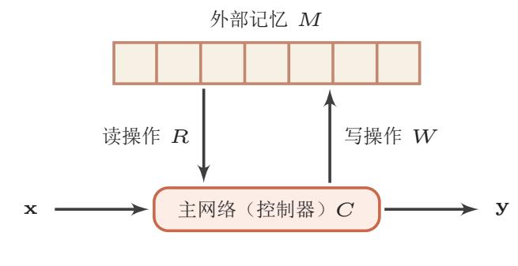
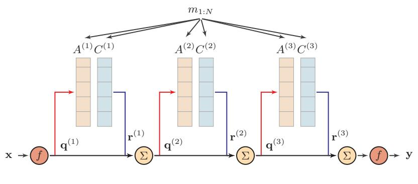

{0}------------------------------------------------

# 第8章 注意力与记忆机制

智慧的艺术是知道该忽视什么。

— 威廉 · 詹姆斯

根据通用近似定理, 前馈网络和循环网络都有很强的能力。但由于优化算 法和计算能力的限制,在实践中很难达到通用近似的能力。特别是在处理复杂 任务时, 比如需要处理大量的输入信息或者复杂的计算流程时, 目前计算机的 计算能力依然是限制神经网络发展的瓶颈。

为了减少计算复杂度, 通过部分借鉴生物神经网络的一些机制, 我们引入 了局部连接、权重共享以及汇聚操作来简化神经网络结构。虽然这些机制比较 有效的缓解了模型复杂度和表达能力之间的矛盾, 但是我们依然还需要讲一步 在不过多增加模型复杂度(主要是模型参数)的情况下来提高模型的表达能力。 以阅读理解任务为例,背景文章(background document)一般比较长,如果用 循环神经网络来将其转换为向量表示,那么这个编码向量很难反映出背景文章 的所有语义。在比较简单的文本分类任务中, 只需要编码一些对分类有用的信 息, 因此用一个向量来表示文本语义来行得通。但是在阅读理解任务中, 编码 时还不知道可能会接收到什么样的问句。这些问句可能会涉及到背景文章的所 有信息点, 因此就会丢失任何信息都可能导致无法正确回答问题。

阅读理解任务是让机器 阅读一篇背景文章。然 后询问一些相关的问题, 来测试机器是否理解了 这篇文章。

在循环神经网络中,丢 失信息的另外一个因素 是远距离依赖问题。

神经网络中可以存储的信息量称为网络容量(network capacity)。一般来 讲,利用一组神经元来存储信息的容量和神经元的数量以及网络的复杂度成正 比。如果要存储越多的信息, 神经元数量就要越多或者网络要越复杂, 讲而导 致神经网络的参数成倍地增加。

我们人脑的生物神经网络同样存在网络容量问题, 人脑中的工作记忆大概 只有几秒钟的时间, 类似于循环神经网络中的隐状态。而人脑每个时刻接收的 外界输入信息非常多,包括来源于视觉、听觉、触觉的各种各样的信息。但就 视觉来说,眼睛每秒钟都会发送千万比特的信息给视觉神经系统。人脑在有限

{1}------------------------------------------------

的资源下,并不能同时处理这些过载的输入信息。大脑神经系统有两个重要机 制可以解决信息过载问题:注意力和记忆机制。

我们可以借鉴人脑解决信息过载的机制, 从两方面来提高神经网络处理信 息的能力。一方面是注意力, 通过自上而下的信息选择机制来过滤掉大量的无 关信息;另一方面是引入额外的外部记忆,优化神经网络的记忆结构来提高神 经网络存储信息的容量。

#### 注意力 8.1

在计算能力有限情况下, 注意力机制 (attention mechanism) 是解决信息 超载问题的主要手段的一种资源分配方案, 将计算资源分配给更重要的任务。

认知神经学中的注意力注意力是一种人类不可或缺的复杂认知功能,指人可以 在关注一些信息的同时忽略另一些信息的选择能力。在日常生活中,我们通过 视觉、听觉、触觉等方式接收大量的感觉输入。但是人脑可以在这些外界的信 息轰炸中还能有条不紊地工作, 是因为人脑可以有意或无意地从这些大量输入 信息中选择小部分的有用信息来重点处理,并忽略其他信息。这种能力就叫做 注意力。注意力可以体现在外部的刺激(听觉、视觉、味觉等), 也可以体现在 内部的意识(思考、回忆等)。

注意力一般分为两种: 一种是自上而下的有意识的注意力, 称为聚焦式(focus)注意力。聚焦式注意力是指有预定目的、依赖任务的、主动有意识地聚焦 于某一对象的注意力;另一种是自下而上的无意识的注意力,称为基于显著性 (saliency-based) 的注意力。基于显著性的注意力是由外界刺激驱动的注意, 不 需要主动干预, 也和任务无关。如果一个对象的刺激信息不同于其周围信息, 一 种无意识的"赢者通吃"(winner-take-all)或者门控(gating)机制就可以把注 意力转向这个对象。不管这些注意力是有意还是无意,大部分的人脑活动都需 要依赖注意力,比如记忆信息,阅读或思考等。

一个和注意力有关的例子是鸡尾酒会效应。当一个人在吵闹的鸡尾酒会上 和朋友聊天时, 尽管周围噪音干扰很多, 他还是可以听到朋友的谈话内容, 而 忽略其他人的声音(聚焦式注意力)。同时,如果未注意到的背景声中有重要的 词(比如他的名字),他会马上注意到(显著性注意力)。

聚焦式注意力一般会随着环境、情景或任务的不同而选择不同的信息。比 如当要从人群中寻找某个人时, 我们会将专注于每个人的脸部; 而当要统计人 群的人数时, 我们只需要专注于每个人的轮廓。

除非特别声明, 本节及 以后章节中注意力机制 是通常指自上而下的聚 焦式注意力。

https://nndl.github.io/

{2}------------------------------------------------

#### 8.1.1 注意力机制

当用神经网络来处理大量的输入信息时,也可以借鉴人脑的注意力机制,只 选择一些关键的信息输入进行处理,来提高神经网络的效率。在目前的神经网 络模型中, 我们可以将最大汇聚(max pooling)、门控(gating) 机制来近似地 看作是自下而上的基于显著性的注意力机制。除此之外,自上而下的会聚式注 意力也是一种有效的信息选择方式。以阅读理解任务为例,给定一篇很长的文 章, 然后就此文章的内容进行提问。提出的问题只和段落中的一两个句子相关, 其余部分都是无关的。为了减小神经网络的计算负担,只需要把相关的片段挑 选出来让后续的神经网络来处理, 而不需要把所有文章内容都输入给神经网络。

用 $\mathbf{x}_{1:N} = [\mathbf{x}_1, \cdots, \mathbf{x}_N]$ 表示  $N \triangle \mathbf{\hat{m}}$ 入信息, 为了节省计算资源, 不需要将 所有的  $N \wedge \mathcal{D}$  信息都输入到神经网络进行计算, 只需要从 $\mathbf{x}_{1:N}$  中选择一些和 任务相关的信息输入给神经网络。给定一个和任务相关的查询向量 q, 我们用 注意力变量  $z \in [1, N]$  来表示被选择信息的索引位置, 即  $z = i$  表示选择了第  $i$ 个输入信息。为了方便计算, 我们采用一种"软性"的信息选择机制, 首先计 算在给定 q 和 x1: N 下, 选择第 i 个输入信息的概率 αi,

 $\alpha_i$  称为注意力分布 (attention distribution).

注意力机制也可称为注

阅读理解任务参见

$$
\alpha_{i} = p(z = i | \mathbf{x}_{1:N}, \mathbf{q})
$$
  
= softmax  $\left(s(\mathbf{x}_{i}, \mathbf{q})\right)$   
=  $\frac{\exp \left(s(\mathbf{x}_{i}, \mathbf{q})\right)}{\sum_{j=1}^{N} \exp \left(s(\mathbf{x}_{j}, \mathbf{q})\right)},$  (8.1)

其中  $s(\mathbf{x}_i, \mathbf{q})$  为注意力打分函数, 可以使用以下三种方式来计算:

 $s(\mathbf{x}_i, \mathbf{q}) = \mathbf{v}^{\mathrm{T}} \tanh(W\mathbf{x}_i + U\mathbf{q}),$ 加性模型  $(8.2)$ 

 $s(\mathbf{x}_i, \mathbf{q}) = \mathbf{x}_i^{\mathrm{T}} \mathbf{q},$ 点积模型  $(8.3)$ 

$$
\mathfrak{F}(\mathbb{X}; \mathbb{Z}) = s(\mathbf{x}_i, \mathbf{q}) = \mathbf{x}_i^{\mathrm{T}} W \mathbf{q}, \tag{8.4}
$$

其中W,U,v为可学习的网络参数。

注意力分布 $\alpha_i$ 可以解释为在上下文查询 $q$ 时, 第 $i$ 个信息受关注的程度。我 们采用一种"软性"的信息选择机制对输入信息进行编码为

$$
\mathbf{att}(\mathbf{x}_{1:N}, \mathbf{q}) = \sum_{i=1}^{N} \alpha_i \mathbf{x}_i, \tag{8.5}
$$

$$
=\mathbb{E}_{z\sim p(z|\mathbf{x}_{1:N},\mathbf{q})}[\mathbf{x}].\tag{8.6}
$$

公式(8.5) 称为软性注意力机制 (soft attention mechanism) 。图8.1a给出 软性注意力机制的示例。

意力模型。

第??节。

{3}------------------------------------------------

图 8.1 注意力机制

#### 8.1.2 注意力机制的变体

除了上面介绍的基本模式外,注意力机制还存在一些变化的模型。

### 8.1.2.1 键值对注意力

更一般地, 我们可以用键值对(key-value pair)格式来表示输入信息, 其 中"键"用来计算注意力分布 $\alpha_i$ , "值"用来生成选择的信息。用 $(\mathbf{k}, \mathbf{v})_{1:N} =$  $[(\mathbf{k}_1, \mathbf{v}_1), \cdots, (\mathbf{k}_N, \mathbf{v}_N)]$ 表示  $N \triangleq \mathbf{\hat{m}}$ 入信息, 给定任务相关的查询向量q时, 注 意力函数为

$$
\mathbf{att}((\mathbf{k}, \mathbf{v})_{1:N}, \mathbf{q}) = \sum_{i=1}^{N} \alpha_i \mathbf{v}_i,
$$
\n(8.7)

$$
= \sum_{i=1}^{N} \frac{\exp(s(\mathbf{k}_{i}, \mathbf{q}))}{\sum_{j} \exp(s(\mathbf{k}_{j}, \mathbf{q}))} \mathbf{v}_{i}
$$
(8.8)

其中 $s(\mathbf{k}_i, \mathbf{q})$ 可以为打分函数。

图8.1b给出键值对注意力机制的示例。如果在键值对模式中 $\mathbf{k}_i = \mathbf{v}_i, \forall i$ , 则 就等价于普通的注意力机制。

### 8.1.2.2 多头注意力

多头注意力(multi-head attention)是利用多个查询 $q_{1:M} = \{q_1, \dots, q_M\}$ , 来平行地计算从输入信息中选取多个信息。每个注意力关注输入信息的不同 部分。

邱锡鹏:《神经网络与深度学习》

{4}------------------------------------------------

### 第8章 注意力与记忆机制

### 8.1.2.3 硬性注意力

之前提到的注意力是软性注意力, 即基于注意力分布的所有输入信息的期 望。还有一种注意力是只关注到一个位置上,叫做硬性注意力(hard attention)

硬性注意力有两种实现方式, 一种是选取最高概率的输入信息, 即

 $attention(x_{1:N}, q) = x_i,$  $(8.9)$ 

其中  $j$  为概率最大的输入信息的下标, 即  $j = \argmax_{\alpha_i} \alpha_i$ 

另一种硬性注意力可以通过在注意力分布式上随机采样的方式实现。

硬性注意力的一个缺点是基于最大采样或随机采样的方式来选择信息。因 此最终的损失函数与注意力分布之间的函数关系不可导, 因此无法使用在反向 传播算法进行训练。为了使用反向传播算法,一般使用软性注意力来代替硬性 注意力。

硬性注意力需要通过强 化学习来进行训练。

### 8.1.2.4 结构化注意力

要从输入信息中选取出和任务相关的信息, 主动注意力是在所有输入信息 上的多项分布, 是一种高平(flat)结构。如果输入信息本身具有层次(hierarchical)结构,比如文本可以分为词、句子、段落、篇章等不同粒度的层次,我们 可以使用层次化的注意力来进行更好的信息选择 [Yang et al., 2016]。此外, 还 可以假设注意力上下文相关的二项分布,用一种图模型来构建更复杂的结构化 注意力分布 [Kim et al., 2017]。

### 8.1.2.5 指针网络

上面描述的注意力机制主要是用来做信息筛选, 从输入信息中选取相关的 信息。事实上, 注意力机制可以分为两步: 一是计算注意力分布 $\alpha$ , 二是根据 $\alpha$ 来计算输入信息的加权平均。我们可以只利用注意力机制中的第一步, 将注意 力分布作为一个软性的指针(pointer)来指出相关信息的位置。

指针网络 (Pointer Network) [Vinyals et al., 2015] 是一种序列到序列模 型, 输入是长度为  $n$  的向量序列  $\mathbf{x}_{1:n} = \mathbf{x}_1, \dots, \mathbf{x}_n$ , 输出是下标序列  $c_{1:n} =$  $c_1, c_2, \cdots, c_m, c_i \in [1, n], \forall i$ .

和一般的序列到序列任务不同,这里的输出序列是输入序列的下标(索引)。 比如输入一组乱序的数字, 输出为按大小排序的输入数字序列的下标。比如输 入为20.5.10, 输出为1.3.2。

{5}------------------------------------------------

条件概率 $p(c_{1:m}|\mathbf{x}_{1:n})$ 可以写为

$$
p(c_{1:m}|\mathbf{x}_{1:n}) = \prod_{i=1}^{m} p(c_i|c_{1:i-1}, \mathbf{x}_{1:n})
$$
\n(8.10)

$$
\approx \prod_{i=1}^{m} p(c_i | \mathbf{x}_{c_1}, \cdots, \mathbf{x}_{c_{i-1}}, \mathbf{x}_{1:n}),
$$
\n(8.11)

其中条件概率 $p(c_i|\mathbf{x}_{c_1},\cdots,\mathbf{x}_{c_{i-1}},\mathbf{x}_{1:n})$ 可以通过注意力分布来计算。假设用一 个循环神经网络对 $\mathbf{x}_{c_1}, \cdots, \mathbf{x}_{c_{i-1}}, \mathbf{x}_{1:n}$ 进行编码得到向量 $\mathbf{e}_i$ , 则

$$
p(c_i|c_{1:i-1}, \mathbf{x}_{1:n}) = \text{softmax}(s_{i,j}),
$$
\n(8.12)

其中 si,j 为在解码过程的第 i 步时, 每个输入向量的未归一化的注意力分布,

$$
s_{i,j} = \mathbf{v}^{\mathrm{T}} \tanh(W\mathbf{x}_j + U\mathbf{e}_i), \forall j \in [1, n], \tag{8.13}
$$

其中v.W.U为可学习的参数。

图8.2给出了指针网络的示例。

图 8.2 指针网络

#### 外部记忆 8.2

为了增强网络容量, 我们可以引入辅助记忆单元, 将一些信息保存辅助记 忆中, 在需要时再进行读取, 这样可以有效地增加网络容量。这个引入辅助记 忆单元一般称为外部记忆(external memory), 以区别与循环神经网络的内部 记忆(即隐状态)。

#### 8.2.1 人脑中的记忆

在生物神经网络中,记忆是外界信息在人脑中存储机制。大脑记忆毫无疑问 是通过生物神经网络实现的。虽然其机理目前还无法解释,但直观上记忆机制和

以循环神经网络为例,其 内部记忆可以类比于计 算机的寄存器,外部记 忆可以类比于计算机的 内存。

{6}------------------------------------------------

神经网络的连接形态以及神经元的活动相关。生理学家发现信息是作为一种整 体效应(collective effect)存储在大脑组织中。当大脑皮层的不同部位损伤时,其 导致的不同行为表现似乎取决于损伤的程度而不是损伤的确切位置 [Kohonen, 2012]。大脑组织的每个部分似乎都携带一些导致相似行为的信息。也就是说,记 忆在大脑皮层是分布式存储的, 而不是存储于某个局部区域 [Thompson, 1975]。

人脑中的记忆具有周期性和联想性。

记忆周期 虽然人脑记忆的存储机制还不清楚,但是在我们已经大概可以确定不 同脑区参与了记忆形成的几个阶段。人脑记忆的一个特点记忆一般分为长期记 忆和短期记忆。长期记忆(long-term memory),也称为结构记忆或知识(knowledge),体现为神经元之间的连接形态,其更新速度比较慢。短期记忆(short-term memory)体现为神经元的活动,更新较快,维持时间为几秒至几分钟。短期记 忆是神经连接的暂时性强化, 通过不断巩固、强化可形成长期记忆。短期记忆、 长期记忆的动态更新过程称为演化(evolution)过程。

因此,长期记忆可以类比于人工神经网络中的权重参数,而短期记忆可以 类比于人工神经网络中的隐状态。

除了长期记忆和短期记忆, 人脑中还会存在一个"缓存", 称为工作记忆 (working memory)。在执行某个认知行为(比如记下电话号码, 算术运算)时, 工作记忆是一个记忆的临时存储和处理系统,维持时间通常为几秒钟。从时间 上看,工作记忆也是一种短期记忆,但和短期记忆的内涵不同。短期记忆一般指 外界的输入信息在人脑中的表示和短期存储,不关心这些记忆如何被使用;而 工作记忆是一个和任务相关的 "容器",可以临时存放和某项任务相关的短期记 忆和其它相关的内在记忆。工作记忆的容量一般都比较小,一般可以容纳4组 项目。

作为不严格的类比, 现代计算机的存储也可以按照不同的周期分为不同的 存储单元,比如寄存器、内存、外存(比如硬盘等)。

联想记忆,大脑记忆的一个主要特点是通过联想来讲行检索的。联想记忆(Associative Memory)是指一种学习和记住不同对象之间关系的能力, 比如看见一个 人然后想起他的名字,或记住某种食物的味道等。联想记忆是指一种可以通过内 容匹配的方法进行寻址的信息存储方式,也称为基于内容寻址的存储(Content-Addressable Memory, CAM)。作为对比, 现代计算机的存储方式根据地址来 进行存储的, 称为随机访问存储 (Random Access Memory, RAM).

借鉴人脑中工作记忆, 可以在神经网络中引入一个外部记忆单元来提高网 络容量。外部记忆的实现途径有两种:一种是结构化的记忆,这种记忆和计算 机中的信息存储方法比较类似, 可以分为多个记忆片段, 并按照一定的结构来 存储;另一种是基于神经动力学的联想记忆,这种记忆方式具有更好的生物学

事实上, 人脑记忆周期 的划分并没有清晰的界 限, 也存在其它的划分 方法。

联想记忆是一个人工智 能、计算机科学和认知 科学等多个交叉领域的 热点研究问题,不同学 科中的内涵也不太相同。

 $194\,$ 

{7}------------------------------------------------

解释性。

#### 8.2.2 结构化的外部记忆

为了增强网络容量,一种比较简单的方式是引入结构化的记忆模块,将和 任务相关的短期记忆保存在记忆记忆中,需要时再进行读取。这种装备外部记 忆的神经网络也称为记忆网络 (Memory Network, MN) 或记忆增强神经网络 (Memory Augmented Neural Network, MANN).

记忆网络结构如图8.3所示,一般有以下几个模块构成:

图 8.3 记忆网络结构

- 1. 主网络 $C$ : 也称为控制器 (controller), 负责信息处理, 并与外界的交互 (接受外界的输入信息并产生输出到外界)。主网络还同时通过读写模块 和外部记忆进行交互。
- 2. 外部记忆单元 M: 外部记忆单元用来存储信息, 一般可以分为很多记忆片 段(memory segment),这些记忆片段按照一定的结构来进行组织。记忆片 段一般用向量来表示,外部记忆单元可以用一组向量 $\mathbf{m}_{1:N} = [\mathbf{m}_1, \cdots, \mathbf{m}_N]$ 来表示。这些向量的组织方式可以是集合、树、栈或队列等。大部分信息 存储于外部记忆中,不需要全时参与主网络的运算。
- 3. 读取模块 R: 根据主网络生成的查询向量 qr, 从外部记忆单元中读取相应 的信息  $\mathbf{r} = R(\mathbf{m}_{1:N}, \mathbf{q}_r)$ 。
- 4. 写入模块 W: 根据主网络生成的查询向量 q 而要写入的信息 a 来更新外 部记忆 $\mathbf{m}_i = R(\mathbf{m}_i, \mathbf{q}_w, \mathbf{a}), \forall 1 \leq i \leq N$ 。

这种结构化的外部记忆是带有地址的, 即每个记忆片段都可以按地址读取 和写入。要实现类似于人脑神经网络的联想记忆能力, 就需要按内容寻址的方 式进行定位, 然后进行读取或写入操作。按内容寻址通常使用注意力机制来进 行。通过注意力机制可以实现一种"软性"的寻址方式,即计算一个在所有记

{8}------------------------------------------------

忆片段上的分布, 而不是一个单一的绝对地址。比如读取模型 R的实现方式可 以为:

$$
\mathbf{r} = \sum_{i=1}^{N} \alpha_i \mathbf{m}_i \tag{8.14}
$$

$$
\alpha_i = \text{softmax}\left(s(\mathbf{m}_i, \mathbf{q}_r)\right),\tag{8.15}
$$

其中 $\mathbf{q}_r$ 是主网络生成的查询向量,  $s(\cdot, \cdot)$ 为打分函数。类比于计算机的存储器 读取, 计算注意力分布的过程相当于是计算机的"寻址"过程, 信息加权平均 的过程相当于计算机的"内容读取"过程。因此,结构化的外部记忆也是一种 联想记忆,只是其结构以及读写的操作方式更像是受计算机架构的启发。

通过引入外部记忆,可以将神经网络的参数和记忆容量的"分离",即在少 量增加网络参数的条件下可以大幅增加网络容量。注意力机制可以看做是一个 接口, 将信息的存储与计算分离。

#### 典型的记忆网络 8.2.3

外部记忆从记忆结构、读写方式等方面可以演变出很多模型。比较典型的 结构化外部记忆模型包括端到端记忆网络、神经图灵机等。

### 8.2.3.1 端到端记忆网络

端到端记忆网络 (End-To-End Memory Network, MemN2N) [Sukhbaatar et al., 2015] 采用一种可微的网络结构, 可以多次从外部记忆中读取信息。在端 到端记忆网络中, 外部记忆单元是只读的。

给定一组需要存储的信息 $m_1, N = \{m_1, \cdots, m_N\}$ , 首先将转换成两组记忆 片段  $A = [\mathbf{a}_1, \cdots, \mathbf{a}_N]$ 和  $C = [\mathbf{c}_1, \cdots, \mathbf{c}_N]$ , 分别存放在两个外部记忆单元中, 其中A用来进行寻址, C用来进行输出。

简单起见,这两组记忆单 元可以合并. 即 $A = C_2$ 

主网络根据输入x生成q,并使用注意力机制来从外部记忆中读取相关信 息r,

$$
\mathbf{r} = \sum_{i=1}^{N} \text{softmax}(\mathbf{a}_i^{\text{T}} \mathbf{q}) \mathbf{c}_i,
$$
 (8.16)

并产生输出

$$
\mathbf{y} = f(\mathbf{q} + \mathbf{r}),\tag{8.17}
$$

其中 $f(.)$ 为预测函数。当应用到分类任务时,  $f(.)$ 可以设为softmax 函数。

邱锡鹏:《神经网络与深度学习》

https://nndl.github.io/

{9}------------------------------------------------

多跳操作 为了实现更新复杂的计算,我们可以让主网络和外部记忆进行多轮交 互。在第k轮交互中,主网络根据上次从外部记忆中读取的信息r(k-1),产生新 的查询向量

$$
\mathbf{q}^{(k)} = \mathbf{r}^{(k-1)} + \mathbf{q}^{(k-1)},\tag{8.18}
$$

其中 $q^{(0)}$ 为初始的查询向量,  $r^{(0)} = 0$ 。

假设第k轮交互的外部记忆为 $A^{(k)}$ 和 $C^{(k)}$ , 主网络从外部记忆读取信息为

$$
\mathbf{r}^{(k)} = \sum_{i=1}^{N} \operatorname{softmax}((\mathbf{a}_i^{(k)})^{\mathrm{T}} \mathbf{q}^{(k)}) \mathbf{c}_i^{(k)}.
$$
 (8.19)

在 K 轮交互后, 用 y =  $f(\mathbf{q}^{(K)} + \mathbf{r}^{(K)})$  进行预测。这种多轮的交互方式也称 为多跳(Multi-Hop)操作。多跳操作中的参数一般是共享的。为了简化起见,每轮 交互的外部记忆也可以共享使用, 比如  $A^{(1)} = \cdots = A^{(K)}$  和  $C^{(1)} = \cdots = C^{(K)}$ 。

端到端记忆网络结构如图8.4所示。

图 8.4 端到端记忆网络

### 8.2.3.2 神经图灵机

图灵机 图灵机 (Turing Machine) 是图灵在1936年提出的一种抽象数学模型, 可以用来模拟任何可计算问题[?]。图灵机有以下几个组件构成:

- 1. 一条无限长的织带: 纸带上有一个个方格组成, 每个方格可以存储一个 符号:
- 2. 一个符号表:纸带上可能出现的所有符号的集合,包含一个特殊的空白符。
- 3. 一个读写头: 指向纸带上某个方格的指针, 每次可以向左或右移动一个位 置,并可以读取、擦除、写入当前方格中的内容;
- 4. 一个状态寄存器: 用来保存图灵机当前所处的状态, 其中包含两个特殊的 状态: 起始状态和终止状态;

{10}------------------------------------------------

5. 一套控制规则: 根据当前机器所处的状态以及当前读写头所指的方格上的 符号来确定读写头下一步的动作, 令机器进入一个新的状态。

图灵机的结构如图8.5所示,其中控制器包括状态寄存器、控制规则。

图 8.5 图灵机结构示例

神经图灵机 神经图灵机 (Neural Turing machine, NTM) [Graves et al., 2014] 主要由两个部件构成: 控制器和外部记忆。外部记忆定义为矩阵 M ∈ Rd×N, 这 里 N 是记忆片段的数量, d 是每个记忆片段的大小。控制器为一个前馈或循环 神经网络。神经图灵机中的外部记忆是可以可读写的,其结构如图8.6所示。

图 8.6 神经图灵机示例

在每个时刻t, 控制器接受当前时刻的输入 $\mathbf{x}_t$ , 上一时刻的输出 $\mathbf{h}_{t-1}$ 和上 一时刻从外部记忆中读取的信息 rt-1, 并产生输出 ht, 同时生成和读写外部记

{11}------------------------------------------------

忆相关的三个向量: 查询向量qt, 删除向量et和增加向量at。然后对外部记忆  $\mathcal{M}_t$ 进行读写操作, 生成读向量  $\mathbf{r}_t$ , 和新的外部记忆  $M_{t+1}$ 。

读操作 在时刻t, 外部记忆的内容记为 $M_t = \mathbf{m}_{t,1}, \cdots, \mathbf{m}_{t,n}$ , 读操作为从外部 记忆 $\mathcal{M}_t$ 中读取信息 $\mathbf{r}_t \in \mathbb{R}^d$ 。

首先通过注意力机制来进行基于内容的寻找, 即

$$
\alpha_{t,i} = \text{softmax}(s(\mathbf{m}_{t,i}, \mathbf{q}_t)) \tag{8.20}
$$

其中qt为控制器产生的查询向量,用来进行基于内容的寻址。s(.,)为加性或乘 性的打分函数。注意力分布 $\alpha_{t,i}$ 是记忆片段 $\mathbf{m}_{t,i}$ 对应的权重,并满足 $\sum_{i=1}^n \alpha_{t,i} =$  $10$ 

根据注意力分布 $\alpha_t$ , 可以计算读向量 (read vector)  $\mathbf{r}_t$ 作为下一个时刻控 制器的输入。

$$
\mathbf{r}_t = \sum_{i=1}^n \alpha_i \mathbf{m}_{t,i}.
$$
 (8.21)

写操作 外部记忆的写操作可以分解为两个子操作: 删除和增加。

首先,控制器产生删除向量 (erase vector)  $e_t$ 和增加向量 (add vector)  $a_t$ , 分别为要从外部记忆中删除的信息和要增加的信息。

删除操作是根据注意力分布来按比例地在每个记忆片段中删除et, 增加操 作根据注意力分布来进行按比例地给每个记忆片段加入at。

$$
\mathbf{m}_{t+1,i} = \mathbf{m}_{t,i}(1 - \alpha_{t,i}\mathbf{e}_t) + \alpha_{t,i}\mathbf{a}_t, \forall i \in [1, n]. \tag{8.22}
$$

通过写操作得到下一时刻的外部记忆 $\mathcal{M}_{t+1}$ 。

#### 基于神经动力学的联想记忆 8.2.4

结构化的外部记忆更多是受现代计算机架构的启发,将计算和存储功能进 行分离,这些外部记忆的结构也缺乏生物学的解释性。为了具有更好的生物学 解释性, 还可以将基于神经动力学(neurodynamics)的联想记忆模型引入到神 经网络以增加网络容量。

联想记忆模型 (Associative Memory Model) 主要是通过神经网络的动态 演化来进行联想,有两种应用场景:1)输入的模式和输出的模式在同一空间,这 种模型叫做自联想记忆模型 (Auto-Associative Model)。自联想模型可以通过 前馈神经网络或者循环神经网络来实现,也经常称为自编码器(Auto-Encoder) ; 2) 输入的模式和输出的模式不在同一空间, 这种模型叫做异联想记忆模型

神经动力学是将神经网 络作为非线性动力系统, 研究其随时间变化的规 律以及稳定性等问题。

神经图灵机中还实现了 比较复杂的基于位置的 寻址方式。这里我们只 介绍比较简单的基于内 容寻址方式, 整个框架 不变。

{12}------------------------------------------------

(Hetero-Associative Model)。从广义上讲, 大部分模式识别问题都可以看作是 异联想, 因此异联想记忆模型可以作为分类器使用。

联想记忆模型可以看做是一种循环神经网络, 基于神经动力学来实现按内 容寻址的信息存储和检索。一个经典的联想记忆模型为Hopfield网络。

### 8.2.4.1 Hopfield 网络

本书中之前介绍的神经网络都是作为一种机器学习模型的输入-输出映射 函数, 其参数学习方法是通过梯度下降方法来最小化损失函数。除了作为机器 学习模型外, 神经网络还可以作为一种记忆的存储和检索模型。

Hopfield 网络 (Hopfield Network) 是一种循环神经网络模型, 由一层相互 连接的神经元组成。每个神经元既是输入单元,又是输出单元,没有隐藏神经元。 一个神经元和自身没有反馈相连,不同神经元之间连接权重是对称的。图8.7给 出了 Hopfield 网络的结构示例。

Hopfield 网络也可以认 为是所有神经元都相互 连接的不分层的神经网 终。

图 8.7 4个节点的 Hopfield 网络

这里我们只介绍离散 Hopfield 网络, 神经元状 态为+1, $-1$ 两种。除此 之外,还有连续Hopfield 网络, 即神经元状态为 连续值。

假设一个 Hopfield 网络有m 个神经元, 第i个神经元的更新规则为

$$
s_i = \begin{cases} +1 & \text{if } \sum_{j=1}^m w_{ij} s_j + b_i \ge 0, \\ -1 & \text{otherwise,} \end{cases}
$$
 (8.23)

其中 $w_{ij}$ 为神经元 $i\bar{\mathcal{H}}$ ]之间的连接权重,  $b_i$ 为偏置。

https://nndl.github.io/

{13}------------------------------------------------

连接权重 $w_{ij}$ 有以下性质

$$
w_{ii} = 0 \quad \forall i \in [1, m]
$$
  
\n
$$
w_{ij} = w_{ji} \quad \forall i, j \in [1, m].
$$
  
\n(8.24)

Hopfield 网络的更新可以分为异步和同步两种方式。异步更新是每次更新 一个神经元。神经元的更新顺序可以是随机或事先固定的。同步更新是指一次 更新所有的神经元,需要有一个时钟来进行同步。第t时刻的神经元状态为st =  $[\mathbf{s}_{t,1}, \mathbf{s}_{t,2}, \cdots, \mathbf{s}_{t,m}]^{\text{T}}$ , 其更新规则为

$$
\mathbf{s}_t = f(W\mathbf{s}_{t-1} + \mathbf{b}),\tag{8.25}
$$

其中  $\mathbf{s}_0 = \mathbf{x}$ ,  $W = [w_{ij}]_{m \times m}$  为连接权重,  $\mathbf{b} = [b_i]_{m \times 1}$  为偏置向量,  $f(\cdot)$  为非 线性阶跃函数。

能量函数 在 Hopfield 网络中, 我们给每个不同的网络状态定义一个标量属性, 称为"能量"。

$$
E = -\frac{1}{2} \sum_{i,j} w_{ij} s_i s_j - \sum_i b_i s_i \tag{8.26}
$$

$$
=-\frac{1}{2}\mathbf{s}^{\mathrm{T}}W\mathbf{s}-\mathbf{b}^{\mathrm{T}}\mathbf{s}.\tag{8.27}
$$

Hopfield 网络是稳定的, 即能量函数经过多次迭代后会达到收敛状态。权重对 称是一个重要特征, 因为它保证了能量函数在神经元激活时单调递减, 而不对 称的权重可能导致周期性震荡或者混乱。

给定一个外部输入, 网络经过演化, 会达到某个稳定状态。这些稳定状态 称为吸引点(attractor)。一个Hopfield网络中, 通常有多个吸引点, 每个吸引 点为一个能量的局部最优点。

能量函数E是Hopfield 网络的Lyapunov 函数。 Lyapunov定理是非线性 动力系统中保证系统稳 定性的充分条件。

图8.8给出了 Hopfield 网络的能量函数。红线为网络能量的演化方向, 蓝点 为吸引点。

图 8.8 Hopfield 网络的能量函数

{14}------------------------------------------------

联想记忆 Hopfield 网络存在有限的吸引点 (attractor), 即能量函数的局部最 小点。每个吸引点u都对应一个"管辖"区域Ru,如果输入向量x落入这个区 域, 网络最终会收敛到u。因此, 吸引点可以看作是网络中存储的信息。将网 络输入x作为起始状态, 随时间收敛到吸引点u上的过程作为检索过程。即使 输入向量x是有部分信息或有噪声, 只用其位于对应存储模式的"吸引"区域 内, 那么随着时间演化, 网络最终会收敛到其对应的存储模式。因此, Hopfield 的检索是基于内容寻址的检索, 具有联想记忆能力。

信息存储 信息存储是指将一组向量 x1,…, xN 存储在网络中的过程。存储过 程主要是调整神经元之间的连接权重,因此可以看做是一种学习过程。Hopfield 网络的学习规则有很多种。一种最简单的学习方式为: 神经元i和j之间的连 接权重

$$
w_{ij} = \frac{1}{N} \sum_{n=1}^{N} x_i^{(n)} x_j^{(n)},
$$
\n(8.28)

其中 $x_i^{(n)}$ 是第n个输入向量的第i维特征。如果 $x_i$ 和 $x_j$ 在输入向量中相同的概 率越多,则wij越大。这种学习规则和人脑神经网络的学习方式十分类似。在人 脑神经网络中, 如果两个神经元经常同时激活, 则它们之间的连接加强; 如果 经常不同时激活, 则连接消失。这种学习方式称为 Hebbian 法则。

存储容量 对于联想记忆模型来说, 存储容量为其能够可靠地存储和检索模式的 最大数量。对于数量为m的相互连接的二值神经元网络, 其总状态数2m, 其中 可以作为有效稳定点的状态数量就是其存储容量。模型容量一般与网络结构和 学习方式有关。Hopfield 最大的网络容量为 $0.14m$ , 玻尔兹曼机的容量为 $0.6m$ , 但是其学习效率比较低,需要非常长时间的演化才能达到均衡状态。通过改进 学习算法, Hopfield 网络的最大容量可以达到 $O(m)$ 。如果允许高阶(阶数为 $K$ ) 连接, 比如三个神经元连接关系, 其稳定存储的最大容量为 $O(m^{K-1})$ 。Plate [1995] 引入复数运算, 有效地提高了网络容量。总体上讲, 通过改进网络结构、 学习方式以及引入更复杂的运算(比如复数、量子操作),联想记忆网络的容量 可以有效改善。

### 8.2.4.2 使用联想记忆增加网络容量

既然联想记忆具有存储和检索功能, 我们可以利用联想记忆来增加网络容 量。和结构化的外部记忆相比, 联想记忆具有更好的生物学解释性。?将一个 联想记忆模型作为部件引入LSTM网络中,而从在不引入额外参数的情况下增 加网络容量。Ba et al. [2016] 将循环神经网络中的部分连接权重作为短期记忆, 并通过一个联想记忆模型进行更新, 而从提高网络性能。在上述的网络中, 联 想记忆都是作为一个更大网络的组件, 用来增加短期记忆的容量。联想记忆组

{15}------------------------------------------------

### 2018年9月18日

| 记忆周期 | 计算机  | 人脑   | 神经网络      |
|------|------|------|-----------|
| 短期   | 寄存器  | 短期记忆 | 状态(神经元活性) |
| 中期   | 内存   | 工作记忆 | 外部记忆      |
| 长期   | 外存   | 长期记忆 | 可学习参数     |
| 存储方式 | 随机寻址 | 内容寻址 | 内容寻址为主    |

表 8.1 不同领域中记忆模型的不严格类比。

件的参数可以使用 Hebbian 方式来学习, 也可以作为整个网络参数的一部分来 讲行学习。

#### 总结和深入阅读 8.3

和之前介绍的LSTM中的记忆单元相比,外部记忆可以存储更多的信息, 并且不直接参与计算, 通过读写接口来进行操作。而LSTM模型中的记忆单元 包含了信息存储和计算两种功能,不能存储太多的信息。因此, LSTM 中的记 忆单元可以类比于计算机中寄存器,而外部记忆可以类比于计算机中的存储器: 内存、磁带或硬盘等。

联想记忆是人脑的重要能力,可以归结为人脑中信息的存储、关联及检索 的神经活动机制, 因此对人工智能的研究都有着极其重要的指导意义。

注意力机制最早在计算机视觉中提出。在神经网络中, Mnih et al. [2014] 在循环神经网络模型上使用了注意力机制来进行图像分类。随后, Bahdanau et al. [2014] 使用注意力机制在机器翻译任务上将翻译和对齐同时进行。Xu et al. [2015] 利用注意力机制来进行看图说话。

比如有代表性的工作为神经图灵机 [Graves et al., 2014]、端到端记忆网络 [Sukhbaatar et al., 2015]、动态记忆网络 [Kumar et al., 2015] 等, 这类引入外 部记忆的模型都称为记忆增强网络(Memory-Enhanced Networks)。在自然语 言处理中的很多任务上,都取得了一定的性能提升。

注意力模型已经是一个非常普遍和强大的技术,并且正变得越来越普遍。 在目前的研究中, 为了可以端到端讲行训练, 我们希望注意力是可微的。在实 际使用中的注意力模型可以看作是一个注意力分布, 即关注所有位置, 只是程 度不一样。通常, 使用基于内容的注意力生成注意力分布。根据一个查询, 每 一个条目和这个查询计算出一个分数,来描述这个条目与查询匹配程度。这些 分数被输入一个 softmax 来生成注意力分布。

{16}------------------------------------------------

但是目前的模型主要存在两个问题: 外部记忆的结构, 目前的模型中结构 还比较简单, 需要借鉴神经科学的研究成果。外部记忆和内部记忆的融合方式 还需要讲一步研究。

在目前循环神经网络中,比如LSTM和GRU,网络容量问题也是限制其能 力的主要因素。为了克服这个限制,一些研究者引入了一种基于内容寻址的外部 记忆来提高网络容量,比如神经图灵机 [Graves,2014]、记忆网络 [Sukhbaatar,2015] 等。这些外部记忆被保存在数组、栈或队列等结构中。给定一个线索向量, 主 网络使用注意力机制来从外部记忆中选择相关记忆并参与主网络的计算。外 部记忆的引入更多是受现代计算机架构的启发,将计算和存储功能进行分离, 这些外部记忆的结构也缺乏生物学的解释性。为了具有更好的生物学解释性, Danihelka[2016] 将一个联想记忆模型作为部件引入LSTM 网络中, 而从在不引 入额外参数的情况下增加网络容量。Ba[2016] 将循环神经网络中的部分连接权 重作为短期记忆,并通过一个联想记忆模型进行更新,而从提高网络性能。Trabelsi[2017] 进一步将模块化的深度网络(比如残差网络) 也作为联想记忆, 并引 入更加有效的复数表示来提高网络性能。在上述的网络中, 联想记忆都是作为 一个更大网络的部件, 用来增加短期记忆的容量。联想记忆部件的参数作为整 个网络参数的一部分来讲行学习。

### 习题

习题 8-1 分析 LSTM 模型中,隐藏层神经元数量与参数数量之间的关系。

习题 8-2 证明 Hopfield 网络的能量函数随时间单调递减。

## 参考文献

Jimmy Ba, Geoffrey E Hinton, Volodymyr Mnih, Joel Z Leibo, and Catalin Ionescu. Using fast weights to attend to the recent past. In Advances In Neural Information Processing Systems, pages 4331-4339, 2016.

D. Bahdanau, K. Cho, and Y. Bengio. Neural machine translation by jointly learning to align and translate. ArXiv e-prints, September 2014.

Alex Graves, Greg Wayne, and Ivo

Danihelka. Neural turing machines.  $arXiv$  preprint  $arXiv:1410.5401$ , 2014. Yoon Kim, Carl Denton, Luong Hoang, and Alexander M Rush. Structured attention networks.  $arXiv$  preprint arXiv:1702.00887, 2017.

Teuvo Kohonen. Self-organization and *associative memory*, volume 8. Springer Science & Business Media, 2012.

Ankit Kumar, Ozan Irsoy, Jonathan Su, James Bradbury, Robert English, Brian 

{17}------------------------------------------------

Pierce, Peter Ondruska, Ishaan Gulrajani, and Richard Socher. Ask me anything: Dynamic memory networks for natural language processing.  $arXiv$ preprint arXiv:1506.07285, 2015.

Volodymyr Mnih, Nicolas Heess, Alex Graves, et al. Recurrent models of visual attention. In Advances in Neural Information Processing Systems, pages 2204-2212, 2014.

Tony A Plate. Holographic reduced representations. IEEE Transactions on Neural networks, 6(3):623-641, 1995.

Sainbayar Sukhbaatar, Jason Weston, Rob Fergus, et al. End-to-end memory networks. In Advances in Neural Information Processing Systems, pages 2431-2439, 2015.

Richard F Thompson. Introduction to *physiological psychology.* HarperCollins Publishers, 1975.

Oriol Vinyals, Meire Fortunato, and Navdeep Jaitly. Pointer networks. In Advances in Neural Information Processing Systems, pages  $2692-2700$ ,  $2015$ . Kelvin Xu, Jimmy Ba, Ryan Kiros, Kyunghyun Cho, Aaron Courville, Ruslan Salakhudinov, Rich Zemel, and Yoshua Bengio. Show, attend and tell: Neural image caption generation with visual attention. In Proceedings of the International Conference on Machine Learning, pages 2048-2057, 2015.

Zichao Yang, Diyi Yang, Chris Dyer, Xiaodong He, Alexander J Smola, and Eduard H Hovy. Hierarchical attention networks for document classification. In HLT-NAACL, pages 1480-1489, 2016.