{0}------------------------------------------------

# 第5章 卷积神经网络

一切都应该尽可能地简单,但不能过于简单。

- 艾伯特·爱因斯坦

卷积神经网络 (Convolutional Neural Network, CNN或ConvNet)是一种 具有局部连接、权重共享等特性的深层前馈神经网络。

券积神经网络最早是主要用来处理图像信息。如果用全连接前馈网络来处 理图像时, 会存在以下两个问题:

(1) 参数太多: 如果输入图像大小为100×100×3 (即图像高度为100, 宽 度为100,3个颜色通道: RGB)。在全连接前馈网络中, 第一个隐藏层的每个神 经元到输入层都有 $100 \times 100 \times 3 = 30,000$  个相互独立的连接, 每个连接都对应 一个权重参数。随着隐藏层神经元数量的增多,参数的规模也会急剧增加。这 会导致整个神经网络的训练效率会非常低, 也很容易出现过拟合。

(2) 局部不变性特征: 自然图像中的物体都具有局部不变性特征, 比如在 尺度缩放、平移、旋转等操作不影响其语义信息。而全连接前馈网络很难提取 这些局部不变特征, 一般需要进行数据增强来提高性能。

卷积神经网络是受生物学上感受野的机制而提出。感受野(receptive field) 主要是指听觉、视觉等神经系统中一些神经元的特性, 即神经元只接受其所支 配的刺激区域内的信号。在视觉神经系统中, 视觉皮层中的神经细胞的输出依 赖于视网膜上的光感受器。视网膜上的光感受器受刺激兴奋时, 将神经冲动信 号传到视觉皮层, 但不是所有视觉皮层中的神经元都会接受这些信号。一个神 经元的感受野是指视网膜上的特定区域, 只有这个区域内的刺激才能够激活该 神经元。

目前的卷积神经网络一般是由卷积层、汇聚层和全连接层交叉堆叠而成的 前馈神经网络, 使用反向传播算法进行训练。卷积神经网络有三个结构上的特 全连接层一般在卷积网 性: 局部连接, 权重共享以及子采样。这些特性使得卷积神经网络具有一定程 络的最顶层。

{1}------------------------------------------------

度上的平移、缩放和旋转不变性。和前馈神经网络相比,卷积神经网络的参数 更少。

卷积神经网络主要使用在图像和视频分析的各种任务上,比如图像分类、人 脸识别、物体识别、图像分割等, 其准确率一般也远远超出了其它的神经网络 模型。近年来卷积神经网络也广泛地应用到自然语言处理、推荐系统等领域。

#### 券积 $5.1$

卷积(convolution), 也叫摺积, 是分析数学中一种重要的运算。在信号 处理或图像处理中, 经常使用一维或二维卷积。

这里我们只考虑离散序 列的情况。

一维卷积 一维卷积经常用在信号处理中,用于计算信号的延迟累积。假设一个 信号发生器每个时刻 $t$ 产生一个信号 $x_t$ , 其信息的衰减率为 $w_k$ , 即在 $k-1$ 个时 间步长后, 信息为原来的 $w_k$  倍。假设 $w_1 = 1, w_2 = 1/2, w_3 = 1/4$ , 那么在时刻  $t$ 收到的信号  $y_t$  为当前时刻产生的信息和以前时刻延迟信息的叠加,

$$
y_t = 1 \times x_t + 1/2 \times x_{t-1} + 1/4 \times x_{t-2}
$$
\n(5.1)

$$
= w_1 \times x_t + w_2 \times x_{t-1} + w_3 \times x_{t-2}
$$
\n(5.2)

$$
= \sum_{k=1}^{3} w_k \cdot x_{t-k+1}.
$$
 (5.3)

我们把 $w_1, w_2, \cdots$  称为滤波器 (filter) 或卷积核 (convolution kernel) 。假 设滤波器长度为m, 它和一个信号序列 $x_1, x_2, \cdots$  的卷积为

$$
y_t = \sum_{k=1}^{m} w_k \cdot x_{t-k+1},
$$
\n(5.4)

信号序列x和滤波器w的卷积定义为

$$
y = w \otimes x,\tag{5.5}
$$

其中⊗表示卷积运算。

一般情况下滤波器的长度m远小于信号序列长度n。当滤波器 $f_k = 1/m, 1 \leq$  $k \leq m$ 时, 卷积相当于信号序列的移动平均。图5.1给出了一维卷积示例。滤波 器为 [-1,0,1], 连接边上的数字为滤波器中的权重。

### 邱锡鹏:《神经网络与深度学习》

https://nndl.github.io/

{2}------------------------------------------------

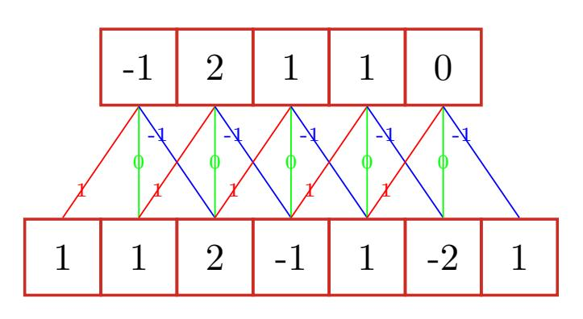

图 5.1 一维卷积示例

二维卷积 卷积也经常用在图像处理中。因为图像为一个两维结构,所以需要将 一维卷积进行扩展。给定一个图像  $X \in \mathbb{R}^{M \times N}$ , 和滤波器  $W \in \mathbb{R}^{m \times n}$ , 一般  $m << M, n << N$ , 其卷积为

$$
y_{ij} = \sum_{u=1}^{m} \sum_{v=1}^{n} w_{uv} \cdot x_{i-u+1,j-v+1}.
$$
 (5.6)

图5.2给出了二维卷积示例。

| $\mathbf{1}$   | $\mathbf{1}$   | 1 $x - 1$        | $\mathbf{x}$                 | $\rightarrow$ |           |                |                |                   |     |                |                |                   |
|----------------|----------------|---------------------|------------------------------|---------------|-----------|----------------|----------------|-------------------|-----|----------------|----------------|-------------------|
| $-1$           | $\overline{0}$ | $-3$ $\times 0$  | $\rightarrow \times 0$       | $\times$      |           | $\mathbf{1}$   | $\overline{0}$ | $\overline{0}$    |     | $\overline{0}$ | $-2$           | $-1$ ' |
| $\overline{2}$ |                | $1 -$ $\times 0$ | $-1$ $\rightarrow \infty$ | $\mathbf{x}$  | $\otimes$ | $\overline{0}$ | $\overline{0}$ | $\overline{0}$    | $=$ | $2^{\circ}$    | $\overline{2}$ |                   |
| $\overline{0}$ |                | $\mathbf{1}$        | 2 1               |               |           |                | $\theta$       | $-1$ 1 |     | $-1$           | $\overline{0}$ |                   |
| $\mathbf{1}$   | $\overline{2}$ | 1                   |                              | 1             |           |                |                |                   |     |                |                |                   |

图 5.2 二维卷积示例

常用的均值滤波(mean filter)就是当前位置的像素值设为滤波器窗口中 所有像素的平均值, 也就是 $f_{uv} = \frac{1}{mn}$ 。

在图像处理中, 卷积经常作为特征提取的有效方法。一幅图像在经过卷积 操作后得到结果称为<mark>特征映射(feature map)。图5.3给出在图像处理中几种常</mark> 用的滤波器, 以及其对应的特征映射。图中最上面的滤波器是常用的高斯滤波 器,可以用来对图像进行平滑去噪;中间和最下面的过滤器可以用来提取边缘 特征。

{3}------------------------------------------------

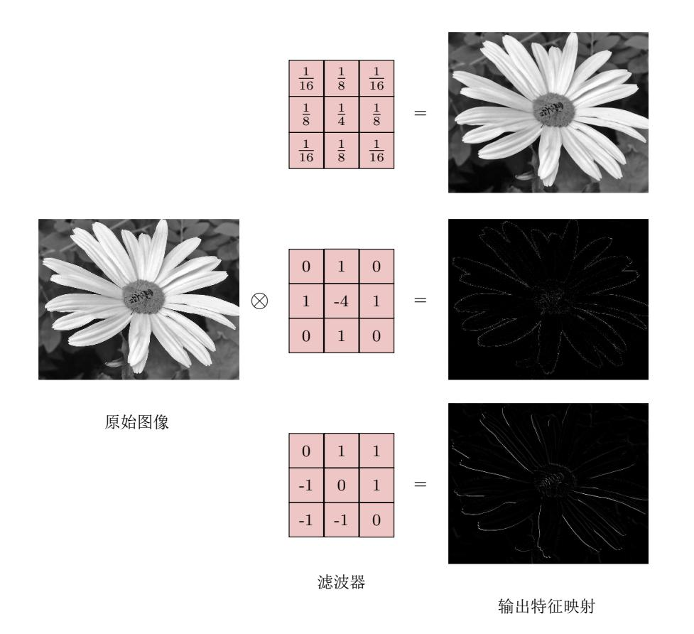

图 5.3 图像处理中几种常用的滤波器示例

#### 互相关 $5.1.1$

在机器学习和图像处理领域,卷积的主要功能是在一个图像(或某种特征) 上滑动一个卷积核(即滤波器),通过卷积操作得到一组新的特征。在计算卷积 的过程中,需要进行卷积核翻转。在具体实现上,一般会以互相关操作来代替 卷积, 从而会减少一些不必要的操作或开销。<mark>互相关(cross-correlation)</mark>是一 个衡量两个序列相关性的函数, 通常是用滑动窗口的点积计算来实现。给定一 个图像  $X \in \mathbb{R}^{M \times N}$  和卷积核  $W \in \mathbb{R}^{m \times n}$ , 它们的互相关为

$$
y_{ij} = \sum_{u=1}^{m} \sum_{v=1}^{n} w_{uv} \cdot x_{i+u-1,j+v-1}.
$$
 (5.7)

和公式(5.6)对比可知,互相关和卷积的区别在于卷积核仅仅是否进行翻转。因 此互相关也可以称为不翻转卷积。

在神经网络中使用卷积是为了进行特征抽取, 卷积核是否进行翻转和其特 征抽取的能力无关。特别是当卷积核是可学习的参数时,卷积和互相关是等价

翻转就是从两个维度(从 上到下、从左到右) 颠倒 次序, 即旋转180度。

互相关和卷积的区别也 可以理解为图像是否进 行翻转。

#### 邱锡鹏:《神经网络与深度学习》

https://nndl.github.io/

{4}------------------------------------------------

的。因此,为了实现上(或描述上)的方便起见,我们用互相关来代替卷积。事 实上,很多深度学习工具中卷积操作其实都是互相关操作。

公式(5.7)可以表述为

指"互相关"。

在本书之后描述中,除 非特别声明, 卷积一般

$$
Y = W \otimes X,\tag{5.8}
$$

其中 $Y \in \mathbb{R}^{M-m+1,N-n+1}$ 为输出矩阵。

#### $5.1.2$ 卷积的变种

在卷积的标准定义基础上, 还可以引入滤波器的滑动步长和零填充来增加 卷积的多样性, 可以更灵活地进行特征抽取。

滤波器的步长(stride)是指滤波器在滑动时的时间间隔。图5.4a给出了步 长为2的卷积示例。

步长也可以小千1. 即微 步卷积参见第5.5.1节。

零填充 (zero padding) 是在输入向量两端进行补零。图5.4b给出了输入的 两端各补一个零后的卷积示例。

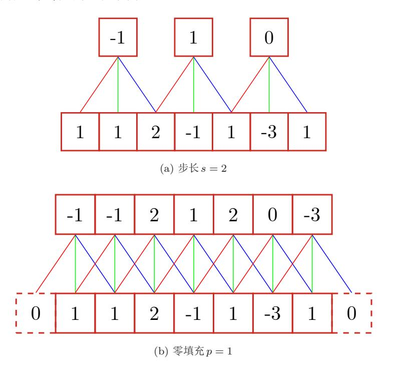

图 5.4 卷积的步长和零填充

假设卷积层的输入神经元个数为 $n$ ,卷积大小为 $m$ ,步长(stride)为 $s$ ,输 入神经元两端各填补 $p \triangleq \mathbb{F}$  (zero padding), 那么该卷积层的神经元数量为  $(n - m + 2p)/s + 1$ .

可以通过选择合适 '《神经恢经与深度学习》 n+2p)/s+1

https://nndl.github.io/

## $108\,$

{5}------------------------------------------------

一般常用的卷积有以下三类:

- 窄卷积 (narrow convolution): 步长  $s = 1$ , 两端不补零  $p = 0$ , 卷积后输 出长度为 $n-m+1$ 。
- 宽卷积 (wide convolution) : 步长  $s = 1$ , 两端补零  $p = m 1$ , 卷积后 输出长度 $n+m-1$ 。
- 等长卷积 (equal-width convolution): 步长  $s = 1$ , 两端补零  $p = (m-1)/2$ , 卷积后输出长度 n。图5.4b就是一个等长卷积示例。

除了特别声明外, 一般说的卷积默认为窄养积。

更多的卷积变种参见 第5.5节。

#### 卷积的数学性质 5.1.3

卷积有很多很好的数学性质。在本节中, 我们介绍一些二维卷积的数学性 质,但是这些数学性质同样可以适用到一维卷积的情况。

### 5.1.3.1 交换性

如果不限制两个卷积信号的长度,卷积是具有交换性的,即x⊗y = y⊗x。 当输入信息和卷积核有固定长度时, 它们的宽卷积依然具有交换性。

对于两维图像  $X \in \mathbb{R}^{M \times N}$  和卷积核  $W \in \mathbb{R}^{m \times n}$ , 对图像  $X$  的两个维度进 行零填充, 两端各补 $m-1 \nleftrightarrow n-1$ 个零, 得到全填充(full padding) 的图像  $\tilde{X} \in \mathbb{R}^{(M+2m-2)\times(N+2n-2)}$ 。图像 X 和卷积核 W 的宽卷积 (wide convolution) 定义为

$$
W \tilde{\otimes} X \triangleq W \otimes \tilde{X}, \tag{5.9}
$$

其中。为宽卷积操作。

宽卷积具有交换性, 即

参见习题5-1。

邱锡鹏:《神经网络与深度学习》

https://nndl.github.io/

{6}------------------------------------------------

### 第5章 卷积神经网络

### 5.1.3.2 导数

假设  $Y = W \otimes X$ , 其中  $X \in \mathbb{R}^{M \times N}$ ,  $W \in \mathbb{R}^{m \times n}$ ,  $Y \in \mathbb{R}^{(M-m+1) \times (N-n+1)}$ , 函数 $f(Y) \in \mathbb{R}$ 为一个标量函数, 则

$$
\frac{\partial f(Y)}{\partial w_{uv}} = \sum_{i=1}^{M-m+1} \sum_{j=1}^{N-n+1} \frac{\partial y_{ij}}{\partial w_{uv}} \frac{\partial f(Y)}{\partial y_{ij}} \tag{5.11}
$$

$$
= \sum_{i=1}^{M-m+1} \sum_{i=1}^{N-n+1} x_{i+u-1,j+v-1} \frac{\partial f(Y)}{\partial y_{ij}} \tag{5.12}
$$

 $y_{ij} =$ 

 $\sum_{u,v} w_{uv} x_{i+u-1,j+v-1}$ 

$$
= \sum_{i=1}^{M-m+1} \sum_{j=1}^{N-n+1} \frac{\partial f(Y)}{\partial y_{ij}} x_{u+i-1, v+j-1}
$$
(5.13)

从公式(5.13)可以看出,  $f(Y)$ 关于W的偏导数为 $X$ 和  $\frac{\partial f(Y)}{\partial Y}$ 的卷积

$$
\frac{\partial f(Y)}{\partial W} = \frac{\partial f(Y)}{\partial Y} \otimes X.
$$
\n(5.14)

同理得到,

$$
\frac{\partial f(Y)}{\partial x_{st}} = \sum_{i=1}^{M-m+1} \sum_{j=1}^{N-n+1} \frac{\partial y_{ij}}{\partial x_{st}} \frac{\partial f(Y)}{\partial y_{ij}}
$$
(5.15)

$$
= \sum_{i=1}^{M-m+1} \sum_{j=1}^{N-n+1} w_{s-i+1,t-j+1} \frac{\partial f(Y)}{\partial y_{ij}}, \qquad (5.16)
$$

其中当 $(s-i+1)$  < 1, 或 $(s-i+1)$  > m, 或 $(t-j+1)$  < 1, 或 $(t-j+1)$  > n 时,  $w_{s-i+1,t-j+1} = 0$ 。即相当于对  $W$  进行了  $p = (M - m, N - n)$  的零填充。

从公式(5.16)可以看出,  $f(Y)$ 关于 X 的偏导数为 W 和  $\frac{\partial f(Y)}{\partial Y}$  的宽卷积。公 式(5.16)中的卷积是真正的卷积而不是互相关,为了一致性,我们用互相关的 "卷积",即

$$
\frac{\partial f(Y)}{\partial X} = \text{rot} 180 \left(\frac{\partial f(Y)}{\partial Y}\right) \tilde{\otimes} W \tag{5.17}
$$

$$
= \text{rot} 180(W) \tilde{\otimes} \frac{\partial f(Y)}{\partial Y},\tag{5.18}
$$

其中 rot180 (·) 表示旋转 180 度。

#### 卷积神经网络 $5.2$

卷积神经网络一般由卷积层、汇聚层和全连接层构成。

{7}------------------------------------------------

#### 用卷积来代替全连接 $5.2.1$

在全连接前馈神经网络中, 如果第 $l \not\equiv n^l \uparrow n^l \oplus \bar{\pi}, \hat{\pi}^l - 1$ 层有 $n^{(l-1)}$ 个神经元, 连接边有 $n^{(l)} \times n^{(l-1)}$ 个, 也就是权重矩阵有 $n^{(l)} \times n^{(l-1)}$  个参数。 当m和n都很大时, 权重矩阵的参数非常多, 训练的效率会非常低。

如果采用卷积来代替全连接, 第 $l \in \mathbb{R}$ 的净输入 $\mathbf{z}^{(l)}$  为第 $l-1 \in \mathbb{R}$ 活性值 $\mathbf{a}^{(l-1)}$ 和滤波器 $\mathbf{w}^{(l)} \in \mathbb{R}^m$ 的卷积,即

$$
\mathbf{z}^{(l)} = \mathbf{w}^{(l)} \otimes \mathbf{a}^{(l-1)} + b^{(l)},\tag{5.19}
$$

其中滤波器 $\mathbf{w}^{(l)}$ 为权重向量,  $b^{(l)} \in \mathbb{R}^{n^{l-1}}$  为偏置。

根据卷积的定义,卷积层有两个很重要的性质:

局部连接 在卷积层 (假设是第1层) 中的每一个神经元都只和下一层 (第1-1 层)中某个局部窗口内的神经元相连,构成一个局部连接网络。如图5.5b所示, 卷积层和下一层之间的连接数大大减少,有原来的 $n^l \times n^{l-1}$ 个连接变为 $n^l \times m$ 个连接, m为滤波器大小。

权重共享 从公式(5.19)可以看出, 作为参数的滤波器  $\mathbf{w}^{(l)}$  对于第 $l$ 层的所有的 神经元都是相同的。如图5.5b中,所有的同颜色连接上的权重是相同的。

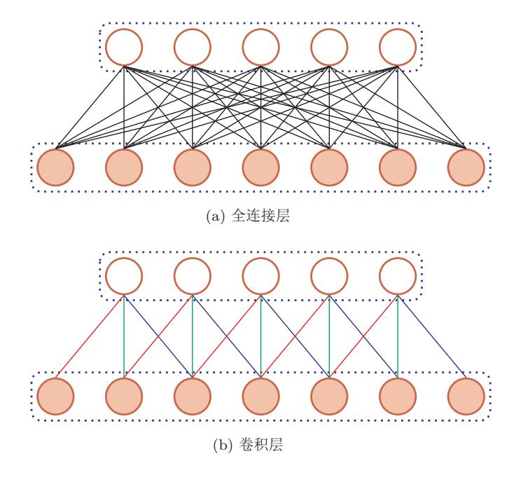

图 5.5 全连接层和卷积层对比

由于局部连接和权重共享,卷积层的参数只有一个m维的权重 $\mathbf{w}^{(l)}$ 和1维

{8}------------------------------------------------

的偏置 $b^{(l)}$ , 共 $m+1$ 个参数。参数个数和神经元的数量无关。此外, 第 $l$ 层的 神经元个数不是任意选择的,而是满足 $n^{(l)} = n^{(l-1)} - m + 1$ 。

### 5.2.2 卷积层

卷积层的作用是提取一个局部区域的特征, 不同的卷积核相当于不同的特 征提取器。上一节中描述的卷积层的神经元和全连接网络一样都是一维结构。 既然卷积网络主要应用在图像处理上,而图像为两维结构,因此为了更充分地 利用图像的局部信息, 通常将神经元组织为三维结构的神经层, 其大小为高度  $M \times \mathcal{R}$ 度  $N \times \mathcal{R}$ 度 D, 有 D 个  $M \times N$  大小的特征映射构成。

特征映射(feature map)为一幅图像(或其它特征映射)在经过卷积提取 到的特征, 每个特征映射可以作为一类抽取的图像特征。为了卷积网络的表示 能力, 可以在每一层使用多个不同的特征映射, 以更好地表示图像的特征。

在输入层, 特征映射就是图像本身。如果是灰度图像, 就是有一个特征映 射, 深度 D = 1: 如果是彩色图像, 分别有RGB三个颜色通道的特征映射, 输 入层深度 $D=3$ 。

不失一般性, 假设一个卷积层的结构如下:

- 输入特征映射组:  $\mathbf{X} \in \mathbb{R}^{M \times N \times D}$  为三维张量(tensor), 其中每个切片 (slice) 矩阵  $X^d \in \mathbb{R}^{M \times N}$  为一个输入特征映射,  $1 \leq d \leq D$ ;
- 输出特征映射组:  $\mathbf{Y} \in \mathbb{R}^{M' \times N' \times P}$ 为三维张量, 其中每个切片矩阵  $Y^p \in$  $\mathbb{R}^{M' \times N'}$ 为一个输出特征映射,  $1 \leq p \leq P$ ;
- 卷积核: W ∈ ℝm × n × D × P 为四维张量, 其中每个切片矩阵 W p, d ∈ ℝ m × n 为一个两维卷积核,  $1 < d < D, 1 < p < P$ 。

图5.6给出卷积层的三维结构表示。

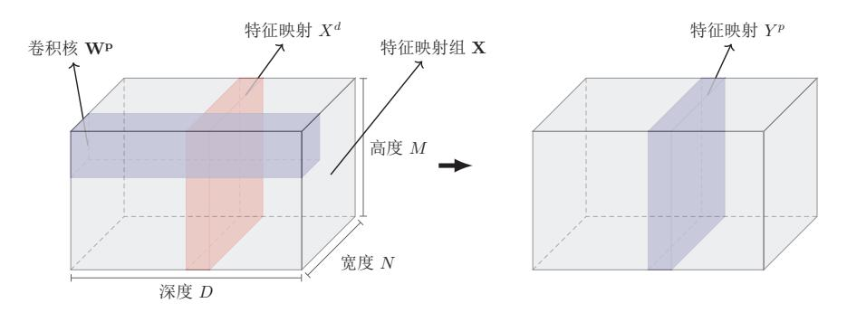

图 5.6 卷积层的三维结构表示

{9}------------------------------------------------

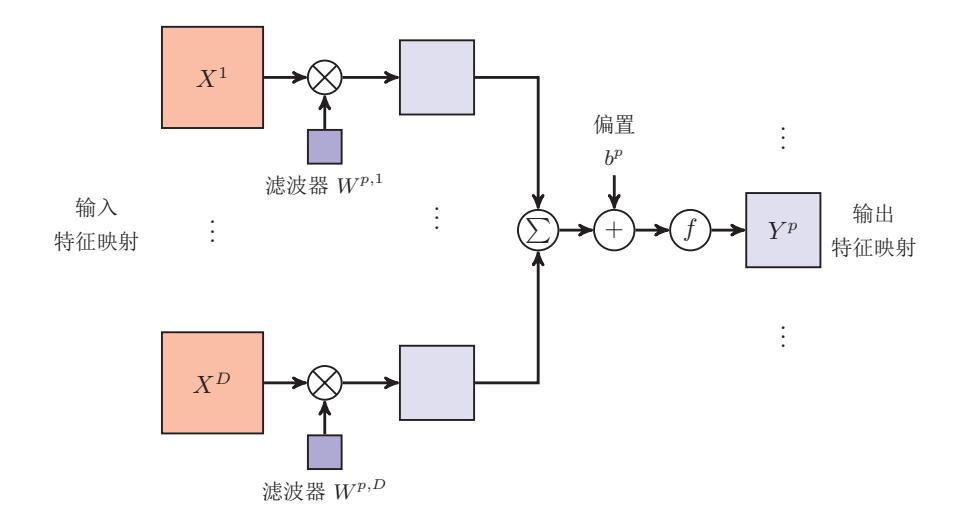

图 5.7 卷积层中从输入特征映射组 X 到输出特征映射 YP 的计算示例

为了计算输出特征映射  $Y^p$ , 用卷积核  $W^{p,1}$ ,  $W^{p,2}$ , ...,  $W^{p,D}$  分别对输入特 征映射 $X^1, X^2, \cdots, X^D$ 进行卷积, 然后将卷积结果相加, 并加上一个标量偏置  $b$ 得到卷积层的净输入  $Z^p$ , 再经过非线性激活函数后得到输出特征映射  $Y^p$ 。

$$
Z^{p} = \mathbf{W}^{p} \otimes \mathbf{X} + b^{p} = \sum_{d=1}^{D} W^{p,d} \otimes X^{d} + b^{p}, \qquad (5.20)
$$

$$
Y^p = f(Z^p). \tag{5.21}
$$

其中 WP  $\in \mathbb{R}^{m \times n \times D}$  为三维卷积核,  $f(\cdot)$  为非线性激活函数, 一般用 ReLU 函 数。整个计算过程如图5.7所示。如果希望卷积层输出P个特征映射,可以将上 述计算机过程重复P次, 得到P个输出特征映射  $Y^1, Y^2, \cdots, Y^P$ 。

在输入为X ∈ RMxNxD, 输出为Y ∈ RM'xN'xP 的卷积层中, 每一个输 入特征映射都需要 $D \triangleleft \mathbb{R}$ 波器以及一个偏置。假设每个滤波器的大小为 $m \times n$ , 那么共需要 $P \times D \times (m \times n) + P$ 个参数。

### 5.2.3 汇聚层

5.2 卷积神经网络

汇聚层(pooling layer)也叫子采样层(subsampling layer),其作用是进 行特征选择, 降低特征数量, 并从而减少参数数量。

卷积层虽然可以显著减少网络中连接的数量,但特征映射组中的神经元个 数并没有显著减少。如果后面接一个分类器, 分类器的输入维数依然很高, 很 容易出现过拟合。为了解决这个问题,可以在卷积层之后加上一个汇聚层,从 而降低特征维数,避免过拟合。

减少特征维数也可以通 过增加卷积步长来实现。

113

{10}------------------------------------------------

假设汇聚层的输入特征映射组为X  $\in \mathbb{R}^{M \times N \times D}$ , 对于其中每一个特征映射  $X^d$ , 将其划分为很多区域 $R_{m,n}^d$ ,  $1 \leq m \leq M', 1 \leq n \leq N'$ , 这些区域可以重叠, 也可以不重叠。汇聚(pooling)是指对每个区域进行下采样(down sampling)得 到一个值,作为这个区域的概括。

常用的汇聚函数有两种:

1. 最大汇聚 (maximum pooling): 一般是取一个区域内所有神经元的最 大值。

$$
Y_{m,n}^d = \max_{i \in R_{m,n}^d} x_i,
$$
\n(5.22)

其中xi为区域Rk内每个神经元的激活值。

2. 平均汇聚 (mean pooling): 一般是取区域内所有神经元的平均值。

$$
Y_{m,n}^d = \frac{1}{|R_{m,n}^d|} \sum_{i \in R_{m,n}^d} x_i.
$$
\n(5.23)

对每一个输入特征映射  $X^d$  的  $M' \times N'$  个区域进行子采样, 得到汇聚层的 输出特征映射 $Y^d = \{Y_{m,n}^d\}, 1 \leq m \leq M', 1 \leq n \leq N'$ 。

图5.8给出了采样最大汇聚进行子采样操作的示例。可以看出,汇聚层不但 可以有效地减少神经元的数量, 还可以使得网络对一些小的局部形态改变保持 不变性,并拥有更大的感受野。

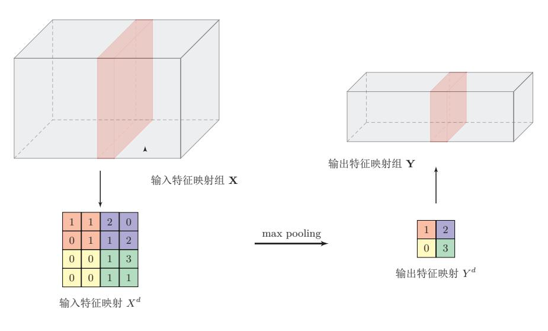

图 5.8 汇聚层中最大汇聚过程示例

目前主流的卷积网络中, 汇聚层仅包含下采样操作。但在早期的一些卷积

{11}------------------------------------------------

网络(比如LeNet-5)中,有时也会在汇聚层使用非线性激活函数,比如

$$
Y'^{d} = f\left(w^{d} \cdot Y^{d} + b^{d}\right),\tag{5.24}
$$

其中 $Y'^d$  为汇聚层的输出,  $f(.)$  为非线性激活函数,  $w^d \bar{w}$  为可学习的标量权 重和偏置。

典型的汇聚层是将每个特征映射划分为2×2大小的不重叠区域, 然后使用 最大汇聚的方式进行下采样。汇聚层也可以看做是一个特殊的卷积层,卷积核 大小为 $m \times m$ , 步长为 $s \times s$ , 卷积核为 $max$  函数或 $mean$  函数。过大的采样区 域会急剧减少神经元的数量,会造成过多的信息损失。

### 5.2.4 典型的卷积网络结构

一个典型的卷积网络是由卷积层、汇聚层、全连接层交叉堆叠而成。目前常 用的卷积网络结构图5.9所示。一个卷积块为连续 M 个卷积层和 b 个汇聚层 (M 通常设置为2~5,b为0或1)。一个卷积网络中可以堆叠 N 个连续的卷积块, 然后在接着  $K \wedge \hat{F}$  连接层 (N 的取值区间比较大, 比如1~100或者更大: K 一般为 $0 \sim 2$ )。

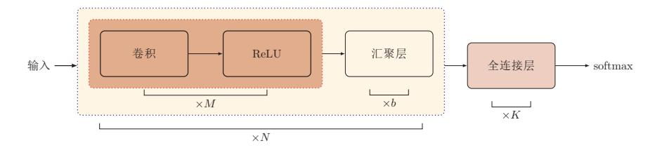

图 5.9 典型的卷积网络结构

目前, 整个网络结构趋向于使用更小的卷积核(比如1×1和3×3)以及 更深的结构(比如层数大于50)。此外,由于卷积的操作性越来越灵活(比如不 同的步长), 汇聚层的作用变得也越来越小, 因此目前比较流行的卷积网络中, 汇聚层的比例也逐渐降低, 趋向于全卷积网络。

#### 参数学习 $5.3$

在卷积网络中,参数为卷积核中权重以及偏置。和全连接前馈网络类似,卷 积网络也可以通过误差反向传播算法来进行参数学习。

在全连接前馈神经网络中, 梯度主要通过每一层的误差项 8 讲行反向传播, 并进一步计算每层参数的梯度。

在卷积神经网络中, 主要有两种不同功能的神经层: 卷积层和汇聚层。而 参数为卷积核以及偏置, 因此只需要计算卷积层中参数的梯度。

参见公式(4.59)。

这里假设汇聚层中没有  $\frac{\text{\$} \text{\$}}{\text{https://nndl.github.io/}}$ 

{12}------------------------------------------------

不失一般性, 对第 $l$ 层为卷积层, 第 $l-1$ 层的输入特征映射为 $\mathbf{X}^{(l-1)} \in$  $\mathbb{R}^{M\times N\times D}$ , 通过卷积计算得到第l层的特征映射净输入 $\mathbf{Z}^{(l)} \in \mathbb{R}^{M'\times N'\times P}$ 。第l 层的第 $p(1 < p < P)$ 个特征映射净输入

$$
Z^{(l,p)} = \sum_{d=1}^{D} W^{(l,p,d)} \otimes X^{(l-1,d)} + b^{(l,p)}, \qquad (5.25)
$$

其中 $W^{(l,p,d)}$ 和 $b^{(l,p)}$ 为卷积核以及偏置。第 $l$ 层中共有 $P \times D$ 个卷积核和 $P \triangleleft$ 偏置, 可以分别使用链式法则来计算其梯度。

根据公式(5.14)和(5.25),损失函数关于第 $l$ 层的卷积核 $W^{(l,p,d)}$ 的偏导数为

$$
\frac{\partial \mathcal{L}(Y,\hat{Y})}{\partial W^{(l,p,d)}} = \frac{\partial \mathcal{L}(Y,\hat{Y})}{\partial Z^{(l,p)}} \otimes X^{(l-1,d)} \tag{5.26}
$$

$$
= \delta^{(l,p)} \otimes X^{(l-1,d)},\tag{5.27}
$$

其中 $\delta^{(l,p)} = \frac{\partial \mathcal{L}(Y,\hat{Y})}{\partial Z^{(l,p)}}$ 为损失函数关于第 $l$ 层的第 $p \,\hat{Y}$ 特征映射净输入 $Z^{(l,p)}$ 的偏 导数。

同理可得, 损失函数关于第1层的第p个偏置 b(l,p) 的偏导数为

$$
\frac{\partial \mathcal{L}(Y,\hat{Y})}{\partial b^{(l,p)}} = \sum_{i,j} [\delta^{(l,p)}]_{i,j}.
$$
\n(5.28)

卷积网络中, 每层参数的梯度依赖其所在层的误差项δ(l,p)。

### 5.3.1 误差项的计算

卷积层和汇聚层中, 误差项的计算有所不同, 因此我们分别计算其误差项。

汇聚层 当第1+1层为汇聚层时,因为汇聚层是下采样操作,1+1层的每个神经 元的误差项 δ 对应于第 l 层的相应特征映射的一个区域。l 层的第 p 个特征映射 中的每个神经元都有一条边和l+1层的第p个特征映射中的一个神经元相连。 根据链式法则, 第l层的一个特征映射的误差项δ(l,p), 只需要将l+1层对应特 征映射的误差项  $\delta^{(l+1,p)}$ 进行上采样操作(和第1层的大小一样),再和1层特征 映射的激活值偏导数逐元素相乘, 就得到了 $\delta^{(l,p)}$ 。

第l层的第 p个特征映射的误差项  $\delta^{(l,p)}$  的具体推导过程如下:

$$
\delta^{(l,p)} \triangleq \frac{\partial \mathcal{L}(Y,Y)}{\partial Z^{(l,p)}}\tag{5.29}
$$

$$
= \frac{\partial X^{(l,p)}}{\partial Z^{(l,p)}} \cdot \frac{\partial Z^{(l+1,p)}}{\partial X^{(l,p)}} \cdot \frac{\partial \mathcal{L}(Y,\hat{Y})}{\partial Z^{(l+1,p)}} \tag{5.30}
$$

$$
= f'_{l}(Z^{(l,p)}) \odot \mathbf{up}(\delta^{(l+1,p)}), \tag{5.31}
$$

https://nndl.github.io/

参见公式(5.20)。

参见公式(5.14)。

{13}------------------------------------------------

?并非真正的矩阵乘

因此这里计算的偏

并非真正的矩阵偏  $x, \pm \hat{\pi}$ 

作向量。

其中 $f_i'(\cdot)$ 为第 $l$ 层使用的激活函数导数, up 为上采样函数 (upsampling), 与汇 聚层中使用的下采样操作刚好相反。如果下采样是最大汇聚(max pooling),误 差项  $\delta^{(l+1,p)}$ 中每个值会直接传递到上一层对应区域中的最大值所对应的神经 元, 该区域中其它神经元的误差项的都设为0。如果下采样是平均汇聚(mean pooling), 误差项 δ(1+1,p) 中每个值会被平均分配到上一层对应区域中的所有神 经元上。

卷积层 当 $l+1$ 层为卷积层时,假设特征映射净输入 $\mathbf{Z}^{(l+1)} \in \mathbb{R}^{M' \times N' \times P}$ , 其中 第 $p(1 < p < P)$ 个特征映射净输入

$$
Z^{(l+1,p)} = \sum_{d=1}^{D} W^{(l+1,p,d)} \otimes X^{(l,d)} + b^{(l+1,p)}, \tag{5.32}
$$

其中 $W^{(l+1,p,d)}$ 和 $b^{(l+1,p)}$ 为第 $l+1$ 层的卷积核以及偏置。第 $l+1$ 层中共有 $P \times D$ 个卷积核和P个偏置。

第l层的第d个特征映射的误差项δ(l,d) 的具体推导过程如下:

$$
\delta^{(l,d)} \triangleq \frac{\partial \mathcal{L}(Y, \hat{Y})}{\partial Z^{(l,d)}}\tag{5.33}
$$

$$
= \frac{\partial X^{(l,d)}}{\partial Z^{(l,d)}} \cdot \frac{\partial \mathcal{L}(Y,\hat{Y})}{\partial X^{(l,d)}} \tag{5.34}
$$

$$
= f'_{l}(Z^{(l)}) \odot \sum_{p=1}^{P} \left( \text{rot180}(W^{(l+1,p,d)}) \tilde{\otimes} \frac{\partial \mathcal{L}(Y, \hat{Y})}{\partial Z^{(l+1,p)}} \right) \qquad (5.35) \qquad \text{R44.} \tag{5.36}
$$
$$
= f'_{l}(Z^{(l)}) \odot \sum_{p=1}^{P} \left( \text{rot180}(W^{(l+1,p,d)}) \tilde{\otimes} \delta^{(l+1,p)} \right), \qquad (5.36)
$$

其中。为宽卷积。

参见习题5-6。

参见公式(5.20)。

#### 几种典型的卷积神经网络 $5.4$

本节介绍几种广泛使用的典型深层卷积神经网络。

### 5.4.1 LeNet-5

LeNet-5[LeCun et al., 1998] 虽然提出的时间比较早, 但是是一个非常成功 的神经网络模型。基于 LeNet-5 的手写数字识别系统在 90 年代被美国很多银行 使用, 用来识别支票上面的手写数字。LeNet-5的网络结构如图5.10所示。

### 邱锡鹏:《神经网络与深度学习》

https://nndl.github.io/

{14}------------------------------------------------

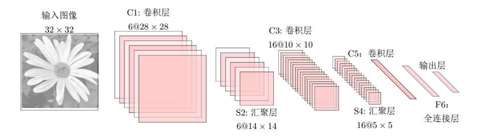

图 5.10 LeNet-5 网络结构 (图片根据 [LeCun et al., 1998] 绘制)

不计输入层, LeNet-5共有7层, 每一层的结构为:

- 1. 输入层: 输入图像大小为32 × 32 = 1024。
- 2. C1层是卷积层, 使用6个5×5的滤波器, 得到6组大小为28×28 = 784 的特征映射。因此, C1层的神经元数量为 $6 \times 784 = 4,704$ , 可训练参数 数量为6×25+6=156, 连接数为156×784=122,304 (包括偏置在内, 下同)。
- 3. S2 层为汇聚层, 采样窗口为2×2, 使用平均汇聚, 并使用一个如公式(5.24) 的非线性函数。神经元个数为 $6 \times 14 \times 14 = 1,176$ , 可训练参数数量为  $6 \times (1 + 1) = 12$ , 连接数为 $6 \times 196 \times (4 + 1) = 5,880$
- 4. C3层为卷积层。LeNet-5中用一个连接表来定义输入和输出特征映射之间 的依赖关系, 如图5.11所示, 共使用60个5×5的滤波器, 得到16组大小 为 $10 \times 10$ 的特征映射。神经元数量为 $16 \times 100 = 1,600$ , 可训练参数数量  $\frac{1}{10}$  (60 × 25) + 16 = 1,516, 连接数为 100 × 1,516 = 151,600.
- 5. S4层是一个汇聚层, 采样窗口为2 × 2, 得到16个5 × 5大小的特征映射, 可训练参数数量为16×2=32, 连接数为16×25×(4+1)=2000。
- 6. C5 层是一个卷积层, 使用  $120 \times 16 = 1,920$  个  $5 \times 5$  的滤波器, 得到  $120$ 组大小为1×1的特征映射。C5层的神经元数量为120,可训练参数数量  $\frac{1}{2}$ 1,920 × 25 + 120 = 48,120, 连接数为120 × (16 × 25 + 1) = 48,120.
- 7. F6层是一个全连接层, 有84个神经元, 可训练参数数量为84×(120+1) = 10,164。连接数和可训练参数个数相同, 为10,164。
- 8. 输出层: 输出层由10个欧氏径向基函数 (Radial Basis Function, RBF) 函数组成。这里不再详述。

连接表 从公式(5.20)可以看出, 卷积层的每一个输出特征映射都依赖于所有输 入特征映射, 相当于卷积层的输入和输出特征映射之间是全连接的关系。实际 上, 这种全连接关系不是必须的。我们可以让每一个输出特征映射都依赖于少 数几个输入特征映射。定义一个连接表(link table) T来描述输入和输出特征

连接表参见公式(5.37)。 如果不使用连接表,则需 要96个5×5的滤波器。 

{15}------------------------------------------------

映射之间的连接关系。如果第p个输出特征映射依赖于第d个输入特征映射, 则  $T_{p,d} = 1,$  否则为0。

$$
Y^{p} = f\left(\sum_{\substack{d,\\T_{p,d}=1}} W^{p,d} \otimes X^{d} + b^{p}\right),\tag{5.37}
$$

其中T为P × D大小的连接表。假设连接表T的非零个数为K, 每个滤波器的 大小为 $m \times n$ , 那么共需要 $K \times m \times n + P$ 参数。

在 LeNet-5中, 连接表的基本设定如图5.11所示。C3 层的第 0-5 个特征映射 依赖于 S2 层的特征映射组的每3个连续子集, 第 6-11 个特征映射依赖于 S2 层 的特征映射组的每4个连续子集, 第12-14个特征映射依赖于S2层的特征映射 的每4个不连续子集, 第15个特征映射依赖于S2层的所有特征映射。

|                                           |              |  |  |  |  | 1 2 3 4 5 6 7 8 9 10 11 12 13 14 15     |  |  |  |
|-------------------------------------------|--------------|--|--|--|--|-----------------------------------------|--|--|--|
| $0   X$ $X X X$ $X X X X X$               |              |  |  |  |  |                                         |  |  |  |
| $1   X X$ $X X X$ $X X X X$               |              |  |  |  |  |                                         |  |  |  |
| 2   X X X X X X X X X X X X               |              |  |  |  |  |                                         |  |  |  |
| $3$ X X X X X X X X X X X X X X X X X X X |              |  |  |  |  |                                         |  |  |  |
| 4   X X X                                 |              |  |  |  |  | $X \times X \times X \times X \times X$ |  |  |  |
|                                           | $X \times X$ |  |  |  |  | $X \times X \times X \times X \times X$ |  |  |  |

图 5.11 LeNet-5中C3层的连接表(图片来源于 [LeCun et al., 1998])

### $5.4.2$ AlexNet

AlexNet[Krizhevsky et al., 2012] 是第一个现代深度卷积网络模型, 其首次 使用了很多现代深度卷积网络的一些技术方法,比如使用GPU进行并行训练, 采用了 ReLU 作为非线性激活函数, 使用 Dropout 防止过拟合, 使用数据增强 来提高模型准确率等。AlexNet 赢得了2012年 ImageNet 图像分类竞赛的冠军。

AlexNet 的结构如图5.12所示,包括5个卷积层、3个全连接层和1个softmax 层。因为网络规模超出了当时的单个GPU的内存限制, AlexNet 将网络拆为两 半,分别放在两个GPU上,GPU间只在某些层(比如第3层)进行通讯。

{16}------------------------------------------------

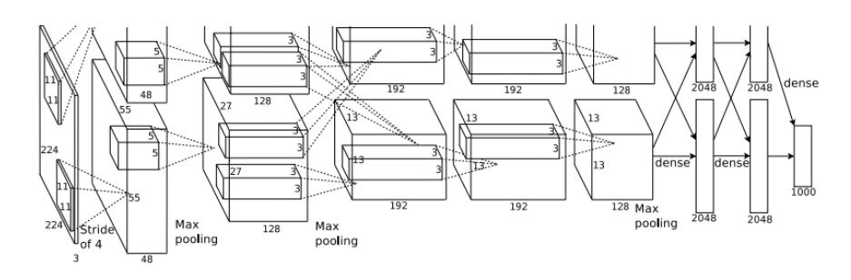

图 5.12 AlexNet 网络结构 (图片来源于 [Krizhevsky et al., 2012])

这里的卷积核使用四维 张量来描述。

AlexNet 的具体结构如下:

1. 输入层,  $224 \times 224 \times 3$ 的图像;

- 2. 第一个卷积层, 使用两个 $11 \times 11 \times 3 \times 48$ 的卷积核, 步长 $s = 4$ , 零填充  $p = 3$ , 得到两个 55 × 55 × 48 的特征映射组。
- 3. 第一个汇聚层, 使用大小为 $3 \times 3$ 的最大汇聚操作, 步长 $s = 2$ , 得到两个  $27 \times 27 \times 48$ 的特征映射组。
- 4. 第二个卷积层, 使用两个  $5 \times 5 \times 48 \times 128$ 的卷积核, 步长  $s = 1$ , 零填充  $p = 1$ , 得到两个  $27 \times 27 \times 128$  的特征映射组。
- 5. 第二个汇聚层, 使用大小为 $3 \times 3$ 的最大汇聚操作, 步长 $s = 2$ , 得到两个  $13 \times 13 \times 128$ 的特征映射组。
- 6. 第三个卷积层为两个路径的融合, 使用一个  $3 \times 3 \times 256 \times 384$  的卷积核, 步长  $s = 1$ , 零填充  $p = 1$ , 得到两个  $13 \times 13 \times 192$  的特征映射组。
- 7. 第四个卷积层, 使用两个  $3 \times 3 \times 192 \times 192$  的卷积核, 步长  $s = 1$ , 零填 充  $p = 1$ , 得到两个  $13 \times 13 \times 192$  的特征映射组。
- 8. 第五个卷积层, 使用两个  $3 \times 3 \times 192 \times 128$  的卷积核, 步长  $s = 1$ , 零填 充  $p = 1$ , 得到两个  $13 \times 13 \times 128$  的特征映射组。
- 9. 汇聚层, 使用大小为3×3的最大汇聚操作, 步长  $s = 2$ , 得到两个 $6 \times 6 \times 128$ 的特征映射组。
- 10. 三个全连接层, 神经元数量分别为4096, 4096和1000。

#### Inception 网络 5.4.3

在卷积网络中, 如何设置卷积层的卷积核大小是一个十分关键的问题。在 Inception 网络中, 一个卷积层包含多个不同大小的卷积操作, 称为 Inception 模 块。Inception 网络是由有多个 inception 模块和少量的汇聚层堆叠而成。

Inception 模块受到 "Network in network" [Lin et al., 2013] 的启 发。

Inception 模块同时使用 $1 \times 1$ 、 $3 \times 3$ 、 $5 \times 5$ 等不同大小的卷积核, 并将得 到的特征映射在深度上拼接(堆叠)起来作为输出特征映射。

{17}------------------------------------------------

图5.13给出了v1版本的 Inception 模块, 采用了4组平行的特征抽取方式, 分别为1×1、3×3、5×5的卷积和3×3的最大汇聚。同时, 为了提高计算效 率, 减少参数数量, Inception 模块在进行  $3 \times 3$ 、 $5 \times 5$  的卷积之前、 $3 \times 3$  的最 大汇聚之后, 进行一次1×1的卷积来减少特征映射的深度。如果输入特征映射 之间存在冗余信息, 1 × 1 的卷积相当于先进行一次特征抽取。

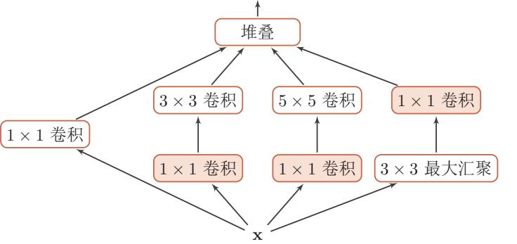

Inception 模块中的卷积 和最大汇聚都是等宽的。

Inception 网络最早的 v1 版本就是非常著名的 GoogLeNet [Szegedy et al.,

图 5.13 Inception v1 的模块结构

2015], 并赢得了2014年 ImageNet 图像分类竞赛的冠军。

GoogLeNet 由9个Inception v1模块和5个汇聚层以及其它一些卷积层和全 连接层构成,总共为22层网络,如图5.14所示。为了解决梯度消失问题,GoogLeNet 在网络中间层引入两个辅助分类器来加强监督信息。

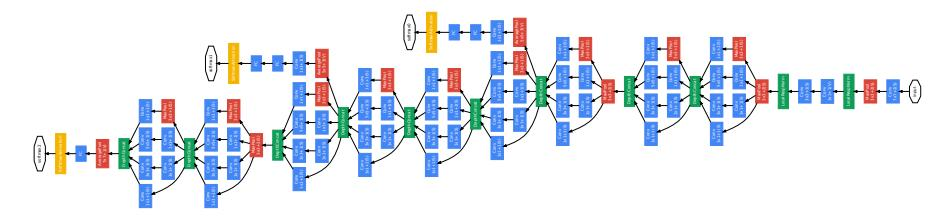

GoogLeNet 不 写 为 GoogleNet, 是为了向 LeNet 致敬。

清晰图见 https://nndl.github.

图 5.14 GoogLeNet 网络结构 (图片来源于 [Szegedy et al., 2015])

Inception 网络有多个改进版本, 其中比较有代表性的有 Inception v3 网络 [Szegedy et al., 2016]。Inception v3 网络用多层的小卷积核来替换大的卷积核, 以减少计算量和参数量,并保持感受野不变。具体包括: (1) 使用两层3×3的 卷积来替换v1中的5×5的卷积;(2)使用连续的 $n \times 1$ 和1× $n$ 来替换 $n \times n$ 的 卷积。称为, Inception v3 网络同时也引入了标签平滑以及批量归一化等优化方 法进行训练。

121

{18}------------------------------------------------

此外, Szegedy et al. [2017] 还提出了结合直连 (shortcut connect) 边的 inception 模块: Inception-ResNet v2 网络, 并在此基础上并设计了一个更优化 的 inception v4 模型。

#### 残差网络 5.4.4

残差网络 (Residual Network, ResNet) 是通过给非线性的卷积层增加直 连边的方式来提高信息的传播效率。

假设在一个深度网络中,我们期望一个非线性单元(可以为一层或多层的 卷积层) $f(\mathbf{x}, \theta)$ 去逼近一个目标函数为 $h(\mathbf{x})$ 。如果将目标函数拆分成两部分:恒 等函数 (identity function)  $\mathbf{x}$  和残差函数 (residue function)  $h(\mathbf{x}) - \mathbf{x}$  两个部分,

$$
h(\mathbf{x}) = \mathbf{x} + \underbrace{(h(\mathbf{x}) - \mathbf{x})}_{\text{H4} \text{H4} \text{H4} \text{H5} \text{H5} \text{H5} \text{H5} \tag{5.38}
$$

根据通用近似定理, 一个由神经网络构成的非线性单元有足够的能力来近似逼 近原始目标函数或残差函数,但实际中后者更容易学习 [He et al., 2016]。因此, 原来的优化问题可以转换为: 让非线性单元  $f(\mathbf{x}, \theta)$ 去近似残差函数 $h(\mathbf{x}) - \mathbf{x}$ , 并 用 $f(\mathbf{x},\theta) + \mathbf{x}$ 去逼近 $h(\mathbf{x})$ 。

图5.15给出了一个典型的残差单元示例。残差单元由多个级联的(等长)卷 积层和一个跨层的直连边组成,再经过 ReLU 激活后得到输出。

残差网络就是将很多个残差单元串联起来构成的一个非常深的网络。

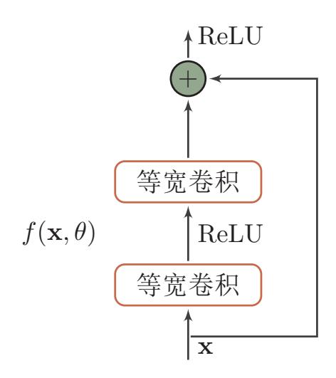

图 5.15 一个简单的残差单元结构

和残差网络类似的还有 highway network[Srivastava et al., 2015]。

残差网络的思想并不局 限与卷积神经网络。

{19}------------------------------------------------

#### 其它卷积方式 $5.5$

在第5.1.2节中介绍了一些卷积的变种,可以通过步长和零填充来进行不同 的卷积操作。本节介绍一些其它的卷积方式。

### 5.5.1 转置卷积

我们一般可以通过卷积操作来实现高维特征到低维特征的转换。比如在一 维卷积中,一个5维的输入特征,经过一个大小为3的卷积核,其输出为3维特 征。如果设置步长大于1,可以进一步降低输出特征的维数。但在一些任务中, 我们需要将低维特征映射到高维特征, 并且依然希望通过卷积操作来实现。

假设有一个高维向量为 $\mathbf{x} \in \mathbb{R}^d$ 和一个低维向量为 $\mathbf{z} \in \mathbb{R}^p$ ,  $n < d$ 。如果用 仿射变换来实现高维到低维的映射,

$$
\mathbf{z} = W\mathbf{x},\tag{5.39}
$$

其中 $W \in \mathbb{R}^{p \times d}$ 为转换矩阵。我们可以很容易地通过转置 $W$ 来实现低维到高维 的反向映射, 即

$$
\mathbf{x} = W^{\mathrm{T}} \mathbf{z}.\tag{5.40}
$$

需要说明的是, 公式(5.40)和(5.40)并不是逆运算, 两个映射只是形式上的转置 关系。

在全连接网络中,忽略激活函数,前向计算和反向传播就是一种转置关系。 比如前向计算时, 第 $l+1$ 层的净输入为 $\mathbf{z}^{(l+1)} = W^{(l+1)}\mathbf{z}^{(l)}$ , 反向传播时, 第 $l$ 层的误差项为δ(l) =  $(W^{(l+1)})^T\delta^{(l+1)}$ 。

卷积操作也可以写为仿射变换的形式。假设一个5维向量x, 经过大小为3 的卷积核  $\mathbf{w} = [w_1, w_2, w_3]^T$ 进行卷积, 得到3维向量 z。卷积操作可以写为

$$
\mathbf{z} = \mathbf{w} \otimes \mathbf{x} \tag{5.41}
$$

$$
= \begin{bmatrix} w_1 & w_2 & w_3 & 0 & 0 \\ 0 & w_1 & w_2 & w_3 & 0 \\ 0 & 0 & w_1 & w_2 & w_3 \end{bmatrix} \cdot \mathbf{x}
$$
 (5.42)  
=  $C\mathbf{x}$ , (5.43)

其中C是一个稀疏矩阵,其非零元素来自于卷积核w中的元素。

 $\mathbf{r}$ 

如果要实现3维向量z到5维向量x的映射,可以通过仿射矩阵的转置来 实现。

$$
\mathbf{x} = C^{\mathrm{T}} \mathbf{z} \tag{5.44}
$$

#### 邱锡鹏:《神经网络与深度学习》

不失一般性, 这里忽略 了平移项。

参见习题5-4。

https://nndl.github.io/

参见公式(4.59)。

{20}------------------------------------------------

$$
= \begin{bmatrix} w_1 & 0 & 0 \\ w_2 & w_1 & 0 \\ w_3 & w_2 & w_1 \\ 0 & w_3 & w_2 \\ 0 & 0 & w_3 \end{bmatrix} \cdot z
$$
 (5.45)  
= **rot180**(**w**) $\tilde{\Phi}$ **z**, (5.46)

其中 rot180 (·) 表示旋转 180 度。

从公式(5.42)和(5.45)可以看出, 从仿射变换的角度来看两个卷积操作z =  $\mathbf{w}\otimes\mathbf{x}$ 和 $\mathbf{x} = \mathbf{rot180}(\mathbf{w})$  $\tilde{\oplus}$ z 也是形式上的转置关系。因此,我们将低维特征映射 到高维特征的卷积操作称为转置卷积(transposed convolution) [Dumoulin and Visin, 2016], 也称为反卷积 (deconvolution) [Zeiler et al., 2011]。

和卷积网络中,卷积层的前向计算和反向传播也是一种转置关系。

对一个p维的向量z,和大小为m的卷积核,如果希望通过卷积操作来映射 到高维向量, 只需要对向量z进行两端补零 $p = m - 1$ , 然后进行卷积, 可以得 到 $p+m-1$ 维的向量。

转置卷积同样适用于二维卷积。图5.16给出了一个步长  $s = 1$ , 无零填充 p=0的两维卷积和其对应的转置卷积。

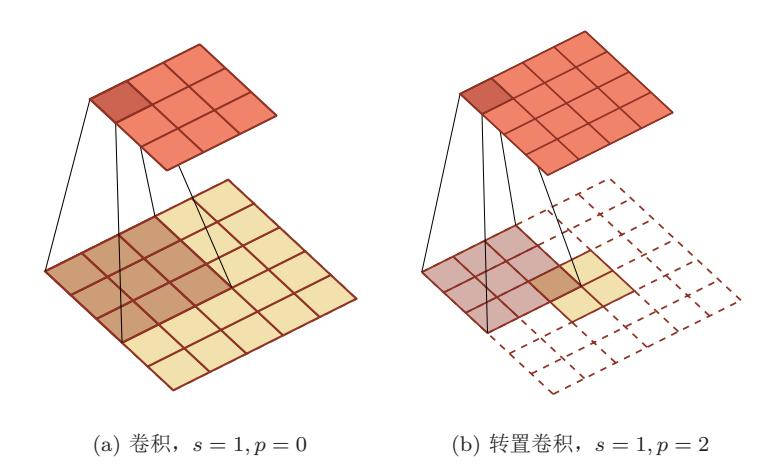

图 5.16 步长  $s = 1$ , 无零填充  $p = 0$  的两维卷积和其对应的转置卷积

https://nndl.github.io/v/cnn-conv-more

转置卷积的动图 见https://nndl.github.  $io/v/cm$ -conv-more

反卷积 (deconvolution)

的名字并不是适合,它 不是指卷积的逆运算。

参见习题5-6。

即宽卷积。

{21}------------------------------------------------

微步卷积 我们可以通过增加卷积操作的步长s > 1来实现对输入特征的降采样 操作,大幅降低特征维数。同样,我们也可以通过减少转置卷积的步长 s < 1来 实现上采样操作,大幅提高特征维数。

步长 s < 1 的转置卷积也称为微步卷积(fractionally-strided convolution) [Long et al., 2015]。为了实现微步卷积, 我们可以在输入特征之间插入0来间 接地使得步长变小。

如果卷积操作的步长为s > 1, 希望其对应的转置卷积的步长为!, 需要在 输入特征之间插入s-1个0来使得其移动的速度变慢。

以一维转置卷积为例, 对一个p维的向量z, 和大小为m的卷积核, 通过对 向量z进行两端补零  $p = m - 1$ , 并且在每两个向量元素之间插入  $s - 1$  个 0, 然 后进行步长为1的卷积,可以得到 $s \times (p-1) + m$ 维的向量。

图5.16给出了一个步长  $s = 2$ , 无零填充  $p = 0$  的两维卷积和其对应的转置 卷积。

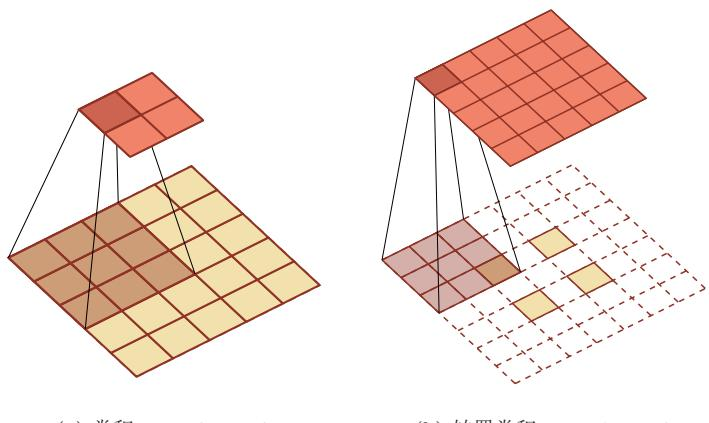

(a) 卷积,  $s = 2, p = 0$ 

(b) 转置卷积,  $s = 1, p = 2$ 

图 5.17 步长  $s = 2$ , 无零填充  $p = 0$  的两维卷积和其对应的转置卷积

#### 5.5.2 空洞卷积

对于一个卷积层, 如果希望增加输出单元的感受野, 一般可以通过三种方 式实现: (1) 增加卷积核的大小; (2) 增加层数; (3) 在卷积之前进行汇聚操 作。前两种操作会增加参数数量,而第三种会丢失一些信息。

空洞卷积 (atrous convolutions), 也称为膨胀卷积 (dilated convolution) , 是一种不增加参数数量, 同时增加输出单元感受野的一种方法 [Chen et al., 2018, Yu and Koltun, 2015].

atrous 一词来源于法语 a trous, 意为"空洞, 多 https://nndl.github.io/

{22}------------------------------------------------

空洞卷积通过给卷积核插入"空洞"来变相地增加其大小。如果在卷积核 的每两个元素之间插入  $d-1$ 个空洞, 卷积核的有效大小为

$$
m' = m + (m - 1) \times (d - 1), \tag{5.47}
$$

其中d称为膨胀率 (dilation rate)。当d = 1时卷积核为普通的卷积核。

图5.18给出了空洞卷积的示例。

空洞卷积的动图 见https://nndl.github. io/v/cnn-conv-more

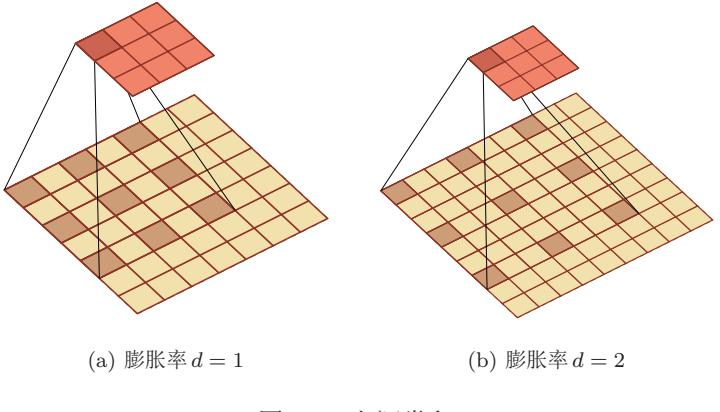

图 5.18 空洞卷积

#### 总结和深入阅读 5.6

卷积神经网络是受生物学上感受野的机制而提出。David Hubel 和 Torsten Wiesel在1959年发现,在猫的初级视觉皮层中存在两种细胞:简单细胞和复杂细 胞, 这两种细胞承担不同层次的视觉感知功能 [Hubel and Wiesel, 1959, 1962]。 简单细胞的感受野是狭长型的,每个简单细胞只对感受野中特定角度(orientation)的光带敏感, 而复杂细胞对于感受野中以特定方向(direction) 移动的某 种角度 (orientation) 的光带敏感。受此启发, 1980年, 福岛邦彦 (Kunihiko Fukushima)提出了一种带卷积和子采样操作的多层神经网络:新知机(Neocognitron) [Fukushima, 1980]。但当时还没有反向传播算法, 新知机采用了无监督 学习的方式来训练。Yann LeCun 在1989年将反向传播算法引入了卷积神经网 络 [LeCun et al., 1989], 并在手写体数字识别上取得了很大的成功 [LeCun et al.,  $1998$ .

AlexNet[Krizhevsky et al., 2012] 是第一个现代深度卷积网络模型, 可以说 是深度学习技术在图像分类上真正突破的开端。AlexNet 不用预训练和逐层训 练,首次使用了很多现代深度网络的一些技术方法,比如使用GPU进行并行训 练, 采用了 ReLU 作为非线性激活函数, 使用 dropout 防止过拟合, 使用数据增 强来提高模型准确率等。这些技术极大地推动了端到端的深度学习模型的发展。

David Hubel 和 Torsten Wiesel 在此方面的贡献, 与1981年获得诺贝尔生 理学或医学奖。

邱锡鹏:《神经网络与深度学习》

https://nndl.github.io/

{23}------------------------------------------------

在 AlexNet 之后, 出现了很多优秀的卷积网络, 比如 VGG 网络 [Simonyan and Zisserman, 2014], Inception v1, v2, v4 网络 [Szegedy et al., 2015, 2016, 2017], 残差网络 [He et al., 2016] 等。

目前, 卷积神经网络已经成为计算机视觉领域的主流模型。通过引入跨层 的直连边,可以训练上百层乃至上千层的卷积网络。随着网络层数的增加,卷 积层越来越多地使用1×1和3×3大小的小卷积核, 也出现了一些不规则的卷 积操作, 比如空洞卷积 [Chen et al., 2018, Yu and Koltun, 2015]、可变形卷积 [Dai et al., 2017] 等。网络结构也逐渐趋向于全卷积网络(Fully Convolutional Network, FCN) [Long et al., 2015], 减少汇聚层和全连接层的作用。

Dumoulin and Visin [2016] 给出了各种卷积操作的可视化示例。

### 习题

习题 5-1 证明宽卷积具有交换性, 即公式(5.10)。

习题 5-2 分析卷积神经网络中用 1 × 1 的滤波器的作用。

习题 5-3 对于一个输入为100 × 100 × 256 的特征映射组, 使用 3 × 3 的卷 积核, 输出为100 × 100 × 256 的特征映射组的卷积层, 求其时间和空间复杂度。 如果引入一个 $1 \times 1$ 卷积核先得到 $100 \times 100 \times 64$ 的特征映射, 再进行 $3 \times 3$ 的卷 积, 得到100 × 100 × 256 的特征映射组, 求其时间和空间复杂度。

习题 5-4 对于一个两维卷积, 输入为3×3, 卷积核大小为2×2, 试将卷 积操作重写为仿射变换的形式。

参见公式(5.42)。

习题 5-5 在最大汇聚层中, 计算函数  $y = \max(x_1, \dots, x_d)$  的梯度。函数  $y = \arg \max(x_1, \cdots, x_d)$ 的梯度呢?

习题 5-6 忽略激活函数, 分析卷积网络中卷积层的前向计算和反向传播 (公式(5.36)) 是一种转置关系。

习题 5-7 在空洞卷积中, 当卷积核大小为m, 膨胀率为d时, 如何设置零 填充p的值以使得卷积为等宽卷积。

{24}------------------------------------------------

# 参考文献

Liang-Chieh Chen, George Papandreou, Iasonas Kokkinos, Kevin Murphy, and Alan L Yuille. Deeplab: Semantic image segmentation with deep convolutional nets, atrous convolution, and fully connected CRFs. IEEE transactions on pattern analysis and machine intelligence,  $40(4):834-848, 2018.$ 

Jifeng Dai, Haozhi Qi, Yuwen Xiong, Yi Li, Guodong Zhang, Han Hu, and Yichen Wei. Deformable convolutional networks.  $CoRR$ ,  $abs/1703.06211$ , 1(2): 3. 2017.

Vincent Dumoulin and Francesco Visin. A guide to convolution arithmetic for deep learning.  $ArXiv$  e-prints, mar 2016. Kunihiko Fukushima. Neocognitron: A self-organizing neural network model for a mechanism of pattern recognition unaffected by shift in position. Biological cybernetics, 36(4):193-202, 1980.

Kaiming He, Xiangyu Zhang, Shaoqing Ren, and Jian Sun. Deep residual learning for image recognition. In Proceedings of the IEEE conference on computer vision and pattern recognition, pages 770-778, 2016.

David H Hubel and Torsten N Wiesel. Receptive fields of single neurones in the cat's striate cortex. The Journal of phys $iology, 148(3):574-591, 1959.$ 

David H Hubel and Torsten N Wiesel. Receptive fields, binocular interaction and functional architecture in the cat's visual cortex. The Journal of physiology,  $160(1):106-154, 1962.$ 

Alex Krizhevsky, Ilya Sutskever, and Geoffrey E Hinton. Imagenet classification with deep convolutional neural

networks. In Advances in neural information processing systems, pages 1097-1105, 2012.

Yann LeCun, Bernhard Boser, John S Denker, Donnie Henderson, Richard E Howard, Wayne Hubbard, and Lawrence D Jackel. Backpropagation applied to handwritten zip code recognition. Neural computation,  $1(4)$ : 541-551, 1989.

Yann LeCun, Léon Bottou, Yoshua Bengio, and Patrick Haffner. Gradientbased learning applied to document recognition. Proceedings of the IEEE, 86  $(11):2278-2324, 1998.$ 

Min Lin, Qiang Chen, and Shuicheng Yan. Network in network.  $arX$ *in* preprint arXiv:1312.4400, 2013.

Jonathan Long, Evan Shelhamer, and Trevor Darrell. Fully convolutional networks for semantic segmentation. In Proceedings of the IEEE conference on computer vision and pattern recognition, pages 3431-3440, 2015.

Karen Simonyan and Andrew Zisserman. Very deep convolutional networks for large-scale image recognition.  $arXiv$ preprint arXiv:1409.1556, 2014.

Rupesh Kumar Srivastava, Klaus Greff, and Jürgen Schmidhuber. Highway networks.  $arXiv$  preprint arXiv:1505.00387, 2015.

Christian Szegedy, Wei Liu, Yangqing Jia, Pierre Sermanet, Scott Reed, Dragomir Anguelov, Dumitru Erhan, Vincent Vanhoucke, and Andrew Rabinovich. Going deeper with convolutions. In Proceedings of the IEEE Conference 

{25}------------------------------------------------

on Computer Vision and Pattern Recognition, pages  $1-9$ ,  $2015$ .

Christian Szegedy, Vincent Vanhoucke, Sergey Ioffe, Jon Shlens, and Zbigniew Wojna. Rethinking the inception architecture for computer vision. In Proceedings of the IEEE Conference on Computer Vision and Pattern Recognition, pages 2818-2826, 2016.

Christian Szegedy, Sergey Ioffe, Vincent Vanhoucke, and Alexander A Alemi. Inception-v4, inception-resnet and the impact of residual connections on learning. In AAAI, pages 4278-4284, 2017. Fisher Yu and Vladlen Koltun. Multiscale context aggregation by dilated convolutions.  $arXiv$  preprint arXiv:1511.07122, 2015.

Matthew D Zeiler, Graham W Taylor, and Rob Fergus. Adaptive deconvolutional networks for mid and high level feature learning. In Proceedings of the IEEE International Conference on Computer Vision, pages 2018-2025. IEEE, 2011.