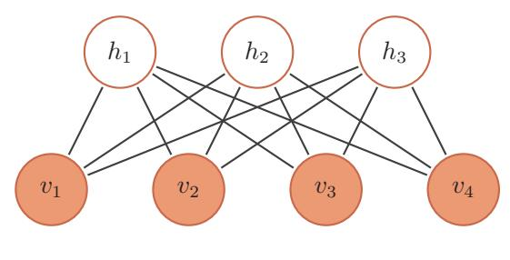

{0}------------------------------------------------

计算的目的不在干数据。而在干洞察事物。

- 理杳德 · 卫斯里 · 汉明

对于一个复杂的数据分布, 我们往往只能观测到有限的局部特征, 并且这 些特征通常会包含一定的噪声。如果要对这个数据分布讲行建模, 就需要挖掘 出可观测变量之间复杂的依赖关系, 以及可观测变量背后隐藏的内部表示。

本章介绍一种可以有效学习变量之间复杂依赖关系的概率图模型(深度信 念网络)以及两种相关的基础模型(玻尔兹曼机和受限玻尔兹曼机)。深度信念 网络中包含很多层的隐变量, 可以有效地学习数据的内部特征表示, 也可以作 为一种有效的非线性降维方法。这些学习到的内部特征表示包含了数据的更高 级的、有价值的信息,因此十分有助于后续的分类和回归等任务。

玻尔兹曼机和深度信念网络都是生成模型, 借助隐变量来描述复杂的数据 分布。作为概率图模型,玻尔兹曼机和深度信念网络的共同问题是推断和学习 问题。因为这两种模型都比较复杂,并且都包含隐变量,它们的推断和学习一般 通过 MCMC 方法来讲行近似估计。这两种模型和神经网络有很强的对应关系, 在一定程度上也称为随机神经网络 (Stochastic Neural Network, SNN)。

#### 玻尔兹曼机 $12.1$

动态系统是数学上的一 个概念, 用一个函数来 描述一个空间中所有点 随时间的变化情况,比 如钟摆晃动、水的流动 等。

玻尔兹曼机(Boltzmann Machine)可以看做是一个随机动力系统(Stochastic Dynamical System), 每个变量的状态都以一定的概率受到其它变量的影 响。玻尔兹曼机可以用概率无向图模型来描述。一个具有 K 个节点 (变量) 的

{1}------------------------------------------------

玻尔兹曼机满足以下三个性质:

- 1. 每个随机变量是二值的, 所有随机变量可以用一个二值的随机向量 X E  $\{0,1\}^K$ 来表示, 其中可观测变量表示为V, 隐变量表示为H;
- 2. 所有节点之间是全连接的。每个变量 $X_i$ 的取值依赖于所有其它变量 $\mathbf{X}_{\lambda i}$ ;
- 3. 每两个变量之间的相互影响  $(X_i \rightarrow X_j \cap X_j \rightarrow X_i)$ 是对称的。

图12.1给出了一个包含3个可观测变量和3个隐变量的玻尔兹曼机。

图 12.1 一个有六个变量的玻尔兹曼机

变量 X 的联合概率由玻尔兹曼分布得到, 即

$$
p(\mathbf{x}) = \frac{1}{Z} \exp\left(\frac{-E(\mathbf{x})}{T}\right),\tag{12.1}
$$

这也是玻尔兹曼机名称 的由来。为了简单起见, 这里我们把玻尔兹曼常 数k吸收到温度T中。

其中 Z 为配分函数, 能量函数 E(x) 的定义为

$$
E(\mathbf{x}) \triangleq E(\mathbf{X} = \mathbf{x})
$$
  
= 
$$
- \left( \sum_{i < j} w_{ij} \, x_i \, x_j + \sum_i b_i \, x_i \right), \tag{12.2}
$$

其中 $w_{ij}$ 是两个变量 $x_i$ 和 $x_j$ 之间的连接权重,  $x_i \in \{0,1\}$ 表示状态,  $b_i$ 是变量  $x_i$ 的偏置。

如果两个变量 $X_i$ 和 $X_j$ 的取值都为1时,一个正的权重 $w_{ij} > 0$ 会使得玻尔 兹曼机的能量下降,发生的概率变大;相反,一个负的权重会使得能量上升,发 生的概率变小。因此, 如果令玻尔兹曼机中的每个变量 X; 代表一个基本假设,

邱锡鹏:《神经网络与深度学习》

{2}------------------------------------------------

其取值为1或0分别表示模型接受或拒绝该假设,那么变量之间连接的权重为 可正可负的实数,代表了两个假设之间的弱约束关系 [Ackley et al., 1985]。一 个正的权重表示两个假设可以相互支持。也就是说, 如果一个假设被接受, 另 一个也很可能被接受。相反, 一个负的权重表示两个假设不能同时被接受。

数学小知识 | 玻尔兹曼分布

在统计力学中, 玻尔兹曼分布(Boltzmann Distribution) 是描述粒 子处于特定状态下的概率, 是关于状态能量与系统温度的函数。玻尔兹 曼分布取自奥地利物理学家路德维希·玻尔兹曼(Ludwig Boltzmann), 他在1868年研究热平衡气体的统计力学时首次提出了这一分布。一个 粒子处于为状态 α 的概率  $p_{\alpha}$  是关于状态能量与系统温度的函数,

$$
p_{\alpha} = \frac{1}{Z} \exp\left(\frac{-E_{\alpha}}{kT}\right),\tag{12.3}
$$

其中  $E_{\alpha}$  为状态 α 的能量, k 为玻尔兹曼常量, T 为系统温度, exp( $\frac{-E_{\alpha}}{kT}$ ) 称为玻尔兹曼因子(Boltzmann Factor), 是没有归一化的概率。Z为 归一化因子, 通常称为为配分函数(Partition Function), 是对系统所 有状态讲行总和,

$$
Z = \sum_{\alpha} \exp\left(\frac{-E_{\alpha}}{kT}\right). \tag{12.4}
$$

玻尔兹曼分布的一个性质是两个状态的概率比仅仅依赖于两个状 态能量的差值。

$$
\frac{p_{\alpha}}{p_{\beta}} = \exp\left(\frac{E_{\beta} - E_{\alpha}}{kT}\right). \tag{12.5}
$$

德维希·玻尔兹曼(Ludwig Boltzmann, 1844 -1906), 奥地利物理学家、 哲学家。主要贡献为分 子动力学。

玻尔兹曼机可以用来解决两类问题。一类是搜索问题。当给定变量之间的 连接权重,需要找到一组二值向量,使得整个网络的能量最低。另一类是学习 问题。当给一组定部分变量的观测值时, 计算一组最优的权重。

234

{3}------------------------------------------------

#### 生成模型 12.1.1

在玻尔兹曼机中, 配分函数 Z 通常难以计算, 因此, 联合概率分布  $p(\mathbf{x})$ 一 般通过 MCMC 方法来近似, 生成一组服从 p(x) 分布的样本。本节介绍基于吉 布斯采样的样本生成方法。

吉布斯采样参见 第11.3.4.3节。

235

#### 12.1.1.1 全条件概率

吉布斯采样需要计算每个变量  $X_i$  的全条件概率  $p(x_i|\mathbf{x}_{\setminus i})$ , 其中  $\mathbf{x}_{\setminus i}$  表示除 变量 Xi 外其它变量的取值。

定理 12.1-玻尔兹曼机中变量的全条件概率: 对于玻尔兹曼机 中的一个变量  $X_i$ , 当给定其它变量  $\mathbf{x}_{\setminus i}$  时, 全条件概率  $p(x_i|\mathbf{x}_{\setminus i})$ 为  $p(x_i = 1 | \mathbf{x}_{\setminus i}) = \sigma\left(\frac{\sum_j w_{ij} x_j + b_i}{T}\right),$  $(12.6)$  $p(x_i = 0 | \mathbf{x}_{\setminus i}) = 1 - p(x_i = 1 | \mathbf{x}_{\setminus i}),$  $(12.7)$ 

其中σ为logistic sigmoid 函数。

证明. 首先, 保持其它变量 $\mathbf{x}_{\setminus i}$ 不变, 改变变量 $X_i$ 的状态, 从 $0$  (关闭) 和 $1$  (打 开)之间的能量差异(Energy Gap)为

$$
\Delta E_i(\mathbf{x}_{\backslash i}) = E(x_i = 0, \mathbf{x}_{\backslash i}) - E(x_i = 1, \mathbf{x}_{\backslash i})
$$
\n(12.8)

$$
=\sum_{j} w_{ij} x_j + b_i,\tag{12.9}
$$

其中 $w_{ii} = 0$ 。

又根据玻尔兹曼机的定义可得

$$
E(\mathbf{x}) = -T \log p(\mathbf{x}) - T \log Z,\tag{12.10}
$$

因此有

$$
\Delta E_i(\mathbf{x}_{\backslash i}) = -T \ln p(x_i = 0, \mathbf{x}_{\backslash i}) - (-T \ln p(x_i = 1, \mathbf{x}_{\backslash i})) \tag{12.11}
$$
$$
= T \ln \frac{p(x_i = 1, \mathbf{x}_{\backslash i})}{p(x_i = 0, \mathbf{x}_{\backslash i})} \tag{12.12}
$$

邱锡鹏:《神经网络与深度学习》

{4}------------------------------------------------

$$
= T \ln \frac{p(x_i = 1 | \mathbf{x}_{\setminus i})}{p(x_i = 0 | \mathbf{x}_{\setminus i})}
$$
\n(12.13)

$$
= T \ln \frac{p(x_i = 1, |\mathbf{x}_{\backslash i})}{1 - p(x_i = 1 | \mathbf{x}_{\backslash i})},
$$
\n(12.14)

结合公式 (12.14) 和 (12.14), 得到

$$
p(x_i = 1 | \mathbf{x}_{\backslash i}) = \frac{1}{1 + \exp\left(-\frac{\Delta E_i(\mathbf{x}_{\backslash i})}{T}\right)}
$$
(12.15)

$$
= \sigma \left( \frac{\sum_{j} w_{ij} x_j + b_i}{T} \right). \tag{12.16}
$$

 $\Box$ 

#### 12.1.1.2 吉布斯采样

玻尔兹曼机的吉布斯采样过程为: 随机选择一个变量 X;, 然后根据其全条 件概率  $p(x_i|\mathbf{x}_{\setminus i})$  来设置其状态, 即以  $p(x_i = 1|\mathbf{x}_{\setminus i})$  的概率将变量  $X_i$  设为 1, 否 则为0。在固定温度T的情况下, 在运行足够时间之后, 玻尔兹曼机会达到热平 衡。此时,任何全局状态的概率服从玻尔兹曼分布 p(x), 只与系统的能量有关, 与初始状态无关。

要使得玻尔兹曼机达到热平衡,其收敛速度和温度T相关。当系统温度非常 高 $T \to \infty$ 时,  $p(x_i = 1 | \mathbf{x}_{\setminus i}) \to 0.5$ , 即每个变量状态的改变十分容易, 每一种系 统状态都是一样的,而从很快可以达到热平衡。当系统温度非常低 $T \rightarrow 0$ 时,如  $\mathcal{R}\Delta E_i(\mathbf{x}_{\setminus i}) > 0 \mathcal{R}$   $p(x_i = 1 | \mathbf{x}_{\setminus i}) \rightarrow 1$ ,  $\mathcal{R}\Delta E_i(\mathbf{x}_{\setminus i}) < 0 \mathcal{R}$   $p(x_i = 1 | \mathbf{x}_{\setminus i}) \rightarrow 0$ , 即

$$
x_i = \begin{cases} 1 & \text{if } \sum_j w_{ij} x_j + b_i \ge 0, \\ 0 & \text{otherwise,} \end{cases}
$$
 (12.17)

因此, 当T → 0时, 随机性方法变成了确定性方法。这时, 玻尔兹曼机退化为 Hopfield 网络参见 一个Hopfield网络。

> Hopfield 网络是一种确定性的动态系统,而玻尔兹曼机是一种随机性的动 态系统。Hopfield 网络的每次的状态更新都会使得系统的能力降低,而玻尔兹 曼机则以一定的概率使得系统的能量上升。图12.2给出了 Hopfield 网络和玻尔 兹曼机在运行时系统能量变化的对比。

当玻尔兹曼机达到热平 衡时,并不意味其能量 最低。热平衡依然是在 所有状态上的一个分布。

第8.2.3.1节。

邱锡鹏:《神经网络与深度学习》

{5}------------------------------------------------

(a) Hopfield 网络

图 12.2 Hopfield 网络和玻尔兹曼机运行时,系统能量变化对比

#### 能量最小化与模拟退火 12.1.2

在一个动态系统中, 找到一个状态使得系统能量最小是一个十分重要的优 化问题。如果这个动态系统是确定性的, 比如 Hopfield 网络, 一个简单(但是 低效)的能量最小化方法是随机选择一个变量,在其它变量保持不变的情况下, 将这个变量设为会导致整个网络能量更低的状态。当每个变量 $X_i$ 取值为 $\{0,1\}$ 时, 如果能量差异 $\Delta E_i(\mathbf{x}_{\setminus i})$ 大于0, 就设 $X_i = 1$ , 否则就设 $X_i = 0$ .

这种简单、确定性的方法在运行一定时间之后总是可以收敛到一个解。但 是这个解是局部最优的,不是全局最优。为了跳出局部最优,就必须允许"偶 尔"可以将一个变量设置为使得能量变高的状态。这样,我们就需要引入一定 的随机性, 我们以 $\sigma\left(\frac{\Delta E_i(\mathbf{x}_{\setminus i})}{T}\right)$ 的概率将变量 $X_i$ 设为1, 否则设为0。这个过程 特别地, 离散状态的能 量最小化是一个组合优 化问题。

邱锡鹏:《神经网络与深度学习》

{6}------------------------------------------------

 $θ$ 为 $W$ 或**。** 

第12章 深度信念网络

局部最优在Hopfield 网 络中不是一个缺点。相 反, Hopfield 网络是通过 利用局部最优点来存储 信息。

和玻尔兹曼机的吉布斯采样过程十分类似。

2018年6月15日

要使得动态系统达到热平衡, 温度 T 的选择十分关键。一个比较好的折中 方法是让系统刚开始在一个比较高的温度下运行达到热平衡, 然后逐渐降低, 直到系统在一个比较低的温度下达到热平衡。这样我们就能够得到一个能量全 局最小的分布。这个过程被称为模拟退火(Simulated Annealing) [Kirkpatrick et al., 1983].

模拟退火是一种寻找全局最优的近似方法, 其名字来自冶金学的专有名词 "退火",即将材料加热后再以一定的速度退火冷却,可以减少晶格中的缺陷。 固体中的内部粒子会停留在使内能有局部最小值的位置, 加热时能量变大, 粒 子会变得无序并随机移动。退火冷却时速度较慢, 使得粒子在每个温度都达到 平衡态。最后在常温时, 粒子以很大的概率达到内能比原先更低的位置。可以 证明, 模拟退火算法所得解依概率收敛到全局最优解。

## 12.1.3 参数学习

不失一般性,假设玻尔兹曼机中的变量分为可观测变量v ∈ {0,1}m 和隐变 量 $\mathbf{h} \in \{0,1\}^n$ 。

给定一组可观测的向量 $\mathcal{D} = \{ \hat{\mathbf{v}}^{(1)}, \hat{\mathbf{v}}^{(2)}, \cdots, \hat{\mathbf{v}}^{(N)} \}$ 作为训练集,我们要学 习玻尔兹曼机的参数 W 和b 使得训练集中所有样本的对数似然函数最大。训练 集的对数似然函数定义为

$$
\mathcal{L}(\mathcal{D}|W,\mathbf{b}) = \frac{1}{N} \sum_{n=1}^{N} \log p(\hat{\mathbf{v}}^{(n)}|W,b)
$$
(12.18)

$$
= \frac{1}{N} \sum_{n=1}^{N} \log \sum_{\mathbf{h}} p(\hat{\mathbf{v}}^{(n)}, \mathbf{h}|W, \mathbf{b})
$$
(12.19)

$$
= \frac{1}{N} \sum_{n=1}^{N} \log \frac{\sum_{\mathbf{h}} \exp \left( -E(\hat{\mathbf{v}}^{(n)}, \mathbf{h}) \right)}{\sum_{\mathbf{v}, \mathbf{h}} \exp \left( -E(\mathbf{v}, \mathbf{h}) \right)}.
$$
(12.20)

对数似然函数 L(D|W,b)对参数θ的偏导数为

$$
\frac{\mathcal{L}(\mathcal{D}|W,\mathbf{b})}{\partial \theta} = \frac{1}{N} \sum_{n=1}^{N} \frac{\partial}{\partial \theta} \log \sum_{\mathbf{h}} p(\hat{\mathbf{v}}^{(n)}, \mathbf{h}|W, \mathbf{b})
$$
(12.21)

$$
= \frac{1}{N} \sum_{n=1}^{N} \frac{\partial}{\partial \theta} \left( \log \sum_{\mathbf{h}} \exp \left( -E(\hat{\mathbf{v}}^{(n)}, \mathbf{h}) \right) - \log \sum_{\mathbf{v}, \mathbf{h}} \exp \left( -E(\mathbf{v}, \mathbf{h}) \right) \right) \tag{12.22}
$$

{7}------------------------------------------------

$$
= \frac{1}{N} \sum_{n=1}^{N} \sum_{\mathbf{h}} \frac{\exp\left(-E(\hat{\mathbf{v}}^{(n)}, \mathbf{h})\right)}{\sum_{\mathbf{h}} \exp\left(-E(\hat{\mathbf{v}}^{(n)}, \mathbf{h})\right)} \left[\frac{\partial E(\hat{\mathbf{v}}^{(n)}, \mathbf{h})}{\partial \theta}\right] - \sum_{\mathbf{v}, \mathbf{h}} \frac{\exp\left(-E(\mathbf{v}, \mathbf{h})\right)}{\sum_{\mathbf{v}, \mathbf{h}} \exp\left(-E(\mathbf{v}, \mathbf{h})\right)} \left[\frac{\partial E(\mathbf{v}, \mathbf{h})}{\partial \theta}\right]
$$
(12.23)

$$
= \frac{1}{N} \sum_{n=1}^{N} \sum_{\mathbf{h}} p(\mathbf{h}|\hat{\mathbf{v}}^{(n)}) \left[ \frac{\partial E(\hat{\mathbf{v}}^{(n)}, \mathbf{h})}{\partial \theta} \right] - \sum_{\mathbf{v}, \mathbf{h}} p(\mathbf{v}, \mathbf{h}) \left[ \frac{\partial E(\mathbf{v}, \mathbf{h})}{\partial \theta} \right]
$$
(12.24)

$$
= \mathbb{E}_{\hat{p}(\mathbf{v})} \mathbb{E}_{p(\mathbf{h}|\mathbf{v})} \left[ \frac{\partial E(\mathbf{v}, \mathbf{h})}{\partial \theta} \right] - \mathbb{E}_{p(\mathbf{v}, \mathbf{h})} \left[ \frac{\partial E(\mathbf{v}, \mathbf{h})}{\partial \theta} \right],
$$
\n(12.25)

其中 $\hat{p}(\mathbf{v})$ 表示可观测向量在训练集是上的实际分布,  $p(\mathbf{h}|\mathbf{v})$ 和 $p(\mathbf{v}, \mathbf{h})$ 为在当前 参数 W, b 条件下玻尔兹曼机的条件概率和联合概率。

因此, 整个训练集的对数似然函数 $\mathcal{L}(\mathcal{D}|W,\mathbf{b})$ 对每个权重 $w_{ij}$ 和偏置 $b_i$ 的 偏导数为

$$
\frac{\partial \mathcal{L}(\mathcal{D}|W,\mathbf{b})}{\partial w_{ij}} = \mathbb{E}_{\hat{p}(\mathbf{v})} \mathbb{E}_{p(\mathbf{h}|\mathbf{v})}[x_i x_j] - \mathbb{E}_{p(\mathbf{v},\mathbf{h})}[x_i x_j],\tag{12.26}
$$

$$
\frac{\partial \mathcal{L}(\mathcal{D}|W,\mathbf{b})}{\partial b_i} = \mathbb{E}_{\hat{p}(\mathbf{v})} \mathbb{E}_{p(\mathbf{h}|\mathbf{v})}[x_i] - \mathbb{E}_{p(\mathbf{v},\mathbf{h})}[x_i],\tag{12.27}
$$

其中i, j E [1, K]。这两个公式涉及到计算配分函数和期望, 很难精确计算。对 于一个  $K$  维的随机向量  $X$ , 其取值空间大小为  $2^K$ 。当  $K$  比较大时, 配分函数 以及期望的计算会十分耗时。因此, 玻尔兹曼机一般通过 MCMC 方法(如吉布 斯采样)来进行近似求解。

以参数 $w_{ij}$ 的梯度为例, 公式(12.26)中第一项为在给定可观测变量为训练 集中的样本时, xix; 的期望。为了近似近似这个期望, 我们可以固定住可观测变 量,只对h进行吉布斯采样。当玻尔兹曼机达到热平衡状态时,采样xix;的值。 在训练集上所有的训练样本上重复此过程, 得到 $x_i x_j$ 的近似期望 $\langle x_i x_j \rangle$ data。公 式(12.25)中的第二项为玻尔兹曼机在没有任何限制时,  $x_i x_j$ 的期望。我们可以 对所有变量进行吉布斯采样。当玻尔兹曼机达到热平衡状态时,采样x;x;的值, 得到近似期望 $\langle x_ix_j\rangle_{\texttt{model}}$ 。

这样当采用梯度上升法时, 权重  $w_{ij}$  可以用下面公式近似地更新

$$
w_{ij} \leftarrow w_{ij} + \alpha \Big( \langle x_i x_j \rangle_{\text{data}} - \langle x_i x_j \rangle_{\text{model}} \Big). \tag{12.28}
$$

其中 $\alpha > 0$ 为学习率。这个更新方法的一个特点是仅仅使用了局部信息。也就 是说, 虽然我们优化目标是整个网络的能量最低, 但是每个权重的更新只依赖

#### 邱锡鹏:《神经网络与深度学习》

{8}------------------------------------------------

于它连接的相关变量的状态。这种学习方式和人脑神经网络的学习方式, 赫布 规则(Hebbian Rule), 十分类似。

玻尔兹曼机可以用在监督学习和无监督学习中。在监督学习中, 可观测的 变量v又讲一步可以分为输入和输出变量, 隐变量则隐式地描述了输入和输出 变量之间复杂的约束关系。在无监督学习中,隐变量可以看做是可观测变量的 内部特征表示。玻尔兹曼机也可以看做是一种随机型的神经网络,是Hopfield 神经网络的扩展, 并且可以生成的相应的 Hopfield 神经网络。在没有时间限制 时, 玻尔兹曼机还可以用来解决复杂的组合优化问题。

#### 受限玻尔兹曼机 $12.2$

全连接的玻尔兹曼机在理论上十分有趣,但是由于其复杂性,目前为止并 没有被广泛使用。虽然基于采样的方法在很大程度提高了学习效率,但是每更 新一次权重, 就需要网络重新达到热平衡状态, 这个过程依然比较低效, 需要 很长时间。在实际应用中, 使用比较广泛的一种带限制的版本, 也就是受限玻 尔兹曼机。

受限玻尔兹曼机因其结 构最初称为簧风琴模型, 2000年后受限玻兹曼机 的名称才变得流行。

受限玻尔兹曼机 (Restricted Boltzmann Machine, RBM) 是一个二分图 结构的无向图模型, 如图12.3所示。受限玻尔兹曼机中的变量也分为隐藏变量 和可观测变量。我们分别用可观测层和隐藏层来表示这两组变量。同一层中的 节点之间没有连接,而不同层一个层中的节点与另一层中的所有节点连接,这 和两层的全连接神经网络的结构相同。

图 12.3 一个有7个变量的受限玻尔兹曼机

一个受限玻尔兹曼机由 $m_1$ 个可观测变量和 $m_2$ 个隐变量组成,其定义如下:

• 可观测的随机向量  $\mathbf{v} = [v_1, \cdots, v_{m_1}]^T$ ;

• 隐藏的随机向量  $\mathbf{h} = [h_1, \cdots, h_{m_2}]^T$ ;

{9}------------------------------------------------

- 权重矩阵  $W \in \mathbb{R}^{m_1 \times m_2}$ , 其中每个元素  $w_{ij}$  为可观测变量  $v_i$  和隐变量  $h_i$ 之间边的权重;
- 偏置 $\mathbf{a} \in \mathbb{R}^{m_1}$ 和 $\mathbf{b} \in \mathbb{R}^{m_2}$ , 其中 $a_i$ 为每个可观测的变量  $v_i$ 的偏置,  $b_j$ 为 每个隐变量hj的偏置。

受限玻尔兹曼机的能量函数定义为

$$
E(\mathbf{v}, \mathbf{h}) = -\sum_{i} a_i v_i - \sum_{j} b_j h_j - \sum_{i} \sum_{j} v_i w_{ij} h_j
$$
 (12.29)

$$
= -\mathbf{a}^{\mathrm{T}}\mathbf{v} - \mathbf{b}^{\mathrm{T}}\mathbf{h} - \mathbf{v}^{\mathrm{T}}W\mathbf{h},\tag{12.30}
$$

受限玻尔兹曼机的联合概率分布  $p(\mathbf{v}, \mathbf{h})$ 定义为

$$
p(\mathbf{v}, \mathbf{h}) = \frac{1}{Z} \exp(-E(\mathbf{v}, \mathbf{h}))
$$
\n(12.31)

$$
= \frac{1}{Z} \exp(\mathbf{a}^{\mathrm{T}} \mathbf{v}) \exp(\mathbf{b}^{\mathrm{T}} \mathbf{h}) \exp(\mathbf{v}^{\mathrm{T}} W \mathbf{h}), \qquad (12.32)
$$

其中 $Z = \sum_{\mathbf{v} \mid \mathbf{h}} \exp(-E(\mathbf{v}, \mathbf{h}))$ 为配分函数。

## 12.2.1 生成模型

受限玻尔兹曼机的联合概率分布 p(h, v) 一般也通过吉布斯采样的方法来 近似,生成一组服从 $p(\mathbf{h}, \mathbf{v})$ 分布的样本。

吉布斯采样参见 第11.3.4.3节。

#### 12.2.1.1 全条件概率

吉布斯采样需要计算每个变量 $V_i$ 和 $H_j$ 的全条件概率。受限玻尔兹曼机中 同层的变量之间没有连接。从无向图的性质可知, 在给定可观测变量时, 隐变 量之间相互条件独立。同样在给定隐变量时,可观测变量之间也相互条件独立。 即有

$$
p(v_i|\mathbf{v}_{\backslash i}, \mathbf{h}) = p(v_i|\mathbf{h}),\tag{12.33}
$$

$$
p(h_j|\mathbf{v}, \mathbf{h}_{\backslash j}) = p(h_j|\mathbf{v}),\tag{12.34}
$$

其中 $\mathbf{v}_{\setminus i}$ 为除变量 $V_i$ 外其它可观测变量的取值,  $\mathbf{h}_{\setminus i}$ 为除变量 $H_j$ 外其它隐变量 的取值。因此,  $V_i$ 的全条件概率只需要计算 $p(v_i | \mathbf{h})$ , 而 $H_j$ 的全条件概率只需要 计算 $p(h_i|\mathbf{v})$ 。

{10}------------------------------------------------

定理 12.2-受限玻尔兹曼机中变量的条件概率: 在受限玻尔兹 曼机中,每个可观测变量和隐变量的条件概率为

$$
p(v_i = 1 | \mathbf{h}) = \sigma\left(a_i + \sum_j w_{ij} h_j\right),\tag{12.35}
$$

$$
p(h_j = 1 | \mathbf{v}) = \sigma\left(b_j + \sum_i w_{ij} v_i\right), \qquad (12.36)
$$

其中σ为logistic sigmoid函数。

证明. (1) 我们先证明 $p(v_i = 1 | \mathbf{h})$ 。

可观测层变量v的边际概率为

$$
P(\mathbf{v}) = \sum_{\mathbf{h}} P(\mathbf{v}, \mathbf{h}) = \frac{1}{Z} \sum_{\mathbf{h}} \exp(-E(\mathbf{v}, \mathbf{h}))
$$
(12.37)

$$
= \frac{1}{Z} \sum_{\mathbf{h}} \exp\left(\mathbf{a}^{\mathrm{T}} \mathbf{v} + \sum_{j} b_{j} h_{j} + \sum_{i} \sum_{j} v_{i} w_{ij} h_{j}\right)
$$
(12.38)

$$
= \frac{\exp(\mathbf{a}^{\mathrm{T}} \mathbf{v})}{Z} \sum_{\mathbf{h}} \exp\left(\sum_{j} h_j(b_j + \sum_{i} w_{ij} v_i)\right)
$$
(12.39)

$$
= \frac{\exp(\mathbf{a}^{\mathrm{T}}\mathbf{v})}{Z} \sum_{\mathbf{h}} \prod_{j} \exp\left(h_j(b_j + \sum_{i} w_{ij}v_i)\right)
$$
(12.40)

$$
= \frac{\exp(\mathbf{a}^{\mathrm{T}}\mathbf{v})}{Z} \sum_{h_1} \sum_{h_2} \cdots \sum_{h_n} \prod_j \exp\left(h_j(b_j + \sum_i w_{ij}v_i)\right) \tag{12.41}
$$

$$
= \frac{\exp(\mathbf{a}^{\mathrm{T}}\mathbf{v})}{Z} \prod_{j} \sum_{h_j} \exp\left(h_j(b_j + \sum_{i} w_{ij}v_i)\right)
$$
(12.42)

将
$$
h_j
$$
为0或1的取値代入

$$
= \frac{\exp(\mathbf{a}^{\mathrm{T}}\mathbf{v})}{Z} \prod_{j} \left( 1 + \exp(b_j + \sum_{i} w_{ij} v_i) \right). \tag{12.43}
$$

固定 $h_j = 1$ 时,  $p(h_j = 1, \mathbf{v})$ 的边际概率为

$$
p(h_j = 1, \mathbf{v}) = \frac{1}{Z} \sum_{\mathbf{h}, h_j = 1} \exp\left(-E(\mathbf{v}, \mathbf{h})\right)
$$
(12.44)

$$
= \frac{\exp(\mathbf{a}^{\mathrm{T}}\mathbf{v})}{Z} \prod_{k,k \neq j} \left( 1 + \exp(b_k + \sum_i w_{ik} v_i) \right) \exp(b_j + \sum_i w_{ij} v_i). \tag{12.45}
$$

邱锡鹏:《神经网络与深度学习》

https://nndl.github.io/

利用分配律

{11}------------------------------------------------

由公式(12.43)和 (12.45),可以计算隐藏单元 $h_i$ 的条件概率为:

$$
p(h_j = 1|\mathbf{v}) = \frac{p(h_i = 1, \mathbf{v})}{p(\mathbf{v})}
$$
\n(12.46)

$$
= \frac{\exp(b_j + \sum_i w_{ij}v_i)}{1 + \exp(b_j + \sum_i w_{ij}v_i)}
$$
(12.47)

$$
= \sigma \left( b_j + \sum_i w_{ij} v_i \right). \tag{12.48}
$$

(2) 同理, 条件概率  $p(v_i = 1 | \mathbf{h})$  为

$$
p(v_i = 1 | \mathbf{h}) = \sigma \left( a_i + \sum_j w_{ij} h_j \right). \tag{12.49}
$$

 $\Box$ 

公式(12.48)和(12.49)也可以写为向量形式。

$$
p(\mathbf{h} = \mathbf{1}|\mathbf{v}) = \sigma(W^{\mathrm{T}}\mathbf{v} + \mathbf{b})
$$
\n(12.50)

$$
p(\mathbf{v} = 1 | \mathbf{h}) = \sigma(W\mathbf{h} + \mathbf{a}). \qquad (12.51)
$$

因此,受限玻尔兹曼机可以并行地对所有的可观测变量(或所有的隐变量) 同时进行采样,而从可以更快地达到热平衡状态。

#### 12.2.1.2 吉布斯采样

受限玻尔兹曼机的采样过程如下:

- ●(给定)或随机初始化一个可观测的向量 vo, 计算隐变量的概率, 并从中 采样一个隐向量 h0;
- 基于 h0, 计算可观测变量的概率, 并从中采样一个个可观测的向量 v1;
- 重复 $t$ 次后, 获得 $(\mathbf{v}_t, \mathbf{h}_t)$ ;
- 当 $t \to \infty$ 时,  $(\mathbf{v}_t, \mathbf{h}_t)$ 的采样服从 $p(\mathbf{v}, \mathbf{h})$ 分布。

图12.4也给出了上述过程的示例。

#### 邱锡鹏:《神经网络与深度学习》

{12}------------------------------------------------

图 12.4 受限玻尔兹曼机的采样过程

## 12.2.2 参数学习

和玻尔兹曼机一样, 受限玻尔兹曼机通过最大化似然函数来找到最优的参 数 $W$ , a, b。给定一组训练样本 $\mathcal{D} = {\hat{\mathbf{v}}}^{(1)}, {\hat{\mathbf{v}}}^{(2)}, \cdots, {\hat{\mathbf{v}}}^{(N)}\}$ , 其对数似然函数为

$$
\mathcal{L}(\mathcal{D}|W,\mathbf{a},\mathbf{b}) = \frac{1}{N} \sum_{n=1}^{N} \log p(\hat{\mathbf{v}}^{(n)}|W,\mathbf{a},\mathbf{b}).
$$
 (12.52)

参见公式(12.25)。

和玻尔兹曼机类似, 在受限玻尔兹曼机中, 对数似然函数  $\mathcal{L}(D|W, \mathbf{b})$ 对参 数 $w_{ij}, a_i, b_j$ 的偏导数为

$$
\frac{\partial \mathcal{L}(\mathcal{D}|W, \mathbf{a}, \mathbf{b})}{\partial w_{ij}} = \mathbb{E}_{\hat{p}(\mathbf{v})} \mathbb{E}_{p(\mathbf{h}|\mathbf{v})}[v_i h_j] - \mathbb{E}_{p(\mathbf{v}, \mathbf{h})}[v_i h_j],\tag{12.53}
$$

$$
\frac{\partial \mathcal{L}(\mathcal{D}|W, \mathbf{a}, \mathbf{b})}{\partial a_i} = \mathbb{E}_{\hat{p}(\mathbf{v})} \mathbb{E}_{p(\mathbf{h}|\mathbf{v})}[v_i] - \mathbb{E}_{p(\mathbf{v}, \mathbf{h})}[v_i],
$$
\n(12.54)

$$
\frac{\partial \mathcal{L}(\mathcal{D}|W, \mathbf{a}, \mathbf{b})}{\partial b_j} = \mathbb{E}_{\hat{p}(\mathbf{v})} \mathbb{E}_{p(\mathbf{h}|\mathbf{v})}[h_j] - \mathbb{E}_{p(\mathbf{v}, \mathbf{h})}[h_j],
$$
\n(12.55)

参见习题12-3。

其中  $\hat{p}(\mathbf{v})$  为训练数据集上v 的实际分布。

公式(12.53)、(12.54)和(12.55)中都需要计算配分函数 Z 以及两个期望Ep(h|v) 和Ep(h.y), 因此很难计算, 一般需要通过MCMC方法来近似计算。

首先, 将可观测向量v 设为训练样本中的值并固定, 然后根据条件概率对 隐向量h进行采样,这时受限玻尔兹曼机的值记为(·)data。然后在不固定可观 测向量v,通过吉布斯采样来轮流更新v和h。当达到热平衡状态时,采集v和 h的值,记为 $\langle \cdot \rangle_{\text{model}}$ 。

采用梯度上升法时,参数 W.a.b可以用下面公式近似地更新

$$
w_{ij} \leftarrow w_{ij} + \alpha \Big( \langle v_i h_j \rangle_{\text{data}} - \langle v_i h_j \rangle_{\text{model}} \Big), \tag{12.56}
$$

邱锡鹏:《神经网络与深度学习》

{13}------------------------------------------------

$$
2018\,\,\widehat{=}\,\,6\,\,\widehat{=}\,\,15\,\,\widehat{=}\,\,
$$

$$
a_i \leftarrow a_i + \alpha \Big( \langle v_i \rangle_{\text{data}} - \langle v_i \rangle_{\text{model}} \Big), \tag{12.57}
$$

$$
b_j \leftarrow b_j + \alpha \Big( \langle h_j \rangle_{\text{data}} - \langle h_j \rangle_{\text{model}} \Big), \tag{12.58}
$$

其中α>0为学习率。

根据受限玻尔兹曼机的条件独立性,可以对可观测变量和隐变量进行分组 轮流采样,如图12.4中所示。这样受限玻尔兹曼机的采样效率会比一般的玻尔 兹曼机有很大提高, 但一般还是需要通过很多步采样才可以采集到符合真实分 布的样本。

#### 12.2.2.1 对比散度学习算法

由于受限玻尔兹曼机的特殊结构, 因此可以使用一种比吉布斯采样更有效 的学习算法,即对比散度 (Contrastive Divergence) [Hinton, 2002]。对比散度 算法仅需 k 步吉布斯采样。

为了提高效率, 对比散度算法用一个训练样本作为可观测向量的初始值。 然后, 交替对可观测向量和隐藏向量进行吉布斯采样, 不需要等到收敛, 只需 要  $k$  步就足够了。这就是 CD- $k$  算法。通常,  $k = 1$  就可以学得很好。对比散度 的流程如算法12.1所示。

### 12.2.3 受限玻尔兹曼机的类型

在具体的不同任务中,需要处理的数据类型不一定都是二值的,也可能是 连续值。为了能够处理这些数据, 就需要根据输入或输出的数据类型来设计新 的能量函数。

一般来说,常见的受限玻尔兹曼机有以下三种:

"伯努利-伯努利"受限玻尔兹曼机"伯努利-伯努利"受限玻尔兹曼机(Bernoulli-Bernoulli RBM, BB-RBM) 就是上面介绍的可观测变量和隐变量都为二值类型 的受限玻尔兹曼机。

"高斯-伯努利"受限玻尔兹曼机 "高斯-伯努利"受限玻尔兹曼机(Gaussian-Bernoulli RBM, GB-RBM) 是假设可观测变量为高斯分布, 隐变量为伯努利分 布,其能量函数定义为

$$
E(\mathbf{v}, \mathbf{h}) = -\sum_{i} \frac{(v_i - \mu_i)^2}{2\sigma_i^2} - \sum_{j} b_j h_j - \sum_{i} \sum_{j} \frac{v_i}{\sigma_i} w_{ij} h_j,
$$
(12.59)

{14}------------------------------------------------

#### 算法 12.1: 单步对比散度算法 输入: 训练集: $\hat{\mathbf{v}}^{(n)}, n = 1, \cdots, N$ ; 学习率: $\alpha$ $\mathbf{1}$ 初始化: $W \leftarrow 0$ , $\mathbf{a} \leftarrow 0$ , $\mathbf{b} \leftarrow 0$ ; 2 for $t = 1 \cdots T$ do for $n = 1 \cdots N$ do $\overline{3}$ 选取一个样本 $\hat{\mathbf{v}}^{(n)}$ , 用公式(12.48)计算 $p(\mathbf{h} = \mathbf{1} | \hat{\mathbf{v}}^{(n)})$ , 并根 $\overline{4}$ 据这个分布采集一个隐向量 h: 计算正向梯度 $\hat{\mathbf{v}}^{(n)}\mathbf{h}^{T}$ ; $\bf 5$ 根据 h, 用公式(12.49) 计算 $p(\mathbf{v} = 1 | \mathbf{h})$ , 并根据这个分布采集 $\bf{6}$ 重构的可见变量v'; 根据v', 重新计算 $p(\mathbf{h} = 1 | \mathbf{v}')$ 并采样一个 $\mathbf{h}'$ ; $\overline{\bf 7}$ 计算反向梯度 v'h'T; $\bf 8$ 更新参数: $\mathbf{q}$ $W \leftarrow W + \alpha (\hat{\mathbf{v}}^{(n)} \mathbf{h}^{\mathrm{T}} - \mathbf{v}' \mathbf{h}'^{\mathrm{T}}):$ $\mathbf{a} \leftarrow \mathbf{a} + \alpha(\hat{\mathbf{v}}^{(n)} - \mathbf{v}')$ ; $10$ $\mathbf{b} \leftarrow \mathbf{b} + \alpha(\mathbf{h} - \mathbf{h}')$ ; $11$ end 12 13 end 输出: $W$ , $a$ , $b$

参见习题12-5。 其中每个可观测变量 $v_i$ 服从 $(\mu_i, \sigma_i)$ 的高斯分布。

> "伯努利-高斯"受限玻尔兹曼机 "伯努利-高斯"受限玻尔兹曼机(Bernoulli-Gaussian RBM, BG-RBM)是假设可观测变量为伯努利分布, 隐变量为高斯分 布, 其能量函数定义为

$$
E(\mathbf{v}, \mathbf{h}) = -\sum_{i} a_i v_i - \sum_{j} \frac{(h_j - \mu_j)^2}{2\sigma_j^2} - \sum_{i} \sum_{j} v_i w_{ij} \frac{h_j}{\sigma_j},
$$
(12.60)

其中每个隐变量 $h_i$ 服从 $(\mu_i, \sigma_i)$ 的高斯分布。

邱锡鹏:《神经网络与深度学习》

{15}------------------------------------------------

12.3深度信念网络

#### 2018年6月15日

#### 深度信念网络 12.3

深度信念网络(Deep Belief Network, DBN)是一种深层的概率有向图模 型,其图结构由多层的节点构成。每层节点的内部没有连接,相邻两层的节点 之间为全连接。网络的最底层为可观测变量, 其它层节点都为隐变量。最顶部 的两层间的连接是无向的, 其他层之间的连接是有向的。图12.5给出了一个深 度信念网络的示例。

和全连接的前馈神经网 络结构相同。

图 12.5 一个有4层结构的深度信念网络

对一个有 L 层隐变量的深度信念网络, 令 v = h(0) 表示最底层 (第0层) 为 可观测变量,  $\mathbf{h}^{(1)}, \cdots, \mathbf{h}^{(L)}$ 表示其余每层的变量。顶部的两层是一个无向图, 可 以看做是一个受限玻尔兹曼机,用来产生 $p(\mathbf{h}^{(L-1)})$ 的先验分布。除了最顶上两 层外,每一层变量 $\mathbf{h}^{(l)}$ 依赖于其上面一层 $\mathbf{h}^{(l+1)}$ ,即

$$
p(\mathbf{h}^{(l)}|\mathbf{h}^{(l+1)},\cdots,\mathbf{h}^{(L)}) = p(\mathbf{h}^{(l)}|\mathbf{h}^{(l+1)}),
$$
\n(12.61)

其中 $l = \{0, \cdots, L-2\}$ 。

深度信念网络中所有变量的联合概率可以分解为

$$
p(\mathbf{v}, \mathbf{h}^{(1)}, \cdots, \mathbf{h}^{(L)}) = p(\mathbf{v}|\mathbf{h}^{(1)}) \left( \prod_{l=1}^{L-2} p(\mathbf{h}^{(l)}|\mathbf{h}^{(l+1)}) \right) p(\mathbf{h}^{(L-1)}, \mathbf{h}^{(L)}) \quad (12.62)
$$

邱锡鹏:《神经网络与深度学习》

{16}------------------------------------------------

2018年 
$$
6
$$
月 15日

$$
= \left(\prod_{l=0}^{L-1} p(\mathbf{h}^{(l)}|\mathbf{h}^{(l+1)})\right) p(\mathbf{h}^{(L-1)}, \mathbf{h}^{(L)}), \tag{12.63}
$$

其中  $p(\mathbf{h}^{(l)} | \mathbf{h}^{(l+1)})$ 为Sigmoid型条件概率分布为

$$
p(\mathbf{h}^{(l)}|\mathbf{h}^{(l+1)}) = \sigma\left(\mathbf{a}^{(l)} + W^{(l+1)}\mathbf{h}^{(l+1)}\right),\tag{12.64}
$$

其中  $\sigma(\cdot)$  为按位计算的 logistic sigmoid 函数,  $\mathbf{a}^{(l)}$  为偏置参数,  $W^{(l+1)}$  为权重 Sigmoid信念网络参见 参数。这样, 每一个层都可以看作是一个 Sigmoid 信念网络。

第11.1.2.1节。

## 12.3.1 生成模型

深度信念网络是一个生成模型, 可以用来生成符合特定分布的样本。隐变 量用来描述在可观测变量之间的高阶相关性。假如训练数据服从分布 p(v), 通 过训练得到一个深度信念网络。

在生成样本时, 首先在最顶两层进行足够多次的吉布斯采样, 生成h(L-1), 然后依次计算下一层隐变量的分布。因为在给定上一层变量取值时,下一层的 变量是条件独立的, 因为可以独立采样。这样, 我们可以从第L-1层开始, 自 顶向下进行逐层采样,最终得到可观测层的样本。

#### $12.3.2$ 参数学习

深度信念网络最直接的训练方式可以通过最大似然方法使得可观测变量的 边际分布 p(v) 在训练集合上的似然达到最大。但在深度信念网络中, 隐变量h 之间的关系十分复杂, 由于"贡献度分配问题", 很难直接学习。即使对于简单 的单层 Sigmoid 信念网络

$$
p(v = 1|\mathbf{h}) = \sigma (b + \mathbf{w}^{\mathrm{T}} \mathbf{h}), \qquad (12.65)
$$

在已知可观测变量时, 其隐变量的联合后验概率 p(h|v) 不再相互独立, 因此很 难精确估计所有隐变量的后验概率。早期深度信念网络的后验概率一般通过蒙 特卡罗方法或变分方法来近似估计, 但是效率比较低, 而导致其参数学习比较 困难。

为了有效地训练深度信念网络,我们将每一层的 Sigmoid 信念网络转换为 受限玻尔兹曼机。这样做的好处是隐变量的后验概率是相互独立的, 从而可以 很容易地进行采样。这样,深度信念网络可以看作是由多个受限玻尔兹曼机从 下到上进行堆叠, 第1层受限玻尔兹曼机的隐层作为第1+1层受限玻尔兹曼机

{17}------------------------------------------------

的可观测层。进一步地,深度信念网络可以采用逐层训练的方式来快速训练,即 从最底层开始, 每次只训练一层, 直到最后一层 [Hinton et al., 2006]。

深度信念网络的训练过程可以分为预训练和精调两个阶段。先通过逐层预 训练将模型的参数初始化为较优的值,再通过传统学习方法对参数讲行精调。

"逐层训练"是能够有效 训练深度模型的最早的 方法。

#### 12.3.2.1 逐层预训练

在预训练阶段,采用逐层训练的方式,将深度信念网络的训练简化为对多 个受限玻尔兹曼机的训练。图12.6给出了深度信念网络的逐层预训练过程。

图 12.6 深度信念网络的逐层预训练过程

具体的逐层训练过程为自下而上依次训练每一层的受限玻尔兹曼机。假设 我们已经训练好了前l-1层的受限玻尔兹曼机,那么可以计算隐变量自下而上 的条件概率

$$
p(\mathbf{h}^{(i)}|\mathbf{h}^{(i-1)}) = \sigma\left(\mathbf{b}^{(i)} + W^{(i)}\mathbf{h}^{(i-1)}\right), \qquad 1 \le i \le (l-1) \tag{12.66}
$$

其中 $\mathbf{b}^{(i)}$ 为第 $i$ 层受限玻尔兹曼机的偏置,  $W^{(i)}$ 为连接权重。这样, 我们可以 按照 v =  $\mathbf{h}^{(0)} \rightsquigarrow \mathbf{h}^{(1)} \rightsquigarrow \cdots \rightsquigarrow \mathbf{h}^{(l-1)}$  的顺序生成一组  $\mathbf{h}^{(l-1)}$  的样本, 记为  $\hat{\mathbf{H}}^{(l-1)} = \{\hat{\mathbf{h}}^{(l,1)}, \cdots, \hat{\mathbf{h}}^{(l,M)}\}$ 。然后, 将 $\mathbf{h}^{(l-1)}$ 和 $\mathbf{h}^{(l)}$ 组成一个受限玻尔兹曼机, 用H(l-1)作为训练集充分训练第1层的受限玻尔兹曼机。

算法12.2给出一种深度信念网络的逐层预训练方法。大量的实践表明, 逐 层预训练可以产生非常好的参数初始值, 从而极大地降低了模型的学习难度。

#### 邱锡鹏:《神经网络与深度学习》

{18}------------------------------------------------

#### 算法 12.2: 深度信念网络的逐层训练方法 输入: 训练集: $\hat{\mathbf{v}}^{(n)}$ , $n = 1, \cdots, N$ ; 学习率: α,深度信念网络层数: L, 第l 层权重: $W^{(l)}$ , 第l 层偏置 $\mathbf{a}^{(l)}$ , 第 $l \not\equiv$ 偏置 $\mathbf{b}^{(l)}$ : 1 for $l = 1 \cdots L$ do 初始化: $W^{(l)} \leftarrow 0$ , $\mathbf{a}^{(l)} \leftarrow 0$ , $\mathbf{b}^{(l)} \leftarrow 0$ ; $\overline{2}$ 从训练集中采样 $\hat{\mathbf{h}}^{(0)}$ : $\overline{\mathbf{3}}$ for $i = 1 \cdots l - 1$ do $\overline{\mathbf{4}}$ | 根据分布 $p(\mathbf{h}^{(i)} | \hat{\mathbf{h}}^{(i-1)})$ 采样 $\hat{\mathbf{h}}^{(i)}$ ; $\overline{5}$ end $\bf{6}$ 将 $\hat{\mathbf{h}}^{(l-1)}$ 作为训练样本, 充分训练第 $l \to \mathbb{R}$ 要限玻尔兹曼机 $\overline{7}$ $W^{(l)}$ , ${\bf a}^{(l)}$ , ${\bf b}^{(l)}$ ; 8 end 输出: $\{W^{(l)}, \mathbf{a}^{(l)}, \mathbf{b}^{(l)}\}, 1 \leq l \leq L$

#### 12.3.2.2 精调

经过预训练之后, 再结合具体的任务(监督学习或无监督学习), 通过传 统的全局学习算法对网络进行精调(fine-tuning), 使模型收敛到更好的局部最 优点。

作为生成模型的精调除了顶层的受限玻尔兹曼机,其它层之间的权重被分成向 上的认知权重(recognition weights)  $W'$  和向下的生成权重(generative weights) W。认知权重用来进行后验概率计算, 而生成权重用来进行定义模型。认知权 重的初始值 $W'^{(l)} = W^{(l)^\mathrm{T}}$ 。

深度信念网络一般采用contrastive wake-sleep 算法进行精调,其算法过程是:

- · Wake阶段: 认知过程, 通过外界输入(可观测变量)和向上认知权重, 计 算每一层隐变量的后验概率并采样。然后,修改下行的生成权重使得下一 层的变量的后验概率最大。也就是"如果现实跟我想象的不一样,改变我 的权重使得我想象的东西就是这样的";
- Sleep阶段: 生成过程, 通过顶层的采样和向下的生成权重, 逐层计算每 一层的后验概率并采样。然后,修改向上的认知权重使得上一层变量的后

{19}------------------------------------------------

验概率最大。也就是"如果梦中的景象不是我脑中的相应概念,改变我的 认知权重使得这种景象在我看来就是这个概念";

• 交替进行 Wake 和 Sleep 过程, 直到收敛。

作为深度神经网络的精调 深度信念网络的一个应用是作为深度神经网络的预 训练部分, 提供神经网络的初始权重。

只需要向上的认知权重。

在深度信念网络的最顶层再增加一层输出层, 然后再使用反向传播算法对 这些权重进行调优。特别是在训练数据比较少时, 预训练的作用非常大。因为 不恰当的初始化权重会显著影响最终模型的性能,而预训练获得的权重在权值 空间中比随机权重更接近最优的权重,避免了反向传播算法因随机初始化权值 参数而容易陷入局部最优和训练时间长的缺点。这不仅提升了模型的性能, 也 加快了调优阶段的收敛速度 [Larochelle et al., 2007]。

图12.7给出深度信念网络作为生成模型和判断模型的精调过程。

图 12.7 深度信念网络的精调过程

{20}------------------------------------------------

#### 12.4 总结和深入阅读

玻尔兹曼机是 Hopfield 网络的随机化版本, 最早由 Geoffrey Hinton 等人提 出 [Hinton and Sejnowski, 1986, Hinton et al., 1984]。玻尔兹曼机能够学习数据 的内部表示, 并且其参数学习的方式和赫布型学习十分类似。没有任何约束的 玻尔兹曼机因为过于复杂, 难以应用在实际问题上。通过引入一定的约束(即 变为二分图), 受限玻尔兹曼机在特征抽取、协同过滤、分类等多个任务上得 到了广泛的应用。受限玻尔兹曼机最早由Smolensky [1986] 提出, 并命名为簧风 琴。Carreira-Perpinan and Hinton [2005] 提出了对比散度算法使得受限玻尔兹 曼机的训练非常高效。

受限玻尔兹曼机一度变得非常流行,因为其作为深度信念网络的一部分,显 著提高了语音识别的精度 [Dahl et al., 2012, Hinton et al., 2012], 并开启了深 度学习的浪潮。

深层神经网络的误差反向传播算法存在梯度消失问题,因此在2006年以前, 我们还无法有效地训练深层神经网络。Hinton et al. [2006] 提出了深度信念网 络, 并通过逐层训练和精调可以有效地学习。Salakhutdinov [2015] 给出了深度 信念网络可以逐层训练的理论依据。深度信念网络的一个重要贡献是可以为一 个深层神经网络提供较好的初始参数, 从而使得训练深层神经网络变得可行。 深度信念网络也成为早期深度学习算法的主要框架之一。

和深度信念网络十分类似的一种深度概率模型是深度玻尔兹曼机(Deep Boltzmann Machines, DBM) [Salakhutdinov and Larochelle, 2010]。深度玻尔 兹曼机是由多层的受限玻尔兹曼机堆叠而成,是真正的无向图模型,其联合概 率是通过能量函数来定义。和深度信念网络相比,深度玻尔兹曼机的学习和推 断要更加困难。

典型的深度信念网络的隐变量是二值的,其后验为伯努利分布,Welling et al. [2005] 提出一个改进, 允许隐变量为其它类型, 其后验分布为指数族分布。 Lee et al. [2009] 提出了卷积深度信念网络 (Convolutional Deep Belief Networks, CDBN), 采用和卷积神经网络类似的结构, 以便处理高维的图像特征。通过 基于卷积的受限玻尔兹曼机和概率最大汇聚操作,卷积深度信念网络也能够使 用类似深度置信网络的训练方法进行训练。

除了深度信念网络之外,自编码器 [Bengio et al., 2007] 以及它的变体, 比如 稀疏自编码器 [Ranzato et al., 2006] 和去噪自编码器 [Vincent et al., 2008], 也

{21}------------------------------------------------

可以用来作为深度神经网络的参数初始化,并可以得到和深度信念网络类似的 效果。并随着人们对深度学习认识的加深, 出现了很多更加便捷的训练深层神 经网络的技术, 比如 ReLU 激活函数、权重初始化、逐层归一化、各自优化算 法以及快捷连接 [He et al., 2016] 等, 使得我们可以不用预训练就可以训练一个 非常深的神经网络。

尽管深度信念网络作为一种深度学习模型已经很少使用,但其在深度学习 发展进程中的贡献十分巨大,并且其理论基础为概率图模型,有非常好的解释 性, 依然是一种值得深入研究的模型。

## 12.5 习题

习题 12-1 如果使用 Metropolis 算法对玻尔兹曼机进行采样, 给出其提议 分布的具体形式。

Metropolis 算法参见 第11.3.4.2节。

优化算法参见第7.2节。

习题12-2 在受限玻尔兹曼机中, 证明公式 (12.49)。

习题 12-3 在受限玻尔兹曼机中, 证明公式(12.53)、(12.54)和(12.55)中参 数的梯度。

习题12-4 计算"高斯-伯努利"受限玻尔兹曼机和"伯努利-高斯"受限玻 尔兹曼机的条件概率  $p(\mathbf{v} = 1 | \mathbf{h})$ 和  $p(\mathbf{h} = 1 | \mathbf{v})$ 。

习题12-5 在受限玻尔兹曼机中,如果可观测变量服从多项分布,隐变量 服务伯努利分布,若可观测变量的条件概率为

$$
p(v_i^k = 1 | \mathbf{h}) = \frac{\exp(a_i^k + \Sigma_j W_{ij}^k h_j)}{\Sigma_{k'=1}^K \exp(a_i^{k'} + \Sigma_j W_{ij}^{k'} h_j)},
$$
(12.67)

其中 $k \in [1, K]$ 为可观测变量的取值,  $v_i^k \in \{1, 0\}$ 表示第 $i$ 个可观测变量的值是 否为k, 请给出满足这个条件分布的能量函数。

习题12-6 在深度信念网络中,试分析逐层训练背后的理论依据。

邱锡鹏:《神经网络与深度学习》

https://nndl.github.io/

253

{22}------------------------------------------------

#### 参考文献

习题12-7 分析深度信念网络和深度玻尔兹曼机之间的异同点。

## 参考文献

David H Ackley, Geoffrey E Hinton, and Terrence J Sejnowski. A learning algorithm for boltzmann machines. Cognitive science,  $9(1):147-169$ , 1985.

Yoshua Bengio, Pascal Lamblin, Dan Popovici, and Hugo Larochelle. Greedy layer-wise training of deep networks. In Advances in neural information processing systems, pages 153-160, 2007.

Miguel A Carreira-Perpinan and Geoffrey E Hinton. On contrastive divergence learning. In Aistats, volume 10, pages 33-40. Citeseer, 2005.

George E Dahl, Dong Yu, Li Deng, and Context-dependent pre-Alex Acero. trained deep neural networks for largevocabulary speech recognition. IEEE Transactions on audio, speech, and language processing, 20(1):30-42, 2012.

Kaiming He, Xiangyu Zhang, Shaoqing Ren, and Jian Sun. Deep residual learning for image recognition. In Proceedings of the IEEE conference on computer vision and pattern recognition, pages 770– 778, 2016.

Geoffrey Hinton, Li Deng, Dong Yu, George E Dahl, Abdel-rahman Mohamed, Navdeep Jaitly, Andrew Senior, Vincent Vanhoucke, Patrick Nguyen, Tara N Sainath, et al. Deep neural networks for acoustic modeling in speech recognition: The shared views of four research groups. IEEE Signal Processing Magazine, 29(6):82-97, 2012.

Geoffrey E Hinton. Training products of experts by minimizing contrastive divergence. Neural computation,  $14(8):1771-$ 1800, 2002.

Geoffrey E Hinton and Terrence J Sejnowski. Learning and releaming in boltzmann machines. Parallel Distrilmted Processing, 1, 1986.

Geoffrey E Hinton, Terrence J Seinowski, and David H Ackley. Boltzmann machines: Constraint satisfaction networks that learn. Carnegie-Mellon University, Department of Computer Science Pittsburgh, PA, 1984.

Geoffrey E Hinton, Simon Osindero, and Yee-Whye Teh. A fast learning algorithm for deep belief nets. Neural computation, 18(7):1527-1554, 2006.

Scott Kirkpatrick, C Daniel Gelatt, and Mario P Vecchi. Optimization by simulated annealing. science,  $220(4598):671-$ 680, 1983.

Hugo Larochelle. Dumitru Erhan. Aaron Courville, James Bergstra, and Yoshua Bengio. An empirical evaluation of deep architectures on problems with many factors of variation. In Proceedings of the  $24$ th international conference on Machine learning, pages 473-480. ACM, 2007.

{23}------------------------------------------------

Honglak Lee, Roger Grosse, Rajesh Ranganath, and Andrew Y Ng. Convolutional deep belief networks for scalable unsupervised learning of hierarchical representations. In Proceedings of the 26th annual international conference on machine learning, pages 609-616. ACM, 2009.

Marc'Aurelio Ranzato, Christopher Poultney, Sumit Chopra, and Yann LeCun. Efficient learning of sparse representations with an energy-based model. In Proceedings of the 19th International Conference on Neural Information Processing Systems, pages 1137-1144. MIT Press, 2006.

Ruslan Salakhutdinov. Learning deep generative models. Annual Review of Statistics and Its Application, 2:361-385, 2015.

Ruslan Salakhutdinov and Hugo Larochelle. Efficient learning of deep

boltzmann machines. In Proceedings of the thirteenth international conference on artificial intelligence and statistics, pages 693-700, 2010.

Paul Smolensky. Information processing in dynamical systems: Foundations of harmony theory. Technical report, Dept Of Computer Science, Colorado Univ At Boulder, 1986.

Pascal Vincent, Hugo Larochelle, Yoshua Bengio, and Pierre-Antoine Manzagol. Extracting and composing robust features with denoising autoencoders. In Proceedings of the International Conference on Machine Learning, pages 1096-1103. ACM, 2008. Max Welling, Michal Rosen-Zvi, and Geoffrey E Hinton. Exponential family harmoniums with an application to information retrieval. In Advances in neural information processing systems, pages 1481-1488, 2005.