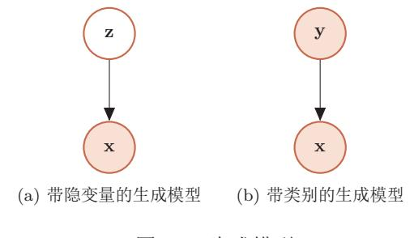
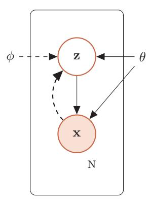
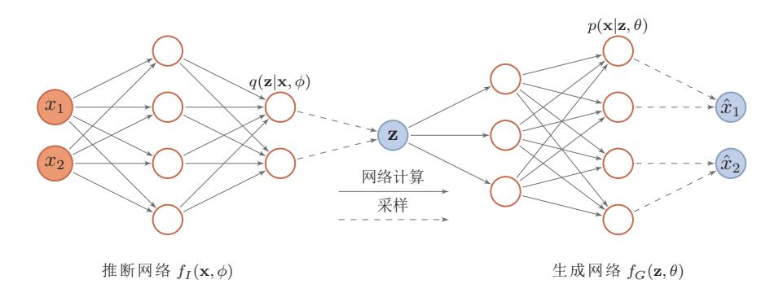
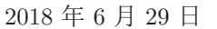
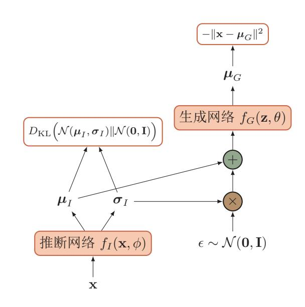
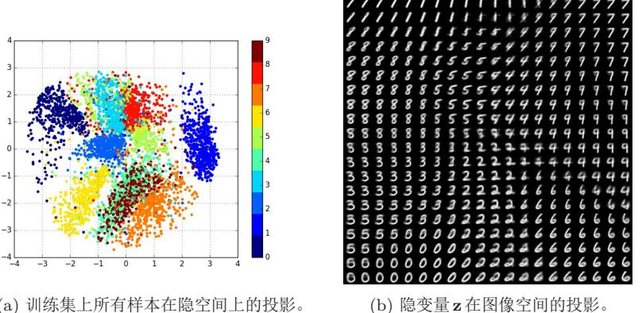
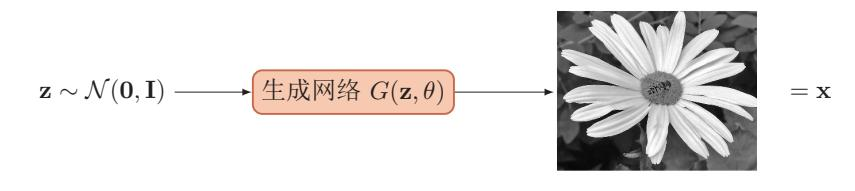
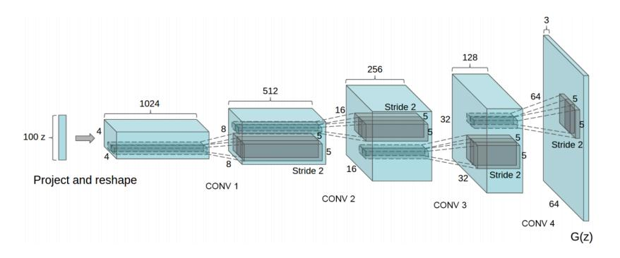
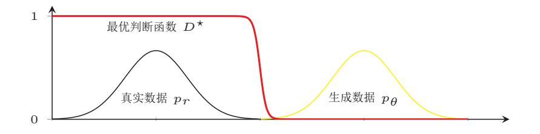
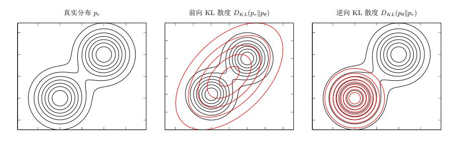

{0}------------------------------------------------

#### 我不能创造的东西,我就不了解。

- 理查德·菲利普·费曼

概率生成模型, 简称生成模型(Generative Model), 是概率统计和机器学 习中的一类重要模型, 指一系列用于随机生成可观测数据的模型。假设在一个 连续的或离散的高维空间 X 中, 存在一个随机向量 X 服从一个未知的数据分布  $p_r(\mathbf{x}), \mathbf{x} \in \mathcal{X}$ 。生成模型是根据一些可观测的样本 $\mathbf{x}^{(1)}, \mathbf{x}^{(2)}, \cdots, \mathbf{x}^{(N)}$ 来学习一 个参数化的模型 $p_{\theta}(\mathbf{x})$ 来近似未知分布 $P_r(X)$ , 并可以用这个模型来生成一些样 本, 使得"生成"的样本和"真实"的样本尽可能地相似。

生成模型的应用十分广泛,可以用来不同的数据进行建模,比如图像、文 本、声音等。比如图像生成, 我们将图像表示为一个随机向量 X, 其中每一维 都表示一个像素值。假设自然场景的图像都服从一个未知的分布 pr(x), 希望通 过一些观测样本来估计其分布。高维随机向量一般比较难以直接建模, 需要通 过一些条件独立性来简化模型。但是, 自然图像中不同像素之间的存在复杂的 依赖关系(比如相邻像素的颜色一般是相似的),很难用一个明确的图模型来描 述其依赖关系, 因此直接建模 pr(x) 比较困难。

深度生成模型就是利用深层神经网络可以近似任意函数的能力来建模一个 复杂的分布  $p_r(\mathbf{x})$ 。假设一个随机向量Z服从一个简单的分布  $p(\mathbf{z}), \mathbf{z} \in \mathcal{Z}$  (比 如标准正态分布),我们使用一个深层神经网络  $q: \mathcal{Z} \to \mathcal{X}$ , 并使得  $q(\mathbf{z})$  服从  $p_r(\mathbf{x})$ 

本章介绍两种深度生成模型: 变分自动编码器 [Kingma and Welling, 2013, Rezende et al., 2014] 和对抗生成式网络 [Goodfellow et al., 2014]。

{1}------------------------------------------------

图 13.1 生成模型

#### 概率生成模型 13.1

生成模型一般具有两个基本功能: 密度估计和生成样本。

#### 密度估计 $13.1.1$

给定一组数据 $D = \{x^{(i)}\}, 1 \leq i \leq N$ ,假设它们都是从独立地从相同的概 率密度函数为 $p_data(\mathbf{x})$ 的未知分布中产生的。密度估计(density estimation)是 根据数据集 $D$ 来估计其概率密度函数 $p_{\theta}(\mathbf{x})$ 。

在机器学习中,密度估计是一种非常典型的无监督学习问题。如果要建模 的分布包含隐变量(如图13.1a),比如高斯混合模型,就需要利用EM 算法来进 行密度估计。

EM 算 法 参 见 第11.4.2.1节。

密度估计参见第9.2节。

#### 13.1.1.1 应用于监督学习

生成模型也可以应用于监督学习。监督学习的目标是建模输出标签的条件 概率密度函数  $p(y|\mathbf{x})$ 。根据贝叶斯公式,

$$
p(y|\mathbf{x}) = \frac{p(\mathbf{x}, y)}{\sum_{y} p(\mathbf{x}, y)}.
$$
\n(13.1)

我们可以将监督学习问题转换为联合概率密度函数 $p(\mathbf{x}, y)$ 的密度估计问题。图13.1a) 给出了生成模型用于监督学习的图模型表示。

在监督学习中, 比较典型的生成模型有朴素贝叶斯分类器、隐马尔可夫模

型

{2}------------------------------------------------

图 13.2 变分自编码器。实线表示生成模型,虚线表示变分近似。

判别模型 和生成模型相对应的另一类监督学习模型是判别模型(discriminative model)。判别式模型直接建模条件概率密度函数 $p(y|\mathbf{x})$ , 并不建模其联合概率 密度函数 $p(\mathbf{x}, y)$ 。常见的判别模型有 logistic 回归、支持向量机、神经网络等。 由生成模型可以得到判别模型, 但由判别模型得不到生成模型。

### 13.1.2 生成样本

生成样本就是给定一个概率密度函数为 $p_{model}(\mathbf{x})$ 的分布, 生成一些服从这 个分布的样本, 也称为采样。我们在第11.3节中介绍了一些常用的采样方法。

采样方法参见第11.3节。

对于图13.1a中的图模型, 在得到  $p(\mathbf{z}, \theta)$  和  $p(\mathbf{x}|\mathbf{z}, \theta)$  之后, 我们就可以生成 数据x, 具体过程可以分为两步进行:

1. 根据隐变量的先验分布  $p(\mathbf{z}, \theta)$ 进行采样, 得到样本  $\mathbf{z}$ ;

2. 根据条件分布  $p(\mathbf{x}|\mathbf{z}, \theta)$ 进行采样, 得到 $\mathbf{x}$ 。

因此在生成模型中, 重点是估计条件分布 p(x|z,θ)。

#### 变分自编码器 13.2

### 13.2.1 含隐变量的生成模型

假设一个生成模型(如图13.2所示)中包含隐变量,即有部分变量是不可观 测的,其中观测变量X是一个高维空间 X 中的随机向量, 隐变量Z 是一个相对 低维的空间 Z中的随机向量。这个生成模型的联合概率密度函数可以分解为

本章中, 我们假设X和 Z都是连续随机向量。

邱锡鹏:《神经网络与深度学习》

{3}------------------------------------------------

$$
p(\mathbf{x}, \mathbf{z}|\theta) = p(\mathbf{x}|\mathbf{z}, \theta)p(\mathbf{z}|\theta),
$$
\n(13.2)

其中  $p(\mathbf{z}|\theta)$  为隐变量  $\mathbf{z}$  先验分布的概率密度函数,  $p(\mathbf{x}|\mathbf{z}, \theta)$  为已知  $\mathbf{z}$  时观测变量 x的条件概率密度函数, θ表示两个密度函数的参数。一般情况下, 我们可以假 设  $p(\mathbf{z}|\theta)$  和  $p(\mathbf{x}|\mathbf{z}, \theta)$  为某种参数化的分布族, 比如正态分布。这些分布的形式 己知,只是参数 $\theta$ 未知,可以通过最大化似然来进行估计。

给定一个样本 x, 其对数边际似然 log  $p(\mathbf{x}|\theta)$  可以分解为

$$
\log p(\mathbf{x}|\theta) = ELBO(q, \mathbf{x}|\theta, \phi) + D_{\mathrm{KL}}(q(\mathbf{z}|\phi)||p(\mathbf{z}|\mathbf{x}, \theta)), \quad (13.3)
$$

参见公式(11.96)。 其中  $q(\mathbf{z}|\phi)$ 是额外引入的变分密度函数, 其参数为 φ, ELBO( $q$ ,  $\mathbf{x}|\theta$ ,  $\phi$ ) 为证据 下界,

$$
ELBO(q, \mathbf{x}|\theta, \phi) = \mathbb{E}_{\mathbf{z} \sim q(\mathbf{z}|\phi)} \left[ \log \frac{p(\mathbf{x}, \mathbf{z}|\theta)}{q(\mathbf{z}|\phi)} \right]. \tag{13.4}
$$

最大化对数边际似然 $log p(x|\theta)$ 可以用EM算法来求解,具体可以分为两步:

EM 算法 参见第11.4.2.1节。

- E-step: 寻找一个密度函数  $q(\mathbf{z}|\phi)$  使其等于或接近于后验密度函数  $p(\mathbf{z}|\mathbf{x}, \theta)$ ;
- M-step: 保持 $q(\mathbf{z}|\phi)$ 固定, 寻找 $\theta$ 来最大化  $ELBO(q, \mathbf{x}|\theta, \phi)$ 。

这样个步骤不断重复, 直到收敛。

在 EM 算法的每次迭代中, 理论上最优的 q(z|d) 为隐变量的后验概率密度 函数 $p(\mathbf{z}|\mathbf{x},\theta)$ ,

$$
p(\mathbf{z}|\mathbf{x}, \theta) = \frac{p(\mathbf{x}|\mathbf{z}, \theta)p(\mathbf{z}|\theta)}{\int_{z} p(\mathbf{x}|\mathbf{z}, \theta)p(\mathbf{z}|\theta) d\mathbf{z}}.
$$
 (13.5)

后验密度函数  $p(\mathbf{z}|\mathbf{x}, \theta)$  的计算是一个统计推断问题, 涉及到积分计算。当隐变 量z是有限的一维离散变量, 则计算起来比较容易。在一般情况下, 这个后验概 率密度函数是很难计算的。此外, 概率密度函数  $p(\mathbf{x}|\mathbf{z}, \theta)$ 一般也比较复杂, 很 难直接用已知的分布族函数讲行建模。

变分自编码器 (variational autoencoder, VAE) 是一种深度生成模型, 其 思想是利用神经网络来分别建模两个复杂的条件概率密度函数。

1. 用神经网络来产生变分分布  $q(\mathbf{z}|\phi)$ , 称为推断网络。理论上 $q(\mathbf{z}|\phi)$  可以不 依赖 x。但由于  $q(\mathbf{z}|\phi)$  的目标是近似后验分布  $p(\mathbf{z}|\mathbf{x}, \theta)$ , 其和 x 相关, 因

{4}------------------------------------------------

此变分密度函数一般写为q(z|x, d)。推断网络的输入为x, 输出为变分分  $\hat{\pi} q(\mathbf{z}|\mathbf{x}, \phi)$ .

2. 用神经网络来产生概率分布  $p(\mathbf{x}|\mathbf{z}, \theta)$ , 称为生成网络。生成网络的输入为  $\mathbf{z}$ , 输出为概率分布  $p(\mathbf{x}|\mathbf{z}, \theta)$ 。

将推断网络和生成网络合并就得到了变分自编码器的整个网络结构, 如 图13.3所示,其中实线表示网络计算操作,虚线表示采样操作。

图 13.3 变分自编码器的网络结构

自编码器参见第9.4节。

变分自编码器的名称来自于其整个网络结构和自编码器比较类似。推断网 络看作是"编码器",将可观测变量映射为隐变量。生成网络可以看作是"解码 器",将隐变量映射为可观测变量。但变分自编码器背后的原理和自编码器完全 不同。变分自编码器中的编码器和解码器的输出为分布(或分布的参数),而不 是确定的编码。

### 13.2.2 推断网络

为了简单起见, 假设 q(z|x, d) 是服从对角化协方差的高斯分布,

$$
q(\mathbf{z}|\mathbf{x}, \phi) = \mathcal{N}(\mathbf{z}|\boldsymbol{\mu}_I, \boldsymbol{\sigma}_I^2 I),
$$
\n(13.6)

其中μ $_I$ 和σ2 是高斯分布的均值和方差,可以通过推断网络  $f_I(\mathbf{x}, \phi)$ 来预测。

$$
\begin{bmatrix} \boldsymbol{\mu}_I \\ \boldsymbol{\sigma}_I \end{bmatrix} = f_I(\mathbf{x}, \phi), \tag{13.7}
$$

{5}------------------------------------------------

其中推断网络 fI(x, φ) 可以是一般的全连接网络或卷积网络, 比如一个两层的 神经网络,

$$
\mathbf{h} = \sigma(W^{(1)}\mathbf{x} + \mathbf{b}^{(1)}),\tag{13.8}
$$

$$
\mu_I = W^{(2)} \mathbf{h} + \mathbf{b}^{(2)},\tag{13.9}
$$

$$
\sigma_I = \text{softplus}(W^{(3)}\mathbf{h} + \mathbf{b}^{(3)}),\tag{13.10}
$$

 $\operatorname{softplus}(x) = \log(1 +$ 其中 $\phi$ 代表所有的网络参数 { $W^{(1)}, W^{(2)}, W^{(3)}, \mathbf{b}^{(1)}, \mathbf{b}^{(2)}, \mathbf{b}^{(3)}\}$ ,  $\sigma$ 和 softplus 为  $e^x$ ). 激活函数。

#### 13.2.2.1 推断网络的目标

推断网络的目标是使得  $q(\mathbf{z}|\mathbf{x}, \phi)$  来尽可能接近真实的后验  $p(\mathbf{z}|\mathbf{x}, \theta)$ , 需要 找到变分参数 。\* 来最小化两个分布的 KL 散度。

$$
\phi^* = \underset{\phi}{\arg\min} D_{\text{KL}}(q(\mathbf{z}|\mathbf{x}, \phi)||p(\mathbf{z}|\mathbf{x}, \theta)).
$$
\n(13.11)

然而直接计算上面的KL散度是不可能的,因为 $p(\mathbf{z}|\mathbf{x},\theta)$ 一般无法计算。传统方 法是利用采样或者变分方法来近似推断。基于采样的方法效率很低且估计也不 是很准确, 所以一般使用的是变分推断方法, 即用简单的分布 q 去近似复杂的 分布  $p(\mathbf{z}|\mathbf{x}, \theta)$ 。但是在深度生成模型中,  $p(\mathbf{z}|\mathbf{x}, \theta)$ 是非常复杂的分布, 很难用简 单的分布去近似。因此,我们需要找到一种间接的计算方法。

根据公式(13.3)可知, 变分分布  $q(\mathbf{z}|\mathbf{x}, \phi)$  与真实后验  $p(\mathbf{z}|\mathbf{x}, \theta)$ ) 的 KL 散度 等于对数边际似然 log  $p(\mathbf{x}|\theta)$  与其下界  $ELBO(q, \mathbf{x}|\theta, \phi)$  的差。

$$
D_{\mathrm{KL}}(q(\mathbf{z}|\mathbf{x},\phi)||p(\mathbf{z}|\mathbf{x},\theta)) = \log p(\mathbf{x}|\theta) - ELBO(q,\mathbf{x}|\theta,\phi),\tag{13.12}
$$

相当于EM算法中的E 步。

因此, 推断网络的目标函数为

$$
\phi^* = \arg\min_{\mathbf{L}} D_{\mathrm{KL}}(q(\mathbf{z}|\mathbf{x}, \phi)||p(\mathbf{z}|\mathbf{x}, \theta))
$$
\n(13.13)

$$
= \arg\min_{\mu} \log p(\mathbf{x}|\theta) - \tilde{\mathbf{E}} \mathbf{L} \mathbf{B} \Theta(\phi, \tilde{\mathbf{x}} | \theta, \phi) \tag{13.14}
$$

$$
= \underset{\phi}{\arg \max} ELBO(q, \mathbf{x} | \theta, \phi).
$$
 (13.15)

#### $13.2.3$ 生成网络

生成模型的联合分布  $p(\mathbf{x}, \mathbf{z}|\theta)$ 可以分解为两部分:隐变量 z 的先验分布  $p(\mathbf{z}|\theta)$ 和条件概率分布  $p(\mathbf{x}|\mathbf{z}, \theta)$ 。

{6}------------------------------------------------

先验分布  $p(\mathbf{z}|\theta)$  一般假设隐变量z的先验分布为各向同性的标准高斯分布  $\mathcal{N}(\mathbf{z}|\mathbf{0},\mathbf{I})$ 。 隐变量z的每一维之间都是独立的。

条件概率分布  $p(\mathbf{x}|\mathbf{z}, \theta)$ 建模条件分布  $p(\mathbf{x}|\mathbf{z}, \theta)$ 通过生成网络来建模。为了简单 起见, 我们同样用参数化的分布族来表示条件概率分布 p(x|z, θ), 这些分布族 的参数可以用生成网络来计算得到。

根据变量 x 的类型不同, 可以假设  $p(\mathbf{x}|\mathbf{z}, \theta)$  服从不同的分布族。如果 x ∈  ${0,1}^d$ 是d维的二值的向量,可以假设 $log p(\mathbf{x}|\mathbf{z},\theta)$ 服从多变量的伯努利分布, 即

$$
p(\mathbf{x}|\mathbf{z}, \theta) = \prod_{i=1}^{d} p(x_i|\mathbf{z}, \theta)
$$
\n(13.16)

$$
= \prod_{i=1}^{d} \gamma_i^{x_i} (1 - \gamma_i)^{(1 - x_i)}, \qquad (13.17)
$$

其中 γi  $\triangleq p(x_i = 1 | \mathbf{z}, \theta)$  为第 i 维分布的参数。γ = [γ1, · · · , γd]T 可以通过生成 网络来预测。

如果  $\mathbf{x} \in \mathbb{R}^d$ 是d维的连续向量, 可以假设  $p(\mathbf{x}|\mathbf{z}, \theta)$  服从对角化协方差的高 斯分布, 即

$$
p(\mathbf{x}|\mathbf{z}, \theta) = \mathcal{N}(\mathbf{x}|\boldsymbol{\mu}_G, \boldsymbol{\sigma}_G^2 I),
$$
\n(13.18)

其中μα和σα同样可以用生成网络fG(z,θ)来预测。

#### 13.2.3.1 生成网络的目标

$$
\nexists \vec{B} \mathbb{R} \mathbb{R} \mathbb{R} \mathbb{R} \mathbb{R} \mathbb{R} \mathbb{R} \mathbb{R} \mathbb{R} \mathbb{R} \mathbb{R} \mathbb{R} \mathbb{R} \mathbb{R} \mathbb{R} \mathbb{R} \mathbb{R} \mathbb{R} \mathbb{R} \mathbb{R} \mathbb{R} \mathbb{R} \mathbb{R} \mathbb{R} \mathbb{R} \mathbb{R} \mathbb{R} \mathbb{R} \mathbb{R} \mathbb{R} \mathbb{R} \mathbb{R} \mathbb{R} \mathbb{R} \mathbb{R} \mathbb{R} \mathbb{R} \mathbb{R} \mathbb{R} \mathbb{R} \mathbb{R} \mathbb{R} \mathbb{R} \mathbb{R} \mathbb{R} \mathbb{R} \mathbb{R} \mathbb{R} \mathbb{R} \mathbb{R} \mathbb{R} \mathbb{R} \mathbb{R} \mathbb{R} \mathbb{R} \mathbb{R} \mathbb{R} \mathbb{R} \mathbb{R} \mathbb{R} \mathbb{R} \mathbb{R} \mathbb{R} \mathbb{R} \mathbb{R} \mathbb{R} \mathbb{R} \mathbb{R} \mathbb{R} \mathbb{R} \mathbb{R} \mathbb{R} \mathbb{R} \mathbb{R} \mathbb{R} \mathbb{R} \mathbb{R} \mathbb{R} \mathbb{R} \mathbb{R} \mathbb{R} \mathbb{R} \mathbb{R} \mathbb{R} \mathbb{R} \mathbb{R} \mathbb{R} \mathbb{R} \mathbb{R} \mathbb{R} \mathbb{R} \mathbb{R} \mathbb{R} \mathbb{R} \mathbb{R} \mathbb{R} \mathbb{R} \mathbb{R} \mathbb{R} \mathbb{R} \mathbb{R} \mathbb{R} \mathbb{R} \mathbb{R} \mathbb{R} \mathbb{R} \mathbb{R} \mathbb{R} \mathbb{R} \mathbb{R} \mathbb{R} \mathbb{R} \mathbb{R} \mathbb{R} \mathbb{R} \mathbb{R} \mathbb{R} \mathbb{R} \mathbb{R} \mathbb{R} \mathbb{R} \mathbb{R} \mathbb{R} \mathbb{R} \mathbb{R} \
$$

### 13.2.4 模型汇总

结合公式 (13.15) 和 (13.19), 推断网络和生成网络的目标都为最大化证 据下界  $ELBO(q, \mathbf{x} | \theta, \phi)$ 。因此, 变分自编码器的总目标函数为

 $\max_{\theta, \phi} ELBO(q, \mathbf{x} | \theta, \phi) = \max_{\theta, \phi} \mathbb{E}_{\mathbf{z} \sim q(\mathbf{z} | \phi)} \bigg[ \log \frac{p(\mathbf{x} | \mathbf{z}, \theta) p(\mathbf{z} | \theta)}{q(\mathbf{z} | \phi)} \bigg]$  $(13.20)$ 

#### 邱锡鹏:《神经网络与深度学习》

{7}------------------------------------------------

$$
= \max_{\theta,\phi} \mathbb{E}_{\mathbf{z} \sim q(\mathbf{z}|\mathbf{x},\phi)} \Big[ \log p(\mathbf{x}|\mathbf{z},\theta) \Big] - D_{\mathrm{KL}} \Big( q(\mathbf{z}|\mathbf{x},\phi) || p(\mathbf{z}|\theta) \Big), \tag{13.21}
$$

其中先验分布  $p(\mathbf{z}|\theta) = \mathcal{N}(\mathbf{z}|\mathbf{0}, \mathbf{I})$ ,  $\theta \bar{\theta} \eta$ 表示生成网络和推断网络的参数。

公式(13.21)中的期望 Εz~α(z|x, φ) [log  $p(\mathbf{x}|\mathbf{z}, \theta)$ ] 一般通过采样的方式进行计 算。对于每个样本x, 根据q(z|x, d) 采集  $M \uparrow z^{(m)}$ ,  $1 \le m \le M$ ,

$$
\mathbb{E}_{\mathbf{z} \sim q(\mathbf{z}|\mathbf{x},\phi)}[\log p(\mathbf{x}|\mathbf{z},\theta)] \approx \frac{1}{M} \sum_{m=1}^{M} \log p(\mathbf{x}|\mathbf{z}^{(m)},\theta). \tag{13.22}
$$

从 EM 算法角度来看, 变分自编码器优化推断网络和生成网络的过程, 可 以分别看作是EM算法中的E步和M步。但在变分自编码器中,这两步的目标 合二为一,都是最大化证据下界。

此外, 变分自编码器可以看作神经网络和贝叶斯网络的混合体。贝叶斯网 络中的节点可以看成是一个随机变量。在变分自编码器中,我们仅仅将隐藏编 码对应的节点看成是随机变量, 其它节点还是作为普通神经元。这样, 编码器 变成一个变分推断网络,而解码器可以看作是将隐变量映射到观测变量的生成 网络。

### 13.2.5 训练

给定一个数据集 D, 包含 N 个从未知数据分布中抽取的独立同分布样本  $\mathbf{x}^{(1)}, \mathbf{x}^{(2)}, \cdots, \mathbf{x}^{(N)}$ 。变分自编码器的目标函数为

$$
\mathcal{J}(\phi,\theta|\mathcal{D}) = \sum_{n=1}^{N} \left( \frac{1}{M} \sum_{m=1}^{M} \log p(\mathbf{x}^{(n)}|\mathbf{z}^{(n,m)},\theta) - D_{\mathrm{KL}}\Big(q(\mathbf{z}|\mathbf{x}^{(n)},\phi) \| \mathcal{N}(\mathbf{z}|\mathbf{0},\mathbf{I})\Big) \right),
$$
\n(13.23)

其中 $\mathbf{z}^{(n,m)}$ 为第 $n \triangleq \mathcal{X}$ 的变分分布 $q(\mathbf{z}|\mathbf{x}^{(n)},\phi)$ 的第 $m \triangleq \mathcal{X}$ 样。

如果采用随机梯度方法,每次从数据集中采一个样本x,然后根据 a(z|x, d) 采一个隐变量z, 则目标函数变为

$$
\mathcal{J}(\phi, \theta | \mathbf{x}) = \log p(\mathbf{x} | \mathbf{z}, \theta) - D_{\mathrm{KL}}\left(q(\mathbf{z} | \mathbf{x}, \phi) \| \mathcal{N}(\mathbf{z} | \mathbf{0}, \mathbf{I})\right).
$$
(13.24)

假设  $q(\mathbf{z}|\mathbf{x}, \phi)$  是正态分布, 公式 (13.24) 中的 KL 散度可以直接计算出解 析解。

{8}------------------------------------------------

对于两个正态分布 $\mathcal{N}(\mu_1, \Sigma_1)$ 和 $\mathcal{N}(\mu_2, \Sigma_2)$ , 其KL散度为

$$
D_{\text{KL}}(\mathcal{N}(\boldsymbol{\mu}_1, \Sigma_1) \| \mathcal{N}(\boldsymbol{\mu}_2, \Sigma_2))
$$
  
=  $\frac{1}{2} \Big( \text{tr}(\Sigma_2^{-1} \Sigma_1) + (\boldsymbol{\mu}_2 - \boldsymbol{\mu}_1)^\top \Sigma_2^{-1} (\boldsymbol{\mu}_2 - \boldsymbol{\mu}_1) - k + \log \frac{|\Sigma_2|}{|\Sigma_1|} \Big),$  (13.25)

其中tr(.)表示矩阵的迹; | . | 表示矩阵的行列式。

这样当 $q(\mathbf{z}|\mathbf{x}^{(n)},\phi)$ 为 $\mathcal{N}(\boldsymbol{\mu}_I, \boldsymbol{\sigma}_I^2 I)$ 时,

$$
D_{\text{KL}}\left(q(\mathbf{z}|\mathbf{x},\phi)||p(\mathbf{z},\theta)\right) = \frac{1}{2}\left(\text{tr}(\boldsymbol{\sigma}_I^2 I) + \boldsymbol{\mu}_I^\top \boldsymbol{\mu}_I - k - \log(|\boldsymbol{\sigma}_I^2 I|)\right),\tag{13.26}
$$

其中μ $_I$ 和σ $_I$ 为推断网络 $f_I$ (x, φ)的输出。

再参数化 在变分自编码器中, 一个问题是如何求随机变量z关于参数。的导数。 因为随机变量z采样自后验分布 q(z|x, d), 和参数 d相关。但由于是采样的方式, 无法直接计算函数z关于Φ的导数。

如果  $q(\mathbf{z}|\mathbf{x}, \phi)$  的随机性独立于参数 φ, 我们可以通过再参数化 (reparameterization)方法来计算导数。再参数化是实现通过随机变量实现反向传播的一 种重要手段,并用随机梯度下降训练整个网络,可以提高变分自编码器的训练 效率。

假设  $q(\mathbf{z}|\mathbf{x}, \phi)$  为正态分布  $N(\boldsymbol{\mu}_I, \boldsymbol{\sigma}_I^2 I)$ , 我们可以通过下面方式来采样 z。

$$
\mathbf{z} = \boldsymbol{\mu}_I + \boldsymbol{\sigma}_I \odot \boldsymbol{\epsilon}, \qquad (13.27)
$$

其中  $\epsilon \sim \mathcal{N}(\mathbf{0},\mathbf{I})$ ,  $\mu_I$  和  $\sigma_I$  是推断网络  $f_I(\mathbf{x}, \phi)$  的输出。这样  $\mathbf{z}$  和  $\mu_I$ ,  $\sigma_I$  的关系 从采样关系变为函数关系, 就可以求z关于 %的导数。

如果进一步假设  $p(\mathbf{x}|\mathbf{z}, \theta)$ 服从高斯分布 $\mathcal{N}(\mathbf{x}|\boldsymbol{\mu}_G, I)$ , 其中 $\boldsymbol{\mu}_G = f_G(\mathbf{z}, \theta)$ 是 生成网络的输出, 则目标函数可以简化为

$$
\mathcal{J}(\phi,\theta|\mathbf{x}) = -\|\mathbf{x} - \boldsymbol{\mu}_G\|^2 + D_{\mathrm{KL}}\Big(\mathcal{N}(\boldsymbol{\mu}_I,\boldsymbol{\sigma}_I)\|\mathcal{N}(\mathbf{0},\mathbf{I})\Big),\tag{13.28}
$$

其中第一项可以近似看作是输入x的重构正确性,第二项可以看作是正则化项。 这和自编码器非常类似。变分自编码器的训练过程如图13.4所示。

邱锡鹏:《神经网络与深度学习》

矩阵的"迹"为主对角线 (从左上方至右下方的对 角线)上各个元素的总 和。

{9}------------------------------------------------

图 13.4 变分自编码器的训练过程,空心矩形表示目标函数

图13.5给出了在 MNIST 数据集上, 变分自编码器学习到的隐变量流形的可 视化示例。图13.5a是将训练集上每个样本x通过推断网络映射到2维的隐变量 空间, 图中的每个点表示 E [z|x], 不同颜色表示不同的数字。图13.5b是对2维 的标准高斯分布上进行均匀采样得到不同的隐变量 z, 然后通过生成网络产生 的 $E[x|z]$ 。

(a) 训练集上所有样本在隐空间上的投影。

图 13.5 在 MNIST 数据集上, 变分自编码器学习到的隐变量流形可视化示例

{10}------------------------------------------------

#### 生成对抗网络 13.3

#### 显式密度模型和隐式密度模型 $13.3.1$

在本书之前介绍的深度生成模型,比如变分自编码器、深度信念网络等,都 是显示地构建出样本的密度函数  $p(\mathbf{x}|\theta)$ , 并通过最大似然估计来求解参数, 称 为显式密度模型 (explicit density model)。比如变分自编码器的密度函数为  $p(\mathbf{x}, \mathbf{z}|\theta) = p(\mathbf{x}|\mathbf{z}, \theta)p(\mathbf{z}|\theta)$ 。虽然使用了神经网络来估计 $p(\mathbf{x}|\mathbf{z}, \theta)$ , 但是我们依 然假设  $p(\mathbf{x}|\mathbf{z},\theta)$  为一个参数分布族, 而神经网络只是用来预测这个参数分布族 的参数。这在某种程度上限制了神经网络的能力。

如果只是希望有一个模型能生成符合数据分布 pr(x) 的样本, 那么可以不 显示地估计出数据分布的密度函数。假设在低维空间乏中有一个简单容易采样 的分布  $p(\mathbf{z})$ ,  $p(\mathbf{z})$ 通常为标准多元正态分布 $\mathcal{N}(\mathbf{0},\mathbf{I})$ 。我们用神经网络构建一个 映射函数 $G: \mathcal{Z} \rightarrow \mathcal{X}$ , 称为生成网络。利用神经网络强大的拟合能力, 使得 $G(z)$ 服从数据分布 $p_r(\mathbf{x})$ 。这种模型就称为隐式密度模型(implicit density model)。 所谓隐式模型就是指并不对显示地建模  $p_r(\mathbf{x})$ , 而是建模生成过程。图13.6给出 了隐式模型生成样本的过程。

图 13.6 隐式模型生成样本的过程

#### 13.3.2 网络分解

#### 13.3.2.1 判别网络

隐式密度模型的一个关键是如何确保生成网络产生的样本一定是服从真实 的数据分布。既然我们不构建显示密度函数, 就无法通过最大似然估计等方法 来训练。

生成对抗网络 (Generative Adversarial Networks, GAN) 是通过对抗训练 的方式来使得生成网络产生的样本服从真实数据分布。在生成对抗网络中, 有

{11}------------------------------------------------

两个网络进行对抗训练。一个是判别网络,目标是尽量准确地判断一个样本是 来自于真实数据还是生成网络产生的;另一个是生成网络,目标是尽量生成判别 网络无法区分来源的样本。这两个目标相反的网络不断地进行交替训练。当最 后收敛时,如果判别网络再也无法判断出一个样本的来源,那么也就等价于生成 网络可以生成符合真实数据分布的样本。生成对抗网络的流程图如图13.7所示。

$$
\mathbf{x} \sim \mathcal{D}
$$
\n
$$
\mathbf{y} \sim \mathcal{D}
$$
\n
$$
\mathbf{y} \sim \mathcal{D}(\mathbf{x}, \phi) \rightarrow 1/0
$$
\n
$$
\mathbf{z} \sim \mathcal{N}(\mathbf{0}, \mathbf{I}) \longrightarrow \mathbf{E} \mathbf{y} \mathbf{y} \text{ and } \mathbf{y} \text{ is a constant.}
$$

图 13.7 生成对抗网络的流程图

判别网络(Discriminator Network)  $D(\mathbf{x}, \phi)$ 的目标是区分出一个样本 $\mathbf{x}$ 时 来自于真实分布  $p_r(\mathbf{x})$  还是来自于生成模型  $p_\theta(\mathbf{x})$ , 因此判别网络实际上是一个 两类分类器。用标签  $y = 1$  来表示样本来自真实分布,  $y = 0$  表示样本来自模型, 判别网络 D(x, d) 的输出为 x 属于真实数据分布的概率, 即

$$
p(y=1|\mathbf{x}) = D(\mathbf{x}, \phi),\tag{13.29}
$$

则样本来自模型生成的概率为 $p(y = 0|\mathbf{x}) = 1 - D(\mathbf{x}, \phi)$ 。

给定一个样本(x, y),  $y = \{1,0\}$ 表示其自于 $p_r(\mathbf{x})$ 还是 $p_\theta(\mathbf{x})$ , 判别网络的 目标函数为最小化交叉熵, 即最大化对数似然。

$$
\min_{\phi} - \left( \mathbb{E}_{\mathbf{x}} \left[ y \log p(y=1|\mathbf{x}) + (1-y) \log p(y=0|\mathbf{x}) \right] \right)
$$
(13.30)

$$
= \max_{\phi} \left( \mathbb{E}_{\mathbf{x} \sim p_r(\mathbf{x})} \left[ \log D(\mathbf{x}, \phi) \right] + \mathbb{E}_{\mathbf{x}' \sim p_\theta(\mathbf{x}')} \left[ \log(1 - D(\mathbf{x}', \phi)) \right] \right) \tag{13.31}
$$

$$
= \max_{\phi} \left( \mathbb{E}_{\mathbf{x} \sim p_r(\mathbf{x})} \left[ \log D(\mathbf{x}, \phi) \right] + \mathbb{E}_{\mathbf{z} \sim p(\mathbf{z})} \left[ \log(1 - D\Big(G(\mathbf{z}, \theta), \phi)\Big) \right] \right), \quad (13.32)
$$

其中θ和Φ分布时生成网络和判别网络的参数。

#### 13.3.2.2 生成网络

生成网络(Generator Network)的目标刚好和判别网络相反,即让判别网 络将自己生成的样本判别为真实样本。

$$
\max_{\theta} \left( \mathbb{E}_{\mathbf{z} \sim p(\mathbf{z})} \Big[ \log D \Big( G(\mathbf{z}, \theta), \phi \Big) \Big] \right) \tag{13.33}
$$

交叉熵等于负的对数似 然。

邱锡鹏:《神经网络与深度学习》

{12}------------------------------------------------

$$
= \min_{\theta} \left( \mathbb{E}_{\mathbf{z} \sim p(\mathbf{z})} \left[ \log \left( 1 - D \Big( G(\mathbf{z}, \theta), \phi \Big) \right) \right] \right). \tag{13.34}
$$

上面的这两个目标函数是等价的。但是在实际训练时,一般使用前者,因为其 梯度性质更好。我们知道, 函数 $log(x)$ ,  $x \in (0,1)$  在  $x$  接近 1 时的梯度要比接近 0时的梯度小很多,接近"饱和"区间。这样,当判别网络 D 以很高的概率认为 生成网络 G产生的样本是"假"样本, 即  $(1 - D(G(\mathbf{z}, \theta), \phi)) \rightarrow 1$ 。这时目标 函数关于θ的梯度反而很小,从而不利于优化。

还有一种改进生成网络 的梯度的方法是将真实 样本和生成样本的标签 互换, 即生成样本的标 签为1。

### 13.3.3 训练

和单目标的优化任务相比,生成对抗网络的两个网络的优化目标刚好想反。 因此生成对抗网络的训练比较难,往往不太稳定。一般情况下,需要平衡两个网 络的能力。对于判别网络来说,一开始的判别能力不能太强,否则难以提升生 成网络的能力。然后也不能太弱,否则针对它训练的生成网络也不会太好。在 训练时需要使用一些技巧, 使得在每次迭代中, 判别网络比生成网络的能力强 一些,但又不能强太多。

生成对抗网络的训练流程如算法13.1所示。每次迭代时, 判别网络更新  $K$ 次而生成网络更新一次,即首先要保证判别网络足够强才能开始训练生成网络。

{13}------------------------------------------------

在实践中 K 是一个超参数, 其取值一般取决于具体任务。

| 算法 13.1: 生成对抗网络的训练过程           |                                                                                                                                                                        |  |
|--------------------------------|------------------------------------------------------------------------------------------------------------------------------------------------------------------------|--|
|                                | 输入: 训练集 D, 对抗训练迭代次数 T, 每次判别网络的训练迭代次                                                                                                                                    |  |
|                                | 数 $K$ , 小批量样本数量 $M$                                                                                                                                                    |  |
| 1 随机初始化 $\theta, \phi;$        |                                                                                                                                                                        |  |
| 2 for $t \leftarrow 1$ to T do |                                                                                                                                                                        |  |
|                                | // 训练判别网络 $D(\mathbf{x},\phi)$                                                                                                                                         |  |
| 3                              | for $k \leftarrow 1$ to K do                                                                                                                                           |  |
|                                | // 采集小批量训练样本                                                                                                                                                           |  |
| $\overline{\bf 4}$             | 从训练集 $\mathcal{D} \oplus \mathbb{R} \nless M \wedge \mathbb{H}$ 本 $\{ \mathbf{x}^{(m)} \}, 1 \leq m \leq M;$                                                           |  |
| 5                              | 从分布 $\mathcal{N}(\mathbf{0},\mathbf{I})$ 中采集 $M \uparrow$ 样本 $\{ \mathbf{z}^{(m)} \}, 1 \leq m \leq M;$                                                                |  |
| 6                              | 使用随机梯度上升更新 φ, 梯度为                                                                                                                                                      |  |
|                                | $\frac{\partial}{\partial \phi}\bigg[\frac{1}{M}\sum\bigg(\log D(\mathbf{x}^{(m)},\phi)+\log\left(1-D\left(G(\mathbf{z}^{(m)},\theta),\phi\right)\right)\bigg)\bigg];$ |  |
| $\overline{7}$                 | end                                                                                                                                                                    |  |
|                                | // 训练生成网络 $G(\mathbf{z},\theta)$                                                                                                                                       |  |
| 8                              | 从分布 $\mathcal{N}(\mathbf{0},I)$ 中采集 $M \uparrow$ 样本 $\{z^{(m)}\}, 1 \leq m \leq M;$                                                                                    |  |
| 9                              | 使用随机梯度上升更新θ, 梯度为                                                                                                                                                       |  |
|                                | $\frac{\partial}{\partial \theta} \left[ \frac{1}{M} \sum_{n=1}^{M} D\left( G(\mathbf{z}^{(m)}, \theta), \phi \right) \right];$                                        |  |
| 10 end                         |                                                                                                                                                                        |  |
| 输出・生成网络でしょり                    |                                                                                                                                                                        |  |

### 13.3.4 一个生成对抗网络的具体实现: DCGAN

生成对抗网络是指一类采用对抗训练方式来进行学习的深度生成模型, 其 包含的判别网络和生成网络都可以根据不同的生成任务使用不同的网络结构。

本节介绍一个生成对抗网络的具体例子深度卷积生成对抗网络(Deep Convolutional Generative Adversarial Networks, DCGAN) [Radford et al., 2015]. 在DCGAN中, 判别网络是一个传统的深度卷积网络, 但使用了带步长的卷积 来实现下采样操作, 不用最大汇聚(pooling) 操作。生成网络使用一个特殊的

 $\overline{a}$ 

{14}------------------------------------------------

深度卷积网络来实现,如图13.8所示,使用微步卷积来生成64×63大小的图像。

微步卷积参见第5.5.1节。

291

图 13.8 DCGAN 中的生成网络。第一层是全连接层, 输入是从均匀分布中随机 采样的100维向量z, 输出是 $4 \times 4 \times 1024$ 的向量, 重塑为 $4 \times 4 \times 1024$ 的张量; 然后是四层的微步卷积,没有汇聚层。图片来源: [Radford et al., 2015]

DCGAN 的主要优点是通过一些经验性的网络结构设计使得对抗训练更加 稳定。比如,(1)使用代步长的卷积(在判别网络中)和微步卷积(在生成网 络中)来代替汇聚操作,以免损失信息; (2) 使用批量归一化; (3) 去除卷积 层之后的全连接层; (4) 在生成网络中, 除了最后一层使用 Tanh 激活函数外, 其余层都使用 ReLU 函数; (5) 在判别网络中, 都使用 Leaky ReLU 激活函数。

### 13.3.5 模型分析

将判别网络和生成网络合并, 整个生成对抗网络的整个目标函数看作最小 化最大化游戏 (minimax game),

$$
\min_{\theta} \max_{\phi} \left( \mathbb{E}_{\mathbf{x} \sim p_r(\mathbf{x})} \left[ \log D(\mathbf{x}, \phi) \right] + \mathbb{E}_{\mathbf{x} \sim p_\theta(\mathbf{x})} \left[ \log(1 - D(\mathbf{x}, \phi)) \right] \right) \tag{13.35}
$$
\n
$$
= \min_{\theta} \max_{\phi} \left( \mathbb{E}_{\mathbf{x} \sim p_r(\mathbf{x})} \left[ \log D(\mathbf{x}, \phi) \right] + \mathbb{E}_{\mathbf{z} \sim p(\mathbf{z})} \left[ \log(1 - D\left(G(\mathbf{z}, \theta), \phi\right)) \right] \right), \tag{13.36}
$$

因为之前提到的生成网络梯度问题, 这个最小化最大化形式的目标函数一般用 来进行理论分析,并不是实际训练时的目标函数。

假设  $p_r(\mathbf{x})$  和  $p_\theta(\mathbf{x})$  已知, 则最优的判别器为

$$
D^{\star}(\mathbf{x}) = \frac{p_r(\mathbf{x})}{p_r(\mathbf{x}) + p_\theta(\mathbf{x})}.
$$
 (13.37)

参见习题13-1。

邱锡鹏:《神经网络与深度学习》

{15}------------------------------------------------

优生成网络  $G^*$  对应的损失为  $L(G^*|D^*) = -2\log 2$ 。

将最优的判别器 D\*(x)代入公式(13.35), 其目标函数变为

$$
\mathcal{L}(G|D^*) = \mathbb{E}_{\mathbf{x} \sim p_r(\mathbf{x})} \left[ \log D^*(\mathbf{x}) \right] + \mathbb{E}_{\mathbf{x} \sim p_\theta(\mathbf{x})} \left[ \log(1 - D^*(\mathbf{x})) \right]
$$
(13.38)

$$
= \mathbb{E}_{\mathbf{x} \sim p_r(\mathbf{x})} \left[ \log \frac{p_r(\mathbf{x})}{p_r(\mathbf{x}) + p_\theta(\mathbf{x})} \right] + \mathbb{E}_{\mathbf{x} \sim p_\theta(\mathbf{x})} \left[ \log \frac{p_\theta(\mathbf{x})}{p_r(\mathbf{x}) + p_\theta(\mathbf{x})} \right] \quad (13.39)
$$

$$
=D_{\mathrm{KL}}\left(p_r||p_a\right) + D_{\mathrm{KL}}\left(p_\theta||p_a\right) - 2\log 2\tag{13.40}
$$

$$
=2D_{\text{JS}}(p_r||p_\theta)-2\log 2,\tag{13.41}
$$

JS 散度参见第E.3.3节。

其中  $D_{\text{JS}}$  为 JS 散度,  $p_a(\mathbf{x}) = \frac{1}{2} (p_r(\mathbf{x}) + p_\theta(\mathbf{x}))$  为一个"平均"分布。 在生成对抗网络中, 当判断网络为最优时, 生成网络的优化目标是最小化 真实分布 pr 和模型分布 pe 之间的 JS 散度。当两个分布相同时, JS 散度为0, 最

然而, JS散度的一个问题是: 当两个分布没有重叠时, 它们之间的 JS散度 恒等于常数 log 2。对生成网络来说, 目标函数关于参数的梯度为0。

$$
\frac{\partial \mathcal{L}(G|D^*)}{\partial \theta} = 0. \tag{13.42}
$$

图13.9给出了生成对抗网络中的梯度消失问题的示例。当真实分布 pr 和模 型分布 $p_{\theta}$ 没有重叠,最优的判断网络对所有生成数据的输出都为 $0, D^{\star}(G(\mathbf{z},\theta)) =$ 0. Vz。因此,生成网络的梯度消失。

图 13.9 生成对抗网络中的梯度消失问题

因此, 在实际训练生成对抗网络时, 我们一般不会将判别网络训练到最优, 只进行一步或多步梯度下降, 使得生成网络的梯度依然存在。然而, 判别网络 也不能太差, 否则生成网络的梯度为错误的梯度。如何使得判别网络在梯度消 失和梯度错误之间取得平衡并不是一件容易的事。

{16}------------------------------------------------

#### 13.3.5.1 模型坍塌

如果使用公式 (13.33) 作为生成网络的目标函数, 将最优判断网络 D\*代 入,得到

$$
\mathcal{L}'(G|D^*) = \mathbb{E}_{\mathbf{x} \sim p_{\theta}(\mathbf{x})} \left[ \log D^*(\mathbf{x}) \right]
$$
\n(13.43)

$$
= \mathbb{E}_{\mathbf{x} \sim p_{\theta}(\mathbf{x})} \left[ \log \frac{p_r(\mathbf{x})}{p_r(\mathbf{x}) + p_{\theta}(\mathbf{x})} \cdot \frac{p_{\theta}(\mathbf{x})}{p_{\theta}(\mathbf{x})} \right]
$$
(13.44)

$$
= -\mathbb{E}_{\mathbf{x} \sim p_{\theta}(\mathbf{x})} \left[ \log \frac{p_{\theta}(\mathbf{x})}{p_r(\mathbf{x})} \right] + \mathbb{E}_{\mathbf{x} \sim p_{\theta}(\mathbf{x})} \left[ \log \frac{p_{\theta}(\mathbf{x})}{p_r(\mathbf{x}) + p_{\theta}(\mathbf{x})} \right]
$$
(13.45)

$$
= -D_{\mathrm{KL}}\left(p_{\theta} \| p_{r}\right) + \mathbb{E}_{\mathbf{x} \sim p_{\theta}(\mathbf{x})} \left[ \log \left(1 - D^{\star}(\mathbf{x})\right) \right]
$$
(13.46)

$$
= -D_{\mathrm{KL}}\left(p_{\theta} \| p_r\right) + 2D_{\mathrm{JS}}(p_r \| p_{\theta}) - 2\log 2 - \mathbb{E}_{\mathbf{x} \sim \mathcal{B}_r} \mathbb{E}\left[\mathbf{F}(\mathbf{y})\mathbf{B}(\mathbf{z})\right],\qquad(13.47)
$$

其中后两项和生成网络无关, 因此

$$
\max_{\theta} \mathcal{L}'(G|D^*) = \min_{\theta} D_{\mathrm{KL}}\left(p_{\theta} \| p_r\right) - 2D_{\mathrm{JS}}(p_r \| p_{\theta}),\tag{13.48}
$$

其中 JS 散度  $D_{\text{JS}}(p_{\theta}||p_r) \in [0, \log 2]$  为有界函数,因此生成网络的目标为更多的 是受逆向 KL 散度  $D_{\text{KL}}(p_{\theta}||p_{r})$ 影响, 使得生成网络更倾向于生成一些更"安全" 的样本, 从而造成 mykey 模型坍塌 Model Collapse 问题。

前向和逆向KL散度因为KL散度是一种非对称的散度,在计算真实分布 $p_r$ 和 模型分布 pe 之间的 KL 散度时, 按照顺序不同, 有两种 KL 散度: 前向 KL 散度 (forward KL divergence)  $D_{\text{KL}}(p_r||p_\theta)$ 和逆向 KL 散度 (reverse KL divergence)  $D_{\text{KL}}(p_{\theta}||p_{r})$ 。前向和逆向 KL 散度分别定义为

$$
D_{\mathrm{KL}}(p_r \| p_\theta) = \int p_r(\mathbf{x}) \log \frac{p_r(\mathbf{x})}{p_\theta(\mathbf{x})} d\mathbf{x},\tag{13.49}
$$

$$
D_{\text{KL}}(p_{\theta} \| p_r) = \int p_{\theta}(\mathbf{x}) \log \frac{p_{\theta}(\mathbf{x})}{p_r(\mathbf{x})} d\mathbf{x}.
$$
 (13.50)

在前向KL散度中,

(1) 当 $p_r(\mathbf{x}) \to 0$ 而 $p_\theta(\mathbf{x}) > 0$ 时,  $p_r(\mathbf{x}) \log \frac{p_r(\mathbf{x})}{p_\theta(\mathbf{x})} \to 0$ . 不管 $p_\theta(\mathbf{x})$ 如何取 值,都对前向KL散度的计算没有贡献。

(2) 当 $p_r(\mathbf{x}) > 0$ 而 $p_\theta(\mathbf{x}) \to 0$ 时,  $p_r(\mathbf{x}) \log \frac{p_r(\mathbf{x})}{p_\theta(\mathbf{x})} \to \infty$ , 前向KL散度会变 得非常大。

因此,前向KL散度会鼓励模型分布 $p_{\theta}(\mathbf{x})$ 尽可能覆盖所有真实分布 $p_{r}(\mathbf{x}) >$ 0的点,而不用回避 $p_r(\mathbf{x}) \approx 0$ 的点。

邱锡鹏:《神经网络与深度学习》

{17}------------------------------------------------

在逆向 KL 散度中,

(1) 当 $p_r(\mathbf{x}) \to 0$ 而 $p_\theta(\mathbf{x}) > 0$ 时,  $p_\theta(\mathbf{x}) \log \frac{p_\theta(\mathbf{x})}{p_r(\mathbf{x})} \to \infty$ . 即当 $p_\theta(\mathbf{x})$ 接近于 0, 而  $p_{\theta}$ (x) 有一定的密度时, 逆向 KL 散度会变得非常大。

(2) 当 $p_{\theta}(\mathbf{x}) \to 0$ 时, 不管  $p_r(\mathbf{x})$ 如何取值,  $p_{\theta}(\mathbf{x}) \log \frac{p_{\theta}(\mathbf{x})}{p_r(\mathbf{x})} \to 0$ .

因此,逆向KL散度会鼓励模型分布 $p_{\theta}(\mathbf{x})$ 尽可能避开所有真实分布 $p_r(\mathbf{x}) \approx$  $0$ 的点, 而不需要考虑是否覆盖所有布 $p_r(\mathbf{x}) > 0$ 的点。

图13.10给出数据真实分布为一个高斯混合分布, 模型分布为一个单高斯分 布时, 使用前向和逆向KL散度来进行模型优化的示例。蓝色曲线为真实分布 pr 的等高线, 红色曲线为模型分布 pe 的等高线。

图 13.10 前向和逆向 KL 散度

#### $13.3.6$ 改进模型

生成对抗网络的改进主要有以下几个方面:

GAN 中交叉熵(JS散度)不适合衡量生成数据分布和真实数据分布的距 离,如果通过优化 JS 散度训练 GAN 会导致找不到正确的优化目标, 所以,

#### 13.3.6.1 W-GAN

W-GAN是一种通过用 Wassertein 距离替代 JS 散度来优化训练的生成对抗 Wassertein 距离参见 网络 [Arjovsky et al., 2017]。

对于真实分布  $p_r$  和模型分布  $p_\theta$ , 它们的 1st-Wasserstein 距离为

$$
W^{1}(p_{r}, p_{\theta}) = \inf_{\gamma \sim \Pi(P_{r}, P_{g})} \mathbb{E}_{(\mathbf{x}, \mathbf{y}) \sim \gamma} \left[ ||\mathbf{x} - \mathbf{y}|| \right],
$$
 (13.51)

其中 $\Gamma(p_r, p_\theta)$ 是边际分布为 $p_r$ 和 $p_\theta$ 的所有可能的联合分布集合。

邱锡鹏:《神经网络与深度学习》

第E.3.4节。

{18}------------------------------------------------

当两个分布没有重叠或者重叠非常少时, 它们之间的 KL 散度为+∞, JS 散度为log 2, 并不随着两个分布之间的距离而变化。而1st-Wasserstein 距离可 以依然衡量两个没有重叠分布之间的距离。

根据 Kantorovich-Rubinstein 对偶定理, 两个分布  $p_r$  和  $p_\theta$  之间的 1st-Wasserstein 距离的对偶形式为:

$$
W^{1}(p_{r}, p_{\theta}) = \sup_{\|f\|_{L} \leq 1} \mathbb{E}_{\mathbf{x} \sim p_{r}}[f(\mathbf{x})] - \mathbb{E}_{\mathbf{x} \sim p_{\theta}}[f(\mathbf{x})], \tag{13.52}
$$

其中 $f: \mathbb{R}^d \to \mathbb{R}$ 为1-Lipschitz 函数,满足

$$
||f||_{L} \triangleq \sup_{\mathbf{x} \neq \mathbf{y}} \frac{|f(\mathbf{x}) - f(\mathbf{y})|}{|\mathbf{x} - \mathbf{y}|} \le 1.
$$
 (13.53)

我们可以将1-Lipschitz 连续的约束宽松为K-Lipschitz 连续, 等于计算 $p_r$ 和  $p_{\theta} \ngeq \ln(K \cdot W^1(p_r, p_{\theta})$ 。

数学小知识 | Lipschitz 连续函数

在数学中, 对于一个实数函数 f : R → R, 如果满足函数曲线上任 意两点连线的斜率一致有界,即任意两点的斜率都小于常数 $K > 0$ ,

$$
f(x_1) - f(x_2)| \le K|x_1 - x_2|,\tag{13.54}
$$

则函数 f 就称为 K-Lipschitz 连续函数, K 称为Lipschitz 常数。

Lipschitz 连续要求函数在无限的区间上不能有超过线性的增长。如 果一个函数可导,并满足Lipschitz连续,那么导数有界。如果一个函数 可导,并且导数有界,那么函数为Lipschitz连续。

参见习题13-2。

 $\hat{\varphi}$   $f(\mathbf{x}, \phi)$  为一个神经网络, 假设存在参数集合 $\Phi$ , 对于所有的 $\phi \in \Phi$ ,  $f_{\phi}(\mathbf{x})$ 为K-Lipschitz 连续函数。那么公式 (13.52) 中的上界可以转换为

$$
\max_{\phi \in \Phi} \mathbb{E}_{x \sim p_r} [f(\mathbf{x}, \phi)] - \mathbb{E}_{x \sim p_\theta} [f(\mathbf{x}, \phi)],\tag{13.55}
$$

其中 $f(\mathbf{x}, \phi)$ 称为评价网络(Critic Network)。对于真实样本,  $f(\mathbf{x}, \phi)$ 的打分要 尽可能的高;对于模型生成的样本,  $f(\mathbf{x}, \phi)$ 的打分要尽可能的低。和标准 GAN 中的判别网络的值域为 $[0,1]^l$ 不同, 评价网络 $f(\mathbf{x}, \phi)$ 的值域没有限制。

邱锡鹏:《神经网络与深度学习》

{19}------------------------------------------------

因为神经网络为连续可导函数,为了使得 $f(\mathbf{x}, \phi)$ 满足K-Lipschitz连续,可 以令导数  $\frac{\partial f(\mathbf{x}, \phi)}{\partial \mathbf{x}}$  || 有界。一种近似的方法是限制参数  $\phi \in [-c, c]$ , c为一个比较 小的正数,比如0.01。

生成网络的目标是使得生成样本的 f(x, φ) 得分尽可能高。

$$
\max_{\theta} \mathbb{E}_{\mathbf{z} \sim p(\mathbf{z})} \left[ f\left(G(\mathbf{z}, \theta), \phi\right) \right]. \tag{13.56}
$$

因为 f(x, d) 为不饱和函数, 所以生成网络参数θ的梯度不会消失, 理论上解决 了原始 GAN 训练不稳定的问题。并且W-GAN 中生成网络的目标函数不再是 两个分布的比率, 在一定程度上缓解了模型坍塌问题, 使得生成的样本具有多 样性。

算法13.2给出 W-GAN 的训练过程。和原始 GAN 相比, W-GAN 的评价网 络最后一层不使用 sigmoid 函数, 损失函数不取对数。

#### 总结和深入阅读 13.4

变分自动编码器 (Variational Autoencoder, VAE) Kingma and Welling  $[2013]$ , Rezende et al.  $[2014]$ 

Doersch  $[2016]$ 

Kingma and Welling [2013] Rezende et al. [2014]

Bowman et al. [2015]

Springenberg [2015] CatGAN Goodfellow et al. [2014]

Chen et al.  $[2016]$ 

Nowozin et al. [2016]

Denton et al. [2015] laggan

Salimans et al. [2016]

Mirza and Osindero [2014]

Arjovsky and Bottou [2017] Arjovsky et al. [2017]

## 习题

1为参数数量。

{20}------------------------------------------------

## 算法 13.2: W-GAN 的训练过程

| 输入: 训练集 <i>D,</i> 对抗训练迭代次数 <i>T,</i> 每次评价网络的训练迭代次                                                                                                                               |  |  |
|---------------------------------------------------------------------------------------------------------------------------------------------------------------------------------|--|--|
| 数 K, 小批量样本数量 M                                                                                                                                                                  |  |  |
| 随机初始化θ,φ; $\mathbf{1}$                                                                                                                                                       |  |  |
| 2 for $t \leftarrow 1$ to T do                                                                                                                                                  |  |  |
| // 训练评价网络 $f(\mathbf{x}, \phi)$                                                                                                                                                 |  |  |
| for $k \leftarrow 1$ to K do 3                                                                                                                                               |  |  |
| // 采集小批量训练样本                                                                                                                                                                    |  |  |
| 从训练集 $\mathcal{D}$ 中采集 $M$ 个样本 { $\mathbf{x}^{(m)}$ }, $1 \leq m \leq M$ ; 4                                                                                                 |  |  |
| 从分布 $\mathcal{N}(\mathbf{0},\mathbf{I})$ 中采集 $M \uparrow$ 样本 $\{\mathbf{z}^{(m)}\}, 1 \leq m \leq M;$ 5                                                                      |  |  |
| // 计算评价网络参数Φ的梯度                                                                                                                                                                 |  |  |
| $g_{\phi} = \frac{\partial}{\partial \phi} \bigg[ \frac{1}{M} \sum_{n=1}^{M} \bigg( f(\mathbf{x}^{(m)}, \phi) - f\big(G(\mathbf{z}^{(m)}, \theta), \phi\big)\big) \bigg];$ 6 |  |  |
| // 使用RMSProp 算法更新 φ                                                                                                                                                             |  |  |
| $\phi \leftarrow \phi + \alpha \cdot \text{RMSProp}(\phi, g_{\phi});$ 7                                                                                                      |  |  |
| // 梯度截断                                                                                                                                                                         |  |  |
| $\phi \leftarrow \text{clip}(\phi, -c, c);$ 8                                                                                                                                |  |  |
| end 9                                                                                                                                                                        |  |  |
| // 训练生成网络 $G(\mathbf{z},\theta)$                                                                                                                                                |  |  |
| 从分布 $\mathcal{N}(\mathbf{0},\mathbf{I})$ 中采集 $M \triangleq \{ \mathbf{z}^{(m)} \}$ , $1 \leq m \leq M;$ 10                                                                   |  |  |
| // 更新生成网络参数θ                                                                                                                                                                    |  |  |
| $g_{\theta} = \frac{\partial}{\partial \theta} \bigg[ \frac{1}{M} \sum_{n=1}^{M} f\Big( G(\mathbf{z}^{(m)}, \theta), \phi \Big) \bigg];$ 11                                  |  |  |
| $\theta \leftarrow \theta + \alpha \cdot \text{RMSProp}(\theta, g_{\theta});$ 12                                                                                             |  |  |
| 13 end                                                                                                                                                                          |  |  |
| 输出: 生成网络 $G(\mathbf{z},\theta)$                                                                                                                                                 |  |  |

{21}------------------------------------------------

参考文献

习题 13-1 假设一个两类分类, 类别为 $c_1$  和 $c_2$ , 样本 x 在两个类的条件分 布为 $p(\mathbf{x}|c_1)$ 和 $p(\mathbf{x}|c_2)$ , 一个分类器 $f(\mathbf{x}) = p(c_1|\mathbf{x})$ 用于预测一个样本 $\mathbf{x}$ 来自类 别c1的后验概率。证明若采用交叉熵损失,

$$
\mathcal{L}(f) = \mathbb{E}_{\mathbf{x} \sim p(\mathbf{x}|c_1)} \left[ \log f(\mathbf{x}) \right] + \mathbb{E}_{\mathbf{x} \sim p(\mathbf{x}|c_2)} \left[ \log \left( 1 - f(\mathbf{x}) \right) \right],\tag{13.57}
$$

参见公式(13.58)。 则最优分类器 f\*(x)为

$$
f^{\star}(\mathbf{x}) = \frac{p(\mathbf{x}|c_1)}{p(\mathbf{x}|c_1) + p(\mathbf{x}|c_2)}.
$$
 (13.58)

习题 13-2 分析下面函数是否满足 Lipschitz 连续条件。

- (1)  $f: [-1,1] \to \mathbb{R}$ ,  $f(x) = x^2$ ;
- $(2)$   $f:\mathbb{R}\rightarrow\mathbb{R}$ ,  $f(x)=x^2$ ;
- (3)  $f : \mathbb{R} \to \mathbb{R}$ ,  $f(x) = \sqrt{x^2 + 1}$ ;
- (4)  $f:[0,1] \to [0,1], f(x) = \sqrt{x}$ .

## 参考文献

Martin Arjovsky and Léon Bottou. Towards principled methods for training generative adversarial networks.  $arXiv$ preprint arXiv:1701.04862, 2017.

Martin Arjovsky, Soumith Chintala, and Léon Bottou. Wasserstein GAN. arXiv preprint arXiv:1701.07875, 2017.

Samuel R Bowman, Luke Vilnis, Oriol Vinyals, Andrew M Dai, Rafal Jozefowicz, and Samy Bengio. Generating sentences from a continuous space.  $arXiv$ preprint arXiv:1511.06349, 2015.

Xi Chen. Yan Duan, Rein Houthooft. John Schulman, Ilya Sutskever, and Pieter Abbeel. Infogan: Interpretable representation learning by information maximizing generative adversarial nets. In Advances in Neural Information Processing Systems, pages  $2172-2180$ ,  $2016$ . Emily L Denton, Soumith Chintala, Rob Fergus, et al. Deep generative image models using a laplacian pyramid of adversarial networks. In Advances in neural information processing systems, pages 1486-1494, 2015.

Carl Doersch. Tutorial on variational autoencoders.  $arXiv$  preprint arXiv:1606.05908, 2016.

Ian Goodfellow, Jean Pouget-Abadie, Mehdi Mirza, Bing Xu, David Warde-

{22}------------------------------------------------

Farley, Sherjil Ozair, Aaron Courville, and Yoshua Bengio. Generative adversarial nets. In Advances in Neural Information Processing Systems, pages 2672-2680, 2014.

Diederik P Kingma and Max Welling. Auto-encoding variational bayes. arXiv preprint arXiv:1312.6114, 2013.

Mehdi Mirza and Simon Osindero. Conditional generative adversarial nets.  $arXiv$  preprint  $arXiv:1411.1784$ , 2014. Sebastian Nowozin, Botond Cseke, and Ryota Tomioka. f-GAN: Training generative neural samplers using variational divergence minimization. In  $Advances\ in$ Neural Information Processing Systems, pages 271-279, 2016.

Alec Radford, Luke Metz, and Soumith Chintala. Unsupervised representation

learning with deep convolutional generative adversarial networks. arXiv preprint arXiv:1511.06434, 2015.

Danilo Jimenez Rezende, Shakir Mohamed, and Daan Wierstra. Stochastic backpropagation and approximate inference in deep generative models.  $arXiv$ preprint arXiv:1401.4082, 2014.

Tim Salimans, Ian Goodfellow, Wojciech Zaremba, Vicki Cheung, Alec Radford, and Xi Chen. Improved techniques for training GANs. In Advances in Neural Information Processing Systems, pages 2226-2234, 2016.

Jost Tobias Springenberg. Unsupervised and semi-supervised learning with categorical generative adversarial networks.  $arXiv$  preprint  $arXiv:1511.06390$ , 2015.