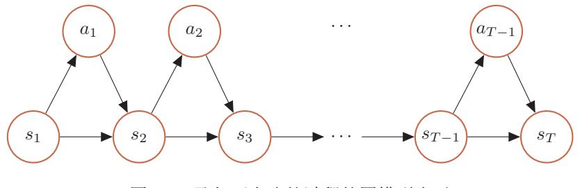

{0}------------------------------------------------

# 第14章 深度强化学习

除了试图直接去建立一个可以模拟成人大脑的程序之外, 为什么不试图建立一个可以模拟小孩大脑的程序呢? 如果它接 受适当的教育、就会获得成人的大脑。

 $-$  阿兰 · 图灵

在之前的章节中, 我们主要关注于监督学习, 而监督学习一般需要一定数 量的带标签的数据。在很多的应用场景中,通过人工标注的方式来给数据打标 签的方式往往行不通。比如我们通过监督学习来训练一个模型可以来自动下围 棋, 就需要将当前棋盘的状态作为输入数据, 其对应的最佳落子位置(动作)作 为标签。训练一个好的模型就需要收集大量的不同棋盘状态以及对应动作。这 种做法实践起来比较困难, 一是对于每一种棋盘状态, 即使是专家也很难给出 "正确"的动作, 二是获取大量数据的成本往往比较高。对于下棋这类任务, 虽 然我们很难知道每一步的"正确"动作,但是其最后的结果(即赢输)却很容 易判断。因此, 如果可以通过大量的模拟数据, 通过最后的结果(奖励)来倒 推每一步棋的好坏, 从而学习出"最佳"的下棋策略, 这就是强化学习。

强化学习(Reinforcement Learning, RL), 也叫增强学习, 是指一类从(与 环境) 交互中不断学习的问题以及解决这类问题的方法。强化学习问题可以描 述为一个智能体从与环境的交互中不断学习以完成特定目标(比如取得最大奖 励值)。和深度学习类似, 强化学习中的关键问题也是贡献度分配问题 [Minsky, 1963], 每一个动作并不能直接得到监督信息, 需要通过整个模型的最终监督信 息(奖励)得到,并且有一定的延时性。

贡献度分配问题即一 个系统中不同的组件 (components) 对最终系 统输出结果的贡献或影 响。

强化学习也是机器学习中的一个重要分支。强化学习和监督学习的不同在 于, 强化学习问题不需要给出"正确"策略作为监督信息, 只需要给出策略的 (延迟)回报,并通过调整策略来取得最大化的期望回报。

{1}------------------------------------------------

### 强化学习问题 $14.1$

强化学习广泛应用在很多领域,比如电子游戏、棋类游戏、迷宫类游戏、控 制系统、推荐等。这里我们介绍几个比较典型的强化学习例子。

#### 典型例子 $14.1.1$

多臂赌博机问题 给定 K 个赌博机, 拉动每个赌博机的拉杆 (arm), 赌博机会 按照一个事先设定的概率掉出一块钱或不掉钱。每个赌博机掉钱的概率不一样。 多臂赌博机问题 (multi-armed bandit problem) 是指, 给定有限的机会次数T, 如何玩这些赌博机才能使得期望累积收益最大化。多臂赌博机问题在广告推荐、 投资组合等领域有着非常重要的应用。

悬崖行走问题 在一个网格世界(grid world)中,每个格子表示一个状态。如14.1所 示的一个网格世界, 每个状态为 $(i, j)$ ,  $1 \leq i \leq 7$ ,  $1 \leq j \leq 3$ , 其中格子 $(2, 1)$  到  $(6,1)$ 是悬崖(cliff)。有一个醉汉, 从左下角的开始位置  $S$ , 走到右下角的目标 位置 E。如果走到悬崖, 醉汉会跌落悬崖并死去。醉汉可以选择行走的路线, 即 在每个状态时, 选择行走的方向: 上下左右。动作空间A = {↑, ↓, ←, →}。但每 走一步,都有一定的概率滑落到周围其他的格子。醉汉的目标是如何安全地到 达目标位置。

图 14.1 醉汉悬崖问题

# 14.1.2 强化学习定义

现在我们描述下强化学习的任务定义。在强化学习中,有两个可以进行交 互的对象: 智能体和环境。

• 智能体(agent)可以感知外界环境的状态(state)和反馈的奖励(reward), 并进行学习和决策。

智能体的决策功能是指根据外界环境的状态来做出不同的动作(action), 而学习功能是指根据外界环境的奖励来调整策略。

(K-armed bandit prob $lcm)$ .

也称为K臂赌博机问题

{2}------------------------------------------------

• 环境 (environment) 是智能体外部的所有事物, 并受智能体动作的影响 而改变其状态,并反馈给智能体相应的奖励。

在强化学习中的基本要素包括:

- · 状态 s是对环境的描述, 可以是离散的或连续的, 其状态空间为S;
- · 动作 $a$ 是对智能体行为的描述,可以是离散的或连续的,其动作空间为A;
- 策略 $\pi(a|s)$ 是智能体根据环境状态  $s$ 来决定下一步的动作  $a$  的函数;
- 状态转移概率  $p(s'|s, a)$ 是在智能体根据当前状态 s做出一个动作  $a \geq f\bar{b}$ , 环境在下一个时刻转变为状态 s' 的概率;
- 即时奖励 $r(s, a, s')$ 是一个标量函数, 即智能体根据当前状态 $s$ 做出动作 $a$ 之后,环境会反馈给智能体一个奖励,这个奖励也经常和下一个时刻的状 态 s' 有关。

策略 智能体的策略(policy)就是智能体如何根据环境状态 $s$ 来决定下一步的动 作a,通常可以分为确定性策略(Deterministic Policy)和随机性策略(Stochastic Policy) 两组。

确定性策略是从状态空间到动作空间的映射函数π:  $S \rightarrow A$ 。随机性策略 表示在给定环境状态时,智能体选择某个动作的概率分布。

$$
\pi(a|s) \triangleq p(a|s),\tag{14.1}
$$

$$
\sum_{a \in \mathcal{A}} \pi(a|s) = 1. \tag{14.2}
$$

通常情况下, 强化学习一般使用随机性的策略。随机性的策略可以有很多 优点。比如在学习时可以通过引入一定随机性更好地探索环境。二是使得策略 更加地多样性。比如在围棋中, 确定性策略总是会在同一个位置上下棋, 会导 致你的策略很容易被对手预测。

# 14.1.3 马尔可夫决策过程

为了简单起见,我们将智能体与环境的交互看作是离散的时间序列。图14.2给 出了智能体与环境的交互。

参考利用-探索策略。

{3}------------------------------------------------

# 2018年9月18日

图 14.2 智能体与环境的交互

智能体从感知到的初始环境 $s_0$ 开始,然后决定做一个相应的动作 $a_0$ ,环境 相应地发生改变到新的状态 s1, 并反馈给智能体一个即时奖励 r1, 然后智能体 又根据状态 $s_1$  做一个动作 $a_1$ , 环境相应改变为 $s_2$ , 并反馈奖励 $r_2$ 。这样的交互 可以一直讲行下去。

$$
s_0, a_0, s_1, r_1, a_1, \cdots, s_{t-1}, r_{t-1}, a_{t-1}, s_t, r_t, \cdots,
$$
\n
$$
(14.3)
$$

其中 $r_t = r(s_{t-1}, a_{t-1}, s_t)$ 是第 $t$ 时刻的即时奖励。

智能体与环境的交互的过程可以看作是一个马尔可夫决策过程。

马尔可夫过程(Markov Process)是具有马尔可夫性的随机变量序列 $s_0, s_1, \cdots$ ,  $s_t \in \mathcal{S}$ , 其下一个时刻的状态 $s_{t+1}$ 只取决于当前状态 $s_t$ ,

$$
p(s_{t+1}|s_t, \cdots, s_0) = p(s_{t+1}|s_t), \tag{14.4}
$$

其中  $p(s_{t+1}|s_t)$  称为状态转移概率,  $\sum_{s_{t+1} \in S} p(s_{t+1}|s_t) = 1$ .

马尔可夫过程参见 第D.3.1节。

马尔可夫决策过程 (Markov Decision Process, MDP) 在马尔可夫过程中 加入一个额外的变量: 动作  $a$ , 即下一个时刻的状态  $s_{t+1}$  和当前时刻的状态  $s_t$ 以及动作 at 相关,

$$
p(s_{t+1}|s_t, a_t, \cdots, s_0, a_0) = p(s_{t+1}|s_t, a_t),
$$
\n(14.5)

其中 $p(s_{t+1}|s_t, a_t)$ 为状态转移概率。

给定策略 π(a|s), 马尔可夫决策过程的一个轨迹 (trajectory)

$$
\tau = s_0, a_0, s_1, r_1, a_1, \cdots, s_{T-1}, a_{T-1}, s_T, r_T
$$

的概率为

$$
p(\tau) = p(s_0, a_0, s_1, a_1, \cdots), \tag{14.6}
$$

$$
= p(s_0) \prod_{t=0}^{T-1} \pi(a_t|s_t) p(s_{t+1}|s_t, a_t).
$$
 (14.7)

邱锡鹏:《神经网络与深度学习》

https://nndl.github.io/

 $301\,$ 

{4}------------------------------------------------

图14.3给出了马尔可夫决策过程的图模型表示。

图 14.3 马尔可夫决策过程的图模型表示

# 14.1.4 强化学习的目标函数

# 14.1.4.1 总回报

给定策略 π(a|s), 智能体和环境一次交互过程的轨迹 π 所收到的累积奖励 为总回报 (return)。

$$
G(\tau) = \sum_{t=0}^{T-1} r_{t+1}
$$
 (14.8)

$$
= \sum_{t=0}^{T-1} r(s_t, a_t, s_{t+1}).
$$
\n(14.9)

假设环境中有一个或多个特殊的终止状态 (terminal state), 当到达终止 状态时,一个智能体和环境的交互过程就结束了。这一轮交互的过程称为一个 回合 (episode) 或试验 (trial) 。一般的强化学习任务 (比如下棋、游戏) 都 属于这种回合式的任务。

如果环境中没有终止状态(比如终身学习的机器人),即 $T = \infty$ ,称为持续 性强化学习任务, 其总回报也可能是无穷大。为了解决这个问题, 我们可以引 入一个折扣率来降低远期回报的权重。折扣回报(discounted return) 定义为

$$
G(\tau) = \sum_{t=0}^{T-1} \gamma^t r_{t+1},
$$
\n(14.10)

其中 γ ∈ [0,1] 是折扣率。当 γ 接近于 0时, 智能体更在意短期回报; 而当 γ 接近 于1时,长期回报变得更重要。

### 14.1.4.2 目标函数

因为策略和状态转移都有一定的随机性, 每次试验得到的轨迹是一个随机 序列, 其收获的总回报也不一样。强化学习的目标是学习到一个策略 πρ(a|s) 来

{5}------------------------------------------------

最大化期望回报 (expected return), 即希望智能体执行一系列的动作来获得 尽可能多的平均回报。

$$
\mathcal{J}(\theta) = \mathbb{E}_{\tau \sim p_{\theta}(\tau)}[G(\tau)] = \mathbb{E}_{\tau \sim p_{\theta}(\tau)}[\sum_{t=0}^{T-1} \gamma^t r_{t+1}].
$$
 (14.11)

持续性强化学习的优化 目标也可以定义为MDP 到达平稳分布时"即时 奖励"的期望。

其中θ为策略函数的参数。

#### 14.1.5 值函数

为了评估一个策略π的期望回报, 我们定义两个值函数: 状态值函数和状 态-动作值函数。

### 14.1.5.1 状态值函数

一个策略π期望回报可以分解为

$$
\mathbb{E}_{\tau \sim p(\tau)}[G(\tau)] = \mathbb{E}_{s \sim p(s_0)} \left[ \mathbb{E}_{\tau \sim p(\tau)} \left[ \sum_{t=0}^{T-1} \gamma^t r_{t+1} | \tau_{s_0} = s \right] \right]
$$
(14.12)

$$
=\mathbb{E}_{s \sim p(s_0)}\left[V^{\pi}(s)\right],\tag{14.13}
$$

其中 $V^{\pi}(s)$ 称为状态值函数 (state value function), 表示从状态 $s$ 开始, 执行 策略π得到的期望总回报

$$
V^{\pi}(s) = \mathbb{E}_{\tau \sim p(\tau)} \left[ \sum_{t=0}^{T-1} \gamma^t r_{t+1} | \tau_{s_0} = s \right],
$$
 (14.14)

其中 Tso 表示轨迹 r 的起始状态。

为了方便起见, 我们用 $\tau_{0:T}$ 来表示从轨迹 $s_0, a_0, s_1, \cdots, s_T$ , 用 $\tau_{1:T}$ 表示轨 迹 $s_1, a_1, \cdots, s_T$ , 因此有 $\tau_{0:T} = s_0, a_0, \tau_{1:T}$ 。

根据马尔可夫性,  $V^{\pi}(s)$ 可展开得到

$$
V^{\pi}(s) = \mathbb{E}_{\tau_{0:T} \sim p(\tau)} \left[ r_1 + \gamma \sum_{t=1}^{T-1} \gamma^{t-1} r_{t+1} | \tau_{s_0} = s \right]
$$
(14.15)

$$
= \mathbb{E}_{a \sim \pi(a|s)} \mathbb{E}_{s' \sim p(s'|s,a)} \mathbb{E}_{\tau_1, \tau \sim p(\tau)} \left[ r(s, a, s') + \gamma \sum_{t=1}^{T-1} \gamma^{t-1} r_{t+1} | \tau_{s_1} = s' \right]
$$
(14.16)

$$
= \mathbb{E}_{a \sim \pi(a|s)} \mathbb{E}_{s' \sim p(s'|s,a)} \left[ r(s,a,s') + \gamma \mathbb{E}_{\tau_1, \tau \sim p(\tau)} \left[ \sum_{t=1} \gamma^{t-1} r_{t+1} | \tau_{s_1} = s' \right] \right]
$$
(14.17)  
$$
= \mathbb{E}_{a \sim \pi(a|s)} \mathbb{E}_{s' \sim p(s'|s,a)} \left[ r(s,a,s') + \gamma V^{\pi}(s') \right].
$$
(14.18)

公式(14.18) 也称为贝尔曼方程 (Bellman equation), 表示当前状态的值 函数可以通过下个状态的值函数来计算。

贝尔曼方程因提出者 Richard Bellman 而 得 名,也叫做"动态规划方 程"。Richard Bellman  $(1920 - 1984)$ , 美国应 用数学家,美国国家科 学院院士, 和动态规划 的创始人。

邱锡鹏:《神经网络与深度学习》

{6}------------------------------------------------

如果给定策略 π(a|s), 状态转移概率 p(s'|s, a) 和奖励 r(s, a, s'), 我们就可 以通过迭代的方式来计算  $V^{\pi}(s)$ 。由于存在折扣率, 迭代一定步数后, 每个状态 的值函数就会固定不变。

### 14.1.5.2 状态-动作值函数

公式(14.18)中的第二个期望是指初始状态为 s 并进行动作 a, 然后执行策 略π得到的期望总回报, 称为状态-动作值函数 (state-action value function),

$$
Q^{\pi}(s, a) = \mathbb{E}_{s' \sim p(s'|s, a)} [r(s, a, s') + \gamma V^{\pi}(s')], \qquad (14.19)
$$

状态-动作值函数也经常称为Q函数(Q-function)。

状态值函数 $V^{\pi}(s)$ 是Q函数 $Q^{\pi}(s, a)$ 关于动作 $a$ 的期望,

$$
V^{\pi}(s) = \mathbb{E}_{a \sim \pi(a|s)}[Q^{\pi}(s, a)]. \tag{14.20}
$$

结合公式 (14.19) 和 (14.20), Q函数可以写为

$$
Q^{\pi}(s, a) = \mathbb{E}_{s' \sim p(s'|s, a)} \left[ r(s, a, s') + \gamma \mathbb{E}_{a' \sim \pi(a'|s')} [Q^{\pi}(s', a')] \right],
$$
 (14.21)

这是关于Q函数的贝尔曼方程。

### 14.1.5.3 值函数的作用

值函数可以看作是对策略π的评估。如果在状态s,有一个动作a使得 $Q^{\pi}(s, a)$  $V^{\pi}(s)$ , 说明执行动作  $a$  比当前的策略  $\pi(a|s)$  要好, 我们就可以调整参数使得策 略 $\pi(a|s)$ 的概率增加。

# 14.1.6 深度强化学习

在强化学习中,一般需要建模策略π(a|s)和值函数 $V^{\pi}(s), Q^{\pi}(s, a)$ 。早期的 强化学习算法主要关注于状态和动作都是离散且有限的问题, 可以使用表格来 记录这些概率。但在很多实际问题中,有些任务的状态和动作的数量非常多。比 如围棋的棋局有 $3^{361} \approx 10^{170}$ 种状态, 动作(即落子位置) 数量为361。还有些 任务的状态和动作是连续的。比如在自动驾驶中,智能体感知到的环境状态是 各种传统器数据,一般都是连续的。动作是操作方向盘的方向(-90 ~ 90度) 和速度控制 (0~300公里/小时), 也是连续的。

为了有效地解决这些问题,可以一个复杂的函数(比如深度神经网络)来 使得智能体可以感知更复杂的环境状态以及建立更复杂的策略, 提高强化学习 算法的能力,并提高泛化能力。

深度强化学习 (deep reinforcement learning) 是将强化学习和深度学习结 合在一起,用强化学习来定义问题和优化目标,用深度学习来解决策略和值函数 

{7}------------------------------------------------

的建模问题, 然后使用误差反向传播算法来优化目标函数。深度强化学习在一 定程度上具备解决复杂问题的通用智能,并在很多任务上都取得了很大的成功。

### 基于值函数的学习方法 14.2

值函数是对策略π的评估,如果策略π有限(即状态数和动作数都有限)时, 可以对所有的策略讲行评估并选出最优策略π\*。

$$
\forall s, \qquad \pi^* = \arg \max V^{\pi}(s). \tag{14.22}
$$

但这种方式在实践中很难实现。假设状态空间S和动作空间A都是离散且有限 的, 策略空间为 | A||S|, 往往也非常大。

一种可行的方式是通过迭代的方法不断优化策略,直到选出最优策略。对 于一个策略 π(a|s), 其 Q 函数为 Qπ(s, a), 我们可以设置一个新的策略 π'(a|s),

$$
\pi'(a|s) = \begin{cases}\n1 & \text{if } a = \arg \max_{\hat{a}} Q^{\pi}(s, \hat{a}) \\
0 & \text{otherwise}\n\end{cases}
$$
\n(14.23)

即 $\pi'(a|s)$ 为一个确定性的策略, 也可以直接写为

$$
\pi'(s) = \arg\max_{a} Q^{\pi}(s, a). \tag{14.24}
$$

如果执行π', 会有

$$
\forall s, \qquad V^{\pi'}(s) \ge V^{\pi}(s). \tag{14.25}
$$

根据公式(14.25), 我们可以通过下面方式来学习最优策略: 先随机初始化 一个策略, 计算该策略的值函数, 并根据值函数来设置新的策略, 然后一直反 复迭代直到收敛。

基于值函数的策略学习方法中最关键的是如何计算策略π的值函数,一般 有动态规划或蒙特卡罗两种计算方式。

# 14.2.1 动态规划算法

从贝尔曼方程可知, 如果知道马尔可夫决策过程的状态转移概率  $p(s'|s,a)$ 和奖励r(s,a,s'),我们直接可以通过贝尔曼方程来迭代计算其值函数。这种模型 已知的强化学习算法也称为基于模型的强化学习(Model-Based Reinforcement Learning) 算法, 这里的模型就是指马尔可夫决策过程。

在已知模型时, 可以通过动态规划的方法来计算。常用的方法主要有策略 迭代算法和值迭代算法。

基于模型的强化学习,也 叫做模型相关的强化学 习,或有模型的强化学 习。

https://nndl.github.io/

参见习题14-1。

邱锡鹏:《神经网络与深度学习》

 $305\,$ 

{8}------------------------------------------------

# 14.2.1.1 策略迭代

策略迭代 (Policy Iteration) 算法中, 每次迭代可以分为两步:

1. 策略评估 (policy evaluation): 计算当前策略下, 每个状态的值函数, 即 算法14.1中的3-6步。策略评估可以通过贝尔曼方程(公式(14.18))进行 迭代计算 $V^{\pi}(s)$ 。

如果状态数有限时,也可以通过直接求解Bellman方程来得到得到V"(s)。

2. 策略改进(policy improvement): 根据值函数来更新策略, 即算法14.1中 的7-8步。

策略迭代如算法14.1所示。

| 算法 14.1: 策略迭代算法                          |                                            |  |  |
|------------------------------------------|--------------------------------------------|--|--|
| 输入: MDP 五元组: $S, A, P, r, \gamma$ ;      |                                            |  |  |
| 1 初始化: ∀s,∀a, π(a s) = $\frac{1}{ A }$ ; |                                            |  |  |
| 2 repeat                                 |                                            |  |  |
|                                          | // 策略评估                                    |  |  |
| 3                                        | repeat                                     |  |  |
| $\overline{\mathbf{4}}$                  | 根据贝尔曼方程 (公式(14.18)), 计算 $V^{\pi}(s)$ , ∀s; |  |  |
| 5                                        | until ∀s, $V^{\pi}(s)$ 收敛;                 |  |  |
|                                          | // 策略改进                                    |  |  |
| 6                                        | 根据公式(14.19), 计算 $Q(s, a)$ ;                |  |  |
| $\overline{7}$                           | $\forall s, \pi(s) = \arg \max_a Q(s, a);$ |  |  |
| 8 until ∀s, $π(s)$ 收敛;                   |                                            |  |  |
| 输出: 策略 $\pi$                             |                                            |  |  |

14.2.1.2 值迭代

策略迭代中的策略评估和策略改进是交替轮流进行, 其中策略评估也是通 过一个内部迭代来进行计算, 其计算量比较大。事实上, 我们不需要每次计算 出每次策略对应的精确的值函数, 也就是说内部迭代不需要执行到完全收敛。

值迭代(Value Iteration)方法将策略评估和策略改进两个过程合并, 来直 接计算出最优策略。

假设最优策略π\*对应的值函数称为最优值函数,那么最优状态值函数 V\*(s) 和最优状态-动作值函数 $Q^*(s, a)$ 的关系为

$$
V^*(s) = \max_{a} Q^*(s, a). \tag{14.26}
$$

{9}------------------------------------------------

根据贝尔曼方程可知,最优状态值函数 $V^*(s)$ 和最优状态-动作值函数 $Q^*(s,a)$ 也可以进行迭代计算。

$$
V^*(s) = \max_{a} \mathbb{E}_{s' \sim p(s'|s,a)} \left[ r(s,a,s') + \gamma V^*(s') \right],
$$
 (14.27)

$$
Q^*(s, a) = \mathbb{E}_{s' \sim p(s'|s, a)} \left[ r(s, a, s') + \gamma \max_{a'} Q^*(s', a') \right],
$$
 (14.28)

这两个公式称为贝尔曼最优方程(Bellman Optimality Equation)。

值迭代方法通过直接优化贝尔曼最优方程(公式(14.27)), 迭代计算最优 值函数。值迭代方法如算法14.2所示。

算法 14.2: 值迭代算法

输入: MDP 五元组:  $S, A, P, r, \gamma$ ; 1 初始化:  $\forall s \in \mathcal{S}, V(s) = 0$ ; 2 repeat  $\forall s, V(s) \leftarrow \max_{a} \mathbb{E}_{s' \sim p(s'|s,a)} \left[ r(s,a,s') + \gamma V(s') \right]$ ;  $\bf{3}$ 4 until  $\forall s, V(s)$  收敛: 5 根据公式 (14.19) 计算 $Q(s, a)$ ; 6  $\forall s, \pi(s) = \arg \max_a Q(s, a);$ 输出: 策略 $\pi$ 

策略迭代 VS 值迭代 在策略迭代中,每次迭代的时间复杂度最大为O(|S|3|,A|3), 最大迭代次数为|A||S|。而在值迭代中,每次迭代的时间复杂度最大为O(|S|2|A|), 但迭代次数要比策略迭代算法更多。

策略迭代是根据贝尔曼方程来更新值函数,并根据当前的值函数来改进策 略。而值迭代算法是直接使用贝尔曼最优方程来更新值函数, 收敛时的值函数 就是最优的值函数, 其对应的策略也就是最优的策略。

值迭代和策略迭代都需要经过非常多的迭代次数才能完全收敛。在实际应 用中, 可以不必等到完全收敛。这样, 当状态和动作数量有限时, 经过有限次 迭代就可以能收敛到近似最优策略。

基于模型的强化学习算法实际上是一种动态规划方法。在实际应用中有以 下两点限制。

一是要求模型已知,即要给出马尔可夫决策过程的状态转移概率  $p(s'|s,a)$ 和奖励函数 r(s, a, s'), 这个要求很难满足。如果是事先不知道模型, 但仍然希 望通过基于模型的学习算法, 也可以通过与环境交互来学习出状态转移概率和 奖励函数。一个简单的计算模型的方法为 R-max [Brafman and Tennenholtz, 2002], 通过随机游走的方法来探索环境。每次随机一个策略并执行, 然后收集

邱锡鹏:《神经网络与深度学习》

参见习题14-2。

{10}------------------------------------------------

状态转移和奖励的样本。在收集一定的样本后, 就可以通过统计或监督学习来 重构出马尔可夫决策过程。但是,这种基于采样的重构过程的复杂度也非常高, 只能应用于状态数非常少的场合。

二是效率问题, 当状态数量较大的时候, 算法的效率比较低。但在实际应 用中,很多问题的状态数量和动作数量非常多。比如,围棋有19 × 19 = 361个 位置, 每个位置有黑子、白子或无子三种状态, 整个棋局有  $3^{361} \approx 10^{170}$  种状 态。动作(即落子位置)数量为361。不管是值迭代还是策略迭代,以当前计算 机的计算能力, 根本无法计算。一个有效的方法是通过一个函数(比如神经网 络)来近似计算值函数,以减少复杂度,并提高泛化能力。

参见第14.2.4节。

#### 蒙特卡罗方法 $14.2.2$

在很多应用场景中,马尔可夫决策过程的状态转移概率 p(s'|s, a) 和奖励函 数 r(s, a, s') 都是未知的。在这种情况下, 我们一般需要智能体和环境进行交 互,并收集一些样本。然后再根据这些样本来求解马尔可夫决策过程最优策略。 这种模型未知, 基于采样的学习算法也称为模型无关的强化学习(Model-Free Reinforcement Learning)算法。

模型无关的强化学习,也 叫做无模型的强化学习。

参见公式(14.19)。

 $Q \boxtimes \mathcal{X} Q^{\pi}(s,a)$ 为初始状态为s,并执行动作 $a$ 后的所能得到的期望总回报, 可以写为

$$
Q^{\pi}(s, a) = \mathbb{E}_{\tau \sim p(\tau)}[G(\tau_{s_0 = s, a_0 = a})],
$$
\n(14.29)

其中 $\tau_{s_0=s.a_0=a}$ 表示轨迹 $\tau$ 的起始状态和动作为 $s, a$ 。

如果模型未知, Q函数可以通过采样来进行计算, 这就是蒙特卡罗方法。对 于一个策略  $\pi$ , 智能体从状态  $s$ , 执行动作  $a$  开始, 然后通过随机游走的方法 来探索环境,并计算其得到的总回报。假设我们进行 N 次试验, 得到 N 个轨迹  $\tau^{(1)}, \tau^{(2)}, \cdots, \tau^{(N)}$ , 其总回报分别为 $G(\tau^{(1)}), G(\tau^{(2)}), \cdots, G(\tau^{(N)})$ 。 Q 函数可以 近似为

$$
Q^{\pi}(s, a) \approx \hat{Q}^{\pi}(s, a) = \frac{1}{N} \sum_{n=1}^{N} G(\tau_{s_0 = s, a_0 = a}^{(n)}).
$$
 (14.30)

 $\exists N \rightarrow \infty \mathbb{H}$ ,  $\hat{Q}^{\pi}(s,a) \rightarrow Q^{\pi}(s,a)$ .

在似估计出Q函数 $\hat{Q}^{\pi}(s, a)$ 之后, 就可以进行策略改进。然后在新的策略 下重新通过采样来估计Q函数,并不断重复,直至收敛。

利用和探索 但在蒙特卡罗方法中, 如果采用确定性策略π, 每次试验得到的轨 迹是一样的, 只能计算出 $Q^{\pi}(s, \pi(s))$ , 而无法计算其它动作 α' 的Q函数, 因此 也无法进一步改进策略。这样情况仅仅是对当前策略的利用(exploitation), 而

{11}------------------------------------------------

缺失了对环境的探索(exploration), 即试验的轨迹尽可能覆盖所有的状态和动 作,以找到更好的策略。

为了平衡利用和探索,我们可以采用E-贪心法(e-greedy method)。对于 臂赌博机问题。 一个目标策略π, 其对应的 ε-贪心法策略为

$$
\pi^{\epsilon}(s) = \begin{cases}\n\pi(s), & \text{f} \text{if } \text{f} \text{if } \text{f} \text{if } \text{f} \text{if } \text{f} \text{if } \text{f} \text{if } \text{f} \text{if } \text{f} \text{if } \text{f} \text{if } \text{f} \text{if } \text{f} \text{if } \text{f} \text{if } \text{f} \text{if } \text{f} \text{if } \text{f} \text{if } \text{f} \text{if } \text{f} \text{if } \text{f} \text{if } \text{f} \text{if } \text{f} \text{if } \text{f} \text{if } \text{f} \text{if } \text{f} \text{if } \text{f} \text{if } \text{f} \text{if } \text{f} \text{if } \text{f} \text{if } \text{f} \text{if } \text{f} \text{if } \text{f} \text{if } \text{f} \text{if } \text{f} \text{if } \text{f} \text{if } \text{f} \text{if } \text{f} \text{if } \text{f} \text{if } \text{f} \text{if } \text{f} \text{if } \text{f} \text{if } \text{f} \text{if } \text{f} \text{if } \text{f} \text{if } \text{f} \text{if } \text{f} \text{if } \text{f} \text{if } \text{f} \text{if } \text{f} \text{if } \text{f} \text{if } \text{f} \text{if } \text{f} \text{if } \text{f} \text{if } \text{f} \text{if } \text{f} \text{if } \text{f} \text{if } \text{f} \text{if } \text{f} \text{if } \text{f} \text{if } \text{f} \text{if } \text{f} \text{if } \text{f} \text{if } \text{f} \text{if } \text{f} \text{if } \text{f} \text{if } \text{f} \text{if } \text{f} \text{if } \text{f} \text{if } \text{f} \text{if } \text{f} \text{if } \text{f} \text{if } \text{f} \text{if } \text{f} \text{if } \text{f} \text{if } \text{f} \text{if } \text{f} \text{if }
$$

这样, ε-贪心法将一个仅利用的策略转为带探索的策略。每次选择动作π(s)的 概率为 $1 - \epsilon + \frac{1}{|A|}$ , 其它动作的概率为 $\frac{1}{|A|}$ 。

同策略 在蒙特卡罗方法中, 如果采样策略是 $\pi^{\epsilon}(s)$ , 不断改进策略也是 $\pi^{\epsilon}(s)$ 而  $\overline{A}$ 是目标策略 $\pi(s)$ 。这种采样与改进策略相同(即都是 $\pi^{\epsilon}(s)$ )的强化学习方法 叫做同策略 (on policy) 方法。

异策略 如果采样策略是πε(s), 而优化目标是策略π, 可以通过重要性采样, 引 入重要性权重来实现对目标策略π的优化。这种采样与改进分别使用不同策略 的强化学习方法叫做异策略(off policy)方法。

重要性采样参见 第11.3节。

这也可以看做是一个多

#### $14.2.3$ 时序差分学习方法

蒙特卡罗采样方法一般需要拿到完整的轨迹,才能对策略进行评估并更新 模型,因此效率也比较低。

时序差分学习 (temporal-difference learning) 结合了动态规划和蒙特卡罗 方法,比仅仅使用蒙特卡罗采样方法的效率要高很多 [Sutton and Barto, 2011]。 时序差分学习是模拟一段轨迹,每行动一步(或者几步),就利用贝尔曼方程来评 估行动前状态的价值。当时序差分学习中每次更新的动作数为最大步数时, 就 等价于蒙特卡罗方法。

首先,将蒙特卡罗方法中Q函数 $\hat{Q}^{\pi}(s,a)$ 的估计改为增量计算的方式,假 设第 N 试验后值函数 $\hat{Q}_{N}^{\pi}(s, a)$ 的平均为

$$
\hat{Q}_N^{\pi}(s, a) = \frac{1}{N} \sum_{n=1}^N G(\tau_{s_0 = s, a_0 = a}^{(n)})
$$
\n(14.32)

$$
= \frac{1}{N} \left( G(\tau_{s_0=s, a_0=a}^{(N)}) + \sum_{n=1}^{N-1} G(\tau_{s_0=s, a_0=a}^{(n)}) \right) \tag{14.33}
$$

$$
= \frac{1}{N} \Big( G(\tau_{s_0=s, a_0=a}^{(N)}) + (N-1)\hat{Q}_{N-1}^{\pi}(s, a) \Big) \tag{14.34}
$$

$$
= \hat{Q}_{N-1}^{\pi}(s, a) + \frac{1}{N} \Big( G(\tau_{s_0 = s, a_0 = a}^{(N)}) - \hat{Q}_{N-1}^{\pi}(s, a) \Big), \tag{14.35}
$$

其中 $\tau_{so=s,a_0=a}$ 表示轨迹 $\tau$ 的起始状态和动作为 $s, a$ 。

邱锡鹏:《神经网络与深度学习》

{12}------------------------------------------------

值函数 $\hat{Q}^{\pi}(s,a)$ 在第 N 试验后的平均等于第 N - 1 试验后的平均加上一个 增量。更一般性地,我们将权重系数  $\frac{1}{N}$ 改为一个比较小的正数 α。这样每次采 用一个新的轨迹 $\tau_{s_0=s,a_0=a}$ , 就可以更新 $\hat{Q}^{\pi}(s,a)$ 。

$$
\hat{Q}^{\pi}(s,a) \leftarrow \hat{Q}^{\pi}(s,a) + \alpha \Big( G(\tau_{s_0=s,a_0=a}) - \hat{Q}^{\pi}(s,a) \Big), \tag{14.36}
$$

其中增量δ $\triangleq G(\tau_{s_0=s,a_0=a}) - \hat{Q}^{\pi}(s,a)$ 称为蒙特卡罗误差,表示当前轨迹的真 实回报  $G(\tau_{s_0=s,a_0=a})$ 与期望回报 $\hat{Q}^{\pi}(s,a)$ 之间的差距。

在公式(14.36)中,  $G(\tau_{s_0=s,a_0=a})$ 为一次试验的完整轨迹所得到的总回报。 为了提高效率,可以借助动态规划的方法来计算 $G(\tau_{so=s.a_0=a})$ , 而不需要得到完 整的轨迹。从 $s, a$ 开始, 采样下一步的状态和动作 $(s', a')$ , 并得到奖励 $r(s, a, s')$ , 然后利用贝尔曼方程来近似估计 $G(\tau_{s_0=s,a_0=a})$ ,

$$
G(\tau_{s_0=s, a_0=a, s_1=s', a_1=a'}) = r(s, a, s') + \gamma G(\tau_{s_0=s', a_0=a'}) \tag{14.37}
$$

$$
\approx r(s, a, s') + \gamma \hat{Q}^{\pi}(s', a'), \qquad (14.38)
$$

其中 $\hat{Q}^{\pi}(s',a')$ 是当前的Q函数的近似估计。

参见习题14-3。

贝尔曼方程参见公式

 $(14.21)$ 

结合公式 (14.36) 和 (14.38), 有

$$
\hat{Q}^{\pi}(s, a) \leftarrow \hat{Q}^{\pi}(s, a) + \alpha \Big( r(s, a, s') + \gamma \hat{Q}^{\pi}(s', a') - \hat{Q}^{\pi}(s, a) \Big), \quad (14.39)
$$

因此, 更新 $\hat{Q}^{\pi}(s, a)$ 只需要知道当前状态  $s$ 和动作  $a$ 、奖励  $r(s, a, s')$ 、下一步的 状态 s' 和动作 a'。这种策略学习方法称为 SARSA 算法 (State Action Reward State Action, SARSA) [Rummery and Niranjan, 1994].

SARSA 算法14.3所示, 其采样和优化的策略都是πε, 因此是一种同策略算 法。为了提高计算效率, 我们不需要对环境中所有的 s, a 组合进行穷举, 并计算 值函数。只需要将当前的探索 $(s, a, r, s', a')$ 中 $s', a'$ 作为下一次估计的起始状态

{13}------------------------------------------------

和动作。

|                                      | <b>算法 14.3:</b> SARSA: 一种同策略的时序差分学习算法                                         |  |  |  |  |
|--------------------------------------|-------------------------------------------------------------------------------|--|--|--|--|
|                                      | 输入:状态空间 S, 动作空间 A, 折扣率 $\gamma$ , 学习率 $\alpha$                                |  |  |  |  |
|                                      | 1 随机初始化 $Q(s,a);$                                                             |  |  |  |  |
|                                      | $\Box$ $\forall s, \forall a, \pi(a s) = \frac{1}{ \mathcal{A} };$            |  |  |  |  |
| 3 repeat                             |                                                                               |  |  |  |  |
| $\overline{\mathbf{4}}$              | 初始化起始状态 s;                                                                    |  |  |  |  |
| 5                                    | 选择动作 $a = \pi^{\epsilon}(s);$                                                 |  |  |  |  |
| 6                                    | repeat                                                                        |  |  |  |  |
| $\overline{\tau}$                    | 执行动作 $a$ , 得到即时奖励 $r$ 和新状态 $s'$ ;                                             |  |  |  |  |
| 8                                    | 在状态 s', 选择动作 $a' = \pi^{\epsilon}(s')$ ;                                      |  |  |  |  |
| 9                                    | $Q(s,a) \leftarrow Q(s,a) + \alpha \Bigl(r + \gamma Q(s',a') - Q(s,a)\Bigr);$ |  |  |  |  |
| 10                                   | 更新策略: $\pi(s) = \arg \max_{a \in  A } Q(s, a);$                               |  |  |  |  |
| 11                                   | $s \leftarrow s', a \leftarrow a';$                                           |  |  |  |  |
| 12                                   | until $s$ 为终止状态;                                                              |  |  |  |  |
| 13 until $\forall s, a, Q(s, a)$ 收敛; |                                                                               |  |  |  |  |
| 输出:策略 $\pi(s)$                       |                                                                               |  |  |  |  |

时序差分学习是强化学习的主要学习方法, 其关键步骤就是在每次迭代中 优化Q函数来减少现实 $r + \gamma Q(s', a')$ 和预期 $Q(s, a)$ 的差距。这和动物学习的 机制十分相像。在大脑神经元中,多巴胺的释放机制和时序差分学习十分吻合。 Schultz [1998] 的一个实验中, 通过监测猴子大脑释放的多巴胺浓度, 发现如果 猴子获得比预期更多的果汁, 或者在没有预想到的时间喝到果汁, 多巴胺释放大 增。如果本来预期的果汁没有喝到,多巴胺的释放就会大减。多巴胺的释放,来 自对于实际奖励和预期奖励的差异,而不是奖励本身。

时序差分学习和蒙特卡罗方法的主要不同为: 蒙特卡罗需要完整一个路径 完成才能知道其总回报, 也不依赖马尔可夫性质; 而时序差分学习只需要一步, 其总回报需要依赖马尔可夫性质来进行近似估计。

多巴胺是一种神经传导 物质,传递开心、兴奋有 关的信息。

### 14.2.3.1 Q学习

Q学习 (Q-Learning) 算法 [Watkins and Dayan, 1992] 是一种异策略的时 序差分学习算法。在Q学习中, Q函数的估计方法为

$$
Q(s,a) \leftarrow Q(s,a) + \alpha \Big( r + \gamma \max_{a'} Q(s',a') - Q(s,a) \Big), \tag{14.40}
$$

相当于让 $Q(s, a)$ 直接去估计最优状态值函数 $Q^*(s, a)$ 。

与 SARSA 算法的不同, Q 学习算法不通过  $\pi$ c 来选下一步的动作  $a'$ , 而是 直接选最优的Q函数,因此更新后的Q函数是关于策略π的,而不是策略πε的。 事实上, Q学习算法被提 出的时间更早, SARSA 算法是Q学习算法的改 进。

{14}------------------------------------------------

Q学习算法14.4所示。

| 算法 14.4: Q学习: 一种异策略的时序差分学习算法                             |                                                                                             |  |  |  |  |
|----------------------------------------------------------|---------------------------------------------------------------------------------------------|--|--|--|--|
|                                                          | 输入:状态空间 S, 动作空间 A, 折扣率 $\gamma$ , 学习率 $\alpha$                                              |  |  |  |  |
| 1 随机初始化 $Q(s,a);$                                        |                                                                                             |  |  |  |  |
| $\Box$ $\forall s, \forall a, \pi(a s) = \frac{1}{ A };$ |                                                                                             |  |  |  |  |
| 3 repeat                                                 |                                                                                             |  |  |  |  |
| $\overline{\mathbf{4}}$                                  | 初始化起始状态 s;                                                                                  |  |  |  |  |
| 5                                                        | repeat                                                                                      |  |  |  |  |
| 6                                                        | 在状态 s, 选择动作 $a = \pi^{\epsilon}(s);$                                                        |  |  |  |  |
| $\overline{7}$                                           | 执行动作 a, 得到即时奖励 r 和新状态 s';                                                                   |  |  |  |  |
| 8                                                        | $Q(s, a) \leftarrow Q(s, a) + \alpha \Big( r + \gamma \max_{a'} Q(s', a') - Q(s, a) \Big);$ |  |  |  |  |
| 9                                                        | $s \leftarrow s'$ ;                                                                         |  |  |  |  |
| 10                                                       | until $s$ 为终止状态;                                                                            |  |  |  |  |
| 11 until $\forall s, a, Q(s,a)$ 收敛;                      |                                                                                             |  |  |  |  |
| 输出: 策略 $\pi(s) = \arg \max_{a \in  A } Q(s, a)$          |                                                                                             |  |  |  |  |

#### 14.2.4 深度Q网络

为了在连续的状态和动作空间中计算值函数 $Q^{\pi}(s, a)$ , 我们可以用一个函 数 $Q_{\phi}(\mathbf{s}, \mathbf{a})$ 来表示近似计算, 称为值函数近似 (value function approximation)

$$
Q_{\phi}(\mathbf{s}, \mathbf{a}) \approx Q^{\pi}(s, a), \tag{14.41}
$$

其中s,a分别是状态s和动作a的向量表示; 函数 $Q_{\phi}$ (s,a)通常是一个参数为 $\phi$ 的函数,比如神经网络,输出为一个实数,称为Q网络(Q-network)。

如果动作为有限离散的 $m \wedge m$ 作 $a_1, \dots, a_m$ , 我们可以让Q网络输出一个  $m$  维向量, 其中每一维用 $Q_{\phi}(\mathbf{s}, a_i)$  来表示, 对应值函数  $Q(s, a_i)$  的近似值。

$$
Q_{\phi}(\mathbf{s}) = \begin{bmatrix} Q_{\phi}(\mathbf{s}, a_1) \\ \vdots \\ Q_{\phi}(\mathbf{s}, a_m) \end{bmatrix} \approx \begin{bmatrix} Q^{\pi}(s, a_1) \\ \vdots \\ Q^{\pi}(s, a_m) \end{bmatrix} .
$$
 (14.42)

我们需要学习一个参数 $\phi$ 来使得函数 $Q_{\phi}(\mathbf{s}, \mathbf{a})$ 可以逼近值函数 $Q^{\pi}(s, a)$ 。如 果采用蒙特卡罗方法, 就直接让 $Q_{\phi}(\mathbf{s}, \mathbf{a})$ 去逼近平均的总回报 $\hat{Q}^{\pi}(s, a)$ ; 如果采 样时序差分方法, 就让 $Q_{\phi}(\mathbf{s}, \mathbf{a})$ 去逼近 $\mathbb{E}_{\mathbf{s}', \mathbf{a}'}[r + \gamma Q_{\phi}(\mathbf{s}', \mathbf{a}')]$ 。

 $312\,$ 

{15}------------------------------------------------

以 Q学习为例, 采用随机梯度下降, 目标函数为

$$
\mathcal{L}(s, a, s'|\phi) = \left(r + \gamma \max_{a'} Q_{\phi}(\mathbf{s}', \mathbf{a}') - Q_{\phi}(\mathbf{s}, \mathbf{a})\right)^2, \tag{14.43}
$$

其中s',a'是下一时刻的状态s'和动作a'的向量表示。

然而,这个目标函数存在两个问题:一是目标不稳定,参数学习的目标依赖 于参数本身;二是样本之间有很强的相关性。为了解决这两个问题, Mnih et al. [2015] 提出了一种深度 Q 网络 (deep Q-networks, DQN) 。深度 Q 网络采取两 个措施: 一是目标网络冻结 (freezing target networks), 即在一个时间段内固 定目标中的参数,来稳定学习目标;二是经验回放(experience replay),构建 一个经验池来去除数据相关性。经验池是由智能体最近的经历组成的数据集。

经验回放可以形象地理 解为在回忆中学习。

训练时, 随机从经验池中抽取样本来来代替当前的样本用来进行训练。这 样,也可以就打破了和相邻训练样本的相似性,避免模型陷入局部最优。经验 回放在一定程度上类似于监督学习。先收集样本,然后在这些样本上进行训练。 深度Q网络的学习过程如算法14.5所示。

|                                                                                      | 算法 14.5: 带经验回放的深度 Q 网络                                                                                                   |  |  |  |  |
|--------------------------------------------------------------------------------------|--------------------------------------------------------------------------------------------------------------------------|--|--|--|--|
|                                                                                      | 输入: 状态空间 S,动作空间 A,折扣率 $\gamma$ ,学习率 $\alpha$                                                                             |  |  |  |  |
| 1 初始化经验池 $\mathcal{D}$ , 容量为 $N$ ;                                                   |                                                                                                                          |  |  |  |  |
| 2 随机初始化Q网络的参数 $\phi$ ;                                                               |                                                                                                                          |  |  |  |  |
| 3                                                                                    | 随机初始化目标Q网络的参数 $\hat{\phi} = \phi$ ;                                                                                      |  |  |  |  |
|                                                                                      | 4 repeat                                                                                                                 |  |  |  |  |
| 5                                                                                    | 初始化起始状态 s;                                                                                                               |  |  |  |  |
| 6                                                                                    | repeat                                                                                                                   |  |  |  |  |
| 7                                                                                    | 在状态 s, 选择动作 $a = \pi^{\epsilon}$ ;                                                                                       |  |  |  |  |
| 8                                                                                    | 执行动作 a, 观测环境, 得到即时奖励 r 和新的状态 s';                                                                                         |  |  |  |  |
| 9                                                                                    | 将 $s, a, r, s'$ 放入 $\mathcal{D}$ 中;                                                                                      |  |  |  |  |
| 10                                                                                   | 从 $D \nleftrightarrow \mathbb{R}$ 样 ss, aa, rr, ss';                                                                     |  |  |  |  |
| 11                                                                                   | $y = \begin{cases} r r, & ss' \text{ } \text{ } \text{ } \text{ } \text{ } \text{ } \text{ } \text{ } \text{ } \text{ }$ |  |  |  |  |
|                                                                                      |                                                                                                                          |  |  |  |  |
| 12                                                                                   | 以 $(y - Q_{\phi}(\mathbf{s}, \mathbf{a}))^{2}$ 为损失函数来训练Q网络;                                                              |  |  |  |  |
| 13                                                                                   | $s \leftarrow s'$ ;                                                                                                      |  |  |  |  |
| 14                                                                                   | 每隔 $C \nrightarrow \hat{\phi} \leftarrow \phi$ ;                                                                         |  |  |  |  |
| 15                                                                                   | until $s$ 为终止状态;                                                                                                         |  |  |  |  |
| 16 until $\forall s,a, Q_{\phi}(\mathbf{s}, \mathbf{a}) \nleftrightarrow \nexists$ ; |                                                                                                                          |  |  |  |  |
| 输出: $Q$ 网络 $Q_{\phi}(\mathbf{s}, \mathbf{a})$                                        |                                                                                                                          |  |  |  |  |

整体上, 在基于值函数的学习方法中, 策略一般为确定性的策略。策略优

{16}------------------------------------------------

化通常都依赖于值函数, 比如贪心策略 π(s) = arg maxa  $Q(s, a)$ 。最优策略一 般需要遍历当前状态s下的所有动作,并找出最优的 $Q(s, a)$ 。如果动作空间离 散但是很大时, 那么遍历求最大需要很高的时间复杂度; 如果动作空间是连续 的并且 $Q(s, a)$ 非凸时,也很难求解出最佳的策略。

### 基于策略函数的学习方法 14.3

强化学习的目标是学习到一个策略π $_{\theta}(a|s)$ 来最大化期望回报。一种直接的 方法是在策略空间直接搜索来得到最佳策略, 称为策略搜索(policy search)。 策略搜索本质是一个优化问题,可以分为基于梯度的优化和无梯度优化。策略 搜索和基于值函数的方法相比,策略搜索可以不需要值函数,直接优化策略。参 数化的策略能够处理连续状态和动作,可以直接学出随机性策略。

策略梯度(policy gradient)是一种基于梯度的强化学习方法。假设 $\pi_{\theta}(a|s)$ 是一个关于 $\theta$ 的连续可微函数,我们可以用梯度上升的方法来优化参数 $\theta$ 使得 目标函数 $\mathcal{J}(\theta)$ 最大。

目标函数 了(θ)参见公式  $(14.11)$ .

目标函数  $\mathcal{J}(\theta)$ 关于策略参数 $\theta$ 的导数为

$$
\frac{\partial \mathcal{J}(\theta)}{\partial \theta} = \frac{\partial}{\partial \theta} \int p_{\theta}(\tau) G(\tau) d\tau \tag{14.44}
$$

$$
= \int \left(\frac{\partial}{\partial \theta} p_{\theta}(\tau)\right) G(\tau) d\tau \tag{14.45}
$$

$$
= \int p_{\theta}(\tau) \left( \frac{1}{p_{\theta}(\tau)} \frac{\partial}{\partial \theta} p_{\theta}(\tau) \right) G(\tau) d\tau \tag{14.46}
$$

$$
= \int p_{\theta}(\tau) \left( \frac{\partial}{\partial \theta} \log p_{\theta}(\tau) \right) G(\tau) d\tau \tag{14.47}
$$

$$
= \mathbb{E}_{\tau \sim p_{\theta}(\tau)} \left[ \frac{\partial}{\partial \theta} \log p_{\theta}(\tau) G(\tau) \right], \qquad (14.48)
$$

其中  $\frac{\partial}{\partial \theta} \log p_{\theta}(\tau)$  为函数  $\log p_{\theta}(\tau)$  关于 θ 的偏导数。从公式 (14.48) 中可以看出, 参数 $\theta$ 优化的方向是使得总回报  $G(\tau)$ 越大的轨迹  $\tau$  的概率  $p_{\theta}(\tau)$  也越大。

 $\frac{\partial}{\partial \theta} \log p_{\theta}(\tau)$ 可以进一步分解为

$$
\frac{\partial}{\partial \theta} \log p_{\theta}(\tau) = \frac{\partial}{\partial \theta} \log \left( p(s_0) \prod_{t=0}^{T-1} \pi_{\theta}(a_t|s_t) p(s_{t+1}|s_t, a_t) \right)
$$
(14.49)

$$
= \frac{\partial}{\partial \theta} \left( \log p(s_0) + \sum_{t=0}^{T-1} \log \pi_{\theta}(a_t|s_t) + \log p(s_{t+1}|s_t, a_t) \right) (14.50)
$$

$$
= \sum_{t=0}^{T-1} \frac{\partial}{\partial \theta} \log \pi_{\theta}(a_t|s_t). \tag{14.51}
$$

可以看出,  $\frac{\partial}{\partial \theta} \log p_{\theta}(\tau)$ 是和状态转移概率无关, 只和策略函数相关。

{17}------------------------------------------------

因此, 策略梯度 $\frac{\partial \mathcal{J}(\theta)}{\partial \theta}$ 可写为

$$
\frac{\partial \mathcal{J}(\theta)}{\partial \theta} = \mathbb{E}_{\tau \sim p_{\theta}(\tau)} \left[ \left( \sum_{t=0}^{T-1} \frac{\partial}{\partial \theta} \log \pi_{\theta}(a_t | s_t) \right) G(\tau) \right] \qquad (14.52)
$$
\n
$$
= \mathbb{E}_{\tau \sim p_{\theta}(\tau)} \left[ \left( \sum_{t=0}^{T-1} \frac{\partial}{\partial \theta} \log \pi_{\theta}(a_t | s_t) \right) \left( G(\tau_{1:t-1}) + \gamma^t G(\tau_{t:T}) \right) \right] \qquad (14.53)
$$
\n
$$
= \mathbb{E}_{\tau \sim p_{\theta}(\tau)} \left[ \sum_{t=0}^{T-1} \left( \frac{\partial}{\partial \theta} \log \pi_{\theta}(a_t | s_t) \gamma^t G(\tau_{t:T}) \right) \right], \qquad (14.54)
$$
\n
$$
\oint \mathbb{R} \mathbb{J} \mathbb{M}^{14.5}.
$$

其中 $G(\tau_{t:T})$ 为从时刻t作为起始时刻收到总回报

$$
G(\tau_{t:T}) = \sum_{t'=t}^{T-1} \gamma^{t'-t} r_{t'+1}.
$$
\n(14.55)

# 14.3.1 REINFORCE 算法

 $\Delta$ 式(14.54)中,期望可以通过采样的方法来近似。对当前策略 $\pi_{\theta}$ ,可以随机 游走采集多个轨迹 $\tau^{(1)}, \tau^{(2)}, \cdots, \tau^{(N)},$ 每一条轨迹 $\tau^{(n)} = s_0^{(n)}, a_0^{(n)}, s_1^{(n)}, a_1^{(n)}, \cdots,$ 其梯度定义为

$$
\frac{\partial \mathcal{J}(\theta)}{\partial \theta} \approx \frac{1}{N} \sum_{n=1}^{N} \left( \sum_{t=0}^{T-1} \frac{\partial}{\partial \theta} \log \pi_{\theta}(a_t^{(n)} | s_t^{(n)}) \gamma^t G_{\tau_{t:T}^{(n)}} \right). \tag{14.56}
$$

结合随机梯度上升算法, 我们可以每次采集一条轨迹, 计算每个时刻的梯 度并更新参数, 称为 REINFORCE 算法[Williams, 1992], 如算法14.6所示。

| 算法 14.6: REINFORCE 算法   |                                                                                                                                            |  |  |  |  |
|-------------------------|--------------------------------------------------------------------------------------------------------------------------------------------|--|--|--|--|
|                         | 输入:状态空间 S, 动作空间 A, 可微分的策略函数 $\pi_\theta(a s)$ , 折扣率                                                                                        |  |  |  |  |
|                         | $\gamma$ , 学习率 $\alpha$ ;                                                                                                                  |  |  |  |  |
|                         | 1 随机初始化参数 $\theta$ ;                                                                                                                       |  |  |  |  |
|                         | 2 repeat                                                                                                                                   |  |  |  |  |
| 3                       | 根据策略 $\pi_\theta(a s)$ 生成一条轨迹                                                                                                              |  |  |  |  |
|                         | $\tau = s_0, a_0, s_1, a_1, \cdots, s_{T-1}, a_{T-1}, s_T;$                                                                                |  |  |  |  |
| $\overline{\mathbf{4}}$ | for $t=0$ to T do                                                                                                                          |  |  |  |  |
| 5                       | 计算 $G(\tau_{t:T});$                                                                                                                        |  |  |  |  |
|                         | // 更新策略函数参数                                                                                                                                |  |  |  |  |
| 6                       | $\left  \quad \theta \leftarrow \theta + \alpha \gamma^t G(\tau_{t:T}) \frac{\partial}{\partial \theta} \log \pi_\theta(a_t s_t); \right.$ |  |  |  |  |
| $\overline{7}$          | end                                                                                                                                        |  |  |  |  |
| until θ收敛; 8         |                                                                                                                                            |  |  |  |  |
| 输出: 策略 $\pi_{\theta}$   |                                                                                                                                            |  |  |  |  |

{18}------------------------------------------------

#### 带基准线的 REINFORCE 算法 14.3.2

REINFORCE 算法的一个主要缺点是不同路径之间的方差很大, 导致训练 不稳定, 这是在高维空间中使用蒙特卡罗方法的的通病。一种减少方差的通用 方法是引入一个控制变量。假设要估计函数 f 的期望, 为了减少 f 的方差, 我 们引入一个已知期望的函数 q, 令

$$
\hat{f} = f - \alpha(g - \mathbb{E}[g])\tag{14.57}
$$

因为  $E[f] = E[f]$ , 我们可以用  $\hat{f}$  的期望来估计函数  $f$  的期望, 同时利用函数  $g$ 来减小 f 的方差。

函数 f 的方差为

$$
\text{var}(\hat{f}) = \text{var}(f) - 2\alpha \text{ cov}(f, g) + \alpha^2 \text{var}(g),\tag{14.58}
$$

其中var(·), cov(·,·) 分别表示方差和协方差。

如果要使得 var( $\hat{f}$ ) 最小, 令  $\frac{\partial \text{var}(\hat{f})}{\partial \alpha} = 0$ , 得到

$$
\alpha = \frac{\text{cov}(f,g)}{\text{var}(g)}.\tag{14.59}
$$

因此,

$$
\text{var}(\hat{f}) = \left(1 - \frac{\text{cov}(f,g)^2}{\text{var}(g)\,\text{var}(f)}\right)\text{var}(f) \tag{14.60}
$$

$$
= \left(1 - \text{corr}(f, g)^2\right) \text{var}(f),\tag{14.61}
$$

其中corr $(f, g)$ 为函数 $f \bar{f}$  的相关性。如果相关性越高, 则 $\hat{f}$  的方差越小。

$$
\begin{aligned}\n\ddot{\mathbf{\pi}} \ddot{\mathbf{\Xi}} \ddot{\mathbf{\Xi}} \ddot{\mathbf{\Xi}} \dot{\mathbf{\Xi}} \dot{\mathbf{\Xi}} \dot{\mathbf{\Xi}} \dot{\mathbf{\Xi}} \dot{\mathbf{\Xi}} \dot{\mathbf{\Xi}} \dot{\mathbf{\Xi}} \dot{\mathbf{\Xi}} \dot{\mathbf{\Xi}} \dot{\mathbf{\Xi}} \dot{\mathbf{\Xi}} \dot{\mathbf{\Xi}} \dot{\mathbf{\Xi}} \dot{\mathbf{\Xi}} \dot{\mathbf{\Xi}} \dot{\mathbf{\Xi}} \dot{\mathbf{\Xi}} \dot{\mathbf{\Xi}} \dot{\mathbf{\Xi}} \dot{\mathbf{\Xi}} \dot{\mathbf{\Xi}} \dot{\mathbf{\Xi}} \dot{\mathbf{\Xi}} \dot{\mathbf{\Xi}} \dot{\mathbf{\Xi}} \dot{\mathbf{\Xi}} \left[ \mathbb{E}_{a_t} \left[ \gamma^t G(\tau_{t:T}) \frac{\partial}{\partial \theta} \log \pi_{\theta}(a_t|s_t) \right] \right].\n\end{aligned}\n\tag{14.62}
$$

为了减小策略梯度的方差,我们引入一个和 $a_t$ 无关的基准函数 $b(s_t)$ ,

$$
\frac{\partial \hat{\mathcal{J}}_t(\theta)}{\partial \theta} = \mathbb{E}_{s_t} \left[ \mathbb{E}_{a_t} \left[ \gamma^t \Big( G(\tau_{t:T}) - b(s_t) \Big) \frac{\partial}{\partial \theta} \log \pi_{\theta}(a_t | s_t) \right] \right]. \tag{14.63}
$$

因为 $b(s_t)$ 和 $a_t$ 无关,有

$$
\mathbb{E}_{a_t}\left[b(s_t)\frac{\partial}{\partial \theta}\log \pi_{\theta}(a_t|s_t)\right] = \int_{a_t} \left(b(s_t)\frac{\partial}{\partial \theta}\log \pi_{\theta}(a_t|s_t)\right) \pi_{\theta}(a_t|s_t) da_t \quad (14.64)
$$

$$
= \int_{a_t} b(s_t) \frac{\partial}{\partial \theta} \pi_{\theta}(a_t|s_t) da_t \tag{14.65}
$$

$$
= \frac{\partial}{\partial \theta} b(s_t) \int_{a_t} \pi_{\theta}(a_t|s_t)) da_t \tag{14.66}
$$

$$
= \frac{\partial}{\partial \theta} (b(s_t) \cdot 1) = 0. \tag{14.67}
$$

### 邱锡鹏:《神经网络与深度学习》

https://nndl.github.io/

 $\int_{a_t} \pi_{\theta}(a_t|s_t) da_t = 1$ 

{19}------------------------------------------------

 $\mathbb{E} \mathbb{H}$ ,  $\frac{\partial \hat{\mathcal{J}}_t(\theta)}{\partial \theta} = \frac{\partial \mathcal{J}_t(\theta)}{\partial \theta}$ .

为了可以有效地减小方差,  $b(s_t)$ 和 $G(\tau_{t:T})$ 越相关越好, 一个很自然的选择 是令 $b(s_t)$ 为值函数 $V^{\pi_\theta}(s_t)$ 。但是由于值函数未知,我们可以用一个可学习的 函数  $V_{\phi}(s_t)$  来近似值函数, 目标函数为

$$
\mathcal{L}(\phi|s_t, \pi_\theta) = \left(V^{\pi_\theta}(s_t) - V_\phi(s_t)\right)^2, \tag{14.68}
$$

其中 $V^{\pi_{\theta}}(s_t) = \mathbb{E}[G(\tau_{t:T})]$ 也用蒙特卡罗方法进行估计。采用随机梯度下降法, 参数Φ的梯度为

$$
\frac{\partial \mathcal{L}(\phi|s_t, \pi_{\theta})}{\partial \phi} = -\left(G(\tau_{t:T}) - V_{\phi}(s_t)\right) \frac{\partial V_{\phi}(s_t)}{\partial \phi}.\tag{14.69}
$$

策略函数参数θ的梯度为

$$
\frac{\partial \hat{\mathcal{J}}_t(\theta)}{\partial \theta} = \mathbb{E}_{s_t} \left[ \mathbb{E}_{a_t} \left[ \gamma^t \Big( G(\tau_{t:T}) - V_{\phi}(s_t) \Big) \frac{\partial}{\partial \theta} \log \pi_{\theta}(a_t | s_t) \right] \right]. \tag{14.70}
$$

算法14.7给出了带基准线的 REINFORCE 算法的训练过程。

算法 14.7: 带基准线的 REINFORCE 算法

输入:状态空间 S, 动作空间 A, 可微分的策略函数 πρ(als), 可微分 的状态值函数  $V_{\phi}(s)$ , 折扣率 γ, 学习率 α, β; 1 随机初始化参数θ,φ;

2 repeat

根据策略 π $_{θ}(a|s)$ 生成一条轨迹  $\overline{3}$  $\tau = s_0, a_0, s_1, a_1, \cdots, s_{T-1}, a_{T-1}, s_T;$ for  $t=0$  to T do  $\overline{4}$ 计算 $G(\tau_{t\cdot T})$ :  $\overline{5}$  $\delta \leftarrow G(\tau_{t:T}) - V_{\phi}(s_t);$  $\bf{6}$ // 更新值函数参数  $\phi \leftarrow \phi + \beta \delta \frac{\partial}{\partial \phi} V_{\phi}(s_t);$  $\overline{\mathbf{7}}$ // 更新策略函数参数  $\theta \leftarrow \theta + \alpha \gamma^t \delta \frac{\partial}{\partial \theta} \log \pi_\theta(a_t|s_t);$ 8  $\bf{9}$ end 10 until  $θ$ 收敛; 输出: 策略 $\pi_{\theta}$ 

# 14.4 Actor-Critic 算法

在 REINFORCE 算法中, 每次需要根据一个策略采集一条完整的轨迹, 并 计算这条轨迹上的回报。这种采样方式的方差比较大, 学习效率也比较低。我

{20}------------------------------------------------

们可以借鉴时序差分学习的思想, 使用动态规划方法来提高采样的效率, 即从 参见第14.2.3节。 状态开始  $s$  的总回报可以通过当前动作的即时奖励  $r(s, a, s')$  和下一个状态  $s'$  的 值函数来近似估计。

> 演员-评论员算法 (Actor-Critic Algorithm) 是一种结合策略梯度和时序差 分学习的强化学习方法。其中演员(actor)是指策略函数 $\pi_\theta(s, a)$ , 即学习一个 策略来得到尽量高的回报, 评论员 (critic) 是指值函数 $V_{\phi}(s)$ , 对当前策略的值 函数进行估计, 即评估 actor 的好坏。借助于值函数, Actor-Critic 算法可以进 行单步更新参数,不需要等到回合结束才讲行更新。

> 在 Actor-Critic 算法中的策略函数 π $θ(s, a)$  和值函数  $V_{φ}(s)$  都是待学习的函 数,需要在训练过程中同时学习。

假设从时刻 $t$ 开始的回报 $G(\tau_{t\cdot T})$ ,我们用下面公式近似计算。

$$
\hat{G}(\tau_{t:T}) = r_{t+1} + \gamma V_{\phi}(s_{t+1}),\tag{14.71}
$$

其中 $s_{t+1}$ 是 $t+1$ 时刻的状态,  $r_{t+1}$ 是即时奖励。

在每步更新中, 分别进行策略函数 $\pi_{\theta}(s, a)$ 和值函数 $V_{\phi}(s)$ 的学习。一方面, 更新参数 $\phi$ 使得值函数 $V_{\phi}(s_t)$ 接近于估计的真实回报 $\hat{G}(\tau_{t:T})$ ,

$$
\min_{\phi} \left( \hat{G}(\tau_{t:T}) - V_{\phi}(s_t) \right)^2, \tag{14.72}
$$

另一方面, 将值函数  $V_0(s_t)$ 作为基函数来更新参数θ, 减少策略梯度的方差。

$$
\theta \leftarrow \theta + \alpha \gamma^t \left( \hat{G}(\tau_{t:T}) - V_{\phi}(s_t) \right) \frac{\partial}{\partial \theta} \log \pi_{\theta}(a_t | s_t). \tag{14.73}
$$

在每步更新中, 演员根据当前的环境状态  $s$  和策略 π $_\theta$ (a|s) 去执行动作 a, 环 境状态变为s',并得到即时奖励r。评论员(值函数 $V_{\phi}(s)$ )根据环境给出的真 实奖励和之前标准下的打分 $(r + \gamma V_{\phi}(s'))$ , 来调整自己的打分标准, 使得自己 的评分更接近环境的真实回报。演员则跟据评论员的打分,调整自己的策略πθ, 争取下次做得更好。开始训练时, 演员随机表演, 评论员随机打分。通过不断 的学习, 评论员的评分越来越准, 演员的动作越来越好。

{21}------------------------------------------------

算法14.8给出了 actor-critic 算法的训练过程。

算法 14.8: actor-critic 算法

输入:状态空间 $S$ , 动作空间 $A$ ; 可微分的策略函数 πρ(a|s); 可微分的状态值函数  $V_{\phi}(s);$ 折扣率 γ, 学习率 α > 0.β > 0: 1 随机初始化参数 θ,φ; 2 repeat  $\overline{\mathbf{3}}$ 初始化起始状态 s;  $\lambda = 1$ :  $\overline{A}$ repeat  $\overline{5}$ 在状态 s, 选择动作  $a = \pi_{\theta}(a|s);$  $\bf{6}$ 执行动作 a, 得到即时奖励 r 和新状态 s':  $\overline{7}$  $\delta \leftarrow r + \gamma V_{\phi}(s') - V_{\phi}(s);$ 8  $\phi \leftarrow \phi + \beta \delta \frac{\partial}{\partial \phi} V_{\phi}(s);$  $\bf{9}$  $\theta \leftarrow \theta + \alpha \lambda \delta \frac{\partial}{\partial \theta} \log \pi_{\theta}(a|s);$  $10$  $\lambda \leftarrow \gamma \lambda$  $11$  $s \leftarrow s'$ ; 12 until  $s$  为终止状态; 13 14 until  $θ$ 收敛: 输出: 策略 $\pi_{\theta}$ 

虽然在带基准线的REINFORCE 算法也同时学习策略函数和值函数, 但是 它并不是一种 Actor-Critic 算法。因为其中值函数只是用作基线函数以减少方 差,并不用来估计回报(即评论员的角色)。

#### 总结和深入阅读 14.5

强化学习是一种十分吸引人的机器学习方法, 通过智能体不断与环境进行 交互, 并根据经验调整其策略来最大化其长远的所有奖励的累积值。强化学习 更接近生物学习的本质,可以应对多种复杂的场景,而从更接近通用人工智能 系统的目标。

强化学习和监督学习的区别在于: (1) 强化学习的样本通过不同与环境进 行交互产生,即试错学习,而监督学习的样本由人工收集并标注: (2) 强化学 习的反馈信息只有奖励,并且是延迟的;而监督学习需要明确的指导信息(每 一个状态对应的动作)。

现代强化学习可以追溯到两个来源: 一个是心理学中的行为主义理论, 即

{22}------------------------------------------------

有机体如何在环境给予的奖励或惩罚的刺激下, 逐步形成对刺激的预期, 产生 能获得最大利益的习惯性行为; 另一个是控制论领域的最优控制问题, 即在满 足一定约束条件下, 寻求最优控制策略, 使得性能指标取极大值或极小值。

强化学习的算法非常多,大体上可以分为基于值函数的方法(包括动态规 划、时序差分学习等)、基于策略函数的方法(包括策略梯度等)以及融合两者 的方法。不同算法之间的关系如图14.4所示。

图 14.4 不同强化学习算法之间的关系

一般而言, 基于值函数的方法策略更新时可能会导致值函数的改变比较大, 对收敛性有一定影响,而基于策略函数的方法在策略更新时更加更平稳些。但 后者因为策略函数的解空间比较大,难以进行充分的采样,导致方差较大,并 容易收敛到局部最优解。Actor-Critic 算法通过融合两种方法, 取长补短, 有着 更好的收敛性。

这些不同的强化学习算法的优化步骤都可以分为三步: (1) 执行策略, 生 成样本;(2)估计回报;(3)更新策略。表14.1给出了四种典型的强化学习算法 (SARSA、Q学习、REINFORCE、Actor-Critic算法)的比较。

强化学习的主要参考文献为Sutton and Barto [2011] 的《Reinforcement learning: An introduction.

和深度强化学习方面, DeepMind 的 [Mnih et al., 2015] 在 2013年提出了第 一个强化学习和深度学习结合的模型, 深度 Q 网络 (DQN)。虽然 DQN 模型 相对比较简单, 只是面向有限的动作空间, 但依然在 Atari 游戏上取了很大的成 功, 取得了超越人类水平的成绩。之后, 深度强化学习开始快速发展。一些基于 DQN 的改进包括双 Q 网络 [Van Hasselt et al., 2016]、优先级经验回放 [Schaul

{23}------------------------------------------------

| 算法                         | 步骤                                            |                                                                                                                                                           |
|----------------------------|-----------------------------------------------|-----------------------------------------------------------------------------------------------------------------------------------------------------------|
|                            |                                               | (1) 执行策略, 生成样本: $s, a, r, s', a'$                                                                                                                         |
| SARSA                      |                                               | (2) 估计回报: $Q(s, a) \leftarrow Q(s, a) + \alpha (r + \gamma Q(s', a') - Q(s, a))$                                                                          |
|                            |                                               | (3) 更新策略: $\pi(s) = \arg \max_{a \in  \mathcal{A} } Q(s, a)$                                                                                              |
|                            |                                               | $(1)$ 执行策略, 生成样本: $s, a, r, s'$                                                                                                                           |
| Q学习                        |                                               | (2) 估计回报: $Q(s, a) \leftarrow Q(s, a) + \alpha (r + \gamma \max_{a'} Q(s', a') - Q(s, a))$                                                                |
|                            |                                               | (3) 更新策略: $\pi(s) = \arg \max_{a \in  A } Q(s, a)$                                                                                                        |
|                            |                                               | (1) 执行策略, 生成样本: $\tau = s_0, a_0, s_1, a_1, \cdots$                                                                                                       |
| $\operatorname{REINFORCE}$ |                                               | (2) 估计回报: $G(\tau) = \sum_{t=0}^{\infty} r_{t+1}$                                                                                                         |
|                            |                                               | (3) 更新策略: $\theta \leftarrow \theta + \sum_{t=0}^{T-1} \left( \frac{\partial}{\partial \theta} \log \pi_{\theta}(a_t s_t) \gamma^t G(\tau_{t:T}) \right)$ |
|                            |                                               | $(1)$ 执行策略,生成样本: s,a,s',r                                                                                                                                 |
| Actor-Critic               |                                               | (2) 估计回报: $G(s) = r + \gamma V_{\phi}(s')$                                                                                                                |
|                            |                                               | $\phi \leftarrow \phi + \beta \Big( G(s) - V_{\phi}(s) \Big) \frac{\partial}{\partial \phi} V_{\phi}(s)$                                                  |
|                            | (3) 更新策略: $\lambda \leftarrow \gamma \lambda$ |                                                                                                                                                           |
|                            |                                               | $\theta \leftarrow \theta + \alpha \lambda \Big( G(s) - V_{\phi}(s) \Big) \frac{\partial}{\partial \theta} \log \pi_{\theta}(a s)$                        |

表 14.1 四种强化学习算法的比较

et al., 2015]、决斗网络 [Wang et al., 2015] 等。

目前, 深度强化学习更多是同时使用策略网络和值网络来近似策略函数和 值函数。在 actor-critic 算法的基础上, Silver et al. [2014] 将策略梯度的思想推 广到确定性的策略上,提出了确定性策略梯度(Deterministic Policy Gradient, DPG) 算法。策略函数为状态到动作的映射  $a = \pi_{\theta}(s)$ 。采用确定性策略的一 个好处是方差会变得很小, 提高收敛性。确定性策略的缺点是对环境的探索不 足, 可以通过异策略的方法解决。Lillicrap et al. [2015] 进一步在 DPG 算法的 基础上, 利用DQN来估计值函数, 提出深度确定性策略梯度(Deep Deterministic Policy Gradient, DDPG) 算法。DDPG 算法可以适合连续的状态和动作 空间。Mnih et al. [2016] 利用分布式计算的思想提出了异步优势的演员-评论员 (Asynchronous Advantage Actor-Critic, A3C) 算法。在A3C算法中, 有多个 并行的环境, 每个环境中都有一个智能体执行各自的动作和并计算累计的参数 梯度。在一定步数后进行累计, 利用累计的参数梯度去更新所有智能体共享的 全局参数。因为不同环境中的智能体可以使用不同的探索策略, 会导致经验样

邱锡鹏:《神经网络与深度学习》

{24}------------------------------------------------

本之间的相关性较小,可以提高学习效率。

除了本章中介绍的标准强化学习之外,还存在一些更加泛化的强化学习 问题。

部分可观测马尔可夫决策过程 部分可观测马尔可夫决策过程 (Partially Observable Markov Decision Processes, POMDP) 是一个马尔可夫决策过程的泛 化。POMDP 依然具有马尔可夫性, 但是假设智能体无法感知环境的状态 s, 只 能知道部分观测值o。比如在自动驾驶中,智能体只能感知传感器采集的有限的 环境信息。

POMDP 可以用一个7元组描述:  $(S, A, T, \mathcal{R}, \Omega, \mathcal{O}, \gamma)$ , 其中S表示状态空 间,为隐变量,  $\mathcal A$  为动作空间,  $T(s'|s,a)$  为状态转移概率,  $\mathcal R$  为奖励函数,  $\Omega(o|s,a)$ 为观测概率, O为观测空间,  $\gamma$ 为折扣系数。

逆向强化学习 强化学习的基础是智能体可以和环境进行交互, 得到奖励。但在 某些情况下,智能体无法从环境得到奖励,只有一组轨迹示例(demonstration)。 比如在自动驾驶中, 我们可以得到司机的一组轨迹数据, 但并不知道司机在每 个时刻得到的即时奖励。虽然我们可以用监督学习来解决, 称为行为克隆。但 行为克隆只是学习司机的行为,并没有深究司机行为的动机。

逆向强化学习 (Inverse Reinforcement Learning, IRL) 就是指一个不带奖 励的马尔可夫决策过程, 通过给定的一组专家(或教师)的行为轨迹示例来逆 向估计出奖励函数 r(s, a, s') 来解释专家的行为, 然后再进行强化学习。

分层强化学习 分层强化学习 (Hierarchical Reinforcement Learning, HRL) 是 指将一个复杂的强化学习问题分解成多个小的、简单的子问题 [Barto and Mahadevan, 2003], 每个子问题都可以单独用马尔可夫决策过程来建模。这样, 我 们可以将智能体的策略分为高层次策略和低层次策略,高层次策略根据当前状 态决定如何执行低层次策略。这样,智能体就可以解决一些非常复杂的任务。

# 习题

习题 14-1 证明公式 (14.25)。

习题 14-2 证明公式 (14.27) 和 (14.28) 会收敛到最优解。

习题 14-3 比较证明公式 (14.21) 和 (14.38) 的不同之处。

{25}------------------------------------------------

习题 14-4 分析 SARSA 算法和Q学习算法的不同。

习题 14-5 证明公式 (14.54)。

# 参考文献

Andrew G Barto and Sridhar Mahadevan. Recent advances in hierarchical reinforcement learning. Discrete Event Dynamic Systems, 13(4):341-379, 2003. Ronen I Brafman and Moshe Tennenholtz.  $R$ -max – a general polynomial time algorithm for near-optimal reinforcement learning. Journal of Ma $chine\, Learning\,Research, 3(Oct):213-$ 231, 2002.

Timothy P Lillicrap, Jonathan J Hunt, Alexander Pritzel, Nicolas Heess, Tom Erez, Yuval Tassa, David Silver, and Daan Wierstra. Continuous control with deep reinforcement learning.  $arXiv$ preprint arXiv:1509.02971, 2015.

Marvin Minsky. Steps toward artificial intelligence. Computers and thought, 406:450, 1963.

Volodymyr Mnih, Koray Kavukcuoglu, David Silver, Andrei A Rusu, Joel Veness, Marc G Bellemare, Alex Graves, Martin Riedmiller, Andreas K Fidjeland, Georg Ostrovski, et al. Humanlevel control through deep reinforcement learning. Nature, 518(7540):529-533, 2015.

Volodymyr Mnih, Adria Puigdomenech Badia, Mehdi Mirza, Alex Graves, Timothy Lillicrap, Tim Harley, David Silver, and Koray Kavukcuoglu. Asynchronous methods for deep reinforcement learning. In Proceedings of International Conference on Machine Learn*ing*, pages  $1928-1937$ ,  $2016$ .

Gavin A Rummery and Mahesan Niranjan. On-line  $Q$ -learning using connectionist systems, volume 37. University of Cambridge, Department of Engineering, 1994.

Tom Schaul, John Quan, Ioannis Antonoglou, and David Silver. Prioritized experience replay. *arXiv preprint* arXiv:1511.05952, 2015.

Wolfram Schultz. Predictive reward signal of dopamine neurons. Journal of  $neurophysiology, 80(1):1-27, 1998.$ 

David Silver, Guy Lever, Nicolas Heess, Thomas Degris, Daan Wierstra, and Martin Riedmiller. Deterministic policy gradient algorithms. In Proceedings of International Conference on Machine Learning, pages 387-395, 2014.

Richard S Sutton and Andrew G Barto. Reinforcement learning: An introduction. 2011.

Hado Van Hasselt, Arthur Guez, and David Silver. Deep reinforcement learning with double q-learning. In AAAI, pages 2094-2100, 2016.

Ziyu Wang, Tom Schaul, Matteo Hessel, Hado Van Hasselt, Marc Lanctot, and Nando De Freitas. Dueling network architectures for deep reinforcement learning.  $arXiv$  preprint  $arXiv:1511.06581$ , 2015.

{26}------------------------------------------------

Christopher JCH Watkins and Peter Dayan. Q-learning. Machine learning,  $8(3):279-292, 1992.$ Ronald J Williams. Simple statistical gradient-following algorithms for connectionist reinforcement learning.  $Ma$  $chine\ learning, 8(3-4):229-256, 1992.$