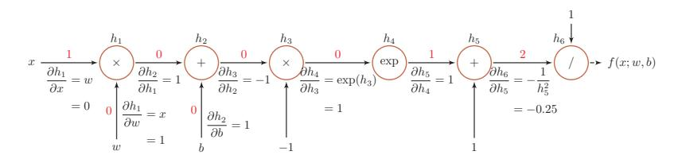

{0}------------------------------------------------

# 第4章 前馈神经网络

神经网络是一种大规模的并行分布式处理器。天然具有存 储并使用经验知识的能力。它从两个方面上模拟大脑: (1) 网 络获取的知识是通过学习来获取的; (2) 内部神经元的连接强 度, 即突触权重, 用于储存获取的知识。

 $-$  Haykin [1994]

人工神经网络 (Artificial Neural Network, ANN) 是指一系列受生物学和神 经学启发的数学模型。这些模型主要是通过对人脑的神经元网络讲行抽象, 构 建人工神经元,并按照一定拓扑结构来建立人工神经元之间的连接,来模拟生 物神经网络。在人工智能领域, 人工神经网络也常常简称为神经网络(Neural Network, NN)或神经模型 (Neural Model)。

神经网络最早是作为一种主要的连接主义模型。20世纪80年代后期,最 流行的一种连接主义模型是分布式并行处理(Parallel Distributed Processing, PDP) 网络 [Rumelhart et al., 1986], 其有3个主要特性: 1) 信息表示是分布 式的(非局部的); 2)记忆和知识是存储在单元之间的连接上; 3)通过逐渐改 变单元之间的连接强度来学习新的知识。

连接主义的神经网络有着多种多样的网络结构以及学习方法, 虽然早期模 型强调模型的生物可解释性 (biological plausibility), 但后期更关注于对某种 特定认知能力的模拟,比如物体识别、语言理解等。尤其在引入误差反向传播来 改进其学习能力之后, 神经网络也越来越多地应用在各种模式识别任务上。随 着训练数据的增多以及(并行)计算能力的增强,神经网络在很多模式识别任 务上已经取得了很大的突破,特别是语音、图像等感知信号的处理上,表现出 了卓越的学习能力。

在本章中, 我们主要关注于采用误差反向传播来进行学习的神经网络, 即 作为一种机器学习模型的神经网络。从机器学习的角度来看,神经网络一般可 以看作是一个非线性模型,其基本组成单位为具有非线性激活函数的神经元,通 后面我们会介绍一种用来进 行记忆存储和检索的神经网 络, 参见第8.2.4节。

{1}------------------------------------------------

过大量神经元之间的连接, 使得神经网络成为一种高度非线性的模型。神经元 之间的连接权重就是需要学习的参数, 可以通过梯度下降方法来进行学习。

### 神经元 4.1

人工神经元 (Artificial Neuron), 简称神经元 (Neuron), 是构成神经网 络的基本单元, 其主要是模拟生物神经元的结构和特性, 接受一组输入信号并 产出输出。

生物学家在20世纪初就发现了生物神经元的结构。一个生物神经元通常具 有多个树突和一条轴突。树突用来接受信息, 轴突用来发送信息。当神经元所 获得的输入信号的积累超过某个阈值时, 它就处于兴奋状态, 产生电脉冲。轴 突尾端有许多末梢可以给其他个神经元的树突产生连接(突触),并将电脉冲信 号传递给其它神经元。

1943年,心理学家 McCulloch 和数学家 Pitts 根据生物神经元的结构, 提出 了一种非常简单的神经元模型, M-P 神经元 [McCulloch and Pitts, 1943]。现代 神经网络中的神经元和 M-P 神经元的结构并无太多变化。不同的是, M-P 神经 元中的激活函数 f 为0或1的阶跃函数, 而现代神经元中的激活函数通常要求是 连续可导的函数。

假设一个神经元接受 $d \uparrow \hat{m} \lambda x_1, x_2, \cdots, x_d$ , 令向量 $\mathbf{x} = [x_1; x_2; \cdots; x_d]$ 来 表示这组输入,并用净输入(net input) z E R 表示一个神经元所获得的输入信 号 x 的加权和,

$$
z = \sum_{i=1}^{d} w_i x_i + b \tag{4.1}
$$

$$
= \mathbf{w}^{\mathrm{T}} \mathbf{x} + b,\tag{4.2}
$$

其中  $\mathbf{w} = [w_1; w_2; \cdots; w_d] \in \mathbb{R}^d$ 是d维的权重向量,  $b \in \mathbb{R}$ 是偏置。

净输入 $z$ 在经过一个非线性函数后, 得到神经元的活性值 (activation)  $a$ ,

$$
a = f(z),\tag{4.3}
$$

这里的函数 f 为非线性激活函数。典型的激活函数有阶跃函数, sigmoid 型函数、 非线性斜面函数等。

图4.1给出了一个典型的神经元结构示例。

邱锡鹏:《神经网络与深度学习》

净输入也叫净活性值(net

 $\arctivation)$ .

{2}------------------------------------------------

图 4.1 典型的神经元结构

为了增强网络的表达能力以及学习能力,一般使用连续非线性激活函数 (activation function)。因为连续非线性激活函数可导,所以可以用最优化的 方法来学习网络参数。

下面介绍几种在神经网络中常用的激活函数。

#### Sigmoid 型激活函数 $4.1.1$

Sigmoid 型函数是指一类S型曲线函数, 为两端饱和函数。常用的 sigmoid 型函数有 logistic 函数和 tanh 函数。

数学小知识 | 饱和

对于函数  $f(x)$ , 若  $x \to -\infty$  时, 其导数  $f'(x) \to 0$ , 则称其为左饱 和。若 $x \to +\infty$ 时, 其导数  $f'(x) \to 0$ , 则称其为右饱和。当同时满足 左、右饱和时, 就称为两端饱和。

Logistic 函数 Logistic 函数定义为

$$
\sigma(x) = \frac{1}{1 + \exp(-x)}.\tag{4.4}
$$

Logistic 函数可以看成是一个"挤压"函数,把一个实数域的输入"挤压" 到(0,1)。当输入值在0附近时, sigmoid 型函数近似为线性函数; 当输入值靠近

邱锡鹏:《神经网络与深度学习》

{3}------------------------------------------------

两端时, 对输入进行抑制。输入越小, 越接近于0; 输入越大, 越接近于1。这 样的特点也和生物神经元类似, 对一些输入会产生兴奋(输出为1), 对另一些 输入产生抑制(输出为0)。和感知器使用的阶跃激活函数相比, logistic 函数是 连续可导的,其数学性质更好。

Tanh 函数 Tanh 函数是也一种 sigmoid 型函数。其定义为

$$
\tanh(x) = \frac{\exp(x) - \exp(-x)}{\exp(x) + \exp(-x)}.
$$
\n(4.5)

Tanh 函数可以看作是放大并平移的 logistic 函数, 其值域是 (-1,1)。

$$
\tanh(x) = 2\sigma(2x) - 1.\tag{4.6}
$$

图4.2给出了 logistic 函数和 tanh 函数的形状。Tanh 函数的输出是零中心化 的(zero-centered), 而logistic 函数的输出恒大于0。非零中心化的输出会使得 其后一层的神经元的输入发生偏置偏移(bias shift), 并进一步使得梯度下降 的收敛速度变慢。

参见习题4-1。

参见第7.4节。

图 4.2 Logistic 函数和 Tanh 函数

### 4.1.1.1 Hard-Logistic 和 Hard-Tanh 函数

Logistic 函数和 tanh 函数都是 sigmoid 型函数, 具有饱和性, 但是计算开销 较大。因为这两个函数都是在中间(0附近)近似线性,两端饱和。因此,这两 个函数可以通过分段函数来近似。

{4}------------------------------------------------

以 logistic 函数 σ(x) 为例, 其导数为 σ'(x) = σ(x)(1 - σ(x)). logistic 函数 在0附近的一阶泰勒展开(Taylor expansion)为

$$
g_l(x) \approx \sigma(0) + x \times \sigma'(0) \tag{4.7}
$$

$$
= 0.25x + 0.5. \tag{4.8}
$$

用分段来近似 logistic 函数, 得到

$$
\text{hard-logistic}(x) = \begin{cases} 1 & g_l(x) \ge 1 \\ g_l & 0 < g_l(x) < 1 \\ 0 & g_l(x) \le 0 \end{cases} \tag{4.9}
$$

$$
= \max(\min(g_l(x), 1), 0)
$$
\n(4.10)

$$
= \max(\min(0.25x + 0.5, 1), 0). \tag{4.11}
$$

同样, tanh 函数在0附近的一阶泰勒展开为

$$
g_t(x) \approx \tanh(0) + x \times \tanh'(0) \tag{4.12}
$$

$$
=x,\tag{4.13}
$$

这样 tanh 函数也可以用分段函数 hard-tanh $(x)$  来近似。

$$
hard-tanh(x) = max(min(g_t(x), 1), -1)
$$
\n(4.14)

$$
= \max(\min(x, 1), -1). \tag{4.15}
$$

图4.3给出了 hard-logistic 和 hard-tanh 函数两种函数的形状。

图 4.3 Hard Sigmoid 型激活函数

### 修正线性单元 $4.1.2$

修正线性单元 (Rectified Linear Unit, ReLU) [Nair and Hinton, 2010], 也 叫 rectifier 函数 [Glorot et al., 2011], 是目前深层神经网络中经常使用的激活函 

{5}------------------------------------------------

数。ReLU 实际上是一个斜坡 (ramp) 函数, 定义为

$$
ReLU(x) = \begin{cases} x & x \ge 0 \\ 0 & x < 0 \end{cases}
$$
 (4.16)

$$
=\max(0, x). \tag{4.17}
$$

优点 采用 ReLU 的神经元只需要进行加、乘和比较的操作, 计算上更加高效。 ReLU函数被认为有生物上的解释性,比如单侧抑制、宽兴奋边界(即兴奋程度 也可以非常高)。在生物神经网络中,同时处于兴奋状态的神经元非常稀疏。人 脑中在同一时刻大概只有1~4%的神经元处于活跃状态。Sigmoid 型激活函数 会导致一个非稀疏的神经网络,而 ReLU 却具有很好的稀疏性,大约50% 的神 经元会处于激活状态。

在优化方面,相比于 sigmoid 型函数的两端饱和, ReLU 函数为左饱和函数, 且在x>0时导数为1,在一定程度上缓解了神经网络的梯度消失问题,加速梯 度下降的收敛速度。

缺点 ReLU 函数的输出是非零中心化的,给后一层的神经网络引入偏置偏移, 会影响梯度下降的效率。此外, ReLU 神经元在训练时比较容易"死亡"。在训 练时, 如果参数在一次不恰当的更新后, 第一个隐藏层中的某个 ReLU 神经元 在所有的训练数据上都不能被激活。那么, 这个神经元自身参数的梯度永远都 会是0, 在以后的训练过程中永远不能被激活。这种现象称为死亡 ReLU问题 (Dying ReLU Problem), 并且也有可能会发生在其它隐藏层。

在实际使用中,为了避免上述情况,有几种 ReLU 的变种也会被广泛使用。

### 4.1.2.1 带泄露的 ReLU

带泄露的 ReLU (Leaky ReLU) 在输入  $x < 0$ 时, 保持一个很小的梯度 λ。 这样当神经元非激活时也能有一个非零的梯度可以更新参数, 避免永远不能被 激活 [Maas et al., 2013]。带泄露的 ReLU 的定义如下:

$$
LeakyReLU(x) = \begin{cases} x & \text{if } x > 0 \\ \gamma x & \text{if } x \le 0 \end{cases}
$$
 (4.18)

$$
= \max(0, x) + \gamma \min(0, x), \tag{4.19}
$$

其中 ~ 是一个很小的常数, 比如0.01。当 ~ < 1时, 带泄露的 ReLU 也可以写为

$$
LeakyReLU(x) = \max(x, \gamma x), \qquad (4.20)
$$

相当于是一个比较简单的 maxout 单元。

参见第4.1.3节。

邱锡鹏:《神经网络与深度学习》

https://nndl.github.io/

参见第4.6.2节。

ReLU 神经元指采用 ReLU 作为激活函数的神经元。

参见公式(4.60)。

{6}------------------------------------------------

### 4.1.2.2 带参数的 ReLU

带参数的 ReLU (Parametric ReLU, PReLU) 引入一个可学习的参数, 不 同神经元可以有不同的参数 [He et al., 2015]。对于第 i 个神经元, 其 PReLU 的 定义为

$$
\text{PReLU}_{i}(x) = \begin{cases} x & \text{if } x > 0 \\ \gamma_{i}x & \text{if } x \le 0 \end{cases}
$$
 (4.21)

$$
= \max(0, x) + \gamma_i \min(0, x), \qquad (4.22)
$$

其中 $\gamma_i$ 为 $x \leq 0$ 时函数的斜率。因此, PReLU是非饱和函数。如果 $\gamma_i = 0$ , 那  $\triangle$  PReLU 就退化为 ReLU。如果  $\gamma_i$  为一个很小的常数, 则 PReLU 可以看作带 泄露的 ReLU。PReLU 可以允许不同神经元具有不同的参数, 也可以一组神经 元共享一个参数。

### 4.1.2.3 ELU

指数线性单元 (Exponential Linear Unit, ELU) [Clevert et al., 2015] 是一 个近似的零中心化的非线性函数, 其定义为

$$
ELU(x) = \begin{cases} x & \text{if } x > 0\\ \gamma(\exp(x) - 1) & \text{if } x \le 0 \end{cases}
$$
(4.23)

$$
= \max(0, x) + \min(0, \gamma(\exp(x) - 1)), \tag{4.24}
$$

其中  $\gamma \geq 0$ 是一个超参数, 决定  $x \leq 0$ 时的饱和曲线, 并调整输出均值在 0附 近。

参见第7.5.1节。

### 4.1.2.4 Softplus 函数

Softplus 函数 [Dugas et al., 2001] 可以看作是 rectifier 函数的平滑版本, 其 定义为

$$
softplus(x) = log(1 + exp(x)).
$$
\n(4.25)

softplus 函数其导数刚好是 logistic 函数。softplus 虽然也有具有单侧抑制、宽兴 奋边界的特性, 却没有稀疏激活性。

图4.4给出了 ReLU、Leaky ReLU、ELU 以及 softplus 函数的示例。

邱锡鹏:《神经网络与深度学习》

{7}------------------------------------------------

图 4.4 ReLU、Leaky ReLU、ELU 以及 softplus 函数

#### 4.1.3 Maxout 单元

采用maxout单元的神经网 络也就做 maxout 网络。

Maxout 单元 [Goodfellow et al., 2013] 也是一种分段线性函数。Sigmoid 型 函数、ReLU等激活函数的输入是神经元的净输入 z, 是一个标量。而 maxout 单元的输入是上一层神经元的全部原始输入,是一个向量 x =  $[x_1; x_2; \cdots, x_d]$ 。

每个 maxout 单元有  $K \wedge R$ 重向量  $\mathbf{w}_k \in \mathbb{R}^d$  和偏置  $b_k$   $(1 \leq k \leq K)$ 。对于 输入x,可以得到 $K \triangle B\hat{m}$ 入 $z_k, 1 \leq k \leq K$ 。

$$
z_k = \mathbf{w}_k^{\mathrm{T}} \mathbf{x} + b_k, \tag{4.26}
$$

其中 $\mathbf{w}_k = [w_{k,1}, \cdots, w_{k,d}]^T$ 为第 $k \triangleleft R$ 重向量。

Maxout 单元的非线性函数定义为

$$
\max_{\mathbf{x}} \text{out}(\mathbf{x}) = \max_{k \in [1, K]} (z_k). \tag{4.27}
$$

Maxout 单元不单是净输入到输出之间的非线性映射, 而是整体学习输入 到输出之间的非线性映射关系。Maxout 激活函数可以看作任意凸函数的分段 线性近似,并且在有限的点上是不可微的。

### 网络结构 $4.2$

一个生物神经细胞的功能比较简单,而人工神经元只是生物神经细胞的理 想化和简单实现, 功能更加简单。要想模拟人脑的能力, 单一的神经元是远远 不够的,需要通过很多神经元一起协作来完成复杂的功能。这样通过一定的连 接方式或信息传递方式进行协作的神经元可以看作是一个网络, 就是神经网络。

{8}------------------------------------------------

到目前为止, 研究者已经发明了各种各样的神经网络结构。目前常用的神 经网络结构有以下三种:

#### $4.2.1$ 前馈网络

前馈网络中各个神经元按接受信息的先后分为不同的组。每一组可以看作 一个神经层。每一层中的神经元接受前一层神经元的输出,并输出到下一层神 经元。整个网络中的信息是朝一个方向传播, 没有反向的信息传播, 可以用一 个有向无环路图表示。前馈网络包括全连接前馈网络 [本章中的第4.3节] 和卷积 神经网络 [第5章] 等。

前馈网络可以看作一个函数, 通过简单非线性函数的多次复合, 实现输入 空间到输出空间的复杂映射。这种网络结构简单,易于实现。

### 4.2.2 反馈网络

反馈网络中神经元不但可以接收其它神经元的信号, 也可以接收自己的反 馈信号。和前馈网络相比,反馈网络中的神经元具有记忆功能,在不同的时刻具 有不同的状态。馈神经网络中的信息传播可以是单向或双向传递, 因此可用一 个有向循环图或无向图来表示。反馈网络包括循环神经网络 [第6章], Hopfield 网络 [第6章]、玻尔兹曼机 [第12章] 等。

反馈网络可以看作一个程序, 具有更强的计算和记忆能力。

为了增强记忆网络的记忆容量,可以引入外部记忆单元和读写机制,用来一 些网络的中间状态, 称为记忆增强网络(Memory-Augmented Neural Network) [第8章], 比如神经图灵机 [Graves et al., 2014] 和记忆网络 [Sukhbaatar et al., 2015 等。

#### 图网络 $4.2.3$

前馈网络和反馈网络的输入都可以表示为向量或向量序列。但实际应用中 很多数据是图结构的数据,比如知识图谱、社交网络、分子(molecular)网络 等。前馈网络和反馈网络很难处理图结构的数据。

图网络是定义在图结构数据上的神经网络 [第6.8.2节]。图中每个节点都一 个或一组神经元构成。节点之间的连接可以是有向的, 也可以是无向的。每个 节点可以收到来自相邻节点或自身的信息。

图网络是前馈网络和记忆网络的泛化,包含很多不同的实现方式,比如图 卷积网络 (Graph Convolutional Network, GCN) [Kipf and Welling, 2016]、消 息传递网络 (Message Passing Neural Network, MPNN) [Gilmer et al., 2017] 等。

邱锡鹏:《神经网络与深度学习》

{9}------------------------------------------------

图4.5给出了前馈网络、反馈网络和图网络的网络结构示例。

图 4.5 三种不同的网络模型

### 前馈神经网络 $4.3$

给定一组神经元, 我们可以以神经元为节点来构建一个网络。不同的神经 网络模型有着不同网络连接的拓扑结构。一种比较直接的拓扑结构是前馈网络。 前馈神经网络(Feedforward Neural Network, FNN)是最早发明的简单人工神 经网络。

在前馈神经网络中, 各神经元分别属于不同的层。每一层的神经元可以接 收前一层神经元的信号,并产生信号输出到下一层。第0层叫输入层,最后一 层叫输出层, 其它中间层叫做隐藏层。整个网络中无反馈, 信号从输入层向输 出层单向传播, 可用一个有向无环图表示。

前馈神经网络也经常称为多层感知器(Multi-Layer Perceptron, MLP)。但 多层感知器的叫法并不是十分合理,因为前馈神经网络其实是由多层的logistic 回归模型(连续的非线性函数)组成,而不是由多层的感知器(不连续的非线 性函数)组成 [Bishop, 2007]。

图4.6给出了前馈神经网络的示例。

{10}------------------------------------------------

我们用下面的记号来描述一个前馈神经网络:

- · L: 表示神经网络的层数;
- $m^{(l)}$ : 表示第1层神经元的个数;
- $f_l(\cdot)$ : 表示l层神经元的激活函数;
- $W^{(l)} \in \mathbb{R}^{m^{(l)} \times m^{l-1}}$ : 表示 $l-1$ 层到第 $l$ 层的权重矩阵;
- $\mathbf{b}^{(l)} \in \mathbb{R}^{m^l}$ : 表示  $l-1$ 层到第  $l$ 层的偏置;
- $\mathbf{z}^{(l)} \in \mathbb{R}^{m^l}$ : 表示 $l$ 层神经元的净输入(净活性值);
- $\mathbf{a}^{(l)} \in \mathbb{R}^{m^l}$ : 表示*l* 层神经元的输出 (活性值)。

前馈神经网络通过下面公式进行信息传播,

$$
\mathbf{z}^{(l)} = W^{(l)} \cdot \mathbf{a}^{(l-1)} + \mathbf{b}^{(l)},\tag{4.28}
$$

$$
\mathbf{a}^{(l)} = f_l(\mathbf{z}^{(l)}).
$$
 (4.29)

公式(4.28)和(4.29)也可以合并写为:

$$
\mathbf{z}^{(l)} = W^{(l)} \cdot f_{l-1}(\mathbf{z}^{(l-1)}) + \mathbf{b}^{(l)},
$$
\n(4.30)

或者

$$
\mathbf{a}^{(l)} = f_l(W^{(l)} \cdot \mathbf{a}^{(l-1)} + \mathbf{b}^{(l)}).
$$
 (4.31)

这样, 前馈神经网络可以通过逐层的信息传递, 得到网络最后的输出a(L)。 整个网络可以看作一个复合函数 $\phi(\mathbf{x};W,\mathbf{b})$ , 将向量 $\mathbf{x}$ 作为第1层的输入 $\mathbf{a}^{(0)}$ , 将 第L层的输出a(L)作为整个函数的输出。

$$
\mathbf{x} = \mathbf{a}^{(0)} \to \mathbf{z}^{(1)} \to \mathbf{a}^{(1)} \to \mathbf{z}^{(2)} \to \cdots \to \mathbf{a}^{(L-1)} \to \mathbf{z}^{(L)} \to \mathbf{a}^{(L)} = \varphi(\mathbf{x}; W, \mathbf{b})),
$$
\n(4.32)

其中W.b表示网络中所有层的连接权重和偏置。

邱锡鹏:《神经网络与深度学习》

层数一般只考虑隐藏层和输 出层。

{11}------------------------------------------------

#### $4.3.1$ 通用近似定理

前馈神经网络具有很强的拟合能力, 常见的连续非线性函数都可以用前馈 神经网络来近似。

定理 4.1-通用近似定理 (Universal Approximation Theorem) [Cybenko, 1989, Hornik et al., 1989]: 令 有界、单调递增的连续函数,  $\mathcal{I}_d$ 是一个d维的单位超立方体 $[0,1]^d$ ,  $C(\mathcal{I}_d)$ 是定义在 $\mathcal{I}_d$ 上的连续函数集合。对于任何一个函数  $f \in$  $C(\mathcal{I}_d)$ , 存在一个整数  $m$ , 和一组实数  $v_i$ ,  $b_i \in \mathbb{R}$  以及实数向量  $\mathbf{w}_i \in \mathbb{R}^d$ ,  $i = 1, \cdots, m$ , 以至于我们可以定义函数

$$
F(\mathbf{x}) = \sum_{i=1}^{m} v_i \varphi(\mathbf{w}_i^{\mathrm{T}} \mathbf{x} + b_i),
$$
 (4.33)

作为函数 f 的近似实现, 即

$$
|F(\mathbf{x}) - f(\mathbf{x})| < \epsilon, \forall \mathbf{x} \in \mathcal{I}_n. \tag{4.34}
$$

其中ε>0是一个很小的正数。

通用近似定理在实数空间 $\mathbb{R}^d$ 中的有界闭集上依然成立。

根据通用近似定理, 对于具有线性输出层和至少一个使用"挤压"性质的激 活函数的隐藏层组成的前馈神经网络, 只要其隐藏层神经元的数量足够, 它可 以以任意的精度来近似任何从一个定义在实数空间 Rd 中的有界闭集函数 [Funahashi and Nakamura, 1993, Hornik et al., 1989]。所谓"挤压"性质的函数 是指像 sigmoid 函数的有界函数, 但神经网络的通用近似性质也被证明对于其 它类型的激活函数,比如ReLU,也都是适用的。

通用近似定理只是说明了神经网络的计算能力可以去近似一个给定的连续 函数, 但并没有给出如何找到这样一个网络, 以及是否是最优的。此外, 当应 用到机器学习时, 真实的映射函数并不知道, 一般是通过经验风险最小化和正 则化来进行参数学习。因为神经网络的强大能力,反而容易在训练集上过拟合。

### 4.3.2 应用到机器学习

根据通用近似定理, 神经网络在某种程度上可以作为一个"万能"函数来 使用,可以用来进行复杂的特征转换,或逼近一个复杂的条件分布。

在机器学习中, 输入样本的特征对分类器的影响很大。以监督学习为例, 好 的特征可以极大提高分类器的性能。因此, 要取得好的分类效果, 需要样本的 原始特征向量x转换到更有效的特征向量 (x), 这个过程叫做特征抽取。

定义在实数空间 $\mathbb{R}^d$ 中的有 界闭集上的任意连续函数, 也称为Borel可测函数。

94

{12}------------------------------------------------

多层前馈神经网络可以看作是一个非线性复合函数  $\varphi: \mathbb{R}^d \to \mathbb{R}^{d'}$ , 将输入  $\mathbf{x} \in \mathbb{R}^d$ 映射到输出 $\varphi(\mathbf{x}) \in \mathbb{R}^{d'}$ 。因此, 多层前馈神经网络也可以看成是一种特 征转换方法, 其输出 (α) 作为分类器的输入进行分类。

给定一个训练样本  $(\mathbf{x}, y)$ , 先利用多层前馈神经网络将 x 映射到  $\varphi(\mathbf{x})$ , 然 后再将 $\varphi(\mathbf{x})$ 输入到分类器 $q(\cdot)$ 。

$$
\hat{y} = g(\varphi(\mathbf{x}), \theta) \tag{4.35}
$$

其中  $g(\cdot)$  为线性或非线性的分类器, θ 为分类器  $g(\cdot)$  的参数,  $\hat{y}$  为分类器的输出。

特别地, 如果分类器 q(·) 为 logistic 回归分类器或 softmax 回归分类器, 那 么 q(·) 也可以看成是网络的最后一层, 即神经网络直接输出不同类别的后验概 率。

对于两类分类问题  $y \in \{0, 1\}$ , 并采用 logistic 回归, 那么 logistic 回归分类 器可以看成神经网络的最后一层。也就是说,网络的最后一层只用一个神经元, 并且其激活函数为logistic 函数。网络的输出可以直接可以作为类别 $y = 1$ 的后 验概率。

$$
p(y=1|\mathbf{x}) = a^{(L)},\tag{4.36}
$$

其中 $a^{(L)} \in \mathbb{R}$ 为第*L* 层神经元的活性值。

对于多类分类问题 $y \in \{1, \cdots, C\}$ , 如果使用 softmax 回归分类器, 相当于 网络最后一层设置 $C \wedge B$ 神经元,其激活函数为softmax 函数。网络的输出可以 作为每个类的后验概率。

$$
\hat{\mathbf{y}} = \text{softmax}(\mathbf{z}^{(L)}),\tag{4.37}
$$

其中 $\mathbf{z}^{(L)} \in \mathbb{R}$ 为第 $L \not\equiv \mathbb{R}$ 神经元的净输入;  $\hat{\mathbf{y}} \in \mathbb{R}^C$ 为第 $L \not\equiv$ 神经元的活性值, 分 别是不同类别标签的预测后验概率。

#### $4.3.3$ 参数学习

如果采用交叉熵损失函数, 对于样本(x,y), 其损失函数为

$$
\mathcal{L}(\mathbf{y}, \hat{\mathbf{y}}) = -\mathbf{y}^{\mathrm{T}} \log \hat{\mathbf{y}},\tag{4.38}
$$

其中 $y \in \{0,1\}^C$ 为标签 $y$ 对应的one-hot 向量表示。

给定训练集为 $\mathcal{D} = \{(\mathbf{x}^{(n)}, y^{(n)})\}_{n=1}^N$ , 将每个样本 $\mathbf{x}^{(n)}$ 输入给前馈神经网 络, 得到网络输出为 γ(n), 其在数据集 D上的结构化风险函数为:

$$
\mathcal{R}(W, \mathbf{b}) = \frac{1}{N} \sum_{n=1}^{N} \mathcal{L}(\mathbf{y}^{(n)}, \hat{\mathbf{y}}^{(n)}) + \frac{1}{2} \lambda ||W||_F^2, \tag{4.39}
$$

反之, logistic 回归或 softmax回归也可以看作是只有 一层的神经网络。

Logistic 回归参见第3.3节。

Softmax回归参见第3.3节。

邱锡鹏:《神经网络与深度学习》

https://nndl.github.io/

95

{13}------------------------------------------------

注意这里的正则化项只包含

权重参数 W, 而不包含偏置

 $96\,$ 

 $\mathbf{b}$ .

$$
= \frac{1}{N} \sum_{n=1}^{N} \mathcal{L}(\mathbf{y}^{(n)}, \hat{\mathbf{y}}^{(n)}) + \frac{1}{2} \lambda \|W\|_{F}^{2},
$$
\n(4.40)

其中 W 和 b 分别表示网络中所有的权重矩阵和偏置向量; || W ||2 是正则化项, 用来防止过拟合; λ是为正数的超参数。λ越大, W越接近于0。这里的 || W ||2 一般使用 Frobenius 范数:

> $\|W\|_F^2 = \sum_{l=1}^L \sum_{i=1}^{m^{(l)}} \sum_{i=1}^{m^{(l-1)}} (W_{ij}^{(l)})^2.$  $(4.41)$

有了学习准则和训练样本, 网络参数可以通过梯度下降法来讲行学习。在 梯度下降方法的每次迭代中, 第 $l$ 层的参数 $W^{(l)}$ 和 $\mathbf{b}^{(l)}$ 参数更新方式为

$$
W^{(l)} \leftarrow W^{(l)} - \alpha \frac{\partial \mathcal{R}(W, \mathbf{b})}{\partial W^{(l)}},\tag{4.42}
$$

$$
=W^{(l)}-\alpha\left(\frac{1}{N}\sum_{n=1}^{N}(\frac{\partial\mathcal{L}(\mathbf{y}^{(n)},\hat{\mathbf{y}}^{(n)})}{\partial W^{(l)}})+\lambda W^{(l)}\right),\qquad(4.43)
$$

$$
\mathbf{b}^{(l)} \leftarrow \mathbf{b}^{(l)} - \alpha \frac{\partial \mathcal{R}(W, \mathbf{b})}{\partial \mathbf{b}^{(l)}},
$$
\n(4.44)

$$
= \mathbf{b}^{(l)} - \alpha \left( \frac{1}{N} \sum_{n=1}^{N} \frac{\partial \mathcal{L}(\mathbf{y}^{(n)}, \hat{\mathbf{y}}^{(n)})}{\partial \mathbf{b}^{(l)}} \right),
$$
(4.45)

其中α为学习率。

梯度下降法需要计算损失函数对参数的偏导数, 如果通过链式法则逐一对 每个参数进行求偏导效率比较低。在神经网络的训练中经常使用反向传播算法 来计算高效地梯度。

# 4.4 反向传播算法

假设采用随机梯度下降进行神经网络参数学习,给定一个样本(x,y),将其 输入到神经网络模型中, 得到网络输出为y。假设损失函数为  $\mathcal{L}(\mathbf{y}, \hat{\mathbf{y}})$ , 要进行 参数学习就需要计算损失函数关于每个参数的导数。

不失一般性, 对第 $l$ 层中的参数 $W^{(l)}$ 和 $\mathbf{b}^{(l)}$ 计算偏导数。因为 $\frac{\partial \mathcal{L}(\mathbf{y}, \hat{\mathbf{y}})}{\partial W^{(l)}}$ 的计算涉及矩阵微分, 十分繁琐, 因此我们先计算偏导数 $\frac{\partial \mathcal{L}(\mathbf{y}, \hat{\mathbf{y}})}{\partial W_{ij}^{(l)}}$ 。根据链式法则,

$$
\frac{\partial \mathcal{L}(\mathbf{y}, \hat{\mathbf{y}})}{\partial W_{ij}^{(l)}} = \left(\frac{\partial \mathbf{z}^{(l)}}{\partial W_{ij}^{(l)}}\right)^{\mathrm{T}} \frac{\partial \mathcal{L}(\mathbf{y}, \hat{\mathbf{y}})}{\partial \mathbf{z}^{(l)}},\tag{4.46}
$$

$$
\frac{\partial \mathcal{L}(\mathbf{y}, \hat{\mathbf{y}})}{\partial \mathbf{b}^{(l)}} = \left(\frac{\partial \mathbf{z}^{(l)}}{\partial \mathbf{b}^{(l)}}\right)^{\mathrm{T}} \frac{\partial \mathcal{L}(\mathbf{y}, \hat{\mathbf{y}})}{\partial \mathbf{z}^{(l)}}.
$$
(4.47)

链式法则参见第B.10节。

### 邱锡鹏:《神经网络与深度学习》

{14}------------------------------------------------

 $\triangle$ 式(4.46)和(4.47)中的第二项是都为目标函数关于第 $l$ 层的神经元 $z^{(l)}$ 的 偏导数,称为误差项,因此可以共用。我们只需要计算三个偏导数,分别为 $\frac{\partial \mathbf{z}^{(l)}}{\partial W_{ii}^{(l)}}$ ,

 $\frac{\partial \mathbf{z}^{(l)}}{\partial \mathbf{b}^{(l)}}$  fil  $\frac{\partial \mathcal{L}(\mathbf{y}, \hat{\mathbf{y}})}{\partial \mathbf{z}^{(l)}}$ . 下面分别来计算这三个偏导数。

(1) 计算偏导数  $\frac{\partial \mathbf{z}^{(l)}}{\partial W_{i,j}^{(l)}}$  因为 $\mathbf{z}^{(l)}$  和 $W_{ij}^{(l)}$  的函数关系为  $\mathbf{z}^{(l)} = W^{(l)} \mathbf{a}^{(l-1)} + \mathbf{b}^{(l)}$ , 因此偏导数

$$
\frac{\partial \mathbf{z}^{(l)}}{\partial W_{ij}^{(l)}} = \frac{\partial (W^{(l)} \mathbf{a}^{(l-1)} + \mathbf{b}^{(l)})}{\partial W_{ij}^{(l)}}
$$
(4.48)  
$$
= \begin{bmatrix}\n\frac{\partial (W_{i}^{(l)} \mathbf{a}^{(l-1)} + \mathbf{b}^{(l)})}{\partial W_{ij}^{(l)}} \\
\vdots \\
\frac{\partial (W_{i}^{(l)} \mathbf{a}^{(l-1)} + \mathbf{b}^{(l)})}{\partial W_{ij}^{(l)}} \\
\vdots \\
\frac{\partial (W_{m}^{(l)} \mathbf{a}^{(l-1)} + \mathbf{b}^{(l)})}{\partial W_{ij}^{(l)}}\n\end{bmatrix} = \begin{bmatrix}\n0 \\
\vdots \\
\frac{\partial (l-1)}{\partial V_{ij}^{(l)}} \\
\vdots \\
0\n\end{bmatrix} \leftarrow \tilde{\mathfrak{R}} i \tilde{\mathfrak{f}}(4.49)
$$
  
$$
\triangleq \mathbb{I}_i (a_j^{(l-1)}), \qquad (4.50)
$$

其中 $W_i^{(l)}$ 为权重矩阵 $W^{(l)}$ 的第 $i$ 行。

(2) 计算偏导数  $\frac{\partial \mathbf{z}^{(l)}}{\partial \mathbf{b}^{(l)}}$  因为 $\mathbf{z}^{(l)}$  和 $\mathbf{b}^{(l)}$  的函数关系为  $\mathbf{z}^{(l)} = W^{(l)} \mathbf{a}^{(l-1)} + \mathbf{b}^{(l)}$ , 因此偏导数

$$
\frac{\partial \mathbf{z}^{(l)}}{\partial \mathbf{b}^{(l)}} = \mathbf{I}_{m^{(l)}},\tag{4.51}
$$

为 $m^{(l)} \times m^{(l)}$ 的单位矩阵。

(3) 计算误差项 $\frac{\partial \mathcal{L}(\mathbf{y}, \hat{\mathbf{y}})}{\partial \mathbf{z}^{(l)}}$ 我们用 $\delta^{(l)}$ 来定义第 $l$ 层神经元的误差项,  $\delta^{(l)} = \frac{\partial \mathcal{L}(\mathbf{y}, \hat{\mathbf{y}})}{\partial \mathbf{z}^{(l)}} \in \mathbb{R}^{m^{(l)}}.$  $(4.52)$ 

误差项  $\delta^{(l)}$ 来表示第1层的神经元对最终误差的影响, 也反映了最终的输出对第 I层的神经元对最终误差的敏感程度。

$$
M\mathbb{R} \mathbf{z}^{(l+1)} = W^{(l+1)} \mathbf{a}^{(l)} + \mathbf{b}^{(l+1)}, \quad\n\tilde{\mathbf{f}} = \frac{\partial \mathbf{z}^{(l+1)}}{\partial \mathbf{a}^{(l)}} = (W^{(l+1)})^{\mathrm{T}}.
$$
\n(4.53)

{15}------------------------------------------------

$$
R^{\text{R}}\mathbf{a}^{(l)} = f(\mathbf{z}^{(l)}), \ \text{其中 } f_l(\cdot) \text{为核位H } \text{第的^\circ\text{数,因此有
$$

$$
\frac{\partial \mathbf{a}^{(l)}}{\partial \mathbf{z}^{(l)}} = \frac{\partial f_l(\mathbf{z}^{(l)})}{\partial \mathbf{z}^{(l)}}\tag{4.54}
$$

$$
= \text{diag}(f_l'(\mathbf{z}^{(l)})). \tag{4.55}
$$

因此, 根据链式法则, 第1层的误差项为

$$
\delta^{(l)} \triangleq \frac{\partial \mathcal{L}(\mathbf{y}, \hat{\mathbf{y}})}{\partial \mathbf{z}^{(l)}}\tag{4.56}
$$

$$
= \frac{\partial \mathbf{a}^{(l)}}{\partial \mathbf{z}^{(l)}} \left| \frac{\partial \mathbf{z}^{(l+1)}}{\partial \mathbf{a}^{(l)}} \right| \frac{\partial \mathcal{L}(\mathbf{y}, \hat{\mathbf{y}})}{\partial \mathbf{z}^{(l+1)}} \right| \tag{4.57}
$$

$$
= \text{diag}(f_l'(\mathbf{z}^{(l)})) \left\{ (W^{(l+1)})^{\mathrm{T}} \right\} \delta^{(l+1)} \tag{4.58}
$$

$$
= f'_{l}(\mathbf{z}^{(l)}) \odot ((W^{(l+1)})^{\mathrm{T}} \delta^{(l+1)}), \tag{4.59}
$$

其中⊙是向量的点积运算符,表示每个元素相乘。

从公式(4.59)可以看出, 第1层的误差项可以通过第1+1层的误差项计算 得到,这就是误差的反向传播。反向传播算法的含义是:第1层的一个神经元的 误差项(或敏感性)是所有与该神经元相连的第1+1层的神经元的误差项的权 重和。然后,再乘上该神经元激活函数的梯度。

在计算出上面三个偏导数之后, 公式 (4.46) 可以写为

$$
\frac{\partial \mathcal{L}(\mathbf{y}, \hat{\mathbf{y}})}{\partial W_{ii}^{(l)}} = \mathbb{I}_i (a_j^{(l-1)})^{\mathrm{T}} \delta^{(l)} = \delta_i^{(l)} a_j^{(l-1)}.
$$
\n(4.60)

进一步,  $\mathcal{L}(\mathbf{y}, \hat{\mathbf{y}})$ 关于第 $l$ 层权重 $W^{(l)}$ 的梯度为

$$
\frac{\partial \mathcal{L}(\mathbf{y}, \hat{\mathbf{y}})}{\partial W^{(l)}} = \delta^{(l)} (\mathbf{a}^{(l-1)})^{\mathrm{T}}.
$$
\n(4.61)

同理可得,  $\mathcal{L}(\mathbf{y}, \hat{\mathbf{y}})$ 关于第 $l$ 层偏置  $\mathbf{b}^{(l)}$  的梯度为

$$
\frac{\partial \mathcal{L}(\mathbf{y}, \hat{\mathbf{y}})}{\partial \mathbf{b}^{(l)}} = \delta^{(l)}.\tag{4.62}
$$

在计算出每一层的误差项之后,我们就可以得到每一层参数的梯度。因此, 基于误差反向传播算法(backpropagation, BP)的前馈神经网络训练过程可以 分为以下三步:

1. 前馈计算每一层的净输入 $z^{(l)}$ 和激活值 $a^{(l)}$ , 直到最后一层;

2. 反向传播计算每一层的误差项 $\delta^{(l)}$ ;

3. 计算每一层参数的偏导数, 并更新参数。

{16}------------------------------------------------

算法4.1给出使用随机梯度下降的误差反向传播算法的具体训练过程。

| 算法 4.1: 基于随机梯度下降的反向传播算法                                                       |                                                                                                                                                                           |  |  |  |  |
|-------------------------------------------------------------------------------|---------------------------------------------------------------------------------------------------------------------------------------------------------------------------|--|--|--|--|
| 输入: 训练集 $D = \{(\mathbf{x}^{(n)}, y^{(n)})\}_{n=1}^N$ ,验证集 $V$ , 学习率 α, 正则化系数 |                                                                                                                                                                           |  |  |  |  |
|                                                                               | $\lambda$ , 网络层数 L, 神经元数量 $m^{(l)}$ , $1 \le l \le L$ .                                                                                                                   |  |  |  |  |
| 1 随机初始化 W, b;                                                                 |                                                                                                                                                                           |  |  |  |  |
| 2 repeat                                                                      |                                                                                                                                                                           |  |  |  |  |
| 3                                                                             | 对训练集 D 中的样本随机重排序;                                                                                                                                                         |  |  |  |  |
| $\overline{4}$                                                                | for $n = 1 \cdots N$ do                                                                                                                                                   |  |  |  |  |
| 5                                                                             | 从训练集 $\mathcal{D}$ 中选取样本 $(\mathbf{x}^{(n)}, y^{(n)})$ ;                                                                                                                  |  |  |  |  |
| 6                                                                             | 前馈计算每一层的净输入 $\mathbf{z}^{(l)}$ 和激活值 $\mathbf{a}^{(l)}$ , 直到最后一层;                                                                                                          |  |  |  |  |
| $\overline{7}$                                                                | 反向传播计算每一层的误差 $\delta^{(l)}$ ; // 公式 (4.59)                                                                                                                             |  |  |  |  |
|                                                                               | // 计算每一层参数的导数                                                                                                                                                             |  |  |  |  |
| 8                                                                             | $\forall l, \qquad \frac{\partial \mathcal{L}(\mathbf{y}^{(n)}, \hat{\mathbf{y}}^{(n)})}{\partial W(l)} = \delta^{(l)}(\mathbf{a}^{(l-1)})^{\mathrm{T}};$ // 公式 (4.61) |  |  |  |  |
| 9                                                                             | $\forall l, \qquad \frac{\partial \mathcal{L}(\mathbf{y}^{(n)}, \hat{\mathbf{y}}^{(n)})}{\partial \mathbf{b}(l)} = \delta^{(l)};$ // 公式 (4.62)                         |  |  |  |  |
|                                                                               | // 更新参数                                                                                                                                                                   |  |  |  |  |
| 10                                                                            | $W^{(l)} \leftarrow W^{(l)} - \alpha(\delta^{(l)}(\mathbf{a}^{(l-1)})^T + \lambda W^{(l)});$                                                                              |  |  |  |  |
| 11                                                                            | $\mathbf{b}^{(l)} \leftarrow \mathbf{b}^{(l)} - \alpha \delta^{(l)}$ ;                                                                                                    |  |  |  |  |
| 12                                                                            | end                                                                                                                                                                       |  |  |  |  |
| 13 until 神经网络模型在验证集 V上的错误率不再下降;                                               |                                                                                                                                                                           |  |  |  |  |
| 输出: $W,$ $\bf{b}$                                                             |                                                                                                                                                                           |  |  |  |  |

### 自动梯度计算 $4.5$

神经网络的参数主要通过梯度下降来进行优化的。当确定了风险函数以及 网络结构后,我们就可以手动用链式法则来计算风险函数对每个参数的梯度,并 用代码进行实现。但是手动求导并转换为计算机程序的过程非常琐碎并容易出 错, 导致实现神经网络变得十分低效。目前, 几乎所有的主流深度学习框架都 包含了自动梯度计算的功能, 即我们可以只考虑网络结构并用代码实现, 其梯 度可以自动进行计算,无需人工干预。这样开发的效率就大大提高了。

自动计算梯度的方法可以分为以下三类:

### 数值微分 $4.5.1$

数值微分(Numerical Differentiation)是用数值方法来计算函数  $f(x)$ 的导 数。函数 $f(x)$ 的点 $x$ 的导数定义为

$$
f'(x) = \lim_{\Delta x \to 0} \frac{f(x + \Delta x) - f(x)}{\Delta x}.
$$
 (4.63)

{17}------------------------------------------------

舍入误差 (Round-off Error) 是指数值计算中由于数字舍 入造成的近似值和精确值之 间的差异, 比如用浮点数来 表示实教。

100

截断误差 (Truncation Error)是数学模型的理论解与 数值计算问题的精确解之间 的误差。

和符号计算相对应的概念是 数值计算, 即将数值代入数

学表示中进行计算。

要计算函数  $f(x)$  在点  $x$  的导数, 可以对  $x$  加上一个很少的非零的扰动  $\Delta x$ , 通过上述定义来直接计算函数  $f(x)$  的梯度。数值微分方法非常容易实现, 但找 到一个合适的扰动 Δx 却十分困难。如果 Δx 过小, 会引起数值计算问题, 比如 舍入误差;如果△x过大,会增加截断误差,使得导数计算不准确。因此,数值 微分的实用性比较差。在实际应用, 经常使用下面公式来计算梯度, 可以减少 截断误差。

$$
f'(x) = \lim_{\Delta x \to 0} \frac{f(x + \Delta x) - f(x - \Delta x)}{2\Delta x}.
$$
 (4.64)

数值微分的另外一个问题是计算复杂度。假设参数数量为n, 则每个参数都 需要单独施加扰动,并计算梯度。假设每次正向传播的计算复杂度为O(n), 则 计算数值微分的总体时间复杂度为 $O(n^2)$ 。

### 4.5.2 符号微分

符号微分 (Symbolic Differentiation) 是一种基于符号计算的自动求导方 法。符号计算,也叫代数计算,是指用计算机来处理带有变量的数学表达式。这 里的变量看作是符号(Symbols), 一般不需要代入具体的值。符号计算的输入 和输出都是数学表达式,一般包括对数学表达式的化简、因式分解、微分、积 分、解代数方程、求解常微分方程等运算。

比如数学表达式的化简:

$$
\hat{m} \lambda: 3x - x + 2x + 1 \tag{4.65}
$$

$$
\hat{m} \pm 1. \tag{4.66}
$$

符号计算一般来讲是对输入的表达式,通过迭代或递归使用一些事先定义 的规则进行转换。当转换结果不能再继续使用变换规则时, 便停止计算。

符号微分可以在编译时就计算梯度的数学表示,并进一步利用符号计算方 法进行优化。此外, 符号计算的一个优点是符号计算和平台无关, 可以在CPU 或GPU上运行。符号微分也有一些不足之处。一是编译时间较长,特别是对于 循环,需要很长时间进行编译;二是为了进行符号微分,一般需要设计一种专 门的语言来表示数学表达式,并且要对变量(符号)进行预先声明;三是很难 对程序讲行调试。

#### $4.5.3$ 自动微分

自动微分(Automatic Differentiation, AD)是一种可以对一个(程序)函数 进行计算导数的方法。符号微分的处理对象是数学表达式,而自动微分的处理对 象是一个函数或一段程序。而自动微分可以直接在原始程序代码进行微分。自 

{18}------------------------------------------------

动微分的基本原理是所有的数值计算可以分解为一些基本操作,包含+,-,x,/ 和一些初等函数 exp, log, sin, cos 等。

自动微分也是利用链式法则来自动计算一个复合函数的梯度。我们以一个 神经网络中常见的复合函数的例子来说明自动微分的过程。

$$
f(x; w, b) = \frac{1}{\exp(-(wx + b)) + 1}.
$$
\n(4.67)

为了简单起见, 我们设复合函数  $f(x; w, b)$  的输入  $x$  为标量, 参数为权重  $w$  和偏 置 $b_{\circ}$ 

首先,我们将复合函数 $f(x; w, b)$ 分解为一系列的基本操作,并构成一个计 算图(Computational Graph)。计算图是数学运算的图形化表示。计算图中 的每个非叶子节点表示一个基本操作, 每个叶子节点为一个输入变量或常量。 图4.7给出了当 $x = 1, w = 0, b = 0$ 时复合函数 $f(x; w, b)$ 的计算图, 其中连边上 的红色数字表示前向计算时复合函数中每个变量的实际取值。

图 4.7 复合函数  $f(x; w, b)$  的计算图

从计算图上可以看出, 复合函数  $f(x; w, b)$  由6个基本函数  $h_i, 1 \leq i \leq 6$ 组 成。如表4.1所示,每个基本函数的导数都十分简单,可以通过规则来实现。

| 函数                    | 导数                                                 |                                       |
|-----------------------|----------------------------------------------------|---------------------------------------|
| $h_1 = x \times w$    | $\frac{\partial h_1}{\partial w} = x$              | $\frac{\partial h_1}{\partial x} = w$ |
| $h_2 = h_1 + b$       | $\frac{\partial h_2}{\partial h_1}=1$              | $\frac{\partial h_2}{\partial b} = 1$ |
| $h_3 = h_2 \times -1$ | $\frac{\partial h_3}{\partial h_2} = -1$           |                                       |
| $h_4 = \exp(h_3)$     | $\frac{\partial h_4}{\partial h_3} = \exp(h_3)$    |                                       |
| $h_5 = h_4 + 1$       | $\frac{\partial h_5}{\partial h_4}=1$              |                                       |
| $h_6 = 1/h_5$         | $rac{\partial h_6}{\partial t} = -\frac{1}{h_5^2}$ |                                       |

表 4.1 复合函数  $f(x; w, b)$  的6个基本函数及其导数

{19}------------------------------------------------

整个复合函数  $f(x; w, b)$ 关于参数  $w$  和  $b$  的导数可以通过计算图上的节点  $f(x; w, b)$ 与参数 $w \bar{w} b$ 之间路径上所有的导数连乘来得到, 即

$$
\frac{\partial f(x; w, b)}{\partial w} = \frac{\partial f(x; w, b)}{\partial h_6} \frac{\partial h_6}{\partial h_5} \frac{\partial h_5}{\partial h_4} \frac{\partial h_4}{\partial h_3} \frac{\partial h_2}{\partial h_1} \frac{\partial h_1}{\partial w},
$$
(4.68)

$$
\frac{\partial f(x; w, b)}{\partial b} = \frac{\partial f(x; w, b)}{\partial h_6} \frac{\partial h_6}{\partial h_5} \frac{\partial h_5}{\partial h_4} \frac{\partial h_4}{\partial h_3} \frac{\partial h_2}{\partial h_2}.
$$
(4.69)

$$
\mathcal{Q}\frac{\partial f(x; w, b)}{\partial w} \n\mathcal{H}\varnothing, \quad \mathcal{H} = 1, w = 0, b = 0 \,\mathbb{H}, \quad \nabla \mathcal{Q}\left(\frac{d\mathcal{H}}{\partial w}\right)
$$
\n
$$
\frac{\partial f(x; w, b)}{\partial w}\Big|_{x=1, w=0, b=0} = \frac{\partial f(x; w, b)}{\partial h_6} \frac{\partial h_6}{\partial h_5} \frac{\partial h_5}{\partial h_4} \frac{\partial h_4}{\partial h_3} \frac{\partial h_2}{\partial h_1} \frac{\partial h_1}{\partial w} \qquad (4.70)
$$

$$
= 1 \times -0.25 \times 1 \times 1 \times -1 \times 1 \times 1 \tag{4.71}
$$

$$
= 0.25. \t(4.72)
$$

如果函数和参数之间有多条路径,可以将这多条路径上的导数再进行相加, 得到最终的梯度。

按照计算导数的顺序,自动微分可以分为两种模式:前向模式和反向模式。

前向模式 前向模式是按计算图中计算方向的相同方向来递归地计算梯度。以  $\frac{\partial f(x; w, b)}{\partial w}$ 为例, 当 $x = 1, w = 0, b = 0$ 时, 前向模式的累积计算顺序如下:

 $\mathbf{a}$ 

$$
\frac{\partial h_1}{\partial w} = x = 1\tag{4.73}
$$

$$
\frac{\partial h_2}{\partial w} = \frac{\partial h_2}{\partial h_1} \frac{\partial h_1}{\partial w} = 1 \times 1 = 1
$$
 (4.74)

$$
\frac{\partial h_3}{\partial w} = \frac{\partial h_3}{\partial h_2} \frac{\partial h_2}{\partial w} = -1 \times 1 \tag{4.75}
$$

$$
\vdots \qquad \qquad \vdots \qquad \qquad (4.76)
$$

$$
\frac{\partial h_6}{\partial w} = \frac{\partial h_6}{\partial h_5} \frac{\partial h_5}{\partial w} = -0.25 \times -1 = 0.25 \tag{4.77}
$$

$$
\frac{\partial f(x; w, b)}{\partial w} = \frac{\partial f(x; w, b)}{\partial h_6} \frac{\partial h_6}{\partial w} = 1 \times 0.25 = 0.25 \tag{4.78}
$$

反向模式 反向模式是按计算图中计算方向的相反方向来递归地计算梯度。以  $\frac{\partial f(x; w, b)}{\partial w}$ 为例, 当 $x = 1, w = 0, b = 0$ 时, 反向模式的累积计算顺序如下:

$$
\frac{\partial f(x;w,b)}{\partial h_6} = 1\tag{4.79}
$$

$$
\frac{\partial f(x; w, b)}{\partial h_5} = \frac{\partial f(x; w, b)}{\partial h_6} \frac{\partial h_6}{\partial h_5} = 1 \times -0.25
$$
 (4.80)

$$
\frac{\partial f(x; w, b)}{\partial h_4} = \frac{\partial f(x; w, b)}{\partial h_5} \frac{\partial h_5}{\partial h_4} = -0.25 \times 1 = -0.25 \tag{4.81}
$$

邱锡鹏:《神经网络与深度学习》

{20}------------------------------------------------

$$
\vdots \qquad \vdots \qquad (4.82)
$$

$$
\frac{\partial f(x; w, b)}{\partial w} = \frac{\partial f(x; w, b)}{\partial h_1} \frac{\partial h_1}{\partial w} = 0.25 \times 1 = 0.25 \tag{4.83}
$$

前向模式和反向模式可以看作是应用链式法则的两种梯度累积方式。从反 向模式的计算顺序可以看出, 反向模式和反向传播的计算梯度的方式相同。

对于一般的函数形式  $f: \mathbb{R}^n \to \mathbb{R}^m$ , 前向模式需要对每一个输入变量都进 行一遍遍历, 共需要 n 遍。而反向模式需要对每一个输出都进行一个遍历, 共 需要m遍。当 $n > m$ 时,反向模式更高效。在前馈神经网络的参数学习中,风 险函数为 f: Rn → R, 输出为标量, 因此采用反向模式为最有效的计算方式, 只需要一遍计算。

符号微分和自动微分 符号微分和自动微分都利用计算图和链式法则来自动求 解导数。符号微分在编译阶段先构造一个复合函数的计算图, 通过符号计算得 到导数的表达式,还可以对导数表达式进行优化,在程序运行阶段才代入变量 的具体数值进行计算导数。而自动微分则无需事先编译, 在程序运行阶段边计 算边记录计算图, 计算图上的局部梯度都直接代入数值进行计算, 然后用前向 或反向模式来计算最终的梯度。

图4.8给出了符号微分与自动微分的对比。

图 4.8 符号微分与自动微分对比

静态计算图和动态计算图 计算图的构建可以分为静态计算图和动态计算图。静 态计算图是在编译时构建计算图,计算图构建好之后在程序运行时不能改变,而 动态计算图是在程序运行时动态构建。两种构建方式各有优缺点。静态计算图 在构建时可以进行优化,并行能力强,但灵活性比较差低。动态计算图则不容 易优化, 当不同输入的网络结构不一致时, 难以并行计算, 但是灵活性比较高。

在目前深度学习框架里, Theano 和 Tensorflow 采用的是静态计算图, 而 DvNet, Chainer 和 PvTorch 采用的是动态计算图。

邱锡鹏:《神经网络与深度学习》

{21}------------------------------------------------

图 4.9 神经网络  $y = \sigma(w_2 \sigma(w_1 x))$ 的损失函数

### 优化问题 $4.6$

神经网络的参数学习比线性模型要更加困难, 主要原因有两点: (1) 非凸 优化问题和 (2) 梯度消失问题。

#### 非凸优化问题 $4.6.1$

神经网络的优化问题是一个非凸优化问题。以一个最简单的1-1-1结构的2 层神经网络为例来其损失函数与参数的可视化例子。

$$
y = \sigma(w_2 \sigma(w_1 x)), \tag{4.84}
$$

其中 $w_1$ 和 $w_2$ 为网络参数, 激活函数为logistic 函数 $\sigma(\cdot)$ 。

给定一个输入样本(1,1), 分别使用两种损失函数, 第一种损失函数为平方 误差损失:  $\mathcal{L}(w_1, w_2) = (1-y)^2$ , 第二种损失函数为交叉熵损失 $\mathcal{L}(w_1, w_2) = \ln y$ 。 当 $x = 1, y = 1$ 时, 其平方误差和交叉熵损失函数分别为:  $\mathcal{L}(w_1, w_2) = (1 - y)^2$ 和 $\mathcal{L}(w_1, w_2) = \ln y$ 。损失函数与参数 $w_1$ 和 $w_2$ 的关系如图4.9所示,可以看出损 失函数关于两个参数是一种非凸的函数关系。

#### $4.6.2$ 梯度消失问题

在神经网络中误差反向传播的迭代公式为

$$
\delta^{(l)} = f'_l(\mathbf{z}^{(l)}) \odot (W^{(l+1)})^{\mathrm{T}} \delta^{(l+1)},\tag{4.85}
$$

误差从输出层反向传播时, 在每一层都要乘以该层的激活函数的导数。当我们 使用 sigmoid 型函数: logistic 函数  $\sigma(x)$  或 tanh 函数时, 其导数为

$$
\sigma'(x) = \sigma(x)(1 - \sigma(x)) \in [0, 0.25] \tag{4.86}
$$

邱锡鹏:《神经网络与深度学习》

{22}------------------------------------------------

$$
\tanh'(x) = 1 - (\tanh(x))^2 \in [0, 1].\tag{4.87}
$$

Sigmoid 型函数导数的值域都小于1, 如图4.10所示。

图 4.10 激活函数的导数

由于 sigmoid 型函数的饱和性, 饱和区的导数更是接近于0。这样, 误差经 过每一层传递都会不断衰减。当网络层数很深时, 梯度就会不停的衰减, 甚至消 失, 使得整个网络很难训练。这就是所谓的梯度消失问题(Vanishing Gradient Problem), 也叫梯度弥散问题。

在深层神经网络中, 减轻梯度消失问题的方法有很多种。一种简单有效的 方式是使用导数比较大的激活函数,比如ReLU等。

### $4.7$ 总结和深入阅读

神经网络是一种典型的分布式并行处理模型, 通过大量神经元之间的交 互来处理信息,每一个神经元都发送兴奋和抑制的信息到其它神经元 [Rumelhart et al., 1986]。和感知器不同, 神经网络中的激活函数一般为连续可导函数。 表4.2给出了常见激活函数及其导数。

本章介绍的前馈神经网络是一种类型最简单的网络,相邻两层的神经元之 间为全连接关系, 也称为全连接神经网络 (Fully Connected Neural Network, FCNN)或多层感知器。前馈神经网络作为一种机器学习方法在很多模式识别和 机器学习的教材中都有介绍,比如《Pattern Recognition and Machine Learning》 [Bishop, 2007], 《Pattern Classification》[Duda et al., 2001] 等。

前馈神经网络作为一种能力很强的非线性模型, 其能力可以由通用近似定 理来保证。关于通用近似定理的详细介绍可以参考 [Haykin, 2009]。

前馈神经网络在20世纪80年代后期就已被广泛使用,但是基本上都是两 层网络(即一个隐藏层和一个输出层), 神经元的激活函数基本上都是 sigmoid 型函数,并且使用的损失函数大多数是平方损失。虽然当时前馈神经网络的参

梯度消失问题在过去的二三 十年里一直没有有效地解决, 是阻碍神经网络发展的重要 原因之一。

邱锡鹏:《神经网络与深度学习》

{23}------------------------------------------------

| 激活函数        | 函数                                                                  | 导数                                                         |
|-------------|---------------------------------------------------------------------|------------------------------------------------------------|
| Logistic 函数 |                                                                     | $f'(x) = f(x)(1 - f(x))$                                   |
| Tanh 函数     | $f(x) = \frac{1}{1 + e^{-x}}$ $f(x) = \frac{2}{1 + e^{-2x}} - 1$ | $f'(x) = 1 - f(x)^2$                                       |
| ReLU        | $f(x) = \max(0, x)$                                                 | $f'(x) = I(x > 0)$                                         |
| ELU         | $f(x) = \max(0, x) +$ $\min(0, \gamma(\exp(x)-1))$               | $f'(x) = I(x > 0) +$ $I(x \leq 0) \cdot \gamma \exp(x)$ |
| SoftPlus 函数 | $f(x) = \ln(1 + e^x)$                                               | $f'(x) = \frac{1}{1 + e^{-x}}$                             |

表 4.2 常见激活函数及其导数

数学习依然有很多难点, 但其作为一种连接主义的典型模型, 标志人工智能从 高度符号化的知识期向低符号化的学习期开始转变。

TensorFlow 游乐场1 提供了一个非常好的神经网络训练过程可视化系统。

## 习题

习题 4-1 对于一个神经元  $\sigma(\mathbf{w}^T\mathbf{x}+b)$ , 并使用梯度下降优化参数 w 时, 如 果输入x恒大于0, 其收敛速度会比零均值化的输入更慢。

习题 4-2 试设计一个前馈神经网络来解决 XOR 问题, 要求该前馈神经网 络具有两个隐藏神经元和一个输出神经元,并使用 ReLU 作为激活函数。

习题 4-3 如果限制一个神经网络的总神经数量为 N, 层数为 L, 每个隐藏 层的神经元数量为 $\frac{N-1}{L-1}$ , 试分析参数数量和层数  $L$  的关系。

习题 4-4 为什么在神经网络模型的结构化风险函数中不对偏置 b 进行正 则化?

习题 4-5 为什么在用反向传播算法进行参数学习时要采用随机参数初始 化的方式而不是直接令 $W = 0, \mathbf{b} = 0$ ?

&lt;sup>1 http://playground.tensorflow.org

{24}------------------------------------------------

习题 4-6 梯度消失问题是否可以通过增加学习率来缓解?

# 参考文献

Peter W Battaglia, Jessica B Hamrick, Victor Bapst, Alvaro Sanchez-Gonzalez, Vinicius Zambaldi, Mateusz Malinowski, Andrea Tacchetti, David Raposo, Adam Santoro, Ryan Faulkner, et al. Relational inductive biases, deep learning, and graph networks.  $arXiv$ preprint arXiv:1806.01261, 2018.

Christopher M. Bishop. Pattern recognition and machine learning, 5th Edition. Information science and statistics. Springer, 2007. ISBN 9780387310732.

Djork-Arné Clevert, Thomas  $Un$ terthiner, and Sepp Hochreiter. Fast and accurate deep network learning by exponential linear units (elus). arXiv preprint arXiv:1511.07289, 2015.

George Cybenko. Approximations by superpositions of a sigmoidal function. Mathematics of Control, Signals and Systems, 2:183-192, 1989.

Richard O. Duda, Peter E. Hart, and David G. Stork. Pattern classification, 2nd Edition. Wiley, 2001. ISBN 9780471056690.

Charles Dugas, Yoshua Bengio, François Bélisle, Claude Nadeau, and René Garcia. Incorporating second-order functional knowledge for better option pricing. Advances in Neural Information Processing Systems, pages 472-478. 2001.

Ken-ichi Funahashi and Yuichi Nakamura. Approximation of dynamical systems by continuous time recurrent neural networks. Neural networks,  $6(6)$ :801-806, 1993.

Justin Gilmer, Samuel S Schoenholz, Patrick F Riley, Oriol Vinyals, and George E Dahl. Neural message passing for quantum chemistry. *arXiv preprint* arXiv:1704.01212, 2017.

Xavier Glorot, Antoine Bordes, and Yoshua Bengio. Deep sparse rectifier neural networks. In International Conference on Artificial Intelligence and Statistics, pages 315-323, 2011.

Ian J Goodfellow, David Warde-Farley, Mehdi Mirza, Aaron C Courville, and Yoshua Bengio. Maxout networks. In Proceedings of the International Conference on Machine Learning, pages 1319-1327, 2013.

Alex Graves, Greg Wayne, and Ivo Danihelka. Neural turing machines.  $arXiv$  preprint  $arXiv:1410.5401$ , 2014. Simon Haykin. Neural networks: A comprehensive foundation: Macmillan col-

lege publishing company. New York. 1994.

Simon Haykin. Neural networks and learning machines, volume 3. Pearson Upper Saddle River, NJ, USA:, 2009.

Kaiming He, Xiangyu Zhang, Shaoqing Ren, and Jian Sun. Delving deep into rectifiers: Surpassing human-level performance on imagenet classification. In Proceedings of the IEEE International Conference on Computer Vision, pages 1026-1034, 2015.

Kurt Hornik, Maxwell Stinchcombe, and Halbert White. Multilayer feedforward networks are universal approxi107

{25}------------------------------------------------

mators. Neural networks, 2(5):359-366, 1989.

Thomas N Kipf and Max Welling. Semisupervised classification with graph convolutional networks.  $arXiv$  preprint arXiv:1609.02907, 2016.

Andrew L Maas, Awni Y Hannun, and Andrew Y Ng. Rectifier nonlinearities improve neural network acoustic models. In Proceedings of the International Conference on Machine Learning, 2013. Warren S McCulloch and Walter Pitts. A logical calculus of the ideas immanent in nervous activity. The bulletin of mathematical biophysics,  $5(4):115-133$ , 1943.

Vinod Nair and Geoffrey E Hinton. Rectified linear units improve restricted boltzmann machines. In Proceedings of the International Conference on Ma $chine\ Learning, pages\ 807-814, 2010.$ David E Rumelhart, Geoffrey E Hinton, James L McClelland, et al. A general framework for parallel distributed processing. Parallel distributed processing: Explorations in the microstructure of cognition, 1:45-76, 1986.

Sainbayar Sukhbaatar, Jason Weston, Rob Fergus, et al. End-to-end memory networks. In Advances in Neural Information Processing Systems, pages 2431-2439, 2015.

{26}------------------------------------------------

