{0}------------------------------------------------

概率论只不过是把常识归纳为计算问题。

- 皮诶尔·西蒙·拉普拉斯

概率图模型(Probabilistic Graphical Model, PGM), 简称图模型(Graphical Model, GM), 是指一种用图结构来描述多元随机变量之间条件独立关系 的概率模型, 从而给研究高维空间中的概率模型带来了很大的便捷性。

对于一个  $K$  维随机向量  $\mathbf{X} = [X_1, X_2, \cdots, X_K]^T$ , 其联合概率为高维空间 中的分布, 一般难以直接建模。假设每个变量为离散变量并有m个取值, 在不 作任何独立假设条件下, 则需要 $m^K - 1$ 个参数才能表示其概率分布。当 $m =$  $2, K = 100$ 时, 参数量约为 $10^{30}$ , 远远超出了目前计算机的存储能力。

一个有效减少参数量的方法是独立性假设。我们将 K 维随机向量的联合概 率分解为K个条件概率的乘积,

$$
p(\mathbf{x}) \triangleq P(\mathbf{X} = \mathbf{x}) \tag{11.1}
$$

$$
= p(x_1)p(x_2|x_1)\cdots p(x_K|x_1,\cdots,x_{K-1}),
$$
\n(11.2)

$$
= \prod_{k=1}^{K} p(x_k | x_1, \cdots, x_{k-1}), \tag{11.3}
$$

其中 $x_k$ 表示变量 $X_k$ 的取值。如果某些变量之间存在条件独立, 其参数量就可 以大幅减少。

 $\overline{r}$ 

假设有四个二值变量 $X_1, X_2, X_3, X_4, \overline{A}$ 不知道这几个变量依赖关系的情况 下,可以用一个联合概率表来记录每一种取值的概率 $P(\mathbf{X}_{1:4})$ ,共需要 $2^4 - 1 = 15$  

{1}------------------------------------------------

个参数。假设在已知 $X_1$ 时,  $X_2$ 和 $X_3$ 独立, 即有

$$
p(x_2|x_1, x_3) = p(x_2|x_1), \tag{11.4}
$$

$$
p(x_3|x_1, x_2) = p(x_3|x_1). \tag{11.5}
$$

在已知 $X_2$ 和 $X_3$ 时,  $X_4$ 也和 $X_1$ 独立, 即有

$$
p(x_4|x_1, x_2, x_3) = p(x_4|x_2, x_3),
$$
\n(11.6)

那么其联合概率 p(x) 可以分解为

$$
p(\mathbf{x}) = p(x_1)p(x_2|x_1)p(x_3|x_1, x_2)p(x_4|x_1, x_2, x_3),
$$
\n(11.7)

$$
= p(x_1)p(x_2|x_1)p(x_3|x_1)p(x_4|x_2,x_3), \qquad (11.8)
$$

是4个局部条件概率的乘积。如果分别用4个表格来记录这4个条件概率的话, 只需要 $1+2+2+4=9$ 个独立参数。

当概率模型中的变量数量比较多时, 其条件依赖关系也比较复杂。我们可 以使用图结构的方式将概率模型可视化,以一种直观、简单的方式描述随机变 量之间的条件独立性的性质,并可以将一个复杂的联合概率模型分解为一些简 单条件概率模型的组合。图11.1给出了上述例子中4个变量之间的条件独立性的 图形化描述。图中每个节点表示一个变量,每条连边变量之间的依赖关系。对 于一个非全连接的图,都存在一个或多个条件独立性假设,可以根据条件独立 性将联合概率分布讲行分解,表示为一组局部条件概率分布的乘积。

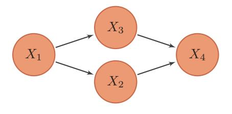

图 11.1 变量  $X_1, X_2, X_3, X_4$  之间条件独立性的图形化表示

图模型的基本问题 图模型有三个基本问题:

- 1. 表示问题: 对于一个概率模型, 如何通过图结构来描述变量之间的依赖 关系。
- 2. 推断问题: 在已知部分变量时, 计算其它变量的后验概率分布。

{2}------------------------------------------------

| $2018$ 年 5 月 21 |
|-----------------------|
|-----------------------|

3. 学习问题: 图模型的学习包括图结构的学习和参数的学习。在本章我们只 关注在给定图结构时的参数学习, 即参数估计问题。

图模型与机器学习 很多机器学习模型都可以归结为概率模型, 即建模输入和输 出之间的条件概率分布。因此,图模型提供了一种新的角度来解释机器学习模 型,并且这种角度有很多优点,比如了解不同机器学习模型之间的联系,方便设 计新模型等。在机器学习中, 图模型越来越多地用来设计和分析各种学习算法。

#### $11.1$ 模型表示

图由一组节点和节点之间的边组成。在概率图模型中,每个节点都表示一 个随机变量(或一组随机变量), 边表示这些随机变量之间的概率依赖关系。

常见的概率图模型可以分为两类: 有向图模型和无向图模型。有向图模型 的图结构为有向非循环图, 如果两个节点之间有连边, 表示对于的两个变量为 因果关系。无向图模型使用无向图来描述变量之间的关系。每条边代表两个变 量之间有概率依赖关系, 但是并不一定是因果关系。

图11.2给出了两个代表性图模型(有向图和无向图)的示例,分别表示了 四个变量 { $X_1, X_2, X_3, X_4$ } 之间的依赖关系

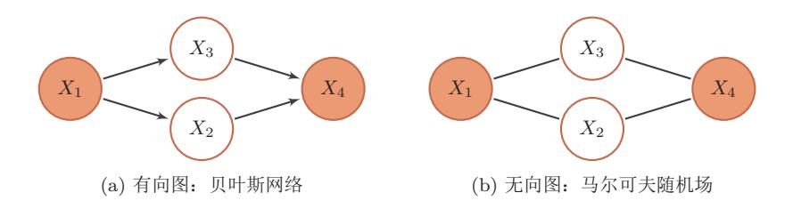

图 11.2 有向图和无向图示例。带阴影的节点表示可观测到的变量, 不带阴影的 节点表示隐变量, 连边表示两变量间的条件依赖关系

#### 有向图模型 11.1.1

有向图模型 (Directed Graphical model), 也称为贝叶斯网络 (Bayesian Network), 或信念网络 (Belief Network, BN), 是指用有向图来表示概率分 布的图模型。假设一个有向图  $G(V,\mathcal{E})$ , 节点集合 $V = \{X_1, X_2, \cdots, X_K\}$ 表示

{3}------------------------------------------------

11.1 模型表示

#### 2018年5月21日

 $K \wedge$ 随机变量,节点k对应随机变量 $X_k$ 。 $\mathcal E$ 为边的集合,每条边表示两个变量 之间的因果关系。

定义 11.1-贝叶斯网络: 对于随机向量 X =  $[X_1, X_2, \cdots, X_K]^T$ 和一个有向非循环图G,G中的每个节点都对应一个随机变量,可 以是可观测的变量,隐变量或是未知参数。G中的每个连接eij表 示两个随机变量  $X_i$  和  $X_j$  之间具有非独立的因果关系。 $\mathbf{X}_{\pi_k}$  表示 变量 $X_k$ 的所有父节点变量集合, 每个随机变量的局部条件概率 分布 (local conditional probability distribution)  $\overline{\mathcal{B}} P(X_k | \mathbf{X}_{\pi_k})$ .

如果X的联合概率分布可以分解为每个随机变量 $X_k$ 的局部 条件概率的连乘形式, 即

$$
p(\mathbf{x}) = \prod_{k=1}^{K} p(x_k | \mathbf{x}_{\pi_k}),
$$
\n(11.9)

那么 $(G, \mathbf{X})$ 构成了一个贝叶斯网络。

条件独立性 在贝叶斯网络中, 如果两个节点是直接连接的, 它们肯定是非条件 独立的, 是直接因果关系。父节点是"因", 子节点是"果"。

如果两个节点不是直接连接的,但是它们之间有一条经过其它节点的路径 来连接, 那么这两个节点之间的条件独立性就比较复杂。以三个节点的贝叶斯 网络为例, 给定三个节点 $X_1, X_2, X_3$ ,  $X_1$ 和 $X_3$ 是不直接连接的, 可以通过节 点 $X_2$ 连接。这三个节点之间可以有四种连接关系,如图11.3所示。

间接因果关系 (图11.3a) 当 $X_2$ 已知时, $X_1$ 和 $X_3$ 为条件独立,即 $X_1 \perp X_3 | X_2$ ; 间接果因关系(图11.3b) 当 $X_2$ 已知时, $X_1 \boxplus X_3$ 为条件独立,即 $X_1 \perp X_3 | X_2$ ; 共因关系(图11.3c) 当 $X_2$ 未知时,  $X_1$ 和  $X_3$ 是不独立的; 当 $X_2$ 已知时,  $X_1$ 和  $X_3$  条件独立, 即  $X_1 \perp X_3 | X_2$ ;

共果关系(图11.3d) 当 $X_2$ 未知时,  $X_1$ 和  $X_3$ 是独立的; 当 $X_2$ 已知时,  $X_1$ 和  $X_3 \overline{A}$ 独立, 即 $X_1 \not\perp X_3 | X_2$ 。

局部马尔可夫性质 对一个更一般的贝叶斯网络, 其局部马尔可夫性质为: 每个 随机变量在给定父节点的情况下, 条件独立于它的非后代节点。

从公式(11.3)和(11.9) 可得到。参见习题11-3。

$$
X_k \perp \!\!\!\! \perp Z | X_{\pi_k}, \tag{11.10}
$$

https://nndl.github.io/

在本章后文中,"节点" 与"随机变量"、"变量" 的概念会经常混用。每 个节点对应一个随机变 量。

{4}------------------------------------------------

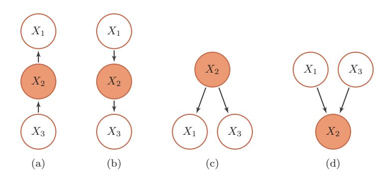

图 11.3 三个变量的依赖关系示例。在(a)(b) 中,  $X_1 \not\perp X_3 | \emptyset$ , 但 $X_1 \perp X_3 | X_2$ ; 在(c)中,  $X_1 \not\perp X_3 | \emptyset$ , 但 $X_1 \perp X_3 | X_2$ ; 在(d)中,  $X_1 \perp X_3 | \emptyset$ , 但 $X_1 \not\perp X_3 | X_2$ 

其中  $Z \nless I_k$  的非后代变量。

#### 常见的有向图模型 $11.1.2$

很多经典的机器学习模型可以使用有向图模型来描述,比如朴素贝叶斯分 深度信念网络参见 类器、隐马尔可夫模型、深度信念网络等。 第??节。

2018年5月21日

### 11.1.2.1 sigmoid 信念网络

更复杂的深度信念网络, 参见第??节。

为了减少模型参数,可以使用参数化模型来建模有向图模型中的条件概率 分布。一种简单的参数化模型为sigmoid信念网络 [Neal, 1992]。sigmoid信念网 终 (sigmoid belief network, SBN) 中的变量取值为 $\{0,1\}$ 。对于变量 $X_k$ 和它 的父节点集合πk,其条件概率分布表示为

$$
P(X_k = 1 | \mathbf{x}_{\pi_k}, \theta) = \sigma(\theta_0 + \sum_{x_i \in \mathbf{x}_{\pi_k}} \theta_i x_i),
$$
\n(11.11)

其中  $\sigma(\cdot)$ 是 logistic sigmoid 函数,  $\theta_i$ 是可学习的参数。假设变量  $X_k$  的父节点数 量为 M, 如果使用表格来记录条件概率需要 2M 个参数, 如果使用参数化模型 只需要 M + 1个参数。如果对不同的变量的条件概率都共享使用一个参数化模 型, 其参数数量又可以大幅减少。

值得一提的是, sigmoid 信念网络与 logistic 回归模型都采用 logistic sigmoid 函数来计算条件概率。如果假设 sigmoid 信念网络中只有一个叶子节点, 其所 有的父节点之间没有连接,且取值为实数,那么sigmoid信念网络的网络结构和

{5}------------------------------------------------

logistic 回归模型类似, 如图11.4所示。但是, 这两个模型区别在于logistic 回归 模型中的x作为一种确定性的参数,而非变量。因此, logistic回归模型只建模 条件概率  $p(y|\mathbf{x})$ , 是一种判别模型; 而 sigmoid 信念网络建模  $p(\mathbf{x}, y)$ , 是一种生 成模型。

logistic 回归模型也经常 解释一种条件无向图模 型。

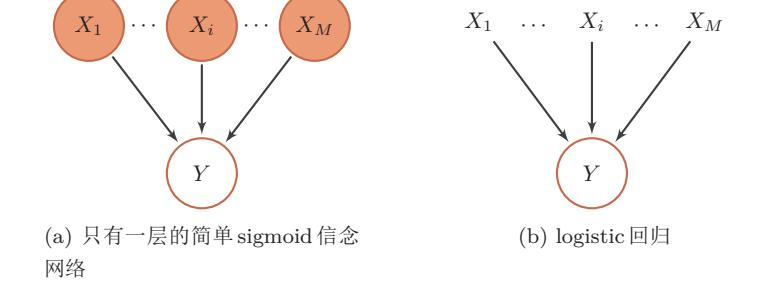

图 11.4 sigmoid 信念网络和 logistic 回归模型的比较

### 11.1.2.2 朴素贝叶斯分类器

朴素贝叶斯分类器 (Naive Bayes Classifier, NB) 是一类简单的概率分类 器, 在强(朴素)独立性假设的条件下运用贝叶斯公式来计算每个类别的后验 概率。

给定一个有d维特征的样本x和类别y,类别的后验概率为

$$
p(y|\mathbf{x}, \theta) = \frac{p(x_1, \cdots, x_d|y)p(y)}{p(x_1, \cdots, x_d)}
$$
(11.12)

$$
\propto p(x_1, \cdots, x_d | y, \theta) p(y | \theta), \tag{11.13}
$$

其中θ为概率分布的参数。

在朴素贝叶斯分类器中,假设在给定Y的情况下, Xi之间是条件独立的, 即 $X_i \perp\!\!\!\!\perp X_i|Y, \forall i \neq j$ 。图11.5给出了朴素贝叶斯分类器的图形表示。

条件概率分布 p(y|x) 可以分解为

$$
p(y|\mathbf{x}, \theta) \propto p(y|\theta_c) \prod_{i=1}^{d} p(x_i|y, \theta_{i,y}),
$$
\n(11.14)

其中 $\theta_c$ 是y的先验概率分布的参数,  $\theta_{i,y}$ 是条件概率分布 $p(x_i|y, \theta_{i,y})$ 的参数。如 果 $x_i$ 为连续值,  $p(x_i|y, \theta_{i,y})$ 可以用高斯分布建模。如果 $x_i$ 为离散值,  $p(x_i|y, \theta_{i,y})$ 可以用多项分布建模。

邱锡鹏:《神经网络与深度学习》

{6}------------------------------------------------

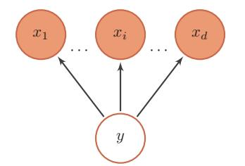

图 11.5 朴素贝叶斯模型的图模型表示

虽然朴素贝叶斯分类器的条件独立性假设太强,但是在实际应用中,朴素 贝叶斯分类器在很多任务上也能得到很好的结果,并且模型简单,可以有效防 止过拟合。

### 11.1.2.3 隐马尔可夫模型

隐马尔可夫模型 (Hidden Markov Model, HMM) [Baum and Petrie, 1966] 是一种含有隐变量的马尔可夫过程。图11.6给出隐马尔可夫模型的图模型表示。

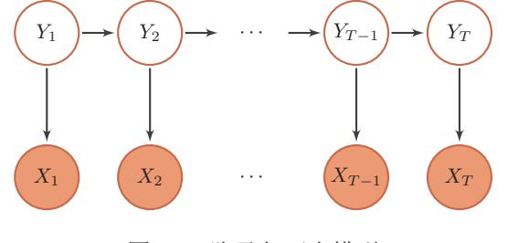

图 11.6 隐马尔可夫模型

隐马尔可夫模型的联合概率可以分解为

$$
p(\mathbf{x}, \mathbf{y}, \theta) = \prod_{t=1}^{T} p(y_t | y_{t-1}, \theta_s) p(x_t | y_t, \theta_t),
$$
\n(11.15)

其中  $p(x_t|y_t, \theta_t)$  为输出概率,  $p(y_t|y_{t-1}, \theta_s)$  为转移概率,  $\theta_s, \theta_t$  分别表示两类条 件概率的参数。

#### 无向图模型 $11.1.3$

无向图模型, 也称为马尔可夫随机场 (Markov Random Field, MRF) 或 马尔可夫网络(Markov Network), 是一类用无向图来描述一组具有局部马尔

这里 $p(y_1|y_0)$ 一般简化

为 $p(y_1)$ 。

{7}------------------------------------------------

11.1 模型表示

2018年5月21日

可夫性质的随机向量X的联合概率分布的模型。

定义 11.2-马尔可夫随机场: 给定一个随机向量 $\mathbf{X} = [X_1, \cdots, X_K]^T$ 和一个K个节点的无向图 $G(V, \mathcal{E})$ (可以存在循环), 图 $G$ 中的节 点k表示随机变量 $X_k$ ,  $1 \leq k \leq K$ 。如果  $(G, \mathbf{X})$ 满足局部马尔可 夫性质, 即一个变量 $X_k$ 在给定它的邻居的情况下独立于所有其 它变量,

$$
p(x_k|\mathbf{x}_{-k}) = p(x_k|\mathbf{x}_{N(k)}),
$$
\n(11.16)

其中 $N(k)$ 为变量 $X_k$ 的邻居集合,  $-k$ 为除 $X_k$ 外其它变量的集合, 那么(G, X) 就构成了一个马尔可夫随机场。

无向图的马尔可夫性 无向图中的马尔可夫性可以表示为

$$
X_k \perp \!\!\!\! \perp \mathbf{X}_{-N(k),-k} \mid \mathbf{X}_{N(k)},
$$

其中 ${\bf X}_{-N(k),-k}$ 表示除 ${\bf X}_{N(k)}$ 和 $X_k$ 外的其它变量。

对于图11.2b中的4个变量,根据马尔可夫性质,可以得到  $X_1 \perp X_4 | X_2, X_3$ 和 $X_2 \perp\!\!\!\perp X_3 | X_1, X_4$ 。

### 11.1.4 无向图模型的概率分解

团 由于无向图模型并不提供一个变量的拓扑顺序,因此无法用链式法则对p(x) 进行逐一分解。无向图模型的联合概率一般以全连通子图为单位进行分解。无 向图中的一个全连通子图, 称为团(Clique), 即团内的所有节点之间都连边。 图11.7中共有7个团, 包括 $\{X_1, X_2\}$ ,  $\{X_1, X_3\}$ ,  $\{X_2, X_3\}$ ,  $\{X_3, X_4\}$ ,  $\{X_2, X_4\}$ ,  ${X_1, X_2, X_3}, \{X_2, X_3, X_4\}$ 

在所有团中, 如果一个团不能被其它的团包含, 这个团就是一个最大团 (Maximal Clique).

因子分解 无向图中的的联合概率可以分解为一系列定义在最大团上的非负函 数的乘积形式。

定理 11.1 - Hammersley-Clifford 定理: 如果一个分布  $p(x) > 0$ 满足无向图G中的局部马尔可夫性质,当且仅当p(x)可以表示为

{8}------------------------------------------------

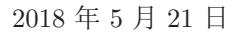

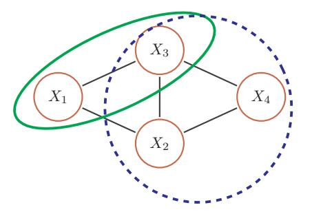

图 11.7 无向图模型中的团和最大团

一系列定义在最大团上的非负函数的乘积形式, 即

$$
p(\mathbf{x}) = \frac{1}{Z} \prod_{c \in C} \phi_c(\mathbf{x}_c),
$$
 (11.17)

其中C为G中的最大团集合,  $\phi_c(\mathbf{x}_c) \geq 0$ 是定义在团c上的势能 函数(potential function), Z是配分函数(partition function), 用来将乘积归一化为概率形式。

$$
Z = \sum_{\mathbf{x} \in \mathcal{X}} \prod_{c \in \mathcal{C}} \phi_c(\mathbf{x}_c),\tag{11.18}
$$

其中  $\mathcal X$  为随机向量  $X$  的取值空间。

Hammersley-Clifford 定理的证明可以参考 [Koller and Friedman, 2009]。无 向图模型与有向图模型的一个重要区别是有配分函数Z。配分函数的计算复杂 度是指数级的,因此在推断和参数学习时都需要重点考虑。

第11.2.2节。

配分函数的计算参见

198

吉布斯分布 公式(11.17)中定义的分布形式也称为吉布斯分布(Gibbs distribution)。根据 Hammersley-Clifford 定理, 无向图模型和吉布斯分布是一致的。吉 布斯分布一定满足马尔可夫随机场的条件独立性质,并且马尔可夫随机场的概 率分布一定可以表示成吉布斯分布。

这里的负号是遵从物理 上习惯, 即能量越低意 味着概率越高。

$$
\phi_c(\mathbf{x}_c) = \exp(-E_c(\mathbf{x}_c)),\tag{11.19}
$$

其中 $E(\mathbf{x}_c)$ 为能量函数 (energy function)。

由于势能函数必须为正的, 因此我们一般定义为

邱锡鹏:《神经网络与深度学习》

{9}------------------------------------------------

因此,无向图上定义的概率分布可以表示为:

$$
P(\mathbf{x}) = \frac{1}{Z} \prod_{c \in C} \exp(-E_c(\mathbf{x}_c))
$$
\n(11.20)

$$
=\frac{1}{Z}\exp(\sum_{c\in\mathcal{C}} -E_c(\mathbf{x}_c))
$$
\n(11.21)

这种形式的分布又称为玻尔兹曼分布(Boltzmann Distribution)。任何一个无 向图模型都可以用公式(11.21)来表示其联合概率。

#### 常见的无向图模型 $11.1.5$

很多经典的机器学习模型可以使用无向图模型来描述, 比如对数线性模型 (也叫最大熵模型)、条件随机场、玻尔兹曼机、受限玻尔兹曼机等。

### 11.1.5.1 对数线性模型

势能函数的一般定义为

$$
\phi_c(\mathbf{x}_c|\theta_c) = \exp\left(\theta_c^{\mathrm{T}} f_c(\mathbf{x}_c)\right),\tag{11.22}
$$

其中函数  $f_c(\mathbf{x}_c)$  为定义在  $\mathbf{x}_c$  上的特征向量,  $\theta_c$  为权重向量。这样联合概率  $p(\mathbf{x})$ 的对数形式为

$$
\log p(\mathbf{x}|\theta) = \sum_{c \in C} \theta_c^{\mathrm{T}} f_c(\mathbf{x}_c) - \log Z(\theta), \qquad (11.23)
$$

其中θ代表所有势能函数中的参数θ。这种形式的无向图模型也称为对数线性 模型 (Log-Linear Model) 或最大熵模型 (Maximum Entropy Model) [Berger et al., 1996, Della Pietra et al., 1997.

如果用对数线性模型来建模条件概率  $p(y|\mathbf{x})$ ,

$$
p(y|\mathbf{x}, \theta) = \frac{1}{Z(\mathbf{x}, \theta)} \exp\left(\theta^{\mathrm{T}} f(\mathbf{x}, y)\right),\tag{11.24}
$$

其中  $Z(\mathbf{x}, \theta) = \sum_{y} \exp(\theta^T f_y(\mathbf{x}, y))$ 。这种对数线性模型也称为条件最大熵模型 或 $softmax$ 回归模型。

softmax回归模型参见 第3.2节。

#### 11.1.5.2 条件随机场

条件随机场 (Conditional Random Field, CRF) [Lafferty et al., 2001] 是 一种直接建模条件概率的无向图模型。

邱锡鹏:《神经网络与深度学习》

#### https://nndl.github.io/

受限玻尔兹曼机参见

玻尔兹曼分布参见定

 $x_{12.1}$ 。

玻尔兹曼机参见 第12.1节。

第12.2节。

{10}------------------------------------------------

和最大熵模型不同, 条件随机场建模的条件概率 p(y|x) 中, y 一般为随机 向量,因此需要对 p(y|x)进行因子分解。假设条件随机场的最大团集合为C,其 条件概率为

$$
p(\mathbf{y}|\mathbf{x}, \theta) = \frac{1}{Z(\mathbf{x}, \theta)} \exp\left(\sum_{c \in \mathcal{C}} \theta_c^{\mathrm{T}} f_c(\mathbf{x}, \mathbf{y}_c)\right),\tag{11.25}
$$

其中  $Z(\mathbf{x},\theta) = \sum_{y} \exp(\sum_{c \in \mathcal{C}} f_c(\mathbf{x}, \mathbf{y}_c)^{\mathrm{T}} \theta_c)$  为归一化项。

一个最常用的条件随机场为图11.8b中所示的链式结构, 其条件概率为

$$
p(\mathbf{y}|\mathbf{x},\theta) = \frac{1}{Z(\mathbf{x},\theta)} \exp\Big(\sum_{t=1}^T \theta_1^{\mathrm{T}} f_1(\mathbf{x}, y_t) + \sum_{t=1}^{T-1} \theta_2^{\mathrm{T}} f_2(\mathbf{x}, y_t, y_{t+1})\Big), \quad (11.26)
$$

其中  $f_1(\mathbf{x}, y_t)$  为状态特征, 一般和位置t相关,  $f_2(\mathbf{x}, y_t, y_{t+1})$  为转移特征, 一般 可以简化为 $f_2(y_t, y_{t+1})$ 并使用状态转移矩阵来表示。

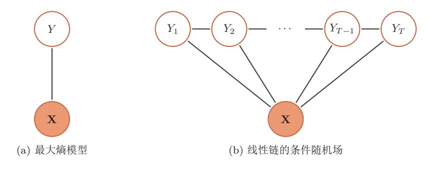

图 11.8 最大熵模型和线性链的条件随机场

#### 有向图和无向图之间的转换 $11.1.6$

无向图模型可以表示有向图模型无法表示的一些依赖关系,比如循环依赖; 但它不能表示有向图模型能够表示的某些关系,比如因果关系。

以图11.9a中的有向图为例, 其联合概率分布可以分解为

$$
p(\mathbf{x}) = p(x_1)p(x_2)p(x_3)p(x_4|x_1, x_2, x_3), \qquad (11.27)
$$

其中 $p(x_4|x_1, x_2, x_3)$ 和四个变量都相关。如果要转换为无向图,需要将这四个变 道德化的名称来源是:有 量都归属于一个团中。因此需要将x4的三个父节点之间都加上连边,如图11.9b所 共同儿子的父节点都必 示。这个过程称为道德化(Moralization)。转换后的无向图称为道德图(Moral 须结婚(即有连边)。

200

邱锡鹏:《神经网络与深度学习》

{11}------------------------------------------------

Graph)。在道德化的过程中, 原来有向图的一些独立性会丢失, 比如上面例子 中 $X_1 \perp X_2 \perp X_2$ | $\emptyset$ 在道德图中不再成立。

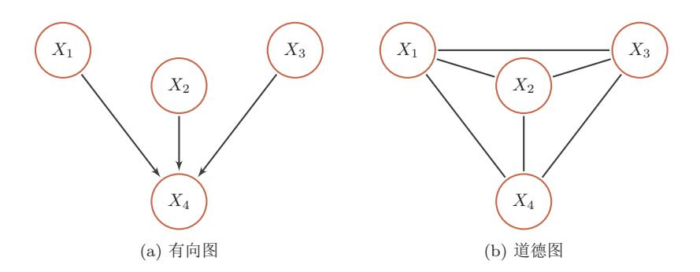

图 11.9 具有共果关系的有向图的道德化示例

#### 推断 11.2

在图模型中, 推断(inference)是指在观测到部分变量e = { $e_1, e_2, \dots, e_m$ } 时, 计算其它变量的某个子集 $\mathbf{q} = \{q_1, q_2, \cdots, q_n\}$ 的后验概率 $p(\mathbf{q}|\mathbf{e})$ 。

假设一个图模型中,除了变量e、q外,其余变量表示为z。根据贝叶斯公 式有

$$
p(\mathbf{q}|\mathbf{e}) = \frac{p(\mathbf{q}, \mathbf{e})}{p(\mathbf{e})}
$$
(11.28)

$$
= \frac{\sum_{\mathbf{z}} p(\mathbf{q}, \mathbf{e}, \mathbf{z})}{\sum_{\mathbf{q}, \mathbf{z}} p(\mathbf{q}, \mathbf{e}, \mathbf{z})}.
$$
 (11.29)

因此, 图模型的推断问题可以转换为求任意一个变量子集的边际概率分布 问题。

在图模型中, 常用的推断方法可以分为精确推断和近似推断两类。

本节介绍两种精确推断算法,下一节介绍近似推断算法。

#### 变量消除法 11.2.1

以图11.2a的有向图为例,假设推断问题为计算后验概率 $p(x_1|x_4)$ ,需要计 算两个边际概率  $p(x_1, x_4)$  和  $p(x_4)$ 。

邱锡鹏:《神经网络与深度学习》

{12}------------------------------------------------

根据条件独立性假设,有

$$
p(x_1, x_4) = \sum_{x_2, x_3} p(x_1) p(x_2 | x_1) p(x_3 | x_1) p(x_4 | x_2, x_3),
$$
\n(11.30)

假设每个变量取  $K \wedge \overline{F}$  计算上面的边际分布需要  $K^2 \times \mathbb{R}$  双汉  $K^2 \times 4 \times$ 乘法。

根据乘法的分配律,

$$
ab + ac = a(b + c), \tag{11.31}
$$

边际概率 $p(x_1, x_4)$ 可以写为

$$
p(x_1, x_4) = p(x_1) \sum_{x_3} p(x_3|x_1) \sum_{x_2} p(x_2|x_1) p(x_4|x_2, x_3).
$$
 (11.32)

这样计算量可以减少到 $K^2 + K$ 次加法和 $K^2 + K + 1$ 次乘法。

这种方法是利用动态规划的思想, 每次消除一个变量, 来减少计算边际分 布的计算复杂度, 称为变量消除法 (variable elimination algorithm)。随着图 模型规模的增长, 变量消除法的收益越大。

变量消除法可以按照不同的顺序来消除变量。比如上面的推断问题也可以 按照 $x_3$ ,  $x_2$ 的消除顺序进行计算。

同理, 边际概率 $p(x_4)$ 可以通过以下方式计算:

$$
p(x_4) = \sum_{x_3} p(x_3|x_1) \sum_{x_2} p(x_4|x_2, x_3) \sum_{x_1} p(x_2|x_1)p(x_1).
$$
 (11.33)

变量消除法的一个缺点是在计算多个边际分布时存在很多重复的计算。比 如在上面的图模型中, 计算边际概率  $p(x_4)$  和  $p(x_3)$  时很多局部的求和计算是一 样的。

#### 信念传播算法 11.2.2

信念传播(Belief Propagation, BP)算法,也称为和积(Sum-Product)算法 本节以无向图为例来介 绍信念传播, 但其同样 或消息传递(Message Passing)算法,是将变量消除法中的和积(Sum-Product) 适用于有向图。 操作看作是消息,并保存起来,这样可以节省大量的计算资源。

邱锡鹏:《神经网络与深度学习》

{13}------------------------------------------------

# 11.2.2.1 链式结构上的的信念传播算法

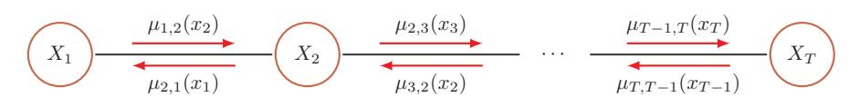

图 11.10 无向马尔科夫链的消息传递过程

以图11.10所示的无向马尔可夫链为例, 其联合概率 $p(\mathbf{x})$ 为

$$
p(\mathbf{x}) = \frac{1}{Z} \prod_{c \in \mathcal{C}} \phi_c(\mathbf{x}_c)
$$
 (11.34)

$$
=\frac{1}{Z}\prod_{t=1}^{T-1}\phi(x_t, x_{t+1})
$$
\n(11.35)

其中 $\phi(x_t, x_{t+1})$ 是定义在团 $(x_t, x_{t+1})$ 的势能函数。

第 $t \triangleleft \mathfrak{B}$ 量的边际概率 $p(x_t)$ 为

$$
p(x_t) = \sum_{x_1} \cdots \sum_{x_{t-1}} \sum_{x_{t+1}} \cdots \sum_{x_T} p(\mathbf{x})
$$
 (11.36)

$$
= \frac{1}{Z} \sum_{t_1} \cdots \sum_{x_{t-1}} \sum_{x_{t+1}} \cdots \sum_{x_T} \prod_{t=1}^{T-1} \phi(x_t, x_{t+1}). \tag{11.37}
$$

假设每个变量取 K 个值, 不考虑归一化项, 通过公式(11.37) 计算边际分布需要  $K^{T-1}$ 次加法以及 $K^{T-1} \times (T-1)$ 次乘法。

根据乘法的分配律, 边际概率 $p(x_t)$ 可以通过下面方式进行计算:

$$
p(x_t) = \frac{1}{Z} \left( \sum_{x_1} \cdots \sum_{x_{t-1}} \prod_{j=1}^{t-1} \phi(x_j, x_{j+1}) \right) \cdot \left( \sum_{x_{t+1}} \cdots \sum_{x_T} \prod_{j=t}^{T-1} \phi(x_j, x_{j+1}) \right)
$$
  
\n
$$
= \frac{1}{Z} \left( \sum_{x_{t-1}} \phi(x_{t-1}, x_t) \cdots \left( \sum_{x_2} \phi(x_2, x_3) \left( \sum_{x_1} \phi(x_1, x_2) \right) \right) \right)
$$
  
\n
$$
\left( \sum_{x_{t+1}} \phi(x_t, x_{t+1}) \cdots \left( \sum_{x_{T-1}} \phi(x_{T-2}, x_{T-1}) \left( \sum_{x_T} \phi(x_{T-1}, x_T) \right) \right) \right)
$$
  
\n
$$
= \frac{1}{Z} \mu_{t-1, t}(x_t) \mu_{t+1, t}(x_t), \qquad (11.38)
$$

邱锡鹏:《神经网络与深度学习》

{14}------------------------------------------------

### 第11章 概率图模型

其中 $\mu_{t-1,t}(x_t)$ 定义为变量 $X_{t-1}$ 向变量 $X_t$ 传递的消息。 $\mu_{t-1,t}(x_t)$ 是关于变量  $X_t$ 的函数,可以递归计算:

$$
\mu_{t-1,t}(x_t) \triangleq \sum_{x_{t-1}} \phi(x_{t-1}, x_t) \mu_{t-2,t-1}(x_{t-1}). \tag{11.39}
$$

 $\mu_{t+1,t}(x_t)$ 是变量 $X_{t+1}$ 向变量 $X_t$ 传递的消息, 定义为

$$
\mu_{t+1,t}(x_t) \triangleq \sum_{x_{t+1}} \phi(x_t, x_{t+1}) \mu_{t+2,t+2}(x_{t+1}). \tag{11.40}
$$

边际概率  $p(x_t)$  的计算复杂度减少为 $O(TK^2)$ 。如果要计算整个序列上所有 变量的边际概率, 不需要将消息传递的过程重复T次, 因为其中每两个相邻节 点上的消息是相同的。

链式结构图模型的信念传播过程为

- 1. 依次计算前向传递的消息  $\mu_{t-1,t}(x_t)$ ,  $t = 1, \cdots, T-1$ ;
- 2. 依次计算反向传递的消息  $\mu_{t+1,t}(x_t)$ ,  $t = T 1, \cdots, 1$ ;
- 3. 在任意节点 t 上计算配分函数 Z,

$$
Z = \sum_{x_t} \mu_{t-1,t}(x_t) \mu_{t+1,t}(x_t). \tag{11.41}
$$

这样就可以通过公式(11.38)计算所有变量的边际概率了。

### 11.2.2.2 树结构上的信念传播算法

信念传播算法也可以推广到具有树结构的图模型上。如果一个有向图满足 任意两个变量只有一条路径(忽略方向),且只有一个没有父节点的节点,那么 这个有向图为树结构, 其中唯一没有父节点的节点称为根节点。如果一个无向 图满足任意两个变量只有一条路径, 那么这个无向图也为树结构。在树结构的 无向图中, 任意一个节点都可以作为根节点。

树结构图模型的信念传播过程为: 1)从叶子节点到根节点依次计算并传递 消息; 2) 从根节点开始到叶子节点, 依次计算并传递消息; 3) 在每个节点上 计算所有接收消息的乘积(如果是无向图还需要归一化),就得到了所有变量的 边际概率。

如果图结构中存在环路,可以使用联合树算法(Junction Tree Algorithm) [Lauritzen and Spiegelhalter, 1988] 来将图结构转换为无环图。

{15}------------------------------------------------

#### 11.3 近似推断

在实际应用中,精确推断一般用于结构比较简单的推断问题。当图模型的 结构比较复杂时, 精确推断的计算开销会比较大。此外, 如果图模型中的变量 是连续的,并且其积分函数没有闭型(closed-form)解时,也无法使用精确推 断。因此, 在很多情况下也常常采用近似的方法来进行推断。

近似推断 (Approximate Inference) 主要有以下三种方法:

- 1. 环路信念传播: 当图模型中存在环路时,使用和积算法时,消息会在环路中 一直传递,可能收敛或不收敛。环路信念传播(Loopy Belief Propagation, LBP)是在具有环路的图上依然使用和积算法,即使得到不精确解,在某 些任务上也可以近似精确解。
- 2. 变分法: 图模型中有些变量的局部条件分布可能非常复杂, 或其积分无 法计算。变方法 (Variational Method) 是引入一个变分分布 (通常是比 较简单的分布)来近似这些条件概率,然后通过迭代的方法进行计算。首 先是更新变分分布的参数来最小化变分分布和真实分布的差异(比如交 叉熵或 KL 距离), 然后再根据变分分布来进行推断。
- 3. 采样法: 采样法 (Sampling Method) 是通过模拟的方式来采集符合某个 分布 p(x) 的一些样本, 并通过这些样本来估计和这个分布有关的运算, 比 如期望等。

本节主要介绍基于采样法的近似推断。

#### 蒙特卡罗方法 $11.3.1$

采样法(Sampling Method), 也叫蒙特卡罗方法(Monte Carlo Method) 或统计模拟方法,是20世纪40年代中期提出的一种通过随机采样的方法来近 似估计一些计算问题的数值解。随机采样指从给定概率密度函数 p(x) 中抽取出 符合其概率分布的样本。由于电子计算机的出现和快速发展,这种方法作为一 种独立方法被提出来, 使得当时很多难以计算的问题都可以通过随机模拟的方 法来讲行估计。

蒙特卡罗方法的一个最简单的应用例子是计算圆周率π。我们知道半径为  $r$ 的圆的面积为 $\pi r^2$ , 而直径为 $2r$ 的正方形的面积为 $4r^2$ 。当我们用正方形去嵌 套一个相切的圆时, 它们的面积之比是 $\frac{1}{4}\pi$ 。当不知道π时, 我们无法计算圆的

采样也叫抽样。

蒙特卡罗方法诞生于20 世纪40年代美国的"曼 哈顿计划",其名字来源 于摩纳哥的一个以赌博 业闻名的城市蒙特卡罗, 象征概率。

{16}------------------------------------------------

面积。因此,需要通过模拟的方法来进行近似估计。首先在正方形内部按均值 采样的方式随机生成若干点, 计算它们与圆心点的距离, 从而判断是否落在圆 的内部。然后去统计落在圆内部的点占到所有点的比例。当有足够的点时,这 个比例应该接近于 $\frac{1}{4}\pi$ , 而从近似估算出 $\pi$ 的值。

蒙特卡罗方法的基本思想可以归结为根据一个已知概率密度函数为p(x)的 分布来计算函数 $f(x)$ 的期望

$$
\mathbb{E}[f(x)] = \int_{x} f(x)p(x)dx.
$$
 (11.42)

本节中假设 x 为连续变 量,如果x是离散变量, 可以将积分替换为求和。

 $\exists p(x)$ 比较复杂时,很难用解析的方法来计算这个期望。为了计算 $E[f(x)]$ , 我们可以通过数值解法的方法来近似计算。首先从 $p(x)$ 中独立抽取的 $N \triangleq K$ 本  $x^{(1)}, x^{(2)}, \cdots, x^{(N)}$ ,  $f(x)$ 的期望可以用这  $N$  个样本的均值  $\hat{f}_N$  来近似。

$$
\hat{f}_N = \frac{1}{N} \left( f(x^{(1)}) + \dots + f(x^{(N)}) \right). \tag{11.43}
$$

根据大数定律, 当 N 趋向于无穷大时, 样本均值收敛于期望值。

$$
\hat{f}_N \xrightarrow{P} \mathbb{E}_p[f(x)] \qquad \stackrel{\text{def}}{=} N \to \infty. \tag{11.44}
$$

这就是蒙特卡罗方法的理论依据。

随机采样 蒙特卡罗方法的难点是如何进行随机采样,即如何让计算机生成满足 概率密度函数  $p(x)$  的样本。我们知道, 计算机可以比较容易地随机生成一个在 [0,1] 区间上均布分布的样本 ξ,  $p(ξ)$  = 1。如果要随机生成服从某个非均匀分布 的样本, 就需要一些间接的采样方法。

如果一个分布的概率密度函数为 $p(x)$ , 其累积分布函数cdf(x)为连续的严 格增函数, 且存在逆函数 cdf-1(y),  $y \in [0,1]$ , 那么我们可以利用累积分布函数 的逆函数来生成服从该随机分布的样本。假设ξ是[0,1] 区间上均匀分布的随机 变量, 则cdf-1(ξ) 服从概率密度函数为  $p(x)$  的分布。

但当 $p(x)$ 非常复杂, 其累积分布函数的逆函数难以计算, 或者不知道 $n(x)$  $p(x) = \frac{1}{Z}\hat{p}(x), \; \; \text{\#} \; \text{\#} \; Z$ 的精确值, 只知道未归一化的分布 $\hat{p}(x)$ , 那么就难以直接对 $p(x)$ 进行采样, 往 为配分函数。 往需要使用一些间接的采样策略,比如拒绝采样、重要性采样、马尔可夫链蒙 特卡罗采样等。这些方法一般是先根据一个比较容易采样的分布进行采样, 然 后通过一些策略来间接得到符合  $p(x)$  分布的样本。

参见习题11-4。

{17}------------------------------------------------

#### 拒绝采样 11.3.2

拒绝采样(Rejection Sampling),也叫接受-拒绝采样(Acceptance-Rejection Sampling  $\rangle\;$   $\;$ 

假设原始分布  $p(x)$  难以直接采样, 我们可以引入一个容易采样的分布  $q(x)$ , 一般称为提议分布(Proposal Distribution),然后以某个标准来拒绝一部分的 样本使得最终采集的样本服从分布 $p(x)$ 。

在拒绝采样中, 已知未归一化的分布  $\hat{p}(x)$ , 我们需要构建一个提议分布  $q(x)$ 和一个常数 k, 使得 kq(x) 可以覆盖函数  $\hat{p}(x)$ , 即 kq(x)  $\geq \hat{p}(x), \forall x$ . 如 图11.11所示。

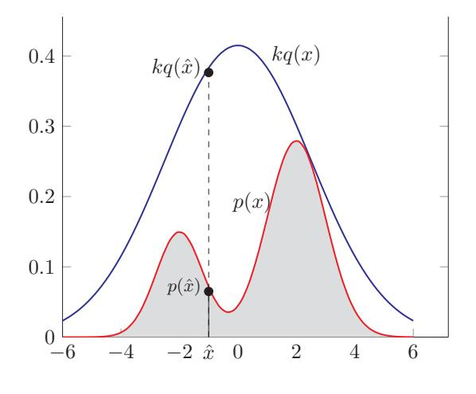

图 11.11 拒绝采样。

对于每次抽取的样本 $\hat{x}$ , 计算接受概率 (acceptance probability):

$$
\alpha(\hat{x}) = \frac{\hat{p}(\hat{x})}{kq(\hat{x})},\tag{11.45}
$$

并以概率 $\alpha \hat{x}$ 来接受样本 $\hat{x}$ 。拒绝采样的采样过程如下算法11.1所示。

判断一个拒绝采样方法的好坏就是看其采样效率, 即总体的接受率。如果 函数  $kq(x)$  远大于原始分布函数  $\hat{p}(x)$ , 拒绝率会比较高, 采样效率会非常不理 想。但要找到一个和 $\hat{p}(x)$ 比较接近的提议分布往往比较困难。特别是在高维空 间中,其采样率会非常低,导致很难应用到实际问题中。

为了简化起见,我们把概 率密度函数为 p(x) 为分 布简称为分布 $p(x)$ , 下 同。 提议分布在很多文献中 也翻译为参考分布。

邱锡鹏:《神经网络与深度学习》

{18}------------------------------------------------

| 算法 11.1: 拒绝采样                                             |                                             |                                   |  |  |
|-----------------------------------------------------------|---------------------------------------------|-----------------------------------|--|--|
| 输入: 提议分布 $q(\mathbf{x})$ ;                                |                                             |                                   |  |  |
| 常数 $k$ ;                                                  |                                             |                                   |  |  |
| 样本集合 $V = \varnothing$ ;                                  |                                             |                                   |  |  |
| 1 repeat                                                  |                                             |                                   |  |  |
| $\overline{2}$                                            | 根据 $q(x)$ 随机生成一个样本 $\hat{x}$ ;              |                                   |  |  |
| 3                                                         | 计算接受概率 $\alpha(\hat{x})$ ;                  |                                   |  |  |
| $\overline{\mathbf{4}}$                                   | $\mathcal{H}$ (0,1) 的均匀分布中随机生成一个值 $z$ ;     |                                   |  |  |
| 5                                                         | if $z \leq \alpha(\hat{x})$ then            | /* 以 $\alpha(\hat{x})$ 的概率接受 x */ |  |  |
| 6                                                         | $\mathcal{V} = \mathcal{V} \cup {\hat{x}};$ |                                   |  |  |
| $\overline{7}$                                            | end                                         |                                   |  |  |
| until 直到获得 $N \wedge K^2 \uparrow ( {\cal V}  = N);$ 8 |                                             |                                   |  |  |
| 输出: 样本集合Ⅴ                                                 |                                             |                                   |  |  |

# 11.3.3 重要性采样

如果采样的目的是计算分布 $p(x)$ 下函数 $f(x)$ 的期望,那么实际上抽取的样 本不需要严格服从分布 $p(x)$ 。也可以通过另一个分布, 即提议分布 $q(x)$ , 直接 采样并估计 $\mathbb{E}_p[f(x)]$ 。

函数 $f(x)$ 在分布 $p(x)$ 下的期望可以写为

$$
\mathbb{E}_p[f(x)] = \int_x f(x)p(x)dx\tag{11.46}
$$

$$
=\int_{x} f(x)\frac{p(x)}{q(x)}q(x)dx
$$
\n(11.47)

$$
=\int_{x} f(x)w(x)q(x)dx
$$
\n(11.48)

$$
= \mathbb{E}_q[f(x)w(x)]. \tag{11.49}
$$

其中 $w(x)$ 称为重要性权重。

重要性采样(Importance Sampling)是通过引入重要性权重,将分布 $p(x)$ 下  $f(x)$  的期望变为在分布  $q(x)$  下  $f(x)w(x)$  的期望, 从而可以近似为

$$
\hat{f}_N = \frac{1}{N} \left( f(x^{(1)}) w(x^{(1)}) + \dots + f(x^{(N)}) w(x^{(N)}) \right), \tag{11.50}
$$

其中 $x^{(1)}, \cdots, x^{(N)}$ 为独立从 $q(x)$ 中随机抽取的点。

邱锡鹏:《神经网络与深度学习》

{19}------------------------------------------------

重要性采样也可以在只知道未归一化的分布 $\hat{p}(x)$ 的情况下计算函数 $f(x)$ 的期望。

$$
\mathbb{E}_p[f(x)] = \int_x f(x) \frac{\hat{p}(x)}{Z} dx \tag{11.51}
$$

$$
=\frac{\int_{x}\hat{p}(x)f(x)dx}{\int_{x}\hat{p}(x)dx}
$$
\n(11.52)

$$
\approx \frac{\sum_{n=1}^{N} f(x^{(n)}) \hat{w}(x^{(n)})}{\sum_{n=1}^{N} \hat{w}(x^{(n)})},
$$
\n(11.53)

其中 $\hat{w}(x) = \frac{\hat{p}(x)}{q(x)}, x^{(1)}, \cdots, x^{(N)}$ 为独立从 $q(x)$ 中随机抽取的点。

# 11.3.4 马尔可夫链蒙特卡罗方法

在高维空间中, 拒绝采样和重要性采样的效率随空间维数的增加而指数降 低。马尔可夫链蒙特卡罗(Markov Chain Monte Carlo, MCMC)方法是一种 更好的采样方法,可以很容易地对高维变量进行采样。

MCMC方法也有很多不同的具体采样方法,但其核心思想是将采样过程看 作是一个马尔可夫链。

 $\mathbf{x}_1, \mathbf{x}_2, \cdots, \mathbf{x}_{t-1}, \mathbf{x}_t, \mathbf{x}_{t+1}, \cdots$ 

第t+1次采样依赖于第t次抽取的样本xt以及状态转移分布(即提议分布)  $q(\mathbf{x}|\mathbf{x}_t)$ 。如果这个马尔可夫链的平稳分布为 $p(\mathbf{x})$ , 那么在状态平稳时抽取的样 本就服从p(x)的分布。

MCMC方法的关键是如何构造出平稳分布为 p(x) 的马尔可夫链, 并且该 马尔可夫链的状态转移分布 q(x|x') 一般为比较容易采样的分布。当x为离散变 量时,  $q(\mathbf{x}|\mathbf{x}')$ 可以是一个状态转移矩阵; 当 x 为连续变量时,  $q(\mathbf{x}|\mathbf{x}')$  可以是参 数密度函数, 比如各向同性的高斯分布  $q(\mathbf{x}|\mathbf{x}') = \mathcal{N}(\mathbf{x}|\mathbf{x}', \sigma^2 I)$ , 其中  $\sigma^2$  为超 参数。

使用 MCMC 方法进行采样时需要注意两点: 一是马尔可夫链需要经过一 段时间的随机游走才能达到平稳状态, 这段时间称为预烧期 (Burn-in Period) 。预烧期内的采样点并不服从分布 p(x), 需要丢弃; 二是基于马尔可夫链抽取 的相邻样本是高度相关的。而在机器学习中,我们一般需要抽取的样本是独立 同分布的。为了使得抽取的样本之间独立, 我们可以每间隔 M 次随机游走, 抽 取 个样本。如果 M 足够大, 可以认为抽取的样本是独立的。

邱锡鹏:《神经网络与深度学习》

马尔可夫链参见 第D.3.1.1节。

 $p(x) = \frac{\hat{p}(x)}{7}$ , Z为配分

函数。

{20}------------------------------------------------

### 11.3.4.1 Metropolis-Hastings 算法

Metropolis-Hastings 算法, 简称 MH 算法, 是一种应用广泛的 MCMC 方法。 在 MH 算法中, 马尔可夫链的状态转移分布 a(x|x'), 其平稳分布往往不是 p(x)。 因此, MH 算法引入拒绝采样的思想来修正提议分布, 使得最终采样的分布为  $p(\mathbf{x})$ .

在 MH 算法中, 假设第  $t$ 次采样的样本为  $\mathbf{x}_t$ , 首先根据提议分布  $q(\mathbf{x}|\mathbf{x}_t)$ 抽 取一个样本 x, 并以概率  $A(\hat{\mathbf{x}}, \mathbf{x}_t)$  来接受 x 作为第  $t+1$  次的采样样本  $\mathbf{x}_{t+1}$ ,

$$
A(\hat{\mathbf{x}}, \mathbf{x}_t) = \min\left(1, \frac{p(\hat{\mathbf{x}})q(\mathbf{x}_t|\hat{\mathbf{x}})}{p(\mathbf{x}_t)q(\hat{\mathbf{x}}|\mathbf{x}_t)}\right). \tag{11.54}
$$

因为每次 $q(\mathbf{x}|\mathbf{x}_t)$ 随机生成一个样本x, 并以概率  $A(\hat{\mathbf{x}}, \mathbf{x}_t)$ 的方式接受, 因 此修正马尔可夫链的状态转移概率为

$$
q'(\hat{\mathbf{x}}|\mathbf{x}_t) = q(\hat{\mathbf{x}}|\mathbf{x}_t)A(\hat{\mathbf{x}}, \mathbf{x}_t),
$$
\n(11.55)

该修正马尔可夫链可以达到平稳状态,且平稳分为p(x)。

细致平稳条件参见定 证明. 根据马尔可夫链的细致平稳条件, 有

理D.1。

 $p(\mathbf{x}_t)q'(\hat{\mathbf{x}}|\mathbf{x}_t) = p(\mathbf{x}_t)q(\hat{\mathbf{x}}|\mathbf{x}_t)A(\hat{\mathbf{x}}, \mathbf{x}_t)$  $(11.56)$ 

$$
=p(\mathbf{x}_t)q(\hat{\mathbf{x}}|\mathbf{x}_t)\min\left(1,\frac{p(\hat{\mathbf{x}})q(\mathbf{x}_t|\hat{\mathbf{x}})}{p(\mathbf{x}_t)q(\hat{\mathbf{x}}|\mathbf{x}_t)}\right) \tag{11.57}
$$

$$
= \min\left(p(\mathbf{x}_t)q(\hat{\mathbf{x}}|\mathbf{x}_t), p(\hat{\mathbf{x}})q(\mathbf{x}_t|\hat{\mathbf{x}})\right) \tag{11.58}
$$

$$
= p(\hat{\mathbf{x}})q(\mathbf{x}_t|\hat{\mathbf{x}})\min\left(\frac{p(\mathbf{x}_t)q(\hat{\mathbf{x}}|\mathbf{x}_t)}{p(\hat{\mathbf{x}})q(\mathbf{x}_t|\hat{\mathbf{x}})}, 1\right)
$$
(11.59)

$$
= p(\hat{\mathbf{x}})q(\mathbf{x}_t|\hat{\mathbf{x}})A(\mathbf{x}_t, \hat{\mathbf{x}})
$$
\n(11.60)

$$
=p(\hat{\mathbf{x}})q'(\mathbf{x}_t|\hat{\mathbf{x}}).
$$
\n(11.61)

因此,  $p(\mathbf{x})$ 是状态转移概率为 $q'(\hat{\mathbf{x}}|\mathbf{x}_t)$ 的马尔可夫链的平稳分布。  $\Box$ 

MH 算法的采样过程如算法11.2所示。

### 11.3.4.2 Metropolis 算法

如果 MH 算法中的提议分布是对称的, 即  $q(\hat{\mathbf{x}}|\mathbf{x}_t) = q(\mathbf{x}_t|\hat{\mathbf{x}})$ , 第  $t + 1$ 次采 样的接受率可以简化为

$$
A(\hat{\mathbf{x}}, \mathbf{x}_t) = \min\left(1, \frac{p(\hat{\mathbf{x}})}{p(\mathbf{x}_t)}\right). \tag{11.62}
$$

https://nndl.github.io/

邱锡鹏:《神经网络与深度学习》

{21}------------------------------------------------

算法 11.2: Metropolis-Hastings 算法 输入: 提议分布  $q(\mathbf{x}|\mathbf{x}')$ ; 采样间隔 $M;$ 样本集合  $V = \varnothing$ : 1 随机初始化 x0;  $t = 0$ ; 3 repeat // 预热过程 根据  $q(\mathbf{x}|\mathbf{x}_t)$  随机生成一个样本 x;  $\overline{\mathbf{4}}$ 计算接受概率  $A(\hat{\mathbf{x}}, \mathbf{x}_t)$ ;  $\bf 5$ 从(0,1)的均匀分布中随机生成一个值 z;  $\mathbf{6}$ /\* 以 $A(\hat{\mathbf{x}}, \mathbf{x}_t)$ 的概率接受 x \*/ if  $z \leq \alpha$  then  $\overline{7}$  $\mathbf{x}_{t+1} = \hat{\mathbf{x}};$ 8 /\* 拒绝接受 x \*/ else  $\boldsymbol{9}$  $\mathbf{x}_{t+1} = \mathbf{x}_t;$  $10$ end  $11\,$  $t_{++}$ ;  $\bf{12}$ if 未到平稳状态 then 13 continue; 14 end  $15\,$ // 采样过程, 每隔 M 次采一个样本 if t mod  $M = 0$  then  $16\,$  $\mathcal{V} = \mathcal{V} \cup \{\mathbf{x}_t\};$ 17 end 18 19 until 直到获得  $N \wedge$ 样本(| $V| = N$ ); 输出:样本集合 V

{22}------------------------------------------------

这种 MCMC 方法称为 Metropolis 算法。

### 11.3.4.3 吉布斯采样

吉布斯采样(Gibbs Sampling)是一种有效地对高维空间中的分布进行采 样的MCMC方法,可以看作是Metropolis-Hastings 算法的特例。吉布斯采样使 用全条件概率(Full Conditional Probability)作为提议分布来依次对每个维度 进行采样, 并设置接受率为 A = 1。

对于一个  $M$  维的随机向量  $\mathbf{X} = [X_1, X_2, \cdots, X_M]^T$ , 其第  $i \wedge \mathcal{F}$ 量  $X_i$  的全 条件概率为

$$
p(x_i|\mathbf{x}_{-i}) \triangleq P(X_i = x_i|X_{-i} = \mathbf{x}_{-i})
$$
\n(11.63)

$$
= p(x_i|x_1, x_2, \cdots, x_{i-1}, x_{i+1}, \cdots, x_M), \qquad (11.64)
$$

其中 $\mathbf{x}_{-i} = [x_1, x_2, \cdots, x_{i-1}, x_{i+1}, \cdots, x_M]$  "表示除 $X_i$ 外其它变量的取值。

吉布斯采样可以按照任意的顺序根据全条件分布依次对每个变量进行采 样。假设从一个随机的初始化状态  $\mathbf{x}^{(0)} = [x_1^{(0)}, x_2^{(0)}, \cdots, x_M^{(0)}]$  T 开始, 按照下 标顺序依次对 M 个变量讲行采样。

$$
x_1^{(1)} \sim p(x_1|x_2^{(0)}, x_3^{(0)}, \cdots, x_M^{(0)}),\tag{11.65}
$$

$$
x_2^{(1)} \sim P(X_2|x_1^{(1)}, x_3^{(0)} \cdots, x_M^{(0)}), \tag{11.66}
$$

$$
x_M^{(1)} \sim P(X_M | x_1^{(1)}, x_2^{(1)} \cdots, x_{M-1}^{(0)}), \tag{11.67}
$$

$$
x_1^{(t)} \sim P(X_1 | x_2^{(t-1)}, x_3^{(t-1)}, \cdots, x_M^{(t-1)}),
$$
\n(11.68)

$$
x_2^{(t)} \sim P(X_2 | x_1^{(t)}, x_3^{(t-1)} \cdots, x_M^{(t-1)}),
$$
\n(11.69)

$$
x_M^{(t)} \sim P(X_M | x_1^{(t)}, x_2^{(t)} \cdots, x_{M-1}^{(t)}),
$$
\n(11.70)

其中 $x_i^{(t)}$ 是第 $t$ 次迭代时变量 $X_i$ 的采样。

 $\vdots$ 

吉布斯采样的每单步采样也构成一个马尔可夫链。假设每个单步(采样维

{23}------------------------------------------------

度为第i维)的状态转移概率  $q(\mathbf{x}|\mathbf{x}')$ 为

$$
q(\mathbf{x}|\mathbf{x}') = \begin{cases} \frac{p(\mathbf{x})}{p(\mathbf{x}'_{-i})} & \text{if } \mathbf{x}_{-i} = \mathbf{x}'_{-i} \\ 0 & \text{otherwise,} \end{cases}
$$
(11.71)

其中边际分布 $p(\mathbf{x}'_{-i}) = \sum_{x'} p(\mathbf{x}')$ , 等式 $\mathbf{x}_{-i} = \mathbf{x}'_{-i}$ 表示 $x_j = x'_j, \forall j \neq i$ , 因此 有 $p(\mathbf{x}'_{-i}) = p(\mathbf{x}_{-i}),$  并可以得到

$$
p(\mathbf{x}')q(\mathbf{x}|\mathbf{x}') = p(\mathbf{x}')\frac{p(\mathbf{x})}{p(\mathbf{x}'_{-i})} = p(\mathbf{x})\frac{p(\mathbf{x}')}{p(\mathbf{x}_{-i})} = p(\mathbf{x})q(\mathbf{x}'|\mathbf{x}).
$$
 (11.72)

根据细致平稳条件,公式(11.71)中定义的状态转移概率 $q(\mathbf{x}|\mathbf{x}')$ 的马尔可夫 链的平稳分布为 $p(\mathbf{x})$ 。随着迭代次数  $t$  的增加, 样本  $\mathbf{x}^{(t)} = [x_1^{(t)}, x_2^{(t)} \cdots, x_M^{(t)}]^T$ 将收敛于概率分布 p(x)。

# $11.4$ 学习

图模型的学习可以分为两部分: 一是网络结构学习, 即寻找最优的网络结 构; 二是网络参数估计, 即已知网络结构, 估计每个条件概率分布的参数。

网络结构学习一般比较困难,一般是由领域专家来构建。本节只讨论在给 定网络结构条件下的参数估计问题。图模型的参数估计问题又分为不包含隐变 量时的参数估计问题和包含隐变量时的参数估计问题。

# 11.4.1 不含隐变量的参数估计

如果图模型中不包含隐变量, 即所有变量都是可观测的, 那么网络参数一 般可以直接通过最大似然来进行估计。

有向图模型 在有向图模型中, 所有变量x的联合概率分布可以分解为每个随机 变量 $x_k$ 的局部条件概率 $p(x_k|x_{\pi_k}, \theta_k)$ 的连乘形式, 其中 $\theta_k$ 为第 $k \wedge \Phi$ 量的局部 条件概率的参数。

给定  $N \triangleleft \emptyset$  练样本  $\mathcal{D} = \{ \mathbf{x}^{(i)} \}$ ,  $1 \leq i \leq N$ , 其对数似然函数为

$$
\mathcal{L}(\mathcal{D}|\theta) = \frac{1}{N} \sum_{i=1}^{N} \log p(\mathbf{x}^{(i)}, \theta)
$$
\n
$$
= \frac{1}{N} \sum_{i=1}^{N} \sum_{k=1}^{K} \log p(x_k^{(i)} | x_{\pi}^{(i)}, \theta_k),
$$
\n(11.73)\n(11.74)

$$
= \frac{1}{N} \sum_{i=1}^{N} \sum_{k=1}^{N} \log p(x_k^{(i)} | x_{\pi_k}^{(i)}, \theta_k), \qquad (11.7)
$$

{24}------------------------------------------------

其中 $\theta_k$ 为模型中的所有参数。

因为所有变量都是可观测的, 最大化对数似然  $\mathcal{L}(D|\theta)$ ), 只需要分别地最大 化每个变量的条件似然来估计其参数。

$$
\theta_k = \arg \max \sum_{i=1}^N \log p(x_k^{(i)} | x_{\pi_k}^{(i)}, \theta_k).
$$
 (11.75)

如果变量x是离散的,直接简单的方式是在训练集上统计每个变量的条件 概率表。但是条件概率表需要的参数比较多。假设条件概率  $p(x_k|x_{\pi_k})$ 的父节点 数量为M,所有变量为二值变量,其条件概率表需要2M个参数。为了减少参 数数量,可以使用参数化的模型,比如 sigmoid信念网络。如果变量x是连续的, 可以使用高斯函数来表示条件概率分布, 称为高斯信念网络。在此基础上, 还可 以通过让所有的条件概率分布共享使用同一组参数来进一步减少参数的数量。

无向图模型 在无向图模型中, 所有变量 x 的联合概率分布可以分解为定义在最 大团上的势能函数的连乘形式。以对数线性模型为例,

$$
p(\mathbf{x}|\theta) = \frac{1}{Z(\theta)} \exp\bigg(\sum_{c \in \mathcal{C}} \theta_c^{\mathrm{T}} f_c(\mathbf{x}_c)\bigg),\tag{11.76}
$$

 $\overline{\mathbf{\mathcal{H}}} \mathbf{\dot{H}} Z(\theta) = \sum_{\mathbf{x}} \exp(\sum_{c \in \mathcal{C}} \theta_c^{\mathrm{T}} f_c(\mathbf{x}_c))$ 

给定  $N \triangleleft \emptyset$  练样本  $\mathcal{D} = \{ \mathbf{x}^{(i)} \}$ ,  $1 \leq i \leq N$ , 其对数似然函数为

$$
\mathcal{L}(\mathcal{D}|\theta) = \frac{1}{N} \sum_{i=1}^{N} \log p(\mathbf{x}^{(i)}, \theta)
$$
 (11.77)

$$
= \frac{1}{N} \sum_{i=1}^{N} \left( \sum_{c \in C} \theta_c^{\mathrm{T}} f_c(\mathbf{x}_c^{(i)}) \right) - \log Z(\theta), \tag{11.78}
$$

其中 $\theta_c$ 为定义在团c上的势能函数的参数。

如果采用梯度上升方法进行最大似然估计,  $\mathcal{L}(D|\theta)$ 关于参数 $\theta_c$ 的偏导数为

$$
\frac{\partial \mathcal{L}(\mathcal{D}|\theta)}{\partial \theta_c} = \frac{1}{N} \sum_{i=1}^{N} \left( f_c(\mathbf{x}_c^{(i)}) \right) - \frac{\log Z(\theta)}{\partial \theta_c}
$$
(11.79)

其中

$$
\frac{\log Z(\theta)}{\partial \theta_c} = \sum_{\mathbf{x}} \frac{1}{Z(\theta)} \cdot \exp\left(\sum_{c \in \mathcal{C}} \theta_c^{\mathrm{T}} f_c(\mathbf{x}_c)\right) \cdot f_c(\mathbf{x}_c)
$$
(11.80)

邱锡鹏:《神经网络与深度学习》

{25}------------------------------------------------

$$
= \sum_{\mathbf{x}} p(\mathbf{x}|\theta) f_c(\mathbf{x}_c) \triangleq \mathbb{E}_{\mathbf{x} \sim p(\mathbf{x}|\theta)} \Big[ f_c(\mathbf{x}_c) \Big]. \tag{11.81}
$$

因此,

11.4学习

$$
\frac{\partial \mathcal{L}(\mathcal{D}|\theta)}{\partial \theta_c} = \frac{1}{N} \sum_{i=1}^{N} f_c(\mathbf{x}_c^{(i)}) - \mathbb{E}_{\mathbf{x} \sim p(\mathbf{x}|\theta)} \left[ f_c(\mathbf{x}_c) \right]
$$
(11.82)

$$
= \mathbb{E}_{\mathbf{x} \sim \tilde{p}(\mathbf{x})} \left[ f_c(\mathbf{x}_c) \right] - \mathbb{E}_{\mathbf{x} \sim p(\mathbf{x}|\theta)} \left[ f_c(\mathbf{x}_c) \right], \tag{11.83}
$$

其中  $\tilde{p}(\mathbf{x})$  定义为经验数据分布。由于在最优点时梯度为0, 因此无向图的最大 似然估计的优化目标等价于: 对于每个团c上的特征  $f_c(\mathbf{x}_c)$ , 其在经验分布 $\tilde{p}(\mathbf{x})$ 下的期望等于模型分布 $p(\mathbf{x}|\theta)$ 下的期望。

对比公式(11.75)和公式(11.83)可以看出,无向图模型的参数估计要比有 向图更为复杂。在有向图中,每个局部条件概率的参数是独立的;而在无向图 中,所有的参数都是相关的,无法分解。

对于一般的无向图模型, 公式(11.83)中的  $\mathbb{E}_{\mathbf{x} \sim p(\mathbf{x}|\theta)}[f_c(\mathbf{x}_c)]$ 往往很难计算, 因为涉及到在联合概率空间 p(x|θ) 计算期望。当模型变量比较多时, 这个计算 往往无法实现。因此,无向图的参数估计通常采用近似的方法。一是利用采样 来近似计算这个期望: 二是坐标上升法, 即固定其它参数, 来优化一个势能函 数的参数。

### 11.4.2 含隐变量的参数估计

如果图模型中包含隐变量, 即有部分变量是不可观测的, 就需要用EM 算 法讲行参数估计。

11.4.2.1 EM 算法

在一个包含隐变量的图模型中, 令X定义可观测变量集合, 令Z定义隐变 量集合, 一个样本x的边际似然函数 (marginal likelihood) 为

$$
p(\mathbf{x}|\theta) = \sum_{\mathbf{z}} p(\mathbf{x}, \mathbf{z}|\theta),
$$
 (11.84)

其中θ为模型参数。图11.12给出了带隐变量的贝叶斯网络的图模型结构。

给定  $N \triangleleft \emptyset$  练样本  $\mathcal{D} = \{ \mathbf{x}^{(i)} \}$ ,  $1 \leq i \leq N$ , 其训练集的对数边际似然为

$$
\mathcal{L}(\mathcal{D}|\theta) = \frac{1}{N} \sum_{i=1}^{N} \log p(\mathbf{x}^{(i)}, \theta)
$$
 (11.85)

边际似然也称为证据  $(evidence)$ .

邱锡鹏:《神经网络与深度学习》

{26}------------------------------------------------

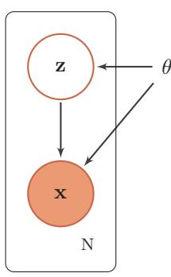

图 11.12 带隐变量的贝叶斯网络。图中的矩形表示其中的变量重复 N 次。这种 表示方法称为盘子表示法(plate notation), 是图模型中表示重复变量的方法

$$
= \frac{1}{N} \sum_{i=1}^{N} \log \sum_{\mathbf{z}} p(\mathbf{x}^{(i)}, \mathbf{z} | \theta).
$$
 (11.86)

通过最大化整个训练集的对数边际似然  $\mathcal{L}(D|\theta)$ , 可以估计出最优的参数 $\theta^*$ 。 然而计算边际似然函数时涉及  $p(x)$  的推断问题, 需要在对数函数的内部进行求 和(或积分)。这样, 当计算参数 θ 的梯度时, 这个求和操作依然存在。除非  $p(\mathbf{x}, \mathbf{z} | \theta)$ 的形式非常简单,否则这个求和难以直接计算。

为了计算 log p(x|θ), 我们引入一个额外的变分函数 q(z), q(z) 为定义在隐 变量Z上的分布。样本x的对数边际似然函数为

$$
\log p(\mathbf{x}|\theta) = \log \sum_{\mathbf{z}} q(\mathbf{z}) \frac{p(\mathbf{x}, \mathbf{z}|\theta)}{q(\mathbf{z})}
$$
(11.87)

 $\geq \sum_{\mathbf{z}} q(\mathbf{z}) \log \frac{p(\mathbf{x}, \mathbf{z} | \boldsymbol{\theta})}{q(\mathbf{z})}$  $(11.88)$ 

 $\triangle E L B O(q, \mathbf{x}|\theta),$  $(11.89)$ 

其中  $ELBO(q, \mathbf{x}|\theta)$  为对数边际似然函数  $\log p(\mathbf{x}|\theta)$  的下界, 称为证据下界 (Evi-Jensen 不等式参见 dence Lower Bound, ELBO)。公式(11.88)使用了 Jensen 不等式(即对于凸函数 第D.2.6.1节。  $g, \overline{q} g(\mathbb{E}[X]) \leq \mathbb{E}[g(X)]$ )。由 Jensen 不等式的性质可知, 仅当 $q(\mathbf{z}) = p(\mathbf{z}|\mathbf{x}, \theta)$ 参见习题11-5。 时, 对数边际似然函数 log  $p(\mathbf{x}|\theta)$  和其下界  $ELBO(q, \mathbf{x}|\theta)$  相等,

 $\log p(\mathbf{x}|\theta) = ELBO(a, \mathbf{x}|\theta).$ 

这样最大化对数边际似然函数 $log p(\mathbf{x}|\theta)$ 的过程可以分解为两个步骤: (1)

利用 Jensen 不等式。

216

邱锡鹏:《神经网络与深度学习》

{27}------------------------------------------------

先找到近似分布  $q(\mathbf{z})$  使得  $\log p(\mathbf{x}|\theta) = ELBO(q, \mathbf{x}|\theta)$ ; (2) 再寻找参数 θ 最大 化  $ELBO(q, \mathbf{x}|\theta)$ 。这就是期望最大化 (Expectation-Maximum, EM) 算法。

EM算法是含隐变量图模型的常用参数估计方法,通过迭代的方法来最大 化边际似然。EM算法具体分为两个步骤: E步和M步。这两步不断重复, 直到 收敛到某个局部最优解。在第t步更新时, E步和M步分布为:

1. E步 (Expectation step): 固定参数 $\theta_t$ , 找到一个分布使得 ELBO( $q$ ,  $\mathbf{x}|\theta_t$ ) 最大, 即等于 $\log p(\mathbf{x}|\theta_t)$ 。

$$
q_{t+1}(\mathbf{z}) = \underset{q}{\arg\max} ELBO(q, \mathbf{x}|\theta_t). \tag{11.90}
$$

根据 Jensen 不等式的性质,  $q(\mathbf{z}) = p(\mathbf{z}|\mathbf{x}, \theta_t)$ 时,  $ELBO(q, \mathbf{x}|\theta_t)$ 最大。因 此, E步可以看作是一种推断问题, 计算后验概率  $p(\mathbf{z}|\mathbf{x}, \theta_t)$ 。

2. M步 (Maximization step): 固定  $q_{t+1}(\mathbf{z})$ , 找到一组参数使得证据下界最 大,即

$$
\theta_{t+1} = \underset{\theta}{\arg\max} ELBO(q_{t+1}, \mathbf{x}|\theta). \tag{11.91}
$$

这一步可以看作是全观测变量图模型的参数估计问题,可以使用第11.4.1节 中方法进行参数估计。

收敛性证明 假设在第t步时参数为 $\theta_t$ , 在E步时找到一个变分分布 $q_{t+1}(\mathbf{z})$ 使得  $\log p(\mathbf{x}|\theta_t) = ELBO(q, \mathbf{x}|\theta_t)$ 。在M步时固定 $q_{t+1}(\mathbf{z})$ 找到一组参数 $\theta_{t+1}$ , 使得  $ELBO(q_{t+1}, \mathbf{x} | \theta_{t+1}) \ge ELBO(q_{t+1}, \mathbf{x} | \theta_t)$ 。因此有

 $\log p(\mathbf{x}|\theta_{t+1}) \ge ELBO(q_{t+1}, \mathbf{x}|\theta_t) \ge ELBO(q_t, \mathbf{x}|\theta_t) = \log p(\mathbf{x}|\theta_t),$  (11.92)

即每经过一次迭代对数边际似然增加,  $\log p(\mathbf{x}|\theta_{t+1}) \geq \log p(\mathbf{x}|\theta_t)$ 。

在E步中, 最理想的变分分布  $q(\mathbf{z})$  是等于后验分布  $p(\mathbf{z}|\mathbf{x},\theta)$ 。而后验分布  $p(\mathbf{z}|\mathbf{x}, \theta)$ 是一个推断问题。如果 $\mathbf{z}$ 是有限的一维离散变量(比如混合高斯模型), 计算起来还比较容易。否则, p(z|x, θ) 一般情况下很难计算。因此需要通过近似 推断的方法来进行估计,比如变分自编码器。

变分自编码器参见 第13.2节。

邱锡鹏:《神经网络与深度学习》

https://nndl.github.io/

{28}------------------------------------------------

# 信息论的视角 对数边际似然可以通过下面方式进行分解:

$$
\sum_{\mathbf{z}} q(\mathbf{z}) = 1.
$$
  $\log p(\mathbf{x}|\theta) = \sum_{\mathbf{z}} q(\mathbf{z}) \log p(\mathbf{x}|\theta)$  (11.93)

$$
p(\mathbf{x}, \mathbf{z}|\theta) = \sum_{\mathbf{z}} q(\mathbf{z}) \Big( \log p(\mathbf{x}, \mathbf{z}|\theta) - \log p(\mathbf{z}|\mathbf{x}, \theta) \Big) \tag{11.94}
$$

$$
= \sum_{\mathbf{z}} q(\mathbf{z}) \log \frac{p(\mathbf{x}, \mathbf{z}|\theta)}{q(\mathbf{z})} - \sum_{\mathbf{z}} q(\mathbf{z}) \log \frac{p(\mathbf{z}|\mathbf{x}, \theta)}{q(\mathbf{z})}
$$
(11.95)

$$
= ELBO(q, \mathbf{x}|\theta) + D_{\mathrm{KL}}(q(\mathbf{z}) || p(\mathbf{z}|\mathbf{x}, \theta)), \tag{11.96}
$$

参见第E.3.2节。

其中 $D_{\text{KL}}(q(\mathbf{z})||p(\mathbf{z}|\mathbf{x}, \theta))$ 为分布 $q(\mathbf{z})$ 和后验分布 $p(\mathbf{z}|\mathbf{x}, \theta)$ 的KL散度。

由于  $D_{\text{KL}}(q(\mathbf{z})||p(\mathbf{z}|\mathbf{x},\theta)) \geq 0$ , 并当且仅当  $q(\mathbf{z}) = p(\mathbf{z}|\mathbf{x},\theta)$  为 0, 因此  $ELBO(q, \mathbf{x}|\theta)$ 为log  $p(\mathbf{x}|\theta)$ 的一个下界。

### 11.4.2.2 高斯混合模型

本节介绍一个EM算法的应用例子:高斯混合模型。高斯混合模型(Gaussian Mixture Model, GMM) 是由多个高斯分布组成的模型, 其密度函数为多 个高斯密度函数的加权组合。

不失一般性, 这里考虑一维的情况。假设样本x是从K个高斯分布中生成 的。每个高斯分布为

$$
\mathcal{N}(x|\mu_k, \sigma_k) = \frac{1}{\sqrt{2\pi}\sigma_k} \exp\left(-\frac{(x-\mu_k)^2}{2\sigma_k^2}\right),\tag{11.97}
$$

其中μk和σk分别为第k个高斯分布的均值和方差。图11.14给出了高斯混合模 型的图模型表示。

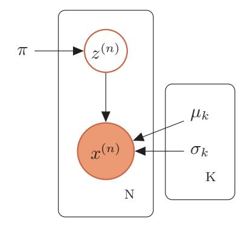

图 11.13 高斯混合模型

{29}------------------------------------------------

高斯混合模型的概率密度函数为

11.4学习

$$
p(x) = \sum_{k=1}^{K} \pi_k \mathcal{N}(x | \mu_k, \sigma_k),
$$
\n(11.98)

其中πk表示第k个高斯分布的权重系数并满足πk  $\leq 0$ ,  $\sum_{k=1}^{K}$  πk = 1, 即样本 x 由第k个高斯分布产生的先验概率。

高斯混合模型的生成过程可以分为两步:

- 1. 首先按 $\pi_1, \pi_2, \cdots, \pi_K$ 的分布, 随机选取一个高斯分布;
- 2. 假设选中第k个高斯分布,再从高斯分布 $\mathcal{N}(x|\mu_k, \sigma_k)$ 中选取一个样本 $x$ 。

参数估计 给定  $N$  个由高斯混合模型生成的训练样本  $x^{(1)}, x^{(2)}, \cdots, x^{(N)}$ , 希望 能学习其中的参数πk, μk, σk, 1 ≤ k ≤ K。由于我们无法观测样本  $x^{(n)}$ 是从哪个 高斯分布生成的,因此无法直接用最大似然来进行参数估计。我们引入一个隐 变量 $z^{(n)} \in [1, K]$ 来表示其来自于哪个高斯分布,  $z^{(n)}$ 服从多项分布, 其多项分 布的参数为 $\pi_1, \pi_2, \cdots, \pi_K$ ,即

$$
p(z^{(n)} = k) = \pi_k.
$$
\n(11.99)

对每个样本 $x^{(n)}$ , 其对数边际分布为

$$
\log p(x^{(n)}) = \log \sum_{z^{(n)}} p(z^{(n)}) p(x^{(n)} | z^{(n)}) \tag{11.100}
$$

$$
= \log \sum_{k=1}^{K} \pi_k \mathcal{N}(x^{(n)} | \mu_k, \sigma_k).
$$
 (11.101)

根据 EM 算法, 参数估计可以分为两步进行迭代:

**E** 步 先固定参数 μ, σ, 计算后验分布  $p(z^{(n)}|x^{(n)})$ 

$$
\gamma_{nk} \triangleq p(z^{(n)} = k|x^{(n)}) \tag{11.102}
$$

$$
= \frac{p(z^{(n)})p(x^{(n)}|z^{(n)})}{p(x^{(n)})}
$$
(11.103)

$$
= \frac{\pi_k \mathcal{N}(x^{(n)}|\mu_k, \sigma_k)}{\sum_{k=1}^K \pi_k \mathcal{N}(x^{(n)}|\mu_k, \sigma_k)},
$$
\n(11.104)

其中 $\gamma_{nk}$ 定义了样本 $x^{(n)}$ 属于第k个高斯分布的后验概率。

#### 邱锡鹏:《神经网络与深度学习》

{30}------------------------------------------------

M步 令 $q(z = k) = \gamma_{nk}$ , 训练集 $D$ 的证据下界为

$$
ELBO(\gamma, \mathcal{D} | \pi, \mu, \sigma) = \sum_{n=1}^{N} \sum_{k=1}^{K} \gamma_{nk} \log \frac{p(x^{(n)}, z^{(n)} = k)}{\gamma_{nk}}
$$
(11.105)

$$
= \sum_{n=1}^{N} \sum_{k=1}^{K} \gamma_{nk} \left( \log \mathcal{N}(x^{(n)} | \mu_k, \sigma_k) + \log \frac{\pi_k}{\gamma_{nk}} \right) \tag{11.106}
$$

$$
= \sum_{n=1}^{N} \sum_{k=1}^{K} \gamma_{nk} \left( \frac{-(x - \mu_k)^2}{2\sigma_k^2} - \log \sigma_k + \log \pi_k \right) + C, \tag{11.107}
$$

其中C为和参数无关的常数。

将参数估计问题转为优化问题:

$$
\max_{\pi,\mu,\sigma} ELBO(\gamma, \mathcal{D}|\pi, \mu, \sigma),
$$
  
s.t. 
$$
\sum_{k=1}^{K} \pi_k = 1.
$$
 (11.108)

利用拉格朗日方法, 分别求 ELBO(γ, D|π, μ, σ) +  $\lambda(\sum_{k=1}^{K}$ π $_k$  - 1) 关于  $\pi_k, \mu_k, \sigma_k$ 的偏导数,并令其等于0。可得,

$$
\pi_k = \frac{N_k}{N},\tag{11.109}
$$

$$
\mu_k = \frac{1}{N_k} \sum_{n=1}^{N} \gamma_{nk} x^{(n)},\tag{11.110}
$$

$$
\sigma_k = \frac{1}{N_k} \sum_{n=1}^{N} \gamma_{nk} (x^{(n)} - \mu_k)^2,
$$
\n(11.111)

$$
\& \mathcal{R} \cup \exists \mathcal{L} \in \{11-6\}.
$$

其中

$$
N_k = \sum_{n=1}^{N} \gamma_{nk}.
$$
\n(11.112)

#### 邱锡鹏:《神经网络与深度学习》

{31}------------------------------------------------

 $\overline{\phantom{a}}$ 

# 2018年5月21日

高斯混合模型的参数学习过程如算法11.3所示。

| 算法 11.3: 高斯混合模型的参数学习算法                                                                                     |  |  |  |  |
|------------------------------------------------------------------------------------------------------------|--|--|--|--|
| 输入: 训练样本: $x^{(1)}, x^{(2)}, \cdots, x^{(N)}$ ;                                                            |  |  |  |  |
| 1 随机初始化参数: $\pi_k, \mu_k, \sigma_k$ , $1 \leq k \leq K$ ;                                                  |  |  |  |  |
| 2 repeat                                                                                                   |  |  |  |  |
| // E步                                                                                                      |  |  |  |  |
| 3   固定参数, 根据公式(11.104)计算 $\gamma_{nk}$ , $1 \leq k \leq K$ ,, $1 \leq n \leq N$ ;                          |  |  |  |  |
| // M步                                                                                                      |  |  |  |  |
|                                                                                                            |  |  |  |  |
| 4   固定 $\gamma_{nk}$ , 根据公式 (11.109), (11.110)和 (11.111), 计算 $\pi_k, \mu_k, \sigma_k, 1 \leq k \leq K;$ |  |  |  |  |
| 5 until 对数边际分布 $\sum_{n=1}^{N} \log p(x^{(n)})$ 收敛;                                                        |  |  |  |  |
| 输出: $\pi_k, \mu_k, \sigma_k, 1 \leq k \leq K$                                                              |  |  |  |  |

图11.14给出一个高斯混合模型训练过程的简单示例。给定一组数据, 我们 用两个高斯分布来估计这组数据的分布情况。

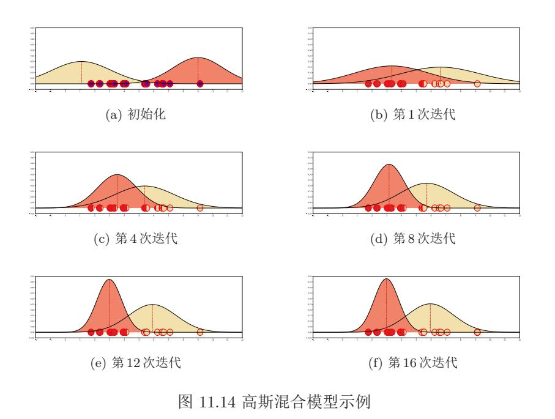

221

{32}------------------------------------------------

#### 11.5 总结和深入阅读

概率图模型提供了一个用图形来描述概率模型的框架, 这种可视化方法使 我们可以更加容易地理解复杂模型的内在性质。目前, 概率图模型已经是一个 非常庞大的研究领域, 涉及众多的模型和算法。很多机器学习模型也都可以用 概率图模型来描述。图11.15给出了概率图模型所涵盖的内容。

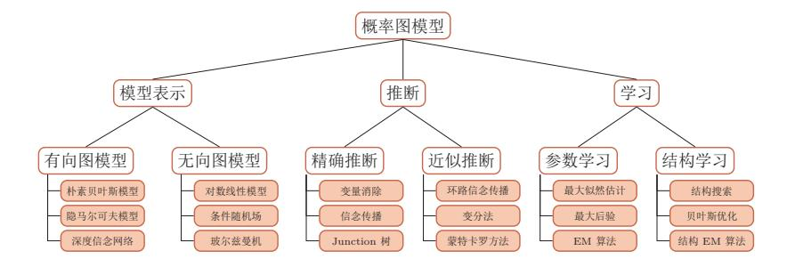

图 11.15 概率图模型所涵盖内容的简单概括

在本章中,我们只介绍了部分内容。要更全面深入地了解概率图模型,可以 阅读 《Probabilistic Graphical Models: Principles and Techniques》 [Koller and Friedman, 2009], 《Probabilistic Reasoning in Intelligent Systems: Networks of Plausible Inference》[Pearl, 2014], 或机器学习书籍中的相关章节 [Bishop,  $2007$ .

概率图模型中最基本的假设是条件独立性。图形化表示直观地描述了随机 变量之间的条件独立性, 有利于将复杂的概率模型分解为简单模型的组合, 并 更好地理解概率模型的表示、推断、学习等方法。

20世纪90年代末, 概率图模型的研究逐步成熟。到21世纪, 图模型在机器 学习、计算机视觉、自然语言处理等领域开始不断的发展壮大。其中比较有代 表性的模型有: 条件随机场 [Lafferty et al., 2001]、潜在狄利克雷分配(Latent Dirichlet Allocation) Blei et al. [2003] 等。此外, 图模型的结构学习也一直是 非常重要但极具挑战性的研究方向。

图模型与神经网络的关系 图模型和神经网络有着类似的网络结构,但两者也有 很大的不同。图模型的节点是随机变量, 其图结构的主要功能是用来描述变量 之间的依赖关系,一般是稀疏连接。使用图模型的好处是可以有效进行统计推

{33}------------------------------------------------

断。而神经网络中的节点是神经元,是一个计算节点。如果将神经网络中每个 神经元看做是一个二值随机变量, 那神经网络就变成一个 sigmoid 信念网络。

图模型中的每个变量一般有着明确的解释, 变量之间依赖关系一般是人工 来定义。而神经网络中的单个神经元则没有直观的解释。

神经网络是判别模型, 直接用来分类。而图模型不但可以是判别模型, 也 可以是生成模型。生成模型不但可以用来生成样本, 也可以通过贝叶斯公式用 来做分类。图模型的参数学习的目标函数为似然函数或条件似然函数,若包含 隐变量则通常通过EM 算法来求解。而神经网络参数学习的目标为交叉熵或平 方误差等损失函数。

目前, 神经网络和概率图模型的结合越来越进行紧密。一方面我们可以利 用神经网络强大的表示能力来建模图模型中的推断问题(比如变分自编码器, 第13.2节), 生成问题(比如生成对抗网络, 第13.3节), 或势能函数(比如 LSTM+CRF模型 [Lample et al., 2016, Ma and Hovy, 2016]);另一方面可以利 用图模型的算法来解决复杂结构神经网络中的学习和推断问题,比如图结构神 经网络 (Graph Neural Network) [Gilmer et al., 2017, Li et al., 2015, Scarselli et al., 2009] 和结构化注意力 [Kim et al., 2017]。

# 习题

习题 11-1 证明公式 (11.10)。

参见公式(11.10)。

习题 11-2 在图11.2a的有向图, 分析按不同的消除顺序计算边际概率  $p(x_3)$ 时的计算复杂度。

习题11-3 在树结构的图模型上应用信念传播时, 推导其消息计算公式。

习题11-4 证明若分布  $p(x)$ 存在累积分布函数的逆函数 cdf-1(y),  $y \in [0,1]$ , 参见第11.3.1节。 且随机变量 $\xi \in \mathcal{S}$  [0,1] 区间上的均匀分布, 则cdf-1( $\xi$ ) 服从分布  $p(x)$ 。

习题 11-5 证明仅当  $q(\mathbf{z}) = p(\mathbf{z}|\mathbf{x}, \theta)$ 时, 对数边际似然函数  $\log p(\mathbf{x}|\theta)$  和其 下界  $ELBO(q, \mathbf{x}|\theta)$ 相等。

邱锡鹏:《神经网络与深度学习》

{34}------------------------------------------------

习题 11-6 在高斯混合分布的参数估计中, 证明 M 步中的参数更新公式, 即公式(11.109), (11.110)和(11.111)。

习题 11-7 考虑一个伯努利混合分布, 即

$$
p(x|\mu, \pi) = \sum_{k=1}^{K} \pi_k p(x|\mu_k),
$$
\n(11.113)

伯努利混合分布参见 第D.2.1.1节。

其中 $p(x|\mu_k) = \mu_k^x (1 - \mu_k)^{(1-x)}$ 为伯努利分布。

给定一组训练集合 $D = \{x^{(1)}, x^{(2)}, \cdots, x^{(N)}\}$ ,若用EM算法来进行参数估 计时, 推导其每步的参数更新公式。

Leonard E Baum and Ted Petrie. Statistical inference for probabilistic functions of finite state markov chains. The annals of mathematical statistics, 37(6): 1554-1563, 1966.

Adam L Berger, Vincent J Della Pietra, and Stephen A Della Pietra. A maximum entropy approach to natural language processing. Computational linguistics, 22(1):39-71, 1996.

Christopher M. Bishop. Pattern recognition and machine learning, 5th Edition. Information science and statistics. Springer, 2007. ISBN 9780387310732.

David M Blei, Andrew Y Ng, and Michael I Jordan. Latent dirichlet allocation. Journal of machine Learning research, 3(Jan):993-1022, 2003.

Stephen  $\operatorname{Della}$ Pietra, Vincent Della Pietra. and John Lafferty. Inducing features of random fields. IEEE transactions on pattern analysis and machine intelligence, 19(4): 380-393, 1997.

参考文献

Justin Gilmer, Samuel S Schoenholz, Patrick F Riley, Oriol Vinyals, and George E Dahl. Neural message passing for quantum chemistry.  $arXiv$  preprint arXiv:1704.01212, 2017.

Yoon Kim, Carl Denton, Luong Hoang, and Alexander M Rush. Structured  $\quad$  attention  $\:$  networks.  $arXiv$  preprint arXiv:1702.00887, 2017.

Daphne Koller and Nir Friedman. Probabilistic graphical models: principles and techniques. MIT press, 2009.

John D. Lafferty, Andrew McCallum, and Fernando C. N. Pereira. Conditional random fields: Probabilistic models for segmenting and labeling sequence data. In Proceedings of the Eighteenth International Conference on Machine Learning, 2001.

{35}------------------------------------------------

Guillaume Lample, Miguel Ballesteros, Sandeep Subramanian, Kazuya Kawakami, and Chris Dyer. Neural architectures for named entity recognition.  $arXiv$  preprint  $arXiv:1603.01360$ , 2016.

Steffen L Lauritzen and David J Spiegelhalter. Local computations with probabilities on graphical structures and their application to expert systems. Journal of the Royal Statistical Society. Series B (Methodological), pages  $157-224$ , 1988. Yujia Li, Daniel Tarlow, Marc Brockschmidt, and Richard Zemel. Gated graph sequence neural networks.  $arXiv$  preprint  $arXiv:1511.05493, 2015.$ 

Xuezhe Ma and Eduard Hovy. Endto-end sequence labeling via bidirectional lstm-cnns-crf.  $arXiv$  preprint  $arXiv:1603.01354, 2016.$ 

Radford M Neal. Connectionist learning of belief networks. Artificial intelligence,  $56(1):71-113, 1992.$ 

Judea Pearl. Probabilistic reasoning in intelligent systems: networks of plausible inference. Elsevier, 2014.

Franco Scarselli, Marco Gori, Ah Chung Markus Hagenbuchner, Tsoi, and Gabriele Monfardini. The graph neural network model. IEEE Transactions on Neural Networks, 20(1):61-80, 2009.