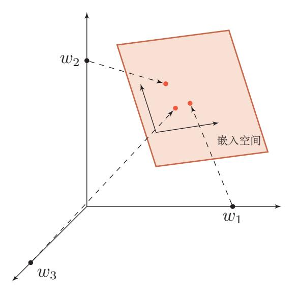

{0}------------------------------------------------

# 第1章 绪论

一个人在不接触对方的情况下, 通过一种特殊的方式, 和 对方进行一系列的问答。如果在相当长时间内, 他无法根据这 些问题判断对方是人还是计算机,那么就可以认为这个计算机 是智能的。

— 阿兰 · 图灵 [1950], 《Computing Machinery and Intelligence 》

· 深度学习 (Deep Learning) 是近年来发展十分迅速的研究领域,并且在人 工智能的很多子领域都取得了巨大的成功。从根源来讲,深度学习是机器学习 的一个分支, 是指一类问题以及解决这类问题的方法。

首先, 深度学习问题是一个机器学习问题, 指从有限样例中, 通过算法总 结出一般性的规律,并可以应用到新的未知数据上。比如,我们可以从一些历 史病例的集合, 总结出症状和疾病之间的规律。这样当有新的病人时, 我们可 以利用总结出来的规律,来判断这个病人得了什么疾病。

其次, 和传统的机器学习不同, 深度学习采用的模型一般比较复杂, 指样 本的原始输入到输出目标之间的数据流经过多个线性或非线性的组件 (components)。因为每个组件都会对信息进行加工,并进而影响后续的组件。当我们 最后得到输出结果时,我们并不清楚其中每个组件的贡献是多少。这个问题叫 做贡献度分配问题 (Credit Assignment Problem, CAP) [Minsky, 1963]。在深 度学习中, 贡献度分配问题是一个很关键的问题, 这关系到如何学习每个组件 中的参数。

目前可以比较好解决贡献度分配问题的模型是人工神经网络(Artificial Neural Network, ANN)。人工神经网络, 也简称神经网络, 是一种受人脑神经系 统的工作方式启发而构造的一种数学模型。和目前计算机的结构不同, 人脑神 经系统是一个由生物神经元组成的高度复杂网络,是一个并行的非线性信息处 理系统。人脑神经系统可以将声音、视觉等信号经过多层的编码, 从最原始的 低层特征不断加工、抽象, 最终得到原始信号的语义表示。和人脑神经网络类

贡献度分配问题也经常 翻译为信用分配问题或 功劳分配问题。

{1}------------------------------------------------

似, 人工神经网络是由人工神经元以及神经元之间的连接构成, 其中有两类特 殊的神经元: 一类是用来接收外部的信息, 另一类是输出信息。这样, 神经网络 可以看作是信息从输入到输出的信息处理系统。如果我们把神经网络看作是由 一组参数控制的复杂函数,并用来处理一些模式识别任务(比如语音识别、人 脸识别等)时, 神经网络的参数可以通过机器学习的方式来从数据中学习。由 于神经网络模型一般比较复杂, 从输入到输出的信息传递路径一般比较长, 所 以复杂神经网络的学习可以看成是一种深度的机器学习, 即深度学习。

神经网络和深度学习并不等价。深度学习可以采用神经网络模型, 也可以 采用其它模型(比如深度信念网络是一种概率图模型)。但是由于神经网络模型 可以比较容易地解决贡献度分配问题, 因此神经网络模型成为深度学习中主要 采用的模型。虽然深度学习一开始用来解决机器学习中的表示学习问题, 但是 由于其强大的能力,深度学习越来越多地用来解决一些通用人工智能问题,比 如推理、决策等。

在本书中, 我们主要介绍有关神经网络和深度学习的基本概念、相关模型、 学习方法以及在计算机视觉、自然语言处理等领域的应用。在本章中, 我们先 介绍下人工智能的基础知识, 然后再介绍神经网络和深度学习的基本概念。

#### 人工智能 $1.1$

智能(intelligence)是现代生活中很常见的一个词,比如智能手机、智能家 居、智能驾驶等。在不同使用场合中,智能的含义也不太一样。比如"智能手 机"中的"智能"一般是指由计算机控制并具有某种智能行为的意思。这里的 "计算机控制" + "智能行为" 隐含了对人工智能的简单定义。

简单地讲, 人工智能 (artificial intelligence, AI) 就是让机器具有人类的 智能,这也是人们长期追求的目标。这里关于什么是"智能"并没有一个很明 确的定义, 但一般认为智能(或特指人类智能)是知识和智力的总和, 都和大 脑的思维活动有关。人类大脑是经过了上亿年的进化才形成了如此复杂的结构, 但至今仍然没有完全了解。虽然随着神经科学、认知心理学等学科的发展, 人 们对大脑的结构有了一定程度的了解,但对大脑的智能究竟怎么产生的还知道 的很少。我们并不理解大脑的运作原理,以及如何产生意识、情感、记忆等功 能。因此, 通过"复制"一个人脑来实现人工智能在目前阶段是不切实际的。

1950年, 阿兰·图灵(Alan Turing)发表了一篇有着重要影响力的论文 《Computing Machinery and Intelligence》,讨论了创造一种"智能机器"的可 能性。由于"智能"一词比较难以定义,他提出了著名的图灵测试:"一个人在 不接触对方的情况下, 通过一种特殊的方式, 和对方进行一系列的问答。如果 在相当长时间内, 他无法根据这些问题判断对方是人还是计算机, 那么就可以 认为这个计算机是智能的"。图灵测试是促使人工智能从哲学探讨到科学研究

"智能"可以理解为"智 力"和"能力"。前者是 智能的基础,后者是指 获取和运用知识求解的 能力。

表示学习参见第1.4节。

4

https://nndl.github.io/

{2}------------------------------------------------

的一个重要因素, 引导了人工智能的很多研究方向。因为要使得计算机能通过 图灵测试, 计算机必须具备理解语言、学习、记忆、推理、决策等能力。这样, 人工智能就延伸出了很多不同的子学科,比如机器感知(计算机视觉、语音信 息处理), 学习(模式识别、机器学习、强化学习), 语言(自然语言处理)、记 忆(知识表示)、决策(规划、数据挖掘)等。所有这些研究领域都可以看成是 人工智能的研究范畴。

人工智能是计算机科学的一个分支, 主要研究、开发用于模拟、延伸和扩 展人类智能的理论、方法、技术及应用系统等。和很多其它学科不同, 人工智能 这个学科的诞生有着明确的标志性事件, 就是1956年的达特茅斯(Dartmouth) 会议。在这次会议上,"人工智能"被提出并作为本研究领域的名称。同时,人 工智能研究的使命也得以确定。John McCarthy 提出了人工智能的定义: 人エ 智能就是要让机器的行为看起来就像是人所表现出的智能行为一样。

目前, 人工智能的主要领域大体上可以分为以下几个方面:

- 感知 即模拟人的感知能力, 对外部刺激信息(视觉和语音等) 进行感知和加工。 主要研究领域包括语音信息处理和计算机视觉等。
- 学习 即模拟人的学习能力, 主要研究如何从样例或与环境交互中进行学习。主 要研究领域包括监督学习、无监督学习和强化学习等。
- 认知 即模拟人的认知能力,主要研究领域包括知识表示、自然语言理解、推理、 规划、决策等。

#### 人工智能的发展历史 $1.1.1$

人工智能从诞生至今, 经历了一次又一次的繁荣与低谷, 其发展历程大体 上可以分为"推理期", "知识期"和"学习期"[周志华, 2016]。

### 1.1.1.1 推理期

1956年达特茅斯会议之后, 研究者对人工智能的热情高涨, 之后的十几年 是人工智能的黄金时期。大部分早期研究者都通过人类的经验, 基于逻辑或者 事实归纳出来一些规则, 然后通过编写程序来让计算机完成一个任务。这个时 期中, 研究者开发了一系列的智能系统, 比如几何定理证明器、语言翻译器等。 这些初步的研究成果也使得研究者们对开发出具有人类智能的机器过于乐观, 低估了实现人工智能的难度。有些研究者们甚至认为:"二十年内,机器将能完 成人能做到的一切工作","在三到八年的时间里可以研发出一台具有人类平均 智能的机器"。但随着研究的深入,研究者意识到这些推理规则过于简单,对项 目难度评估不足, 原来的乐观预期受到严重打击。人工智能的研究开始陷入低 谷,很多人工智能项目的研究经费也被消减。

John McCarthy (1927-2011), 人工智能学科奠 基人之一, 1971年图灵 奖得主。

人工智能低谷,也叫人工 智能冬天 (AI Winter), 指人工智能史上资金及 学术界研究兴趣都大幅 减少的时期。人工智能 领域经历过好几个技术 成熟度曲线, 紧接着是 失望及批评,以及研究 资金断绝, 紧接着在几 十年后重燃的研究兴趣。 1974-80年及1987-93年 是两个主要的低谷时期, 其他还有几个较小的低 谷。

{3}------------------------------------------------

### 1.1.1.2 知识期

到了20世纪70年代,研究者意识到知识对于人工智能系统的重要性。特别 是对于一些复杂的任务, 需要专家来构建知识库。在这一时期, 出现了各种各 样的专家系统(Expert System),并在特定的专业领域取得了很多成果。专家 系统可以简单理解为"知识库+推理机",是一类具有专门知识和经验的计算 机智能程序系统。专家系统一般采用知识表示和知识推理等技术来完成通常由 领域专家才能解决的复杂问题, 因此专家系统也被称为基于知识的系统。一个 专家系统必须具备三要素: (1) 领域专家级知识; (2) 模拟专家思维; (3) 达 到专家级的水平。在这一时期, Prolog (Programming in Logic) 语言是主要的 开发工具, 用来建造专家系统、自然语言理解、智能知识库等。

Prolog是一种基于逻辑 学理论而创建的逻辑编 程语言, 最初被运用于 自然语言、逻辑推理等 研究领域。

### 1.1.1.3 学习期

对于人类的很多智能行为(比如语言理解、图像理解等),我们很难知道其 中的原理,也无法描述出这些智能行为背后的"知识"。因此,我们也很难通过 知识和推理的方式来实现这些行为的智能系统。为了解决这类问题,研究者开 始将研究重点转向让计算机从数据中自己学习。事实上,"学习"本身也是一种 智能行为。从人工智能的萌芽时期开始, 就有一些研究者尝试让机器来自动学 习。机器学习的主要目的是设计和分析一些学习算法, 让计算机从数据中自动 分析获得规律,并利用规律对未知数据进行预测的算法,从而可以帮助人们解 决一些特定任务, 提高效率。机器学习的研究内容也十分广泛, 涉及了概率论、 统计学、逼近论、凸分析、计算复杂性理论等多门学科。对于人工智能来说, 机 器学习从一开始就是一个重要的研究方向。但直到1980年后, 机器学习因其在 很多领域的出色表现,才逐渐成为热门学科。

图1.1给出了人工智能发展史上的重要事件。在发展了60多年后,人工智能 虽然可以在某些方面超越人类, 但想让机器真正通过图灵测试, 具备真正意义 上的人类智能,这个目标看上去仍然遥遥无期。

图 1.1 人工智能发展史

{4}------------------------------------------------

# 1.1.2 人工智能的流派

目前我们对人类智能机理依然知之甚少, 还没有一个通用的理论来指导如 何构建一个人工智能系统。不同的研究者都有各自的理解,因此在人工智能的 研究过程中产生了很多不同的流派。比如一些研究者认为人工智能应该通过研 究人类智能的机理来构建一个仿生的模拟系统,而另外一些研究者则认为可以 使用其它方法来实现人类的某种智能行为。一个著名的例子是让机器具有飞行 能力不需要模拟鸟的飞行方式,而是应该研究空气动力学。

尽管人工智能的流派非常多,但主流的方法大体上可以归结为以下两种:

符号主义 符号主义 (symbolism), 又称逻辑主义、心理学派或计算机学派, 是 通过分析人类智能的功能, 然后通过计算机来实现这些功能。符号主义有两个 基本假设: (1) 信息可以用符号来表示; (2) 符号可以通过显式的规则(比如 逻辑运算)来操作。人类的认知认知过程可以看作是符号操作过程。在人工智 能的推理期和知识期, 符号主义的方法比较盛行, 并取得了大量的成果。

连接主义 连接主义 (connectionism), 又称仿生学派或生理学派, 是认知科学 领域中的一类信息处理的方法和理论。在认知科学领域, 人类的认知过程可以 看做是一种信息处理过程。连接主义认为人类的认知过程是由大量简单神经元 构成的神经网络中的信息处理过程,而不是符号运算。因此,联结主义模型的 主要结构是由大量的简单的信息处理单元组成的互联网络,具有非线性、分布 式、并行化、局部性计算以及适应性等特性。

符号主义方法的一个优点是可解释性,而这也正是连接主义方法的弊端。深 度学习的主要模型神经网络就是一种连接主义模型。随着深度学习的发展, 越 来越多的研究者开始关注如何融合符号主义和连接主义, 建立一种高效并且具 有可解释性的模型。

#### 神经网络 $1.2$

随着神经科学、认知科学的发展, 我们逐渐知道人类的智能行为都和大脑 活动有关。人类大脑是一个可以产生意识、思想和情感的器官。受到人脑神经 系统的启发, 早期的神经科学家构造了一种模仿人脑神经系统的数学模型, 称 为人工神经网络, 简称神经网络。在机器学习领域, 神经网络是指由很多人工 神经元构成的网络结构模型,这些人工神经元之间的连接强度是可学习的参数。

#### 大脑神经网络 $1.2.1$

人类大脑是人体最复杂的器官, 由神经元、神经胶质细胞、神经干细胞和 血管组成。其中, 神经元 (Neuron), 也叫神经细胞 (Nerve Cell), 是携带和 

{5}------------------------------------------------

传输信息的细胞, 是人脑神经系统中最基本的单元。人脑神经系统是一个非常 复杂的组织, 包含近860亿个神经元 [Azevedo et al., 2009], 每个神经元有上千 个突触和其它神经元相连接。这些神经元和它们之间的连接形成巨大的复杂网 络, 其中神经连接的总长度可达数千公里。我们人造的复杂网络, 比如全球的 计算机网络,和大脑神经网络相比要"简单"得多。

早在1904年,生物学家就已经发现了神经元的结构。典型的神经元结构大 致可分为细胞体和细胞突起。

- · 细胞体 (Soma) 中的神经细胞膜上有各种受体和离子通道, 胞膜的受体 可与相应的化学物质神经递质结合,引起离子通透性及膜内外电位差发生 改变, 产生相应的生理活动: 兴奋或抑制。
- 细胞突起是由细胞体延伸出来的细长部分, 又可分为树突和轴突。
  - 树突 (Dendrite) 可以接受刺激并将兴奋传入细胞体。每个神经元可 以有一或多个树突。
  - 轴突 (Axons) 可以把自身的兴奋状态从胞体传送到另一个神经元或 其他组织。每个神经元只有一个轴突。

神经元可以接受其它神经元的信息,也可以发送信息给其它神经元。神经元 之间没有物理连接,中间留有20纳米左右的缝隙。神经元之间靠突触(Svnapse) 讲行互联来传递信息, 形成一个神经网络, 即神经系统。突触可以理解为神经 元之间的链接"接口",将一个神经元的兴奋状态传到另一个神经元。一个神经 元可被视为一种只有两种状态的细胞: 兴奋和抑制。神经元的状态取决于从其 它的神经细胞收到的输入信号量,及突触的强度(抑制或加强)。当信号量总和 超过了某个阈值时, 细胞体就会兴奋, 产生电脉冲。电脉冲沿着轴突并通过突 触传递到其它神经元。

图1.2给出了一种典型的神经元结构。

图 1.2 典型神经元结构1

{6}------------------------------------------------

我们知道,一个人的智力不完全由遗传决定,大部分来自于生活经验。也就 是说人脑神经网络是一个具有学习能力的系统。那么人脑神经网络是如何学习 的呢? 在人脑神经网络中, 每个神经元本身并不重要, 重要的是神经元如何组 成联接。不同神经元之间的突触有强有弱,其强度是可以通过学习(训练)来不 断改变的, 具有一定的可塑性。不同的连接形成了不同的记忆印痕。1949年, 加 拿大心理学家 Donald Hebb在《行为的组织》(The Organization of Behavior) 一书中提出突触可塑性的基本原理, "当神经元 A的一个轴突和神经元B很近, 足以对它产生影响, 并且持续地、重复地参与了对神经元B的兴奋, 那么在这 两个神经元或其中之一会发生某种生长过程或新陈代谢变化, 以致于神经元A 作为能使神经元B兴奋的细胞之一, 它的效能加强了。"这个机制称为赫布理 论(Hebbian Theory)或赫布法则(Hebb's Rule)。如果两个神经元总是相关 联地受到刺激, 它们之间的突触强度增加。这样的学习方法被称为赫布型学习 (Hebbian learning)。Hebb认为人脑有两种记忆: 长期记忆和短期记忆。短期 记忆持续时间不超过一分钟。如果一个经验重复足够的次数,此经验就可储存 在长期记忆中。短期记忆转化为长期记忆的过程就称为凝固作用。人脑中的海 马区为大脑结构凝固作用的核心区域。

## $1.2.2$ 人工神经网络

人工神经网络是一种模拟人脑神经网络而设计的数据模型或计算模型, 它 从结构、实现机理和功能上模拟人脑神经网络。人工神经网络与生物神经元类 似, 由多个节点(人工神经元)相互连接而成, 可以用来对数据之间的复杂关 系进行建模。不同节点之间的连接被赋予了不同的权重, 每个权重代表了一个 节点对另一个节点的影响大小。每个节点代表一种特定函数,来自其他节点的 信息经过其相应的权重综合计算, 输入到一个激励函数中并得到一个新的活性 值 (兴奋或抑制)。从系统观点看,人工神经元网络是由大量神经元通过极其丰 富和完善的连接而构成的自适应非线性动态系统。

虽然我们可以比较容易地构造一个人工神经网络, 但是如何让人工神经网 络具有学习能力并不是一件容易的事情。早期的神经网络模型并不具备学习能 力。首个可学习的人工神经网络是赫布网络, 采用一种基于赫布规则的无监督 学习方法。感知器是最早的具有机器学习思想的神经网络, 但其学习方法无法 扩展到多层的神经网络上。直到1980年左右,反向传播算法才有效地解决了多 层神经网络的学习问题,并成为最为流行的神经网络学习算法。

人工神经网络诞生之初并不是用来解决机器学习问题。由于人工神经网络 可以看作是一个通用的函数逼近器,一个两层的神经网络可以逼近任意的函数, 因此人工神经网络可以看作一个可学习的函数,并应用到机器学习中。理论上, Donald Hebb, 1904 -1985), 加拿大神经心 理学家, 认知心理生理 学的开创者。

 $\boldsymbol{9}$ 

感知器参见第3.3节。

&lt;sup>1 图片来源: https://commons.wikimedia.org/wiki/File:Neuron\_Hand-tuned.svg

{7}------------------------------------------------

只要有足够的训练数据和神经元数量, 人工神经网络就可以学到很多复杂的函 数。人工神经网络模型的塑造任何函数的能力大小可以称为网络容量(Network Capacity), 与可以被储存在网络中的信息的复杂度以及数量相关。

本书中描述的人工神经 网络主要是一种作为机 器学习的模型。

# 1.2.3 神经网络的发展历史

神经网络的发展大致经过五个阶段。

第一阶段: 模型提出 第一个阶段为1943~1969年, 是神经网络发展的第一个 高潮期。在此期间, 科学家们提出了许多神经元模型和学习规则。

在1943年, 心理学家 Warren McCulloch 和数学家 Walter Pitts 最早描述了 一种理想化的人工神经网络, 并构建了一种基于简单逻辑运算的计算机制。他 们提出的神经网络模型称为 MP模型。至此, 开启了神经网络研究的序幕。

阿兰·图灵在1948年的论文中描述了一种"B型图灵机"。之后,研究人员 将基于赫布型学习的思想应用到"B型图灵机"上。

1951年, McCulloch 和 Pitts 的学生 Marvin Minsky 建造了第一台神经网络 机 SNARC。

Rosenblatt [1958] 最早提出可以模拟人类感知能力的神经网络模型, 并称 之为感知器(Perceptron), 并提出了一种接近于人类学习过程(迭代、试错) 的学习算法。但感知器因其结构过于简单,不能解决简单的异或(XOR)等线 性不可分问题。

在这一时期, 神经网络以其独特的结构和处理信息的方法, 在许多实际应 用领域(自动控制领域、模式识别等)中取得了显著的成效。

第二阶段: 冰河期 第二阶段为1969年~1983年, 为神经网络发展的第一个低 谷期。在此期间, 神经网络的研究处于长年停滞及低潮状态。

1969年, Marvin Minsky 出版《感知机》一书, 指出了神经网络的两个关 键缺陷: 第一个是感知机无法处理异或回路问题; 第二个是当时的计算机无法 支持处理大型神经网络所需要计算能力。这些论断直接将以感知器为代表的神 经网络打入冷宫, 导致神经网络的研究进入了十多年的"冰河期"。

1974年, 哈佛大学的 Paul Webos 发明反向传播算法 (Backpropagation, BP), 但当时未受到应有的重视。

1980年, Fukushima [1980] (福岛邦彦) 提出了一种带卷积和子采样操作 的多层神经网络: 新知机(Neocognitron)。新知机的提出是受到了动物初级视 皮层简单细胞和复杂细胞的感受野的启发。但新知机并没有采用反向传播算法, 而是采用了无监督学习的方式来训练,因此没有引起足够的重视。

Marvin Minsky,  $1927 \sim$ 2016年, 人工智能领域 最重要的领导者和创新 者之一, 麻省理工学院 人工智能实验室的创始 人之一。因其在人工智 能领域的贡献, 1969年 获得图灵奖。

10

{8}------------------------------------------------

第三阶段: 反向传播算法引起的复兴 第三阶段为1983年~1995年, 为神经网 络发展的第二个高潮期。这个时期中,反向传播算法重新激发了人们对神经网 络的兴趣。

1983年, 加州理工学院的物理学家 John Hopfield 提出了一种用于联想记忆 和优化计算的神经网络, 称为 Hopfield 网络。Hopfield 网络在旅行商问题上获得 当时最好结果,并引起了轰动。

1984年, Geoffrey Hinton 提出一种随机化版本的 Hopfield 网络, 即玻尔兹 曼机。

真正引起神经网络第二次研究高潮的是反向传播算法。1986年,David Rumelhart 和 James McClelland 对于连接主义在计算机模拟神经活动中的应用提供了 全面的论述,并重新发明了反向传播算法。Geoffrey Hinton 等人将引入到多层 感知器 [Williams and Hinton, 1986], 人工神经网络才又重新引起人们的注意, 并开始成为新的研究热点。随后, LeCun et al. [1989] 将反向传播算法引入了卷 积神经网络,并在手写体数字识别上取得了很大的成功 [LeCun et al., 1998]。反 向传播算法是迄今最为成功的神经网络学习算法,不仅用于多层前馈神经网络, 还用于其他类型神经网络的训练。

第四阶段: 流行度降低 第四个阶段为1995~2006年, 在此期间, 支持向量机 和其他更简单的方法(例如线性分类器)在机器学习领域的流行度逐渐超过了 神经网络。

虽然神经网络可以很容易地增加层数、神经元数量,而从构建复杂的网络, 但其计算复杂性也会指数级增长。当时的计算机性能和数据规模不足以支持训 练大规模的神经网络。在20世纪90年代中期,统计学习理论和以支持向量机为 代表的机器学习模型开始兴起。相比之下, 神经网络的理论基础不清晰、优化 困难、可解释性差等缺点更加凸显, 神经网络的研究又一次陷入低潮。

第五阶段: 深度学习的崛起 2006年, Hinton and Salakhutdinov [2006] 发现多 层前馈神经网络可以先通过逐层预训练,再用反向传播算法进行精调的方式进 行有效学习。随着深度的人工神经网络在语音识别 [Hinton et al., 2012] 和图像 分类 [Krizhevsky et al., 2012] 等任务上的巨大成功, 以神经网络为基础的"深 度学习"迅速崛起。近年来,随着大规模并行计算以及GPU设备的普及,计算 机的计算能力得以大幅提高。此外,可供机器学习的数据规模也越来越大。在计 算能力和数据规模的支持下, 计算机已经可以训练大规模的人工神经网络。各 大科技公司都投入巨资研究深度学习, 神经网络迎来第三次高潮。

参见第8.2.4.1节。

玻尔兹曼机参见 第12.1节。

{9}------------------------------------------------

#### 机器学习 1.3

机器学习(Machine Learning, ML)是从有限的观测数据中学习(或"猜 测")出具有一般性的规律,并可以将总结出来的规律推广应用到未观测样本 上。

传统的机器学习主要关注于如何学习预测函数。一般需要首先将数据表示 为一组特征(feature), 特征的表示形式可以是连续的数值、离散的符号或其 它形式。然后预测函数将这些特征作为输入,并输出预测结果。这类机器学习 可以看作是浅层学习(Shallow Learning)。浅层学习的一个重要特点是不涉及 特征学习, 其特征主要靠人工经验或特征转换方法来抽取。

当我们用机器学习来解决实际任务时, 会面对多种多样的数据形式, 比如 声音、图像、文本等。像图像这类数据很自然地可以表示为一个连续的向量。而 文本数据一般由离散符号组成。特别是计算机内部, 每个符号都是表示为无意 义的编码,很难找到合适的表示方式。因此,在实际任务中使用机器学习模型 一般会包含以下几个步骤(如图1.3所示):

图 1.3 传统机器学习的数据处理流程

- 数据预处理: 经过数据的预处理, 如去除噪声等。比如在文本分类中, 去 除停用词等。
- 特征提取: 从原始数据中提取一些有效的特征。比如在图像分类中, 提取 边缘、尺度不变特征变换 (Scale Invariant Feature Transform, SIFT) 特 征等。
- 特征转换: 对特征进行一定的加工, 比如降维和升维。降维包括特征抽取 (Feature Extraction)和特征选择(Feature Selection)两种途径。常用的 特征转换方法有主成分分析(Principal components analysis, PCA)、线 性判别分析 (Linear Discriminant Analysis) 等。

是机器学习方法。

• 预测: 机器学习的核心部分, 学习一个函数进行预测。

上述流程中, 每步特征处理以及预测一般都是分开讲行处理的。传统的机 器学习模型主要关注于最后一步, 即构建预测函数。但是实际操作过程中, 不 同预测模型的性能相差不多, 而前三步中的特征处理对最终系统的准确性有着 十分关键的作用。由于特征处理一般都需要人工干预完成, 利用人类的经验来 选取好的"特征",并最终提高机器学习系统的性能。因此,很多的模式识别问

机器学习的详细介绍参

比如图像直接将像素的

颜色值(灰度值或RGB

值)组成一个连续向量。

很多特征转换方法也都

见第2章。

{10}------------------------------------------------

题变成了特征工程(Feature Engineering)问题。开发一个机器学习系统的主 要工作量都消耗在了预处理和特提取以及特征转换上。

#### 表示学习 $1.4$

为了提高机器学习系统的准确率, 我们就需要将输入信息转换为有效的特 征, 或者更一般性称为表示 (representation) 。如果有一种算法可以自动地学 习出有效的特征,并提高最终机器学习模型的性能,那么这种学习就是可以叫 做表示学习 (Representation Learning)。

语义鸿沟 表示学习的关键是解决语义鸿沟 (Semantic Gap) 问题。语义鸿沟问 题是指输入数据的底层特征和高层语义信息之间的不一致性和差异性。比如给 定一些关于"车"的图片,由于图片中每辆车的颜色和形状等属性都不尽相同, 不同图片在像素级别上的表示(即底层特征)差异性也会非常大。但是我们人 理解这些图片是建立在比较抽象的高层语义概念上的。如果一个预测模型直接 建立在底层特征之上, 会导致对预测模型的能力要求过高。如果可以有一个好 的表示在某种程度上可以反映出数据的高层语义特征, 那么我们就可以相对容 易地构建后续的机器学习模型。

在表示学习中,有两个核心问题:一是"什么是一个好的表示?";二是"如 何学习到好的表示?"

#### $1.4.1$ 局部表示和分布式表示

"好的表示"是一个非常主观的概念, 没有一个明确的标准。但一般而言, 一个好的表示具有以下几个优点:

- 一个好的表示应该具有很强的表示能力, 即同样大小的向量可以表示更多 信息。
- 一个好的表示应该使后续的学习任务变得简单, 即需要包含更高层的语义 信息。
- 一个好的表示应该具有一般性, 是任务或领域独立的。虽然目前的大部分 表示学习方法还是基于某个任务来学习, 但我们期望其学到的表示可以比 较容易的迁移到其它任务上。

在传统机器学习中,我们经常使用两种方式来表示特征: 局部表示(Local Representation) 和分布式表示 (Distributed Representation).

以颜色表示为例, 我们一般有两种表示方法。

邱锡鹏:《神经网络与深度学习》

{11}------------------------------------------------

以颜色表示为例,我们有很多词来形容颜色的词1,除了基本的"红"、"蓝"、 "绿"、"白"、"黑"等之外, 有很多以地区或物品命名的, 比如"中国红"、"天 蓝色"、"咖啡色"、"琥珀色"等等。

一种表示颜色的方式是以不同名字来命名不同的颜色,这种表示方式叫做 局部表示,也称为离散表示或符号表示。局部表示通常可以表示为one-hot 向量 的形式。假设所有颜色的名字构成一个词表 V, 词表大小为 | V|。我们可以用一 个 |V| 维的 one-hot 向量来表示每一种颜色。第  $i$  种颜色的 one-hot 向量中, 第  $i$ 维的值为1, 其它都为0。

局部表示有两个不足之处: (1) one-hot 向量的维数很高, 且不能扩展。如 果有一种新的颜色, 我们就需要增加一维来表示; (2) 不同颜色之间的相似度 都为0, 即我们无法知道"红色"和"中国红"的相似度要比"红色"和"黑色" 的相似度要高。

另一种表示颜色的方式是用RGB值来表示颜色,不同颜色对应到R、G、B 三维空间中一个点, 这种表示方式叫做分布式表示。分布式表示通常可以表示 为低维的稠密向量。

分布式表示叫做分散式 表示可能更容易理解。即 一种颜色的语义分散到 语义空间中的不同基向 量上。

one-hot 向 量 参 见

第A.1.4节。

相比与局部表示, 分布式表示的表示能力要比局部表示强很多, 分布式表 示的向量维度一般都比较低。我们只需要用一个三维的稠密向量就可以表示所 有颜色。并且分布式表示也很容易表示新的颜色名。此外,不同颜色之间的相 似度也很容易计算。

| 颜色  | 局部表示                        | 分布式表示                             |
|-----|-----------------------------|-----------------------------------|
| 琥珀色 | $[1, 0, 0, 0]$ T | $[1.00, 0.75, 0.00]$ T |
| 天蓝色 | $[0, 1, 0, 0]^{T}$          | $[0.00, 0.5, 1.00]$ T  |
| 中国红 | $[0, 0, 1, 0]^{T}$          | $[0.67, 0.22, 0.12]$ T |
| 咖啡色 | $[0, 0, 0, 1]^{T}$          | $[0.44, 0.31 0.22]$ T  |

表1.1列出了4种颜色的局部表示和分布式表示。

表 1.1 局部表示和分布式表示示例

我们可以使用神经网络来将高维的局部表示空间  $\mathbb{R}^{|V|}$  映射到一个非常低 维的分布式表示空间 $\mathbb{R}^d, d \ll |\mathcal{V}|$ 。在这个低维空间中, 每个特征不在是坐标 轴上的点, 而是分散在整个低维空间中。在机器学习中, 这个过程也称为嵌入 (embedding)。嵌入通常指将一个度量空间中的一些对象映射到另一个低维的

&lt;sup>1 据不完全统计, 现有的颜色命名已经有1300 多种。https://en.wikipedia.org/wiki/Lists of colors

{12}------------------------------------------------

度量空间中,并进行可能保持不同对象之间拓扑关系。比如自然语言中词的分 布式表示, 也经常叫做词嵌入。

图1.4展示了一个3维one-hot向量空间和一个2维嵌入空间的对比。在onehot 向量空间中, 每个特征都位于坐标轴上, 每个坐标轴上一个特征。而在低维 的嵌入空间中, 每个特征都不在坐标轴上, 特征之间可以计算相似度。

图 1.4 One-hot 向量空间与嵌入空间

# 1.4.2 表示学习

要学习到一种好的高层语义表示(一般为分布式表示),通常需要从底层特 征开始, 经过多步非线性转换才能得到。一个深层结构的优点是可以增加特征 的重用性, 从而指数级地增加表示能力。因此, 表示学习的关键是构建具有一 定深度的多层次特征表示 [Bengio et al., 2013]。

在传统的机器学习中,也有很多有关特征学习的方法,比如主成分分析、线 性判别分析、独立成分分析等。但是传统的特征学习一般是通过人为地设计一 些准则, 然后根据这些准则来选取有效的特征。特征的学习是和最终预测模型 的学习分开进行的, 因此学习到的特征不一定可以提升最终模型的性能。

连续多次的线性转换等 价于一次线性转换。

参见第2.6.1节。

#### 深度学习 $1.5$

为了学习一种好的表示,需要构建具有一定"深度"的模型,并通过学习 算法来让模型来自动学习出好的特征表示(从底层特征,到中层特征,再到高 层特征), 从而最终提升预测模型的准确率。所谓"深度"是指原始数据进行非

邱锡鹏:《神经网络与深度学习》

https://nndl.github.io/

{13}------------------------------------------------

线性特征转换的次数。如果把一个表示学习系统看作是一个有向图结构, 深度 也可以看作是从输入节点到输出节点所经过的最长路径的长度。

这样我们就需要一种学习方法可以从数据中学习一个"深度模型",这就是 深度学习(Deep Learning, DL)。深度学习是机器学习的一个子问题, 其主要 目的是从数据中自动学习到有效的特征表示。

图1.5给出了深度学习的数据处理流程。通过多层的特征转换, 把原始数据 变成为更高层次、更抽象的表示。这些学习到的表示可以替代人工设计的特征, 从而避免"特征工程"。

图 1.5 深度学习的数据处理流程

深度学习是将原始的数据特征通过多步的特征转换得到一种特征表示,并 进一步输入到预测函数得到最终结果。和"浅层学习"不同,深度学习需要解决 的关键问题是贡献度分配问题 (Credit Assignment Problem, CAP) [Minsky, 1963], 即一个系统中不同的组件 (Components) 或其参数对最终系统输出结果 的贡献或影响。以下围棋为例,每当下完一盘棋,最后的结果要么赢要么输。我 们会思考哪几步棋导致了最后的胜利,而又是哪几步棋导致了最后的败局。如 何判断每一步棋的贡献就是贡献度分配问题, 这也是一个非常困难的问题。从 某种意义上讲, 深度学习也可以看作是一种强化学习 (Reinforcement Learning, RL), 每个内部组件并不能直接得到监督信息, 需要通过整个模型的最终监督 信息(奖励)得到,并且有一定的延时性。

强化学习参见第15章。

目前,深度学习采用的模型主要是神经网络模型,其主要原因是神经网络模 型可以使用误差反向传播算法, 从而可以比较好地解决贡献度分配问题。只要 是超过一层神经网络都会存在贡献度分配问题, 因此超过一层的神经网络都可 以看作是深度学习模型。随着深度学习的快速发展,模型深度也从早期的5~10 层到目前的数百层。随着模型深度的不断增加,其特征表示的能力也越来越强, 从而使后续的预测更加容易。

#### 端到端学习 $1.5.1$

在一些复杂任务中, 传统机器学习方法需要将一个任务的输入和输出之间 人为地切割成很多子模块(或多个阶段), 每个子模块分开学习。比如一个自然 语言理解任务, 一般需要分词、词性标注、句法分析、语义分析、语义推理等 步骤。这种学习方式有两个问题: 一是每一个模块都需要单独优化, 并且其优

https://nndl.github.io/

用来进行表示学习, 但 越来越多地用来进行处 理更加复杂的推理、决 策等问题。

深度学习虽然早期主要

{14}------------------------------------------------

化目标和任务总体目标并不能保证一致。二是错误传播, 即前一步的错误会对 后续的模型造成很大的影响。这样就增加了机器学习方法在实际应用的难度。

端到端学习(End-to-End Learning), 也称端到端训练, 是指在学习过程 中不进行分模块或分阶段进行训练,直接优化任务的总体目标。在端到端学习 中,一般不需要明确地给出不同模块或阶段的功能,中间过程不需要人为干预。 端到端学习的训练数据为"输入-输出"对的形式,无需提供其它额外信息。因 此, 端到端学习和深度学习一样, 都是要解决"贡献度分配"问题。目前, 大 部分采用神经网络模型的深度学习也可以看作是一种端到端的学习。

#### 常用的深度学习框架 $1.5.2$

在深度学习中, 一般通过误差反向传播算法来进行参数学习。采用手工方 式来计算梯度再写代码实现的方式会非常低效,并且容易出错。此外,深度学 习模型需要的计算机资源比较多,一般需要在CPU和GPU之间不断进行切换, 开发难度也比较大。因此, 一些支持自动梯度计算、无缝 CPU 和 GPU 切换等 功能的深度学习框架就应运而生。比较有代表性的框架包括: Theano、Caffe、 TensorFlow、Pytorch、Keras等。

Theano1: 蒙特利尔大学的 Pvthon 工具包, 用来高效地定义、优化和执行 多维数组数据对应数学表达式。Theano可以透明的使用 GPUs 和高效的符号 微分。

Theano项目目前已停止 维护。

Caffe2: 全称为 Convolutional Architecture for Fast Feature Embedding, 是一个卷积网络模型的计算框架,所要实现的网络结构可以在配置文件中指定, 不需要编码。Caffe 是用 C++ 和 Python 实现, 主要用于计算机视觉。

TensorFlow3: Google公司开发的 Python 工具包, 可以在任意具备 CPU或 者 GPU 的设备上运行。TensorFlow 的计算过程使用数据流图来表示。Tensor-Flow 的名字来源于其计算过程中的操作对象为多维数组, 即张量(tensor)。

Chainer4: 一个最早采用动态计算图的神经网络框架, 其核心开发团队为来 自日本的一家机器学习创业公司 Preferred Networks。和 Tensorflow、Theano、 Caffe 等框架使用的静态计算图相比, 动态计算图可以在运行时动态地构建计算 图, 因此非常很适合进行一些复杂的决策或推理任务。

PyTorch5: 由 Facebook、NVIDIA、Twitter 等公司开发维护的深度学习框

 $1$  http://www.deeplearning.net/software/theano

 $2$  http://caffe.berkeleyvision.org

&lt;sup>3 https://www.tensorflow.org

 $4$  https://chainer.org

 $5$  http://pytorch.org

{15}------------------------------------------------

架, 其前身为Lua 语言的 Torch1。PyTorch 也是基于动态计算图的框架, 在需 要动态改变神经网络结构的任务中有着明显的优势。

此外,还有一些深度学习框架,包括微软的CNTK2,由亚马逊、华盛顿大 学和卡内基梅隆大学等开发维护的 MXNet3和百度开发的 PaddlePaddle4等。

在这些基础框架之上,还有一些建立在这些框架之上的高度模块化的神经 网络库, 使得构建一个神经网络模型就像搭积木一样容易。其中比较有名的模 块化神经网络框架有: (1) 基于 TensorFlow 和 Theano 的 Keras5和 (2) 基于 Theano  $\ln$  Lasagne6.

更多的深度学习框架可以参考https://en.wikipedia.org/wiki/Comparison\_ of deep learning software.

#### 本书的组织结构 1.6

本书主要对神经网络和深度学习所涉及的知识提出一个较全面的基础性介 绍。本书的组织结构如图1.6所示,可以分为三大块: 机器学习、神经网络和概 率图模型。

图 1.6 本书的组织结构

18

&lt;sup>1 http://torch.ch

&lt;sup>2 全称为 Microsoft Cognitive Toolkit。https://github.com/Microsoft/CNTK

 $3$  https://mxnet.apache.org

&lt;sup>4 全称为 Parallel Distributed Deep Learning. http://paddlepaddle.org/

 $5$  http://keras.jo/

 $6$  https://github.com/Lasagne/Lasagne

{16}------------------------------------------------

机器学习 机器学习可以分为监督学习、无监督学习和强化学习。第2章对机器 学习进行概述, 使读者能够了解机器学习的基本概念, 并以线性回归为例来讲 述不同学习算法之间的关联。第3章主要介绍一些基本的线性模型。这两章都以 监督学习为主进行介绍。第9章介绍了一些无监督学习方法。第10章中介绍一些 和模型无关的机器学习方法。第15章介绍了深度强化学习的知识。

神经网络 第4章到第6章分别讲述三种主要的神经网络模型: 前馈神经网络、卷 积神经网络和循环神经网络。并在第6章中介绍一种更一般性的网络: 图网络。 第7章介绍神经网络的优化与正则化方法。第8章介绍神经网络中的注意力机制 和外部记忆。

概率图模型 概率图模型为机器学习提供了一个更加便捷的描述框架。目前深 度学习和概率图模型的融合已经十分流行。第11章介绍了概率图模型的基本概 念, 并在第12章介绍两种概率图模型: 玻尔兹曼机和深度信念网络。第13章和 第14章分布介绍两种概率生成模型: 深度生成模型和序列生成模型。

由于深度学习涉及到非常多的研究领域, 因此很多知识无法进行追根溯源 并深入介绍。每章最后一节都提供了一些参考文献, 读者度需要通过深入阅读 来了解这些知识。此外,本书的附录中介绍了一些深度学习涉及到的数学知识, 包括线性代数、微积分、概率论、信息论和优化等。

#### 总结和深入阅读 $1.7$

要理解深度学习的意义或重要性, 就得从机器学习或者是人工智能的更广 的视角来分析。在传统机器学习中, 除了模型和学习算法外, 特征或表示也是 影响最终学习效果的重要因素,甚至在很多的任务上比算法更重要。因此,要 开发一个实际的机器学习系统, 人们往往需要花费大量的精力去尝试设计不同 的特征以及特征组合,来提高最终的系统能力,这就是所谓的特征工程问题。

如何自动学习有效的数据表示是成为机器学习中的关键问题。早期的表示 学习方法, 比如特征抽取和特征选择, 都是人工引入一些主观假设来进行学习 的。这种表示学习不是端到端的学习方式,得到的表示不一定对后续的机器学 习任务有效。而深度学习是将表示学习和预测模型的学习进行端到端的学习,中 间不需要人工干预。深度学习所要解决的问题是贡献度分配问题,而神经网络 恰好是解决这个问题的有效模型。套用马克思的一句名言"金银天然不是货币, 但货币天然是金银",我们可以说,深度学习天然不是神经网络,但神经网络天 然是深度学习。

目前, 深度学习主要以神经网络模型为基础, 研究如何设计模型结构, 如 何有效地学习模型的参数, 如何优化模型性能以及在不同任务上的应用等。

https:// $nndl$ .github.io/

{17}------------------------------------------------

Bengio et al. [2013] 给出了一个很好的表示学习综述。若希望全面了解人 工神经网络和深度学习的知识, 可以参考《Deep Learning》[Goodfellow et al., 2015 以及文献 [Bengio, 2009]。关于神经网络的历史可以参考文献 [Anderson and Rosenfeld, 2000]。斯坦福大学的 CS231n1 和 CS224d2是两门非常好的深度 学习入门课程, 分别从计算机视觉和自然语言处理两个角度来讲授了深度学习 的基础知识和最新进展。

深度学习的研究进展非常迅速。因此, 最新的文献一般会发表在学术会议 上。和深度学习相关的学术会议主要有:

- 国际表示学习会议3 (International Conference on Learning Representations, ICLR): 主要聚焦于深度学习。
- 神经信息处理系统年会4 (Annual Conference on Neural Information Processing Systems, NIPS): 交叉学科会议, 但偏重于机器学习。主要包括 神经信息处理, 统计方法, 学习理论以及应用等。
- 国际机器学习会议5(International Conference on Machine Learning, ICML): 机器学习顶级会议,深度学习作为近年来的热点,也占据了ICML的很大 比例。
- 国际人工智能联合会议6 (International Joint Conference on Artificial Intelligence, IJCAI): 人工智能领域最顶尖的综合性会议。历史悠久, 从 1969年开始举办。
- 美国人工智能协会年会7(AAAI Conference on Artificial Intelligence, AAAI): 人工智能领域的顶级会议, 每年二月份左右召开, 地点一般在北美。

另外, 人工智能的很多子领域也都有非常好的专业学术会议。在计算机视 觉领域, 有计算机视觉与模式识别大会(IEEE Conference on Computer Vision and Pattern Recognition, CVPR)和国际计算机视觉会议(International Comference on Computer Vision, ICCV)。在自然语言处理领域, 有计算语言学年 会 (Annual Meeting of the Association for Computational Linguistics, ACL) 和自然语言处理实证方法大会 (Conference on Empirical Methods in Natural Language Processing, EMNLP) 等。

&lt;sup>1 http://cs231n.stanford.edu

 $^2$  http://web.stanford.edu/class/cs224n/

 $3$  http://www.iclr.cc

 $4$  https://nips.cc

 $5$  https://icml.cc

 $6$  https://www.ijcai.org

 $7$  http://www.aaai.org

{18}------------------------------------------------

# 参考文献

周志华. 机器学习. 清华大学出版社, 北 京, 2016. ISBN 978-7-302-206853-6. James A Anderson and Edward Rosenfeld. Talking nets: An oral history of

neural networks. MiT Press, 2000. Frederico AC Azevedo, Ludmila RB Carvalho, Lea T Grinberg, José Marcelo Farfel, Renata EL Ferretti, Renata EP Leite, Roberto Lent, Suzana Herculano-Houzel, et al. Equal numbers of neuronal and nonneuronal cells make the human brain an isometrically scaled-up primate brain. Journal of Comparative Neurology, 513(5):532-541, 2009.

Yoshua Bengio. Learning deep architectures for AI. Foundations and trends(R) in Machine Learning,  $2(1):1-127$ , 2009. Yoshua Bengio, Aaron Courville, and Pascal Vincent. Representation learning: A review and new perspectives. IEEE transactions on pattern analysis and machine intelligence,  $35(8):1798-$ 1828, 2013.

Kunihiko Fukushima. Neocognitron: A self-organizing neural network model for a mechanism of pattern recognition unaffected by shift in position. Biological cybernetics, 36(4):193-202, 1980.

Ian Goodfellow, Aaron Courville, and Yoshua Bengio. Deep learning. Book in preparation for MIT Press, 2015. URL http://goodfeli.github.io/dlbook/.

Geoffrey Hinton, Li Deng, Dong Yu, George E Dahl, Abdel-rahman Mohamed, Navdeep Jaitly, Andrew Senior, Vincent Vanhoucke, Patrick Nguyen, Tara N Sainath, et al. Deep neural networks for acoustic modeling in speech recognition: The shared views of four research groups. IEEE Signal Processing *Magazine*, 29(6):82-97, 2012.

Geoffrey E Hinton and Ruslan R Salakhutdinov. Reducing the dimensionality of data with neural networks. Science, 313(5786):504-507, 2006.

Alex Krizhevsky, Ilya Sutskever, and Geoffrey E Hinton. Imagenet classification with deep convolutional neural networks. In Advances in neural information processing systems, pages 1097-1105, 2012.

Yann LeCun, Bernhard Boser, John S Denker, Donnie Henderson, Richard E Howard, Wayne Hubbard, and Lawrence D Jackel. Backpropagation applied to handwritten zip code recognition. Neural computation,  $1(4)$ : 541-551, 1989.

Yann LeCun, Léon Bottou, Yoshua Bengio, and Patrick Haffner. Gradientbased learning applied to document recognition. Proceedings of the IEEE, 86  $(11):2278-2324, 1998.$ 

Marvin Minsky. Steps toward artificial intelligence. Computers and thought, 406:450, 1963.

Frank Rosenblatt. The perceptron: a probabilistic model for information storage and organization in the brain.  $Psy$ *chological review*,  $65(6)$ :386, 1958.

DE Rumelhart GE Hinton RJ Williams and GE Hinton. Learning representations by back-propagating errors. Na*ture*, pages  $323 - 533$ , 1986.