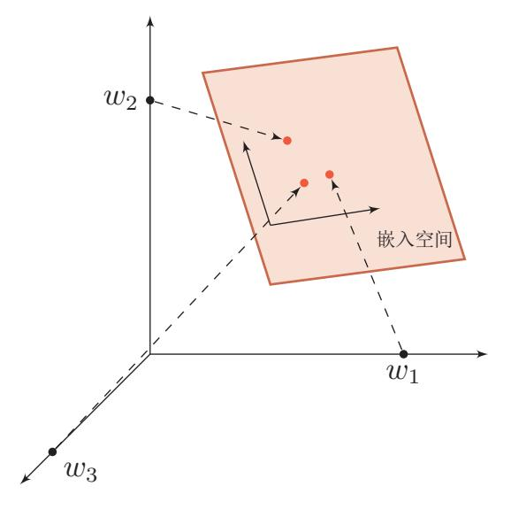
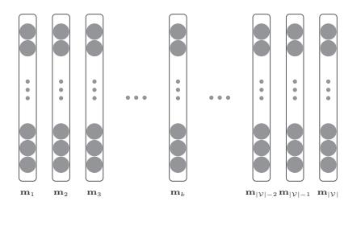
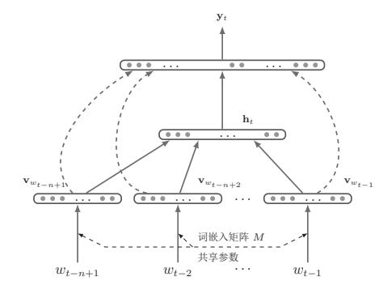
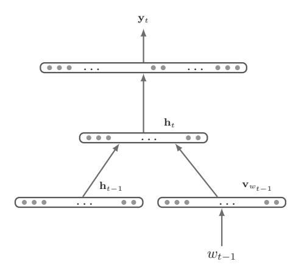
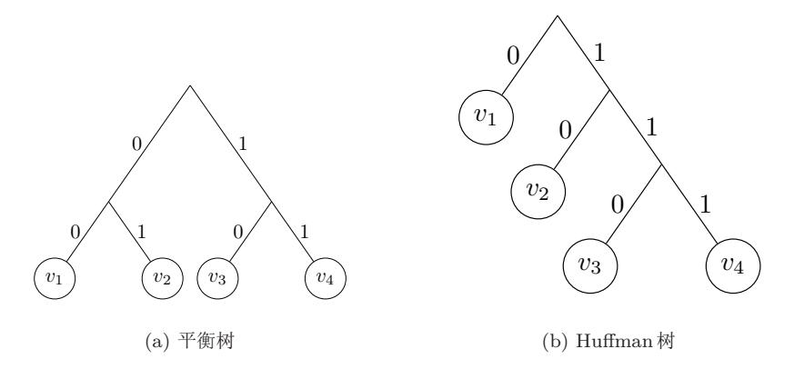
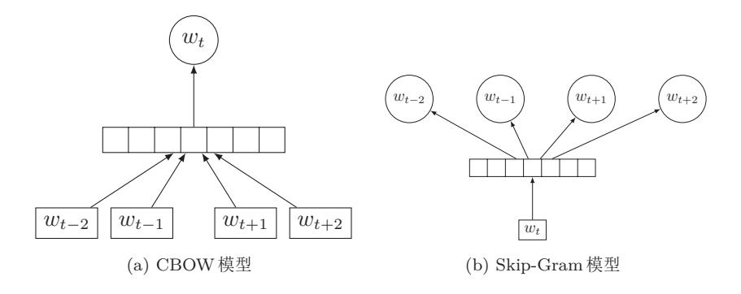

{0}------------------------------------------------

# 第14章 语言模型与词嵌入

在深度学习的应用中, 数据的形式多种多样。像图像、声音之类的数据很 自然地可以表示为一个连续的向量。比如图像直接将像素的颜色值(灰度值或 RGB 值) 组成一个连续向量。而对于语言的表示则很难找到合适的表示方式。 语言可以看作是一个符号序列, 每个字或词都看成是离散的符号。特别是计算 机内部, 每个字都是表示为无意义的编码。以颜色表示为例, 我们有很多词来 形容颜色的词,除了基本的"红"、"蓝"、"绿"、"白"、"黑"等之外,很有很多 比如"红色"、"白色"、"黑色"、"绿色",还有以地区或物品命名的,比如"中 国红"、"普鲁士蓝"、"咖啡色"、"奶油色"等等。据不完全统计, 现有的颜色 命名已经有1300多种1。假设我们有一组神经元,我们可以有两种方式来表示 这些颜色名字。

- 一种方式是用一个神经元来表示一个特定的颜色, 即神经元和颜色名字是 "一对一"关系。我们把这种表示方式叫做**局部表示**(Local Representation)。假设有1000种颜色, 我们就需要有1000个神经元。局部表示有两 个不足之处:(1)需要神经元数量很多,目不能扩展。如果有一个新的颜 色,我们就需要增加一个神经元来表示;(2)不同颜色之间的相似度都为 0, 即我们无法知道"红色"和"中国红"的相似度要比"红色"和"黑 色"的相似度要高。
- 另一种方式是用一组神经元来表示一个特定的颜色, 即神经元和颜色名 字是"多对多"关系。我们把这种表示方式叫做分布式表示(Distributed Representation)。我们知道, 所有颜色可以用RGB 颜色空间来表示。也就 是说,只需要用三个神经元来分别表示RGB三个维度,每个颜色就可以通 过三个神经元进行联合表示。这样,每一个颜色名字都可以映射为一组三 维的稠密向量。比如"红色"为[1,0,0], "中国红"为[0.67,0.22,0.12], "黑 色"为[0,0,0]。相比与局部表示,分布式表示需要的神经元数量要少得多, 并且很容易表示新的颜色名。此外,不同颜色之间的相似度也很容易计算。

分布式表示叫做分散式 表示可能更容易理解。

 $1$  https://en.wikipedia.org/wiki/Lists\_of\_colors

{1}------------------------------------------------

对于更一般的自然语言, 我们无法从语言编码中获取任何语义的信息。比 如"猫"和"狗"两个字的UTF8编码分别为"&#x732B"和"&#x72D7"。在 传统机器学习中,我们经常使用局部表示的方法来表示语言。假设一个语言中 的词都取自词汇表 V, 大小为 | V|。我们将每个词看成一个特征, 如果这个词出 现, 则这个特征的值为1, 否则为0。这样, 我们可以用 | V | 维的特征向量来表示 文本。

假设我们有4个词"白"、"黑"、"狗"和"猫",词表大小为4。这4个词 分别赋予一个唯一的编号1,2,3,4, 它们的向量表示分别为

> $\mathbf{v}_{\text{H}} = [1 \ 0 \ 0 \ 0 \ ]^{\text{T}}.$  $\mathbf{v}_{\mathbb{H}} = [0 1 0 0]^{\mathrm{T}}.$  $\mathbf{v}_{\text{min}} = [0 \ 0 \ 1 \ 0 \ ]^{\text{T}}.$  $\mathbf{v}_{\#} = [0 \ 0 \ 0 \ 1]^T,$

词的局部表示等价于 one-hot 向量表示。

我们可以看到这4个词的向量表示为 | V | 维的 one-hot 向量。除了词的表示 之外,我们还可以用局部表示来表示一段文本,比如短语、句子或文档。比如 "白狗"和"黑猫"的向量表示分别为

$$
\mathbf{v}_{\hat{\mathbb{H}}\hat{\mathbb{H}}} = [1 \ 0 \ 1 \ 0 \ ]^{\mathrm{T}}.
$$
$$
\mathbf{v}_{\mathbb{H}\hat{\mathbb{H}}} = [0 \ 1 \ 0 \ 1 \ ]^{\mathrm{T}}.
$$

这种表示叫做词袋模型(Bag-of-Words, BOW), 即将文本看成是词的集合, 不 考虑词序信息。在信息检索中也叫做向量空间模型(Vector Space Model)。因 为词袋模型丢失了词序信息, 不能精确地表示文本信息。一种改进方式就是增 加组合特征,比如"自狗"、"黑猫"也分别作为第5维和第6维特征。这样,这 两个词的向量表示就变成了

> $\mathbf{v}_{\dot{H}\mathfrak{H}}=[0\;0\;0\;0\;1\;0\;]^{\text{T}}$ .  $\mathbf{v}_{\mathbb{H}\mathbb{H}}=[0\;0\;0\;0\;0\;1]^{\mathrm{T}}.$

从上面例子可以看出, 要精确地表示文本就需要不断增加组合特征。以最 简单的二元特征(即两个词的组合特征)为例,其数量为|V|2。如果使用更复 杂的特征,需要的特征数量会指数上升。因此,在基于机器学习的自然语言处 理模型中, 特征维数通常是十万或百万级别的。另外, 不同特征不同之间的相 似度为0。

当使用神经网络来处理语言时, 如果使用基于局部表示的向量来作为网络 的输入, 那么输入层的维数非常大, 会导致网络参数也非常多。为了避免这个问 题,我们可以将高维的局部表示向量空间 R[V] 映射到一个非常低维的空间 Rd。

{2}------------------------------------------------

图 14.1 One-hot 向量空间与嵌入空间

d一般取值范围在 [20,500]。这个低维空间中的表示就是分布式表示。在这个低 维空间中,每个特征不在是坐标轴上的点,而是分散在整个低维空间中。我们 还是以"白狗"和"黑猫"为例,其分布式表示为2维向量,一维表示颜色值, 另一维表示动物种类。

$$
\mathbf{v}_{\hat{\mathbb{H}}\hat{\mathbb{H}}} = [0.2 \ 0.6]^{\mathrm{T}}.
$$
$$
\mathbf{v}_{\mathbb{H}\hat{\mathbb{H}}} = [0.9 \ -0.4]^{\mathrm{T}}.
$$

特别地, 对于词的分布式表示(即低维稠密向量表示), 我们经常叫做词嵌  $\lambda$  (Word Embeddings).

图14.1展示了一个3维one-hot向量空间和一个2维嵌入空间的对比。在onehot 向量空间中, 每个词都位于坐标轴上, 每个坐标轴上一个词; 而在低维的嵌 入空间中, 每个词都不在坐标轴上, 词之间可以计算相似度。

如何获得一个好的词嵌入呢? 在本章中, 我们先从自然语言处理中一个最 基础的任务统计语言模型开始,来介绍如何利用神经网络来处理自然语言。然 后再介绍一些常见的词嵌入的学习方法。

在机器学习中,嵌入通常 指将一个度量空间X中 的对象映射到另一个低 维的度量空间Y中,并 进行可能保持不同对象 之间拓扑关系。

#### 统计语言模型 14.1

自然语言是人们日常生活中使用的语言,比如汉语、英语等。语言模型(Language Model)指可以表示、分析和生成自然语言的数学模型。一般可以分为两 类:一类是基于形式语言的模型,通过定义一些列的语法规则来进行建模;另

和自然语言相对于的概 念是人工语言, 比如程 序语言、数学语言等。

{3}------------------------------------------------

外一类是基于统计的模型, 将自然语言看出一个随机现象, 然后借助概率统计 的方法, 来获取一种简化的语言规律。认知心理学上有一个经典的实验, 当一 个人看到下面两个句子:

# 面包上涂黄油

#### 面包上涂袜子

后一个句子在人脑的语义整合时需要更多的处理时间。如果用概率的角度来看 的话,"面包上涂黄油"比"面包上涂袜子"的概率更高,更像符合自然语言 规则。

这里假定语言的最基本 单位为词 (Word), 当 然也可以为字或字母  $(Character)$ .

定义 14.1-统计语言模型: 统计语言模型把语言(词的序列)看作 一个随机事件,并赋予相应的概率来描述其属于某种语言集合的可 能性。给定一个词汇集合 ν, 对于一个由 ν 中的词构成的序列 S =  $\langle w_1, \dots, w_T \rangle \in \mathcal{V}^n$ , 统计语言模型赋予这个序列一个概率  $P(S)$ , 来衡 量S符合自然语言的语法和语义规则的置信度。

在某种程度上, 自然语言也确实有很多随机因素。比如, 当我们称赞一个 人漂亮时,可以说"美丽","帅"或者"好看"等。当不指定使用场合时,这 几个词可以交替使用。具体使用哪个词可以看作一个随机事件。

语言模型的两个基本功能是:

1. 判断一段文本是否符合一种语言的语法和语义规则:

2. 生成符合一种语言语法或语义规则的文本。

给定一个长度为T的句子 $S = \langle w_1, w_2, \cdots, w_T \rangle$ , 其概率可以看出是T个词 的联合概率。

$$
P(S = w_{1:T}) = P(W_1 = w_1, W_2 = w_2, \cdots, W_T = w_T)
$$
\n(14.1)

$$
= P(w_1, w_2, \cdots, w_T), \tag{14.2}
$$

公式(14.2)中的 $P(S)$ 的定义不是很严格,  $P(S)$ 应该是和句子的长度相关 的。假设句子长度的概率分布为Pm, 那么完整的分布函数为:

$$
P(S = w_{1:T}) = P_m(T)P(w_{1:T}).
$$
\n(14.3)

假设一种语言的词汇表集合为 ν, wt的样本空间大小为该语言的词汇表大 小|V|。这对于长度为T的句子 $w_{1:T}$ , 其样本空间为|V|T。以句子为基本单位来

{4}------------------------------------------------

讨论概率时, 其样本空间为非常大(整个语言集合), 很难去估计每个句子的 概率。

通过概率的乘法公式, 我们可以将 P(S)写为:

$$
P(S = w_{1:T}) = P(w_1, \cdots, w_T)
$$
\n(14.4)

$$
= P(w_1)P(w_2|w_1)P(w_3|w_1w_2)\cdots P(w_T|w_{1:(T-1)})
$$
\n(14.5)

$$
= P(w_1) \prod_{t=2}^{t} P(w_t | w_{1:(t-1)}) \tag{14.6}
$$

$$
=\prod_{t=1}^{T} P(w_t|w_{1:(t-1)}),
$$
\n(14.7)

为了形式上简洁, 公式(14.7)引进一个虚拟词 $w_0$ , 并且假定 $P(w_1|w_0) = p(w_1)$ 。

从公式(14.7)可以看出,我们需要估计句子中每个词 $w_t$ 在给定前面词序 列 $w_{1:(t-1)}$ 时的条件概率。假如我们有一个很大的文档集合, 就可以去估计这些 概率。但是由于数据稀疏问题,我们很难估计所有的词序列。一个解决方法是 我们假设一个词的概率只依赖于其前面的n-1个词(n阶马尔可夫性质), 即

马尔可夫性质参见 第??节。

$$
P(w_t|w_{1:(t-1)}) = P(w_t|w_{(t-n+1):(t-1)})
$$
\n(14.8)

这就是N元(N-gram)语言模型。当 $n = 1$ 时, 称为一元(unigram)语言 模型, 当 $n = 2$ 时, 称为二元 (bigram) 语言模型, 以此类推。利用N元语言模 型,可以确定哪个词序列的可能性更大,或者给定若干个词的序列,可以预测 下一个最可能出现的词语。那么我们如何知道 $P(w_t|w_{(t-n+1):(t-1)})$ 的值呢?

这里有两种方法: 一是假设语言服从多项分布, 然后用最大似然估计来计 算多项分布的参数; 二是用一个函数  $f(w_{1:(t-1)})$  来直接估计下一个词是  $w_t$  的 概率。

在传统的统计语言模型中, 一般假设语言是服从多项分布, 并利用最大似 然估计来求解多项分布的参数。

# 14.1.1 一元语言模型

在  $N$  元语言模型中, 当  $n = 1$  时, 相当于假设句子  $w_1 \cdot r$  中每个位置上的词 都和其他词是独立的, 和它出现的上下文(邻居词)无关。也就是说, 每个位 置上的词都是从多项分布 $\theta$ 独立生成的。这个多项分布 $\theta$ 的维数为词汇表的大 小り。

因此,句子 $w_1$ . 了的概率可以表示为:

$$
P(S = w_{1:T}|\theta) = \prod_{t=1}^{T} P(w_t)
$$
 (14.9)

邱锡鹏:《神经网络与深度学习》

https://nndl.github.io/

 $\overline{5}$ 

{5}------------------------------------------------

$$
= \prod_{k=1}^{|\mathcal{V}|} \theta_k^{m_k}, \tag{14.10}
$$

$$
= P(m_{1:|\mathcal{V}|}|\theta) \tag{14.11}
$$

其中, mk为字典中第k个词在句子中出现的次数。公式14.10可以看成是V维 随机向量  $M = m_{1:V}$  的多项分布, 但是和一般多项分布的区别是公式14.10 没 有多项式系数,因为这里词的顺序是给定的。

多项分布参见第??页 第??节。

在公式14.10中, θ是需要实现估计出来的。我们需要从一个大量的文档集 合中进行估计。

根据 Bayes 公式,

$$
P(\theta|m_{1:|\mathcal{V}|}) = \frac{P(m_{1:|\mathcal{V}|}|\theta)P(\theta)}{P(m_{1:|\mathcal{V}|})}
$$
(14.12)

### 14.1.2 最大似然估计

假设先验  $P(\theta)$  为均匀分布, θ的最大似然估计为:

$$
\theta^{ML} = \underset{\theta}{\arg \max} P(m_{1:|\mathcal{V}|}|\theta) \tag{14.13}
$$

 $\mathbf{12.21}$ 

$$
= \arg \max_{\theta} \prod_{k=1}^{|\nu|} \theta_k^{m_k} \tag{14.14}
$$

$$
= \arg \max_{\theta} \sum_{k=1}^{|\mathcal{V}|} m_k \log \theta_k \tag{14.15}
$$

 $(14.16)$ 

约束优化问题:

$$
\max_{\theta_{1:|\mathcal{V}|}} \sum_{k=1}^{V} m_k \log \theta_k \tag{14.17}
$$

subject to 
$$
\sum_{k=1}^{|\nu|} \theta_k = 1
$$
 (14.18)

引入拉格朗日乘子(Lagrange multiplier)  $\lambda$ , 定义拉格朗日函数  $G$  为

$$
G(\theta_{1:|\mathcal{V}|}, \lambda) = \sum_{k=1}^{|\mathcal{V}|} m_k \log \theta_k - \lambda \left(\sum_{k=1}^{|\mathcal{V}|} \theta_k - 1\right)
$$
(14.19)

邱锡鹏:《神经网络与深度学习》

{6}------------------------------------------------

这样,原问题转换为无约束优化问题。

$$
\frac{\partial G}{\partial \theta_k} = \frac{m_k}{\theta_k} - \lambda = 0, \qquad (14.20)
$$

$$
\frac{\partial G}{\partial \lambda} = \sum_{k=1}^{|\mathcal{V}|} \theta_k - 1 = 0. \tag{14.21}
$$

求解上述方程得到 $\lambda = \sum_{v=1}^{V} m_v$ , 进一步得到

$$
\theta_k^{ML} = \frac{m_k}{\sum_{k=1}^{|\mathcal{V}|} m_k} = \frac{m_k}{T},\tag{14.22}
$$

其中,  $T = \sum_{k=1}^{|\mathcal{V}|} m_k$ 为文档集合的长度。

由此可见, 最大似然估计等价干频率估计。

### 14.1.3 $n \overline{n}$ 活言模型

在 n 元语言模型中, 条件概率  $P(w_t|w_{(t-n+1):(t-1)})$ 也可以通过最大似然函 数来得到。

$$
P(w_t|w_{(t-n+1):(t-1)}) = \frac{\text{count}(w_{(t-n+1):t})}{\text{count}(w_{(t-n+1):(t-1)})},\tag{14.23}
$$

其中, count $(w_{(t-n+1):t})$ 为 $w_{(t-n+1):t}$ 出现的次数。

平滑技术 基于统计的语言模型最大似然估计存在一个问题, 数据稀疏问题。数 据稀疏问题在基于统计的机器学习中是一个常见的问题,主要是由于训练样本 不足而导致密度估计不准确。在一元语言模型中, 如果一个词w在语料库里不 存在(假设w词汇表里的第k个词),那么 $c_k = 0$ ,并且相应的频率 $\theta_k = 0$ 。这 就会导致任何包含 w 的句子的概率都为0。在 n 元语言模型中, 当一个 n 元组合 在训练语言里不存在时,其概率为0。为了避免这种情况发生,需要给一些没有 出现的词组合赋予一定概率。

数据稀疏问题最直接的解决方法就是增加训练语料的规模。但是由于大多 数自然语言都服从 Zipf 定律, 增加语料库规模的边际效益会随着语料库的增加 而涕减。

数据稀疏问题的另一种解决方法是平滑技术(Smoothing)。平滑技术是传 统统计语言模型中的一项必不可少的技术, 其思想是增加低频词的频率, 而降 低高频词的频率。比如加法平滑的计算公式为:

$$
P(w_t|w_{(t-n+1):(t-1)}) = \frac{\text{count}(w_{(t-n+1):t}) + \delta}{\text{count}(w_{(t-n+1):(t-1)}) + \delta |\mathcal{V}|},\tag{14.24}
$$

其中,  $\delta \in (0,1]$ 为常数。一般  $\delta = 1$ , 也叫加1平滑。

Zipf定律是美国语言学 家 George K. Zipf 提出 的实验定律。在一个给 定自然语言语料库里,一 个单词出现的频率与它 在频率表里的排名成反 比。出现频率最高的单 词的出现频率大约是出 现频率第二位的单词的 2倍, 大约是出现频率第 三位的单词的3倍。

邱锡鹏:《神经网络与深度学习》

{7}------------------------------------------------

除了加法平滑, 还有很多平滑技术, 比如 Good-Turing 平滑, Kneser-Ney 平滑等。

统计语言模型广泛应用于各种自然语言处理问题,如语音识别、机器翻译、 拼音输入法, 字符识别等。简单地说, 统计语言模型就是用来计算一个句子的 概率的模型。统计语言模型可以估计出自然语言中每个句子出现的可能性,而 不是简单的判断该句子是否符合文法。

### 14.1.4 语言模型评价方法

构造一个语言模型后, 我们需要有一个度量手段来评价其好坏。目前的评 价方法主要有两种:

- 外在评价: 通过结合一个外部的应用任务, 比如(如机器翻译), 检查语 言模型是否可以提高外部任务的性能。这种方法的缺点是整个评价过程 十分耗时,且外部影响因素比较多。
- 内在评价: 给定一个测试文本集合, 一个好的语言模型应该使得测试集合 中的句子的联合概率尽可能高。

这里,我们介绍一种语言模型常用的内在评价指标: 困惑度 (Perplexity)。 困惑度是信息论的一个概念, 可以用来衡量一个分布的不确定性。对于离 散随机变量 X, 假设其取值集合为 X, 概率分布为  $p(x) = P(X = x), x \in \mathcal{X}$ 。

$$
2^{H(P)} = 2^{-\sum_{x \in \mathcal{X}} p(x) \log_2 p(x)},\tag{14.25}
$$

其中,  $H(P)$ 为分布  $P$  的熵。

同样, 我们也可以用困惑度来衡量两个分布之间差异。对于一个未知的数 据分布  $P_{data}(X)$ , 和一个模型分布  $P_{model}(X)$ , 我们从  $P_{data}(X)$  中采样出一组 测试样本 $x_1, \cdots, x_N$ , 模型分布 $P_{model}(X)$ 的困惑度为

$$
2^{H(\tilde{P}_{data}, P_{model})} = 2^{-\frac{1}{N} \sum_{i=1}^{N} \log_2 p_{model}(x_i)},
$$
\n(14.26)

其中,  $H(\tilde{P}_{data}, P_{model})$ 为样本的经验分布 $\tilde{P}_{data}$ 与模型分布 $P_{model}$ 之间的交叉 熵, 也是所有样本上的负对数似然函数。

模型的困惑度可以衡量模型估计分布与样本经验分布之间的契合程度, 困 惑度越低则两个分布越接近。因此,模型  $P_{model}$ 的好坏可以用困惑度来评价。

在语言模型中,假设测试集合共有  $N \wedge \Box f$   $s_1, \dots, s_N$ 。我们可以用语言 模型对每个句子计算其概率 $p(s_i)$ 。假设每个句子 $s_i = w_1^{(i)}, \dots, w_{n_i}^{(i)}$ 是独立抽取 的, 长度为 $n_i$ , 则联合概率为

$$
\prod_{i=1}^{N} p(s_i) = \prod_{i=1}^{N} \prod_{j=1}^{n_i} p(w_j^{(i)} | w_{(j-n+1):(j-1)}^{(i)})
$$
\n(14.27)

8

{8}------------------------------------------------

语言模型最直接的评价就是测试集中所有句子的联合概率,一个好的语言模型 在测试集上的概率越高越好。但是联合概率的缺点是一般都比较小, 并且和句 子长度有关。越长的句子, 其联合概率越小。因此, 在语言模型中, 经常使用 困惑度来评价。

一个语言模型 M 的困惑度定义为

$$
\mathcal{PPL}_M = 2^{-\frac{1}{T} \sum_{i=1}^N \log p(s_i)} \tag{14.28}
$$

$$
= 2^{-\frac{1}{T} \sum_{i=1}^{N} \sum_{j=1}^{n_i} \log p(w_j^{(i)} | w_{(j-n+1):(j-1)}^{(i)})}
$$
(14.29)

$$
= \left(\prod_{i=1}^{N} \prod_{j=1}^{n_i} p(w_j^{(i)} | w_{(j-n+1):(j-1)}^{(i)})\right)^{-1/1}, \qquad (14.30)
$$

其中,  $T = \sum_{i=1}^{N} l_i$ 为测试数据集中所有词的个数。

可以看出, 困惑度为每个词条件概率  $P(w_j^{(i)} | w_{(i-n+1):(i-1)}^{(i)})$ 的几何平均数 的倒数。句子概率越大, 困惑度越小, 语言模型越好。

假设一个语言模型赋予每个词出现的概率均等,即 $P(w_j^{(i)}|w_{(j-n+1):(j-1)}^{(i)}) =$  值平均数的方法, 计算公 式为:  $\bar{x} = \sqrt[n]{\prod_{t=1}^{n} x_t}$ . →, 则该语言模型的困惑度为|V|。一般而言, 对于英语文本, n元语言模型的 困惑度范围一般为50~1000之间。

## 14.2 神经网络语言模型

在统计语言模型中, 一个关键的问题是估计 $P(W_t|W_{1:(t-1)})$ , 即在时刻(或 位置)t,给定历史信息 $h_t = w_{1:(t-1)}$ 条件下,词汇表 $V$ 中的每个词 $v_k$ ( $1 \le k \le |V|$ 出现的概率。这个问题可以转换为一个类别数为|V|的多类分类问题, 即

$$
P_{\theta}(W_t = v_k | h_t = w_{1:(t-1)}) = P_{\theta}(v_k | w_{1:(t-1)})
$$
\n(14.31)

$$
= f_k(w_{1:(t-1)}, \theta), \tag{14.32}
$$

其中,  $f_k(\cdot, \theta)$  为分类函数, 估计的词汇表中第 k 个词出现的后验概率, 并满足  $\sum_{k=1}^{|\mathcal{V}|} f_k(w_{1:(t-1)}, \theta) = 1; \theta$ 为模型参数。

这样, 我们就可以使用机器学习中的不同分类器来估计语言模型的条件概 率。这里我们关注基于神经网络模型的方法,这一类方法可以统称为神经网络 语言模型 (Neural Network Language Model, NNLM)。

神经网络语言模型可以分为三个部分:

输入层 为了将语言符号序列  $w_{1:(t-1)}$  输入到神经网络模型中, 首先需要将这些 符号转换为向量形式。在神经网络模型中,一般需要转换为稠密的实数值向量。 转换方式可以通过一个词嵌入矩阵来直接映射, 也叫作输入词嵌入矩阵或查询

神经网络统计语言模型 也可以称作是连续空间 语言模型,或神经概率 语言模型。

几何平均数是一种求数

{9}------------------------------------------------

表。词嵌入矩阵  $\mathbf{M} \in \mathbb{R}^{d_1 \times |\mathcal{V}|}$ 中, 第 $k$ 列向量 $_k \in \mathbb{R}^{d_1}$ 表示词汇表中第 $k$ 个词对 应的稠密向量。

图 14.2 词向量矩阵

假设词 $w_i$ 对应词汇表中的索引为k, 其one-hot 向量为 $\mathbf{e}_k \in \mathbb{R}^{|\mathcal{V}|}$ , 即第 $k$ 维 为1, 其余为0的|V|维向量。其对应的词向量为

$$
\mathbf{v}_{w_i} = \mathbf{M}\mathbf{e}_k =_k. \tag{14.33}
$$

通过直接映射,我们得到历史信息 $w_{1:(t-1)}$ 每个词对应的向量表示 $\mathbf{v}_{w_1}, \cdots, \mathbf{v}_{w_{t-1}}$ 。

隐藏层 隐藏层可以是不同类型的网络, 前馈神经网络和循环神经网络, 其输入 为词向量 $\mathbf{v}_{w_1}, \cdots, \mathbf{v}_{w_{t-1}}$ , 输出为一个可以表示历史信息的向量 $\mathbf{h}_t$ 。

在神经网络语言模型中,常见的网络类型有以下三种:

(1) 简单平均

$$
\mathbf{h}_t = \sum_{1}^{t-1} C_i \mathbf{v}_{w_i},\tag{14.34}
$$

其中, Ci 为每个词的权重。权重可以和位置相关, 也可以和位置无关。位置无 关的权重可以设置为 $C_i = \frac{1}{t-1}$ 。

(2) 前馈神经网络

前馈神经网络要求输入的大小是固定的。因此, 和n元模型类似, 假设历 史信息只包含前面 $n-1$ 个词。首先将这 $n-1$ 个的词向量的 $\mathbf{v}_{w_{t-n+1}}, \cdots, \mathbf{v}_{w_{t-1}}$ 拼接为一个维度为 $d_1 \times (n-1)$ 的向量 $\mathbf{x}_t$ 。

$$
\mathbf{x}_t = \mathbf{v}_{w_{t-n+1}} \oplus \cdots \oplus \mathbf{v}_{w_{t-1}}.\tag{14.35}
$$

然后将 xt 输入到由多层前馈神经网络构成的隐藏层, 最后一层隐藏层的输 出ht。前馈网络的结构可以任意设置。比如, 只含一层隐藏层的模型为

$$
\mathbf{h}_t = \tanh(W\mathbf{x}_t + \mathbf{c}).\tag{14.36}
$$

{10}------------------------------------------------

前馈网络中也可以包含跳层连接(Skip-Layer Connections), 比如最早 由Bengio et al. [2003a] 提出的神经网络语言模型为

$$
\mathbf{h}_t = \mathbf{x}_t \oplus \tanh(W\mathbf{x}_t + \mathbf{c}).\tag{14.37}
$$

(3) 循环神经网络

和前馈神经网络不同,循环神经网络可以接受变长的输入序列,依次接受 输入 $\mathbf{v}_{w_1}, \cdots, \mathbf{v}_{w_{t-1}}$ , 得到t时刻的隐藏状态 $h_t$ 

$$
\mathbf{h}_t = \tanh(U\mathbf{h}_{t-1} + W\mathbf{v}_{w_{t-1}} + \mathbf{c}),\tag{14.38}
$$

其中 $\mathbf{h}_0 = 0$ 。

前馈网络语言模型和循环网络语言模型的不同之处在于循环神经网络利用 隐藏状态来记录以前所有时刻的信息,而前馈神经网络只能接受前 n - 1个时 刻的信息。

图14.3给出了两种不同的神经网络语言模型, 图14.3a为前馈网络语言模型 (虚线边为可选的跳层连接) [Bengio et al., 2003a], 图14.3b为循环神经网络语 言模型 [Mikolov et al., 2010]。

输出层 输出层为大小为|V|, 其接受的输入为历史信息的向量表示 $\mathbf{h}_t \in \mathbb{R}^{d_2}$ , 输 出为词汇表中每个词的后验概率。在神经网络语言模型中,一般使用softmax分 类器。

$$
\mathbf{y}_t = \text{softmax}(\mathbf{Oh}_t + \mathbf{b}),\tag{14.39}
$$

其中,输出向量yt E RlVl 为一个概率分布, 其第k维是词汇表中第k个词出现 的后验概率; O E R | V| × d2 是最后一层隐藏层到输出层直接的权重。O 也叫做输 出词嵌入矩阵, 矩阵中每一行也可以看作是一个词向量。

和输入词嵌入矩阵相对 应。

在normal使用是
$$
h_t
$$
条件下,ر $\nu + \hat{m}$ , $v_k$ 出, $v_k$ 的后強概率为

$$
P_{\theta}(v_k|h_t) = [\mathbf{y}_t]_k \tag{14.40}
$$

$$
= \text{softmax}(s(v_k, h_t; \theta)) \tag{14.41}
$$

$$
=\frac{\exp(s(v_k, h_t; \theta))}{\sum_{j=1}^{|\mathcal{V}|} \exp(s(v_j, h_t; \theta))},\tag{14.42}
$$

其中,  $s(v_k, h_t; \theta)$ 为未归一化的得分, 由神经网络计算得到;  $\theta$ 表示网络中的所 有参数,包括词向量表M以及神经网络的权重和偏置。

$$
s(v_k, h; \theta) = \mathbf{o}_k^{\mathrm{T}} \mathbf{h} + b_k, \qquad (14.43)
$$

#### 邱锡鹏:《神经网络与深度学习》

{11}------------------------------------------------

(a) 前馈神经网络语言模型 Bengio et al. [2003a]

(b) 循环神经网络语言模型 Mikolov et al. [2010]

图 14.3 神经网络语言模型

其中,  $\mathbf{o}_k \in \mathbb{R}^{d_2}$ 为输出嵌入矩阵  $\mathbf{O}$  中的第 $k$ 行向量的转置。

公式(14.42)也可以表示为更一般的形式

$$
P_{\theta}(w|h) = \text{softmax}(s(w, h; \theta)) \tag{14.44}
$$

$$
= \frac{\exp(s(w, h; \theta))}{\sum_{w' \in \mathcal{V}} \exp(s(w', h; \theta))}
$$
(14.45)

$$
\frac{\exp(s(w, h; \theta))}{z(h, \theta)},\tag{14.46}
$$

其中,

$$
z(h; \theta) = \sum_{w' \in \mathcal{V}} \exp(s(w', h; \theta)) \tag{14.47}
$$

为配分函数 (Partition Function)。

邱锡鹏:《神经网络与深度学习》

{12}------------------------------------------------

#### $14.2.1$ 训练

给定一个训练文本序列 $w_1, \dots, w_T$ , 神经网络语言模型的训练目标为找到 一组参数θ, 使得负对数似然函数NLLB最小。

$$
\mathcal{NLL}_{\theta} = -\frac{1}{T} \sum_{t=1}^{T} \log P_{\theta}(w_t | w_{1:(t-1)}) + R(\theta), \qquad (14.48)
$$

$$
= -\frac{1}{T} \sum_{t=1}^{T} \log P_{\theta}(w_t|h_t) + R(\theta)
$$
\n(14.49)

$$
= -\frac{1}{T} \sum_{t=1}^{T} \log \frac{\exp(s(w_t, h_t; \theta))}{\sum_{w' \in \mathcal{V}} \exp(s(w', h_t; \theta))} + R(\theta).
$$
 (14.50)

 $R(\theta)$ 为正则化项, 比如 $R(\theta) = \frac{1}{2} ||\theta||_F^2$ .

在训练时,可以将每个时刻的历史信息和目标作为一个训练样本,进行批 量或小批量训练。

参数θ可以通过梯度下降来迭代计算得到。

$$
\theta \leftarrow \theta - \alpha \frac{\partial \mathcal{NLL}_{\theta}}{\partial \theta},\tag{14.51}
$$

其中, α为学习率。

#### 大词汇表上 softmax 计算的改进 $14.2.2$

为了使得神经网络语言模型的输出 Pa(w|h) 为一个概率分布, 得分函数会 进行softmax 归一化。而归一化时要计算配分函数, 即对词汇表中所有的词 w' 计算 s(w', ht; θ) 并求和, 计算开销非常大。在语言模型中, 词汇表 V的规模一 般都比较大,取值一般在1万到10万之间。在训练时,每个样本都要计算一次 配分函数, 这样每一轮迭代需要计算T次配分函数(T为训练文本长度)。这导 致整个训练过程变得十分耗时。

在实践中, 经常采样一些近似估计的方法来加快训练速度。常用的加快神 经网络语言模型训练速度的方法可以分为两类:

- 一类是层次化的 softmax 计算, 将标准 softmax 函数的扁平结构转换为层 次化结构:
- 另一类是基于采样的方法, 通过采样来近似计算更新梯度。

下面我们分别介绍这两种方法。

参见公式 (14.46)。 配分函数 $z(h; \theta)$  =  $\sum \exp(s(w',h;\theta))$ 

{13}------------------------------------------------

### 14.2.2.1 层次化 Softmax

我们先来考虑两层的来组织词汇表, 即将词汇表中词分成k组, 并每一个 词只能属于一个分组,每组大小为 $\frac{|V|}{k}$ 。假设词  $w$  所属的组为  $c(w)$ , 则

$$
P(w|h) = P(w, c(w)|h)
$$
\n
$$
(14.52)
$$

$$
= P(w|c(w), h) \times P(c(w)|h), \qquad (14.53)
$$

其中,  $P(c(w)|h)$ 是给定历史信息  $h$  条件下, 类 $c(w)$  的概率;  $P(w|c(w), h)$  是给 定历史信息  $h$  和类  $c(w)$  条件下, 词  $w$  的概率。一个词的概率可以分解为两个概 率  $P(w|c(w), h)$  和  $P(c(w)|h)$  的乘积, 而它们都是利用神经网络来估计, 计算 softmax 函数时分别只需要做  $\frac{|\mathcal{V}|}{k}$  和 k 次求和, 从而就大大提高了 softmax 函数 的计算速度。

一般对于词汇表大小| V|, 我们将词平均分到 、 | V| 个分组中, 每组 、 | V| 个 词。这样通过一层的分组,我们可以将softmax计算加速  $\frac{1}{2}\sqrt{|{\cal V}|}$ 倍。比如, 词汇 表大小为40,000,我们将词汇表中所有词分到200组,每组200个词。这样,只 需要计算两次 200 类的 softmax, 比直接计算 40,000 类的 softmax 加快 100 倍。

图 14.4 层次化树结构

为了进一步降低softmax的计算复杂度,我们可以更深层的树结构来组织词 汇表。假设用二叉树来组织词汇表中的所有词,二叉树的叶子节点代表词汇表中 的词,非叶子节点表示不同层次上的类别。图14.4给出了平衡二叉树和Huffman 二叉树的示例。

如果我们将二叉树上所有左链接标记为0,右链接标记为1。每一个词可以 用根节点到它所在的叶子之间路径上的标记来进行编码。图14.4a中所示的四个 词的编码分别为:

 $v_1 = 00$ 

{14}------------------------------------------------

$$
v_2 = 01
$$
$$
v_3 = 10
$$
$$
v_4 = 10
$$

假设词 v 在二叉树上从根节点到其所在叶子节点的路径长度为m, 其编码 可以表示一个位向量(bit vector):  $[b(v,1), \cdots, b(v,m)]^T$ 。词v的条件概率为

$$
P(v|h) = P(b(v, 1), \cdots, b(v, m)|h)
$$
\n(14.54)

$$
= \prod_{j=1}^{m} P(b(v,j)|b(v,1),\cdots,b(v,j-1),h), \qquad (14.55)
$$

这里,  $b_1(v), \cdots, b_{i-1}(v)$ 表示从根节点出发的长度为 $j-1$ 的路径, 假设其对应 一个节点 $n_{i-1}(v)$   $(n_{i-1}(v))$ 是一个非叶子节点), 则

 $P(b(v, j)|b(v, 1), \cdots, b(v, j-1), h) = P(b(v, j)|n(v, j-1), h),$  $(14.56)$ 

因为 $b(v, j) \in \{0, 1\}$ , 因此 $P(b(v, j) | n(v, j - 1), h)$ 可以看作是两类分类问 题,我们可以使用 logistic 回归来进行计算。

$$
P(b(v,j) = 1 | n(v, j-1), h) = \sigma(\mathbf{o}_{n(v,j-1)}^{\mathrm{T}} \mathbf{h} + \mathbf{b}_{n(v,j-1)}),
$$
(14.57)

$$
P(b(v, j) = 0 | n(v, j - 1), h) = 1 - \sigma(\mathbf{o}_{n(v, j-1)}^{\mathrm{T}} \mathbf{h} + \mathbf{b}_{n(v, j-1)}) \tag{14.58}
$$

若使用平衡二叉树来进行分组, 则条件概率估计可以转换为log2 | V | 个两类 分类问题。这时 softmax 函数可以用 logistic 函数代替,softmax 的计算可以加速  $\frac{|{\mathcal{V}}|}{\log_2 |{\mathcal{V}}|}$ 倍。

将词汇表中的词按照树结构进行组织,有以下几种转换方式:

- 利用人工整理的词汇层次结构, 比如利用 WordNetMiller [1995] 系统中的 "IS-A"关系(即上下位关系)。例如,"狗"是"动物"的下位词。因为 WordNet 的层次化结构不是二叉树, 因此需要通过进一步聚类来转换为 二叉树。
- 使用 Huffman 编码。Huffman 编码对出现概率高的词使用较短的编码, 出 现概率低的词则使用较长的编码。因此训练速度会更快。Huffman编码的 算法如算法14.1所示。

14.2.3 基于采样方法的梯度近似估计

另外一种加速语言模型训练速度的方法是用采样的方法, 即通过采样来近 似计算训练时的梯度。

WordNet是按照词义来 组织的英语词汇知识库, 由 Princeton 大学研发。

Huffman 编 码 是 David Huffman 于 1952年发明 的一种用于无损数据压 缩的熵编码 (权编码) 算 法。

{15}------------------------------------------------

#### 算法 14.1: Huffman 树构建算法

输入: 词汇表: V

- 1 初始化: 为每个词 v 建立一个叶子节点, 其概率为词的出现频率:
- 2 将所有的叶子节点放入集合S中;
- 3 while  $|\mathcal{S}| > 1$  do
- 从集合 $S$ 选择两棵概率最低的节点 $n_1$ 和 $n_2$ ;  $\overline{\mathbf{4}}$
- 构建一个新节点 $n'$ , 并将 $n_1$ 和 $n_2$ 作为 $n'$ 的左右子节点;  $\mathbf{5}$
- | 新节点  $n'$  的概率  $n_1$  和  $n_2$  的概率之和,;  $6\phantom{a}$
- 将新二叉树加入集合 $S$ 中, 并把 $n_1$ 和 $n_2$ 从集合 $S$ 中移除;  $\overline{7}$
- 8 end
- 9 集合 $S$ 中最后一个节点为 $n$ ; 输出: 以 $n$ 为根节点的二叉树  $T$
- $10$  :

神经网络语言模型的目标函数为

$$
\mathcal{NLL}_{\theta} = -\frac{1}{T} \sum_{t=1}^{T} \log P_{\theta}(w_t | h_t) + R(\theta), \qquad (14.59)
$$

如果用随机梯度下降来求解参数θ, 第t个样本的目标函数关于θ的梯度为

$$
\frac{\partial \mathcal{NLL}_{\theta}(w_t, h_t)}{\partial \theta} = -\frac{\partial \log P_{\theta}(w_t | h_t)}{\partial \theta} \tag{14.60}
$$

$$
= -\frac{\partial s(w_t, h_t; \theta)}{\partial \theta} + \frac{\partial \log \left( \sum_{w'} \exp(s(w', h_t; \theta)) \right)}{\partial \theta} \tag{14.61}
$$

$$
= -\frac{\partial s(w_t, h_t; \theta)}{\partial \theta} + \frac{1}{\sum_{w'} \exp(s(w', h_t; \theta))} \cdot \frac{\partial \sum_{w'} \exp(s(w', h_t; \theta))}{\partial \theta} \tag{14.62}
$$

$$
= -\frac{\partial s(w_t, h_t; \theta)}{\partial \theta} + \sum_{w'}^{\omega} \frac{1}{\sum_{w'} \exp(s(w', h_t; \theta))} \cdot \frac{\partial \exp(s(w', h_t; \theta))}{\partial \theta} \qquad (14.63)
$$

$$
= -\frac{\partial s(w_t, h_t; \theta)}{\partial \theta} + \left[ \sum_{w'} \frac{\exp(s(w', h_t; \theta))}{\sum_{w'} \exp(s(w', h_t; \theta))} \frac{\partial s(w', h_t; \theta)}{\partial \theta} \right]
$$
(14.64)

$$
= -\frac{\partial s(w_t, h_t; \theta)}{\partial \theta} + \sum_{w'} P_{\theta}(w' | h_t) \frac{\partial s(w', h_t; \theta)}{\partial \theta} \tag{14.65}
$$

$$
= -\frac{\partial s(w_t, h_t; \theta)}{\partial \theta} + \overline{\mathbb{E}_{P_{\theta}(w'|h_t)} \left[ \frac{\partial s(w', h_t; \theta)}{\partial \theta} \right]}.
$$
\n(14.66)

公式(14.66)中最后一项是计算 $\frac{\partial}{\partial \theta} s(w', h_t; \theta)$ 在分布 $P_\theta(w'|h)$ 下的期望。

 $16\,$ 

{16}------------------------------------------------

从公式(14.64)中可以看出,在计算每个样本的更新梯度时需要两次计算在 整个词汇表上的求和。一次是求配分函数 $\sum_{w'} \exp(s(w',h_t;\theta))$ , 另一次是计算 所有词的梯度的期望 E[ $\frac{\partial}{\partial \theta} s(w', h_t; \theta)$ ]。由于语言模型中的词汇表都比较大, 训 练速度会非常慢。

为了提高训练效率,我们可以用采样方法来进行近似地估计公式(14.66)中 的期望。但是我们不能使用直接采样的方法。因为直接采样需要在采样之前需 要知道分布  $P_{\theta}(w'|h)$ , 而这正是我们希望避免的。下面我们介绍两种在语言模 型中比较有效的采样方法: 重要性采样和噪声对比估计。

采样方法参见第??节。

#### 14.2.3.1 重要性采样

在神经网络语言模型中,一种相对比较容易实现的采样方法是重要性采样, 即用一个容易采样的参考分布Q,来近似估计分布P。

公式(14.66)中最后一项可以写为:

$$
\mathbb{E}_{P_{\theta}(w'|h_t)}\left[\frac{\partial s(w', h_t; \theta)}{\partial \theta}\right] = \sum_{w' \in \mathcal{V}} P_{\theta}(w'|h_t) \frac{\partial s(w', h_t; \theta)}{\partial \theta} \tag{14.67}
$$

$$
= \sum_{w' \in \mathcal{V}} Q(w'|h_t) \frac{P_{\theta}(w'|h_t)}{Q(w'|h_t)} \cdot \frac{\partial s(w', h_t; \theta)}{\partial \theta} \tag{14.68}
$$

$$
= \mathbb{E}_{Q(w'|h_t)} \left[ \frac{P_{\theta}(w'|h_t)}{Q(w'|h_t)} \cdot \frac{\partial s(w', h_t; \theta)}{\partial \theta} \right]. \tag{14.69}
$$

这样,我们就将分布 $P_{\theta}(w'|h_t)$ 上的期望转换为分布 $Q(w'|h_t)$ 上的期望。提 议分布Q需要尽可能和  $P_{\theta}(w'|h_t)$ 接近, 并且从  $Q(w'|h_t)$ 采样的代价要比较小。 在语言模型中, 提议分布 $Q(w'|h_t)$ 可以采用 n 元语言模型的分布函数。

在有了分布 $Q(w'|h_t)$ 之后, 我们可以从中独立抽取k个样本 $v_i, 1 \leq i \leq k$ 来近似求解公式 (14.69)。

$$
\mathbb{E}_{P_{\theta}(w'|h_t)}\left[\frac{\partial s(w', h_t; \theta)}{\partial \theta}\right] = \mathbb{E}_{Q(w'|h_t)}\left[\frac{P_{\theta}(w'|h_t)}{Q(w'|h_t)}\frac{\partial s(w', h_t; \theta)}{\partial \theta}\right] \tag{14.70}
$$

$$
\approx \frac{1}{k} \sum_{i=1}^{k} \frac{P_{\theta}(v_i|h_t)}{Q(v_i|h_t)} \frac{\partial s(v_i, h_t; \theta)}{\partial \theta} \tag{14.71}
$$

公式(14.71) 通过Q的采样来估计目标分布P的方法就叫做重要性采样。重 要性采样是一种非均匀采样。但在公式(14.71)中,依然需要每一个计算抽取样 本的概率 $P_{\theta}(v_i|h)$ 。

$$
P_{\theta}(v_i|h_t) = \frac{s(v_i, h_t; \theta)}{\sum_{w'} \exp(s(w', h_t; \theta))}
$$
(14.72)

$$
=\frac{s(v_i, h_t; \theta)}{Z(h_t)},
$$
\n(14.73)

{17}------------------------------------------------

其中,  $Z(h_t) = \sum_{w'} \exp(s(w', h_t; \theta))$ 为配分函数, 需要在所有样本上进行计算  $s(w', h_t; \theta)$ 并求和。为了避免这种情况, Bengio et al. [2003b] 使用了一种有偏 的重要性采样方法, 把配分函数  $Z(h_t)$  的计算也使用重要性采样来计算。

$$
Z(h_t) = \sum_{w'} \exp(s(w', h_t; \theta))
$$
\n(14.74)

$$
= |\mathcal{V}| \sum_{w'} \frac{1}{|\mathcal{V}|} \exp(s(w', h_t; \theta)) \tag{14.75}
$$

$$
= |\mathcal{V}| \times \sum_{w'} Q(w'|h_t) \frac{1}{|\mathcal{V}| \times Q(w'|h_t)} \exp(s(w', h_t; \theta)) \tag{14.76}
$$

$$
= |\mathcal{V}| \times \mathbb{E}_{Q(w'|h_t)} \left[ \frac{1}{|\mathcal{V}| \times Q(w'|h_t)} \exp(s(w', h_t; \theta)) \right]
$$
(14.77)

$$
\approx \frac{|\mathcal{V}|}{k} \times \sum_{i=1}^{k} \frac{1}{|\mathcal{V}| \times Q(v_i|h_t)} \exp(s(v_i, h_t; \theta)) \tag{14.78}
$$

$$
= \frac{1}{k} \times \sum_{i=1}^{k} \frac{\exp(s(v_i, h_t; \theta))}{Q(v_i | h_t)}
$$
(14.79)

$$
=\frac{1}{k}\sum_{i=1}^{k}r(v_i).
$$
\n(14.80)

其中 $Q(v_i|h_t)$ 为提议分布, 为了提高效率, 可以和公式(14.71) 中的提议分布 设为一致,并重用抽取的样本;  $r(v_i)$ 定义为

$$
r(v_i) = \frac{\exp(s(v_i, h_t; \theta))}{Q(v_i|h_t)}.
$$
\n(14.81)

在计算估计了配分函数以及梯度期望之后, 公式 (14.71) 可写为

$$
\mathbb{E}_{P_{\theta}(w'|h_t)}\left[\frac{\partial s(w', h_t; \theta)}{\partial \theta}\right] \approx \frac{1}{k} \sum_{i=1}^{k} \frac{P_{\theta}(v_i|h_t)}{Q(v_i|h_t)} \frac{\partial s(v_i, h_t; \theta)}{\partial \theta} \tag{14.82}
$$

$$
= \frac{1}{k} \sum_{i=1}^{k} \frac{\exp(s(v_i, h_t; \theta))}{Z(h_t)} \frac{1}{Q(v_i|h_t)} \frac{\partial s(v_i, h_t; \theta)}{\partial \theta}
$$
(14.83)

$$
= \frac{1}{k} \sum_{i=1}^{k} \frac{1}{Z(h_t)} r(v_i) \frac{\partial s(v_i, h_t; \theta)}{\partial \theta}
$$
\n(14.84)

$$
\approx \sum_{i=1}^{k} \frac{r(v_i)}{\sum_{i=1}^{k} r(v_i)} \frac{\partial s(v_i, h_t; \theta)}{\partial \theta} \tag{14.85}
$$

$$
=\frac{1}{\sum_{i=1}^{k} r(v_i)} \sum_{i=1}^{k} r(v_i) \frac{\partial s(v_i, h_t; \theta)}{\partial \theta}.
$$
\n(14.86)

邱锡鹏:《神经网络与深度学习》

https://nndl.github.io/

采样估计

 $\frac{1}{|{\cal V}|}$ 看作是均匀分布

引入提议分布 $Q(w'|h_t)$ 

{18}------------------------------------------------

最后, 将公式(14.86)代入公式(14.66), 得到每个样本目标函数关于θ的 梯度可以近似为

$$
\frac{\partial \mathcal{NLL}_{\theta}(w_t, h_t)}{\partial \theta} = -\frac{\partial s(w_t, h_t; \theta)}{\partial \theta} + \frac{1}{\sum_{i=1}^k r(v_i)} \sum_{i=1}^k r(v_i) \frac{\partial s(v_i, h_t; \theta)}{\partial \theta}, \tag{14.87}
$$

其中,  $v_1, \dots, v_k$ 为从提议分布 $Q(w'|h_t)$ 中从词汇表  $V$ 独立抽取的词。和公式 (14.66) 相比, 重要性采样相当于采样了一个词汇表的子集 $V' = \{v_1, \dots, v_k\}$ , 然后在这个子集上求梯度  $\frac{\partial s(v_i, h; \theta)}{\partial \theta}$  的期望; 公式 (14.66) 中分布  $P_{\theta}(w'|h_t)$ 被  $r(v_i)$  所替代。这样, 目标函数关于 $\theta$  的梯度就避免了在词汇表上对所有词进行 计算, 只需要计算较少的抽取的样本。采样的数量n越大, 近似越接近正确值。 在实际应用中, n取100左右就能够以足够高的精度对期望做出估计。通过重要 性采样的方法, 训练速度可以加速 14倍。

基于重要性采样的神经网络语言模型思想和算法都比较简单, 但是在实践 中其效果依赖于建议分布 $Q(w'|h_t)$ 的选取。如果 $Q(w'|h_t)$ 选取不合适时, 会造 成梯度估计非常不稳定。在实践中,提议分布 $Q(w'|h_t)$ 经常使用一元模型的分布 函数。虽然直观上 $Q(w'|h_t)$ 采用 n 元语言模型更加准确, 但Bengio and Senécal [2008] 发现使用复杂的 n 元语言模型分布并不能改进性能, 原因是 n 元模型的分 布和神经网络语言模型估计的分布之间有很大的差异。

#### $14.2.3.2$ 噪声对比估计

除了通过重要性采样来估计语言模型条件概率的更新梯度之外,我们还可 以用噪声对比估计来估计更新梯度。

噪声对比估计 噪声对比估计 (Noise-Contrastive Estimation, NCE) 的基本思 想是将密度估计问题转换为两类分类问题,从而降低计算复杂度 [Gutmann and Hyvärinen, 2010]。噪声对比估计的思想在我们日常生活中十分常见。比如我们 教小孩认识"苹果",往往会让小孩从一堆各式各样的水果中找出哪个是"苹 果"。通过不断的对比和纠错,最终小孩会知道了解"苹果"的特征,并很容易 识别出"苹果"。

噪声对比估计的数学描述如下: 假设有三个分布, 一个是需要建模真实数 据分布  $P(x)$ ; 第二是模型分布  $P_\theta(x)$ , 我们期望调整模型参数为θ来使得  $P_\theta(x)$ 来拟合真实数据分布; 第三个是噪声分布 $Q(x)$ , 用来对比学习。从 $P(x)$ 和 $Q(x)$ 的混合分布中抽取一个样本 x, 我们将从  $P(x)$  中抽取的样本叫做"真实"样本, 从Q(x)中抽取的样本叫做噪声样本。我们需要建立一个"辨别者"D来判断样 本x是真实样本还是噪声样本。噪声对比估计是通过调整模型 $P_{\theta}(x)$ 使得"判别 者" D很容易能分别出样本x来自哪个分布。

我们用 $u$ 等于1或0, 分别表示是真实样本或噪声样本。一个样本 $x$ 在已知

{19}------------------------------------------------

类别(真实或噪声)条件下的概率为

$$
P(x|y=1) = P_{\theta}(x),
$$
\n(14.88)

$$
P(x|y=0) = Q(x).
$$
 (14.89)

一般噪声样本的数量要比真实样本大很多。这里假设噪声样本的数量是真 实样本的k倍, 即

$$
P(y=0) = kP(y=1).
$$
\n(14.90)

根据 Bayes 公式, 一个样本  $x$  来自于真实数据分布的后验概率为

$$
P(y=1|x) = \frac{P(x|y=1)P(y=1)}{P(x|y=1)P(y=1) + P(x|y=0)P(y=0)}
$$
(14.91)  
$$
P_0(x)P(y=1)
$$

$$
= \frac{P_{\theta}(x)P(y=1)}{P_{\theta}(x)P(y=1) + Q(x) \cdot kP(y=1)}
$$
(14.92)

$$
=\frac{P_{\theta}(x)}{P_{\theta}(x)+kQ(x)}.\tag{14.93}
$$

同理,样本x来自于噪声分布的后验概率为

 $\equiv$ 

$$
P(y=0|x) = \frac{kQ(x)}{P_{\theta}(x) + kQ(x)}
$$
\n(14.94)

$$
= 1 - P(y = 1|x). \tag{14.95}
$$

这样,我们可以从真实分布  $P$  中抽取  $n \wedge$  样本  $x_1, \dots, x_n$ , 将其类别设为  $y = 1$ , 然后从噪声分布中抽取  $kn \triangleq k$ 本 $x'_1, \dots, x'_{kn}$ , 将其类别设为 $y = 0$ 。噪 声对比估计的目标函数是

$$
\mathcal{L}_{\theta} = -\frac{1}{n(k+1)} \left( \sum_{i=1}^{n} \log P(y=1|x_i) + \sum_{i=1}^{kn} \log P(y=0|x'_i) \right) \tag{14.96}
$$

噪声对比估计的目标是将模型分布 $P_{\theta}(x)$ 和噪声分布 $Q(x)$ 区别开来,可以 看作是两类分类问题。通过不断比较真实样本和噪声样本,来学习模型参数 $\theta$ 。

噪声对比估计相当于用判别式的准则 $\mathcal{L}_q$ 来训练一个生成式模型 $P_\theta(x)$ , 其 思想与生成式对抗网络类似。不同之处在于, 在噪声对比估计中的"判别者" D 是通过 Bayes 公式计算得到, 而生成式对抗网络的"判别者" D是一个需要学 习的神经网络。噪声对比估计是找到一个模型  $P_\theta(x)$ 使得"判别者" $D$ 很容易 能分别出样本 x 来自哪个分布。

生成式对抗网络请参考 第??章。

 $20\,$ 

{20}------------------------------------------------

基于噪声对比估计的语言模型 在计算语言模型的条件概率时, 我们也可以利 用噪声对比估计的思想来提高计算效率 [Mnih and Kavukcuoglu, 2013, Mnih and Teh, 2012]。在语言模型中需要建模的分布是  $P_{\theta}(w|h)$ , 我们引入噪声分布  $Q(w|h)$ 。原则上噪声分布 $Q(w|h)$ 应该为依赖于历史信息 $h$ 的条件分布, 但在实 践中一般使用和历史信息无关的分布 $Q(w)$ , 比如一元语言模型分布。

给定历史信息 h, 对于词汇表中每一个词  $w$ , 我们需要判断  $w$  是来自于真实 分布还是噪声分布。 $w$ 来自于真实分布的概率为

$$
P(y = 1|w, h) = \frac{P_{\theta}(w|h)}{P_{\theta}(w|h) + kQ(w)}.
$$
\n(14.97)

给定一组训练文本 $w_1, \dots, w_T$ , 对于每一个真实样本 $(w_t, h_t)$ , 我们从噪声 分布中抽取 $k \wedge k \neq (\tilde{w}_{t,1}, \cdots, \tilde{w}_{t,k})$ 。噪声对比估计的目标函数是

$$
\mathcal{L}_{\theta} = -\sum_{t=1}^{T} \left( \log P(y=1|w_t, h_t) + \sum_{i=1}^{k} \log(1 - P(y=1|\tilde{w}_{t,i}, h_t)) \right) \quad (14.98)
$$

为了简洁起见, 这里省 略了系数  $\frac{1}{T(k+1)}$ 。

到止为止, 虽然我们将一个 | V | 类的分类问题转为一个两类分类问题, 但是 依然需要计算 Pa(w|h), 即仍然需要计算配分函数。为了避免计算配分函数, 噪 声对比估计方法作了一个假设: 将负对数配分函数 - log  $Z(h,\theta)$ 作为一个可学 习的参数  $z_h$ (即每一个h对应一个参数)。条件概率  $P_\theta(w|h)$ 重新定义为

$$
P_{\theta}(w|h) = \exp(s(w, h; \theta)) \times \exp(z_h). \tag{14.99}
$$

噪声对比估计方法的一个特点是会促使未归一化分布 exp(s(w, h; θ)) 可以自己 学习到一个近似归一化的分布, 并接近真实的数据分布  $P(w|h)$  [Gutmann and Hyvärinen, 2010]。也就是说, 学习出来的  $\exp(z_h) \approx 1$ 。这样, 我们就可以直接  $\diamondsuit \exp(z_h) = 1, \forall h, \; \exists$ 接用未归一化的分布  $\exp(s(w, h; \theta))$ 来代替  $P_{\theta}(w|h)$ .

公式 (14.97) 可以写为

 $= \overline{1}$ 

$$
P(y=1|w,h) = \frac{\exp(s(w,h;\theta))}{\exp(s(w,h;\theta)) + kQ(w)}
$$
\n(14.100)

$$
\frac{1}{1 + \frac{kQ(w)}{\exp(s(w,h;\theta))}}
$$
\n(14.101)

$$
=\frac{1}{1+\exp(-(s(w,h;\theta)-\log(kQ(w))))}\tag{14.102}
$$

$$
=\frac{1}{1+\exp(-(\Delta s(w,h;\theta)))}\tag{14.103}
$$

$$
= \sigma(\Delta s(w, h; \theta)), \tag{14.104}
$$

其中, σ为logistic 函数,  $\Delta s(w, h; \theta) = s(w, h; \theta) - \log(kQ(w))$ 为模型得分 (未 归一化分布)与放大的噪声分布之间的差。

Mnih and Teh [2012] 也 在实验中证实, 直接令  $\exp(z_h) = 1$ 不会影响模 型的性能。因为神经网 络有大量的参数,这些 参数足以让模型学习到 一个近似归一化的分布。

 $w|h\rangle =$  $\frac{\hat{s}(w, h; \theta))}{\frac{1}{2}}$ , 参见公式 46).

#### 邱锡鹏:《神经网络与深度学习》

{21}------------------------------------------------

如果采用随机梯度下降法, 第t个样本的梯度为

$$
\frac{\partial \mathcal{L}_{\theta}(w_t, h_t)}{\partial \theta} = -\frac{\partial}{\partial \theta} (\log P(y = 1 | w_t, h_t) - \sum_{i=1}^k \log(1 - P(y = 1 | \tilde{w}_{t,i}, h_t)))
$$
$$
= -(1 - \sigma(\Delta s(w_t, h_t; \theta))) \frac{\partial s(w_t, h_t; \theta)}{\partial \theta} + \sum_{i=1}^k \sigma(\Delta s(w_{t,i}', h_t; \theta)) \frac{\partial s(w_{t,i}', h_t; \theta)}{\partial \theta}
$$
(14.105)

$$
= -\frac{\partial s(w_t, h_t; \theta)}{\partial \theta} + \sum_{i=0}^k \sigma(\Delta s(w_{t,i}', h_t; \theta)) \frac{\partial s(w_{t,i}', h_t; \theta)}{\partial \theta}, \qquad (14.106)
$$

其中,  $w'_{t,0} = w_t$ 。

在噪声对比估计中,噪声分布 $Q(w)$ 的选取也十分关键。首先是从 $Q(w)$ 中 采样要十分容易。另外 $Q(w)$ 要和真实数据分布 $P(w|h)$ 比较接近, 否则分类问 题就变得十分容易,不需要学习到一个接近真实分布的 $P_{\theta}(w|h)$ 就可以分出数 据来源了。对于语言模型, Q(w)取一元语言模型的分布是一个很好的选择。每 次迭代噪声样本的个数k取值在25~100左右。

比较噪声对比估计的梯度(公式(14.106))和重要性采样的梯度(公式  $(14.87)$ , 我们会发现两者十分相似。每次迭代除了更新正确样本 $w_t, h_t$ 外, 还 选取k个反例或噪声进行更新。不同之处在于反例或噪声样本得分函数的梯度 函数  $\frac{\partial s(w'_{t,i}, h_t; \theta)}{\partial \theta}$  的权重计算方式。

总结 基于采样的方法并不改变模型的结构, 只是近似计算更新梯度。因此这类 方法虽然在训练时可以显著提高模型的训练速度,但是在测试阶段依然需要计 算配分函数。而基于层次化 softmax 的方法改变的模型的结构, 在训练和测试 时都可以加快计算速度。

#### 基于分布式假设的词嵌入学习 14.3

通过神经网络语言模型, 我们可以在大规模的无标注语料上进行训练, 来 得到一组好的词向量。这些词向量可以作为预训练的参数,再代入到特定任务 中进行精调。但是使用神经网络语言模型来预训练词嵌入由两个不足。一是即 使使用改进的神经网络语言模型, 其训练也需要大量的计算资源训练, 训练时 间非常长。二是神经网络语言模型的优化目标是降低语言模型的困惑度, 和词 嵌入的好坏并不是强相关关系。虽然训练一个好的语言模型会得到一组好的词 嵌入,但是一组好的词嵌入却不一定要使得语言模型的困惑度降低。

下面我们介绍几种不通过优化语言模型而直接学习词嵌入的方法。

 $22\,$ 

{22}------------------------------------------------

#### 14.3.1 连续词袋模型和 Skip-Gram 模型

我们首先来介绍两种使用非常广泛的模型: 连续词袋模型和 Skip-Gram 模 型 [Mikolov et al., 2013a]。这两个模型是著名的词嵌入学习工具 word2vec 中包 含的两种模型。这两种模型虽然依然是基于语言模型,但训练目标是得到一组 较好的词嵌入而不是降低语言模型的困惑度。为了提高训练效率,这两种模型 都通过简化模型结构大幅降低复杂度,并提出两种高效的训练方法(负采样和 层次化 softmax) 来加速训练。

我们先介绍两种模型的结构,再介绍训练方法。

#### 14.3.1.1 模型结构

在标准的语言模型中,当前词 $w_t$ 依赖于其前面的词 $w_{1:(t-1)}$ 。而在连续词 袋模型和 Skip-Gram 模型中, 当前词 $w_t$  依赖于其前后的词。

连续词袋模型 给定一个词  $w_t$  的其上下文  $c_t = w_{t-n}, \dots, w_{t-1}, w_{t+1}, \dots, w_{t+n}$ 连续词袋模型(Continuous Bag-of-Words, CBOW)是该词 $w_t$ 出现的条件概率为

和标准语言模型不同,上 下文 $c_t$ 可以同时取左右 两边的n个词。

$$
p(w_t|c_t) = \text{softmax}\left(\mathbf{v'}_{w_t}^{\text{T}} \mathbf{c}_t\right) \tag{14.107}
$$

$$
= \frac{\exp(\mathbf{v'}_{w_t}^{\mathrm{T}} \mathbf{c}_t)}{\sum_{w' \in \mathcal{V}} \exp(\mathbf{v'}_{w_t}^{\mathrm{T}} \mathbf{c}_t)} \tag{14.108}
$$

其中, ct 表示上下文信息

$$
\mathbf{c}_t = \sum_{-n \leq j \leq n, j \neq 0} \mathbf{v}_{w_{t+j}}.\tag{14.109}
$$

在连续词袋模型中, 就直接把隐藏层去掉, 大大减少了计算量, 提高了计算速度, 然后用更多的数据来训练模型, 最后的效果也不错.

给定一个训练文本训练 $w_1, \dots, w_T$ , 连续词袋模型的目标函数为

$$
\mathcal{L}_{\theta} = -\frac{1}{T} \sum_{t=1}^{T} \log p(w_t|c_t).
$$
 (14.110)

图14.5a给出了连续词袋模型的结构示意图。

Skip-Gram 模型 Skip-Gram 模型给定一个词 $w_t$ , 预测词汇表中每个词出现在 其上下文中的概率。

$$
P(w_{t+j}|w_t) = \text{softmax}\left(\mathbf{v}_{w_t}^{\mathrm{T}} \mathbf{v}_{w_{t+j}}'\right)
$$
(14.111)

$$
= \frac{\exp(\mathbf{v}_{w_t}^{\mathbf{v}} \mathbf{v}_{w_{t+j}}^{\mathbf{v}})}{\sum_{w' \in \mathcal{V}} \exp(\mathbf{v}_{w_t}^{\mathbf{v}} \mathbf{v}_{w'}^{\mathbf{v}})},
$$
(14.112)

邱锡鹏:《神经网络与深度学习》

{23}------------------------------------------------

其中,  $\mathbf{v}_w$  表示词  $w$  在输入词嵌入矩阵中的词向量,  $\mathbf{v}'_w$  表示词  $w$  在输出词嵌入 矩阵中的词向量。

Skip-Gram 模型没有隐藏层,  $\mathbf{h}_t$ 直接等于词嵌入 $\mathbf{v}_{w_t}$ .

图14.5b给出了 Skip-Gram 模型的结构示意图。

给定一个训练文本训练 $w_1, \dots, w_T$ , Skip-Gram 模型的目标函数为

$$
\mathcal{L}_{\theta} = -\frac{1}{T} \sum_{t=1}^{T} \sum_{-n \le j \le n, j \ne 0} \log P(w_{t+j}|w_t). \tag{14.113}
$$

图 14.5 Word2Vec 中的两种模型

### 14.3.1.2 训练方法

在 Word2Vec 中, 连续词袋模型和 Skip-Gram 模型都可以通过两种训练方 法(层次化 softmax 和负采样)来加速训练。

层次化 softmax 层次化 softmax 方法的介绍见第14.2.2.1节。在 Word2Vec 中采 样了Huffman 树来进行词汇表的层次化。

负采样 负采样(Negative Sampling)方法可以看成是噪声对比估计方法的一个 简化版本。在公式 (14.100) 中, 我们设置 $kQ(w) = 1$ 。

给定上下文信息c, 对于词汇表中每一个词w,  $w$  来自于真实分布的概率为

$$
P(y=1|w,c) = \frac{\exp(s(w,c;\theta))}{\exp(s(w,c;\theta)) + 1}
$$
\n(14.114)

 $\sim$ 

$$
= \frac{1}{1 + \exp(-s(w, c; \theta))}
$$
(14.115)

$$
= \sigma(s(w, c; \theta)), \tag{14.116}
$$

其中,  $σ$  为 logistic 函数,  $s(w, c; \theta)$  为模型得分。

邱锡鹏:《神经网络与深度学习》

 $\sigma(x) = \frac{1}{1+\exp(x)}$ 

{24}------------------------------------------------

给定一个训练文本序列 $w_1, \dots, w_T$ , 在位置t时, 连续词袋模型和 Skip-Gram 模型的  $s(w_t, c_t; \theta)$  定义如下:

在连续词袋模型中, 预测目标  $w$  为当前词  $w_t$ ,  $c$  为上下文词  $w_{t-n}, \dots, w_{t-1}$ ,  $w_{t+1}, \cdots, w_{t+n}$ 

$$
s(w_t, c_t; \theta) = \mathbf{v'}_{w_t}^{\mathrm{T}} \sum_{-n \le j \le n, j \neq 0} \mathbf{v}_{w_{t+j}}
$$
(14.117)

在 Skip-Gram 模型中, 预测目标  $w$  为上下文词  $w_{t-n}, \dots, w_{t-1}, w_{t+1}, \dots, w_{t+n}$  $c$ 为当前词 $w_t$ 。

$$
s(w_t, c_t; \theta) = \mathbf{v}_{w_t}^{\mathrm{T}} \mathbf{v}'_{w_{t+j}}, -n \le j \le n, j \ne 0
$$
 (14.118)

使用负采样方法进行训练时, 对于每个正例 $(w_t, c_t)$ , 用噪声分布 $Q(w)$ 中 随机采样k个负例的 $(\tilde{w}_{t,i}, 1 \leq i \leq k)$ 。负采样的目标函数为

$$
\mathcal{L}_{\theta}(w_t, c_t) = -\log P(y = 1|w_t, c_t) - \sum_{i=1}^{k} \log(1 - P(y = 1|\tilde{w}_{t,i}, c_t)) \quad (14.119)
$$

$$
= -\log \sigma(s(w_t, c_t; \theta)) - \sum_{i=1}^{k} \log \sigma(-s(\tilde{w}_{t,i}, c_t; \theta)).
$$
\n(14.120)

和噪声对比估计类似,负采样方法的目标函数也是一个两类分类问题,通 过logistic回归来区分目标词 $w$ 是来自真实分布还是噪声分布 $Q(w)$ 。k的取值由 数据大小决定, 通常小规模数据k的取值范围在5~20, 而大规模数据k可以非 常小2~5 [Mikolov et al., 2013b]. 和噪声对比估计不同的是, 噪声分布 $Q(w)$ 只是用来采样,而不参与计算。因此,噪声对比估计可以近似语言模型,而负 采样不可以。

Word2Vec 加速技巧 Word2Vec 加速技巧可以总结如下:

- 1. 删除隐藏层, 得到上下文 $c$ 的表示后, 直接输入到softmax 分类器来预测 输出。也就是说, 整个网络的参数只有两个词嵌入表: 输入词嵌入表和输 出词嵌入表:
- 2. 使用层次化 softmax 或负采样进行加速训练;
- 3. 去除低频词。出现次数小于一个预设值 minCount 的词直接去除。
- 4. 对高频词进行降采样。根据下面公式算出的概率 $P_{discard}(w_t)$ 来跳过词 $w_t$ , 这样可以节省时间而且可以提高非高频词的准确度。

$$
P_{discard}(w_t) = 1 - \sqrt{\frac{m}{U(w_t)}},\tag{14.121}
$$

其中,  $m$  为设定好的阈值, 一般取 $10^{-5}$ ,  $U(w_t)$  为 $w_t$  的一元语言模型频率。

{25}------------------------------------------------

- 5. 动态上下文窗口大小。指定一个最大窗口大小值  $N$ , 对于每个词, 从 [1,  $N$ ] 中随机选取一个值n来作为本次的上下文窗口大小, 从当前词左右各选取 n 个词。这样上下文更侧重于邻近词。
- 6. 噪声分布使用一元语言模型 $U(x)$ 的 $\frac{U(x)^{3/4}}{Z}$ , Z为归一化因子。相当于对 高频词讲行降采样, 对低频词讲行上采样。

从连续词袋模型和Skip-Gram模型的定义可以看出, 对于上下文相似的词, 其向量也会相似。这和分布式假设的定义十分吻合。分布式假设(Distributional Hypothesis)的定义为如果两个词的上下文分布相似,那么这两个词的词义也 是相似的 [Harris, 1954]。

# 14.4 总结和深入阅读

词嵌入, 即词的分布式表示, 是神经网络来处理自然语言的前提和关键因 素。深度学习方法在自然语言处理的巨大进展也得益于分布式表示。学习词嵌 入(分布式表示)的方法很多,不但可以在特定任务上学习,也可以通过语言 模型、矩阵分解等方法在大规模未标注文本上进行预训练。

为了得到一个比较好的词嵌入,一般需要一个可以在大规模无标注数据 上来学习词嵌入的模型。最早使用的模型是神经网络语言模型。Bengio et al. [2003a] 最早提出了基于神经网络的语言模型, 采用的网络模型为前馈神经网络。 Mikolov et al. [2010] 利用循环神经网络来实现语言模型。

神经网络语言模型需要给词汇表中的每一个词都赋予一个概率, 即一个类 别数为 | V | 的多类分类问题, 类别数远大于一般的机器学习任务。因此在进行 softmax 归一化时计算代价很高。Bengio and Senécal [2008] 提出了利用重要性 采样来加速 softmax 的计算, Mnih and Kavukcuoglu [2013] 提出了噪声对比估计 来计算非归一化的条件概率。在层次化softmax方面, Morin and Bengio [2005] 最早使用了层次化 softmax 函数来近似扁平的 softmax 函数。

但是通过神经网络语言模型来预训练词嵌入由两个不足。一是即使使用改 进的神经网络语言模型,其训练也需要大量的计算资源训练,训练时间非常长。 二是神经网络语言模型的优化目标是降低语言模型的困惑度, 和词嵌入的好坏 并不是强相关关系。Mikolov et al. [2013a] 提出了两种非常简化的模型: 连续词 袋模型和Skip-Gram模型。其核心思想是当语料足够大时,简单的模型也能得到 较好的词表示。Mnih and Kavukcuoglu [2013] 基于连续词袋模型和 Skip-Gram 模型的思想, 在对数双线性语言模型(Log-Bilinear Language Model, LBL)的 基础上提出了两种相应的模型 vLBL 和 ivLBL, 并利用噪声对比估计来进行训 练。Levy and Goldberg [2014] 提出了基于 PPMI 的词嵌入学习方法。

{26}------------------------------------------------

在自然语言中, 大量的词是有多种义项。在不同上下文中, 词的意义也不 同。比如"苹果"可以指水果或公司,这两个含义相差很大。如果只赋予每一个 词一个词向量, 那么一个多义词的词向量需要隐含多种含义。在特定上下文中, 我们往往只需要其中一种含义,多余的含义可能会是噪声。为了解决这个问题, 研究者提出了一些基于上下文的词嵌入模型 [Huang et al., 2012, Neelakantan et al.,  $2014$ .

# 参考文献

Yoshua Bengio and Jean-Sébastien Senécal. Adaptive importance sampling to accelerate training of a neural probabilistic language model. IEEE Transactions on Neural Networks, 19(4):713-722. 2008.

Yoshua Bengio, Rejean Ducharme, and Pascal Vincent. A neural probabilistic language model. Journal of Machine Learning Research, 3:1137-1155, 2003a. Yoshua Bengio, Jean-Sébastien Senécal, et al. Quick training of probabilistic neural nets by importance sampling. In AISTATS Conference, 2003b.

Michael Gutmann and Aapo Hyvärinen. Noise-contrastive estimation: A new estimation principle for unnormalized statistical models. In *AISTATS*, volume 1, page 6, 2010.

Zellig S Harris. Distributional structure. Word, 10(2-3):146-162, 1954.

Eric Huang, Richard Socher, Christopher Manning, and Andrew Ng. Improving word representations via global context and multiple word prototypes. In Proceedings of the 50th Annual Meeting of the Association for Computational Linguistics (Volume 1: Long Papers), 2012.

Omer Levy and Yoav Goldberg. Neural word embedding as implicit matrix factorization. In NIPS, 2014.

Tomas Mikolov, Martin Karafiát, Lukas Burget, Jan Cernocky, and Sanjeev Khudanpur. Recurrent neural network based language model. In *Interspeech*, volume 2, page 3, 2010.

Tomas Mikolov, Kai Chen, Greg Corrado, and Jeffrey Dean. Efficient estimation of word representations in vector space.  $arXiv$  preprint  $arXiv:1301.3781$ , 2013a.

Tomas Mikolov, Ilya Sutskever, Kai Chen, Greg S Corrado, and Jeff Dean. Distributed representations of words and phrases and their compositionality. In Advances in neural information processing systems, pages  $3111-$ 3119, 2013b.

George A Miller. Wordnet: a lexical database for english. Communications of the ACM, 38(11):39-41, 1995.

Andriy Mnih and Koray Kavukcuoglu. Learning word embeddings efficiently with noise-contrastive estimation.  $In$ Advances in Neural Information Pro $cessing\ Systems$ , pages 2265-2273, 2013. Andriy Mnih and Yee Whye Teh. A fast and simple algorithm for training neural probabilistic language models.  $arXiv$ preprint  $arXiv:1206.6426$ , 2012.

Frederic Morin and Yoshua Bengio. Hierarchical probabilistic neural network 

{27}------------------------------------------------

language model. In Aistats, volume 5, pages 246-252, 2005.

Arvind Neelakantan, Jeevan Shankar, Alexandre Passos, and Andrew McCallum. Efficient non-parametric estimation of multiple embeddings per word in  $% \mathcal{N}$ vector space. In Proceedings of the Con $ference\ on\ Empirical\ Methods\ in\ Natural$ Language Processing (EMNLP), 2014.