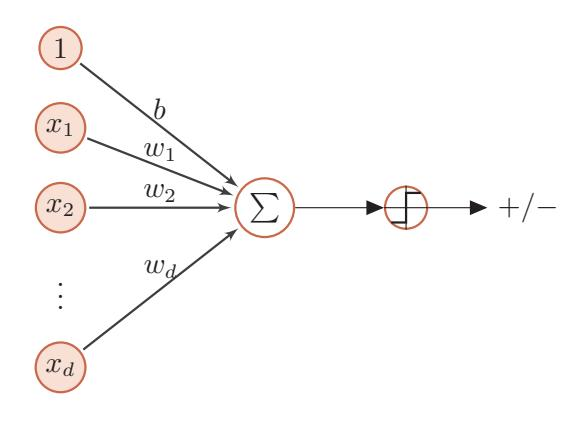
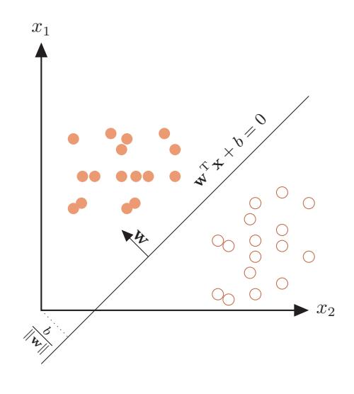
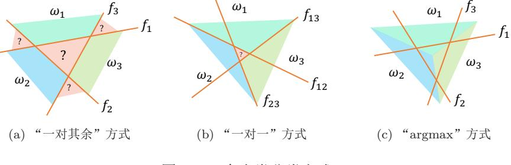
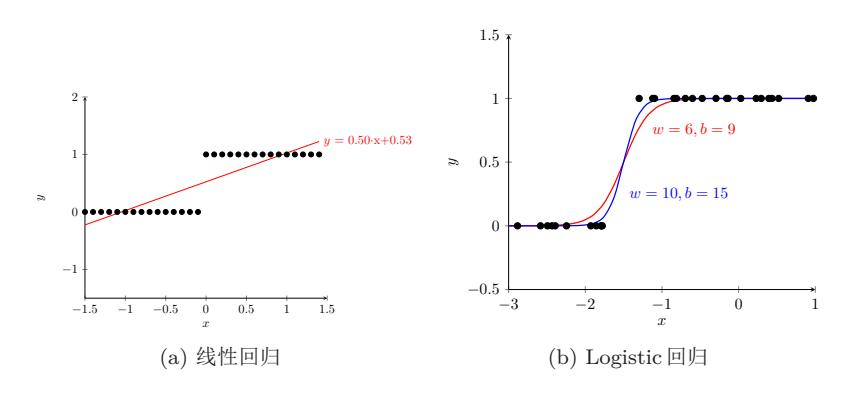
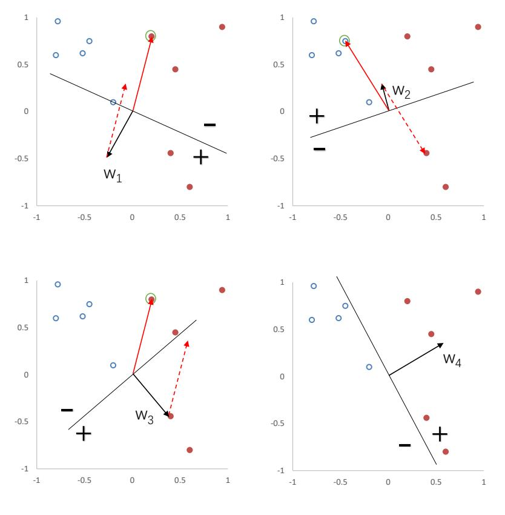
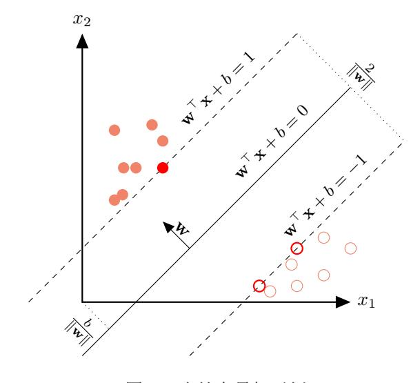
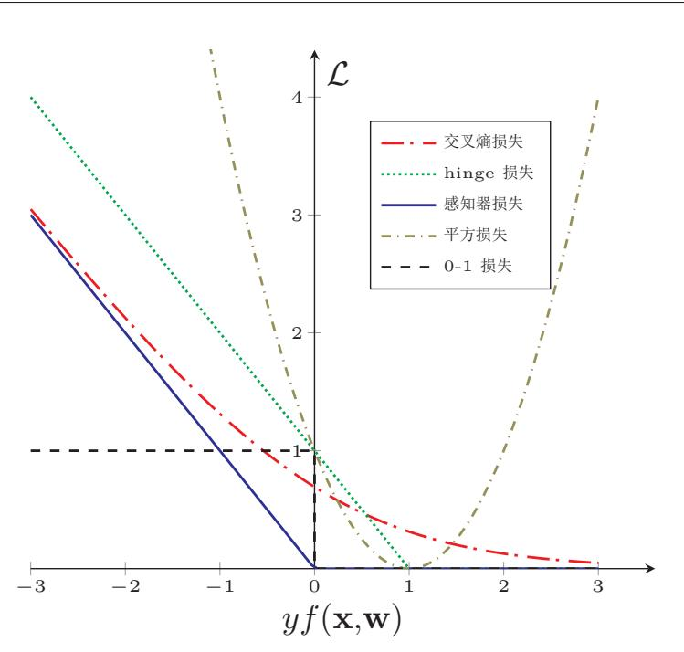

{0}------------------------------------------------

# 第3章 线性模型

正确的判断来自于经验,而经验来自于错误的判断。

- Frederick P. Brooks

线性模型(Linear Model)是机器学习中应用最广泛的模型,指通过样本 特征的线性组合来进行预测的模型。给定一个d维样本 $[x_1, \cdots, x_d]$ r, 其线性组 合函数为

$$
f(\mathbf{x}, \mathbf{w}) = w_1 x_1 + w_2 x_2 + \dots + w_d x_d + b \tag{3.1}
$$

$$
= \mathbf{w}^{\mathrm{T}} \mathbf{x} + b,\tag{3.2}
$$

其中w =  $[w_1, \cdots, w_d]$  "为 $d$ 维的权重向量,  $b$ 为偏置。上一章中介绍的线性回 归就是典型的线性模型, 直接用  $f(\mathbf{x}, \mathbf{w})$  来预测输出目标  $y = f(\mathbf{x}, \mathbf{w})$ 。

在分类问题中, 由于输出目标y是一些离散的标签, 而  $f(\mathbf{x}, \mathbf{w})$  的值域为 实数, 因此无法直接用  $f(\mathbf{x}, \mathbf{w})$  来进行预测, 需要引入一个非线性的决策函数 (decision function)  $q(.)$ 来预测输出目标

$$
y = g(f(\mathbf{x}, \mathbf{w})),\tag{3.3}
$$

其中 $f(\mathbf{x}, \mathbf{w})$ 也称为判别函数(discriminant function)。

对于两类分类问题,  $g(.)$ 可以是符号函数 (sign function)

$$
g(f(\mathbf{x}, \mathbf{w})) = \text{sgn}(f(\mathbf{x}, \mathbf{w}))
$$
\n(3.4)

$$
\triangleq \begin{cases}\n+1 & \text{if } f(\mathbf{x}, \mathbf{w}) > 0, \\
-1 & \text{if } f(\mathbf{x}, \mathbf{w}) < 0.\n\end{cases}
$$
\n(3.5)

当 $f(\mathbf{x}, \mathbf{w}) = 0$ 时不进行预测。公式(3.5)定义了一个典型的两类分类问题的决 策函数,其结构如图3.1所示。

简单起见,这里用 $f(\mathbf{x}, \mathbf{w})$ 来 表示 $f(\mathbf{x}, \mathbf{w}, b)$ 。

{1}------------------------------------------------

图 3.1 两类分类的线性模型

在本章, 我们主要介绍四种不同线性分类模型: logistic 回归、softmax 回 归、感知器和支持向量机, 这些模型区别主要在于使用了不同的损失函数。

#### 线性判别函数和决策边界 3.1

从公式(3.3)可知, 一个线性分类模型 (Linear Classification Model) 或线 性分类器(Linear Classifier), 是由一个(或多个)线性的判别函数 $f(\mathbf{x}, \mathbf{w}) =$ wTx+b和非线性的决策函数 q(·)组成。我们首先考虑两类分类的情况, 然后在 扩展到多类分类的情况。

#### $3.1.1$ 两类分类

两类分类 (Binary Classification) 的类别标签  $y$  只有两种取值, 通常可以 设为{+1,-1}。

在两个分类中, 我们只需要一个线性判别函数  $f(\mathbf{x}, \mathbf{w}) = \mathbf{w}^T \mathbf{x} + b$ 。特征空 间 $\mathbb{R}^d$ 中所有满足 $f(\mathbf{x}, \mathbf{w}) = 0$ 的点组成用一个分割超乎面(hyperplane), 称为 决策边界 (decision boundary) 或决策平面 (decision surface) 。决策边界将特 征空间一分为二, 划分成两个区域, 每个区域对应一个类别。

所谓"线性分类模型"就是指其决策边界是线性超平面。在特征空间中, 决策平面与权重向量w正交。特征空间中每个样本点到决策平面的有向距离 (signed distance) 为

$$
\gamma = \frac{f(\mathbf{x}, \mathbf{w})}{\|\mathbf{w}\|}.
$$
\n(3.6)

 $\gamma$ 也可以看作是点x在w方向上的投影。

图3.2给出了一个两维数据的线性决策边界示例,其中样本特征向量x =  $[x_1, x_2]$ , 权重向量 w =  $[w_1, w_2]$ 。

超平面就是三维空间中的平 面在更高维空间的推广。d维 空间中的超平面是d-1维 的。在二维空间中,决策边界 为一个直线;在三维空间中, 决策边界为一个平面;在高 维空间中,决策边界为一个 超平面。 参见习题3-2。

 $y$ 有时也会表示为 $\{0,1\}$ 。

 $58\,$ 

{2}------------------------------------------------

图 3.2 两类分类的决策边界示例

给定  $N \triangleq K$ 样本的训练集  $\mathcal{D} = \{(\mathbf{x}^{(n)}, y^{(n)})\}_{n=1}^N$ , 其中  $y^{(n)} \in \{+1, -1\}$ , 线 性模型试图学习到参数 w\*, 使得对于每个样本  $(\mathbf{x}^{(n)}, y^{(n)})$  尽量满足

$$
f(\mathbf{x}^{(n)}, \mathbf{w}^*) > 0
$$
 if  $y^{(n)} = 1$ ,  
\n $f(\mathbf{x}^{(n)}, \mathbf{w}^*) < 0$  if  $y^{(n)} = -1$ . (3.7)

上面两个公式也可以合并, 即参数 w\* 尽量满足

$$
y^{(n)}f(\mathbf{x}^{(n)}, \mathbf{w}^*) > 0, \qquad \forall n \in [1, N]. \tag{3.8}
$$

定义 3.1-两类线性可分: 对于训练集 $D = \{(\mathbf{x}^{(n)}, y^{(n)})\}_{n=1}^{N}$ , 如果 存在权重向量 w\*, 对所有样本都满足  $yf(x, w^*) > 0$ , 那么训练集  $D$ 是线性可分的。

为了学习参数w, 我们需要定义合适的损失函数以及优化方法。对于两类 分类问题, 最直接的损失函数为0-1损失函数, 即

$$
\mathcal{L}_{01}(y, f(\mathbf{x}, \mathbf{w})) = I(yf(\mathbf{x}, \mathbf{w}) > 0),\tag{3.9}
$$

其中 I(·) 为指示函数。但 0-1 损失函数的数学性质不好, 其关于 w 的导数为 0, 从而导致无法优化w。

邱锡鹏:《神经网络与深度学习》

{3}------------------------------------------------

#### $3.1.2$ 多类分类

多类分类 (Multi-class Classification) 问题是指分类的类别数 $C$ 大于2。多 类分类一般需要多个线性判别函数, 但设计这些判别函数有很多种方式。

假设一个多类分类问题的类别为 {1, 2, …, C}, 常用的方式有以下三种:

- 1. "一对其余"方式: 把多类分类问题转换为C个"一对其余"的两类分类 问题。这种方式共需要 $C \wedge H$ 别函数, 其中第 $c \wedge H$ 别函数 $f_c$ 是将类 $c$ 的 样本和不属于类c的样本分开。
- $2.$  "一对一"方式: 把多类分类问题转换为 $C(C-1)/2$ 个 "一对一"的两类 分类问题。这种方式共需要 $C(C-1)/2$ 个判别函数, 其中第 $(i, j)$ 个判别 函数是把类 ; 和类 ; 的样本分开。
  - 3. "argmax"方式: 这是一种改进的"一对其余"方式, 共需要C个判别函数

$$
f_c(\mathbf{x}, \mathbf{w}_c) = \mathbf{w}_c^{\mathrm{T}} \mathbf{x} + b_c, \qquad c = [1, \cdots, C] \tag{3.10}
$$

如果存在类别c,对于所有的其他类别 $\tilde{c}(\tilde{c} \neq c)$  都满足 $f_c(\mathbf{x}, \mathbf{w}_c) > f_{\tilde{c}}(\mathbf{x}, \mathbf{w}_{\tilde{c}})$ , 那么x属于类别c。即

$$
y = \underset{c=1}{\arg\max} \ f_c(\mathbf{x}, \mathbf{w}_c). \tag{3.11}
$$

参见习题3-3。

 $1\leq i < j \leq C$ 

"一对其余"方式和"一对一"方式都存在一个缺陷: 特征空间中会存在 一些难以确定类别的区域, 而"argmax"方式很好地解决了这个问题。图3.3给 出了用这三种方式进行三类分类的示例,其中不用颜色的区域表示预测的类别, 红色直线表示判别函数  $f(\cdot) = 0$ 的直线。在"argmax"方式中, 相邻两类 $i \nmid i$ 的决策边界实际上是由 $f_i(\mathbf{x}, \mathbf{w}_i) - f_j(\mathbf{x}, \mathbf{w}_j) = 0$ 决定, 其法向量为 $\mathbf{w}_i - \mathbf{w}_j$ 。

图 3.3 三个多类分类方式

{4}------------------------------------------------

### 2018年10月12日

定义 3.2-多类线性可分: 对于训练集  $\mathcal{D} = \{(\mathbf{x}^{(n)}, y^{(n)})\}_{n=1}^{N}$ , 如 果存在 $C \wedge R$ 重向量 w\*,  $1 \leq c \leq C$ , 对所有第 $c$ 类的样本都满足  $f_c(\mathbf{x}, \mathbf{w}_c) > f_{\tilde{c}}(\mathbf{x}, \mathbf{w}_{\tilde{c}}), \forall \tilde{c} \neq c$ , 那么训练集 $\mathcal{D}$ 是线性可分的。

从上面定义可以,如果数据集可以多类线性可分的,那么一定存在一个"argmax" 方式的线性分类器可以将它们正确分开。

参见习题3-4。

#### Logistic 回归 3.2

Logistic 回归 (Logistic Regression, LR) 是一种常用的处理两类分类问题 的线性模型。在本节中我们采用 $y \in \{0,1\}$ 以符合 logistic 回归的描述习惯。

为了解决连续的线性函数不适合进行分类的问题,我们引入非线性函数 g:  $\mathbb{R}^d \to (0,1)$ 来预测类别标签的后验概率  $p(y=1|\mathbf{x})$ 。

$$
p(y=1|\mathbf{x}) = g(f(\mathbf{x}, \mathbf{w})),\tag{3.12}
$$

其中  $g(\cdot)$ 通常称为激活函数 (activation function), 其作用是把线性函数的值 域从实数区间"挤压"到了(0.1)之间,可以用来表示概率。在统计文献中, q(.) 的逆函数  $g^{-1}(\cdot)$  也称为联系函数 (link function).

在 logistic 回归中, 我们使用 logistic 函数来作为激活函数。标签  $y = 1$  的后 验概率为

$$
p(y = 1|\mathbf{x}) = \sigma(\mathbf{w}^{\mathrm{T}}\mathbf{x})
$$
\n(3.13)

$$
\triangleq \frac{1}{1 + \exp(-\mathbf{w}^{\mathrm{T}} \mathbf{x})},\tag{3.14}
$$

见... 这里 杞  $[x_1, \cdots, x_d, 1]^{\mathrm{T}}$  $\mathbf{\hat{z}} \mathbf{w} = [w_1, \cdots, w_d, b]^\mathrm{T} \hat{z}$ 别为d+1维的增广特征向 量和增广权重向量。

标签 $y = 0$ 的后验概率为

$$
p(y = 0|\mathbf{x}) = 1 - p(y = 1|\mathbf{x})
$$
\n(3.15)

$$
=\frac{\exp(-\mathbf{w}^{\mathrm{T}}\mathbf{x})}{1+\exp(-\mathbf{w}^{\mathrm{T}}\mathbf{x})}.
$$
 (3.16)

图3.4给出了使用线性回归和 logistic 回归来解决一维的两类分类问题示例。

将公式(3.14)进行变换后得到

$$
\mathbf{w}^{\mathrm{T}}\mathbf{x} = \log \frac{p(y=1|\mathbf{x})}{1 - p(y=1|\mathbf{x})}
$$
(3.17)

$$
= \log \frac{p(y=1|\mathbf{x})}{p(y=0|\mathbf{x})},\tag{3.18}
$$

邱锡鹏: 《神经网络与深度学习》

https://nndl.github.io/

logistic 函数参见第B.2.4节。

{5}------------------------------------------------

图 3.4 一维数据的两类问题示例

其中 $\frac{p(y=1|\mathbf{x})}{p(y=0|\mathbf{x})}$ 为样本  $\mathbf{x}$ 为正反例后验概率的比值, 称为几率(odds), 几率的对 数称为对数几率(log odds, 或logit)。公式(3.17)的左边是线性函数, logistic 回归可以看作是预测值为"标签的对数几率"的线性回归模型。因此, logistic 回归也称为对数几率回归(Logit Regression)。

#### 参数学习 $3.2.1$

Logistic 回归采用交叉熵作为损失函数, 并使用梯度下降法来对参数进行 优化。

给定  $N \triangleleft \{(\mathbf{x}^{(n)}, y^{(n)})\}_{n=1}^N$ , 用 logistic 回归模型对每个样本 $\mathbf{x}^{(n)}$ 进行预测,并用输出 $\mathbf{x}^{(n)}$ 的标签为1的后验概率,记为 $\hat{y}^{(n)}$ ,

$$
\hat{y}^{(n)} = \sigma(\mathbf{w}^{\mathrm{T}} \mathbf{x}^{(n)}), \qquad 1 \le n \le N. \tag{3.19}
$$

由于 $y^{(n)} \in \{0,1\}$ , 样本 $(\mathbf{x}^{(n)}, y^{(n)})$ 的真实条件概率可以表示为

$$
p_r(y^{(n)} = 1 | \mathbf{x}^{(n)}) = y^{(n)},\tag{3.20}
$$

$$
p_r(y^{(n)} = 0 | \mathbf{x}^{(n)}) = 1 - y^{(n)}.
$$
\n(3.21)

简单起见,这里忽略了正则 化项。

 $62\,$ 

使用交叉熵损失函数,其风险函数为:

$$
\mathcal{R}(\mathbf{w}) = -\frac{1}{N} \sum_{n=1}^{N} \left( p_r(y^{(n)} = 1 | \mathbf{x}^{(n)}) \log \hat{y}^{(n)} + p_r(y^{(n)} = 0 | \mathbf{x}^{(n)}) \log(1 - \hat{y}^{(n)}) \right)
$$
\n(3.22)

$$
= -\frac{1}{N} \sum_{n=1}^{N} \left( y^{(n)} \log \hat{y}^{(n)} + (1 - y^{(n)}) \log(1 - \hat{y}^{(n)}) \right).
$$
 (3.23)

{6}------------------------------------------------

风险函数 R(w) 关于参数 w 的偏导数为:

3.3Softmax回归

$$
\frac{\partial \mathcal{R}(\mathbf{w})}{\partial \mathbf{w}} = -\frac{1}{N} \sum_{n=1}^{N} \left( y^{(n)} \frac{\hat{y}^{(n)} (1 - \hat{y}^{(n)})}{\hat{y}^{(n)}} \mathbf{x}^{(n)} - (1 - y^{(n)}) \frac{\hat{y}^{(n)} (1 - \hat{y}^{(n)})}{1 - \hat{y}^{(n)}} \mathbf{x}^{(n)} \right)
$$
(3.24)  
$$
= -\frac{1}{N} \sum_{n=1}^{N} \left( y^{(n)} (1 - \hat{y}^{(n)}) \mathbf{x}^{(n)} - (1 - y^{(n)}) \hat{y}^{(n)} \mathbf{x}^{(n)} \right)
$$
(3.25)

$$
= -\frac{1}{N} \sum_{n=1}^{N} \mathbf{x}^{(n)} \left( y^{(n)} - \hat{y}^{(n)} \right). \tag{3.26}
$$

采用梯度下降法, logistic 回归的训练过程为: 初始化  $\mathbf{w}_0 \leftarrow 0$ , 然后通过下 式来迭代更新参数。

$$
\mathbf{w}_{t+1} \leftarrow \mathbf{w}_t + \alpha \frac{1}{N} \sum_{n=1}^{N} \mathbf{x}^{(n)} \left( y^{(n)} - \hat{y}_{\mathbf{w}_t}^{(n)} \right), \tag{3.27}
$$

其中α是学习率,  $\hat{y}_{\mathbf{w}_t}^{(n)}$ 是当参数为 $\mathbf{w}_t$ 时, logistic 回归模型的输出。

从公式(3.23)可知, 风险函数 $\mathcal{R}(\mathbf{w})$ 是关于参数 $\mathbf{w}$ 的连续可导的凸函数。因 此除了梯度下降法之外, logistic 回归还可以用高阶的优化方法, 比如牛顿法, 来 进行优化。

#### Softmax回归 3.3

Softmax回归(Softmax Regression), 也称为多项(multinomial)或多类 (multi-class) 的logistic 回归, 是 logistic 回归在多类分类问题上的推广。

对于多类问题, 类别标签  $y \in \{1, 2, \cdots, C\}$  可以有  $C$  个取值。给定一个样 本x, softmax回归预测的属于类别c的条件概率为:

> $p(y = c|\mathbf{x}) = \text{softmax}(\mathbf{w}_c^{\mathrm{T}} \mathbf{x})$  $(3.28)$

$$
= \frac{\exp(\mathbf{w}_c^{\top} \mathbf{x})}{\sum_{c=1}^{C} \exp(\mathbf{w}_c^{\top} \mathbf{x})},
$$
(3.29)

其中wc是第c类的权重向量。

Softmax回归的决策函数可以表示为:

$$
\hat{y} = \underset{c=1}{\text{arg}\max} p(y = c|\mathbf{x})
$$
\n(3.30)

$$
= \underset{c=1}{\arg \max} \mathbf{w}_c^{\mathrm{T}} \mathbf{x}.
$$
 (3.31)

与 logistic 回归的关系 当类别数 $C = 2$ 时, softmax 回归的决策函数为

$$
\hat{y} = \underset{y \in \{0,1\}}{\arg \max} \mathbf{w}_y^{\mathrm{T}} \mathbf{x}
$$
\n(3.32)

softmax 函 数 参 见 第B.2.5节。

邱锡鹏:《神经网络与深度学习》

https://nndl.github.io/

Softmax回归也可以看作是 一种条件最大熵模型, 参见 第11.1.5.1节。

{7}------------------------------------------------

$$
=I(\mathbf{w}_{1}^{T}\mathbf{x}-\mathbf{w}_{0}^{T}\mathbf{x}>0)
$$
\n(3.33)

$$
=I((\mathbf{w}_1-\mathbf{w}_0)^{\mathrm{T}}\mathbf{x}>0),\tag{3.34}
$$

其中 I(.) 是指示函数。对比公式 (3.5) 中的两类分类决策函数, 可以发现两类分 类中的权重向量  $\mathbf{w} = \mathbf{w}_1 - \mathbf{w}_0$ 。

向量表示 公式(3.29)用向量形式可以写为:

$$
\hat{\mathbf{y}} = \text{softmax}(W^{\mathrm{T}} \mathbf{x}) \tag{3.35}
$$

$$
=\frac{\exp(W^{\mathrm{T}}\mathbf{x})}{\mathbf{1}^{\mathrm{T}}\exp(W^{\mathrm{T}}\mathbf{x})},\tag{3.36}
$$

其中 $W = [\mathbf{w}_1, \cdots, \mathbf{w}_C]$ 是由 $C \wedge \mathbb{X}$ 的权重向量组成的矩阵, 1为全1向量,  $\hat{\mathbf{y}} \in$  $\mathbb{R}^C$  为所有类别的预测条件概率组成的向量, 第 $c$ 维的值是第 $c$ 类的预测条件 概率。

### 3.3.1 参数学习

给定  $N \uparrow$ 训练样本  $\{(\mathbf{x}^{(n)}, y^{(n)})\}_{n=1}^N$ , softmax 回归使用交叉熵损失函数来 学习最优的参数矩阵W。

为了方便起见,我们用C维的one-hot向量v  $\in \{0,1\}^C$ 来表示类别标签。对 于类别c, 其向量表示为

$$
\mathbf{y} = [I(1 = c), I(2 = c), \cdots, I(C = c)]^{T}, \qquad (3.37)
$$

其中  $I(\cdot)$ 是指示函数。

采用交叉熵损失函数,softmax回归模型的风险函数为:

简单起见, 这里忽略了正则 化项。

$$
\mathcal{R}(W) = -\frac{1}{N} \sum_{n=1}^{N} \sum_{c=1}^{C} \mathbf{y}_c^{(n)} \log \hat{\mathbf{y}}_c^{(n)}
$$
(3.38)

$$
= -\frac{1}{N} \sum_{n=1}^{N} (\mathbf{y}^{(n)})^{\mathrm{T}} \log \hat{\mathbf{y}}^{(n)}, \tag{3.39}
$$

其中 $\hat{\mathbf{y}}^{(n)} = \text{softmax}(W^{\mathrm{T}}\mathbf{x}^{(n)})$ 为样本 $\mathbf{x}^{(n)}$ 在每个类别的后验概率。

风险函数 R(W) 关于 W 的梯度为

$$
\frac{\partial \mathcal{R}(W)}{\partial W} = -\frac{1}{N} \sum_{n=1}^{N} \mathbf{x}^{(n)} \left( \mathbf{y}^{(n)} - \hat{\mathbf{y}}^{(n)} \right)^{\mathrm{T}}.
$$
 (3.40)

证明. 计算公式(3.40)中的梯度,关键在于计算每个样本的损失函数 $\mathcal{L}^{(n)}(W)$  =  $-(\mathbf{v}^{(n)})^T \log \hat{\mathbf{v}}^{(n)}$ 关于参数 $W$ 的梯度, 其中需要用到的两个导数公式为:

{8}------------------------------------------------

- 1.  $\ddot{\mathbf{\pi}} \mathbf{y} = \text{softmax}(\mathbf{z})$ ,  $\begin{bmatrix} \n\mathbf{y} \\ \n\mathbf{y} \n\end{bmatrix} \frac{\partial \mathbf{y}}{\partial \mathbf{z}} = \text{diag}(\mathbf{y}) \mathbf{y} \mathbf{y}^{\top}$ .
- 2. 若  $\mathbf{z} = W^{\mathrm{T}}\mathbf{x} = [\mathbf{w}_1^{\mathrm{T}}\mathbf{x}, \mathbf{w}_2^{\mathrm{T}}\mathbf{x}, \cdots, \mathbf{w}_C^{\mathrm{T}}\mathbf{x}]^{\mathrm{T}}$ , 则  $\frac{\partial \mathbf{z}}{\partial \mathbf{w}_c}$  为第  $c$  列为  $\mathbf{x}$ , 其余为 0 的 矩阵。

$$
\frac{\partial \mathbf{z}}{\partial \mathbf{w}_c} = \left[\frac{\partial \mathbf{w}_1^{\mathrm{T}} \mathbf{x}}{\partial \mathbf{w}_c}, \frac{\partial \mathbf{w}_2^{\mathrm{T}} \mathbf{x}}{\partial \mathbf{w}_c}, \cdots, \frac{\partial \mathbf{w}_C^{\mathrm{T}} \mathbf{x}}{\partial \mathbf{w}_c}\right]
$$
(3.41)

$$
= [\mathbf{0}, \mathbf{0}, \cdots, \mathbf{x}, \cdots, \mathbf{0}] \tag{3.42}
$$

$$
\triangleq \mathbb{M}_c(\mathbf{x}).\tag{3.43}
$$

根据链式法则,  $\mathcal{L}^{(n)}(W) = -(\mathbf{y}^{(n)})^{\mathrm{T}} \log \hat{\mathbf{y}}^{(n)}$ 关于wc的偏导数为

$$
\frac{\partial \mathcal{L}^{(n)}(W)}{\partial \mathbf{w}_c} = -\frac{\partial \left( (\mathbf{y}^{(n)})^{\mathrm{T}} \log \hat{\mathbf{y}}^{(n)} \right)}{\partial \mathbf{w}_c} \tag{3.44}
$$

$$
= -\frac{\partial \mathbf{z}^{(n)}}{\partial \mathbf{w}_c} \frac{\partial \hat{\mathbf{y}}^{(n)}}{\partial \mathbf{z}^{(n)}} \frac{\partial \log \hat{\mathbf{y}}^{(n)}}{\partial \hat{\mathbf{y}}^{(n)}} \mathbf{y}^{(n)}
$$
(3.45)

$$
= -\mathbb{M}_c(\mathbf{x}^{(n)}) \left( \text{diag}\left(\hat{\mathbf{y}}^{(n)}\right) - \hat{\mathbf{y}}^{(n)}(\hat{\mathbf{y}}^{(n)})^{\mathrm{T}} \right) \left( \text{diag}(\hat{\mathbf{y}}^{(n)}) \right)^{-1} \mathbf{y}^{(n)} \tag{3.46}
$$
$$
= -\mathbb{M} \left( \mathbf{x}^{(n)} \right) \left( \mathbf{I} - \hat{\mathbf{y}}^{(n)} \mathbf{I}^{\mathrm{T}} \right) \mathbf{y}^{(n)} \tag{3.47}
$$

$$
= -\mathbb{M}_{c}(\mathbf{x}^{(n)}) \left( \mathbf{I} - \hat{\mathbf{y}}^{(n)} \mathbf{1}^{\mathrm{T}} \right) \mathbf{y}^{(n)}
$$
(3.47)  
$$
= -\mathbb{M}_{c}(\mathbf{x}^{(n)}) \left( \mathbf{y}^{(n)} - \hat{\mathbf{y}}^{(n)} \mathbf{1}^{\mathrm{T}} \mathbf{y}^{(n)} \right)
$$
(3.48)

$$
= -\mathbb{M}_c(\mathbf{x}^{(n)})\left(\mathbf{y}^{(n)} - \hat{\mathbf{y}}^{(n)}\right)
$$
(3.49)

$$
=-\mathbf{x}^{(n)}\left[\mathbf{y}^{(n)}-\hat{\mathbf{y}}^{(n)}\right]_c.
$$
\n(3.50)

公式(3.50)也可以表示为非向量形式,

$$
\frac{\partial \mathcal{L}^{(n)}(W)}{\partial \mathbf{w}_c} = -\mathbf{x}^{(n)} \left( I(y^{(n)} = c) - \hat{\mathbf{y}}_c^{(n)} \right),\tag{3.51}
$$

其中  $I(\cdot)$ 是指示函数。

根据公式(3.50)可以得到

$$
\frac{\partial \mathcal{L}^{(n)}(W)}{\partial W} = -\mathbf{x}^{(n)} \left( \mathbf{y}^{(n)} - \hat{\mathbf{y}}^{(n)} \right)^{\mathrm{T}}.
$$
 (3.52)

 $\Box$ 

采用梯度下降法, softmax回归的训练过程为: 初始化 $W_0 \leftarrow 0$ , 然后通过 下式进行迭代更新。

$$
W_{t+1} \leftarrow W_t + \alpha \left( \frac{1}{N} \sum_{n=1}^{N} \mathbf{x}^{(n)} \left( \mathbf{y}^{(n)} - \hat{\mathbf{y}}_{W_t}^{(n)} \right)^{\mathrm{T}} \right), \tag{3.53}
$$

其中 α 是学习率,  $\hat{\mathbf{y}}_{W_t}^{(n)}$  是当参数为  $W_t$  时, softmax 回归模型的输出。

要注意的是, softmax回归中使用的C个权重向量是冗余的, 即对所 ■5 有的权重向量都减去一个同样的向量 v, 不改变其输出结果。因此, softmax往往需要使用正则化来约束其参数。此外,我们可以利用这个 特性来避免计算softmax函数时在数值计算上溢出问题。

softmax 函数的导数 参见第B.2.5节。

 $\mathbf{y}^{\mathrm{T}}\operatorname{diag}(\mathbf{y})^{-1} \,=\, \mathbf{1}^{\mathrm{T}}\;\mathcal{h}\,\mathbf{\hat{\pm}}\,\mathbf{1}\;\mathcal{\hat{m}}$ 

因为y为onehot向量,所以

行向量。

 $\mathbf{1}^{\mathrm{T}}\mathbf{y} = 1$ .

{9}------------------------------------------------

## 3.4 感知器

感知器(Perceptron)由Frank Roseblatt于1957年提出,是一种广泛使用 的线性分类器。感知器可谓是最简单的人工神经网络,只有一个神经元。

感知器是对生物神经元的简单数学模拟,有与生物神经元相对应的部件,如 权重(突触)、偏置(阈值)及激活函数(细胞体),输出为+1或-1。

感知器是一种简单的两类线性分类模型,其分类准则与公式(3.5)相同。

$$
\hat{y} = \text{sgn}(\mathbf{w}^{\text{T}} \mathbf{x}).\tag{3.54}
$$

#### 参数学习 3.4.1

感知器学习算法也是一个经典的线性分类器的参数学习算法。

给定 N 个样本的训练集:  $\{(\mathbf{x}^{(n)}, y^{(n)})\}_{n=1}^N$ , 其中  $y^{(n)} \in \{+1, -1\}$ , 感知器 试图学习感知器试图学习到参数 w\*, 使得对于每个样本  $(\mathbf{x}^{(n)}, y^{(n)})$ 有

$$
y^{(n)}\mathbf{w}^{*T}\mathbf{x}^{(n)} > 0, \qquad \forall n \in [1, N]. \tag{3.55}
$$

感知器的学习算法是一种错误驱动的在线学习算法 [Rosenblatt, 1958]。先 初始化一个权重向量  $\mathbf{w} \leftarrow 0$  (通常是全零向量), 然后每次分错一个样本  $(\mathbf{x}, y)$ 时, 即  $v \mathbf{w}^T \mathbf{x} < 0$ , 就用这个样本来更新权重。

$$
\mathbf{w} \leftarrow \mathbf{w} + y\mathbf{x}.\tag{3.56}
$$

具体的感知器参数学习策略如算法3.1所示。

| 算法 3.1: 两类感知器算法                                           |                                                                        |  |  |
|-----------------------------------------------------------|------------------------------------------------------------------------|--|--|
| 输入: 训练集 $\{(\mathbf{x}^{(n)}, y^{(n)})\}_{n=1}^N$ , 迭代次数T |                                                                        |  |  |
| 1 初始化: wo ← 0, $k \leftarrow 0$ ;                         |                                                                        |  |  |
| 2 for $t = 1 \cdots T$ do                                 |                                                                        |  |  |
| $\overline{\mathbf{3}}$                                   | 随机对训练样本进行随机排序;                                                         |  |  |
| $\overline{\mathbf{4}}$                                   | for $n = 1 \cdots N$ do                                                |  |  |
| 5                                                         | 选取一个样本 $(\mathbf{x}^{(n)}, y^{(n)})$ ;                                 |  |  |
| 6                                                         | if $\mathbf{w}_k^{\mathrm{T}}(y^{(n)}\mathbf{x}^{(n)}) \leq 0$ then    |  |  |
| 7                                                         | $\mathbf{w}_{k+1} \leftarrow \mathbf{w}_k + y^{(n)} \mathbf{x}^{(n)};$ |  |  |
| 8                                                         | $\begin{array}{ c c c c c }\n\hline\nk & k+1;\n\end{array}$            |  |  |
| 9                                                         | end                                                                    |  |  |
| 10                                                        | end                                                                    |  |  |
| $11$ end                                                  |                                                                        |  |  |
| 输出・w』                                                     |                                                                        |  |  |

1971年,美国心理学家,人 工智能领域开拓者。

Frank Rosenblatt, 1928年-

最早发明的感知器是一台机 器而不是一种算法,后来才 被实现为IBM 704机器上可 运行的程序。

{10}------------------------------------------------

根据感知器的学习策略,可以反推出感知器的损失函数为:

$$
\mathcal{L}(\mathbf{w}; \mathbf{x}, y) = \max(0, -y\mathbf{w}^{\mathrm{T}}\mathbf{x}).\tag{3.57}
$$

采用随机梯度下降, 其每次更新的梯度为

$$
\frac{\partial \mathcal{L}(\mathbf{w}; \mathbf{x}, y)}{\partial \mathbf{w}} = \begin{cases} 0 & \text{if } y \mathbf{w}^{\mathrm{T}} \mathbf{x} > 0, \\ -y \mathbf{x} & \text{if } y \mathbf{w}^{\mathrm{T}} \mathbf{x} < 0. \end{cases}
$$
(3.58)

图3.5给出了感知器参数学习的更新过程,其中红色实心点为正例,蓝色空 心点为负例。黑色箭头表示权重向量, 红色虚线箭头表示权重的更新方向。

图 3.5 感知器参数学习的更新过程

#### 感知器的收敛性 3.4.2

Novikoff [1963] 证明对于两类问题, 如果训练集是线性可分的, 那么感知器 算法可以在有限次迭代后收敛。然而,如果训练集不是线性分隔的,那么这个 算法则不能确保会收敛。

邱锡鹏:《神经网络与深度学习》

{11}------------------------------------------------

参见定义3.1。

当数据集是两类线性可分时, 对于训练集 $D = \left\{ (\mathbf{x}^{(n)}, y^{(n)}) \right\}_{n=1}^{N}$ , 其中 $\mathbf{x}^{(n)}$ 为样本的增广特征向量,  $y^{(n)} \in \{-1,1\}$ , 那么存在一个正的常数 $\gamma(\gamma > 0)$  和权 重向量w\*,并且 $\|\mathbf{w}^*\| = 1$ , 对所有  $n$ 都满足 $(\mathbf{w}^*)^T(y^{(n)}\mathbf{x}^{(n)}) \geq \gamma$ 。我们可以证 明如下定理。

定理 3.1-感知器收敛性: 给定一个训练集 $D = \{(\mathbf{x}^{(n)}, y^{(n)})\}_{n=1}^N$ , 假设 R 是训练集中最大的特征向量的模,

$$
R = \max_{n} \|x^{(n)}\|
$$

如果训练集D线性可分,感知器学习算法3.1的权重更新次数不超 过 $\frac{R^2}{\gamma^2}$ 。

证明, 感知器的权重向量的更新方式为

$$
\mathbf{w}_k = \mathbf{w}_{k-1} + y^{(k)} \mathbf{x}^{(k)},\tag{3.59}
$$

其中 $\mathbf{x}^{(k)}, y^{(k)}$ 表示第 $k$ 个错误分类的样本。

因为初始权重向量为0, 在第 K 次更新时感知器的权重向量为

$$
\mathbf{w}_K = \sum_{k=1}^K y^{(k)} \mathbf{x}^{(k)}.
$$
 (3.60)

分别计算 $\|\mathbf{w}_K\|^2$ 的上下界:

(1)  $\|\mathbf{w}_K\|^2$ 的上界为:

$$
\|\mathbf{w}_K\|^2 = \|\mathbf{w}_{K-1} + y^{(K)} \mathbf{x}^{(K)}\|^2
$$
\n(3.61)

$$
= \|\mathbf{w}_{K-1}\|^2 + \|y^{(K)}\mathbf{x}^{(K)}\|^2 + 2y^{(K)}\mathbf{w}_{K-1}^{\mathrm{T}}\mathbf{x}^{(K)} \tag{3.62}
$$

$$
\leq \|\mathbf{w}_{K-1}\|^2 + R^2 \tag{3.63}
$$

$$
\leq \|\mathbf{w}_{K-2}\|^2 + 2R^2 \tag{3.64}
$$

$$
\leq KR^2\tag{3.65}
$$

### 邱锡鹏:《神经网络与深度学习》

 $y_k \mathbf{w}_{K-1}^{\mathrm{T}} \mathbf{x}^{(K)} \leq 0.$ 

{12}------------------------------------------------

(2)  $\|\mathbf{w}_K\|^2$ 的下界为:

$$
\|\mathbf{w}_K\|^2 = \frac{\|\mathbf{w}^*\|^2 \cdot \|\mathbf{w}_K\|^2}{\geq \|\mathbf{w}^{*^{\mathrm{T}}}\mathbf{w}_K\|^2}
$$
(3.66)  
(3.67)

2018年10月12日

$$
= \|\mathbf{w}^{*^{\mathrm{T}}}\sum_{k=1}^{K} (y^{(k)}\mathbf{x}^{(k)})\|^{2}
$$

$$
= \|\sum_{k=1}^{K} \mathbf{w}^{*T} (y^{(k)} \mathbf{x}^{(k)})\|^2
$$
\n
$$
\geq K^2 \gamma^2.
$$
\n(3.69)  $\mathbf{w}^{*T} (y^{(n)} \mathbf{x}^{(n)}) \geq \gamma, \forall n.$ \n(3.70)

由公式(3.65)和(3.70), 得到

$$
K^2 \gamma^2 \le ||\mathbf{w}_K||^2 \le KR^2. \tag{3.71}
$$

取最左和最右的两项,进一步得到, $K^2\gamma^2 \leq KR^2$ 。然后两边都除 $K$ ,最 终得到

$$
K \le \frac{R^2}{\gamma^2}.\tag{3.72}
$$

因此, 在线性可分的条件下, 算法3.1会在 R2 步内收敛。

虽然感知器在线性可分的数据上可以保证收敛,但其存在以下不足之处:

- 1. 在数据集线性可分时, 感知器虽然可以找到一个超平面把两类数据分开, 但并不能保证能其泛化能力。
- 2. 感知器对样本顺序比较敏感。每次迭代的顺序不一致时, 找到的分割超平 面也往往不一致。
- 3. 如果训练集不是线性可分的,就永远不会收敛 [Freund and Schapire, 1999]。

#### 参数平均感知器 3.4.3

根据定理3.1, 如果训练数据是线性可分的, 那么感知器可以找到一个判别 函数来分割不同类的数据。如果间隔  $\gamma$ 越大, 收敛越快。但是感知器并不能保 证找到的判别函数是最优的(比如泛化能力高),这样可能导致过拟合。

感知器的学习到的权重向量和训练样本的顺序相关。在迭代次序上排在后 面的错误样本,比前面的错误样本对最终的权重向量影响更大。比如有1,000个 训练样本, 在迭代100个样本后, 感知器已经学习到一个很好的权重向量。在 接下来的899个样本上都预测正确,也没有更新权重向量。但是在最后第1,000 个样本时预测错误, 并更新了权重。这次更新可能反而使得权重向量变差。

 $\|\mathbf{w}^*\| = 1.$ 

的乘积

 $(3.68)$ 

 $\Box$ 

两个向量内积的平方一定

小于等于这两个向量的模

{13}------------------------------------------------

 $70\,$ 

为了改善这种情况,可以使用"参数平均"的策略来提高感知器的鲁棒性, 也叫投票感知器 (Voted Perceptron) [Freund and Schapire, 1999]。

投票感知器是一种集成模型, 参见第10.1节。

投票感知器记录第k次更新后得到的权重 wk 在之后的训练过程中正确分 类样本的次数  $c_k$ 。这样最后的分类器形式为:

$$
\hat{y} = \text{sgn}\left(\sum_{k=1}^{K} c_k \text{sgn}(\mathbf{w}_k^{\text{T}} \mathbf{x})\right)
$$
\n(3.73)

其中
$$
sgn(\cdot)
$$
为将号的数。

投票感知器虽然提高了感知器的泛化能力,但是需要保存 K 个权重向量。 在实际操作中会带来额外的开销。因此,人们经常会使用一个简化的版本,也 叫做平均感知器 (Averaged Perceptron) [Collins, 2002]。

$$
\hat{y} = \text{sgn}\left(\sum_{k=1}^{K} c_k(\mathbf{w}_k^{\text{T}} \mathbf{x})\right)
$$
\n(3.74)

$$
= \operatorname{sgn}\left( (\sum_{k=1}^{K} c_k \mathbf{w}_k)^{\mathrm{T}} \mathbf{x} \right)
$$
 (3.75)

$$
=sgn(\bar{\mathbf{w}}^{\mathrm{T}}\mathbf{x}),\tag{3.76}
$$

其中v为平均的权重向量。

假设 $\mathbf{w}_{t,n}$ 是在第 $t$ 轮更新到第 $n$ 个样本时权重向量的值, 平均的权重向量 或也可以写为

$$
\bar{\mathbf{w}} = \frac{\sum_{t=1}^{T} \sum_{n=1}^{n} \mathbf{w}_{t,n}}{nT}
$$
\n(3.77)

这个方法非常简单,只需要在算法3.3中增加一个w,并且在处理每一个样 本后,更新

$$
\bar{\mathbf{w}} \leftarrow \bar{\mathbf{w}} + \mathbf{w}_{t,n}.\tag{3.78}
$$

但这个方法需要在处理每一个样本时都要更新v。因为v和wtn都是稠密 向量,因此更新操作比较费时。为了提高迭代速度,有很多改进的方法,让这 个更新只需要在错误预测发生时才进行更新。

参见习题3-7。

算法3.2给出了一个改进的平均感知器算法的训练过程 [Daumé III]。

### 3.4.4 扩展到多类分类

原始的感知器是一种两类分类模型,但也可以很容易地扩展到多类分类问 题, 甚至是更一般的结构化学习问题 [Collins, 2002]。

{14}------------------------------------------------

算法 3.2: 平均感知器算法 输入: 训练集 $\{(\mathbf{x}^{(n)}, y^{(n)})\}_{n=1}^N$ , 最大迭代次数T 1 初始化: w ← 0, u ← 0, c ← 0; 2 for  $t = 1 \cdots T$  do 随机对训练样本进行随机排序;  $\bf{3}$ for  $n = 1 \cdots N$  do  $\overline{4}$ 选取一个样本 $(\mathbf{x}^{(n)}, y^{(n)})$ ;  $\bf 5$ 计算预测类别 $\hat{y}_t$ ;  $\bf{6}$ if  $\hat{y}_t \neq y_t$  then  $\overline{\mathbf{7}}$  $\mathbf{w} \leftarrow \mathbf{w} + y^{(n)} \mathbf{x}^{(n)}$ ;  $\mathbf{R}$  $\mathbf{u} \leftarrow \mathbf{u} + cy^{(n)} \mathbf{x}^{(n)}$ ;  $\mathbf{q}$ end  $10$  $c \leftarrow c + 1$ ;  $11$ end 12 13 end 14  $\bar{w} = w_T - \frac{1}{c}u$ ; 输出: w

之前介绍的分类模型中, 分类函数都是在输入x的特征空间上。为了使得 感知器可以处理更复杂的输出,我们引入一个构建输入输出联合空间上的特征 函数 $\phi(\mathbf{x}, \mathbf{y})$ , 将样本 $(\mathbf{x}, \mathbf{y})$ 对映射到一个特征向量空间。

在联合特征空间中,我们可以建立一个广义的感知器模型,

$$
\hat{\mathbf{y}} = \underset{\mathbf{y} \in \text{Gen}(\mathbf{x})}{\arg \max} \mathbf{w}^{\mathrm{T}} \boldsymbol{\phi}(\mathbf{x}, \mathbf{y}),\tag{3.79}
$$

通过引入特征函数  $\phi(\mathbf{x}, \mathbf{y}),$ 感知器不但可以用于多类分 类问题, 也可以用于结构化 学习问题, 比如输出是序列 形式。

其中w为权重向量, Gen(x)表示输入x所有的输出目标集合。当处理 $C$ 类分类 问题时, Gen(x) =  $\{1, \cdots, C\}$ .

在 $C$ 类分类中, 一种常用的特征函数 $\phi(\mathbf{x}, \mathbf{y})$ 是y和x的外积, 其中y为类 别的one-hot 向量表示。

$$
\phi(\mathbf{x}, \mathbf{y}) = \mathbf{vec}(\mathbf{y}\mathbf{x}^{\mathrm{T}}) \in \mathbb{R}^{(d \times C)},\tag{3.80}
$$

其中 vec 是向量化算子。

邱锡鹏:《神经网络与深度学习》

{15}------------------------------------------------

给定样本(x,y), 若x ∈  $\mathbb{R}^d$ , y 为第c 维为1的 one-hot 向量, 则

$$
\phi(\mathbf{x}, \mathbf{y}) = \begin{bmatrix} \vdots \\ 0 \\ \vdots \\ 0 \\ x_d \end{bmatrix} \in \begin{bmatrix} \vdots \\ \frac{x_1}{2} \\ \vdots \\ \frac{x_d}{2} \end{bmatrix} \in (c-1) \times d + 1 \text{ if } (3.81)
$$

广义感知器算法的训练过程如算法3.3所示。

算法 3.3: 广义感知器参数学习算法 输入: 训练集: { $(x^{(n)}, y^{(n)})\}_{n=1}^N$ , 最大迭代次数T 1 初始化:  $\mathbf{w}_0 \leftarrow 0, k \leftarrow 0$ ; 2 for  $t = 1 \cdots T$  do 随机对训练样本进行随机排序;  $\bf{3}$ for  $n = 1 \cdots N$  do  $\overline{\mathbf{A}}$ 选取一个样本 $(\mathbf{x}^{(n)}, \mathbf{y}^{(n)})$ ;  $\overline{5}$ 用公式(3.79)计算预测类别 $\hat{\mathbf{y}}^{(n)}$ ;  $\mathbf{6}$ if  $\hat{\mathbf{y}}^{(n)} \neq \mathbf{y}^{(n)}$  then  $\overline{7}$  $\mathbf{w}_{k+1} \leftarrow \mathbf{w}_k + \big(\boldsymbol{\phi}(\mathbf{x}^{(n)}, \mathbf{y}^{(n)}) - \boldsymbol{\phi}(\mathbf{x}^{(n)}, \hat{\mathbf{y}}^{(n)})\big);$ 8  $k = k + 1;$ 9 end 10 end 11 12 end 输出: $\mathbf{w}_k$ 

3.4.4.1 广义感知器的收敛性

广义感知器在满足广义线性可分条件时, 也能够保证在有限步骤内收敛。 广义线性可分条件的定义如下:

广义线性可分是多类线性可 分的扩展,参见定义3.2。

定义 3.3-广义线性可分: 对于训练集  $D = \{(\mathbf{x}^{(n)}, \mathbf{y}^{(n)})\}_{n=1}^{N}$ , 如 果存在一个正的常数 $\gamma(\gamma > 0)$ 和权重向量 w\*, 并且  $\|w^*\| = 1$ , 对 所有 n 都满足  $\langle \mathbf{w}^*, \phi(\mathbf{x}^{(n)}, \mathbf{y}^{(n)}) \rangle - \langle \mathbf{w}^*, \phi(\mathbf{x}^{(n)}, \mathbf{y}) \rangle \geq \gamma, \mathbf{y} \neq \mathbf{y}^{(n)}$ 

 $72\,$ 

{16}------------------------------------------------

 $(\phi(\mathbf{x}^{(n)}, \mathbf{y}^{(n)}) \in \mathbb{R}^d$ 为样本 $\mathbf{x}^{(n)}, \mathbf{y}^{(n)}$ 的联合特征向量),那么训练集 $\mathcal{D}$ 在联合特征向量空间中是线性可分的。

广义感知器的收敛性定义如下:

定理 3.2-广义感知器收敛性: 对于满足广义线性可分的训练集  $\mathcal{D} = \left\{ (\mathbf{x}^{(n)}, \mathbf{y}^{(n)}) \right\}_{n=1}^{N}$ , 假设  $R$ 是所有样本中真实标签和错误标 签在特征空间 $\phi$ (x,y)最远的距离。

$$
R = \max_{n} \max_{\mathbf{z} \in \mathcal{L}(\mathbf{z})} \|\boldsymbol{\phi}(\mathbf{x}^{(n)}, \mathbf{y}^{(n)}) - \boldsymbol{\phi}(\mathbf{x}^{(n)}, \mathbf{z})\|.
$$

那么广义感知器参数学习算法3.3的权重更新次数不超过 $\frac{R^2}{\gamma^2}$ 。

Collins [2002] 给出了广义感知器在广义线性可分的收敛性证明, 具体推导 过程和两类感知器比较类似。

参见习题3-8。

## 3.5 支持向量机

支持向量机(Support Vector Machine, SVM)是一个经典两类分类算法, 其找到的分割超平面具有更好的鲁棒性,因此广泛使用在很多任务上,并表现 出了很强优势。

给定一个两类分类器数据集 $\mathcal{D} = \{(\mathbf{x}^{(n)}, y^{(n)})\}_{n=1}^N$ , 其中 $y_n \in \{+1, -1\}$ , 如果两类样本是线性可分的, 即存在一个超平面

$$
\mathbf{w}^{\mathrm{T}}\mathbf{x} + b = 0\tag{3.82}
$$

将两类样本分开, 那么对于每个样本都有  $y^{(n)}(\mathbf{w}^T\mathbf{x}^{(n)}+b) > 0$ 。

数据集 D中每个样本 x(n) 到分割超平面的距离为:

$$
\gamma^{(n)} = \frac{\|\mathbf{w}^{\mathrm{T}}\mathbf{x}^{(n)} + b\|}{\|\mathbf{w}\|} = \frac{y^{(n)}(\mathbf{w}^{\mathrm{T}}\mathbf{x}^{(n)} + b)}{\|\mathbf{w}\|}.
$$
 (3.83)

我们定义整个数据集D中所有样本到分割超平面的最短距离为间隔(Margin)  $\gamma$ 

$$
\gamma = \min_{n} \gamma^{(n)}.\tag{3.84}
$$

如果间隔 ? 越大, 其分割超平面对两个数据集的划分越稳定, 不容易受噪 声等因素影响。支持向量机的目标是寻找一个超平面 $(\mathbf{w}^*,b^*)$ 使得 $\gamma$ 最大, 即

$$
\max_{\mathbf{w},b} \quad \gamma \tag{3.85}
$$

邱锡鹏:《神经网络与深度学习》

https://nndl.github.io/

本节中不使用增广的特征向 量和特征权重。

{17}------------------------------------------------

s.t. 
$$
\frac{y^{(n)}(\mathbf{w}^{\mathrm{T}}\mathbf{x}^{(n)} + b)}{\|\mathbf{w}\|} \ge \gamma, \forall n
$$

$$
\diamondsuit \|\mathbf{w}\| \cdot \gamma = 1, \quad \text{M/}\simeq \mathcal{R} \quad (3.85)
$$
\n
$$
\begin{aligned}\n &\lim_{\mathbf{w}, b} \quad & \frac{1}{\|\mathbf{w}\|^2} \\
 &\text{s.t.} \quad & y^{(n)}(\mathbf{w}^{\mathrm{T}} \mathbf{x}^{(n)} + b) \ge 1, \forall n\n\end{aligned}
$$
\n
$$
(3.86)
$$

数据集中所有满足 $y^{(n)}(\mathbf{w}^T\mathbf{x}^{(n)}+b) = 1$ 的样本点,都称为支持向量(Support Vector).

对于一个线性可分的数据集, 其分割超平面有很多个, 但是间隔最大的超 平面是唯一的。图3.6给定了支持向量机的最大间隔分割超平面的示例,其红色 样本点为支持向量。

图 3.6 支持向量机示例

### 3.5.1 参数学习

为了找到最大间隔分割超平面, 将公式(3.86)的目标函数写为凸优化问题

$$
\min_{\mathbf{w},b} \quad \frac{1}{2} \|\mathbf{w}\|^2
$$
\n
$$
\text{s.t.} \quad 1 - y^{(n)} (\mathbf{w}^{\mathrm{T}} \mathbf{x}^{(n)} + b) \le 0, \quad \forall n
$$
\n
$$
(3.87)
$$

参见第??节。

使用拉格朗日乘数法, 公式(3.87)的拉格朗日函数为

$$
\Lambda(\mathbf{w}, b, \lambda) = \frac{1}{2} ||\mathbf{w}||^2 + \sum_{n=1}^{N} \lambda_n \left(1 - y^{(n)} (\mathbf{w}^{\mathrm{T}} \mathbf{x}^{(n)} + b)\right), \quad (3.88)
$$

邱锡鹏:《神经网络与深度学习》

{18}------------------------------------------------

其中 $\lambda_1 \geq 0, \cdots, \lambda_N \geq 0$ 为拉格朗日乘数。计算Λ(w,b,λ)关于w和b的导数, 并令其等于0得到

$$
\mathbf{w} = \sum_{n=1}^{N} \lambda_n y^{(n)} \mathbf{x}^{(n)},
$$
\n(3.89)

$$
0 = \sum_{n=1}^{N} \lambda_n y^{(n)}.
$$
\n(3.90)

将公式(3.89)代入公式(3.88), 并利用公式(3.90), 得到拉格朗日对偶函数

$$
\Gamma(\lambda) = -\frac{1}{2} \sum_{n=1}^{N} \sum_{m=1}^{N} \lambda_m \lambda_n y^{(m)} y^{(n)} (\mathbf{x}^{(m)})^{\mathrm{T}} \mathbf{x}^{(n)} + \sum_{n=1}^{N} \lambda_n.
$$
 (3.91)

支持向量机的主优化问题为凸优化问题,满足强对偶性,即主优化问题可 以通过最大化对偶函数 maxλ≥0 Γ(λ) 来求解。对偶函数 Γ(λ) 是一个凹函数, 因 此最大化对偶函数是一个凸优化问题,可以通过多种凸优化方法来进行求解, 得到拉格朗日乘数的最优值 X\*。但由于其约束条件的数量为训练样本数量, 一 般的优化方法代价比较高, 因此在实践中通常采用比较高效的优化方法, 比如 SMO (Sequential Minimal Optimization) 算法 [Platt, 1998] 等。

参见公式(C.26)。

根据KKT条件中的互补松弛条件,最优解满足 $\lambda_n^*\left(1-y^{(n)}(\mathbf{w}^{*\mathrm{T}}\mathbf{x}^{(n)}+b^*)\right)$ 0。如果样本 $\mathbf{x}^{(n)}$ 不在约束边界上,  $\lambda_n^* = 0$ , 其约束失效; 如果样本 $\mathbf{x}^{(n)}$ 在约束 边界上,  $\lambda_n^* \geq 0$ 。这些在约束边界上样本点称为支持向量 (support vector), 即离决策平面距离最近的点。

再计算出  $\lambda^*$  后, 根据公式 (3.89) 计算出最优权重 w\*, 最优偏置  $b^*$  可以通 过任选一个支持向量(x, ỹ) 计算得到。

$$
b^* = \tilde{y} - \mathbf{w}^{*T}\tilde{\mathbf{x}}.\tag{3.92}
$$

最优参数的支持向量机的决策函数为

$$
f(\mathbf{x}) = sgn(\mathbf{w}^{*T}\mathbf{x} + b^*)
$$
\n(3.93)

$$
= \operatorname{sgn}\left(\sum_{n=1}^{N} \lambda_n^* y^{(n)} (\mathbf{x}^{(n)})^{\mathrm{T}} \mathbf{x} + b^* \right). \tag{3.94}
$$

支持向量机的决策函数只依赖  $\lambda_n^* > 0$ 的样本点, 即支持向量。

支持向量机的目标函数可以通过SMO等优化方法得到全局最优解,因此比 其它分类器的学习效率更高。此外,支持向量机的决策函数只依赖与支持向量, 与训练样本总数无关, 分类速度比较快。

邱锡鹏:《神经网络与深度学习》

{19}------------------------------------------------

#### $3.5.2$ 核函数

支持向量机还有一个重要的优点是可以使用核函数(kernel function)隐式 地将样本从原始特征空间映射到更高维的空间,并解决原始特征空间中的线性 不可分问题。比如在一个变换后的特征空间 *。*中, 支持向量机的决策函数为

$$
f(\mathbf{x}) = sgn(\mathbf{w}^{*T}\phi(\mathbf{x}) + b^*)
$$
\n(3.95)

$$
= \operatorname{sgn}\left(\sum_{n=1}^{N} \lambda_n^* y^{(n)} K(\mathbf{x}^{(n)}, \mathbf{x}) + b^*\right),\tag{3.96}
$$

其中  $K(\mathbf{x}, \mathbf{z}) = \phi(\mathbf{x})^T \phi(\mathbf{z})$ 为核函数。通常我们不需要显式地给出 $\phi(\mathbf{x})$ 的具体 形式,可以通过核技巧(kernel trick)来构造。比如以 $x, z \in \mathbb{R}^2$ 为例,我们可 以构造一个核函数

$$
K(\mathbf{x}, \mathbf{z}) = (1 + \mathbf{x}^{\mathrm{T}} \mathbf{z})^2 = \phi(\mathbf{x})^{\mathrm{T}} \phi(\mathbf{z}), \qquad (3.97)
$$

来隐式地计算x, z 在特征空间  $\phi$ 中的内积, 其中  $\phi(\mathbf{x}) = [1, \sqrt{2}x_1, \sqrt{2}x_2,$  $\sqrt{2}x_1x_2, x_1^2, x_2^2$ T.

### 3.5.3 软间隔

在支持向量机的优化问题中,约束条件比较严格。如果训练集中的样本在 特征空间中不是线性可分的, 就无法找到最优解。为了能够容忍部分不满足约 束的样本, 我们可以引入松弛变量 ξ, 将优化问题变为

$$
\min_{\mathbf{w},b} \quad \frac{1}{2} \|\mathbf{w}\|^2 + C \sum_{n=1}^N \xi_n
$$
\n
$$
\text{s.t.} \quad 1 - y^{(n)} (\mathbf{w}^{\mathrm{T}} \mathbf{x}^{(n)} + b) - \xi_n \le 0, \qquad \forall n
$$
\n
$$
\xi_n \ge 0, \qquad \forall n
$$
\n(3.98)

其中参数 $C > 0$ 用来控制间隔和松弛变量惩罚的平衡。引入松弛变量的间隔称 为软间隔(soft margin)。公式(3.98)也可以表示为经验风险+正则化项的形式。

$$
\min_{\mathbf{w},b} \qquad \sum_{n=1}^{N} \max\left(0, 1 - y^{(n)}(\mathbf{w}^{\mathrm{T}} \mathbf{x}^{(n)} + b)\right) + \frac{1}{C} \cdot \frac{1}{2} ||\mathbf{w}||^2, \tag{3.99}
$$

其中 max  $(0, 1 - y^{(n)}(\mathbf{w}^T\mathbf{x}^{(n)} + b))$  称为 hinge 损失函数,  $\frac{1}{C}$  可以看作是正则化 系数。

参见公式(2.21)。

软间隔支持向量机的参数学习和原始支持向量机类似, 其最终决策函数也 只和支持向量有关, 即满足 $1 - y^{(n)}(\mathbf{w}^T\mathbf{x}^{(n)} + b) - \xi_n = 0$ 的样本。

参见习题3-11。

邱锡鹏:《神经网络与深度学习》

https://nndl.github.io/

参见习题3-10。

{20}------------------------------------------------

#### 损失函数对比 3.6

本章介绍的三种两类分类模型: logistic 回归、感知器和支持向量机。虽然 它们的决策函数相同,但由于使用了不同的损失函数以及相应的优化方法,导 致它们之间在实际任务上的表现存在一定的差异。

为了比较这些损失函数, 我们统一定义类别标签 y ∈ {+1,-1}, 并定义  $f(\mathbf{x}, \mathbf{w}) = \mathbf{w}^T \mathbf{x} + b$ 。这样对于样本 $(\mathbf{x}, y)$ , 若 $y f(\mathbf{x}, \mathbf{w}) > 0$ , 则分类正确, 相反 则分类错误。这样为了方便比较这些模型,我们可以将它们的损失函数都表述 为定义在  $yf(\mathbf{x}, \mathbf{w})$ 上的函数。

logistic 回归的损失函数可以改写为

$$
\mathcal{L}_{LR} = -\log p(y|\mathbf{x}) \tag{3.100}
$$
\n
$$
= -I(y=1)\log \sigma\Big(f(\mathbf{x}, \mathbf{w})\Big) - I(y=-1)\log \sigma\Big(-f(\mathbf{x}, \mathbf{w})\Big) \tag{3.101} \quad 1-\sigma(x) = \sigma(-x)
$$
\n
$$
= \log\Big(1 + \exp\big(-y f(\mathbf{x}, \mathbf{w})\big)\Big). \tag{3.102}
$$

感知器的损失函数为

$$
\mathcal{L}_p = \max(0, -yf(\mathbf{x}, \mathbf{w})).\tag{3.103}
$$

软间隔支持向量机的损失函数为

$$
\mathcal{L}_{hinge} = \max(0, 1 - yf(\mathbf{x}, \mathbf{w})). \tag{3.104}
$$

平方损失可以重写为

$$
\mathcal{L}_{squared} = (y - f(\mathbf{x}, \mathbf{w}))^{2}
$$
\n
$$
= 1 - 2y f(\mathbf{x}, \mathbf{w}) + (y f(\mathbf{x}, \mathbf{w}))^{2}
$$
\n(3.106) 
$$
y^{2} = 1
$$

$$
= (1 - yf(\mathbf{x}, \mathbf{w}))^{2}.
$$
 (3.107)

图3.7给出了不同损失函数的对比。对于两类分类来说, 当 $y f(\mathbf{x}, \mathbf{w}) > 0$ 时, 分类器预测正确, 并且 $yf(\mathbf{x}, \mathbf{w})$ 越大, 模型的预测越正确; 当 $yf(\mathbf{x}, \mathbf{w}) < 0$ 时, 分类器预测错误,并且yf(x,w)越小,模型的预测越错误。因此,一个好的损 失函数应该随着 yf(x, w) 的增大而减少。从图3.7中看出, 除了平方损失, 其它 损失函数都比较适合于两类分类问题。

邱锡鹏:《神经网络与深度学习》

{21}------------------------------------------------

图 3.7 不同损失函数的对比

#### 总结和深入阅读 3.7

和回归问题不同, 分类问题中的目标标签 y 是离散的类别标签, 因此分类 问题中的决策函数需要输出离散值或是标签的后验概率。线性分类模型一般是 一个广义线性函数, 即一个线性判别函数  $f(\mathbf{x}, \mathbf{w}) = \mathbf{w}^T \mathbf{x}$ 加上一个非线性激活 函数 $q(\cdot)$ 。

表3.1给出了几种常见的线性模型的比较。在logistic回归和softmax回归中, y 为类别的 one-hot 向量表示; 在感知器和支持向量机中,  $y$  为  $\{+1, -1\}$ 。

Logistic 回归是一种概率模型, 其通过使用 logistic 函数来将一个实数值映 射到[0,1]之间。事实上,还有很多函数也可以达到此目的,比如正态分布的累 积概率密度函数, 即 probit 函数。这些知识可以参考《Pattern Recognition and Machine Learning》[Bishop, 2007] 的第四章。

Rosenblatt [1958] 最早提出了两类感知器算法, 并随后给出了感知机收敛 定理。但是感知器的输出是离散的以及学习算法比较简单,不能解决线性不可 分问题,限制了其应用范围。Minsky and Seymour [1969] 在《感知器》一书中分 析了感知器的局限性, 证明感知器不能解决非常简单的异或(XOR)问题。从 现在的视角看, Minsky and Seymour [1969] 仅仅给出了一个显而易见的证明:

{22}------------------------------------------------

### 2018年10月12日

|                        | 激活函数                                 | 损失函数                                                         | 优化方法      |
|------------------------|--------------------------------------|--------------------------------------------------------------|-----------|
| 线性回归                   |                                      | $(y - \mathbf{w}^T \mathbf{x})^2$                            | 最小二乘、梯度下降 |
| Logistic 回归            | $\sigma(\mathbf{w}^T\mathbf{x})$     | $\mathbf{y} \log \sigma(\mathbf{w}^{\mathrm{T}} \mathbf{x})$ | 梯度下降      |
| $Softmax \n\mathbb{H}$ | softmax $(W^{\mathrm{T}}\mathbf{x})$ | y log softmax $(W^{\mathrm{T}}\mathbf{x})$                   | 梯度下降      |
| 感知器                    | $sgn(\mathbf{w}^T\mathbf{x})$        | $\max(0, -y\mathbf{w}^T\mathbf{x})$                          | 随机梯度下降    |
| 支持向量机                  | $sgn(\mathbf{w}^T\mathbf{x})$        | $\max(0, 1 - y\mathbf{w}^T\mathbf{x})$                       | 二次规划、SMO等 |

表 3.1 几种不同的线性模型对比

线性模型不能解决非线性问题,但依然给感知器以及人工智能领域的研究造成 了很大的负面影响。虽然书中也认为多层的网络可以解决非线性问题,但遗憾 的是, 在当时这个问题还不可解。直到1980年以后, Geoffrey Hinton、Yann LeCun 等人用连续输出代替离散的输出,并将反向传播算法 [Werbos, 1974] 引 入到多层感知器 [Williams and Hinton, 1986], 人工神经网络才又重新引起人们 的注意。Minsky and Papert [1987] 也修正之前的看法。另外一方面, 人们对感 知器本身的认识也在不断发展。Freund and Schapire [1999] 提出了使用核技巧 改进感知器学习算法, 并用投票感知器来提高泛化能力。Collins [2002] 将感知 器算法扩展到结构化学习, 给出了相应的收敛性证明, 并且提出一种更加有效 并且实用的参数平均化策略。McDonald et al. [2010] 又扩展了平均感知器算法, 使得感知器可以在分布式计算环境中并行计算, 这样感知器可以用在大规模机 器学习问题上。

要深入了解支持向量机以及核方法, 可以参考《Learning with Kernels: Support Vector Machines, Regularization, Optimization, and Beyond) Scholkopf and Smola,  $2001$ .

## 习题

习题 3-1 证明在两类线性分类中, 权重向量 w 与决策平面正交。

习题 3-2 在线性空间中, 证明一个点 x 到平面  $f(\mathbf{x}, \mathbf{w}) = \mathbf{w}^T \mathbf{x} + b = 0$  的 距离为 $|f(\mathbf{x}, \mathbf{w})|/||\mathbf{w}||$ 。

习题 3-3 在线性分类中, 决策区域是凸的。即若点  $\mathbf{x}_1$  和  $\mathbf{x}_2$  被分为类  $c$ , 则

邱锡鹏:《神经网络与深度学习》

{23}------------------------------------------------

点  $ho$ **x**1 + (1 - ρ)**x**2 也会被分为类 c, 其中 ρ ∈ (0, 1).

习题 3-4 在多类分类中, 1) 如果一个数据集中每个类的样本都可以其它 类是线性可分的, 则该数据集一定是线性可分的; 2) 如果一个数据集中每两个 类的样本是线性可分的, 则该数据集不一定是线性可分的。

习题 3-5 在 logistic 回归中, 是否可以用  $\hat{y} = \sigma(\mathbf{w}^T \mathbf{x})$  去逼近正确的标签  $y$ , 并用平方损失 $(y - \hat{y})^2$ 最小化来优化参数w?

习题 3-6 在 softmax 回归的风险函数(公式(3.39))中, 如果去掉正则化 项会有什么影响?

习题 3-7 验证平均感知器训练算法3.2中给出的平均权重向量的计算方式 和公式(3.78)等价。

习题 3-8 证明定理3.2。

习题 3-9 若数据集线性可分, 证明支持向量机中将两类样本正确分开的最 大间隔分割超平面存在且唯一。

习题 3-10 验证公式(3.97)。

习题 3-11 在软间隔支持向量机中, 试给出原始优化问题的对偶问题, 并 列出其KKT条件。

## 参考文献

Christopher M. Bishop. Pattern recognition and machine learning, 5th Edition. Information science and statistics. Springer, 2007. ISBN 9780387310732.

Michael Collins. Discriminative training methods for hidden markov models: Theory and experiments with perceptron algorithms. In Proceedings of the conference on Empirical methods in natural language processing, pages 1-8. Association for Computational Linguistics, 2002.

Hal Daumé III. A course in machine learning. http://ciml.info/. [Online].

Yoav Freund and Robert E Schapire. Large margin classification using the perceptron algorithm. Machine learning, 37(3):277-296, 1999.

{24}------------------------------------------------

Ryan McDonald, Keith Hall, and Gideon Mann. Distributed training strategies for the structured perceptron. In Human Language Technologies: The 2010 Annual Conference of the North American Chapter of the Association for *Computational Linguistics*, pages 456– 464. Association for Computational Linguistics, 2010.

Marvin Minsky and Papert Seymour. Perceptrons. 1969.

Marvin L Minsky and Seymour A Papert. Perceptrons - Expanded Edition: An Introduction to Computational Geometry. MIT press Boston, MA:, 1987. Albert BJ Novikoff. On convergence proofs for perceptrons. Technical report, DTIC Document, 1963.

John Platt. Sequential minimal optimization: A fast algorithm for training support vector machines. Technical report, April 1998.

Frank Rosenblatt. The perceptron: a probabilistic model for information storage and organization in the brain.  $Psy$  $chological$  review,  $65(6):386, 1958.$ 

Bernhard Scholkopf and Alexander J Smola. Learning with kernels: support vector machines, regularization, optimization, and beyond. MIT press, 2001.

Paul Werbos. Beyond regression: New tools for prediction and analysis in the behavioral sciences. 1974.

DE Rumelhart GE Hinton RJ Williams and GE Hinton. Learning representations by back-propagating errors. Na*ture*, pages  $323 - 533$ , 1986.

81

{25}------------------------------------------------

