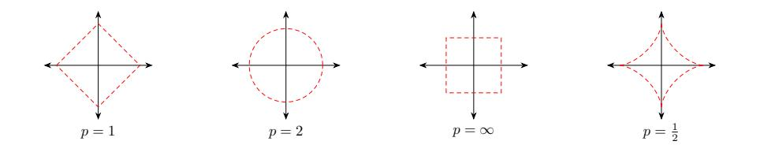
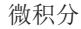
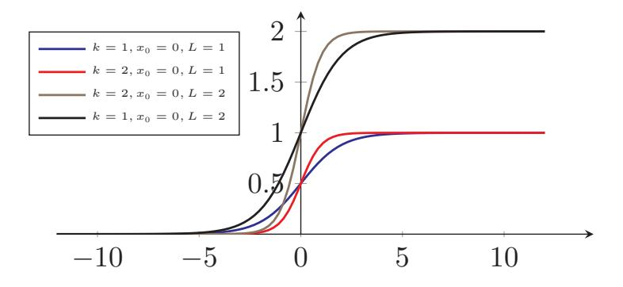
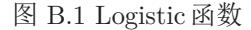
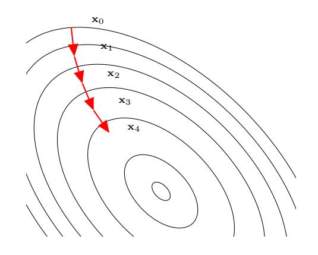
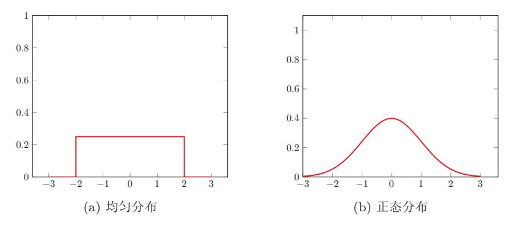
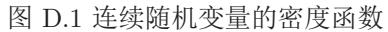
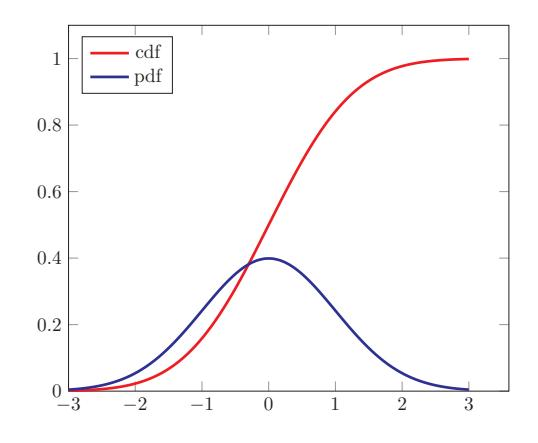
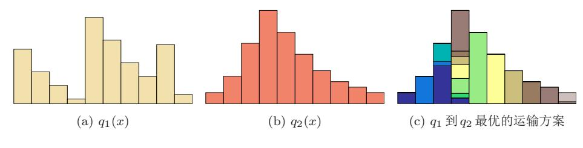

{0}------------------------------------------------

# 数学基础

本附录介绍一些深度学习涉及的数学基础知识, 包括线性代数、微积分、数值 优化、概率论和信息论等。

# A 线性代数

线性代数主要包含向量、向量空间(或称线性空间)以及向量的线性变换和有 限维的线性方程组。

# A.1 向量和向量空间

### $A.1.1$ 向量

标量 (scalar) 是一个实数, 只有大小, 没有方向。而向量 (vector) 是由 一组实数组成的有序数组,同时具有大小和方向。一个 $n$ 维向量a是由 $n \wedge \bar{n}$ 序 实数组成,表示为

$$
\mathbf{a} = [a_1, a_2, \cdots, a_n],\tag{A.1}
$$

其中a;称为向量a的第i个分量,或第i维。向量符号一般用黑体小写字母a,b,c, 或小写希腊字母 $\alpha$ ,  $\beta$ ,  $\gamma$ 等来表示。

### $A.1.2$ 向量空间

向量空间 (vector space), 也称线性空间 (linear space), 是指由向量组 成的集合,并满足以下两个条件:

- 1. 向量加法+: 向量空间 V中的两个向量 a 和 b, 它们的和 a + b 也属于空 间 $\nu$ :
- 2. 标量乘法: 向量空间  $V$  中的任一向量  $a$  和任一标量  $c$ , 它们的乘积 $c \cdot a$  也 属于空间 $\nu$ 。

{1}------------------------------------------------

欧氏空间 一个常用的线性空间是欧氏空间 (Euclidean space) 。一个欧氏空间 表示通常为Rn, 其中n为空间维度(dimension)。欧氏空间中向量的加法和标 量乘法定义为:

$$
[a_1, a_2, \cdots, a_n] + [b_1, b_2, \cdots, b_n] = [a_1 + b_1, a_2 + b_2, \cdots, a_n + b_n], \quad (A.2)
$$

$$
c[a_1, a_2, \cdots, a_n] = [ca_1, ca_2, \cdots, ca_n],
$$
\n(A.3)

其中 $a, b, c \in \mathbb{R}$ 为一个标量。

线性子空间 向量空间V的线性子空间U是V的一个子集,并且满足向量空间的 条件(向量加法和标量乘法)。

线性无关 线性空间  $V \psi$ 中的一组向量 { $\mathbf{v}_1, \mathbf{v}_2, \dots, \mathbf{v}_n$ }, 如果对任意的一组标量  $\lambda_1, \lambda_2, \cdots, \lambda_n$ , 满足 $\lambda_1$ **v**1 +  $\lambda_2$ **v**2 +  $\cdots$  +  $\lambda_n$ **v**n = 0, 则必然  $\lambda_1 = \lambda_2 = \cdots$  =  $\lambda_n = 0$ , 那么{ $\mathbf{v}_1, \mathbf{v}_2, \cdots, \mathbf{v}_n$ } 是线性无关的, 也称为线性独立的。

基向量 向量空间 V 的基 (bases)  $\mathcal{B} = {\bf e}_1, {\bf e}_2, \cdots, {\bf e}_n$ } 是 V 的有限子集, 其元 素之间线性无关。向量空间V所有的向量都可以按唯一的方式表达为 B中向量 的线性组合。对任意 $v \in V$ , 存在一组标量 $(\lambda_1, \lambda_2, \cdots, \lambda_n)$ 使得

$$
\mathbf{v} = \lambda_1 \mathbf{e}_1 + \lambda_2 \mathbf{e}_2 + \dots + \lambda_n \mathbf{e}_n, \tag{A.4}
$$

其中基B中的向量称为基向量(base vector)。如果基向量是有序的, 则标量  $(\lambda_1, \lambda_2, \cdots, \lambda_n)$ 称为向量v关于基B的坐标(coordinates)。

 $n$ 维空间 $V$ 的一组标准基 (standard basis) 为

$$
\mathbf{e}_1 = [1, 0, 0, \cdots, 0],\tag{A.5}
$$

$$
\mathbf{e}_2 = [0, 1, 0, \cdots, 0],\tag{A.6}
$$

$$
\cdots \hspace{1.6cm} (\text{A.7})
$$

$$
\mathbf{e}_n = [0, 0, 0, \cdots, 1],\tag{A.8}
$$

 $V \oplus \mathbb{M}$ 任一向量 v =  $[v_1, v_2, \cdots, v_n]$  可以唯一的表示为

$$
[v_1, v_2, \cdots, v_n] = v_1 \mathbf{e}_1 + v_2 \mathbf{e}_2 + \cdots + v_n \mathbf{e}_n, \tag{A.9}
$$

 $v_1, v_2, \cdots, v_n$ 也称为向量v的笛卡尔坐标 (Cartesian coordinates).

向量空间中的每个向量可以看作是一个线性空间中的笛卡儿坐标。

内积一个n维线性空间中的两个向量a和b,其内积为

$$
\langle \mathbf{a}, \mathbf{b} \rangle = \sum_{i=1}^{n} a_i b_i,
$$
\n(A.10)

{2}------------------------------------------------

图 A.1 常见的范数。红线表示不同范数的 $\ell_p = 1$ 的点。

正交 如果向量空间中两个向量的内积为0, 则它们正交(orthogonal)。如果向 量空间中一个向量v与子空间U中的每个向量都正交,那么向量v和子空间U 正交。

#### $A.1.3$ 范数

范数(norm)是一个表示向量"长度"的函数,为向量空间内的所有向量赋 予非零的正长度或大小。对于一个n维向量v, 一个常见的范数函数为 $\ell_p$ 范数,

$$
\ell_p(\mathbf{v}) \equiv \|\mathbf{v}\|_p = \left(\sum_{i=1}^n |v_i|^p\right)^{1/p},\tag{A.11}
$$

其中 $p \geq 0$ 为一个标量的参数。常用的 $p$ 的取值有1, 2,  $\infty$ 等。

 $\ell_1$ 范数  $\ell_1$ 范数为向量的各个元素的绝对值之和。

$$
\|\mathbf{v}\|_1 = \sum_{i=1}^n |v_i|. \tag{A.12}
$$

 $\ell_2$ 范数  $\ell_2$ 范数为向量的各个元素的

$$
\|\mathbf{v}\|_2 = \sqrt{\sum_{i=1}^n v_i^2} = \sqrt{\mathbf{v}^T \mathbf{v}}.\tag{A.13}
$$

 $\ell_2$ 范数又称为 Euclidean 范数或者 Frobenius 范数。从几何角度, 向量也可 以表示为从原点出发的一个带箭头的有向线段, 其  $\ell_2$ 范数为线段的长度, 也常 称为向量的模。

 $\ell_{\infty}$ 范数 $\ell_{\infty}$ 范数为向量的各个元素的最大绝对值,

$$
\|\mathbf{v}\|_{\infty} = \max\{v_1, v_2, \cdots, v_n\}.
$$
\n(A.14)

图A.1给出了常见范数的示例。

邱锡鹏:《神经网络与深度学习》

{3}------------------------------------------------

#### $A.1.4$ 常见的向量

全0向量指所有元素都为0的向量,用0表示。全0向量为笛卡尔坐标系中 的原点。

全1向量指所有值为1的向量,用1表示。

one-hot向量为有且只有一个元素为1, 其余元素都为0的向量。one-hot 向 量是在数字电路中的一种状态编码, 指对任意给定的状态, 状态寄存器中只有 1位为1, 其余位都为0。

#### 矩阵 $A.2$

### A.2.1 线性映射

线性映射(linear map)是指从线性空间 V到线性空间 W的一个映射函数  $f: \mathcal{V} \to \mathcal{W}$ , 并满足: 对于 $\mathcal{V}$ 中任何两个向量 u 和 v 以及任何标量 c, 有

$$
f(\mathbf{u} + \mathbf{v}) = f(\mathbf{u}) + f(\mathbf{v}),\tag{A.15}
$$

$$
f(c\mathbf{v}) = cf(\mathbf{v}).\tag{A.16}
$$

两个有限维欧氏空间的映射函数 f : Rn → Rm 可以表示为

$$
\mathbf{y} = A\mathbf{x} \triangleq \begin{bmatrix} a_{11}x_1 + a_{12}x_2 + \dots + a_{1n}x_n \\ a_{21}x_1 + a_{22}x_2 + \dots + a_{2n}x_n \\ \vdots \\ a_{m1}x_1 + a_{m2}x_2 + \dots + a_{mn}x_n \end{bmatrix}, \quad (A.17)
$$

其中A定义为 $m \times n$ 的矩阵(matrix), 是一个由 $m \overline{\ell} n$ 列元素排列成的矩形阵 列。一个矩阵A从左上角数起的第i行第j列上的元素称为第i,j项,通常记为 [A]ij 或 $a_{ij}$ 。矩阵 A 定义了一个从 $\mathbb{R}^n$  到 $\mathbb{R}^m$  的线性映射; 向量  $\mathbf{x} \in \mathbb{R}^n$  和  $\mathbf{y} \in \mathbb{R}^m$ 分别为两个空间中的列向量, 即大小为 n × 1 的矩阵。

$$
\mathbf{x} = \begin{bmatrix} x_1 \\ x_2 \\ \vdots \\ x_n \end{bmatrix}, \qquad \mathbf{y} = \begin{bmatrix} y_1 \\ y_2 \\ \vdots \\ y_m \end{bmatrix}.
$$
 (A.18)

如果没有特别说明,本书默 认向量为列向量。

为简化书写、方便排版起见,本书约定逗号隔离的向量表示 $[x_1, x_2, \cdots, x_n]$ 为行向量, 列向量通常用分号隔开的表示 x =  $[x_1; x_2; \cdots; x_n]$ , 或行向量的转  $\mathbb{E}[x_1, x_2, \cdots, x_n]^{T}$ .

邱锡鹏:《神经网络与深度学习》

{4}------------------------------------------------

#### $A.2.2$ 矩阵操作

加如果A和B都为 $m \times n$ 的矩阵, 则A和B的加也是 $m \times n$ 的矩阵, 其每个元 素是A和B相应元素相加。

$$
[A + B]_{ij} = a_{ij} + b_{ij}.
$$
 (A.19)

乘积 假设有两个A和B分别表示两个线性映射 g: ℝm → ℝk 和 f: ℝn → ℝm, 则其复合线性映射

$$
(g \circ f)(\mathbf{x}) = g(f(\mathbf{x})) = g(B\mathbf{x}) = A(B\mathbf{x}) = (AB)\mathbf{x},\tag{A.20}
$$

其中 AB 表示矩阵 A 和 B 的乘积, 定义为

$$
[AB]_{ij} = \sum_{k=1}^{m} a_{ik} b_{kj}.
$$
 (A.21)

两个矩阵的乘积仅当第一个矩阵的列数和第二个矩阵的行数相等时才能定义。 如A是 $k \times m$ 矩阵和B是 $m \times n$ 矩阵, 则乘积AB是一个 $k \times n$ 的矩阵。

矩阵的乘法满足结合律和分配律:

- 结合律:  $(AB)C = A(BC)$ ,
- 分配律:  $(A + B)C = AC + BC$ ,  $C(A + B) = CA + CB$ .

Hadamard 积  $A$  和  $B$  的 Hadamard 积, 也称为逐点乘积, 为  $A$  和  $B$  中对应的 元素相乘。

$$
[A \odot B]_{ij} = a_{ij}b_{ij}.\tag{A.22}
$$

一个标量 $c$ 与矩阵  $A$ 乘积为  $A$  的每个元素是  $A$  的相应元素与 $c$  的乘积

$$
[cA]_{ij} = ca_{ij}.\tag{A.23}
$$

转置  $m \times n$ 矩阵 A 的转置 (transposition) 是一个 $n \times m$  的矩阵, 记为  $A^{T}$ ,  $A^{T}$ 的第i行第j列的元素是原矩阵 A的第j行第i列的元素,

$$
[AT]_{ij} = [A]_{ji}.\tag{A.24}
$$

向量化 矩阵的向量化是将矩阵表示为一个列向量。这里, vec是向量化算子。 设  $A = [a_{ij}]_{m \times n}$ , 则

**vec**(A) = [ $a_{11}, a_{21}, \cdots, a_{m1}, a_{12}, a_{22}, \cdots, a_{m2}, \cdots, a_{1n}, a_{2n}, \cdots, a_{mn}$ ]T.

邱锡鹏:《神经网络与深度学习》

{5}------------------------------------------------

迹 方块矩阵 A 的对角线元素之和称为它的迹 (trace), 记为tr(A)。尽管矩阵 的乘法不满足交换律, 但它们的迹相同, 即 $tr(AB) = tr(BA)$ 。

行列式 方块矩阵 A 的行列式是一个将其映射到标量的函数, 记作 det(A) 或 | A | 。 行列式可以看做是有向面积或体积的概念在欧氏空间中的推广。在n维欧氏空 间中, 行列式描述的是一个线性变换对"体积"所造成的影响。

一个 $n \times n$ 的方块矩阵  $A$ 的行列式定义为:

$$
\det(A) = \sum_{\sigma \in S_n} sgn(\sigma) \prod_{i=1}^n a_{i,\sigma(i)} \tag{A.25}
$$

其中  $S_n$  是 {1, 2, ..., n} 的所有排列的集合, σ 是其中一个排列, σ(i) 是元素  $i$  在 排列σ中的位置, sgn(σ)表示排列σ的符号差, 定义为

$$
(\sigma) = \begin{cases} 1 & \sigma \neq \text{if } \text{if } \text{if } \text{if } \text{if } \text{if } \text{if } \text{if }
$$

其中逆序对的定义为: 在排列σ中, 如果有序数对(i, j)满足1<i<i< $n \in \{0, 1\}$  $σ(i) > σ(j)$ , 则其为σ的一个逆序对。

秩一个矩阵 A 的列秩是 A 的线性无关的列向量数量, 行秩是 A 的线性无关的 行向量数量。一个矩阵的列秩和行秩总是相等的,简称为秩(rank)。

一个 $m \times n$ 的矩阵的秩最大为min $(m, n)$ 。两个句子的乘积AB的秩rank $(AB) \le$  $\min\left(\text{rank}(A),\text{rank}(B)\right)$ .

范数 矩阵的范数有很多种形式, 其中常用的lp范数定义为

$$
||A||_p = \left(\sum_{i=1}^m \sum_{j=1}^n |a_{ij}|^p\right)^{1/p}.
$$
 (A.27)

#### $A.2.3$ 矩阵类型

对称矩阵 对称矩阵 (symmetric) 指其转置等于自己的矩阵, 即满足  $A = A^T$ 。

对角矩阵 对角矩阵 (diagonal matrix) 是一个主对角线之外的元素皆为0的矩 阵。对角线上的元素可以为0或其他值。一个n×n的对角矩阵A满足:

$$
[A]_{ij} = 0 \text{ if } i \neq j \qquad \forall i, j \in \{1, \cdots, n\}
$$
\n
$$
(A.28)
$$

对角矩阵 A 也可以记为diag(a), a 为一个 n 维向量, 并满足

$$
[A]_{ii} = a_i. \tag{A.29}
$$

邱锡鹏:《神经网络与深度学习》

{6}------------------------------------------------

 $n \times n$ 的对角矩阵  $A = diag(a)$ 和 $n$ 维向量b的乘积为一个 $n$ 维向量

$$
A\mathbf{b} = \text{diag}(\mathbf{a})\mathbf{b} = \mathbf{a} \odot \mathbf{b},\tag{A.30}
$$

其中⊙表示点乘, 即  $(\mathbf{a} \odot \mathbf{b})_i = a_i b_i$ 。

对角矩阵 单位矩阵 (identity matrix) 是一种特殊的的对角矩阵, 其主对角线 元素为1, 其余元素为0。 $n$ 阶单位矩阵 $I_n$ , 是一个 $n \times n$ 的方块矩阵。可以记  $\forall \mathbf{I}_n = \text{diag}(1, 1, ..., 1)$ .

 $-\Upsilon$  m x n 的矩阵 A 和单位矩阵的乘积等于其本身。

$$
A\mathbf{I}_n = \mathbf{I}_m A = A. \tag{A.31}
$$

逆矩阵 对于一个 $n \times n$ 的方块矩阵 A, 如果存在另一个方块矩阵 B 使得

$$
AB = BA = \mathbf{I}_n \tag{A.32}
$$

为单位阵, 则称 A 是可逆的。矩阵 B 称为矩阵 A 的逆矩阵 (inverse matrix), 记为 $A^{-1}$ 。

一个方阵的行列式等于0当且仅当该方阵不可逆。

正定矩阵 对于一个  $n \times n$  的对称矩阵  $A$ , 如果对于所有的非零向量  $x \in \mathbb{R}^n$ 都满足

$$
\mathbf{x}^{\mathrm{T}} A x > 0,\tag{A.33}
$$

则A为正定矩阵 (positive-definite matrix) 。如果 $\mathbf{x}^T A x \geq 0$ , 则A是半正定矩 阵 (positive-semidefinite matrix).

正交矩阵 正交矩阵 (orthogonal matrix) A为一个方块矩阵, 其逆矩阵等于其 转置矩阵。

$$
A^{\mathrm{T}} = A^{-1},\tag{A.34}
$$

等价于 $A^{\mathrm{T}}A = AA^{\mathrm{T}} = \mathbf{I}_n$ 。

Gram矩阵 向量空间中一组向量 $\mathbf{v}_1, \mathbf{v}_2 \cdots, \mathbf{v}_n$ 的 Gram 矩阵 (Gram matrix) G 是内积的对称矩阵, 其元素 $G_{ij}$ 为  $\mathbf{v}_i^{\text{T}} \mathbf{v}_j$ 。

### A.2.4 特征值与特征矢量

如果一个标量入和一个非零向量v满足

$$
A\mathbf{v} = \lambda \mathbf{v},\tag{A.35}
$$

则入和v分别称为矩阵 A 的特征值 (eigenvalue) 和特征向量 (eigenvector)。

### 邱锡鹏:《神经网络与深度学习》

{7}------------------------------------------------

#### $A.2.5$ 矩阵分解

一个矩阵通常可以用一些比较"简单"的矩阵来表示, 称为矩阵分解(matrix decomposition, matrix factorization $)$ .

奇异值分解 一个 $m \times n$ 的矩阵  $A$  的奇异值分解 (Singular Value Decomposition, SVD) 定义为

$$
A = U\Sigma V^{\mathrm{T}},\tag{A.36}
$$

其中  $U$  和  $V$  分别为  $m \times m$  和  $n \times$  的正交矩阵,  $\Sigma$  为  $m \times n$  的对角矩阵, 其对角 线上的元素称为奇异值(singular value)。

特征分解 一个 $n \times n$ 的方块矩阵 A的特征分解(Eigendecomposition) 定义为

$$
A = Q\Lambda Q^{-1},\tag{A.37}
$$

其中Q为n × n 的方块矩阵, 其每一列都为A 的特征向量, 为对角阵, 其每一 个对角元素为A的特征值。

如果A为对称矩阵, 则A可以被分解为

$$
A = Q\Lambda Q^{\mathrm{T}},\tag{A.38}
$$

其中Q为正交阵。

#### 微积分 B

#### 导数 $B.1$

导数(derivative)是微积分学中重要的基础概念。

对于定义域和值域都是实数域的函数  $f: \mathbb{R} \to \mathbb{R}$ , 若  $f(x)$  在点  $x_0$  的某个邻 域 $\Delta x$ 内, 极限

$$
f'(x_0) = \lim_{\Delta x \to 0} \frac{f(x_0 + \Delta x) - f(x_0)}{\Delta x}
$$
 (B.1)

存在, 则称函数  $f(x)$  在点  $x_0$  处可导,  $f'(x_0)$  称为其导数, 或导函数。

邱锡鹏:《神经网络与深度学习》

{8}------------------------------------------------

若函数  $f(x)$ 在其定义域包含的某区间内每一个点都可导, 那么也可以说函 数 $f(x)$ 在这个区间内可导。连续函数不一定可导,可导函数一定连续。例如函 数 |x| 为连续函数, 但在点  $x = 0$  处不可导。

对于一个多变量函数  $f : \mathbb{R}^d \to \mathbb{R}$ , 它的偏导数 (partial derivative) 是关 于其中一个变量  $x_i$  的导数, 而保持其他变量固定, 可以记为  $f'_{x_i}(\mathbf{x})$ ,  $\nabla_{x_i} f(\mathbf{x})$ ,  $\frac{\partial f(\mathbf{x})}{\partial x_i}$   $\mathbb{E} \frac{\partial}{\partial x_i} f(\mathbf{x})$ .

对于一个d维向量 $\mathbf{x} \in \mathbb{R}^d$ , 函数 $f(\mathbf{x}) = f(x_1, \dots, x_d) \in \mathbb{R}$ , 则 $f(\mathbf{x}) \neq \mathbf{f} \mathbf{x}$ 的偏导数为

$$
\frac{\partial f(\mathbf{x})}{\partial \mathbf{x}} = \begin{bmatrix} \frac{\partial f(\mathbf{x})}{\partial x_1} \\ \vdots \\ \frac{\partial f(\mathbf{x})}{\partial x_d} \end{bmatrix} \in \mathbb{R}^d.
$$
 (B.2)

若函数 $f(\mathbf{x}) \in \mathbb{R}^k$ 的值也为一个向量, 则 $f(\mathbf{x}) \neq f(\mathbf{x})$ 的偏导数为

$$
\frac{\partial f(\mathbf{x})}{\partial \mathbf{x}} = \begin{bmatrix} \frac{\partial f_1(\mathbf{x})}{\partial x_1} & \cdots & \frac{\partial f_k(\mathbf{x})}{\partial x_1} \\ \vdots & \vdots & \vdots \\ \frac{\partial f_1(\mathbf{x})}{\partial x_d} & \cdots & \frac{\partial f_k(\mathbf{x})}{\partial x_d} \end{bmatrix} \in \mathbb{R}^{d \times k}.
$$
 (B.3)

称为Jacobian矩阵。

### B.1.1 导数法则

一个复杂函数的导数的计算可以通过以下法则来简化。

### B.1.1.1 加 (减) 法则

 $\mathbf{y} = f(\mathbf{x}), \mathbf{z} = g(\mathbf{x}) \boxplus$ 

$$
\frac{\partial (\mathbf{y} + \mathbf{z})}{\partial \mathbf{x}} = \frac{\partial \mathbf{y}}{\partial \mathbf{x}} + \frac{\partial \mathbf{z}}{\partial \mathbf{x}}.
$$
 (B.4)

### B.1.1.2 乘法法则

(1) 
$$
\ddot{\mathbf{x}} \mathbf{x} \in \mathbb{R}^p
$$
,  $\mathbf{y} = f(\mathbf{x}) \in \mathbb{R}^q$ ,  $\mathbf{z} = g(\mathbf{x}) \in \mathbb{R}^q$ ,  $\mathbb{I}$   
$$
\frac{\partial \mathbf{y}^T \mathbf{z}}{\partial \mathbf{x}} = \frac{\partial \mathbf{y}}{\partial \mathbf{x}} \mathbf{z} + \frac{\partial \mathbf{z}}{\partial \mathbf{x}} \mathbf{y}.
$$
 (B.5)

(2) 若 $\mathbf{x} \in \mathbb{R}^p$ ,  $\mathbf{y} = f(\mathbf{x}) \in \mathbb{R}^s$ ,  $\mathbf{z} = g(\mathbf{x}) \in \mathbb{R}^t$ ,  $A \in \mathbb{R}^{s \times t}$  和 $\mathbf{x} \neq \neq$ ,  $\emptyset$ 

$$
\frac{\partial \mathbf{y}^{\mathrm{T}} A \mathbf{z}}{\partial \mathbf{x}} = \frac{\partial \mathbf{y}}{\partial \mathbf{x}} A \mathbf{z} + \frac{\partial \mathbf{z}}{\partial \mathbf{x}} A^{\mathrm{T}} \mathbf{y}.
$$
 (B.6)

邱锡鹏:《神经网络与深度学习》

{9}------------------------------------------------

(3) 
$$
\overleftrightarrow{\mathbf{x}} \mathbf{x} \in \mathbb{R}^p
$$
,  $y = f(\mathbf{x}) \in \mathbb{R}$ ,  $\mathbf{z} = g(\mathbf{x}) \in \mathbb{R}^p$ ,  $\mathbb{W}$   
$$
\frac{\partial y\mathbf{z}}{\partial \mathbf{x}} = y \frac{\partial \mathbf{z}}{\partial \mathbf{x}} + \frac{\partial y}{\partial \mathbf{x}} \mathbf{z}^T.
$$
 (B.7)

### B.1.1.3 链式法则

 $\ddot{\phantom{a}}$ 

链式法则(chain rule), 是求复合函数导数的一个法则, 是在微积分中计 算导数的一种常用方法1。

(1) 
$$
\ddot{\mathbf{F}} \mathbf{x} \in \mathbb{R}^p
$$
,  $\mathbf{y} = g(\mathbf{x}) \in \mathbb{R}^s$ ,  $\mathbf{z} = f(\mathbf{y}) \in \mathbb{R}^t$ ,  $\mathbb{R}$ 

$$
\frac{\partial \mathbf{z}}{\partial \mathbf{x}} = \frac{\partial \mathbf{y}}{\partial \mathbf{x}} \frac{\partial \mathbf{z}}{\partial \mathbf{y}}.
$$
 (B.8)

 $\mathbb{R}^2$ 

(2) 若  $X \in \mathbb{R}^{p \times q}$  为矩阵,  $Y = g(X) \in \mathbb{R}^{s \times t}$ ,  $z = f(Y) \in \mathbb{R}$ , 则

$$
\frac{\partial z}{\partial X_{ij}} = \text{tr}\left( (\frac{\partial z}{\partial Y})^{\text{T}} \frac{\partial Y}{\partial X_{ij}} \right). \tag{B.9}
$$

(3) 若  $X \in \mathbb{R}^{p \times q}$  为矩阵,  $\mathbf{y} = g(X) \in \mathbb{R}^s$ ,  $z = f(\mathbf{y}) \in \mathbb{R}$ , 则

$$
\frac{\partial z}{\partial X_{ij}} = \left(\frac{\partial z}{\partial \mathbf{y}}\right)^{T} \frac{\partial \mathbf{y}}{\partial X_{ij}}.
$$
\n(B.10)

(4) 
$$
\ddot{\pi} x \in \mathbb{R}
$$
,  $\mathbf{u} = u(x) \in \mathbb{R}^p$ ,  $\mathbf{g} = g(\mathbf{u}) \in \mathbb{R}^q$ ,  $\mathbb{M}$ 

$$
\frac{\partial \mathbf{g}}{\partial x} = \left(\frac{\partial \mathbf{g}}{\partial \mathbf{u}}\right) \frac{\partial \mathbf{u}}{\partial x}.\tag{B.11}
$$

#### 常见函数的导数 $B.2$

这里我们介绍本书中常用的几个函数。

### B.2.1 标量函数及其导数

指示函数 指示函数  $I(x = c)$ 为

$$
I(x = c) = \begin{cases} 1 & \text{if } x = c, \\ 0 & \text{else } 0. \end{cases}
$$
 (B.12)

指示函数  $I(x = c)$ 除了在 $c$ 外, 其导数为0。

&lt;sup>1 详细的矩阵偏导数参考https://en.wikipedia.org/wiki/Matrix\_calculus。

{10}------------------------------------------------

多项式函数 如果  $f(x) = x^r$ , 其中  $r \notin \mathbb{R}$  寒实数, 那么导数

$$
\frac{\partial x^r}{\partial x} = rx^{r-1}.\tag{B.13}
$$

当 $r = 0$ 时, 常函数的导数是 $0$ 。

指数函数 底数为e的指数函数  $f(x) = \exp(x) = e^x$  的导数是它本身。

$$
\frac{\partial \exp(x)}{\partial x} = \exp(x). \tag{B.14}
$$

对数函数 底数为e对数函数 $log(x)$ 的导数则是  $x^{-1}$ 。

$$
\frac{\partial \log(x)}{\partial x} = \frac{1}{x}.\tag{B.15}
$$

### B.2.2 向量函数及其导数

$$
\frac{\partial \mathbf{x}}{\partial \mathbf{x}} = I,
$$
 (B.16)

$$
\frac{\partial A\mathbf{x}}{\partial \mathbf{x}} = A^{\mathrm{T}},\tag{B.17}
$$

$$
\frac{\partial \mathbf{x}^* A}{\partial \mathbf{x}} = A \tag{B.18}
$$

### B.2.3 按位计算的向量函数及其导数

假设一个函数  $f(x)$  的输入是标量  $x$ 。对于一组  $K \wedge K$ 量  $x_1, \dots, x_K$ , 我们 可以通过 $f(x)$ 得到另外一组 $K \triangleleft K$ 量 $z_1, \cdots, z_K$ ,

$$
z_k = f(x_k), \forall k = 1, \cdots, K \tag{B.19}
$$

为了简便起见, 我们定义 $\mathbf{x} = [x_1, \cdots, x_K]^T$ ,  $\mathbf{z} = [z_1, \cdots, z_K]^T$ ,

$$
\mathbf{z} = f(\mathbf{x}),\tag{B.20}
$$

其中,  $f(\mathbf{x})$ 是按位运算的, 即 $[f(\mathbf{x})]_i = f(x_i)$ 。

当x为标量时,  $f(x)$ 的导数记为 $f'(x)$ 。当输入为 $K$ 维向量 $\mathbf{x} = [x_1, \cdots, x_K]^T$ 时, 其导数为一个对角矩阵。

$$
\frac{\partial f(\mathbf{x})}{\partial \mathbf{x}} = \left[\frac{\partial f(x_j)}{\partial x_i}\right]_{K \times K}
$$
 (B.21)

邱锡鹏:《神经网络与深度学习》

{11}------------------------------------------------

$$
= \begin{bmatrix} f'(x_1) & 0 & \cdots & 0 \\ 0 & f'(x_2) & \cdots & 0 \\ \vdots & \vdots & \vdots & \vdots \\ 0 & 0 & \cdots & f'(x_K) \end{bmatrix}
$$
 (B.22)  
= diag(f'(**x**)). (B.23)

#### Logistic 函数 **B.2.4**

Logistic 函数是一种常用的S形函数, 是比利时数学家 Pierre François Verhulst 在1844-1845年研究种群数量的增长模型时提出命名的, 最初作为一种生 态学模型。

Logistic 函数定义为:

$$
logistic(x) = \frac{L}{1 + \exp(-k(x - x_0))},
$$
\n(B.24)

这里 exp(·) 函数表示自然对数,  $x_0$  是中心点,  $L$  是最大值,  $k$  是曲线的倾斜度。 图B.1给出了几种不同参数的logistic 函数曲线。当x 趋向于  $-\infty$  时, logistic(x) 接近于0; 当 $x$  趋向于 + $\infty$  时, logistic(x) 接近于 L.

当参数为 $(k = 1, x_0 = 0, L = 1)$ 时, logistic 函数称为标准 logistic 函数, 记 为σ(x).

$$
\sigma(x) = \frac{1}{1 + \exp(-x)}.\tag{B.25}
$$

标准 logistic 函数在机器学习中使用得非常广泛, 经常用来将一个实数空间 的数映射到(0,1)区间。

{12}------------------------------------------------

标准 logistic 函数的导数为

$$
\sigma'(x) = \sigma(x)(1 - \sigma(x))
$$
\n(B.26)

当输入为K维向量 $\mathbf{x} = [x_1, \cdots, x_K]^T$ 时, 其导数为

$$
\sigma'(\mathbf{x}) = \text{diag}(\sigma(\mathbf{x}) \odot (1 - \sigma(\mathbf{x}))). \tag{B.27}
$$

#### softmax 函数 $B.2.5$

softmax 函数是将多个标量映射为一个概率分布。

对于K个标量 $x_1, \cdots, x_K$ , softmax 函数定义为

$$
z_k = \text{softmax}(x_k) = \frac{\exp(x_k)}{\sum_{i=1}^K \exp(x_i)},
$$
\n(B.28)

这样, 我们可以将K个变量 $x_1, \dots, x_K$ 转换为一个分布:  $z_1, \dots, z_K$ , 满足

$$
z_k \in [0, 1], \forall k, \qquad \sum_{i=1}^K z_k = 1.
$$
 (B.29)

当softmax 函数的输入为 $K$ 维向量  $x$  时,

$$
\hat{\mathbf{z}} = \text{softmax}(\mathbf{x}) \tag{B.30}
$$

$$
= \frac{1}{\sum_{k=1}^{K} \exp(x_k)} \begin{bmatrix} \exp(x_1) \\ \vdots \\ \exp(x_K) \end{bmatrix}
$$
 (B.31)

$$
= \frac{\exp(\mathbf{x})}{\sum_{k=1}^{K} \exp(x_k)} \tag{B.32}
$$

$$
=\frac{\exp(x)}{\mathbf{1}_K^{\mathrm{T}}\exp(x)},\tag{B.33}
$$

其中,  $\mathbf{1}_K = [1, \cdots, 1]_{K \times 1}$ 是  $K$  维的全1向量。

邱锡鹏:《神经网络与深度学习》

{13}------------------------------------------------

其导数为

$$
\frac{\partial \operatorname{softmax}(\mathbf{x})}{\partial \mathbf{x}} = \frac{\partial \left(\frac{\exp(\mathbf{x})}{\mathbf{1}_K^{\mathrm{T}} \exp(\mathbf{x})}\right)}{\partial \mathbf{x}}
$$
(B.34)

$$
= \frac{1}{\mathbf{1}_{K}^{\mathrm{T}} \exp(\mathbf{x})} \frac{\partial \exp(\mathbf{x})}{\partial \mathbf{x}} + \frac{\partial \left(\frac{1}{\mathbf{1}_{K}^{\mathrm{T}} \exp(\mathbf{x})}\right)}{\partial \mathbf{x}} (\exp(\mathbf{x}))^{\mathrm{T}}
$$
(B.35)

$$
= \frac{\text{diag}(\exp(\mathbf{x}))}{\mathbf{1}_K^{\mathrm{T}} \exp(\mathbf{x})} - \left(\frac{1}{(\mathbf{1}_K^{\mathrm{T}} \exp(\mathbf{x}))^2}\right) \frac{\partial (\mathbf{1}_K^{\mathrm{T}} \exp(\mathbf{x}))}{\partial \mathbf{x}} (\exp(\mathbf{x}))^{\mathrm{T}} \tag{B.36}
$$

$$
= \frac{\text{diag}(\exp(\mathbf{x}))}{\mathbf{1}_K^{\text{T}} \exp(\mathbf{x})} - \left(\frac{1}{(\mathbf{1}_K^{\text{T}} \exp(\mathbf{x}))^2}\right) \text{diag}(\exp(\mathbf{x})) \mathbf{1}_K (\exp(\mathbf{x}))^{\text{T}} \tag{B.37}
$$

$$
= \frac{\text{diag}(\exp(\mathbf{x}))}{\mathbf{1}_K^{\text{T}} \exp(\mathbf{x})} - \left(\frac{1}{(\mathbf{1}_K^{\text{T}} \exp(\mathbf{x}))^2}\right) \exp(\mathbf{x}) (\exp(\mathbf{x}))^{\text{T}} \tag{B.38}
$$

$$
= \text{diag}\left(\frac{\exp(\mathbf{x})}{\mathbf{1}_K^{\text{T}} \exp(\mathbf{x})}\right) - \frac{\exp(\mathbf{x})}{\mathbf{1}_K^{\text{T}} \exp(\mathbf{x})} \cdot \frac{(\exp(\mathbf{x}))^{\text{T}}}{\mathbf{1}_K^{\text{T}} \exp(\mathbf{x})}
$$
(B.39)

$$
= diag (softmax(x)) - softmax(x) softmax(x)T. \t\t(B.40)
$$

# C 数学优化

数学优化(Mathematical Optimization)问题,也叫最优化问题,是指在一定 约束条件下, 求解一个目标函数的最大值(或最小值)问题。

数学优化问题的定义为: 给定一个目标函数(也叫代价函数) f: A → R, 寻找一个变量(也叫参数)  $\mathbf{x}^* \in \mathcal{D}$ , 使得对于所有  $\mathcal{D}$ 中的  $\mathbf{x}, f(\mathbf{x}^*) \leq f(\mathbf{x})$  (最 小化); 或者 $f(\mathbf{x}^*) \geq f(\mathbf{x})$  (最大化), 其中 $\mathcal D$  为变量  $\mathbf x$  的约束集, 也叫可行域; D中的变量被称为是可行解。

# C.1 数学优化的类型

### C.1.1 离散优化和连续优化

根据输入变量x的值域是否为实数域, 数学优化问题可以分为离散优化问 题和连续优化问题。

diag  $(\exp(\mathbf{x}))\mathbf{1}_K = \exp(\mathbf{x})$ 

{14}------------------------------------------------

### C.1.1.1 离散优化问题

离散优化(Discrete Optimization)问题是目标函数的输入变量为离散变 量, 比如为整数或有限集合中的元素。离散优化问题主要有两个分支:

- 1. 组合优化 (Combinatorial Optimization): 其目标是从一个有限集合中 找出使得目标函数最优的元素。在一般的组合优化问题中, 集合中的元 素之间存在一定的关联,可以表示为图结构。典型的组合优化问题有旅 行商问题、最小生成树问题、图着色问题等。很多机器学习问题都是组 合优化问题, 比如特征选择、聚类问题、超参数优化问题以及结构化学习 (Structured Learning)中标签预测问题等。
- 2. 整数规划(Integer Programming): 输入变量 $\mathbf{x} \in \mathbb{Z}^d$ 为整数。一般常见的 整数规划问题为整数线性规划(Integer Linear Programming, ILP)。整 数线性规划的一种最直接的求解方法是: 1) 去掉输入为整数的限制, 得 到一个就成为一个一般的线性规划问题,这个线性规划问题为原整数线性 规划问题的松弛问题; 2) 求得相应松弛问题的解; 3) 把松弛问题的解四 舍五入到最接近的整数。但是这种方法得到的解一般都不是最优的,因此 原问题的最优解不一定在松弛问题最优解的附近。另外,这种方法得到的 解也不一定满足约束条件。

离散优化问题的求解一般都比较困难, 优化算法的复杂度都比较高。

### C.1.1.2 连续优化问题

连续优化 (Continuous Optimization) 问题是目标函数的输入变量为连续 变量x E Rd, 即目标函数为实函数。本节后面的内容主要以连续优化为主。

#### 无约束优化和约束优化 $C.1.2$

在连续优化问题中, 根据是否有变量的约束条件, 可以将优化问题分为无 约束优化问题和约束优化问题。

无约束优化问题 (Unconstrained Optimization) 的可行域为整个实数域  $\mathcal{D} = \mathbb{R}^d$ , 可以写为

$$
\min_{\mathbf{y}} f(\mathbf{x}) \tag{C.1}
$$

其中 $\mathbf{x} \in \mathbb{R}^d$ 为输入变量,  $f : \mathbb{R}^d \to \mathbb{R}$ 为目标函数。

约束优化问题(Constrained Optimization)中变量x需要满足一些等式或 不等式的约束。约束优化问题通常使用拉格朗日乘数法来进行求解。

最优化问题一般可以表示 为求最小值问题。求 f(x)最 大值等价于求- $f(\mathbf{x})$ 的最小 值。

邱锡鹏:《神经网络与深度学习》

拉格朗日乘数法参见 第C.3节。 https://nndl.github.io/

{15}------------------------------------------------

### C.1.3 线性优化和非线性优化

如果在公式(C.1)中,目标函数和所有的约束函数都为线性函数, 则该问题 为线性规划问题 (Linear Programming) 。相反, 如果目标函数或任何一个约 束函数为非线性函数, 则该问题为非线性规划问题(Nonlinear Programming)

在非线性优化问题中,有一类比较特殊的问题是凸优化问题(Convex Programming)。在凸优化问题中, 变量x的可行域为凸集, 即对于集合中任意两 点, 它们的连线全部位于在集合内部。目标函数 f 也必须为凸函数, 即满足

$$
f(\alpha \mathbf{x} + (1 - \alpha)\mathbf{y}) \le \alpha f(\mathbf{x}) + (1 - \alpha)f(\mathbf{y}), \forall \alpha \in [0, 1].
$$
 (C.2)

凸优化问题是一种特殊的约束优化问题,需满足目标函数为凸函数,并且 等式约束函数为线性函数, 不等式约束函数为凹函数。

#### $C.2$ 优化算法

优化问题一般都是通过迭代的方式来求解: 通过猜测一个初始的估计 x0, 然后不断迭代产生新的估计 $\mathbf{x}_1, \mathbf{x}_2, \dots, \mathbf{x}_t$ , 希望 $\mathbf{x}_t$  最终收敛到期望的最优解 $\mathbf{x}^*$ 。 一个好的优化算法应该是在一定的时间或空间复杂度下能够快速准确地找到最 优解。同时,好的优化算法受初始猜测点的影响较小,通过迭代能稳定地找到 最优解x\*的邻域,然后迅速收敛于x\*。

优化算法中常用的迭代方法有线性搜索和置信域方法等。线性搜索的策略 是寻找方向和步长,具体算法有梯度下降法、牛顿法、共轭梯度法等。

本书中只介绍梯度下降法。

### $C.2.0.1$ 全局最优和局部最优

对于很多非线性优化问题,会存在若干个局部的极小值。局部最小值,或 局部最优解 x\* 定义为: 存在一个 δ > 0, 对于所有的满足 ||x - x\*|| ≤ δ的 x, 公 式 $f(\mathbf{x}^*) \leq f(\mathbf{x})$ 成立。也就是说, 在 $\mathbf{x}^*$ 的附近区域内, 所有的函数值都大于或 者等于 $f(\mathbf{x}^*)$ 。

对于所有的 **x** ∈ A, 都有  $f(\mathbf{x}^*) \le f(\mathbf{x})$  成立, 则  $\mathbf{x}^*$  为全局最小值, 或全局 最优解。

一般的, 求局部最优解是容易的, 但很难保证其为全局最优解。对于线性 规划或凸优化问题, 局部最优解就是全局最优解。

要确认一个点x\*是否为局部最优解,通过比较它的邻域内有没有更小的函 数值是不现实的。如果函数  $f(\mathbf{x})$ 是二次连续可微的, 我们可以通过检查目标函 数在点  $\mathbf{x}^*$  的梯度  $\nabla f(\mathbf{x}^*)$  和 Hessian 矩阵  $\nabla^2 f(\mathbf{x}^*)$  来判断。

{16}------------------------------------------------

### 2018年10月12日

定理 C.1-局部最小值的一阶必要条件: 如果 x\* 为局部最优解 并且函数  $f \in \mathbf{x}^*$  的邻域内一阶可微, 则在 $\nabla f(\mathbf{x}^*) = 0$ 。

证明. 如果函数 $f(\mathbf{x})$ 是连续可微的,根据泰勒展开公式(Taylor's Formula), 函 数  $f(\mathbf{x})$ 的一阶展开可以近似为

$$
f(\mathbf{x}^* + \triangle \mathbf{x}) = f(\mathbf{x}^*) + \triangle \mathbf{x}^T \nabla f(\mathbf{x}^*),
$$
 (C.3)

假设  $\nabla f(\mathbf{x}^*) \neq 0$ , 则可以找到一个 Δx (比如 Δx = -α $\nabla f(\mathbf{x}^*)$ , α 为很小 的正数), 使得

$$
f(\mathbf{x}^* + \triangle \mathbf{x}) - f(\mathbf{x}^*) = \triangle \mathbf{x}^{\mathrm{T}} \nabla f(\mathbf{x}^*) \le 0.
$$
 (C.4)

这和局部最优的定义矛盾。

定理 C.2-局部最优解的二阶必要条件: 如果 x\* 为局部最优解 并且函数  $f \in \mathbf{x}^*$  的邻域内二阶可微, 则在 $\nabla f(\mathbf{x}^*) = 0$ ,  $\nabla^2 f(\mathbf{x}^*)$ 为半正定矩阵。

证明. 如果函数 $f(\mathbf{x})$ 是二次连续可微的, 函数 $f(\mathbf{x})$ 的二阶展开可以近似为

$$
f(\mathbf{x}^* + \triangle \mathbf{x}) = f(\mathbf{x}^*) + \triangle \mathbf{x}^T \nabla f(\mathbf{x}^*) + \frac{1}{2} \triangle \mathbf{x}^T (\nabla^2 f(\mathbf{x}^*)) \triangle \mathbf{x}.
$$
 (C.5)

由一阶必要性定理可知 $\nabla f(\mathbf{x}^*) = 0$ , 则

$$
f(\mathbf{x}^* + \triangle \mathbf{x}) - f(\mathbf{x}^*) = \frac{1}{2} \triangle \mathbf{x}^{\mathrm{T}} (\nabla^2 f(\mathbf{x}^*)) \triangle \mathbf{x} \ge 0.
$$
 (C.6)

即 $\nabla^2 f(\mathbf{x}^*)$ 为半正定矩阵。

 $\Box$ 

### $C.2.0.2$ 梯度下降法

梯度下降法 (Gradient Descent Method), 也叫最速下降法 (Steepest Descend Method), 经常用来求解无约束优化的极小值问题。

对于函数  $f(\mathbf{x})$ , 如果  $f(\mathbf{x})$  在点  $\mathbf{x}_t$  附近是连续可微的, 那么  $f(\mathbf{x})$  下降最快 的方向是  $f(\mathbf{x})$ 在 $\mathbf{x}_t$ 点的梯度方法的反方向。

根据泰勒一阶展开公式,

$$
f(\mathbf{x}_{t+1}) = f(\mathbf{x}_t + \triangle \mathbf{x}) \approx f(\mathbf{x}_t) + \triangle \mathbf{x}^{\mathrm{T}} \nabla f(\mathbf{x}_t).
$$
 (C.7)

### 邱锡鹏:《神经网络与深度学习》

https://nndl.github.io/

 $\Box$ 

{17}------------------------------------------------

要使得 $f(\mathbf{x}_{t+1}) < f(\mathbf{x}_t)$ , 就得使 $\Delta \mathbf{x}^T \nabla f(\mathbf{x}_t) < 0$ 。我们取 $\Delta \mathbf{x} = -\alpha \nabla f(\mathbf{x}_t)$ 。 如果α > 0为一个够小数值时, 那么  $f(\mathbf{x}_{t+1}) < f(\mathbf{x}_t)$ 成立。

这样我们就可以从一个初始值 xo 出发, 通过迭代公式

$$
\mathbf{x}_{t+1} = \mathbf{x}_t - \alpha_t \nabla f(x_t), \ t \ge 0. \tag{C.8}
$$

生成序列 $\mathbf{x}_0, \mathbf{x}_1, \mathbf{x}_2, \ldots$ 使得

$$
f(\mathbf{x}_0) \ge f(\mathbf{x}_1) \ge f(\mathbf{x}_2) \ge \cdots
$$
 (C.9)

如果顺利的话, 序列 (xn)收敛到局部最优解 x\*。注意每次迭代步长 α 可 以改变, 但其取值必须合适, 如果过大就不会收敛, 如果过小则收敛速度太慢。

梯度下降法的过程如图C.1所示。曲线是等高线(水平集), 即函数 f 为不同 常数的集合构成的曲线。红色的箭头指向该点梯度的反方向(梯度方向与通过 该点的等高线垂直)。沿着梯度下降方向,将最终到达函数 f 值的局部最优解。

图 C.1 梯度下降法

梯度下降法为一阶收敛算法, 当靠近极小值时梯度变小, 收敛速度会变慢, 并且可能以"之字形"的方式下降。如果目标函数为二阶连续可微,我们可以 采用牛顿法。牛顿法为二阶收敛算法, 收敛速度更快, 但是每次迭代需要计算 Hessian 矩阵的逆矩阵, 复杂较高。

相反, 如果我们要求解一个最大值问题, 就需要向梯度正方向迭代进行搜 索,逐渐接近函数的局部极大值点,这个过程则被称为梯度上升法(gradient ascent).

#### 拉格朗日乘数法与KKT条件 $C.3$

拉格朗日乘数法 (Lagrange Multiplier) 是约束优化问题的一种有效求解 方法。约束优化问题可以表示为

盒を 而 - 第 : 《 神 经 网 络 与 深 度 学 习 》

以数学家约瑟夫 · 拉格朗日

{18}------------------------------------------------

$$
\min_{\mathbf{x}} \qquad f(\mathbf{x})
$$
\nsubject to\n
$$
h_i(\mathbf{x}) = 0, \quad i = 1, ..., m
$$
\n(C.10)\n
$$
g_j(\mathbf{x}) \leq 0, \quad j = 1, ..., n
$$

其中 $h_i(\mathbf{x})$ 为等式约束函数,  $g_j(\mathbf{x})$ 为不等式约束函数。 $\mathbf{x}$ 的可行域为

$$
\mathcal{D} = \textbf{dom} f \cap \bigcap_{i=1}^{m} \textbf{dom} h_i \cap \bigcap_{j=1}^{n} \textbf{dom} g_j \subseteq \mathbb{R}^d, \tag{C.11}
$$

其中domf是函数f的定义域。

### C.3.1 等式约束优化问题

如果公式(C.10)中只有等式约束,我们可以构造一个拉格朗日函数 $Λ(x, λ)$ 

$$
\Lambda(\mathbf{x}, \lambda) = f(\mathbf{x}) + \sum_{i=1}^{m} \lambda_i h_i(\mathbf{x}),
$$
\n(C.12)

其中 λ 为拉格朗日乘数, 可以是正数或负数。如果 f(x\*) 是原始约束优化问题 的局部最优值, 那么存在一个  $\lambda^*$  使得 (x\*,  $\lambda^*$ ) 为拉格朗日函数  $\Lambda$ (x,  $\lambda$ ) 的平稳点 (stationary point)。因此, 只需要令 $\frac{\partial \Lambda(x,\lambda)}{\partial x} = 0$ 和 $\frac{\partial \Lambda(x,\lambda)}{\partial \lambda} = 0$ , 得到

$$
\nabla f(\mathbf{x}) + \sum_{i=1}^{m} \lambda_i \nabla h_i(\mathbf{x}) = 0,
$$
\n(C.13)

$$
h_i(\mathbf{x}) = 0, \qquad i = 0, \cdots, m \tag{C.14}
$$

上面方程组的解即为原始问题的可能解。在实际应用中,需根据问题来验证是 否为极值点。

拉格朗日乘数法是将一个有d个变量和m个等式约束条件的最优化问题转 换为一个有d+m个变量的函数求平稳点的问题。拉格朗日乘数法所得的平稳 点会包含原问题的所有极值点,但并不保证每个平稳点都是原问题的极值点。

#### 不等式约束优化问题 $C.3.2$

对于公式(C.10)中定义的一般约束优化问题, 其拉格朗日函数为

$$
\Lambda(\mathbf{x}, \mathbf{a}, \mathbf{b}) = f(\mathbf{x}) + \sum_{i=1}^{m} a_i h_i(\mathbf{x}) + \sum_{j=1}^{n} b_j g_j(\mathbf{x}),
$$
\n(C.15)

其中 $\mathbf{a} = [a_1, \cdots, a_m]^T$ 为等式约束的拉格朗日乘数,  $\mathbf{b} = [b_1, \cdots, b_n]^T$ 为不等式 约束的拉格朗日乘数。

不等式约束优化问题中的拉 格朗日乘数也称为KKT乘 数。

邱锡鹏:《神经网络与深度学习》

{19}------------------------------------------------

当约束条件不满足时, 有 maxa,b  $\Lambda$ (x, a, b) = ∞; 当约束条件满足时并且  $\mathbf{b} \geq 0$ 时, maxa,b  $\Lambda(\mathbf{x}, \mathbf{a}, \mathbf{b}) = f(\mathbf{x})$ 。因此原始约束优化问题等价于

$$
\min_{\mathbf{x}} \max_{\mathbf{a}, \mathbf{b}} \qquad \Lambda(\mathbf{x}, \mathbf{a}, \mathbf{b}), \tag{C.16}
$$

$$
subject to \tb \ge 0,\t(C.17)
$$

这个 min-max 优化问题称为主问题(primal problem)。

对偶问题 主问题的优化一般比较困难, 我们可以通过交换 min-max 的顺序来 简化。定义拉格朗日对偶函数为

$$
\Gamma(\mathbf{a}, \mathbf{b}) = \inf_{\mathbf{x} \in \mathcal{D}} \Lambda(\mathbf{x}, \mathbf{a}, \mathbf{b}).
$$
 (C.18)

 $\Gamma(\mathbf{a},\mathbf{b})$ 是一个凹函数, 即使 $f(\mathbf{x})$ 是非凸的。

当b≥0时, 对于任意的  $\tilde{\mathbf{x}} \in \mathcal{D}$ , 有

$$
\Gamma(\mathbf{a}, \mathbf{b}) = \inf_{\mathbf{x} \in \mathcal{D}} \Lambda(\mathbf{x}, \mathbf{a}, \mathbf{b}) \le \Lambda(\tilde{\mathbf{x}}, \mathbf{a}, \mathbf{b}) \le f(\tilde{\mathbf{x}}), \tag{C.19}
$$

令 p\* 是原问题的最优值, 则有

$$
\Gamma(\mathbf{a}, \mathbf{b}) \le p^*,\tag{C.20}
$$

即拉格朗日对偶函数  $\Gamma(\mathbf{a},\mathbf{b})$ 为原问题最优值的下界。

优化拉格朗日对偶函数 T(a, b) 并得到原问题的最优下界, 称为拉格朗日对 偶问题 (Lagrange dual problem)。

$$
\max_{\mathbf{a},\mathbf{b}} \qquad \Gamma(\mathbf{a},\mathbf{b}), \tag{C.21}
$$

$$
subject to \t\tb \ge 0. \t\t\t (C.22)
$$

拉格朗日对偶函数为凹函数,因此拉格朗日对偶问题为凸优化问题。

 $\hat{z}_d^*$ 是拉格朗日对偶问题的最优值, 则有 $d^* \leq p^*$ , 这个性质称为弱对偶 性 (weak duality)。如果 $d^* = p^*$ , 这个性质称为强对偶性 (strong duality)。

当强对偶性成立时, 令x\* 和a\*, b\* 分别是原问题问题和对偶问题的最优解, 那么它们满足以下条件:

$$
\nabla f(\mathbf{x}^*) + \sum_{i=1}^m a_i^* \nabla h_i(\mathbf{x}^*) + \sum_{j=1}^n b_j^* \nabla g_j(\mathbf{x}^*) = 0,
$$
 (C.23)

$$
h_i(\mathbf{x}^*) = 0, \qquad i = 0, \cdots, m \tag{C.24}
$$

$$
g_j(\mathbf{x}^*) \le 0, \qquad j = 0, \cdots, n \tag{C.25}
$$

$$
b_j^* g_j(\mathbf{x}^*) = 0, \qquad j = 0, \cdots, n
$$
\n(C.26)

{20}------------------------------------------------

$$
b_j^* \ge 0, \qquad j = 0, \cdots, n \tag{C.27}
$$

称为不等式约束优化问题的 KKT条件(Karush-Kuhn-Tucker conditions)。KKT 条件是拉格朗日乘数法在不等式约束优化问题上的泛化。当原问题是凸优化问 题时,满足KKT条件的解也是原问题和对偶问题的最优解。

KKT条件中需要关注的是公式(C.26),称为互补松弛条件(complementary slackness)。如果最优解 x\* 出现在不等式约束的边界上  $g_i(\mathbf{x}) = 0$ , 则  $b_i^* > 0$ ; 如果 x\* 出现在不等式约束的内部  $g_j(\mathbf{x}) < 0$ , 则  $b_j^* = 0$ 。互补松弛条件说明当最 优解出现在不等式约束的内部, 则约束失效。

关于数学优化的内容, 可以阅读《Numerical Optimization》[Nocedal and Wright, 2006 和《Convex Optimization》 [Boyd and Vandenberghe, 2004]。

#### 概率论 D

概率论主要研究大量随机现象中的数量规律,其应用十分广泛,几乎遍及各个 领域。

#### 样本空间 $D.1$

样本空间是一个随机试验所有可能结果的集合。例如,如果抛掷一枚硬币, 那么样本空间就是集合{正面, 反面}。如果投掷一个骰子, 那么样本空间就是  $\{1,2,3,4,5,6\}$ 。随机试验中的每个可能结果称为样本点。

有些试验有两个或多个可能的样本空间。例如, 从52张扑克牌中随机抽出 一张,样本空间可以是数字(A到K),也可以是花色(黑桃,红桃,梅花,方 块)。如果要完整地描述一张牌, 就需要同时给出数字和花色, 这时样本空间可 以通过构建上述两个样本空间的笛卡儿乘积来得到。

#### 事件和概率 $D.2$

随机事件(或简称事件)指的是一个被赋予概率的事物集合,也就是样本 空间中的一个子集。 概率表示一个随机事件发生的可能性大小, 为0到1之间的 一个非负实数。比如,一个0.5的概率表示一个事件有50%的可能性发生。

{21}------------------------------------------------

### 数学小知识 | 笛卡儿乘积

在数学中,两个集合  $\mathcal X$  和  $\mathcal Y$  的笛卡儿乘积 (Cartesian product), 又称直积, 在集合论中表示为  $\mathcal{X} \times \mathcal{Y}$ , 是所有可能的有序对组成的集合, 其中有序对的第一个对象是X的成员,第二个对象是Y的成员。

$$
\mathcal{X} \times \mathcal{Y} = \{ \langle x, y \rangle \mid x \in \mathcal{X} \land y \in \mathcal{Y} \}.
$$

比如在扑克牌的例子中, 如果集合  $\mathcal X$  是 13 个元素的点数集合 {A, K, Q, J, 10, 9, 8, 7, 6, 5, 4, 3, 2}, 而集合 ) 是 4个元素的花色集合 {▲,♥,◆,◆ }, 则这两个集合的笛卡儿积是有52个元素的标准扑克牌的集合{(A, **(a)**, (K,  $\triangle$ ), ..., (2,  $\triangleq$ ), (A,  $\nabla$ ), ..., (3,  $\triangleq$ ), (2,  $\triangleq$ )}.

对于一个机会均等的抛硬币动作来说,其样本空间为"正面"或"反面"。 我们可以定义各个随机事件,并计算其概率。比如,

- {正面}, 其概率为0.5;
- {反面}, 其概率为0.5;
- 空集0, 不是正面也不是反面, 其概率为0;
- {正面 | 反面}, 不是正面就是反面, 其概率为1。

### D.2.1 随机变量

在随机试验中,试验的结果可以用一个数  $X$  来表示, 这个数  $X$  是随着试 验结果的不同而变化的,是样本点的一个函数。我们把这种数称为随机变量。 例如, 随机掷一个骰子, 得到的点数就可以看成一个随机变量 X, X 的取值为  $\{1, 2, 3, 4, 5, 6\}$ .

如果随机掷两个骰子, 整个事件空间Ω可以由36个元素组成:

$$
\Omega = \{(i, j)|i = 1, \dots, 6; j = 1, \dots, 6\}
$$
 (D.1)

一个随机事件也可以定义多个随机变量。比如在掷两个骰子的随机事件中, 可以定义随机变量 X 为获得的两个骰子的点数和, 也可以定义随机变量 Y 为获 得的两个骰子的点数差。随机变量  $X \nabla \nabla \cdot (1)$ 个整数值, 而随机变量  $Y \nabla \cdot (6)$ 个。

$$
X(i, j) := i + j, \quad x = 2, 3, \dots, 12
$$
 (D.2)

$$
Y(i,j) := |i-j|, y = 0,1,2,3,4,5.
$$
 (D.3)

其中;;分别为两个骰子的点数。

{22}------------------------------------------------

### D.2.1.1 离散随机变量

如果随机变量  $X$  所可能取的值为有限可列举的, 有 $n \wedge n$  有限取值

 $\{x_1,\cdots,x_n\},\$ 

则称X为离散随机变量。

要了解  $X$  的统计规律, 就必须知道它取每种可能值  $x_i$  的概率, 即

一般用大写的字母表示一个

$$
P(X = x_i) = p(x_i), \qquad \forall i \in [1, n]. \tag{D.4}
$$

 $p(x_1), \cdots, p(x_n)$ 称为离散型随机变量 X 的概率分布 (probability distribution) 或分布,并且满足

$$
\sum_{i=1}^{n} p(x_i) = 1 \tag{D.5}
$$

$$
p(x_i) \geq 0, \quad \forall i \in [1, n], \tag{D.6}
$$

常见的离散随机变量的概率分布有:

伯努利分布 在一次试验中, 事件 A 出现的概率为μ, 不出现的概率为1-μ。若 用变量  $X$  表示事件  $A$  出现的次数, 则  $X$  的取值为  $0$  和 1, 其相应的分布为

$$
p(x) = \mu^x (1 - \mu)^{(1 - x)},
$$
\n(D.7)

这个分布称为伯努利分布(Bernoulli Distribution),又名两点分布或者0-1分布。

二项分布 在  $n$ 次伯努利分布中, 若以变量  $X$  表示事件 A 出现的次数, 则  $X$  的 取值为 $\{0, \cdots, n\}$ , 其相应的分布为二项分布 (Binomial Distribution)。

$$
P(X = k) = {n \choose k} \mu^{k} (1 - \mu)^{n-k}, \qquad k = 1 \cdots, n
$$
 (D.8)

其中(n)为二项式系数(这就是二项分布的名称的由来),表示从n个元素中取 出k个元素而不考虑其顺序的组合的总数。

### $D.2.1.2$ 许续随机变量

与离散随机变量不同, 一些随机变量 X 的取值是不可列举的, 由全部实数 或者由一部分区间组成, 比如

$$
X = \{x | a \le x \le b\}, \quad -\infty < a < b < \infty
$$

则称 X 为连续随机变量。连续随机变量的值是不可数及无穷尽的。

邱锡鹏:《神经网络与深度学习》

{23}------------------------------------------------

### 数学小知识 | 排列组合

排列组合是组合学最基本的概念。排列是指从给定个数的元素中 取出指定个数的元素进行排序。组合则是指从给定个数的元素中仅仅 取出指定个数的元素,不考虑排序。排列组合的中心问题是研究给定要 求的排列和组合可能出现的情况总数。

排列的任务是确定n个不同的元素的排序的可能性。n个不同的元 素可以有 n! 种不同的排列方式, 即 n 的阶乘。

 $n! \triangleq n \times (n-1) \times \cdots \times 3 \times 2 \times 1$ .

如果从n个元素中取出k个元素, 这k个元素的排列总数为

$$
P_n^k \triangleq n \times (n-1) \times \cdots \times (n-k+1) = \frac{n!}{(n-k)!}.
$$

从n个元素中取出k个元素, 这k个元素可能出现的组合数为

$$
C_n^k \triangleq \binom{n}{k} = \frac{P_n^k}{k!} = \frac{n!}{k!(n-k)!}
$$

区分排列与组合的关键是"有序"与"无序"。

对于连续随机变量  $X$ , 它取一个具体值  $x_i$  的概率为 0, 这个离散随机变量 截然不同。因此用列举连续随机变量取某个值的概率来描述这种随机变量不但 做不到, 也毫无意义。

连续随机变量 $X$ 的概率分布一般用概率密度函数(probability density function, PDF)  $p(x)$  来描述。 $p(x)$  为可积函数, 并满足

$$
\int_{-\infty}^{+\infty} p(x)dx = 1 \tag{D.9}
$$

$$
p(x) \geq 0. \tag{D.10}
$$

给定概率密度函数 p(x), 便可以计算出随机变量落入某一个区间的概率, 而  $p(x)$ 本身反映了随机变量取落入 $x$ 的非常小的邻近区间中的概率大小。

常见的连续随机变量的概率分布有:

{24}------------------------------------------------

均匀分布 若 $a, b$ 为有限数,  $[a, b]$ 上的均匀分布 (uniform distribution) 的概率 密度函数定义为

$$
p(x) = \begin{cases} \frac{1}{b-a} , & a \leq x \leq b \\ 0 , & x < a \mathbb{R}x > b \end{cases}
$$
 (D.11)

正态分布 正态分布 (Normal Distribution), 又名高斯分布 (Gaussian Distribution), 是自然界最常见的一种分布, 并且具有很多良好的性质, 在很多领域 都有非常重要的影响力, 其概率密度函数为

$$
p(x) = \frac{1}{\sqrt{2\pi}\sigma} \exp\left(-\frac{(x-\mu)^2}{2\sigma^2}\right),\tag{D.12}
$$

其中,  $\sigma > 0$ , μ和σ均为常数。若随机变量 X 服从一个参数为μ和σ的概率分 布, 简记为

$$
X \sim \mathcal{N}(\mu, \sigma^2). \tag{D.13}
$$

当μ = 0, σ = 1时, 称为标准正态分布 (Standard Normal Distribution). 图D.1a和D.1b分别显示了均匀分布和正态分布的概率密度函数。

### D.2.1.3 累积分布函数

对于一个随机变量  $X$ , 其累积分布函数 (cumulative distribution function, CDF) 是随机变量  $X$  的取值小于等于  $x$  的概率。

$$
cdf(x) = P(X \le x). \tag{D.14}
$$

以连续随机变量 X 为例, 累积分布函数定义为

$$
cdf(x) = \int_{-\infty}^{x} p(t) dt,
$$
\n(D.15)

邱锡鹏:《神经网络与深度学习》

{25}------------------------------------------------

其中 p(x) 为概率密度函数。图D.2给出了标准正态分布的累计分布函数。

图 D.2 标准正态分布的概率密度函数和累计概率分布

#### 随机向量 $D.2.2$

随机向量是指一组随机变量构成的向量。如果 $X_1, X_2, \cdots, X_n$ 为 $n \triangle$ 随机 变量, 那么称  $[X_1, X_2, \cdots, X_n]$  为一个  $n$  维随机向量。一维随机向量称为随机 变量。

随机向量也分为离散随机向量和连续随机向量。

### D.2.2.1 离散随机向量

离散随机向量的联合概率分布 (Joint Probability Distribution) 为

 $P(X_1 = x_1, X_2 = x_2, \cdots, X_n = x_n) = p(x_1, x_2, \cdots, x_n),$ 

其中 $x_i \in \omega_i$ 为变量 $X_i$ 的取值,  $\omega_i$ 为变量 $X_i$ 的样本空间。

和离散随机变量类似,离散随机向量的概率分布满足

$$
p(x_1, x_2, \cdots, x_n) \ge 0, \qquad \forall x_1 \in \omega_1, x_2 \in \omega_2, \cdots, x_n \in \omega_n \tag{D.16}
$$

$$
\sum_{x_1 \in \omega_1} \sum_{x_2 \in \omega_2} \cdots \sum_{x_n \in \omega_n} p(x_1, x_2, \cdots, x_n) = 1.
$$
\n(D.17)

多项分布 一个常见的离散向量概率分布为多项分布 (Multinomial Distribution)。多项分布是二项分布在随机向量的推广。假设一个袋子中装了很多球, 总共有K个不同的颜色。我们从袋子中取出 $n \wedge \forall x$ 。每次取出一个球时, 就在 袋子中放入一个同样颜色的球。这样保证同一颜色的球在不同试验中被取出的 概率是相等的。令X为一个K维随机向量,每个元素 $X_k(k=1,\dots,K)$ 为取出 

{26}------------------------------------------------

的 $n \wedge n$ 球中颜色为k的球的数量, 则  $X \to K$ 多项分布, 其概率分布为

$$
p(x_1, ..., x_K | \boldsymbol{\mu}) = \frac{n!}{x_1! \cdots x_K!} \mu_1^{x_1} \cdots \mu_K^{x_K},
$$
 (D.18)

其中 $\mu = [\mu_1, \cdots, \mu_K]^T$ 分别为每次抽取的球的颜色为 $1, \cdots, K$ 的概率; $x_1, \cdots, x_K$ 为非负整数, 并且满足 $\sum_{k=1}^{K} x_k = n$ 。

多项分布的概率分布也可以用 gamma 函数表示:

$$
p(x_1, \cdots, x_K | \boldsymbol{\mu}) = \frac{\Gamma(\sum_k x_k + 1)}{\prod_k \Gamma(x_k + 1)} \prod_{k=1}^K \mu_k^{x_k},
$$
 (D.19)

其中 $\Gamma(z) = \int_0^\infty \frac{t^{z-1}}{\exp(t)} dt$ 为gamma函数。这种表示形式和 Dirichlet 分布类似, 而 Dirichlet 分布可以作为多项分布的共轭先验。

### D.2.2.2 连续随机向量

连续随机向量的其联合概率密度函数(Joint Probability Density Function) 满足

$$
p(\mathbf{x}) = p(x_1, \cdots, x_n) \ge 0,
$$
\n(D.20)

$$
\int_{-\infty}^{+\infty} \cdots \int_{-\infty}^{+\infty} p(x_1, \cdots, x_n) dx_1 \cdots dx_n = 1.
$$
 (D.21)

多元正态分布 一个常见的连续随机向量分布为多元正态分布(Multivariate Normal Distribution), 也称为多元高斯分布 (Multivariate Gaussian Distribution) 。若n维随机向量 $\mathbf{X} = [X_1, \ldots, X_n]^T$ 服从n元正态分布, 其密度函数为

$$
p(\mathbf{x}) = \frac{1}{(2\pi)^{n/2} |\Sigma|^{1/2}} \exp\left(-\frac{1}{2}(\mathbf{x} - \boldsymbol{\mu})^{\mathrm{T}} \Sigma^{-1}(\mathbf{x} - \boldsymbol{\mu})\right),\tag{D.22}
$$

其中μ为多元正态分布的均值向量, Σ为多元正态分布的协方差矩阵, |Σ|表示 Σ的行列式。

各项同性高斯分布 如果一个多元高斯分布的协方差矩阵简化为 Σ =  $\sigma^2 I$ , 即每 一个维随机变量都独立并且方差相同, 那么这个多元高斯分布称为各项同性高 斯分布 (Isotropic Gaussian Distribution)。

Dirichlet 分布 一个 $n$ 维随机向量 X 的 Dirichlet 分布为

$$
p(\mathbf{x}|\alpha) = \frac{\Gamma(\alpha_0)}{\Gamma(\alpha_1)\cdots\Gamma(\alpha_n)} \prod_{i=1}^n x_i^{\alpha_i - 1},
$$
\n(D.23)

其中 $\alpha = [\alpha_1, \ldots, \alpha_K]^T$ 为Dirichlet 分布的参数。

邱锡鹏:《神经网络与深度学习》

{27}------------------------------------------------

### D.2.3 边际分布

对于二维离散随机向量(X, Y), 假设 X 取值空间为Ωx, Y 取值空间为Ωu。 其联合概率分布满足

$$
p(x, y) \ge 0,
$$
 
$$
\sum_{x \in \Omega_x} \sum_{y \in \Omega_y} p(x_i, y_j) = 1.
$$
 (D.24)

对于联合概率分布  $p(x, y)$ , 我们可以分别对  $x \bar{x}$   $y \pm \bar{y}$  求和 。

 $(1)$  对于固定的 $x$ ,

$$
\sum_{y \in \Omega_y} p(x, y) = P(X = x) = p(x).
$$
 (D.25)

 $(2)$  对于固定的  $y$ ,

$$
\sum_{x \in \Omega_x} p(x, y) = P(Y = y) = p(y).
$$
 (D.26)

由离散随机向量 $(X, Y)$ 的联合概率分布, 对 $Y$ 的所有取值进行求和得到 $X$ 的概率分布; 而对  $X$  的所有取值进行求和得到  $Y$  的概率分布。这里  $p(x)$  和  $p(y)$ 就称为 $p(x, y)$ 的边际分布 (Marginal Distribution)。

对于二维连续随机向量(X, Y), 其边际分布为:

$$
p(x) = \int_{-\infty}^{+\infty} p(x, y) dy
$$
 (D.27)

$$
p(y) = \int_{-\infty}^{+\infty} p(x, y) dx
$$
 (D.28)

一个二元正态分布的边际分布仍为正态分布。

### $D.2.4$ 条件概率分布

对于离散随机向量(X, Y), 已知  $X = x$  的条件下, 随机变量  $Y = y$  的条件 概率 (Conditional Probability) 为:

$$
p(y|x) = P(Y = y|X = x) = \frac{p(x, y)}{p(x)}.
$$
 (D.29)

这个公式定义了随机变量Y关于随机变量X的条件概率分布(Conditional Probability Distribution), 简称条件分布。

概率论

不失一般性,下面以二约

机向量进行讨论,这些约

在多维时依然成立。

{28}------------------------------------------------

对于二维连续随机向量(X, Y), 已知  $X = x$  的条件下, 随机变量  $Y = y$  的 条件概率密度函数 (Conditional Probability Density Function) 为

$$
p(y|x) = \frac{p(x, y)}{p(x)}.\tag{D.30}
$$

同理, 已知 $Y = y$ 的条件下, 随机变量 $X = x$ 的条件概率密度函数为

$$
p(x|y) = \frac{p(x, y)}{p(y)}.
$$
 (D.31)

通过公式(D.30)和(D.31), 我们可以得到两个条件概率  $p(y|x)$  和  $p(x|y)$  之 间的关系。

$$
p(y|x) = \frac{p(x|y)p(y)}{p(x)}.
$$
 (D.32)

这个公式称为贝叶斯定理(Bayes' theorem), 或贝叶斯公式。

#### 独立与条件独立 $D.2.5$

对于两个离散(或连续)随机变量 X 和 Y, 如果其联合概率(或联合概率 密度函数) $p(x, y)$ 满足

$$
p(x, y) = p(x)p(y),
$$
\n(D.33)

则称  $X$  和  $Y$  相 互 独 立 (independence), 记 为  $X \perp Y$ 。

对于三个离散(或连续)随机变量 X、Y 和 Z, 如果条件概率(或联合概 率密度函数)  $p(x, y|z)$ 满足

$$
p(x, y|z) = P(X = x, Y = y|Z = z) = p(x|z)p(y|z),
$$
 (D.34)

则称在给定变量  $Z$  时,  $X$  和  $Y$  条件独立 (conditional independence), 记为  $X \perp$  $\perp Y|Z$ 

#### 期望和方差 $D.2.6$

期望 对于离散变量  $X$ , 其概率分布为 $p(x_1), \cdots, p(x_n)$ ,  $X$  的期望 (expectation) 或均值定义为

$$
\mathbb{E}[X] = \sum_{i=1}^{n} x_i p(x_i). \tag{D.35}
$$

对于连续随机变量 X, 概率密度函数为 p(x), 其期望定义为

$$
\mathbb{E}[X] = \int_{\mathbb{R}} x p(x) \, dx. \tag{D.36}
$$

邱锡鹏:《神经网络与深度学习》

{29}------------------------------------------------

方差 随机变量 X 的方差 (variance) 用来定义它的概率分布的离散程度, 定义为

2018年10月12日

$$
\text{var}(X) = \mathbb{E}\bigg[\Big(X - \mathbb{E}[X]\Big)^2\bigg].\tag{D.37}
$$

随机变量  $X$  的方差也称为它的二阶矩。 $\sqrt{\text{var}(X)}$ 则称为  $X$  的根方差或标 准差。

协方差 两个连续随机变量 X 和 Y 的协方差 (covariance) 用来衡量两个随机变 量的分布之间的总体变化性, 定义为

$$
cov(X, Y) = \mathbb{E}\bigg[\bigg(X - \mathbb{E}[X]\bigg)\bigg(Y - \mathbb{E}[Y]\bigg)\bigg],\tag{D.38}
$$

协方差经常也用来衡量两个随机变量之间的线性相关性。如果两个随机变 量的协方差为0,那么称这两个随机变量是线性不相关。两个随机变量之间没有 线性相关性,并非表示它们之间独立的,可能存在某种非线性的函数关系。反 之, 如果 X 与 Y 是统计独立的, 那么它们之间的协方差一定为0。

协方差矩阵 两个m和n维的连续随机向量X和Y, 它们的协方差 (covariance) 为 $m \times n$ 的矩阵, 定义为

$$
cov(\mathbf{X}, \mathbf{Y}) = \mathbb{E}\bigg[\bigg(\mathbf{X} - \mathbb{E}[\mathbf{X}]\bigg)\bigg(\mathbf{Y} - \mathbb{E}[\mathbf{Y}]\bigg)^{\mathrm{T}}\bigg].
$$
 (D.39)

协方差矩阵 cov( $\mathbf{X}, \mathbf{Y}$ ) 的第 $(i, j)$  个元素等于随机变量  $X_i$  和  $Y_j$  的协方差。两 个向量变量的协方差 $\text{cov}(\mathbf{X}, \mathbf{Y})$ 与 $\text{cov}(\mathbf{Y}, \mathbf{X})$ 互为转置关系。

如果两个随机向量的协方差矩阵为对角阵, 那么称这两个随机向量是无 关的。

单个随机向量X的协方差矩阵定义为

$$
cov(\mathbf{X}) = cov(\mathbf{X}, \mathbf{X}).
$$
\n(D.40)

D.2.6.1 Jensen 不等式

如果  $X$  是随机变量,  $g$  是凸函数, 则

$$
g\left(\mathbb{E}[X]\right) \le \mathbb{E}\left[g(X)\right].\tag{D.41}
$$

等式当且仅当 X是一个常数或g是线性时成立。

这里的线性相关和线性代数

中的线性相关含义不同。

{30}------------------------------------------------

### D.2.6.2 大数定律

大数定律 (law of large numbers) 是指n个样本 $X_1, \dots, X_n$ 是独立同分布 的, 即  $\mathbb{E}[X_1] = \cdots = \mathbb{E}[X_n] = \mu$ , 那么其均值

$$
\bar{X}_n = \frac{1}{n}(X_1 + \dots + X_n),
$$
\n(D.42)

收敛于期望值μ。

$$
\bar{X}_n \to \mu \qquad \text{for} \qquad n \to \infty \tag{D.43}
$$

### D.2.6.3 中心极限定理

#### 指数族分布 $D.2.7$

#### 随机过程 $D.3$

随机过程 (stochastic process) 是一组随机变量  $X_t$  的集合, 其中 $t$ 属于一 个索引(index)集合T。索引集合T可以定义在时间域或者空间域,但一般为 时间域, 以实数或正数表示。当t为实数时, 随机过程为连续随机过程; 当t为 整数时,为离散随机过程。日常生活中的很多例子包括股票的波动、语音信号、 身高的变化等都可以看作是随机过程。常见的和时间相关的随机过程模型包括 贝努力过程、随机游走、马尔可夫过程等。和空间相关的随机过程通常称为随 机场(random field)。比如一张二维的图片,每个像素点(变量)通过空间的 位置进行索引, 这些像素就组成了一个随机过程。

#### 马尔可夫过程 $D.3.1$

马尔可夫性质 在随机过程中, 马尔可夫性质 (Markov property) 是指一个随机 过程在给定现在状态及所有过去状态情况下, 其未来状态的条件概率分布仅依 赖于当前状态。以离散随机过程为例,假设随机变量 $X_0, X_1, \cdots, X_T$ 构成一个 随机过程。这些随机变量的所有可能取值的集合被称为状态空间(state space) 。如果 $X_{t+1}$  对于过去状态的条件概率分布仅是 $X_t$  的一个函数,则

$$
P(X_{t+1} = x_{t+1} | X_{0:t} = x_{0:t}) = P(X_{t+1} = x_{t+1} | X_t = x_t),
$$
 (D.44)

其中 $X_{0:t}$ 表示变量集合 $X_0, X_1, \cdots, X_t, x_{0:t}$ 为在状态空间中的状态序列。

马尔可夫性质也可以描述为给定当前状态时, 将来的状态与过去状态是条 件独立的。

邱锡鹏:《神经网络与深度学习》

{31}------------------------------------------------

### D.3.1.1 马尔可夫链

离散时间的马尔可夫过程也称为马尔可夫链 (Markov chain)。如果一个 马尔可夫链的条件概率

$$
P(X_{t+1} = s_i | X_t = s_j) = \mathbf{T}(s_i, s_j),
$$
 (D.45)

概率论

在不同时间都是不变的,即和时间t无关,则称为时间同质的马尔可夫链(timehomogeneous Markov chains)。如果状态空间是有限的,  $T(s_i, s_j)$  也可以用一 个矩阵T表示, 称为状态转移矩阵 (transition matrix), 其中元素 $t_{ij}$ 表示状 态 $s_i$ 转移到状态 $s_j$ 的概率。

平稳分布 假设状态空间大小为  $M$ , 向量π =  $[\pi_1, \cdots, \pi_M]^T$  为状态空间中的一 个分布,满足 $0 \leq \pi_i \leq 1$ 和 $\sum_{i=1}^{M} \pi_i = 1$ 。

对于状态转移矩阵为T的时间同质的马尔可夫链,如果存在一个分布π满 足

$$
\pi = \mathbf{T}\pi,\tag{D.46}
$$

即分布π就称为该马尔可夫链的平稳分布 (stationary distribution)。根据特征 向量的定义可知, π为矩阵 T的(归一化)的对应特征值为1的特征向量。

如果一个马尔可夫链的状态转移矩阵T满足所有状态可遍历性以及非周期 性, 那么对于任意一个初始状态分布π(0), 将经过一定时间的状态转移之后, 都 会收敛到平稳分布, 即

$$
\pi = \lim_{N \to \infty} \mathbf{T}^N \pi^{(0)}.
$$
 (D.47)

定理 D.1-细致平稳条件 (Detailed Balance Condition): 如 果一个马尔科夫链满足

$$
\pi_i t_{ij} = \pi_j t_{ji},\tag{D.48}
$$

则一定会收敛到平稳分布π。

细致平稳条件保证了从状态 i 转移到状态 j 的数量和从状态 j 转移到状态 ; 的数量相一致, 相互抵消, 所以数量不发生改变。

细致平稳条件只是马尔科夫链收敛的充分条件,不是必要条件。

{32}------------------------------------------------

#### $D.3.2$ 高斯过程

高斯过程(Gaussian Process)也是一种应用广泛的随机过程模型。假设有 一组连续随机变量 $X_0, X_1, \cdots, X_T$ , 如果由这组随机变量构成的任一有限集合

$$
X_{t_1,\dots,t_k} = [X_{t_1},\dots,X_{t_n}]^{\mathrm{T}}
$$

都服从一个多元正态分布, 那么这组随机变量为一个随机过程。高斯过程也可 以定义为: 如果  $X_{t_1,\dots,t_n}$  的任一线性组合都服从一元正态分布, 那么这组随机 变量为一个随机过程。

高斯过程回归 高斯过程回归 (Gaussian process regression) 是利用高斯过程来 对函数分布进行直接建模。和机器学习中参数化建模(比如贝叶斯线性回归)相 比, 高斯过程是一种非参数模型, 可以拟合一个黑盒函数, 也可以给出拟合结 果的置信度 [Rasmussen, 2004]。

假设函数  $f(\mathbf{x})$  服从高斯过程, 且为平滑函数, 即如果两个样本点 $\mathbf{x}_1, \mathbf{x}_2$ 比 较接近,那么对应的 $f(\mathbf{x}_1), f(\mathbf{x}_2)$ 也比较接近。两个样本点的距离可以用核函数 来定义。函数  $f(x)$  的的有限采样点服从一个多元正态分布, 即

$$
[f(\mathbf{x}_1), f(\mathbf{x}_2), \cdots, f(\mathbf{x}_n)]^{\mathrm{T}} \sim \mathcal{N}\bigg(\mu(X), K(X, X)\bigg), \tag{D.49}
$$

其中  $X = [\mathbf{x}_1, \mathbf{x}_2, \cdots, \mathbf{x}_n], \mu(X) = [\mu(\mathbf{x}_1), \mu(\mathbf{x}_2), \cdots, \mu(\mathbf{x}_n)]^T$ 是均值向量,  $K(X, X) = [k(\mathbf{x}_i, \mathbf{x}_j)]_{n \times n}$ 是协方差矩阵,  $k(\mathbf{x}_i, \mathbf{x}_j)$  为衡量两个输入距离的核 函数。一个常用的核函数是平方指数 (squared exponential) 函数

$$
k(\mathbf{x}_i, \mathbf{x}_j) = \exp\left(\frac{-\|\mathbf{x}_i - \mathbf{x}_j\|^2}{2l^2}\right),\tag{D.50}
$$

其中l为超参数。当 $\mathbf{x}_i$ 和 $\mathbf{x}_j$ 越接近, 其核函数的值越大, 表明 $f(\mathbf{x}_i)$ 和 $f(\mathbf{x}_j)$ 越 相关。

假设  $f(\mathbf{x})$  的一组带噪声的观测值为  $(\mathbf{x}_i, y_i)$   $1 \leq i \leq n$ , 其中

$$
y_i \sim \mathcal{N}(f(\mathbf{x}_i), \sigma^2),
$$

为正态分布, σ为噪声方差。

对于一个新的样本点 x\*,  $f(\mathbf{x}^*)$ 满足

$$
\begin{bmatrix} \mathbf{y} \\ f(\mathbf{x}^*) \end{bmatrix} \sim N \left( \begin{bmatrix} \mu(X) \\ \mu(\mathbf{x}^*) \end{bmatrix}, \begin{bmatrix} K(X, X) + \sigma^2 \mathbf{I} & K(\mathbf{x}^*, X)^T \\ K(\mathbf{x}^*, X) & k(\mathbf{x}^*, \mathbf{x}^*) \end{bmatrix} \right), \quad (D.51)
$$
  
 
$$
\nexists \forall \mathbf{y} = [y_1, y_2, \dots, y_n], \quad K(\mathbf{x}^*, X) = [k(\mathbf{x}^*, \mathbf{x}_1), \dots, k(\mathbf{x}^*, \mathbf{x}_n)]
$$

在支持向量机中, 平方指数 核函数也叫高斯核函数或高 斯我们将GP的均值设置为0 ——它们实际上已经足够强 大,可以在不改变均值的情 况下拟合各种函数。径向基 函数。这里为了避免混淆,我 们称为平方指数核函数。

邱锡鹏:《神经网络与深度学习》

{33}------------------------------------------------

根据上面的联合分布,  $f(\mathbf{x}^*)$ 的后验分布满足

$$
f(\mathbf{x}^*)|X, \mathbf{y} \sim \mathcal{N}(\hat{\mu}, \hat{\sigma}^2),\tag{D.52}
$$

其中均值 û 和方差 ô 为

$$
\hat{\mu} = K(\mathbf{x}^*, X)(K(X, X) + \sigma^2 \mathbf{I})^{-1}(\mathbf{y} - \mu(X)) + \mu(\mathbf{x}^*),
$$
\n(D.53)

$$
\hat{\sigma}^2 = k(\mathbf{x}^*, \mathbf{x}^*) - K(\mathbf{x}^*, X)(K(X, X) + \sigma^2 \mathbf{I})^{-1} K(\mathbf{x}^*, X)^{\mathrm{T}}.
$$
 (D.54)

从公式(D.53)可以看出,均值函数 $\mu(x)$ 可以近似地互相抵消。在实际应用 中,一般假设均值函数为0,均值μ可以将简化为

$$
\hat{\mu} = K(\mathbf{x}^*, X)(K(X, X) + \sigma^2 \mathbf{I})^{-1} \mathbf{y}.
$$
\n(D.55)

高斯过程回归可以认为是一种有效的贝叶斯优化方法, 广泛地应用于机器 学习中。

#### 信息论 $\mathbf{E}$

信息论(information theory)是数学、物理、统计、计算机科学等多个学科的 交叉领域。信息论是由 Claude Shannon 最早提出的, 主要研究信息的量化、存 储和通信等方法。这里,"信息"是指一组消息的集合。假设在一个噪声通道上 发送消息,我们需要考虑如何对每一个信息进行编码、传输以及解码, 使得接 收者可以尽可能准确地重构出消息。

在机器学习相关领域,信息论也有着大量的应用。比如特征抽取、统计推 断、自然语言处理等。

#### 熵 $E.1$

#### 自信息和熵 $E.1.1$

熵(Entropy)最早是物理学的概念,用于表示一个热力学系统的无序程度。 在信息论中,熵用来衡量一个随机事件的不确定性。假设对一个随机变量 X (取 值集合为  $\mathcal{X}$ , 概率分布为  $p(x)$ ,  $x \in \mathcal{X}$ ) 进行编码, 自信息  $I(x)$ 是变量  $X = x$  时

Claude Shannon, 1916年4 月30日-2001年2月26日), 美国数学家、电子工程师和 密码学家,被誉为信息论的 创始人。

{34}------------------------------------------------

的信息量或编码长度, 定义为

$$
I(x) = -\log(p(x)),\tag{E.1}
$$

那么随机变量 X 的平均编码长度, 即熵定义为

$$
H(X) = \mathbb{E}_X[I(x)]\tag{E.2}
$$

$$
= \mathbb{E}_X[-\log(p(x))]
$$
 (E.3)

$$
= -\sum_{x \in \mathcal{X}} p(x) \log p(x), \tag{E.4}
$$

其中当 $p(x_i) = 0$ 时,我们定义 $0 \log 0 = 0$ , 这与极限一致,  $\lim_{p \to 0+} p \log p = 0$ .

熵是一个随机变量的平均编码长度, 即自信息的数学期望。熵越高, 则随机 变量的信息越多; 熵越低, 则信息越少。如果变量  $X \trianglelefteq E$ 且仅当在 $x \text{ th } p(x) = 1$ , 则熵为0。也就是说, 对于一个确定的信息, 其熵为0, 信息量也为0。如果其概率 分布为一个均匀分布, 则熵最大。假设一个随机变量  $X \overline{A} \equiv A \overline{A}$ 可能值 $x_1, x_2, x_3$ , 不同概率分布对应的熵如下:

在熵的定义中, 对数的底可 以使用2、自然常数e, 或是  $10\, \rm s$ 

| $p(x_1)$      | $p(x_2)$       | $p(x_3)$       | 熵             |
|---------------|----------------|----------------|---------------|
|               |                |                |               |
| $\frac{1}{2}$ |                |                | $\frac{3}{2}$ |
| $\frac{1}{3}$ | $\overline{3}$ | $\overline{3}$ | log(3)        |

### E.1.2 联合熵和条件熵

对于两个离散随机变量 X 和 Y, 假设 X 取值集合为 X; Y 取值集合为 V, 其 联合概率分布满足为 $p(x, y)$ , 则

 $X$ 和 Y 的联合熵 (Joint Entropy) 为

$$
H(X,Y) = -\sum_{x \in \mathcal{X}} \sum_{y \in \mathcal{Y}} p(x,y) \log p(x,y).
$$
 (E.5)

 $X \nleftrightarrow Y$  的条件熵 (Conditional Entropy) 为

$$
H(X|Y) = -\sum_{x \in \mathcal{X}} \sum_{y \in \mathcal{Y}} p(x, y) \log p(x|y)
$$
 (E.6)

$$
= -\sum_{x \in \mathcal{X}} \sum_{y \in \mathcal{Y}} p(x, y) \log \frac{p(x, y)}{p(y)}.
$$
 (E.7)

邱锡鹏:《神经网络与深度学习》

{35}------------------------------------------------

 $402\,$ 

根据其定义, 条件熵也可以写为

$$
H(X|Y) = H(X,Y) - H(Y).
$$
 (E.8)

#### 互信息 $E.2$

互信息(mutual information)是衡量已知一个变量时,另一个变量不确定 性的减少程度。两个离散随机变量 X 和 Y 的互信息定义为

$$
I(X;Y) = \sum_{x \in \mathcal{X}} \sum_{y \in \mathcal{Y}} p(x,y) \log \frac{p(x,y)}{p(x)p(y)}.
$$
 (E.9)

互信息的一个性质为

$$
I(X;Y) = H(X) - H(X|Y)
$$
 (E.10)

$$
= H(Y) - H(Y|X).
$$
 (E.11)

如果 X 和 Y 相互独立, 即 X 不对 Y 提供任何信息, 反之亦然, 因此它们的互信 息为零。

# E.3 交叉熵和散度

### E.3.1 交叉熵

对应分布为 $p(x)$ 的随机变量,熵 $H(p)$ 表示其最优编码长度。交叉熵(cross entropy) 是按照概率分布 q 的最优编码对真实分布为 p 的信息进行编码的长度, 定义为

$$
H(p,q) = \mathbb{E}_p[-\log q(x)] \tag{E.12}
$$

$$
= -\sum_{x} p(x) \log q(x). \tag{E.13}
$$

在给定p的情况下, 如果q和p越接近, 交叉熵越小; 如果q和p越远, 交 叉熵就越大。

### **E.3.2** KL散度

KL散度(Kullback-Leibler divergence), 也叫 KL距离或相对熵(relative entropy), 是用概率分布 q 来近似 p 时所造成的信息损失量。KL 散度是按照概 率分布 q的最优编码对真实分布为 p 的信息进行编码, 其平均编码长度  $H(p,q)$ 和p的最优平均编码长度  $H(p)$ 之间的差异。对于离散概率分布p和q, 从q到p 的KL散度定义为

$$
D_{KL}(p||q) = H(p, q) - H(p)
$$
 (E.14)

{36}------------------------------------------------

$$
= \sum_{x} p(x) \log \frac{p(x)}{q(x)},
$$
 (E.15)

其中为了保证连续性, 定义  $0 \log \frac{0}{0} = 0$ ,  $0 \log \frac{0}{a} = 0$ .

KL散度可以是衡量两个概率分布之间的距离。KL散度总是非负的, $D_{\text{KL}}(p||q) \geq$ 0。只有当 $p = q$ 时,  $D_{\text{KL}}(p||q) = 0$ 。如果两个分布越接近, KL散度越小; 如果 两个分布越远, KL散度就越大。但KL散度并不是一个真正的度量或距离, 一 是 KL 散度不满足距离的对称性, 二是 KL 散度不满足距离的三角不等式性质。

#### E.3.3 JS 散度

JS散度(Jensen-Shannon divergence)是一种对称的衡量两个分布相似度 的度量方式, 定义为

$$
D_{\rm JS}(p||q) = \frac{1}{2} D_{\rm KL}(p||m) + \frac{1}{2} D_{KL}(q||m),
$$
 (E.16)

其中 $m = \frac{1}{2}(p+q)$ 。

JS 散度是 KL 散度一种改进。但两种散度有存在一个问题, 即如果两个分 布 p, q 个分布没有重叠或者重叠非常少时, KL 散度和 JS 散度都很难衡量两个 分布的距离。

### E.3.4 Wasserstein 距离

Wasserstein距离(Wasserstein distance)也是用于衡量两个分布之间的距 离。对于两个分布 $q_1, q_2$ ,  $p^{\text{th}}$ -Wasserstein 距离定义为

$$
W_p(q_1, q_2) = \left(\inf_{\gamma(x,y) \in \Gamma(q_1, q_2)} \mathbb{E}_{(x,y) \sim \gamma(x,y)}[d(x,y)^p]\right)^{\frac{1}{p}},
$$
(E.17)

其中 $\Gamma(q_1, q_2)$ 是边际分布为 $q_1$ 和 $q_2$ 的所有可能的联合分布集合,  $d(x, y)$ 为 $x$ 和  $y$ 的距离,比如 $\ell_p$ 距离等。

如果将两个分布看作是两个土堆, 联合分布 $\gamma(x, y)$ 看作是从土堆 $q_1$ 的位置  $x$ 到土堆 $q_2$ 的位置 $y$ 的搬运土的数量,并有

$$
\sum_{x} \gamma(x, y) = q_2(y),\tag{E.18}
$$

$$
\sum_{y} \gamma(x, y) = q_1(x). \tag{E.19}
$$

 $q_1 \boxplus q_2 \boxplus \gamma(x,y)$ 的两个边际分布。

 $\mathbb{E}_{(x,y)\sim \gamma(x,y)}[d(x,y)^p]$ 可以理解为在联合分布 $\gamma(x,y)$ 下把形状为 $q_1$ 的土堆 搬运到形状为 q2 的土堆所需的工作量,

$$
\mathbb{E}_{(x,y)\sim\gamma(x,y)}[d(x,y)^p] = \sum_{(x,y)} \gamma(x,y)d(x,y)^p,
$$
\n(E.20)

### 邱锡鹏:《神经网络与深度学习》

{37}------------------------------------------------

其中从土堆  $q_1$  中的点  $x$  到土堆  $q_2$  中的点  $y$  的移动土的数量和距离分别为  $\gamma(x, y)$ 和 $d(x, y)^p$ 。因此, Wasserstein距离可以理解为搬运土堆的最小工作量, 也称为 推土机距离 (Earth-Mover's Distance, EMD)。图E.1给出了两个离散变量分 布的 Wasserstein 距离示例。图E.1c中同颜色方块表示在分布 q1 中为相同位置。

图 E.1 Wasserstein 距离示例

Wasserstein 距离相比 KL 散度和 JS 散度的优势在于: 即使两个分布没有重 叠或者重叠非常少, Wasserstein距离仍然能反映两个分布的远近。

对于  $\mathbb{R}^n$  空间中的两个高斯分布  $p = \mathcal{N}(\mu_1, \Sigma_1)$  和  $q = \mathcal{N}(\mu_2, \Sigma_2)$ , 它们的 2nd-Wasserstein距离为

$$
D_{\rm W}(p||q) = ||\mu_1 - \mu_2||_2^2 + \text{tr}\left(\Sigma_1 + \Sigma_2 - 2\left(\Sigma_2^{\frac{1}{2}}\Sigma_1\Sigma_2^{\frac{1}{2}}\right)^{1/2}\right).
$$
 (E.21)

当两个分布的的方差为0时, 2nd-Wasserstein 距离等价与欧氏距离。

Stephen Boyd and Lieven Vandenberghe. Convex optimization. Cambridge university press, 2004. Jorge Nocedal and Stephen Wright. Nu-

merical optimization. Springer Science

& Business Media, 2006.

Carl Edward Rasmussen. Gaussian processes in machine learning. In Advanced *lectures on machine learning*, pages 63– 71. Springer, 2004.

404