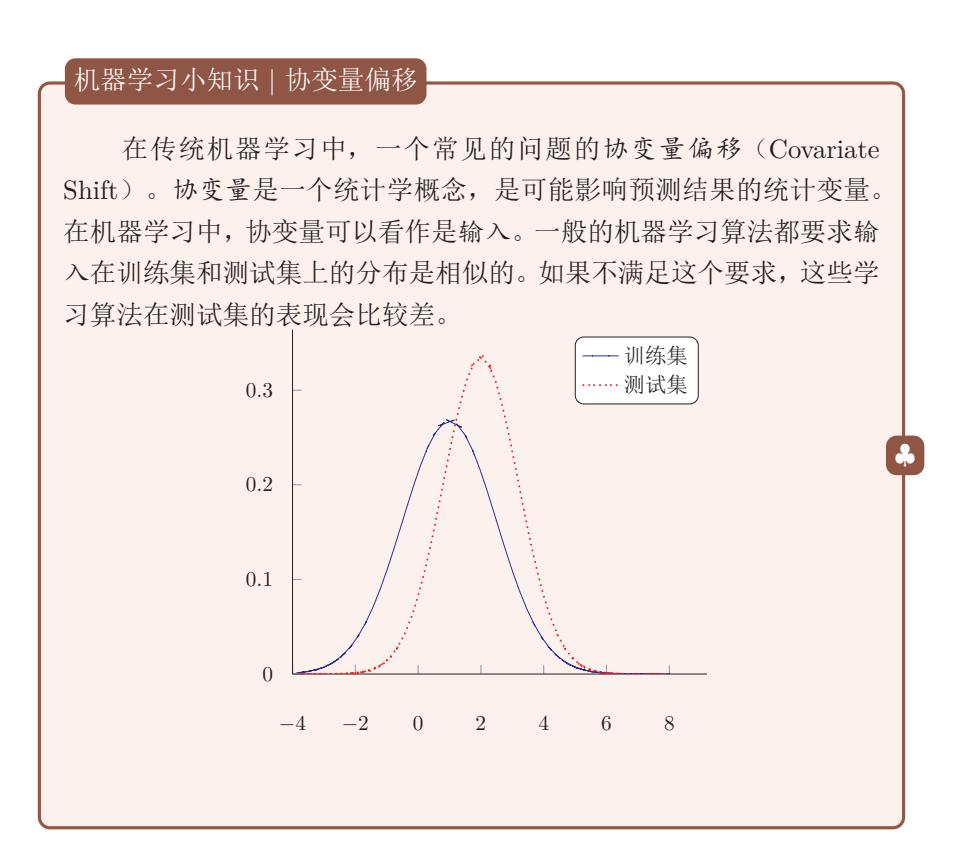

{0}------------------------------------------------

# 第10章 模型独立的学习方式

在前面的章节中, 介绍了机器学习的几种学习方式, 包括监督学习、无监 督学习和强化学习。这些学习方式分别可以由不同的模型实现,比如神经网络、 线性分类器等。针对一个给定的任务,首先要准备一定规模的训练数据,这些训 练数据需要和真实数据的分布一致, 然后设定一个目标函数和优化方法, 在训 练数据上学习一个模型。通过这种学习方式学习到的模型往往任务定向的, 也 是孤立的。我们也不清楚不同任务的模型之间是否有重复利用的共享知识。此 外,我们需要假设每个任务的模型都是从零开始来训练的,一切知识都需要从 训练数据中得到。这也导致了每个任务都需要准备大量的训练数据。

比如"常识"

本章标题中的"模型独立的学习方式"是指这些学习方式不限于具体的模 型,不管是前馈神经网络、循环神经网络还是其他模型。然而一种学习方式往 往会对符合某种特性的模型更加青睐, 比如集成学习往往和方差大的模型组合 时效果显著。

# 10.1 集成学习

给定一个学习任务,假设输入x和输出v的真实关系为v =  $h(x)$ 。对于M 个不同的模型  $f_1(\mathbf{x}), \cdots, f_M(\mathbf{x})$ , 每个模型的期望错误为

$$
\mathcal{R}(f_m) = \mathbb{E}_{\mathbf{x}} \left[ \left( f_m(\mathbf{x}) - h(\mathbf{x}) \right)^2 \right] \tag{10.1}
$$

$$
= \mathbb{E}_{\mathbf{x}} \left[ e_m(\mathbf{x})^2 \right],\tag{10.2}
$$

其中,  $e_m(\mathbf{x}) = f_m(\mathbf{x}) - h(\mathbf{x})$ 为模型  $m$ 在样本  $\mathbf{x}$ 上的错误。

那么所有的模型的平均错误为

$$
\bar{\mathcal{R}}(f) = \frac{1}{M} \sum_{m=1}^{M} \mathbb{E}_{\mathbf{x}}[e_m(\mathbf{x})^2].
$$
\n(10.3)

{1}------------------------------------------------

集成学习(Ensemble Learning)就是通过某种策略将多个模型集成起来,通 过群体决策来提高决策准确率。集成学习首要的问题是如何集成多个模型。比 较常用的集成策略有直接平均、加权平均等。

最直接的集成学习策略就是直接平均, 即"投票"。基于投票的集成模型  $f^{(c)}(\mathbf{x})$ 为

$$
f^{(c)}(\mathbf{x}) = \frac{1}{M} \sum_{m=1}^{M} f_m(\mathbf{x}).
$$
 (10.4)

定理 10.1: 对于  $M \wedge \overline{\wedge}$  同的模型  $f_1(\mathbf{x}), \cdots, f_M(\mathbf{x})$ , 其平均期望 错误为 $\bar{\mathcal{R}}(f)$ 。基于简单投票机制的集成模型 $f^{(c)}(\mathbf{x}) = \frac{1}{M} \sum_{m=1}^{M} f_m(\mathbf{x}),$ 其期望错误在 $\frac{1}{M}\overline{\mathcal{R}}(f)$ 和 $\overline{\mathcal{R}}(f)$ 之间。

证明. 根据定义, 集成模型的期望错误为

$$
\mathcal{R}(f^{(c)}) = \mathbb{E}_{\mathbf{x}} \Big[ \Big( \frac{1}{M} \sum_{m=1}^{M} f_m(\mathbf{x}) - h(\mathbf{x}) \Big)^2 \Big] \tag{10.5}
$$

$$
=\frac{1}{M^2}\mathbb{E}_{\mathbf{x}}\Big[\Big(\sum_{m=1}^M e_m(\mathbf{x})\Big)^2\Big]
$$
(10.6)

$$
= \frac{1}{M^2} \mathbb{E}_{\mathbf{x}} \Big[ \sum_{m=1}^{M} \sum_{n=1}^{M} e_m(\mathbf{x}) e_n(\mathbf{x}) \Big] \tag{10.7}
$$

$$
=\frac{1}{M^2}\sum_{m=1}^{M}\sum_{n=1}^{M}\mathbb{E}_{\mathbf{x}}\Big[e_m(\mathbf{x})e_n(\mathbf{x})\Big],\tag{10.8}
$$

其中 $\mathbb{E}_{\mathbf{x}}[e_m(\mathbf{x})e_n(\mathbf{x})]$ 为两个不同模型错误的相关性。如果每个模型的错误不相 关, 即∀m ≠ n, Ex[em(x)en(x)] = 0。如果每个模型的错误都是相同的, 则  $\forall m \neq n, e_m(\mathbf{x}) = e_n(\mathbf{x})$ 。并且由于 $e_m(\mathbf{x}) \geq 0, \forall m$ , 可以得到

$$
\bar{\mathcal{R}}(f) \ge \mathcal{R}(f^{(c)}) \ge \frac{1}{M}\bar{\mathcal{R}}(f),\tag{10.9}
$$

即集成模型的期望错误是大于等于所有模型的平均期望错误的1/M, 小于等于 所有模型的平均期望错误。  $\Box$ 

从定理10.1可知, 为了得到更好的集成效果, 要求每个模型之间具备一定 的差异性。并且随着模型数量的增多,其错误率也会下降,并趋近于0。

集成学习的思想可以用一句古老的谚语来描述:"三个臭皮匠赛过诸葛亮"。 但是一个有效的集成需要各个基模型的差异尽可能大。为了增加模型之间的差 异性, 可以采取 Bagging 类和 Boosting 类两类方法。

{2}------------------------------------------------

Bagging 类方法 Bagging 类方法是通过随机构造训练样本、随机选择特征等方 法来提高每个基模型的独立性, 代表性方法有 Bagging 和随机森林等。

Bagging (Bootstrap Aggregating) 是一个通过不同模型的训练数据集的独 立性来提高不同模型之间的独立性。我们在原始训练集上进行有放回的随机采 样, 得到 M 比较小的训练集并训练 M 个模型, 然后通过投票的方法进行模型 集成。

随机森林(Random Forest)是在Bagging的基础上再引入了随机特征,进一 步提高每个基模型之间的独立性。在随机森林中,每个基模型都是一棵决策树。

Boosting 类方法 Boosting 类方法是按照一定的顺序来先后训练不同的基模 型,每个模型都针对前序模型的错误进行专门训练。根据前序模型的结果,来 调整训练训练样本的权重,从而增加不同基模型之间的差异性。Boosting类方 法是一种非常强大的集成方法, 只要基模型的准确率比随机猜测好, 就可以通 过集成方法来显著地提高集成模型的准确率。Boosting类方法的代表性方法有  $Ad$ aBoost 等。

 $AdaBoost$  (Adaptive Boosting)

在训练神经网络时采用的Dropout 方法在一定程度上也是一个模型集成。

#### 多任务学习 10.2

深度学习模型的参数一般非常多, 因此需要大量的标注数据进行训练。但 是构建大规模标注数据需要大量的人工标注, 成本一般比较高。为了降低数据 标注成本, 我们可以从大量的未标注数据中来获取一些有价值的信息, 比如通 过无监督学习的预训练来初始化模型参数,也可以通过半监督学习的方法来进 行学习。

多任务学习(Multi-task Learning)是一种利用多个任务之间的相关性来 改进每个任务模型的方法 [Caruana, 1997]。

假设有  $K \wedge H$ 关任务, 第  $k \wedge$ 任务的训练集为 $\mathcal{D}_k$ , 包含  $N_k \wedge H^* \uparrow$ 。

$$
\mathcal{D}_k = \{ (\mathbf{x}^{(k,i)}, y^{(k,i)}) \}_{i=1}^{N_k},\tag{10.10}
$$

其中,  $\mathbf{x}^{(k,i)}$ 和 $y^{(k,i)}$ 表示第 $k$ 个任务中的第 $i$ 个样本以及它的标签。

多任务学习的主要挑战在于如何设计多任务之间的共享机制。在传统的机 器学习算法中, 引入共享的信息是比较困难的, 通常会导致模型变得复杂。但 是, 在神经网络模型中, 模型共享变得相对比较容易。

邱锡鹏:《神经网络与深度学习》

https://nndl.github.io/

增加算法

{3}------------------------------------------------

深层神经网络模型提供了一种很方便的信息共享方式, 可以很容易地进行 多任务学习。最简单地, 我们可以在不同任务的神经网络模型中设置一些共享 层(一般是低层),用来抽取一些通用特征,然后再针对每个不同的任务设置一 些私有层(一般是高层) 直到最后输出层。

除了研究脑启发的计算架构外,我们还需要研究脑启发的新型学习方式。 这些学习方式包括: 终生学习, 强化学习, 主动学习、元学习等。

### 10.3 讦移学习

#### 终生学习 $10.4$

目前, 在神经网络的学习机制上, 主要是监督学习, 并采用反向传播的方法 进行参数更新。这种学习方式得到的模型往往是任务定向的, 也是孤立的。我 们需要假设每个任务的模型都是从零开始来训练的,一切知识都需要从训练数 据中得到。这也导致了每个任务都需要准备大量的训练数据。然而这些学习过 程和人脑的学习方式是不同, 人脑的学习过程一般不太需要太多的标注数据。

 $220\,$ 

https://nndl.github.io/

{4}------------------------------------------------

一方面, 人脑可以通过记忆不断地累积学习到的知识, 另一方面, 这些知识可 以在不同的任务中进行共享 [Chen and Liu, 2016]。近年来, 很多研究者也不 断尝试新的学习机制。一类是多任务学习(Multi-task Learning) [Ben-David and Schuller, 2003, Caruana, 1997]。另外一类是迁移学习(Transfer learning) [Pan and Yang, 2010], 将在一个领域或任务上训练好的模型, 迁移到新的领域 或任务来帮助学习新的模型, 使得新的模型不用从零开始学习。但在迁移学习 中需要避免将领域相关的特征迁移到新的领域 [Ganin et al., 2016]。和迁移学 习比较相关的另外两种学习机制是终生学习 [Chen and Liu, 2016] 和持续学习 [Kirkpatrick et al., 2017]。终生学习是一种持续地学习方式, 学习系统可以不 断累积在先前任务中学到的知识,并在未来新的任务中能够利用这些知识。目 前, 机器学习的前提假设是训练数据和测试数据的分布要相同, 一但训练结束 模型就保持固定,无法进行迭代更新。

此外, 根据没有免费午餐定理, 没有一种通用的学习算法在所有任务上都 有效。因此,当使用机器学习算法实现某个任务时,我们通常需要"就事论事", 根据任务的特定来选择合适的模型、损失函数、优化算法以及超参数。这种可以 动态调整学习方式的能力, 称为元学习(Meta-Learning), 也称为学习的学习 (Learning to Learn) [Thrun and Pratt, 2012]. 由于目前神经网络的学习方法是 误差反向传播算法, 一种很自然的元学习就是通过另一个神经网络替代反向传 播算法, 来调整网络的参数Schmidhuber [1992], Younger et al. [2001]。近年来, 一些更复杂的网络(比如循环神经网络)来替代反向传播算法 [Andrychowicz et al., 2016]

那么,我们是否可以有一套自动方法,根据不同任务来动态地选择合适的 模型或动态地调整超参数呢?事实上,人脑中的学习机制就具备这种能力。在 面对不同的任务时, 人脑的学习机制并不相同。即使面对一个新的任务, 人们 往往也可以很快找到其学习方式。(4)

(2) 深度强化学习强化学习是指一类从(与环境) 交互中不断学习的问题 以及解决这类问题的方法。强化学习问题可以描述为一个智能体从与环境的交 互中不断学习以完成特定目标(比如取得最大奖励值)。强化学习就是智能体不 断与环境进行交互,并根据经验调整其策略来最大化其长远的所有奖励的累积 值。和深度学习类似, 强化学习中的关键问题也是贡献度分配问题, 每一个动 作并不能直接得到监督信息, 需要通过整个模型的最终监督信息(奖励)得到, 并且有一定的延时性。强化学习也是机器学习中的一个重要分支。强化学习和 有监督学习的不同在于, 强化学习不需要给出"正确"的策略, 只需要取得最 大化的预期利益。现代强化学习可以追溯到两个来源: 一个是心理学中的行为 主义理论, 即有机体如何在环境给予的奖励或惩罚的刺激下, 逐步形成对刺激 的预期, 产生能获得最大利益的习惯性行为; 另一个是控制论领域的最优控制

https://nndl.github.io/

{5}------------------------------------------------

问题, 即在满足一定约束条件下, 寻求最优控制策略, 使得性能指标取极大值 或极小值。

目前, 机器学习算法一般需要大量的数据才能训练好一个模型, 其中主要 原因是我们往往从零开始来训练模型,一切知识都需要从训练数据中得到。并 且每个训练好的模型也都是孤立的,专门为某个任务定制的。我们还无法很好 地将一个任务上的模型直接用来做另外一个任务。并且, 机器学习的前提假设 是训练数据和测试数据的分布要相同。

这和人脑的学习模型是不同, 人脑的学习过程一般不太需要太多的标注数 据。一方面, 人脑可以可以通过记忆不断地累积学习到的知识, 另一方面, 这 些知识可以在不同的任务中进行。而人类的学习是一直持续的,我们对外界环 境保持感知, 从而对感兴趣的信息保持关注; 之后, 在大脑的海马系统上, 新 的知识在以往知识的基础上被快速建立起来;之后经过长时间的处理,在大脑 皮质区形成较难遗忘的长时记忆。因此, 我们需要研究一种终生的机器学习机 制, 包括可累计的知识存储方法、顺序学习、知识迁移和知识共享等。

#### 元学习 $10.5$

目前的深度学习虽然取得了很大的成功。但是其依赖比较大规模的数据,目 前还无法快速学习, 使得深度学习的应用受到很大的局限。我们在现实生活中 往往会遇到很多新的任务, 现在的深度学习因为无法快速适应新的任务, 就没 办法来替代人类的工作。

根据没有免费午餐定理, 没有一种通用的学习算法在所有任务上都有效。 因此,当使用机器学习算法实现某个任务时,我们通常需要"就事论事",根据 任务的特定来选择合适的模型、损失函数、优化算法以及超参数。那么,我们是 否可以有一套自动方法, 根据不同任务来动态地选择合适的模型或动态地调整 超参数呢?事实上,人脑中的学习机制就具备这种能力。在面对不同的任务时, 人脑的学习机制并不相同。即使面对一个新的任务, 人们往往也可以很快找到 其学习方式。这种可以动态调整学习方式的能力, 称为元学习(Meta-Learning) , 也称为学习的学习 (Learning to Learn)。

$$
\theta_{t+1} = \theta_t + \alpha \nabla f(\theta_t) \tag{10.11}
$$

$$
\theta_{t+1} = \theta_t + g_t(\nabla f(\theta_t), \phi) \tag{10.12}
$$

其中,  $\theta_t$  为网络参数,  $\nabla f(\theta_t)$  为梯度,  $\phi$  为参数。

https://nndl.github.io/

{6}------------------------------------------------

#### 10.6 总结和深入阅读

关于集成学习的可以参考《Pattern Recognition and Machine Learning》 [Bishop,  $2006$ ].

习题10-1 集成学习是否可以避免过拟合?

## 参考文献

Marcin Andrychowicz, Misha Denil, Sergio Gomez, Matthew W Hoffman, David Pfau, Tom Schaul, and Nando de Freitas. Learning to learn by gradient descent by gradient descent. In  $Ad$ vances in Neural Information Processing Systems, pages 3981-3989, 2016.

S. Ben-David and R. Schuller. Exploiting task relatedness for multiple task learning. Learning Theory and Kernel Machines, pages 567-580, 2003.

C.M. Bishop. Pattern recognition and machine learning. Springer New York., 2006.

R. Caruana. Multi-task learning. Machine Learning,  $28(1):41-75$ , 1997.

Zhiyuan Chen and Bing Liu. Lifelong machine learning. Synthesis Lectures on Artificial Intelligence and Machine Learning,  $10(3):1-145$ , 2016.

Yaroslav Ganin, Evgeniya Ustinova, Hana Ajakan, Pascal Germain, Hugo Larochelle, François Laviolette, Mario Marchand. and Victor Lempitsky. Domain-adversarial training of neural networks. Journal of Machine Learning Research, 17(59):1-35, 2016.

James Kirkpatrick, Razvan Pascanu, Neil Rabinowitz, Joel Veness, Guillaume Desjardins, Andrei A Rusu, Kieran Milan, John Quan, Tiago Ramalho, Agnieszka Grabska-Barwinska, et al. Overcoming catastrophic forgetting in neural networks. Proceedings of the National Academy of Sciences, page 201611835, 2017.

Sinno Jialin Pan and Qiang Yang. A survey on transfer learning. IEEE Transactions on knowledge and data engineer $ing, 22(10):1345-1359, 2010.$ 

Jürgen Schmidhuber. Learning to control fast-weight memories: An alternative to dynamic recurrent networks. Neural Computation, 4(1):131-139, 1992.

Sebastian Thrun and Lorien Pratt. Learning to learn. Springer Science & Business Media, 2012.

A Steven Younger, Sepp Hochreiter, and Peter R Conwell. Meta-learning with backpropagation. In Proceedings of  $In$ ternational Joint Conference on Neural Networks, volume 3. IEEE, 2001.