{0}------------------------------------------------

# 第7章 网络优化与正则化

任何数学技巧都不能弥补信息的缺失。

 $-$  Cornelius Lanczos. 1964

虽然神经网络具有非常强的表达能力,但是当应用神经网络模型到机器学 习时依然存在一些难点。主要分为两大类:

(1) 优化问题: 神经网络模型是一个非凸函数, 再加上在深度网络中的梯 度消失问题,很难讲行优化:另外,深层神经网络模型一般参数比较多,训练 数据也比较大, 会导致训练的效率比较低。

(2) 泛化问题: 因为神经网络的拟合能力强, 反而容易在训练集上产生过 拟合。因此, 在训练深层神经网络时, 同时也需要通过一定的正则化方法来改 讲网络的泛化能力。

目前, 研究者从大量的实践中总结了一些经验技巧, 从优化和正则化两个 方面来提高学习效率并得到一个好的网络模型。

# 7.1 网络优化

深层神经网络是一个高度非线性的模型, 其风险函数是一个非凸函数, 因 此风险最小化是一个非凸优化问题, 会存在很多局部最优点。

## 7.1.1 网络优化的难点

有效地学习深层神经网络的参数是一个具有挑战性的问题, 其主要原因有 以下几个方面。

{1}------------------------------------------------

#### 7.1.1.1 网络结构多样性

神经网络的种类非常多,比如卷积网络、循环网络等,其结构也非常不同。 有些比较深,有些比较宽。不同参数在网络中的作用也有很大的差异,比如连 接权重和偏置的不同, 以及循环网络中循环连接上的权重和其它权重的不同。

由于网络结构的多样性,我们很难找到一种通用的优化方法。不同的优化 方法在不同网络结构上的差异也都比较大。

此外, 网络的超参数一般也比较多, 这也给优化带来很大的挑战。

#### 7.1.1.2 高维变量的非凸优化

低维空间的非凸优化问题主要是存在一些局部最优点。基于梯度下降的优 化方法会陷入局部最优点, 因此低维空间非凸优化的主要难点是如何选择初始 化参数和逃离局部最优点。深层神经网络的参数非常多,其参数学习是在非常 高维空间中的非凸优化问题, 其挑战和在低维空间的非凸优化问题有所不同。

鞍点 在高维空间中, 非凸优化的难点并不在于如何逃离局部最优点, 而是如何 逃离鞍点 (Saddle Point) [Dauphin et al., 2014]。鞍点的梯度是0, 但是在一些 维度上是最高点, 在另一些维度上是最低点, 如图7.1所示。

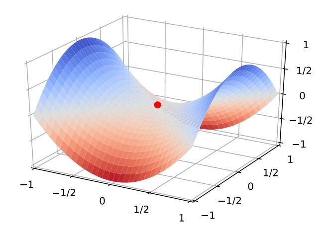

图 7.1 鞍点示例

在高维空间中, 局部最优点要求在每一维度上都是最低点, 这种概率非常 低。假设网络有10,000维参数,一个点在某一维上是局部最低点的概率为p,那 么在整个参数空间中, 局部最优点的概率为 p10,000, 这种可能性非常小。也就 是说高维空间中, 大部分梯度为0的点都是鞍点。基于梯度下降的优化方法会 在鞍点附近接近于停滞, 同样很难从这些鞍点中逃离。

鞍点的叫法是因为其形

状像马鞍。

{2}------------------------------------------------

平坦底部 深层神经网络的参数非常多, 并且有一定的冗余性, 这导致每单个参 数对最终损失的影响都比较小, 这导致了损失函数在局部最优点附近是一个平 坦的区域, 称为平坦最小值 (Flat Minima) [Hochreiter and Schmidhuber, 1997, Li et al., 2017a]。并且在非常大的神经网络中,大部分的局部最小值是相等的。 虽然神经网络有一定概率收敛于比较差的局部最小值,但随着网络规模增加,网 络陷入局部最小值的概率大大降低 [Choromanska et al., 2015]。图7.2给出了一 种简单的平坦底部示例。

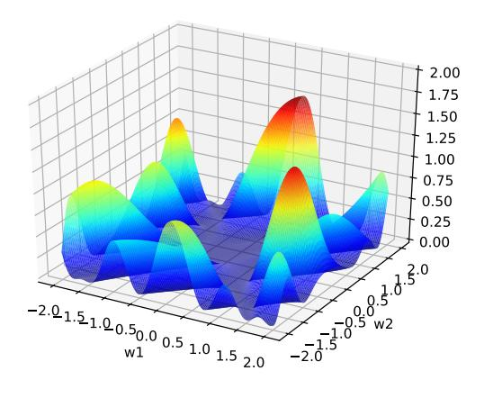

图 7.2 神经网络中的平坦底部示例

#### 优化算法 $7.2$

目前, 深层神经网络的参数学习主要是通过梯度下降方法来寻找一组可以 最小化结构风险的参数。在具体实现中,梯度下降法可以分为: 批量梯度下降、 随机梯度下降以及小批量梯度下降三种形式。根据不同的数据量和参数量,可 以选择一种具体的实现形式。除了在收敛效果和效率上的差异,这三种方法都 存在一些共同的问题,比如1)如何初始化参数; 2)预处理数据; 3)如何选择 合适的学习率, 避免陷入局部最优等。

### 7.2.1 小批量梯度下降

目前, 在训练深层神经网络时, 训练数据的规模比较大。如果在梯度下降 时,每次迭代都要计算整个训练数据上的梯度需要比较多的计算资源。此外,大 规模训练集中的数据通常也会非常冗余,也没有必要在整个训练集上计算梯度。 因此, 在训练深层神经网络时, 经常使用小批量梯度下降算法。

邱锡鹏:《神经网络与深度学习》

{3}------------------------------------------------

 $\hat{\varphi} f(\mathbf{x}, \theta)$ 表示一个深层神经网络,  $\theta$ 为网络参数, 在使用小批量梯度下降进 行优化时,每次选取K个训练样本 $\mathcal{I}_t = \{(\mathbf{x}^{(k)}, \mathbf{y}^{(k)})\}_{k=1}^K$ 。第t次迭代(iteration) 时损失函数关于参数θ的偏导数为

$$
\mathfrak{g}_t(\theta) = \frac{1}{K} \sum_{(\mathbf{x}^{(k)}, \mathbf{y}^{(k)}) \in \mathcal{I}_t} \frac{\partial \mathcal{L}(\mathbf{y}^{(k)}, f(\mathbf{x}^{(k)}, \theta))}{\partial \theta},\tag{7.1}
$$

其中 $\mathcal{L}(\cdot)$ 为可微分的损失函数,  $K$ 称为批量大小 (Batch Size)。

第t次更新的梯度gt定义为

这里的损失函数忽略 了正则化项。加上lp正 则化的损失函数参见 第7.7.1节。

 $158\,$ 

$$
\mathbf{g}_t \triangleq \mathbf{g}_t(\theta_{t-1}).\tag{7.2}
$$

使用梯度下降来更新参数,

$$
\theta_t \leftarrow \theta_{t-1} - \alpha \mathbf{g}_t,\tag{7.3}
$$

其中α>0为学习率。

每次迭代时参数更新的差值 Δθt 定义为

$$
\Delta \theta_t \triangleq \theta_t - \theta_{t-1}.\tag{7.4}
$$

 $\Delta \theta_t$  和梯度  $\mathbf{g}_t$  并不需要完全一致。 $\Delta \theta_t$  为每次迭代时参数的实际更新方向, 即  $\theta_t = \theta_{t-1} + \Delta \theta_t$ 。在标准的小批量梯度下降中,  $\Delta \theta_t = -\alpha \mathbf{g}_t$ 。

图7.3给出了在 MNIST 数据集上, 批量大小对损失下降的影响。从图7.3a可 以看出, 每次迭代选取的批量样本数越多, 下降效果越明显, 并且下降曲线越 平滑。当每次选取一个样本时(相当于随机梯度下降),损失整体是下降趋势, 但局部看会来回震荡。从图7.3b可以看出, 如果按整个数据集上的迭代次数的 来看损失变化情况, 则是批量样本数越小, 下降效果越明显。

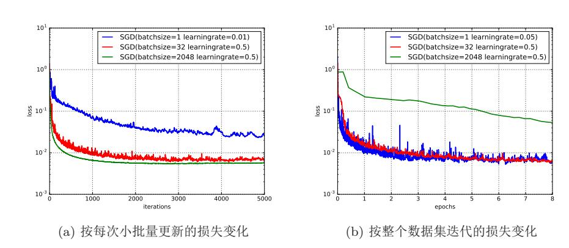

图 7.3 小批量梯度下降中, 批量大小对损失下降的影响

Epoch (回合) 和 Iteration (单次更新) 的关 系 为 1个 epoch 等 于  $(\frac{M$  练样本的数量 $N$ ) 次 Iter-批量大小K  $ations\,$ 

{4}------------------------------------------------

为了更有效地进行训练深层神经网络, 在标准的小批量梯度下降方法的基 础上, 也经常使用一些改进方法以加快优化速度。常见的改进方法主要从以下 两个方面进行改讲: 学习率衰减和梯度方向优化。这些改进的优化方法也同样 可以应用在批量或随机梯度下降方法上。

### 7.2.2 学习率衰减

在梯度下降中, 学习率 α 的取值非常关键, 如果过大就不会收敛, 如果过 小则收敛速度太慢。从经验上看, 学习率在一开始要保持大些来保证收敛速度, 在收敛到最优点附近时要小些以避免来回震荡。因此,比较简单直接的学习率 调整可以通过学习率衰减(Learning Rate Decay)的方式来实现。

假设初始化学习率为αo,在第t次迭代时的学习率αt。常用的衰减方式为 可以设置为按迭代次数进行衰减。比如逆时衰减(inverse time decay)

$$
\alpha_t = \alpha_0 \frac{1}{1 + \beta \times t},\tag{7.5}
$$

或指数衰减 (exponential decay)

$$
\alpha_t = \alpha_0 \beta^t,\tag{7.6}
$$

或自然指数衰减 (natural exponential decay)

$$
\alpha_t = \alpha_0 \exp(-\beta \times t),\tag{7.7}
$$

其中β为衰减率,一般取值为0.96。

除了这些固定衰减率的调整学习率方法外,还有些自适应地调整学习率的 方法,比如AdaGrad、RMSprop、AdaDelta等。这些方法都对每个参数设置不 同的学习率。

#### 7.2.2.1 AdaGrad 算法

在标准的梯度下降方法中,每个参数在每次迭代时都使用相同的学习率。 由于每个参数的维度上收敛速度都不相同, 因此根据不同参数的收敛情况分别 设置学习率。

AdaGrad (Adaptive Gradient) 算法 [Duchi et al., 2011] 是借鉴 L2 正则化 的思想, 每次迭代时自适应地调整每个参数的学习率。在第t迭代时, 先计算每 个参数梯度平方的累计值

$$
G_t = \sum_{\tau=1}^t \mathbf{g}_{\tau} \odot \mathbf{g}_{\tau},\tag{7.8}
$$

其中⊙为按元素乘积, gτ ∈ R|θ| 是第 τ次迭代时的梯度。

邱锡鹏:《神经网络与深度学习》

{5}------------------------------------------------

AdaGrad 算法的参数更新差值为

$$
\Delta \theta_t = -\frac{\alpha}{\sqrt{G_t + \epsilon}} \odot \mathbf{g}_t,\tag{7.9}
$$

其中 α 是初始的学习率, ε 是为了保持数值稳定性而设置的非常小的常数, 一般 取值 $e^{-7}$ 到 $e^{-10}$ 。此外,这里的开平方、除、加运算都是按元素进行的操作。

在 Adagrad 算法中, 如果某个参数的偏导数累积比较大, 其学习率相对较 小;相反,如果其偏导数累积较小,其学习率相对较大。但整体是随着迭代次 数的增加, 学习率逐渐缩小。

Adagrad 算法的缺点是在经过一定次数的迭代依然没有找到最优点时, 由 于这时的学习率已经非常小,很难再继续找到最优点。

#### 7.2.2.2 RMSprop 算法

RMSprop算法是 Geoff Hinton 提出的一种自适应学习率的方法 [Tieleman and Hinton, 2012], 可以在有些情况下避免 AdaGrad 算法中学习率不断单调下 降以至于过早衰减的缺点。

RMSprop 算法首先计算每次迭代梯度 gt 平方的指数衰减移动平均,

$$
G_t = \beta G_{t-1} + (1 - \beta) \mathbf{g}_t \odot \mathbf{g}_t, \qquad (7.10)
$$

其中β为衰减率,一般取值为0.9。

RMSprop 算法的参数更新差值为

$$
\Delta \theta_t = -\frac{\alpha}{\sqrt{G_t + \epsilon}} \odot \mathbf{g}_t, \tag{7.11}
$$

其中α是初始的学习率, 比如0.001。

从上式可以看出, RMSProp 算法和 Adagrad 算法的区别在于  $G_t$  的计算有 累积方式变成了指数衰减移动平均。在迭代过程中, 每个参数的学习率并不是 呈衰减趋势, 既可以变小也可以变大。

### 7.2.2.3 AdaDelta 算法

AdaDelta算法 [Zeiler, 2012] 也是 Adagrad 算法的一个改进。和RMSprop 算 法类似, AdaDelta 算法通过梯度平方的指数衰减移动平均来调整学习率。此外, AdaDelta 算法还引入了每个平方的指数衰减权移动平均。

第t次迭代时, 每次参数更新差 Δθτ, 1 < τ < t - 1 的指数衰减权移动平均 为 此时 Δθt 来未知, 因此

只能计算到 $\Delta X_{t-1}$ 。

$$
\Delta X_{t-1}^2 = \beta \Delta X_{t-2}^2 + (1 - \beta) \Delta \theta_{t-1} \odot \Delta \theta_{t-1}.
$$
\n(7.12)

{6}------------------------------------------------

其中β为衰减率。

AdaDelta 算法的参数更新差值为

$$
\Delta \theta_t = -\frac{\sqrt{\Delta X_{t-1}^2 + \epsilon}}{\sqrt{G_t + \epsilon}} \mathbf{g}_t \tag{7.13}
$$

其中 $G_t$ 的计算方式和RMSprop 算法一样 (公式(7.10)),  $\Delta X_{t-1}^2$  为参数更新差 △θ的指数衰减权移动平均。

从上式可以看出, AdaDelta 算法将 RMSprop 算法中的初始学习率  $\alpha$  改为 动态计算的 $\sqrt{\Delta X_{t-1}^2}$ , 在一定程度上平抑了学习率的波动。

### 7.2.3 梯度方向优化

除了调整学习率之外, 还可以通过使用最近一段时间内的平均梯度来代替 当前时刻的梯度来作为参数更新的方向。从图7.3看出, 在小批量梯度下降中, 如果每次选取样本数量比较小, 损失会呈现震荡的方式下降。有效地缓解梯度 下降中的震荡的方式是通过用梯度的移动平均来代替每次的实际梯度, 并提高 优化速度, 这就是动量法。

#### 7.2.3.1 动量法

动量是模拟物理中的概念。一般而言,一个物体的动量指的是这个物体在它 运动方向上保持运动的趋势,是物体的质量和速度的乘积。动量法(Momentum Method) [Rumelhart et al., 1988] 是用之前积累动量来替代真正的梯度。每次 迭代的梯度可以看作是加速度。

在第t次迭代时, 计算负梯度的"加权移动平均"作为参数的更新方向,

$$
\Delta \theta_t = \rho \Delta \theta_{t-1} - \alpha \mathbf{g}_t,\tag{7.14}
$$

其中 ρ 为动量因子, 通常设为0.9, α 为学习率。

这样,每个参数的实际更新差值取决于最近一段时间内梯度的加权平均值。 当某个参数在最近一段时间内的梯度方向不一致时, 其真实的参数更新幅度变 小: 相反, 当在最近一段时间内的梯度方向都一致时, 其真实的参数更新幅度 变大, 起到加速作用。一般而言, 在迭代初期, 梯度方法都比较一致, 动量法 会起到加速作用, 可以更快地到达最优点。在迭代后期, 梯度方法会取决不一 致, 在收敛值附近震荡, 动量法会起到减速作用, 增加稳定性。从某种角度来 说, 当前梯度叠加上部分的上次梯度, 一定程度上可以近似看作二阶梯度。

参见习题7-1。

邱锡鹏:《神经网络与深度学习》

{7}------------------------------------------------

### 7.2.3.2 Nesterov 加速梯度

Nesterov加速梯度 (Nesterov Accelerated Gradient, NAG), 也叫 Nesterov动量法 (Nesterov Momentum) 是一种对动量法的改进 [Nesterov, 2013, Sutskever et al., 2013].

在动量法中, 实际的参数更新方向 Δθt 为上一步的参数更新方向 Δθt-1 和 当前梯度-gt的叠加。这样, Δθt可以被拆分为两步进行, 先根据 Δθt-1 更新一 次得到参数 $\hat{\theta}$ , 再用  $\mathbf{g}_t$ 进行更新。

$$
\hat{\theta} = \theta_{t-1} + \rho \Delta \theta_{t-1},\tag{7.15}
$$

$$
\theta_t = \hat{\theta} - \alpha \mathbf{g}_t,\tag{7.16}
$$

其中梯度 $g_t$ 为点 $\theta_{t-1}$ 上的梯度,这有些不太合理。因此在第二步更新中,更新 更合理的  $\mathbf{g}_t$  应该为 $\hat{\theta}$  上的梯度。

这样, 合并后的更新方向为

$$
\Delta \theta_t = \rho \Delta \theta_{t-1} - \alpha \mathfrak{g}_t (\theta_{t-1} + \rho \Delta \theta_{t-1}), \tag{7.17}
$$

其中  $\mathfrak{g}_t(\theta_{t-1}+\rho\Delta\theta_{t-1})$ 表示损失函数在点 $\hat{\theta}=\theta_{t-1}+\rho\Delta\theta_{t-1}$ 上的偏导数。 gt的定义参见公式 图7.4给出了动量法和 Nesterov 加速梯度在参数更新时的比较。  $(7.1)$ .

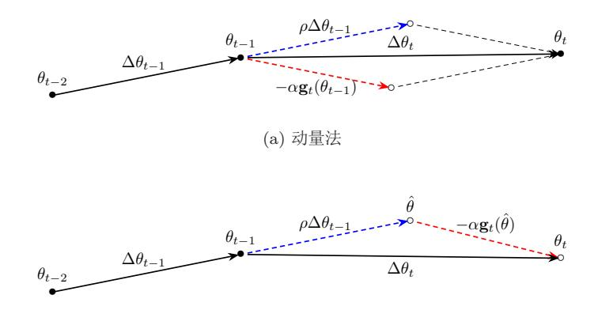

(b) Nesterov 加速梯度

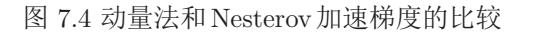

### 7.2.3.3 AdaM算法

自适应动量估计(Adaptive Moment Estimation, Adam)算法 [Kingma and Ba, 2015] 可以看作是动量法和 RMSprop 的结合, 不但使用动量作为参数更新 方向, 而且可以自适应调整学习率。

{8}------------------------------------------------

Adam 算法一方面计算梯度平方  $g_t^2$  的指数加权平均(和RMSprop 类似), 另一方面计算梯度 gt 的指数加权平均(和动量法类似)。

$$
M_t = \beta_1 M_{t-1} + (1 - \beta_1) \mathbf{g}_t,\tag{7.18}
$$

$$
G_t = \beta_2 G_{t-1} + (1 - \beta_2) \mathbf{g}_t \odot \mathbf{g}_t, \qquad (7.19)
$$

其中 $\beta_1$ 和 $\beta_2$ 分别为两个移动平均的衰减率, 通常取值为 $\beta_1 = 0.9$ ,  $\beta_2 = 0.99$ .

 $M_t$ 可以看作是梯度的均值(一阶矩),  $G_t$ 可以看作是梯度的未减去均值的 方差(二阶矩)。

假设 $M_0 = 0, G_0 = 0$ , 那么在迭代初期 $M_t$ 和 $G_t$ 的值会比真实的均值和方 差要小。特别是当  $β_1$  和  $β_2$  都接近于1时, 偏差会很大。因此, 需要对偏差进行 修正。

$$
\hat{M}_t = \frac{M_t}{1 - \beta_1^t},\tag{7.20}
$$

$$
\hat{G}_t = \frac{G_t}{1 - \beta_2^t}.\tag{7.21}
$$

Adam 算法的参数更新差值为

$$
\Delta\theta_t = -\frac{\alpha}{\sqrt{\hat{G}_t + \epsilon}} \hat{M}_t,\tag{7.22}
$$

其中学习率α通常设为0.001, 并且也可以进行衰减, 比如αt =  $\frac{\alpha_0}{\sqrt{t}}$ .

Adam 算法是 RMSProp 与动量法的结合, 因此一种自然的 Adam 的改进方 法是引入 Nesterov 加速梯度, 称为 Nadam 算法 [Dozat, 2016]。

### 7.2.3.4 梯度截断

在深层神经网络或循环神经网络中, 除了梯度消失之外, 梯度爆炸是影响 学习效率的主要因素。在基于梯度下降的优化过程中,如果梯度突然增大,用 大的梯度进行更新参数, 反而会导致其远离最优点。为了避免这种情况, 当梯 度的模大于一定阈值时, 就对梯度进行截断, 称为梯度截断 (gradient clipping) [Pascanu et al.,  $2013$ ].

梯度截断是一种比较简单的启发式方法, 把梯度的模限定在一个区间, 当 梯度的模小于或大于这个区间时就进行截断。一般截断的方式有以下几种:

按值截断 在第 $t$ 次迭代时, 梯度为 $g_t$ , 给定一个区间 [ $a, b$ ], 如果一个参数的梯 度小于 a时, 就将其设为 a; 如果小于 b时, 就将其设为 b。

$$
\mathbf{g}_t = \max(\min(\mathbf{g}_t, b), a). \tag{7.23}
$$

{9}------------------------------------------------

按模截断 按模截断是将梯度的模截断到一个给定的截断阈值b。

如果 $\|\mathbf{g}_t\|^2 < b$ , 保持 $\mathbf{g}_t$ 不变。如果 $\|\mathbf{g}_t\|^2 > b$ , 令

$$
\mathbf{g}_t = \frac{b}{\|\mathbf{g}_t\|} \mathbf{g}_t. \tag{7.24}
$$

截断阈值 b是一个超参数, 也可以根据一段时间内的平均梯度来自动调整。实 验中发现, 训练过程对阈值 b 并不十分敏感, 通常一个小的阈值就可以得到很 好的结果 [Pascanu et al., 2013]。

在训练循环神经网络时,按模截断是避免梯度爆炸问题的有效方法。图7.5给 出了一个循环神经网络的损失函数关于参数的曲面。图中的曲面为只有一个隐 藏神经元的循环神经网络 $h_t = \sigma(wh_{t1} + b)$ 的损失函数,其中 $w \bar{w}$ 和 $b$ 为参数。假 如 $h_0$ 初始值为0.3, 损失函数为 $\mathcal{L} = (h_{100} - 0.65)^2$ 。

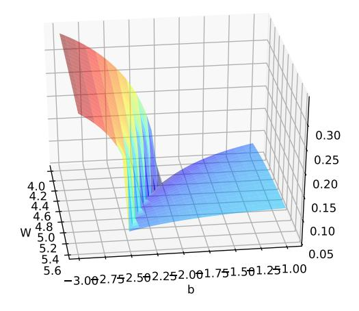

图 7.5 梯度爆炸问题示例

### 7.2.4 优化算法小结

本节介绍的几种优化方法大体上可以分为两类: 一是调整学习率, 使得优 化更稳定; 二是调整梯度方向, 优化训练速度。

表7.1汇总了本节介绍的几种神经网络常用优化方法。

{10}------------------------------------------------

| 学习率衰减                      | 梯度方向优化                                            |
|----------------------------|---------------------------------------------------|
|                            | AdaGrad、RMSprop、AdaDelta   动量法、Nesterov 加速梯度、梯度截断 |
| Adam $\approx$ 动量法+RMSprop |                                                   |

表 7.1 神经网络常用优化方法的汇总

图7.6给出了这几种优化方法在 MNIST 数据集上收敛性的比较。

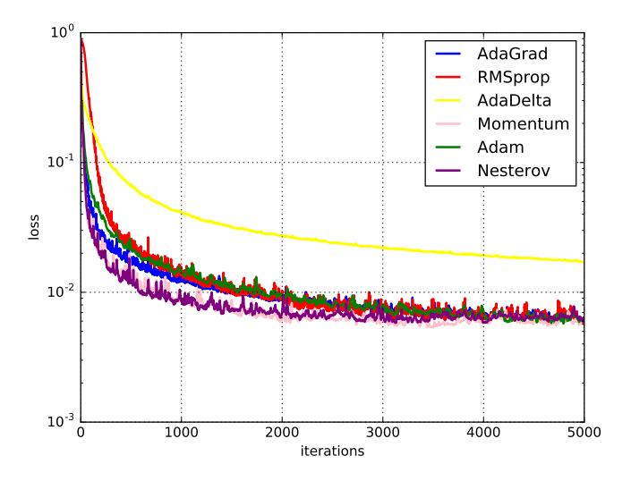

图 7.6 不同优化方法的比较

#### 参数初始化 7.3

神经网络的训练过程中的参数学习是基于梯度下降法进行优化的。梯度下 降法需要在开始训练时给每一个参数赋一个初始值。这个初始值的选取十分关 键。在感知器和 logistic 回归的训练中, 我们一般将参数全部初始化为0。但是 这在神经网络的训练中会存在一些问题。因为如果参数都为0, 在第一遍前向 计算时, 所有的隐层神经元的激活值都相同。这样会导致深层神经元没有区分 性。这种现象也称为对称权重现象。

为了打破这个平衡, 比较好的方式是对每个参数都随机初始化, 这样使得 不同神经元之间的区分性更好。

但是一个问题是如何选取随机初始化的区间呢? 如果参数太小, 会导致神 经元的输入过小。经过多层之后信号就慢慢消失了。参数过小还会使得sigmoid

邱锡鹏:《神经网络与深度学习》

{11}------------------------------------------------

型激活函数丢失非线性的能力。以 logistic 函数为例, 在0附近基本上是近似线 性的。这样多层神经网络的优势也就不存在了。如果参数取得太大, 会导致输 入状态过大。对于 sigmoid 型激活函数来说, 激活值变得饱和, 从而导致梯度接 近于0。

因此, 如果要高质量地训练一个网络, 给参数选取一个合适的初始化区间 是非常重要的。一般而言, 参数初始化的区间应该根据神经元的性质进行差异 化的设置。如果一个神经元的输入连接很多, 它的每个输入连接上的权重就应 该小一些,以避免神经元的输出过大(当激活函数为ReLU时)或过饱和(当 激活函数为sigmoid 函数时)。

经常使用的初始化方法有以下几种:

#### 7.3.0.1 Gaussian 分布初始化

Gaussian 初始化方法是最简单的初始化方法,参数从一个固定均值(比如 0) 和固定方差(比如0.01) 的 Gaussian 分布进行随机初始化。

初始化一个深度网络时, 一个比较好的初始化方案是保持每个神经元输入 的方差为一个常量。当一个神经元的输入连接数量为 $n_{in}$ 时, 可以设置其输入 连接权重以 $\mathcal{N}(0, \sqrt{\frac{1}{n_{in}}})$ 的 Gaussian 分布进行初始化。如果同时考虑输出连接 的数量  $n_{out}$ , 则可以按 $\mathcal{N}(0, \sqrt{\frac{2}{n_{in}+n_{out}}})$ 的 Gaussian 分布进行初始化。

#### 7.3.0.2 均匀分布初始化

均匀分布初始化是在一个给定的区间 [-r, r] 内采用均匀分布来初始化参 数。超参数r的设置也可以按神经元的连接数量进行自适应的调整。

Xavier 初始化方法中, Xavier 是发明者 Xavier Glorot 的名字。

Xavier初始化方法 Glorot and Bengio [2010] 提出一个自动计算超参数 r 的方 法, 参数可以在 [-r, r] 内采用均匀分布进行初始化。

如果神经元激活函数为logistic函数, 对于第 $l-1$ 到 $l$ 层的权重参数区间r 可以设置为

$$
r = \sqrt{\frac{6}{n^{l-1} + n^l}},\tag{7.25}
$$

这里 $n^l$ 是第 $l$ 层神经元个数,  $n^{l-1}$ 是第 $l-1$ 层神经元个数。

对于 tanh 函数,  $r \Pi$ 以设置为

$$
r = 4\sqrt{\frac{6}{n^{l-1} + n^l}}.\tag{7.26}
$$

{12}------------------------------------------------

假设第 $l$ 层的一个隐藏层神经元  $z^l$ , 其接受前一层的  $n^{l-1}$  个神经元的输出  $a_i^{(l-1)}, i \in [1, n^{(l-1)}],$ 

$$
z^{l} = \sum_{i=1}^{n} w_{i}^{l} a_{i}^{(l-1)}.
$$
\n(7.27)

为了避免初始化参数使得激活值变得饱和,我们需要尽量使得 z1处于激活 函数的线性区间, 也就是其绝对值比较小的值。这时该神经元的激活值为al=  $f(z^l) \approx z^l$ .

假设 $w_i^l$ 和 $a_i^{(l-1)}$ 都是相互独立,并且均值都为0,则 $a$ 的均值为

$$
\mathbb{E}[a^l] = \mathbb{E}[\sum_{i=1}^n w_i^l a_i^{(l-1)}] = \sum_{i=1}^d \mathbb{E}[\mathbf{w}_i] \mathbb{E}[a_i^{(l-1)}] = 0.
$$
 (7.28)

 $a^l$ 的方差为

$$
\text{var}[a^l] = \text{var}\big[\sum_{i=1}^{n^{(l-1)}} w_i^l a_i^{(l-1)}\big] \tag{7.29}
$$

$$
= \sum_{i=1}^{n^{(l-1)}} \text{var}[w_i^l] \text{var}[a_i^{(l-1)}]
$$
\n(7.30)

$$
= n^{(l-1)} \operatorname{var}[w_i^l] \operatorname{var}[a_i^{(l-1)}]. \tag{7.31}
$$

也就是说, 输入信号的方差在经过该神经元后被放大或缩小了 $n^{(l-1)}$  var[ $w_i^l$ ] 倍。 为了使得在经过多层网络后, 信号不被过分放大或过分减弱, 我们尽可能保持 每个神经元的输入和输出的方差一致。这样 $n^{(l-1)}$ var[w]; 设为1比较合理, 即

$$
\text{var}[w_i^l] = \frac{1}{n^{(l-1)}}.\tag{7.32}
$$

同理, 为了使得在反向传播中, 误差信号也不被放大或缩小, 需要将 w! 的 方差保持为

$$
\text{var}[w_i^l] = \frac{1}{n^{(l)}}.\tag{7.33}
$$

作为折中,同时考虑信号在前向和反向传播中都不被放大或缩小,可以设置

$$
var[w_i^l] = \frac{2}{n^{(l-1)} + n^{(l)}}.
$$
\n(7.34)

假设随机变量 $x \in \mathbb{Z}$ 间 $[a, b]$ 内均匀分布, 则其方差为:

$$
\text{var}[x] = \frac{(b-a)^2}{12}.\tag{7.35}
$$

因此, 若让 $w_i^l \in [-r, r]$ , 并且var[ $w_i^l$ ] = 1, 则r的取值为

$$
r = \sqrt{\frac{6}{n^{l-1} + n^1}}.\tag{7.36}
$$

邱锡鹏:《神经网络与深度学习》

{13}------------------------------------------------

#### 数据预处理 $7.4$

一般而言, 原始的训练数据中, 每一维特征的来源以及度量单位不同, 会 造成这些特征值的分布范围往往差异很大。当我们计算不同样本之间的欧氏距 离时, 取值范围大的特征会起到主导作用。这样, 对于基于相似度比较的机器 学习方法(比如最近邻分类器),必须先对样本进行预处理,将各个维度的特征 归一化到同一个取值区间,并且消除不同特征之间的相关性,才能获得比较理 想的结果。虽然神经网络可以通过参数的调整来适应不同特征的取值范围, 但 是会导致训练效率比较低。

假设一个只有一层的网络  $y = \tanh(w_1x_1 + w_2x_2 + b)$ , 其中  $x_1 \in [0, 10]$ ,  $x_2 \in [0,1]$ 。之前我们提到tanh函数的导数在区间 [-2,2] 上是敏感的, 其余的导 数接近于0。因此, 如果 $w_1x_1 + w_2x_2 + b$ 过大或过小, 都会导致梯度过小, 难 以训练。为了提高训练效率,我们需要使 $w_1x_1 + w_2x_2 + b$ 在 [-2,2] 区间, 我们 需要将  $w_1$  设得小一点, 比如在 [-0.1,0.1] 之间。可以想象, 如果数据维数很多 时,我们很难这样精心去选择每一个参数。因此,如果每一个特征的取值范围 都在相似的区间,比如 [0,1] 或者 [-1,1], 我们就不太需要区别对待每一个参数, 减少人工干预。

除了参数初始化之外, 不同特征取值范围差异比较大时还会梯度下降法的 搜索效率。图7.7给出了数据归一化对梯度的影响。其中, 图7.7a为未归一化数 据的等高线图。取值范围不同会造成在大多数位置上的梯度方向并不是最优的 搜索方向。当使用梯度下降法寻求最优解时, 会导致需要很多次迭代才能收敛。 如果我们把数据归一化为取值范围相同, 如图7.7b所示, 大部分位置的梯度方 向近似于最优搜索方向。这样, 在梯度下降求解时, 每一步梯度的方向都基本 指向最小值, 训练效率会大大提高。

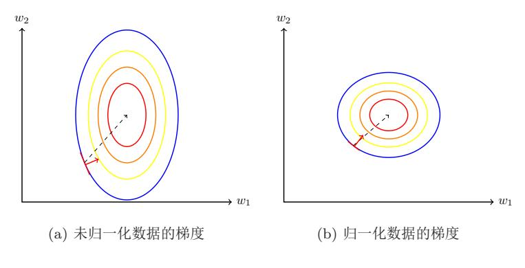

图 7.7 数据归一化对梯度的影响

归一化的方法有很多种, 比如之前我们介绍的 sigmoid 型函数等都可以将

{14}------------------------------------------------

不同取值范围的特征挤压到一个比较受限的区间。这里,我们介绍几种在神经 网络中经常使用的归一化方法。

缩放归一化 缩放归一化是一种非常简单的归一化方法,通过缩放将每一个特征 的取值范围归一到 $[0,1]$ 或 $[-1,1]$ 之间。对于每一维特征 $x$ ,

$$
\hat{x}^{(i)} = \frac{x^{(i)} - \min_i(x^{(i)})}{\max_i(x^{(i)}) - \min_i(x^{(i)})},
$$
\n(7.37)

其中  $\min(x)$  和  $\max(x)$  分别是特征  $x$  在所有样本上的最小值和最大值。

标准归一化 标准归一化也叫z-score归一化,来源于统计上的标准分数。将每一 个维特征都处理为符合标准正态分布(均值为0,标准差为1)。假设有 N 个样 本 $\{ \mathbf{x}^{(i)} \}$ ,  $i = 1, \cdots, N$ , 对于每一维特征  $x$ , 我们先计算它的均值和标准差:

$$
\mu = \frac{1}{N} \sum_{i=1}^{N} x^{(i)},\tag{7.38}
$$

$$
\sigma^2 = \frac{1}{N} \sum_{i=1}^{N} (x^{(i)} - \mu)^2.
$$
 (7.39)

然后, 将特征 $x^{(i)}$ 减去均值, 并除以标准差, 得到新的特征值 $\hat{x}^{(i)}$ 。

$$
\hat{x}^{(i)} = \frac{x^{(i)} - \mu}{\sigma},\tag{7.40}
$$

这里 σ 不能为 0。如果标准差为 0, 说明这一维特征没有任务区分性, 可以直接 删掉。

在标准归一化之后, 每一维特征都服从标准正态分布。

白化 白化(Whitening)是一种重要的预处理方法,用来降低输入数据特征之 间的冗余性。输入数据经过白化处理后, 特征之间相关性较低, 并且所有特征 具有相同的方差。

白化的一个主要实现方式是使用主成分分析(Principal Component Analvsis, PCA) 方法去除掉各个成分之间的相关性。

参见第9.1.1节。

图7.8给出了标准归一化和PCA 白化的比较。

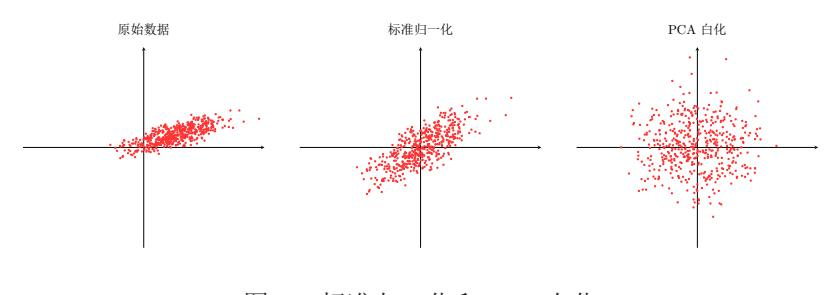

图 7.8 标准归一化和 PCA 白化

{15}------------------------------------------------

#### 逐层归一化 $7.5$

在深层神经网络中,中间某一层的输入是其之前的神经层的输出。因此,其 之前的神经层的参数变化会导致其输入的分布发生较大的差异。在使用随机梯 度下降来训练网络时, 每次参数更新都会导致网络中间每一层的输入的分布发 生改变。越深的层, 其输入的分布会改变得越明显。就像一栋高楼, 低楼层发 生一个较小的偏移,都会导致高楼层较大的偏移。

从机器学习角度来看, 如果某个神经层的输入分布发生了改变, 那么其参 数需要重新学习,这种现象叫做内部协变量偏移(Internal Covariate Shift)。

为了解决内部协变量偏移问题, 就要使得每一个神经层的输入的分布在训 练过程中要保持一致。最简单直接的方法就是对每一个神经层都进行归一化操 作, 使其分布保存稳定。下面介绍几种比较常用的逐层归一化方法: 批量归一 化、层归一化和其它一些方法。

### 7.5.1 批量归一化

批量归一化 (Batch Normalization, BN) 方法 [Ioffe and Szegedy, 2015] 是 一种有效的逐层归一化方法,可以对神经网络中任意的中间层进行归一化操作。

对于一个深层神经网络, 令第1层的净输入为z(l), 神经元的输出为a(l), 即

$$
\mathbf{a}^{(l)} = f(\mathbf{z}^{(l)}) = f(W\mathbf{a}^{(l-1)} + \mathbf{b}),\tag{7.41}
$$

其中 f(.) 是激活函数, W 和b 是可学习的参数。

为了减少内部协变量偏移问题, 就要使得净输入 z(l) 的分布一致, 比如都 归一化到标准正态分布。我们可以利用第7.4节中介绍的数据预处理方法讲行对 z(l) 进行归一化, 相当于每一层都进行一次数据预处理, 从而加速收敛速度。但 是逐层归一化需要在中间层进行操作, 要求效率比较高, 因此复杂度比较高的 白化方法就不太合适。为了提高归一化效率,一般使用标准归一化,将净输入  $\mathbf{z}^{(l)}$ 的每一维都归一到标准正态分布。

$$
\hat{\mathbf{z}}^{(l)} = \frac{\mathbf{z}^{(l)} - \mathbb{E}[\mathbf{z}^{(l)}]}{\sqrt{\text{Var}[\mathbf{z}^{(l)}] + \epsilon}},\tag{7.42}
$$

其中  $\mathbb{E}[\mathbf{z}^{(l)}]$  和  $\text{Var}[\mathbf{z}^{(l)}]$  是指当前参数下,  $\mathbf{z}^{(l)}$  的每一维在整个训练集上的期望和 方差。因为目前主要的训练方法是基于小批量的随机梯度下降方法, 所以准确 地计算 $\mathbf{z}^{(l)}$ 的期望和方差是不可行的。因此, $\mathbf{z}^{(l)}$ 的期望和方差通常用当前小批 量样本集的均值和方差近似估计。

给定一个包含 K 个样本的小批量样本集合, 第1层神经元的净输入  $\mathbf{z}^{(1,l)}$ .

这里的逐层归一化方法 是指可以应用在深层神 经网络中的任何一个中 间层。实际上并不需要 对所有层进行归一化。

协变量偏移参见

第10.3节。

170

虽然归一化操作可以应 用在输入 $a^{(l-1)}$ 上, 但 其分布性质不如z(l)稳 定。因此,在实践中归一 化操作一般应用仿射变 换之后, 在激活函数之 前。

{16}------------------------------------------------

7.5 逐层归一化

..., $\mathbf{z}^{(K,l)}$ 的均值和方差为

$$
\mu_{\mathcal{B}} = \frac{1}{K} \sum_{k=1}^{K} \mathbf{z}^{(k,l)},
$$
\n(7.43)

$$
\sigma_B^2 = \frac{1}{K} \sum_{k=1}^{K} (\mathbf{z}^{(k,l)} - \mu_B) \odot (\mathbf{z}^{(k,l)} - \mu_B).
$$
 (7.44)

对净输入z(l) 的标准归一化会使得其取值集中的0附近, 如果使用 sigmoid 型激活函数时, 这个取值区间刚好是接近线性变换的区间, 减弱了神经网络的 非线性性质。因此, 为了使得归一化不对网络的表示能力造成负面影响, 我们 可以通过一个附加的缩放和平移变换改变取值区间。

$$
\hat{\mathbf{z}}^{(l)} = \frac{\mathbf{z}^{(l)} - \mu \mathbf{z}}{\sqrt{\sigma_{\mathcal{B}}^2 + \epsilon}} \odot \gamma + \beta \tag{7.45}
$$

$$
\triangleq \text{BN}_{\gamma,\beta}(\mathbf{z}^{(l)}),\tag{7.46}
$$

其中 γ 和 β 分别代表缩放和平移的参数向量。从最保守的角度考虑, 可以通过 来标准归一化的逆变换来使得归一化后的变量可以被还原为原来的值。当 ? =  $\sqrt{\sigma_{\mathcal{B}}^2}$ ,  $\beta = \mu_{\mathcal{B}}$  |  $\dot{\mathcal{B}}$ ,  $\hat{\mathbf{z}}^{(l)} = \mathbf{z}^{(l)}$ .

批量归一化操作可以看作是一个特殊的神经层,加在每一层非线性激活函 数之前, 即

$$
\mathbf{a}^{(l)} = f(BN_{\gamma,\beta}(\mathbf{z}^{(l)})) = f\left(BN_{\gamma,\beta}(W\mathbf{a}^{(l-1)})\right),\tag{7.47}
$$

其中因为批量归一化本身具有平移变换,因此仿射变换 $W{\bf a}^{(l-1)}$ 不再需要偏置 参数。

这里要注意的是, 每次小批量样本的μβ和方差σβ 是净输入 $z^{(l)}$ 的函数, 而 不是常量。因此在计算参数梯度时需要考虑μg和σ2g的影响。当训练完成时,用 整个数据集上的均值μ和方差σ来分别代替每次小批量样本的μg和方差σβ。在 实践中,  $\mu$ β和σ2g也可以用移动平均来计算。

### 7.5.2 层归一化

批量归一化是对一个中间层的单个神经元进行归一化操作,因此要求小批 量样本的数量不能太小,否则难以计算单个神经元的统计信息。此外,如果一 个神经元的净输入的分布在神经网络中是动态变化的,比如循环神经网络,那 么就无法应用批量归一化操作。

参见习题7-2。

层归一化 (Layer Normalization) [Ba et al., 2016] 是和批量归一化非常类 似的方法。和批量归一化不同的是, 层归一化是对一个中间层的所有神经元进 行归一化。

邱锡鹏:《神经网络与深度学习》

{17}------------------------------------------------

对于一个深层神经网络中, 令第l层神经的净输入为z(l), 其均值和方差为

$$
\mu^{(l)} = \frac{1}{n^l} \sum_{i=1}^{n^l} z_i^{(l)},\tag{7.48}
$$

$$
{\sigma^{(l)}}^2 = \frac{1}{n^l} \sum_{k=1}^{n^l} (z_i^{(l)} - \mu^{(l)})^2,
$$
\n(7.49)

其中  $n^l$  为第  $l$  层神经元的数量。

层归一化定义为

$$
\hat{\mathbf{z}}^{(l)} = \frac{\mathbf{z}^{(l)} - \mu^{(l)}}{\sqrt{\sigma^{(l)}^2 + \epsilon}} \odot \gamma + \beta \tag{7.50}
$$

$$
\triangleq \text{LN}_{\gamma,\beta}(\mathbf{z}^{(l)}),\tag{7.51}
$$

其中 γ 和 β 分别代表缩放和平移的参数向量, 和 z(l) 维数相同。

循环神经网络中的层归一化 层归一化可以应用在循环神经网络中, 对循环神经 层进行归一化操作。假设在时刻t,循环神经网络的隐藏层为ht,其层归一化的 更新为

参见公式(6.6)。

$$
\mathbf{z}_t = U\mathbf{h}_{t-1} + W\mathbf{x}_t,\tag{7.52}
$$

$$
\mathbf{h}_t = f(\mathbf{LN}_{\gamma,\beta}(\mathbf{z}_t)),\tag{7.53}
$$

其中输入为xt为第t时刻的输入, U, W 为网络参数。

在标准循环神经网络中, 循环神经层的净输入一般会随着时间慢慢变大或 变小,从而导致梯度爆炸或消失。而层归一化的循环神经网络可以有效地缓解 这种状况。

层归一化和批量归一化整体上是十分类似的,差别在于归一化的方法不同。 对于K个样本的一个小批量集合 $Z^{(l)} = [\mathbf{z}^{(1,l)}; \cdots; \mathbf{z}^{(K,l)}],$ 层归一化是对矩阵  $Z^{(l)}$ 对每一列进行归一化,而批量归一化是对每一行进行归一化。一般而言,批 量归一化是一种更好的选择。当小批量样本数量比较小时,可以选择层归一化。

### 7.5.3 其它归一化方法

除了上述两种归一化方法外,也有一起其它的归一化方法。

#### 7.5.3.1 权重归一化

权重归一化 (Weight Normalization) [Salimans and Kingma, 2016] 是对神 经网络的连接权重进行归一化, 通过再参数化(Reparameterization)方法, 将 

{18}------------------------------------------------

连接权重分解为长度和方向两种参数。假设第l层神经元 $\mathbf{a}^{(l)} = f(W\mathbf{a}^{(l-1)} + \mathbf{b}),$ 我们将 W 再参数化为

$$
W_{i,:} = \frac{g_i}{\|\mathbf{v}_i\|} \mathbf{v}_i, \qquad 1 \le i \le n^l \tag{7.54}
$$

2018年9月18日

其中 $W_i$ . 表示权重  $W$  的第  $i$  行,  $n^l$  为神经元数量。新引入的参数  $q_i$  为标量,  $\mathbf{v}_i$ 和 $a^{(l-1)}$ 维数相同。

由于在神经网络中权重经常是共享的,权重数量往往比神经元数量要少,因 此权重归一化的开销会比较小。

### 7.5.3.2 局部相应归一化

局部响应归一化 (Local Response Normalization, LRN) [Krizhevsky et al., 2012] 是一种受生物学启发的归一化方法, 通常用在基于卷积的图像处理上。

假设一个卷积层的输出特征映射  $\mathbf{Y} \in \mathbb{R}^{M' \times N' \times P}$ 为三维张量, 其中每个切 片矩阵  $Y^p \in \mathbb{R}^{M' \times N'}$  为一个输出特征映射,  $1 < p < P_0$ 

局部响应归一化是对邻近的特征映射进行局部归一化。

$$
\hat{Y}^{p} = Y^{p} / \left( k + \alpha \sum_{j = \max(1, p - \frac{n}{2})}^{\min(P, p + \frac{n}{2})} (Y^{j})^{2} \right)^{\beta}
$$
\n(7.55)

$$
\triangleq \text{LRN}_{n,k,\alpha,\beta}(Y^p),\tag{7.56}
$$

其中除和幂运算都是按元素运算,  $n, k, \alpha, \beta$ 为超参,  $n$ 为局部归一化的特征窗口 大小。在 AlexNet 中, 这些超参的取值为  $n = 5, k = 2, \alpha = 10e^{-4}, \beta = 0.75$ 。

局部响应归一化和层归一化都是对同层的神经元进行归一化。不同的是局 部响应归一化应用在激活函数之后,只是对邻近的神经元进行局部归一化,并 且不减去均值。

局部响应归一化和生物神经元中的侧抑制 (lateral inhibition) 现象比较类 似,即活跃神经元对相邻神经元具有抑制作用。当使用 ReLU 作为激活函数时, 神经元的活性值是没有限制的,局部响应归一化可以起到平衡和约束左右。如 果一个神经元的活性值非常大,那么和它邻近的神经元就近似地归一化为0,从 而起到抑制作用, 增强模型的泛化能力。最大汇聚也具有侧抑制作用。但最大 汇聚是对同一个特征映射中的邻近位置中的神经元进行抑制,而局部响应归一 化是对同一个位置的邻近特征映射中的神经元进行抑制。

上述的归一化方法可以根据需要应用在神经网络的中间层, 从而减少前面 网络参数更新对后面网络输入带来的内部协变量偏移问题, 提高深层神经网络 的训练效率。同时, 归一化方法也可以作为一种有效的正则化方法, 从而提高 网络的泛化能力,避免过拟合。

邻近的神经元指对应同 样位置的邻近特征映射

参见公式(5.21)。

{19}------------------------------------------------

#### 超参数优化 $7.6$

在神经网络中,除了可学习的参数之外,还存在很多超参数。这些超参数对 网络性能的影响也很大。不同的机器学习任务需要往往需要不同的超参数。常 见的超参数有

- 网络结构, 包括神经元之间的连接关系、层数、每层的神经元数量、激活 函数的类型等:
- 优化参数, 包括优化方法、学习率、小批量的样本数量等;
- 正则化系数。

超参数优化(Hyperparameter Optimization)主要存在两方面的困难。(1) 超参数优化是一个组合优化问题,无法像一般参数那样通过梯度下降方法来优 化, 也没有一种通用有效的优化方法。(2) 评估一组超参数配置(Configuration) 的时间代价非常高, 从而导致一些优化方法(比如演化算法(Evolution Algorithm)) 在超参数优化中难以应用。

假设一个神经网络中总共有K个超参数, 每个超参数配置表示为一个向量  $\mathbf{x} \in \mathcal{X}, \mathcal{X} \subset \mathbb{R}^K$ 是超参数配置的取值空间。超参数优化的目标函数定义为  $f(\mathbf{x}): \mathcal{X} \to \mathbb{R}$ ,  $f(\mathbf{x})$ 是衡量一组超参数配置 x 效果的函数, 一般设置为开发集 上的错误率。目标函数 $f(\mathbf{x})$ 可以看作是一个黑盒(block-box)函数, 不需要知 道其具体形式。

对于超参数的设置, 比较简单的方法有人工搜索、网格搜索和随机搜索。

#### 网格搜索 $7.6.1$

网格搜索(grid search)是一种通过尝试所有超参数的组合来寻址合适一 组超参数配置的方法。假设总共有K个超参数,第k个超参数的可以取 $m_k$ 个 值。那么总共的配置组合数量为 $m_1 \times m_2 \times \cdots \times m_K$ 。如果超参数是连续的,可 以将超参数离散化, 选择几个"经验"值。比如学习率α, 我们可以设置

 $\alpha \in \{0.01, 0.1, 0.5, 1.0\}.$ 

一般而言, 对于连续的超参数, 我们不能按等间隔的方式进行离散化, 需要根 据超参数自身的特点进行离散化。

网格搜索根据这些超参数的不同组合分别训练一个模型, 然后测试这些模 型在开发集上的性能,选取一组性能最好的配置。

虽然在神经网络的超参 数优化中, $f(\mathbf{x})$ 的函数 形式虽然已知, 但 f(x) 不是关于x的连续函数, 并且x不同, $f(x)$ 的函 数形式也不同, 因此关 无法使用梯度下降等优 化方法。

{20}------------------------------------------------

#### 7.6.2 随机搜索

如果不同超参数对模型性能的影响有很大差异。有些超参数(比如正则化 系数)对模型性能的影响有限,而有些超参数(比如学习率)对模型性能影响 比较大。在这种情况下, 采用网格搜索会在不重要的超参数上进行不必要的尝 试。一种在实践中比较有效的改进方法是对超参数进行随机组合, 然后选取一 个性能最好的配置, 这就是随机搜索 (Random Search) [Bergstra and Bengio, 2012]。随机搜索在实践中更容易实现,一般会比网格搜索更加有效。

网格搜索和随机搜索都没有利用不同超参数组合之间的相关性, 即如果模 型的超参数组合比较类似, 其模型性能也是比较接近的。因此这两种搜索方式 一般都比较低效。下面我们介绍两种自适应的超参数优化方法: 贝叶斯优化和 动态资源分配。

#### 贝叶斯优化 7.6.3

贝叶斯优化 (Bayesian optimization) [Bergstra et al., 2011, Snoek et al., 2012] 是一种自适应的超参数搜索方法, 根据当前已经试验的超参数组合, 来 预测下一个可能带来最大收益的组合。一种比较比较常用的贝叶斯优化方法为 时序模型优化 (Sequential Model-Based Optimization, SMBO) [Hutter et al., 2011]。假设超参数优化的函数  $f(\mathbf{x})$  服从高斯过程, 则  $p(f(\mathbf{x})|\mathbf{x})$  为一个正态分 布。贝叶斯优化过程是根据已有的 N 组试验结果  $\mathcal{H} = {\mathbf{x}_n, y_n}_{n=1}^N (y_n) f(\mathbf{x}_n)$ 的观测值)来建模高斯过程,并计算  $f(\mathbf{x})$ 的后验分布  $p_{GP}(f(\mathbf{x})|\mathbf{x}, \mathcal{H})$ 。

为了使得 pcp(f(x)|x, H) 接近其真实分布, 就需要对样本空间进行足够多 的采样。但是超参数优化中每一个样本的生成成本很高,需要用尽可能少的样本 来使得 $p_{\theta}(f(\mathbf{x})|\mathbf{x}, \mathcal{H})$ 接近于真实分布。因此, 需要通过定义一个收益函数 (acquisition function)  $a(x, \mathcal{H})$ 来判断一个样本是否能够给建模 $p_{\theta}(f(\mathbf{x})|\mathbf{x}, \mathcal{H})$ 提供 更多的收益。收益越大, 其修正的高斯过程会越接近目标函数的真实分布。

收益函数的定义有很多种方式,一个常用的是期望改善(Expected Improvement, EI) 函数。假设  $y^* = \min\{y_n, 1 \le n \le N\}$ 是当前已有样本中的最优值, 期望改善函数为,

$$
\mathbf{EI}(\mathbf{x}, \mathcal{H}) = \int_{-\infty}^{\infty} \max(y^* - y, 0) p_{\mathcal{GP}}(y | \mathbf{x}, \mathcal{H}) dy.
$$
 (7.57)

期望改善是定义一个样本 x 在当前模型  $p_{GP}(f(\mathbf{x})|\mathbf{x}, \mathcal{H})$  下,  $f(\mathbf{x})$  超过最好结果 y\*的期望。除了期望改善函数之外, 收益函数还有其它定义形式, 比如改善概 率 (Probability of Improvement)、高斯过程置信上界 (GP Upper Confidence Bound, GP-UCB) 等。

高斯过程参见 第D.3.2节。

{21}------------------------------------------------

时序模型优化的过程如算法7.1所示。

| 算法 7.1: 时序模型优化, 一种贝叶斯优化方法                                                                        |  |
|--------------------------------------------------------------------------------------------------|--|
| 输入: 优化目标函数 $f(\mathbf{x})$ , 迭代次数: T, 收益函数 $a(x, \mathcal{H})$                                   |  |
| $1 \mathcal{H} \leftarrow \emptyset;$                                                            |  |
| 2 随机初始化高斯过程, 并计算 $p_{GP}(f(\mathbf{x}) \mathbf{x}, \mathcal{H})$ ;                               |  |
| s for $t \leftarrow 1$ to T do                                                                   |  |
| 4   $\mathbf{x}' \leftarrow \arg \max_x a(x, \mathcal{H});$                                      |  |
| 5   评价 $y' = f(x')$ ; // 代价高                                                                     |  |
| 6 $\theta$ + $\mathcal{H} \leftarrow \mathcal{H} \cup (\mathbf{x}', y')$ ;                       |  |
| 根据 H 重新建模高斯过程, 并计算 $p_{\mathcal{GP}}(f(\mathbf{x}) \mathbf{x}, \mathcal{H})$ ; $\overline{7}$ |  |
| s end                                                                                            |  |
| 输出: <del>1</del>                                                                                 |  |

贝叶斯优化的一个缺点是高斯过程建模需要计算协方差矩阵的逆,时间复 杂度是 $O(n^3)$ , 因此不能很好地处理高维情况。深层神经网络的超参数一般比较 多, 为了使用贝叶斯优化来搜索神经网络的超参数, 需要一些更高效的高斯过 程建模。也有一些方法可以将时间复杂度降从 $O(n^3)$ 降低到 $O(n)$ [Snoek et al.,  $2015$ .

#### 动态资源分配 7.6.4

在超参数优化中, 每组超参数配置的评估代价比较高。如果我们可以在较 早的阶段就可以估计出一组配置的效果会比较差, 那么我们就可以中止这组配 置的评估, 将更多的资源留给其它配置。这个问题可以归结为多臂赌博机问题 的一个泛化问题: 最优臂问题(best-arm problem), 即在给定有限的机会次数 下, 如何玩这些赌博机并找到收益最大的臂。和多臂赌博机类似, 最优臂问题 也是在利用和探索之间找到最佳的平衡。

多臂赌博机问题参见 第15.1.1节。

由于目前神经网络的优化方法一般都采取随机梯度下降, 因此我们可以通 过一组超参数的学习曲线来预估这组超参数配置是否有希望得到比较好的结 果。如果一组超参数配置的学习曲线不收敛或者收敛比较差,我们可以应用早 期停止 (early-stopping) 策略来中止当前的训练。

动态资源分配的一种有效方法是逐次减半(successive halving)方法[Jamieson and Talwalkar, 2016], 将超参数优化看作是一种非随机的最优臂问题。假设要 尝试 N 组超参数配置, 总共可利用的资源预算(摇臂的次数)为B, 我们可以 通过  $T = \lceil \log_2(N) \rceil - 1$ 轮逐次减半的方法来选取最优的配置, 具体过程如算

{22}------------------------------------------------

法7.2所示。

| 算法 7.2: 一种逐次减半的动态资源分配方法                                                                                                                                                  |  |  |
|--------------------------------------------------------------------------------------------------------------------------------------------------------------------------|--|--|
| 输入: 预算 B, N 个超参数配置 { $\mathbf{x}_n$ } $_{n=1}^N$                                                                                                                         |  |  |
| $T \leftarrow \lceil \log_2(N) \rceil - 1;$                                                                                                                              |  |  |
| 2 随机初始化 $S_0 = {\mathbf{x}_n}_{n=1}^N;$                                                                                                                                  |  |  |
| s for $t \leftarrow 1$ to T do                                                                                                                                           |  |  |
| 4 $\mid r_t \leftarrow \lfloor \frac{B}{ \mathcal{S}_t  \times T} \rfloor;$                                                                                              |  |  |
| 给 $S_t$ 中的每组配置分配 $r_t$ 的资源; 5                                                                                                                                         |  |  |
| 运行 $S_t$ 所有配置, 评估结果为 $\mathbf{y}_t$ ; 6                                                                                                                               |  |  |
| 根据评估结果, 选取 $ S_t /2$ 组最优的配置 $\overline{7}$                                                                                                                            |  |  |
| $\mathcal{S}_t \leftarrow \arg \max(\mathcal{S}_t, \mathbf{y}_t,  \mathcal{S}_t /2)$ ; // $\arg \max(\mathcal{S}, \mathbf{y}, m)$ $\forall \forall k \notin \mathcal{S}$ |  |  |
| 中选取m个元素, 对应最优的m个评估结果。                                                                                                                                                    |  |  |
| 8 end                                                                                                                                                                    |  |  |

输出:最优配置 $\mathcal{S}_K$ 

在逐次减半方法中, 尝试的超参数配置数量 N 十分关键。如果 N 越大, 得 到最佳配置的机会也越大,但每组配置分到的资源就越少,这样早期的评估结 果可能不准确。反之如果 N 越小, 每组超参数配置的评估会越准确, 但有可能 无法得到最优的配置。因此, 如何设置 N 是平衡"利用-探索"的一个关键因素。 一种改进的方法是 HyperBand 方法 [Li et al., 2017b], 通过尝试不同的  $N$  来选 取最优参数。

#### 7.6.4.1 神经架构搜索

上面介绍的超参数优化方法都是在固定(或变化比较小)的超参数空间 X 中进行最优配置搜索,而最重要的神经网络架构一般还是需要由有经验的专家 来进行设计。神经架构搜索 (neural architecture search, NAS) [Zoph and Le, 2017 是一个新的比较有前景的研究方向, 通过神经网络来自动实现网络架构的 设计。一个神经网络的架构可以用一个变长的字符串来描述。利用元学习的思 想, 神经架构搜索利用一个控制器来生成另一个子网络的架构描述。控制器可 以由一个循环神经网络来实现。控制器的训练可以通过强化学习来完成,其奖 励信号为生成的子网络在开发集上的准确率。

深度学习使得机器学习 中的"特征工程"问题 转变为"网络架构工程" 问题。

强化学习参见第15.1节。

#### 网络正则化 $7.7$

机器学习模型的关键是泛化问题, 即在样本真实分布上的期望风险最小化。 而训练数据集上的经验风险最小化和期望风险并不一致。由于神经网络的拟合 能力非常强,其在训练数据上的错误率往往都可以降到非常低,其至可以到0,

{23}------------------------------------------------

从而导致过拟合。因此,如何提高神经网络的泛化能力反而成为影响模型能力 的最关键因素。

正则化(Regularization)是一类通过限制限制模型复杂度,从而避免过拟 合, 提高泛化能力的方法, 包括引入一些约束规则, 增加先验、提前停止等。

在传统的机器学习中,提高泛化能力的方法主要是限制模型复杂度,比如采 用 $\ell_1$ 和 $\ell_2$ 正则化等方式。而在训练深层神经网络时,特别是在过度参数(Over-Parameterized) 时,  $\ell_1$ 和 $\ell_2$ 正则化的效果往往不如浅层机器学习模型中显著。 过度参数是指模型参数 因此训练深度学习模型时,往往还会使用其它的正则化方法,比如数据增强、提 的数量远远大于训练数 前停止、丢弃法、集成法等。

### $7.7.1$ $\ell_1$ 和 $\ell_2$ 正则化

 $\ell_1$ 和 $\ell_2$ 正则化是机器学习中最常用的正则化方法,通过约束参数的 $\ell_1$ 和 $\ell_2$ 范数来减小模型在训练数据集上的过拟合现象。

通过加入 $\ell_1$ 和 $\ell_2$ 正则化, 优化问题可以写为

$$
\theta^* = \underset{\theta}{\arg\min} \frac{1}{N} \sum_{n=1}^N \mathcal{L}\big(y^{(n)}, f(\mathbf{x}^{(n)}, \theta)\big) + \lambda \ell_p(\theta),\tag{7.58}
$$

其中 L(.) 为损失函数, N 为训练样本数量, f(.) 为待学习的神经网络, θ 为其参 数,  $\ell_p$  为范数函数,  $p$  的取值通常为 {1, 2} 代表  $\ell_1$  和  $\ell_2$  范数,  $\lambda$  为正则化系数。

参见第C.1.2节。

范数参见第A.1.3节。

$$
\theta^* = \underset{\theta}{\arg\min} \frac{1}{N} \sum_{n=1}^N \mathcal{L}(y^{(n)}, f(\mathbf{x}^{(n)}, \theta)), \tag{7.59}
$$

$$
subject to \ell_p(\theta) \le 1. \tag{7.60}
$$

图A.1给出了不同范数约束条件下的最优化问题示例。

带正则化的优化问题等价于下面带约束条件的优化问题,

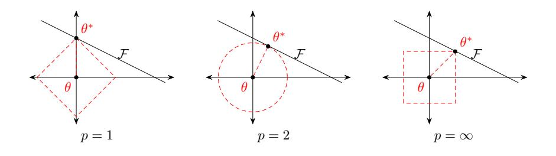

图 7.9 不同范数约束条件下的最优化问题示例, 红线表示函数  $\ell_p = 1$ , F 为函 数 f(θ) 的等高线(简单起见,这里用直线表示)

参见第2.8.1节。

据的数量。

{24}------------------------------------------------

从图A.1可以看出,  $\ell_1$ 范数的约束通常会使得最优解位于坐标轴上, 而从使 得最终的参数为稀疏性向量。此外,  $\ell_1$ 范数在零点不可导, 因此经常下式来近似:

$$
\ell_1(\theta) = \sum_i \sqrt{\theta_i^2 + \epsilon} \tag{7.61}
$$

其中€为一个非常小的常数。

一种折中的正则化方法是弹性网络正则化 (Elastic Net Regularization) [Zou and Hastie, 2005], 同时加入 $\ell_1$ 和 $\ell_2$ 正则化。

$$
\theta^* = \underset{\theta}{\arg\min} \frac{1}{N} \sum_{n=1}^N \mathcal{L}\big(y^{(n)}, f(\mathbf{x}^{(n)}, \theta)\big) + \lambda_1 \ell_1(\theta) + \lambda_2 \ell_2(\theta),\tag{7.62}
$$

其中入和入2分别为两个正则化项的系数。

#### $7.7.2$ 权重衰减

权重衰减(Weight Decay)也是一种有效的正则化手段 [Hanson and Pratt, 1989], 在每次参数更新时, 引入一个衰减系数。

$$
\theta_t \leftarrow (1 - w)\theta_{t-1} - \alpha \mathbf{g}_t,\tag{7.63}
$$

其中 $\mathbf{g}_t$  为第 $t$  更新的梯度,  $\alpha$  为学习率,  $w$  为权重衰减系数, 一般取值比较小, 比如0.0005。在标准的随机梯度下降中, 权重衰减正则化和  $\ell_2$  正则化的效果相 同。因此, 权重衰减在一些深度学习框架中通过 $\ell_2$ 正则化来实现。但是, 在较为 复杂的优化方法(比如Adam)中,权重衰减和l2 正则化并不等价 [Loshchilov and Hutter,  $2017$ .

参见习题7-3。

#### $7.7.3$ 提前停止

提前停止(early stop)对于深层神经网络来说是一种简单有效的正则化方 法。由于深层神经网络的拟合能力非常强,因此比较容易在训练集上过拟合。在 使用梯度下降法进行优化时, 我们可以使用一个和训练集独立的样本集合, 称 为验证集 (validation set), 并用验证集上的错误来代替期望错误。当验证集 上的错误率不再下降, 就停止迭代。

然而在实际操作中,验证集上的错误率变化曲线并不一定是图2.4中所示的 平衡曲线,很可能是先升高再降低。因此,提前停止的具体停止标准需要根据 实际任务上进行优化 [Prechelt, 1998]。

提前停止也可以参见 第2.2.3.2节。

#### 7.7.4 丢弃法

当训练一个深层神经网络时, 我们可以随机丢弃一部分神经元(同时丢弃 其对应的连接边)来避免过拟合,这种方法称为丢弃法(Dropout Method) [Srivastava et al., 2014]。每次选择丢弃的神经元是随机的。最简单的方法是设置一

{25}------------------------------------------------

个固定的概率p。对每一个神经元都一个概率p来判定要不要保留。对于一个神 经层 $\mathbf{y} = f(W\mathbf{x} + \mathbf{b})$ , 我们可以引入一个丢弃函数  $d(\cdot)$  使得 $\mathbf{y} = f(Wd(\mathbf{x}) + \mathbf{b})$ . 丢弃函数 d(·) 的定义为

$$
d(\mathbf{x}) = \begin{cases} \mathbf{m} \odot \mathbf{x} & \text{if } \text{if } \text{if } \text{if } \text{if } \text{if } \text{if } \text{if }
$$

其中m  $\in \{0,1\}^d$ 是丢弃掩码 (dropout mask), 通过以概率为p的贝努力分布 随机生成。p可以通过验证集来选取一个最优的值。或者p也可以设为0.5, 这 对大部分的网络和任务有比较有效。在训练时, 激活神经元的平均数量为原来 的p倍。而在测试时, 所有的神经元都是可以激活的, 这会造成训练和测试时 网络的输出不一致。为了缓解这个问题, 在测试时需要将每一个神经元的输出 乘以 p, 也相当于把不同的神经网络做了平均。

图7.10给出了一个网络应用 dropout 方法后的示例。

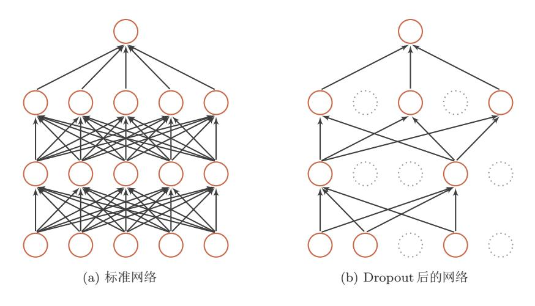

图 7.10 丢弃法示例

一般来讲, 对于隐藏层的神经元, 其丢弃率  $p = 0.5$ 时效果最好。当 $p = 0.5$ 时, 在训练时有一半的神经元被丢弃, 只剩余一半的神经元是可以激活的, 随 机生成的网络结构最具多样性。对于输入层的神经元, 其丢弃率通常设为更接 近1的数, 使得输入变化不会太大。对输入层神经元进行丢弃时, 相当于给数 据增加噪声, 以此来提高网络的鲁棒性。

丢弃法一般是针对神经元进行随机丢弃,但是也可以扩展到对神经元之间 的连接进行随机丢弃 [Wan et al., 2013], 或每一层进行随机丢弃。

集成学习的解释 每做一次丢弃,相当于从原始的网络中采样得到一个子网络。 如果一个神经网络有n个神经元, 那么总共可以采样出2"个子网络。每次迭代

{26}------------------------------------------------

都相当于训练一个不同的子网络,这些子网络都共享原始网络的参数。那么,最 终的网络可以近似看作是集成了指数级个不同网络的组合模型。

贝叶斯学习的解释 丢弃法也可以解释为一种贝叶斯学习的近似 [Gal and Ghahramani, 2016a]。用  $y = f(\mathbf{x}, \theta)$  来表示要学习的神经网络, 贝叶斯学习是假设参 数 $\theta$ 为随机向量, 并且先验分布为 $q(\theta)$ , 贝叶斯方法的预测为

$$
\mathbb{E}_{q(\theta)}[y] = \int_{q} f(\mathbf{x}, \theta) q(\theta) d\theta \qquad (7.65)
$$

$$
\approx \frac{1}{M} \sum_{m=1}^{M} f(\mathbf{x}, \theta_m), \tag{7.66}
$$

其中  $f(\mathbf{x}, \theta_m)$ 为第 m 次应用丢弃方法后的网络, 其参数 θ m 为对全部参数θ的一 次采样。

### 7.7.4.1 循环神经网络上的丢弃法

当在循环神经网络上应用丢弃法,不能直接对每个时刻的隐状态进行随机 丢弃,这样会损害循环网络在时间维度上记忆能力。一种简单的方法是对非时 间维度的连接(即非循环连接)进行随机丢失 [Zaremba et al., 2014]。如图7.11所 示, 虚线边表示讲行随机手弃, 不同的颜色表示不同的手弃掩码。

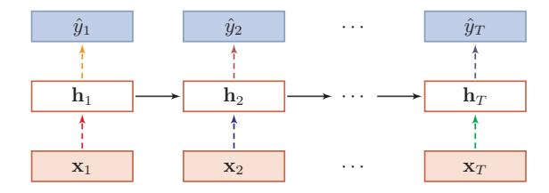

图 7.11 针对非循环连接的丢弃法

然而根据贝叶斯学习的解释,丢弃法是一种对参数θ的采样。每次采样的参 数需要在每个时刻保持不变。因此,在对循环神经网络上使用丢弃法时,需要对 参数矩阵的每个元素进行随机丢弃,并在所有时刻都使用相同的丢弃掩码。这 种方法称为变分丢弃法 (Variational Dropout) Gal and Ghahramani [2016b]。

图7.12给出了变分丢弃法的示例,相同颜色表示使用相同的丢弃掩码。

邱锡鹏:《神经网络与深度学习》

{27}------------------------------------------------

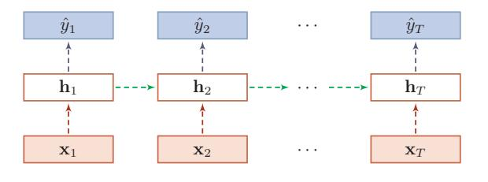

图 7.12 变分丢弃法

#### 数据增强 $7.7.5$

深层神经网络一般都需要大量的训练数据才能获得比较理想的效果。在数 据量有限的情况下, 可以通过数据增强 (Data Augmentation) 来增加数据量, 提高模型鲁棒性,避免过拟合。目前,数据增强还主要应用在图像数据上,在 文本等其它类型的数据还没有太好的方法。

图像数据的增强主要是通过算法对图像进行转变, 引入噪声等方法来增加 数据的多样性。增强的方法主要有几种:

- · 旋转 (Rotation): 将图像按顺时针或逆时针方向随机旋转一定角度;
- · 翻转(Flip): 将图像沿水平或垂直方法随机翻转一定角度;
- 缩放 (Zoom In/Out): 将图像放大或缩小一定比例;
- 平移 (Shift): 将图像沿水平或垂直方法平移一定步长;
- 加噪声 (Noise): 加入随机噪声。

#### 标签平滑 7.7.6

在数据增强中,我们可以给样本特征加入随机噪声来避免过拟合。同样,我 们也可以给样本的标签引入一定的噪声。假设训练数据集中,有一些样本的标 签是被错误标注的, 那么最小化这些样本上的损失函数会导致过拟合。一种改 善的正则化方法是标签平滑(Label Smoothing), 即在输出标签中添加噪声来 避免模型过拟合 [Szegedy et al., 2016]。

一个样本 x 的标签一般用 onehot 向量表示

$$
\mathbf{y} = [0, \cdots, 0, 1, 0, \cdots, 0]^{\mathrm{T}},
$$

这种标签可以看作是硬目标(Hard Targets)。如果使用softmax分类器并使用 交叉熵损失函数, 最小化损失函数会使得正确类和其它类的权重差异变得很大。 根据 softmax 函数的性质可知, 如果要使得某一类的输出概率接近于1, 其未归 一化的得分需要远大于其它类的得分,可能会导致其权重越来越大,并导致过

{28}------------------------------------------------

拟合。此外, 如果样本标签是错误的, 会导致更严重的过拟合现象。为了改善 这种情况, 我们可以引入一个噪声对标签进行平滑, 即假设样本以 є 的概率为 其它类。平滑后的标签为

$$
\tilde{\mathbf{y}} = [\frac{\epsilon}{K-1}, \cdots, \frac{\epsilon}{K-1}, 1-\epsilon, \frac{\epsilon}{K-1}, \cdots, \frac{\epsilon}{K-1}]^{T}.
$$

其中 $K$ 为标签数量, 这种标签可以看作是软目标(Soft Targets)。标签平滑可 以避免模型的输出过拟合到硬目标上,并且通常不会损害其分类能力。

上面的标签平滑方法是给其它  $K-1$ 个标签相同的概率  $\frac{\epsilon}{K-1}$ , 没有考虑标 签之间的相关性。一种更好的做法是按照类别相关性来赋予其它标签不同的概 率。比如先训练另外一个更复杂(一般为多个网络的集成)的教师网络(Teacher Network), 并使用大网络的输出作为软目标进行训练学生网络(Student Network)。这种方法也称为知识精炼(Knowledge Distillation) [Hinton et al., 2015]。

#### 总结和深入阅读 7.8

深层神经网络的优化和正则化是即对立又统一的关系。一方面我们希望优 化算法能找到一个全局最优解(或较好的局部最优解),另一方面我们又不希望 模型优化到最优解, 这可能陷入过拟合。优化和正则化的统一目标是期望风险 最小化。

在传统的机器学习中,有一些很好的理论可以帮助我们在模型的表示能力、 复杂度和泛化能力之间找到比较好的平衡,比如 Vapnik-Chervonenkis (VC)维 [Vapnik, 1998] 和 Rademacher 复杂度 [Bartlett and Mendelson, 2002]。但是这 些理论无法解释深层神经网络在实际应用中的泛化能力表现。目前, 深层神经 网络的泛化能力还没有很好的理论支持。在传统机器学习模型上比较有效的  $\ell_1$ 或  $\ell_2$  正则化在深层神经网络中作用也比较有限, 而一些经验的做法, 比如使用 随机梯度下降和提前停止, 会更有效。

根据通用近似定理, 神经网络的表示能力十分强大。从直觉上, 深层神经 网络很容易产生过拟合现象, 因为增加的抽象层使得模型能够对训练数据中较 为罕见的依赖关系进行建模 [Bengio et al., 2013]。Zhang et al. [2016] 发现, 虽 然深层神经网络的容量足够记住所有训练数据, 但依然优先记住训练数据中的 一般规律, 即有泛化能力的规律。

近几年来, 深度学习的快速发展在一定程度上也归因于一些深层神经网络 的优化和正则化方法的出现。虽然这些方法往往是经验性的,但在实践中取得 了很好的效果, 使得我们可以高效地、端到端地训练神经网络模型, 不再依赖 早期训练神经网络时的预训练和逐层训练等比较低效的方法。

### 参见习题7-5。

集成学习参见第10.1节。

{29}------------------------------------------------

# 习题

习题7-1 证明在动量法的更新公式(7.17)中, $\Delta \theta_t$ 实际上是相当于对 $-\frac{\alpha}{1-\rho}$ g 进行指数衰减的移动平均。

习题 7-2 分析为什么批量归一化不能直接应用于循环神经网络。

习题7-3 证明在标准的随机梯度下降中, 权重衰减正则化和 $\ell_2$ 正则化的效 果相同。并分析这一结论在动量法和 Adam 算法中是否依然成立。

习题 7-4 试分析为什么不能在循环神经网络中的循环连接上直接应用手 弃法?

习题 7-5 若使用标签平滑正则化方法, 给出其交叉熵损失函数。

# 参考文献

Lei Jimmy Ba, Ryan Kiros, and Geoffrey E. Hinton. Layer normalization.  $CoRR$ , abs/1607.06450, 2016. URL http://arxiv.org/abs/1607.06450.

Peter L Bartlett and Shahar Mendel-Rademacher and gaussian comson. plexities: Risk bounds and structural results. Journal of Machine Learning Research, 3(Nov):463-482, 2002.

Yoshua Bengio, Nicolas Boulanger-Lewandowski, and Razvan Pascanu. Advances in optimizing recurrent networks. In 2013 IEEE International Conference on Acoustics, Speech and Signal Processing, pages 8624-8628. IEEE, 2013.

James Bergstra and Yoshua Bengio. Random search for hyper-parameter optimization. Journal of Machine Learning Research, 13(Feb):281-305, 2012.

James S Bergstra, Rémi Bardenet, Yoshua Bengio, and Balázs Kégl. Algorithms for hyper-parameter optimization. In Advances in neural information processing systems, pages 2546-2554, 2011.

Anna Choromanska, Mikael Henaff, Michael Mathieu, Gérard Ben Arous, and Yann LeCun. The loss surfaces of multilayer networks. In Artificial Intelligence and Statistics, pages 192-204, 2015.

Yann N Dauphin, Razvan Pascanu, Caglar Gulcehre, Kyunghyun Cho, Surya Ganguli, and Yoshua Bengio. Identifying and attacking the saddle point problem in high-dimensional nonconvex optimization. In Advances in neural information processing systems, pages 2933-2941, 2014.

{30}------------------------------------------------

Timothy Dozat. Incorporating nesterov momentum into adam. In ICLR Workshop, 2016.

John Duchi, Elad Hazan, and Yoram Singer. Adaptive subgradient methods for online learning and stochastic optimization. The Journal of Machine Learning Research, 12:2121-2159, 2011. Yarin Gal and Zoubin Ghahramani. Dropout as a bayesian approximation: Representing model uncertainty in deep learning. In international conference on machine learning, pages 1050-1059, 2016a.

Yarin Gal and Zoubin Ghahramani. A theoretically grounded application of dropout in recurrent neural networks. In Advances in neural information processing systems, pages 1019-1027, 2016b.

Xavier Glorot and Yoshua Bengio. Understanding the difficulty of training deep feedforward neural networks. In International conference on artificial in*telligence and statistics*, pages 249–256, 2010.

Stephen José Hanson and Lorien Y Pratt. Comparing biases for minimal network construction with backpropagation. In Advances in neural information processing systems, pages 177-185, 1989.

Geoffrey Hinton, Oriol Vinyals, and Distilling the knowledge Jeff Dean. in a neural network.  $arXiv$  preprint arXiv:1503.02531, 2015.

Sepp Hochreiter and Jürgen Schmidhuber. Flat minima. Neural Computation,  $9(1):1-42, 1997.$ 

Frank Hutter, Holger H Hoos, and Kevin Leyton-Brown. Sequential modelbased optimization for general algorithm

configuration. In International Conference on Learning and Intelligent Opti $mization$ , pages 507–523. Springer, 2011. Sergey Ioffe and Christian Szegedy. Batch normalization: Accelerating deep network training by reducing internal covariate shift. In Proceedings of the 32nd International Conference on Ma*chine Learning*, pages  $448-456$ ,  $2015$ .

Kevin Jamieson and Ameet Talwalkar. Non-stochastic best arm identification and hyperparameter optimization. In Artificial Intelligence and Statistics, pages 240-248, 2016.

Diederik Kingma and Jimmy Ba. Adam: A method for stochastic optimization. In Proceedings of International Conference on Learning Representations, 2015. Alex Krizhevsky, Ilya Sutskever, and Geoffrey E Hinton. Imagenet classification with deep convolutional neural networks. In Advances in neural information processing systems, pages 1097-1105, 2012.

Hao Li, Zheng Xu, Gavin Taylor, and Visualizing the loss Tom Goldstein. landscape of neural nets.  $arXiv$  preprint  $arXiv:1712.09913.2017a.$ 

Lisha Li, Kevin Jamieson, Giulia De-Salvo, Afshin Rostamizadeh, and Ameet Talwalkar. Hyperband: Bandit-based configuration evaluation for hyperparameter optimization. In Proceedings of 5th International Conference on Learning Representations, 2017b.

Ilya Loshchilov and Frank Hutter. Fixing weight decay regularization in adam.  $arXiv$  preprint  $arXiv:1711.05101$ , 2017. Yu Nesterov. Gradient methods for minimizing composite functions. Mathematical Programming,  $140(1):125-161$ , 2013.

{31}------------------------------------------------

Razvan Pascanu, Tomas Mikolov, and Yoshua Bengio. On the difficulty of training recurrent neural networks. In Proceedings of the International Conference on Machine Learning, pages 1310-1318, 2013.

Lutz Prechelt. Early stopping-but when? In Neural Networks: Tricks of the trade, pages 55–69. Springer, 1998. David E Rumelhart, Geoffrey E Hinton, and Ronald J Williams. Learning representations by back-propagating errors. Cognitive modeling, 5:3, 1988.

Tim Salimans and Diederik P Kingma. Weight normalization: A simple reparameterization to accelerate training of deep neural networks. In Advances in Neural Information Processing Systems, pages 901-909, 2016.

Jasper Snoek, Hugo Larochelle, and Ryan P Adams. Practical bayesian optimization of machine learning algorithms. In Advances in neural information processing systems, pages 2951-2959, 2012.

Jasper Snoek, Oren Rippel, Kevin Swersky, Ryan Kiros, Nadathur Satish, Narayanan Sundaram, Mostofa Patwary, Mr Prabhat, and Ryan Adams. Scalable bayesian optimization using deep neural networks. In *International* Conference on Machine Learning, pages 2171-2180, 2015.

Nitish Srivastava, Geoffrey Hinton, Alex Krizhevsky, Ilya Sutskever, and Ruslan Salakhutdinov. Dropout: A simple way to prevent neural networks from overfitting. The Journal of Machine Learning Research, 15(1):1929-1958, 2014.

Ilya Sutskever, James Martens, George Dahl, and Geoffrey Hinton. On the importance of initialization and momentum in deep learning. In *International* conference on machine learning, pages 1139-1147, 2013.

Christian Szegedy, Vincent Vanhoucke, Sergey Ioffe, Jon Shlens, and Zbigniew Wojna. Rethinking the inception architecture for computer vision. In Proceedings of the IEEE Conference on Computer Vision and Pattern Recognition, pages 2818-2826, 2016.

Tijmen Tieleman and Geoffrey Hinton. Lecture 6.5-rmsprop: Divide the gradient by a running average of its recent magnitude. COURSERA: Neural networks for machine learning, 2012.

Vladimir Vapnik. Statistical learning theory. Wiley, New York, 1998.

Li Wan, Matthew Zeiler, Sixin Zhang, Yann Le Cun, and Rob Fergus. Regularization of neural networks using dropconnect. In *International Conference* on Machine Learning, pages 1058-1066, 2013.

Wojciech Zaremba, Ilya Sutskever, and Oriol Vinyals. Recurrent neural network regularization.  $arXiv$  preprint arXiv:1409.2329, 2014.

Matthew D Zeiler. Adadelta:  $An$ adaptive learning rate method.  $arXiv$ preprint arXiv:1212.5701, 2012.

Chiyuan Zhang, Samy Bengio, Moritz Hardt, Benjamin Recht, and Oriol Vinyals. Understanding deep learning requires rethinking generalization.  $arXiv$  preprint  $arXiv:1611.03530$ , 2016. Barret Zoph and Quoc V Le. Neural architecture search with reinforcement learning. In Proceedings of 5th International Conference on Learning Representations, 2017.

{32}------------------------------------------------

Hui Zou and Trevor Hastie. Regularization and variable selection via the elastic net. Journal of the Royal Statistical Society: Series B (Statistical Methodology),  $67(2):301-320, 2005.$