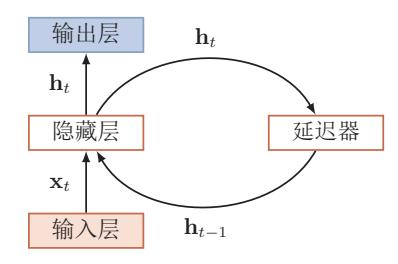
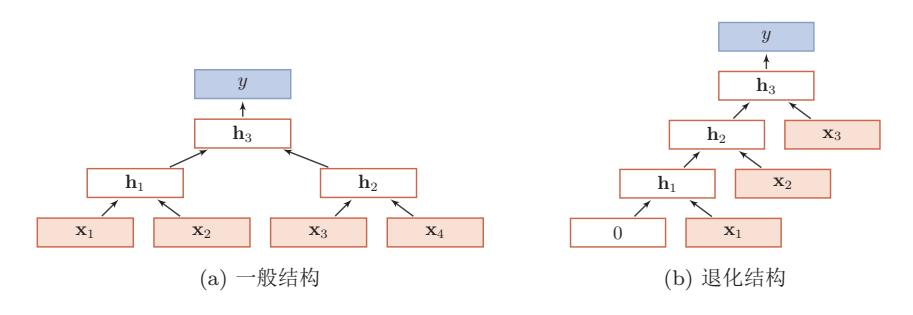

{0}------------------------------------------------

# 第6章 循环神经网络

经验是智慧之父。记忆是智慧之母。

— 谚语

在前馈神经网络中, 信息的传递是单向的, 这种限制虽然使得网络变得更 容易学习,但在一定程度上也减弱了神经网络模型的能力。在生物神经网络中, 神经元之间的连接关系要复杂的多。前馈神经网络可以看着是一个复杂的函数, 每次输入都是独立的, 即网络的输出只依赖于当前的输入。但是在很多现实任 务中, 网络的输入不仅和当前时刻的输入相关, 也和其过去一段时间的输出相 关。比如一个有限状态自动机, 其下一个时刻的状态(输出) 不仅仅和当前输 入相关, 也和当前状态(上一个时刻的输出)相关。此外, 前馈网络难以处理 时序数据, 比如视频、语音、文本等。时序数据的长度一般是不固定的, 而前 馈神经网络要求输入和输出的维数都是固定的,不能任意改变。因此,当处理 这一类和时序相关的问题时, 就需要一种能力更强的模型。

循环神经网络 (Recurrent Neural Network, RNN) 是一类具有短期记忆能 力的神经网络。在循环神经网络中,神经元不但可以接受其它神经元的信息,也 可以接受自身的信息,形成具有环路的网络结构。和前馈神经网络相比,循环神 经网络更加符合生物神经网络的结构。循环神经网络已经被广泛应用在语音识 别、语言模型以及自然语言生成等任务上。循环神经网络的参数学习可以通过 随时间反向传播算法 [Werbos, 1990] 来学习。随时间反向传播算法即按照时间 的逆序将错误信息一步步地往前传递。当输入序列比较长时, 会存在梯度爆炸 和消失问题 [Bengio et al., 1994, Hochreiter and Schmidhuber, 1997, Hochreiter et al., 2001], 也称为长期依赖问题。为了解决这个问题, 人们对循环神经网络 讲行了很多的改讲, 其中最有效的改讲方式引入门控机制。

此外, 循环神经网络可以很容易地扩展到两种更广义的记忆网络模型: 递 归神经网络和图网络。

{1}------------------------------------------------

## 给网络增加记忆能力 $6.1$

为了处理这些时序数据并利用其历史信息, 我们需要让网络具有短期记忆 能力。而前馈网络是一个静态网络, 不具备这种记忆能力。

一般来讲,我们可以通过以下三种方法来给网络增加短期记忆能力。

#### $6.1.1$ 延时神经网络

一种简单的利用历史信息的方法是建立一个额外的延时单元,用来存储网 络的历史信息(可以包括输入、输出、隐状态等)。比较有代表性的模型是延时 神经网络 (Time Delay Neural Network, TDNN) [Lang et al., 1990, Waibel et al.,  $1989$ .

延时神经网络是在前馈网络中的非输出层都添加一个延时器, 记录最近几 次神经元的输出。在第t个时刻, 第l+1层神经元和第l层神经元的最近p次输 出相关, 即

$$
\mathbf{h}_t^{(l+1)} = f(\mathbf{h}_t^{(l)}, \mathbf{h}_{t-1}^{(l)}, \cdots, \mathbf{h}_{t-p+1}^{(l)}). \tag{6.1}
$$

通过延时器, 前馈网络就具有了短期记忆的能力。

#### 有外部输入的非线性自回归模型 $6.1.2$

自回归模型 (Autoregressive Model, AR) 是统计学上常用的一类时间序 列模型, 用一个变量 yt 的历史信息来预测自己。

$$
\mathbf{y}_t = w_0 + \sum_{i=1}^p w_p \mathbf{y}_{t-p} + \epsilon_t,
$$
 (6.2)

其中 *p* 为超参数,  $w_p$  为参数,  $\epsilon_t \sim N(0, \sigma^2)$  为第 t 个时刻的噪声, 方差  $\sigma^2$  和时 间无关。

有外部输入的非线性自回归模型 (Nonlinear Autoregressive with Exogenous Inputs Model, NARX) [Leontaritis and Billings, 1985] 是自回归模型的 扩展, 在每个时刻 $t$ 都有一个外部输入 $\mathbf{x}_t$ , 产生一个输出 $\mathbf{y}_t$ 。NARX 通过一个 延时器记录最近几次的外部输入和输出, 第t个时刻的输出yt为

$$
\mathbf{y}_t = f(\mathbf{x}_t, \mathbf{x}_{t-1}, \cdots, \mathbf{x}_{t-p}, \mathbf{y}_{t-1}, \mathbf{y}_{t-2}, \cdots, \mathbf{y}_{t-q}),
$$
(6.3)

其中 f(.) 表示非线性函数, 可以是一个前馈网络, p和 q 为超参数。

邱锡鹏:《神经网络与深度学习》

此外,还有一种增加记忆 能力的方法是引入外部 记忆单元,参见第8.2节。

延时神经网络在时间维 度上共享权值, 以降低 参数数量。因此对于序 列输入来讲,延时神经 网络就相当于卷积神经 网络。

{2}------------------------------------------------

#### $6.1.3$ 循环神经网络

循环神经网络通过使用带自反馈的神经元, 能够处理任意长度的时序数据。

RNN也经常被翻译为递 归神经网络。这里为了 区别与另外一种递归神 经网络 (Recursive Neural Network), 我 们称为循环神经网络。

给定一个输入序列 $\mathbf{x}_{1:T} = (\mathbf{x}_1, \mathbf{x}_2, \dots, \mathbf{x}_t, \dots, \mathbf{x}_T)$ , 循环神经网络通过下面 公式更新带反馈边的隐藏层的活性值ht:

$$
\mathbf{h}_t = f(\mathbf{h}_{t-1}, \mathbf{x}_t),\tag{6.4}
$$

其中 $\mathbf{h}_0 = 0$ ,  $f(.)$ 为一个非线性函数, 也可以是一个前馈网络。

图6.1给出了循环神经网络的示例。

图 6.1 循环神经网络

生活中很多现象都可以 动力系统来描述,比如 钟摆晃动、台球轨迹等。

从数学上讲, 公式(6.4)可以看成一个动力系统。动力系统(Dynamical System)是一个数学上的概念,指系统状态按照一定的规律随时间变化的系统。具 体地讲, 动力系统是使用一个函数来描述一个给定空间(如某个物理系统的状 态空间)中所有点随时间的变化情况。因此,隐藏层的活性值 h, 在很多文献上 也称为状态(state)或隐状态(hidden states)。理论上,循环神经网络可以近 似任意的非线性动力系统(参见第6.2.1节)。

## 简单循环网络 $6.2$

简单循环网络(Simple Recurrent Network, SRN) [Elman, 1990] 是一个非 常简单的循环神经网络, 只有一个隐藏层的神经网络。

在一个两层的前馈神经网络中, 连接存在相邻的层与层之间, 隐藏层的节 点之间是无连接的。而简单循环网络增加了从隐藏层到隐藏层的反馈连接。

假设在时刻t时, 网络的输入为xt, 隐层状态(即隐层神经元活性值)为ht 不仅和当前时刻的输入xt相关,也和上一个时刻的隐层状态 ht-1 相关。

$$
\mathbf{z}_t = U\mathbf{h}_{t-1} + W\mathbf{x}_t + \mathbf{b},\tag{6.5}
$$

$$
\mathbf{h}_t = f(\mathbf{z}_t),\tag{6.6}
$$

{3}------------------------------------------------

其中 $z_t$ 为隐藏层的净输入,  $f(.)$ 是非线性激活函数, 通常为 $logistic$  函数或 $tanh$ 函数, U为状态-状态权重矩阵, W为状态-输入权重矩阵,b为偏置。公式(6.5) 和(6.6)也经常直接写为

$$
\mathbf{h}_t = f(U\mathbf{h}_{t-1} + W\mathbf{x}_t + \mathbf{b}).\tag{6.7}
$$

如果我们把每个时刻的状态都看作是前馈神经网络的一层的话, 循环神经 网络可以看作是在时间维度上权值共享的神经网络。图6.2给出了按时间展开的 循环神经网络。

图 6.2 按时间展开的循环神经网络

#### 循环神经网络的计算能力 $6.2.1$

由于循环神经网络具有短期记忆能力, 相当于存储装置, 因此其计算能力 十分强大。前馈神经网络可以模拟任何连续函数,而循环神经网络可以模拟任 何程序。

我们先定义一个完全连接的循环神经网络,其输入为xt,输出为yt,

$$
\mathbf{h}_t = f(U\mathbf{h}_{t-1} + W\mathbf{x}_t + \mathbf{b}),\tag{6.8}
$$

$$
\mathbf{y}_t = V \mathbf{h}_t,\tag{6.9}
$$

其中h为隐藏状态, f(.)为非线性激活函数, U、W、b和V为网络参数。

# 6.2.1.1 通用近似定理

一个完全连接的循环网络是任何非线性动力系统的近似器。

定理 6.1-通用近似定理 [Haykin, 2009]: 如果一个完全连接的 循环神经网络有足够数量的 sigmoid 型隐藏神经元, 它可以以任 意的准确率去近似任何一个非线性动力系统

$$
\mathbf{s}_t = g(\mathbf{s}_{t-1}, \mathbf{x}_t),\tag{6.10}
$$

$$
\mathbf{y}_t = o(\mathbf{s}_t),\tag{6.11}
$$

其中  $\mathbf{s}_t$  为每个时刻的隐状态,  $\mathbf{x}_t$  是外部输入,  $g(\cdot)$  是可测的状态

{4}------------------------------------------------

转换函数, o(·)是连续输出函数,, 并且对状态空间的紧致性没有 限制。

证明. (1)根据通用近似定理,两层的前馈神经网络可以近似任意有界闭集上的 通用近似定理参见 任意连续函数。因此,动力系统的两个函数可以用两层的全连接前馈网络近似。 第4.3.1节。

> 首先, 非线性动力系统的状态转换函数 $\mathbf{s}_t = g(\mathbf{s}_{t-1}, \mathbf{x}_t)$ 可以由一个两层的 神经网络  $\mathbf{s}_t = Cf(A\mathbf{s}_{t-1} + B\mathbf{x}_t + \mathbf{b}_1)$ 来近似, 可以分解为

$$
\mathbf{s}'_t = f(AC \; \mathbf{s}'_{t-1} + B\mathbf{x}_t + \mathbf{b}_1),\tag{6.12}
$$

$$
\mathbf{s}_t = C\mathbf{s}'_t. \tag{6.13}
$$

本证明参考文献 [Schäfer and Zimmermann, 2006].

其次, 非线性动力系统的输出函数 $\mathbf{y}_t = o(\mathbf{s}_t) = o(g(\mathbf{s}_{t-1}, \mathbf{x}_t))$ 也可以用一 个两层的前馈神经网络近似。

$$
\mathbf{y}'_t = f(A'C\mathbf{s}_{t-1} + B'\mathbf{x}_t + \mathbf{b}_2),\tag{6.14}
$$

$$
\mathbf{y}_t = D\mathbf{y}'_t. \tag{6.15}
$$

(2) 公式 (6.12) 和 (6.14) 可以合并为

$$
\begin{bmatrix} \mathbf{s}'_t \\ \mathbf{y}'_t \end{bmatrix} = f \left( \begin{bmatrix} AC & 0 \\ A'C & 0 \end{bmatrix} \begin{bmatrix} \mathbf{s}'_{t-1} \\ \mathbf{y}'_t \end{bmatrix} + \begin{bmatrix} B \\ B' \end{bmatrix} \mathbf{x}_t + \begin{bmatrix} \mathbf{b}_1 \\ \mathbf{b}_2 \end{bmatrix} \right). \tag{6.16}
$$

公式 (6.15) 可以改写为

$$
\mathbf{y}_t = \begin{bmatrix} 0 & D \end{bmatrix} \begin{bmatrix} \mathbf{s}'_{t-1} \\ \mathbf{y}'_t \end{bmatrix} . \tag{6.17}
$$

$$
\diamondsuit U = \begin{bmatrix} AC & 0 \\ A'C & 0 \end{bmatrix}, W = \begin{bmatrix} B \\ B' \end{bmatrix}, \mathbf{b} = \begin{bmatrix} \mathbf{b}_1 \\ \mathbf{b}_2 \end{bmatrix}, V = \begin{bmatrix} 0 & D \end{bmatrix}, \ \mathbf{h} = \begin{bmatrix} \mathbf{s}'_{t-1} \\ \mathbf{y}'_{t} \end{bmatrix}, \ \mathbf{W} = \begin{bmatrix} B'_{t-1} \\ B'_{t-1} \end{bmatrix}
$$

$$
\mathbf{h}_t = f(U\mathbf{h}_{t-1} + W\mathbf{x}_t + \mathbf{b}),\tag{6.18}
$$

$$
\mathbf{y}_t = V \mathbf{h}_t. \tag{6.19}
$$

{5}------------------------------------------------

# 6.2.1.2 图灵完备

图灵完备(Turing Completeness)是指一种数据操作规则,比如一种计算 机编程语言,可以实现图灵机(Turing Machine)的所有功能,解决所有的可计 算问题。目前主流的编程语言(比如C++, Java, Python等)都是图灵完备的。

定理 6.2-图灵完备 [Siegelmann and Sontag, 1991]: 所有的 图灵机都可以被一个由使用 sigmoid 型激活函数的神经元构成的 全连接循环网络来进行模拟。

图灵机是一种抽象 的信息处理装置,可 以用来解决任所有的 可计算机问题。参见 第8.2.3.2节。

因此,一个完全连接的循环神经网络可以近似解决所有的可计算问题。

# 应用到机器学习 6.3

循环神经网络可以应用到很多不同类型的机器学习任务。根据这些任务的 特点可以分为以下几种模式: 序列到类别模式、同步序列到序列模式、异步的 序列到序列模式。

下面我们分别来看下这几种应用模式。

# 6.3.1 序列到类别模式

序列到类别模式主要用于序列数据的分类问题: 输入为序列, 输出为类别。 比如在文本分类中, 输入数据为单词的序列, 输出为该文本的类别。

假设一个样本 $\mathbf{x}_{1:T} = (\mathbf{x}_1, \cdots, \mathbf{x}_T)$ 为一个长度为T的序列, 输出为一个类 别  $y \in \{1, \cdots, C\}$ 。我们可以将样本 x 按不同时刻输入到循环神经网络中, 并 得到不同时刻的隐藏状态 $\mathbf{h}_1, \dots, \mathbf{h}_T$ 。我们可以将 $\mathbf{h}_T$ 看作整个序列的最终表示 (或特征), 并输入给分类器 g(·)进行分类(如图6.3a所示)。

$$
\hat{y} = g(\mathbf{h}_T),\tag{6.20}
$$

其中g(·)可以是简单的线性分类器(比如Logistic回归)或复杂的分类器(比如 多层前馈神经网络)。

图 6.3 序列到类别模式

{6}------------------------------------------------

除了将最后时刻的状态作为序列表示之外,我们还可以对整个序列的所有 状态进行平均, 并用这个平均状态来作为整个序列的表示(如图6.3b所示)。

$$
\hat{y} = g\left(\frac{1}{T} \sum_{t=1}^{T} \mathbf{h}_t\right).
$$
\n(6.21)

#### 6.3.2 同步的序列到序列模式

同步的序列到序列模式主要用于序列标注(Sequence Labeling)任务,即每 一时刻都有输入和输出,输入序列和输出序列的长度相同。比如词性标注(Partof-Speech Tagging) 中, 每一个单词都需要标注其对应的词性标签。

在同步的序列到序列模式(如图6.4所示)中, 输入为一个长度为T的序列  $\mathbf{x}_{1:T} = (\mathbf{x}_1, \cdots, \mathbf{x}_T)$ , 输出为序列 $y_{1:T} = (y_1, \cdots, y_T)$ 。样本 x 按不同时刻输入 到循环神经网络中,并得到不同时刻的隐状态 h1...,hr。每个时刻的隐状态  $\mathbf{h}_t$ 代表了当前时刻和历史的信息,并输入给分类器  $g(\cdot)$ 得到当前时刻的标签 $\hat{y}_t$ 。

$$
\hat{y}_t = g(\mathbf{h}_t), \qquad \forall t \in [1, T]. \tag{6.22}
$$

图 6.4 同步的序列到序列模式

#### 异步的序列到序列模式 6.3.3

异步的序列到序列模式也称为编码器-解码器(Encoder-Decoder)模型,即 输入序列和输出序列不需要有严格的对应关系, 也不需要保持相同的长度。比 如在机器翻译中, 输入为源语言的单词序列, 输出为目标语言的单词序列。

在异步的序列到序列模式中(如图6.5所示), 输入为一个长度为T的序列  $\mathbf{x}_{1:T} = (\mathbf{x}_1, \cdots, \mathbf{x}_T)$ , 输出为长度为  $M$  的序列 $y_{1:M} = (y_1, \cdots, y_M)$ 。经常通过 先编码后解码的方式来实现。先将样本x按不同时刻输入到一个循环神经网络 (编码器)中,并得到其编码hr。然后在使用另一个循环神经网络(解码器)中, 得到输出序列  $\hat{y}_{1:M}$ 。为了建立输出序列之间的依赖关系, 在解码器中通常使用 非线性的自回归模型。

自回归模型参见 第6.1.2节。

参见第??节。

$$
\mathbf{h}_t = f_1(\mathbf{h}_{t-1}, \mathbf{x}_t), \qquad \forall t \in [1, T] \tag{6.23}
$$

136

参见第??节。

邱锡鹏:《神经网络与深度学习》

{7}------------------------------------------------

# 2018年9月18日

$$
\mathbf{h}_{T+t} = f_2(\mathbf{h}_{T+t-1}, \hat{\mathbf{y}}_{t-1}), \qquad \forall t \in [1, M] \tag{6.24}
$$

$$
y_t = g(\mathbf{h}_{T+t}), \qquad \forall t \in [1, M]. \tag{6.25}
$$

其中  $f_1(\cdot), f_2(\cdot)$  分别为用作编码器和解码器的循环神经网络,  $g(\cdot)$  为分类器,  $\hat{y}_t$ 为预测输出  $\hat{y}_t$  的向量表示。

图 6.5 异步的序列到序列模式

### 参数学习 $6.4$

循环神经网络的参数可以通过梯度下降方法来进行学习。

以随机梯度下降为例,给定一个训练样本(x,y),其中 $\mathbf{x}_{1:T} = (\mathbf{x}_1, \cdots, \mathbf{x}_T)$ 为长度是T的输入序列,  $y_{1:T} = (y_1, \dots, y_T)$ 是长度为T的标签序列。即在每个 时刻t,都有一个监督信息 $y_t$ ,我们定义时刻t的损失函数为

不失一般性,这里我们 以同步的序列到序列模 式为例来介绍循环神经 网络的参数学习。

$$
\mathcal{L}_t = \mathcal{L}(y_t, g(\mathbf{h}_t)),\tag{6.26}
$$

其中  $g(\mathbf{h}_t)$  为第  $t$  时刻的输出,  $\mathcal L$  为可微分的损失函数, 比如交叉熵。那么整个 序列上损失函数为

$$
\mathcal{L} = \sum_{t=1}^{T} \mathcal{L}_t.
$$
\n(6.27)

整个序列的损失函数C关于参数U的梯度为

$$
\frac{\partial \mathcal{L}}{\partial U} = \sum_{t=1}^{T} \frac{\partial \mathcal{L}_t}{\partial U},\tag{6.28}
$$

即每个时刻损失 Ct 对参数 U 的偏导数之和。

循环神经网络中存在一个递归调用的函数 f(·), 因此其计算参数梯度的方 式和前馈神经网络不太相同。在循环神经网络中主要有两种计算梯度的方式:随 时间反向传播(BPTT)和实时循环学习(RTRL)算法。

邱锡鹏:《神经网络与深度学习》

{8}------------------------------------------------

#### 6.4.1 随时间反向传播算法

随时间反向传播 (Backpropagation Through Time, BPTT) 算法的主要 思想是通过类似前馈神经网络的错误反向传播算法 [Werbos, 1990] 来进行计算 梯度。

BPTT 算法将循环神经网络看作是一个展开的多层前馈网络, 其中"每一 层"对应循环网络中的"每个时刻"(图6.2)。这样,循环神经网络就可以按 按照前馈网络中的反向传播算法进行计算参数梯度。在"展开"的前馈网络中, 所有层的参数是共享的, 因此参数的真实梯度是将所有"展开层"的参数梯度 之和。

计算偏导数  $\frac{\partial \mathcal{L}_t}{\partial U}$  先来计算公式 (6.28) 中第t时刻损失对参数 U 的偏导数  $\frac{\partial \mathcal{L}_t}{\partial U}$ .

因为参数  $U$  和隐藏层在每个时刻  $k(1 \leq k \leq t)$  的净输入  $\mathbf{z}_k = U \mathbf{h}_{k-1} + \mathbf{h}_{k-1}$  $W$ xk + b 有关, 因此第t时刻损失的损失函数  $\mathcal{L}_t$  关于参数  $U_{ij}$  的梯度为:

链式法则参见公式  $(B.36)$ 

$$
\frac{\partial \mathcal{L}_t}{\partial U_{ij}} = \sum_{k=1}^t tr\left( (\frac{\partial \mathcal{L}_t}{\partial \mathbf{z}_k})^{\mathrm{T}} \frac{\partial^+ \mathbf{z}_k}{\partial U_{ij}} \right) \tag{6.29}
$$

$$
= \sum_{k=1}^{t} \left(\frac{\partial^+ \mathbf{z}_k}{\partial U_{ij}}\right)^{\mathrm{T}} \frac{\partial \mathcal{L}_t}{\partial \mathbf{z}_k},
$$
(6.30)

其中 $\frac{\partial^+ \mathbf{z}_k}{\partial U_{ii}}$ 表示"直接"偏导数,即公式 $\mathbf{z}_k = U \mathbf{h}_{k-1} + W \mathbf{x}_k + \mathbf{b}$ 中保持 $\mathbf{h}_{k-1}$ 不 变, 对 $U_{ij}$ 进行求偏导数, 得到

$$
\frac{\partial^+ \mathbf{z}_k}{\partial U_{ij}} = \begin{bmatrix} 0 \\ \vdots \\ \frac{[\mathbf{h}_{k-1}]_j}{\vdots} \end{bmatrix} \triangleq \mathbb{I}_i([\mathbf{h}_{k-1}]_j), \tag{6.31}
$$

其中 $[\mathbf{h}_{k-1}]_j$ 为第 $k-1$ 时刻隐状态的第 $j$ 维;  $\mathbb{I}_i(x)$ 除了第 $i$ 行值为 $x$ 外, 其余都 为0的向量。

定义 $\delta_{t,k} = \frac{\partial \mathcal{L}_t}{\partial \mathbf{z}_k}$ 为第 $t$ 时刻的损失对第 $k$ 时刻隐藏神经层的净输入 $\mathbf{z}_k$ 的导 数,则

$$
\delta_{t,k} = \frac{\partial \mathcal{L}_t}{\partial \mathbf{z}_k} \tag{6.32}
$$

$$
=\frac{\partial \mathbf{h}_k}{\partial \mathbf{z}_k} \frac{\partial \mathbf{z}_{k+1}}{\partial \mathbf{h}_k} \frac{\partial \mathcal{L}_t}{\partial \mathbf{z}_{k+1}}
$$
(6.33)

$$
= \text{diag}(f'(\mathbf{z}_k))U^{\mathrm{T}}\delta_{t,k+1}.
$$
\n(6.34)

{9}------------------------------------------------

图 6.6 随时间反向传播算法示例

将公式(6.34)和(6.31)代入公式(6.30)得到

$$
\frac{\partial \mathcal{L}_t}{\partial U_{ij}} = \sum_{k=1}^t [\delta_{t,k}]_i [\mathbf{h}_{k-1}]_j.
$$
 (6.35)

将上式写成矩阵形式为

$$
\frac{\partial \mathcal{L}_t}{\partial U} = \sum_{k=1}^t \delta_{t,k} \mathbf{h}_{k-1}^{\mathrm{T}}.
$$
\n(6.36)

图6.6给出了误差项随时间进行反向传播算法的示例。

参数梯度 将公式 (6.36)代入到将公式 (6.28) 得到整个序列的损失函数 C关于参 数 U 的梯度

$$
\frac{\partial \mathcal{L}}{\partial U} = \sum_{t=1}^{T} \sum_{k=1}^{t} \delta_{t,k} \mathbf{h}_{k-1}^{\mathrm{T}}.
$$
\n(6.37)

同理可得, C关于权重 W 和偏置 b 的梯度为

$$
\frac{\partial \mathcal{L}}{\partial W} = \sum_{t=1}^{T} \sum_{k=1}^{t} \delta_{t,k} \mathbf{x}_k^{\mathrm{T}},\tag{6.38}
$$

$$
\frac{\partial \mathcal{L}}{\partial \mathbf{b}} = \sum_{t=1}^{T} \sum_{k=1}^{t} \delta_{t,k}.
$$
\n(6.39)

计算复杂度 在 BPTT 算法中, 参数的梯度需要在一个完整的"前向"计算和 "反向"计算后才能得到并进行参数更新。

邱锡鹏:《神经网络与深度学习》

{10}------------------------------------------------

# 第6章 循环神经网络

#### $6.4.2$ 实时循环学习算法

与反向传播的 BPTT 算法不同的是, 实时循环学习 (Real-Time Recurrent Learning, RTRL) 是通过前向传播的方式来计算梯度 [Williams and Zipser,  $1995$ .

假设循环网络网络中第t+1时刻的状态 ht+1为

梯度前向传播可以参考 自动微分中的前向模式, 参见第4.5.3节。

$$
\mathbf{h}_{t+1} = f(\mathbf{z}_{t+1}) = f(U\mathbf{h}_t + W\mathbf{x}_{t+1} + \mathbf{b}),
$$
\n(6.40)

其关于参数  $U_{ij}$ 的偏导数为

$$
\frac{\partial \mathbf{h}_{t+1}}{\partial U_{ij}} = \frac{\partial \mathbf{h}_{t+1}}{\partial \mathbf{z}_{t+1}} \left( \frac{\partial^+ \mathbf{z}_{t+1}}{\partial U_{ij}} + U \frac{\partial \mathbf{h}_t}{\partial U_{ij}} \right)
$$
(6.41)

$$
= \text{diag}(f'(\mathbf{z}_{t+1})) \left( \mathbb{I}_i([\mathbf{h}_t]_j) + U \frac{\partial \mathbf{h}_t}{\partial U_{ij}} \right)
$$
(6.42)

$$
=f'(\mathbf{z}_{t+1})\odot\left(\mathbb{I}_{i}([\mathbf{h}_{t}]_{j})+U\frac{\partial\mathbf{h}_{t}}{\partial U_{ij}}\right),\tag{6.43}
$$

其中 $\mathbb{I}_i(x)$ 除了第  $i$ 行值为  $x$  外, 其余都为 0 的向量。

RTRL 算法从第1个时刻开始, 除了计算循环神经网络的隐状态之外, 还利 用公式(6.43)依次前向计算偏导数 $\frac{\partial \mathbf{h}_1}{\partial U_{ii}}, \frac{\partial \mathbf{h}_2}{\partial U_{ii}}, \frac{\partial \mathbf{h}_3}{\partial U_{ii}}, \cdots$ 

这样,假设第t个时刻存在一个监督信息,其损失函数为 $\mathcal{L}_t$ , 就可以同时 计算损失函数对 $U_{ij}$ 的偏导数

$$
\frac{\partial \mathcal{L}_t}{\partial U_{ij}} = \left(\frac{\partial \mathbf{h}_t}{\partial U_{ij}}\right)^{\mathrm{T}} \frac{\partial \mathcal{L}_t}{\partial \mathbf{h}_t}.\tag{6.44}
$$

这样在第t时刻,可以实时地计算损失 $\mathcal{L}_t$ 关于参数 $U$ 的梯度,并更新参数。参 数W和b的梯度也可以同样按上述方法实时计算。

两种算法比较 BPTT 算法和RTRL 算法都是基于梯度下降的算法, 分别通过前 向模式和反向模式应用链式法则来计算梯度。在循环神经网络中,一般网络输 出维度远低于输入维度, 因此 BPTT 算法的计算量会更小, 但是 BPTT 算法需 要保存所有时刻的中间梯度, 空间复杂度较高。RTRL算法不需要梯度回传, 因 此非常适合用于需要在线学习或无限序列的任务中。

# 长期依赖问题 $6.5$

循环神经网络在学习过程中的主要问题是长期依赖问题。

在 BPTT 算法中, 将公式 (6.34) 展开得到

$$
\delta_{t,k} = \prod_{i=k}^{t-1} \left( \text{diag}(f'(\mathbf{z}_i)) U^{\mathrm{T}} \right) \delta_{t,t}.
$$
 (6.45)

{11}------------------------------------------------

如果定义 $\gamma \cong || \text{diag}(f'(\mathbf{z}_i))U^{\text{T}} ||$ , 则

$$
\delta_{t,k} = \gamma^{t-k} \delta_{t,t}.\tag{6.46}
$$

若  $\gamma > 1$ , 当  $t - k \rightarrow \infty$  时,  $\gamma^{t-k} \rightarrow \infty$ , 会造成系统不稳定, 称为梯度爆炸问 题 (Gradient Exploding Problem); 相反, 若  $\gamma$  < 1, 当  $t-k \to \infty$  时,  $\gamma^{t-k} \to 0$ , 会出现和深度前馈神经网络类似的梯度消失问题(gradient vanishing problem)

要注意的是,在循环神经网络中的梯度消失不是说 OLt 的梯度消失了, 而是 OLt 的梯度消失了 (当t-k比较大时)。也就是说,参数 U 的更新 主要靠当前时刻k的几个相邻状态hk来更新,长距离的状态对U没有 影响。

由于循环神经网络经常使用非线性激活函数为 logistic 函数或 tanh 函数作 为非线性激活函数, 其导数值都小于1; 并且权重矩阵 ||U|| 也不会太大, 因此如 果时间间隔 $t - k$ 过大,  $\delta_{t,k}$ 会趋向于0, 因此经常会出现梯度消失问题。

虽然简单循环网络理论上可以建立长时间间隔的状态之间的依赖关系,但 是由于梯度爆炸或消失问题, 实际上只能学习到短期的依赖关系。这样, 如果t 时刻的输出yt依赖于t-k时刻的输入 $\mathbf{x}_{t-k}$ , 当间隔k比较大时, 简单神经网络很 难建模这种长距离的依赖关系, 称为长期依赖问题(Long-Term Dependencies Problem).

#### 改进方案 $6.5.1$

为了避免梯度爆炸或消失问题,一种最直接的方式就是选取合适的参数,同 时使用非饱和的激活函数, 尽量使得diag( $f'(\mathbf{z}_i)$ ) $U^T \approx 1$ , 这种方式需要足够的 人工调参经验,限制了模型的广泛应用。比较有效的方式通过改进模型或优化 方法来缓解循环网络的梯度爆炸和梯度消失问题。

梯度爆炸 一般而言,循环网络的梯度爆炸问题比较容易解决,一般通过权重衰 减或梯度截断来避免。

权重衰减是通过给参数增加 $\ell_1$ 或 $\ell_2$ 范数的正则化项来限制参数的取值范 围, 从而使得  $\gamma$  < 1。梯度截断是另一种有效的启发式方法, 当梯度的模大于一 定阈值时, 就将它截断成为一个较小的数。

梯度截断是一种启发 式的解决梯度爆炸问 题的有效方法,参见 第7.2.3.4节。

梯度消失 梯度消失是循环网络的主要问题。除了使用一些优化技巧外, 更有效 的方式就是改变模型, 比如让 $U = I$ , 同时使用  $f'(z_i) = 1$ , 即

$$
\mathbf{h}_t = \mathbf{h}_{t-1} + g(\mathbf{x}_t; \theta),\tag{6.47}
$$

{12}------------------------------------------------

其中  $g(\cdot)$  是一个非线性函数, θ为参数。

公式(6.47)中, ht 和ht-1之间为线性依赖关系, 且权重系数为1, 这样就 不存在梯度爆炸或消失问题。但是, 这种改变也丢失了神经元在反馈边上的非 线性激活的性质,因此也降低了模型的表示能力。

为了避免这个缺点,我们可以采用一个更加有效的改进策略:

$$
\mathbf{h}_t = \mathbf{h}_{t-1} + g(\mathbf{x}_t, \mathbf{h}_{t-1}; \theta), \tag{6.48}
$$

这样 ht 和 ht-1 之间为既有线性关系, 也有非线性关系, 在一定程度上可以缓解 梯度消失问题。但这种改进依然有一个问题就是记忆容量(memory capacity) 。随着 $\mathbf{h}_t$ 不断累积存储新的输入信息,会发生饱和现象。假设 $q(\cdot)$ 为logistic 函 数,则随着时间t的增长, ht 会变得越来越大, 从而导致h变得饱和。也就是说, 隐藏状态 ht 可以存储的信息是有限的, 随着记忆单元存储的内容越来越多, 其 手失的信息也越来越多。

为了解决容量问题,可以有两种方法。一种是增加一些额外的存储单元:外 部记忆;另一种是进行选择性的遗忘,同时也进行有选择的更新。增加外部记 忆的方法将在第8章中介绍,本章主要介绍后一种方法。

### 基于门控的循环神经网络 $6.6$

为了解决上节中提到的记忆容量问题,一种非常好的解决方案是引入门 控Hochreiter and Schmidhuber [1997] 来控制信息的累积速度, 包括有选择地加 入新的信息,并有选择地遗忘之前累积的信息。这一类网络可以称为基于门控 的循环神经网络(Gated RNN)。本节中,主要介绍两种基于门控的循环神经 网络: 长短期记忆 (LSTM) 网络和门控循环单元 (GRU) 网络。

### 长短期记忆网络 6.6.1

长短期记忆 (long short-term memory, LSTM) 网络 [Gers et al., 2000, Hochreiter and Schmidhuber, 1997 是循环神经网络的一个变体, 可以有效地解 决简单循环神经网络的梯度爆炸或消失问题。

在公式(6.48)的基础上, LSTM网络主要改进在以下两个方面:

新的内部状态 LSTM 网络引入一个新的内部状态 (internal state)  $c_t$  专门进行 线性的循环信息传递, 同时(非线性) 输出信息给隐藏层的外部状态 ht。

$$
\mathbf{c}_t = \mathbf{f}_t \odot \mathbf{c}_{t-1} + \mathbf{i}_t \odot \tilde{\mathbf{c}}_t, \tag{6.49}
$$

$$
\mathbf{h}_t = \mathbf{o}_t \odot \tanh(\mathbf{c}_t),\tag{6.50}
$$

{13}------------------------------------------------

其中 $f_t$ ,  $i_t$  和 $o_t$  为三个门 (gate) 来控制信息传递的路径; ⊙为向量元素乘积;  $\mathbf{c}_{t-1}$  为上一时刻的记忆单元;  $\tilde{\mathbf{c}}_t$  是通过非线性函数得到候选状态,

$$
\tilde{\mathbf{c}}_t = \tanh(W_c \mathbf{x}_t + U_c \mathbf{h}_{t-1} + \mathbf{b}_c). \tag{6.51}
$$

在每个时刻t, LSTM网络的内部状态ct记录了到当前时刻为止的历史信息。

公式 $(6.51)$ ~ $(6.54)$ 中的  $W_*, U_*, \textbf{b}_*$ 为可学习的 网络参数,其中\* ∈  $\{i,f,o,c\}$ .

门机制 LSTM 网络引入门机制 (gating mechanism) 来控制信息传递的路径。 公式(6.49)和(6.49)中三个"门"分别为输入门it, 遗忘门ft和输出门ot,

在数字电路中, 门 (gate) 为一个二值变量 {0,1}, 0代表关闭状态, 不许 任何信息通过; 1代表开放状态, 允许所有信息通过。LSTM网络中的"门"是 一种"软"门,取值在(0,1)之间,表示以一定的比例运行信息通过。LSTM网 络中三个门的作用为

- 遗忘门  $\mathbf{f}_t$  控制上一个时刻的内部状态  $\mathbf{c}_{t-1}$  需要遗忘多少信息。
- 输入门;控制当前时刻的候选状态 $\tilde{\mathbf{c}}_t$ 有多少信息需要保存。
- 输出门 $\mathbf{o}_t$ 控制当前时刻的内部状态 $\mathbf{c}_t$ 有多少信息需要输出给外部状态 $\mathbf{h}_t$ 。

当 ${\bf f}_t = 0, {\bf i}_t = 1$ 时,记忆单元将历史信息清空,并将候选状态向量 $\tilde{\bf c}_t$ 写入。 但此时记忆单元  $\mathbf{c}_t$  依然和上一时刻的历史信息相关。当 $\mathbf{f}_t = 1$ ,  $\mathbf{i}_t = 0$  时, 记忆 单元将复制上一时刻的内容,不写入新的信息。

三个门的计算方式为:

$$
\mathbf{i}_t = \sigma(W_i \mathbf{x}_t + U_i \mathbf{h}_{t-1} + \mathbf{b}_i),\tag{6.52}
$$

$$
\mathbf{f}_t = \sigma(W_f \mathbf{x}_t + U_f \mathbf{h}_{t-1} + \mathbf{b}_f),\tag{6.53}
$$

$$
\mathbf{o}_t = \sigma(W_o \mathbf{x}_t + U_o \mathbf{h}_{t-1} + \mathbf{b}_o),\tag{6.54}
$$

其中  $\sigma(\cdot)$  为 logistic 函数, 其输出区间为 (0,1),  $\mathbf{x}_t$  为当前时刻的输入,  $\mathbf{h}_{t-1}$  为 上一时刻的外部状态。

图6.7给出了 LSTM 网络的循环单元结构, 其计算过程为: (1) 首先利用 上一时刻的外部状态 ht-1 和当前时刻的输入 xt, 计算出三个门, 以及候选状态  $\tilde{\mathbf{c}}_t$ ; (2) 结合遗忘门  $\mathbf{f}_t$  和输入门  $\mathbf{i}_t$  来更新记忆单元  $\mathbf{c}_t$ ; (3) 结合输出门  $\mathbf{o}_t$ , 将 内部状态的信息传递给外部状态ht。

邱锡鹏:《神经网络与深度学习》

{14}------------------------------------------------

图 6.7 LSTM 循环单元结构

通过LSTM循环单元, 整个网络可以建立较长距离的时序依赖关系。公式 (6.49)~(6.54)可以简洁地描述为

$$
\begin{bmatrix} \tilde{\mathbf{c}}_t \\ \mathbf{o}_t \\ \mathbf{i}_t \\ \mathbf{f}_t \end{bmatrix} = \begin{bmatrix} \tanh \\ \sigma \\ \sigma \\ \sigma \end{bmatrix} \begin{pmatrix} \mathbf{x}_t \\ \mathbf{w} \begin{bmatrix} \mathbf{x}_t \\ \mathbf{h}_{t-1} \end{bmatrix} + \mathbf{b} \end{pmatrix}, \qquad (6.55)
$$

$$
\mathbf{c}_t = \mathbf{f}_t \odot \mathbf{c}_{t-1} + \mathbf{i}_t \odot \tilde{\mathbf{c}}_t, \tag{6.56}
$$

$$
\mathbf{h}_{t} = \mathbf{o}_{t} \odot \tanh(\mathbf{c}_{t}), \qquad (6.57)
$$

其中 $\mathbf{x}_t \in \mathbb{R}^e$ 为当前时刻的输入,  $W \in \mathbb{R}^{4d \times (d+e)}$ 和b  $\in \mathbb{R}^{4d}$ 为网络参数。

记忆 循环神经网络中的隐状态h存储了历史信息,可以看作是一种记忆(memory)。在简单循环网络中, 隐状态每个时刻都会被重写, 因此可以看作是一种短 期记忆(short-term memory)。在神经网络中,长期记忆(long-term memory) 可以看作是网络参数, 隐含了从训练数据中学到的经验, 并更新周期要远远慢 于短期记忆。而在LSTM网络中,记忆单元c可以在某个时刻捕捉到某个关键 信息,并有能力将此关键信息保存一定的时间间隔。记忆单元c中保存信息的 生命周期要长于短期记忆h,但又远远短于长期记忆,因此称为长的短期记忆  $\langle$  long short-term memory  $\rangle$ .

{15}------------------------------------------------

一般在深度网络参数学习时,参数初始化的值一般都比较小。但是在训 练LSTM 网络时, 过小的值会使得遗忘门的值比较小。这意味着前一 》 时刻的信息大部分都丢失了,这样网络很难捕捉到长距离的依赖信息。 并且相邻时间间隔的梯度会非常小,这会导致梯度弥散问题。因此遗忘 的参数初始值一般都设得比较大,其偏置向量bf设为1或2.

# $6.6.2$ LSTM 网络的各种变体

目前主流的LSTM网络用的三个门来动态地控制内部状态的应该遗忘多少 历史信息, 输入多少新信息, 以及输出多少信息。我们可以对门机制讲行改讲 并获得 LSTM 网络的不同变体。

无遗忘门的 LSTM 网络 Hochreiter and Schmidhuber [1997] 最早提出的 LSTM 网络是没有遗忘门的,其内部状态的更新为

$$
\mathbf{c}_t = \mathbf{c}_{t-1} + \mathbf{i}_t \odot \tilde{\mathbf{c}}_t. \tag{6.58}
$$

如之前的分析,记忆单元c会不断增大。当输入序列的长度非常大时,记 忆单元的容量会饱和, 从而大大降低LSTM模型的性能。

peephole 连接 另外一种变体是三个门不但依赖于输入  $\mathbf{x}_t$  和上一时刻的隐状 态 $\mathbf{h}_{t-1}$ , 也依赖于上一个时刻的记忆单元 $\mathbf{c}_{t-1}$ 。

$$
\mathbf{i}_t = \sigma(W_i \mathbf{x}_t + U_i \mathbf{h}_{t-1} + V_i \mathbf{c}_{t-1} + \mathbf{b}_i),
$$
\n(6.59)

$$
\mathbf{f}_t = \sigma(W_f \mathbf{x}_t + U_f \mathbf{h}_{t-1} + V_f \mathbf{c}_{t-1} + \mathbf{b}_f),
$$
\n(6.60)

$$
\mathbf{o}_t = \sigma(W_o \mathbf{x}_t + U_o \mathbf{h}_{t-1} + V_o \mathbf{c}_t + \mathbf{b}_o),
$$
(6.61)

其中Vi, Vf 和Vc 为对角阵形式的参数。

耦合输入门和遗忘门 LSTM 网络中的输入门和遗忘门有些互补关系, 因此同时 用两个门比较冗余。为了减少LSTM网络的计算复杂度,将这两门合并为一个 门。令

$$
\mathbf{f}_t = \mathbf{1} - \mathbf{i}_t. \tag{6.62}
$$

这样,内部状态的更新方式为

$$
\mathbf{c}_t = (\mathbf{1} - \mathbf{i}_t) \odot \mathbf{c}_{t-1} + \mathbf{i}_t \odot \tilde{\mathbf{c}}_t.
$$
 (6.63)

# $6.6.3$ 门控循环单元网络

门控循环单元 (Gated Recurrent Unit, GRU) 网络 [Cho et al., 2014, Chung et al., 2014] 是一种比 LSTM 网络更加简单的循环神经网络。

邱锡鹏:《神经网络与深度学习》

{16}------------------------------------------------

GRU 网络也是在公式(6.48) 的基础上, 引入门机制来控制信息更新的方式。 在LSTM网络中, 输入门和遗忘门是互补关系, 用两个门比较冗余。GRU将输 入门与和遗忘门合并成一个门: 更新门。同时, GRU 也不引入额外的记忆单元, 直接在当前状态 ht 和历史状态 ht-1 之间引入线性依赖关系。

在 GRU 网络中, 当前时刻的候选状态 ht 为

计算候选状态ht时,使 用tanh激活函数是由于 其导数有比较大的值域, 缓解梯度消失问题。

$$
\tilde{\mathbf{h}}_t = \tanh(\mathbf{W}_c \mathbf{x}_t + \mathbf{U}(\mathbf{r}_t \odot \mathbf{h}_{t-1}) + \mathbf{b}_h),
$$
\n(6.64)

其中 $\mathbf{r}_t \in [0,1]$ 为重置门 (reset gate), 用来控制候选状态 $\tilde{\mathbf{h}}_t$ 的计算是否依赖 上一时刻的状态 ht-1。

公式 $(6.64)$ ~ $(6.67)$ 中的  $W_*, U_*, \mathbf{b}_*$ 为可学习的 网络参数,其中\* ∈  $\{b,r,z\}$  .

$$
\mathbf{r}_t = \sigma(W_r \mathbf{x}_t + U_r \mathbf{h}_{t-1} + \mathbf{b}_r),\tag{6.65}
$$

当 **r** = 0时, 候选状态  $\tilde{\mathbf{h}}_t$  = tanh( $W_c$ **x**t + b) 只和当前输入 **x**t 相关, 和历史状态 无关。当  $\mathbf{r} = 1$ 时, 候选状态  $\tilde{\mathbf{h}}_t = \tanh(W_c \mathbf{x}_t + U \mathbf{h}_{t-1} + \mathbf{b})$  和当前输入  $\mathbf{x}_t$  和历 史状态 ht-1 相关, 和简单循环网络一致。

GRU网络的隐状态 $\mathbf{h}_t$ 更新方式为

$$
\mathbf{h}_t = \mathbf{z}_t \odot \mathbf{h}_{t-1} + (\underline{1} - \mathbf{z}_t) \odot \mathbf{h}_t, \tag{6.66}
$$

其中z ∈ [0,1] 为更新门 (update gate), 用来控制当前状态需要从历史状态中 保留多少信息(不经过非线性变换),以及需要从候选状态中接受多少新信息。

$$
\mathbf{z}_t = \sigma(\mathbf{W}_z \mathbf{x}_t + \mathbf{U}_z \mathbf{h}_{t-1} + \mathbf{b}_z), \qquad (6.67)
$$

当 z = 0时, 当前状态 ht 和历史状态 ht-1 之间为非线性函数。若同时有  $\mathbf{z} = 0$ ,  $\mathbf{r} = 1$ 时, GRU 网络退化为简单循环网络; 若同时有  $\mathbf{z} = 0$ ,  $\mathbf{r} = 0$  时, 当 前状态  $\mathbf{h}_t$  只和当前输入  $\mathbf{x}_t$  相关, 和历史状态  $\mathbf{h}_{t-1}$  无关。当  $\mathbf{z} = 1$  时,当前状态  $\mathbf{h}_t = \mathbf{h}_{t-1}$ ) 等于上一时刻状态 $\mathbf{h}_{t-1}$ , 和当前输入 $\mathbf{x}_t$  无关。

图6.8给出了 GRU 循环单元结构。

邱锡鹏:《神经网络与深度学习》

{17}------------------------------------------------

图 6.8 GRU 循环单元结构

## 深层循环神经网络 $6.7$

如果将深度定义为网络中信息传递路径长度的话,循环神经网络可以看作 是既"深"又"浅"的网络。一方面来说,如果我们把循环网络按时间展开,长时 间间隔的状态之间的路径很长, 循环网络可以看作是一个非常深的网络了。从 另一方面来说, 如果同一时刻网络输入到输出之间的路径 $\mathbf{x}_t \rightarrow \mathbf{y}_t$ , 这个网络 是非常浅的。

因此,我们可以增加循环神经网络的深度从而增强循环神经网络的能力。增 加循环神经网络的深度主要是增加同一时刻网络输入到输出之间的路径 xt →  $y_t$ , 比如增加隐藏状态到输出 $\mathbf{h}_t \to \mathbf{y}_t$ , 以及输入到隐藏状态 $\mathbf{x}_t \to \mathbf{h}_t$ 之间的路 径的深度。

### 堆叠循环神经网络 $6.7.1$

一种常见的做法是将多个循环网络堆叠起来,称为堆叠循环神经网络(Stacked Recurrent Neural Network, SRNN)。一个堆叠的简单循环网络(stacked SRN) 也称为循环网络循环多层感知器(Recurrent Multi-Layer Perceptron, RMLP) Parlos et al.  $[1991]$ .

图6.9给出了按时间展开的堆叠循环神经网络。第1层网络的输入是第1-1 层网络的输出。我们定义 $\mathbf{h}_{t}^{(l)}$ 为在时刻 $t$ 时第 $l$ 层的隐藏状态

$$
\mathbf{h}_t^{(l)} = f(U^{(l)}\mathbf{h}_{t-1}^{(l)} + W^{(l)}\mathbf{h}_t^{(l-1)} + \mathbf{b}^{(l)}),
$$
\n(6.68)

其中 $U^{(l)}$ ,  $W^{(l)}$ 和 $\mathbf{b}^{(l)}$ 为权重矩阵和偏置向量,  $\mathbf{h}_t^{(0)} = \mathbf{x}_t$ .

邱锡鹏:《神经网络与深度学习》

{18}------------------------------------------------

图 6.9 按时间展开的堆叠循环神经网络

### 双向循环神经网络 $6.7.2$

在有些任务中, 一个时刻的输出不但和过去时刻的信息有关, 也和后续时 刻的信息有关。比如给定一个句子, 其中一个词的词性由它的上下文决定, 即 包含左右两边的信息。因此, 在这些任务中, 我们可以增加一个按照时间的逆 序来传递信息的网络层,来增强网络的能力。

双向循环神经网络(bidirectional recurrent neural network, Bi-RNN)由 两层循环神经网络组成, 它们的输入相同, 只是信息传递的方向不同。

假设第1层按时间顺序, 第2层按时间逆序, 在时刻t时的隐藏状态定义为  ${\bf h}^{(1)}$ 和 ${\bf h}^{(2)}$ , 则

$$
\mathbf{h}_t^{(1)} = f(U^{(1)}\mathbf{h}_{t-1}^{(1)} + W^{(1)}\mathbf{x}_t + \mathbf{b}^{(1)}),
$$
\n(6.69)

$$
\mathbf{h}_t^{(2)} = f(U^{(2)}\mathbf{h}_{t+1}^{(2)} + W^{(2)}\mathbf{x}_t + \mathbf{b}^{(2)}),\tag{6.70}
$$

$$
\mathbf{h}_t = \mathbf{h}_t^{(1)} \oplus \mathbf{h}_t^{(2)},\tag{6.71}
$$

其中⊕为向量拼接操作。

图6.10给出了按时间展开的双向循环神经网络。

图 6.10 按时间展开的双向循环神经网络

{19}------------------------------------------------

# 扩展到图结构 6.8

如果将循环神经网络按时间展开,每个时刻的隐状态ht看做一个节点,那  $\triangle$ 这些节点构成一个链式结构,每个节点 $t$ 都收到其父节点的消息(message), 更新自己的状态,并传递给其子节点。而链式结构是一种特殊的图结构,我们 可以比较容易地将这种消息传递(message passing)的思想扩展到任意的图结 构上。

### 6.8.1 递归神经网络

递归神经网络(Recursive Neural Network, RecNN)是循环神经网络在有 向无循环图上的扩展 [Pollack, 1990]。递归神经网络的一般结构为树状的层次 结构,如图6.11a所示。

图 6.11 递归神经网络

以图6.11a中的结构为例, 有三个隐藏层 h1、h2 和 h3,其中 h1 由两个输入  $\mathbf{x}_1$  和  $\mathbf{x}_2$  计算得到,  $\mathbf{h}_2$  由另外两个输入层  $\mathbf{x}_3$  和  $\mathbf{x}_4$  计算得到,  $\mathbf{h}_3$  由两个隐藏层  $\mathbf{h}_1$ 和 $\mathbf{h}_2$ 计算得到。

对于一个节点 hi, 它可以接受来自父节点集合 πi 中所有节点的消息, 并更 新自己的状态。

$$
\mathbf{h}_i = f(\mathbf{h}_{\pi_i}),\tag{6.72}
$$

其中 $\mathbf{h}_{\pi_i}$ 表示集合 $\pi_i$ 中所有节点状态的拼接,  $f(\cdot)$ 是一个和节点位置无关的非 线性函数,可以为一个单层的前馈神经网络。比如图6.11a所示的递归神经网络 具体可以写为

$$
\mathbf{h}_1 = \sigma(W \begin{bmatrix} \mathbf{x}_1 \\ \mathbf{x}_2 \end{bmatrix} + \mathbf{b}), \tag{6.73}
$$

邱锡鹏:《神经网络与深度学习》

{20}------------------------------------------------

$$
\mathbf{h}_2 = \sigma(W \begin{bmatrix} \mathbf{x}_3 \\ \mathbf{x}_4 \end{bmatrix} + \mathbf{b}), \qquad (6.74)
$$

$$
\mathbf{h}_3 = \sigma(W \begin{bmatrix} \mathbf{h}_1 \\ \mathbf{h}_2 \end{bmatrix} + \mathbf{b}), \tag{6.75}
$$

其中  $\sigma$ (·) 表示非线性激活函数, W 和 b 是可学习的参数。同样, 输出层 y 可以 为一个分类器,比如

$$
y = g(W'\begin{bmatrix} \mathbf{h}_1 \\ \mathbf{h}_2 \end{bmatrix} + \mathbf{b}'), \qquad (6.76)
$$

其中 g(.) 为分类器, W' 和 b' 为分类器的参数。

当递归神经网络的结构退化为线性序列结构(图6.11b)时, 递归神经网络 就等价于简单循环网络。

参见习题6-5。

递归神经网络主要用来建模自然语言句子的语义 [Socher et al., 2011, 2013]。 给定一个句子的语法结构(一般为树状结构),可以使用递归神经网络来按照句 法的组合关系来合成一个句子的语义。句子中每个短语成分可以在分成一些子 成分, 即每个短语的语义都可以由它的子成分语义组合而来, 并进而合成整句 的语义。

同样, 我们也可以用门机制来改进递归神经网络中的长距离依赖问题, 比 如树结构的长短期记忆模型 (Tree-Structured LSTM) [Tai et al., 2015, Zhu et al., 2015 就是将 LSTM 模型的思想应用到树结构的网络中, 来实现更灵活的 组合函数。

#### $6.8.2$ 图网络

在实际应用中,很多数据是图结构的,比如知识图谱、社交网络、分子网 络等。而前馈网络和反馈网络很难处理图结构的数据。

图网络(Graph Network, GN)是将消息传递的思想扩展到图结构数据上 的神经网络。

对于一个任意的图结构 G(V, ε), 其中 V表示节点集合, ε表示边集合。每 条边表示两个节点之间的依赖关系。节点之间的连接可以是有向的, 也可以是 无向的。图中每个节点 $v$ 都用一组神经元来表示其状态 $\mathbf{h}^{(v)}$ , 初始状态可以为 节点 $v$ 的输入特征 $\mathbf{x}^{(v)}$ 。每个节点可以收到来自相邻节点的消息,并更新自己的 状态。

$$
\mathbf{m}_t^{(v)} = \sum_{u \in N(v)} f\big(\mathbf{h}_{t-1}^{(v)}, \mathbf{h}_{t-1}^{(u)}, \mathbf{e}^{(u,v)}\big),\tag{6.77}
$$

{21}------------------------------------------------

$$
\mathbf{h}_t^{(v)} = g(\mathbf{h}_{t-1}^{(v)}, \mathbf{m}_t^{(v)}),\tag{6.78}
$$

其中 $N(v)$ 表示节点 $v$ 的邻居,  $\mathbf{m}_t^{(v)}$ 表示在第 $t$ 时刻节点 $v$ 收到的信息,  $\mathbf{e}^{(u,v)}$ 为 边 $e^{(u,v)}$ 上的特征。

公式 (6.77) 和 (6.78) 是一种同步的更新方式, 所有的结构同时接受信息并 更新自己的状态。而对于有向图来说, 使用异步的更新方式会更有效率, 比如 循环神经网络或递归神经网络。在整个图更新T次后,可以通过一个读出函数 (readout function)  $q(\cdot)$  来得到整个网络的表示。

$$
\mathbf{y}_t = g\Big(\{\mathbf{h}_T^{(v)} | v \in \mathcal{V}\}\Big). \tag{6.79}
$$

### 总结和深入阅读 6.9

循环神经网络可以建模时间序列数据之间的相关性。和 延时神经网络 [Lang et al., 1990, Waibel et al., 1989 以及有外部输入的非线性自回归模型 [Leontaritis and Billings, 1985 相比, 循环神经网络可以更方便地建模长时间间隔的相 关性。

常用的循环神经网络的参数学习算法是 BPTT 算法 [Werbos, 1990], 其计 算时间和空间要求会随时间线性增长。为了提高效率,当输入序列的长度比较 大时, 可以使用带截断 (truncated) 的 BPTT 算法 [Williams and Peng, 1990], 只计算固定时间间隔内的梯度回传。

一个完全连接的循环神经网络有着强大的计算和表示能力,可以近似任何 非线性动力系统以及图灵机,解决所有的可计算问题。然而由于梯度爆炸和梯 度消失问题, 简单循环网络存在长期依赖问题 [Bengio et al., 1994, Hochreiter et al., 2001]。为了解决这个问题, 人们对循环神经网络进行了很多的改进, 其中 最有效的改进方式引入门控机制,比如LSTM网络 [Gers et al., 2000, Hochreiter and Schmidhuber, 1997 和 GRU 网络 [Chung et al., 2014]。当然还有一些其它 方法, 比如时钟循环神经网络 (Clockwork RNN) [Koutnik et al., 2014]、乘法 RNN[Sutskever et al., 2011, Wu et al., 2016] 以及引入注意力机制等。

LSTM网络目前为止最成功的循环神经网络模型,成功应用在很多领域,比 如语音识别、机器翻译 [Sutskever et al., 2014]、语音模型以及文本生成。LSTM 网络通过引入线性连接来缓解长距离依赖问题。虽然LSTM 网络取得了很大的 成功, 其结构的合理性一直受到广泛关注。人们不断有尝试对其进行改进来寻 找最优结构,比如减少门的数量、提高并行能力等。关于LSTM网络的分析可 以参考文献 [Greff et al., 2017, Jozefowicz et al., 2015, Karpathy et al., 2015]。

LSTM 网络的线性连接以及门控机制是一种十分有效的避免梯度消失问题 的方法。这种机制也可以用在深层的前馈网络中,比如残差网络 [He et al., 2016] 注意力机制参见 第8.1节。

{22}------------------------------------------------

和高速网络 [Srivastava et al., 2015] 都通过引入线性连接来训练非常深的卷积 网络。对于循环神经网格, 这种机制也可以用在深度方向上, Gird LSTM 网络 [Kalchbrenner et al., 2015]. Depth Gated RNN Chung et al., 2015] 等。

此外,循环神经网络可以很容易地扩展到两种更广义的图结构数据上,称 为图网络 [Scarselli et al., 2009]。比如递归神经网络就是一种有向无环图上的图 网络。图网络是目前比较新兴的研究方向,还没有比较成熟的网络模型。在不同 的网络结构以及任务上,都有很多不同的具体实现方式。其中比较有名图网络 模型有图卷积网络 (Graph Convolutional Network, GCN) [Kipf and Welling, 2016]、消息传递网络 (Message Passing Neural Network, MPNN) [Gilmer et al., 2017 等。关于图网络的综述可以参考文献 [Battaglia et al., 2018]。

# 习题

习题 6-1 分析延时神经网络、卷积神经网络和循环神经网络的异同点。

习题 6-2 计算公式 (6.38) 和公式 (6.39) 中的梯度。

习题 6-3 计算 LSTM 网络中参数的梯度, 并分析其避免梯度消失的效果。

习题 6-4 计算 GRU 网络中参数的梯度, 并分析其避免梯度消失的效果。

习题 6-5 证明当递归神经网络的结构退化为线性序列结构时, 递归神经网 络就等价于简单循环神经网络。

# 参考文献

Peter W Battaglia, Jessica B Hamrick, Victor Bapst, Alvaro Sanchez-Gonzalez, Vinicius Zambaldi, Mateusz Malinowski, Andrea Tacchetti, David Raposo, Adam Santoro, Ryan Faulkner, et al. Relational inductive biases, deep learning, and graph networks.  $arXiv$ preprint arXiv:1806.01261, 2018.

Yoshua Bengio, Patrice Simard, and Paolo Frasconi. Learning long-term dependencies with gradient descent is difficult. Neural Networks, IEEE Transactions on,  $5(2):157-166$ , 1994.

Bart Kyunghyun Cho, Van Merriënboer, Caglar Gulcehre, Dzmitry Bahdanau, Fethi Bougares, Holger Schwenk, and Yoshua Bengio. Learning phrase representations using rnn encoder-decoder for statistical machine translation.  $arXiv$  preprint

{23}------------------------------------------------

# arXiv:1406.1078, 2014.

Junyoung Chung, Caglar Gulcehre, KyungHyun Cho, and Yoshua Bengio. Empirical evaluation of gated recurrent neural networks on sequence modeling.  $arXiv$  preprint  $arXiv:1412.3555$ , 2014. Junyoung Chung, Caglar Gulcehre, Kyunghyun Cho, and Yoshua Bengio. Gated feedback recurrent neural networks. In International Conference on Machine Learning, pages 2067-2075, 2015.

Jeffrey L Elman. Finding structure in time. Cognitive science,  $14(2):179-211$ . 1990.

Felix A Gers, Jürgen Schmidhuber, and Fred Cummins. Learning to forget: Continual prediction with lstm. Neural Computation, 2000.

Justin Gilmer, Samuel S Schoenholz, Patrick F Riley, Oriol Vinyals, and George E Dahl. Neural message passing for quantum chemistry.  $arXiv$  preprint arXiv:1704.01212, 2017.

Klaus Greff, Rupesh K Srivastava, Jan Koutník, Bas R Steunebrink, and Jürgen Schmidhuber. Lstm: A search space odyssey. IEEE transactions on neural networks and learning systems, 2017.

Simon Haykin. Neural networks and *learning machines*, volume 3. Pearson Upper Saddle River, NJ, USA:, 2009.

Kaiming He, Xiangyu Zhang, Shaoqing Ren, and Jian Sun. Deep residual learning for image recognition. In Proceedings of the IEEE conference on computer vision and pattern recognition, pages 770– 778, 2016.

Sepp Hochreiter and Jürgen Schmidhuber. Long short-term memory. Neural computation,  $9(8):1735-1780$ , 1997.

Sepp Hochreiter, Yoshua Bengio, Paolo Frasconi, and Jürgen Schmidhuber. Gradient flow in recurrent nets: the difficulty of learning long-term dependencies, 2001.

Rafal Jozefowicz, Wojciech Zaremba, and Ilya Sutskever. An empirical exploration of recurrent network architectures. In Proceedings of the 32nd International Conference on Machine Learn*ing (ICML-15)*, pages  $2342-2350$ ,  $2015$ . Nal Kalchbrenner, Ivo Danihelka, and Alex Graves. Grid long short-term memory.  $arXiv$  preprint  $arXiv:1507.01526$ , 2015.

Andrej Karpathy, Justin Johnson, and Li Fei-Fei. Visualizing and understanding recurrent networks. arXiv preprint arXiv:1506.02078, 2015.

Thomas N Kipf and Max Welling. Semisupervised classification with graph convolutional networks.  $arXiv$  preprint arXiv:1609.02907, 2016.

Jan Koutnik, Klaus Greff, Faustino Gomez, and Juergen Schmidhuber. A clockwork rnn. In Proceedings of The 31st International Conference on Ma $chine\, Learning$ , pages 1863-1871, 2014. Kevin J Lang, Alex H Waibel, and Geoffrey E Hinton. A time-delay neural network architecture for isolated word recognition. Neural networks,  $3(1):23-$ 43, 1990.

IJ Leontaritis and Stephen A Billings. Input-output parametric models for non-linear systems part i: deterministic non-linear systems. International journal of control, 41(2):303-328, 1985.

A Parlos, A Atiya, K Chong, W Tsai, and B Fernandez. Recurrent multilayer perceptron for nonlinear system identification. In Neural Networks.

153

{24}------------------------------------------------

1991., IJCNN-91-Seattle International Joint Conference on, volume 2, pages 537-540. IEEE, 1991.

Jordan B Pollack. Recursive distributed representations. Artificial Intelligence,  $46(1):77-105$ , 1990.

Franco Scarselli, Marco Gori, Ah Chung Tsoi, Markus Hagenbuchner, and Gabriele Monfardini. The graph neural network model. IEEE Transactions on Neural Networks, 20(1):61-80, 2009.

Anton Maximilian Schäfer and Hans Georg Zimmermann. Recurrent neural networks are universal approximators. In International Conference on Artificial Neural Networks, pages 632-640. Springer, 2006.

Hava T Siegelmann and Eduardo D Sontag. Turing computability with neural nets. Applied Mathematics Letters, 4(6): 77-80, 1991.

Richard Socher, Cliff C Lin, Chris Manning, and Andrew Y Ng. Parsing natural scenes and natural language with recursive neural networks. In Proceedings of ICML, 2011.

Richard Socher, Alex Perelygin, Jean Y Wu, Jason Chuang, Christopher D Manning, Andrew Y Ng, and Christopher Potts. Recursive deep models for semantic compositionality over a sentiment treebank. In Proceedings of EMNLP, 2013.

Rupesh Kumar Srivastava, Klaus Greff. and Jürgen Schmidhuber. Highway networks.  $arXiv$  preprint arXiv:1505.00387, 2015.

Ilya Sutskever, James Martens, and Geoffrey E Hinton. Generating text with recurrent neural networks. In Proceedings of the 28th International Conference on Machine Learning, pages 1017-1024, 2011.

Ilya Sutskever, Oriol Vinyals, and Quoc VV Le. Sequence to sequence learning with neural networks. In Advances in Neural Information Processing Systems, pages 3104-3112, 2014.

Kai Sheng Tai, Richard Socher, and Christopher D Manning. Improved semantic representations from treestructured long short-term memory networks. In Proceedings of the 53rd Annual Meeting of the Association for Computational Linguistics, 2015.

Alex Waibel, Toshiyuki Hanazawa, Geoffrey Hinton, Kiyohiro Shikano, and Kevin J Lang. Phoneme recognition using time-delay neural networks. IEEE transactions on acoustics, speech, and signal processing, 37(3):328-339, 1989. Paul J Werbos. Backpropagation

through time: what it does and how to do it. Proceedings of the IEEE,  $78(10)$ : 1550-1560, 1990.

Ronald J Williams and Jing Peng. An efficient gradient-based algorithm for on-line training of recurrent network trajectories. Neural computation,  $2(4)$ : 490-501, 1990.

Ronald J Williams and David Zipser. Gradient-based learning algorithms for recurrent networks and their computational complexity. Backpropagation: Theory, architectures, and applications, 1:433-486, 1995.

Yuhuai Wu, Saizheng Zhang, Ying Zhang, Yoshua Bengio, and Ruslan R Salakhutdinov. On multiplicative integration with recurrent neural networks. In Advances in neural information processing systems, pages 2856-2864, 2016. Xiaodan Zhu, Parinaz Sobihani, and Hongyu Guo. Long short-term memory over recursive structures. In Proceedings of LCML, pages 1604-1612, 2015.