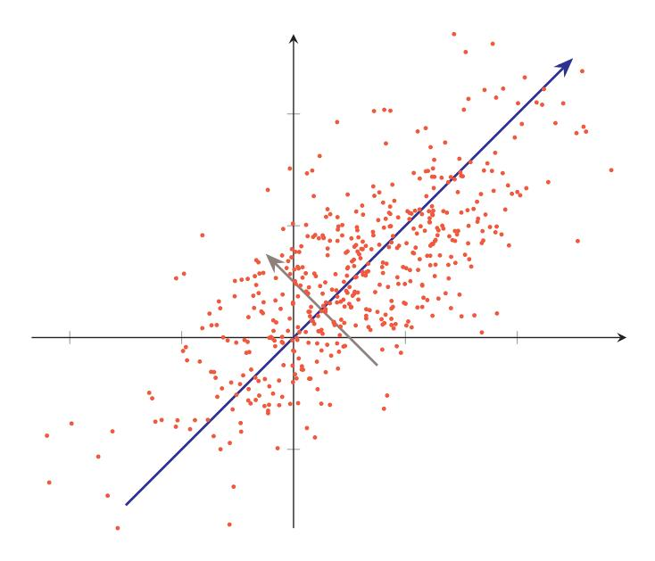
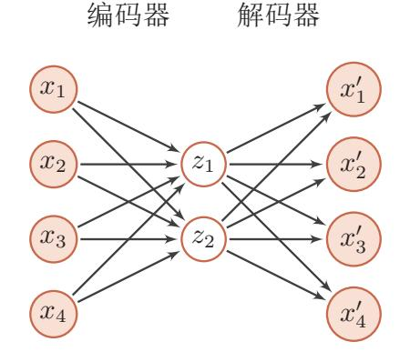
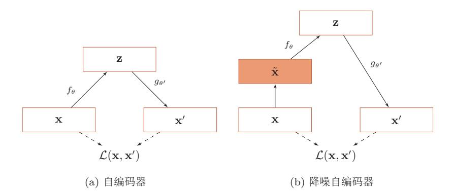
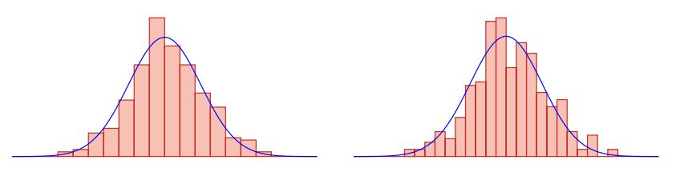
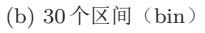

{0}------------------------------------------------

# 第9章 无监督学习

大脑有大约1014个突触, 我们只能活大约109秒。所以我们 有比数据更多的参数。这启发了我们必须进行大量无监督学习 的想法, 因为感知输入(包括本体感受)是我们可以获得每秒  $10^5$ 维约束的唯一途径。

- Geoffrey Hinton, 2014 AMA on Reddit

更早的正式描述见 [Hinton et al., 1999]

无监督学习 (Unsupervised Learning) 是指从无标签的数据中学习出一些 有用的模式。无监督学习算法一般直接从原始数据中学习, 不借助于任何人工 给出标签或者反馈等指导信息。如果监督学习是建立输入-输出之间的映射关 系, 无监督学习就是发现隐藏的数据中的有价值信息, 包括有效的特征、类别、 结构以及概率分布等。

典型的无监督学习问题可以分为以下几类:

- 无监督特征学习 无监督特征学习 (Unsupervised Feature Learning) 是从无标 签的训练数据中挖掘有效的特征或表示。无监督特征学习一般用来讲行 降维、数据可视化或监督学习前期的数据预处理。
- 密度估计 密度估计 (Density Estimation) 是根据一组训练样本来估计样本空 间的概率密度。密度估计可以分为参数密度估计和非参数密度估计。参数 密度估计是假设数据服从某个已知概率密度函数形式的分布(比如高斯 分布), 然后根据训练样本去估计概率密度函数的参数。非参数密度估计 是不假设数据服从某个已知分布,只利用训练样本对密度进行估计,可以 进行任意形状密度的估计。非参数密度估计的方法有直方图、核密度估 计等。
- 聚类 聚类 (Clustering) 是将一组样本根据一定的准则划分到不同的组 (也称 为集群(cluster))。一个比较通用的准则是组内的样本的相似性要高于 组间样本的相似性。常见的聚类算法包括 k-means 算法、谱聚类等。

特征学习也包含很多的 监督学习算法, 比如线 性判别分析等。

{1}------------------------------------------------

和监督学习一样,无监督学习方法也包含三个基本要素: 模型、学习准则 和优化算法。无监督学习的准则非常多,比如最大似然估计、最小重构错误等。 在无监督特征学习中, 经常使用的准则为最小化重构错误, 同时也经常对特征 讲行一些约束, 比如独立性、非负性或稀释性等。而在密度估计中, 经常采用 最大似然估计来进行学习。

本章介绍两种无监督学习问题: 无监督特征学习和密度估计。

#### 无监督特征学习 $9.1$

无监督特征学习是指从无标注的数据中自动学习有效的数据表示, 从而能 够帮助后续的机器学习模型更快速地达到更好的性能。无监督特征学习主要方 法有主成分分析、稀疏编码、自编码器等。

# 9.1.1 主成分分析

主成份分析 (Principal Component Analysis, PCA) 一种最常用的数据降 维方法, 使得在转换后的空间中数据的方差最大。如图9.1所示的两维数据, 如 果将这些数据投影到一维空间中, 选择数据方差最大的方向进行投影, 才能最 大化数据的差异性, 保留更多的原始数据信息。

图 9.1 主成分分析

假设有一组  $d$  维的样本  $\mathbf{x}^{(n)} \in \mathbb{R}^d$ ,  $1 \leq n \leq N$ , 我们希望将其投影到一维空 间中, 投影向量为  $\mathbf{w} \in \mathbb{R}^d$ 。不失一般性, 可以限制  $\mathbf{w}$  的模为1, 即  $\mathbf{w}^T \mathbf{w} = 1$ 。 

{2}------------------------------------------------

每个样本点 x(n) 投影之后的表示为

$$
z^{(n)} = \mathbf{w}^{\mathrm{T}} \mathbf{x}^{(n)}.
$$
\n(9.1)

我们用矩阵  $X = [\mathbf{x}^{(1)}, \mathbf{x}^{(2)}, \cdots, \mathbf{x}^{(N)}]$ 表示输入样本,  $\bar{\mathbf{x}} = \frac{1}{N} \sum_{n=1}^{N} \mathbf{x}^{(n)}$ 为原始 样本的中心点, 所有样本投影后的方差为

$$
\sigma(X; \mathbf{w}) = \frac{1}{N} \sum_{i=1}^{N} (\mathbf{w}^{\mathrm{T}} \mathbf{x}^{(n)} - \mathbf{w}^{\mathrm{T}} \bar{\mathbf{x}})^2
$$
\n(9.2)

$$
= \frac{1}{N} (\mathbf{w}^{\mathrm{T}} X - \mathbf{w}^{\mathrm{T}} \bar{X}) (\mathbf{w}^{\mathrm{T}} X - \mathbf{w}^{\mathrm{T}} \bar{X})^{\mathrm{T}}
$$
(9.3)

$$
= \mathbf{w}^{\mathrm{T}} S \mathbf{w},\tag{9.4}
$$

其中 $\bar{X} = \bar{\mathbf{x}}_A^T \bar{\mathbf{x}}_A^T \bar{\mathbf{x}}_B^T$  如人名俄内矩阵,  $S = \frac{1}{N} (X - \bar{X})(X - \bar{X})^T$ 是原始样本的协 方差矩阵。

最大化投影方差  $\sigma(X; w)$ 并满足 wTw = 1, 利用拉格朗日方法转换为无约 束优化问题,

$$
\max \mathbf{w}^{\mathrm{T}} S \mathbf{w} + \lambda (1 - \mathbf{w}^{\mathrm{T}} \mathbf{w}), \tag{9.5}
$$

其中 λ 为拉格朗日乘子。对上式求导并令导数等于 0, 可得

$$
S\mathbf{w} = \lambda \mathbf{w}.\tag{9.6}
$$

从上式可知, w是协方差矩阵 S的特征向量, λ为特征值。同时

$$
\sigma(X; w) = \mathbf{w}^{\mathrm{T}} S \mathbf{w} = \mathbf{w}^{\mathrm{T}} \lambda \mathbf{w} = \lambda.
$$
 (9.7)

入也是投影后样本的方差。因此, 主成分分析可以转换成一个矩阵特征值分解 问题,投影向量w为矩阵S的最大特征对应的特征向量。

如果要通过投影矩阵 $W \in R^{d \times d'}$  将样本投到d' 维空间,投影矩阵满足 $W^{\mathrm{r}}W =$ I, 只需要将 S的特征值从大到小排列, 保留前 d' 个特征向量, 其对应的特征向 量即使最优的投影矩阵。

$$
SW = W \operatorname{diag}(\Lambda),\tag{9.8}
$$

其中Λ = [ $\lambda_1, \cdots, \lambda_{d'}$ ] 为 S 的前 d' 个最大的特征值。

主成分分析是一种无监督学习方法,可以作为监督学习的数据预处理方法, 用来去除噪声并减少特征之间的相关性,但是它并不能保证投影后数据的类别 可分性更好。提高两类可分性的方法一般为监督学习方法, 比如线性判别分析 (Linear Discriminant Analysis, LDA).

参见习题9-3。

邱锡鹏:《神经网络与深度学习》

{3}------------------------------------------------

#### $9.1.2$ 稀疏编码

稀疏编码(Sparse Coding)也是一种受哺乳动物视觉系统中简单细胞感受 野而启发的模型。在哺乳动物的初级视觉皮层(primary visual cortex)中,每 个神经元仅对处于其感受野中特定的刺激信号做出响应, 比如特定方向的边缘、 条纹等特征。局部感受野可以被描述为具有空间局部性、方向性和带通性(即 不同尺度下空间结构的敏感性) [Olshausen et al., 1996]。也就是说, 外界信息 经过编码后仅有一小部分神经元激活, 即外界刺激在视觉神经系统的表示具有 很高的稀疏性。编码的稀疏性在一定程度上符合生物学的低功耗特性。

带通滤波 (bandpass filter) 是指容许某个频率 范围的信号通过,同时 屏蔽其他频段的设备。

在数学上, (线性) 编码是指给定一组基向量  $A = [\mathbf{a}_1, \cdots, \mathbf{a}_n]$ , 将输入样 本x∈Rd表示为这些基向量的线性组合

$$
\mathbf{x} = \sum_{i=1}^{p} z_i \mathbf{a}_i \tag{9.9}
$$

$$
=Az, \t(9.10)
$$

其中基向量的系数  $\mathbf{z} = [z_1, \cdots, z_n]$ 称为输入样本  $\mathbf{x}$  的编码 (encoding), 基向 量 $A$ 也称为字典(dictionary)。

编码是对d维空间中的样本x找到其在p维空间中的表示(或投影), 其目 标通常是编码的各个维度都是统计独立的,并且可以重构出输入样本。编码的 关键是找到一组"完备"的基向量 A, 比如主成分分析等。但是主成分分析得 到编码通常是稠密向量, 没有稀疏性。

数学小知识 | 完备性

如果p个基向量刚好可以支撑p维的欧氏空间, 则这p个基向量是 完备的。如果p个基向量可以支撑d维的欧氏空间,并且p > d, 则这p 个基向量是过完备的, 冗余的。

"讨完备"基向量一般是指的是基向量个数远远大干其支撑空间维 度。因此这些基向量一般是不具备独立、正交等性质。

为了得到稀疏的编码,我们需要找到一组"超完备"的基向量(即 $p > d$ ) 来进行编码。在超完备基向量之间往往会存在一些冗余性,因此对于一个输入 样本, 会存在很多有效的编码。如果加上稀疏性限制, 就可以减少解空间的大 小,得到"唯一"的稀疏编码。

{4}------------------------------------------------

给定一组  $N \triangleleft \hat{m} \mathbf{k}$  (1),..., $\mathbf{x}^{(N)}$ , 其稀疏编码的目标函数定义为:

$$
L(A, Z) = \sum_{n=1}^{N} \left( \left\| \mathbf{x}^{(n)} - A \mathbf{z}^{(n)} \right\|^2 + \eta \rho(\mathbf{z}^{(n)}) \right),\tag{9.11}
$$

其中  $\rho(\cdot)$  是一个稀疏性衡量函数,  $\eta$  是一个超参数, 用来控制稀疏性的强度。

对于一个向量z E RP, 其稀疏性定义为非零元素的比例。如果一个向量只 有很少的几个非零元素, 就说这个向量是稀疏的。稀疏性衡量函数 ρ(z) 是给向 量z一个标量分数。z越稀疏,  $\rho(z)$ 越小。

稀疏性衡量函数有多种选择, 最直接的衡量向量z稀疏性的函数是lo范式

$$
\rho(\mathbf{z}) = \sum_{i=1}^{p} \mathbf{I}(|z_i| > 0)
$$
\n(9.12)

但  $\ell_0$ 范数不满足连续可导, 因此很难进行优化。在实际中, 稀疏性衡量函数通 常使用  $\ell_1$  范数

$$
\rho(\mathbf{z}) = \sum_{i=1}^{p} |z_i| \tag{9.13}
$$

或对数函数

$$
\rho(\mathbf{z}) = \sum_{i=1}^{p} \log(1 + z_i^2)
$$
\n(9.14)

或指数函数

$$
\rho(\mathbf{z}) = \sum_{i=1}^{p} -\exp(-z_i^2). \tag{9.15}
$$

### 9.1.2.1 训练方法

给定一组  $N \wedge \mathcal{F}$ 输入向量 $\mathbf{x}^{(1)}, \cdots, \mathbf{x}^{(N)}$ , 需要同时学习基向量  $A \cup B$ 每个输 入样本对应的稀疏编码 $\mathbf{z}^{(1)}, \cdots, \mathbf{z}^{(N)}$ 。

稀疏编码的训练过程一般用交替优化的方法讲行。

1) 固定基向量  $A$ , 对每个输入 $\mathbf{x}^{(n)}$ , 计算其对应的最优编码

$$
\min_{\mathbf{x}^{(n)}} \left\| \mathbf{x}^{(n)} - A\mathbf{z}^{(n)} \right\|^2 - \eta \rho(\mathbf{z}^{(n)}), \ \forall n \in [1, N]. \tag{9.16}
$$

2) 固定上一步得到的编码 $\mathbf{z}^{(1)}, \cdots, \mathbf{z}^{(N)}$ , 计算其最优的基向量

$$
\min_{A} \sum_{n=1}^{N} \left( \left\| \mathbf{x}^{(n)} - A \mathbf{z}^{(n)} \right\|^{2} \right) + \lambda \frac{1}{2} \|A\|^{2},\tag{9.17}
$$

其中第二项为正则化项, λ为正则化项系数。

邱锡鹏:《神经网络与深度学习》

https://nndl.github.io/

严格的稀疏向量有时比 较难以得到, 因此如果 一个向量只有少数几个 远大于零的元素,其它 元素都接近于0, 我们也 称这个向量为稀疏向量。

{5}------------------------------------------------

# 9.1.2.2 稀疏编码的优点

稀疏编码的每一维都可以看作是一种特征。和基于稠密向量的分布式表示 相比, 稀疏编码具有更小的计算量和更好的可解释性等优点。

计算量 稀疏性带来的最大好处就是可以极大地降低计算量。

可解释性 因为稀疏编码只有少数的非零元素,相当于将一个输入样本表示为少 数几个相关的特征。这样我们可以更好地描述其特征,并易于理解。

特征选择 稀疏性带来的另外一个好处是可以实现特征的自动选择, 只选择和 输入样本相关的最少特征, 从而可以更好地表示输入样本, 降低噪声并减轻过 拟合。

# 9.1.3 自编码器

自编码器(Auto-Encoder, AE)是通过无监督的方式来学习一组数据的有 效编码(或表示)。

假设有一组  $d$  维的样本  $\mathbf{x}^{(n)} \in \mathbb{R}^d$ ,  $1 \leq n \leq N$ , 自编码器将这组数据映射到 特征空间得到每个样本的编码  $\mathbf{z}^{(n)} \in \mathbb{R}^p, 1 \leq n \leq N$ , 并且希望这组编码可以 重构出原来的样本。

自编码器的结构可分为两部分:

编码器 (encoder)

$$
f: \mathbb{R}^d \to \mathbb{R}^p,\tag{9.18}
$$

和解码器 (decoder)

$$
g: \mathbb{R}^p \to \mathbb{R}^d. \tag{9.19}
$$

自编码器的学习目标是最小化重构错误 (reconstruction errors)

$$
\mathcal{L} = \sum_{n=1}^{N} \|\mathbf{x}^{(n)} - g(f(\mathbf{x}^{(n)}))\|^2
$$
\n(9.20)

$$
= \sum_{n=1}^{N} \|\mathbf{x}^{(n)} - f \circ g(\mathbf{x}^{(n)})\|^2.
$$
 (9.21)

如果特征空间的维度p小于原始空间的维度d,自编码器相当于是一种降维 或特征抽取方法。如果p > d, 一定可以找到一组或多组解使得 f o q 为单位函 数(Identity Function), 并使得重构错误为0。但是, 这样的解并没有太多的 意义。但是如果再加上一些附加的约束, 就可以得到一些有意义的解, 比如编

单位函数 $I(x) = x$ 。

{6}------------------------------------------------

码的稀疏性、取值范围, f和g的具体形式等。如果我们让编码只能取k个不同 的值 $(k < N)$ , 那么自编码器就可以转换为一个  $k$ 类的聚类 (Clustering) 问题。

最简单的自编码器是如图9.2所示的两层神经网络。输入层到隐藏层用来编 码, 隐藏层到输出层用来解码, 层与层之间互相全连接。

图 9.2 两层网络结构的自编码器

对于样本x,中间隐藏层为编码

$$
\mathbf{z} = s(W^{(1)}\mathbf{x} + b^{(1)}),\tag{9.22}
$$

输出为重构的数据

$$
\mathbf{x}' = s(W^{(2)}\mathbf{z} + b^{(2)}),\tag{9.23}
$$

其中 $W, b$ 为网络参数, $s(.)$ 为激活函数。如果令 $W^{(2)}$ 等于 $W^{(1)}$ 的转置,即 $W^{(2)} =$  $W^{(1)^{T}}$ , 称为捆绑权重 (tied weights)。

给定一组样本 $\mathbf{x}^{(n)} \in [0,1]^d, 1 \leq n \leq N$ , 其重构错误为

$$
\mathcal{L} = \sum_{n=1}^{N} ||\mathbf{x}^{(n)} - \mathbf{x}'^{(n)})||^2 + \lambda ||W||_F^2.
$$
 (9.24)

其中入为正则化项系数。通过最小化重构错误,可以有效地学习网络的参数。

我们使用自编码器是为了得到有效的数据表示,因此在训练结束后,我们 一般去掉解码器,只保留编码器。编码器的输出可以直接作为后续机器学习模 型的输入。

# 9.1.4 稀疏自编码器

自编码器除了可以学习低维编码之外, 也学习高维的稀疏编码。假设中间 隐藏层z的维度为p大于输入样本x的维度d,并让z尽量稀疏,这就是稀疏自

邱锡鹏:《神经网络与深度学习》

{7}------------------------------------------------

编码器(Sparse Auto-Encoder)。和稀疏编码一样,稀疏自编码器的优点是有 很高的可解释性,并同时进行了隐式的特征选择。

通过给自编码器中隐藏层单元z加上稀疏性限制,自编码器可以学习到数 据中一些有用的结构。

$$
\mathcal{L} = \sum_{n=1}^{N} ||\mathbf{x}^{(n)} - \mathbf{x}'^{(n)})||^2 + \eta \rho(\mathbf{z}^{(n)})) + \lambda ||W||^2,
$$
 (9.25)

其中 ρ(·)为稀疏性度量函数, W表示自编码器中的参数。

稀疏性度量函数  $\rho(\cdot)$ 除了可以选择公式 (9.13)~(9.15) 的定义外, 还可以定 义为一组训练样本中每一个神经元激活的频率。

给定 N 个训练样本, 隐藏层第 j 个神经元平均活性值为

$$
\hat{\rho}_j = \frac{1}{N} \sum_{n=1}^{N} z_j^{(n)},\tag{9.26}
$$

 $\hat{\rho}_i$ 可以近似地看作是第j个神经元激活的概率。我们希望 $\hat{\rho}_i$ 接近于一个事先给 定的值  $\rho^*$ , 比如 0.05, 可以通过 KL距离来衡量  $\hat{\rho}_i$  和  $\rho^*$  的差异, 即

$$
KL(\rho^*||\hat{\rho}_j) = \rho^* \log \frac{\rho^*}{\hat{\rho}_j} + (1 - \rho^*) \log \frac{1 - \rho^*}{1 - \hat{\rho}_j}.
$$
 (9.27)

如果  $ρi = ρ*$ , 则 KL( $ρ*||ρi$ ) = 0.

稀疏性度量函数定义为

$$
\rho(\mathbf{z}^{(n)}) = \sum_{j=1}^{p} \text{KL}(\rho^* || \hat{\rho}_j). \tag{9.28}
$$

#### 堆叠自编码器 $9.1.5$

对于很多数据来说, 仅使用两层神经网络的自编码器还不足以获取一种好 的数据表示。为了获取更好的数据表示,我们可以使用更深层的神经网络。深 层神经网络作为自编码器提取的数据表示一般会更加抽象, 能够更好地捕捉到 数据的语义信息。在实践中经常使用逐层堆叠的方式来训练一个深层的自编码 器, 称为堆叠自编码器 (Stacked Auto-Encoder, SAE)。堆叠自编码一般可以 采用逐层训练 (layer-wise training) 来学习网络参数 [Bengio et al., 2007]。

# $9.1.6$ 降噪自编码器

我们使用自编码器是为了得到有效的数据表示,而有效的数据表示除了具 有最小重构错误或稀疏性等性质之外,我们还可以要求其具备其它性质,比如 对数据部分损坏(partial destruction)的鲁棒性。高维数据(比如图像)一般 

{8}------------------------------------------------

都具有一定的信息冗余, 比如我们可以根据一张部分破损的图像联想出其完整 内容。因此, 我们希望自编码器也能够从部分损坏的数据中得到有效的数据表 示,并能够恢复出完整的原始信息。

降噪自编码器(Denoising Autoencoder)就是一种通过引入噪声来增加编 码鲁棒性的自编码器 [Vincent et al., 2008]。对于一个向量 x, 我们首先根据一 个比例 µ 随机将 x 的一些维度的值设置为 0, 得到一个被损坏的向量 x。然后将 被损坏的向量x输入给自编码器得到编码z,并重构出原始的无损输入x。

图9.3给出了自编码器和降噪自编码器的对比, 其中 fa 为编码器, qa 为解 码器,  $\mathcal{L}(\mathbf{x}, \mathbf{x}')$ 为重构错误。

图 9.3 自编码器和降噪自编码器

降噪自编码器的思想十分简单,通过引入噪声来学习更鲁棒性的数据编码, 并提高模型的泛化能力。

#### 概率密度估计 $9.2$

概率密度估计(Probabilistic Density Estimation), 简称密度估计(Density Estimation), 是基于一些观测样本来估计一个随机变量的概率密度函数。密 度估计在数据建模、机器学习中使用广泛。

密度估计方法可以分为两类: 参数密度估计和非参数密度估计。

#### 参数密度估计 $9.2.1$

参数密度估计(Parametric Density Estimation)是根据先验知识假设随机 变量服从某种分布, 然后通过训练样本来估计分布的参数。

 $\hat{\varphi} \mathcal{D} = \{ \mathbf{x}^{(n)} \}$ ,  $1 \leq n \leq N$ 为从某个未知分布中独立抽取的  $N$  个训练样本,

邱锡鹏:《神经网络与深度学习》

损坏比例µ一般不超过

0.5。也可以使用其它的 方法来损坏数据,比如

引入高斯噪声。

217

{9}------------------------------------------------

我们假设这些样本服从一个概率分布函数  $p(\mathbf{x}|\theta)$ , 其对数似然函数为

$$
\log p(\mathcal{D}|\theta) = \sum_{n=1}^{N} \log p(\mathbf{x}^{(n)}).
$$
\n(9.29)

我们要估计一个参数 $\theta^{ML}$ 来使得

$$
\theta^{ML} = \arg\max_{\theta} \sum_{n=1}^{N} \log p(\mathbf{x}^{(n)}|\theta). \tag{9.30}
$$

这样参数估计问题就转化为最优化问题。

# 9.2.1.1 正态分布

假设样本x∈Rd服从正态分布

$$
\mathcal{N}(\mathbf{x}|\boldsymbol{\mu}, \boldsymbol{\Sigma}) = \frac{1}{(2\pi)^{d/2} |\boldsymbol{\Sigma}|^{1/2}} \exp\left(-\frac{1}{2}(\mathbf{x} - \boldsymbol{\mu})^{\mathrm{T}} \boldsymbol{\Sigma}^{-1}(\mathbf{x} - \boldsymbol{\mu})\right),\tag{9.31}
$$

其中µ和∑分别为正态分布的均值和方差。其对数似然函数为

$$
\log p(\mathcal{D}|\boldsymbol{\mu}, \boldsymbol{\Sigma}) = -\frac{N}{2} \log \left( (2\pi)^2 |\boldsymbol{\Sigma}| \right) - \frac{1}{2} \sum_{n=1}^{N} (\mathbf{x} - \boldsymbol{\mu})^{\mathrm{T}} \boldsymbol{\Sigma}^{-1} (\mathbf{x} - \boldsymbol{\mu}). \tag{9.32}
$$

分别上式关于μ, Σ的偏导数, 并令其等于0。可得,

$$
\mu^{ML} = \frac{1}{N} \sum_{n=1}^{N} \mathbf{x}^{(n)},
$$
\n(9.33)

$$
\Sigma^{ML} = \frac{1}{N} \sum_{n=1}^{N} (\mathbf{x} - \boldsymbol{\mu})(\mathbf{x} - \boldsymbol{\mu})^{\mathrm{T}}.
$$
 (9.34)

则 X 服从多项分布, 其概率分布为

$$
p(x_1, \dots, x_k | \boldsymbol{\mu}) = \frac{n!}{x_1! \cdots x_k!} \mu_1^{x_1} \cdots \mu_k^{x_k},
$$
\n(9.35)

# 9.2.1.2 多项分布

多项分布参见 假设样本服从 $K \triangleleft \mathcal{R}$ 公的多项分布。这里我们用 onehot 向量 $\mathbf{x} \in [0,1]^K \times$ 第D.2.2.1节。 表示第k个状态, 即 $x_k = 1$ , 其余 $x_{i,i\neq k} = 0$ 。样本x的概率密度函数为

$$
p(\mathbf{x}|\boldsymbol{\mu}) = \prod_{k=1}^{K} \mu_k^{x_k},
$$
\n(9.36)

其中 $\mu_k$ 为第 $k \triangleq k$ 态的概率,并满足 $\sum_{k=1}^{K} \mu_k = 1$ 。 数据集 $\mathcal{D} = \{\mathbf{x}^{(n)}\}_{n=1}^N$ 的对数似然函数为

这里没有多项式系数。

邱锡鹏:《神经网络与深度学习》

{10}------------------------------------------------

$$
\log p(\mathcal{D}|\boldsymbol{\mu}) = \sum_{n=1}^{N} \sum_{k=1}^{K} x_k^{(n)} \log(\mu_k).
$$
 (9.37)

多项分布的参数估计为约束优化问题。引入拉格朗日乘子 λ, 将原问题转 换为无约束优化问题。

$$
\max_{\mu,\lambda} \quad \sum_{n=1}^{N} \sum_{k=1}^{K} x_k^{(n)} \log(\mu_k) + \lambda \left( \sum_{k=1}^{K} \mu_k - 1 \right). \tag{9.38}
$$

分别上式关于μk, λ的偏导数, 并令其等于0。可得,

$$
\mu_k^{ML} = \frac{m_k}{N}, \qquad 1 \le k \le K \tag{9.39}
$$

其中 $m_k = \sum_{n=1}^{N} x_k^{(n)}$ 为数据集中取值为第k个状态的样本数量。

在实际应用中, 参数密度估计一般存在以下问题:

(1) 模型选择问题: 即如何选择数据分布的密度函数。实际数据的分布往 往是非常复杂的,而不是简单的正态分布或多项分布。

(2) 不可观测变量问题: 即我们用来训练的样本只包含部分的可观测变量, 还有一些非常关键的变量是无法观测的, 这导致我们很难准确估计数据的真实 分布。

(3) 维度灾难问题: 即高维数据的参数估计十分困难。随着维度的增加, 估 计参数所需要的样本数量指数增加。在样本不足时会出现过拟合。

9.2.2 非参数密度估计

非参数密度估计 (Nonparametric Density Estimation) 是不假设数据服从 某种分布, 通过将样本空间划分为不同的区域并估计每个区域的概率来近似数 据的概率密度函数。

对于高维空间中的一个随机向量x,假设其服从一个未知分布p(x),则x落 入空间中的小区域 R的概率为

$$
P = \int_{\mathcal{R}} p(\mathbf{x}) d\mathbf{x}.\tag{9.40}
$$

给定N个训练样本 $D = \{x^{(n)}\}_{n=1}^N$ ,落入区域R的样本数量K服从二项分布

$$
P_K = \binom{N}{K} P^K (1 - P)^{1 - K},\tag{9.41}
$$

其中  $K/N$  的期望为 $E[K/N] = P$ , 方差为  $var(K/N) = P(1 - P)/N$ 。当  $N \ddagger$ 常大时, 我们可以近似认为

$$
P \approx \frac{K}{N}.\tag{9.42}
$$

邱锡鹏: 《神经网络与深度学习》

https://nndl.github.io/

包含不可观测变量的 密度估计问题一般需 要使用EM算法,参见 第11.4.2.1节。

拉格朗日乘子参考??。

{11}------------------------------------------------

假设区域 R 足够小, 其内部的概率密度是相同的, 则有

$$
P \approx p(\mathbf{x})V,\tag{9.43}
$$

其中V为区域R的体积。结合上述两个公式,得到

$$
p(\mathbf{x}) \approx \frac{K}{NV}.\tag{9.44}
$$

根据公式(9.44), 要准确地估计  $p(\mathbf{x})$  需要尽量使得样本数量  $N$  足够大, 区 域体积V尽可能地小。但在具体应用中,样本数量一般是有限的,过小的区域 会导致落入该区域的样本比较少,这样估计的概率密度就不太准确。因此,实 践中非参数密度估计通常使用两种方式: (1) 固定区域大小V, 统计落入不同 区域的数量,这种方式包括直方图方法和核方法两种。(2)改变区域大小以使 得落入每个区域的样本数量为K,这种方式称为K近邻方法。

# 9.2.2.1 直方图方法

直方图方法(Histogram Method)是一种非常直观的估计连续变量密度函 数的方法,可以表示为一种柱状图。

以一维随机变量为例, 首先将其取值范围分成 M 个连续的、不重叠的区间 (bin), 每个区间的宽度为 $\Delta_m$ 。给定  $N$ 个训练样本 $\mathcal{D} = \{x^{(n)}\}_{n=1}^N$ , 我们统计 这些样本落入每个区间的数量Km,然后将它们归一化为密度函数。

$$
p_m = \frac{K_m}{N\Delta_m}, \qquad 1 \le m \le M \tag{9.45}
$$

其中区间宽度 Δm 通常设为相同的值 Δ。直方图方法的关键问题是如何选取一 个合适的区间宽度 Δ。如果 Δ 太小, 那么落入每个区间的样本数量会比较少, 其 估计的区间密度也具有很大的随机性。如果 Δ太大, 其估计的密度函数变得十 分平滑,很难反映出真实的数据分布。图9.4给出了直方图密度估计的例子,其 中蓝线表示真实的密度函数, 红色的柱状图为直方图方法估计的密度。

(a) 10个区间 (bin)

图 9.4 直方图密度估计

Histogram 源 自希腊语 histos(竖立)和gramma (描绘), 由英国统计学家 卡尔·皮尔逊于1895年 提出。

220

{12}------------------------------------------------

直方图通常用来处理低维变量,可以非常快速地对数据的分布进行可视化, 但其缺点是很难扩展到高维变量。假设一个d维的随机向量,如果每一维都划分 为M个区间, 那么整个空间的区间数量为Md个。直方图方法需要的样本数量 会随着维度d的增加而指数增长,从而导致维度灾难(Curse of Dimensionality) 问题。

# 9.2.2.2 核方法

核密度估计(Kernel Density Estimation), 也叫 Parzen 窗方法, 是一种 直方图方法的改进。

假设 R 为 d 维空间中的一个以点 x 为中心的"超立方体",并定义核函数

$$
\phi\left(\frac{\mathbf{z} - \mathbf{x}}{h}\right) = \begin{cases} 1 & \frac{3i}{2} |z_i - x_i| < \frac{h}{2}, 1 \le i \le d \\ 0 & \text{if } \mathbb{N} \end{cases} \tag{9.46}
$$

来表示一个样本z是否落入该超立方体中, 其中h为超立方体的边长, 也称为核 函数的宽度。

给定  $N \wedge \mathcal{W}$  绑样本  $\mathcal{D} = \{ \mathbf{x}^{(n)} \}_{n=1}^N$ , 落入区域  $\mathcal{R}$  的样本数量  $K$  为

$$
K = \sum_{n=1}^{N} \phi\left(\frac{\mathbf{x}^{(n)} - \mathbf{x}}{h}\right),\tag{9.47}
$$

则点x的密度估计为

$$
p(\mathbf{x}) = \frac{K}{Nh^d} = \frac{1}{Nh^d} \sum_{n=1}^{N} \phi\left(\frac{\mathbf{x}^{(n)} - \mathbf{x}}{h}\right),\tag{9.48}
$$

其中hd表示区域R的体积。

除了超立方体的核函数之外,我们还可以选择更加平滑的核函数,比如高 斯核函数,

$$
\phi\left(\frac{\mathbf{z} - \mathbf{x}}{h}\right) = \frac{1}{(2\pi)^{1/2}h} \exp\left(-\frac{\|\mathbf{z} - \mathbf{x}\|^2}{2h^2}\right),\tag{9.49}
$$

其中h2可以看做是高斯核函数的方差。这样点x的密度估计为

$$
p(\mathbf{x}) = \frac{1}{N} \sum_{n=1}^{N} \frac{1}{(2\pi)^{1/2} h} \exp\left(-\frac{\|\mathbf{z} - \mathbf{x}\|^2}{2h^2}\right).
$$
 (9.50)

# 9.2.2.3 K近邻方法

核密度估计方法中的核宽度是固定的, 因此同一个宽度可能对高密度的区 域过大,而对低密度区域过小。一种更灵活的方式是设置一种可变宽度的区域,

邱锡鹏:《神经网络与深度学习》

{13}------------------------------------------------

并使得落入每个区域中样本数量为固定的K。要估计点x的密度, 首先找到一 个以x为中心的球体, 使得落入球体的样本数量为K, 然后根据公式(9.44), 就 可以计算出点x的密度。因为落入球体的样本也是离x最近的K个样本,所以 这种方法称为K近邻(K-Nearest Neighbor)方法。

严格的密度函数估计方 在K近邻方法中, K的选择也十分关键。如果 K 太小, 无法有效地估计密 度函数, 而 K 太大也会使得局部的密度不准确, 并且增加计算开销。

> K近邻方法也经常用于分类问题, 称为K近邻分类器。当 $K = 1$ 也称为最 近邻分类器。最近邻分类器的一个性质是, 当  $N \to \infty$  时, 其分类错误率不超 过最优分类器错误率的两倍 [Cover and Hart, 1967]。

参见习题9-6。

K近邻方法并不是一个

法,参见习题9-5。

#### 总结和深入阅读 $9.3$

关于非参数密度估计的方法一般性介绍可以参考 [Duda et al., 2001] 和 [Bishop, 2007], 理论性介绍可以参考 [Devroye and Gyorfi, 1985]。

# 习题

习题 9-1 分析主成分分析为什么具有数据降噪能力?

习题 9-2 证明对于  $N \wedge K^2 \uplus \{k\}$  (样本维数  $d > N$ ) 组成的数据集, 主成分分 析的有效投影子空间不超过 N-1维。

习题 9-3 对于一个两类分类问题, 试举例分析什么样的数据分布会使得主 成分分析得到的特征反而会使得分类性能下降。

习题 9-4 若数据矩阵  $X' = X - \bar{X}$ , 则对  $X'$  奇异值分解  $X' = U\Sigma V$ , 则  $U$ 为主成分分析的投影矩阵。

习题 9-5 举例说明, K近邻方法估计的密度函数不是严格的概率密度函数, 其在整个空间上的积分不等于1。

习题 9-6 对于一个 $C$ 类的分类问题, 使用K近邻方法估计每个类 $c$  (1  $\leq$  $c < C$ ) 的密度函数  $p(\mathbf{x}|c)$ , 并使用贝叶斯公式计算每个类的后验概率  $p(c|\mathbf{x})$ 。

{14}------------------------------------------------

# 参考文献

Yoshua Bengio, Pascal Lamblin, Dan Popovici, and Hugo Larochelle. Greedy layer-wise training of deep networks. In Advances in neural information process $ing$  systems, pages 153–160, 2007.

Christopher M. Bishop. Pattern recognition and machine learning, 5th Edition. Information science and statistics. Springer, 2007. ISBN 9780387310732. Thomas Cover and Peter Hart. Nearest neighbor pattern classification. IEEE

transactions on information theory, 13  $(1):21-27, 1967.$ 

Luc Devroye and Laszlo Gyorfi. Nonparametric Density Estimation: The  $L_1$ View. Wiley Series in Probability and Statistics. Wiley, New York, 1985.

Richard O. Duda, Peter E. Hart, and David G. Stork. Pattern classification, 2nd Edition. Wiley, 2001. ISBN 9780471056690.

Geoffrey E Hinton, Terrence Joseph Sejnowski, and Tomaso A Poggio. Unsupervised learning: foundations of neural computation. MIT press, 1999.

Bruno A Olshausen et al. Emergence of simple-cell receptive field properties by learning a sparse code for natural images. Nature, 381(6583):607-609, 1996.

Pascal Vincent, Hugo Larochelle, and Pierre-Antoine Yoshua Bengio, Manzagol. Extracting and composing robust features with denoising autoencoders. In Proceedings of the International Conference on Machine Learning, pages 1096-1103. ACM, 2008.

{15}------------------------------------------------

