## **CHAPTER 14 Deep Computer Vision Using Convolutional Neural Networks**

Although IBM's Deep Blue supercomputer beat the chess world champion Garry Kasparov back in 1996, it wasn't until fairly recently that computers were able to reliably perform seemingly trivial tasks such as detecting a puppy in a picture or recognizing spoken words. Why are these tasks so effortless to us humans? The answer lies in the fact that perception largely takes place outside the realm of our consciousness, within specialized visual, auditory, and other sensory modules in our brains. By the time sensory information reaches our consciousness, it is already adorned with high-level features; for example, when you look at a picture of a cute puppy, you cannot choose *not* to see the puppy, *not* to notice its cuteness. Nor can you explain how you recognize a cute puppy; it's just obvious to you. Thus, we cannot trust our subjective experience: perception is not trivial at all, and to understand it we must look at how our sensory modules work.

Convolutional neural networks (CNNs) emerged from the study of the brain's visual cortex, and they have been used in computer image recognition since the 1980s. Over the last 10 years, thanks to the increase in computational power, the amount of available training data, and the tricks presented in Chapter 11 for training deep nets, CNNs have managed to achieve superhuman performance on some complex visual tasks. They power image search services, self-driving cars, automatic video classification systems, and more. Moreover, CNNs are not restricted to visual perception: they are also successful at many other tasks, such as voice recognition and natural language processing. However, we will focus on visual applications for now.

{507}------------------------------------------------

In this chapter we will explore where CNNs came from, what their building blocks look like, and how to implement them using Keras. Then we will discuss some of the best CNN architectures, as well as other visual tasks, including object detection (classifying multiple objects in an image and placing bounding boxes around them) and semantic segmentation (classifying each pixel according to the class of the object it belongs to).

### The Architecture of the Visual Cortex

David H. Hubel and Torsten Wiesel performed a series of experiments on cats in  $1958<sup>1</sup>$  and  $1959<sup>2</sup>$  (and a few years later on monkeys<sup>3</sup>), giving crucial insights into the structure of the visual cortex (the authors received the Nobel Prize in Physiology or Medicine in 1981 for their work). In particular, they showed that many neurons in the visual cortex have a small local receptive field, meaning they react only to visual stimuli located in a limited region of the visual field (see Figure 14-1, in which the local receptive fields of five neurons are represented by dashed circles). The receptive fields of different neurons may overlap, and together they tile the whole visual field.

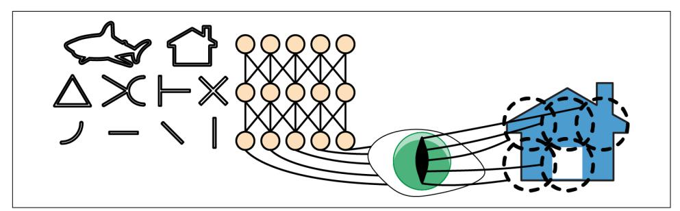

Figure 14-1. Biological neurons in the visual cortex respond to specific patterns in small regions of the visual field called receptive fields; as the visual signal makes its way through consecutive brain modules, neurons respond to more complex patterns in larger receptive fields

<sup>1</sup> David H. Hubel, "Single Unit Activity in Striate Cortex of Unrestrained Cats", The Journal of Physiology 147  $(1959): 226 - 238.$ 

<sup>2</sup> David H. Hubel and Torsten N. Wiesel, "Receptive Fields of Single Neurons in the Cat's Striate Cortex", The Journal of Physiology 148 (1959): 574-591.

<sup>3</sup> David H. Hubel and Torsten N. Wiesel, "Receptive Fields and Functional Architecture of Monkey Striate Cortex", The Journal of Physiology 195 (1968): 215-243.

{508}------------------------------------------------

Moreover, the authors showed that some neurons react only to images of horizontal lines, while others react only to lines with different orientations (two neurons may have the same receptive field but react to different line orientations). They also noticed that some neurons have larger receptive fields, and they react to more complex patterns that are combinations of the lower-level patterns. These observations led to the idea that the higher-level neurons are based on the outputs of neighboring lower-level neurons (in Figure 14-1, notice that each neuron is connected only to nearby neurons from the previous layer). This powerful architecture is able to detect all sorts of complex patterns in any area of the visual field.

These studies of the visual cortex inspired the neocognitron,<sup>4</sup> introduced in 1980, which gradually evolved into what we now call convolutional neural networks. An important milestone was a 1998 paper<sup>5</sup> by Yann LeCun et al. that introduced the famous LeNet-5 architecture, which became widely used by banks to recognize handwritten digits on checks. This architecture has some building blocks that you already know, such as fully connected layers and sigmoid activation functions, but it also introduces two new building blocks: convolutional layers and pooling layers. Let's look at them now.


Why not simply use a deep neural network with fully connected layers for image recognition tasks? Unfortunately, although this works fine for small images (e.g., MNIST), it breaks down for larger images because of the huge number of parameters it requires. For example, a  $100 \times 100$ -pixel image has 10,000 pixels, and if the first layer has just 1,000 neurons (which already severely restricts the amount of information transmitted to the next layer), this means a total of 10 million connections. And that's just the first layer. CNNs solve this problem using partially connected layers and weight sharing.

### **Convolutional Layers**

The most important building block of a CNN is the *convolutional layer*.<sup>6</sup> neurons in the first convolutional layer are not connected to every single pixel in the input image (like they were in the layers discussed in previous chapters), but only to pixels in their

<sup>4</sup> Kunihiko Fukushima, "Neocognitron: A Self-Organizing Neural Network Model for a Mechanism of Pattern Recognition Unaffected by Shift in Position", Biological Cybernetics 36 (1980): 193-202.

<sup>5</sup> Yann LeCun et al., "Gradient-Based Learning Applied to Document Recognition", Proceedings of the IEEE 86, no. 11 (1998): 2278-2324.

<sup>6</sup> A convolution is a mathematical operation that slides one function over another and measures the integral of their pointwise multiplication. It has deep connections with the Fourier transform and the Laplace transform and is heavily used in signal processing. Convolutional layers actually use cross-correlations, which are very similar to convolutions (see https://homl.info/76 for more details).

{509}------------------------------------------------

receptive fields (see Figure 14-2). In turn, each neuron in the second convolutional layer is connected only to neurons located within a small rectangle in the first layer. This architecture allows the network to concentrate on small low-level features in the first hidden layer, then assemble them into larger higher-level features in the next hidden layer, and so on. This hierarchical structure is common in real-world images, which is one of the reasons why CNNs work so well for image recognition.

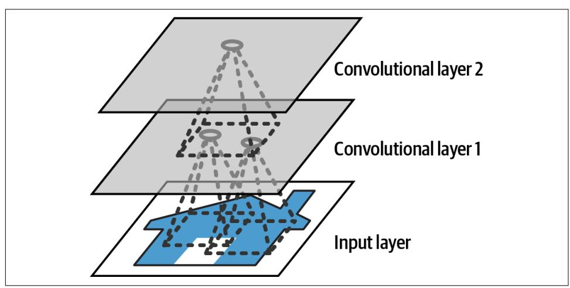

Figure 14-2. CNN layers with rectangular local receptive fields


All the multilayer neural networks we've looked at so far had layers composed of a long line of neurons, and we had to flatten input images to 1D before feeding them to the neural network. In a CNN each layer is represented in 2D, which makes it easier to match neurons with their corresponding inputs.

A neuron located in row *i*, column *j* of a given layer is connected to the outputs of the neurons in the previous layer located in rows *i* to  $i + f_h - 1$ , columns *j* to  $j + f_w$ - 1, where  $f_h$  and  $f_w$  are the height and width of the receptive field (see Figure 14-3). In order for a layer to have the same height and width as the previous layer, it is common to add zeros around the inputs, as shown in the diagram. This is called zero padding.

It is also possible to connect a large input layer to a much smaller layer by spacing out the receptive fields, as shown in Figure 14-4. This dramatically reduces the model's computational complexity. The horizontal or vertical step size from one receptive field to the next is called the *stride*. In the diagram, a  $5 \times 7$  input layer (plus zero padding) is connected to a 3  $\times$  4 layer, using 3  $\times$  3 receptive fields and a stride of 2 (in this example the stride is the same in both directions, but it does not have to be so). A neuron located in row  $i$ , column  $j$  in the upper layer is connected to the outputs of the

{510}------------------------------------------------

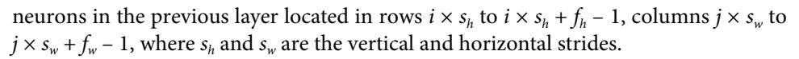


Figure 14-3. Connections between layers and zero padding

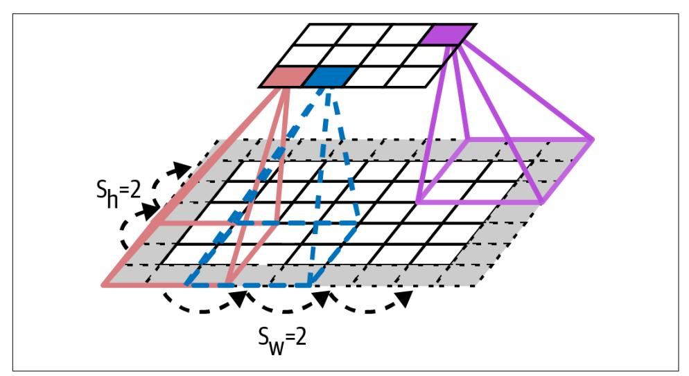

Figure 14-4. Reducing dimensionality using a stride of 2

{511}------------------------------------------------

### **Filters**

A neuron's weights can be represented as a small image the size of the receptive field. For example, Figure 14-5 shows two possible sets of weights, called *filters* (or convolution kernels, or just kernels). The first one is represented as a black square with a vertical white line in the middle (it's a  $7 \times 7$  matrix full of 0s except for the central column, which is full of 1s); neurons using these weights will ignore everything in their receptive field except for the central vertical line (since all inputs will be multiplied by 0, except for the ones in the central vertical line). The second filter is a black square with a horizontal white line in the middle. Neurons using these weights will ignore everything in their receptive field except for the central horizontal line.

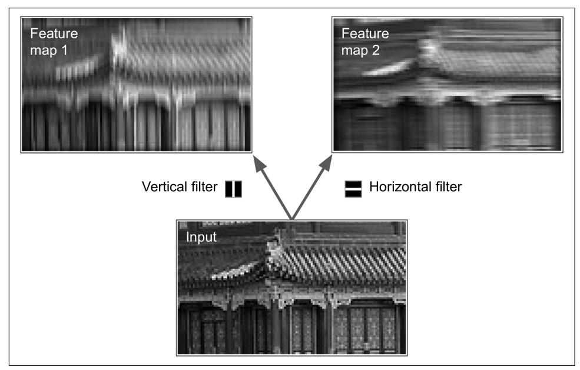

Figure 14-5. Applying two different filters to get two feature maps

Now if all neurons in a layer use the same vertical line filter (and the same bias term), and you feed the network the input image shown in Figure 14-5 (the bottom image), the layer will output the top-left image. Notice that the vertical white lines get enhanced while the rest gets blurred. Similarly, the upper-right image is what you get if all neurons use the same horizontal line filter; notice that the horizontal white lines get enhanced while the rest is blurred out. Thus, a layer full of neurons using the same filter outputs a *feature map*, which highlights the areas in an image that activate the filter the most. But don't worry, you won't have to define the filters manually: instead, during training the convolutional layer will automatically learn the most useful filters for its task, and the layers above will learn to combine them into more complex patterns.

{512}------------------------------------------------

### **Stacking Multiple Feature Maps**

Up to now, for simplicity, I have represented the output of each convolutional layer as a 2D layer, but in reality a convolutional layer has multiple filters (you decide how many) and outputs one feature map per filter, so it is more accurately represented in 3D (see Figure 14-6). It has one neuron per pixel in each feature map, and all neurons within a given feature map share the same parameters (*i.e.*, the same kernel and bias term). Neurons in different feature maps use different parameters. A neuron's receptive field is the same as described earlier, but it extends across all the feature maps of the previous layer. In short, a convolutional layer simultaneously applies multiple trainable filters to its inputs, making it capable of detecting multiple features anywhere in its inputs.

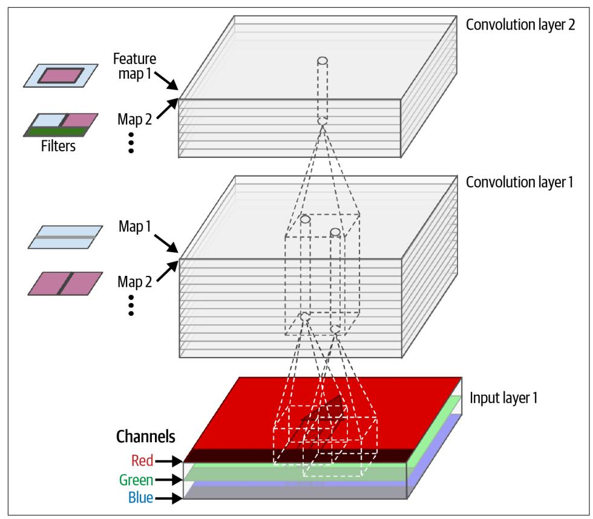

Figure 14-6. Two convolutional layers with multiple filters each (kernels), processing a color image with three color channels; each convolutional layer outputs one feature map per filter

{513}------------------------------------------------


The fact that all neurons in a feature map share the same parameters dramatically reduces the number of parameters in the model. Once the CNN has learned to recognize a pattern in one location, it can recognize it in any other location. In contrast, once a fully connected neural network has learned to recognize a pattern in one location, it can only recognize it in that particular location.

Input images are also composed of multiple sublayers: one per color channel. As mentioned in Chapter 9, there are typically three: red, green, and blue (RGB). Grayscale images have just one channel, but some images may have many more—for example, satellite images that capture extra light frequencies (such as infrared).

Specifically, a neuron located in row *i*, column *j* of the feature map  $k$  in a given convolutional layer  $l$  is connected to the outputs of the neurons in the previous layer *l* – 1, located in rows  $i \times s_h$  to  $i \times s_h + f_h$  – 1 and columns  $j \times s_w$  to  $j \times s_w + f_w$  – 1, across all feature maps (in layer  $l - 1$ ). Note that, within a layer, all neurons located in the same row *i* and column *j* but in different feature maps are connected to the outputs of the exact same neurons in the previous layer.

Equation 14-1 summarizes the preceding explanations in one big mathematical equation: it shows how to compute the output of a given neuron in a convolutional layer. It is a bit ugly due to all the different indices, but all it does is calculate the weighted sum of all the inputs, plus the bias term.

Equation 14-1. Computing the output of a neuron in a convolutional layer

$$
z_{i,j,k} = b_k + \sum_{u=0}^{f_h-1} \sum_{v=0}^{f_w-1} \sum_{k'=0}^{f_{n'}-1} x_{i',j',k'} \times w_{u,v,k',k} \quad \text{with } \begin{cases} i' = i \times s_h + u \\ j' = j \times s_w + v \end{cases}
$$

In this equation:

- $z_{i,j,k}$  is the output of the neuron located in row *i*, column *j* in feature map *k* of the convolutional layer (layer l).
- As explained earlier,  $s_h$  and  $s_w$  are the vertical and horizontal strides,  $f_h$  and  $f_w$  are the height and width of the receptive field, and  $f_{n'}$  is the number of feature maps in the previous layer (layer  $l-1$ ).
- $x_{i,i,k}$  is the output of the neuron located in layer  $l-1$ , row i', column j', feature map  $k'$  (or channel  $k'$  if the previous layer is the input layer).
- $b_k$  is the bias term for feature map  $k$  (in layer l). You can think of it as a knob that tweaks the overall brightness of the feature map k.

{514}------------------------------------------------

•  $W_{u,v,k'}$  is the connection weight between any neuron in feature map k of the layer  $l$  and its input located at row  $u$ , column  $v$  (relative to the neuron's receptive field), and feature map  $k'$ .

Let's see how to create and use a convolutional layer using Keras.

### **Implementing Convolutional Layers with Keras**

First, let's load and preprocess a couple of sample images, using Scikit-Learn's load\_sample\_image() function and Keras's CenterCrop and Rescaling layers (all of which were introduced in Chapter 13):

```
from sklearn.datasets import load_sample_images
import tensorflow as tf
images = load_sample_images()["images"]
images = tf.keras.layers.CenterCrop(height=70, width=120)(images)
images = tf.keras. layers. Rescaling(scale=1 / 255)(images)
```

Let's look at the shape of the images tensor:

>>> images.shape TensorShape([2, 70, 120, 3])

Yikes, it's a 4D tensor; we haven't seen this before! What do all these dimensions mean? Well, there are two sample images, which explains the first dimension. Then each image is  $70 \times 120$ , since that's the size we specified when creating the Center Crop layer (the original images were  $427 \times 640$ ). This explains the second and third dimensions. And lastly, each pixel holds one value per color channel, and there are three of them—red, green, and blue—which explains the last dimension.

Now let's create a 2D convolutional layer and feed it these images to see what comes out. For this, Keras provides a Convolution2D layer, alias Conv2D. Under the hood, this layer relies on TensorFlow's tf.nn.conv2d() operation. Let's create a convolutional layer with 32 filters, each of size  $7 \times 7$  (using kernel\_size=7, which is equivalent to using kernel\_size= $(7, 7)$ ), and apply this layer to our small batch of two images:

```
conv_layer = tf.keras.layers.Conv2D(filters=32, kernel_size=7)
fmaps = conv_{\text{layer}}(images)
```


When we talk about a 2D convolutional layer, "2D" refers to the number of *spatial* dimensions (height and width), but as you can see, the layer takes 4D inputs: as we saw, the two additional dimensions are the batch size (first dimension) and the channels (last dimension).

{515}------------------------------------------------

Now let's look at the output's shape:

```
>>> fmaps.shape
TensorShape([2, 64, 114, 32])
```

The output shape is similar to the input shape, with two main differences. First, there are 32 channels instead of 3. This is because we set filters=32, so we get 32 output feature maps: instead of the intensity of red, green, and blue at each location, we now have the intensity of each feature at each location. Second, the height and width have both shrunk by 6 pixels. This is due to the fact that the Conv2D layer does not use any zero-padding by default, which means that we lose a few pixels on the sides of the output feature maps, depending on the size of the filters. In this case, since the kernel size is 7, we lose 6 pixels horizontally and 6 pixels vertically (i.e., 3 pixels on each side).


The default option is surprisingly named padding="valid", which actually means no zero-padding at all! This name comes from the fact that in this case every neuron's receptive field lies strictly within *valid* positions inside the input (it does not go out of bounds). It's not a Keras naming quirk: everyone uses this odd nomenclature.

If instead we set padding="same", then the inputs are padded with enough zeros on all sides to ensure that the output feature maps end up with the *same* size as the inputs (hence the name of this option):

```
>>> conv layer = tf.keras.layers.Conv2D(filters=32, kernel size=7,
                                          padding="same")
\ddotsc\ddotsc>>> fmaps = conv layer(images)
>>> fmaps.shape
TensorShape([2, 70, 120, 32])
```

These two padding options are illustrated in Figure 14-7. For simplicity, only the horizontal dimension is shown here, but of course the same logic applies to the vertical dimension as well.

If the stride is greater than 1 (in any direction), then the output size will not be equal to the input size, even if padding="same". For example, if you set strides=2 (or equivalently strides=(2, 2)), then the output feature maps will be  $35 \times 60$ : halved both vertically and horizontally. Figure 14-8 shows what happens when strides=2, with both padding options.

{516}------------------------------------------------

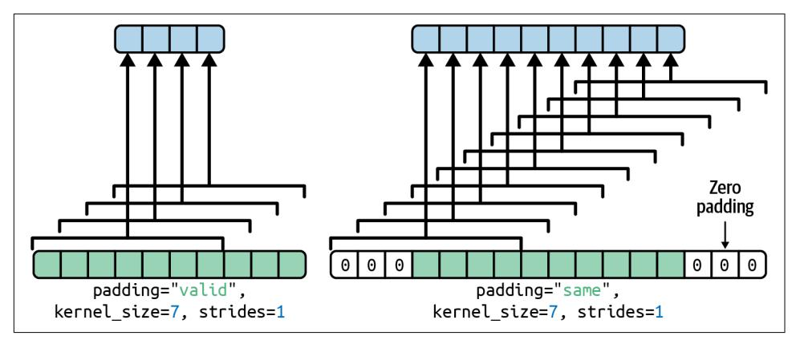

Figure 14-7. The two padding options, when strides=1

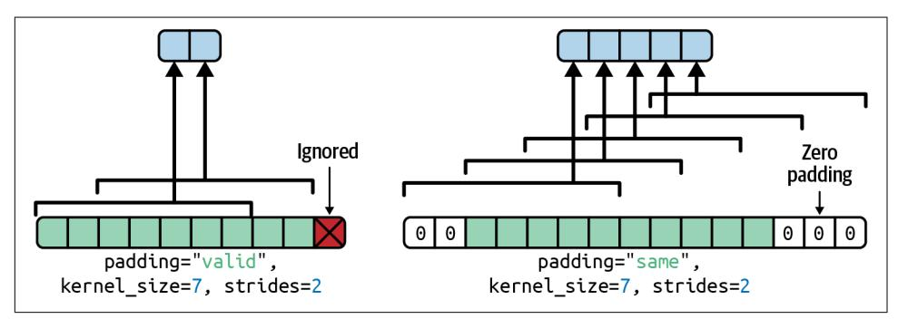

Figure 14-8. With strides greater than 1, the output is much smaller even when using "same" padding (and "valid" padding may ignore some inputs)

If you are curious, this is how the output size is computed:

- With padding="valid", if the width of the input is  $i<sub>h</sub>$ , then the output width is equal to  $(i_h - f_h + s_h) / s_h$ , rounded down. Recall that  $f_h$  is the kernel width, and  $s_h$  is the horizontal stride. Any remainder in the division corresponds to ignored columns on the right side of the input image. The same logic can be used to compute the output height, and any ignored rows at the bottom of the image.
- With padding="same", the output width is equal to  $i_h / s_h$ , rounded up. To make this possible, the appropriate number of zero columns are padded to the left and right of the input image (an equal number if possible, or just one more on the right side). Assuming the output width is  $o_w$ , then the number of padded zero columns is  $(o_w - 1) \times s_h + f_h - i_h$ . Again, the same logic can be used to compute the output height and the number of padded rows.

{517}------------------------------------------------

Now let's look at the layer's weights (which were noted  $w_{u,v,k,k}$  and  $b_k$  in Equation 14-1). Just like a Dense layer, a Conv2D layer holds all the layer's weights, including the kernels and biases. The kernels are initialized randomly, while the biases are initialized to zero. These weights are accessible as TF variables via the weights attribute, or as NumPy arrays via the get\_weights() method:

```
>>> kernels, biases = conv layer.get weights()
>>> kernels.shape
(7, 7, 3, 32)>>> biases.shape
(32, )
```

The kernels array is 4D, and its shape is [kernel\_height, kernel\_width, input\_channels, *output\_channels*]. The biases array is 1D, with shape [*output\_channels*]. The number of output channels is equal to the number of output feature maps, which is also equal to the number of filters.

Most importantly, note that the height and width of the input images do not appear in the kernel's shape: this is because all the neurons in the output feature maps share the same weights, as explained earlier. This means that you can feed images of any size to this layer, as long as they are at least as large as the kernels, and if they have the right number of channels (three in this case).

Lastly, you will generally want to specify an activation function (such as ReLU) when creating a Conv2D layer, and also specify the corresponding kernel initializer (such as He initialization). This is for the same reason as for Dense layers: a convolutional layer performs a linear operation, so if you stacked multiple convolutional layers without any activation functions they would all be equivalent to a single convolutional layer, and they wouldn't be able to learn anything really complex.

As you can see, convolutional layers have quite a few hyperparameters: filters, kernel\_size, padding, strides, activation, kernel\_initializer, etc. As always, you can use cross-validation to find the right hyperparameter values, but this is very time-consuming. We will discuss common CNN architectures later in this chapter, to give you some idea of which hyperparameter values work best in practice.

### **Memory Requirements**

Another challenge with CNNs is that the convolutional layers require a huge amount of RAM. This is especially true during training, because the reverse pass of backpropagation requires all the intermediate values computed during the forward pass.

For example, consider a convolutional layer with 200  $5 \times 5$  filters, with stride 1 and "same" padding. If the input is a  $150 \times 100$  RGB image (three channels), then the number of parameters is  $(5 \times 5 \times 3 + 1) \times 200 = 15,200$  (the + 1 corresponds to 

{518}------------------------------------------------

the bias terms), which is fairly small compared to a fully connected layer.<sup>7</sup> However, each of the 200 feature maps contains  $150 \times 100$  neurons, and each of these neurons needs to compute a weighted sum of its  $5 \times 5 \times 3 = 75$  inputs: that's a total of 225 million float multiplications. Not as bad as a fully connected layer, but still quite computationally intensive. Moreover, if the feature maps are represented using 32-bit floats, then the convolutional layer's output will occupy  $200 \times 150 \times 100 \times 32 = 96$ million bits (12 MB) of RAM.<sup>8</sup> And that's just for one instance—if a training batch contains 100 instances, then this layer will use up 1.2 GB of RAM!

During inference (i.e., when making a prediction for a new instance) the RAM occupied by one layer can be released as soon as the next layer has been computed, so you only need as much RAM as required by two consecutive layers. But during training everything computed during the forward pass needs to be preserved for the reverse pass, so the amount of RAM needed is (at least) the total amount of RAM required by all layers.


If training crashes because of an out-of-memory error, you can try reducing the mini-batch size. Alternatively, you can try reducing dimensionality using a stride, removing a few layers, using 16-bit floats instead of 32-bit floats, or distributing the CNN across multiple devices (you will see how to do this in Chapter 19).

Now let's look at the second common building block of CNNs: the *pooling layer*.

### **Pooling Layers**

Once you understand how convolutional layers work, the pooling layers are quite easy to grasp. Their goal is to *subsample* (i.e., shrink) the input image in order to reduce the computational load, the memory usage, and the number of parameters (thereby limiting the risk of overfitting).

Just like in convolutional layers, each neuron in a pooling layer is connected to the outputs of a limited number of neurons in the previous layer, located within a small rectangular receptive field. You must define its size, the stride, and the padding type, just like before. However, a pooling neuron has no weights; all it does is aggregate the inputs using an aggregation function such as the max or mean. Figure 14-9 shows a *max pooling layer*, which is the most common type of pooling layer. In this example,

<sup>7</sup> To produce the same size outputs, a fully connected layer would need  $200 \times 150 \times 100$  neurons, each connected to all  $150 \times 100 \times 3$  inputs. It would have  $200 \times 150 \times 100 \times (150 \times 100 \times 3 + 1) \approx 135$  billion parameters!

<sup>8</sup> In the international system of units (SI),  $1 \text{ MB} = 1,000 \text{ KB} = 1,000 \times 1,000 \text{ bytes} = 1,000 \times 1,000 \times 8 \text{ bits}$ . And  $1 \text{ MiB} = 1,024 \text{ kiB} = 1,024 \times 1,024 \text{ bytes.}$  So 12 MB  $\approx 11.44 \text{ MiB}$ .

{519}------------------------------------------------

we use a 2  $\times$  2 *pooling kernel*,<sup>9</sup> with a stride of 2 and no padding. Only the max input value in each receptive field makes it to the next layer, while the other inputs are dropped. For example, in the lower-left receptive field in Figure 14-9, the input values are 1, 5, 3, 2, so only the max value, 5, is propagated to the next layer. Because of the stride of 2, the output image has half the height and half the width of the input image (rounded down since we use no padding).

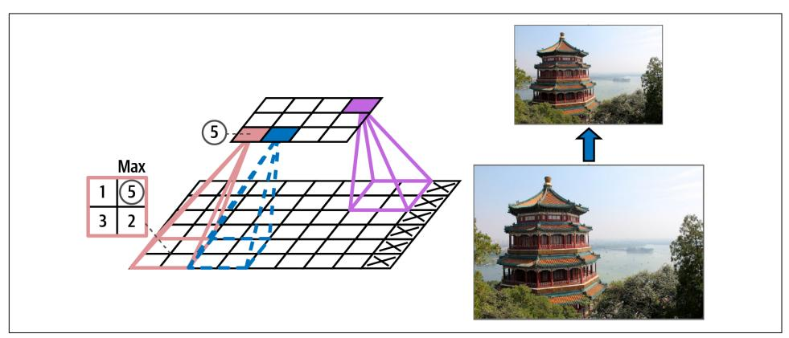

Figure 14-9. Max pooling layer ( $2 \times 2$  pooling kernel, stride 2, no padding)


A pooling layer typically works on every input channel independently, so the output depth (i.e., the number of channels) is the same as the input depth.

Other than reducing computations, memory usage, and the number of parameters, a max pooling layer also introduces some level of *invariance* to small translations, as shown in Figure 14-10. Here we assume that the bright pixels have a lower value than dark pixels, and we consider three images  $(A, B, C)$  going through a max pooling layer with a  $2 \times 2$  kernel and stride 2. Images B and C are the same as image A, but shifted by one and two pixels to the right. As you can see, the outputs of the max pooling layer for images A and B are identical. This is what translation invariance means. For image C, the output is different: it is shifted one pixel to the right (but there is still 50% invariance). By inserting a max pooling layer every few layers in a CNN, it is possible to get some level of translation invariance at a larger scale. Moreover, max pooling offers a small amount of rotational invariance and a slight scale invariance. Such invariance (even if it is limited) can be useful in cases where the prediction should not depend on these details, such as in classification tasks.

<sup>9</sup> Other kernels we've discussed so far had weights, but pooling kernels do not: they are just stateless sliding windows.

{520}------------------------------------------------

However, max pooling has some downsides too. It's obviously very destructive: even with a tiny  $2 \times 2$  kernel and a stride of 2, the output will be two times smaller in both directions (so its area will be four times smaller), simply dropping 75% of the input values. And in some applications, invariance is not desirable. Take semantic segmentation (the task of classifying each pixel in an image according to the object that pixel belongs to, which we'll explore later in this chapter): obviously, if the input image is translated by one pixel to the right, the output should also be translated by one pixel to the right. The goal in this case is *equivariance*, not invariance: a small change to the inputs should lead to a corresponding small change in the output.

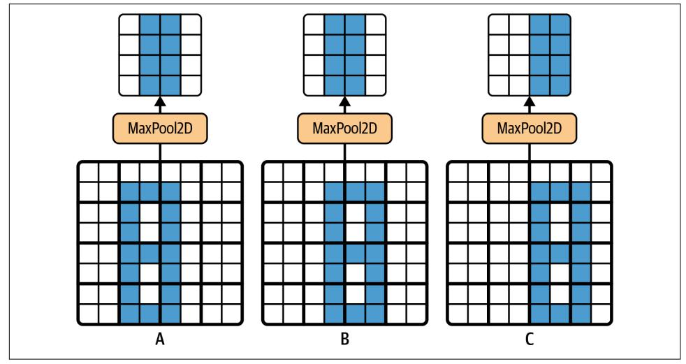

Figure 14-10. Invariance to small translations

### **Implementing Pooling Layers with Keras**

The following code creates a MaxPooling2D layer, alias MaxPool2D, using a  $2 \times 2$  kernel. The strides default to the kernel size, so this layer uses a stride of 2 (horizontally and vertically). By default, it uses "valid" padding (i.e., no padding at all):

```
max_pool = tf.keras.layers.MaxPool2D(pool_size=2)
```

To create an average pooling layer, just use AveragePooling2D, alias AvgPool2D, instead of MaxPool2D. As you might expect, it works exactly like a max pooling layer, except it computes the mean rather than the max. Average pooling layers used to be very popular, but people mostly use max pooling layers now, as they generally perform better. This may seem surprising, since computing the mean generally loses less information than computing the max. But on the other hand, max pooling preserves only the strongest features, getting rid of all the meaningless ones, so the 

{521}------------------------------------------------

next layers get a cleaner signal to work with. Moreover, max pooling offers stronger translation invariance than average pooling, and it requires slightly less compute.

Note that max pooling and average pooling can be performed along the depth dimension instead of the spatial dimensions, although it's not as common. This can allow the CNN to learn to be invariant to various features. For example, it could learn multiple filters, each detecting a different rotation of the same pattern (such as handwritten digits; see Figure 14-11), and the depthwise max pooling layer would ensure that the output is the same regardless of the rotation. The CNN could similarly learn to be invariant to anything: thickness, brightness, skew, color, and so on.

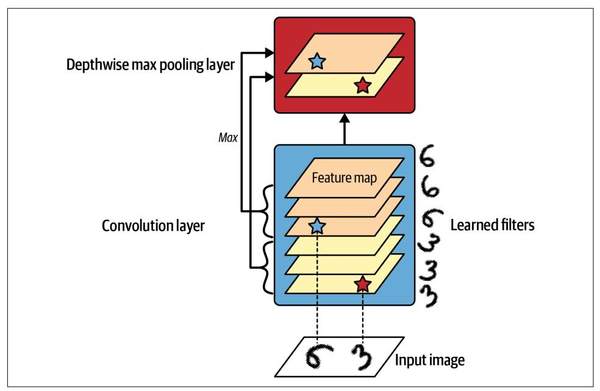

Figure 14-11. Depthwise max pooling can help the CNN learn to be invariant (to rotation in this case)

Keras does not include a depthwise max pooling layer, but it's not too difficult to implement a custom layer for that:

```
class DepthPool(tf.keras.layers.Layer):
   def __init__(self, pool_size=2, **kwargs):
       super(). init (** kwargs)
       self.pool size = pool size
    def call(self, inputs):
       shape = tf.shape(inputs) # shape[-1] is the number of channels
       groups = shape[-1] // self.pool_size # number of channel groups
       new\_shape = tf.concat([shape[:-1], [groups, self.pool_size]], axis=0)return tf.reduce_max(tf.reshape(inputs, new_shape), axis=-1)
```

{522}------------------------------------------------

This layer reshapes its inputs to split the channels into groups of the desired size (pool size), then it uses tf. reduce max() to compute the max of each group. This implementation assumes that the stride is equal to the pool size, which is generally what you want. Alternatively, you could use TensorFlow's tf.nn.max\_pool() operation, and wrap in a Lambda layer to use it inside a Keras model, but sadly this op does not implement depthwise pooling for the GPU, only for the CPU.

One last type of pooling layer that you will often see in modern architectures is the global average pooling layer. It works very differently: all it does is compute the mean of each entire feature map (it's like an average pooling layer using a pooling kernel with the same spatial dimensions as the inputs). This means that it just outputs a single number per feature map and per instance. Although this is of course extremely destructive (most of the information in the feature map is lost), it can be useful just before the output layer, as you will see later in this chapter. To create such a layer, simply use the GlobalAveragePooling2D class, alias GlobalAvgPool2D:

```
global avg pool = tf.keras.layers.GlobalAvgPool2D()
```

It's equivalent to the following Lambda layer, which computes the mean over the spatial dimensions (height and width):

```
global avg pool = tf.keras.layers.Lambda(
    lambda X: tf. reduce_mean(X, axis=[1, 2]))
```

For example, if we apply this layer to the input images, we get the mean intensity of red, green, and blue for each image:

```
>>> global_avg_pool(images)
<tf.Tensor: shape=(2, 3), dtype=float32, numpy=
array([[0.64338624, 0.5971759, 0.5824972],
       [0.76306933, 0.26011038, 0.10849128]], dtype=float32)>
```

Now you know all the building blocks to create convolutional neural networks. Let's see how to assemble them.

### **CNN Architectures**

Typical CNN architectures stack a few convolutional layers (each one generally followed by a ReLU layer), then a pooling layer, then another few convolutional layers (+ReLU), then another pooling layer, and so on. The image gets smaller and smaller as it progresses through the network, but it also typically gets deeper and deeper (i.e., with more feature maps), thanks to the convolutional layers (see Figure 14-12). At the top of the stack, a regular feedforward neural network is added, composed of a few fully connected layers (+ReLUs), and the final layer outputs the prediction (e.g., a softmax layer that outputs estimated class probabilities).

{523}------------------------------------------------

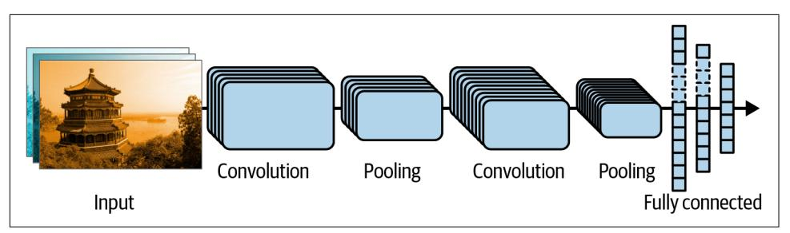

Figure 14-12. Typical CNN architecture


A common mistake is to use convolution kernels that are too large. For example, instead of using a convolutional layer with a 5  $\times$ 5 kernel, stack two layers with  $3 \times 3$  kernels: it will use fewer parameters and require fewer computations, and it will usually perform better. One exception is for the first convolutional layer: it can typically have a large kernel (e.g.,  $5 \times 5$ ), usually with a stride of 2 or more. This will reduce the spatial dimension of the image without losing too much information, and since the input image only has three channels in general, it will not be too costly.

Here is how you can implement a basic CNN to tackle the Fashion MNIST dataset (introduced in Chapter 10):

```
from functools import partial
DefaultConv2D = partial(tf.keras.layers.Conv2D, kernel_size=3, padding="same",
                         activation="relu", kernel initializer="he normal")
model = tf.keras.Sequential(DefaultConv2D(filters=64, kernel size=7, input shape=[28, 28, 1]),
    tf.keras.layers.MaxPool2D(),
    DefaultConv2D(filters=128),
    DefaultConv2D(filters=128),
    tf.keras.lavers.MaxPool2D().
    DefaultConv2D(filters=256),
    DefaultConv2D(filters=256),
    tf.keras.layers.MaxPool2D(),
    tf.keras.layers.Flatten(),
    tf.keras.layers.Dense(units=128, activation="relu",
                          kernel initializer="he normal").
    tf.keras.layers.Dropout(0.5),
    tf.keras.layers.Dense(units=64, activation="relu",
                          kernel_initializer="he_normal"),
    tf.keras.layers.Dropout(0.5),
    tf.keras.layers.Dense(units=10, activation="softmax")
\left| \right\rangle
```

{524}------------------------------------------------

Let's go through this code:

- We use the functools.partial() function (introduced in Chapter 11) to define DefaultConv2D, which acts just like Conv2D but with different default arguments: a small kernel size of 3, "same" padding, the ReLU activation function, and its corresponding He initializer.
- Next, we create the Sequential model. Its first layer is a DefaultConv2D with 64 fairly large filters (7  $\times$  7). It uses the default stride of 1 because the input images are not very large. It also sets input\_shape=[28, 28, 1], because the images are  $28 \times 28$  pixels, with a single color channel (i.e., grayscale). When you load the Fashion MNIST dataset, make sure each image has this shape: you may need to use np. reshape() or np. expanddims() to add the channels dimension. Alternatively, you could use a Reshape layer as the first layer in the model.
- We then add a max pooling layer that uses the default pool size of 2, so it divides each spatial dimension by a factor of 2.
- Then we repeat the same structure twice: two convolutional layers followed by a max pooling layer. For larger images, we could repeat this structure several more times. The number of repetitions is a hyperparameter you can tune.
- Note that the number of filters doubles as we climb up the CNN toward the output layer (it is initially 64, then 128, then 256): it makes sense for it to grow, since the number of low-level features is often fairly low (e.g., small circles, horizontal lines), but there are many different ways to combine them into higherlevel features. It is a common practice to double the number of filters after each pooling layer: since a pooling layer divides each spatial dimension by a factor of 2, we can afford to double the number of feature maps in the next layer without fear of exploding the number of parameters, memory usage, or computational  $load.$
- Next is the fully connected network, composed of two hidden dense layers and a dense output layer. Since it's a classification task with 10 classes, the output layer has 10 units, and it uses the softmax activation function. Note that we must flatten the inputs just before the first dense layer, since it expects a 1D array of features for each instance. We also add two dropout layers, with a dropout rate of 50% each, to reduce overfitting.

If you compile this model using the "sparse categorical crossentropy" loss and you fit the model to the Fashion MNIST training set, it should reach over 92% accuracy on the test set. It's not state of the art, but it is pretty good, and clearly much better than what we achieved with dense networks in Chapter 10.

{525}------------------------------------------------

Over the years, variants of this fundamental architecture have been developed, leading to amazing advances in the field. A good measure of this progress is the error rate in competitions such as the ILSVRC ImageNet challenge. In this competition, the top-five error rate for image classification—that is, the number of test images for which the system's top five predictions did *not* include the correct answer—fell from over 26% to less than 2.3% in just six years. The images are fairly large (e.g., 256 pixels high) and there are 1,000 classes, some of which are really subtle (try distinguishing 120 dog breeds). Looking at the evolution of the winning entries is a good way to understand how CNNs work, and how research in deep learning progresses.

We will first look at the classical LeNet-5 architecture (1998), then several winners of the ILSVRC challenge: AlexNet (2012), GoogLeNet (2014), ResNet (2015), and SENet (2017). Along the way, we will also look at a few more architectures, including Xception, ResNeXt, DenseNet, MobileNet, CSPNet, and EfficientNet.

#### LeNet-5

The LeNet-5 architecture<sup>10</sup> is perhaps the most widely known CNN architecture. As mentioned earlier, it was created by Yann LeCun in 1998 and has been widely used for handwritten digit recognition (MNIST). It is composed of the layers shown in Table 14-1.

| Layer            | Type                   | Maps | Size                        | Kernel size Stride Activation |               |            |
|------------------|------------------------|------|-----------------------------|-------------------------------|---------------|------------|
| 0ut              | <b>Fully connected</b> |      | 10                          |                               |               | <b>RBF</b> |
| F6               | <b>Fully connected</b> |      | 84                          |                               |               | tanh       |
| $\mathfrak{c}_5$ | Convolution            | 120  | $1 \times 1$                | $5 \times 5$                  | 1             | tanh       |
| S4               | Avg pooling            | 16   | $5 \times 5$                | $2 \times 2$                  | 2             | tanh       |
| $\mathcal{C}$    | Convolution            | 16   | $10 \times 10$              | $5 \times 5$                  | 1             | tanh       |
| S <sub>2</sub>   | Avg pooling            | 6    | $14 \times 14$ $2 \times 2$ |                               | $\mathfrak z$ | tanh       |
| C <sub>1</sub>   | Convolution            | 6    | $28 \times 28$ 5 $\times$ 5 |                               | 1             | tanh       |
| In               | Input                  | 1    | $32 \times 32$              |                               |               |            |

Table 14-1. LeNet-5 architecture

As you can see, this looks pretty similar to our Fashion MNIST model: a stack of convolutional layers and pooling layers, followed by a dense network. Perhaps the main difference with more modern classification CNNs is the activation functions: today, we would use ReLU instead of tanh and softmax instead of RBF. There were

<sup>10</sup> Yann LeCun et al., "Gradient-Based Learning Applied to Document Recognition", Proceedings of the IEEE 86, no. 11 (1998): 2278-2324.

{526}------------------------------------------------

several other minor differences that don't really matter much, but in case you are interested, they are listed in this chapter's notebook at https://homl.info/colab3. Yann LeCun's website also features great demos of LeNet-5 classifying digits.

#### **AlexNet**

The AlexNet CNN architecture<sup>11</sup> won the 2012 ILSVRC challenge by a large margin: it achieved a top-five error rate of 17%, while the second best competitor achieved only 26%! AlexaNet was developed by Alex Krizhevsky (hence the name), Ilya Sutskever, and Geoffrey Hinton. It is similar to LeNet-5, only much larger and deeper, and it was the first to stack convolutional layers directly on top of one another, instead of stacking a pooling layer on top of each convolutional layer. Table 14-2 presents this architecture.

| Layer           | <b>Type</b>            | <b>Maps</b> | Size             | Kernel size    | Stride         | Padding | <b>Activation</b> |
|-----------------|------------------------|-------------|------------------|----------------|----------------|---------|-------------------|
| 0ut             | <b>Fully connected</b> |             | 1,000            |                |                |         | Softmax           |
| F <sub>10</sub> | <b>Fully connected</b> |             | 4.096            |                |                |         | ReLU              |
| F9              | <b>Fully connected</b> |             | 4,096            |                |                |         | ReLU              |
| S8              | Max pooling            | 256         | $6 \times 6$     | $3 \times 3$   | 2              | valid   |                   |
| C <sub>7</sub>  | Convolution            | 256         | $13 \times 13$   | $3 \times 3$   | 1              | same    | ReLU              |
| C6              | Convolution            | 384         | $13 \times 13$   | $3 \times 3$   | 1              | same    | ReLU              |
| C <sub>5</sub>  | Convolution            | 384         | $13 \times 13$   | $3 \times 3$   | 1              | same    | ReLU              |
| S <sub>4</sub>  | Max pooling            | 256         | $13 \times 13$   | $3 \times 3$   | $\overline{2}$ | valid   |                   |
| C <sub>3</sub>  | Convolution            | 256         | $27 \times 27$   | $5 \times 5$   | 1              | same    | ReLU              |
| S2              | Max pooling            | 96          | $27 \times 27$   | $3 \times 3$   | 2              | valid   |                   |
| C <sub>1</sub>  | Convolution            | 96          | $55 \times 55$   | $11 \times 11$ | 4              | valid   | ReLU              |
| In              | Input                  | 3(RGB)      | $227 \times 227$ |                |                |         |                   |

Table 14-2 AlexNet architecture

To reduce overfitting, the authors used two regularization techniques. First, they applied dropout (introduced in Chapter 11) with a 50% dropout rate during training to the outputs of layers F9 and F10. Second, they performed data augmentation by randomly shifting the training images by various offsets, flipping them horizontally, and changing the lighting conditions.

<sup>11</sup> Alex Krizhevsky et al., "ImageNet Classification with Deep Convolutional Neural Networks", Proceedings of the 25th International Conference on Neural Information Processing Systems 1 (2012): 1097-1105.

{527}------------------------------------------------

#### **Data Augmentation**

Data augmentation artificially increases the size of the training set by generating many realistic variants of each training instance. This reduces overfitting, making this a regularization technique. The generated instances should be as realistic as possible: ideally, given an image from the augmented training set, a human should not be able to tell whether it was augmented or not. Simply adding white noise will not help; the modifications should be learnable (white noise is not).

For example, you can slightly shift, rotate, and resize every picture in the training set by various amounts and add the resulting pictures to the training set (see Figure 14-13). To do this, you can use Keras's data augmentation layers, introduced in Chapter 13 (e.g., RandomCrop, RandomRotation, etc.). This forces the model to be more tolerant to variations in the position, orientation, and size of the objects in the pictures. To produce a model that's more tolerant of different lighting conditions, you can similarly generate many images with various contrasts. In general, you can also flip the pictures horizontally (except for text, and other asymmetrical objects). By combining these transformations, you can greatly increase your training set size.

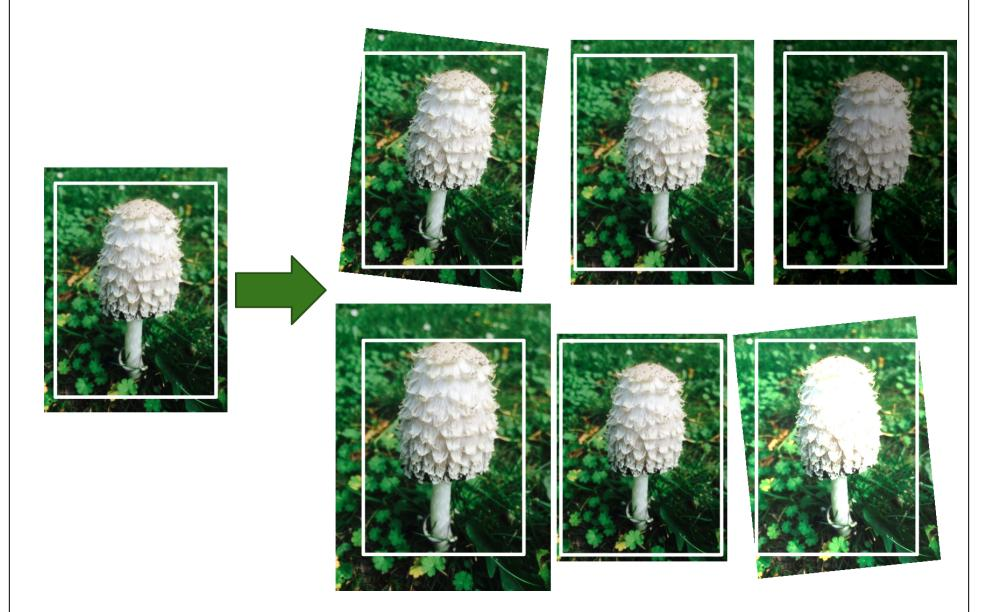

Figure 14-13. Generating new training instances from existing ones

Data augmentation is also useful when you have an unbalanced dataset: you can use it to generate more samples of the less frequent classes. This is called the *synthetic* minority oversampling technique, or SMOTE for short.

{528}------------------------------------------------

AlexNet also uses a competitive normalization step immediately after the ReLU step of layers C1 and C3, called *local response normalization* (LRN): the most strongly activated neurons inhibit other neurons located at the same position in neighboring feature maps. Such competitive activation has been observed in biological neurons. This encourages different feature maps to specialize, pushing them apart and forcing them to explore a wider range of features, ultimately improving generalization. Equation 14-2 shows how to apply LRN.

Equation 14-2. Local response normalization (LRN)

$$
b_i = a_i \left( k + \alpha \sum_{j = j_{\text{low}}}^{j_{\text{high}}} a_j^2 \right)^{-\beta} \quad \text{with } \begin{cases} j_{\text{high}} = \min \left( i + \frac{r}{2}, f_n - 1 \right) \\ j_{\text{low}} = \max \left( 0, i - \frac{r}{2} \right) \end{cases}
$$

In this equation:

- $b_i$  is the normalized output of the neuron located in feature map *i*, at some row *u* and column  $\nu$  (note that in this equation we consider only neurons located at this row and column, so  $u$  and  $v$  are not shown).
- $a_i$  is the activation of that neuron after the ReLU step, but before normalization.
- k,  $\alpha$ ,  $\beta$ , and r are hyperparameters. k is called the bias, and r is called the *depth* radius.
- $f_n$  is the number of feature maps.

For example, if  $r = 2$  and a neuron has a strong activation, it will inhibit the activation of the neurons located in the feature maps immediately above and below its own.

In AlexNet, the hyperparameters are set as:  $r = 5$ ,  $\alpha = 0.0001$ ,  $\beta = 0.75$ , and  $k = 2$ . You can implement this step by using the tf.nn.local\_response\_normalization() function (which you can wrap in a Lambda layer if you want to use it in a Keras model).

A variant of AlexNet called ZF Net<sup>12</sup> was developed by Matthew Zeiler and Rob Fergus and won the 2013 ILSVRC challenge. It is essentially AlexNet with a few tweaked hyperparameters (number of feature maps, kernel size, stride, etc.).

<sup>12</sup> Matthew D. Zeiler and Rob Fergus, "Visualizing and Understanding Convolutional Networks", Proceedings of the European Conference on Computer Vision (2014): 818-833.

{529}------------------------------------------------

### GoogLeNet

The GoogLeNet architecture was developed by Christian Szegedy et al. from Google Research,<sup>13</sup> and it won the ILSVRC 2014 challenge by pushing the top-five error rate below 7%. This great performance came in large part from the fact that the network was much deeper than previous CNNs (as you'll see in Figure 14-15). This was made possible by subnetworks called *inception modules*,<sup>14</sup> which allow GoogLeNet to use parameters much more efficiently than previous architectures: GoogLeNet actually has 10 times fewer parameters than AlexNet (roughly 6 million instead of 60 million).

Figure 14-14 shows the architecture of an inception module. The notation " $3 \times 3 +$  $1(S)$ " means that the layer uses a  $3 \times 3$  kernel, stride 1, and "same" padding. The input signal is first fed to four different layers in parallel. All convolutional layers use the ReLU activation function. Note that the top convolutional layers use different kernel sizes (1  $\times$  1, 3  $\times$  3, and 5  $\times$  5), allowing them to capture patterns at different scales. Also note that every single layer uses a stride of 1 and "same" padding (even the max pooling layer), so their outputs all have the same height and width as their inputs. This makes it possible to concatenate all the outputs along the depth dimension in the final *depth concatenation layer* (i.e., to stack the feature maps from all four top convolutional layers). It can be implemented using Keras's Concatenate layer, using the default  $axis = -1$ 

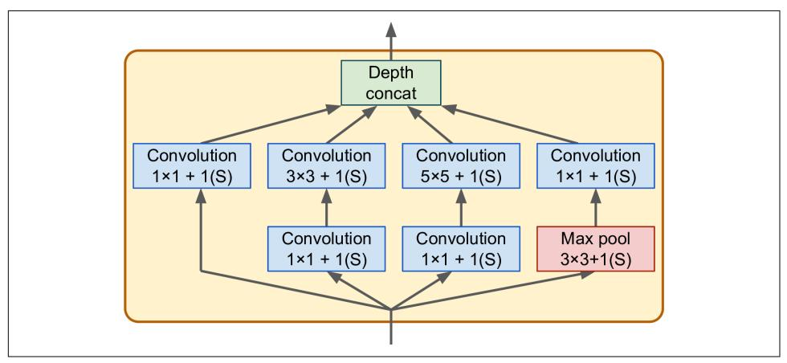

Figure 14-14. Inception module

<sup>13</sup> Christian Szegedy et al., "Going Deeper with Convolutions", Proceedings of the IEEE Conference on Computer Vision and Pattern Recognition (2015): 1-9.

<sup>14</sup> In the 2010 movie *Inception*, the characters keep going deeper and deeper into multiple layers of dreams; hence the name of these modules.

{530}------------------------------------------------

You may wonder why inception modules have convolutional layers with  $1 \times 1$  kernels. Surely these layers cannot capture any features because they look at only one pixel at a time, right? In fact, these layers serve three purposes:

- Although they cannot capture spatial patterns, they can capture patterns along the depth dimension (i.e., across channels).
- They are configured to output fewer feature maps than their inputs, so they serve as bottleneck layers, meaning they reduce dimensionality. This cuts the computational cost and the number of parameters, speeding up training and improving generalization.
- Each pair of convolutional layers ( $[1 \times 1, 3 \times 3]$  and  $[1 \times 1, 5 \times 5]$ ) acts like a single powerful convolutional layer, capable of capturing more complex patterns. A convolutional layer is equivalent to sweeping a dense layer across the image (at each location, it only looks at a small receptive field), and these pairs of convolutional layers are equivalent to sweeping two-layer neural networks across the image.

In short, you can think of the whole inception module as a convolutional layer on steroids, able to output feature maps that capture complex patterns at various scales.

Now let's look at the architecture of the GoogLeNet CNN (see Figure 14-15). The number of feature maps output by each convolutional layer and each pooling layer is shown before the kernel size. The architecture is so deep that it has to be represented in three columns, but GoogLeNet is actually one tall stack, including nine inception modules (the boxes with the spinning tops). The six numbers in the inception modules represent the number of feature maps output by each convolutional layer in the module (in the same order as in Figure 14-14). Note that all the convolutional layers use the ReLU activation function.

Let's go through this network:

- The first two layers divide the image's height and width by 4 (so its area is divided by 16), to reduce the computational load. The first layer uses a large kernel size,  $7 \times 7$ , so that much of the information is preserved.
- Then the local response normalization layer ensures that the previous layers learn a wide variety of features (as discussed earlier).
- Two convolutional layers follow, where the first acts like a bottleneck layer. As mentioned, you can think of this pair as a single smarter convolutional layer.
- Again, a local response normalization layer ensures that the previous layers capture a wide variety of patterns.
- Next, a max pooling layer reduces the image height and width by 2, again to speed up computations.

{531}------------------------------------------------

- Then comes the CNN's *backbone*: a tall stack of nine inception modules, interleaved with a couple of max pooling layers to reduce dimensionality and speed up the net.
- Next, the global average pooling layer outputs the mean of each feature map: this drops any remaining spatial information, which is fine because there is not much spatial information left at that point. Indeed, GoogLeNet input images are typically expected to be  $224 \times 224$  pixels, so after 5 max pooling layers, each dividing the height and width by 2, the feature maps are down to  $7 \times 7$ . Moreover, this is a classification task, not localization, so it doesn't matter where the object is. Thanks to the dimensionality reduction brought by this layer, there is no need to have several fully connected layers at the top of the CNN (like in AlexNet), and this considerably reduces the number of parameters in the network and limits the risk of overfitting.
- The last layers are self-explanatory: dropout for regularization, then a fully connected layer with 1,000 units (since there are 1,000 classes) and a softmax activation function to output estimated class probabilities.

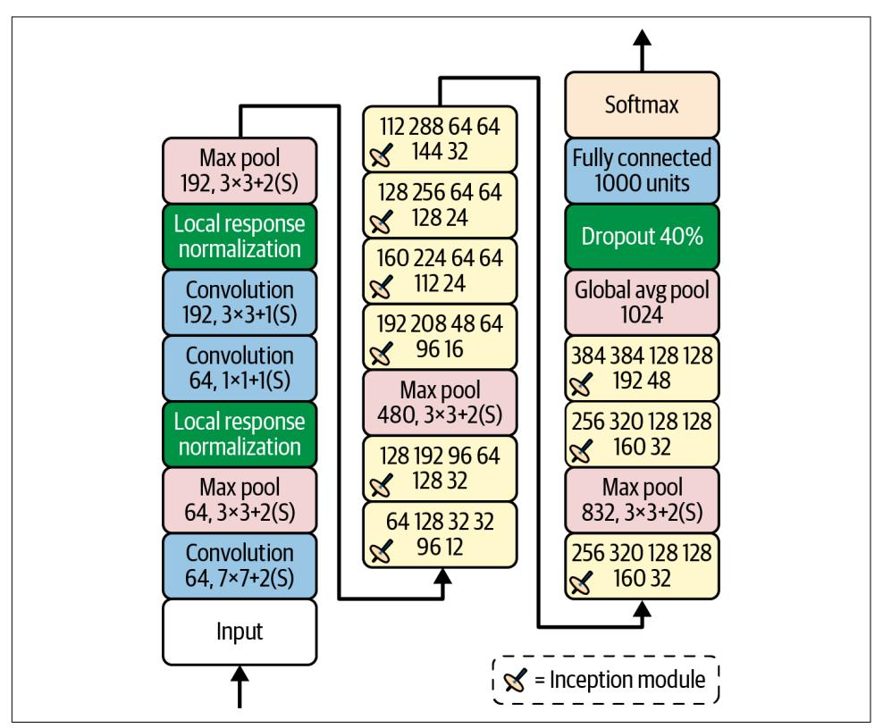

Figure 14-15. GoogLeNet architecture

{532}------------------------------------------------

The original GoogLeNet architecture included two auxiliary classifiers plugged on top of the third and sixth inception modules. They were both composed of one average pooling layer, one convolutional layer, two fully connected layers, and a softmax activation layer. During training, their loss (scaled down by 70%) was added to the overall loss. The goal was to fight the vanishing gradients problem and regularize the network, but it was later shown that their effect was relatively minor.

Several variants of the GoogLeNet architecture were later proposed by Google researchers, including Inception-v3 and Inception-v4, using slightly different inception modules to reach even better performance.

### **VGGNet**

The runner-up in the ILSVRC 2014 challenge was VGGNet,<sup>15</sup> Karen Simonyan and Andrew Zisserman, from the Visual Geometry Group (VGG) research lab at Oxford University, developed a very simple and classical architecture; it had 2 or 3 convolutional layers and a pooling layer, then again 2 or 3 convolutional layers and a pooling layer, and so on (reaching a total of 16 or 19 convolutional layers, depending on the VGG variant), plus a final dense network with 2 hidden layers and the output layer. It used small  $3 \times 3$  filters, but it had many of them.

#### **ResNet**

Kaiming He et al. won the ILSVRC 2015 challenge using a Residual Network (ResNet)<sup>16</sup> that delivered an astounding top-five error rate under 3.6%. The winning variant used an extremely deep CNN composed of 152 layers (other variants had 34, 50, and 101 layers). It confirmed the general trend: computer vision models were getting deeper and deeper, with fewer and fewer parameters. The key to being able to train such a deep network is to use skip connections (also called shortcut connections): the signal feeding into a layer is also added to the output of a layer located higher up the stack. Let's see why this is useful.

When training a neural network, the goal is to make it model a target function  $h(x)$ . If you add the input  $x$  to the output of the network (i.e., you add a skip connection), then the network will be forced to model  $f(x) = h(x) - x$  rather than  $h(x)$ . This is called residual learning (see Figure 14-16).

<sup>15</sup> Karen Simonyan and Andrew Zisserman, "Very Deep Convolutional Networks for Large-Scale Image Recognition", arXiv preprint arXiv:1409.1556 (2014).

<sup>16</sup> Kaiming He et al., "Deep Residual Learning for Image Recognition", arXiv preprint arXiv:1512:03385 (2015).

{533}------------------------------------------------

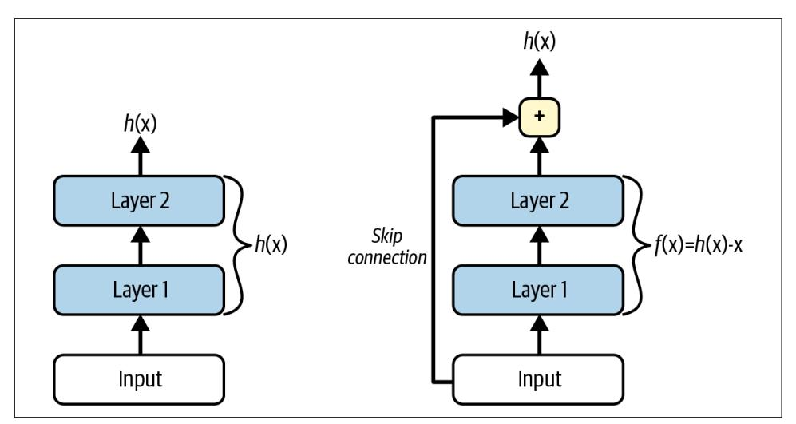

Figure 14-16. Residual learning

When you initialize a regular neural network, its weights are close to zero, so the network just outputs values close to zero. If you add a skip connection, the resulting network just outputs a copy of its inputs; in other words, it initially models the identity function. If the target function is fairly close to the identity function (which is often the case), this will speed up training considerably.

Moreover, if you add many skip connections, the network can start making progress even if several layers have not started learning yet (see Figure 14-17). Thanks to skip connections, the signal can easily make its way across the whole network. The deep residual network can be seen as a stack of *residual units* (RUs), where each residual unit is a small neural network with a skip connection.

Now let's look at ResNet's architecture (see Figure 14-18). It is surprisingly simple. It starts and ends exactly like GoogLeNet (except without a dropout layer), and in between is just a very deep stack of residual units. Each residual unit is composed of two convolutional layers (and no pooling layer!), with batch normalization (BN) and ReLU activation, using  $3 \times 3$  kernels and preserving spatial dimensions (stride 1, "same" padding).

{534}------------------------------------------------

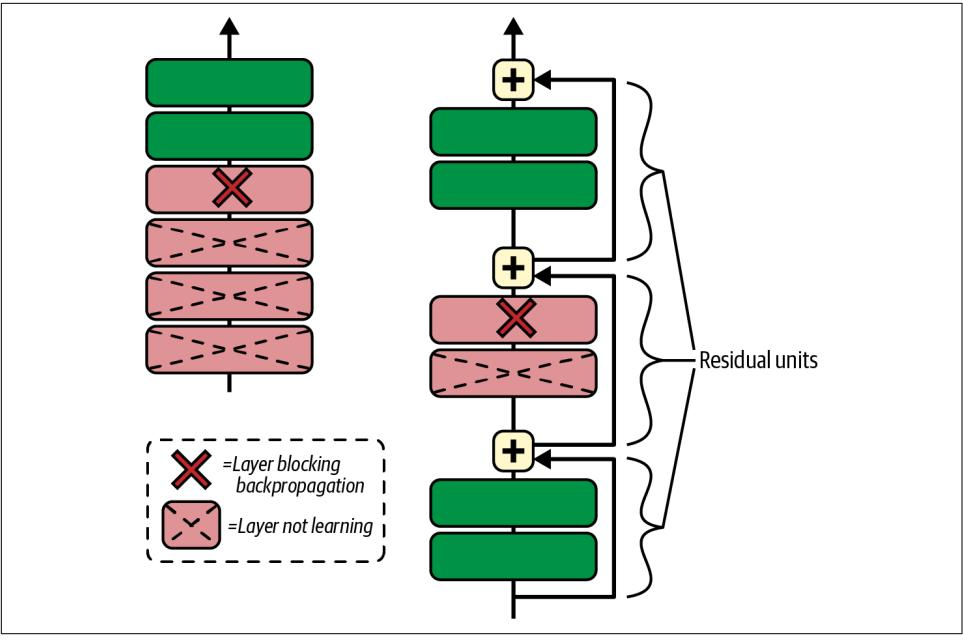

Figure 14-17. Regular deep neural network (left) and deep residual network (right)

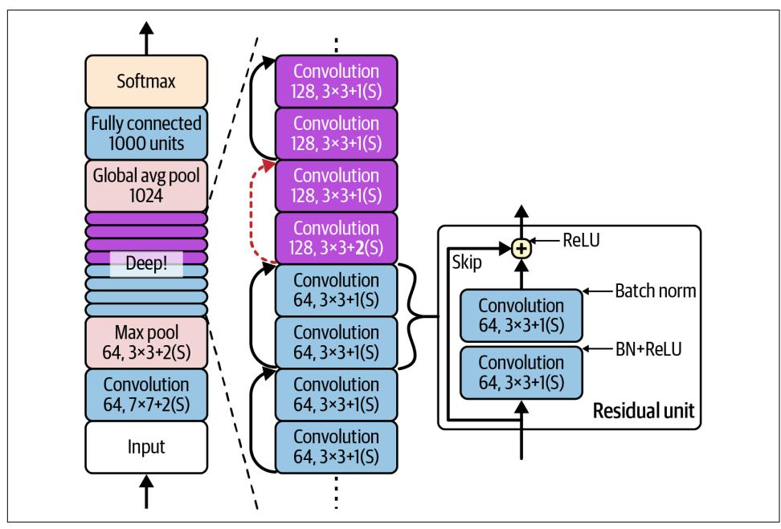

Figure 14-18. ResNet architecture

{535}------------------------------------------------

Note that the number of feature maps is doubled every few residual units, at the same time as their height and width are halved (using a convolutional layer with stride 2). When this happens, the inputs cannot be added directly to the outputs of the residual unit because they don't have the same shape (for example, this problem affects the skip connection represented by the dashed arrow in Figure 14-18). To solve this problem, the inputs are passed through a  $1 \times 1$  convolutional layer with stride 2 and the right number of output feature maps (see Figure 14-19).

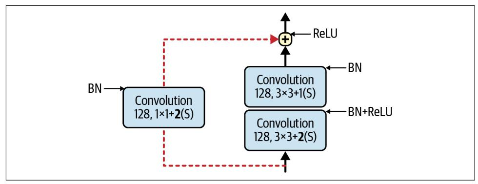

Figure 14-19. Skip connection when changing feature map size and depth

Different variations of the architecture exist, with different numbers of layers. ResNet-34 is a ResNet with 34 layers (only counting the convolutional layers and the fully connected layer)<sup>17</sup> containing 3 RUs that output 64 feature maps, 4 RUs with 128 maps, 6 RUs with 256 maps, and 3 RUs with 512 maps. We will implement this architecture later in this chapter.


Google's Inception-v4<sup>18</sup> architecture merged the ideas of GoogLe-Net and ResNet and achieved a top-five error rate of close to 3% on ImageNet classification.

ResNets deeper than that, such as ResNet-152, use slightly different residual units. Instead of two  $3 \times 3$  convolutional layers with, say, 256 feature maps, they use three convolutional layers: first a  $1 \times 1$  convolutional layer with just 64 feature maps (4  $\times$ less), which acts as a bottleneck layer (as discussed already), then a  $3 \times 3$  layer with 64 feature maps, and finally another  $1 \times 1$  convolutional layer with 256 feature maps (4 times 64) that restores the original depth. ResNet-152 contains 3 such RUs that

<sup>17</sup> It is a common practice when describing a neural network to count only layers with parameters.

<sup>18</sup> Christian Szegedy et al., "Inception-v4, Inception-ResNet and the Impact of Residual Connections on Learning", arXiv preprint arXiv:1602.07261 (2016).

{536}------------------------------------------------

output 256 maps, then 8 RUs with 512 maps, a whopping 36 RUs with 1,024 maps, and finally 3 RUs with 2,048 maps.

### **Xception**

Another variant of the GoogLeNet architecture is worth noting: Xception<sup>19</sup> (which stands for *Extreme Inception*) was proposed in 2016 by François Chollet (the author of Keras), and it significantly outperformed Inception-v3 on a huge vision task (350) million images and 17,000 classes). Just like Inception-v4, it merges the ideas of GoogLeNet and ResNet, but it replaces the inception modules with a special type of layer called a *depthwise separable convolution layer* (or *separable convolution layer* for short<sup>20</sup>). These layers had been used before in some CNN architectures, but they were not as central as in the Xception architecture. While a regular convolutional layer uses filters that try to simultaneously capture spatial patterns (e.g., an oval) and cross-channel patterns (e.g., mouth + nose + eyes = face), a separable convolutional layer makes the strong assumption that spatial patterns and cross-channel patterns can be modeled separately (see Figure 14-20). Thus, it is composed of two parts: the first part applies a single spatial filter to each input feature map, then the second part looks exclusively for cross-channel patterns—it is just a regular convolutional layer with  $1 \times 1$  filters.

Since separable convolutional layers only have one spatial filter per input channel, you should avoid using them after layers that have too few channels, such as the input layer (granted, that's what Figure 14-20 represents, but it is just for illustration purposes). For this reason, the Xception architecture starts with 2 regular convolutional layers, but then the rest of the architecture uses only separable convolutions (34 in all), plus a few max pooling layers and the usual final layers (a global average pooling layer and a dense output layer).

You might wonder why Xception is considered a variant of GoogLeNet, since it contains no inception modules at all. Well, as discussed earlier, an inception module contains convolutional layers with  $1 \times 1$  filters: these look exclusively for cross-channel patterns. However, the convolutional layers that sit on top of them are regular convolutional layers that look both for spatial and cross-channel patterns. So, you can think of an inception module as an intermediate between a regular convolutional layer (which considers spatial patterns and cross-channel patterns jointly) and a separable convolutional layer (which considers them separately). In practice, it seems that separable convolutional layers often perform better.

<sup>19</sup> François Chollet, "Xception: Deep Learning with Depthwise Separable Convolutions", arXiv preprint arXiv:1610.02357 (2016).

<sup>20</sup> This name can sometimes be ambiguous, since spatially separable convolutions are often called "separable" convolutions" as well.

{537}------------------------------------------------

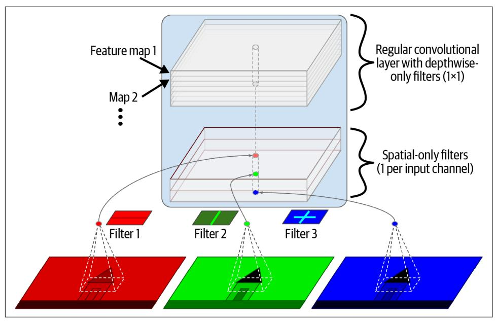

Figure 14-20. Depthwise separable convolutional layer


Separable convolutional layers use fewer parameters, less memory, and fewer computations than regular convolutional layers, and they often perform better. Consider using them by default, except after layers with few channels (such as the input channel). In Keras, just use SeparableConv2D instead of Conv2D: it's a drop-in replacement. Keras also offers a DepthwiseConv2D layer that implements the first part of a depthwise separable convolutional layer (i.e., applying one spatial filter per input feature map).

#### **SFNet**

The winning architecture in the ILSVRC 2017 challenge was the Squeeze-and-Excitation Network (SENet).<sup>21</sup> This architecture extends existing architectures such as inception networks and ResNets, and boosts their performance. This allowed SENet to win the competition with an astonishing 2.25% top-five error rate! The extended versions of inception networks and ResNets are called SE-Inception and SE-ResNet, respectively. The boost comes from the fact that a SENet adds a small neural network, called an SE block, to every inception module or residual unit in the original architecture, as shown in Figure 14-21.

<sup>21</sup> Jie Hu et al., "Squeeze-and-Excitation Networks", Proceedings of the IEEE Conference on Computer Vision and Pattern Recognition (2018): 7132-7141.

{538}------------------------------------------------

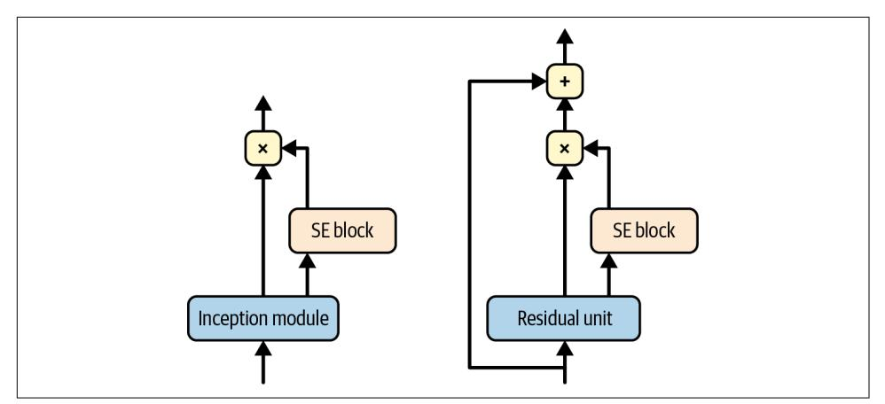

Figure 14-21. SE-Inception module (left) and SE-ResNet unit (right)

An SE block analyzes the output of the unit it is attached to, focusing exclusively on the depth dimension (it does not look for any spatial pattern), and it learns which features are usually most active together. It then uses this information to recalibrate the feature maps, as shown in Figure 14-22. For example, an SE block may learn that mouths, noses, and eyes usually appear together in pictures: if you see a mouth and a nose, you should expect to see eyes as well. So, if the block sees a strong activation in the mouth and nose feature maps, but only mild activation in the eye feature map, it will boost the eye feature map (more accurately, it will reduce irrelevant feature maps). If the eyes were somewhat confused with something else, this feature map recalibration will help resolve the ambiguity.

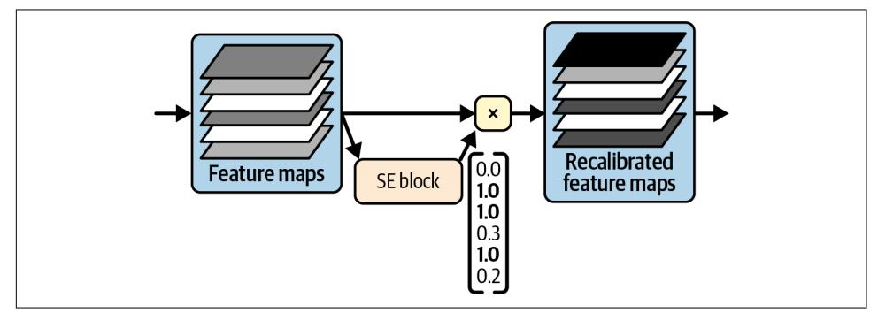

Figure 14-22. An SE block performs feature map recalibration

An SE block is composed of just three layers: a global average pooling layer, a hidden dense layer using the ReLU activation function, and a dense output layer using the sigmoid activation function (see Figure 14-23).

{539}------------------------------------------------

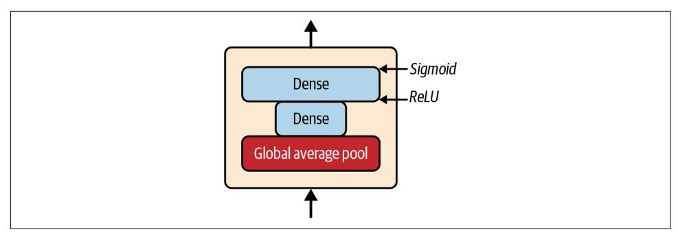

Figure 14-23. SE block architecture

As earlier, the global average pooling layer computes the mean activation for each feature map: for example, if its input contains 256 feature maps, it will output 256 numbers representing the overall level of response for each filter. The next layer is where the "squeeze" happens: this layer has significantly fewer than 256 neurons typically 16 times fewer than the number of feature maps (e.g., 16 neurons)—so the 256 numbers get compressed into a small vector (e.g., 16 dimensions). This is a low-dimensional vector representation (*i.e.*, an embedding) of the distribution of feature responses. This bottleneck step forces the SE block to learn a general representation of the feature combinations (we will see this principle in action again when we discuss autoencoders in Chapter 17). Finally, the output layer takes the embedding and outputs a recalibration vector containing one number per feature map (e.g., 256), each between 0 and 1. The feature maps are then multiplied by this recalibration vector, so irrelevant features (with a low recalibration score) get scaled down while relevant features (with a recalibration score close to 1) are left alone.

#### **Other Noteworthy Architectures**

There are many other CNN architectures to explore. Here's a brief overview of some of the most noteworthy:

#### $ResNeXt^{22}$

ResNeXt improves the residual units in ResNet. Whereas the residual units in the best ResNet models just contain 3 convolutional layers each, the ResNeXt residual units are composed of many parallel stacks (e.g., 32 stacks), with 3 convolutional layers each. However, the first two layers in each stack only use a few filters (e.g., just four), so the overall number of parameters remains the same as in ResNet. Then the outputs of all the stacks are added together, and the result is passed to the next residual unit (along with the skip connection).

<sup>22</sup> Saining Xie et al., "Aggregated Residual Transformations for Deep Neural Networks", arXiv preprint arXiv:1611.05431 (2016).

{540}------------------------------------------------

#### DenseNet<sup>23</sup>

A DenseNet is composed of several dense blocks, each made up of a few densely connected convolutional layers. This architecture achieved excellent accuracy while using comparatively few parameters. What does "densely connected" mean? The output of each layer is fed as input to every layer after it within the same block. For example, layer 4 in a block takes as input the depthwise concatenation of the outputs of layers 1, 2, and 3 in that block. Dense blocks are separated by a few transition layers.

#### $MobileNet<sup>24</sup>$

MobileNets are streamlined models designed to be lightweight and fast, making them popular in mobile and web applications. They are based on depthwise separable convolutional layers, like Xception. The authors proposed several variants, trading a bit of accuracy for faster and smaller models.

#### $CSPNet^{25}$

A Cross Stage Partial Network (CSPNet) is similar to a DenseNet, but part of each dense block's input is concatenated directly to that block's output, without going through the block.

#### EfficientNet<sup>26</sup>

EfficientNet is arguably the most important model in this list. The authors proposed a method to scale any CNN efficiently, by jointly increasing the depth (number of layers), width (number of filters per layer), and resolution (size of the input image) in a principled way. This is called *compound scaling*. They used neural architecture search to find a good architecture for a scaled-down version of ImageNet (with smaller and fewer images), and then used compound scaling to create larger and larger versions of this architecture. When EfficientNet models came out, they vastly outperformed all existing models, across all compute budgets, and they remain among the best models out there today.

Understanding EfficientNet's compound scaling method is helpful to gain a deeper understanding of CNNs, especially if you ever need to scale a CNN architecture. It is based on a logarithmic measure of the compute budget, noted  $\phi$ : if your compute budget doubles, then  $\phi$  increases by 1. In other words, the number of floating-point operations available for training is proportional to  $2^{\phi}$ . Your CNN architecture's depth,

<sup>23</sup> Gao Huang et al., "Densely Connected Convolutional Networks", arXiv preprint arXiv:1608.06993 (2016).

<sup>24</sup> Andrew G. Howard et al., "MobileNets: Efficient Convolutional Neural Networks for Mobile Vision Applications", arXiv preprint arxiv:1704.04861 (2017).

<sup>25</sup> Chien-Yao Wang et al., "CSPNet: A New Backbone That Can Enhance Learning Capability of CNN", arXiv preprint arXiv:1911.11929 (2019).

<sup>26</sup> Mingxing Tan and Quoc V. Le, "EfficientNet: Rethinking Model Scaling for Convolutional Neural Networks", arXiv preprint arXiv:1905.11946 (2019).

{541}------------------------------------------------

width, and resolution should scale as  $\alpha^{\phi}$ ,  $\beta^{\phi}$ , and  $\gamma^{\phi}$ , respectively. The factors  $\alpha$ ,  $\beta$ , and y must be greater than 1, and  $\alpha + \beta^2 + \gamma^2$  should be close to 2. The optimal values for these factors depend on the CNN's architecture. To find the optimal values for the EfficientNet architecture, the authors started with a small baseline model (EfficientNetB0), fixed  $\phi = 1$ , and simply ran a grid search: they found  $\alpha = 1.2$ ,  $\beta =$ 1.1, and  $\gamma = 1.1$ . They then used these factors to create several larger architectures, named EfficientNetB1 to EfficientNetB7, for increasing values of  $\phi$ .

#### **Choosing the Right CNN Architecture**

With so many CNN architectures, how do you choose which one is best for your project? Well, it depends on what matters most to you: Accuracy? Model size (e.g., for deployment to a mobile device)? Inference speed on CPU? On GPU? Table 14-3 lists the best pretrained models currently available in Keras (you'll see how to use them later in this chapter), sorted by model size. You can find the full list at https:// keras.io/api/applications. For each model, the table shows the Keras class name to use (in the tf.keras.applications package), the model's size in MB, the top-1 and top-5 validation accuracy on the ImageNet dataset, the number of parameters (millions), and the inference time on CPU and GPU in ms, using batches of 32 images on reasonably powerful hardware.<sup>27</sup> For each column, the best value is highlighted. As you can see, larger models are generally more accurate, but not always; for example, EfficientNetB2 outperforms InceptionV3 both in size and accuracy. I only kept Inception V3 in the list because it is almost twice as fast as Efficient Net B2 on a CPU. Similarly, InceptionResNetV2 is fast on a CPU, and ResNet50V2 and ResNet101V2 are blazingly fast on a GPU.

| Size (MB) |       |       |       | CPU (ms)                   | GPU (ms) |
|-----------|-------|-------|-------|----------------------------|----------|
| 14        | 71.3% | 90.1% | 3.5M  | 25.9                       | 3.8      |
| 16        | 70.4% | 89.5% | 4.3M  | 22.6                       | 3.4      |
| 23        | 74.4% | 91.9% | 5.3M  | 27.0                       | 6.7      |
| 29        | 77.1% | 93.3% | 5.3M  | 46.0                       | 4.9      |
| 31        | 79.1% | 94.4% | 7.9M  | 60.2                       | 5.6      |
| 36        | 80.1% | 94.9% | 9.2M  | 80.8                       | 6.5      |
| 48        | 81.6% | 95.7% | 12.3M | 140.0                      | 8.8      |
| 75        | 82.9% | 96.4% | 19.5M | 308.3                      | 15.1     |
| 92        | 77.9% | 93.7% | 23.9M | 42.2                       | 6.9      |
| 98        | 76.0% | 93.0% | 25.6M | 45.6                       | 4.4      |
|           |       |       |       | Top-1 acc Top-5 acc Params |          |

Table 14-3. Pretrained models available in Keras

27 A 92-core AMD EPYC CPU with IBPB, 1.7 TB of RAM, and an Nyidia Tesla A100 GPU.

{542}------------------------------------------------

| Class name        |     | Size (MB) Top-1 acc Top-5 acc Params CPU (ms) GPU (ms) |       |       |       |      |
|-------------------|-----|--------------------------------------------------------|-------|-------|-------|------|
| EfficientNetB5    | 118 | 83.6%                                                  | 96.7% | 30.6M | 579.2 | 25.3 |
| EfficientNetB6    | 166 | 84.0%                                                  | 96.8% | 43.3M | 958.1 | 40.4 |
| ResNet101V2       | 171 | 77.2%                                                  | 93.8% | 44.7M | 72.7  | 5.4  |
| InceptionResNetV2 | 215 | 80.3%                                                  | 95.3% | 55.9M | 130.2 | 10.0 |
| EfficientNetB7    | 256 | 84.3%                                                  | 97.0% | 66.7M | 15789 | 61.6 |

I hope you enjoyed this deep dive into the main CNN architectures! Now let's see how to implement one of them using Keras.

### Implementing a ResNet-34 CNN Using Keras

Most CNN architectures described so far can be implemented pretty naturally using Keras (although generally you would load a pretrained network instead, as you will see). To illustrate the process, let's implement a ResNet-34 from scratch with Keras. First, we'll create a ResidualUnit layer:

```
DefaultConv2D = partial(tf.keras.layers.Conv2D, kernel size=3, strides=1,
                         padding="same", kernel_initializer="he_normal",
                         use bias=False)
class ResidualUnit(tf.keras.layers.Layer):
    def __init__(self, filters, strides=1, activation="relu", **kwargs):
        super().__init__(**kwargs)
        self. activation = tf. keras. activations.get(activation)self.main layers = [DefaultConv2D(filters, strides=strides),
            tf.keras.layers.BatchNormalization(),
            self.activation,
            DefaultConv2D(filters),
            tf.keras.layers.BatchNormalization()
        \mathbf{1}self. skip\_layers = []if strides > 1:
            self.skip\_layers = [DefaultConv2D(filters, kernel size=1, strides=strides),
                 tf.keras.layers.BatchNormalization()
            \mathbf{1}def call(self, inputs):
        Z = \text{inputs}for layer in self.main_layers:
            Z = layer(Z)skip_Z = inputfor layer in self.skip layers:
            skip Z = \text{layer}(\text{skip } Z)return self.activation(Z +skip Z)
```

{543}------------------------------------------------

As you can see, this code matches Figure 14-19 pretty closely. In the constructor, we create all the layers we will need: the main layers are the ones on the right side of the diagram, and the skip layers are the ones on the left (only needed if the stride is greater than 1). Then in the call() method, we make the inputs go through the main layers and the skip layers (if any), and we add both outputs and apply the activation function.

Now we can build a ResNet-34 using a Sequential model, since it's really just a long sequence of layers—we can treat each residual unit as a single layer now that we have the ResidualUnit class. The code closely matches Figure 14-18:

```
model = tf.keras.Sequential(DefaultConv2D(64, kernel_size=7, strides=2, input_shape=[224, 224, 3]),
    tf.keras.layers.BatchNormalization(),
    tf.keras.layers.Activation("relu"),
    tf.keras.layers.MaxPool2D(pool_size=3, strides=2, padding="same"),
\left| \right\rangleprev_{tilters = 64}for filters in \lceil 64 \rceil * 3 + \lceil 128 \rceil * 4 + \lceil 256 \rceil * 6 + \lceil 512 \rceil * 3:
    strides = 1 if filters == prev filters else 2
    model.add(ResidualUnit(filters, strides=strides))
    prev filters = filters
model.add(tf.keras.layers.GlobalAvgPool2D())
model.add(tf.keras.layers.Flatten())
model.add(tf.keras.layers.Dense(10, activation="softmax"))
```

The only tricky part in this code is the loop that adds the ResidualUnit layers to the model: as explained earlier, the first 3 RUs have 64 filters, then the next 4 RUs have 128 filters, and so on. At each iteration, we must set the stride to 1 when the number of filters is the same as in the previous RU, or else we set it to 2; then we add the ResidualUnit, and finally we update prev filters.

It is amazing that in about 40 lines of code, we can build the model that won the ILSVRC 2015 challenge! This demonstrates both the elegance of the ResNet model and the expressiveness of the Keras API. Implementing the other CNN architectures is a bit longer, but not much harder. However, Keras comes with several of these architectures built in, so why not use them instead?

### **Using Pretrained Models from Keras**

In general, you won't have to implement standard models like GoogLeNet or ResNet manually, since pretrained networks are readily available with a single line of code in the tf.keras.applications package.

{544}------------------------------------------------

For example, you can load the ResNet-50 model, pretrained on ImageNet, with the following line of code:

```
model = tf.keras.applications.ResNet50(weights="imagenet")
```

That's all! This will create a ResNet-50 model and download weights pretrained on the ImageNet dataset. To use it, you first need to ensure that the images have the right size. A ResNet-50 model expects  $224 \times 224$ -pixel images (other models may expect other sizes, such as  $299 \times 299$ ), so let's use Keras's Resizing layer (introduced in Chapter 13) to resize two sample images (after cropping them to the target aspect ratio):

```
images = load_sample_images()["images"]
images_resized = tf.keras.layers.Resizing(height=224, width=224,
                                          crop_to_aspect_ratio=True)(images)
```

The pretrained models assume that the images are preprocessed in a specific way. In some cases they may expect the inputs to be scaled from 0 to 1, or from -1 to 1, and so on. Each model provides a preprocess\_input() function that you can use to preprocess your images. These functions assume that the original pixel values range from 0 to 255, which is the case here:

```
inputs = tf.keras.applications.resnet50.preprocess_input(images_resized)
```

Now we can use the pretrained model to make predictions:

```
\Rightarrow Y proba = model.predict(inputs)
>>> Y proba.shape
(2, 1000)
```

As usual, the output Y\_proba is a matrix with one row per image and one column per class (in this case, there are 1,000 classes). If you want to display the top  $K$ predictions, including the class name and the estimated probability of each predicted class, use the decode predictions() function. For each image, it returns an array containing the top K predictions, where each prediction is represented as an array containing the class identifier,<sup>28</sup> its name, and the corresponding confidence score:

```
top_K = tf.keras.applications.resnet50.decode_predictions(Y_proba, top=3)
for image_index in range(len(images)):
    print(f"Image #{image_index}")
    for class_id, name, y_proba in top_K[image_index]:
       print(f" {class_id} - {name:12s} {y_proba:.2%}")
```

The output looks like this:

<sup>28</sup> In the ImageNet dataset, each image is mapped to a word in the WordNet dataset: the class ID is just a WordNet ID.

{545}------------------------------------------------

| Image #0              |  |        |
|-----------------------|--|--------|
| n03877845 - palace    |  | 54.69% |
| n03781244 - monastery |  | 24.72% |
| n02825657 - bell cote |  | 18.55% |
| Image #1              |  |        |
| n04522168 - vase      |  | 32.66% |
| n11939491 - daisy     |  | 17.81% |
| n03530642 - honeycomb |  | 12.06% |
|                       |  |        |

The correct classes are palace and dahlia, so the model is correct for the first image but wrong for the second. However, that's because dahlia is not one of the 1,000 ImageNet classes. With that in mind, vase is a reasonable guess (perhaps the flower is in a vase?), and daisy is not a bad choice either, since dahlias and daisies are both from the same Compositae family.

As you can see, it is very easy to create a pretty good image classifier using a pretrained model. As you saw in Table 14-3, many other vision models are available in tf.keras.applications, from lightweight and fast models to large and accurate ones.

But what if you want to use an image classifier for classes of images that are not part of ImageNet? In that case, you may still benefit from the pretrained models by using them to perform transfer learning.

### **Pretrained Models for Transfer Learning**

If you want to build an image classifier but you do not have enough data to train it from scratch, then it is often a good idea to reuse the lower layers of a pretrained model, as we discussed in Chapter 11. For example, let's train a model to classify pictures of flowers, reusing a pretrained Xception model. First, we'll load the flowers dataset using TensorFlow Datasets (introduced in Chapter 13):

```
import tensorflow_datasets as tfds
dataset, info = tfds.load("tf_flowers", as_supervised=True, with_info=True)
dataset size = info.splits["train"].num examples # 3670class names = info.features["label"].names # f''dandelion", "daisy", ...]n_{\text{c}} classes = info.features["label"].num_classes # 5
```

Note that you can get information about the dataset by setting with\_info=True. Here, we get the dataset size and the names of the classes. Unfortunately, there is only a "train" dataset, no test set or validation set, so we need to split the training set. Let's call tfds. load() again, but this time taking the first 10% of the dataset for testing, the next 15% for validation, and the remaining 75% for training:

```
test_set_raw, valid_set_raw, train_set_raw = tfds.load(
   "tf_flowers",
   split=["train[:10%]", "train[10%:25%]", "train[25%:]"],
   as supervised=True)
```

{546}------------------------------------------------

All three datasets contain individual images. We need to batch them, but first we need to ensure they all have the same size, or batching will fail. We can use a Resizing layer for this. We must also call the tf.keras.applications. xception.preprocess\_input() function to preprocess the images appropriately for the Xception model. Lastly, we'll also shuffle the training set and use prefetching:

```
batch size = 32preprocess = tf.keras.Sequential[tf.keras.layers.Resizing(height=224, width=224, crop_to_aspect_ratio=True),
    tf.keras.layers.Lambda(tf.keras.applications.xception.preprocess_input)
\left| \right\rangletrain set = train set raw.map(lambda X, y: (preprocess(X), y))
train_set = train_set.shuffle(1000, seed=42).batch(batch_size).prefetch(1)
valid_set = valid_set_raw.map(lambda X, y: (preprocess(X), y)).batch(batch_size)
test set = test set raw.map(lambda X, y: (preprocess(X), y)).batch(batch size)
```

Now each batch contains 32 images, all of them  $224 \times 224$  pixels, with pixel values ranging from -1 to 1. Perfect!

Since the dataset is not very large, a bit of data augmentation will certainly help. Let's create a data augmentation model that we will embed in our final model. During training, it will randomly flip the images horizontally, rotate them a little bit, and tweak the contrast:

```
data augmentation = tf.keras. Sequential(\lceiltf.keras.layers.RandomFlip(mode="horizontal", seed=42),
    tf.keras.layers.RandomRotation(factor=0.05, seed=42),
    tf.keras.layers.RandomContrast(factor=0.2, seed=42)
\mathbf{I}
```


The tf.keras.preprocessing.image.ImageDataGenerator class makes it easy to load images from disk and augment them in various ways: you can shift each image, rotate it, rescale it, flip it horizontally or vertically, shear it, or apply any transformation function you want to it. This is very convenient for simple projects. However, a tf.data pipeline is not much more complicated, and it's generally faster. Moreover, if you have a GPU and you include the preprocessing or data augmentation layers inside your model, they will benefit from GPU acceleration during training.

Next let's load an Xception model, pretrained on ImageNet. We exclude the top of the network by setting include top=False. This excludes the global average pooling layer and the dense output layer. We then add our own global average pooling layer (feeding it the output of the base model), followed by a dense output layer with one unit per class, using the softmax activation function. Finally, we wrap all this in a Keras Model:

{547}------------------------------------------------

```
base_model = tf.keras.applications.xception.Xception(weights="imagenet",
                                                     include top=False)
avg = tf.keras.layers.GlobalAveragePooling2D()(base_model.output)
output = tf.keras.layers.Dense(n_classes, activation="softmax")(avg)
model = tf.keras.Model(inputs=base model.input, outputs=output)
```

As explained in Chapter 11, it's usually a good idea to freeze the weights of the pretrained layers, at least at the beginning of training:

```
for layer in base model. layers:
    layer.trainable = False
```


Since our model uses the base model's layers directly, rather than the base model object itself, setting base model.trainable=False would have no effect.

Finally, we can compile the model and start training:

```
optimize r = tf.keras.optimizers.SGD(learning rate=0.1, momentum=0.9)
model.compile(loss="sparse categorical crossentropy", optimizer=optimizer,
              metrics=["accuracy"])
history = model.fit(train_set, validation_data=valid_set, epochs=3)
```


If you are running in Colab, make sure the runtime is using a GPU: select Runtime  $\rightarrow$  "Change runtime type", choose "GPU" in the "Hardware accelerator" drop-down menu, then click Save. It's possible to train the model without a GPU, but it will be terribly slow (minutes per epoch, as opposed to seconds).

After training the model for a few epochs, its validation accuracy should reach a bit over 80% and then stop improving. This means that the top layers are now pretty well trained, and we are ready to unfreeze some of the base model's top layers, then continue training. For example, let's unfreeze layers 56 and above (that's the start of residual unit 7 out of 14, as you can see if you list the layer names):

```
for layer in base_model.layers[56:]:
   laver.trainable = True
```

Don't forget to compile the model whenever you freeze or unfreeze layers. Also make sure to use a much lower learning rate to avoid damaging the pretrained weights:

```
optimizer = tf.keras.optimizers.SGD(learning rate=0.01, momentum=0.9)
model.compile(loss="sparse_categorical_crossentropy", optimizer=optimizer,
              metrics=["accuracy"])
history = model.fit(train_set, validation_data=valid_set, epochs=10)
```

This model should reach around 92% accuracy on the test set, in just a few minutes of training (with a GPU). If you tune the hyperparameters, lower the learning rate, 

{548}------------------------------------------------

and train for quite a bit longer, you should be able to reach 95% to 97%. With that, you can start training amazing image classifiers on your own images and classes! But there's more to computer vision than just classification. For example, what if you also want to know where the flower is in a picture? Let's look at this now.

### **Classification and Localization**

Localizing an object in a picture can be expressed as a regression task, as discussed in Chapter 10: to predict a bounding box around the object, a common approach is to predict the horizontal and vertical coordinates of the object's center, as well as its height and width. This means we have four numbers to predict. It does not require much change to the model; we just need to add a second dense output layer with four units (typically on top of the global average pooling layer), and it can be trained using the MSE loss:

```
base_model = tf.keras.applications.xception.Xception(weights="imagenet",
                                                     include top=False)
avg = tf.keras.layers.GlobalAveragePooling2D()(base model.output)
class_output = tf.keras.layers.Dense(n_classes, activation="softmax")(avg)
loc_output = tf.keras.layers.Dense(4)(avg)
model = tf.keras.Model(inputs=base model.input,
                      outputs=[class output, loc output])
model.compile(loss=["sparse categorical crossentropy", "mse"],
              loss weights=[0.8, 0.2], # depends on what you care most about
              optimizer=optimizer, metrics=["accuracy"])
```

But now we have a problem: the flowers dataset does not have bounding boxes around the flowers. So, we need to add them ourselves. This is often one of the hardest and most costly parts of a machine learning project: getting the labels. It's a good idea to spend time looking for the right tools. To annotate images with bounding boxes, you may want to use an open source image labeling tool like VGG Image Annotator, LabelImg, OpenLabeler, or ImgLab, or perhaps a commercial tool like LabelBox or Supervisely. You may also want to consider crowdsourcing platforms such as Amazon Mechanical Turk if you have a very large number of images to annotate. However, it is quite a lot of work to set up a crowdsourcing platform, prepare the form to be sent to the workers, supervise them, and ensure that the quality of the bounding boxes they produce is good, so make sure it is worth the effort. Adriana Kovashka et al. wrote a very practical paper<sup>29</sup> about crowdsourcing in computer vision. I recommend you check it out, even if you do not plan to use crowdsourcing. If there are just a few hundred or a even a couple thousand images to label, and you don't plan to do this frequently, it may be preferable to do it

<sup>29</sup> Adriana Kovashka et al., "Crowdsourcing in Computer Vision", Foundations and Trends in Computer Graphics and Vision 10, no. 3 (2014): 177-243.

{549}------------------------------------------------

yourself: with the right tools, it will only take a few days, and you'll also gain a better understanding of your dataset and task.

Now let's suppose you've obtained the bounding boxes for every image in the flowers dataset (for now we will assume there is a single bounding box per image). You then need to create a dataset whose items will be batches of preprocessed images along with their class labels and their bounding boxes. Each item should be a tuple of the form (images, (class labels, bounding boxes)). Then you are ready to train your model!


The bounding boxes should be normalized so that the horizontal and vertical coordinates, as well as the height and width, all range from 0 to 1. Also, it is common to predict the square root of the height and width rather than the height and width directly: this way, a 10-pixel error for a large bounding box will not be penalized as much as a 10-pixel error for a small bounding box.

The MSE often works fairly well as a cost function to train the model, but it is not a great metric to evaluate how well the model can predict bounding boxes. The most common metric for this is the *intersection over union* (IoU): the area of overlap between the predicted bounding box and the target bounding box, divided by the area of their union (see Figure 14-24). In Keras, it is implemented by the tf.keras.metrics.MeanIoU class.

Classifying and localizing a single object is nice, but what if the images contain multiple objects (as is often the case in the flowers dataset)?

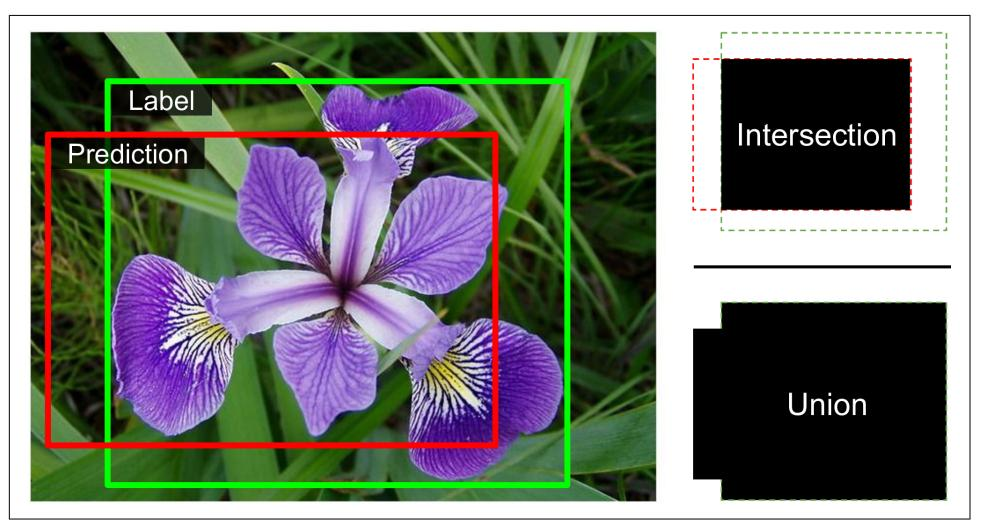

Figure 14-24. IoU metric for bounding boxes

{550}------------------------------------------------

### **Object Detection**

The task of classifying and localizing multiple objects in an image is called *object* detection. Until a few years ago, a common approach was to take a CNN that was trained to classify and locate a single object roughly centered in the image, then slide this CNN across the image and make predictions at each step. The CNN was generally trained to predict not only class probabilities and a bounding box, but also an *objectness score*: this is the estimated probability that the image does indeed contain an object centered near the middle. This is a binary classification output; it can be produced by a dense output layer with a single unit, using the sigmoid activation function and trained using the binary cross-entropy loss.


Instead of an objectness score, a "no-object" class was sometimes added, but in general this did not work as well: the questions "Is an object present?" and "What type of object is it?" are best answered separately.

This sliding-CNN approach is illustrated in Figure 14-25. In this example, the image was chopped into a  $5 \times 7$  grid, and we see a CNN—the thick black rectangle—sliding across all  $3 \times 3$  regions and making predictions at each step.

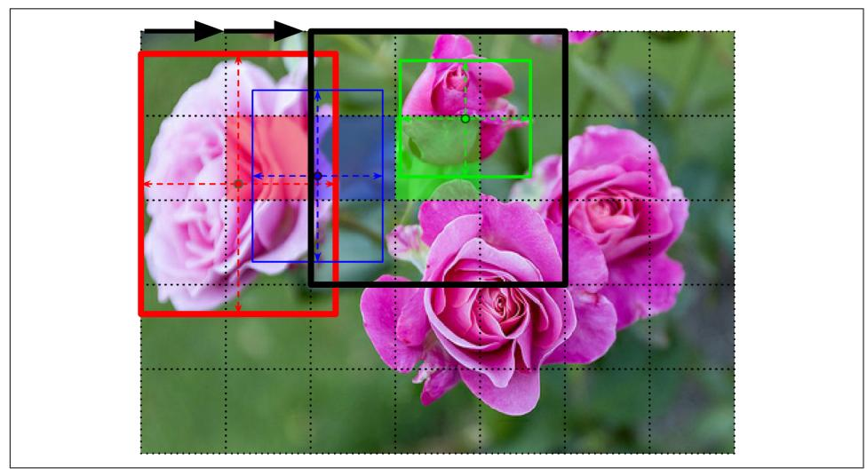

Figure 14-25. Detecting multiple objects by sliding a CNN across the image

{551}------------------------------------------------

In this figure, the CNN has already made predictions for three of these  $3 \times 3$  regions:

- When looking at the top-left  $3 \times 3$  region (centered on the red-shaded grid cell located in the second row and second column), it detected the leftmost rose. Notice that the predicted bounding box exceeds the boundary of this  $3 \times 3$ region. That's absolutely fine: even though the CNN could not see the bottom part of the rose, it was able to make a reasonable guess as to where it might be. It also predicted class probabilities, giving a high probability to the "rose" class. Lastly, it predicted a fairly high objectness score, since the center of the bounding box lies within the central grid cell (in this figure, the objectness score is represented by the thickness of the bounding box).
- When looking at the next  $3 \times 3$  region, one grid cell to the right (centered on the shaded blue square), it did not detect any flower centered in that region, so it predicted a very low objectness score; therefore, the predicted bounding box and class probabilities can safely be ignored. You can see that the predicted bounding box was no good anyway.
- finally, when looking at the next  $3 \times 3$  region, again one grid cell to the right (centered on the shaded green cell), it detected the rose at the top, although not perfectly: this rose is not well centered within this region, so the predicted objectness score was not very high.

You can imagine how sliding the CNN across the whole image would give you a total of 15 predicted bounding boxes, organized in a  $3 \times 5$  grid, with each bounding box accompanied by its estimated class probabilities and objectness score. Since objects can have varying sizes, you may then want to slide the CNN again across larger  $4 \times 4$ regions as well, to get even more bounding boxes.

This technique is fairly straightforward, but as you can see it will often detect the same object multiple times, at slightly different positions. Some postprocessing is needed to get rid of all the unnecessary bounding boxes. A common approach for this is called non-max suppression. Here's how it works:

- 1. First, get rid of all the bounding boxes for which the objectness score is below some threshold: since the CNN believes there's no object at that location, the bounding box is useless.
- 2. Find the remaining bounding box with the highest objectness score, and get rid of all the other remaining bounding boxes that overlap a lot with it (e.g., with an IoU greater than 60%). For example, in Figure 14-25, the bounding box with the max objectness score is the thick bounding box over the leftmost rose. The other bounding box that touches this same rose overlaps a lot with the max bounding box, so we will get rid of it (although in this example it would already have been removed in the previous step).

{552}------------------------------------------------

3. Repeat step 2 until there are no more bounding boxes to get rid of.

This simple approach to object detection works pretty well, but it requires running the CNN many times (15 times in this example), so it is quite slow. Fortunately, there is a much faster way to slide a CNN across an image: using a fully convolutional *network* (FCN).

#### **Fully Convolutional Networks**

The idea of FCNs was first introduced in a 2015 paper<sup>30</sup> by Jonathan Long et al., for semantic segmentation (the task of classifying every pixel in an image according to the class of the object it belongs to). The authors pointed out that you could replace the dense layers at the top of a CNN with convolutional layers. To understand this, let's look at an example: suppose a dense layer with 200 neurons sits on top of a convolutional layer that outputs 100 feature maps, each of size  $7 \times 7$  (this is the feature map size, not the kernel size). Each neuron will compute a weighted sum of all 100  $\times$  7  $\times$  7 activations from the convolutional layer (plus a bias term). Now let's see what happens if we replace the dense layer with a convolutional layer using 200 filters, each of size  $7 \times 7$ , and with "valid" padding. This layer will output 200 feature maps, each  $1 \times 1$  (since the kernel is exactly the size of the input feature maps and we are using "valid" padding). In other words, it will output 200 numbers, just like the dense layer did; and if you look closely at the computations performed by a convolutional layer, you will notice that these numbers will be precisely the same as those the dense layer produced. The only difference is that the dense layer's output was a tensor of shape [batch size, 200], while the convolutional layer will output a tensor of shape [batch size, 1, 1, 200].


To convert a dense layer to a convolutional layer, the number of filters in the convolutional layer must be equal to the number of units in the dense layer, the filter size must be equal to the size of the input feature maps, and you must use "valid" padding. The stride may be set to 1 or more, as you will see shortly.

Why is this important? Well, while a dense layer expects a specific input size (since it has one weight per input feature), a convolutional layer will happily process images of any size<sup>31</sup> (however, it does expect its inputs to have a specific number of channels, since each kernel contains a different set of weights for each input channel). Since

<sup>30</sup> Jonathan Long et al., "Fully Convolutional Networks for Semantic Segmentation", Proceedings of the IEEE Conference on Computer Vision and Pattern Recognition (2015): 3431-3440.

<sup>31</sup> There is one small exception: a convolutional layer using "valid" padding will complain if the input size is smaller than the kernel size.

{553}------------------------------------------------

an FCN contains only convolutional layers (and pooling layers, which have the same property), it can be trained and executed on images of any size!

For example, suppose we'd already trained a CNN for flower classification and localization. It was trained on  $224 \times 224$  images, and it outputs 10 numbers:

- Outputs 0 to 4 are sent through the softmax activation function, and this gives the class probabilities (one per class).
- Output 5 is sent through the sigmoid activation function, and this gives the objectness score.
- Outputs 6 and 7 represent the bounding box's center coordinates; they also go through a sigmoid activation function to ensure they range from 0 to 1.
- Lastly, outputs 8 and 9 represent the bounding box's height and width; they do not go through any activation function to allow the bounding boxes to extend beyond the borders of the image.

We can now convert the CNN's dense layers to convolutional layers. In fact, we don't even need to retrain it; we can just copy the weights from the dense layers to the convolutional layers! Alternatively, we could have converted the CNN into an FCN before training.

Now suppose the last convolutional layer before the output layer (also called the bottleneck layer) outputs  $7 \times 7$  feature maps when the network is fed a 224  $\times$  224 image (see the left side of Figure 14-26). If we feed the FCN a 448  $\times$  448 image (see the right side of Figure 14-26), the bottleneck layer will now output  $14 \times 14$ feature maps.<sup>32</sup> Since the dense output layer was replaced by a convolutional layer using 10 filters of size  $7 \times 7$ , with "valid" padding and stride 1, the output will be composed of 10 features maps, each of size  $8 \times 8$  (since  $14 - 7 + 1 = 8$ ). In other words, the FCN will process the whole image only once, and it will output an  $8 \times$ 8 grid where each cell contains 10 numbers (5 class probabilities, 1 objectness score, and 4 bounding box coordinates). It's exactly like taking the original CNN and sliding it across the image using 8 steps per row and 8 steps per column. To visualize this, imagine chopping the original image into a  $14 \times 14$  grid, then sliding a  $7 \times 7$  window across this grid; there will be  $8 \times 8 = 64$  possible locations for the window, hence  $8 \times$ 8 predictions. However, the FCN approach is *much* more efficient, since the network only looks at the image once. In fact, You Only Look Once (YOLO) is the name of a very popular object detection architecture, which we'll look at next.

<sup>32</sup> This assumes we used only "same" padding in the network: "valid" padding would reduce the size of the feature maps. Moreover, 448 can be neatly divided by 2 several times until we reach 7, without any rounding error. If any layer uses a different stride than 1 or 2, then there may be some rounding error, so again the feature maps may end up being smaller.

{554}------------------------------------------------

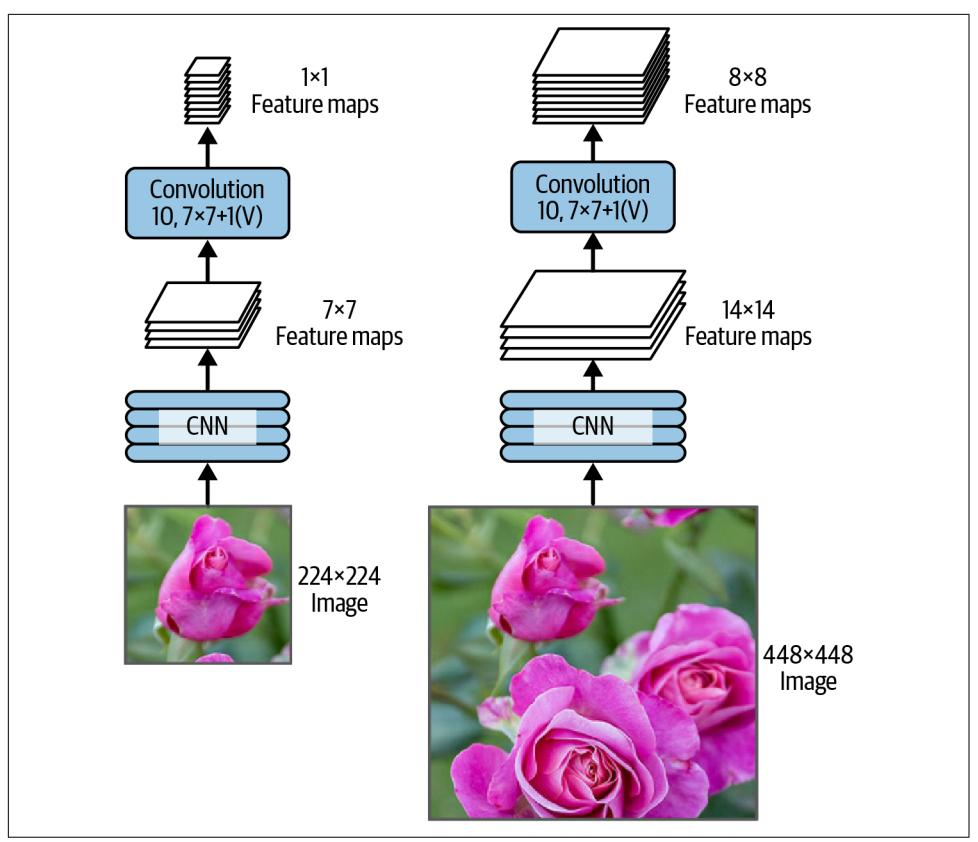

Figure 14-26. The same fully convolutional network processing a small image (left) and a large one (right)

### **You Only Look Once**

YOLO is a fast and accurate object detection architecture proposed by Joseph Redmon et al. in a 2015 paper.<sup>33</sup> It is so fast that it can run in real time on a video, as seen in Redmon's demo. YOLO's architecture is quite similar to the one we just discussed, but with a few important differences:

• For each grid cell, YOLO only considers objects whose bounding box center lies within that cell. The bounding box coordinates are relative to that cell, where  $(0, 0)$  means the top-left corner of the cell and  $(1, 1)$  means the bottom right. However, the bounding box's height and width may extend well beyond the cell.

<sup>33</sup> Joseph Redmon et al., "You Only Look Once: Unified, Real-Time Object Detection", Proceedings of the IEEE Conference on Computer Vision and Pattern Recognition (2016): 779-788.

{555}------------------------------------------------

- It outputs two bounding boxes for each grid cell (instead of just one), which allows the model to handle cases where two objects are so close to each other that their bounding box centers lie within the same cell. Each bounding box also comes with its own objectness score.
- YOLO also outputs a class probability distribution for each grid cell, predicting 20 class probabilities per grid cell since YOLO was trained on the PASCAL VOC dataset, which contains 20 classes. This produces a coarse class probability map. Note that the model predicts one class probability distribution per grid cell, not per bounding box. However, it's possible to estimate class probabilities for each bounding box during postprocessing, by measuring how well each bounding box matches each class in the class probability map. For example, imagine a picture of a person standing in front of a car. There will be two bounding boxes: one large horizontal one for the car, and a smaller vertical one for the person. These bounding boxes may have their centers within the same grid cell. So how can we tell which class should be assigned to each bounding box? Well, the class probability map will contain a large region where the "car" class is dominant, and inside it there will be a smaller region where the "person" class is dominant. Hopefully, the car's bounding box will roughly match the "car" region, while the person's bounding box will roughly match the "person" region: this will allow the correct class to be assigned to each bounding box.

YOLO was originally developed using Darknet, an open source deep learning framework initially developed in C by Joseph Redmon, but it was soon ported to Tensor-Flow, Keras, PyTorch, and more. It was continuously improved over the years, with YOLOv2, YOLOv3, and YOLO9000 (again by Joseph Redmon et al.), YOLOv4 (by Alexey Bochkovskiy et al.), YOLOv5 (by Glenn Jocher), and PP-YOLO (by Xiang Long et al.).

Each version brought some impressive improvements in speed and accuracy, using a variety of techniques; for example, YOLOv3 boosted accuracy in part thanks to *anchor priors*, exploiting the fact that some bounding box shapes are more likely than others, depending on the class (e.g., people tend to have vertical bounding boxes, while cars usually don't). They also increased the number of bounding boxes per grid cell, they trained on different datasets with many more classes (up to 9,000 classes organized in a hierarchy in the case of YOLO9000), they added skip connections to recover some of the spatial resolution that is lost in the CNN (we will discuss this shortly, when we look at semantic segmentation), and much more. There are many variants of these models too, such as YOLOv4-tiny, which is optimized to be trained on less powerful machines and which can run extremely fast (at over 1,000 frames per second!), but with a slightly lower mean average precision (mAP).

{556}------------------------------------------------

#### **Mean Average Precision**

A very common metric used in object detection tasks is the mean average precision. "Mean average" sounds a bit redundant, doesn't it? To understand this metric, let's go back to two classification metrics we discussed in Chapter 3: precision and recall. Remember the trade-off: the higher the recall, the lower the precision. You can visualize this in a precision/recall curve (see Figure 3-6). To summarize this curve into a single number, we could compute its area under the curve (AUC). But note that the precision/recall curve may contain a few sections where precision actually goes up when recall increases, especially at low recall values (you can see this at the top left of Figure 3-6). This is one of the motivations for the mAP metric.

Suppose the classifier has 90% precision at 10% recall, but 96% precision at 20% recall. There's really no trade-off here: it simply makes more sense to use the classifier at 20% recall rather than at 10% recall, as you will get both higher recall and higher precision. So instead of looking at the precision at 10% recall, we should really be looking at the *maximum* precision that the classifier can offer with *at least* 10% recall. It would be 96%, not 90%. Therefore, one way to get a fair idea of the model's performance is to compute the maximum precision you can get with at least 0% recall, then 10% recall, 20%, and so on up to 100%, and then calculate the mean of these maximum precisions. This is called the *average precision* (AP) metric. Now when there are more than two classes, we can compute the AP for each class, and then compute the mean AP (mAP). That's it!

In an object detection system, there is an additional level of complexity: what if the system detected the correct class, but at the wrong location (i.e., the bounding box is completely off)? Surely we should not count this as a positive prediction. One approach is to define an IoU threshold: for example, we may consider that a prediction is correct only if the IoU is greater than, say, 0.5, and the predicted class is correct. The corresponding mAP is generally noted mAP@0.5 (or mAP@50%, or sometimes just  $AP_{50}$ ). In some competitions (such as the PASCAL VOC challenge), this is what is done. In others (such as the COCO competition), the mAP is computed for different IoU thresholds (0.50, 0.55, 0.60, ..., 0.95), and the final metric is the mean of all these mAPs (noted mAP@[.50:.95] or mAP@[.50:0.05:.95]). Yes, that's a mean mean average.

{557}------------------------------------------------

Many object detection models are available on TensorFlow Hub, often with pretrained weights, such as YOLOv5,<sup>34</sup> SSD,<sup>35</sup> Faster R-CNN,<sup>36</sup> and EfficentDet.<sup>37</sup>

SSD and EfficientDet are "look once" detection models, similar to YOLO. Efficient-Det is based on the EfficientNet convolutional architecture. Faster R-CNN is more complex: the image first goes through a CNN, then the output is passed to a region *proposal network* (RPN) that proposes bounding boxes that are most likely to contain an object; a classifier is then run for each bounding box, based on the cropped output of the CNN. The best place to start using these models is TensorFlow Hub's excellent object detection tutorial.

So far, we've only considered detecting objects in single images. But what about videos? Objects must not only be detected in each frame, they must also be tracked over time. Let's take a quick look at object tracking now.

### **Object Tracking**

Object tracking is a challenging task: objects move, they may grow or shrink as they get closer to or further away from the camera, their appearance may change as they turn around or move to different lighting conditions or backgrounds, they may be temporarily occluded by other objects, and so on.

One of the most popular object tracking systems is DeepSORT.<sup>38</sup> It is based on a combination of classical algorithms and deep learning:

- It uses Kalman filters to estimate the most likely current position of an object given prior detections, and assuming that objects tend to move at a constant speed.
- It uses a deep learning model to measure the resemblance between new detections and existing tracked objects.

- 36 Shaoqing Ren et al., "Faster R-CNN: Towards Real-Time Object Detection with Region Proposal Networks", Proceedings of the 28th International Conference on Neural Information Processing Systems 1 (2015): 91-99.
- 37 Mingxing Tan et al., "EfficientDet: Scalable and Efficient Object Detection", arXiv preprint arXiv:1911.09070  $(2019).$

<sup>34</sup> You can find YOLOv3, YOLOv4, and their tiny variants in the TensorFlow Models project at https://homl.info/ *yolotf* 

<sup>35</sup> Wei Liu et al., "SSD: Single Shot Multibox Detector", Proceedings of the 14th European Conference on Computer Vision 1 (2016): 21-37.

<sup>38</sup> Nicolai Wojke et al., "Simple Online and Realtime Tracking with a Deep Association Metric", arXiv preprint arXiv:1703.07402 (2017).

{558}------------------------------------------------

• Lastly, it uses the *Hungarian algorithm* to map new detections to existing tracked objects (or to new tracked objects): this algorithm efficiently finds the combination of mappings that minimizes the distance between the detections and the predicted positions of tracked objects, while also minimizing the appearance discrepancy.

For example, imagine a red ball that just bounced off a blue ball traveling in the opposite direction. Based on the previous positions of the balls, the Kalman filter will predict that the balls will go through each other: indeed, it assumes that objects move at a constant speed, so it will not expect the bounce. If the Hungarian algorithm only considered positions, then it would happily map the new detections to the wrong balls, as if they had just gone through each other and swapped colors. But thanks to the resemblance measure, the Hungarian algorithm will notice the problem. Assuming the balls are not too similar, the algorithm will map the new detections to the correct balls.


There are a few DeepSORT implementations available on GitHub, including a TensorFlow implementation of YOLOv4 + DeepSORT: https://github.com/theAIGuysCode/yolov4-deepsort.

So far we have located objects using bounding boxes. This is often sufficient, but sometimes you need to locate objects with much more precision—for example, to remove the background behind a person during a videoconference call. Let's see how to go down to the pixel level.

### **Semantic Segmentation**

In semantic segmentation, each pixel is classified according to the class of the object it belongs to (e.g., road, car, pedestrian, building, etc.), as shown in Figure 14-27. Note that different objects of the same class are not distinguished. For example, all the bicycles on the right side of the segmented image end up as one big lump of pixels. The main difficulty in this task is that when images go through a regular CNN, they gradually lose their spatial resolution (due to the layers with strides greater than 1); so, a regular CNN may end up knowing that there's a person somewhere in the bottom left of the image, but it will not be much more precise than that.

{559}------------------------------------------------

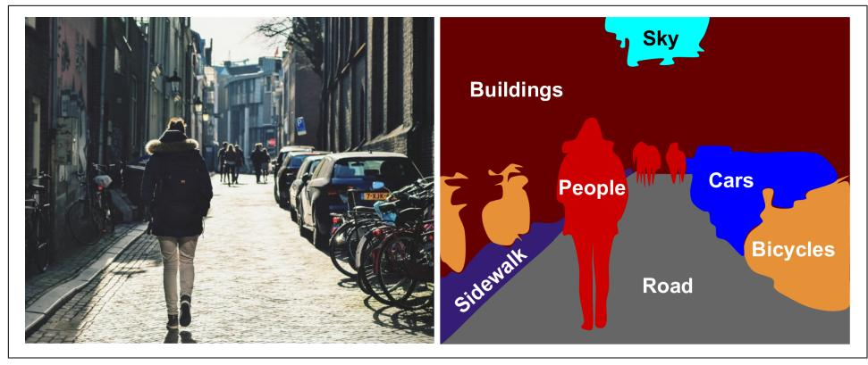

Figure 14-27. Semantic segmentation

Just like for object detection, there are many different approaches to tackle this problem, some quite complex. However, a fairly simple solution was proposed in the 2015 paper by Jonathan Long et al. I mentioned earlier, on fully convolutional networks. The authors start by taking a pretrained CNN and turning it into an FCN. The CNN applies an overall stride of 32 to the input image (i.e., if you add up all the strides greater than 1), meaning the last layer outputs feature maps that are 32 times smaller than the input image. This is clearly too coarse, so they added a single *upsampling layer that multiplies the resolution by 32.* 

There are several solutions available for upsampling (increasing the size of an image), such as bilinear interpolation, but that only works reasonably well up to  $\times$ 4 or  $\times$ 8. Instead, they use a *transposed convolutional layer*<sup>39</sup> this is equivalent to first stretching the image by inserting empty rows and columns (full of zeros), then performing a regular convolution (see Figure 14-28). Alternatively, some people prefer to think of it as a regular convolutional layer that uses fractional strides (e.g., the stride is  $1/2$ in Figure 14-28). The transposed convolutional layer can be initialized to perform something close to linear interpolation, but since it is a trainable layer, it will learn to do better during training. In Keras, you can use the Conv2DTranspose layer.


In a transposed convolutional layer, the stride defines how much the input will be stretched, not the size of the filter steps, so the larger the stride, the larger the output (unlike for convolutional layers or pooling layers).

<sup>39</sup> This type of layer is sometimes referred to as a *deconvolution layer*, but it does not perform what mathematicians call a deconvolution, so this name should be avoided.

{560}------------------------------------------------

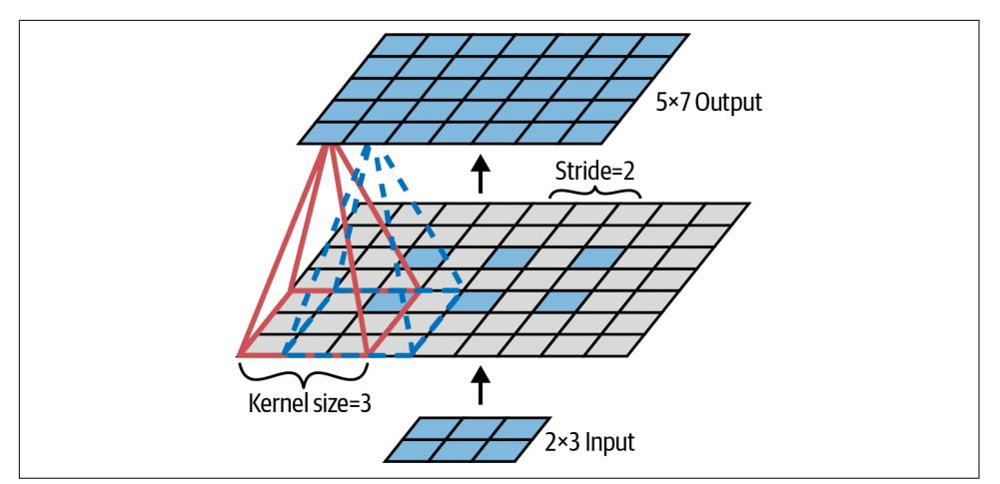

Figure 14-28. Upsampling using a transposed convolutional layer

#### **Other Keras Convolutional Layers** Keras also offers a few other kinds of convolutional layers: tf.keras.lavers.Conv1D A convolutional layer for 1D inputs, such as time series or text (sequences of letters or words), as you will see in Chapter 15. tf.keras.lavers.Conv3D A convolutional layer for 3D inputs, such as 3D PET scans. dilation rate Setting the dilation\_rate hyperparameter of any convolutional layer to a value of 2 or more creates an $\dot{a}$ -trous convolutional layer ("à trous" is French for "with holes"). This is equivalent to using a regular convolutional layer with a filter dilated by inserting rows and columns of zeros (i.e., holes). For example, a $1 \times$ 3 filter equal to [[1,2,3]] may be dilated with a *dilation rate* of 4, resulting in a dilated filter of $[1, 0, 0, 0, 2, 0, 0, 0, 3]$ . This lets the convolutional layer have a larger receptive field at no computational price and using no extra parameters.

Using transposed convolutional layers for upsampling is OK, but still too imprecise. To do better, Long et al. added skip connections from lower layers: for example, they upsampled the output image by a factor of 2 (instead of 32), and they added the output of a lower layer that had this double resolution. Then they upsampled the result by a factor of 16, leading to a total upsampling factor of 32 (see Figure 14-29). This recovered some of the spatial resolution that was lost in earlier pooling layers.

{561}------------------------------------------------

In their best architecture, they used a second similar skip connection to recover even finer details from an even lower layer. In short, the output of the original CNN goes through the following extra steps: upsample  $\times 2$ , add the output of a lower layer (of the appropriate scale), upsample  $\times$ 2, add the output of an even lower layer, and finally upsample  $\times$ 8. It is even possible to scale up beyond the size of the original image: this can be used to increase the resolution of an image, which is a technique called super-resolution.

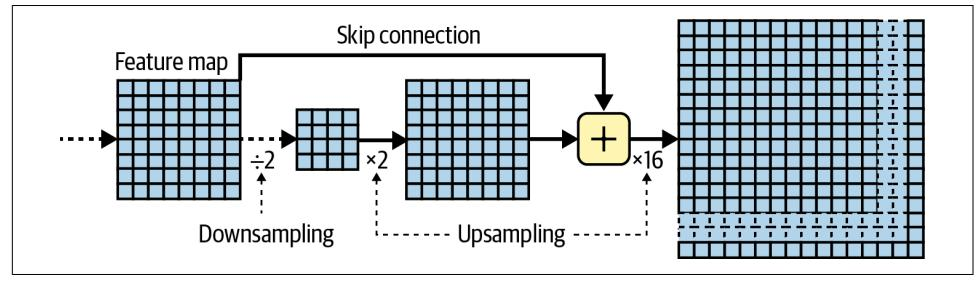

Figure 14-29. Skip layers recover some spatial resolution from lower layers

*Instance segmentation* is similar to semantic segmentation, but instead of merging all objects of the same class into one big lump, each object is distinguished from the others (e.g., it identifies each individual bicycle). For example the Mask R-CNN architecture, proposed in a 2017 paper<sup>40</sup> by Kaiming He et al., extends the Faster R-CNN model by additionally producing a pixel mask for each bounding box. So, not only do you get a bounding box around each object, with a set of estimated class probabilities, but you also get a pixel mask that locates pixels in the bounding box that belong to the object. This model is available on TensorFlow Hub, pretrained on the COCO 2017 dataset. The field is moving fast, though so if you want to try the latest and greatest models, please check out the state-of-the-art section of https:// paperswithcode.com.

As you can see, the field of deep computer vision is vast and fast-paced, with all sorts of architectures popping up every year. Almost all of them are based on convolutional neural networks, but since 2020 another neural net architecture has entered the computer vision space: transformers (which we will discuss in Chapter 16). The progress made over the last decade has been astounding, and researchers are now focusing on harder and harder problems, such as *adversarial learning* (which attempts to make the network more resistant to images designed to fool it), explainability (understanding why the network makes a specific classification), realistic *image gen*eration (which we will come back to in Chapter 17), single-shot learning (a system that

<sup>40</sup> Kaiming He et al., "Mask R-CNN", arXiv preprint arXiv:1703.06870 (2017).

{562}------------------------------------------------

can recognize an object after it has seen it just once), predicting the next frames in a video, combining text and image tasks, and more.

Now on to the next chapter, where we will look at how to process sequential data such as time series using recurrent neural networks and convolutional neural networks.

### **Fxercises**

- 1. What are the advantages of a CNN over a fully connected DNN for image classification?
- 2. Consider a CNN composed of three convolutional layers, each with  $3 \times 3$  kernels, a stride of 2, and "same" padding. The lowest layer outputs 100 feature maps, the middle one outputs 200, and the top one outputs 400. The input images are RGB images of  $200 \times 300$  pixels:
  - a. What is the total number of parameters in the CNN?
  - b. If we are using 32-bit floats, at least how much RAM will this network require when making a prediction for a single instance?
  - c. What about when training on a mini-batch of 50 images?
- 3. If your GPU runs out of memory while training a CNN, what are five things you could try to solve the problem?
- 4. Why would you want to add a max pooling layer rather than a convolutional layer with the same stride?
- 5. When would you want to add a local response normalization layer?
- 6. Can you name the main innovations in AlexNet, as compared to LeNet-5? What about the main innovations in GoogLeNet, ResNet, SENet, Xception, and EfficientNet?
- 7. What is a fully convolutional network? How can you convert a dense layer into a convolutional layer?
- 8. What is the main technical difficulty of semantic segmentation?
- 9. Build your own CNN from scratch and try to achieve the highest possible accuracy on MNIST.
- 10. Use transfer learning for large image classification, going through these steps:
  - a. Create a training set containing at least 100 images per class. For example, you could classify your own pictures based on the location (beach, mountain, city, etc.), or alternatively you can use an existing dataset (e.g., from TensorFlow Datasets).
  - **b.** Split it into a training set, a validation set, and a test set.

{563}------------------------------------------------

- c. Build the input pipeline, apply the appropriate preprocessing operations, and optionally add data augmentation.
- d. Fine-tune a pretrained model on this dataset.
- 11. Go through TensorFlow's Style Transfer tutorial. This is a fun way to generate art using deep learning.

Solutions to these exercises are available at the end of this chapter's notebook, at https://homl.info/colab3.

{564}------------------------------------------------
