## **CHAPTER 14 Deep Computer Vision Using Convolutional Neural Networks**

## **第14章 使用卷积神经网络的深度计算机视觉**

Although IBM's Deep Blue supercomputer beat the chess world champion Garry Kasparov back in 1996, it wasn't until fairly recently that computers were able to reliably perform seemingly trivial tasks such as detecting a puppy in a picture or recognizing spoken words. Why are these tasks so effortless to us humans? The answer lies in the fact that perception largely takes place outside the realm of our consciousness, within specialized visual, auditory, and other sensory modules in our brains. By the time sensory information reaches our consciousness, it is already adorned with high-level features; for example, when you look at a picture of a cute puppy, you cannot choose *not* to see the puppy, *not* to notice its cuteness. Nor can you explain how you recognize a cute puppy; it's just obvious to you. Thus, we cannot trust our subjective experience: perception is not trivial at all, and to understand it we must look at how our sensory modules work.

尽管IBM的深蓝超级计算机早在1996年就击败了国际象棋世界冠军加里·卡斯帕罗夫，但直到最近，计算机才能够可靠地执行看似微不足道的任务，如在图片中检测小狗或识别语音。为什么这些任务对我们人类来说如此轻松？答案在于感知很大程度上发生在我们意识领域之外，在我们大脑中专门的视觉、听觉和其他感官模块内。当感官信息到达我们的意识时，它已经被装饰上了高级特征；例如，当你看到一张可爱小狗的图片时，你无法选择*不*看到小狗，*不*注意到它的可爱。你也无法解释你是如何识别可爱小狗的；这对你来说是显而易见的。因此，我们不能相信我们的主观体验：感知一点也不简单，要理解它，我们必须看看我们的感官模块是如何工作的。

Convolutional neural networks (CNNs) emerged from the study of the brain's visual cortex, and they have been used in computer image recognition since the 1980s. Over the last 10 years, thanks to the increase in computational power, the amount of available training data, and the tricks presented in Chapter 11 for training deep nets, CNNs have managed to achieve superhuman performance on some complex visual tasks. They power image search services, self-driving cars, automatic video classification systems, and more. Moreover, CNNs are not restricted to visual perception: they are also successful at many other tasks, such as voice recognition and natural language processing. However, we will focus on visual applications for now.

卷积神经网络（CNNs）源于对大脑视觉皮层的研究，自1980年代以来一直用于计算机图像识别。在过去的10年中，由于计算能力的增加、可用训练数据的数量以及第11章中介绍的训练深度网络的技巧，CNNs在一些复杂的视觉任务上取得了超人的性能。它们为图像搜索服务、自动驾驶汽车、自动视频分类系统等提供动力。此外，CNNs不仅限于视觉感知：它们在许多其他任务上也很成功，如语音识别和自然语言处理。然而，我们现在将专注于视觉应用。

{507}------------------------------------------------

In this chapter we will explore where CNNs came from, what their building blocks look like, and how to implement them using Keras. Then we will discuss some of the best CNN architectures, as well as other visual tasks, including object detection (classifying multiple objects in an image and placing bounding boxes around them) and semantic segmentation (classifying each pixel according to the class of the object it belongs to).

在本章中，我们将探索CNNs的来源、它们的构建块是什么样的，以及如何使用Keras实现它们。然后我们将讨论一些最佳的CNN架构，以及其他视觉任务，包括目标检测（对图像中的多个对象进行分类并在它们周围放置边界框）和语义分割（根据像素所属对象的类别对每个像素进行分类）。

### The Architecture of the Visual Cortex

### 视觉皮层的架构

David H. Hubel and Torsten Wiesel performed a series of experiments on cats in  $1958<sup>1</sup>$  and  $1959<sup>2</sup>$  (and a few years later on monkeys<sup>3</sup>), giving crucial insights into the structure of the visual cortex (the authors received the Nobel Prize in Physiology or Medicine in 1981 for their work). In particular, they showed that many neurons in the visual cortex have a small local receptive field, meaning they react only to visual stimuli located in a limited region of the visual field (see Figure 14-1, in which the local receptive fields of five neurons are represented by dashed circles). The receptive fields of different neurons may overlap, and together they tile the whole visual field.

David H. Hubel和Torsten Wiesel在1958年<sup>1</sup>和1959年<sup>2</sup>对猫进行了一系列实验（几年后又对猴子进行了实验<sup>3</sup>），为视觉皮层的结构提供了关键见解（作者因其工作在1981年获得了诺贝尔生理学或医学奖）。特别是，他们表明视觉皮层中的许多神经元具有小的局部感受野，这意味着它们只对位于视野有限区域内的视觉刺激做出反应（见图14-1，其中五个神经元的局部感受野用虚线圆圈表示）。不同神经元的感受野可能重叠，它们一起覆盖整个视野。

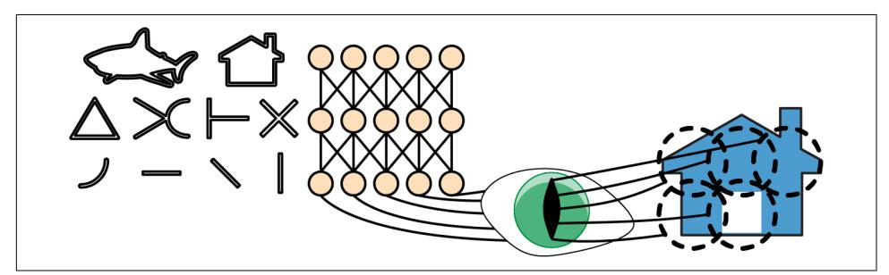

Figure 14-1. Biological neurons in the visual cortex respond to specific patterns in small regions of the visual field called receptive fields; as the visual signal makes its way through consecutive brain modules, neurons respond to more complex patterns in larger receptive fields

图14-1. 视觉皮层中的生物神经元对称为感受野的视野小区域中的特定模式做出反应；当视觉信号通过连续的大脑模块时，神经元对更大感受野中更复杂的模式做出反应

<sup>1</sup> David H. Hubel, "Single Unit Activity in Striate Cortex of Unrestrained Cats", The Journal of Physiology 147  $(1959): 226 - 238.$ 

<sup>2</sup> David H. Hubel and Torsten N. Wiesel, "Receptive Fields of Single Neurons in the Cat's Striate Cortex", The Journal of Physiology 148 (1959): 574-591.

<sup>3</sup> David H. Hubel and Torsten N. Wiesel, "Receptive Fields and Functional Architecture of Monkey Striate Cortex", The Journal of Physiology 195 (1968): 215-243.

{508}------------------------------------------------

Moreover, the authors showed that some neurons react only to images of horizontal lines, while others react only to lines with different orientations (two neurons may have the same receptive field but react to different line orientations). They also noticed that some neurons have larger receptive fields, and they react to more complex patterns that are combinations of the lower-level patterns. These observations led to the idea that the higher-level neurons are based on the outputs of neighboring lower-level neurons (in Figure 14-1, notice that each neuron is connected only to nearby neurons from the previous layer). This powerful architecture is able to detect all sorts of complex patterns in any area of the visual field.

此外，作者表明一些神经元只对水平线的图像做出反应，而其他神经元只对不同方向的线做出反应（两个神经元可能具有相同的感受野，但对不同的线方向做出反应）。他们还注意到一些神经元具有更大的感受野，它们对更复杂的模式做出反应，这些模式是低级模式的组合。这些观察导致了这样的想法：高级神经元基于相邻低级神经元的输出（在图14-1中，注意每个神经元只连接到前一层的附近神经元）。这种强大的架构能够检测视野任何区域中的各种复杂模式。

These studies of the visual cortex inspired the neocognitron,<sup>4</sup> introduced in 1980, which gradually evolved into what we now call convolutional neural networks. An important milestone was a 1998 paper<sup>5</sup> by Yann LeCun et al. that introduced the famous LeNet-5 architecture, which became widely used by banks to recognize handwritten digits on checks. This architecture has some building blocks that you already know, such as fully connected layers and sigmoid activation functions, but it also introduces two new building blocks: convolutional layers and pooling layers. Let's look at them now.

这些对视觉皮层的研究启发了1980年引入的neocognitron<sup>4</sup>，它逐渐演变成我们现在所说的卷积神经网络。一个重要的里程碑是Yann LeCun等人1998年的论文<sup>5</sup>，该论文介绍了著名的LeNet-5架构，该架构被银行广泛用于识别支票上的手写数字。这种架构有一些你已经知道的构建块，如全连接层和sigmoid激活函数，但它也引入了两个新的构建块：卷积层和池化层。现在让我们来看看它们。


Why not simply use a deep neural network with fully connected layers for image recognition tasks? Unfortunately, although this works fine for small images (e.g., MNIST), it breaks down for larger images because of the huge number of parameters it requires. For example, a  $100 \times 100$ -pixel image has 10,000 pixels, and if the first layer has just 1,000 neurons (which already severely restricts the amount of information transmitted to the next layer), this means a total of 10 million connections. And that's just the first layer. CNNs solve this problem using partially connected layers and weight sharing.

为什么不简单地使用具有全连接层的深度神经网络来进行图像识别任务呢？不幸的是，虽然这对小图像（例如MNIST）效果很好，但对于较大的图像，由于需要大量参数而失效。例如，一个$100 \times 100$像素的图像有10,000个像素，如果第一层只有1,000个神经元（这已经严重限制了传输到下一层的信息量），这意味着总共有1000万个连接。而这仅仅是第一层。CNNs通过使用部分连接层和权重共享来解决这个问题。

### **Convolutional Layers**

### **卷积层**

The most important building block of a CNN is the *convolutional layer*.<sup>6</sup> neurons in the first convolutional layer are not connected to every single pixel in the input image (like they were in the layers discussed in previous chapters), but only to pixels in their

CNN最重要的构建块是*卷积层*。<sup>6</sup>第一个卷积层中的神经元不连接到输入图像中的每个像素（就像在前面章节讨论的层中那样），而只连接到它们的

<sup>4</sup> Kunihiko Fukushima, "Neocognitron: A Self-Organizing Neural Network Model for a Mechanism of Pattern Recognition Unaffected by Shift in Position", Biological Cybernetics 36 (1980): 193-202.

<sup>5</sup> Yann LeCun et al., "Gradient-Based Learning Applied to Document Recognition", Proceedings of the IEEE 86, no. 11 (1998): 2278-2324.

<sup>6</sup> A convolution is a mathematical operation that slides one function over another and measures the integral of their pointwise multiplication. It has deep connections with the Fourier transform and the Laplace transform and is heavily used in signal processing. Convolutional layers actually use cross-correlations, which are very similar to convolutions (see https://homl.info/76 for more details).

{509}------------------------------------------------

receptive fields (see Figure 14-2). In turn, each neuron in the second convolutional layer is connected only to neurons located within a small rectangle in the first layer. This architecture allows the network to concentrate on small low-level features in the first hidden layer, then assemble them into larger higher-level features in the next hidden layer, and so on. This hierarchical structure is common in real-world images, which is one of the reasons why CNNs work so well for image recognition.

感受野中的像素（见图14-2）。反过来，第二个卷积层中的每个神经元只连接到位于第一层中小矩形内的神经元。这种架构允许网络在第一个隐藏层中专注于小的低级特征，然后在下一个隐藏层中将它们组装成更大的高级特征，依此类推。这种分层结构在现实世界的图像中很常见，这是CNNs在图像识别方面表现如此出色的原因之一。

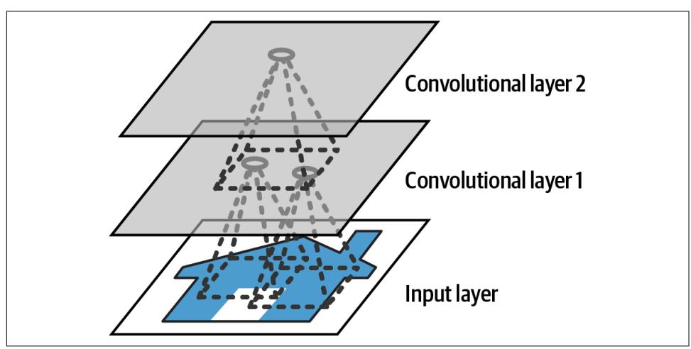

Figure 14-2. CNN layers with rectangular local receptive fields

图14-2. 具有矩形局部感受野的CNN层


All the multilayer neural networks we've looked at so far had layers composed of a long line of neurons, and we had to flatten input images to 1D before feeding them to the neural network. In a CNN each layer is represented in 2D, which makes it easier to match neurons with their corresponding inputs.

到目前为止，我们看到的所有多层神经网络都有由一长串神经元组成的层，我们必须在将输入图像馈送到神经网络之前将其展平为1D。在CNN中，每一层都以2D表示，这使得将神经元与其相应的输入匹配变得更容易。

A neuron located in row *i*, column *j* of a given layer is connected to the outputs of the neurons in the previous layer located in rows *i* to  $i + f_h - 1$ , columns *j* to  $j + f_w$ - 1, where  $f_h$  and  $f_w$  are the height and width of the receptive field (see Figure 14-3). In order for a layer to have the same height and width as the previous layer, it is common to add zeros around the inputs, as shown in the diagram. This is called zero padding.

位于给定层的第*i*行、第*j*列的神经元连接到前一层中位于第*i*行到$i + f_h - 1$行、第*j*列到$j + f_w - 1$列的神经元的输出，其中$f_h$和$f_w$是感受野的高度和宽度（见图14-3）。为了使一层具有与前一层相同的高度和宽度，通常在输入周围添加零，如图所示。这称为零填充。

It is also possible to connect a large input layer to a much smaller layer by spacing out the receptive fields, as shown in Figure 14-4. This dramatically reduces the model's computational complexity. The horizontal or vertical step size from one receptive field to the next is called the *stride*. In the diagram, a  $5 \times 7$  input layer (plus zero padding) is connected to a 3  $\times$  4 layer, using 3  $\times$  3 receptive fields and a stride of 2 (in this example the stride is the same in both directions, but it does not have to be so). A neuron located in row  $i$ , column  $j$  in the upper layer is connected to the outputs of the

也可以通过间隔感受野将大的输入层连接到小得多的层，如图14-4所示。这大大降低了模型的计算复杂性。从一个感受野到下一个感受野的水平或垂直步长称为*步长*。在图中，一个$5 \times 7$的输入层（加上零填充）连接到一个3$\times$4的层，使用3$\times$3的感受野和步长为2（在这个例子中，两个方向的步长相同，但不一定如此）。位于上层第$i$行、第$j$列的神经元连接到

{510}------------------------------------------------

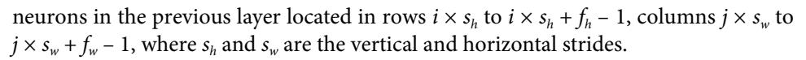

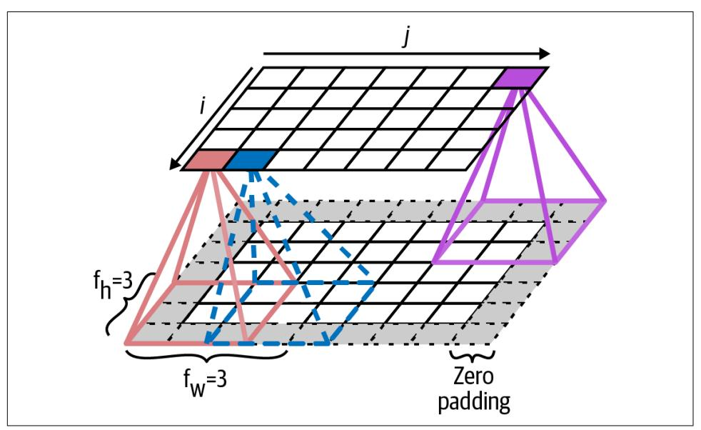

Figure 14-3. Connections between layers and zero padding

图14-3. 层之间的连接和零填充

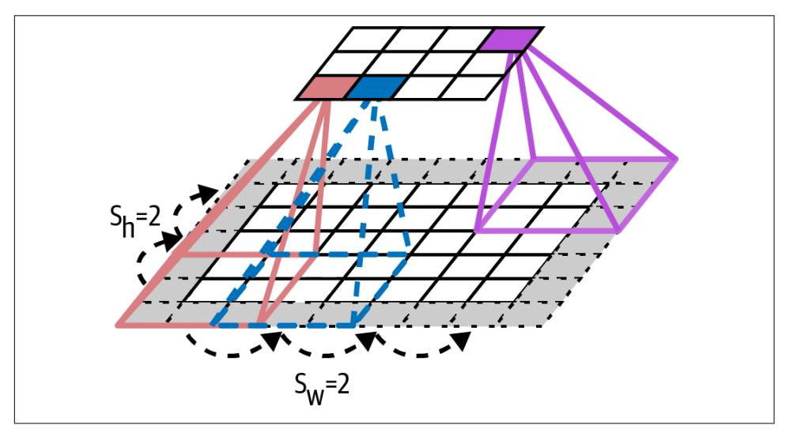

Figure 14-4. Reducing dimensionality using a stride of 2

图14-4. 使用步长为2来降低维度

{511}------------------------------------------------

### **Filters**

### **滤波器**

A neuron's weights can be represented as a small image the size of the receptive field. For example, Figure 14-5 shows two possible sets of weights, called *filters* (or convolution kernels, or just kernels). The first one is represented as a black square with a vertical white line in the middle (it's a  $7 \times 7$  matrix full of 0s except for the central column, which is full of 1s); neurons using these weights will ignore everything in their receptive field except for the central vertical line (since all inputs will be multiplied by 0, except for the ones in the central vertical line). The second filter is a black square with a horizontal white line in the middle. Neurons using these weights will ignore everything in their receptive field except for the central horizontal line.

神经元的权重可以表示为感受野大小的小图像。例如，图14-5显示了两组可能的权重，称为*滤波器*（或卷积核，或简称核）。第一个表示为中间有垂直白线的黑色正方形（这是一个$7 \times 7$的矩阵，除了中央列全为1之外，其余全为0）；使用这些权重的神经元将忽略其感受野中除中央垂直线之外的所有内容（因为所有输入都将乘以0，除了中央垂直线中的输入）。第二个滤波器是中间有水平白线的黑色正方形。使用这些权重的神经元将忽略其感受野中除中央水平线之外的所有内容。

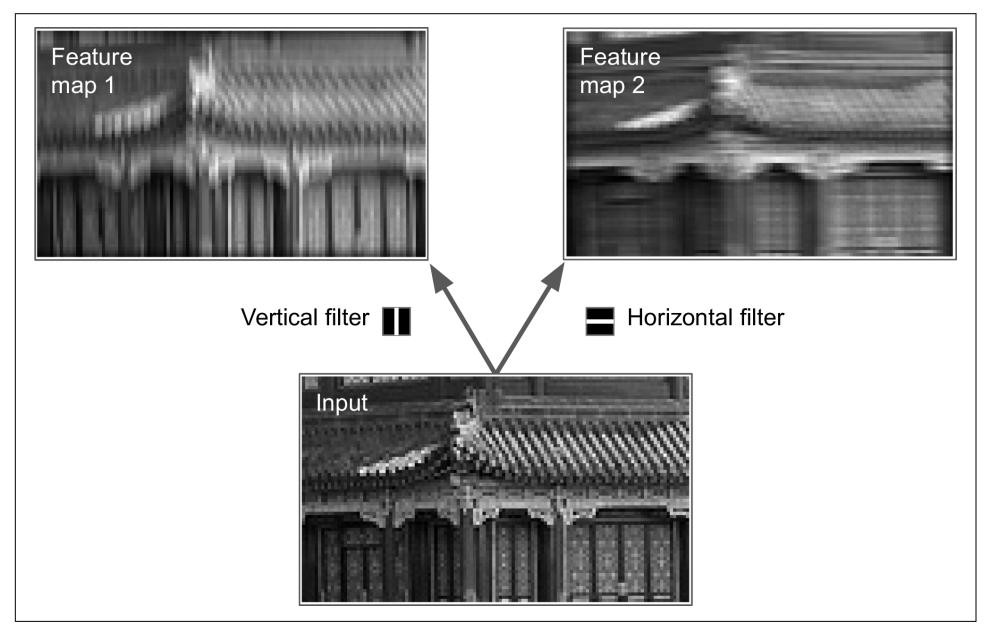

Figure 14-5. Applying two different filters to get two feature maps

图14-5. 应用两个不同的滤波器来获得两个特征图

Now if all neurons in a layer use the same vertical line filter (and the same bias term), and you feed the network the input image shown in Figure 14-5 (the bottom image), the layer will output the top-left image. Notice that the vertical white lines get enhanced while the rest gets blurred. Similarly, the upper-right image is what you get if all neurons use the same horizontal line filter; notice that the horizontal white lines get enhanced while the rest is blurred out. Thus, a layer full of neurons using the same filter outputs a *feature map*, which highlights the areas in an image that activate the filter the most. But don't worry, you won't have to define the filters manually: instead, during training the convolutional layer will automatically learn the most useful filters for its task, and the layers above will learn to combine them into more complex patterns.

现在，如果一层中的所有神经元都使用相同的垂直线滤波器（和相同的偏置项），并且你向网络输入图14-5中显示的输入图像（底部图像），该层将输出左上角的图像。注意垂直白线得到增强，而其余部分变得模糊。类似地，如果所有神经元都使用相同的水平线滤波器，你会得到右上角的图像；注意水平白线得到增强，而其余部分被模糊掉。因此，充满使用相同滤波器的神经元的层输出一个*特征图*，它突出显示图像中最能激活滤波器的区域。但不用担心，你不必手动定义滤波器：相反，在训练过程中，卷积层将自动学习对其任务最有用的滤波器，上面的层将学习将它们组合成更复杂的模式。

{512}------------------------------------------------

### **Stacking Multiple Feature Maps**

### **堆叠多个特征图**

Up to now, for simplicity, I have represented the output of each convolutional layer as a 2D layer, but in reality a convolutional layer has multiple filters (you decide how many) and outputs one feature map per filter, so it is more accurately represented in 3D (see Figure 14-6). It has one neuron per pixel in each feature map, and all neurons within a given feature map share the same parameters (*i.e.*, the same kernel and bias term). Neurons in different feature maps use different parameters. A neuron's receptive field is the same as described earlier, but it extends across all the feature maps of the previous layer. In short, a convolutional layer simultaneously applies multiple trainable filters to its inputs, making it capable of detecting multiple features anywhere in its inputs.

到目前为止，为了简单起见，我将每个卷积层的输出表示为2D层，但实际上卷积层有多个滤波器（你决定多少个）并且每个滤波器输出一个特征图，所以它更准确地表示为3D（见图14-6）。每个特征图中每个像素都有一个神经元，给定特征图内的所有神经元共享相同的参数（*即*，相同的核和偏置项）。不同特征图中的神经元使用不同的参数。神经元的感受野与前面描述的相同，但它延伸到前一层的所有特征图。简而言之，卷积层同时对其输入应用多个可训练的滤波器，使其能够在输入的任何地方检测多个特征。

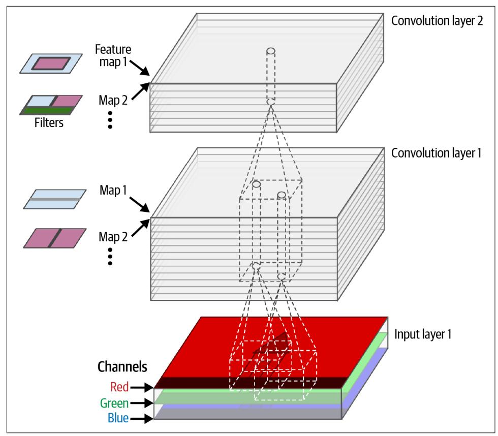

Figure 14-6. Two convolutional layers with multiple filters each (kernels), processing a color image with three color channels; each convolutional layer outputs one feature map per filter

图14-6. 两个卷积层，每个都有多个滤波器（核），处理具有三个颜色通道的彩色图像；每个卷积层每个滤波器输出一个特征图

{513}------------------------------------------------


The fact that all neurons in a feature map share the same parameters dramatically reduces the number of parameters in the model. Once the CNN has learned to recognize a pattern in one location, it can recognize it in any other location. In contrast, once a fully connected neural network has learned to recognize a pattern in one location, it can only recognize it in that particular location.

特征图中所有神经元共享相同参数这一事实大大减少了模型中的参数数量。一旦CNN学会在一个位置识别模式，它就可以在任何其他位置识别它。相比之下，一旦全连接神经网络学会在一个位置识别模式，它只能在那个特定位置识别它。

Input images are also composed of multiple sublayers: one per color channel. As mentioned in Chapter 9, there are typically three: red, green, and blue (RGB). Grayscale images have just one channel, but some images may have many more—for example, satellite images that capture extra light frequencies (such as infrared).

输入图像也由多个子层组成：每个颜色通道一个。如第9章所述，通常有三个：红色、绿色和蓝色（RGB）。灰度图像只有一个通道，但有些图像可能有更多——例如，捕获额外光频率（如红外线）的卫星图像。

Specifically, a neuron located in row *i*, column *j* of the feature map  $k$  in a given convolutional layer  $l$  is connected to the outputs of the neurons in the previous layer *l* – 1, located in rows  $i \times s_h$  to  $i \times s_h + f_h$  – 1 and columns  $j \times s_w$  to  $j \times s_w + f_w$  – 1, across all feature maps (in layer  $l - 1$ ). Note that, within a layer, all neurons located in the same row *i* and column *j* but in different feature maps are connected to the outputs of the exact same neurons in the previous layer.

具体来说，位于给定卷积层$l$的特征图$k$的第*i*行、第*j*列的神经元连接到前一层*l* – 1中位于第$i \times s_h$行到$i \times s_h + f_h$ – 1行、第$j \times s_w$列到$j \times s_w + f_w$ – 1列的神经元的输出，跨越所有特征图（在层$l - 1$中）。注意，在一层内，位于相同行*i*和列*j*但在不同特征图中的所有神经元都连接到前一层中完全相同的神经元的输出。

Equation 14-1 summarizes the preceding explanations in one big mathematical equation: it shows how to compute the output of a given neuron in a convolutional layer. It is a bit ugly due to all the different indices, but all it does is calculate the weighted sum of all the inputs, plus the bias term.

方程14-1用一个大的数学方程总结了前面的解释：它显示了如何计算卷积层中给定神经元的输出。由于所有不同的索引，它看起来有点复杂，但它所做的只是计算所有输入的加权和，加上偏置项。

Equation 14-1. Computing the output of a neuron in a convolutional layer

方程14-1. 计算卷积层中神经元的输出

$$
z_{i,j,k} = b_k + \sum_{u=0}^{f_h-1} \sum_{v=0}^{f_w-1} \sum_{k'=0}^{f_{n'}-1} x_{i',j',k'} \times w_{u,v,k',k} \quad \text{with } \begin{cases} i' = i \times s_h + u \\ j' = j \times s_w + v \end{cases}
$$

In this equation:

在这个方程中：

- $z_{i,j,k}$  is the output of the neuron located in row *i*, column *j* in feature map *k* of the convolutional layer (layer l).
- $z_{i,j,k}$是位于卷积层（层l）的特征图*k*的第*i*行、第*j*列的神经元的输出。
- As explained earlier,  $s_h$  and  $s_w$  are the vertical and horizontal strides,  $f_h$  and  $f_w$  are the height and width of the receptive field, and  $f_{n'}$  is the number of feature maps in the previous layer (layer  $l-1$ ).
- 如前所述，$s_h$和$s_w$是垂直和水平步长，$f_h$和$f_w$是感受野的高度和宽度，$f_{n'}$是前一层（层$l-1$）中特征图的数量。
- $x_{i,i,k}$  is the output of the neuron located in layer  $l-1$ , row i', column j', feature map  $k'$  (or channel  $k'$  if the previous layer is the input layer).
- $x_{i',j',k'}$是位于层$l-1$、第i'行、第j'列、特征图$k'$的神经元的输出（如果前一层是输入层，则为通道$k'$）。
- $b_k$  is the bias term for feature map  $k$  (in layer l). You can think of it as a knob that tweaks the overall brightness of the feature map k.
- $b_k$是特征图$k$（在层l中）的偏置项。你可以将其视为调整特征图k整体亮度的旋钮。

{514}------------------------------------------------

•  $W_{u,v,k',k}$  is the connection weight between any neuron in feature map k of the layer  $l$  and its input located at row  $u$ , column  $v$  (relative to the neuron's receptive field), and feature map  $k'$ .

• $W_{u,v,k',k}$是层$l$的特征图k中任何神经元与其位于第$u$行、第$v$列（相对于神经元的感受野）和特征图$k'$的输入之间的连接权重。

Let's see how to create and use a convolutional layer using Keras.

让我们看看如何使用Keras创建和使用卷积层。

### **Implementing Convolutional Layers with Keras**

### **使用Keras实现卷积层**

First, let's load and preprocess a couple of sample images, using Scikit-Learn's load\_sample\_image() function and Keras's CenterCrop and Rescaling layers (all of which were introduced in Chapter 13):

首先，让我们使用Scikit-Learn的load_sample_image()函数和Keras的CenterCrop和Rescaling层来加载和预处理几个示例图像（所有这些都在第13章中介绍过）：

```
from sklearn.datasets import load_sample_images
import tensorflow as tf
images = load_sample_images()["images"]
images = tf.keras.layers.CenterCrop(height=70, width=120)(images)
images = tf.keras. layers. Rescaling(scale=1 / 255)(images)
```

Let's look at the shape of the images tensor:

让我们看看图像张量的形状：

>>> images.shape TensorShape([2, 70, 120, 3])

Yikes, it's a 4D tensor; we haven't seen this before! What do all these dimensions mean? Well, there are two sample images, which explains the first dimension. Then each image is  $70 \times 120$ , since that's the size we specified when creating the Center Crop layer (the original images were  $427 \times 640$ ). This explains the second and third dimensions. And lastly, each pixel holds one value per color channel, and there are three of them—red, green, and blue—which explains the last dimension.

哇，这是一个4D张量；我们以前没有见过这个！所有这些维度意味着什么？嗯，有两个示例图像，这解释了第一个维度。然后每个图像是$70 \times 120$，因为这是我们在创建CenterCrop层时指定的大小（原始图像是$427 \times 640$）。这解释了第二和第三维度。最后，每个像素每个颜色通道保存一个值，有三个通道——红色、绿色和蓝色——这解释了最后一个维度。

Now let's create a 2D convolutional layer and feed it these images to see what comes out. For this, Keras provides a Convolution2D layer, alias Conv2D. Under the hood, this layer relies on TensorFlow's tf.nn.conv2d() operation. Let's create a convolutional layer with 32 filters, each of size  $7 \times 7$  (using kernel\_size=7, which is equivalent to using kernel\_size= $(7, 7)$ ), and apply this layer to our small batch of two images:

现在让我们创建一个2D卷积层并将这些图像输入其中，看看会输出什么。为此，Keras提供了一个Convolution2D层，别名为Conv2D。在底层，这个层依赖于TensorFlow的tf.nn.conv2d()操作。让我们创建一个有32个滤波器的卷积层，每个大小为$7 \times 7$（使用kernel_size=7，这等价于使用kernel_size=$(7, 7)$），并将这个层应用到我们的两个图像的小批次上：

```
conv_layer = tf.keras.layers.Conv2D(filters=32, kernel_size=7)
fmaps = conv_{\text{layer}}(images)
```


When we talk about a 2D convolutional layer, "2D" refers to the number of *spatial* dimensions (height and width), but as you can see, the layer takes 4D inputs: as we saw, the two additional dimensions are the batch size (first dimension) and the channels (last dimension).

当我们谈论2D卷积层时，"2D"指的是*空间*维度的数量（高度和宽度），但如你所见，该层接受4D输入：如我们所见，另外两个维度是批次大小（第一个维度）和通道（最后一个维度）。

{515}------------------------------------------------

Now let's look at the output's shape:

现在让我们看看输出的形状：

```
>>> fmaps.shape
TensorShape([2, 64, 114, 32])
```

The output shape is similar to the input shape, with two main differences. First, there are 32 channels instead of 3. This is because we set filters=32, so we get 32 output feature maps: instead of the intensity of red, green, and blue at each location, we now have the intensity of each feature at each location. Second, the height and width have both shrunk by 6 pixels. This is due to the fact that the Conv2D layer does not use any zero-padding by default, which means that we lose a few pixels on the sides of the output feature maps, depending on the size of the filters. In this case, since the kernel size is 7, we lose 6 pixels horizontally and 6 pixels vertically (i.e., 3 pixels on each side).

输出形状与输入形状相似，但有两个主要差异。首先，有32个通道而不是3个。这是因为我们设置了filters=32，所以我们得到32个输出特征图：不再是每个位置的红色、绿色和蓝色的强度，现在我们有每个位置每个特征的强度。其次，高度和宽度都缩小了6个像素。这是由于Conv2D层默认不使用任何零填充，这意味着我们在输出特征图的边缘会丢失一些像素，具体取决于滤波器的大小。在这种情况下，由于核大小为7，我们水平丢失6个像素，垂直丢失6个像素（即每边3个像素）。


The default option is surprisingly named padding="valid", which actually means no zero-padding at all! This name comes from the fact that in this case every neuron's receptive field lies strictly within *valid* positions inside the input (it does not go out of bounds). It's not a Keras naming quirk: everyone uses this odd nomenclature.

默认选项令人惊讶地命名为padding="valid"，这实际上意味着根本没有零填充！这个名称来自于在这种情况下每个神经元的感受野严格位于输入内的*有效*位置（它不会超出边界）。这不是Keras的命名怪癖：每个人都使用这种奇怪的术语。

If instead we set padding="same", then the inputs are padded with enough zeros on all sides to ensure that the output feature maps end up with the *same* size as the inputs (hence the name of this option):

如果我们设置padding="same"，那么输入在所有边上都用足够的零填充，以确保输出特征图最终与输入具有*相同*的大小（因此得名）：

```
>>> conv layer = tf.keras.layers.Conv2D(filters=32, kernel size=7,
                                          padding="same")
\ddotsc\ddotsc>>> fmaps = conv layer(images)
>>> fmaps.shape
TensorShape([2, 70, 120, 32])
```

These two padding options are illustrated in Figure 14-7. For simplicity, only the horizontal dimension is shown here, but of course the same logic applies to the vertical dimension as well.

这两个填充选项在图14-7中进行了说明。为了简单起见，这里只显示了水平维度，但当然相同的逻辑也适用于垂直维度。

If the stride is greater than 1 (in any direction), then the output size will not be equal to the input size, even if padding="same". For example, if you set strides=2 (or equivalently strides=(2, 2)), then the output feature maps will be  $35 \times 60$ : halved both vertically and horizontally. Figure 14-8 shows what happens when strides=2, with both padding options.

如果步长大于1（在任何方向），那么即使padding="same"，输出大小也不会等于输入大小。例如，如果你设置strides=2（或等价地strides=(2, 2)），那么输出特征图将是$35 \times 60$：垂直和水平都减半。图14-8显示了当strides=2时，两种填充选项会发生什么。

{516}------------------------------------------------

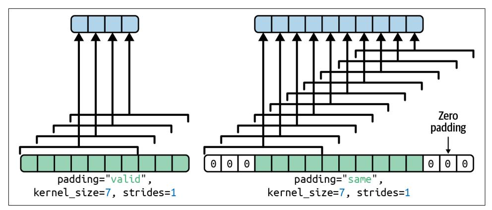

Figure 14-7. The two padding options, when strides=1

图14-7. 当strides=1时的两种填充选项

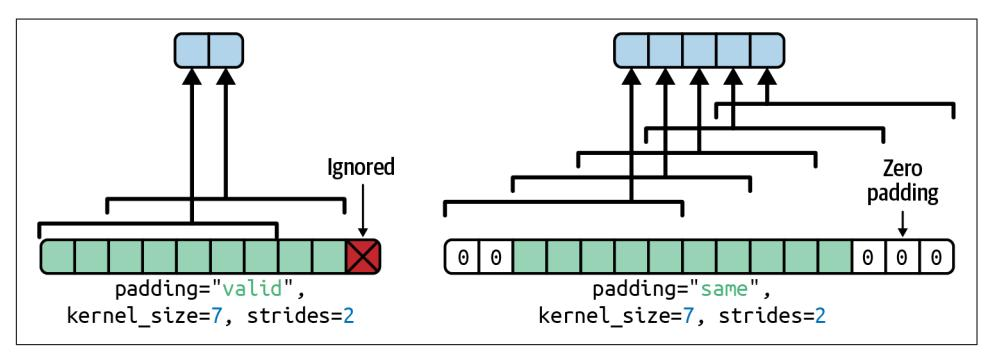

Figure 14-8. With strides greater than 1, the output is much smaller even when using "same" padding (and "valid" padding may ignore some inputs)

图14-8. 当步长大于1时，即使使用"same"填充，输出也要小得多（"valid"填充可能会忽略一些输入）

If you are curious, this is how the output size is computed:

如果你好奇，输出大小是这样计算的：

- With padding="valid", if the width of the input is  $i_h$ , then the output width is equal to  $(i_h - f_h + s_h) / s_h$ , rounded down. Recall that  $f_h$  is the kernel width, and  $s_h$  is the horizontal stride. Any remainder in the division corresponds to ignored columns on the right side of the input image. The same logic can be used to compute the output height, and any ignored rows at the bottom of the image.
- 使用padding="valid"时，如果输入的宽度是$i_h$，那么输出宽度等于$(i_h - f_h + s_h) / s_h$，向下舍入。回想一下，$f_h$是核宽度，$s_h$是水平步长。除法中的任何余数对应于输入图像右侧被忽略的列。相同的逻辑可以用来计算输出高度，以及图像底部任何被忽略的行。
- With padding="same", the output width is equal to  $i_h / s_h$ , rounded up. To make this possible, the appropriate number of zero columns are padded to the left and right of the input image (an equal number if possible, or just one more on the right side). Assuming the output width is  $o_w$ , then the number of padded zero columns is  $(o_w - 1) \times s_h + f_h - i_h$ . Again, the same logic can be used to compute the output height and the number of padded rows.
- 使用padding="same"时，输出宽度等于$i_h / s_h$，向上舍入。为了实现这一点，在输入图像的左右两侧填充适当数量的零列（如果可能的话数量相等，或者右侧多一列）。假设输出宽度是$o_w$，那么填充的零列数是$(o_w - 1) \times s_h + f_h - i_h$。同样，相同的逻辑可以用来计算输出高度和填充的行数。

{517}------------------------------------------------

Now let's look at the layer's weights (which were noted  $w_{u,v,k',k}$  and  $b_k$  in Equation 14-1). Just like a Dense layer, a Conv2D layer holds all the layer's weights, including the kernels and biases. The kernels are initialized randomly, while the biases are initialized to zero. These weights are accessible as TF variables via the weights attribute, or as NumPy arrays via the get\_weights() method:

现在让我们看看层的权重（在方程14-1中记为$w_{u,v,k',k}$和$b_k$）。就像Dense层一样，Conv2D层保存所有层的权重，包括核和偏置。核是随机初始化的，而偏置初始化为零。这些权重可以通过weights属性作为TF变量访问，或者通过get_weights()方法作为NumPy数组访问：

```
>>> kernels, biases = conv layer.get weights()
>>> kernels.shape
(7, 7, 3, 32)>>> biases.shape
(32, )
```

The kernels array is 4D, and its shape is [kernel\_height, kernel\_width, input\_channels, *output\_channels*]. The biases array is 1D, with shape [*output\_channels*]. The number of output channels is equal to the number of output feature maps, which is also equal to the number of filters.

核数组是4D的，其形状是[kernel_height, kernel_width, input_channels, *output_channels*]。偏置数组是1D的，形状是[*output_channels*]。输出通道的数量等于输出特征图的数量，也等于滤波器的数量。

Most importantly, note that the height and width of the input images do not appear in the kernel's shape: this is because all the neurons in the output feature maps share the same weights, as explained earlier. This means that you can feed images of any size to this layer, as long as they are at least as large as the kernels, and if they have the right number of channels (three in this case).

最重要的是，注意输入图像的高度和宽度不会出现在核的形状中：这是因为输出特征图中的所有神经元共享相同的权重，如前所述。这意味着你可以向这个层输入任何大小的图像，只要它们至少与核一样大，并且具有正确的通道数（在这种情况下是三个）。

Lastly, you will generally want to specify an activation function (such as ReLU) when creating a Conv2D layer, and also specify the corresponding kernel initializer (such as He initialization). This is for the same reason as for Dense layers: a convolutional layer performs a linear operation, so if you stacked multiple convolutional layers without any activation functions they would all be equivalent to a single convolutional layer, and they wouldn't be able to learn anything really complex.

最后，在创建Conv2D层时，你通常会想要指定一个激活函数（如ReLU）并指定相应的核初始化器（如He初始化）。这与Dense层的原因相同：卷积层执行线性操作，所以如果你堆叠多个没有任何激活函数的卷积层，它们都等价于单个卷积层，无法学习任何真正复杂的东西。

As you can see, convolutional layers have quite a few hyperparameters: filters, kernel\_size, padding, strides, activation, kernel\_initializer, etc. As always, you can use cross-validation to find the right hyperparameter values, but this is very time-consuming. We will discuss common CNN architectures later in this chapter, to give you some idea of which hyperparameter values work best in practice.

如你所见，卷积层有相当多的超参数：filters、kernel_size、padding、strides、activation、kernel_initializer等。一如既往，你可以使用交叉验证来找到正确的超参数值，但这非常耗时。我们将在本章后面讨论常见的CNN架构，给你一些关于哪些超参数值在实践中效果最好的想法。

### **Memory Requirements**

### **内存需求**

Another challenge with CNNs is that the convolutional layers require a huge amount of RAM. This is especially true during training, because the reverse pass of backpropagation requires all the intermediate values computed during the forward pass.

CNN的另一个挑战是卷积层需要大量的RAM。这在训练期间尤其如此，因为反向传播的反向传递需要前向传递期间计算的所有中间值。

For example, consider a convolutional layer with 200  $5 \times 5$  filters, with stride 1 and "same" padding. If the input is a  $150 \times 100$  RGB image (three channels), then the number of parameters is  $(5 \times 5 \times 3 + 1) \times 200 = 15,200$  (the + 1 corresponds to

例如，考虑一个有200个$5 \times 5$滤波器的卷积层，步长为1，"same"填充。如果输入是$150 \times 100$的RGB图像（三个通道），那么参数数量是$(5 \times 5 \times 3 + 1) \times 200 = 15,200$（+1对应于 

{518}------------------------------------------------

the bias terms), which is fairly small compared to a fully connected layer.<sup>7</sup> However, each of the 200 feature maps contains  $150 \times 100$  neurons, and each of these neurons needs to compute a weighted sum of its  $5 \times 5 \times 3 = 75$  inputs: that's a total of 225 million float multiplications. Not as bad as a fully connected layer, but still quite computationally intensive. Moreover, if the feature maps are represented using 32-bit floats, then the convolutional layer's output will occupy  $200 \times 150 \times 100 \times 32 = 96$ million bits (12 MB) of RAM.<sup>8</sup> And that's just for one instance—if a training batch contains 100 instances, then this layer will use up 1.2 GB of RAM!

偏置项），与全连接层相比这是相当小的。<sup>7</sup> 然而，200个特征图中的每一个都包含$150 \times 100$个神经元，每个神经元需要计算其$5 \times 5 \times 3 = 75$个输入的加权和：总共是2.25亿次浮点乘法。虽然不如全连接层那么糟糕，但仍然是计算密集型的。此外，如果特征图使用32位浮点数表示，那么卷积层的输出将占用$200 \times 150 \times 100 \times 32 = 96$百万位（12 MB）的RAM。<sup>8</sup> 这只是一个实例——如果训练批次包含100个实例，那么这个层将使用1.2 GB的RAM！

During inference (i.e., when making a prediction for a new instance) the RAM occupied by one layer can be released as soon as the next layer has been computed, so you only need as much RAM as required by two consecutive layers. But during training everything computed during the forward pass needs to be preserved for the reverse pass, so the amount of RAM needed is (at least) the total amount of RAM required by all layers.

在推理期间（即为新实例进行预测时），一旦计算出下一层，一层占用的RAM就可以释放，所以你只需要两个连续层所需的RAM。但在训练期间，前向传递期间计算的所有内容都需要为反向传递保留，所以需要的RAM量（至少）是所有层所需的RAM总量。


If training crashes because of an out-of-memory error, you can try reducing the mini-batch size. Alternatively, you can try reducing dimensionality using a stride, removing a few layers, using 16-bit floats instead of 32-bit floats, or distributing the CNN across multiple devices (you will see how to do this in Chapter 19).

如果训练因内存不足错误而崩溃，你可以尝试减少小批量大小。或者，你可以尝试使用步长减少维度、删除几个层、使用16位浮点数而不是32位浮点数，或者将CNN分布在多个设备上（你将在第19章中看到如何做到这一点）。

Now let's look at the second common building block of CNNs: the *pooling layer*.

现在让我们看看CNN的第二个常见构建块：*池化层*。

### **Pooling Layers**

### **池化层**

Once you understand how convolutional layers work, the pooling layers are quite easy to grasp. Their goal is to *subsample* (i.e., shrink) the input image in order to reduce the computational load, the memory usage, and the number of parameters (thereby limiting the risk of overfitting).

一旦你理解了卷积层的工作原理，池化层就很容易掌握。它们的目标是对输入图像进行*子采样*（即缩小），以减少计算负载、内存使用和参数数量（从而限制过拟合的风险）。

Just like in convolutional layers, each neuron in a pooling layer is connected to the outputs of a limited number of neurons in the previous layer, located within a small rectangular receptive field. You must define its size, the stride, and the padding type, just like before. However, a pooling neuron has no weights; all it does is aggregate the inputs using an aggregation function such as the max or mean. Figure 14-9 shows a *max pooling layer*, which is the most common type of pooling layer. In this example,

就像在卷积层中一样，池化层中的每个神经元都连接到前一层中有限数量的神经元的输出，这些神经元位于一个小的矩形感受野内。你必须定义其大小、步长和填充类型，就像之前一样。然而，池化神经元没有权重；它所做的就是使用聚合函数（如最大值或平均值）聚合输入。图14-9显示了一个*最大池化层*，这是最常见的池化层类型。在这个例子中，

<sup>7</sup> To produce the same size outputs, a fully connected layer would need  $200 \times 150 \times 100$  neurons, each connected to all  $150 \times 100 \times 3$  inputs. It would have  $200 \times 150 \times 100 \times (150 \times 100 \times 3 + 1) \approx 135$  billion parameters!

<sup>8</sup> In the international system of units (SI),  $1 \text{ MB} = 1,000 \text{ KB} = 1,000 \times 1,000 \text{ bytes} = 1,000 \times 1,000 \times 8 \text{ bits}$ . And  $1 \text{ MiB} = 1,024 \text{ kiB} = 1,024 \times 1,024 \text{ bytes.}$  So 12 MB  $\approx 11.44 \text{ MiB}$ .

{519}------------------------------------------------

we use a 2  $\times$  2 *pooling kernel*,<sup>9</sup> with a stride of 2 and no padding. Only the max input value in each receptive field makes it to the next layer, while the other inputs are dropped. For example, in the lower-left receptive field in Figure 14-9, the input values are 1, 5, 3, 2, so only the max value, 5, is propagated to the next layer. Because of the stride of 2, the output image has half the height and half the width of the input image (rounded down since we use no padding).

我们使用一个2 $\times$ 2的*池化核*，<sup>9</sup> 步长为2，无填充。每个感受野中只有最大输入值传递到下一层，而其他输入被丢弃。例如，在图14-9的左下角感受野中，输入值是1、5、3、2，所以只有最大值5传播到下一层。由于步长为2，输出图像的高度和宽度都是输入图像的一半（向下舍入，因为我们不使用填充）。

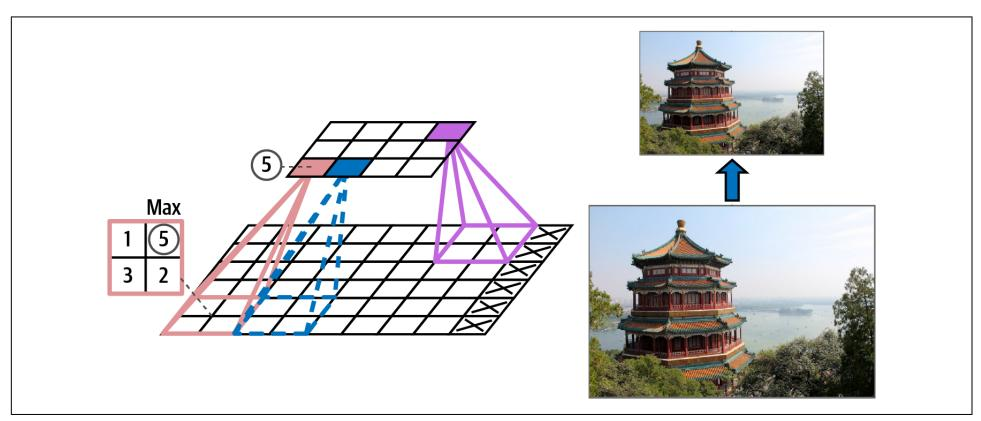

Figure 14-9. Max pooling layer ( $2 \times 2$  pooling kernel, stride 2, no padding)

图14-9. 最大池化层（$2 \times 2$池化核，步长2，无填充）


A pooling layer typically works on every input channel independently, so the output depth (i.e., the number of channels) is the same as the input depth.

池化层通常独立地作用于每个输入通道，所以输出深度（即通道数）与输入深度相同。

Other than reducing computations, memory usage, and the number of parameters, a max pooling layer also introduces some level of *invariance* to small translations, as shown in Figure 14-10. Here we assume that the bright pixels have a lower value than dark pixels, and we consider three images  $(A, B, C)$  going through a max pooling layer with a  $2 \times 2$  kernel and stride 2. Images B and C are the same as image A, but shifted by one and two pixels to the right. As you can see, the outputs of the max pooling layer for images A and B are identical. This is what translation invariance means. For image C, the output is different: it is shifted one pixel to the right (but there is still 50% invariance). By inserting a max pooling layer every few layers in a CNN, it is possible to get some level of translation invariance at a larger scale. Moreover, max pooling offers a small amount of rotational invariance and a slight scale invariance. Such invariance (even if it is limited) can be useful in cases where the prediction should not depend on these details, such as in classification tasks.

除了减少计算、内存使用和参数数量外，最大池化层还对小的平移引入了某种程度的*不变性*，如图14-10所示。这里我们假设亮像素的值比暗像素低，我们考虑三个图像$(A, B, C)$通过一个$2 \times 2$核和步长2的最大池化层。图像B和C与图像A相同，但分别向右移动了一个和两个像素。如你所见，图像A和B的最大池化层输出是相同的。这就是平移不变性的含义。对于图像C，输出是不同的：它向右移动了一个像素（但仍有50%的不变性）。通过在CNN中每隔几层插入一个最大池化层，可以在更大的尺度上获得某种程度的平移不变性。此外，最大池化提供少量的旋转不变性和轻微的尺度不变性。这种不变性（即使是有限的）在预测不应依赖于这些细节的情况下很有用，比如在分类任务中。

<sup>9</sup> Other kernels we've discussed so far had weights, but pooling kernels do not: they are just stateless sliding windows.

{520}------------------------------------------------

However, max pooling has some downsides too. It's obviously very destructive: even with a tiny  $2 \times 2$  kernel and a stride of 2, the output will be two times smaller in both directions (so its area will be four times smaller), simply dropping 75% of the input values. And in some applications, invariance is not desirable. Take semantic segmentation (the task of classifying each pixel in an image according to the object that pixel belongs to, which we'll explore later in this chapter): obviously, if the input image is translated by one pixel to the right, the output should also be translated by one pixel to the right. The goal in this case is *equivariance*, not invariance: a small change to the inputs should lead to a corresponding small change in the output.

然而，最大池化也有一些缺点。它显然是非常破坏性的：即使使用很小的$2 \times 2$核和步长2，输出在两个方向上都会小两倍（所以其面积会小四倍），简单地丢弃了75%的输入值。在某些应用中，不变性是不可取的。以语义分割为例（对图像中每个像素根据该像素所属的对象进行分类的任务，我们将在本章后面探讨）：显然，如果输入图像向右平移一个像素，输出也应该向右平移一个像素。在这种情况下，目标是*等变性*，而不是不变性：输入的小变化应该导致输出相应的小变化。

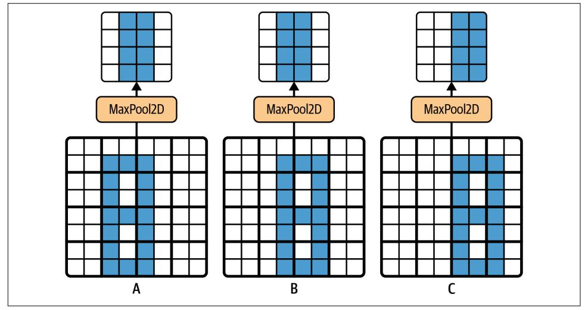

Figure 14-10. Invariance to small translations

图14-10. 对小平移的不变性

### **Implementing Pooling Layers with Keras**

### **使用Keras实现池化层**

The following code creates a MaxPooling2D layer, alias MaxPool2D, using a  $2 \times 2$  kernel. The strides default to the kernel size, so this layer uses a stride of 2 (horizontally and vertically). By default, it uses "valid" padding (i.e., no padding at all):

以下代码创建一个MaxPooling2D层（别名MaxPool2D），使用$2 \times 2$核。步长默认为核大小，所以这个层使用步长2（水平和垂直）。默认情况下，它使用"valid"填充（即完全不填充）：

```
max_pool = tf.keras.layers.MaxPool2D(pool_size=2)
```

To create an average pooling layer, just use AveragePooling2D, alias AvgPool2D, instead of MaxPool2D. As you might expect, it works exactly like a max pooling layer, except it computes the mean rather than the max. Average pooling layers used to be very popular, but people mostly use max pooling layers now, as they generally perform better. This may seem surprising, since computing the mean generally loses less information than computing the max. But on the other hand, max pooling preserves only the strongest features, getting rid of all the meaningless ones, so the

要创建平均池化层，只需使用AveragePooling2D（别名AvgPool2D）而不是MaxPool2D。如你所料，它的工作方式与最大池化层完全相同，只是计算平均值而不是最大值。平均池化层曾经非常流行，但现在人们主要使用最大池化层，因为它们通常表现更好。这可能看起来令人惊讶，因为计算平均值通常比计算最大值丢失更少的信息。但另一方面，最大池化只保留最强的特征，去除所有无意义的特征，所以 

{521}------------------------------------------------

next layers get a cleaner signal to work with. Moreover, max pooling offers stronger translation invariance than average pooling, and it requires slightly less compute.

下一层得到更清洁的信号来处理。此外，最大池化比平均池化提供更强的平移不变性，并且需要稍少的计算。

Note that max pooling and average pooling can be performed along the depth dimension instead of the spatial dimensions, although it's not as common. This can allow the CNN to learn to be invariant to various features. For example, it could learn multiple filters, each detecting a different rotation of the same pattern (such as handwritten digits; see Figure 14-11), and the depthwise max pooling layer would ensure that the output is the same regardless of the rotation. The CNN could similarly learn to be invariant to anything: thickness, brightness, skew, color, and so on.

注意，最大池化和平均池化可以沿深度维度而不是空间维度执行，尽管这不太常见。这可以让CNN学会对各种特征保持不变。例如，它可以学习多个滤波器，每个滤波器检测同一模式的不同旋转（如手写数字；见图14-11），深度最大池化层将确保无论旋转如何，输出都是相同的。CNN同样可以学会对任何东西保持不变：厚度、亮度、倾斜、颜色等等。

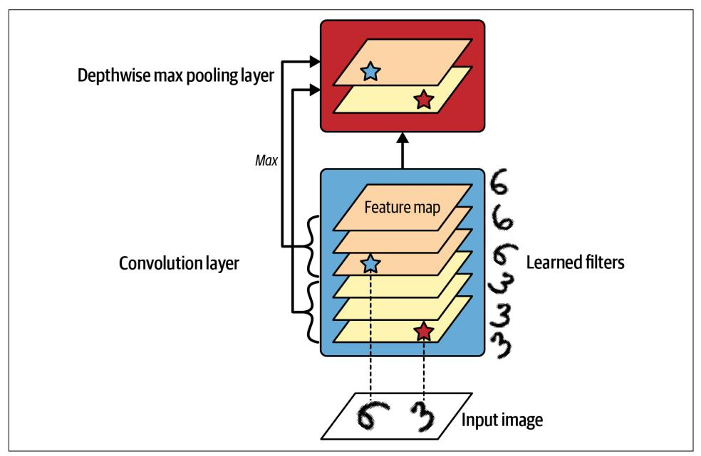

Figure 14-11. Depthwise max pooling can help the CNN learn to be invariant (to rotation in this case)

图14-11. 深度最大池化可以帮助CNN学会保持不变（在这种情况下是对旋转）

Keras does not include a depthwise max pooling layer, but it's not too difficult to implement a custom layer for that:

Keras不包含深度最大池化层，但实现一个自定义层并不太困难：

```
class DepthPool(tf.keras.layers.Layer):
   def __init__(self, pool_size=2, **kwargs):
       super(). init (** kwargs)
       self.pool size = pool size
    def call(self, inputs):
       shape = tf.shape(inputs) # shape[-1] is the number of channels
       groups = shape[-1] // self.pool_size # number of channel groups
       new\_shape = tf.concat([shape[:-1], [groups, self.pool_size]], axis=0)return tf.reduce_max(tf.reshape(inputs, new_shape), axis=-1)
```

{522}------------------------------------------------

This layer reshapes its inputs to split the channels into groups of the desired size (pool size), then it uses tf. reduce max() to compute the max of each group. This implementation assumes that the stride is equal to the pool size, which is generally what you want. Alternatively, you could use TensorFlow's tf.nn.max\_pool() operation, and wrap in a Lambda layer to use it inside a Keras model, but sadly this op does not implement depthwise pooling for the GPU, only for the CPU.

这个层重新塑形其输入，将通道分割成所需大小的组（池化大小），然后使用tf.reduce_max()计算每组的最大值。这个实现假设步长等于池化大小，这通常是你想要的。或者，你可以使用TensorFlow的tf.nn.max_pool()操作，并包装在Lambda层中以在Keras模型内使用，但遗憾的是这个操作不为GPU实现深度池化，只为CPU实现。

One last type of pooling layer that you will often see in modern architectures is the global average pooling layer. It works very differently: all it does is compute the mean of each entire feature map (it's like an average pooling layer using a pooling kernel with the same spatial dimensions as the inputs). This means that it just outputs a single number per feature map and per instance. Although this is of course extremely destructive (most of the information in the feature map is lost), it can be useful just before the output layer, as you will see later in this chapter. To create such a layer, simply use the GlobalAveragePooling2D class, alias GlobalAvgPool2D:

在现代架构中你经常会看到的最后一种池化层是全局平均池化层。它的工作方式非常不同：它所做的就是计算每个完整特征图的平均值（就像使用与输入相同空间维度的池化核的平均池化层）。这意味着它只为每个特征图和每个实例输出一个数字。虽然这当然是极其破坏性的（特征图中的大部分信息都丢失了），但在输出层之前它可能很有用，正如你将在本章后面看到的。要创建这样的层，只需使用GlobalAveragePooling2D类（别名GlobalAvgPool2D）：

```
global avg pool = tf.keras.layers.GlobalAvgPool2D()
```

It's equivalent to the following Lambda layer, which computes the mean over the spatial dimensions (height and width):

```
global avg pool = tf.keras.layers.Lambda(
    lambda X: tf. reduce_mean(X, axis=[1, 2]))
```

For example, if we apply this layer to the input images, we get the mean intensity of red, green, and blue for each image:

例如，如果我们将这个层应用到输入图像，我们得到每个图像的红、绿、蓝的平均强度：

```
>>> global_avg_pool(images)
<tf.Tensor: shape=(2, 3), dtype=float32, numpy=
array([[0.64338624, 0.5971759, 0.5824972],
       [0.76306933, 0.26011038, 0.10849128]], dtype=float32)>
```

Now you know all the building blocks to create convolutional neural networks. Let's see how to assemble them.

现在你知道了创建卷积神经网络的所有构建块。让我们看看如何组装它们。

### **CNN Architectures**

### **CNN架构**

Typical CNN architectures stack a few convolutional layers (each one generally followed by a ReLU layer), then a pooling layer, then another few convolutional layers (+ReLU), then another pooling layer, and so on. The image gets smaller and smaller as it progresses through the network, but it also typically gets deeper and deeper (i.e., with more feature maps), thanks to the convolutional layers (see Figure 14-12). At the top of the stack, a regular feedforward neural network is added, composed of a few fully connected layers (+ReLUs), and the final layer outputs the prediction (e.g., a softmax layer that outputs estimated class probabilities).

典型的CNN架构堆叠几个卷积层（每个通常后跟一个ReLU层），然后是一个池化层，然后是另外几个卷积层（+ReLU），然后是另一个池化层，依此类推。图像在通过网络时变得越来越小，但由于卷积层的作用，它通常也变得越来越深（即具有更多特征图）（见图14-12）。在堆栈的顶部，添加一个常规的前馈神经网络，由几个全连接层（+ReLU）组成，最终层输出预测（例如，输出估计类别概率的softmax层）。

{523}------------------------------------------------

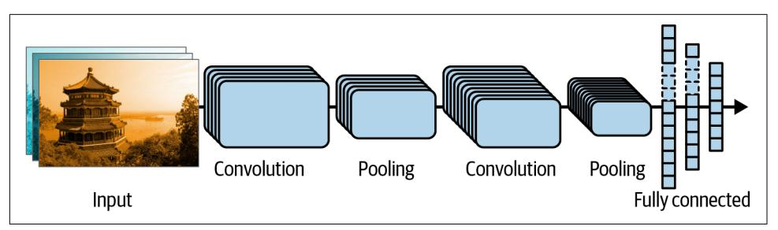

Figure 14-12. Typical CNN architecture

图14-12. 典型的CNN架构


A common mistake is to use convolution kernels that are too large. For example, instead of using a convolutional layer with a 5  $\times$ 5 kernel, stack two layers with  $3 \times 3$  kernels: it will use fewer parameters and require fewer computations, and it will usually perform better. One exception is for the first convolutional layer: it can typically have a large kernel (e.g.,  $5 \times 5$ ), usually with a stride of 2 or more. This will reduce the spatial dimension of the image without losing too much information, and since the input image only has three channels in general, it will not be too costly.

一个常见的错误是使用过大的卷积核。例如，不要使用5×5核的卷积层，而是堆叠两个3×3核的层：它将使用更少的参数，需要更少的计算，并且通常表现更好。一个例外是第一个卷积层：它通常可以有一个大核（例如5×5），通常步长为2或更多。这将减少图像的空间维度而不会丢失太多信息，并且由于输入图像通常只有三个通道，所以不会太昂贵。

Here is how you can implement a basic CNN to tackle the Fashion MNIST dataset (introduced in Chapter 10):

以下是如何实现一个基本的CNN来处理Fashion MNIST数据集（在第10章中介绍）：

```
from functools import partial
DefaultConv2D = partial(tf.keras.layers.Conv2D, kernel_size=3, padding="same",
                         activation="relu", kernel initializer="he normal")
model = tf.keras.Sequential(DefaultConv2D(filters=64, kernel size=7, input shape=[28, 28, 1]),
    tf.keras.layers.MaxPool2D(),
    DefaultConv2D(filters=128),
    DefaultConv2D(filters=128),
    tf.keras.lavers.MaxPool2D().
    DefaultConv2D(filters=256),
    DefaultConv2D(filters=256),
    tf.keras.layers.MaxPool2D(),
    tf.keras.layers.Flatten(),
    tf.keras.layers.Dense(units=128, activation="relu",
                          kernel initializer="he normal").
    tf.keras.layers.Dropout(0.5),
    tf.keras.layers.Dense(units=64, activation="relu",
                          kernel_initializer="he_normal"),
    tf.keras.layers.Dropout(0.5),
    tf.keras.layers.Dense(units=10, activation="softmax")
\left| \right\rangle
```

{524}------------------------------------------------

Let's go through this code:

让我们来看看这段代码：

- We use the functools.partial() function (introduced in Chapter 11) to define DefaultConv2D, which acts just like Conv2D but with different default arguments: a small kernel size of 3, "same" padding, the ReLU activation function, and its corresponding He initializer.
- 我们使用functools.partial()函数（在第11章中介绍）来定义DefaultConv2D，它的行为就像Conv2D一样，但具有不同的默认参数：小的核大小3、"same"填充、ReLU激活函数及其相应的He初始化器。
- Next, we create the Sequential model. Its first layer is a DefaultConv2D with 64 fairly large filters (7  $\times$  7). It uses the default stride of 1 because the input images are not very large. It also sets input\_shape=[28, 28, 1], because the images are  $28 \times 28$  pixels, with a single color channel (i.e., grayscale). When you load the Fashion MNIST dataset, make sure each image has this shape: you may need to use np. reshape() or np. expanddims() to add the channels dimension. Alternatively, you could use a Reshape layer as the first layer in the model.
- 接下来，我们创建Sequential模型。它的第一层是一个DefaultConv2D，有64个相当大的滤波器（7×7）。它使用默认步长1，因为输入图像不是很大。它还设置input_shape=[28, 28, 1]，因为图像是28×28像素，具有单个颜色通道（即灰度）。当你加载Fashion MNIST数据集时，确保每个图像都有这个形状：你可能需要使用np.reshape()或np.expand_dims()来添加通道维度。或者，你可以使用Reshape层作为模型的第一层。
- We then add a max pooling layer that uses the default pool size of 2, so it divides each spatial dimension by a factor of 2.
- 然后我们添加一个最大池化层，使用默认池化大小2，所以它将每个空间维度除以2。
- Then we repeat the same structure twice: two convolutional layers followed by a max pooling layer. For larger images, we could repeat this structure several more times. The number of repetitions is a hyperparameter you can tune.
- 然后我们重复相同的结构两次：两个卷积层后跟一个最大池化层。对于更大的图像，我们可以重复这个结构更多次。重复次数是你可以调整的超参数。
- Note that the number of filters doubles as we climb up the CNN toward the output layer (it is initially 64, then 128, then 256): it makes sense for it to grow, since the number of low-level features is often fairly low (e.g., small circles, horizontal lines), but there are many different ways to combine them into higherlevel features. It is a common practice to double the number of filters after each pooling layer: since a pooling layer divides each spatial dimension by a factor of 2, we can afford to double the number of feature maps in the next layer without fear of exploding the number of parameters, memory usage, or computational  $load.$
- 注意，当我们向CNN的输出层攀升时，滤波器的数量会翻倍（最初是64，然后是128，然后是256）：这种增长是有意义的，因为低级特征的数量通常相当少（例如，小圆圈、水平线），但有许多不同的方式将它们组合成高级特征。在每个池化层后将滤波器数量翻倍是一种常见做法：由于池化层将每个空间维度除以2，我们可以在下一层中将特征图数量翻倍，而不用担心参数数量、内存使用或计算负载的爆炸性增长。
- Next is the fully connected network, composed of two hidden dense layers and a dense output layer. Since it's a classification task with 10 classes, the output layer has 10 units, and it uses the softmax activation function. Note that we must flatten the inputs just before the first dense layer, since it expects a 1D array of features for each instance. We also add two dropout layers, with a dropout rate of 50% each, to reduce overfitting.
- 接下来是全连接网络，由两个隐藏的密集层和一个密集输出层组成。由于这是一个有10个类别的分类任务，输出层有10个单元，并使用softmax激活函数。注意，我们必须在第一个密集层之前展平输入，因为它期望每个实例有一个1D特征数组。我们还添加了两个dropout层，每个的dropout率为50%，以减少过拟合。

If you compile this model using the "sparse categorical crossentropy" loss and you fit the model to the Fashion MNIST training set, it should reach over 92% accuracy on the test set. It's not state of the art, but it is pretty good, and clearly much better than what we achieved with dense networks in Chapter 10.

如果你使用"sparse categorical crossentropy"损失编译这个模型，并将模型拟合到Fashion MNIST训练集，它应该在测试集上达到超过92%的准确率。这不是最先进的，但相当不错，明显比我们在第10章中使用密集网络取得的结果要好得多。

{525}------------------------------------------------

Over the years, variants of this fundamental architecture have been developed, leading to amazing advances in the field. A good measure of this progress is the error rate in competitions such as the ILSVRC ImageNet challenge. In this competition, the top-five error rate for image classification—that is, the number of test images for which the system's top five predictions did *not* include the correct answer—fell from over 26% to less than 2.3% in just six years. The images are fairly large (e.g., 256 pixels high) and there are 1,000 classes, some of which are really subtle (try distinguishing 120 dog breeds). Looking at the evolution of the winning entries is a good way to understand how CNNs work, and how research in deep learning progresses.

多年来，这种基本架构的变体已经被开发出来，导致该领域的惊人进步。衡量这种进步的一个好指标是ILSVRC ImageNet挑战赛等竞赛中的错误率。在这个竞赛中，图像分类的前五错误率——即系统的前五个预测中*不*包含正确答案的测试图像数量——在短短六年内从超过26%下降到不到2.3%。图像相当大（例如，256像素高），有1000个类别，其中一些真的很微妙（试着区分120个狗品种）。观察获胜作品的演变是理解CNN如何工作以及深度学习研究如何进展的好方法。

We will first look at the classical LeNet-5 architecture (1998), then several winners of the ILSVRC challenge: AlexNet (2012), GoogLeNet (2014), ResNet (2015), and SENet (2017). Along the way, we will also look at a few more architectures, including Xception, ResNeXt, DenseNet, MobileNet, CSPNet, and EfficientNet.

我们将首先看看经典的LeNet-5架构（1998），然后是ILSVRC挑战赛的几个获胜者：AlexNet（2012）、GoogLeNet（2014）、ResNet（2015）和SENet（2017）。在此过程中，我们还将看看更多的架构，包括Xception、ResNeXt、DenseNet、MobileNet、CSPNet和EfficientNet。

#### LeNet-5

The LeNet-5 architecture<sup>10</sup> is perhaps the most widely known CNN architecture. As mentioned earlier, it was created by Yann LeCun in 1998 and has been widely used for handwritten digit recognition (MNIST). It is composed of the layers shown in Table 14-1.

LeNet-5架构<sup>10</sup>也许是最广为人知的CNN架构。如前所述，它由Yann LeCun在1998年创建，并广泛用于手写数字识别（MNIST）。它由表14-1所示的层组成。

| Layer            | Type                   | Maps | Size                        | Kernel size Stride Activation |               |            |
|------------------|------------------------|------|-----------------------------|-------------------------------|---------------|------------|
| 0ut              | <b>Fully connected</b> |      | 10                          |                               |               | <b>RBF</b> |
| F6               | <b>Fully connected</b> |      | 84                          |                               |               | tanh       |
| $\mathfrak{c}_5$ | Convolution            | 120  | $1 \times 1$                | $5 \times 5$                  | 1             | tanh       |
| S4               | Avg pooling            | 16   | $5 \times 5$                | $2 \times 2$                  | 2             | tanh       |
| $\mathcal{C}$    | Convolution            | 16   | $10 \times 10$              | $5 \times 5$                  | 1             | tanh       |
| S <sub>2</sub>   | Avg pooling            | 6    | $14 \times 14$ $2 \times 2$ |                               | $\mathfrak z$ | tanh       |
| C <sub>1</sub>   | Convolution            | 6    | $28 \times 28$ 5 $\times$ 5 |                               | 1             | tanh       |
| In               | Input                  | 1    | $32 \times 32$              |                               |               |            |

Table 14-1. LeNet-5 architecture

表14-1. LeNet-5架构

As you can see, this looks pretty similar to our Fashion MNIST model: a stack of convolutional layers and pooling layers, followed by a dense network. Perhaps the main difference with more modern classification CNNs is the activation functions: today, we would use ReLU instead of tanh and softmax instead of RBF. There were

如你所见，这看起来与我们的Fashion MNIST模型非常相似：一堆卷积层和池化层，后跟一个密集网络。与更现代的分类CNN的主要区别可能是激活函数：今天，我们会使用ReLU而不是tanh，使用softmax而不是RBF。还有

<sup>10</sup> Yann LeCun et al., "Gradient-Based Learning Applied to Document Recognition", Proceedings of the IEEE 86, no. 11 (1998): 2278-2324.

{526}------------------------------------------------

several other minor differences that don't really matter much, but in case you are interested, they are listed in this chapter's notebook at https://homl.info/colab3. Yann LeCun's website also features great demos of LeNet-5 classifying digits.

其他几个不太重要的小差异，但如果你感兴趣，它们在本章的笔记本https://homl.info/colab3中列出。Yann LeCun的网站还展示了LeNet-5分类数字的精彩演示。

#### **AlexNet**

The AlexNet CNN architecture<sup>11</sup> won the 2012 ILSVRC challenge by a large margin: it achieved a top-five error rate of 17%, while the second best competitor achieved only 26%! AlexaNet was developed by Alex Krizhevsky (hence the name), Ilya Sutskever, and Geoffrey Hinton. It is similar to LeNet-5, only much larger and deeper, and it was the first to stack convolutional layers directly on top of one another, instead of stacking a pooling layer on top of each convolutional layer. Table 14-2 presents this architecture.

AlexNet CNN架构<sup>11</sup>以很大的优势赢得了2012年ILSVRC挑战赛：它实现了17%的前五错误率，而第二好的竞争者只达到了26%！AlexNet由Alex Krizhevsky（因此得名）、Ilya Sutskever和Geoffrey Hinton开发。它类似于LeNet-5，只是更大更深，并且它是第一个直接将卷积层堆叠在一起的，而不是在每个卷积层上堆叠一个池化层。表14-2展示了这个架构。

| Layer           | <b>Type</b>            | <b>Maps</b> | Size             | Kernel size    | Stride         | Padding | <b>Activation</b> |
|-----------------|------------------------|-------------|------------------|----------------|----------------|---------|-------------------|
| 0ut             | <b>Fully connected</b> |             | 1,000            |                |                |         | Softmax           |
| F <sub>10</sub> | <b>Fully connected</b> |             | 4.096            |                |                |         | ReLU              |
| F9              | <b>Fully connected</b> |             | 4,096            |                |                |         | ReLU              |
| S8              | Max pooling            | 256         | $6 \times 6$     | $3 \times 3$   | 2              | valid   |                   |
| C <sub>7</sub>  | Convolution            | 256         | $13 \times 13$   | $3 \times 3$   | 1              | same    | ReLU              |
| C6              | Convolution            | 384         | $13 \times 13$   | $3 \times 3$   | 1              | same    | ReLU              |
| C <sub>5</sub>  | Convolution            | 384         | $13 \times 13$   | $3 \times 3$   | 1              | same    | ReLU              |
| S <sub>4</sub>  | Max pooling            | 256         | $13 \times 13$   | $3 \times 3$   | $\overline{2}$ | valid   |                   |
| C <sub>3</sub>  | Convolution            | 256         | $27 \times 27$   | $5 \times 5$   | 1              | same    | ReLU              |
| S2              | Max pooling            | 96          | $27 \times 27$   | $3 \times 3$   | 2              | valid   |                   |
| C <sub>1</sub>  | Convolution            | 96          | $55 \times 55$   | $11 \times 11$ | 4              | valid   | ReLU              |
| In              | Input                  | 3(RGB)      | $227 \times 227$ |                |                |         |                   |

Table 14-2 AlexNet architecture

表14-2 AlexNet架构

To reduce overfitting, the authors used two regularization techniques. First, they applied dropout (introduced in Chapter 11) with a 50% dropout rate during training to the outputs of layers F9 and F10. Second, they performed data augmentation by randomly shifting the training images by various offsets, flipping them horizontally, and changing the lighting conditions.

为了减少过拟合，作者使用了两种正则化技术。首先，他们在训练期间对层F9和F10的输出应用了dropout（在第11章中介绍），dropout率为50%。其次，他们通过随机移动训练图像的各种偏移量、水平翻转它们以及改变光照条件来执行数据增强。

<sup>11</sup> Alex Krizhevsky et al., "ImageNet Classification with Deep Convolutional Neural Networks", Proceedings of the 25th International Conference on Neural Information Processing Systems 1 (2012): 1097-1105.

{527}------------------------------------------------

#### **Data Augmentation**

#### **数据增强**

Data augmentation artificially increases the size of the training set by generating many realistic variants of each training instance. This reduces overfitting, making this a regularization technique. The generated instances should be as realistic as possible: ideally, given an image from the augmented training set, a human should not be able to tell whether it was augmented or not. Simply adding white noise will not help; the modifications should be learnable (white noise is not).

数据增强通过为每个训练实例生成许多现实的变体来人为地增加训练集的大小。这减少了过拟合，使其成为一种正则化技术。生成的实例应该尽可能现实：理想情况下，给定增强训练集中的图像，人类应该无法判断它是否被增强过。简单地添加白噪声不会有帮助；修改应该是可学习的（白噪声不是）。

For example, you can slightly shift, rotate, and resize every picture in the training set by various amounts and add the resulting pictures to the training set (see Figure 14-13). To do this, you can use Keras's data augmentation layers, introduced in Chapter 13 (e.g., RandomCrop, RandomRotation, etc.). This forces the model to be more tolerant to variations in the position, orientation, and size of the objects in the pictures. To produce a model that's more tolerant of different lighting conditions, you can similarly generate many images with various contrasts. In general, you can also flip the pictures horizontally (except for text, and other asymmetrical objects). By combining these transformations, you can greatly increase your training set size.

例如，您可以对训练集中的每张图片进行轻微的移位、旋转和调整大小，并将结果图片添加到训练集中（见图14-13）。为此，您可以使用第13章介绍的Keras数据增强层（例如RandomCrop、RandomRotation等）。这迫使模型对图片中物体位置、方向和大小的变化更加宽容。为了产生对不同光照条件更加宽容的模型，您可以类似地生成许多具有不同对比度的图像。一般来说，您还可以水平翻转图片（除了文本和其他不对称物体）。通过组合这些变换，您可以大大增加训练集的大小。

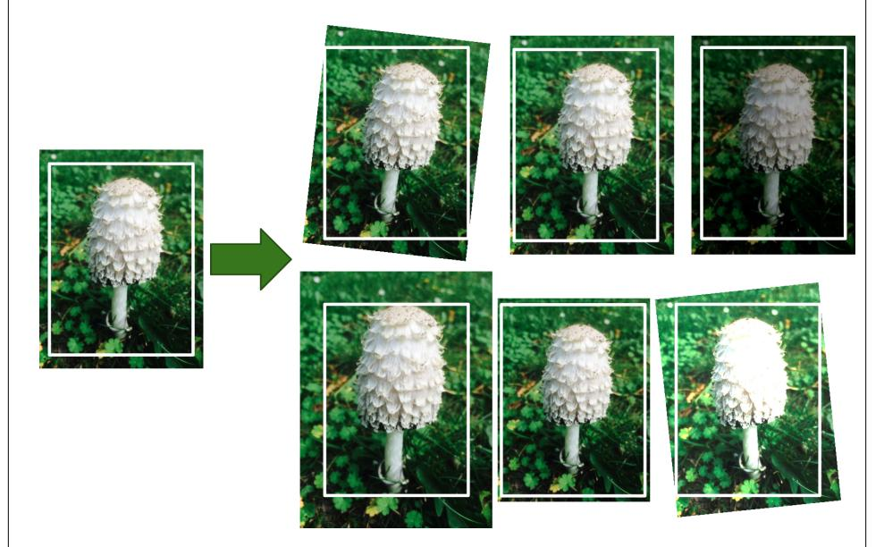

Figure 14-13. Generating new training instances from existing ones

图14-13. 从现有实例生成新的训练实例

Data augmentation is also useful when you have an unbalanced dataset: you can use it to generate more samples of the less frequent classes. This is called the *synthetic* minority oversampling technique, or SMOTE for short.

数据增强在处理不平衡数据集时也很有用：您可以用它来为频率较低的类别生成更多样本。这被称为*合成*少数类过采样技术，简称SMOTE。

{528}------------------------------------------------

AlexNet also uses a competitive normalization step immediately after the ReLU step of layers C1 and C3, called *local response normalization* (LRN): the most strongly activated neurons inhibit other neurons located at the same position in neighboring feature maps. Such competitive activation has been observed in biological neurons. This encourages different feature maps to specialize, pushing them apart and forcing them to explore a wider range of features, ultimately improving generalization. Equation 14-2 shows how to apply LRN.

AlexNet还在层C1和C3的ReLU步骤之后立即使用竞争性归一化步骤，称为*局部响应归一化*（LRN）：最强激活的神经元抑制位于相邻特征图中相同位置的其他神经元。这种竞争性激活在生物神经元中已被观察到。这鼓励不同的特征图专门化，将它们推开并迫使它们探索更广泛的特征范围，最终改善泛化。方程14-2显示了如何应用LRN。

Equation 14-2. Local response normalization (LRN)

方程14-2. 局部响应归一化（LRN）

$$
b_i = a_i \left( k + \alpha \sum_{j = j_{\text{low}}}^{j_{\text{high}}} a_j^2 \right)^{-\beta} \quad \text{with } \begin{cases} j_{\text{high}} = \min \left( i + \frac{r}{2}, f_n - 1 \right) \\ j_{\text{low}} = \max \left( 0, i - \frac{r}{2} \right) \end{cases}
$$

In this equation:

在这个方程中：

- $b_i$  is the normalized output of the neuron located in feature map *i*, at some row *u* and column  $\nu$  (note that in this equation we consider only neurons located at this row and column, so  $u$  and  $v$  are not shown).
- $a_i$  is the activation of that neuron after the ReLU step, but before normalization.
- k,  $\alpha$ ,  $\beta$ , and r are hyperparameters. k is called the bias, and r is called the *depth* radius.
- $f_n$  is the number of feature maps.

- $b_i$ 是位于特征图*i*中某行*u*和列$\nu$的神经元的归一化输出（注意在这个方程中我们只考虑位于这一行和列的神经元，所以$u$和$v$没有显示）。
- $a_i$ 是该神经元在ReLU步骤之后但归一化之前的激活。
- k、$\alpha$、$\beta$和r是超参数。k被称为偏置，r被称为*深度*半径。
- $f_n$ 是特征图的数量。

For example, if  $r = 2$  and a neuron has a strong activation, it will inhibit the activation of the neurons located in the feature maps immediately above and below its own.

例如，如果$r = 2$且神经元具有强激活，它将抑制位于其自身特征图正上方和正下方的特征图中的神经元的激活。

In AlexNet, the hyperparameters are set as:  $r = 5$ ,  $\alpha = 0.0001$ ,  $\beta = 0.75$ , and  $k = 2$ . You can implement this step by using the tf.nn.local\_response\_normalization() function (which you can wrap in a Lambda layer if you want to use it in a Keras model).

在AlexNet中，超参数设置为：$r = 5$，$\alpha = 0.0001$，$\beta = 0.75$，$k = 2$。您可以使用tf.nn.local_response_normalization()函数来实现这一步骤（如果您想在Keras模型中使用它，可以将其包装在Lambda层中）。

A variant of AlexNet called ZF Net<sup>12</sup> was developed by Matthew Zeiler and Rob Fergus and won the 2013 ILSVRC challenge. It is essentially AlexNet with a few tweaked hyperparameters (number of feature maps, kernel size, stride, etc.).

一个名为ZF Net<sup>12</sup>的AlexNet变体由Matthew Zeiler和Rob Fergus开发，并赢得了2013年ILSVRC挑战赛。它本质上是AlexNet，只是调整了一些超参数（特征图数量、核大小、步长等）。

<sup>12</sup> Matthew D. Zeiler and Rob Fergus, "Visualizing and Understanding Convolutional Networks", Proceedings of the European Conference on Computer Vision (2014): 818-833.

{529}------------------------------------------------

### GoogLeNet

The GoogLeNet architecture was developed by Christian Szegedy et al. from Google Research,<sup>13</sup> and it won the ILSVRC 2014 challenge by pushing the top-five error rate below 7%. This great performance came in large part from the fact that the network was much deeper than previous CNNs (as you'll see in Figure 14-15). This was made possible by subnetworks called *inception modules*,<sup>14</sup> which allow GoogLeNet to use parameters much more efficiently than previous architectures: GoogLeNet actually has 10 times fewer parameters than AlexNet (roughly 6 million instead of 60 million).

GoogLeNet架构由Google Research的Christian Szegedy等人开发，<sup>13</sup>它通过将前五错误率推至7%以下赢得了ILSVRC 2014挑战赛。这种出色的性能很大程度上来自于网络比以前的CNN更深（如您将在图14-15中看到的）。这是通过称为*inception模块*<sup>14</sup>的子网络实现的，它们使GoogLeNet能够比以前的架构更有效地使用参数：GoogLeNet实际上比AlexNet少10倍的参数（大约600万而不是6000万）。

Figure 14-14 shows the architecture of an inception module. The notation " $3 \times 3 +$  $1(S)$ " means that the layer uses a  $3 \times 3$  kernel, stride 1, and "same" padding. The input signal is first fed to four different layers in parallel. All convolutional layers use the ReLU activation function. Note that the top convolutional layers use different kernel sizes (1  $\times$  1, 3  $\times$  3, and 5  $\times$  5), allowing them to capture patterns at different scales. Also note that every single layer uses a stride of 1 and "same" padding (even the max pooling layer), so their outputs all have the same height and width as their inputs. This makes it possible to concatenate all the outputs along the depth dimension in the final *depth concatenation layer* (i.e., to stack the feature maps from all four top convolutional layers). It can be implemented using Keras's Concatenate layer, using the default  $axis = -1$

图14-14显示了inception模块的架构。符号"$3 \times 3 +$ $1(S)$"表示该层使用$3 \times 3$核、步长1和"same"填充。输入信号首先并行馈送到四个不同的层。所有卷积层都使用ReLU激活函数。注意顶部的卷积层使用不同的核大小（1 $\times$ 1、3 $\times$ 3和5 $\times$ 5），使它们能够捕获不同尺度的模式。还要注意每一层都使用步长1和"same"填充（甚至最大池化层也是如此），因此它们的输出都与输入具有相同的高度和宽度。这使得在最终的*深度连接层*中沿深度维度连接所有输出成为可能（即，堆叠来自所有四个顶部卷积层的特征图）。可以使用Keras的Concatenate层来实现，使用默认的$axis = -1$ 

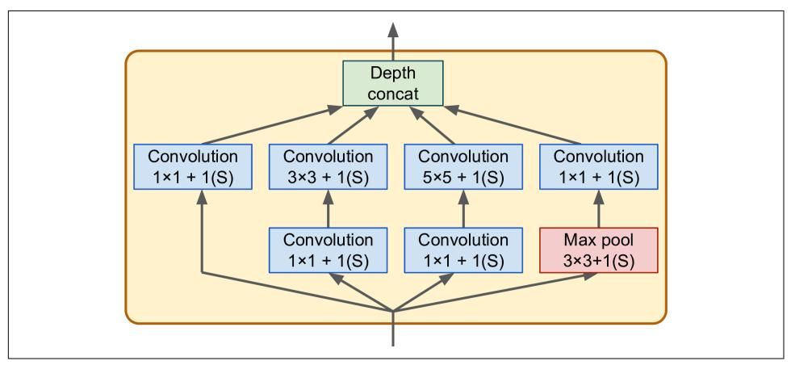

Figure 14-14. Inception module

图14-14. Inception模块

<sup>13</sup> Christian Szegedy et al., "Going Deeper with Convolutions", Proceedings of the IEEE Conference on Computer Vision and Pattern Recognition (2015): 1-9.

<sup>14</sup> In the 2010 movie *Inception*, the characters keep going deeper and deeper into multiple layers of dreams; hence the name of these modules.

<sup>14</sup> 在2010年的电影*《盗梦空间》*中，角色们不断深入到多层梦境中；因此这些模块得名。

{530}------------------------------------------------

You may wonder why inception modules have convolutional layers with  $1 \times 1$  kernels. Surely these layers cannot capture any features because they look at only one pixel at a time, right? In fact, these layers serve three purposes:

您可能想知道为什么inception模块有使用$1 \times 1$核的卷积层。当然，这些层不能捕获任何特征，因为它们一次只看一个像素，对吧？实际上，这些层有三个目的：

- Although they cannot capture spatial patterns, they can capture patterns along the depth dimension (i.e., across channels).
- They are configured to output fewer feature maps than their inputs, so they serve as bottleneck layers, meaning they reduce dimensionality. This cuts the computational cost and the number of parameters, speeding up training and improving generalization.
- Each pair of convolutional layers ( $[1 \times 1, 3 \times 3]$  and  $[1 \times 1, 5 \times 5]$ ) acts like a single powerful convolutional layer, capable of capturing more complex patterns. A convolutional layer is equivalent to sweeping a dense layer across the image (at each location, it only looks at a small receptive field), and these pairs of convolutional layers are equivalent to sweeping two-layer neural networks across the image.

- 虽然它们不能捕获空间模式，但它们可以捕获沿深度维度的模式（即跨通道）。
- 它们被配置为输出比输入更少的特征图，因此它们充当瓶颈层，意味着它们降低维度。这减少了计算成本和参数数量，加快了训练并改善了泛化。
- 每对卷积层（$[1 \times 1, 3 \times 3]$和$[1 \times 1, 5 \times 5]$）就像一个强大的卷积层，能够捕获更复杂的模式。卷积层相当于在图像上扫描密集层（在每个位置，它只查看一个小的感受野），这些成对的卷积层相当于在图像上扫描两层神经网络。

In short, you can think of the whole inception module as a convolutional layer on steroids, able to output feature maps that capture complex patterns at various scales.

简而言之，您可以将整个inception模块视为增强版的卷积层，能够输出捕获各种尺度复杂模式的特征图。

Now let's look at the architecture of the GoogLeNet CNN (see Figure 14-15). The number of feature maps output by each convolutional layer and each pooling layer is shown before the kernel size. The architecture is so deep that it has to be represented in three columns, but GoogLeNet is actually one tall stack, including nine inception modules (the boxes with the spinning tops). The six numbers in the inception modules represent the number of feature maps output by each convolutional layer in the module (in the same order as in Figure 14-14). Note that all the convolutional layers use the ReLU activation function.

现在让我们看看GoogLeNet CNN的架构（见图14-15）。每个卷积层和每个池化层输出的特征图数量显示在核大小之前。架构如此之深，必须用三列来表示，但GoogLeNet实际上是一个高大的堆栈，包括九个inception模块（带有旋转顶部的框）。inception模块中的六个数字表示模块中每个卷积层输出的特征图数量（与图14-14中的顺序相同）。注意所有卷积层都使用ReLU激活函数。

Let's go through this network:

让我们来分析这个网络：

- The first two layers divide the image's height and width by 4 (so its area is divided by 16), to reduce the computational load. The first layer uses a large kernel size,  $7 \times 7$ , so that much of the information is preserved.
- Then the local response normalization layer ensures that the previous layers learn a wide variety of features (as discussed earlier).
- Two convolutional layers follow, where the first acts like a bottleneck layer. As mentioned, you can think of this pair as a single smarter convolutional layer.
- Again, a local response normalization layer ensures that the previous layers capture a wide variety of patterns.
- Next, a max pooling layer reduces the image height and width by 2, again to speed up computations.

- 前两层将图像的高度和宽度除以4（因此其面积除以16），以减少计算负载。第一层使用大核大小$7 \times 7$，以便保留大部分信息。
- 然后局部响应归一化层确保前面的层学习各种各样的特征（如前所述）。
- 接下来是两个卷积层，其中第一个充当瓶颈层。如前所述，您可以将这一对视为单个更智能的卷积层。
- 再次，局部响应归一化层确保前面的层捕获各种各样的模式。
- 接下来，最大池化层将图像高度和宽度减少2，再次加快计算速度。

{531}------------------------------------------------

- Then comes the CNN's *backbone*: a tall stack of nine inception modules, interleaved with a couple of max pooling layers to reduce dimensionality and speed up the net.
- Next, the global average pooling layer outputs the mean of each feature map: this drops any remaining spatial information, which is fine because there is not much spatial information left at that point. Indeed, GoogLeNet input images are typically expected to be  $224 \times 224$  pixels, so after 5 max pooling layers, each dividing the height and width by 2, the feature maps are down to  $7 \times 7$ . Moreover, this is a classification task, not localization, so it doesn't matter where the object is. Thanks to the dimensionality reduction brought by this layer, there is no need to have several fully connected layers at the top of the CNN (like in AlexNet), and this considerably reduces the number of parameters in the network and limits the risk of overfitting.
- The last layers are self-explanatory: dropout for regularization, then a fully connected layer with 1,000 units (since there are 1,000 classes) and a softmax activation function to output estimated class probabilities.

- 然后是CNN的*主干*：九个inception模块的高大堆栈，中间穿插几个最大池化层以降低维度并加速网络。
- 接下来，全局平均池化层输出每个特征图的平均值：这丢弃了任何剩余的空间信息，这很好，因为此时没有太多空间信息剩余。实际上，GoogLeNet输入图像通常预期为$224 \times 224$像素，因此在5个最大池化层之后，每个都将高度和宽度除以2，特征图降至$7 \times 7$。此外，这是一个分类任务，而不是定位，所以物体在哪里并不重要。由于这一层带来的维度降低，不需要在CNN顶部有几个全连接层（如AlexNet中），这大大减少了网络中的参数数量并限制了过拟合的风险。
- 最后几层是不言自明的：用于正则化的dropout，然后是具有1,000个单元的全连接层（因为有1,000个类别）和softmax激活函数以输出估计的类别概率。

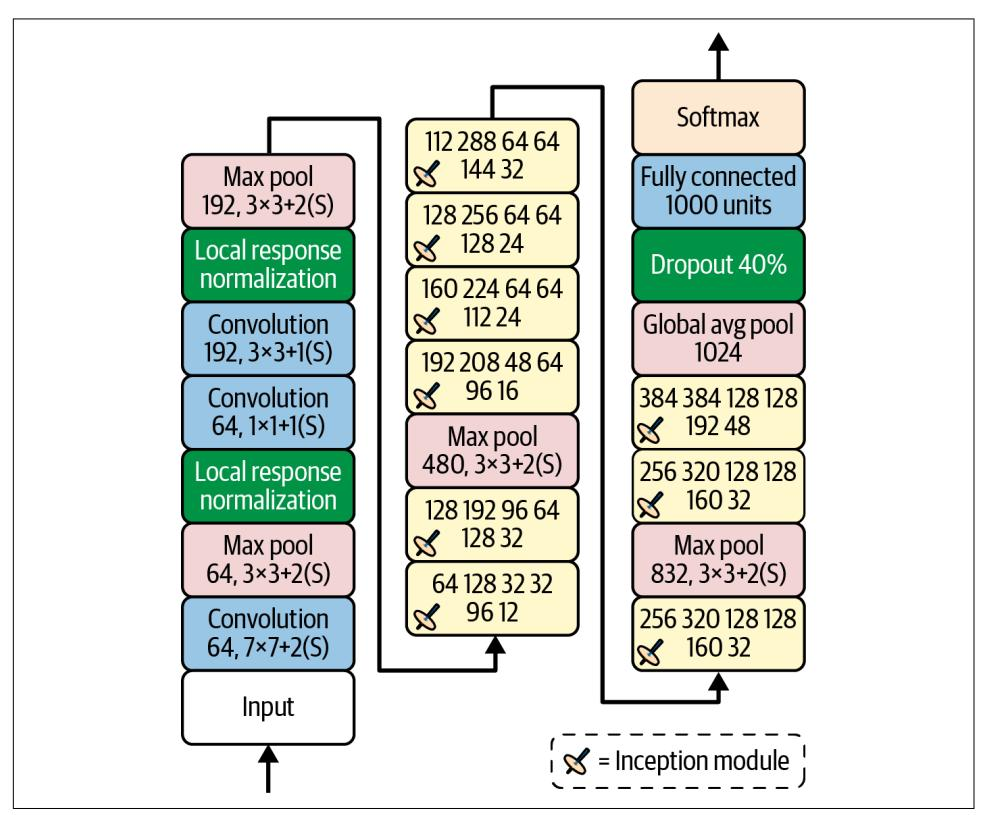

Figure 14-15. GoogLeNet architecture

图14-15. GoogLeNet架构

{532}------------------------------------------------

The original GoogLeNet architecture included two auxiliary classifiers plugged on top of the third and sixth inception modules. They were both composed of one average pooling layer, one convolutional layer, two fully connected layers, and a softmax activation layer. During training, their loss (scaled down by 70%) was added to the overall loss. The goal was to fight the vanishing gradients problem and regularize the network, but it was later shown that their effect was relatively minor.

原始的GoogLeNet架构包括两个辅助分类器，插在第三个和第六个inception模块的顶部。它们都由一个平均池化层、一个卷积层、两个全连接层和一个softmax激活层组成。在训练期间，它们的损失（缩减70%）被添加到总体损失中。目标是对抗梯度消失问题并正则化网络，但后来表明它们的效果相对较小。

Several variants of the GoogLeNet architecture were later proposed by Google researchers, including Inception-v3 and Inception-v4, using slightly different inception modules to reach even better performance.

Google研究人员后来提出了GoogLeNet架构的几个变体，包括Inception-v3和Inception-v4，使用略有不同的inception模块以达到更好的性能。

### **VGGNet**

The runner-up in the ILSVRC 2014 challenge was VGGNet,<sup>15</sup> Karen Simonyan and Andrew Zisserman, from the Visual Geometry Group (VGG) research lab at Oxford University, developed a very simple and classical architecture; it had 2 or 3 convolutional layers and a pooling layer, then again 2 or 3 convolutional layers and a pooling layer, and so on (reaching a total of 16 or 19 convolutional layers, depending on the VGG variant), plus a final dense network with 2 hidden layers and the output layer. It used small  $3 \times 3$  filters, but it had many of them.

ILSVRC 2014挑战赛的亚军是VGGNet，<sup>15</sup>来自牛津大学视觉几何组（VGG）研究实验室的Karen Simonyan和Andrew Zisserman开发了一个非常简单和经典的架构；它有2或3个卷积层和一个池化层，然后再次2或3个卷积层和一个池化层，如此反复（根据VGG变体，总共达到16或19个卷积层），加上最终的密集网络，有2个隐藏层和输出层。它使用小的$3 \times 3$滤波器，但有很多这样的滤波器。

#### **ResNet**

Kaiming He et al. won the ILSVRC 2015 challenge using a Residual Network (ResNet)<sup>16</sup> that delivered an astounding top-five error rate under 3.6%. The winning variant used an extremely deep CNN composed of 152 layers (other variants had 34, 50, and 101 layers). It confirmed the general trend: computer vision models were getting deeper and deeper, with fewer and fewer parameters. The key to being able to train such a deep network is to use skip connections (also called shortcut connections): the signal feeding into a layer is also added to the output of a layer located higher up the stack. Let's see why this is useful.

#### **残差网络**

Kaiming He等人使用残差网络（ResNet）<sup>16</sup>赢得了ILSVRC 2015挑战赛，该网络实现了惊人的低于3.6%的前五错误率。获胜的变体使用了由152层组成的极深CNN（其他变体有34、50和101层）。这证实了总体趋势：计算机视觉模型越来越深，参数越来越少。能够训练如此深的网络的关键是使用跳跃连接（也称为快捷连接）：馈入一层的信号也被添加到堆栈中更高层的输出。让我们看看为什么这很有用。

When training a neural network, the goal is to make it model a target function  $h(x)$ . If you add the input  $x$  to the output of the network (i.e., you add a skip connection), then the network will be forced to model  $f(x) = h(x) - x$  rather than  $h(x)$ . This is called residual learning (see Figure 14-16).

在训练神经网络时，目标是使其建模目标函数$h(x)$。如果您将输入$x$添加到网络的输出（即，您添加跳跃连接），那么网络将被迫建模$f(x) = h(x) - x$而不是$h(x)$。这被称为残差学习（见图14-16）。

<sup>15</sup> Karen Simonyan and Andrew Zisserman, "Very Deep Convolutional Networks for Large-Scale Image Recognition", arXiv preprint arXiv:1409.1556 (2014).

<sup>16</sup> Kaiming He et al., "Deep Residual Learning for Image Recognition", arXiv preprint arXiv:1512:03385 (2015).

{533}------------------------------------------------

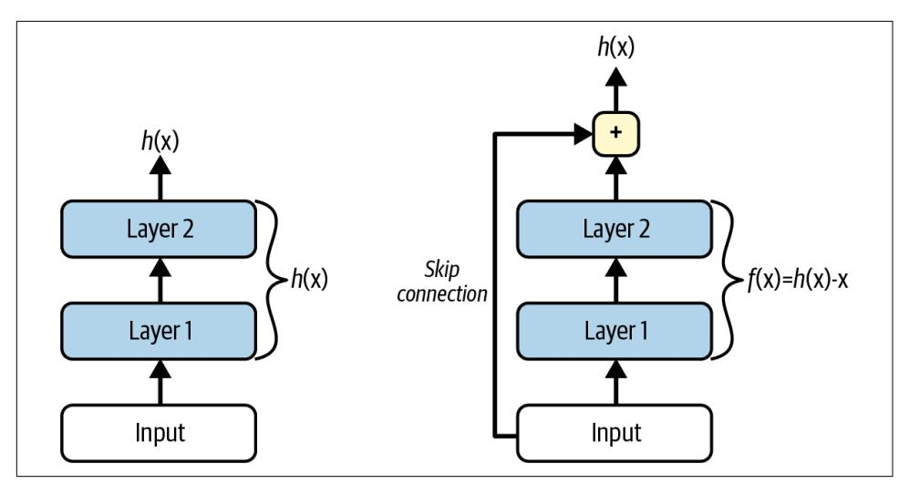

Figure 14-16. Residual learning

图14-16. 残差学习

When you initialize a regular neural network, its weights are close to zero, so the network just outputs values close to zero. If you add a skip connection, the resulting network just outputs a copy of its inputs; in other words, it initially models the identity function. If the target function is fairly close to the identity function (which is often the case), this will speed up training considerably.

当您初始化常规神经网络时，其权重接近零，因此网络只输出接近零的值。如果您添加跳跃连接，结果网络只输出其输入的副本；换句话说，它最初建模恒等函数。如果目标函数相当接近恒等函数（这通常是情况），这将大大加快训练速度。

Moreover, if you add many skip connections, the network can start making progress even if several layers have not started learning yet (see Figure 14-17). Thanks to skip connections, the signal can easily make its way across the whole network. The deep residual network can be seen as a stack of *residual units* (RUs), where each residual unit is a small neural network with a skip connection.

此外，如果您添加许多跳跃连接，即使几个层尚未开始学习，网络也可以开始取得进展（见图14-17）。由于跳跃连接，信号可以轻松地穿过整个网络。深度残差网络可以看作是*残差单元*（RU）的堆栈，其中每个残差单元是带有跳跃连接的小型神经网络。

Now let's look at ResNet's architecture (see Figure 14-18). It is surprisingly simple. It starts and ends exactly like GoogLeNet (except without a dropout layer), and in between is just a very deep stack of residual units. Each residual unit is composed of two convolutional layers (and no pooling layer!), with batch normalization (BN) and ReLU activation, using  $3 \times 3$  kernels and preserving spatial dimensions (stride 1, "same" padding).

现在让我们看看ResNet的架构（见图14-18）。它出奇地简单。它的开始和结束与GoogLeNet完全相同（除了没有dropout层），中间只是残差单元的非常深的堆栈。每个残差单元由两个卷积层组成（没有池化层！），具有批量归一化（BN）和ReLU激活，使用$3 \times 3$核并保持空间维度（步长1，"same"填充）。

{534}------------------------------------------------

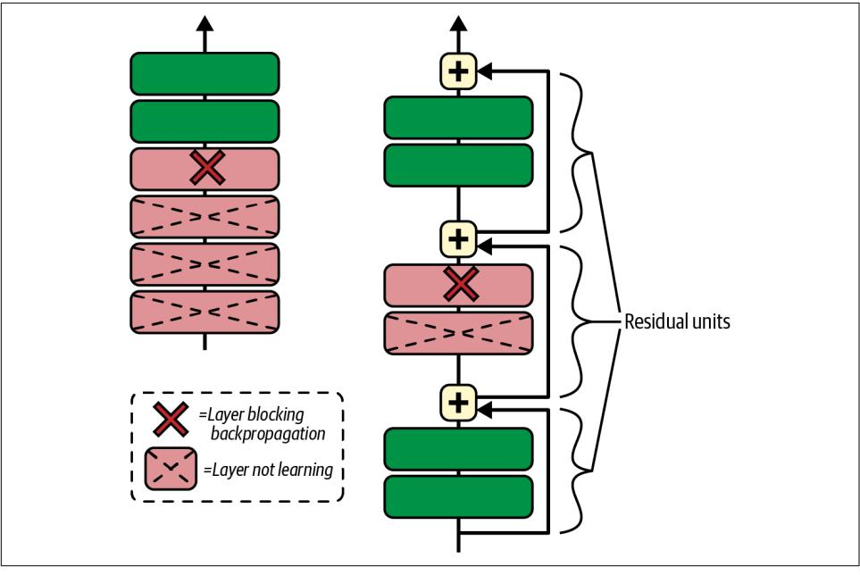

Figure 14-17. Regular deep neural network (left) and deep residual network (right)

图14-17. 常规深度神经网络（左）和深度残差网络（右）

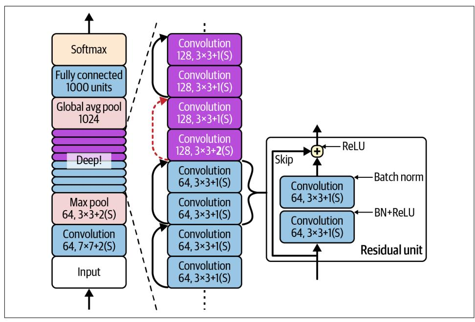

Figure 14-18. ResNet architecture

图14-18. ResNet架构

{535}------------------------------------------------

Note that the number of feature maps is doubled every few residual units, at the same time as their height and width are halved (using a convolutional layer with stride 2). When this happens, the inputs cannot be added directly to the outputs of the residual unit because they don't have the same shape (for example, this problem affects the skip connection represented by the dashed arrow in Figure 14-18). To solve this problem, the inputs are passed through a  $1 \times 1$  convolutional layer with stride 2 and the right number of output feature maps (see Figure 14-19).

请注意，特征图的数量每隔几个残差单元就会翻倍，同时它们的高度和宽度会减半（使用步长为2的卷积层）。当这种情况发生时，输入不能直接添加到残差单元的输出，因为它们没有相同的形状（例如，这个问题影响图14-18中虚线箭头表示的跳跃连接）。为了解决这个问题，输入通过步长为2的$1 \times 1$卷积层和正确数量的输出特征图（见图14-19）。

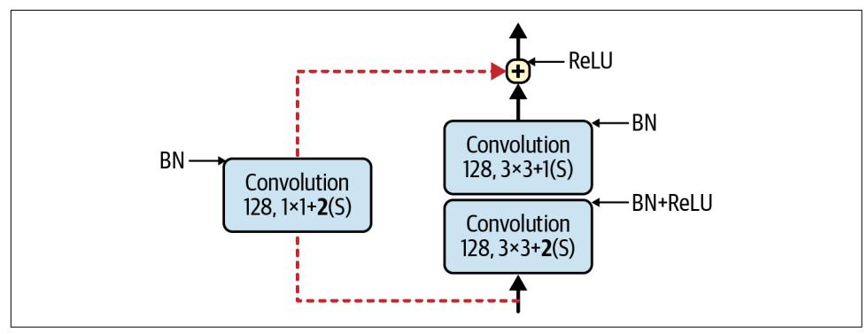

Figure 14-19. Skip connection when changing feature map size and depth

图14-19. 改变特征图大小和深度时的跳跃连接

Different variations of the architecture exist, with different numbers of layers. ResNet-34 is a ResNet with 34 layers (only counting the convolutional layers and the fully connected layer)<sup>17</sup> containing 3 RUs that output 64 feature maps, 4 RUs with 128 maps, 6 RUs with 256 maps, and 3 RUs with 512 maps. We will implement this architecture later in this chapter.

该架构存在不同的变体，具有不同数量的层。ResNet-34是具有34层的ResNet（仅计算卷积层和全连接层）<sup>17</sup>，包含3个输出64个特征图的RU、4个具有128个图的RU、6个具有256个图的RU和3个具有512个图的RU。我们将在本章后面实现这个架构。


Google's Inception-v4<sup>18</sup> architecture merged the ideas of GoogLe-Net and ResNet and achieved a top-five error rate of close to 3% on ImageNet classification.

Google的Inception-v4<sup>18</sup>架构融合了GoogLeNet和ResNet的思想，在ImageNet分类上实现了接近3%的前五错误率。

ResNets deeper than that, such as ResNet-152, use slightly different residual units. Instead of two  $3 \times 3$  convolutional layers with, say, 256 feature maps, they use three convolutional layers: first a  $1 \times 1$  convolutional layer with just 64 feature maps (4  $\times$ less), which acts as a bottleneck layer (as discussed already), then a  $3 \times 3$  layer with 64 feature maps, and finally another  $1 \times 1$  convolutional layer with 256 feature maps (4 times 64) that restores the original depth. ResNet-152 contains 3 such RUs that

比这更深的ResNet，如ResNet-152，使用稍微不同的残差单元。它们不使用两个具有256个特征图的$3 \times 3$卷积层，而是使用三个卷积层：首先是只有64个特征图（少4$\times$）的$1 \times 1$卷积层，它充当瓶颈层（如前所述），然后是具有64个特征图的$3 \times 3$层，最后是另一个具有256个特征图（4倍64）的$1 \times 1$卷积层，恢复原始深度。ResNet-152包含3个这样的RU

<sup>17</sup> It is a common practice when describing a neural network to count only layers with parameters.

<sup>18</sup> Christian Szegedy et al., "Inception-v4, Inception-ResNet and the Impact of Residual Connections on Learning", arXiv preprint arXiv:1602.07261 (2016).

{536}------------------------------------------------

output 256 maps, then 8 RUs with 512 maps, a whopping 36 RUs with 1,024 maps, and finally 3 RUs with 2,048 maps.

输出256个图，然后是8个具有512个图的RU，惊人的36个具有1,024个图的RU，最后是3个具有2,048个图的RU。

### **Xception**

Another variant of the GoogLeNet architecture is worth noting: Xception<sup>19</sup> (which stands for *Extreme Inception*) was proposed in 2016 by François Chollet (the author of Keras), and it significantly outperformed Inception-v3 on a huge vision task (350) million images and 17,000 classes). Just like Inception-v4, it merges the ideas of GoogLeNet and ResNet, but it replaces the inception modules with a special type of layer called a *depthwise separable convolution layer* (or *separable convolution layer* for short<sup>20</sup>). These layers had been used before in some CNN architectures, but they were not as central as in the Xception architecture. While a regular convolutional layer uses filters that try to simultaneously capture spatial patterns (e.g., an oval) and cross-channel patterns (e.g., mouth + nose + eyes = face), a separable convolutional layer makes the strong assumption that spatial patterns and cross-channel patterns can be modeled separately (see Figure 14-20). Thus, it is composed of two parts: the first part applies a single spatial filter to each input feature map, then the second part looks exclusively for cross-channel patterns—it is just a regular convolutional layer with  $1 \times 1$  filters.

GoogLeNet架构的另一个值得注意的变体是：Xception<sup>19</sup>（代表*极端Inception*）由François Chollet（Keras的作者）于2016年提出，它在一个巨大的视觉任务（3.5亿张图像和17,000个类别）上显著超越了Inception-v3。就像Inception-v4一样，它融合了GoogLeNet和ResNet的思想，但它用一种称为*深度可分离卷积层*（或简称*可分离卷积层*<sup>20</sup>）的特殊类型层替换了inception模块。这些层以前在一些CNN架构中使用过，但它们在Xception架构中不像那样核心。虽然常规卷积层使用试图同时捕获空间模式（例如，椭圆）和跨通道模式（例如，嘴+鼻子+眼睛=脸）的滤波器，但可分离卷积层做出强假设，即空间模式和跨通道模式可以分别建模（见图14-20）。因此，它由两部分组成：第一部分对每个输入特征图应用单个空间滤波器，然后第二部分专门寻找跨通道模式——它只是一个具有$1 \times 1$滤波器的常规卷积层。

Since separable convolutional layers only have one spatial filter per input channel, you should avoid using them after layers that have too few channels, such as the input layer (granted, that's what Figure 14-20 represents, but it is just for illustration purposes). For this reason, the Xception architecture starts with 2 regular convolutional layers, but then the rest of the architecture uses only separable convolutions (34 in all), plus a few max pooling layers and the usual final layers (a global average pooling layer and a dense output layer).

由于可分离卷积层每个输入通道只有一个空间滤波器，您应该避免在通道太少的层（如输入层）之后使用它们（当然，这就是图14-20所表示的，但这只是为了说明目的）。因此，Xception架构从2个常规卷积层开始，但然后架构的其余部分仅使用可分离卷积（总共34个），加上几个最大池化层和通常的最终层（全局平均池化层和密集输出层）。

You might wonder why Xception is considered a variant of GoogLeNet, since it contains no inception modules at all. Well, as discussed earlier, an inception module contains convolutional layers with  $1 \times 1$  filters: these look exclusively for cross-channel patterns. However, the convolutional layers that sit on top of them are regular convolutional layers that look both for spatial and cross-channel patterns. So, you can think of an inception module as an intermediate between a regular convolutional layer (which considers spatial patterns and cross-channel patterns jointly) and a separable convolutional layer (which considers them separately). In practice, it seems that separable convolutional layers often perform better.

您可能想知道为什么Xception被认为是GoogLeNet的变体，因为它根本不包含inception模块。好吧，如前所述，inception模块包含具有$1 \times 1$滤波器的卷积层：这些专门寻找跨通道模式。然而，位于它们之上的卷积层是常规卷积层，既寻找空间模式又寻找跨通道模式。因此，您可以将inception模块视为常规卷积层（联合考虑空间模式和跨通道模式）和可分离卷积层（分别考虑它们）之间的中间体。在实践中，可分离卷积层似乎通常表现更好。

<sup>19</sup> François Chollet, "Xception: Deep Learning with Depthwise Separable Convolutions", arXiv preprint arXiv:1610.02357 (2016).

<sup>20</sup> This name can sometimes be ambiguous, since spatially separable convolutions are often called "separable" convolutions" as well.

{537}------------------------------------------------

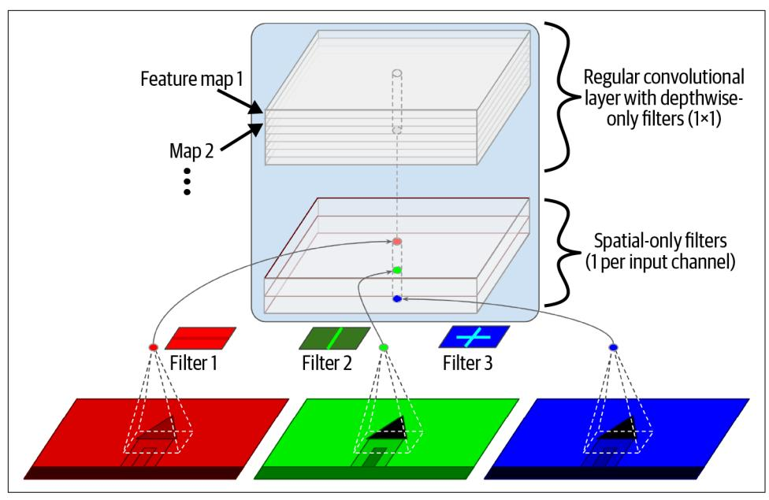

Figure 14-20. Depthwise separable convolutional layer

图14-20. 深度可分离卷积层


Separable convolutional layers use fewer parameters, less memory, and fewer computations than regular convolutional layers, and they often perform better. Consider using them by default, except after layers with few channels (such as the input channel). In Keras, just use SeparableConv2D instead of Conv2D: it's a drop-in replacement. Keras also offers a DepthwiseConv2D layer that implements the first part of a depthwise separable convolutional layer (i.e., applying one spatial filter per input feature map).

可分离卷积层比常规卷积层使用更少的参数、更少的内存和更少的计算，并且它们通常表现更好。考虑默认使用它们，除了在通道较少的层（如输入通道）之后。在Keras中，只需使用SeparableConv2D而不是Conv2D：它是一个直接替换。Keras还提供了DepthwiseConv2D层，它实现了深度可分离卷积层的第一部分（即，对每个输入特征图应用一个空间滤波器）。

#### **SENet**

The winning architecture in the ILSVRC 2017 challenge was the Squeeze-and-Excitation Network (SENet).<sup>21</sup> This architecture extends existing architectures such as inception networks and ResNets, and boosts their performance. This allowed SENet to win the competition with an astonishing 2.25% top-five error rate! The extended versions of inception networks and ResNets are called SE-Inception and SE-ResNet, respectively. The boost comes from the fact that a SENet adds a small neural network, called an SE block, to every inception module or residual unit in the original architecture, as shown in Figure 14-21.

ILSVRC 2017挑战赛的获胜架构是挤压激励网络（SENet）。<sup>21</sup>这种架构扩展了现有架构，如inception网络和ResNet，并提升了它们的性能。这使得SENet以惊人的2.25%前五错误率赢得了比赛！inception网络和ResNet的扩展版本分别称为SE-Inception和SE-ResNet。提升来自于SENet向原始架构中的每个inception模块或残差单元添加了一个称为SE块的小型神经网络，如图14-21所示。

<sup>21</sup> Jie Hu et al., "Squeeze-and-Excitation Networks", Proceedings of the IEEE Conference on Computer Vision and Pattern Recognition (2018): 7132-7141.

{538}------------------------------------------------

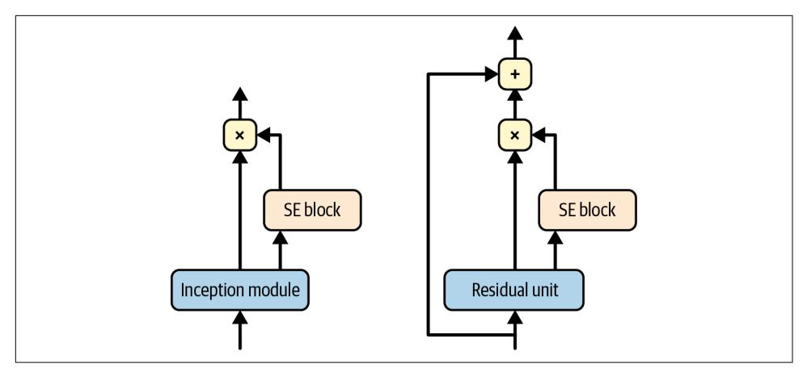

Figure 14-21. SE-Inception module (left) and SE-ResNet unit (right)

图14-21. SE-Inception模块（左）和SE-ResNet单元（右）

An SE block analyzes the output of the unit it is attached to, focusing exclusively on the depth dimension (it does not look for any spatial pattern), and it learns which features are usually most active together. It then uses this information to recalibrate the feature maps, as shown in Figure 14-22. For example, an SE block may learn that mouths, noses, and eyes usually appear together in pictures: if you see a mouth and a nose, you should expect to see eyes as well. So, if the block sees a strong activation in the mouth and nose feature maps, but only mild activation in the eye feature map, it will boost the eye feature map (more accurately, it will reduce irrelevant feature maps). If the eyes were somewhat confused with something else, this feature map recalibration will help resolve the ambiguity.

SE块分析它所附加单元的输出，专门关注深度维度（它不寻找任何空间模式），并学习哪些特征通常最活跃地一起出现。然后它使用这些信息重新校准特征图，如图14-22所示。例如，SE块可能学习到嘴、鼻子和眼睛通常在图片中一起出现：如果您看到嘴和鼻子，您也应该期望看到眼睛。因此，如果块在嘴和鼻子特征图中看到强激活，但在眼睛特征图中只有轻微激活，它将增强眼睛特征图（更准确地说，它将减少不相关的特征图）。如果眼睛与其他东西有些混淆，这种特征图重新校准将有助于解决歧义。

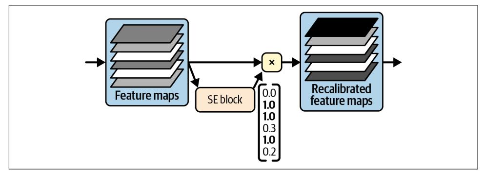

Figure 14-22. An SE block performs feature map recalibration

图14-22. SE块执行特征图重新校准

An SE block is composed of just three layers: a global average pooling layer, a hidden dense layer using the ReLU activation function, and a dense output layer using the sigmoid activation function (see Figure 14-23).

SE块仅由三层组成：一个全局平均池化层、一个使用ReLU激活函数的隐藏密集层，以及一个使用sigmoid激活函数的密集输出层（见图14-23）。

{539}------------------------------------------------

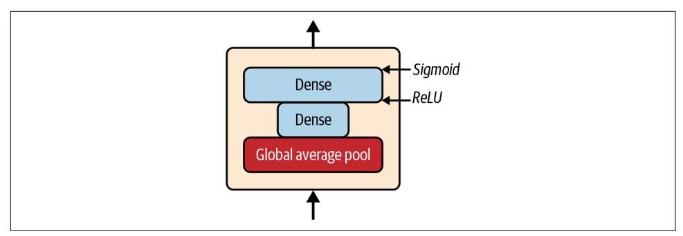

Figure 14-23. SE block architecture

As earlier, the global average pooling layer computes the mean activation for each feature map: for example, if its input contains 256 feature maps, it will output 256 numbers representing the overall level of response for each filter. The next layer is where the "squeeze" happens: this layer has significantly fewer than 256 neurons typically 16 times fewer than the number of feature maps (e.g., 16 neurons)—so the 256 numbers get compressed into a small vector (e.g., 16 dimensions). This is a low-dimensional vector representation (*i.e.*, an embedding) of the distribution of feature responses. This bottleneck step forces the SE block to learn a general representation of the feature combinations (we will see this principle in action again when we discuss autoencoders in Chapter 17). Finally, the output layer takes the embedding and outputs a recalibration vector containing one number per feature map (e.g., 256), each between 0 and 1. The feature maps are then multiplied by this recalibration vector, so irrelevant features (with a low recalibration score) get scaled down while relevant features (with a recalibration score close to 1) are left alone.

如前所述，全局平均池化层计算每个特征图的平均激活值：例如，如果其输入包含256个特征图，它将输出256个数字，表示每个滤波器的整体响应水平。下一层是发生"挤压"的地方：这一层的神经元数量明显少于256个，通常比特征图数量少16倍（例如，16个神经元）——因此256个数字被压缩成一个小向量（例如，16维）。这是特征响应分布的低维向量表示（即嵌入）。这个瓶颈步骤迫使SE块学习特征组合的一般表示（当我们在第17章讨论自编码器时，将再次看到这个原理的作用）。最后，输出层接受嵌入并输出一个重新校准向量，每个特征图包含一个数字（例如，256个），每个数字都在0和1之间。然后将特征图乘以这个重新校准向量，因此不相关的特征（重新校准分数低）被缩小，而相关的特征（重新校准分数接近1）保持不变。

#### **Other Noteworthy Architectures**

#### **其他值得注意的架构**

There are many other CNN architectures to explore. Here's a brief overview of some of the most noteworthy:

还有许多其他的CNN架构值得探索。以下是一些最值得注意的架构的简要概述：

#### $ResNeXt^{22}$

ResNeXt improves the residual units in ResNet. Whereas the residual units in the best ResNet models just contain 3 convolutional layers each, the ResNeXt residual units are composed of many parallel stacks (e.g., 32 stacks), with 3 convolutional layers each. However, the first two layers in each stack only use a few filters (e.g., just four), so the overall number of parameters remains the same as in ResNet. Then the outputs of all the stacks are added together, and the result is passed to the next residual unit (along with the skip connection).

ResNeXt改进了ResNet中的残差单元。虽然最佳ResNet模型中的残差单元每个只包含3个卷积层，但ResNeXt残差单元由许多并行堆栈组成（例如，32个堆栈），每个堆栈有3个卷积层。然而，每个堆栈中的前两层只使用少量滤波器（例如，只有四个），因此总体参数数量与ResNet保持相同。然后将所有堆栈的输出相加，结果传递给下一个残差单元（连同跳跃连接）。

<sup>22</sup> Saining Xie et al., "Aggregated Residual Transformations for Deep Neural Networks", arXiv preprint arXiv:1611.05431 (2016).

{540}------------------------------------------------

#### DenseNet<sup>23</sup>

A DenseNet is composed of several dense blocks, each made up of a few densely connected convolutional layers. This architecture achieved excellent accuracy while using comparatively few parameters. What does "densely connected" mean? The output of each layer is fed as input to every layer after it within the same block. For example, layer 4 in a block takes as input the depthwise concatenation of the outputs of layers 1, 2, and 3 in that block. Dense blocks are separated by a few transition layers.

DenseNet由几个密集块组成，每个密集块由几个密集连接的卷积层组成。这种架构在使用相对较少参数的情况下实现了出色的准确性。"密集连接"是什么意思？每一层的输出都作为输入馈送到同一块中它之后的每一层。例如，块中的第4层将块中第1、2和3层输出的深度级联作为输入。密集块由几个过渡层分隔。

#### $MobileNet<sup>24</sup>$

MobileNets are streamlined models designed to be lightweight and fast, making them popular in mobile and web applications. They are based on depthwise separable convolutional layers, like Xception. The authors proposed several variants, trading a bit of accuracy for faster and smaller models.

MobileNet是设计为轻量级和快速的流线型模型，使它们在移动和Web应用程序中很受欢迎。它们基于深度可分离卷积层，就像Xception一样。作者提出了几个变体，以牺牲一点准确性来换取更快更小的模型。

#### $CSPNet^{25}$

A Cross Stage Partial Network (CSPNet) is similar to a DenseNet, but part of each dense block's input is concatenated directly to that block's output, without going through the block.

跨阶段部分网络（CSPNet）类似于DenseNet，但每个密集块输入的一部分直接连接到该块的输出，而不经过该块。

#### EfficientNet<sup>26</sup>

EfficientNet is arguably the most important model in this list. The authors proposed a method to scale any CNN efficiently, by jointly increasing the depth (number of layers), width (number of filters per layer), and resolution (size of the input image) in a principled way. This is called *compound scaling*. They used neural architecture search to find a good architecture for a scaled-down version of ImageNet (with smaller and fewer images), and then used compound scaling to create larger and larger versions of this architecture. When EfficientNet models came out, they vastly outperformed all existing models, across all compute budgets, and they remain among the best models out there today.

EfficientNet可以说是这个列表中最重要的模型。作者提出了一种有效扩展任何CNN的方法，通过有原则地联合增加深度（层数）、宽度（每层滤波器数量）和分辨率（输入图像大小）。这被称为*复合缩放*。他们使用神经架构搜索为ImageNet的缩小版本（图像更小更少）找到一个好的架构，然后使用复合缩放创建这个架构越来越大的版本。当EfficientNet模型问世时，它们在所有计算预算下都大大超越了所有现有模型，并且至今仍然是最好的模型之一。

Understanding EfficientNet's compound scaling method is helpful to gain a deeper understanding of CNNs, especially if you ever need to scale a CNN architecture. It is based on a logarithmic measure of the compute budget, noted  $\phi$ : if your compute budget doubles, then  $\phi$  increases by 1. In other words, the number of floating-point operations available for training is proportional to  $2^{\phi}$ . Your CNN architecture's depth,

理解EfficientNet的复合缩放方法有助于更深入地理解CNN，特别是如果您需要缩放CNN架构。它基于计算预算的对数度量，记为$\phi$：如果您的计算预算翻倍，那么$\phi$增加1。换句话说，可用于训练的浮点运算数量与$2^{\phi}$成正比。您的CNN架构的深度、

<sup>23</sup> Gao Huang et al., "Densely Connected Convolutional Networks", arXiv preprint arXiv:1608.06993 (2016).

<sup>24</sup> Andrew G. Howard et al., "MobileNets: Efficient Convolutional Neural Networks for Mobile Vision Applications", arXiv preprint arxiv:1704.04861 (2017).

<sup>25</sup> Chien-Yao Wang et al., "CSPNet: A New Backbone That Can Enhance Learning Capability of CNN", arXiv preprint arXiv:1911.11929 (2019).

<sup>26</sup> Mingxing Tan and Quoc V. Le, "EfficientNet: Rethinking Model Scaling for Convolutional Neural Networks", arXiv preprint arXiv:1905.11946 (2019).

{541}------------------------------------------------

width, and resolution should scale as  $\alpha^{\phi}$ ,  $\beta^{\phi}$ , and  $\gamma^{\phi}$ , respectively. The factors  $\alpha$ ,  $\beta$ , and y must be greater than 1, and  $\alpha + \beta^2 + \gamma^2$  should be close to 2. The optimal values for these factors depend on the CNN's architecture. To find the optimal values for the EfficientNet architecture, the authors started with a small baseline model (EfficientNetB0), fixed  $\phi = 1$ , and simply ran a grid search: they found  $\alpha = 1.2$ ,  $\beta =$ 1.1, and  $\gamma = 1.1$ . They then used these factors to create several larger architectures, named EfficientNetB1 to EfficientNetB7, for increasing values of  $\phi$ .

宽度和分辨率应该分别按$\alpha^{\phi}$、$\beta^{\phi}$和$\gamma^{\phi}$缩放。因子$\alpha$、$\beta$和$\gamma$必须大于1，并且$\alpha + \beta^2 + \gamma^2$应该接近2。这些因子的最优值取决于CNN的架构。为了找到EfficientNet架构的最优值，作者从一个小的基线模型（EfficientNetB0）开始，固定$\phi = 1$，并简单地运行网格搜索：他们发现$\alpha = 1.2$，$\beta = 1.1$，$\gamma = 1.1$。然后他们使用这些因子创建了几个更大的架构，命名为EfficientNetB1到EfficientNetB7，对应$\phi$的递增值。

#### **Choosing the Right CNN Architecture**

With so many CNN architectures, how do you choose which one is best for your project? Well, it depends on what matters most to you: Accuracy? Model size (e.g., for deployment to a mobile device)? Inference speed on CPU? On GPU? Table 14-3 lists the best pretrained models currently available in Keras (you'll see how to use them later in this chapter), sorted by model size. You can find the full list at https:// keras.io/api/applications. For each model, the table shows the Keras class name to use (in the tf.keras.applications package), the model's size in MB, the top-1 and top-5 validation accuracy on the ImageNet dataset, the number of parameters (millions), and the inference time on CPU and GPU in ms, using batches of 32 images on reasonably powerful hardware.<sup>27</sup> For each column, the best value is highlighted. As you can see, larger models are generally more accurate, but not always; for example, EfficientNetB2 outperforms InceptionV3 both in size and accuracy. I only kept Inception V3 in the list because it is almost twice as fast as Efficient Net B2 on a CPU. Similarly, InceptionResNetV2 is fast on a CPU, and ResNet50V2 and ResNet101V2 are blazingly fast on a GPU.

#### **选择正确的CNN架构**

有这么多CNN架构，您如何选择最适合您项目的架构？这取决于您最关心什么：准确性？模型大小（例如，部署到移动设备）？CPU上的推理速度？GPU上的推理速度？表14-3列出了Keras中目前可用的最佳预训练模型（您将在本章后面看到如何使用它们），按模型大小排序。您可以在https://keras.io/api/applications找到完整列表。对于每个模型，表格显示了要使用的Keras类名（在tf.keras.applications包中）、模型的大小（MB）、在ImageNet数据集上的top-1和top-5验证准确性、参数数量（百万）以及在相当强大的硬件上使用32张图像批次在CPU和GPU上的推理时间（毫秒）。<sup>27</sup>对于每一列，最佳值都被突出显示。如您所见，较大的模型通常更准确，但并非总是如此；例如，EfficientNetB2在大小和准确性方面都优于InceptionV3。我保留InceptionV3在列表中是因为它在CPU上的速度几乎是EfficientNetB2的两倍。同样，InceptionResNetV2在CPU上很快，ResNet50V2和ResNet101V2在GPU上速度极快。

| Size (MB) |       |       |       | CPU (ms)                   | GPU (ms) |
|-----------|-------|-------|-------|----------------------------|----------|
| 14        | 71.3% | 90.1% | 3.5M  | 25.9                       | 3.8      |
| 16        | 70.4% | 89.5% | 4.3M  | 22.6                       | 3.4      |
| 23        | 74.4% | 91.9% | 5.3M  | 27.0                       | 6.7      |
| 29        | 77.1% | 93.3% | 5.3M  | 46.0                       | 4.9      |
| 31        | 79.1% | 94.4% | 7.9M  | 60.2                       | 5.6      |
| 36        | 80.1% | 94.9% | 9.2M  | 80.8                       | 6.5      |
| 48        | 81.6% | 95.7% | 12.3M | 140.0                      | 8.8      |
| 75        | 82.9% | 96.4% | 19.5M | 308.3                      | 15.1     |
| 92        | 77.9% | 93.7% | 23.9M | 42.2                       | 6.9      |
| 98        | 76.0% | 93.0% | 25.6M | 45.6                       | 4.4      |
|           |       |       |       | Top-1 acc Top-5 acc Params |          |

Table 14-3. Pretrained models available in Keras

27 A 92-core AMD EPYC CPU with IBPB, 1.7 TB of RAM, and an Nyidia Tesla A100 GPU.

{542}------------------------------------------------

| Class name        |     | Size (MB) Top-1 acc Top-5 acc Params CPU (ms) GPU (ms) |       |       |       |      |
|-------------------|-----|--------------------------------------------------------|-------|-------|-------|------|
| EfficientNetB5    | 118 | 83.6%                                                  | 96.7% | 30.6M | 579.2 | 25.3 |
| EfficientNetB6    | 166 | 84.0%                                                  | 96.8% | 43.3M | 958.1 | 40.4 |
| ResNet101V2       | 171 | 77.2%                                                  | 93.8% | 44.7M | 72.7  | 5.4  |
| InceptionResNetV2 | 215 | 80.3%                                                  | 95.3% | 55.9M | 130.2 | 10.0 |
| EfficientNetB7    | 256 | 84.3%                                                  | 97.0% | 66.7M | 15789 | 61.6 |

I hope you enjoyed this deep dive into the main CNN architectures! Now let's see how to implement one of them using Keras.

我希望您喜欢这次对主要CNN架构的深入探讨！现在让我们看看如何使用Keras实现其中一个。

### Implementing a ResNet-34 CNN Using Keras

Most CNN architectures described so far can be implemented pretty naturally using Keras (although generally you would load a pretrained network instead, as you will see). To illustrate the process, let's implement a ResNet-34 from scratch with Keras. First, we'll create a ResidualUnit layer:

### 使用Keras实现ResNet-34 CNN

到目前为止描述的大多数CNN架构都可以使用Keras很自然地实现（尽管通常您会加载预训练网络，正如您将看到的）。为了说明这个过程，让我们从头开始使用Keras实现ResNet-34。首先，我们将创建一个ResidualUnit层：

```
DefaultConv2D = partial(tf.keras.layers.Conv2D, kernel size=3, strides=1,
                         padding="same", kernel_initializer="he_normal",
                         use bias=False)
class ResidualUnit(tf.keras.layers.Layer):
    def __init__(self, filters, strides=1, activation="relu", **kwargs):
        super().__init__(**kwargs)
        self. activation = tf. keras. activations.get(activation)self.main layers = [DefaultConv2D(filters, strides=strides),
            tf.keras.layers.BatchNormalization(),
            self.activation,
            DefaultConv2D(filters),
            tf.keras.layers.BatchNormalization()
        \mathbf{1}self. skip\_layers = []if strides > 1:
            self.skip\_layers = [DefaultConv2D(filters, kernel size=1, strides=strides),
                 tf.keras.layers.BatchNormalization()
            \mathbf{1}def call(self, inputs):
        Z = \text{inputs}for layer in self.main_layers:
            Z = layer(Z)skip_Z = inputfor layer in self.skip layers:
            skip Z = \text{layer}(\text{skip } Z)return self.activation(Z +skip Z)
```

{543}------------------------------------------------

As you can see, this code matches Figure 14-19 pretty closely. In the constructor, we create all the layers we will need: the main layers are the ones on the right side of the diagram, and the skip layers are the ones on the left (only needed if the stride is greater than 1). Then in the call() method, we make the inputs go through the main layers and the skip layers (if any), and we add both outputs and apply the activation function.

如您所见，这段代码与图14-19非常接近。在构造函数中，我们创建了所需的所有层：主层是图表右侧的层，跳跃层是左侧的层（仅在步长大于1时需要）。然后在call()方法中，我们让输入通过主层和跳跃层（如果有的话），然后将两个输出相加并应用激活函数。

Now we can build a ResNet-34 using a Sequential model, since it's really just a long sequence of layers—we can treat each residual unit as a single layer now that we have the ResidualUnit class. The code closely matches Figure 14-18:

现在我们可以使用Sequential模型构建ResNet-34，因为它实际上只是一个长的层序列——现在我们有了ResidualUnit类，可以将每个残差单元视为单个层。代码与图14-18非常接近：

```
model = tf.keras.Sequential(DefaultConv2D(64, kernel_size=7, strides=2, input_shape=[224, 224, 3]),
    tf.keras.layers.BatchNormalization(),
    tf.keras.layers.Activation("relu"),
    tf.keras.layers.MaxPool2D(pool_size=3, strides=2, padding="same"),
\left| \right\rangleprev_{tilters = 64}for filters in \lceil 64 \rceil * 3 + \lceil 128 \rceil * 4 + \lceil 256 \rceil * 6 + \lceil 512 \rceil * 3:
    strides = 1 if filters == prev filters else 2
    model.add(ResidualUnit(filters, strides=strides))
    prev filters = filters
model.add(tf.keras.layers.GlobalAvgPool2D())
model.add(tf.keras.layers.Flatten())
model.add(tf.keras.layers.Dense(10, activation="softmax"))
```

The only tricky part in this code is the loop that adds the ResidualUnit layers to the model: as explained earlier, the first 3 RUs have 64 filters, then the next 4 RUs have 128 filters, and so on. At each iteration, we must set the stride to 1 when the number of filters is the same as in the previous RU, or else we set it to 2; then we add the ResidualUnit, and finally we update prev filters.

这段代码中唯一棘手的部分是向模型添加ResidualUnit层的循环：如前所述，前3个RU有64个滤波器，接下来的4个RU有128个滤波器，依此类推。在每次迭代中，当滤波器数量与前一个RU相同时，我们必须将步长设置为1，否则设置为2；然后我们添加ResidualUnit，最后更新prev_filters。

It is amazing that in about 40 lines of code, we can build the model that won the ILSVRC 2015 challenge! This demonstrates both the elegance of the ResNet model and the expressiveness of the Keras API. Implementing the other CNN architectures is a bit longer, but not much harder. However, Keras comes with several of these architectures built in, so why not use them instead?

令人惊讶的是，在大约40行代码中，我们可以构建赢得ILSVRC 2015挑战赛的模型！这展示了ResNet模型的优雅性和Keras API的表达能力。实现其他CNN架构稍微长一些，但并不难多少。然而，Keras内置了其中几种架构，那么为什么不使用它们呢？

### **Using Pretrained Models from Keras**

In general, you won't have to implement standard models like GoogLeNet or ResNet manually, since pretrained networks are readily available with a single line of code in the tf.keras.applications package.

### **使用Keras的预训练模型**

一般来说，您不必手动实现像GoogLeNet或ResNet这样的标准模型，因为预训练网络在tf.keras.applications包中只需一行代码就可以轻松获得。

{544}------------------------------------------------

For example, you can load the ResNet-50 model, pretrained on ImageNet, with the following line of code:

例如，您可以使用以下代码行加载在ImageNet上预训练的ResNet-50模型：

```
model = tf.keras.applications.ResNet50(weights="imagenet")
```

That's all! This will create a ResNet-50 model and download weights pretrained on the ImageNet dataset. To use it, you first need to ensure that the images have the right size. A ResNet-50 model expects  $224 \times 224$ -pixel images (other models may expect other sizes, such as  $299 \times 299$ ), so let's use Keras's Resizing layer (introduced in Chapter 13) to resize two sample images (after cropping them to the target aspect ratio):

就是这样！这将创建一个ResNet-50模型并下载在ImageNet数据集上预训练的权重。要使用它，您首先需要确保图像具有正确的大小。ResNet-50模型期望$224 \times 224$像素的图像（其他模型可能期望其他大小，如$299 \times 299$），所以让我们使用Keras的Resizing层（在第13章中介绍）来调整两个样本图像的大小（在将它们裁剪到目标纵横比之后）：

```
images = load_sample_images()["images"]
images_resized = tf.keras.layers.Resizing(height=224, width=224,
                                          crop_to_aspect_ratio=True)(images)
```

The pretrained models assume that the images are preprocessed in a specific way. In some cases they may expect the inputs to be scaled from 0 to 1, or from -1 to 1, and so on. Each model provides a preprocess\_input() function that you can use to preprocess your images. These functions assume that the original pixel values range from 0 to 255, which is the case here:

预训练模型假设图像以特定方式进行预处理。在某些情况下，它们可能期望输入被缩放到0到1，或从-1到1，等等。每个模型都提供一个preprocess_input()函数，您可以使用它来预处理图像。这些函数假设原始像素值范围从0到255，这里就是这种情况：

```
inputs = tf.keras.applications.resnet50.preprocess_input(images_resized)
```

Now we can use the pretrained model to make predictions:

现在我们可以使用预训练模型进行预测：

```
\Rightarrow Y proba = model.predict(inputs)
>>> Y proba.shape
(2, 1000)
```

As usual, the output Y\_proba is a matrix with one row per image and one column per class (in this case, there are 1,000 classes). If you want to display the top  $K$ predictions, including the class name and the estimated probability of each predicted class, use the decode predictions() function. For each image, it returns an array containing the top K predictions, where each prediction is represented as an array containing the class identifier,<sup>28</sup> its name, and the corresponding confidence score:

像往常一样，输出Y_proba是一个矩阵，每个图像一行，每个类别一列（在这种情况下，有1,000个类别）。如果您想显示前$K$个预测，包括类别名称和每个预测类别的估计概率，请使用decode_predictions()函数。对于每个图像，它返回一个包含前K个预测的数组，其中每个预测表示为包含类别标识符<sup>28</sup>、其名称和相应置信度分数的数组：

```
top_K = tf.keras.applications.resnet50.decode_predictions(Y_proba, top=3)
for image_index in range(len(images)):
    print(f"Image #{image_index}")
    for class_id, name, y_proba in top_K[image_index]:
       print(f" {class_id} - {name:12s} {y_proba:.2%}")
```

The output looks like this:

输出如下所示：

<sup>28</sup> In the ImageNet dataset, each image is mapped to a word in the WordNet dataset: the class ID is just a WordNet ID.

<sup>28</sup> 在ImageNet数据集中，每个图像都映射到WordNet数据集中的一个单词：类别ID只是一个WordNet ID。

{545}------------------------------------------------

| Image #0              |  |        |
|-----------------------|--|--------|
| n03877845 - palace    |  | 54.69% |
| n03781244 - monastery |  | 24.72% |
| n02825657 - bell cote |  | 18.55% |
| Image #1              |  |        |
| n04522168 - vase      |  | 32.66% |
| n11939491 - daisy     |  | 17.81% |
| n03530642 - honeycomb |  | 12.06% |
|                       |  |        |

The correct classes are palace and dahlia, so the model is correct for the first image but wrong for the second. However, that's because dahlia is not one of the 1,000 ImageNet classes. With that in mind, vase is a reasonable guess (perhaps the flower is in a vase?), and daisy is not a bad choice either, since dahlias and daisies are both from the same Compositae family.

正确的类别是宫殿和大丽花，所以模型对第一张图像是正确的，但对第二张图像是错误的。然而，这是因为大丽花不是1,000个ImageNet类别之一。考虑到这一点，花瓶是一个合理的猜测（也许花在花瓶里？），雏菊也不是一个坏选择，因为大丽花和雏菊都来自同一个菊科。

As you can see, it is very easy to create a pretty good image classifier using a pretrained model. As you saw in Table 14-3, many other vision models are available in tf.keras.applications, from lightweight and fast models to large and accurate ones.

如您所见，使用预训练模型创建一个相当好的图像分类器非常容易。正如您在表14-3中看到的，tf.keras.applications中有许多其他视觉模型可用，从轻量级和快速的模型到大型和准确的模型。

But what if you want to use an image classifier for classes of images that are not part of ImageNet? In that case, you may still benefit from the pretrained models by using them to perform transfer learning.

但是，如果您想为不属于ImageNet的图像类别使用图像分类器怎么办？在这种情况下，您仍然可以通过使用预训练模型进行迁移学习来受益。

### **Pretrained Models for Transfer Learning**

If you want to build an image classifier but you do not have enough data to train it from scratch, then it is often a good idea to reuse the lower layers of a pretrained model, as we discussed in Chapter 11. For example, let's train a model to classify pictures of flowers, reusing a pretrained Xception model. First, we'll load the flowers dataset using TensorFlow Datasets (introduced in Chapter 13):

### **用于迁移学习的预训练模型**

如果您想构建图像分类器但没有足够的数据从头开始训练，那么重用预训练模型的较低层通常是一个好主意，正如我们在第11章中讨论的那样。例如，让我们训练一个模型来分类花朵图片，重用预训练的Xception模型。首先，我们将使用TensorFlow Datasets（在第13章中介绍）加载花朵数据集：

```
import tensorflow_datasets as tfds
dataset, info = tfds.load("tf_flowers", as_supervised=True, with_info=True)
dataset size = info.splits["train"].num examples # 3670class names = info.features["label"].names # f''dandelion", "daisy", ...]n_{\text{c}} classes = info.features["label"].num_classes # 5
```

Note that you can get information about the dataset by setting with\_info=True. Here, we get the dataset size and the names of the classes. Unfortunately, there is only a "train" dataset, no test set or validation set, so we need to split the training set. Let's call tfds. load() again, but this time taking the first 10% of the dataset for testing, the next 15% for validation, and the remaining 75% for training:

请注意，您可以通过设置with_info=True来获取有关数据集的信息。在这里，我们获得数据集大小和类别名称。不幸的是，只有一个"train"数据集，没有测试集或验证集，所以我们需要分割训练集。让我们再次调用tfds.load()，但这次取数据集的前10%用于测试，接下来的15%用于验证，剩余的75%用于训练：

```
test_set_raw, valid_set_raw, train_set_raw = tfds.load(
   "tf_flowers",
   split=["train[:10%]", "train[10%:25%]", "train[25%:]"],
   as supervised=True)
```

{546}------------------------------------------------

All three datasets contain individual images. We need to batch them, but first we need to ensure they all have the same size, or batching will fail. We can use a Resizing layer for this. We must also call the tf.keras.applications. xception.preprocess\_input() function to preprocess the images appropriately for the Xception model. Lastly, we'll also shuffle the training set and use prefetching:

所有三个数据集都包含单独的图像。我们需要对它们进行批处理，但首先我们需要确保它们都具有相同的大小，否则批处理将失败。我们可以为此使用Resizing层。我们还必须调用tf.keras.applications.xception.preprocess_input()函数来为Xception模型适当地预处理图像。最后，我们还将打乱训练集并使用预取：

```
batch size = 32preprocess = tf.keras.Sequential[tf.keras.layers.Resizing(height=224, width=224, crop_to_aspect_ratio=True),
    tf.keras.layers.Lambda(tf.keras.applications.xception.preprocess_input)
\left| \right\rangletrain set = train set raw.map(lambda X, y: (preprocess(X), y))
train_set = train_set.shuffle(1000, seed=42).batch(batch_size).prefetch(1)
valid_set = valid_set_raw.map(lambda X, y: (preprocess(X), y)).batch(batch_size)
test set = test set raw.map(lambda X, y: (preprocess(X), y)).batch(batch size)
```

Now each batch contains 32 images, all of them  $224 \times 224$  pixels, with pixel values ranging from -1 to 1. Perfect!

现在每个批次包含32张图像，所有图像都是$224 \times 224$像素，像素值范围从-1到1。完美！

Since the dataset is not very large, a bit of data augmentation will certainly help. Let's create a data augmentation model that we will embed in our final model. During training, it will randomly flip the images horizontally, rotate them a little bit, and tweak the contrast:

由于数据集不是很大，一点数据增强肯定会有帮助。让我们创建一个数据增强模型，我们将把它嵌入到最终模型中。在训练期间，它将随机水平翻转图像，稍微旋转它们，并调整对比度：

```
data augmentation = tf.keras. Sequential(\lceiltf.keras.layers.RandomFlip(mode="horizontal", seed=42),
    tf.keras.layers.RandomRotation(factor=0.05, seed=42),
    tf.keras.layers.RandomContrast(factor=0.2, seed=42)
\mathbf{I}
```


The tf.keras.preprocessing.image.ImageDataGenerator class makes it easy to load images from disk and augment them in various ways: you can shift each image, rotate it, rescale it, flip it horizontally or vertically, shear it, or apply any transformation function you want to it. This is very convenient for simple projects. However, a tf.data pipeline is not much more complicated, and it's generally faster. Moreover, if you have a GPU and you include the preprocessing or data augmentation layers inside your model, they will benefit from GPU acceleration during training.

tf.keras.preprocessing.image.ImageDataGenerator类使从磁盘加载图像并以各种方式增强它们变得容易：您可以移动每个图像、旋转它、重新缩放它、水平或垂直翻转它、剪切它，或对其应用您想要的任何变换函数。这对于简单项目非常方便。然而，tf.data管道并不复杂多少，而且通常更快。此外，如果您有GPU并且在模型内包含预处理或数据增强层，它们将在训练期间受益于GPU加速。

Next let's load an Xception model, pretrained on ImageNet. We exclude the top of the network by setting include top=False. This excludes the global average pooling layer and the dense output layer. We then add our own global average pooling layer (feeding it the output of the base model), followed by a dense output layer with one unit per class, using the softmax activation function. Finally, we wrap all this in a Keras Model:

接下来让我们加载一个在ImageNet上预训练的Xception模型。我们通过设置include_top=False来排除网络的顶部。这排除了全局平均池化层和密集输出层。然后我们添加自己的全局平均池化层（将基础模型的输出馈送给它），接着是每个类别一个单元的密集输出层，使用softmax激活函数。最后，我们将所有这些包装在Keras模型中：

{547}------------------------------------------------

```
base_model = tf.keras.applications.xception.Xception(weights="imagenet",
                                                     include top=False)
avg = tf.keras.layers.GlobalAveragePooling2D()(base_model.output)
output = tf.keras.layers.Dense(n_classes, activation="softmax")(avg)
model = tf.keras.Model(inputs=base model.input, outputs=output)
```

As explained in Chapter 11, it's usually a good idea to freeze the weights of the pretrained layers, at least at the beginning of training:

如第11章所解释的，冻结预训练层的权重通常是一个好主意，至少在训练开始时：

```
for layer in base model. layers:
    layer.trainable = False
```


Since our model uses the base model's layers directly, rather than the base model object itself, setting base model.trainable=False would have no effect.

由于我们的模型直接使用基础模型的层，而不是基础模型对象本身，设置base_model.trainable=False将没有效果。

Finally, we can compile the model and start training:

最后，我们可以编译模型并开始训练：

```
optimize r = tf.keras.optimizers.SGD(learning rate=0.1, momentum=0.9)
model.compile(loss="sparse categorical crossentropy", optimizer=optimizer,
              metrics=["accuracy"])
history = model.fit(train_set, validation_data=valid_set, epochs=3)
```


If you are running in Colab, make sure the runtime is using a GPU: select Runtime  $\rightarrow$  "Change runtime type", choose "GPU" in the "Hardware accelerator" drop-down menu, then click Save. It's possible to train the model without a GPU, but it will be terribly slow (minutes per epoch, as opposed to seconds).

如果您在Colab中运行，请确保运行时使用GPU：选择Runtime $\rightarrow$ "Change runtime type"，在"Hardware accelerator"下拉菜单中选择"GPU"，然后点击Save。可以在没有GPU的情况下训练模型，但会非常慢（每个epoch几分钟，而不是几秒钟）。

After training the model for a few epochs, its validation accuracy should reach a bit over 80% and then stop improving. This means that the top layers are now pretty well trained, and we are ready to unfreeze some of the base model's top layers, then continue training. For example, let's unfreeze layers 56 and above (that's the start of residual unit 7 out of 14, as you can see if you list the layer names):

在训练模型几个epoch后，其验证准确率应该达到80%多一点，然后停止改善。这意味着顶层现在已经训练得相当好了，我们准备解冻基础模型的一些顶层，然后继续训练。例如，让我们解冻第56层及以上的层（这是14个残差单元中第7个的开始，如果您列出层名称就可以看到）：

```
for layer in base_model.layers[56:]:
   laver.trainable = True
```

Don't forget to compile the model whenever you freeze or unfreeze layers. Also make sure to use a much lower learning rate to avoid damaging the pretrained weights:

不要忘记在冻结或解冻层时重新编译模型。还要确保使用更低的学习率以避免损坏预训练的权重：

```
optimizer = tf.keras.optimizers.SGD(learning rate=0.01, momentum=0.9)
model.compile(loss="sparse_categorical_crossentropy", optimizer=optimizer,
              metrics=["accuracy"])
history = model.fit(train_set, validation_data=valid_set, epochs=10)
```

This model should reach around 92% accuracy on the test set, in just a few minutes of training (with a GPU). If you tune the hyperparameters, lower the learning rate, 

该模型在测试集上应该能达到约92%的准确率，仅需几分钟的训练时间（使用GPU）。如果您调整超参数，降低学习率，

{548}------------------------------------------------

and train for quite a bit longer, you should be able to reach 95% to 97%. With that, you can start training amazing image classifiers on your own images and classes! But there's more to computer vision than just classification. For example, what if you also want to know where the flower is in a picture? Let's look at this now.

并训练更长时间，您应该能够达到95%到97%的准确率。有了这些，您就可以开始在自己的图像和类别上训练出色的图像分类器！但计算机视觉不仅仅是分类。例如，如果您还想知道花在图片中的位置怎么办？让我们现在来看看这个问题。

### **Classification and Localization**

### **分类与定位**

Localizing an object in a picture can be expressed as a regression task, as discussed in Chapter 10: to predict a bounding box around the object, a common approach is to predict the horizontal and vertical coordinates of the object's center, as well as its height and width. This means we have four numbers to predict. It does not require much change to the model; we just need to add a second dense output layer with four units (typically on top of the global average pooling layer), and it can be trained using the MSE loss:

在图片中定位对象可以表达为回归任务，如第10章所讨论的：为了预测对象周围的边界框，一种常见的方法是预测对象中心的水平和垂直坐标，以及其高度和宽度。这意味着我们需要预测四个数字。这不需要对模型进行太多更改；我们只需要添加一个具有四个单元的第二个密集输出层（通常在全局平均池化层之上），并且可以使用MSE损失进行训练：

```
base_model = tf.keras.applications.xception.Xception(weights="imagenet",
                                                     include top=False)
avg = tf.keras.layers.GlobalAveragePooling2D()(base model.output)
class_output = tf.keras.layers.Dense(n_classes, activation="softmax")(avg)
loc_output = tf.keras.layers.Dense(4)(avg)
model = tf.keras.Model(inputs=base model.input,
                      outputs=[class output, loc output])
model.compile(loss=["sparse categorical crossentropy", "mse"],
              loss weights=[0.8, 0.2], # depends on what you care most about
              optimizer=optimizer, metrics=["accuracy"])
```

But now we have a problem: the flowers dataset does not have bounding boxes around the flowers. So, we need to add them ourselves. This is often one of the hardest and most costly parts of a machine learning project: getting the labels. It's a good idea to spend time looking for the right tools. To annotate images with bounding boxes, you may want to use an open source image labeling tool like VGG Image Annotator, LabelImg, OpenLabeler, or ImgLab, or perhaps a commercial tool like LabelBox or Supervisely. You may also want to consider crowdsourcing platforms such as Amazon Mechanical Turk if you have a very large number of images to annotate. However, it is quite a lot of work to set up a crowdsourcing platform, prepare the form to be sent to the workers, supervise them, and ensure that the quality of the bounding boxes they produce is good, so make sure it is worth the effort. Adriana Kovashka et al. wrote a very practical paper<sup>29</sup> about crowdsourcing in computer vision. I recommend you check it out, even if you do not plan to use crowdsourcing. If there are just a few hundred or a even a couple thousand images to label, and you don't plan to do this frequently, it may be preferable to do it

但现在我们有一个问题：花卉数据集没有花朵周围的边界框。所以，我们需要自己添加它们。这通常是机器学习项目中最困难和最昂贵的部分之一：获取标签。花时间寻找合适的工具是一个好主意。要用边界框标注图像，您可能想要使用开源图像标注工具，如VGG Image Annotator、LabelImg、OpenLabeler或ImgLab，或者商业工具如LabelBox或Supervisely。如果您有大量图像需要标注，您也可能想要考虑众包平台，如Amazon Mechanical Turk。然而，建立众包平台、准备发送给工作者的表单、监督他们并确保他们产生的边界框质量良好，这是相当多的工作，所以要确保这是值得的。Adriana Kovashka等人写了一篇关于计算机视觉中众包的非常实用的论文<sup>29</sup>。我建议您查看一下，即使您不打算使用众包。如果只有几百张甚至几千张图像需要标注，并且您不打算经常这样做，那么自己做可能更可取

<sup>29</sup> Adriana Kovashka et al., "Crowdsourcing in Computer Vision", Foundations and Trends in Computer Graphics and Vision 10, no. 3 (2014): 177-243.

{549}------------------------------------------------

yourself: with the right tools, it will only take a few days, and you'll also gain a better understanding of your dataset and task.

：使用合适的工具，只需要几天时间，您还会对数据集和任务有更好的理解。

Now let's suppose you've obtained the bounding boxes for every image in the flowers dataset (for now we will assume there is a single bounding box per image). You then need to create a dataset whose items will be batches of preprocessed images along with their class labels and their bounding boxes. Each item should be a tuple of the form (images, (class labels, bounding boxes)). Then you are ready to train your model!

现在假设您已经获得了花卉数据集中每张图像的边界框（现在我们假设每张图像有一个边界框）。然后您需要创建一个数据集，其项目将是预处理图像的批次以及它们的类标签和边界框。每个项目应该是形式为(images, (class labels, bounding boxes))的元组。然后您就可以训练您的模型了！


The bounding boxes should be normalized so that the horizontal and vertical coordinates, as well as the height and width, all range from 0 to 1. Also, it is common to predict the square root of the height and width rather than the height and width directly: this way, a 10-pixel error for a large bounding box will not be penalized as much as a 10-pixel error for a small bounding box.

边界框应该被归一化，使得水平和垂直坐标以及高度和宽度都在0到1的范围内。此外，通常预测高度和宽度的平方根而不是直接预测高度和宽度：这样，大边界框的10像素误差不会像小边界框的10像素误差那样受到严重惩罚。

The MSE often works fairly well as a cost function to train the model, but it is not a great metric to evaluate how well the model can predict bounding boxes. The most common metric for this is the *intersection over union* (IoU): the area of overlap between the predicted bounding box and the target bounding box, divided by the area of their union (see Figure 14-24). In Keras, it is implemented by the tf.keras.metrics.MeanIoU class.

MSE作为训练模型的成本函数通常效果相当好，但它不是评估模型预测边界框能力的好指标。最常见的指标是*交并比*(IoU)：预测边界框和目标边界框之间的重叠面积，除以它们的并集面积（见图14-24）。在Keras中，它由tf.keras.metrics.MeanIoU类实现。

Classifying and localizing a single object is nice, but what if the images contain multiple objects (as is often the case in the flowers dataset)?

分类和定位单个对象很好，但如果图像包含多个对象（花卉数据集中经常出现这种情况）怎么办？

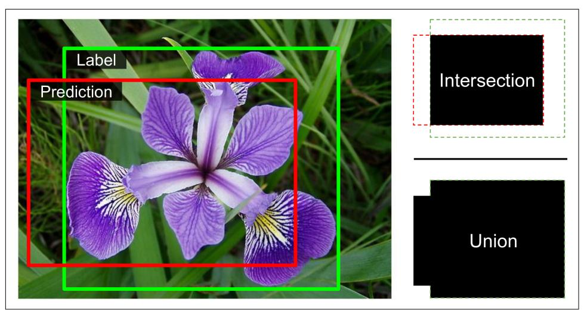

Figure 14-24. IoU metric for bounding boxes

{550}------------------------------------------------

### **Object Detection**

### **目标检测**

The task of classifying and localizing multiple objects in an image is called *object* detection. Until a few years ago, a common approach was to take a CNN that was trained to classify and locate a single object roughly centered in the image, then slide this CNN across the image and make predictions at each step. The CNN was generally trained to predict not only class probabilities and a bounding box, but also an *objectness score*: this is the estimated probability that the image does indeed contain an object centered near the middle. This is a binary classification output; it can be produced by a dense output layer with a single unit, using the sigmoid activation function and trained using the binary cross-entropy loss.

在图像中分类和定位多个对象的任务称为*目标*检测。直到几年前，一种常见的方法是使用一个训练来分类和定位大致位于图像中心的单个对象的CNN，然后将这个CNN在图像上滑动并在每一步进行预测。CNN通常被训练来预测不仅是类概率和边界框，还有*对象性得分*：这是图像确实包含一个位于中间附近的对象的估计概率。这是一个二元分类输出；它可以由具有单个单元的密集输出层产生，使用sigmoid激活函数并使用二元交叉熵损失进行训练。


Instead of an objectness score, a "no-object" class was sometimes added, but in general this did not work as well: the questions "Is an object present?" and "What type of object is it?" are best answered separately.

有时会添加一个"无对象"类而不是对象性得分，但通常这样做效果不如前者："是否存在对象？"和"这是什么类型的对象？"这两个问题最好分别回答。

This sliding-CNN approach is illustrated in Figure 14-25. In this example, the image was chopped into a  $5 \times 7$  grid, and we see a CNN—the thick black rectangle—sliding across all  $3 \times 3$  regions and making predictions at each step.

这种滑动CNN方法在图14-25中进行了说明。在这个例子中，图像被切分成$5 \times 7$网格，我们看到一个CNN——粗黑色矩形——在所有$3 \times 3$区域上滑动并在每一步进行预测。

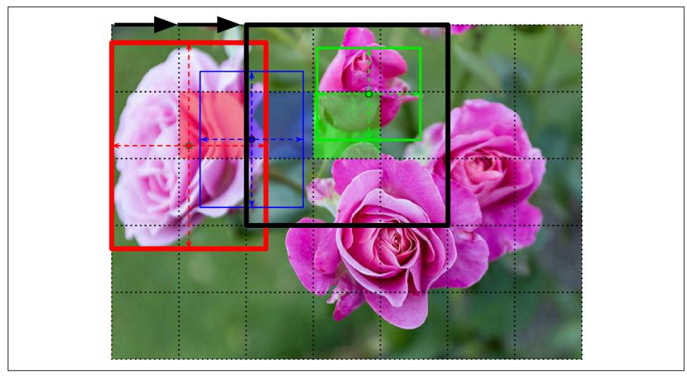

Figure 14-25. Detecting multiple objects by sliding a CNN across the image

{551}------------------------------------------------

In this figure, the CNN has already made predictions for three of these  $3 \times 3$  regions:

在这个图中，CNN已经对其中三个$3 \times 3$区域进行了预测：

- When looking at the top-left  $3 \times 3$  region (centered on the red-shaded grid cell located in the second row and second column), it detected the leftmost rose. Notice that the predicted bounding box exceeds the boundary of this  $3 \times 3$ region. That's absolutely fine: even though the CNN could not see the bottom part of the rose, it was able to make a reasonable guess as to where it might be. It also predicted class probabilities, giving a high probability to the "rose" class. Lastly, it predicted a fairly high objectness score, since the center of the bounding box lies within the central grid cell (in this figure, the objectness score is represented by the thickness of the bounding box).

- 当查看左上角的$3 \times 3$区域（以位于第二行第二列的红色阴影网格单元为中心）时，它检测到了最左边的玫瑰。注意预测的边界框超出了这个$3 \times 3$区域的边界。这完全没问题：即使CNN看不到玫瑰的底部，它也能够对其可能的位置做出合理的猜测。它还预测了类概率，给"玫瑰"类一个高概率。最后，它预测了相当高的对象性得分，因为边界框的中心位于中央网格单元内（在这个图中，对象性得分由边界框的粗细表示）。

- When looking at the next  $3 \times 3$  region, one grid cell to the right (centered on the shaded blue square), it did not detect any flower centered in that region, so it predicted a very low objectness score; therefore, the predicted bounding box and class probabilities can safely be ignored. You can see that the predicted bounding box was no good anyway.

- 当查看下一个$3 \times 3$区域，向右一个网格单元（以蓝色阴影正方形为中心）时，它没有检测到该区域中心有任何花朵，所以它预测了非常低的对象性得分；因此，预测的边界框和类概率可以安全地忽略。您可以看到预测的边界框本来就不好。

- finally, when looking at the next  $3 \times 3$  region, again one grid cell to the right (centered on the shaded green cell), it detected the rose at the top, although not perfectly: this rose is not well centered within this region, so the predicted objectness score was not very high.

- 最后，当查看下一个$3 \times 3$区域，再次向右一个网格单元（以绿色阴影单元为中心）时，它检测到了顶部的玫瑰，尽管不完美：这朵玫瑰在该区域内不是很好地居中，所以预测的对象性得分不是很高。

You can imagine how sliding the CNN across the whole image would give you a total of 15 predicted bounding boxes, organized in a  $3 \times 5$  grid, with each bounding box accompanied by its estimated class probabilities and objectness score. Since objects can have varying sizes, you may then want to slide the CNN again across larger  $4 \times 4$ regions as well, to get even more bounding boxes.

您可以想象将CNN在整个图像上滑动会给您总共15个预测边界框，组织成$3 \times 5$网格，每个边界框都伴随着其估计的类概率和对象性得分。由于对象可以有不同的大小，您可能还想要在更大的$4 \times 4$区域上再次滑动CNN，以获得更多的边界框。

This technique is fairly straightforward, but as you can see it will often detect the same object multiple times, at slightly different positions. Some postprocessing is needed to get rid of all the unnecessary bounding boxes. A common approach for this is called non-max suppression. Here's how it works:

这种技术相当简单，但正如您所看到的，它经常会在稍微不同的位置多次检测同一个对象。需要一些后处理来去除所有不必要的边界框。一种常见的方法称为非最大抑制。它的工作原理如下：

- 1. First, get rid of all the bounding boxes for which the objectness score is below some threshold: since the CNN believes there's no object at that location, the bounding box is useless.

- 1. 首先，去除所有对象性得分低于某个阈值的边界框：由于CNN认为该位置没有对象，边界框是无用的。

- 2. Find the remaining bounding box with the highest objectness score, and get rid of all the other remaining bounding boxes that overlap a lot with it (e.g., with an IoU greater than 60%). For example, in Figure 14-25, the bounding box with the max objectness score is the thick bounding box over the leftmost rose. The other bounding box that touches this same rose overlaps a lot with the max bounding box, so we will get rid of it (although in this example it would already have been removed in the previous step).

- 2. 找到具有最高对象性得分的剩余边界框，并去除所有与其大量重叠的其他剩余边界框（例如，IoU大于60%）。例如，在图14-25中，具有最大对象性得分的边界框是最左边玫瑰上的粗边界框。触及同一朵玫瑰的另一个边界框与最大边界框大量重叠，所以我们将去除它（尽管在这个例子中它已经在前一步中被移除了）。

{552}------------------------------------------------

3. Repeat step 2 until there are no more bounding boxes to get rid of.

3. 重复步骤2，直到没有更多的边界框需要去除。

This simple approach to object detection works pretty well, but it requires running the CNN many times (15 times in this example), so it is quite slow. Fortunately, there is a much faster way to slide a CNN across an image: using a fully convolutional *network* (FCN).

这种简单的目标检测方法效果相当好，但它需要多次运行CNN（在这个例子中是15次），所以相当慢。幸运的是，有一种更快的方法来在图像上滑动CNN：使用全卷积*网络*(FCN)。

#### **Fully Convolutional Networks**

#### **全卷积网络**

The idea of FCNs was first introduced in a 2015 paper<sup>30</sup> by Jonathan Long et al., for semantic segmentation (the task of classifying every pixel in an image according to the class of the object it belongs to). The authors pointed out that you could replace the dense layers at the top of a CNN with convolutional layers. To understand this, let's look at an example: suppose a dense layer with 200 neurons sits on top of a convolutional layer that outputs 100 feature maps, each of size  $7 \times 7$  (this is the feature map size, not the kernel size). Each neuron will compute a weighted sum of all 100  $\times$  7  $\times$  7 activations from the convolutional layer (plus a bias term). Now let's see what happens if we replace the dense layer with a convolutional layer using 200 filters, each of size  $7 \times 7$ , and with "valid" padding. This layer will output 200 feature maps, each  $1 \times 1$  (since the kernel is exactly the size of the input feature maps and we are using "valid" padding). In other words, it will output 200 numbers, just like the dense layer did; and if you look closely at the computations performed by a convolutional layer, you will notice that these numbers will be precisely the same as those the dense layer produced. The only difference is that the dense layer's output was a tensor of shape [batch size, 200], while the convolutional layer will output a tensor of shape [batch size, 1, 1, 200].

FCN的想法最初是由Jonathan Long等人在2015年的一篇论文<sup>30</sup>中为语义分割（根据像素所属对象的类别对图像中的每个像素进行分类的任务）而提出的。作者指出，您可以用卷积层替换CNN顶部的密集层。为了理解这一点，让我们看一个例子：假设一个有200个神经元的密集层位于一个输出100个特征图的卷积层之上，每个特征图的大小为$7 \times 7$（这是特征图大小，不是核大小）。每个神经元将计算来自卷积层的所有100 $\times$ 7 $\times$ 7激活的加权和（加上偏置项）。现在让我们看看如果我们用使用200个滤波器的卷积层替换密集层会发生什么，每个滤波器的大小为$7 \times 7$，并使用"valid"填充。这一层将输出200个特征图，每个$1 \times 1$（因为核的大小正好是输入特征图的大小，我们使用"valid"填充）。换句话说，它将输出200个数字，就像密集层所做的那样；如果您仔细观察卷积层执行的计算，您会注意到这些数字将与密集层产生的数字完全相同。唯一的区别是密集层的输出是形状为[batch size, 200]的张量，而卷积层将输出形状为[batch size, 1, 1, 200]的张量。


To convert a dense layer to a convolutional layer, the number of filters in the convolutional layer must be equal to the number of units in the dense layer, the filter size must be equal to the size of the input feature maps, and you must use "valid" padding. The stride may be set to 1 or more, as you will see shortly.

要将密集层转换为卷积层，卷积层中的滤波器数量必须等于密集层中的单元数量，滤波器大小必须等于输入特征图的大小，并且必须使用"valid"填充。步长可以设置为1或更多，您很快就会看到。

Why is this important? Well, while a dense layer expects a specific input size (since it has one weight per input feature), a convolutional layer will happily process images of any size<sup>31</sup> (however, it does expect its inputs to have a specific number of channels, since each kernel contains a different set of weights for each input channel). Since

为什么这很重要？嗯，虽然密集层期望特定的输入大小（因为每个输入特征有一个权重），但卷积层可以愉快地处理任何大小的图像<sup>31</sup>（但是，它确实期望其输入具有特定数量的通道，因为每个核包含每个输入通道的不同权重集）。由于

<sup>30</sup> Jonathan Long et al., "Fully Convolutional Networks for Semantic Segmentation", Proceedings of the IEEE Conference on Computer Vision and Pattern Recognition (2015): 3431-3440.

<sup>31</sup> There is one small exception: a convolutional layer using "valid" padding will complain if the input size is smaller than the kernel size.

{553}------------------------------------------------

an FCN contains only convolutional layers (and pooling layers, which have the same property), it can be trained and executed on images of any size!

FCN只包含卷积层（和具有相同属性的池化层），它可以在任何大小的图像上进行训练和执行！

For example, suppose we'd already trained a CNN for flower classification and localization. It was trained on  $224 \times 224$  images, and it outputs 10 numbers:

例如，假设我们已经训练了一个用于花卉分类和定位的CNN。它在$224 \times 224$图像上进行训练，输出10个数字：

- Outputs 0 to 4 are sent through the softmax activation function, and this gives the class probabilities (one per class).

- 输出0到4通过softmax激活函数，这给出了类概率（每个类一个）。

- Output 5 is sent through the sigmoid activation function, and this gives the objectness score.

- 输出5通过sigmoid激活函数，这给出了对象性得分。

- Outputs 6 and 7 represent the bounding box's center coordinates; they also go through a sigmoid activation function to ensure they range from 0 to 1.

- 输出6和7表示边界框的中心坐标；它们也通过sigmoid激活函数以确保它们的范围从0到1。

- Lastly, outputs 8 and 9 represent the bounding box's height and width; they do not go through any activation function to allow the bounding boxes to extend beyond the borders of the image.

- 最后，输出8和9表示边界框的高度和宽度；它们不通过任何激活函数，以允许边界框延伸到图像边界之外。

We can now convert the CNN's dense layers to convolutional layers. In fact, we don't even need to retrain it; we can just copy the weights from the dense layers to the convolutional layers! Alternatively, we could have converted the CNN into an FCN before training.

我们现在可以将CNN的密集层转换为卷积层。实际上，我们甚至不需要重新训练它；我们可以直接将权重从密集层复制到卷积层！或者，我们可以在训练之前将CNN转换为FCN。

Now suppose the last convolutional layer before the output layer (also called the bottleneck layer) outputs  $7 \times 7$  feature maps when the network is fed a 224  $\times$  224 image (see the left side of Figure 14-26). If we feed the FCN a 448  $\times$  448 image (see the right side of Figure 14-26), the bottleneck layer will now output  $14 \times 14$ feature maps.<sup>32</sup> Since the dense output layer was replaced by a convolutional layer using 10 filters of size  $7 \times 7$ , with "valid" padding and stride 1, the output will be composed of 10 features maps, each of size  $8 \times 8$  (since  $14 - 7 + 1 = 8$ ). In other words, the FCN will process the whole image only once, and it will output an  $8 \times$ 8 grid where each cell contains 10 numbers (5 class probabilities, 1 objectness score, and 4 bounding box coordinates). It's exactly like taking the original CNN and sliding it across the image using 8 steps per row and 8 steps per column. To visualize this, imagine chopping the original image into a  $14 \times 14$  grid, then sliding a  $7 \times 7$  window across this grid; there will be  $8 \times 8 = 64$  possible locations for the window, hence  $8 \times$ 8 predictions. However, the FCN approach is *much* more efficient, since the network only looks at the image once. In fact, You Only Look Once (YOLO) is the name of a very popular object detection architecture, which we'll look at next.

现在假设输出层之前的最后一个卷积层（也称为瓶颈层）在网络输入224 $\times$ 224图像时输出$7 \times 7$特征图（见图14-26的左侧）。如果我们向FCN输入448 $\times$ 448图像（见图14-26的右侧），瓶颈层现在将输出$14 \times 14$特征图。<sup>32</sup>由于密集输出层被使用10个大小为$7 \times 7$的滤波器的卷积层替换，使用"valid"填充和步长1，输出将由10个特征图组成，每个大小为$8 \times 8$（因为$14 - 7 + 1 = 8$）。换句话说，FCN将只处理整个图像一次，它将输出一个$8 \times 8$网格，其中每个单元包含10个数字（5个类概率、1个对象性得分和4个边界框坐标）。这就像取原始CNN并使用每行8步和每列8步在图像上滑动一样。为了可视化这一点，想象将原始图像切分成$14 \times 14$网格，然后在此网格上滑动$7 \times 7$窗口；窗口将有$8 \times 8 = 64$个可能的位置，因此有$8 \times 8$个预测。然而，FCN方法*更加*高效，因为网络只查看图像一次。实际上，You Only Look Once (YOLO)是一个非常流行的目标检测架构的名称，我们接下来将看看它。

<sup>32</sup> This assumes we used only "same" padding in the network: "valid" padding would reduce the size of the feature maps. Moreover, 448 can be neatly divided by 2 several times until we reach 7, without any rounding error. If any layer uses a different stride than 1 or 2, then there may be some rounding error, so again the feature maps may end up being smaller.

{554}------------------------------------------------

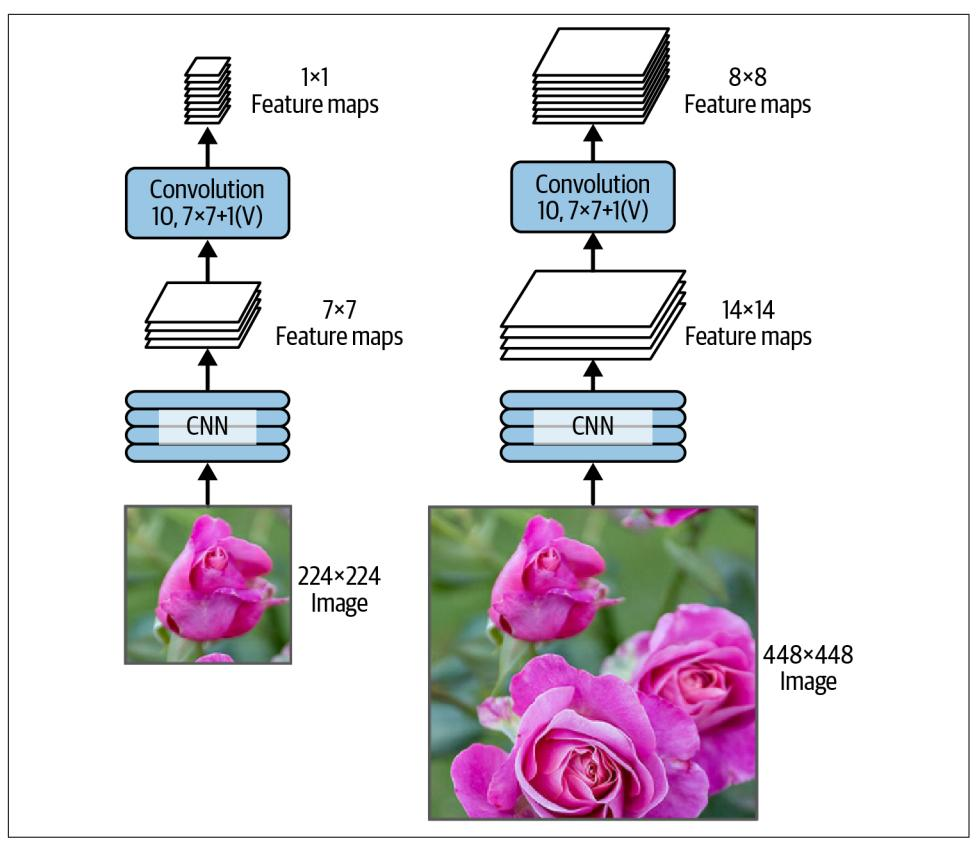

Figure 14-26. The same fully convolutional network processing a small image (left) and a large one (right)

### **You Only Look Once**

### **你只看一次**

YOLO is a fast and accurate object detection architecture proposed by Joseph Redmon et al. in a 2015 paper.<sup>33</sup> It is so fast that it can run in real time on a video, as seen in Redmon's demo. YOLO's architecture is quite similar to the one we just discussed, but with a few important differences:

YOLO是由Joseph Redmon等人在2015年的论文中提出的快速准确的目标检测架构。它非常快，可以在视频上实时运行，正如Redmon的演示所示。YOLO的架构与我们刚才讨论的架构非常相似，但有几个重要的区别：

• For each grid cell, YOLO only considers objects whose bounding box center lies within that cell. The bounding box coordinates are relative to that cell, where  $(0, 0)$  means the top-left corner of the cell and  $(1, 1)$  means the bottom right. However, the bounding box's height and width may extend well beyond the cell.

• 对于每个网格单元，YOLO只考虑边界框中心位于该单元内的对象。边界框坐标相对于该单元，其中$(0, 0)$表示单元的左上角，$(1, 1)$表示右下角。但是，边界框的高度和宽度可能远远超出单元。

<sup>33</sup> Joseph Redmon et al., "You Only Look Once: Unified, Real-Time Object Detection", Proceedings of the IEEE Conference on Computer Vision and Pattern Recognition (2016): 779-788.

{555}------------------------------------------------

- It outputs two bounding boxes for each grid cell (instead of just one), which allows the model to handle cases where two objects are so close to each other that their bounding box centers lie within the same cell. Each bounding box also comes with its own objectness score.
- YOLO also outputs a class probability distribution for each grid cell, predicting 20 class probabilities per grid cell since YOLO was trained on the PASCAL VOC dataset, which contains 20 classes. This produces a coarse class probability map. Note that the model predicts one class probability distribution per grid cell, not per bounding box. However, it's possible to estimate class probabilities for each bounding box during postprocessing, by measuring how well each bounding box matches each class in the class probability map. For example, imagine a picture of a person standing in front of a car. There will be two bounding boxes: one large horizontal one for the car, and a smaller vertical one for the person. These bounding boxes may have their centers within the same grid cell. So how can we tell which class should be assigned to each bounding box? Well, the class probability map will contain a large region where the "car" class is dominant, and inside it there will be a smaller region where the "person" class is dominant. Hopefully, the car's bounding box will roughly match the "car" region, while the person's bounding box will roughly match the "person" region: this will allow the correct class to be assigned to each bounding box.

- 它为每个网格单元输出两个边界框（而不是只有一个），这使得模型能够处理两个对象彼此非常接近，以至于它们的边界框中心位于同一单元内的情况。每个边界框也有自己的对象性得分。
- YOLO还为每个网格单元输出类别概率分布，由于YOLO在包含20个类别的PASCAL VOC数据集上训练，因此每个网格单元预测20个类别概率。这产生了一个粗糙的类别概率图。注意，模型为每个网格单元预测一个类别概率分布，而不是为每个边界框。但是，在后处理期间，可以通过测量每个边界框与类别概率图中每个类别的匹配程度来估计每个边界框的类别概率。例如，想象一张人站在汽车前面的图片。将有两个边界框：一个用于汽车的大水平框，一个用于人的较小垂直框。这些边界框的中心可能位于同一网格单元内。那么我们如何判断应该为每个边界框分配哪个类别呢？类别概率图将包含一个"汽车"类别占主导地位的大区域，在其内部将有一个"人"类别占主导地位的较小区域。希望汽车的边界框大致匹配"汽车"区域，而人的边界框大致匹配"人"区域：这将允许为每个边界框分配正确的类别。

YOLO was originally developed using Darknet, an open source deep learning framework initially developed in C by Joseph Redmon, but it was soon ported to Tensor-Flow, Keras, PyTorch, and more. It was continuously improved over the years, with YOLOv2, YOLOv3, and YOLO9000 (again by Joseph Redmon et al.), YOLOv4 (by Alexey Bochkovskiy et al.), YOLOv5 (by Glenn Jocher), and PP-YOLO (by Xiang Long et al.).

YOLO最初是使用Darknet开发的，这是一个由Joseph Redmon最初用C语言开发的开源深度学习框架，但很快就被移植到TensorFlow、Keras、PyTorch等平台。多年来它不断改进，有YOLOv2、YOLOv3和YOLO9000（再次由Joseph Redmon等人开发）、YOLOv4（由Alexey Bochkovskiy等人开发）、YOLOv5（由Glenn Jocher开发）和PP-YOLO（由Xiang Long等人开发）。

Each version brought some impressive improvements in speed and accuracy, using a variety of techniques; for example, YOLOv3 boosted accuracy in part thanks to *anchor priors*, exploiting the fact that some bounding box shapes are more likely than others, depending on the class (e.g., people tend to have vertical bounding boxes, while cars usually don't). They also increased the number of bounding boxes per grid cell, they trained on different datasets with many more classes (up to 9,000 classes organized in a hierarchy in the case of YOLO9000), they added skip connections to recover some of the spatial resolution that is lost in the CNN (we will discuss this shortly, when we look at semantic segmentation), and much more. There are many variants of these models too, such as YOLOv4-tiny, which is optimized to be trained on less powerful machines and which can run extremely fast (at over 1,000 frames per second!), but with a slightly lower mean average precision (mAP).

每个版本都在速度和准确性方面带来了令人印象深刻的改进，使用了各种技术；例如，YOLOv3部分通过*锚点先验*提高了准确性，利用了某些边界框形状比其他形状更可能的事实，这取决于类别（例如，人往往有垂直边界框，而汽车通常没有）。他们还增加了每个网格单元的边界框数量，在具有更多类别的不同数据集上进行训练（在YOLO9000的情况下，多达9,000个按层次组织的类别），他们添加了跳跃连接以恢复CNN中丢失的一些空间分辨率（我们将在查看语义分割时很快讨论这一点），等等。这些模型也有许多变体，例如YOLOv4-tiny，它被优化为在功能较弱的机器上训练，可以极快地运行（超过每秒1,000帧！），但平均精度（mAP）略低。

{556}------------------------------------------------

#### **Mean Average Precision**

#### **平均精度**

A very common metric used in object detection tasks is the mean average precision. "Mean average" sounds a bit redundant, doesn't it? To understand this metric, let's go back to two classification metrics we discussed in Chapter 3: precision and recall. Remember the trade-off: the higher the recall, the lower the precision. You can visualize this in a precision/recall curve (see Figure 3-6). To summarize this curve into a single number, we could compute its area under the curve (AUC). But note that the precision/recall curve may contain a few sections where precision actually goes up when recall increases, especially at low recall values (you can see this at the top left of Figure 3-6). This is one of the motivations for the mAP metric.

目标检测任务中使用的一个非常常见的指标是平均精度。"平均精度"听起来有点冗余，不是吗？为了理解这个指标，让我们回到第3章讨论的两个分类指标：精确率和召回率。记住权衡：召回率越高，精确率越低。你可以在精确率/召回率曲线中可视化这一点（见图3-6）。为了将这条曲线总结为一个数字，我们可以计算其曲线下面积（AUC）。但请注意，精确率/召回率曲线可能包含一些精确率在召回率增加时实际上上升的部分，特别是在低召回率值时（你可以在图3-6的左上角看到这一点）。这是mAP指标的动机之一。

Suppose the classifier has 90% precision at 10% recall, but 96% precision at 20% recall. There's really no trade-off here: it simply makes more sense to use the classifier at 20% recall rather than at 10% recall, as you will get both higher recall and higher precision. So instead of looking at the precision at 10% recall, we should really be looking at the *maximum* precision that the classifier can offer with *at least* 10% recall. It would be 96%, not 90%. Therefore, one way to get a fair idea of the model's performance is to compute the maximum precision you can get with at least 0% recall, then 10% recall, 20%, and so on up to 100%, and then calculate the mean of these maximum precisions. This is called the *average precision* (AP) metric. Now when there are more than two classes, we can compute the AP for each class, and then compute the mean AP (mAP). That's it!

假设分类器在10%召回率时有90%的精确率，但在20%召回率时有96%的精确率。这里真的没有权衡：在20%召回率而不是10%召回率下使用分类器更有意义，因为你将获得更高的召回率和更高的精确率。因此，我们不应该查看10%召回率时的精确率，而应该查看分类器在*至少*10%召回率下能提供的*最大*精确率。它将是96%，而不是90%。因此，获得模型性能公平概念的一种方法是计算你可以在至少0%召回率、然后10%召回率、20%等等直到100%下获得的最大精确率，然后计算这些最大精确率的平均值。这被称为*平均精度*（AP）指标。现在当有两个以上的类别时，我们可以计算每个类别的AP，然后计算平均AP（mAP）。就是这样！

In an object detection system, there is an additional level of complexity: what if the system detected the correct class, but at the wrong location (i.e., the bounding box is completely off)? Surely we should not count this as a positive prediction. One approach is to define an IoU threshold: for example, we may consider that a prediction is correct only if the IoU is greater than, say, 0.5, and the predicted class is correct. The corresponding mAP is generally noted mAP@0.5 (or mAP@50%, or sometimes just  $AP_{50}$ ). In some competitions (such as the PASCAL VOC challenge), this is what is done. In others (such as the COCO competition), the mAP is computed for different IoU thresholds (0.50, 0.55, 0.60, ..., 0.95), and the final metric is the mean of all these mAPs (noted mAP@[.50:.95] or mAP@[.50:0.05:.95]). Yes, that's a mean mean average.

在目标检测系统中，还有一个额外的复杂性层次：如果系统检测到了正确的类别，但位置错误（即边界框完全偏离）怎么办？我们当然不应该将此计为正预测。一种方法是定义IoU阈值：例如，我们可以认为只有当IoU大于（比如说）0.5且预测类别正确时，预测才是正确的。相应的mAP通常记为mAP@0.5（或mAP@50%，有时只是$AP_{50}$）。在一些竞赛中（如PASCAL VOC挑战赛），这就是所做的。在其他竞赛中（如COCO竞赛），mAP是为不同的IoU阈值（0.50、0.55、0.60、...、0.95）计算的，最终指标是所有这些mAP的平均值（记为mAP@[.50:.95]或mAP@[.50:0.05:.95]）。是的，这是一个平均的平均精度。

{557}------------------------------------------------

Many object detection models are available on TensorFlow Hub, often with pretrained weights, such as YOLOv5,<sup>34</sup> SSD,<sup>35</sup> Faster R-CNN,<sup>36</sup> and EfficentDet.<sup>37</sup>

许多目标检测模型在TensorFlow Hub上可用，通常带有预训练权重，如YOLOv5、SSD、Faster R-CNN和EfficientDet。

SSD and EfficientDet are "look once" detection models, similar to YOLO. Efficient-Det is based on the EfficientNet convolutional architecture. Faster R-CNN is more complex: the image first goes through a CNN, then the output is passed to a region *proposal network* (RPN) that proposes bounding boxes that are most likely to contain an object; a classifier is then run for each bounding box, based on the cropped output of the CNN. The best place to start using these models is TensorFlow Hub's excellent object detection tutorial.

SSD和EfficientDet是"看一次"检测模型，类似于YOLO。EfficientDet基于EfficientNet卷积架构。Faster R-CNN更复杂：图像首先通过CNN，然后输出传递给区域*提议网络*（RPN），该网络提议最可能包含对象的边界框；然后基于CNN的裁剪输出为每个边界框运行分类器。开始使用这些模型的最佳地方是TensorFlow Hub优秀的目标检测教程。

So far, we've only considered detecting objects in single images. But what about videos? Objects must not only be detected in each frame, they must also be tracked over time. Let's take a quick look at object tracking now.

到目前为止，我们只考虑了在单个图像中检测对象。但是视频呢？对象不仅必须在每一帧中被检测到，还必须随时间被跟踪。现在让我们快速看一下目标跟踪。

### **Object Tracking**

### **目标跟踪**

Object tracking is a challenging task: objects move, they may grow or shrink as they get closer to or further away from the camera, their appearance may change as they turn around or move to different lighting conditions or backgrounds, they may be temporarily occluded by other objects, and so on.

目标跟踪是一项具有挑战性的任务：对象移动，当它们靠近或远离相机时可能会变大或变小，当它们转身或移动到不同的光照条件或背景时，它们的外观可能会改变，它们可能被其他对象暂时遮挡，等等。

One of the most popular object tracking systems is DeepSORT.<sup>38</sup> It is based on a combination of classical algorithms and deep learning:

最受欢迎的目标跟踪系统之一是DeepSORT。它基于经典算法和深度学习的结合：

- It uses Kalman filters to estimate the most likely current position of an object given prior detections, and assuming that objects tend to move at a constant speed.
- It uses a deep learning model to measure the resemblance between new detections and existing tracked objects.

- 它使用卡尔曼滤波器来估计给定先前检测的对象最可能的当前位置，并假设对象倾向于以恒定速度移动。
- 它使用深度学习模型来测量新检测和现有跟踪对象之间的相似性。

- 36 Shaoqing Ren et al., "Faster R-CNN: Towards Real-Time Object Detection with Region Proposal Networks", Proceedings of the 28th International Conference on Neural Information Processing Systems 1 (2015): 91-99.
- 37 Mingxing Tan et al., "EfficientDet: Scalable and Efficient Object Detection", arXiv preprint arXiv:1911.09070  $(2019).$

<sup>34</sup> You can find YOLOv3, YOLOv4, and their tiny variants in the TensorFlow Models project at https://homl.info/ *yolotf* 

<sup>35</sup> Wei Liu et al., "SSD: Single Shot Multibox Detector", Proceedings of the 14th European Conference on Computer Vision 1 (2016): 21-37.

<sup>38</sup> Nicolai Wojke et al., "Simple Online and Realtime Tracking with a Deep Association Metric", arXiv preprint arXiv:1703.07402 (2017).

{558}------------------------------------------------

• Lastly, it uses the *Hungarian algorithm* to map new detections to existing tracked objects (or to new tracked objects): this algorithm efficiently finds the combination of mappings that minimizes the distance between the detections and the predicted positions of tracked objects, while also minimizing the appearance discrepancy.

• 最后，它使用*匈牙利算法*将新检测映射到现有跟踪对象（或新跟踪对象）：该算法有效地找到映射组合，最小化检测和跟踪对象预测位置之间的距离，同时也最小化外观差异。

For example, imagine a red ball that just bounced off a blue ball traveling in the opposite direction. Based on the previous positions of the balls, the Kalman filter will predict that the balls will go through each other: indeed, it assumes that objects move at a constant speed, so it will not expect the bounce. If the Hungarian algorithm only considered positions, then it would happily map the new detections to the wrong balls, as if they had just gone through each other and swapped colors. But thanks to the resemblance measure, the Hungarian algorithm will notice the problem. Assuming the balls are not too similar, the algorithm will map the new detections to the correct balls.

例如，想象一个红球刚刚从一个向相反方向行进的蓝球上弹开。基于球的先前位置，卡尔曼滤波器将预测球会穿过彼此：实际上，它假设对象以恒定速度移动，所以它不会预期弹跳。如果匈牙利算法只考虑位置，那么它会愉快地将新检测映射到错误的球上，就好像它们刚刚穿过彼此并交换了颜色。但是由于相似性测量，匈牙利算法会注意到问题。假设球不太相似，算法会将新检测映射到正确的球上。


There are a few DeepSORT implementations available on GitHub, including a TensorFlow implementation of YOLOv4 + DeepSORT: https://github.com/theAIGuysCode/yolov4-deepsort.

GitHub上有一些DeepSORT实现可用，包括YOLOv4 + DeepSORT的TensorFlow实现：https://github.com/theAIGuysCode/yolov4-deepsort。

So far we have located objects using bounding boxes. This is often sufficient, but sometimes you need to locate objects with much more precision—for example, to remove the background behind a person during a videoconference call. Let's see how to go down to the pixel level.

到目前为止，我们使用边界框定位对象。这通常是足够的，但有时你需要更精确地定位对象——例如，在视频会议通话期间移除人后面的背景。让我们看看如何深入到像素级别。

### **Semantic Segmentation**

### **语义分割**

In semantic segmentation, each pixel is classified according to the class of the object it belongs to (e.g., road, car, pedestrian, building, etc.), as shown in Figure 14-27. Note that different objects of the same class are not distinguished. For example, all the bicycles on the right side of the segmented image end up as one big lump of pixels. The main difficulty in this task is that when images go through a regular CNN, they gradually lose their spatial resolution (due to the layers with strides greater than 1); so, a regular CNN may end up knowing that there's a person somewhere in the bottom left of the image, but it will not be much more precise than that.

在语义分割中，每个像素根据它所属对象的类别进行分类（例如，道路、汽车、行人、建筑物等），如图14-27所示。注意，同一类别的不同对象不被区分。例如，分割图像右侧的所有自行车最终成为一大块像素。这项任务的主要困难是，当图像通过常规CNN时，它们逐渐失去空间分辨率（由于步长大于1的层）；因此，常规CNN可能最终知道图像左下角某处有一个人，但不会比这更精确。

{559}------------------------------------------------

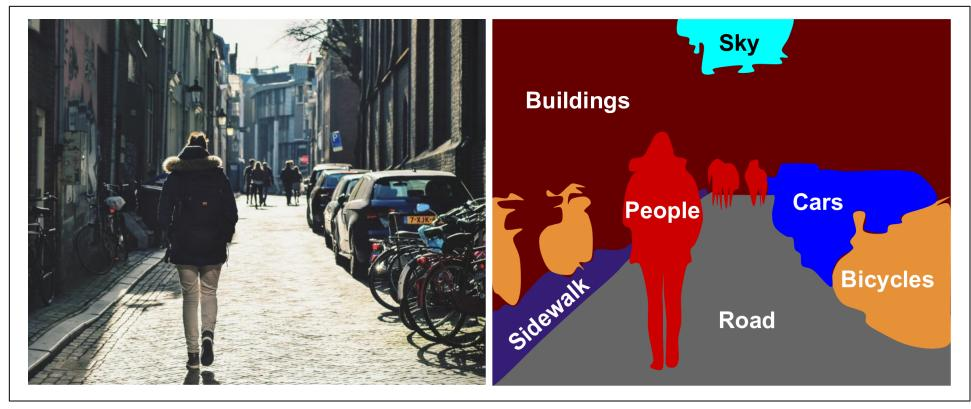

Figure 14-27. Semantic segmentation

Just like for object detection, there are many different approaches to tackle this problem, some quite complex. However, a fairly simple solution was proposed in the 2015 paper by Jonathan Long et al. I mentioned earlier, on fully convolutional networks. The authors start by taking a pretrained CNN and turning it into an FCN. The CNN applies an overall stride of 32 to the input image (i.e., if you add up all the strides greater than 1), meaning the last layer outputs feature maps that are 32 times smaller than the input image. This is clearly too coarse, so they added a single *upsampling layer that multiplies the resolution by 32.*

就像目标检测一样，有许多不同的方法来解决这个问题，有些相当复杂。然而，我之前提到的Jonathan Long等人在2015年关于全卷积网络的论文中提出了一个相当简单的解决方案。作者首先取一个预训练的CNN并将其转换为FCN。CNN对输入图像应用总步长32（即，如果你将所有大于1的步长相加），这意味着最后一层输出的特征图比输入图像小32倍。这显然太粗糙了，所以他们添加了一个*将分辨率乘以32的上采样层*。 

There are several solutions available for upsampling (increasing the size of an image), such as bilinear interpolation, but that only works reasonably well up to  $\times$ 4 or  $\times$ 8. Instead, they use a *transposed convolutional layer*<sup>39</sup> this is equivalent to first stretching the image by inserting empty rows and columns (full of zeros), then performing a regular convolution (see Figure 14-28). Alternatively, some people prefer to think of it as a regular convolutional layer that uses fractional strides (e.g., the stride is  $1/2$ in Figure 14-28). The transposed convolutional layer can be initialized to perform something close to linear interpolation, but since it is a trainable layer, it will learn to do better during training. In Keras, you can use the Conv2DTranspose layer.

有几种可用于上采样（增加图像大小）的解决方案，如双线性插值，但这只在$\times$ 4或$\times$ 8以内效果合理。相反，他们使用*转置卷积层*，这相当于首先通过插入空行和列（全为零）来拉伸图像，然后执行常规卷积（见图14-28）。或者，有些人更喜欢将其视为使用分数步长的常规卷积层（例如，图14-28中的步长是$1/2$）。转置卷积层可以初始化为执行接近线性插值的操作，但由于它是一个可训练层，它将在训练期间学会做得更好。在Keras中，你可以使用Conv2DTranspose层。


In a transposed convolutional layer, the stride defines how much the input will be stretched, not the size of the filter steps, so the larger the stride, the larger the output (unlike for convolutional layers or pooling layers).

在转置卷积层中，步长定义输入将被拉伸多少，而不是滤波器步骤的大小，所以步长越大，输出越大（与卷积层或池化层不同）。

<sup>39</sup> This type of layer is sometimes referred to as a *deconvolution layer*, but it does not perform what mathematicians call a deconvolution, so this name should be avoided.

{560}------------------------------------------------

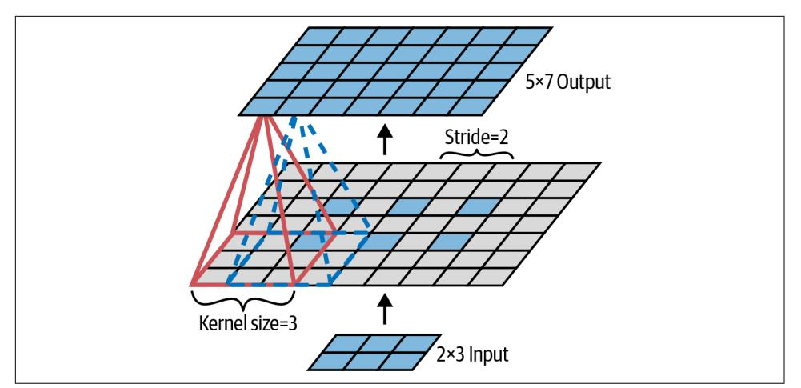

Figure 14-28. Upsampling using a transposed convolutional layer

#### **Other Keras Convolutional Layers** 

#### **其他Keras卷积层**

Keras also offers a few other kinds of convolutional layers: tf.keras.lavers.Conv1D A convolutional layer for 1D inputs, such as time series or text (sequences of letters or words), as you will see in Chapter 15. tf.keras.lavers.Conv3D A convolutional layer for 3D inputs, such as 3D PET scans. dilation rate Setting the dilation\_rate hyperparameter of any convolutional layer to a value of 2 or more creates an $\dot{a}$ -trous convolutional layer ("à trous" is French for "with holes"). This is equivalent to using a regular convolutional layer with a filter dilated by inserting rows and columns of zeros (i.e., holes). For example, a $1 \times$ 3 filter equal to [[1,2,3]] may be dilated with a *dilation rate* of 4, resulting in a dilated filter of $[1, 0, 0, 0, 2, 0, 0, 0, 3]$ . This lets the convolutional layer have a larger receptive field at no computational price and using no extra parameters.

Keras还提供了其他几种卷积层：tf.keras.layers.Conv1D 用于1D输入的卷积层，如时间序列或文本（字母或单词序列），你将在第15章中看到。tf.keras.layers.Conv3D 用于3D输入的卷积层，如3D PET扫描。膨胀率 将任何卷积层的dilation_rate超参数设置为2或更多会创建一个à-trous卷积层（"à trous"在法语中意为"有孔"）。这相当于使用常规卷积层，其滤波器通过插入零行和列（即孔）进行膨胀。例如，等于[[1,2,3]]的$1 \times$ 3滤波器可以用*膨胀率*4进行膨胀，产生膨胀滤波器$[1, 0, 0, 0, 2, 0, 0, 0, 3]$。这让卷积层在没有计算代价和不使用额外参数的情况下具有更大的感受野。

Using transposed convolutional layers for upsampling is OK, but still too imprecise. To do better, Long et al. added skip connections from lower layers: for example, they upsampled the output image by a factor of 2 (instead of 32), and they added the output of a lower layer that had this double resolution. Then they upsampled the result by a factor of 16, leading to a total upsampling factor of 32 (see Figure 14-29). This recovered some of the spatial resolution that was lost in earlier pooling layers.

使用转置卷积层进行上采样是可以的，但仍然太不精确。为了做得更好，Long等人从较低层添加了跳跃连接：例如，他们将输出图像上采样2倍（而不是32倍），并添加了具有这种双倍分辨率的较低层的输出。然后他们将结果上采样16倍，导致总上采样因子为32（见图14-29）。这恢复了在早期池化层中丢失的一些空间分辨率。

{561}------------------------------------------------

In their best architecture, they used a second similar skip connection to recover even finer details from an even lower layer. In short, the output of the original CNN goes through the following extra steps: upsample  $\times 2$ , add the output of a lower layer (of the appropriate scale), upsample  $\times$ 2, add the output of an even lower layer, and finally upsample  $\times$ 8. It is even possible to scale up beyond the size of the original image: this can be used to increase the resolution of an image, which is a technique called super-resolution.

在他们最好的架构中，他们使用了第二个类似的跳跃连接来从更低的层恢复更精细的细节。简而言之，原始CNN的输出经过以下额外步骤：上采样$\times 2$，添加较低层的输出（适当的尺度），上采样$\times$ 2，添加更低层的输出，最后上采样$\times$ 8。甚至可以扩展到超过原始图像的大小：这可以用来增加图像的分辨率，这是一种称为超分辨率的技术。

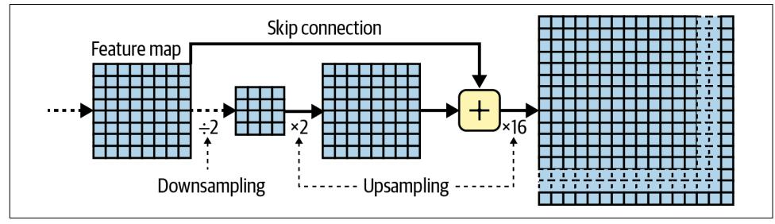

Figure 14-29. Skip layers recover some spatial resolution from lower layers

*Instance segmentation* is similar to semantic segmentation, but instead of merging all objects of the same class into one big lump, each object is distinguished from the others (e.g., it identifies each individual bicycle). For example the Mask R-CNN architecture, proposed in a 2017 paper<sup>40</sup> by Kaiming He et al., extends the Faster R-CNN model by additionally producing a pixel mask for each bounding box. So, not only do you get a bounding box around each object, with a set of estimated class probabilities, but you also get a pixel mask that locates pixels in the bounding box that belong to the object. This model is available on TensorFlow Hub, pretrained on the COCO 2017 dataset. The field is moving fast, though so if you want to try the latest and greatest models, please check out the state-of-the-art section of https:// paperswithcode.com.

*实例分割*类似于语义分割，但不是将同一类的所有对象合并成一个大块，而是将每个对象与其他对象区分开来（例如，它识别每个单独的自行车）。例如，Kaiming He等人在2017年论文<sup>40</sup>中提出的Mask R-CNN架构，通过为每个边界框额外产生像素掩码来扩展Faster R-CNN模型。因此，你不仅可以获得每个对象周围的边界框和一组估计的类概率，还可以获得定位边界框中属于该对象的像素的像素掩码。该模型在TensorFlow Hub上可用，在COCO 2017数据集上预训练。不过该领域发展很快，所以如果你想尝试最新最好的模型，请查看https://paperswithcode.com的最先进部分。

As you can see, the field of deep computer vision is vast and fast-paced, with all sorts of architectures popping up every year. Almost all of them are based on convolutional neural networks, but since 2020 another neural net architecture has entered the computer vision space: transformers (which we will discuss in Chapter 16). The progress made over the last decade has been astounding, and researchers are now focusing on harder and harder problems, such as *adversarial learning* (which attempts to make the network more resistant to images designed to fool it), explainability (understanding why the network makes a specific classification), realistic *image gen*eration (which we will come back to in Chapter 17), single-shot learning (a system that

如你所见，深度计算机视觉领域是广阔且快节奏的，每年都有各种架构涌现。几乎所有这些都基于卷积神经网络，但自2020年以来，另一种神经网络架构进入了计算机视觉领域：变换器（我们将在第16章中讨论）。过去十年取得的进展令人惊叹，研究人员现在专注于越来越困难的问题，如*对抗学习*（试图使网络对设计来欺骗它的图像更有抵抗力）、可解释性（理解网络为什么做出特定分类）、逼真的*图像生成*（我们将在第17章中回到这个话题）、单次学习（一个系统

<sup>40</sup> Kaiming He et al., "Mask R-CNN", arXiv preprint arXiv:1703.06870 (2017).

{562}------------------------------------------------

can recognize an object after it has seen it just once), predicting the next frames in a video, combining text and image tasks, and more.

能够在只看过一次后就识别对象），预测视频中的下一帧，结合文本和图像任务等等。

Now on to the next chapter, where we will look at how to process sequential data such as time series using recurrent neural networks and convolutional neural networks.

现在进入下一章，我们将看看如何使用循环神经网络和卷积神经网络处理时间序列等序列数据。

### **Fxercises**

### **练习**

- 1. What are the advantages of a CNN over a fully connected DNN for image classification?
- 2. Consider a CNN composed of three convolutional layers, each with  $3 \times 3$  kernels, a stride of 2, and "same" padding. The lowest layer outputs 100 feature maps, the middle one outputs 200, and the top one outputs 400. The input images are RGB images of  $200 \times 300$  pixels:
  - a. What is the total number of parameters in the CNN?
  - b. If we are using 32-bit floats, at least how much RAM will this network require when making a prediction for a single instance?
  - c. What about when training on a mini-batch of 50 images?
- 3. If your GPU runs out of memory while training a CNN, what are five things you could try to solve the problem?
- 4. Why would you want to add a max pooling layer rather than a convolutional layer with the same stride?
- 5. When would you want to add a local response normalization layer?
- 6. Can you name the main innovations in AlexNet, as compared to LeNet-5? What about the main innovations in GoogLeNet, ResNet, SENet, Xception, and EfficientNet?
- 7. What is a fully convolutional network? How can you convert a dense layer into a convolutional layer?
- 8. What is the main technical difficulty of semantic segmentation?
- 9. Build your own CNN from scratch and try to achieve the highest possible accuracy on MNIST.
- 10. Use transfer learning for large image classification, going through these steps:
  - a. Create a training set containing at least 100 images per class. For example, you could classify your own pictures based on the location (beach, mountain, city, etc.), or alternatively you can use an existing dataset (e.g., from TensorFlow Datasets).
  - **b.** Split it into a training set, a validation set, and a test set.

- 1. 对于图像分类，CNN相比全连接DNN有什么优势？
- 2. 考虑一个由三个卷积层组成的CNN，每个都有$3 \times 3$核，步长为2，"same"填充。最低层输出100个特征图，中间层输出200个，顶层输出400个。输入图像是$200 \times 300$像素的RGB图像：
  - a. CNN中参数的总数是多少？
  - b. 如果我们使用32位浮点数，这个网络在对单个实例进行预测时至少需要多少RAM？
  - c. 在50张图像的小批量上训练时呢？
- 3. 如果你的GPU在训练CNN时内存不足，你可以尝试解决这个问题的五件事是什么？
- 4. 为什么你想添加最大池化层而不是具有相同步长的卷积层？
- 5. 什么时候你想添加局部响应归一化层？
- 6. 你能说出AlexNet相比LeNet-5的主要创新吗？GoogLeNet、ResNet、SENet、Xception和EfficientNet的主要创新呢？
- 7. 什么是全卷积网络？如何将密集层转换为卷积层？
- 8. 语义分割的主要技术难点是什么？
- 9. 从头构建你自己的CNN，并尝试在MNIST上达到尽可能高的准确率。
- 10. 使用迁移学习进行大型图像分类，经过以下步骤：
  - a. 创建一个每类至少包含100张图像的训练集。例如，你可以根据位置（海滩、山脉、城市等）对自己的图片进行分类，或者你可以使用现有数据集（例如，来自TensorFlow Datasets）。
  - **b.** 将其分为训练集、验证集和测试集。

{563}------------------------------------------------

- c. Build the input pipeline, apply the appropriate preprocessing operations, and optionally add data augmentation.
- d. Fine-tune a pretrained model on this dataset.
- 11. Go through TensorFlow's Style Transfer tutorial. This is a fun way to generate art using deep learning.

  - c. 构建输入管道，应用适当的预处理操作，并可选择添加数据增强。
  - d. 在此数据集上微调预训练模型。
- 11. 完成TensorFlow的风格迁移教程。这是使用深度学习生成艺术的有趣方式。

Solutions to these exercises are available at the end of this chapter's notebook, at https://homl.info/colab3.

这些练习的解决方案可在本章笔记本的末尾找到，网址为https://homl.info/colab3。

{564}------------------------------------------------
