## **CHAPTER 16 Natural Language Processing** with RNNs and Attention

When Alan Turing imagined his famous Turing test<sup>1</sup> in 1950, he proposed a way to evaluate a machine's ability to match human intelligence. He could have tested for many things, such as the ability to recognize cats in pictures, play chess, compose music, or escape a maze, but, interestingly, he chose a linguistic task. More specifically, he devised a *chatbot* capable of fooling its interlocutor into thinking it was human.<sup>2</sup> This test does have its weaknesses: a set of hardcoded rules can fool unsuspecting or naive humans (e.g., the machine could give vague predefined answers in response to some keywords, it could pretend that it is joking or drunk to get a pass on its weirdest answers, or it could escape difficult questions by answering them with its own questions), and many aspects of human intelligence are utterly ignored (e.g., the ability to interpret nonverbal communication such as facial expressions, or to learn a manual task). But the test does highlight the fact that mastering language is arguably Homo sapiens's greatest cognitive ability.

Can we build a machine that can master written and spoken language? This is the ultimate goal of NLP research, but it's a bit too broad, so in practice researchers focus on more specific tasks, such as text classification, translation, summarization, question answering, and many more.

<sup>1</sup> Alan Turing, "Computing Machinery and Intelligence", Mind 49 (1950): 433-460.

<sup>2</sup> Of course, the word chatbot came much later. Turing called his test the imitation game: machine A and human B chat with human interrogator C via text messages; the interrogator asks questions to figure out which one is the machine (A or B). The machine passes the test if it can fool the interrogator, while the human B must try to help the interrogator.

{605}------------------------------------------------

A common approach for natural language tasks is to use recurrent neural networks. We will therefore continue to explore RNNs (introduced in Chapter 15), starting with a *character RNN*, or *char-RNN*, trained to predict the next character in a sentence. This will allow us to generate some original text. We will first use a *stateless RNN* (which learns on random portions of text at each iteration, without any information on the rest of the text), then we will build a *stateful RNN* (which preserves the hidden state between training iterations and continues reading where it left off, allowing it to learn longer patterns). Next, we will build an RNN to perform sentiment analysis (e.g., reading movie reviews and extracting the rater's feeling about the movie), this time treating sentences as sequences of words, rather than characters. Then we will show how RNNs can be used to build an encoder-decoder architecture capable of performing neural machine translation (NMT), translating English to Spanish.

In the second part of this chapter, we will explore *attention mechanisms*. As their name suggests, these are neural network components that learn to select the part of the inputs that the rest of the model should focus on at each time step. First, we will boost the performance of an RNN-based encoder-decoder architecture using attention. Next, we will drop RNNs altogether and use a very successful attention-only architecture, called the *transformer*, to build a translation model. We will then discuss some of the most important advances in NLP in the last few years, including incredibly powerful language models such as GPT and BERT, both based on transformers. Lastly, I will show you how to get started with the excellent Transformers library by Hugging Face.

Let's start with a simple and fun model that can write like Shakespeare (sort of).

### **Generating Shakespearean Text Using a Character RNN**

In a famous 2015 blog post titled "The Unreasonable Effectiveness of Recurrent Neural Networks", Andrej Karpathy showed how to train an RNN to predict the next character in a sentence. This *char-RNN* can then be used to generate novel text, one character at a time. Here is a small sample of the text generated by a char-RNN model after it was trained on all of Shakespeare's works:

PANDARUS: Alas, I think he shall be come approached and the day When little srain would be attain'd into being never fed, And who is but a chain and subjects of his death, I should not sleep.

Not exactly a masterpiece, but it is still impressive that the model was able to learn words, grammar, proper punctuation, and more, just by learning to predict the next character in a sentence. This is our first example of a *language model*; similar (but 

{606}------------------------------------------------

much more powerful) language models, discussed later in this chapter, are at the core of modern NLP. In the remainder of this section we'll build a char-RNN step by step, starting with the creation of the dataset.

### **Creating the Training Dataset**

First, using Keras's handy tf.keras.utils.get\_file() function, let's download all of Shakespeare's works. The data is loaded from Andrej Karpathy's char-rnn project:

```
import tensorflow as tf
shakespeare url = "https://hom1.info/shakespeace" # shortcut URLfilepath = tf.keras.utils.get file("shakespeare.txt", shakespeare url)
with open(filepath) as f:
   shakespeare text = f.read()
```

Let's print the first few lines:

```
>>> print(shakespeare text[:80])
First Citizen:
Before we proceed any further, hear me speak.
All:
Speak, speak.
```

Looks like Shakespeare all right!

Next, we'll use a tf.keras.layers.TextVectorization layer (introduced in Chapter 13) to encode this text. We set split="character" to get character-level encoding rather than the default word-level encoding, and we use standardize="lower" to convert the text to lowercase (which will simplify the task):

```
text vec layer = tf.keras.layers.TextVectorization(split="character",
                                                   standardize="lower")
text_vec_layer.adapt([shakespeare_text])
encoded = text\_vec\_layer([shakespeace\_text])[0]
```

Each character is now mapped to an integer, starting at 2. The TextVectorization layer reserved the value 0 for padding tokens, and it reserved 1 for unknown characters. We won't need either of these tokens for now, so let's subtract 2 from the character IDs and compute the number of distinct characters and the total number of characters:

```
encoded -2 # drop tokens \theta (pad) and 1 (unknown), which we will not use
n_tokens = text_vec_layer.vocabulary_size() - 2 # number of distinct chars = 39
dataset_size = len(en-coded) # total number of chars = 1,115,394
```

Next, just like we did in Chapter 15, we can turn this very long sequence into a dataset of windows that we can then use to train a sequence-to-sequence RNN. The targets will be similar to the inputs, but shifted by one time step into the "future". For example, one sample in the dataset may be a sequence of character IDs representing 

{607}------------------------------------------------

the text "to be or not to b" (without the final "e"), and the corresponding target—a sequence of character IDs representing the text "o be or not to be" (with the final "e", but without the leading "t"). Let's write a small utility function to convert a long sequence of character IDs into a dataset of input/target window pairs:

```
def to_dataset(sequence, length, shuffle=F<mark>alse</mark>, seed=None, batch_size=32):
    ds = tf.data.Dataset.from tensor slices(sequence)
    ds = ds.window(length + 1, shift=1, drop remainder=True)
    ds = ds. flat_map(lambda window_ds: window_ds.batch(length + 1))if shuffle:
        ds = ds.shuffle(buffer_size=100_000, seed=seed)ds = ds.batch(batch_size)return ds.map(lambda window: (window[:, :-1], window[:, 1:])).prefetch(1)
```

This function starts much like the to windows() custom utility function we created in Chapter 15:

- It takes a sequence as input (i.e., the encoded text), and creates a dataset containing all the windows of the desired length.
- It increases the length by one, since we need the next character for the target.
- Then, it shuffles the windows (optionally), batches them, splits them into input/ output pairs, and activates prefetching.

Figure 16-1 summarizes the dataset preparation steps: it shows windows of length 11, and a batch size of 3. The start index of each window is indicated next to it.

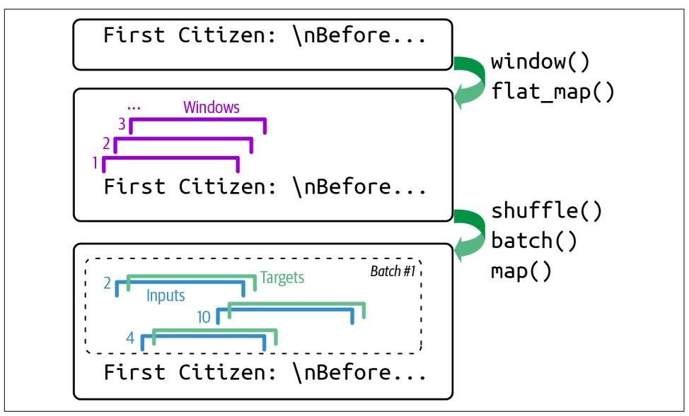

Figure 16-1. Preparing a dataset of shuffled windows

{608}------------------------------------------------

Now we're ready to create the training set, the validation set, and the test set. We will use roughly 90% of the text for training, 5% for validation, and 5% for testing:

```
lenath = 100
tf.random.set_seed(42)
train set = to dataset(encoded[:1 000 000], length=length, shuffle=True,
                       seed=42)valid_set = to_dataset(encoded[1_000_000:1_060_000], length=length)
test_set = to_dataset(encoded[1_060_000:], length=length)
```


We set the window length to 100, but you can try tuning it: it's easier and faster to train RNNs on shorter input sequences, but the RNN will not be able to learn any pattern longer than length, so don't make it too small.

That's it! Preparing the dataset was the hardest part. Now let's create the model.

### **Building and Training the Char-RNN Model**

Since our dataset is reasonably large, and modeling language is quite a difficult task, we need more than a simple RNN with a few recurrent neurons. Let's build and train a model with one GRU layer composed of 128 units (you can try tweaking the number of layers and units later, if needed):

```
model = tf.keras.Sequential(f)tf.keras.layers.Embedding(input_dim=n_tokens, output_dim=16),
    tf.keras.layers.GRU(128, return_sequences=True),
    tf.keras.layers.Dense(n_tokens, activation="softmax")
\left| \right\ranglemodel.compile(loss="sparse categorical crossentropy", optimizer="nadam",
              metrics = ['accuracy"]model_ckpt = tf.keras.callbacks.ModelCheckpoint(
    "my_shakespeare_model", monitor="val_accuracy", save_best_only=True)
history = model.fit(train_set, validation_data=valid_set, epochs=10,
                    callbacks=[model ckpt])
```

Let's go over this code:

- We use an Embedding layer as the first layer, to encode the character IDs (embeddings were introduced in Chapter 13). The Embedding layer's number of input dimensions is the number of distinct character IDs, and the number of output dimensions is a hyperparameter you can tune—we'll set it to 16 for now. Whereas the inputs of the Embedding layer will be 2D tensors of shape [batch size, window length], the output of the Embedding layer will be a 3D tensor of shape [batch size, window length, embedding size].
- We use a Dense layer for the output layer: it must have 39 units (n\_tokens) because there are 39 distinct characters in the text, and we want to output a

{609}------------------------------------------------

probability for each possible character (at each time step). The 39 output probabilities should sum up to 1 at each time step, so we apply the softmax activation function to the outputs of the Dense layer.

• Lastly, we compile this model, using the "sparse\_categorical\_crossentropy" loss and a Nadam optimizer, and we train the model for several epochs,<sup>3</sup> using a ModelCheckpoint callback to save the best model (in terms of validation accuracy) as training progresses.


If you are running this code on Colab with a GPU activated, then training should take roughly one to two hours. You can reduce the number of epochs if you don't want to wait that long, but of course the model's accuracy will probably be lower. If the Colab session times out, make sure to reconnect quickly, or else the Colab runtime will be destroyed.

This model does not handle text preprocessing, so let's wrap it in a final model containing the tf.keras.layers.TextVectorization layer as the first layer, plus a tf.keras.layers.Lambda layer to subtract 2 from the character IDs since we're not using the padding and unknown tokens for now:

```
shakespeare model = tf.keras.Sequential(\lceiltext_vec_layer,
    tf.keras.layers.Lambda(lambda X: X - 2), # no <PAD> or <UNK> tokens
    model
\left| \right)
```

And now let's use it to predict the next character in a sentence:

```
>>> y proba = shakespeare model.predict(\lceil"To be or not to b"])\lceil \theta, -1 \rceil>>> y_pred = tf.argmax(y_proba) # choose the most probable character ID
>>> text_vec_layer.get_vocabulary()[y_pred + 2]
'e'
```

Great, the model correctly predicted the next character. Now let's use this model to pretend we're Shakespeare!

#### **Generating Fake Shakespearean Text**

To generate new text using the char-RNN model, we could feed it some text, make the model predict the most likely next letter, add it to the end of the text, then give the extended text to the model to guess the next letter, and so on. This is called greedy *decoding*. But in practice this often leads to the same words being repeated over and

<sup>3</sup> Since the input windows overlap, the concept of *epoch* is not so clear in this case: during each epoch (as implemented by Keras), the model will actually see the same character multiple times.

{610}------------------------------------------------

over again. Instead, we can sample the next character randomly, with a probability equal to the estimated probability, using TensorFlow's tf.random.categorical() function. This will generate more diverse and interesting text. The categorical() function samples random class indices, given the class log probabilities (logits). For example:

```
>>> log probas = tf.math.log([0.5, 0.4, 0.1]) # probas = 50%, 40%, and 10%
>>> tf.random.set_seed(42)
>>> tf.random.categorical(log_probas, num_samples=8) # draw 8 samples
<tf.Tensor: shape=(1, 8), dtype=int64, numpy=array([0, 1, 0, 2, 1, 0, 0, 1]])>
```

To have more control over the diversity of the generated text, we can divide the logits by a number called the *temperature*, which we can tweak as we wish. A temperature close to zero favors high-probability characters, while a high temperature gives all characters an equal probability. Lower temperatures are typically preferred when generating fairly rigid and precise text, such as mathematical equations, while higher temperatures are preferred when generating more diverse and creative text. The following next\_char() custom helper function uses this approach to pick the next character to add to the input text:

```
def next_char(text, temperature=1):
    y proba = shakespeare model.predict([text])0, -1:
    rescaled logits = tf.math.log(y proba) / temperaturechar_id = tf.random.categorical(rescaled_logits, num_samples=1)[0, 0]
    return text_vec_layer.get_vocabulary()[char_id + 2]
```

Next, we can write another small helper function that will repeatedly call next char() to get the next character and append it to the given text:

```
def extend_text(text, n_chars=50, temperature=1):
   for in range(n_{class}):
       text += next char(text, temperature)return text
```

We are now ready to generate some text! Let's try with different temperature values:

```
>>> tf.random.set seed(42)
>>> print(extend text("To be or not to be", temperature=0.01))
To be or not to be the duke
as it is a proper strange death,
and the
>>> print(extend_text("To be or not to be", temperature=1))
To be or not to behold?
second push:
gremio, lord all, a sistermen,
>>> print(extend text("To be or not to be", temperature=100))
To be or not to bef ,mt'&o3fpadm!$
wh!nse?bws3est--vgerdjw?c-y-ewznq
```

{611}------------------------------------------------

Shakespeare seems to be suffering from a heatwave. To generate more convincing text, a common technique is to sample only from the top  $k$  characters, or only from the smallest set of top characters whose total probability exceeds some threshold (this is called nucleus sampling). Alternatively, you could try using beam search, which we will discuss later in this chapter, or using more GRU layers and more neurons per layer, training for longer, and adding some regularization if needed. Also note that the model is currently incapable of learning patterns longer than length, which is just 100 characters. You could try making this window larger, but it will also make training harder, and even LSTM and GRU cells cannot handle very long sequences. An alternative approach is to use a stateful RNN.

#### **Stateful RNN**

Until now, we have only used *stateless RNNs*: at each training iteration the model starts with a hidden state full of zeros, then it updates this state at each time step, and after the last time step, it throws it away as it is not needed anymore. What if we instructed the RNN to preserve this final state after processing a training batch and use it as the initial state for the next training batch? This way the model could learn long-term patterns despite only backpropagating through short sequences. This is called a *stateful RNN*. Let's go over how to build one.

First, note that a stateful RNN only makes sense if each input sequence in a batch starts exactly where the corresponding sequence in the previous batch left off. So the first thing we need to do to build a stateful RNN is to use sequential and nonoverlapping input sequences (rather than the shuffled and overlapping sequences we used to train stateless RNNs). When creating the tf.data.Dataset, we must therefore use shift=length (instead of shift=1) when calling the window() method. Moreover, we must not call the shuffle() method.

Unfortunately, batching is much harder when preparing a dataset for a stateful RNN than it is for a stateless RNN. Indeed, if we were to call batch(32), then 32 consecutive windows would be put in the same batch, and the following batch would not continue each of these windows where it left off. The first batch would contain windows 1 to 32 and the second batch would contain windows 33 to 64, so if you consider, say, the first window of each batch (i.e., windows 1 and 33), you can see that they are not consecutive. The simplest solution to this problem is to just use a batch size of 1. The following to dataset for stateful rnn() custom utility function uses this strategy to prepare a dataset for a stateful RNN:

{612}------------------------------------------------

```
def to_dataset_for_stateful_rnn(sequence, length):
   ds = tf.data.Dataset.from tensor slices(sequence)
   ds = ds.window(length + 1, shift=length, drop_remainder=True)
   ds = ds. flat map(lambda window: window.batch(length + 1)).batch(1)
   return ds.map(lambda window: (window[:, :-1], window[:, 1:])).prefetch(1)
stateful_train_set = to_dataset_for_stateful_rnn(encoded[:1_000_000], length)
stateful_valid_set = to_dataset_for_stateful_rnn(encoded[1_000_000:1_060_000],
                                                 lenath)
stateful_test_set = to_dataset_for_stateful_rnn(encoded[1_060_000:], length)
```

Figure 16-2 summarizes the main steps of this function.

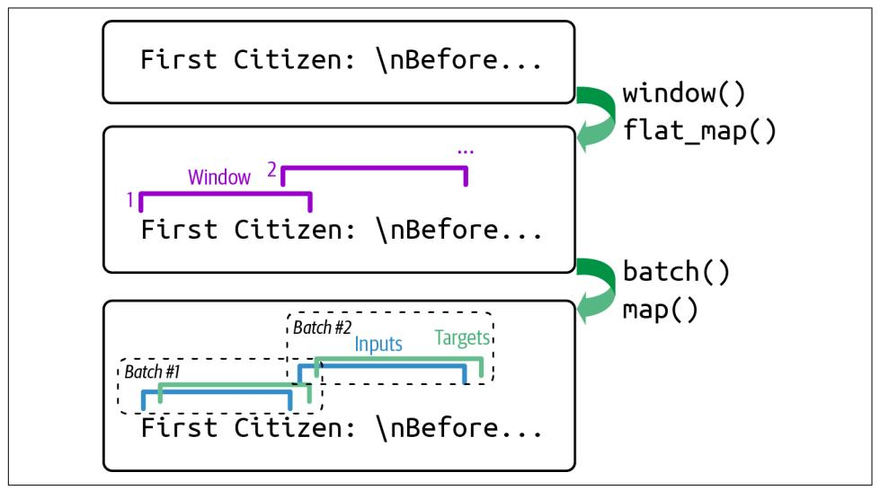

Figure 16-2. Preparing a dataset of consecutive sequence fragments for a stateful RNN

Batching is harder, but it is not impossible. For example, we could chop Shakespeare's text into 32 texts of equal length, create one dataset of consecutive input sequences for each of them, and finally use tf.data.Dataset.zip(datasets).map(lambda \*windows: tf.stack(windows)) to create proper consecutive batches, where the  $n^{\text{th}}$ input sequence in a batch starts off exactly where the  $n<sup>th</sup>$  input sequence ended in the previous batch (see the notebook for the full code).

Now, let's create the stateful RNN. We need to set the stateful argument to True when creating each recurrent layer, and because the stateful RNN needs to know the batch size (since it will preserve a state for each input sequence in the batch). Therefore we must set the batch\_input\_shape argument in the first layer. Note that we can leave the second dimension unspecified, since the input sequences could have any length:

{613}------------------------------------------------

```
model = tf.keras.Sequential(tf.keras.layers.Embedding(input dim=n tokens, output dim=16,
                              batch_input_shape=[1, None]),
    tf.keras.layers.GRU(128, return sequences=True, stateful=True),
    tf.keras.layers.Dense(n tokens, activation="softmax")
\mathbf{I}
```

At the end of each epoch, we need to reset the states before we go back to the beginning of the text. For this, we can use a small custom Keras callback:

```
class ResetStatesCallback(tf.keras.callbacks.Callback):
   def on epoch begin(self, epoch, logs):
        self.model.reset states()
```

And now we can compile the model and train it using our callback:

```
model.compile(loss="sparse categorical crossentropy", optimizer="nadam",
              metrics = ['accuracy"]history = model.fit(stateful_train_set, validation_data=stateful_valid_set,
                    epochs=10, callbacks=[ResetStatesCallback(), model_ckpt])
```


After this model is trained, it will only be possible to use it to make predictions for batches of the same size as were used during training. To avoid this restriction, create an identical stateless model, and copy the stateful model's weights to this model.

Interestingly, although a char-RNN model is just trained to predict the next character, this seemingly simple task actually requires it to learn some higher-level tasks as well. For example, to find the next character after "Great movie, I really", it's helpful to understand that the sentence is positive, so what follows is more likely to be the letter "l" (for "loved") rather than "h" (for "hated"). In fact, a 2017 paper<sup>4</sup> by Alec Radford and other OpenAI researchers describes how the authors trained a big char-RNN-like model on a large dataset, and found that one of the neurons acted as an excellent sentiment analysis classifier: although the model was trained without any labels, the *sentiment neuron*—as they called it—reached state-of-the-art performance on sentiment analysis benchmarks. This foreshadowed and motivated unsupervised pretraining in NLP.

But before we explore unsupervised pretraining, let's turn our attention to word-level models and how to use them in a supervised fashion for sentiment analysis. In the process, you will learn how to handle sequences of variable lengths using masking.

<sup>4</sup> Alec Radford et al., "Learning to Generate Reviews and Discovering Sentiment", arXiv preprint arXiv:1704.01444 (2017).

{614}------------------------------------------------

### **Sentiment Analysis**

Generating text can be fun and instructive, but in real-life projects, one of the most common applications of NLP is text classification—especially sentiment analysis. If image classification on the MNIST dataset is the "Hello world!" of computer vision, then sentiment analysis on the IMDb reviews dataset is the "Hello world!" of natural language processing. The IMDb dataset consists of 50,000 movie reviews in English  $(25,000)$  for training, 25,000 for testing) extracted from the famous Internet Movie Database, along with a simple binary target for each review indicating whether it is negative  $(0)$  or positive  $(1)$ . Just like MNIST, the IMDb reviews dataset is popular for good reasons: it is simple enough to be tackled on a laptop in a reasonable amount of time, but challenging enough to be fun and rewarding.

Let's load the IMDb dataset using the TensorFlow Datasets library (introduced in Chapter 13). We'll use the first 90% of the training set for training, and the remaining 10% for validation:

```
import tensorflow_datasets as tfds
```

```
raw_train_set, raw_valid_set, raw_test_set = tfds.load(
    name="imdb_reviews",
    split=["train[:90%]", "train[90%:]", "test"],
    as supervised=True
\lambdatf.random.set seed(42)
train_set = raw_train_set.shuffle(5000, seed=42).batch(32).prefetch(1)
valid_set = raw_value_set.batch(32).prefetch(1)test_set = raw_test_set.batch(32).prefetch(1)
```


Keras also includes a function for loading the IMDb dataset, if you prefer: tf.keras.datasets.imdb.load\_data(). The reviews are already preprocessed as sequences of word IDs.

Let's inspect a few reviews:

```
>>> for review, label in raw_train_set.take(4):
        print(review.numpy().decode("utf-8"))
\cdotsprint("Label:", label.numpy())
\ddotsc\overline{1}This was an absolutely terrible movie. Don't be lured in by Christopher [\dots]Label: 0
I have been known to fall asleep during films, but this is usually due to [...]
Label: 0
Mann photographs the Alberta Rocky Mountains in a superb fashion, and [...]
Label: 0This is the kind of film for a snowy Sunday afternoon when the rest of the [\dots]Label: 1
```

{615}------------------------------------------------

Some reviews are easy to classify. For example, the first review includes the words "terrible movie" in the very first sentence. But in many cases things are not that simple. For example, the third review starts off positively, even though it's ultimately a negative review (label 0).

To build a model for this task, we need to preprocess the text, but this time we will chop it into words instead of characters. For this, we can use the tf.keras. layers. TextVectorization layer again. Note that it uses spaces to identify word boundaries, which will not work well in some languages. For example, Chinese writing does not use spaces between words, Vietnamese uses spaces even within words, and German often attaches multiple words together, without spaces. Even in English, spaces are not always the best way to tokenize text: think of "San Francisco" or "#ILoveDeepLearning".

Fortunately, there are solutions to address these issues. In a 2016 paper,<sup>5</sup> Rico Sennrich et al. from the University of Edinburgh explored several methods to tokenize and detokenize text at the subword level. This way, even if your model encounters a rare word it has never seen before, it can still reasonably guess what it means. For example, even if the model never saw the word "smartest" during training, if it learned the word "smart" and it also learned that the suffix "est" means "the most", it can infer the meaning of "smartest". One of the techniques the authors evaluated is byte pair encoding (BPE). BPE works by splitting the whole training set into individual characters (including spaces), then repeatedly merging the most frequent adjacent pairs until the vocabulary reaches the desired size.

A 2018 paper<sup>6</sup> by Taku Kudo at Google further improved subword tokenization, often removing the need for language-specific preprocessing prior to tokenization. Moreover, the paper proposed a novel regularization technique called *subword regula*rization, which improves accuracy and robustness by introducing some randomness in tokenization during training: for example, "New England" may be tokenized as "New" + "England", or "New" + "Eng" + "land", or simply "New England" (just one token). Google's SentencePiece project provides an open source implementation, which is described in a paper<sup>7</sup> by Taku Kudo and John Richardson.

<sup>5</sup> Rico Sennrich et al., "Neural Machine Translation of Rare Words with Subword Units", Proceedings of the 54th Annual Meeting of the Association for Computational Linguistics 1 (2016): 1715-1725.

<sup>6</sup> Taku Kudo, "Subword Regularization: Improving Neural Network Translation Models with Multiple Subword Candidates", arXiv preprint arXiv:1804.10959 (2018).

<sup>7</sup> Taku Kudo and John Richardson, "SentencePiece: A Simple and Language Independent Subword Tokenizer and Detokenizer for Neural Text Processing", arXiv preprint arXiv:1808.06226 (2018).

{616}------------------------------------------------

The TensorFlow Text library also implements various tokenization strategies, including WordPiece<sup>8</sup> (a variant of BPE), and last but not least, the Tokenizers library by Hugging Face implements a wide range of extremely fast tokenizers.

However, for the IMDb task in English, using spaces for token boundaries should be good enough. So let's go ahead with creating a TextVectorization layer and adapting it to the training set. We will limit the vocabulary to 1,000 tokens, including the most frequent 998 words plus a padding token and a token for unknown words, since it's unlikely that very rare words will be important for this task, and limiting the vocabulary size will reduce the number of parameters the model needs to learn:

```
vocab_size = 1000text vec layer = tf.keras.layers.TextVectorization(max tokens=vocab size)
text_vec_layer.adapt(train_set.map(lambda reviews, labels: reviews))
```

Finally, we can create the model and train it:

```
embed size = 128tf.random.set seed(42)
model = tf.keras.Sequential(f)text vec layer,
    tf.keras.layers.Embedding(vocab_size, embed_size),
    tf.keras.layers.GRU(128),
    tf.keras.layers.Dense(1, activation="sigmoid")
\left| \cdot \right|model.compile(loss="binary_crossentropy", optimizer="nadam",
              metrics=["accuracy"])
history = model.fit(train_set, validation_data=valid_set, epochs=2)
```

The first layer is the TextVectorization layer we just prepared, followed by an Embedding layer that will convert word IDs into embeddings. The embedding matrix needs to have one row per token in the vocabulary (vocab\_size) and one column per embedding dimension (this example uses 128 dimensions, but this is a hyperparameter you could tune). Next we use a GRU layer and a Dense layer with a single neuron and the sigmoid activation function, since this is a binary classification task: the model's output will be the estimated probability that the review expresses a positive sentiment regarding the movie. We then compile the model, and we fit it on the dataset we prepared earlier for a couple of epochs (or you can train for longer to get better results).

<sup>8</sup> Yonghui Wu et al., "Google's Neural Machine Translation System: Bridging the Gap Between Human and Machine Translation", arXiv preprint arXiv:1609.08144 (2016).

{617}------------------------------------------------

Sadly, if you run this code, you will generally find that the model fails to learn anything at all: the accuracy remains close to 50%, no better than random chance. Why is that? The reviews have different lengths, so when the TextVectorization layer converts them to sequences of token IDs, it pads the shorter sequences using the padding token (with ID 0) to make them as long as the longest sequence in the batch. As a result, most sequences end with many padding tokens—often dozens or even hundreds of them. Even though we're using a GRU layer, which is much better than a SimpleRNN layer, its short-term memory is still not great, so when it goes through many padding tokens, it ends up forgetting what the review was about! One solution is to feed the model with batches of equal-length sentences (which also speeds up training). Another solution is to make the RNN ignore the padding tokens. This can be done using masking.

### **Masking**

Making the model ignore padding tokens is trivial using Keras: simply add mask zero=True when creating the Embedding layer. This means that padding tokens (whose ID is 0) will be ignored by all downstream layers. That's all! If you retrain the previous model for a few epochs, you will find that the validation accuracy quickly reaches over 80%.

The way this works is that the Embedding layer creates a *mask tensor* equal to  $tf.math.not$  equal(inputs,  $0$ ): it is a Boolean tensor with the same shape as the inputs, and it is equal to False anywhere the token IDs are 0, or True otherwise. This mask tensor is then automatically propagated by the model to the next layer. If that layer's call() method has a mask argument, then it automatically receives the mask. This allows the layer to ignore the appropriate time steps. Each layer may handle the mask differently, but in general they simply ignore masked time steps (i.e., time steps for which the mask is False). For example, when a recurrent layer encounters a masked time step, it simply copies the output from the previous time step.

Next, if the layer's supports\_masking attribute is True, then the mask is automatically propagated to the next layer. It keeps propagating this way for as long as the layers have supports\_masking=True. As an example, a recurrent layer's supports\_ masking attribute is True when return\_sequences=True, but it's False when return\_ sequences=False since there's no need for a mask anymore in this case. So if you have a model with several recurrent layers with return sequences=True, followed by a recurrent layer with return sequences=False, then the mask will automatically propagate up to the last recurrent layer: that layer will use the mask to ignore masked steps, but it will not propagate the mask any further. Similarly, if you set mask\_zero=True when creating the Embedding layer in the sentiment analysis model we just built, then the GRU layer will receive and use the mask automatically, but it will not propagate it any further, since return\_sequences is not set to True.

{618}------------------------------------------------


Some layers need to update the mask before propagating it to the next layer: they do so by implementing the compute\_mask() method, which takes two arguments: the inputs and the previous mask. It then computes the updated mask and returns it. The default implementation of compute\_mask() just returns the previous mask unchanged.

Many Keras layers support masking: SimpleRNN, GRU, LSTM, Bidirectional, Dense, TimeDistributed, Add, and a few others (all in the tf.keras.layers package). However, convolutional layers (including Conv1D) do not support masking-it's not obvious how they would do so anyway.

If the mask propagates all the way to the output, then it gets applied to the losses as well, so the masked time steps will not contribute to the loss (their loss will be 0). This assumes that the model outputs sequences, which is not the case in our sentiment analysis model.


The LSTM and GRU layers have an optimized implementation for GPUs, based on Nvidia's cuDNN library. However, this implementation only supports masking if all the padding tokens are at the end of the sequences. It also requires you to use the default values for several hyperparameters: activation, recurrent activation, recurrent dropout, unroll, use bias, and reset after. If that's not the case, then these layers will fall back to the (much slower) default GPU implementation.

If you want to implement your own custom layer with masking support, you should add a mask argument to the call() method, and obviously make the method use the mask. Additionally, if the mask must be propagated to the next layers, then you should set self. supports masking=True in the constructor. If the mask must be updated before it is propagated, then you must implement the compute\_mask() method

If your model does not start with an Embedding layer, you may use the tf. keras. layers. Masking layer instead: by default, it sets the mask to tf. math. reduce\_any(tf.math.not\_equal(X, 0), axis=-1), meaning that time steps where the last dimension is full of zeros will be masked out in subsequent layers.

{619}------------------------------------------------

Using masking layers and automatic mask propagation works best for simple models. It will not always work for more complex models, such as when you need to mix Conv<sub>1</sub>D layers with recurrent layers. In such cases, you will need to explicitly compute the mask and pass it to the appropriate layers, using either the functional API or the subclassing API. For example, the following model is equivalent to the previous model, except it is built using the functional API and handles masking manually. It also adds a bit of dropout since the previous model was overfitting slightly:

```
inputs = tf.keras.layers.Input(shape=[], dtype=tf.string)
token\_ids = text\_vec\_layer(inputs)mask = tf.math.not_equal(token_ids, 0)Z = tf.keras.layers.Embedding(vocab_size, embed_size)(token_ids)
Z = tf.keras.layers.GRU(128, dropout=0.2)(Z, mask=mask)
outputs = tf.keras. layers. Dense(1, activation="sigmoid")(Z)model = tf.keras.Model(inputs=[inputs], outputs=[outputs])
```

One last approach to masking is to feed the model with ragged tensors.<sup>9</sup> In practice, all you need to do is to set ragged=True when creating the TextVectorization layer, so that the input sequences are represented as ragged tensors:

```
>>> text vec layer ragged = tf.keras.layers.TextVectorization(
        max tokens=vocab size, ragged=True)
\ddotsc>>> text vec layer ragged.adapt(train set.map(lambda reviews, labels: reviews))
>>> text_vec_layer_ragged(["Great movie!", "This is DiCaprio's best role."])
<tf.RaggedTensor [[86, 18], [11, 7, 1, 116, 217]]>
```

Compare this ragged tensor representation with the regular tensor representation, which uses padding tokens:

```
>>> text_vec_layer(["Great movie!", "This is DiCaprio's best role."])
<tf.Tensor: shape=(2, 5), dtype=int64, numpy=
array([[86, 18, 0, 0, 0],[11, 7, 1, 116, 217]]
```

Keras's recurrent layers have built-in support for ragged tensors, so there's nothing else you need to do: just use this TextVectorization layer in your model. There's no need to pass mask zero=True or handle masks explicitly—it's all implemented for you. That's convenient! However, as of early 2022, the support for ragged tensors in Keras is still fairly recent, so there are a few rough edges. For example, it is currently not possible to use ragged tensors as targets when running on the GPU (but this may be resolved by the time you read these lines).

Whichever masking approach you prefer, after training this model for a few epochs, it will become quite good at judging whether a review is positive or not. If you use the tf.keras.callbacks.TensorBoard() callback, you can visualize the embeddings

<sup>9</sup> Ragged tensors were introduced in Chapter 12, and they are detailed in Appendix C.

{620}------------------------------------------------

in TensorBoard as they are being learned: it is fascinating to see words like "awesome" and "amazing" gradually cluster on one side of the embedding space, while words like "awful" and "terrible" cluster on the other side. Some words are not as positive as you might expect (at least with this model), such as the word "good", presumably because many negative reviews contain the phrase "not good".

#### **Reusing Pretrained Embeddings and Language Models**

It's impressive that the model is able to learn useful word embeddings based on just 25,000 movie reviews. Imagine how good the embeddings would be if we had billions of reviews to train on! Unfortunately, we don't, but perhaps we can reuse word embeddings trained on some other (very) large text corpus (e.g., Amazon reviews, available on TensorFlow Datasets), even if it is not composed of movie reviews? After all, the word "amazing" generally has the same meaning whether you use it to talk about movies or anything else. Moreover, perhaps embeddings would be useful for sentiment analysis even if they were trained on another task: since words like "awesome" and "amazing" have a similar meaning, they will likely cluster in the embedding space even for tasks such as predicting the next word in a sentence. If all positive words and all negative words form clusters, then this will be helpful for sentiment analysis. So, instead of training word embeddings, we could just download and use pretrained embeddings, such as Google's Word2vec embeddings, Stanford's GloVe embeddings, or Facebook's FastText embeddings.

Using pretrained word embeddings was popular for several years, but this approach has its limits. In particular, a word has a single representation, no matter the context. For example, the word "right" is encoded the same way in "left and right" and "right and wrong", even though it means two very different things. To address this limitation, a 2018 paper<sup>10</sup> by Matthew Peters introduced Embeddings from Language Models (ELMo): these are contextualized word embeddings learned from the internal states of a deep bidirectional language model. Instead of just using pretrained embeddings in your model, you reuse part of a pretrained language model.

At roughly the same time, the Universal Language Model Fine-Tuning (ULMFiT) paper<sup>11</sup> by Jeremy Howard and Sebastian Ruder demonstrated the effectiveness of unsupervised pretraining for NLP tasks: the authors trained an LSTM language model on a huge text corpus using self-supervised learning (i.e., generating the labels automatically from the data), then they fine-tuned it on various tasks. Their model outperformed the state of the art on six text classification tasks by a large

<sup>10</sup> Matthew Peters et al., "Deep Contextualized Word Representations", Proceedings of the 2018 Conference of the North American Chapter of the Association for Computational Linguistics: Human Language Technologies 1  $(2018): 2227 - 2237.$ 

<sup>11</sup> Jeremy Howard and Sebastian Ruder, "Universal Language Model Fine-Tuning for Text Classification", Proceedings of the 56th Annual Meeting of the Association for Computational Linguistics 1 (2018): 328-339.

{621}------------------------------------------------

margin (reducing the error rate by 18–24% in most cases). Moreover, the authors showed a pretrained model fine-tuned on just 100 labeled examples could achieve the same performance as one trained from scratch on 10,000 examples. Before the ULMFIT paper, using pretrained models was only the norm in computer vision; in the context of NLP, pretraining was limited to word embeddings. This paper marked the beginning of a new era in NLP: today, reusing pretrained language models is the norm

For example, let's build a classifier based on the Universal Sentence Encoder, a model architecture introduced in a  $2018$  paper<sup>12</sup> by a team of Google researchers. This model is based on the transformer architecture, which we will look at later in this chapter. Conveniently, the model is available on TensorFlow Hub:

```
import os
import tensorflow_hub as hub
os.environ["TFHUB CACHE DIR"] = "my tfhub cache"
model = tf.keras.Sequential([hub.KerasLayer("https://tfhub.dev/google/universal-sentence-encoder/4",
                   trainable=True, dtype=tf.string, input shape=[]),
    tf.keras.layers.Dense(64, activation="relu"),
    tf.keras.layers.Dense(1, activation="sigmoid")
\mathbf{I}model.compile(loss="binary_crossentropy", optimizer="nadam",
              metrics=["accuracy"])
model.fit(train_set, validation_data=valid_set, epochs=10)
```


This model is quite large—close to 1 GB in size—so it may take a while to download. By default, TensorFlow Hub modules are saved to a temporary directory, and they get downloaded again and again every time you run your program. To avoid that, you must set the TFHUB CACHE DIR environment variable to a directory of your choice: the modules will then be saved there, and only downloaded once.

Note that the last part of the TensorFlow Hub module URL specifies that we want version 4 of the model. This versioning ensures that if a new module version is released on TF Hub, it will not break our model. Conveniently, if you just enter this URL in a web browser, you will get the documentation for this module.

<sup>12</sup> Daniel Cer et al., "Universal Sentence Encoder", arXiv preprint arXiv:1803.11175 (2018).

{622}------------------------------------------------

Also note that we set trainable=True when creating the hub. KerasLayer. This way, the pretrained Universal Sentence Encoder is fine-tuned during training; some of its weights are tweaked via backprop. Not all TensorFlow Hub modules are fine-tunable, so make sure to check the documentation for each pretrained module you're interested in.

After training, this model should reach a validation accuracy of over 90%. That's actually really good: if you try to perform the task yourself, you will probably do only marginally better since many reviews contain both positive and negative comments. Classifying these ambiguous reviews is like flipping a coin.

So far we have looked at text generation using a char-RNN, and sentiment analysis with word-level RNN models (based on trainable embeddings) and using a powerful pretrained language model from TensorFlow Hub. In the next section, we will explore another important NLP task: neural machine translation (NMT).

### An Encoder-Decoder Network for Neural Machine **Translation**

Let's begin with a simple NMT model<sup>13</sup> that will translate English sentences to Spanish (see Figure 16-3).

In short, the architecture is as follows: English sentences are fed as inputs to the encoder, and the decoder outputs the Spanish translations. Note that the Spanish translations are also used as inputs to the decoder during training, but shifted back by one step. In other words, during training the decoder is given as input the word that it *should* have output at the previous step, regardless of what it actually output. This is called teacher forcing-a technique that significantly speeds up training and improves the model's performance. For the very first word, the decoder is given the start-of-sequence (SOS) token, and the decoder is expected to end the sentence with an end-of-sequence (EOS) token.

Each word is initially represented by its ID (e.g., 854 for the word "soccer"). Next, an Embedding layer returns the word embedding. These word embeddings are then fed to the encoder and the decoder.

At each step, the decoder outputs a score for each word in the output vocabulary (i.e., Spanish), then the softmax activation function turns these scores into probabilities. For example, at the first step the word "Me" may have a probability of 7%, "Yo" may have a probability of 1%, and so on. The word with the highest probability is output. This is very much like a regular classification task, and indeed you can train the

<sup>13</sup> Ilya Sutskever et al., "Sequence to Sequence Learning with Neural Networks", arXiv preprint (2014).

{623}------------------------------------------------

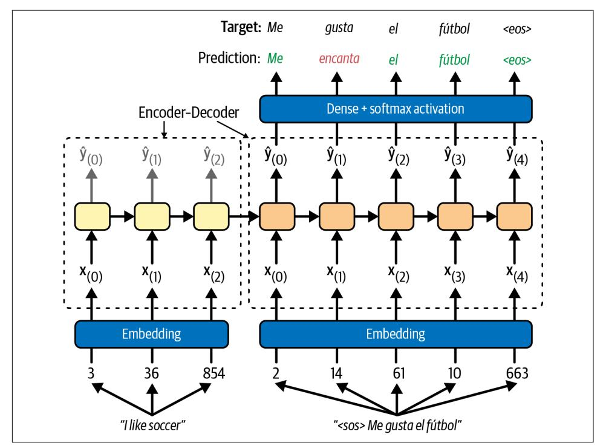

model using the "sparse categorical crossentropy" loss, much like we did in the char-RNN model.

Figure 16-3. A simple machine translation model

Note that at inference time (after training), you will not have the target sentence to feed to the decoder. Instead, you need to feed it the word that it has just output at the previous step, as shown in Figure 16-4 (this will require an embedding lookup that is not shown in the diagram).


In a 2015 paper,<sup>14</sup> Samy Bengio et al. proposed gradually switching from feeding the decoder the previous target token to feeding it the previous output token during training.

<sup>14</sup> Samy Bengio et al., "Scheduled Sampling for Sequence Prediction with Recurrent Neural Networks", arXiv preprint arXiv:1506.03099 (2015).

{624}------------------------------------------------

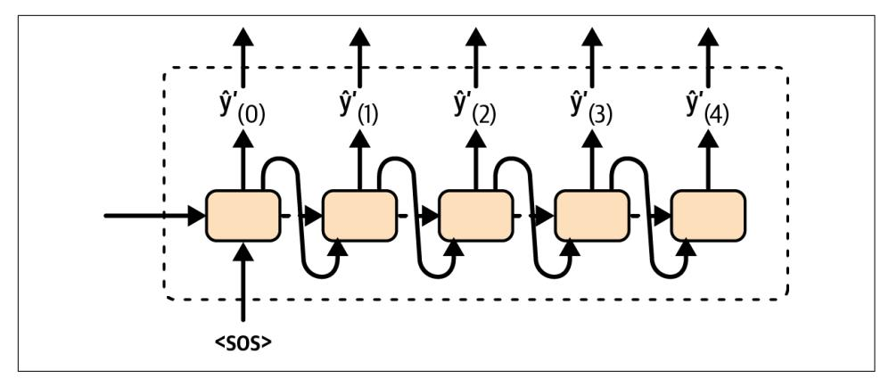

Figure 16-4. At inference time, the decoder is fed as input the word it just output at the previous time step

Let's build and train this model! First, we need to download a dataset of English/ Spanish sentence pairs:<sup>15</sup>

```
url = "https://storage.googleapis.com/download.tensorflow.org/data/spa-eng.zip"
path = tf.keras.utils.get_file("spa-eng.zip", origin=url, cache_dir="datasets",
                               extraction = True)text = (Path(path).with_name("spa-eng") / "spa.txt").read_text()
```

Each line contains an English sentence and the corresponding Spanish translation, separated by a tab. We'll start by removing the Spanish characters "i" and "i", which the TextVectorization layer doesn't handle, then we will parse the sentence pairs and shuffle them. Finally, we will split them into two separate lists, one per language:

```
import numpy as np
text = text.replace(";", "").replace(";", "")
pairs = [line.split(" \t\tt t") for line in text.splitlines()]
np.random.shuffle(pairs)
sentences_en, sentences_es = zip(*pairs) # separates the pairs into 2 lists
```

Let's take a look at the first three sentence pairs:

```
\Rightarrow for i in range(3):
        print(sentences_en[i], "=>", sentences_es[i])
\ddotsc\ddotscHow boring! => Qué aburrimiento!
I love sports. => Adoro el deporte.
Would you like to swap jobs? => Te gustaría que intercambiemos los trabajos?
```

<sup>15</sup> This dataset is composed of sentence pairs created by contributors of the Tatoeba project. About 120,000 sentence pairs were selected by the authors of the website https://manythings.org/anki. This dataset is released under the Creative Commons Attribution 2.0 France license. Other language pairs are available.

{625}------------------------------------------------

Next, let's create two TextVectorization layers—one per language—and adapt them to the text:

```
vocab_size = 1000max_length = 50text vec layer en = tf.keras.layers.TextVectorization(
   vocab_size, output_sequence_length=max_length)
text vec layer es = tf.keras.layers.TextVectorization(
   vocab size, output sequence length=max length)
text_vec_layer_en.adapt(sentences_en)
text vec layer es.adapt([f"startofseq {s} endofseq" for s in sentences es])
```

There are a few things to note here:

- We limit the vocabulary size to 1,000, which is quite small. That's because the training set is not very large, and because using a small value will speed up training. State-of-the-art translation models typically use a much larger vocabulary (e.g., 30,000), a much larger training set (gigabytes), and a much larger model (hundreds or even thousands of megabytes). For example, check out the Opus-MT models by the University of Helsinki, or the M2M-100 model by Facebook.
- Since all sentences in the dataset have a maximum of 50 words, we set output\_sequence\_length to 50: this way the input sequences will automatically be padded with zeros until they are all 50 tokens long. If there was any sentence longer than 50 tokens in the training set, it would be cropped to 50 tokens.
- For the Spanish text, we add "startofseq" and "endofseq" to each sentence when adapting the TextVectorization layer: we will use these words as SOS and EOS tokens. You could use any other words, as long as they are not actual Spanish words

Let's inspect the first 10 tokens in both vocabularies. They start with the padding token, the unknown token, the SOS and EOS tokens (only in the Spanish vocabulary), then the actual words, sorted by decreasing frequency:

```
>>> text_vec_layer_en.get_vocabulary()[:10]
['', '[UNK]', 'the', 'i', 'to', 'you', 'tom', 'a', 'is', 'he']
>>> text_vec_layer_es.get_vocabulary()[:10]
['', '[UNK]', 'startofseq', 'endofseq', 'de', 'que', 'a', 'no', 'tom', 'la']
```

Next, let's create the training set and the validation set (you could also create a test set if you needed it). We will use the first 100,000 sentence pairs for training, and the rest for validation. The decoder's inputs are the Spanish sentences plus an SOS token prefix. The targets are the Spanish sentences plus an EOS suffix:

```
X train = tf.constant(sentences en[:100 000])
X valid = tf.constant(sentences en[100 000:])
X_train_dec = tf.constant([f"startofseq {s}" for s in sentences_es[:100_000]])
X_valid_dec = tf.constant([f"startofseq {s}" for s in sentences_es[100_000:]])
```

{626}------------------------------------------------

```
Y_train = text_vec_layer_es([f"{s} endofseq" for s in sentences_es[:100_000]])
Y_valid = text_vec_layer_es([f"{s} endofseq" for s in sentences_es[100_000:]])
```

OK, we're now ready to build our translation model. We will use the functional API for that since the model is not sequential. It requires two text inputs—one for the encoder and one for the decoder-so let's start with that:

```
encoder_inputs = tf.keras.layers.Input(shape=[], dtype=tf.string)
decoder_inputs = tf.keras.layers.Input(shape=[], dtype=tf.string)
```

Next, we need to encode these sentences using the TextVectorization layers we prepared earlier, followed by an Embedding layer for each language, with mask zero=True to ensure masking is handled automatically. The embedding size is a hyperparameter you can tune, as always:

```
embed size = 128encoder_input_ids = text_vec_layer_en(encoder_inputs)
decoder_input_ids = text_vec_layer_es(decoder_inputs)
encoder_{en}bedding_layer = tf.keras.layers.Embedding(vocab_size, embed_size,
                                                    mask zero=True)
decoder embedding layer = tf.keras.layers.Embedding(vocab size, embed size,
                                                    mask zero=True)
encoder embeddings = encoder embedding layer(encoder input ids)
decoder_embeddings = decoder_embedding_layer(decoder_input_ids)
```


When the languages share many words, you may get better performance using the same embedding layer for both the encoder and the decoder.

Now let's create the encoder and pass it the embedded inputs:

```
encoder = tf.keras.layers.LSTM(512, return state=True)
encoder outputs, *encoder state = encoder(encoder embeddings)
```

To keep things simple, we just used a single LSTM layer, but you could stack several of them. We also set return\_state=True to get a reference to the layer's final state. Since we're using an LSTM layer, there are actually two states: the short-term state and the long-term state. The layer returns these states separately, which is why we had to write \*encoder\_state to group both states in a list.<sup>16</sup> Now we can use this (double) state as the initial state of the decoder:

```
decoder = tf.keras.layers.LSTM(512, return sequences=True)
decoder outputs = decoder(decoder embeddings, initial state=encoder state)
```

<sup>16</sup> In Python, if you run a, \*b = [1, 2, 3, 4], then a equals 1 and b equals [2, 3, 4].

{627}------------------------------------------------

Next, we can pass the decoder's outputs through a Dense layer with the softmax activation function to get the word probabilities for each step:

```
output_layer = tf.keras.layers.Dense(vocab_size, activation="softmax")
Y_proba = output_layer(decoder_outputs)
```

#### **Optimizing the Output Layer**

When the output vocabulary is large, outputting a probability for each and every possible word can be quite slow. If the target vocabulary contained, say, 50,000 Spanish words instead of 1,000, then the decoder would output 50,000-dimensional vectors, and computing the softmax function over such a large vector would be very computationally intensive. To avoid this, one solution is to look only at the logits output by the model for the correct word and for a random sample of incorrect words, then compute an approximation of the loss based only on these logits. This sampled softmax technique was introduced in 2015 by Sébastien Jean et al.<sup>17</sup> In TensorFlow you can use the tf.nn.sampled softmax loss() function for this during training and use the normal softmax function at inference time (sampled softmax cannot be used at inference time because it requires knowing the target).

Another thing you can do to speed up training—which is compatible with sampled softmax—is to tie the weights of the output layer to the transpose of the decoder's embedding matrix (you will see how to tie weights in Chapter 17). This significantly reduces the number of model parameters, which speeds up training and may sometimes improve the model's accuracy as well, especially if you don't have a lot of training data. The embedding matrix is equivalent to one-hot encoding followed by a linear layer with no bias term and no activation function that maps the one-hot vectors to the embedding space. The output layer does the reverse. So, if the model can find an embedding matrix whose transpose is close to its inverse (such a matrix is called an *orthogonal matrix*), then there's no need to learn a separate set of weights for the output layer.

And that's it! We just need to create the Keras Model, compile it, and train it:

```
model = tf.keras.Model(inputs=[encoder_inputs, decoder_inputs],
                       outputs=[Y_proba])
model.compile(loss="sparse_categorical_crossentropy", optimizer="nadam",
              metrics=["accuracy"])
model.fit((X_train, X_train_dec), Y_train, epochs=10,
          validation_data=((X_valid, X_valid_dec), Y_valid))
```

<sup>17</sup> Sébastien Jean et al., "On Using Very Large Target Vocabulary for Neural Machine Translation", Proceedings of the 53rd Annual Meeting of the Association for Computational Linguistics and the 7th International Joint Conference on Natural Language Processing of the Asian Federation of Natural Language Processing 1 (2015):  $1 - 10.$ 

{628}------------------------------------------------

After training, we can use the model to translate new English sentences to Spanish. But it's not as simple as calling model. predict(), because the decoder expects as input the word that was predicted at the previous time step. One way to do this is to write a custom memory cell that keeps track of the previous output and feeds it to the encoder at the next time step. However, to keep things simple, we can just call the model multiple times, predicting one extra word at each round. Let's write a little utility function for that:

```
def translate(sentence_en):
    translation = ""
    for word idx in range(max length):
       X = np.array([sentence_en]) # encoder inputX_dec = np.array(["startofseq " + translation]) # decoder input
       y proba = model.predict((X, X dec))[0, word idx] # last token's probas
       predictedل}wd_id = np.argvax(y_prob)predicted_word = text_vec_layer_es.get_vocabulary()[predicted_word_id]
       if predicted word == "endofseq":
           hreak
       translation += " + predicted word
    return translation.strip()
```

The function simply keeps predicting one word at a time, gradually completing the translation, and it stops once it reaches the EOS token. Let's give it a try!

```
>>> translate("I like soccer")
'me qusta el fútbol'
```

Hurray, it works! Well, at least it does with very short sentences. If you try playing with this model for a while, you will find that it's not bilingual yet, and in particular it really struggles with longer sentences. For example:

```
>>> translate("I like soccer and also going to the beach")
'me qusta el fútbol y a veces mismo al bus'
```

The translation says "I like soccer and sometimes even the bus". So how can you improve it? One way is to increase the training set size and add more LSTM layers in both the encoder and the decoder. But this will only get you so far, so let's look at more sophisticated techniques, starting with bidirectional recurrent layers.

### **Bidirectional RNNs**

At each time step, a regular recurrent layer only looks at past and present inputs before generating its output. In other words, it is *causal*, meaning it cannot look into the future. This type of RNN makes sense when forecasting time series, or in the decoder of a sequence-to-sequence (seq2seq) model. But for tasks like text classification, or in the encoder of a seq2seq model, it is often preferable to look ahead at the next words before encoding a given word.

{629}------------------------------------------------

For example, consider the phrases "the right arm", "the right person", and "the right to criticize": to properly encode the word "right", you need to look ahead. One solution is to run two recurrent layers on the same inputs, one reading the words from left to right and the other reading them from right to left, then combine their outputs at each time step, typically by concatenating them. This is what a *bidirectional recurrent layer* does (see Figure 16-5).

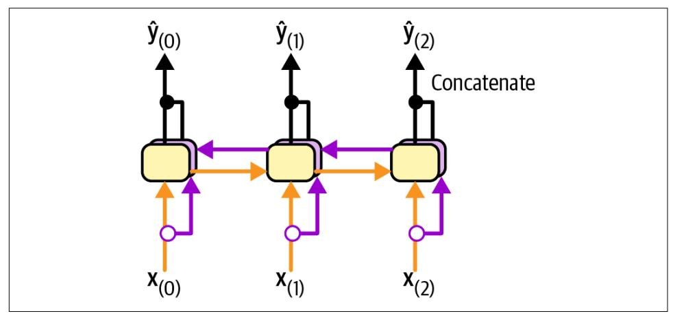

Figure 16-5. A bidirectional recurrent layer

To implement a bidirectional recurrent layer in Keras, just wrap a recurrent layer in a tf.keras.layers.Bidirectional layer. For example, the following Bidirectional layer could be used as the encoder in our translation model:

```
encoder = tf.keras.layers.Bidirectional(
   tf.keras.layers.LSTM(256, return state=True))
```


The Bidirectional layer will create a clone of the GRU layer (but in the reverse direction), and it will run both and concatenate their outputs. So although the GRU layer has 10 units, the Bidirectional layer will output 20 values per time step.

There's just one problem. This layer will now return four states instead of two: the final short-term and long-term states of the forward LSTM layer, and the final shortterm and long-term states of the backward LSTM layer. We cannot use this quadruple state directly as the initial state of the decoder's LSTM layer, since it expects just two states (short-term and long-term). We cannot make the decoder bidirectional, since it must remain causal: otherwise it would cheat during training and it would not work. Instead, we can concatenate the two short-term states, and also concatenate the two long-term states:

{630}------------------------------------------------

```
encoder_outputs, *encoder_state = encoder(encoder_embeddings)
encoder_state = [tf.concat(encode{\_}state[::2], axis=-1), # short-term (0 & 2)tf.\text{concat}(\text{encoder}\_\text{state}[1::2], \text{axis}=-1)] # long-term (1 & 3)
```

Now let's look at another popular technique that can greatly improve the performance of a translation model at inference time: beam search.

### **Beam Search**

Suppose you have trained an encoder-decoder model, and you use it to translate the sentence "I like soccer" to Spanish. You are hoping that it will output the proper translation "me gusta el fútbol", but unfortunately it outputs "me gustan los jugadores", which means "I like the players". Looking at the training set, you notice many sentences such as "I like cars", which translates to "me gustan los autos", so it wasn't absurd for the model to output "me gustan los" after seeing "I like". Unfortunately, in this case it was a mistake since "soccer" is singular. The model could not go back and fix it, so it tried to complete the sentence as best it could, in this case using the word "jugadores". How can we give the model a chance to go back and fix mistakes it made earlier? One of the most common solutions is beam search: it keeps track of a short list of the  $k$  most promising sentences (say, the top three), and at each decoder step it tries to extend them by one word, keeping only the  $k$  most likely sentences. The parameter  $k$  is called the beam width.

For example, suppose you use the model to translate the sentence "I like soccer" using beam search with a beam width of 3 (see Figure 16-6). At the first decoder step, the model will output an estimated probability for each possible first word in the translated sentence. Suppose the top three words are "me" (75% estimated probability), "a" (3%), and "como" (1%). That's our short list so far. Next, we use the model to find the next word for each sentence. For the first sentence ("me"), perhaps the model outputs a probability of 36% for the word "gustan", 32% for the word "gusta", 16% for the word "encanta", and so on. Note that these are actually conditional probabilities, given that the sentence starts with "me". For the second sentence ("a"), the model might output a conditional probability of 50% for the word "mi", and so on. Assuming the vocabulary has 1,000 words, we will end up with 1,000 probabilities per sentence.

Next, we compute the probabilities of each of the 3,000 two-word sentences we considered  $(3 \times 1,000)$ . We do this by multiplying the estimated conditional probability of each word by the estimated probability of the sentence it completes. For example, the estimated probability of the sentence "me" was 75%, while the estimated conditional probability of the word "gustan" (given that the first word is "me") was 36%, so the estimated probability of the sentence "me gustan" is  $75\% \times 36\% = 27\%$ . After computing the probabilities of all 3,000 two-word sentences, we keep only the top 3. In this example they all start with the word "me": "me gustan" (27%),

{631}------------------------------------------------

"me gusta" (24%), and "me encanta" (12%). Right now, the sentence "me gustan" is winning, but "me gusta" has not been eliminated.

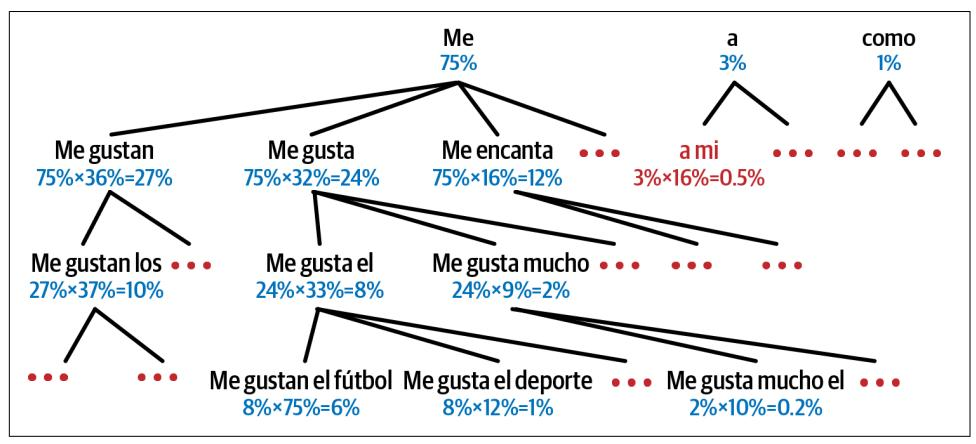

Figure 16-6. Beam search, with a beam width of 3

Then we repeat the same process: we use the model to predict the next word in each of these three sentences, and we compute the probabilities of all 3,000 three-word sentences we considered. Perhaps the top three are now "me gustan los" (10%), "me gusta el" (8%), and "me gusta mucho" (2%). At the next step we may get "me gusta el fútbol" (6%), "me gusta mucho el" (1%), and "me gusta el deporte" (0.2%). Notice that "me gustan" was eliminated, and the correct translation is now ahead. We boosted our encoder-decoder model's performance without any extra training, simply by using it more wisely.


The TensorFlow Addons library includes a full seq2seq API that lets you build encoder-decoder models with attention, including beam search, and more. However, its documentation is currently very limited. Implementing beam search is a good exercise, so give it a try! Check out this chapter's notebook for a possible solution.

With all this, you can get reasonably good translations for fairly short sentences. Unfortunately, this model will be really bad at translating long sentences. Once again, the problem comes from the limited short-term memory of RNNs. Attention *mechanisms* are the game-changing innovation that addressed this problem.

### **Attention Mechanisms**

Consider the path from the word "soccer" to its translation "fútbol" back in Figure 16-3: it is quite long! This means that a representation of this word (along with all 

{632}------------------------------------------------

the other words) needs to be carried over many steps before it is actually used. Can't we make this path shorter?

This was the core idea in a landmark 2014 paper<sup>18</sup> by Dzmitry Bahdanau et al., where the authors introduced a technique that allowed the decoder to focus on the appropriate words (as encoded by the encoder) at each time step. For example, at the time step where the decoder needs to output the word "futbol", it will focus its attention on the word "soccer". This means that the path from an input word to its translation is now much shorter, so the short-term memory limitations of RNNs have much less impact. Attention mechanisms revolutionized neural machine translation (and deep learning in general), allowing a significant improvement in the state of the art, especially for long sentences (e.g., over 30 words).


The most common metric used in NMT is the bilingual evaluation understudy (BLEU) score, which compares each translation produced by the model with several good translations produced by humans: it counts the number of  $n$ -grams (sequences of  $n$  words) that appear in any of the target translations and adjusts the score to take into account the frequency of the produced  $n$ -grams in the target translations.

Figure 16-7 shows our encoder-decoder model with an added attention mechanism. On the left, you have the encoder and the decoder. Instead of just sending the encoder's final hidden state to the decoder, as well as the previous target word at each step (which is still done, although it is not shown in the figure), we now send all of the encoder's outputs to the decoder as well. Since the decoder cannot deal with all these encoder outputs at once, they need to be aggregated: at each time step, the decoder's memory cell computes a weighted sum of all the encoder outputs. This determines which words it will focus on at this step. The weight  $\alpha_{(t,i)}$  is the weight of the *i*<sup>th</sup> encoder output at the *t*<sup>th</sup> decoder time step. For example, if the weight  $\alpha_{(3,2)}$  is much larger than the weights  $\alpha_{(3,0)}$  and  $\alpha_{(3,1)}$ , then the decoder will pay much more attention to the encoder's output for word #2 ("soccer") than to the other two outputs, at least at this time step. The rest of the decoder works just like earlier: at each time step the memory cell receives the inputs we just discussed, plus the hidden state from the previous time step, and finally (although it is not represented in the diagram) it receives the target word from the previous time step (or at inference time, the output from the previous time step).

<sup>18</sup> Dzmitry Bahdanau et al., "Neural Machine Translation by Jointly Learning to Align and Translate", arXiv preprint arXiv:1409.0473 (2014).

{633}------------------------------------------------

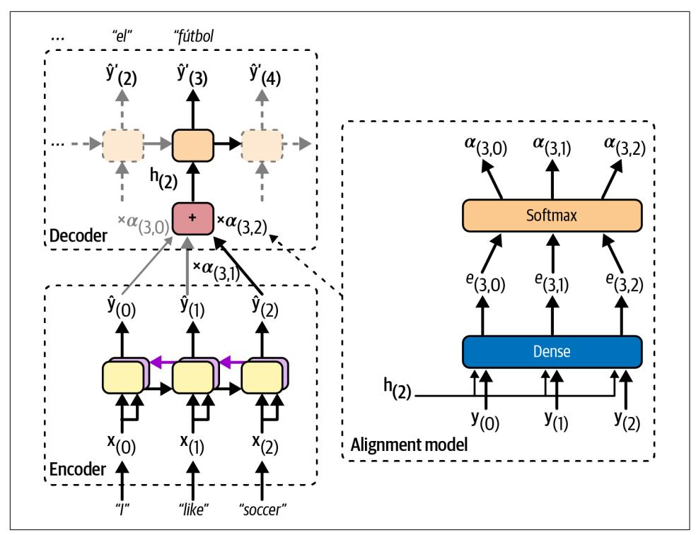

Figure 16-7. Neural machine translation using an encoder-decoder network with an attention model

But where do these  $\alpha_{(t,i)}$  weights come from? Well, they are generated by a small neural network called an *alignment model* (or an *attention layer*), which is trained jointly with the rest of the encoder-decoder model. This alignment model is illustrated on the righthand side of Figure 16-7. It starts with a Dense layer composed of a single neuron that processes each of the encoder's outputs, along with the decoder's previous hidden state (e.g.,  $h_{(2)}$ ). This layer outputs a score (or energy) for each encoder output (e.g.,  $e_{(3,2)}$ ): this score measures how well each output is aligned with the decoder's previous hidden state. For example, in Figure 16-7, the model has already output "me gusta el" (meaning "I like"), so it's now expecting a noun: the word "soccer" is the one that best aligns with the current state, so it gets a high score. Finally, all the scores go through a softmax layer to get a final weight for each encoder output (e.g.,  $\alpha_{(3,2)}$ ). All the weights for a given decoder time step add up to 1. This particular attention mechanism is called Bahdanau attention (named after the 2014 paper's first author). Since it concatenates the encoder output with the decoder's previous hidden state, it is sometimes called *concatenative attention* (or additive attention).

{634}------------------------------------------------


If the input sentence is  $n$  words long, and assuming the output sentence is about as long, then this model will need to compute about  $n<sup>2</sup>$  weights. Fortunately, this quadratic computational complexity is still tractable because even long sentences don't have thousands of words.

Another common attention mechanism, known as Luong attention or multiplicative attention, was proposed shortly after, in 2015,<sup>19</sup> by Minh-Thang Luong et al. Because the goal of the alignment model is to measure the similarity between one of the encoder's outputs and the decoder's previous hidden state, the authors proposed to simply compute the dot product (see Chapter 4) of these two vectors, as this is often a fairly good similarity measure, and modern hardware can compute it very efficiently. For this to be possible, both vectors must have the same dimensionality. The dot product gives a score, and all the scores (at a given decoder time step) go through a softmax layer to give the final weights, just like in Bahdanau attention. Another simplification Luong et al. proposed was to use the decoder's hidden state at the current time step rather than at the previous time step (i.e.,  $\mathbf{h}_{(t)}$  rather than  $\mathbf{h}_{(t-1)}$ ), then to use the output of the attention mechanism (noted  $\mathbf{h}_{(t)}$ ) directly to compute the decoder's predictions, rather than using it to compute the decoder's current hidden state. The researchers also proposed a variant of the dot product mechanism where the encoder outputs first go through a fully connected layer (without a bias term) before the dot products are computed. This is called the "general" dot product approach. The researchers compared both dot product approaches with the concatenative attention mechanism (adding a rescaling parameter vector  $v$ ), and they observed that the dot product variants performed better than concatenative attention. For this reason, concatenative attention is much less used now. The equations for these three attention mechanisms are summarized in Equation 16-1.

#### Equation 16-1. Attention mechanisms

$$
\widetilde{\mathbf{h}}(t) = \sum_{i} \alpha_{(t, i)} \mathbf{y}_{(i)}
$$
\nwith  $\alpha_{(t, i)} = \frac{\exp(e_{(t, i)})}{\sum_{i'} \exp(e_{(t, i')})}$   
\nand  $e_{(t, i)} = \begin{cases} \mathbf{h}_{(t)}^\top \mathbf{y}_{(i)} & \text{dot} \\ \mathbf{h}_{(t)}^\top \mathbf{W} \mathbf{y}_{(i)} & \text{general} \\ \mathbf{v}^\top \tanh(\mathbf{W}[\mathbf{h}_{(t)}; \mathbf{y}_{(i)}]) & \text{concat} \end{cases}$ 

<sup>19</sup> Minh-Thang Luong et al., "Effective Approaches to Attention-Based Neural Machine Translation", Proceedings of the 2015 Conference on Empirical Methods in Natural Language Processing (2015): 1412-1421.

{635}------------------------------------------------

Keras provides a tf.keras.layers.Attention layer for Luong attention, and an AdditiveAttention layer for Bahdanau attention. Let's add Luong attention to our encoder-decoder model. Since we will need to pass all the encoder's outputs to the Attention layer, we first need to set return\_sequences=True when creating the encoder:

```
encoder = tf.keras.lavers.Bidirectional()tf.keras.layers.LSTM(256, return_sequences=True, return_state=True))
```

Next, we need to create the attention layer and pass it the decoder's states and the encoder's outputs. However, to access the decoder's states at each step we would need to write a custom memory cell. For simplicity, let's use the decoder's outputs instead of its states: in practice this works well too, and it's much easier to code. Then we just pass the attention layer's outputs directly to the output layer, as suggested in the Luong attention paper:

```
attention layer = tf. keras. layers. Attention()
attention_outputs = attention_layer([decoder_outputs, encoder_outputs])
output layer = tf.keras.layers.Dense(vocab size, activation="softmax")
Y_proba = output_layer(attention_outputs)
```

And that's it! If you train this model, you will find that it now handles much longer sentences. For example:

```
>>> translate("I like soccer and also going to the beach")
'me gusta el fútbol y también ir a la playa'
```

In short, the attention layer provides a way to focus the attention of the model on part of the inputs. But there's another way to think of this layer: it acts as a differentiable memory retrieval mechanism.

For example, let's suppose the encoder analyzed the input sentence "I like soccer", and it managed to understand that the word "I" is the subject and the word "like" is the verb, so it encoded this information in its outputs for these words. Now suppose the decoder has already translated the subject, and it thinks that it should translate the verb next. For this, it needs to fetch the verb from the input sentence. This is analogous to a dictionary lookup: it's as if the encoder had created a dictionary {"subject": "They", "verb": "played", ...} and the decoder wanted to look up the value that corresponds to the key "verb".

However, the model does not have discrete tokens to represent the keys (like "subject" or "verb"); instead, it has vectorized representations of these concepts that it learned during training, so the query it will use for the lookup will not perfectly match any key in the dictionary. The solution is to compute a similarity measure between the query and each key in the dictionary, and then use the softmax function to convert these similarity scores to weights that add up to 1. As we saw earlier, that's exactly what the attention layer does. If the key that represents the verb is by far the most similar to the query, then that key's weight will be close to 1.

{636}------------------------------------------------

Next, the attention layer computes a weighted sum of the corresponding values: if the weight of the "verb" key is close to 1, then the weighted sum will be very close to the representation of the word "played".

This is why the Keras Attention and AdditiveAttention layers both expect a list as input, containing two or three items: the *queries*, the *keys*, and optionally the *values*. If you do not pass any values, then they are automatically equal to the keys. So, looking at the previous code example again, the decoder outputs are the queries, and the encoder outputs are both the keys and the values. For each decoder output (i.e., each query), the attention layer returns a weighted sum of the encoder outputs (i.e., the keys/values) that are most similar to the decoder output.

The bottom line is that an attention mechanism is a trainable memory retrieval system. It is so powerful that you can actually build state-of-the-art models using only attention mechanisms. Enter the transformer architecture.

#### Attention Is All You Need: The Original Transformer Architecture

In a groundbreaking 2017 paper,<sup>20</sup> a team of Google researchers suggested that "Attention Is All You Need". They created an architecture called the transformer, which significantly improved the state-of-the-art in NMT without using any recurrent or convolutional layers,<sup>21</sup> just attention mechanisms (plus embedding layers, dense layers, normalization layers, and a few other bits and pieces). Because the model is not recurrent, it doesn't suffer as much from the vanishing or exploding gradients problems as RNNs, it can be trained in fewer steps, it's easier to parallelize across multiple GPUs, and it can better capture long-range patterns than RNNs. The original 2017 transformer architecture is represented in Figure 16-8.

In short, the left part of Figure 16-8 is the encoder, and the right part is the decoder. Each embedding layer outputs a 3D tensor of shape [batch size, sequence length, embedding size]. After that, the tensors are gradually transformed as they flow through the transformer, but their shape remains the same.

<sup>20</sup> Ashish Vaswani et al., "Attention Is All You Need", Proceedings of the 31st International Conference on Neural Information Processing Systems (2017): 6000-6010.

<sup>21</sup> Since the transformer uses time-distributed dense layers, you could argue that it uses 1D convolutional layers with a kernel size of 1.

{637}------------------------------------------------

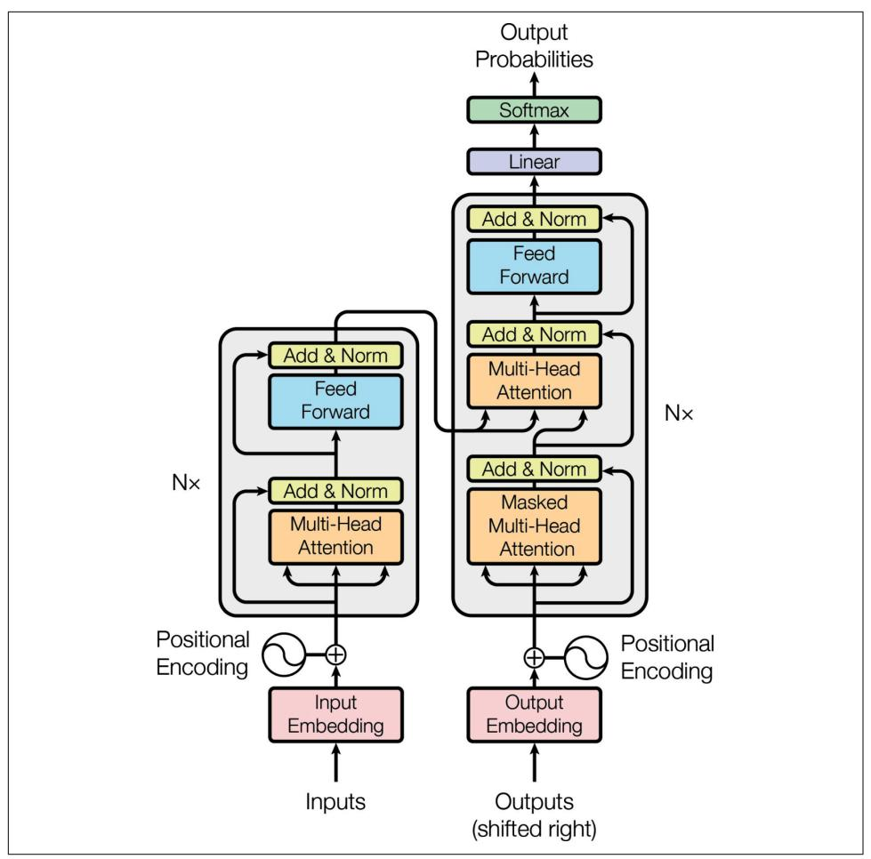

Figure 16-8. The original 2017 transformer architecture<sup>22</sup>

If you use the transformer for NMT, then during training you must feed the English sentences to the encoder and the corresponding Spanish translations to the decoder, with an extra SOS token inserted at the start of each sentence. At inference time, you must call the transformer multiple times, producing the translations one word at a time and feeding the partial translations to the decoder at each round, just like we did earlier in the translate() function.

<sup>22</sup> This is figure 1 from the "Attention Is All You Need" paper, reproduced with the kind permission of the authors.

{638}------------------------------------------------

The encoder's role is to gradually transform the inputs—word representations of the English sentence—until each word's representation perfectly captures the meaning of the word, in the context of the sentence. For example, if you feed the encoder with the sentence "I like soccer", then the word "like" will start off with a rather vague representation, since this word could mean different things in different contexts: think of "I like soccer" versus "It's like that". But after going through the encoder, the word's representation should capture the correct meaning of "like" in the given sentence (i.e., to be fond of), as well as any other information that may be required for translation (e.g., it's a verb).

The decoder's role is to gradually transform each word representation in the translated sentence into a word representation of the next word in the translation. For example, if the sentence to translate is "I like soccer", and the decoder's input sentence is "<SOS> me gusta el fútbol", then after going through the decoder, the word representation of the word "el" will end up transformed into a representation of the word "fútbol". Similarly, the representation of the word "fútbol" will be transformed into a representation of the EOS token.

After going through the decoder, each word representation goes through a final Dense layer with a softmax activation function, which will hopefully output a high probability for the correct next word and a low probability for all other words. The predicted sentence should be "me gusta el fútbol <EOS>".

That was the big picture; now let's walk through Figure 16-8 in more detail:

- First, notice that both the encoder and the decoder contain modules that are stacked N times. In the paper,  $N = 6$ . The final outputs of the whole encoder stack are fed to the decoder at each of these N levels.
- Zooming in, you can see that you are already familiar with most components: there are two embedding layers; several skip connections, each of them followed by a layer normalization layer; several feedforward modules that are composed of two dense layers each (the first one using the ReLU activation function, the second with no activation function); and finally the output layer is a dense layer using the softmax activation function. You can also sprinkle a bit of dropout after the attention layers and the feedforward modules, if needed. Since all of these layers are time-distributed, each word is treated independently from all the others. But how can we translate a sentence by looking at the words completely separately? Well, we can't, so that's where the new components come in:
  - The encoder's *multi-head attention* layer updates each word representation by attending to (i.e., paying attention to) all other words in the same sentence. That's where the vague representation of the word "like" becomes a richer and more accurate representation, capturing its precise meaning in the given sentence. We will discuss exactly how this works shortly.

{639}------------------------------------------------

- The decoder's masked multi-head attention layer does the same thing, but when it processes a word, it doesn't attend to words located after it: it's a causal layer. For example, when it processes the word "gusta", it only attends to the words "<SOS> me gusta", and it ignores the words "el fútbol" (or else that would be cheating).
- The decoder's upper *multi-head attention* layer is where the decoder pays attention to the words in the English sentence. This is called *cross*-attention, not self-attention in this case. For example, the decoder will probably pay close attention to the word "soccer" when it processes the word "el" and transforms its representation into a representation of the word "fútbol".
- The *positional encodings* are dense vectors (much like word embeddings) that represent the position of each word in the sentence. The  $n<sup>th</sup>$  positional encoding is added to the word embedding of the  $n<sup>th</sup>$  word in each sentence. This is needed because all layers in the transformer architecture ignore word positions: without positional encodings, you could shuffle the input sequences, and it would just shuffle the output sequences in the same way. Obviously, the order of words matters, which is why we need to give positional information to the transformer somehow: adding positional encodings to the word representations is a good way to achieve this.


The first two arrows going into each multi-head attention layer in Figure 16-8 represent the keys and values, and the third arrow represents the queries. In the self-attention layers, all three are equal to the word representations output by the previous layer, while in the decoder's upper attention layer, the keys and values are equal to the encoder's final word representations, and the queries are equal to the word representations output by the previous layer.

Let's go through the novel components of the transformer architecture in more detail, starting with the positional encodings.

#### **Positional encodings**

A positional encoding is a dense vector that encodes the position of a word within a sentence: the  $i<sup>th</sup>$  positional encoding is added to the word embedding of the  $i<sup>th</sup>$  word in the sentence. The easiest way to implement this is to use an Embedding layer and make it encode all the positions from 0 to the maximum sequence length in the batch, then add the result to the word embeddings. The rules of broadcasting will ensure that the positional encodings get applied to every input sequence. For example, here is how to add positional encodings to the encoder and decoder inputs:

{640}------------------------------------------------

```
max_length = 50 # max length in the whole training set
embed size = 128pos_embed_layer = tf.keras.layers.Embedding(max_length, embed_size)
batch max len enc = tf.shape(encoder embeddings)[1]encoder in = encoder embeddings + pos embed layer(tf.range(batch max len enc))
batch_max_len_dec = tf.shape(decoder_embeddings)[1]
decoder_in = decoder_embeddings + pos_embed_layer(tf.range(batch_max_len_dec))
```

Note that this implementation assumes that the embeddings are represented as regular tensors, not ragged tensors.<sup>23</sup> The encoder and the decoder share the same Embedding layer for the positional encodings, since they have the same embedding size (this is often the case).

Instead of using trainable positional encodings, the authors of the transformer paper chose to use fixed positional encodings, based on the sine and cosine functions at different frequencies. The positional encoding matrix  $P$  is defined in Equation 16-2 and represented at the top of Figure 16-9 (transposed), where  $P_{p,i}$  is the  $i<sup>th</sup>$  component of the encoding for the word located at the  $p<sup>th</sup>$  position in the sentence.

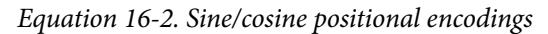

 $P_{p,i} = \begin{cases} \sin(p/10000^{i/d}) & \text{if } i \text{ is even} \\ \cos(p/10000^{(i-1)/d}) & \text{if } i \text{ is odd} \end{cases}$ 

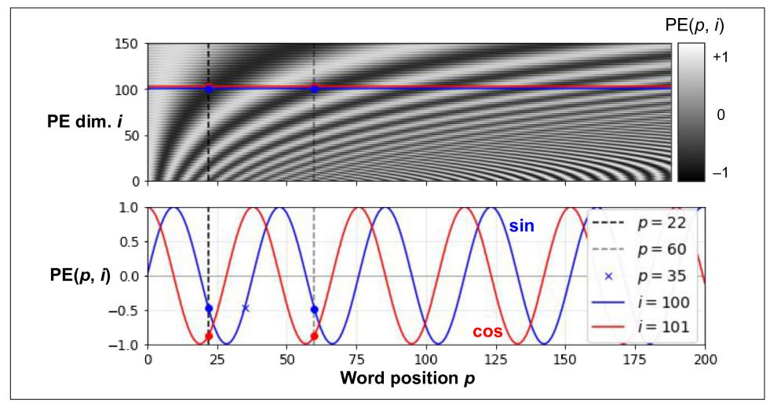

Figure 16-9. Sine/cosine positional encoding matrix (transposed, top) with a focus on two values of *i* (bottom)

<sup>23</sup> It's possible to use ragged tensors instead, if you are using the latest version of TensorFlow.

{641}------------------------------------------------

This solution can give the same performance as trainable positional encodings, and it can extend to arbitrarily long sentences without adding any parameters to the model (however, when there is a large amount of pretraining data, trainable positional encodings are usually favored). After these positional encodings are added to the word embeddings, the rest of the model has access to the absolute position of each word in the sentence because there is a unique positional encoding for each position (e.g., the positional encoding for the word located at the 22nd position in a sentence is represented by the vertical dashed line at the top left of Figure 16-9, and you can see that it is unique to that position). Moreover, the choice of oscillating functions (sine and cosine) makes it possible for the model to learn relative positions as well. For example, words located 38 words apart (e.g., at positions  $p = 22$  and  $p = 60$ ) always have the same positional encoding values in the encoding dimensions  $i = 100$ and  $i = 101$ , as you can see in Figure 16-9. This explains why we need both the sine and the cosine for each frequency: if we only used the sine (the blue wave at  $i = 100$ ), the model would not be able to distinguish positions  $p = 22$  and  $p = 35$  (marked by a cross).

There is no PositionalEncoding layer in TensorFlow, but it is not too hard to create one. For efficiency reasons, we precompute the positional encoding matrix in the constructor. The call() method just truncates this encoding matrix to the max length of the input sequences, and it adds them to the inputs. We also set supports\_masking=True to propagate the input's automatic mask to the next layer:

```
class PositionalEncoding(tf.keras.layers.Layer):
   def init (self, max length, embed size, dtype=tf.float32, **kwargs):
       super().__init_(dtype=dtype, **kwargs)
       assert embed_size % 2 == 0, "embed_size must be even"
       p, i = np. meshgrid(np.arange(max_length),
                          2 * np.arange(embed_size // 2)pos\_emb = np .empty((1, max\_length, embed\_size))pos_{emb}[0, :, : : 2] = np \sin(p / 10_000** (i / embed_size)). T
       pos_{emb}[0, :, 1::2] = np.cos(p / 10_000 ** (i / embed_size)).self.pos encodings = tf.constant(pos emb.astype(self.dtype))self.supports_masking = True
   def call(self, inputs):
       batch_max_length = tf.shape(inputs)[1]return inputs + self.pos_encodings[:, :batch_max_length]
```

Let's use this layer to add the positional encoding to the encoder's inputs:

```
pos_embed_layer = PositionalEncoding(max_length, embed_size)
encoder_in = pos_embed_layer(encoder_embeddings)
decoder_in = pos_embed_layer(decoder_embeddings)
```

Now let's look deeper into the heart of the transformer model, at the multi-head attention layer.

{642}------------------------------------------------

#### **Multi-head attention**

To understand how a multi-head attention layer works, we must first understand the *scaled dot-product attention* layer, which it is based on. Its equation is shown in Equation 16-3, in a vectorized form. It's the same as Luong attention, except for a scaling factor.

Equation 16-3. Scaled dot-product attention

Attention (**Q**, **K**, **V**) = softmax  $\left(\frac{\mathbf{Q}\mathbf{K}^T}{\sqrt{d_{kone}}}\right)\mathbf{V}$ 

In this equation:

- Q is a matrix containing one row per *query*. Its shape is  $[n_{\text{queries}}, d_{\text{keys}}]$ , where  $n_{\text{queries}}$  is the number of queries and  $d_{\text{keys}}$  is the number of dimensions of each query and each key.
- K is a matrix containing one row per key. Its shape is  $[n_{\text{keys}}, d_{\text{keys}}]$ , where  $n_{\text{keys}}$  is the number of keys and values.
- V is a matrix containing one row per *value*. Its shape is  $[n_{\text{keys}}, d_{\text{values}}]$ , where  $d_{\text{values}}$ is the number of dimensions of each value.
- The shape of Q  $K^{\dagger}$  is  $[n_{\text{queries}}, n_{\text{keys}}]$ : it contains one similarity score for each query/key pair. To prevent this matrix from being huge, the input sequences must not be too long (we will discuss how to overcome this limitation later in this chapter). The output of the softmax function has the same shape, but all rows sum up to 1. The final output has a shape of  $[n_{\text{queries}}, d_{\text{values}}]$ : there is one row per query, where each row represents the query result (a weighted sum of the values).
- The scaling factor 1 / ( $\sqrt{d_{\text{keys}}}$ ) scales down the similarity scores to avoid saturating the softmax function, which would lead to tiny gradients.
- It is possible to mask out some key/value pairs by adding a very large negative value to the corresponding similarity scores, just before computing the softmax. This is useful in the masked multi-head attention layer.

If you set use\_scale=True when creating a tf.keras.layers.Attention layer, then it will create an additional parameter that lets the layer learn how to properly downscale the similarity scores. The scaled dot-product attention used in the transformer model is almost the same, except it always scales the similarity scores by the same factor,  $1 / (\sqrt{d_{\text{keys}}})$ .

Note that the Attention layer's inputs are just like  $Q$ ,  $K$ , and  $V$ , except with an extra batch dimension (the first dimension). Internally, the layer computes all the attention scores for all sentences in the batch with just one call to tf.matmul(queries, keys):

{643}------------------------------------------------

this makes it extremely efficient. Indeed, in TensorFlow, if A and B are tensors with more than two dimensions—say, of shape  $[2, 3, 4, 5]$  and  $[2, 3, 5, 6]$ , respectively then  $tf.\text{matmul}(A, B)$  will treat these tensors as  $2 \times 3$  arrays where each cell contains a matrix, and it will multiply the corresponding matrices: the matrix at the *i*<sup>th</sup> row and  $j<sup>th</sup>$  column in A will be multiplied by the matrix at the  $i<sup>th</sup>$  row and  $j<sup>th</sup>$  column in B. Since the product of a  $4 \times 5$  matrix with a  $5 \times 6$  matrix is a  $4 \times 6$  matrix, tf. matmul(A, B) will return an array of shape  $[2, 3, 4, 6]$ .

Now we're ready to look at the multi-head attention layer. Its architecture is shown in Figure 16-10.

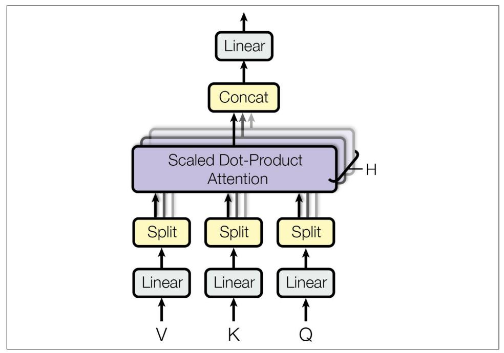

Figure 16-10. Multi-head attention layer architecture<sup>24</sup>

As you can see, it is just a bunch of scaled dot-product attention layers, each preceded by a linear transformation of the values, keys, and queries (i.e., a time-distributed dense layer with no activation function). All the outputs are simply concatenated, and they go through a final linear transformation (again, time-distributed).

But why? What is the intuition behind this architecture? Well, consider once again the word "like" in the sentence "I like soccer". The encoder was smart enough to

<sup>24</sup> This is the righthand part of figure 2 from "Attention Is All You Need", reproduced with the kind authorization of the authors.

{644}------------------------------------------------

encode the fact that it is a verb. But the word representation also includes its position in the text, thanks to the positional encodings, and it probably includes many other features that are useful for its translation, such as the fact that it is in the present tense. In short, the word representation encodes many different characteristics of the word. If we just used a single scaled dot-product attention layer, we would only be able to query all of these characteristics in one shot.

This is why the multi-head attention layer applies *multiple* different linear transformations of the values, keys, and queries: this allows the model to apply many different projections of the word representation into different subspaces, each focusing on a subset of the word's characteristics. Perhaps one of the linear layers will project the word representation into a subspace where all that remains is the information that the word is a verb, another linear layer will extract just the fact that it is present tense, and so on. Then the scaled dot-product attention layers implement the lookup phase, and finally we concatenate all the results and project them back to the original space.

Keras includes a tf.keras.layers.MultiHeadAttention layer, so we now have everything we need to build the rest of the transformer. Let's start with the full encoder, which is exactly like in Figure 16-8, except we use a stack of two blocks ( $N =$ 2) instead of six, since we don't have a huge training set, and we add a bit of dropout as well<sup>.</sup>

```
N = 2 # instead of 6
num\_heads = 8dropout_rate = 0.1n_units = 128 # for the first dense layer in each feedforward block
encoder_pad_mask = tf.math.not_equal(encoder_input_ids, 0)[:, tf.newaxis]Z = encoder infor \_ in range(N):
    skip = Zattn layer = tf.keras.layers.MultiHeadAttention(
       num_heads=num_heads, key_dim=embed_size, dropout=dropout_rate)
    Z = attn layer(Z, value=Z, attention mask=encoder pad mask)
    Z = tf.keras.layers.LayerNormalization()(tf.keras.layers.Add()([Z, skip]))
    skip = ZZ = tf.keras.layers.Dense(n_units, activation="relu")(Z)
    Z = tf.keras.layers.Dense(embed_size)(Z)
    Z = tf.keras.layers.Dropout(dropout rate)(Z)
    Z = tf.keras.layers.LayerNormalization()(tf.keras.layers.Add()([Z, skip]))
```

This code should be mostly straightforward, except for one thing: masking. As of the time of writing, the MultiHeadAttention layer does not support automatic masking.<sup>25</sup> so we must handle it manually. How can we do that?

<sup>25</sup> This will most likely change by the time you read this; check out Keras issue #16248 for more details. When this happens, there will be no need to set the attention mask argument, and therefore no need to create encoder pad mask.

{645}------------------------------------------------

The MultiHeadAttention laver accepts an attention mask argument, which is a Boolean tensor of shape [batch size, max query length, max value length]: for every token in every query sequence, this mask indicates which tokens in the corresponding value sequence should be attended to. We want to tell the MultiHeadAttention layer to ignore all the padding tokens in the values. So, we first compute the padding mask using tf.math.not equal(encoder input ids, 0). This returns a Boolean tensor of shape [batch size, max sequence length]. We then insert a second axis using  $[:,$  tf. newaxis], to get a mask of shape [batch size, 1, max sequence length]. This allows us to use this mask as the attention\_mask when calling the MultiHead Attention layer: thanks to broadcasting, the same mask will be used for all tokens in each query. This way, the padding tokens in the values will be ignored correctly.

However, the layer will compute outputs for every single query token, including the padding tokens. We need to mask the outputs that correspond to these padding tokens. Recall that we used mask\_zero in the Embedding layers, and we set supports\_masking to True in the PositionalEncoding layer, so the automatic mask was propagated all the way to the MultiHeadAttention layer's inputs (encoder\_in). We can use this to our advantage in the skip connection: indeed, the Add layer supports automatic masking, so when we add Z and skip (which is initially equal to encoder in), the outputs get automatically masked correctly.<sup>26</sup> Yikes! Masking required much more explanation than code.

Now on to the decoder! Once again, masking is going to be the only tricky part, so let's start with that. The first multi-head attention layer is a self-attention layer, like in the encoder, but it is a *masked* multi-head attention layer, meaning it is causal: it should ignore all tokens in the future. So, we need two masks: a padding mask and a causal mask. Let's create them:

```
decoder_pad_mask = tf.math.not_equal(decoder_input_ids, 0)[:, tf.newaxis]
causal_mask = tf.linalg.band-part( # creates a lower triangular matrix)tf.ones((batch_max_len_dec, batch_max_len_dec), tf.bool), -1, 0)
```

The padding mask is exactly like the one we created for the encoder, except it's based on the decoder's inputs rather than the encoder's. The causal mask is created using the tf.linalg.band part() function, which takes a tensor and returns a copy with all the values outside a diagonal band set to zero. With these arguments, we get a square matrix of size batch\_max\_len\_dec (the max length of the input sequences in the batch), with 1s in the lower-left triangle and 0s in the upper right. If we use this mask as the attention mask, we will get exactly what we want: the first query token will only attend to the first value token, the second will only attend to the first two,

<sup>26</sup> Currently Z + skip does not support automatic masking, which is why we had to write tf. keras. layers.Add()([Z, skip]) instead. Again, this may change by the time you read this.

{646}------------------------------------------------

the third will only attend to the first three, and so on. In other words, query tokens cannot attend to any value token in the future.

Let's now build the decoder:

```
encoder outputs = Z # let's save the encoder's final outputs
Z = decoder_in # the decoder starts with its own inputs
for in \text{ range}(N):
    skip = Zattn layer = tf.keras.layers.MultiHeadAttention(
        num heads=num heads, key dim=embed size, dropout=dropout rate)
    Z = attn_layer(Z, value=Z, attention_mask=causal_mask & decoder_pad_mask)
    Z = tf.keras.layers.LayerNormalization()(tf.keras.layers.Add()([Z, skip]))
    skip = Zattn layer = tf.keras.layers.MultiHeadAttention(
        num heads=num heads, key dim=embed size, dropout=dropout rate)
    Z = attn_layer(Z, value=encoder_outputs, attention_mask=encoder_pad_mask)
    Z = tf.keras.layers.LayerNormalization()(tf.keras.layers.Add()([Z, skip]))
    skip = ZZ = tf.keras.layers.Dense(n_units, activation="relu")(Z)
    Z = tf.keras.layers.Dense(embed size)(Z)
    Z = tf.keras.layers.LayerNormalization()(tf.keras.layers.Add()([Z, skip]))
```

For the first attention layer, we use causal mask & decoder pad mask to mask both the padding tokens and future tokens. The causal mask only has two dimensions: it's missing the batch dimension, but that's okay since broadcasting ensures that it gets copied across all the instances in the batch.

For the second attention layer, there's nothing special. The only thing to note is that we are using encoder\_pad\_mask, not decoder\_pad\_mask, because this attention layer uses the encoder's final outputs as its values.

We're almost done. We just need to add the final output layer, create the model, compile it, and train it:

```
Y proba = tf.keras.layers.Dense(vocab size, activation="softmax")(Z)
model = tf.keras.Model(inputs=[encoder_inputs, decoder_inputs],
                       outputs=[Y proba])
model.compile(loss="sparse_categorical_crossentropy", optimizer="nadam",
              metrics=["accuracy"])
model.fit((X_train, X_train_dec), Y_train, epochs=10,
          validation_data=((X_valid, X_valid_dec), Y_valid))
```

Congratulations! You've built a full transformer from scratch, and trained it for automatic translation. This is getting quite advanced!


The Keras team has created a new Keras NLP project, including an API to build a transformer more easily. You may also be interested in the new Keras CV project for computer vision.

{647}------------------------------------------------

But the field didn't stop there. Let's now explore some of the recent advances.

### An Avalanche of Transformer Models

The year 2018 has been called the "ImageNet moment for NLP". Since then, progress has been astounding, with larger and larger transformer-based architectures trained on immense datasets.

First, the GPT paper<sup>27</sup> by Alec Radford and other OpenAI researchers once again demonstrated the effectiveness of unsupervised pretraining, like the ELMo and ULMFiT papers before it, but this time using a transformer-like architecture. The authors pretrained a large but fairly simple architecture composed of a stack of 12 transformer modules using only masked multi-head attention layers, like in the original transformer's decoder. They trained it on a very large dataset, using the same autoregressive technique we used for our Shakespearean char-RNN: just predict the next token. This is a form of self-supervised learning. Then they fine-tuned it on various language tasks, using only minor adaptations for each task. The tasks were quite diverse: they included text classification, entailment (whether sentence A imposes, involves, or implies sentence B as a necessary consequence), $28$  similarity (e.g., "Nice weather today" is very similar to "It is sunny"), and question answering (given a few paragraphs of text giving some context, the model must answer some multiple-choice questions).

Then Google's BERT paper<sup>29</sup> came out: it also demonstrated the effectiveness of self-supervised pretraining on a large corpus, using a similar architecture to GPT but with nonmasked multi-head attention layers only, like in the original transformer's encoder. This means that the model is naturally bidirectional; hence the B in BERT (Bidirectional Encoder Representations from Transformers). Most importantly, the authors proposed two pretraining tasks that explain most of the model's strength:

Masked language model (MLM)

Each word in a sentence has a 15% probability of being masked, and the model is trained to predict the masked words. For example, if the original sentence is "She had fun at the birthday party", then the model may be given the sentence "She <mask> fun at the <mask> party" and it must predict the words "had" and "birthday" (the other outputs will be ignored). To be more precise, each selected word has an 80% chance of being masked, a 10% chance of being replaced by a

<sup>27</sup> Alec Radford et al., "Improving Language Understanding by Generative Pre-Training" (2018).

<sup>28</sup> For example, the sentence "Jane had a lot of fun at her friend's birthday party" entails "Jane enjoyed the party", but it is contradicted by "Everyone hated the party" and it is unrelated to "The Earth is flat".

<sup>29</sup> Jacob Devlin et al., "BERT: Pre-Training of Deep Bidirectional Transformers for Language Understanding", Proceedings of the 2018 Conference of the North American Chapter of the Association for Computational Linguistics: Human Language Technologies 1 (2019).

{648}------------------------------------------------

random word (to reduce the discrepancy between pretraining and fine-tuning, since the model will not see <mask> tokens during fine-tuning), and a 10% chance of being left alone (to bias the model toward the correct answer).

Next sentence prediction (NSP)

The model is trained to predict whether two sentences are consecutive or not. For example, it should predict that "The dog sleeps" and "It snores loudly" are consecutive sentences, while "The dog sleeps" and "The Earth orbits the Sun" are not consecutive. Later research showed that NSP was not as important as was initially thought, so it was dropped in most later architectures.

The model is trained on these two tasks simultaneously (see Figure 16-11). For the NSP task, the authors inserted a class token (<CLS>) at the start of every input, and the corresponding output token represents the model's prediction: sentence B follows sentence A, or it does not. The two input sentences are concatenated, separated only by a special separation token (<SEP>), and they are fed as input to the model. To help the model know which sentence each input token belongs to, a segment embedding is added on top of each token's positional embeddings: there are just two possible segment embeddings, one for sentence A and one for sentence B. For the MLM task, some input words are masked (as we just saw) and the model tries to predict what those words were. The loss is only computed on the NSP prediction and the masked tokens, not on the unmasked ones.

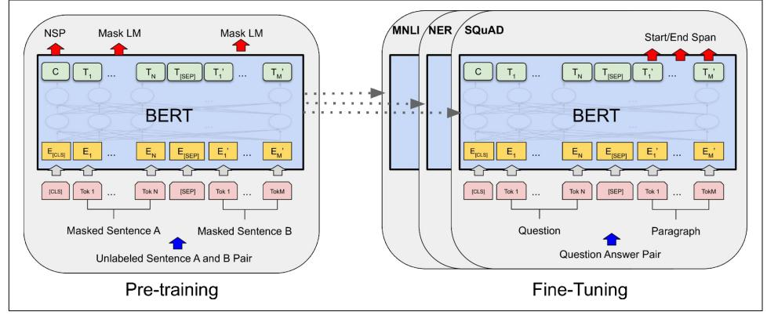

Figure 16-11. BERT training and fine-tuning process<sup>30</sup>

After this unsupervised pretraining phase on a very large corpus of text, the model is then fine-tuned on many different tasks, changing very little for each task. For example, for text classification such as sentiment analysis, all output tokens are

<sup>30</sup> This is figure 1 from the paper, reproduced with the kind authorization of the authors.

{649}------------------------------------------------

ignored except for the first one, corresponding to the class token, and a new output layer replaces the previous one, which was just a binary classification layer for NSP.

In February 2019, just a few months after BERT was published, Alec Radford, Jeffrey Wu, and other OpenAI researchers published the GPT-2 paper,<sup>31</sup> which proposed a very similar architecture to GPT, but larger still (with over 1.5 billion parameters!). The researchers showed that the new and improved GPT model could perform zero-shot learning (ZSL), meaning it could achieve good performance on many tasks without any fine-tuning. This was just the start of a race toward larger and larger models: Google's Switch Transformers<sup>32</sup> (introduced in January 2021) used 1 trillion parameters, and soon much larger models came out, such as the Wu Dao 2.0 model by the Beijing Academy of Artificial Intelligence (BAII), announced in June 2021.

An unfortunate consequence of this trend toward gigantic models is that only wellfunded organizations can afford to train such models: it can easily cost hundreds of thousands of dollars or more. And the energy required to train a single model corresponds to an American household's electricity consumption for several years; it's not eco-friendly at all. Many of these models are just too big to even be used on regular hardware: they wouldn't fit in RAM, and they would be horribly slow. Lastly, some are so costly that they are not released publicly.

Luckily, ingenious researchers are finding new ways to downsize transformers and make them more data-efficient. For example, the DistilBERT model,<sup>33</sup> introduced in October 2019 by Victor Sanh et al. from Hugging Face, is a small and fast transformer model based on BERT. It is available on Hugging Face's excellent model hub, along with thousands of others-you'll see an example later in this chapter.

DistilBERT was trained using *distillation* (hence the name): this means transferring knowledge from a teacher model to a student one, which is usually much smaller than the teacher model. This is typically done by using the teacher's predicted probabilities for each training instance as targets for the student. Surprisingly, distillation often works better than training the student from scratch on the same dataset as the teacher! Indeed, the student benefits from the teacher's more nuanced labels.

Many more transformer architectures came out after BERT, almost on a monthly basis, often improving on the state of the art across all NLP tasks: XLNet (June 2019), RoBERTa (July 2019), StructBERT (August 2019), ALBERT (September 2019), T5 (October 2019), ELECTRA (March 2020), GPT3 (May 2020), DeBERTa (June 2020),

<sup>31</sup> Alec Radford et al., "Language Models Are Unsupervised Multitask Learners" (2019).

<sup>32</sup> William Fedus et al., "Switch Transformers: Scaling to Trillion Parameter Models with Simple and Efficient Sparsity" (2021).

<sup>33</sup> Victor Sanh et al., "DistilBERT, A Distilled Version of Bert: Smaller, Faster, Cheaper and Lighter", arXiv preprint arXiv:1910.01108 (2019).

{650}------------------------------------------------

Switch Transformers (January 2021), Wu Dao 2.0 (June 2021), Gopher (December 2021), GPT-NeoX-20B (February 2022), Chinchilla (March 2022), OPT (May 2022), and the list goes on and on. Each of these models brought new ideas and techniques,<sup>34</sup> but I particularly like the T5 paper<sup>35</sup> by Google researchers: it frames all NLP tasks as text-to-text, using an encoder-decoder transformer. For example, to translate "I like soccer" to Spanish, you can just call the model with the input sentence "translate English to Spanish: I like soccer" and it outputs "me gusta el fútbol". To summarize a paragraph, you just enter "summarize:" followed by the paragraph, and it outputs the summary. For classification, you only need to change the prefix to "classify:" and the model outputs the class name, as text. This simplifies using the model, and it also makes it possible to pretrain it on even more tasks.

Last but not least, in April 2022, Google researchers used a new large-scale training platform named *Pathways* (which we will briefly discuss in Chapter 19) to train a humongous language model named the *Pathways Language Model* (PaLM),<sup>36</sup> with a whopping 540 billion parameters, using over 6,000 TPUs. Other than its incredible size, this model is a standard transformer, using decoders only (i.e., with masked multi-head attention layers), with just a few tweaks (see the paper for details). This model achieved incredible performance on all sorts of NLP tasks, particularly in natural language understanding (NLU). It's capable of impressive feats, such as explaining jokes, giving detailed step-by-step answers to questions, and even coding. This is in part due to the model's size, but also thanks to a technique called *Chain of thought prompting*,<sup>37</sup> which was introduced a couple months earlier by another team of Google researchers.

In question answering tasks, regular prompting typically includes a few examples of questions and answers, such as: "Q: Roger has 5 tennis balls. He buys 2 more cans of tennis balls. Each can has 3 tennis balls. How many tennis balls does he have now? A: 11." The prompt then continues with the actual question, such as "Q: John takes care of 10 dogs. Each dog takes .5 hours a day to walk and take care of their business. How many hours a week does he spend taking care of dogs? A:", and the model's job is to append the answer: in this case, "35."

<sup>34</sup> Mariya Yao summarized many of these models in this post: https://homl.info/yaopost.

<sup>35</sup> Colin Raffel et al., "Exploring the Limits of Transfer Learning with a Unified Text-to-Text Transformer", arXiv preprint arXiv:1910.10683 (2019).

<sup>36</sup> Aakanksha Chowdhery et al., "PaLM: Scaling Language Modeling with Pathways", arXiv preprint arXiv:2204.02311 (2022).

<sup>37</sup> Jason Wei et al., "Chain of Thought Prompting Elicits Reasoning in Large Language Models", arXiv preprint arXiv:2201.11903 (2022).

{651}------------------------------------------------

But with chain of thought prompting, the example answers include all the reasoning steps that lead to the conclusion. For example, instead of "A: 11", the prompt contains "A: Roger started with 5 balls. 2 cans of 3 tennis balls each is 6 tennis balls.  $5 + 6 =$ 11." This encourages the model to give a detailed answer to the actual question, such as "John takes care of 10 dogs. Each dog takes .5 hours a day to walk and take care of their business. So that is  $10 \times .5 = 5$  hours a day. 5 hours a day  $\times$  7 days a week = 35 hours a week. The answer is 35 hours a week." This is an actual example from the paper!

Not only does the model give the right answer much more frequently than using regular prompting—we're encouraging the model to think things through—but it also provides all the reasoning steps, which can be useful to better understand the rationale behind a model's answer.

Transformers have taken over NLP, but they didn't stop there: they soon expanded to computer vision as well.

### **Vision Transformers**

One of the first applications of attention mechanisms beyond NMT was in generating image captions using visual attention:<sup>38</sup> a convolutional neural network first processes the image and outputs some feature maps, then a decoder RNN equipped with an attention mechanism generates the caption, one word at a time.

At each decoder time step (i.e., each word), the decoder uses the attention model to focus on just the right part of the image. For example, in Figure 16-12, the model generated the caption "A woman is throwing a frisbee in a park", and you can see what part of the input image the decoder focused its attention on when it was about to output the word "frisbee": clearly, most of its attention was focused on the frisbee.

<sup>38</sup> Kelvin Xu et al., "Show, Attend and Tell: Neural Image Caption Generation with Visual Attention", Proceedings of the 32nd International Conference on Machine Learning (2015): 2048-2057.

{652}------------------------------------------------


Figure 16-12. Visual attention: an input image (left) and the model's focus before producing the word "frisbee" (right)<sup>39</sup>

#### **Explainability**

One extra benefit of attention mechanisms is that they make it easier to understand what led the model to produce its output. This is called *explainability*. It can be especially useful when the model makes a mistake: for example, if an image of a dog walking in the snow is labeled as "a wolf walking in the snow", then you can go back and check what the model focused on when it output the word "wolf". You may find that it was paying attention not only to the dog, but also to the snow, hinting at a possible explanation: perhaps the way the model learned to distinguish dogs from wolves is by checking whether or not there's a lot of snow around. You can then fix this by training the model with more images of wolves without snow, and dogs with snow. This example comes from a great 2016 paper<sup>40</sup> by Marco Tulio Ribeiro et al. that uses a different approach to explainability: learning an interpretable model locally around a classifier's prediction.

In some applications, explainability is not just a tool to debug a model; it can be a legal requirement—think of a system deciding whether or not it should grant you a loan.

<sup>39</sup> This is a part of figure 3 from the paper. It is reproduced with the kind authorization of the authors.

<sup>40</sup> Marco Tulio Ribeiro et al., "Why Should I Trust You?': Explaining the Predictions of Any Classifier", Proceedings of the 22nd ACM SIGKDD International Conference on Knowledge Discovery and Data Mining (2016): 1135-1144.

{653}------------------------------------------------

When transformers came out in 2017 and people started to experiment with them beyond NLP, they were first used alongside CNNs, without replacing them. Instead, transformers were generally used to replace RNNs, for example, in image captioning models. Transformers became slightly more visual in a 2020 paper<sup>41</sup> by Facebook researchers, which proposed a hybrid CNN-transformer architecture for object detection. Once again, the CNN first processes the input images and outputs a set of feature maps, then these feature maps are converted to sequences and fed to a transformer, which outputs bounding box predictions. But again, most of the visual work is still done by the CNN.

Then, in October 2020, a team of Google researchers released a paper<sup>42</sup> that introduced a fully transformer-based vision model, called a vision transformer (ViT). The idea is surprisingly simple: just chop the image into little  $16 \times 16$  squares, and treat the sequence of squares as if it were a sequence of word representations. To be more precise, the squares are first flattened into  $16 \times 16 \times 3 = 768$ -dimensional vectors—the 3 is for the RGB color channels—then these vectors go through a linear layer that transforms them but retains their dimensionality. The resulting sequence of vectors can then be treated just like a sequence of word embeddings: this means adding positional embeddings, and passing the result to the transformer. That's it! This model beat the state of the art on ImageNet image classification, but to be fair the authors had to use over 300 million additional images for training. This makes sense since transformers don't have as many *inductive biases* as convolution neural nets, so they need extra data just to learn things that CNNs implicitly assume.


An inductive bias is an implicit assumption made by the model, due to its architecture. For example, linear models implicitly assume that the data is, well, linear. CNNs implicitly assume that patterns learned in one location will likely be useful in other locations as well. RNNs implicitly assume that the inputs are ordered, and that recent tokens are more important than older ones. The more inductive biases a model has, assuming they are correct, the less training data the model will require. But if the implicit assumptions are wrong, then the model may perform poorly even if it is trained on a large dataset.

<sup>41</sup> Nicolas Carion et al., "End-to-End Object Detection with Transformers", arXiv preprint arxiv:2005.12872  $(2020).$ 

<sup>42</sup> Alexey Dosovitskiy et al., "An Image Is Worth 16x16 Words: Transformers for Image Recognition at Scale", arXiv preprint arxiv:2010.11929 (2020).

{654}------------------------------------------------

Just two months later, a team of Facebook researchers released a paper<sup>43</sup> that introduced data-efficient image transformers (DeiTs). Their model achieved competitive results on ImageNet without requiring any additional data for training. The model's architecture is virtually the same as the original ViT, but the authors used a distillation technique to transfer knowledge from state-of-the-art CNN models to their model.

Then, in March 2021, DeepMind released an important paper<sup>44</sup> that introduced the Perceiver architecture. It is a *multimodal* transformer, meaning you can feed it text, images, audio, or virtually any other modality. Until then, transformers had been restricted to fairly short sequences because of the performance and RAM bottleneck in the attention layers. This excluded modalities such as audio or video, and it forced researchers to treat images as sequences of patches, rather than sequences of pixels. The bottleneck is due to self-attention, where every token must attend to every other token: if the input sequence has  $M$  tokens, then the attention layer must compute an  $M \times M$  matrix, which can be huge if M is very large. The Perceiver solves this problem by gradually improving a fairly short *latent representation* of the inputs, composed of N tokens-typically just a few hundred. (The word latent means hidden, or internal.) The model uses cross-attention layers only, feeding them the latent representation as the queries, and the (possibly large) inputs as the values. This only requires computing an  $M \times N$  matrix, so the computational complexity is linear with regard to M, instead of quadratic. After going through several cross-attention layers, if everything goes well, the latent representation ends up capturing everything that matters in the inputs. The authors also suggested sharing the weights between consecutive cross-attention layers: if you do that, then the Perceiver effectively becomes an RNN. Indeed, the shared cross-attention layers can be seen as the same memory cell at different time steps, and the latent representation corresponds to the cell's context vector. The same inputs are repeatedly fed to the memory cell at every time step. It looks like RNNs are not dead after all!

Just a month later, Mathilde Caron et al. introduced DINO,<sup>45</sup> an impressive vision transformer trained entirely without labels, using self-supervision, and capable of high-accuracy semantic segmentation. The model is duplicated during training, with one network acting as a teacher and the other acting as a student. Gradient descent only affects the student, while the teacher's weights are just an exponential moving average of the student's weights. The student is trained to match the teacher's predic-

<sup>43</sup> Hugo Touvron et al., "Training Data-Efficient Image Transformers & Distillation Through Attention", arXiv preprint arxiv:2012.12877 (2020).

<sup>44</sup> Andrew Jaegle et al., "Perceiver: General Perception with Iterative Attention", arXiv preprint arxiv:2103.03206  $(2021).$ 

<sup>45</sup> Mathilde Caron et al., "Emerging Properties in Self-Supervised Vision Transformers", arXiv preprint arxiv:2104.14294 (2021).

{655}------------------------------------------------

tions: since they're almost the same model, this is called *self-distillation*. At each training step, the input images are augmented in different ways for the teacher and the student, so they don't see the exact same image, but their predictions must match. This forces them to come up with high-level representations. To prevent *mode collapse*, where both the student and the teacher would always output the same thing, completely ignoring the inputs, DINO keeps track of a moving average of the teacher's outputs, and it tweaks the teacher's predictions to ensure that they remain centered on zero, on average. DINO also forces the teacher to have high confidence in its predictions: this is called *sharpening*. Together, these techniques preserve diversity in the teacher's outputs.

In a 2021 paper,<sup>46</sup> Google researchers showed how to scale ViTs up or down, depending on the amount of data. They managed to create a huge 2 billion parameter model that reached over 90.4% top-1 accuracy on ImageNet. Conversely, they also trained a scaled-down model that reached over 84.8% top-1 accuracy on ImageNet, using only 10,000 images: that's just 10 images per class!

And progress in visual transformers has continued steadily to this day. For example, in March 2022, a paper<sup>47</sup> by Mitchell Wortsman et al. demonstrated that it's possible to first train multiple transformers, then average their weights to create a new and improved model. This is similar to an ensemble (see Chapter 7), except there's just one model in the end, which means there's no inference time penalty.

The latest trend in transformers consists in building large multimodal models, often capable of zero-shot or few-shot learning. For example, OpenAI's 2021 CLIP paper<sup>48</sup> proposed a large transformer model pretrained to match captions with images: this task allows it to learn excellent image representations, and the model can then be used directly for tasks such as image classification using simple text prompts such as "a photo of a cat". Soon after, OpenAI announced DALL-E,<sup>49</sup> capable of generating amazing images based on text prompts. The DALL E  $2,5^{\circ}$  which generates even higher quality images using a diffusion model (see Chapter 17).

In April 2022, DeepMind released the Flamingo paper,<sup>51</sup> which introduced a family of models pretrained on a wide variety of tasks across multiple modalities, including text, images, and videos. A single model can be used across very different tasks,

<sup>46</sup> Xiaohua Zhai et al., "Scaling Vision Transformers", arXiv preprint arxiv:2106.04560v1 (2021).

<sup>47</sup> Mitchell Wortsman et al., "Model Soups: Averaging Weights of Multiple Fine-tuned Models Improves Accuracy Without Increasing Inference Time", arXiv preprint arxiv:2203.05482v1 (2022).

<sup>48</sup> Alec Radford et al., "Learning Transferable Visual Models From Natural Language Supervision", arXiv preprint arxiv:2103.00020 (2021).

<sup>49</sup> Aditya Ramesh et al., "Zero-Shot Text-to-Image Generation", arXiv preprint arxiv:2102.12092 (2021).

<sup>50</sup> Aditya Ramesh et al., "Hierarchical Text-Conditional Image Generation with CLIP Latents", arXiv preprint arxiv:2204.06125 (2022).

{656}------------------------------------------------

such as question answering, image captioning, and more. Soon after, in May 2022, DeepMind introduced GATO,<sup>52</sup> a multimodal model that can be used as a policy for a reinforcement learning agent (RL will be introduced in Chapter 18). The same transformer can chat with you, caption images, play Atari games, control (simulated) robotic arms, and more, all with "only" 1.2 billion parameters. And the adventure continues!


These astounding advances have led some researchers to claim that human-level AI is near, that "scale is all you need", and that some of these models may be "slightly conscious". Others point out that despite the amazing progress, these models still lack the reliability and adaptability of human intelligence, our ability to reason symbolically, to generalize based on a single example, and more.

As you can see, transformers are everywhere! And the good news is that you generally won't have to implement transformers yourself since many excellent pretrained models are readily available for download via TensorFlow Hub or Hugging Face's model hub. You've already seen how to use a model from TF Hub, so let's close this chapter by taking a quick look at Hugging Face's ecosystem.

### **Hugging Face's Transformers Library**

It's impossible to talk about transformers today without mentioning Hugging Face, an AI company that has built a whole ecosystem of easy-to-use open source tools for NLP, vision, and beyond. The central component of their ecosystem is the Transformers library, which allows you to easily download a pretrained model, including its corresponding tokenizer, and then fine-tune it on your own dataset, if needed. Plus, the library supports TensorFlow, PyTorch, and JAX (with the Flax library).

The simplest way to use the Transformers library is to use the transformers. pipeline() function: you just specify which task you want, such as sentiment analysis, and it downloads a default pretrained model, ready to be used—it really couldn't be any simpler:

<sup>51</sup> Jean-Baptiste Alayrac et al., "Flamingo: a Visual Language Model for Few-Shot Learning", arXiv preprint arxiv:2204.14198 (2022).

<sup>52</sup> Scott Reed et al., "A Generalist Agent", arXiv preprint arxiv:2205.06175 (2022).

{657}------------------------------------------------

```
from transformers import pipeline
```

```
classifier = pipeline("sentiment-analysis") # many other tasks are available
result = classifier("The actors were very convincing".)
```

The result is a Python list containing one dictionary per input text:

```
>>> result
[{'label': 'POSITIVE', 'score': 0.9998071789741516}]
```

In this example, the model correctly found that the sentence is positive, with around 99.98% confidence. Of course, you can also pass a batch of sentences to the model:

```
>>> classifier(["I am from India.", "I am from Iraq."])
[{'label': 'POSITIVE', 'score': 0.9896161556243896},
 {'label': 'NEGATIVE', 'score': 0.9811071157455444}]
```

#### **Bias and Fairness**

As the output suggests, this specific classifier loves Indians, but is severely biased against Iraqis. You can try this code with your own country or city. Such an undesirable bias generally comes in large part from the training data itself: in this case, there were plenty of negative sentences related to the wars in Iraq in the training data. This bias was then amplified during the fine-tuning process since the model was forced to choose between just two classes: positive or negative. If you add a neutral class when fine-tuning, then the country bias mostly disappears. But the training data is not the only source of bias: the model's architecture, the type of loss or regularization used for training, the optimizer; all of these can affect what the model ends up learning. Even a mostly unbiased model can be used in a biased way, much like survey questions can be biased.

Understanding bias in AI and mitigating its negative effects is still an area of active research, but one thing is certain: you should pause and think before you rush to deploy a model to production. Ask yourself how the model could do harm, even indirectly. For example, if the model's predictions are used to decide whether or not to give someone a loan, the process should be fair. So, make sure you evaluate the model's performance not just on average over the whole test set, but across various subsets as well: for example, you may find that although the model works very well on average, its performance is abysmal for some categories of people. You may also want to run counterfactual tests: for example, you may want to check that the model's predictions do not change when you simply switch someone's gender.

If the model works well on average, it's tempting to push it to production and move on to something else, especially if it's just one component of a much larger system. But in general, if you don't fix such issues, no one else will, and your model may end up doing more harm than good. The solution depends on the problem: it may require rebalancing the dataset, fine-tuning on a different dataset, switching to another pretrained model, tweaking the model's architecture or hyperparameters, etc.

{658}------------------------------------------------

The pipeline() function uses the default model for the given task. For example, for text classification tasks such as sentiment analysis, at the time of writing, it defaults to distilbert-base-uncased-finetuned-sst-2-english-a DistilBERT model with an uncased tokenizer, trained on English Wikipedia and a corpus of English books, and fine-tuned on the Stanford Sentiment Treebank v2 (SST 2) task. It's also possible to manually specify a different model. For example, you could use a DistilBERT model fine-tuned on the Multi-Genre Natural Language Inference (MultiNLI) task, which classifies two sentences into three classes: contradiction, neutral, or entailment. Here is how:

```
>>> model name = "huggingface/distilbert-base-uncased-finetuned-mnli"
>>> classifier_mnli = pipeline("text-classification", model=model_name)
>>> classifier_mnli("She loves me. [SEP] She loves me not.")
[{'label': 'contradiction', 'score': 0.9790192246437073}]
```


You can find the available models at https://huggingface.co/models, and the list of tasks at https://huggingface.co/tasks.

The pipeline API is very simple and convenient, but sometimes you will need more control. For such cases, the Transformers library provides many classes, including all sorts of tokenizers, models, configurations, callbacks, and much more. For example, let's load the same DistilBERT model, along with its corresponding tokenizer, using the TFAutoModelForSequenceClassification and AutoTokenizer classes:

```
from transformers import AutoTokenizer, TFAutoModelForSequenceClassification
```

```
tokenizer = AutoTokenizer.from_pretrained(model_name)
model = TFAutoModelForSequenceClassification.from_pretrained(model_name)
```

Next, let's tokenize a couple of pairs of sentences. In this code, we activate padding and specify that we want TensorFlow tensors instead of Python lists:

```
token_ids = tokenizer(["I like soccer. [SEP] We all love soccer!",
                       "Joe lived for a very long time. [SEP] Joe is old."],
                     padding=True, return tensors="tf")
```


Instead of passing "Sentence 1 [SEP] Sentence 2" to the tokenizer, you can equivalently pass it a tuple: ("Sentence 1", "Sentence 2").

{659}------------------------------------------------

The output is a dictionary-like instance of the BatchEncoding class, which contains the sequences of token IDs, as well as a mask containing 0s for the padding tokens:

```
>>> token ids
{'input_ids': <tf.Tensor: shape=(2, 15), dtype=int32, numpy=
array([[ 101, 1045, 2066, 4715, 1012, 102, 2057, 2035, 2293, 4715, 999,
        102, 0, 0,0],
      [101, 3533, 2973, 2005, 1037, 2200, 2146, 2051, 1012, 102, 3533,2003, 2214, 1012, 102]], dtype=int32)>,
 'attention_mask': <tf.Tensor: shape=(2, 15), dtype=int32, numpy=
array([[1, 1, 1, 1, 1, 1, 1, 1, 1, 1, 1, 1, 1, 1[1, 1, 1, 1, 1, 1, 1, 1, 1, 1, 1, 1, 1, 1
```

If you set return\_token\_type\_ids=True when calling the tokenizer, you will also get an extra tensor that indicates which sentence each token belongs to. This is needed by some models, but not DistilBERT.

Next, we can directly pass this BatchEncoding object to the model; it returns a TFSequenceClassifierOutput object containing its predicted class logits:

```
>>> outputs = model(token_ids)
>>> outputs
TFSequenceClassifierOutput(loss=None, logits=[<tf.Tensor: [...] numpy=
array([[-2.1123817, 1.1786783, 1.4101017],
       [-0.01478387, 1.0962474, -0.9919954], dtype=float32)>], [...])
```

Lastly, we can apply the softmax activation function to convert these logits to class probabilities, and use the argmax() function to predict the class with the highest probability for each input sentence pair:

```
>>> Y probas = tf.keras.activations.softmax(outputs.logits)
>>> Y probas
<tf.Tensor: shape=(2, 3), dtype=float32, numpy=
array([[0.01619702, 0.43523544, 0.5485676],
       [0.08672056, 0.85204804, 0.06123142]], dtype=float32)>
>>> Y_pred = tf.argmax(Y_probas, axis=1)
>>> Y_pred \#\theta = contradiction, 1 = entailment, 2 = neutral
<tf.Tensor: shape=(2,), dtype=int64, numpy=array([2, 1])>
```

In this example, the model correctly classifies the first sentence pair as neutral (the fact that I like soccer does not imply that everyone else does) and the second pair as an entailment (Joe must indeed be quite old).

If you wish to fine-tune this model on your own dataset, you can train the model as usual with Keras since it's just a regular Keras model with a few extra methods. However, because the model outputs logits instead of probabilities, you must use the tf.keras.losses.SparseCategoricalCrossentropy(from logits=True) loss instead of the usual "sparse\_categorical\_crossentropy" loss. Moreover, the model does not support BatchEncoding inputs during training, so you must use its data attribute to get a regular dictionary instead:

{660}------------------------------------------------

```
sentences = [("Sky is blue", "Sky is red"), ("I love her", "She loves me")]
X_train = tokenizer(sentences, padding=True, return_tensors="tf").data
y_train = tf.config(), 2]) # contradiction, neutral
loss = tf.keras.losses.SparseCategoricalCrossentropy(from logits=True)
model.compile(loss=loss, optimizer="nadam", metrics=["accuracy"])
history = model.fit(X_train, y_train, epochs=2)
```

Hugging Face has also built a Datasets library that you can use to easily download a standard dataset (such as IMDb) or a custom one, and use it to fine-tune your model. It's similar to TensorFlow Datasets, but it also provides tools to perform common preprocessing tasks on the fly, such as masking. The list of datasets is available at https://huggingface.co/datasets.

This should get you started with Hugging Face's ecosystem. To learn more, you can head over to https://huggingface.co/docs for the documentation, which includes many tutorial notebooks, videos, the full API, and more. I also recommend you check out the O'Reilly book Natural Language Processing with Transformers: Building Language Applications with Hugging Face by Lewis Tunstall, Leandro von Werra, and Thomas Wolf—all from the Hugging Face team.

In the next chapter we will discuss how to learn deep representations in an unsupervised way using autoencoders, and we will use generative adversarial networks to produce images and more!

### **Exercises**

- 1. What are the pros and cons of using a stateful RNN versus a stateless RNN?
- 2. Why do people use encoder-decoder RNNs rather than plain sequence-tosequence RNNs for automatic translation?
- 3. How can you deal with variable-length input sequences? What about variablelength output sequences?
- 4. What is beam search, and why would you use it? What tool can you use to implement it?
- 5. What is an attention mechanism? How does it help?
- 6. What is the most important layer in the transformer architecture? What is its purpose?
- 7. When would you need to use sampled softmax?
- 8. *Embedded Reber grammars* were used by Hochreiter and Schmidhuber in their paper about LSTMs. They are artificial grammars that produce strings such as "BPBTSXXVPSEPE". Check out Jenny Orr's nice introduction to this topic, then choose a particular embedded Reber grammar (such as the one represented on Orr's page), then train an RNN to identify whether a string respects that

{661}------------------------------------------------

grammar or not. You will first need to write a function capable of generating a training batch containing about 50% strings that respect the grammar, and 50% that don't.

- 9. Train an encoder-decoder model that can convert a date string from one format to another (e.g., from "April 22, 2019" to "2019-04-22").
- 10. Go through the example on the Keras website for "Natural language image search with a Dual Encoder". You will learn how to build a model capable of representing both images and text within the same embedding space. This makes it possible to search for images using a text prompt, like in the CLIP model by OpenAI.
- 11. Use the Hugging Face Transformers library to download a pretrained language model capable of generating text (e.g., GPT), and try generating more convincing Shakespearean text. You will need to use the model's generate() method-see Hugging Face's documentation for more details.

Solutions to these exercises are available at the end of this chapter's notebook, at https://homl.info/colab3.

{662}------------------------------------------------
