## **CHAPTER 17 Autoencoders, GANs, and Diffusion Models**

Autoencoders are artificial neural networks capable of learning dense representations of the input data, called *latent representations* or *codings*, without any supervision (i.e., the training set is unlabeled). These codings typically have a much lower dimensionality than the input data, making autoencoders useful for dimensionality reduction (see Chapter 8), especially for visualization purposes. Autoencoders also act as feature detectors, and they can be used for unsupervised pretraining of deep neural networks (as we discussed in Chapter 11). Lastly, some autoencoders are *generative models*: they are capable of randomly generating new data that looks very similar to the training data. For example, you could train an autoencoder on pictures of faces, and it would then be able to generate new faces.

Generative adversarial networks (GANs) are also neural nets capable of generating data. In fact, they can generate pictures of faces so convincing that it is hard to believe the people they represent do not exist. You can judge so for yourself by visiting https://thispersondoesnotexist.com, a website that shows faces generated by a GAN architecture called StyleGAN. You can also check out https://thisrentaldoesno texist.com to see some generated Airbnb listings. GANs are now widely used for super resolution (increasing the resolution of an image), colorization, powerful image editing (e.g., replacing photo bombers with realistic background), turning simple sketches into photorealistic images, predicting the next frames in a video, augmenting a dataset (to train other models), generating other types of data (such as text, audio, and time series), identifying the weaknesses in other models to strengthen them, and more.

A more recent addition to the generative learning party is *diffusion models*. In 2021, they managed to generate more diverse and higher-quality images than GANs, while also being much easier to train. However, diffusion models are much slower to run.

{663}------------------------------------------------

Autoencoders, GANs, and diffusion models are all unsupervised, they all learn latent representations, they can all be used as generative models, and they have many similar applications. However, they work very differently:

- Autoencoders simply learn to copy their inputs to their outputs. This may sound like a trivial task, but as you will see, constraining the network in various ways can make it rather difficult. For example, you can limit the size of the latent representations, or you can add noise to the inputs and train the network to recover the original inputs. These constraints prevent the autoencoder from trivially copying the inputs directly to the outputs, which forces it to learn efficient ways of representing the data. In short, the codings are byproducts of the autoencoder learning the identity function under some constraints.
- GANs are composed of two neural networks: a *generator* that tries to generate data that looks similar to the training data, and a *discriminator* that tries to tell real data from fake data. This architecture is very original in deep learning in that the generator and the discriminator compete against each other during training: the generator is often compared to a criminal trying to make realistic counterfeit money, while the discriminator is like the police investigator trying to tell real money from fake. Adversarial training (training competing neural networks) is widely considered one of the most important innovations of the 2010s. In 2016, Yann LeCun even said that it was "the most interesting idea in the last 10 years in machine learning".
- A denoising diffusion probabilistic model (DDPM) is trained to remove a tiny bit of noise from an image. If you then take an image entirely full of Gaussian noise and repeatedly run the diffusion model on that image, a high-quality image will gradually emerge, similar to the training images (but not identical).

In this chapter we will start by exploring in more depth how autoencoders work and how to use them for dimensionality reduction, feature extraction, unsupervised pretraining, or as generative models. This will naturally lead us to GANs. We will build a simple GAN to generate fake images, but we will see that training is often quite difficult. We will discuss the main difficulties you will encounter with adversarial training, as well as some of the main techniques to work around these difficulties. And lastly, we will build and train a DDPM and use it to generate images. Let's start with autoencoders!

{664}------------------------------------------------

### **Efficient Data Representations**

Which of the following number sequences do you find the easiest to memorize?

- $\bullet$  40, 27, 25, 36, 81, 57, 10, 73, 19, 68
- 50, 48, 46, 44, 42, 40, 38, 36, 34, 32, 30, 28, 26, 24, 22, 20, 18, 16, 14

At first glance, it would seem that the first sequence should be easier, since it is much shorter. However, if you look carefully at the second sequence, you will notice that it is just the list of even numbers from 50 down to 14. Once you notice this pattern, the second sequence becomes much easier to memorize than the first because you only need to remember the pattern (i.e., decreasing even numbers) and the starting and ending numbers (i.e., 50 and 14). Note that if you could quickly and easily memorize very long sequences, you would not care much about the existence of a pattern in the second sequence. You would just learn every number by heart, and that would be that. The fact that it is hard to memorize long sequences is what makes it useful to recognize patterns, and hopefully this clarifies why constraining an autoencoder during training pushes it to discover and exploit patterns in the data.

The relationship between memory, perception, and pattern matching was famously studied by William Chase and Herbert Simon<sup>1</sup> in the early 1970s. They observed that expert chess players were able to memorize the positions of all the pieces in a game by looking at the board for just five seconds, a task that most people would find impossible. However, this was only the case when the pieces were placed in realistic positions (from actual games), not when the pieces were placed randomly. Chess experts don't have a much better memory than you and I; they just see chess patterns more easily, thanks to their experience with the game. Noticing patterns helps them store information efficiently.

Just like the chess players in this memory experiment, an autoencoder looks at the inputs, converts them to an efficient latent representation, and then spits out something that (hopefully) looks very close to the inputs. An autoencoder is always composed of two parts: an encoder (or recognition network) that converts the inputs to a latent representation, followed by a *decoder* (or *generative network*) that converts the internal representation to the outputs (see Figure 17-1).

<sup>1</sup> William G. Chase and Herbert A. Simon, "Perception in Chess", Cognitive Psychology 4, no. 1 (1973): 55-81.

{665}------------------------------------------------

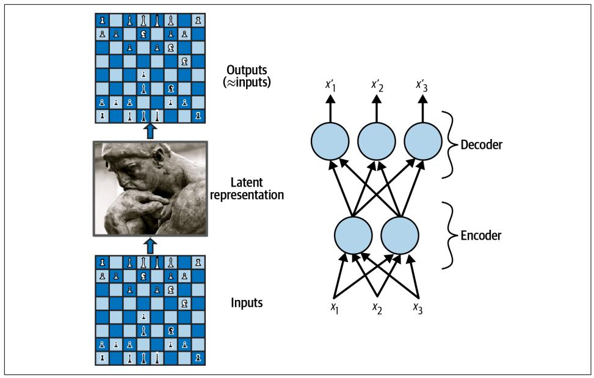

Figure 17-1. The chess memory experiment (left) and a simple autoencoder (right)

As you can see, an autoencoder typically has the same architecture as a multilayer perceptron (MLP; see Chapter 10), except that the number of neurons in the output layer must be equal to the number of inputs. In this example, there is just one hidden layer composed of two neurons (the encoder), and one output layer composed of three neurons (the decoder). The outputs are often called the *reconstructions* because the autoencoder tries to reconstruct the inputs. The cost function contains a reconstruction loss that penalizes the model when the reconstructions are different from the inputs.

Because the internal representation has a lower dimensionality than the input data (it) is 2D instead of 3D), the autoencoder is said to be *undercomplete*. An undercomplete autoencoder cannot trivially copy its inputs to the codings, yet it must find a way to output a copy of its inputs. It is forced to learn the most important features in the input data (and drop the unimportant ones).

Let's see how to implement a very simple undercomplete autoencoder for dimensionality reduction.

{666}------------------------------------------------

### **Performing PCA with an Undercomplete Linear** Autoencoder

If the autoencoder uses only linear activations and the cost function is the mean squared error (MSE), then it ends up performing principal component analysis (PCA; see Chapter 8).

The following code builds a simple linear autoencoder to perform PCA on a 3D dataset, projecting it to 2D:

```
import tensorflow as tf
encoder = tf.keras.Sequential([tf.keras.layers.Dense(2)])
decoder = tf.keras.Sequential([tf.keras.layers.Dense(3)])autoencoder = tf.keras.Sequential([encoder, decoder])optimizer = tf.keras.optimizers.SGD(learning rate=0.5)
autoencoder.compile(loss="mse", optimizer=optimizer)
```

This code is really not very different from all the MLPs we built in past chapters, but there are a few things to note:

- We organized the autoencoder into two subcomponents: the encoder and the decoder. Both are regular Sequential models with a single Dense layer each, and the autoencoder is a Sequential model containing the encoder followed by the decoder (remember that a model can be used as a layer in another model).
- The autoencoder's number of outputs is equal to the number of inputs (i.e., 3).
- To perform PCA, we do not use any activation function (i.e., all neurons are linear), and the cost function is the MSE. That's because PCA is a linear transformation. We will see more complex and nonlinear autoencoders shortly.

Now let's train the model on the same simple generated 3D dataset we used in Chapter 8 and use it to encode that dataset (i.e., project it to 2D):

```
X train = [\dots] # generate a 3D dataset, like in Chapter 8
history = autoencoder.fit(X_train, X_train, epochs=500, verbose=False)
codings = encoder.predict(X train)
```

Note that X\_train is used as both the inputs and the targets. Figure 17-2 shows the original 3D dataset (on the left) and the output of the autoencoder's hidden layer (i.e., the coding layer, on the right). As you can see, the autoencoder found the best 2D plane to project the data onto, preserving as much variance in the data as it could (just like PCA).

{667}------------------------------------------------


Figure 17-2. Approximate PCA performed by an undercomplete linear autoencoder

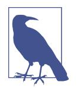

You can think of an autoencoder as performing a form of selfsupervised learning, since it is based on a supervised learning technique with automatically generated labels (in this case simply equal to the inputs).

### **Stacked Autoencoders**

Just like other neural networks we have discussed, autoencoders can have multiple hidden layers. In this case they are called *stacked autoencoders* (or *deep autoencoders*). Adding more layers helps the autoencoder learn more complex codings. That said, one must be careful not to make the autoencoder too powerful. Imagine an encoder so powerful that it just learns to map each input to a single arbitrary number (and the decoder learns the reverse mapping). Obviously such an autoencoder will reconstruct the training data perfectly, but it will not have learned any useful data representation in the process, and it is unlikely to generalize well to new instances.

The architecture of a stacked autoencoder is typically symmetrical with regard to the central hidden layer (the coding layer). To put it simply, it looks like a sandwich. For example, an autoencoder for Fashion MNIST (introduced in Chapter 10) may have 784 inputs, followed by a hidden layer with 100 neurons, then a central hidden layer of 30 neurons, then another hidden layer with 100 neurons, and an output layer with 784 neurons. This stacked autoencoder is represented in Figure 17-3.

{668}------------------------------------------------

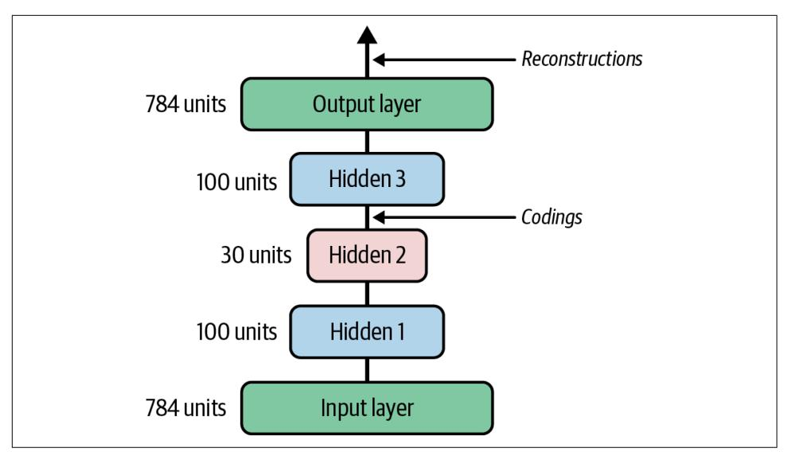

Figure 17-3. Stacked autoencoder

### **Implementing a Stacked Autoencoder Using Keras**

You can implement a stacked autoencoder very much like a regular deep MLP:

```
stacked_encoder = tf.keras.Sequential([
    tf.keras.layers.Flatten(),
    tf.keras.layers.Dense(100, activation="relu"),
    tf.keras.layers.Dense(30, activation="relu"),
\left| \right\ranglestacked_decoder = tf.keras.Sequential([
    tf.keras.layers.Dense(100, activation="relu"),
    tf.keras.layers.Dense(28 * 28),
    tf.keras.layers.Reshape([28, 28])
\left| \right\ranglestacked_ae = tf.keras.Sequential([stacked_encoder, stacked_decoder])
stacked_ae.compile(loss="mse", optimizer="nadam")
history = stacked_ae.fit(X_train, X_train, epochs=20,
                          validation data=(X valid, X valid))
```

{669}------------------------------------------------

Let's go through this code:

- Just like earlier, we split the autoencoder model into two submodels: the encoder and the decoder.
- The encoder takes 28  $\times$  28-pixel grayscale images, flattens them so that each image is represented as a vector of size 784, then processes these vectors through two Dense layers of diminishing sizes (100 units then 30 units), both using the ReLU activation function. For each input image, the encoder outputs a vector of size 30.
- The decoder takes codings of size 30 (output by the encoder) and processes them through two Dense layers of increasing sizes (100 units then 784 units), and it reshapes the final vectors into  $28 \times 28$  arrays so the decoder's outputs have the same shape as the encoder's inputs.
- When compiling the stacked autoencoder, we use the MSE loss and Nadam optimization.
- Finally, we train the model using X train as both the inputs and the targets. Similarly, we use X\_valid as both the validation inputs and targets.

### **Visualizing the Reconstructions**

One way to ensure that an autoencoder is properly trained is to compare the inputs and the outputs: the differences should not be too significant. Let's plot a few images from the validation set, as well as their reconstructions:

```
import numpy as np
def plot_reconstructions(model, images=X_valid, n_images=5):
    reconstructions = np.clip(model.predict(images[:n images]), 0, 1)
    fig = plt.figure(figsize=(n_inages * 1.5, 3))for image index in range(n images):
        plt.subplot(2, n images, 1 + image index)plt.imshow(images[image_index], cmap="binary")
        plt.axis("off")
        plt.subplot(2, n_iimages, 1 + n_iimages + image_index)plt.imshow(reconstructions[image_index], cmap="binary")
        plt.axis("off")
plot reconstructions(stacked ae)
plt.show()
```

Figure 17-4 shows the resulting images.

{670}------------------------------------------------


Figure 17-4. Original images (top) and their reconstructions (bottom)

The reconstructions are recognizable, but a bit too lossy. We may need to train the model for longer, or make the encoder and decoder deeper, or make the codings larger. But if we make the network too powerful, it will manage to make perfect reconstructions without having learned any useful patterns in the data. For now, let's go with this model.

### **Visualizing the Fashion MNIST Dataset**

Now that we have trained a stacked autoencoder, we can use it to reduce the dataset's dimensionality. For visualization, this does not give great results compared to other dimensionality reduction algorithms (such as those we discussed in Chapter 8), but one big advantage of autoencoders is that they can handle large datasets with many instances and many features. So, one strategy is to use an autoencoder to reduce the dimensionality down to a reasonable level, then use another dimensionality reduction algorithm for visualization. Let's use this strategy to visualize Fashion MNIST. First we'll use the encoder from our stacked autoencoder to reduce the dimensionality down to 30, then we'll use Scikit-Learn's implementation of the t-SNE algorithm to reduce the dimensionality down to 2 for visualization:

```
from sklearn.manifold import TSNE
```

```
X valid compressed = stacked encoder.predict(X valid)
tsne = TSNE(init="pca", learning rate="auto", random state=42)
X_valid_2D = tsne.fit_transform(X_valid_compressed)
```

Now we can plot the dataset:

```
plt.scatter(X_valid_2D[:, 0], X_valid_2D[:, 1], c=y_valid, s=10, cmap="tab10")
plt.show()
```

Figure 17-5 shows the resulting scatterplot, beautified a bit by displaying some of the images. The t-SNE algorithm identified several clusters that match the classes reasonably well (each class is represented by a different color).

{671}------------------------------------------------

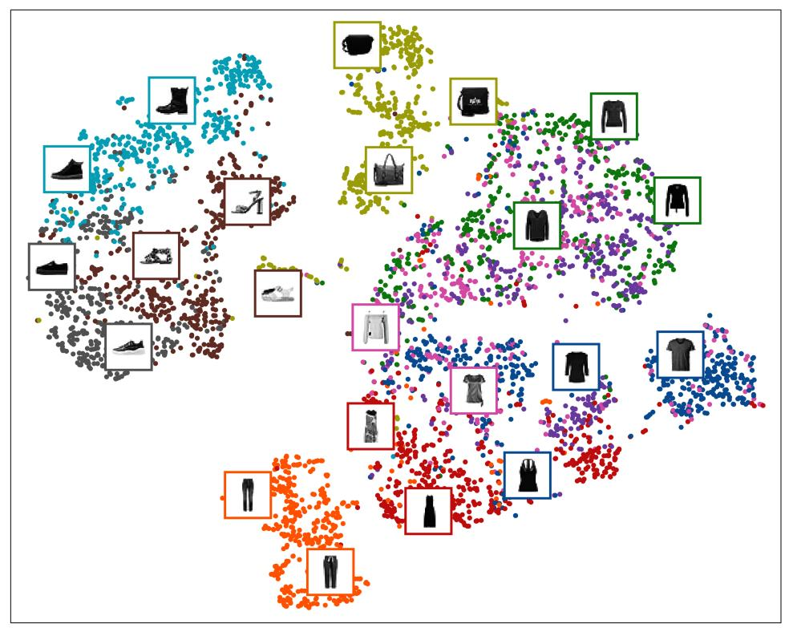

Figure 17-5. Fashion MNIST visualization using an autoencoder followed by t-SNE

So, autoencoders can be used for dimensionality reduction. Another application is for unsupervised pretraining.

### **Unsupervised Pretraining Using Stacked Autoencoders**

As we discussed in Chapter 11, if you are tackling a complex supervised task but you do not have a lot of labeled training data, one solution is to find a neural network that performs a similar task and reuse its lower layers. This makes it possible to train a high-performance model using little training data because your neural network won't have to learn all the low-level features; it will just reuse the feature detectors learned by the existing network.

Similarly, if you have a large dataset but most of it is unlabeled, you can first train a stacked autoencoder using all the data, then reuse the lower layers to create a neural network for your actual task and train it using the labeled data. For example, Figure 17-6 shows how to use a stacked autoencoder to perform unsupervised pretraining for a classification neural network. When training the classifier, if you really

{672}------------------------------------------------


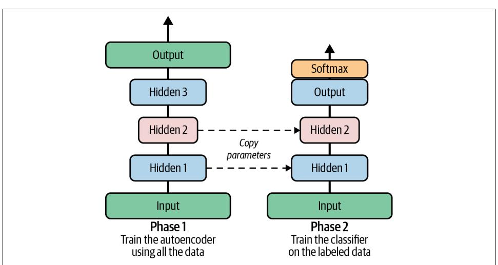

Figure 17-6. Unsupervised pretraining using autoencoders

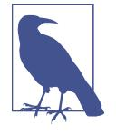

Having plenty of unlabeled data and little labeled data is common. Building a large unlabeled dataset is often cheap (e.g., a simple script can download millions of images off the internet), but labeling those images (e.g., classifying them as cute or not) can usually be done reliably only by humans. Labeling instances is time-consuming and costly, so it's normal to have only a few thousand human-labeled instances, or even less.

There is nothing special about the implementation: just train an autoencoder using all the training data (labeled plus unlabeled), then reuse its encoder layers to create a new neural network (see the exercises at the end of this chapter for an example).

Next, let's look at a few techniques for training stacked autoencoders.

### **Tying Weights**

When an autoencoder is neatly symmetrical, like the one we just built, a common technique is to tie the weights of the decoder layers to the weights of the encoder layers. This halves the number of weights in the model, speeding up training and limiting the risk of overfitting. Specifically, if the autoencoder has a total of N layers (not counting the input layer), and  $W_L$  represents the connection weights of the  $L<sup>th</sup>$ layer (e.g., layer 1 is the first hidden layer, layer  $N/2$  is the coding layer, and layer  $N$ is the output layer), then the decoder layer weights can be defined as  $W_L = W_{N-L+1}$ <sup>T</sup> (with  $L = N/2 + 1, ..., N$ ).

{673}------------------------------------------------

To tie weights between layers using Keras, let's define a custom layer:

```
class DenseTranspose(tf.keras.layers.Layer):
    def init (self, dense, activation=None, **kwargs):
       super(). init (**kwargs)self.dense = denseself.activation = tf.keras.activations.get(activation)
    def build(self, batch_input_shape):
       self.biases = self.add_weight(name="bias",
                                     shape=self.dense.input shape[-1],
                                     initializer="zeros")
       super().build(batch input shape)
    def call(self, inputs):
       Z = tf.matmul(inputs, self.dense.weights[0], transpose b=True)return self.activation(Z + self.biases)
```

This custom layer acts like a regular Dense layer, but it uses another Dense layer's weights, transposed (setting transpose\_b=True is equivalent to transposing the second argument, but it's more efficient as it performs the transposition on the fly within the matmul() operation). However, it uses its own bias vector. Now we can build a new stacked autoencoder, much like the previous one but with the decoder's Dense layers tied to the encoder's Dense layers:

```
dense 1 = tf. keras. layers. Dense(100, activation="relu")
dense_2 = tf.keras.layers.Dense(30, activation="relu")tied encoder = tf.keras.Sequential(\lceiltf.keras.layers.Flatten(),
    dense 1,
    dense_2
\left| \right\rangletied decoder = tf.keras.Sequential(\lceilDenseTranspose(dense 2, activation="relu"),
    DenseTranspose(dense_1),
    tf.keras.layers.Reshape([28, 28])
\left| \right\rangle
```

tied ae = tf.keras.Sequential([tied encoder, tied decoder])

This model achieves roughly the same reconstruction error as the previous model, using almost half the number of parameters.

### **Training One Autoencoder at a Time**

Rather than training the whole stacked autoencoder in one go like we just did, it is possible to train one shallow autoencoder at a time, then stack all of them into a single stacked autoencoder (hence the name), as shown in Figure 17-7. This

{674}------------------------------------------------

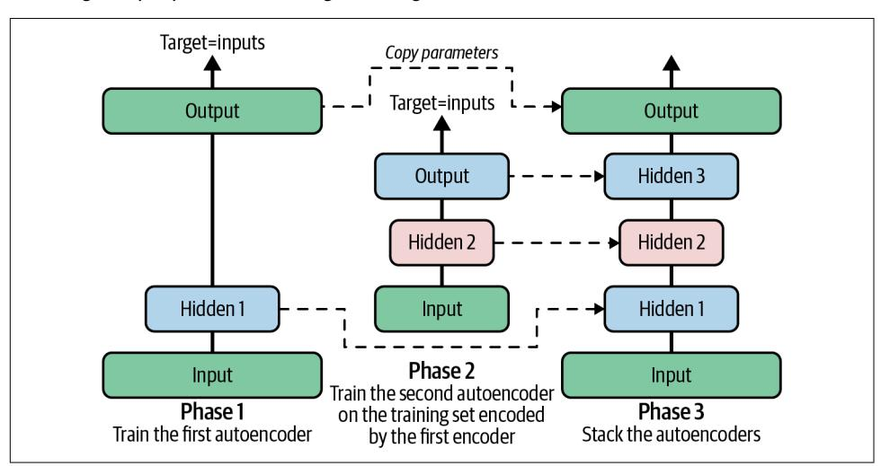

technique is not used so much these days, but you may still run into papers that talk about "greedy layerwise training", so it's good to know what it means.

Figure 17-7. Training one autoencoder at a time

During the first phase of training, the first autoencoder learns to reconstruct the inputs. Then we encode the whole training set using this first autoencoder, and this gives us a new (compressed) training set. We then train a second autoencoder on this new dataset. This is the second phase of training. Finally, we build a big sandwich using all these autoencoders, as shown in Figure 17-7 (i.e., we first stack the hidden layers of each autoencoder, then the output layers in reverse order). This gives us the final stacked autoencoder (see the "Training One Autoencoder at a Time" section in the chapter's notebook for an implementation). We could easily train more autoencoders this way, building a very deep stacked autoencoder.

As I mentioned earlier, one of the triggers of the deep learning tsunami was the discovery in 2006 by Geoffrey Hinton et al. that deep neural networks can be pretrained in an unsupervised fashion, using this greedy layerwise approach. They used restricted Boltzmann machines (RBMs; see https://homl.info/extra-anns) for this purpose, but in 2007 Yoshua Bengio et al.<sup>2</sup> showed that autoencoders worked just as well. For several years this was the only efficient way to train deep nets, until many of the techniques introduced in Chapter 11 made it possible to just train a deep net in one shot.

<sup>2</sup> Yoshua Bengio et al., "Greedy Layer-Wise Training of Deep Networks", Proceedings of the 19th International Conference on Neural Information Processing Systems (2006): 153-160.

{675}------------------------------------------------

Autoencoders are not limited to dense networks: you can also build convolutional autoencoders. Let's look at these now

### **Convolutional Autoencoders**

If you are dealing with images, then the autoencoders we have seen so far will not work well (unless the images are very small): as you saw in Chapter 14, convolutional neural networks are far better suited than dense networks to working with images. So if you want to build an autoencoder for images (e.g., for unsupervised pretraining or dimensionality reduction), you will need to build a *convolutional autoencoder*.<sup>3</sup> The encoder is a regular CNN composed of convolutional layers and pooling layers. It typically reduces the spatial dimensionality of the inputs (i.e., height and width) while increasing the depth (i.e., the number of feature maps). The decoder must do the reverse (upscale the image and reduce its depth back to the original dimensions), and for this you can use transpose convolutional layers (alternatively, you could combine upsampling layers with convolutional layers). Here is a basic convolutional autoencoder for Fashion MNIST:

```
conv\_encoder = tf.keras.Sequentialtf.keras.layers.Reshape([28, 28, 1]),
    tf.keras.layers.Conv2D(16, 3, padding="same", activation="relu"),
    tf.keras.layers.MaxPool2D(pool_size=2), # output: 14 \times 14 \times 16tf.keras.layers.Conv2D(32, 3, padding="same", activation="relu"),
    tf.keras.layers.MaxPool2D(pool_size=2), # output: 7 \times 7 \times 32tf.keras.layers.Conv2D(64, 3, padding="same", activation="relu"),
    tf.keras.layers.MaxPool2D(pool size=2), # output: 3 \times 3 \times 64tf.keras.layers.Conv2D(30, 3, padding="same", activation="relu"),
    tf.keras.layers.GlobalAvgPool2D() # output: 30
\left| \right\rangleconv decoder = tf.keras.Sequential(\lceiltf.keras.layers.Dense(3 * 3 * 16),
    tf.keras.layers.Reshape((3, 3, 16)),
    tf.keras.layers.Conv2DTranspose(32, 3, strides=2, activation="relu"),
    tf.keras.layers.Conv2DTranspose(16, 3, strides=2, padding="same",
                                      activation="relu"),
    tf.keras.layers.Conv2DTranspose(1, 3, strides=2, padding="same"),
    tf.keras.layers.Reshape([28, 28])
\left| \right\rangleconv_ae = tf.keras.Sequential([conv_encoder, conv_decoder])
```

<sup>3</sup> Jonathan Masci et al., "Stacked Convolutional Auto-Encoders for Hierarchical Feature Extraction", Proceedings of the 21st International Conference on Artificial Neural Networks 1 (2011): 52-59.

{676}------------------------------------------------

It's also possible to create autoencoders with other architecture types, such as RNNs (see the notebook for an example).

OK, let's step back for a second. So far we have looked at various kinds of autoencoders (basic, stacked, and convolutional), and how to train them (either in one shot or layer by layer). We also looked at a couple of applications: data visualization and unsupervised pretraining.

Up to now, in order to force the autoencoder to learn interesting features, we have limited the size of the coding layer, making it undercomplete. There are actually many other kinds of constraints that can be used, including ones that allow the coding layer to be just as large as the inputs, or even larger, resulting in an *overcomplete* autoencoder. Then, in the following sections we'll look at a few more kinds of autoencoders: denoising autoencoders, sparse autoencoders, and variational autoencoders.

### **Denoising Autoencoders**

Another way to force the autoencoder to learn useful features is to add noise to its inputs, training it to recover the original, noise-free inputs. This idea has been around since the 1980s (e.g., it is mentioned in Yann LeCun's 1987 master's thesis). In a 2008 paper,<sup>4</sup> Pascal Vincent et al. showed that autoencoders could also be used for feature extraction. In a 2010 paper,<sup>5</sup> Vincent et al. introduced *stacked denoising autoencoders*.

The noise can be pure Gaussian noise added to the inputs, or it can be randomly switched-off inputs, just like in dropout (introduced in Chapter 11). Figure 17-8 shows both options.

The implementation is straightforward: it is a regular stacked autoencoder with an additional Dropout layer applied to the encoder's inputs (or you could use a GaussianNoise layer instead). Recall that the Dropout layer is only active during training (and so is the GaussianNoise layer):

<sup>4</sup> Pascal Vincent et al., "Extracting and Composing Robust Features with Denoising Autoencoders", Proceedings of the 25th International Conference on Machine Learning (2008): 1096-1103.

<sup>5</sup> Pascal Vincent et al., "Stacked Denoising Autoencoders: Learning Useful Representations in a Deep Network with a Local Denoising Criterion", Journal of Machine Learning Research 11 (2010): 3371-3408.

{677}------------------------------------------------

```
dropout_{encoder} = tf_{keras.Sequential}tf.keras.layers.Flatten(),
    tf.keras.layers.Dropout(0.5),
    tf.keras.layers.Dense(100, activation="relu"),
    tf.keras.layers.Dense(30, activation="relu")
\mathcal{I}dropout decoder = tf.keras.Sequential(\lceiltf.keras.layers.Dense(100, activation="relu"),
    tf.keras.layers.Dense(28 * 28).
    tf.keras.layers.Reshape([28, 28])
\mathcal{I}dropout ae = tf.keras.Sequential([dropout encoder, dropout decoder])
```

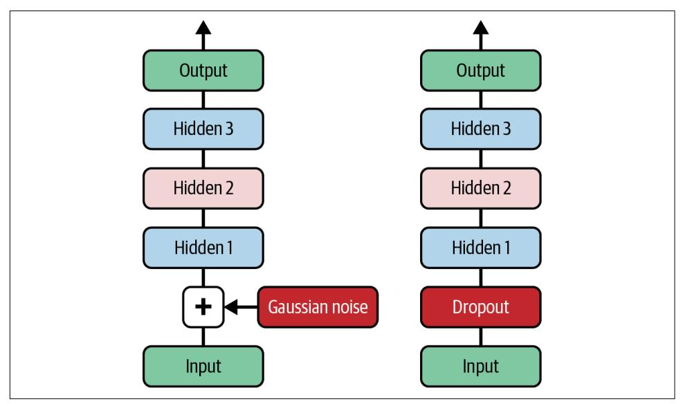

Figure 17-8. Denoising autoencoders, with Gaussian noise (left) or dropout (right)

Figure 17-9 shows a few noisy images (with half the pixels turned off), and the images reconstructed by the dropout-based denoising autoencoder. Notice how the autoencoder guesses details that are actually not in the input, such as the top of the white shirt (bottom row, fourth image). As you can see, not only can denoising autoencoders be used for data visualization or unsupervised pretraining, like the other autoencoders we've discussed so far, but they can also be used quite simply and efficiently to remove noise from images.

{678}------------------------------------------------


Figure 17-9. Noisy images (top) and their reconstructions (bottom)

### **Sparse Autoencoders**

Another kind of constraint that often leads to good feature extraction is *sparsity*: by adding an appropriate term to the cost function, the autoencoder is pushed to reduce the number of active neurons in the coding layer. For example, it may be pushed to have on average only 5% significantly active neurons in the coding layer. This forces the autoencoder to represent each input as a combination of a small number of activations. As a result, each neuron in the coding layer typically ends up representing a useful feature (if you could speak only a few words per month, you would probably try to make them worth listening to).

A simple approach is to use the sigmoid activation function in the coding layer (to constrain the codings to values between 0 and 1), use a large coding layer (e.g., with 300 units), and add some  $\ell_1$  regularization to the coding layer's activations. The decoder is just a regular decoder:

```
sparse \lambda1 encoder = tf.keras.Sequential([
    tf.keras.layers.Flatten(),
    tf.keras.layers.Dense(100, activation="relu"),
    tf.keras.layers.Dense(300, activation="sigmoid"),
    tf.keras.layers.ActivityRegularization(l1=1e-4)
\left| \right\ranglesparse \lambda1 decoder = tf.keras.Sequential([
    tf.keras.layers.Dense(100, activation="relu"),
    tf.keras.layers.Dense(28 * 28),
    tf.keras.layers.Reshape([28, 28])
\left| \right\ranglesparse l1 ae = tf.keras.Sequential([sparse l1 encoder, sparse l1 decoder])
```

{679}------------------------------------------------

This Activity Reqularization layer just returns its inputs, but as a side effect it adds a training loss equal to the sum of the absolute values of its inputs. This only affects training. Equivalently, you could remove the ActivityRegularization layer and set activity\_regularizer=tf.keras.regularizers.l1(1e-4) in the previous layer. This penalty will encourage the neural network to produce codings close to 0, but since it will also be penalized if it does not reconstruct the inputs correctly, it will have to output at least a few nonzero values. Using the  $\ell_1$  norm rather than the  $\ell_2$  norm will push the neural network to preserve the most important codings while eliminating the ones that are not needed for the input image (rather than just reducing all codings).

Another approach, which often yields better results, is to measure the actual sparsity of the coding layer at each training iteration, and penalize the model when the measured sparsity differs from a target sparsity. We do so by computing the average activation of each neuron in the coding layer, over the whole training batch. The batch size must not be too small, or else the mean will not be accurate.

Once we have the mean activation per neuron, we want to penalize the neurons that are too active, or not active enough, by adding a *sparsity loss* to the cost function. For example, if we measure that a neuron has an average activation of 0.3, but the target sparsity is 0.1, it must be penalized to activate less. One approach could be simply adding the squared error  $(0.3 - 0.1)^2$  to the cost function, but in practice a better approach is to use the Kullback–Leibler (KL) divergence (briefly discussed in Chapter 4), which has much stronger gradients than the mean squared error, as you can see in Figure 17-10.

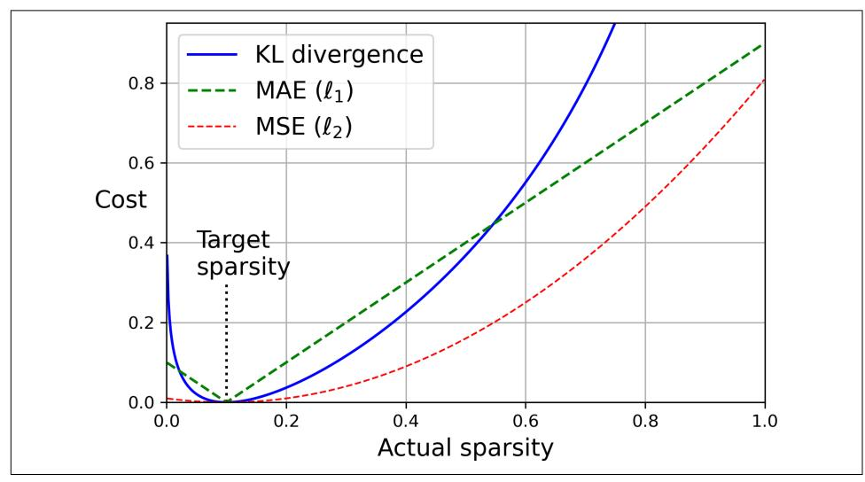

Figure 17-10. Sparsity loss

{680}------------------------------------------------

Given two discrete probability distributions  $P$  and  $Q$ , the KL divergence between these distributions, noted  $D_{\text{KL}}(P \parallel Q)$ , can be computed using Equation 17-1.

Equation 17-1. Kullback-Leibler divergence

$$
D_{\text{KL}}(P \parallel Q) = \sum_{i} P(i) \log \frac{P(i)}{Q(i)}
$$

In our case, we want to measure the divergence between the target probability  $p$ that a neuron in the coding layer will activate and the actual probability  $q$ , estimated by measuring the mean activation over the training batch. So, the KL divergence simplifies to Equation 17-2.

Equation 17-2. KL divergence between the target sparsity  $p$  and the actual sparsity  $q$ 

$$
D_{\text{KL}}(p \parallel q) = p \log \frac{p}{q} + (1 - p) \log \frac{1 - p}{1 - q}
$$

Once we have computed the sparsity loss for each neuron in the coding layer, we sum up these losses and add the result to the cost function. In order to control the relative importance of the sparsity loss and the reconstruction loss, we can multiply the sparsity loss by a sparsity weight hyperparameter. If this weight is too high, the model will stick closely to the target sparsity, but it may not reconstruct the inputs properly, making the model useless. Conversely, if it is too low, the model will mostly ignore the sparsity objective and will not learn any interesting features.

We now have all we need to implement a sparse autoencoder based on the KL divergence. First, let's create a custom regularizer to apply KL divergence regularization:

```
kl_divergence = tf.keras.losses.kullback_leibler_divergence
class KLDivergenceRegularizer(tf.keras.regularizers.Regularizer):
    def _init_(self, weight, target):
       self. weight = weightself.target = targetdef __call__(self, inputs):
       mean_ activities = tf.reduce_mean(inputs, axis=0)
       return self.weight * (
           kl divergence(self.target, mean activities) +
           kl divergence(1. - self.target, 1. - mean activities)
```

Now we can build the sparse autoencoder, using the KLDivergenceRegularizer for the coding layer's activations:

{681}------------------------------------------------

```
kld_reg = KLDivergenceRegularizer(weight=5e-3, target=0.1)sparse kl encoder = tf.keras.Sequential(\lceiltf.keras.layers.Flatten(),
    tf.keras.layers.Dense(100, activation="relu"),
    tf.keras.layers.Dense(300, activation="sigmoid",
                            activity_regularizer=kld_reg)
\left| \right\ranglesparse_kl_decoder = tf.keras.Sequential([
    tf.keras.layers.Dense(100, activation="relu"),
    tf.keras.layers.Dense(28 * 28),
    tf.keras.layers.Reshape([28, 28])
\left| \right\ranglesparse_kl_ae = tf.keras.Sequential([sparse_kl_encoder, sparse_kl_decoder])
```

After training this sparse autoencoder on Fashion MNIST, the coding layer will have roughly 10% sparsity.

### **Variational Autoencoders**

An important category of autoencoders was introduced in 2013 by Diederik Kingma and Max Welling<sup>6</sup> and quickly became one of the most popular variants: variational autoencoders (VAEs).

VAEs are quite different from all the autoencoders we have discussed so far, in these particular ways:

- They are probabilistic autoencoders, meaning that their outputs are partly determined by chance, even after training (as opposed to denoising autoencoders, which use randomness only during training).
- Most importantly, they are *generative autoencoders*, meaning that they can generate new instances that look like they were sampled from the training set.

Both these properties make VAEs rather similar to RBMs, but they are easier to train, and the sampling process is much faster (with RBMs you need to wait for the network to stabilize into a "thermal equilibrium" before you can sample a new instance). As their name suggests, variational autoencoders perform variational Bayesian inference, which is an efficient way of carrying out approximate Bayesian inference. Recall that Bayesian inference means updating a probability distribution based on new data, using equations derived from Bayes' theorem. The original distribution is called the *prior*, while the updated distribution is called the *posterior*. In our case, we want to find a good approximation of the data distribution. Once we have that, we can sample from it.

<sup>6</sup> Diederik Kingma and Max Welling, "Auto-Encoding Variational Bayes", arXiv preprint arXiv:1312.6114  $(2013).$ 

{682}------------------------------------------------

Let's take a look at how VAEs work. Figure 17-11 (left) shows a variational autoencoder. You can recognize the basic structure of all autoencoders, with an encoder followed by a decoder (in this example, they both have two hidden layers), but there is a twist: instead of directly producing a coding for a given input, the encoder produces a *mean coding*  $\mu$  and a standard deviation  $\sigma$ . The actual coding is then sampled randomly from a Gaussian distribution with mean  $\mu$  and standard deviation σ. After that the decoder decodes the sampled coding normally. The right part of the diagram shows a training instance going through this autoencoder. First, the encoder produces  $\mu$  and  $\sigma$ , then a coding is sampled randomly (notice that it is not exactly located at  $\mu$ ), and finally this coding is decoded; the final output resembles the training instance.

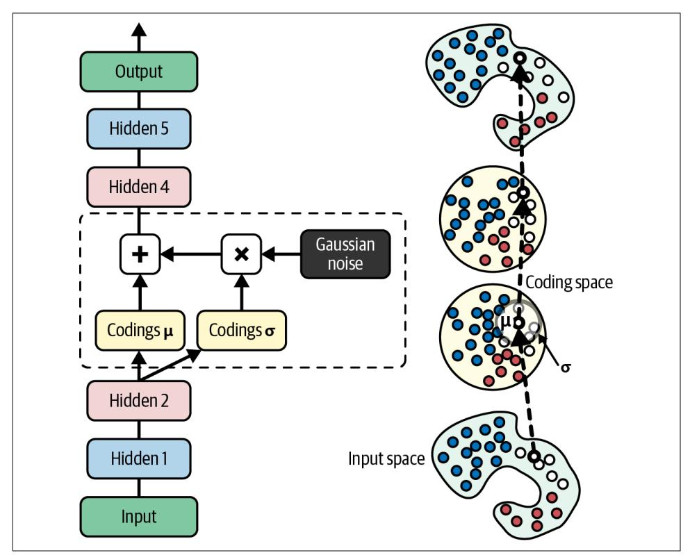

Figure 17-11. A variational autoencoder (left) and an instance going through it (right)

As you can see in the diagram, although the inputs may have a very convoluted distribution, a variational autoencoder tends to produce codings that look as though they were sampled from a simple Gaussian distribution:7 during training, the cost

<sup>7</sup> Variational autoencoders are actually more general; the codings are not limited to Gaussian distributions.

{683}------------------------------------------------

function (discussed next) pushes the codings to gradually migrate within the coding space (also called the *latent space*) to end up looking like a cloud of Gaussian points. One great consequence is that after training a variational autoencoder, you can very easily generate a new instance: just sample a random coding from the Gaussian distribution, decode it, and voilà!

Now, let's look at the cost function. It is composed of two parts. The first is the usual reconstruction loss that pushes the autoencoder to reproduce its inputs. We can use the MSE for this, as we did earlier. The second is the *latent loss* that pushes the autoencoder to have codings that look as though they were sampled from a simple Gaussian distribution: it is the KL divergence between the target distribution (i.e., the Gaussian distribution) and the actual distribution of the codings. The math is a bit more complex than with the sparse autoencoder, in particular because of the Gaussian noise, which limits the amount of information that can be transmitted to the coding layer. This pushes the autoencoder to learn useful features. Luckily, the equations simplify, so the latent loss can be computed using Equation 17-3.8

Equation 17-3. Variational autoencoder's latent loss

$$
\mathcal{L} = -\frac{1}{2} \sum_{i=1}^{n} \left[ 1 + \log(\sigma_i^2) - \sigma_i^2 - \mu_i^2 \right]
$$

In this equation,  $\mathcal{L}$  is the latent loss, *n* is the codings' dimensionality, and  $\mu_i$  and  $\sigma_i$ are the mean and standard deviation of the  $i<sup>th</sup>$  component of the codings. The vectors  $\mu$  and  $\sigma$  (which contain all the  $\mu_i$  and  $\sigma_i$ ) are output by the encoder, as shown in Figure 17-11 (left).

A common tweak to the variational autoencoder's architecture is to make the encoder output  $y = log(\sigma^2)$  rather than  $\sigma$ . The latent loss can then be computed as shown in Equation 17-4. This approach is more numerically stable and speeds up training.

Equation 17-4. Variational autoencoder's latent loss, rewritten using  $y = log(\sigma^2)$ 

$$
\mathcal{L} = -\frac{1}{2} \sum_{i=1}^{n} \left[ 1 + \gamma_i - \exp(\gamma_i) - \mu_i^2 \right]
$$

Let's start building a variational autoencoder for Fashion MNIST (as shown in Figure 17-11, but using the  $\gamma$  tweak). First, we will need a custom layer to sample the codings, given  $\mu$  and  $\gamma$ :

<sup>8</sup> For more mathematical details, check out the original paper on variational autoencoders, or Carl Doersch's great tutorial (2016).

{684}------------------------------------------------

```
class Sampling(tf.keras.layers.Layer):
    def call(self, inputs):
        mean, log_{var} = inputsreturn tf.random.normal(tf.shape(log var)) * tf.exp(log var / 2) + mean
```

This Sampling layer takes two inputs: mean  $(\mu)$  and log var  $(\gamma)$ . It uses the function tf.random.normal() to sample a random vector (of the same shape as  $y$ ) from the Gaussian distribution, with mean 0 and standard deviation 1. Then it multiplies it by  $\exp(\gamma/2)$  (which is equal to  $\sigma$ , as you can verify mathematically), and finally it adds  $\mu$ and returns the result. This samples a codings vector from the Gaussian distribution with mean  $\mu$  and standard deviation  $\sigma$ .

Next, we can create the encoder, using the functional API because the model is not entirely sequential:

```
codings size = 10inputs = tf.keras.layers.Input(shape=[28, 28])Z = tf.keras.layers.Flatten()(inputs)
Z = tf.keras.layers.Dense(150, activation="relu")(Z)
Z = tf.keras.layers.Dense(100, activation="relu")(Z)
codings_mean = tf.keras.layers.Dense(codings_size)(Z) \# \mucodings log var = tf.keras.layers.Dense(codings size)(Z) # ycodings = Sampling()([codings_mean, codings_log_var])
variational_encoder = tf.keras.Model(
    inputs=[inputs], outputs=[codings_mean, codings_log_var, codings])
```

Note that the Dense layers that output codings mean  $(\mu)$  and codings log var  $(y)$  have the same inputs (i.e., the outputs of the second Dense layer). We then pass both codings mean and codings log var to the Sampling layer. Finally, the variational\_encoder model has three outputs. Only the codings are required, but we add codings\_mean and codings\_log\_var as well, in case we want to inspect their values. Now let's build the decoder:

```
decoder inputs = tf.keras.layers.Input(shape=[codings size])
x = tf. keras. layers. Dense(100, activation="relu")(decoder inputs)
x = tf.keras.layers.Dense(150, activation="relu")(x)
x = tf.keras.layers.Dense(28 * 28)(x)
outputs = tf.keras.layers.Reshape([28, 28])(x)
variational_decoder = tf.keras.Model(inputs=[decoder_inputs], outputs=[outputs])
```

For this decoder, we could have used the sequential API instead of the functional API, since it is really just a simple stack of layers, virtually identical to many of the decoders we have built so far. Finally, let's build the variational autoencoder model:

```
_, _, codings = variational_encoder(inputs)
reconstructions = variational decoder(codings)
variational ae = tf.keras.Model(inputs=[inputs], outputs=[reconstructions])
```

We ignore the first two outputs of the encoder (we only want to feed the codings to the decoder). Lastly, we must add the latent loss and the reconstruction loss:

{685}------------------------------------------------

```
lateral_loss = -0.5 * tf.readuce_sum(1 + codings_log_var - tf.exp(codings_log_var) - tf.square(codings_mean),
   axis=-1)variational ae.add loss(tf.reduce mean(latent loss) / 784.)
```

We first apply Equation 17-4 to compute the latent loss for each instance in the batch, summing over the last axis. Then we compute the mean loss over all the instances in the batch, and we divide the result by 784 to ensure it has the appropriate scale compared to the reconstruction loss. Indeed, the variational autoencoder's reconstruction loss is supposed to be the sum of the pixel reconstruction errors, but when Keras computes the "mse" loss it computes the mean over all 784 pixels, rather than the sum. So, the reconstruction loss is 784 times smaller than we need it to be. We could define a custom loss to compute the sum rather than the mean, but it is simpler to divide the latent loss by 784 (the final loss will be 784 times smaller than it should be, but this just means that we should use a larger learning rate).

And finally, we can compile and fit the autoencoder!

```
variational_ae.compile(loss="mse", optimizer="nadam")
history = variational_ae.fit(X_train, X_train, epochs=25, batch_size=128,
                             validation_data=(X_valid, X_valid))
```

### **Generating Fashion MNIST Images**

Now let's use this variational autoencoder to generate images that look like fashion items. All we need to do is sample random codings from a Gaussian distribution and decode them:

```
codings = tf.random.normal(shape=[3 * 7, codings_size])images = variational decoder(codings).numpy()
```

Figure 17-12 shows the 12 generated images.

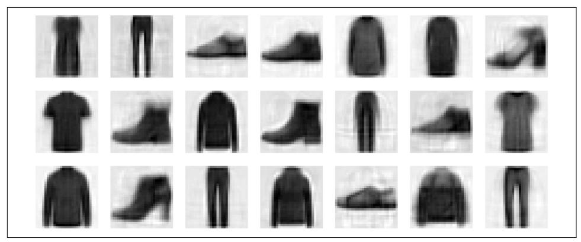

Figure 17-12. Fashion MNIST images generated by the variational autoencoder

{686}------------------------------------------------

The majority of these images look fairly convincing, if a bit too fuzzy. The rest are not great, but don't be too harsh on the autoencoder—it only had a few minutes to learn!

Variational autoencoders make it possible to perform semantic interpolation: instead of interpolating between two images at the pixel level, which would look as if the two images were just overlaid, we can interpolate at the codings level. For example, let's take a few codings along an arbitrary line in latent space and decode them. We get a sequence of images that gradually go from pants to sweaters (see Figure 17-13):

```
codings = np{\cdot}zeros([7, codings_size])codings[:, 3] = np.linspace(-0.8, 0.8, 7) # axis 3 looks best in this case
images = variational decoder(codings).numpv()
```


Figure 17-13. Semantic interpolation

Let's now turn our attention to GANs: they are harder to train, but when you manage to get them to work, they produce pretty amazing images.

### **Generative Adversarial Networks**

Generative adversarial networks were proposed in a 2014 paper<sup>9</sup> by Ian Goodfellow et al., and although the idea got researchers excited almost instantly, it took a few years to overcome some of the difficulties of training GANs. Like many great ideas, it seems simple in hindsight: make neural networks compete against each other in the hope that this competition will push them to excel. As shown in Figure 17-14, a GAN is composed of two neural networks:

Generator

Takes a random distribution as input (typically Gaussian) and outputs some data—typically, an image. You can think of the random inputs as the latent representations (i.e., codings) of the image to be generated. So, as you can see, the generator offers the same functionality as a decoder in a variational autoencoder, and it can be used in the same way to generate new images: just feed it some Gaussian noise, and it outputs a brand-new image. However, it is trained very differently, as you will soon see.

<sup>9</sup> Ian Goodfellow et al., "Generative Adversarial Nets", Proceedings of the 27th International Conference on Neural Information Processing Systems 2 (2014): 2672-2680.

{687}------------------------------------------------

#### *Discriminator*

Takes either a fake image from the generator or a real image from the training set as input, and must guess whether the input image is fake or real.

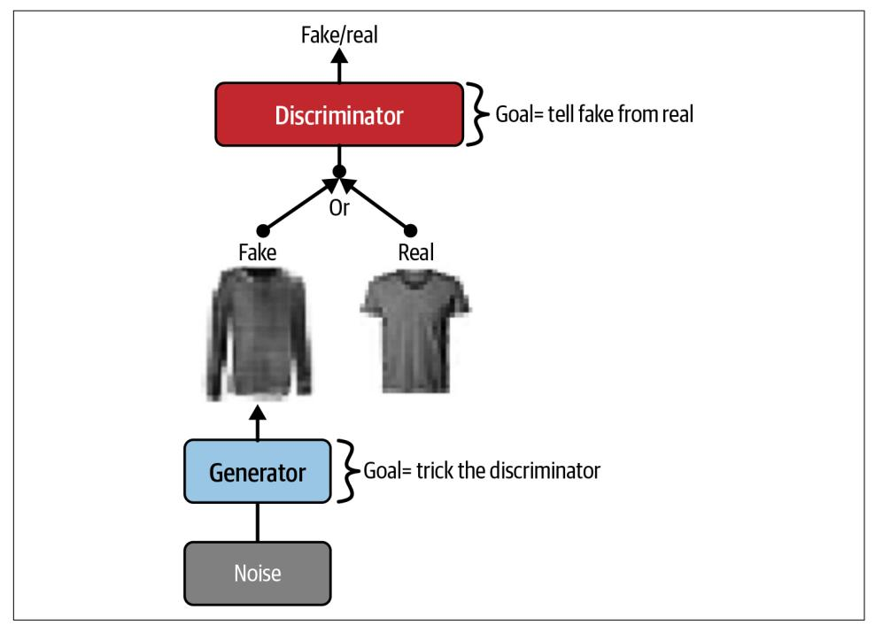

Figure 17-14. A generative adversarial network

During training, the generator and the discriminator have opposite goals: the discriminator tries to tell fake images from real images, while the generator tries to produce images that look real enough to trick the discriminator. Because the GAN is composed of two networks with different objectives, it cannot be trained like a regular neural network. Each training iteration is divided into two phases:

- In the first phase, we train the discriminator. A batch of real images is sampled from the training set and is completed with an equal number of fake images produced by the generator. The labels are set to 0 for fake images and 1 for real images, and the discriminator is trained on this labeled batch for one step, using the binary cross-entropy loss. Importantly, backpropagation only optimizes the weights of the discriminator during this phase.
- In the second phase, we train the generator. We first use it to produce another batch of fake images, and once again the discriminator is used to tell whether the images are fake or real. This time we do not add real images in the batch, and all the labels are set to 1 (real): in other words, we want the generator to

{688}------------------------------------------------

produce images that the discriminator will (wrongly) believe to be real! Crucially, the weights of the discriminator are frozen during this step, so backpropagation only affects the weights of the generator.

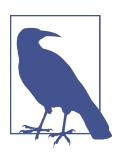

The generator never actually sees any real images, yet it gradually learns to produce convincing fake images! All it gets is the gradients flowing back through the discriminator. Fortunately, the better the discriminator gets, the more information about the real images is contained in these secondhand gradients, so the generator can make significant progress.

Let's go ahead and build a simple GAN for Fashion MNIST.

First, we need to build the generator and the discriminator. The generator is similar to an autoencoder's decoder, and the discriminator is a regular binary classifier: it takes an image as input and ends with a Dense layer containing a single unit and using the sigmoid activation function. For the second phase of each training iteration, we also need the full GAN model containing the generator followed by the discriminator:

```
codings size = 30Dense = tf.keras.layers.Dense
generator = tf.keras.Sequential(Dense(100, activation="relu", kernel_initializer="he_normal"),
    Dense(150, activation="relu", kernel_initializer="he_normal"),
    Dense(28 * 28, activation="sigmoid"),
    tf.keras.layers.Reshape([28, 28])
\mathbf{I}discriminator = tf.keras. Sequential( [tf.keras.layers.Flatten(),
    Dense(150, activation="relu", kernel_initializer="he_normal"),
    Dense(100, activation="relu", kernel initializer="he normal"),
    Dense(1, activation="sigmoid")
\left| \right\ranglegan = tf.keras.Sequential([generator, discriminator])
```

Next, we need to compile these models. As the discriminator is a binary classifier, we can naturally use the binary cross-entropy loss. The gan model is also a binary classifier, so it can use the binary cross-entropy loss as well. However, the generator will only be trained through the gan model, so we do not need to compile it at all. Importantly, the discriminator should not be trained during the second phase, so we make it non-trainable before compiling the gan model:

```
discriminator.compile(loss="binary_crossentropy", optimizer="rmsprop")
discriminator.trainable = False
gan.compile(loss="binary_crossentropy", optimizer="rmsprop")
```

{689}------------------------------------------------

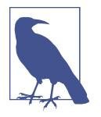

The trainable attribute is taken into account by Keras only when compiling a model, so after running this code, the discriminator is trainable if we call its fit() method or its train on batch() method (which we will be using), while it is not trainable when we call these methods on the gan model.

Since the training loop is unusual, we cannot use the regular fit() method. Instead, we will write a custom training loop. For this, we first need to create a Dataset to iterate through the images:

```
batch size = 32dataset = tf.data.Dataset.from tensor slices(X train).shuffle(buffer size=1000)
dataset = dataset.batch(batch_size, drop_remainder=True).prefetch(1)
```

We are now ready to write the training loop. Let's wrap it in a train\_gan() function:

```
def train_gan(gan, dataset, batch_size, codings_size, n_epochs):
   generator, discriminator = gan.layers
   for epoch in range(n epochs):
       for X batch in dataset:
            # phase 1 - training the discriminator
            noise = tf.random.normal(shape=[batch_size, codings_size])
            generated images = generator(noise)X fake and real = tf.concat(fgenerated images, X batch], axis=0)y1 = tf.contrib constant([[0.]] * batch_size + [[1.]] * batch_size)discriminator.train_on_batch(X_fake_and_real, y1)
            # phase 2 - training the generator
            noise = tf.random.normal(shape=[batch_size, codings_size])
            y2 = tf.contrib constant([[1.]] * batch_size)gan.train_on_batch(noise, y2)
train_gan(gan, dataset, batch_size, codings_size, n_epochs=50)
```

- As discussed earlier, you can see the two phases at each iteration:
  - In phase one we feed Gaussian noise to the generator to produce fake images, and we complete this batch by concatenating an equal number of real images. The targets y1 are set to 0 for fake images and 1 for real images. Then we train the discriminator on this batch. Remember that the discriminator is trainable in this phase, but we are not touching the generator.
  - In phase two, we feed the GAN some Gaussian noise. Its generator will start by producing fake images, then the discriminator will try to guess whether these images are fake or real. In this phase, we are trying to improve the generator, which means that we want the discriminator to fail: this is why the targets y2 are all set to 1, although the images are fake. In this phase, the discriminator is not trainable, so the only part of the gan model that will improve is the generator.

{690}------------------------------------------------

That's it! After training, you can randomly sample some codings from a Gaussian distribution, and feed them to the generator to produce new images:

```
codings = tf.random.normal(shape=[batch size, codings size])
generated_images = generator.predict(codings)
```

If you display the generated images (see Figure 17-15), you will see that at the end of the first epoch, they already start to look like (very noisy) Fashion MNIST images.


Figure 17-15. Images generated by the GAN after one epoch of training

Unfortunately, the images never really get much better than that, and you may even find epochs where the GAN seems to be forgetting what it learned. Why is that? Well, it turns out that training a GAN can be challenging. Let's see why.

### The Difficulties of Training GANs

During training, the generator and the discriminator constantly try to outsmart each other, in a zero-sum game. As training advances, the game may end up in a state that game theorists call a Nash equilibrium, named after the mathematician John Nash: this is when no player would be better off changing their own strategy, assuming the other players do not change theirs. For example, a Nash equilibrium is reached when everyone drives on the left side of the road: no driver would be better off being the only one to switch sides. Of course, there is a second possible Nash equilibrium: when everyone drives on the right side of the road. Different initial states and dynamics may lead to one equilibrium or the other. In this example, there is a single optimal strategy once an equilibrium is reached (i.e., driving on the same side as everyone else), but a Nash equilibrium can involve multiple competing strategies (e.g., a predator chases its prey, the prey tries to escape, and neither would be better off changing their strategy).

{691}------------------------------------------------

So how does this apply to GANs? Well, the authors of the GAN paper demonstrated that a GAN can only reach a single Nash equilibrium: that's when the generator produces perfectly realistic images, and the discriminator is forced to guess (50% real, 50% fake). This fact is very encouraging: it would seem that you just need to train the GAN for long enough, and it will eventually reach this equilibrium, giving you a perfect generator. Unfortunately, it's not that simple: nothing guarantees that the equilibrium will ever be reached.

The biggest difficulty is called *mode collapse*: this is when the generator's outputs gradually become less diverse. How can this happen? Suppose that the generator gets better at producing convincing shoes than any other class. It will fool the discriminator a bit more with shoes, and this will encourage it to produce even more images of shoes. Gradually, it will forget how to produce anything else. Meanwhile, the only fake images that the discriminator will see will be shoes, so it will also forget how to discriminate fake images of other classes. Eventually, when the discriminator manages to discriminate the fake shoes from the real ones, the generator will be forced to move to another class. It may then become good at shirts, forgetting about shoes, and the discriminator will follow. The GAN may gradually cycle across a few classes, never really becoming very good at any of them.

Moreover, because the generator and the discriminator are constantly pushing against each other, their parameters may end up oscillating and becoming unstable. Training may begin properly, then suddenly diverge for no apparent reason, due to these instabilities. And since many factors affect these complex dynamics, GANs are very sensitive to the hyperparameters: you may have to spend a lot of effort fine-tuning them. In fact, that's why I used RMSProp rather than Nadam when compiling the models: when using Nadam, I ran into a severe mode collapse.

These problems have kept researchers very busy since 2014: many papers have been published on this topic, some proposing new cost functions<sup>10</sup> (though a 2018 paper<sup>11</sup> by Google researchers questions their efficiency) or techniques to stabilize training or to avoid the mode collapse issue. For example, a popular technique called *experience replay* consists of storing the images produced by the generator at each iteration in a replay buffer (gradually dropping older generated images) and training the discriminator using real images plus fake images drawn from this buffer (rather than just fake images produced by the current generator). This reduces the chances that the discriminator will overfit the latest generator's outputs. Another common technique is called mini-batch discrimination: it measures how similar images are across the batch and provides this statistic to the discriminator, so it can easily reject a whole

<sup>10</sup> For a nice comparison of the main GAN losses, check out this great GitHub project by Hwalsuk Lee.

<sup>11</sup> Mario Lucic et al., "Are GANs Created Equal? A Large-Scale Study", Proceedings of the 32nd International Conference on Neural Information Processing Systems (2018): 698-707.

{692}------------------------------------------------

batch of fake images that lack diversity. This encourages the generator to produce a greater variety of images, reducing the chance of mode collapse. Other papers simply propose specific architectures that happen to perform well.

In short, this is still a very active field of research, and the dynamics of GANs are still not perfectly understood. But the good news is that great progress has been made, and some of the results are truly astounding! So let's look at some of the most successful architectures, starting with deep convolutional GANs, which were the state of the art just a few years ago. Then we will look at two more recent (and more complex) architectures.

### **Deep Convolutional GANs**

The authors of the original GAN paper experimented with convolutional layers, but only tried to generate small images. Soon after, many researchers tried to build GANs based on deeper convolutional nets for larger images. This proved to be tricky, as training was very unstable, but Alec Radford et al. finally succeeded in late 2015, after experimenting with many different architectures and hyperparameters. They called their architecture *deep convolutional GANs* (DCGANs).<sup>12</sup> Here are the main guidelines they proposed for building stable convolutional GANs:

- Replace any pooling layers with strided convolutions (in the discriminator) and transposed convolutions (in the generator).
- Use batch normalization in both the generator and the discriminator, except in the generator's output layer and the discriminator's input layer.
- Remove fully connected hidden layers for deeper architectures.
- Use ReLU activation in the generator for all layers except the output layer, which should use tanh.
- Use leaky ReLU activation in the discriminator for all layers.

These guidelines will work in many cases, but not always, so you may still need to experiment with different hyperparameters. In fact, just changing the random seed and training the exact same model again will sometimes work. Here is a small DCGAN that works reasonably well with Fashion MNIST:

<sup>12</sup> Alec Radford et al., "Unsupervised Representation Learning with Deep Convolutional Generative Adversarial Networks", arXiv preprint arXiv:1511.06434 (2015).

{693}------------------------------------------------

```
codings_size = 100generator = tf.keras.Sequential[tf.keras.layers.Dense(7 * 7 * 128).
    tf.keras.layers.Reshape([7, 7, 128]),
    tf.keras.layers.BatchNormalization(),
    tf.keras.layers.Conv2DTranspose(64, kernel_size=5, strides=2,
                                     padding="same", activation="relu"),
    tf.keras.layers.BatchNormalization(),
    tf.keras.layers.Conv2DTranspose(1, kernel_size=5, strides=2,
                                     padding="same", activation="tanh"),
\left| \right\ranglediscriminator = tf.keras. Sequential(tf.keras.layers.Conv2D(64, kernel size=5, strides=2, padding="same",
                           activation=tf.keras.layers.LeakyReLU(0.2)),
    tf.keras.layers.Dropout(0.4),
    tf.keras.layers.Conv2D(128, kernel_size=5, strides=2, padding="same",
                           activation=tf.keras.layers.LeakyReLU(0.2)),
    tf.keras.layers.Dropout(0.4).
    tf.keras.layers.Flatten(),
    tf.keras.layers.Dense(1, activation="sigmoid")
\overline{1}gan = tf.keras.Sequential([generator, discriminator])
```

The generator takes codings of size 100, projects them to 6,272 dimensions (7  $*$  7) \* 128), and reshapes the result to get a  $7 \times 7 \times 128$  tensor. This tensor is batch normalized and fed to a transposed convolutional layer with a stride of 2, which upsamples it from  $7 \times 7$  to  $14 \times 14$  and reduces its depth from 128 to 64. The result is batch normalized again and fed to another transposed convolutional layer with a stride of 2, which upsamples it from  $14 \times 14$  to  $28 \times 28$  and reduces the depth from 64 to 1. This layer uses the tanh activation function, so the outputs will range from -1 to 1. For this reason, before training the GAN, we need to rescale the training set to that same range. We also need to reshape it to add the channel dimension:

```
X_train_dcgan = X_train.reshape(-1, 28, 28, 1) * 2. - 1. # reshape and rescale
```

The discriminator looks much like a regular CNN for binary classification, except instead of using max pooling layers to downsample the image, we use strided convolutions (strides=2). Note that we use the leaky ReLU activation function. Overall, we respected the DCGAN guidelines, except we replaced the BatchNormalization layers in the discriminator with Dropout layers; otherwise, training was unstable in this case. Feel free to tweak this architecture: you will see how sensitive it is to the hyperparameters, especially the relative learning rates of the two networks.

Lastly, to build the dataset and then compile and train this model, we can use the same code as earlier. After 50 epochs of training, the generator produces images like those shown in Figure 17-16. It's still not perfect, but many of these images are pretty convincing.

{694}------------------------------------------------

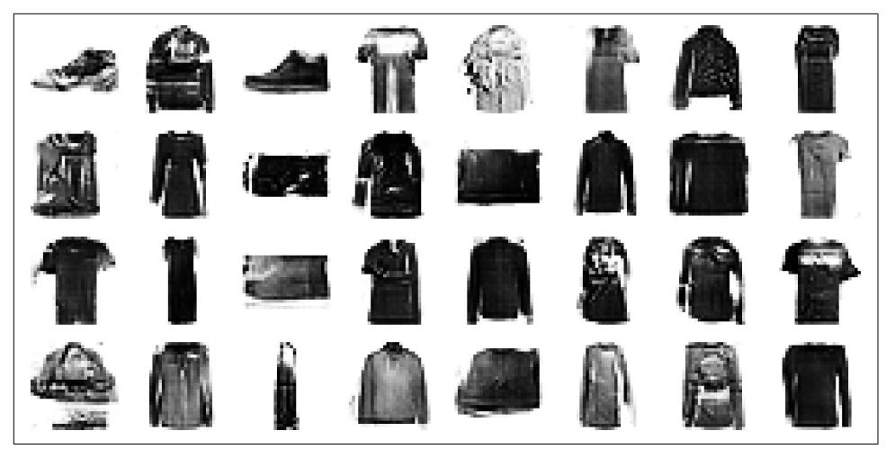

Figure 17-16. Images generated by the DCGAN after 50 epochs of training

If you scale up this architecture and train it on a large dataset of faces, you can get fairly realistic images. In fact, DCGANs can learn quite meaningful latent representations, as you can see in Figure 17-17: many images were generated, and nine of them were picked manually (top left), including three representing men with glasses, three men without glasses, and three women without glasses. For each of these categories, the codings that were used to generate the images were averaged, and an image was generated based on the resulting mean codings (lower left). In short, each of the three lower-left images represents the mean of the three images located above it. But this is not a simple mean computed at the pixel level (this would result in three overlapping faces), it is a mean computed in the latent space, so the images still look like normal faces. Amazingly, if you compute men with glasses, minus men without glasses, plus women without glasses—where each term corresponds to one of the mean codings—and you generate the image that corresponds to this coding, you get the image at the center of the  $3 \times 3$  grid of faces on the right: a woman with glasses! The eight other images around it were generated based on the same vector plus a bit of noise, to illustrate the semantic interpolation capabilities of DCGANs. Being able to do arithmetic on faces feels like science fiction!

DCGANs aren't perfect, though. For example, when you try to generate very large images using DCGANs, you often end up with locally convincing features but overall inconsistencies, such as shirts with one sleeve much longer than the other, different earrings, or eyes looking in opposite directions. How can you fix this?

{695}------------------------------------------------

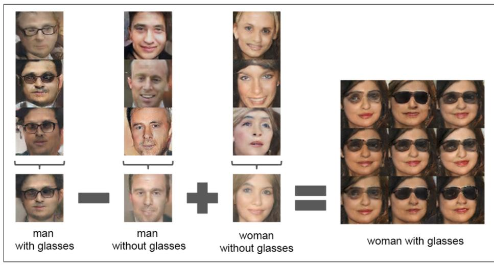

Figure 17-17. Vector arithmetic for visual concepts (part of figure 7 from the DCGAN  $paper$ <sup>13</sup>


If you add each image's class as an extra input to both the generator and the discriminator, they will both learn what each class looks like, and thus you will be able to control the class of each image produced by the generator. This is called a conditional GAN(CGAN).<sup>14</sup>

### **Progressive Growing of GANs**

In a 2018 paper,<sup>15</sup> Nvidia researchers Tero Kerras et al. proposed an important technique: they suggested generating small images at the beginning of training, then gradually adding convolutional layers to both the generator and the discriminator to produce larger and larger images ( $4 \times 4$ ,  $8 \times 8$ ,  $16 \times 16$ , ...,  $512 \times 512$ ,  $1,024 \times$ 1,024). This approach resembles greedy layer-wise training of stacked autoencoders. The extra layers get added at the end of the generator and at the beginning of the discriminator, and previously trained layers remain trainable.

For example, when growing the generator's outputs from  $4 \times 4$  to  $8 \times 8$  (see Figure 17-18), an upsampling layer (using nearest neighbor filtering) is added to the

<sup>13</sup> Reproduced with the kind authorization of the authors.

<sup>14</sup> Mehdi Mirza and Simon Osindero, "Conditional Generative Adversarial Nets", arXiv preprint arXiv:1411.1784 (2014).

<sup>15</sup> Tero Karras et al., "Progressive Growing of GANs for Improved Quality, Stability, and Variation", Proceedings of the International Conference on Learning Representations (2018).

{696}------------------------------------------------

existing convolutional layer ("Conv 1") to produce  $8 \times 8$  feature maps. These are fed to the new convolutional layer ("Conv 2"), which in turn feeds into a new output convolutional layer. To avoid breaking the trained weights of Conv 1, we gradually fade in the two new convolutional layers (represented with dashed lines in Figure 17-18) and fade out the original output layer. The final outputs are a weighted sum of the new outputs (with weight  $\alpha$ ) and the original outputs (with weight  $1 - \alpha$ ), slowly increasing  $\alpha$  from 0 to 1. A similar fade-in/fade-out technique is used when a new convolutional layer is added to the discriminator (followed by an average pooling layer for downsampling). Note that all convolutional layers use "same" padding and strides of 1, so they preserve the height and width of their inputs. This includes the original convolutional layer, so it now produces  $8 \times 8$  outputs (since its inputs are now  $8 \times 8$ ). Lastly, the output layers use kernel size 1. They just project their inputs down to the desired number of color channels (typically 3).

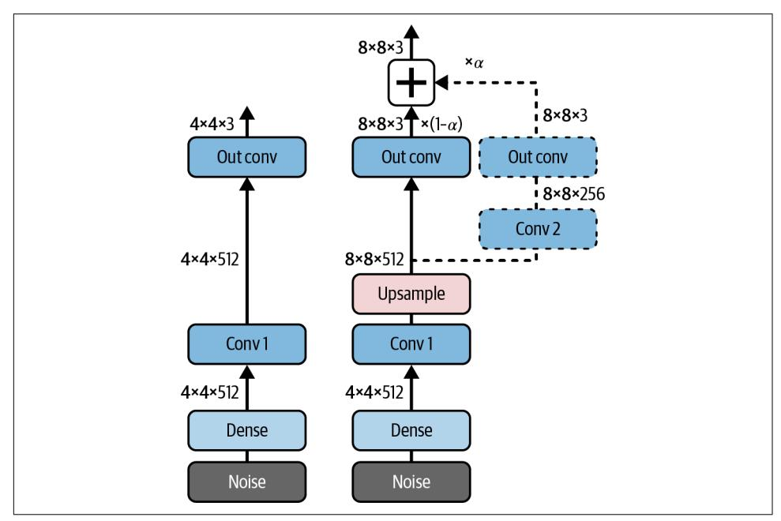

Figure 17-18. A progressively growing GAN: a GAN generator outputs  $4 \times 4$  color images (left); we extend it to output  $8 \times 8$  images (right)

The paper also introduced several other techniques aimed at increasing the diversity of the outputs (to avoid mode collapse) and making training more stable:

#### Mini-batch standard deviation layer

Added near the end of the discriminator. For each position in the inputs, it computes the standard deviation across all channels and all instances in the batch  $(S = tf.math.readuce_std(inputs, axis=[0, -1]))$ . These standard deviations

{697}------------------------------------------------

are then averaged across all points to get a single value  $(v = tf.readuce$ mean(S)). Finally, an extra feature map is added to each instance in the batch and filled with the computed value (tf.concat([inputs, tf.fill([batch\_size, height, width,  $1$ ], v)], axis=-1). How does this help? Well, if the generator produces images with little variety, then there will be a small standard deviation across feature maps in the discriminator. Thanks to this layer, the discriminator will have easy access to this statistic, making it less likely to be fooled by a generator that produces too little diversity. This will encourage the generator to produce more diverse outputs, reducing the risk of mode collapse.

Equalized learning rate

Initializes all weights using a Gaussian distribution with mean 0 and standard deviation 1 rather than using He initialization. However, the weights are scaled down at runtime (i.e., every time the layer is executed) by the same factor as in He initialization: they are divided by  $\sqrt{\frac{2}{n}}$  where  $n_{\text{inputs}}$  is the number of inputs to the layer. The paper demonstrated that this technique significantly improved the GAN's performance when using RMSProp, Adam, or other adaptive gradient optimizers. Indeed, these optimizers normalize the gradient updates by their estimated standard deviation (see Chapter 11), so parameters that have a larger dynamic range<sup>16</sup> will take longer to train, while parameters with a small dynamic range may be updated too quickly, leading to instabilities. By rescaling the weights as part of the model itself rather than just rescaling them upon initialization, this approach ensures that the dynamic range is the same for all parameters throughout training, so they all learn at the same speed. This both speeds up and stabilizes training.

Pixelwise normalization layer

Added after each convolutional layer in the generator. It normalizes each activation based on all the activations in the same image and at the same location, but across all channels (dividing by the square root of the mean squared activation). In TensorFlow code, this is inputs /  $tf.sqrt(tf.readuce_mean(tf-square(X),$  $axis=-1$ , keepdims=True) + 1e-8) (the smoothing term 1e-8 is needed to avoid division by zero). This technique avoids explosions in the activations due to excessive competition between the generator and the discriminator.

The combination of all these techniques allowed the authors to generate extremely convincing high-definition images of faces. But what exactly do we call "convincing"? Evaluation is one of the big challenges when working with GANs: although it is possible to automatically evaluate the diversity of the generated images, judging their quality is a much trickier and subjective task. One technique is to use human raters,

<sup>16</sup> The dynamic range of a variable is the ratio between the highest and the lowest value it may take.

{698}------------------------------------------------

but this is costly and time-consuming. So, the authors proposed to measure the similarity between the local image structure of the generated images and the training images, considering every scale. This idea led them to another groundbreaking innovation: StyleGANs.

### **StyleGANs**

The state of the art in high-resolution image generation was advanced once again by the same Nvidia team in a 2018 paper<sup>17</sup> that introduced the popular StyleGAN architecture. The authors used *style transfer* techniques in the generator to ensure that the generated images have the same local structure as the training images, at every scale, greatly improving the quality of the generated images. The discriminator and the loss function were not modified, only the generator. A StyleGAN generator is composed of two networks (see Figure 17-19):

Mapping network

An eight-layer MLP that maps the latent representations z (i.e., the codings) to a vector w. This vector is then sent through multiple affine transformations (i.e., Dense layers with no activation functions, represented by the "A" boxes in Figure 17-19), which produces multiple vectors. These vectors control the style of the generated image at different levels, from fine-grained texture (e.g., hair color) to high-level features (e.g., adult or child). In short, the mapping network maps the codings to multiple style vectors.

Synthesis network

Responsible for generating the images. It has a constant learned input (to be clear, this input will be constant after training, but *during* training it keeps getting tweaked by backpropagation). It processes this input through multiple convolutional and upsampling layers, as earlier, but there are two twists. First, some noise is added to the input and to all the outputs of the convolutional layers (before the activation function). Second, each noise layer is followed by an *adaptive instance normalization* (AdaIN) layer: it standardizes each feature map independently (by subtracting the feature map's mean and dividing by its standard deviation), then it uses the style vector to determine the scale and offset of each feature map (the style vector contains one scale and one bias term for each feature map).

<sup>17</sup> Tero Karras et al., "A Style-Based Generator Architecture for Generative Adversarial Networks", arXiv preprint arXiv:1812.04948 (2018).

{699}------------------------------------------------

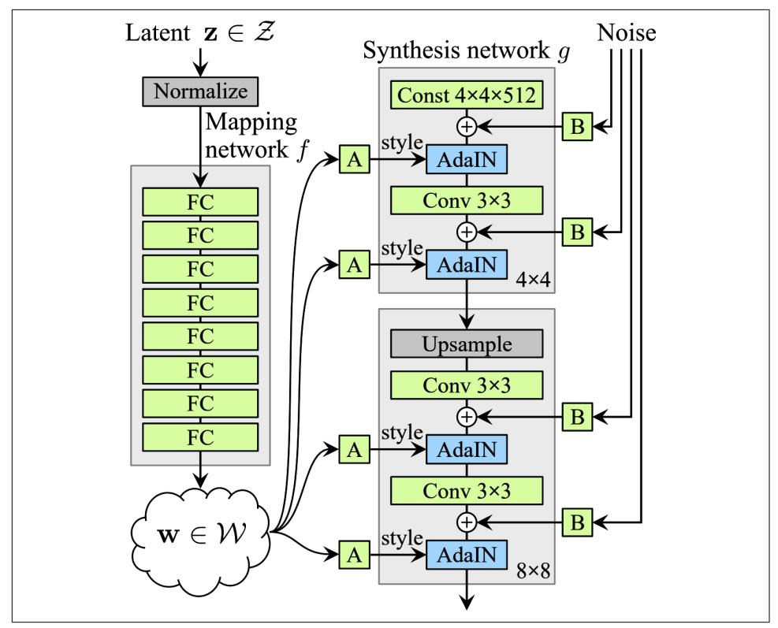

Figure 17-19. StyleGAN's generator architecture (part of Figure 1 from the StyleGAN  $paper)^{18}$ 

The idea of adding noise independently from the codings is very important. Some parts of an image are quite random, such as the exact position of each freckle or hair. In earlier GANs, this randomness had to either come from the codings or be some pseudorandom noise produced by the generator itself. If it came from the codings, it meant that the generator had to dedicate a significant portion of the codings' representational power to storing noise, which this is quite wasteful. Moreover, the noise had to be able to flow through the network and reach the final layers of the generator: this seems like an unnecessary constraint that probably slowed down training. And finally, some visual artifacts may appear because the same noise was used at different levels. If instead the generator tried to produce its own pseudorandom noise, this noise might not look very convincing, leading to more visual artifacts. Plus, part of the generator's weights would be dedicated to generating pseudorandom noise, which again seems wasteful. By adding extra noise inputs, all these issues are avoided; the

<sup>18</sup> Reproduced with the kind authorization of the authors.

{700}------------------------------------------------

GAN is able to use the provided noise to add the right amount of stochasticity to each part of the image.

The added noise is different for each level. Each noise input consists of a single feature map full of Gaussian noise, which is broadcast to all feature maps (of the given level) and scaled using learned per-feature scaling factors (this is represented by the "B" boxes in Figure 17-19) before it is added.

Finally, StyleGAN uses a technique called mixing regularization (or style mixing), where a percentage of the generated images are produced using two different codings. Specifically, the codings  $c_1$  and  $c_2$  are sent through the mapping network, giving two style vectors  $w_1$  and  $w_2$ . Then the synthesis network generates an image based on the styles  $w_1$  for the first levels and the styles  $w_2$  for the remaining levels. The cutoff level is picked randomly. This prevents the network from assuming that styles at adjacent levels are correlated, which in turn encourages locality in the GAN, meaning that each style vector only affects a limited number of traits in the generated image.

There is such a wide variety of GANs out there that it would require a whole book to cover them all. Hopefully this introduction has given you the main ideas, and most importantly the desire to learn more. Go ahead and implement your own GAN, and do not get discouraged if it has trouble learning at first: unfortunately, this is normal, and it will require quite a bit of patience to get it working, but the result is worth it. If you're struggling with an implementation detail, there are plenty of Keras or TensorFlow implementations that you can look at. In fact, if all you want is to get some amazing results quickly, then you can just use a pretrained model (e.g., there are pretrained StyleGAN models available for Keras).

Now that we've examined autoencoders and GANs, let's look at one last type of architecture: diffusion models.

### **Diffusion Models**

The ideas behind diffusion models have been around for many years, but they were first formalized in their modern form in a 2015 paper<sup>19</sup> by Jascha Sohl-Dickstein et al. from Stanford University and UC Berkeley. The authors applied tools from thermodynamics to model a diffusion process, similar to a drop of milk diffusing in a cup of tea. The core idea is to train a model to learn the reverse process: start from the completely mixed state, and gradually "unmix" the milk from the tea. Using this idea, they obtained promising results in image generation, but since GANs produced more convincing images back then, diffusion models did not get as much attention.

<sup>19</sup> Jascha Sohl-Dickstein et al., "Deep Unsupervised Learning using Nonequilibrium Thermodynamics", arXiv preprint arXiv:1503.03585 (2015).

{701}------------------------------------------------

Then, in 2020, Jonathan Ho et al., also from UC Berkeley, managed to build a diffusion model capable of generating highly realistic images, which they called a *denoising diffusion probabilistic model* (DDPM).<sup>20</sup> A few months later, a 2021 paper<sup>21</sup> by OpenAI researchers Alex Nichol and Prafulla Dhariwal analyzed the DDPM architecture and proposed several improvements that allowed DDPMs to finally beat GANs: not only are DDPMs much easier to train than GANs, but the generated images are more diverse and of even higher quality. The main downside of DDPMs, as you will see, is that they take a very long time to generate images, compared to GANs or VAEs.

So how exactly does a DDPM work? Well, suppose you start with a picture of a cat (like the one you'll see in Figure 17-20), noted  $\mathbf{x}_0$ , and at each time step t you add a little bit of Gaussian noise to the image, with mean 0 and variance  $\beta$ . This noise is independent for each pixel: we call it *isotropic*. You first obtain the image  $\mathbf{x}_1$ , then  $\mathbf{x}_2$ , and so on, until the cat is completely hidden by the noise, impossible to see. The last time step is noted T. In the original DDPM paper, the authors used  $T = 1,000$ , and they scheduled the variance  $\beta_t$  in such a way that the cat signal fades linearly between time steps 0 and  $T$ . In the improved DDPM paper,  $T$  was bumped up to 4,000, and the variance schedule was tweaked to change more slowly at the beginning and at the end. In short, we're gradually drowning the cat in noise: this is called the *forward* process.

As we add more and more Gaussian noise in the forward process, the distribution of pixel values becomes more and more Gaussian. One important detail I left out is that the pixel values get rescaled slightly at each step, by a factor of  $\sqrt{1 - \beta_t}$ . This ensures that the mean of the pixel values gradually approaches 0, since the scaling factor is a bit smaller than 1 (imagine repeatedly multiplying a number by 0.99). It also ensures that the variance will gradually converge to 1. This is because the standard deviation of the pixel values also gets scaled by  $\sqrt{1-\beta_t}$ , so the variance gets scaled by  $1-\beta_t$ (i.e., the square of the scaling factor). But the variance cannot shrink to 0 since we're adding Gaussian noise with variance  $\beta$ , at each step. And since variances add up when you sum Gaussian distributions, you can see that the variance can only converge to  $1 - \beta_t + \beta_t = 1.$ 

The forward diffusion process is summarized in Equation 17-5. This equation won't teach you anything new about the forward process, but it's useful to understand this type of mathematical notation, as it's often used in ML papers. This equation defines the probability distribution q of  $\mathbf{x}_t$  given  $\mathbf{x}_{t-1}$  as a Gaussian distribution with mean  $\mathbf{x}_{t-1}$ times the scaling factor, and with a covariance matrix equal to  $\beta_i$ . This is the identity matrix I multiplied by  $\beta$ , which means that the noise is isotropic with variance  $\beta$ .

<sup>20</sup> Jonathan Ho et al., "Denoising Diffusion Probabilistic Models" (2020).

<sup>21</sup> Alex Nichol and Prafulla Dhariwal, "Improved Denoising Diffusion Probabilistic Models" (2021).

{702}------------------------------------------------

Equation 17-5. Probability distribution q of the forward diffusion process  $q(\mathbf{x}_t | \mathbf{x}_{t-1}) = \mathcal{N}(\sqrt{1-\beta_t} \mathbf{x}_{t-1}, \beta_t \mathbf{I})$ 

Interestingly, there's a shortcut for the forward process: it's possible to sample an image  $\mathbf{x}_i$  given  $\mathbf{x}_0$  without having to first compute  $\mathbf{x}_1, \mathbf{x}_2, ..., \mathbf{x}_{t-1}$ . Indeed, since the sum of multiple Gaussian distributions is also a Gaussian distribution, all the noise can be added in just one shot using Equation 17-6. This is the equation we will be using, as it is much faster.

Equation 17-6. Shortcut for the forward diffusion process

$$
q(\mathbf{x}_t | \mathbf{x}_0) = \mathcal{N}\left(\sqrt{\overline{\alpha}_t} \mathbf{x}_0, \left(1 - \overline{\alpha}_t\right) \mathbf{I}\right)
$$

Our goal, of course, is not to drown cats in noise. On the contrary, we want to create many new cats! We can do so by training a model that can perform the reverse process: going from  $x_i$ , to  $x_{i-1}$ . We can then use it to remove a tiny bit of noise from an image, and repeat the operation many times until all the noise is gone. If we train the model on a dataset containing many cat images, then we can give it a picture entirely full of Gaussian noise, and the model will gradually make a brand new cat appear (see Figure 17-20).


Figure 17-20. The forward process q and reverse process p

OK, so let's start coding! The first thing we need to do is to code the forward process. For this, we will first need to implement the variance schedule. How can we control how fast the cat disappears? Initially, 100% of the variance comes from the original cat image. Then at each time step t, the variance gets multiplied by  $1 - \beta_p$  as explained earlier, and noise gets added. So, the part of the variance that comes from the initial distribution shrinks by a factor of  $1 - \beta$ , at each step. If we define  $\alpha_i = 1 - \beta_i$ , then after *t* time steps, the cat signal will have been multiplied by a factor of  $\overline{\alpha_t} = \alpha_1 \times \alpha_2 \times ... \times \alpha_t =$  $\overline{\alpha}_t = \prod_{i=1}^t \alpha_t$ . It's this "cat signal" factor  $\overline{\alpha_t}$  that we want to schedule so it shrinks down

{703}------------------------------------------------

from 1 to 0 gradually between time steps 0 and *T*. In the improved DDPM paper, the authors schedule  $\alpha_t$  according to Equation 17-7. This schedule is represented in Figure 17-21.

Equation 17-7. Variance schedule equations for the forward diffusion process

$$
\beta_t = 1 - \frac{\overline{\alpha}_t}{\overline{\alpha}_{t-1}},
$$
 with  $\overline{\alpha}_t = \frac{f(t)}{f(0)}$  and  $f(t) = \cos\left(\frac{t/T + s}{1 + s} \cdot \frac{\pi}{2}\right)^2$ 

In these equations:

- *s* is a tiny value which prevents  $\beta_t$  from being too small near  $t = 0$ . In the paper, the authors used  $s = 0.008$ .
- $\beta_t$  is clipped to be no larger than 0.999, to avoid instabilities near  $t = T$ .

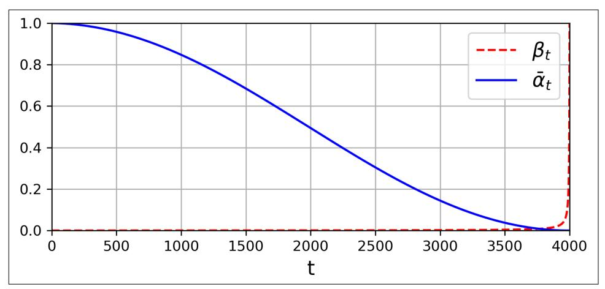

Figure 17-21. Noise variance schedule  $\beta_{v}$  and the remaining signal variance  $\alpha_{t}$ 

Let's create a small function to compute  $\alpha_i$ ,  $\beta_i$ , and  $\overline{\alpha_i}$ , and call it with  $T = 4,000$ :

```
def variance_schedule(T, s=0.008, max_beta=0.999):
    t = np.arange(T + 1)f = np.cos((t / T + s) / (1 + s) * np.pi / 2) ** 2
    alpha = npclip(f[1:] / f[:-1], 1 - max_beta, 1)alpha = np.append(1, alpha).astype(np.float32) # add a_0 = 1beta = 1 - alphaalpha cumprod = np.cumprod(alpha)return alpha, alpha_cumprod, beta # a_t, \overline{a}_t, \beta_t for t = \emptyset to T
T = 4000alpha, alpha cumprod, beta = variance_schedule(T)
```

{704}------------------------------------------------

To train our model to reverse the diffusion process, we will need noisy images from different time steps of the forward process. For this, let's create a prepare batch() function that will take a batch of clean images from the dataset and prepare them:

```
def prepare_batch(X):
    X = tf.cast(X[... , tf.newaxis], tf.float32) * 2 - 1 # scale from -1 to +1X shape = tf.shape(X)t = tf.random.uniform([X.shape[0]], minval=1, maxval=T + 1, dtype=tf.int32)alpha_c m = tf.gather(alpha_cumprod, t)alpha_{\text{cm}} = tf.\text{reshape}(\text{alpha\_cm}, [X_\text{shape[0]}] + [1] * (\text{len}(X_\text{shape}) - 1))noise = tf.random.normal(X shape)return <sub>f</sub>"X_noisy": alpha_cm ** 0.5 * X + (1 - alpha_cm) ** 0.5 * noise,
        "time": t,
    }, noise
```

Let's go through this code:

- For simplicity we will use Fashion MNIST, so the function must first add a channel axis. It will also help to scale the pixel values from -1 to 1, so it's closer to the final Gaussian distribution with mean 0 and variance 1.
- Next, the function creates t, a vector containing a random time step for each image in the batch, between 1 and T.
- Then it uses tf.gather() to get the value of alpha\_cumprod for each of the time steps in the vector t. This gives us the vector alpha\_cm, containing one value of  $\alpha_t$ for each image.
- The next line reshapes the alpha\_cm from  $[batch size]$  to  $[batch size, 1, 1, 1]$ . This is needed to ensure alpha\_cm can be broadcasted with the batch X.
- Then we generate some Gaussian noise with mean 0 and variance 1.
- Lastly, we use Equation 17-6 to apply the diffusion process to the images. Note that  $x \rightarrow x$  0.5 is equal to the square root of x. The function returns a tuple containing the inputs and the targets. The inputs are represented as a Python dict containing the noisy images and the time steps used to generate them. The targets are the Gaussian noise used to generate each image.

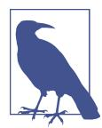

With this setup, the model will predict the noise that should be subtracted from the input image to get the original image. Why not predict the original image directly? Well, the authors tried: it simply doesn't work as well.

{705}------------------------------------------------

Next, we'll create a training dataset and a validation set that will apply the prepare batch() function to every batch. As earlier, X train and X valid contain the Fashion MNIST images with pixel values ranging from 0 to 1:

```
def prepare_dataset(X, batch_size=32, shuffle=False):
    ds = tf.data.DataFrameListener.from tensor slices(X)if shuffle:
        ds = ds.shuffle(buffer_size=10_000)return ds.batch(batch size).map(prepare batch).prefetch(1)
train set = prepare dataset(X train, batch size=32, shuffle=True)
valid set = prepare dataset(X valid, batch size=32)
```

Now we're ready to build the actual diffusion model itself. It can be any model you want, as long as it takes the noisy images and time steps as inputs, and predicts the noise to subtract from the input images:

```
def build diffusion model():
   X_noisy = tf.keras.layers.Input(shape=[28, 28, 1], name="X_noisy")
    time_input = tf.keras.layers.Input(shape=[], dtype=tf.int32, name="time")
    [...] # build the model based on the noisy images and the time steps
    outputs = [\dots] # predict the noise (same shape as the input images)
    return tf.keras.Model(inputs=[X noisy, time input], outputs=[outputs])
```

The DDPM authors used a modified U-Net architecture,<sup>22</sup> which has many similarities with the FCN architecture we discussed in Chapter 14 for semantic segmentation: it's a convolutional neural network that gradually downsamples the input images, then gradually upsamples them again, with skip connections crossing over from each level of the downsampling part to the corresponding level in the upsampling part. To take into account the time steps, they encoded them using the same technique as the positional encodings in the transformer architecture (see Chapter 16). At every level in the U-Net architecture, they passed these time encodings through Dense layers and fed them to the U-Net. Lastly, they also used multi-head attention layers at various levels. See this chapter's notebook for a basic implementation, or https://homl.info/ ddpmcode for the official implementation: it's based on TF 1.x, which is deprecated, but it's quite readable.

WE can now train the model normally. The authors noted that using the MAE loss worked better than the MSE. You can also use the Huber loss:

```
model = build_diffusion_model()
model.compile(loss=tf.keras.losses.Huber(), optimizer="nadam")
history = model.fit(train_set, validation_data=valid_set, epochs=100)
```

<sup>22</sup> Olaf Ronneberger et al., "U-Net: Convolutional Networks for Biomedical Image Segmentation", arXiv preprint arXiv:1505.04597 (2015).

{706}------------------------------------------------

Once the model is trained, you can use it to generate new images. Unfortunately, there's no shortcut in the reverse diffusion process, so you have to sample  $x_T$ randomly from a Gaussian distribution with mean 0 and variance 1, then pass it to the model to predict the noise; subtract it from the image using Equation 17-8, and you get  $\mathbf{x}_{T-1}$ . Repeat the process 3,999 more times until you get  $\mathbf{x}_0$ : if all went well, it should look like a regular Fashion MNIST image!

Equation 17-8. Going one step in reverse in the diffusion process

$$
\mathbf{x}_{t-1} = \frac{1}{\sqrt{\alpha_t}} \left( \mathbf{x}_t - \frac{\beta_t}{\sqrt{1 - \overline{\alpha}_t}} \mathbf{e}_0 \bigg( \mathbf{x}_t, t \bigg) \right) + \sqrt{\beta_t} \mathbf{z}
$$

In this equation,  $\epsilon_{\theta}(\mathbf{x}, t)$  represents the noise predicted by the model given the input image  $x_i$ , and the time step t. The  $\theta$  represents the model parameters. Moreover, z is Gaussian noise with mean 0 and variance 1. This makes the reverse process stochastic: if you run it multiple times, you will get different images.

Let's write a function that implements this reverse process, and call it to generate a few images:

```
def generate(model, batch size=32):
    X = tf.random.normal([batch_size, 28, 28, 1])for t in range(T, 0, -1):
        noise = (tf.random.normal if t > 1 else tf.zeros)(tf.shape(X))X_noise = model({"X_noisy": X, "time": tf.constant([t] * batch_size)})
        X = C1 / alpha[t] ** 0.5* (X - beta[t] / (1 - alpha_cumprod[t]) ** 0.5 * X_noise)+ (1 - alpha[t]) ** 0.5 * noise\lambdareturn X
```

```
X gen = generate(model) # generated images
```

This may take a minute or two. That's the main drawback of diffusion models: generating images is slow since the model needs to be called many times. It's possible to make this faster by using a smaller  $T$  value, or by using the same model prediction for several steps at a time, but the resulting images may not look as nice. That said, despite this speed limitation, diffusion models do produce high-quality and diverse images, as you can see in Figure 17-22.

{707}------------------------------------------------

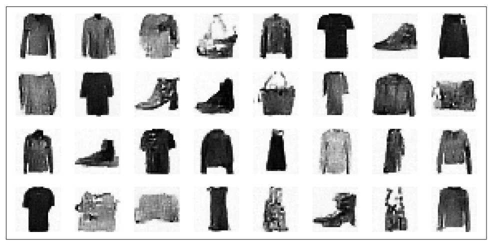

Figure 17-22. Images generated by the DDPM

Diffusion models have made tremendous progress recently. In particular, a paper published in December 2021 by Robin Rombach, Andreas Blattmann, et al.,<sup>23</sup> introduced latent diffusion models, where the diffusion process takes place in latent space, rather than in pixel space. To achieve this, a powerful autoencoder is used to compress each training image into a much smaller latent space, where the diffusion process takes place, then the autoencoder is used to decompress the final latent representation, generating the output image. This considerably speeds up image generation, and reduces training time and cost dramatically. Importantly, the quality of the generated images is outstanding.

Moreover, the researchers also adapted various conditioning techniques to guide the diffusion process using text prompts, images, or any other inputs. This makes it possible to quickly produce a beautiful, high-resolution image of a salamander reading a book, or anything else you might fancy. You can also condition the image generation process using an input image. This enables many applications, such as outpainting—where an input image is extended beyond its borders—or inpainting where holes in an image are filled in.

Lastly, a powerful pretrained latent diffusion model named Stable Diffusion was open sourced in August 2022 by a collaboration between LMU Munich and a few companies, including StabilityAI, and Runway, with support from EleutherAI and LAION. In September 2022, it was ported to TensorFlow and included in KerasCV, a computer vision library built by the Keras team. Now anyone can generate mind-

<sup>23</sup> Robin Rombach, Andreas Blattmann, et al., "High-Resolution Image Synthesis with Latent Diffusion Models", arXiv preprint arXiv:2112.10752 (2021).

{708}------------------------------------------------

blowing images in seconds, for free, even on a regular laptop (see the last exercise in this chapter). The possibilities are endless!

In the next chapter we will move on to an entirely different branch of deep learning: deep reinforcement learning.

### **Fxercises**

- 1. What are the main tasks that autoencoders are used for?
- 2. Suppose you want to train a classifier, and you have plenty of unlabeled training data but only a few thousand labeled instances. How can autoencoders help? How would you proceed?
- 3. If an autoencoder perfectly reconstructs the inputs, is it necessarily a good autoencoder? How can you evaluate the performance of an autoencoder?
- 4. What are undercomplete and overcomplete autoencoders? What is the main risk of an excessively undercomplete autoencoder? What about the main risk of an overcomplete autoencoder?
- 5. How do you tie weights in a stacked autoencoder? What is the point of doing so?
- 6. What is a generative model? Can you name a type of generative autoencoder?
- 7. What is a GAN? Can you name a few tasks where GANs can shine?
- 8. What are the main difficulties when training GANs?
- 9. What are diffusion models good at? What is their main limitation?
- 10. Try using a denoising autoencoder to pretrain an image classifier. You can use MNIST (the simplest option), or a more complex image dataset such as CIFAR10 if you want a bigger challenge. Regardless of the dataset you're using, follow these steps:
  - a. Split the dataset into a training set and a test set. Train a deep denoising autoencoder on the full training set.
  - b. Check that the images are fairly well reconstructed. Visualize the images that most activate each neuron in the coding layer.
  - c. Build a classification DNN, reusing the lower layers of the autoencoder. Train it using only 500 images from the training set. Does it perform better with or without pretraining?
- 11. Train a variational autoencoder on the image dataset of your choice, and use it to generate images. Alternatively, you can try to find an unlabeled dataset that you are interested in and see if you can generate new samples.

{709}------------------------------------------------

- 12. Train a DCGAN to tackle the image dataset of your choice, and use it to generate images. Add experience replay and see if this helps. Turn it into a conditional GAN where you can control the generated class.
- 13. Go through KerasCV's excellent Stable Diffusion tutorial, and generate a beautiful drawing of a salamander reading a book. If you post your best drawing on Twitter, please tag me at @aureliengeron. I'd love to see your creations!

Solutions to these exercises are available at the end of this chapter's notebook, at https://homl.info/colab3.

{710}------------------------------------------------
