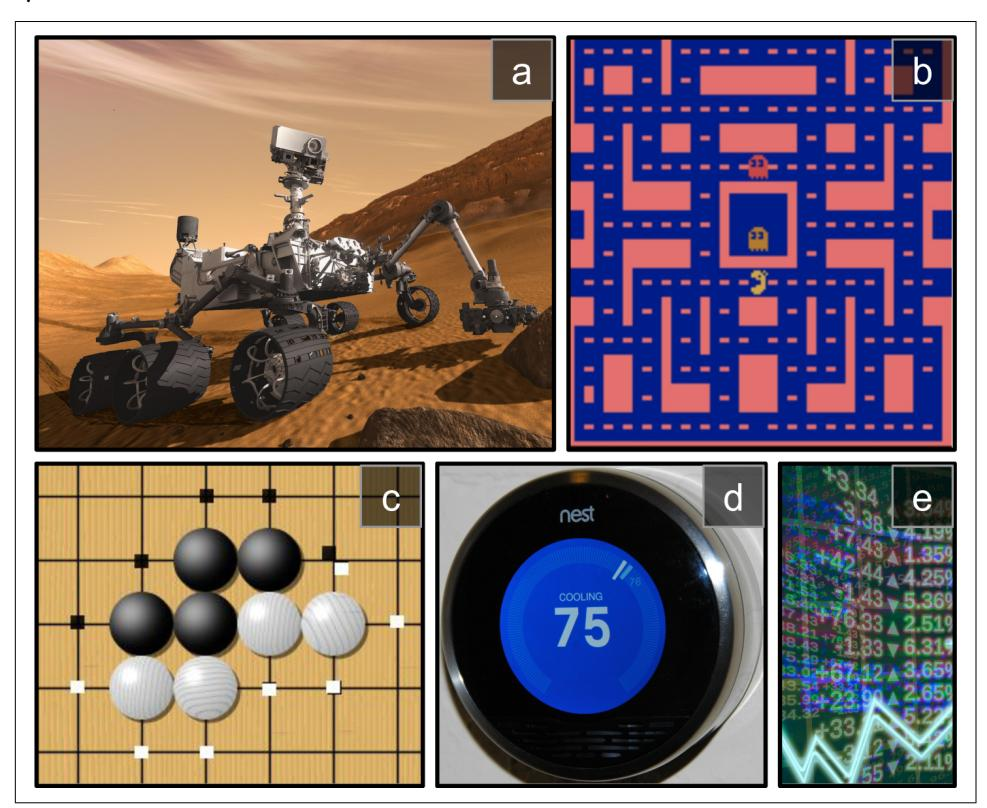
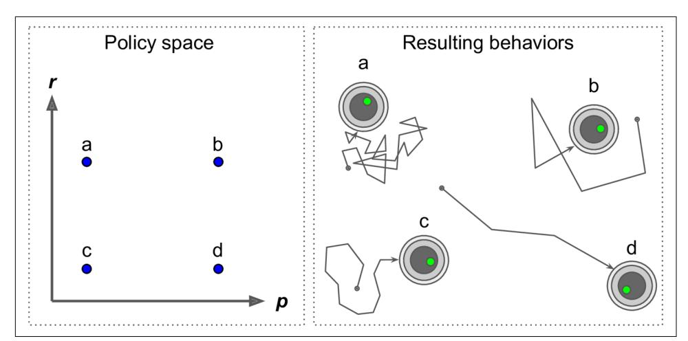
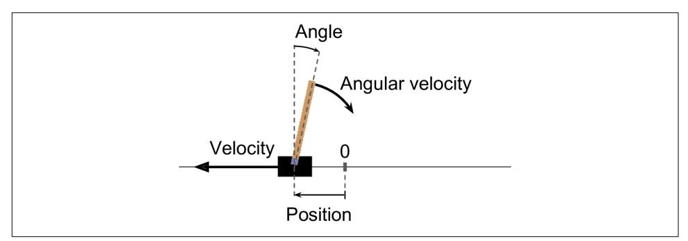
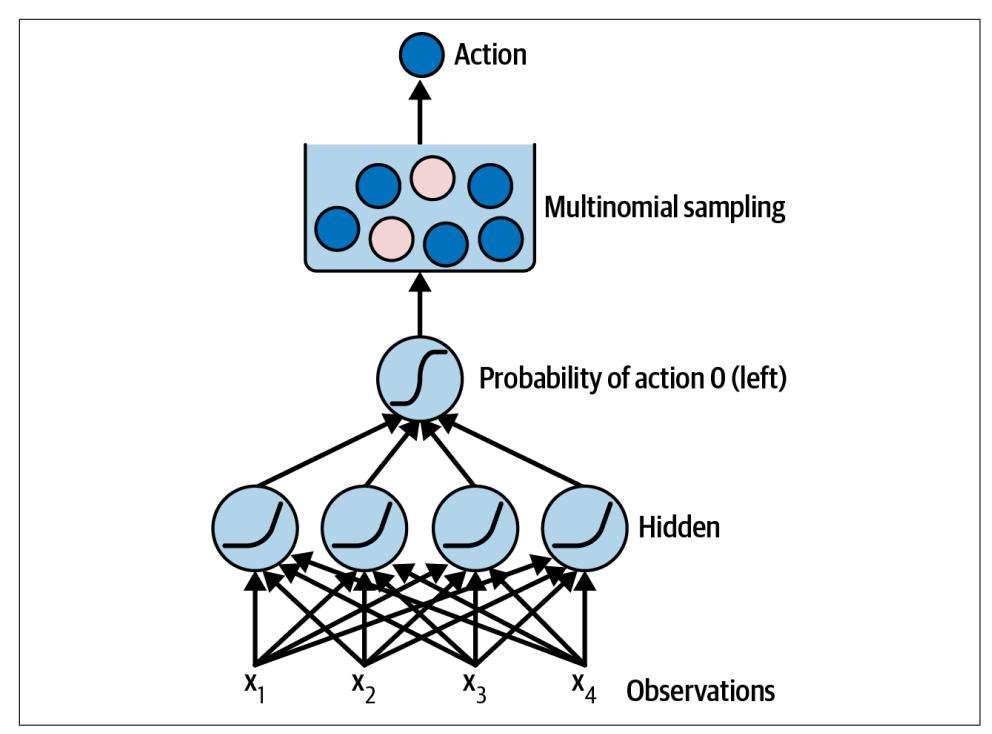
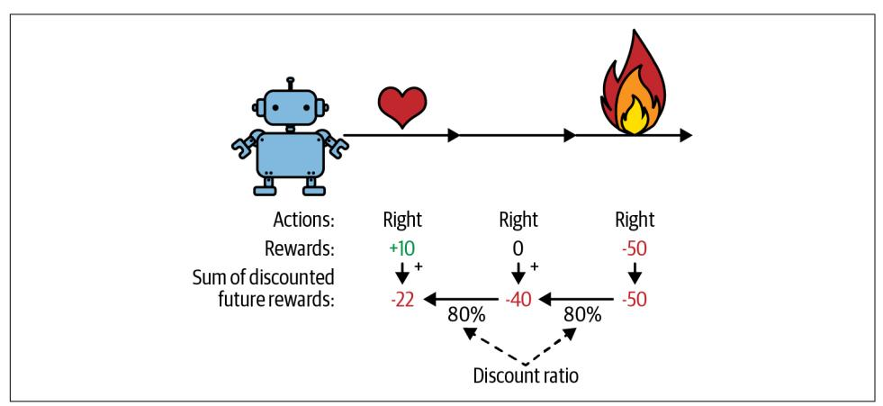
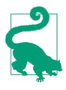
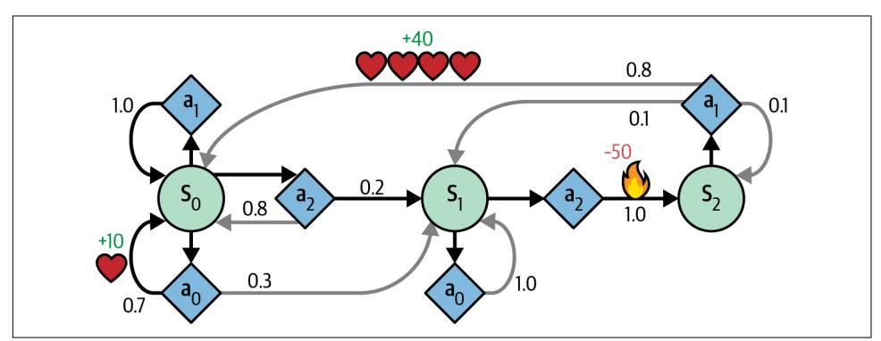
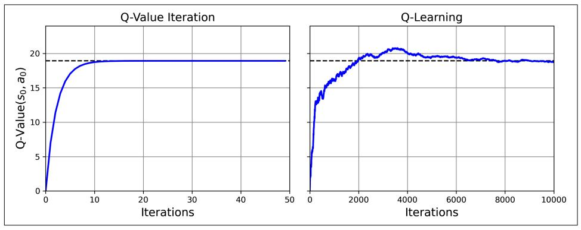
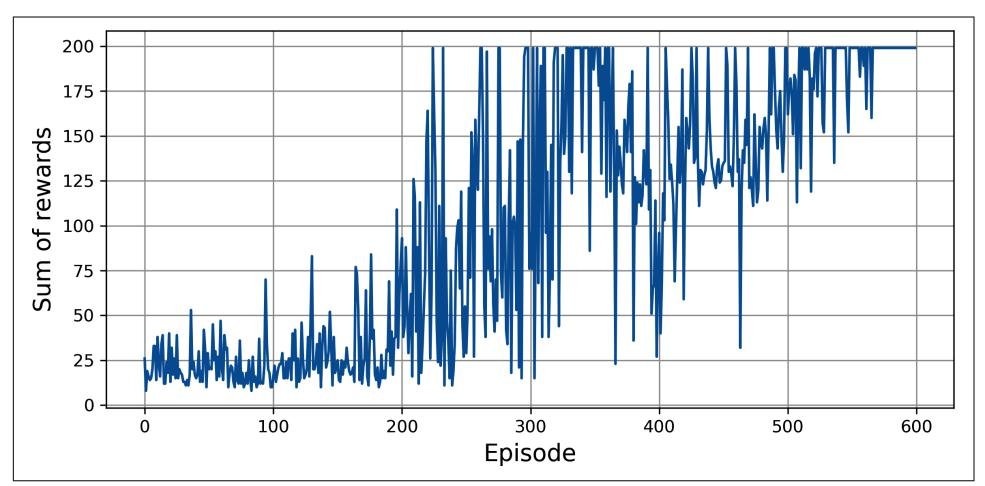

## **CHAPTER 18 Reinforcement Learning**

Reinforcement learning (RL) is one of the most exciting fields of machine learning today, and also one of the oldest. It has been around since the 1950s, producing many interesting applications over the years,<sup>1</sup> particularly in games (e.g., TD-Gammon, a Backgammon-playing program) and in machine control, but seldom making the headline news. However, a revolution took place in 2013, when researchers from a British startup called DeepMind demonstrated a system that could learn to play just about any Atari game from scratch,<sup>2</sup> eventually outperforming humans<sup>3</sup> in most of them, using only raw pixels as inputs and without any prior knowledge of the rules of the games.<sup>4</sup> This was the first of a series of amazing feats, culminating with the victory of their system AlphaGo against Lee Sedol, a legendary professional player of the game of Go, in March 2016 and against Ke Jie, the world champion, in May 2017. No program had ever come close to beating a master of this game, let alone the world champion. Today the whole field of RL is boiling with new ideas, with a wide range of applications.

So how did DeepMind (bought by Google for over \$500 million in 2014) achieve all this? With hindsight it seems rather simple: they applied the power of deep learning to the field of reinforcement learning, and it worked beyond their wildest dreams. In this chapter I will first explain what reinforcement learning is and what it's good at,

<sup>1</sup> For more details, be sure to check out Richard Sutton and Andrew Barto's book on RL, Reinforcement Learning: An Introduction (MIT Press).

<sup>2</sup> Volodymyr Mnih et al., "Playing Atari with Deep Reinforcement Learning", arXiv preprint arXiv:1312.5602  $(2013).$ 

<sup>3</sup> Volodymyr Mnih et al., "Human-Level Control Through Deep Reinforcement Learning", Nature 518 (2015): 529-533.

<sup>4</sup> Check out the videos of DeepMind's system learning to play Space Invaders, Breakout, and other video games at https://homl.info/dqn3.

{711}------------------------------------------------

then present two of the most important techniques in deep reinforcement learning. policy gradients and deep Q-networks, including a discussion of Markov decision processes. Let's get started!

### **Learning to Optimize Rewards**

In reinforcement learning, a software *agent* makes *observations* and takes *actions* within an *environment*, and in return it receives *rewards* from the environment. Its objective is to learn to act in a way that will maximize its expected rewards over time. If you don't mind a bit of anthropomorphism, you can think of positive rewards as pleasure, and negative rewards as pain (the term "reward" is a bit misleading in this case). In short, the agent acts in the environment and learns by trial and error to maximize its pleasure and minimize its pain.

This is quite a broad setting, which can apply to a wide variety of tasks. Here are a few examples (see Figure 18-1):

- a. The agent can be the program controlling a robot. In this case, the environment is the real world, the agent observes the environment through a set of *sensors* such as cameras and touch sensors, and its actions consist of sending signals to activate motors. It may be programmed to get positive rewards whenever it approaches the target destination, and negative rewards whenever it wastes time or goes in the wrong direction.
- b. The agent can be the program controlling *Ms. Pac-Man*. In this case, the environment is a simulation of the Atari game, the actions are the nine possible joystick positions (upper left, down, center, and so on), the observations are screenshots, and the rewards are just the game points.
- c. Similarly, the agent can be the program playing a board game such as Go. It only gets a reward if it wins.
- d. The agent does not have to control a physically (or virtually) moving thing. For example, it can be a smart thermostat, getting positive rewards whenever it is close to the target temperature and saves energy, and negative rewards when humans need to tweak the temperature, so the agent must learn to anticipate human needs.
- e. The agent can observe stock market prices and decide how much to buy or sell every second. Rewards are obviously the monetary gains and losses.

Note that there may not be any positive rewards at all; for example, the agent may move around in a maze, getting a negative reward at every time step, so it had better find the exit as quickly as possible! There are many other examples of tasks to which reinforcement learning is well suited, such as self-driving cars, recommender

{712}------------------------------------------------



systems, placing ads on a web page, or controlling where an image classification system should focus its attention.

Figure 18-1. Reinforcement learning examples: (a) robotics, (b) Ms. Pac-Man, (c) Go player, (d) thermostat, (e) automatic trader<sup>5</sup>

### **Policy Search**

The algorithm a software agent uses to determine its actions is called its policy. The policy could be a neural network taking observations as inputs and outputting the action to take (see Figure 18-2).

<sup>5</sup> Images (a), (d), and (e) are in the public domain. Image (b) is a screenshot from the Ms. Pac-Man game, copyright Atari (fair use in this chapter). Image (c) is reproduced from Wikipedia; it was created by user Stevertigo and released under Creative Commons BY-SA 2.0.

{713}------------------------------------------------


Figure 18-2. Reinforcement learning using a neural network policy

The policy can be any algorithm you can think of, and it does not have to be deterministic. In fact, in some cases it does not even have to observe the environment! For example, consider a robotic vacuum cleaner whose reward is the amount of dust it picks up in 30 minutes. Its policy could be to move forward with some probability p every second, or randomly rotate left or right with probability  $1 - p$ . The rotation angle would be a random angle between  $-r$  and  $+r$ . Since this policy involves some randomness, it is called a *stochastic policy*. The robot will have an erratic trajectory, which guarantees that it will eventually get to any place it can reach and pick up all the dust. The question is, how much dust will it pick up in 30 minutes?

How would you train such a robot? There are just two *policy parameters* you can tweak: the probability  $p$  and the angle range  $r$ . One possible learning algorithm could be to try out many different values for these parameters, and pick the combination that performs best (see Figure 18-3). This is an example of *policy search*, in this case using a brute-force approach. When the *policy space* is too large (which is generally the case), finding a good set of parameters this way is like searching for a needle in a gigantic haystack.

Another way to explore the policy space is to use *genetic algorithms*. For example, you could randomly create a first generation of 100 policies and try them out, then "kill" the 80 worst policies<sup>6</sup> and make the 20 survivors produce 4 offspring each. An offspring is a copy of its parent<sup>7</sup> plus some random variation. The surviving policies plus their offspring together constitute the second generation. You can continue to iterate through generations this way until you find a good policy.<sup>8</sup>

<sup>6</sup> It is often better to give the poor performers a slight chance of survival, to preserve some diversity in the "gene pool".

<sup>7</sup> If there is a single parent, this is called *asexual reproduction*. With two (or more) parents, it is called *sexual* reproduction. An offspring's genome (in this case a set of policy parameters) is randomly composed of parts of its parents' genomes.

<sup>8</sup> One interesting example of a genetic algorithm used for reinforcement learning is the NeuroEvolution of Augmenting Topologies (NEAT) algorithm.

{714}------------------------------------------------



Figure 18-3. Four points in the policy space (left) and the agent's corresponding behavior  $(right)$ 

Yet another approach is to use optimization techniques, by evaluating the gradients of the rewards with regard to the policy parameters, then tweaking these parameters by following the gradients toward higher rewards.<sup>9</sup> We will discuss this approach, called policy gradients (PG), in more detail later in this chapter. Going back to the vacuum cleaner robot, you could slightly increase  $p$  and evaluate whether doing so increases the amount of dust picked up by the robot in 30 minutes; if it does, then increase  $p$  some more, or else reduce  $p$ . We will implement a popular PG algorithm using TensorFlow, but before we do, we need to create an environment for the agent to live in-so it's time to introduce OpenAI Gym.

### **Introduction to OpenAI Gym**

One of the challenges of reinforcement learning is that in order to train an agent, you first need to have a working environment. If you want to program an agent that will learn to play an Atari game, you will need an Atari game simulator. If you want to program a walking robot, then the environment is the real world, and you can directly train your robot in that environment. However, this has its limits: if the robot falls off a cliff, you can't just click Undo. You can't speed up time either—adding more computing power won't make the robot move any faster—and it's generally too expensive to train 1,000 robots in parallel. In short, training is hard and slow in the real world, so you generally need a *simulated environment* at least for bootstrap

<sup>9</sup> This is called *gradient ascent*. It's just like gradient descent, but in the opposite direction: maximizing instead of minimizing.

{715}------------------------------------------------

training. For example, you might use a library like PyBullet or MuJoCo for 3D physics simulation.

*OpenAI*  $Gym^{10}$  is a toolkit that provides a wide variety of simulated environments (Atari games, board games, 2D and 3D physical simulations, and so on), that you can use to train agents, compare them, or develop new RL algorithms.

OpenAI Gym is preinstalled on Colab, but it's an older version, so you'll need to replace it with the latest one. You also need to install a few of its dependencies. If you are coding on your own machine instead of Colab, and you followed the installation instructions at *https://homl.info/install*, then you can skip this step; otherwise, enter these commands:

```
# Only run these commands on Colab or Kaggle!
%pip install -q -U gym
%pip install -q -U gym[classic_control,box2d,atari,accept-rom-license]
```

The first %p ip command upgrades Gym to the latest version. The -q option stands for quiet: it makes the output less verbose. The -U option stands for upgrade. The second %pip command installs the libraries required to run various kinds of environments. This includes classic environments from control theory-the science of controlling dynamical systems-such as balancing a pole on a cart. It also includes environments based on the Box2D library—a 2D physics engine for games. Lastly, it includes environments based on the Arcade Learning Environment (ALE), which is an emulator for Atari 2600 games. Several Atari game ROMs are downloaded automatically, and by running this code you agree with Atari's ROM licenses.

With that, you're ready to use OpenAI Gym. Let's import it and make an environment:

```
import gym
```

```
env = gym.make("CartPole-v1", render_mode="rgb_array")
```

Here, we've created a CartPole environment. This is a 2D simulation in which a cart can be accelerated left or right in order to balance a pole placed on top of it (see Figure 18-4). This is a classic control task.


The gym.envs.registry dictionary contains the names and specifications of all the available environments.

<sup>10</sup> OpenAI is an artificial intelligence research company, funded in part by Elon Musk. Its stated goal is to promote and develop friendly AIs that will benefit humanity (rather than exterminate it).

{716}------------------------------------------------



Figure 18-4. The CartPole environment

After the environment is created, you must initialize it using the reset() method, optionally specifying a random seed. This returns the first observation. Observations depend on the type of environment. For the CartPole environment, each observation is a 1D NumPy array containing four floats representing the cart's horizontal position  $(0.0 = \text{center})$ , its velocity (positive means right), the angle of the pole  $(0.0 =$ vertical), and its angular velocity (positive means clockwise). The reset() method also returns a dictionary that may contain extra environment-specific information. This can be useful for debugging or for training. For example, in many Atari environments, it contains the number of lives left. However, in the CartPole environment, this dictionary is empty.

```
>>> obs, info = env.reset(seed=42)
>>array([ 0.0273956 , -0.00611216, 0.03585979, 0.0197368 ], dtype=float32)
>>> info
{}
```

Let's call the render() method to render this environment as an image. Since we set render mode="rgb array" when creating the environment, the image will be returned as a NumPy array:

```
\Rightarrow \frac{1}{2} img = env.render()
\Rightarrow img.shape # height, width, channels (3 = Red, Green, Blue)
(400, 600, 3)
```

You can then use Matplotlib's imshow() function to display this image, as usual.

Now let's ask the environment what actions are possible:

```
>>> env.action_space
Discrete(2)
```

Discrete $(2)$  means that the possible actions are integers 0 and 1, which represent accelerating left or right. Other environments may have additional discrete actions, or other kinds of actions (e.g., continuous). Since the pole is leaning toward the right  $(obs[2] > 0)$ , let's accelerate the cart toward the right:

{717}------------------------------------------------

```
\Rightarrow action = 1 # accelerate right
>>> obs, reward, done, truncated, info = env.step(action)
>>> obs
array([ 0.02727336, 0.18847767, 0.03625453, -0.26141977], dtype=float32)
>>> reward
1.0sss done
False
>>> truncated
False
>>> info
{}
```

The step() method executes the desired action and returns five values:

obs

This is the new observation. The cart is now moving toward the right ( $obs[1] >$ 0). The pole is still tilted toward the right ( $obs[2] > 0$ ), but its angular velocity is now negative ( $obs[3] < 0$ ), so it will likely be tilted toward the left after the next step.

reward

In this environment, you get a reward of 1.0 at every step, no matter what you do, so the goal is to keep the episode running for as long as possible.

done

This value will be True when the episode is over. This will happen when the pole tilts too much, or goes off the screen, or after 200 steps (in this last case, you have won). After that, the environment must be reset before it can be used again.

truncated

This value will be True when an episode is interrupted early, for example by an environment wrapper that imposes a maximum number of steps per episode (see Gym's documentation for more details on environment wrappers). Some RL algorithms treat truncated episodes differently from episodes finished normally (i.e., when done is True), but in this chapter we will treat them identically.

info

This environment-specific dictionary may provide extra information, just like the one returned by the reset() method.


Once you have finished using an environment, you should call its close() method to free resources.

{718}------------------------------------------------

Let's hardcode a simple policy that accelerates left when the pole is leaning toward the left and accelerates right when the pole is leaning toward the right. We will run this policy to see the average rewards it gets over 500 episodes:

```
def basic policy(obs):
   angle = obs[2]return 0 if angle < 0 else 1
totals = [1]for episode in range(500):
    episode_rewards = \thetaobs, info = env.read(seed = episode)for step in range(200):
        action = basic policy(obs)obs, reward, done, truncated, info = env.step(action)
        episode rewards += reward
        if done or truncated:
            break
```

totals.append(episode rewards)

This code is self-explanatory. Let's look at the result:

```
>>> import numpy as np
>>> np.mean(totals), np.std(totals), min(totals), max(totals)
(41.698, 8.389445512070509, 24.0, 63.0)
```

Even with 500 tries, this policy never managed to keep the pole upright for more than 63 consecutive steps. Not great. If you look at the simulation in this chapter's notebook, you will see that the cart oscillates left and right more and more strongly until the pole tilts too much. Let's see if a neural network can come up with a better policy.

### **Neural Network Policies**

Let's create a neural network policy. This neural network will take an observation as input, and it will output the action to be executed, just like the policy we hardcoded earlier. More precisely, it will estimate a probability for each action, and then we will select an action randomly, according to the estimated probabilities (see Figure 18-5). In the case of the CartPole environment, there are just two possible actions (left or right), so we only need one output neuron. It will output the probability  $p$  of action 0 (left), and of course the probability of action 1 (right) will be  $1 - p$ . For example, if it outputs 0.7, then we will pick action 0 with 70% probability, or action 1 with 30% probability.

{719}------------------------------------------------



Figure 18-5. Neural network policy

You may wonder why we are picking a random action based on the probabilities given by the neural network, rather than just picking the action with the highest score. This approach lets the agent find the right balance between *exploring* new actions and *exploiting* the actions that are known to work well. Here's an analogy: suppose you go to a restaurant for the first time, and all the dishes look equally appealing, so you randomly pick one. If it turns out to be good, you can increase the probability that you'll order it next time, but you shouldn't increase that probability up to 100%, or else you will never try out the other dishes, some of which may be even better than the one you tried. This exploration/exploitation dilemma is central in reinforcement learning.

Also note that in this particular environment, the past actions and observations can safely be ignored, since each observation contains the environment's full state. If there were some hidden state, then you might need to consider past actions and observations as well. For example, if the environment only revealed the position of the cart but not its velocity, you would have to consider not only the current observation but also the previous observation in order to estimate the current velocity. Another example is when the observations are noisy; in that case, you generally want to use the past few observations to estimate the most likely current state. The CartPole 

{720}------------------------------------------------

problem is thus as simple as can be; the observations are noise-free, and they contain the environment's full state

Here is the code to build a basic neural network policy using Keras:

```
import tensorflow as tf
model = tf.keras.Sequential(tf.keras.layers.Dense(5, activation="relu"),
    tf.keras.layers.Dense(1, activation="sigmoid"),
\left| \right)
```

We use a Sequential model to define the policy network. The number of inputs is the size of the observation space—which in the case of CartPole is 4—and we have just five hidden units because it's a fairly simple task. Finally, we want to output a single probability—the probability of going left—so we have a single output neuron using the sigmoid activation function. If there were more than two possible actions, there would be one output neuron per action, and we would use the softmax activation function instead.

OK, we now have a neural network policy that will take observations and output action probabilities. But how do we train it?

### **Evaluating Actions: The Credit Assignment Problem**

If we knew what the best action was at each step, we could train the neural network as usual, by minimizing the cross entropy between the estimated probability distribution and the target probability distribution. It would just be regular supervised learning. However, in reinforcement learning the only guidance the agent gets is through rewards, and rewards are typically sparse and delayed. For example, if the agent manages to balance the pole for 100 steps, how can it know which of the 100 actions it took were good, and which of them were bad? All it knows is that the pole fell after the last action, but surely this last action is not entirely responsible. This is called the *credit assignment problem*: when the agent gets a reward, it is hard for it to know which actions should get credited (or blamed) for it. Think of a dog that gets rewarded hours after it behaved well; will it understand what it is being rewarded for?

To tackle this problem, a common strategy is to evaluate an action based on the sum of all the rewards that come after it, usually applying a *discount factor*,  $\gamma$  (gamma), at each step. This sum of discounted rewards is called the action's return. Consider the example in Figure 18-6. If an agent decides to go right three times in a row and gets +10 reward after the first step, 0 after the second step, and finally -50 after the third step, then assuming we use a discount factor  $y = 0.8$ , the first action will have a return of  $10 + y \times 0 + y^2 \times (-50) = -22$ . If the discount factor is close to 0, then future rewards won't count for much compared to immediate rewards. Conversely, if the discount factor is close to 1, then rewards far into the future will count almost

{721}------------------------------------------------

as much as immediate rewards. Typical discount factors vary from 0.9 to 0.99. With a discount factor of 0.95, rewards 13 steps into the future count roughly for half as much as immediate rewards (since  $0.95^{13} \approx 0.5$ ), while with a discount factor of 0.99, rewards 69 steps into the future count for half as much as immediate rewards. In the CartPole environment, actions have fairly short-term effects, so choosing a discount factor of 0.95 seems reasonable.



Figure 18-6. Computing an action's return: the sum of discounted future rewards

Of course, a good action may be followed by several bad actions that cause the pole to fall quickly, resulting in the good action getting a low return. Similarly, a good actor may sometimes star in a terrible movie. However, if we play the game enough times, on average good actions will get a higher return than bad ones. We want to estimate how much better or worse an action is, compared to the other possible actions, on average. This is called the *action advantage*. For this, we must run many episodes and normalize all the action returns, by subtracting the mean and dividing by the standard deviation. After that, we can reasonably assume that actions with a negative advantage were bad while actions with a positive advantage were good. OK, now that we have a way to evaluate each action, we are ready to train our first agent using policy gradients. Let's see how.

### **Policy Gradients**

As discussed earlier, PG algorithms optimize the parameters of a policy by following the gradients toward higher rewards. One popular class of PG algorithms, called 

{722}------------------------------------------------

REINFORCE algorithms, was introduced back in 1992<sup>11</sup> by Ronald Williams. Here is one common variant:

- 1. First, let the neural network policy play the game several times, and at each step, compute the gradients that would make the chosen action even more likely-but don't apply these gradients yet.
- 2. Once you have run several episodes, compute each action's advantage, using the method described in the previous section.
- 3. If an action's advantage is positive, it means that the action was probably good, and you want to apply the gradients computed earlier to make the action even more likely to be chosen in the future. However, if the action's advantage is negative, it means the action was probably bad, and you want to apply the opposite gradients to make this action slightly less likely in the future. The solution is to multiply each gradient vector by the corresponding action's advantage.
- 4. Finally, compute the mean of all the resulting gradient vectors, and use it to perform a gradient descent step.

Let's use Keras to implement this algorithm. We will train the neural network policy we built earlier so that it learns to balance the pole on the cart. First, we need a function that will play one step. We will pretend for now that whatever action it takes is the right one so that we can compute the loss and its gradients. These gradients will just be saved for a while, and we will modify them later depending on how good or bad the action turned out to be:

```
def play_one_step(env, obs, model, loss_fn):
    with tf.GradientTape() as tape:
        left\_prob = model(obj(np.newaxis])action = (tf.random.uniform([1, 1]) > left_prob)y_{\text{target}} = tf_{\text{constant}([1.]) - tf_{\text{cast}}(action, tf_{\text{total}})]loss = tf.reduce_mean(loss_fn(y_target, left_proba))
    grads = tape.gradient(loss, model.trainable variables)
    obs, reward, done, truncated, info = env.step(int(action))
    return obs, reward, done, truncated, grads
```

Let's walk though this function:

• Within the Gradient Tape block (see Chapter 12), we start by calling the model, giving it a single observation. We reshape the observation so it becomes a batch containing a single instance, as the model expects a batch. This outputs the probability of going left.

<sup>11</sup> Ronald J. Williams, "Simple Statistical Gradient-Following Algorithms for Connectionist Reinforcement Leaning", Machine Learning 8 (1992) : 229-256.

{723}------------------------------------------------

- Next, we sample a random float between 0 and 1, and we check whether it is greater than left proba. The action will be False with probability left proba, or True with probability 1 - left\_proba. Once we cast this Boolean to an integer, the action will be 0 (left) or 1 (right) with the appropriate probabilities.
- We now define the target probability of going left: it is 1 minus the action (cast to a float). If the action is 0 (left), then the target probability of going left will be 1. If the action is 1 (right), then the target probability will be 0.
- Then we compute the loss using the given loss function, and we use the tape to compute the gradient of the loss with regard to the model's trainable variables. Again, these gradients will be tweaked later, before we apply them, depending on how good or bad the action turned out to be.
- Finally, we play the selected action, and we return the new observation, the reward, whether the episode is ended or not, whether it is truncated or not, and of course the gradients that we just computed.

Now let's create another function that will rely on the play one step() function to play multiple episodes, returning all the rewards and gradients for each episode and each step:

```
def play_multiple_episodes(env, n_episodes, n_max_steps, model, loss_fn):
    all rewards = [1]all grads = \lceil \rceilfor episode in range(n_episodes):
        current rewards = []
        current grads = [ ]obs. info = env. reset()for step in range(n max steps):
            obs, reward, done, truncated, grads = play_one_step(
                env, obs, model, loss_fn)
            current rewards.append(reward)
            current grads.append(grads)
            if done or truncated:
                break
        all rewards.append(current rewards)
        all grads.append(current grads)
```

```
return all_rewards, all_grads
```

This code returns a list of reward lists: one reward list per episode, containing one reward per step. It also returns a list of gradient lists: one gradient list per episode, each containing one tuple of gradients per step and each tuple containing one gradient tensor per trainable variable.

The algorithm will use the play\_multiple\_episodes() function to play the game several times (e.g., 10 times), then it will go back and look at all the rewards, discount them, and normalize them. To do that, we need a couple more functions; the first 

{724}------------------------------------------------

will compute the sum of future discounted rewards at each step, and the second will normalize all these discounted rewards (i.e., the returns) across many episodes by subtracting the mean and dividing by the standard deviation:

```
def discount rewards(rewards, discount factor):
   discounted = np.array(rewards)for step in range(len(rewards) - 2, -1, -1):
       discounted[step] += discounted[step + 1] * discount_factor
   return discounted
def discount_and_normalize_rewards(all_rewards, discount_factor):
   all_discounted_rewards = [discount_rewards(rewards, discount_factor)
                             for rewards in all_rewards]
   flat_rewards = np.concatenate(all_discounted_rewards)
   reward mean = flat rewards.mean()
   reward\_std = flat\_rewards.stdout)return [(discounted_rewards - reward_mean) / reward_std
           for discounted_rewards in all_discounted_rewards]
```

Let's check that this works:

```
>>> discount_rewards([10, 0, -50], discount_factor=0.8)
array([ -22, -40, -50])>>> discount and_normalize_rewards([[10, 0, -50], [10, 20]],discount_factor=0.8)
\ddotsc\lceil \arctan \left( \lceil -0.28435071, -0.86597718, -1.18910299 \rceil \right)array([1.26665318, 1.0727777 ])]
```

The call to discount\_rewards() returns exactly what we expect (see Figure 18-6). You can verify that the function discount and normalize rewards() does indeed return the normalized action advantages for each action in both episodes. Notice that the first episode was much worse than the second, so its normalized advantages are all negative; all actions from the first episode would be considered bad, and conversely all actions from the second episode would be considered good.

We are almost ready to run the algorithm! Now let's define the hyperparameters. We will run 150 training iterations, playing 10 episodes per iteration, and each episode will last at most 200 steps. We will use a discount factor of 0.95:

```
n iterations = 150
n episodes per update = 10
n_max\_steps = 200discount factor = 0.95
```

We also need an optimizer and the loss function. A regular Nadam optimizer with learning rate 0.01 will do just fine, and we will use the binary cross-entropy loss function because we are training a binary classifier (there are two possible actions left or right):

```
optimize r = tf.keras.optimizers.Nadam(learning_rate=0.01)
loss_fn = tf.keras.losses.binary_crossentropy
```

{725}------------------------------------------------

We are now ready to build and run the training loop!

```
for iteration in range(n iterations):
   all rewards, all grads = play multiple episodes(
       env, n_episodes_per_update, n_max_steps, model, loss_fn)
   all final rewards = discount and normalize rewards(all rewards,
                                                       discount_factor)
   all_mean_grads = []for var_index in range(len(model.trainable_variables)):
       mean_grads = tf.readuce_mean([final_reward * all_grads[episode_index][step][var_index]
             for episode_index, final_rewards in enumerate(all_final_rewards)
                for step, final reward in enumerate(final rewards)], axis=0)
       all mean grads.append(mean grads)
```

```
optimizer.apply gradients(zip(all mean grads, model.trainable variables))
```

Let's walk through this code:

- At each training iteration, this loop calls the play\_multiple\_episodes() function, which plays 10 episodes and returns the rewards and gradients for each step in each episode.
- Then we call the discount\_and\_normalize\_rewards() function to compute each action's normalized advantage, called the final reward in this code. This provides a measure of how good or bad each action actually was, in hindsight.
- Next, we go through each trainable variable, and for each of them we compute the weighted mean of the gradients for that variable over all episodes and all steps, weighted by the final\_reward.
- Finally, we apply these mean gradients using the optimizer: the model's trainable variables will be tweaked, and hopefully the policy will be a bit better.

And we're done! This code will train the neural network policy, and it will successfully learn to balance the pole on the cart. The mean reward per episode will get very close to 200. By default, that's the maximum for this environment. Success!

The simple policy gradients algorithm we just trained solved the CartPole task, but it would not scale well to larger and more complex tasks. Indeed, it is highly sample *inefficient*, meaning it needs to explore the game for a very long time before it can make significant progress. This is due to the fact that it must run multiple episodes to estimate the advantage of each action, as we have seen. However, it is the foundation of more powerful algorithms, such as *actor-critic* algorithms (which we will discuss briefly at the end of this chapter).

{726}------------------------------------------------



Researchers try to find algorithms that work well even when the agent initially knows nothing about the environment. However, unless you are writing a paper, you should not hesitate to inject prior knowledge into the agent, as it will speed up training dramatically. For example, since you know that the pole should be as vertical as possible, you could add negative rewards proportional to the pole's angle. This will make the rewards much less sparse and speed up training. Also, if you already have a reasonably good policy (e.g., hardcoded), you may want to train the neural network to imitate it before using policy gradients to improve it.

We will now look at another popular family of algorithms. Whereas PG algorithms directly try to optimize the policy to increase rewards, the algorithms we will explore now are less direct: the agent learns to estimate the expected return for each state, or for each action in each state, then it uses this knowledge to decide how to act. To understand these algorithms, we must first consider Markov decision processes  $(MDPs)$ .

### **Markov Decision Processes**

In the early 20th century, the mathematician Andrey Markov studied stochastic processes with no memory, called Markov chains. Such a process has a fixed number of states, and it randomly evolves from one state to another at each step. The probability for it to evolve from a state s to a state s' is fixed, and it depends only on the pair  $(s,$  $s'$ ), not on past states. This is why we say that the system has no memory.


Figure 18-7 shows an example of a Markov chain with four states.

Figure 18-7. Example of a Markov chain

Suppose that the process starts in state  $s_0$ , and there is a 70% chance that it will remain in that state at the next step. Eventually it is bound to leave that state and never come back, because no other state points back to  $s_0$ . If it goes to state  $s_1$ , it will then most likely go to state  $s_2$  (90% probability), then immediately back to state  $s_1$ (with 100% probability). It may alternate a number of times between these two states,

{727}------------------------------------------------

but eventually it will fall into state  $s<sub>3</sub>$  and remain there forever, since there's no way out: this is called a *terminal state*. Markov chains can have very different dynamics, and they are heavily used in thermodynamics, chemistry, statistics, and much more.

Markov decision processes were first described in the 1950s by Richard Bellman.<sup>12</sup> They resemble Markov chains, but with a twist: at each step, an agent can choose one of several possible actions, and the transition probabilities depend on the chosen action. Moreover, some state transitions return some reward (positive or negative), and the agent's goal is to find a policy that will maximize reward over time.

For example, the MDP represented in Figure 18-8 has three states (represented by circles) and up to three possible discrete actions at each step (represented by diamonds).



Figure 18-8. Example of a Markov decision process

If it starts in state  $s_0$ , the agent can choose between actions  $a_0$ ,  $a_1$ , or  $a_2$ . If it chooses action  $a_1$ , it just remains in state  $s_0$  with certainty, and without any reward. It can thus decide to stay there forever if it wants to. But if it chooses action  $a_0$ , it has a 70% probability of gaining a reward of +10 and remaining in state  $s_0$ . It can then try again and again to gain as much reward as possible, but at one point it is going to end up instead in state  $s_1$ . In state  $s_1$  it has only two possible actions:  $a_0$  or  $a_2$ . It can choose to stay put by repeatedly choosing action  $a_0$ , or it can choose to move on to state  $s_2$ and get a negative reward of -50 (ouch). In state  $s_2$  it has no choice but to take action  $a<sub>1</sub>$ , which will most likely lead it back to state  $s<sub>0</sub>$ , gaining a reward of +40 on the way. You get the picture. By looking at this MDP, can you guess which strategy will gain the most reward over time? In state  $s_0$  it is clear that action  $a_0$  is the best option, and in state s, the agent has no choice but to take action  $a_1$ , but in state s<sub>1</sub> it is not obvious whether the agent should stay put  $(a_0)$  or go through the fire  $(a_2)$ .

<sup>12</sup> Richard Bellman, "A Markovian Decision Process", Journal of Mathematics and Mechanics 6, no. 5 (1957): 679-684.

{728}------------------------------------------------

Bellman found a way to estimate the *optimal state value* of any state s, noted  $V^*(s)$ , which is the sum of all discounted future rewards the agent can expect on average after it reaches the state, assuming it acts optimally. He showed that if the agent acts optimally, then the *Bellman optimality equation* applies (see Equation 18-1). This recursive equation says that if the agent acts optimally, then the optimal value of the current state is equal to the reward it will get on average after taking one optimal action, plus the expected optimal value of all possible next states that this action can lead to.

Equation 18-1. Bellman optimality equation

$$
V^*(s) = \max_{a} \sum_{s'} T(s, a, s') [R(s, a, s') + \gamma \cdot V^*(s')] \text{ for all } s
$$

In this equation:

- $T(s, a, s')$  is the transition probability from state s to state s', given that the agent chose action *a*. For example, in Figure 18-8,  $T(s_2, a_1, s_0) = 0.8$ .
- $R(s, a, s')$  is the reward that the agent gets when it goes from state s to state s', given that the agent chose action a. For example, in Figure 18-8,  $R(s_2, a_1, a_2)$  $s_0$ ) = +40.
- $\nu$  is the discount factor.

This equation leads directly to an algorithm that can precisely estimate the optimal state value of every possible state: first initialize all the state value estimates to zero, and then iteratively update them using the *value iteration* algorithm (see Equation 18-2). A remarkable result is that, given enough time, these estimates are guaranteed to converge to the optimal state values, corresponding to the optimal policy.

Equation 18-2. Value iteration algorithm

$$
V_{k+1}(s) \leftarrow \max_{a} \sum_{s'} T(s, a, s') [R(s, a, s') + \gamma \cdot V_k(s')] \text{ for all } s
$$

In this equation,  $V_k(s)$  is the estimated value of state s at the  $k<sup>th</sup>$  iteration of the algorithm.


This algorithm is an example of *dynamic programming*, which breaks down a complex problem into tractable subproblems that can be tackled iteratively.

{729}------------------------------------------------

Knowing the optimal state values can be useful, in particular to evaluate a policy, but it does not give us the optimal policy for the agent. Luckily, Bellman found a very similar algorithm to estimate the optimal state-action values, generally called Q-values (quality values). The optimal Q-value of the state-action pair  $(s, a)$ , noted  $Q^*(s, a)$ , is the sum of discounted future rewards the agent can expect on average after it reaches the state s and chooses action a, but before it sees the outcome of this action, assuming it acts optimally after that action.

Let's look at how it works. Once again, you start by initializing all the Q-value estimates to zero, then you update them using the Q-value iteration algorithm (see Equation 18-3).

Equation 18-3. Q-value iteration algorithm

$$
Q_{k+1}(s,a) \leftarrow \sum_{s'} T(s,a,s') \Big[ R(s,a,s') + \gamma \cdot \max_{a'} Q_k(s',a') \Big] \text{ for all } (s,a)
$$

Once you have the optimal Q-values, defining the optimal policy, noted  $\pi^*(s)$ , is trivial; when the agent is in state s, it should choose the action with the highest Q-value for that state:  $\pi^*$ (s) = argmax  $Q^*$ (s, a).

Let's apply this algorithm to the MDP represented in Figure 18-8. First, we need to define the MDP:

```
transition_probabilities = [ # shape=[s, a, s']
   [[0.7, 0.3, 0.0], [1.0, 0.0, 0.0], [0.8, 0.2, 0.0]],[[0.0, 1.0, 0.0], None, [0.0, 0.0, 1.0]],[None, [0.8, 0.1, 0.1], None]rewards = [ # shape=[s, a, s']
   [[+10, 0, 0], [0, 0, 0], [0, 0, 0]],[[0, 0, 0], [0, 0, 0], [0, 0, -50]],[[0, 0, 0], [+40, 0, 0], [0, 0, 0]]1
possible_actions = [[0, 1, 2], [0, 2], [1]]
```

For example, to know the transition probability of going from  $s_2$  to  $s_0$  after playing action  $a_1$ , we will look up transition\_probabilities[2][1][0] (which is 0.8). Similarly, to get the corresponding reward, we will look up rewards[2][1] [0] (which is +40). And to get the list of possible actions in  $s_2$ , we will look up possible\_actions[2] (in this case, only action  $a_1$  is possible). Next, we must initialize all the Q-values to zero (except for the impossible actions, for which we set the O-values to  $-\infty$ ):

```
Q_values = np.full((3, 3), -np.inf) # -np.inf for impossible actionsfor state, actions in enumerate(possible_actions):
    Q values [state, actions] = 0.0 # for all possible actions
```

{730}------------------------------------------------

Now let's run the Q-value iteration algorithm. It applies Equation 18-3 repeatedly, to all Q-values, for every state and every possible action:

```
gamma = 0.90 # the discount factor
for iteration in range(50):
   Q prev = Q values.copy()
   for s in range(3):
       for a in possible_actions[s]:
            Q_values[s, a] = np.sum([transition_probabilities[s][a][sp]
                    * (rewards[s][a][sp] + gamma * Q_prev[sp].max())
                for sp in range(3)]
```

That's it! The resulting Q-values look like this:

```
>>> Q values
array([[18.91891892, 17.02702702, 13.62162162],
                 ,                                      
       Γ0.
                \cdotinf, 50.13365013,
       ſ
                                             -inf11)
```

For example, when the agent is in state  $s_0$  and it chooses action  $a_1$ , the expected sum of discounted future rewards is approximately 17.0.

For each state, we can find the action that has the highest Q-value:

```
>>> Q_values.argmax(axis=1) # optimal action for each state
array([0, 0, 1])
```

This gives us the optimal policy for this MDP when using a discount factor of 0.90: in state  $s_0$  choose action  $a_0$ , in state  $s_1$  choose action  $a_0$  (i.e., stay put), and in state  $s_2$ choose action  $a_1$  (the only possible action). Interestingly, if we increase the discount factor to 0.95, the optimal policy changes: in state  $s_1$  the best action becomes  $a_2$  (go through the fire!). This makes sense because the more you value future rewards, the more you are willing to put up with some pain now for the promise of future bliss.

### **Temporal Difference Learning**

Reinforcement learning problems with discrete actions can often be modeled as Markov decision processes, but the agent initially has no idea what the transition probabilities are (it does not know  $T(s, a, s')$ ), and it does not know what the rewards are going to be either (it does not know  $R(s, a, s')$ ). It must experience each state and each transition at least once to know the rewards, and it must experience them multiple times if it is to have a reasonable estimate of the transition probabilities.

The temporal difference (TD) learning algorithm is very similar to the Q-value iteration algorithm, but tweaked to take into account the fact that the agent has only partial knowledge of the MDP. In general we assume that the agent initially knows only the possible states and actions, and nothing more. The agent uses an explora*tion policy*—for example, a purely random policy—to explore the MDP, and as it 

{731}------------------------------------------------

progresses, the TD learning algorithm updates the estimates of the state values based on the transitions and rewards that are actually observed (see Equation 18-4).

Equation 18-4. TD learning algorithm

 $V_{k+1}(s) \leftarrow (1-\alpha)V_k(s) + \alpha(r + \gamma \cdot V_k(s'))$ or, equivalently:  $V_{k+1}(s) \leftarrow V_k(s) + \alpha \cdot \delta_k(s, r, s')$ with  $\delta_k(s, r, s') = r + \gamma \cdot \overset{n}{V}_k(s') - V_k(s)$ 

In this equation:

- $\alpha$  is the learning rate (e.g., 0.01).
- $r + \gamma \cdot V_k(s')$  is called the *TD target*.
- $\delta_k(s, r, s')$  is called the *TD error*.

A more concise way of writing the first form of this equation is to use the notation  $a \leftarrow b$ , which means  $a_{k+1} \leftarrow (1 - \alpha) \cdot a_k + \alpha \cdot b_k$ . So, the first line of Equation 18-4 can be rewritten like this:  $V(s) \leftarrow r + \gamma \cdot V(s')$ .


TD learning has many similarities with stochastic gradient descent, including the fact that it handles one sample at a time. Moreover, just like SGD, it can only truly converge if you gradually reduce the learning rate; otherwise, it will keep bouncing around the optimum Q-values.

For each state s, this algorithm keeps track of a running average of the immediate rewards the agent gets upon leaving that state, plus the rewards it expects to get later, assuming it acts optimally.

### **Q-Learning**

Similarly, the Q-learning algorithm is an adaptation of the Q-value iteration algorithm to the situation where the transition probabilities and the rewards are initially unknown (see Equation 18-5). Q-learning works by watching an agent play (e.g., randomly) and gradually improving its estimates of the Q-values. Once it has accurate Q-value estimates (or close enough), then the optimal policy is just choosing the action that has the highest Q-value (i.e., the greedy policy).

{732}------------------------------------------------

```
Equation 18-5. Q-learning algorithm
```

```
Q(s, a) \leftarrow r + \gamma \cdot \max_{a'} Q(s', a')
```

For each state-action pair  $(s, a)$ , this algorithm keeps track of a running average of the rewards  $r$  the agent gets upon leaving the state  $s$  with action  $a$ , plus the sum of discounted future rewards it expects to get. To estimate this sum, we take the maximum of the Q-value estimates for the next state  $s'$ , since we assume that the target policy will act optimally from then on.

Let's implement the Q-learning algorithm. First, we will need to make an agent explore the environment. For this, we need a step function so that the agent can execute one action and get the resulting state and reward:

```
def step(state, action):
   probas = transition_probabilities[state][action]
   next state = np.randomchoice([0, 1, 2], p=probas)reward = rewards[state][action][next_state]return next state, reward
```

Now let's implement the agent's exploration policy. Since the state space is pretty small, a simple random policy will be sufficient. If we run the algorithm for long enough, the agent will visit every state many times, and it will also try every possible action many times:

```
def exploration policy(state):
    return np.random.choice(possible_actions[state])
```

Next, after we initialize the O-values just like earlier, we are ready to run the Olearning algorithm with learning rate decay (using power scheduling, introduced in Chapter 11):

```
alpha0 = 0.05 # initial learning rate
decay = 0.005 # learning rate decay
gamma = 0.90 # discount factor
state = 0 # initial state
for iteration in range(10 000):
    action = exploration policy(state)next state, reward = step(state, action)next_value = Q_values[next_state].max() # greedy policy at the next step
    alpha = alpha0 / (1 + iteration * decay)Q_{value}state, action] *= 1 - alpha
    Q_values[state, action] += alpha * (reward + gamma * next_value)
    state = next\_state
```

{733}------------------------------------------------

This algorithm will converge to the optimal Q-values, but it will take many iterations, and possibly quite a lot of hyperparameter tuning. As you can see in Figure 18-9, the Q-value iteration algorithm (left) converges very quickly, in fewer than 20 iterations, while the Q-learning algorithm (right) takes about 8,000 iterations to converge. Obviously, not knowing the transition probabilities or the rewards makes finding the optimal policy significantly harder!



Figure 18-9. Learning curve of the Q-value iteration algorithm versus the Q-learning algorithm

The Q-learning algorithm is called an off-policy algorithm because the policy being trained is not necessarily the one used during training. For example, in the code we just ran, the policy being executed (the exploration policy) was completely random, while the policy being trained was never used. After training, the optimal policy corresponds to systematically choosing the action with the highest Q-value. Conversely, the policy gradients algorithm is an *on-policy* algorithm: it explores the world using the policy being trained. It is somewhat surprising that Q-learning is capable of learning the optimal policy by just watching an agent act randomly. Imagine learning to play golf when your teacher is a blindfolded monkey. Can we do better?

### **Exploration Policies**

Of course, Q-learning can work only if the exploration policy explores the MDP thoroughly enough. Although a purely random policy is guaranteed to eventually visit every state and every transition many times, it may take an extremely long time to do so. Therefore, a better option is to use the *ε-greedy policy* (ε is epsilon): at each step it acts randomly with probability  $\varepsilon$ , or greedily with probability 1- $\varepsilon$  (i.e., choosing the action with the highest Q-value). The advantage of the  $\varepsilon$ -greedy policy (compared to a completely random policy) is that it will spend more and more time exploring the interesting parts of the environment, as the Q-value estimates get better and better, while still spending some time visiting unknown regions of the MDP. It is

{734}------------------------------------------------

quite common to start with a high value for  $\varepsilon$  (e.g., 1.0) and then gradually reduce it (e.g., down to 0.05).

Alternatively, rather than relying only on chance for exploration, another approach is to encourage the exploration policy to try actions that it has not tried much before. This can be implemented as a bonus added to the Q-value estimates, as shown in Equation 18-6.

Equation 18-6. Q-learning using an exploration function  $Q(s, a) \leftarrow r + \gamma \cdot \max_{a'} f(Q(s', a'), N(s', a'))$ 

In this equation:

- $N(s', a')$  counts the number of times the action a' was chosen in state s'.
- $f(Q, N)$  is an exploration function, such as  $f(Q, N) = Q + \kappa/(1 + N)$ , where  $\kappa$  is a curiosity hyperparameter that measures how much the agent is attracted to the unknown.

### **Approximate Q-Learning and Deep Q-Learning**

The main problem with Q-learning is that it does not scale well to large (or even medium) MDPs with many states and actions. For example, suppose you wanted to use Q-learning to train an agent to play Ms. Pac-Man (see Figure 18-1). There are about 150 pellets that Ms. Pac-Man can eat, each of which can be present or absent (i.e., already eaten). So, the number of possible states is greater than  $2^{150} \approx 10^{45}$ . And if you add all the possible combinations of positions for all the ghosts and Ms. Pac-Man, the number of possible states becomes larger than the number of atoms in our planet, so there's absolutely no way you can keep track of an estimate for every single Q-value.

The solution is to find a function  $Q_0(s, a)$  that approximates the Q-value of any stateaction pair  $(s, a)$  using a manageable number of parameters (given by the parameter vector  $\theta$ ). This is called *approximate Q-learning*. For years it was recommended to use linear combinations of handcrafted features extracted from the state (e.g., the distances of the closest ghosts, their directions, and so on) to estimate Q-values, but in 2013, DeepMind showed that using deep neural networks can work much better, especially for complex problems, and it does not require any feature engineering. A DNN used to estimate Q-values is called a *deep Q-network* (DQN), and using a DQN for approximate Q-learning is called *deep Q-learning*.

Now, how can we train a DQN? Well, consider the approximate Q-value computed by the DQN for a given state-action pair  $(s, a)$ . Thanks to Bellman, we know we want

{735}------------------------------------------------

this approximate Q-value to be as close as possible to the reward  $r$  that we actually observe after playing action  $a$  in state  $s$ , plus the discounted value of playing optimally from then on. To estimate this sum of future discounted rewards, we can just execute the DQN on the next state s', for all possible actions  $a'$ . We get an approximate future Q-value for each possible action. We then pick the highest (since we assume we will be playing optimally) and discount it, and this gives us an estimate of the sum of future discounted rewards. By summing the reward  $r$  and the future discounted value estimate, we get a target Q-value  $y(s, a)$  for the state-action pair  $(s, a)$ , as shown in Equation 18-7.

Equation 18-7. Target Q-value

```
y(s, a) = r + \gamma \cdot \max_{a'} Q_{\theta}(s', a')
```

With this target Q-value, we can run a training step using any gradient descent algorithm. Specifically, we generally try to minimize the squared error between the estimated Q-value  $Q_0(s, a)$  and the target Q-value  $y(s, a)$ , or the Huber loss to reduce the algorithm's sensitivity to large errors. And that's the deep Q-learning algorithm! Let's see how to implement it to solve the CartPole environment.

### Implementing Deep Q-Learning

The first thing we need is a deep Q-network. In theory, we need a neural net that takes a state-action pair as input, and outputs an approximate Q-value. However, in practice it's much more efficient to use a neural net that takes only a state as input, and outputs one approximate Q-value for each possible action. To solve the CartPole environment, we do not need a very complicated neural net; a couple of hidden layers will do:

```
input_{shape} = [4] # == env.observation_space.shape
n outputs = 2 # == env.action space.nmodel = tf.keras. Sequential(f)tf.keras.layers.Dense(32, activation="elu", input shape=input shape),
    tf.keras.layers.Dense(32, activation="elu"),
    tf.keras.layers.Dense(n outputs)
\mathcal{I}
```

To select an action using this DQN, we pick the action with the largest predicted Q-value. To ensure that the agent explores the environment, we will use an  $\varepsilon$ -greedy policy (i.e., we will choose a random action with probability  $\varepsilon$ ):

{736}------------------------------------------------

```
def epsilon_greedy_policy(state, epsilon=0):
   if np.random.randn() < epsilon:
       return np.random.randint(n_outputs) # random action
   else:
       Q values = model.predict(state[np.newaxis], verbase=0)[0]return Q_values.argmax() # optimal action according to the DQN
```

Instead of training the DQN based only on the latest experiences, we will store all experiences in a replay buffer (or replay memory), and we will sample a random training batch from it at each training iteration. This helps reduce the correlations between the experiences in a training batch, which tremendously helps training. For this, we will just use a double-ended queue (deque):

```
from collections import deque
```

```
replay buffer = deque(maxlen=2000)
```


A *deque* is a queue elements can be efficiently added to or removed from on both ends. Inserting and deleting items from the ends of the queue is very fast, but random access can be slow when the queue gets long. If you need a very large replay buffer, you should use a circular buffer instead (see the notebook for an implementation), or check out DeepMind's Reverb library.

Each experience will be composed of six elements: a state s, the action a that the agent took, the resulting reward  $r$ , the next state  $s$  it reached, a Boolean indicating whether the episode ended at that point (done), and finally another Boolean indicating whether the episode was truncated at that point. We will need a small function to sample a random batch of experiences from the replay buffer. It will return six NumPy arrays corresponding to the six experience elements:

```
def sample experiences(batch size):
    indices = np.random.randint(len(replay_buffer), size=batch_size)
    batch = [replay_buffer[index] for index in indices]return [
       np.array([experience[field_index] for experience in batch])
       for field index in range(6)| # [states, actions, rewards, next states, dones, truncateds]
```

Let's also create a function that will play a single step using the  $\varepsilon$ -greedy policy, then store the resulting experience in the replay buffer:

```
def play one step(env, state, epsilon):
    action = epsilon greedy policy(state, epsilon)next_state, reward, done, truncated, info = env.step(action)
    replay_buffer.append((state, action, reward, next_state, done, truncated))
    return next_state, reward, done, truncated, info
```

{737}------------------------------------------------

Finally, let's create one last function that will sample a batch of experiences from the replay buffer and train the DQN by performing a single gradient descent step on this batch:

```
batch size = 32discount_factor = 0.95optimize <math>r = tf</math>.keras.optimizers. Nadam(learning rate=1e-2)loss_fn = tf.keras.losses.mean_squared_error
def training step(batch size):
    experiences = sample_experiences(batch_size)
    states, actions, rewards, next_states, dones, truncateds = experiences
    next_Q values = model.predict(next_states, verbose=0)
    max\_next_Q_values = next_Q_values.max(axis=1)runs = 1.0 - (dones | truncateds) # episode is not done or truncated
    target Q values = rewards + runs * discount factor * max next Q values
    target_Q_values = target_Q_values.read = false()mask = tf.one-hot(actions, n_outputs)with tf.GradientTape() as tape:
        all Q values = model(states)Q_values = tf.reduce_sum(all_Q_values * mask, axis=1, keepdims=True)
        loss = tf.reduce_mean(loss_fn(target_Q_values, Q_values))
    grads = tape.gradient(loss, model.trainable variables)
    optimizer.apply_gradients(zip(grads, model.trainable_variables))
```

Here's what's happening in this code:

- First we define some hyperparameters, and we create the optimizer and the loss function.
- Then we create the training\_step() function. It starts by sampling a batch of experiences, then it uses the DQN to predict the Q-value for each possible action in each experience's next state. Since we assume that the agent will be playing optimally, we only keep the maximum Q-value for each next state. Next, we use Equation 18-7 to compute the target Q-value for each experience's state-action pair.
- We want to use the DQN to compute the Q-value for each experienced stateaction pair, but the DON will also output the O-values for the other possible actions, not just for the action that was actually chosen by the agent. So, we need to mask out all the Q-values we do not need. The tf.one hot() function makes it possible to convert an array of action indices into such a mask. For example, if the first three experiences contain actions 1, 1, 0, respectively, then the mask will start with  $[0, 1]$ ,  $[0, 1]$ ,  $[1, 0]$ ,...]. We can then multiply the DQN's output with this mask, and this will zero out all the Q-values we do not want. We then sum over axis 1 to get rid of all the zeros, keeping only the Q-values of the experienced state-action pairs. This gives us the Q\_values tensor, containing one predicted Q-value for each experience in the batch.

{738}------------------------------------------------

- Next, we compute the loss: it is the mean squared error between the target and predicted Q-values for the experienced state-action pairs.
- Finally, we perform a gradient descent step to minimize the loss with regard to the model's trainable variables.

This was the hardest part. Now training the model is straightforward:

```
for episode in range(600):
    obs, info = env.read()for step in range(200):
       epsilon = max(1 - episode / 500, 0.01)obs, reward, done, truncated, info = play_one_step(env, obs, epsilon)
       if done or truncated:
            break
    if episode > 50:
       training_step(batch_size)
```

We run 600 episodes, each for a maximum of 200 steps. At each step, we first compute the epsilon value for the *ε*-greedy policy: it will go from 1 down to 0.01, linearly, in a bit under 500 episodes. Then we call the play one  $step()$  function, which will use the  $\varepsilon$ -greedy policy to pick an action, then execute it and record the experience in the replay buffer. If the episode is done or truncated, we exit the loop. Finally, if we are past episode 50, we call the training step() function to train the model on one batch sampled from the replay buffer. The reason we play many episodes without training is to give the replay buffer some time to fill up (if we don't wait enough, then there will not be enough diversity in the replay buffer). And that's it: we just implemented the Deep Q-learning algorithm!



Figure 18-10 shows the total rewards the agent got during each episode.

Figure 18-10. Learning curve of the deep O-learning algorithm

{739}------------------------------------------------

As you can see, the algorithm took a while to start learning anything, in part because  $\varepsilon$  was very high at the beginning. Then its progress was erratic: it first reached the max reward around episode 220, but it immediately dropped, then bounced up and down a few times, and soon after it looked like it had finally stabilized near the max reward, at around episode 320, its score again dropped down dramatically. This is called *catastrophic forgetting*, and it is one of the big problems facing virtually all RL algorithms: as the agent explores the environment, it updates its policy, but what it learns in one part of the environment may break what it learned earlier in other parts of the environment. The experiences are quite correlated, and the learning environment keeps changing—this is not ideal for gradient descent! If you increase the size of the replay buffer, the algorithm will be less subject to this problem. Tuning the learning rate may also help. But the truth is, reinforcement learning is hard: training is often unstable, and you may need to try many hyperparameter values and random seeds before you find a combination that works well. For example, if you try changing the activation function from "elu" to "relu", the performance will be much lower


Reinforcement learning is notoriously difficult, largely because of the training instabilities and the huge sensitivity to the choice of hyperparameter values and random seeds.<sup>13</sup> As the researcher Andrej Karpathy put it, "[Supervised learning] wants to work. [...] RL must be forced to work". You will need time, patience, perseverance, and perhaps a bit of luck too. This is a major reason RL is not as widely adopted as regular deep learning (e.g., convolutional nets). But there are a few real-world applications, beyond AlphaGo and Atari games: for example, Google uses RL to optimize its datacenter costs, and it is used in some robotics applications, for hyperparameter tuning, and in recommender systems.

You might wonder why we didn't plot the loss. It turns out that loss is a poor indicator of the model's performance. The loss might go down, yet the agent might perform worse (e.g., this can happen when the agent gets stuck in one small region of the environment, and the DQN starts overfitting this region). Conversely, the loss could go up, yet the agent might perform better (e.g., if the DQN was underestimating the Q-values and it starts correctly increasing its predictions, the agent will likely perform better, getting more rewards, but the loss might increase because the DQN also sets the targets, which will be larger too). So, it's preferable to plot the rewards.

The basic deep Q-learning algorithm we've been using so far would be too unstable to learn to play Atari games. So how did DeepMind do it? Well, they tweaked the algorithm!

<sup>13</sup> A great 2018 post by Alex Irpan nicely lays out RL's biggest difficulties and limitations.

{740}------------------------------------------------

### **Deep Q-Learning Variants**

Let's look at a few variants of the deep Q-learning algorithm that can stabilize and speed up training.

### **Fixed Q-value Targets**

In the basic deep Q-learning algorithm, the model is used both to make predictions and to set its own targets. This can lead to a situation analogous to a dog chasing its own tail. This feedback loop can make the network unstable: it can diverge, oscillate, freeze, and so on. To solve this problem, in their 2013 paper the DeepMind researchers used two DQNs instead of one: the first is the *online model*, which learns at each step and is used to move the agent around, and the other is the target model used only to define the targets. The target model is just a clone of the online model:

```
target = tf.keras.models.clone model(model) # clone the model's architecture
target.set_weights(model.get_weights()) # copy the weights
```

Then, in the training step() function, we just need to change one line to use the target model instead of the online model when computing the Q-values of the next states:

```
next Q values = target.predict(new states, verbose=0)
```

Finally, in the training loop, we must copy the weights of the online model to the target model, at regular intervals (e.g., every 50 episodes):

```
if episode % 50 == 0:
    target.set_weights(model.get_weights())
```

Since the target model is updated much less often than the online model, the Q-value targets are more stable, the feedback loop we discussed earlier is dampened, and its effects are less severe. This approach was one of the DeepMind researchers' main contributions in their 2013 paper, allowing agents to learn to play Atari games from raw pixels. To stabilize training, they used a tiny learning rate of 0.00025, they updated the target model only every 10,000 steps (instead of 50), and they used a very large replay buffer of 1 million experiences. They decreased epsilon very slowly, from 1 to 0.1 in 1 million steps, and they let the algorithm run for 50 million steps. Moreover, their DQN was a deep convolutional net.

{741}------------------------------------------------

Now let's take a look at another DQN variant that managed to beat the state of the art once more

### **Double DON**

In a 2015 paper,<sup>14</sup> DeepMind researchers tweaked their DQN algorithm, increasing its performance and somewhat stabilizing training. They called this variant double DQN. The update was based on the observation that the target network is prone to overestimating Q-values. Indeed, suppose all actions are equally good: the Q-values estimated by the target model should be identical, but since they are approximations, some may be slightly greater than others, by pure chance. The target model will always select the largest Q-value, which will be slightly greater than the mean Q-value, most likely overestimating the true Q-value (a bit like counting the height of the tallest random wave when measuring the depth of a pool). To fix this, the researchers proposed using the online model instead of the target model when selecting the best actions for the next states, and using the target model only to estimate the Q-values for these best actions. Here is the updated training\_step() function:

```
def training step(batch size):
      experiences = sample_experiences(batch_size)
      states, actions, rewards, next_states, dones, truncateds = experiences
      next_Q values = model.predict(next_states, verbose=0) # # target.predict()
      best\_next\_actions = next_Q_values.argvmax(axis=1)next_mask = tf.one_hot(best_next_actions, n_outputs).numpy()
      max next Q values = (target.predict(next states, verbose=0) * next mask
                                    \sum_{s} \sum_{s} \sum_{s} \sum_{s} \sum_{s} \sum_{s} \sum_{s} \sum_{s} \sum_{s} \sum_{s} \sum_{s} \sum_{s} \sum_{s} \sum_{s} \sum_{s} \sum_{s} \sum_{s} \sum_{s} \sum_{s} \sum_{s} \sum_{s} \sum_{s} \sum_{s} \sum_{s} \sum_{s} \sum_{s} \sum_{s} \sum_{s\lceil ... \rceil # the rest is the same as earlier
```

Just a few months later, another improvement to the DQN algorithm was propose; we'll look at that next.

### **Prioritized Experience Replay**

Instead of sampling experiences *uniformly* from the replay buffer, why not sample important experiences more frequently? This idea is called *importance sampling* (IS) or prioritized experience replay (PER), and it was introduced in a 2015 paper<sup>15</sup> by DeepMind researchers (once again!).

<sup>14</sup> Hado van Hasselt et al., "Deep Reinforcement Learning with Double Q-Learning", Proceedings of the 30th AAAI Conference on Artificial Intelligence (2015): 2094-2100.

<sup>15</sup> Tom Schaul et al., "Prioritized Experience Replay", arXiv preprint arXiv:1511.05952 (2015).

{742}------------------------------------------------

More specifically, experiences are considered "important" if they are likely to lead to fast learning progress. But how can we estimate this? One reasonable approach is to measure the magnitude of the TD error  $\delta = r + \gamma V(s') - V(s)$ . A large TD error indicates that a transition  $(s, a, s')$  is very surprising, and thus probably worth learning from.<sup>16</sup> When an experience is recorded in the replay buffer, its priority is set to a very large value, to ensure that it gets sampled at least once. However, once it is sampled (and every time it is sampled), the TD error  $\delta$  is computed, and this experience's priority is set to  $p = |\delta|$  (plus a small constant to ensure that every experience has a nonzero probability of being sampled). The probability  $P$  of sampling an experience with priority p is proportional to  $p^{\zeta}$ , where  $\zeta$  is a hyperparameter that controls how greedy we want importance sampling to be: when  $\zeta = 0$ , we just get uniform sampling, and when  $\zeta = 1$ , we get full-blown importance sampling. In the paper, the authors used  $\zeta = 0.6$ , but the optimal value will depend on the task.

There's one catch, though: since the samples will be biased toward important experiences, we must compensate for this bias during training by downweighting the experiences according to their importance, or else the model will just overfit the important experiences. To be clear, we want important experiences to be sampled more often, but this also means we must give them a lower weight during training. To do this, we define each experience's training weight as  $w = (n P)^{-\beta}$ , where *n* is the number of experiences in the replay buffer, and  $\beta$  is a hyperparameter that controls how much we want to compensate for the importance sampling bias (0 means not at all, while 1 means entirely). In the paper, the authors used  $\beta = 0.4$  at the beginning of training and linearly increased it to  $\beta = 1$  by the end of training. Again, the optimal value will depend on the task, but if you increase one, you will usually want to increase the other as well.

Now let's look at one last important variant of the DQN algorithm.

### **Dueling DQN**

The *dueling DQN* algorithm (DDQN, not to be confused with double DQN, although both techniques can easily be combined) was introduced in yet another 2015 paper<sup>17</sup> by DeepMind researchers. To understand how it works, we must first note that the Q-value of a state-action pair  $(s, a)$  can be expressed as  $Q(s, a) = V(s) + A(s, a)$ , where  $V(s)$  is the value of state s and  $A(s, a)$  is the *advantage* of taking the action a in state s, compared to all other possible actions in that state. Moreover, the value of a state is equal to the Q-value of the best action  $a^*$  for that state (since we assume the optimal

<sup>16</sup> It could also just be that the rewards are noisy, in which case there are better methods for estimating an experience's importance (see the paper for some examples).

<sup>17</sup> Ziyu Wang et al., "Dueling Network Architectures for Deep Reinforcement Learning", arXiv preprint arXiv:1511.06581 (2015).

{743}------------------------------------------------

policy will pick the best action), so  $V(s) = Q(s, a^*)$ , which implies that  $A(s, a^*) = 0$ . In a dueling DQN, the model estimates both the value of the state and the advantage of each possible action. Since the best action should have an advantage of 0, the model subtracts the maximum predicted advantage from all predicted advantages. Here is a simple DDQN model, implemented using the functional API:

```
input_states = tf.keras.layers.Input(shape=[4])
hidden1 = tf.keras. layers. Dense(32, activation='elu") (input states)hidden2 = tf.keras. layers. Dense(32, activation='elu')(hidden1)state values = tf.keras.layers.Dense(1)(hidden2)
raw advantages = tf.keras.layers.Dense(n outputs)(hidden2)
advantages = raw_advantags - tf.readuce_max(range1, axis=1,keepdims=True)
Q_values = state_value + advantagesmodel = tf.keras.Model(inputs=[input_states], outputs=[Q_values])
```

The rest of the algorithm is just the same as earlier. In fact, you can build a double dueling DQN and combine it with prioritized experience replay! More generally, many RL techniques can be combined, as DeepMind demonstrated in a 2017 paper:<sup>18</sup> the paper's authors combined six different techniques into an agent called Rainbow, which largely outperformed the state of the art.

As you can see, deep reinforcement learning is a fast-growing field and there's much more to discover!

### **Overview of Some Popular RL Algorithms**

Before we close this chapter, let's take a brief look at a few other popular algorithms:

#### $AlphaGo^{19}$

AlphaGo uses a variant of Monte Carlo tree search (MCTS) based on deep neural networks to beat human champions at the game of Go. MCTS was invented in 1949 by Nicholas Metropolis and Stanislaw Ulam. It selects the best move after running many simulations, repeatedly exploring the search tree starting from the current position, and spending more time on the most promising branches. When it reaches a node that it hasn't visited before, it plays randomly until the game ends, and updates its estimates for each visited node (excluding the random moves), increasing or decreasing each estimate depending on the final outcome. AlphaGo is based on the same principle, but it uses a policy network to select moves, rather than playing randomly. This policy net is trained using policy gradients. The original algorithm involved three more neural networks,

<sup>18</sup> Matteo Hessel et al., "Rainbow: Combining Improvements in Deep Reinforcement Learning", arXiv preprint arXiv:1710.02298 (2017): 3215-3222.

<sup>19</sup> David Silver et al., "Mastering the Game of Go with Deep Neural Networks and Tree Search", Nature 529  $(2016): 484 - 489.$ 

{744}------------------------------------------------

and was more complicated, but it was simplified in the AlphaGo Zero paper,<sup>20</sup> which uses a single neural network to both select moves and evaluate game states. The AlphaZero paper<sup>21</sup> generalized this algorithm, making it capable of tackling not only the game of Go, but also chess and shogi (Japanese chess). Lastly, the MuZero paper<sup>22</sup> continued to improve upon this algorithm, outperforming the previous iterations even though the agent starts out without even knowing the rules of the game!

Actor-critic algorithms

Actor-critics are a family of RL algorithms that combine policy gradients with deep Q-networks. An actor-critic agent contains two neural networks: a policy net and a DQN. The DQN is trained normally, by learning from the agent's experiences. The policy net learns differently (and much faster) than in regular PG: instead of estimating the value of each action by going through multiple episodes, then summing the future discounted rewards for each action, and finally normalizing them, the agent (actor) relies on the action values estimated by the DQN (critic). It's a bit like an athlete (the agent) learning with the help of a coach (the DQN).

#### Asynchronous advantage actor-critic $(A3C)^{23}$

This is an important actor-critic variant introduced by DeepMind researchers in 2016 where multiple agents learn in parallel, exploring different copies of the environment. At regular intervals, but asynchronously (hence the name), each agent pushes some weight updates to a master network, then it pulls the latest weights from that network. Each agent thus contributes to improving the master network and benefits from what the other agents have learned. Moreover, instead of estimating the Q-values, the DQN estimates the advantage of each action (hence the second A in the name), which stabilizes training.

#### Advantage actor-critic (A2C)

A2C is a variant of the A3C algorithm that removes the asynchronicity. All model updates are synchronous, so gradient updates are performed over larger batches, which allows the model to better utilize the power of the GPU.

<sup>20</sup> David Silver et al., "Mastering the Game of Go Without Human Knowledge", Nature 550 (2017): 354-359.

<sup>21</sup> David Silver et al., "Mastering Chess and Shogi by Self-Play with a General Reinforcement Learning Algorithm", arXiv preprint arXiv:1712.01815.

<sup>22</sup> Julian Schrittwieser et al., "Mastering Atari, Go, Chess and Shogi by Planning with a Learned Model", arXiv preprint arXiv:1911.08265 (2019).

<sup>23</sup> Volodymyr Mnih et al., "Asynchronous Methods for Deep Reinforcement Learning", Proceedings of the 33rd International Conference on Machine Learning (2016): 1928-1937.

{745}------------------------------------------------

#### Soft actor-critic (SAC)<sup>24</sup>

SAC is an actor-critic variant proposed in 2018 by Tuomas Haarnoja and other UC Berkeley researchers. It learns not only rewards, but also to maximize the entropy of its actions. In other words, it tries to be as unpredictable as possible while still getting as many rewards as possible. This encourages the agent to explore the environment, which speeds up training, and makes it less likely to repeatedly execute the same action when the DQN produces imperfect estimates. This algorithm has demonstrated an amazing sample efficiency (contrary to all the previous algorithms, which learn very slowly).

#### Proximal policy optimization (PPO)<sup>25</sup>

This algorithm by John Schulman and other OpenAI researchers is based on A2C, but it clips the loss function to avoid excessively large weight updates (which often lead to training instabilities). PPO is a simplification of the previous trust region policy optimization<sup>26</sup> (TRPO) algorithm, also by OpenAI. OpenAI made the news in April 2019 with its AI called OpenAI Five, based on the PPO algorithm, which defeated the world champions at the multiplayer game Dota 2.

#### Curiosity-based exploration<sup>27</sup>

A recurring problem in RL is the sparsity of the rewards, which makes learning very slow and inefficient. Deepak Pathak and other UC Berkeley researchers have proposed an exciting way to tackle this issue: why not ignore the rewards, and just make the agent extremely curious to explore the environment? The rewards thus become intrinsic to the agent, rather than coming from the environment. Similarly, stimulating curiosity in a child is more likely to give good results than purely rewarding the child for getting good grades. How does this work? The agent continuously tries to predict the outcome of its actions, and it seeks situations where the outcome does not match its predictions. In other words, it wants to be surprised. If the outcome is predictable (boring), it goes elsewhere. However, if the outcome is unpredictable but the agent notices that it has no control over it, it also gets bored after a while. With only curiosity, the authors succeeded in training an agent at many video games: even though the agent gets no penalty for losing, the game starts over, which is boring so it learns to avoid it.

<sup>24</sup> Tuomas Haarnoja et al., "Soft Actor-Critic: Off-Policy Maximum Entropy Deep Reinforcement Learning with a Stochastic Actor", Proceedings of the 35th International Conference on Machine Learning (2018): 1856-1865.

<sup>25</sup> John Schulman et al., "Proximal Policy Optimization Algorithms", arXiv preprint arXiv:1707.06347 (2017).

<sup>26</sup> John Schulman et al., "Trust Region Policy Optimization", Proceedings of the 32nd International Conference on Machine Learning (2015): 1889-1897.

<sup>27</sup> Deepak Pathak et al., "Curiosity-Driven Exploration by Self-Supervised Prediction", Proceedings of the 34th International Conference on Machine Learning (2017): 2778-2787.

{746}------------------------------------------------

Open-ended learning (OEL)

The objective of OEL is to train agents capable of endlessly learning new and interesting tasks, typically generated procedurally. We're not there yet, but there has been some amazing progress over the last few years. For example, a 2019 paper<sup>28</sup> by a team of researchers from Uber AI introduced the *POET algorithm*, which generates multiple simulated 2D environments with bumps and holes and trains one agent per environment: the agent's goal is to walk as fast as possible while avoiding the obstacles. The algorithm starts out with simple environments, but they gradually get harder over time: this is called *curriculum* learning. Moreover, although each agent is only trained within one environment, it must regularly compete against other agents, across all environments. In each environment, the winner is copied over and it replaces the agent that was there before. This way, knowledge is regularly transferred across environments, and the most adaptable agents are selected. In the end, the agents are much better walkers than agents trained on a single task, and they can tackle much harder environments. Of course, this principle can be applied to other environments and tasks as well. If you're interested in OEL, make sure to check out the Enhanced POET paper,<sup>29</sup> as well as DeepMind's 2021 paper<sup>30</sup> on this topic.


If you'd like to learn more about reinforcement learning, check out the book Reinforcement Learning by Phil Winder (O'Reilly).

We covered many topics in this chapter: policy gradients, Markov chains, Markov decision processes, Q-learning, approximate Q-learning, and deep Q-learning and its main variants (fixed Q-value targets, double DQN, dueling DQN, and prioritized experience replay), and finally we took a quick look at a few other popular algorithms. Reinforcement learning is a huge and exciting field, with new ideas and algorithms popping out every day, so I hope this chapter sparked your curiosity: there is a whole world to explore!

<sup>28</sup> Rui Wang et al., "Paired Open-Ended Trailblazer (POET): Endlessly Generating Increasingly Complex and Diverse Learning Environments and Their Solutions", arXiv preprint arXiv:1901.01753 (2019).

<sup>29</sup> Rui Wang et al., "Enhanced POET: Open-Ended Reinforcement Learning Through Unbounded Invention of Learning Challenges and Their Solutions", arXiv preprint arXiv:2003.08536 (2020).

<sup>30</sup> Open-Ended Learning Team et al., "Open-Ended Learning Leads to Generally Capable Agents", arXiv preprint arXiv:2107.12808 (2021).

{747}------------------------------------------------

### **Exercises**

- 1. How would you define reinforcement learning? How is it different from regular supervised or unsupervised learning?
- 2. Can you think of three possible applications of RL that were not mentioned in this chapter? For each of them, what is the environment? What is the agent? What are some possible actions? What are the rewards?
- 3. What is the discount factor? Can the optimal policy change if you modify the discount factor?
- 4. How do you measure the performance of a reinforcement learning agent?
- 5. What is the credit assignment problem? When does it occur? How can you alleviate it?
- 6. What is the point of using a replay buffer?
- 7. What is an off-policy RL algorithm?
- 8. Use policy gradients to solve OpenAI Gym's LunarLander-v2 environment.
- 9. Use a double dueling DQN to train an agent that can achieve a superhuman level at the famous Atari Breakout game ("ALE/Breakout-v5"). The observations are images. To simplify the task, you should convert them to grayscale (i.e., average over the channels axis) then crop them and downsample them, so they're just large enough to play, but not more. An individual image does not tell you which way the ball and the paddles are going, so you should merge two or three consecutive images to form each state. Lastly, the DQN should be composed mostly of convolutional layers.
- 10. If you have about \$100 to spare, you can purchase a Raspberry Pi 3 plus some cheap robotics components, install TensorFlow on the Pi, and go wild! For an example, check out this fun post by Lukas Biewald, or take a look at GoPiGo or BrickPi. Start with simple goals, like making the robot turn around to find the brightest angle (if it has a light sensor) or the closest object (if it has a sonar sensor), and move in that direction. Then you can start using deep learning: for example, if the robot has a camera, you can try to implement an object detection algorithm so it detects people and moves toward them. You can also try to use RL to make the agent learn on its own how to use the motors to achieve that goal. Have fun!

Solutions to these exercises are available at the end of this chapter's notebook, at https://homl.info/colab3.

{748}------------------------------------------------
