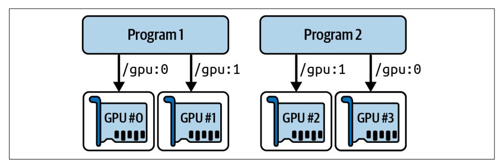

## **CHAPTER 19 Training and Deploying TensorFlow Models at Scale**

Once you have a beautiful model that makes amazing predictions, what do you do with it? Well, you need to put it in production! This could be as simple as running the model on a batch of data, and perhaps writing a script that runs this model every night. However, it is often much more involved. Various parts of your infrastructure may need to use this model on live data, in which case you will probably want to wrap your model in a web service: this way, any part of your infrastructure can query the model at any time using a simple REST API (or some other protocol), as we discussed in Chapter 2. But as time passes, you'll need to regularly retrain your model on fresh data and push the updated version to production. You must handle model versioning, gracefully transition from one model to the next, possibly roll back to the previous model in case of problems, and perhaps run multiple different models in parallel to perform A/B experiments.<sup>1</sup> If your product becomes successful, your service may start to get a large number of of queries per second (QPS), and it must scale up to support the load. A great solution to scale up your service, as you will see in this chapter, is to use TF Serving, either on your own hardware infrastructure or via a cloud service such as Google Vertex AI.<sup>2</sup> It will take care of efficiently serving your model, handle graceful model transitions, and more. If you use the cloud platform you will also get many extra features, such as powerful monitoring tools.

<sup>1</sup> An A/B experiment consists in testing two different versions of your product on different subsets of users in order to check which version works best and get other insights.

<sup>2</sup> Google AI Platform (formerly known as Google ML Engine) and Google AutoML merged in 2021 to form Google Vertex AI.

{749}------------------------------------------------

Moreover, if you have a lot of training data and compute-intensive models, then training time may be prohibitively long. If your product needs to adapt to changes quickly, then a long training time can be a showstopper (e.g., think of a news recommendation system promoting news from last week). Perhaps even more importantly, a long training time will prevent you from experimenting with new ideas. In machine learning (as in many other fields), it is hard to know in advance which ideas will work, so you should try out as many as possible, as fast as possible. One way to speed up training is to use hardware accelerators such as GPUs or TPUs. To go even faster, you can train a model across multiple machines, each equipped with multiple hardware accelerators. TensorFlow's simple yet powerful distribution strategies API makes this easy, as you will see.

In this chapter we will look at how to deploy models, first using TF Serving, then using Vertex AI. We will also take a quick look at deploying models to mobile apps, embedded devices, and web apps. Then we will discuss how to speed up computations using GPUs and how to train models across multiple devices and servers using the distribution strategies API. Lastly, we will explore how to train models and fine-tune their hyperparameters at scale using Vertex AI. That's a lot of topics to discuss, so let's dive in!

### **Serving a TensorFlow Model**

Once you have trained a TensorFlow model, you can easily use it in any Python code: if it's a Keras model, just call its predict() method! But as your infrastructure grows, there comes a point where it is preferable to wrap your model in a small service whose sole role is to make predictions and have the rest of the infrastructure query it (e.g., via a REST or gRPC API).<sup>3</sup> This decouples your model from the rest of the infrastructure, making it possible to easily switch model versions or scale the service up as needed (independently from the rest of your infrastructure), perform A/B experiments, and ensure that all your software components rely on the same model versions. It also simplifies testing and development, and more. You could create your own microservice using any technology you want (e.g., using the Flask library), but why reinvent the wheel when you can just use TF Serving?

### **Using TensorFlow Serving**

TF Serving is a very efficient, battle-tested model server, written in C++. It can sustain a high load, serve multiple versions of your models and watch a model repository to automatically deploy the latest versions, and more (see Figure 19-1).

<sup>3</sup> A REST (or RESTful) API is an API that uses standard HTTP verbs, such as GET, POST, PUT, and DELETE, and uses JSON inputs and outputs. The gRPC protocol is more complex but more efficient; data is exchanged using protocol buffers (see Chapter 13).

{750}------------------------------------------------


Figure 19-1. TF Serving can serve multiple models and automatically deploy the latest version of each model

So let's suppose you have trained an MNIST model using Keras, and you want to deploy it to TF Serving. The first thing you have to do is export this model to the SavedModel format, introduced in Chapter 10.

#### **Exporting SavedModels**

You already know how to save the model: just call model.save(). Now to version the model, you just need to create a subdirectory for each model version. Easy!

```
from pathlib import Path
import tensorflow as tf
X_train, X_valid, X_test = [...] # load and split the MNIST dataset
model = [\dots] # build & train an MNIST model (also handles image preprocessing)
model_name = "my_mnist_model"
model version = "0001"model_path = Path(model_name) / model_version
model.save(model_path, save_format="tf")
```

It's usually a good idea to include all the preprocessing layers in the final model you export so that it can ingest data in its natural form once it is deployed to production. This avoids having to take care of preprocessing separately within the application that uses the model. Bundling the preprocessing steps within the model also makes it simpler to update them later on and limits the risk of mismatch between a model and the preprocessing steps it requires.

{751}------------------------------------------------


Since a SavedModel saves the computation graph, it can only be used with models that are based exclusively on TensorFlow operations, excluding the tf.py\_function() operation, which wraps arbitrary Python code.

TensorFlow comes with a small saved\_model\_cli command-line interface to inspect SavedModels. Let use it to inspect our exported model:

```
$ saved model cli show --dir my mnist model/0001
The given SavedModel contains the following tag-sets:
'serve'
```

What does this output mean? Well, a SavedModel contains one or more *metagraphs*. A metagraph is a computation graph plus some function signature definitions, including their input and output names, types, and shapes. Each metagraph is identified by a set of tags. For example, you may want to have a metagraph containing the full computation graph, including the training operations: you would typically tag this one as "train". And you might have another metagraph containing a pruned computation graph with only the prediction operations, including some GPU-specific operations: this one might be tagged as "serve", "gpu". You might want to have other metagraphs as well. This can be done using TensorFlow's low-level SavedModel API. However, when you save a Keras model using its save() method, it saves a single metagraph tagged as "serve". Let's inspect this "serve" tag set:

```
$ saved_model_cli        show --dir 0001/my_mnist_model --tag_set        serve
The given SavedModel MetaGraphDef contains SignatureDefs with these keys:
SignatureDef key: "__saved_model_init_op"
SignatureDef key: "serving_default"
```

This metagraph contains two signature definitions: an initialization function called "\_\_saved\_model\_init\_op", which you do not need to worry about, and a default serving function called "serving\_default". When saving a Keras model, the default serving function is the model's call() method, which makes predictions, as you already know. Let's get more details about this serving function:

{752}------------------------------------------------

```
$ saved_model_cli        show --dir 0001/my_mnist_model --tag_set        serve \
                        --signature def serving default
The given SavedModel SignatureDef contains the following input(s):
  inputs['flatten input'] tensor info:
      dtype: DT UINT8
      shape: (-1, 28, 28)
      name: serving_default_flatten_input:0
The given SavedModel SignatureDef contains the following output(s):
  outputs['dense 1'] tensor info:
      dtype: DT FLOAT
      shape: (-1, 10)name: StatefulPartitionedCall:0
Method name is: tensorflow/serving/predict
```

Note that the function's input is named "flatten\_input", and the output is named "dense 1". These correspond to the Keras model's input and output layer names. You can also see the type and shape of the input and output data. Looks good!

Now that you have a SavedModel, the next step is to install TF Serving.

#### **Installing and starting TensorFlow Serving**

There are many ways to install TF Serving: using the system's package manager, using a Docker image,<sup>4</sup> installing from source, and more. Since Colab runs on Ubuntu, we can use Ubuntu's apt package manager like this:

```
url = "https://storage.google.google.com/tensorflow-serverving-apt"src = "stable tensorflow-model-server tensorflow-model-server-universal"
!echo 'deb {url} {src}' > /etc/apt/sources.list.d/tensorflow-serving.list
!curl '{url}/tensorflow-serving.release.pub.gpg' | apt-key add -
lapt update -q && apt-get install -y tensorflow-model-server
%pip install -q -U tensorflow-serving-api
```

This code starts by adding TensorFlow's package repository to Ubuntu's list of package sources. Then it downloads TensorFlow's public GPG key and adds it to the package manager's key list so it can verify TensorFlow's package signatures. Next, it uses apt to install the tensorflow-model-server package. Lastly, it installs the tensorflow-serving-api library, which we will need to communicate with the server.

<sup>4</sup> If you are not familiar with Docker, it allows you to easily download a set of applications packaged in a Docker image (including all their dependencies and usually some good default configuration) and then run them on your system using a Docker engine. When you run an image, the engine creates a Docker container that keeps the applications well isolated from your own system-but you can give it some limited access if you want. It is similar to a virtual machine, but much faster and lighter, as the container relies directly on the host's kernel. This means that the image does not need to include or run its own kernel.

{753}------------------------------------------------

Now we want to start the server. The command will require the absolute path of the base model directory (i.e., the path to my mnist model, not 0001), so let's save that to the MODEL DIR environment variable:

```
import os
os.environ["MODEL_DIR"] = str(model_path.parent.absolute())
```

We can then start the server:

```
%%bash -- bg
tensorflow_model_server \
     --port=8500 \
     -rest api port=8501 \
     --model name=my mnist model \
     --model base path="${MODEL DIR}" >my server.log 2>&1
```

In Jupyter or Colab, the %%bash --bg magic command executes the cell as a bash script, running it in the background. The >my\_server.log 2>&1 part redirects the standard output and standard error to the *my server.log* file. And that's it! TF Serving is now running in the background, and its logs are saved to *my\_server.log*. It loaded our MNIST model (version 1), and it is now waiting for gRPC and REST requests, respectively, on ports 8500 and 8501.

#### **Running TF Serving in a Docker Container**

If you are running the notebook on your own machine and you have installed Docker, you can run docker pull tensorflow/serving in a terminal to download the TF Serving image. The TensorFlow team highly recommends this installation method because it is simple, it will not mess with your system, and it offers high performance.<sup>5</sup> To start the server inside a Docker container, you can run the following command in a terminal:

```
$ docker run -it --rm -v "/path/to/my_mnist_model:/models/my_mnist_model" \
    -p 8500:8500 -p 8501:8501 -e MODEL NAME=my mnist model tensorflow/serving
```

Here is what all these command-line options mean:

 $-*i*$ t

Makes the container interactive (so you can press Ctrl-C to stop it) and displays the server's output.

 $- - cm$ 

Deletes the container when you stop it: no need to clutter your machine with interrupted containers. However, it does not delete the image.

<sup>5</sup> There are also GPU images available, and other installation options. For more details, please check out the official installation instructions.

{754}------------------------------------------------

```
-v "/path/to/my mnist model:/models/my mnist model"
    Makes the host's my mnist model directory available to the container at the
    path /models/mnist_model. You must replace /path/to/my_mnist_model with the
    absolute path of this directory. On Windows, remember to use \ instead of / in
    the host path, but not in the container path (since the container runs on Linux).
-p8500:8500Makes the Docker engine forward the host's TCP port 8500 to the container's
    TCP port 8500. By default, TF Serving uses this port to serve the gRPC API.
-p8501:8501Forwards the host's TCP port 8501 to the container's TCP port 8501. The Docker
    image is configured to use this port by default to serve the REST API.
-e MODEL NAME=my mnist model
    Sets the container's MODEL_NAME environment variable, so TF Serving knows
    which model to serve. By default, it will look for models in the /models directory,
    and it will automatically serve the latest version it finds.
tensorflow/serving
    This is the name of the image to run.
```

Now that the server is up and running, let's query it, first using the REST API, then the gRPC API.

#### Querying TF Serving through the REST API

Let's start by creating the query. It must contain the name of the function signature you want to call, and of course the input data. Since the request must use the JSON format, we have to convert the input images from a NumPy array to a Python list:

```
import json
X new = X test[:3] # pretend we have 3 new digit images to classify
request json = json.dumps({}"signature name": "serving default",
    "instances": X new.tolist(),
)
```

Note that the JSON format is 100% text-based. The request string looks like this:

```
>>> request_json
'{"signature_name": "serving_default", "instances": [[[0, 0, 0, 0, ... ]]]}'
```

Now let's send this request to TF Serving via an HTTP POST request. This can be done using the requests library (it is not part of Python's standard library, but it is preinstalled on Colab):

{755}------------------------------------------------

```
import requests
```

```
server_url = "http://localhost:8501/v1/models/my_mnist_model:predict"
response = requests.post(server url, data=request json)
response. raise for status() # raise an exception in case of error
response = response.join()
```

If all goes well, the response should be a dictionary containing a single "predictions" key. The corresponding value is the list of predictions. This list is a Python list, so let's convert it to a NumPy array and round the floats it contains to the second decimal:

```
>>> import numpy as np
>>> y_proba = np.array(response["predictions"])
>>> y_proba.round(2)
array([[0. , 0. , 0. , 0. , 0. , 0. , 0. , 0. , 1. , 0. , 0. ][0. , 0. , 0.99, 0.01, 0. , 0. , 0. , 0. , 0. , 0. ][0. , 0.97, 0.01, 0. , 0. , 0. , 0. , 0.01, 0. , 0. ]]
```

Hurray, we have the predictions! The model is close to 100% confident that the first image is a 7, 99% confident that the second image is a 2, and 97% confident that the third image is a 1. That's correct.

The REST API is nice and simple, and it works well when the input and output data are not too large. Moreover, just about any client application can make REST queries without additional dependencies, whereas other protocols are not always so readily available. However, it is based on JSON, which is text-based and fairly verbose. For example, we had to convert the NumPy array to a Python list, and every float ended up represented as a string. This is very inefficient, both in terms of serialization/deserialization time—we have to convert all the floats to strings and back—and in terms of payload size: many floats end up being represented using over 15 characters, which translates to over 120 bits for 32-bit floats! This will result in high latency and bandwidth usage when transferring large NumPy arrays.<sup>6</sup> So, let's see how to use gRPC instead.


When transferring large amounts of data, or when latency is important, it is much better to use the gRPC API, if the client supports it, as it uses a compact binary format and an efficient communication protocol based on HTTP/2 framing.

<sup>6</sup> To be fair, this can be mitigated by serializing the data first and encoding it to Base64 before creating the REST request. Moreover, REST requests can be compressed using gzip, which reduces the payload size significantly.

{756}------------------------------------------------

#### Querying TF Serving through the gRPC API

The gRPC API expects a serialized PredictRequest protocol buffer as input, and it outputs a serialized PredictResponse protocol buffer. These protobufs are part of the tensorflow-serving-api library, which we installed earlier. First, let's create the request:

```
from tensorflow serving.apis.predict pb2 import PredictRequest
request = PredictRequest()request.model spec.name = model name
request.model spec.signature name = "serving default"
input_name = model.input_names[0] # == "flatten_input"
request.inputs[input_name].CopyFrom(tf.make_tensor_proto(X_new))
```

This code creates a PredictRequest protocol buffer and fills in the required fields, including the model name (defined earlier), the signature name of the function we want to call, and finally the input data, in the form of a Tensor protocol buffer. The tf.make\_tensor\_proto() function creates a Tensor protocol buffer based on the given tensor or NumPy array, in this case X\_new.

Next, we'll send the request to the server and get its response. For this, we will need the grpcio library, which is preinstalled in Colab:

```
import grpc
from tensorflow_serving.apis import prediction service pb2 grpc
channel = g rpc.insecure channel('localhost:8500')predict_service = prediction_service_pb2_grpc.PredictionServiceStub(channel)
response = predict_service.Predict(request, timeout=10.0)
```

The code is quite straightforward: after the imports, we create a gRPC communication channel to *localhost* on TCP port 8500, then we create a gRPC service over this channel and use it to send a request, with a 10-second timeout. Note that the call is synchronous: it will block until it receives the response or when the timeout period expires. In this example the channel is insecure (no encryption, no authentication), but gRPC and TF Serving also support secure channels over SSL/TLS.

Next, let's convert the PredictResponse protocol buffer to a tensor:

```
output_name = model.output_names[0] # == "dense_1"outputs\; proto = response.outputs[output\;name]y_proba = tf.make_ndarray(outputs_proto)
```

If you run this code and print y\_proba.round(2), you will get the exact same estimated class probabilities as earlier. And that's all there is to it: in just a few lines of code, you can now access your TensorFlow model remotely, using either REST or gRPC.

{757}------------------------------------------------

#### Deploying a new model version

Now let's create a new model version and export a SavedModel, this time to the my\_mnist\_model/0002 directory:

```
model = [...] # build and train a new MNIST model version
model version = "0002"model path = Path(model name) / model version
model.save(model path, save format="tf")
```

At regular intervals (the delay is configurable), TF Serving checks the model directory for new model versions. If it finds one, it automatically handles the transition gracefully: by default, it answers pending requests (if any) with the previous model version, while handling new requests with the new version. As soon as every pending request has been answered, the previous model version is unloaded. You can see this at work in the TF Serving logs (in *my\_server.log*):

```
[\ldots]Reading SavedModel from: /models/my mnist model/0002
Reading meta graph with tags { serve }
[\ldots]Successfully loaded servable version {name: my_mnist_model version: 2}
Quiescing servable version {name: my_mnist_model version: 1}
Done quiescing servable version {name: my_mnist_model version: 1}
Unloading servable version {name: my mnist model version: 1}
```


If the SavedModel contains some example instances in the assets/ extra directory, you can configure TF Serving to run the new model on these instances before starting to use it to serve requests. This is called *model warmup*: it will ensure that everything is properly loaded, avoiding long response times for the first requests.

This approach offers a smooth transition, but it may use too much RAM—especially GPU RAM, which is generally the most limited. In this case, you can configure TF Serving so that it handles all pending requests with the previous model version and unloads it before loading and using the new model version. This configuration will avoid having two model versions loaded at the same time, but the service will be unavailable for a short period.

As you can see, TF Serving makes it straightforward to deploy new models. Moreover, if you discover that version 2 does not work as well as you expected, then rolling back to version 1 is as simple as removing the  $my$  mnist model/0002 directory.

{758}------------------------------------------------


Another great feature of TF Serving is its automatic batching capability, which you can activate using the --enable\_batching option upon startup. When TF Serving receives multiple requests within a short period of time (the delay is configurable), it will automatically batch them together before using the model. This offers a significant performance boost by leveraging the power of the GPU. Once the model returns the predictions, TF Serving dispatches each prediction to the right client. You can trade a bit of latency for a greater throughput by increasing the batching delay (see the --batching parameters file option).

If you expect to get many queries per second, you will want to deploy TF Serving on multiple servers and load-balance the queries (see Figure 19-2). This will require deploying and managing many TF Serving containers across these servers. One way to handle that is to use a tool such as Kubernetes, which is an open source system for simplifying container orchestration across many servers. If you do not want to purchase, maintain, and upgrade all the hardware infrastructure, you will want to use virtual machines on a cloud platform such as Amazon AWS, Microsoft Azure, Google Cloud Platform, IBM Cloud, Alibaba Cloud, Oracle Cloud, or some other platform as a service (PaaS) offering. Managing all the virtual machines, handling container orchestration (even with the help of Kubernetes), taking care of TF Serving configuration, tuning and monitoring—all of this can be a full-time job. Fortunately, some service providers can take care of all this for you. In this chapter we will use Vertex AI: it's the only platform with TPUs today; it supports TensorFlow 2, Scikit-Learn, and XGBoost; and it offers a nice suite of AI services. There are several other providers in this space that are capable of serving TensorFlow models as well, though, such as Amazon AWS SageMaker and Microsoft AI Platform, so make sure to check them out too


Figure 19-2. Scaling up TF Serving with load balancing

Now let's see how to serve our wonderful MNIST model on the cloud!

{759}------------------------------------------------

### **Creating a Prediction Service on Vertex AI**

Vertex AI is a platform within Google Cloud Platform (GCP) that offers a wide range of AI-related tools and services. You can upload datasets, get humans to label them, store commonly used features in a feature store and use them for training or in production, and train models across many GPU or TPU servers with automatic hyperparameter tuning or model architecture search (AutoML). You can also manage your trained models, use them to make batch predictions on large amounts of data, schedule multiple jobs for your data workflows, serve your models via REST or gRPC at scale, and experiment with your data and models within a hosted Jupyter environment called the Workbench. There's even a Matching Engine service that lets you compare vectors very efficiently (i.e., approximate nearest neighbors). GCP also includes other AI services, such as APIs for computer vision, translation, speech-totext, and more.

Before we start, there's a little bit of setup to take care of:

- 1. Log in to your Google account, and then go to the Google Cloud Platform console (see Figure 19-3). If you don't have a Google account, you'll have to create one.
- 2. If it's your first time using GCP, you'll have to read and accept the terms and conditions. New users are offered a free trial, including \$300 worth of GCP credit that you can use over the course of 90 days (as of May 2022). You'll only need a small portion of that to pay for the services you'll use in this chapter. Upon signing up for a free trial, you'll still need to create a payment profile and enter your credit card number: it's used for verification purposes-probably to avoid people using the free trial multiple times—but you won't be billed for the first \$300, and after that you'll only be charged if you opt in by upgrading to a paid account.


Figure 19-3. Google Cloud Platform console

{760}------------------------------------------------

- 3. If you have used GCP before and your free trial has expired, then the services you will use in this chapter will cost you some money. It shouldn't be too much, especially if you remember to turn off the services when you don't need them anymore. Make sure you understand and agree to the pricing conditions before you run any service. I hereby decline any responsibility if services end up costing more than you expected! Also make sure your billing account is active. To check, open the  $\equiv$  navigation menu at the top left and click Billing, then make sure you have set up a payment method and that the billing account is active.
- 4. Every resource in GCP belongs to a *project*. This includes all the virtual machines you may use, the files you store, and the training jobs you run. When you create an account, GCP automatically creates a project for you, called "My First Project". If you want, you can change its display name by going to the project settings: in the  $\equiv$  navigation menu, select "IAM and admin  $\rightarrow$  Settings", change the project's display name, and click SAVE. Note that the project also has a unique ID and number. You can choose the project ID when you create a project, but you cannot change it later. The project number is automatically generated and cannot be changed. If you want to create a new project, click the project name at the top of the page, then click NEW PROJECT and enter the project name. You can also click EDIT to set the project ID. Make sure billing is active for this new project so that service fees can be billed (to your free credits, if any).


Always set an alarm to remind yourself to turn services off when you know you will only need them for a few hours, or else you might leave them running for days or months, incurring potentially significant costs.

5. Now that you have a GCP account and a project, and billing is activated, you must activate the APIs you need. In the  $\equiv$  navigation menu, select "APIs and services", and make sure the Cloud Storage API is enabled. If needed, click + ENABLE APIS AND SERVICES, find Cloud Storage, and enable it. Also enable the Vertex AI API.

You could continue to do everything via the GCP console, but I recommend using Python instead: this way you can write scripts to automate just about anything you want with GCP, and it's often more convenient than clicking your way through menus and forms, especially for common tasks.

{761}------------------------------------------------

### **Google Cloud CLI and Shell**

Google Cloud's command-line interface (CLI) includes the gcloud command, which lets you control almost everything in GCP, and qsutil, which lets you interact with Google Cloud Storage. This CLI is preinstalled in Colab: all you need to do is authenticate using google.auth.authenticate\_user(), and you're good to go. For example, !gcloud config list will display the configuration.

GCP also offers a preconfigured shell environment called the Google Cloud Shell, which you can use directly in your web browser; it runs on a free Linux VM (Debian) with the Google Cloud SDK already preinstalled and configured for you, so there's no need to authenticate. The Cloud Shell is available anywhere in GCP: just click the Activate Cloud Shell icon at the top right of the page (see Figure 19-4).


Figure 19-4. Activating the Google Cloud Shell

If you prefer to install the CLI on your machine, then after installation you need to initialize it by running gcloud init: follow the instructions to log in to GCP and grant access to your GCP resources, then select the default GCP project you want to use (if you have more than one) and the default region where you want your jobs to run.

The first thing you need to do before you can use any GCP service is to authenticate. The simplest solution when using Colab is to execute the following code:

```
from google.colab import auth
```

```
auth.authenticate_user()
```

The authentication process is based on *OAuth 2.0*: a pop-up window will ask you to confirm that you want the Colab notebook to access your Google credentials. If you accept, you must select the same Google account you used for GCP. Then you will be asked to confirm that you agree to give Colab full access to all your data on Google Drive and in GCP. If you allow access, only the current notebook will have access, and only until the Colab runtime expires. Obviously, you should only accept this if you trust the code in the notebook.

{762}------------------------------------------------


If you are *not* working with the official notebooks from https:// github.com/ageron/handson-ml3, then you should be extra careful: if the notebook's author is mischievous, they could include code to do whatever they want with your data.

#### Authentication and Authorization on GCP

In general, using OAuth 2.0 authentication is only recommended when an application must access the user's personal data or resources from another application, on the user's behalf. For example, some applications allow the user to save data to their Google Drive, but for that the application first needs the user to authenticate with Google and allow access to Google Drive. In general, the application will only ask for the level of access it needs; it won't be an unlimited access: for example, the application will only request access to Google Drive, not Gmail or any other Google service. Moreover, the authorization usually expires after a while, and it can always be revoked.

When an application needs to access a service on GCP on its own behalf, not on behalf of the user, then it should generally use a service account. For example, if you build a website that needs to send prediction requests to a Vertex AI endpoint, then the website will be accessing the service on its own behalf. There's no data or resource that it needs to access in the user's Google account. In fact, many users of the website will not even have a Google account. For this scenario, you first need to create a service account. Select "IAM and admin  $\rightarrow$  Service accounts" in the GCP console's  $\equiv$  navigation menu (or use the search box), then click + CREATE SERVICE ACCOUNT, fill in the first page of the form (service account name, ID, description), and click CREATE AND CONTINUE. Next, you must give this account some access rights. Select the "Vertex AI user" role: this will allow the service account to make predictions and use other Vertex AI services, but nothing else. Click CONTINUE. You can now optionally grant some users access to the service account: this is useful when your GCP user account is part of an organization and you wish to authorize other users in the organization to deploy applications that will be based on this service account, or to manage the service account itself. Next, click DONE.

Once you have created a service account, your application must authenticate as that service account. There are several ways to do that. If your application is hosted on GCP-for example, if you are coding a website hosted on Google Compute Engine-then the simplest and safest solution is to attach the service account to the GCP resource that hosts your website, such as a VM instance or a Google App Engine service. This can be done when creating the GCP resource, by selecting the service account in the "Identity and API access" section. Some resources, such as VM instances, also let you attach the service account after the VM instance is created: you must stop it and edit its settings. In any case, once a service account is attached to a VM instance, or any other GCP resource running your code, GCP's client libraries 

{763}------------------------------------------------

(discussed shortly) will automatically authenticate as the chosen service account, with no extra step needed.

If your application is hosted using Kubernetes, then you should use Google's Workload Identity service to map the right service account to each Kubernetes service account. If your application is not hosted on GCP-for example, if you are just running the Jupyter notebook on your own machine—then you can either use the Workload Identity Federation service (that's the safest but hardest option), or just generate an access key for your service account, save it to a JSON file, and point the GOOGLE APPLICATION CREDENTIALS environment variable to it so your client application can access it. You can manage access keys by clicking the service account you just created, and then opening the KEYS tab. Make sure to keep the key file secret: it's like a password for the service account.

For more details on setting up authentication and authorization so your application can access GCP services, check out the documentation.

Now let's create a Google Cloud Storage bucket to store our SavedModels (a GCS bucket is a container for your data). For this we will use the google-cloud-storage library, which is preinstalled in Colab. We first create a Client object, which will serve as the interface with GCS, then we use it to create the bucket:

```
from google.cloud import storage
project_id = "my_project" # change this to your project ID
bucket_name = "my_bucket" # change this to a unique bucket name
location = "us-centrall"storage_client = storage.Client(project=project_id)
bucket = storage_client.create_bucket(bucket_name, location=location)
```


If you want to reuse an existing bucket, replace the last line with bucket = storage client.bucket(bucket name). Make sure location is set to the bucket's region.

GCS uses a single worldwide namespace for buckets, so simple names like "machinelearning" will most likely not be available. Make sure the bucket name conforms to DNS naming conventions, as it may be used in DNS records. Moreover, bucket names are public, so do not put anything private in the name. It is common to use your domain name, your company name, or your project ID as a prefix to ensure uniqueness, or simply use a random number as part of the name.

You can change the region if you want, but be sure to choose one that supports GPUs. Also, you may want to consider the fact that prices vary greatly between regions,

{764}------------------------------------------------

some regions produce much more  $CO<sub>2</sub>$  than others, some regions do not support all services, and using a single-region bucket improves performance. See Google Cloud's list of regions and Vertex AI's documentation on locations for more details. If you are unsure, it might be best to stick with "us-central1".

Next, let's upload the *my\_mnist\_model* directory to the new bucket. Files in GCS are called blobs (or objects), and under the hood they are all just placed in the bucket without any directory structure. Blob names can be arbitrary Unicode strings, and they can even contain forward slashes (/). The GCP console and other tools use these slashes to give the illusion that there are directories. So, when we upload the my\_mnist\_model directory, we only care about the files, not the directories:

```
def upload directory(bucket, dirpath):
    dirpath = Path(dirpath)for filepath in dirpath.glob("**/*"):
        if filepath.is file():
            blob = bucket.blob(filepath.relative_to(dirpath.parent).as_posix())
            blob.upload_from_filename(filepath)
```

```
upload_directory(bucket, "my_mnist_model")
```

This function works fine now, but it would be very slow if there were many files to upload. It's not too hard to speed it up tremendously by multithreading it (see the notebook for an implementation). Alternatively, if you have the Google Cloud CLI, then you can use following command instead:

```
!gsutil -m cp -r my mnist model gs://{bucket name}/
```

Next, let's tell Vertex AI about our MNIST model. To communicate with Vertex AI, we can use the google-cloud-aiplatform library (it still uses the old AI Platform name instead of Vertex AI). It's not preinstalled in Colab, so we need to install it. After that, we can import the library and initialize it—just to specify some default values for the project ID and the location—then we can create a new Vertex AI model: we specify a display name, the GCS path to our model (in this case the version 0001), and the URL of the Docker container we want Vertex AI to use to run this model. If you visit that URL and navigate up one level, you will find other containers you can use. This one supports TensorFlow 2.8 with a GPU:

```
from google.cloud import aiplatform
```

```
server_image = "gcr.io/cloud-aiplatform/prediction/tf2-gpu.2-8:latest"
aiplatform.init(project=project_id, location=location)
mnist_model = aiplatform.Model.upload(
    display name="mnist".
    artifact uri=f"gs://{bucket name}/my mnist model/0001",
    serving_container_image_uri=server_image,
\lambda
```

{765}------------------------------------------------

Now let's deploy this model so we can query it via a gRPC or REST API to make predictions. For this we first need to create an *endpoint*. This is what client applications connect to when they want to access a service. Then we need to deploy our model to this endpoint:

```
endpoint = aiplatform.Endpoint.create(display_name="mnist-endpoint")
endpoint.deploy(
   mnist_model,
    min replica count=1,
    max_replica_count=5,
   machine_type="n1-standard-4",
    accelerator type="NVIDIA TESLA K80",
    accelerator_count=1
\lambda
```

This code may take a few minutes to run, because Vertex AI needs to set up a virtual machine. In this example, we use a fairly basic machine of type n1-standard-4 (see https://homl.info/machinetypes for other types). We also use a basic GPU of type NVIDIA\_TESLA\_K80 (see https://homl.info/accelerators for other types). If you selected another region than "us-central1", then you may need to change the machine type or the accelerator type to values that are supported in that region (e.g., not all regions have Nvidia Tesla K80 GPUs).


Google Cloud Platform enforces various GPU quotas, both worldwide and per region: you cannot create thousands of GPU nodes without prior authorization from Google. To check your quotas, open "IAM and admin  $\rightarrow$  Quotas" in the GCP console. If some quotas are too low (e.g., if you need more GPUs in a particular region), you can ask for them to be increased; it often takes about 48 hours.

Vertex AI will initially spawn the minimum number of compute nodes (just one in this case), and whenever the number of queries per second becomes too high, it will spawn more nodes (up to the maximum number you defined, five in this case) and will load-balance the queries between them. If the QPS rate goes down for a while, Vertex AI will stop the extra compute nodes automatically. The cost is therefore directly linked to the load, as well as the machine and accelerator types you selected and the amount of data you store on GCS. This pricing model is great for occasional users and for services with important usage spikes. It's also ideal for startups: the price remains low until the startup actually starts up.

{766}------------------------------------------------

Congratulations, you have deployed your first model to the cloud! Now let's query this prediction service:

```
response = endpoint.predict(instances=X new.tolist())
```

We first need to convert the images we want to classify to a Python list, as we did earlier when we sent requests to TF Serving using the REST API. The response object contains the predictions, represented as a Python list of lists of floats. Let's round them to two decimal places and convert them to a NumPy array:

```
>>> import numpy as np
>>> np.round(response.predictions, 2)
array([[0. , 0. , 0. , 0. , 0. , 0. , 0. , 0. , 1. , 0. , 0. ]][\,0. \quad ,\,\, 0. \quad ,\,\, 0.99\,,\,\, 0.01\,,\,\, 0. \quad ,\,\, 0. \quad ,\,\, 0. \quad ,\,\, 0. \quad ,\,\, 0. \quad ,\,\, 0. \quad ]\,,[0. , 0.97, 0.01, 0. , 0. , 0. , 0. , 0.01, 0. , 0. ]]
```

Yes! We get the exact same predictions as earlier. We now have a nice prediction service running on the cloud that we can query from anywhere securely, and which can automatically scale up or down depending on the number of QPS. When you are done using the endpoint, don't forget to delete it, to avoid paying for nothing:

```
endpoint.undeploy_all() # undeploy all models from the endpoint
endpoint.delete()
```

Now let's see how to run a job on Vertex AI to make predictions on a potentially very large batch of data.

### **Running Batch Prediction Jobs on Vertex AI**

If we have a large number of predictions to make, then instead of calling our prediction service repeatedly, we can ask Vertex AI to run a prediction job for us. This does not require an endpoint, only a model. For example, let's run a prediction job on the first 100 images of the test set, using our MNIST model. For this, we first need to prepare the batch and upload it to GCS. One way to do this is to create a file containing one instance per line, each formatted as a JSON value—this format is called JSON Lines—then pass this file to Vertex AI. So let's create a JSON Lines file in a new directory, then upload this directory to GCS:

```
batch_path = Path("my_mnist_batch")
batch_path.mkdir(exist_ok=True)
with open(batch_path / "my_mnist_batch.jsonl", "w") as jsonl_file:
    for image in X test[:100].tolist():
        jsonl file.write(json.dumps(image))
        jsonl file.write("\ln")
upload directory(bucket, batch path)
```

{767}------------------------------------------------

Now we're ready to launch the prediction job, specifying the job's name, the type and number of machines and accelerators to use, the GCS path to the JSON Lines file we just created, and the path to the GCS directory where Vertex AI will save the model's predictions:

```
batch_prediction_job = mnist_model.batch_predict(
    job display name="my batch prediction job".
    machine type="n1-standard-4",
    starting_replica_count=1,
    max replica count=5,
    accelerator_type="NVIDIA_TESLA_K80",
    accelerator_count=1,
    gcs_source=[f"gs://{bucket_name}/{batch_path.name}/my_mnist_batch.jsonl"],
    gcs_destination_prefix=f"gs://{bucket_name}/my_mnist_predictions/",
    sync=True # set to False if you don't want to wait for completion
\mathcal{L}
```


For large batches, you can split the inputs into multiple JSON Lines files and list them all via the gcs source argument.

This will take a few minutes, mostly to spawn the compute nodes on Vertex AI. Once this command completes, the predictions will be available in a set of files named something like *prediction.results-00001-of-00002*. These files use the JSON Lines format by default, and each value is a dictionary containing an instance and its corresponding prediction (i.e., 10 probabilities). The instances are listed in the same order as the inputs. The job also outputs *prediction-errors*<sup>\*</sup> files, which can be useful for debugging if something goes wrong. We can iterate through all these output files using batch prediction job.iter outputs(), so let's go through all the predictions and store them in a y\_probas array:

```
v probas = [1]for blob in batch prediction job.iter outputs():
    if "prediction.results" in blob.name:
        for line in blob.download_as_text().splitlines():
            y proba = json.loads(line)["prediction"]
            y_probas.append(y_proba)
```

Now let's see how good these predictions are:

```
\Rightarrow y_pred = np.argmax(y_probas, axis=1)
>>> \arccuracy = np.sum(y pred == y test[:100]) / 1000.98
```

Nice, 98% accuracy!

{768}------------------------------------------------

The JSON Lines format is the default, but when dealing with large instances such as images, it is too verbose. Luckily, the batch\_predict() method accepts an instances\_format argument that lets you choose another format if you want. It defaults to "jsonl", but you can change it to "csv", "tf-record", "tf-recordgzip", "bigguery", or "file-list". If you set it to "file-list", then the gcs\_source argument should point to a text file containing one input filepath per line; for instance, pointing to PNG image files. Vertex AI will read these files as binary, encode them using Base64, and pass the resulting byte strings to the model. This means that you must add a preprocessing layer in your model to parse the Base64 strings, using tf.io.decode\_base64(). If the files are images, you must then parse the result using a function like tf.io.decode\_image() or tf.io.decode\_png(), as discussed in Chapter 13.

When you're finished using the model, you can delete it if you want, by running mnist model.delete(). You can also delete the directories you created in your GCS bucket, optionally the bucket itself (if it's empty), and the batch prediction job:

```
for prefix in ["my_mnist_model/", "my_mnist_batch/", "my_mnist_predictions/"]:
    blobs = bucket.list_blobs(prefix=prefix)
    for blob in blobs:
        blob.delete()
bucket.delete() # if the bucket is empty
batch prediction job.delete()
```

You now know how to deploy a model to Vertex AI, create a prediction service, and run batch prediction jobs. But what if you want to deploy your model to a mobile app instead? Or to an embedded device, such as a heating control system, a fitness tracker, or a self-driving car?

### Deploying a Model to a Mobile or Embedded Device

Machine learning models are not limited to running on big centralized servers with multiple GPUs: they can run closer to the source of data (this is called *edge comput*ing), for example in the user's mobile device or in an embedded device. There are many benefits to decentralizing the computations and moving them toward the edge: it allows the device to be smart even when it's not connected to the internet, it reduces latency by not having to send data to a remote server and reduces the load on the servers, and it may improve privacy, since the user's data can stay on the device.

However, deploying models to the edge has its downsides too. The device's computing resources are generally tiny compared to a beefy multi-GPU server. A large model may not fit in the device, it may use too much RAM and CPU, and it may take too long to download. As a result, the application may become unresponsive, and the device may heat up and quickly run out of battery. To avoid all this, you need to make

{769}------------------------------------------------

a lightweight and efficient model, without sacrificing too much of its accuracy. The TFLite library provides several tools<sup>7</sup> to help you deploy your models to the edge, with three main objectives:

- Reduce the model size, to shorten download time and reduce RAM usage.
- Reduce the amount of computations needed for each prediction, to reduce latency, battery usage, and heating.
- Adapt the model to device-specific constraints.

To reduce the model size, TFLite's model converter can take a SavedModel and compress it to a much lighter format based on FlatBuffers. This is an efficient crossplatform serialization library (a bit like protocol buffers) initially created by Google for gaming. It is designed so you can load FlatBuffers straight to RAM without any preprocessing: this reduces the loading time and memory footprint. Once the model is loaded into a mobile or embedded device, the TFLite interpreter will execute it to make predictions. Here is how you can convert a SavedModel to a FlatBuffer and save it to a .tflite file:

```
converter = tf.lite.TFLiteConverter.from_saved_model(str(model_path))
tflite model = converter.convert()
with open("my_converted_savedmodel.tflite", "wb") as f:
    f.write(tflite_model)
```


You can also save a Keras model directly to a FlatBuffer using tf.lite.TFLiteConverter.from\_keras\_model(model).

The converter also optimizes the model, both to shrink it and to reduce its latency. It prunes all the operations that are not needed to make predictions (such as training operations), and it optimizes computations whenever possible; for example,  $3 \times a$  +  $4 \times a$  + 5 x a will be converted to 12 x a. Additionally, it tries to fuse operations whenever possible. For example, if possible, batch normalization layers end up folded into the previous layer's addition and multiplication operations. To get a good idea of how much TFLite can optimize a model, download one of the pretrained TFLite models, such as *Inception\_V1\_quant* (click *tflite&pb*), unzip the archive, then open the excellent Netron graph visualization tool and upload the *pb* file to view the original model. It's a big, complex graph, right? Next, open the optimized *.tflite* model and marvel at its beauty!

<sup>7</sup> Also check out TensorFlow's Graph Transform Tool for modifying and optimizing computational graphs.

{770}------------------------------------------------

Another way you can reduce the model size—other than simply using smaller neural network architectures-is by using smaller bit-widths: for example, if you use halffloats (16 bits) rather than regular floats (32 bits), the model size will shrink by a factor of 2, at the cost of a (generally small) accuracy drop. Moreover, training will be faster, and you will use roughly half the amount of GPU RAM.

TFLite's converter can go further than that, by quantizing the model weights down to fixed-point, 8-bit integers! This leads to a fourfold size reduction compared to using 32-bit floats. The simplest approach is called *post-training quantization*: it just quantizes the weights after training, using a fairly basic but efficient symmetrical quantization technique. It finds the maximum absolute weight value,  $m$ , then it maps the floating-point range  $-m$  to  $+m$  to the fixed-point (integer) range  $-127$  to  $+127$ . For example, if the weights range from  $-1.5$  to  $+0.8$ , then the bytes  $-127$ , 0, and  $+127$ will correspond to the floats  $-1.5$ , 0.0, and  $+1.5$ , respectively (see Figure 19-5). Note that 0.0 always maps to 0 when using symmetrical quantization. Also note that the byte values  $+68$  to  $+127$  will not be used in this example, since they map to floats greater than  $+0.8$ .


Figure 19-5. From 32-bit floats to 8-bit integers, using symmetrical quantization

To perform this post-training quantization, simply add DEFAULT to the list of converter optimizations before calling the convert() method:

```
converter.optimizations = [tf.lite.Optimize.DEFAULT]
```

This technique dramatically reduces the model's size, which makes it much faster to download, and uses less storage space. At runtime the quantized weights get converted back to floats before they are used. These recovered floats are not perfectly identical to the original floats, but they're not too far off, so the accuracy loss is usually acceptable. To avoid recomputing the float values all the time, which would severely slow down the model, TFLite caches them: unfortunately, this means that this technique does not reduce RAM usage, and it doesn't speed up the model either. It's mostly useful to reduce the application's size.

{771}------------------------------------------------

The most effective way to reduce latency and power consumption is to also quantize the activations so that the computations can be done entirely with integers, without the need for any floating-point operations. Even when using the same bit-width (e.g., 32-bit integers instead of 32-bit floats), integer computations use less CPU cycles, consume less energy, and produce less heat. And if you also reduce the bit-width (e.g., down to 8-bit integers), you can get huge speedups. Moreover, some neural network accelerator devices—such as Google's Edge TPU—can only process integers, so full quantization of both weights and activations is compulsory. This can be done post-training; it requires a calibration step to find the maximum absolute value of the activations, so you need to provide a representative sample of training data to TFLite (it does not need to be huge), and it will process the data through the model and measure the activation statistics required for quantization. This step is typically fast.

The main problem with quantization is that it loses a bit of accuracy: it is similar to adding noise to the weights and activations. If the accuracy drop is too severe, then you may need to use *quantization-aware training*. This means adding fake quantization operations to the model so it can learn to ignore the quantization noise during training; the final weights will then be more robust to quantization. Moreover, the calibration step can be taken care of automatically during training, which simplifies the whole process.

I have explained the core concepts of TFLite, but going all the way to coding a mobile or embedded application woud require a dedicated book. Fortunately, some exist: if you want to learn more about building TensorFlow applications for mobile and embedded devices, check out the O'Reilly books TinyML: Machine Learning with TensorFlow on Arduino and Ultra-Low Power Micro-Controllers, by Pete Warden (former lead of the TFLite team) and Daniel Situnayake and AI and Machine Learning for On-Device Development, by Laurence Moroney.

Now what if you want to use your model in a website, running directly in the user's browser?

### **Running a Model in a Web Page**

Running your machine learning model on the client side, in the user's browser, rather than on the server side can be useful in many scenarios, such as:

- When your web application is often used in situations where the user's connectivity is intermittent or slow (e.g., a website for hikers), so running the model directly on the client side is the only way to make your website reliable.
- When you need the model's responses to be as fast as possible (e.g., for an online game). Removing the need to query the server to make predictions will definitely reduce the latency and make the website much more responsive.

{772}------------------------------------------------

• When your web service makes predictions based on some private user data, and you want to protect the user's privacy by making the predictions on the client side so that the private data never has to leave the user's machine.

For all these scenarios, you can use the TensorFlow.js (TFJS) JavaScript library. This library can load a TFLite model and make predictions directly in the user's browser. For example, the following JavaScript module imports the TFJS library, downloads a pretrained MobileNet model, and uses this model to classify an image and log the predictions. You can play with the code at https://homl.info/tfjscode, using Glitch.com, a website that lets you build web apps in your browser for free; click the PREVIEW button in the lower-right corner of the page to see the code in action:

```
import "https://cdn.jsdelivr.net/npm/@tensorflow/tfjs@latest";
import "https://cdn.jsdelivr.net/npm/@tensorflow-models/mobilenet@1.0.0";
const image = document.getElementById("image");
mobilenet.load().then(model => {
    model.classify(image).then(predictions = > {for (var i = 0; i < predictions. length; i++) {
            let className = predictions[i].classNameLet proba = (predictions[i].probability * 100).toFixed(1)
            console.log(className + " : " + prob + "%");
        <sup>1</sup>
    \});
\});
```

It's even possible to turn this website into a *progressive web app* (PWA): this is a website that respects a number of criteria<sup>8</sup> that allow it to be viewed in any browser, and even installed as a standalone app on a mobile device. For example, try visiting https://homl.info/tfjswpa on a mobile device: most modern browsers will ask you whether you would like to add TFJS Demo to your home screen. If you accept, you will see a new icon in your list of applications. Clicking this icon will load the TFJS Demo website inside its own window, just like a regular mobile app. A PWA can even be configured to work offline, by using a *service worker*: this is a JavaScript module that runs in its own separate thread in the browser and intercepts network requests, allowing it to cache resources so the PWA can run faster, or even entirely offline. It can also deliver push messages, run tasks in the background, and more. PWAs allow you to manage a single code base for the web and for mobile devices. They also make it easier to ensure that all users run the same version of your application. You can play with this TFJS Demo's PWA code on Glitch.com at https://homl.info/wpacode.

<sup>8</sup> For example, a PWA must include icons of various sizes for different mobile devices, it must be served via HTTPS, it must include a manifest file containing metadata such as the name of the app and the background color.

{773}------------------------------------------------


Check out many more demos of machine learning models running in your browser at https://tensorflow.org/js/demos.

TFJS also supports training a model directly in your web browser! And it's actually pretty fast. If your computer has a GPU card, then TFJS can generally use it, even if it's not an Nvidia card. Indeed, TFJS will use WebGL when it's available, and since modern web browsers generally support a wide range of GPU cards, TFJS actually supports more GPU cards than regular TensorFlow (which only supports Nvidia cards).

Training a model in a user's web browser can be especially useful to guarantee that this user's data remains private. A model can be trained centrally, and then fine-tuned locally, in the browser, based on that user's data. If you're interested in this topic, check out *federated learning*.

Once again, doing justice to this topic would require a whole book. If you want to learn more about TensorFlow.js, check out the O'reilly books Practical Deep Learning for Cloud, Mobile, and Edge, by Anirudh Koul et al., or Learning TensorFlow.js, by Gant Laborde.

Now that you've seen how to deploy TensorFlow models to TF Serving, or to the cloud with Vertex AI, or to mobile and embedded devices using TFLite, or to a web browser using TFJS, let's discuss how to use GPUs to speed up computations.

### **Using GPUs to Speed Up Computations**

In Chapter 11 we looked at several techniques that can considerably speed up training: better weight initialization, sophisticated optimizers, and so on. But even with all of these techniques, training a large neural network on a single machine with a single CPU can take hours, days, or even weeks, depending on the task. Thanks to GPUs, this training time can be reduced down to minutes or hours. Not only does this save an enormous amount of time, but it also means that you can experiment with various models much more easily, and frequently retrain your models on fresh data.

In the previous chapters, we used GPU-enabled runtimes on Google Colab. All you have to do for this is select "Change runtime type" from the Runtime menu, and choose the GPU accelerator type; TensorFlow automatically detects the GPU and uses it to speed up computations, and the code is exactly the same as without a GPU. Then, in this chapter you saw how to deploy your models to Vertex AI on multiple GPU-enabled compute nodes: it's just a matter of selecting the right GPU-enabled Docker image when creating the Vertex AI model, and selecting the desired GPU type when calling endpoint.deploy(). But what if you want to buy your own GPU?

{774}------------------------------------------------

And what if you want to distribute the computations across the CPU and multiple GPU devices on a single machine (see Figure 19-6)? This is what we will discuss now, then later in this chapter we will discuss how to distribute computations across multiple servers.


Figure 19-6. Executing a TensorFlow graph across multiple devices in parallel

### **Getting Your Own GPU**

If you know that you'll be using a GPU heavily and for a long period of time, then buying your own can make financial sense. You may also want to train your models locally because you do not want to upload your data to the cloud. Or perhaps you just want to buy a GPU card for gaming, and you'd like to use it for deep learning as well.

If you decide to purchase a GPU card, then take some time to make the right choice. You will need to consider the amount of RAM you will need for your tasks (e.g., typically at least 10 GB for image processing or NLP), the bandwidth (i.e., how fast you can send data into and out of the GPU), the number of cores, the cooling system, etc. Tim Dettmers wrote an excellent blog post to help you choose: I encourage you to read it carefully. At the time of this writing, TensorFlow only supports Nvidia cards with CUDA Compute Capability 3.5+ (as well as Google's TPUs, of course), but it may extend its support to other manufacturers, so make sure to check TensorFlow's documentation to see what devices are supported today.

{775}------------------------------------------------

If you go for an Nvidia GPU card, you will need to install the appropriate Nvidia drivers and several Nvidia libraries.<sup>9</sup> These include the Compute Unified Device Architecture library (CUDA) Toolkit, which allows developers to use CUDA-enabled GPUs for all sorts of computations (not just graphics acceleration), and the CUDA Deep Neural Network library (cuDNN), a GPU-accelerated library of common DNN computations such as activation layers, normalization, forward and backward convolutions, and pooling (see Chapter 14). cuDNN is part of Nvidia's Deep Learning SDK. Note that you will need to create an Nvidia developer account in order to download it. TensorFlow uses CUDA and cuDNN to control the GPU cards and accelerate computations (see Figure 19-7).


Figure 19-7. TensorFlow uses CUDA and cuDNN to control GPUs and boost DNNs

Once you have installed the GPU card(s) and all the required drivers and libraries, you can use the nvidia-smi command to check that everything is properly installed. This command lists the available GPU cards, as well as all the processes running on each card. In this example, it's an Nvidia Tesla T4 GPU card with about 15 GB of available RAM, and there are no processes currently running on it:

<sup>9</sup> Please check the TensorFlow docs for detailed and up-to-date installation instructions, as they change quite often.

{776}------------------------------------------------

```
$ nvidia-smi
Sun Apr 10 04:52:10 2022
+--------------------------------------
| NVIDIA-SMI 460.32.03                Driver Version: 460.32.03                CUDA Version: 11.2
|------------------------------+--------
.<br>| GPU Name          Persistence-M| Bus-Id          Disp.A | Volatile Uncorr. ECC |
| Fan Temp Perf Pwr:Usage/Cap|       Memory-Usage | GPU-Util Compute M. |<br>|                                 
|---------------------------------+------
| 0 TeslatT4 0ff | 00000000:00:04.0 Off | 0 00000000:00:04.0 Off | 0 0000000:00:04.0 Off | 0 0 0 0 0
|<br>| N/A 34C P8 9W/ 70W | 3MiB/15109MiB | 0% Default |<br>| N/A |
                 Contract Contract
                                     the control of the
                                                       N/A+-------------------------------+------
  . . . . . . . . . . . . . . . . . . . . 
Processes:
                 PID Type Process name
I GPU GI CI
                                                   GPU Memory |
                                               Usage |
   ID ID
|======================================
| No running processes found
+--------------------------------------
```

To check that TensorFlow actually sees your GPU, run the following commands and make sure the result is not empty:

```
>>> physical_gpus = tf.config.list_physical_devices("GPU")
>>> physical qpus
[PhysicalDevice(name='/physical device:GPU:0', device type='GPU')]
```

#### **Managing the GPU RAM**

By default TensorFlow automatically grabs almost all the RAM in all available GPUs the first time you run a computation. It does this to limit GPU RAM fragmentation. This means that if you try to start a second TensorFlow program (or any program that requires the GPU), it will quickly run out of RAM. This does not happen as often as you might think, as you will most often have a single TensorFlow program running on a machine: usually a training script, a TF Serving node, or a Jupyter notebook. If you need to run multiple programs for some reason (e.g., to train two different models in parallel on the same machine), then you will need to split the GPU RAM between these processes more evenly.

{777}------------------------------------------------

If you have multiple GPU cards on your machine, a simple solution is to assign each of them to a single process. To do this, you can set the CUDA VISIBLE DEVICES environment variable so that each process only sees the appropriate GPU card $(s)$ . Also set the CUDA\_DEVICE\_ORDER environment variable to PCI\_BUS\_ID to ensure that each ID always refers to the same GPU card. For example, if you have four GPU cards, you could start two programs, assigning two GPUs to each of them, by executing commands like the following in two separate terminal windows:

```
$ CUDA_DEVICE_ORDER=PCI_BUS_ID CUDA_VISIBLE_DEVICES=0,1 python3 program_1.py
# and in another terminal:
```

```
$ CUDA DEVICE ORDER=PCI BUS ID CUDA VISIBLE DEVICES=3,2 python3 program 2.py
```

Program 1 will then only see GPU cards 0 and 1, named "/qpu:0" and "/qpu:1", respectively, in TensorFlow, and program 2 will only see GPU cards 2 and 3, named "/gpu:1" and "/gpu:0", respectively (note the order). Everything will work fine (see Figure 19-8). Of course, you can also define these environment variables in Python by setting os.environ["CUDA\_DEVICE\_ORDER"] and os.environ["CUDA\_ VISIBLE\_DEVICES"], as long as you do so before using TensorFlow.



Figure 19-8. Each program gets two GPUs

Another option is to tell TensorFlow to grab only a specific amount of GPU RAM. This must be done immediately after importing TensorFlow. For example, to make TensorFlow grab only 2 GiB of RAM on each GPU, you must create a logical GPU device (sometimes called a virtual GPU device) for each physical GPU device and set its memory limit to 2 GiB (i.e., 2,048 MiB):

```
for gpu in physical gpus:
    tf.config.set_logical_device_configuration(
        qpu,
        [tf.config.LogicalDeviceConfiguration(memory_limit=2048)]
    \lambda
```

Let's suppose you have four GPUs, each with at least 4 GiB of RAM: in this case, two programs like this one can run in parallel, each using all four GPU cards (see Figure 19-9). If you run the nvidia-smi command while both programs are running, you should see that each process holds 2 GiB of RAM on each card.

{778}------------------------------------------------


Figure 19-9. Each program gets all four GPUs, but with only 2 GiB of RAM on each **GPU** 

Yet another option is to tell TensorFlow to grab memory only when it needs it. Again, this must be done immediately after importing TensorFlow:

```
for gpu in physical gpus:
    tf.config.experimental.set_memory_growth(gpu, True)
```

Another way to do this is to set the TF\_FORCE\_GPU\_ALLOW\_GROWTH environment variable to true. With this option, TensorFlow will never release memory once it has grabbed it (again, to avoid memory fragmentation), except of course when the program ends. It can be harder to guarantee deterministic behavior using this option (e.g., one program may crash because another program's memory usage went through the roof), so in production you'll probably want to stick with one of the previous options. However, there are some cases where it is very useful: for example, when you use a machine to run multiple Jupyter notebooks, several of which use TensorFlow. The TF FORCE GPU ALLOW GROWTH environment variable is set to true in Colab runtimes.

Lastly, in some cases you may want to split a GPU into two or more *logical devices*. For example, this is useful if you only have one physical GPU—like in a Colab runtime-but you want to test a multi-GPU algorithm. The following code splits GPU #0 into two logical devices, with 2 GiB of RAM each (again, this must be done immediately after importing TensorFlow):

```
tf.config.set_logical_device_configuration(
    physical qpus[0],[tf.config.LogicalDeviceConfiguration(memory_limit=2048),
     tf.config.LogicalDeviceConfiguration(memory_limit=2048)]
\mathcal{L}
```

These two logical devices are called "/ $gpu:0$ " and "/ $gpu:1$ ", and you can use them as if they were two normal GPUs. You can list all logical devices like this:

{779}------------------------------------------------

```
>>> logical_gpus = tf.config.list_logical_devices("GPU")
>>> logical gpus
[LogicalDevice(name='/device:GPU:0', device_type='GPU'),
LogicalDevice(name='/device:GPU:1', device type='GPU')]
```

Now let's see how TensorFlow decides which devices it should use to place variables and execute operations.

### **Placing Operations and Variables on Devices**

Keras and tf.data generally do a good job of placing operations and variables where they belong, but you can also place operations and variables manually on each device, if you want more control:

- You generally want to place the data preprocessing operations on the CPU, and place the neural network operations on the GPUs.
- GPUs usually have a fairly limited communication bandwidth, so it is important to avoid unnecessary data transfers into and out of the GPUs.
- Adding more CPU RAM to a machine is simple and fairly cheap, so there's usually plenty of it, whereas the GPU RAM is baked into the GPU: it is an expensive and thus limited resource, so if a variable is not needed in the next few training steps, it should probably be placed on the CPU (e.g., datasets generally belong on the CPU).

By default, all variables and all operations will be placed on the first GPU (the one named "/qpu:0"), except for variables and operations that don't have a GPU kernel:<sup>10</sup> these are placed on the CPU (always named "/cpu:0"). A tensor or variable's device attribute tells you which device it was placed on:<sup>11</sup>

```
>>> a = tf.Variable([1., 2., 3.]) # float32 variable goes to the GPU
>>> a.device
'/job:localhost/replica:0/task:0/device:GPU:0'
>>> b = tf.Variable([1, 2, 3]) # int32 variable goes to the CPU
>>> b.device
'/job:localhost/replica:0/task:0/device:CPU:0'
```

You can safely ignore the prefix /job: localhost/replica: 0/task: 0 for now; we will discuss jobs, replicas, and tasks later in this chapter. As you can see, the first variable was placed on GPU #0, which is the default device. However, the second variable was

<sup>10</sup> As we saw in Chapter 12, a kernel is an operation's implementation for a specific data type and device type. For example, there is a GPU kernel for the float32 tf.matmul() operation, but there is no GPU kernel for int32 tf.matmul(), only a CPU kernel.

<sup>11</sup> You can also use tf.debugging.set\_log\_device\_placement(True) to log all device placements.

{780}------------------------------------------------

placed on the CPU: this is because there are no GPU kernels for integer variables, or for operations involving integer tensors, so TensorFlow fell back to the CPU.

If you want to place an operation on a different device than the default one, use a tf.device() context:

```
>>> with tf.device("/cpu:0"):
... c = tf.Variable([1., 2., 3.])>>> c.device
'/job:localhost/replica:0/task:0/device:CPU:0'
```


The CPU is always treated as a single device ("/cpu:0"), even if your machine has multiple CPU cores. Any operation placed on the CPU may run in parallel across multiple cores if it has a multithreaded kernel.

If you explicitly try to place an operation or variable on a device that does not exist or for which there is no kernel, then TensorFlow will silently fall back to the device it would have chosen by default. This is useful when you want to be able to run the same code on different machines that don't have the same number of GPUs. However, you can run tf.config.set\_soft\_device\_placement(False) if you prefer to get an exception.

Now, how exactly does TensorFlow execute operations across multiple devices?

### **Parallel Execution Across Multiple Devices**

As we saw in Chapter 12, one of the benefits of using TF functions is parallelism. Let's look at this a bit more closely. When TensorFlow runs a TF function, it starts by analyzing its graph to find the list of operations that need to be evaluated, and it counts how many dependencies each of them has. TensorFlow then adds each operation with zero dependencies (i.e., each source operation) to the evaluation queue of this operation's device (see Figure 19-10). Once an operation has been evaluated, the dependency counter of each operation that depends on it is decremented. Once an operation's dependency counter reaches zero, it is pushed to the evaluation queue of its device. And once all the outputs have been computed, they are returned.

{781}------------------------------------------------


Figure 19-10. Parallelized execution of a TensorFlow graph

Operations in the CPU's evaluation queue are dispatched to a thread pool called the *inter-op thread pool*. If the CPU has multiple cores, then these operations will effectively be evaluated in parallel. Some operations have multithreaded CPU kernels: these kernels split their tasks into multiple suboperations, which are placed in another evaluation queue and dispatched to a second thread pool called the *intra-op* thread pool (shared by all multithreaded CPU kernels). In short, multiple operations and suboperations may be evaluated in parallel on different CPU cores.

For the GPU, things are a bit simpler. Operations in a GPU's evaluation queue are evaluated sequentially. However, most operations have multithreaded GPU kernels, typically implemented by libraries that TensorFlow depends on, such as CUDA and cuDNN. These implementations have their own thread pools, and they typically exploit as many GPU threads as they can (which is the reason why there is no need for an inter-op thread pool in GPUs: each operation already floods most GPU threads).

For example, in Figure 19-10, operations A, B, and C are source ops, so they can immediately be evaluated. Operations A and B are placed on the CPU, so they are sent to the CPU's evaluation queue, then they are dispatched to the inter-op thread pool and immediately evaluated in parallel. Operation A happens to have a multithreaded kernel; its computations are split into three parts, which are executed in parallel by the intra-op thread pool. Operation C goes to GPU  $#0$ 's evaluation queue, and in this example its GPU kernel happens to use cuDNN, which manages its own 

{782}------------------------------------------------

intra-op thread pool and runs the operation across many GPU threads in parallel. Suppose C finishes first. The dependency counters of D and E are decremented and they reach 0, so both operations are pushed to GPU #0's evaluation queue, and they are executed sequentially. Note that C only gets evaluated once, even though both D and E depend on it. Suppose B finishes next. Then F's dependency counter is decremented from 4 to 3, and since that's not 0, it does not run yet. Once A, D, and E are finished, then F's dependency counter reaches 0, and it is pushed to the CPU's evaluation queue and evaluated. Finally, TensorFlow returns the requested outputs.

An extra bit of magic that TensorFlow performs is when the TF function modifies a stateful resource, such as a variable: it ensures that the order of execution matches the order in the code, even if there is no explicit dependency between the statements. For example, if your TF function contains v.assign\_add(1) followed by v.assign(v \* 2), TensorFlow will ensure that these operations are executed in that order.


You can control the number of threads in the inter-op thread pool by calling tf.config.threading.set\_inter\_op\_parallel ism\_threads(). To set the number of intra-op threads, use tf.config.threading.set intra op parallelism threads(). This is useful if you do not want TensorFlow to use all the CPU cores or if you want it to be single-threaded.<sup>12</sup>

With that, you have all you need to run any operation on any device, and exploit the power of your GPUs! Here are some of the things you could do:

- · You could train several models in parallel, each on its own GPU: just write a training script for each model and run them in parallel, setting CUDA\_DEVICE\_ORDER and CUDA\_VISIBLE\_DEVICES so that each script only sees a single GPU device. This is great for hyperparameter tuning, as you can train in parallel multiple models with different hyperparameters. If you have a single machine with two GPUs, and it takes one hour to train one model on one GPU, then training two models in parallel, each on its own dedicated GPU, will take just one hour. Simple!
- You could train a model on a single GPU and perform all the preprocessing in parallel on the CPU, using the dataset's prefetch() method<sup>13</sup> to prepare the next few batches in advance so that they are ready when the GPU needs them (see Chapter 13).

<sup>12</sup> This can be useful if you want to guarantee perfect reproducibility, as I explain in this video, based on TF 1.

<sup>13</sup> At the time of writing, it only prefetches the data to the CPU RAM, but use tf.data.experimental.prefetch to device() to make it prefetch the data and push it to the device of your choice so that the GPU does not waste time waiting for the data to be transferred.

{783}------------------------------------------------

- If your model takes two images as input and processes them using two CNNs before joining their outputs,<sup>14</sup> then it will probably run much faster if you place each CNN on a different GPU.
- You can create an efficient ensemble: just place a different trained model on each GPU so that you can get all the predictions much faster to produce the ensemble's final prediction.

But what if you want to speed up training by using multiple GPUs?

### **Training Models Across Multiple Devices**

There are two main approaches to training a single model across multiple devices: *model parallelism*, where the model is split across the devices, and *data parallelism*, where the model is replicated across every device, and each replica is trained on a different subset of the data. Let's look at these two options.

#### **Model Parallelism**

So far we have trained each neural network on a single device. What if we want to train a single neural network across multiple devices? This requires chopping the model into separate chunks and running each chunk on a different device. Unfortunately, such model parallelism turns out to be pretty tricky, and its effectiveness really depends on the architecture of your neural network. For fully connected networks, there is generally not much to be gained from this approach (see Figure 19-11). Intuitively, it may seem that an easy way to split the model is to place each layer on a different device, but this does not work because each layer needs to wait for the output of the previous layer before it can do anything. So perhaps you can slice it vertically—for example, with the left half of each layer on one device, and the right part on another device? This is slightly better, since both halves of each layer can indeed work in parallel, but the problem is that each half of the next layer requires the output of both halves, so there will be a lot of cross-device communication (represented by the dashed arrows). This is likely to completely cancel out the benefit of the parallel computation, since cross-device communication is slow (and even more so when the devices are located on different machines).

<sup>14</sup> If the two CNNs are identical, then it is called a Siamese neural network.

{784}------------------------------------------------


Figure 19-11. Splitting a fully connected neural network

Some neural network architectures, such as convolutional neural networks (see Chapter 14), contain layers that are only partially connected to the lower layers, so it is much easier to distribute chunks across devices in an efficient way (Figure 19-12).


Figure 19-12. Splitting a partially connected neural network

{785}------------------------------------------------

Deep recurrent neural networks (see Chapter 15) can be split a bit more efficiently across multiple GPUs. If you split the network horizontally by placing each layer on a different device, and feed the network with an input sequence to process, then at the first time step only one device will be active (working on the sequence's first value), at the second step two will be active (the second layer will be handling the output of the first layer for the first value, while the first layer will be handling the second value), and by the time the signal propagates to the output layer, all devices will be active simultaneously (Figure 19-13). There is still a lot of cross-device communication going on, but since each cell may be fairly complex, the benefit of running multiple cells in parallel may (in theory) outweigh the communication penalty. However, in practice a regular stack of LSTM layers running on a single GPU actually runs much faster.


Figure 19-13. Splitting a deep recurrent neural network

In short, model parallelism may speed up running or training some types of neural networks, but not all, and it requires special care and tuning, such as making sure that devices that need to communicate the most run on the same machine.<sup>15</sup> Next we'll look at a much simpler and generally more efficient option: data parallelism.

<sup>15</sup> If you are interested in going further with model parallelism, check out Mesh TensorFlow.

{786}------------------------------------------------

### Data Parallelism

Another way to parallelize the training of a neural network is to replicate it on every device and run each training step simultaneously on all replicas, using a different mini-batch for each. The gradients computed by each replica are then averaged, and the result is used to update the model parameters. This is called *data parallelism*, or sometimes single program, multiple data (SPMD). There are many variants of this idea, so let's look at the most important ones.

#### Data parallelism using the mirrored strategy

Arguably the simplest approach is to completely mirror all the model parameters across all the GPUs and always apply the exact same parameter updates on every GPU. This way, all replicas always remain perfectly identical. This is called the mirrored strategy, and it turns out to be quite efficient, especially when using a single machine (see Figure 19-14).


Figure 19-14. Data parallelism using the mirrored strategy

{787}------------------------------------------------

The tricky part when using this approach is to efficiently compute the mean of all the gradients from all the GPUs and distribute the result across all the GPUs. This can be done using an AllReduce algorithm, a class of algorithms where multiple nodes collaborate to efficiently perform a *reduce operation* (such as computing the mean, sum, and max), while ensuring that all nodes obtain the same final result. Fortunately, there are off-the-shelf implementations of such algorithms, as you will see.

#### Data parallelism with centralized parameters

Another approach is to store the model parameters outside of the GPU devices performing the computations (called *workers*); for example, on the CPU (see Figure 19-15). In a distributed setup, you may place all the parameters on one or more CPU-only servers called *parameter servers*, whose only role is to host and update the parameters.


Figure 19-15. Data parallelism with centralized parameters

Whereas the mirrored strategy imposes synchronous weight updates across all GPUs, this centralized approach allows either synchronous or asynchronous updates. Let's take a look at the pros and cons of both options.

{788}------------------------------------------------

**Synchronous updates.** With *synchronous updates*, the aggregator waits until all gradients are available before it computes the average gradients and passes them to the optimizer, which will update the model parameters. Once a replica has finished computing its gradients, it must wait for the parameters to be updated before it can proceed to the next mini-batch. The downside is that some devices may be slower than others, so the fast devices will have to wait for the slow ones at every step, making the whole process as slow as the slowest device. Moreover, the parameters will be copied to every device almost at the same time (immediately after the gradients are applied), which may saturate the parameter servers' bandwidth.


To reduce the waiting time at each step, you could ignore the gradients from the slowest few replicas (typically  $\sim$ 10%). For example, you could run 20 replicas, but only aggregate the gradients from the fastest 18 replicas at each step, and just ignore the gradients from the last 2. As soon as the parameters are updated, the first 18 replicas can start working again immediately, without having to wait for the 2 slowest replicas. This setup is generally described as having 18 replicas plus 2 spare replicas.<sup>16</sup>

Asynchronous updates. With asynchronous updates, whenever a replica has finished computing the gradients, the gradients are immediately used to update the model parameters. There is no aggregation (it removes the "mean" step in Figure 19-15) and no synchronization. Replicas work independently of the other replicas. Since there is no waiting for the other replicas, this approach runs more training steps per minute. Moreover, although the parameters still need to be copied to every device at every step, this happens at different times for each replica, so the risk of bandwidth saturation is reduced.

Data parallelism with asynchronous updates is an attractive choice because of its simplicity, the absence of synchronization delay, and its better use of the bandwidth. However, although it works reasonably well in practice, it is almost surprising that it works at all! Indeed, by the time a replica has finished computing the gradients based on some parameter values, these parameters will have been updated several times by other replicas (on average  $N - 1$  times, if there are N replicas), and there is no guarantee that the computed gradients will still be pointing in the right direction (see Figure 19-16). When gradients are severely out of date, they are called *stale* gradients: they can slow down convergence, introducing noise and wobble effects

<sup>16</sup> This name is slightly confusing because it sounds like some replicas are special, doing nothing. In reality, all replicas are equivalent: they all work hard to be among the fastest at each training step, and the losers vary at every step (unless some devices are really slower than others). However, it does mean that if one or two servers crash, training will continue just fine.

{789}------------------------------------------------

(the learning curve may contain temporary oscillations), or they can even make the training algorithm diverge.


Figure 19-16. Stale gradients when using asynchronous updates

There are a few ways you can reduce the effect of stale gradients:

- Reduce the learning rate.
- Drop stale gradients or scale them down.
- Adjust the mini-batch size.
- Start the first few epochs using just one replica (this is called the *warmup phase*). Stale gradients tend to be more damaging at the beginning of training, when gradients are typically large and the parameters have not settled into a valley of the cost function yet, so different replicas may push the parameters in quite different directions.

A paper published by the Google Brain team in 2016<sup>17</sup> benchmarked various approaches and found that using synchronous updates with a few spare replicas was more efficient than using asynchronous updates, not only converging faster but also producing a better model. However, this is still an active area of research, so you should not rule out asynchronous updates just yet.

<sup>17</sup> Jianmin Chen et al., "Revisiting Distributed Synchronous SGD", arXiv preprint arXiv:1604.00981 (2016).

{790}------------------------------------------------

#### **Bandwidth saturation**

Whether you use synchronous or asynchronous updates, data parallelism with centralized parameters still requires communicating the model parameters from the parameter servers to every replica at the beginning of each training step, and the gradients in the other direction at the end of each training step. Similarly, when using the mirrored strategy, the gradients produced by each GPU will need to be shared with every other GPU. Unfortunately, there often comes a point where adding an extra GPU will not improve performance at all because the time spent moving the data into and out of GPU RAM (and across the network in a distributed setup) will outweigh the speedup obtained by splitting the computation load. At that point, adding more GPUs will just worsen the bandwidth saturation and actually slow down training.

Saturation is more severe for large dense models, since they have a lot of parameters and gradients to transfer. It is less severe for small models (but the parallelization gain is limited) and for large sparse models, where the gradients are typically mostly zeros and so can be communicated efficiently. Jeff Dean, initiator and lead of the Google Brain project, reported typical speedups of 25-40x when distributing computations across 50 GPUs for dense models, and a 300x speedup for sparser models trained across 500 GPUs. As you can see, sparse models really do scale better. Here are a few concrete examples:

- Neural machine translation: 6x speedup on 8 GPUs
- Inception/ImageNet: 32× speedup on 50 GPUs
- RankBrain: 300× speedup on 500 GPUs

There is plenty of research going on to alleviate the bandwidth saturation issue, with the goal of allowing training to scale linearly with the number of GPUs available. For example, a 2018 paper<sup>18</sup> by a team of researchers from Carnegie Mellon University, Stanford University, and Microsoft Research proposed a system called PipeDream that managed to reduce network communications by over 90%, making it possible to train large models across many machines. They achieved this using a new technique called *pipeline parallelism*, which combines model parallelism and data parallelism: the model is chopped into consecutive parts, called *stages*, each of which is trained on a different machine. This results in an asynchronous pipeline in which all machines work in parallel with very little idle time. During training, each stage alternates one round of forward propagation and one round of backpropagation (see Figure 19-17): it pulls a mini-batch from its input queue, processes it, and sends the outputs to the next stage's input queue, then it pulls one mini-batch of gradients from its gradient

<sup>18</sup> Aaron Harlap et al., "PipeDream: Fast and Efficient Pipeline Parallel DNN Training", arXiv preprint arXiv:1806.03377 (2018).

{791}------------------------------------------------

queue, backpropagates these gradients and updates its own model parameters, and pushes the backpropagated gradients to the previous stage's gradient queue. It then repeats the whole process again and again. Each stage can also use regular data parallelism (e.g., using the mirrored strategy), independently from the other stages.


Figure 19-17. PipeDream's pipeline parallelism

However, as it's presented here, PipeDream would not work so well. To understand why, consider mini-batch #5 in Figure 19-17: when it went through stage 1 during the forward pass, the gradients from mini-batch #4 had not yet been backpropagated through that stage, but by the time  $#5$ 's gradients flow back to stage 1,  $#4$ 's gradients will have been used to update the model parameters, so #5's gradients will be a bit stale. As we have seen, this can degrade training speed and accuracy, and even make it diverge: the more stages there are, the worse this problem becomes. The paper's authors proposed methods to mitigate this issue, though: for example, each stage saves weights during forward propagation and restores them during backpropagation, to ensure that the same weights are used for both the forward pass and the backward pass. This is called *weight stashing*. Thanks to this, PipeDream demonstrates impressive scaling capability, well beyond simple data parallelism.

The latest breakthrough in this field of research was published in a 2022 paper<sup>19</sup> by Google researchers: they developed a system called Pathways that uses automated model parallelism, asynchronous gang scheduling, and other techniques to reach close to 100% hardware utilization across thousands of TPUs! Scheduling means organizing when and where each task must run, and gang scheduling means running related tasks at the same time in parallel and close to each other to reduce the time tasks have to wait for the others' outputs. As we saw in Chapter 16, this system was used to train a massive language model across over 6,000 TPUs, with close to 100% hardware utilization: that's a mindblowing engineering feat.

At the time of writing, Pathways is not public yet, but it's likely that in the near future you will be able to train huge models on Vertex AI using Pathways or a similar system. In the meantime, to reduce the saturation problem, you'll probably want to use a few powerful GPUs rather than plenty of weak GPUs, and if you need to train a model across multiple servers, you should group your GPUs on few and

<sup>19</sup> Paul Barham et al., "Pathways: Asynchronous Distributed Dataflow for ML", arXiv preprint arXiv:2203.12533  $(2022).$ 

{792}------------------------------------------------

very well interconnected servers. You can also try dropping the float precision from 32 bits (tf.float32) to 16 bits (tf.bfloat16). This will cut in half the amount of data to transfer, often without much impact on the convergence rate or the model's performance. Lastly, if you are using centralized parameters, you can shard (split) the parameters across multiple parameter servers: adding more parameter servers will reduce the network load on each server and limit the risk of bandwidth saturation.

OK, now that we've gone through all the theory, let's actually train a model across multiple GPUs!

### **Training at Scale Using the Distribution Strategies API**

Luckily, TensorFlow comes with a very nice API that takes care of all the complexity of distributing your model across multiple devices and machines: the *distribution* strategies API. To train a Keras model across all available GPUs (on a single machine, for now) using data parallelism with the mirrored strategy, just create a Mirrored Strategy object, call its scope() method to get a distribution context, and wrap the creation and compilation of your model inside that context. Then call the model's fit() method normally:

```
strategy = tf.distribute.MirroredStrategy()with strategy.scope():
   model = tf.keras.Sequential([...]) # create a Keras model normally
   model.compile([...]) # compile the model normally
batch size = 100 # preferably divisible by the number of replicas
model.fit(X_train, y_train, epochs=10,
          validation data=(X valid, y valid), batch size=batch size)
```

Under the hood, Keras is distribution-aware, so in this MirroredStrategy context it knows that it must replicate all variables and operations across all available GPU devices. If you look at the model's weights, they are of type MirroredVariable:

```
>>> type(model.weights[0])
tensorflow.python.distribute.values.MirroredVariable
```

Note that the fit() method will automatically split each training batch across all the replicas, so it's preferable to ensure that the batch size is divisible by the number of replicas (i.e., the number of available GPUs) so that all replicas get batches of the same size. And that's all! Training will generally be significantly faster than using a single device, and the code change was really minimal.

{793}------------------------------------------------

Once you have finished training your model, you can use it to make predictions efficiently: call the predict() method, and it will automatically split the batch across all replicas, making predictions in parallel. Again, the batch size must be divisible by the number of replicas. If you call the model's save() method, it will be saved as a regular model, not as a mirrored model with multiple replicas. So when you load it, it will run like a regular model, on a single device: by default on GPU #0, or on the CPU if there are no GPUs. If you want to load a model and run it on all available devices, you must call tf.keras.models.load\_model() within a distribution context:

```
with strategy.scope():
    model = tf.keras.models.load model("my mirrored model")
```

If you only want to use a subset of all the available GPU devices, you can pass the list to the MirroredStrategy's constructor:

```
strategy = tf.distribute.MirroredStrategy(devices=["/gpu:0", "/gpu:1"])
```

By default, the MirroredStrategy class uses the NVIDIA Collective Communications Library (NCCL) for the AllReduce mean operation, but you can change it by setting the cross\_device\_ops argument to an instance of the tf.distribute.Hierarchical CopyAllReduce class, or an instance of the tf.distribute.ReductionToOneDevice class. The default NCCL option is based on the tf.distribute. NcclAllReduce class, which is usually faster, but this depends on the number and types of GPUs, so you may want to give the alternatives a try.<sup>20</sup>

If you want to try using data parallelism with centralized parameters, replace the MirroredStrategy with the CentralStorageStrategy:

```
strategy = tf.distribute.experimental.CentralStorageStrategy()
```

You can optionally set the compute\_devices argument to specify the list of devices you want to use as workers—by default it will use all available GPUs—and you can optionally set the parameter\_device argument to specify the device you want to store the parameters on. By default it will use the CPU, or the GPU if there is just one.

Now let's see how to train a model across a cluster of TensorFlow servers!

### **Training a Model on a TensorFlow Cluster**

A TensorFlow cluster is a group of TensorFlow processes running in parallel, usually on different machines, and talking to each other to complete some work—for example, training or executing a neural network model. Each TF process in the cluster is called a task, or a TF server. It has an IP address, a port, and a type (also called its

<sup>20</sup> For more details on AllReduce algorithms, read Yuichiro Ueno's post on the technologies behind deep learning and Sylvain Jeaugey's post on massively scaling deep learning training with NCCL.

{794}------------------------------------------------

*role* or its *job*). The type can be either "worker", "chief", "ps" (parameter server), or "evaluator":

- Each *worker* performs computations, usually on a machine with one or more GPU<sub>s</sub>
- The *chief* performs computations as well (it is a worker), but it also handles extra work such as writing TensorBoard logs or saving checkpoints. There is a single chief in a cluster. If no chief is specified explicitly, then by convention the first worker is the chief.
- A parameter server only keeps track of variable values, and it is usually on a CPUonly machine. This type of task is only used with the ParameterServerStrategy.
- An evaluator obviously takes care of evaluation. This type is not used often, and when it's used, there's usually just one evaluator.

To start a TensorFlow cluster, you must first define its specification. This means defining each task's IP address, TCP port, and type. For example, the following *cluster* specification defines a cluster with three tasks (two workers and one parameter server; see Figure 19-18). The cluster spec is a dictionary with one key per job, and the values are lists of task addresses (IP:port):

```
cluster spec = \{"worker": [
        "machine-a.example.com:2222".
                                        # /job:worker/task:0
        "machine-b.example.com:2222"
                                         # /job:worker/task:1
    1,
    "ps": ["machine-a.example.com:2221"] # /job:ps/task:0
\mathcal{F}
```

In general there will be a single task per machine, but as this example shows, you can configure multiple tasks on the same machine if you want. In this case, if they share the same GPUs, make sure the RAM is split appropriately, as discussed earlier.


By default, every task in the cluster may communicate with every other task, so make sure to configure your firewall to authorize all communications between these machines on these ports (it's usually simpler if you use the same port on every machine).

{795}------------------------------------------------


Figure 19-18. An example TensorFlow cluster

When you start a task, you must give it the cluster spec, and you must also tell it what its type and index are (e.g., worker #0). The simplest way to specify everything at once (both the cluster spec and the current task's type and index) is to set the TF\_CONFIG environment variable before starting TensorFlow. It must be a [SON-encoded dictionary containing a cluster specification (under the "cluster" key) and the type and index of the current task (under the "task" key). For example, the following TF\_CONFIG environment variable uses the cluster we just defined and specifies that the task to start is worker #0:

```
\cos .environ["TF_CONFIG"] = json.dumps({
    "cluster": cluster_spec,
    "task": {"type": "worker", "index": 0}
\}
```


In general you want to define the TF\_CONFIG environment variable outside of Python, so the code does not need to include the current task's type and index (this makes it possible to use the same code across all workers).

Now let's train a model on a cluster! We will start with the mirrored strategy. First, you need to set the TF\_CONFIG environment variable appropriately for each task. There should be no parameter server (remove the "ps" key in the cluster spec), and in general you will want a single worker per machine. Make extra sure you set a different task index for each task. Finally, run the following script on every worker:

{796}------------------------------------------------

```
import tempfile
import tensorflow as tf
strategy = tf.distribute.MultiplyOrkerMirroredStrategy() # at the start!
resolver = tf.distribute.cluster resolver.TFConfigClusterResolver()
print(f"Starting task {resolver.task_type} #{resolver.task_id}")
[...] # load and split the MNIST dataset
with strategy.scope():
    model = tf.keras.Sequential([...]) # build the Keras model
    model.compile([-..]) # compile the model
model.fit(X_train, y_train, validation_data=(X_valid, y_valid), epochs=10)
if resolver.task id == 0: # the chief saves the model to the right location
    model.save("my_mnist_multiworker_model", save_format="tf")
else:
    tmpdir = tempfile.mkdtemp() # other workers save to a temporary directory
    model.save(tmpdir, save format="tf")
    tf.io.getile.rntree(tmpdir) # and we can delete this directory at the end!
```

That's almost the same code you used earlier, except this time you are using the MultiWorkerMirroredStrategy. When you start this script on the first workers, they will remain blocked at the AllReduce step, but training will begin as soon as the last worker starts up, and you will see them all advancing at exactly the same rate since they synchronize at each step.


When using the MultiWorkerMirroredStrategy, it's important to ensure that all workers do the same thing, including saving model checkpoints or writing TensorBoard logs, even though you will only keep what the chief writes. This is because these operations may need to run the AllReduce operations, so all workers must be in sync.

There are two AllReduce implementations for this distribution strategy: a ring All-Reduce algorithm based on gRPC for the network communications, and NCCL's implementation. The best algorithm to use depends on the number of workers, the number and types of GPUs, and the network. By default, TensorFlow will apply some heuristics to select the right algorithm for you, but you can force NCCL (or RING) like this:

```
strategy = tf.distribute.MultiWorkerMirroredStrategy(
   communication_options=tf.distribute.experimental.CommunicationOptions(
       implementation=tf.distribute.experimental.CollectiveCommunication.NCCL))
```

{797}------------------------------------------------

If you prefer to implement asynchronous data parallelism with parameter servers, change the strategy to ParameterServerStrategy, add one or more parameter servers, and configure TF\_CONFIG appropriately for each task. Note that although the workers will work asynchronously, the replicas on each worker will work synchronously.

Lastly, if you have access to TPUs on Google Cloud—for example, if you use Colab and you set the accelerator type to TPU-then you can create a TPUStrategy like this:

```
resolver = tf.distribute.cluster_resolver.TPUClusterResolver()
tf.tpu.experimental.initialize tpu system(resolver)
strategy = tf.distribute.experimental.TPUStrategy(resolver)
```

This needs to be run right after importing TensorFlow. You can then use this strategy normally.


If you are a researcher, you may be eligible to use TPUs for free; see https://tensorflow.org/tfrc for more details.

You can now train models across multiple GPUs and multiple servers: give yourself a pat on the back! If you want to train a very large model, however, you will need many GPUs, across many servers, which will require either buying a lot of hardware or managing a lot of cloud virtual machines. In many cases, it's less hassle and less expensive to use a cloud service that takes care of provisioning and managing all this infrastructure for you, just when you need it. Let's see how to do that using Vertex AI.

### **Running Large Training Jobs on Vertex AI**

Vertex AI allows you to create custom training jobs with your own training code. In fact, you can use almost the same training code as you would use on your own TF cluster. The main thing you must change is where the chief should save the model, the checkpoints, and the TensorBoard logs. Instead of saving the model to a local directory, the chief must save it to GCS, using the path provided by Vertex AI in the AIP\_MODEL\_DIR environment variable. For the model checkpoints and TensorBoard logs, you should use the paths contained in the AIP\_CHECKPOINT\_DIR and AIP\_TENSORBOARD\_LOG\_DIR environment variables, respectively. Of course, you must also make sure that the training data can be accessed from the virtual machines, such as on GCS, or another GCP service like BigQuery, or directly from the web. Lastly, Vertex AI sets the "chief" task type explicitly, so you should identify the chief using resolved.task\_type == "chief" instead of resolved.task\_id ==  $0$ :

{798}------------------------------------------------

```
import os
\left[\ldots\right] # other imports, create MultiWorkerMirroredStrategy, and resolver
if resolver.test type == "chief":
    model dir = os.getenv("AIP MODEL DIR") # paths provided by Vertex AItensorboard_log_dir = os.getenv("AIP_TENSORBOARD_LOG_DIR")
    checkpoint_dir = os.getenv("AIP_CHECKPOINT_DIR")
else:
    tmp dir = Path(template.mkdtemp()) # other workers use temporary dirs
    model dir = tmp dir / "model"tensorboard_log_dir = tmp_dir / "logs"checkpoint dir = tmp dir / "ckpt"
calb is alleaks = [tf.keras.callbacks.TensorBoard(tensorboard, log dir),tf.keras.callbacks.ModelCheckpoint(checkpoint dir)]
[...] # build and compile using the strategy scope, just like earlier
model.fit(X_train, y_train, validation_data=(X_valid, y_valid), epochs=10,
          callbacks=callbacks)
model.save(model dir, save format="tf")
```


If you place the training data on GCS, you can create a tf.data.TextLineDataset or tf.data.TFRecordDataset to access it: just use the GCS paths as the filenames (e.g., gs://my\_bucket/ data/001.csv). These datasets rely on the tf.io.gfile package to access files: it supports both local files and GCS files.

Now you can create a custom training job on Vertex AI, based on this script. You'll need to specify the job name, the path to your training script, the Docker image to use for training, the one to use for predictions (after training), any additional Python libraries you may need, and lastly the bucket that Vertex AI should use as a staging directory to store the training script. By default, that's also where the training script will save the trained model, as well as the TensorBoard logs and model checkpoints (if any). Let's create the job:

```
\text{custom training job} = \text{aiplatform}.\text{CustomerTrainingJob}display_name="my_custom_training_job",
    script path="my vertex ai training task.py",
    container_uri="gcr.io/cloud-aiplatform/training/tf-gpu.2-4:latest",
    model_serving_container_image_uri=server_image,
    requirements=["gcsfs==2022.3.0"], # not needed, this is just an example
    staging_bucket=f"gs://{bucket_name}/staging"
\lambda
```

{799}------------------------------------------------

And now let's run it on two workers, each with two GPUs:

```
mist model2 = custom training job.run(machine_type="n1-standard-4".
    replica_count=2,
    accelerator type="NVIDIA TESLA K80",
    accelerator_count=2,
\lambda
```

And that's it: Vertex AI will provision the compute nodes you requested (within your quotas), and it will run your training script across them. Once the job is complete, the run() method will return a trained model that you can use exactly like the one you created earlier: you can deploy it to an endpoint, or use it to make batch predictions. If anything goes wrong during training, you can view the logs in the GCP console: in the  $\equiv$  navigation menu, select Vertex AI  $\rightarrow$  Training, click on your training job, and click VIEW LOGS. Alternatively, you can click the CUSTOM JOBS tab and copy the job's ID (e.g., 1234), then select Logging from the  $\equiv$  navigation menu and query resource.labels.job\_id=1234.


To visualize the training progress, just start TensorBoard and point its --logdir to the GCS path of the logs. It will use application default credentials, which you can set up using gcloud auth application-default login. Vertex AI also offers hosted Tensor-Board servers if you prefer.

If you want to try out a few hyperparameter values, one option is to run multiple jobs. You can pass the hyperparameter values to your script as command-line arguments by setting the args parameter when calling the run() method, or you can pass them as environment variables using the environment\_variables parameter.

However, if you want to run a large hyperparameter tuning job on the cloud, a much better option is to use Vertex AI's hyperparameter tuning service. Let's see how.

### **Hyperparameter Tuning on Vertex Al**

Vertex AI's hyperparameter tuning service is based on a Bayesian optimization algorithm, capable of quickly finding optimal combinations of hyperparameters. To use it, you first need to create a training script that accepts hyperparameter values as command-line arguments. For example, your script could use the argparse standard library like this:

{800}------------------------------------------------

```
import argparse
parser = argparse.ArgumentParser()parser.add argument("--n hidden", type=int, default=2)
parser.add argument("--n neurons", type=int, default=256)
parser.add_argument("--learning_rate", type=float, default=1e-2)
parser.add_argument("--optimizer", default="adam")
args = parser.parse_{args()
```

The hyperparameter tuning service will call your script multiple times, each time with different hyperparameter values: each run is called a *trial*, and the set of trials is called a *study*. Your training script must then use the given hyperparameter values to build and compile a model. You can use a mirrored distribution strategy if you want, in case each trial runs on a multi-GPU machine. Then the script can load the dataset and train the model. For example:

```
import tensorflow as tf
def build model(args):
    with tf.distribute.MirroredStrategy().scope():
        model = tf.keras.Sequential()model.add(tf.keras.layers.Flatten(input shape=[28, 28], dtype=tf.uint8))
        for \_ in range(args.n\_hidden):
            model.add(tf.keras.layers.Dense(args.n neurons, activation="relu"))
        model.add(tf.keras.layers.Dense(10, activation="softmax"))
        opt = tf.keras.optimizers.get(args.optimizer)
        opt.lengthing rate = args. learning rate
        model.compile(loss="sparse_categorical_crossentropy", optimizer=opt,
                      metrics = ['accuracy"]return model
```

```
\left[\ldots\right] # load the dataset
model = build_model(args)history = model.fit([...])
```


You can use the AIP\_\* environment variables we mentioned earlier to determine where to save the checkpoints, the TensorBoard logs, and the final model.

Lastly, the script must report the model's performance back to Vertex AI's hyperparameter tuning service, so it can decide which hyperparameters to try next. For this, you must use the hypertune library, which is automatically installed on Vertex AI training VMs:

{801}------------------------------------------------

```
import hypertune
hypertune = hypertune.HyperTune()
hypertune.report hyperparameter tuning metric(
   hyperparameter_metric_tag="accuracy", # name of the reported metric
   metric_value=max(history.history["val_accuracy"]), # metric value
   global_step=model.optimizer.iterations.numpy(),
\lambda
```

Now that your training script is ready, you need to define the type of machine you would like to run it on. For this, you must define a custom job, which Vertex AI will use as a template for each trial:

```
trial_job = aiplatform.CustomJob.from_local_script(
   display_name="my_search_trial_job",
   script_path="my_vertex_ai_trial.py", # path to your training script
   container_uri="gcr.io/cloud-aiplatform/training/tf-gpu.2-4:latest",
   staging bucket=f"gs://{bucket name}/staging",
   accelerator_type="NVIDIA_TESLA_K80",
   accelerator_count=2, # in this example, each trial will have 2 GPUs
\lambda
```

Finally, you're ready to create and run the hyperparameter tuning job:

```
from google.cloud.aiplatform import hyperparameter_tuning as hpt
```

```
hp_job = aiplatform.HyperparameterTuningJob(
   display_name="my_hp_search_job",
   custom_job=trial_job,
   metric spec={"accuracy": "maximize"},
   parameter spec={
       "learning_rate": hpt.DoubleParameterSpec(min=1e-3, max=10, scale="log"),
       "n_neurons": hpt.IntegerParameterSpec(min=1, max=300, scale="linear"),
       "n_hidden": hpt. IntegerParameterSpec(min=1, max=10, scale="linear"),
       "optimizer": hpt.CategoricalParameterSpec(["sgd", "adam"]),
   },
   max_trial_count=100,
   parallel trial count=20,
\lambdahp job.run()
```

Here, we tell Vertex AI to maximize the metric named "accuracy": this name must match the name of the metric reported by the training script. We also define the search space, using a log scale for the learning rate and a linear (i.e., uniform) scale for the other hyperparameters. The hyperparameter names must match the command-line arguments of the training script. Then we set the maximum number of trials to 100, and the maximum number of trials running in parallel to 20. If you increase the number of parallel trials to (say) 60, the total search time will be reduced significantly, by a factor of up to 3. But the first 60 trials will be started in parallel, so they will not benefit from the other trials' feedback. Therefore, you should increase the max number of trials to compensate—for example, up to about 140.

{802}------------------------------------------------

This will take quite a while. Once the job is completed, you can fetch the trial results using hp job.trials. Each trial result is represented as a protobuf object, containing the hyperparameter values and the resulting metrics. Let's find the best trial:

```
def get_final_metric(trial, metric_id):
   for metric in trial.final measurement.metrics:
       if metric.metric id == metric id:
           return metric.value
trials = hp job. trialstrial accuracies = [get final metric(trial, "accuracy") for trial in trials]
best trial = trials(np.argvax(train)
```

Now let's look at this trial's accuracy, and its hyperparameter values:

```
>>> max(trial accuracies)
0.977400004863739
>>> best_trial.id
'98'>>> best_trial.parameters
[parameter_id: "learning_rate" value { number_value: 0.001 },
 parameter id: "n hidden" value { number value: 8.0 },
parameter_id: "n_neurons" value { number_value: 216.0 },
parameter_id: "optimizer" value { string_value: "adam" }
1
```

That's it! Now you can get this trial's SavedModel, optionally train it a bit more, and deploy it to production.


Vertex AI also includes an AutoML service, which completely takes care of finding the right model architecture and training it for you. All you need to do is upload your dataset to Vertex AI using a special format that depends on the type of dataset (images, text, tabular, video, etc.), then create an AutoML training job, pointing to the dataset and specifying the maximum number of compute hours you're willing to spend. See the notebook for an example.

### **Hyperparameter Tuning Using Keras Tuner on Vertex AI**

Instead of using Vertex AI's hyperparameter tuning service, you can use Keras Tuner (introduced in Chapter 10) and run it on Vertex AI VMs. Keras Tuner provides a simple way to scale hyperparameter search by distributing it across multiple machines: it only requires setting three environment variables on each machine, then running your regular Keras Tuner code on each machine. You can use the exact same script on all machines. One of the machines acts as the chief (i.e., the oracle), and the others act as workers. Each worker asks the chief which hyperparameter values to try, then the worker trains the model using these hyperparameter values, and finally it reports the

{803}------------------------------------------------

model's performance back to the chief, which can then decide which hyperparameter values the worker should try next.

The three environment variables you need to set on each machine are:

```
KERASTUNER TUNER ID
```

This is equal to "chief" on the chief machine, or a unique identifier on each worker machine, such as "worker0", "worker1", etc.

```
KERASTUNER_ORACLE_IP
```

This is the IP address or hostname of the chief machine. The chief itself should generally use "0.0.0.0" to listen on every IP address on the machine.

```
KERASTUNER_ORACLE_PORT
```

This is the TCP port that the chief will be listening on.

You can distribute Keras Tuner across any set of machines. If you want to run it on Vertex AI machines, then you can spawn a regular training job, and just modify the training script to set the environment variables properly before using Keras Tuner. See the notebook for an example.

Now you have all the tools and knowledge you need to create state-of-the-art neural net architectures and train them at scale using various distribution strategies, on your own infrastructure or on the cloud, and then deploy them anywhere. In other words, you now have superpowers: use them well!

### **Exercises**

- 1. What does a SavedModel contain? How do you inspect its content?
- 2. When should you use TF Serving? What are its main features? What are some tools you can use to deploy it?
- 3. How do you deploy a model across multiple TF Serving instances?
- 4. When should you use the gRPC API rather than the REST API to query a model served by TF Serving?
- 5. What are the different ways TFLite reduces a model's size to make it run on a mobile or embedded device?
- 6. What is quantization-aware training, and why would you need it?
- 7. What are model parallelism and data parallelism? Why is the latter generally recommended?
- 8. When training a model across multiple servers, what distribution strategies can you use? How do you choose which one to use?

{804}------------------------------------------------

- 9. Train a model (any model you like) and deploy it to TF Serving or Google Vertex AI. Write the client code to query it using the REST API or the gRPC API. Update the model and deploy the new version. Your client code will now query the new version. Roll back to the first version.
- 10. Train any model across multiple GPUs on the same machine using the Mirrored Strategy (if you do not have access to GPUs, you can use Google Colab with a GPU runtime and create two logical GPUs). Train the model again using the CentralStorageStrategy and compare the training time.
- 11. Fine-tune a model of your choice on Vertex AI, using either Keras Tuner or Vertex AI's hyperparameter tuning service.

Solutions to these exercises are available at the end of this chapter's notebook, at https://homl.info/colab3.

### **Thank You!**

Before we close the last chapter of this book, I would like to thank you for reading it up to the last paragraph. I truly hope that you had as much fun reading this book as I had writing it, and that it will be useful for your projects, big or small.

If you find errors, please send feedback. More generally, I would love to know what you think, so please don't hesitate to contact me via O'Reilly, through the *ageron*/ handson-ml3 GitHub project, or on Twitter at @aureliengeron.

Going forward, my best advice to you is to practice and practice: try going through all the exercises (if you have not done so already), play with the notebooks, join Kaggle or some other ML community, watch ML courses, read papers, attend conferences, and meet experts. Things move fast, so try to keep up to date. Several YouTube channels regularly present deep learning papers in great detail, in a very approachable way. I particularly recommend the channels by Yannic Kilcher, Letitia Parcalabescu, and Xander Steenbrugge. For fascinating ML discussions and higher-level insights, make sure to check out ML Street Talk, and Lex Fridman's channel. It also helps tremendously to have a concrete project to work on, whether it is for work or for fun (ideally for both), so if there's anything you have always dreamed of building, give it a shot! Work incrementally; don't shoot for the moon right away, but stay focused on your project and build it piece by piece. It will require patience and perseverance, but when you have a walking robot, or a working chatbot, or whatever else you fancy building, it will be immensely rewarding!

My greatest hope is that this book will inspire you to build a wonderful ML application that will benefit all of us. What will it be?

— Aurélien Géron

{805}------------------------------------------------

{806}------------------------------------------------

### **APPENDIX A Machine Learning Project Checklist**

This checklist can guide you through your machine learning projects. There are eight main steps:

- 1. Frame the problem and look at the big picture.
- 2. Get the data.
- 3. Explore the data to gain insights.
- 4. Prepare the data to better expose the underlying data patterns to machine learning algorithms.
- 5. Explore many different models and shortlist the best ones.
- 6. Fine-tune your models and combine them into a great solution.
- 7. Present your solution.
- 8. Launch, monitor, and maintain your system.

Obviously, you should feel free to adapt this checklist to your needs.

### **Frame the Problem and Look at the Big Picture**

- 1. Define the objective in business terms.
- 2. How will your solution be used?
- 3. What are the current solutions/workarounds (if any)?
- 4. How should you frame this problem (supervised/unsupervised, online/offline,  $etc.$ )?
- 5. How should performance be measured?
- 6. Is the performance measure aligned with the business objective?

{807}------------------------------------------------

- 7. What would be the minimum performance needed to reach the business objective?
- 8. What are comparable problems? Can you reuse experience or tools?
- 9. Is human expertise available?
- 10. How would you solve the problem manually?
- 11. List the assumptions you (or others) have made so far.
- 12. Verify assumptions if possible.

### **Get the Data**

Note: automate as much as possible so you can easily get fresh data.

- 1. List the data you need and how much you need.
- 2. Find and document where you can get that data.
- 3. Check how much space it will take.
- 4. Check legal obligations, and get authorization if necessary.
- 5. Get access authorizations.
- 6. Create a workspace (with enough storage space).
- 7. Get the data.
- 8. Convert the data to a format you can easily manipulate (without changing the data itself).
- 9. Ensure sensitive information is deleted or protected (e.g., anonymized).
- 10. Check the size and type of data (time series, sample, geographical, etc.).
- 11. Sample a test set, put it aside, and never look at it (no data snooping!).

### **Explore the Data**

Note: try to get insights from a field expert for these steps.

- 1. Create a copy of the data for exploration (sampling it down to a manageable size if necessary).
- 2. Create a Jupyter notebook to keep a record of your data exploration.
- 3. Study each attribute and its characteristics:
  - Name
  - Type (categorical, int/float, bounded/unbounded, text, structured, etc.)
  - % of missing values

{808}------------------------------------------------

- Noisiness and type of noise (stochastic, outliers, rounding errors, etc.)
- Usefulness for the task
- Type of distribution (Gaussian, uniform, logarithmic, etc.)
- 4. For supervised learning tasks, identify the target attribute(s).
- 5. Visualize the data.
- 6. Study the correlations between attributes.
- 7. Study how you would solve the problem manually.
- 8. Identify the promising transformations you may want to apply.
- 9. Identify extra data that would be useful (go back to "Get the Data" on page 780).
- 10. Document what you have learned.

### **Prepare the Data**

Notes<sup>.</sup>

- Work on copies of the data (keep the original dataset intact).
- Write functions for all data transformations you apply, for five reasons:
  - So you can easily prepare the data the next time you get a fresh dataset
  - So you can apply these transformations in future projects
  - To clean and prepare the test set
  - To clean and prepare new data instances once your solution is live
  - To make it easy to treat your preparation choices as hyperparameters
- 1. Clean the data:
  - Fix or remove outliers (optional).
  - Fill in missing values (e.g., with zero, mean, median...) or drop their rows (or columns).
- 2. Perform feature selection (optional):
  - Drop the attributes that provide no useful information for the task.
- 3. Perform feature engineering, where appropriate:
  - Discretize continuous features.
  - Decompose features (e.g., categorical, date/time, etc.).
  - Add promising transformations of features (e.g.,  $log(x)$ , sqrt(x),  $x^2$ , etc.).
  - Aggregate features into promising new features.

{809}------------------------------------------------

- 4. Perform feature scaling:
  - Standardize or normalize features.

### **Shortlist Promising Models**

Notes:

- If the data is huge, you may want to sample smaller training sets so you can train many different models in a reasonable time (be aware that this penalizes complex models such as large neural nets or random forests).
- Once again, try to automate these steps as much as possible.
- 1. Train many quick-and-dirty models from different categories (e.g., linear, naive Bayes, SVM, random forest, neural net, etc.) using standard parameters.
- 2. Measure and compare their performance:
  - For each model, use N-fold cross-validation and compute the mean and standard deviation of the performance measure on the N folds.
- 3. Analyze the most significant variables for each algorithm.
- 4. Analyze the types of errors the models make:
  - What data would a human have used to avoid these errors?
- 5. Perform a quick round of feature selection and engineering.
- 6. Perform one or two more quick iterations of the five previous steps.
- 7. Shortlist the top three to five most promising models, preferring models that make different types of errors.

### **Fine-Tune the System**

Notes:

- You will want to use as much data as possible for this step, especially as you move toward the end of fine-tuning.
- As always, automate what you can.
- 1. Fine-tune the hyperparameters using cross-validation:
  - Treat your data transformation choices as hyperparameters, especially when you are not sure about them (e.g., if you're not sure whether to replace missing values with zeros or with the median value, or to just drop the rows).

{810}------------------------------------------------

- Unless there are very few hyperparameter values to explore, prefer random search over grid search. If training is very long, you may prefer a Bayesian optimization approach (e.g., using Gaussian process priors, as described by Jasper Snoek et al.<sup>1</sup>).
- 2. Try ensemble methods. Combining your best models will often produce better performance than running them individually.
- 3. Once you are confident about your final model, measure its performance on the test set to estimate the generalization error.


Don't tweak your model after measuring the generalization error: you would just start overfitting the test set.

### **Present Your Solution**

- 1. Document what you have done.
- 2. Create a nice presentation:
  - Make sure you highlight the big picture first.
- 3. Explain why your solution achieves the business objective.
- 4. Don't forget to present interesting points you noticed along the way:
  - Describe what worked and what did not.
  - List your assumptions and your system's limitations.
- 5. Ensure your key findings are communicated through beautiful visualizations or easy-to-remember statements (e.g., "the median income is the number-one predictor of housing prices").

### Launch!

- 1. Get your solution ready for production (plug into production data inputs, write unit tests, etc.).
- 2. Write monitoring code to check your system's live performance at regular intervals and trigger alerts when it drops:
  - Beware of slow degradation: models tend to "rot" as data evolves.

<sup>1</sup> Jasper Snoek et al., "Practical Bayesian Optimization of Machine Learning Algorithms", Proceedings of the 25th International Conference on Neural Information Processing Systems 2 (2012): 2951-2959.

{811}------------------------------------------------

- Measuring performance may require a human pipeline (e.g., via a crowdsourcing service).
- Also monitor your inputs' quality (e.g., a malfunctioning sensor sending random values, or another team's output becoming stale). This is particularly important for online learning systems.
- 3. Retrain your models on a regular basis on fresh data (automate as much as possible).

{812}------------------------------------------------

### **APPENDIX B** Autodiff

This appendix explains how TensorFlow's autodifferentiation (autodiff) feature works, and how it compares to other solutions.

Suppose you define a function  $f(x, y) = x^2y + y + 2$ , and you need its partial derivatives  $\partial f/\partial x$  and  $\partial f/\partial y$ , typically to perform gradient descent (or some other optimization algorithm). Your main options are manual differentiation, finite difference approximation, forward-mode autodiff, and reverse-mode autodiff. TensorFlow implements reverse-mode autodiff, but to understand it, it's useful to look at the other options first. So let's go through each of them, starting with manual differentiation.

### **Manual Differentiation**

The first approach to compute derivatives is to pick up a pencil and a piece of paper and use your calculus knowledge to derive the appropriate equation. For the function  $f(x, y)$  just defined, it is not too hard; you just need to use five rules:

- $\bullet$  The derivative of a constant is 0.
- The derivative of  $\lambda x$  is  $\lambda$  (where  $\lambda$  is a constant).
- The derivative of  $x^{\lambda}$  is  $\lambda x^{\lambda-1}$ , so the derivative of  $x^2$  is 2x.
- The derivative of a sum of functions is the sum of these functions' derivatives.
- The derivative of  $\lambda$  times a function is  $\lambda$  times its derivative.

{813}------------------------------------------------

From these rules, you can derive Equation B-1.

Equation B-1. Partial derivatives of  $f(x, y)$  $\frac{\partial f}{\partial x} = \frac{\partial (x^2y)}{\partial x} + \frac{\partial y}{\partial x} + \frac{\partial z}{\partial x} = y \frac{\partial (x^2)}{\partial x} + 0 + 0 = 2xy$  $\frac{\partial f}{\partial y} = \frac{\partial (x^2 y)}{\partial y} + \frac{\partial y}{\partial y} + \frac{\partial z}{\partial y} = x^2 + 1 + 0 = x^2 + 1$ 

This approach can become very tedious for more complex functions, and you run the risk of making mistakes. Fortunately, there are other options. Let's look at finite difference approximation now.

### **Finite Difference Approximation**

Recall that the derivative  $h'(x_0)$  of a function  $h(x)$  at a point  $x_0$  is the slope of the function at that point. More precisely, the derivative is defined as the limit of the slope of a straight line going through this point  $x_0$  and another point x on the function, as x gets infinitely close to  $x_0$  (see Equation B-2).

Equation B-2. Definition of the derivative of a function  $h(x)$  at point  $x_0$ 

$$
h'(x_0) = \lim_{x \to x_0} \frac{h(x) - h(x_0)}{x - x_0}
$$
$$
= \lim_{\varepsilon \to 0} \frac{h(x_0 + \varepsilon) - h(x_0)}{\varepsilon}
$$

So, if we wanted to calculate the partial derivative of  $f(x, y)$  with regard to x at  $x = 3$ and  $y = 4$ , we could compute  $f(3 + \varepsilon, 4) - f(3, 4)$  and divide the result by  $\varepsilon$ , using a very small value for  $\varepsilon$ . This type of numerical approximation of the derivative is called a finite difference approximation, and this specific equation is called Newton's difference quotient. That's exactly what the following code does:

```
def f(x, y):
   return x^{**}2^*y + y + 2def derivative(f, x, y, x_eps, y_eps):
    return (f(x + x_eps, y + y_eps) - f(x, y)) / (x_eps + y_eps)df_dx = derivative(f, 3, 4, 0.00001, 0)df_{dy} = derivative(f, 3, 4, 0, 0.00001)
```

Unfortunately, the result is imprecise (and it gets worse for more complicated functions). The correct results are respectively 24 and 10, but instead we get:

{814}------------------------------------------------

```
\Rightarrow df dx
24.000039999805264
>>> df dy
10.000000000331966
```

Notice that to compute both partial derivatives, we have to call  $f()$  at least three times (we called it four times in the preceding code, but it could be optimized). If there were  $1,000$  parameters, we would need to call  $f()$  at least  $1,001$  times. When you are dealing with large neural networks, this makes finite difference approximation way too inefficient.

However, this method is so simple to implement that it is a great tool to check that the other methods are implemented correctly. For example, if it disagrees with your manually derived function, then your function probably contains a mistake.

So far, we have considered two ways to compute gradients: using manual differentiation and using finite difference approximation. Unfortunately, both are fatally flawed for training a large-scale neural network. So let's turn to autodiff, starting with forward mode.

### **Forward-Mode Autodiff**

Figure B-1 shows how forward-mode autodiff works on an even simpler function,  $g(x, y) = 5 + xy$ . The graph for that function is represented on the left. After forwardmode autodiff, we get the graph on the right, which represents the partial derivative  $\partial g/\partial x = 0 + (0 \times x + y \times 1) = y$  (we could similarly obtain the partial derivative with regard to  $y$ ).

The algorithm will go through the computation graph from the inputs to the outputs (hence the name "forward mode"). It starts by getting the partial derivatives of the leaf nodes. The constant node (5) returns the constant 0, since the derivative of a constant is always 0. The variable x returns the constant 1 since  $\partial x/\partial x = 1$ , and the variable y returns the constant 0 since  $\frac{\partial y}{\partial x} = 0$  (if we were looking for the partial derivative with regard to  $y$ , it would be the reverse).

Now we have all we need to move up the graph to the multiplication node in function g. Calculus tells us that the derivative of the product of two functions  $u$  and  $v$  is  $\partial(u \times v)/\partial x = \partial v/\partial x \times u + v \times \partial u/\partial x$ . We can therefore construct a large part of the graph on the right, representing  $0 \times x + y \times 1$ .

Finally, we can go up to the addition node in function *g*. As mentioned, the derivative of a sum of functions is the sum of these functions' derivatives, so we just need to create an addition node and connect it to the parts of the graph we have already computed. We get the correct partial derivative:  $\frac{\partial g}{\partial x} = 0 + (0 \times x + y \times 1)$ .

{815}------------------------------------------------


Figure B-1. Forward-mode autodiff

However, this equation can be simplified (a lot). By applying a few pruning steps to the computation graph to get rid of all the unnecessary operations, we get a much smaller graph with just one node:  $\partial g/\partial x = y$ . In this case simplification is fairly easy, but for a more complex function forward-mode autodiff can produce a huge graph that may be tough to simplify and lead to suboptimal performance.

Note that we started with a computation graph, and forward-mode autodiff produced another computation graph. This is called *symbolic differentiation*, and it has two nice features: first, once the computation graph of the derivative has been produced, we can use it as many times as we want to compute the derivatives of the given function for any value of  $x$  and  $y$ ; second, we can run forward-mode autodiff again on the resulting graph to get second-order derivatives if we ever need to (i.e., derivatives of derivatives). We could even compute third-order derivatives, and so on.

But it is also possible to run forward-mode autodiff without constructing a graph (i.e., numerically, not symbolically), just by computing intermediate results on the fly. One way to do this is to use *dual numbers*, which are weird but fascinating numbers of the form  $a + b\varepsilon$ , where a and b are real numbers and  $\varepsilon$  is an infinitesimal number such that  $\varepsilon^2 = 0$  (but  $\varepsilon \neq 0$ ). You can think of the dual number  $42 + 24\varepsilon$  as something akin to 42.0000…000024 with an infinite number of 0s (but of course this

{816}------------------------------------------------

is simplified just to give you some idea of what dual numbers are). A dual number is represented in memory as a pair of floats. For example,  $42 + 24\varepsilon$  is represented by the pair (42.0, 24.0).

Dual numbers can be added, multiplied, and so on, as shown in Equation B-3.


Most importantly, it can be shown that  $h(a + b\varepsilon) = h(a) + b \times h'(a)\varepsilon$ , so computing  $h(a + \varepsilon)$  gives you both  $h(a)$  and the derivative  $h'(a)$  in just one shot. Figure B-2 shows that the partial derivative of  $f(x, y)$  with regard to x at  $x = 3$  and  $y = 4$  (which I will write  $\partial f/\partial x$  (3, 4)) can be computed using dual numbers. All we need to do is compute  $f(3 + \varepsilon, 4)$ ; this will output a dual number whose first component is equal to  $f(3, 4)$  and whose second component is equal to  $\partial f/\partial x$  (3, 4).


Figure B-2. Forward-mode autodiff using dual numbers

{817}------------------------------------------------

To compute  $\partial f/\partial y$  (3, 4) we would have to go through the graph again, but this time with  $x = 3$  and  $y = 4 + \varepsilon$ .

So, forward-mode autodiff is much more accurate than finite difference approximation, but it suffers from the same major flaw, at least when there are many inputs and few outputs (as is the case when dealing with neural networks): if there were 1,000 parameters, it would require 1,000 passes through the graph to compute all the partial derivatives. This is where reverse-mode autodiff shines: it can compute all of them in just two passes through the graph. Let's see how.

### **Reverse-Mode Autodiff**

Reverse-mode autodiff is the solution implemented by TensorFlow. It first goes through the graph in the forward direction (i.e., from the inputs to the output) to compute the value of each node. Then it does a second pass, this time in the reverse direction (i.e., from the output to the inputs), to compute all the partial derivatives. The name "reverse mode" comes from this second pass through the graph, where gradients flow in the reverse direction. Figure B-3 represents the second pass. During the first pass, all the node values were computed, starting from  $x = 3$  and  $y = 4$ . You can see those values at the bottom right of each node (e.g.,  $x \times x = 9$ ). The nodes are labeled  $n_1$  to  $n_7$  for clarity. The output node is  $n_7$ :  $f(3, 4) = n_7 = 42$ .


Figure B-3. Reverse-mode autodiff

{818}------------------------------------------------

The idea is to gradually go down the graph, computing the partial derivative of  $f(x, y)$ with regard to each consecutive node, until we reach the variable nodes. For this, reverse-mode autodiff relies heavily on the *chain rule*, shown in Equation B-4.

Equation B-4. Chain rule

$$
\frac{\partial f}{\partial x} = \frac{\partial f}{\partial n_i} \times \frac{\partial n_i}{\partial x}
$$

Since  $n_7$  is the output node,  $f = n_7$  so  $\partial f / \partial n_7 = 1$ .

Let's continue down the graph to  $n_5$ : how much does f vary when  $n_5$  varies? The answer is  $\partial f / \partial n_5 = \partial f / \partial n_7 \times \partial n_7 / \partial n_5$ . We already know that  $\partial f / \partial n_7 = 1$ , so all we need is  $\partial n_7$  /  $\partial n_5$ . Since  $n_7$  simply performs the sum  $n_5 + n_6$ , we find that  $\partial n_7$  /  $\partial n_5 = 1$ , so  $\partial f / \partial n_5 = 1 \times 1 = 1$ .

Now we can proceed to node  $n_4$ : how much does f vary when  $n_4$  varies? The answer is  $\partial f / \partial n_4 = \partial f / \partial n_5 \times \partial n_5 / \partial n_4$ . Since  $n_5 = n_4 \times n_2$ , we find that  $\partial n_5 / \partial n_4 = n_2$ , so  $\partial f / \partial n_4$  $= 1 \times n_2 = 4.$ 

The process continues until we reach the bottom of the graph. At that point we will have calculated all the partial derivatives of  $f(x, y)$  at the point  $x = 3$  and  $y = 4$ . In this example, we find  $\partial f / \partial x = 24$  and  $\partial f / \partial y = 10$ . Sounds about right!

Reverse-mode autodiff is a very powerful and accurate technique, especially when there are many inputs and few outputs, since it requires only one forward pass plus one reverse pass per output to compute all the partial derivatives for all outputs with regard to all the inputs. When training neural networks, we generally want to minimize the loss, so there is a single output (the loss), and hence only two passes through the graph are needed to compute the gradients. Reverse-mode autodiff can also handle functions that are not entirely differentiable, as long as you ask it to compute the partial derivatives at points that are differentiable.

In Figure B-3, the numerical results are computed on the fly, at each node. However, that's not exactly what TensorFlow does: instead, it creates a new computation graph. In other words, it implements *symbolic* reverse-mode autodiff. This way, the computation graph to compute the gradients of the loss with regard to all the parameters in the neural network only needs to be generated once, and then it can be executed over and over again, whenever the optimizer needs to compute the gradients. Moreover, this makes it possible to compute higher-order derivatives if needed.

{819}------------------------------------------------


If you ever want to implement a new type of low-level TensorFlow operation in C++, and you want to make it compatible with autodiff, then you will need to provide a function that returns the partial derivatives of the function's outputs with regard to its inputs. For example, suppose you implement a function that computes the square of its input:  $f(x) = x^2$ . In that case you would need to provide the corresponding derivative function:  $f(x) = 2x$ .

{820}------------------------------------------------

### **APPENDIX C Special Data Structures**

In this appendix we will take a very quick look at the data structures supported by TensorFlow, beyond regular float or integer tensors. This includes strings, ragged tensors, sparse tensors, tensor arrays, sets, and queues.

### **Strings**

Tensors can hold byte strings, which is useful in particular for natural language processing (see Chapter 16):

```
>>> tf.constant(b"hello world")
<tf.Tensor: shape=(), dtype=string, numpy=b'hello world'>
```

If you try to build a tensor with a Unicode string, TensorFlow automatically encodes it to UTF-8:

```
>>> tf.constant("café")
<tf.Tensor: shape=(), dtype=string, numpy=b'caf\xc3\xa9'>
```

It is also possible to create tensors representing Unicode strings. Just create an array of 32-bit integers, each representing a single Unicode code point:<sup>1</sup>

```
>>> u = tf.constant([ord(c) for c in "cafe"])>>=u<tf.Tensor: shape=(4,), [...], numpy=array([ 99, 97, 102, 233], dtype=int32)>
```

<sup>1</sup> If you are not familiar with Unicode code points, please check out https://homl.info/unicode.

{821}------------------------------------------------


In tensors of type tf.string, the string length is not part of the tensor's shape. In other words, strings are considered as atomic values. However, in a Unicode string tensor (i.e., an int32 tensor), the length of the string is part of the tensor's shape.

The tf.strings package contains several functions to manipulate string tensors, such as length() to count the number of bytes in a byte string (or the number of code points if you set unit="UTF8\_CHAR"), unicode\_encode() to convert a Unicode string tensor (i.e., int32 tensor) to a byte string tensor, and unicode\_decode() to do the reverse:

```
\Rightarrow b = tf.strings.unicode encode(u, "UTF-8")
> > b<tf.Tensor: shape=(), dtype=string, numpy=b'caf\xc3\xa9'>
>>> tf.strings.length(b, unit="UTF8 CHAR")
<tf.Tensor: shape=(), dtype=int32, numpy=4>
>>> tf.strings.unicode_decode(b, "UTF-8")
<tf.Tensor: shape=(4,), [...], numpy=array([99, 97, 102, 233], dtype=int32)>
```

You can also manipulate tensors containing multiple strings:

```
>>> p = tf.constant(["Café", "Coffee", "caffè", "咖啡"])
>>> tf.strings.length(p, unit="UTF8 CHAR")
\mathsf{eff}.\mathsf{Tensor:}\ \mathsf{shape}=(4,),\ \mathsf{dtype}= \mathsf{int32},\ \mathsf{number=array([4, 6, 5, 2],}\ \mathsf{dtype}= \mathsf{int32}>\Rightarrow r = tf.strings.unicode decode(p, "UTF8")>> r<tf.RaggedTensor [[67, 97, 102, 233], [67, 111, 102, 102, 101, 101], [99, 97,
102, 102, 232], [21654, 21857]]>
```

Notice that the decoded strings are stored in a RaggedTensor. What is that?

### **Ragged Tensors**

A ragged tensor is a special kind of tensor that represents a list of arrays of different sizes. More generally, it is a tensor with one or more ragged dimensions, meaning dimensions whose slices may have different lengths. In the ragged tensor r, the second dimension is a ragged dimension. In all ragged tensors, the first dimension is always a regular dimension (also called a *uniform dimension*).

All the elements of the ragged tensor  $\mathsf r$  are regular tensors. For example, let's look at the second element of the ragged tensor:

```
\Rightarrow \frac{11}{1}<tf.Tensor: [...], numpy=array([ 67, 111, 102, 102, 101, 101], dtype=int32)>
```

The tf. ragged package contains several functions to create and manipulate ragged tensors. Let's create a second ragged tensor using tf.ragged.constant() and concatenate it with the first ragged tensor, along axis 0:

{822}------------------------------------------------

```
>>> r2 = tf.raged.constant([[65, 66], [], [67]])>>> tf.concat([r, r2], axis=0)<tf.RaggedTensor [[67, 97, 102, 233], [67, 111, 102, 102, 101, 101], [99, 97,
102, 102, 232], [21654, 21857], [65, 66], [], [67]]>
```

The result is not too surprising: the tensors in  $r2$  were appended after the tensors in  $r$ along axis 0. But what if we concatenate r and another ragged tensor along axis 1?

```
>>> r3 = tf.\text{raged.constant}([ [68, 69, 70], [71], [], [72, 73]])>>> print(tf.config(r, r3], axis=1))
<tf.RaggedTensor [[67, 97, 102, 233, 68, 69, 70], [67, 111, 102, 102, 101, 101,
71], [99, 97, 102, 102, 232], [21654, 21857, 72, 73]]>
```

This time, notice that the *i*<sup>th</sup> tensor in r and the *i*<sup>th</sup> tensor in r3 were concatenated. Now that's more unusual, since all of these tensors can have different lengths.

If you call the to\_tensor() method, the ragged tensor gets converted to a regular tensor, padding shorter tensors with zeros to get tensors of equal lengths (you can change the default value by setting the default\_value argument):

```
>>> r.to tensor()
<tf.Tensor: shape=(4, 6), dtype=int32, numpy=
array([[ 67,  97,  102,  233,\theta,
                                                  01,67, 111, 102, 102, 101,
                                               101,
       \Gamma\begin{bmatrix} 99 & 97 & 102 & 102 & 232 \end{bmatrix}01.[21654, 21857,\theta.
                               \theta.
                                          \theta.
                                                  0]], dtype=int32)>
```

Many TF operations support ragged tensors. For the full list, see the documentation of the tf.RaggedTensor class.

### **Sparse Tensors**

TensorFlow can also efficiently represent *sparse tensors* (i.e., tensors containing mostly zeros). Just create a tf. SparseTensor, specifying the indices and values of the nonzero elements and the tensor's shape. The indices must be listed in "reading order" (from left to right, and top to bottom). If you are unsure, just use tf.sparse.reorder(). You can convert a sparse tensor to a dense tensor (i.e., a regular tensor) using tf.sparse.to dense():

```
>>> s = tf.SparseTensor(indices=[0, 1], [1, 0], [2, 3]],
                        values=[1., 2., 3.]\ddotscdense_shape=[3, 4])
\ddotsc\ddotsc>>> tf.sparse.to dense(s)
<tf.Tensor: shape=(3, 4), dtype=float32, numpy=
array([[0., 1., 0., 0.],[2., 0., 0., 0.][0., 0., 0., 3.], dtype=float32)>
```

{823}------------------------------------------------

Note that sparse tensors do not support as many operations as dense tensors. For example, you can multiply a sparse tensor by any scalar value, and you get a new sparse tensor, but you cannot add a scalar value to a sparse tensor, as this would not return a sparse tensor:

```
\gg s * 42.0
<tensorflow.python.framework.sparse tensor.SparseTensor at 0x7f84a6749f10>
555 + 42.0[...] TypeError: unsupported operand type(s) for +: 'SparseTensor' and 'float'
```

### **Tensor Arrays**

A tf. TensorArray represents a list of tensors. This can be handy in dynamic models containing loops, to accumulate results and later compute some statistics. You can read or write tensors at any location in the array:

```
array = tf.TensorArray(dtype=tf.float32, size=3)array = array.write(0, tf constant([1, 2,]))array = array.write(1, tf.constant([3., 10.]))array = array.write(2, tf.constant([5., 7.]))tensor1 = array.read(1) # => returns (and zeros out!) tf. constant([3., 10.]
```

By default, reading an item also replaces it with a tensor of the same shape but full of zeros. You can set clear\_after\_read to False if you don't want this.


When you write to the array, you must assign the output back to the array, as shown in this code example. If you don't, although your code will work fine in eager mode, it will break in graph mode (these modes are discussed in Chapter 12).

By default, a TensorArray has a fixed size that is set upon creation. Alternatively, you can set size=0 and dynamic\_size=True to let the array grow automatically when needed. However, this will hinder performance, so if you know the size in advance, it's better to use a fixed-size array. You must also specify the dtype, and all elements must have the same shape as the first one written to the array.

You can stack all the items into a regular tensor by calling the stack() method:

```
>>> array.stack()
<tf.Tensor: shape=(3, 2), dtype=float32, numpy=
array([[1., 2.],[0., 0.1,[5., 7.]], dtype=float32)>
```

{824}------------------------------------------------

### **Sets**

TensorFlow supports sets of integers or strings (but not floats). It represents sets using regular tensors. For example, the set {1, 5, 9} is just represented as the tensor [[1, 5, 9]]. Note that the tensor must have at least two dimensions, and the sets must be in the last dimension. For example,  $[1, 5, 9]$ ,  $[2, 5, 11]$  is a tensor holding two independent sets:  $\{1, 5, 9\}$  and  $\{2, 5, 11\}$ .

The tf.sets package contains several functions to manipulate sets. For example, let's create two sets and compute their union (the result is a sparse tensor, so we call to\_dense() to display it):

```
>>> a = tf constant([[1, 5, 9]])\Rightarrow b = tf.constant([[5, 6, 9, 11]])
\Rightarrow u = tf.sets.union(a, b)555 - 11<tensorflow.python.framework.sparse_tensor.SparseTensor at 0x132b60d30>
>>> tf.sparse.to_dense(u)
\mathsf{str}.\mathsf{Tensor}: [...], numpy=array([[1, 5, 6, 9, 11]], dtype=int32)>
```

You can also compute the union of multiple pairs of sets simultaneously. If some sets are shorter than others, you must pad them with a padding value, such as 0:

```
>>> a = tf.constant([1, 5, 9], [10, 0, 0])
>>> b = tf.constant([5, 6, 9, 11], [13, 0, 0, 0])
\Rightarrow u = tf.sets.union(a, b)>>> tf.sparse.to dense(u)
\mathsf{str}.\mathsf{Tensor}: [...] numpy=array([[1, 5, 6, 9, 11],
                                 [ 0, 10, 13, 0, 0 ], dtype=int32)>
```

If you prefer to use a different padding value, such as  $-1$ , then you must set default\_value=-1 (or your preferred value) when calling to\_dense().


The default default\_value is 0, so when dealing with string sets, you must set this parameter (e.g., to an empty string).

Other functions available in tf.sets include difference(), intersection(), and size(), which are self-explanatory. If you want to check whether or not a set contains some given values, you can compute the intersection of that set and the values. If you want to add some values to a set, you can compute the union of the set and the values.

{825}------------------------------------------------

### **Oueues**

A queue is a data structure to which you can push data records, and later pull them out. TensorFlow implements several types of queues in the tf.queue package. They used to be very important when implementing efficient data loading and preprocessing pipelines, but the tf.data API has essentially rendered them useless (except perhaps in some rare cases) because it is much simpler to use and provides all the tools you need to build efficient pipelines. For the sake of completeness, though, let's take a quick look at them.

The simplest kind of queue is the first-in, first-out (FIFO) queue. To build it, you need to specify the maximum number of records it can contain. Moreover, each record is a tuple of tensors, so you must specify the type of each tensor, and optionally their shapes. For example, the following code example creates a FIFO queue with a maximum of three records, each containing a tuple with a 32-bit integer and a string. Then it pushes two records to it, looks at the size (which is 2 at this point), and pulls a record out:

```
>>> q = tf.queue.FIF00ueue(3, [tf.int32, tf.string], shapes=(0, ()]\Rightarrow q.enqueue([10, b"windy"])
>>> q.enqueue([15, b"sunny"])
\gg q.size()
<tf.Tensor: shape=(), dtype=int32, numpy=2>
>>> q.dequeue()
[<tf.Tensor: shape=(), dtype=int32, numpy=10>,
 <tf.Tensor: shape=(), dtype=string, numpy=b'windy'>]
```

It is also possible to enqueue and dequeue multiple records at once using enqueue many() and dequeue many() (to use dequeue many(), you must specify the shapes argument when you create the queue, as we did previously):

```
>>> q.enqueue_many([[13, 16], [b'cloudy', b'rainy']])
\Rightarrow q.dequeue many(3)
[ <tf. Tensor: [...], numpy=array([15, 13, 16], dtype=int32)>,
 <tf.Tensor: [...], numpy=array([b'sunny', b'cloudy', b'rainy'], dtype=object)>]
```

Other queue types include:

PaddingFIF00ueue

Same as FIFOQueue, but its dequeue\_many() method supports dequeueing multiple records of different shapes. It automatically pads the shortest records to ensure all the records in the batch have the same shape.

PriorityQueue

A queue that dequeues records in a prioritized order. The priority must be a 64-bit integer included as the first element of each record. Surprisingly, records with a lower priority will be dequeued first. Records with the same priority will be dequeued in FIFO order.

{826}------------------------------------------------

RandomShuffleOueue

A queue whose records are dequeued in random order. This was useful to implement a shuffle buffer before tf.data existed.

If a queue is already full and you try to enqueue another record, the enqueue\*() method will freeze until a record is dequeued by another thread. Similarly, if a queue is empty and you try to dequeue a record, the dequeue\*() method will freeze until records are pushed to the queue by another thread.

{827}------------------------------------------------

{828}------------------------------------------------

### **APPENDIX D TensorFlow Graphs**

In this appendix, we will explore the graphs generated by TF functions (see Chapter 12).

### **TF Functions and Concrete Functions**

TF functions are polymorphic, meaning they support inputs of different types (and shapes). For example, consider the following tf\_cube() function:

```
@tf.function
def tf cube(x):
    return x ** 3
```

Every time you call a TF function with a new combination of input types or shapes, it generates a new *concrete function*, with its own graph specialized for this particular combination. Such a combination of argument types and shapes is called an *input signature*. If you call the TF function with an input signature it has already seen before, it will reuse the concrete function it generated earlier. For example, if you call tf\_cube(tf.constant(3.0)), the TF function will reuse the same concrete function it used for tf\_cube(tf.constant(2.0)) (for float32 scalar tensors). But it will generate a new concrete function if you call tf\_cube(tf.constant([2.0])) or  $tf_{\text{cube}}(tf_{\text{.}consstant}([3.0]))$  (for float 32 tensors of shape [1]), and yet another for  $tf_{\text{cube}}(tf_{\text{.}constant}([1.0, 2.0], [3.0, 4.0]]))$  (for float32 tensors of shape  $[2, 2]$ ). You can get the concrete function for a particular combination of inputs by calling the TF function's get\_concrete\_function() method. It can then be called like a regular function, but it will only support one input signature (in this example, float32 scalar tensors):

{829}------------------------------------------------

```
>>> concrete_function = tf_cube.get_concrete_function(tf.constant(2.0))
>>> concrete function
<ConcreteFunction tf cube(x) at 0x7F84411F4250>
>>> concrete function(tf.constant(2.0))
<tf.Tensor: shape=(), dtype=float32, numpy=8.0>
```

Figure D-1 shows the tf\_cube() TF function, after we called tf\_cube(2) and tf\_cube(tf.constant(2.0)): two concrete functions were generated, one for each signature, each with its own optimized *function graph* (FuncGraph) and its own function definition (FunctionDef). A function definition points to the parts of the graph that correspond to the function's inputs and outputs. In each FuncGraph, the nodes (ovals) represent operations (e.g., power, constants, or placeholders for arguments like  $x$ ), while the edges (the solid arrows between the operations) represent the tensors that will flow through the graph. The concrete function on the left is specialized for x=2, so TensorFlow managed to simplify it to just output 8 all the time (note that the function definition does not even have an input). The concrete function on the right is specialized for float 32 scalar tensors, and it could not be simplified. If we call tf\_cube(tf.constant(5.0)), the second concrete function will be called, the placeholder operation for x will output 5.0, then the power operation will compute  $5.0$  \*\* 3, so the output will be 125.0.


Figure  $D-1$ . The  $tf$  cube() TF function, with its ConcreteFunctions and their FuncGraphs

The tensors in these graphs are *symbolic tensors*, meaning they don't have an actual value, just a data type, a shape, and a name. They represent the future tensors that will flow through the graph once an actual value is fed to the placeholder x and the graph is executed. Symbolic tensors make it possible to specify ahead of time how to connect operations, and they also allow TensorFlow to recursively infer the data types and shapes of all tensors, given the data types and shapes of their inputs.

{830}------------------------------------------------

Now let's continue to peek under the hood, and see how to access function definitions and function graphs and how to explore a graph's operations and tensors.

### **Exploring Function Definitions and Graphs**

You can access a concrete function's computation graph using the graph attribute, and get the list of its operations by calling the graph's get\_operations() method:

```
>>> concrete function.graph
<tensorflow.python.framework.func_graph.FuncGraph at 0x7f84411f4790>
>>> ops = concrete_function.graph.get_operations()
>> ODS
[<tf.Operation 'x' type=Placeholder>,
 <tf.Operation 'pow/y' type=Const>,
 <tf.Operation 'pow' type=Pow>,
 <tf.Operation 'Identity' type=Identity>]
```

In this example, the first operation represents the input argument  $x$  (it is called a *placeholder*), the second "operation" represents the constant 3, the third operation represents the power operation  $(**)$ , and the final operation represents the output of this function (it is an identity operation, meaning it will do nothing more than copy the output of the power operation<sup>1</sup>). Each operation has a list of input and output tensors that you can easily access using the operation's inputs and outputs attributes. For example, let's get the list of inputs and outputs of the power operation:

```
\Rightarrow pow op = ops[2]
>>> list(pow_op.inputs)
[<tf.Tensor 'x:0' shape=() dtype=float32>,
<tf.Tensor 'pow/y:0' shape=() dtype=float32>]
>>> pow op.outputs
[<tf.Tensor 'pow:0' shape=() dtype=float32>]
```

This computation graph is represented in Figure D-2.

<sup>1</sup> You can safely ignore it—it is only here for technical reasons, to ensure that TF functions don't leak internal structures.

{831}------------------------------------------------


Figure D-2. Example of a computation graph

Note that each operation has a name. It defaults to the name of the operation (e.g., "pow"), but you can define it manually when calling the operation (e.g.,  $tf.pow(x)$ , 3, name="other\_name")). If a name already exists, TensorFlow automatically adds a unique index (e.g., "pow\_1", "pow\_2", etc.). Each tensor also has a unique name: it is always the name of the operation that outputs this tensor, plus: 0 if it is the operation's first output, or :1 if it is the second output, and so on. You can fetch an operation or a tensor by name using the graph's get\_operation\_by\_name() or get tensor by name() methods:

```
\gg concrete function.graph.get operation by name('x')
<tf.Operation 'x' type=Placeholder>
>>> concrete function.graph.get tensor by name('Identity:0')
<tf.Tensor 'Identity:0' shape=() dtype=float32>
```

The concrete function also contains the function definition (represented as a protocol buffer<sup>2</sup>), which includes the function's signature. This signature allows the concrete function to know which placeholders to feed with the input values, and which tensors to return:

```
>>> concrete function.function def.signature
name: "__inference_tf_cube_3515903"
input_arg {
  name: "x"
  type: DT FLOAT
ł
output arg \{name: "identity"
  type: DT_FLOAT
\mathcal{F}
```

<sup>2</sup> A popular binary format discussed in Chapter 13.

{832}------------------------------------------------

Now let's look more closely at tracing.

### **A Closer Look at Tracing**

Let's tweak the tf cube() function to print its input:

```
@tf.function
def tf cube(x):
    print(f''x = {x}'')return x ** 3
```

Now let's call it:

```
>>> result = tf cube(tf.constant(2.0))x = Tensor("x:0", shape=(), dtype=float32)>>> result
<tf.Tensor: shape=(), dtype=float32, numpy=8.0>
```

The result looks good, but look at what was printed: x is a symbolic tensor! It has a shape and a data type, but no value. Plus it has a name  $("x:0")$ . This is because the print() function is not a TensorFlow operation, so it will only run when the Python function is traced, which happens in graph mode, with arguments replaced with symbolic tensors (same type and shape, but no value). Since the print() function was not captured into the graph, the next times we call tf\_cube() with float32 scalar tensors, nothing is printed:

```
>>> result = tf cube(tf.constant(3.0))>>> result = tf_cube(tf.constant(4.0))
```

But if we call tf\_cube() with a tensor of a different type or shape, or with a new Python value, the function will be traced again, so the print () function will be called:

```
\Rightarrow result = tf_cube(2) # new Python value: trace!
x = 2>>> result = tf_cube(3) # new Python value: trace!
x = 3>>> result = tf_{\text{cube}}(tf_{\text{constant}}([1., 2.])) # new shape: trace!
x = Tensor("x:0", shape=(1, 2), dtype=float32)>>> result = tf cube(tf.constant([3., 4.], [5., 6.]])) # new shape: trace!
x = Tensor("x:0", shape=(None, 2), dtype=float32)>>> result = tf_{\text{cube}}(tf_{\text{.}} \text{constant}([7., 8.], [9., 10.]])) # same shape: no trace
```


If your function has Python side effects (e.g., it saves some logs to disk), be aware that this code will only run when the function is traced (i.e., every time the TF function is called with a new input signature). It's best to assume that the function may be traced (or not) any time the TF function is called.

{833}------------------------------------------------

In some cases, you may want to restrict a TF function to a specific input signature. For example, suppose you know that you will only ever call a TF function with batches of  $28 \times 28$ –pixel images, but the batches will have very different sizes. You may not want TensorFlow to generate a different concrete function for each batch size, or count on it to figure out on its own when to use None. In this case, you can specify the input signature like this:

```
@tf.function(input_signature=[tf.TensorSpec([None, 28, 28], tf.float32)])
def shrink(images):
    return images[:, :2, :2] # drop half the rows and columns
```

This TF function will accept any float 32 tensor of shape  $[$ <sup>\*</sup>, 28, 28], and it will reuse the same concrete function every time:

```
img\_batch_1 = tf.random.uniform(shape=[100, 28, 28])img\_batch_2 = tf.random.uniform(shape=[50, 28, 28])preprocessed_images = shrink(img_batch_1) # works fine, traces the function
preprocessed_images = shrink(img_batch_2) # works fine, same concrete function
```

However, if you try to call this TF function with a Python value, or a tensor of an unexpected data type or shape, you will get an exception:

```
img\_batch_3 = tf.random.uniform(shape=[2, 2, 2])preprocessed_images = shrink(img_batch_3) # ValueError! Incompatible inputs
```

### Using AutoGraph to Capture Control Flow

If your function contains a simple for loop, what do you expect will happen? For example, let's write a function that will add 10 to its input, by just adding 1 10 times:

```
@tf.function
def add_10(x):for i in range(10):
        x \neq 1return x
```

It works fine, but when we look at its graph, we find that it does not contain a loop: it just contains 10 addition operations!

```
\Rightarrow add_10(tf.constant(0))
<tf.Tensor: shape=(), dtype=int32, numpy=15>
>>> add 10.get concrete function(tf.constant(\theta)).graph.get operations()
[\langle tf.0peration \rangle x] type=Placeholder>, [\ldots],
<tf.Operation 'add' type=AddV2>, [...],
<tf.Operation 'add_1' type=AddV2>, [...],
<tf.Operation 'add_2' type=AddV2>, [...],
 [\ldots]<tf.Operation 'add 9' type=AddV2>, [...],
<tf.Operation 'Identity' type=Identity>]
```

{834}------------------------------------------------

This actually makes sense: when the function got traced, the loop ran 10 times, so the x += 1 operation was run 10 times, and since it was in graph mode, it recorded this operation 10 times in the graph. You can think of this for loop as a "static" loop that gets unrolled when the graph is created.

If you want the graph to contain a "dynamic" loop instead (i.e., one that runs when the graph is executed), you can create one manually using the tf.while\_loop() operation, but it is not very intuitive (see the "Using AutoGraph to Capture Control Flow" section of the Chapter 12 notebook for an example). Instead, it is much simpler to use TensorFlow's AutoGraph feature, discussed in Chapter 12. AutoGraph is actually activated by default (if you ever need to turn it off, you can pass autograph=False to tf. function()). So if it is on, why didn't it capture the for loop in the add\_10() function? It only captures for loops that iterate over tensors of tf.data.Dataset objects, so you should use tf. range(), not range(). This is to give you the choice:

- If you use range(), the for loop will be static, meaning it will only be executed when the function is traced. The loop will be "unrolled" into a set of operations for each iteration, as we saw.
- If you use tf. range(), the loop will be dynamic, meaning that it will be included in the graph itself (but it will not run during tracing).

Let's look at the graph that gets generated if we just replace range() with tf.range() in the add 10() function:

```
>>> add_10.get_concrete_function(tf.constant(0)).graph.get_operations()
[\langle tf.0 peration 'x' type=Placeholder>, [\ldots],
 <tf.Operation 'while' type=StatelessWhile>, [...]]
```

As you can see, the graph now contains a While loop operation, as if we had called the tf.while loop() function.

### **Handling Variables and Other Resources in TF Functions**

In TensorFlow, variables and other stateful objects, such as queues or datasets, are called *resources*. TF functions treat them with special care: any operation that reads or updates a resource is considered stateful, and TF functions ensure that stateful operations are executed in the order they appear (as opposed to stateless operations, which may be run in parallel, so their order of execution is not guaranteed). Moreover, when you pass a resource as an argument to a TF function, it gets passed by reference, so the function may modify it. For example:

{835}------------------------------------------------

```
counter = tf.Variable(0)@tf.function
def increment(counter, c=1):
    return counter. assign add(c)increment (counter) # counter is now equal to 1
increment (counter) # counter is now equal to 2
```

If you peek at the function definition, the first argument is marked as a resource:

```
>>> function_def = increment.get_concrete_function(counter).function_def
>>> function_def.signature.input_arg[0]
name: "counter"
type: DT RESOURCE
```

It is also possible to use a tf. Variable defined outside of the function, without explicitly passing it as an argument:

```
counter = tf.Variable(0)@tf.function
def increment(c=1):
    return counter.assign_add(c)
```

The TF function will treat this as an implicit first argument, so it will actually end up with the same signature (except for the name of the argument). However, using global variables can quickly become messy, so you should generally wrap variables (and other resources) inside classes. The good news is @tf.function works fine with methods too:

```
class Counter:
    def _init_(self):
       self.counter = tf.Variable(0)@tf.function
    def increment(self, c=1):
       return self.counter.assign add(c)
```


Do not use  $=$ ,  $+=$ ,  $-$ =, or any other Python assignment operator with TF variables. Instead, you must use the assign(), assign\_add(), or assign sub() methods. If you try to use a Python assignment operator, you will get an exception when you call the method.

A good example of this object-oriented approach is, of course, Keras. Let's see how to use TF functions with Keras.

{836}------------------------------------------------

### Using TF Functions with Keras (or Not)

By default, any custom function, layer, or model you use with Keras will automatically be converted to a TF function; you do not need to do anything at all! However, in some cases you may want to deactivate this automatic conversion—for example, if your custom code cannot be turned into a TF function, or if you just want to debug your code (which is much easier in eager mode). To do this, you can simply pass dynamic=True when creating the model or any of its layers:

```
model = MyModel(dynamic=True)
```

If your custom model or layer will always be dynamic, you can instead call the base class's constructor with dynamic=True:

```
class MyDense(tf.keras.layers.Layer):
    def _init_(self, units, **kwargs):
        super(). __init__(dynamic=True, **kwargs)
        [\ldots]
```

Alternatively, you can pass run\_eagerly=True when calling the compile() method:

```
model.compile(loss=my_mse, optimizer="nadam", metrics=[my_mae],
              run_eagerly=True)
```

Now you know how TF functions handle polymorphism (with multiple concrete functions), how graphs are automatically generated using AutoGraph and tracing, what graphs look like, how to explore their symbolic operations and tensors, how to handle variables and resources, and how to use TF functions with Keras.

{837}------------------------------------------------

{838}------------------------------------------------

### **Index**

#### **Symbols**

@ operator (matrix multiplication), 135  $\beta$  (momentum), 380  $\gamma$  (gamma) value, 182 ε (tolerance), 144, 183 ε greedy policy, 706 ε neighborhood, 279  $\varepsilon$  sensitive, 184  $\chi^2$  test, 202  $\ell_0$  norm, 45  $\ell_1$  norm, 45  $\ell_2$  norm, 45  $\ell_k$  norm, 45

#### A

A/B experiments, 721 accelerated k-means, 268 accelerated linear algebra (XLA), 434 accuracy performance measure, 4, 107 ACF (autocorrelation function), 551 action advantage, reinforcement learning, 694 action potentials (APs), 301 actions, in reinforcement learning, 684, 693-694 activation functions, 306, 312-313 for Conv2D laver, 490 custom models, 415 ELU, 363-366 GELU, 365-367 hyperbolic tangent (htan), 312, 565 hyperparameters, 352 initialization parameters, 360 leakyReLU, 361-363 Mish, 366

PReLU, 362 ReLU (see ReLU) RReLU, 362 SELU, 364, 397 sigmoid, 164, 312, 358, 651 SiLU, 366 softmax, 170, 315, 320, 600 softplus, 314 Swish, 366 active learning, 278 actor-critic, 717 actual class, 109 actual versus estimated probabilities, 118 AdaBoost, 222-226 AdaGrad, 382 Adam optimization, 384, 394 AdaMax, 385 AdamW, 386, 394 adaptive boosting (AdaBoost), 222-226 adaptive instance normalization (AdaIN), 671 adaptive learning rate algorithms, 382-387 adaptive moment estimation (Adam), 384 additive attention 606 advantage actor-critic (A2C), 717 adversarial learning, 534, 636 affine transformations, 671 affinity function, 261 affinity propagation, 283 agents, reinforcement learning, 16, 684, 699, 705 agglomerative clustering, 282 Akaike information criterion (AIC), 289 AlexNet, 499 algorithms, preparing data for, 67-88

{839}------------------------------------------------

alignment model, 606 AllReduce algorithm, 760 alpha dropout, 397 AlphaGo, 17, 683, 716 anchor priors, 528 ANNs (see artificial neural networks) anomaly detection, 8, 13 clustering for, 262 GMM, 288-289 isolation forest, 293 AP (average precision), 529 APs (action potentials), 301 area under the curve (AUC), 116  $argmax()$ , 171 ARIMA model, 550-551 ARMA model family, 549-551 artificial neural networks (ANNs), 299-353 autoencoders (see autoencoders) backpropagation, 309-312 biological neurons as background to, 301-302 evolution of, 300-301 hyperparameter fine-tuning, 344-353 implementing MLPs with Keras, 317-344 logical computations with neurons, 303-303 perceptrons (see multilayer perceptrons) reinforcement learning policies, 691 artificial neuron, 303 association rule learning, 14 assumptions, checking in model building, 37, 46 asynchronous advantage actor-critic (A3C), 717 asynchronous gang scheduling, 764 asynchronous updates, with centralized parameters, 761 à-trous convolutional layer, 533 attention mechanisms, 578, 604-619, 625 (see also transformer models) attributes, 52-55 categorical, 71, 74 combinations of, 66-67 preprocessed, 55 target, 55 unsupervised learning, 11 AUC (area under the curve), 116 autocorrelated time series, 545 autocorrelation function (ACF), 551 autodiff (automatic differentiation), 785-791

for computing gradients, 426-430 finite difference approximation, 786 forward-mode, 787-790 manual differentiation, 785 reverse-mode, 790-791 autoencoders, 635-659 convolutional, 648-649 denoising, 649-650 efficient data representations, 637-638 overcomplete, 649 PCA with undercomplete linear autoencoder, 639-640 sparse, 651-654 stacked, 640-648 training one at a time, 646-648 undercomplete, 638 variational, 654-658 Autograph, 435 AutoGraph, 806 AutoML service, 349, 775 autoregressive integrated moving average (ARIMA) model, 550-551 autoregressive model, 549 autoregressive moving average (ARMA) model family, 549-551 auxiliary task, pretraining on, 378 average absolute deviation, 45 average pooling layer, 493 average precision (AP), 529

#### B

backbone, model, 504 backpropagation, 309-312, 358, 429, 660 backpropagation through time (BPTT), 542 bagging (bootstrap aggregating), 215-219 Bahdanau attention, 606 balanced iterative reducing and clustering using hierarchies (BIRCH), 282 bandwidth saturation, 763-765 BaseEstimator, 80 batch gradient descent, 142-144, 156 batch learning, 18-19 batch normalization (BN), 367-372, 565 batch predictions, 731, 732, 739 Bayesian Gaussian mixtures, 292 Bayesian information criterion (BIC), 289 beam search, 603-604 Bellman optimality equation, 701 bias, 155

{840}------------------------------------------------

bias and fairness, NLP transformers, 630 bias term constant, 132, 137 bias/variance trade-off, 155 BIC (Bayesian information criterion), 289 bidirectional recurrent layer, 601 binary classifiers, 106, 164 binary logarithm, 200 binary trees, 198, 282 biological neural networks (BNNs), 301-302 BIRCH (balanced iterative reducing and clustering using hierarchies), 282 black box models, 199 blending, in stacking, 232 BN (batch normalization), 367, 565 BNNs (biological neural networks), 301-302 boosting, 222-231 bootstrap aggregating (bagging), 215-219 bootstrapping, 215 bottleneck layers, 503 bounding boxes, image identification, 521-530 BPTT (backpropagation through time), 542 bucketizing a feature, 77 byte pair encoding (BPE), 588

#### C

California Housing Prices dataset, 40-46 callbacks, 338-340 CART (Classification and Regression Tree) algorithm, 198, 200, 205 catastrophic forgetting, 712 categorical attributes, 71, 74 categorical features, encoding, 466-471 CategoryEncoding layer, 463 causal model, 563, 601 centralized parameters, 760-762 centroid, cluster, 262, 264, 265-268 chain rule, 311 chain-of-thought prompting, 623 ChainClassifier, 126 chaining transformations, 443-445 char-RNN model, 578-586 chatbot or personal assistant, 8 check\_estimator(), 82 chi-squared  $(\chi^2)$  test, 202 classification, 103-128 application examples of, 8-9 binary classifier, 106, 164 CNNs, 521-530 error analysis, 122-125

hard margin, 176, 187 hard voting classifiers, 212 image (see images) logistic regression (see logistic regression) MLPs for, 315-316 MNIST dataset, 103-105 multiclass, 119-121, 315-316 multilabel, 125-127 multioutput, 127-128 performance measures, 107-119 and regression, 10, 127 soft margin, 177-178 softmax regression, 170-173 SVMs (see support vector machines) text, 587-595 voting classifiers, 212-215 Classification and Regression Tree (CART) algorithm, 198, 200, 205 clone(), 163 closed-form equation/solution, 131, 134, 157, 166 cloud platform deployment with Vertex AI, 732-739 clustering algorithms, 9, 11, 260-283 affinity propagation, 283 agglomerative clustering, 282 applications for, 261-262 **BIRCH, 282** DBSCAN, 279-281 GMM, 283-294 image segmentation, 262, 273-275 k-means (see k-means algorithm) mean-shift, 282 responsibilities of clusters for instances, 285 semi-supervised learning with, 275-278 spectral clustering, 283 CNNs (see convolutional neural networks) Colab, 46-48 color channels, 486 color segmentation, images, 273 column vectors, 133 ColumnTransformer, 85 complex models with functional API, 329-335 compound scaling, 513 compressed TFRecord files, 454 compression and decompression, PCA, 249-250 computation graphs, 404 computational complexity

{841}------------------------------------------------

DBSCAN, 281 decision trees, 200 Gaussian mixture model, 288 histogram-based gradient boosting, 230 k-means algorithm, 265 Normal equation, 138 and SVM classes, 183 concatenative attention, 606 concrete function, 801-805 conditional GAN, 668 conditional probability, 603 confidence interval, 96 confusion matrix (CM), 108-110, 122-125 ConfusionMatrixDisplay, 122 connectionism, 300 constrained optimization, 187 constraints, custom models, 415 convergence rate, 144 convex function, 141 convex quadratic optimization, 188 convolution kernels (kernels), 484, 496 convolutional neural networks (CNNs), 479-535 architectures, 495-515

#### autoencoders, 648-649 classification and localization, 521-530 convolutional layers, 481-491, 531-535, 573, 574-575, 591 evolution of, 479 GANs, 665-667 object detection, 523-530 object tracking, 530 pooling layers, 491-495 pretrained models from Keras, 516-518 ResNet-34 CNN using Keras, 515 semantic segmentation, 8, 273, 531-535 splitting across devices, 757 transfer learning pretrained models, 518-521 U-Net, 678 and vision transformers, 624 visual cortex architecture, 480 WaveNet, 574-575 copy.deepcopy(), 163 core instance, 279 correlation coefficient, 63-66 cost function, 24, 45 in AdaBoost, 223 in autoencoders, 639

in bounding box prediction model, 522 in CART training algorithm, 200, 205 in elastic net, 161 in gradient descent, 132, 138-142, 145-148, 358 in lasso regression, 158-161 in Nesterov accelerated gradient, 381 in linear regression, 134 in logistic regression, 165-166 in momentum optimization, 379 in ridge regression, 156 in variational autoencoders, 656 credit assignment problem, 693-694 cross entropy, 171 cross-validation, 35, 89-91, 97, 107-108, 152-155 cross val predict(), 108, 113, 117, 122, 232  $cross_val_score(), 90, 107$ CUDA library, 747 curiosity-based exploration, 718 curriculum learning, 719 custom models and training algorithms, 412-433 activation functions, 415 autodiff for computing gradients, 426-430 constraints, 415 initializers, 415 layers, 419-422 loss functions, 412, 424-426 metrics, 416-419, 424-426 models, 422-424 regularizers, 415 saving and loading models, 413-415 training loops, 430-433 custom transformers, 79-83 customer segmentation, 261

#### D

DALL-E, 628 data downloading, 48-49 efficient data representations, 637-638 enqueuing and dequeuing, 798 finding correlations in, 63-66 making assumptions about, 37 overfitting (see overfitting of data) preparing for ML algorithms, 67-88 preparing for ML models, 552-555

{842}------------------------------------------------

preprocessing (see loading and preprocessing data) shuffling of, 445 test data (see test set) time series (see time series data) training data (see training set) underfitting of, 89, 151-155, 180 unreasonable effectiveness, 27 visualizing (see visualization) working with real data, 39-40 data analysis, clustering for, 261 data augmentation, 129, 500, 519 data cleaning, 68-71 data drift, 18 data mining, 7 data mismatch, 35 data parallelism, 759-765 data pipeline, 42 data snooping bias, 56 data structure, 51-55, 793-799 data-efficient image transformers (DeiT), 627 DataFrame, 68, 74, 78 Dataquest, xxi Datasets library, 475 DBSCAN, 279-281 DCGANs (deep convolutional GANS), 665-667 DDPM (denoising diffusion probabilistic model), 636, 674-681 DDQN (dueling DQN), 715 decision boundaries, 167-169, 172, 198, 207, 264 decision function, 111, 186-189 decision stumps, 226 decision threshold, 111-115 decision trees, 195-208, 211 (see also ensemble learning) bagging and pasting, 217 CART training algorithm, 200 class probability estimates, 199 computational complexity, 200 and decision boundaries, 198 GINI impurity or entropy measures, 201 high variance with, 207 predictions, 197-200 regression tasks, 204-205 regularization hyperparameters, 201-203 sensitivity to axis orientation, 206 training and visualizing, 195-196 in training the model, 89-91

DecisionTreeClassifier, 195, 201, 202, 207, 220 DecisionTreeRegressor, 89, 195, 204, 226 decision\_function(), 112 deconvolution layer, 532 deep autoencoders (see stacked autoencoders) deep convolutional GANS (DCGANs), 665-667 deep Gaussian process, 397 deep learning, xv (see also deep neural networks; reinforcement learning) deep neural networks (DNNs), 357-401 CNNs (see convolutional neural networks) default configuration, 400 faster optimizers for, 379-387 learning rate scheduling, 388-392 MLPs (see multilayer perceptrons) regularization, 392-400 reusing pretrained layers, 373-379 RNNs (see recurrent neural networks) and transfer learning, 16 unstable gradients, 358 vanishing and exploding gradients, 358-373 deep neuroevolution, 349 deep Q-learning, 707-716 deep Q-networks (DQNs) (see Q-learning algorithm) deepcopy(), 163 DeepMind, 17 degrees of freedom, 32, 155 DeiT (data-efficient image transformers), 627 denoising autoencoders, 649-650 denoising diffusion probabilistic model (DDPM), 636, 674-681 Dense layer, 305, 320, 321, 332 dense matrix, 76, 86 density estimation, 260, 279-281, 286 density threshold, 288 depth concatenation layer, 502 depthwise separable convolution layer, 509 deque, 709 describe(), 53 development set (dev set), 35 differencing, time series forecasting, 545, 548, 549 diffusion models, 635, 673-681 dilated filter, 533 dilation rate, 533 dimensionality reduction, 12, 237-257 approaches to, 239-242

{843}------------------------------------------------

autoencoders, 635, 638-640 choosing the right number of dimensions, 247 clustering, 261 curse of dimensionality, 238-239 for data visualization, 238 information loss from, 237 Isomap, 256 linear discriminant analysis, 257 LLE, 254-256 multidimensional scaling, 256 PCA (see principal component analysis) random projection algorithm, 252-254 t-distributed stochastic neighbor embedding, 256, 643 discount factor  $\gamma$  in reward system, 693 discounted rewards, 693, 696 Discretization layer, 463 discriminator, GAN, 636, 660-665 DistilBERT model, 622, 631-633 distillation, 622 distribution strategies API, 765 Docker container, 726 dot product, 607 Dota 2, 718 Double DQN, 714 downloading data, 48-49 DQNs (deep Q-networks) (see Q-learning algorithm)  $drop(), 68$  $dropna(), 68$ Dropout, 649 dropout rate, 394 dropout regularization, 394-397 dual numbers, 788 dual problem, 189-193 dueling DON (DDON), 715 dummy attributes, 72 dying ReLU problem, 361 dynamic models with subclassing API, 336-337 dynamic programming, 701

#### F

eager execution (eager mode), 436 early stopping regularization, 162-163, 229, 555 edge computing, 741 efficient data representations, autoencoders, 637-638 elastic net. 161

EllipticEnvelope, 293 ELMo (Embeddings from Language Models), 593 ELU (exponential linear unit), 363-366 EM (expectation-maximization), 284 embedded device, deploying model to, 741-744 embedded Reber grammars, 633 embedding matrix, 468, 600 embedding size, 599, 613 embeddings, 74 encoding categorical features using, 466-471 reusing pretrained, 593-595 sentiment analysis, 589 Embeddings from Language Models (ELMo), 593 encoder, 637 (see also autoencoders) encoder-decoder models, 541, 578, 595-604 (see also attention mechanisms) end-to-end ML project exercise, 39-100 building the model, 41-46 discovering and visualizing data, 60-67 fine-tuning your model, 91-97 getting the data, 46-60 preparing data for ML algorithms, 67-88 real data, advantages of working with, 39-40 selecting and training a model, 88-89 endpoint, deploying model on GCP, 738 ensemble learning, 211-235 bagging and pasting, 215-219 boosting, 222-231 cross-validation, 90 fine-tuning the system, 95 random forests (see random forests) stacking, 232-235 voting classifiers, 212-215 entailment, 620 entropy impurity measure, 201 environments, reinforcement learning, 684, 687-691 epochs, 143 equalized learning rate, GAN, 670 equivariance, 493 error analysis, classification, 122-125 estimated versus actual probabilities, 118 estimators, 70, 84, 214 Euclidean norm, 45 event files, TensorBoard, 340 Example protobuf, 456

{844}------------------------------------------------

exclusive or (XOR) problem, 307 exemplars, affinity propagation, 283 expectation-maximization (EM), 284 experience replay, 664 explainability, attention mechanisms, 625 explained variance ratio, 246 explained variance, plotting, 247-249 exploding gradients, 358 (see also vanishing and exploding gradients) exploration policies, 703, 706 exploration/exploitation dilemma, reinforcement learning, 692 exponential linear unit (ELU), 363-366 exponential scheduling, 389, 392 export\_graphviz(), 196 extra-trees, random forest, 220 extremely randomized trees ensemble (extra $trees), 221$ 

#### F

face-recognition classifier, 125 false negatives, confusion matrix, 109 false positive rate (FPR) or fall-out, 115 false positives, confusion matrix, 109 fan-in/fan-out, 359 fast-MCD, 293 FCNs (fully convolutional networks), 525-526, 532 feature engineering, 30, 262 feature extraction, 12, 30 feature maps, 485-487, 488, 508, 511 feature scaling, 75-79, 141, 176 feature selection, 30, 95, 159, 221 feature vectors, 45, 133, 186 features, 11 federated learning, 746 feedforward neural network (FNN), 309, 538 fetch\_openml(), 104  $fillna(), 68$ filters, convolutional layers, 484, 487, 497, 509 first moment (mean of gradient), 384 first-order partial derivatives (Jacobians), 386  $fit()$ and custom transformers, 80, 84 data cleaning, 69 versus partial fit(), 148 using only with training set, 75 fitness function, 24 fit\_transform(), 70, 75, 80, 84

fixed Q-value targets, 713 flat dataset, 553 flowers dataset, 518-519 FNN (feedforward neural network), 309, 538 folds, 90, 105, 107, 108 forecasting time series (see time series data) forget gate, LSTM, 569 forward pass, in backpropagation, 311 forward process, diffusion model, 674-676 FPR (false positive rate) or fall-out, 115 from predictions(), 122 full gradient descent, 143 fully connected layer, 305, 481, 491 fully convolutional networks (FCNs), 525-526, 532 function definition (FuncDef), 802 function graph (FuncGraph), 802 functional API, complex models with, 329-335 FunctionTransformer, 79  $F_1$  score, 111

#### G

game play (see reinforcement learning) gamma ( $\gamma$ ) value, 182 GANs (see generative adversarial networks) gate controllers, LSTM, 570 gated activation units, 574 gated recurrent unit (GRU) cell, 571-572, 591 Gaussian distribution, 76, 166, 656-657 Gaussian mixture model (GMM), 283-294 anomaly detection, 288-289 Bayesian Gaussian mixtures, 292 fast-MCD, 293 inverse\_transform() with PCA, 294 isolation forest, 293 and k-means limitations, 272 local outlier factor, 293 one-class SVM, 294 selecting number of clusters, 289-291 Gaussian process, 348 Gaussian RBF kernel, 80, 181-184, 192 GBRT (gradient boosted regression trees), 226, 227-231 GCP (Google Cloud Platform), 732-737 GCS (Google Cloud Storage), 736 GD (see gradient descent) GELU, 365-367 generalization error, 34-35

{845}------------------------------------------------

generative adversarial networks (GANs), 659-673 deep convolutional, 665-667 progressive growing of, 668-671 StyleGANs, 671-673 training difficulties, 663-665 generative autoencoders, 654 generative models, 635 (see also Gaussian mixture model) generator, GAN, 636, 659-665 genetic algorithm, 686 geodesic distance, 256 geographic data, visualizing, 61-62 get\_dummies(), 73 get\_feature\_names\_out(), 81 get\_params(), 80 GINI impurity, 197, 201 global average pooling layer, 495 global versus local minimum, gradient descent, 140 Glorot initialization, 359-361 GMM (see Gaussian mixture model) Google Cloud Platform (GCP), 732-737 Google Cloud Storage (GCS), 736 Google Colab, 46-48 Google Vertex AI (see Vertex AI) GoogLeNet, 502-505, 509 GPU implementation, 148, 746-756, 765 getting your own GPU, 747-749 managing RAM, 749-752 operations handling, 754 parallel execution across multiple devices, 753-756 placing operations and variables on devices, 752-753 gradient ascent, 687 gradient boosted regression trees (GBRT), 226, 227-231 gradient boosting, 226-230 gradient clipping, 372 gradient descent (GD), 132, 138-149 algorithm comparisons, 148 batch gradient descent, 142-144, 156 local versus global minimum, 140 mini-batch gradient descent, 148-149 minimizing hinge loss, 188 versus momentum optimization, 380 with optimizers, 379-387 shuffling data, 445

stochastic gradient descent, 145-148 gradient tree boosting, 226 gradients autodiff for computing, 426-430 bandwidth saturation issue, 763 PG algorithm, 687, 694-698 stale, 761 unstable (see vanishing and exploding gradients) graph mode, 436 graphical processing units (see GPU implementation) graphs and functions, TensorFlow, 404, 433-438, 801-809 Graphviz, 196 greedy algorithm, CART as, 200 greedy decoding, 582 greedy layer-wise pretraining, 377, 647, 668 grid search, 91-93 GridSearchCV, 91-93 gRPC API, querying through, 729 GRU (gated recurrent unit) cell, 571-572, 591

#### н

hard clustering, 264 hard margin classification, 176, 187 hard voting classifiers, 212 harmonic mean, 111 hashing collision, 466 Hashing layer, 466 hashing trick, 466 HDBSCAN (hierarchical DBSCAN), 281 He initialization, 359-361 Heaviside step function, 304 heavy tail, feature distribution, 76 Hebb's rule, 306 Hebbian learning, 306 Hessians, 386 hidden layers neurons per layer, 350 number of 349 stacked autoencoders, 640-648 hierarchical clustering, 11 hierarchical DBSCAN (HDBSCAN), 281 high variance, with decision trees, 207 hinge loss function, 188 histogram-based gradient boosting (HGB), 230-231 histograms, 54

{846}------------------------------------------------

hold-out sets, 34 holdout validation, 34 housing dataset, 40-46 Huber loss, 314, 412, 416, 555 Hugging Face, 629-633 Hungarian algorithm, 531 Hyperband tuner, 347 hyperbolic tangent (htan), 312, 565 hyperparameters, 32, 344-353 activation function, 352 batch size, 352 CART algorithm, 200 convolutional layers, 490 in custom transformations, 80 decision tree, 228 dimensionality reduction, 248 gamma  $(y)$  value, 182 GAN challenges, 664 Keras Tuner, 775 learning rate, 139, 351 momentum  $\beta$ , 380 Monte Carlo samples, 399 neurons per hidden layer, 350 and normalization, 76 number of hidden layers, 349 number of iterations, 352 optimizer, 352 PG algorithms, 697 preprocessor and model interaction, 92 randomized search, 344-346 saving along with model, 416 SGDClassifier, 183 subsample, 230 SVM classifiers with polynomial kernel, 180 tolerance  $(\varepsilon)$ , 183 tuning of, 34-35, 91-93, 97, 327, 772-776 hypothesis, 45 hypothesis boosting (see boosting) hypothesis function, 133

identity matrix, 157 IID (see independent and identically distributed) image generation, 534, 671, 673 image segmentation, 262, 273-275 images, classifying and generating, 8 autoencoders (see autoencoders) CNNs (see convolutional neural networks)

diffusion models, 673-681 generating with GANs, 659-673 implementing MLPs, 318-328 labels, 521 loading and preprocessing data, 474 representative images, 276 semantic segmentation, 273 tuning hyperparameters, 344 importance sampling (IS), 714 impurity measures, 197, 201 imputation, 68 incremental learning, 20 incremental PCA (IPCA), 250-251 independent and identically distributed (IID), training instances as, 147 inductive bias, 626 inertia, model, 267, 269 inference, 26  $info()$ , 52 information theory, 171, 201 inliers, 260 input and output sequences, RNNs, 541-542 input gate, LSTM, 569 input layer, neural network, 305, 320, 331 (see also hidden layers) input signature, 801 instance segmentation, 273, 534 instance-based learning, 21, 26 inter-op thread pool, 754 intercept term constant, 132 interleaving lines from multiple files, 446-447 interpretable ML, 199 invariance, max pooling layer, 492 inverse\_transform(), 78, 81, 249, 294 IPCA (incremental PCA), 250-251 iris dataset. 167 irreducible error, 155 IS (importance sampling), 714 isolation forest, 293 Isomap, 256 isotropic noise, 674 IterativeImputer, 69

Jacobians, 386 joblib library, 97-98 **JSON Lines, 739, 741** Jupyter, 46

{847}------------------------------------------------

#### K

k-fold cross-validation, 90, 107, 108 k-means algorithm, 82, 263-273 accelerated k-means, 268 centroid initialization methods, 267-268 finding optimal number of clusters, 269-271 limitations of, 272 mini-batch k-means, 268 workings of, 265-266 k-means++, 267 k-nearest neighbors regression, 26 Kaiming initialization, 360 Kalman Filters, 530 Keras API xvi 405 (see also artificial neural networks) and accessing TensorFlow API directly, 475 activation function support, 362, 363, 367 convolutional layer implementation, 487-490 custom functions in, 435 gradient clipping, 373 image preprocessing layers, 474 implementing MLPs with, 317-344 initialization handling, 360 initializers, 322 layer preprocessing, 459-474 learning rate scheduling, 390-392 loading a dataset, 318 PG algorithm, 694-698 pool layer implementation, 493-495 pretrained CNN models, 516-518 ResNet-34 CNN with, 515 saving models, 724, 742 stacked encoder implementation, 641 tf.data API dataset, 452-453 tf.keras library, 318 tf.keras.activations.get(), 420 tf.keras.activations.relu(), 320 tf.keras.applications module, 516 tf.keras.applications.xception.preprocess input $($ ), 519 tf.keras.backend module, 408 tf.keras.callbacks.EarlyStopping, 339 tf.keras.callbacks.LearningRateScheduler, 390 tf.keras.callbacks.ModelCheckpoint, 338 tf.keras.callbacks.TensorBoard, 341, 592 tf.keras.datasets.imdb.load data(), 587 tf.keras.initializers.VarianceScaling, 360

tf.keras.layers.ActivityRegularization, 652 tf.keras.layers.AdditiveAttention, 608 tf.keras.layers.Attention, 608 tf.keras.layers.AvgPool2D, 495 tf.keras.layers.BatchNormalization, 369, 370-372, 566 tf.keras.layers.Bidirectional, 602 tf.keras.layers.CategoryEncoding, 463 tf.keras.layers.CenterCrop, 474 tf.keras.layers.Concatenate, 331, 332, 502 tf.keras.layers.Conv1D, 533, 592 tf.keras.layers.Conv2D, 487 tf.keras.layers.Conv2DTranspose, 532 tf.keras.layers.Conv3D, 533 tf.keras.layers.Dense, 331, 332, 420-421, 471, 646, 657 tf.keras.layers.Discretization, 463 tf.keras.layers.Dropout, 396 tf.keras.layers.Embedding, 468, 581, 589, 613 tf.keras.layers.GlobalAvgPool2D, 495 tf.keras.layers.GRU, 572 tf.keras.layers.GRUCell, 572 tf.keras.layers.Hashing, 466 tf.keras.layers.Input, 331 tf.keras.layers.Lambda, 419, 582 tf.keras.layers.LayerNormalization, 566 tf.keras.layers.LeakyReLU, 362 tf.keras.layers.LSTM, 568 tf.keras.layers.Masking, 591 tf.keras.layers.MaxPool2D, 493 tf.keras.layers.MultiHeadAttention, 617 tf.keras.layers.Normalization, 329, 331, 460-462 tf.keras.layers.PReLU, 362 tf.keras.layers.Rescaling, 474 tf.keras.layers.Resizing, 474, 517 tf.keras.layers.RNN, 568 tf.keras.layers.SeparableConv2D, 510 tf.keras.layers.StringLookup, 465 tf.keras.layers.TextVectorization, 471-473, 579, 582, 588, 589-599 tf.keras.layers.TimeDistributed, 564 tf.keras.losses.Huber, 412 tf.keras.losses.kullback\_leibler\_divergence(), 653 tf.keras.losses.Loss, 413 tf.keras.losses.sparse\_categorical\_crossentropy(), 323, 497, 582, 596, 632

{848}------------------------------------------------

tf.keras.metrics.MeanIoU, 522 tf.keras.metrics.Metric, 418 tf.keras.metrics.Precision, 417 tf.keras.Model. 331 tf.keras.models.clone\_model(), 337, 375 tf.keras.models.load\_model(), 338, 413-415, 423, 766 tf.keras.optimizers.Adam, 329, 386 tf.keras.optimizers.Adamax, 386 tf.keras.optimizers.experimental.AdamW, 386 tf.keras.optimizers.Nadam, 386 tf.keras.optimizers.schedules, 391 tf.keras.optimizers.SGD, 380 tf.keras.preprocessing.image.ImageData-Generator, 519 tf.keras.regularizers.l1 l2(), 393 tf.keras.Sequential, 319, 329, 497 tf.keras.utils.get\_file(), 579 tf.keras.utils.set\_random\_seed(), 319 tf.keras.utils.timeseries\_dataset\_from\_array(), 552, 555 tf.keras.utils.to\_categorical(), 324 time series forecasting for RNN, 556-558 transfer learning with, 375-377 using TF functions (or not), 809 Keras session, 322 Keras Tuner, 775 kernel trick, 180-184, 190-193 kernelized SVMs, 190-193 kernels (convolution kernels), 484, 496 kernels (runtimes), 48 KL (Kullback-Leibler) divergence, 172, 653 KLDivergenceRegularizer, 653 KMeans, 81 KNeighborsClassifier, 125, 128 KNNImputer, 69 Kullback-Leibler (KL) divergence, 172, 652

#### L

label propagation, 277-278 labels, 43 in clustering, 263 image classification, 521 supervised learning, 11 unlabeled data issue, 645 landmarks, 181 language models, 578 (see also natural language processing) large margin classification, 175 Lasso, 161 lasso regression, 158-161 latent diffusion models, 680 latent loss, 656 latent representation of inputs, 627, 635, 637, 667 latent space, 656 law of large numbers, 213 layer normalization, 439, 537, 566 LDA (linear discriminant analysis), 257 leaf node, decision tree, 197, 199, 202 leakyReLU, 361-363 learning curves, overfit or underfit analysis, 152-155 learning rate, 20, 139, 143, 145, 351, 705 learning rate schedules, 388-392 learning schedules, 145 LeCun initialization, 360 LeNet-5, 481, 498 Levenshtein distance, 182 liblinear library, 183 libsym library, 183 life satisfaction dataset, 22 likelihood function, 290-291 linear discriminant analysis (LDA), 257 linear models forecasting time series, 555 linear regression (see linear regression) regularized, 156-163 SVM, 175-178 training and running example, 23 linear regression, 24-26, 132-149 comparison of algorithms, 149 computational complexity, 138 gradient descent in, 138-149 learning curves in, 151-155 Normal equation, 134-137 regularizing models (see regularization) ridge regression, 156-158, 161 training set evaluation, 88 using stochastic gradient descent, 147 linear SVM classification, 175-178, 186-193 linear threshold units (LTUs), 304 linearly separable, SVM classes, 175-176, 181 LinearRegression, 71, 79, 88, 137, 138, 150 LinearSVC, 177, 183, 188 LinearSVR, 184-186 Lipschitz continuous, derivative as, 141

{849}------------------------------------------------

LLE (locally linear embedding), 254-256 loading and preprocessing data, 441-477 image preprocessing layers, 474 layer preprocessing in Keras, 442, 459-474 tf.data API, 441-453 TFDS project, 475-477 TFRecord format, 441, 453-459 local outlier factor (LOF), 293 local receptive field, 480 local response normalization (LRN), 501 local versus global minimum, gradient descent, 140 locality sensitive hashing (LSH), 254 localization, CNNs, 521-525 locally linear embedding (LLE), 254-256 LOF (local outlier factor), 293  $log$  loss, 166 log-odds function, 165 log-transformer, 79 logical GPU device, 750 logistic function, 164 logistic regression, 10, 78, 164-173 decision boundaries illustration, 167-169 estimating probabilities, 164-165 softmax regression model, 170-173 training and cost function, 165-166 LogisticRegression, 168, 172 logit function, 165 long sequences, training RNN on, 565-575 short-term memory problem, 568-575 unstable gradients problem, 565-568 long short-term memory (LSTM) cell, 568-571, 591, 599, 602 loss functions based on model internals, 424-426 custom, 412 versus metrics, 416 output, 334 LRN (local response normalization), 501 LSH (locality sensitive hashing), 254 LSTM (long short-term memory) cell, 568-571, 591, 599, 602 LTUs (linear threshold units), 304 Luong attention, 607

#### M

machine learning (ML), 4 application/technique examples, 8-9 challenges of, 27-33

notations, 44-45 project checklist, 41 (see also end-to-end ML project exercise) reasons for using, 5-7 resources on, xxi-xxii spam filter example, 3-7 testing and validating, 34-37 types of systems, 9-26 MAE (mean absolute error), 45 majority-vote predictions, 209 make column selector(), 86 make\_column\_transformer(), 86 make pipeline(), 84, 154 Manhattan norm, 45 manifold hypothesis, 242 manifold learning, dimension reduction, 241-242 MAP (maximum a-posteriori) estimation, 291 mAP (mean average precision), 528 MAPE (mean absolute percentage error), 546 mapping network, StyleGANs, 671 MapReduce, 43 margin violations, 177, 187 Markov chains, 699 Markov decision processes (MDPs), 699-703, 706 mask R-CNN, 534 mask tensor, 590 masked language model (MLM), 620 masked multi-head attention layer, 612 masking, 590-593, 617 Matching Engine service, Vertex AI, 732 Matplotlib, 46 max pooling layer, 491, 497 max-norm regularization, 399 maximization step, Gaussian mixtures, 284 maximum a-posteriori (MAP) estimation, 291 maximum likelihood estimate (MLE), 291 MC (Monte Carlo) dropout regularization, 397-399 MCTS (Monte Carlo tree search), 716 MDPs (Markov decision processes), 699-703, 706 MDS (multidimensional scaling), 256 mean absolute error (MAE), 45 mean absolute percentage error (MAPE), 546 mean average precision (mAP), 528 mean squared error (MSE), 133, 656

{850}------------------------------------------------

mean-shift, clustering algorithms, 282 mean squared error(), 88 measure of similarity, 21 memory bandwidth, GPU card, 451 memory cells (cells), RNNs, 540, 568-575 memory requirements, convolutional layers, 490 Mercer's theorem, 192 meta learner, 232 metagraphs, SavedModel, 724 min-max scaling, 75 mini-batch discrimination, 664 mini-batch gradient descent, 148-149, 163 mini-batch k-means, 268 mini-batches, 19, 669 MinMaxScaler, 76 mirrored strategy, data parallelism, 759, 765, 768 Mish activation function, 366 mixing regularization, StyleGAN, 673 ML (see machine learning) ML Operations (MLOps), 100 MLE (maximum likelihood estimate), 291 MLM (masked language model), 620 MLPs (see multilayer perceptrons) MNIST dataset, 103-105 mobile device, deploying model to, 741-744 mode collapse, 628, 664 model parallelism, 756-758 model parameters, 23 early stopping regularization, 166 in gradient descent, 142, 144 linear SVM classifier mechanics, 186 and variable updating, 410 weight matrix shape, 323 model rot, 18 model selection, 23, 34-35 model server (see TensorFlow Serving) model warmup, 730 model-based learning, 22-26 modes, 77 momentum optimization, 379 momentum  $\beta$ , 380 Monte Carlo (MC) dropout, 397-399 Monte Carlo tree search (MCTS), 716 MSE (mean squared error), 133, 656 multi-head attention layer, 611, 615-619 multi-hot encoding, 464

multiclass (multinomial) classification, 119-121, 315-316 multidimensional scaling (MDS), 256 multilabel classifiers, 125-127 multilayer perceptrons (MLPs), 299, 308-344 and autoencoders, 638, 639 and backpropagation, 309-312 callbacks, 338-340 classification MLPs, 315-316 complex models, 329-335 dynamic models, 336-337 image classifier, 318-328 regression MLPs, 313-314, 328 saving and restoring a model, 337-338 visualization with TensorBoard, 340-344 multimodal distribution, 77 multimodal transformers, 627 multinomial logistic regression, 170-173 multioutput classifiers, 127-128 multiple regression, 43 multiplicative attention, 607 multitask classification, 333 multivariate regression, 43 multivariate time series, 545, 559-560

#### N

Nadam 386 NAG (Nesterov accelerated gradient), 381, 386 naive forecasting, 545 Nash equilibrium, 663 natural language processing (NLP), 577-633 char-RNN model to generate text, 578-586 encoder-decoder network for machine translation, 595-601 machine learning examples, 8 sentiment analysis, 587-595 text classification, 587-595 text encoding, 471-474 text summarization, 8 transformer models (see transformer models) word embeddings, 467 natural language understanding (NLU), 8 NCCL (Nvidia collective communications library), 766 NEAT (neuroevolution of augmenting topologies), 686 negative class, 109, 164 nested dataset, 553

{851}------------------------------------------------

Nesterov accelerated gradient (NAG), 381, 386 Nesterov momentum optimization, 381, 386 neural machine translation (NMT), 595-619 and attention mechanisms, 604-619 with transformers, 620-624 neural networks (see artificial neural networks) neuroevolution of augmenting topologies (NEAT), 686 next sentence prediction (NSP), 621 NLU (natural language understanding), 8 NMT (see neural machine translation) No Free Lunch theorem, 37 non-max suppression, bounding boxes, 524 nonlinear dimensionality reduction (NLDR), 254-256 nonlinear SVM classifiers, 178-184 nonparametric models, 201 nonrepresentative training data, 28 nonresponse bias, 29 normal distribution, 358, 360 Normal equation, 134-137 normalization, 76, 367-372, 565 Normalization layer, 460-462 normalized exponential (softmax function), 170 notations, 44-45, 134 novelty detection, 13, 288 NP-Complete problem, CART as, 200 NSP (next sentence prediction), 621 nucleus sampling, 584 null hypothesis, 202 number of inputs, 323, 359 number of neurons per hidden layer, 350 NumPy, 46 NumPy arrays, 71, 79, 407-411 Nvidia collective communications library (NCCL), 766 Nvidia GPU card, 748-749

#### $\bf{0}$

OAuth 2.0, 734 object detection, CNNs, 523-530 object tracking, CNNs, 530 objectness score, 523 observation space, reinforcement learning, 684, 693 observations, 689-690 OCR (optical character recognition), 3 OEL (open-ended learning), 719

off-policy algorithm, 706 offline learning, 18 on-policy algorithm, 706 one-class SVM, 294 one-hot encoding, 72-74, 464, 471 one-versus-all (OvA) strategy, 119-121 one-versus-one (OvO) strategy, 119-121 one-versus-the-rest (OvR) strategy, 119-121 1cycle scheduling, 389, 392 1D convolutional layers, 533, 573 OneHotEncoder, 72-74, 77, 86 online kernelized SVMs, 193 online learning, 19-20 online model, DQN, 713 OOB (out-of-bag) evaluation, 218-219 open-ended learning (OEL), 719 OpenAI Gym, 687-691 operations (ops) and tensors, 404, 407-408 optical character recognition (OCR), 3 optimal state value, MDP, 701 optimizers, 379-387 AdaGrad, 382 Adam optimization, 384 AdaMax, 385 AdamW, 386 hyperparameters, 352 momentum optimization, 379 Nadam, 386 Nesterov accelerated gradient, 381 output layer, 600 RMSProp, 383 oracle, 346 order of integration (d) hyperparameter, 549 OrdinalEncoder, 71 orthogonal matrix, 600 out-of-bag (OOB) evaluation, 218-219 out-of-core learning, 19 out-of-sample error, 34 outlier detection (see anomaly detection) outliers, 260 output gate, LSTM, 569 output layer, neural network, 600 OvA (one-versus-all) strategy, 119-121 overcomplete autoencoder, 649 overfitting of data, 30-33, 55 avoiding through regularization, 392-400 and decision trees, 201, 205 and dropout regularization, 396 gamma ( $\gamma$ ) hyperparameter to adjust, 182

{852}------------------------------------------------

image classification, 324 learning curves to assess, 152-155 number of neurons per hidden layer, 351 polynomial regression, 132 SVM model, 177 OvO (one-versus-one) strategy, 119-121 OvR (one-versus-the-rest) strategy, 119-121

#### P

p-value, 202 PACF (partial autocorrelation function), 551 padding options, convolutional layer, 488-489 PaLM (Pathways language model), 623 Pandas, 46, 64-66, 73, 78 parallelism, training models across devices, 756-776 data parallelism, 759-765 distribution strategies API, 765 with GPU, 753-756 hyperparameter tuning, 772-776 model parallelism, 756-758 on TensorFlow cluster, 767-770 Vertex AI for running large jobs, 770-772 parameter efficiency, 349 parameter matrix, 170 parameter servers, 760 parameter space, 142 parameter vector, 133, 138, 165, 170 parametric leaky ReLU (PReLU), 362 parametric models, 202 partial autocorrelation function (PACF), 551 partial derivative, 142 partial\_fit(), 148 Pathways language model (PaLM), 623 PCA (see principal component analysis) PDF (probability density function), 260, 291 Pearson's r. 63 penalties, reinforcement learning, 16 PER (prioritized experience replay), 714 Perceiver, 627 percentiles, 54 perceptrons, 299, 304-316 (see also multilayer perceptrons) performance measures, 107-119 confusion matrix, 108-110 cross-validation to measure accuracy, 107-108 precision and recall, 110-115 ROC curve, 115-119

selecting, 43-45 performance scheduling, 389, 392 permutation(), 56 PG (policy gradients) algorithm, 687, 694-698 piecewise constant scheduling, 389, 391 PipeDream, 763 Pipeline class, 83 Pipeline constructor, 84-87 pipelines, 42, 83-88, 154, 177 pixelwise normalization layer, 670 placeholders, function definitions, 803 POET algorithm, 719 policy gradients (PG) algorithm, 687, 694-698 policy parameters, 686 policy space, 686 policy, reinforcement learning, 16, 685, 691 polynomial features, SVM classifiers, 180 polynomial kernel, 180, 190 polynomial regression, 132, 149-151 polynomial time, 200 PolynomialFeatures, 150, 179 pooling kernel, 491 pooling layers, 491-495 positional encodings, 612-614 positive class, 109, 164 post-training quantization, 743 posterior distribution, 654 power law distribution, 76 power scheduling, 389 PPO (proximal policy optimization), 718 precision and recall, classifier metrics, 110-115 precision/recall curve (PR), 113, 117 precision/recall trade-off, 111-115 predict(), 71, 81, 84 predicted class, 109 prediction service, on Vertex AI, 732-741 predictions backpropagation, 312 confusion matrix, 108-110 cross-validation to measure accuracy, 107-108 decision trees, 197-200 with linear SVM classifier, 186 predictors, 11 (see also ensemble learning) predict\_log\_proba(), 178 predict\_proba(), 178 prefetching of data, 450-452 PReLU (parametric leaky ReLU), 362

{853}------------------------------------------------

preprocessed attributes, 55 preprocessing data (see loading and preprocessing data) preprocessing mismatch, 460 pretraining and pretrained layers on auxiliary task, 378 CNNs, 516-521 greedy layer-wise pretraining, 377, 647, 668 language model components, 473 reusing embeddings, 593-595 reusing layers, 373-379 in unsupervised learning, 377, 593, 620, 644 primal problem, 189 principal component (PC), 244-245 principal component analysis (PCA), 243-251 choosing number of dimensions, 247-249 for compression, 249-250 explained variance ratio, 246 finding principal components, 245 incremental PCA, 250-251 preserving variance, 243 projecting down to d dimensions, 245 randomized PCA, 250 for scaling data in decision trees, 206 with undercomplete linear autoencoder, 639-640 using Scikit Learn for, 246 prior distribution, 654 prioritized experience replay (PER), 714 probabilistic autoencoders, 654 probabilities, estimating, 164-165, 199, 215 probability density function (PDF), 260, 291 probability versus likelihood, 290-291 profiling the network, with TensorBoard, 340 progressive web app (PWA), 745 projection, dimensionality reduction, 239-240 propositional logic, 300 protocol buffers (protobuf), 454-457, 459, 729 proximal policy optimization (PPO), 718 pruning of decision tree nodes, 202 pseudoinverse, 137 PWA (progressive web app), 745 Python API, 46

#### Q

Q-learning algorithm, 704-716 approximate Q-learning, 707 exploration policies, 706 implementing deep Q-learning, 708-712

variants in deep Q-learning, 713-716 O-value iteration algorithm, 702-703 O-values, 702-703 quadratic equation, 150 quadratic programming (QP) problems, 188 quantization-aware training, 744 quartiles, 54 queries per second (QPS), 721, 738 question-answering modules, 8 queues, 411, 798

#### R

radial basis function (RBF), 77 ragged dimensions, 411 Rainbow agent, 716 random forests, 90, 211, 220-222 analysis of models and their errors, 95 decision trees (see decision trees) extra-trees, 221 feature importance measurement, 221 random initialization, 138, 140 random patches, 219 random projection algorithm, 252-254 random subspaces, 219 RandomForestClassifier, 117-119 RandomForestRegressor, 90 randomized leaky ReLU (RReLU), 362 randomized PCA, 250 randomized search, 93-94, 344-346 RBF (radial basis function), 77 rbf kernel(), 77, 80 recall metric, 110 receiver operating characteristic (ROC) curve, 115-119 recognition network, 637 (see also autoencoders) recommender system, 9 reconstruction error, 249, 646 reconstruction loss, 424, 638 rectified linear units (ReLU) (see ReLU) recurrent dropout, 537 recurrent layer normalization, 537, 566 recurrent neural networks (RNNs), 537-604 bidirectional, 601 deep RNN, 557 forecasting time series (see time series data) gradient clipping, 372 handling long sequences, 565-575 input and output sequences, 541-542

{854}------------------------------------------------

memory cells, 540, 568-575 NLP (see natural language processing) and Perceiver, 627 splitting across devices, 758 stateful, 578, 584-586 stateless, 578, 586 training, 542 and vision transformers, 624 recurrent neurons, 538 reduce operation, 760 region proposal network (RPN), 530 regression MLPs, 313-314 regression models and classification, 10, 127 decision tree tasks, 204-205 forecasting example, 8 lasso regression, 158-161 linear regression (see linear regression) logistic regression (see logistic regression) multiple regression, 43 multivariate regression, 43 polynomial regression, 132, 149-151 regression MLPs, 328 ridge regression, 156-158, 161 softmax regression, 170-173 SVM, 184-186 univariate regression, 43 regression to the mean, 10 regularization, 32, 392-400 custom regularizers, 415 decision trees, 203 dropout, 394-397 early stopping, 162-163, 229, 555 elastic net, 161 hyperparameters, 201-203 lasso regression, 158-161 linear models, 156-163 max-norm, 399 MC dropout, 397-399 ridge, 157 shrinkage, 228 subword, 588 Tikhonov, 156-158 weight decay, 386  $\ell_1$  and  $\ell_2$  regularization, 393 REINFORCE algorithms, 694 reinforcement learning (RL), 16, 683-719 actions, 693-694 credit assignment problem, 693-694

examples of, 9, 684 learning in order to optimizing rewards, 684 Markov decision processes, 699-703 neural network policies, 691 OpenAI Gym, 687-691 PG algorithms, 694-698 policy search, 685 Q-learning, 704-716 TD learning, 703 ReLU (rectified linear units) and backpropagation, 312 in CNN architectures, 495 as default for simple tasks, 366 leakyReLU, 361-363 and MLPS, 314 RNN unstable gradients problem, 565 RReLU, 362 tuning hyperparameters, 345 replay buffer, 709 representation learning, 74 (see also autoencoders) residual block, 423-424 residual errors, 226-230 residual learning, 505 residual network (ResNet), 505-509 residual units, 506 ResNet-152, 508 ResNet-34, 508, 515 ResNet-50, 517 ResNeXt, 512 REST API, querying through, 727 return, in reinforcement learning, 696 reverse process, diffusion model, 675-677 reverse-mode autodiff, 310, 428 rewards, reinforcement learning, 16, 684 Ridge, 157 ridge regression, 156-158, 161 ridge regularization, 157 RidgeCV, 158 RL (see reinforcement learning) RMSProp, 383 ROC (receiver operating characteristic) curve, 115-119 root mean square error (RMSE), 43-45, 88, 133, 162 root node, decision tree, 197, 198 RPN (region proposal network), 530 RReLU (randomized leaky ReLU), 362

{855}------------------------------------------------

#### S

SAC (soft actor-critic), 717 "same" padding, computer vision, 488 **SAMME, 225** sample inefficiency, 698 sampled softmax, 600 sampling bias, 29, 57 sampling noise, 29 SARIMA model, 550-551 SavedModel, 723-725 saving, loading, and restoring models, 337-338, 413-415 scaled dot-product attention layer, 616 scatter matrix, 64-65 Scikit-Learn, xvi bagging and pasting in, 217 CART algorithm, 199, 205 cross-validation, 89-91 design principles, 70-71 PCA implementation, 246 Pipeline constructor, 84-87 sklearn.base.BaseEstimator, 80 sklearn.base.clone(), 163 sklearn.base.TransformerMixin, 80 sklearn.cluster.DBSCAN, 279 sklearn.cluster.KMeans, 81, 263 sklearn.cluster.MiniBatchKMeans, 268 sklearn.compose.ColumnTransformer, 85 sklearn.compose.TransformedTargetRegressor, 79 sklearn.datasets.load iris(), 167 sklearn.datasets.make\_moons(), 179 sklearn.decomposition.IncrementalPCA, 251 sklearn.decomposition.PCA, 246 sklearn.ensemble.AdaBoostClassifier, 226 sklearn.ensemble.BaggingClassifier, 217 sklearn.ensemble.GradientBoostingRegressor, 227-230 sklearn.ensemble.HistGradientBoosting-Classifier, 230 sklearn.ensemble.HistGradientBoostingRegressor, 230 sklearn.ensemble.RandomForestClassifier. 117-119, 214, 220, 221, 248 sklearn.ensemble.RandomForestRegressor, 90, 220 sklearn.ensemble.StackingClassifier, 234 sklearn.ensemble.StackingRegressor, 234

sklearn.ensemble.VotingClassifier, 214 sklearn.externals.joblib, 97-98 sklearn.feature\_selection.SelectFromModel, 95 sklearn.impute.IterativeImputer, 69 sklearn.impute.KNNImputer, 69 sklearn.impute.SimpleImputer, 68 sklearn.linear model.ElasticNet, 162 sklearn.linear\_model.Lasso, 161 sklearn.linear\_model.LinearRegression, 25, 71, 79, 137, 138, 150 sklearn.linear model.LogisticRegression, 168, 172, 275 sklearn.linear\_model.Perceptron, 307 sklearn.linear\_model.Ridge, 157 sklearn.linear\_model.RidgeCV, 158 sklearn.linear model.SGDClassifier, 106, 111, 112, 117-119, 121, 183, 188, 307 sklearn.linear\_model.SGDRegressor, 147, 163 sklearn.manifold.LocallyLinearEmbedding,  $254$ sklearn.metrics.ConfusionMatrixDisplay, 122 sklearn.metrics.confusion\_matrix(), 109, 122 sklearn.metrics.f1 score(), 111, 126 sklearn.metrics.mean\_squared\_error(), 88 sklearn.metrics.precision\_recall\_curve(), 113, 117 sklearn.metrics.precision\_score(), 110 sklearn.metrics.recall score(), 110 sklearn.metrics.roc\_auc\_score(), 116 sklearn.metrics.roc\_curve(), 115 sklearn.metrics.silhouette\_score(), 271 sklearn.mixture.BayesianGaussianMixture, 292 sklearn.mixture.GaussianMixture, 283 sklearn.model\_selection.cross\_val\_predict(), 108, 113, 117, 122, 232 sklearn.model\_selection.cross\_val\_score(), 90 107 sklearn.model\_selection.GridSearchCV, 91-93 sklearn.model\_selection.learning\_curve(), 152 sklearn.model selection.Randomized-SearchCV, 248

{856}------------------------------------------------

sklearn.model\_selection.StratifiedKFold,  $108$ sklearn.model\_selection.StratifiedShuffleSplit, 59 sklearn.model\_selection.train\_test\_split(), 57, 59, 89 sklearn.multiclass.OneVsOneClassifier, 120 sklearn.multiclass.OneVsRestClassifier, 120 sklearn.multioutput.ChainClassifier, 126 sklearn.neighbors.KNeighborsClassifier, 125, 128, 280 sklearn.neighbors.KNeighborsRegressor, 26 sklearn.neural\_network.MLPClassifier, 316 sklearn.neural\_network.MLPRegressor, 313 sklearn.pipeline.make\_pipeline(), 154 sklearn.pipeline.Pipeline, 83 sklearn.preprocessing.FunctionTransformer, 79 sklearn.preprocessing.MinMaxScaler, 76 sklearn.preprocessing.OneHotEncoder, 72-74, 77, 86 sklearn.preprocessing.OrdinalEncoder, 71, 231 sklearn.preprocessing.PolynomialFeatures, 150, 179 sklearn.preprocessing.StandardScaler, 76, 141, 156, 179 sklearn.random\_projection.GaussianRandomProjection, 253 sklearn.random\_projection.SparseRandom-Projection, 253 sklearn.semi supervised.LabelPropagation, 278 sklearn.semi\_supervised.LabelSpreading, 278 sklearn.semi\_supervised.SelfTrainingClassifier, 278 sklearn.svm.LinearSVC, 177, 183, 188 sklearn.svm.SVC, 120, 180, 183, 188 sklearn.svm.SVR, 185 sklearn.tree.DecisionTreeClassifier, 195, 201, 202, 207, 220 sklearn.tree.DecisionTreeRegressor, 89, 195, 204, 226 sklearn.tree.export\_graphviz(), 196 sklearn.tree.ExtraTreesClassifier, 221 sklearn.utils.estimator checks. 82 sklearn.utils.validation module, 80 SVM classification classes, 183

score(), 71 search engines, clustering for, 262 search space, 93 seasonality, time series modeling, 545 second moment (variance of gradient), 384 second-order partial derivatives (Hessians), 386 segment embedding, 621 SelectFromModel, 95 self-attention layers, 612, 618, 627 self-distillation, 627 self-normalization, 364, 397, 401 self-supervised learning, 15-16 SELU (scaled ELU) activation function, 364, 397 semantic interpolation, 659 semantic segmentation, 8, 273, 531-535 semi-supervised learning, 14, 262, 275-278 SENet, 510-512 sensitivity (recall), ROC curve, 115 sensitivity metric, 110 sensors, 684 sentence encoder, 474, 594 SentencePiece project, 588 sentiment analysis, 587-595 sentiment neuron, 586 separable convolution layer, 509 sequence length, 573, 612 sequence-to-sequence (seq2seq) network, 541, 562-564 sequence-to-vector network, 541 SequenceExample protobuf, 459 sequential API, image classifier with, 318-328 service account, GCP, 735 service worker, 745 sets, 797 set\_params(), 80 SGD (see stochastic gradient descent) SGDClassifier, 106, 111, 112, 117-119, 121, 183, 188, 188 SGDRegressor, 147, 163 sharpening, NLP transformers, 628 shrinkage, 228 shuffle\_and\_split\_data(), 57, 57 shuffling data, 146, 445-446 Siamese neural network, 756 sigmoid activation function, 164, 312, 358, 651 signals, 301 silhouette coefficient, 270 silhouette diagram, 271

{857}------------------------------------------------

SiLU activation function, 366 similarity features, SVM, 181 SimpleImputer, 68 simulated annealing, 145 simulated environments, 687-691 single program, multiple data (SPMD), 759-765 single-shot learning, 534 singular value decomposition (SVD), 137, 245, 250 skewed datasets, 108 skewed left/right, 55 skip connections, 364, 505 slack variable, 188 smoothing terms, 368, 382 SMOTE (synthetic minority oversampling technique), 500 soft actor-critic (SAC), 717 soft clustering, 264 soft margin classification, 177-178, 188 soft voting, 215 softmax activation function, 170, 315, 320, 600 softmax regression, 170-173 softplus activation function, 314 spam filters, 3-7, 9-10 sparse autoencoders, 651-654 sparse features, SVC class, 183 sparse matrix, 73, 76, 86 sparse models, 159, 387 sparse tensors, 795 sparsity loss, 652 specificity, ROC curve, 115 spectral clustering, 283 speech recognition, 6, 8 split node, decision tree, 197 SPMD (single program, multiple data), 759-765 squared hinge loss, 188 Stable Diffusion, 680 stacked autoencoders, 640-648 stacking (stacked generalization), 232-235 stale gradients, 761 standard correlation coefficient, 63 standard deviation 53 standardization, 76 StandardScaler, 76, 141, 156, 179 state-action values (Q-Values), 702-703 stateful metric, 417 stateful RNN, 578, 584-586 stateless RNN, 578, 584, 586 stationary time series, 548

statistical mode, 216 statistical significance, 202 statsmodels library, 550 stemming, 130 step functions, TLU, 304 stochastic gradient boosting, 230 stochastic gradient descent (SGD), 145-148, 183 early stopping, 163 image classification, 324 and perceptron learning algorithm, 307 ridge regularization, 158 and TD learning, 704 training binary classifier, 106 stratified sampling, 58-60, 108 strat\_train\_set, 68 streaming metric, 417 strides, 482, 531, 573 string kernels, 182 string tensors, 411 StringLookup layer, 465 strings, 793-794 strong learners, 213 style mixing, StyleGAN, 673 style transfer, GANs, 671 StyleGANs, 671-673 subclassing API, 336-337 subgradient vector, 161 subsampling, pooling layer, 491 subword regularization, 588 super-convergence, 390 super-resolution, 534 supervised learning, 10 support vector machines (SVMs), 175-193 decision function, 186-189 dual problem, 189-193 kernelized SVMs, 190-193 linear classification, 175-178 mechanics of, 186-193 in multiclass classification, 120 nonlinear classifiers, 178 one-class SVM, 294 SVM regression, 184-186 support vectors, 176 SVC class, 180, 183 SVD (singular value decomposition), 137, 245, 250 SVMs (see support vector machines) SVR class, 185 Swish activation function, 366

{858}------------------------------------------------

Swiss roll dataset, 241-242 symbolic differentiation, 788 symbolic tensors, 436, 802 synchronous updates, with centralized parameters, 761 synthetic minority oversampling technique (SMOTE), 500

#### Τ

t-distributed stochastic neighbor embedding (t-SNE), 256, 643 target attributes, 55 target distribution, transforming, 78 target model, DQN, 713 TD error, 704 TD target, 704 TD-Gammon, 683 teacher forcing, 595 temperature, Char-RNN model, 583 temporal difference (TD) learning, 703, 715 tensor arrays, 796 tensor processing units (TPUs), 404, 731, 744, 770 TensorBoard, 340-344, 406, 592, 770 TensorFlow, xvi, xvi, 403-477, 721-776 (see also Keras API) architecture, 405 creating training function, 452 custom models (see custom models and training algorithms) deploying model to a mobile device, 741-744 functions and graphs, 801-809 GPU management with, 749-752, 753-756 graphs and functions, 404, 433-438, 801-809 hub.KerasLayer, 474 math operations, 408 with NumPy, 407-411 operations (ops) and tensors, 404, 407-409 parallelism to train models (see parallelism) platforms and APIs available, 405 serving a model (see TensorFlow Serving) special data structures, 793-799  $tf.add(), 408$ tf.autograph.to code(), 437  $tf.cast()$ , 409 tf.config.set\_soft\_device\_placement, 753 tf.config.threading.set\_inter\_op\_parallelism\_threads(), 755

tf.config.threading.set\_intra\_op\_parallelism threads(), 755  $tf. constant($ , 407 tf.data API (see tf.data API)  $tf\rule{0pt}{0pt}$ . 753 tf.distribute.experimental.CentralStorageStrategy, 766 tf.distribute.experimental.TPUStrategy, 770 tf.distribute.MirroredStrategy, 766, 773 tf.distribute.MultiWorkerMirroredStrategy, 768 tf.float32, 409 tf.float32 data type, 418, 448 tf.function(), 433, 437 tf.int32 data type, 411 tf.io.decode\_base64(), 741 tf.io.decode csv(), 449 tf.io.decode\_image(), 741 tf.io.decode\_png(), 741 tf.io.decode\_proto(), 456 tf.io.FixedLenFeature, 457  $tf.io.parse$  example $(), 458$ tf.io.parse\_sequence\_example(), 459 tf.io.parse\_single\_example(), 457 tf.io.parse\_single\_sequence\_example(), 459 tf.io.parse\_tensor(), 458 tf.io.serialize tensor(), 458 tf.io.TFRecordOptions, 454 tf.io.TFRecordWriter, 453 tf.io.VarLenFeature, 457 tf.linalg.band\_part(), 618 tf.lite.TFLiteConverter.from keras model(), 742 tf.make\_tensor\_proto(), 729  $tf.matmul(), 408, 616$  $tf.nn.comv2d(), 487$ tf.nn.embedding lookup(), 475 tf.nn.local\_response\_normalization(), 501  $tf.in.moments(), 475$ tf.nn.sampled\_softmax\_loss(), 600 tf.py\_function(), 437, 724 tf.queue module, 411 tf.queue.FIFOQueue, 798 tf.RaggedTensor, 411 tf.random.categorical(), 583  $tf.readucemax()$ , 495 tf.reduce mean(), 432  $tf.readuce sum(), 434$ tf.saved\_model\_cli command, 724

{859}------------------------------------------------

tf.sets module, 411  $tf.sort(), 437$ tf.SparseTensor, 411 tf.stack(), 449, 585 tf.string data type, 411 tf.strings module, 411 tf.Tensor, 407, 410 tf.TensorArray, 411 tf.transpose(), 408 tf.Variable, 410 tf.Variable.assign(), 410 type conversions, 409 variables, 410 web page, running a model in, 745 TensorFlow cluster, 767-770 TensorFlow Datasets (TFDS) project, 475-477 TensorFlow Extended (TFX), 406 TensorFlow Hub, 406, 473, 594 TensorFlow Lite, 406 TensorFlow playground, 316 TensorFlow Serving (TF Serving), 722-741 batch prediction jobs on Vertex AI, 739 creating prediction service, 732-739 deploying new model version, 730-731 Docker container, 726 exporting SavedModels, 723-725 gRPC API, querying through, 729 installing and starting up, 725-727 REST API, querying through, 727 TensorFlow Text, 473, 589 TensorFlow.js (TFJS) JavaScript library, 745 tensors, 407-409 term-frequency x inverse-document-frequency (TF-IDF), 472 terminal state, Markov chain, 699 test set, 34, 55-60 text attributes, 71 text processing (see natural language process $inp)$ TF Serving (see TensorFlow Serving) tf.data API, 442-453 chaining transformations, 443-445 interleaving lines from multiple files, 446-447 and Keras preprocessing layers, 462 prefetching, 450-452 preprocessing the data, 448-449 shuffling data, 445-446 tf.data.AUTOTUNE, 444

tf.data.Dataset.from\_tensor\_slices(), 442-444 tf.data.TFRecordDataset, 454, 454, 457 using dataset with Keras, 452-453 TFDS (TensorFlow Datasets) project, 475-477 TFJS (TensorFlow.js) JavaScript library, 745 TFLite, 742-744 TFRecord format, 441, 453-459 TFX (TensorFlow Extended), 406 theoretical information criterion, 289 3D convolutional layers, 533 threshold logic units (TLUs), 304, 309 Tikhonov regularization, 156-158, 161 time series data, forecasting, 537, 543-564 ARMA model family, 549-551 data preparation for ML models, 552-555 with deep RNN, 557 with linear model, 555 multivariate time series, 545, 559-560 with sequence-to-sequence model, 541, 562-564 several time steps ahead, 560-562 with simple RNN, 556-557 TLUs (threshold logic units), 304, 309 TNR (true negative rate), 115 tokenizers library, 589 tolerance  $(\epsilon)$ , 144, 183 TPR (true positive rate), 110, 115 TPUs (tensor processing units), 404, 731, 744, 770 train-dev set, 36 training, 24 training instance, 4 training loops, 430-433, 452 training models, 131-173 learning curves in, 151-155 linear regression, 131, 132-149 logistic regression, 164-173 perceptrons, 304-308 polynomial regression, 132, 149-151 training set, 4, 34 cost function of, 165-166 insufficient quantities, 27 irrelevant features, 30 min-max scaling, 75 nonrepresentative, 28 overfitting, 30-33 preparing for ML algorithms, 68 training and evaluating on, 88-89

{860}------------------------------------------------

transforming data, 79 underfitting, 33 visualizing data, 60 training set expansion, 129, 500, 519 training/serving skew, 442 train test split $($ ), 59, 89 transfer learning, 16, 373, 375-377, 518-521 transform(), 71, 73, 75, 80 transformation of data custom transformers, 79-83 estimator transformers, 70 and feature scaling, 75-79 transformer models (see transformer models) transformation pipelines, 83-88 TransformedTargetRegressor, 79 transformer. 609 transformer models attention mechanisms, 609-619, 625 **BERT, 620** DistilBERT, 622, 631-633 Hugging Face library, 629-633 Pathways language model, 623 vision transformers, 624-629 TransformerMixin, 80 transformers library, 629-632 translation, with RNNs, 578, 595-604 (see also transformer models) transpose operator, 44 transposed convolutional layer, 532-534 true negative rate (TNR), 115 true negatives, confusion matrix, 109 true positive rate (TPR), 110, 115 true positives, confusion matrix, 109 trust region policy optimization (TRPO), 718 2D convolutional layers, 487 tving weights, 645 type I errors, confusion matrix, 109 type II errors, confusion matrix, 109

#### U

uncertainty sampling, 278 undercomplete, autoencoder as, 638-640 underfitting of data, 33, 89, 151-155, 182 univariate regression, 43 univariate time series, 545 Universal Sentence Encoder 594-595 unreasonable effectiveness of data, 27 unrolling the network through time, 538 unstable gradients problem, 358, 565 (see also vanishing and exploding gradients) unsupervised learning, 11-14, 259-294 anomaly detection, 13 association rule learning, 14 autoencoders (see autoencoders) clustering (see clustering algorithms) density estimation, 260 diffusion models, 673-681 dimensionality reduction (see dimensionality reduction) GANs (see generative adversarial networks) GMM, 283-294 k-means (see k-means algorithm) novelty detection, 13 pretraining, 377, 593, 620, 644 stacked autoencoders, 644 transformer models, 621 visualization algorithms, 12-13 upsampling layer, 532 utility function, 24

#### V

VAEs (variational autoencoders), 654-658 "valid" padding, computer vision, 488 validation set, 35, 325-327 value  $counts()$ , 53 vanishing and exploding gradients, 358-373 activation function improvements, 361-366 batch normalization, 367-372 Glorot and He initialization, 359-361 gradient clipping, 372 unstable gradients problem, 565-568 variables handling in TF functions, 807-808 persistence of, 419 placing on GPUs, 752 in TensorFlow, 410 variance bias/variance trade-off, 155 explained, 246-249 high variance with decision trees, 207 preserving, 243 variational autoencoders (VAEs), 654-658 vector-to-sequence network, 541 vectors, norms for measuring distance, 45 Vertex AI, 98, 732-739, 770-772 VGGNet, 505 virtual GPU device, 750

{861}------------------------------------------------

vision transformers (ViTs), 624-629 visual cortex architecture, 480 visualization of data, 9, 12-13, 60-67 decision trees, 195-196 dimensionality reduction, 238, 247 end-to-end exercise, 60-67 MLPs with TensorBoard, 340-344 stacked autoencoders, 642-643 t-SNE, 256 ViTs (vision transformers), 624-629 voting classifiers, 212-215

#### W

wall time, 370 warmup phase, asynchronous model updates, 762 WaveNet, 538, 574-575 weak learners, 213 web page, running a model in, 744 weight decay, 386 weight stashing, 764 weight-tying, 645 weights boosting, 223-225 convolutional layers, 490 freezing reused layers, 374 of hidden layers, 319

in prioritized experience replay, 715 saving instead of whole model, 338 white box models, 199 Wide & Deep neural network, 329-333 window length, 581 wisdom of the crowd, 211 word embeddings, 467 neural machine translation, 595-604 sentiment analysis, 587-595 worker task type, 766 workers, 760

#### X

Xavier initialization, 359 Xception (Extreme Inception), 509-510, 518-521 XLA (accelerated linear algebra), 434 XOR (exclusive or) problem, 307

#### Y

You Only Look Once (YOLO), 527-530

#### Z

zero padding, 482, 488 zero-shot learning (ZSL), 622, 628 ZFNet, 501

{862}------------------------------------------------

#### **About the Author**

Aurélien Géron is a machine learning consultant and lecturer. A former Googler, he led YouTube's video classification team from 2013 to 2016. He's been a founder of and CTO at a few different companies: Wifirst, a leading wireless ISP in France; Polyconseil, a consulting firm focused on telecoms, media, and strategy; and Kiwisoft, a consulting firm focused on machine learning and data privacy.

Before all that Aurélien worked as an engineer in a variety of domains: finance (JP Morgan and Société Générale), defense (Canada's DOD), and healthcare (blood transfusion). He also published a few technical books (on  $C_{++}$ , WiFi, and internet architectures) and lectured about computer science at a French engineering school.

A few fun facts: he taught his three children to count in binary with their fingers (up to 1,023), he studied microbiology and evolutionary genetics before going into software engineering, and his parachute didn't open on the second jump.

#### Colophon

The animal on the cover of Hands-On Machine Learning with Scikit-Learn, Keras, and TensorFlow is the fire salamander (Salamandra salamandra), an amphibian found across most of Europe. Its black, glossy skin features large yellow spots on the head and back, signaling the presence of alkaloid toxins. This is a possible source of this amphibian's common name: contact with these toxins (which they can also spray short distances) causes convulsions and hyperventilation. Either the painful poisons or the moistness of the salamander's skin (or both) led to a misguided belief that these creatures not only could survive being placed in fire but could extinguish it as well.

Fire salamanders live in shaded forests, hiding in moist crevices and under logs near the pools or other freshwater bodies that facilitate their breeding. Though they spend most of their lives on land, they give birth to their young in water. They subsist mostly on a diet of insects, spiders, slugs, and worms. Fire salamanders can grow up to a foot in length, and in captivity may live as long as 50 years.

The fire salamander's numbers have been reduced by destruction of their forest habitat and capture for the pet trade, but the greatest threat they face is the susceptibility of their moisture-permeable skin to pollutants and microbes. Since 2014, they have become extinct in parts of the Netherlands and Belgium due to an introduced fungus.

Many of the animals on O'Reilly covers are endangered; all of them are important to the world. The cover illustration is by Karen Montgomery, based on an engraving from Wood's Illustrated Natural History. The cover fonts are URW Typewriter and Guardian Sans. The text font is Adobe Minion Pro; the heading font is Adobe Myriad Condensed; and the code font is Dalton Maag's Ubuntu Mono.

{863}------------------------------------------------

### **O'REILLY®**

### Learn from experts. Become one yourself.

Books | Live online courses **Instant Answers | Virtual events** Videos | Interactive learning

Get started at oreilly.com.