## **CHAPTER 1 The Machine Learning Landscape**

Not so long ago, if you had picked up your phone and asked it the way home, it would have ignored you—and people would have questioned your sanity. But machine learning is no longer science fiction: billions of people use it every day. And the truth is it has actually been around for decades in some specialized applications, such as optical character recognition (OCR). The first ML application that really became mainstream, improving the lives of hundreds of millions of people, took over the world back in the 1990s: the *spam filter*. It's not exactly a self-aware robot, but it does technically qualify as machine learning: it has actually learned so well that you seldom need to flag an email as spam anymore. It was followed by hundreds of ML applications that now quietly power hundreds of products and features that you use regularly: voice prompts, automatic translation, image search, product recommendations, and many more.

Where does machine learning start and where does it end? What exactly does it mean for a machine to *learn* something? If I download a copy of all Wikipedia articles, has my computer really learned something? Is it suddenly smarter? In this chapter I will start by clarifying what machine learning is and why you may want to use it.

Then, before we set out to explore the machine learning continent, we will take a look at the map and learn about the main regions and the most notable landmarks: supervised versus unsupervised learning and their variants, online versus batch learning, instance-based versus model-based learning. Then we will look at the workflow of a typical ML project, discuss the main challenges you may face, and cover how to evaluate and fine-tune a machine learning system.

This chapter introduces a lot of fundamental concepts (and jargon) that every data scientist should know by heart. It will be a high-level overview (it's the only chapter without much code), all rather simple, but my goal is to ensure everything is crystal 

{31}------------------------------------------------

clear to you before we continue on to the rest of the book. So grab a coffee and let's get started!

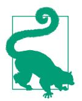

If you are already familiar with machine learning basics, you may want to skip directly to Chapter 2. If you are not sure, try to answer all the questions listed at the end of the chapter before moving on.

### **What Is Machine Learning?**

Machine learning is the science (and art) of programming computers so they can learn from data.

Here is a slightly more general definition:

[Machine learning is the] field of study that gives computers the ability to learn without being explicitly programmed.

-Arthur Samuel, 1959

And a more engineering-oriented one:

A computer program is said to learn from experience  $E$  with respect to some task T and some performance measure P, if its performance on T, as measured by P, improves with experience E.

-Tom Mitchell, 1997

Your spam filter is a machine learning program that, given examples of spam emails (flagged by users) and examples of regular emails (nonspam, also called "ham"), can learn to flag spam. The examples that the system uses to learn are called the *training* set. Each training example is called a training instance (or sample). The part of a machine learning system that learns and makes predictions is called a *model*. Neural networks and random forests are examples of models.

In this case, the task  $T$  is to flag spam for new emails, the experience  $E$  is the *training data*, and the performance measure  $P$  needs to be defined; for example, you can use the ratio of correctly classified emails. This particular performance measure is called accuracy, and it is often used in classification tasks.

If you just download a copy of all Wikipedia articles, your computer has a lot more data, but it is not suddenly better at any task. This is not machine learning.

{32}------------------------------------------------

### **Why Use Machine Learning?**

Consider how you would write a spam filter using traditional programming techniques (Figure  $1-1$ ):

- 1. First you would examine what spam typically looks like. You might notice that some words or phrases (such as "4U", "credit card", "free", and "amazing") tend to come up a lot in the subject line. Perhaps you would also notice a few other patterns in the sender's name, the email's body, and other parts of the email.
- 2. You would write a detection algorithm for each of the patterns that you noticed, and your program would flag emails as spam if a number of these patterns were detected.
- 3. You would test your program and repeat steps 1 and 2 until it was good enough to launch.

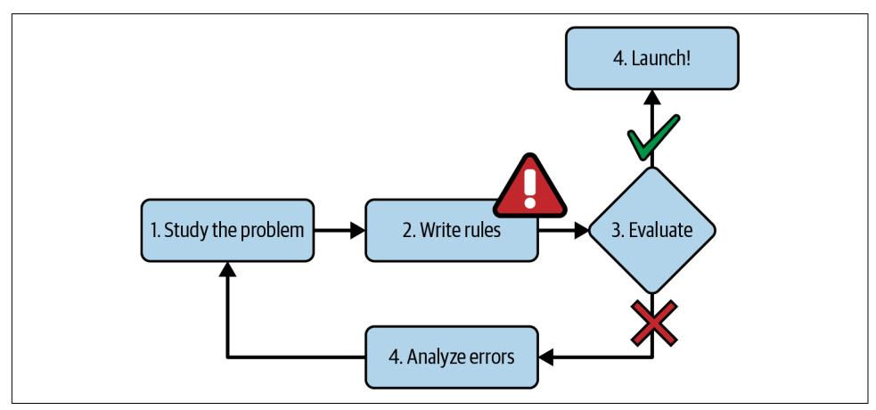

Figure 1-1. The traditional approach

Since the problem is difficult, your program will likely become a long list of complex rules-pretty hard to maintain.

In contrast, a spam filter based on machine learning techniques automatically learns which words and phrases are good predictors of spam by detecting unusually frequent patterns of words in the spam examples compared to the ham examples (Figure 1-2). The program is much shorter, easier to maintain, and most likely more accurate.

{33}------------------------------------------------


Figure 1-2. The machine learning approach

What if spammers notice that all their emails containing "4U" are blocked? They might start writing "For U" instead. A spam filter using traditional programming techniques would need to be updated to flag "For U" emails. If spammers keep working around your spam filter, you will need to keep writing new rules forever.

In contrast, a spam filter based on machine learning techniques automatically notices that "For U" has become unusually frequent in spam flagged by users, and it starts flagging them without your intervention (Figure 1-3).

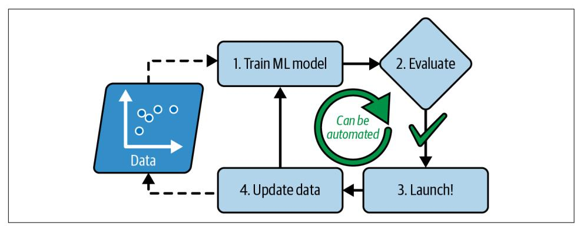

Figure 1-3. Automatically adapting to change

Another area where machine learning shines is for problems that either are too complex for traditional approaches or have no known algorithm. For example, consider speech recognition. Say you want to start simple and write a program capable of distinguishing the words "one" and "two". You might notice that the word "two" starts with a high-pitch sound ("T"), so you could hardcode an algorithm that measures high-pitch sound intensity and use that to distinguish ones and twos—but obviously 

{34}------------------------------------------------

this technique will not scale to thousands of words spoken by millions of very different people in noisy environments and in dozens of languages. The best solution (at least today) is to write an algorithm that learns by itself, given many example recordings for each word.

Finally, machine learning can help humans learn (Figure 1-4). ML models can be inspected to see what they have learned (although for some models this can be tricky). For instance, once a spam filter has been trained on enough spam, it can easily be inspected to reveal the list of words and combinations of words that it believes are the best predictors of spam. Sometimes this will reveal unsuspected correlations or new trends, and thereby lead to a better understanding of the problem. Digging into large amounts of data to discover hidden patterns is called *data* mining, and machine learning excels at it.

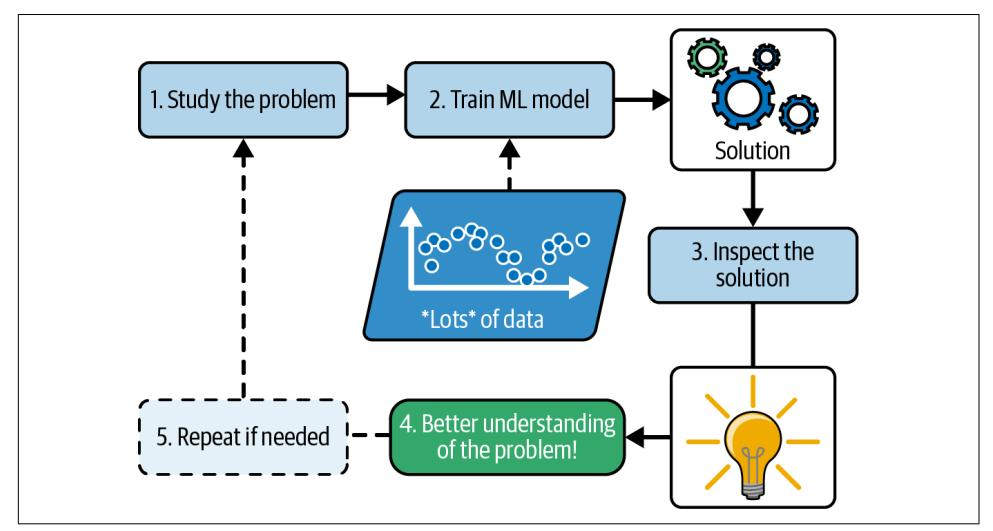

Figure 1-4. Machine learning can help humans learn

To summarize, machine learning is great for:

- Problems for which existing solutions require a lot of fine-tuning or long lists of rules (a machine learning model can often simplify code and perform better than the traditional approach)
- Complex problems for which using a traditional approach yields no good solution (the best machine learning techniques can perhaps find a solution)
- Fluctuating environments (a machine learning system can easily be retrained on new data, always keeping it up to date)
- Getting insights about complex problems and large amounts of data

{35}------------------------------------------------

### **Examples of Applications**

Let's look at some concrete examples of machine learning tasks, along with the techniques that can tackle them:

Analyzing images of products on a production line to automatically classify them

This is image classification, typically performed using convolutional neural networks (CNNs; see Chapter 14) or sometimes transformers (see Chapter 16).

Detecting tumors in brain scans

This is semantic image segmentation, where each pixel in the image is classified (as we want to determine the exact location and shape of tumors), typically using CNNs or transformers.

Automatically classifying news articles

This is natural language processing (NLP), and more specifically text classification, which can be tackled using recurrent neural networks (RNNs) and CNNs, but transformers work even better (see Chapter 16).

- Automatically flagging offensive comments on discussion forums This is also text classification, using the same NLP tools.
- Summarizing long documents automatically

This is a branch of NLP called text summarization, again using the same tools.

Creating a chatbot or a personal assistant

This involves many NLP components, including natural language understanding (NLU) and question-answering modules.

Forecasting your company's revenue next year, based on many performance metrics This is a regression task (i.e., predicting values) that may be tackled using any regression model, such as a linear regression or polynomial regression model (see Chapter 4), a regression support vector machine (see Chapter 5), a regression random forest (see Chapter 7), or an artificial neural network (see Chapter 10). If you want to take into account sequences of past performance metrics, you may want to use RNNs, CNNs, or transformers (see Chapters 15 and 16).

Making your app react to voice commands

This is speech recognition, which requires processing audio samples: since they are long and complex sequences, they are typically processed using RNNs, CNNs, or transformers (see Chapters 15 and 16).

Detecting credit card fraud

This is anomaly detection, which can be tackled using isolation forests, Gaussian mixture models (see Chapter 9), or autoencoders (see Chapter 17).

{36}------------------------------------------------

Segmenting clients based on their purchases so that you can design a different marketing strategy for each segment

This is clustering, which can be achieved using k-means, DBSCAN, and more (see Chapter 9).

- Representing a complex, high-dimensional dataset in a clear and insightful diagram This is data visualization, often involving dimensionality reduction techniques (see Chapter 8).
- Recommending a product that a client may be interested in, based on past purchases This is a recommender system. One approach is to feed past purchases (and other information about the client) to an artificial neural network (see Chapter 10), and get it to output the most likely next purchase. This neural net would typically be trained on past sequences of purchases across all clients.

Building an intelligent bot for a game

This is often tackled using reinforcement learning (RL; see Chapter 18), which is a branch of machine learning that trains agents (such as bots) to pick the actions that will maximize their rewards over time (e.g., a bot may get a reward every time the player loses some life points), within a given environment (such as the game). The famous AlphaGo program that beat the world champion at the game of Go was built using RL.

This list could go on and on, but hopefully it gives you a sense of the incredible breadth and complexity of the tasks that machine learning can tackle, and the types of techniques that you would use for each task.

### **Types of Machine Learning Systems**

There are so many different types of machine learning systems that it is useful to classify them in broad categories, based on the following criteria:

- How they are supervised during training (supervised, unsupervised, semisupervised, self-supervised, and others)
- Whether or not they can learn incrementally on the fly (online versus batch learning)
- Whether they work by simply comparing new data points to known data points, or instead by detecting patterns in the training data and building a predictive model, much like scientists do (instance-based versus model-based learning)

These criteria are not exclusive; you can combine them in any way you like. For example, a state-of-the-art spam filter may learn on the fly using a deep neural network model trained using human-provided examples of spam and ham; this makes it an online, model-based, supervised learning system.

{37}------------------------------------------------

Let's look at each of these criteria a bit more closely.

### **Training Supervision**

ML systems can be classified according to the amount and type of supervision they get during training. There are many categories, but we'll discuss the main ones: supervised learning, unsupervised learning, self-supervised learning, semi-supervised learning, and reinforcement learning.

#### **Supervised learning**

In *supervised learning*, the training set you feed to the algorithm includes the desired solutions, called *labels* (Figure 1-5).

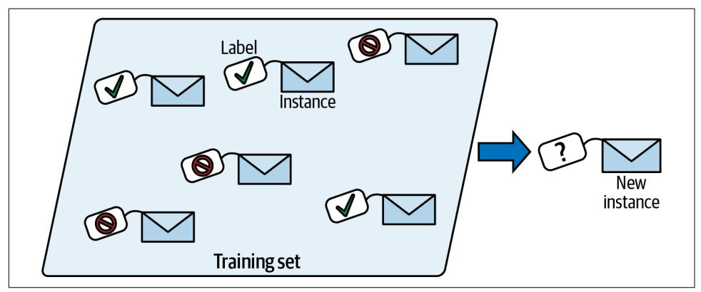

Figure 1-5. A labeled training set for spam classification (an example of supervised learning)

A typical supervised learning task is *classification*. The spam filter is a good example of this: it is trained with many example emails along with their class (spam or ham), and it must learn how to classify new emails.

Another typical task is to predict a *target* numeric value, such as the price of a car, given a set of *features* (mileage, age, brand, etc.). This sort of task is called regression (Figure 1-6).<sup>1</sup> To train the system, you need to give it many examples of cars, including both their features and their targets (i.e., their prices).

Note that some regression models can be used for classification as well, and vice versa. For example, logistic regression is commonly used for classification, as it can

<sup>1</sup> Fun fact: this odd-sounding name is a statistics term introduced by Francis Galton while he was studying the fact that the children of tall people tend to be shorter than their parents. Since the children were shorter, he called this regression to the mean. This name was then applied to the methods he used to analyze correlations between variables.

{38}------------------------------------------------

output a value that corresponds to the probability of belonging to a given class (e.g., 20% chance of being spam).

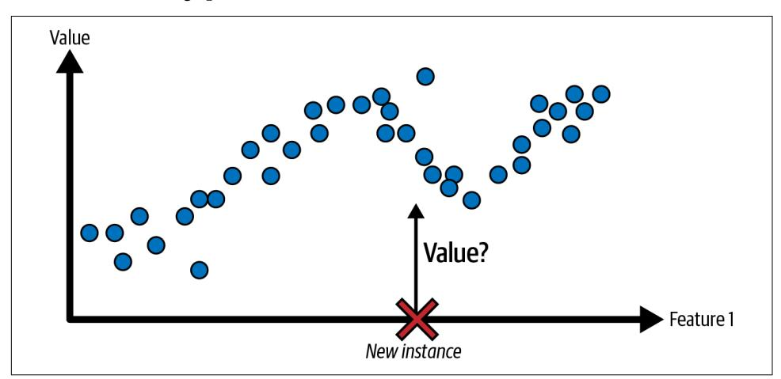

Figure 1-6. A regression problem: predict a value, given an input feature (there are usually multiple input features, and sometimes multiple output values)

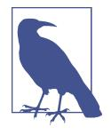

The words target and label are generally treated as synonyms in supervised learning, but target is more common in regression tasks and label is more common in classification tasks. Moreover, features are sometimes called predictors or attributes. These terms may refer to individual samples (e.g., "this car's mileage feature is equal to 15,000") or to all samples (e.g., "the mileage feature is strongly correlated with price").

#### **Unsupervised learning**

In *unsupervised learning*, as you might guess, the training data is unlabeled (Figure 1-7). The system tries to learn without a teacher.

For example, say you have a lot of data about your blog's visitors. You may want to run a *clustering* algorithm to try to detect groups of similar visitors (Figure 1-8). At no point do you tell the algorithm which group a visitor belongs to: it finds those connections without your help. For example, it might notice that 40% of your visitors are teenagers who love comic books and generally read your blog after school, while 20% are adults who enjoy sci-fi and who visit during the weekends. If you use a *hierarchical clustering* algorithm, it may also subdivide each group into smaller groups. This may help you target your posts for each group.

{39}------------------------------------------------

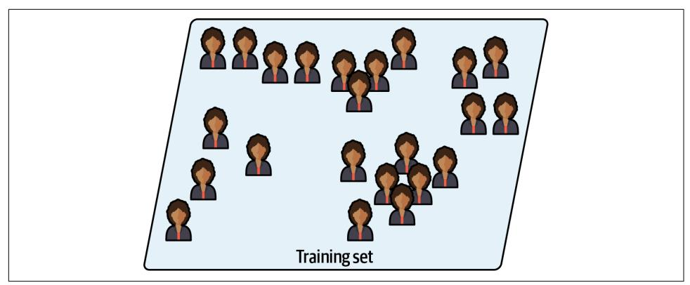

Figure 1-7. An unlabeled training set for unsupervised learning

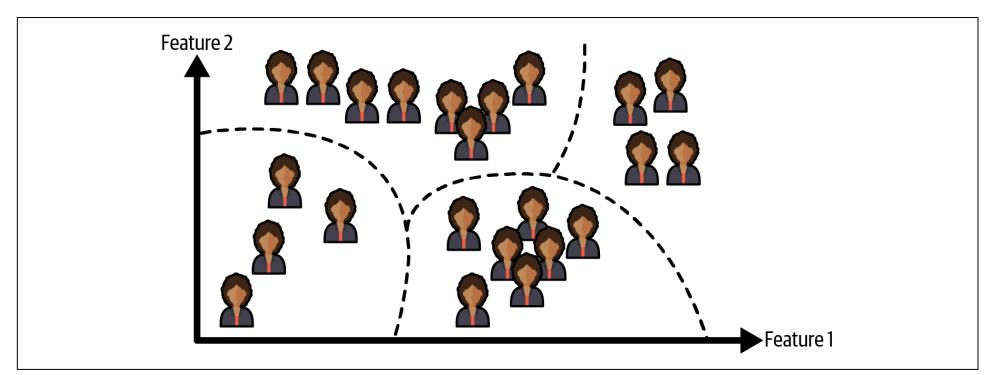

Figure 1-8. Clustering

Visualization algorithms are also good examples of unsupervised learning: you feed them a lot of complex and unlabeled data, and they output a 2D or 3D representation of your data that can easily be plotted (Figure 1-9). These algorithms try to preserve as much structure as they can (e.g., trying to keep separate clusters in the input space from overlapping in the visualization) so that you can understand how the data is organized and perhaps identify unsuspected patterns.

A related task is *dimensionality reduction*, in which the goal is to simplify the data without losing too much information. One way to do this is to merge several correlated features into one. For example, a car's mileage may be strongly correlated with its age, so the dimensionality reduction algorithm will merge them into one feature that represents the car's wear and tear. This is called *feature extraction*.

{40}------------------------------------------------

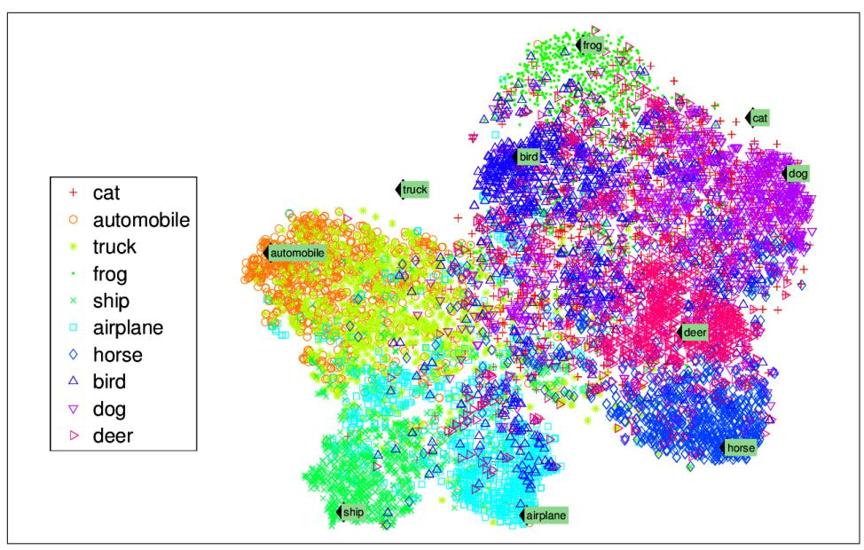

Figure 1-9. Example of a t-SNE visualization highlighting semantic clusters<sup>2</sup>


It is often a good idea to try to reduce the number of dimensions in your training data using a dimensionality reduction algorithm before you feed it to another machine learning algorithm (such as a supervised learning algorithm). It will run much faster, the data will take up less disk and memory space, and in some cases it may also perform better.

Yet another important unsupervised task is *anomaly detection*—for example, detecting unusual credit card transactions to prevent fraud, catching manufacturing defects, or automatically removing outliers from a dataset before feeding it to another learning algorithm. The system is shown mostly normal instances during training, so it learns to recognize them; then, when it sees a new instance, it can tell whether it looks like a normal one or whether it is likely an anomaly (see Figure 1-10). A very similar task is novelty detection: it aims to detect new instances that look different from all instances in the training set. This requires having a very "clean" training set, devoid of any instance that you would like the algorithm to detect. For example, if you have thousands of pictures of dogs, and 1% of these pictures represent Chihuahuas, then a

<sup>2</sup> Notice how animals are rather well separated from vehicles and how horses are close to deer but far from birds. Figure reproduced with permission from Richard Socher et al., "Zero-Shot Learning Through Cross-Modal Transfer", Proceedings of the 26th International Conference on Neural Information Processing Systems 1 (2013): 935-943.

{41}------------------------------------------------

novelty detection algorithm should not treat new pictures of Chihuahuas as novelties. On the other hand, anomaly detection algorithms may consider these dogs as so rare and so different from other dogs that they would likely classify them as anomalies (no offense to Chihuahuas).


Figure 1-10. Anomaly detection

Finally, another common unsupervised task is *association rule learning*, in which the goal is to dig into large amounts of data and discover interesting relations between attributes. For example, suppose you own a supermarket. Running an association rule on your sales logs may reveal that people who purchase barbecue sauce and potato chips also tend to buy steak. Thus, you may want to place these items close to one another.

#### Semi-supervised learning

Since labeling data is usually time-consuming and costly, you will often have plenty of unlabeled instances, and few labeled instances. Some algorithms can deal with data that's partially labeled. This is called semi-supervised learning (Figure 1-11).

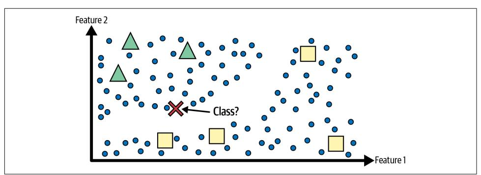

Figure 1-11. Semi-supervised learning with two classes (triangles and squares): the unlabeled examples (circles) help classify a new instance (the cross) into the triangle class rather than the square class, even though it is closer to the labeled squares

{42}------------------------------------------------

Some photo-hosting services, such as Google Photos, are good examples of this. Once you upload all your family photos to the service, it automatically recognizes that the same person A shows up in photos 1, 5, and 11, while another person B shows up in photos 2, 5, and 7. This is the unsupervised part of the algorithm (clustering). Now all the system needs is for you to tell it who these people are. Just add one label per person<sup>3</sup> and it is able to name everyone in every photo, which is useful for searching photos.

Most semi-supervised learning algorithms are combinations of unsupervised and supervised algorithms. For example, a clustering algorithm may be used to group similar instances together, and then every unlabeled instance can be labeled with the most common label in its cluster. Once the whole dataset is labeled, it is possible to use any supervised learning algorithm.

#### Self-supervised learning

Another approach to machine learning involves actually generating a fully labeled dataset from a fully unlabeled one. Again, once the whole dataset is labeled, any supervised learning algorithm can be used. This approach is called *self-supervised* learning.

For example, if you have a large dataset of unlabeled images, you can randomly mask a small part of each image and then train a model to recover the original image (Figure 1-12). During training, the masked images are used as the inputs to the model, and the original images are used as the labels.

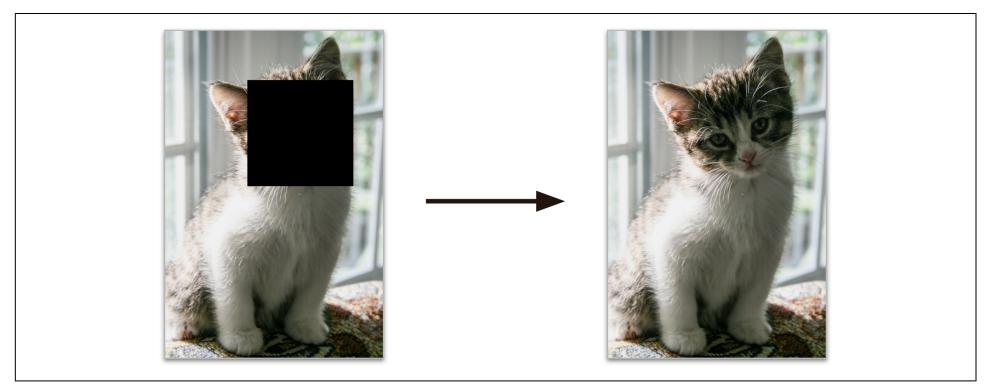

Figure 1-12. Self-supervised learning example: input (left) and target (right)

<sup>3</sup> That's when the system works perfectly. In practice it often creates a few clusters per person, and sometimes mixes up two people who look alike, so you may need to provide a few labels per person and manually clean up some clusters.

{43}------------------------------------------------

The resulting model may be quite useful in itself—for example, to repair damaged images or to erase unwanted objects from pictures. But more often than not, a model trained using self-supervised learning is not the final goal. You'll usually want to tweak and fine-tune the model for a slightly different task—one that you actually care about.

For example, suppose that what you really want is to have a pet classification model: given a picture of any pet, it will tell you what species it belongs to. If you have a large dataset of unlabeled photos of pets, you can start by training an image-repairing model using self-supervised learning. Once it's performing well, it should be able to distinguish different pet species: when it repairs an image of a cat whose face is masked, it must know not to add a dog's face. Assuming your model's architecture allows it (and most neural network architectures do), it is then possible to tweak the model so that it predicts pet species instead of repairing images. The final step consists of fine-tuning the model on a labeled dataset: the model already knows what cats, dogs, and other pet species look like, so this step is only needed so the model can learn the mapping between the species it already knows and the labels we expect from it.


Transferring knowledge from one task to another is called transfer learning, and it's one of the most important techniques in machine learning today, especially when using deep neural networks (i.e., neural networks composed of many layers of neurons). We will discuss this in detail in Part II.

Some people consider self-supervised learning to be a part of unsupervised learning, since it deals with fully unlabeled datasets. But self-supervised learning uses (generated) labels during training, so in that regard it's closer to supervised learning. And the term "unsupervised learning" is generally used when dealing with tasks like clustering, dimensionality reduction, or anomaly detection, whereas self-supervised learning focuses on the same tasks as supervised learning: mainly classification and regression. In short, it's best to treat self-supervised learning as its own category.

#### **Reinforcement learning**

Reinforcement learning is a very different beast. The learning system, called an agent in this context, can observe the environment, select and perform actions, and get rewards in return (or penalties in the form of negative rewards, as shown in Figure 1-13). It must then learn by itself what is the best strategy, called a *policy*, to get the most reward over time. A policy defines what action the agent should choose when it is in a given situation.

{44}------------------------------------------------

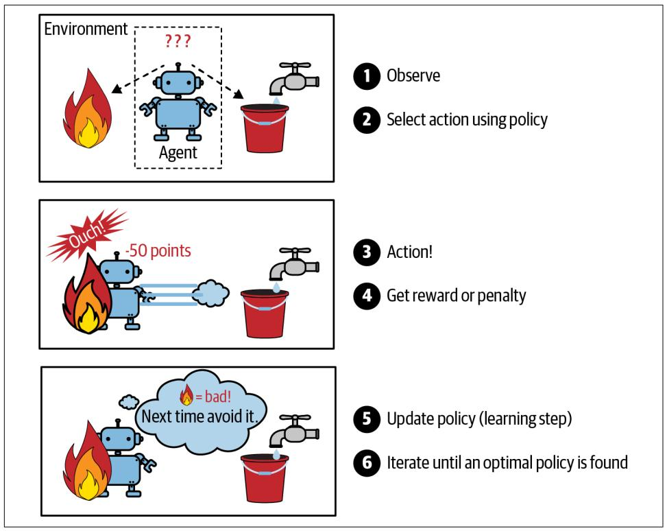

Figure 1-13. Reinforcement learning

For example, many robots implement reinforcement learning algorithms to learn how to walk. DeepMind's AlphaGo program is also a good example of reinforcement learning: it made the headlines in May 2017 when it beat Ke Jie, the number one ranked player in the world at the time, at the game of Go. It learned its winning policy by analyzing millions of games, and then playing many games against itself. Note that learning was turned off during the games against the champion; AlphaGo was just applying the policy it had learned. As you will see in the next section, this is called offline learning.

### **Batch Versus Online Learning**

Another criterion used to classify machine learning systems is whether or not the system can learn incrementally from a stream of incoming data.

{45}------------------------------------------------

#### **Batch learning**

In batch learning, the system is incapable of learning incrementally: it must be trained using all the available data. This will generally take a lot of time and computing resources, so it is typically done offline. First the system is trained, and then it is launched into production and runs without learning anymore; it just applies what it has learned. This is called *offline learning*.

Unfortunately, a model's performance tends to decay slowly over time, simply because the world continues to evolve while the model remains unchanged. This phenomenon is often called *model rot* or *data drift*. The solution is to regularly retrain the model on up-to-date data. How often you need to do that depends on the use case; if the model classifies pictures of cats and dogs, its performance will decay very slowly, but if the model deals with fast-evolving systems, for example making predictions on the financial market, then it is likely to decay quite fast.

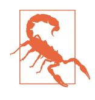

Even a model trained to classify pictures of cats and dogs may need to be retrained regularly, not because cats and dogs will mutate overnight, but because cameras keep changing, along with image formats, sharpness, brightness, and size ratios. Moreover, people may love different breeds next year, or they may decide to dress their pets with tiny hats-who knows?

If you want a batch learning system to know about new data (such as a new type of spam), you need to train a new version of the system from scratch on the full dataset (not just the new data, but also the old data), then replace the old model with the new one. Fortunately, the whole process of training, evaluating, and launching a machine learning system can be automated fairly easily (as we saw in Figure 1-3), so even a batch learning system can adapt to change. Simply update the data and train a new version of the system from scratch as often as needed.

This solution is simple and often works fine, but training using the full set of data can take many hours, so you would typically train a new system only every 24 hours or even just weekly. If your system needs to adapt to rapidly changing data (e.g., to predict stock prices), then you need a more reactive solution.

Also, training on the full set of data requires a lot of computing resources (CPU, memory space, disk space, disk I/O, network I/O, etc.). If you have a lot of data and you automate your system to train from scratch every day, it will end up costing you a lot of money. If the amount of data is huge, it may even be impossible to use a batch learning algorithm.

{46}------------------------------------------------

Finally, if your system needs to be able to learn autonomously and it has limited resources (e.g., a smartphone application or a rover on Mars), then carrying around large amounts of training data and taking up a lot of resources to train for hours every day is a showstopper.

A better option in all these cases is to use algorithms that are capable of learning incrementally.

#### **Online learning**

In online learning, you train the system incrementally by feeding it data instances sequentially, either individually or in small groups called mini-batches. Each learning step is fast and cheap, so the system can learn about new data on the fly, as it arrives (see Figure 1-14).

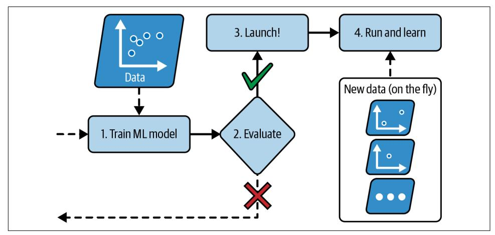

Figure 1-14. In online learning, a model is trained and launched into production, and then it keeps learning as new data comes in

Online learning is useful for systems that need to adapt to change extremely rapidly (e.g., to detect new patterns in the stock market). It is also a good option if you have limited computing resources; for example, if the model is trained on a mobile device.

Additionally, online learning algorithms can be used to train models on huge datasets that cannot fit in one machine's main memory (this is called *out-of-core* learning). The algorithm loads part of the data, runs a training step on that data, and repeats the process until it has run on all of the data (see Figure 1-15).

{47}------------------------------------------------

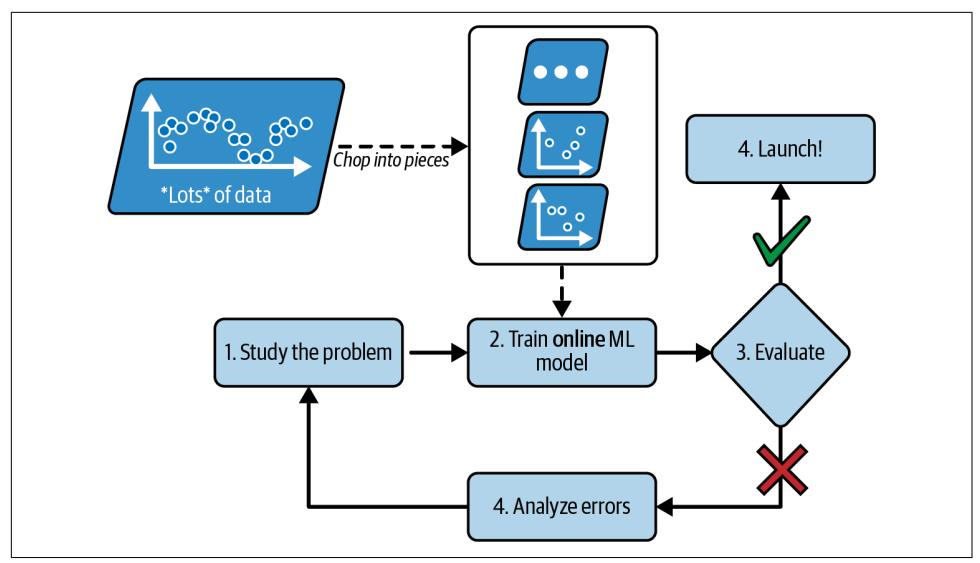

Figure 1-15. Using online learning to handle huge datasets

One important parameter of online learning systems is how fast they should adapt to changing data: this is called the *learning rate*. If you set a high learning rate, then your system will rapidly adapt to new data, but it will also tend to quickly forget the old data (and you don't want a spam filter to flag only the latest kinds of spam it was shown). Conversely, if you set a low learning rate, the system will have more inertia; that is, it will learn more slowly, but it will also be less sensitive to noise in the new data or to sequences of nonrepresentative data points (outliers).

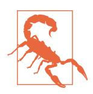

Out-of-core learning is usually done offline (i.e., not on the live system), so online learning can be a confusing name. Think of it as incremental learning.

A big challenge with online learning is that if bad data is fed to the system, the system's performance will decline, possibly quickly (depending on the data quality and learning rate). If it's a live system, your clients will notice. For example, bad data could come from a bug (e.g., a malfunctioning sensor on a robot), or it could come from someone trying to game the system (e.g., spamming a search engine to try to rank high in search results). To reduce this risk, you need to monitor your system closely and promptly switch learning off (and possibly revert to a previously working state) if you detect a drop in performance. You may also want to monitor the input data and react to abnormal data; for example, using an anomaly detection algorithm (see Chapter 9).

{48}------------------------------------------------

### **Instance-Based Versus Model-Based Learning**

One more way to categorize machine learning systems is by how they *generalize*. Most machine learning tasks are about making predictions. This means that given a number of training examples, the system needs to be able to make good predictions for (generalize to) examples it has never seen before. Having a good performance measure on the training data is good, but insufficient; the true goal is to perform well on new instances.

There are two main approaches to generalization: instance-based learning and model-based learning.

#### Instance-based learning

Possibly the most trivial form of learning is simply to learn by heart. If you were to create a spam filter this way, it would just flag all emails that are identical to emails that have already been flagged by users—not the worst solution, but certainly not the best.

Instead of just flagging emails that are identical to known spam emails, your spam filter could be programmed to also flag emails that are very similar to known spam emails. This requires a *measure of similarity* between two emails. A (very basic) similarity measure between two emails could be to count the number of words they have in common. The system would flag an email as spam if it has many words in common with a known spam email.

This is called *instance-based learning*: the system learns the examples by heart, then generalizes to new cases by using a similarity measure to compare them to the learned examples (or a subset of them). For example, in Figure 1-16 the new instance would be classified as a triangle because the majority of the most similar instances belong to that class.

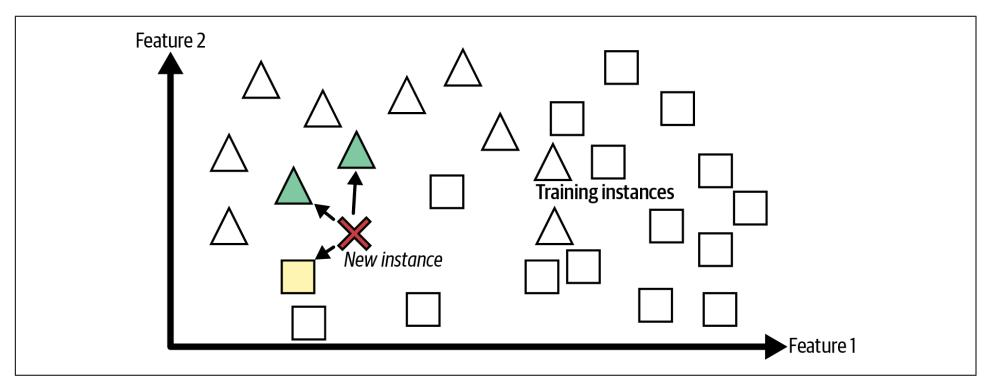

Figure 1-16. Instance-based learning

{49}------------------------------------------------

#### Model-based learning and a typical machine learning workflow

Another way to generalize from a set of examples is to build a model of these examples and then use that model to make predictions. This is called model-based learning (Figure 1-17).

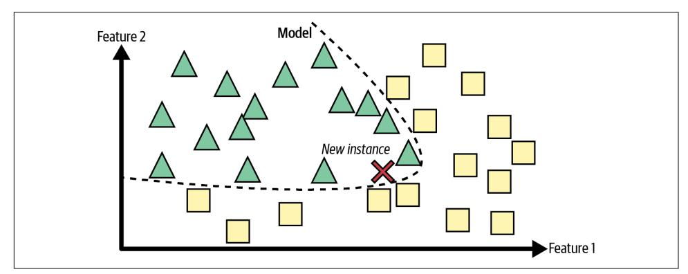

Figure 1-17. Model-based learning

For example, suppose you want to know if money makes people happy, so you download the Better Life Index data from the OECD's website and World Bank stats about gross domestic product (GDP) per capita. Then you join the tables and sort by GDP per capita. Table 1-1 shows an excerpt of what you get.

Table 1-1. Does money make people happier?

| Country              | GDP per capita (USD) Life satisfaction |     |
|----------------------|----------------------------------------|-----|
| Turkey               | 28,384                                 | 5.5 |
| Hungary              | 31,008                                 | 5.6 |
| France               | 42,026                                 | 6.5 |
| <b>United States</b> | 60,236                                 | 6.9 |
| New Zealand          | 42,404                                 | 7.3 |
| Australia            | 48,698                                 | 7.3 |
| Denmark              | 55,938                                 | 7.6 |

Let's plot the data for these countries (Figure 1-18).

{50}------------------------------------------------

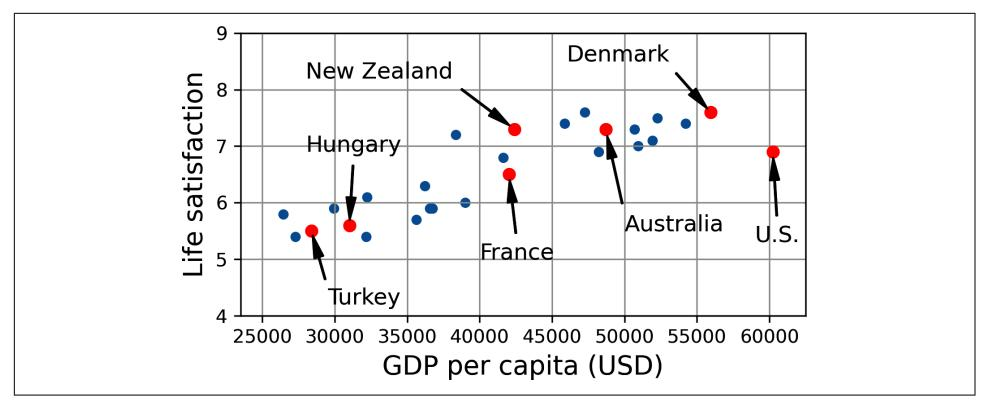

Figure 1-18. Do you see a trend here?

There does seem to be a trend here! Although the data is *noisy* (i.e., partly random), it looks like life satisfaction goes up more or less linearly as the country's GDP per capita increases. So you decide to model life satisfaction as a linear function of GDP per capita. This step is called model selection: you selected a linear model of life satisfaction with just one attribute, GDP per capita (Equation 1-1).

Equation 1-1. A simple linear model life\_satisfaction =  $\theta_0 + \theta_1 \times$  GDP\_per\_capita

This model has two *model parameters*,  $\theta_0$  and  $\theta_1$ .<sup>4</sup> By tweaking these parameters, you can make your model represent any linear function, as shown in Figure 1-19.


Figure 1-19. A few possible linear models

<sup>4</sup> By convention, the Greek letter  $\theta$  (theta) is frequently used to represent model parameters.

{51}------------------------------------------------

Before you can use your model, you need to define the parameter values  $\theta_0$  and  $\theta_1$ . How can you know which values will make your model perform best? To answer this question, you need to specify a performance measure. You can either define a *utility* function (or fitness function) that measures how good your model is, or you can define a cost function that measures how bad it is. For linear regression problems, people typically use a cost function that measures the distance between the linear model's predictions and the training examples; the objective is to minimize this distance.

This is where the linear regression algorithm comes in: you feed it your training examples, and it finds the parameters that make the linear model fit best to your data. This is called *training* the model. In our case, the algorithm finds that the optimal parameter values are  $\theta_0$  = 3.75 and  $\theta_1$  = 6.78 × 10<sup>-5</sup>.


Confusingly, the word "model" can refer to a type of model (e.g., linear regression), to a fully specified model architecture (e.g., linear regression with one input and one output), or to the final trained model ready to be used for predictions (e.g., linear regression with one input and one output, using  $\theta_0 = 3.75$  and  $\theta_1 = 6.78 \times 10^{-5}$ ). Model selection consists in choosing the type of model and fully specifying its architecture. Training a model means running an algorithm to find the model parameters that will make it best fit the training data, and hopefully make good predictions on new data.

Now the model fits the training data as closely as possible (for a linear model), as you can see in Figure 1-20.


Figure 1-20. The linear model that fits the training data best

{52}------------------------------------------------

You are finally ready to run the model to make predictions. For example, say you want to know how happy Cypriots are, and the OECD data does not have the answer. Fortunately, you can use your model to make a good prediction: you look up Cyprus's GDP per capita, find \$37,655, and then apply your model and find that life satisfaction is likely to be somewhere around  $3.75 + 37,655 \times 6.78 \times 10^{-5} = 6.30$ .

To whet your appetite, Example 1-1 shows the Python code that loads the data, separates the inputs X from the labels y, creates a scatterplot for visualization, and then trains a linear model and makes a prediction.<sup>5</sup>

Example 1-1. Training and running a linear model using Scikit-Learn

```
import matplotlib.pyplot as plt
import numpy as np
import pandas as pd
from sklearn.linear_model import LinearRegression
# Download and prepare the data
data\_root = "https://github.com/ageron/data/raw/main"lifesat = pd.read_csv(data_root + "lifesat/lifesat.csv")
X = \text{lifesat}[[\text{``GDP per capita (USD)''}]].valuesy = lifesat[["Life satisfaction"]].values# Visualize the data
lifesat.plot(kind='scatter', grid=True,
             x="GDP per capita (USD)", y="Life satisfaction")
plt.axis([23_500, 62_500, 4, 9])
plt.show()
# Select a linear model
model = LinearRegression()# Train the model
model.fit(X, y)# Make a prediction for Cyprus
X new = [37 655.2] # Cyprus' GDP per capita in 2020
print(model.predict(X new)) # output: [6.30165767]
```

<sup>5</sup> It's OK if you don't understand all the code yet; I will present Scikit-Learn in the following chapters.

{53}------------------------------------------------

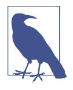

If you had used an instance-based learning algorithm instead, you would have found that Israel has the closest GDP per capita to that of Cyprus (\$38,341), and since the OECD data tells us that Israelis' life satisfaction is 7.2, you would have predicted a life satisfaction of 7.2 for Cyprus. If you zoom out a bit and look at the two next-closest countries, you will find Lithuania and Slovenia, both with a life satisfaction of 5.9. Averaging these three values, you get 6.33, which is pretty close to your model-based prediction. This simple algorithm is called *k-nearest neighbors* regression (in this example,  $k = 3$ ).

Replacing the linear regression model with  $k$ -nearest neighbors regression in the previous code is as easy as replacing these lines:

```
from sklearn.linear_model import LinearRegression
model = LinearRegression()
```

with these two:

```
from sklearn.neighbors import KNeighborsRegressor
model = KNeighborsRequest(n\nneighbors=3)
```

If all went well, your model will make good predictions. If not, you may need to use more attributes (employment rate, health, air pollution, etc.), get more or betterquality training data, or perhaps select a more powerful model (e.g., a polynomial regression model).

In summary:

- You studied the data
- You selected a model.
- You trained it on the training data (i.e., the learning algorithm searched for the model parameter values that minimize a cost function).
- Finally, you applied the model to make predictions on new cases (this is called inference), hoping that this model will generalize well.

This is what a typical machine learning project looks like. In Chapter 2 you will experience this firsthand by going through a project end to end.

We have covered a lot of ground so far: you now know what machine learning is really about, why it is useful, what some of the most common categories of ML systems are, and what a typical project workflow looks like. Now let's look at what can go wrong in learning and prevent you from making accurate predictions.

{54}------------------------------------------------

### **Main Challenges of Machine Learning**

In short, since your main task is to select a model and train it on some data, the two things that can go wrong are "bad model" and "bad data". Let's start with examples of bad data.

### **Insufficient Quantity of Training Data**

For a toddler to learn what an apple is, all it takes is for you to point to an apple and say "apple" (possibly repeating this procedure a few times). Now the child is able to recognize apples in all sorts of colors and shapes. Genius.

Machine learning is not quite there yet; it takes a lot of data for most machine learning algorithms to work properly. Even for very simple problems you typically need thousands of examples, and for complex problems such as image or speech recognition you may need millions of examples (unless you can reuse parts of an existing model).

#### The Unreasonable Effectiveness of Data

In a famous paper published in 2001, Microsoft researchers Michele Banko and Eric Brill showed that very different machine learning algorithms, including fairly simple ones, performed almost identically well on a complex problem of natural language disambiguation<sup>6</sup> once they were given enough data (as you can see in Figure 1-21).

As the authors put it, "these results suggest that we may want to reconsider the tradeoff between spending time and money on algorithm development versus spending it on corpus development".

The idea that data matters more than algorithms for complex problems was further popularized by Peter Norvig et al. in a paper titled "The Unreasonable Effectiveness of Data", published in 2009.7 It should be noted, however, that small and medium-sized datasets are still very common, and it is not always easy or cheap to get extra training data-so don't abandon algorithms just yet.

<sup>6</sup> For example, knowing whether to write "to", "two", or "too", depending on the context.

<sup>7</sup> Peter Norvig et al., "The Unreasonable Effectiveness of Data", IEEE Intelligent Systems 24, no. 2 (2009): 8-12.

{55}------------------------------------------------

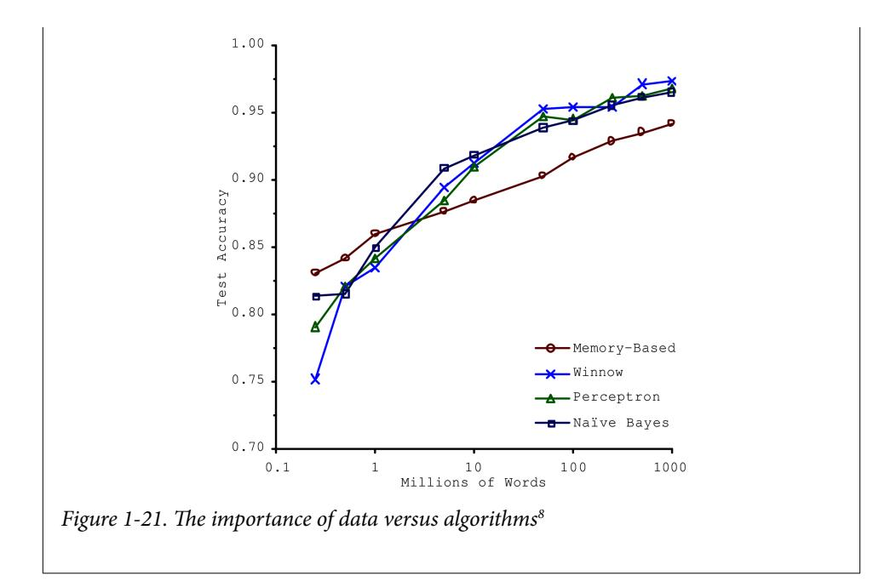

#### **Nonrepresentative Training Data**

In order to generalize well, it is crucial that your training data be representative of the new cases you want to generalize to. This is true whether you use instance-based learning or model-based learning.

For example, the set of countries you used earlier for training the linear model was not perfectly representative; it did not contain any country with a GDP per capita lower than \$23,500 or higher than \$62,500. Figure 1-22 shows what the data looks like when you add such countries.

If you train a linear model on this data, you get the solid line, while the old model is represented by the dotted line. As you can see, not only does adding a few missing countries significantly alter the model, but it makes it clear that such a simple linear model is probably never going to work well. It seems that very rich countries are not happier than moderately rich countries (in fact, they seem slightly unhappier!), and conversely some poor countries seem happier than many rich countries.

By using a nonrepresentative training set, you trained a model that is unlikely to make accurate predictions, especially for very poor and very rich countries.

<sup>8</sup> Figure reproduced with permission from Michele Banko and Eric Brill, "Scaling to Very Very Large Corpora for Natural Language Disambiguation", Proceedings of the 39th Annual Meeting of the Association for Computational Linguistics (2001): 26-33.

{56}------------------------------------------------


Figure 1-22. A more representative training sample

It is crucial to use a training set that is representative of the cases you want to generalize to. This is often harder than it sounds: if the sample is too small, you will have sampling noise (i.e., nonrepresentative data as a result of chance), but even very large samples can be nonrepresentative if the sampling method is flawed. This is called sampling bias.

#### **Examples of Sampling Bias**

Perhaps the most famous example of sampling bias happened during the US presidential election in 1936, which pitted Landon against Roosevelt: the Literary Digest conducted a very large poll, sending mail to about 10 million people. It got 2.4 million answers, and predicted with high confidence that Landon would get 57% of the votes. Instead, Roosevelt won with 62% of the votes. The flaw was in the Literary Digest's sampling method:

- First, to obtain the addresses to send the polls to, the Literary Digest used telephone directories, lists of magazine subscribers, club membership lists, and the like. All of these lists tended to favor wealthier people, who were more likely to vote Republican (hence Landon).
- Second, less than 25% of the people who were polled answered. Again this introduced a sampling bias, by potentially ruling out people who didn't care much about politics, people who didn't like the Literary Digest, and other key groups. This is a special type of sampling bias called *nonresponse bias*.

Here is another example: say you want to build a system to recognize funk music videos. One way to build your training set is to search for "funk music" on YouTube and use the resulting videos. But this assumes that YouTube's search engine returns a set of videos that are representative of all the funk music videos on YouTube. In reality, the search results are likely to be biased toward popular artists (and if you live

{57}------------------------------------------------

in Brazil you will get a lot of "funk carioca" videos, which sound nothing like James Brown). On the other hand, how else can you get a large training set?

### **Poor-Quality Data**

Obviously, if your training data is full of errors, outliers, and noise (e.g., due to poorquality measurements), it will make it harder for the system to detect the underlying patterns, so your system is less likely to perform well. It is often well worth the effort to spend time cleaning up your training data. The truth is, most data scientists spend a significant part of their time doing just that. The following are a couple examples of when you'd want to clean up training data:

- If some instances are clearly outliers, it may help to simply discard them or try to fix the errors manually.
- If some instances are missing a few features (e.g., 5% of your customers did not specify their age), you must decide whether you want to ignore this attribute altogether, ignore these instances, fill in the missing values (e.g., with the median age), or train one model with the feature and one model without it.

#### **Irrelevant Features**

As the saying goes: garbage in, garbage out. Your system will only be capable of learning if the training data contains enough relevant features and not too many irrelevant ones. A critical part of the success of a machine learning project is coming up with a good set of features to train on. This process, called *feature engineering*, involves the following steps:

- *Feature selection* (selecting the most useful features to train on among existing features)
- Feature extraction (combining existing features to produce a more useful one—as we saw earlier, dimensionality reduction algorithms can help)
- Creating new features by gathering new data

Now that we have looked at many examples of bad data, let's look at a couple examples of bad algorithms.

### **Overfitting the Training Data**

Say you are visiting a foreign country and the taxi driver rips you off. You might be tempted to say that *all* taxi drivers in that country are thieves. Overgeneralizing is something that we humans do all too often, and unfortunately machines can fall into the same trap if we are not careful. In machine learning this is called *overfitting*: it 

{58}------------------------------------------------

means that the model performs well on the training data, but it does not generalize well

Figure 1-23 shows an example of a high-degree polynomial life satisfaction model that strongly overfits the training data. Even though it performs much better on the training data than the simple linear model, would you really trust its predictions?


Figure 1-23. Overfitting the training data

Complex models such as deep neural networks can detect subtle patterns in the data, but if the training set is noisy, or if it is too small, which introduces sampling noise, then the model is likely to detect patterns in the noise itself (as in the taxi driver example). Obviously these patterns will not generalize to new instances. For example, say you feed your life satisfaction model many more attributes, including uninformative ones such as the country's name. In that case, a complex model may detect patterns like the fact that all countries in the training data with a  $w$  in their name have a life satisfaction greater than 7: New Zealand (7.3), Norway (7.6), Sweden  $(7.3)$ , and Switzerland  $(7.5)$ . How confident are you that the w-satisfaction rule generalizes to Rwanda or Zimbabwe? Obviously this pattern occurred in the training data by pure chance, but the model has no way to tell whether a pattern is real or simply the result of noise in the data.

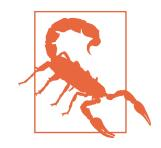

Overfitting happens when the model is too complex relative to the amount and noisiness of the training data. Here are possible solutions:

- Simplify the model by selecting one with fewer parameters (e.g., a linear model rather than a high-degree polynomial model), by reducing the number of attributes in the training data, or by constraining the model.
- Gather more training data.
- Reduce the noise in the training data (e.g., fix data errors and remove outliers).

{59}------------------------------------------------

Constraining a model to make it simpler and reduce the risk of overfitting is called regularization. For example, the linear model we defined earlier has two parameters,  $\theta_0$  and  $\theta_1$ . This gives the learning algorithm two *degrees of freedom* to adapt the model to the training data: it can tweak both the height  $(\theta_0)$  and the slope  $(\theta_1)$  of the line. If we forced  $\theta_1 = 0$ , the algorithm would have only one degree of freedom and would have a much harder time fitting the data properly: all it could do is move the line up or down to get as close as possible to the training instances, so it would end up around the mean. A very simple model indeed! If we allow the algorithm to modify  $\theta_1$  but we force it to keep it small, then the learning algorithm will effectively have somewhere in between one and two degrees of freedom. It will produce a model that's simpler than one with two degrees of freedom, but more complex than one with just one. You want to find the right balance between fitting the training data perfectly and keeping the model simple enough to ensure that it will generalize well.

Figure 1-24 shows three models. The dotted line represents the original model that was trained on the countries represented as circles (without the countries represented as squares), the solid line is our second model trained with all countries (circles and squares), and the dashed line is a model trained with the same data as the first model but with a regularization constraint. You can see that regularization forced the model to have a smaller slope: this model does not fit the training data (circles) as well as the first model, but it actually generalizes better to new examples that it did not see during training (squares).

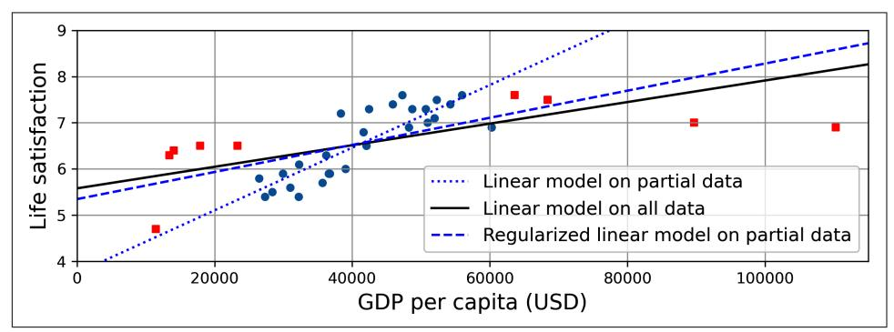

Figure 1-24. Regularization reduces the risk of overfitting

The amount of regularization to apply during learning can be controlled by a *hyperparameter.* A hyperparameter is a parameter of a learning algorithm (not of the model). As such, it is not affected by the learning algorithm itself; it must be set prior to training and remains constant during training. If you set the regularization hyperparameter to a very large value, you will get an almost flat model (a slope close to zero); the learning algorithm will almost certainly not overfit the training data, but it will be less likely to find a good solution. Tuning hyperparameters is an important 

{60}------------------------------------------------

part of building a machine learning system (you will see a detailed example in the next chapter).

### **Underfitting the Training Data**

As you might guess, *underfitting* is the opposite of overfitting: it occurs when your model is too simple to learn the underlying structure of the data. For example, a linear model of life satisfaction is prone to underfit; reality is just more complex than the model, so its predictions are bound to be inaccurate, even on the training examples.

Here are the main options for fixing this problem:

- Select a more powerful model, with more parameters.
- Feed better features to the learning algorithm (feature engineering).
- Reduce the constraints on the model (for example by reducing the regularization hyperparameter).

### **Stepping Back**

By now you know a lot about machine learning. However, we went through so many concepts that you may be feeling a little lost, so let's step back and look at the big picture:

- Machine learning is about making machines get better at some task by learning from data, instead of having to explicitly code rules.
- There are many different types of ML systems: supervised or not, batch or online, instance-based or model-based.
- In an ML project you gather data in a training set, and you feed the training set to a learning algorithm. If the algorithm is model-based, it tunes some parameters to fit the model to the training set (i.e., to make good predictions on the training set itself), and then hopefully it will be able to make good predictions on new cases as well. If the algorithm is instance-based, it just learns the examples by heart and generalizes to new instances by using a similarity measure to compare them to the learned instances.
- The system will not perform well if your training set is too small, or if the data is not representative, is noisy, or is polluted with irrelevant features (garbage in, garbage out). Lastly, your model needs to be neither too simple (in which case it will underfit) nor too complex (in which case it will overfit).

There's just one last important topic to cover: once you have trained a model, you don't want to just "hope" it generalizes to new cases. You want to evaluate it and fine-tune it if necessary. Let's see how to do that.

{61}------------------------------------------------

### **Testing and Validating**

The only way to know how well a model will generalize to new cases is to actually try it out on new cases. One way to do that is to put your model in production and monitor how well it performs. This works well, but if your model is horribly bad, your users will complain—not the best idea.

A better option is to split your data into two sets: the *training set* and the *test set*. As these names imply, you train your model using the training set, and you test it using the test set. The error rate on new cases is called the *generalization error* (or out-of-sample error), and by evaluating your model on the test set, you get an estimate of this error. This value tells you how well your model will perform on instances it has never seen before.

If the training error is low (i.e., your model makes few mistakes on the training set) but the generalization error is high, it means that your model is overfitting the training data.

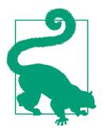

It is common to use 80% of the data for training and hold out 20% for testing. However, this depends on the size of the dataset: if it contains 10 million instances, then holding out 1% means your test set will contain 100,000 instances, probably more than enough to get a good estimate of the generalization error.

### **Hyperparameter Tuning and Model Selection**

Evaluating a model is simple enough: just use a test set. But suppose you are hesitating between two types of models (say, a linear model and a polynomial model): how can you decide between them? One option is to train both and compare how well they generalize using the test set.

Now suppose that the linear model generalizes better, but you want to apply some regularization to avoid overfitting. The question is, how do you choose the value of the regularization hyperparameter? One option is to train 100 different models using 100 different values for this hyperparameter. Suppose you find the best hyperparameter value that produces a model with the lowest generalization error-say, just 5% error. You launch this model into production, but unfortunately it does not perform as well as expected and produces 15% errors. What just happened?

The problem is that you measured the generalization error multiple times on the test set, and you adapted the model and hyperparameters to produce the best model for that particular set. This means the model is unlikely to perform as well on new data.

A common solution to this problem is called *holdout validation* (Figure 1-25): you simply hold out part of the training set to evaluate several candidate models and 

{62}------------------------------------------------

select the best one. The new held-out set is called the *validation set* (or the *devel*opment set, or dev set). More specifically, you train multiple models with various hyperparameters on the reduced training set (i.e., the full training set minus the validation set), and you select the model that performs best on the validation set. After this holdout validation process, you train the best model on the full training set (including the validation set), and this gives you the final model. Lastly, you evaluate this final model on the test set to get an estimate of the generalization error.

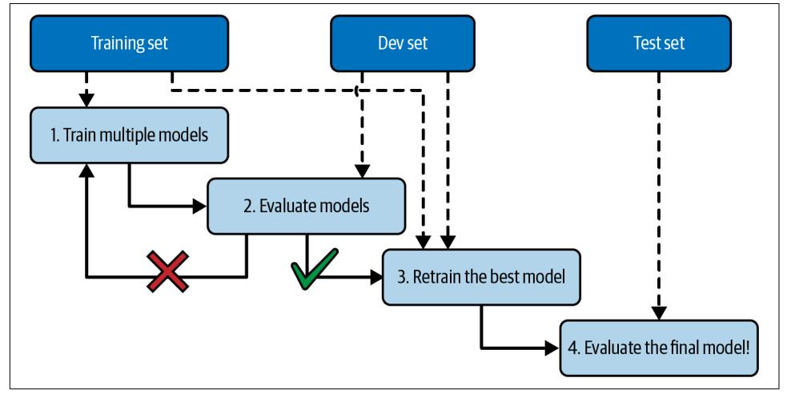

Figure 1-25. Model selection using holdout validation

This solution usually works quite well. However, if the validation set is too small, then the model evaluations will be imprecise: you may end up selecting a suboptimal model by mistake. Conversely, if the validation set is too large, then the remaining training set will be much smaller than the full training set. Why is this bad? Well, since the final model will be trained on the full training set, it is not ideal to compare candidate models trained on a much smaller training set. It would be like selecting the fastest sprinter to participate in a marathon. One way to solve this problem is to perform repeated *cross-validation*, using many small validation sets. Each model is evaluated once per validation set after it is trained on the rest of the data. By averaging out all the evaluations of a model, you get a much more accurate measure of its performance. There is a drawback, however: the training time is multiplied by the number of validation sets.

#### Data Mismatch

In some cases, it's easy to get a large amount of data for training, but this data probably won't be perfectly representative of the data that will be used in production. For example, suppose you want to create a mobile app to take pictures of flowers and automatically determine their species. You can easily download millions of pictures

{63}------------------------------------------------

of flowers on the web, but they won't be perfectly representative of the pictures that will actually be taken using the app on a mobile device. Perhaps you only have 1,000 representative pictures (i.e., actually taken with the app).

In this case, the most important rule to remember is that both the validation set and the test set must be as representative as possible of the data you expect to use in production, so they should be composed exclusively of representative pictures: you can shuffle them and put half in the validation set and half in the test set (making sure that no duplicates or near-duplicates end up in both sets). After training your model on the web pictures, if you observe that the performance of the model on the validation set is disappointing, you will not know whether this is because your model has overfit the training set, or whether this is just due to the mismatch between the web pictures and the mobile app pictures.

One solution is to hold out some of the training pictures (from the web) in yet another set that Andrew Ng dubbed the train-dev set (Figure 1-26). After the model is trained (on the training set, *not* on the train-dev set), you can evaluate it on the train-dev set. If the model performs poorly, then it must have overfit the training set, so you should try to simplify or regularize the model, get more training data, and clean up the training data. But if it performs well on the train-dev set, then you can evaluate the model on the dev set. If it performs poorly, then the problem must be coming from the data mismatch. You can try to tackle this problem by preprocessing the web images to make them look more like the pictures that will be taken by the mobile app, and then retraining the model. Once you have a model that performs well on both the train-dev set and the dev set, you can evaluate it one last time on the test set to know how well it is likely to perform in production.


Figure 1-26. When real data is scarce (right), you may use similar abundant data (left) for training and hold out some of it in a train-dev set to evaluate overfitting; the real data is then used to evaluate data mismatch (dev set) and to evaluate the final model's performance (test set)

{64}------------------------------------------------

#### **No Free Lunch Theorem**

A model is a simplified representation of the data. The simplifications are meant to discard the superfluous details that are unlikely to generalize to new instances. When you select a particular type of model, you are implicitly making assumptions about the data. For example, if you choose a linear model, you are implicitly assuming that the data is fundamentally linear and that the distance between the instances and the straight line is just noise, which can safely be ignored.

In a famous 1996 paper,<sup>9</sup> David Wolpert demonstrated that if you make absolutely no assumption about the data, then there is no reason to prefer one model over any other. This is called the No Free Lunch (NFL) theorem. For some datasets the best model is a linear model, while for other datasets it is a neural network. There is no model that is a priori guaranteed to work better (hence the name of the theorem). The only way to know for sure which model is best is to evaluate them all. Since this is not possible, in practice you make some reasonable assumptions about the data and evaluate only a few reasonable models. For example, for simple tasks you may evaluate linear models with various levels of regularization, and for a complex problem you may evaluate various neural networks.

### **Exercises**

In this chapter we have covered some of the most important concepts in machine learning. In the next chapters we will dive deeper and write more code, but before we do, make sure you can answer the following questions:

- 1. How would you define machine learning?
- 2. Can you name four types of applications where it shines?
- 3. What is a labeled training set?
- 4. What are the two most common supervised tasks?
- 5. Can you name four common unsupervised tasks?
- 6. What type of algorithm would you use to allow a robot to walk in various unknown terrains?
- 7. What type of algorithm would you use to segment your customers into multiple groups?
- 8. Would you frame the problem of spam detection as a supervised learning problem or an unsupervised learning problem?

<sup>9</sup> David Wolpert, "The Lack of A Priori Distinctions Between Learning Algorithms", Neural Computation 8, no. 7 (1996): 1341-1390.

{65}------------------------------------------------

- 9. What is an online learning system?
- 10. What is out-of-core learning?
- 11. What type of algorithm relies on a similarity measure to make predictions?
- 12. What is the difference between a model parameter and a model hyperparameter?
- 13. What do model-based algorithms search for? What is the most common strategy they use to succeed? How do they make predictions?
- 14. Can you name four of the main challenges in machine learning?
- 15. If your model performs great on the training data but generalizes poorly to new instances, what is happening? Can you name three possible solutions?
- 16. What is a test set, and why would you want to use it?
- 17. What is the purpose of a validation set?
- 18. What is the train-dev set, when do you need it, and how do you use it?
- 19. What can go wrong if you tune hyperparameters using the test set?

Solutions to these exercises are available at the end of this chapter's notebook, at https://homl.info/colab3.

{66}------------------------------------------------
