## **CHAPTER 2 End-to-End Machine Learning Project**

In this chapter you will work through an example project end to end, pretending to be a recently hired data scientist at a real estate company. This example is fictitious; the goal is to illustrate the main steps of a machine learning project, not to learn anything about the real estate business. Here are the main steps we will walk through:

- 1. Look at the big picture.
- 2. Get the data.
- 3. Explore and visualize the data to gain insights.
- 4. Prepare the data for machine learning algorithms.
- 5. Select a model and train it.
- 6. Fine-tune your model.
- 7. Present your solution.
- 8. Launch, monitor, and maintain your system.

### **Working with Real Data**

When you are learning about machine learning, it is best to experiment with realworld data, not artificial datasets. Fortunately, there are thousands of open datasets to choose from, ranging across all sorts of domains. Here are a few places you can look to get data:

- Popular open data repositories:
  - OpenML.org
  - Kaggle.com

{67}------------------------------------------------

- PapersWithCode.com
- UC Irvine Machine Learning Repository
- Amazon's AWS datasets
- TensorFlow datasets
- Meta portals (they list open data repositories):
  - DataPortals.org
  - OpenDataMonitor.eu
- Other pages listing many popular open data repositories:
  - Wikipedia's list of machine learning datasets
  - Quora.com
  - The datasets subreddit

In this chapter we'll use the California Housing Prices dataset from the StatLib repository<sup>1</sup> (see Figure 2-1). This dataset is based on data from the 1990 California census. It is not exactly recent (a nice house in the Bay Area was still affordable at the time), but it has many qualities for learning, so we will pretend it is recent data. For teaching purposes I've added a categorical attribute and removed a few features.

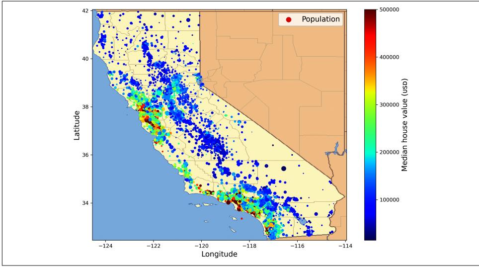

Figure 2-1. California housing prices

<sup>1</sup> The original dataset appeared in R. Kelley Pace and Ronald Barry, "Sparse Spatial Autoregressions", Statistics & Probability Letters 33, no. 3 (1997): 291-297.

{68}------------------------------------------------

### **Look at the Big Picture**

Welcome to the Machine Learning Housing Corporation! Your first task is to use California census data to build a model of housing prices in the state. This data includes metrics such as the population, median income, and median housing price for each block group in California. Block groups are the smallest geographical unit for which the US Census Bureau publishes sample data (a block group typically has a population of 600 to 3,000 people). I will call them "districts" for short.

Your model should learn from this data and be able to predict the median housing price in any district, given all the other metrics.


Since you are a well-organized data scientist, the first thing you should do is pull out your machine learning project checklist. You can start with the one in Appendix A; it should work reasonably well for most machine learning projects, but make sure to adapt it to your needs. In this chapter we will go through many checklist items, but we will also skip a few, either because they are self-explanatory or because they will be discussed in later chapters.

### **Frame the Problem**

The first question to ask your boss is what exactly the business objective is. Building a model is probably not the end goal. How does the company expect to use and benefit from this model? Knowing the objective is important because it will determine how you frame the problem, which algorithms you will select, which performance measure you will use to evaluate your model, and how much effort you will spend tweaking it.

Your boss answers that your model's output (a prediction of a district's median housing price) will be fed to another machine learning system (see Figure 2-2), along with many other signals.<sup>2</sup> This downstream system will determine whether it is worth investing in a given area. Getting this right is critical, as it directly affects revenue.

The next question to ask your boss is what the current solution looks like (if any). The current situation will often give you a reference for performance, as well as insights on how to solve the problem. Your boss answers that the district housing prices are currently estimated manually by experts: a team gathers up-to-date information about a district, and when they cannot get the median housing price, they estimate it using complex rules.

<sup>2</sup> A piece of information fed to a machine learning system is often called a signal, in reference to Claude Shannon's information theory, which he developed at Bell Labs to improve telecommunications. His theory: you want a high signal-to-noise ratio.

{69}------------------------------------------------

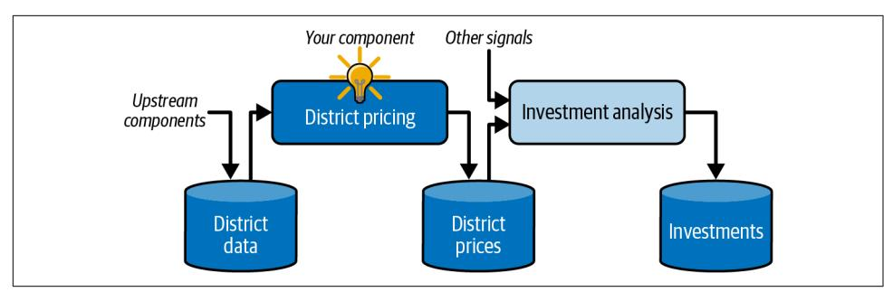

Figure 2-2. A machine learning pipeline for real estate investments

This is costly and time-consuming, and their estimates are not great; in cases where they manage to find out the actual median housing price, they often realize that their estimates were off by more than 30%. This is why the company thinks that it would be useful to train a model to predict a district's median housing price, given other data about that district. The census data looks like a great dataset to exploit for this purpose, since it includes the median housing prices of thousands of districts, as well as other data.

#### **Pipelines**

A sequence of data processing components is called a data *pipeline*. Pipelines are very common in machine learning systems, since there is a lot of data to manipulate and many data transformations to apply.

Components typically run asynchronously. Each component pulls in a large amount of data, processes it, and spits out the result in another data store. Then, some time later, the next component in the pipeline pulls in this data and spits out its own output. Each component is fairly self-contained: the interface between components is simply the data store. This makes the system simple to grasp (with the help of a data flow graph), and different teams can focus on different components. Moreover, if a component breaks down, the downstream components can often continue to run normally (at least for a while) by just using the last output from the broken component. This makes the architecture quite robust.

On the other hand, a broken component can go unnoticed for some time if proper monitoring is not implemented. The data gets stale and the overall system's performance drops.

{70}------------------------------------------------

With all this information, you are now ready to start designing your system. First, determine what kind of training supervision the model will need: is it a supervised, unsupervised, semi-supervised, self-supervised, or reinforcement learning task? And is it a classification task, a regression task, or something else? Should you use batch learning or online learning techniques? Before you read on, pause and try to answer these questions for yourself.

Have you found the answers? Let's see. This is clearly a typical supervised learning task, since the model can be trained with *labeled* examples (each instance comes with the expected output, i.e., the district's median housing price). It is a typical regression task, since the model will be asked to predict a value. More specifically, this is a *multiple regression* problem, since the system will use multiple features to make a prediction (the district's population, the median income, etc.). It is also a *univariate regression* problem, since we are only trying to predict a single value for each district. If we were trying to predict multiple values per district, it would be a *multivariate regression* problem. Finally, there is no continuous flow of data coming into the system, there is no particular need to adjust to changing data rapidly, and the data is small enough to fit in memory, so plain batch learning should do just fine.


If the data were huge, you could either split your batch learning work across multiple servers (using the MapReduce technique) or use an online learning technique.

#### Select a Performance Measure

Your next step is to select a performance measure. A typical performance measure for regression problems is the *root mean square error* (RMSE). It gives an idea of how much error the system typically makes in its predictions, with a higher weight given to large errors. Equation 2-1 shows the mathematical formula to compute the RMSE.

Equation 2-1. Root mean square error (RMSE)

RMSE(
$$
\mathbf{x}, h
$$
) =  $\sqrt{\frac{1}{m} \sum_{i=1}^{m} (h(\mathbf{x}^{(i)}) - y^{(i)})^2}$ 

{71}------------------------------------------------

#### **Notations**

This equation introduces several very common machine learning notations that I will use throughout this book:

- $\bullet~m$  is the number of instances in the dataset you are measuring the RMSE on.
  - For example, if you are evaluating the RMSE on a validation set of 2,000 districts, then  $m = 2,000$ .
- $\mathbf{x}^{(i)}$  is a vector of all the feature values (excluding the label) of the *i*<sup>th</sup> instance in the dataset, and  $y^{(i)}$  is its label (the desired output value for that instance).
  - For example, if the first district in the dataset is located at longitude -118.29°, latitude 33.91°, and it has 1,416 inhabitants with a median income of \$38,372, and the median house value is \$156,400 (ignoring other features for now), then:

$$
\mathbf{x}^{(1)} = \begin{pmatrix} -118.29 \\ 33.91 \\ 1,416 \\ 38,372 \end{pmatrix}
$$

and:

$$
y^{(1)} = 156,400
$$

- X is a matrix containing all the feature values (excluding labels) of all instances in the dataset. There is one row per instance, and the  $i<sup>th</sup>$  row is equal to the transpose of  $\mathbf{x}^{(i)}$ , noted  $(\mathbf{x}^{(i)})^{\intercal}$ .<sup>3</sup>
  - $-$  For example, if the first district is as just described, then the matrix  $X$  looks like this:

$$
\mathbf{X} = \begin{pmatrix} (\mathbf{x}^{(1)})^{\mathsf{T}} \\ (\mathbf{x}^{(2)})^{\mathsf{T}} \\ \vdots \\ (\mathbf{x}^{(1999)})^{\mathsf{T}} \\ (\mathbf{x}^{(2000)})^{\mathsf{T}} \end{pmatrix} = \begin{pmatrix} -118.29 & 33.91 & 1,416 & 38,372 \\ \vdots & \vdots & \vdots & \vdots \end{pmatrix}
$$

<sup>3</sup> Recall that the transpose operator flips a column vector into a row vector (and vice versa).

{72}------------------------------------------------

- $\bullet$  h is your system's prediction function, also called a *hypothesis*. When your system is given an instance's feature vector  $\mathbf{x}^{(i)}$ , it outputs a predicted value  $\hat{y}^{(i)} = h(\mathbf{x}^{(i)})$ for that instance ( $\hat{y}$  is pronounced "y-hat").
  - For example, if your system predicts that the median housing price in the first district is \$158,400, then  $\hat{y}^{(1)} = h(\mathbf{x}^{(1)}) = 158,400$ . The prediction error for this district is  $\hat{v}^{(1)} - v^{(1)} = 2,000$ .
- $RMSE(X,h)$  is the cost function measured on the set of examples using your hypothesis h.

We use lowercase italic font for scalar values (such as *m* or  $y^{(i)}$ ) and function names (such as h), lowercase bold font for vectors (such as  $\mathbf{x}^{(i)}$ ), and uppercase bold font for matrices (such as X).

Although the RMSE is generally the preferred performance measure for regression tasks, in some contexts you may prefer to use another function. For example, if there are many outlier districts. In that case, you may consider using the mean absolute error (MAE, also called the average absolute deviation), shown in Equation 2-2:

Equation 2-2. Mean absolute error (MAE)

$$
\text{MAE}(\mathbf{X}, h) = \frac{1}{m} \sum_{i=1}^{m} \left| h(\mathbf{x}^{(i)}) - y^{(i)} \right|
$$

Both the RMSE and the MAE are ways to measure the distance between two vectors: the vector of predictions and the vector of target values. Various distance measures, or *norms*, are possible:

- Computing the root of a sum of squares (RMSE) corresponds to the *Euclidean norm*: this is the notion of distance we are all familiar with. It is also called the  $\ell_2$ *norm*, noted  $\|\cdot\|_2$  (or just  $\|\cdot\|$ ).
- Computing the sum of absolutes (MAE) corresponds to the  $\ell_1$  *norm*, noted  $||\cdot||_1$ . This is sometimes called the *Manhattan norm* because it measures the distance between two points in a city if you can only travel along orthogonal city blocks.
- More generally, the  $\ell_k$  *norm* of a vector **v** containing *n* elements is defined as  $\|\mathbf{v}\|_{k} = (|\mathbf{v}_{1}|^{k} + |\mathbf{v}_{2}|^{k} + ... + |\mathbf{v}_{n}|^{k})^{1/k}$ .  $\ell_{0}$  gives the number of nonzero elements in the vector, and  $\ell_{\infty}$  gives the maximum absolute value in the vector.

The higher the norm index, the more it focuses on large values and neglects small ones. This is why the RMSE is more sensitive to outliers than the MAE. But when outliers are exponentially rare (like in a bell-shaped curve), the RMSE performs very well and is generally preferred.

{73}------------------------------------------------

### **Check the Assumptions**

Lastly, it is good practice to list and verify the assumptions that have been made so far (by you or others); this can help you catch serious issues early on. For example, the district prices that your system outputs are going to be fed into a downstream machine learning system, and you assume that these prices are going to be used as such. But what if the downstream system converts the prices into categories (e.g., "cheap", "medium", or "expensive") and then uses those categories instead of the prices themselves? In this case, getting the price perfectly right is not important at all; your system just needs to get the category right. If that's so, then the problem should have been framed as a classification task, not a regression task. You don't want to find this out after working on a regression system for months.

Fortunately, after talking with the team in charge of the downstream system, you are confident that they do indeed need the actual prices, not just categories. Great! You're all set, the lights are green, and you can start coding now!

### **Get the Data**

It's time to get your hands dirty. Don't hesitate to pick up your laptop and walk through the code examples. As I mentioned in the preface, all the code examples in this book are open source and available online as Jupyter notebooks, which are interactive documents containing text, images, and executable code snippets (Python in our case). In this book I will assume you are running these notebooks on Google Colab, a free service that lets you run any Jupyter notebook directly online, without having to install anything on your machine. If you want to use another online platform (e.g., Kaggle) or if you want to install everything locally on your own machine, please see the instructions on the book's GitHub page.

### **Running the Code Examples Using Google Colab**

First, open a web browser and visit https://homl.info/colab3: this will lead you to Google Colab, and it will display the list of Jupyter notebooks for this book (see Figure 2-3). You will find one notebook per chapter, plus a few extra notebooks and tutorials for NumPy, Matplotlib, Pandas, linear algebra, and differential calculus. For example, if you click 02\_end\_to\_end\_machine\_learning\_project.ipynb, the notebook from Chapter 2 will open up in Google Colab (see Figure 2-4).

A Jupyter notebook is composed of a list of cells. Each cell contains either executable code or text. Try double-clicking the first text cell (which contains the sentence "Welcome to Machine Learning Housing Corp.!"). This will open the cell for editing. Notice that Jupyter notebooks use Markdown syntax for formatting (e.g., \*\*bold\*\*, \*italics\*, # Title, [url](link text), and so on). Try modifying this text, then press Shift-Enter to see the result.

{74}------------------------------------------------

| <b>Examples</b>                                       | <b>Recent</b>                                        | <b>Google Drive</b> | <b>GitHub</b> | <b>Upload</b>         |
|-------------------------------------------------------|------------------------------------------------------|---------------------|---------------|-----------------------|
|                                                       | Enter a GitHub URL or search by organization or user |                     |               | Include private repos |
| ageron                                                |                                                      |                     |               | Q                     |
| Repository: $\boxed{7}$<br>ageron/handson-ml3<br>Path | Branch: Z<br>master<br>v                             | ⌄                   |               |                       |
|                                                       | 01_the_machine_learning_landscape.ipynb              |                     |               | Q<br>Г7               |
|                                                       | 02_end_to_end_machine_learning_project.jpynb         |                     |               | $\Omega$<br>囜         |
| 03_classification.ipynb                               |                                                      |                     |               | 7<br>Q                |
| 04_training_linear_models.ipynb                       |                                                      |                     |               | 7<br>la               |

Figure 2-3. List of notebooks in Google Colab

|                   | C 02_end_to_end_machine_learning_project.ipynb<br>File Edit View Insert Runtime Tools Help   | Share Share                         |
|-------------------|----------------------------------------------------------------------------------------------|-------------------------------------|
| 這                 | $+$ Code $+$ Text<br>← Copy to Drive                                                         | $\sqrt{\frac{RAM}{D}}$<br>Editing   |
| Q                 | Chapter 2 - End-to-end Machine Learning Project                                              |                                     |
| $\leftrightarrow$ | Welcome to Machine Learning Housing Corp.! Your task is to predict median house values in    |                                     |
|                   | Californian districts, given a number of features from these districts.                      |                                     |
| m                 | This notebook contains all the sample code and solutions to the exercices in chapter 2.      |                                     |
|                   | Open in Colab<br>k Open in Kaggle                                                            |                                     |
|                   |                                                                                              |                                     |
|                   | $\sim$ Setup                                                                                 | Text cells:<br>double-click to edit |
|                   | First, let's import a few common modules, ensure MatplotLib plots figures inline and prepare |                                     |
|                   | a function to save the figures.                                                              |                                     |
|                   |                                                                                              | Code cells:<br>click to edit        |
|                   | # Python ≥3.7 is required<br>$\sqrt{1}$<br>import sys                                        |                                     |
|                   | assert sys. version info $>=$ (3, 7)                                                         |                                     |

Figure 2-4. Your notebook in Google Colab

{75}------------------------------------------------

Next, create a new code cell by selecting Insert  $\rightarrow$  "Code cell" from the menu. Alternatively, you can click the  $+$  Code button in the toolbar, or hover your mouse over the bottom of a cell until you see  $+$  Code and  $+$  Text appear, then click  $+$  Code. In the new code cell, type some Python code, such as print ("Hello World"), then press Shift-Enter to run this code (or click the ⊳ button on the left side of the cell).

If you're not logged in to your Google account, you'll be asked to log in now (if you don't already have a Google account, you'll need to create one). Once you are logged in, when you try to run the code you'll see a security warning telling you that this notebook was not authored by Google. A malicious person could create a notebook that tries to trick you into entering your Google credentials so they can access your personal data, so before you run a notebook, always make sure you trust its author (or double-check what each code cell will do before running it). Assuming you trust me (or you plan to check every code cell), you can now click "Run anyway".

Colab will then allocate a new *runtime* for you: this is a free virtual machine located on Google's servers that contains a bunch of tools and Python libraries, including everything you'll need for most chapters (in some chapters, you'll need to run a command to install additional libraries). This will take a few seconds. Next, Colab will automatically connect to this runtime and use it to execute your new code cell. Importantly, the code runs on the runtime, *not* on your machine. The code's output will be displayed under the cell. Congrats, you've run some Python code on Colab!


To insert a new code cell, you can also type Ctrl-M (or Cmd-M on macOS) followed by A (to insert above the active cell) or B (to insert below). There are many other keyboard shortcuts available: you can view and edit them by typing Ctrl-M (or Cmd-M) then H. If you choose to run the notebooks on Kaggle or on your own machine using JupyterLab or an IDE such as Visual Studio Code with the Jupyter extension, you will see some minor differencesruntimes are called kernels, the user interface and keyboard shortcuts are slightly different, etc.—but switching from one Jupyter environment to another is not too hard.

### **Saving Your Code Changes and Your Data**

You can make changes to a Colab notebook, and they will persist for as long as you keep your browser tab open. But once you close it, the changes will be lost. To avoid this, make sure you save a copy of the notebook to your Google Drive by selecting File  $\rightarrow$  "Save a copy in Drive". Alternatively, you can download the notebook to your computer by selecting File  $\rightarrow$  Download  $\rightarrow$  "Download .ipynb". Then you can later visit https://colab.research.google.com and open the notebook again (either from Google Drive or by uploading it from your computer).

{76}------------------------------------------------


Google Colab is meant only for interactive use: you can play around in the notebooks and tweak the code as you like, but you cannot let the notebooks run unattended for a long period of time, or else the runtime will be shut down and all of its data will be lost.

If the notebook generates data that you care about, make sure you download this data before the runtime shuts down. To do this, click the Files icon (see step 1 in Figure 2-5), find the file you want to download, click the vertical dots next to it (step 2), and click Download (step 3). Alternatively, you can mount your Google Drive on the runtime, allowing the notebook to read and write files directly to Google Drive as if it were a local directory. For this, click the Files icon (step 1), then click the Google Drive icon (circled in Figure 2-5) and follow the on-screen instructions.

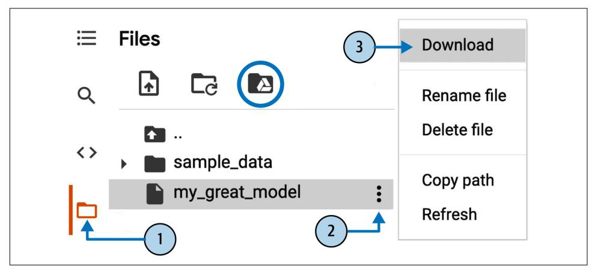

Figure 2-5. Downloading a file from a Google Colab runtime (steps 1 to 3), or mounting your Google Drive (circled icon)

By default, your Google Drive will be mounted at /content/drive/MyDrive. If you want to back up a data file, simply copy it to this directory by running !cp /content/my\_great\_model /content/drive/MyDrive. Any command starting with a bang (!) is treated as a shell command, not as Python code: cp is the Linux shell command to copy a file from one path to another. Note that Colab runtimes run on Linux (specifically, Ubuntu).

### The Power and Danger of Interactivity

Jupyter notebooks are interactive, and that's a great thing: you can run each cell one by one, stop at any point, insert a cell, play with the code, go back and run the same cell again, etc., and I highly encourage you to do so. If you just run the cells one by one without ever playing around with them, you won't learn as fast. However, this flexibility comes at a price: it's very easy to run cells in the wrong order, or to forget to

{77}------------------------------------------------

run a cell. If this happens, the subsequent code cells are likely to fail. For example, the very first code cell in each notebook contains setup code (such as imports), so make sure you run it first, or else nothing will work.


If you ever run into a weird error, try restarting the runtime (by selecting Runtime  $\rightarrow$  "Restart runtime" from the menu) and then run all the cells again from the beginning of the notebook. This often solves the problem. If not, it's likely that one of the changes you made broke the notebook: just revert to the original notebook and try again. If it still fails, please file an issue on GitHub.

### **Book Code Versus Notebook Code**

You may sometimes notice some little differences between the code in this book and the code in the notebooks. This may happen for several reasons:

- A library may have changed slightly by the time you read these lines, or perhaps despite my best efforts I made an error in the book. Sadly, I cannot magically fix the code in your copy of this book (unless you are reading an electronic copy and you can download the latest version), but I can fix the notebooks. So, if you run into an error after copying code from this book, please look for the fixed code in the notebooks: I will strive to keep them error-free and up-to-date with the latest library versions.
- The notebooks contain some extra code to beautify the figures (adding labels, setting font sizes, etc.) and to save them in high resolution for this book. You can safely ignore this extra code if you want.

I optimized the code for readability and simplicity: I made it as linear and flat as possible, defining very few functions or classes. The goal is to ensure that the code you are running is generally right in front of you, and not nested within several layers of abstractions that you have to search through. This also makes it easier for you to play with the code. For simplicity, there's limited error handling, and I placed some of the least common imports right where they are needed (instead of placing them at the top of the file, as is recommended by the PEP 8 Python style guide). That said, your production code will not be very different: just a bit more modular, and with additional tests and error handling.

OK! Once you're comfortable with Colab, you're ready to download the data.

### **Download the Data**

In typical environments your data would be available in a relational database or some other common data store, and spread across multiple tables/documents/files.

{78}------------------------------------------------

To access it, you would first need to get your credentials and access authorizations<sup>4</sup> and familiarize yourself with the data schema. In this project, however, things are much simpler: you will just download a single compressed file, housing.tgz, which contains a comma-separated values (CSV) file called *housing.csv* with all the data.

Rather than manually downloading and decompressing the data, it's usually preferable to write a function that does it for you. This is useful in particular if the data changes regularly: you can write a small script that uses the function to fetch the latest data (or you can set up a scheduled job to do that automatically at regular intervals). Automating the process of fetching the data is also useful if you need to install the dataset on multiple machines.

Here is the function to fetch and load the data:

```
from pathlib import Path
import pandas as pd
import tarfile
import urllib.request
def load housing data():
    tarball path = Path("datasets/housing.tgz")
    if not tarball_path.is_file():
        Path("datasets").mkdir(parents=True, exist ok=True)
        url = "https://github.com/ageron/data/raw/main/housing.tgz"
        urllib.request.urlretrieve(url, tarball_path)
        with tarfile.open(tarball path) as housing tarball:
            housing_tarball.extractall(path="datasets")
    return pd.read csv(Path("datasets/housing/housing.csv"))
```

```
housing = load housing data()
```

When load\_housing\_data() is called, it looks for the *datasets/housing.tgz* file. If it does not find it, it creates the *datasets* directory inside the current directory (which is /content by default, in Colab), downloads the housing.tgz file from the ageron/data GitHub repository, and extracts its content into the *datasets* directory; this creates the datasets/housing directory with the housing.csv file inside it. Lastly, the function loads this CSV file into a Pandas DataFrame object containing all the data, and returns it.

### Take a Quick Look at the Data Structure

You start by looking at the top five rows of data using the DataFrame's head() method (see Figure 2-6).

<sup>4</sup> You might also need to check legal constraints, such as private fields that should never be copied to unsafe data stores.

{79}------------------------------------------------

|                | housing.head() |       |                                                                                        |        |                 |          |
|----------------|----------------|-------|----------------------------------------------------------------------------------------|--------|-----------------|----------|
|                |                |       | longitude latitude housing median age median income ocean proximity median house value |        |                 |          |
| $\mathbf{0}$   | $-122.23$      | 37.88 | 41.0                                                                                   | 8.3252 | <b>NEAR BAY</b> | 452600.0 |
| 1              | $-122.22$      | 37.86 | 21.0                                                                                   | 8.3014 | <b>NEAR BAY</b> | 358500.0 |
| $\overline{2}$ | $-122.24$      | 37.85 | 52.0                                                                                   | 7.2574 | <b>NEAR BAY</b> | 352100.0 |
| 3              | $-122.25$      | 37.85 | 52.0                                                                                   | 5.6431 | <b>NFAR BAY</b> | 341300.0 |
| 4              | $-122.25$      | 37.85 | 52.0                                                                                   | 3.8462 | <b>NEAR BAY</b> | 342200.0 |

Figure 2-6. Top five rows in the dataset

Each row represents one district. There are 10 attributes (they are not all shown in the screenshot): longitude, latitude, housing median age, total rooms, total\_bedrooms, population, households, median\_income, median\_house\_value, and ocean\_proximity.

The info() method is useful to get a quick description of the data, in particular the total number of rows, each attribute's type, and the number of non-null values:

```
>>> housing.info()
<class 'pandas.core.frame.DataFrame'>
RangeIndex: 20640 entries, 0 to 20639
Data columns (total 10 columns):
                           Non-Null Count Dtype
     Column
\boldsymbol{\mu}\sim \sim \sim. . . . . . .
                           . . . . . . . . . . . . . . . . . . . . 
     longitude
                          20640 non-null float64
\Theta\mathbf{1}latitude
                          20640 non-null float64
     housing_median_age 20640 non-null float64
2^{\circ}20640 non-null float64
     total rooms
\overline{3}20433 non-null float64
\overline{4}total bedrooms
5<sup>1</sup>population
                          20640 non-null float64
6
    households
                          20640 non-null float64
                          20640 non-null float64
7^{\circ}median income
\mathsf{R}median house value 20640 non-null float64
                           20640 non-null object
9
     ocean proximity
dtypes: float64(9), object(1)
memory usage: 1.6+ MB
```


In this book, when a code example contains a mix of code and outputs, as is the case here, it is formatted like in the Python interpreter, for better readability: the code lines are prefixed with >>> (or ... for indented blocks), and the outputs have no prefix.

There are 20,640 instances in the dataset, which means that it is fairly small by machine learning standards, but it's perfect to get started. You notice that the 

{80}------------------------------------------------

total bedrooms attribute has only 20,433 non-null values, meaning that 207 districts are missing this feature. You will need to take care of this later.

All attributes are numerical, except for ocean proximity. Its type is object, so it could hold any kind of Python object. But since you loaded this data from a CSV file, you know that it must be a text attribute. When you looked at the top five rows, you probably noticed that the values in the ocean\_proximity column were repetitive, which means that it is probably a categorical attribute. You can find out what categories exist and how many districts belong to each category by using the value counts() method:

|            | >>> housing cream proximity" ] value counts() |
|------------|-----------------------------------------------|
| <1H OCEAN  | 9136                                          |
| INLAND     | 6551                                          |
| NEAR OCEAN | 2658                                          |
| NFAR RAY   | 2290                                          |
| ISLAND     | 5                                             |
|            | Name: ocean proximity, dtype: int64           |

Let's look at the other fields. The describe() method shows a summary of the numerical attributes (Figure 2-7).

| housing.describe() |               |              |                    |              |                |                    |
|--------------------|---------------|--------------|--------------------|--------------|----------------|--------------------|
|                    | longitude     | latitude     | housing median age | total rooms  | total bedrooms | median house value |
| count              | 20640.000000  | 20640.000000 | 20640.000000       | 20640.000000 | 20433.000000   | 20640.000000       |
| mean               | $-119.569704$ | 35.631861    | 28.639486          | 2635.763081  | 537.870553     | 206855.816909      |
| std                | 2.003532      | 2.135952     | 12.585558          | 2181.615252  | 421.385070     | 115395.615874      |
| min                | $-124.350000$ | 32,540000    | 1.000000           | 2.000000     | 1.000000       | 14999.000000       |
| 25%                | $-121.800000$ | 33.930000    | 18.000000          | 1447.750000  | 296,000000     | 119600.000000      |
| 50%                | $-118.490000$ | 34.260000    | 29.000000          | 2127.000000  | 435.000000     | 179700.000000      |
| 75%                | $-118.010000$ | 37.710000    | 37,000000          | 3148,000000  | 647.000000     | 264725,000000      |
| max                | $-114.310000$ | 41.950000    | 52.000000          | 39320.000000 | 6445.000000    | 500001.000000      |

Figure 2-7. Summary of each numerical attribute

The count, mean, min, and max rows are self-explanatory. Note that the null values are ignored (so, for example, the count of total\_bedrooms is 20,433, not 20,640). The std row shows the *standard deviation*, which measures how dispersed the values are.<sup>5</sup> The 25%, 50%, and 75% rows show the corresponding *percentiles*: a percentile

<sup>5</sup> The standard deviation is generally denoted  $\sigma$  (the Greek letter sigma), and it is the square root of the variance, which is the average of the squared deviation from the mean. When a feature has a bell-shaped normal distribution (also called a Gaussian distribution), which is very common, the "68-95-99.7" rule applies: about 68% of the values fall within  $1\sigma$  of the mean, 95% within  $2\sigma$ , and 99.7% within  $3\sigma$ .

{81}------------------------------------------------

indicates the value below which a given percentage of observations in a group of observations fall. For example, 25% of the districts have a housing median age lower than 18, while 50% are lower than 29 and 75% are lower than 37. These are often called the 25th percentile (or first quartile), the median, and the 75th percentile (or third quartile).

Another quick way to get a feel of the type of data you are dealing with is to plot a histogram for each numerical attribute. A histogram shows the number of instances (on the vertical axis) that have a given value range (on the horizontal axis). You can either plot this one attribute at a time, or you can call the hist() method on the whole dataset (as shown in the following code example), and it will plot a histogram for each numerical attribute (see Figure 2-8):

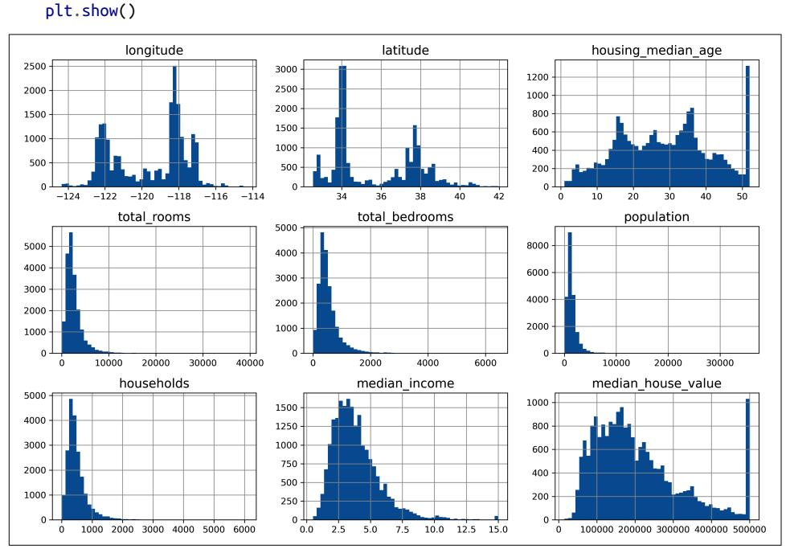

Figure 2-8. A histogram for each numerical attribute

import matplotlib.pyplot as plt

housing.hist(bins=50, figsize=(12, 8))

{82}------------------------------------------------

Looking at these histograms, you notice a few things:

- First, the median income attribute does not look like it is expressed in US dollars (USD). After checking with the team that collected the data, you are told that the data has been scaled and capped at 15 (actually, 15.0001) for higher median incomes, and at 0.5 (actually, 0.4999) for lower median incomes. The numbers represent roughly tens of thousands of dollars (e.g., 3 actually means about \$30,000). Working with preprocessed attributes is common in machine learning, and it is not necessarily a problem, but you should try to understand how the data was computed.
- The housing median age and the median house value were also capped. The latter may be a serious problem since it is your target attribute (your labels). Your machine learning algorithms may learn that prices never go beyond that limit. You need to check with your client team (the team that will use your system's output) to see if this is a problem or not. If they tell you that they need precise predictions even beyond \$500,000, then you have two options:
  - Collect proper labels for the districts whose labels were capped.
  - Remove those districts from the training set (and also from the test set, since your system should not be evaluated poorly if it predicts values beyond  $$500,000$ ).
- These attributes have very different scales. We will discuss this later in this chapter, when we explore feature scaling.
- Finally, many histograms are *skewed right*: they extend much farther to the right of the median than to the left. This may make it a bit harder for some machine learning algorithms to detect patterns. Later, you'll try transforming these attributes to have more symmetrical and bell-shaped distributions.

You should now have a better understanding of the kind of data you're dealing with.


Wait! Before you look at the data any further, you need to create a test set, put it aside, and never look at it.

### **Create a Test Set**

It may seem strange to voluntarily set aside part of the data at this stage. After all, you have only taken a quick glance at the data, and surely you should learn a whole lot more about it before you decide what algorithms to use, right? This is true, but your brain is an amazing pattern detection system, which also means that it is highly prone to overfitting: if you look at the test set, you may stumble upon some 

{83}------------------------------------------------

seemingly interesting pattern in the test data that leads you to select a particular kind of machine learning model. When you estimate the generalization error using the test set, your estimate will be too optimistic, and you will launch a system that will not perform as well as expected. This is called *data snooping* bias.

Creating a test set is theoretically simple; pick some instances randomly, typically 20% of the dataset (or less if your dataset is very large), and set them aside:

```
import numpy as np
def shuffle_and_split_data(data, test_ratio):
    shuffled indices = np.random, permutation(len(data))
    test_set_size = int(len(data) * test_rate)test_indices = shuffled_indices[:test_set_size]
    train indices = shuffled indices[test set size:]
    return data.iloc[train_indices], data.iloc[test_indices]
```

You can then use this function like this:

```
\gg train_set, test_set = shuffle_and_split_data(housing, 0.2)
>>> len(train_set)
16512
>>> len(test_set)
4128
```

Well, this works, but it is not perfect: if you run the program again, it will generate a different test set! Over time, you (or your machine learning algorithms) will get to see the whole dataset, which is what you want to avoid.

One solution is to save the test set on the first run and then load it in subsequent runs. Another option is to set the random number generator's seed (e.g., with  $np.random.seed(42))$ <sup>6</sup> before calling  $np.random.permutation()$  so that it always generates the same shuffled indices.

However, both these solutions will break the next time you fetch an updated dataset. To have a stable train/test split even after updating the dataset, a common solution is to use each instance's identifier to decide whether or not it should go in the test set (assuming instances have unique and immutable identifiers). For example, you could compute a hash of each instance's identifier and put that instance in the test set if the hash is lower than or equal to 20% of the maximum hash value. This ensures that the test set will remain consistent across multiple runs, even if you refresh the dataset. The new test set will contain 20% of the new instances, but it will not contain any instance that was previously in the training set.

<sup>6</sup> You will often see people set the random seed to 42. This number has no special property, other than being the Answer to the Ultimate Question of Life, the Universe, and Everything.

{84}------------------------------------------------

Here is a possible implementation:

```
from zlib import crc32
def is_id_in_test_set(identifier, test_ratio):
   return crc32(np.int64(identifier)) < test_rate * 2**32def split_data_with_id_hash(data, test_ratio, id_column):
   ids = data [id column]in_test_set = ids.apply(lambda id_: is_id_in_test_set(id_, test_ratio))
   return data.loc[~in_test_set], data.loc[in_test_set]
```

Unfortunately, the housing dataset does not have an identifier column. The simplest solution is to use the row index as the ID:

```
housing with id = housing.reset index() # adds an `index` column
train_set, test_set = split_data_with_id_hash(housing_with_id, 0.2, "index")
```

If you use the row index as a unique identifier, you need to make sure that new data gets appended to the end of the dataset and that no row ever gets deleted. If this is not possible, then you can try to use the most stable features to build a unique identifier. For example, a district's latitude and longitude are guaranteed to be stable for a few million years, so you could combine them into an ID like so:<sup>7</sup>

```
housing_with_id["id"] = housing["longitude"] * 1000 + housing["latitude"]
train_set, test_set = split_data_with_id_hash(housing_with_id, 0.2, "id")
```

Scikit-Learn provides a few functions to split datasets into multiple subsets in various ways. The simplest function is train\_test\_split(), which does pretty much the same thing as the shuffle and split data() function we defined earlier, with a couple of additional features. First, there is a random state parameter that allows you to set the random generator seed. Second, you can pass it multiple datasets with an identical number of rows, and it will split them on the same indices (this is very useful, for example, if you have a separate DataFrame for labels):

```
from sklearn.model_selection import train_test_split
```

```
train_set, test_set = train_test_split(housing, test_size=0.2, random_state=42)
```

So far we have considered purely random sampling methods. This is generally fine if your dataset is large enough (especially relative to the number of attributes), but if it is not, you run the risk of introducing a significant sampling bias. When employees at a survey company decides to call 1,000 people to ask them a few questions, they don't just pick 1,000 people randomly in a phone book. They try to ensure that these 1,000 people are representative of the whole population, with regard to the questions they want to ask. For example, the US population is 51.1% females and

<sup>7</sup> The location information is actually quite coarse, and as a result many districts will have the exact same ID, so they will end up in the same set (test or train). This introduces some unfortunate sampling bias.

{85}------------------------------------------------

48.9% males, so a well-conducted survey in the US would try to maintain this ratio in the sample: 511 females and 489 males (at least if it seems possible that the answers may vary across genders). This is called *stratified sampling*: the population is divided into homogeneous subgroups called *strata*, and the right number of instances are sampled from each stratum to guarantee that the test set is representative of the overall population. If the people running the survey used purely random sampling, there would be about a 10.7% chance of sampling a skewed test set with less than 48.5% female or more than 53.5% female participants. Either way, the survey results would likely be quite biased.

Suppose you've chatted with some experts who told you that the median income is a very important attribute to predict median housing prices. You may want to ensure that the test set is representative of the various categories of incomes in the whole dataset. Since the median income is a continuous numerical attribute, you first need to create an income category attribute. Let's look at the median income histogram more closely (back in Figure 2-8): most median income values are clustered around 1.5 to 6 (i.e.,  $$15,000-\$60,000$ ), but some median incomes go far beyond 6. It is important to have a sufficient number of instances in your dataset for each stratum, or else the estimate of a stratum's importance may be biased. This means that you should not have too many strata, and each stratum should be large enough. The following code uses the pd.cut() function to create an income category attribute with five categories (labeled from 1 to 5); category 1 ranges from 0 to 1.5 (i.e., less than \$15,000), category 2 from 1.5 to 3, and so on:

```
housing["income_cat"] = pd.cut(housing["median_income"],bins=[0., 1.5, 3.0, 4.5, 6., np.inf],labels=[1, 2, 3, 4, 5])
```

These income categories are represented in Figure 2-9:

```
housing["income_cat"].value_counts().sort_index().plot.bar(rot=0, grid=True)
plt.xlabel("Income category")
plt.ylabel("Number of districts")
plt.show()
```

Now you are ready to do stratified sampling based on the income category. Scikit-Learn provides a number of splitter classes in the sklearn. model\_selection package that implement various strategies to split your dataset into a training set and a test set. Each splitter has a split() method that returns an iterator over different training/ test splits of the same data.

{86}------------------------------------------------

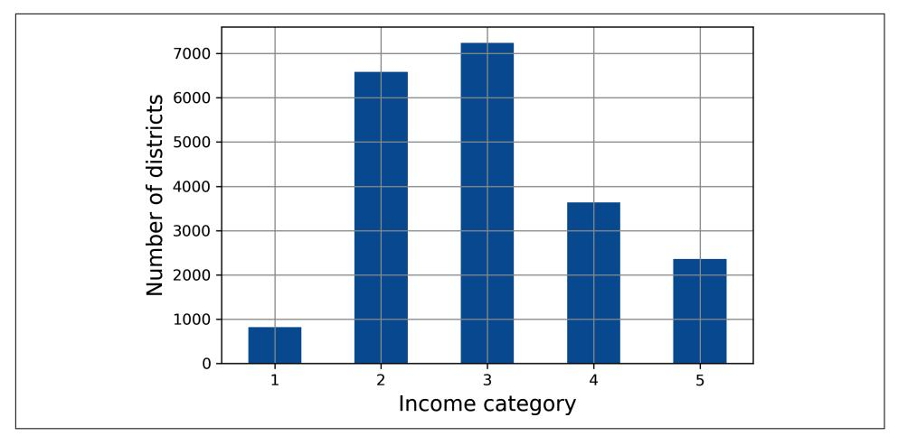

Figure 2-9. Histogram of income categories

To be precise, the split() method yields the training and test *indices*, not the data itself. Having multiple splits can be useful if you want to better estimate the performance of your model, as you will see when we discuss cross-validation later in this chapter. For example, the following code generates 10 different stratified splits of the same dataset.

```
from sklearn.model_selection import StratifiedShuffleSplit
splitter = StratifiedShuffleSplit(n splits=10, test size=0.2, random state=42)
strat splits = [ ]for train_index, test_index in splitter.split(housing, housing["income cat"]):
    strat_train_set_n = housing.iloc[train_index]strat_test_set_n = housing.iloc[test_index]strat_splits.append([strat_train_set_n, strat_test_set_n])
```

For now, you can just use the first split:

strat\_train\_set, strat\_test\_set = strat\_splits[0]

Or, since stratified sampling is fairly common, there's a shorter way to get a single split using the train test split() function with the stratify argument:

```
strat_train_set, strat_test_set = train_test_split(
   housing, test_size=0.2, stratify=housing["income_cat"], random_state=42)
```

{87}------------------------------------------------

Let's see if this worked as expected. You can start by looking at the income category proportions in the test set:

```
>>> strat test set["income cat"].value counts() / len(strat test set)
\overline{3}0.350533
\overline{2}0.318798
4 0.176357
5 0.114341
\mathbf{1}0.039971
Name: income_cat, dtype: float64
```

With similar code you can measure the income category proportions in the full dataset. Figure 2-10 compares the income category proportions in the overall dataset, in the test set generated with stratified sampling, and in a test set generated using purely random sampling. As you can see, the test set generated using stratified sampling has income category proportions almost identical to those in the full dataset, whereas the test set generated using purely random sampling is skewed.

|                        |       |       |       | Overall % Stratified % Random % Strat. Error % Rand. Error % |         |
|------------------------|-------|-------|-------|--------------------------------------------------------------|---------|
| <b>Income Category</b> |       |       |       |                                                              |         |
| 1                      | 3.98  | 4.00  | 4.24  | 0.36                                                         | 6.45    |
| $\overline{2}$         | 31.88 | 31.88 | 30.74 | $-0.02$                                                      | $-3.59$ |
| 3                      | 35.06 | 35.05 | 34.52 | $-0.01$                                                      | $-1.53$ |
| 4                      | 17.63 | 17.64 | 18.41 | 0.03                                                         | 4.42    |
| 5                      | 11.44 | 11.43 | 12.09 | $-0.08$                                                      | 5.63    |

Figure 2-10. Sampling bias comparison of stratified versus purely random sampling

You won't use the income\_cat column again, so you might as well drop it, reverting the data back to its original state:

```
for set_ in (strat_train_set, strat_test_set):
   set_.drop("income_cat", axis=1, inplace=True)
```

We spent quite a bit of time on test set generation for a good reason: this is an often neglected but critical part of a machine learning project. Moreover, many of these ideas will be useful later when we discuss cross-validation. Now it's time to move on to the next stage: exploring the data.

### **Explore and Visualize the Data to Gain Insights**

So far you have only taken a quick glance at the data to get a general understanding of the kind of data you are manipulating. Now the goal is to go into a little more depth.

First, make sure you have put the test set aside and you are only exploring the training set. Also, if the training set is very large, you may want to sample an exploration 

{88}------------------------------------------------

set, to make manipulations easy and fast during the exploration phase. In this case, the training set is quite small, so you can just work directly on the full set. Since you're going to experiment with various transformations of the full training set, you should make a copy of the original so you can revert to it afterwards:

```
housing = strat_train_set.copy()
```

### **Visualizing Geographical Data**

Because the dataset includes geographical information (latitude and longitude), it is a good idea to create a scatterplot of all the districts to visualize the data (Figure 2-11):

```
housing.plot(kind="scatter", x="longitude", y="latitude", grid=True)
plt.show()
```

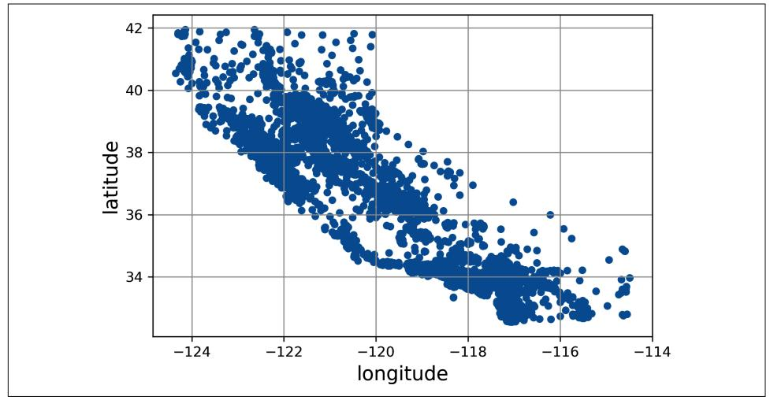

Figure 2-11. A geographical scatterplot of the data

This looks like California all right, but other than that it is hard to see any particular pattern. Setting the alpha option to 0.2 makes it much easier to visualize the places where there is a high density of data points (Figure 2-12):

```
housing.plot(kind="scatter", x="longitude", y="latitude", grid=True, alpha=0.2)
plt.show()
```

Now that's much better: you can clearly see the high-density areas, namely the Bay Area and around Los Angeles and San Diego, plus a long line of fairly high-density areas in the Central Valley (in particular, around Sacramento and Fresno).

Our brains are very good at spotting patterns in pictures, but you may need to play around with visualization parameters to make the patterns stand out.

{89}------------------------------------------------

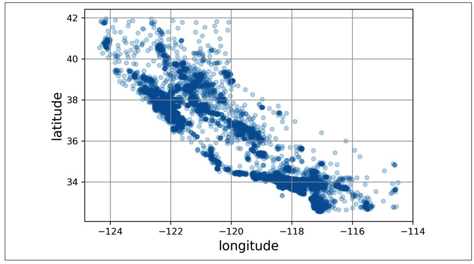

Figure 2-12. A better visualization that highlights high-density areas

Next, you look at the housing prices (Figure 2-13). The radius of each circle represents the district's population (option s), and the color represents the price (option c). Here you use a predefined color map (option cmap) called jet, which ranges from blue (low values) to red (high prices):<sup>8</sup>

```
housing.plot(kind="scatter", x="longitude", y="latitude", grid=True,
             s=housing["population"] / 100, label="population",
             c="median_house_value", cmap="jet", colorbar=True,
             legend=True, sharex=False, figsize=(10, 7))
plt.show()
```

```
This image tells you that the housing prices are very much related to the location
(e.g., close to the ocean) and to the population density, as you probably knew already.
A clustering algorithm should be useful for detecting the main cluster and for adding
new features that measure the proximity to the cluster centers. The ocean proximity
attribute may be useful as well, although in Northern California the housing prices in
coastal districts are not too high, so it is not a simple rule.
```

<sup>8</sup> If you are reading this in grayscale, grab a red pen and scribble over most of the coastline from the Bay Area down to San Diego (as you might expect). You can add a patch of yellow around Sacramento as well.

{90}------------------------------------------------

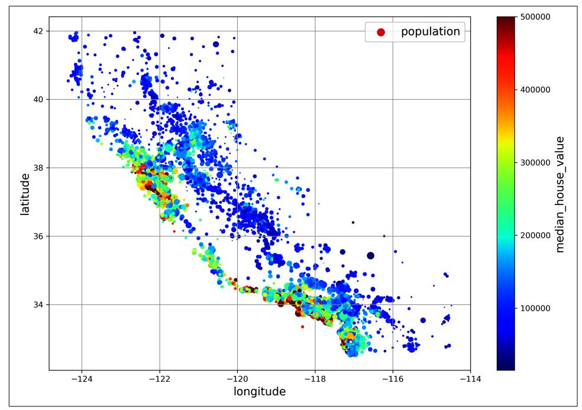

Figure 2-13. California housing prices: red is expensive, blue is cheap, larger circles indicate areas with a larger population

### **Look for Correlations**

Since the dataset is not too large, you can easily compute the standard correlation coefficient (also called Pearson's r) between every pair of attributes using the corr() method:

```
corr_matrix = housing.corr()
```

Now you can look at how much each attribute correlates with the median house value:

```
>>> corr_matrix["median_house_value"].sort_values(ascending=False)
median_house_value
                     1.000000
median_income
                     0.688380
total rooms
                    0.137455
                   0.102175
housing_median_age
households
                     0.071426
total_bedrooms
                     0.054635
population
                    -0.020153longitude
                    -0.050859latitude
                    -0.139584Name: median house value, dtype: float64
```

{91}------------------------------------------------

The correlation coefficient ranges from  $-1$  to 1. When it is close to 1, it means that there is a strong **positive correlation**; for example, the median house value tends to go up when the median income goes up. When the coefficient is close to -1, it means that there is a strong negative correlation; you can see a small negative correlation between the latitude and the median house value (i.e., prices have a slight tendency to go down when you go north). Finally, coefficients close to 0 mean that there is no linear correlation

Another way to check for correlation between attributes is to use the Pandas scatter\_matrix() function, which plots every numerical attribute against every other numerical attribute. Since there are now 11 numerical attributes, you would get  $11^2$  = 121 plots, which would not fit on a page—so you decide to focus on a few promising attributes that seem most correlated with the median housing value (Figure 2-14):

```
from pandas.plotting import scatter_matrix
attributes = ["median house value", "median income", "total rooms",
              "housing_median_age"]
scatter_matrix(housing[attributes], figsize=(12, 8))
plt.show()
```

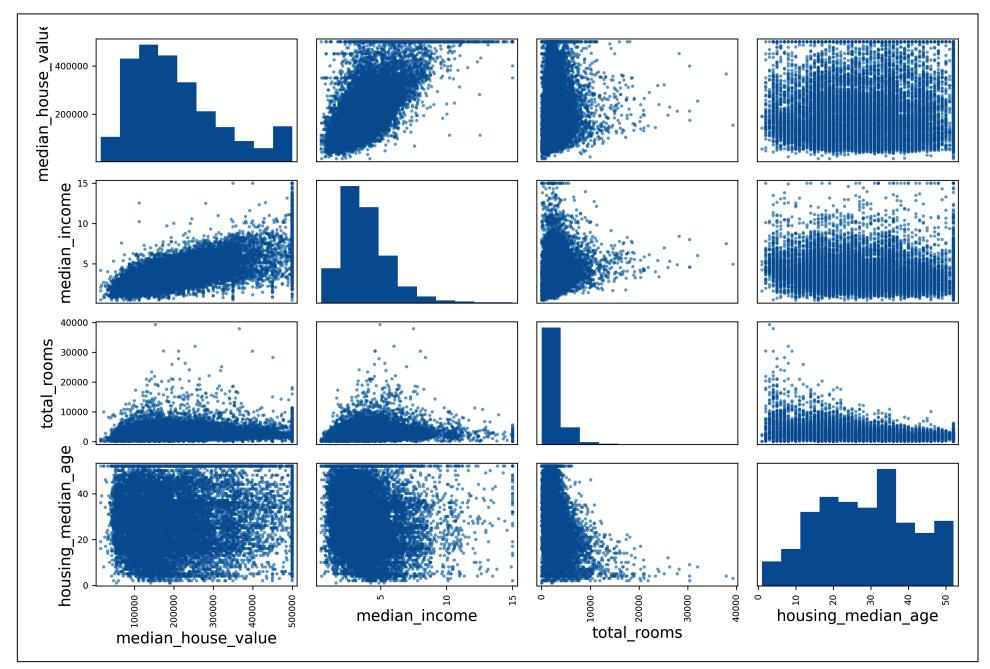

Figure 2-14. This scatter matrix plots every numerical attribute against every other numerical attribute, plus a histogram of each numerical attribute's values on the main diagonal (top left to bottom right)

{92}------------------------------------------------

The main diagonal would be full of straight lines if Pandas plotted each variable against itself, which would not be very useful. So instead, the Pandas displays a histogram of each attribute (other options are available; see the Pandas documentation for more details).

Looking at the correlation scatterplots, it seems like the most promising attribute to predict the median house value is the median income, so you zoom in on their scatterplot (Figure 2-15):

```
housing.plot(kind="scatter", x="median_income", y="median_house_value",
             alpha=0.1, grid=True)
```

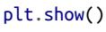

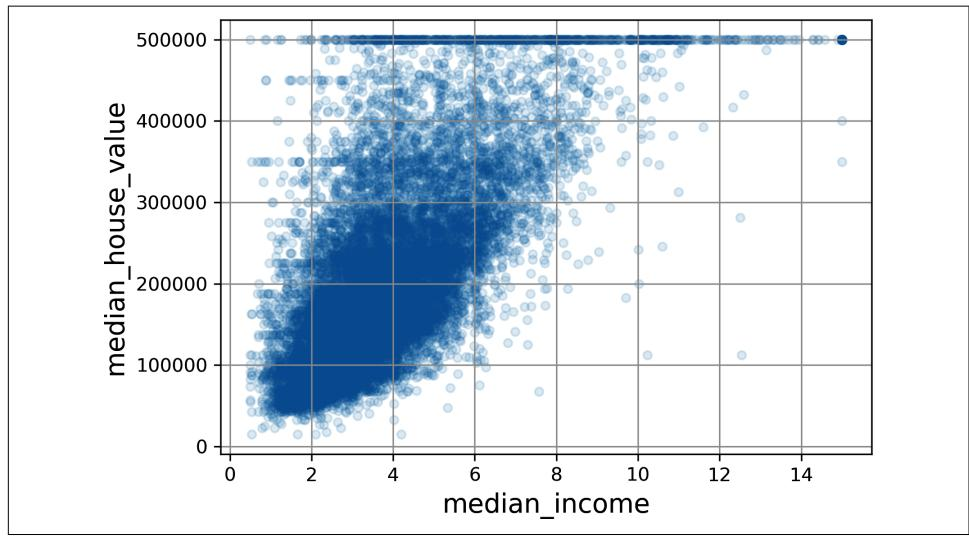

Figure 2-15. Median income versus median house value

This plot reveals a few things. First, the correlation is indeed quite strong; you can clearly see the upward trend, and the points are not too dispersed. Second, the price cap you noticed earlier is clearly visible as a horizontal line at \$500,000. But the plot also reveals other less obvious straight lines: a horizontal line around \$450,000, another around \$350,000, perhaps one around \$280,000, and a few more below that. You may want to try removing the corresponding districts to prevent your algorithms from learning to reproduce these data quirks.

{93}------------------------------------------------


The correlation coefficient only measures linear correlations ("as  $x$ goes up, y generally goes up/down"). It may completely miss out on nonlinear relationships (e.g., "as  $x$  approaches 0,  $y$  generally goes up"). Figure 2-16 shows a variety of datasets along with their correlation coefficient. Note how all the plots of the bottom row have a correlation coefficient equal to 0, despite the fact that their axes are clearly *not* independent: these are examples of nonlinear relationships. Also, the second row shows examples where the correlation coefficient is equal to 1 or  $-1$ ; notice that this has nothing to do with the slope. For example, your height in inches has a correlation coefficient of 1 with your height in feet or in nanometers.

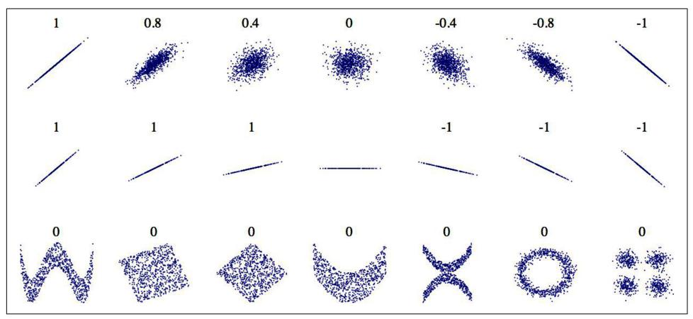

Figure 2-16. Standard correlation coefficient of various datasets (source: Wikipedia; public domain image)

### **Experiment with Attribute Combinations**

Hopefully the previous sections gave you an idea of a few ways you can explore the data and gain insights. You identified a few data quirks that you may want to clean up before feeding the data to a machine learning algorithm, and you found interesting correlations between attributes, in particular with the target attribute. You also noticed that some attributes have a skewed-right distribution, so you may want to transform them (e.g., by computing their logarithm or square root). Of course, your mileage will vary considerably with each project, but the general ideas are similar.

One last thing you may want to do before preparing the data for machine learning algorithms is to try out various attribute combinations. For example, the total number of rooms in a district is not very useful if you don't know how many households there are. What you really want is the number of rooms per household. Similarly, the total number of bedrooms by itself is not very useful: you probably want to

{94}------------------------------------------------

compare it to the number of rooms. And the population per household also seems like an interesting attribute combination to look at. You create these new attributes as follows:

```
housing["rooms per house"] = housing["total rooms"] / housing["households"]
housing["bedrooms_ratio"] = housing["total_bedrooms"] / housing["total_rooms"]
housing["people per house"] = housing["population"] / housing["households"]
```

And then you look at the correlation matrix again:

```
\Rightarrow corr_matrix = housing.corr()
>>> corr_matrix["median_house_value"].sort_values(ascending=False)
median_house_value 1.000000
median income
                  0.688380
rooms_per_house
                  0.143663
total rooms
                  0.137455
housing_median_age 0.102175
                  0.071426
households
total bedrooms
                  0.054635
                 -0.020153population
people_per_house -0.038224
longitude
                 -0.050859latitude
                 -0.139584bedrooms ratio
                  -0.256397Name: median house value, dtype: float64
```

Hey, not bad! The new bedrooms ratio attribute is much more correlated with the median house value than the total number of rooms or bedrooms. Apparently houses with a lower bedroom/room ratio tend to be more expensive. The number of rooms per household is also more informative than the total number of rooms in a district obviously the larger the houses, the more expensive they are.

This round of exploration does not have to be absolutely thorough; the point is to start off on the right foot and quickly gain insights that will help you get a first reasonably good prototype. But this is an iterative process: once you get a prototype up and running, you can analyze its output to gain more insights and come back to this exploration step.

### **Prepare the Data for Machine Learning Algorithms**

It's time to prepare the data for your machine learning algorithms. Instead of doing this manually, you should write functions for this purpose, for several good reasons:

- This will allow you to reproduce these transformations easily on any dataset (e.g., the next time you get a fresh dataset).
- You will gradually build a library of transformation functions that you can reuse in future projects.

{95}------------------------------------------------

- You can use these functions in your live system to transform the new data before feeding it to your algorithms.
- This will make it possible for you to easily try various transformations and see which combination of transformations works best

But first, revert to a clean training set (by copying strat train set once again). You should also separate the predictors and the labels, since you don't necessarily want to apply the same transformations to the predictors and the target values (note that drop() creates a copy of the data and does not affect strat train set):

```
housing = strat train set.drop("median house value", axis=1)
housing labels = strat train set["median house value"].copy()
```

### Clean the Data

Most machine learning algorithms cannot work with missing features, so you'll need to take care of these. For example, you noticed earlier that the total\_bedrooms attribute has some missing values. You have three options to fix this:

- 1. Get rid of the corresponding districts.
- 2. Get rid of the whole attribute.
- 3. Set the missing values to some value (zero, the mean, the median, etc.). This is called imputation.

You can accomplish these easily using the Pandas DataFrame's dropna(), drop(), and fillna() methods:

```
housing.dropna(subset=["total bedrooms"], inplace=True) # option 1
housing.drop("total bedrooms", axis=1) # option 2
median = housing["total_bedrooms"].median() # option 3
housing["total_bedrooms"].fillna(median, inplace=True)
```

You decide to go for option 3 since it is the least destructive, but instead of the preceding code, you will use a handy Scikit-Learn class: SimpleImputer. The benefit is that it will store the median value of each feature: this will make it possible to impute missing values not only on the training set, but also on the validation set, the test set, and any new data fed to the model. To use it, first you need to create a SimpleImputer instance, specifying that you want to replace each attribute's missing values with the median of that attribute:

```
from sklearn.impute import SimpleImputer
imputer = SimpleImputer(strategy="median")
```

{96}------------------------------------------------

Since the median can only be computed on numerical attributes, you then need to create a copy of the data with only the numerical attributes (this will exclude the text attribute ocean proximity):

```
housing_num = housing.select_dtypes(include=[np.number])
```

Now you can fit the imputer instance to the training data using the fit() method:

```
imputer.fit(housing num)
```

The imputer has simply computed the median of each attribute and stored the result in its statistics instance variable. Only the total bedrooms attribute had missing values, but you cannot be sure that there won't be any missing values in new data after the system goes live, so it is safer to apply the imputer to all the numerical attributes:

```
>>> imputer.statistics_
array([-118.51, 34.26, 29., 2125., 434., 1167., 408., 3.5385])
>>> housing num.median().values
array([-118.51 , 34.26 , 29. , 2125. , 434. , 1167. , 408. , 3.5385])
```

Now you can use this "trained" imputer to transform the training set by replacing missing values with the learned medians:

```
X = imputer.trainsform(housing_number)
```

Missing values can also be replaced with the mean value (strategy="mean"), or with the most frequent value (strategy="most\_frequent"), or with a constant value (strategy="constant", fill\_value=...). The last two strategies support nonnumerical data.


There are also more powerful imputers available in the sklearn. impute package (both for numerical features only):

- KNNImputer replaces each missing value with the mean of the k-nearest neighbors' values for that feature. The distance is based on all the available features
- IterativeImputer trains a regression model per feature to predict the missing values based on all the other available features. It then trains the model again on the updated data, and repeats the process several times, improving the models and the replacement values at each iteration.

{97}------------------------------------------------

#### **Scikit-Learn Design**

Scikit-Learn's API is remarkably well designed. These are the main design principles:<sup>9</sup>

Consistency

All objects share a consistent and simple interface:

#### **Estimators**

Any object that can estimate some parameters based on a dataset is called an estimator (e.g., a SimpleImputer is an estimator). The estimation itself is performed by the fit() method, and it takes a dataset as a parameter, or two for supervised learning algorithms—the second dataset contains the labels. Any other parameter needed to guide the estimation process is considered a hyperparameter (such as a SimpleImputer's strategy), and it must be set as an instance variable (generally via a constructor parameter).

**Transformers** 

Some estimators (such as a SimpleImputer) can also transform a dataset; these are called *transformers*. Once again, the API is simple: the transformation is performed by the transform() method with the dataset to transform as a parameter. It returns the transformed dataset. This transformation generally relies on the learned parameters, as is the case for a SimpleImputer. All transformers also have a convenience method called fit\_transform(), which is equivalent to calling fit() and then transform() (but sometimes fit\_transform() is optimized and runs much faster).

#### Predictors

Finally, some estimators, given a dataset, are capable of making predictions; they are called *predictors*. For example, the LinearRegression model in the previous chapter was a predictor: given a country's GDP per capita, it predicted life satisfaction. A predictor has a predict() method that takes a dataset of new instances and returns a dataset of corresponding predictions. It also has a score() method that measures the quality of the predictions, given a test set (and the corresponding labels, in the case of supervised learning algorithms).<sup>10</sup>

#### Inspection

All the estimator's hyperparameters are accessible directly via public instance variables (e.g., imputer strategy), and all the estimator's learned parameters are accessible via public instance variables with an underscore suffix (e.g., imputer.statistics\_).

<sup>9</sup> For more details on the design principles, see Lars Buitinck et al., "API Design for Machine Learning Software: Experiences from the Scikit-Learn Project", arXiv preprint arXiv:1309.0238 (2013).

<sup>10</sup> Some predictors also provide methods to measure the confidence of their predictions.

{98}------------------------------------------------

Nonproliferation of classes

Datasets are represented as NumPy arrays or SciPy sparse matrices, instead of homemade classes. Hyperparameters are just regular Python strings or numbers.

Composition

Existing building blocks are reused as much as possible. For example, it is easy to create a Pipeline estimator from an arbitrary sequence of transformers followed by a final estimator, as you will see.

Sensible defaults

Scikit-Learn provides reasonable default values for most parameters, making it easy to quickly create a baseline working system.

Scikit-Learn transformers output NumPy arrays (or sometimes SciPy sparse matrices) even when they are fed Pandas DataFrames as input.<sup>11</sup> So, the output of imputer.transform(housing\_num) is a NumPy array: X has neither column names nor index. Luckily, it's not too hard to wrap X in a DataFrame and recover the column names and index from housing num:

```
housing_tr = pd.DataFrame(X, columns = housing_number, columns,index=housing num.index)
```

### **Handling Text and Categorical Attributes**

So far we have only dealt with numerical attributes, but your data may also contain text attributes. In this dataset, there is just one: the ocean\_proximity attribute. Let's look at its value for the first few instances:

```
>>> housing cat = housing[["ocean proximity"]]
>>> housing cat.head(8)
    ocean proximity
13096
           NEAR BAY
14973
          <1H OCFAN
             INLAND
3785
14689
             INLAND
20507
        NEAR OCEAN
1286
            INLAND
18078
         <1H OCEAN
4396
          NEAR BAY
```

It's not arbitrary text: there are a limited number of possible values, each of which represents a category. So this attribute is a categorical attribute. Most machine

<sup>11</sup> By the time you read these lines, it may be possible to make all transformers output Pandas DataFrames when they receive a DataFrame as input: Pandas in, Pandas out. There will likely be a global configuration option for this: sklearn.set config(pandas in out=True).

{99}------------------------------------------------

learning algorithms prefer to work with numbers, so let's convert these categories from text to numbers. For this, we can use Scikit-Learn's Ordinal Encoder class:

```
from sklearn.preprocessing import OrdinalEncoder
ordinal encoder = OrdinalEncoder()housing_cat_encoded = ordinal_encoder.fit_transform(housing_cat)
```

Here's what the first few encoded values in housing cat encoded look like:

```
>>> housing_cat_encoded[:8]
array([[3.],][0.1][1.]\lceil 1. \rceil,
        \lceil 4. \rceil,
        [1.][0.1,[3.1]
```

You can get the list of categories using the categories instance variable. It is a list containing a 1D array of categories for each categorical attribute (in this case, a list containing a single array since there is just one categorical attribute):

```
>>> ordinal_encoder.categories_
[array(['<1H OCEAN', 'INLAND', 'ISLAND', 'NEAR BAY', 'NEAR OCEAN'],
      dtype=object)]
```

One issue with this representation is that ML algorithms will assume that two nearby values are more similar than two distant values. This may be fine in some cases (e.g., for ordered categories such as "bad", "average", "good", and "excellent"), but it is obviously not the case for the ocean proximity column (for example, categories 0 and 4 are clearly more similar than categories 0 and 1). To fix this issue, a common solution is to create one binary attribute per category: one attribute equal to 1 when the category is "<1H OCEAN" (and 0 otherwise), another attribute equal to 1 when the category is "INLAND" (and 0 otherwise), and so on. This is called *one-hot encoding*, because only one attribute will be equal to  $1$  (hot), while the others will be  $0$  (cold). The new attributes are sometimes called *dummy* attributes. Scikit-Learn provides a OneHotEncoder class to convert categorical values into one-hot vectors:

```
from sklearn.preprocessing import OneHotEncoder
```

```
cat encoder = OneHotEncoder()housing cat 1hot = cat encoder.fit transform(housing cat)
```

{100}------------------------------------------------

By default, the output of a OneHotEncoder is a SciPy sparse matrix, instead of a NumPy array:

```
>>> housing cat 1hot
<16512x5 sparse matrix of type '<class 'numpy.float64'>'
with 16512 stored elements in Compressed Sparse Row format>
```

A sparse matrix is a very efficient representation for matrices that contain mostly zeros. Indeed, internally it only stores the nonzero values and their positions. When a categorical attribute has hundreds or thousands of categories, one-hot encoding it results in a very large matrix full of 0s except for a single 1 per row. In this case, a sparse matrix is exactly what you need: it will save plenty of memory and speed up computations. You can use a sparse matrix mostly like a normal 2D array,<sup>12</sup> but if you want to convert it to a (dense) NumPy array, just call the toarray () method:

```
>>> housing cat 1hot.toarray()
array([[0., 0., 0., 1., 0.],[1., 0., 0., 0., 0.],[0., 1., 0., 0., 0.]\cdots[0., 0., 0., 0., 1.],[1., 0., 0., 0., 0.],[0., 0., 0., 0., 1.]]
```

Alternatively, you can set sparse=False when creating the OneHotEncoder, in which case the transform() method will return a regular (dense) NumPy array directly.

As with the OrdinalEncoder, you can get the list of categories using the encoder's categories\_instance variable:

```
>>> cat encoder.categories
[array(['<1H OCEAN', 'INLAND', 'ISLAND', 'NEAR BAY', 'NEAR OCEAN'],
      dtype=object)]
```

Pandas has a function called get dummies(), which also converts each categorical feature into a one-hot representation, with one binary feature per category:

```
>>> df_test = pd.DataFrame({"ocean_proximity": ["INLAND", "NEAR BAY"]})
>>> pd.get_dummies(df_test)
   ocean_proximity_INLAND ocean_proximity_NEAR BAY
\Theta\mathbf{1}\boldsymbol{\theta}\mathbf{1}\Theta\mathbf{1}
```

It looks nice and simple, so why not use it instead of OneHotEncoder? Well, the advantage of OneHotEncoder is that it remembers which categories it was trained on. This is very important because once your model is in production, it should be fed exactly the same features as during training: no more, no less. Look what our

<sup>12</sup> See SciPy's documentation for more details.

{101}------------------------------------------------

trained cat\_encoder outputs when we make it transform the same df\_test (using transform(), not fit transform()):

```
>>> cat_encoder.transform(df_test)
array([[0., 1., 0., 0., 0.],[0., 0., 0., 1., 0.]
```

See the difference? get dummies() saw only two categories, so it output two columns, whereas OneHotEncoder output one column per learned category, in the right order. Moreover, if you feed get\_dummies() a DataFrame containing an unknown category (e.g., "<2H OCEAN"), it will happily generate a column for it:

```
>>> df_test_unknown = pd.DataFrame({"ocean_proximity": ["<2H OCEAN", "ISLAND"]})
>>> pd.get_dummies(df_test_unknown)
   ocean_proximity_<2H OCEAN ocean_proximity_ISLAND
\Theta\mathbf 1\Theta\mathbf{1}ົ
                                                            \mathbf{1}
```

But OneHotEncoder is smarter: it will detect the unknown category and raise an exception. If you prefer, you can set the handle\_unknown hyperparameter to "ignore", in which case it will just represent the unknown category with zeros:

```
>>> cat_encoder.handle_unknown = "ignore"
>>> cat_encoder.transform(df_test unknown)
array([[0., 0., 0., 0., 0.],[0., 0., 1., 0., 0.]
```


If a categorical attribute has a large number of possible categories (e.g., country code, profession, species), then one-hot encoding will result in a large number of input features. This may slow down training and degrade performance. If this happens, you may want to replace the categorical input with useful numerical features related to the categories: for example, you could replace the ocean proximity feature with the distance to the ocean (similarly, a country code could be replaced with the country's population and GDP per capita). Alternatively, you can use one of the encoders provided by the category encoders package on GitHub. Or, when dealing with neural networks, you can replace each category with a learnable, low-dimensional vector called an embedding. This is an example of representation learning (see Chapters 13 and 17 for more details).

{102}------------------------------------------------

When you fit any Scikit-Learn estimator using a DataFrame, the estimator stores the column names in the feature names in attribute. Scikit-Learn then ensures that any DataFrame fed to this estimator after that (e.g., to transform() or predict()) has the same column names. Transformers also provide a get\_feature\_names\_out() method that you can use to build a DataFrame around the transformer's output:

```
>>> cat encoder.feature names in
array(['ocean_proximity'], dtype=object)
>>> cat_encoder.get_feature_names_out()
array(['ocean_proximity_<1H OCEAN', 'ocean_proximity_INLAND',
       'ocean proximity ISLAND', 'ocean proximity NEAR BAY',
       'ocean proximity NEAR OCEAN'], dtype=object)
>>> df_output = pd.DataFrame(cat_encoder.transform(df_test_unknown),
                              columns=cat_encoder.get_feature_names_out(),
\ddotscindex=df_test_unknown.index)
\ddotsc\ddotsc
```

### **Feature Scaling and Transformation**

One of the most important transformations you need to apply to your data is *feature* scaling. With few exceptions, machine learning algorithms don't perform well when the input numerical attributes have very different scales. This is the case for the housing data: the total number of rooms ranges from about 6 to 39,320, while the median incomes only range from 0 to 15. Without any scaling, most models will be biased toward ignoring the median income and focusing more on the number of rooms

There are two common ways to get all attributes to have the same scale: *min-max* scaling and standardization.


As with all estimators, it is important to fit the scalers to the training data only: never use fit() or fit\_transform() for anything else than the training set. Once you have a trained scaler, you can then use it to transform() any other set, including the validation set, the test set, and new data. Note that while the training set values will always be scaled to the specified range, if new data contains outliers, these may end up scaled outside the range. If you want to avoid this, just set the clip hyperparameter to True.

{103}------------------------------------------------

Min-max scaling (many people call this *normalization*) is the simplest: for each attribute, the values are shifted and rescaled so that they end up ranging from 0 to 1. This is performed by subtracting the min value and dividing by the difference between the min and the max. Scikit-Learn provides a transformer called MinMaxScaler for this. It has a feature\_range hyperparameter that lets you change the range if, for some reason, you don't want  $0-1$  (e.g., neural networks work best with zero-mean inputs, so a range of  $-1$  to 1 is preferable). It's quite easy to use:

```
from sklearn.preprocessing import MinMaxScaler
```

```
min_max_scaler = MinMaxScaler(feature_range=(-1, 1))housing_num_min_max_scaled = min_max_scaler.fit_transform(housing_num)
```

Standardization is different: first it subtracts the mean value (so standardized values have a zero mean), then it divides the result by the standard deviation (so standardized values have a standard deviation equal to 1). Unlike min-max scaling, standardization does not restrict values to a specific range. However, standardization is much less affected by outliers. For example, suppose a district has a median income equal to 100 (by mistake), instead of the usual  $0-15$ . Min-max scaling to the  $0-1$  range would map this outlier down to 1 and it would crush all the other values down to 0-0.15, whereas standardization would not be much affected. Scikit-Learn provides a transformer called StandardScaler for standardization:

```
from sklearn.preprocessing import StandardScaler
```

```
std\_scatter = StandardScale( )housing_num_std_scaled = std_scaler.fit_transform(housing_num)
```


If you want to scale a sparse matrix without converting it to a dense matrix first, you can use a StandardScaler with its with\_mean hyperparameter set to False: it will only divide the data by the standard deviation, without subtracting the mean (as this would break sparsity).

When a feature's distribution has a *heavy tail* (i.e., when values far from the mean are not exponentially rare), both min-max scaling and standardization will squash most values into a small range. Machine learning models generally don't like this at all, as you will see in Chapter 4. So before you scale the feature, you should first transform it to shrink the heavy tail, and if possible to make the distribution roughly symmetrical. For example, a common way to do this for positive features with a heavy tail to the right is to replace the feature with its square root (or raise the feature to a power between 0 and 1). If the feature has a really long and heavy tail, such as a power law distribution, then replacing the feature with its logarithm may help. For example, the population feature roughly follows a power law: districts with 10,000 inhabitants are only 10 times less frequent than districts with 1,000 inhabitants, not

{104}------------------------------------------------

exponentially less frequent. Figure 2-17 shows how much better this feature looks when you compute its log: it's very close to a Gaussian distribution (i.e., bell-shaped).

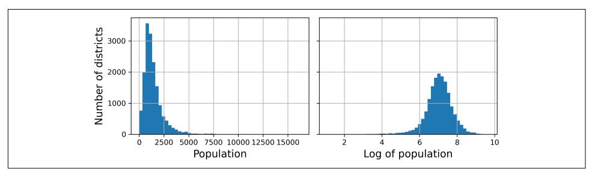

Figure 2-17. Transforming a feature to make it closer to a Gaussian distribution

Another approach to handle heavy-tailed features consists in bucketizing the feature. This means chopping its distribution into roughly equal-sized buckets, and replacing each feature value with the index of the bucket it belongs to, much like we did to create the income\_cat feature (although we only used it for stratified sampling). For example, you could replace each value with its percentile. Bucketizing with equal-sized buckets results in a feature with an almost uniform distribution, so there's no need for further scaling, or you can just divide by the number of buckets to force the values to the  $0-1$  range.

When a feature has a multimodal distribution (i.e., with two or more clear peaks, called *modes*), such as the housing median age feature, it can also be helpful to bucketize it, but this time treating the bucket IDs as categories, rather than as numerical values. This means that the bucket indices must be encoded, for example using a OneHotEncoder (so you usually don't want to use too many buckets). This approach will allow the regression model to more easily learn different rules for different ranges of this feature value. For example, perhaps houses built around 35 years ago have a peculiar style that fell out of fashion, and therefore they're cheaper than their age alone would suggest.

Another approach to transforming multimodal distributions is to add a feature for each of the modes (at least the main ones), representing the similarity between the housing median age and that particular mode. The similarity measure is typically computed using a *radial basis function* (RBF)—any function that depends only on the distance between the input value and a fixed point. The most commonly used RBF is the Gaussian RBF, whose output value decays exponentially as the input value moves away from the fixed point. For example, the Gaussian RBF similarity between the housing age x and 35 is given by the equation  $exp(-\gamma(x-35)^2)$ . The hyperparameter  $\gamma$  (gamma) determines how quickly the similarity measure decays as x moves away from 35. Using Scikit-Learn's rbf\_kernel() function, you can create a new Gaussian RBF feature measuring the similarity between the housing median age and 35:

{105}------------------------------------------------

```
from sklearn.metrics.pairwise import rbf_kernel
```

```
age_simil_35 = rbf_kernel(housing[["housing_median_age"]], [[35]], gamma=0.1)
```

Figure 2-18 shows this new feature as a function of the housing median age (solid line). It also shows what the feature would look like if you used a smaller gamma value. As the chart shows, the new age similarity feature peaks at 35, right around the spike in the housing median age distribution: if this particular age group is well correlated with lower prices, there's a good chance that this new feature will help.

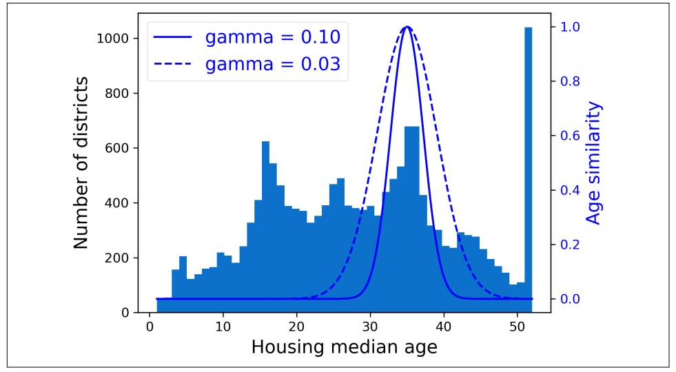

Figure 2-18. Gaussian RBF feature measuring the similarity between the housing median age and 35

So far we've only looked at the input features, but the target values may also need to be transformed. For example, if the target distribution has a heavy tail, you may choose to replace the target with its logarithm. But if you do, the regression model will now predict the *log* of the median house value, not the median house value itself. You will need to compute the exponential of the model's prediction if you want the predicted median house value.

Luckily, most of Scikit-Learn's transformers have an inverse\_transform() method, making it easy to compute the inverse of their transformations. For example, the following code example shows how to scale the labels using a StandardScaler (just like we did for inputs), then train a simple linear regression model on the resulting scaled labels and use it to make predictions on some new data, which we transform back to the original scale using the trained scaler's inverse transform() method. Note that we convert the labels from a Pandas Series to a DataFrame, since the 

{106}------------------------------------------------

StandardScaler expects 2D inputs. Also, in this example we just train the model on a single raw input feature (median income), for simplicity:

```
from sklearn.linear_model import LinearRegression
target\ scaler = StandardScalar()scaled_labels = target_scaler.fit_transform(housing_labels.to_frame())
model = LinearRegression()model.fit(housing[["median_income"]], scaled_labels)
some new data = housing[["median income"]].iloc[:5] # pretend this is new data
scaled predictions = model.predict(some new data)predictions = target_scaler.inverse_transform(scaled_predictions)
```

This works fine, but a simpler option is to use a TransformedTargetRegressor. We just need to construct it, giving it the regression model and the label transformer, then fit it on the training set, using the original unscaled labels. It will automatically use the transformer to scale the labels and train the regression model on the resulting scaled labels, just like we did previously. Then, when we want to make a prediction, it will call the regression model's predict() method and use the scaler's inverse\_trans form() method to produce the prediction:

```
from sklearn.compose import TransformedTargetRegressor
model = TransformedTargetRegressor(LinearRegression(),
                                   transformer=StandardScaler())
model.fit(housing[["median income"]], housing labels)
predictions = model.predict(some_new_data)
```

### **Custom Transformers**

Although Scikit-Learn provides many useful transformers, you will need to write your own for tasks such as custom transformations, cleanup operations, or combining specific attributes.

For transformations that don't require any training, you can just write a function that takes a NumPy array as input and outputs the transformed array. For example, as discussed in the previous section, it's often a good idea to transform features with heavy-tailed distributions by replacing them with their logarithm (assuming the feature is positive and the tail is on the right). Let's create a log-transformer and apply it to the population feature:

```
from sklearn.preprocessing import FunctionTransformer
log transformer = FunctionTransformer(np.log, inverse func=np.exp)
log_pop = log_transformer.transform(housing[["population"]])
```

{107}------------------------------------------------

The inverse func argument is optional. It lets you specify an inverse transform function, e.g., if you plan to use your transformer in a TransformedTargetRegressor.

Your transformation function can take hyperparameters as additional arguments. For example, here's how to create a transformer that computes the same Gaussian RBF similarity measure as earlier:

```
rbf transformer = FunctionTransformer(rbf kernel,
                                             kw_{\text{args}} = \text{dict}(Y = [[35.]], \text{gamma} = 0.1))age simil_35 = rbf_transformer.transform(housing[["housing_median_age"]])
```

Note that there's no inverse function for the RBF kernel, since there are always two values at a given distance from a fixed point (except at distance 0). Also note that rbf kernel() does not treat the features separately. If you pass it an array with two features, it will measure the 2D distance (Euclidean) to measure similarity. For example, here's how to add a feature that will measure the geographic similarity between each district and San Francisco:

```
sf\_coords = 37.7749, -122.41sf transformer = FunctionTransformer(rbf kernel,
                                            kw_{\text{args}} = \text{dict}(Y = [sf_{\text{coordinates}}], \text{gamma}=0.1)sf_simil = sf_transformer.transform(housing[["latitude", "longitude"]])
```

Custom transformers are also useful to combine features. For example, here's a FunctionTransformer that computes the ratio between the input features 0 and 1:

```
>>> ratio transformer = FunctionTransformer(lambda X: X[:, [0]] / X[:, [1]])
>>> ratio_transformer.transform(np.array([[1., 2.], [3., 4.]]))
array([[0.5],
      [0.75]
```

FunctionTransformer is very handy, but what if you would like your transformer to be trainable, learning some parameters in the fit() method and using them later in the transform() method? For this, you need to write a custom class. Scikit-Learn relies on duck typing, so this class does not have to inherit from any particular base class. All it needs is three methods: fit() (which must return self), transform(), and fit\_transform().

You can get fit\_transform() for free by simply adding TransformerMixin as a base class: the default implementation will just call  $fit()$  and then transform $()$ . If you add BaseEstimator as a base class (and avoid using \*args and \*\*kwargs in your constructor), you will also get two extra methods: get\_params() and set\_params(). These will be useful for automatic hyperparameter tuning.

For example, here's a custom transformer that acts much like the StandardScaler:

{108}------------------------------------------------

```
from sklearn.base import BaseEstimator, TransformerMixin
from sklearn.utils.validation import check_array, check_is_fitted
class StandardScalerClone(BaseEstimator, TransformerMixin):
   def init (self, with mean=True): # no *args or **kwargs!
       self. with_mean = with_meandef fit(self, X, y=None): # y is required even though we don't use it
       X = check array(X) # checks that X is an array with finite float values
       self. mean = X. mean(axis=0)
       self.scale_ = X.std(axis=0)self.n features in = X.shape[1] # every estimator stores this in fit()
       return self # always return self!
   def transform(self, X):
       check_is_fitted(self) # looks for learned attributes (with trailing )X = check array(X)assert self.n_features_in_ == X.shape[1]if self.with mean:
           X = X - self-meanreturn X / self.scale_
```

Here are a few things to note:

- The sklearn.utils.validation package contains several functions we can use to validate the inputs. For simplicity, we will skip such tests in the rest of this book, but production code should have them.
- Scikit-Learn pipelines require the fit() method to have two arguments X and y, which is why we need the y=None argument even though we don't use y.
- All Scikit-Learn estimators set n\_features\_in\_ in the fit() method, and they ensure that the data passed to transform() or predict() has this number of features.
- The fit() method must return self.
- This implementation is not 100% complete: all estimators should set feature\_names\_in\_ in the fit() method when they are passed a DataFrame. Moreover, all transformers should provide a get feature names out () method, as well as an inverse transform() method when their transformation can be reversed. See the last exercise at the end of this chapter for more details.

A custom transformer can (and often does) use other estimators in its implementation. For example, the following code demonstrates custom transformer that uses a KMeans clusterer in the  $fit()$  method to identify the main clusters in the training data, and then uses rbf kernel() in the transform() method to measure how similar each sample is to each cluster center:

{109}------------------------------------------------

from sklearn.cluster import KMeans

```
class ClusterSimilarity(BaseEstimator, TransformerMixin):
   def init (self, n clusters=10, gamma=1.0, random state=None):
       self.n clusters = n clusters
       self.gamma = gammaself.random_state = random_state
   def fit(self, X, y=None, sample weight=None):
       self.kmeans_ = KMeans(self.n_clusters, random_state=self.random_state)
       self.kmeans_.fit(X, sample_weight=sample_weight)
       return self # always return self!
   def transform(self, X):
       return rbf kernel(X, self.kmeans .cluster centers, gamma=self.gamma)
   def get feature names out(self, names=None):
       return [f"Cluster {i} similarity" for i in range(self.n_clusters)]
```


You can check whether your custom estimator respects Scikit-Learn's API by passing an instance to check\_estimator() from the sklearn.utils.estimator\_checks package. For the full API, check out https://scikit-learn.org/stable/developers.

As you will see in Chapter 9, k-means is a clustering algorithm that locates clusters in the data. How many it searches for is controlled by the n clusters hyperparameter. After training, the cluster centers are available via the cluster centers attribute. The fit() method of KMeans supports an optional argument sample weight, which lets the user specify the relative weights of the samples. k-means is a stochastic algorithm, meaning that it relies on randomness to locate the clusters, so if you want reproducible results, you must set the random\_state parameter. As you can see, despite the complexity of the task, the code is fairly straightforward. Now let's use this custom transformer:

```
cluster_simil = ClusterSimilarity(n_clusters=10, gamma=1., random_state=42)
similarities = cluster_simil.fit_transform(housing[["latitude", "longitude"]],
                                           sample_weight=housing_labels)
```

This code creates a Cluster Similarity transformer, setting the number of clusters to 10. Then it calls fit transform() with the latitude and longitude of every district in the training set, weighting each district by its median house value. The transformer uses k-means to locate the clusters, then measures the Gaussian RBF similarity between each district and all 10 cluster centers. The result is a matrix with one row per district, and one column per cluster. Let's look at the first three rows, rounding to two decimal places:

{110}------------------------------------------------

```
>>> similarities[:3].round(2)
array([[0. , 0.14, 0. , 0. , 0. , 0. , 0.08, 0. , 0.99, 0. , 0.6],[0.63, 0. , 0.99, 0. , 0. , 0. , 0.04, 0. , 0.11, 0. ][0. , 0.29, 0. , 0. , 0.01, 0.44, 0. , 0.7, 0. , 0.3 ]]
```

Figure 2-19 shows the 10 cluster centers found by k-means. The districts are colored according to their geographic similarity to their closest cluster center. As you can see, most clusters are located in highly populated and expensive areas.

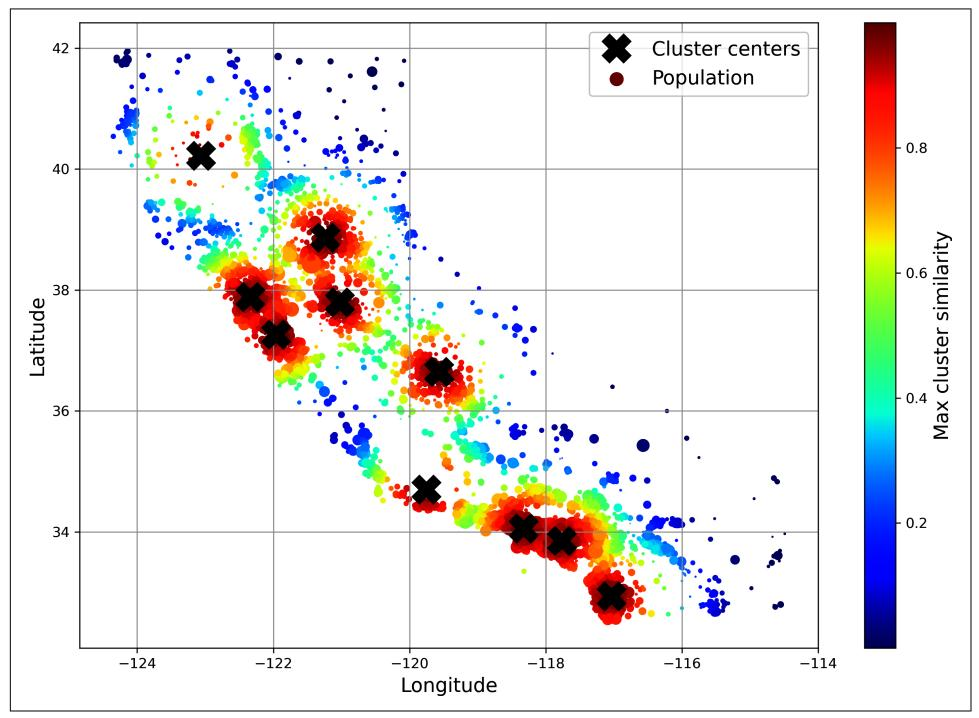

Figure 2-19. Gaussian RBF similarity to the nearest cluster center

### **Transformation Pipelines**

As you can see, there are many data transformation steps that need to be executed in the right order. Fortunately, Scikit-Learn provides the Pipeline class to help with such sequences of transformations. Here is a small pipeline for numerical attributes, which will first impute then scale the input features:

```
from sklearn.pipeline import Pipeline
num pipeline = Pipeline(\lceil("impute", SimpleImputer(strategy="median")),
    ("standardize", StandardScaler()),
\left| \right\rangle
```

{111}------------------------------------------------

The Pipeline constructor takes a list of name/estimator pairs (2-tuples) defining a sequence of steps. The names can be anything you like, as long as they are unique and don't contain double underscores (\_). They will be useful later, when we discuss hyperparameter tuning. The estimators must all be transformers (i.e., they must have a fit\_transform() method), except for the last one, which can be anything: a transformer, a predictor, or any other type of estimator.


In a Jupyter notebook, if you import sklearn and run sklearn. set\_config(display="diagram"), all Scikit-Learn estimators will be rendered as interactive diagrams. This is particularly useful for visualizing pipelines. To visualize num pipeline, run a cell with num pipeline as the last line. Clicking an estimator will show more details.

If you don't want to name the transformers, you can use the make pipeline() function instead; it takes transformers as positional arguments and creates a Pipeline using the names of the transformers' classes, in lowercase and without underscores (e.g., "simpleimputer"):

```
from sklearn.pipeline import make pipeline
```

```
num_pipeline = make_pipeline(SimpleImputer(strategy="median"), StandardScaler())
```

If multiple transformers have the same name, an index is appended to their names (e.g., "foo-1", "foo-2", etc.).

When you call the pipeline's fit() method, it calls fit\_transform() sequentially on all the transformers, passing the output of each call as the parameter to the next call until it reaches the final estimator, for which it just calls the fit() method.

The pipeline exposes the same methods as the final estimator. In this example the last estimator is a StandardScaler, which is a transformer, so the pipeline also acts like a transformer. If you call the pipeline's transform() method, it will sequentially apply all the transformations to the data. If the last estimator were a predictor instead of a transformer, then the pipeline would have a predict() method rather than a transform() method. Calling it would sequentially apply all the transformations to the data and pass the result to the predictor's predict() method.

Let's call the pipeline's fit\_transform() method and look at the output's first two rows, rounded to two decimal places:

```
>>> housing_num_prepared = num_pipeline.fit_transform(housing num)
>>> housing num prepared[:2].round(2)
array([[ -1.42, 1.01, 1.86, 0.31, 1.37, 0.14, 1.39, -0.94],[0.6, -0.7, 0.91, -0.31, -0.44, -0.69, -0.37, 1.17]]
```

{112}------------------------------------------------

As you saw earlier, if you want to recover a nice DataFrame, you can use the pipeline's get feature names out() method:

```
df_housing_num_prepared = pd.DataFrame(housing_num_prepared, columns=num_pipeline.get_feature_names_out(),
   index=housing num.index)
```

Pipelines support indexing; for example,  $pi$ [1] returns the second estimator in the pipeline, and pipeline[:-1] returns a Pipeline object containing all but the last estimator. You can also access the estimators via the steps attribute, which is a list of name/estimator pairs, or via the named\_steps dictionary attribute, which maps the names to the estimators. For example, num pipeline["simpleimputer"] returns the estimator named "simpleimputer".

So far, we have handled the categorical columns and the numerical columns separately. It would be more convenient to have a single transformer capable of handling all columns, applying the appropriate transformations to each column. For this, you can use a ColumnTransformer. For example, the following ColumnTransformer will apply num\_pipeline (the one we just defined) to the numerical attributes and cat\_pipeline to the categorical attribute:

```
from sklearn.compose import ColumnTransformer
num_attribs = ["longitude", "latitude", "housing_median_age", "total_rooms",
               "total_bedrooms", "population", "households", "median_income"]
cat_attribute = ['ocean_proximity"]cat pipeline = make pipeline(
    SimpleImputer(strategy="most_frequent"),
    OneHotEncoder(handle unknown="ignore"))
preprocessing = ColumnTransformer(f)("num", num pipeline, num attribs),
    ("cat", cat_pipeline, cat_attribs),
\overline{1}
```

First we import the ColumnTransformer class, then we define the list of numerical and categorical column names and construct a simple pipeline for categorical attributes. Lastly, we construct a ColumnTransformer. Its constructor requires a list of triplets (3-tuples), each containing a name (which must be unique and not contain double underscores), a transformer, and a list of names (or indices) of columns that the transformer should be applied to.

{113}------------------------------------------------


Instead of using a transformer, you can specify the string "drop" if you want the columns to be dropped, or you can specify "passthrough" if you want the columns to be left untouched. By default, the remaining columns (i.e., the ones that were not listed) will be dropped, but you can set the remainder hyperparameter to any transformer (or to "passthrough") if you want these columns to be handled differently.

Since listing all the column names is not very convenient, Scikit-Learn provides a make\_column\_selector() function that returns a selector function you can use to automatically select all the features of a given type, such as numerical or categorical. You can pass this selector function to the ColumnTransformer instead of column names or indices. Moreover, if you don't care about naming the transformers, you can use make\_column\_transformer(), which chooses the names for you, just like make pipeline() does. For example, the following code creates the same ColumnTransformer as earlier, except the transformers are automatically named "pipeline-1" and "pipeline-2" instead of "num" and "cat":

```
from sklearn.compose import make_column_selector, make_column_transformer
preprocessing = make column transformer((num_pipeline, make_column_selector(dtype_include=np.number)),
   (cat pipeline, make column selector(dtype include=object)),
\lambda
```

Now we're ready to apply this ColumnTransformer to the housing data:

```
housing prepared = preprocessing.fit transform(housing)
```

Great! We have a preprocessing pipeline that takes the entire training dataset and applies each transformer to the appropriate columns, then concatenates the transformed columns horizontally (transformers must never change the number of rows). Once again this returns a NumPy array, but you can get the column names using preprocessing.get\_feature\_names\_out() and wrap the data in a nice DataFrame as we did before.


The OneHotEncoder returns a sparse matrix and the num pipeline returns a dense matrix. When there is such a mix of sparse and dense matrices, the ColumnTransformer estimates the density of the final matrix (i.e., the ratio of nonzero cells), and it returns a sparse matrix if the density is lower than a given threshold (by default, sparse threshold=0.3). In this example, it returns a dense matrix.

Your project is going really well and you're almost ready to train some models! You now want to create a single pipeline that will perform all the transformations you've experimented with up to now. Let's recap what the pipeline will do and why:

{114}------------------------------------------------

- Missing values in numerical features will be imputed by replacing them with the median, as most ML algorithms don't expect missing values. In categorical features, missing values will be replaced by the most frequent category.
- The categorical feature will be one-hot encoded, as most ML algorithms only accept numerical inputs.
- A few ratio features will be computed and added: bedrooms ratio, rooms per house, and people per house. Hopefully these will better correlate with the median house value, and thereby help the ML models.
- A few cluster similarity features will also be added. These will likely be more useful to the model than latitude and longitude.
- Features with a long tail will be replaced by their logarithm, as most models prefer features with roughly uniform or Gaussian distributions.
- All numerical features will be standardized, as most ML algorithms prefer when all features have roughly the same scale.

The code that builds the pipeline to do all of this should look familiar to you by now:

```
def column ratio(X):
    return X[:, [0]] / X[:, [1]]def ratio_name(function_transformer, feature_names_in):
    return ["ratio"] # feature names out
def ratio pipeline():
    return make_pipeline(
        SimpleImputer(strategy="median"),
        FunctionTransformer(column ratio, feature names out=ratio name),
        StandardScaler())
log_pipeline = make_pipeline(
    SimpleImputer(strategy="median"),
    FunctionTransformer(np.log, feature names out="one-to-one"),
    StandardScaler())
cluster_simil = ClusterSimilarity(n_clusters=10, gamma=1., random_state=42)
default_num_pipeline = make_pipeline(SimpleImputer(strategy="median"),
                                      StandardScaler())
preprocessing = ColumnTransformer(f)("bedrooms", ratio_pipeline(), ["total_bedrooms", "total_rooms"]),
        ("rooms_per_house", ratio_pipeline(), ["total_rooms", "households"]),
        ("people_per_house", ratio_pipeline(), ["population", "households"]),
        ("log", log_pipeline, ["total_bedrooms", "total_rooms", "population",
        "households", "median_income"]),<br>("geo", cluster_simil, ["latitude", "longitude"]),
        ("cat", cat_pipeline, make_column_selector(dtype_include=object)),
    J,
    remainder=default num pipeline) # one column remaining: housing median age
```

{115}------------------------------------------------

If you run this ColumnTransformer, it performs all the transformations and outputs a NumPy array with 24 features:

```
>>> housing_prepared = preprocessing.fit_transform(housing)
>>> housing_prepared.shape
(16512, 24)>>> preprocessing.get_feature_names_out()
array(['bedrooms__ratio', 'rooms_per_house__ratio',
       'people_per_house__ratio', 'log__total_bedrooms',
       'log_total_rooms', 'log_population', 'log_households',
       'log median income', 'geo Cluster 0 similarity', [\,\dots],
       'geo_Cluster 9 similarity', 'cat_ocean_proximity_<1H OCEAN',
       'cat_ocean_proximity_INLAND', 'cat_ocean_proximity_ISLAND',
       'cat__ocean_proximity_NEAR BAY', 'cat__ocean_proximity_NEAR OCEAN',
       'remainder__housing_median_age'], dtype=object)
```

### **Select and Train a Model**

At last! You framed the problem, you got the data and explored it, you sampled a training set and a test set, and you wrote a preprocessing pipeline to automatically clean up and prepare your data for machine learning algorithms. You are now ready to select and train a machine learning model.

### **Train and Evaluate on the Training Set**

The good news is that thanks to all these previous steps, things are now going to be easy! You decide to train a very basic linear regression model to get started:

```
from sklearn.linear_model import LinearRegression
lin_reg = make_pipeline(preprocessing, LinearRegression())
lin reg.fit(housing, housing labels)
```

Done! You now have a working linear regression model. You try it out on the training set, looking at the first five predictions and comparing them to the labels:

```
>>> housing_predictions = lin_reg.predict(housing)
>>> housing_predictions[:5].round(-2) # -2 = rounded to the nearest hundred
array([243700., 372400., 128800., 94400., 328300.])
>>> housing labels.iloc[:5].values
array([458300., 483800., 101700., 96100., 361800.])
```

Well, it works, but not always: the first prediction is way off (by over \$200,000!), while the other predictions are better: two are off by about 25%, and two are off by less than 10%. Remember that you chose to use the RMSE as your performance measure, so you want to measure this regression model's RMSE on the whole training set using Scikit-Learn's mean\_squared\_error() function, with the squared argument set to False:

{116}------------------------------------------------

```
>>> from sklearn.metrics import mean_squared_error
>>> lin rmse = mean squared error(housing labels, housing predictions,
                                    squared=False)
\ddotsc\ddotsc>>> lin_rmse
68687.89176589991
```

This is better than nothing, but clearly not a great score: the median\_housing\_values of most districts range between \$120,000 and \$265,000, so a typical prediction error of \$68,628 is really not very satisfying. This is an example of a model underfitting the training data. When this happens it can mean that the features do not provide enough information to make good predictions, or that the model is not powerful enough. As we saw in the previous chapter, the main ways to fix underfitting are to select a more powerful model, to feed the training algorithm with better features, or to reduce the constraints on the model. This model is not regularized, which rules out the last option. You could try to add more features, but first you want to try a more complex model to see how it does.

You decide to try a Decision Tree Regressor, as this is a fairly powerful model capable of finding complex nonlinear relationships in the data (decision trees are presented in more detail in Chapter 6):

```
from sklearn.tree import DecisionTreeRegressor
tree req = make pipeline(preprocessing, DecisionTreeReqressor(random state=42))
tree_reg.fit(housing, housing_labels)
```

Now that the model is trained, you evaluate it on the training set:

```
>>> housing predictions = tree reg.predict(housing)
>>> tree rmse = mean squared error(housing labels, housing predictions,
                                     squared=False)
\ddotsc\ddotsc>>> tree_rmse
0.0
```

Wait, what!? No error at all? Could this model really be absolutely perfect? Of course, it is much more likely that the model has badly overfit the data. How can you be sure? As you saw earlier, you don't want to touch the test set until you are ready to launch a model you are confident about, so you need to use part of the training set for training and part of it for model validation.

### **Better Evaluation Using Cross-Validation**

One way to evaluate the decision tree model would be to use the train test\_split() function to split the training set into a smaller training set and a validation set, then train your models against the smaller training set and evaluate them against the validation set. It's a bit of effort, but nothing too difficult, and it would work fairly well.

{117}------------------------------------------------

A great alternative is to use Scikit-Learn's k\_-fold cross-validation feature. The following code randomly splits the training set into 10 nonoverlapping subsets called folds, then it trains and evaluates the decision tree model 10 times, picking a different fold for evaluation every time and using the other 9 folds for training. The result is an array containing the 10 evaluation scores:

```
from sklearn.model_selection import cross_val_score
tree_rmses = -cross_val_score(tree_reg, housing, housing_labels,
                              scoring="neg root mean squared error", cv=10)
```


Scikit-Learn's cross-validation features expect a utility function (greater is better) rather than a cost function (lower is better), so the scoring function is actually the opposite of the RMSE. It's a negative value, so you need to switch the sign of the output to get the RMSE scores.

Let's look at the results:

```
>>> pd.Series(tree rmses).describe()
count10.000000
mean
        66868.027288
ht >
        2060.966425
min
        63649.536493
25%
        65338.078316
50%
        66801.953094
75%
        68229.934454
max70094.778246
dtype: float64
```

Now the decision tree doesn't look as good as it did earlier. In fact, it seems to perform almost as poorly as the linear regression model! Notice that cross-validation allows you to get not only an estimate of the performance of your model, but also a measure of how precise this estimate is (i.e., its standard deviation). The decision tree has an RMSE of about 66,868, with a standard deviation of about 2,061. You would not have this information if you just used one validation set. But cross-validation comes at the cost of training the model several times, so it is not always feasible.

If you compute the same metric for the linear regression model, you will find that the mean RMSE is 69,858 and the standard deviation is 4,182. So the decision tree model seems to perform very slightly better than the linear model, but the difference is minimal due to severe overfitting. We know there's an overfitting problem because the training error is low (actually zero) while the validation error is high.

Let's try one last model now: the RandomForestRegressor. As you will see in Chapter 7, random forests work by training many decision trees on random subsets of the features, then averaging out their predictions. Such models composed of many other models are called *ensembles*: they are capable of boosting the performance of 

{118}------------------------------------------------

the underlying model (in this case, decision trees). The code is much the same as earlier·

```
from sklearn.ensemble import RandomForestRegressor
forest req = make pipeline(preprocessing,RandomForestRegressor(random_state=42))
forest_rmses = -cross_val_score(forest_reg, housing, housing_labels,
                                scoring="neg_root_mean_squared_error", cv=10)
```

Let's look at the scores:

```
>>> pd.Series(forest_rmses).describe()
count
           10.000000
mean
        47019.561281
c+d1033.957120
min
        45458.112527
25%
        46464.031184
50%
        46967.596354
75%
        47325.694987
        49243.765795
max
dtype: float64
```

Wow, this is much better: random forests really look very promising for this task! However, if you train a RandomForest and measure the RMSE on the training set, you will find roughly 17,474; that's much lower, meaning that there's still quite a lot of overfitting going on. Possible solutions are to simplify the model, constrain it (i.e., regularize it), or get a lot more training data. Before you dive much deeper into random forests, however, you should try out many other models from various categories of machine learning algorithms (e.g., several support vector machines with different kernels, and possibly a neural network), without spending too much time tweaking the hyperparameters. The goal is to shortlist a few (two to five) promising models.

### **Fine-Tune Your Model**

Let's assume that you now have a shortlist of promising models. You now need to fine-tune them. Let's look at a few ways you can do that.

### **Grid Search**

One option would be to fiddle with the hyperparameters manually, until you find a great combination of hyperparameter values. This would be very tedious work, and you may not have time to explore many combinations.

Instead, you can use Scikit-Learn's GridSearchCV class to search for you. All you need to do is tell it which hyperparameters you want it to experiment with and what values to try out, and it will use cross-validation to evaluate all the possible combinations 

{119}------------------------------------------------

of hyperparameter values. For example, the following code searches for the best combination of hyperparameter values for the RandomForestRegressor:

```
from sklearn.model_selection import GridSearchCV
full pipeline = Pipeline(\lceil("preprocessing", preprocessing),
    ("random forest", RandomForestRegressor(random state=42)),
\left| \right\rangleparam\_grid = [{'preprocessing geo n clusters': [5, 8, 10],
     'random_forest__max_features': [4, 6, 8]},
    ['preprocessing_geo_n_clusters': [10, 15],
     'random_forest__max_features': [6, 8, 10]},
1
grid search = GridSearchCV(full pipeline, param grid, cv=3,
                            scoring='neg_root_mean_squared_error')
grid search.fit(housing, housing labels)
```

Notice that you can refer to any hyperparameter of any estimator in a pipeline, even if this estimator is nested deep inside several pipelines and column transformers. For example, when Scikit-Learn sees "preprocessing geo n clusters", it splits this string at the double underscores, then it looks for an estimator named "preprocessing" in the pipeline and finds the preprocessing ColumnTransformer. Next, it looks for a transformer named "geo" inside this ColumnTransformer and finds the ClusterSimilarity transformer we used on the latitude and longitude attributes. Then it finds this transformer's n\_clusters hyperparameter. Similarly, random\_forest\_max\_features refers to the max\_features hyperparameter of the estimator named "random\_forest", which is of course the RandomForest model (the max\_features hyperparameter will be explained in Chapter 7).


Wrapping preprocessing steps in a Scikit-Learn pipeline allows you to tune the preprocessing hyperparameters along with the model hyperparameters. This is a good thing since they often interact. For example, perhaps increasing n\_clusters requires increasing max features as well. If fitting the pipeline transformers is computationally expensive, you can set the pipeline's memory hyperparameter to the path of a caching directory: when you first fit the pipeline, Scikit-Learn will save the fitted transformers to this directory. If you then fit the pipeline again with the same hyperparameters, Scikit-Learn will just load the cached transformers.

There are two dictionaries in this param\_grid, so GridSearchCV will first evaluate all  $3 \times 3 = 9$  combinations of n\_clusters and max\_features hyperparameter values specified in the first dict, then it will try all  $2 \times 3 = 6$  combinations of hyperparameter values in the second dict. So in total the grid search will explore  $9 + 6 = 15$ 

{120}------------------------------------------------

combinations of hyperparameter values, and it will train the pipeline 3 times per combination, since we are using 3-fold cross validation. This means there will be a grand total of  $15 \times 3 = 45$  rounds of training! It may take a while, but when it is done you can get the best combination of parameters like this:

```
>>> grid_search.best_params_
{'preprocessing geo n clusters': 15, 'random forest max features': 6}
```

In this example, the best model is obtained by setting n clusters to 15 and setting max features to 8.


Since 15 is the maximum value that was evaluated for n clusters, you should probably try searching again with higher values; the score may continue to improve.

You can access the best estimator using grid\_search.best\_estimator\_. If GridSearchCV is initialized with refit=True (which is the default), then once it finds the best estimator using cross-validation, it retrains it on the whole training set. This is usually a good idea, since feeding it more data will likely improve its performance.

The evaluation scores are available using grid\_search.cv\_results\_. This is a dictionary, but if you wrap it in a DataFrame you get a nice list of all the test scores for each combination of hyperparameters and for each cross-validation split, as well as the mean test score across all splits:

```
>>> cv res = pd.DataFrame(grid search.cv results)
>>> cv_res.sort_values(by="mean_test_score", ascending=False, inplace=True)
>>> [...] # change column names to fit on this page, and show rmse = -score
>>> cv res.head() # note: the 1st column is the row ID
  n_clusters max_features split0 split1 split2 mean_test_rmse
                       6 43460 43919 44748
12
          15<sup>2</sup>44042
                      8 44132 44075 45010
1315
                                                          44406
                      10 44374 44286 45316
1415
                                                          44659
                       6 44683 44655 45657
\overline{7}10
                                                          44999
Q
          10
                       6 44683 44655 45657
                                                          44999
```

The mean test RMSE score for the best model is 44,042, which is better than the score you got earlier using the default hyperparameter values (which was 47,019). Congratulations, you have successfully fine-tuned your best model!

### **Randomized Search**

The grid search approach is fine when you are exploring relatively few combinations, like in the previous example, but RandomizedSearchCV is often preferable, especially when the hyperparameter search space is large. This class can be used in much the same way as the GridSearchCV class, but instead of trying out all possible

{121}------------------------------------------------

combinations it evaluates a fixed number of combinations, selecting a random value for each hyperparameter at every iteration. This may sound surprising, but this approach has several benefits:

- If some of your hyperparameters are continuous (or discrete but with many possible values), and you let randomized search run for, say, 1,000 iterations, then it will explore 1,000 different values for each of these hyperparameters, whereas grid search would only explore the few values you listed for each one.
- Suppose a hyperparameter does not actually make much difference, but you don't know it yet. If it has 10 possible values and you add it to your grid search, then training will take 10 times longer. But if you add it to a random search, it will not make any difference.
- If there are 6 hyperparameters to explore, each with 10 possible values, then grid search offers no other choice than training the model a million times, whereas random search can always run for any number of iterations you choose.

For each hyperparameter, you must provide either a list of possible values, or a probability distribution:

```
from sklearn.model_selection import RandomizedSearchCV
from scipy.stats import randint
param_distribs = {'preprocessing_geo_n_clusters': randint(low=3, high=50),
                  'random forest max features': randint(low=2, high=20)}
rnd search = RandomizedSearchCV(full pipeline, param distributions=param distribs, n iter=10, cv=3,
    scoring='neg_root_mean_squared_error', random_state=42)
```

```
rnd_search.fit(housing, housing_labels)
```

Scikit-Learn also has HalvingRandomSearchCV and HalvingGridSearchCV hyperparameter search classes. Their goal is to use the computational resources more efficiently, either to train faster or to explore a larger hyperparameter space. Here's how they work: in the first round, many hyperparameter combinations (called "candidates") are generated using either the grid approach or the random approach. These candidates are then used to train models that are evaluated using cross-validation, as usual. However, training uses limited resources, which speeds up this first round considerably. By default, "limited resources" means that the models are trained on a small part of the training set. However, other limitations are possible, such as reducing the number of training iterations if the model has a hyperparameter to set it. Once every candidate has been evaluated, only the best ones go on to the second round, where they are allowed more resources to compete. After several rounds, the final candidates are evaluated using full resources. This may save you some time tuning hyperparameters.

{122}------------------------------------------------

### **Fnsemble Methods**

Another way to fine-tune your system is to try to combine the models that perform best. The group (or "ensemble") will often perform better than the best individual model—just like random forests perform better than the individual decision trees they rely on—especially if the individual models make very different types of errors. For example, you could train and fine-tune a k-nearest neighbors model, then create an ensemble model that just predicts the mean of the random forest prediction and that model's prediction. We will cover this topic in more detail in Chapter 7.

### **Analyzing the Best Models and Their Errors**

You will often gain good insights on the problem by inspecting the best models. For example, the RandomForestRegressor can indicate the relative importance of each attribute for making accurate predictions:

```
>>> final model = rnd search.best estimator # includes preprocessing
>>> feature_importances = final_model["random_forest"].feature_importances_
>>> feature_importances.round(2)
array([0.07, 0.05, 0.05, 0.01, 0.01, 0.01, 0.01, 0.19, [...], 0.01])
```

Let's sort these importance scores in descending order and display them next to their corresponding attribute names:

```
>>> sorted(zip(feature importances,
              final_model["preprocessing"].get_feature_names_out()),
\ddotscreverse=True)
\overline{1}[(0.18694559869103852, 'log median income'),(0.0748194905715524, 'cat ocean proximity INLAND'),
(0.06926417748515576, 'bedrooms_ratio'),
(0.05446998753775219, 'rooms_per_house__ratio'),
(0.05262301809680712, 'people_per_house_ratio'),(0.03819415873915732, 'geo_Cluster 0 similarity'),
 [\ldots](0.00015061247730531558, 'cat_ocean_proximity_NEAR BAY'),
 (7.301686597099842e-05, 'cat_ocean_proximity_ISLAND')]
```

With this information, you may want to try dropping some of the less useful features (e.g., apparently only one ocean proximity category is really useful, so you could try dropping the others).


The sklearn.feature\_selection.SelectFromModel transformer can automatically drop the least useful features for you: when you fit it, it trains a model (typically a random forest), looks at its fea ture importances attribute, and selects the most useful features. Then when you call transform(), it drops the other features.

{123}------------------------------------------------

You should also look at the specific errors that your system makes, then try to understand why it makes them and what could fix the problem: adding extra features or getting rid of uninformative ones, cleaning up outliers, etc.

Now is also a good time to ensure that your model not only works well on average, but also on all categories of districts, whether they're rural or urban, rich or poor, northern or southern, minority or not, etc. Creating subsets of your validation set for each category takes a bit of work, but it's important: if your model performs poorly on a whole category of districts, then it should probably not be deployed until the issue is solved, or at least it should not be used to make predictions for that category, as it may do more harm than good.

### **Evaluate Your System on the Test Set**

After tweaking your models for a while, you eventually have a system that performs sufficiently well. You are ready to evaluate the final model on the test set. There is nothing special about this process; just get the predictors and the labels from your test set and run your final\_model to transform the data and make predictions, then evaluate these predictions:

```
X test = strat test set.drop("median house value", axis=1)
y_test = strat_test_set["median_house_value"].copy()
final_predictions = final_model.predict(X_test)
final_rmse = mean_squared_error(y_test, final_predictions, squared=False)
print(final_rmse) # prints 41424.40026462184
```

In some cases, such a point estimate of the generalization error will not be quite enough to convince you to launch: what if it is just 0.1% better than the model currently in production? You might want to have an idea of how precise this estimate is. For this, you can compute a 95% *confidence interval* for the generalization error using scipy.stats.t.interval(). You get a fairly large interval from 39,275 to 43,467, and your previous point estimate of 41,424 is roughly in the middle of it:

```
>>> from scipy import stats
\Rightarrow confidence = 0.95
\Rightarrow squared errors = (final predictions - y test) ** 2
>>> np.sqrt(stats.t.interval(confidence, len(squared_errors) - 1,
                                 loc=squared errors.mean().
\overline{1}\ddotscscale=stats.sem(squared errors)))
\overline{1}array([39275.40861216, 43467.27680583])
```

{124}------------------------------------------------

If you did a lot of hyperparameter tuning, the performance will usually be slightly worse than what you measured using cross-validation. That's because your system ends up fine-tuned to perform well on the validation data and will likely not perform as well on unknown datasets. That's not the case in this example since the test RMSE is lower than the validation RMSE, but when it happens you must resist the temptation to tweak the hyperparameters to make the numbers look good on the test set; the improvements would be unlikely to generalize to new data.

Now comes the project prelaunch phase: you need to present your solution (highlighting what you have learned, what worked and what did not, what assumptions were made, and what your system's limitations are), document everything, and create nice presentations with clear visualizations and easy-to-remember statements (e.g., "the median income is the number one predictor of housing prices"). In this California housing example, the final performance of the system is not much better than the experts' price estimates, which were often off by 30%, but it may still be a good idea to launch it, especially if this frees up some time for the experts so they can work on more interesting and productive tasks.

### Launch, Monitor, and Maintain Your System

Perfect, you got approval to launch! You now need to get your solution ready for production (e.g., polish the code, write documentation and tests, and so on). Then you can deploy your model to your production environment. The most basic way to do this is just to save the best model you trained, transfer the file to your production environment, and load it. To save the model, you can use the joblib library like this:

```
import joblib
```

```
joblib.dump(final_model, "my_california_housing_model.pkl")
```


It's often a good idea to save every model you experiment with so that you can come back easily to any model you want. You may also save the cross-validation scores and perhaps the actual predictions on the validation set. This will allow you to easily compare scores across model types, and compare the types of errors they make.

Once your model is transferred to production, you can load it and use it. For this you must first import any custom classes and functions the model relies on (which means transferring the code to production), then load the model using joblib and use it to make predictions:

{125}------------------------------------------------

```
import joblib
[...] # import KMeans, BaseEstimator, TransformerMixin, rbf kernel, etc.
def column ratio(X): [\dots]def ratio name(function transformer, feature names in): [...]
class ClusterSimilarity(BaseEstimator, TransformerMixin): [...]
final_model_reloaded = joblib.load("my_california_housing_model.pkl")
new data = [...] # some new districts to make predictions for
predictions = final_model_reloaded.predict(new_data)
```

For example, perhaps the model will be used within a website: the user will type in some data about a new district and click the Estimate Price button. This will send a query containing the data to the web server, which will forward it to your web application, and finally your code will simply call the model's predict() method (you want to load the model upon server startup, rather than every time the model is used). Alternatively, you can wrap the model within a dedicated web service that your web application can query through a REST API<sup>13</sup> (see Figure 2-20). This makes it easier to upgrade your model to new versions without interrupting the main application. It also simplifies scaling, since you can start as many web services as needed and load-balance the requests coming from your web application across these web services. Moreover, it allows your web application to use any programming language, not just Python.


Figure 2-20. A model deployed as a web service and used by a web application

Another popular strategy is to deploy your model to the cloud, for example on Google's Vertex AI (formerly known as Google Cloud AI Platform and Google Cloud ML Engine): just save your model using joblib and upload it to Google Cloud Storage (GCS), then head over to Vertex AI and create a new model version, pointing it to the GCS file. That's it! This gives you a simple web service that takes care of load balancing and scaling for you. It takes JSON requests containing the input data (e.g., of a district) and returns JSON responses containing the predictions. You can then use this web service in your website (or whatever production environment you are using). As you will see in Chapter 19, deploying TensorFlow models on Vertex AI is not much different from deploying Scikit-Learn models.

<sup>13</sup> In a nutshell, a REST (or RESTful) API is an HTTP-based API that follows some conventions, such as using standard HTTP verbs to read, update, create, or delete resources (GET, POST, PUT, and DELETE) and using JSON for the inputs and outputs.

{126}------------------------------------------------

But deployment is not the end of the story. You also need to write monitoring code to check your system's live performance at regular intervals and trigger alerts when it drops. It may drop very quickly, for example if a component breaks in your infrastructure, but be aware that it could also decay very slowly, which can easily go unnoticed for a long time. This is quite common because of model rot: if the model was trained with last year's data, it may not be adapted to today's data.

So, you need to monitor your model's live performance. But how do you do that? Well, it depends. In some cases, the model's performance can be inferred from downstream metrics. For example, if your model is part of a recommender system and it suggests products that the users may be interested in, then it's easy to monitor the number of recommended products sold each day. If this number drops (compared to non-recommended products), then the prime suspect is the model. This may be because the data pipeline is broken, or perhaps the model needs to be retrained on fresh data (as we will discuss shortly).

However, you may also need human analysis to assess the model's performance. For example, suppose you trained an image classification model (we'll look at these in Chapter 3) to detect various product defects on a production line. How can you get an alert if the model's performance drops, before thousands of defective products get shipped to your clients? One solution is to send to human raters a sample of all the pictures that the model classified (especially pictures that the model wasn't so sure about). Depending on the task, the raters may need to be experts, or they could be nonspecialists, such as workers on a crowdsourcing platform (e.g., Amazon Mechanical Turk). In some applications they could even be the users themselves, responding, for example, via surveys or repurposed captchas.<sup>14</sup>

Either way, you need to put in place a monitoring system (with or without human raters to evaluate the live model), as well as all the relevant processes to define what to do in case of failures and how to prepare for them. Unfortunately, this can be a lot of work. In fact, it is often much more work than building and training a model.

If the data keeps evolving, you will need to update your datasets and retrain your model regularly. You should probably automate the whole process as much as possible. Here are a few things you can automate:

- Collect fresh data regularly and label it (e.g., using human raters).
- Write a script to train the model and fine-tune the hyperparameters automatically. This script could run automatically, for example every day or every week, depending on your needs.

<sup>14</sup> A captcha is a test to ensure a user is not a robot. These tests have often been used as a cheap way to label training data.

{127}------------------------------------------------

• Write another script that will evaluate both the new model and the previous model on the updated test set, and deploy the model to production if the performance has not decreased (if it did, make sure you investigate why). The script should probably test the performance of your model on various subsets of the test set, such as poor or rich districts, rural or urban districts, etc.

You should also make sure you evaluate the model's input data quality. Sometimes performance will degrade slightly because of a poor-quality signal (e.g., a malfunctioning sensor sending random values, or another team's output becoming stale), but it may take a while before your system's performance degrades enough to trigger an alert. If you monitor your model's inputs, you may catch this earlier. For example, you could trigger an alert if more and more inputs are missing a feature, or the mean or standard deviation drifts too far from the training set, or a categorical feature starts containing new categories.

Finally, make sure you keep backups of every model you create and have the process and tools in place to roll back to a previous model quickly, in case the new model starts failing badly for some reason. Having backups also makes it possible to easily compare new models with previous ones. Similarly, you should keep backups of every version of your datasets so that you can roll back to a previous dataset if the new one ever gets corrupted (e.g., if the fresh data that gets added to it turns out to be full of outliers). Having backups of your datasets also allows you to evaluate any model against any previous dataset.

As you can see, machine learning involves quite a lot of infrastructure. Chapter 19 discusses some aspects of this, but it's a very broad topic called ML Operations (MLOps), which deserves its own book. So don't be surprised if your first ML project takes a lot of effort and time to build and deploy to production. Fortunately, once all the infrastructure is in place, going from idea to production will be much faster.

### Try It Out!

Hopefully this chapter gave you a good idea of what a machine learning project looks like as well as showing you some of the tools you can use to train a great system. As you can see, much of the work is in the data preparation step: building monitoring tools, setting up human evaluation pipelines, and automating regular model training. The machine learning algorithms are important, of course, but it is probably preferable to be comfortable with the overall process and know three or four algorithms well rather than to spend all your time exploring advanced algorithms.

So, if you have not already done so, now is a good time to pick up a laptop, select a dataset that you are interested in, and try to go through the whole process from A to Z. A good place to start is on a competition website such as Kaggle: you will have a dataset to play with, a clear goal, and people to share the experience with. Have fun!

{128}------------------------------------------------

### **Exercises**

The following exercises are based on this chapter's housing dataset:

- 1. Try a support vector machine regressor (sklearn.svm.SVR) with various hyperparameters, such as kernel="linear" (with various values for the C hyperparameter) or kernel="rbf" (with various values for the C and gamma hyperparameters). Note that support vector machines don't scale well to large datasets, so you should probably train your model on just the first 5,000 instances of the training set and use only 3-fold cross-validation, or else it will take hours. Don't worry about what the hyperparameters mean for now; we'll discuss them in Chapter 5. How does the best SVR predictor perform?
- 2. Try replacing the GridSearchCV with a RandomizedSearchCV.
- 3. Try adding a SelectFromModel transformer in the preparation pipeline to select only the most important attributes.
- 4. Try creating a custom transformer that trains a  $k$ -nearest neighbors regressor (sklearn.neighbors.KNeighborsRegressor) in its fit() method, and outputs the model's predictions in its transform() method. Then add this feature to the preprocessing pipeline, using latitude and longitude as the inputs to this transformer. This will add a feature in the model that corresponds to the housing median price of the nearest districts.
- 5. Automatically explore some preparation options using GridSearchCV.
- 6. Try to implement the StandardScalerClone class again from scratch, then add support for the inverse\_transform() method: executing scaler. inverse\_transform(scaler.fit\_transform(X)) should return an array very close to X. Then add support for feature names: set feature\_names\_in\_ in the fit() method if the input is a DataFrame. This attribute should be a NumPy array of column names. Lastly, implement the get\_feature\_names\_out() method: it should have one optional input\_features=None argument. If passed, the method should check that its length matches n features in, and it should match feature\_names\_in\_ if it is defined; then input\_features should be returned. If input features is None, then the method should either return feature\_names\_in\_ if it is defined or np.array( $['x0", 'x1", ...]$ ) with length n\_features\_in\_otherwise.

Solutions to these exercises are available at the end of this chapter's notebook, at https://homl.info/colab3.

{129}------------------------------------------------

{130}------------------------------------------------
