## **CHAPTER3** Classification

In Chapter 1 I mentioned that the most common supervised learning tasks are regression (predicting values) and classification (predicting classes). In Chapter 2 we explored a regression task, predicting housing values, using various algorithms such as linear regression, decision trees, and random forests (which will be explained in further detail in later chapters). Now we will turn our attention to classification systems.

### **MNIST**

In this chapter we will be using the MNIST dataset, which is a set of 70,000 small images of digits handwritten by high school students and employees of the US Census Bureau. Each image is labeled with the digit it represents. This set has been studied so much that it is often called the "hello world" of machine learning: whenever people come up with a new classification algorithm they are curious to see how it will perform on MNIST, and anyone who learns machine learning tackles this dataset sooner or later.

Scikit-Learn provides many helper functions to download popular datasets. MNIST is one of them. The following code fetches the MNIST dataset from OpenML.org:1

```
from sklearn.datasets import fetch_openml
```

mnist = fetch\_openml('mnist\_784', as\_frame=False)

The sklearn.datasets package contains mostly three types of functions: fetch \* functions such as fetch openml() to download real-life datasets, load \* functions

<sup>1</sup> By default Scikit-Learn caches downloaded datasets in a directory called scikit\_learn\_data in your home directory.

{131}------------------------------------------------

to load small toy datasets bundled with Scikit-Learn (so they don't need to be downloaded over the internet), and make\_\* functions to generate fake datasets, useful for tests. Generated datasets are usually returned as an  $(X, y)$  tuple containing the input data and the targets, both as NumPy arrays. Other datasets are returned as sklearn.utils. Bunch objects, which are dictionaries whose entries can also be accessed as attributes. They generally contain the following entries:

"DESCR"

A description of the dataset

"data"

The input data, usually as a 2D NumPy array

"target"

The labels, usually as a 1D NumPy array

The fetch\_openml() function is a bit unusual since by default it returns the inputs as a Pandas DataFrame and the labels as a Pandas Series (unless the dataset is sparse). But the MNIST dataset contains images, and DataFrames aren't ideal for that, so it's preferable to set as frame=False to get the data as NumPy arrays instead. Let's look at these arrays:

```
\Rightarrow X, y =  mnist.data, mnist.target
>><sub>x</sub>array([[0., 0., 0., ..., 0., 0., 0.],[0., 0., 0., ..., 0., 0., 0.],[0., 0., 0., ..., 0., 0., 0.],\cdots[0., 0., 0., ..., 0., 0., 0.],[0., 0., 0., ..., 0., 0., 0.],[0., 0., 0., ..., 0., 0., 0.]>>> X.shape
(70000, 784)>><sub>2</sub>array(['5', '0', '4', ..., '4', '5', '6'], dtype=object)
>>> v.shape
(70000, )
```

There are 70,000 images, and each image has 784 features. This is because each image is  $28 \times 28$  pixels, and each feature simply represents one pixel's intensity, from 0 (white) to 255 (black). Let's take a peek at one digit from the dataset (Figure 3-1). All we need to do is grab an instance's feature vector, reshape it to a  $28 \times 28$  array, and display it using Matplotlib's imshow() function. We use cmap="binary" to get a grayscale color map where 0 is white and 255 is black:

{132}------------------------------------------------

```
import matplotlib.pyplot as plt
def plot_digit(image_data):
    image = image data.reshape(28, 28)plt.imshow(image, cmap="binary")
    plt.axis("off")
some_digit = X[0]plot digit(some digit)
plt.show()
```


Figure 3-1. Example of an MNIST image

This looks like a 5, and indeed that's what the label tells us:

```
\frac{3}{5} y[0]
```

To give you a feel for the complexity of the classification task, Figure 3-2 shows a few more images from the MNIST dataset.

But wait! You should always create a test set and set it aside before inspecting the data closely. The MNIST dataset returned by fetch openml() is actually already split into a training set (the first  $60,000$  images) and a test set (the last  $10,000$  images):<sup>2</sup>

```
X_train, X_test, y_train, y_test = X[:60000], X[60000:], y[:60000], y[60000:]
```

The training set is already shuffled for us, which is good because this guarantees that all cross-validation folds will be similar (we don't want one fold to be missing some digits). Moreover, some learning algorithms are sensitive to the order of the training instances, and they perform poorly if they get many similar instances in a row. Shuffling the dataset ensures that this won't happen.<sup>3</sup>

<sup>2</sup> Datasets returned by fetch\_openml() are not always shuffled or split.

<sup>3</sup> Shuffling may be a bad idea in some contexts—for example, if you are working on time series data (such as stock market prices or weather conditions). We will explore this in Chapter 15.

{133}------------------------------------------------

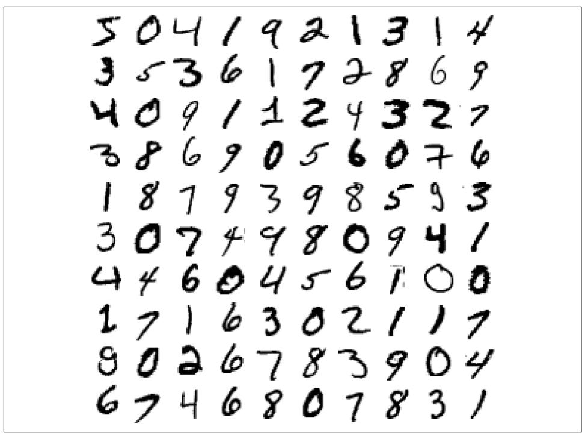

Figure 3-2. Digits from the MNIST dataset

### **Training a Binary Classifier**

Let's simplify the problem for now and only try to identify one digit—for example, the number 5. This "5-detector" will be an example of a *binary classifier*, capable of distinguishing between just two classes, 5 and non-5. First we'll create the target vectors for this classification task:

```
y_train_5 = (y_train == '5') # True for all 5s, False for all other digits
y_t = f_5 = (y_t + f_5)
```

Now let's pick a classifier and train it. A good place to start is with a *stochastic gra*dient descent (SGD, or stochastic GD) classifier, using Scikit-Learn's SGDClassifier class. This classifier is capable of handling very large datasets efficiently. This is in part because SGD deals with training instances independently, one at a time, which also makes SGD well suited for online learning, as you will see later. Let's create an SGDClassifier and train it on the whole training set:

```
from sklearn.linear_model import SGDClassifier
sgd_clf = SGDClassifier(random_state=42)
sgd_clf.fit(X_train, y_train_5)
```

{134}------------------------------------------------

Now we can use it to detect images of the number 5:

```
>>> sqd clf.predict([some digit])
array([ True])
```

The classifier guesses that this image represents a  $5$  ( $True$ ). Looks like it guessed right in this particular case! Now, let's evaluate this model's performance.

### **Performance Measures**

Evaluating a classifier is often significantly trickier than evaluating a regressor, so we will spend a large part of this chapter on this topic. There are many performance measures available, so grab another coffee and get ready to learn a bunch of new concepts and acronyms!

### **Measuring Accuracy Using Cross-Validation**

A good way to evaluate a model is to use cross-validation, just as you did in Chapter 2. Let's use the cross val score() function to evaluate our SGDClassifier model, using k-fold cross-validation with three folds. Remember that k-fold crossvalidation means splitting the training set into  $k$  folds (in this case, three), then training the model  $k$  times, holding out a different fold each time for evaluation (see Chapter 2):

```
>>> from sklearn.model selection import cross val score
>>> cross_val_score(sgd_clf, X_train, y_train_5, cv=3, scoring="accuracy")
array([0.95035, 0.96035, 0.9604])
```

Wow! Above 95% accuracy (ratio of correct predictions) on all cross-validation folds? This looks amazing, doesn't it? Well, before you get too excited, let's look at a dummy classifier that just classifies every single image in the most frequent class, which in this case is the negative class (i.e., *non* 5):

```
from sklearn.dummy import DummyClassifier
dump_clf = DummyClassifier()dummy_clf.fit(X_train, y_train_5)
print(any(dummy_clf.predict(X_train))) # prints False: no 5s detected
```

Can you guess this model's accuracy? Let's find out:

```
>>> cross val score(dummy clf, X train, y train 5, cv=3, scoring="accuracy")
array([0.90965, 0.90965, 0.90965])
```

That's right, it has over 90% accuracy! This is simply because only about 10% of the images are 5s, so if you always guess that an image is *not* a 5, you will be right about 90% of the time. Beats Nostradamus.

This demonstrates why accuracy is generally not the preferred performance measure for classifiers, especially when you are dealing with *skewed datasets* (i.e., when some 

{135}------------------------------------------------

classes are much more frequent than others). A much better way to evaluate the performance of a classifier is to look at the *confusion matrix* (CM).

### **Implementing Cross-Validation**

**Occasionally** you will need more control over the cross-validation process than what Scikit-Learn provides off the shelf. In these cases, you can implement crossvalidation yourself. The following code does roughly the same thing as Scikit-Learn's cross val score() function, and it prints the same result:

```
from sklearn.model_selection import StratifiedKFold
from sklearn.base import clone
skfolds = StratifiedKFold(n splits=3) # add shuffle=True if the dataset is
                                      # not already shuffled
for train_index, test_index in skfolds.split(X_train, y_train_5):
   clone c1f = clone(sgd c1f)X train folds = X train[train index]
   y_train_folds = y_train_5[train_index]X_test_fold = X_train[test_index]y_test_fold = y_train_5[test_index]clone_clf.fit(X_train_folds, y_train_folds)
    y pred = clone_clf.predict(X_test_fold)
    n correct = sum(y pred == y test fold)
    print(n_correct / len(y_pred)) # prints 0.95035, 0.96035, and 0.9604
```

The StratifiedKFold class performs stratified sampling (as explained in Chapter 2) to produce folds that contain a representative ratio of each class. At each iteration the code creates a clone of the classifier, trains that clone on the training folds, and makes predictions on the test fold. Then it counts the number of correct predictions and outputs the ratio of correct predictions.

### **Confusion Matrices**

The general idea of a confusion matrix is to count the number of times instances of class A are classified as class B, for all A/B pairs. For example, to know the number of times the classifier confused images of 8s with 0s, you would look at row #8, column  $#0$  of the confusion matrix.

To compute the confusion matrix, you first need to have a set of predictions so that they can be compared to the actual targets. You could make predictions on the test set, but it's best to keep that untouched for now (remember that you want to use the test set only at the very end of your project, once you have a classifier that you are ready to launch). Instead, you can use the cross val predict() function:

{136}------------------------------------------------

```
from sklearn.model_selection import cross_val_predict
```

```
y_train_pred = cross_val_predict(sgd_clf, X_train, y_train_5, cv=3)
```

Just like the cross\_val\_score() function, cross\_val\_predict() performs k-fold cross-validation, but instead of returning the evaluation scores, it returns the predictions made on each test fold. This means that you get a clean prediction for each instance in the training set (by "clean" I mean "out-of-sample": the model makes predictions on data that it never saw during training).

Now you are ready to get the confusion matrix using the confusion\_matrix() function. Just pass it the target classes (y\_train\_5) and the predicted classes (y\_train\_pred):

```
>>> from sklearn.metrics import confusion matrix
>>> cm = confusion_matrix(y_train_5, y_train_pred)
>>> CM
array([[53892, 687],\begin{bmatrix} 1891, & 353011 \end{bmatrix}
```

Each row in a confusion matrix represents an *actual class*, while each column represents a *predicted class*. The first row of this matrix considers non-5 images (the negative class): 53,892 of them were correctly classified as non-5s (they are called true negatives), while the remaining 687 were wrongly classified as 5s (false positives, also called type I errors). The second row considers the images of 5s (the positive class): 1,891 were wrongly classified as non-5s (false negatives, also called type II errors), while the remaining 3,530 were correctly classified as 5s (true positives). A perfect classifier would only have true positives and true negatives, so its confusion matrix would have nonzero values only on its main diagonal (top left to bottom right):

```
>>> y train perfect predictions = y train 5 # pretend we reached perfection
>>> confusion_matrix(y_train_5, y_train_perfect_predictions)
array([[54579,
                 \lbrack 0 \rbrack,0, 5421])
       ſ.
```

The confusion matrix gives you a lot of information, but sometimes you may prefer a more concise metric. An interesting one to look at is the accuracy of the positive predictions; this is called the *precision* of the classifier (Equation 3-1).

Equation 3-1. Precision

precision =  $\frac{TP}{TP + FP}$ 

TP is the number of true positives, and FP is the number of false positives.

A trivial way to have perfect precision is to create a classifier that always makes negative predictions, except for one single positive prediction on the instance it's 

{137}------------------------------------------------

most confident about. If this one prediction is correct, then the classifier has 100% precision (precision =  $1/1$  = 100%). Obviously, such a classifier would not be very useful, since it would ignore all but one positive instance. So, precision is typically used along with another metric named *recall*, also called *sensitivity* or the *true positive* rate (TPR): this is the ratio of positive instances that are correctly detected by the classifier (Equation 3-2).

Equation 3-2. Recall  $\overline{a}$ 

$$
\text{recall} = \frac{TP}{TP + FN}
$$

FN is, of course, the number of false negatives.

If you are confused about the confusion matrix, Figure 3-3 may help.

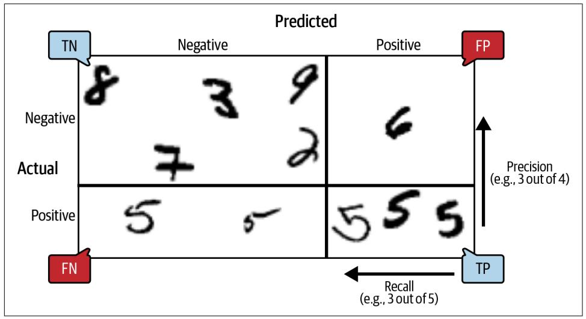

Figure 3-3. An illustrated confusion matrix showing examples of true negatives (top left), false positives (top right), false negatives (lower left), and true positives (lower right)

### **Precision and Recall**

Scikit-Learn provides several functions to compute classifier metrics, including precision and recall:

```
>>> from sklearn.metrics import precision_score, recall_score
>>> precision_score(y_train_5, y_train_pred) # == 3530 / (687 + 3530)0.8370879772350012
>>> recall_score(y_train_5, y_train_pred) # == 3530 / (1891 + 3530)0.6511713705958311
```

{138}------------------------------------------------

Now our 5-detector does not look as **shiny** as it did when we looked at its accuracy. When it claims an image represents a 5, it is correct only 83.7% of the time. Moreover, it only detects 65.1% of the 5s.

It is often convenient to combine precision and recall into a single metric called the  $F_1$  score, especially when you need a single metric to compare two classifiers. The  $F_1$  score is the *harmonic mean* of precision and recall (Equation 3-3). Whereas the regular mean treats all values equally, the harmonic mean gives much more weight to low values. As a result, the classifier will only get a high  $F<sub>1</sub>$  score if both recall and precision are high.

Equation 3-3.  $F_i$  score

 $F_1 = \frac{2}{\frac{1}{\text{precision}} + \frac{1}{\text{recall}}} = 2 \times \frac{\text{precision} \times \text{recall}}{\text{precision} + \text{recall}} = \frac{TP}{TP + \frac{FN + FP}{2}}$ 

To compute the  $F_1$  score, simply call the  $f_1$  score() function:

>>> from sklearn.metrics import f1 score >>> f1\_score(y\_train\_5, y\_train\_pred) 0.7325171197343846

The  $F_1$  score favors classifiers that have similar precision and recall. This is not always what you want: in some contexts you mostly care about precision, and in other contexts you really care about recall. For example, if you trained a classifier to detect videos that are safe for kids, you would probably prefer a classifier that rejects many good videos (low recall) but keeps only safe ones (high precision), rather than a classifier that has a much higher recall but lets a few really bad videos show up in your product (in such cases, you may even want to add a human pipeline to check the classifier's video selection). On the other hand, suppose you train a classifier to detect shoplifters in surveillance images: it is probably fine if your classifier only has 30% precision as long as it has 99% recall (sure, the security guards will get a few false alerts, but almost all shoplifters will get caught).

Unfortunately, you can't have it both ways: increasing precision reduces recall, and vice versa. This is called the precision/recall trade-off.

### **The Precision/Recall Trade-off**

To understand this trade-off, let's look at how the SGDClassifier makes its classification decisions. For each instance, it computes a score based on a *decision function*. If that score is greater than a threshold, it assigns the instance to the positive class; otherwise it assigns it to the negative class. Figure 3-4 shows a few digits positioned from the lowest score on the left to the highest score on the right. Suppose the decision threshold is positioned at the central arrow (between the two 5s): you will 

{139}------------------------------------------------

find 4 true positives (actual 5s) on the right of that threshold, and 1 false positive (actually a 6). Therefore, with that threshold, the precision is 80% (4 out of 5). But out of 6 actual 5s, the classifier only detects 4, so the recall is 67% (4 out of 6). If you raise the threshold (move it to the arrow on the right), the false positive (the 6) becomes a true negative, thereby increasing the precision (up to 100% in this case), but one true positive becomes a false negative, decreasing recall down to 50%. Conversely, lowering the threshold increases recall and reduces precision.

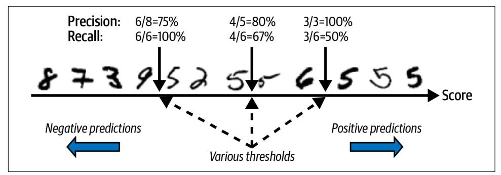

Figure 3-4. The precision/recall trade-off: images are ranked by their classifier score, and those above the chosen decision threshold are considered positive; the higher the threshold, the lower the recall, but (in general) the higher the precision

Scikit-Learn does not let you set the threshold directly, but it does give you access to the decision scores that it uses to make predictions. Instead of calling the classifier's predict() method, you can call its decision function() method, which returns a score for each instance, and then use any threshold you want to make predictions based on those scores:

```
>>> y_scores = sgd_clf.decision_function([some_digit])
>>> y_scores
array([2164.22030239])
\Rightarrow threshold = 0
>>> y_some_digit_pred = (y_scores > threshold)
array([True])
```

The SGDClassifier uses a threshold equal to 0, so the preceding code returns the same result as the predict() method (i.e., True). Let's raise the threshold:

```
\Rightarrow threshold = 3000
>>> y_some_digit_pred = (y_scores > threshold)
>>> y some digit pred
array([False])
```

This confirms that raising the threshold decreases recall. The image actually represents a 5, and the classifier detects it when the threshold is 0, but it misses it when the threshold is increased to 3,000.

{140}------------------------------------------------

How do you decide which threshold to use? First, use the cross val predict() function to get the scores of all instances in the training set, but this time specify that you want to return decision scores instead of predictions:

```
y_scores = cross_val_predict(sgd_clf, X_train, y_train_5, cv=3,
                             method="decision function")
```

With these scores, use the precision recall curve() function to compute precision and recall for all possible thresholds (the function adds a last precision of 0 and a last recall of 1, corresponding to an infinite threshold):

```
from sklearn.metrics import precision recall curve
```

```
precisions, recalls, thresholds = precision recall curve(y train 5, y scores)
```

Finally, use Matplotlib to plot precision and recall as functions of the threshold value (Figure 3-5). Let's show the threshold of 3,000 we selected:

```
plt.plot(thresholds, precisions[:-1], "b--", label="Precision", linewidth=2)
plt.plot(thresholds, recalls[:-1], "g-", label="Recall", linewidth=2)
plt.vlines(threshold, 0, 1.0, "k", "dotted", label="threshold")
\left[ \ldots \right] # beautify the figure: add grid, legend, axis, labels, and circles
plt.show()
```

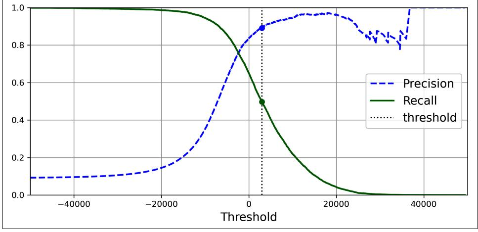

Figure 3-5. Precision and recall versus the decision threshold

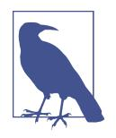

You may wonder why the precision curve is bumpier than the recall curve in Figure 3-5. The reason is that precision may sometimes go down when you raise the threshold (although in general it will go up). To understand why, look back at Figure 3-4 and notice what happens when you start from the central threshold and move it just one digit to the right: precision goes from 4/5 (80%) down to 3/4 (75%). On the other hand, recall can only go down when the threshold is increased, which explains why its curve looks smooth.

{141}------------------------------------------------

At this threshold value, precision is near 90% and recall is around 50%. Another way to select a good precision/recall trade-off is to plot precision directly against recall, as shown in Figure 3-6 (the same threshold is shown):

```
plt.plot(recalls, precisions, linewidth=2, label="Precision/Recall curve")
[...] # beautify the figure: add labels, grid, legend, arrow, and text
plt.show()
```


Figure 3-6. Precision versus recall

You can see that precision really starts to fall sharply at around 80% recall. You will probably want to select a precision/recall trade-off just before that drop-for example, at around 60% recall. But of course, the choice depends on your project.

Suppose you decide to aim for 90% precision. You could use the first plot to find the threshold you need to use, but that's not very precise. Alternatively, you can search for the lowest threshold that gives you at least 90% precision. For this, you can use the NumPy array's argmax() method. This returns the first index of the maximum value, which in this case means the first True value:

```
\Rightarrow idx for 90 precision = (precisions >= 0.90).argmax()
>>> threshold_for_90_precision = thresholds[idx_for_90_precision]
>>> threshold for 90 precision
3370.0194991439557
```

{142}------------------------------------------------

To make predictions (on the training set for now), instead of calling the classifier's predict() method, you can run this code:

```
y_train_pred_90 = (y_scores >= threshold-for_90_precision)
```

Let's check these predictions' precision and recall:

```
>>> precision score(y train 5, y train pred 90)
0.9000345901072293
>>> recall_at_90_precision = recall_score(y_train_5, y_train_pred_90)
>>> recall at 90 precision
0.4799852425751706
```

Great, you have a 90% precision classifier! As you can see, it is fairly easy to create a classifier with virtually any precision you want: just set a high enough threshold, and you're done. But wait, not so fast-a high-precision classifier is not very useful if its recall is too low! For many applications, 48% recall wouldn't be great at all.

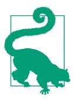

If someone says, "Let's reach 99% precision", you should ask, "At what recall?"

### **The ROC Curve**

The receiver operating characteristic (ROC) curve is another common tool used with binary classifiers. It is very similar to the precision/recall curve, but instead of plotting precision versus recall, the ROC curve plots the *true positive rate* (another name for recall) against the *false positive rate* (FPR). The FPR (also called the *fall-out*) is the ratio of negative instances that are incorrectly classified as positive. It is equal to 1 – the *true negative rate* (TNR), which is the ratio of negative instances that are correctly classified as negative. The TNR is also called *specificity*. Hence, the ROC curve plots sensitivity (recall) versus  $1$  – specificity.

To plot the ROC curve, you first use the roc\_curve() function to compute the TPR and FPR for various threshold values:

```
from sklearn.metrics import roc curve
```

```
fpr, tpr, thresholds = roc_curve(y_train_5, y_scores)
```

Then you can plot the FPR against the TPR using Matplotlib. The following code produces the plot in Figure 3-7. To find the point that corresponds to 90% precision, we need to look for the index of the desired threshold. Since thresholds are listed in decreasing order in this case, we use  $\leq$  instead of  $\geq$  on the first line:

{143}------------------------------------------------

```
idx_for_threshold_at_90 = (thresholds <= threshold_for_90_precision).argmax()
tpr_90, fpr_90 = tpr[idx_for_threshold_at_90], fpr[idx_for_threshold_at_90]
```

```
plt.plot(fpr, tpr, linewidth=2, label="ROC curve")
plt.plot([0, 1], [0, 1], 'k:', label="Random classifier's ROC curve")plt.plot([fpr_90], [tpr_90], "ko", label="Threshold for 90% precision")
[...] # beautify the figure: add labels, grid, legend, arrow, and text
plt.show()
```

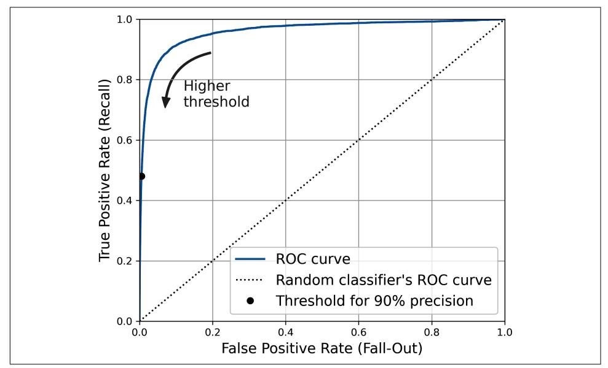

Figure 3-7. A ROC curve plotting the false positive rate against the true positive rate for all possible thresholds; the black circle highlights the chosen ratio (at 90% precision and 48% recall)

Once again there is a trade-off: the higher the recall (TPR), the more false positives (FPR) the classifier produces. The dotted line represents the ROC curve of a purely random classifier; a good classifier stays as far away from that line as possible (toward the top-left corner).

One way to compare classifiers is to measure the *area under the curve* (AUC). A perfect classifier will have a ROC AUC equal to 1, whereas a purely random classifier will have a ROC AUC equal to 0.5. Scikit-Learn provides a function to estimate the **ROC AUC:** 

```
>>> from sklearn.metrics import roc auc score
>>> roc auc score(y train 5, y scores)
0.9604938554008616
```

{144}------------------------------------------------


Since the ROC curve is so similar to the precision/recall (PR) curve, you may wonder how to decide which one to use. As a rule of thumb, you should prefer the PR curve whenever the positive class is rare or when you care more about the false positives than the false negatives. Otherwise, use the ROC curve. For example, looking at the previous ROC curve (and the ROC AUC score), you may think that the classifier is really good. But this is mostly because there are few positives (5s) compared to the negatives (non-5s). In contrast, the PR curve makes it clear that the classifier has room for improvement: the curve could really be closer to the top-right corner (see Figure 3-6 again).

Let's now create a RandomForestClassifier, whose PR curve and  $F_1$  score we can compare to those of the SGDClassifier:

```
from sklearn.ensemble import RandomForestClassifier
```

```
forest clf = RandomForestClassifier(random state=42)
```

The precision\_recall\_curve() function expects labels and scores for each instance, so we need to train the random forest classifier and make it assign a score to each instance. But the RandomForestClassifier class does not have a decision function() method, due to the way it works (we will cover this in Chapter 7). Luckily, it has a predict\_proba() method that returns class probabilities for each instance, and we can just use the probability of the positive class as a score, so it will work fine.<sup>4</sup> We can call the cross\_val\_predict() function to train the Random ForestClassifier using cross-validation and make it predict class probabilities for every image as follows:

```
y_probas_forest = cross_val_predict(forest_clf, X_train, y_train_5, cv=3,
                                    method="predict proba")
```

Let's look at the class probabilities for the first two images in the training set:

```
>>> y probas forest[:2]
array([[0.11, 0.89],[0.99, 0.01]]
```

The model predicts that the first image is positive with 89% probability, and it predicts that the second image is negative with 99% probability. Since each image is either positive or negative, the probabilities in each row add up to 100%.

<sup>4</sup> Scikit-Learn classifiers always have either a decision function() method or a predict proba() method, or sometimes both.

{145}------------------------------------------------

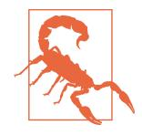

These are estimated probabilities, not actual probabilities. For example, if you look at all the images that the model classified as positive with an estimated probability between 50% and 60%, roughly 94% of them are actually positive. So, the model's estimated probabilities were much too low in this case-but models can be overconfident as well. The sklearn.calibration package contains tools to calibrate the estimated probabilities and make them much closer to actual probabilities. See the extra material section in this chapter's notebook for more details.

The second column contains the estimated probabilities for the positive class, so let's pass them to the precision recall curve() function:

```
y scores forest = y probas forest[: 1]precisions_forest, recalls_forest, thresholds_forest = precision_recall_curve(
    y_train_5, y_scores_forest)
```

Now we're ready to plot the PR curve. It is useful to plot the first PR curve as well to see how they compare (Figure 3-8):

```
plt.plot(recalls forest, precisions forest, "b-", linewidth=2,
         label="Random Forest")
plt.plot(recalls, precisions, "--", linewidth=2, label="SGD")
\lceil \ldots \rceil # beautify the figure: add labels, grid, and legend
plt.show()
```

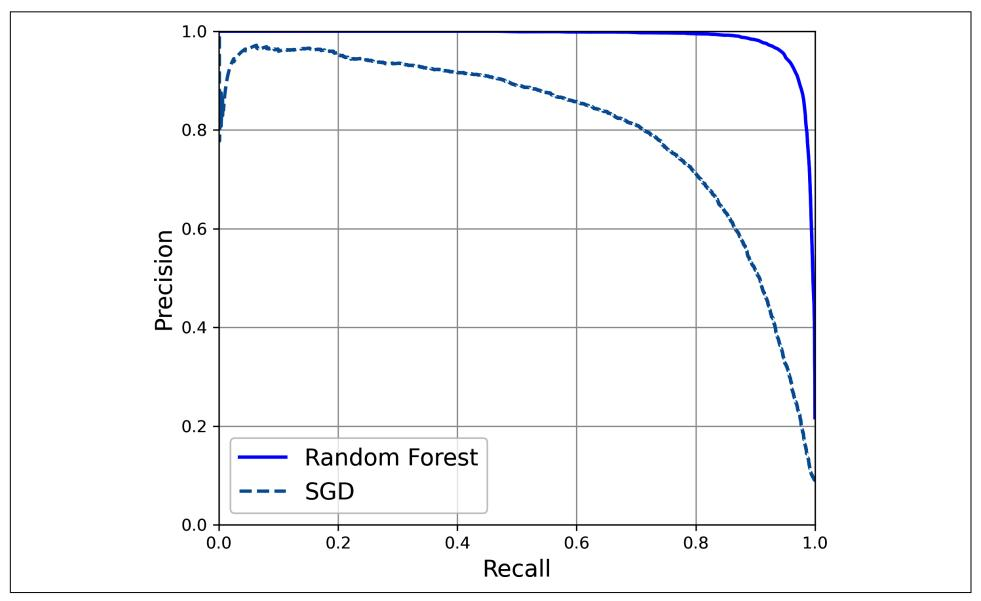

Figure 3-8. Comparing PR curves: the random forest classifier is superior to the SGD classifier because its PR curve is much closer to the top-right corner, and it has a greater  $AUC$ 

{146}------------------------------------------------

As you can see in Figure 3-8, the RandomForestClassifier's PR curve looks much better than the SGDClassifier's: it comes much closer to the top-right corner. Its  $F_1$ score and ROC AUC score are also significantly better:

```
>>> y_train_pred_forest = y_probas_forest[:, 1] >= 0.5 # positive proba \geq 50\%>>> f1_score(y_train_5, y_pred_forest)
0.9242275142688446
>>> roc_auc_score(y_train_5, y_scores_forest)
0.9983436731328145
```

Try measuring the precision and recall scores: you should find about 99.1% precision and 86.6% recall. Not too bad!

You now know how to train binary classifiers, choose the appropriate metric for your task, evaluate your classifiers using cross-validation, select the precision/recall trade-off that fits your needs, and use several metrics and curves to compare various models. You're ready to try to detect more than just the 5s.

### **Multiclass Classification**

Whereas binary classifiers distinguish between two classes, *multiclass classifiers* (also called *multinomial classifiers*) can distinguish between more than two classes.

Some Scikit-Learn classifiers (e.g., LogisticRegression, RandomForestClassifier, and GaussianNB) are capable of handling multiple classes natively. Others are strictly binary classifiers (e.g., SGDC lassifier and SVC). However, there are various strategies that you can use to perform multiclass classification with multiple binary classifiers.

One way to create a system that can classify the digit images into 10 classes (from 0 to 9) is to train 10 binary classifiers, one for each digit (a 0-detector, a 1-detector, a 2-detector, and so on). Then when you want to classify an image, you get the decision score from each classifier for that image and you select the class whose classifier outputs the highest score. This is called the one-versus-the-rest (OvR) strategy, or sometimes one-versus-all (OvA).

Another strategy is to train a binary classifier for every pair of digits: one to distinguish 0s and 1s, another to distinguish 0s and 2s, another for 1s and 2s, and so on. This is called the *one-versus-one* (OvO) strategy. If there are N classes, you need to train  $N \times (N - 1)$  / 2 classifiers. For the MNIST problem, this means training 45 binary classifiers! When you want to classify an image, you have to run the image through all 45 classifiers and see which class wins the most duels. The main advantage of OvO is that each classifier only needs to be trained on the part of the training set containing the two classes that it must distinguish.

Some algorithms (such as support vector machine classifiers) scale poorly with the size of the training set. For these algorithms OvO is preferred because it is faster 

{147}------------------------------------------------

to train many classifiers on small training sets than to train few classifiers on large training sets. For most binary classification algorithms, however, OvR is preferred.

Scikit-Learn detects when you try to use a binary classification algorithm for a multiclass classification task, and it automatically runs OvR or OvO, depending on the algorithm. Let's try this with a support vector machine classifier using the sklearn.svm.SVC class (see Chapter 5). We'll only train on the first 2,000 images, or else it will take a very long time:

```
from sklearn.svm import SVC
svm clf = SVC(random state=42)svm_clf.fit(X_train[:2000], y_train[:2000]) # y_train, not y_train_5
```

That was easy! We trained the SVC using the original target classes from 0 to 9 (y\_train), instead of the 5-versus-the-rest target classes (y\_train\_5). Since there are 10 classes (i.e., more than 2), Scikit-Learn used the OvO strategy and trained 45 binary classifiers. Now let's make a prediction on an image:

```
>>> svm clf.predict([some digit])
array(['5'], dtype=object)
```

That's correct! This code actually made 45 predictions—one per pair of classes—and it selected the class that won the most duels. If you call the decision\_function() method, you will see that it returns 10 scores per instance: one per class. Each class gets a score equal to the number of won duels plus or minus a small tweak (max ±0.33) to break ties, based on the classifier scores:

```
>>> some digit scores = svm clf.decision function([some digit])
>>> some_digit_scores.round(2)
аггау([[ 3.79, 0.73, 6.06, 8.3, -0.29, 9.3, 1.75, 2.77, 7.21,
        4.82]])
```

The highest score is 9.3, and it's indeed the one corresponding to class 5:

```
\Rightarrow class id = some digit scores.argmax()
>>> class id
5
```

When a classifier is trained, it stores the list of target classes in its classes\_attribute, ordered by value. In the case of MNIST, the index of each class in the classes\_array conveniently matches the class itself (e.g., the class at index 5 happens to be class '5'), but in general you won't be so lucky; you will need to look up the class label like this:

```
>>> svm clf.classes
array(['0', '1', '2', '3', '4', '5', '6', '7', '8', '9'], dtype=object)
>>> svm clf.classes [class id]
151
```

If you want to force Scikit-Learn to use one-versus-one or one-versus-the-rest, you can use the OneVsOneClassifier or OneVsRestClassifier classes. Simply create 

{148}------------------------------------------------

an instance and pass a classifier to its constructor (it doesn't even have to be a binary classifier). For example, this code creates a multiclass classifier using the OvR strategy, based on an SVC:

```
from sklearn.multiclass import OneVsRestClassifier
ovr clf = OneVsRestClassifier(SVC(random state=42))
ovr_clf.fit(X_train[:2000], y_train[:2000])
```

Let's make a prediction, and check the number of trained classifiers:

```
>>> ovr clf.predict([some digit])
array([ '5'] , dtype=' < U1')>>> len(ovr clf.estimators)
10
```

Training an SGDC lassifier on a multiclass dataset and using it to make predictions is just as easy:

```
>>> sgd_clf = SGDClassifier(random_state=42)
>>> sqd clf.fit(X train, y train)
>>> sgd_clf.predict([some_digit])
array(['3'], dtype='<U1')
```

Oops, that's incorrect. Prediction errors do happen! This time Scikit-Learn used the OvR strategy under the hood: since there are 10 classes, it trained 10 binary classifiers. The decision\_function() method now returns one value per class. Let's look at the scores that the SGD classifier assigned to each class:

```
>>> sgd_clf.decision_function([some_digit]).round()
array([[-31893., -34420., -9531., 1824., -22320., -1386., -26189.,
       -16148., -4604., -12051.]
```

You can see that the classifier is not very confident about its prediction: almost all scores are very negative, while class 3 has a score of  $+1,824$ , and class 5 is not too far behind at  $-1,386$ . Of course, you'll want to evaluate this classifier on more than one image. Since there are roughly the same number of images in each class, the accuracy metric is fine. As usual, you can use the cross val score() function to evaluate the model:

```
>>> cross_val_score(sgd_clf, X_train, y_train, cv=3, scoring="accuracy")
array([0.87365, 0.85835, 0.8689])
```

It gets over 85.8% on all test folds. If you used a random classifier, you would get 10% accuracy, so this is not such a bad score, but you can still do much better. Simply scaling the inputs (as discussed in Chapter 2) increases accuracy above 89.1%:

```
>>> from sklearn.preprocessing import StandardScaler
>>> scaler = StandardScaler()
>>> X_train_scaled = scaler.fit_transform(X_train.astype("float64"))
>>> cross_val_score(sgd_clf, X_train_scaled, y_train, cv=3, scoring="accuracy")
array([0.8983, 0.891, 0.9018])
```

{149}------------------------------------------------

### **Error Analysis**

If this were a real project, you would now follow the steps in your machine learning project checklist (see Appendix A). You'd explore data preparation options, try out multiple models, shortlist the best ones, fine-tune their hyperparameters using Grid SearchCV, and automate as much as possible. Here, we will assume that you have found a promising model and you want to find ways to improve it. One way to do this is to analyze the types of errors it makes.

First, look at the confusion matrix. For this, you first need to make predictions using the cross\_val\_predict() function; then you can pass the labels and predictions to the confusion\_matrix() function, just like you did earlier. However, since there are now 10 classes instead of 2, the confusion matrix will contain quite a lot of numbers, and it may be hard to read.

A colored diagram of the confusion matrix is much easier to analyze. To plot such a diagram, use the ConfusionMatrixDisplay.from\_predictions() function like this:

```
from sklearn.metrics import ConfusionMatrixDisplay
```

```
y_train_pred = cross_val_predict(sgd_clf, X_train_scaled, y_train, cv=3)
ConfusionMatrixDisplay.from_predictions(y_train, y_train_pred)
plt.show()
```

This produces the left diagram in Figure 3-9. This confusion matrix looks pretty good: most images are on the main diagonal, which means that they were classified correctly. Notice that the cell on the diagonal in row #5 and column #5 looks slightly darker than the other digits. This could be because the model made more errors on 5s, or because there are fewer 5s in the dataset than the other digits. That's why it's important to normalize the confusion matrix by dividing each value by the total number of images in the corresponding (true) class (i.e., divide by the row's sum). This can be done simply by setting normalize="true". We can also specify the val ues format=".0%" argument to show percentages with no decimals. The following code produces the diagram on the right in Figure 3-9:

```
ConfusionMatrixDisplay.from predictions(y train, y train pred,
                                        normalize="true", values format=".0%")
```

plt.show()

Now we can easily see that only 82% of the images of 5s were classified correctly. The most common error the model made with images of 5s was to misclassify them as 8s: this happened for 10% of all 5s. But only 2% of 8s got misclassified as 5s; confusion matrices are generally not symmetrical! If you look carefully, you will notice that many digits have been misclassified as 8s, but this is not immediately obvious from this diagram. If you want to make the errors stand out more, you can try putting zero weight on the correct predictions. The following code does just that and produces the diagram on the left in Figure 3-10:

{150}------------------------------------------------

```
sample\_weight = (y_train\_pred != y_train)ConfusionMatrixDisplay.from_predictions(y_train, y_train_pred,
                                        sample_weight=sample_weight,
                                        normalize="true", values format=".0%")
```

plt.show()


Figure 3-9. Confusion matrix (left) and the same CM normalized by row (right)

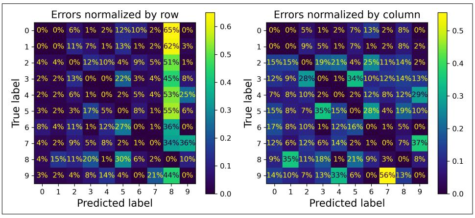

Figure 3-10. Confusion matrix with errors only, normalized by row (left) and by column  $(right)$ 

Now you can see much more clearly the kinds of errors the classifier makes. The column for class 8 is now really bright, which confirms that many images got misclassified as 8s. In fact this is the most common misclassification for almost all classes. But be careful how you interpret the percentages in this diagram: remember that we've excluded the correct predictions. For example, the 36% in row #7, column #9 does not mean that 36% of all images of 7s were misclassified as 9s. It means that 36% of the errors the model made on images of 7s were misclassifications as 9s. In reality, 

{151}------------------------------------------------

only 3% of images of 7s were misclassified as 9s, as you can see in the diagram on the right in Figure 3-9.

It is also possible to normalize the confusion matrix by column rather than by row: if you set normalize="pred", you get the diagram on the right in Figure 3-10. For example, you can see that 56% of misclassified 7s are actually 9s.

Analyzing the confusion matrix often gives you insights into ways to improve your classifier. Looking at these plots, it seems that your efforts should be spent on reducing the false 8s. For example, you could try to gather more training data for digits that look like 8s (but are not) so that the classifier can learn to distinguish them from real 8s. Or you could engineer new features that would help the classifier—for example, writing an algorithm to count the number of closed loops (e.g., 8 has two, 6 has one, 5 has none). Or you could preprocess the images (e.g., using Scikit-Image, Pillow, or OpenCV) to make some patterns, such as closed loops, stand out more.

Analyzing individual errors can also be a good way to gain insights into what your classifier is doing and why it is failing. For example, let's plot examples of 3s and 5s in a confusion matrix style (Figure 3-11):

```
cl a, cl b = '3', '5'
X_aaa = X_ttrain[(y_ttrain == cl_a) & (y_ttrain_pred == cl_a)]
X<sup>-ab = X</sup><sup>-train</sub>[y-train == cl<sup>-</sup>a) & (y<sup>-train</sup>-pred == cl<sup>-b</sup>)]</sup>
X_b = X_train[(y_train == cl_b) & (y_train_pred == cl_a)]
X_bbb = X_ttrain[(y_ttrain == cl_b) & (y_ttrain_pred == cl_b)]
[...] # plot all images in X_aa, X_ab, X_ba, X_bb in a confusion matrix style
```

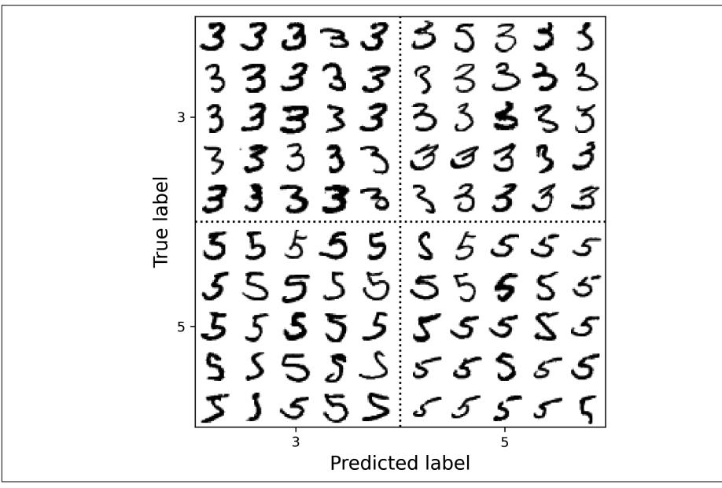

Figure 3-11. Some images of 3s and 5s organized like a confusion matrix

{152}------------------------------------------------

As you can see, some of the digits that the classifier gets wrong (i.e., in the bottom-left and top-right blocks) are so badly written that even a human would have trouble classifying them. However, most misclassified images seem like obvious errors to us. It may be hard to understand why the classifier made the mistakes it did, but remember that the human brain is a fantastic pattern recognition system, and our visual system does a lot of complex preprocessing before any information even reaches our consciousness. So, the fact that this task feels simple does not mean that it is. Recall that we used a simple SGDClassifier, which is just a linear model: all it does is assign a weight per class to each pixel, and when it sees a new image it just sums up the weighted pixel intensities to get a score for each class. Since 3s and 5s differ by only a few pixels, this model will easily confuse them.

The main difference between 3s and 5s is the position of the small line that joins the top line to the bottom arc. If you draw a 3 with the junction slightly shifted to the left, the classifier might classify it as a 5, and vice versa. In other words, this classifier is quite sensitive to image shifting and rotation. One way to reduce the 3/5 confusion is to preprocess the images to ensure that they are well centered and not too rotated. However, this may not be easy since it requires predicting the correct rotation of each image. A much simpler approach consists of augmenting the training set with slightly shifted and rotated variants of the training images. This will force the model to learn to be more tolerant to such variations. This is called *data augmentation* (we'll cover this in Chapter 14; also see exercise 2 at the end of this chapter).

### **Multilabel Classification**

Until now, each instance has always been assigned to just one class. But in some cases you may want your classifier to output multiple classes for each instance. Consider a face-recognition classifier: what should it do if it recognizes several people in the same picture? It should attach one tag per person it recognizes. Say the classifier has been trained to recognize three faces: Alice, Bob, and Charlie. Then when the classifier is shown a picture of Alice and Charlie, it should output [True, False, True] (meaning "Alice yes, Bob no, Charlie yes"). Such a classification system that outputs multiple binary tags is called a *multilabel classification* system.

We won't go into face recognition just yet, but let's look at a simpler example, just for illustration purposes:

```
import numpy as np
from sklearn.neighbors import KNeighborsClassifier
y train large = (y train >= '7')y train odd = (y train.astype('int8') % 2 == 1)
y_multilabel = np.c_[y_train_large, y_train_odd]
```

{153}------------------------------------------------

```
knn_clf = KNeighborsClassifier()knn_clf.fit(X_train, y_multilabel)
```

This code creates a y\_multilabel array containing two target labels for each digit image: the first indicates whether or not the digit is large  $(7, 8, 0r 9)$ , and the second indicates whether or not it is odd. Then the code creates a KNeighborsClassifier instance, which supports multilabel classification (not all classifiers do), and trains this model using the multiple targets array. Now you can make a prediction, and notice that it outputs two labels:

```
>>> knn_clf.predict([some_digit])
array([[False, True]])
```

And it gets it right! The digit 5 is indeed not large (False) and odd (True).

There are many ways to evaluate a multilabel classifier, and selecting the right metric really depends on your project. One approach is to measure the  $F_1$  score for each individual label (or any other binary classifier metric discussed earlier), then simply compute the average score. The following code computes the average  $F_1$  score across all labels:

```
>>> y train knn pred = cross val predict(knn clf, X train, y multilabel, cv=3)
>>> f1_score(y_multilabel, y_train_knn_pred, average="macro")
0.976410265560605
```

This approach assumes that all labels are equally important, which may not be the case. In particular, if you have many more pictures of Alice than of Bob or Charlie, you may want to give more weight to the classifier's score on pictures of Alice. One simple option is to give each label a weight equal to its *support* (i.e., the number of instances with that target label). To do this, simply set average="weighted" when calling the f1\_score() function.<sup>5</sup>

If you wish to use a classifier that does not natively support multilabel classification, such as SVC, one possible strategy is to train one model per label. However, this strategy may have a hard time capturing the dependencies between the labels. For example, a large digit  $(7, 8, or 9)$  is twice more likely to be odd than even, but the classifier for the "odd" label does not know what the classifier for the "large" label predicted. To solve this issue, the models can be organized in a chain: when a model makes a prediction, it uses the input features plus all the predictions of the models that come before it in the chain.

The good news is that Scikit-Learn has a class called ChainClassifier that does just that! By default it will use the true labels for training, feeding each model the appropriate labels depending on their position in the chain. But if you set the cv

<sup>5</sup> Scikit-Learn offers a few other averaging options and multilabel classifier metrics; see the documentation for more details.

{154}------------------------------------------------

hyperparameter, it will use cross-validation to get "clean" (out-of-sample) predictions from each trained model for every instance in the training set, and these predictions will then be used to train all the models later in the chain. Here's an example showing how to create and train a ChainClassifier using the cross-validation strategy. As earlier, we'll just use the first 2,000 images in the training set to speed things up:

```
from sklearn.multioutput import ClassifierChain
chain_clf = ClassifierChain(SVC(), cv=3, random_state=42)
chain_clf.fit(X_train[:2000], y_multilabel[:2000])
```

Now we can use this ChainClassifier to make predictions:

```
>>> chain_clf.predict([some_digit])
array([[0., 1.]])
```

### **Multioutput Classification**

The last type of classification task we'll discuss here is called multioutput-multiclass classification (or just multioutput classification). It is a generalization of multilabel classification where each label can be multiclass (i.e., it can have more than two possible values).

To illustrate this, let's build a system that removes noise from images. It will take as input a noisy digit image, and it will (hopefully) output a clean digit image, represented as an array of pixel intensities, just like the MNIST images. Notice that the classifier's output is multilabel (one label per pixel) and each label can have multiple values (pixel intensity ranges from 0 to 255). This is thus an example of a multioutput classification system.

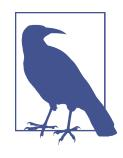

The line between classification and regression is sometimes blurry, such as in this example. Arguably, predicting pixel intensity is more akin to regression than to classification. Moreover, multioutput systems are not limited to classification tasks; you could even have a system that outputs multiple labels per instance, including both class labels and value labels.

Let's start by creating the training and test sets by taking the MNIST images and adding noise to their pixel intensities with NumPy's randint() function. The target images will be the original images:

```
np.random.seed(42) # to make this code example reproducible
noise = np.random.randint(0, 100, (len(X_train), 784))X train mod = X train + noise
noise = np.random.randint(0, 100, (len(X_test), 784))X test mod = X test + noise
```

{155}------------------------------------------------

```
y_train_model = X_trainy_t = x_t
```

Let's take a peek at the first image from the test set (Figure 3-12). Yes, we're snooping on the test data, so you should be frowning right now.

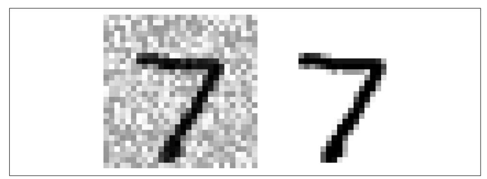

Figure 3-12. A noisy image (left) and the target clean image (right)

On the left is the noisy input image, and on the right is the clean target image. Now let's train the classifier and make it clean up this image (Figure 3-13):

```
knn clf = KNeighborsClassifier()
knn_clf.fit(X_train_mod, y_train_mod)
clean\_digit = knn_clf.predict([X_test_model0]])plot digit(clean digit)
plt.show()
```


Figure 3-13. The cleaned-up image

Looks close enough to the target! This concludes our tour of classification. You now know how to select good metrics for classification tasks, pick the appropriate precision/recall trade-off, compare classifiers, and more generally build good classification systems for a variety of tasks. In the next chapters, you'll learn how all these machine learning models you've been using actually work.

{156}------------------------------------------------

### **Exercises**

- 1. Try to build a classifier for the MNIST dataset that achieves over 97% accuracy on the test set. Hint: the KNeighborsClassifier works quite well for this task; you just need to find good hyperparameter values (try a grid search on the weights and n neighbors hyperparameters).
- 2. Write a function that can shift an MNIST image in any direction (left, right, up, or down) by one pixel.<sup>6</sup> Then, for each image in the training set, create four shifted copies (one per direction) and add them to the training set. Finally, train your best model on this expanded training set and measure its accuracy on the test set. You should observe that your model performs even better now! This technique of artificially growing the training set is called *data augmentation* or training set expansion.
- 3. Tackle the Titanic dataset. A great place to start is on Kaggle. Alternatively, you can download the data from https://homl.info/titanic.tgz and unzip this tarball like you did for the housing data in Chapter 2. This will give you two CSV files, train.csv and test.csv, which you can load using pandas.read\_csv(). The goal is to train a classifier that can predict the Survived column based on the other columns.
- 4. Build a spam classifier (a more challenging exercise):
  - a. Download examples of spam and ham from Apache SpamAssassin's public datasets.
  - b. Unzip the datasets and familiarize yourself with the data format.
  - c. Split the data into a training set and a test set.
  - d. Write a data preparation pipeline to convert each email into a feature vector. Your preparation pipeline should transform an email into a (sparse) vector that indicates the presence or absence of each possible word. For example, if all emails only ever contain four words, "Hello", "how", "are", "you", then the email "Hello you Hello Hello you" would be converted into a vector [1, 0, 0, 1] (meaning ["Hello" is present, "how" is absent, "are" is absent, "you" is present]), or  $[3, 0, 0, 2]$  if you prefer to count the number of occurrences of each word.

You may want to add hyperparameters to your preparation pipeline to control whether or not to strip off email headers, convert each email to lowercase, remove punctuation, replace all URLs with "URL", replace all numbers with

<sup>6</sup> You can use the shift() function from the scipy.ndimage.interpolation module. For example, shift(image, [2, 1], cval=0) shifts the image two pixels down and one pixel to the right.

{157}------------------------------------------------

"NUMBER", or even perform stemming (i.e., trim off word endings; there are Python libraries available to do this).

e. Finally, try out several classifiers and see if you can build a great spam classifier, with both high recall and high precision.

Solutions to these exercises are available at the end of this chapter's notebook, at https://homl.info/colab3.

{158}------------------------------------------------
