## **CHAPTER 5 Support Vector Machines**

A *support vector machine* (SVM) is a powerful and versatile machine learning model, capable of performing linear or nonlinear classification, regression, and even novelty detection. SVMs shine with small to medium-sized nonlinear datasets (i.e., hundreds to thousands of instances), especially for classification tasks. However, they don't scale very well to very large datasets, as you will see.

This chapter will explain the core concepts of SVMs, how to use them, and how they work. Let's jump right in!

### **Linear SVM Classification**

The fundamental idea behind SVMs is best explained with some visuals. Figure 5-1 shows part of the iris dataset that was introduced at the end of Chapter 4. The two classes can clearly be separated easily with a straight line (they are *linearly separable*). The left plot shows the decision boundaries of three possible linear classifiers. The model whose decision boundary is represented by the dashed line is so bad that it does not even separate the classes properly. The other two models work perfectly on this training set, but their decision boundaries come so close to the instances that these models will probably not perform as well on new instances. In contrast, the solid line in the plot on the right represents the decision boundary of an SVM classifier; this line not only separates the two classes but also stays as far away from the closest training instances as possible. You can think of an SVM classifier as fitting the widest possible street (represented by the parallel dashed lines) between the classes. This is called *large margin classification*.

{203}------------------------------------------------

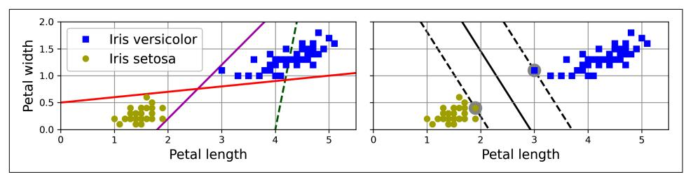

Figure 5-1. Large margin classification

Notice that adding more training instances "off the street" will not affect the decision boundary at all: it is fully determined (or "supported") by the instances located on the edge of the street. These instances are called the *support vectors* (they are circled in Figure  $5-1$ ).


SVMs are sensitive to the feature scales, as you can see in Figure 5-2. In the left plot, the vertical scale is much larger than the horizontal scale, so the widest possible street is close to horizontal. After feature scaling (e.g., using Scikit-Learn's StandardScaler), the decision boundary in the right plot looks much better.

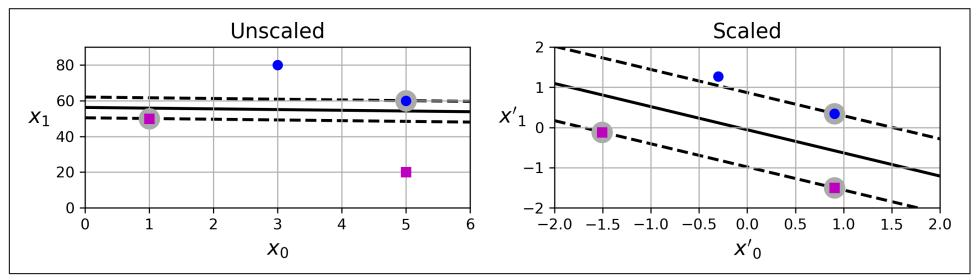

Figure 5-2. Sensitivity to feature scales

### **Soft Margin Classification**

If we strictly impose that all instances must be off the street and on the correct side, this is called *hard margin classification*. There are two main issues with hard margin classification. First, it only works if the data is linearly separable. Second, it is sensitive to outliers. Figure 5-3 shows the iris dataset with just one additional outlier: on the left, it is impossible to find a hard margin; on the right, the decision boundary ends up very different from the one we saw in Figure 5-1 without the outlier, and the model will probably not generalize as well.

{204}------------------------------------------------

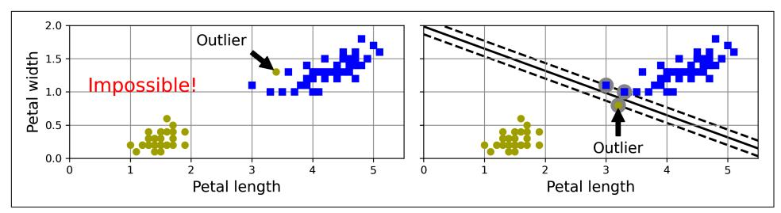

Figure 5-3. Hard margin sensitivity to outliers

To avoid these issues, we need to use a more flexible model. The objective is to find a good balance between keeping the street as large as possible and limiting the *margin violations* (i.e., instances that end up in the middle of the street or even on the wrong side). This is called *soft margin classification*.

When creating an SVM model using Scikit-Learn, you can specify several hyperparameters, including the regularization hyperparameter C. If you set it to a low value, then you end up with the model on the left of Figure 5-4. With a high value, you get the model on the right. As you can see, reducing C makes the street larger, but it also leads to more margin violations. In other words, reducing C results in more instances supporting the street, so there's less risk of overfitting. But if you reduce it too much, then the model ends up underfitting, as seems to be the case here: the model with C=100 looks like it will generalize better than the one with C=1.

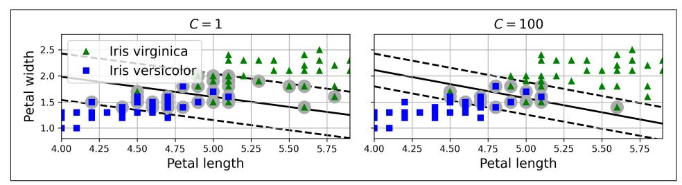

Figure 5-4. Large margin (left) versus fewer margin violations (right)


If your SVM model is overfitting, you can try regularizing it by reducing C.

The following Scikit-Learn code loads the iris dataset and trains a linear SVM classifier to detect *Iris virginica* flowers. The pipeline first scales the features, then uses a LinearSVC with  $C=1$ :

{205}------------------------------------------------

```
from sklearn.datasets import load iris
from sklearn.pipeline import make pipeline
from sklearn.preprocessing import StandardScaler
from sklearn.svm import LinearSVC
iris = load_iris(as_frame=True)X = iris.data[["petal length (cm)", "petal width (cm)"].valuesy = (iris.target == 2) # Iris virginica
svm_clf = make_pipeline(StandardScaler(),
                       LinearSVC(C=1, random_state=42))
svm clf.fit(X, y)
```

The resulting model is represented on the left in Figure 5-4.

Then, as usual, you can use the model to make predictions:

```
>>> X_new = [[5.5, 1.7], [5.0, 1.5]]>>> svm clf.predict(X new)
array([ True, False])
```

The first plant is classified as an *Iris virginica*, while the second is not. Let's look at the scores that the SVM used to make these predictions. These measure the signed distance between each instance and the decision boundary:

```
>>> svm_clf.decision_function(X_new)
array([ 0.66163411, -0.22036063])
```

Unlike LogisticRegression, LinearSVC doesn't have a predict\_proba() method to estimate the class probabilities. That said, if you use the SVC class (discussed shortly) instead of LinearSVC, and if you set its probability hyperparameter to True, then the model will fit an extra model at the end of training to map the SVM decision function scores to estimated probabilities. Under the hood, this requires using 5-fold cross-validation to generate out-of-sample predictions for every instance in the training set, then training a LogisticRegression model, so it will slow down training considerably. After that, the predict proba() and predict log proba() methods will be available.

### **Nonlinear SVM Classification**

Although linear SVM classifiers are efficient and often work surprisingly well, many datasets are not even close to being linearly separable. One approach to handling nonlinear datasets is to add more features, such as polynomial features (as we did in Chapter 4); in some cases this can result in a linearly separable dataset. Consider the lefthand plot in Figure 5-5: it represents a simple dataset with just one feature,  $x_1$ . This dataset is not linearly separable, as you can see. But if you add a second feature  $x_2 = (x_1)^2$ , the resulting 2D dataset is perfectly linearly separable.

{206}------------------------------------------------

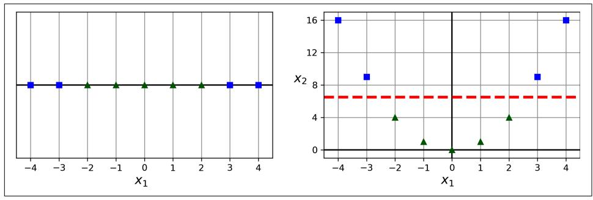

Figure 5-5. Adding features to make a dataset linearly separable

To implement this idea using Scikit-Learn, you can create a pipeline containing a PolynomialFeatures transformer (discussed in "Polynomial Regression" on page 149), followed by a StandardScaler and a LinearSVC classifier. Let's test this on the moons dataset, a toy dataset for binary classification in which the data points are shaped as two interleaving crescent moons (see Figure 5-6). You can generate this dataset using the make moons() function:

```
from sklearn.datasets import make moons
from sklearn.preprocessing import PolynomialFeatures
X, y = make_moons(n_samples=100, noise=0.15, random_state=42)polynomial_svm_clf = make_pipeline(
    PolynomialFeatures(degree=3),
    StandardScaler(),
    LinearSVC(C=10, max_iter=10_000, random_state=42)
\lambdapolynomial_svm_clf.fit(X, y)
```

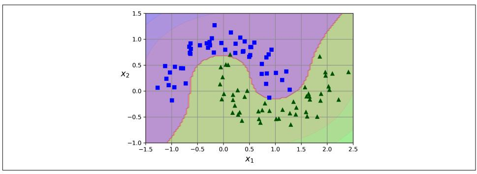

Figure 5-6. Linear SVM classifier using polynomial features

{207}------------------------------------------------

### **Polynomial Kernel**

Adding polynomial features is simple to implement and can work great with all sorts of machine learning algorithms (not just SVMs). That said, at a low polynomial degree this method cannot deal with very complex datasets, and with a high polynomial degree it creates a huge number of features, making the model too slow.

Fortunately, when using SVMs you can apply an almost miraculous mathematical technique called the **kernel trick** (which is explained later in this chapter). The kernel trick makes it possible to get the same result as if you had added many polynomial features, even with a very high degree, without actually having to add them. This means there's no combinatorial explosion of the number of features. This trick is implemented by the SVC class. Let's test it on the moons dataset:

```
from sklearn.svm import SVC
poly_kernel_svm_clf = make_pipeline(StandardScaler(),
                                    SVC(kernel="poly", degree=3, coef0=1, C=5))
poly_kernel_svm_clf.fit(X, y)
```

This code trains an SVM classifier using a third-degree polynomial kernel, represented on the left in Figure 5-7. On the right is another SVM classifier using a 10th-degree polynomial kernel. Obviously, if your model is overfitting, you might want to reduce the polynomial degree. Conversely, if it is underfitting, you can try increasing it. The hyperparameter coef0 controls how much the model is influenced by high-degree terms versus low-degree terms.

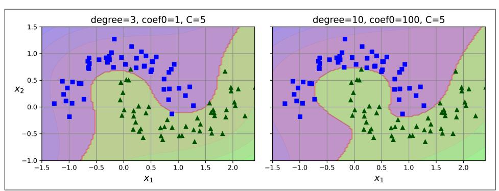

Figure 5-7. SVM classifiers with a polynomial kernel


Although hyperparameters will generally be tuned automatically (e.g., using randomized search), it's good to have a sense of what each hyperparameter actually does and how it may interact with other hyperparameters: this way, you can narrow the search to a much smaller space.

{208}------------------------------------------------

### **Similarity Features**

Another technique to tackle nonlinear problems is to add features computed using a similarity function, which measures how much each instance resembles a particular landmark, as we did in Chapter 2 when we added the geographic similarity features. For example, let's take the 1D dataset from earlier and add two landmarks to it at  $x_1 =$ -2 and  $x_1 = 1$  (see the left plot in Figure 5-8). Next, we'll define the similarity function to be the Gaussian RBF with  $y = 0.3$ . This is a bell-shaped function varying from 0 (very far away from the landmark) to 1 (at the landmark).

Now we are ready to compute the new features. For example, let's look at the instance  $x_1 = -1$ : it is located at a distance of 1 from the first landmark and 2 from the second landmark. Therefore, its new features are  $x_2 = \exp(-0.3 \times 1^2) \approx 0.74$  and  $x_3 = \exp(-0.3$  $\times$  2<sup>2</sup>)  $\approx$  0.30. The plot on the right in Figure 5-8 shows the transformed dataset (dropping the original features). As you can see, it is now linearly separable.

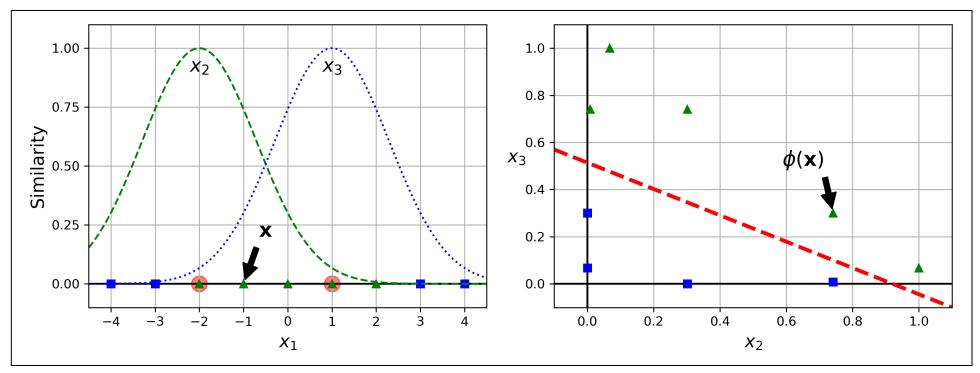

Figure 5-8. Similarity features using the Gaussian RBF

You may wonder how to select the landmarks. The simplest approach is to create a landmark at the location of each and every instance in the dataset. Doing that creates many dimensions and thus increases the chances that the transformed training set will be linearly separable. The downside is that a training set with  $m$  instances and  $n$  features gets transformed into a training set with  $m$  instances and  $m$  features (assuming you drop the original features). If your training set is very large, you end up with an equally large number of features.

#### **Gaussian RBF Kernel**

Just like the polynomial features method, the similarity features method can be useful with any machine learning algorithm, but it may be computationally expensive to compute all the additional features (especially on large training sets). Once again the kernel trick does its SVM magic, making it possible to obtain a similar result as if you 

{209}------------------------------------------------

had added many similarity features, but without actually doing so. Let's try the SVC class with the Gaussian RBF kernel:

```
rbf_kernel_svm_clf = make_pipeline(StandardScaler(),
                                  SVC(kernel="rbf", gamma=5, C=0.001))rbf kernel svm clf.fit(X, y)
```

This model is represented at the bottom left in Figure 5-9. The other plots show models trained with different values of hyperparameters gamma  $(y)$  and C. Increasing gamma makes the bell-shaped curve narrower (see the lefthand plots in Figure 5-8). As a result, each instance's range of influence is smaller: the decision boundary ends up being more irregular, wiggling around individual instances. Conversely, a small gamma value makes the bell-shaped curve wider: instances have a larger range of influence, and the decision boundary ends up smoother. So  $\gamma$  acts like a regularization hyperparameter: if your model is overfitting, you should reduce  $y$ ; if it is underfitting, you should increase  $\gamma$  (similar to the C hyperparameter).

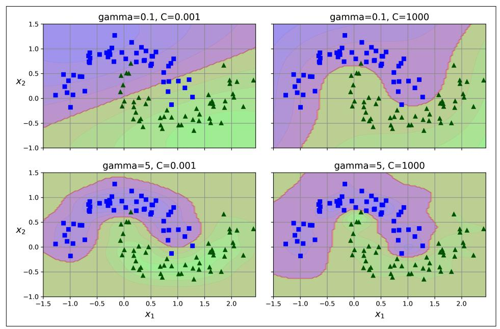

Figure 5-9. SVM classifiers using an RBF kernel

Other kernels exist but are used much more rarely. Some kernels are specialized for specific data structures. String kernels are sometimes used when classifying text documents or DNA sequences (e.g., using the string subsequence kernel or kernels based on the Levenshtein distance).

{210}------------------------------------------------


With so many kernels to choose from, how can you decide which one to use? As a rule of thumb, you should always try the linear kernel first. The LinearSVC class is much faster than SVC(kernel="linear"), especially if the training set is very large. If it is not too large, you should also try kernelized SVMs, starting with the Gaussian RBF kernel; it often works really well. Then, if you have spare time and computing power, you can experiment with a few other kernels using hyperparameter search. If there are kernels specialized for your training set's data structure, make sure to give them a try too.

#### **SVM Classes and Computational Complexity**

The LinearSVC class is based on the liblinear library, which implements an optimized algorithm for linear SVMs.<sup>1</sup> It does not support the kernel trick, but it scales almost linearly with the number of training instances and the number of features. Its training time complexity is roughly  $O(m \times n)$ . The algorithm takes longer if you require very high precision. This is controlled by the tolerance hyperparameter  $\epsilon$ (called tol in Scikit-Learn). In most classification tasks, the default tolerance is fine.

The SVC class is based on the libsvm library, which implements an algorithm that supports the kernel trick.<sup>2</sup> The training time complexity is usually between  $O(m^2 \times$ *n*) and  $O(m^3 \times n)$ . Unfortunately, this means that it gets dreadfully slow when the number of training instances gets large (e.g., hundreds of thousands of instances), so this algorithm is best for small or medium-sized nonlinear training sets. It scales well with the number of features, especially with sparse features (i.e., when each instance has few nonzero features). In this case, the algorithm scales roughly with the average number of nonzero features per instance.

The SGDClassifier class also performs large margin classification by default, and its hyperparameters-especially the regularization hyperparameters (alpha and penalty) and the learning\_rate-can be adjusted to produce similar results as the linear SVMs. For training it uses stochastic gradient descent (see Chapter 4), which allows incremental learning and uses little memory, so you can use it to train a model on a large dataset that does not fit in RAM (i.e., for out-of-core learning). Moreover, it scales very well, as its computational complexity is  $O(m \times n)$ . Table 5-1 compares Scikit-Learn's SVM classification classes.

<sup>1</sup> Chih-Jen Lin et al., "A Dual Coordinate Descent Method for Large-Scale Linear SVM", Proceedings of the 25th International Conference on Machine Learning (2008): 408-415.

<sup>2</sup> John Platt, "Sequential Minimal Optimization: A Fast Algorithm for Training Support Vector Machines" (Microsoft Research technical report, April 21, 1998).

{211}------------------------------------------------

| <b>Class</b>                  | Time complexity                           | Out-of-core support Scaling required Kernel trick |     |     |
|-------------------------------|-------------------------------------------|---------------------------------------------------|-----|-----|
| LinearSVC                     | $O(m \times n)$                           | No                                                | Yes | No  |
| <b>SVC</b>                    | $O(m^2 \times n)$ to $O(m^3 \times n)$ No |                                                   | Yes | Yes |
| SGDClassifier $O(m \times n)$ |                                           | Yes                                               | Yes | No  |

Table 5-1. Comparison of Scikit-Learn classes for SVM classification

Now let's see how the SVM algorithms can also be used for linear and nonlinear regression.

### **SVM Regression**

To use SVMs for regression instead of classification, the trick is to tweak the objective: instead of trying to fit the largest possible street between two classes while limiting margin violations, SVM regression tries to fit as many instances as possible on the street while limiting margin violations (i.e., instances off the street). The width of the street is controlled by a hyperparameter,  $\epsilon$ . Figure 5-10 shows two linear SVM regression models trained on some linear data, one with a small margin ( $\epsilon$  = 0.5) and the other with a larger margin ( $\epsilon$  = 1.2).

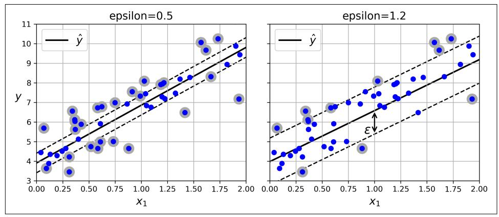

Figure 5-10. SVM regression

Reducing  $\epsilon$  increases the number of support vectors, which regularizes the model. Moreover, if you add more training instances within the margin, it will not affect the model's predictions; thus, the model is said to be  $\epsilon$ -insensitive.

You can use Scikit-Learn's LinearSVR class to perform linear SVM regression. The following code produces the model represented on the left in Figure 5-10:

{212}------------------------------------------------

```
from sklearn.svm import LinearSVR
X, y = [...] # a linear datasetsvm req = make pipeline(StandardScaler().
                       LinearSVR(epsilon=0.5, random state=42))
svm_reg.fit(X, y)
```

To tackle nonlinear regression tasks, you can use a kernelized SVM model. Figure 5-11 shows SVM regression on a random quadratic training set, using a seconddegree polynomial kernel. There is some regularization in the left plot (i.e., a small C value), and much less in the right plot (i.e., a large C value).

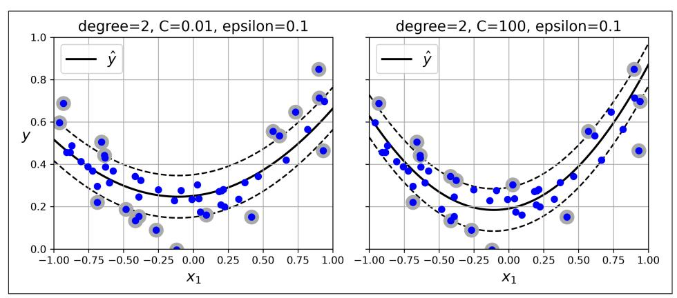

Figure 5-11. SVM regression using a second-degree polynomial kernel

The following code uses Scikit-Learn's SVR class (which supports the kernel trick) to produce the model represented on the left in Figure 5-11:

```
from sklearn.svm import SVR
X, y = [...] # a quadratic dataset
svm_poly_reg = make_pipeline(StandardScaler(),
                            SVR(kernel="poly", degree=2, C=0.01, epsilon=0.1)svm_poly_reg.fit(X, y)
```

The SVR class is the regression equivalent of the SVC class, and the LinearSVR class is the regression equivalent of the LinearSVC class. The LinearSVR class scales linearly with the size of the training set (just like the Linear SVC class), while the SVR class gets much too slow when the training set grows very large (just like the SVC class).


SVMs can also be used for novelty detection, as you will see in Chapter 9.

{213}------------------------------------------------

The rest of this chapter explains how SVMs make predictions and how their training algorithms work, starting with linear SVM classifiers. If you are just getting started with machine learning, you can safely skip this and go straight to the exercises at the end of this chapter, and come back later when you want to get a deeper understanding of SVMs.

### **Under the Hood of Linear SVM Classifiers**

A linear SVM classifier predicts the class of a new instance x by first computing the decision function  $\mathbf{\theta}^{\dagger} \mathbf{x} = \theta_0 x_0 + \cdots + \theta_n x_n$ , where  $x_0$  is the bias feature (always equal to 1). If the result is positive, then the predicted class  $\hat{y}$  is the positive class (1); otherwise it is the negative class (0). This is exactly like LogisticRegression (discussed in Chapter 4).


Up to now, I have used the convention of putting all the model parameters in one vector  $\theta$ , including the bias term  $\theta_0$  and the input feature weights  $\theta_1$  to  $\theta_n$ . This required adding a bias input  $x_0 = 1$  to all instances. Another very common convention is to separate the bias term b (equal to  $\theta_0$ ) and the feature weights vector **w** (containing  $\theta_1$  to  $\theta_n$ ). In this case, no bias feature needs to be added to the input feature vectors, and the linear SVM's decision function is equal to  $\mathbf{w}^{\mathsf{T}} \mathbf{x} + b = w_1 x_1 + \cdots + w_n x_n + b$ . I will use this convention throughout the rest of this book.

So, making predictions with a linear SVM classifier is quite straightforward. How about training? This requires finding the weights vector  $w$  and the bias term  $b$  that make the street, or margin, as wide as possible while limiting the number of margin violations. Let's start with the width of the street: to make it larger, we need to make w smaller. This may be easier to visualize in 2D, as shown in Figure 5-12. Let's define the borders of the street as the points where the decision function is equal to  $-1$  or  $+1$ . In the left plot the weight  $w_i$  is 1, so the points at which  $w_1 x_1 = -1$  or +1 are  $x_1 = -1$  and +1: therefore the margin's size is 2. In the right plot the weight is 0.5, so the points at which  $w_1 x_1 = -1$  or +1 are  $x_1 = -2$  and +2: the margin's size is 4. So, we need to keep w as small as possible. Note that the bias term b has no influence on the size of the margin: tweaking it just shifts the margin around, without affecting its size.

{214}------------------------------------------------

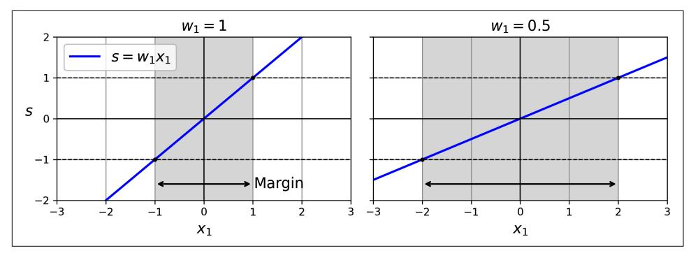

Figure 5-12. A smaller weight vector results in a larger margin

We also want to avoid margin violations, so we need the decision function to be greater than 1 for all positive training instances and lower than -1 for negative training instances. If we define  $t^{(i)} = -1$  for negative instances (when  $y^{(i)} = 0$ ) and  $t^{(i)} =$ 1 for positive instances (when  $y^{(i)} = 1$ ), then we can write this constraint as  $t^{(i)}(\mathbf{w}^T \mathbf{x}^{(i)} +$  $b \geq 1$  for all instances.

We can therefore express the hard margin linear SVM classifier objective as the constrained optimization problem in Equation 5-1.

#### Equation 5-1. Hard margin linear SVM classifier objective

$$
\begin{array}{ll}\text{minimize} & \frac{1}{2} \mathbf{w}^\mathsf{T} \mathbf{w} \\ \text{subject to} & t^{(i)} \big( \mathbf{w}^\mathsf{T} \mathbf{x}^{(i)} + b \big) \ge 1 \quad \text{for } i = 1, 2, \cdots, m \end{array}
$$


We are minimizing  $\frac{1}{2} \mathbf{w}^T \mathbf{w}$ , which is equal to  $\frac{1}{2} \|\mathbf{w}\|^2$ , rather than minimizing  $\| \mathbf{w} \|$  (the norm of **w**). Indeed,  $\frac{1}{2} \| \mathbf{w} \|^{2}$  has a nice, simple derivative (it is just w), while  $\parallel w \parallel$  is not differentiable at  $\mathbf{w} = 0$ . Optimization algorithms often work much better on differentiable functions.

{215}------------------------------------------------

To get the soft margin objective, we need to introduce a *slack variable*  $\zeta^{(i)} \ge 0$  for each instance:<sup>3</sup>  $\zeta^{(i)}$  measures how much the *i*<sup>th</sup> instance is allowed to violate the margin. We now have two conflicting objectives: make the slack variables as small as possible to reduce the margin violations, and make  $\frac{1}{2}$  w<sup> $\tau$ </sup> w as small as possible to increase the margin. This is where the C hyperparameter comes in: it allows us to define the trade-off between these two objectives. This gives us the constrained optimization problem in Equation 5-2.

Equation 5-2. Soft margin linear SVM classifier objective

$$
\begin{array}{ll}\n\text{minimize} & \frac{1}{2} \mathbf{w}^\top \mathbf{w} + C \sum_{i=1}^m \zeta^{(i)} \\
\text{subject to} & \quad t^{(i)} \big( \mathbf{w}^\top \mathbf{x}^{(i)} + b \big) \ge 1 - \zeta^{(i)} \quad \text{and} \quad \zeta^{(i)} \ge 0 \quad \text{for } i = 1, 2, \cdots, m\n\end{array}
$$

The hard margin and soft margin problems are both convex quadratic optimization problems with linear constraints. Such problems are known as *quadratic programming* (QP) problems. Many off-the-shelf solvers are available to solve QP problems by using a variety of techniques that are outside the scope of this book.<sup>4</sup>

Using a QP solver is one way to train an SVM. Another is to use gradient descent to minimize the *hinge loss* or the *squared hinge loss* (see Figure 5-13). Given an instance **x** of the positive class (i.e., with  $t = 1$ ), the loss is 0 if the output s of the decision function  $(s = w^T x + b)$  is greater than or equal to 1. This happens when the instance is off the street and on the positive side. Given an instance of the negative class (i.e., with  $t = -1$ ), the loss is 0 if  $s \le -1$ . This happens when the instance is off the street and on the negative side. The further away an instance is from the correct side of the margin, the higher the loss: it grows linearly for the hinge loss, and quadratically for the squared hinge loss. This makes the squared hinge loss more sensitive to outliers. However, if the dataset is clean, it tends to converge faster. By default, LinearSVC uses the squared hinge loss, while SGDClassifier uses the hinge loss. Both classes let you choose the loss by setting the loss hyperparameter to "hinge" or "squared\_hinge". The SVC class's optimization algorithm finds a similar solution as minimizing the hinge loss.

<sup>3</sup> Zeta  $(\zeta)$  is the sixth letter of the Greek alphabet.

<sup>4</sup> To learn more about quadratic programming, you can start by reading Stephen Boyd and Lieven Vandenberghe's book Convex Optimization (Cambridge University Press) or watching Richard Brown's series of video lectures.

{216}------------------------------------------------

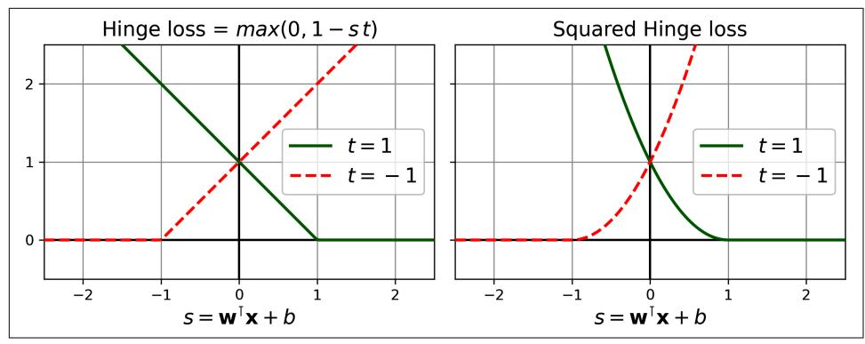

Figure 5-13. The hinge loss (left) and the squared hinge loss (right)

Next, we'll look at yet another way to train a linear SVM classifier: solving the dual problem.

### **The Dual Problem**

Given a constrained optimization problem, known as the *primal problem*, it is possible to express a different but closely related problem, called its *dual problem*. The solution to the dual problem typically gives a lower bound to the solution of the primal problem, but under some conditions it can have the same solution as the primal problem. Luckily, the SVM problem happens to meet these conditions,<sup>5</sup> so you can choose to solve the primal problem or the dual problem; both will have the same solution. Equation 5-3 shows the dual form of the linear SVM objective. If you are interested in knowing how to derive the dual problem from the primal problem, see the extra material section in this chapter's notebook.

Equation 5-3. Dual form of the linear SVM objective

minimize  $\frac{1}{2} \sum_{i=1}^{m} \sum_{j=1}^{m} \alpha^{(i)} \alpha^{(j)} t^{(i)} t^{(j)} \mathbf{x}^{(i)^\mathsf{T}} \mathbf{x}^{(j)}$  -  $\sum_{i=1}^{m} \alpha^{(i)}$ subject to  $\alpha^{(i)} \ge 0$  for all  $i = 1, 2, ..., m$  and  $\sum_{i=1}^{m} \alpha^{(i)} t^{(i)} = 0$ 

<sup>5</sup> The objective function is convex, and the inequality constraints are continuously differentiable and convex functions.

{217}------------------------------------------------

Once you find the vector  $\hat{\alpha}$  that minimizes this equation (using a QP solver), use Equation 5-4 to compute the  $\hat{\mathbf{w}}$  and b that minimize the primal problem. In this equation,  $n_s$  represents the number of support vectors.

Equation 5-4. From the dual solution to the primal solution

$$
\widehat{\mathbf{w}} = \sum_{i=1}^{m} \widehat{\alpha}^{(i)} t^{(i)} \mathbf{x}^{(i)}
$$
$$
\widehat{b} = \frac{1}{n_s} \sum_{\substack{i=1 \ \widehat{\alpha}^{(i)} > 0}}^{m} \left( t^{(i)} - \widehat{\mathbf{w}}^{\mathsf{T}} \mathbf{x}^{(i)} \right)
$$

The dual problem is faster to solve than the primal one when the number of training instances is smaller than the number of features. More importantly, the dual problem makes the kernel trick possible, while the primal problem does not. So what is this kernel trick, anyway?

### **Kernelized SVMs**

Suppose you want to apply a second-degree polynomial transformation to a twodimensional training set (such as the moons training set), then train a linear SVM classifier on the transformed training set. Equation 5-5 shows the second-degree polynomial mapping function  $\phi$  that you want to apply.

Equation 5-5. Second-degree polynomial mapping

$$
\varphi(\mathbf{x}) = \varphi\left(\begin{pmatrix} x_1 \\ x_2 \end{pmatrix}\right) = \begin{pmatrix} x_1^2 \\ \sqrt{2} x_1 x_2 \\ x_2^2 \end{pmatrix}
$$

Notice that the transformed vector is 3D instead of 2D. Now let's look at what happens to a couple of 2D vectors, **a** and **b**, if we apply this second-degree polynomial mapping and then compute the dot product<sup>6</sup> of the transformed vectors (see Equation  $5-6$ ).

<sup>6</sup> As explained in Chapter 4, the dot product of two vectors **a** and **b** is normally noted  $\mathbf{a} \cdot \mathbf{b}$ . However, in machine learning, vectors are frequently represented as column vectors (i.e., single-column matrices), so the dot product is achieved by computing a<sup>T</sup>b. To remain consistent with the rest of the book, we will use this notation here, ignoring the fact that this technically results in a single-cell matrix rather than a scalar value.

{218}------------------------------------------------

Equation 5-6. Kernel trick for a second-degree polynomial mapping

$$
\varphi(\mathbf{a})^{\mathsf{T}} \varphi(\mathbf{b}) = \begin{pmatrix} a_1^2 \\ \sqrt{2} a_1 a_2 \\ a_2^2 \end{pmatrix}^{\mathsf{T}} \begin{pmatrix} b_1^2 \\ \sqrt{2} b_1 b_2 \\ b_2^2 \end{pmatrix} = a_1^2 b_1^2 + 2a_1 b_1 a_2 b_2 + a_2^2 b_2^2
$$
$$
= (a_1 b_1 + a_2 b_2)^2 = \left( \begin{pmatrix} a_1 \\ a_2 \end{pmatrix}^{\mathsf{T}} \begin{pmatrix} b_1 \\ b_2 \end{pmatrix} \right)^2 = (\mathbf{a}^{\mathsf{T}} \mathbf{b})^2
$$

How about that? The dot product of the transformed vectors is equal to the square of the dot product of the original vectors:  $\phi(\mathbf{a})^{\dagger} \phi(\mathbf{b}) = (\mathbf{a}^{\dagger} \mathbf{b})^2$ .

Here is the key insight: if you apply the transformation  $\phi$  to all training instances, then the dual problem (see Equation 5-3) will contain the dot product  $\phi(\mathbf{x}^{(i)})^T \phi(\mathbf{x}^{(i)})$ . But if  $\phi$  is the second-degree polynomial transformation defined in Equation 5-5,

then you can replace this dot product of transformed vectors simply by  $(\mathbf{x}^{(i)^\mathsf{T}} \mathbf{x}^{(j)})^2$ . So, you don't need to transform the training instances at all; just replace the dot product by its square in Equation 5-3. The result will be strictly the same as if you had gone through the trouble of transforming the training set and then fitting a linear SVM algorithm, but this trick makes the whole process much more computationally efficient

The function  $K(a, b) = (a^T b)^2$  is a second-degree polynomial kernel. In machine learning, a kernel is a function capable of computing the dot product  $\phi(\mathbf{a})^T \phi(\mathbf{b})$ , based only on the original vectors **a** and **b**, without having to compute (or even to know about) the transformation  $\phi$ . Equation 5-7 lists some of the most commonly used kernels

Equation 5-7. Common kernels

Linear:  $K(a, b) = a^{\mathsf{T}}b$ Polynomial:  $K(\mathbf{a}, \mathbf{b}) = (\gamma \mathbf{a}^T \mathbf{b} + r)^d$  $K(\mathbf{a}, \mathbf{b}) = \exp(-\gamma || \mathbf{a} - \mathbf{b} ||^2)$ Gaussian RBF: Sigmoid:  $K(\mathbf{a}, \mathbf{b}) = \tanh(\gamma \mathbf{a}^\top \mathbf{b} + r)$ 

{219}------------------------------------------------

#### **Mercer's Theorem**

According to Mercer's theorem, if a function  $K(a, b)$  respects a few mathematical conditions called *Mercer's conditions* (e.g., *K* must be continuous and symmetric in its arguments so that  $K(a, b) = K(b, a)$ , etc.), then there exists a function  $\phi$  that maps a and **b** into another space (possibly with much higher dimensions) such that  $K(a, b)$  $= \phi(\mathbf{a})^T \phi(\mathbf{b})$ . You can use K as a kernel because you know  $\phi$  exists, even if you don't know what  $\phi$  is. In the case of the Gaussian RBF kernel, it can be shown that  $\phi$  maps each training instance to an infinite-dimensional space, so it's a good thing you don't need to actually perform the mapping!

Note that some frequently used kernels (such as the sigmoid kernel) don't respect all of Mercer's conditions, yet they generally work well in practice.

There is still one loose end we must tie up. Equation 5-4 shows how to go from the dual solution to the primal solution in the case of a linear SVM classifier. But if you apply the kernel trick, you end up with equations that include  $\phi(x^{(i)})$ . In fact,  $\hat{\mathbf{w}}$  must have the same number of dimensions as  $\phi(x^{(i)})$ , which may be huge or even infinite, so you can't compute it. But how can you make predictions without knowing  $\hat{\mathbf{w}}$ ? Well, the good news is that you can plug the formula for  $\hat{\mathbf{w}}$  from Equation 5-4 into the decision function for a new instance  $\mathbf{x}^{(n)}$ , and you get an equation with only dot products between input vectors. This makes it possible to use the kernel trick (Equation 5-8).

Equation 5-8. Making predictions with a kernelized SVM

$$
h_{\widehat{\mathbf{w}},\widehat{b}}(\varphi(\mathbf{x}^{(n)})) = \widehat{\mathbf{w}}^{\mathsf{T}}\varphi(\mathbf{x}^{(n)}) + \widehat{b} = \left(\sum_{i=1}^{m} \widehat{\alpha}^{(i)} t^{(i)} \varphi(\mathbf{x}^{(i)})\right)^{\mathsf{T}} \varphi(\mathbf{x}^{(n)}) + \widehat{b}
$$
$$
= \sum_{i=1}^{m} \widehat{\alpha}^{(i)} t^{(i)} (\varphi(\mathbf{x}^{(i)})^{\mathsf{T}} \varphi(\mathbf{x}^{(n)})) + \widehat{b}
$$
$$
= \sum_{i=1}^{m} \widehat{\alpha}^{(i)} t^{(i)} K(\mathbf{x}^{(i)}, \mathbf{x}^{(n)}) + \widehat{b}
$$

Note that since  $\alpha^{(i)} \neq 0$  only for support vectors, making predictions involves computing the dot product of the new input vector  $\mathbf{x}^{(n)}$  with only the support vectors, not all the training instances. Of course, you need to use the same trick to compute the bias term  $b$  (Equation 5-9).

{220}------------------------------------------------

Equation 5-9. Using the kernel trick to compute the bias term

$$
\hat{b} = \frac{1}{n_s} \sum_{\substack{i=1 \ \hat{\alpha}^{(i)} > 0}}^m \left( t^{(i)} - \widehat{\mathbf{w}}^\mathsf{T} \varphi(\mathbf{x}^{(i)}) \right) = \frac{1}{n_s} \sum_{\substack{i=1 \ \hat{\alpha}^{(i)} > 0}}^m \left( t^{(i)} - \left( \sum_{j=1}^m \widehat{\alpha}^{(j)} t^{(j)} \varphi(\mathbf{x}^{(j)}) \right)^\mathsf{T} \varphi(\mathbf{x}^{(i)}) \right)
$$
\n
$$
= \frac{1}{n_s} \sum_{\substack{i=1 \ \hat{\alpha}^{(i)} > 0}}^m \left( t^{(i)} - \sum_{\substack{j=1 \ \hat{\alpha}^{(j)} > 0}}^m \widehat{\alpha}^{(j)} t^{(j)} K(\mathbf{x}^{(i)}, \mathbf{x}^{(j)}) \right)
$$

If you are starting to get a headache, that's perfectly normal: it's an unfortunate side effect of the kernel trick.


It is also possible to implement online kernelized SVMs, capable of incremental learning, as described in the papers "Incremental and Decremental Support Vector Machine Learning"7 and "Fast Kernel Classifiers with Online and Active Learning".<sup>8</sup> These kernelized SVMs are implemented in Matlab and C++. But for large-scale nonlinear problems, you may want to consider using random forests (see Chapter 7) or neural networks (see Part II).

### **Fxercises**

- 1. What is the fundamental idea behind support vector machines?
- 2. What is a support vector?
- 3. Why is it important to scale the inputs when using SVMs?
- 4. Can an SVM classifier output a confidence score when it classifies an instance? What about a probability?
- 5. How can you choose between LinearSVC, SVC, and SGDClassifier?
- 6. Say you've trained an SVM classifier with an RBF kernel, but it seems to underfit the training set. Should you increase or decrease  $\gamma$  (gamma)? What about C?
- 7. What does it mean for a model to be  $\epsilon$ -insensitive?
- 8. What is the point of using the kernel trick?

<sup>7</sup> Gert Cauwenberghs and Tomaso Poggio, "Incremental and Decremental Support Vector Machine Learning", Proceedings of the 13th International Conference on Neural Information Processing Systems (2000): 388-394.

<sup>8</sup> Antoine Bordes et al., "Fast Kernel Classifiers with Online and Active Learning", Journal of Machine Learning Research 6 (2005): 1579-1619.

{221}------------------------------------------------

- 9. Train a Linear SVC on a linearly separable dataset. Then train an SVC and a SGDClassifier on the same dataset. See if you can get them to produce roughly the same model.
- 10. Train an SVM classifier on the wine dataset, which you can load using sklearn.datasets.load\_wine(). This dataset contains the chemical analyses of 178 wine samples produced by 3 different cultivators: the goal is to train a classification model capable of predicting the cultivator based on the wine's chemical analysis. Since SVM classifiers are binary classifiers, you will need to use one-versus-all to classify all three classes. What accuracy can you reach?
- 11. Train and fine-tune an SVM regressor on the California housing dataset. You can use the original dataset rather than the tweaked version we used in Chapter 2, which you can load using sklearn.datasets.fetch\_california\_housing(). The targets represent hundreds of thousands of dollars. Since there are over 20,000 instances, SVMs can be slow, so for hyperparameter tuning you should use far fewer instances (e.g., 2,000) to test many more hyperparameter combinations. What is your best model's RMSE?

Solutions to these exercises are available at the end of this chapter's notebook, at https://homl.info/colab3.

{222}------------------------------------------------
