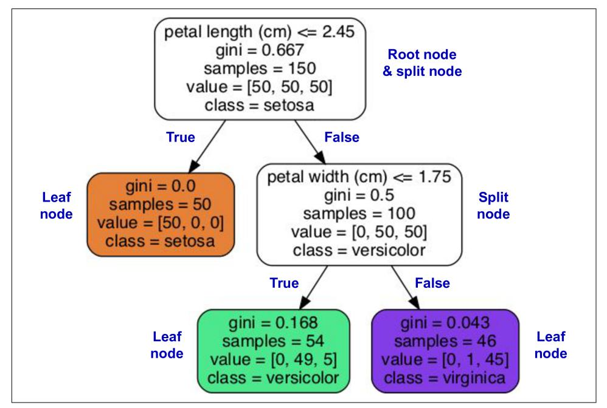
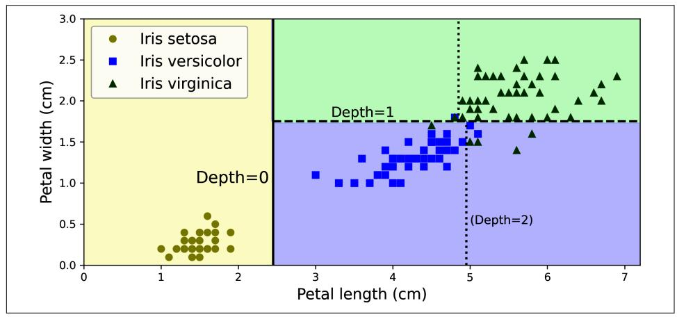
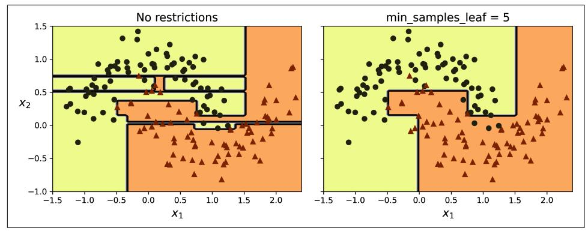
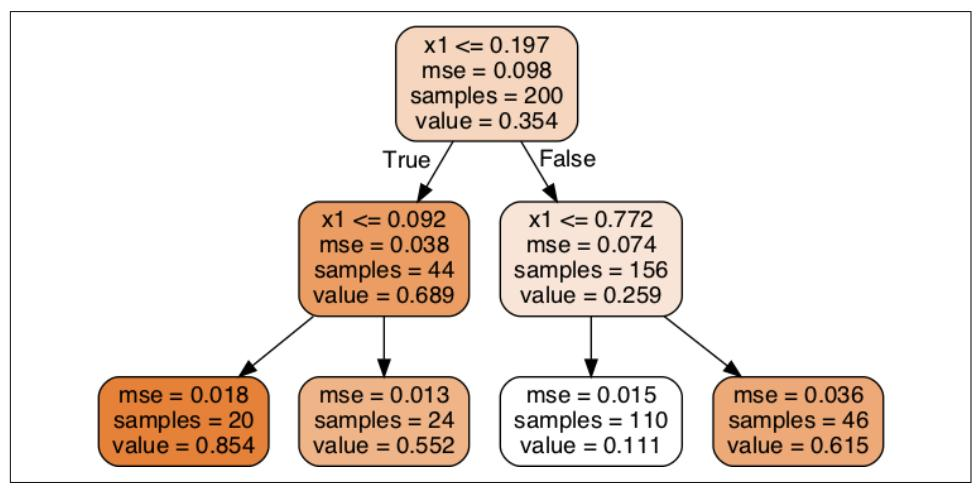
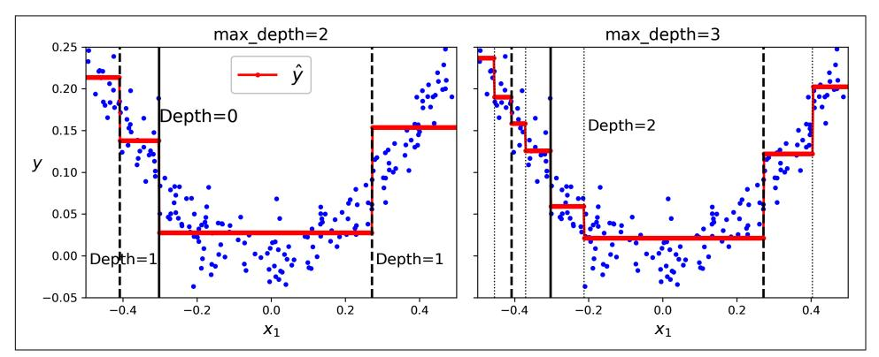
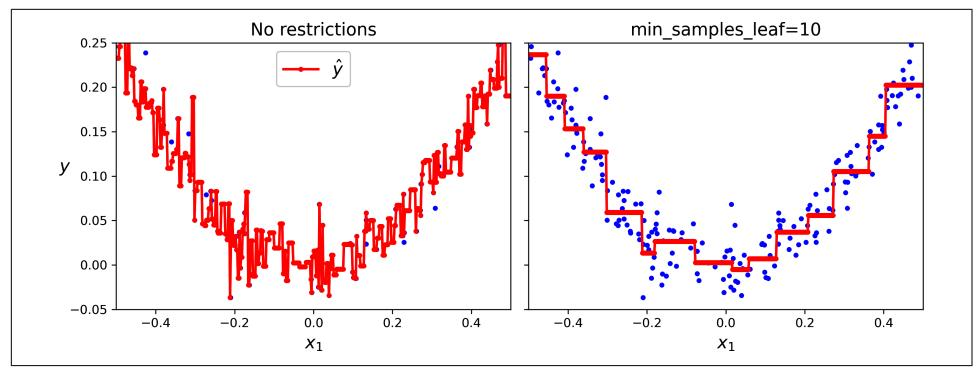
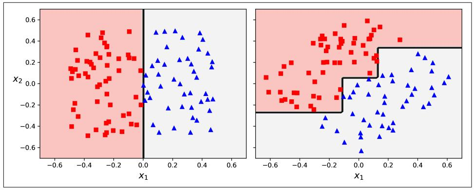
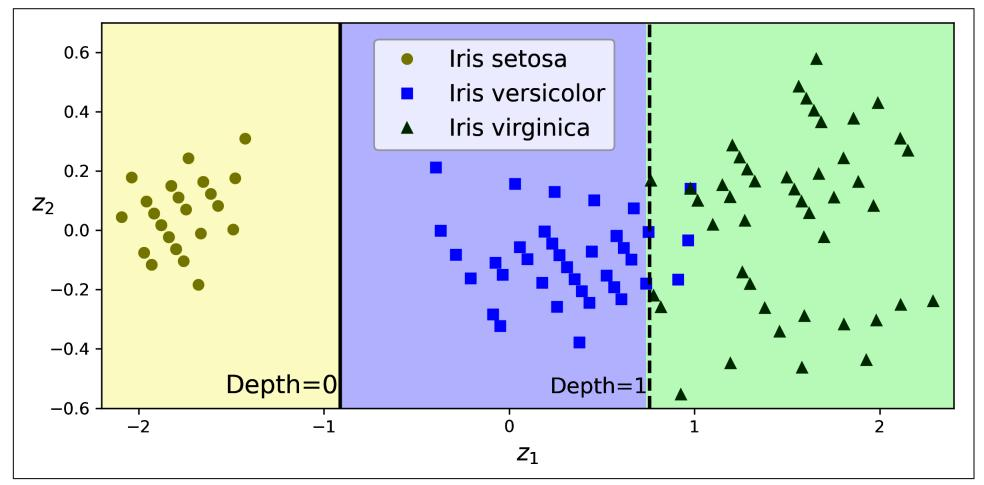
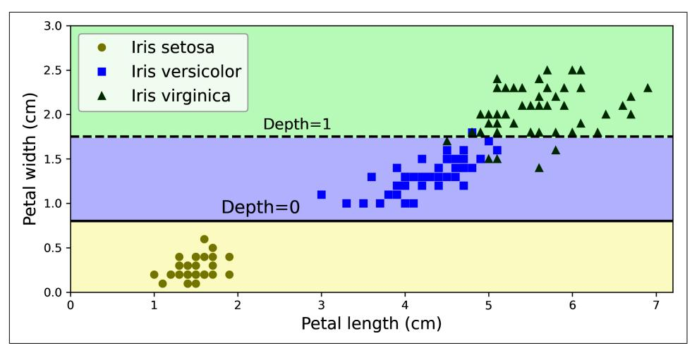

## **CHAPTER 6 Decision Trees**

Decision trees are versatile machine learning algorithms that can perform both classification and regression tasks, and even multioutput tasks. They are powerful algorithms, capable of fitting complex datasets. For example, in Chapter 2 you trained a DecisionTreeRegressor model on the California housing dataset, fitting it perfectly (actually, overfitting it).

Decision trees are also the fundamental components of random forests (see Chapter 7), which are among the most powerful machine learning algorithms available today.

In this chapter we will start by discussing how to train, visualize, and make predictions with decision trees. Then we will go through the CART training algorithm used by Scikit-Learn, and we will explore how to regularize trees and use them for regression tasks. Finally, we will discuss some of the limitations of decision trees.

### **Training and Visualizing a Decision Tree**

To understand decision trees, let's build one and take a look at how it makes predictions. The following code trains a DecisionTreeClassifier on the iris dataset (see Chapter 4):

```
from sklearn.datasets import load iris
from sklearn.tree import DecisionTreeClassifier
iris = load iris(as frame=True)X_iris = iris.data[["petal length (cm)", "petal width (cm)"]].values
y_{\text{circ}} = \text{iris.target}tree_clf = DecisionTreeClassifier(max_depth=2, random_state=42)
tree_clf.fit(X_iris, y_iris)
```

{223}------------------------------------------------

You can visualize the trained decision tree by first using the export graphyiz() function to output a graph definition file called *iris* tree.dot:

```
from sklearn.tree import export_graphviz
export_graphviz(
        tree clf.
        out file="iris tree.dot",
        feature_names=["petal length (cm)", "petal width (cm)"],
        class_names=iris.target_names,
        rounded=True,
        filled=True
    \lambda
```

Then you can use graphyiz. Source. from file() to load and display the file in a Jupyter notebook:

```
from graphviz import Source
Source.from_file("iris_tree.dot")
```

Graphviz is an open source graph visualization software package. It also includes a dot command-line tool to convert *dot* files to a variety of formats, such as PDF or PNG.

Your first decision tree looks like Figure 6-1.



Figure 6-1. Iris decision tree

{224}------------------------------------------------

### **Making Predictions**

Let's see how the tree represented in Figure 6-1 makes predictions. Suppose you find an iris flower and you want to classify it based on its petals. You start at the root node (depth 0, at the top): this node asks whether the flower's petal length is smaller than 2.45 cm. If it is, then you move down to the root's left child node (depth 1, left). In this case, it is a *leaf node* (i.e., it does not have any child nodes), so it does not ask any questions: simply look at the predicted class for that node, and the decision tree predicts that your flower is an Iris setosa (class=setosa).

Now suppose you find another flower, and this time the petal length is greater than 2.45 cm. You again start at the root but now move down to its right child node (depth 1, right). This is not a leaf node, it's a *split node*, so it asks another question: is the petal width smaller than 1.75 cm? If it is, then your flower is most likely an Iris versicolor (depth 2, left). If not, it is likely an *Iris virginica* (depth 2, right). It's really that simple.


One of the many qualities of decision trees is that they require very little data preparation. In fact, they don't require feature scaling or centering at all.

A node's samples attribute counts how many training instances it applies to. For example, 100 training instances have a petal length greater than 2.45 cm (depth 1, right), and of those 100, 54 have a petal width smaller than 1.75 cm (depth 2, left). A node's value attribute tells you how many training instances of each class this node applies to: for example, the bottom-right node applies to 0 Iris setosa, 1 Iris versicolor, and 45 Iris virginica. Finally, a node's gini attribute measures its *Gini impurity*: a node is "pure" (gini=0) if all training instances it applies to belong to the same class. For example, since the depth-1 left node applies only to Iris setosa training instances, it is pure and its Gini impurity is 0. Equation 6-1 shows how the training algorithm computes the Gini impurity  $G_i$  of the  $i<sup>th</sup>$  node. The depth-2 left node has a Gini impurity equal to  $1 - (0/54)^2 - (49/54)^2 - (5/54)^2 \approx 0.168$ .

Equation 6-1. Gini impurity

$$
G_i = 1 - \sum_{k=1}^{n} p_{i,k}^2
$$

{225}------------------------------------------------

In this equation:

- $G_i$  is the Gini impurity of the  $i^{\text{th}}$  node.
- $p_{i,k}$  is the ratio of class k instances among the training instances in the  $i^{\text{th}}$  node.


Scikit-Learn uses the CART algorithm, which produces only binary trees, meaning trees where split nodes always have exactly two children (i.e., questions only have yes/no answers). However, other algorithms, such as ID3, can produce decision trees with nodes that have more than two children.

Figure 6-2 shows this decision tree's decision boundaries. The thick vertical line represents the decision boundary of the root node (depth 0): petal length  $= 2.45$ cm. Since the lefthand area is pure (only *Iris setosa*), it cannot be split any further. However, the righthand area is impure, so the depth-1 right node splits it at petal width  $= 1.75$  cm (represented by the dashed line). Since max depth was set to 2, the decision tree stops right there. If you set max\_depth to 3, then the two depth-2 nodes would each add another decision boundary (represented by the two vertical dotted lines).



Figure 6-2. Decision tree decision boundaries


The tree structure, including all the information shown in Figure 6-1, is available via the classifier's tree\_ attribute. Type help(tree\_clf.tree\_) for details, and see the this chapter's notebook for an example.

{226}------------------------------------------------

### **Model Interpretation: White Box Versus Black Box**

Decision trees are intuitive, and their decisions are easy to interpret. Such models are often called *white box models*. In contrast, as you will see, random forests and neural networks are generally considered *black box models*. They make great predictions, and you can easily check the calculations that they performed to make these predictions; nevertheless, it is usually hard to explain in simple terms why the predictions were made. For example, if a neural network says that a particular person appears in a picture, it is hard to know what contributed to this prediction: Did the model recognize that person's eves? Their mouth? Their nose? Their shoes? Or even the couch that they were sitting on? Conversely, decision trees provide nice, simple classification rules that can even be applied manually if need be (e.g., for flower classification). The field of interpretable ML aims at creating ML systems that can explain their decisions in a way humans can understand. This is important in many domains—for example, to ensure the system does not make unfair decisions.

### **Estimating Class Probabilities**

A decision tree can also estimate the probability that an instance belongs to a particular class k. First it traverses the tree to find the leaf node for this instance, and then it returns the ratio of training instances of class  $k$  in this node. For example, suppose you have found a flower whose petals are 5 cm long and 1.5 cm wide. The corresponding leaf node is the depth-2 left node, so the decision tree outputs the following probabilities: 0% for Iris setosa (0/54), 90.7% for Iris versicolor (49/54), and 9.3% for Iris virginica (5/54). And if you ask it to predict the class, it outputs Iris versicolor (class 1) because it has the highest probability. Let's check this:

```
>>> tree_clf.predict_proba([[5, 1.5]]).round(3)
array([[0.                                    \Rightarrow tree clf.predict([5, 1.5])
array([1])
```

Perfect! Notice that the estimated probabilities would be identical anywhere else in the bottom-right rectangle of Figure 6-2—for example, if the petals were 6 cm long and 1.5 cm wide (even though it seems obvious that it would most likely be an Iris virginica in this case).

### **The CART Training Algorithm**

Scikit-Learn uses the *Classification and Regression Tree* (CART) algorithm to train decision trees (also called "growing" trees). The algorithm works by first splitting the training set into two subsets using a single feature k and a threshold  $t_k$  (e.g., "petal length  $\leq$  2.45 cm"). How does it choose k and  $t_k$ ? It searches for the pair  $(k, t_k)$ 

{227}------------------------------------------------

that produces the purest subsets, weighted by their size. Equation 6-2 gives the cost function that the algorithm tries to minimize.

Equation 6-2. CART cost function for classification

$$
J(k, t_k) = \frac{m_{\text{left}}}{m} G_{\text{left}} + \frac{m_{\text{right}}}{m} G_{\text{right}}
$$
  
where 
$$
\begin{cases} G_{\text{left/right}} \text{ measures the impurity of the left/right subset} \\ m_{\text{left/right}} \text{ is the number of instances in the left/right subset} \end{cases}
$$

Once the CART algorithm has successfully split the training set in two, it splits the subsets using the same logic, then the sub-subsets, and so on, recursively. It stops recursing once it reaches the maximum depth (defined by the max\_depth hyperparameter), or if it cannot find a split that will reduce impurity. A few other hyperparameters (described in a moment) control additional stopping conditions: min\_samples\_split, min\_samples\_leaf, min\_weight\_fraction\_leaf, and max leaf nodes.


As you can see, the CART algorithm is a greedy algorithm: it greedily searches for an optimum split at the top level, then repeats the process at each subsequent level. It does not check whether or not the split will lead to the lowest possible impurity several levels down. A greedy algorithm often produces a solution that's reasonably good but not guaranteed to be optimal.

Unfortunately, finding the optimal tree is known to be an NPcomplete problem.<sup>1</sup> It requires  $O(\exp(m))$  time, making the problem intractable even for small training sets. This is why we must settle for a "reasonably good" solution when training decision trees.

### **Computational Complexity**

Making predictions requires traversing the decision tree from the root to a leaf. Decision trees generally are approximately balanced, so traversing the decision tree requires going through roughly  $O(log_2(m))$  nodes, where  $log_2(m)$  is the *binary logarithm* of *m*, equal to  $log(m) / log(2)$ . Since each node only requires checking the

<sup>1</sup> P is the set of problems that can be solved in *polynomial time* (i.e., a polynomial of the dataset size). NP is the set of problems whose solutions can be verified in polynomial time. An NP-hard problem is a problem that can be reduced to a known NP-hard problem in polynomial time. An NP-complete problem is both NP and NP-hard. A major open mathematical question is whether or not P = NP. If P  $\neq$  NP (which seems likely), then no polynomial algorithm will ever be found for any NP-complete problem (except perhaps one day on a quantum computer).

{228}------------------------------------------------

value of one feature, the overall prediction complexity is  $O(log_2(m))$ , independent of the number of features. So predictions are very fast, even when dealing with large training sets.

The training algorithm compares all features (or less if max\_features is set) on all samples at each node. Comparing all features on all samples at each node results in a training complexity of  $O(n \times m \log_2(m))$ .

### **Gini Impurity or Entropy?**

By default, the DecisionTreeClassifier class uses the Gini impurity measure, but you can select the *entropy* impurity measure instead by setting the criterion hyperparameter to "entropy". The concept of entropy originated in thermodynamics as a measure of molecular disorder: entropy approaches zero when molecules are still and well ordered. Entropy later spread to a wide variety of domains, including in Shannon's information theory, where it measures the average information content of a message, as we saw in Chapter 4. Entropy is zero when all messages are identical. In machine learning, entropy is frequently used as an impurity measure: a set's entropy is zero when it contains instances of only one class. Equation 6-3 shows the definition of the entropy of the *i*<sup>th</sup> node. For example, the depth-2 left node in Figure 6-1 has an entropy equal to –(49/54)  $log_2$  (49/54) – (5/54)  $log_2$  (5/54) ≈ 0.445.

Equation 6-3. Entropy

$$
H_{i} = -\sum_{\substack{k=1 \ p_{i,k} \neq 0}}^{n} p_{i,k} \log_2 (p_{i,k})
$$

So, should you use Gini impurity or entropy? The truth is, most of the time it does not make a big difference: they lead to similar trees. Gini impurity is slightly faster to compute, so it is a good default. However, when they differ, Gini impurity tends to isolate the most frequent class in its own branch of the tree, while entropy tends to produce slightly more balanced trees.<sup>2</sup>

### **Regularization Hyperparameters**

Decision trees make very few assumptions about the training data (as opposed to linear models, which assume that the data is linear, for example). If left unconstrained, the tree structure will adapt itself to the training data, fitting it very closely—indeed, most likely overfitting it. Such a model is often called a *nonparametric model*, not

<sup>2</sup> See Sebastian Raschka's interesting analysis for more details.

{229}------------------------------------------------

because it does not have any parameters (it often has a lot) but because the number of parameters is not determined prior to training, so the model structure is free to stick closely to the data. In contrast, a *parametric model*, such as a linear model, has a predetermined number of parameters, so its degree of freedom is limited, reducing the risk of overfitting (but increasing the risk of underfitting).

To avoid overfitting the training data, you need to restrict the decision tree's freedom during training. As you know by now, this is called regularization. The regularization hyperparameters depend on the algorithm used, but generally you can at least restrict the maximum depth of the decision tree. In Scikit-Learn, this is controlled by the max\_depth hyperparameter. The default value is None, which means unlimited. Reducing max\_depth will regularize the model and thus reduce the risk of overfitting.

The DecisionTreeClassifier class has a few other parameters that similarly restrict the shape of the decision tree:

```
max features
```

Maximum number of features that are evaluated for splitting at each node

max leaf nodes

Maximum number of leaf nodes

```
min samples split
```

Minimum number of samples a node must have before it can be split

```
min_samples_leaf
```

Minimum number of samples a leaf node must have to be created

```
min_weight_fraction_leaf
```

Same as min samples leaf but expressed as a fraction of the total number of weighted instances

Increasing min\_\* hyperparameters or reducing max\_\* hyperparameters will regularize the model.


Other algorithms work by first training the decision tree without restrictions, then *pruning* (deleting) unnecessary nodes. A node whose children are all leaf nodes is considered unnecessary if the purity improvement it provides is not statistically significant. Standard statistical tests, such as the  $\chi^2$  test (chi-squared test), are used to estimate the probability that the improvement is purely the result of chance (which is called the *null hypothesis*). If this probability, called the *p-value*, is higher than a given threshold (typically 5%, controlled by a hyperparameter), then the node is considered unnecessary and its children are deleted. The pruning continues until all unnecessary nodes have been pruned.

{230}------------------------------------------------

Let's test regularization on the moons dataset, introduced in Chapter 5. We'll train one decision tree without regularization, and another with min samples leaf=5. Here's the code; Figure 6-3 shows the decision boundaries of each tree:

```
from sklearn.datasets import make_moons
X_moons, y_moons = make_moons(n_samples=150, noise=0.2, random_state=42)
tree clf1 = DecisionTreeClassifier(random state=42)
tree_clf2 = DecisionTreeClassifier(min_samples_leaf=5, random_state=42)
tree clf1.fit(X moons, y moons)
tree_clf2.fit(X_moons, y_moons)
```



Figure 6-3. Decision boundaries of an unregularized tree (left) and a regularized tree  $(right)$ 

The unregularized model on the left is clearly overfitting, and the regularized model on the right will probably generalize better. We can verify this by evaluating both trees on a test set generated using a different random seed:

```
>>> X_moons_test, y_moons_test = make_moons(n_samples=1000, noise=0.2,
\ddotscrandom_state=43)
\ddotsc>>> tree_clf1.score(X_moons_test, y_moons_test)
0.898
>>> tree clf2.score(X moons test, y moons test)
0.92
```

Indeed, the second tree has a better accuracy on the test set.

{231}------------------------------------------------

### **Regression**

Decision trees are also capable of performing regression tasks. Let's build a regression tree using Scikit-Learn's DecisionTreeRegressor class, training it on a noisy quadratic dataset with max\_depth=2:

```
import numpy as np
from sklearn.tree import DecisionTreeRegressor
np.random.seed(42)
X quad = np.random.rand(200, 1) - 0.5 # a single random input feature
y quad = X quad ** 2 + 0.025 * np.random.randn(200, 1)
tree_reg = DecisionTreeRegressor(max_depth=2, random_state=42)
tree_reg.fit(X_quad, y_quad)
```

The resulting tree is represented in Figure 6-4.



Figure 6-4. A decision tree for regression

This tree looks very similar to the classification tree you built earlier. The main difference is that instead of predicting a class in each node, it predicts a value. For example, suppose you want to make a prediction for a new instance with  $x_1 = 0.2$ . The root node asks whether  $x_1 \le 0.197$ . Since it is not, the algorithm goes to the right child node, which asks whether  $x_1 \le 0.772$ . Since it is, the algorithm goes to the left child node. This is a leaf node, and it predicts value=0.111. This prediction is the average target value of the 110 training instances associated with this leaf node, and it results in a mean squared error equal to 0.015 over these 110 instances.

{232}------------------------------------------------

This model's predictions are represented on the left in Figure 6-5. If you set max depth=3, you get the predictions represented on the right. Notice how the predicted value for each region is always the average target value of the instances in that region. The algorithm splits each region in a way that makes most training instances as close as possible to that predicted value.



Figure 6-5. Predictions of two decision tree regression models

The CART algorithm works as described earlier, except that instead of trying to split the training set in a way that minimizes impurity, it now tries to split the training set in a way that minimizes the MSE. Equation 6-4 shows the cost function that the algorithm tries to minimize.

Equation 6-4. CART cost function for regression

$$
J(k, t_k) = \frac{m_{\text{left}}}{m} \text{MSE}_{\text{left}} + \frac{m_{\text{right}}}{m} \text{MSE}_{\text{right}} \quad \text{where } \begin{cases} \text{MSE}_{\text{node}} = \frac{\Sigma_i \in \text{node} \left( \widehat{y}_{\text{node}} - y^{(i)} \right)^2}{m_{\text{node}}} \\ \hat{y}_{\text{node}} = \frac{\Sigma_i \in \text{node} y^{(i)}}{m_{\text{node}}} \end{cases}
$$

Just like for classification tasks, decision trees are prone to overfitting when dealing with regression tasks. Without any regularization (i.e., using the default hyperparameters), you get the predictions on the left in Figure 6-6. These predictions are obviously overfitting the training set very badly. Just setting min\_samples\_leaf=10 results in a much more reasonable model, represented on the right in Figure 6-6.

{233}------------------------------------------------



Figure 6-6. Predictions of an unregularized regression tree (left) and a regularized tree (right)

### **Sensitivity to Axis Orientation**

Hopefully by now you are convinced that decision trees have a lot going for them: they are relatively easy to understand and interpret, simple to use, versatile, and powerful. However, they do have a few limitations. First, as you may have noticed, decision trees love orthogonal decision boundaries (all splits are perpendicular to an axis), which makes them sensitive to the data's orientation. For example, Figure 6-7 shows a simple linearly separable dataset: on the left, a decision tree can split it easily, while on the right, after the dataset is rotated by 45°, the decision boundary looks unnecessarily convoluted. Although both decision trees fit the training set perfectly, it is very likely that the model on the right will not generalize well.



Figure 6-7. Sensitivity to training set rotation

One way to limit this problem is to scale the data, then apply a principal component analysis transformation. We will look at PCA in detail in Chapter 8, but for now

{234}------------------------------------------------

you only need to know that it rotates the data in a way that reduces the correlation between the features, which often (not always) makes things easier for trees.

Let's create a small pipeline that scales the data and rotates it using PCA, then train a DecisionTreeClassifier on that data. Figure 6-8 shows the decision boundaries of that tree: as you can see, the rotation makes it possible to fit the dataset pretty well using only one feature,  $z_1$ , which is a linear function of the original petal length and width. Here's the code:

```
from sklearn.decomposition import PCA
from sklearn.pipeline import make_pipeline
from sklearn.preprocessing import StandardScaler
pca pipeline = make pipeline(StandardScaler(), PCA())
X iris rotated = pca pipeline. fit transform(X iris)
tree_clf_pca = DecisionTreeClassifier(max_depth=2, random_state=42)
tree clf pca.fit(X iris rotated, y iris)
```



Figure 6-8. A tree's decision boundaries on the scaled and PCA-rotated iris dataset

### **Decision Trees Have a High Variance**

More generally, the main issue with decision trees is that they have quite a high variance: small changes to the hyperparameters or to the data may produce very different models. In fact, since the training algorithm used by Scikit-Learn is stochastic—it randomly selects the set of features to evaluate at each node—even retraining the same decision tree on the exact same data may produce a very different model, such as the one represented in Figure 6-9 (unless you set the random\_state hyperparameter). As you can see, it looks very different from the previous decision tree (Figure  $6-2$ ).

{235}------------------------------------------------



Figure 6-9. Retraining the same model on the same data may produce a very different model

Luckily, by averaging predictions over many trees, it's possible to reduce variance significantly. Such an *ensemble* of trees is called a *random forest*, and it's one of the most powerful types of models available today, as you will see in the next chapter.

### **Exercises**

- 1. What is the approximate depth of a decision tree trained (without restrictions) on a training set with one million instances?
- 2. Is a node's Gini impurity generally lower or higher than its parent's? Is it generally lower/higher, or always lower/higher?
- 3. If a decision tree is overfitting the training set, is it a good idea to try decreasing max depth?
- 4. If a decision tree is underfitting the training set, is it a good idea to try scaling the input features?
- 5. If it takes one hour to train a decision tree on a training set containing one million instances, roughly how much time will it take to train another decision tree on a training set containing ten million instances? Hint: consider the CART algorithm's computational complexity.
- 6. If it takes one hour to train a decision tree on a given training set, roughly how much time will it take if you double the number of features?
- 7. Train and fine-tune a decision tree for the moons dataset by following these steps:

{236}------------------------------------------------

- a. Use make\_moons(n\_samples=10000, noise=0.4) to generate a moons dataset.
- b. Use train\_test\_split() to split the dataset into a training set and a test set.
- c. Use grid search with cross-validation (with the help of the GridSearchCV class) to find good hyperparameter values for a DecisionTreeClassifier. Hint: try various values for max\_leaf\_nodes.
- d. Train it on the full training set using these hyperparameters, and measure your model's performance on the test set. You should get roughly 85% to 87% accuracy.
- 8. Grow a forest by following these steps:
  - a. Continuing the previous exercise, generate 1,000 subsets of the training set, each containing 100 instances selected randomly. Hint: you can use Scikit-Learn's ShuffleSplit class for this.
  - b. Train one decision tree on each subset, using the best hyperparameter values found in the previous exercise. Evaluate these 1,000 decision trees on the test set. Since they were trained on smaller sets, these decision trees will likely perform worse than the first decision tree, achieving only about 80% accuracy.
  - c. Now comes the magic. For each test set instance, generate the predictions of the 1,000 decision trees, and keep only the most frequent prediction (you can use SciPy's mode() function for this). This approach gives you *majority-vote* predictions over the test set.
  - d. Evaluate these predictions on the test set: you should obtain a slightly higher accuracy than your first model (about 0.5 to 1.5% higher). Congratulations, you have trained a random forest classifier!

Solutions to these exercises are available at the end of this chapter's notebook, at https://homl.info/colab3.

{237}------------------------------------------------

{238}------------------------------------------------
