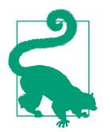
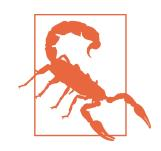

## **Objective and Approach**

This book assumes that you know close to nothing about machine learning. Its goal is to give you the concepts, tools, and intuition you need to implement programs capable of *learning* from *data*.

We will cover a large number of techniques, from the simplest and most commonly used (such as linear regression) to some of the deep learning techniques that regularly win competitions. For this, we will be using production-ready Python frameworks:

- Scikit-Learn is very easy to use, yet it implements many machine learning algorithms efficiently, so it makes for a great entry point to learning machine learning. It was created by David Cournapeau in 2007, and is now led by a team of researchers at the French Institute for Research in Computer Science and Automation (Inria).
- TensorFlow is a more complex library for distributed numerical computation. It makes it possible to train and run very large neural networks efficiently by distributing the computations across potentially hundreds of multi-GPU (graphics processing unit) servers. TensorFlow (TF) was created at Google and supports many of its large-scale machine learning applications. It was open sourced in November 2015, and version 2.0 was released in September 2019.
- Keras is a high-level deep learning API that makes it very simple to train and run neural networks. Keras comes bundled with TensorFlow, and it relies on TensorFlow for all the intensive computations.

The book favors a hands-on approach, growing an intuitive understanding of machine learning through concrete working examples and just a little bit of theory.

{18}------------------------------------------------

While you can read this book without picking up your laptop, I highly recommend you experiment with the code examples.

### **Code Examples**

All the code examples in this book are open source and available online at https://git hub.com/ageron/handson-ml3, as Jupyter notebooks. These are interactive documents containing text, images, and executable code snippets (Python in our case). The easiest and quickest way to get started is to run these notebooks using Google Colab: this is a free service that allows you to run any Jupyter notebook directly online, without having to install anything on your machine. All you need is a web browser and a Google account.

In this book, I will assume that you are using Google Colab, but I have also tested the notebooks on other online platforms such as Kaggle and Binder, so you can use those if you prefer. Alternatively, you can install the required libraries and tools (or the Docker image for this book) and run the notebooks directly on your own machine. See the instructions at https://homl.info/install.

This book is here to help you get your job done. If you wish to use additional content beyond the code examples, and that use falls outside the scope of fair use guidelines, (such as selling or distributing content from O'Reilly books, or incorporating a significant amount of material from this book into your product's documentation), please reach out to us for permission, at *permissions@oreilly.com*.

We appreciate, but do not require, attribution. An attribution usually includes the title, author, publisher, and ISBN. For example: "Hands-On Machine Learning with Scikit-Learn, Keras, and TensorFlow by Aurélien Géron. Copyright 2023 Aurélien Géron, 978-1-098-12597-4."

### **Prerequisites**

This book assumes that you have some Python programming experience. If you don't know Python yet, https://learnpython.org is a great place to start. The official tutorial on Python.org is also quite good.

This book also assumes that you are familiar with Python's main scientific libraries in particular, NumPy, Pandas, and Matplotlib. If you have never used these libraries, don't worry; they're easy to learn, and I've created a tutorial for each of them. You can access them online at https://homl.info/tutorials.

{19}------------------------------------------------

Moreover, if you want to fully understand how the machine learning algorithms work (not just how to use them), then you should have at least a basic understanding of a few math concepts, especially linear algebra. Specifically, you should know what vectors and matrices are, and how to perform some simple operations like adding vectors, or transposing and multiplying matrices. If you need a quick introduction to linear algebra (it's really not rocket science!), I provide a tutorial at https://homl.info/ tutorials. You will also find a tutorial on differential calculus, which may be helpful to understand how neural networks are trained, but it's not entirely essential to grasp the important concepts. This book also uses other mathematical concepts occasionally, such as exponentials and logarithms, a bit of probability theory, and some basic statistics concepts, but nothing too advanced. If you need help on any of these, please check out https://khanacademy.org, which offers many excellent and free math courses online.

### Roadmap

This book is organized in two parts. Part I, "The Fundamentals of Machine Learning", covers the following topics:

- What machine learning is, what problems it tries to solve, and the main categories and fundamental concepts of its systems
- The steps in a typical machine learning project
- Learning by fitting a model to data
- Optimizing a cost function
- Handling, cleaning, and preparing data
- Selecting and engineering features
- Selecting a model and tuning hyperparameters using cross-validation
- The challenges of machine learning, in particular underfitting and overfitting (the bias/variance trade-off)
- The most common learning algorithms: linear and polynomial regression, logistic regression, k-nearest neighbors, support vector machines, decision trees, random forests, and ensemble methods
- · Reducing the dimensionality of the training data to fight the "curse of dimensionality"
- Other unsupervised learning techniques, including clustering, density estimation, and anomaly detection

Part II, "Neural Networks and Deep Learning", covers the following topics:

• What neural nets are and what they're good for

{20}------------------------------------------------

- Building and training neural nets using TensorFlow and Keras
- The most important neural net architectures: feedforward neural nets for tabular data, convolutional nets for computer vision, recurrent nets and long short-term memory (LSTM) nets for sequence processing, encoder-decoders and transformers for natural language processing (and more!), autoencoders, generative adversarial networks (GANs), and diffusion models for generative learning
- Techniques for training deep neural nets
- How to build an agent (e.g., a bot in a game) that can learn good strategies through trial and error, using reinforcement learning
- Loading and preprocessing large amounts of data efficiently
- Training and deploying TensorFlow models at scale

The first part is based mostly on Scikit-Learn, while the second part uses TensorFlow and Keras.

Don't jump into deep waters too hastily: while deep learning is no doubt one of the most exciting areas in machine learning, you should master the fundamentals first. Moreover, most problems can be solved quite well using simpler techniques such as random forests and ensemble methods (discussed in Part I). deep learning is best suited for complex problems such as image recognition, speech recognition, or natural language processing, and it requires a lot of data, computing power, and patience (unless you can leverage a pretrained neural network, as you will see).
