{0}------------------------------------------------


# Hands-On **Machine Learning** with Scikit-Learn, **Keras & TensorFlow**

**Concepts, Tools, and Techniques** to Build Intelligent Systems

powered by


Aurélien Géron

{1}------------------------------------------------

## **O'REILLY®**

## **Hands-On Machine Learning** with Scikit-Learn, Keras, and TensorFlow

Through a recent series of breakthroughs, deep learning has boosted the entire field of machine learning. Now, even programmers who know close to nothing about this technology can use simple, efficient tools to implement programs capable of learning from data. This bestselling book uses concrete examples, minimal theory, and production-ready Python frameworks (Scikit-Learn, Keras, and TensorFlow) to help you gain an intuitive understanding of the concepts and tools for building intelligent systems.

With this updated third edition, author Aurélien Géron explores a range of techniques, starting with simple linear regression and progressing to deep neural networks. Numerous code examples and exercises throughout the book help you apply what you've learned. Programming experience is all you need to get started.

- Use Scikit-Learn to track an example ML project end to end
- Explore several models, including support vector machines, decision trees, random forests, and ensemble methods
- Exploit unsupervised learning techniques such as dimensionality reduction, clustering, and anomaly detection
- Dive into neural net architectures, including convolutional nets, recurrent nets, generative adversarial networks. autoencoders, diffusion models, and transformers
- . Use TensorFlow and Keras to build and train neural nets for computer vision, natural language processing, generative models, and deep reinforcement learning

Aurélien Géron is a machine learning consultant. A former Googler, he led YouTube's video classification team from 2013 to 2016. He was also a founder and CTO of Wifirst from 2002 to 2012, a leading wireless ISP in France, and a founder and CTO of Polyconseil in 2001, a telecom consulting firm.

"An exceptional resource to study machine learning. You will find clear-minded, intuitive explanations, and a wealth of practical tips."

> -François Chollet Author of Keras, author of Deep Learning with Python

"This book is a great introduction to the theory and practice of solving problems with neural networks; I recommend it to anyone interested in learning about practical ML."

> -Pete Warden Mobile Lead for TensorFlow

DATA SCIENCE / MACHINE LEARNING


Twitter: @oreillymedia linkedin.com/company/oreilly-media youtube.com/oreillymedia

{2}------------------------------------------------

**THIRD FDITION** 

# **Hands-On Machine Learning** with Scikit-Learn, Keras, and TensorFlow

Concepts, Tools, and Techniques to **Build Intelligent Systems** 

Aurélien Géron

**O'REILLY®** 

Beijing · Boston · Farnham · Sebastopol · Tokyo

{3}------------------------------------------------

#### Hands-On Machine Learning with Scikit-Learn, Keras, and TensorFlow

by Aurélien Géron Copyright © 2023 Aurélien Géron. All rights reserved. Printed in the United States of America. Published by O'Reilly Media, Inc., 1005 Gravenstein Highway North, Sebastopol, CA 95472.

O'Reilly books may be purchased for educational, business, or sales promotional use. Online editions are also available for most titles (https://oreilly.com). For more information, contact our corporate/institutional sales department: 800-998-9938 or corporate@oreilly.com.

Acquisitions Editor: Nicole Butterfield Development Editors: Nicole Taché and Michele Cronin Production Editor: Beth Kelly Copyeditor: Kim Cofer

Proofreader: Rachel Head Indexer: Potomac Indexing, LLC Interior Designer: David Futato Cover Designer: Karen Montgomery **Illustrator:** Kate Dullea

| March 2017:     | <b>First Edition</b> |
|-----------------|----------------------|
| September 2019: | Second Edition       |
| October 2022:   | Third Edition        |

#### **Revision History for the Third Edition**

2022-10-03: First Release

See https://oreilly.com/catalog/errata.csp?isbn=9781492032649 for release details.

The O'Reilly logo is a registered trademark of O'Reilly Media, Inc. Hands-On Machine Learning with Scikit-Learn, Keras, and TensorFlow, the cover image, and related trade dress are trademarks of O'Reilly Media, Inc.

The views expressed in this work are those of the author, and do not represent the publisher's views. While the publisher and the author have used good faith efforts to ensure that the information and instructions contained in this work are accurate, the publisher and the author disclaim all responsibility for errors or omissions, including without limitation responsibility for damages resulting from the use of or reliance on this work. Use of the information and instructions contained in this work is at your own risk. If any code samples or other technology this work contains or describes is subject to open source licenses or the intellectual property rights of others, it is your responsibility to ensure that your use thereof complies with such licenses and/or rights.

978-1-098-12597-4

 $[LSI]$ 

{4}------------------------------------------------

## **Table of Contents**

| Preface<br>.<br><b>XV</b> |                                               |    |
|---------------------------|-----------------------------------------------|----|
| Part I.                   | The Fundamentals of Machine Learning          |    |
|                           | 1. The Machine Learning Landscape             |    |
|                           | What Is Machine Learning?                     | 4  |
|                           | Why Use Machine Learning?                     | 5  |
|                           | <b>Examples of Applications</b>               | 8  |
|                           | Types of Machine Learning Systems             | 9  |
|                           | <b>Training Supervision</b>                   | 10 |
|                           | Batch Versus Online Learning                  | 17 |
|                           | Instance-Based Versus Model-Based Learning    | 21 |
|                           | Main Challenges of Machine Learning           | 27 |
|                           | <b>Insufficient Quantity of Training Data</b> | 27 |
|                           | Nonrepresentative Training Data               | 28 |
|                           | Poor-Quality Data                             | 30 |
|                           | <b>Irrelevant Features</b>                    | 30 |
|                           | Overfitting the Training Data                 | 30 |
|                           | Underfitting the Training Data                | 33 |
|                           | <b>Stepping Back</b>                          | 33 |
|                           | Testing and Validating                        | 34 |
|                           | Hyperparameter Tuning and Model Selection     | 34 |
|                           | Data Mismatch                                 | 35 |
|                           | Exercises                                     | 37 |

{5}------------------------------------------------

| 2. End-to-End Machine Learning Project.          | 39  |
|--------------------------------------------------|-----|
| Working with Real Data                           | 39  |
| Look at the Big Picture                          | 41  |
| Frame the Problem                                | 41  |
| Select a Performance Measure                     | 43  |
| Check the Assumptions                            | 46  |
| Get the Data                                     | 46  |
| Running the Code Examples Using Google Colab     | 46  |
| Saving Your Code Changes and Your Data           | 48  |
| The Power and Danger of Interactivity            | 49  |
| Book Code Versus Notebook Code                   | 50  |
| Download the Data                                | 50  |
| Take a Quick Look at the Data Structure          | 51  |
| Create a Test Set                                | 55  |
| Explore and Visualize the Data to Gain Insights  | 60  |
| Visualizing Geographical Data                    | 61  |
| Look for Correlations                            | 63  |
| Experiment with Attribute Combinations           | 66  |
| Prepare the Data for Machine Learning Algorithms | 67  |
| Clean the Data                                   | 68  |
| Handling Text and Categorical Attributes         | 71  |
| Feature Scaling and Transformation               | 75  |
| <b>Custom Transformers</b>                       | 79  |
| <b>Transformation Pipelines</b>                  | 83  |
| Select and Train a Model                         | 88  |
| Train and Evaluate on the Training Set           | 88  |
| Better Evaluation Using Cross-Validation         | 89  |
| Fine-Tune Your Model                             | 91  |
| Grid Search                                      | 91  |
| Randomized Search                                | 93  |
| Ensemble Methods                                 | 95  |
| Analyzing the Best Models and Their Errors       | 95  |
| Evaluate Your System on the Test Set             | 96  |
| Launch, Monitor, and Maintain Your System        | 97  |
| Try It Out!                                      | 100 |
| Exercises                                        | 101 |
| 3. Classification.                               | 103 |
| <b>MNIST</b>                                     | 103 |
| Training a Binary Classifier                     | 106 |
| Performance Measures                             | 107 |

{6}------------------------------------------------

| Measuring Accuracy Using Cross-Validation | 107 |
|-------------------------------------------|-----|
| <b>Confusion Matrices</b>                 | 108 |
| Precision and Recall                      | 110 |
| The Precision/Recall Trade-off            | 111 |
| The ROC Curve                             | 115 |
| Multiclass Classification                 | 119 |
| Error Analysis                            | 122 |
| Multilabel Classification                 | 125 |
| Multioutput Classification                | 127 |
| Exercises                                 | 129 |
| 4. Training Models.                       | 131 |
| Linear Regression                         | 132 |
| The Normal Equation                       | 134 |
| <b>Computational Complexity</b>           | 137 |
| <b>Gradient Descent</b>                   | 138 |
| <b>Batch Gradient Descent</b>             | 142 |
| <b>Stochastic Gradient Descent</b>        | 145 |
| Mini-Batch Gradient Descent               | 148 |
| Polynomial Regression                     | 149 |
| Learning Curves                           | 151 |
| Regularized Linear Models                 | 155 |
| Ridge Regression                          | 156 |
| Lasso Regression                          | 158 |
| <b>Elastic Net Regression</b>             | 161 |
| Early Stopping                            | 162 |
| Logistic Regression                       | 164 |
| <b>Estimating Probabilities</b>           | 164 |
| Training and Cost Function                | 165 |
| <b>Decision Boundaries</b>                | 167 |
| Softmax Regression                        | 170 |
| Exercises                                 | 173 |
| 5. Support Vector Machines.               | 175 |
| Linear SVM Classification                 | 175 |
| Soft Margin Classification                | 176 |
| Nonlinear SVM Classification              | 178 |
| Polynomial Kernel                         | 180 |
| <b>Similarity Features</b>                | 181 |
| Gaussian RBF Kernel                       | 181 |
| SVM Classes and Computational Complexity  | 183 |

{7}------------------------------------------------

| <b>SVM Regression</b>                        | 184        |
|----------------------------------------------|------------|
| Under the Hood of Linear SVM Classifiers     | 186        |
| The Dual Problem                             | 189        |
| <b>Kernelized SVMs</b>                       | 190        |
| Exercises                                    | 193        |
| 6. Decision Trees<br>.                       | 195        |
| Training and Visualizing a Decision Tree     | 195        |
| <b>Making Predictions</b>                    | 197        |
| <b>Estimating Class Probabilities</b>        | 199        |
| The CART Training Algorithm                  | 199        |
| Computational Complexity                     | 200        |
| Gini Impurity or Entropy?                    | 201        |
| Regularization Hyperparameters               | 201        |
| Regression                                   | 204        |
| Sensitivity to Axis Orientation              | 206        |
| Decision Trees Have a High Variance          | 207        |
| Exercises                                    | 208        |
| 7. Ensemble Learning and Random Forests.     | 211        |
| <b>Voting Classifiers</b>                    | 212        |
| Bagging and Pasting                          | 215        |
| Bagging and Pasting in Scikit-Learn          | 217        |
| Out-of-Bag Evaluation                        | 218        |
| Random Patches and Random Subspaces          | 219        |
| Random Forests                               | 220        |
| Extra-Trees                                  | 220        |
| Feature Importance                           | 221        |
| Boosting                                     | 222        |
| AdaBoost                                     | 222        |
| <b>Gradient Boosting</b>                     | 226        |
| Histogram-Based Gradient Boosting            | 230        |
| Stacking<br>Exercises                        | 232<br>235 |
|                                              |            |
| 8. Dimensionality Reduction.                 | 237        |
| The Curse of Dimensionality                  | 238        |
| Main Approaches for Dimensionality Reduction | 239        |
| Projection                                   | 239        |
| Manifold Learning                            | 241        |
| <b>PCA</b>                                   | 243        |

{8}------------------------------------------------

| Preserving the Variance                            | 243 |
|----------------------------------------------------|-----|
| Principal Components                               | 244 |
| Projecting Down to d Dimensions                    | 245 |
| Using Scikit-Learn                                 | 246 |
| <b>Explained Variance Ratio</b>                    | 246 |
| Choosing the Right Number of Dimensions            | 247 |
| PCA for Compression                                | 249 |
| Randomized PCA                                     | 250 |
| Incremental PCA                                    | 250 |
| Random Projection                                  | 252 |
| <b>LLE</b>                                         | 254 |
| Other Dimensionality Reduction Techniques          | 256 |
| Exercises                                          | 257 |
| 9. Unsupervised Learning Techniques.               | 259 |
| Clustering Algorithms: k-means and DBSCAN          | 260 |
|                                                    |     |
| k-means                                            | 263 |
| Limits of k-means                                  | 272 |
| Using Clustering for Image Segmentation            | 273 |
| Using Clustering for Semi-Supervised Learning      | 275 |
| <b>DBSCAN</b>                                      | 279 |
| Other Clustering Algorithms                        | 282 |
| <b>Gaussian Mixtures</b>                           | 283 |
| Using Gaussian Mixtures for Anomaly Detection      | 288 |
| Selecting the Number of Clusters                   | 289 |
| Bayesian Gaussian Mixture Models                   | 292 |
| Other Algorithms for Anomaly and Novelty Detection | 293 |
| Exercises                                          | 294 |

## Part II. Neural Networks and Deep Learning

| 10. Introduction to Artificial Neural Networks with Keras | 299 |
|-----------------------------------------------------------|-----|
| From Biological to Artificial Neurons                     | 300 |
| <b>Biological Neurons</b>                                 | 301 |
| Logical Computations with Neurons                         | 303 |
| The Perceptron                                            | 304 |
| The Multilayer Perceptron and Backpropagation             | 309 |
| Regression MLPs                                           | 313 |
| <b>Classification MLPs</b>                                | 315 |
| Implementing MLPs with Keras                              | 317 |

{9}------------------------------------------------

| Building an Image Classifier Using the Sequential API | 318 |
|-------------------------------------------------------|-----|
| Building a Regression MLP Using the Sequential API    | 328 |
| Building Complex Models Using the Functional API      | 329 |
| Using the Subclassing API to Build Dynamic Models     | 336 |
| Saving and Restoring a Model                          | 337 |
| <b>Using Callbacks</b>                                | 338 |
| Using TensorBoard for Visualization                   | 340 |
| Fine-Tuning Neural Network Hyperparameters            | 344 |
| Number of Hidden Layers                               | 349 |
| Number of Neurons per Hidden Layer                    | 350 |
| Learning Rate, Batch Size, and Other Hyperparameters  | 351 |
| Exercises                                             | 353 |
| 11. Training Deep Neural Networks.                    | 357 |
| The Vanishing/Exploding Gradients Problems            | 358 |
| Glorot and He Initialization                          | 359 |
| <b>Better Activation Functions</b>                    | 361 |
| <b>Batch Normalization</b>                            | 367 |
| <b>Gradient Clipping</b>                              | 372 |
| Reusing Pretrained Layers                             | 373 |
| Transfer Learning with Keras                          | 375 |
| <b>Unsupervised Pretraining</b>                       | 377 |
| Pretraining on an Auxiliary Task                      | 378 |
| <b>Faster Optimizers</b>                              | 379 |
| Momentum                                              | 379 |
| Nesterov Accelerated Gradient                         | 381 |
| AdaGrad                                               | 382 |
| RMSProp                                               | 383 |
| Adam                                                  | 384 |
| AdaMax                                                | 385 |
| Nadam                                                 | 386 |
| AdamW                                                 | 386 |
| Learning Rate Scheduling                              | 388 |
| Avoiding Overfitting Through Regularization           | 392 |
| $\ell_1$ and $\ell_2$ Regularization                  | 393 |
| Dropout                                               | 394 |
| Monte Carlo (MC) Dropout                              | 397 |
| Max-Norm Regularization                               | 399 |
| Summary and Practical Guidelines                      | 400 |
| Exercises                                             | 402 |

{10}------------------------------------------------

| 12. Custom Models and Training with TensorFlow                           |     |
|--------------------------------------------------------------------------|-----|
| A Quick Tour of TensorFlow                                               | 403 |
| Using TensorFlow like NumPy                                              | 407 |
| Tensors and Operations                                                   | 407 |
| Tensors and NumPy                                                        | 409 |
| <b>Type Conversions</b>                                                  | 409 |
| Variables                                                                | 410 |
| Other Data Structures                                                    | 410 |
| Customizing Models and Training Algorithms                               | 412 |
| <b>Custom Loss Functions</b>                                             | 412 |
| Saving and Loading Models That Contain Custom Components                 | 413 |
| Custom Activation Functions, Initializers, Regularizers, and Constraints | 415 |
| <b>Custom Metrics</b>                                                    | 416 |
| Custom Layers                                                            | 419 |
| Custom Models                                                            | 422 |
| Losses and Metrics Based on Model Internals                              | 424 |
| Computing Gradients Using Autodiff                                       | 426 |
| <b>Custom Training Loops</b>                                             | 430 |
| TensorFlow Functions and Graphs                                          | 433 |
| AutoGraph and Tracing                                                    | 435 |
| <b>TF Function Rules</b>                                                 | 437 |
| Exercises                                                                | 438 |
| 13. Loading and Preprocessing Data with TensorFlow                       | 441 |
| The tf.data API                                                          | 442 |
| Chaining Transformations                                                 | 443 |
| Shuffling the Data                                                       | 445 |
| Interleaving Lines from Multiple Files                                   | 446 |
| Preprocessing the Data                                                   | 448 |
| Putting Everything Together                                              | 449 |
| Prefetching                                                              | 450 |
| Using the Dataset with Keras                                             | 452 |
| The TFRecord Format                                                      | 453 |
| Compressed TFRecord Files                                                | 454 |
| A Brief Introduction to Protocol Buffers                                 | 454 |
| <b>TensorFlow Protobufs</b>                                              | 456 |
| Loading and Parsing Examples                                             | 457 |
| Handling Lists of Lists Using the SequenceExample Protobuf               | 459 |
| Keras Preprocessing Layers                                               | 459 |
| The Normalization Layer                                                  | 460 |
| The Discretization Layer                                                 | 463 |

{11}------------------------------------------------

| The CategoryEncoding Layer<br>The StringLookup Layer         | 463<br>465 |
|--------------------------------------------------------------|------------|
| The Hashing Layer                                            | 466        |
| <b>Encoding Categorical Features Using Embeddings</b>        | 466        |
| <b>Text Preprocessing</b>                                    | 471        |
| Using Pretrained Language Model Components                   | 473        |
| <b>Image Preprocessing Layers</b>                            | 474        |
| The TensorFlow Datasets Project                              | 475        |
| Exercises                                                    | 477        |
| 14. Deep Computer Vision Using Convolutional Neural Networks | 479        |
| The Architecture of the Visual Cortex                        | 480        |
| <b>Convolutional Layers</b>                                  | 481        |
| Filters                                                      | 484        |
| <b>Stacking Multiple Feature Maps</b>                        | 485        |
| Implementing Convolutional Layers with Keras                 | 487        |
| Memory Requirements                                          | 490        |
| Pooling Layers                                               | 491        |
| Implementing Pooling Layers with Keras                       | 493        |
| <b>CNN</b> Architectures                                     | 495        |
| LeNet-5                                                      | 498        |
| AlexNet                                                      | 499        |
| GoogLeNet                                                    | 502        |
| VGGNet                                                       | 505        |
| <b>ResNet</b>                                                | 505        |
| Xception                                                     | 509        |
| <b>SENet</b>                                                 | 510        |
| Other Noteworthy Architectures                               | 512        |
| Choosing the Right CNN Architecture                          | 514        |
| Implementing a ResNet-34 CNN Using Keras                     | 515        |
| Using Pretrained Models from Keras                           | 516        |
| Pretrained Models for Transfer Learning                      | 518        |
| Classification and Localization                              | 521        |
| <b>Object Detection</b>                                      | 523        |
| Fully Convolutional Networks                                 | 525        |
| You Only Look Once                                           | 527        |
| <b>Object Tracking</b>                                       | 530        |
| Semantic Segmentation                                        | 531        |
| Exercises                                                    | 535        |

{12}------------------------------------------------

| 15. Processing Sequences Using RNNs and CNNs.                    | 537        |
|------------------------------------------------------------------|------------|
| Recurrent Neurons and Layers                                     | 538        |
| Memory Cells                                                     | 540        |
| <b>Input and Output Sequences</b>                                | 541        |
| <b>Training RNNs</b>                                             | 542        |
| Forecasting a Time Series                                        | 543        |
| The ARMA Model Family                                            | 549        |
| Preparing the Data for Machine Learning Models                   | 552        |
| Forecasting Using a Linear Model                                 | 555        |
| Forecasting Using a Simple RNN                                   | 556        |
| Forecasting Using a Deep RNN                                     | 557        |
| Forecasting Multivariate Time Series                             | 559        |
| Forecasting Several Time Steps Ahead                             | 560        |
| Forecasting Using a Sequence-to-Sequence Model                   | 562        |
| Handling Long Sequences                                          | 565        |
| Fighting the Unstable Gradients Problem                          | 565        |
| Tackling the Short-Term Memory Problem                           | 568        |
| Exercises                                                        | 576        |
| 16. Natural Language Processing with RNNs and Attention.         | 577        |
| Generating Shakespearean Text Using a Character RNN              | 578        |
| Creating the Training Dataset                                    | 579        |
| Building and Training the Char-RNN Model                         | 581        |
| Generating Fake Shakespearean Text                               | 582        |
| <b>Stateful RNN</b>                                              | 584        |
| Sentiment Analysis                                               | 587        |
| Masking                                                          | 590        |
| Reusing Pretrained Embeddings and Language Models                | 593        |
| An Encoder-Decoder Network for Neural Machine Translation        | 595        |
| <b>Bidirectional RNNs</b>                                        | 601        |
| Beam Search                                                      | 603        |
| <b>Attention Mechanisms</b>                                      | 604        |
| Attention Is All You Need: The Original Transformer Architecture | 609        |
| An Avalanche of Transformer Models                               | 620        |
| <b>Vision Transformers</b>                                       | 624        |
| Hugging Face's Transformers Library                              | 629        |
| Exercises                                                        | 633        |
| 17. Autoencoders, GANs, and Diffusion Models.                    |            |
|                                                                  |            |
| <b>Efficient Data Representations</b>                            | 635<br>637 |

{13}------------------------------------------------

| <b>Stacked Autoencoders</b>                                                  | 640 |
|------------------------------------------------------------------------------|-----|
| Implementing a Stacked Autoencoder Using Keras                               | 641 |
| Visualizing the Reconstructions                                              | 642 |
| Visualizing the Fashion MNIST Dataset                                        | 643 |
| Unsupervised Pretraining Using Stacked Autoencoders                          | 644 |
| <b>Tying Weights</b>                                                         | 645 |
| Training One Autoencoder at a Time                                           | 646 |
| Convolutional Autoencoders                                                   | 648 |
| Denoising Autoencoders                                                       | 649 |
| Sparse Autoencoders                                                          | 651 |
| Variational Autoencoders                                                     | 654 |
| <b>Generating Fashion MNIST Images</b>                                       | 658 |
| Generative Adversarial Networks                                              | 659 |
| The Difficulties of Training GANs                                            | 663 |
| Deep Convolutional GANs                                                      | 665 |
| Progressive Growing of GANs                                                  | 668 |
| StyleGANs                                                                    | 671 |
| <b>Diffusion Models</b>                                                      | 673 |
| Exercises                                                                    | 681 |
|                                                                              | 683 |
| 18. Reinforcement Learning<br>Learning to Optimize Rewards                   | 684 |
| Policy Search                                                                | 685 |
| Introduction to OpenAI Gym                                                   | 687 |
| <b>Neural Network Policies</b>                                               | 691 |
|                                                                              | 693 |
| Evaluating Actions: The Credit Assignment Problem<br><b>Policy Gradients</b> | 694 |
| <b>Markov Decision Processes</b>                                             | 699 |
| Temporal Difference Learning                                                 | 703 |
| Q-Learning                                                                   | 704 |
| <b>Exploration Policies</b>                                                  | 706 |
| Approximate Q-Learning and Deep Q-Learning                                   | 707 |
| Implementing Deep Q-Learning                                                 | 708 |
| Deep Q-Learning Variants                                                     | 713 |
| Fixed Q-value Targets                                                        | 713 |
| Double DQN                                                                   | 714 |
| Prioritized Experience Replay                                                | 714 |
| Dueling DQN                                                                  | 715 |
| Overview of Some Popular RL Algorithms                                       | 716 |
|                                                                              |     |
| Exercises                                                                    | 720 |

{14}------------------------------------------------

| 19. Training and Deploying TensorFlow Models at Scale   |     |
|---------------------------------------------------------|-----|
| Serving a TensorFlow Model                              | 722 |
| <b>Using TensorFlow Serving</b>                         | 722 |
| Creating a Prediction Service on Vertex AI              | 732 |
| Running Batch Prediction Jobs on Vertex AI              | 739 |
| Deploying a Model to a Mobile or Embedded Device        | 741 |
| Running a Model in a Web Page                           | 744 |
| Using GPUs to Speed Up Computations                     | 746 |
| Getting Your Own GPU                                    | 747 |
| Managing the GPU RAM                                    | 749 |
| Placing Operations and Variables on Devices             | 752 |
| Parallel Execution Across Multiple Devices              | 753 |
| Training Models Across Multiple Devices                 | 756 |
| Model Parallelism                                       | 756 |
| Data Parallelism                                        | 759 |
| Training at Scale Using the Distribution Strategies API | 765 |
| Training a Model on a TensorFlow Cluster                | 766 |
| Running Large Training Jobs on Vertex AI                | 770 |
| Hyperparameter Tuning on Vertex AI                      | 772 |
| Exercises                                               | 776 |
| Thank You!                                              | 777 |
| A. Machine Learning Project Checklist.                  |     |
| B. Autodiff.                                            |     |
| C. Special Data Structures.                             |     |
| D. TensorFlow Graphs                                    | 801 |
| Index.                                                  |     |

{15}------------------------------------------------

{16}------------------------------------------------

## **Preface**

### **The Machine Learning Tsunami**

In 2006, Geoffrey Hinton et al. published a paper<sup>1</sup> showing how to train a deep neural network capable of recognizing handwritten digits with state-of-the-art precision (>98%). They branded this technique "deep learning". A deep neural network is a (very) simplified model of our cerebral cortex, composed of a stack of layers of artificial neurons. Training a deep neural net was widely considered impossible at the time,<sup>2</sup> and most researchers had abandoned the idea in the late 1990s. This paper revived the interest of the scientific community, and before long many new papers demonstrated that deep learning was not only possible, but capable of mind-blowing achievements that no other machine learning (ML) technique could hope to match (with the help of tremendous computing power and great amounts of data). This enthusiasm soon extended to many other areas of machine learning.

A decade later, machine learning had conquered the industry, and today it is at the heart of much of the magic in high-tech products, ranking your web search results, powering your smartphone's speech recognition, recommending videos, and perhaps even driving your car.

### **Machine Learning in Your Projects**

So, naturally you are excited about machine learning and would love to join the party!

Perhaps you would like to give your homemade robot a brain of its own? Make it recognize faces? Or learn to walk around?

<sup>1</sup> Geoffrey E. Hinton et al., "A Fast Learning Algorithm for Deep Belief Nets", Neural Computation 18 (2006): 1527-1554.

<sup>2</sup> Despite the fact that Yann LeCun's deep convolutional neural networks had worked well for image recognition since the 1990s, although they were not as general-purpose.

{17}------------------------------------------------

Or maybe your company has tons of data (user logs, financial data, production data, machine sensor data, hotline stats, HR reports, etc.), and more than likely you could unearth some hidden gems if you just knew where to look. With machine learning, you could accomplish the following and much more:

- Segment customers and find the best marketing strategy for each group.
- Recommend products for each client based on what similar clients bought.
- Detect which transactions are likely to be fraudulent.
- Forecast next year's revenue.

Whatever the reason, you have decided to learn machine learning and implement it in your projects. Great idea!

## **Objective and Approach**

This book assumes that you know close to nothing about machine learning. Its goal is to give you the concepts, tools, and intuition you need to implement programs capable of *learning* from *data*.

We will cover a large number of techniques, from the simplest and most commonly used (such as linear regression) to some of the deep learning techniques that regularly win competitions. For this, we will be using production-ready Python frameworks:

- Scikit-Learn is very easy to use, yet it implements many machine learning algorithms efficiently, so it makes for a great entry point to learning machine learning. It was created by David Cournapeau in 2007, and is now led by a team of researchers at the French Institute for Research in Computer Science and Automation (Inria).
- TensorFlow is a more complex library for distributed numerical computation. It makes it possible to train and run very large neural networks efficiently by distributing the computations across potentially hundreds of multi-GPU (graphics processing unit) servers. TensorFlow (TF) was created at Google and supports many of its large-scale machine learning applications. It was open sourced in November 2015, and version 2.0 was released in September 2019.
- Keras is a high-level deep learning API that makes it very simple to train and run neural networks. Keras comes bundled with TensorFlow, and it relies on TensorFlow for all the intensive computations.

The book favors a hands-on approach, growing an intuitive understanding of machine learning through concrete working examples and just a little bit of theory.

{18}------------------------------------------------


While you can read this book without picking up your laptop, I highly recommend you experiment with the code examples.

### **Code Examples**

All the code examples in this book are open source and available online at https://git hub.com/ageron/handson-ml3, as Jupyter notebooks. These are interactive documents containing text, images, and executable code snippets (Python in our case). The easiest and quickest way to get started is to run these notebooks using Google Colab: this is a free service that allows you to run any Jupyter notebook directly online, without having to install anything on your machine. All you need is a web browser and a Google account.


In this book, I will assume that you are using Google Colab, but I have also tested the notebooks on other online platforms such as Kaggle and Binder, so you can use those if you prefer. Alternatively, you can install the required libraries and tools (or the Docker image for this book) and run the notebooks directly on your own machine. See the instructions at https://homl.info/install.

This book is here to help you get your job done. If you wish to use additional content beyond the code examples, and that use falls outside the scope of fair use guidelines, (such as selling or distributing content from O'Reilly books, or incorporating a significant amount of material from this book into your product's documentation), please reach out to us for permission, at *permissions@oreilly.com*.

We appreciate, but do not require, attribution. An attribution usually includes the title, author, publisher, and ISBN. For example: "Hands-On Machine Learning with Scikit-Learn, Keras, and TensorFlow by Aurélien Géron. Copyright 2023 Aurélien Géron, 978-1-098-12597-4."

### **Prerequisites**

This book assumes that you have some Python programming experience. If you don't know Python yet, https://learnpython.org is a great place to start. The official tutorial on Python.org is also quite good.

This book also assumes that you are familiar with Python's main scientific libraries in particular, NumPy, Pandas, and Matplotlib. If you have never used these libraries, don't worry; they're easy to learn, and I've created a tutorial for each of them. You can access them online at https://homl.info/tutorials.

{19}------------------------------------------------

Moreover, if you want to fully understand how the machine learning algorithms work (not just how to use them), then you should have at least a basic understanding of a few math concepts, especially linear algebra. Specifically, you should know what vectors and matrices are, and how to perform some simple operations like adding vectors, or transposing and multiplying matrices. If you need a quick introduction to linear algebra (it's really not rocket science!), I provide a tutorial at https://homl.info/ tutorials. You will also find a tutorial on differential calculus, which may be helpful to understand how neural networks are trained, but it's not entirely essential to grasp the important concepts. This book also uses other mathematical concepts occasionally, such as exponentials and logarithms, a bit of probability theory, and some basic statistics concepts, but nothing too advanced. If you need help on any of these, please check out https://khanacademy.org, which offers many excellent and free math courses online.

### Roadmap

This book is organized in two parts. Part I, "The Fundamentals of Machine Learning", covers the following topics:

- What machine learning is, what problems it tries to solve, and the main categories and fundamental concepts of its systems
- The steps in a typical machine learning project
- Learning by fitting a model to data
- Optimizing a cost function
- Handling, cleaning, and preparing data
- Selecting and engineering features
- Selecting a model and tuning hyperparameters using cross-validation
- The challenges of machine learning, in particular underfitting and overfitting (the bias/variance trade-off)
- The most common learning algorithms: linear and polynomial regression, logistic regression, k-nearest neighbors, support vector machines, decision trees, random forests, and ensemble methods
- · Reducing the dimensionality of the training data to fight the "curse of dimensionality"
- Other unsupervised learning techniques, including clustering, density estimation, and anomaly detection

Part II, "Neural Networks and Deep Learning", covers the following topics:

• What neural nets are and what they're good for

{20}------------------------------------------------

- Building and training neural nets using TensorFlow and Keras
- The most important neural net architectures: feedforward neural nets for tabular data, convolutional nets for computer vision, recurrent nets and long short-term memory (LSTM) nets for sequence processing, encoder-decoders and transformers for natural language processing (and more!), autoencoders, generative adversarial networks (GANs), and diffusion models for generative learning
- Techniques for training deep neural nets
- How to build an agent (e.g., a bot in a game) that can learn good strategies through trial and error, using reinforcement learning
- Loading and preprocessing large amounts of data efficiently
- Training and deploying TensorFlow models at scale

The first part is based mostly on Scikit-Learn, while the second part uses TensorFlow and Keras.


Don't jump into deep waters too hastily: while deep learning is no doubt one of the most exciting areas in machine learning, you should master the fundamentals first. Moreover, most problems can be solved quite well using simpler techniques such as random forests and ensemble methods (discussed in Part I). deep learning is best suited for complex problems such as image recognition, speech recognition, or natural language processing, and it requires a lot of data, computing power, and patience (unless you can leverage a pretrained neural network, as you will see).

## **Changes Between the First and the Second Edition**

If you have already read the first edition, here are the main changes between the first and the second edition:

- All the code was migrated from TensorFlow 1.x to TensorFlow 2.x, and I replaced most of the low-level TensorFlow code (graphs, sessions, feature columns, estimators, and so on) with much simpler Keras code.
- The second edition introduced the Data API for loading and preprocessing large datasets, the distribution strategies API to train and deploy TF models at scale, TF Serving and Google Cloud AI Platform to productionize models, and (briefly) TF Transform, TFLite, TF Addons/Seq2Seq, TensorFlow.js, and TF Agents.
- It also introduced many additional ML topics, including a new chapter on unsupervised learning, computer vision techniques for object detection and semantic segmentation, handling sequences using convolutional neural networks (CNNs),

{21}------------------------------------------------

natural language processing (NLP) using recurrent neural networks (RNNs), CNNs and transformers, GANs, and more.

See https://homl.info/changes2 for more details.

### **Changes Between the Second and the Third Edition**

If you read the second edition, here are the main changes between the second and the third edition:

- All the code was updated to the latest library versions. In particular, this third edition introduces many new additions to Scikit-Learn (e.g., feature name tracking, histogram-based gradient boosting, label propagation, and more). It also introduces the *Keras Tuner* library for hyperparameter tuning, Hugging Face's *Transformers* library for natural language processing, and Keras's new preprocessing and data augmentation layers.
- Several vision models were added (ResNeXt, DenseNet, MobileNet, CSPNet, and EfficientNet), as well as guidelines for choosing the right one.
- Chapter 15 now analyzes the Chicago bus and rail ridership data instead of generated time series, and it introduces the ARMA model and its variants.
- Chapter 16 on natural language processing now builds an English-to-Spanish translation model, first using an encoder-decoder RNN, then using a transformer model. The chapter also covers language models such as Switch Transformers, DistilBERT, T5, and PaLM (with chain-of-thought prompting). In addition, it introduces vision transformers (ViTs) and gives an overview of a few transformer-based visual models, such as data-efficient image transformers (DeiTs), Perceiver, and DINO, as well as a brief overview of some large multimodal models, including CLIP, DALL E, Flamingo, and GATO.
- Chapter 17 on generative learning now introduces diffusion models, and shows how to implement a denoising diffusion probabilistic model (DDPM) from scratch.
- Chapter 19 migrated from Google Cloud AI Platform to Google Vertex AI, and uses distributed Keras Tuner for large-scale hyperparameter search. The chapter now includes TensorFlow.js code that you can experiment with online. It also introduces additional distributed training techniques, including PipeDream and Pathways.
- In order to allow for all the new content, some sections were moved online, including installation instructions, kernel principal component analysis (PCA), mathematical details of Bayesian Gaussian mixtures, TF Agents, and former

{22}------------------------------------------------

appendices A (exercise solutions), C (support vector machine math), and E (extra neural net architectures).

See https://homl.info/changes3 for more details.

### **Other Resources**

Many excellent resources are available to learn about machine learning. For example, Andrew Ng's ML course on Coursera is amazing, although it requires a significant time investment.

There are also many interesting websites about machine learning, including Scikit-Learn's exceptional User Guide. You may also enjoy Dataquest, which provides very nice interactive tutorials, and ML blogs such as those listed on Quora.

There are many other introductory books about machine learning. In particular:

- Joel Grus's Data Science from Scratch, 2nd edition (O'Reilly), presents the fundamentals of machine learning and implements some of the main algorithms in pure Python (from scratch, as the name suggests).
- Stephen Marsland's Machine Learning: An Algorithmic Perspective, 2nd edition (Chapman & Hall), is a great introduction to machine learning, covering a wide range of topics in depth with code examples in Python (also from scratch, but using NumPy).
- Sebastian Raschka's *Python Machine Learning*, 3rd edition (Packt Publishing), is also a great introduction to machine learning and leverages Python open source libraries (Pylearn 2 and Theano).
- François Chollet's Deep Learning with Python, 2nd edition (Manning), is a very practical book that covers a large range of topics in a clear and concise way, as you might expect from the author of the excellent Keras library. It favors code examples over mathematical theory.
- Andriy Burkov's The Hundred-Page Machine Learning Book (self-published) is very short but covers an impressive range of topics, introducing them in approachable terms without shying away from the math equations.
- Yaser S. Abu-Mostafa, Malik Magdon-Ismail, and Hsuan-Tien Lin's Learning from Data (AMLBook) is a rather theoretical approach to ML that provides deep insights, in particular on the bias/variance trade-off (see Chapter 4).
- Stuart Russell and Peter Norvig's Artificial Intelligence: A Modern Approach, 4th edition (Pearson), is a great (and huge) book covering an incredible amount of topics, including machine learning. It helps put ML into perspective.

{23}------------------------------------------------

• Jeremy Howard and Sylvain Gugger's Deep Learning for Coders with fastai and PyTorch (O'Reilly) provides a wonderfully clear and practical introduction to deep learning using the fastai and PyTorch libraries.

Finally, joining ML competition websites such as Kaggle.com will allow you to practice your skills on real-world problems, with help and insights from some of the best ML professionals out there.

### **Conventions Used in This Book**

The following typographical conventions are used in this book:

Italic

Indicates new terms, URLs, email addresses, filenames, and file extensions.

Constant width

Used for program listings, as well as within paragraphs to refer to program elements such as variable or function names, databases, data types, environment variables, statements, and keywords.

#### Constant width bold

Shows commands or other text that should be typed literally by the user.

Constant width italic

Shows text that should be replaced with user-supplied values or by values determined by context.

Punctuation

To avoid any confusion, punctutation appears outside of quotes throughout the book. My apologies to the purists.


This element signifies a tip or suggestion.


This element signifies a general note.

{24}------------------------------------------------

This element indicates a warning or caution.


### **O'Reilly Online Learning**

## **O'REILLY®**

For more than 40 years, O'Reilly Media has provided technology and business training, knowledge, and insight to help companies succeed.

Our unique network of experts and innovators share their knowledge and expertise through books, articles, and our online learning platform. O'Reilly's online learning platform gives you on-demand access to live training courses, in-depth learning paths, interactive coding environments, and a vast collection of text and video from O'Reilly and 200+ other publishers. For more information, visit https://oreilly.com.

### **How to Contact Us**

Please address comments and questions concerning this book to the publisher:

O'Reilly Media, Inc. 1005 Gravenstein Highway North Sebastopol, CA 95472 800-998-9938 (in the United States or Canada) 707-829-0515 (international or local) 707-829-0104 (fax)

We have a web page for this book, where we list errata, examples, and any additional information. You can access this page at https://homl.info/oreilly3.

Email bookquestions@oreilly.com to comment or ask technical questions about this book.

For news and information about our books and courses, visit https://oreilly.com.

Find us on LinkedIn: https://linkedin.com/company/oreilly-media

Follow us on Twitter: https://twitter.com/oreillymedia

Watch us on YouTube: https://youtube.com/oreillymedia

{25}------------------------------------------------

## **Acknowledgments**

Never in my wildest dreams did I imagine that the first and second editions of this book would get such a large audience. I received so many messages from readers, many asking questions, some kindly pointing out errata, and most sending me encouraging words. I cannot express how grateful I am to all these readers for their tremendous support. Thank you all so very much! Please do not hesitate to file issues on GitHub if you find errors in the code examples (or just to ask questions), or to submit errata if you find errors in the text. Some readers also shared how this book helped them get their first job, or how it helped them solve a concrete problem they were working on. I find such feedback incredibly motivating. If you find this book helpful, I would love it if you could share your story with me, either privately (e.g., via LinkedIn) or publicly (e.g., tweet me at @aureliengeron or write an Amazon review).

Huge thanks as well to all the wonderful people who offered their time and expertise to review this third edition, correcting errors and making countless suggestions. This edition is so much better thanks to them: Olzhas Akpambetov, George Bonner, François Chollet, Siddha Gangju, Sam Goodman, Matt Harrison, Sasha Sobran, Lewis Tunstall, Leandro von Werra, and my dear brother Sylvain. You are all amazing!

I am also very grateful to the many people who supported me along the way, by answering my questions, suggesting improvements, and contributing to the code on GitHub: in particular, Yannick Assogba, Ian Beauregard, Ulf Bissbort, Rick Chao, Peretz Cohen, Kyle Gallatin, Hannes Hapke, Victor Khaustov, Soonson Kwon, Eric Lebigot, Jason Mayes, Laurence Moroney, Sara Robinson, Joaquín Ruales, and Yuefeng Zhou.

This book wouldn't exist without O'Reilly's fantastic staff, in particular Nicole Taché, who gave me insightful feedback and was always cheerful, encouraging, and helpful: I could not dream of a better editor. Big thanks to Michele Cronin as well, who cheered me on through the final chapters and managed to get me past the finish line. Thanks to the whole production team, in particular Elizabeth Kelly and Kristen Brown. Thanks as well to Kim Cofer for the thorough copyediting, and to Johnny O'Toole, who managed the relationship with Amazon and answered many of my questions. Thanks to Kate Dullea for greatly improving my illustrations. Thanks to Marie Beaugureau, Ben Lorica, Mike Loukides, and Laurel Ruma for believing in this project and helping me define its scope. Thanks to Matt Hacker and all of the Atlas team for answering all my technical questions regarding formatting, AsciiDoc, MathML, and LaTeX, and thanks to Nick Adams, Rebecca Demarest, Rachel Head, Judith McConville, Helen Monroe, Karen Montgomery, Rachel Roumeliotis, and everyone else at O'Reilly who contributed to this book.

I'll never forget all the wonderful people who helped me with the first and second editions of this book: friends, colleagues, experts, including many members of the 

{26}------------------------------------------------

TensorFlow team. The list is long: Olzhas Akpambetov, Karmel Allison, Martin Andrews, David Andrzejewski, Paige Bailey, Lukas Biewald, Eugene Brevdo, William Chargin, François Chollet, Clément Courbet, Robert Crowe, Mark Daoust, Daniel "Wolff" Dobson, Julien Dubois, Mathias Kende, Daniel Kitachewsky, Nick Felt, Bruce Fontaine, Justin Francis, Goldie Gadde, Irene Giannoumis, Ingrid von Glehn, Vincent Guilbeau, Sandeep Gupta, Priya Gupta, Kevin Haas, Eddy Hung, Konstantinos Katsiapis, Viacheslav Kovalevskyi, Jon Krohn, Allen Lavoie, Karim Matrah, Grégoire Mesnil, Clemens Mewald, Dan Moldovan, Dominic Monn, Sean Morgan, Tom O'Malley, James Pack, Alexander Pak, Haesun Park, Alexandre Passos, Ankur Patel, Josh Patterson, André Susano Pinto, Anthony Platanios, Anosh Raj, Oscar Ramirez, Anna Revinskaya, Saurabh Saxena, Salim Sémaoune, Ryan Sepassi, Vitor Sessak, Jiri Simsa, Iain Smears, Xiaodan Song, Christina Sorokin, Michel Tessier, Wiktor Tomczak, Dustin Tran, Todd Wang, Pete Warden, Rich Washington, Martin Wicke, Edd Wilder-James, Sam Witteveen, Jason Zaman, Yuefeng Zhou, and my brother Sylvain.

Last but not least, I am infinitely grateful to my beloved wife, Emmanuelle, and to our three wonderful children, Alexandre, Rémi, and Gabrielle, for encouraging me to work hard on this book. Their insatiable curiosity was priceless: explaining some of the most difficult concepts in this book to my wife and children helped me clarify my thoughts and directly improved many parts of it. Plus, they keep bringing me cookies and coffee, who could ask for more?

{27}------------------------------------------------

{28}------------------------------------------------

## **PARTI The Fundamentals of Machine Learning**

{29}------------------------------------------------

{30}------------------------------------------------

## **CHAPTER 1 The Machine Learning Landscape**

Not so long ago, if you had picked up your phone and asked it the way home, it would have ignored you—and people would have questioned your sanity. But machine learning is no longer science fiction: billions of people use it every day. And the truth is it has actually been around for decades in some specialized applications, such as optical character recognition (OCR). The first ML application that really became mainstream, improving the lives of hundreds of millions of people, took over the world back in the 1990s: the *spam filter*. It's not exactly a self-aware robot, but it does technically qualify as machine learning: it has actually learned so well that you seldom need to flag an email as spam anymore. It was followed by hundreds of ML applications that now quietly power hundreds of products and features that you use regularly: voice prompts, automatic translation, image search, product recommendations, and many more.

Where does machine learning start and where does it end? What exactly does it mean for a machine to *learn* something? If I download a copy of all Wikipedia articles, has my computer really learned something? Is it suddenly smarter? In this chapter I will start by clarifying what machine learning is and why you may want to use it.

Then, before we set out to explore the machine learning continent, we will take a look at the map and learn about the main regions and the most notable landmarks: supervised versus unsupervised learning and their variants, online versus batch learning, instance-based versus model-based learning. Then we will look at the workflow of a typical ML project, discuss the main challenges you may face, and cover how to evaluate and fine-tune a machine learning system.

This chapter introduces a lot of fundamental concepts (and jargon) that every data scientist should know by heart. It will be a high-level overview (it's the only chapter without much code), all rather simple, but my goal is to ensure everything is crystal 

{31}------------------------------------------------

clear to you before we continue on to the rest of the book. So grab a coffee and let's get started!


If you are already familiar with machine learning basics, you may want to skip directly to Chapter 2. If you are not sure, try to answer all the questions listed at the end of the chapter before moving on.

### **What Is Machine Learning?**

Machine learning is the science (and art) of programming computers so they can learn from data.

Here is a slightly more general definition:

[Machine learning is the] field of study that gives computers the ability to learn without being explicitly programmed.

-Arthur Samuel, 1959

And a more engineering-oriented one:

A computer program is said to learn from experience  $E$  with respect to some task T and some performance measure P, if its performance on T, as measured by P, improves with experience E.

-Tom Mitchell, 1997

Your spam filter is a machine learning program that, given examples of spam emails (flagged by users) and examples of regular emails (nonspam, also called "ham"), can learn to flag spam. The examples that the system uses to learn are called the *training* set. Each training example is called a training instance (or sample). The part of a machine learning system that learns and makes predictions is called a *model*. Neural networks and random forests are examples of models.

In this case, the task  $T$  is to flag spam for new emails, the experience  $E$  is the *training data*, and the performance measure  $P$  needs to be defined; for example, you can use the ratio of correctly classified emails. This particular performance measure is called accuracy, and it is often used in classification tasks.

If you just download a copy of all Wikipedia articles, your computer has a lot more data, but it is not suddenly better at any task. This is not machine learning.

{32}------------------------------------------------

### **Why Use Machine Learning?**

Consider how you would write a spam filter using traditional programming techniques (Figure  $1-1$ ):

- 1. First you would examine what spam typically looks like. You might notice that some words or phrases (such as "4U", "credit card", "free", and "amazing") tend to come up a lot in the subject line. Perhaps you would also notice a few other patterns in the sender's name, the email's body, and other parts of the email.
- 2. You would write a detection algorithm for each of the patterns that you noticed, and your program would flag emails as spam if a number of these patterns were detected.
- 3. You would test your program and repeat steps 1 and 2 until it was good enough to launch.

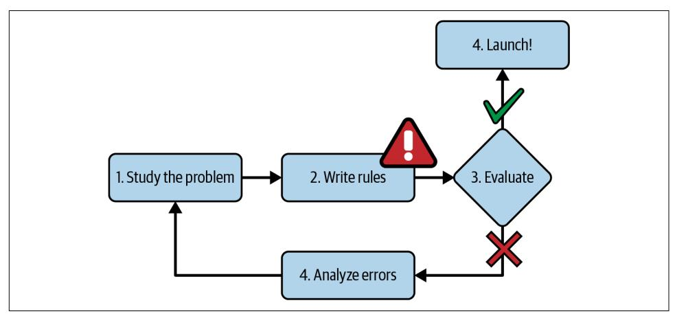

Figure 1-1. The traditional approach

Since the problem is difficult, your program will likely become a long list of complex rules-pretty hard to maintain.

In contrast, a spam filter based on machine learning techniques automatically learns which words and phrases are good predictors of spam by detecting unusually frequent patterns of words in the spam examples compared to the ham examples (Figure 1-2). The program is much shorter, easier to maintain, and most likely more accurate.

{33}------------------------------------------------

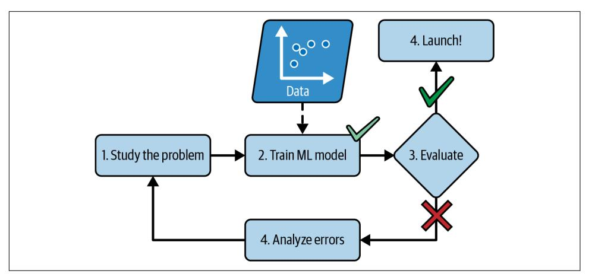

Figure 1-2. The machine learning approach

What if spammers notice that all their emails containing "4U" are blocked? They might start writing "For U" instead. A spam filter using traditional programming techniques would need to be updated to flag "For U" emails. If spammers keep working around your spam filter, you will need to keep writing new rules forever.

In contrast, a spam filter based on machine learning techniques automatically notices that "For U" has become unusually frequent in spam flagged by users, and it starts flagging them without your intervention (Figure 1-3).

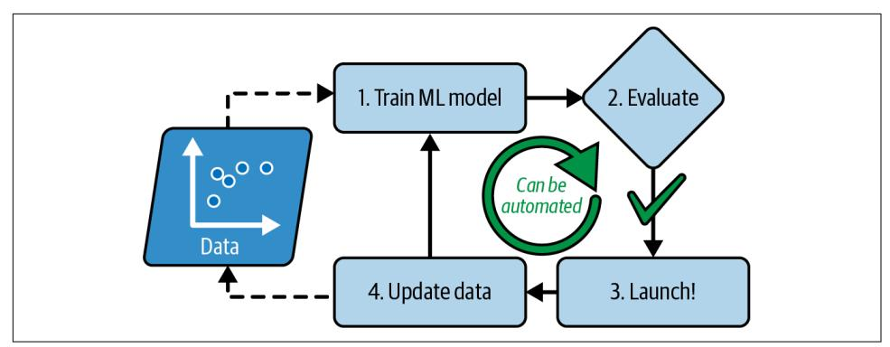

Figure 1-3. Automatically adapting to change

Another area where machine learning shines is for problems that either are too complex for traditional approaches or have no known algorithm. For example, consider speech recognition. Say you want to start simple and write a program capable of distinguishing the words "one" and "two". You might notice that the word "two" starts with a high-pitch sound ("T"), so you could hardcode an algorithm that measures high-pitch sound intensity and use that to distinguish ones and twos—but obviously 

{34}------------------------------------------------

this technique will not scale to thousands of words spoken by millions of very different people in noisy environments and in dozens of languages. The best solution (at least today) is to write an algorithm that learns by itself, given many example recordings for each word.

Finally, machine learning can help humans learn (Figure 1-4). ML models can be inspected to see what they have learned (although for some models this can be tricky). For instance, once a spam filter has been trained on enough spam, it can easily be inspected to reveal the list of words and combinations of words that it believes are the best predictors of spam. Sometimes this will reveal unsuspected correlations or new trends, and thereby lead to a better understanding of the problem. Digging into large amounts of data to discover hidden patterns is called *data* mining, and machine learning excels at it.

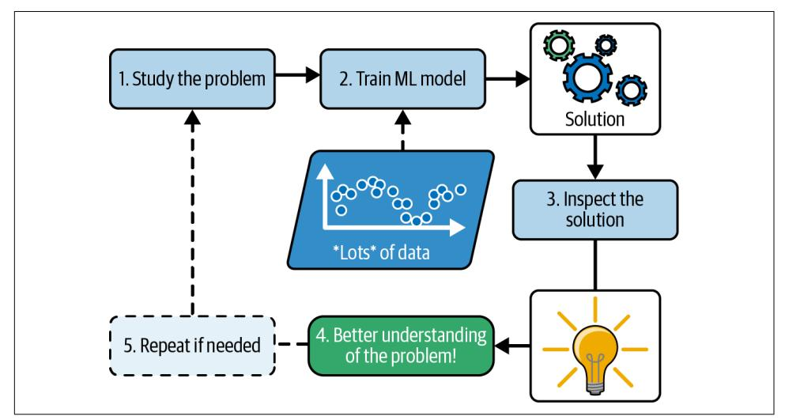

Figure 1-4. Machine learning can help humans learn

To summarize, machine learning is great for:

- Problems for which existing solutions require a lot of fine-tuning or long lists of rules (a machine learning model can often simplify code and perform better than the traditional approach)
- Complex problems for which using a traditional approach yields no good solution (the best machine learning techniques can perhaps find a solution)
- Fluctuating environments (a machine learning system can easily be retrained on new data, always keeping it up to date)
- Getting insights about complex problems and large amounts of data

{35}------------------------------------------------

### **Examples of Applications**

Let's look at some concrete examples of machine learning tasks, along with the techniques that can tackle them:

Analyzing images of products on a production line to automatically classify them

This is image classification, typically performed using convolutional neural networks (CNNs; see Chapter 14) or sometimes transformers (see Chapter 16).

Detecting tumors in brain scans

This is semantic image segmentation, where each pixel in the image is classified (as we want to determine the exact location and shape of tumors), typically using CNNs or transformers.

Automatically classifying news articles

This is natural language processing (NLP), and more specifically text classification, which can be tackled using recurrent neural networks (RNNs) and CNNs, but transformers work even better (see Chapter 16).

- Automatically flagging offensive comments on discussion forums This is also text classification, using the same NLP tools.
- Summarizing long documents automatically

This is a branch of NLP called text summarization, again using the same tools.

Creating a chatbot or a personal assistant

This involves many NLP components, including natural language understanding (NLU) and question-answering modules.

Forecasting your company's revenue next year, based on many performance metrics This is a regression task (i.e., predicting values) that may be tackled using any regression model, such as a linear regression or polynomial regression model (see Chapter 4), a regression support vector machine (see Chapter 5), a regression random forest (see Chapter 7), or an artificial neural network (see Chapter 10). If you want to take into account sequences of past performance metrics, you may want to use RNNs, CNNs, or transformers (see Chapters 15 and 16).

Making your app react to voice commands

This is speech recognition, which requires processing audio samples: since they are long and complex sequences, they are typically processed using RNNs, CNNs, or transformers (see Chapters 15 and 16).

Detecting credit card fraud

This is anomaly detection, which can be tackled using isolation forests, Gaussian mixture models (see Chapter 9), or autoencoders (see Chapter 17).

{36}------------------------------------------------

Segmenting clients based on their purchases so that you can design a different marketing strategy for each segment

This is clustering, which can be achieved using k-means, DBSCAN, and more (see Chapter 9).

- Representing a complex, high-dimensional dataset in a clear and insightful diagram This is data visualization, often involving dimensionality reduction techniques (see Chapter 8).
- Recommending a product that a client may be interested in, based on past purchases This is a recommender system. One approach is to feed past purchases (and other information about the client) to an artificial neural network (see Chapter 10), and get it to output the most likely next purchase. This neural net would typically be trained on past sequences of purchases across all clients.

Building an intelligent bot for a game

This is often tackled using reinforcement learning (RL; see Chapter 18), which is a branch of machine learning that trains agents (such as bots) to pick the actions that will maximize their rewards over time (e.g., a bot may get a reward every time the player loses some life points), within a given environment (such as the game). The famous AlphaGo program that beat the world champion at the game of Go was built using RL.

This list could go on and on, but hopefully it gives you a sense of the incredible breadth and complexity of the tasks that machine learning can tackle, and the types of techniques that you would use for each task.

## **Types of Machine Learning Systems**

There are so many different types of machine learning systems that it is useful to classify them in broad categories, based on the following criteria:

- How they are supervised during training (supervised, unsupervised, semisupervised, self-supervised, and others)
- Whether or not they can learn incrementally on the fly (online versus batch learning)
- Whether they work by simply comparing new data points to known data points, or instead by detecting patterns in the training data and building a predictive model, much like scientists do (instance-based versus model-based learning)

These criteria are not exclusive; you can combine them in any way you like. For example, a state-of-the-art spam filter may learn on the fly using a deep neural network model trained using human-provided examples of spam and ham; this makes it an online, model-based, supervised learning system.

{37}------------------------------------------------

Let's look at each of these criteria a bit more closely.

### **Training Supervision**

ML systems can be classified according to the amount and type of supervision they get during training. There are many categories, but we'll discuss the main ones: supervised learning, unsupervised learning, self-supervised learning, semi-supervised learning, and reinforcement learning.

#### **Supervised learning**

In *supervised learning*, the training set you feed to the algorithm includes the desired solutions, called *labels* (Figure 1-5).

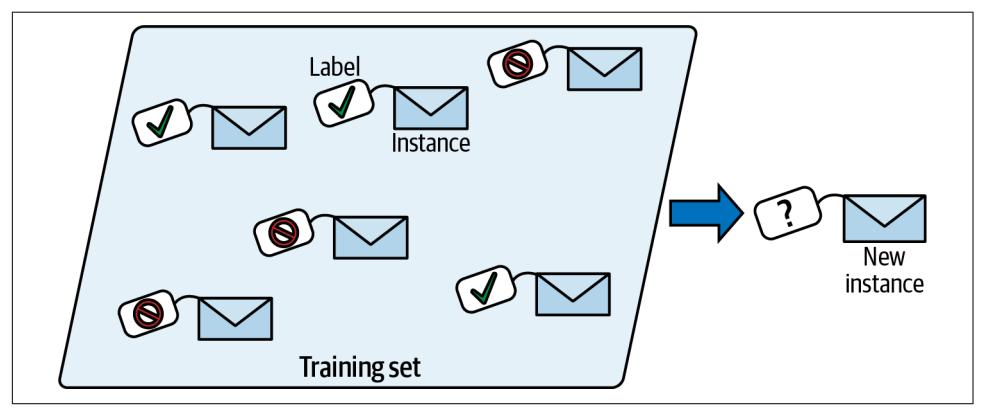

Figure 1-5. A labeled training set for spam classification (an example of supervised learning)

A typical supervised learning task is *classification*. The spam filter is a good example of this: it is trained with many example emails along with their class (spam or ham), and it must learn how to classify new emails.

Another typical task is to predict a *target* numeric value, such as the price of a car, given a set of *features* (mileage, age, brand, etc.). This sort of task is called regression (Figure 1-6).<sup>1</sup> To train the system, you need to give it many examples of cars, including both their features and their targets (i.e., their prices).

Note that some regression models can be used for classification as well, and vice versa. For example, logistic regression is commonly used for classification, as it can

<sup>1</sup> Fun fact: this odd-sounding name is a statistics term introduced by Francis Galton while he was studying the fact that the children of tall people tend to be shorter than their parents. Since the children were shorter, he called this regression to the mean. This name was then applied to the methods he used to analyze correlations between variables.

{38}------------------------------------------------

output a value that corresponds to the probability of belonging to a given class (e.g., 20% chance of being spam).

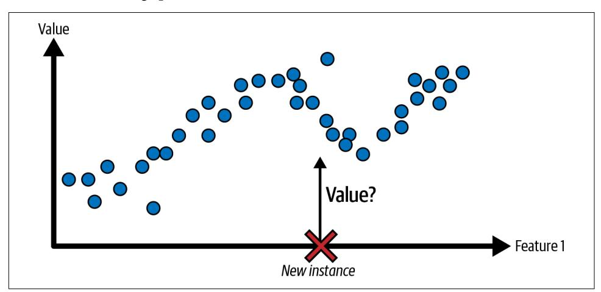

Figure 1-6. A regression problem: predict a value, given an input feature (there are usually multiple input features, and sometimes multiple output values)


The words target and label are generally treated as synonyms in supervised learning, but target is more common in regression tasks and label is more common in classification tasks. Moreover, features are sometimes called predictors or attributes. These terms may refer to individual samples (e.g., "this car's mileage feature is equal to 15,000") or to all samples (e.g., "the mileage feature is strongly correlated with price").

#### **Unsupervised learning**

In *unsupervised learning*, as you might guess, the training data is unlabeled (Figure 1-7). The system tries to learn without a teacher.

For example, say you have a lot of data about your blog's visitors. You may want to run a *clustering* algorithm to try to detect groups of similar visitors (Figure 1-8). At no point do you tell the algorithm which group a visitor belongs to: it finds those connections without your help. For example, it might notice that 40% of your visitors are teenagers who love comic books and generally read your blog after school, while 20% are adults who enjoy sci-fi and who visit during the weekends. If you use a *hierarchical clustering* algorithm, it may also subdivide each group into smaller groups. This may help you target your posts for each group.

{39}------------------------------------------------

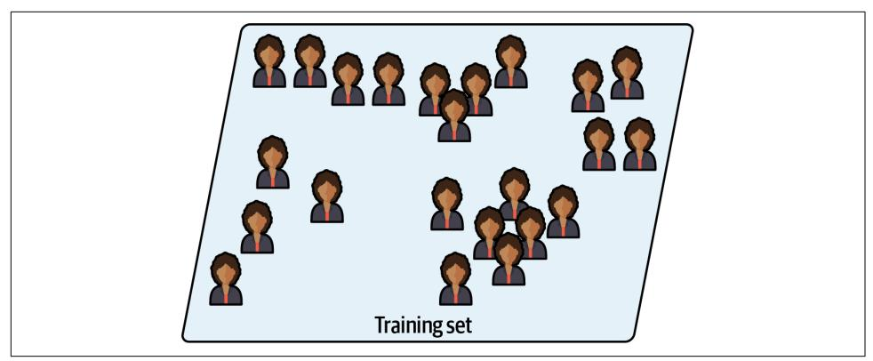

Figure 1-7. An unlabeled training set for unsupervised learning

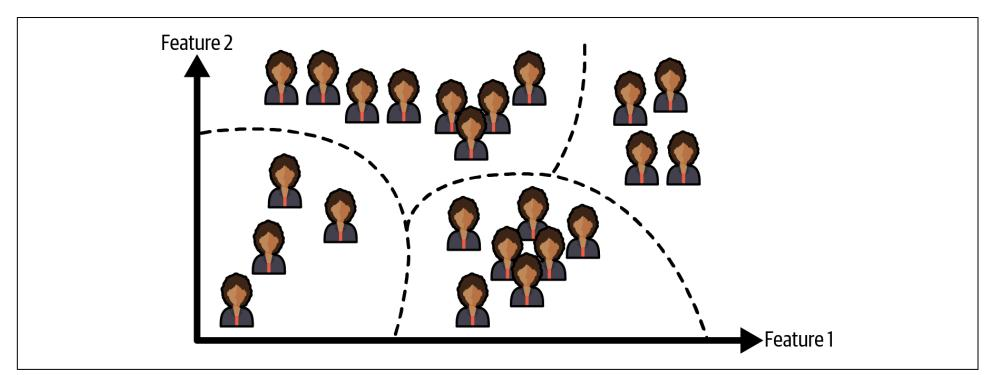

Figure 1-8. Clustering

Visualization algorithms are also good examples of unsupervised learning: you feed them a lot of complex and unlabeled data, and they output a 2D or 3D representation of your data that can easily be plotted (Figure 1-9). These algorithms try to preserve as much structure as they can (e.g., trying to keep separate clusters in the input space from overlapping in the visualization) so that you can understand how the data is organized and perhaps identify unsuspected patterns.

A related task is *dimensionality reduction*, in which the goal is to simplify the data without losing too much information. One way to do this is to merge several correlated features into one. For example, a car's mileage may be strongly correlated with its age, so the dimensionality reduction algorithm will merge them into one feature that represents the car's wear and tear. This is called *feature extraction*.

{40}------------------------------------------------

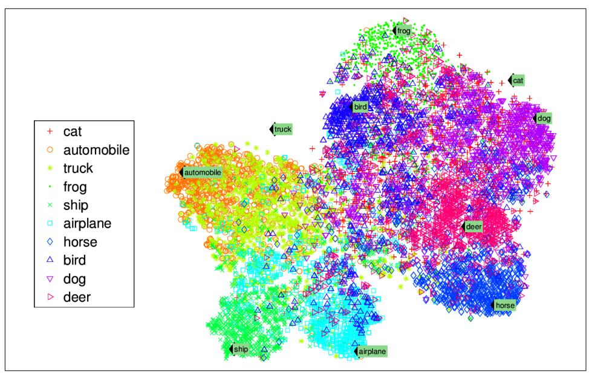

Figure 1-9. Example of a t-SNE visualization highlighting semantic clusters<sup>2</sup>


It is often a good idea to try to reduce the number of dimensions in your training data using a dimensionality reduction algorithm before you feed it to another machine learning algorithm (such as a supervised learning algorithm). It will run much faster, the data will take up less disk and memory space, and in some cases it may also perform better.

Yet another important unsupervised task is *anomaly detection*—for example, detecting unusual credit card transactions to prevent fraud, catching manufacturing defects, or automatically removing outliers from a dataset before feeding it to another learning algorithm. The system is shown mostly normal instances during training, so it learns to recognize them; then, when it sees a new instance, it can tell whether it looks like a normal one or whether it is likely an anomaly (see Figure 1-10). A very similar task is novelty detection: it aims to detect new instances that look different from all instances in the training set. This requires having a very "clean" training set, devoid of any instance that you would like the algorithm to detect. For example, if you have thousands of pictures of dogs, and 1% of these pictures represent Chihuahuas, then a

<sup>2</sup> Notice how animals are rather well separated from vehicles and how horses are close to deer but far from birds. Figure reproduced with permission from Richard Socher et al., "Zero-Shot Learning Through Cross-Modal Transfer", Proceedings of the 26th International Conference on Neural Information Processing Systems 1 (2013): 935-943.

{41}------------------------------------------------

novelty detection algorithm should not treat new pictures of Chihuahuas as novelties. On the other hand, anomaly detection algorithms may consider these dogs as so rare and so different from other dogs that they would likely classify them as anomalies (no offense to Chihuahuas).

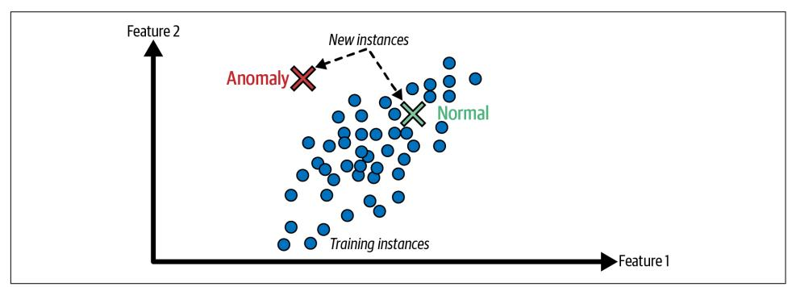

Figure 1-10. Anomaly detection

Finally, another common unsupervised task is *association rule learning*, in which the goal is to dig into large amounts of data and discover interesting relations between attributes. For example, suppose you own a supermarket. Running an association rule on your sales logs may reveal that people who purchase barbecue sauce and potato chips also tend to buy steak. Thus, you may want to place these items close to one another.

#### Semi-supervised learning

Since labeling data is usually time-consuming and costly, you will often have plenty of unlabeled instances, and few labeled instances. Some algorithms can deal with data that's partially labeled. This is called semi-supervised learning (Figure 1-11).

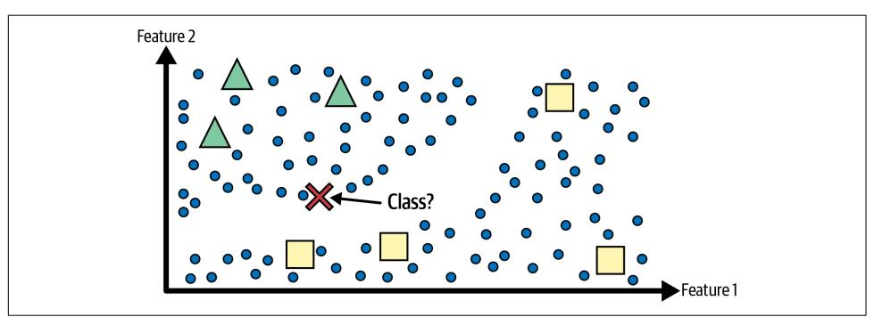

Figure 1-11. Semi-supervised learning with two classes (triangles and squares): the unlabeled examples (circles) help classify a new instance (the cross) into the triangle class rather than the square class, even though it is closer to the labeled squares

{42}------------------------------------------------

Some photo-hosting services, such as Google Photos, are good examples of this. Once you upload all your family photos to the service, it automatically recognizes that the same person A shows up in photos 1, 5, and 11, while another person B shows up in photos 2, 5, and 7. This is the unsupervised part of the algorithm (clustering). Now all the system needs is for you to tell it who these people are. Just add one label per person<sup>3</sup> and it is able to name everyone in every photo, which is useful for searching photos.

Most semi-supervised learning algorithms are combinations of unsupervised and supervised algorithms. For example, a clustering algorithm may be used to group similar instances together, and then every unlabeled instance can be labeled with the most common label in its cluster. Once the whole dataset is labeled, it is possible to use any supervised learning algorithm.

#### Self-supervised learning

Another approach to machine learning involves actually generating a fully labeled dataset from a fully unlabeled one. Again, once the whole dataset is labeled, any supervised learning algorithm can be used. This approach is called *self-supervised* learning.

For example, if you have a large dataset of unlabeled images, you can randomly mask a small part of each image and then train a model to recover the original image (Figure 1-12). During training, the masked images are used as the inputs to the model, and the original images are used as the labels.


Figure 1-12. Self-supervised learning example: input (left) and target (right)

<sup>3</sup> That's when the system works perfectly. In practice it often creates a few clusters per person, and sometimes mixes up two people who look alike, so you may need to provide a few labels per person and manually clean up some clusters.

{43}------------------------------------------------

The resulting model may be quite useful in itself—for example, to repair damaged images or to erase unwanted objects from pictures. But more often than not, a model trained using self-supervised learning is not the final goal. You'll usually want to tweak and fine-tune the model for a slightly different task—one that you actually care about.

For example, suppose that what you really want is to have a pet classification model: given a picture of any pet, it will tell you what species it belongs to. If you have a large dataset of unlabeled photos of pets, you can start by training an image-repairing model using self-supervised learning. Once it's performing well, it should be able to distinguish different pet species: when it repairs an image of a cat whose face is masked, it must know not to add a dog's face. Assuming your model's architecture allows it (and most neural network architectures do), it is then possible to tweak the model so that it predicts pet species instead of repairing images. The final step consists of fine-tuning the model on a labeled dataset: the model already knows what cats, dogs, and other pet species look like, so this step is only needed so the model can learn the mapping between the species it already knows and the labels we expect from it.


Transferring knowledge from one task to another is called transfer learning, and it's one of the most important techniques in machine learning today, especially when using deep neural networks (i.e., neural networks composed of many layers of neurons). We will discuss this in detail in Part II.

Some people consider self-supervised learning to be a part of unsupervised learning, since it deals with fully unlabeled datasets. But self-supervised learning uses (generated) labels during training, so in that regard it's closer to supervised learning. And the term "unsupervised learning" is generally used when dealing with tasks like clustering, dimensionality reduction, or anomaly detection, whereas self-supervised learning focuses on the same tasks as supervised learning: mainly classification and regression. In short, it's best to treat self-supervised learning as its own category.

#### **Reinforcement learning**

Reinforcement learning is a very different beast. The learning system, called an agent in this context, can observe the environment, select and perform actions, and get rewards in return (or penalties in the form of negative rewards, as shown in Figure 1-13). It must then learn by itself what is the best strategy, called a *policy*, to get the most reward over time. A policy defines what action the agent should choose when it is in a given situation.

{44}------------------------------------------------

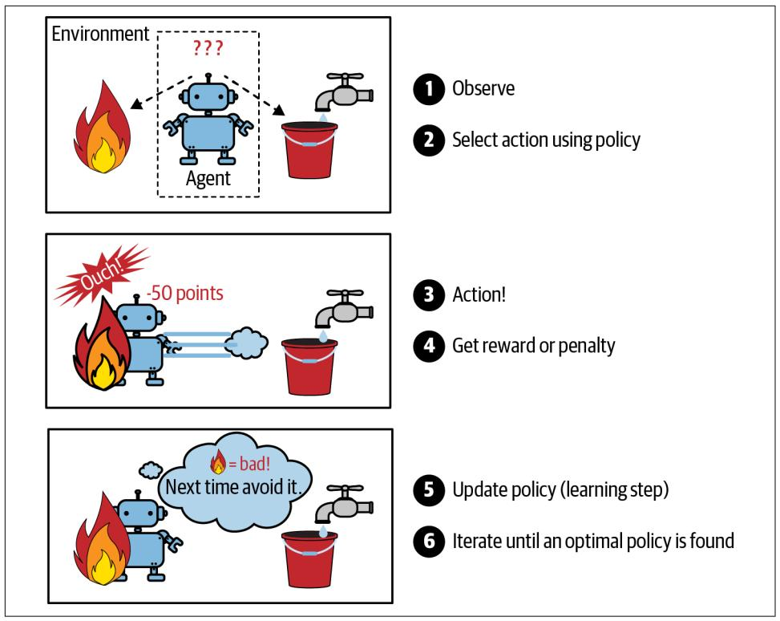

Figure 1-13. Reinforcement learning

For example, many robots implement reinforcement learning algorithms to learn how to walk. DeepMind's AlphaGo program is also a good example of reinforcement learning: it made the headlines in May 2017 when it beat Ke Jie, the number one ranked player in the world at the time, at the game of Go. It learned its winning policy by analyzing millions of games, and then playing many games against itself. Note that learning was turned off during the games against the champion; AlphaGo was just applying the policy it had learned. As you will see in the next section, this is called offline learning.

### **Batch Versus Online Learning**

Another criterion used to classify machine learning systems is whether or not the system can learn incrementally from a stream of incoming data.

{45}------------------------------------------------

#### **Batch learning**

In batch learning, the system is incapable of learning incrementally: it must be trained using all the available data. This will generally take a lot of time and computing resources, so it is typically done offline. First the system is trained, and then it is launched into production and runs without learning anymore; it just applies what it has learned. This is called *offline learning*.

Unfortunately, a model's performance tends to decay slowly over time, simply because the world continues to evolve while the model remains unchanged. This phenomenon is often called *model rot* or *data drift*. The solution is to regularly retrain the model on up-to-date data. How often you need to do that depends on the use case; if the model classifies pictures of cats and dogs, its performance will decay very slowly, but if the model deals with fast-evolving systems, for example making predictions on the financial market, then it is likely to decay quite fast.


Even a model trained to classify pictures of cats and dogs may need to be retrained regularly, not because cats and dogs will mutate overnight, but because cameras keep changing, along with image formats, sharpness, brightness, and size ratios. Moreover, people may love different breeds next year, or they may decide to dress their pets with tiny hats-who knows?

If you want a batch learning system to know about new data (such as a new type of spam), you need to train a new version of the system from scratch on the full dataset (not just the new data, but also the old data), then replace the old model with the new one. Fortunately, the whole process of training, evaluating, and launching a machine learning system can be automated fairly easily (as we saw in Figure 1-3), so even a batch learning system can adapt to change. Simply update the data and train a new version of the system from scratch as often as needed.

This solution is simple and often works fine, but training using the full set of data can take many hours, so you would typically train a new system only every 24 hours or even just weekly. If your system needs to adapt to rapidly changing data (e.g., to predict stock prices), then you need a more reactive solution.

Also, training on the full set of data requires a lot of computing resources (CPU, memory space, disk space, disk I/O, network I/O, etc.). If you have a lot of data and you automate your system to train from scratch every day, it will end up costing you a lot of money. If the amount of data is huge, it may even be impossible to use a batch learning algorithm.

{46}------------------------------------------------

Finally, if your system needs to be able to learn autonomously and it has limited resources (e.g., a smartphone application or a rover on Mars), then carrying around large amounts of training data and taking up a lot of resources to train for hours every day is a showstopper.

A better option in all these cases is to use algorithms that are capable of learning incrementally.

#### **Online learning**

In online learning, you train the system incrementally by feeding it data instances sequentially, either individually or in small groups called mini-batches. Each learning step is fast and cheap, so the system can learn about new data on the fly, as it arrives (see Figure 1-14).

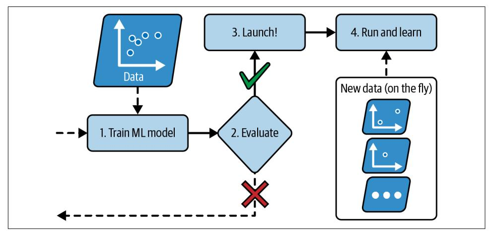

Figure 1-14. In online learning, a model is trained and launched into production, and then it keeps learning as new data comes in

Online learning is useful for systems that need to adapt to change extremely rapidly (e.g., to detect new patterns in the stock market). It is also a good option if you have limited computing resources; for example, if the model is trained on a mobile device.

Additionally, online learning algorithms can be used to train models on huge datasets that cannot fit in one machine's main memory (this is called *out-of-core* learning). The algorithm loads part of the data, runs a training step on that data, and repeats the process until it has run on all of the data (see Figure 1-15).

{47}------------------------------------------------

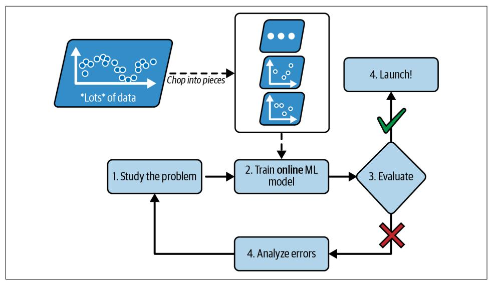

Figure 1-15. Using online learning to handle huge datasets

One important parameter of online learning systems is how fast they should adapt to changing data: this is called the *learning rate*. If you set a high learning rate, then your system will rapidly adapt to new data, but it will also tend to quickly forget the old data (and you don't want a spam filter to flag only the latest kinds of spam it was shown). Conversely, if you set a low learning rate, the system will have more inertia; that is, it will learn more slowly, but it will also be less sensitive to noise in the new data or to sequences of nonrepresentative data points (outliers).


Out-of-core learning is usually done offline (i.e., not on the live system), so online learning can be a confusing name. Think of it as incremental learning.

A big challenge with online learning is that if bad data is fed to the system, the system's performance will decline, possibly quickly (depending on the data quality and learning rate). If it's a live system, your clients will notice. For example, bad data could come from a bug (e.g., a malfunctioning sensor on a robot), or it could come from someone trying to game the system (e.g., spamming a search engine to try to rank high in search results). To reduce this risk, you need to monitor your system closely and promptly switch learning off (and possibly revert to a previously working state) if you detect a drop in performance. You may also want to monitor the input data and react to abnormal data; for example, using an anomaly detection algorithm (see Chapter 9).

{48}------------------------------------------------

### **Instance-Based Versus Model-Based Learning**

One more way to categorize machine learning systems is by how they *generalize*. Most machine learning tasks are about making predictions. This means that given a number of training examples, the system needs to be able to make good predictions for (generalize to) examples it has never seen before. Having a good performance measure on the training data is good, but insufficient; the true goal is to perform well on new instances.

There are two main approaches to generalization: instance-based learning and model-based learning.

#### Instance-based learning

Possibly the most trivial form of learning is simply to learn by heart. If you were to create a spam filter this way, it would just flag all emails that are identical to emails that have already been flagged by users—not the worst solution, but certainly not the best.

Instead of just flagging emails that are identical to known spam emails, your spam filter could be programmed to also flag emails that are very similar to known spam emails. This requires a *measure of similarity* between two emails. A (very basic) similarity measure between two emails could be to count the number of words they have in common. The system would flag an email as spam if it has many words in common with a known spam email.

This is called *instance-based learning*: the system learns the examples by heart, then generalizes to new cases by using a similarity measure to compare them to the learned examples (or a subset of them). For example, in Figure 1-16 the new instance would be classified as a triangle because the majority of the most similar instances belong to that class.

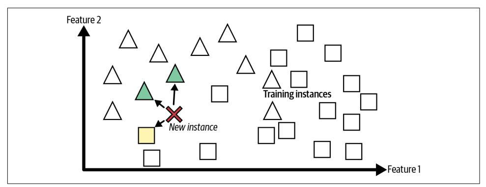

Figure 1-16. Instance-based learning

{49}------------------------------------------------

#### Model-based learning and a typical machine learning workflow

Another way to generalize from a set of examples is to build a model of these examples and then use that model to make predictions. This is called model-based learning (Figure 1-17).

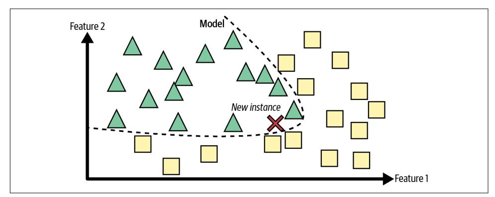

Figure 1-17. Model-based learning

For example, suppose you want to know if money makes people happy, so you download the Better Life Index data from the OECD's website and World Bank stats about gross domestic product (GDP) per capita. Then you join the tables and sort by GDP per capita. Table 1-1 shows an excerpt of what you get.

Table 1-1. Does money make people happier?

| Country              | GDP per capita (USD) Life satisfaction |     |
|----------------------|----------------------------------------|-----|
| Turkey               | 28,384                                 | 5.5 |
| Hungary              | 31,008                                 | 5.6 |
| France               | 42,026                                 | 6.5 |
| <b>United States</b> | 60,236                                 | 6.9 |
| New Zealand          | 42,404                                 | 7.3 |
| Australia            | 48,698                                 | 7.3 |
| Denmark              | 55,938                                 | 7.6 |

Let's plot the data for these countries (Figure 1-18).

{50}------------------------------------------------

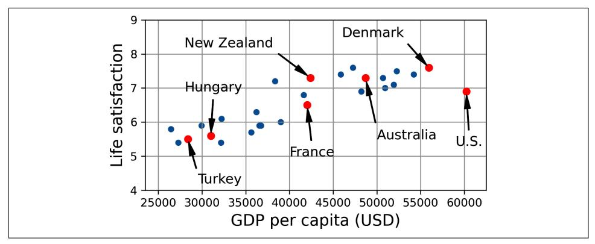

Figure 1-18. Do you see a trend here?

There does seem to be a trend here! Although the data is *noisy* (i.e., partly random), it looks like life satisfaction goes up more or less linearly as the country's GDP per capita increases. So you decide to model life satisfaction as a linear function of GDP per capita. This step is called model selection: you selected a linear model of life satisfaction with just one attribute, GDP per capita (Equation 1-1).

Equation 1-1. A simple linear model life\_satisfaction =  $\theta_0 + \theta_1 \times$  GDP\_per\_capita

This model has two *model parameters*,  $\theta_0$  and  $\theta_1$ .<sup>4</sup> By tweaking these parameters, you can make your model represent any linear function, as shown in Figure 1-19.

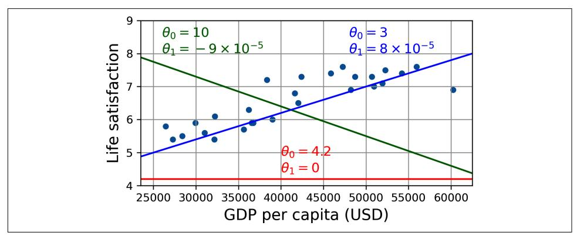

Figure 1-19. A few possible linear models

<sup>4</sup> By convention, the Greek letter  $\theta$  (theta) is frequently used to represent model parameters.

{51}------------------------------------------------

Before you can use your model, you need to define the parameter values  $\theta_0$  and  $\theta_1$ . How can you know which values will make your model perform best? To answer this question, you need to specify a performance measure. You can either define a *utility* function (or fitness function) that measures how good your model is, or you can define a cost function that measures how bad it is. For linear regression problems, people typically use a cost function that measures the distance between the linear model's predictions and the training examples; the objective is to minimize this distance.

This is where the linear regression algorithm comes in: you feed it your training examples, and it finds the parameters that make the linear model fit best to your data. This is called *training* the model. In our case, the algorithm finds that the optimal parameter values are  $\theta_0$  = 3.75 and  $\theta_1$  = 6.78 × 10<sup>-5</sup>.


Confusingly, the word "model" can refer to a type of model (e.g., linear regression), to a fully specified model architecture (e.g., linear regression with one input and one output), or to the final trained model ready to be used for predictions (e.g., linear regression with one input and one output, using  $\theta_0 = 3.75$  and  $\theta_1 = 6.78 \times 10^{-5}$ ). Model selection consists in choosing the type of model and fully specifying its architecture. Training a model means running an algorithm to find the model parameters that will make it best fit the training data, and hopefully make good predictions on new data.

Now the model fits the training data as closely as possible (for a linear model), as you can see in Figure 1-20.

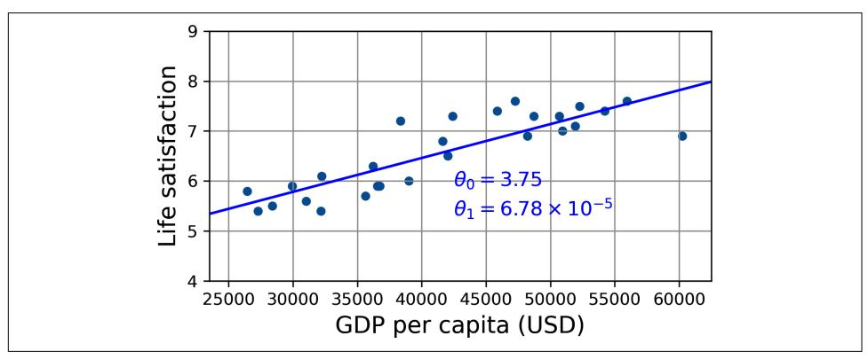

Figure 1-20. The linear model that fits the training data best

{52}------------------------------------------------

You are finally ready to run the model to make predictions. For example, say you want to know how happy Cypriots are, and the OECD data does not have the answer. Fortunately, you can use your model to make a good prediction: you look up Cyprus's GDP per capita, find \$37,655, and then apply your model and find that life satisfaction is likely to be somewhere around  $3.75 + 37,655 \times 6.78 \times 10^{-5} = 6.30$ .

To whet your appetite, Example 1-1 shows the Python code that loads the data, separates the inputs X from the labels y, creates a scatterplot for visualization, and then trains a linear model and makes a prediction.<sup>5</sup>

Example 1-1. Training and running a linear model using Scikit-Learn

```
import matplotlib.pyplot as plt
import numpy as np
import pandas as pd
from sklearn.linear_model import LinearRegression
# Download and prepare the data
data\_root = "https://github.com/ageron/data/raw/main"lifesat = pd.read_csv(data_root + "lifesat/lifesat.csv")
X = \text{lifesat}[[\text{``GDP per capita (USD)''}]].valuesy = lifesat[["Life satisfaction"]].values# Visualize the data
lifesat.plot(kind='scatter', grid=True,
             x="GDP per capita (USD)", y="Life satisfaction")
plt.axis([23_500, 62_500, 4, 9])
plt.show()
# Select a linear model
model = LinearRegression()# Train the model
model.fit(X, y)# Make a prediction for Cyprus
X new = [37 655.2] # Cyprus' GDP per capita in 2020
print(model.predict(X new)) # output: [6.30165767]
```

<sup>5</sup> It's OK if you don't understand all the code yet; I will present Scikit-Learn in the following chapters.

{53}------------------------------------------------


If you had used an instance-based learning algorithm instead, you would have found that Israel has the closest GDP per capita to that of Cyprus (\$38,341), and since the OECD data tells us that Israelis' life satisfaction is 7.2, you would have predicted a life satisfaction of 7.2 for Cyprus. If you zoom out a bit and look at the two next-closest countries, you will find Lithuania and Slovenia, both with a life satisfaction of 5.9. Averaging these three values, you get 6.33, which is pretty close to your model-based prediction. This simple algorithm is called *k-nearest neighbors* regression (in this example,  $k = 3$ ).

Replacing the linear regression model with  $k$ -nearest neighbors regression in the previous code is as easy as replacing these lines:

```
from sklearn.linear_model import LinearRegression
model = LinearRegression()
```

with these two:

```
from sklearn.neighbors import KNeighborsRegressor
model = KNeighborsRequest(n\nneighbors=3)
```

If all went well, your model will make good predictions. If not, you may need to use more attributes (employment rate, health, air pollution, etc.), get more or betterquality training data, or perhaps select a more powerful model (e.g., a polynomial regression model).

In summary:

- You studied the data
- You selected a model.
- You trained it on the training data (i.e., the learning algorithm searched for the model parameter values that minimize a cost function).
- Finally, you applied the model to make predictions on new cases (this is called inference), hoping that this model will generalize well.

This is what a typical machine learning project looks like. In Chapter 2 you will experience this firsthand by going through a project end to end.

We have covered a lot of ground so far: you now know what machine learning is really about, why it is useful, what some of the most common categories of ML systems are, and what a typical project workflow looks like. Now let's look at what can go wrong in learning and prevent you from making accurate predictions.

{54}------------------------------------------------

## **Main Challenges of Machine Learning**

In short, since your main task is to select a model and train it on some data, the two things that can go wrong are "bad model" and "bad data". Let's start with examples of bad data.

### **Insufficient Quantity of Training Data**

For a toddler to learn what an apple is, all it takes is for you to point to an apple and say "apple" (possibly repeating this procedure a few times). Now the child is able to recognize apples in all sorts of colors and shapes. Genius.

Machine learning is not quite there yet; it takes a lot of data for most machine learning algorithms to work properly. Even for very simple problems you typically need thousands of examples, and for complex problems such as image or speech recognition you may need millions of examples (unless you can reuse parts of an existing model).

#### The Unreasonable Effectiveness of Data

In a famous paper published in 2001, Microsoft researchers Michele Banko and Eric Brill showed that very different machine learning algorithms, including fairly simple ones, performed almost identically well on a complex problem of natural language disambiguation<sup>6</sup> once they were given enough data (as you can see in Figure 1-21).

As the authors put it, "these results suggest that we may want to reconsider the tradeoff between spending time and money on algorithm development versus spending it on corpus development".

The idea that data matters more than algorithms for complex problems was further popularized by Peter Norvig et al. in a paper titled "The Unreasonable Effectiveness of Data", published in 2009.7 It should be noted, however, that small and medium-sized datasets are still very common, and it is not always easy or cheap to get extra training data-so don't abandon algorithms just yet.

<sup>6</sup> For example, knowing whether to write "to", "two", or "too", depending on the context.

<sup>7</sup> Peter Norvig et al., "The Unreasonable Effectiveness of Data", IEEE Intelligent Systems 24, no. 2 (2009): 8-12.

{55}------------------------------------------------

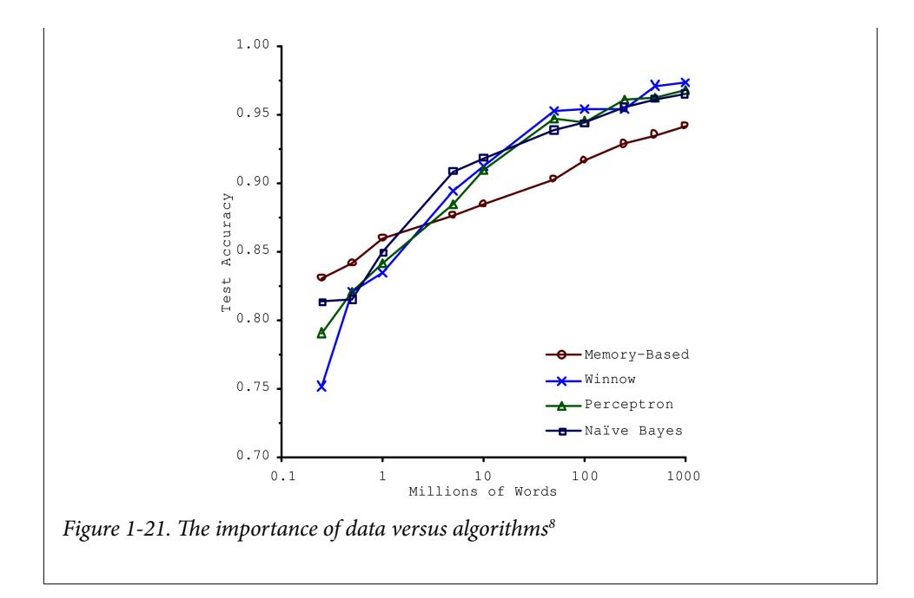

#### **Nonrepresentative Training Data**

In order to generalize well, it is crucial that your training data be representative of the new cases you want to generalize to. This is true whether you use instance-based learning or model-based learning.

For example, the set of countries you used earlier for training the linear model was not perfectly representative; it did not contain any country with a GDP per capita lower than \$23,500 or higher than \$62,500. Figure 1-22 shows what the data looks like when you add such countries.

If you train a linear model on this data, you get the solid line, while the old model is represented by the dotted line. As you can see, not only does adding a few missing countries significantly alter the model, but it makes it clear that such a simple linear model is probably never going to work well. It seems that very rich countries are not happier than moderately rich countries (in fact, they seem slightly unhappier!), and conversely some poor countries seem happier than many rich countries.

By using a nonrepresentative training set, you trained a model that is unlikely to make accurate predictions, especially for very poor and very rich countries.

<sup>8</sup> Figure reproduced with permission from Michele Banko and Eric Brill, "Scaling to Very Very Large Corpora for Natural Language Disambiguation", Proceedings of the 39th Annual Meeting of the Association for Computational Linguistics (2001): 26-33.

{56}------------------------------------------------

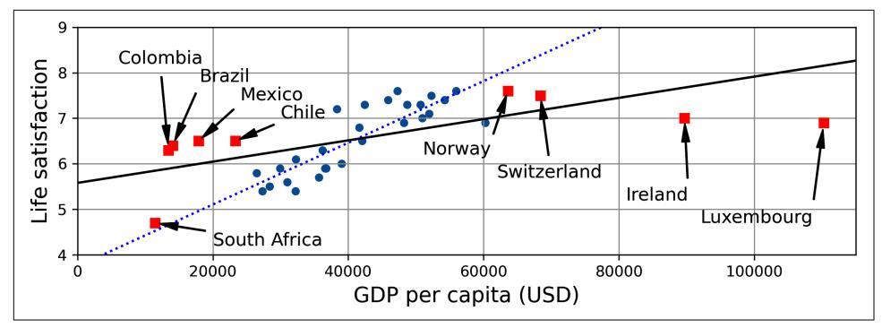

Figure 1-22. A more representative training sample

It is crucial to use a training set that is representative of the cases you want to generalize to. This is often harder than it sounds: if the sample is too small, you will have sampling noise (i.e., nonrepresentative data as a result of chance), but even very large samples can be nonrepresentative if the sampling method is flawed. This is called sampling bias.

#### **Examples of Sampling Bias**

Perhaps the most famous example of sampling bias happened during the US presidential election in 1936, which pitted Landon against Roosevelt: the Literary Digest conducted a very large poll, sending mail to about 10 million people. It got 2.4 million answers, and predicted with high confidence that Landon would get 57% of the votes. Instead, Roosevelt won with 62% of the votes. The flaw was in the Literary Digest's sampling method:

- First, to obtain the addresses to send the polls to, the Literary Digest used telephone directories, lists of magazine subscribers, club membership lists, and the like. All of these lists tended to favor wealthier people, who were more likely to vote Republican (hence Landon).
- Second, less than 25% of the people who were polled answered. Again this introduced a sampling bias, by potentially ruling out people who didn't care much about politics, people who didn't like the Literary Digest, and other key groups. This is a special type of sampling bias called *nonresponse bias*.

Here is another example: say you want to build a system to recognize funk music videos. One way to build your training set is to search for "funk music" on YouTube and use the resulting videos. But this assumes that YouTube's search engine returns a set of videos that are representative of all the funk music videos on YouTube. In reality, the search results are likely to be biased toward popular artists (and if you live

{57}------------------------------------------------

in Brazil you will get a lot of "funk carioca" videos, which sound nothing like James Brown). On the other hand, how else can you get a large training set?

### **Poor-Quality Data**

Obviously, if your training data is full of errors, outliers, and noise (e.g., due to poorquality measurements), it will make it harder for the system to detect the underlying patterns, so your system is less likely to perform well. It is often well worth the effort to spend time cleaning up your training data. The truth is, most data scientists spend a significant part of their time doing just that. The following are a couple examples of when you'd want to clean up training data:

- If some instances are clearly outliers, it may help to simply discard them or try to fix the errors manually.
- If some instances are missing a few features (e.g., 5% of your customers did not specify their age), you must decide whether you want to ignore this attribute altogether, ignore these instances, fill in the missing values (e.g., with the median age), or train one model with the feature and one model without it.

#### **Irrelevant Features**

As the saying goes: garbage in, garbage out. Your system will only be capable of learning if the training data contains enough relevant features and not too many irrelevant ones. A critical part of the success of a machine learning project is coming up with a good set of features to train on. This process, called *feature engineering*, involves the following steps:

- *Feature selection* (selecting the most useful features to train on among existing features)
- Feature extraction (combining existing features to produce a more useful one—as we saw earlier, dimensionality reduction algorithms can help)
- Creating new features by gathering new data

Now that we have looked at many examples of bad data, let's look at a couple examples of bad algorithms.

### **Overfitting the Training Data**

Say you are visiting a foreign country and the taxi driver rips you off. You might be tempted to say that *all* taxi drivers in that country are thieves. Overgeneralizing is something that we humans do all too often, and unfortunately machines can fall into the same trap if we are not careful. In machine learning this is called *overfitting*: it 

{58}------------------------------------------------

means that the model performs well on the training data, but it does not generalize well

Figure 1-23 shows an example of a high-degree polynomial life satisfaction model that strongly overfits the training data. Even though it performs much better on the training data than the simple linear model, would you really trust its predictions?

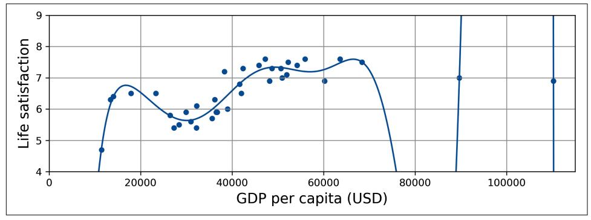

Figure 1-23. Overfitting the training data

Complex models such as deep neural networks can detect subtle patterns in the data, but if the training set is noisy, or if it is too small, which introduces sampling noise, then the model is likely to detect patterns in the noise itself (as in the taxi driver example). Obviously these patterns will not generalize to new instances. For example, say you feed your life satisfaction model many more attributes, including uninformative ones such as the country's name. In that case, a complex model may detect patterns like the fact that all countries in the training data with a  $w$  in their name have a life satisfaction greater than 7: New Zealand (7.3), Norway (7.6), Sweden  $(7.3)$ , and Switzerland  $(7.5)$ . How confident are you that the w-satisfaction rule generalizes to Rwanda or Zimbabwe? Obviously this pattern occurred in the training data by pure chance, but the model has no way to tell whether a pattern is real or simply the result of noise in the data.


Overfitting happens when the model is too complex relative to the amount and noisiness of the training data. Here are possible solutions:

- Simplify the model by selecting one with fewer parameters (e.g., a linear model rather than a high-degree polynomial model), by reducing the number of attributes in the training data, or by constraining the model.
- Gather more training data.
- Reduce the noise in the training data (e.g., fix data errors and remove outliers).

{59}------------------------------------------------

Constraining a model to make it simpler and reduce the risk of overfitting is called regularization. For example, the linear model we defined earlier has two parameters,  $\theta_0$  and  $\theta_1$ . This gives the learning algorithm two *degrees of freedom* to adapt the model to the training data: it can tweak both the height  $(\theta_0)$  and the slope  $(\theta_1)$  of the line. If we forced  $\theta_1 = 0$ , the algorithm would have only one degree of freedom and would have a much harder time fitting the data properly: all it could do is move the line up or down to get as close as possible to the training instances, so it would end up around the mean. A very simple model indeed! If we allow the algorithm to modify  $\theta_1$  but we force it to keep it small, then the learning algorithm will effectively have somewhere in between one and two degrees of freedom. It will produce a model that's simpler than one with two degrees of freedom, but more complex than one with just one. You want to find the right balance between fitting the training data perfectly and keeping the model simple enough to ensure that it will generalize well.

Figure 1-24 shows three models. The dotted line represents the original model that was trained on the countries represented as circles (without the countries represented as squares), the solid line is our second model trained with all countries (circles and squares), and the dashed line is a model trained with the same data as the first model but with a regularization constraint. You can see that regularization forced the model to have a smaller slope: this model does not fit the training data (circles) as well as the first model, but it actually generalizes better to new examples that it did not see during training (squares).

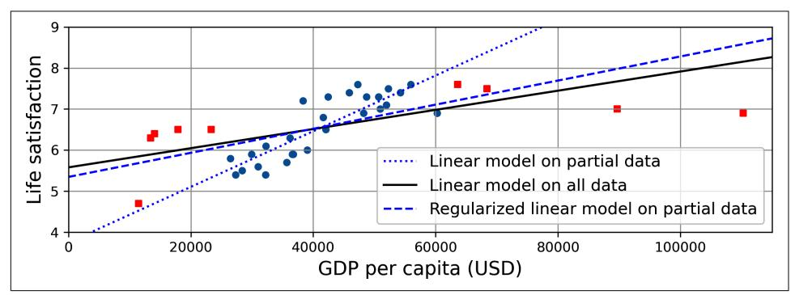

Figure 1-24. Regularization reduces the risk of overfitting

The amount of regularization to apply during learning can be controlled by a *hyperparameter.* A hyperparameter is a parameter of a learning algorithm (not of the model). As such, it is not affected by the learning algorithm itself; it must be set prior to training and remains constant during training. If you set the regularization hyperparameter to a very large value, you will get an almost flat model (a slope close to zero); the learning algorithm will almost certainly not overfit the training data, but it will be less likely to find a good solution. Tuning hyperparameters is an important 

{60}------------------------------------------------

part of building a machine learning system (you will see a detailed example in the next chapter).

### **Underfitting the Training Data**

As you might guess, *underfitting* is the opposite of overfitting: it occurs when your model is too simple to learn the underlying structure of the data. For example, a linear model of life satisfaction is prone to underfit; reality is just more complex than the model, so its predictions are bound to be inaccurate, even on the training examples.

Here are the main options for fixing this problem:

- Select a more powerful model, with more parameters.
- Feed better features to the learning algorithm (feature engineering).
- Reduce the constraints on the model (for example by reducing the regularization hyperparameter).

### **Stepping Back**

By now you know a lot about machine learning. However, we went through so many concepts that you may be feeling a little lost, so let's step back and look at the big picture:

- Machine learning is about making machines get better at some task by learning from data, instead of having to explicitly code rules.
- There are many different types of ML systems: supervised or not, batch or online, instance-based or model-based.
- In an ML project you gather data in a training set, and you feed the training set to a learning algorithm. If the algorithm is model-based, it tunes some parameters to fit the model to the training set (i.e., to make good predictions on the training set itself), and then hopefully it will be able to make good predictions on new cases as well. If the algorithm is instance-based, it just learns the examples by heart and generalizes to new instances by using a similarity measure to compare them to the learned instances.
- The system will not perform well if your training set is too small, or if the data is not representative, is noisy, or is polluted with irrelevant features (garbage in, garbage out). Lastly, your model needs to be neither too simple (in which case it will underfit) nor too complex (in which case it will overfit).

There's just one last important topic to cover: once you have trained a model, you don't want to just "hope" it generalizes to new cases. You want to evaluate it and fine-tune it if necessary. Let's see how to do that.

{61}------------------------------------------------

## **Testing and Validating**

The only way to know how well a model will generalize to new cases is to actually try it out on new cases. One way to do that is to put your model in production and monitor how well it performs. This works well, but if your model is horribly bad, your users will complain—not the best idea.

A better option is to split your data into two sets: the *training set* and the *test set*. As these names imply, you train your model using the training set, and you test it using the test set. The error rate on new cases is called the *generalization error* (or out-of-sample error), and by evaluating your model on the test set, you get an estimate of this error. This value tells you how well your model will perform on instances it has never seen before.

If the training error is low (i.e., your model makes few mistakes on the training set) but the generalization error is high, it means that your model is overfitting the training data.


It is common to use 80% of the data for training and hold out 20% for testing. However, this depends on the size of the dataset: if it contains 10 million instances, then holding out 1% means your test set will contain 100,000 instances, probably more than enough to get a good estimate of the generalization error.

### **Hyperparameter Tuning and Model Selection**

Evaluating a model is simple enough: just use a test set. But suppose you are hesitating between two types of models (say, a linear model and a polynomial model): how can you decide between them? One option is to train both and compare how well they generalize using the test set.

Now suppose that the linear model generalizes better, but you want to apply some regularization to avoid overfitting. The question is, how do you choose the value of the regularization hyperparameter? One option is to train 100 different models using 100 different values for this hyperparameter. Suppose you find the best hyperparameter value that produces a model with the lowest generalization error-say, just 5% error. You launch this model into production, but unfortunately it does not perform as well as expected and produces 15% errors. What just happened?

The problem is that you measured the generalization error multiple times on the test set, and you adapted the model and hyperparameters to produce the best model for that particular set. This means the model is unlikely to perform as well on new data.

A common solution to this problem is called *holdout validation* (Figure 1-25): you simply hold out part of the training set to evaluate several candidate models and 

{62}------------------------------------------------

select the best one. The new held-out set is called the *validation set* (or the *devel*opment set, or dev set). More specifically, you train multiple models with various hyperparameters on the reduced training set (i.e., the full training set minus the validation set), and you select the model that performs best on the validation set. After this holdout validation process, you train the best model on the full training set (including the validation set), and this gives you the final model. Lastly, you evaluate this final model on the test set to get an estimate of the generalization error.

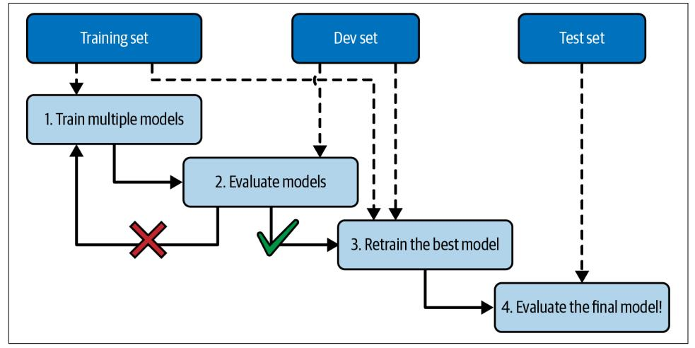

Figure 1-25. Model selection using holdout validation

This solution usually works quite well. However, if the validation set is too small, then the model evaluations will be imprecise: you may end up selecting a suboptimal model by mistake. Conversely, if the validation set is too large, then the remaining training set will be much smaller than the full training set. Why is this bad? Well, since the final model will be trained on the full training set, it is not ideal to compare candidate models trained on a much smaller training set. It would be like selecting the fastest sprinter to participate in a marathon. One way to solve this problem is to perform repeated *cross-validation*, using many small validation sets. Each model is evaluated once per validation set after it is trained on the rest of the data. By averaging out all the evaluations of a model, you get a much more accurate measure of its performance. There is a drawback, however: the training time is multiplied by the number of validation sets.

#### Data Mismatch

In some cases, it's easy to get a large amount of data for training, but this data probably won't be perfectly representative of the data that will be used in production. For example, suppose you want to create a mobile app to take pictures of flowers and automatically determine their species. You can easily download millions of pictures

{63}------------------------------------------------

of flowers on the web, but they won't be perfectly representative of the pictures that will actually be taken using the app on a mobile device. Perhaps you only have 1,000 representative pictures (i.e., actually taken with the app).

In this case, the most important rule to remember is that both the validation set and the test set must be as representative as possible of the data you expect to use in production, so they should be composed exclusively of representative pictures: you can shuffle them and put half in the validation set and half in the test set (making sure that no duplicates or near-duplicates end up in both sets). After training your model on the web pictures, if you observe that the performance of the model on the validation set is disappointing, you will not know whether this is because your model has overfit the training set, or whether this is just due to the mismatch between the web pictures and the mobile app pictures.

One solution is to hold out some of the training pictures (from the web) in yet another set that Andrew Ng dubbed the train-dev set (Figure 1-26). After the model is trained (on the training set, *not* on the train-dev set), you can evaluate it on the train-dev set. If the model performs poorly, then it must have overfit the training set, so you should try to simplify or regularize the model, get more training data, and clean up the training data. But if it performs well on the train-dev set, then you can evaluate the model on the dev set. If it performs poorly, then the problem must be coming from the data mismatch. You can try to tackle this problem by preprocessing the web images to make them look more like the pictures that will be taken by the mobile app, and then retraining the model. Once you have a model that performs well on both the train-dev set and the dev set, you can evaluate it one last time on the test set to know how well it is likely to perform in production.

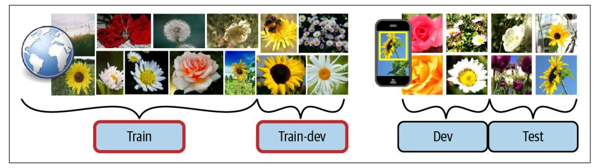

Figure 1-26. When real data is scarce (right), you may use similar abundant data (left) for training and hold out some of it in a train-dev set to evaluate overfitting; the real data is then used to evaluate data mismatch (dev set) and to evaluate the final model's performance (test set)

{64}------------------------------------------------

#### **No Free Lunch Theorem**

A model is a simplified representation of the data. The simplifications are meant to discard the superfluous details that are unlikely to generalize to new instances. When you select a particular type of model, you are implicitly making assumptions about the data. For example, if you choose a linear model, you are implicitly assuming that the data is fundamentally linear and that the distance between the instances and the straight line is just noise, which can safely be ignored.

In a famous 1996 paper,<sup>9</sup> David Wolpert demonstrated that if you make absolutely no assumption about the data, then there is no reason to prefer one model over any other. This is called the No Free Lunch (NFL) theorem. For some datasets the best model is a linear model, while for other datasets it is a neural network. There is no model that is a priori guaranteed to work better (hence the name of the theorem). The only way to know for sure which model is best is to evaluate them all. Since this is not possible, in practice you make some reasonable assumptions about the data and evaluate only a few reasonable models. For example, for simple tasks you may evaluate linear models with various levels of regularization, and for a complex problem you may evaluate various neural networks.

### **Exercises**

In this chapter we have covered some of the most important concepts in machine learning. In the next chapters we will dive deeper and write more code, but before we do, make sure you can answer the following questions:

- 1. How would you define machine learning?
- 2. Can you name four types of applications where it shines?
- 3. What is a labeled training set?
- 4. What are the two most common supervised tasks?
- 5. Can you name four common unsupervised tasks?
- 6. What type of algorithm would you use to allow a robot to walk in various unknown terrains?
- 7. What type of algorithm would you use to segment your customers into multiple groups?
- 8. Would you frame the problem of spam detection as a supervised learning problem or an unsupervised learning problem?

<sup>9</sup> David Wolpert, "The Lack of A Priori Distinctions Between Learning Algorithms", Neural Computation 8, no. 7 (1996): 1341-1390.

{65}------------------------------------------------

- 9. What is an online learning system?
- 10. What is out-of-core learning?
- 11. What type of algorithm relies on a similarity measure to make predictions?
- 12. What is the difference between a model parameter and a model hyperparameter?
- 13. What do model-based algorithms search for? What is the most common strategy they use to succeed? How do they make predictions?
- 14. Can you name four of the main challenges in machine learning?
- 15. If your model performs great on the training data but generalizes poorly to new instances, what is happening? Can you name three possible solutions?
- 16. What is a test set, and why would you want to use it?
- 17. What is the purpose of a validation set?
- 18. What is the train-dev set, when do you need it, and how do you use it?
- 19. What can go wrong if you tune hyperparameters using the test set?

Solutions to these exercises are available at the end of this chapter's notebook, at https://homl.info/colab3.

{66}------------------------------------------------

## **CHAPTER 2 End-to-End Machine Learning Project**

In this chapter you will work through an example project end to end, pretending to be a recently hired data scientist at a real estate company. This example is fictitious; the goal is to illustrate the main steps of a machine learning project, not to learn anything about the real estate business. Here are the main steps we will walk through:

- 1. Look at the big picture.
- 2. Get the data.
- 3. Explore and visualize the data to gain insights.
- 4. Prepare the data for machine learning algorithms.
- 5. Select a model and train it.
- 6. Fine-tune your model.
- 7. Present your solution.
- 8. Launch, monitor, and maintain your system.

### **Working with Real Data**

When you are learning about machine learning, it is best to experiment with realworld data, not artificial datasets. Fortunately, there are thousands of open datasets to choose from, ranging across all sorts of domains. Here are a few places you can look to get data:

- Popular open data repositories:
  - OpenML.org
  - Kaggle.com

{67}------------------------------------------------

- PapersWithCode.com
- UC Irvine Machine Learning Repository
- Amazon's AWS datasets
- TensorFlow datasets
- Meta portals (they list open data repositories):
  - DataPortals.org
  - OpenDataMonitor.eu
- Other pages listing many popular open data repositories:
  - Wikipedia's list of machine learning datasets
  - Quora.com
  - The datasets subreddit

In this chapter we'll use the California Housing Prices dataset from the StatLib repository<sup>1</sup> (see Figure 2-1). This dataset is based on data from the 1990 California census. It is not exactly recent (a nice house in the Bay Area was still affordable at the time), but it has many qualities for learning, so we will pretend it is recent data. For teaching purposes I've added a categorical attribute and removed a few features.


Figure 2-1. California housing prices

<sup>1</sup> The original dataset appeared in R. Kelley Pace and Ronald Barry, "Sparse Spatial Autoregressions", Statistics & Probability Letters 33, no. 3 (1997): 291-297.

{68}------------------------------------------------

## **Look at the Big Picture**

Welcome to the Machine Learning Housing Corporation! Your first task is to use California census data to build a model of housing prices in the state. This data includes metrics such as the population, median income, and median housing price for each block group in California. Block groups are the smallest geographical unit for which the US Census Bureau publishes sample data (a block group typically has a population of 600 to 3,000 people). I will call them "districts" for short.

Your model should learn from this data and be able to predict the median housing price in any district, given all the other metrics.


Since you are a well-organized data scientist, the first thing you should do is pull out your machine learning project checklist. You can start with the one in Appendix A; it should work reasonably well for most machine learning projects, but make sure to adapt it to your needs. In this chapter we will go through many checklist items, but we will also skip a few, either because they are self-explanatory or because they will be discussed in later chapters.

### **Frame the Problem**

The first question to ask your boss is what exactly the business objective is. Building a model is probably not the end goal. How does the company expect to use and benefit from this model? Knowing the objective is important because it will determine how you frame the problem, which algorithms you will select, which performance measure you will use to evaluate your model, and how much effort you will spend tweaking it.

Your boss answers that your model's output (a prediction of a district's median housing price) will be fed to another machine learning system (see Figure 2-2), along with many other signals.<sup>2</sup> This downstream system will determine whether it is worth investing in a given area. Getting this right is critical, as it directly affects revenue.

The next question to ask your boss is what the current solution looks like (if any). The current situation will often give you a reference for performance, as well as insights on how to solve the problem. Your boss answers that the district housing prices are currently estimated manually by experts: a team gathers up-to-date information about a district, and when they cannot get the median housing price, they estimate it using complex rules.

<sup>2</sup> A piece of information fed to a machine learning system is often called a signal, in reference to Claude Shannon's information theory, which he developed at Bell Labs to improve telecommunications. His theory: you want a high signal-to-noise ratio.

{69}------------------------------------------------


Figure 2-2. A machine learning pipeline for real estate investments

This is costly and time-consuming, and their estimates are not great; in cases where they manage to find out the actual median housing price, they often realize that their estimates were off by more than 30%. This is why the company thinks that it would be useful to train a model to predict a district's median housing price, given other data about that district. The census data looks like a great dataset to exploit for this purpose, since it includes the median housing prices of thousands of districts, as well as other data.

#### **Pipelines**

A sequence of data processing components is called a data *pipeline*. Pipelines are very common in machine learning systems, since there is a lot of data to manipulate and many data transformations to apply.

Components typically run asynchronously. Each component pulls in a large amount of data, processes it, and spits out the result in another data store. Then, some time later, the next component in the pipeline pulls in this data and spits out its own output. Each component is fairly self-contained: the interface between components is simply the data store. This makes the system simple to grasp (with the help of a data flow graph), and different teams can focus on different components. Moreover, if a component breaks down, the downstream components can often continue to run normally (at least for a while) by just using the last output from the broken component. This makes the architecture quite robust.

On the other hand, a broken component can go unnoticed for some time if proper monitoring is not implemented. The data gets stale and the overall system's performance drops.

{70}------------------------------------------------

With all this information, you are now ready to start designing your system. First, determine what kind of training supervision the model will need: is it a supervised, unsupervised, semi-supervised, self-supervised, or reinforcement learning task? And is it a classification task, a regression task, or something else? Should you use batch learning or online learning techniques? Before you read on, pause and try to answer these questions for yourself.

Have you found the answers? Let's see. This is clearly a typical supervised learning task, since the model can be trained with *labeled* examples (each instance comes with the expected output, i.e., the district's median housing price). It is a typical regression task, since the model will be asked to predict a value. More specifically, this is a *multiple regression* problem, since the system will use multiple features to make a prediction (the district's population, the median income, etc.). It is also a *univariate regression* problem, since we are only trying to predict a single value for each district. If we were trying to predict multiple values per district, it would be a *multivariate regression* problem. Finally, there is no continuous flow of data coming into the system, there is no particular need to adjust to changing data rapidly, and the data is small enough to fit in memory, so plain batch learning should do just fine.


If the data were huge, you could either split your batch learning work across multiple servers (using the MapReduce technique) or use an online learning technique.

#### Select a Performance Measure

Your next step is to select a performance measure. A typical performance measure for regression problems is the *root mean square error* (RMSE). It gives an idea of how much error the system typically makes in its predictions, with a higher weight given to large errors. Equation 2-1 shows the mathematical formula to compute the RMSE.

Equation 2-1. Root mean square error (RMSE)

RMSE(
$$
\mathbf{x}, h
$$
) =  $\sqrt{\frac{1}{m} \sum_{i=1}^{m} (h(\mathbf{x}^{(i)}) - y^{(i)})^2}$ 

{71}------------------------------------------------

#### **Notations**

This equation introduces several very common machine learning notations that I will use throughout this book:

- $\bullet~m$  is the number of instances in the dataset you are measuring the RMSE on.
  - For example, if you are evaluating the RMSE on a validation set of 2,000 districts, then  $m = 2,000$ .
- $\mathbf{x}^{(i)}$  is a vector of all the feature values (excluding the label) of the *i*<sup>th</sup> instance in the dataset, and  $y^{(i)}$  is its label (the desired output value for that instance).
  - For example, if the first district in the dataset is located at longitude -118.29°, latitude 33.91°, and it has 1,416 inhabitants with a median income of \$38,372, and the median house value is \$156,400 (ignoring other features for now), then:

$$
\mathbf{x}^{(1)} = \begin{pmatrix} -118.29 \\ 33.91 \\ 1,416 \\ 38,372 \end{pmatrix}
$$

and:

$$
y^{(1)} = 156,400
$$

- X is a matrix containing all the feature values (excluding labels) of all instances in the dataset. There is one row per instance, and the  $i<sup>th</sup>$  row is equal to the transpose of  $\mathbf{x}^{(i)}$ , noted  $(\mathbf{x}^{(i)})^{\intercal}$ .<sup>3</sup>
  - $-$  For example, if the first district is as just described, then the matrix  $X$  looks like this:

$$
\mathbf{X} = \begin{pmatrix} (\mathbf{x}^{(1)})^{\mathsf{T}} \\ (\mathbf{x}^{(2)})^{\mathsf{T}} \\ \vdots \\ (\mathbf{x}^{(1999)})^{\mathsf{T}} \\ (\mathbf{x}^{(2000)})^{\mathsf{T}} \end{pmatrix} = \begin{pmatrix} -118.29 & 33.91 & 1,416 & 38,372 \\ \vdots & \vdots & \vdots & \vdots \end{pmatrix}
$$

<sup>3</sup> Recall that the transpose operator flips a column vector into a row vector (and vice versa).

{72}------------------------------------------------

- $\bullet$  h is your system's prediction function, also called a *hypothesis*. When your system is given an instance's feature vector  $\mathbf{x}^{(i)}$ , it outputs a predicted value  $\hat{y}^{(i)} = h(\mathbf{x}^{(i)})$ for that instance ( $\hat{y}$  is pronounced "y-hat").
  - For example, if your system predicts that the median housing price in the first district is \$158,400, then  $\hat{y}^{(1)} = h(\mathbf{x}^{(1)}) = 158,400$ . The prediction error for this district is  $\hat{v}^{(1)} - v^{(1)} = 2,000$ .
- $RMSE(X,h)$  is the cost function measured on the set of examples using your hypothesis h.

We use lowercase italic font for scalar values (such as *m* or  $y^{(i)}$ ) and function names (such as h), lowercase bold font for vectors (such as  $\mathbf{x}^{(i)}$ ), and uppercase bold font for matrices (such as X).

Although the RMSE is generally the preferred performance measure for regression tasks, in some contexts you may prefer to use another function. For example, if there are many outlier districts. In that case, you may consider using the mean absolute error (MAE, also called the average absolute deviation), shown in Equation 2-2:

Equation 2-2. Mean absolute error (MAE)

$$
\text{MAE}(\mathbf{X}, h) = \frac{1}{m} \sum_{i=1}^{m} \left| h(\mathbf{x}^{(i)}) - y^{(i)} \right|
$$

Both the RMSE and the MAE are ways to measure the distance between two vectors: the vector of predictions and the vector of target values. Various distance measures, or *norms*, are possible:

- Computing the root of a sum of squares (RMSE) corresponds to the *Euclidean norm*: this is the notion of distance we are all familiar with. It is also called the  $\ell_2$ *norm*, noted  $\|\cdot\|_2$  (or just  $\|\cdot\|$ ).
- Computing the sum of absolutes (MAE) corresponds to the  $\ell_1$  *norm*, noted  $||\cdot||_1$ . This is sometimes called the *Manhattan norm* because it measures the distance between two points in a city if you can only travel along orthogonal city blocks.
- More generally, the  $\ell_k$  *norm* of a vector **v** containing *n* elements is defined as  $\|\mathbf{v}\|_{k} = (|\mathbf{v}_{1}|^{k} + |\mathbf{v}_{2}|^{k} + ... + |\mathbf{v}_{n}|^{k})^{1/k}$ .  $\ell_{0}$  gives the number of nonzero elements in the vector, and  $\ell_{\infty}$  gives the maximum absolute value in the vector.

The higher the norm index, the more it focuses on large values and neglects small ones. This is why the RMSE is more sensitive to outliers than the MAE. But when outliers are exponentially rare (like in a bell-shaped curve), the RMSE performs very well and is generally preferred.

{73}------------------------------------------------

### **Check the Assumptions**

Lastly, it is good practice to list and verify the assumptions that have been made so far (by you or others); this can help you catch serious issues early on. For example, the district prices that your system outputs are going to be fed into a downstream machine learning system, and you assume that these prices are going to be used as such. But what if the downstream system converts the prices into categories (e.g., "cheap", "medium", or "expensive") and then uses those categories instead of the prices themselves? In this case, getting the price perfectly right is not important at all; your system just needs to get the category right. If that's so, then the problem should have been framed as a classification task, not a regression task. You don't want to find this out after working on a regression system for months.

Fortunately, after talking with the team in charge of the downstream system, you are confident that they do indeed need the actual prices, not just categories. Great! You're all set, the lights are green, and you can start coding now!

### **Get the Data**

It's time to get your hands dirty. Don't hesitate to pick up your laptop and walk through the code examples. As I mentioned in the preface, all the code examples in this book are open source and available online as Jupyter notebooks, which are interactive documents containing text, images, and executable code snippets (Python in our case). In this book I will assume you are running these notebooks on Google Colab, a free service that lets you run any Jupyter notebook directly online, without having to install anything on your machine. If you want to use another online platform (e.g., Kaggle) or if you want to install everything locally on your own machine, please see the instructions on the book's GitHub page.

### **Running the Code Examples Using Google Colab**

First, open a web browser and visit https://homl.info/colab3: this will lead you to Google Colab, and it will display the list of Jupyter notebooks for this book (see Figure 2-3). You will find one notebook per chapter, plus a few extra notebooks and tutorials for NumPy, Matplotlib, Pandas, linear algebra, and differential calculus. For example, if you click 02\_end\_to\_end\_machine\_learning\_project.ipynb, the notebook from Chapter 2 will open up in Google Colab (see Figure 2-4).

A Jupyter notebook is composed of a list of cells. Each cell contains either executable code or text. Try double-clicking the first text cell (which contains the sentence "Welcome to Machine Learning Housing Corp.!"). This will open the cell for editing. Notice that Jupyter notebooks use Markdown syntax for formatting (e.g., \*\*bold\*\*, \*italics\*, # Title, [url](link text), and so on). Try modifying this text, then press Shift-Enter to see the result.

{74}------------------------------------------------

| <b>Examples</b>                                       | <b>Recent</b>                                        | <b>Google Drive</b> | <b>GitHub</b> | <b>Upload</b>         |
|-------------------------------------------------------|------------------------------------------------------|---------------------|---------------|-----------------------|
|                                                       | Enter a GitHub URL or search by organization or user |                     |               | Include private repos |
| ageron                                                |                                                      |                     |               | Q                     |
| Repository: $\boxed{7}$<br>ageron/handson-ml3<br>Path | Branch: Z<br>master<br>v                             | ⌄                   |               |                       |
|                                                       | 01_the_machine_learning_landscape.ipynb              |                     |               | Q<br>Г7               |
|                                                       | 02_end_to_end_machine_learning_project.jpynb         |                     |               | $\Omega$<br>囜         |
| 03_classification.ipynb                               |                                                      |                     |               | 7<br>Q                |
| 04_training_linear_models.ipynb                       |                                                      |                     |               | 7<br>la               |

Figure 2-3. List of notebooks in Google Colab

|                   | C 02_end_to_end_machine_learning_project.ipynb<br>File Edit View Insert Runtime Tools Help   | Share Share                         |
|-------------------|----------------------------------------------------------------------------------------------|-------------------------------------|
| 這                 | $+$ Code $+$ Text<br>← Copy to Drive                                                         | $\sqrt{\frac{RAM}{D}}$<br>Editing   |
| Q                 | Chapter 2 - End-to-end Machine Learning Project                                              |                                     |
| $\leftrightarrow$ | Welcome to Machine Learning Housing Corp.! Your task is to predict median house values in    |                                     |
|                   | Californian districts, given a number of features from these districts.                      |                                     |
| m                 | This notebook contains all the sample code and solutions to the exercices in chapter 2.      |                                     |
|                   | Open in Colab<br>k Open in Kaggle                                                            |                                     |
|                   |                                                                                              |                                     |
|                   | $\sim$ Setup                                                                                 | Text cells:<br>double-click to edit |
|                   | First, let's import a few common modules, ensure MatplotLib plots figures inline and prepare |                                     |
|                   | a function to save the figures.                                                              |                                     |
|                   |                                                                                              | Code cells:<br>click to edit        |
|                   | # Python ≥3.7 is required<br>$\sqrt{1}$<br>import sys                                        |                                     |
|                   | assert sys. version info $>=$ (3, 7)                                                         |                                     |

Figure 2-4. Your notebook in Google Colab

{75}------------------------------------------------

Next, create a new code cell by selecting Insert  $\rightarrow$  "Code cell" from the menu. Alternatively, you can click the  $+$  Code button in the toolbar, or hover your mouse over the bottom of a cell until you see  $+$  Code and  $+$  Text appear, then click  $+$  Code. In the new code cell, type some Python code, such as print ("Hello World"), then press Shift-Enter to run this code (or click the ⊳ button on the left side of the cell).

If you're not logged in to your Google account, you'll be asked to log in now (if you don't already have a Google account, you'll need to create one). Once you are logged in, when you try to run the code you'll see a security warning telling you that this notebook was not authored by Google. A malicious person could create a notebook that tries to trick you into entering your Google credentials so they can access your personal data, so before you run a notebook, always make sure you trust its author (or double-check what each code cell will do before running it). Assuming you trust me (or you plan to check every code cell), you can now click "Run anyway".

Colab will then allocate a new *runtime* for you: this is a free virtual machine located on Google's servers that contains a bunch of tools and Python libraries, including everything you'll need for most chapters (in some chapters, you'll need to run a command to install additional libraries). This will take a few seconds. Next, Colab will automatically connect to this runtime and use it to execute your new code cell. Importantly, the code runs on the runtime, *not* on your machine. The code's output will be displayed under the cell. Congrats, you've run some Python code on Colab!


To insert a new code cell, you can also type Ctrl-M (or Cmd-M on macOS) followed by A (to insert above the active cell) or B (to insert below). There are many other keyboard shortcuts available: you can view and edit them by typing Ctrl-M (or Cmd-M) then H. If you choose to run the notebooks on Kaggle or on your own machine using JupyterLab or an IDE such as Visual Studio Code with the Jupyter extension, you will see some minor differencesruntimes are called kernels, the user interface and keyboard shortcuts are slightly different, etc.—but switching from one Jupyter environment to another is not too hard.

### **Saving Your Code Changes and Your Data**

You can make changes to a Colab notebook, and they will persist for as long as you keep your browser tab open. But once you close it, the changes will be lost. To avoid this, make sure you save a copy of the notebook to your Google Drive by selecting File  $\rightarrow$  "Save a copy in Drive". Alternatively, you can download the notebook to your computer by selecting File  $\rightarrow$  Download  $\rightarrow$  "Download .ipynb". Then you can later visit https://colab.research.google.com and open the notebook again (either from Google Drive or by uploading it from your computer).

{76}------------------------------------------------


Google Colab is meant only for interactive use: you can play around in the notebooks and tweak the code as you like, but you cannot let the notebooks run unattended for a long period of time, or else the runtime will be shut down and all of its data will be lost.

If the notebook generates data that you care about, make sure you download this data before the runtime shuts down. To do this, click the Files icon (see step 1 in Figure 2-5), find the file you want to download, click the vertical dots next to it (step 2), and click Download (step 3). Alternatively, you can mount your Google Drive on the runtime, allowing the notebook to read and write files directly to Google Drive as if it were a local directory. For this, click the Files icon (step 1), then click the Google Drive icon (circled in Figure 2-5) and follow the on-screen instructions.


Figure 2-5. Downloading a file from a Google Colab runtime (steps 1 to 3), or mounting your Google Drive (circled icon)

By default, your Google Drive will be mounted at /content/drive/MyDrive. If you want to back up a data file, simply copy it to this directory by running !cp /content/my\_great\_model /content/drive/MyDrive. Any command starting with a bang (!) is treated as a shell command, not as Python code: cp is the Linux shell command to copy a file from one path to another. Note that Colab runtimes run on Linux (specifically, Ubuntu).

### The Power and Danger of Interactivity

Jupyter notebooks are interactive, and that's a great thing: you can run each cell one by one, stop at any point, insert a cell, play with the code, go back and run the same cell again, etc., and I highly encourage you to do so. If you just run the cells one by one without ever playing around with them, you won't learn as fast. However, this flexibility comes at a price: it's very easy to run cells in the wrong order, or to forget to

{77}------------------------------------------------

run a cell. If this happens, the subsequent code cells are likely to fail. For example, the very first code cell in each notebook contains setup code (such as imports), so make sure you run it first, or else nothing will work.


If you ever run into a weird error, try restarting the runtime (by selecting Runtime  $\rightarrow$  "Restart runtime" from the menu) and then run all the cells again from the beginning of the notebook. This often solves the problem. If not, it's likely that one of the changes you made broke the notebook: just revert to the original notebook and try again. If it still fails, please file an issue on GitHub.

### **Book Code Versus Notebook Code**

You may sometimes notice some little differences between the code in this book and the code in the notebooks. This may happen for several reasons:

- A library may have changed slightly by the time you read these lines, or perhaps despite my best efforts I made an error in the book. Sadly, I cannot magically fix the code in your copy of this book (unless you are reading an electronic copy and you can download the latest version), but I can fix the notebooks. So, if you run into an error after copying code from this book, please look for the fixed code in the notebooks: I will strive to keep them error-free and up-to-date with the latest library versions.
- The notebooks contain some extra code to beautify the figures (adding labels, setting font sizes, etc.) and to save them in high resolution for this book. You can safely ignore this extra code if you want.

I optimized the code for readability and simplicity: I made it as linear and flat as possible, defining very few functions or classes. The goal is to ensure that the code you are running is generally right in front of you, and not nested within several layers of abstractions that you have to search through. This also makes it easier for you to play with the code. For simplicity, there's limited error handling, and I placed some of the least common imports right where they are needed (instead of placing them at the top of the file, as is recommended by the PEP 8 Python style guide). That said, your production code will not be very different: just a bit more modular, and with additional tests and error handling.

OK! Once you're comfortable with Colab, you're ready to download the data.

### **Download the Data**

In typical environments your data would be available in a relational database or some other common data store, and spread across multiple tables/documents/files.

{78}------------------------------------------------

To access it, you would first need to get your credentials and access authorizations<sup>4</sup> and familiarize yourself with the data schema. In this project, however, things are much simpler: you will just download a single compressed file, housing.tgz, which contains a comma-separated values (CSV) file called *housing.csv* with all the data.

Rather than manually downloading and decompressing the data, it's usually preferable to write a function that does it for you. This is useful in particular if the data changes regularly: you can write a small script that uses the function to fetch the latest data (or you can set up a scheduled job to do that automatically at regular intervals). Automating the process of fetching the data is also useful if you need to install the dataset on multiple machines.

Here is the function to fetch and load the data:

```
from pathlib import Path
import pandas as pd
import tarfile
import urllib.request
def load housing data():
    tarball path = Path("datasets/housing.tgz")
    if not tarball_path.is_file():
        Path("datasets").mkdir(parents=True, exist ok=True)
        url = "https://github.com/ageron/data/raw/main/housing.tgz"
        urllib.request.urlretrieve(url, tarball_path)
        with tarfile.open(tarball path) as housing tarball:
            housing_tarball.extractall(path="datasets")
    return pd.read csv(Path("datasets/housing/housing.csv"))
```

```
housing = load housing data()
```

When load\_housing\_data() is called, it looks for the *datasets/housing.tgz* file. If it does not find it, it creates the *datasets* directory inside the current directory (which is /content by default, in Colab), downloads the housing.tgz file from the ageron/data GitHub repository, and extracts its content into the *datasets* directory; this creates the datasets/housing directory with the housing.csv file inside it. Lastly, the function loads this CSV file into a Pandas DataFrame object containing all the data, and returns it.

### Take a Quick Look at the Data Structure

You start by looking at the top five rows of data using the DataFrame's head() method (see Figure 2-6).

<sup>4</sup> You might also need to check legal constraints, such as private fields that should never be copied to unsafe data stores.

{79}------------------------------------------------

|                | housing.head() |       |                                                                                        |        |                 |          |
|----------------|----------------|-------|----------------------------------------------------------------------------------------|--------|-----------------|----------|
|                |                |       | longitude latitude housing median age median income ocean proximity median house value |        |                 |          |
| $\mathbf{0}$   | $-122.23$      | 37.88 | 41.0                                                                                   | 8.3252 | <b>NEAR BAY</b> | 452600.0 |
| 1              | $-122.22$      | 37.86 | 21.0                                                                                   | 8.3014 | <b>NEAR BAY</b> | 358500.0 |
| $\overline{2}$ | $-122.24$      | 37.85 | 52.0                                                                                   | 7.2574 | <b>NEAR BAY</b> | 352100.0 |
| 3              | $-122.25$      | 37.85 | 52.0                                                                                   | 5.6431 | <b>NFAR BAY</b> | 341300.0 |
| 4              | $-122.25$      | 37.85 | 52.0                                                                                   | 3.8462 | <b>NEAR BAY</b> | 342200.0 |

Figure 2-6. Top five rows in the dataset

Each row represents one district. There are 10 attributes (they are not all shown in the screenshot): longitude, latitude, housing median age, total rooms, total\_bedrooms, population, households, median\_income, median\_house\_value, and ocean\_proximity.

The info() method is useful to get a quick description of the data, in particular the total number of rows, each attribute's type, and the number of non-null values:

```
>>> housing.info()
<class 'pandas.core.frame.DataFrame'>
RangeIndex: 20640 entries, 0 to 20639
Data columns (total 10 columns):
                           Non-Null Count Dtype
     Column
\boldsymbol{\mu}\sim \sim \sim. . . . . . .
                           . . . . . . . . . . . . . . . . . . . . 
     longitude
                          20640 non-null float64
\Theta\mathbf{1}latitude
                          20640 non-null float64
     housing_median_age 20640 non-null float64
2^{\circ}20640 non-null float64
     total rooms
\overline{3}20433 non-null float64
\overline{4}total bedrooms
5<sup>1</sup>population
                          20640 non-null float64
6
    households
                          20640 non-null float64
                          20640 non-null float64
7^{\circ}median income
\mathsf{R}median house value 20640 non-null float64
                           20640 non-null object
9
     ocean proximity
dtypes: float64(9), object(1)
memory usage: 1.6+ MB
```


In this book, when a code example contains a mix of code and outputs, as is the case here, it is formatted like in the Python interpreter, for better readability: the code lines are prefixed with >>> (or ... for indented blocks), and the outputs have no prefix.

There are 20,640 instances in the dataset, which means that it is fairly small by machine learning standards, but it's perfect to get started. You notice that the 

{80}------------------------------------------------

total bedrooms attribute has only 20,433 non-null values, meaning that 207 districts are missing this feature. You will need to take care of this later.

All attributes are numerical, except for ocean proximity. Its type is object, so it could hold any kind of Python object. But since you loaded this data from a CSV file, you know that it must be a text attribute. When you looked at the top five rows, you probably noticed that the values in the ocean\_proximity column were repetitive, which means that it is probably a categorical attribute. You can find out what categories exist and how many districts belong to each category by using the value counts() method:

|            | >>> housing cream proximity" ] value counts() |
|------------|-----------------------------------------------|
| <1H OCEAN  | 9136                                          |
| INLAND     | 6551                                          |
| NEAR OCEAN | 2658                                          |
| NFAR RAY   | 2290                                          |
| ISLAND     | 5                                             |
|            | Name: ocean proximity, dtype: int64           |

Let's look at the other fields. The describe() method shows a summary of the numerical attributes (Figure 2-7).

| housing.describe() |               |              |                    |              |                |                    |
|--------------------|---------------|--------------|--------------------|--------------|----------------|--------------------|
|                    | longitude     | latitude     | housing median age | total rooms  | total bedrooms | median house value |
| count              | 20640.000000  | 20640.000000 | 20640.000000       | 20640.000000 | 20433.000000   | 20640.000000       |
| mean               | $-119.569704$ | 35.631861    | 28.639486          | 2635.763081  | 537.870553     | 206855.816909      |
| std                | 2.003532      | 2.135952     | 12.585558          | 2181.615252  | 421.385070     | 115395.615874      |
| min                | $-124.350000$ | 32,540000    | 1.000000           | 2.000000     | 1.000000       | 14999.000000       |
| 25%                | $-121.800000$ | 33.930000    | 18.000000          | 1447.750000  | 296,000000     | 119600.000000      |
| 50%                | $-118.490000$ | 34.260000    | 29.000000          | 2127.000000  | 435.000000     | 179700.000000      |
| 75%                | $-118.010000$ | 37.710000    | 37,000000          | 3148,000000  | 647.000000     | 264725,000000      |
| max                | $-114.310000$ | 41.950000    | 52.000000          | 39320.000000 | 6445.000000    | 500001.000000      |

Figure 2-7. Summary of each numerical attribute

The count, mean, min, and max rows are self-explanatory. Note that the null values are ignored (so, for example, the count of total\_bedrooms is 20,433, not 20,640). The std row shows the *standard deviation*, which measures how dispersed the values are.<sup>5</sup> The 25%, 50%, and 75% rows show the corresponding *percentiles*: a percentile

<sup>5</sup> The standard deviation is generally denoted  $\sigma$  (the Greek letter sigma), and it is the square root of the variance, which is the average of the squared deviation from the mean. When a feature has a bell-shaped normal distribution (also called a Gaussian distribution), which is very common, the "68-95-99.7" rule applies: about 68% of the values fall within  $1\sigma$  of the mean, 95% within  $2\sigma$ , and 99.7% within  $3\sigma$ .

{81}------------------------------------------------

indicates the value below which a given percentage of observations in a group of observations fall. For example, 25% of the districts have a housing median age lower than 18, while 50% are lower than 29 and 75% are lower than 37. These are often called the 25th percentile (or first quartile), the median, and the 75th percentile (or third quartile).

Another quick way to get a feel of the type of data you are dealing with is to plot a histogram for each numerical attribute. A histogram shows the number of instances (on the vertical axis) that have a given value range (on the horizontal axis). You can either plot this one attribute at a time, or you can call the hist() method on the whole dataset (as shown in the following code example), and it will plot a histogram for each numerical attribute (see Figure 2-8):

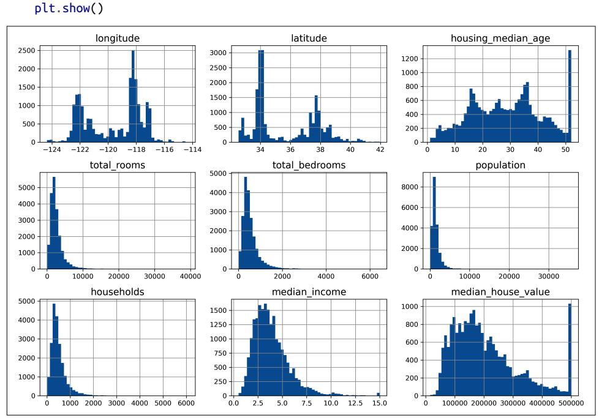

Figure 2-8. A histogram for each numerical attribute

import matplotlib.pyplot as plt

housing.hist(bins=50, figsize=(12, 8))

{82}------------------------------------------------

Looking at these histograms, you notice a few things:

- First, the median income attribute does not look like it is expressed in US dollars (USD). After checking with the team that collected the data, you are told that the data has been scaled and capped at 15 (actually, 15.0001) for higher median incomes, and at 0.5 (actually, 0.4999) for lower median incomes. The numbers represent roughly tens of thousands of dollars (e.g., 3 actually means about \$30,000). Working with preprocessed attributes is common in machine learning, and it is not necessarily a problem, but you should try to understand how the data was computed.
- The housing median age and the median house value were also capped. The latter may be a serious problem since it is your target attribute (your labels). Your machine learning algorithms may learn that prices never go beyond that limit. You need to check with your client team (the team that will use your system's output) to see if this is a problem or not. If they tell you that they need precise predictions even beyond \$500,000, then you have two options:
  - Collect proper labels for the districts whose labels were capped.
  - Remove those districts from the training set (and also from the test set, since your system should not be evaluated poorly if it predicts values beyond  $$500,000$ ).
- These attributes have very different scales. We will discuss this later in this chapter, when we explore feature scaling.
- Finally, many histograms are *skewed right*: they extend much farther to the right of the median than to the left. This may make it a bit harder for some machine learning algorithms to detect patterns. Later, you'll try transforming these attributes to have more symmetrical and bell-shaped distributions.

You should now have a better understanding of the kind of data you're dealing with.


Wait! Before you look at the data any further, you need to create a test set, put it aside, and never look at it.

### **Create a Test Set**

It may seem strange to voluntarily set aside part of the data at this stage. After all, you have only taken a quick glance at the data, and surely you should learn a whole lot more about it before you decide what algorithms to use, right? This is true, but your brain is an amazing pattern detection system, which also means that it is highly prone to overfitting: if you look at the test set, you may stumble upon some 

{83}------------------------------------------------

seemingly interesting pattern in the test data that leads you to select a particular kind of machine learning model. When you estimate the generalization error using the test set, your estimate will be too optimistic, and you will launch a system that will not perform as well as expected. This is called *data snooping* bias.

Creating a test set is theoretically simple; pick some instances randomly, typically 20% of the dataset (or less if your dataset is very large), and set them aside:

```
import numpy as np
def shuffle_and_split_data(data, test_ratio):
    shuffled indices = np.random, permutation(len(data))
    test_set_size = int(len(data) * test_rate)test_indices = shuffled_indices[:test_set_size]
    train indices = shuffled indices[test set size:]
    return data.iloc[train_indices], data.iloc[test_indices]
```

You can then use this function like this:

```
\gg train_set, test_set = shuffle_and_split_data(housing, 0.2)
>>> len(train_set)
16512
>>> len(test_set)
4128
```

Well, this works, but it is not perfect: if you run the program again, it will generate a different test set! Over time, you (or your machine learning algorithms) will get to see the whole dataset, which is what you want to avoid.

One solution is to save the test set on the first run and then load it in subsequent runs. Another option is to set the random number generator's seed (e.g., with  $np.random.seed(42))$ <sup>6</sup> before calling  $np.random.permutation()$  so that it always generates the same shuffled indices.

However, both these solutions will break the next time you fetch an updated dataset. To have a stable train/test split even after updating the dataset, a common solution is to use each instance's identifier to decide whether or not it should go in the test set (assuming instances have unique and immutable identifiers). For example, you could compute a hash of each instance's identifier and put that instance in the test set if the hash is lower than or equal to 20% of the maximum hash value. This ensures that the test set will remain consistent across multiple runs, even if you refresh the dataset. The new test set will contain 20% of the new instances, but it will not contain any instance that was previously in the training set.

<sup>6</sup> You will often see people set the random seed to 42. This number has no special property, other than being the Answer to the Ultimate Question of Life, the Universe, and Everything.

{84}------------------------------------------------

Here is a possible implementation:

```
from zlib import crc32
def is_id_in_test_set(identifier, test_ratio):
   return crc32(np.int64(identifier)) < test_rate * 2**32def split_data_with_id_hash(data, test_ratio, id_column):
   ids = data [id column]in_test_set = ids.apply(lambda id_: is_id_in_test_set(id_, test_ratio))
   return data.loc[~in_test_set], data.loc[in_test_set]
```

Unfortunately, the housing dataset does not have an identifier column. The simplest solution is to use the row index as the ID:

```
housing with id = housing.reset index() # adds an `index` column
train_set, test_set = split_data_with_id_hash(housing_with_id, 0.2, "index")
```

If you use the row index as a unique identifier, you need to make sure that new data gets appended to the end of the dataset and that no row ever gets deleted. If this is not possible, then you can try to use the most stable features to build a unique identifier. For example, a district's latitude and longitude are guaranteed to be stable for a few million years, so you could combine them into an ID like so:<sup>7</sup>

```
housing_with_id["id"] = housing["longitude"] * 1000 + housing["latitude"]
train_set, test_set = split_data_with_id_hash(housing_with_id, 0.2, "id")
```

Scikit-Learn provides a few functions to split datasets into multiple subsets in various ways. The simplest function is train\_test\_split(), which does pretty much the same thing as the shuffle and split data() function we defined earlier, with a couple of additional features. First, there is a random state parameter that allows you to set the random generator seed. Second, you can pass it multiple datasets with an identical number of rows, and it will split them on the same indices (this is very useful, for example, if you have a separate DataFrame for labels):

```
from sklearn.model_selection import train_test_split
```

```
train_set, test_set = train_test_split(housing, test_size=0.2, random_state=42)
```

So far we have considered purely random sampling methods. This is generally fine if your dataset is large enough (especially relative to the number of attributes), but if it is not, you run the risk of introducing a significant sampling bias. When employees at a survey company decides to call 1,000 people to ask them a few questions, they don't just pick 1,000 people randomly in a phone book. They try to ensure that these 1,000 people are representative of the whole population, with regard to the questions they want to ask. For example, the US population is 51.1% females and

<sup>7</sup> The location information is actually quite coarse, and as a result many districts will have the exact same ID, so they will end up in the same set (test or train). This introduces some unfortunate sampling bias.

{85}------------------------------------------------

48.9% males, so a well-conducted survey in the US would try to maintain this ratio in the sample: 511 females and 489 males (at least if it seems possible that the answers may vary across genders). This is called *stratified sampling*: the population is divided into homogeneous subgroups called *strata*, and the right number of instances are sampled from each stratum to guarantee that the test set is representative of the overall population. If the people running the survey used purely random sampling, there would be about a 10.7% chance of sampling a skewed test set with less than 48.5% female or more than 53.5% female participants. Either way, the survey results would likely be quite biased.

Suppose you've chatted with some experts who told you that the median income is a very important attribute to predict median housing prices. You may want to ensure that the test set is representative of the various categories of incomes in the whole dataset. Since the median income is a continuous numerical attribute, you first need to create an income category attribute. Let's look at the median income histogram more closely (back in Figure 2-8): most median income values are clustered around 1.5 to 6 (i.e.,  $$15,000-\$60,000$ ), but some median incomes go far beyond 6. It is important to have a sufficient number of instances in your dataset for each stratum, or else the estimate of a stratum's importance may be biased. This means that you should not have too many strata, and each stratum should be large enough. The following code uses the pd.cut() function to create an income category attribute with five categories (labeled from 1 to 5); category 1 ranges from 0 to 1.5 (i.e., less than \$15,000), category 2 from 1.5 to 3, and so on:

```
housing["income_cat"] = pd.cut(housing["median_income"],bins=[0., 1.5, 3.0, 4.5, 6., np.inf],labels=[1, 2, 3, 4, 5])
```

These income categories are represented in Figure 2-9:

```
housing["income_cat"].value_counts().sort_index().plot.bar(rot=0, grid=True)
plt.xlabel("Income category")
plt.ylabel("Number of districts")
plt.show()
```

Now you are ready to do stratified sampling based on the income category. Scikit-Learn provides a number of splitter classes in the sklearn. model\_selection package that implement various strategies to split your dataset into a training set and a test set. Each splitter has a split() method that returns an iterator over different training/ test splits of the same data.

{86}------------------------------------------------

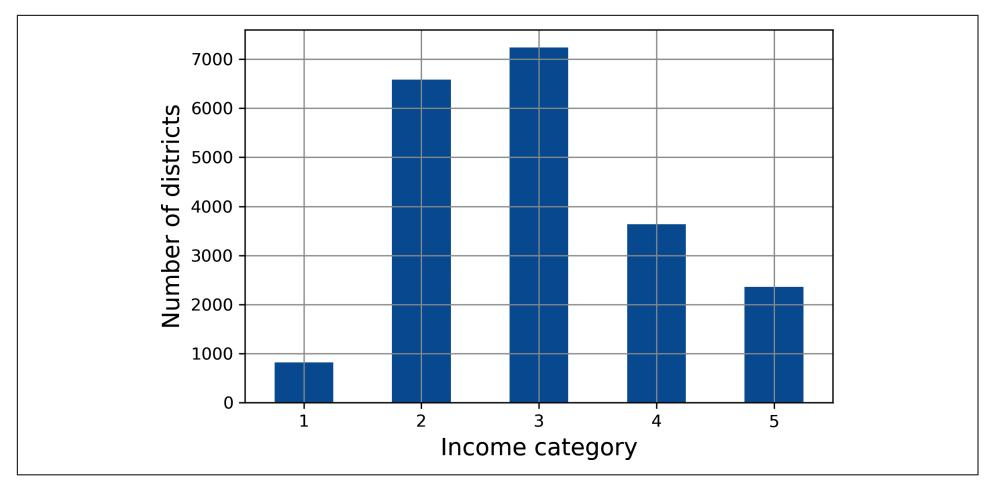

Figure 2-9. Histogram of income categories

To be precise, the split() method yields the training and test *indices*, not the data itself. Having multiple splits can be useful if you want to better estimate the performance of your model, as you will see when we discuss cross-validation later in this chapter. For example, the following code generates 10 different stratified splits of the same dataset.

```
from sklearn.model_selection import StratifiedShuffleSplit
splitter = StratifiedShuffleSplit(n splits=10, test size=0.2, random state=42)
strat splits = [ ]for train_index, test_index in splitter.split(housing, housing["income cat"]):
    strat_train_set_n = housing.iloc[train_index]strat_test_set_n = housing.iloc[test_index]strat_splits.append([strat_train_set_n, strat_test_set_n])
```

For now, you can just use the first split:

strat\_train\_set, strat\_test\_set = strat\_splits[0]

Or, since stratified sampling is fairly common, there's a shorter way to get a single split using the train test split() function with the stratify argument:

```
strat_train_set, strat_test_set = train_test_split(
   housing, test_size=0.2, stratify=housing["income_cat"], random_state=42)
```

{87}------------------------------------------------

Let's see if this worked as expected. You can start by looking at the income category proportions in the test set:

```
>>> strat test set["income cat"].value counts() / len(strat test set)
\overline{3}0.350533
\overline{2}0.318798
4 0.176357
5 0.114341
\mathbf{1}0.039971
Name: income_cat, dtype: float64
```

With similar code you can measure the income category proportions in the full dataset. Figure 2-10 compares the income category proportions in the overall dataset, in the test set generated with stratified sampling, and in a test set generated using purely random sampling. As you can see, the test set generated using stratified sampling has income category proportions almost identical to those in the full dataset, whereas the test set generated using purely random sampling is skewed.

|                        |       |       |       | Overall % Stratified % Random % Strat. Error % Rand. Error % |         |
|------------------------|-------|-------|-------|--------------------------------------------------------------|---------|
| <b>Income Category</b> |       |       |       |                                                              |         |
| 1                      | 3.98  | 4.00  | 4.24  | 0.36                                                         | 6.45    |
| $\overline{2}$         | 31.88 | 31.88 | 30.74 | $-0.02$                                                      | $-3.59$ |
| 3                      | 35.06 | 35.05 | 34.52 | $-0.01$                                                      | $-1.53$ |
| 4                      | 17.63 | 17.64 | 18.41 | 0.03                                                         | 4.42    |
| 5                      | 11.44 | 11.43 | 12.09 | $-0.08$                                                      | 5.63    |

Figure 2-10. Sampling bias comparison of stratified versus purely random sampling

You won't use the income\_cat column again, so you might as well drop it, reverting the data back to its original state:

```
for set_ in (strat_train_set, strat_test_set):
   set_.drop("income_cat", axis=1, inplace=True)
```

We spent quite a bit of time on test set generation for a good reason: this is an often neglected but critical part of a machine learning project. Moreover, many of these ideas will be useful later when we discuss cross-validation. Now it's time to move on to the next stage: exploring the data.

## **Explore and Visualize the Data to Gain Insights**

So far you have only taken a quick glance at the data to get a general understanding of the kind of data you are manipulating. Now the goal is to go into a little more depth.

First, make sure you have put the test set aside and you are only exploring the training set. Also, if the training set is very large, you may want to sample an exploration 

{88}------------------------------------------------

set, to make manipulations easy and fast during the exploration phase. In this case, the training set is quite small, so you can just work directly on the full set. Since you're going to experiment with various transformations of the full training set, you should make a copy of the original so you can revert to it afterwards:

```
housing = strat_train_set.copy()
```

### **Visualizing Geographical Data**

Because the dataset includes geographical information (latitude and longitude), it is a good idea to create a scatterplot of all the districts to visualize the data (Figure 2-11):

```
housing.plot(kind="scatter", x="longitude", y="latitude", grid=True)
plt.show()
```


Figure 2-11. A geographical scatterplot of the data

This looks like California all right, but other than that it is hard to see any particular pattern. Setting the alpha option to 0.2 makes it much easier to visualize the places where there is a high density of data points (Figure 2-12):

```
housing.plot(kind="scatter", x="longitude", y="latitude", grid=True, alpha=0.2)
plt.show()
```

Now that's much better: you can clearly see the high-density areas, namely the Bay Area and around Los Angeles and San Diego, plus a long line of fairly high-density areas in the Central Valley (in particular, around Sacramento and Fresno).

Our brains are very good at spotting patterns in pictures, but you may need to play around with visualization parameters to make the patterns stand out.

{89}------------------------------------------------


Figure 2-12. A better visualization that highlights high-density areas

Next, you look at the housing prices (Figure 2-13). The radius of each circle represents the district's population (option s), and the color represents the price (option c). Here you use a predefined color map (option cmap) called jet, which ranges from blue (low values) to red (high prices):<sup>8</sup>

```
housing.plot(kind="scatter", x="longitude", y="latitude", grid=True,
             s=housing["population"] / 100, label="population",
             c="median_house_value", cmap="jet", colorbar=True,
             legend=True, sharex=False, figsize=(10, 7))
plt.show()
```

```
This image tells you that the housing prices are very much related to the location
(e.g., close to the ocean) and to the population density, as you probably knew already.
A clustering algorithm should be useful for detecting the main cluster and for adding
new features that measure the proximity to the cluster centers. The ocean proximity
attribute may be useful as well, although in Northern California the housing prices in
coastal districts are not too high, so it is not a simple rule.
```

<sup>8</sup> If you are reading this in grayscale, grab a red pen and scribble over most of the coastline from the Bay Area down to San Diego (as you might expect). You can add a patch of yellow around Sacramento as well.

{90}------------------------------------------------

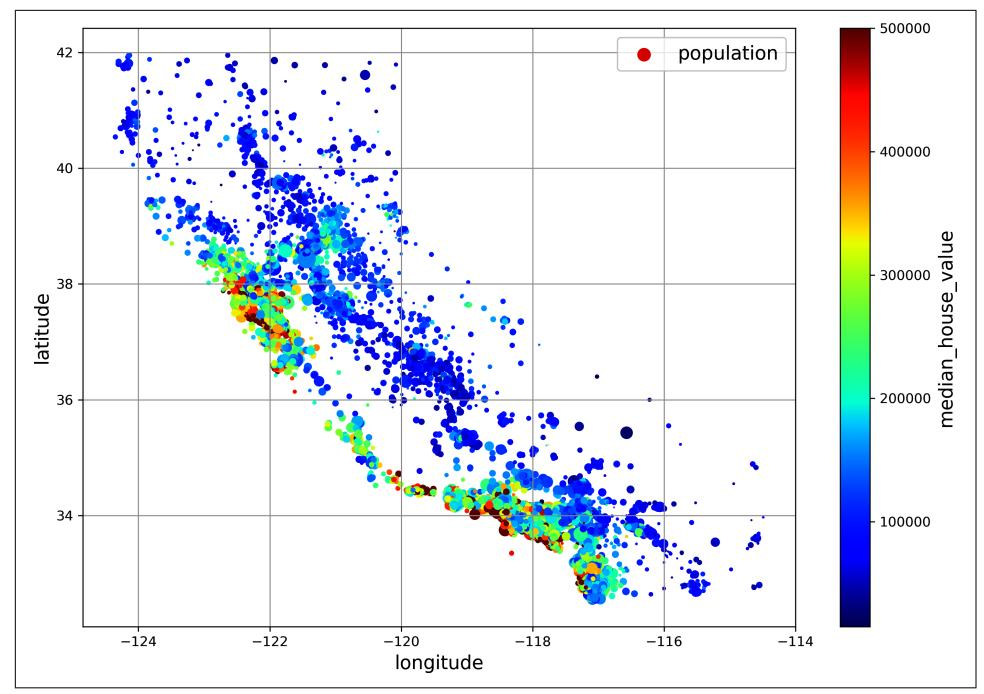

Figure 2-13. California housing prices: red is expensive, blue is cheap, larger circles indicate areas with a larger population

### **Look for Correlations**

Since the dataset is not too large, you can easily compute the standard correlation coefficient (also called Pearson's r) between every pair of attributes using the corr() method:

```
corr_matrix = housing.corr()
```

Now you can look at how much each attribute correlates with the median house value:

```
>>> corr_matrix["median_house_value"].sort_values(ascending=False)
median_house_value
                     1.000000
median_income
                     0.688380
total rooms
                    0.137455
                   0.102175
housing_median_age
households
                     0.071426
total_bedrooms
                     0.054635
population
                    -0.020153longitude
                    -0.050859latitude
                    -0.139584Name: median house value, dtype: float64
```

{91}------------------------------------------------

The correlation coefficient ranges from  $-1$  to 1. When it is close to 1, it means that there is a strong **positive correlation**; for example, the median house value tends to go up when the median income goes up. When the coefficient is close to -1, it means that there is a strong negative correlation; you can see a small negative correlation between the latitude and the median house value (i.e., prices have a slight tendency to go down when you go north). Finally, coefficients close to 0 mean that there is no linear correlation

Another way to check for correlation between attributes is to use the Pandas scatter\_matrix() function, which plots every numerical attribute against every other numerical attribute. Since there are now 11 numerical attributes, you would get  $11^2$  = 121 plots, which would not fit on a page—so you decide to focus on a few promising attributes that seem most correlated with the median housing value (Figure 2-14):

```
from pandas.plotting import scatter_matrix
attributes = ["median house value", "median income", "total rooms",
              "housing_median_age"]
scatter_matrix(housing[attributes], figsize=(12, 8))
plt.show()
```

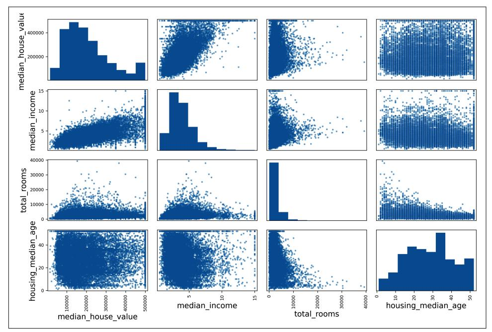

Figure 2-14. This scatter matrix plots every numerical attribute against every other numerical attribute, plus a histogram of each numerical attribute's values on the main diagonal (top left to bottom right)

{92}------------------------------------------------

The main diagonal would be full of straight lines if Pandas plotted each variable against itself, which would not be very useful. So instead, the Pandas displays a histogram of each attribute (other options are available; see the Pandas documentation for more details).

Looking at the correlation scatterplots, it seems like the most promising attribute to predict the median house value is the median income, so you zoom in on their scatterplot (Figure 2-15):

```
housing.plot(kind="scatter", x="median_income", y="median_house_value",
             alpha=0.1, grid=True)
```


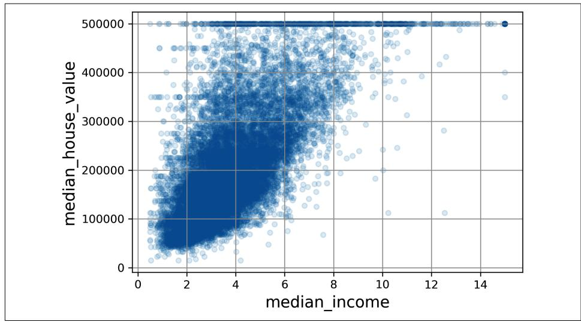

Figure 2-15. Median income versus median house value

This plot reveals a few things. First, the correlation is indeed quite strong; you can clearly see the upward trend, and the points are not too dispersed. Second, the price cap you noticed earlier is clearly visible as a horizontal line at \$500,000. But the plot also reveals other less obvious straight lines: a horizontal line around \$450,000, another around \$350,000, perhaps one around \$280,000, and a few more below that. You may want to try removing the corresponding districts to prevent your algorithms from learning to reproduce these data quirks.

{93}------------------------------------------------


The correlation coefficient only measures linear correlations ("as  $x$ goes up, y generally goes up/down"). It may completely miss out on nonlinear relationships (e.g., "as  $x$  approaches 0,  $y$  generally goes up"). Figure 2-16 shows a variety of datasets along with their correlation coefficient. Note how all the plots of the bottom row have a correlation coefficient equal to 0, despite the fact that their axes are clearly *not* independent: these are examples of nonlinear relationships. Also, the second row shows examples where the correlation coefficient is equal to 1 or  $-1$ ; notice that this has nothing to do with the slope. For example, your height in inches has a correlation coefficient of 1 with your height in feet or in nanometers.

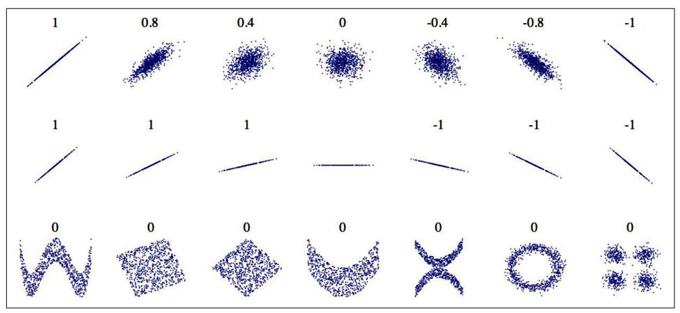

Figure 2-16. Standard correlation coefficient of various datasets (source: Wikipedia; public domain image)

### **Experiment with Attribute Combinations**

Hopefully the previous sections gave you an idea of a few ways you can explore the data and gain insights. You identified a few data quirks that you may want to clean up before feeding the data to a machine learning algorithm, and you found interesting correlations between attributes, in particular with the target attribute. You also noticed that some attributes have a skewed-right distribution, so you may want to transform them (e.g., by computing their logarithm or square root). Of course, your mileage will vary considerably with each project, but the general ideas are similar.

One last thing you may want to do before preparing the data for machine learning algorithms is to try out various attribute combinations. For example, the total number of rooms in a district is not very useful if you don't know how many households there are. What you really want is the number of rooms per household. Similarly, the total number of bedrooms by itself is not very useful: you probably want to

{94}------------------------------------------------

compare it to the number of rooms. And the population per household also seems like an interesting attribute combination to look at. You create these new attributes as follows:

```
housing["rooms per house"] = housing["total rooms"] / housing["households"]
housing["bedrooms_ratio"] = housing["total_bedrooms"] / housing["total_rooms"]
housing["people per house"] = housing["population"] / housing["households"]
```

And then you look at the correlation matrix again:

```
\Rightarrow corr_matrix = housing.corr()
>>> corr_matrix["median_house_value"].sort_values(ascending=False)
median_house_value 1.000000
median income
                  0.688380
rooms_per_house
                  0.143663
total rooms
                  0.137455
housing_median_age 0.102175
                  0.071426
households
total bedrooms
                  0.054635
                 -0.020153population
people_per_house -0.038224
longitude
                 -0.050859latitude
                 -0.139584bedrooms ratio
                  -0.256397Name: median house value, dtype: float64
```

Hey, not bad! The new bedrooms ratio attribute is much more correlated with the median house value than the total number of rooms or bedrooms. Apparently houses with a lower bedroom/room ratio tend to be more expensive. The number of rooms per household is also more informative than the total number of rooms in a district obviously the larger the houses, the more expensive they are.

This round of exploration does not have to be absolutely thorough; the point is to start off on the right foot and quickly gain insights that will help you get a first reasonably good prototype. But this is an iterative process: once you get a prototype up and running, you can analyze its output to gain more insights and come back to this exploration step.

## **Prepare the Data for Machine Learning Algorithms**

It's time to prepare the data for your machine learning algorithms. Instead of doing this manually, you should write functions for this purpose, for several good reasons:

- This will allow you to reproduce these transformations easily on any dataset (e.g., the next time you get a fresh dataset).
- You will gradually build a library of transformation functions that you can reuse in future projects.

{95}------------------------------------------------

- You can use these functions in your live system to transform the new data before feeding it to your algorithms.
- This will make it possible for you to easily try various transformations and see which combination of transformations works best

But first, revert to a clean training set (by copying strat train set once again). You should also separate the predictors and the labels, since you don't necessarily want to apply the same transformations to the predictors and the target values (note that drop() creates a copy of the data and does not affect strat train set):

```
housing = strat train set.drop("median house value", axis=1)
housing labels = strat train set["median house value"].copy()
```

### Clean the Data

Most machine learning algorithms cannot work with missing features, so you'll need to take care of these. For example, you noticed earlier that the total\_bedrooms attribute has some missing values. You have three options to fix this:

- 1. Get rid of the corresponding districts.
- 2. Get rid of the whole attribute.
- 3. Set the missing values to some value (zero, the mean, the median, etc.). This is called imputation.

You can accomplish these easily using the Pandas DataFrame's dropna(), drop(), and fillna() methods:

```
housing.dropna(subset=["total bedrooms"], inplace=True) # option 1
housing.drop("total bedrooms", axis=1) # option 2
median = housing["total_bedrooms"].median() # option 3
housing["total_bedrooms"].fillna(median, inplace=True)
```

You decide to go for option 3 since it is the least destructive, but instead of the preceding code, you will use a handy Scikit-Learn class: SimpleImputer. The benefit is that it will store the median value of each feature: this will make it possible to impute missing values not only on the training set, but also on the validation set, the test set, and any new data fed to the model. To use it, first you need to create a SimpleImputer instance, specifying that you want to replace each attribute's missing values with the median of that attribute:

```
from sklearn.impute import SimpleImputer
imputer = SimpleImputer(strategy="median")
```

{96}------------------------------------------------

Since the median can only be computed on numerical attributes, you then need to create a copy of the data with only the numerical attributes (this will exclude the text attribute ocean proximity):

```
housing_num = housing.select_dtypes(include=[np.number])
```

Now you can fit the imputer instance to the training data using the fit() method:

```
imputer.fit(housing num)
```

The imputer has simply computed the median of each attribute and stored the result in its statistics instance variable. Only the total bedrooms attribute had missing values, but you cannot be sure that there won't be any missing values in new data after the system goes live, so it is safer to apply the imputer to all the numerical attributes:

```
>>> imputer.statistics_
array([-118.51, 34.26, 29., 2125., 434., 1167., 408., 3.5385])
>>> housing num.median().values
array([-118.51 , 34.26 , 29. , 2125. , 434. , 1167. , 408. , 3.5385])
```

Now you can use this "trained" imputer to transform the training set by replacing missing values with the learned medians:

```
X = imputer.trainsform(housing_number)
```

Missing values can also be replaced with the mean value (strategy="mean"), or with the most frequent value (strategy="most\_frequent"), or with a constant value (strategy="constant", fill\_value=...). The last two strategies support nonnumerical data.


There are also more powerful imputers available in the sklearn. impute package (both for numerical features only):

- KNNImputer replaces each missing value with the mean of the k-nearest neighbors' values for that feature. The distance is based on all the available features
- IterativeImputer trains a regression model per feature to predict the missing values based on all the other available features. It then trains the model again on the updated data, and repeats the process several times, improving the models and the replacement values at each iteration.

{97}------------------------------------------------

#### **Scikit-Learn Design**

Scikit-Learn's API is remarkably well designed. These are the main design principles:<sup>9</sup>

Consistency

All objects share a consistent and simple interface:

#### **Estimators**

Any object that can estimate some parameters based on a dataset is called an estimator (e.g., a SimpleImputer is an estimator). The estimation itself is performed by the fit() method, and it takes a dataset as a parameter, or two for supervised learning algorithms—the second dataset contains the labels. Any other parameter needed to guide the estimation process is considered a hyperparameter (such as a SimpleImputer's strategy), and it must be set as an instance variable (generally via a constructor parameter).

**Transformers** 

Some estimators (such as a SimpleImputer) can also transform a dataset; these are called *transformers*. Once again, the API is simple: the transformation is performed by the transform() method with the dataset to transform as a parameter. It returns the transformed dataset. This transformation generally relies on the learned parameters, as is the case for a SimpleImputer. All transformers also have a convenience method called fit\_transform(), which is equivalent to calling fit() and then transform() (but sometimes fit\_transform() is optimized and runs much faster).

#### Predictors

Finally, some estimators, given a dataset, are capable of making predictions; they are called *predictors*. For example, the LinearRegression model in the previous chapter was a predictor: given a country's GDP per capita, it predicted life satisfaction. A predictor has a predict() method that takes a dataset of new instances and returns a dataset of corresponding predictions. It also has a score() method that measures the quality of the predictions, given a test set (and the corresponding labels, in the case of supervised learning algorithms).<sup>10</sup>

#### Inspection

All the estimator's hyperparameters are accessible directly via public instance variables (e.g., imputer strategy), and all the estimator's learned parameters are accessible via public instance variables with an underscore suffix (e.g., imputer.statistics\_).

<sup>9</sup> For more details on the design principles, see Lars Buitinck et al., "API Design for Machine Learning Software: Experiences from the Scikit-Learn Project", arXiv preprint arXiv:1309.0238 (2013).

<sup>10</sup> Some predictors also provide methods to measure the confidence of their predictions.

{98}------------------------------------------------

Nonproliferation of classes

Datasets are represented as NumPy arrays or SciPy sparse matrices, instead of homemade classes. Hyperparameters are just regular Python strings or numbers.

Composition

Existing building blocks are reused as much as possible. For example, it is easy to create a Pipeline estimator from an arbitrary sequence of transformers followed by a final estimator, as you will see.

Sensible defaults

Scikit-Learn provides reasonable default values for most parameters, making it easy to quickly create a baseline working system.

Scikit-Learn transformers output NumPy arrays (or sometimes SciPy sparse matrices) even when they are fed Pandas DataFrames as input.<sup>11</sup> So, the output of imputer.transform(housing\_num) is a NumPy array: X has neither column names nor index. Luckily, it's not too hard to wrap X in a DataFrame and recover the column names and index from housing num:

```
housing_tr = pd.DataFrame(X, columns = housing_number, columns,index=housing num.index)
```

### **Handling Text and Categorical Attributes**

So far we have only dealt with numerical attributes, but your data may also contain text attributes. In this dataset, there is just one: the ocean\_proximity attribute. Let's look at its value for the first few instances:

```
>>> housing cat = housing[["ocean proximity"]]
>>> housing cat.head(8)
    ocean proximity
13096
           NEAR BAY
14973
          <1H OCFAN
             INLAND
3785
14689
             INLAND
20507
        NEAR OCEAN
1286
            INLAND
18078
         <1H OCEAN
4396
          NEAR BAY
```

It's not arbitrary text: there are a limited number of possible values, each of which represents a category. So this attribute is a categorical attribute. Most machine

<sup>11</sup> By the time you read these lines, it may be possible to make all transformers output Pandas DataFrames when they receive a DataFrame as input: Pandas in, Pandas out. There will likely be a global configuration option for this: sklearn.set config(pandas in out=True).

{99}------------------------------------------------

learning algorithms prefer to work with numbers, so let's convert these categories from text to numbers. For this, we can use Scikit-Learn's Ordinal Encoder class:

```
from sklearn.preprocessing import OrdinalEncoder
ordinal encoder = OrdinalEncoder()housing_cat_encoded = ordinal_encoder.fit_transform(housing_cat)
```

Here's what the first few encoded values in housing cat encoded look like:

```
>>> housing_cat_encoded[:8]
array([[3.],][0.1][1.]\lceil 1. \rceil,
        \lceil 4. \rceil,
        [1.][0.1,[3.1]
```

You can get the list of categories using the categories instance variable. It is a list containing a 1D array of categories for each categorical attribute (in this case, a list containing a single array since there is just one categorical attribute):

```
>>> ordinal_encoder.categories_
[array(['<1H OCEAN', 'INLAND', 'ISLAND', 'NEAR BAY', 'NEAR OCEAN'],
      dtype=object)]
```

One issue with this representation is that ML algorithms will assume that two nearby values are more similar than two distant values. This may be fine in some cases (e.g., for ordered categories such as "bad", "average", "good", and "excellent"), but it is obviously not the case for the ocean proximity column (for example, categories 0 and 4 are clearly more similar than categories 0 and 1). To fix this issue, a common solution is to create one binary attribute per category: one attribute equal to 1 when the category is "<1H OCEAN" (and 0 otherwise), another attribute equal to 1 when the category is "INLAND" (and 0 otherwise), and so on. This is called *one-hot encoding*, because only one attribute will be equal to  $1$  (hot), while the others will be  $0$  (cold). The new attributes are sometimes called *dummy* attributes. Scikit-Learn provides a OneHotEncoder class to convert categorical values into one-hot vectors:

```
from sklearn.preprocessing import OneHotEncoder
```

```
cat encoder = OneHotEncoder()housing cat 1hot = cat encoder.fit transform(housing cat)
```

{100}------------------------------------------------

By default, the output of a OneHotEncoder is a SciPy sparse matrix, instead of a NumPy array:

```
>>> housing cat 1hot
<16512x5 sparse matrix of type '<class 'numpy.float64'>'
with 16512 stored elements in Compressed Sparse Row format>
```

A sparse matrix is a very efficient representation for matrices that contain mostly zeros. Indeed, internally it only stores the nonzero values and their positions. When a categorical attribute has hundreds or thousands of categories, one-hot encoding it results in a very large matrix full of 0s except for a single 1 per row. In this case, a sparse matrix is exactly what you need: it will save plenty of memory and speed up computations. You can use a sparse matrix mostly like a normal 2D array,<sup>12</sup> but if you want to convert it to a (dense) NumPy array, just call the toarray () method:

```
>>> housing cat 1hot.toarray()
array([[0., 0., 0., 1., 0.],[1., 0., 0., 0., 0.],[0., 1., 0., 0., 0.]\cdots[0., 0., 0., 0., 1.],[1., 0., 0., 0., 0.],[0., 0., 0., 0., 1.]]
```

Alternatively, you can set sparse=False when creating the OneHotEncoder, in which case the transform() method will return a regular (dense) NumPy array directly.

As with the OrdinalEncoder, you can get the list of categories using the encoder's categories\_instance variable:

```
>>> cat encoder.categories
[array(['<1H OCEAN', 'INLAND', 'ISLAND', 'NEAR BAY', 'NEAR OCEAN'],
      dtype=object)]
```

Pandas has a function called get dummies(), which also converts each categorical feature into a one-hot representation, with one binary feature per category:

```
>>> df_test = pd.DataFrame({"ocean_proximity": ["INLAND", "NEAR BAY"]})
>>> pd.get_dummies(df_test)
   ocean_proximity_INLAND ocean_proximity_NEAR BAY
\Theta\mathbf{1}\boldsymbol{\theta}\mathbf{1}\Theta\mathbf{1}
```

It looks nice and simple, so why not use it instead of OneHotEncoder? Well, the advantage of OneHotEncoder is that it remembers which categories it was trained on. This is very important because once your model is in production, it should be fed exactly the same features as during training: no more, no less. Look what our

<sup>12</sup> See SciPy's documentation for more details.

{101}------------------------------------------------

trained cat\_encoder outputs when we make it transform the same df\_test (using transform(), not fit transform()):

```
>>> cat_encoder.transform(df_test)
array([[0., 1., 0., 0., 0.],[0., 0., 0., 1., 0.]
```

See the difference? get dummies() saw only two categories, so it output two columns, whereas OneHotEncoder output one column per learned category, in the right order. Moreover, if you feed get\_dummies() a DataFrame containing an unknown category (e.g., "<2H OCEAN"), it will happily generate a column for it:

```
>>> df_test_unknown = pd.DataFrame({"ocean_proximity": ["<2H OCEAN", "ISLAND"]})
>>> pd.get_dummies(df_test_unknown)
   ocean_proximity_<2H OCEAN ocean_proximity_ISLAND
\Theta\mathbf 1\Theta\mathbf{1}ົ
                                                            \mathbf{1}
```

But OneHotEncoder is smarter: it will detect the unknown category and raise an exception. If you prefer, you can set the handle\_unknown hyperparameter to "ignore", in which case it will just represent the unknown category with zeros:

```
>>> cat_encoder.handle_unknown = "ignore"
>>> cat_encoder.transform(df_test unknown)
array([[0., 0., 0., 0., 0.],[0., 0., 1., 0., 0.]
```


If a categorical attribute has a large number of possible categories (e.g., country code, profession, species), then one-hot encoding will result in a large number of input features. This may slow down training and degrade performance. If this happens, you may want to replace the categorical input with useful numerical features related to the categories: for example, you could replace the ocean proximity feature with the distance to the ocean (similarly, a country code could be replaced with the country's population and GDP per capita). Alternatively, you can use one of the encoders provided by the category encoders package on GitHub. Or, when dealing with neural networks, you can replace each category with a learnable, low-dimensional vector called an embedding. This is an example of representation learning (see Chapters 13 and 17 for more details).

{102}------------------------------------------------

When you fit any Scikit-Learn estimator using a DataFrame, the estimator stores the column names in the feature names in attribute. Scikit-Learn then ensures that any DataFrame fed to this estimator after that (e.g., to transform() or predict()) has the same column names. Transformers also provide a get\_feature\_names\_out() method that you can use to build a DataFrame around the transformer's output:

```
>>> cat encoder.feature names in
array(['ocean_proximity'], dtype=object)
>>> cat_encoder.get_feature_names_out()
array(['ocean_proximity_<1H OCEAN', 'ocean_proximity_INLAND',
       'ocean proximity ISLAND', 'ocean proximity NEAR BAY',
       'ocean proximity NEAR OCEAN'], dtype=object)
>>> df_output = pd.DataFrame(cat_encoder.transform(df_test_unknown),
                              columns=cat_encoder.get_feature_names_out(),
\ddotscindex=df_test_unknown.index)
\ddotsc\ddotsc
```

### **Feature Scaling and Transformation**

One of the most important transformations you need to apply to your data is *feature* scaling. With few exceptions, machine learning algorithms don't perform well when the input numerical attributes have very different scales. This is the case for the housing data: the total number of rooms ranges from about 6 to 39,320, while the median incomes only range from 0 to 15. Without any scaling, most models will be biased toward ignoring the median income and focusing more on the number of rooms

There are two common ways to get all attributes to have the same scale: *min-max* scaling and standardization.


As with all estimators, it is important to fit the scalers to the training data only: never use fit() or fit\_transform() for anything else than the training set. Once you have a trained scaler, you can then use it to transform() any other set, including the validation set, the test set, and new data. Note that while the training set values will always be scaled to the specified range, if new data contains outliers, these may end up scaled outside the range. If you want to avoid this, just set the clip hyperparameter to True.

{103}------------------------------------------------

Min-max scaling (many people call this *normalization*) is the simplest: for each attribute, the values are shifted and rescaled so that they end up ranging from 0 to 1. This is performed by subtracting the min value and dividing by the difference between the min and the max. Scikit-Learn provides a transformer called MinMaxScaler for this. It has a feature\_range hyperparameter that lets you change the range if, for some reason, you don't want  $0-1$  (e.g., neural networks work best with zero-mean inputs, so a range of  $-1$  to 1 is preferable). It's quite easy to use:

```
from sklearn.preprocessing import MinMaxScaler
```

```
min_max_scaler = MinMaxScaler(feature_range=(-1, 1))housing_num_min_max_scaled = min_max_scaler.fit_transform(housing_num)
```

Standardization is different: first it subtracts the mean value (so standardized values have a zero mean), then it divides the result by the standard deviation (so standardized values have a standard deviation equal to 1). Unlike min-max scaling, standardization does not restrict values to a specific range. However, standardization is much less affected by outliers. For example, suppose a district has a median income equal to 100 (by mistake), instead of the usual  $0-15$ . Min-max scaling to the  $0-1$  range would map this outlier down to 1 and it would crush all the other values down to 0-0.15, whereas standardization would not be much affected. Scikit-Learn provides a transformer called StandardScaler for standardization:

```
from sklearn.preprocessing import StandardScaler
```

```
std\_scatter = StandardScale( )housing_num_std_scaled = std_scaler.fit_transform(housing_num)
```


If you want to scale a sparse matrix without converting it to a dense matrix first, you can use a StandardScaler with its with\_mean hyperparameter set to False: it will only divide the data by the standard deviation, without subtracting the mean (as this would break sparsity).

When a feature's distribution has a *heavy tail* (i.e., when values far from the mean are not exponentially rare), both min-max scaling and standardization will squash most values into a small range. Machine learning models generally don't like this at all, as you will see in Chapter 4. So before you scale the feature, you should first transform it to shrink the heavy tail, and if possible to make the distribution roughly symmetrical. For example, a common way to do this for positive features with a heavy tail to the right is to replace the feature with its square root (or raise the feature to a power between 0 and 1). If the feature has a really long and heavy tail, such as a power law distribution, then replacing the feature with its logarithm may help. For example, the population feature roughly follows a power law: districts with 10,000 inhabitants are only 10 times less frequent than districts with 1,000 inhabitants, not

{104}------------------------------------------------

exponentially less frequent. Figure 2-17 shows how much better this feature looks when you compute its log: it's very close to a Gaussian distribution (i.e., bell-shaped).

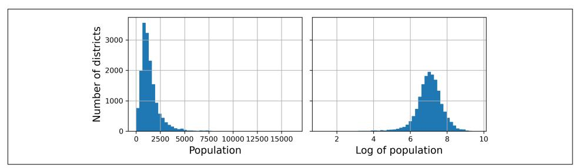

Figure 2-17. Transforming a feature to make it closer to a Gaussian distribution

Another approach to handle heavy-tailed features consists in bucketizing the feature. This means chopping its distribution into roughly equal-sized buckets, and replacing each feature value with the index of the bucket it belongs to, much like we did to create the income\_cat feature (although we only used it for stratified sampling). For example, you could replace each value with its percentile. Bucketizing with equal-sized buckets results in a feature with an almost uniform distribution, so there's no need for further scaling, or you can just divide by the number of buckets to force the values to the  $0-1$  range.

When a feature has a multimodal distribution (i.e., with two or more clear peaks, called *modes*), such as the housing median age feature, it can also be helpful to bucketize it, but this time treating the bucket IDs as categories, rather than as numerical values. This means that the bucket indices must be encoded, for example using a OneHotEncoder (so you usually don't want to use too many buckets). This approach will allow the regression model to more easily learn different rules for different ranges of this feature value. For example, perhaps houses built around 35 years ago have a peculiar style that fell out of fashion, and therefore they're cheaper than their age alone would suggest.

Another approach to transforming multimodal distributions is to add a feature for each of the modes (at least the main ones), representing the similarity between the housing median age and that particular mode. The similarity measure is typically computed using a *radial basis function* (RBF)—any function that depends only on the distance between the input value and a fixed point. The most commonly used RBF is the Gaussian RBF, whose output value decays exponentially as the input value moves away from the fixed point. For example, the Gaussian RBF similarity between the housing age x and 35 is given by the equation  $exp(-\gamma(x-35)^2)$ . The hyperparameter  $\gamma$  (gamma) determines how quickly the similarity measure decays as x moves away from 35. Using Scikit-Learn's rbf\_kernel() function, you can create a new Gaussian RBF feature measuring the similarity between the housing median age and 35:

{105}------------------------------------------------

```
from sklearn.metrics.pairwise import rbf_kernel
```

```
age_simil_35 = rbf_kernel(housing[["housing_median_age"]], [[35]], gamma=0.1)
```

Figure 2-18 shows this new feature as a function of the housing median age (solid line). It also shows what the feature would look like if you used a smaller gamma value. As the chart shows, the new age similarity feature peaks at 35, right around the spike in the housing median age distribution: if this particular age group is well correlated with lower prices, there's a good chance that this new feature will help.

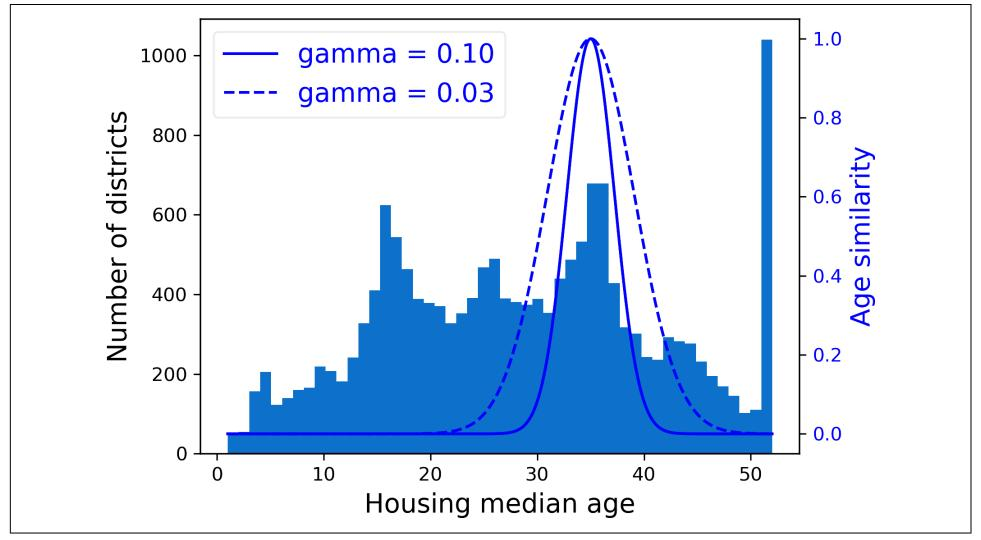

Figure 2-18. Gaussian RBF feature measuring the similarity between the housing median age and 35

So far we've only looked at the input features, but the target values may also need to be transformed. For example, if the target distribution has a heavy tail, you may choose to replace the target with its logarithm. But if you do, the regression model will now predict the *log* of the median house value, not the median house value itself. You will need to compute the exponential of the model's prediction if you want the predicted median house value.

Luckily, most of Scikit-Learn's transformers have an inverse\_transform() method, making it easy to compute the inverse of their transformations. For example, the following code example shows how to scale the labels using a StandardScaler (just like we did for inputs), then train a simple linear regression model on the resulting scaled labels and use it to make predictions on some new data, which we transform back to the original scale using the trained scaler's inverse transform() method. Note that we convert the labels from a Pandas Series to a DataFrame, since the 

{106}------------------------------------------------

StandardScaler expects 2D inputs. Also, in this example we just train the model on a single raw input feature (median income), for simplicity:

```
from sklearn.linear_model import LinearRegression
target\ scaler = StandardScalar()scaled_labels = target_scaler.fit_transform(housing_labels.to_frame())
model = LinearRegression()model.fit(housing[["median_income"]], scaled_labels)
some new data = housing[["median income"]].iloc[:5] # pretend this is new data
scaled predictions = model.predict(some new data)predictions = target_scaler.inverse_transform(scaled_predictions)
```

This works fine, but a simpler option is to use a TransformedTargetRegressor. We just need to construct it, giving it the regression model and the label transformer, then fit it on the training set, using the original unscaled labels. It will automatically use the transformer to scale the labels and train the regression model on the resulting scaled labels, just like we did previously. Then, when we want to make a prediction, it will call the regression model's predict() method and use the scaler's inverse\_trans form() method to produce the prediction:

```
from sklearn.compose import TransformedTargetRegressor
model = TransformedTargetRegressor(LinearRegression(),
                                   transformer=StandardScaler())
model.fit(housing[["median income"]], housing labels)
predictions = model.predict(some_new_data)
```

### **Custom Transformers**

Although Scikit-Learn provides many useful transformers, you will need to write your own for tasks such as custom transformations, cleanup operations, or combining specific attributes.

For transformations that don't require any training, you can just write a function that takes a NumPy array as input and outputs the transformed array. For example, as discussed in the previous section, it's often a good idea to transform features with heavy-tailed distributions by replacing them with their logarithm (assuming the feature is positive and the tail is on the right). Let's create a log-transformer and apply it to the population feature:

```
from sklearn.preprocessing import FunctionTransformer
log transformer = FunctionTransformer(np.log, inverse func=np.exp)
log_pop = log_transformer.transform(housing[["population"]])
```

{107}------------------------------------------------

The inverse func argument is optional. It lets you specify an inverse transform function, e.g., if you plan to use your transformer in a TransformedTargetRegressor.

Your transformation function can take hyperparameters as additional arguments. For example, here's how to create a transformer that computes the same Gaussian RBF similarity measure as earlier:

```
rbf transformer = FunctionTransformer(rbf kernel,
                                             kw_{\text{args}} = \text{dict}(Y = [[35.]], \text{gamma} = 0.1))age simil_35 = rbf_transformer.transform(housing[["housing_median_age"]])
```

Note that there's no inverse function for the RBF kernel, since there are always two values at a given distance from a fixed point (except at distance 0). Also note that rbf kernel() does not treat the features separately. If you pass it an array with two features, it will measure the 2D distance (Euclidean) to measure similarity. For example, here's how to add a feature that will measure the geographic similarity between each district and San Francisco:

```
sf\_coords = 37.7749, -122.41sf transformer = FunctionTransformer(rbf kernel,
                                            kw_{\text{args}} = \text{dict}(Y = [sf_{\text{coordinates}}], \text{gamma}=0.1)sf_simil = sf_transformer.transform(housing[["latitude", "longitude"]])
```

Custom transformers are also useful to combine features. For example, here's a FunctionTransformer that computes the ratio between the input features 0 and 1:

```
>>> ratio transformer = FunctionTransformer(lambda X: X[:, [0]] / X[:, [1]])
>>> ratio_transformer.transform(np.array([[1., 2.], [3., 4.]]))
array([[0.5],
      [0.75]
```

FunctionTransformer is very handy, but what if you would like your transformer to be trainable, learning some parameters in the fit() method and using them later in the transform() method? For this, you need to write a custom class. Scikit-Learn relies on duck typing, so this class does not have to inherit from any particular base class. All it needs is three methods: fit() (which must return self), transform(), and fit\_transform().

You can get fit\_transform() for free by simply adding TransformerMixin as a base class: the default implementation will just call  $fit()$  and then transform $()$ . If you add BaseEstimator as a base class (and avoid using \*args and \*\*kwargs in your constructor), you will also get two extra methods: get\_params() and set\_params(). These will be useful for automatic hyperparameter tuning.

For example, here's a custom transformer that acts much like the StandardScaler:

{108}------------------------------------------------

```
from sklearn.base import BaseEstimator, TransformerMixin
from sklearn.utils.validation import check_array, check_is_fitted
class StandardScalerClone(BaseEstimator, TransformerMixin):
   def init (self, with mean=True): # no *args or **kwargs!
       self. with_mean = with_meandef fit(self, X, y=None): # y is required even though we don't use it
       X = check array(X) # checks that X is an array with finite float values
       self. mean = X. mean(axis=0)
       self.scale_ = X.std(axis=0)self.n features in = X.shape[1] # every estimator stores this in fit()
       return self # always return self!
   def transform(self, X):
       check_is_fitted(self) # looks for learned attributes (with trailing )X = check array(X)assert self.n_features_in_ == X.shape[1]if self.with mean:
           X = X - self-meanreturn X / self.scale_
```

Here are a few things to note:

- The sklearn.utils.validation package contains several functions we can use to validate the inputs. For simplicity, we will skip such tests in the rest of this book, but production code should have them.
- Scikit-Learn pipelines require the fit() method to have two arguments X and y, which is why we need the y=None argument even though we don't use y.
- All Scikit-Learn estimators set n\_features\_in\_ in the fit() method, and they ensure that the data passed to transform() or predict() has this number of features.
- The fit() method must return self.
- This implementation is not 100% complete: all estimators should set feature\_names\_in\_ in the fit() method when they are passed a DataFrame. Moreover, all transformers should provide a get feature names out () method, as well as an inverse transform() method when their transformation can be reversed. See the last exercise at the end of this chapter for more details.

A custom transformer can (and often does) use other estimators in its implementation. For example, the following code demonstrates custom transformer that uses a KMeans clusterer in the  $fit()$  method to identify the main clusters in the training data, and then uses rbf kernel() in the transform() method to measure how similar each sample is to each cluster center:

{109}------------------------------------------------

from sklearn.cluster import KMeans

```
class ClusterSimilarity(BaseEstimator, TransformerMixin):
   def init (self, n clusters=10, gamma=1.0, random state=None):
       self.n clusters = n clusters
       self.gamma = gammaself.random_state = random_state
   def fit(self, X, y=None, sample weight=None):
       self.kmeans_ = KMeans(self.n_clusters, random_state=self.random_state)
       self.kmeans_.fit(X, sample_weight=sample_weight)
       return self # always return self!
   def transform(self, X):
       return rbf kernel(X, self.kmeans .cluster centers, gamma=self.gamma)
   def get feature names out(self, names=None):
       return [f"Cluster {i} similarity" for i in range(self.n_clusters)]
```


You can check whether your custom estimator respects Scikit-Learn's API by passing an instance to check\_estimator() from the sklearn.utils.estimator\_checks package. For the full API, check out https://scikit-learn.org/stable/developers.

As you will see in Chapter 9, k-means is a clustering algorithm that locates clusters in the data. How many it searches for is controlled by the n clusters hyperparameter. After training, the cluster centers are available via the cluster centers attribute. The fit() method of KMeans supports an optional argument sample weight, which lets the user specify the relative weights of the samples. k-means is a stochastic algorithm, meaning that it relies on randomness to locate the clusters, so if you want reproducible results, you must set the random\_state parameter. As you can see, despite the complexity of the task, the code is fairly straightforward. Now let's use this custom transformer:

```
cluster_simil = ClusterSimilarity(n_clusters=10, gamma=1., random_state=42)
similarities = cluster_simil.fit_transform(housing[["latitude", "longitude"]],
                                           sample_weight=housing_labels)
```

This code creates a Cluster Similarity transformer, setting the number of clusters to 10. Then it calls fit transform() with the latitude and longitude of every district in the training set, weighting each district by its median house value. The transformer uses k-means to locate the clusters, then measures the Gaussian RBF similarity between each district and all 10 cluster centers. The result is a matrix with one row per district, and one column per cluster. Let's look at the first three rows, rounding to two decimal places:

{110}------------------------------------------------

```
>>> similarities[:3].round(2)
array([[0. , 0.14, 0. , 0. , 0. , 0. , 0.08, 0. , 0.99, 0. , 0.6],[0.63, 0. , 0.99, 0. , 0. , 0. , 0.04, 0. , 0.11, 0. ][0. , 0.29, 0. , 0. , 0.01, 0.44, 0. , 0.7, 0. , 0.3 ]]
```

Figure 2-19 shows the 10 cluster centers found by k-means. The districts are colored according to their geographic similarity to their closest cluster center. As you can see, most clusters are located in highly populated and expensive areas.


Figure 2-19. Gaussian RBF similarity to the nearest cluster center

### **Transformation Pipelines**

As you can see, there are many data transformation steps that need to be executed in the right order. Fortunately, Scikit-Learn provides the Pipeline class to help with such sequences of transformations. Here is a small pipeline for numerical attributes, which will first impute then scale the input features:

```
from sklearn.pipeline import Pipeline
num pipeline = Pipeline(\lceil("impute", SimpleImputer(strategy="median")),
    ("standardize", StandardScaler()),
\left| \right\rangle
```

{111}------------------------------------------------

The Pipeline constructor takes a list of name/estimator pairs (2-tuples) defining a sequence of steps. The names can be anything you like, as long as they are unique and don't contain double underscores (\_). They will be useful later, when we discuss hyperparameter tuning. The estimators must all be transformers (i.e., they must have a fit\_transform() method), except for the last one, which can be anything: a transformer, a predictor, or any other type of estimator.


In a Jupyter notebook, if you import sklearn and run sklearn. set\_config(display="diagram"), all Scikit-Learn estimators will be rendered as interactive diagrams. This is particularly useful for visualizing pipelines. To visualize num pipeline, run a cell with num pipeline as the last line. Clicking an estimator will show more details.

If you don't want to name the transformers, you can use the make pipeline() function instead; it takes transformers as positional arguments and creates a Pipeline using the names of the transformers' classes, in lowercase and without underscores (e.g., "simpleimputer"):

```
from sklearn.pipeline import make pipeline
```

```
num_pipeline = make_pipeline(SimpleImputer(strategy="median"), StandardScaler())
```

If multiple transformers have the same name, an index is appended to their names (e.g., "foo-1", "foo-2", etc.).

When you call the pipeline's fit() method, it calls fit\_transform() sequentially on all the transformers, passing the output of each call as the parameter to the next call until it reaches the final estimator, for which it just calls the fit() method.

The pipeline exposes the same methods as the final estimator. In this example the last estimator is a StandardScaler, which is a transformer, so the pipeline also acts like a transformer. If you call the pipeline's transform() method, it will sequentially apply all the transformations to the data. If the last estimator were a predictor instead of a transformer, then the pipeline would have a predict() method rather than a transform() method. Calling it would sequentially apply all the transformations to the data and pass the result to the predictor's predict() method.

Let's call the pipeline's fit\_transform() method and look at the output's first two rows, rounded to two decimal places:

```
>>> housing_num_prepared = num_pipeline.fit_transform(housing num)
>>> housing num prepared[:2].round(2)
array([[ -1.42, 1.01, 1.86, 0.31, 1.37, 0.14, 1.39, -0.94],[0.6, -0.7, 0.91, -0.31, -0.44, -0.69, -0.37, 1.17]]
```

{112}------------------------------------------------

As you saw earlier, if you want to recover a nice DataFrame, you can use the pipeline's get feature names out() method:

```
df_housing_num_prepared = pd.DataFrame(housing_num_prepared, columns=num_pipeline.get_feature_names_out(),
   index=housing num.index)
```

Pipelines support indexing; for example,  $pi$ [1] returns the second estimator in the pipeline, and pipeline[:-1] returns a Pipeline object containing all but the last estimator. You can also access the estimators via the steps attribute, which is a list of name/estimator pairs, or via the named\_steps dictionary attribute, which maps the names to the estimators. For example, num pipeline["simpleimputer"] returns the estimator named "simpleimputer".

So far, we have handled the categorical columns and the numerical columns separately. It would be more convenient to have a single transformer capable of handling all columns, applying the appropriate transformations to each column. For this, you can use a ColumnTransformer. For example, the following ColumnTransformer will apply num\_pipeline (the one we just defined) to the numerical attributes and cat\_pipeline to the categorical attribute:

```
from sklearn.compose import ColumnTransformer
num_attribs = ["longitude", "latitude", "housing_median_age", "total_rooms",
               "total_bedrooms", "population", "households", "median_income"]
cat_attribute = ['ocean_proximity"]cat pipeline = make pipeline(
    SimpleImputer(strategy="most_frequent"),
    OneHotEncoder(handle unknown="ignore"))
preprocessing = ColumnTransformer(f)("num", num pipeline, num attribs),
    ("cat", cat_pipeline, cat_attribs),
\overline{1}
```

First we import the ColumnTransformer class, then we define the list of numerical and categorical column names and construct a simple pipeline for categorical attributes. Lastly, we construct a ColumnTransformer. Its constructor requires a list of triplets (3-tuples), each containing a name (which must be unique and not contain double underscores), a transformer, and a list of names (or indices) of columns that the transformer should be applied to.

{113}------------------------------------------------


Instead of using a transformer, you can specify the string "drop" if you want the columns to be dropped, or you can specify "passthrough" if you want the columns to be left untouched. By default, the remaining columns (i.e., the ones that were not listed) will be dropped, but you can set the remainder hyperparameter to any transformer (or to "passthrough") if you want these columns to be handled differently.

Since listing all the column names is not very convenient, Scikit-Learn provides a make\_column\_selector() function that returns a selector function you can use to automatically select all the features of a given type, such as numerical or categorical. You can pass this selector function to the ColumnTransformer instead of column names or indices. Moreover, if you don't care about naming the transformers, you can use make\_column\_transformer(), which chooses the names for you, just like make pipeline() does. For example, the following code creates the same ColumnTransformer as earlier, except the transformers are automatically named "pipeline-1" and "pipeline-2" instead of "num" and "cat":

```
from sklearn.compose import make_column_selector, make_column_transformer
preprocessing = make column transformer((num_pipeline, make_column_selector(dtype_include=np.number)),
   (cat pipeline, make column selector(dtype include=object)),
\lambda
```

Now we're ready to apply this ColumnTransformer to the housing data:

```
housing prepared = preprocessing.fit transform(housing)
```

Great! We have a preprocessing pipeline that takes the entire training dataset and applies each transformer to the appropriate columns, then concatenates the transformed columns horizontally (transformers must never change the number of rows). Once again this returns a NumPy array, but you can get the column names using preprocessing.get\_feature\_names\_out() and wrap the data in a nice DataFrame as we did before.


The OneHotEncoder returns a sparse matrix and the num pipeline returns a dense matrix. When there is such a mix of sparse and dense matrices, the ColumnTransformer estimates the density of the final matrix (i.e., the ratio of nonzero cells), and it returns a sparse matrix if the density is lower than a given threshold (by default, sparse threshold=0.3). In this example, it returns a dense matrix.

Your project is going really well and you're almost ready to train some models! You now want to create a single pipeline that will perform all the transformations you've experimented with up to now. Let's recap what the pipeline will do and why:

{114}------------------------------------------------

- Missing values in numerical features will be imputed by replacing them with the median, as most ML algorithms don't expect missing values. In categorical features, missing values will be replaced by the most frequent category.
- The categorical feature will be one-hot encoded, as most ML algorithms only accept numerical inputs.
- A few ratio features will be computed and added: bedrooms ratio, rooms per house, and people per house. Hopefully these will better correlate with the median house value, and thereby help the ML models.
- A few cluster similarity features will also be added. These will likely be more useful to the model than latitude and longitude.
- Features with a long tail will be replaced by their logarithm, as most models prefer features with roughly uniform or Gaussian distributions.
- All numerical features will be standardized, as most ML algorithms prefer when all features have roughly the same scale.

The code that builds the pipeline to do all of this should look familiar to you by now:

```
def column ratio(X):
    return X[:, [0]] / X[:, [1]]def ratio_name(function_transformer, feature_names_in):
    return ["ratio"] # feature names out
def ratio pipeline():
    return make_pipeline(
        SimpleImputer(strategy="median"),
        FunctionTransformer(column ratio, feature names out=ratio name),
        StandardScaler())
log_pipeline = make_pipeline(
    SimpleImputer(strategy="median"),
    FunctionTransformer(np.log, feature names out="one-to-one"),
    StandardScaler())
cluster_simil = ClusterSimilarity(n_clusters=10, gamma=1., random_state=42)
default_num_pipeline = make_pipeline(SimpleImputer(strategy="median"),
                                      StandardScaler())
preprocessing = ColumnTransformer(f)("bedrooms", ratio_pipeline(), ["total_bedrooms", "total_rooms"]),
        ("rooms_per_house", ratio_pipeline(), ["total_rooms", "households"]),
        ("people_per_house", ratio_pipeline(), ["population", "households"]),
        ("log", log_pipeline, ["total_bedrooms", "total_rooms", "population",
        "households", "median_income"]),<br>("geo", cluster_simil, ["latitude", "longitude"]),
        ("cat", cat_pipeline, make_column_selector(dtype_include=object)),
    J,
    remainder=default num pipeline) # one column remaining: housing median age
```

{115}------------------------------------------------

If you run this ColumnTransformer, it performs all the transformations and outputs a NumPy array with 24 features:

```
>>> housing_prepared = preprocessing.fit_transform(housing)
>>> housing_prepared.shape
(16512, 24)>>> preprocessing.get_feature_names_out()
array(['bedrooms__ratio', 'rooms_per_house__ratio',
       'people_per_house__ratio', 'log__total_bedrooms',
       'log_total_rooms', 'log_population', 'log_households',
       'log median income', 'geo Cluster 0 similarity', [\,\dots],
       'geo_Cluster 9 similarity', 'cat_ocean_proximity_<1H OCEAN',
       'cat_ocean_proximity_INLAND', 'cat_ocean_proximity_ISLAND',
       'cat__ocean_proximity_NEAR BAY', 'cat__ocean_proximity_NEAR OCEAN',
       'remainder__housing_median_age'], dtype=object)
```

## **Select and Train a Model**

At last! You framed the problem, you got the data and explored it, you sampled a training set and a test set, and you wrote a preprocessing pipeline to automatically clean up and prepare your data for machine learning algorithms. You are now ready to select and train a machine learning model.

### **Train and Evaluate on the Training Set**

The good news is that thanks to all these previous steps, things are now going to be easy! You decide to train a very basic linear regression model to get started:

```
from sklearn.linear_model import LinearRegression
lin_reg = make_pipeline(preprocessing, LinearRegression())
lin reg.fit(housing, housing labels)
```

Done! You now have a working linear regression model. You try it out on the training set, looking at the first five predictions and comparing them to the labels:

```
>>> housing_predictions = lin_reg.predict(housing)
>>> housing_predictions[:5].round(-2) # -2 = rounded to the nearest hundred
array([243700., 372400., 128800., 94400., 328300.])
>>> housing labels.iloc[:5].values
array([458300., 483800., 101700., 96100., 361800.])
```

Well, it works, but not always: the first prediction is way off (by over \$200,000!), while the other predictions are better: two are off by about 25%, and two are off by less than 10%. Remember that you chose to use the RMSE as your performance measure, so you want to measure this regression model's RMSE on the whole training set using Scikit-Learn's mean\_squared\_error() function, with the squared argument set to False:

{116}------------------------------------------------

```
>>> from sklearn.metrics import mean_squared_error
>>> lin rmse = mean squared error(housing labels, housing predictions,
                                    squared=False)
\ddotsc\ddotsc>>> lin_rmse
68687.89176589991
```

This is better than nothing, but clearly not a great score: the median\_housing\_values of most districts range between \$120,000 and \$265,000, so a typical prediction error of \$68,628 is really not very satisfying. This is an example of a model underfitting the training data. When this happens it can mean that the features do not provide enough information to make good predictions, or that the model is not powerful enough. As we saw in the previous chapter, the main ways to fix underfitting are to select a more powerful model, to feed the training algorithm with better features, or to reduce the constraints on the model. This model is not regularized, which rules out the last option. You could try to add more features, but first you want to try a more complex model to see how it does.

You decide to try a Decision Tree Regressor, as this is a fairly powerful model capable of finding complex nonlinear relationships in the data (decision trees are presented in more detail in Chapter 6):

```
from sklearn.tree import DecisionTreeRegressor
tree req = make pipeline(preprocessing, DecisionTreeReqressor(random state=42))
tree_reg.fit(housing, housing_labels)
```

Now that the model is trained, you evaluate it on the training set:

```
>>> housing predictions = tree reg.predict(housing)
>>> tree rmse = mean squared error(housing labels, housing predictions,
                                     squared=False)
\ddotsc\ddotsc>>> tree_rmse
0.0
```

Wait, what!? No error at all? Could this model really be absolutely perfect? Of course, it is much more likely that the model has badly overfit the data. How can you be sure? As you saw earlier, you don't want to touch the test set until you are ready to launch a model you are confident about, so you need to use part of the training set for training and part of it for model validation.

### **Better Evaluation Using Cross-Validation**

One way to evaluate the decision tree model would be to use the train test\_split() function to split the training set into a smaller training set and a validation set, then train your models against the smaller training set and evaluate them against the validation set. It's a bit of effort, but nothing too difficult, and it would work fairly well.

{117}------------------------------------------------

A great alternative is to use Scikit-Learn's k\_-fold cross-validation feature. The following code randomly splits the training set into 10 nonoverlapping subsets called folds, then it trains and evaluates the decision tree model 10 times, picking a different fold for evaluation every time and using the other 9 folds for training. The result is an array containing the 10 evaluation scores:

```
from sklearn.model_selection import cross_val_score
tree_rmses = -cross_val_score(tree_reg, housing, housing_labels,
                              scoring="neg root mean squared error", cv=10)
```


Scikit-Learn's cross-validation features expect a utility function (greater is better) rather than a cost function (lower is better), so the scoring function is actually the opposite of the RMSE. It's a negative value, so you need to switch the sign of the output to get the RMSE scores.

Let's look at the results:

```
>>> pd.Series(tree rmses).describe()
count10.000000
mean
        66868.027288
ht >
        2060.966425
min
        63649.536493
25%
        65338.078316
50%
        66801.953094
75%
        68229.934454
max70094.778246
dtype: float64
```

Now the decision tree doesn't look as good as it did earlier. In fact, it seems to perform almost as poorly as the linear regression model! Notice that cross-validation allows you to get not only an estimate of the performance of your model, but also a measure of how precise this estimate is (i.e., its standard deviation). The decision tree has an RMSE of about 66,868, with a standard deviation of about 2,061. You would not have this information if you just used one validation set. But cross-validation comes at the cost of training the model several times, so it is not always feasible.

If you compute the same metric for the linear regression model, you will find that the mean RMSE is 69,858 and the standard deviation is 4,182. So the decision tree model seems to perform very slightly better than the linear model, but the difference is minimal due to severe overfitting. We know there's an overfitting problem because the training error is low (actually zero) while the validation error is high.

Let's try one last model now: the RandomForestRegressor. As you will see in Chapter 7, random forests work by training many decision trees on random subsets of the features, then averaging out their predictions. Such models composed of many other models are called *ensembles*: they are capable of boosting the performance of 

{118}------------------------------------------------

the underlying model (in this case, decision trees). The code is much the same as earlier·

```
from sklearn.ensemble import RandomForestRegressor
forest req = make pipeline(preprocessing,RandomForestRegressor(random_state=42))
forest_rmses = -cross_val_score(forest_reg, housing, housing_labels,
                                scoring="neg_root_mean_squared_error", cv=10)
```

Let's look at the scores:

```
>>> pd.Series(forest_rmses).describe()
count
           10.000000
mean
        47019.561281
c+d1033.957120
min
        45458.112527
25%
        46464.031184
50%
        46967.596354
75%
        47325.694987
        49243.765795
max
dtype: float64
```

Wow, this is much better: random forests really look very promising for this task! However, if you train a RandomForest and measure the RMSE on the training set, you will find roughly 17,474; that's much lower, meaning that there's still quite a lot of overfitting going on. Possible solutions are to simplify the model, constrain it (i.e., regularize it), or get a lot more training data. Before you dive much deeper into random forests, however, you should try out many other models from various categories of machine learning algorithms (e.g., several support vector machines with different kernels, and possibly a neural network), without spending too much time tweaking the hyperparameters. The goal is to shortlist a few (two to five) promising models.

### **Fine-Tune Your Model**

Let's assume that you now have a shortlist of promising models. You now need to fine-tune them. Let's look at a few ways you can do that.

### **Grid Search**

One option would be to fiddle with the hyperparameters manually, until you find a great combination of hyperparameter values. This would be very tedious work, and you may not have time to explore many combinations.

Instead, you can use Scikit-Learn's GridSearchCV class to search for you. All you need to do is tell it which hyperparameters you want it to experiment with and what values to try out, and it will use cross-validation to evaluate all the possible combinations 

{119}------------------------------------------------

of hyperparameter values. For example, the following code searches for the best combination of hyperparameter values for the RandomForestRegressor:

```
from sklearn.model_selection import GridSearchCV
full pipeline = Pipeline(\lceil("preprocessing", preprocessing),
    ("random forest", RandomForestRegressor(random state=42)),
\left| \right\rangleparam\_grid = [{'preprocessing geo n clusters': [5, 8, 10],
     'random_forest__max_features': [4, 6, 8]},
    ['preprocessing_geo_n_clusters': [10, 15],
     'random_forest__max_features': [6, 8, 10]},
1
grid search = GridSearchCV(full pipeline, param grid, cv=3,
                            scoring='neg_root_mean_squared_error')
grid search.fit(housing, housing labels)
```

Notice that you can refer to any hyperparameter of any estimator in a pipeline, even if this estimator is nested deep inside several pipelines and column transformers. For example, when Scikit-Learn sees "preprocessing geo n clusters", it splits this string at the double underscores, then it looks for an estimator named "preprocessing" in the pipeline and finds the preprocessing ColumnTransformer. Next, it looks for a transformer named "geo" inside this ColumnTransformer and finds the ClusterSimilarity transformer we used on the latitude and longitude attributes. Then it finds this transformer's n\_clusters hyperparameter. Similarly, random\_forest\_max\_features refers to the max\_features hyperparameter of the estimator named "random\_forest", which is of course the RandomForest model (the max\_features hyperparameter will be explained in Chapter 7).


Wrapping preprocessing steps in a Scikit-Learn pipeline allows you to tune the preprocessing hyperparameters along with the model hyperparameters. This is a good thing since they often interact. For example, perhaps increasing n\_clusters requires increasing max features as well. If fitting the pipeline transformers is computationally expensive, you can set the pipeline's memory hyperparameter to the path of a caching directory: when you first fit the pipeline, Scikit-Learn will save the fitted transformers to this directory. If you then fit the pipeline again with the same hyperparameters, Scikit-Learn will just load the cached transformers.

There are two dictionaries in this param\_grid, so GridSearchCV will first evaluate all  $3 \times 3 = 9$  combinations of n\_clusters and max\_features hyperparameter values specified in the first dict, then it will try all  $2 \times 3 = 6$  combinations of hyperparameter values in the second dict. So in total the grid search will explore  $9 + 6 = 15$ 

{120}------------------------------------------------

combinations of hyperparameter values, and it will train the pipeline 3 times per combination, since we are using 3-fold cross validation. This means there will be a grand total of  $15 \times 3 = 45$  rounds of training! It may take a while, but when it is done you can get the best combination of parameters like this:

```
>>> grid_search.best_params_
{'preprocessing geo n clusters': 15, 'random forest max features': 6}
```

In this example, the best model is obtained by setting n clusters to 15 and setting max features to 8.


Since 15 is the maximum value that was evaluated for n clusters, you should probably try searching again with higher values; the score may continue to improve.

You can access the best estimator using grid\_search.best\_estimator\_. If GridSearchCV is initialized with refit=True (which is the default), then once it finds the best estimator using cross-validation, it retrains it on the whole training set. This is usually a good idea, since feeding it more data will likely improve its performance.

The evaluation scores are available using grid\_search.cv\_results\_. This is a dictionary, but if you wrap it in a DataFrame you get a nice list of all the test scores for each combination of hyperparameters and for each cross-validation split, as well as the mean test score across all splits:

```
>>> cv res = pd.DataFrame(grid search.cv results)
>>> cv_res.sort_values(by="mean_test_score", ascending=False, inplace=True)
>>> [...] # change column names to fit on this page, and show rmse = -score
>>> cv res.head() # note: the 1st column is the row ID
  n_clusters max_features split0 split1 split2 mean_test_rmse
                       6 43460 43919 44748
12
          15<sup>2</sup>44042
                      8 44132 44075 45010
1315
                                                          44406
                      10 44374 44286 45316
1415
                                                          44659
                       6 44683 44655 45657
\overline{7}10
                                                          44999
Q
          10
                       6 44683 44655 45657
                                                          44999
```

The mean test RMSE score for the best model is 44,042, which is better than the score you got earlier using the default hyperparameter values (which was 47,019). Congratulations, you have successfully fine-tuned your best model!

### **Randomized Search**

The grid search approach is fine when you are exploring relatively few combinations, like in the previous example, but RandomizedSearchCV is often preferable, especially when the hyperparameter search space is large. This class can be used in much the same way as the GridSearchCV class, but instead of trying out all possible

{121}------------------------------------------------

combinations it evaluates a fixed number of combinations, selecting a random value for each hyperparameter at every iteration. This may sound surprising, but this approach has several benefits:

- If some of your hyperparameters are continuous (or discrete but with many possible values), and you let randomized search run for, say, 1,000 iterations, then it will explore 1,000 different values for each of these hyperparameters, whereas grid search would only explore the few values you listed for each one.
- Suppose a hyperparameter does not actually make much difference, but you don't know it yet. If it has 10 possible values and you add it to your grid search, then training will take 10 times longer. But if you add it to a random search, it will not make any difference.
- If there are 6 hyperparameters to explore, each with 10 possible values, then grid search offers no other choice than training the model a million times, whereas random search can always run for any number of iterations you choose.

For each hyperparameter, you must provide either a list of possible values, or a probability distribution:

```
from sklearn.model_selection import RandomizedSearchCV
from scipy.stats import randint
param_distribs = {'preprocessing_geo_n_clusters': randint(low=3, high=50),
                  'random forest max features': randint(low=2, high=20)}
rnd search = RandomizedSearchCV(full pipeline, param distributions=param distribs, n iter=10, cv=3,
    scoring='neg_root_mean_squared_error', random_state=42)
```

```
rnd_search.fit(housing, housing_labels)
```

Scikit-Learn also has HalvingRandomSearchCV and HalvingGridSearchCV hyperparameter search classes. Their goal is to use the computational resources more efficiently, either to train faster or to explore a larger hyperparameter space. Here's how they work: in the first round, many hyperparameter combinations (called "candidates") are generated using either the grid approach or the random approach. These candidates are then used to train models that are evaluated using cross-validation, as usual. However, training uses limited resources, which speeds up this first round considerably. By default, "limited resources" means that the models are trained on a small part of the training set. However, other limitations are possible, such as reducing the number of training iterations if the model has a hyperparameter to set it. Once every candidate has been evaluated, only the best ones go on to the second round, where they are allowed more resources to compete. After several rounds, the final candidates are evaluated using full resources. This may save you some time tuning hyperparameters.

{122}------------------------------------------------

### **Fnsemble Methods**

Another way to fine-tune your system is to try to combine the models that perform best. The group (or "ensemble") will often perform better than the best individual model—just like random forests perform better than the individual decision trees they rely on—especially if the individual models make very different types of errors. For example, you could train and fine-tune a k-nearest neighbors model, then create an ensemble model that just predicts the mean of the random forest prediction and that model's prediction. We will cover this topic in more detail in Chapter 7.

### **Analyzing the Best Models and Their Errors**

You will often gain good insights on the problem by inspecting the best models. For example, the RandomForestRegressor can indicate the relative importance of each attribute for making accurate predictions:

```
>>> final model = rnd search.best estimator # includes preprocessing
>>> feature_importances = final_model["random_forest"].feature_importances_
>>> feature_importances.round(2)
array([0.07, 0.05, 0.05, 0.01, 0.01, 0.01, 0.01, 0.19, [...], 0.01])
```

Let's sort these importance scores in descending order and display them next to their corresponding attribute names:

```
>>> sorted(zip(feature importances,
              final_model["preprocessing"].get_feature_names_out()),
\ddotscreverse=True)
\overline{1}[(0.18694559869103852, 'log median income'),(0.0748194905715524, 'cat ocean proximity INLAND'),
(0.06926417748515576, 'bedrooms_ratio'),
(0.05446998753775219, 'rooms_per_house__ratio'),
(0.05262301809680712, 'people_per_house_ratio'),(0.03819415873915732, 'geo_Cluster 0 similarity'),
 [\ldots](0.00015061247730531558, 'cat_ocean_proximity_NEAR BAY'),
 (7.301686597099842e-05, 'cat_ocean_proximity_ISLAND')]
```

With this information, you may want to try dropping some of the less useful features (e.g., apparently only one ocean proximity category is really useful, so you could try dropping the others).


The sklearn.feature\_selection.SelectFromModel transformer can automatically drop the least useful features for you: when you fit it, it trains a model (typically a random forest), looks at its fea ture importances attribute, and selects the most useful features. Then when you call transform(), it drops the other features.

{123}------------------------------------------------

You should also look at the specific errors that your system makes, then try to understand why it makes them and what could fix the problem: adding extra features or getting rid of uninformative ones, cleaning up outliers, etc.

Now is also a good time to ensure that your model not only works well on average, but also on all categories of districts, whether they're rural or urban, rich or poor, northern or southern, minority or not, etc. Creating subsets of your validation set for each category takes a bit of work, but it's important: if your model performs poorly on a whole category of districts, then it should probably not be deployed until the issue is solved, or at least it should not be used to make predictions for that category, as it may do more harm than good.

### **Evaluate Your System on the Test Set**

After tweaking your models for a while, you eventually have a system that performs sufficiently well. You are ready to evaluate the final model on the test set. There is nothing special about this process; just get the predictors and the labels from your test set and run your final\_model to transform the data and make predictions, then evaluate these predictions:

```
X test = strat test set.drop("median house value", axis=1)
y_test = strat_test_set["median_house_value"].copy()
final_predictions = final_model.predict(X_test)
final_rmse = mean_squared_error(y_test, final_predictions, squared=False)
print(final_rmse) # prints 41424.40026462184
```

In some cases, such a point estimate of the generalization error will not be quite enough to convince you to launch: what if it is just 0.1% better than the model currently in production? You might want to have an idea of how precise this estimate is. For this, you can compute a 95% *confidence interval* for the generalization error using scipy.stats.t.interval(). You get a fairly large interval from 39,275 to 43,467, and your previous point estimate of 41,424 is roughly in the middle of it:

```
>>> from scipy import stats
\Rightarrow confidence = 0.95
\Rightarrow squared errors = (final predictions - y test) ** 2
>>> np.sqrt(stats.t.interval(confidence, len(squared_errors) - 1,
                                 loc=squared errors.mean().
\overline{1}\ddotscscale=stats.sem(squared errors)))
\overline{1}array([39275.40861216, 43467.27680583])
```

{124}------------------------------------------------

If you did a lot of hyperparameter tuning, the performance will usually be slightly worse than what you measured using cross-validation. That's because your system ends up fine-tuned to perform well on the validation data and will likely not perform as well on unknown datasets. That's not the case in this example since the test RMSE is lower than the validation RMSE, but when it happens you must resist the temptation to tweak the hyperparameters to make the numbers look good on the test set; the improvements would be unlikely to generalize to new data.

Now comes the project prelaunch phase: you need to present your solution (highlighting what you have learned, what worked and what did not, what assumptions were made, and what your system's limitations are), document everything, and create nice presentations with clear visualizations and easy-to-remember statements (e.g., "the median income is the number one predictor of housing prices"). In this California housing example, the final performance of the system is not much better than the experts' price estimates, which were often off by 30%, but it may still be a good idea to launch it, especially if this frees up some time for the experts so they can work on more interesting and productive tasks.

### Launch, Monitor, and Maintain Your System

Perfect, you got approval to launch! You now need to get your solution ready for production (e.g., polish the code, write documentation and tests, and so on). Then you can deploy your model to your production environment. The most basic way to do this is just to save the best model you trained, transfer the file to your production environment, and load it. To save the model, you can use the joblib library like this:

```
import joblib
```

```
joblib.dump(final_model, "my_california_housing_model.pkl")
```


It's often a good idea to save every model you experiment with so that you can come back easily to any model you want. You may also save the cross-validation scores and perhaps the actual predictions on the validation set. This will allow you to easily compare scores across model types, and compare the types of errors they make.

Once your model is transferred to production, you can load it and use it. For this you must first import any custom classes and functions the model relies on (which means transferring the code to production), then load the model using joblib and use it to make predictions:

{125}------------------------------------------------

```
import joblib
[...] # import KMeans, BaseEstimator, TransformerMixin, rbf kernel, etc.
def column ratio(X): [\dots]def ratio name(function transformer, feature names in): [...]
class ClusterSimilarity(BaseEstimator, TransformerMixin): [...]
final_model_reloaded = joblib.load("my_california_housing_model.pkl")
new data = [...] # some new districts to make predictions for
predictions = final_model_reloaded.predict(new_data)
```

For example, perhaps the model will be used within a website: the user will type in some data about a new district and click the Estimate Price button. This will send a query containing the data to the web server, which will forward it to your web application, and finally your code will simply call the model's predict() method (you want to load the model upon server startup, rather than every time the model is used). Alternatively, you can wrap the model within a dedicated web service that your web application can query through a REST API<sup>13</sup> (see Figure 2-20). This makes it easier to upgrade your model to new versions without interrupting the main application. It also simplifies scaling, since you can start as many web services as needed and load-balance the requests coming from your web application across these web services. Moreover, it allows your web application to use any programming language, not just Python.


Figure 2-20. A model deployed as a web service and used by a web application

Another popular strategy is to deploy your model to the cloud, for example on Google's Vertex AI (formerly known as Google Cloud AI Platform and Google Cloud ML Engine): just save your model using joblib and upload it to Google Cloud Storage (GCS), then head over to Vertex AI and create a new model version, pointing it to the GCS file. That's it! This gives you a simple web service that takes care of load balancing and scaling for you. It takes JSON requests containing the input data (e.g., of a district) and returns JSON responses containing the predictions. You can then use this web service in your website (or whatever production environment you are using). As you will see in Chapter 19, deploying TensorFlow models on Vertex AI is not much different from deploying Scikit-Learn models.

<sup>13</sup> In a nutshell, a REST (or RESTful) API is an HTTP-based API that follows some conventions, such as using standard HTTP verbs to read, update, create, or delete resources (GET, POST, PUT, and DELETE) and using JSON for the inputs and outputs.

{126}------------------------------------------------

But deployment is not the end of the story. You also need to write monitoring code to check your system's live performance at regular intervals and trigger alerts when it drops. It may drop very quickly, for example if a component breaks in your infrastructure, but be aware that it could also decay very slowly, which can easily go unnoticed for a long time. This is quite common because of model rot: if the model was trained with last year's data, it may not be adapted to today's data.

So, you need to monitor your model's live performance. But how do you do that? Well, it depends. In some cases, the model's performance can be inferred from downstream metrics. For example, if your model is part of a recommender system and it suggests products that the users may be interested in, then it's easy to monitor the number of recommended products sold each day. If this number drops (compared to non-recommended products), then the prime suspect is the model. This may be because the data pipeline is broken, or perhaps the model needs to be retrained on fresh data (as we will discuss shortly).

However, you may also need human analysis to assess the model's performance. For example, suppose you trained an image classification model (we'll look at these in Chapter 3) to detect various product defects on a production line. How can you get an alert if the model's performance drops, before thousands of defective products get shipped to your clients? One solution is to send to human raters a sample of all the pictures that the model classified (especially pictures that the model wasn't so sure about). Depending on the task, the raters may need to be experts, or they could be nonspecialists, such as workers on a crowdsourcing platform (e.g., Amazon Mechanical Turk). In some applications they could even be the users themselves, responding, for example, via surveys or repurposed captchas.<sup>14</sup>

Either way, you need to put in place a monitoring system (with or without human raters to evaluate the live model), as well as all the relevant processes to define what to do in case of failures and how to prepare for them. Unfortunately, this can be a lot of work. In fact, it is often much more work than building and training a model.

If the data keeps evolving, you will need to update your datasets and retrain your model regularly. You should probably automate the whole process as much as possible. Here are a few things you can automate:

- Collect fresh data regularly and label it (e.g., using human raters).
- Write a script to train the model and fine-tune the hyperparameters automatically. This script could run automatically, for example every day or every week, depending on your needs.

<sup>14</sup> A captcha is a test to ensure a user is not a robot. These tests have often been used as a cheap way to label training data.

{127}------------------------------------------------

• Write another script that will evaluate both the new model and the previous model on the updated test set, and deploy the model to production if the performance has not decreased (if it did, make sure you investigate why). The script should probably test the performance of your model on various subsets of the test set, such as poor or rich districts, rural or urban districts, etc.

You should also make sure you evaluate the model's input data quality. Sometimes performance will degrade slightly because of a poor-quality signal (e.g., a malfunctioning sensor sending random values, or another team's output becoming stale), but it may take a while before your system's performance degrades enough to trigger an alert. If you monitor your model's inputs, you may catch this earlier. For example, you could trigger an alert if more and more inputs are missing a feature, or the mean or standard deviation drifts too far from the training set, or a categorical feature starts containing new categories.

Finally, make sure you keep backups of every model you create and have the process and tools in place to roll back to a previous model quickly, in case the new model starts failing badly for some reason. Having backups also makes it possible to easily compare new models with previous ones. Similarly, you should keep backups of every version of your datasets so that you can roll back to a previous dataset if the new one ever gets corrupted (e.g., if the fresh data that gets added to it turns out to be full of outliers). Having backups of your datasets also allows you to evaluate any model against any previous dataset.

As you can see, machine learning involves quite a lot of infrastructure. Chapter 19 discusses some aspects of this, but it's a very broad topic called ML Operations (MLOps), which deserves its own book. So don't be surprised if your first ML project takes a lot of effort and time to build and deploy to production. Fortunately, once all the infrastructure is in place, going from idea to production will be much faster.

## Try It Out!

Hopefully this chapter gave you a good idea of what a machine learning project looks like as well as showing you some of the tools you can use to train a great system. As you can see, much of the work is in the data preparation step: building monitoring tools, setting up human evaluation pipelines, and automating regular model training. The machine learning algorithms are important, of course, but it is probably preferable to be comfortable with the overall process and know three or four algorithms well rather than to spend all your time exploring advanced algorithms.

So, if you have not already done so, now is a good time to pick up a laptop, select a dataset that you are interested in, and try to go through the whole process from A to Z. A good place to start is on a competition website such as Kaggle: you will have a dataset to play with, a clear goal, and people to share the experience with. Have fun!

{128}------------------------------------------------

### **Exercises**

The following exercises are based on this chapter's housing dataset:

- 1. Try a support vector machine regressor (sklearn.svm.SVR) with various hyperparameters, such as kernel="linear" (with various values for the C hyperparameter) or kernel="rbf" (with various values for the C and gamma hyperparameters). Note that support vector machines don't scale well to large datasets, so you should probably train your model on just the first 5,000 instances of the training set and use only 3-fold cross-validation, or else it will take hours. Don't worry about what the hyperparameters mean for now; we'll discuss them in Chapter 5. How does the best SVR predictor perform?
- 2. Try replacing the GridSearchCV with a RandomizedSearchCV.
- 3. Try adding a SelectFromModel transformer in the preparation pipeline to select only the most important attributes.
- 4. Try creating a custom transformer that trains a  $k$ -nearest neighbors regressor (sklearn.neighbors.KNeighborsRegressor) in its fit() method, and outputs the model's predictions in its transform() method. Then add this feature to the preprocessing pipeline, using latitude and longitude as the inputs to this transformer. This will add a feature in the model that corresponds to the housing median price of the nearest districts.
- 5. Automatically explore some preparation options using GridSearchCV.
- 6. Try to implement the StandardScalerClone class again from scratch, then add support for the inverse\_transform() method: executing scaler. inverse\_transform(scaler.fit\_transform(X)) should return an array very close to X. Then add support for feature names: set feature\_names\_in\_ in the fit() method if the input is a DataFrame. This attribute should be a NumPy array of column names. Lastly, implement the get\_feature\_names\_out() method: it should have one optional input\_features=None argument. If passed, the method should check that its length matches n features in, and it should match feature\_names\_in\_ if it is defined; then input\_features should be returned. If input features is None, then the method should either return feature\_names\_in\_ if it is defined or np.array( $['x0", 'x1", ...]$ ) with length n\_features\_in\_otherwise.

Solutions to these exercises are available at the end of this chapter's notebook, at https://homl.info/colab3.

{129}------------------------------------------------

{130}------------------------------------------------

## **CHAPTER 3** Classification

In Chapter 1 I mentioned that the most common supervised learning tasks are regression (predicting values) and classification (predicting classes). In Chapter 2 we explored a regression task, predicting housing values, using various algorithms such as linear regression, decision trees, and random forests (which will be explained in further detail in later chapters). Now we will turn our attention to classification systems.

### **MNIST**

In this chapter we will be using the MNIST dataset, which is a set of 70,000 small images of digits handwritten by high school students and employees of the US Census Bureau. Each image is labeled with the digit it represents. This set has been studied so much that it is often called the "hello world" of machine learning: whenever people come up with a new classification algorithm they are curious to see how it will perform on MNIST, and anyone who learns machine learning tackles this dataset sooner or later.

Scikit-Learn provides many helper functions to download popular datasets. MNIST is one of them. The following code fetches the MNIST dataset from OpenML.org:1

```
from sklearn.datasets import fetch_openml
```

mnist = fetch\_openml('mnist\_784', as\_frame=False)

The sklearn.datasets package contains mostly three types of functions: fetch \* functions such as fetch openml() to download real-life datasets, load \* functions

<sup>1</sup> By default Scikit-Learn caches downloaded datasets in a directory called scikit\_learn\_data in your home directory.

{131}------------------------------------------------

to load small toy datasets bundled with Scikit-Learn (so they don't need to be downloaded over the internet), and make\_\* functions to generate fake datasets, useful for tests. Generated datasets are usually returned as an  $(X, y)$  tuple containing the input data and the targets, both as NumPy arrays. Other datasets are returned as sklearn.utils. Bunch objects, which are dictionaries whose entries can also be accessed as attributes. They generally contain the following entries:

"DESCR"

A description of the dataset

"data"

The input data, usually as a 2D NumPy array

"target"

The labels, usually as a 1D NumPy array

The fetch\_openml() function is a bit unusual since by default it returns the inputs as a Pandas DataFrame and the labels as a Pandas Series (unless the dataset is sparse). But the MNIST dataset contains images, and DataFrames aren't ideal for that, so it's preferable to set as frame=False to get the data as NumPy arrays instead. Let's look at these arrays:

```
\Rightarrow X, y =  mnist.data, mnist.target
>><sub>x</sub>array([[0., 0., 0., ..., 0., 0., 0.],[0., 0., 0., ..., 0., 0., 0.],[0., 0., 0., ..., 0., 0., 0.],\cdots[0., 0., 0., ..., 0., 0., 0.],[0., 0., 0., ..., 0., 0., 0.],[0., 0., 0., ..., 0., 0., 0.]>>> X.shape
(70000, 784)>><sub>2</sub>array(['5', '0', '4', ..., '4', '5', '6'], dtype=object)
>>> v.shape
(70000, )
```

There are 70,000 images, and each image has 784 features. This is because each image is  $28 \times 28$  pixels, and each feature simply represents one pixel's intensity, from 0 (white) to 255 (black). Let's take a peek at one digit from the dataset (Figure 3-1). All we need to do is grab an instance's feature vector, reshape it to a  $28 \times 28$  array, and display it using Matplotlib's imshow() function. We use cmap="binary" to get a grayscale color map where 0 is white and 255 is black:

{132}------------------------------------------------

```
import matplotlib.pyplot as plt
def plot_digit(image_data):
    image = image data.reshape(28, 28)plt.imshow(image, cmap="binary")
    plt.axis("off")
some_digit = X[0]plot digit(some digit)
plt.show()
```

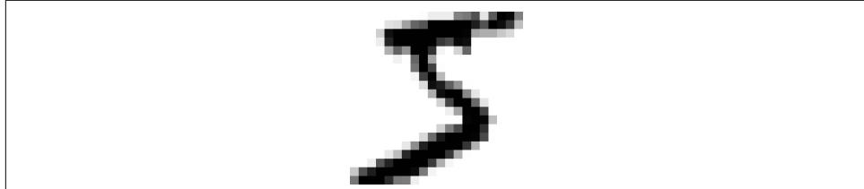

Figure 3-1. Example of an MNIST image

This looks like a 5, and indeed that's what the label tells us:

```
\frac{3}{5} y[0]
```

To give you a feel for the complexity of the classification task, Figure 3-2 shows a few more images from the MNIST dataset.

But wait! You should always create a test set and set it aside before inspecting the data closely. The MNIST dataset returned by fetch openml() is actually already split into a training set (the first  $60,000$  images) and a test set (the last  $10,000$  images):<sup>2</sup>

```
X_train, X_test, y_train, y_test = X[:60000], X[60000:], y[:60000], y[60000:]
```

The training set is already shuffled for us, which is good because this guarantees that all cross-validation folds will be similar (we don't want one fold to be missing some digits). Moreover, some learning algorithms are sensitive to the order of the training instances, and they perform poorly if they get many similar instances in a row. Shuffling the dataset ensures that this won't happen.<sup>3</sup>

<sup>2</sup> Datasets returned by fetch\_openml() are not always shuffled or split.

<sup>3</sup> Shuffling may be a bad idea in some contexts—for example, if you are working on time series data (such as stock market prices or weather conditions). We will explore this in Chapter 15.

{133}------------------------------------------------


Figure 3-2. Digits from the MNIST dataset

### **Training a Binary Classifier**

Let's simplify the problem for now and only try to identify one digit—for example, the number 5. This "5-detector" will be an example of a *binary classifier*, capable of distinguishing between just two classes, 5 and non-5. First we'll create the target vectors for this classification task:

```
y_train_5 = (y_train == '5') # True for all 5s, False for all other digits
y_t = f_5 = (y_t + f_5)
```

Now let's pick a classifier and train it. A good place to start is with a *stochastic gra*dient descent (SGD, or stochastic GD) classifier, using Scikit-Learn's SGDClassifier class. This classifier is capable of handling very large datasets efficiently. This is in part because SGD deals with training instances independently, one at a time, which also makes SGD well suited for online learning, as you will see later. Let's create an SGDClassifier and train it on the whole training set:

```
from sklearn.linear_model import SGDClassifier
sgd_clf = SGDClassifier(random_state=42)
sgd_clf.fit(X_train, y_train_5)
```

{134}------------------------------------------------

Now we can use it to detect images of the number 5:

```
>>> sqd clf.predict([some digit])
array([ True])
```

The classifier guesses that this image represents a  $5$  ( $True$ ). Looks like it guessed right in this particular case! Now, let's evaluate this model's performance.

### **Performance Measures**

Evaluating a classifier is often significantly trickier than evaluating a regressor, so we will spend a large part of this chapter on this topic. There are many performance measures available, so grab another coffee and get ready to learn a bunch of new concepts and acronyms!

### **Measuring Accuracy Using Cross-Validation**

A good way to evaluate a model is to use cross-validation, just as you did in Chapter 2. Let's use the cross val score() function to evaluate our SGDClassifier model, using k-fold cross-validation with three folds. Remember that k-fold crossvalidation means splitting the training set into  $k$  folds (in this case, three), then training the model  $k$  times, holding out a different fold each time for evaluation (see Chapter 2):

```
>>> from sklearn.model selection import cross val score
>>> cross_val_score(sgd_clf, X_train, y_train_5, cv=3, scoring="accuracy")
array([0.95035, 0.96035, 0.9604])
```

Wow! Above 95% accuracy (ratio of correct predictions) on all cross-validation folds? This looks amazing, doesn't it? Well, before you get too excited, let's look at a dummy classifier that just classifies every single image in the most frequent class, which in this case is the negative class (i.e., *non* 5):

```
from sklearn.dummy import DummyClassifier
dump_clf = DummyClassifier()dummy_clf.fit(X_train, y_train_5)
print(any(dummy_clf.predict(X_train))) # prints False: no 5s detected
```

Can you guess this model's accuracy? Let's find out:

```
>>> cross val score(dummy clf, X train, y train 5, cv=3, scoring="accuracy")
array([0.90965, 0.90965, 0.90965])
```

That's right, it has over 90% accuracy! This is simply because only about 10% of the images are 5s, so if you always guess that an image is *not* a 5, you will be right about 90% of the time. Beats Nostradamus.

This demonstrates why accuracy is generally not the preferred performance measure for classifiers, especially when you are dealing with *skewed datasets* (i.e., when some 

{135}------------------------------------------------

classes are much more frequent than others). A much better way to evaluate the performance of a classifier is to look at the *confusion matrix* (CM).

### **Implementing Cross-Validation**

**Occasionally** you will need more control over the cross-validation process than what Scikit-Learn provides off the shelf. In these cases, you can implement crossvalidation yourself. The following code does roughly the same thing as Scikit-Learn's cross val score() function, and it prints the same result:

```
from sklearn.model_selection import StratifiedKFold
from sklearn.base import clone
skfolds = StratifiedKFold(n splits=3) # add shuffle=True if the dataset is
                                      # not already shuffled
for train_index, test_index in skfolds.split(X_train, y_train_5):
   clone c1f = clone(sgd c1f)X train folds = X train[train index]
   y_train_folds = y_train_5[train_index]X_test_fold = X_train[test_index]y_test_fold = y_train_5[test_index]clone_clf.fit(X_train_folds, y_train_folds)
    y pred = clone_clf.predict(X_test_fold)
    n correct = sum(y pred == y test fold)
    print(n_correct / len(y_pred)) # prints 0.95035, 0.96035, and 0.9604
```

The StratifiedKFold class performs stratified sampling (as explained in Chapter 2) to produce folds that contain a representative ratio of each class. At each iteration the code creates a clone of the classifier, trains that clone on the training folds, and makes predictions on the test fold. Then it counts the number of correct predictions and outputs the ratio of correct predictions.

### **Confusion Matrices**

The general idea of a confusion matrix is to count the number of times instances of class A are classified as class B, for all A/B pairs. For example, to know the number of times the classifier confused images of 8s with 0s, you would look at row #8, column  $#0$  of the confusion matrix.

To compute the confusion matrix, you first need to have a set of predictions so that they can be compared to the actual targets. You could make predictions on the test set, but it's best to keep that untouched for now (remember that you want to use the test set only at the very end of your project, once you have a classifier that you are ready to launch). Instead, you can use the cross val predict() function:

{136}------------------------------------------------

```
from sklearn.model_selection import cross_val_predict
```

```
y_train_pred = cross_val_predict(sgd_clf, X_train, y_train_5, cv=3)
```

Just like the cross\_val\_score() function, cross\_val\_predict() performs k-fold cross-validation, but instead of returning the evaluation scores, it returns the predictions made on each test fold. This means that you get a clean prediction for each instance in the training set (by "clean" I mean "out-of-sample": the model makes predictions on data that it never saw during training).

Now you are ready to get the confusion matrix using the confusion\_matrix() function. Just pass it the target classes (y\_train\_5) and the predicted classes (y\_train\_pred):

```
>>> from sklearn.metrics import confusion matrix
>>> cm = confusion_matrix(y_train_5, y_train_pred)
>>> CM
array([[53892, 687],\begin{bmatrix} 1891, & 353011 \end{bmatrix}
```

Each row in a confusion matrix represents an *actual class*, while each column represents a *predicted class*. The first row of this matrix considers non-5 images (the negative class): 53,892 of them were correctly classified as non-5s (they are called true negatives), while the remaining 687 were wrongly classified as 5s (false positives, also called type I errors). The second row considers the images of 5s (the positive class): 1,891 were wrongly classified as non-5s (false negatives, also called type II errors), while the remaining 3,530 were correctly classified as 5s (true positives). A perfect classifier would only have true positives and true negatives, so its confusion matrix would have nonzero values only on its main diagonal (top left to bottom right):

```
>>> y train perfect predictions = y train 5 # pretend we reached perfection
>>> confusion_matrix(y_train_5, y_train_perfect_predictions)
array([[54579,
                 \lbrack 0 \rbrack,0, 5421])
       ſ.
```

The confusion matrix gives you a lot of information, but sometimes you may prefer a more concise metric. An interesting one to look at is the accuracy of the positive predictions; this is called the *precision* of the classifier (Equation 3-1).

Equation 3-1. Precision

precision =  $\frac{TP}{TP + FP}$ 

TP is the number of true positives, and FP is the number of false positives.

A trivial way to have perfect precision is to create a classifier that always makes negative predictions, except for one single positive prediction on the instance it's 

{137}------------------------------------------------

most confident about. If this one prediction is correct, then the classifier has 100% precision (precision =  $1/1$  = 100%). Obviously, such a classifier would not be very useful, since it would ignore all but one positive instance. So, precision is typically used along with another metric named *recall*, also called *sensitivity* or the *true positive* rate (TPR): this is the ratio of positive instances that are correctly detected by the classifier (Equation 3-2).

Equation 3-2. Recall  $\overline{a}$ 

$$
\text{recall} = \frac{TP}{TP + FN}
$$

FN is, of course, the number of false negatives.

If you are confused about the confusion matrix, Figure 3-3 may help.

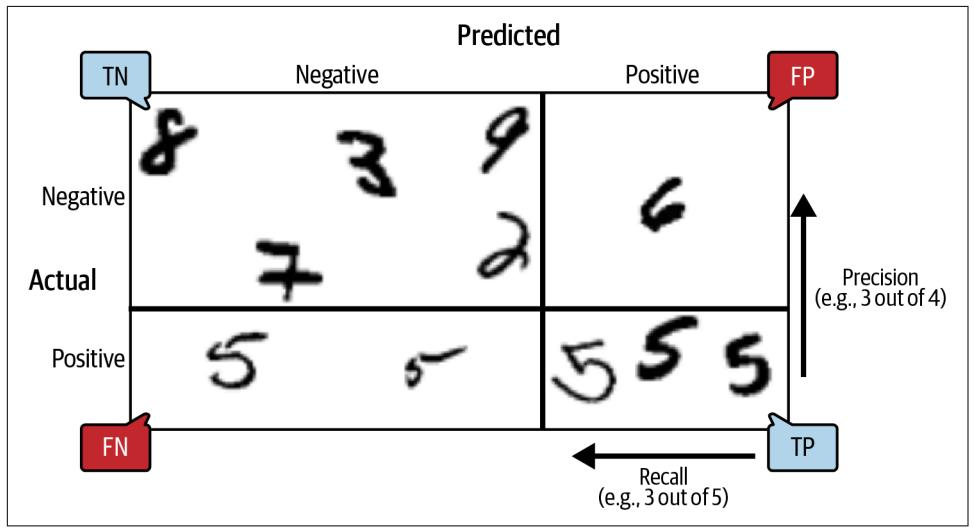

Figure 3-3. An illustrated confusion matrix showing examples of true negatives (top left), false positives (top right), false negatives (lower left), and true positives (lower right)

### **Precision and Recall**

Scikit-Learn provides several functions to compute classifier metrics, including precision and recall:

```
>>> from sklearn.metrics import precision_score, recall_score
>>> precision_score(y_train_5, y_train_pred) # == 3530 / (687 + 3530)0.8370879772350012
>>> recall_score(y_train_5, y_train_pred) # == 3530 / (1891 + 3530)0.6511713705958311
```

{138}------------------------------------------------

Now our 5-detector does not look as **shiny** as it did when we looked at its accuracy. When it claims an image represents a 5, it is correct only 83.7% of the time. Moreover, it only detects 65.1% of the 5s.

It is often convenient to combine precision and recall into a single metric called the  $F_1$  score, especially when you need a single metric to compare two classifiers. The  $F_1$  score is the *harmonic mean* of precision and recall (Equation 3-3). Whereas the regular mean treats all values equally, the harmonic mean gives much more weight to low values. As a result, the classifier will only get a high  $F<sub>1</sub>$  score if both recall and precision are high.

Equation 3-3.  $F_i$  score

 $F_1 = \frac{2}{\frac{1}{\text{precision}} + \frac{1}{\text{recall}}} = 2 \times \frac{\text{precision} \times \text{recall}}{\text{precision} + \text{recall}} = \frac{TP}{TP + \frac{FN + FP}{2}}$ 

To compute the  $F_1$  score, simply call the  $f_1$  score() function:

>>> from sklearn.metrics import f1 score >>> f1\_score(y\_train\_5, y\_train\_pred) 0.7325171197343846

The  $F_1$  score favors classifiers that have similar precision and recall. This is not always what you want: in some contexts you mostly care about precision, and in other contexts you really care about recall. For example, if you trained a classifier to detect videos that are safe for kids, you would probably prefer a classifier that rejects many good videos (low recall) but keeps only safe ones (high precision), rather than a classifier that has a much higher recall but lets a few really bad videos show up in your product (in such cases, you may even want to add a human pipeline to check the classifier's video selection). On the other hand, suppose you train a classifier to detect shoplifters in surveillance images: it is probably fine if your classifier only has 30% precision as long as it has 99% recall (sure, the security guards will get a few false alerts, but almost all shoplifters will get caught).

Unfortunately, you can't have it both ways: increasing precision reduces recall, and vice versa. This is called the precision/recall trade-off.

### **The Precision/Recall Trade-off**

To understand this trade-off, let's look at how the SGDClassifier makes its classification decisions. For each instance, it computes a score based on a *decision function*. If that score is greater than a threshold, it assigns the instance to the positive class; otherwise it assigns it to the negative class. Figure 3-4 shows a few digits positioned from the lowest score on the left to the highest score on the right. Suppose the decision threshold is positioned at the central arrow (between the two 5s): you will 

{139}------------------------------------------------

find 4 true positives (actual 5s) on the right of that threshold, and 1 false positive (actually a 6). Therefore, with that threshold, the precision is 80% (4 out of 5). But out of 6 actual 5s, the classifier only detects 4, so the recall is 67% (4 out of 6). If you raise the threshold (move it to the arrow on the right), the false positive (the 6) becomes a true negative, thereby increasing the precision (up to 100% in this case), but one true positive becomes a false negative, decreasing recall down to 50%. Conversely, lowering the threshold increases recall and reduces precision.

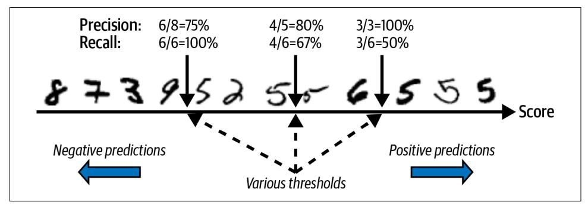

Figure 3-4. The precision/recall trade-off: images are ranked by their classifier score, and those above the chosen decision threshold are considered positive; the higher the threshold, the lower the recall, but (in general) the higher the precision

Scikit-Learn does not let you set the threshold directly, but it does give you access to the decision scores that it uses to make predictions. Instead of calling the classifier's predict() method, you can call its decision function() method, which returns a score for each instance, and then use any threshold you want to make predictions based on those scores:

```
>>> y_scores = sgd_clf.decision_function([some_digit])
>>> y_scores
array([2164.22030239])
\Rightarrow threshold = 0
>>> y_some_digit_pred = (y_scores > threshold)
array([True])
```

The SGDClassifier uses a threshold equal to 0, so the preceding code returns the same result as the predict() method (i.e., True). Let's raise the threshold:

```
\Rightarrow threshold = 3000
>>> y_some_digit_pred = (y_scores > threshold)
>>> y some digit pred
array([False])
```

This confirms that raising the threshold decreases recall. The image actually represents a 5, and the classifier detects it when the threshold is 0, but it misses it when the threshold is increased to 3,000.

{140}------------------------------------------------

How do you decide which threshold to use? First, use the cross val predict() function to get the scores of all instances in the training set, but this time specify that you want to return decision scores instead of predictions:

```
y_scores = cross_val_predict(sgd_clf, X_train, y_train_5, cv=3,
                             method="decision function")
```

With these scores, use the precision recall curve() function to compute precision and recall for all possible thresholds (the function adds a last precision of 0 and a last recall of 1, corresponding to an infinite threshold):

```
from sklearn.metrics import precision recall curve
```

```
precisions, recalls, thresholds = precision recall curve(y train 5, y scores)
```

Finally, use Matplotlib to plot precision and recall as functions of the threshold value (Figure 3-5). Let's show the threshold of 3,000 we selected:

```
plt.plot(thresholds, precisions[:-1], "b--", label="Precision", linewidth=2)
plt.plot(thresholds, recalls[:-1], "g-", label="Recall", linewidth=2)
plt.vlines(threshold, 0, 1.0, "k", "dotted", label="threshold")
\left[ \ldots \right] # beautify the figure: add grid, legend, axis, labels, and circles
plt.show()
```

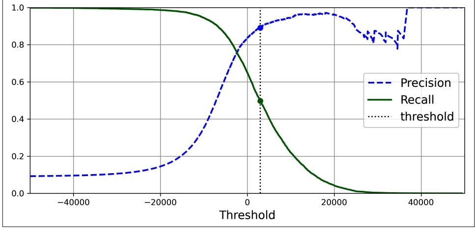

Figure 3-5. Precision and recall versus the decision threshold


You may wonder why the precision curve is bumpier than the recall curve in Figure 3-5. The reason is that precision may sometimes go down when you raise the threshold (although in general it will go up). To understand why, look back at Figure 3-4 and notice what happens when you start from the central threshold and move it just one digit to the right: precision goes from 4/5 (80%) down to 3/4 (75%). On the other hand, recall can only go down when the threshold is increased, which explains why its curve looks smooth.

{141}------------------------------------------------

At this threshold value, precision is near 90% and recall is around 50%. Another way to select a good precision/recall trade-off is to plot precision directly against recall, as shown in Figure 3-6 (the same threshold is shown):

```
plt.plot(recalls, precisions, linewidth=2, label="Precision/Recall curve")
[...] # beautify the figure: add labels, grid, legend, arrow, and text
plt.show()
```

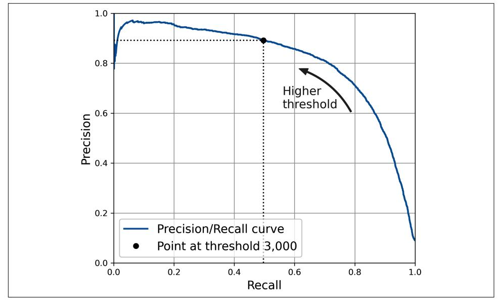

Figure 3-6. Precision versus recall

You can see that precision really starts to fall sharply at around 80% recall. You will probably want to select a precision/recall trade-off just before that drop-for example, at around 60% recall. But of course, the choice depends on your project.

Suppose you decide to aim for 90% precision. You could use the first plot to find the threshold you need to use, but that's not very precise. Alternatively, you can search for the lowest threshold that gives you at least 90% precision. For this, you can use the NumPy array's argmax() method. This returns the first index of the maximum value, which in this case means the first True value:

```
\Rightarrow idx for 90 precision = (precisions >= 0.90).argmax()
>>> threshold_for_90_precision = thresholds[idx_for_90_precision]
>>> threshold for 90 precision
3370.0194991439557
```

{142}------------------------------------------------

To make predictions (on the training set for now), instead of calling the classifier's predict() method, you can run this code:

```
y_train_pred_90 = (y_scores >= threshold-for_90_precision)
```

Let's check these predictions' precision and recall:

```
>>> precision score(y train 5, y train pred 90)
0.9000345901072293
>>> recall_at_90_precision = recall_score(y_train_5, y_train_pred_90)
>>> recall at 90 precision
0.4799852425751706
```

Great, you have a 90% precision classifier! As you can see, it is fairly easy to create a classifier with virtually any precision you want: just set a high enough threshold, and you're done. But wait, not so fast-a high-precision classifier is not very useful if its recall is too low! For many applications, 48% recall wouldn't be great at all.


If someone says, "Let's reach 99% precision", you should ask, "At what recall?"

### **The ROC Curve**

The receiver operating characteristic (ROC) curve is another common tool used with binary classifiers. It is very similar to the precision/recall curve, but instead of plotting precision versus recall, the ROC curve plots the *true positive rate* (another name for recall) against the *false positive rate* (FPR). The FPR (also called the *fall-out*) is the ratio of negative instances that are incorrectly classified as positive. It is equal to 1 – the *true negative rate* (TNR), which is the ratio of negative instances that are correctly classified as negative. The TNR is also called *specificity*. Hence, the ROC curve plots sensitivity (recall) versus  $1$  – specificity.

To plot the ROC curve, you first use the roc\_curve() function to compute the TPR and FPR for various threshold values:

```
from sklearn.metrics import roc curve
```

```
fpr, tpr, thresholds = roc_curve(y_train_5, y_scores)
```

Then you can plot the FPR against the TPR using Matplotlib. The following code produces the plot in Figure 3-7. To find the point that corresponds to 90% precision, we need to look for the index of the desired threshold. Since thresholds are listed in decreasing order in this case, we use  $\leq$  instead of  $\geq$  on the first line:

{143}------------------------------------------------

```
idx_for_threshold_at_90 = (thresholds <= threshold_for_90_precision).argmax()
tpr_90, fpr_90 = tpr[idx_for_threshold_at_90], fpr[idx_for_threshold_at_90]
```

```
plt.plot(fpr, tpr, linewidth=2, label="ROC curve")
plt.plot([0, 1], [0, 1], 'k:', label="Random classifier's ROC curve")plt.plot([fpr_90], [tpr_90], "ko", label="Threshold for 90% precision")
[...] # beautify the figure: add labels, grid, legend, arrow, and text
plt.show()
```

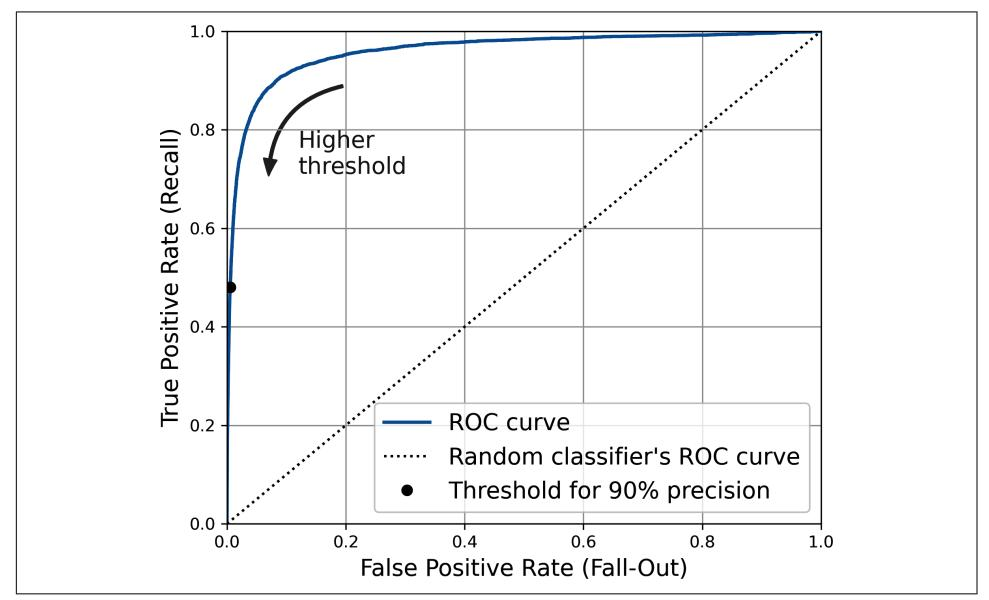

Figure 3-7. A ROC curve plotting the false positive rate against the true positive rate for all possible thresholds; the black circle highlights the chosen ratio (at 90% precision and 48% recall)

Once again there is a trade-off: the higher the recall (TPR), the more false positives (FPR) the classifier produces. The dotted line represents the ROC curve of a purely random classifier; a good classifier stays as far away from that line as possible (toward the top-left corner).

One way to compare classifiers is to measure the *area under the curve* (AUC). A perfect classifier will have a ROC AUC equal to 1, whereas a purely random classifier will have a ROC AUC equal to 0.5. Scikit-Learn provides a function to estimate the **ROC AUC:** 

```
>>> from sklearn.metrics import roc auc score
>>> roc auc score(y train 5, y scores)
0.9604938554008616
```

{144}------------------------------------------------


Since the ROC curve is so similar to the precision/recall (PR) curve, you may wonder how to decide which one to use. As a rule of thumb, you should prefer the PR curve whenever the positive class is rare or when you care more about the false positives than the false negatives. Otherwise, use the ROC curve. For example, looking at the previous ROC curve (and the ROC AUC score), you may think that the classifier is really good. But this is mostly because there are few positives (5s) compared to the negatives (non-5s). In contrast, the PR curve makes it clear that the classifier has room for improvement: the curve could really be closer to the top-right corner (see Figure 3-6 again).

Let's now create a RandomForestClassifier, whose PR curve and  $F_1$  score we can compare to those of the SGDClassifier:

```
from sklearn.ensemble import RandomForestClassifier
```

```
forest clf = RandomForestClassifier(random state=42)
```

The precision\_recall\_curve() function expects labels and scores for each instance, so we need to train the random forest classifier and make it assign a score to each instance. But the RandomForestClassifier class does not have a decision function() method, due to the way it works (we will cover this in Chapter 7). Luckily, it has a predict\_proba() method that returns class probabilities for each instance, and we can just use the probability of the positive class as a score, so it will work fine.<sup>4</sup> We can call the cross\_val\_predict() function to train the Random ForestClassifier using cross-validation and make it predict class probabilities for every image as follows:

```
y_probas_forest = cross_val_predict(forest_clf, X_train, y_train_5, cv=3,
                                    method="predict proba")
```

Let's look at the class probabilities for the first two images in the training set:

```
>>> y probas forest[:2]
array([[0.11, 0.89],[0.99, 0.01]]
```

The model predicts that the first image is positive with 89% probability, and it predicts that the second image is negative with 99% probability. Since each image is either positive or negative, the probabilities in each row add up to 100%.

<sup>4</sup> Scikit-Learn classifiers always have either a decision function() method or a predict proba() method, or sometimes both.

{145}------------------------------------------------


These are estimated probabilities, not actual probabilities. For example, if you look at all the images that the model classified as positive with an estimated probability between 50% and 60%, roughly 94% of them are actually positive. So, the model's estimated probabilities were much too low in this case-but models can be overconfident as well. The sklearn.calibration package contains tools to calibrate the estimated probabilities and make them much closer to actual probabilities. See the extra material section in this chapter's notebook for more details.

The second column contains the estimated probabilities for the positive class, so let's pass them to the precision recall curve() function:

```
y scores forest = y probas forest[: 1]precisions_forest, recalls_forest, thresholds_forest = precision_recall_curve(
    y_train_5, y_scores_forest)
```

Now we're ready to plot the PR curve. It is useful to plot the first PR curve as well to see how they compare (Figure 3-8):

```
plt.plot(recalls forest, precisions forest, "b-", linewidth=2,
         label="Random Forest")
plt.plot(recalls, precisions, "--", linewidth=2, label="SGD")
\lceil \ldots \rceil # beautify the figure: add labels, grid, and legend
plt.show()
```

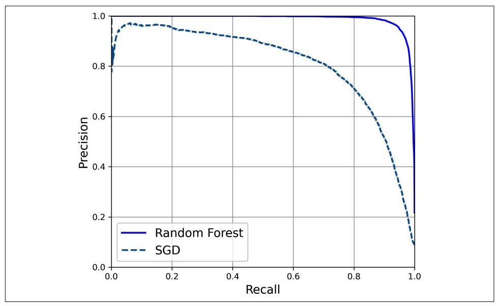

Figure 3-8. Comparing PR curves: the random forest classifier is superior to the SGD classifier because its PR curve is much closer to the top-right corner, and it has a greater  $AUC$ 

{146}------------------------------------------------

As you can see in Figure 3-8, the RandomForestClassifier's PR curve looks much better than the SGDClassifier's: it comes much closer to the top-right corner. Its  $F_1$ score and ROC AUC score are also significantly better:

```
>>> y_train_pred_forest = y_probas_forest[:, 1] >= 0.5 # positive proba \geq 50\%>>> f1_score(y_train_5, y_pred_forest)
0.9242275142688446
>>> roc_auc_score(y_train_5, y_scores_forest)
0.9983436731328145
```

Try measuring the precision and recall scores: you should find about 99.1% precision and 86.6% recall. Not too bad!

You now know how to train binary classifiers, choose the appropriate metric for your task, evaluate your classifiers using cross-validation, select the precision/recall trade-off that fits your needs, and use several metrics and curves to compare various models. You're ready to try to detect more than just the 5s.

## **Multiclass Classification**

Whereas binary classifiers distinguish between two classes, *multiclass classifiers* (also called *multinomial classifiers*) can distinguish between more than two classes.

Some Scikit-Learn classifiers (e.g., LogisticRegression, RandomForestClassifier, and GaussianNB) are capable of handling multiple classes natively. Others are strictly binary classifiers (e.g., SGDC lassifier and SVC). However, there are various strategies that you can use to perform multiclass classification with multiple binary classifiers.

One way to create a system that can classify the digit images into 10 classes (from 0 to 9) is to train 10 binary classifiers, one for each digit (a 0-detector, a 1-detector, a 2-detector, and so on). Then when you want to classify an image, you get the decision score from each classifier for that image and you select the class whose classifier outputs the highest score. This is called the one-versus-the-rest (OvR) strategy, or sometimes one-versus-all (OvA).

Another strategy is to train a binary classifier for every pair of digits: one to distinguish 0s and 1s, another to distinguish 0s and 2s, another for 1s and 2s, and so on. This is called the *one-versus-one* (OvO) strategy. If there are N classes, you need to train  $N \times (N - 1)$  / 2 classifiers. For the MNIST problem, this means training 45 binary classifiers! When you want to classify an image, you have to run the image through all 45 classifiers and see which class wins the most duels. The main advantage of OvO is that each classifier only needs to be trained on the part of the training set containing the two classes that it must distinguish.

Some algorithms (such as support vector machine classifiers) scale poorly with the size of the training set. For these algorithms OvO is preferred because it is faster 

{147}------------------------------------------------

to train many classifiers on small training sets than to train few classifiers on large training sets. For most binary classification algorithms, however, OvR is preferred.

Scikit-Learn detects when you try to use a binary classification algorithm for a multiclass classification task, and it automatically runs OvR or OvO, depending on the algorithm. Let's try this with a support vector machine classifier using the sklearn.svm.SVC class (see Chapter 5). We'll only train on the first 2,000 images, or else it will take a very long time:

```
from sklearn.svm import SVC
svm clf = SVC(random state=42)svm_clf.fit(X_train[:2000], y_train[:2000]) # y_train, not y_train_5
```

That was easy! We trained the SVC using the original target classes from 0 to 9 (y\_train), instead of the 5-versus-the-rest target classes (y\_train\_5). Since there are 10 classes (i.e., more than 2), Scikit-Learn used the OvO strategy and trained 45 binary classifiers. Now let's make a prediction on an image:

```
>>> svm clf.predict([some digit])
array(['5'], dtype=object)
```

That's correct! This code actually made 45 predictions—one per pair of classes—and it selected the class that won the most duels. If you call the decision\_function() method, you will see that it returns 10 scores per instance: one per class. Each class gets a score equal to the number of won duels plus or minus a small tweak (max ±0.33) to break ties, based on the classifier scores:

```
>>> some digit scores = svm clf.decision function([some digit])
>>> some_digit_scores.round(2)
аггау([[ 3.79, 0.73, 6.06, 8.3, -0.29, 9.3, 1.75, 2.77, 7.21,
        4.82]])
```

The highest score is 9.3, and it's indeed the one corresponding to class 5:

```
\Rightarrow class id = some digit scores.argmax()
>>> class id
5
```

When a classifier is trained, it stores the list of target classes in its classes\_attribute, ordered by value. In the case of MNIST, the index of each class in the classes\_array conveniently matches the class itself (e.g., the class at index 5 happens to be class '5'), but in general you won't be so lucky; you will need to look up the class label like this:

```
>>> svm clf.classes
array(['0', '1', '2', '3', '4', '5', '6', '7', '8', '9'], dtype=object)
>>> svm clf.classes [class id]
151
```

If you want to force Scikit-Learn to use one-versus-one or one-versus-the-rest, you can use the OneVsOneClassifier or OneVsRestClassifier classes. Simply create 

{148}------------------------------------------------

an instance and pass a classifier to its constructor (it doesn't even have to be a binary classifier). For example, this code creates a multiclass classifier using the OvR strategy, based on an SVC:

```
from sklearn.multiclass import OneVsRestClassifier
ovr clf = OneVsRestClassifier(SVC(random state=42))
ovr_clf.fit(X_train[:2000], y_train[:2000])
```

Let's make a prediction, and check the number of trained classifiers:

```
>>> ovr clf.predict([some digit])
array([ '5'] , dtype=' < U1')>>> len(ovr clf.estimators)
10
```

Training an SGDC lassifier on a multiclass dataset and using it to make predictions is just as easy:

```
>>> sgd_clf = SGDClassifier(random_state=42)
>>> sqd clf.fit(X train, y train)
>>> sgd_clf.predict([some_digit])
array(['3'], dtype='<U1')
```

Oops, that's incorrect. Prediction errors do happen! This time Scikit-Learn used the OvR strategy under the hood: since there are 10 classes, it trained 10 binary classifiers. The decision\_function() method now returns one value per class. Let's look at the scores that the SGD classifier assigned to each class:

```
>>> sgd_clf.decision_function([some_digit]).round()
array([[-31893., -34420., -9531., 1824., -22320., -1386., -26189.,
       -16148., -4604., -12051.]
```

You can see that the classifier is not very confident about its prediction: almost all scores are very negative, while class 3 has a score of  $+1,824$ , and class 5 is not too far behind at  $-1,386$ . Of course, you'll want to evaluate this classifier on more than one image. Since there are roughly the same number of images in each class, the accuracy metric is fine. As usual, you can use the cross val score() function to evaluate the model:

```
>>> cross_val_score(sgd_clf, X_train, y_train, cv=3, scoring="accuracy")
array([0.87365, 0.85835, 0.8689])
```

It gets over 85.8% on all test folds. If you used a random classifier, you would get 10% accuracy, so this is not such a bad score, but you can still do much better. Simply scaling the inputs (as discussed in Chapter 2) increases accuracy above 89.1%:

```
>>> from sklearn.preprocessing import StandardScaler
>>> scaler = StandardScaler()
>>> X_train_scaled = scaler.fit_transform(X_train.astype("float64"))
>>> cross_val_score(sgd_clf, X_train_scaled, y_train, cv=3, scoring="accuracy")
array([0.8983, 0.891, 0.9018])
```

{149}------------------------------------------------

## **Error Analysis**

If this were a real project, you would now follow the steps in your machine learning project checklist (see Appendix A). You'd explore data preparation options, try out multiple models, shortlist the best ones, fine-tune their hyperparameters using Grid SearchCV, and automate as much as possible. Here, we will assume that you have found a promising model and you want to find ways to improve it. One way to do this is to analyze the types of errors it makes.

First, look at the confusion matrix. For this, you first need to make predictions using the cross\_val\_predict() function; then you can pass the labels and predictions to the confusion\_matrix() function, just like you did earlier. However, since there are now 10 classes instead of 2, the confusion matrix will contain quite a lot of numbers, and it may be hard to read.

A colored diagram of the confusion matrix is much easier to analyze. To plot such a diagram, use the ConfusionMatrixDisplay.from\_predictions() function like this:

```
from sklearn.metrics import ConfusionMatrixDisplay
```

```
y_train_pred = cross_val_predict(sgd_clf, X_train_scaled, y_train, cv=3)
ConfusionMatrixDisplay.from_predictions(y_train, y_train_pred)
plt.show()
```

This produces the left diagram in Figure 3-9. This confusion matrix looks pretty good: most images are on the main diagonal, which means that they were classified correctly. Notice that the cell on the diagonal in row #5 and column #5 looks slightly darker than the other digits. This could be because the model made more errors on 5s, or because there are fewer 5s in the dataset than the other digits. That's why it's important to normalize the confusion matrix by dividing each value by the total number of images in the corresponding (true) class (i.e., divide by the row's sum). This can be done simply by setting normalize="true". We can also specify the val ues format=".0%" argument to show percentages with no decimals. The following code produces the diagram on the right in Figure 3-9:

```
ConfusionMatrixDisplay.from predictions(y train, y train pred,
                                        normalize="true", values format=".0%")
```

plt.show()

Now we can easily see that only 82% of the images of 5s were classified correctly. The most common error the model made with images of 5s was to misclassify them as 8s: this happened for 10% of all 5s. But only 2% of 8s got misclassified as 5s; confusion matrices are generally not symmetrical! If you look carefully, you will notice that many digits have been misclassified as 8s, but this is not immediately obvious from this diagram. If you want to make the errors stand out more, you can try putting zero weight on the correct predictions. The following code does just that and produces the diagram on the left in Figure 3-10:

{150}------------------------------------------------

```
sample\_weight = (y_train\_pred != y_train)ConfusionMatrixDisplay.from_predictions(y_train, y_train_pred,
                                        sample_weight=sample_weight,
                                        normalize="true", values format=".0%")
```

plt.show()

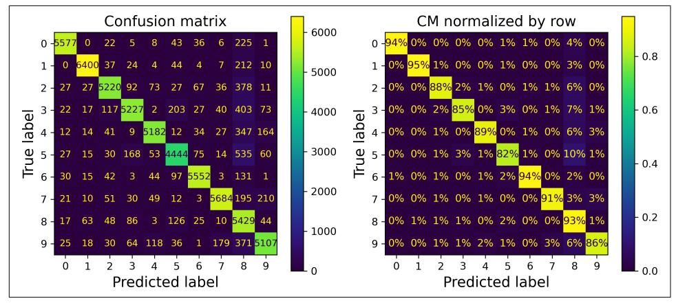

Figure 3-9. Confusion matrix (left) and the same CM normalized by row (right)

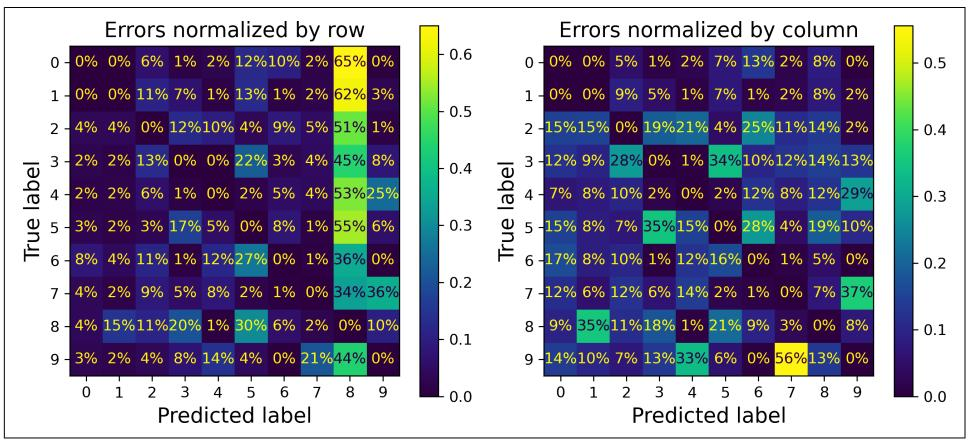

Figure 3-10. Confusion matrix with errors only, normalized by row (left) and by column  $(right)$ 

Now you can see much more clearly the kinds of errors the classifier makes. The column for class 8 is now really bright, which confirms that many images got misclassified as 8s. In fact this is the most common misclassification for almost all classes. But be careful how you interpret the percentages in this diagram: remember that we've excluded the correct predictions. For example, the 36% in row #7, column #9 does not mean that 36% of all images of 7s were misclassified as 9s. It means that 36% of the errors the model made on images of 7s were misclassifications as 9s. In reality, 

{151}------------------------------------------------

only 3% of images of 7s were misclassified as 9s, as you can see in the diagram on the right in Figure 3-9.

It is also possible to normalize the confusion matrix by column rather than by row: if you set normalize="pred", you get the diagram on the right in Figure 3-10. For example, you can see that 56% of misclassified 7s are actually 9s.

Analyzing the confusion matrix often gives you insights into ways to improve your classifier. Looking at these plots, it seems that your efforts should be spent on reducing the false 8s. For example, you could try to gather more training data for digits that look like 8s (but are not) so that the classifier can learn to distinguish them from real 8s. Or you could engineer new features that would help the classifier—for example, writing an algorithm to count the number of closed loops (e.g., 8 has two, 6 has one, 5 has none). Or you could preprocess the images (e.g., using Scikit-Image, Pillow, or OpenCV) to make some patterns, such as closed loops, stand out more.

Analyzing individual errors can also be a good way to gain insights into what your classifier is doing and why it is failing. For example, let's plot examples of 3s and 5s in a confusion matrix style (Figure 3-11):

```
cl a, cl b = '3', '5'
X_aaa = X_ttrain[(y_ttrain == cl_a) & (y_ttrain_pred == cl_a)]
X<sup>-ab = X</sup><sup>-train</sub>[y-train == cl<sup>-</sup>a) & (y<sup>-train</sup>-pred == cl<sup>-b</sup>)]</sup>
X_b = X_train[(y_train == cl_b) & (y_train_pred == cl_a)]
X_bbb = X_ttrain[(y_ttrain == cl_b) & (y_ttrain_pred == cl_b)]
[...] # plot all images in X_aa, X_ab, X_ba, X_bb in a confusion matrix style
```

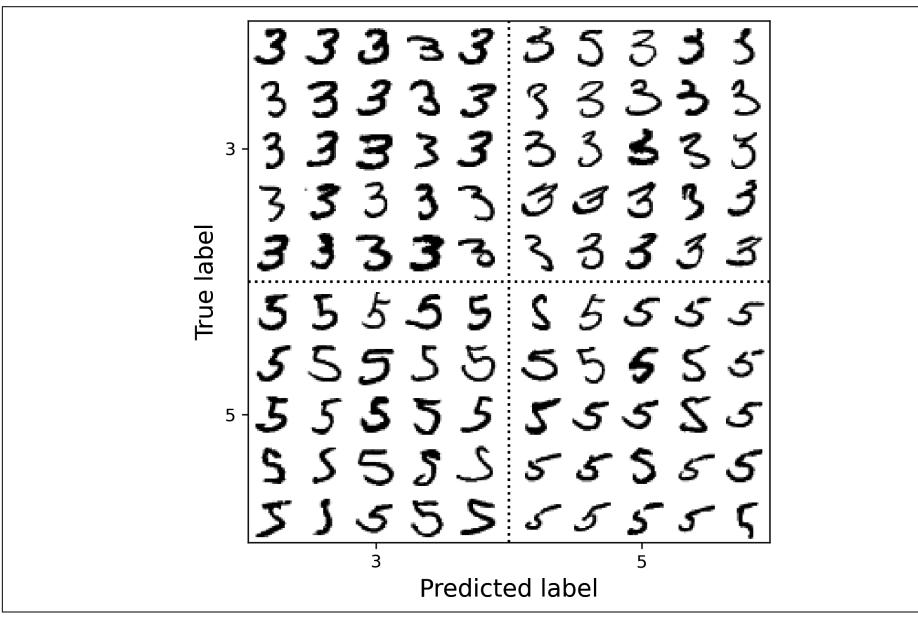

Figure 3-11. Some images of 3s and 5s organized like a confusion matrix

{152}------------------------------------------------

As you can see, some of the digits that the classifier gets wrong (i.e., in the bottom-left and top-right blocks) are so badly written that even a human would have trouble classifying them. However, most misclassified images seem like obvious errors to us. It may be hard to understand why the classifier made the mistakes it did, but remember that the human brain is a fantastic pattern recognition system, and our visual system does a lot of complex preprocessing before any information even reaches our consciousness. So, the fact that this task feels simple does not mean that it is. Recall that we used a simple SGDClassifier, which is just a linear model: all it does is assign a weight per class to each pixel, and when it sees a new image it just sums up the weighted pixel intensities to get a score for each class. Since 3s and 5s differ by only a few pixels, this model will easily confuse them.

The main difference between 3s and 5s is the position of the small line that joins the top line to the bottom arc. If you draw a 3 with the junction slightly shifted to the left, the classifier might classify it as a 5, and vice versa. In other words, this classifier is quite sensitive to image shifting and rotation. One way to reduce the 3/5 confusion is to preprocess the images to ensure that they are well centered and not too rotated. However, this may not be easy since it requires predicting the correct rotation of each image. A much simpler approach consists of augmenting the training set with slightly shifted and rotated variants of the training images. This will force the model to learn to be more tolerant to such variations. This is called *data augmentation* (we'll cover this in Chapter 14; also see exercise 2 at the end of this chapter).

### **Multilabel Classification**

Until now, each instance has always been assigned to just one class. But in some cases you may want your classifier to output multiple classes for each instance. Consider a face-recognition classifier: what should it do if it recognizes several people in the same picture? It should attach one tag per person it recognizes. Say the classifier has been trained to recognize three faces: Alice, Bob, and Charlie. Then when the classifier is shown a picture of Alice and Charlie, it should output [True, False, True] (meaning "Alice yes, Bob no, Charlie yes"). Such a classification system that outputs multiple binary tags is called a *multilabel classification* system.

We won't go into face recognition just yet, but let's look at a simpler example, just for illustration purposes:

```
import numpy as np
from sklearn.neighbors import KNeighborsClassifier
y train large = (y train >= '7')y train odd = (y train.astype('int8') % 2 == 1)
y_multilabel = np.c_[y_train_large, y_train_odd]
```

{153}------------------------------------------------

```
knn_clf = KNeighborsClassifier()knn_clf.fit(X_train, y_multilabel)
```

This code creates a y\_multilabel array containing two target labels for each digit image: the first indicates whether or not the digit is large  $(7, 8, 0r 9)$ , and the second indicates whether or not it is odd. Then the code creates a KNeighborsClassifier instance, which supports multilabel classification (not all classifiers do), and trains this model using the multiple targets array. Now you can make a prediction, and notice that it outputs two labels:

```
>>> knn_clf.predict([some_digit])
array([[False, True]])
```

And it gets it right! The digit 5 is indeed not large (False) and odd (True).

There are many ways to evaluate a multilabel classifier, and selecting the right metric really depends on your project. One approach is to measure the  $F_1$  score for each individual label (or any other binary classifier metric discussed earlier), then simply compute the average score. The following code computes the average  $F_1$  score across all labels:

```
>>> y train knn pred = cross val predict(knn clf, X train, y multilabel, cv=3)
>>> f1_score(y_multilabel, y_train_knn_pred, average="macro")
0.976410265560605
```

This approach assumes that all labels are equally important, which may not be the case. In particular, if you have many more pictures of Alice than of Bob or Charlie, you may want to give more weight to the classifier's score on pictures of Alice. One simple option is to give each label a weight equal to its *support* (i.e., the number of instances with that target label). To do this, simply set average="weighted" when calling the f1\_score() function.<sup>5</sup>

If you wish to use a classifier that does not natively support multilabel classification, such as SVC, one possible strategy is to train one model per label. However, this strategy may have a hard time capturing the dependencies between the labels. For example, a large digit  $(7, 8, or 9)$  is twice more likely to be odd than even, but the classifier for the "odd" label does not know what the classifier for the "large" label predicted. To solve this issue, the models can be organized in a chain: when a model makes a prediction, it uses the input features plus all the predictions of the models that come before it in the chain.

The good news is that Scikit-Learn has a class called ChainClassifier that does just that! By default it will use the true labels for training, feeding each model the appropriate labels depending on their position in the chain. But if you set the cv

<sup>5</sup> Scikit-Learn offers a few other averaging options and multilabel classifier metrics; see the documentation for more details.

{154}------------------------------------------------

hyperparameter, it will use cross-validation to get "clean" (out-of-sample) predictions from each trained model for every instance in the training set, and these predictions will then be used to train all the models later in the chain. Here's an example showing how to create and train a ChainClassifier using the cross-validation strategy. As earlier, we'll just use the first 2,000 images in the training set to speed things up:

```
from sklearn.multioutput import ClassifierChain
chain_clf = ClassifierChain(SVC(), cv=3, random_state=42)
chain_clf.fit(X_train[:2000], y_multilabel[:2000])
```

Now we can use this ChainClassifier to make predictions:

```
>>> chain_clf.predict([some_digit])
array([[0., 1.]])
```

## **Multioutput Classification**

The last type of classification task we'll discuss here is called multioutput-multiclass classification (or just multioutput classification). It is a generalization of multilabel classification where each label can be multiclass (i.e., it can have more than two possible values).

To illustrate this, let's build a system that removes noise from images. It will take as input a noisy digit image, and it will (hopefully) output a clean digit image, represented as an array of pixel intensities, just like the MNIST images. Notice that the classifier's output is multilabel (one label per pixel) and each label can have multiple values (pixel intensity ranges from 0 to 255). This is thus an example of a multioutput classification system.


The line between classification and regression is sometimes blurry, such as in this example. Arguably, predicting pixel intensity is more akin to regression than to classification. Moreover, multioutput systems are not limited to classification tasks; you could even have a system that outputs multiple labels per instance, including both class labels and value labels.

Let's start by creating the training and test sets by taking the MNIST images and adding noise to their pixel intensities with NumPy's randint() function. The target images will be the original images:

```
np.random.seed(42) # to make this code example reproducible
noise = np.random.randint(0, 100, (len(X_train), 784))X train mod = X train + noise
noise = np.random.randint(0, 100, (len(X_test), 784))X test mod = X test + noise
```

{155}------------------------------------------------

```
y_train_model = X_trainy_t = x_t
```

Let's take a peek at the first image from the test set (Figure 3-12). Yes, we're snooping on the test data, so you should be frowning right now.

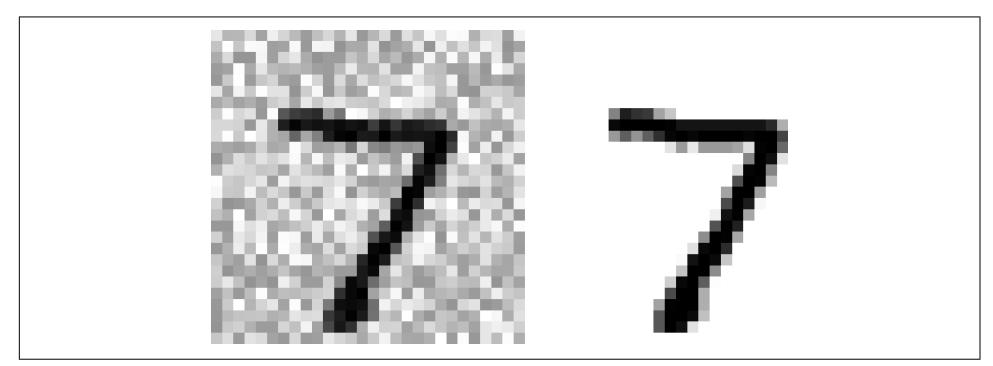

Figure 3-12. A noisy image (left) and the target clean image (right)

On the left is the noisy input image, and on the right is the clean target image. Now let's train the classifier and make it clean up this image (Figure 3-13):

```
knn clf = KNeighborsClassifier()
knn_clf.fit(X_train_mod, y_train_mod)
clean\_digit = knn_clf.predict([X_test_model0]])plot digit(clean digit)
plt.show()
```

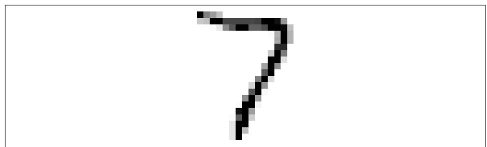

Figure 3-13. The cleaned-up image

Looks close enough to the target! This concludes our tour of classification. You now know how to select good metrics for classification tasks, pick the appropriate precision/recall trade-off, compare classifiers, and more generally build good classification systems for a variety of tasks. In the next chapters, you'll learn how all these machine learning models you've been using actually work.

{156}------------------------------------------------

### **Exercises**

- 1. Try to build a classifier for the MNIST dataset that achieves over 97% accuracy on the test set. Hint: the KNeighborsClassifier works quite well for this task; you just need to find good hyperparameter values (try a grid search on the weights and n neighbors hyperparameters).
- 2. Write a function that can shift an MNIST image in any direction (left, right, up, or down) by one pixel.<sup>6</sup> Then, for each image in the training set, create four shifted copies (one per direction) and add them to the training set. Finally, train your best model on this expanded training set and measure its accuracy on the test set. You should observe that your model performs even better now! This technique of artificially growing the training set is called *data augmentation* or training set expansion.
- 3. Tackle the Titanic dataset. A great place to start is on Kaggle. Alternatively, you can download the data from https://homl.info/titanic.tgz and unzip this tarball like you did for the housing data in Chapter 2. This will give you two CSV files, train.csv and test.csv, which you can load using pandas.read\_csv(). The goal is to train a classifier that can predict the Survived column based on the other columns.
- 4. Build a spam classifier (a more challenging exercise):
  - a. Download examples of spam and ham from Apache SpamAssassin's public datasets.
  - b. Unzip the datasets and familiarize yourself with the data format.
  - c. Split the data into a training set and a test set.
  - d. Write a data preparation pipeline to convert each email into a feature vector. Your preparation pipeline should transform an email into a (sparse) vector that indicates the presence or absence of each possible word. For example, if all emails only ever contain four words, "Hello", "how", "are", "you", then the email "Hello you Hello Hello you" would be converted into a vector [1, 0, 0, 1] (meaning ["Hello" is present, "how" is absent, "are" is absent, "you" is present]), or  $[3, 0, 0, 2]$  if you prefer to count the number of occurrences of each word.

You may want to add hyperparameters to your preparation pipeline to control whether or not to strip off email headers, convert each email to lowercase, remove punctuation, replace all URLs with "URL", replace all numbers with

<sup>6</sup> You can use the shift() function from the scipy.ndimage.interpolation module. For example, shift(image, [2, 1], cval=0) shifts the image two pixels down and one pixel to the right.

{157}------------------------------------------------

"NUMBER", or even perform stemming (i.e., trim off word endings; there are Python libraries available to do this).

e. Finally, try out several classifiers and see if you can build a great spam classifier, with both high recall and high precision.

Solutions to these exercises are available at the end of this chapter's notebook, at https://homl.info/colab3.

{158}------------------------------------------------

## **CHAPTER 4 Training Models**

So far we have treated machine learning models and their training algorithms mostly like black boxes. If you went through some of the exercises in the previous chapters, you may have been surprised by how much you can get done without knowing anything about what's under the hood: you optimized a regression system, you improved a digit image classifier, and you even built a spam classifier from scratch, all without knowing how they actually work. Indeed, in many situations you don't really need to know the implementation details.

However, having a good understanding of how things work can help you quickly home in on the appropriate model, the right training algorithm to use, and a good set of hyperparameters for your task. Understanding what's under the hood will also help you debug issues and perform error analysis more efficiently. Lastly, most of the topics discussed in this chapter will be essential in understanding, building, and training neural networks (discussed in Part II of this book).

In this chapter we will start by looking at the linear regression model, one of the simplest models there is. We will discuss two very different ways to train it:

- Using a "closed-form" equation<sup>1</sup> that directly computes the model parameters that best fit the model to the training set (i.e., the model parameters that minimize the cost function over the training set).
- Using an iterative optimization approach called gradient descent (GD) that gradually tweaks the model parameters to minimize the cost function over the training set, eventually converging to the same set of parameters as the first method. We will look at a few variants of gradient descent that we will use again and

<sup>1</sup> A closed-form equation is only composed of a finite number of constants, variables, and standard operations: for example,  $a = \sin(b - c)$ . No infinite sums, no limits, no integrals, etc.

{159}------------------------------------------------

again when we study neural networks in Part II: batch GD, mini-batch GD, and stochastic GD

Next we will look at polynomial regression, a more complex model that can fit nonlinear datasets. Since this model has more parameters than linear regression, it is more prone to overfitting the training data. We will explore how to detect whether or not this is the case using learning curves, and then we will look at several regularization techniques that can reduce the risk of overfitting the training set.

Finally, we will examine two more models that are commonly used for classification tasks: logistic regression and softmax regression.


There will be quite a few math equations in this chapter, using basic notions of linear algebra and calculus. To understand these equations, you will need to know what vectors and matrices are; how to transpose them, multiply them, and inverse them; and what partial derivatives are. If you are unfamiliar with these concepts, please go through the linear algebra and calculus introductory tutorials available as Jupyter notebooks in the online supplemental material. For those who are truly allergic to mathematics, you should still go through this chapter and simply skip the equations; hopefully, the text will be sufficient to help you understand most of the concepts.

### **Linear Regression**

In Chapter 1 we looked at a simple regression model of life satisfaction:

```
life_satisfaction = \theta_0 + \theta_1 \times GDP\_per\_capita
```

This model is just a linear function of the input feature GDP\_per\_capita.  $\theta_0$  and  $\theta_1$  are the model's parameters.

More generally, a linear model makes a prediction by simply computing a weighted sum of the input features, plus a constant called the bias term (also called the intercept *term*), as shown in Equation 4-1.

```
Equation 4-1. Linear regression model prediction
```

 $\widehat{y} = \theta_0 + \theta_1 x_1 + \theta_2 x_2 + \cdots + \theta_n x_n$ 

In this equation:

- $\hat{y}$  is the predicted value.
- $\bullet$  *n* is the number of features.

{160}------------------------------------------------

- $x_i$  is the *i*<sup>th</sup> feature value.
- $\theta_i$  is the j<sup>th</sup> model parameter, including the bias term  $\theta_0$  and the feature weights  $\theta_1$ ,  $\theta_2, \dots, \theta_n$

This can be written much more concisely using a vectorized form, as shown in Equation 4-2.

Equation 4-2. Linear regression model prediction (vectorized form)

 $\hat{y} = h_{\mathbf{\Theta}}(\mathbf{x}) = \mathbf{\Theta} \cdot \mathbf{x}$ 

In this equation:

- $h_{\theta}$  is the hypothesis function, using the model parameters  $\theta$ .
- $\theta$  is the model's *parameter vector*, containing the bias term  $\theta_0$  and the feature weights  $\theta_1$  to  $\theta_n$ .
- **x** is the instance's *feature vector*, containing  $x_0$  to  $x_n$ , with  $x_0$  always equal to 1.
- $\theta$  · **x** is the dot product of the vectors  $\theta$  and **x**, which is equal to  $\theta_0 x_0 + \theta_1 x_1 + \theta_2 x_2$  $+ ... + \theta_{n} x_{n}$


In machine learning, vectors are often represented as column vectors, which are 2D arrays with a single column. If  $\theta$  and x are column vectors, then the prediction is  $\hat{y} = \theta^T x$ , where  $\theta^T$  is the *transpose* of  $\theta$  (a row vector instead of a column vector) and  $\theta^{\mathsf{T}}\mathbf{x}$ is the matrix multiplication of  $\theta^{\dagger}$  and **x**. It is of course the same prediction, except that it is now represented as a single-cell matrix rather than a scalar value. In this book I will use this notation to avoid switching between dot products and matrix multiplications.

OK, that's the linear regression model—but how do we train it? Well, recall that training a model means setting its parameters so that the model best fits the training set. For this purpose, we first need a measure of how well (or poorly) the model fits the training data. In Chapter 2 we saw that the most common performance measure of a regression model is the root mean square error (Equation 2-1). Therefore, to train a linear regression model, we need to find the value of  $\theta$  that minimizes the RMSE. In practice, it is simpler to minimize the mean squared error (MSE) than the RMSE, and it leads to the same result (because the value that minimizes a positive function also minimizes its square root).

{161}------------------------------------------------


Learning algorithms will often optimize a different loss function during training than the performance measure used to evaluate the final model. This is generally because the function is easier to optimize and/or because it has extra terms needed during training only (e.g., for regularization). A good performance metric is as close as possible to the final business objective. A good training loss is easy to optimize and strongly correlated with the metric. For example, classifiers are often trained using a cost function such as the log loss (as you will see later in this chapter) but evaluated using precision/recall. The log loss is easy to minimize, and doing so will usually improve precision/recall.

The MSE of a linear regression hypothesis  $h_{\theta}$  on a training set **X** is calculated using Equation 4-3.

Equation 4-3. MSE cost function for a linear regression model

$$
MSE(\mathbf{X}, h_{\boldsymbol{\theta}}) = \frac{1}{m} \sum_{i=1}^{m} (\boldsymbol{\theta}^{\mathsf{T}} \mathbf{x}^{(i)} - y^{(i)})^2
$$

Most of these notations were presented in Chapter 2 (see "Notations" on page 44). The only difference is that we write  $h_{\theta}$  instead of just h to make it clear that the model is parametrized by the vector  $\theta$ . To simplify notations, we will just write  $MSE(\theta)$ instead of MSE( $X$ ,  $h_a$ ).

### **The Normal Equation**

To find the value of  $\theta$  that minimizes the MSE, there exists a *closed-form solution*—in other words, a mathematical equation that gives the result directly. This is called the Normal equation (Equation 4-4).

Equation 4-4. Normal equation

$$
\widehat{\boldsymbol{\theta}} = \left(\mathbf{X}^{\top} \mathbf{X}\right)^{-1} \quad \mathbf{X}^{\top} \quad \mathbf{y}
$$

In this equation:

- $\theta$  is the value of  $\theta$  that minimizes the cost function.
- y is the vector of target values containing  $y^{(1)}$  to  $y^{(m)}$ .

{162}------------------------------------------------

Let's generate some linear-looking data to test this equation on (Figure  $4-1$ ):

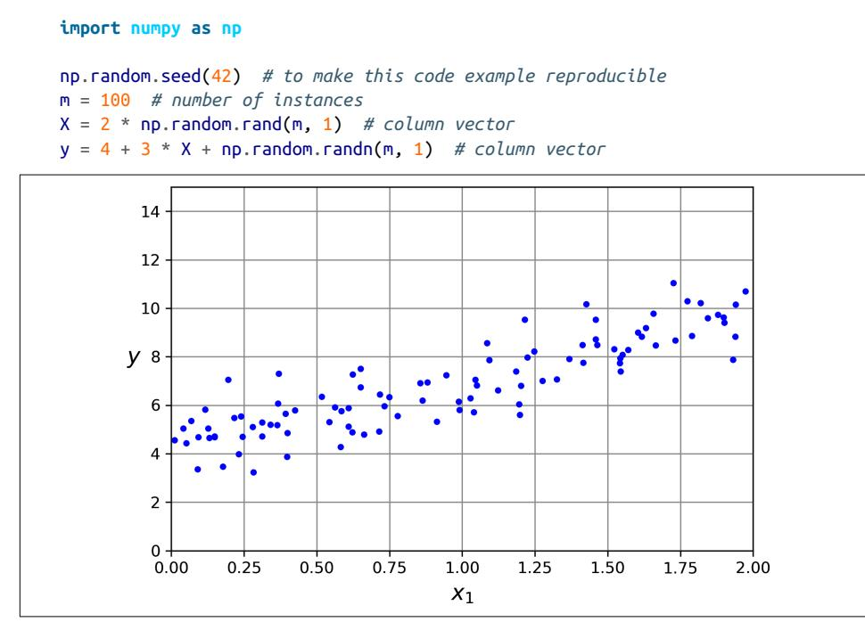

Figure 4-1. A randomly generated linear dataset

Now let's compute  $\hat{\theta}$  using the Normal equation. We will use the inv() function from NumPy's linear algebra module (np.linalg) to compute the inverse of a matrix, and the dot() method for matrix multiplication:

```
from sklearn.preprocessing import add_dummy_feature
X b = add dummy feature(X) # add x0 = 1 to each instance
theta_best = np.linalg.inv(X_b.T @ X_b) @ X_b.T @ y
```


The @ operator performs matrix multiplication. If A and B are NumPy arrays, then A @ B is equivalent to np.matmul(A, B). Many other libraries, like TensorFlow, PyTorch, and JAX, support the @ operator as well. However, you cannot use @ on pure Python arrays (i.e., lists of lists).

{163}------------------------------------------------

The function that we used to generate the data is  $y = 4 + 3x_1 +$  Gaussian noise. Let's see what the equation found:

```
>>> theta best
array([[4.21509616],
      [2.77011339]
```

We would have hoped for  $\theta_0 = 4$  and  $\theta_1 = 3$  instead of  $\theta_0 = 4.215$  and  $\theta_1 = 2.770$ . Close enough, but the noise made it impossible to recover the exact parameters of the original function. The smaller and noisier the dataset, the harder it gets.

Now we can make predictions using  $\hat{\theta}$ :

```
>>> X new = np.array([0], [2])
>>> X new b = add dummy feature(X new) # add x0 = 1 to each instance
\Rightarrow y_predict = X_new_b @ theta_best
>>> y predict
array([[4.21509616],
       [9.75532293]]
```

Let's plot this model's predictions (Figure 4-2):

```
import matplotlib.pyplot as plt
```

```
plt.plot(X_new, y_predict, "r-", label="Predictions")
plt.plot(X, y, "b.")[...] # beautify the figure: add labels, axis, grid, and legend
plt.show()
```


Figure 4-2. Linear regression model predictions

{164}------------------------------------------------

Performing linear regression using Scikit-Learn is relatively straightforward:

```
>>> from sklearn.linear model import LinearRegression
\Rightarrow lin reg = LinearRegression()
\Rightarrow lin_reg.fit(X, y)
>>> lin_reg.intercept_, lin_reg.coef_
(array([4.21509616]), array([[2.77011339]]))
>>> lin_reg.predict(X_new)
array([14.21509616],[9.75532293]]
```

Notice that Scikit-Learn separates the bias term (intercept\_) from the feature weights (coef). The Linear Regression class is based on the scipy. linalg.  $lstsq()$ function (the name stands for "least squares"), which you could call directly:

```
>>> theta best svd, residuals, rank, s = np.linalg.lstsq(X b, y, rcond=1e-6)>>> theta_best_svd
array([[4.21509616],
      [2.77011339]
```

This function computes  $\hat{\theta} = X^+ y$ , where  $X^+$  is the *pseudoinverse* of X (specifically, the Moore-Penrose inverse). You can use np.linalg.pinv() to compute the pseudoinverse directly:

```
>>> np.linalg.pinv(X_b) @ y
array([[4.21509616],[2.77011339]]
```

The pseudoinverse itself is computed using a standard matrix factorization technique called *singular value decomposition* (SVD) that can decompose the training set matrix X into the matrix multiplication of three matrices  $U \Sigma V^{\dagger}$  (see numpy. linalg. svd()). The pseudoinverse is computed as  $X^+ = V\Sigma^+U^{\dagger}$ . To compute the matrix  $\Sigma^+$ , the algorithm takes  $\Sigma$  and sets to zero all values smaller than a tiny threshold value, then it replaces all the nonzero values with their inverse, and finally it transposes the resulting matrix. This approach is more efficient than computing the Normal equation, plus it handles edge cases nicely: indeed, the Normal equation may not work if the matrix  $X^{\dagger}X$  is not invertible (i.e., singular), such as if  $m < n$  or if some features are redundant, but the pseudoinverse is always defined.

### **Computational Complexity**

The Normal equation computes the inverse of  $X^{\dagger} X$ , which is an  $(n + 1) \times (n + 1)$ matrix (where *n* is the number of features). The *computational complexity* of inverting such a matrix is typically about  $O(n^{24})$  to  $O(n^3)$ , depending on the implementation. In other words, if you double the number of features, you multiply the computation time by roughly  $2^{2.4} = 5.3$  to  $2^3 = 8$ .

{165}------------------------------------------------

The SVD approach used by Scikit-Learn's LinearRegression class is about  $O(n^2)$ . If you double the number of features, you multiply the computation time by roughly 4.


Both the Normal equation and the SVD approach get very slow when the number of features grows large (e.g., 100,000). On the positive side, both are linear with regard to the number of instances in the training set (they are  $O(m)$ ), so they handle large training sets efficiently, provided they can fit in memory.

Also, once you have trained your linear regression model (using the Normal equation or any other algorithm), predictions are very fast: the computational complexity is linear with regard to both the number of instances you want to make predictions on and the number of features. In other words, making predictions on twice as many instances (or twice as many features) will take roughly twice as much time.

Now we will look at a very different way to train a linear regression model, which is better suited for cases where there are a large number of features or too many training instances to fit in memory.

## **Gradient Descent**

Gradient descent is a generic optimization algorithm capable of finding optimal solutions to a wide range of problems. The general idea of gradient descent is to tweak parameters iteratively in order to minimize a cost function.

Suppose you are lost in the mountains in a dense fog, and you can only feel the slope of the ground below your feet. A good strategy to get to the bottom of the valley quickly is to go downhill in the direction of the steepest slope. This is exactly what gradient descent does: it measures the local gradient of the error function with regard to the parameter vector  $\theta$ , and it goes in the direction of descending gradient. Once the gradient is zero, you have reached a minimum!

In practice, you start by filling  $\theta$  with random values (this is called *random initialization*). Then you improve it gradually, taking one baby step at a time, each step attempting to decrease the cost function (e.g., the MSE), until the algorithm *converges* to a minimum (see Figure 4-3).

{166}------------------------------------------------


Figure 4-3. In this depiction of gradient descent, the model parameters are initialized randomly and get tweaked repeatedly to minimize the cost function; the learning step size is proportional to the slope of the cost function, so the steps gradually get smaller as the cost approaches the minimum

An important parameter in gradient descent is the size of the steps, determined by the learning rate hyperparameter. If the learning rate is too small, then the algorithm will have to go through many iterations to converge, which will take a long time (see Figure 4-4).


Figure 4-4. Learning rate too small

{167}------------------------------------------------

On the other hand, if the learning rate is too high, you might jump across the valley and end up on the other side, possibly even higher up than you were before. This might make the algorithm diverge, with larger and larger values, failing to find a good solution (see Figure 4-5).


Figure 4-5. Learning rate too high

Additionally, not all cost functions look like nice, regular bowls. There may be holes, ridges, plateaus, and all sorts of irregular terrain, making convergence to the minimum difficult. Figure 4-6 shows the two main challenges with gradient descent. If the random initialization starts the algorithm on the left, then it will converge to a local minimum, which is not as good as the *global minimum*. If it starts on the right, then it will take a very long time to cross the plateau. And if you stop too early, you will never reach the global minimum.

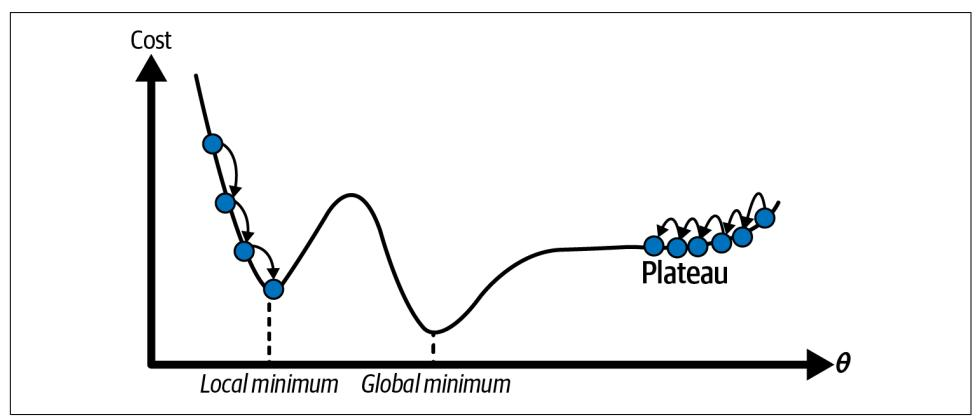

Figure 4-6. Gradient descent pitfalls

{168}------------------------------------------------

Fortunately, the MSE cost function for a linear regression model happens to be a convex function, which means that if you pick any two points on the curve, the line segment joining them is never below the curve. This implies that there are no local minima, just one global minimum. It is also a continuous function with a slope that never changes abruptly.<sup>2</sup> These two facts have a great consequence: gradient descent is guaranteed to approach arbitrarily closely the global minimum (if you wait long enough and if the learning rate is not too high).

While the cost function has the shape of a bowl, it can be an elongated bowl if the features have very different scales. Figure 4-7 shows gradient descent on a training set where features 1 and 2 have the same scale (on the left), and on a training set where feature 1 has much smaller values than feature 2 (on the right).<sup>3</sup>

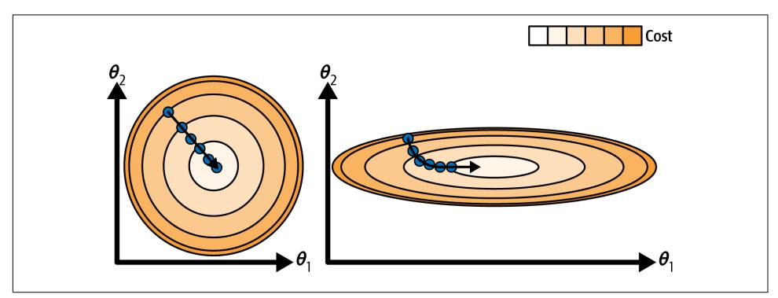

Figure 4-7. Gradient descent with (left) and without (right) feature scaling

As you can see, on the left the gradient descent algorithm goes straight toward the minimum, thereby reaching it quickly, whereas on the right it first goes in a direction almost orthogonal to the direction of the global minimum, and it ends with a long march down an almost flat valley. It will eventually reach the minimum, but it will take a long time.


When using gradient descent, you should ensure that all features have a similar scale (e.g., using Scikit-Learn's StandardScaler class), or else it will take much longer to converge.

<sup>2</sup> Technically speaking, its derivative is Lipschitz continuous.

<sup>3</sup> Since feature 1 is smaller, it takes a larger change in  $\theta_1$  to affect the cost function, which is why the bowl is elongated along the  $\theta_1$  axis.

{169}------------------------------------------------

This diagram also illustrates the fact that training a model means searching for a combination of model parameters that minimizes a cost function (over the training set). It is a search in the model's *parameter space*. The more parameters a model has, the more dimensions this space has, and the harder the search is: searching for a needle in a 300-dimensional haystack is much trickier than in 3 dimensions. Fortunately, since the cost function is convex in the case of linear regression, the needle is simply at the bottom of the bowl.

#### **Batch Gradient Descent**

To implement gradient descent, you need to compute the gradient of the cost function with regard to each model parameter  $\theta_i$ . In other words, you need to calculate how much the cost function will change if you change  $\theta_i$  just a little bit. This is called a *partial derivative*. It is like asking, "What is the slope of the mountain under my feet if I face east"? and then asking the same question facing north (and so on for all other dimensions, if you can imagine a universe with more than three dimensions). Equation 4-5 computes the partial derivative of the MSE with regard to parameter  $\theta$ <sub>i</sub>, noted  $\partial$  MSE( $\theta$ ) /  $\partial \theta_i$ .

Equation 4-5. Partial derivatives of the cost function

$$
\frac{\partial}{\partial \theta_j} \text{MSE}(\mathbf{\Theta}) = \frac{2}{m} \sum_{i=1}^{m} \left( \mathbf{\Theta}^\mathsf{T} \mathbf{x}^{(i)} - y^{(i)} \right) x_j^{(i)}
$$

Instead of computing these partial derivatives individually, you can use Equation 4-6 to compute them all in one go. The gradient vector, noted  $\nabla_{\theta}MSE(\theta)$ , contains all the partial derivatives of the cost function (one for each model parameter).

Equation 4-6. Gradient vector of the cost function

$$
\nabla_{\boldsymbol{\theta}} \text{MSE}(\boldsymbol{\theta}) = \begin{pmatrix} \frac{\partial}{\partial \theta_0} \text{MSE}(\boldsymbol{\theta}) \\ \frac{\partial}{\partial \theta_1} \text{MSE}(\boldsymbol{\theta}) \\ \vdots \\ \frac{\partial}{\partial \theta_n} \text{MSE}(\boldsymbol{\theta}) \end{pmatrix} = \frac{2}{m} \mathbf{X}^{\mathsf{T}} (\mathbf{X} \boldsymbol{\theta} - \mathbf{y})
$$

{170}------------------------------------------------


Notice that this formula involves calculations over the full training set  $X$ , at each gradient descent step! This is why the algorithm is called batch gradient descent: it uses the whole batch of training data at every step (actually, full gradient descent would probably be a better name). As a result, it is terribly slow on very large training sets (we will look at some much faster gradient descent algorithms shortly). However, gradient descent scales well with the number of features; training a linear regression model when there are hundreds of thousands of features is much faster using gradient descent than using the Normal equation or SVD decomposition.

Once you have the gradient vector, which points uphill, just go in the opposite direction to go downhill. This means subtracting  $\nabla_{\theta}MSE(\theta)$  from  $\theta$ . This is where the learning rate  $\eta$  comes into play:<sup>4</sup> multiply the gradient vector by  $\eta$  to determine the size of the downhill step (Equation 4-7).

Equation 4-7. Gradient descent step

```
\theta^{(next\,step)} = \theta - \eta \nabla_{\theta} \text{MSE}(\theta)
```

Let's look at a quick implementation of this algorithm:

```
eta = 0.1 # learning rate
n epochs = 1000
m = len(X_b) # number of instances
np.random.seed(42)
theta = np.random.randn(2, 1) # randomly initialized model parametersfor epoch in range(n_epochs):
    gradients = 2 / m * X b.T @ (X b @ theta - y)theta = theta - eta * gradients
```

That wasn't too hard! Each iteration over the training set is called an epoch. Let's look at the resulting theta:

```
>>> theta
array([[4.21509616],
      [2.77011339]
```

Hey, that's exactly what the Normal equation found! Gradient descent worked perfectly. But what if you had used a different learning rate (eta)? Figure 4-8 shows the first 20 steps of gradient descent using three different learning rates. The line at the bottom of each plot represents the random starting point, then each epoch is represented by a darker and darker line.

<sup>4</sup> Eta  $(n)$  is the seventh letter of the Greek alphabet.

{171}------------------------------------------------

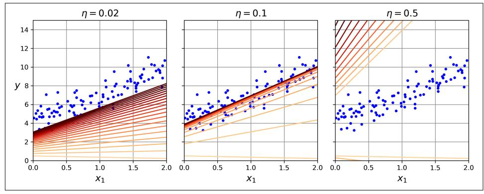

Figure 4-8. Gradient descent with various learning rates

On the left, the learning rate is too low: the algorithm will eventually reach the solution, but it will take a long time. In the middle, the learning rate looks pretty good: in just a few epochs, it has already converged to the solution. On the right, the learning rate is too high: the algorithm diverges, jumping all over the place and actually getting further and further away from the solution at every step.

To find a good learning rate, you can use grid search (see Chapter 2). However, you may want to limit the number of epochs so that grid search can eliminate models that take too long to converge.

You may wonder how to set the number of epochs. If it is too low, you will still be far away from the optimal solution when the algorithm stops; but if it is too high, you will waste time while the model parameters do not change anymore. A simple solution is to set a very large number of epochs but to interrupt the algorithm when the gradient vector becomes tiny—that is, when its norm becomes smaller than a tiny number  $\epsilon$  (called the *tolerance*)—because this happens when gradient descent has (almost) reached the minimum.

#### **Convergence Rate**

When the cost function is convex and its slope does not change abruptly (as is the case for the MSE cost function), batch gradient descent with a fixed learning rate will eventually converge to the optimal solution, but you may have to wait a while: it can take  $O(1/\epsilon)$  iterations to reach the optimum within a range of  $\epsilon$ , depending on the shape of the cost function. If you divide the tolerance by 10 to have a more precise solution, then the algorithm may have to run about 10 times longer.

{172}------------------------------------------------

### **Stochastic Gradient Descent**

The main problem with batch gradient descent is the fact that it uses the whole training set to compute the gradients at every step, which makes it very slow when the training set is large. At the opposite extreme, *stochastic gradient descent* picks a random instance in the training set at every step and computes the gradients based only on that single instance. Obviously, working on a single instance at a time makes the algorithm much faster because it has very little data to manipulate at every iteration. It also makes it possible to train on huge training sets, since only one instance needs to be in memory at each iteration (stochastic GD can be implemented as an out-of-core algorithm; see Chapter 1).

On the other hand, due to its stochastic (i.e., random) nature, this algorithm is much less regular than batch gradient descent: instead of gently decreasing until it reaches the minimum, the cost function will bounce up and down, decreasing only on average. Over time it will end up very close to the minimum, but once it gets there it will continue to bounce around, never settling down (see Figure 4-9). Once the algorithm stops, the final parameter values will be good, but not optimal.


Figure 4-9. With stochastic gradient descent, each training step is much faster but also much more stochastic than when using batch gradient descent

When the cost function is very irregular (as in Figure 4-6), this can actually help the algorithm jump out of local minima, so stochastic gradient descent has a better chance of finding the global minimum than batch gradient descent does.

Therefore, randomness is good to escape from local optima, but bad because it means that the algorithm can never settle at the minimum. One solution to this dilemma is to gradually reduce the learning rate. The steps start out large (which helps make quick progress and escape local minima), then get smaller and smaller, allowing the algorithm to settle at the global minimum. This process is akin to simulated annealing, an algorithm inspired by the process in metallurgy of annealing, where molten metal is slowly cooled down. The function that determines the learning rate

{173}------------------------------------------------

at each iteration is called the *learning schedule*. If the learning rate is reduced too quickly, you may get stuck in a local minimum, or even end up frozen halfway to the minimum. If the learning rate is reduced too slowly, you may jump around the minimum for a long time and end up with a suboptimal solution if you halt training too early.

This code implements stochastic gradient descent using a simple learning schedule:

```
n epochs = 50t0, t1 = 5, 50 # learning schedule hyperparameters
def learning schedule(t):
    return t0 / (t + t1)np.random.seed(42)
theta = np.random.randn(2, 1) # random initializationfor epoch in range(n_epochs):
    for iteration in range(m):
       random index = np.random.randnint(m)xi = X_b[random_index : random_index + 1]yi = y[random index : random index + 1]gradients = 2 * x i . T @ (xi @ theta - yi) # for SGD, do not divide by meta = learning\_schedule(epoch * m + iteration)theta = theta - eta * gradients
```

By convention we iterate by rounds of  $m$  iterations; each round is called an *epoch*, as earlier. While the batch gradient descent code iterated 1,000 times through the whole training set, this code goes through the training set only 50 times and reaches a pretty good solution:

>>> theta array([[4.21076011],  $[2.74856079]$ 

Figure 4-10 shows the first 20 steps of training (notice how irregular the steps are).

Note that since instances are picked randomly, some instances may be picked several times per epoch, while others may not be picked at all. If you want to be sure that the algorithm goes through every instance at each epoch, another approach is to shuffle the training set (making sure to shuffle the input features and the labels jointly), then go through it instance by instance, then shuffle it again, and so on. However, this approach is more complex, and it generally does not improve the result.

{174}------------------------------------------------


Figure 4-10. The first 20 steps of stochastic gradient descent


When using stochastic gradient descent, the training instances must be independent and identically distributed (IID) to ensure that the parameters get pulled toward the global optimum, on average. A simple way to ensure this is to shuffle the instances during training (e.g., pick each instance randomly, or shuffle the training set at the beginning of each epoch). If you do not shuffle the instances—for example, if the instances are sorted by label then SGD will start by optimizing for one label, then the next, and so on, and it will not settle close to the global minimum.

To perform linear regression using stochastic GD with Scikit-Learn, you can use the SGDRegressor class, which defaults to optimizing the MSE cost function. The following code runs for maximum 1,000 epochs (max iter) or until the loss drops by less than  $10^{-5}$  (tol) during 100 epochs (n\_iter\_no\_change). It starts with a learning rate of 0.01 (eta0), using the default learning schedule (different from the one we used). Lastly, it does not use any regularization (penalty=None; more details on this shortly):

```
from sklearn.linear_model import SGDRegressor
sqd req = SGDReqressor(max iter=1000, tol=1e-5, penalty=None, eta0=0.01,
                       n iter no change=100, random state=42)
sgd_reg.fit(X, y.ravel()) # y.ravel() because fit() expects 1D targets
```

{175}------------------------------------------------

Once again, you find a solution quite close to the one returned by the Normal equation:

```
>>> sgd_reg.intercept_, sgd_reg.coef_
(array([4.21278812]), array([2.77270267]))
```


All Scikit-Learn estimators can be trained using the fit() method, but some estimators also have a partial fit() method that you can call to run a single round of training on one or more instances (it ignores hyperparameters like max\_iter or tol). Repeatedly calling partial\_fit() will gradually train the model. This is useful when you need more control over the training process. Other models have a warm\_start hyperparameter instead (and some have both): if you set warm\_start=True, calling the fit() method on a trained model will not reset the model; it will just continue training where it left off, respecting hyperparameters like max\_iter and tol. Note that fit() resets the iteration counter used by the learning schedule, while partial fit() does not.

### **Mini-Batch Gradient Descent**

The last gradient descent algorithm we will look at is called mini-batch gradient *descent*. It is straightforward once you know batch and stochastic gradient descent: at each step, instead of computing the gradients based on the full training set (as in batch GD) or based on just one instance (as in stochastic GD), mini-batch GD computes the gradients on small random sets of instances called *mini-batches*. The main advantage of mini-batch GD over stochastic GD is that you can get a performance boost from hardware optimization of matrix operations, especially when using GPUs.

The algorithm's progress in parameter space is less erratic than with stochastic GD, especially with fairly large mini-batches. As a result, mini-batch GD will end up walking around a bit closer to the minimum than stochastic GD-but it may be harder for it to escape from local minima (in the case of problems that suffer from local minima, unlike linear regression with the MSE cost function). Figure 4-11 shows the paths taken by the three gradient descent algorithms in parameter space during training. They all end up near the minimum, but batch GD's path actually stops at the minimum, while both stochastic GD and mini-batch GD continue to walk around. However, don't forget that batch GD takes a lot of time to take each step, and stochastic GD and mini-batch GD would also reach the minimum if you used a good learning schedule.

{176}------------------------------------------------


Figure 4-11. Gradient descent paths in parameter space

Table 4-1 compares the algorithms we've discussed so far for linear regression<sup>5</sup> (recall that  $m$  is the number of training instances and  $n$  is the number of features).

| Algorithm       |      | Large m Out-of-core support Large n Hyperparams Scaling required Scikit-Learn |      |          |     |                  |
|-----------------|------|-------------------------------------------------------------------------------|------|----------|-----|------------------|
| Normal equation | Fast | No                                                                            | Slow | 0        | No  | N/A              |
| SVD             | Fast | No                                                                            | Slow | 0        | No  | LinearRegression |
| Batch GD        | Slow | No                                                                            | Fast |          | Yes | N/A              |
| Stochastic GD   | Fast | Yes                                                                           | Fast | >)       | Yes | SGDRegressor     |
| Mini-batch GD   | Fast | Yes                                                                           | Fast | $\geq$ 2 | Yes | N/A              |

Table 4-1. Comparison of algorithms for linear regression

There is almost no difference after training: all these algorithms end up with very similar models and make predictions in exactly the same way.

### **Polynomial Regression**

What if your data is more complex than a straight line? Surprisingly, you can use a linear model to fit nonlinear data. A simple way to do this is to add powers of each feature as new features, then train a linear model on this extended set of features. This technique is called polynomial regression.

<sup>5</sup> While the Normal equation can only perform linear regression, the gradient descent algorithms can be used to train many other models, as you'll see.

{177}------------------------------------------------

Let's look at an example. First, we'll generate some nonlinear data (see Figure 4-12), based on a simple *quadratic equation*—that's an equation of the form  $y = ax^2 + bx +$  $c$ -plus some noise:

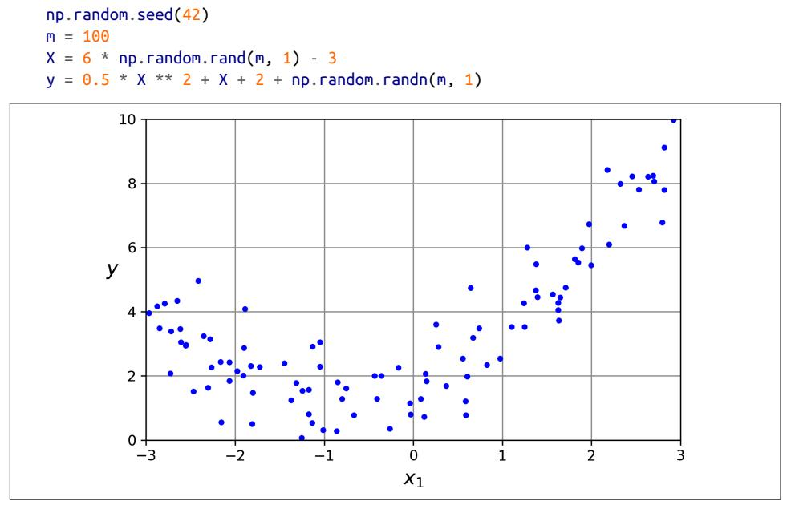

Figure 4-12. Generated nonlinear and noisy dataset

Clearly, a straight line will never fit this data properly. So let's use Scikit-Learn's PolynomialFeatures class to transform our training data, adding the square (seconddegree polynomial) of each feature in the training set as a new feature (in this case there is just one feature):

```
>>> from sklearn.preprocessing import PolynomialFeatures
>>> poly features = PolynomialFeatures(degree=2, include bias=False)
\Rightarrow X_poly = poly_features.fit_transform(X)
\Rightarrow \times [0]
array([-0.75275929])
\Rightarrow X poly[0]
array([ -0.75275929, 0.56664654])
```

X\_poly now contains the original feature of X plus the square of this feature. Now we can fit a LinearRegression model to this extended training data (Figure 4-13):

```
\Rightarrow lin reg = LinearRegression()
>>> lin_reg.fit(X_poly, y)
>>> lin_reg.intercept_, lin_reg.coef_
(array([1.78134581]), array([0.93366893, 0.56456263]]))
```

{178}------------------------------------------------

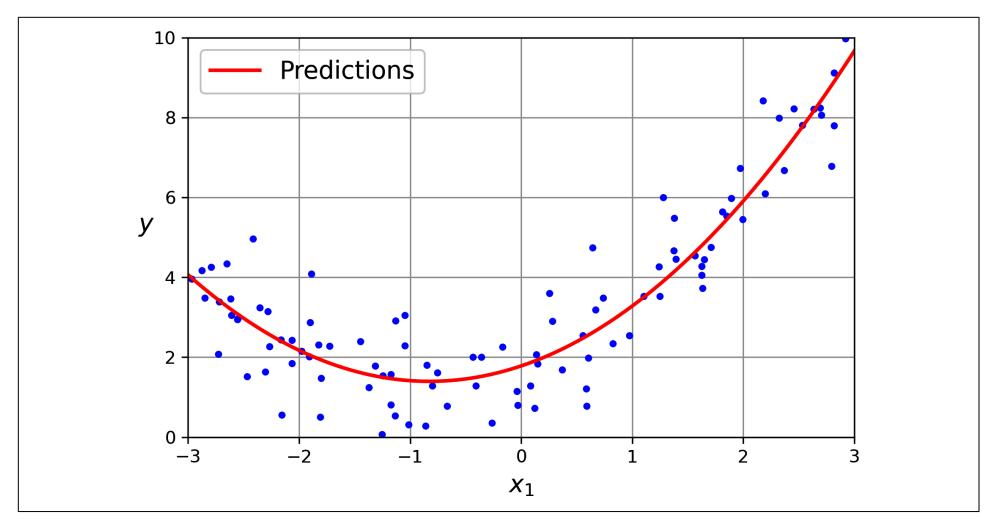

Figure 4-13. Polynomial regression model predictions

Not bad: the model estimates  $\hat{y} = 0.56x_1^2 + 0.93x_1 + 1.78$  when in fact the original function was  $y = 0.5x_1^2 + 1.0x_1 + 2.0$  + Gaussian noise.

Note that when there are multiple features, polynomial regression is capable of finding relationships between features, which is something a plain linear regression model cannot do. This is made possible by the fact that PolynomialFeatures also adds all combinations of features up to the given degree. For example, if there were two features a and b, PolynomialFeatures with degree=3 would not only add the features  $a^2$ ,  $a^3$ ,  $b^2$ , and  $b^3$ , but also the combinations ab,  $a^2b$ , and ab<sup>2</sup>.


PolynomialFeatures( $degree=d$ ) transforms an array containing  $n$ features into an array containing  $(n + d)! / d!n!$  features, where n! is the *factorial* of *n*, equal to  $1 \times 2 \times 3 \times \cdots \times n$ . Beware of the combinatorial explosion of the number of features!

### **Learning Curves**

If you perform high-degree polynomial regression, you will likely fit the training data much better than with plain linear regression. For example, Figure 4-14 applies a 300-degree polynomial model to the preceding training data, and compares the result with a pure linear model and a quadratic model (second-degree polynomial). Notice how the 300-degree polynomial model wiggles around to get as close as possible to the training instances.

{179}------------------------------------------------


Figure 4-14. High-degree polynomial regression

This high-degree polynomial regression model is severely overfitting the training data, while the linear model is underfitting it. The model that will generalize best in this case is the quadratic model, which makes sense because the data was generated using a quadratic model. But in general you won't know what function generated the data, so how can you decide how complex your model should be? How can you tell that your model is overfitting or underfitting the data?

In Chapter 2 you used cross-validation to get an estimate of a model's generalization performance. If a model performs well on the training data but generalizes poorly according to the cross-validation metrics, then your model is overfitting. If it performs poorly on both, then it is underfitting. This is one way to tell when a model is too simple or too complex.

Another way to tell is to look at the *learning curves*, which are plots of the model's training error and validation error as a function of the training iteration: just evaluate the model at regular intervals during training on both the training set and the validation set, and plot the results. If the model cannot be trained incrementally (i.e., if it does not support partial fit() or warm start), then you must train it several times on gradually larger subsets of the training set.

Scikit-Learn has a useful learning curve() function to help with this: it trains and evaluates the model using cross-validation. By default it retrains the model on growing subsets of the training set, but if the model supports incremental learning you can set exploit\_incremental\_learning=True when calling learning\_curve() and it will train the model incrementally instead. The function returns the training set sizes at which it evaluated the model, and the training and validation scores it

{180}------------------------------------------------

measured for each size and for each cross-validation fold. Let's use this function to look at the learning curves of the plain linear regression model (see Figure 4-15):

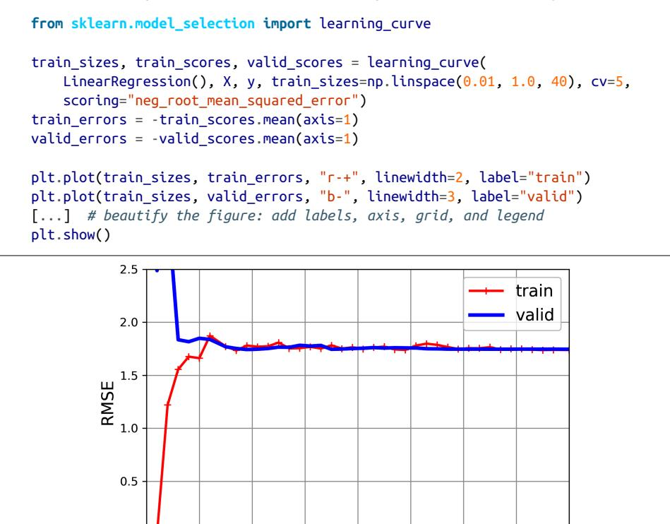

Figure 4-15. Learning curves

 $0.0$ 

 $10$ 

 $20$ 

 $30$ 

 $40$ 

Training set size

 $50$ 

60

 $70$ 

80

This model is underfitting. To see why, first let's look at the training error. When there are just one or two instances in the training set, the model can fit them perfectly, which is why the curve starts at zero. But as new instances are added to the training set, it becomes impossible for the model to fit the training data perfectly, both because the data is noisy and because it is not linear at all. So the error on the training data goes up until it reaches a plateau, at which point adding new instances to the training set doesn't make the average error much better or worse. Now let's look at the validation error. When the model is trained on very few training instances, it is incapable of generalizing properly, which is why the validation error is initially quite large. Then, as the model is shown more training examples, it learns, and thus the validation error slowly goes down. However, once again a straight line cannot do a good job of modeling the data, so the error ends up at a plateau, very close to the other curve.

{181}------------------------------------------------

These learning curves are typical of a model that's underfitting. Both curves have reached a plateau; they are close and fairly high.


If your model is underfitting the training data, adding more training examples will not help. You need to use a better model or come up with better features.

Now let's look at the learning curves of a 10th-degree polynomial model on the same data (Figure 4-16):

```
from sklearn.pipeline import make pipeline
polynomial_regression = make_pipeline(
    PolynomialFeatures(degree=10, include_bias=False),
    LinearRegression())
train_sizes, train_scores, valid_scores = learning_curve(
    polynomial_regression, X, y, train_sizes=np.linspace(0.01, 1.0, 40), cv=5,
    scoring="neg_root_mean_squared_error")
[...] # same as earlier
```

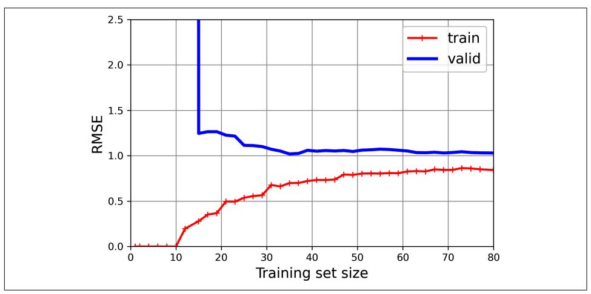

Figure 4-16. Learning curves for the 10th-degree polynomial model

These learning curves look a bit like the previous ones, but there are two very important differences:

- The error on the training data is much lower than before.
- There is a gap between the curves. This means that the model performs significantly better on the training data than on the validation data, which is the

{182}------------------------------------------------

hallmark of an overfitting model. If you used a much larger training set, however, the two curves would continue to get closer.


One way to improve an overfitting model is to feed it more training data until the validation error reaches the training error.

### The Bias/Variance Trade-Off

An important theoretical result of statistics and machine learning is the fact that a model's generalization error can be expressed as the sum of three very different errors<sup>.</sup>

**Bias** 

This part of the generalization error is due to wrong assumptions, such as assuming that the data is linear when it is actually quadratic. A high-bias model is most likely to underfit the training data.<sup>6</sup>

Variance

This part is due to the model's excessive sensitivity to small variations in the training data. A model with many degrees of freedom (such as a high-degree polynomial model) is likely to have high variance and thus overfit the training data.

Irreducible error

This part is due to the noisiness of the data itself. The only way to reduce this part of the error is to clean up the data (e.g., fix the data sources, such as broken sensors, or detect and remove outliers).

Increasing a model's complexity will typically increase its variance and reduce its bias. Conversely, reducing a model's complexity increases its bias and reduces its variance. This is why it is called a trade-off.

## **Regularized Linear Models**

As you saw in Chapters 1 and 2, a good way to reduce overfitting is to regularize the model (i.e., to constrain it): the fewer degrees of freedom it has, the harder it will be for it to overfit the data. A simple way to regularize a polynomial model is to reduce the number of polynomial degrees.

<sup>6</sup> This notion of bias is not to be confused with the bias term of linear models.

{183}------------------------------------------------

For a linear model, regularization is typically achieved by constraining the weights of the model. We will now look at ridge regression, lasso regression, and elastic net regression, which implement three different ways to constrain the weights.

#### **Ridge Regression**

Ridge regression (also called Tikhonov regularization) is a regularized version of linear regression: a *regularization term* equal to  $\frac{\alpha}{m} \sum_{i=1}^{n} \theta_i^2$  is added to the MSE. This forces the learning algorithm to not only fit the data but also keep the model weights as small as possible. Note that the regularization term should only be added to the cost function during training. Once the model is trained, you want to use the unregularized MSE (or the RMSE) to evaluate the model's performance.

The hyperparameter  $\alpha$  controls how much you want to regularize the model. If  $\alpha$  = 0, then ridge regression is just linear regression. If  $\alpha$  is very large, then all weights end up very close to zero and the result is a flat line going through the data's mean. Equation 4-8 presents the ridge regression cost function.<sup>7</sup>

Equation 4-8. Ridge regression cost function

 $J(\mathbf{\Theta}) = \text{MSE}(\mathbf{\Theta}) + \frac{\alpha}{m} \sum_{i=1}^{n} \theta_i^2$ 

Note that the bias term  $\theta_0$  is not regularized (the sum starts at  $i = 1$ , not 0). If we define w as the vector of feature weights ( $\theta_1$  to  $\theta_n$ ), then the regularization term is equal to  $\alpha(\|\mathbf{w}\|_{2})^2$  / m, where  $\|\mathbf{w}\|_{2}$  represents the  $\ell_2$  norm of the weight vector.<sup>8</sup> For batch gradient descent, just add  $2\alpha w / m$  to the part of the MSE gradient vector that corresponds to the feature weights, without adding anything to the gradient of the bias term (see Equation  $4-6$ ).


It is important to scale the data (e.g., using a StandardScaler) before performing ridge regression, as it is sensitive to the scale of the input features. This is true of most regularized models.

Figure 4-17 shows several ridge models that were trained on some very noisy linear data using different  $\alpha$  values. On the left, plain ridge models are used, leading to linear predictions. On the right, the data is first expanded using

<sup>7</sup> It is common to use the notation  $J(\theta)$  for cost functions that don't have a short name; I'll often use this notation throughout the rest of this book. The context will make it clear which cost function is being discussed.

<sup>8</sup> Norms are discussed in Chapter 2.

{184}------------------------------------------------

PolynomialFeatures(degree=10), then it is scaled using a StandardScaler, and finally the ridge models are applied to the resulting features: this is polynomial regression with ridge regularization. Note how increasing  $\alpha$  leads to flatter (i.e., less extreme, more reasonable) predictions, thus reducing the model's variance but increasing its bias.

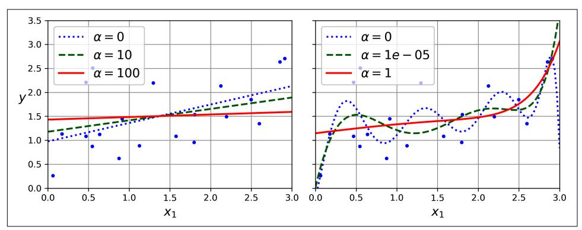

Figure 4-17. Linear (left) and a polynomial (right) models, both with various levels of ridge regularization

As with linear regression, we can perform ridge regression either by computing a closed-form equation or by performing gradient descent. The pros and cons are the same. Equation 4-9 shows the closed-form solution, where **A** is the  $(n + 1) \times (n + 1)$ *identity matrix*,<sup>9</sup> except with a 0 in the top-left cell, corresponding to the bias term.

Equation 4-9. Ridge regression closed-form solution

 $\widehat{\boldsymbol{\theta}} = (\mathbf{X}^\top \mathbf{X} + \alpha \mathbf{A})^{-1} \mathbf{X}^\top \mathbf{y}$ 

Here is how to perform ridge regression with Scikit-Learn using a closed-form solution (a variant of Equation 4-9 that uses a matrix factorization technique by André-Louis Cholesky):

```
>>> from sklearn.linear_model import Ridge
>>> ridge_reg = Ridge(alpha=0.1, solver="cholesky")
>>> ridge_reg.fit(X, y)
>>> ridge_reg.predict([[1.5]])
array([[1.55325833]])
```

<sup>9</sup> A square matrix full of 0s except for 1s on the main diagonal (top left to bottom right).

{185}------------------------------------------------

And using stochastic gradient descent:<sup>10</sup>

```
>>> sgd reg = SGDRegressor(penalty="l2", alpha=0.1 / m, tol=None,
                           max iter=1000, eta0=0.01, random state=42)
\ddotsc\ddotsc>>> sgd reg.fit(X, y.ravel()) # y.ravel() because fit() expects 1D targets
\gg sgd_reg.predict([1.5]])
array([1.55302613])
```

The penalty hyperparameter sets the type of regularization term to use. Specifying "12" indicates that you want SGD to add a regularization term to the MSE cost function equal to alpha times the square of the  $\ell_2$  norm of the weight vector. This is just like ridge regression, except there's no division by  $m$  in this case; that's why we passed alpha=0.1 / m, to get the same result as Ridge(alpha=0.1).


The RidgeCV class also performs ridge regression, but it automatically tunes hyperparameters using cross-validation. It's roughly equivalent to using GridSearchCV, but it's optimized for ridge regression and runs much faster. Several other estimators (mostly linear) also have efficient CV variants, such as LassoCV and FlasticNetCV.

### **Lasso Regression**

Least absolute shrinkage and selection operator regression (usually simply called lasso regression) is another regularized version of linear regression: just like ridge regression, it adds a regularization term to the cost function, but it uses the  $\ell_1$  norm of the weight vector instead of the square of the  $\ell_2$  norm (see Equation 4-10). Notice that the  $\ell_1$  norm is multiplied by 2 $\alpha$ , whereas the  $\ell_2$  norm was multiplied by  $\alpha / m$ in ridge regression. These factors were chosen to ensure that the optimal  $\alpha$  value is independent from the training set size: different norms lead to different factors (see Scikit-Learn issue #15657 for more details).

Equation 4-10. Lasso regression cost function

 $J(\mathbf{\Theta}) = \text{MSE}(\mathbf{\Theta}) + 2\alpha \sum_{i=1}^{n} |\theta_i|$ 

Figure 4-18 shows the same thing as Figure 4-17 but replaces the ridge models with lasso models and uses different  $\alpha$  values

<sup>10</sup> Alternatively, you can use the Ridge class with the "sag" solver. Stochastic average GD is a variant of stochastic GD. For more details, see the presentation "Minimizing Finite Sums with the Stochastic Average Gradient Algorithm" by Mark Schmidt et al. from the University of British Columbia.

{186}------------------------------------------------

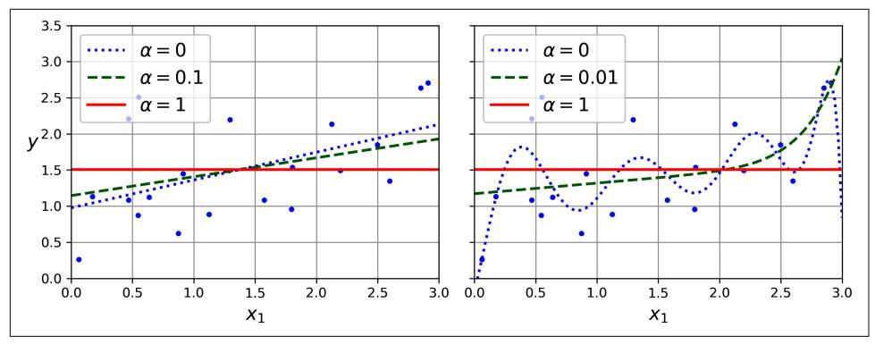

Figure 4-18. Linear (left) and polynomial (right) models, both using various levels of lasso regularization

An important characteristic of lasso regression is that it tends to eliminate the weights of the least important features (i.e., set them to zero). For example, the dashed line in the righthand plot in Figure 4-18 (with  $\alpha = 0.01$ ) looks roughly cubic: all the weights for the high-degree polynomial features are equal to zero. In other words, lasso regression automatically performs feature selection and outputs a sparse model with few nonzero feature weights.

You can get a sense of why this is the case by looking at Figure 4-19: the axes represent two model parameters, and the background contours represent different loss functions. In the top-left plot, the contours represent the  $\ell_1$  loss  $(|\theta_1| + |\theta_2|)$ , which drops linearly as you get closer to any axis. For example, if you initialize the model parameters to  $\theta_1 = 2$  and  $\theta_2 = 0.5$ , running gradient descent will decrement both parameters equally (as represented by the dashed yellow line); therefore  $\theta$ , will reach 0 first (since it was closer to 0 to begin with). After that, gradient descent will roll down the gutter until it reaches  $\theta_1 = 0$  (with a bit of bouncing around, since the gradients of  $\ell_1$  never get close to 0: they are either -1 or 1 for each parameter). In the top-right plot, the contours represent lasso regression's cost function (i.e., an MSE cost function plus an  $\ell_1$  loss). The small white circles show the path that gradient descent takes to optimize some model parameters that were initialized around  $\theta_1$  = 0.25 and  $\theta_2$  = -1: notice once again how the path quickly reaches  $\theta_2$  = 0, then rolls down the gutter and ends up bouncing around the global optimum (represented by the red square). If we increased  $\alpha$ , the global optimum would move left along the dashed yellow line, while if we decreased  $\alpha$ , the global optimum would move right (in this example, the optimal parameters for the unregularized MSE are  $\theta_1 = 2$  and  $\theta_2 =$  $(0.5)$ .

{187}------------------------------------------------


Figure 4-19. Lasso versus ridge regularization

The two bottom plots show the same thing but with an  $\ell_2$  penalty instead. In the bottom-left plot, you can see that the  $\ell_2$  loss decreases as we get closer to the origin, so gradient descent just takes a straight path toward that point. In the bottom-right plot, the contours represent ridge regression's cost function (i.e., an MSE cost function plus an  $\ell$ , loss). As you can see, the gradients get smaller as the parameters approach the global optimum, so gradient descent naturally slows down. This limits the bouncing around, which helps ridge converge faster than lasso regression. Also note that the optimal parameters (represented by the red square) get closer and closer to the origin when you increase  $\alpha$ , but they never get eliminated entirely.


To keep gradient descent from bouncing around the optimum at the end when using lasso regression, you need to gradually reduce the learning rate during training. It will still bounce around the optimum, but the steps will get smaller and smaller, so it will converge.

{188}------------------------------------------------

The lasso cost function is not differentiable at  $\theta_i = 0$  (for  $i = 1, 2, \dots, n$ ), but gradient descent still works if you use a *subgradient vector*  $\mathbf{g}^{11}$  instead when any  $\theta_i = 0$ . Equation 4-11 shows a subgradient vector equation you can use for gradient descent with the lasso cost function.

Equation 4-11. Lasso regression subgradient vector

$$
g(\mathbf{\theta}, J) = \nabla_{\mathbf{\theta}} \text{MSE}(\mathbf{\theta}) + 2\alpha \begin{pmatrix} \text{sign } (\theta_1) \\ \text{sign } (\theta_2) \\ \vdots \\ \text{sign } (\theta_n) \end{pmatrix} \quad \text{where } \text{sign } (\theta_i) = \begin{cases} -1 & \text{if } \theta_i < 0 \\ 0 & \text{if } \theta_i = 0 \\ +1 & \text{if } \theta_i > 0 \end{cases}
$$

 $\lambda$  and  $\lambda$ 

Here is a small Scikit-Learn example using the Lasso class:

```
>>> from sklearn.linear_model import Lasso
\Rightarrow lasso reg = Lasso(alpha=0.1)
>>> lasso_reg.fit(X, y)
\gg lasso_reg.predict([1.5])
array([1.53788174])
```

Note that you could instead use SGDRegressor (penalty="l1", alpha=0.1).

### **Elastic Net Regression**

*Elastic net regression* is a middle ground between ridge regression and lasso regression. The regularization term is a weighted sum of both ridge and lasso's regularization terms, and you can control the mix ratio  $r$ . When  $r = 0$ , elastic net is equivalent to ridge regression, and when  $r = 1$ , it is equivalent to lasso regression (Equation  $4-12$ ).

Equation 4-12. Elastic net cost function

 $J(\mathbf{\Theta}) = \text{MSE}(\mathbf{\Theta}) + r(2\alpha \Sigma_{i=1}^n |\theta_i|) + (1-r)(\frac{\alpha}{m} \Sigma_{i=1}^n \theta_i^2)$ 

So when should you use elastic net regression, or ridge, lasso, or plain linear regression (i.e., without any regularization)? It is almost always preferable to have at least a little bit of regularization, so generally you should avoid plain linear regression. Ridge is a good default, but if you suspect that only a few features are useful, you should prefer lasso or elastic net because they tend to reduce the useless features' weights down to zero, as discussed earlier. In general, elastic net is preferred over

<sup>11</sup> You can think of a subgradient vector at a nondifferentiable point as an intermediate vector between the gradient vectors around that point.

{189}------------------------------------------------

lasso because lasso may behave erratically when the number of features is greater than the number of training instances or when several features are strongly correlated.

Here is a short example that uses Scikit-Learn's ElasticNet (11 ratio corresponds to the mix ratio  $r$ ):

```
>>> from sklearn.linear_model import ElasticNet
\gg elastic net = ElasticNet(alpha=0.1, l1 ratio=0.5)
>>> elastic_net.fit(X, y)
>>> elastic_net.predict([[1.5]])
array([1.54333232])
```

### **Early Stopping**

A very different way to regularize iterative learning algorithms such as gradient descent is to stop training as soon as the validation error reaches a minimum. This is called early stopping. Figure 4-20 shows a complex model (in this case, a high-degree polynomial regression model) being trained with batch gradient descent on the quadratic dataset we used earlier. As the epochs go by, the algorithm learns, and its prediction error (RMSE) on the training set goes down, along with its prediction error on the validation set. After a while, though, the validation error stops decreasing and starts to go back up. This indicates that the model has started to overfit the training data. With early stopping you just stop training as soon as the validation error reaches the minimum. It is such a simple and efficient regularization technique that Geoffrey Hinton called it a "beautiful free lunch".


Figure 4-20. Early stopping regularization

{190}------------------------------------------------


With stochastic and mini-batch gradient descent, the curves are not so smooth, and it may be hard to know whether you have reached the minimum or not. One solution is to stop only after the validation error has been above the minimum for some time (when you are confident that the model will not do any better), then roll back the model parameters to the point where the validation error was at a minimum.

Here is a basic implementation of early stopping:

```
from copy import deepcopy
from sklearn.metrics import mean squared error
from sklearn.preprocessing import StandardScaler
X_train, y_train, X_valid, y_valid = [...] # split the quadratic dataset
preprocessing = make_pipeline(PolynomialFeatures(degree=90, include_bias=False),
                              StandardScaler())
X_train_prep = preprocessing.fit_transform(X_train)
X_value_prep = preprocessing.trainSform(X_value)sgd reg = SGDRegression(penalty=None, eta0=0.002, random state=42)n epochs = 500
best valid rmse = float('inf')for epoch in range(n_epochs):
    sgd_reg.partial_fit(X_train_prep, y_train)
    y_valid_predict = sgd_reg.predict(X_valid_prep)
   val_error = mean_squared_error(y_valid, y_valid_predict, squared=False)
    if val_error < best_valid_rmse:
       best valid rme = val error
       best_model = deepcopy(sgd_reg)
```

This code first adds the polynomial features and scales all the input features, both for the training set and for the validation set (the code assumes that you have split the original training set into a smaller training set and a validation set). Then it creates an SGDRegressor model with no regularization and a small learning rate. In the training loop, it calls partial fit() instead of fit(), to perform incremental learning. At each epoch, it measures the RMSE on the validation set. If it is lower than the lowest RMSE seen so far, it saves a copy of the model in the best\_model variable. This implementation does not actually stop training, but it lets you revert to the best model after training. Note that the model is copied using copy.deepcopy(), because it copies both the model's hyperparameters *and* the learned parameters. In contrast, sklearn.base.clone() only copies the model's hyperparameters.

{191}------------------------------------------------

## **Logistic Regression**

As discussed in Chapter 1, some regression algorithms can be used for classification (and vice versa). Logistic regression (also called *logit regression*) is commonly used to estimate the probability that an instance belongs to a particular class (e.g., what is the probability that this email is spam?). If the estimated probability is greater than a given threshold (typically 50%), then the model predicts that the instance belongs to that class (called the *positive class*, labeled "1"), and otherwise it predicts that it does not (i.e., it belongs to the *negative class*, labeled "0"). This makes it a binary classifier.

### **Estimating Probabilities**

So how does logistic regression work? Just like a linear regression model, a logistic regression model computes a weighted sum of the input features (plus a bias term), but instead of outputting the result directly like the linear regression model does, it outputs the *logistic* of this result (see Equation 4-13).

Equation 4-13. Logistic regression model estimated probability (vectorized form)

 $\hat{p} = h_{\mathbf{\theta}}(\mathbf{x}) = \sigma(\mathbf{\theta}^{\mathsf{T}}\mathbf{x})$ 

The logistic—noted  $\sigma(\cdot)$ —is a *sigmoid function* (i.e., S-shaped) that outputs a number between 0 and 1. It is defined as shown in Equation 4-14 and Figure 4-21.

Equation 4-14. Logistic function

$$
\sigma(t) = \frac{1}{1 + \exp(-t)}
$$

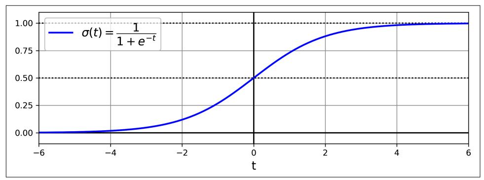

Figure 4-21. Logistic function

{192}------------------------------------------------

Once the logistic regression model has estimated the probability  $\hat{p} = h_0(\mathbf{x})$  that an instance x belongs to the positive class, it can make its prediction  $\hat{y}$  easily (see Equation  $4-15$ ).

Equation 4-15. Logistic regression model prediction using a 50% threshold probability

 $\hat{y} = \begin{cases} 0 & \text{if } \hat{p} < 0.5 \\ 1 & \text{if } \hat{p} \ge 0.5 \end{cases}$ 

Notice that  $\sigma(t) < 0.5$  when  $t < 0$ , and  $\sigma(t) \ge 0.5$  when  $t \ge 0$ , so a logistic regression model using the default threshold of 50% probability predicts 1 if  $\theta^{\dagger}$  x is positive and 0 if it is negative.


The score  $t$  is often called the *logit*. The name comes from the fact that the logit function, defined as  $logit(p) = log(p / (1 - p))$ , is the inverse of the logistic function. Indeed, if you compute the logit of the estimated probability  $p$ , you will find that the result is t. The logit is also called the *log-odds*, since it is the log of the ratio between the estimated probability for the positive class and the estimated probability for the negative class.

#### **Training and Cost Function**

Now you know how a logistic regression model estimates probabilities and makes predictions. But how is it trained? The objective of training is to set the parameter vector  $\theta$  so that the model estimates high probabilities for positive instances ( $y = 1$ ) and low probabilities for negative instances ( $y = 0$ ). This idea is captured by the cost function shown in Equation 4-16 for a single training instance x.

Equation 4-16. Cost function of a single training instance

$$
c(\mathbf{\Theta}) = \begin{cases} -\log(\widehat{p}) & \text{if } y = 1\\ -\log(1-\widehat{p}) & \text{if } y = 0 \end{cases}
$$

This cost function makes sense because  $-\log(t)$  grows very large when t approaches 0, so the cost will be large if the model estimates a probability close to 0 for a positive instance, and it will also be large if the model estimates a probability close to 1 for a negative instance. On the other hand,  $-\log(t)$  is close to 0 when t is close to 1, so the cost will be close to 0 if the estimated probability is close to 0 for a negative instance or close to 1 for a positive instance, which is precisely what we want.

{193}------------------------------------------------

The cost function over the whole training set is the average cost over all training instances. It can be written in a single expression called the log loss, shown in Equation 4-17.

Equation 4-17. Logistic regression cost function (log loss)

 $J(\mathbf{\Theta}) = -\frac{1}{m} \sum_{i=1}^{m} \left[ y^{(i)} log(\hat{p}^{(i)}) + (1 - y^{(i)}) log(1 - \hat{p}^{(i)}) \right]$ 


The log loss was not just pulled out of a hat. It can be shown mathematically (using Bayesian inference) that minimizing this loss will result in the model with the maximum likelihood of being optimal, assuming that the instances follow a Gaussian distribution around the mean of their class. When you use the log loss, this is the implicit assumption you are making. The more wrong this assumption is, the more biased the model will be. Similarly, when we used the MSE to train linear regression models, we were implicitly assuming that the data was purely linear, plus some Gaussian noise. So, if the data is not linear (e.g., if it's quadratic) or if the noise is not Gaussian (e.g., if outliers are not exponentially rare), then the model will be biased.

The bad news is that there is no known closed-form equation to compute the value of  $\theta$  that minimizes this cost function (there is no equivalent of the Normal equation). But the good news is that this cost function is convex, so gradient descent (or any other optimization algorithm) is guaranteed to find the global minimum (if the learning rate is not too large and you wait long enough). The partial derivatives of the cost function with regard to the  $j<sup>th</sup>$  model parameter  $\theta_i$  are given by Equation 4-18.

Equation 4-18. Logistic cost function partial derivatives

$$
\frac{\partial}{\partial \theta_j} \mathbf{J}(\mathbf{\Theta}) = \frac{1}{m} \sum_{i=1}^{m} \left( \sigma \big(\mathbf{\Theta}^\mathsf{T} \mathbf{x}^{(i)}\big) - y^{(i)}\right) x_j^{(i)}
$$

This equation looks very much like Equation 4-5: for each instance it computes the prediction error and multiplies it by the  $j<sup>th</sup>$  feature value, and then it computes the average over all training instances. Once you have the gradient vector containing all the partial derivatives, you can use it in the batch gradient descent algorithm. That's it: you now know how to train a logistic regression model. For stochastic GD you would take one instance at a time, and for mini-batch GD you would use a mini-batch at a time.

{194}------------------------------------------------

### **Decision Boundaries**

We can use the iris dataset to illustrate logistic regression. This is a famous dataset that contains the sepal and petal length and width of 150 iris flowers of three different species: Iris setosa, Iris versicolor, and Iris virginica (see Figure 4-22).


Figure 4-22. Flowers of three iris plant species<sup>12</sup>

Let's try to build a classifier to detect the *Iris virginica* type based only on the petal width feature. The first step is to load the data and take a quick peek:

```
>>> from sklearn.datasets import load iris
>>> iris = load_iris(as_frame=True)
>>> list(iris)
['data', 'target', 'frame', 'target names', 'DESCR', 'feature names',
 'filename', 'data module']
>>> iris.data.head(3)
   sepal length (cm) sepal width (cm) petal length (cm) petal width (cm)
\Theta5.13.51.40.24.9
                                       3.01.40.2\mathbf{1}4.73.21.30.2\overline{2}>>> iris.target.head(3) # note that the instances are not shuffled
\boldsymbol{\Theta}\Theta\Theta\mathbf{1}\overline{2}\ThetaName: target, dtype: int64
>>> iris.target_names
array(['setosa', 'versicolor', 'virginica'], dtype='<U10')
```

<sup>12</sup> Photos reproduced from the corresponding Wikipedia pages. Iris virginica photo by Frank Mayfield (Creative Commons BY-SA 2.0), Iris versicolor photo by D. Gordon E. Robertson (Creative Commons BY-SA 3.0), Iris setosa photo public domain.

{195}------------------------------------------------

Next we'll split the data and train a logistic regression model on the training set:

```
from sklearn.linear model import LogisticRegression
from sklearn.model_selection import train test split
X = \text{iris.data}[[\text{"petal width (cm)"}]].valuesy = iris.target_names[iris.target] == 'virginica'X_train, X_test, y_train, y_test = train_test_split(X, y, random_state=42)
log_reg = LogisticRegression(random_state=42)
log_reg.fit(X_train, y_train)
```

Let's look at the model's estimated probabilities for flowers with petal widths varying from 0 cm to 3 cm (Figure 4-23): $13$ 

```
X_new = np.linspace(0, 3, 1000).reshape(-1, 1) # reshape to get a column vector
y proba = log_{reg}.predict\_prob(a(x_new))decision_boundary = X_new[y_prob[:, 1] >= 0.5][0, 0]plt.plot(X_new, y_prob[:, 0], "b--", linewidth=2,label="Not Iris virginica proba")
plt.plot(X_new, y_proba[:, 1], "g-", linewidth=2, label="Iris virginica proba")
plt.plot([decision_boundary, decision_boundary], [0, 1], "k:", linewidth=2,
         label="Decision boundary")
[...] # beautify the figure: add grid, labels, axis, legend, arrows, and samples
plt.show()
```

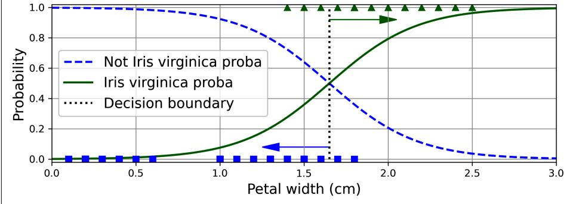

Figure 4-23. Estimated probabilities and decision boundary

The petal width of *Iris virginica* flowers (represented as triangles) ranges from 1.4 cm to 2.5 cm, while the other iris flowers (represented by squares) generally have a smaller petal width, ranging from 0.1 cm to 1.8 cm. Notice that there is a bit of overlap. Above about 2 cm the classifier is highly confident that the flower is an Iris virginica (it outputs a high probability for that class), while below 1 cm it is highly

<sup>13</sup> NumPy's reshape() function allows one dimension to be -1, which means "automatic": the value is inferred from the length of the array and the remaining dimensions.

{196}------------------------------------------------

confident that it is not an *Iris virginica* (high probability for the "Not Iris virginica" class). In between these extremes, the classifier is unsure. However, if you ask it to predict the class (using the predict() method rather than the predict\_proba() method), it will return whichever class is the most likely. Therefore, there is a decision boundary at around 1.6 cm where both probabilities are equal to 50%: if the petal width is greater than 1.6 cm the classifier will predict that the flower is an Iris virginica, and otherwise it will predict that it is not (even if it is not very confident):

```
>>> decision boundary
1.6516516516516517
>>> log_{reg.predict}([1.7], [1.5]])array([ True, False])
```

Figure 4-24 shows the same dataset, but this time displaying two features: petal width and length. Once trained, the logistic regression classifier can, based on these two features, estimate the probability that a new flower is an Iris virginica. The dashed line represents the points where the model estimates a 50% probability: this is the model's decision boundary. Note that it is a linear boundary.<sup>14</sup> Each parallel line represents the points where the model outputs a specific probability, from 15% (bottom left) to 90% (top right). All the flowers beyond the top-right line have over 90% chance of being Iris virginica, according to the model.


Figure 4-24. Linear decision boundary


The hyperparameter controlling the regularization strength of a Scikit-Learn LogisticRegression model is not alpha (as in other linear models), but its inverse: C. The higher the value of C, the less the model is regularized.

<sup>14</sup> It is the set of points **x** such that  $\theta_0 + \theta_1 x_1 + \theta_2 x_2 = 0$ , which defines a straight line.

{197}------------------------------------------------

Just like the other linear models, logistic regression models can be regularized using  $\ell_1$  or  $\ell_2$  penalties. Scikit-Learn actually adds an  $\ell_2$  penalty by default.

### **Softmax Regression**

The logistic regression model can be generalized to support multiple classes directly, without having to train and combine multiple binary classifiers (as discussed in Chapter 3). This is called softmax regression, or multinomial logistic regression.

The idea is simple: when given an instance x, the softmax regression model first computes a score  $s_k(x)$  for each class k, then estimates the probability of each class by applying the *softmax function* (also called the *normalized exponential*) to the scores. The equation to compute  $s_k(x)$  should look familiar, as it is just like the equation for linear regression prediction (see Equation 4-19).

Equation 4-19. Softmax score for class k

$$
s_k(\mathbf{x}) = \left(\mathbf{\theta}^{(k)}\right)^{\mathsf{T}} \mathbf{x}
$$

Note that each class has its own dedicated parameter vector  $\theta^{(k)}$ . All these vectors are typically stored as rows in a *parameter matrix*  $\Theta$ .

Once you have computed the score of every class for the instance x, you can estimate the probability  $\hat{p}_k$  that the instance belongs to class k by running the scores through the softmax function (Equation 4-20). The function computes the exponential of every score, then normalizes them (dividing by the sum of all the exponentials). The scores are generally called logits or log-odds (although they are actually unnormalized log-odds).

Equation 4-20. Softmax function

$$
\widehat{p}_k = \sigma(\mathbf{s}(\mathbf{x}))_k = \frac{\exp (s_k(\mathbf{x}))}{\sum_{j=1}^K \exp (s_j(\mathbf{x}))}
$$

In this equation:

- $\bullet$  K is the number of classes
- $s(x)$  is a vector containing the scores of each class for the instance  $x$ .
- $\sigma(s(x))_k$  is the estimated probability that the instance x belongs to class k, given the scores of each class for that instance

{198}------------------------------------------------

Just like the logistic regression classifier, by default the softmax regression classifier predicts the class with the highest estimated probability (which is simply the class with the highest score), as shown in Equation 4-21.

Equation 4-21. Softmax regression classifier prediction

 $\hat{y}$  = argmax  $\sigma(\mathbf{s}(\mathbf{x}))_k$  = argmax  $s_k(\mathbf{x})$  = argmax  $((\mathbf{\theta}^{(k)})^T \mathbf{x})$ 

The *argmax* operator returns the value of a variable that maximizes a function. In this equation, it returns the value of k that maximizes the estimated probability  $\sigma(s(x))_k$ .


The softmax regression classifier predicts only one class at a time (i.e., it is multiclass, not multioutput), so it should be used only with mutually exclusive classes, such as different species of plants. You cannot use it to recognize multiple people in one picture.

Now that you know how the model estimates probabilities and makes predictions, let's take a look at training. The objective is to have a model that estimates a high probability for the target class (and consequently a low probability for the other classes). Minimizing the cost function shown in Equation 4-22, called the cross entropy, should lead to this objective because it penalizes the model when it estimates a low probability for a target class. Cross entropy is frequently used to measure how well a set of estimated class probabilities matches the target classes.

Equation 4-22. Cross entropy cost function

 $J(\mathbf{\Theta}) = -\frac{1}{m} \sum_{i=1}^{m} \sum_{k=1}^{K} y_k^{(i)} \log \left( \hat{p}_k^{(i)} \right)$ 

In this equation,  $y_k^{(i)}$  is the target probability that the  $i^{\text{th}}$  instance belongs to class k. In general, it is either equal to 1 or 0, depending on whether the instance belongs to the class or not.

Notice that when there are just two classes  $(K = 2)$ , this cost function is equivalent to the logistic regression cost function (log loss; see Equation 4-17).

#### **Cross Entropy**

Cross entropy originated from Claude Shannon's information theory. Suppose you want to efficiently transmit information about the weather every day. If there are eight options (sunny, rainy, etc.), you could encode each option using 3 bits, because  $2^3$  = 8. However, if you think it will be sunny almost every day, it would be much more

{199}------------------------------------------------

efficient to code "sunny" on just one bit (0) and the other seven options on four bits (starting with a 1). Cross entropy measures the average number of bits you actually send per option. If your assumption about the weather is perfect, cross entropy will be equal to the entropy of the weather itself (i.e., its intrinsic unpredictability). But if your assumption is wrong (e.g., if it rains often), cross entropy will be greater by an amount called the Kullback-Leibler (KL) divergence.

The cross entropy between two probability distributions p and q is defined as  $H(p,q)$  $= -\sum_{x} p(x) \log q(x)$  (at least when the distributions are discrete). For more details, check out my video on the subject.

The gradient vector of this cost function with regard to  $\theta^{(k)}$  is given by Equation 4-23.

Equation 4-23. Cross entropy gradient vector for class k

$$
\nabla_{\boldsymbol{\theta}}(k) J(\boldsymbol{\Theta}) = \frac{1}{m} \sum_{i=1}^{m} \left( \widehat{p}_{k}^{(i)} - y_{k}^{(i)} \right) \mathbf{x}^{(i)}
$$

Now you can compute the gradient vector for every class, then use gradient descent (or any other optimization algorithm) to find the parameter matrix  $\Theta$  that minimizes the cost function.

Let's use softmax regression to classify the iris plants into all three classes. Scikit-Learn's LogisticRegression classifier uses softmax regression automatically when you train it on more than two classes (assuming you use solver="lbfgs", which is the default). It also applies  $\ell_2$  regularization by default, which you can control using the hyperparameter C, as mentioned earlier:

```
X = iris.data[["petal length (cm)", "petal width (cm)"]].values
y = \text{iris}['target"]X_train, X_test, y_train, y_test = train_test_split(X, y, random_state=42)
softmax_{reg} = LogisticRegression(C=30, random_state=42)softmax reg.fit(X train, y train)
```

So the next time you find an iris with petals that are 5 cm long and 2 cm wide, you can ask your model to tell you what type of iris it is, and it will answer Iris virginica (class 2) with 96% probability (or Iris versicolor with 4% probability):

```
>>> softmax reg.predict([[5, 2]])
array([2])>>> softmax_reg.predict_proba([[5, 2]]).round(2)
array([[0. , 0.04, 0.96]])
```

Figure 4-25 shows the resulting decision boundaries, represented by the background colors. Notice that the decision boundaries between any two classes are linear. The figure also shows the probabilities for the *Iris versicolor* class, represented by the

{200}------------------------------------------------

curved lines (e.g., the line labeled with 0.30 represents the 30% probability boundary). Notice that the model can predict a class that has an estimated probability below 50%. For example, at the point where all decision boundaries meet, all classes have an equal estimated probability of 33%.


Figure 4-25. Softmax regression decision boundaries

In this chapter, you learned various ways to train linear models, both for regression and for classification. You used a closed-form equation to solve linear regression, as well as gradient descent, and you learned how various penalties can be added to the cost function during training to regularize the model. Along the way, you also learned how to plot learning curves and analyze them, and how to implement early stopping. Finally, you learned how logistic regression and softmax regression work. We've opened up the first machine learning black boxes! In the next chapters we will open many more, starting with support vector machines.

## **Exercises**

- 1. Which linear regression training algorithm can you use if you have a training set with millions of features?
- 2. Suppose the features in your training set have very different scales. Which algorithms might suffer from this, and how? What can you do about it?
- 3. Can gradient descent get stuck in a local minimum when training a logistic regression model?
- 4. Do all gradient descent algorithms lead to the same model, provided you let them run long enough?
- 5. Suppose you use batch gradient descent and you plot the validation error at every epoch. If you notice that the validation error consistently goes up, what is likely going on? How can you fix this?

{201}------------------------------------------------

- 6. Is it a good idea to stop mini-batch gradient descent immediately when the validation error goes up?
- 7. Which gradient descent algorithm (among those we discussed) will reach the vicinity of the optimal solution the fastest? Which will actually converge? How can you make the others converge as well?
- 8. Suppose you are using polynomial regression. You plot the learning curves and you notice that there is a large gap between the training error and the validation error. What is happening? What are three ways to solve this?
- 9. Suppose you are using ridge regression and you notice that the training error and the validation error are almost equal and fairly high. Would you say that the model suffers from high bias or high variance? Should you increase the regularization hyperparameter  $\alpha$  or reduce it?
- 10. Why would you want to use:
  - a. Ridge regression instead of plain linear regression (i.e., without any regularization)?
  - b. Lasso instead of ridge regression?
  - c. Elastic net instead of lasso regression?
- 11. Suppose you want to classify pictures as outdoor/indoor and daytime/nighttime. Should you implement two logistic regression classifiers or one softmax regression classifier?
- 12. Implement batch gradient descent with early stopping for softmax regression without using Scikit-Learn, only NumPy. Use it on a classification task such as the iris dataset.

Solutions to these exercises are available at the end of this chapter's notebook, at https://homl.info/colab3.

{202}------------------------------------------------

## **CHAPTER 5 Support Vector Machines**

A *support vector machine* (SVM) is a powerful and versatile machine learning model, capable of performing linear or nonlinear classification, regression, and even novelty detection. SVMs shine with small to medium-sized nonlinear datasets (i.e., hundreds to thousands of instances), especially for classification tasks. However, they don't scale very well to very large datasets, as you will see.

This chapter will explain the core concepts of SVMs, how to use them, and how they work. Let's jump right in!

### **Linear SVM Classification**

The fundamental idea behind SVMs is best explained with some visuals. Figure 5-1 shows part of the iris dataset that was introduced at the end of Chapter 4. The two classes can clearly be separated easily with a straight line (they are *linearly separable*). The left plot shows the decision boundaries of three possible linear classifiers. The model whose decision boundary is represented by the dashed line is so bad that it does not even separate the classes properly. The other two models work perfectly on this training set, but their decision boundaries come so close to the instances that these models will probably not perform as well on new instances. In contrast, the solid line in the plot on the right represents the decision boundary of an SVM classifier; this line not only separates the two classes but also stays as far away from the closest training instances as possible. You can think of an SVM classifier as fitting the widest possible street (represented by the parallel dashed lines) between the classes. This is called *large margin classification*.

{203}------------------------------------------------


Figure 5-1. Large margin classification

Notice that adding more training instances "off the street" will not affect the decision boundary at all: it is fully determined (or "supported") by the instances located on the edge of the street. These instances are called the *support vectors* (they are circled in Figure  $5-1$ ).


SVMs are sensitive to the feature scales, as you can see in Figure 5-2. In the left plot, the vertical scale is much larger than the horizontal scale, so the widest possible street is close to horizontal. After feature scaling (e.g., using Scikit-Learn's StandardScaler), the decision boundary in the right plot looks much better.

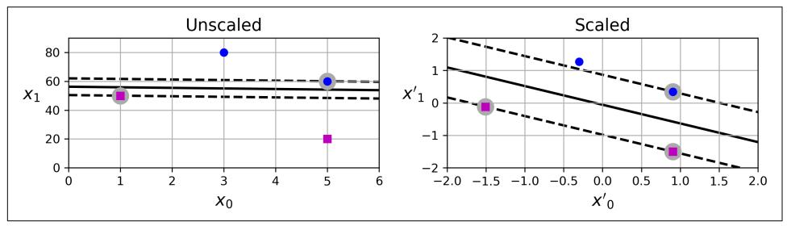

Figure 5-2. Sensitivity to feature scales

### **Soft Margin Classification**

If we strictly impose that all instances must be off the street and on the correct side, this is called *hard margin classification*. There are two main issues with hard margin classification. First, it only works if the data is linearly separable. Second, it is sensitive to outliers. Figure 5-3 shows the iris dataset with just one additional outlier: on the left, it is impossible to find a hard margin; on the right, the decision boundary ends up very different from the one we saw in Figure 5-1 without the outlier, and the model will probably not generalize as well.

{204}------------------------------------------------


Figure 5-3. Hard margin sensitivity to outliers

To avoid these issues, we need to use a more flexible model. The objective is to find a good balance between keeping the street as large as possible and limiting the *margin violations* (i.e., instances that end up in the middle of the street or even on the wrong side). This is called *soft margin classification*.

When creating an SVM model using Scikit-Learn, you can specify several hyperparameters, including the regularization hyperparameter C. If you set it to a low value, then you end up with the model on the left of Figure 5-4. With a high value, you get the model on the right. As you can see, reducing C makes the street larger, but it also leads to more margin violations. In other words, reducing C results in more instances supporting the street, so there's less risk of overfitting. But if you reduce it too much, then the model ends up underfitting, as seems to be the case here: the model with C=100 looks like it will generalize better than the one with C=1.


Figure 5-4. Large margin (left) versus fewer margin violations (right)


If your SVM model is overfitting, you can try regularizing it by reducing C.

The following Scikit-Learn code loads the iris dataset and trains a linear SVM classifier to detect *Iris virginica* flowers. The pipeline first scales the features, then uses a LinearSVC with  $C=1$ :

{205}------------------------------------------------

```
from sklearn.datasets import load iris
from sklearn.pipeline import make pipeline
from sklearn.preprocessing import StandardScaler
from sklearn.svm import LinearSVC
iris = load_iris(as_frame=True)X = iris.data[["petal length (cm)", "petal width (cm)"].valuesy = (iris.target == 2) # Iris virginica
svm_clf = make_pipeline(StandardScaler(),
                       LinearSVC(C=1, random_state=42))
svm clf.fit(X, y)
```

The resulting model is represented on the left in Figure 5-4.

Then, as usual, you can use the model to make predictions:

```
>>> X_new = [[5.5, 1.7], [5.0, 1.5]]>>> svm clf.predict(X new)
array([ True, False])
```

The first plant is classified as an *Iris virginica*, while the second is not. Let's look at the scores that the SVM used to make these predictions. These measure the signed distance between each instance and the decision boundary:

```
>>> svm_clf.decision_function(X_new)
array([ 0.66163411, -0.22036063])
```

Unlike LogisticRegression, LinearSVC doesn't have a predict\_proba() method to estimate the class probabilities. That said, if you use the SVC class (discussed shortly) instead of LinearSVC, and if you set its probability hyperparameter to True, then the model will fit an extra model at the end of training to map the SVM decision function scores to estimated probabilities. Under the hood, this requires using 5-fold cross-validation to generate out-of-sample predictions for every instance in the training set, then training a LogisticRegression model, so it will slow down training considerably. After that, the predict proba() and predict log proba() methods will be available.

### **Nonlinear SVM Classification**

Although linear SVM classifiers are efficient and often work surprisingly well, many datasets are not even close to being linearly separable. One approach to handling nonlinear datasets is to add more features, such as polynomial features (as we did in Chapter 4); in some cases this can result in a linearly separable dataset. Consider the lefthand plot in Figure 5-5: it represents a simple dataset with just one feature,  $x_1$ . This dataset is not linearly separable, as you can see. But if you add a second feature  $x_2 = (x_1)^2$ , the resulting 2D dataset is perfectly linearly separable.

{206}------------------------------------------------

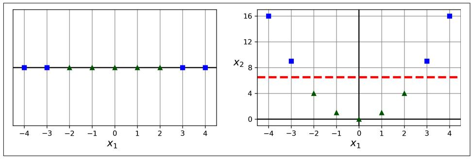

Figure 5-5. Adding features to make a dataset linearly separable

To implement this idea using Scikit-Learn, you can create a pipeline containing a PolynomialFeatures transformer (discussed in "Polynomial Regression" on page 149), followed by a StandardScaler and a LinearSVC classifier. Let's test this on the moons dataset, a toy dataset for binary classification in which the data points are shaped as two interleaving crescent moons (see Figure 5-6). You can generate this dataset using the make moons() function:

```
from sklearn.datasets import make moons
from sklearn.preprocessing import PolynomialFeatures
X, y = make_moons(n_samples=100, noise=0.15, random_state=42)polynomial_svm_clf = make_pipeline(
    PolynomialFeatures(degree=3),
    StandardScaler(),
    LinearSVC(C=10, max_iter=10_000, random_state=42)
\lambdapolynomial_svm_clf.fit(X, y)
```


Figure 5-6. Linear SVM classifier using polynomial features

{207}------------------------------------------------

### **Polynomial Kernel**

Adding polynomial features is simple to implement and can work great with all sorts of machine learning algorithms (not just SVMs). That said, at a low polynomial degree this method cannot deal with very complex datasets, and with a high polynomial degree it creates a huge number of features, making the model too slow.

Fortunately, when using SVMs you can apply an almost miraculous mathematical technique called the **kernel trick** (which is explained later in this chapter). The kernel trick makes it possible to get the same result as if you had added many polynomial features, even with a very high degree, without actually having to add them. This means there's no combinatorial explosion of the number of features. This trick is implemented by the SVC class. Let's test it on the moons dataset:

```
from sklearn.svm import SVC
poly_kernel_svm_clf = make_pipeline(StandardScaler(),
                                    SVC(kernel="poly", degree=3, coef0=1, C=5))
poly_kernel_svm_clf.fit(X, y)
```

This code trains an SVM classifier using a third-degree polynomial kernel, represented on the left in Figure 5-7. On the right is another SVM classifier using a 10th-degree polynomial kernel. Obviously, if your model is overfitting, you might want to reduce the polynomial degree. Conversely, if it is underfitting, you can try increasing it. The hyperparameter coef0 controls how much the model is influenced by high-degree terms versus low-degree terms.

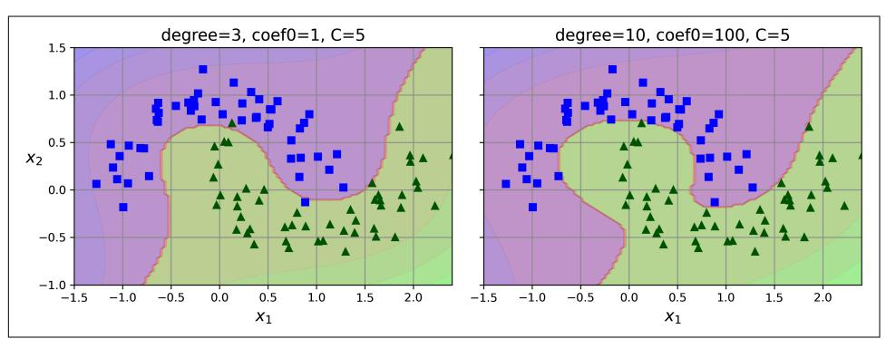

Figure 5-7. SVM classifiers with a polynomial kernel


Although hyperparameters will generally be tuned automatically (e.g., using randomized search), it's good to have a sense of what each hyperparameter actually does and how it may interact with other hyperparameters: this way, you can narrow the search to a much smaller space.

{208}------------------------------------------------

### **Similarity Features**

Another technique to tackle nonlinear problems is to add features computed using a similarity function, which measures how much each instance resembles a particular landmark, as we did in Chapter 2 when we added the geographic similarity features. For example, let's take the 1D dataset from earlier and add two landmarks to it at  $x_1 =$ -2 and  $x_1 = 1$  (see the left plot in Figure 5-8). Next, we'll define the similarity function to be the Gaussian RBF with  $y = 0.3$ . This is a bell-shaped function varying from 0 (very far away from the landmark) to 1 (at the landmark).

Now we are ready to compute the new features. For example, let's look at the instance  $x_1 = -1$ : it is located at a distance of 1 from the first landmark and 2 from the second landmark. Therefore, its new features are  $x_2 = \exp(-0.3 \times 1^2) \approx 0.74$  and  $x_3 = \exp(-0.3$  $\times$  2<sup>2</sup>)  $\approx$  0.30. The plot on the right in Figure 5-8 shows the transformed dataset (dropping the original features). As you can see, it is now linearly separable.

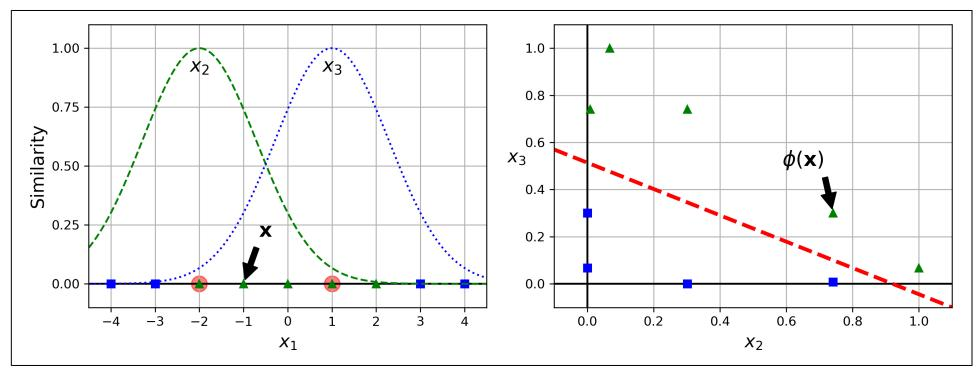

Figure 5-8. Similarity features using the Gaussian RBF

You may wonder how to select the landmarks. The simplest approach is to create a landmark at the location of each and every instance in the dataset. Doing that creates many dimensions and thus increases the chances that the transformed training set will be linearly separable. The downside is that a training set with  $m$  instances and  $n$  features gets transformed into a training set with  $m$  instances and  $m$  features (assuming you drop the original features). If your training set is very large, you end up with an equally large number of features.

#### **Gaussian RBF Kernel**

Just like the polynomial features method, the similarity features method can be useful with any machine learning algorithm, but it may be computationally expensive to compute all the additional features (especially on large training sets). Once again the kernel trick does its SVM magic, making it possible to obtain a similar result as if you 

{209}------------------------------------------------

had added many similarity features, but without actually doing so. Let's try the SVC class with the Gaussian RBF kernel:

```
rbf_kernel_svm_clf = make_pipeline(StandardScaler(),
                                  SVC(kernel="rbf", gamma=5, C=0.001))rbf kernel svm clf.fit(X, y)
```

This model is represented at the bottom left in Figure 5-9. The other plots show models trained with different values of hyperparameters gamma  $(y)$  and C. Increasing gamma makes the bell-shaped curve narrower (see the lefthand plots in Figure 5-8). As a result, each instance's range of influence is smaller: the decision boundary ends up being more irregular, wiggling around individual instances. Conversely, a small gamma value makes the bell-shaped curve wider: instances have a larger range of influence, and the decision boundary ends up smoother. So  $\gamma$  acts like a regularization hyperparameter: if your model is overfitting, you should reduce  $y$ ; if it is underfitting, you should increase  $\gamma$  (similar to the C hyperparameter).

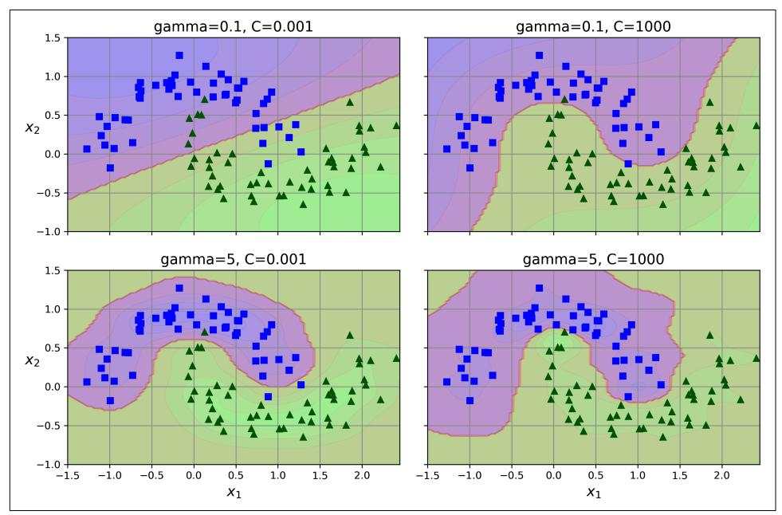

Figure 5-9. SVM classifiers using an RBF kernel

Other kernels exist but are used much more rarely. Some kernels are specialized for specific data structures. String kernels are sometimes used when classifying text documents or DNA sequences (e.g., using the string subsequence kernel or kernels based on the Levenshtein distance).

{210}------------------------------------------------


With so many kernels to choose from, how can you decide which one to use? As a rule of thumb, you should always try the linear kernel first. The LinearSVC class is much faster than SVC(kernel="linear"), especially if the training set is very large. If it is not too large, you should also try kernelized SVMs, starting with the Gaussian RBF kernel; it often works really well. Then, if you have spare time and computing power, you can experiment with a few other kernels using hyperparameter search. If there are kernels specialized for your training set's data structure, make sure to give them a try too.

#### **SVM Classes and Computational Complexity**

The LinearSVC class is based on the liblinear library, which implements an optimized algorithm for linear SVMs.<sup>1</sup> It does not support the kernel trick, but it scales almost linearly with the number of training instances and the number of features. Its training time complexity is roughly  $O(m \times n)$ . The algorithm takes longer if you require very high precision. This is controlled by the tolerance hyperparameter  $\epsilon$ (called tol in Scikit-Learn). In most classification tasks, the default tolerance is fine.

The SVC class is based on the libsvm library, which implements an algorithm that supports the kernel trick.<sup>2</sup> The training time complexity is usually between  $O(m^2 \times$ *n*) and  $O(m^3 \times n)$ . Unfortunately, this means that it gets dreadfully slow when the number of training instances gets large (e.g., hundreds of thousands of instances), so this algorithm is best for small or medium-sized nonlinear training sets. It scales well with the number of features, especially with sparse features (i.e., when each instance has few nonzero features). In this case, the algorithm scales roughly with the average number of nonzero features per instance.

The SGDClassifier class also performs large margin classification by default, and its hyperparameters-especially the regularization hyperparameters (alpha and penalty) and the learning\_rate-can be adjusted to produce similar results as the linear SVMs. For training it uses stochastic gradient descent (see Chapter 4), which allows incremental learning and uses little memory, so you can use it to train a model on a large dataset that does not fit in RAM (i.e., for out-of-core learning). Moreover, it scales very well, as its computational complexity is  $O(m \times n)$ . Table 5-1 compares Scikit-Learn's SVM classification classes.

<sup>1</sup> Chih-Jen Lin et al., "A Dual Coordinate Descent Method for Large-Scale Linear SVM", Proceedings of the 25th International Conference on Machine Learning (2008): 408-415.

<sup>2</sup> John Platt, "Sequential Minimal Optimization: A Fast Algorithm for Training Support Vector Machines" (Microsoft Research technical report, April 21, 1998).

{211}------------------------------------------------

| <b>Class</b>                  | Time complexity                           | Out-of-core support Scaling required Kernel trick |     |     |
|-------------------------------|-------------------------------------------|---------------------------------------------------|-----|-----|
| LinearSVC                     | $O(m \times n)$                           | No                                                | Yes | No  |
| <b>SVC</b>                    | $O(m^2 \times n)$ to $O(m^3 \times n)$ No |                                                   | Yes | Yes |
| SGDClassifier $O(m \times n)$ |                                           | Yes                                               | Yes | No  |

Table 5-1. Comparison of Scikit-Learn classes for SVM classification

Now let's see how the SVM algorithms can also be used for linear and nonlinear regression.

### **SVM Regression**

To use SVMs for regression instead of classification, the trick is to tweak the objective: instead of trying to fit the largest possible street between two classes while limiting margin violations, SVM regression tries to fit as many instances as possible on the street while limiting margin violations (i.e., instances off the street). The width of the street is controlled by a hyperparameter,  $\epsilon$ . Figure 5-10 shows two linear SVM regression models trained on some linear data, one with a small margin ( $\epsilon$  = 0.5) and the other with a larger margin ( $\epsilon$  = 1.2).


Figure 5-10. SVM regression

Reducing  $\epsilon$  increases the number of support vectors, which regularizes the model. Moreover, if you add more training instances within the margin, it will not affect the model's predictions; thus, the model is said to be  $\epsilon$ -insensitive.

You can use Scikit-Learn's LinearSVR class to perform linear SVM regression. The following code produces the model represented on the left in Figure 5-10:

{212}------------------------------------------------

```
from sklearn.svm import LinearSVR
X, y = [...] # a linear datasetsvm req = make pipeline(StandardScaler().
                       LinearSVR(epsilon=0.5, random state=42))
svm_reg.fit(X, y)
```

To tackle nonlinear regression tasks, you can use a kernelized SVM model. Figure 5-11 shows SVM regression on a random quadratic training set, using a seconddegree polynomial kernel. There is some regularization in the left plot (i.e., a small C value), and much less in the right plot (i.e., a large C value).

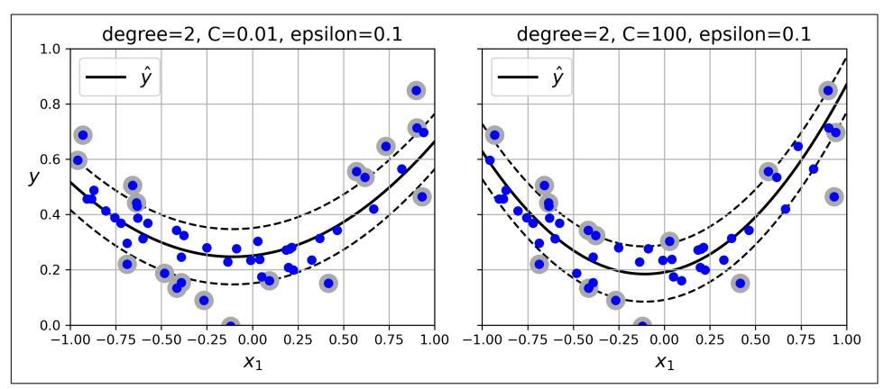

Figure 5-11. SVM regression using a second-degree polynomial kernel

The following code uses Scikit-Learn's SVR class (which supports the kernel trick) to produce the model represented on the left in Figure 5-11:

```
from sklearn.svm import SVR
X, y = [...] # a quadratic dataset
svm_poly_reg = make_pipeline(StandardScaler(),
                            SVR(kernel="poly", degree=2, C=0.01, epsilon=0.1)svm_poly_reg.fit(X, y)
```

The SVR class is the regression equivalent of the SVC class, and the LinearSVR class is the regression equivalent of the LinearSVC class. The LinearSVR class scales linearly with the size of the training set (just like the Linear SVC class), while the SVR class gets much too slow when the training set grows very large (just like the SVC class).


SVMs can also be used for novelty detection, as you will see in Chapter 9.

{213}------------------------------------------------

The rest of this chapter explains how SVMs make predictions and how their training algorithms work, starting with linear SVM classifiers. If you are just getting started with machine learning, you can safely skip this and go straight to the exercises at the end of this chapter, and come back later when you want to get a deeper understanding of SVMs.

## **Under the Hood of Linear SVM Classifiers**

A linear SVM classifier predicts the class of a new instance x by first computing the decision function  $\mathbf{\theta}^{\dagger} \mathbf{x} = \theta_0 x_0 + \cdots + \theta_n x_n$ , where  $x_0$  is the bias feature (always equal to 1). If the result is positive, then the predicted class  $\hat{y}$  is the positive class (1); otherwise it is the negative class (0). This is exactly like LogisticRegression (discussed in Chapter 4).


Up to now, I have used the convention of putting all the model parameters in one vector  $\theta$ , including the bias term  $\theta_0$  and the input feature weights  $\theta_1$  to  $\theta_n$ . This required adding a bias input  $x_0 = 1$  to all instances. Another very common convention is to separate the bias term b (equal to  $\theta_0$ ) and the feature weights vector **w** (containing  $\theta_1$  to  $\theta_n$ ). In this case, no bias feature needs to be added to the input feature vectors, and the linear SVM's decision function is equal to  $\mathbf{w}^{\mathsf{T}} \mathbf{x} + b = w_1 x_1 + \cdots + w_n x_n + b$ . I will use this convention throughout the rest of this book.

So, making predictions with a linear SVM classifier is quite straightforward. How about training? This requires finding the weights vector  $w$  and the bias term  $b$  that make the street, or margin, as wide as possible while limiting the number of margin violations. Let's start with the width of the street: to make it larger, we need to make w smaller. This may be easier to visualize in 2D, as shown in Figure 5-12. Let's define the borders of the street as the points where the decision function is equal to  $-1$  or  $+1$ . In the left plot the weight  $w_i$  is 1, so the points at which  $w_1 x_1 = -1$  or +1 are  $x_1 = -1$  and +1: therefore the margin's size is 2. In the right plot the weight is 0.5, so the points at which  $w_1 x_1 = -1$  or +1 are  $x_1 = -2$  and +2: the margin's size is 4. So, we need to keep w as small as possible. Note that the bias term b has no influence on the size of the margin: tweaking it just shifts the margin around, without affecting its size.

{214}------------------------------------------------


Figure 5-12. A smaller weight vector results in a larger margin

We also want to avoid margin violations, so we need the decision function to be greater than 1 for all positive training instances and lower than -1 for negative training instances. If we define  $t^{(i)} = -1$  for negative instances (when  $y^{(i)} = 0$ ) and  $t^{(i)} =$ 1 for positive instances (when  $y^{(i)} = 1$ ), then we can write this constraint as  $t^{(i)}(\mathbf{w}^T \mathbf{x}^{(i)} +$  $b \geq 1$  for all instances.

We can therefore express the hard margin linear SVM classifier objective as the constrained optimization problem in Equation 5-1.

#### Equation 5-1. Hard margin linear SVM classifier objective

$$
\begin{array}{ll}\text{minimize} & \frac{1}{2} \mathbf{w}^\mathsf{T} \mathbf{w} \\ \text{subject to} & t^{(i)} \big( \mathbf{w}^\mathsf{T} \mathbf{x}^{(i)} + b \big) \ge 1 \quad \text{for } i = 1, 2, \cdots, m \end{array}
$$


We are minimizing  $\frac{1}{2} \mathbf{w}^T \mathbf{w}$ , which is equal to  $\frac{1}{2} \|\mathbf{w}\|^2$ , rather than minimizing  $\| \mathbf{w} \|$  (the norm of **w**). Indeed,  $\frac{1}{2} \| \mathbf{w} \|^{2}$  has a nice, simple derivative (it is just w), while  $\parallel w \parallel$  is not differentiable at  $\mathbf{w} = 0$ . Optimization algorithms often work much better on differentiable functions.

{215}------------------------------------------------

To get the soft margin objective, we need to introduce a *slack variable*  $\zeta^{(i)} \ge 0$  for each instance:<sup>3</sup>  $\zeta^{(i)}$  measures how much the *i*<sup>th</sup> instance is allowed to violate the margin. We now have two conflicting objectives: make the slack variables as small as possible to reduce the margin violations, and make  $\frac{1}{2}$  w<sup> $\tau$ </sup> w as small as possible to increase the margin. This is where the C hyperparameter comes in: it allows us to define the trade-off between these two objectives. This gives us the constrained optimization problem in Equation 5-2.

Equation 5-2. Soft margin linear SVM classifier objective

$$
\begin{array}{ll}\n\text{minimize} & \frac{1}{2} \mathbf{w}^\top \mathbf{w} + C \sum_{i=1}^m \zeta^{(i)} \\
\text{subject to} & \quad t^{(i)} \big( \mathbf{w}^\top \mathbf{x}^{(i)} + b \big) \ge 1 - \zeta^{(i)} \quad \text{and} \quad \zeta^{(i)} \ge 0 \quad \text{for } i = 1, 2, \cdots, m\n\end{array}
$$

The hard margin and soft margin problems are both convex quadratic optimization problems with linear constraints. Such problems are known as *quadratic programming* (QP) problems. Many off-the-shelf solvers are available to solve QP problems by using a variety of techniques that are outside the scope of this book.<sup>4</sup>

Using a QP solver is one way to train an SVM. Another is to use gradient descent to minimize the *hinge loss* or the *squared hinge loss* (see Figure 5-13). Given an instance **x** of the positive class (i.e., with  $t = 1$ ), the loss is 0 if the output s of the decision function  $(s = w^T x + b)$  is greater than or equal to 1. This happens when the instance is off the street and on the positive side. Given an instance of the negative class (i.e., with  $t = -1$ ), the loss is 0 if  $s \le -1$ . This happens when the instance is off the street and on the negative side. The further away an instance is from the correct side of the margin, the higher the loss: it grows linearly for the hinge loss, and quadratically for the squared hinge loss. This makes the squared hinge loss more sensitive to outliers. However, if the dataset is clean, it tends to converge faster. By default, LinearSVC uses the squared hinge loss, while SGDClassifier uses the hinge loss. Both classes let you choose the loss by setting the loss hyperparameter to "hinge" or "squared\_hinge". The SVC class's optimization algorithm finds a similar solution as minimizing the hinge loss.

<sup>3</sup> Zeta  $(\zeta)$  is the sixth letter of the Greek alphabet.

<sup>4</sup> To learn more about quadratic programming, you can start by reading Stephen Boyd and Lieven Vandenberghe's book Convex Optimization (Cambridge University Press) or watching Richard Brown's series of video lectures.

{216}------------------------------------------------

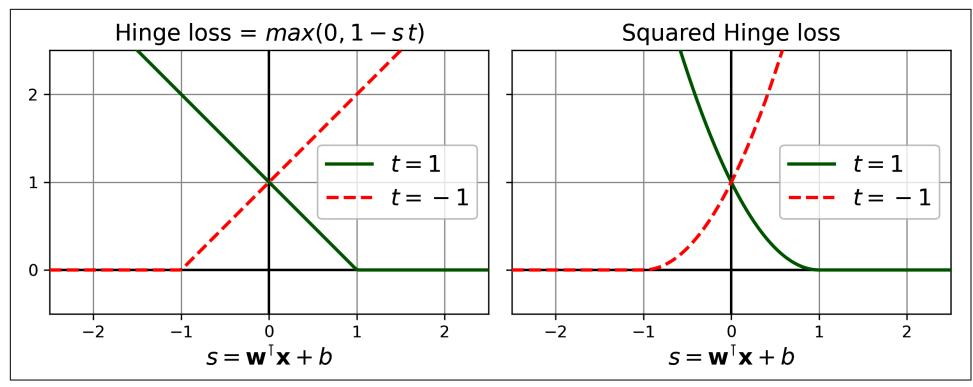

Figure 5-13. The hinge loss (left) and the squared hinge loss (right)

Next, we'll look at yet another way to train a linear SVM classifier: solving the dual problem.

### **The Dual Problem**

Given a constrained optimization problem, known as the *primal problem*, it is possible to express a different but closely related problem, called its *dual problem*. The solution to the dual problem typically gives a lower bound to the solution of the primal problem, but under some conditions it can have the same solution as the primal problem. Luckily, the SVM problem happens to meet these conditions,<sup>5</sup> so you can choose to solve the primal problem or the dual problem; both will have the same solution. Equation 5-3 shows the dual form of the linear SVM objective. If you are interested in knowing how to derive the dual problem from the primal problem, see the extra material section in this chapter's notebook.

Equation 5-3. Dual form of the linear SVM objective

minimize  $\frac{1}{2} \sum_{i=1}^{m} \sum_{j=1}^{m} \alpha^{(i)} \alpha^{(j)} t^{(i)} t^{(j)} \mathbf{x}^{(i)^\mathsf{T}} \mathbf{x}^{(j)}$  -  $\sum_{i=1}^{m} \alpha^{(i)}$ subject to  $\alpha^{(i)} \ge 0$  for all  $i = 1, 2, ..., m$  and  $\sum_{i=1}^{m} \alpha^{(i)} t^{(i)} = 0$ 

<sup>5</sup> The objective function is convex, and the inequality constraints are continuously differentiable and convex functions.

{217}------------------------------------------------

Once you find the vector  $\hat{\alpha}$  that minimizes this equation (using a QP solver), use Equation 5-4 to compute the  $\hat{\mathbf{w}}$  and b that minimize the primal problem. In this equation,  $n_s$  represents the number of support vectors.

Equation 5-4. From the dual solution to the primal solution

$$
\widehat{\mathbf{w}} = \sum_{i=1}^{m} \widehat{\alpha}^{(i)} t^{(i)} \mathbf{x}^{(i)}
$$
$$
\widehat{b} = \frac{1}{n_s} \sum_{\substack{i=1 \ \widehat{\alpha}^{(i)} > 0}}^{m} \left( t^{(i)} - \widehat{\mathbf{w}}^{\mathsf{T}} \mathbf{x}^{(i)} \right)
$$

The dual problem is faster to solve than the primal one when the number of training instances is smaller than the number of features. More importantly, the dual problem makes the kernel trick possible, while the primal problem does not. So what is this kernel trick, anyway?

### **Kernelized SVMs**

Suppose you want to apply a second-degree polynomial transformation to a twodimensional training set (such as the moons training set), then train a linear SVM classifier on the transformed training set. Equation 5-5 shows the second-degree polynomial mapping function  $\phi$  that you want to apply.

Equation 5-5. Second-degree polynomial mapping

$$
\varphi(\mathbf{x}) = \varphi\left(\begin{pmatrix} x_1 \\ x_2 \end{pmatrix}\right) = \begin{pmatrix} x_1^2 \\ \sqrt{2} x_1 x_2 \\ x_2^2 \end{pmatrix}
$$

Notice that the transformed vector is 3D instead of 2D. Now let's look at what happens to a couple of 2D vectors, **a** and **b**, if we apply this second-degree polynomial mapping and then compute the dot product<sup>6</sup> of the transformed vectors (see Equation  $5-6$ ).

<sup>6</sup> As explained in Chapter 4, the dot product of two vectors **a** and **b** is normally noted  $\mathbf{a} \cdot \mathbf{b}$ . However, in machine learning, vectors are frequently represented as column vectors (i.e., single-column matrices), so the dot product is achieved by computing a<sup>T</sup>b. To remain consistent with the rest of the book, we will use this notation here, ignoring the fact that this technically results in a single-cell matrix rather than a scalar value.

{218}------------------------------------------------

Equation 5-6. Kernel trick for a second-degree polynomial mapping

$$
\varphi(\mathbf{a})^{\mathsf{T}} \varphi(\mathbf{b}) = \begin{pmatrix} a_1^2 \\ \sqrt{2} a_1 a_2 \\ a_2^2 \end{pmatrix}^{\mathsf{T}} \begin{pmatrix} b_1^2 \\ \sqrt{2} b_1 b_2 \\ b_2^2 \end{pmatrix} = a_1^2 b_1^2 + 2a_1 b_1 a_2 b_2 + a_2^2 b_2^2
$$
$$
= (a_1 b_1 + a_2 b_2)^2 = \left( \begin{pmatrix} a_1 \\ a_2 \end{pmatrix}^{\mathsf{T}} \begin{pmatrix} b_1 \\ b_2 \end{pmatrix} \right)^2 = (\mathbf{a}^{\mathsf{T}} \mathbf{b})^2
$$

How about that? The dot product of the transformed vectors is equal to the square of the dot product of the original vectors:  $\phi(\mathbf{a})^{\dagger} \phi(\mathbf{b}) = (\mathbf{a}^{\dagger} \mathbf{b})^2$ .

Here is the key insight: if you apply the transformation  $\phi$  to all training instances, then the dual problem (see Equation 5-3) will contain the dot product  $\phi(\mathbf{x}^{(i)})^T \phi(\mathbf{x}^{(i)})$ . But if  $\phi$  is the second-degree polynomial transformation defined in Equation 5-5,

then you can replace this dot product of transformed vectors simply by  $(\mathbf{x}^{(i)^\mathsf{T}} \mathbf{x}^{(j)})^2$ . So, you don't need to transform the training instances at all; just replace the dot product by its square in Equation 5-3. The result will be strictly the same as if you had gone through the trouble of transforming the training set and then fitting a linear SVM algorithm, but this trick makes the whole process much more computationally efficient

The function  $K(a, b) = (a^T b)^2$  is a second-degree polynomial kernel. In machine learning, a kernel is a function capable of computing the dot product  $\phi(\mathbf{a})^T \phi(\mathbf{b})$ , based only on the original vectors **a** and **b**, without having to compute (or even to know about) the transformation  $\phi$ . Equation 5-7 lists some of the most commonly used kernels

Equation 5-7. Common kernels

Linear:  $K(a, b) = a^{\mathsf{T}}b$ Polynomial:  $K(\mathbf{a}, \mathbf{b}) = (\gamma \mathbf{a}^T \mathbf{b} + r)^d$  $K(\mathbf{a}, \mathbf{b}) = \exp(-\gamma || \mathbf{a} - \mathbf{b} ||^2)$ Gaussian RBF: Sigmoid:  $K(\mathbf{a}, \mathbf{b}) = \tanh(\gamma \mathbf{a}^\top \mathbf{b} + r)$ 

{219}------------------------------------------------

#### **Mercer's Theorem**

According to Mercer's theorem, if a function  $K(a, b)$  respects a few mathematical conditions called *Mercer's conditions* (e.g., *K* must be continuous and symmetric in its arguments so that  $K(a, b) = K(b, a)$ , etc.), then there exists a function  $\phi$  that maps a and **b** into another space (possibly with much higher dimensions) such that  $K(a, b)$  $= \phi(\mathbf{a})^T \phi(\mathbf{b})$ . You can use K as a kernel because you know  $\phi$  exists, even if you don't know what  $\phi$  is. In the case of the Gaussian RBF kernel, it can be shown that  $\phi$  maps each training instance to an infinite-dimensional space, so it's a good thing you don't need to actually perform the mapping!

Note that some frequently used kernels (such as the sigmoid kernel) don't respect all of Mercer's conditions, yet they generally work well in practice.

There is still one loose end we must tie up. Equation 5-4 shows how to go from the dual solution to the primal solution in the case of a linear SVM classifier. But if you apply the kernel trick, you end up with equations that include  $\phi(x^{(i)})$ . In fact,  $\hat{\mathbf{w}}$  must have the same number of dimensions as  $\phi(x^{(i)})$ , which may be huge or even infinite, so you can't compute it. But how can you make predictions without knowing  $\hat{\mathbf{w}}$ ? Well, the good news is that you can plug the formula for  $\hat{\mathbf{w}}$  from Equation 5-4 into the decision function for a new instance  $\mathbf{x}^{(n)}$ , and you get an equation with only dot products between input vectors. This makes it possible to use the kernel trick (Equation 5-8).

Equation 5-8. Making predictions with a kernelized SVM

$$
h_{\widehat{\mathbf{w}},\widehat{b}}(\varphi(\mathbf{x}^{(n)})) = \widehat{\mathbf{w}}^{\mathsf{T}}\varphi(\mathbf{x}^{(n)}) + \widehat{b} = \left(\sum_{i=1}^{m} \widehat{\alpha}^{(i)} t^{(i)} \varphi(\mathbf{x}^{(i)})\right)^{\mathsf{T}} \varphi(\mathbf{x}^{(n)}) + \widehat{b}
$$
$$
= \sum_{i=1}^{m} \widehat{\alpha}^{(i)} t^{(i)} (\varphi(\mathbf{x}^{(i)})^{\mathsf{T}} \varphi(\mathbf{x}^{(n)})) + \widehat{b}
$$
$$
= \sum_{i=1}^{m} \widehat{\alpha}^{(i)} t^{(i)} K(\mathbf{x}^{(i)}, \mathbf{x}^{(n)}) + \widehat{b}
$$

Note that since  $\alpha^{(i)} \neq 0$  only for support vectors, making predictions involves computing the dot product of the new input vector  $\mathbf{x}^{(n)}$  with only the support vectors, not all the training instances. Of course, you need to use the same trick to compute the bias term  $b$  (Equation 5-9).

{220}------------------------------------------------

Equation 5-9. Using the kernel trick to compute the bias term

$$
\hat{b} = \frac{1}{n_s} \sum_{\substack{i=1 \ \hat{\alpha}^{(i)} > 0}}^m \left( t^{(i)} - \widehat{\mathbf{w}}^\mathsf{T} \varphi(\mathbf{x}^{(i)}) \right) = \frac{1}{n_s} \sum_{\substack{i=1 \ \hat{\alpha}^{(i)} > 0}}^m \left( t^{(i)} - \left( \sum_{j=1}^m \widehat{\alpha}^{(j)} t^{(j)} \varphi(\mathbf{x}^{(j)}) \right)^\mathsf{T} \varphi(\mathbf{x}^{(i)}) \right)
$$
\n
$$
= \frac{1}{n_s} \sum_{\substack{i=1 \ \hat{\alpha}^{(i)} > 0}}^m \left( t^{(i)} - \sum_{\substack{j=1 \ \hat{\alpha}^{(j)} > 0}}^m \widehat{\alpha}^{(j)} t^{(j)} K(\mathbf{x}^{(i)}, \mathbf{x}^{(j)}) \right)
$$

If you are starting to get a headache, that's perfectly normal: it's an unfortunate side effect of the kernel trick.


It is also possible to implement online kernelized SVMs, capable of incremental learning, as described in the papers "Incremental and Decremental Support Vector Machine Learning"7 and "Fast Kernel Classifiers with Online and Active Learning".<sup>8</sup> These kernelized SVMs are implemented in Matlab and C++. But for large-scale nonlinear problems, you may want to consider using random forests (see Chapter 7) or neural networks (see Part II).

### **Fxercises**

- 1. What is the fundamental idea behind support vector machines?
- 2. What is a support vector?
- 3. Why is it important to scale the inputs when using SVMs?
- 4. Can an SVM classifier output a confidence score when it classifies an instance? What about a probability?
- 5. How can you choose between LinearSVC, SVC, and SGDClassifier?
- 6. Say you've trained an SVM classifier with an RBF kernel, but it seems to underfit the training set. Should you increase or decrease  $\gamma$  (gamma)? What about C?
- 7. What does it mean for a model to be  $\epsilon$ -insensitive?
- 8. What is the point of using the kernel trick?

<sup>7</sup> Gert Cauwenberghs and Tomaso Poggio, "Incremental and Decremental Support Vector Machine Learning", Proceedings of the 13th International Conference on Neural Information Processing Systems (2000): 388-394.

<sup>8</sup> Antoine Bordes et al., "Fast Kernel Classifiers with Online and Active Learning", Journal of Machine Learning Research 6 (2005): 1579-1619.

{221}------------------------------------------------

- 9. Train a Linear SVC on a linearly separable dataset. Then train an SVC and a SGDClassifier on the same dataset. See if you can get them to produce roughly the same model.
- 10. Train an SVM classifier on the wine dataset, which you can load using sklearn.datasets.load\_wine(). This dataset contains the chemical analyses of 178 wine samples produced by 3 different cultivators: the goal is to train a classification model capable of predicting the cultivator based on the wine's chemical analysis. Since SVM classifiers are binary classifiers, you will need to use one-versus-all to classify all three classes. What accuracy can you reach?
- 11. Train and fine-tune an SVM regressor on the California housing dataset. You can use the original dataset rather than the tweaked version we used in Chapter 2, which you can load using sklearn.datasets.fetch\_california\_housing(). The targets represent hundreds of thousands of dollars. Since there are over 20,000 instances, SVMs can be slow, so for hyperparameter tuning you should use far fewer instances (e.g., 2,000) to test many more hyperparameter combinations. What is your best model's RMSE?

Solutions to these exercises are available at the end of this chapter's notebook, at https://homl.info/colab3.

{222}------------------------------------------------

## **CHAPTER 6 Decision Trees**

Decision trees are versatile machine learning algorithms that can perform both classification and regression tasks, and even multioutput tasks. They are powerful algorithms, capable of fitting complex datasets. For example, in Chapter 2 you trained a DecisionTreeRegressor model on the California housing dataset, fitting it perfectly (actually, overfitting it).

Decision trees are also the fundamental components of random forests (see Chapter 7), which are among the most powerful machine learning algorithms available today.

In this chapter we will start by discussing how to train, visualize, and make predictions with decision trees. Then we will go through the CART training algorithm used by Scikit-Learn, and we will explore how to regularize trees and use them for regression tasks. Finally, we will discuss some of the limitations of decision trees.

### **Training and Visualizing a Decision Tree**

To understand decision trees, let's build one and take a look at how it makes predictions. The following code trains a DecisionTreeClassifier on the iris dataset (see Chapter 4):

```
from sklearn.datasets import load iris
from sklearn.tree import DecisionTreeClassifier
iris = load iris(as frame=True)X_iris = iris.data[["petal length (cm)", "petal width (cm)"]].values
y_{\text{circ}} = \text{iris.target}tree_clf = DecisionTreeClassifier(max_depth=2, random_state=42)
tree_clf.fit(X_iris, y_iris)
```

{223}------------------------------------------------

You can visualize the trained decision tree by first using the export graphyiz() function to output a graph definition file called *iris* tree.dot:

```
from sklearn.tree import export_graphviz
export_graphviz(
        tree clf.
        out file="iris tree.dot",
        feature_names=["petal length (cm)", "petal width (cm)"],
        class_names=iris.target_names,
        rounded=True,
        filled=True
    \lambda
```

Then you can use graphyiz. Source. from file() to load and display the file in a Jupyter notebook:

```
from graphviz import Source
Source.from_file("iris_tree.dot")
```

Graphviz is an open source graph visualization software package. It also includes a dot command-line tool to convert *dot* files to a variety of formats, such as PDF or PNG.

Your first decision tree looks like Figure 6-1.


Figure 6-1. Iris decision tree

{224}------------------------------------------------

## **Making Predictions**

Let's see how the tree represented in Figure 6-1 makes predictions. Suppose you find an iris flower and you want to classify it based on its petals. You start at the root node (depth 0, at the top): this node asks whether the flower's petal length is smaller than 2.45 cm. If it is, then you move down to the root's left child node (depth 1, left). In this case, it is a *leaf node* (i.e., it does not have any child nodes), so it does not ask any questions: simply look at the predicted class for that node, and the decision tree predicts that your flower is an Iris setosa (class=setosa).

Now suppose you find another flower, and this time the petal length is greater than 2.45 cm. You again start at the root but now move down to its right child node (depth 1, right). This is not a leaf node, it's a *split node*, so it asks another question: is the petal width smaller than 1.75 cm? If it is, then your flower is most likely an Iris versicolor (depth 2, left). If not, it is likely an *Iris virginica* (depth 2, right). It's really that simple.


One of the many qualities of decision trees is that they require very little data preparation. In fact, they don't require feature scaling or centering at all.

A node's samples attribute counts how many training instances it applies to. For example, 100 training instances have a petal length greater than 2.45 cm (depth 1, right), and of those 100, 54 have a petal width smaller than 1.75 cm (depth 2, left). A node's value attribute tells you how many training instances of each class this node applies to: for example, the bottom-right node applies to 0 Iris setosa, 1 Iris versicolor, and 45 Iris virginica. Finally, a node's gini attribute measures its *Gini impurity*: a node is "pure" (gini=0) if all training instances it applies to belong to the same class. For example, since the depth-1 left node applies only to Iris setosa training instances, it is pure and its Gini impurity is 0. Equation 6-1 shows how the training algorithm computes the Gini impurity  $G_i$  of the  $i<sup>th</sup>$  node. The depth-2 left node has a Gini impurity equal to  $1 - (0/54)^2 - (49/54)^2 - (5/54)^2 \approx 0.168$ .

Equation 6-1. Gini impurity

$$
G_i = 1 - \sum_{k=1}^{n} p_{i,k}^2
$$

{225}------------------------------------------------

In this equation:

- $G_i$  is the Gini impurity of the  $i^{\text{th}}$  node.
- $p_{i,k}$  is the ratio of class k instances among the training instances in the  $i^{\text{th}}$  node.


Scikit-Learn uses the CART algorithm, which produces only binary trees, meaning trees where split nodes always have exactly two children (i.e., questions only have yes/no answers). However, other algorithms, such as ID3, can produce decision trees with nodes that have more than two children.

Figure 6-2 shows this decision tree's decision boundaries. The thick vertical line represents the decision boundary of the root node (depth 0): petal length  $= 2.45$ cm. Since the lefthand area is pure (only *Iris setosa*), it cannot be split any further. However, the righthand area is impure, so the depth-1 right node splits it at petal width  $= 1.75$  cm (represented by the dashed line). Since max depth was set to 2, the decision tree stops right there. If you set max\_depth to 3, then the two depth-2 nodes would each add another decision boundary (represented by the two vertical dotted lines).

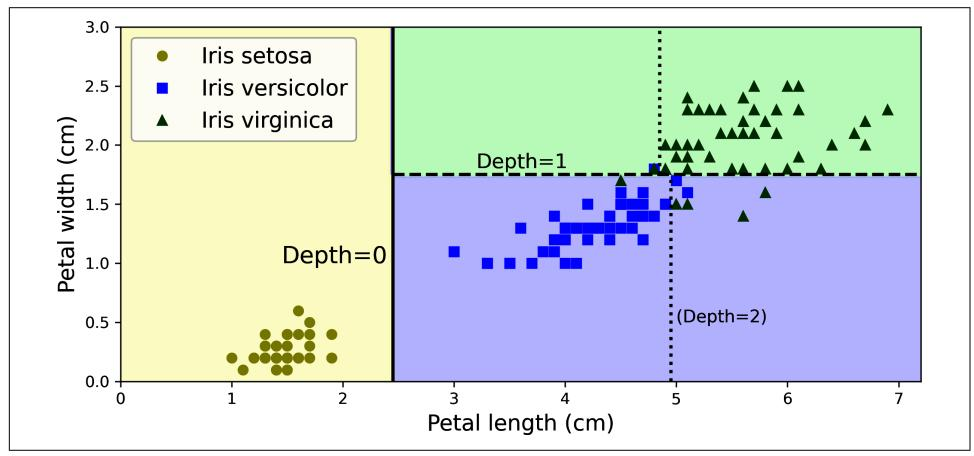

Figure 6-2. Decision tree decision boundaries


The tree structure, including all the information shown in Figure 6-1, is available via the classifier's tree\_ attribute. Type help(tree\_clf.tree\_) for details, and see the this chapter's notebook for an example.

{226}------------------------------------------------

### **Model Interpretation: White Box Versus Black Box**

Decision trees are intuitive, and their decisions are easy to interpret. Such models are often called *white box models*. In contrast, as you will see, random forests and neural networks are generally considered *black box models*. They make great predictions, and you can easily check the calculations that they performed to make these predictions; nevertheless, it is usually hard to explain in simple terms why the predictions were made. For example, if a neural network says that a particular person appears in a picture, it is hard to know what contributed to this prediction: Did the model recognize that person's eves? Their mouth? Their nose? Their shoes? Or even the couch that they were sitting on? Conversely, decision trees provide nice, simple classification rules that can even be applied manually if need be (e.g., for flower classification). The field of interpretable ML aims at creating ML systems that can explain their decisions in a way humans can understand. This is important in many domains—for example, to ensure the system does not make unfair decisions.

## **Estimating Class Probabilities**

A decision tree can also estimate the probability that an instance belongs to a particular class k. First it traverses the tree to find the leaf node for this instance, and then it returns the ratio of training instances of class  $k$  in this node. For example, suppose you have found a flower whose petals are 5 cm long and 1.5 cm wide. The corresponding leaf node is the depth-2 left node, so the decision tree outputs the following probabilities: 0% for Iris setosa (0/54), 90.7% for Iris versicolor (49/54), and 9.3% for Iris virginica (5/54). And if you ask it to predict the class, it outputs Iris versicolor (class 1) because it has the highest probability. Let's check this:

```
>>> tree_clf.predict_proba([[5, 1.5]]).round(3)
array([[0.                                    \Rightarrow tree clf.predict([5, 1.5])
array([1])
```

Perfect! Notice that the estimated probabilities would be identical anywhere else in the bottom-right rectangle of Figure 6-2—for example, if the petals were 6 cm long and 1.5 cm wide (even though it seems obvious that it would most likely be an Iris virginica in this case).

## **The CART Training Algorithm**

Scikit-Learn uses the *Classification and Regression Tree* (CART) algorithm to train decision trees (also called "growing" trees). The algorithm works by first splitting the training set into two subsets using a single feature k and a threshold  $t_k$  (e.g., "petal length  $\leq$  2.45 cm"). How does it choose k and  $t_k$ ? It searches for the pair  $(k, t_k)$ 

{227}------------------------------------------------

that produces the purest subsets, weighted by their size. Equation 6-2 gives the cost function that the algorithm tries to minimize.

Equation 6-2. CART cost function for classification

$$
J(k, t_k) = \frac{m_{\text{left}}}{m} G_{\text{left}} + \frac{m_{\text{right}}}{m} G_{\text{right}}
$$
  
where 
$$
\begin{cases} G_{\text{left/right}} \text{ measures the impurity of the left/right subset} \\ m_{\text{left/right}} \text{ is the number of instances in the left/right subset} \end{cases}
$$

Once the CART algorithm has successfully split the training set in two, it splits the subsets using the same logic, then the sub-subsets, and so on, recursively. It stops recursing once it reaches the maximum depth (defined by the max\_depth hyperparameter), or if it cannot find a split that will reduce impurity. A few other hyperparameters (described in a moment) control additional stopping conditions: min\_samples\_split, min\_samples\_leaf, min\_weight\_fraction\_leaf, and max leaf nodes.


As you can see, the CART algorithm is a greedy algorithm: it greedily searches for an optimum split at the top level, then repeats the process at each subsequent level. It does not check whether or not the split will lead to the lowest possible impurity several levels down. A greedy algorithm often produces a solution that's reasonably good but not guaranteed to be optimal.

Unfortunately, finding the optimal tree is known to be an NPcomplete problem.<sup>1</sup> It requires  $O(\exp(m))$  time, making the problem intractable even for small training sets. This is why we must settle for a "reasonably good" solution when training decision trees.

## **Computational Complexity**

Making predictions requires traversing the decision tree from the root to a leaf. Decision trees generally are approximately balanced, so traversing the decision tree requires going through roughly  $O(log_2(m))$  nodes, where  $log_2(m)$  is the *binary logarithm* of *m*, equal to  $log(m) / log(2)$ . Since each node only requires checking the

<sup>1</sup> P is the set of problems that can be solved in *polynomial time* (i.e., a polynomial of the dataset size). NP is the set of problems whose solutions can be verified in polynomial time. An NP-hard problem is a problem that can be reduced to a known NP-hard problem in polynomial time. An NP-complete problem is both NP and NP-hard. A major open mathematical question is whether or not P = NP. If P  $\neq$  NP (which seems likely), then no polynomial algorithm will ever be found for any NP-complete problem (except perhaps one day on a quantum computer).

{228}------------------------------------------------

value of one feature, the overall prediction complexity is  $O(log_2(m))$ , independent of the number of features. So predictions are very fast, even when dealing with large training sets.

The training algorithm compares all features (or less if max\_features is set) on all samples at each node. Comparing all features on all samples at each node results in a training complexity of  $O(n \times m \log_2(m))$ .

### **Gini Impurity or Entropy?**

By default, the DecisionTreeClassifier class uses the Gini impurity measure, but you can select the *entropy* impurity measure instead by setting the criterion hyperparameter to "entropy". The concept of entropy originated in thermodynamics as a measure of molecular disorder: entropy approaches zero when molecules are still and well ordered. Entropy later spread to a wide variety of domains, including in Shannon's information theory, where it measures the average information content of a message, as we saw in Chapter 4. Entropy is zero when all messages are identical. In machine learning, entropy is frequently used as an impurity measure: a set's entropy is zero when it contains instances of only one class. Equation 6-3 shows the definition of the entropy of the *i*<sup>th</sup> node. For example, the depth-2 left node in Figure 6-1 has an entropy equal to –(49/54)  $log_2$  (49/54) – (5/54)  $log_2$  (5/54) ≈ 0.445.

Equation 6-3. Entropy

$$
H_{i} = -\sum_{\substack{k=1 \ p_{i,k} \neq 0}}^{n} p_{i,k} \log_2 (p_{i,k})
$$

So, should you use Gini impurity or entropy? The truth is, most of the time it does not make a big difference: they lead to similar trees. Gini impurity is slightly faster to compute, so it is a good default. However, when they differ, Gini impurity tends to isolate the most frequent class in its own branch of the tree, while entropy tends to produce slightly more balanced trees.<sup>2</sup>

## **Regularization Hyperparameters**

Decision trees make very few assumptions about the training data (as opposed to linear models, which assume that the data is linear, for example). If left unconstrained, the tree structure will adapt itself to the training data, fitting it very closely—indeed, most likely overfitting it. Such a model is often called a *nonparametric model*, not

<sup>2</sup> See Sebastian Raschka's interesting analysis for more details.

{229}------------------------------------------------

because it does not have any parameters (it often has a lot) but because the number of parameters is not determined prior to training, so the model structure is free to stick closely to the data. In contrast, a *parametric model*, such as a linear model, has a predetermined number of parameters, so its degree of freedom is limited, reducing the risk of overfitting (but increasing the risk of underfitting).

To avoid overfitting the training data, you need to restrict the decision tree's freedom during training. As you know by now, this is called regularization. The regularization hyperparameters depend on the algorithm used, but generally you can at least restrict the maximum depth of the decision tree. In Scikit-Learn, this is controlled by the max\_depth hyperparameter. The default value is None, which means unlimited. Reducing max\_depth will regularize the model and thus reduce the risk of overfitting.

The DecisionTreeClassifier class has a few other parameters that similarly restrict the shape of the decision tree:

```
max features
```

Maximum number of features that are evaluated for splitting at each node

max leaf nodes

Maximum number of leaf nodes

```
min samples split
```

Minimum number of samples a node must have before it can be split

```
min_samples_leaf
```

Minimum number of samples a leaf node must have to be created

```
min_weight_fraction_leaf
```

Same as min samples leaf but expressed as a fraction of the total number of weighted instances

Increasing min\_\* hyperparameters or reducing max\_\* hyperparameters will regularize the model.


Other algorithms work by first training the decision tree without restrictions, then *pruning* (deleting) unnecessary nodes. A node whose children are all leaf nodes is considered unnecessary if the purity improvement it provides is not statistically significant. Standard statistical tests, such as the  $\chi^2$  test (chi-squared test), are used to estimate the probability that the improvement is purely the result of chance (which is called the *null hypothesis*). If this probability, called the *p-value*, is higher than a given threshold (typically 5%, controlled by a hyperparameter), then the node is considered unnecessary and its children are deleted. The pruning continues until all unnecessary nodes have been pruned.

{230}------------------------------------------------

Let's test regularization on the moons dataset, introduced in Chapter 5. We'll train one decision tree without regularization, and another with min samples leaf=5. Here's the code; Figure 6-3 shows the decision boundaries of each tree:

```
from sklearn.datasets import make_moons
X_moons, y_moons = make_moons(n_samples=150, noise=0.2, random_state=42)
tree clf1 = DecisionTreeClassifier(random state=42)
tree_clf2 = DecisionTreeClassifier(min_samples_leaf=5, random_state=42)
tree clf1.fit(X moons, y moons)
tree_clf2.fit(X_moons, y_moons)
```


Figure 6-3. Decision boundaries of an unregularized tree (left) and a regularized tree  $(right)$ 

The unregularized model on the left is clearly overfitting, and the regularized model on the right will probably generalize better. We can verify this by evaluating both trees on a test set generated using a different random seed:

```
>>> X_moons_test, y_moons_test = make_moons(n_samples=1000, noise=0.2,
\ddotscrandom_state=43)
\ddotsc>>> tree_clf1.score(X_moons_test, y_moons_test)
0.898
>>> tree clf2.score(X moons test, y moons test)
0.92
```

Indeed, the second tree has a better accuracy on the test set.

{231}------------------------------------------------

### **Regression**

Decision trees are also capable of performing regression tasks. Let's build a regression tree using Scikit-Learn's DecisionTreeRegressor class, training it on a noisy quadratic dataset with max\_depth=2:

```
import numpy as np
from sklearn.tree import DecisionTreeRegressor
np.random.seed(42)
X quad = np.random.rand(200, 1) - 0.5 # a single random input feature
y quad = X quad ** 2 + 0.025 * np.random.randn(200, 1)
tree_reg = DecisionTreeRegressor(max_depth=2, random_state=42)
tree_reg.fit(X_quad, y_quad)
```

The resulting tree is represented in Figure 6-4.

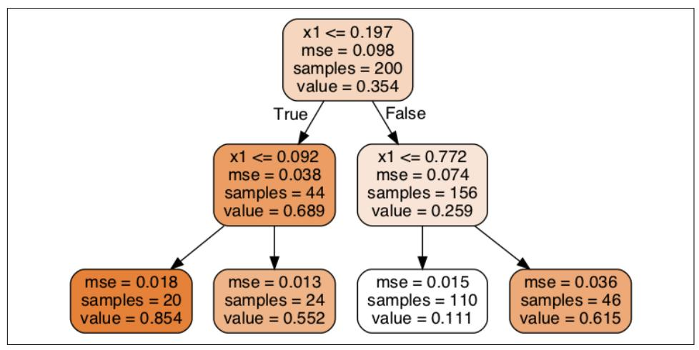

Figure 6-4. A decision tree for regression

This tree looks very similar to the classification tree you built earlier. The main difference is that instead of predicting a class in each node, it predicts a value. For example, suppose you want to make a prediction for a new instance with  $x_1 = 0.2$ . The root node asks whether  $x_1 \le 0.197$ . Since it is not, the algorithm goes to the right child node, which asks whether  $x_1 \le 0.772$ . Since it is, the algorithm goes to the left child node. This is a leaf node, and it predicts value=0.111. This prediction is the average target value of the 110 training instances associated with this leaf node, and it results in a mean squared error equal to 0.015 over these 110 instances.

{232}------------------------------------------------

This model's predictions are represented on the left in Figure 6-5. If you set max depth=3, you get the predictions represented on the right. Notice how the predicted value for each region is always the average target value of the instances in that region. The algorithm splits each region in a way that makes most training instances as close as possible to that predicted value.

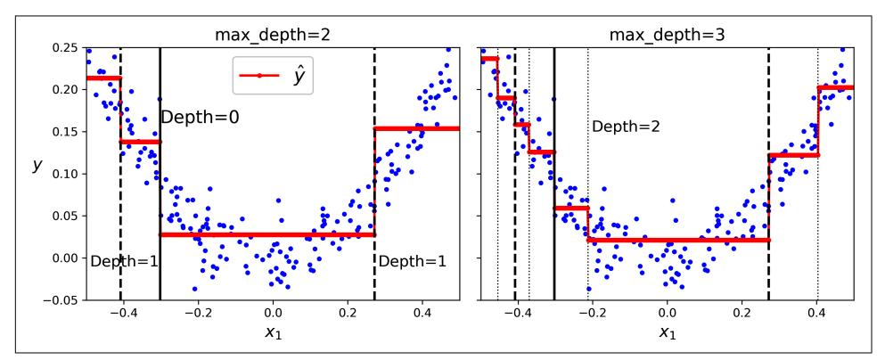

Figure 6-5. Predictions of two decision tree regression models

The CART algorithm works as described earlier, except that instead of trying to split the training set in a way that minimizes impurity, it now tries to split the training set in a way that minimizes the MSE. Equation 6-4 shows the cost function that the algorithm tries to minimize.

Equation 6-4. CART cost function for regression

$$
J(k, t_k) = \frac{m_{\text{left}}}{m} \text{MSE}_{\text{left}} + \frac{m_{\text{right}}}{m} \text{MSE}_{\text{right}} \quad \text{where } \begin{cases} \text{MSE}_{\text{node}} = \frac{\Sigma_i \in \text{node} \left( \widehat{y}_{\text{node}} - y^{(i)} \right)^2}{m_{\text{node}}} \\ \hat{y}_{\text{node}} = \frac{\Sigma_i \in \text{node} y^{(i)}}{m_{\text{node}}} \end{cases}
$$

Just like for classification tasks, decision trees are prone to overfitting when dealing with regression tasks. Without any regularization (i.e., using the default hyperparameters), you get the predictions on the left in Figure 6-6. These predictions are obviously overfitting the training set very badly. Just setting min\_samples\_leaf=10 results in a much more reasonable model, represented on the right in Figure 6-6.

{233}------------------------------------------------


Figure 6-6. Predictions of an unregularized regression tree (left) and a regularized tree (right)

### **Sensitivity to Axis Orientation**

Hopefully by now you are convinced that decision trees have a lot going for them: they are relatively easy to understand and interpret, simple to use, versatile, and powerful. However, they do have a few limitations. First, as you may have noticed, decision trees love orthogonal decision boundaries (all splits are perpendicular to an axis), which makes them sensitive to the data's orientation. For example, Figure 6-7 shows a simple linearly separable dataset: on the left, a decision tree can split it easily, while on the right, after the dataset is rotated by 45°, the decision boundary looks unnecessarily convoluted. Although both decision trees fit the training set perfectly, it is very likely that the model on the right will not generalize well.

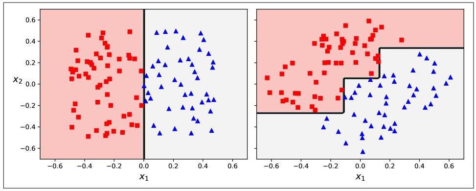

Figure 6-7. Sensitivity to training set rotation

One way to limit this problem is to scale the data, then apply a principal component analysis transformation. We will look at PCA in detail in Chapter 8, but for now

{234}------------------------------------------------

you only need to know that it rotates the data in a way that reduces the correlation between the features, which often (not always) makes things easier for trees.

Let's create a small pipeline that scales the data and rotates it using PCA, then train a DecisionTreeClassifier on that data. Figure 6-8 shows the decision boundaries of that tree: as you can see, the rotation makes it possible to fit the dataset pretty well using only one feature,  $z_1$ , which is a linear function of the original petal length and width. Here's the code:

```
from sklearn.decomposition import PCA
from sklearn.pipeline import make_pipeline
from sklearn.preprocessing import StandardScaler
pca pipeline = make pipeline(StandardScaler(), PCA())
X iris rotated = pca pipeline. fit transform(X iris)
tree_clf_pca = DecisionTreeClassifier(max_depth=2, random_state=42)
tree clf pca.fit(X iris rotated, y iris)
```

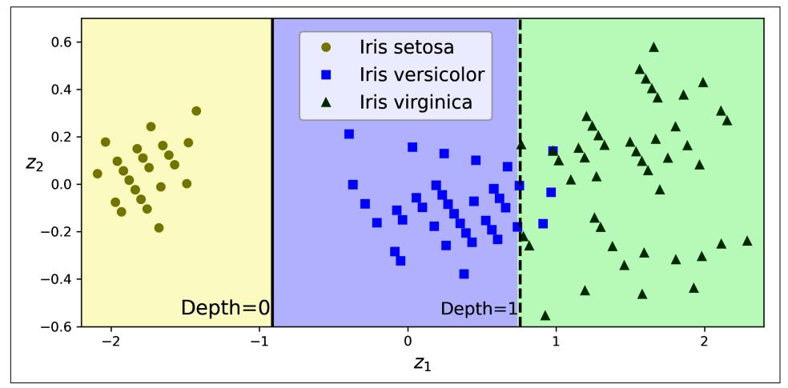

Figure 6-8. A tree's decision boundaries on the scaled and PCA-rotated iris dataset

### **Decision Trees Have a High Variance**

More generally, the main issue with decision trees is that they have quite a high variance: small changes to the hyperparameters or to the data may produce very different models. In fact, since the training algorithm used by Scikit-Learn is stochastic—it randomly selects the set of features to evaluate at each node—even retraining the same decision tree on the exact same data may produce a very different model, such as the one represented in Figure 6-9 (unless you set the random\_state hyperparameter). As you can see, it looks very different from the previous decision tree (Figure  $6-2$ ).

{235}------------------------------------------------

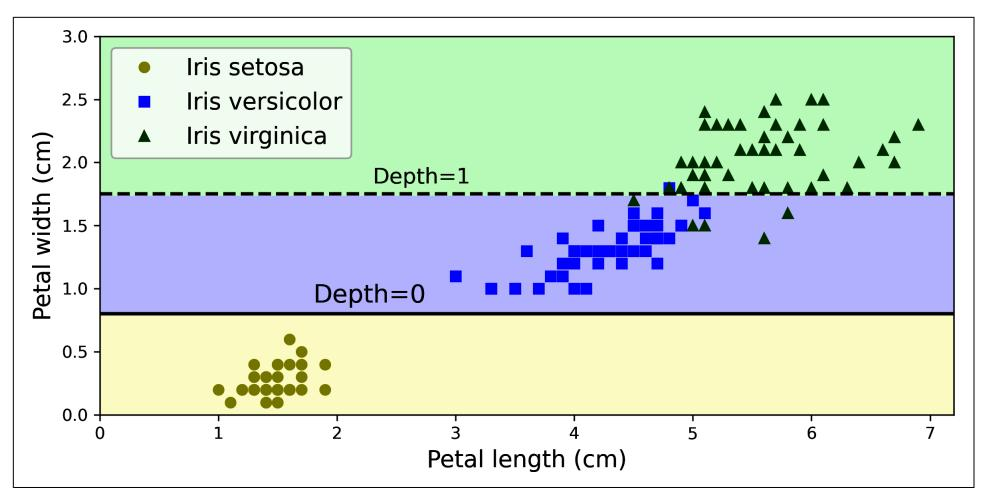

Figure 6-9. Retraining the same model on the same data may produce a very different model

Luckily, by averaging predictions over many trees, it's possible to reduce variance significantly. Such an *ensemble* of trees is called a *random forest*, and it's one of the most powerful types of models available today, as you will see in the next chapter.

### **Exercises**

- 1. What is the approximate depth of a decision tree trained (without restrictions) on a training set with one million instances?
- 2. Is a node's Gini impurity generally lower or higher than its parent's? Is it generally lower/higher, or always lower/higher?
- 3. If a decision tree is overfitting the training set, is it a good idea to try decreasing max depth?
- 4. If a decision tree is underfitting the training set, is it a good idea to try scaling the input features?
- 5. If it takes one hour to train a decision tree on a training set containing one million instances, roughly how much time will it take to train another decision tree on a training set containing ten million instances? Hint: consider the CART algorithm's computational complexity.
- 6. If it takes one hour to train a decision tree on a given training set, roughly how much time will it take if you double the number of features?
- 7. Train and fine-tune a decision tree for the moons dataset by following these steps:

{236}------------------------------------------------

- a. Use make\_moons(n\_samples=10000, noise=0.4) to generate a moons dataset.
- b. Use train\_test\_split() to split the dataset into a training set and a test set.
- c. Use grid search with cross-validation (with the help of the GridSearchCV class) to find good hyperparameter values for a DecisionTreeClassifier. Hint: try various values for max\_leaf\_nodes.
- d. Train it on the full training set using these hyperparameters, and measure your model's performance on the test set. You should get roughly 85% to 87% accuracy.
- 8. Grow a forest by following these steps:
  - a. Continuing the previous exercise, generate 1,000 subsets of the training set, each containing 100 instances selected randomly. Hint: you can use Scikit-Learn's ShuffleSplit class for this.
  - b. Train one decision tree on each subset, using the best hyperparameter values found in the previous exercise. Evaluate these 1,000 decision trees on the test set. Since they were trained on smaller sets, these decision trees will likely perform worse than the first decision tree, achieving only about 80% accuracy.
  - c. Now comes the magic. For each test set instance, generate the predictions of the 1,000 decision trees, and keep only the most frequent prediction (you can use SciPy's mode() function for this). This approach gives you *majority-vote* predictions over the test set.
  - d. Evaluate these predictions on the test set: you should obtain a slightly higher accuracy than your first model (about 0.5 to 1.5% higher). Congratulations, you have trained a random forest classifier!

Solutions to these exercises are available at the end of this chapter's notebook, at https://homl.info/colab3.

{237}------------------------------------------------

{238}------------------------------------------------

## **CHAPTER 7 Ensemble Learning and Random Forests**

Suppose you pose a complex question to thousands of random people, then aggregate their answers. In many cases you will find that this aggregated answer is better than an expert's answer. This is called the *wisdom of the crowd*. Similarly, if you aggregate the predictions of a group of predictors (such as classifiers or regressors), you will often get better predictions than with the best individual predictor. A group of predictors is called an *ensemble*; thus, this technique is called *ensemble learning*, and an ensemble learning algorithm is called an *ensemble method*.

As an example of an ensemble method, you can train a group of decision tree classifiers, each on a different random subset of the training set. You can then obtain the predictions of all the individual trees, and the class that gets the most votes is the ensemble's prediction (see the last exercise in Chapter 6). Such an ensemble of decision trees is called a *random forest*, and despite its simplicity, this is one of the most powerful machine learning algorithms available today.

As discussed in Chapter 2, you will often use ensemble methods near the end of a project, once you have already built a few good predictors, to combine them into an even better predictor. In fact, the winning solutions in machine learning competitions often involve several ensemble methods—most famously in the Netflix Prize competition.

In this chapter we will examine the most popular ensemble methods, including voting classifiers, bagging and pasting ensembles, random forests, and boosting, and stacking ensembles.

{239}------------------------------------------------

## **Voting Classifiers**

Suppose you have trained a few classifiers, each one achieving about 80% accuracy. You may have a logistic regression classifier, an SVM classifier, a random forest classifier, a k-nearest neighbors classifier, and perhaps a few more (see Figure 7-1).

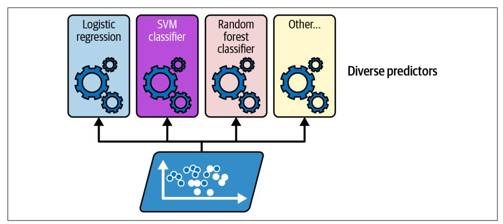

Figure 7-1. Training diverse classifiers

A very simple way to create an even better classifier is to aggregate the predictions of each classifier: the class that gets the most votes is the ensemble's prediction. This majority-vote classifier is called a *hard voting* classifier (see Figure 7-2).


Figure 7-2. Hard voting classifier predictions

{240}------------------------------------------------

Somewhat surprisingly, this voting classifier often achieves a higher accuracy than the best classifier in the ensemble. In fact, even if each classifier is a weak learner (meaning it does only slightly better than random guessing), the ensemble can still be a strong learner (achieving high accuracy), provided there are a sufficient number of weak learners in the ensemble and they are sufficiently diverse.

How is this possible? The following analogy can help shed some light on this mystery. Suppose you have a slightly biased coin that has a 51% chance of coming up heads and 49% chance of coming up tails. If you toss it 1,000 times, you will generally get more or less 510 heads and 490 tails, and hence a majority of heads. If you do the math, you will find that the probability of obtaining a majority of heads after 1,000 tosses is close to 75%. The more you toss the coin, the higher the probability (e.g., with 10,000 tosses, the probability climbs over 97%). This is due to the law of large *numbers*: as you keep tossing the coin, the ratio of heads gets closer and closer to the probability of heads (51%). Figure 7-3 shows 10 series of biased coin tosses. You can see that as the number of tosses increases, the ratio of heads approaches 51%. Eventually all 10 series end up so close to 51% that they are consistently above 50%.


Figure 7-3. The law of large numbers

Similarly, suppose you build an ensemble containing 1,000 classifiers that are individually correct only 51% of the time (barely better than random guessing). If you predict the majority voted class, you can hope for up to 75% accuracy! However, this is only true if all classifiers are perfectly independent, making uncorrelated errors, which is clearly not the case because they are trained on the same data. They are likely to make the same types of errors, so there will be many majority votes for the wrong class, reducing the ensemble's accuracy.

{241}------------------------------------------------


Ensemble methods work best when the predictors are as independent from one another as possible. One way to get diverse classifiers is to train them using very different algorithms. This increases the chance that they will make very different types of errors, improving the ensemble's accuracy.

Scikit-Learn provides a VotingClassifier class that's quite easy to use: just give it a list of name/predictor pairs, and use it like a normal classifier. Let's try it on the moons dataset (introduced in Chapter 5). We will load and split the moons dataset into a training set and a test set, then we'll create and train a voting classifier composed of three diverse classifiers:

```
from sklearn.datasets import make moons
from sklearn.ensemble import RandomForestClassifier, VotingClassifier
from sklearn.linear_model import LogisticRegression
from sklearn.model_selection import train_test_split
from sklearn.svm import SVC
X, y = make_moons(n_samples=500, noise=0.30, random_state=42)X train, X test, y train, y test = train test split(X, y, random state=42)
voting_clf = VotingClassifier(estimators =('lr', LogisticRegression(random_state=42)),
        ('rf', RandomForestClassifier(random state=42)),
        ('svc', SVC(random_state=42))
    1
\mathcal{L}voting_clf.fit(X_train, y_train)
```

When you fit a VotingClassifier, it clones every estimator and fits the clones. The original estimators are available via the estimators attribute, while the fitted clones are available via the estimators\_attribute. If you prefer a dict rather than a list, you can use named\_estimators or named\_estimators\_instead. To begin, let's look at each fitted classifier's accuracy on the test set:

```
>>> for name, clf in voting clf.named estimators .items():
        print(name, "=", clf.score(X test, y test))
\ddotsc\ddotsclr = 0.864rf = 0.896svc = 0.896
```

When you call the voting classifier's predict() method, it performs hard voting. For example, the voting classifier predicts class 1 for the first instance of the test set, because two out of three classifiers predict that class:

{242}------------------------------------------------

```
>>> voting_clf.predict(X_test[:1])
array([1])>>> [clf.predict(X_test[:1]) for clf in voting_clf.estimators_]
[array([1]), array([1]), array([0])]
```

Now let's look at the performance of the voting classifier on the test set:

```
>>> voting_clf.score(X_test, y_test)
0.912
```

There you have it! The voting classifier outperforms all the individual classifiers.

If all classifiers are able to estimate class probabilities (i.e., if they all have a predict proba() method), then you can tell Scikit-Learn to predict the class with the highest class probability, averaged over all the individual classifiers. This is called soft voting. It often achieves higher performance than hard voting because it gives more weight to highly confident votes. All you need to do is set the voting classifier's voting hyperparameter to "soft", and ensure that all classifiers can estimate class probabilities. This is not the case for the SVC class by default, so you need to set its probability hyperparameter to True (this will make the SVC class use cross-validation to estimate class probabilities, slowing down training, and it will add a predict\_proba() method). Let's try that:

```
>>> voting_clf.voting = "soft"
>>> voting clf.named estimators["svc"].probability = True
>>> voting clf.fit(X train, y train)
>>> voting_clf.score(X_test, y_test)
0.92
```

We reach 92% accuracy simply by using soft voting—not bad!

### **Bagging and Pasting**

One way to get a diverse set of classifiers is to use very different training algorithms, as just discussed. Another approach is to use the same training algorithm for every predictor but train them on different random subsets of the training set. When sampling is performed with replacement,<sup>1</sup> this method is called *bagging*<sup>2</sup> (short for *bootstrap aggregating*<sup>3</sup>). When sampling is performed *without* replacement, it is called pasting.<sup>4</sup>

<sup>1</sup> Imagine picking a card randomly from a deck of cards, writing it down, then placing it back in the deck before picking the next card: the same card could be sampled multiple times.

<sup>2</sup> Leo Breiman, "Bagging Predictors", Machine Learning 24, no. 2 (1996): 123-140.

<sup>3</sup> In statistics, resampling with replacement is called bootstrapping.

<sup>4</sup> Leo Breiman, "Pasting Small Votes for Classification in Large Databases and On-Line", Machine Learning 36, no. 1-2 (1999): 85-103.

{243}------------------------------------------------

In other words, both bagging and pasting allow training instances to be sampled several times across multiple predictors, but only bagging allows training instances to be sampled several times for the same predictor. This sampling and training process is represented in Figure 7-4.


Figure 7-4. Bagging and pasting involve training several predictors on different random samples of the training set

Once all predictors are trained, the ensemble can make a prediction for a new instance by simply aggregating the predictions of all predictors. The aggregation function is typically the *statistical mode* for classification (i.e., the most frequent prediction, just like with a hard voting classifier), or the average for regression. Each individual predictor has a higher bias than if it were trained on the original training set, but aggregation reduces both bias and variance.<sup>5</sup> Generally, the net result is that the ensemble has a similar bias but a lower variance than a single predictor trained on the original training set.

As you can see in Figure 7-4, predictors can all be trained in parallel, via different CPU cores or even different servers. Similarly, predictions can be made in parallel. This is one of the reasons bagging and pasting are such popular methods: they scale very well.

<sup>5</sup> Bias and variance were introduced in Chapter 4.

{244}------------------------------------------------

### **Bagging and Pasting in Scikit-Learn**

Scikit-Learn offers a simple API for both bagging and pasting: BaggingClassifier class (or BaggingRegressor for regression). The following code trains an ensemble of 500 decision tree classifiers:<sup>6</sup> each is trained on 100 training instances randomly sampled from the training set with replacement (this is an example of bagging, but if you want to use pasting instead, just set bootstrap=False). The n\_jobs parameter tells Scikit-Learn the number of CPU cores to use for training and predictions, and -1 tells Scikit-Learn to use all available cores:

```
from sklearn.ensemble import BaggingClassifier
from sklearn.tree import DecisionTreeClassifier
bag_clf = BaggingClassifier(DecisionTreeClassifier(), n_estimators=500,
                            max_samples=100, n_jobs=-1, random_state=42)
bag clf.fit(X train, y train)
```


A BaggingClassifier automatically performs soft voting instead of hard voting if the base classifier can estimate class probabilities (i.e., if it has a predict\_proba() method), which is the case with decision tree classifiers.

Figure 7-5 compares the decision boundary of a single decision tree with the decision boundary of a bagging ensemble of 500 trees (from the preceding code), both trained on the moons dataset. As you can see, the ensemble's predictions will likely generalize much better than the single decision tree's predictions: the ensemble has a comparable bias but a smaller variance (it makes roughly the same number of errors on the training set, but the decision boundary is less irregular).

Bagging introduces a bit more diversity in the subsets that each predictor is trained on, so bagging ends up with a slightly higher bias than pasting; but the extra diversity also means that the predictors end up being less correlated, so the ensemble's variance is reduced. Overall, bagging often results in better models, which explains why it's generally preferred. But if you have spare time and CPU power, you can use cross-validation to evaluate both bagging and pasting and select the one that works best.

<sup>6</sup> max samples can alternatively be set to a float between 0.0 and 1.0, in which case the max number of sampled instances is equal to the size of the training set times max\_samples.

{245}------------------------------------------------

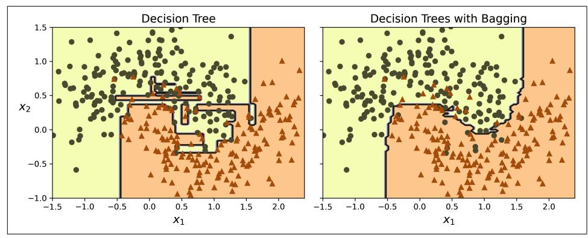

Figure 7-5. A single decision tree (left) versus a bagging ensemble of 500 trees (right)

### **Out-of-Bag Evaluation**

With bagging, some training instances may be sampled several times for any given predictor, while others may not be sampled at all. By default a BaggingClassifier samples *m* training instances with replacement (bootstrap=True), where *m* is the size of the training set. With this process, it can be shown mathematically that only about 63% of the training instances are sampled on average for each predictor.<sup>7</sup> The remaining 37% of the training instances that are not sampled are called out-of-bag (OOB) instances. Note that they are not the same 37% for all predictors.

A bagging ensemble can be evaluated using OOB instances, without the need for a separate validation set: indeed, if there are enough estimators, then each instance in the training set will likely be an OOB instance of several estimators, so these estimators can be used to make a fair ensemble prediction for that instance. Once you have a prediction for each instance, you can compute the ensemble's prediction accuracy (or any other metric).

In Scikit-Learn, you can set oob score=True when creating a BaggingClassifier to request an automatic OOB evaluation after training. The following code demonstrates this. The resulting evaluation score is available in the oob\_score\_attribute:

```
>>> bag_clf = BaggingClassifier(DecisionTreeClassifier(), n_estimators=500,
                                oob_score=True, n_jobs=-1, random_state=42)
\ddotsc>>> bag clf.fit(X train, y train)
>>> bag clf.oob score
0.896
```

<sup>7</sup> As *m* grows, this ratio approaches  $1 - \exp(-1) \approx 63\%$ .

{246}------------------------------------------------

According to this OOB evaluation, this BaggingClassifier is likely to achieve about 89.6% accuracy on the test set. Let's verify this:

```
>>> from sklearn.metrics import accuracy_score
\Rightarrow y_pred = bag_clf.predict(X_test)
>>> accuracy_score(y_test, y_pred)
0.92
```

We get 92% accuracy on the test. The OOB evaluation was a bit too pessimistic, just over 2% too low.

The OOB decision function for each training instance is also available through the oob decision function attribute. Since the base estimator has a predict proba() method, the decision function returns the class probabilities for each training instance. For example, the OOB evaluation estimates that the first training instance has a 67.6% probability of belonging to the positive class and a 32.4% probability of belonging to the negative class:

```
>>> bag_clf.oob_decision_function_[:3] # probas for the first 3 instances
array([[0.32352941, 0.67647059],[0.3375, 0.6625]],
                               11)\lceil 1 \rceil. 0.
```

#### **Random Patches and Random Subspaces**

The BaggingClassifier class supports sampling the features as well. Sampling is controlled by two hyperparameters: max features and bootstrap features. They work the same way as max\_samples and bootstrap, but for feature sampling instead of instance sampling. Thus, each predictor will be trained on a random subset of the input features.

This technique is particularly useful when you are dealing with high-dimensional inputs (such as images), as it can considerably speed up training. Sampling both training instances and features is called the *random patches* method.<sup>8</sup> Keeping all training instances (by setting bootstrap=False and max\_samples=1.0) but sampling features (by setting bootstrap features to True and/or max features to a value smaller than 1.0) is called the *random subspaces* method.<sup>9</sup>

Sampling features results in even more predictor diversity, trading a bit more bias for a lower variance.

<sup>8</sup> Gilles Louppe and Pierre Geurts, "Ensembles on Random Patches", Lecture Notes in Computer Science 7523  $(2012): 346 - 361.$ 

<sup>9</sup> Tin Kam Ho, "The Random Subspace Method for Constructing Decision Forests", IEEE Transactions on Pattern Analysis and Machine Intelligence 20, no. 8 (1998): 832-844.

{247}------------------------------------------------

## **Random Forests**

As we have discussed, a random forest<sup>10</sup> is an ensemble of decision trees, generally trained via the bagging method (or sometimes pasting), typically with max\_samples set to the size of the training set. Instead of building a BaggingClassifier and passing it a DecisionTreeClassifier, you can use the RandomForestClassifier class, which is more convenient and optimized for decision trees<sup>11</sup> (similarly, there is a RandomForestRegressor class for regression tasks). The following code trains a random forest classifier with 500 trees, each limited to maximum 16 leaf nodes, using all available CPU cores:

```
from sklearn.ensemble import RandomForestClassifier
rnd clf = RandomForestClassifier(n estimators=500, max leaf nodes=16,
                                 n_jobs=-1, random_state=42)
rnd clf.fit(X train, y train)
y_pred_rf = rnd_clf.predict(X_test)
```

With a few exceptions, a RandomForestClassifier has all the hyperparameters of a DecisionTreeClassifier (to control how trees are grown), plus all the hyperparameters of a BaggingClassifier to control the ensemble itself.

The random forest algorithm introduces extra randomness when growing trees; instead of searching for the very best feature when splitting a node (see Chapter 6), it searches for the best feature among a random subset of features. By default, it samples  $\sqrt{n}$  features (where *n* is the total number of features). The algorithm results in greater tree diversity, which (again) trades a higher bias for a lower variance, generally yielding an overall better model. So, the following BaggingClassifier is equivalent to the previous RandomForestClassifier:

```
bag_clf = BaggingClassifier(DecisionTreeClassifier(max features="sqrt", max leaf nodes=16),
    n estimators=500, n jobs=-1, random state=42)
```

### **Fxtra-Trees**

When you are growing a tree in a random forest, at each node only a random subset of the features is considered for splitting (as discussed earlier). It is possible to make trees even more random by also using random thresholds for each feature rather than searching for the best possible thresholds (like regular decision trees do). For this, simply set splitter="random" when creating a DecisionTreeClassifier.

<sup>10</sup> Tin Kam Ho, "Random Decision Forests", Proceedings of the Third International Conference on Document Analysis and Recognition 1 (1995): 278.

<sup>11</sup> The BaggingClassifier class remains useful if you want a bag of something other than decision trees.

{248}------------------------------------------------

A forest of such extremely random trees is called an extremely randomized trees<sup>12</sup> (or extra-trees for short) ensemble. Once again, this technique trades more bias for a lower variance. It also makes extra-trees classifiers much faster to train than regular random forests, because finding the best possible threshold for each feature at every node is one of the most time-consuming tasks of growing a tree.

You can create an extra-trees classifier using Scikit-Learn's ExtraTreesClassifier class. Its API is identical to the RandomForestClassifier class, except bootstrap defaults to False. Similarly, the ExtraTreesRegressor class has the same API as the RandomForestRegressor class, except bootstrap defaults to False.


It is hard to tell in advance whether a RandomForestClassifier will perform better or worse than an ExtraTreesClassifier. Generally, the only way to know is to try both and compare them using cross-validation.

#### **Feature Importance**

Yet another great quality of random forests is that they make it easy to measure the relative importance of each feature. Scikit-Learn measures a feature's importance by looking at how much the tree nodes that use that feature reduce impurity on average, across all trees in the forest. More precisely, it is a weighted average, where each node's weight is equal to the number of training samples that are associated with it (see Chapter 6).

Scikit-Learn computes this score automatically for each feature after training, then it scales the results so that the sum of all importances is equal to 1. You can access the result using the feature\_importances\_variable. For example, the following code trains a RandomForestClassifier on the iris dataset (introduced in Chapter 4) and outputs each feature's importance. It seems that the most important features are the petal length (44%) and width (42%), while sepal length and width are rather unimportant in comparison (11% and 2%, respectively):

```
>>> from sklearn.datasets import load_iris
>>> iris = load_iris(as_frame=True)
>>> rnd_clf = RandomForestClassifier(n_estimators=500, random_state=42)>>> rnd_clf.fit(iris.data, iris.target)
>>> for score, name in zip(rnd_clf.feature_importances_, iris.data.columns):
       print(round(score, 2), name)
\ddotsc\ddotsc0.11 sepal length (cm)
0.02 sepal width (cm)
```

<sup>12</sup> Pierre Geurts et al., "Extremely Randomized Trees", Machine Learning 63, no. 1 (2006): 3-42.

{249}------------------------------------------------

```
0.44 petal length (cm)
0.42 petal width (cm)
```

Similarly, if you train a random forest classifier on the MNIST dataset (introduced in Chapter 3) and plot each pixel's importance, you get the image represented in Figure 7-6.

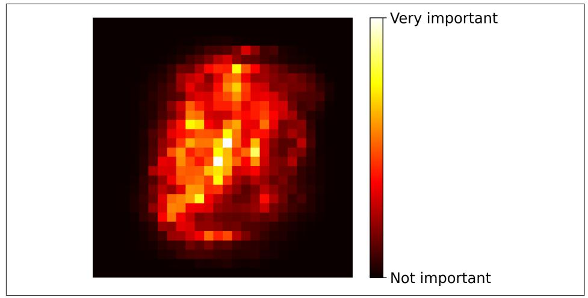

Figure 7-6. MNIST pixel importance (according to a random forest classifier)

Random forests are very handy to get a quick understanding of what features actually matter, in particular if you need to perform feature selection.

## **Boosting**

Boosting (originally called hypothesis boosting) refers to any ensemble method that can combine several weak learners into a strong learner. The general idea of most boosting methods is to train predictors sequentially, each trying to correct its predecessor. There are many boosting methods available, but by far the most popular are AdaBoost<sup>13</sup> (short for adaptive boosting) and gradient boosting. Let's start with AdaBoost.

### **AdaBoost**

One way for a new predictor to correct its predecessor is to pay a bit more attention to the training instances that the predecessor underfit. This results in new predictors focusing more and more on the hard cases. This is the technique used by AdaBoost.

<sup>13</sup> Yoav Freund and Robert E. Schapire, "A Decision-Theoretic Generalization of On-Line Learning and an Application to Boosting", Journal of Computer and System Sciences 55, no. 1 (1997): 119-139.

{250}------------------------------------------------

For example, when training an AdaBoost classifier, the algorithm first trains a base classifier (such as a decision tree) and uses it to make predictions on the training set. The algorithm then increases the relative weight of misclassified training instances. Then it trains a second classifier, using the updated weights, and again makes predictions on the training set, updates the instance weights, and so on (see Figure 7-7).

Figure 7-8 shows the decision boundaries of five consecutive predictors on the moons dataset (in this example, each predictor is a highly regularized SVM classifier with an RBF kernel).<sup>14</sup> The first classifier gets many instances wrong, so their weights get boosted. The second classifier therefore does a better job on these instances, and so on. The plot on the right represents the same sequence of predictors, except that the learning rate is halved (i.e., the misclassified instance weights are boosted much less at every iteration). As you can see, this sequential learning technique has some similarities with gradient descent, except that instead of tweaking a single predictor's parameters to minimize a cost function, AdaBoost adds predictors to the ensemble, gradually making it better.

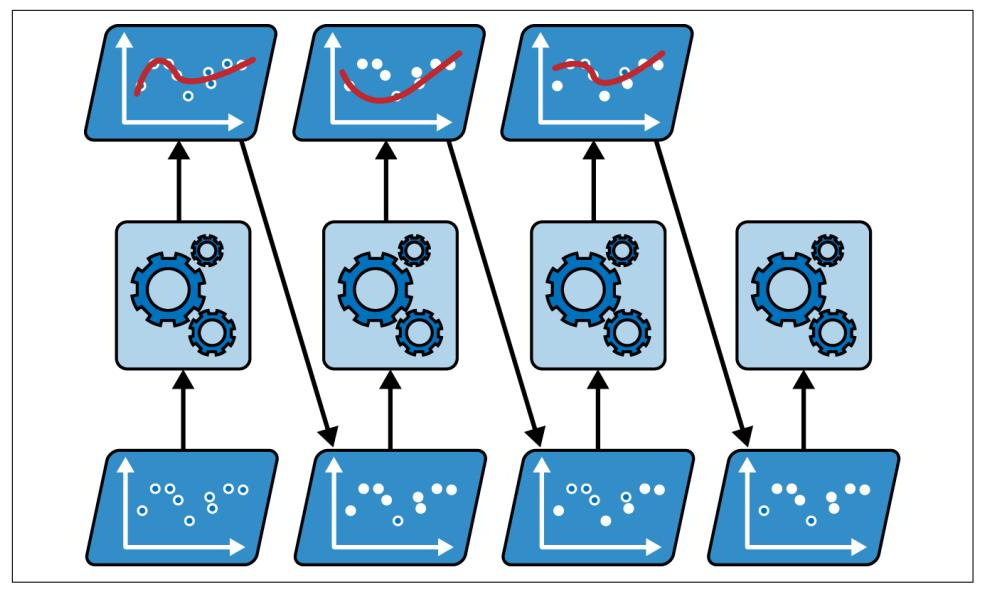

Figure 7-7. AdaBoost sequential training with instance weight updates

<sup>14</sup> This is just for illustrative purposes. SVMs are generally not good base predictors for AdaBoost; they are slow and tend to be unstable with it.

{251}------------------------------------------------

Once all predictors are trained, the ensemble makes predictions very much like bagging or pasting, except that predictors have different weights depending on their overall accuracy on the weighted training set.

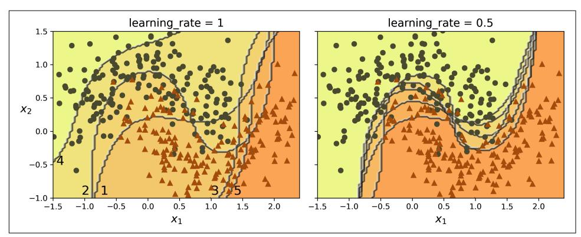

Figure 7-8. Decision boundaries of consecutive predictors


There is one important drawback to this sequential learning technique: training cannot be parallelized since each predictor can only be trained after the previous predictor has been trained and evaluated. As a result, it does not scale as well as bagging or pasting.

Let's take a closer look at the AdaBoost algorithm. Each instance weight  $w^{(i)}$  is initially set to  $1/m$ . A first predictor is trained, and its weighted error rate  $r_1$  is computed on the training set; see Equation 7-1.

Equation 7-1. Weighted error rate of the  $j<sup>th</sup>$  predictor

 $r_j = \sum_{i=1}^m w^{(i)}$  where  $\hat{y}_j^{(i)}$  is the  $j^{\text{th}}$  predictor's prediction for the  $i^{\text{th}}$  instance  $\hat{y}_i^{(i)} \neq y_i^{(i)}$ 

The predictor's weight  $\alpha_i$  is then computed using Equation 7-2, where  $\eta$  is the learning rate hyperparameter (defaults to 1).<sup>15</sup> The more accurate the predictor is, the higher its weight will be. If it is just guessing randomly, then its weight will be close to zero. However, if it is most often wrong (i.e., less accurate than random guessing), then its weight will be negative.

<sup>15</sup> The original AdaBoost algorithm does not use a learning rate hyperparameter.

{252}------------------------------------------------

Equation 7-2. Predictor weight

$$
\alpha_j = \eta \log \frac{1 - r_j}{r_j}
$$

Next, the AdaBoost algorithm updates the instance weights, using Equation 7-3, which boosts the weights of the misclassified instances.

Equation 7-3. Weight update rule

for 
$$
i = 1, 2, \dots, m
$$
  
\n
$$
w^{(i)} \leftarrow \begin{cases} w^{(i)} & \text{if } \widehat{y}_j^{(i)} = y^{(i)} \\ w^{(i)} \exp(\alpha_j) & \text{if } \widehat{y}_j^{(i)} \neq y^{(i)} \end{cases}
$$

Then all the instance weights are normalized (i.e., divided by  $\sum_{i=1}^{m} w^{(i)}$ ).

Finally, a new predictor is trained using the updated weights, and the whole process is repeated: the new predictor's weight is computed, the instance weights are updated, then another predictor is trained, and so on. The algorithm stops when the desired number of predictors is reached, or when a perfect predictor is found.

To make predictions, AdaBoost simply computes the predictions of all the predictors and weighs them using the predictor weights  $\alpha_i$ . The predicted class is the one that receives the majority of weighted votes (see Equation 7-4).

Equation 7-4. AdaBoost predictions

$$
\widehat{y}(\mathbf{x}) = \underset{k}{\text{argmax}} \sum_{\substack{j=1 \ j \neq \mathbf{x}}}^{N} \alpha_j
$$
 where *N* is the number of predictors

Scikit-Learn uses a multiclass version of AdaBoost called SAMME<sup>16</sup> (which stands for Stagewise Additive Modeling using a Multiclass Exponential loss function). When there are just two classes, SAMME is equivalent to AdaBoost. If the predictors can estimate class probabilities (i.e., if they have a predict\_proba() method), Scikit-Learn can use a variant of SAMME called SAMME.R (the R stands for "Real"), which relies on class probabilities rather than predictions and generally performs better.

<sup>16</sup> For more details, see Ji Zhu et al., "Multi-Class AdaBoost", Statistics and Its Interface 2, no. 3 (2009): 349-360.

{253}------------------------------------------------

The following code trains an AdaBoost classifier based on 30 *decision stumps* using Scikit-Learn's AdaBoostClassifier class (as you might expect, there is also an AdaBoostRegressor class). A decision stump is a decision tree with  $max$  depth= $1$ —in other words, a tree composed of a single decision node plus two leaf nodes. This is the default base estimator for the AdaBoostClassifier class:

```
from sklearn.ensemble import AdaBoostClassifier
ada clf = AdaBoostClassifier(
   DecisionTreeClassifier(max_depth=1), n_estimators=30,
   learning rate=0.5, random state=42)
ada clf.fit(X train, y train)
```


If your AdaBoost ensemble is overfitting the training set, you can try reducing the number of estimators or more strongly regularizing the base estimator.

### **Gradient Boosting**

Another very popular boosting algorithm is *gradient boosting*.<sup>17</sup> Just like AdaBoost, gradient boosting works by sequentially adding predictors to an ensemble, each one correcting its predecessor. However, instead of tweaking the instance weights at every iteration like AdaBoost does, this method tries to fit the new predictor to the *residual* errors made by the previous predictor.

Let's go through a simple regression example, using decision trees as the base predictors; this is called gradient tree boosting, or gradient boosted regression trees (GBRT). First, let's generate a noisy quadratic dataset and fit a DecisionTreeRegressor to it:

```
import numpy as np
from sklearn.tree import DecisionTreeRegressor
np.random.seed(42)
X = np.random.randn(100, 1) - 0.5y = 3 * X[:, 0] ** 2 + 0.05 * np.random.randn(100) # y = 3x<sup>2</sup> + Gaussian noisetree_reg1 = DecisionTreeRegressor(max_depth=2, random_state=42)
tree_reg1.fit(X, y)
```

<sup>17</sup> Gradient boosting was first introduced in Leo Breiman's 1997 paper "Arcing the Edge" and was further developed in the 1999 paper "Greedy Function Approximation: A Gradient Boosting Machine" by Jerome H. Friedman.

{254}------------------------------------------------

Next, we'll train a second DecisionTreeRegressor on the residual errors made by the first predictor:

```
y2 = y - tree_reg1.predict(X)tree_reg2 = DecisionTreeRegressor(max_depth=2, random_state=43)
tree_reg2.fit(X, y2)
```

And then we'll train a third regressor on the residual errors made by the second predictor:

```
y3 = y2 - tree reg2.predict(X)
tree reg3 = DecisionTreeRegressor(max depth=2, random state=44)
tree_reg3.fit(X, y3)
```

Now we have an ensemble containing three trees. It can make predictions on a new instance simply by adding up the predictions of all the trees:

```
>>> X_new = np.array([[-0.4], [0.], [0.5]])
>>> sum(tree.predict(X_new) for tree in (tree_reg1, tree_reg2, tree_reg3))
array([0.49484029, 0.04021166, 0.75026781])
```

Figure 7-9 represents the predictions of these three trees in the left column, and the ensemble's predictions in the right column. In the first row, the ensemble has just one tree, so its predictions are exactly the same as the first tree's predictions. In the second row, a new tree is trained on the residual errors of the first tree. On the right you can see that the ensemble's predictions are equal to the sum of the predictions of the first two trees. Similarly, in the third row another tree is trained on the residual errors of the second tree. You can see that the ensemble's predictions gradually get better as trees are added to the ensemble.

You can use Scikit-Learn's GradientBoostingRegressor class to train GBRT ensembles more easily (there's also a GradientBoostingClassifier class for classification). Much like the RandomForestRegressor class, it has hyperparameters to control the growth of decision trees (e.g., max\_depth, min\_samples\_leaf), as well as hyperparameters to control the ensemble training, such as the number of trees (n\_estimators). The following code creates the same ensemble as the previous one:

```
from sklearn.ensemble import GradientBoostingRegressor
qbrt = GradientBoostingRegression(max depth=2, n estimators=3,learning rate=1.0, random state=42)
qbrt.fit(X, y)
```

{255}------------------------------------------------


Figure 7-9. In this depiction of gradient boosting, the first predictor (top left) is trained normally, then each consecutive predictor (middle left and lower left) is trained on the previous predictor's residuals; the right column shows the resulting ensemble's predictions

The learning rate hyperparameter scales the contribution of each tree. If you set it to a low value, such as 0.05, you will need more trees in the ensemble to fit the training set, but the predictions will usually generalize better. This is a regularization technique called *shrinkage*. Figure 7-10 shows two GBRT ensembles trained with different hyperparameters: the one on the left does not have enough trees to fit the training set, while the one on the right has about the right amount. If we added more trees, the GBRT would start to overfit the training set.

{256}------------------------------------------------


Figure 7-10. GBRT ensembles with not enough predictors (left) and just enough (right)

To find the optimal number of trees, you could perform cross-validation using GridSearchCV or RandomizedSearchCV, as usual, but there's a simpler way: if you set the n\_iter\_no\_change hyperparameter to an integer value, say 10, then the Gradient BoostingRegressor will automatically stop adding more trees during training if it sees that the last 10 trees didn't help. This is simply early stopping (introduced in Chapter 4), but with a little bit of patience: it tolerates having no progress for a few iterations before it stops. Let's train the ensemble using early stopping:

```
qbrt best = GradientBoostingRegression(max depth=2, learning rate=0.05, n estimators=500,
    n_iter_no_change=10, random_state=42)
gbrt_best.fit(X, y)
```

If you set n\_iter\_no\_change too low, training may stop too early and the model will underfit. But if you set it too high, it will overfit instead. We also set a fairly small learning rate and a high number of estimators, but the actual number of estimators in the trained ensemble is much lower, thanks to early stopping:

```
>>> gbrt best.n estimators
92
```

When n\_iter\_no\_change is set, the fit() method automatically splits the training set into a smaller training set and a validation set: this allows it to evaluate the model's performance each time it adds a new tree. The size of the validation set is controlled by the validation fraction hyperparameter, which is 10% by default. The tol hyperparameter determines the maximum performance improvement that still counts as negligible. It defaults to 0.0001.

{257}------------------------------------------------

The GradientBoostingRegressor class also supports a subsample hyperparameter, which specifies the fraction of training instances to be used for training each tree. For example, if subsample=0.25, then each tree is trained on 25% of the training instances, selected randomly. As you can probably guess by now, this technique trades a higher bias for a lower variance. It also speeds up training considerably. This is called stochastic gradient boosting.

### **Histogram-Based Gradient Boosting**

Scikit-Learn also provides another GBRT implementation, optimized for large datasets: histogram-based gradient boosting (HGB). It works by binning the input features, replacing them with integers. The number of bins is controlled by the max\_bins hyperparameter, which defaults to 255 and cannot be set any higher than this. Binning can greatly reduce the number of possible thresholds that the training algorithm needs to evaluate. Moreover, working with integers makes it possible to use faster and more memory-efficient data structures. And the way the bins are built removes the need for sorting the features when training each tree.

As a result, this implementation has a computational complexity of  $O(b \times m)$  instead of  $O(n \times m \times \log(m))$ , where b is the number of bins, m is the number of training instances, and  $n$  is the number of features. In practice, this means that HGB can train hundreds of times faster than regular GBRT on large datasets. However, binning causes a precision loss, which acts as a regularizer: depending on the dataset, this may help reduce overfitting, or it may cause underfitting.

Scikit-Learn provides two classes for HGB: HistGradientBoostingRegressor and HistGradientBoostingClassifier. They're similar to GradientBoostingRegressor and GradientBoostingClassifier, with a few notable differences:

- Early stopping is automatically activated if the number of instances is greater than 10,000. You can turn early stopping always on or always off by setting the early\_stopping hyperparameter to True or False.
- Subsampling is not supported.
- n estimators is renamed to max iter.
- The only decision tree hyperparameters that can be tweaked are max\_leaf\_nodes, min samples leaf, and max depth.

{258}------------------------------------------------

The HGB classes also have two nice features: they support both categorical features and missing values. This simplifies preprocessing quite a bit. However, the categorical features must be represented as integers ranging from 0 to a number lower than max bins. You can use an OrdinalEncoder for this. For example, here's how to build and train a complete pipeline for the California housing dataset introduced in Chapter 2:

```
from sklearn.pipeline import make_pipeline
from sklearn.compose import make_column_transformer
from sklearn.ensemble import HistGradientBoostingRegressor
from sklearn.preprocessing import OrdinalEncoder
hgb reg = make pipeline(make_column_transformer((OrdinalEncoder(), ["ocean_proximity"]),
                            remainder="passthrough"),
   HistGradientBoostingRegressor(categorical features=[0], random state=42)
hgb_reg.fit(housing, housing_labels)
```

The whole pipeline is just as short as the imports! No need for an imputer, scaler, or a one-hot encoder, so it's really convenient. Note that categorical\_features must be set to the categorical column indices (or a Boolean array). Without any hyperparameter tuning, this model yields an RMSE of about 47,600, which is not too bad.


Several other optimized implementations of gradient boosting are available in the Python ML ecosystem: in particular, XGBoost, Cat-Boost, and LightGBM. These libraries have been around for several years. They are all specialized for gradient boosting, their APIs are very similar to Scikit-Learn's, and they provide many additional features, including GPU acceleration; you should definitely check them out! Moreover, the TensorFlow Random Forests library provides optimized implementations of a variety of random forest algorithms, including plain random forests, extra-trees, GBRT, and several more.

{259}------------------------------------------------

## **Stacking**

The last ensemble method we will discuss in this chapter is called *stacking* (short for stacked generalization).<sup>18</sup> It is based on a simple idea: instead of using trivial functions (such as hard voting) to aggregate the predictions of all predictors in an ensemble, why don't we train a model to perform this aggregation? Figure 7-11 shows such an ensemble performing a regression task on a new instance. Each of the bottom three predictors predicts a different value (3.1, 2.7, and 2.9), and then the final predictor (called a *blender*, or a *meta learner*) takes these predictions as inputs and makes the final prediction (3.0).

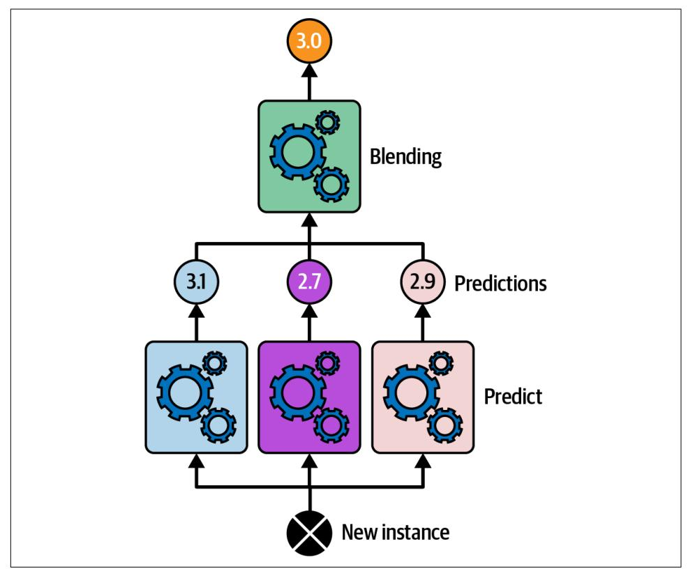

Figure 7-11. Aggregating predictions using a blending predictor

To train the blender, you first need to build the blending training set. You can use cross\_val\_predict() on every predictor in the ensemble to get out-of-sample predictions for each instance in the original training set (Figure 7-12), and use these

<sup>18</sup> David H. Wolpert, "Stacked Generalization", Neural Networks 5, no. 2 (1992): 241-259.

{260}------------------------------------------------

can be used as the input features to train the blender; and the targets can simply be copied from the original training set. Note that regardless of the number of features in the original training set (just one in this example), the blending training set will contain one input feature per predictor (three in this example). Once the blender is trained, the base predictors are retrained one last time on the full original training set.


Figure 7-12. Training the blender in a stacking ensemble

It is actually possible to train several different blenders this way (e.g., one using linear regression, another using random forest regression) to get a whole layer of blenders, and then add another blender on top of that to produce the final prediction, as shown in Figure 7-13. You may be able to squeeze out a few more drops of performance by doing this, but it will cost you in both training time and system complexity.

{261}------------------------------------------------


Figure 7-13. Predictions in a multilayer stacking ensemble

Scikit-Learn provides two classes for stacking ensembles: StackingClassifier and StackingRegressor. For example, we can replace the VotingClassifier we used at the beginning of this chapter on the moons dataset with a StackingClassifier:

```
from sklearn.ensemble import StackingClassifier
stacking_clf = StackingClassifier(
    estimators=[
        ('lr', LogisticRegression(random state=42)),
        ('rf', RandomForestClassifier(random state=42)),
        ('svc', SVC(probability=True, random_state=42))
    1,
    final_estimator=RandomForestClassifier(random_state=43),
    cv=5 # number of cross-validation folds
\lambdastacking_clf.fit(X_train, y_train)
```

For each predictor, the stacking classifier will call predict proba() if available; if not it will fall back to decision function() or, as a last resort, call predict(). If you don't provide a final estimator, StackingClassifier will use LogisticRegression and StackingRegressor will use RidgeCV.

{262}------------------------------------------------

If you evaluate this stacking model on the test set, you will find 92.8% accuracy, which is a bit better than the voting classifier using soft voting, which got 92%.

In conclusion, ensemble methods are versatile, powerful, and fairly simple to use. Random forests, AdaBoost, and GBRT are among the first models you should test for most machine learning tasks, and they particularly shine with heterogeneous tabular data. Moreover, as they require very little preprocessing, they're great for getting a prototype up and running quickly. Lastly, ensemble methods like voting classifiers and stacking classifiers can help push your system's performance to its limits.

### **Exercises**

- 1. If you have trained five different models on the exact same training data, and they all achieve 95% precision, is there any chance that you can combine these models to get better results? If so, how? If not, why?
- 2. What is the difference between hard and soft voting classifiers?
- 3. Is it possible to speed up training of a bagging ensemble by distributing it across multiple servers? What about pasting ensembles, boosting ensembles, random forests, or stacking ensembles?
- 4. What is the benefit of out-of-bag evaluation?
- 5. What makes extra-trees ensembles more random than regular random forests? How can this extra randomness help? Are extra-trees classifiers slower or faster than regular random forests?
- 6. If your AdaBoost ensemble underfits the training data, which hyperparameters should you tweak, and how?
- 7. If your gradient boosting ensemble overfits the training set, should you increase or decrease the learning rate?
- 8. Load the MNIST dataset (introduced in Chapter 3), and split it into a training set, a validation set, and a test set (e.g., use 50,000 instances for training, 10,000 for validation, and 10,000 for testing). Then train various classifiers, such as a random forest classifier, an extra-trees classifier, and an SVM classifier. Next, try to combine them into an ensemble that outperforms each individual classifier on the validation set, using soft or hard voting. Once you have found one, try it on the test set. How much better does it perform compared to the individual classifiers?
- 9. Run the individual classifiers from the previous exercise to make predictions on the validation set, and create a new training set with the resulting predictions: each training instance is a vector containing the set of predictions from all your classifiers for an image, and the target is the image's class. Train a classifier on this new training set. Congratulations—you have just trained a blender, and

{263}------------------------------------------------

together with the classifiers it forms a stacking ensemble! Now evaluate the ensemble on the test set. For each image in the test set, make predictions with all your classifiers, then feed the predictions to the blender to get the ensemble's predictions. How does it compare to the voting classifier you trained earlier? Now try again using a StackingClassifier instead. Do you get better performance? If so, why?

Solutions to these exercises are available at the end of this chapter's notebook, at https://homl.info/colab3.

{264}------------------------------------------------

## **CHAPTER 8 Dimensionality Reduction**

Many machine learning problems involve thousands or even millions of features for each training instance. Not only do all these features make training extremely slow, but they can also make it much harder to find a good solution, as you will see. This problem is often referred to as the curse of dimensionality.

Fortunately, in real-world problems, it is often possible to reduce the number of features considerably, turning an intractable problem into a tractable one. For example, consider the MNIST images (introduced in Chapter 3): the pixels on the image borders are almost always white, so you could completely drop these pixels from the training set without losing much information. As we saw in the previous chapter, (Figure 7-6) confirms that these pixels are utterly unimportant for the classification task. Additionally, two neighboring pixels are often highly correlated: if you merge them into a single pixel (e.g., by taking the mean of the two pixel intensities), you will not lose much information.


Reducing dimensionality does cause some information loss, just like compressing an image to JPEG can degrade its quality, so even though it will speed up training, it may make your system perform slightly worse. It also makes your pipelines a bit more complex and thus harder to maintain. Therefore, I recommend you first try to train your system with the original data before considering using dimensionality reduction. In some cases, reducing the dimensionality of the training data may filter out some noise and unnecessary details and thus result in higher performance, but in general it won't; it will just speed up training.

{265}------------------------------------------------

Apart from speeding up training, dimensionality reduction is also extremely useful for data visualization. Reducing the number of dimensions down to two (or three) makes it possible to plot a condensed view of a high-dimensional training set on a graph and often gain some important insights by visually detecting patterns, such as clusters. Moreover, data visualization is essential to communicate your conclusions to people who are not data scientists—in particular, decision makers who will use your results

In this chapter we will first discuss the curse of dimensionality and get a sense of what goes on in high-dimensional space. Then we will consider the two main approaches to dimensionality reduction (projection and manifold learning), and we will go through three of the most popular dimensionality reduction techniques: PCA, random projection, and locally linear embedding (LLE).

## **The Curse of Dimensionality**

We are so used to living in three dimensions<sup>1</sup> that our intuition fails us when we try to imagine a high-dimensional space. Even a basic 4D hypercube is incredibly hard to picture in our minds (see Figure 8-1), let alone a 200-dimensional ellipsoid bent in a 1,000-dimensional space.


Figure 8-1. Point, segment, square, cube, and tesseract (0D to 4D hypercubes)<sup>2</sup>

It turns out that many things behave very differently in high-dimensional space. For example, if you pick a random point in a unit square (a  $1 \times 1$  square), it will have only about a 0.4% chance of being located less than 0.001 from a border (in other words, it is very unlikely that a random point will be "extreme" along any dimension). But in a

<sup>1</sup> Well, four dimensions if you count time, and a few more if you are a string theorist.

<sup>2</sup> Watch a rotating tesseract projected into 3D space at https://homl.info/30. Image by Wikipedia user Nerd-Boy1392 (Creative Commons BY-SA 3.0). Reproduced from https://en.wikipedia.org/wiki/Tesseract.

{266}------------------------------------------------

10,000-dimensional unit hypercube, this probability is greater than 99.999999%. Most points in a high-dimensional hypercube are very close to the border.<sup>3</sup>

Here is a more troublesome difference: if you pick two points randomly in a unit square, the distance between these two points will be, on average, roughly 0.52. If you pick two random points in a 3D unit cube, the average distance will be roughly 0.66. But what about two points picked randomly in a 1,000,000-dimensional unit hypercube? The average distance, believe it or not, will be about 408.25 (roughly  $\sqrt{1,000,000/6}$ ! This is counterintuitive: how can two points be so far apart when they both lie within the same unit hypercube? Well, there's just plenty of space in high dimensions. As a result, high-dimensional datasets are at risk of being very sparse: most training instances are likely to be far away from each other. This also means that a new instance will likely be far away from any training instance, making predictions much less reliable than in lower dimensions, since they will be based on much larger extrapolations. In short, the more dimensions the training set has, the greater the risk of overfitting it.

In theory, one solution to the curse of dimensionality could be to increase the size of the training set to reach a sufficient density of training instances. Unfortunately, in practice, the number of training instances required to reach a given density grows exponentially with the number of dimensions. With just 100 features—significantly fewer than in the MNIST problem—all ranging from 0 to 1, you would need more training instances than atoms in the observable universe in order for training instances to be within 0.1 of each other on average, assuming they were spread out uniformly across all dimensions.

### **Main Approaches for Dimensionality Reduction**

Before we dive into specific dimensionality reduction algorithms, let's take a look at the two main approaches to reducing dimensionality: projection and manifold learning.

### **Projection**

In most real-world problems, training instances are *not* spread out uniformly across all dimensions. Many features are almost constant, while others are highly correlated (as discussed earlier for MNIST). As a result, all training instances lie within (or close to) a much lower-dimensional subspace of the high-dimensional space. This sounds very abstract, so let's look at an example. In Figure 8-2 you can see a 3D dataset represented by small spheres.

<sup>3</sup> Fun fact: anyone you know is probably an extremist in at least one dimension (e.g., how much sugar they put in their coffee), if you consider enough dimensions.

{267}------------------------------------------------


Figure 8-2. A 3D dataset lying close to a 2D subspace

Notice that all training instances lie close to a plane: this is a lower-dimensional (2D) subspace of the higher-dimensional (3D) space. If we project every training instance perpendicularly onto this subspace (as represented by the short dashed lines connecting the instances to the plane), we get the new 2D dataset shown in Figure 8-3. Ta-da! We have just reduced the dataset's dimensionality from 3D to 2D. Note that the axes correspond to new features  $z_1$  and  $z_2$ : they are the coordinates of the projections on the plane.


Figure 8-3. The new 2D dataset after projection

{268}------------------------------------------------

### **Manifold Learning**

However, projection is not always the best approach to dimensionality reduction. In many cases the subspace may twist and turn, such as in the famous Swiss roll toy dataset represented in Figure 8-4.


Figure 8-4. Swiss roll dataset

Simply projecting onto a plane (e.g., by dropping  $x_3$ ) would squash different layers of the Swiss roll together, as shown on the left side of Figure 8-5. What you probably want instead is to unroll the Swiss roll to obtain the 2D dataset on the right side of Figure 8-5.


Figure 8-5. Squashing by projecting onto a plane (left) versus unrolling the Swiss roll  $(right)$ 

{269}------------------------------------------------

The Swiss roll is an example of a 2D *manifold*. Put simply, a 2D manifold is a 2D shape that can be bent and twisted in a higher-dimensional space. More generally, a d-dimensional manifold is a part of an *n*-dimensional space (where  $d < n$ ) that locally resembles a d-dimensional hyperplane. In the case of the Swiss roll,  $d = 2$  and  $n = 3$ : it locally resembles a 2D plane, but it is rolled in the third dimension.

Many dimensionality reduction algorithms work by modeling the manifold on which the training instances lie; this is called *manifold learning*. It relies on the *manifold* assumption, also called the *manifold hypothesis*, which holds that most real-world high-dimensional datasets lie close to a much lower-dimensional manifold. This assumption is very often empirically observed.

Once again, think about the MNIST dataset: all handwritten digit images have some similarities. They are made of connected lines, the borders are white, and they are more or less centered. If you randomly generated images, only a ridiculously tiny fraction of them would look like handwritten digits. In other words, the degrees of freedom available to you if you try to create a digit image are dramatically lower than the degrees of freedom you have if you are allowed to generate any image you want. These constraints tend to squeeze the dataset into a lower-dimensional manifold.

The manifold assumption is often accompanied by another implicit assumption: that the task at hand (e.g., classification or regression) will be simpler if expressed in the lower-dimensional space of the manifold. For example, in the top row of Figure 8-6 the Swiss roll is split into two classes: in the 3D space (on the left) the decision boundary would be fairly complex, but in the 2D unrolled manifold space (on the right) the decision boundary is a straight line.

However, this implicit assumption does not always hold. For example, in the bottom row of Figure 8-6, the decision boundary is located at  $x_1 = 5$ . This decision boundary looks very simple in the original 3D space (a vertical plane), but it looks more complex in the unrolled manifold (a collection of four independent line segments).

In short, reducing the dimensionality of your training set before training a model will usually speed up training, but it may not always lead to a better or simpler solution; it all depends on the dataset.

Hopefully you now have a good sense of what the curse of dimensionality is and how dimensionality reduction algorithms can fight it, especially when the manifold assumption holds. The rest of this chapter will go through some of the most popular algorithms for dimensionality reduction.

{270}------------------------------------------------

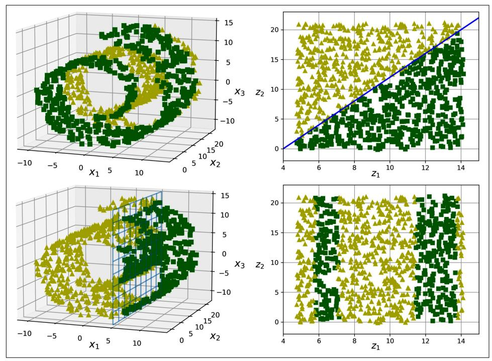

Figure 8-6. The decision boundary may not always be simpler with lower dimensions

## **PCA**

*Principal component analysis* (PCA) is by far the most popular dimensionality reduction algorithm. First it identifies the hyperplane that lies closest to the data, and then it projects the data onto it, just like in Figure 8-2.

### **Preserving the Variance**

Before you can project the training set onto a lower-dimensional hyperplane, you first need to choose the right hyperplane. For example, a simple 2D dataset is represented on the left in Figure 8-7, along with three different axes (i.e., 1D hyperplanes). On the right is the result of the projection of the dataset onto each of these axes. As you can see, the projection onto the solid line preserves the maximum variance (top), while the projection onto the dotted line preserves very little variance (bottom) and the projection onto the dashed line preserves an intermediate amount of variance (middle).

{271}------------------------------------------------

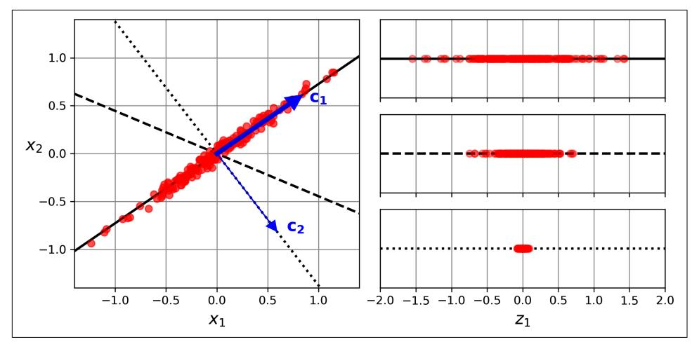

Figure 8-7. Selecting the subspace on which to project

It seems reasonable to select the axis that preserves the maximum amount of variance, as it will most likely lose less information than the other projections. Another way to justify this choice is that it is the axis that minimizes the mean squared distance between the original dataset and its projection onto that axis. This is the rather simple idea behind PCA.<sup>4</sup>

### **Principal Components**

PCA identifies the axis that accounts for the largest amount of variance in the training set. In Figure 8-7, it is the solid line. It also finds a second axis, orthogonal to the first one, that accounts for the largest amount of the remaining variance. In this 2D example there is no choice: it is the dotted line. If it were a higher-dimensional dataset, PCA would also find a third axis, orthogonal to both previous axes, and a fourth, a fifth, and so on—as many axes as the number of dimensions in the dataset.

The  $i<sup>th</sup>$  axis is called the  $i<sup>th</sup>$  principal component (PC) of the data. In Figure 8-7, the first PC is the axis on which vector  $c_1$  lies, and the second PC is the axis on which vector  $c<sub>2</sub>$  lies. In Figure 8-2 the first two PCs are on the projection plane, and the third PC is the axis orthogonal to that plane. After the projection, in Figure 8-3, the first PC corresponds to the  $z_1$  axis, and the second PC corresponds to the  $z_2$  axis.

<sup>4</sup> Karl Pearson, "On Lines and Planes of Closest Fit to Systems of Points in Space", The London, Edinburgh, and Dublin Philosophical Magazine and Journal of Science 2, no. 11 (1901): 559–572.

{272}------------------------------------------------


For each principal component, PCA finds a zero-centered unit vector pointing in the direction of the PC. Since two opposing unit vectors lie on the same axis, the direction of the unit vectors returned by PCA is not stable: if you perturb the training set slightly and run PCA again, the unit vectors may point in the opposite direction as the original vectors. However, they will generally still lie on the same axes. In some cases, a pair of unit vectors may even rotate or swap (if the variances along these two axes are very close), but the plane they define will generally remain the same.

So how can you find the principal components of a training set? Luckily, there is a standard matrix factorization technique called *singular value decomposition* (SVD) that can decompose the training set matrix  $X$  into the matrix multiplication of three matrices  $U \Sigma V^{\dagger}$ , where V contains the unit vectors that define all the principal components that you are looking for, as shown in Equation 8-1.

Equation 8-1. Principal components matrix

 $\mathbf{V} = \begin{pmatrix} | & | & & | \\ \mathbf{c}_1 & \mathbf{c}_2 & \cdots & \mathbf{c}_n \\ | & | & | & | \end{pmatrix}$ 

The following Python code uses NumPy's svd() function to obtain all the principal components of the 3D training set represented in Figure 8-2, then it extracts the two unit vectors that define the first two PCs:

```
import numpy as np
X = [\dots] # create a small 3D dataset
X centered = X - X. mean(axis=0)
U, s, Vt = np. linalg. svd(X centered)
c1 = Vt[0]c2 = Vt[1]
```


PCA assumes that the dataset is centered around the origin. As you will see, Scikit-Learn's PCA classes take care of centering the data for you. If you implement PCA yourself (as in the preceding example), or if you use other libraries, don't forget to center the data first.

### **Projecting Down to d Dimensions**

Once you have identified all the principal components, you can reduce the dimensionality of the dataset down to d dimensions by projecting it onto the hyperplane defined by the first d principal components. Selecting this hyperplane ensures that 

{273}------------------------------------------------

the projection will preserve as much variance as possible. For example, in Figure 8-2 the 3D dataset is projected down to the 2D plane defined by the first two principal components, preserving a large part of the dataset's variance. As a result, the 2D projection looks very much like the original 3D dataset.

To project the training set onto the hyperplane and obtain a reduced dataset  $X_{d\text{-proj}}$  of dimensionality  $d$ , compute the matrix multiplication of the training set matrix  $X$  by the matrix  $W_a$ , defined as the matrix containing the first d columns of V, as shown in Equation 8-2.

Equation 8-2. Projecting the training set down to d dimensions

 $\mathbf{X}_{d\text{-proj}} = \mathbf{X}\mathbf{W}_d$ 

The following Python code projects the training set onto the plane defined by the first two principal components:

 $W2 = Vt[:2].T$  $X2D = X$  centered @ W2

There you have it! You now know how to reduce the dimensionality of any dataset by projecting it down to any number of dimensions, while preserving as much variance as possible.

### **Using Scikit-Learn**

Scikit-Learn's PCA class uses SVD to implement PCA, just like we did earlier in this chapter. The following code applies PCA to reduce the dimensionality of the dataset down to two dimensions (note that it automatically takes care of centering the data):

```
from sklearn.decomposition import PCA
pca = PCA(n components=2)X2D = pca.fit_transform(X)
```

After fitting the PCA transformer to the dataset, its components\_attribute holds the transpose of  $W_d$ : it contains one row for each of the first d principal components.

### **Explained Variance Ratio**

Another useful piece of information is the explained variance ratio of each principal component, available via the explained\_variance\_ratio\_variable. The ratio indicates the proportion of the dataset's variance that lies along each principal component. For example, let's look at the explained variance ratios of the first two components of the 3D dataset represented in Figure 8-2:

```
>>> pca.explained_variance_ratio_
array([0.7578477, 0.15186921])
```

{274}------------------------------------------------

This output tells us that about 76% of the dataset's variance lies along the first PC, and about 15% lies along the second PC. This leaves about 9% for the third PC, so it is reasonable to assume that the third PC probably carries little information.

### **Choosing the Right Number of Dimensions**

Instead of arbitrarily choosing the number of dimensions to reduce down to, it is simpler to choose the number of dimensions that add up to a sufficiently large portion of the variance—say, 95% (An exception to this rule, of course, is if you are reducing dimensionality for data visualization, in which case you will want to reduce the dimensionality down to 2 or 3).

The following code loads and splits the MNIST dataset (introduced in Chapter 3) and performs PCA without reducing dimensionality, then computes the minimum number of dimensions required to preserve 95% of the training set's variance:

```
from sklearn.datasets import fetch openml
mnist = fetch_openml('mnist_784', as_frame=False)
X train, y train = mnist.data[:60 000], mnist.target[:60 000]
X test, y test = mnist.data[60 000:], mnist.train[60 000:]pca = PCA()pca.fit(X_train)
cumsum = np.cumsum(pca.explained_variance_ratio_)
d = np.arange(cumsum >= 0.95) + 1 # d equals 154
```

You could then set n components=d and run PCA again, but there's a better option. Instead of specifying the number of principal components you want to preserve, you can set n\_components to be a float between 0.0 and 1.0, indicating the ratio of variance you wish to preserve:

```
pca = PCA(n components=0.95)X_{reduced} = pca.fit_{transform}(X_{train})
```

The actual number of components is determined during training, and it is stored in the n\_components\_attribute:

```
>>> pca.n components
154
```

Yet another option is to plot the explained variance as a function of the number of dimensions (simply plot cumsum; see Figure 8-8). There will usually be an elbow in the curve, where the explained variance stops growing fast. In this case, you can see that reducing the dimensionality down to about 100 dimensions wouldn't lose too much explained variance.

{275}------------------------------------------------


Figure 8-8. Explained variance as a function of the number of dimensions

Lastly, if you are using dimensionality reduction as a preprocessing step for a supervised learning task (e.g., classification), then you can tune the number of dimensions as you would any other hyperparameter (see Chapter 2). For example, the following code example creates a two-step pipeline, first reducing dimensionality using PCA, then classifying using a random forest. Next, it uses RandomizedSearchCV to find a good combination of hyperparameters for both PCA and the random forest classifier. This example does a quick search, tuning only 2 hyperparameters, training on just 1,000 instances, and running for just 10 iterations, but feel free to do a more thorough search if you have the time:

```
from sklearn.ensemble import RandomForestClassifier
from sklearn.model selection import RandomizedSearchCV
from sklearn.pipeline import make_pipeline
clf = make pipeline(PCA(random state=42),
                    RandomForestClassifier(random state=42))
param distrib = \{"pca \sqrt{n} components": np.arange(10, 80),
    "randomforestclassifier__n_estimators": np.arange(50, 500)
Y
rnd search = RandomizedSearchCV(clf, param distrib, n iter=10, cv=3,random state=42)
rnd_search.fit(X_train[:1000], y_train[:1000])
```

Let's look at the best hyperparameters found:

```
>>> print(rnd search.best params)
{'randomforestclassifier__n_estimators': 465, 'pca__n_components': 23}
```

It's interesting to note how low the optimal number of components is: we reduced a 784-dimensional dataset to just 23 dimensions! This is tied to the fact that we used a random forest, which is a pretty powerful model. If we used a linear model instead, 

{276}------------------------------------------------

such as an SGDClassifier, the search would find that we need to preserve more dimensions (about 70).

### **PCA for Compression**

After dimensionality reduction, the training set takes up much less space. For example, after applying PCA to the MNIST dataset while preserving 95% of its variance, we are left with 154 features, instead of the original 784 features. So the dataset is now less than 20% of its original size, and we only lost 5% of its variance! This is a reasonable compression ratio, and it's easy to see how such a size reduction would speed up a classification algorithm tremendously.

It is also possible to decompress the reduced dataset back to 784 dimensions by applying the inverse transformation of the PCA projection. This won't give you back the original data, since the projection lost a bit of information (within the 5% variance that was dropped), but it will likely be close to the original data. The mean squared distance between the original data and the reconstructed data (compressed and then decompressed) is called the *reconstruction error*.

The inverse\_transform() method lets us decompress the reduced MNIST dataset back to 784 dimensions:

```
X_recovered = pca.inverse_transform(X_reduced)
```

Figure 8-9 shows a few digits from the original training set (on the left), and the corresponding digits after compression and decompression. You can see that there is a slight image quality loss, but the digits are still mostly intact.

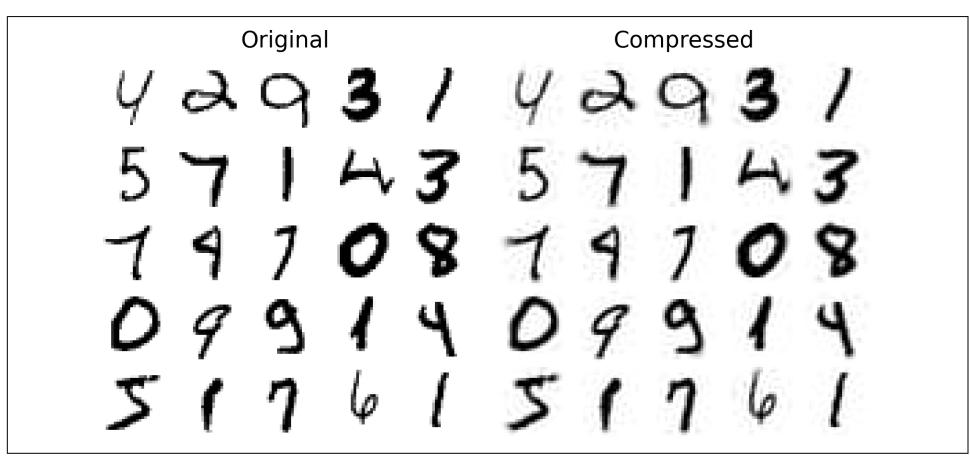

Figure 8-9. MNIST compression that preserves 95% of the variance

{277}------------------------------------------------

The equation for the inverse transformation is shown in Equation 8-3.

Equation 8-3. PCA inverse transformation, back to the original number of dimensions

 $\mathbf{X}_{\text{recovered}} = \mathbf{X}_{d\text{-proj}} \mathbf{W}_d^{\mathsf{T}}$ 

### **Randomized PCA**

If you set the svd solver hyperparameter to "randomized", Scikit-Learn uses a stochastic algorithm called *randomized PCA* that quickly finds an approximation of the first *d* principal components. Its computational complexity is  $O(m \times d^2) + O(d^3)$ , instead of  $O(m \times n^2) + O(n^3)$  for the full SVD approach, so it is dramatically faster than full SVD when  $d$  is much smaller than  $n$ :

```
rnd pca = PCA(n components=154, svd solver="randomized", random state=42)
X_reduced = rnd_pca.fit_transform(X_train)
```


By default, svd solver is actually set to "auto": Scikit-Learn automatically uses the randomized PCA algorithm if  $max(m, n)$ 500 and n\_components is an integer smaller than 80% of min( $m$ ,  $n$ ), or else it uses the full SVD approach. So the preceding code would use the randomized PCA algorithm even if you removed the svd\_solver="randomized" argument, since  $154 < 0.8 \times 784$ . If you want to force Scikit-Learn to use full SVD for a slightly more precise result, you can set the svd\_solver hyperparameter to "full".

### **Incremental PCA**

One problem with the preceding implementations of PCA is that they require the whole training set to fit in memory in order for the algorithm to run. Fortunately, *incremental PCA* (IPCA) algorithms have been developed that allow you to split the training set into mini-batches and feed these in one mini-batch at a time. This is useful for large training sets and for applying PCA online (i.e., on the fly, as new instances arrive).

The following code splits the MNIST training set into 100 mini-batches (using Num-Py's array\_split() function) and feeds them to Scikit-Learn's IncrementalPCA class<sup>5</sup> to reduce the dimensionality of the MNIST dataset down to 154 dimensions, just like

<sup>5</sup> Scikit-Learn uses the algorithm described in David A. Ross et al., "Incremental Learning for Robust Visual Tracking", International Journal of Computer Vision 77, no. 1-3 (2008): 125-141.

{278}------------------------------------------------

before. Note that you must call the partial fit() method with each mini-batch, rather than the fit() method with the whole training set:

```
from sklearn.decomposition import IncrementalPCA
n batches = 100
inc_pca = IncrementalPCA(njcomplex=154)for X_batch in np.array_split(X_train, n_batches):
    inc_pca.partial_fit(X_batch)
X reduced = inc pca.transform(X train)
```

Alternatively, you can use NumPy's memmap class, which allows you to manipulate a large array stored in a binary file on disk as if it were entirely in memory; the class loads only the data it needs in memory, when it needs it. To demonstrate this, let's first create a memory-mapped (memmap) file and copy the MNIST training set to it, then call flush() to ensure that any data still in the cache gets saved to disk. In real life, X\_train would typically not fit in memory, so you would load it chunk by chunk and save each chunk to the right part of the memmap array:

```
filename = "my must.mmap"X mmap = np.memmap(filename, dtype='float32', mode='write', shape=X train.shape)
X<sup>m</sup>map[:] = X<sub>_</sub>train # could be a loop instead, saving the data chunk by chunk
X_mmap.flush()
```

Next, we can load the memmap file and use it like a regular NumPy array. Let's use the IncrementalPCA class to reduce its dimensionality. Since this algorithm uses only a small part of the array at any given time, memory usage remains under control. This makes it possible to call the usual fit() method instead of partial\_fit(), which is quite convenient:

```
X mmap = np.memmap(filename, dtype="float32", mode="readonly").reshape(-1, 784)
batch size = X mmap.shape[0] // n batches
inc_pca = IncrementalPCA(n_components=154, batch_size=batch_size)
inc pca.fit(X mmap)
```


Only the raw binary data is saved to disk, so you need to specify the data type and shape of the array when you load it. If you omit the shape, np. memmap() returns a 1D array.

For very high-dimensional datasets, PCA can be too slow. As you saw earlier, even if you use randomized PCA its computational complexity is still  $O(m \times d^2) + O(d^3)$ , so the target number of dimensions  $d$  must not be too large. If you are dealing with a dataset with tens of thousands of features or more (e.g., images), then training may become much too slow: in this case, you should consider using random projection instead.

{279}------------------------------------------------

## **Random Projection**

As its name suggests, the random projection algorithm projects the data to a lowerdimensional space using a random linear projection. This may sound crazy, but it turns out that such a random projection is actually very likely to preserve distances fairly well, as was demonstrated mathematically by William B. Johnson and Joram Lindenstrauss in a famous lemma. So, two similar instances will remain similar after the projection, and two very different instances will remain very different.

Obviously, the more dimensions you drop, the more information is lost, and the more distances get distorted. So how can you choose the optimal number of dimensions? Well, Johnson and Lindenstrauss came up with an equation that determines the minimum number of dimensions to preserve in order to ensure—with high probability—that distances won't change by more than a given tolerance. For example, if you have a dataset containing  $m = 5,000$  instances with  $n = 20,000$  features each, and you don't want the squared distance between any two instances to change by more than  $\varepsilon = 10\%$ , then you should project the data down to d dimensions, with  $d \ge 4 \log(m)$  / (½  $\varepsilon^2$  - ½  $\varepsilon^3$ ), which is 7,300 dimensions. That's quite a significant dimensionality reduction! Notice that the equation does not use  $n$ , it only relies on m and  $\varepsilon$ . This equation is implemented by the johnson\_lindenstrauss\_min\_dim() function:

```
>>> from sklearn.random_projection import johnson_lindenstrauss_min_dim
\Rightarrow m, \epsilon = 5000, 0.1
\Rightarrow d = johnson lindenstrauss min dim(m, eps=\epsilon)
h eee
7300
```

Now we can just generate a random matrix **P** of shape  $[d, n]$ , where each item is sampled randomly from a Gaussian distribution with mean 0 and variance  $1/d$ , and use it to project a dataset from *n* dimensions down to d:

```
n = 20000np.random.seed(42)
P = np.random.random(d, n) / np.sqrt(d) # std dev = square root of variance
X = np.random.randn(m, n) # generate a fake dataset
X_{reduced} = X @ P.T
```

That's all there is to it! It's simple and efficient, and no training is required: the only thing the algorithm needs to create the random matrix is the dataset's shape. The data itself is not used at all.

Scikit-Learn offers a Gaussian Random Projection class to do exactly what we just did: when you call its fit() method, it uses johnson\_lindenstrauss\_min\_dim() to

<sup>6</sup>  $\varepsilon$  is the Greek letter epsilon, often used for tiny values.

{280}------------------------------------------------

determine the output dimensionality, then it generates a random matrix, which it stores in the components attribute. Then when you call transform(), it uses this matrix to perform the projection. When creating the transformer, you can set eps if you want to tweak  $\varepsilon$  (it defaults to 0.1), and n components if you want to force a specific target dimensionality d. The following code example gives the same result as the preceding code (you can also verify that gaussian rnd proj.components is equal to P):

from sklearn.random\_projection import GaussianRandomProjection

```
gaussian \text{rnd} proj = GaussianRandomProjection(eps=\epsilon, random state=42)
X_reduced = gaussian_rnd_proj.fit_transform(X) # same result as above
```

Scikit-Learn also provides a second random projection transformer, known as SparseRandomProjection. It determines the target dimensionality in the same way, generates a random matrix of the same shape, and performs the projection identically. The main difference is that the random matrix is sparse. This means it uses much less memory: about 25 MB instead of almost 1.2 GB in the preceding example! And it's also much faster, both to generate the random matrix and to reduce dimensionality: about 50% faster in this case. Moreover, if the input is sparse, the transformation keeps it sparse (unless you set dense output=True). Lastly, it enjoys the same distance-preserving property as the previous approach, and the quality of the dimensionality reduction is comparable. In short, it's usually preferable to use this transformer instead of the first one, especially for large or sparse datasets.

The ratio  $r$  of nonzero items in the sparse random matrix is called its *density*. By default, it is equal to  $1/\sqrt{n}$ . With 20,000 features, this means that only 1 in ~141 cells in the random matrix is nonzero: that's quite sparse! You can set the density hyperparameter to another value if you prefer. Each cell in the sparse random matrix has a probability r of being nonzero, and each nonzero value is either  $-v$  or  $+v$  (both equally likely), where  $v = 1/\sqrt{dr}$ .

If you want to perform the inverse transform, you first need to compute the pseudoinverse of the components matrix using SciPy's pinv() function, then multiply the reduced data by the transpose of the pseudo-inverse:

```
components pinv = np.linalq.pinv(qaussian rnd proj.components)
X_recovered = X_reduced @ components_pinv.T
```


Computing the pseudo-inverse may take a very long time if the components matrix is large, as the computational complexity of pinv() is  $O(dn^2)$  if  $d < n$ , or  $O(nd^2)$  otherwise.

{281}------------------------------------------------

In summary, random projection is a simple, fast, memory-efficient, and surprisingly powerful dimensionality reduction algorithm that you should keep in mind, especially when you deal with high-dimensional datasets.


Random projection is not always used to reduce the dimensionality of large datasets. For example, a 2017 paper<sup>7</sup> by Sanjoy Dasgupta et al. showed that the brain of a fruit fly implements an analog of random projection to map dense low-dimensional olfactory inputs to sparse high-dimensional binary outputs: for each odor, only a small fraction of the output neurons get activated, but similar odors activate many of the same neurons. This is similar to a well-known algorithm called locality sensitive hashing (LSH), which is typically used in search engines to group similar documents.

## LLE

Locally linear embedding (LLE)<sup>8</sup> is a nonlinear dimensionality reduction (NLDR) technique. It is a manifold learning technique that does not rely on projections, unlike PCA and random projection. In a nutshell, LLE works by first measuring how each training instance linearly relates to its nearest neighbors, and then looking for a low-dimensional representation of the training set where these local relationships are best preserved (more details shortly). This approach makes it particularly good at unrolling twisted manifolds, especially when there is not too much noise.

The following code makes a Swiss roll, then uses Scikit-Learn's LocallyLinearEmbed ding class to unroll it:

```
from sklearn.datasets import make_swiss_roll
from sklearn.manifold import LocallyLinearEmbedding
X_swiss, t = make_swiss_roll(n_samples=1000, noise=0.2, random_state=42)
lle = LocallyLinearEmbedding(n components=2, n neighbors=10, random state=42)X unrolled = lle.fit transform(X swiss)
```

The variable t is a 1D NumPy array containing the position of each instance along the rolled axis of the Swiss roll. We don't use it in this example, but it can be used as a target for a nonlinear regression task.

The resulting 2D dataset is shown in Figure 8-10. As you can see, the Swiss roll is completely unrolled, and the distances between instances are locally well preserved.

<sup>7</sup> Sanjoy Dasgupta et al., "A neural algorithm for a fundamental computing problem", Science 358, no. 6364  $(2017): 793 - 796.$ 

<sup>8</sup> Sam T. Roweis and Lawrence K. Saul, "Nonlinear Dimensionality Reduction by Locally Linear Embedding", Science 290, no. 5500 (2000): 2323-2326.

{282}------------------------------------------------

However, distances are not preserved on a larger scale: the unrolled Swiss roll should be a rectangle, not this kind of stretched and twisted band. Nevertheless, LLE did a pretty good job of modeling the manifold.


Figure 8-10. Unrolled Swiss roll using LLE

Here's how LLE works: for each training instance  $\mathbf{x}^{(i)}$ , the algorithm identifies its k-nearest neighbors (in the preceding code  $k = 10$ ), then tries to reconstruct  $\mathbf{x}^{(i)}$  as a linear function of these neighbors. More specifically, it tries to find the weights  $w_{ij}$ such that the squared distance between  $\mathbf{x}^{(i)}$  and  $\sum_{i=1}^{m} w_{i} \cdot \mathbf{x}^{(j)}$  is as small as possible, assuming  $w_{i,j} = 0$  if  $\mathbf{x}^{(j)}$  is not one of the k-nearest neighbors of  $\mathbf{x}^{(i)}$ . Thus the first step of LLE is the constrained optimization problem described in Equation 8-4, where W is the weight matrix containing all the weights  $w_{i,i}$ . The second constraint simply normalizes the weights for each training instance  $\mathbf{x}^{(i)}$ .

Equation 8-4. LLE step 1: linearly modeling local relationships

$$
\widehat{\mathbf{W}} = \underset{\mathbf{W}}{\text{argmin}} \sum_{i=1}^{m} \left( \mathbf{x}^{(i)} - \sum_{j=1}^{m} w_{i,j} \mathbf{x}^{(j)} \right)^2
$$
  
subject to 
$$
\begin{cases} w_{i,j} = 0 & \text{if } \mathbf{x}^{(j)} \text{ is not one of the } k \text{ n.n. of } \mathbf{x}^{(i)} \\ \sum_{j=1}^{m} w_{i,j} = 1 & \text{for } i = 1, 2, \cdots, m \end{cases}
$$

After this step, the weight matrix  $\widehat{W}$  (containing the weights  $\widehat{w}_{i,j}$ ) encodes the local linear relationships between the training instances. The second step is to map the training instances into a d-dimensional space (where  $d < n$ ) while preserving these 

{283}------------------------------------------------

local relationships as much as possible. If  $z^{(i)}$  is the image of  $x^{(i)}$  in this *d*-dimensional space, then we want the squared distance between  $\mathbf{z}^{(i)}$  and  $\sum_{i=1}^{m} \hat{w}_{i}$   $\hat{z}^{(j)}$  to be as small as possible. This idea leads to the unconstrained optimization problem described in Equation 8-5. It looks very similar to the first step, but instead of keeping the instances fixed and finding the optimal weights, we are doing the reverse: keeping the weights fixed and finding the optimal position of the instances' images in the low-dimensional space. Note that **Z** is the matrix containing all  $z^{(i)}$ .

Equation 8-5. LLE step 2: reducing dimensionality while preserving relationships

$$
\widehat{\mathbf{Z}} = \underset{\mathbf{Z}}{\text{argmin}} \sum_{i=1}^{m} \left( \mathbf{z}^{(i)} - \sum_{j=1}^{m} \widehat{w}_{i,j} \mathbf{z}^{(j)} \right)^{2}
$$

Scikit-Learn's LLE implementation has the following computational complexity:  $O(m \log(m) n \log(k))$  for finding the k-nearest neighbors,  $O(mnk^3)$  for optimizing the weights, and  $O(dm^2)$  for constructing the low-dimensional representations. Unfortunately, the  $m^2$  in the last term makes this algorithm scale poorly to very large datasets.

As you can see, LLE is quite different from the projection techniques, and it's significantly more complex, but it can also construct much better low-dimensional representations, especially if the data is nonlinear.

### **Other Dimensionality Reduction Techniques**

Before we conclude this chapter, let's take a quick look at a few other popular dimensionality reduction techniques available in Scikit-Learn:

```
sklearn.manifold.MDS
```

Multidimensional scaling (MDS) reduces dimensionality while trying to preserve the distances between the instances. Random projection does that for highdimensional data, but it doesn't work well on low-dimensional data.

#### sklearn.manifold.Isomap

*Isomap* creates a graph by connecting each instance to its nearest neighbors, then reduces dimensionality while trying to preserve the geodesic distances between the instances. The geodesic distance between two nodes in a graph is the number of nodes on the shortest path between these nodes.

```
sklearn.manifold.TSNE
```

*t-distributed stochastic neighbor embedding* (*t-SNE*) reduces dimensionality while trying to keep similar instances close and dissimilar instances apart. It is mostly used for visualization, in particular to visualize clusters of instances in highdimensional space. For example, in the exercises at the end of this chapter you will use t-SNE to visualize a 2D map of the MNIST images.

{284}------------------------------------------------

#### sklearn.discriminant analysis.LinearDiscriminantAnalysis

*Linear discriminant analysis* (LDA) is a linear classification algorithm that, during training, learns the most discriminative axes between the classes. These axes can then be used to define a hyperplane onto which to project the data. The benefit of this approach is that the projection will keep classes as far apart as possible, so LDA is a good technique to reduce dimensionality before running another classification algorithm (unless LDA alone is sufficient).

Figure 8-11 shows the results of MDS, Isomap, and t-SNE on the Swiss roll. MDS manages to flatten the Swiss roll without losing its global curvature, while Isomap drops it entirely. Depending on the downstream task, preserving the large-scale structure may be good or bad. t-SNE does a reasonable job of flattening the Swiss roll, preserving a bit of curvature, and it also amplifies clusters, tearing the roll apart. Again, this might be good or bad, depending on the downstream task.

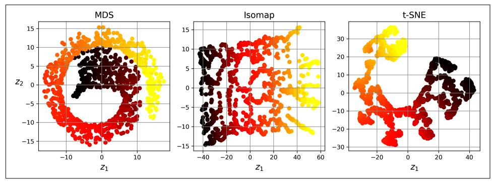

Figure 8-11. Using various techniques to reduce the Swiss roll to 2D

### **Exercises**

- 1. What are the main motivations for reducing a dataset's dimensionality? What are the main drawbacks?
- 2. What is the curse of dimensionality?
- 3. Once a dataset's dimensionality has been reduced, is it possible to reverse the operation? If so, how? If not, why?
- 4. Can PCA be used to reduce the dimensionality of a highly nonlinear dataset?
- 5. Suppose you perform PCA on a 1,000-dimensional dataset, setting the explained variance ratio to 95%. How many dimensions will the resulting dataset have?
- 6. In what cases would you use regular PCA, incremental PCA, randomized PCA, or random projection?
- 7. How can you evaluate the performance of a dimensionality reduction algorithm on your dataset?

{285}------------------------------------------------

- 8. Does it make any sense to chain two different dimensionality reduction algorithms?
- 9. Load the MNIST dataset (introduced in Chapter 3) and split it into a training set and a test set (take the first 60,000 instances for training, and the remaining 10,000 for testing). Train a random forest classifier on the dataset and time how long it takes, then evaluate the resulting model on the test set. Next, use PCA to reduce the dataset's dimensionality, with an explained variance ratio of 95%. Train a new random forest classifier on the reduced dataset and see how long it takes. Was training much faster? Next, evaluate the classifier on the test set. How does it compare to the previous classifier? Try again with an SGDClassifier. How much does PCA help now?
- 10. Use t-SNE to reduce the first 5,000 images of the MNIST dataset down to 2 dimensions and plot the result using Matplotlib. You can use a scatterplot using 10 different colors to represent each image's target class. Alternatively, you can replace each dot in the scatterplot with the corresponding instance's class (a digit from 0 to 9), or even plot scaled-down versions of the digit images themselves (if you plot all digits the visualization will be too cluttered, so you should either draw a random sample or plot an instance only if no other instance has already been plotted at a close distance). You should get a nice visualization with wellseparated clusters of digits. Try using other dimensionality reduction algorithms, such as PCA, LLE, or MDS, and compare the resulting visualizations.

Solutions to these exercises are available at the end of this chapter's notebook, at https://homl.info/colab3.

{286}------------------------------------------------

## **CHAPTER 9 Unsupervised Learning Techniques**

Although most of the applications of machine learning today are based on supervised learning (and as a result, this is where most of the investments go to), the vast majority of the available data is unlabeled: we have the input features X, but we do not have the labels y. The computer scientist Yann LeCun famously said that "if intelligence was a cake, unsupervised learning would be the cake, supervised learning would be the icing on the cake, and reinforcement learning would be the cherry on the cake." In other words, there is a huge potential in unsupervised learning that we have only barely started to sink our teeth into.

Say you want to create a system that will take a few pictures of each item on a manufacturing production line and detect which items are defective. You can fairly easily create a system that will take pictures automatically, and this might give you thousands of pictures every day. You can then build a reasonably large dataset in just a few weeks. But wait, there are no labels! If you want to train a regular binary classifier that will predict whether an item is defective or not, you will need to label every single picture as "defective" or "normal". This will generally require human experts to sit down and manually go through all the pictures. This is a long, costly, and tedious task, so it will usually only be done on a small subset of the available pictures. As a result, the labeled dataset will be quite small, and the classifier's performance will be disappointing. Moreover, every time the company makes any change to its products, the whole process will need to be started over from scratch. Wouldn't it be great if the algorithm could just exploit the unlabeled data without needing humans to label every picture? Enter unsupervised learning.

{287}------------------------------------------------

In Chapter 8 we looked at the most common unsupervised learning task: dimensionality reduction. In this chapter we will look at a few more unsupervised tasks:

Clustering

The goal is to group similar instances together into *clusters*. Clustering is a great tool for data analysis, customer segmentation, recommender systems, search engines, image segmentation, semi-supervised learning, dimensionality reduction, and more.

Anomaly detection (also called outlier detection)

The objective is to learn what "normal" data looks like, and then use that to detect abnormal instances. These instances are called *anomalies*, or *outliers*, while the normal instances are called *inliers*. Anomaly detection is useful in a wide variety of applications, such as fraud detection, detecting defective products in manufacturing, identifying new trends in time series, or removing outliers from a dataset before training another model, which can significantly improve the performance of the resulting model.

Density estimation

This is the task of estimating the *probability density function* (PDF) of the random process that generated the dataset. Density estimation is commonly used for anomaly detection: instances located in very low-density regions are likely to be anomalies. It is also useful for data analysis and visualization.

Ready for some cake? We will start with two clustering algorithms, k-means and DBSCAN, then we'll discuss Gaussian mixture models and see how they can be used for density estimation, clustering, and anomaly detection.

## **Clustering Algorithms: k-means and DBSCAN**

As you enjoy a hike in the mountains, you stumble upon a plant you have never seen before. You look around and you notice a few more. They are not identical, yet they are sufficiently similar for you to know that they most likely belong to the same species (or at least the same genus). You may need a botanist to tell you what species that is, but you certainly don't need an expert to identify groups of similar-looking objects. This is called *clustering*: it is the task of identifying similar instances and assigning them to *clusters*, or groups of similar instances.

Just like in classification, each instance gets assigned to a group. However, unlike classification, clustering is an unsupervised task. Consider Figure 9-1: on the left is the iris dataset (introduced in Chapter 4), where each instance's species (i.e., its class) is represented with a different marker. It is a labeled dataset, for which classification algorithms such as logistic regression, SVMs, or random forest classifiers are well suited. On the right is the same dataset, but without the labels, so you cannot use a classification algorithm anymore. This is where clustering algorithms step in: many of 

{288}------------------------------------------------

them can easily detect the lower-left cluster. It is also quite easy to see with our own eyes, but it is not so obvious that the upper-right cluster is composed of two distinct subclusters. That said, the dataset has two additional features (sepal length and width) that are not represented here, and clustering algorithms can make good use of all features, so in fact they identify the three clusters fairly well (e.g., using a Gaussian mixture model, only 5 instances out of 150 are assigned to the wrong cluster).


Figure 9-1. Classification (left) versus clustering (right)

Clustering is used in a wide variety of applications, including:

#### Customer segmentation

You can cluster your customers based on their purchases and their activity on your website. This is useful to understand who your customers are and what they need, so you can adapt your products and marketing campaigns to each segment. For example, customer segmentation can be useful in *recommender systems* to suggest content that other users in the same cluster enjoyed.

#### Data analysis

When you analyze a new dataset, it can be helpful to run a clustering algorithm, and then analyze each cluster separately.

#### Dimensionality reduction

Once a dataset has been clustered, it is usually possible to measure each instance's *affinity* with each cluster; affinity is any measure of how well an instance fits into a cluster. Each instance's feature vector **x** can then be replaced with the vector of its cluster affinities. If there are  $k$  clusters, then this vector is  $k$ -dimensional. The new vector is typically much lower-dimensional than the original feature vector, but it can preserve enough information for further processing.

{289}------------------------------------------------

Feature engineering

The cluster affinities can often be useful as extra features. For example, we used k-means in Chapter 2 to add geographic cluster affinity features to the California housing dataset, and they helped us get better performance.

#### Anomaly detection (also called outlier detection)

Any instance that has a low affinity to all the clusters is likely to be an anomaly. For example, if you have clustered the users of your website based on their behavior, you can detect users with unusual behavior, such as an unusual number of requests per second.

Semi-supervised learning

If you only have a few labels, you could perform clustering and propagate the labels to all the instances in the same cluster. This technique can greatly increase the number of labels available for a subsequent supervised learning algorithm, and thus improve its performance.

Search engines

Some search engines let you search for images that are similar to a reference image. To build such a system, you would first apply a clustering algorithm to all the images in your database; similar images would end up in the same cluster. Then when a user provides a reference image, all you'd need to do is use the trained clustering model to find this image's cluster, and you could then simply return all the images from this cluster.

#### Image segmentation

By clustering pixels according to their color, then replacing each pixel's color with the mean color of its cluster, it is possible to considerably reduce the number of different colors in an image. Image segmentation is used in many object detection and tracking systems, as it makes it easier to detect the contour of each object.

There is no universal definition of what a cluster is: it really depends on the context, and different algorithms will capture different kinds of clusters. Some algorithms look for instances centered around a particular point, called a *centroid*. Others look for continuous regions of densely packed instances: these clusters can take on any shape. Some algorithms are hierarchical, looking for clusters of clusters. And the list goes on.

In this section, we will look at two popular clustering algorithms, k-means and DBSCAN, and explore some of their applications, such as nonlinear dimensionality reduction, semi-supervised learning, and anomaly detection.

{290}------------------------------------------------

### k-means

Consider the unlabeled dataset represented in Figure 9-2: you can clearly see five blobs of instances. The  $k$ -means algorithm is a simple algorithm capable of clustering this kind of dataset very quickly and efficiently, often in just a few iterations. It was proposed by Stuart Lloyd at Bell Labs in 1957 as a technique for pulse-code modulation, but it was only published outside of the company in 1982.<sup>1</sup> In 1965, Edward W. Forgy had published virtually the same algorithm, so  $k$ -means is sometimes referred to as the Lloyd-Forgy algorithm.


Figure 9-2. An unlabeled dataset composed of five blobs of instances

Let's train a k-means clusterer on this dataset. It will try to find each blob's center and assign each instance to the closest blob:

```
from sklearn.cluster import KMeans
from sklearn.datasets import make_blobs
X, y = make_blobs([...]) # make the blobs: y contains the cluster IDs, but we
                          # will not use them; that's what we want to predict
k = 5kmeans = KMeans(n_clusters=k, random_state=42)
y pred = kmeans.fit predict(X)
```

Note that you have to specify the number of clusters  $k$  that the algorithm must find. In this example, it is pretty obvious from looking at the data that  $k$  should be set to 5, but in general it is not that easy. We will discuss this shortly.

Each instance will be assigned to one of the five clusters. In the context of clustering, an instance's label is the index of the cluster to which the algorithm assigns this instance; this is not to be confused with the class labels in classification, which are used as targets (remember that clustering is an unsupervised learning task). The

<sup>1</sup> Stuart P. Lloyd, "Least Squares Quantization in PCM", IEEE Transactions on Information Theory 28, no. 2  $(1982): 129-137.$ 

{291}------------------------------------------------

KMeans instance preserves the predicted labels of the instances it was trained on, available via the labels instance variable:

```
>>> y_pred
array([4, 0, 1, ..., 2, 1, 0], dtype=int32)>>> y_pred is kmeans.labels_
True
```

We can also take a look at the five centroids that the algorithm found:

```
>>> kmeans.cluster centers
array([[-2.80389616, 1.80117999],
      [0.20876306, 2.25551336],[-2.79290307, 2.79641063],[-1.46679593, 2.28585348],[-2.80037642, 1.30082566]]
```

You can easily assign new instances to the cluster whose centroid is closest:

```
>>> import numpy as np
>>> X_new = np.array([(0, 2], [3, 2], [-3, 3], [-3, 2.5]])>>> kmeans.predict(X_new)
array([1, 1, 2, 2], dtype=int32)
```

If you plot the cluster's decision boundaries, you get a Voronoi tessellation: see Figure 9-3, where each centroid is represented with an X.


Figure 9-3. k-means decision boundaries (Voronoi tessellation)

The vast majority of the instances were clearly assigned to the appropriate cluster, but a few instances were probably mislabeled, especially near the boundary between the top-left cluster and the central cluster. Indeed, the k-means algorithm does not behave very well when the blobs have very different diameters because all it cares about when assigning an instance to a cluster is the distance to the centroid.

Instead of assigning each instance to a single cluster, which is called *hard clustering*, it can be useful to give each instance a score per cluster, which is called *soft clustering*. The score can be the distance between the instance and the centroid or a similarity 

{292}------------------------------------------------

score (or affinity), such as the Gaussian radial basis function we used in Chapter 2. In the KMeans class, the transform() method measures the distance from each instance to every centroid:

```
>>> kmeans.transform(X_new).round(2)
array([[2.81, 0.33, 2.9, 1.49, 2.89],[5.81, 2.8, 5.85, 4.48, 5.84],[1.21, 3.29, 0.29, 1.69, 1.71],[0.73, 3.22, 0.36, 1.55, 1.22]]
```

In this example, the first instance in X new is located at a distance of about 2.81 from the first centroid, 0.33 from the second centroid, 2.90 from the third centroid, 1.49 from the fourth centroid, and 2.89 from the fifth centroid. If you have a highdimensional dataset and you transform it this way, you end up with a k-dimensional dataset: this transformation can be a very efficient nonlinear dimensionality reduction technique. Alternatively, you can use these distances as extra features to train another model, as in Chapter 2.

#### The k-means algorithm

So, how does the algorithm work? Well, suppose you were given the centroids. You could easily label all the instances in the dataset by assigning each of them to the cluster whose centroid is closest. Conversely, if you were given all the instance labels, you could easily locate each cluster's centroid by computing the mean of the instances in that cluster. But you are given neither the labels nor the centroids, so how can you proceed? Start by placing the centroids randomly (e.g., by picking  $k$  instances at random from the dataset and using their locations as centroids). Then label the instances, update the centroids, label the instances, update the centroids, and so on until the centroids stop moving. The algorithm is guaranteed to converge in a finite number of steps (usually quite small). That's because the mean squared distance between the instances and their closest centroids can only go down at each step, and since it cannot be negative, it's guaranteed to converge.

You can see the algorithm in action in Figure 9-4: the centroids are initialized randomly (top left), then the instances are labeled (top right), then the centroids are updated (center left), the instances are relabeled (center right), and so on. As you can see, in just three iterations the algorithm has reached a clustering that seems close to optimal.


The computational complexity of the algorithm is generally linear with regard to the number of instances  $m$ , the number of clusters  $k$ , and the number of dimensions  $n$ . However, this is only true when the data has a clustering structure. If it does not, then in the worst-case scenario the complexity can increase exponentially with the number of instances. In practice, this rarely happens, and k-means is generally one of the fastest clustering algorithms.

{293}------------------------------------------------

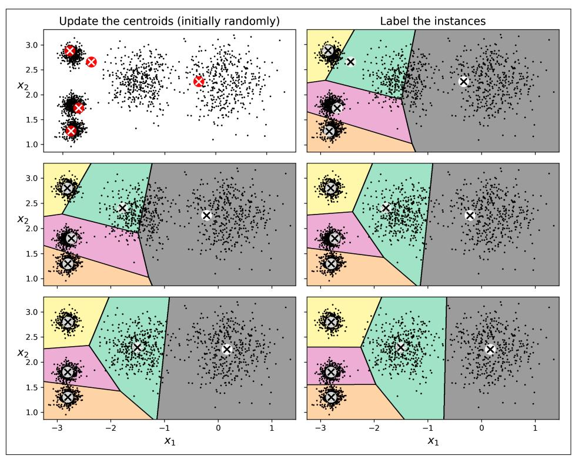

Figure 9-4. The k-means algorithm

Although the algorithm is guaranteed to converge, it may not converge to the right solution (i.e., it may converge to a local optimum): whether it does or not depends on the centroid initialization. Figure 9-5 shows two suboptimal solutions that the algorithm can converge to if you are not lucky with the random initialization step.

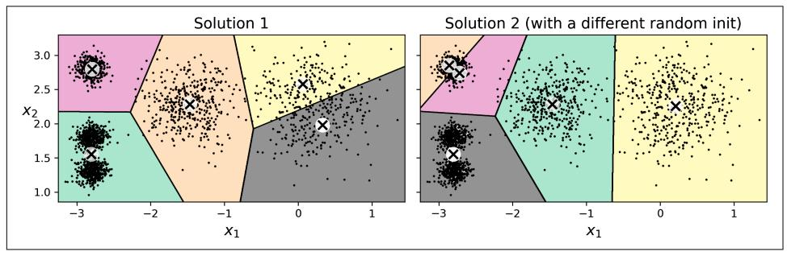

Figure 9-5. Suboptimal solutions due to unlucky centroid initializations

Let's take a look at a few ways you can mitigate this risk by improving the centroid initialization.

{294}------------------------------------------------

#### **Centroid initialization methods**

If you happen to know approximately where the centroids should be (e.g., if you ran another clustering algorithm earlier), then you can set the init hyperparameter to a NumPy array containing the list of centroids, and set n\_init to 1:

```
good_init = np.array([[-3, 3], [-3, 2], [-3, 1], [-1, 2], [0, 2]])
kmeans = KMeans(n_clusters=5, init=good_init, n_init=1, random_state=42)
kmeans.fit(X)
```

Another solution is to run the algorithm multiple times with different random initializations and keep the best solution. The number of random initializations is controlled by the n\_init hyperparameter: by default it is equal to 10, which means that the whole algorithm described earlier runs 10 times when you call fit(), and Scikit-Learn keeps the best solution. But how exactly does it know which solution is the best? It uses a performance metric! That metric is called the model's *inertia*, which is the sum of the squared distances between the instances and their closest centroids. It is roughly equal to 219.4 for the model on the left in Figure 9-5, 258.6 for the model on the right in Figure 9-5, and only 211.6 for the model in Figure 9-3. The KMeans class runs the algorithm n\_init times and keeps the model with the lowest inertia. In this example, the model in Figure 9-3 will be selected (unless we are very unlucky with n init consecutive random initializations). If you are curious, a model's inertia is accessible via the inertia\_instance variable:

>>> kmeans.inertia 211.59853725816836

The score() method returns the negative inertia (it's negative because a predictor's score() method must always respect Scikit-Learn's "greater is better" rule: if a predictor is better than another, its score() method should return a greater score):

```
>>> kmeans.score(X)
-211.5985372581684
```

An important improvement to the k-means algorithm, k-means++, was proposed in a 2006 paper by David Arthur and Sergei Vassilvitskii.<sup>2</sup> They introduced a smarter initialization step that tends to select centroids that are distant from one another, and this improvement makes the  $k$ -means algorithm much less likely to converge to a suboptimal solution. The paper showed that the additional computation required for the smarter initialization step is well worth it because it makes it possible to drastically reduce the number of times the algorithm needs to be run to find the optimal solution. The  $k$ -means++ initialization algorithm works like this:

1. Take one centroid  $c^{(1)}$ , chosen uniformly at random from the dataset.

<sup>2</sup> David Arthur and Sergei Vassilvitskii, "k-Means++: The Advantages of Careful Seeding", Proceedings of the 18th Annual ACM-SIAM Symposium on Discrete Algorithms (2007): 1027-1035.

{295}------------------------------------------------

- 2. Take a new centroid  $c^{(i)}$ , choosing an instance  $x^{(i)}$  with probability  $D(x^{(i)})^2$  /  $\sum_{i=1}^{m} D(\mathbf{x}^{(j)})^2$ , where  $D(\mathbf{x}^{(i)})$  is the distance between the instance  $\mathbf{x}^{(i)}$  and the closest centroid that was already chosen. This probability distribution ensures that instances farther away from already chosen centroids are much more likely to be selected as centroids.
- 3. Repeat the previous step until all  $k$  centroids have been chosen.

The KMeans class uses this initialization method by default.

#### Accelerated k-means and mini-batch k-means

Another improvement to the  $k$ -means algorithm was proposed in a 2003 paper by Charles Elkan.<sup>3</sup> On some large datasets with many clusters, the algorithm can be accelerated by avoiding many unnecessary distance calculations. Elkan achieved this by exploiting the triangle inequality (i.e., that a straight line is always the shortest distance between two points<sup>4</sup>) and by keeping track of lower and upper bounds for distances between instances and centroids. However, Elkan's algorithm does not always accelerate training, and sometimes it can even slow down training significantly; it depends on the dataset. Still, if you want to give it a try, set algorithm="elkan".

Yet another important variant of the k-means algorithm was proposed in a 2010 paper by David Sculley.<sup>5</sup> Instead of using the full dataset at each iteration, the algorithm is capable of using mini-batches, moving the centroids just slightly at each iteration. This speeds up the algorithm (typically by a factor of three to four) and makes it possible to cluster huge datasets that do not fit in memory. Scikit-Learn implements this algorithm in the MiniBatchKMeans class, which you can use just like the KMeans class:

```
from sklearn.cluster import MiniBatchKMeans
```

```
minibatch kmeans = MiniBatchKMeans(n clusters=5, random state=42)
minibatch kmeans.fit(X)
```

If the dataset does not fit in memory, the simplest option is to use the memmap class, as we did for incremental PCA in Chapter 8. Alternatively, you can pass one mini-batch at a time to the partial fit() method, but this will require much more work, since you will need to perform multiple initializations and select the best one yourself.

<sup>3</sup> Charles Elkan, "Using the Triangle Inequality to Accelerate k-Means", Proceedings of the 20th International Conference on Machine Learning (2003): 147-153.

<sup>4</sup> The triangle inequality is  $AC \le AB + BC$ , where A, B and C are three points and AB, AC, and BC are the distances between these points.

<sup>5</sup> David Sculley, "Web-Scale K-Means Clustering", Proceedings of the 19th International Conference on World Wide Web (2010): 1177-1178.

{296}------------------------------------------------

Although the mini-batch k-means algorithm is much faster than the regular k-means algorithm, its inertia is generally slightly worse. You can see this in Figure 9-6: the plot on the left compares the inertias of mini-batch k-means and regular k-means models trained on the previous five-blobs dataset using various numbers of clusters k. The difference between the two curves is small, but visible. In the plot on the right, you can see that mini-batch k-means is roughly 3.5 times faster than regular k-means on this dataset


Figure 9-6. Mini-batch k-means has a higher inertia than k-means (left) but it is much faster (right), especially as k increases

#### Finding the optimal number of clusters

So far, we've set the number of clusters  $k$  to 5 because it was obvious by looking at the data that this was the correct number of clusters. But in general, it won't be so easy to know how to set  $k$ , and the result might be quite bad if you set it to the wrong value. As you can see in Figure 9-7, for this dataset setting  $k$  to 3 or 8 results in fairly bad models.

You might be thinking that you could just pick the model with the lowest inertia. Unfortunately, it is not that simple. The inertia for  $k=3$  is about 653.2, which is much higher than for  $k=5$  (211.6). But with  $k=8$ , the inertia is just 119.1. The inertia is not a good performance metric when trying to choose  $k$  because it keeps getting lower as we increase k. Indeed, the more clusters there are, the closer each instance will be to its closest centroid, and therefore the lower the inertia will be. Let's plot the inertia as a function of k. When we do this, the curve often contains an inflexion point called the *elbow* (see Figure 9-8).

{297}------------------------------------------------


Figure 9-7. Bad choices for the number of clusters: when k is too small, separate clusters get merged (left), and when k is too large, some clusters get chopped into multiple pieces  $(right)$ 

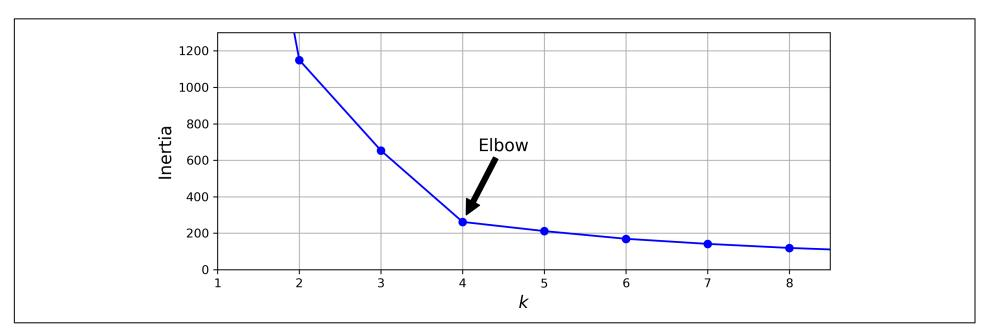

Figure 9-8. Plotting the inertia as a function of the number of clusters k

As you can see, the inertia drops very quickly as we increase  $k$  up to 4, but then it decreases much more slowly as we keep increasing  $k$ . This curve has roughly the shape of an arm, and there is an elbow at  $k = 4$ . So, if we did not know better, we might think 4 was a good choice: any lower value would be dramatic, while any higher value would not help much, and we might just be splitting perfectly good clusters in half for no good reason.

This technique for choosing the best value for the number of clusters is rather coarse. A more precise (but also more computationally expensive) approach is to use the silhouette score, which is the mean silhouette coefficient over all the instances. An instance's silhouette coefficient is equal to  $(b - a)$  / max $(a, b)$ , where a is the mean distance to the other instances in the same cluster (i.e., the mean intra-cluster distance) and  $b$  is the mean nearest-cluster distance (i.e., the mean distance to the instances of the next closest cluster, defined as the one that minimizes  $b$ , excluding the instance's own cluster). The silhouette coefficient can vary between  $-1$  and  $+1$ . A coefficient close to +1 means that the instance is well inside its own cluster and far from other clusters, while a coefficient close to 0 means that it is close to a cluster

{298}------------------------------------------------

boundary; finally, a coefficient close to -1 means that the instance may have been assigned to the wrong cluster.

To compute the silhouette score, you can use Scikit-Learn's silhouette score() function, giving it all the instances in the dataset and the labels they were assigned:

```
>>> from sklearn.metrics import silhouette_score
>>> silhouette score(X, kmeans.labels)
0.655517642572828
```

Let's compare the silhouette scores for different numbers of clusters (see Figure 9-9).


Figure 9-9. Selecting the number of clusters k using the silhouette score

As you can see, this visualization is much richer than the previous one: although it confirms that  $k = 4$  is a very good choice, it also highlights the fact that  $k = 5$  is quite good as well, and much better than  $k = 6$  or 7. This was not visible when comparing inertias.

An even more informative visualization is obtained when we plot every instance's silhouette coefficient, sorted by the clusters they are assigned to and by the value of the coefficient. This is called a *silhouette diagram* (see Figure 9-10). Each diagram contains one knife shape per cluster. The shape's height indicates the number of instances in the cluster, and its width represents the sorted silhouette coefficients of the instances in the cluster (wider is better).

The vertical dashed lines represent the mean silhouette score for each number of clusters. When most of the instances in a cluster have a lower coefficient than this score (i.e., if many of the instances stop short of the dashed line, ending to the left of it), then the cluster is rather bad since this means its instances are much too close to other clusters. Here we can see that when  $k = 3$  or 6, we get bad clusters. But when  $k = 4$  or 5, the clusters look pretty good: most instances extend beyond the dashed line, to the right and closer to 1.0. When  $k = 4$ , the cluster at index 1 (the second from the bottom) is rather big. When  $k = 5$ , all clusters have similar sizes. So, even though the overall silhouette score from  $k = 4$  is slightly greater than for  $k = 5$ , it seems like a good idea to use  $k = 5$  to get clusters of similar sizes.

{299}------------------------------------------------

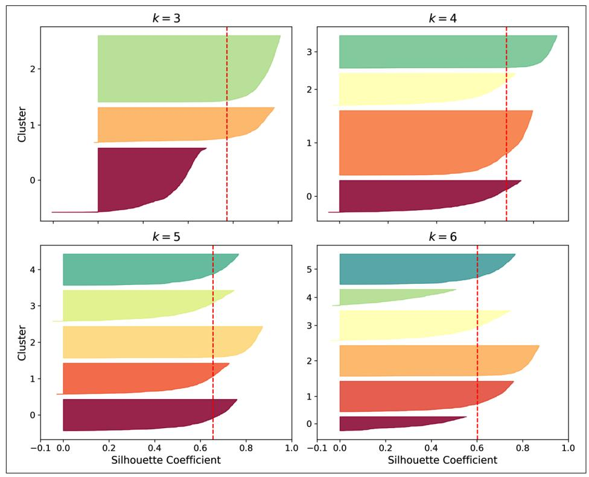

Figure 9-10. Analyzing the silhouette diagrams for various values of k

### **Limits of k-means**

Despite its many merits, most notably being fast and scalable, k-means is not perfect. As we saw, it is necessary to run the algorithm several times to avoid suboptimal solutions, plus you need to specify the number of clusters, which can be quite a hassle. Moreover, k-means does not behave very well when the clusters have varying sizes, different densities, or nonspherical shapes. For example, Figure 9-11 shows how k-means clusters a dataset containing three ellipsoidal clusters of different dimensions, densities, and orientations.

As you can see, neither of these solutions is any good. The solution on the left is better, but it still chops off 25% of the middle cluster and assigns it to the cluster on the right. The solution on the right is just terrible, even though its inertia is lower. So, depending on the data, different clustering algorithms may perform better. On these types of elliptical clusters, Gaussian mixture models work great.

{300}------------------------------------------------


Figure 9-11. k-means fails to cluster these ellipsoidal blobs properly


It is important to scale the input features (see Chapter 2) before you run k-means, or the clusters may be very stretched and k-means will perform poorly. Scaling the features does not guarantee that all the clusters will be nice and spherical, but it generally helps  $k$ -means.

Now let's look at a few ways we can benefit from clustering. We will use k-means, but feel free to experiment with other clustering algorithms.

### Using Clustering for Image Segmentation

Image segmentation is the task of partitioning an image into multiple segments. There are several variants<sup>.</sup>

- In color segmentation, pixels with a similar color get assigned to the same segment. This is sufficient in many applications. For example, if you want to analyze satellite images to measure how much total forest area there is in a region, color segmentation may be just fine.
- In *semantic segmentation*, all pixels that are part of the same object type get assigned to the same segment. For example, in a self-driving car's vision system, all pixels that are part of a pedestrian's image might be assigned to the "pedestrian" segment (there would be one segment containing all the pedestrians).
- In *instance segmentation*, all pixels that are part of the same individual object are assigned to the same segment. In this case there would be a different segment for each pedestrian.

{301}------------------------------------------------

The state of the art in semantic or instance segmentation today is achieved using complex architectures based on convolutional neural networks (see Chapter 14). In this chapter we are going to focus on the (much simpler) color segmentation task, using  $k$ -means.

We'll start by importing the Pillow package (successor to the Python Imaging Library, PIL), which we'll then use to load the *ladybug.png* image (see the upper-left image in Figure 9-12), assuming it's located at filepath:

```
>>> import PIL
>>> image = np.asarray(PIL.Image.open(filepath))
>>> image.shape
(533, 800, 3)
```

The image is represented as a 3D array. The first dimension's size is the height; the second is the width; and the third is the number of color channels, in this case red, green, and blue (RGB). In other words, for each pixel there is a 3D vector containing the intensities of red, green, and blue as unsigned 8-bit integers between 0 and 255. Some images may have fewer channels (such as grayscale images, which only have one), and some images may have more channels (such as images with an additional alpha channel for transparency, or satellite images, which often contain channels for additional light frequencies (like infrared).

The following code reshapes the array to get a long list of RGB colors, then it clusters these colors using k-means with eight clusters. It creates a segmented\_img array containing the nearest cluster center for each pixel (i.e., the mean color of each pixel's cluster), and lastly it reshapes this array to the original image shape. The third line uses advanced NumPy indexing; for example, if the first 10 labels in kmeans \_. labels are equal to 1, then the first 10 colors in segmented img are equal to kmeans.cluster centers  $\lceil 1 \rceil$ :

```
X = \text{image} \cdot \text{reshape}(-1, 3)kmeans = KMeans(n_clusters=8, random_state=42).fit(X)
segmented_img = kmeans.cluster_centers_[kmeans.labels_]
segmented_img = segmented_img.reshape(image.shape)
```

This outputs the image shown in the upper right of Figure 9-12. You can experiment with various numbers of clusters, as shown in the figure. When you use fewer than eight clusters, notice that the ladybug's flashy red color fails to get a cluster of its own: it gets merged with colors from the environment. This is because k-means prefers clusters of similar sizes. The ladybug is small—much smaller than the rest of the image—so even though its color is flashy, k-means fails to dedicate a cluster to it.

{302}------------------------------------------------

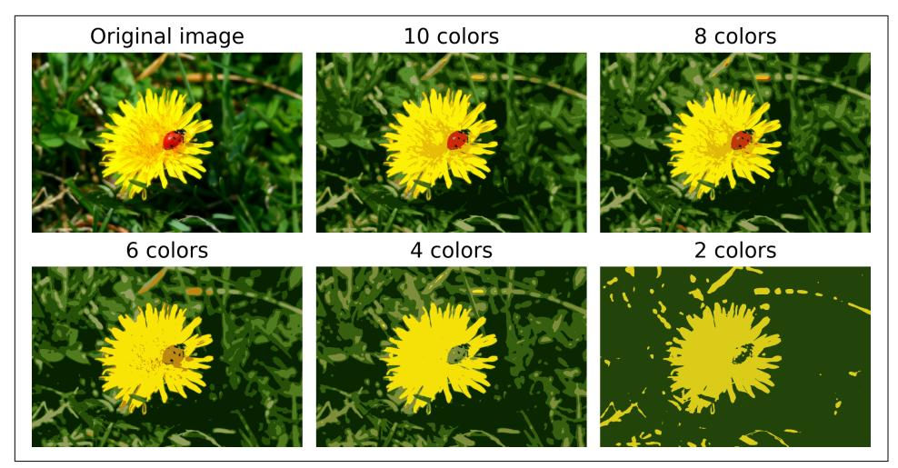

Figure 9-12. Image segmentation using k-means with various numbers of color clusters

That wasn't too hard, was it? Now let's look at another application of clustering.

### **Using Clustering for Semi-Supervised Learning**

Another use case for clustering is in semi-supervised learning, when we have plenty of unlabeled instances and very few labeled instances. In this section, we'll use the digits dataset, which is a simple MNIST-like dataset containing 1,797 grayscale  $8 \times 8$ images representing the digits 0 to 9. First, let's load and split the dataset (it's already shuffled):

```
from sklearn.datasets import load_digits
X digits, y digits = load digits(return X y=True)
X train, y train = X digits[:1400], y digits[:1400]
X_test, y_test = X_digits[1400:], y_digits[1400:]
```

We will pretend we only have labels for 50 instances. To get a baseline performance, let's train a logistic regression model on these 50 labeled instances:

from sklearn.linear\_model import LogisticRegression

```
n labeled = 50log_{1}reg = LogisticRegression(max_iter=10_000)
log_reg.fit(X_train[:n_labeled], y_train[:n_labeled])
```

{303}------------------------------------------------

We can then measure the accuracy of this model on the test set (note that the test set must be labeled):

```
>>> log_reg.score(X_test, y_test)
0.7481108312342569
```

The model's accuracy is just 74.8%. That's not great: indeed, if you try training the model on the full training set, you will find that it will reach about 90.7% accuracy. Let's see how we can do better. First, let's cluster the training set into 50 clusters. Then, for each cluster, we'll find the image closest to the centroid. We'll call these images the representative images:

```
k = 50kmeans = KMeans(n clusters=k, random state=42)
X_digits_dist = kmeans.fit_transform(X_train)
representative\_digit\_idx = np.argvin(X\_digits\_dist, axis=0)X_representative_digits = X_train[representative_digit_idx]
```

Figure 9-13 shows the 50 representative images.

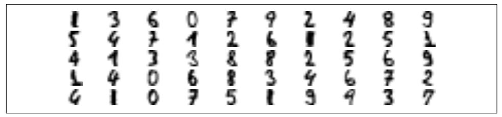

Figure 9-13. Fifty representative digit images (one per cluster)

Let's look at each image and manually label them:

```
y_representative_digits = np.array([1, 3, 6, 0, 7, 9, 2, ..., 5, 1, 9, 9, 3, 7])
```

Now we have a dataset with just 50 labeled instances, but instead of being random instances, each of them is a representative image of its cluster. Let's see if the performance is any better:

```
\gg log reg = LogisticRegression(max iter=10 000)
>>> log_reg.fit(X_representative_digits, y_representative_digits)
>>> log_reg.score(X_test, y_test)
0.8488664987405542
```

Wow! We jumped from 74.8% accuracy to 84.9%, although we are still only training the model on 50 instances. Since it is often costly and painful to label instances, especially when it has to be done manually by experts, it is a good idea to label representative instances rather than just random instances.

{304}------------------------------------------------

But perhaps we can go one step further: what if we propagated the labels to all the other instances in the same cluster? This is called label propagation:

```
y train propagated = np.empty(len(X train), dtype=np.int64)
for i in range(k):
    y train propagated[kmeans.labels == i] = y representative digits[i]
```

Now let's train the model again and look at its performance:

```
>>> log_reg = LogisticRegression()
>>> log_reg.fit(X_train, y_train_propagated)
>>> log_reg.score(X_test, y_test)
0.8942065491183879
```

We got another significant accuracy boost! Let's see if we can do even better by ignoring the 1% of instances that are farthest from their cluster center: this should eliminate some outliers. The following code first computes the distance from each instance to its closest cluster center, then for each cluster it sets the 1% largest distances to  $-1$ . Lastly, it creates a set without these instances marked with a  $-1$ distance:

```
percentile closest = 99X_cluster_dist = X_digits_dist[np.arange(len(X_train)), kmeans.labels_]
for i in range(k):
    in cluster = (kmeans.labels == i)
    cluster dist = X cluster dist[in cluster]
    cutoff_distance = np.percentile(cluster_dist, percentile_closest)
    above cutoff = (X cluster dist > cutoff distance)
    X_{\text{cluster\_dist}[in_{\text{cluster}} \& \text{ above\_cutoff}] = -1partially\_propagated = (X_cluster\_dist := -1)X_train_partially_propagated = X_train[partially_propagated]
y train partially propagated = y train propagated[partially propagated]
```

Now let's train the model again on this partially propagated dataset and see what accuracy we get:

```
\gg log reg = LogisticRegression(max iter=10 000)
>>> log reg.fit(X train partially propagated, y train partially propagated)
>>> log_reg.score(X_test, y_test)
0.9093198992443325
```

Nice! With just 50 labeled instances (only 5 examples per class on average!) we got 90.9% accuracy, which is actually slightly higher than the performance we got on the fully labeled digits dataset (90.7%). This is partly thanks to the fact that we dropped some outliers, and partly because the propagated labels are actually pretty good—their accuracy is about 97.5%, as the following code shows:

```
>>> (y_train_partially_propagated == y_train[partially_propagated]).mean()
0.9755555555555555
```

{305}------------------------------------------------


Scikit-Learn also offers two classes that can propagate labels automatically: LabelSpreading and LabelPropagation in the sklearn.semi supervised package. Both classes construct a similarity matrix between all the instances, and iteratively propagate labels from labeled instances to similar unlabeled instances. There's also a very different class called SelfTrainingClassifier in the same package: you give it a base classifier (such as a RandomForest Classifier) and it trains it on the labeled instances, then uses it to predict labels for the unlabeled samples. It then updates the training set with the labels it is most confident about, and repeats this process of training and labeling until it cannot add labels anymore. These techniques are not magic bullets, but they can occasionally give your model a little boost.

#### **Active Learning**

To continue improving your model and your training set, the next step could be to do a few rounds of *active learning*, which is when a human expert interacts with the learning algorithm, providing labels for specific instances when the algorithm requests them. There are many different strategies for active learning, but one of the most common ones is called *uncertainty sampling*. Here is how it works:

- 1. The model is trained on the labeled instances gathered so far, and this model is used to make predictions on all the unlabeled instances.
- 2. The instances for which the model is most uncertain (i.e., where its estimated probability is lowest) are given to the expert for labeling.
- 3. You iterate this process until the performance improvement stops being worth the labeling effort.

Other active learning strategies include labeling the instances that would result in the largest model change or the largest drop in the model's validation error, or the instances that different models disagree on (e.g., an SVM and a random forest).

Before we move on to Gaussian mixture models, let's take a look at DBSCAN, another popular clustering algorithm that illustrates a very different approach based on local density estimation. This approach allows the algorithm to identify clusters of arbitrary shapes.

{306}------------------------------------------------

### **DRSCAN**

The *density-based spatial clustering of applications with noise* (DBSCAN) algorithm defines clusters as continuous regions of high density. Here is how it works:

- For each instance, the algorithm counts how many instances are located within a small distance  $\varepsilon$  (epsilon) from it. This region is called the instance's ε-neighborhood.
- If an instance has at least  $min$  samples instances in its  $\varepsilon$ -neighborhood (including itself), then it is considered a *core instance*. In other words, core instances are those that are located in dense regions.
- All instances in the neighborhood of a core instance belong to the same cluster. This neighborhood may include other core instances; therefore, a long sequence of neighboring core instances forms a single cluster.
- Any instance that is not a core instance and does not have one in its neighborhood is considered an anomaly.

This algorithm works well if all the clusters are well separated by low-density regions. The DBSCAN class in Scikit-Learn is as simple to use as you might expect. Let's test it on the moons dataset, introduced in Chapter 5:

```
from sklearn.cluster import DBSCAN
from sklearn.datasets import make moons
X, y = make_moons(n_samples=1000, noise=0.05)dbscan = DBSCAN(eps=0.05, min_samples=5)dbscan.fit(X)
```

The labels of all the instances are now available in the labels instance variable:

```
>>> dbscan.labels
array([ 0, 2, -1, -1, 1, 0, 0, 0, 2, 5, [...], 3, 3, 4, 2, 6, 3])
```

Notice that some instances have a cluster index equal to  $-1$ , which means that they are considered as anomalies by the algorithm. The indices of the core instances are available in the core sample indices instance variable, and the core instances themselves are available in the components instance variable:

```
>>> dbscan.core_sample_indices_
array([ 0, 4, 5, 6, 7, 8, 10, 11, [...], 993, 995, 997, 998, 999])
>>> dbscan.components
array([[-0.02137124, 0.40618608],
      [-0.84192557, 0.53058695],[...],[0.79419406, 0.60777171]]
```

{307}------------------------------------------------

This clustering is represented in the lefthand plot of Figure 9-14. As you can see, it identified quite a lot of anomalies, plus seven different clusters. How disappointing! Fortunately, if we widen each instance's neighborhood by increasing eps to 0.2, we get the clustering on the right, which looks perfect. Let's continue with this model.

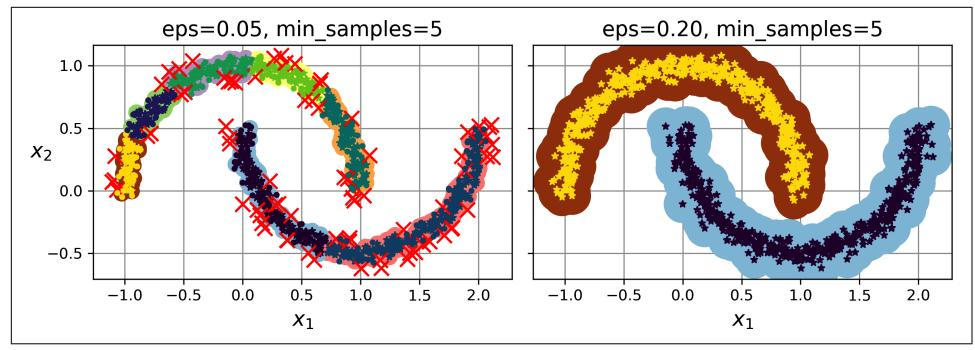

Figure 9-14. DBSCAN clustering using two different neighborhood radiuses

Surprisingly, the DBSCAN class does not have a predict() method, although it has a fit predict() method. In other words, it cannot predict which cluster a new instance belongs to. This decision was made because different classification algorithms can be better for different tasks, so the authors decided to let the user choose which one to use. Moreover, it's not hard to implement. For example, let's train a KNeighborsClassifier:

```
from sklearn.neighbors import KNeighborsClassifier
knn = KNeighborsClassifier(n neighbors=50)knn.fit(dbscan.components_, dbscan.labels_[dbscan.core_sample_indices_])
```

Now, given a few new instances, we can predict which clusters they most likely belong to and even estimate a probability for each cluster:

```
>>> X_new = np.array([[-0.5, 0], [0, 0.5], [1, -0.1], [2, 1]])
>>> knn.predict(X_new)
array([1, 0, 1, 0])>>> knn.predict_proba(X_new)
array([[0.18, 0.82],[1. , 0. ][0.12, 0.88],
      [1. , 0. ]]
```

Note that we only trained the classifier on the core instances, but we could also have chosen to train it on all the instances, or all but the anomalies: this choice depends on the final task

{308}------------------------------------------------

The decision boundary is represented in Figure 9-15 (the crosses represent the four instances in X new). Notice that since there is no anomaly in the training set, the classifier always chooses a cluster, even when that cluster is far away. It is fairly straightforward to introduce a maximum distance, in which case the two instances that are far away from both clusters are classified as anomalies. To do this, use the kneighbors() method of the KNeighborsClassifier. Given a set of instances, it returns the distances and the indices of the k-nearest neighbors in the training set (two matrices, each with  $k$  columns):

```
>>> y_dist, y_pred_idx = knn.kneighbors(X_new, n_neighbors=1)
>>> y pred = dbscan.labels [dbscan.core sample indices ][y pred idx]
>>> y_{\text{pred}}[y_{\text{dist}} > 0.2] = -1>>> y_pred.ravel()
array([-1, 0, 1, -1])
```

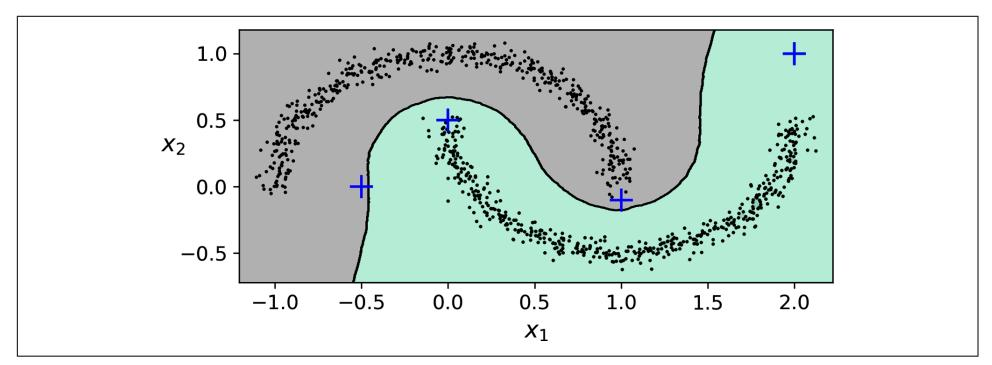

Figure 9-15. Decision boundary between two clusters

In short, DBSCAN is a very simple yet powerful algorithm capable of identifying any number of clusters of any shape. It is robust to outliers, and it has just two hyperparameters (eps and min samples). If the density varies significantly across the clusters, however, or if there's no sufficiently low-density region around some clusters, DBSCAN can struggle to capture all the clusters properly. Moreover, its computational complexity is roughly  $O(m^2n)$ , so it does not scale well to large datasets.


You may also want to try hierarchical DBSCAN (HDBSCAN), which is implemented in the scikit-learn-contrib project, as it is usually better than DBSCAN at finding clusters of varying densities.

{309}------------------------------------------------

### **Other Clustering Algorithms**

Scikit-Learn implements several more clustering algorithms that you should take a look at. I cannot cover them all in detail here, but here is a brief overview:

Agglomerative clustering

A hierarchy of clusters is built from the bottom up. Think of many tiny bubbles floating on water and gradually attaching to each other until there's one big group of bubbles. Similarly, at each iteration, agglomerative clustering connects the nearest pair of clusters (starting with individual instances). If you drew a tree with a branch for every pair of clusters that merged, you would get a binary tree of clusters, where the leaves are the individual instances. This approach can capture clusters of various shapes; it also produces a flexible and informative cluster tree instead of forcing you to choose a particular cluster scale, and it can be used with any pairwise distance. It can scale nicely to large numbers of instances if you provide a connectivity matrix, which is a sparse  $m \times m$ matrix that indicates which pairs of instances are neighbors (e.g., returned by sklearn.neighbors.kneighbors graph()). Without a connectivity matrix, the algorithm does not scale well to large datasets.

#### **BIRCH**

The balanced iterative reducing and clustering using hierarchies (BIRCH) algorithm was designed specifically for very large datasets, and it can be faster than batch  $k$ -means, with similar results, as long as the number of features is not too large  $(\leq 20)$ . During training, it builds a tree structure containing just enough information to quickly assign each new instance to a cluster, without having to store all the instances in the tree: this approach allows it to use limited memory while handling huge datasets.

Mean-shift

This algorithm starts by placing a circle centered on each instance; then for each circle it computes the mean of all the instances located within it, and it shifts the circle so that it is centered on the mean. Next, it iterates this mean-shifting step until all the circles stop moving (i.e., until each of them is centered on the mean of the instances it contains). Mean-shift shifts the circles in the direction of higher density, until each of them has found a local density maximum. Finally, all the instances whose circles have settled in the same place (or close enough) are assigned to the same cluster. Mean-shift has some of the same features as DBSCAN, like how it can find any number of clusters of any shape, it has very few hyperparameters (just one—the radius of the circles, called the *bandwidth*), and it relies on local density estimation. But unlike DBSCAN, mean-shift tends to chop clusters into pieces when they have internal density variations. Unfortunately, its computational complexity is  $O(m^2n)$ , so it is not suited for large datasets.

{310}------------------------------------------------

Affinity propagation

In this algorithm, instances repeatedly exchange messages between one another until every instance has elected another instance (or itself) to represent it. These elected instances are called *exemplars*. Each exemplar and all the instances that elected it form one cluster. In real-life politics, you typically want to vote for a candidate whose opinions are similar to yours, but you also want them to win the election, so you might choose a candidate you don't fully agree with, but who is more popular. You typically evaluate popularity through polls. Affinity propagation works in a similar way, and it tends to choose exemplars located near the center of clusters, similar to k-means. But unlike with k-means, you don't have to pick a number of clusters ahead of time: it is determined during training. Moreover, affinity propagation can deal nicely with clusters of different sizes. Sadly, this algorithm has a computational complexity of  $O(m^2)$ , so it is not suited for large datasets.

Spectral clustering

This algorithm takes a similarity matrix between the instances and creates a lowdimensional embedding from it (i.e., it reduces the matrix's dimensionality), then it uses another clustering algorithm in this low-dimensional space (Scikit-Learn's implementation uses k-means). Spectral clustering can capture complex cluster structures, and it can also be used to cut graphs (e.g., to identify clusters of friends on a social network). It does not scale well to large numbers of instances, and it does not behave well when the clusters have very different sizes.

Now let's dive into Gaussian mixture models, which can be used for density estimation, clustering, and anomaly detection.

## **Gaussian Mixtures**

A Gaussian mixture model (GMM) is a probabilistic model that assumes that the instances were generated from a mixture of several Gaussian distributions whose parameters are unknown. All the instances generated from a single Gaussian distribution form a cluster that typically looks like an ellipsoid. Each cluster can have a different ellipsoidal shape, size, density, and orientation, just like in Figure 9-11. When you observe an instance, you know it was generated from one of the Gaussian distributions, but you are not told which one, and you do not know what the parameters of these distributions are.

There are several GMM variants. In the simplest variant, implemented in the GaussianMixture class, you must know in advance the number  $k$  of Gaussian distributions. The dataset  $X$  is assumed to have been generated through the following probabilistic process:

{311}------------------------------------------------

- For each instance, a cluster is picked randomly from among  $k$  clusters. The probability of choosing the  $j^{\text{th}}$  cluster is the cluster's weight  $\phi^{(j)}$ .<sup>6</sup> The index of the cluster chosen for the  $i^{\text{th}}$  instance is noted  $z^{(i)}$ .
- If the *i*<sup>th</sup> instance was assigned to the *j*<sup>th</sup> cluster (i.e.,  $z^{(i)} = j$ ), then the location  $\mathbf{x}^{(i)}$ of this instance is sampled randomly from the Gaussian distribution with mean  $\mu^{(j)}$  and covariance matrix  $\Sigma^{(j)}$ . This is noted  $\mathbf{x}^{(i)} \sim \mathcal{M}(\mu^{(j)}, \Sigma^{(j)})$ .

So what can you do with such a model? Well, given the dataset X, you typically want to start by estimating the weights  $\phi$  and all the distribution parameters  $\mu^{(1)}$  to  $\mu^{(k)}$  and  $\Sigma^{(1)}$  to  $\Sigma^{(k)}$ . Scikit-Learn's GaussianMixture class makes this super easy:

```
from sklearn.mixture import GaussianMixture
gm = GaussianMixture(n\_components=3, n_init=10)qm.fit(X)
```

Let's look at the parameters that the algorithm estimated:

```
>>> gm.weights
array([0.39025715, 0.40007391, 0.20966893])
>>> gm.means
array([[ 0.05131611, 0.07521837],
       [-1.40763156, 1.42708225],[3.39893794, 1.05928897]]>>> qm.covariances
array([[[ 0.68799922, 0.79606357],
       [0.79606357, 1.21236106]],[0.63479409, 0.72970799],\begin{bmatrix} 0.72970799, 1.1610351 \end{bmatrix}[[ 1.14833585, -0.03256179],[-0.03256179, 0.95490931]]]
```

Great, it worked fine! Indeed, two of the three clusters were generated with 500 instances each, while the third cluster only contains 250 instances. So the true cluster weights are 0.4, 0.4, and 0.2, respectively, and that's roughly what the algorithm found. Similarly, the true means and covariance matrices are quite close to those found by the algorithm. But how? This class relies on the expectation-maximization (EM) algorithm, which has many similarities with the k-means algorithm: it also initializes the cluster parameters randomly, then it repeats two steps until convergence, first assigning instances to clusters (this is called the *expectation step*) and then updating the clusters (this is called the *maximization step*). Sounds familiar, right? In the context of clustering, you can think of EM as a generalization of  $k$ -means that not only finds the cluster centers ( $\mu^{(1)}$  to  $\mu^{(k)}$ ), but also their size, shape, and

<sup>6</sup> Phi ( $\phi$  or  $\varphi$ ) is the 21st letter of the Greek alphabet.

{312}------------------------------------------------

orientation ( $\Sigma^{(1)}$  to  $\Sigma^{(k)}$ ), as well as their relative weights ( $\phi^{(1)}$  to  $\phi^{(k)}$ ). Unlike k-means, though, EM uses soft cluster assignments, not hard assignments. For each instance, during the expectation step, the algorithm estimates the probability that it belongs to each cluster (based on the current cluster parameters). Then, during the maximization step, each cluster is updated using all the instances in the dataset, with each instance weighted by the estimated probability that it belongs to that cluster. These probabilities are called the *responsibilities* of the clusters for the instances. During the maximization step, each cluster's update will mostly be impacted by the instances it is most responsible for.


Unfortunately, just like  $k$ -means, EM can end up converging to poor solutions, so it needs to be run several times, keeping only the best solution. This is why we set n init to 10. Be careful: by default n\_init is set to 1.

You can check whether or not the algorithm converged and how many iterations it took:

```
>>> gm.converged_
True
>>> gm.n_iter_
```

Now that you have an estimate of the location, size, shape, orientation, and relative weight of each cluster, the model can easily assign each instance to the most likely cluster (hard clustering) or estimate the probability that it belongs to a particular cluster (soft clustering). Just use the predict() method for hard clustering, or the predict proba() method for soft clustering:

```
>>> gm.predict(X)
array([0, 0, 1, ..., 2, 2, 2])>>> gm.predict_proba(X).round(3)
array([[0.977, 0. 0.023],[0.983, 0.001, 0.016],ſ0.
            , 1. , 0.1.
       \cdots, 0.
      [0.
                   , 1.
                          1,
       ГΘ.
            , 0.
                   , 1.J,
      \lceil 0 \cdot, 0., 1.- 11)
```

A Gaussian mixture model is a *generative model*, meaning you can sample new instances from it (note that they are ordered by cluster index):

{313}------------------------------------------------

```
\Rightarrow X_new, y_new = gm.sample(6)
>>> X new
array([[-0.86944074, -0.32767626],
       [0.29836051, 0.28297011],[-2.8014927, -0.09047309],[3.98203732, 1.49951491],[3.81677148, 0.53095244],[2.84104923, -0.73858639]]>>> y new
array([0, 0, 1, 2, 2, 2])
```

It is also possible to estimate the density of the model at any given location. This is achieved using the score samples() method: for each instance it is given, this method estimates the log of the *probability density function* (PDF) at that location. The greater the score, the higher the density:

```
>>> gm.score_samples(X).round(2)
array([-2.61, -3.57, -3.33, ..., -3.51, -4.4, -3.81])
```

If you compute the exponential of these scores, you get the value of the PDF at the location of the given instances. These are not probabilities, but probability *densities*: they can take on any positive value, not just a value between 0 and 1. To estimate the probability that an instance will fall within a particular region, you would have to integrate the PDF over that region (if you do so over the entire space of possible instance locations, the result will be 1).

Figure 9-16 shows the cluster means, the decision boundaries (dashed lines), and the density contours of this model.


Figure 9-16. Cluster means, decision boundaries, and density contours of a trained Gaussian mixture model

{314}------------------------------------------------

Nice! The algorithm clearly found an excellent solution. Of course, we made its task easy by generating the data using a set of 2D Gaussian distributions (unfortunately, real-life data is not always so Gaussian and low-dimensional). We also gave the algorithm the correct number of clusters. When there are many dimensions, or many clusters, or few instances, EM can struggle to converge to the optimal solution. You might need to reduce the difficulty of the task by limiting the number of parameters that the algorithm has to learn. One way to do this is to limit the range of shapes and orientations that the clusters can have. This can be achieved by imposing constraints on the covariance matrices. To do this, set the covariance\_type hyperparameter to one of the following values:

"spherical"

All clusters must be spherical, but they can have different diameters (i.e., different variances).

"diag"

Clusters can take on any ellipsoidal shape of any size, but the ellipsoid's axes must be parallel to the coordinate axes (i.e., the covariance matrices must be diagonal).

"tied"

All clusters must have the same ellipsoidal shape, size, and orientation (i.e., all clusters share the same covariance matrix).

By default, covariance\_type is equal to "full", which means that each cluster can take on any shape, size, and orientation (it has its own unconstrained covariance matrix). Figure 9-17 plots the solutions found by the EM algorithm when covariance\_type is set to "tied" or "spherical".

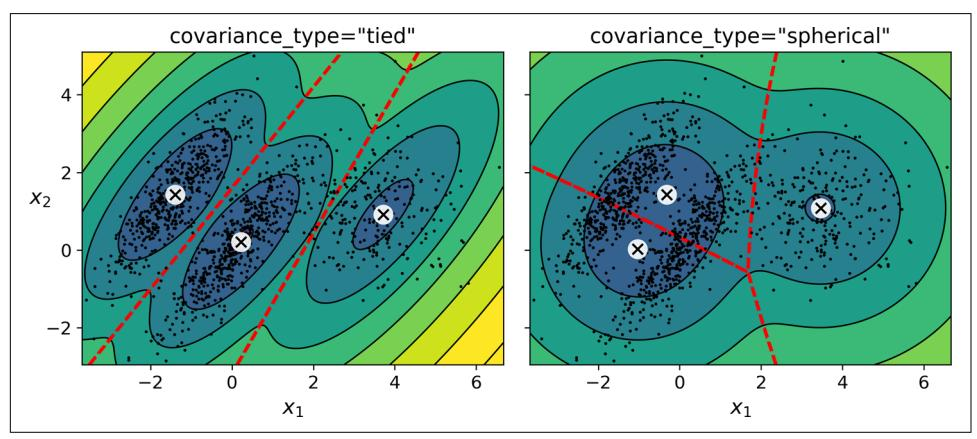

Figure 9-17. Gaussian mixtures for tied clusters (left) and spherical clusters (right)

{315}------------------------------------------------


The computational complexity of training a GaussianMixture model depends on the number of instances  $m$ , the number of dimensions  $n$ , the number of clusters  $k$ , and the constraints on the covariance matrices. If covariance type is "spherical" or "diag", it is  $O(kmn)$ , assuming the data has a clustering structure. If covariance type is "tied" or "full", it is  $O(kmn^2 + kn^3)$ , so it will not scale to large numbers of features.

Gaussian mixture models can also be used for anomaly detection. We'll see how in the next section.

### **Using Gaussian Mixtures for Anomaly Detection**

Using a Gaussian mixture model for anomaly detection is quite simple: any instance located in a low-density region can be considered an anomaly. You must define what density threshold you want to use. For example, in a manufacturing company that tries to detect defective products, the ratio of defective products is usually well known. Say it is equal to 2%. You then set the density threshold to be the value that results in having 2% of the instances located in areas below that threshold density. If you notice that you get too many false positives (i.e., perfectly good products that are flagged as defective), you can lower the threshold. Conversely, if you have too many false negatives (i.e., defective products that the system does not flag as defective), you can increase the threshold. This is the usual precision/recall trade-off (see Chapter 3). Here is how you would identify the outliers using the fourth percentile lowest density as the threshold (i.e., approximately 4% of the instances will be flagged as anomalies):

```
densities = gm.score samples(X)density_{threshold} = np.percentile(densities, 2)anomalies = X[densities < density threshold]
```

#### Figure 9-18 represents these anomalies as stars.

A closely related task is *novelty detection*: it differs from anomaly detection in that the algorithm is assumed to be trained on a "clean" dataset, uncontaminated by outliers, whereas anomaly detection does not make this assumption. Indeed, outlier detection is often used to clean up a dataset.


Gaussian mixture models try to fit all the data, including the outliers; if you have too many of them this will bias the model's view of "normality", and some outliers may wrongly be considered as normal. If this happens, you can try to fit the model once, use it to detect and remove the most extreme outliers, then fit the model again on the cleaned-up dataset. Another approach is to use robust covariance estimation methods (see the EllipticEnvelope class).

{316}------------------------------------------------


Figure 9-18. Anomaly detection using a Gaussian mixture model

Just like k-means, the GaussianMixture algorithm requires you to specify the number of clusters. So how can you find that number?

### **Selecting the Number of Clusters**

With k-means, you can use the inertia or the silhouette score to select the appropriate number of clusters. But with Gaussian mixtures, it is not possible to use these metrics because they are not reliable when the clusters are not spherical or have different sizes. Instead, you can try to find the model that minimizes a theoretical information criterion, such as the Bayesian information criterion (BIC) or the Akaike information criterion (AIC), defined in Equation 9-1.

Equation 9-1. Bayesian information criterion (BIC) and Akaike information criterion (AIC)

$$
BIC = \log (m)p - 2 \log (\widehat{\mathscr{L}})
$$
  
 
$$
AIC = 2p - 2 \log (\widehat{\mathscr{L}})
$$

In these equations:

- $\bullet$  *m* is the number of instances, as always.
- $\bullet$  p is the number of parameters learned by the model.
- $\widehat{\mathscr{L}}$  is the maximized value of the likelihood function of the model.

{317}------------------------------------------------

Both the BIC and the AIC penalize models that have more parameters to learn (e.g., more clusters) and reward models that fit the data well. They often end up selecting the same model. When they differ, the model selected by the BIC tends to be simpler (fewer parameters) than the one selected by the AIC, but tends to not fit the data quite as well (this is especially true for larger datasets).

#### **Likelihood Function**

The terms "probability" and "likelihood" are often used interchangeably in everyday language, but they have very different meanings in statistics. Given a statistical model with some parameters  $\theta$ , the word "probability" is used to describe how plausible a future outcome **x** is (knowing the parameter values  $\theta$ ), while the word "likelihood" is used to describe how plausible a particular set of parameter values  $\theta$  are, after the outcome x is known.

Consider a 1D mixture model of two Gaussian distributions centered at  $-4$  and  $+1$ . For simplicity, this toy model has a single parameter  $\theta$  that controls the standard deviations of both distributions. The top-left contour plot in Figure 9-19 shows the entire model  $f(x; \theta)$  as a function of both x and  $\theta$ . To estimate the probability distribution of a future outcome x, you need to set the model parameter  $\theta$ . For example, if you set  $\theta$ to 1.3 (the horizontal line), you get the probability density function  $f(x; \theta=1.3)$  shown in the lower-left plot. Say you want to estimate the probability that  $x$  will fall between  $-2$  and  $+2$ . You must calculate the integral of the PDF on this range (i.e., the surface of the shaded region). But what if you don't know  $\theta$ , and instead if you have observed a single instance  $x=2.5$  (the vertical line in the upper-left plot)? In this case, you get the likelihood function  $\mathcal{L}(\theta|x=2.5)=f(x=2.5;\theta)$ , represented in the upper-right plot.

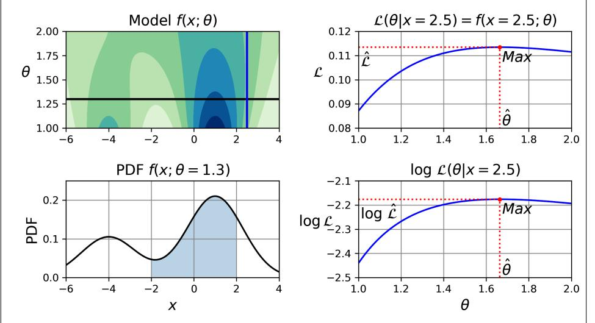

Figure 9-19. A model's parametric function (top left), and some derived functions: a PDF (lower left), a likelihood function (top right), and a log likelihood function (lower right)

{318}------------------------------------------------

In short, the PDF is a function of x (with  $\theta$  fixed), while the likelihood function is a function of  $\theta$  (with x fixed). It is important to understand that the likelihood function is not a probability distribution: if you integrate a probability distribution over all possible values of  $x$ , you always get 1, but if you integrate the likelihood function over all possible values of  $\theta$  the result can be any positive value.

Given a dataset  $X$ , a common task is to try to estimate the most likely values for the model parameters. To do this, you must find the values that maximize the likelihood function, given X. In this example, if you have observed a single instance  $x=2.5$ , the *maximum likelihood estimate* (MLE) of  $\theta$  is  $\hat{\theta}$ =1.5. If a prior probability distribution g over  $\theta$  exists, it is possible to take it into account by maximizing  $\mathscr{L}(\theta|x)g(\theta)$  rather than just maximizing  $\mathcal{L}(\theta|x)$ . This is called *maximum a-posteriori* (MAP) estimation. Since MAP constrains the parameter values, you can think of it as a regularized version of MLE.

Notice that maximizing the likelihood function is equivalent to maximizing its logarithm (represented in the lower-right plot in Figure 9-19). Indeed, the logarithm is a strictly increasing function, so if  $\theta$  maximizes the log likelihood, it also maximizes the likelihood. It turns out that it is generally easier to maximize the log likelihood. For example, if you observed several independent instances  $x^{(1)}$  to  $x^{(m)}$ , you would need to find the value of  $\theta$  that maximizes the product of the individual likelihood functions. But it is equivalent, and much simpler, to maximize the sum (not the product) of the log likelihood functions, thanks to the magic of the logarithm which converts products into sums:  $log(ab) = log(a) + log(b)$ .

Once you have estimated  $\hat{\theta}$ , the value of  $\theta$  that maximizes the likelihood function, then you are ready to compute  $\widehat{\mathscr{L}} = \mathscr{L}(\widehat{\theta}, \mathbf{X})$ , which is the value used to compute the AIC and BIC; you can think of it as a measure of how well the model fits the data.

To compute the BIC and AIC, call the bic() and aic() methods:

```
\Rightarrow am.bic(X)
8189.747000497186
\Rightarrow \Rightarrow gm.aic(X)8102.521720382148
```

Figure 9-20 shows the BIC for different numbers of clusters k. As you can see, both the BIC and the AIC are lowest when  $k=3$ , so it is most likely the best choice.

{319}------------------------------------------------


Figure 9-20. AIC and BIC for different numbers of clusters k

### **Bayesian Gaussian Mixture Models**

Rather than manually searching for the optimal number of clusters, you can use the BayesianGaussianMixture class, which is capable of giving weights equal (or close) to zero to unnecessary clusters. Set the number of clusters n\_components to a value that you have good reason to believe is greater than the optimal number of clusters (this assumes some minimal knowledge about the problem at hand), and the algorithm will eliminate the unnecessary clusters automatically. For example, let's set the number of clusters to 10 and see what happens:

```
>>> from sklearn.mixture import BayesianGaussianMixture
>>> bgm = BayesianGaussianMixture(n_components=10, n_init=10, random_state=42)
\Rightarrow bgm.fit(X)
>>> bgm.weights .round(2)
array([0.4, 0.21, 0.4, 0. , 0. , 0. , 0. , 0. , 0. , 0. ])
```

Perfect: the algorithm automatically detected that only three clusters are needed, and the resulting clusters are almost identical to the ones in Figure 9-16.

A final note about Gaussian mixture models: although they work great on clusters with ellipsoidal shapes, they don't do so well with clusters of very different shapes. For example, let's see what happens if we use a Bayesian Gaussian mixture model to cluster the moons dataset (see Figure 9-21).

Oops! The algorithm desperately searched for ellipsoids, so it found eight different clusters instead of two. The density estimation is not too bad, so this model could perhaps be used for anomaly detection, but it failed to identify the two moons. To conclude this chapter, let's take a quick look at a few algorithms capable of dealing with arbitrarily shaped clusters.

{320}------------------------------------------------


Figure 9-21. Fitting a Gaussian mixture to nonellipsoidal clusters

### **Other Algorithms for Anomaly and Novelty Detection**

Scikit-Learn implements other algorithms dedicated to anomaly detection or novelty detection:

#### Fast-MCD (minimum covariance determinant)

Implemented by the EllipticEnvelope class, this algorithm is useful for outlier detection, in particular to clean up a dataset. It assumes that the normal instances (inliers) are generated from a single Gaussian distribution (not a mixture). It also assumes that the dataset is contaminated with outliers that were not generated from this Gaussian distribution. When the algorithm estimates the parameters of the Gaussian distribution (i.e., the shape of the elliptic envelope around the inliers), it is careful to ignore the instances that are most likely outliers. This technique gives a better estimation of the elliptic envelope and thus makes the algorithm better at identifying the outliers.

#### Isolation forest

This is an efficient algorithm for outlier detection, especially in high-dimensional datasets. The algorithm builds a random forest in which each decision tree is grown randomly: at each node, it picks a feature randomly, then it picks a random threshold value (between the min and max values) to split the dataset in two. The dataset gradually gets chopped into pieces this way, until all instances end up isolated from the other instances. Anomalies are usually far from other instances, so on average (across all the decision trees) they tend to get isolated in fewer steps than normal instances.

Local outlier factor (LOF)

This algorithm is also good for outlier detection. It compares the density of instances around a given instance to the density around its neighbors. An anomaly is often more isolated than its  $k$ -nearest neighbors.

{321}------------------------------------------------

#### One-class SVM

This algorithm is better suited for novelty detection. Recall that a kernelized SVM classifier separates two classes by first (implicitly) mapping all the instances to a high-dimensional space, then separating the two classes using a linear SVM classifier within this high-dimensional space (see Chapter 5). Since we just have one class of instances, the one-class SVM algorithm instead tries to separate the instances in high-dimensional space from the origin. In the original space, this will correspond to finding a small region that encompasses all the instances. If a new instance does not fall within this region, it is an anomaly. There are a few hyperparameters to tweak: the usual ones for a kernelized SVM, plus a margin hyperparameter that corresponds to the probability of a new instance being mistakenly considered as novel when it is in fact normal. It works great, especially with high-dimensional datasets, but like all SVMs it does not scale to large datasets.

PCA and other dimensionality reduction techniques with an inverse\_transform() method

If you compare the reconstruction error of a normal instance with the reconstruction error of an anomaly, the latter will usually be much larger. This is a simple and often quite efficient anomaly detection approach (see this chapter's exercises for an example).

### **Exercises**

- 1. How would you define clustering? Can you name a few clustering algorithms?
- 2. What are some of the main applications of clustering algorithms?
- 3. Describe two techniques to select the right number of clusters when using  $k$ -means.
- 4. What is label propagation? Why would you implement it, and how?
- 5. Can you name two clustering algorithms that can scale to large datasets? And two that look for regions of high density?
- 6. Can you think of a use case where active learning would be useful? How would you implement it?
- 7. What is the difference between anomaly detection and novelty detection?
- 8. What is a Gaussian mixture? What tasks can you use it for?
- 9. Can you name two techniques to find the right number of clusters when using a Gaussian mixture model?
- 10. The classic Olivetti faces dataset contains 400 grayscale  $64 \times 64$ -pixel images of faces. Each image is flattened to a 1D vector of size 4,096. Forty different people were photographed (10 times each), and the usual task is to train a model that

{322}------------------------------------------------

can predict which person is represented in each picture. Load the dataset using the sklearn.datasets.fetch\_olivetti\_faces() function, then split it into a training set, a validation set, and a test set (note that the dataset is already scaled between 0 and 1). Since the dataset is quite small, you will probably want to use stratified sampling to ensure that there are the same number of images per person in each set. Next, cluster the images using k-means, and ensure that you have a good number of clusters (using one of the techniques discussed in this chapter). Visualize the clusters: do you see similar faces in each cluster?

- 11. Continuing with the Olivetti faces dataset, train a classifier to predict which person is represented in each picture, and evaluate it on the validation set. Next, use k-means as a dimensionality reduction tool, and train a classifier on the reduced set. Search for the number of clusters that allows the classifier to get the best performance: what performance can you reach? What if you append the features from the reduced set to the original features (again, searching for the best number of clusters)?
- 12. Train a Gaussian mixture model on the Olivetti faces dataset. To speed up the algorithm, you should probably reduce the dataset's dimensionality (e.g., use PCA, preserving 99% of the variance). Use the model to generate some new faces (using the sample() method), and visualize them (if you used PCA, you will need to use its inverse\_transform() method). Try to modify some images (e.g., rotate, flip, darken) and see if the model can detect the anomalies (i.e., compare the output of the score\_samples() method for normal images and for anomalies).
- 13. Some dimensionality reduction techniques can also be used for anomaly detection. For example, take the Olivetti faces dataset and reduce it with PCA, preserving 99% of the variance. Then compute the reconstruction error for each image. Next, take some of the modified images you built in the previous exercise and look at their reconstruction error: notice how much larger it is. If you plot a reconstructed image, you will see why: it tries to reconstruct a normal face.

Solutions to these exercises are available at the end of this chapter's notebook, at https://homl.info/colab3.

{323}------------------------------------------------

{324}------------------------------------------------

## **PART II Neural Networks and Deep Learning**

{325}------------------------------------------------

{326}------------------------------------------------

## **CHAPTER 10 Introduction to Artificial Neural Networks with Keras**

Birds inspired us to fly, burdock plants inspired Velcro, and nature has inspired countless more inventions. It seems only logical, then, to look at the brain's architecture for inspiration on how to build an intelligent machine. This is the logic that sparked artificial neural networks (ANNs), machine learning models inspired by the networks of biological neurons found in our brains. However, although planes were inspired by birds, they don't have to flap their wings to fly. Similarly, ANNs have gradually become quite different from their biological cousins. Some researchers even argue that we should drop the biological analogy altogether (e.g., by saying "units" rather than "neurons"), lest we restrict our creativity to biologically plausible systems.<sup>1</sup>

ANNs are at the very core of deep learning. They are versatile, powerful, and scalable, making them ideal to tackle large and highly complex machine learning tasks such as classifying billions of images (e.g., Google Images), powering speech recognition services (e.g., Apple's Siri), recommending the best videos to watch to hundreds of millions of users every day (e.g., YouTube), or learning to beat the world champion at the game of Go (DeepMind's AlphaGo).

The first part of this chapter introduces artificial neural networks, starting with a quick tour of the very first ANN architectures and leading up to multilayer perceptrons, which are heavily used today (other architectures will be explored in the next chapters). In the second part, we will look at how to implement neural networks using TensorFlow's Keras API. This is a beautifully designed and simple high-level

<sup>1</sup> You can get the best of both worlds by being open to biological inspirations without being afraid to create biologically unrealistic models, as long as they work well.

{327}------------------------------------------------

API for building, training, evaluating, and running neural networks. But don't be fooled by its simplicity: it is expressive and flexible enough to let you build a wide variety of neural network architectures. In fact, it will probably be sufficient for most of your use cases. And should you ever need extra flexibility, you can always write custom Keras components using its lower-level API, or even use TensorFlow directly, as you will see in Chapter 12.

But first, let's go back in time to see how artificial neural networks came to be!

### **From Biological to Artificial Neurons**

Surprisingly, ANNs have been around for quite a while: they were first introduced back in 1943 by the neurophysiologist Warren McCulloch and the mathematician Walter Pitts. In their landmark paper<sup>2</sup> "A Logical Calculus of Ideas Immanent in Nervous Activity", McCulloch and Pitts presented a simplified computational model of how biological neurons might work together in animal brains to perform complex computations using *propositional logic*. This was the first artificial neural network architecture. Since then many other architectures have been invented, as you will see.

The early successes of ANNs led to the widespread belief that we would soon be conversing with truly intelligent machines. When it became clear in the 1960s that this promise would go unfulfilled (at least for quite a while), funding flew elsewhere, and ANNs entered a long winter. In the early 1980s, new architectures were invented and better training techniques were developed, sparking a revival of interest in connectionism, the study of neural networks. But progress was slow, and by the 1990s other powerful machine learning techniques had been invented, such as support vector machines (see Chapter 5). These techniques seemed to offer better results and stronger theoretical foundations than ANNs, so once again the study of neural networks was put on hold.

We are now witnessing yet another wave of interest in ANNs. Will this wave die out like the previous ones did? Well, here are a few good reasons to believe that this time is different and that the renewed interest in ANNs will have a much more profound impact on our lives:

- There is now a huge quantity of data available to train neural networks, and ANNs frequently outperform other ML techniques on very large and complex problems.
- The tremendous increase in computing power since the 1990s now makes it possible to train large neural networks in a reasonable amount of time. This is

<sup>2</sup> Warren S. McCulloch and Walter Pitts, "A Logical Calculus of the Ideas Immanent in Nervous Activity", The Bulletin of Mathematical Biology 5, no. 4 (1943): 115-113.

{328}------------------------------------------------

in part due to Moore's law (the number of components in integrated circuits has doubled about every 2 years over the last 50 years), but also thanks to the gaming industry, which has stimulated the production of powerful GPU cards by the millions. Moreover, cloud platforms have made this power accessible to everyone.

- The training algorithms have been improved. To be fair they are only slightly different from the ones used in the 1990s, but these relatively small tweaks have had a huge positive impact.
- Some theoretical limitations of ANNs have turned out to be benign in practice. For example, many people thought that ANN training algorithms were doomed because they were likely to get stuck in local optima, but it turns out that this is not a big problem in practice, especially for larger neural networks: the local optima often perform almost as well as the global optimum.
- ANNs seem to have entered a virtuous circle of funding and progress. Amazing products based on ANNs regularly make the headline news, which pulls more and more attention and funding toward them, resulting in more and more progress and even more amazing products.

#### **Biological Neurons**

Before we discuss artificial neurons, let's take a quick look at a biological neuron (represented in Figure 10-1). It is an unusual-looking cell mostly found in animal brains. It's composed of a *cell body* containing the nucleus and most of the cell's complex components, many branching extensions called *dendrites*, plus one very long extension called the *axon*. The axon's length may be just a few times longer than the cell body, or up to tens of thousands of times longer. Near its extremity the axon splits off into many branches called *telodendria*, and at the tip of these branches are minuscule structures called *synaptic terminals* (or simply *synapses*), which are connected to the dendrites or cell bodies of other neurons.<sup>3</sup> Biological neurons produce short electrical impulses called *action potentials* (APs, or just *signals*), which travel along the axons and make the synapses release chemical signals called *neurotransmitters*. When a neuron receives a sufficient amount of these neurotransmitters within a few milliseconds, it fires its own electrical impulses (actually, it depends on the neurotransmitters, as some of them inhibit the neuron from firing).

<sup>3</sup> They are not actually attached, just so close that they can very quickly exchange chemical signals.

{329}------------------------------------------------

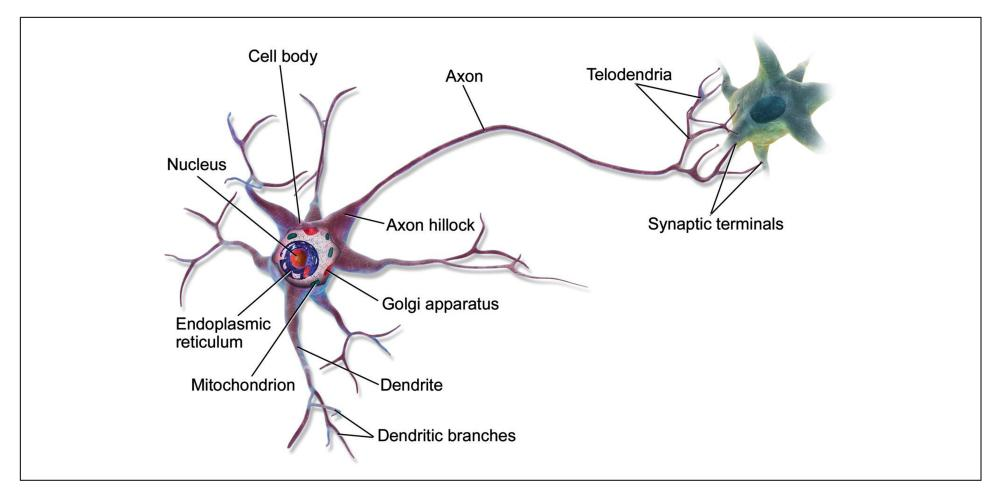

Figure 10-1. A biological neuron<sup>4</sup>

Thus, individual biological neurons seem to behave in a simple way, but they're organized in a vast network of billions, with each neuron typically connected to thousands of other neurons. Highly complex computations can be performed by a network of fairly simple neurons, much like a complex anthill can emerge from the combined efforts of simple ants. The architecture of biological neural networks  $(BNNs)^5$  is the subject of active research, but some parts of the brain have been mapped. These efforts show that neurons are often organized in consecutive layers, especially in the cerebral cortex (the outer layer of the brain), as shown in Figure 10-2.


Figure 10-2. Multiple layers in a biological neural network (human cortex) $\delta$ 

<sup>4</sup> Image by Bruce Blaus (Creative Commons 3.0). Reproduced from https://en.wikipedia.org/wiki/Neuron.

<sup>5</sup> In the context of machine learning, the phrase "neural networks" generally refers to ANNs, not BNNs.

<sup>6</sup> Drawing of a cortical lamination by S. Ramon y Cajal (public domain). Reproduced from https://en.wikipe dia.org/wiki/Cerebral\_cortex.

{330}------------------------------------------------

### **Logical Computations with Neurons**

McCulloch and Pitts proposed a very simple model of the biological neuron, which later became known as an *artificial neuron*: it has one or more binary (on/off) inputs and one binary output. The artificial neuron activates its output when more than a certain number of its inputs are active. In their paper, McCulloch and Pitts showed that even with such a simplified model it is possible to build a network of artificial neurons that can compute any logical proposition you want. To see how such a network works, let's build a few ANNs that perform various logical computations (see Figure 10-3), assuming that a neuron is activated when at least two of its input connections are active.


Figure 10-3. ANNs performing simple logical computations

Let's see what these networks do:

- The first network on the left is the identity function: if neuron A is activated, then neuron C gets activated as well (since it receives two input signals from neuron A); but if neuron A is off, then neuron C is off as well.
- The second network performs a logical AND: neuron C is activated only when both neurons A and B are activated (a single input signal is not enough to activate neuron  $C$ ).
- The third network performs a logical OR: neuron C gets activated if either neuron A or neuron B is activated (or both).
- Finally, if we suppose that an input connection can inhibit the neuron's activity (which is the case with biological neurons), then the fourth network computes a slightly more complex logical proposition: neuron C is activated only if neuron A is active and neuron B is off. If neuron A is active all the time, then you get a logical NOT: neuron C is active when neuron B is off, and vice versa.

You can imagine how these networks can be combined to compute complex logical expressions (see the exercises at the end of the chapter for an example).

{331}------------------------------------------------

### **The Perceptron**

The *perceptron* is one of the simplest ANN architectures, invented in 1957 by Frank Rosenblatt. It is based on a slightly different artificial neuron (see Figure 10-4) called a threshold logic unit (TLU), or sometimes a linear threshold unit (LTU). The inputs and output are numbers (instead of binary on/off values), and each input connection is associated with a weight. The TLU first computes a linear function of its inputs:  $z =$  $w_1 x_1 + w_2 x_2 + \cdots + w_n x_n + b = \mathbf{w}^{\mathsf{T}} \mathbf{x} + b$ . Then it applies a step function to the result:  $h_w(\mathbf{x})$  = step(z). So it's almost like logistic regression, except it uses a step function instead of the logistic function (Chapter 4). Just like in logistic regression, the model parameters are the input weights w and the bias term b.


Figure 10-4. TLU: an artificial neuron that computes a weighted sum of its inputs  $w^{\dagger} x$ , plus a bias term b, then applies a step function

The most common step function used in perceptrons is the Heaviside step function (see Equation 10-1). Sometimes the sign function is used instead.

Equation 10-1. Common step functions used in perceptrons (assuming threshold = 0)

heaviside (z) =  $\begin{cases} 0 & \text{if } z < 0 \\ 1 & \text{if } z \ge 0 \end{cases}$  sgn (z) =  $\begin{cases} -1 & \text{if } z < 0 \\ 0 & \text{if } z = 0 \\ +1 & \text{if } z > 0 \end{cases}$ 

{332}------------------------------------------------

A single TLU can be used for simple linear binary classification. It computes a linear function of its inputs, and if the result exceeds a threshold, it outputs the positive class. Otherwise, it outputs the negative class. This may remind you of logistic regression (Chapter 4) or linear SVM classification (Chapter 5). You could, for example, use a single TLU to classify iris flowers based on petal length and width. Training such a TLU would require finding the right values for  $w_1$ ,  $w_2$ , and b (the training algorithm is discussed shortly).

A perceptron is composed of one or more TLUs organized in a single layer, where every TLU is connected to every input. Such a layer is called a *fully connected layer*, or a dense layer. The inputs constitute the input layer. And since the layer of TLUs produces the final outputs, it is called the *output layer*. For example, a perceptron with two inputs and three outputs is represented in Figure 10-5.

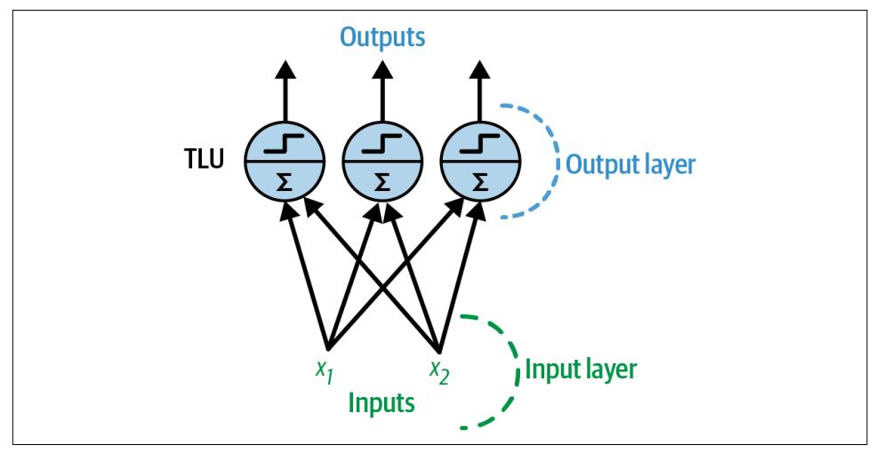

Figure 10-5. Architecture of a perceptron with two inputs and three output neurons

This perceptron can classify instances simultaneously into three different binary classes, which makes it a multilabel classifier. It may also be used for multiclass classification.

Thanks to the magic of linear algebra, Equation 10-2 can be used to efficiently compute the outputs of a layer of artificial neurons for several instances at once.

Equation 10-2. Computing the outputs of a fully connected layer  $h_{\mathbf{W},\mathbf{b}}(\mathbf{X}) = \phi(\mathbf{X}\mathbf{W} + \mathbf{b})$ 

{333}------------------------------------------------

In this equation:

- As always, X represents the matrix of input features. It has one row per instance and one column per feature.
- The weight matrix W contains all the connection weights. It has one row per input and one column per neuron.
- The bias vector **b** contains all the bias terms: one per neuron.
- The function  $\phi$  is called the *activation function*: when the artificial neurons are TLUs, it is a step function (we will discuss other activation functions shortly).


In mathematics, the sum of a matrix and a vector is undefined. However, in data science, we allow "broadcasting": adding a vector to a matrix means adding it to every row in the matrix. So,  $XW + b$ first multiplies  $X$  by W—which results in a matrix with one row per instance and one column per output—then adds the vector **b** to every row of that matrix, which adds each bias term to the corresponding output, for every instance. Moreover,  $\phi$  is then applied itemwise to each item in the resulting matrix.

So, how is a perceptron trained? The perceptron training algorithm proposed by Rosenblatt was largely inspired by Hebb's rule. In his 1949 book The Organization of Behavior (Wiley), Donald Hebb suggested that when a biological neuron triggers another neuron often, the connection between these two neurons grows stronger. Siegrid Löwel later summarized Hebb's idea in the catchy phrase, "Cells that fire together, wire together"; that is, the connection weight between two neurons tends to increase when they fire simultaneously. This rule later became known as Hebb's rule (or Hebbian learning). Perceptrons are trained using a variant of this rule that takes into account the error made by the network when it makes a prediction; the perceptron learning rule reinforces connections that help reduce the error. More specifically, the perceptron is fed one training instance at a time, and for each instance it makes its predictions. For every output neuron that produced a wrong prediction, it reinforces the connection weights from the inputs that would have contributed to the correct prediction. The rule is shown in Equation 10-3.

Equation 10-3. Perceptron learning rule (weight update)

 $w_{i,j}$ <sup>(next step)</sup> =  $w_{i,j}$  +  $\eta(y_j - \hat{y}_j)x_i$ 

{334}------------------------------------------------

In this equation:

- $W_{i,j}$  is the connection weight between the *i*<sup>th</sup> input and the *j*<sup>th</sup> neuron.
- $x_i$  is the *i*<sup>th</sup> input value of the current training instance.
- $\hat{y}_i$  is the output of the j<sup>th</sup> output neuron for the current training instance.
- $y_i$  is the target output of the  $j^{\text{th}}$  output neuron for the current training instance.
- $\eta$  is the learning rate (see Chapter 4).

The decision boundary of each output neuron is linear, so perceptrons are incapable of learning complex patterns (just like logistic regression classifiers). However, if the training instances are linearly separable, Rosenblatt demonstrated that this algorithm would converge to a solution.<sup>7</sup> This is called the perceptron convergence theorem.

Scikit-Learn provides a Perceptron class that can be used pretty much as you would expect—for example, on the iris dataset (introduced in Chapter 4):

```
import numpy as np
from sklearn.datasets import load_iris
from sklearn.linear_model import Perceptron
iris = load_iris(as_frome=True)X = \text{iris.data}["petal length (cm)", "petal width (cm)"]].values
y = (iris.target == 0) # Iris setosaper_clf = Perceptron(range_mstate=42)per_clf.fit(X, y)X_new = [[2, 0.5], [3, 1]]y_pred = per_clf.predict(X_new) # predicts True and False for these 2 flowers
```

You may have noticed that the perceptron learning algorithm strongly resembles stochastic gradient descent (introduced in Chapter 4). In fact, Scikit-Learn's Perceptron class is equivalent to using an SGDClassifier with the following hyperparameters: loss="perceptron", learning\_rate="constant", eta0=1 (the learning rate), and penalty=None (no regularization).

In their 1969 monograph Perceptrons, Marvin Minsky and Seymour Papert highlighted a number of serious weaknesses of perceptrons—in particular, the fact that they are incapable of solving some trivial problems (e.g., the *exclusive OR* (XOR) classification problem; see the left side of Figure 10-6). This is true of any other linear classification model (such as logistic regression classifiers), but researchers had expected much more from perceptrons, and some were so disappointed that they

<sup>7</sup> Note that this solution is not unique: when data points are linearly separable, there is an infinity of hyperplanes that can separate them.

{335}------------------------------------------------

dropped neural networks altogether in favor of higher-level problems such as logic, problem solving, and search. The lack of practical applications also didn't help.

It turns out that some of the limitations of perceptrons can be eliminated by stacking multiple perceptrons. The resulting ANN is called a *multilayer perceptron* (MLP). An MLP can solve the XOR problem, as you can verify by computing the output of the MLP represented on the right side of Figure 10-6: with inputs  $(0, 0)$  or  $(1, 1)$ , the network outputs 0, and with inputs  $(0, 1)$  or  $(1, 0)$  it outputs 1. Try verifying that this network indeed solves the XOR problem!<sup>8</sup>


Figure 10-6. XOR classification problem and an MLP that solves it


Contrary to logistic regression classifiers, perceptrons do not output a class probability. This is one reason to prefer logistic regression over perceptrons. Moreover, perceptrons do not use any regularization by default, and training stops as soon as there are no more prediction errors on the training set, so the model typically does not generalize as well as logistic regression or a linear SVM classifier. However, perceptrons may train a bit faster.

<sup>8</sup> For example, when the inputs are (0, 1) the lower-left neuron computes  $0 \times 1 + 1 \times 1 - 3 / 2 = -1 / 2$ , which is negative, so it outputs 0. The lower-right neuron computes  $0 \times 1 + 1 \times 1 - 1 / 2 = 1 / 2$ , which is positive, so it outputs 1. The output neuron receives the outputs of the first two neurons as its inputs, so it computes  $0 \times (-1) + 1 \times 1 - 1 / 2 = 1 / 2$ . This is positive, so it outputs 1.

{336}------------------------------------------------

### The Multilayer Perceptron and Backpropagation

An MLP is composed of one input layer, one or more layers of TLUs called *hidden* layers, and one final layer of TLUs called the output layer (see Figure 10-7). The layers close to the input layer are usually called the lower layers, and the ones close to the outputs are usually called the *upper layers*.


Figure 10-7. Architecture of a multilayer perceptron with two inputs, one hidden layer of four neurons, and three output neurons


The signal flows only in one direction (from the inputs to the outputs), so this architecture is an example of a feedforward neural network (FNN).

When an ANN contains a deep stack of hidden layers,<sup>9</sup> it is called a *deep neural* network (DNN). The field of deep learning studies DNNs, and more generally it is interested in models containing deep stacks of computations. Even so, many people talk about deep learning whenever neural networks are involved (even shallow ones).

<sup>9</sup> In the 1990s, an ANN with more than two hidden layers was considered deep. Nowadays, it is common to see ANNs with dozens of layers, or even hundreds, so the definition of "deep" is quite fuzzy.

{337}------------------------------------------------

For many years researchers struggled to find a way to train MLPs, without success. In the early 1960s several researchers discussed the possibility of using gradient descent to train neural networks, but as we saw in Chapter 4, this requires computing the gradients of the model's error with regard to the model parameters; it wasn't clear at the time how to do this efficiently with such a complex model containing so many parameters, especially with the computers they had back then.

Then, in 1970, a researcher named Seppo Linnainmaa introduced in his master's thesis a technique to compute all the gradients automatically and efficiently. This algorithm is now called reverse-mode automatic differentiation (or reverse-mode autodiff for short). In just two passes through the network (one forward, one backward), it is able to compute the gradients of the neural network's error with regard to every single model parameter. In other words, it can find out how each connection weight and each bias should be tweaked in order to reduce the neural network's error. These gradients can then be used to perform a gradient descent step. If you repeat this process of computing the gradients automatically and taking a gradient descent step, the neural network's error will gradually drop until it eventually reaches a minimum. This combination of reverse-mode autodiff and gradient descent is now called backpropagation (or backprop for short).


There are various autodiff techniques, with different pros and cons. Reverse-mode autodiff is well suited when the function to differentiate has many variables (e.g., connection weights and biases) and few outputs (e.g., one loss). If you want to learn more about autodiff, check out Appendix B.

Backpropagation can actually be applied to all sorts of computational graphs, not just neural networks: indeed, Linnainmaa's master's thesis was not about neural nets, it was more general. It was several more years before backprop started to be used to train neural networks, but it still wasn't mainstream. Then, in 1985, David Rumelhart, Geoffrey Hinton, and Ronald Williams published a groundbreaking paper<sup>10</sup> analyzing how backpropagation allowed neural networks to learn useful internal representations. Their results were so impressive that backpropagation was quickly popularized in the field. Today, it is by far the most popular training technique for neural networks.

<sup>10</sup> David Rumelhart et al., "Learning Internal Representations by Error Propagation" (Defense Technical Information Center technical report, September 1985).

{338}------------------------------------------------

Let's run through how backpropagation works again in a bit more detail:

- It handles one mini-batch at a time (for example, containing 32 instances each), and it goes through the full training set multiple times. Each pass is called an epoch.
- Each mini-batch enters the network through the input layer. The algorithm then computes the output of all the neurons in the first hidden layer, for every instance in the mini-batch. The result is passed on to the next layer, its output is computed and passed to the next layer, and so on until we get the output of the last layer, the output layer. This is the *forward pass*: it is exactly like making predictions, except all intermediate results are preserved since they are needed for the backward pass.
- Next, the algorithm measures the network's output error (i.e., it uses a loss function that compares the desired output and the actual output of the network, and returns some measure of the error).
- Then it computes how much each output bias and each connection to the output layer contributed to the error. This is done analytically by applying the *chain rule* (perhaps the most fundamental rule in calculus), which makes this step fast and precise.
- The algorithm then measures how much of these error contributions came from each connection in the layer below, again using the chain rule, working backward until it reaches the input layer. As explained earlier, this reverse pass efficiently measures the error gradient across all the connection weights and biases in the network by propagating the error gradient backward through the network (hence the name of the algorithm).
- Finally, the algorithm performs a gradient descent step to tweak all the connection weights in the network, using the error gradients it just computed.


It is important to initialize all the hidden layers' connection weights randomly, or else training will fail. For example, if you initialize all weights and biases to zero, then all neurons in a given layer will be perfectly identical, and thus backpropagation will affect them in exactly the same way, so they will remain identical. In other words, despite having hundreds of neurons per layer, your model will act as if it had only one neuron per layer: it won't be too smart. If instead you randomly initialize the weights, you break the symmetry and allow backpropagation to train a diverse team of neurons.

{339}------------------------------------------------

In short, backpropagation makes predictions for a mini-batch (forward pass), measures the error, then goes through each layer in reverse to measure the error contribution from each parameter (reverse pass), and finally tweaks the connection weights and biases to reduce the error (gradient descent step).

In order for backprop to work properly, Rumelhart and his colleagues made a key change to the MLP's architecture: they replaced the step function with the logistic function,  $\sigma(z) = 1/(1 + \exp(-z))$ , also called the *sigmoid* function. This was essential because the step function contains only flat segments, so there is no gradient to work with (gradient descent cannot move on a flat surface), while the sigmoid function has a well-defined nonzero derivative everywhere, allowing gradient descent to make some progress at every step. In fact, the backpropagation algorithm works well with many other activation functions, not just the sigmoid function. Here are two other popular choices:

The hyperbolic tangent function:  $tanh(z) = 2\sigma(2z) - 1$ 

Just like the sigmoid function, this activation function is S-shaped, continuous, and differentiable, but its output value ranges from  $-1$  to 1 (instead of 0 to 1 in the case of the sigmoid function). That range tends to make each layer's output more or less centered around 0 at the beginning of training, which often helps speed up convergence.

The rectified linear unit function:  $ReLU(z) = max(0, z)$ 

The ReLU function is continuous but unfortunately not differentiable at  $z = 0$ (the slope changes abruptly, which can make gradient descent bounce around), and its derivative is 0 for  $z < 0$ . In practice, however, it works very well and has the advantage of being fast to compute, so it has become the default.<sup>11</sup> Importantly, the fact that it does not have a maximum output value helps reduce some issues during gradient descent (we will come back to this in Chapter 11).

These popular activation functions and their derivatives are represented in Figure 10-8. But wait! Why do we need activation functions in the first place? Well, if you chain several linear transformations, all you get is a linear transformation. For example, if  $f(x) = 2x + 3$  and  $g(x) = 5x - 1$ , then chaining these two linear functions gives you another linear function:  $f(g(x)) = 2(5x - 1) + 3 = 10x + 1$ . So if you don't have some nonlinearity between layers, then even a deep stack of layers is equivalent to a single layer, and you can't solve very complex problems with that. Conversely, a large enough DNN with nonlinear activations can theoretically approximate any continuous function.

<sup>11</sup> Biological neurons seem to implement a roughly sigmoid (S-shaped) activation function, so researchers stuck to sigmoid functions for a very long time. But it turns out that ReLU generally works better in ANNs. This is one of the cases where the biological analogy was perhaps misleading.

{340}------------------------------------------------

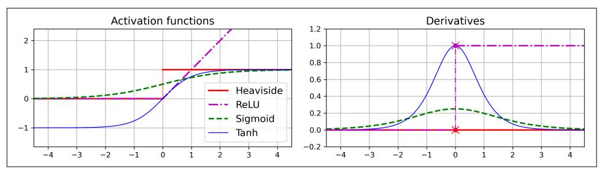

Figure 10-8. Activation functions (left) and their derivatives (right)

OK! You know where neural nets came from, what their architecture is, and how to compute their outputs. You've also learned about the backpropagation algorithm. But what exactly can you do with neural nets?

### **Regression MLPs**

First, MLPs can be used for regression tasks. If you want to predict a single value (e.g., the price of a house, given many of its features), then you just need a single output neuron: its output is the predicted value. For multivariate regression (i.e., to predict multiple values at once), you need one output neuron per output dimension. For example, to locate the center of an object in an image, you need to predict 2D coordinates, so you need two output neurons. If you also want to place a bounding box around the object, then you need two more numbers: the width and the height of the object. So, you end up with four output neurons.

Scikit-Learn includes an MLPRegressor class, so let's use it to build an MLP with three hidden layers composed of 50 neurons each, and train it on the California housing dataset. For simplicity, we will use Scikit-Learn's fetch\_california\_housing() function to load the data. This dataset is simpler than the one we used in Chapter 2, since it contains only numerical features (there is no ocean\_proximity feature), and there are no missing values. The following code starts by fetching and splitting the dataset, then it creates a pipeline to standardize the input features before sending them to the MLPRegressor. This is very important for neural networks because they are trained using gradient descent, and as we saw in Chapter 4, gradient descent does not converge very well when the features have very different scales. Finally, the code trains the model and evaluates its validation error. The model uses the ReLU activation function in the hidden layers, and it uses a variant of gradient descent called Adam (see Chapter 11) to minimize the mean squared error, with a little bit of  $\ell_2$  regularization (which you can control via the alpha hyperparameter):

{341}------------------------------------------------

```
from sklearn.datasets import fetch_california_housing
from sklearn.metrics import mean squared error
from sklearn.model selection import train test split
from sklearn.neural network import MLPRegressor
from sklearn.pipeline import make pipeline
from sklearn.preprocessing import StandardScaler
housing = fetch\_california_housing()X train full, X test, y train full, y test = train test split(
    housing.data, housing.target, random state=42)
X_train, X_valid, y_train, y_valid = train_test_split(
    X train full, y train full, random state=42)
mlp req = MLPRegressor(hidden layer sizes=[50, 50, 50], random state=42)
pipeline = make pipeline(StandardScaler(), mlp reg)
pipeline.fit(X_train, y_train)
y pred = pipeline.predict(X_valid)
rmse = mean_squared_error(y_valid, y_pred, squared=False) # about 0.505
```

We get a validation RMSE of about 0.505, which is comparable to what you would get with a random forest classifier. Not too bad for a first try!

Note that this MLP does not use any activation function for the output layer, so it's free to output any value it wants. This is generally fine, but if you want to guarantee that the output will always be positive, then you should use the ReLU activation function in the output layer, or the *softplus* activation function, which is a smooth variant of ReLU: softplus(z) =  $log(1 + exp(z))$ . Softplus is close to 0 when z is negative, and close to  $z$  when  $z$  is positive. Finally, if you want to guarantee that the predictions will always fall within a given range of values, then you should use the sigmoid function or the hyperbolic tangent, and scale the targets to the appropriate range: 0 to 1 for sigmoid and -1 to 1 for tanh. Sadly, the MLPRegressor class does not support activation functions in the output layer.


Building and training a standard MLP with Scikit-Learn in just a few lines of code is very convenient, but the neural net features are limited. This is why we will switch to Keras in the second part of this chapter.

The MLPRegressor class uses the mean squared error, which is usually what you want for regression, but if you have a lot of outliers in the training set, you may prefer to use the mean absolute error instead. Alternatively, you may want to use the *Huber* loss, which is a combination of both. It is quadratic when the error is smaller than a threshold  $\delta$  (typically 1) but linear when the error is larger than  $\delta$ . The linear part makes it less sensitive to outliers than the mean squared error, and the quadratic part allows it to converge faster and be more precise than the mean absolute error. However, MLPRegressor only supports the MSE.

{342}------------------------------------------------

Table 10-1 summarizes the typical architecture of a regression MLP.

| Hyperparameter             | <b>Typical value</b>                                                              |
|----------------------------|-----------------------------------------------------------------------------------|
| # hidden layers            | Depends on the problem, but typically 1 to 5                                      |
| # neurons per hidden layer | Depends on the problem, but typically 10 to 100                                   |
| # output neurons           | 1 per prediction dimension                                                        |
| <b>Hidden activation</b>   | ReLU                                                                              |
| Output activation          | None, or ReLU/softplus (if positive outputs) or sigmoid/tanh (if bounded outputs) |
| Loss function              | <b>MSE, or Huber if outliers</b>                                                  |

Table 10-1. Typical regression MLP architecture

### **Classification MLPs**

MLPs can also be used for classification tasks. For a binary classification problem, you just need a single output neuron using the sigmoid activation function: the output will be a number between 0 and 1, which you can interpret as the estimated probability of the positive class. The estimated probability of the negative class is equal to one minus that number.

MLPs can also easily handle multilabel binary classification tasks (see Chapter 3). For example, you could have an email classification system that predicts whether each incoming email is ham or spam, and simultaneously predicts whether it is an urgent or nonurgent email. In this case, you would need two output neurons, both using the sigmoid activation function: the first would output the probability that the email is spam, and the second would output the probability that it is urgent. More generally, you would dedicate one output neuron for each positive class. Note that the output probabilities do not necessarily add up to 1. This lets the model output any combination of labels: you can have nonurgent ham, urgent ham, nonurgent spam, and perhaps even urgent spam (although that would probably be an error).

If each instance can belong only to a single class, out of three or more possible classes (e.g., classes 0 through 9 for digit image classification), then you need to have one output neuron per class, and you should use the softmax activation function for the whole output layer (see Figure 10-9). The softmax function (introduced in Chapter  $4$ ) will ensure that all the estimated probabilities are between 0 and 1 and that they add up to 1, since the classes are exclusive. As you saw in Chapter 3, this is called multiclass classification.

Regarding the loss function, since we are predicting probability distributions, the cross-entropy loss (or x-entropy or log loss for short, see Chapter 4) is generally a good choice.

{343}------------------------------------------------

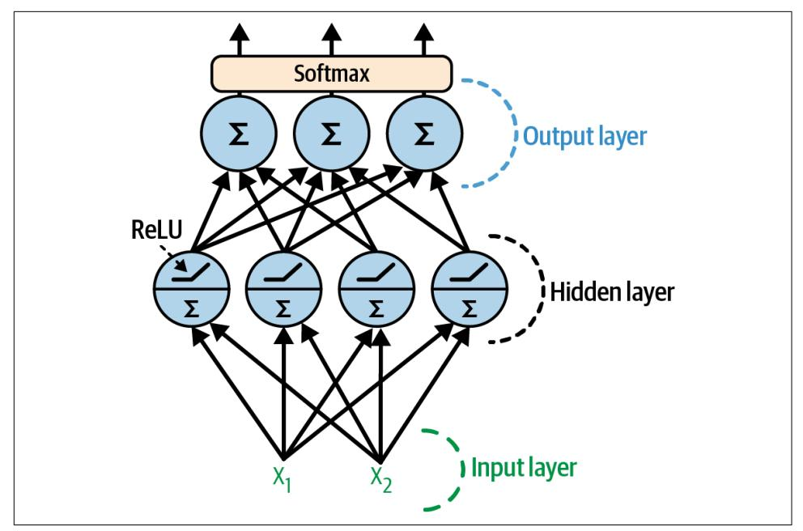

Figure 10-9. A modern MLP (including ReLU and softmax) for classification

Scikit-Learn has an MLPClassifier class in the sklearn.neural network package. It is almost identical to the MLPRegressor class, except that it minimizes the cross entropy rather than the MSE. Give it a try now, for example on the iris dataset. It's almost a linear task, so a single layer with 5 to 10 neurons should suffice (make sure to scale the features).

Table 10-2 summarizes the typical architecture of a classification MLP.

| Hyperparameter          |                                                | Binary classification Multilabel binary classification Multiclass classification |             |  |
|-------------------------|------------------------------------------------|----------------------------------------------------------------------------------|-------------|--|
| # hidden layers         | Typically 1 to 5 layers, depending on the task |                                                                                  |             |  |
| # output neurons        |                                                | 1 per binary label                                                               | 1 per class |  |
| Output layer activation | Siamoid                                        | Sigmoid                                                                          | Softmax     |  |
| Loss function           | X-entropy                                      | X-entropy                                                                        | X-entropy   |  |

Table 10-2. Typical classification MLP architecture


Before we go on, I recommend you go through exercise 1 at the end of this chapter. You will play with various neural network architectures and visualize their outputs using the TensorFlow playground. This will be very useful to better understand MLPs, including the effects of all the hyperparameters (number of layers and neurons, activation functions, and more).

{344}------------------------------------------------

Now you have all the concepts you need to start implementing MLPs with Keras!

### **Implementing MLPs with Keras**

Keras is TensorFlow's high-level deep learning API: it allows you to build, train, evaluate, and execute all sorts of neural networks. The original Keras library was developed by François Chollet as part of a research project<sup>12</sup> and was released as a standalone open source project in March 2015. It quickly gained popularity, owing to its ease of use, flexibility, and beautiful design.


Keras used to support multiple backends, including TensorFlow, PlaidML, Theano, and Microsoft Cognitive Toolkit (CNTK) (the last two are sadly deprecated), but since version 2.4, Keras is TensorFlow-only. Similarly, TensorFlow used to include multiple high-level APIs, but Keras was officially chosen as its preferred high-level API when TensorFlow 2 came out. Installing TensorFlow will automatically install Keras as well, and Keras will not work without TensorFlow installed. In short, Keras and TensorFlow fell in love and got married. Other popular deep learning libraries include PyTorch by Facebook and JAX by Google.<sup>13</sup>

Now let's use Keras! We will start by building an MLP for image classification.


Colab runtimes come with recent versions of TensorFlow and Keras preinstalled. However, if you want to install them on your own machine, please see the installation instructions at https:// homl.info/install.

<sup>12</sup> Project ONEIROS (Open-ended Neuro-Electronic Intelligent Robot Operating System). Chollet joined Google in 2015, where he continues to lead the Keras project.

<sup>13</sup> PyTorch's API is quite similar to Keras's, so once you know Keras, it is not difficult to switch to PyTorch, if you ever want to. PyTorch's popularity grew exponentially in 2018, largely thanks to its simplicity and excellent documentation, which were not TensorFlow 1.x's main strengths back then. However, TensorFlow 2 is just as simple as PyTorch, in part because it has adopted Keras as its official high-level API, and also because the developers have greatly simplified and cleaned up the rest of the API. The documentation has also been completely reorganized, and it is much easier to find what you need now. Similarly, PyTorch's main weaknesses (e.g., limited portability and no computation graph analysis) have been largely addressed in PyTorch 1.0. Healthy competition seems beneficial to everyone.

{345}------------------------------------------------

### **Building an Image Classifier Using the Sequential API**

First, we need to load a dataset. We will use Fashion MNIST, which is a drop-in replacement of MNIST (introduced in Chapter 3). It has the exact same format as MNIST (70,000 grayscale images of  $28 \times 28$  pixels each, with 10 classes), but the images represent fashion items rather than handwritten digits, so each class is more diverse, and the problem turns out to be significantly more challenging than MNIST. For example, a simple linear model reaches about 92% accuracy on MNIST, but only about 83% on Fashion MNIST.

#### **Using Keras to load the dataset**

Keras provides some utility functions to fetch and load common datasets, including MNIST, Fashion MNIST, and a few more. Let's load Fashion MNIST. It's already shuffled and split into a training set (60,000 images) and a test set (10,000 images), but we'll hold out the last 5,000 images from the training set for validation:

```
import tensorflow as tf
```

```
fashion mnist = tf.keras.datasets.fashion mnist.load data()(X_train_full, y_train_full), (X_test, y_test) = fashion_mnist
X_train, y_train = X_ttrain_full[:-5000], y_train_full[:-5000]
X_valid, y_valid = X_train-full[-5000:], y_train_full[-5000:]
```


TensorFlow is usually imported as tf, and the Keras API is available via tf.keras.

When loading MNIST or Fashion MNIST using Keras rather than Scikit-Learn, one important difference is that every image is represented as a  $28 \times 28$  array rather than a 1D array of size 784. Moreover, the pixel intensities are represented as integers (from 0 to 255) rather than floats (from 0.0 to 255.0). Let's take a look at the shape and data type of the training set:

```
>>> X_train.shape
(55000, 28, 28)>>> X train.dtype
dtype('uint8')
```

For simplicity, we'll scale the pixel intensities down to the  $0-1$  range by dividing them by 255.0 (this also converts them to floats):

```
X_train, X_valid, X_test = X_train / 255., X_valid / 255., X_test / 255.
```

With MNIST, when the label is equal to 5, it means that the image represents the handwritten digit 5. Easy. For Fashion MNIST, however, we need the list of class names to know what we are dealing with:

{346}------------------------------------------------

```
class_names = ["T-shirt/top", "Trouser", "Pullover", "Dress", "Coat",
               "Sandal", "Shirt", "Sneaker", "Bag", "Ankle boot"]
```

For example, the first image in the training set represents an ankle boot:

```
\gg class_names[y_train[0]]
'Ankle boot'
```

Figure 10-10 shows some samples from the Fashion MNIST dataset.

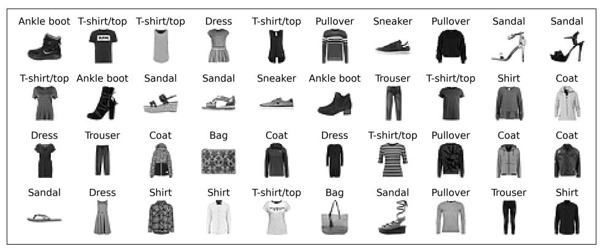

Figure 10-10. Samples from Fashion MNIST

#### Creating the model using the sequential API

Now let's build the neural network! Here is a classification MLP with two hidden layers:

```
tf.random.set_seed(42)
model = tf.keras.Sequential()model.add(tf.keras.layers.Input(shape=[28, 28]))
model.add(tf.keras.layers.Flatten())
model.add(tf.keras.layers.Dense(300, activation="relu"))
model.add(tf.keras.layers.Dense(100, activation="relu"))
model.add(tf.keras.layers.Dense(10, activation="softmax"))
```

Let's go through this code line by line:

- First, set TensorFlow's random seed to make the results reproducible: the random weights of the hidden layers and the output layer will be the same every time you run the notebook. You could also choose to use the tf.keras.utils.set\_ran dom seed() function, which conveniently sets the random seeds for TensorFlow, Python (random.seed()), and NumPy (np.random.seed()).
- The next line creates a Sequential model. This is the simplest kind of Keras model for neural networks that are just composed of a single stack of layers connected sequentially. This is called the sequential API.

{347}------------------------------------------------

- Next, we build the first layer (an Input layer) and add it to the model. We specify the input shape, which doesn't include the batch size, only the shape of the instances. Keras needs to know the shape of the inputs so it can determine the shape of the connection weight matrix of the first hidden layer.
- Then we add a Flatten layer. Its role is to convert each input image into a 1D array: for example, if it receives a batch of shape [32, 28, 28], it will reshape it to [32, 784]. In other words, if it receives input data X, it computes X. reshape(-1, 784). This layer doesn't have any parameters; it's just there to do some simple preprocessing.
- Next we add a Dense hidden layer with 300 neurons. It will use the ReLU activation function. Each Dense layer manages its own weight matrix, containing all the connection weights between the neurons and their inputs. It also manages a vector of bias terms (one per neuron). When it receives some input data, it computes Equation 10-2.
- Then we add a second Dense hidden layer with 100 neurons, also using the ReLU activation function.
- Finally, we add a Dense output layer with 10 neurons (one per class), using the softmax activation function because the classes are exclusive.


Specifying activation="relu" is equivalent to specifying activation=tf.keras.activations.relu. Other activation functions are available in the tf.keras.activations package. We will use many of them in this book; see https://keras.io/api/layers/activa tions for the full list. We will also define our own custom activation functions in Chapter 12.

Instead of adding the layers one by one as we just did, it's often more convenient to pass a list of layers when creating the Sequential model. You can also drop the Input layer and instead specify the input\_shape in the first layer:

```
model = tf.keras.Sequential(f)tf.keras.layers.Flatten(input shape=[28, 28]),
    tf.keras.layers.Dense(300, activation="relu"),
    tf.keras.layers.Dense(100, activation="relu"),
    tf.keras.layers.Dense(10, activation="softmax")
\left| \right\rangle
```

{348}------------------------------------------------

The model's summary() method displays all the model's layers,  $^{14}$  including each layer's name (which is automatically generated unless you set it when creating the layer), its output shape (None means the batch size can be anything), and its number of parameters. The summary ends with the total number of parameters, including trainable and non-trainable parameters. Here we only have trainable parameters (you will see some non-trainable parameters later in this chapter):

```
>>> model.summary()
Model: "sequential"
```

| Layer (type)                                                                  | Output Shape | Param # |
|-------------------------------------------------------------------------------|--------------|---------|
| flatten (Flatten)                                                             | (None, 784)  | 0       |
| dense (Dense)                                                                 | (None, 300)  | 235500  |
| dense 1 (Dense)                                                               | (None, 100)  | 30100   |
| dense 2 (Dense)                                                               | (None, 10)   | 1010    |
| Total params: 266,610<br>Trainable params: 266,610<br>Non-trainable params: 0 |              |         |

Note that Dense layers often have a *lot* of parameters. For example, the first hidden layer has  $784 \times 300$  connection weights, plus 300 bias terms, which adds up to 235,500 parameters! This gives the model quite a lot of flexibility to fit the training data, but it also means that the model runs the risk of overfitting, especially when you do not have a lot of training data. We will come back to this later.

Each layer in a model must have a unique name (e.g., "dense\_2"). You can set the layer names explicitly using the constructor's name argument, but generally it's simpler to let Keras name the layers automatically, as we just did. Keras takes the layer's class name and converts it to snake case (e.g., a layer from the MyCoolLayer class is named "my\_cool\_layer" by default). Keras also ensures that the name is globally unique, even across models, by appending an index if needed, as in "dense\_2". But why does it bother making the names unique across models? Well, this makes it possible to merge models easily without getting name conflicts.

<sup>14</sup> You can also use tf.keras.utils.plot\_model() to generate an image of your model.

{349}------------------------------------------------


All global state managed by Keras is stored in a Keras session, which you can clear using tf.keras.backend.clear\_session(). In particular, this resets the name counters.

You can easily get a model's list of layers using the layers attribute, or use the get\_layer() method to access a layer by name:

```
>>> model.layers
[<keras.layers.core.flatten.Flatten at 0x7fa1dea02250>,
<keras.layers.core.dense.Dense at 0x7fa1c8f42520>,
<keras.layers.core.dense.Dense at 0x7fa188be7ac0>,
<keras.layers.core.dense.Dense at 0x7fa188be7fa0>]
\Rightarrow hidden1 = model.layers[1]
>>> hidden1.name
'dense'
>>> model.get_layer('dense') is hidden1
True
```

All the parameters of a layer can be accessed using its get weights() and set\_weights() methods. For a Dense layer, this includes both the connection weights and the bias terms:

```
>>> weights, biases = hidden1.get weights()
>>> weights
array([ 6.02448617, -0.00877795, -0.02189048, ..., 0.03859074, -0.06889391],[0.00476504, -0.03105379, -0.0586676, ..., -0.02763776, -0.04165364],\ldots[0.07061854, -0.06960931, 0.07038955, ..., 0.00034875, 0.02878492],[-0.06022581, 0.01577859, -0.02585464, ..., 0.00272203, -0.06793761]],dtype=float32)
>>> weights.shape
(784, 300)>>> biases
array([0., 0., 0., 0., 0., 0., 0., 0., 0., 0., ..., 0., 0., 0.]) dtype=float32)
>>> biases.shape
(300, )
```

Notice that the Dense layer initialized the connection weights randomly (which is needed to break symmetry, as discussed earlier), and the biases were initialized to zeros, which is fine. If you want to use a different initialization method, you can set kernel\_initializer (kernel is another name for the matrix of connection weights) or bias initializer when creating the layer. We'll discuss initializers further in Chapter 11, and the full list is at https://keras.io/api/layers/initializers.

{350}------------------------------------------------


The shape of the weight matrix depends on the number of inputs, which is why we specified the input\_shape when creating the model. If you do not specify the input shape, it's OK: Keras will simply wait until it knows the input shape before it actually builds the model parameters. This will happen either when you feed it some data (e.g., during training), or when you call its build() method. Until the model parameters are built, you will not be able to do certain things, such as display the model summary or save the model. So, if you know the input shape when creating the model, it is best to specify it.

#### **Compiling the model**

After a model is created, you must call its compile() method to specify the loss function and the optimizer to use. Optionally, you can specify a list of extra metrics to compute during training and evaluation:

```
model.compile(loss="sparse_categorical_crossentropy",
              optimizer="sgd",
              metrics = ['accuracy"]
```


Using loss="sparse\_categorical\_crossentropy" is the equivalent of using loss=tf.keras.losses.sparse\_categorical\_ crossentropy. Similarly, using optimizer="sgd" is the equivalent of using optimizer=tf.keras.optimizers.SGD(), and using metrics=["accuracy"] is the equivalent of using metrics= [tf.keras.metrics.sparse categorical accuracy] (when using this loss). We will use many other losses, optimizers, and metrics in this book; for the full lists, see https://keras.io/api/losses, https:// keras.io/api/optimizers, and https://keras.io/api/metrics.

This code requires explanation. We use the "sparse categorical crossentropy" loss because we have sparse labels (i.e., for each instance, there is just a target class index, from 0 to 9 in this case), and the classes are exclusive. If instead we had one target probability per class for each instance (such as one-hot vectors, e.g.,  $[0., 0., 0., 1., 0., 0., 0., 0., 0., 0.]$  to represent class 3), then we would need to use the "categorical crossentropy" loss instead. If we were doing binary classification or multilabel binary classification, then we would use the "sigmoid" activation function in the output layer instead of the "softmax" activation function, and we would use the "binary\_crossentropy" loss.

{351}------------------------------------------------


If you want to convert sparse labels (i.e., class indices) to one-hot vector labels, use the tf.keras.utils.to\_categorical() function. To go the other way round, use the np.argmax() function with axis=1.

Regarding the optimizer, "sgd" means that we will train the model using stochastic gradient descent. In other words, Keras will perform the backpropagation algorithm described earlier (i.e., reverse-mode autodiff plus gradient descent). We will discuss more efficient optimizers in Chapter 11. They improve gradient descent, not autodiff.


When using the SGD optimizer, it is important to tune the learning rate. So, you will generally want to use optimizer=tf.keras. optimizers. SGD(learning\_rate=\_???\_) to set the learning rate, rather than optimizer="sgd", which defaults to a learning rate of  $0.01$ .

Finally, since this is a classifier, it's useful to measure its accuracy during training and evaluation, which is why we set metrics=["accuracy"].

#### **Training and evaluating the model**

Now the model is ready to be trained. For this we simply need to call its fit() method:

```
>>> history = model.fit(X train, y train, epochs=30,
                        validation data=(X valid, y valid))
\ddotsc\ddotscEpoch 1/301719/1719 [================================ ] - 2s 989us/step
  - loss: 0.7220 - sparse categorical accuracy: 0.7649
  - val_loss: 0.4959 - val_sparse_categorical_accuracy: 0.8332
Epoch 2/301719/1719 [================================] - 2s 964us/step
  - loss: 0.4825 - sparse categorical accuracy: 0.8332
  - val loss: 0.4567 - val sparse categorical accuracy: 0.8384
[\ldots]Epoch 30/30
1719/1719 [=================================] - 2s 963us/step
  - loss: 0.2235 - sparse categorical accuracy: 0.9200
  - val loss: 0.3056 - val sparse categorical accuracy: 0.8894
```

We pass it the input features  $(X_t$ train) and the target classes  $(y_t$ train), as well as the number of epochs to train (or else it would default to just 1, which would definitely not be enough to converge to a good solution). We also pass a validation set (this is optional). Keras will measure the loss and the extra metrics on this set at the end of each epoch, which is very useful to see how well the model really performs. If the performance on the training set is much better than on the validation set, your model 

{352}------------------------------------------------

is probably overfitting the training set, or there is a bug, such as a data mismatch between the training set and the validation set.


Shape errors are quite common, especially when getting started, so you should familiarize yourself with the error messages: try fitting a model with inputs and/or labels of the wrong shape, and see the errors you get. Similarly, try compiling the model with loss="categorical crossentropy" instead of loss="sparse\_categorical\_crossentropy". Or you can remove the Flatten layer.

And that's it! The neural network is trained. At each epoch during training, Keras displays the number of mini-batches processed so far on the left side of the progress bar. The batch size is 32 by default, and since the training set has 55,000 images, the model goes through 1,719 batches per epoch: 1,718 of size 32, and 1 of size 24. After the progress bar, you can see the mean training time per sample, and the loss and accuracy (or any other extra metrics you asked for) on both the training set and the validation set. Notice that the training loss went down, which is a good sign, and the validation accuracy reached 88.94% after 30 epochs. That's slightly below the training accuracy, so there is a little bit of overfitting going on, but not a huge amount.


Instead of passing a validation set using the validation\_data argument, you could set validation split to the ratio of the training set that you want Keras to use for validation. For example, validation split=0.1 tells Keras to use the last 10% of the data (before shuffling) for validation.

If the training set was very skewed, with some classes being overrepresented and others underrepresented, it would be useful to set the class\_weight argument when calling the fit() method, to give a larger weight to underrepresented classes and a lower weight to overrepresented classes. These weights would be used by Keras when computing the loss. If you need per-instance weights, set the sample weight argument. If both class\_weight and sample\_weight are provided, then Keras multiplies them. Per-instance weights could be useful, for example, if some instances were labeled by experts while others were labeled using a crowdsourcing platform: you might want to give more weight to the former. You can also provide sample weights (but not class weights) for the validation set by adding them as a third item in the validation data tuple.

The fit() method returns a History object containing the training parameters (history.params), the list of epochs it went through (history.epoch), and most importantly a dictionary (history.history) containing the loss and extra metrics

{353}------------------------------------------------

it measured at the end of each epoch on the training set and on the validation set (if any). If you use this dictionary to create a Pandas DataFrame and call its plot() method, you get the learning curves shown in Figure 10-11:

```
import matplotlib.pyplot as plt
import pandas as pd
pd.DataFrame(history.history).plot(
    figsize=(8, 5), xlim=[0, 29], ylim=[0, 1], grid=True, xlabel="Epoch",
    style=["r--", "r--.", "b-", "b-*"])
plt.show()
```

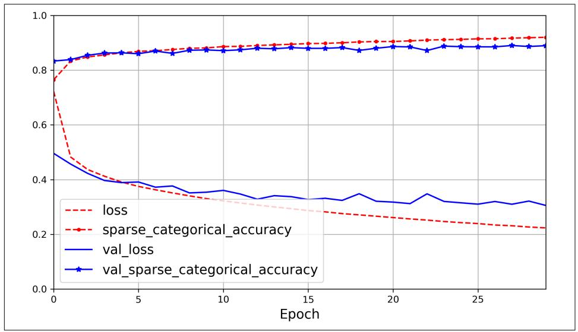

Figure 10-11. Learning curves: the mean training loss and accuracy measured over each epoch, and the mean validation loss and accuracy measured at the end of each epoch

You can see that both the training accuracy and the validation accuracy steadily increase during training, while the training loss and the validation loss decrease. This is good. The validation curves are relatively close to each other at first, but they get further apart over time, which shows that there's a little bit of overfitting. In this particular case, the model looks like it performed better on the validation set than on the training set at the beginning of training, but that's not actually the case. The validation error is computed at the end of each epoch, while the training error is computed using a running mean during each epoch, so the training curve should be shifted by half an epoch to the left. If you do that, you will see that the training and validation curves overlap almost perfectly at the beginning of training.

The training set performance ends up beating the validation performance, as is generally the case when you train for long enough. You can tell that the model has not quite converged yet, as the validation loss is still going down, so you should probably

{354}------------------------------------------------

continue training. This is as simple as calling the fit() method again, since Keras just continues training where it left off: you should be able to reach about 89.8% validation accuracy, while the training accuracy will continue to rise up to 100% (this is not always the case).

If you are not satisfied with the performance of your model, you should go back and tune the hyperparameters. The first one to check is the learning rate. If that doesn't help, try another optimizer (and always retune the learning rate after changing any hyperparameter). If the performance is still not great, then try tuning model hyperparameters such as the number of layers, the number of neurons per layer, and the types of activation functions to use for each hidden layer. You can also try tuning other hyperparameters, such as the batch size (it can be set in the fit() method using the batch size argument, which defaults to 32). We will get back to hyperparameter tuning at the end of this chapter. Once you are satisfied with your model's validation accuracy, you should evaluate it on the test set to estimate the generalization error before you deploy the model to production. You can easily do this using the evaluate() method (it also supports several other arguments, such as batch\_size and sample\_weight; please check the documentation for more details):

```
>>> model.evaluate(X test, y test)
313/313 [===============================] - 0s 626us/step
  - loss: 0.3243 - sparse categorical accuracy: 0.8864
[0.32431697845458984, 0.8863999843597412]
```

As you saw in Chapter 2, it is common to get slightly lower performance on the test set than on the validation set, because the hyperparameters are tuned on the validation set, not the test set (however, in this example, we did not do any hyperparameter tuning, so the lower accuracy is just bad luck). Remember to resist the temptation to tweak the hyperparameters on the test set, or else your estimate of the generalization error will be too optimistic.

#### Using the model to make predictions

Now let's use the model's predict() method to make predictions on new instances. Since we don't have actual new instances, we'll just use the first three instances of the test set:

```
\Rightarrow X new = X test[:3]
\Rightarrow y_proba = model.predict(X_new)
\Rightarrow y_proba.round(2)
array([[0. , 0. , 0. , 0. , 0. , 0. , 0. , 0.01, 0. , 0.02, 0. , 0.97],[0. , 0. , 0.99, 0. , 0.01, 0. , 0. , 0. , 0. , 0. ][0. , 1. , 0. , 0. , 0. , 0. , 0. , 0. , 0. , 0. ]dtype=float32)
```

For each instance the model estimates one probability per class, from class 0 to class 9. This is similar to the output of the predict proba() method in Scikit-Learn 

{355}------------------------------------------------

classifiers. For example, for the first image it estimates that the probability of class 9 (ankle boot) is 96%, the probability of class 7 (sneaker) is 2%, the probability of class 5 (sandal) is 1%, and the probabilities of the other classes are negligible. In other words, it is highly confident that the first image is footwear, most likely ankle boots but possibly sneakers or sandals. If you only care about the class with the highest estimated probability (even if that probability is quite low), then you can use the argmax() method to get the highest probability class index for each instance:

```
>>> import numpy as np
\Rightarrow y_pred = y_proba.argmax(axis=-1)
>>> y_pred
array([9, 2, 1])>>> np.array(class_names)[y_pred]
array(['Ankle boot', 'Pullover', 'Trouser'], dtype='<U11')
```

Here, the classifier actually classified all three images correctly (these images are shown in Figure 10-12):

```
\Rightarrow y_new = y_test[:3]
>>> y_new
array([9, 2, 1], dtype=uint8)
```

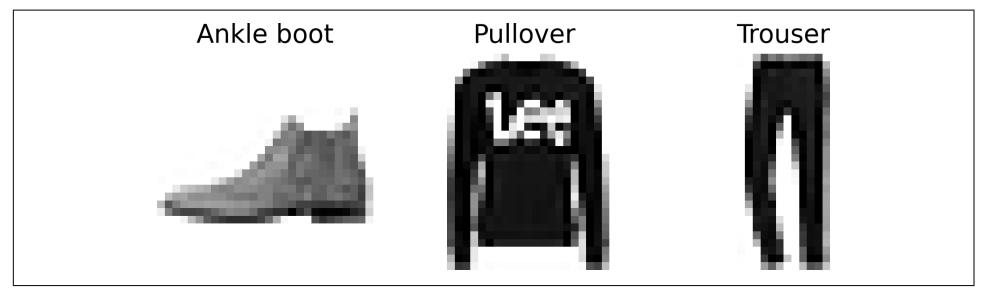

Figure 10-12. Correctly classified Fashion MNIST images

Now you know how to use the sequential API to build, train, and evaluate a classification MLP. But what about regression?

### **Building a Regression MLP Using the Sequential API**

Let's switch back to the California housing problem and tackle it using the same MLP as earlier, with 3 hidden layers composed of 50 neurons each, but this time building it with Keras.

Using the sequential API to build, train, evaluate, and use a regression MLP is quite similar to what we did for classification. The main differences in the following code example are the fact that the output layer has a single neuron (since we only want to predict a single value) and it uses no activation function, the loss function is the mean squared error, the metric is the RMSE, and we're using an Adam optimizer like 

{356}------------------------------------------------

Scikit-Learn's MLPRegressor did. Moreover, in this example we don't need a Flatten layer, and instead we're using a Normalization layer as the first layer: it does the same thing as Scikit-Learn's StandardScaler, but it must be fitted to the training data using its adapt() method *before* you call the model's fit() method. (Keras has other preprocessing layers, which will be covered in Chapter 13). Let's take a look:

```
tf.random.set_seed(42)
norm layer = tf.keras.layers.Normalization(input shape=X train.shapef_1:1)
model = tf.keras.Sequential()norm_layer,
   tf.keras.layers.Dense(50, activation="relu"),
    tf.keras.layers.Dense(50, activation="relu"),
    tf.keras.layers.Dense(50, activation="relu"),
    tf.keras.layers.Dense(1)
\mathcal{D}optimizer = tf.keras.optimizers.Adam(learning rate=1e-3)
model.compile(loss="mse", optimizer=optimizer, metrics=["RootMeanSquaredError"])
norm_layer.adapt(X_train)
history = model.fit(X_train, y_train, epochs=20,validation_data=(X_valid, y_valid))
mse test, rmse test = model.evaluate(X test, y test)
X_new = X_test[:3]y pred = model.predict(X new)
```


The Normalization layer learns the feature means and standard deviations in the training data when you call the adapt() method. Yet when you display the model's summary, these statistics are listed as non-trainable. This is because these parameters are not affected by gradient descent.

As you can see, the sequential API is quite clean and straightforward. However, although Sequential models are extremely common, it is sometimes useful to build neural networks with more complex topologies, or with multiple inputs or outputs. For this purpose, Keras offers the functional API.

### **Building Complex Models Using the Functional API**

One example of a nonsequential neural network is a Wide  $\&$  Deep neural network. This neural network architecture was introduced in a 2016 paper by Heng-Tze Cheng et al.<sup>15</sup> It connects all or part of the inputs directly to the output layer, as shown in Figure 10-13. This architecture makes it possible for the neural network to learn both deep patterns (using the deep path) and simple rules (through the short path).<sup>16</sup> In

<sup>15</sup> Heng-Tze Cheng et al., "Wide & Deep Learning for Recommender Systems", Proceedings of the First Workshop on Deep Learning for Recommender Systems (2016): 7-10.

<sup>16</sup> The short path can also be used to provide manually engineered features to the neural network.

{357}------------------------------------------------

contrast, a regular MLP forces all the data to flow through the full stack of layers; thus, simple patterns in the data may end up being distorted by this sequence of transformations.


Figure 10-13. Wide & Deep neural network

Let's build such a neural network to tackle the California housing problem:

```
normalization layer = tf.keras.layers.Normalization()hidden layer1 = tf.keras.layers.Dense(30, activation="relu")
hidden_layer2 = tf.keras.layers.Dense(30, activation="relu")
concat layer = tf.keras.layers.Concatenate()
output ayer = tf. keras. layers. Dense(1)
input = tf.keras. layers. Input(shape=X train.shape[1:])normalized = normalization<math>layer(input_])hidden1 = hidden_layer1(normalized)hidden2 = hidden<math>layer2(hidden1)concat = concat_layer([normalized, hidden2])
output = output layer(concat)model = tf.keras.Model(inputs=[input_], outputs=[output])
```

{358}------------------------------------------------

At a high level, the first five lines create all the layers we need to build the model, the next six lines use these layers just like functions to go from the input to the output, and the last line creates a Keras Model object by pointing to the input and the output. Let's go through this code in more detail:

- First, we create five layers: a Normalization layer to standardize the inputs, two Dense layers with 30 neurons each, using the ReLU activation function, a Concatenate layer, and one more Dense layer with a single neuron for the output layer, without any activation function.
- Next, we create an Input object (the variable name input\_ is used to avoid overshadowing Python's built-in input() function). This is a specification of the kind of input the model will get, including its shape and optionally its dtype, which defaults to 32-bit floats. A model may actually have multiple inputs, as you will see shortly.
- Then we use the Normalization layer just like a function, passing it the Input object. This is why this is called the functional API. Note that we are just telling Keras how it should connect the layers together; no actual data is being processed yet, as the Input object is just a data specification. In other words, it's a symbolic input. The output of this call is also symbolic: normalized doesn't store any actual data, it's just used to construct the model.
- In the same way, we then pass normalized to hidden\_layer1, which outputs hidden1, and we pass hidden1 to hidden\_layer2, which outputs hidden2.
- So far we've connected the layers sequentially, but then we use the concat layer to concatenate the input and the second hidden layer's output. Again, no actual data is concatenated yet: it's all symbolic, to build the model.
- Then we pass concat to the output\_layer, which gives us the final output.
- Lastly, we create a Keras Model, specifying which inputs and outputs to use.

Once you have built this Keras model, everything is exactly like earlier, so there's no need to repeat it here: you compile the model, adapt the Normalization layer, fit the model, evaluate it, and use it to make predictions.

But what if you want to send a subset of the features through the wide path and a different subset (possibly overlapping) through the deep path, as illustrated in Figure 10-14? In this case, one solution is to use multiple inputs. For example, suppose we want to send five features through the wide path (features 0 to 4), and six features through the deep path (features 2 to 7). We can do this as follows:

{359}------------------------------------------------

```
input_wide = tf.keras.layers.Input(shape=[5]) # features 0 to 4
input deep = tf.keras.layers.Input(shape=[6]) # features 2 to 7
norm_layer_wide = tf.keras.layers.Normalization()
norm layer deep = tf.keras.layers.Normalization()
norm wide = norm layer wide(input wide)
norm_deep = norm_layer_deep(input_deep)
hidden1 = tf.keras. layers. Dense(30, activation="relu") (norm-deep)hidden2 = tf.keras.layers.Dense(30, activation="relu")(hidden1)
concat = tf.keras.layers.concatenate([norm_wide, hidden2])
output = tf.keras.layers.Dense(1)(concat)model = tf.keras.Model(inputs=[input_wide, input_deep], outputs=[output])
```

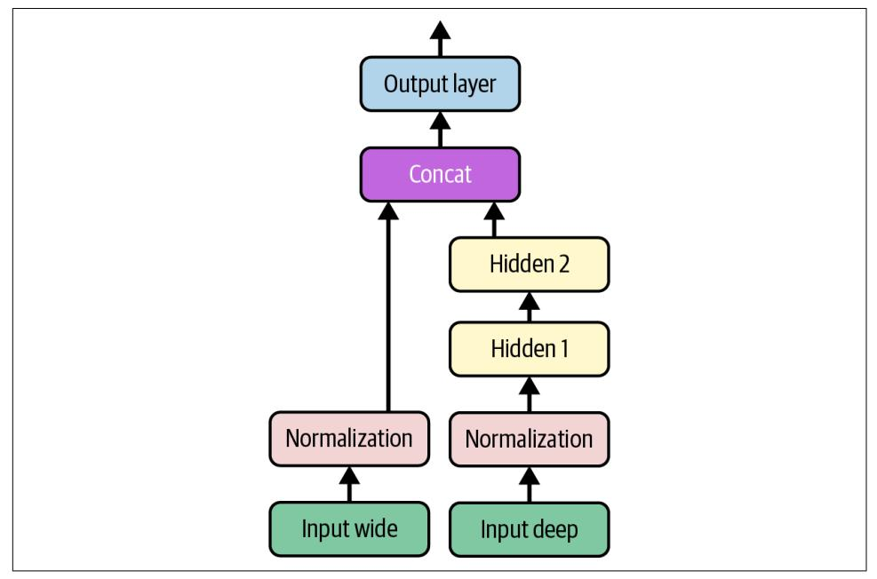

Figure 10-14. Handling multiple inputs

There are a few things to note in this example, compared to the previous one:

- Each Dense layer is created and called on the same line. This is a common practice, as it makes the code more concise without losing clarity. However, we can't do this with the Normalization layer since we need a reference to the layer to be able to call its adapt() method before fitting the model.
- We used tf.keras.layers.concatenate(), which creates a Concatenate layer and calls it with the given inputs.
- We specified inputs=[input\_wide, input\_deep] when creating the model, since there are two inputs.

{360}------------------------------------------------

Now we can compile the model as usual, but when we call the fit() method, instead of passing a single input matrix X train, we must pass a pair of matrices (X\_train\_wide, X\_train\_deep), one per input. The same is true for X\_valid, and also for X test and X new when you call evaluate() or predict():

```
optimize <math>r = tf</math>.keras.optimizers. Adam(learning rate=1e-3)model.compile(loss="mse", optimizer=optimizer, metrics=["RootMeanSquaredError"])
X_ttrain_wide, X_ttrain_deep = X_ttrain[:, :5], X_ttrain[:, 2:]
X valid wide, X_valid_deep = X_valid[:, :5], X_valid[:, 2:]
X test wide, X test deep = X test[:, :5], X test[:, 2:]
X_new_wide, X_new_deep = X_test_wide[:3], X_test_deep[:3]
norm_layer_wide.adapt(X_train_wide)
norm_layer_deep.adapt(X_train_deep)
history = model.fit((X_train_wide, X_train_deep), y_train, epochs=20,
                    validation_data=((X_valid_wide, X_valid_deep), y_valid))
mse_test = model.evaluate((X_test_wide, X_test_deep), y_test)
y pred = model.predict((X_new_wide, X_new(deep))
```


Instead of passing a tuple (X\_train\_wide, X\_train\_deep), you can pass a dictionary {"input wide": X train wide, "input\_deep": X\_train\_deep}, if you set name="input\_wide" and name="input deep" when creating the inputs. This is highly recommended when there are many inputs, to clarify the code and avoid getting the order wrong.

There are also many use cases in which you may want to have multiple outputs:

- The task may demand it. For instance, you may want to locate and classify the main object in a picture. This is both a regression tasks and a classification task.
- Similarly, you may have multiple independent tasks based on the same data. Sure, you could train one neural network per task, but in many cases you will get better results on all tasks by training a single neural network with one output per task. This is because the neural network can learn features in the data that are useful across tasks. For example, you could perform multitask classification on pictures of faces, using one output to classify the person's facial expression (smiling, surprised, etc.) and another output to identify whether they are wearing glasses or not.
- Another use case is as a regularization technique (i.e., a training constraint whose objective is to reduce overfitting and thus improve the model's ability to generalize). For example, you may want to add an auxiliary output in a neural network architecture (see Figure 10-15) to ensure that the underlying part of the

{361}------------------------------------------------

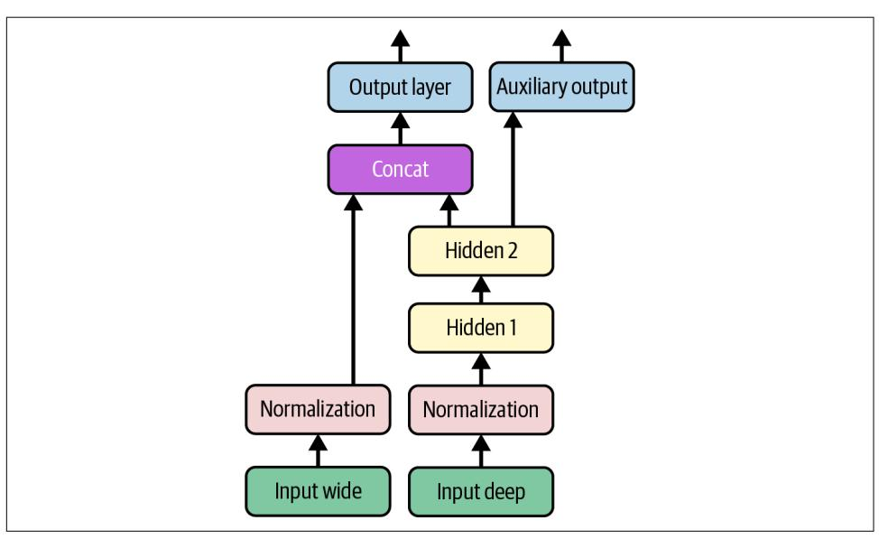

network learns something useful on its own, without relying on the rest of the network

Figure 10-15. Handling multiple outputs, in this example to add an auxiliary output for regularization

Adding an extra output is quite easy: we just connect it to the appropriate layer and add it to the model's list of outputs. For example, the following code builds the network represented in Figure 10-15:

```
[...] # Same as above, up to the main output layer
output = tf.keras.layers.Dense(1)(concat)aux_output = tf.keras.layers.Dense(1)(hidden2)
model = tf.keras.Model(inputs=[input wide, input deep],outputs=[output, aux_output])
```

Each output will need its own loss function. Therefore, when we compile the model, we should pass a list of losses. If we pass a single loss, Keras will assume that the same loss must be used for all outputs. By default, Keras will compute all the losses and simply add them up to get the final loss used for training. Since we care much more about the main output than about the auxiliary output (as it is just used for regularization), we want to give the main output's loss a much greater weight. Luckily, it is possible to set all the loss weights when compiling the model:

```
optimizer = tf.keras.optimizers.Adam(learning rate=1e-3)
model.compile(loss=("mse", "mse"), loss_weights=(0.9, 0.1), optimizer=optimizer,
              metrics=["RootMeanSquaredError"])
```

{362}------------------------------------------------


Instead of passing a tuple loss=("mse", "mse"), you can pass a dictionary loss={"output": "mse", "aux output": "mse"}, assuming you created the output layers with name="output" and name="aux\_output". Just like for the inputs, this clarifies the code and avoids errors when there are several outputs. You can also pass a dictionary for loss weights.

Now when we train the model, we need to provide labels for each output. In this example, the main output and the auxiliary output should try to predict the same thing, so they should use the same labels. So instead of passing y\_train, we need to pass (y\_train, y\_train), or a dictionary {"output": y\_train, "aux\_output": y\_train} if the outputs were named "output" and "aux\_output". The same goes for y\_valid and y\_test:

```
norm layer wide.adapt(X train wide)
norm layer deep.adapt(X_train_deep)
history = model.fit((X_train_wide, X_train_deep), (y_train, y_train), epochs=20,
    validation_data=((X_valid_wide, X_valid_deep), (y_valid, y_valid))
\lambda
```

When we evaluate the model, Keras returns the weighted sum of the losses, as well as all the individual losses and metrics:

```
eval results = model.evaluate((X test wide, X test deep), (y test, y test))
weighted_sum_of_losses, main_loss, aux_loss, main_rmse, aux_rmse = eval_results
```


If you set return dict=True, then evaluate() will return a dictionary instead of a big tuple.

Similarly, the predict() method will return predictions for each output:

```
y pred main, y pred aux = model.predict((X \text{ new wide}, X \text{ new deep}))
```

The predict() method returns a tuple, and it does not have a return dict argument to get a dictionary instead. However, you can create one using model.output names:

```
y_pred_tuple = model.predict((X_new_wide, X_new_deep))
y_pred = dict(zip(model.output_names, y_pred_tuple))
```

As you can see, you can build all sorts of architectures with the functional API. Next, we'll look at one last way you can build Keras models.

{363}------------------------------------------------

### Using the Subclassing API to Build Dynamic Models

Both the sequential API and the functional API are declarative: you start by declaring which layers you want to use and how they should be connected, and only then can you start feeding the model some data for training or inference. This has many advantages: the model can easily be saved, cloned, and shared; its structure can be displayed and analyzed; the framework can infer shapes and check types, so errors can be caught early (i.e., before any data ever goes through the model). It's also fairly straightforward to debug, since the whole model is a static graph of layers. But the flip side is just that: it's static. Some models involve loops, varying shapes, conditional branching, and other dynamic behaviors. For such cases, or simply if you prefer a more imperative programming style, the subclassing API is for you.

With this approach, you subclass the Model class, create the layers you need in the constructor, and use them to perform the computations you want in the call() method. For example, creating an instance of the following WideAndDeepModel class gives us an equivalent model to the one we just built with the functional API:

```
class WideAndDeepModel(tf.keras.Model):
   def _init_(self, units=30, activation="relu", **kwargs):
       super(). __ init_(**kwargs) # needed to support naming the model
       self.norm layer wide = tf.keras.layers.Normalization()self.norm layer deep = tf.keras.layers.Normalization()self.hidden1 = tf.keras.layers.Dense(units, activation=activation)
       self.hidden2 = tf.keras.layers.Dense(units, activation=activation)
       self.main output = tf.keras.layers.Dense(1)
       self.aux output = tf.keras.layers.Dense(1)
   def call(self, inputs):
       input_wide, input_deep = inputs
       norm wide = self.norm layer wide(input wide)
       norm deep = self.norm layer deep(input deep)
       hidden1 = self.hidden1(norm deep)hidden2 = self.hidden2(hidden1)concat = tf.keras.layers.concatenate([norm_wide, hidden2])
       output = self.mainloop output(concat)aux output = self.aux output(hidden2)
       return output, aux_output
```

```
model = WideAndDeepModel(30, activation="relu", name="my_cool_model")
```

This example looks like the previous one, except we separate the creation of the layers<sup>17</sup> in the constructor from their usage in the call() method. And we don't need to create the Input objects: we can use the input argument to the call() method.

<sup>17</sup> Keras models have an output attribute, so we cannot use that name for the main output layer, which is why we renamed it to main output.

{364}------------------------------------------------

Now that we have a model instance, we can compile it, adapt its normalization layers (e.g., using model.norm\_layer\_wide.adapt(...) and model.norm\_ layer deep. adapt $(...))$ , fit it, evaluate it, and use it to make predictions, exactly like we did with the functional API.

The big difference with this API is that you can include pretty much anything you want in the call() method: for loops, if statements, low-level TensorFlow operations—your imagination is the limit (see Chapter 12)! This makes it a great API when experimenting with new ideas, especially for researchers. However, this extra flexibility does come at a cost: your model's architecture is hidden within the call() method, so Keras cannot easily inspect it; the model cannot be cloned using tf.keras.models.clone\_model(); and when you call the summary() method, you only get a list of layers, without any information on how they are connected to each other. Moreover, Keras cannot check types and shapes ahead of time, and it is easier to make mistakes. So unless you really need that extra flexibility, you should probably stick to the sequential API or the functional API.


Keras models can be used just like regular layers, so you can easily combine them to build complex architectures.

Now that you know how to build and train neural nets using Keras, you will want to save them!

### **Saving and Restoring a Model**

Saving a trained Keras model is as simple as it gets:

```
model.save("my keras model", save format="tf")
```

When you set save format="tf",<sup>18</sup> Keras saves the model using TensorFlow's Saved-*Model* format: this is a directory (with the given name) containing several files and subdirectories. In particular, the saved\_model.pb file contains the model's architecture and logic in the form of a serialized computation graph, so you don't need to deploy the model's source code in order to use it in production; the SavedModel is sufficient (you will see how this works in Chapter 12). The keras\_metadata.pb file contains extra information needed by Keras. The variables subdirectory contains all the parameter values (including the connection weights, the biases, the normalization statistics, and the optimizer's parameters), possibly split across multiple files if the

<sup>18</sup> This is currently the default, but the Keras team is working on a new format that may become the default in upcoming versions, so I prefer to set the format explicitly to be future-proof.

{365}------------------------------------------------

model is very large. Lastly, the *assets* directory may contain extra files, such as data samples, feature names, class names, and so on. By default, the *assets* directory is empty. Since the optimizer is also saved, including its hyperparameters and any state it may have, after loading the model you can continue training if you want.


If you set save\_format="h5" or use a filename that ends with .h5, .hdf5, or .keras, then Keras will save the model to a single file using a Keras-specific format based on the HDF5 format. However, most TensorFlow deployment tools require the SavedModel format instead.

You will typically have a script that trains a model and saves it, and one or more scripts (or web services) that load the model and use it to evaluate it or to make predictions. Loading the model is just as easy as saving it:

```
model = tf.keras.models.load_model("my_keras_model")
y_pred_main, y_pred_aux = model.predict((X_new_wide, X_new deep))
```

You can also use save\_weights() and load\_weights() to save and load only the parameter values. This includes the connection weights, biases, preprocessing stats, optimizer state, etc. The parameter values are saved in one or more files such as my\_weights.data-00004-of-00052, plus an index file like my\_weights.index.

Saving just the weights is faster and uses less disk space than saving the whole model, so it's perfect to save quick checkpoints during training. If you're training a big model, and it takes hours or days, then you must save checkpoints regularly in case the computer crashes. But how can you tell the fit() method to save checkpoints? Use callbacks.

### **Using Callbacks**

The fit() method accepts a callbacks argument that lets you specify a list of objects that Keras will call before and after training, before and after each epoch, and even before and after processing each batch. For example, the ModelCheckpoint callback saves checkpoints of your model at regular intervals during training, by default at the end of each epoch:

```
checkpoint cb = tf.keras.callbacks.ModelCheckpoint("my checkpoints",
                                                   save_weights_only=True)
history = model.fit([...], callbacks=[checkpoint cb])
```

{366}------------------------------------------------

Moreover, if you use a validation set during training, you can set save best only=True when creating the ModelCheckpoint. In this case, it will only save your model when its performance on the validation set is the best so far. This way, you do not need to worry about training for too long and overfitting the training set: simply restore the last saved model after training, and this will be the best model on the validation set. This is one way to implement early stopping (introduced in Chapter 4), but it won't actually stop training.

Another way is to use the EarlyStopping callback. It will interrupt training when it measures no progress on the validation set for a number of epochs (defined by the patience argument), and if you set restore best weights=True it will roll back to the best model at the end of training. You can combine both callbacks to save checkpoints of your model in case your computer crashes, and interrupt training early when there is no more progress, to avoid wasting time and resources and to reduce overfitting:

```
early stopping cb = tf. keras.callbacks. Early Stopping (patience=10,
                                                      restore_best_weights=True)
history = model.fit([...], callbacks=[checkpoint_cb, early_stopping_cb])
```

The number of epochs can be set to a large value since training will stop automatically when there is no more progress (just make sure the learning rate is not too small, or else it might keep making slow progress until the end). The EarlyStopping callback will store the weights of the best model in RAM, and it will restore them for you at the end of training.


Many other callbacks are available in the tf.keras.callbacks package.

If you need extra control, you can easily write your own custom callbacks. For example, the following custom callback will display the ratio between the validation loss and the training loss during training (e.g., to detect overfitting):

```
class PrintValTrainRatioCallback(tf.keras.callbacks.Callback):
   def on_epoch_end(self, epoch, logs):
       ratio = log["val_loss"] / log["loss"]print(f"Epoch={epoch}, val/train={ratio:.2f}")
```

{367}------------------------------------------------

As you might expect, you can implement on train begin(), on train end(), on epoch begin(), on epoch end(), on batch begin(), and on batch end(). Callbacks can also be used during evaluation and predictions, should you ever need them (e.g., for debugging). For evaluation, you should implement on test begin(), on\_test\_end(), on\_test\_batch\_begin(), or on\_test\_batch\_end(), which are called by evaluate(). For prediction, you should implement on\_predict\_begin(), on\_predict\_end(), on\_predict\_batch\_begin(), or on\_predict\_batch\_end(), which are called by predict().

Now let's take a look at one more tool you should definitely have in your toolbox when using Keras: TensorBoard.

### **Using TensorBoard for Visualization**

TensorBoard is a great interactive visualization tool that you can use to view the learning curves during training, compare curves and metrics between multiple runs, visualize the computation graph, analyze training statistics, view images generated by your model, visualize complex multidimensional data projected down to 3D and automatically clustered for you, *profile* your network (i.e., measure its speed to identify bottlenecks), and more!

TensorBoard is installed automatically when you install TensorFlow. However, you will need a TensorBoard plug-in to visualize profiling data. If you followed the installation instructions at *https://homl.info/install* to run everything locally, then you already have the plug-in installed, but if you are using Colab, then you must run the following command:

```
%pip install -q -U tensorboard-plugin-profile
```

To use TensorBoard, you must modify your program so that it outputs the data you want to visualize to special binary logfiles called event files. Each binary data record is called a *summary*. The TensorBoard server will monitor the log directory, and it will automatically pick up the changes and update the visualizations: this allows you to visualize live data (with a short delay), such as the learning curves during training. In general, you want to point the TensorBoard server to a root log directory and configure your program so that it writes to a different subdirectory every time it runs. This way, the same TensorBoard server instance will allow you to visualize and compare data from multiple runs of your program, without getting everything mixed up.

Let's name the root log directory my logs, and let's define a little function that generates the path of the log subdirectory based on the current date and time, so that it's different at every run:

{368}------------------------------------------------

```
from pathlib import Path
from time import strftime
def get run logdir(root logdir="my logs"):
    return Path(root logdir) / strftime("run %Y %m %d %H %M %S")
run_logdir = get_run_logdir() # e.g., my_logs/run_2022_08_01_17_25_59
```

The good news is that Keras provides a convenient TensorBoard() callback that will take care of creating the log directory for you (along with its parent directories if needed), and it will create event files and write summaries to them during training. It will measure your model's training and validation loss and metrics (in this case, the MSE and RMSE), and it will also profile your neural network. It is straightforward to use:

```
tensorboard cb = tf. keras.callbacks. TensorBoard(run loqdir,profile batch=(100, 200))
history = model.fit([-...], callbacks=[tensorboard_cb])
```

That's all there is to it! In this example, it will profile the network between batches 100 and 200 during the first epoch. Why 100 and 200? Well, it often takes a few batches for the neural network to "warm up", so you don't want to profile too early, and profiling uses resources, so it's best not to do it for every batch.

Next, try changing the learning rate from 0.001 to 0.002, and run the code again, with a new log subdirectory. You will end up with a directory structure similar to this one:

```
my_logs
 - run_2022_08_01_17_25_59
    \vdash train
         \overleftarrow{\phantom{1}} events.out.tfevents.1659331561.my_host_name.42042.0.v2
          - events.out.tfevents.1659331562.my host name.profile-empty
        L plugins
             \vdash profile
                 - 2022 08 01 17 26 02
                      - my_host_name.input_pipeline.pb
                      \vdash [...]
      — validation
        Levents.out.tfevents.1659331562.my_host_name.42042.1.v2
  - run 2022 08 01 17 31 12
    - [...]
```

There's one directory per run, each containing one subdirectory for training logs and one for validation logs. Both contain event files, and the training logs also include profiling traces.

{369}------------------------------------------------

Now that you have the event files ready, it's time to start the TensorBoard server. This can be done directly within Jupyter or Colab using the Jupyter extension for TensorBoard, which gets installed along with the TensorBoard library. This extension is preinstalled in Colab. The following code loads the Jupyter extension for Tensor-Board, and the second line starts a TensorBoard server for the my logs directory, connects to this server and displays the user interface directly inside of Jupyter. The server, listens on the first available TCP port greater than or equal to 6006 (or you can set the port you want using the --port option).

```
%load_ext tensorboard
%tensorboard --logdir=./my logs
```


If you're running everything on your own machine, it's possible to start TensorBoard by executing tensorboard --logdir=./my logs in a terminal. You must first activate the Conda environment in which you installed TensorBoard, and go to the handson-ml3 directory. Once the server is started, visit http://localhost:6006.

Now you should see TensorBoard's user interface. Click the SCALARS tab to view the learning curves (see Figure 10-16). At the bottom left, select the logs you want to visualize (e.g., the training logs from the first and second run), and click the epoch loss scalar. Notice that the training loss went down nicely during both runs, but in the second run it went down a bit faster thanks to the higher learning rate.


Figure 10-16. Visualizing learning curves with TensorBoard

{370}------------------------------------------------

You can also visualize the whole computation graph in the GRAPHS tab, the learned weights projected to 3D in the PROJECTOR tab, and the profiling traces in the PROFILE tab. The TensorBoard() callback has options to log extra data too (see the documentation for more details). You can click the refresh button  $(\circ)$  at the top right to make TensorBoard refresh data, and you can click the settings button  $(\bigcirc$  to activate auto-refresh and specify the refresh interval.

Additionally, TensorFlow offers a lower-level API in the tf. summary package. The following code creates a SummaryWriter using the create\_file\_writer() function, and it uses this writer as a Python context to log scalars, histograms, images, audio, and text, all of which can then be visualized using TensorBoard:

```
test\_logdir = get_run\_logdir()writer = tf.summary.create_file.write(r(str(test_logdir))with writer as default():for step in range(1, 1000 + 1):
       tf.summary.scalar("my scalar", np.sin(step / 10), step=step)
       data = (np.random.randn(100) + 2) * step / 100 # gets largertf.summary.histogram("my_hist", data, buckets=50, step=step)
       images = np.random.rand(2, 32, 32, 3) * step / 1000 # gets brighter
       tf.summary.image("my_images", images, step=step)
       texts = \lceil"The step is " + str(step), "Its square is " + str(step ** 2)]
       tf.summary.text("my_text", texts, step=step)
       sine wave = tf.math.sin(tf.random(12000) / 48000 * 2 * np.pl * step)audio = tf.reshape(tf.cast(sine_wave, tf.float32), [1, -1, 1]tf.summary.audio("my_audio", audio, sample_rate=48000, step=step)
```

If you run this code and click the refresh button in TensorBoard, you will see several tabs appear: IMAGES, AUDIO, DISTRIBUTIONS, HISTOGRAMS, and TEXT. Try clicking the IMAGES tab, and use the slider above each image to view the images at different time steps. Similarly, go to the AUDIO tab and try listening to the audio at different time steps. As you can see, TensorBoard is a useful tool even beyond TensorFlow or deep learning.


You can share your results online by publishing them to https:// tensorboard.dev. For this, just run !tensorboard dev upload -- logdir ./my\_logs. The first time, it will ask you to accept the terms and conditions and authenticate. Then your logs will be uploaded, and you will get a permanent link to view your results in a TensorBoard interface.

{371}------------------------------------------------

Let's summarize what you've learned so far in this chapter: you now know where neural nets came from, what an MLP is and how you can use it for classification and regression, how to use Keras's sequential API to build MLPs, and how to use the functional API or the subclassing API to build more complex model architectures (including Wide & Deep models, as well as models with multiple inputs and outputs). You also learned how to save and restore a model and how to use callbacks for checkpointing, early stopping, and more. Finally, you learned how to use TensorBoard for visualization. You can already go ahead and use neural networks to tackle many problems! However, you may wonder how to choose the number of hidden layers, the number of neurons in the network, and all the other hyperparameters. Let's look at this now.

### **Fine-Tuning Neural Network Hyperparameters**

The flexibility of neural networks is also one of their main drawbacks: there are many hyperparameters to tweak. Not only can you use any imaginable network architecture, but even in a basic MLP you can change the number of layers, the number of neurons and the type of activation function to use in each layer, the weight initialization logic, the type of optimizer to use, its learning rate, the batch size, and more. How do you know what combination of hyperparameters is the best for your task?

One option is to convert your Keras model to a Scikit-Learn estimator, and then use GridSearchCV or RandomizedSearchCV to fine-tune the hyperparameters, as you did in Chapter 2. For this, you can use the KerasRegressor and KerasClassifier wrapper classes from the SciKeras library (see https://github.com/adriangb/scikeras for more details). However, there's a better way: you can use the Keras Tuner library, which is a hyperparameter tuning library for Keras models. It offers several tuning strategies, it's highly customizable, and it has excellent integration with TensorBoard. Let's see how to use it.

If you followed the installation instructions at *https://homl.info/install* to run everything locally, then you already have Keras Tuner installed, but if you are using Colab, you'll need to run %pip install -q -U keras-tuner. Next, import keras\_tuner, usually as kt, then write a function that builds, compiles, and returns a Keras model. The function must take a kt. HyperParameters object as an argument, which it can use to define hyperparameters (integers, floats, strings, etc.) along with their range of possible values, and these hyperparameters may be used to build and compile the model. For example, the following function builds and compiles an MLP to classify Fashion MNIST images, using hyperparameters such as the number of hidden layers (n\_hidden), the number of neurons per layer (n\_neurons), the learning rate (learning\_rate), and the type of optimizer to use (optimizer):

{372}------------------------------------------------

```
import keras_tuner as kt
def build model(hp):
   n hidden = hp.Int("n hidden", min value=0, max value=8, default=2)
   n_neurons = hp.Int("n_neurons", min_value=16, max_value=256)
   learning_rate = hp.Float("learning_rate", min_value=1e-4, max_value=1e-2,
                             sampling="log")
   optimizer = hp.Choice("optimizer", values=["sgd", "adam"])
   if optimizer == "sqd":
       optimizer = tf.keras.optimizers.SGD(learning_rate=learning_rate)
   else:
       optimizer = tf.keras.optimizers.Adam(learning rate=learning rate)
   model = tf.keras.Sequential()model.add(tf.keras.layers.Flatten())
   for in range(n_{hidden}):
       model.add(tf.keras.layers.Dense(n neurons, activation="relu"))
   model.add(tf.keras.layers.Dense(10, activation="softmax"))
   model.compile(loss="sparse categorical crossentropy", optimizer=optimizer,
                 metrics = ['accuracy"]return model
```

The first part of the function defines the hyperparameters. For example, hp.Int("n hidden", min value=0, max value=8, default=2) checks whether a hyperparameter named "n hidden" is already present in the HyperParameters object hp, and if so it returns its value. If not, then it registers a new integer hyperparameter named "n\_hidden", whose possible values range from 0 to 8 (inclusive), and it returns the default value, which is 2 in this case (when default is not set, then min\_value is returned). The "n\_neurons" hyperparameter is registered in a similar way. The "learning rate" hyperparameter is registered as a float ranging from  $10^{-4}$ to  $10^{-2}$ , and since sampling="log", learning rates of all scales will be sampled equally. Lastly, the optimizer hyperparameter is registered with two possible values: "sgd" or "adam" (the default value is the first one, which is "sqd" in this case). Depending on the value of optimizer, we create an SGD optimizer or an Adam optimizer with the given learning rate.

The second part of the function just builds the model using the hyperparameter values. It creates a Sequential model starting with a Flatten layer, followed by the requested number of hidden layers (as determined by the n\_hidden hyperparameter) using the ReLU activation function, and an output layer with 10 neurons (one per class) using the softmax activation function. Lastly, the function compiles the model and returns it.

Now if you want to do a basic random search, you can create a kt.RandomSearch tuner, passing the build\_model function to the constructor, and call the tuner's search() method:

{373}------------------------------------------------

```
random_search_tuner = kt.RandomSearch(
   build_model, objective="val_accuracy", max_trials=5, overwrite=True,
   directory="my_fashion_mnist", project_name="my_rnd_search", seed=42)
random search tuner.search(X train, y train, epochs=10,
                          validation data=(X valid, y valid))
```

The RandomSearch tuner first calls build model() once with an empty Hyperparameters object, just to gather all the hyperparameter specifications. Then, in this example, it runs 5 trials; for each trial it builds a model using hyperparameters sampled randomly within their respective ranges, then it trains that model for 10 epochs and saves it to a subdirectory of the my\_fashion\_mnist/my\_rnd\_search directory. Since overwrite=True, the my\_rnd\_search directory is deleted before training starts. If you run this code a second time but with overwrite=False and max\_ trials=10, the tuner will continue tuning where it left off, running 5 more trials: this means you don't have to run all the trials in one shot. Lastly, since objective is set to "val accuracy", the tuner prefers models with a higher validation accuracy, so once the tuner has finished searching, you can get the best models like this:

```
top3_models = random_search_tuner.get_best_models(num_models=3)
best model = top3 models[0]
```

You can also call get\_best\_hyperparameters() to get the kt.HyperParameters of the best models:

```
\gg top3 params = random search tuner.get best hyperparameters(num trials=3)
\Rightarrow top3 params[0].values # best hyperparameter values
{\n  'n\_hidden': 5, }'n_neurons': 70,
 'learning rate': 0.00041268008323824807,
 'optimizer': 'adam'}
```

Each tuner is guided by a so-called *oracle*: before each trial, the tuner asks the oracle to tell it what the next trial should be. The RandomSearch tuner uses a RandomSearch Oracle, which is pretty basic: it just picks the next trial randomly, as we saw earlier. Since the oracle keeps track of all the trials, you can ask it to give you the best one, and you can display a summary of that trial:

```
>>> best_trial = random_search_tuner.oracle.get_best_trials(num_trials=1)[0]
>>> best trial.summary()
Trial summary
Hyperparameters:
n hidden: 5
n_neurons: 70
learning rate: 0.00041268008323824807
optimizer: adam
Score: 0.8736000061035156
```

{374}------------------------------------------------

This shows the best hyperparameters (like earlier), as well as the validation accuracy. You can also access all the metrics directly:

```
>>> best trial.metrics.get last value("val accuracy")
0.8736000061035156
```

If you are happy with the best model's performance, you may continue training it for a few epochs on the full training set (X\_train\_full and y\_train\_full), then evaluate it on the test set, and deploy it to production (see Chapter 19):

```
best_model.fit(X_train_full, y_train_full, epochs=10)
test loss, test accuracy = best model.evaluate(X test, y test)
```

In some cases, you may want to fine-tune data preprocessing hyperparameters, or model.fit() arguments, such as the batch size. For this, you must use a slightly different technique: instead of writing a build model() function, you must subclass the kt.HyperModel class and define two methods, build() and fit(). The build() method does the exact same thing as the build\_model() function. The fit() method takes a HyperParameters object and a compiled model as an argument, as well as all the model.fit() arguments, and fits the model and returns the History object. Crucially, the fit() method may use hyperparameters to decide how to preprocess the data, tweak the batch size, and more. For example, the following class builds the same model as before, with the same hyperparameters, but it also uses a Boolean "normalize" hyperparameter to control whether or not to standardize the training data before fitting the model:

```
class MyClassificationHyperModel(kt.HyperModel):
    def build(self, hp):
        return build model(hp)
    def fit(self, hp, model, X, y, **kwargs):
        if hp.Boolean("normalize"):
            norm layer = tf.keras.layers. Normalization()X = norm \text{ layer}(X)return model.fit(X, y, **kwargs)
```

You can then pass an instance of this class to the tuner of your choice, instead of passing the build\_model function. For example, let's build a kt. Hyperband tuner based on a MyClassificationHyperModel instance:

```
hyperband tuner = kt.Hyperband(MyClassificationHyperModel(), objective="val_accuracy", seed=42,
   max_epochs=10, factor=3, hyperband_iterations=2,
   overwrite=True, directory="my_fashion_mnist", project_name="hyperband")
```

This tuner is similar to the HalvingRandomSearchCV class we discussed in Chapter 2: it starts by training many different models for few epochs, then it eliminates the worst models and keeps only the top 1 / factor models (i.e., the top third in this 

{375}------------------------------------------------

case), repeating this selection process until a single model is left.<sup>19</sup> The max epochs argument controls the max number of epochs that the best model will be trained for. The whole process is repeated twice in this case (hyperband iterations=2). The total number of training epochs across all models for each hyperband iteration is about max\_epochs \* (log(max\_epochs) / log(factor)) \*\* 2, so it's about 44 epochs in this example. The other arguments are the same as for kt. RandomSearch.

Let's run the Hyperband tuner now. We'll use the TensorBoard callback, this time pointing to the root log directory (the tuner will take care of using a different subdirectory for each trial), as well as an EarlyStopping callback:

```
root logdir = Path(hyperband tuner.project dir) / "tensorboard"
tensorboard cb = tf.keras.callbacks.TensorBoard(root logdir)early_stopping_cb = tf.keras.callbacks.EarlyStopping(patience=2)
hyperband_tuner.search(X_train, y_train, epochs=10,
                       validation data=(X valid, y valid),
                       callbacks=[early_stopping_cb, tensorboard_cb])
```

Now if you open TensorBoard, pointing -- logdir to the my\_fashion\_mnist/hyperband/tensorboard directory, you will see all the trial results as they unfold. Make sure to visit the HPARAMS tab: it contains a summary of all the hyperparameter combinations that were tried, along with the corresponding metrics. Notice that there are three tabs inside the HPARAMS tab: a table view, a parallel coordinates view, and a scatterplot matrix view. In the lower part of the left panel, uncheck all metrics except for validation.epoch\_accuracy: this will make the graphs clearer. In the parallel coordinates view, try selecting a range of high values in the validation.epoch accuracy column: this will filter only the hyperparameter combinations that reached a good performance. Click one of the hyperparameter combinations, and the corresponding learning curves will appear at the bottom of the page. Take some time to go through each tab; this will help you understand the effect of each hyperparameter on performance, as well as the interactions between the hyperparameters.

Hyperband is smarter than pure random search in the way it allocates resources, but at its core it still explores the hyperparameter space randomly; it's fast, but coarse. However, Keras Tuner also includes a kt. Bayesian Optimization tuner: this algorithm gradually learns which regions of the hyperparameter space are most promising by fitting a probabilistic model called a *Gaussian process*. This allows it to gradually zoom in on the best hyperparameters. The downside is that the algorithm has its own hyperparameters: alpha represents the level of noise you expect in the performance measures across trials (it defaults to  $10^{-4}$ ), and beta specifies how much

<sup>19</sup> Hyperband is actually a bit more sophisticated than successive halving; see the paper by Lisha Li et al., "Hyperband: A Novel Bandit-Based Approach to Hyperparameter Optimization", Journal of Machine Learning Research 18 (April 2018): 1-52.

{376}------------------------------------------------

you want the algorithm to explore, instead of simply exploiting the known good regions of hyperparameter space (it defaults to 2.6). Other than that, this tuner can be used just like the previous ones:

```
bayesian opt tuner = kt.BayesianOptimizerMyClassificationHyperModel(), objective="val_accuracy", seed=42,
   max trials=10, alpha=1e-4, beta=2.6,
   overwrite=True, directory="my_fashion_mnist", project_name="bayesian_opt")
bayesian opt tuner.search([...])
```

Hyperparameter tuning is still an active area of research, and many other approaches are being explored. For example, check out DeepMind's excellent 2017 paper,<sup>20</sup> where the authors used an evolutionary algorithm to jointly optimize a population of models and their hyperparameters. Google has also used an evolutionary approach, not just to search for hyperparameters but also to explore all sorts of model architectures: it powers their AutoML service on Google Vertex AI (see Chapter 19). The term AutoML refers to any system that takes care of a large part of the ML workflow. Evolutionary algorithms have even been used successfully to train individual neural networks, replacing the ubiquitous gradient descent! For an example, see the 2017 post by Uber where the authors introduce their Deep Neuroevolution technique.

But despite all this exciting progress and all these tools and services, it still helps to have an idea of what values are reasonable for each hyperparameter so that you can build a quick prototype and restrict the search space. The following sections provide guidelines for choosing the number of hidden layers and neurons in an MLP and for selecting good values for some of the main hyperparameters.

### **Number of Hidden Layers**

For many problems, you can begin with a single hidden layer and get reasonable results. An MLP with just one hidden layer can theoretically model even the most complex functions, provided it has enough neurons. But for complex problems, deep networks have a much higher *parameter efficiency* than shallow ones: they can model complex functions using exponentially fewer neurons than shallow nets, allowing them to reach much better performance with the same amount of training data.

To understand why, suppose you are asked to draw a forest using some drawing software, but you are forbidden to copy and paste anything. It would take an enormous amount of time: you would have to draw each tree individually, branch by branch, leaf by leaf. If you could instead draw one leaf, copy and paste it to draw a branch, then copy and paste that branch to create a tree, and finally copy and paste this tree to make a forest, you would be finished in no time. Real-world data is often structured

<sup>20</sup> Max Jaderberg et al., "Population Based Training of Neural Networks", arXiv preprint arXiv:1711.09846  $(2017).$ 

{377}------------------------------------------------

in such a hierarchical way, and deep neural networks automatically take advantage of this fact: lower hidden layers model low-level structures (e.g., line segments of various shapes and orientations), intermediate hidden layers combine these low-level structures to model intermediate-level structures (e.g., squares, circles), and the highest hidden layers and the output layer combine these intermediate structures to model high-level structures (e.g., faces).

Not only does this hierarchical architecture help DNNs converge faster to a good solution, but it also improves their ability to generalize to new datasets. For example, if you have already trained a model to recognize faces in pictures and you now want to train a new neural network to recognize hairstyles, you can kickstart the training by reusing the lower layers of the first network. Instead of randomly initializing the weights and biases of the first few layers of the new neural network, you can initialize them to the values of the weights and biases of the lower layers of the first network. This way the network will not have to learn from scratch all the low-level structures that occur in most pictures; it will only have to learn the higher-level structures (e.g., hairstyles). This is called transfer learning.

In summary, for many problems you can start with just one or two hidden layers and the neural network will work just fine. For instance, you can easily reach above 97% accuracy on the MNIST dataset using just one hidden layer with a few hundred neurons, and above 98% accuracy using two hidden layers with the same total number of neurons, in roughly the same amount of training time. For more complex problems, you can ramp up the number of hidden layers until you start overfitting the training set. Very complex tasks, such as large image classification or speech recognition, typically require networks with dozens of layers (or even hundreds, but not fully connected ones, as you will see in Chapter 14), and they need a huge amount of training data. You will rarely have to train such networks from scratch: it is much more common to reuse parts of a pretrained state-of-the-art network that performs a similar task. Training will then be a lot faster and require much less data (we will discuss this in Chapter 11).

#### **Number of Neurons per Hidden Layer**

The number of neurons in the input and output layers is determined by the type of input and output your task requires. For example, the MNIST task requires  $28 \times 28 =$ 784 inputs and 10 output neurons.

As for the hidden layers, it used to be common to size them to form a pyramid, with fewer and fewer neurons at each layer—the rationale being that many low-level features can coalesce into far fewer high-level features. A typical neural network for MNIST might have 3 hidden layers, the first with 300 neurons, the second with 200, and the third with 100. However, this practice has been largely abandoned because it seems that using the same number of neurons in all hidden layers performs just

{378}------------------------------------------------

as well in most cases, or even better; plus, there is only one hyperparameter to tune, instead of one per layer. That said, depending on the dataset, it can sometimes help to make the first hidden layer bigger than the others.

Just like the number of layers, you can try increasing the number of neurons gradually until the network starts overfitting. Alternatively, you can try building a model with slightly more layers and neurons than you actually need, then use early stopping and other regularization techniques to prevent it from overfitting too much. Vincent Vanhoucke, a scientist at Google, has dubbed this the "stretch pants" approach: instead of wasting time looking for pants that perfectly match your size, just use large stretch pants that will shrink down to the right size. With this approach, you avoid bottleneck layers that could ruin your model. Indeed, if a layer has too few neurons, it will not have enough representational power to preserve all the useful information from the inputs (e.g., a layer with two neurons can only output 2D data, so if it gets 3D data as input, some information will be lost). No matter how big and powerful the rest of the network is, that information will never be recovered.


In general you will get more bang for your buck by increasing the number of layers instead of the number of neurons per layer.

#### **Learning Rate, Batch Size, and Other Hyperparameters**

The number of hidden layers and neurons are not the only hyperparameters you can tweak in an MLP. Here are some of the most important ones, as well as tips on how to set them:

#### Learning rate

The learning rate is arguably the most important hyperparameter. In general, the optimal learning rate is about half of the maximum learning rate (i.e., the learning rate above which the training algorithm diverges, as we saw in Chapter 4). One way to find a good learning rate is to train the model for a few hundred iterations, starting with a very low learning rate (e.g.,  $10^{-5}$ ) and gradually increasing it up to a very large value (e.g., 10). This is done by multiplying the learning rate by a constant factor at each iteration (e.g., by  $(10/10^{-5})^{1/500}$  to go from  $10^{-5}$  to 10 in 500 iterations). If you plot the loss as a function of the learning rate (using a log scale for the learning rate), you should see it dropping at first. But after a while, the learning rate will be too large, so the loss will shoot back up: the optimal learning rate will be a bit lower than the point at which the loss starts to climb (typically about 10 times lower than the turning point). You can then reinitialize your model and train it normally using this good learning rate. We will look at more learning rate optimization techniques in Chapter 11.

{379}------------------------------------------------

#### Optimizer

Choosing a better optimizer than plain old mini-batch gradient descent (and tuning its hyperparameters) is also quite important. We will examine several advanced optimizers in Chapter 11.

Batch size

The batch size can have a significant impact on your model's performance and training time. The main benefit of using large batch sizes is that hardware accelerators like GPUs can process them efficiently (see Chapter 19), so the training algorithm will see more instances per second. Therefore, many researchers and practitioners recommend using the largest batch size that can fit in GPU RAM. There's a catch, though: in practice, large batch sizes often lead to training instabilities, especially at the beginning of training, and the resulting model may not generalize as well as a model trained with a small batch size. In April 2018, Yann LeCun even tweeted "Friends don't let friends use mini-batches larger than 32", citing a 2018 paper<sup>21</sup> by Dominic Masters and Carlo Luschi which concluded that using small batches (from 2 to 32) was preferable because small batches led to better models in less training time. Other research points in the opposite direction, however. For example, in 2017, papers by Elad Hoffer et al.<sup>22</sup> and Priya Goval et al.<sup>23</sup> showed that it was possible to use very large batch sizes (up to 8,192) along with various techniques such as warming up the learning rate (i.e., starting training with a small learning rate, then ramping it up, as discussed in Chapter 11) and to obtain very short training times, without any generalization gap. So, one strategy is to try to using a large batch size, with learning rate warmup, and if training is unstable or the final performance is disappointing, then try using a small batch size instead.

Activation function

We discussed how to choose the activation function earlier in this chapter: in general, the ReLU activation function will be a good default for all hidden layers, but for the output layer it really depends on your task.

Number of iterations

In most cases, the number of training iterations does not actually need to be tweaked: just use early stopping instead.

<sup>21</sup> Dominic Masters and Carlo Luschi, "Revisiting Small Batch Training for Deep Neural Networks", arXiv preprint arXiv:1804.07612 (2018).

<sup>22</sup> Elad Hoffer et al., "Train Longer, Generalize Better: Closing the Generalization Gap in Large Batch Training of Neural Networks", Proceedings of the 31st International Conference on Neural Information Processing Systems  $(2017): 1729 - 1739.$ 

<sup>23</sup> Priya Goyal et al., "Accurate, Large Minibatch SGD: Training ImageNet in 1 Hour", arXiv preprint arXiv:1706.02677 (2017).

{380}------------------------------------------------


The optimal learning rate depends on the other hyperparameters especially the batch size-so if you modify any hyperparameter, make sure to update the learning rate as well.

For more best practices regarding tuning neural network hyperparameters, check out the excellent 2018 paper<sup>24</sup> by Leslie Smith.

This concludes our introduction to artificial neural networks and their implementation with Keras. In the next few chapters, we will discuss techniques to train very deep nets. We will also explore how to customize models using TensorFlow's lower-level API and how to load and preprocess data efficiently using the tf.data API. And we will dive into other popular neural network architectures: convolutional neural networks for image processing, recurrent neural networks and transformers for sequential data and text, autoencoders for representation learning, and generative adversarial networks to model and generate data.<sup>25</sup>

### **Fxercises**

- 1. The TensorFlow playground is a handy neural network simulator built by the TensorFlow team. In this exercise, you will train several binary classifiers in just a few clicks, and tweak the model's architecture and its hyperparameters to gain some intuition on how neural networks work and what their hyperparameters do. Take some time to explore the following:
  - a. The patterns learned by a neural net. Try training the default neural network by clicking the Run button (top left). Notice how it quickly finds a good solution for the classification task. The neurons in the first hidden layer have learned simple patterns, while the neurons in the second hidden layer have learned to combine the simple patterns of the first hidden layer into more complex patterns. In general, the more layers there are, the more complex the patterns can be.
  - b. Activation functions. Try replacing the tanh activation function with a ReLU activation function, and train the network again. Notice that it finds a solution even faster, but this time the boundaries are linear. This is due to the shape of the ReLU function.
  - c. The risk of local minima. Modify the network architecture to have just one hidden layer with three neurons. Train it multiple times (to reset the network

<sup>24</sup> Leslie N. Smith, "A Disciplined Approach to Neural Network Hyper-Parameters: Part 1—Learning Rate, Batch Size, Momentum, and Weight Decay", arXiv preprint arXiv:1803.09820 (2018).

<sup>25</sup> A few extra ANN architectures are presented in the online notebook at https://homl.info/extra-anns.

{381}------------------------------------------------

weights, click the Reset button next to the Play button). Notice that the training time varies a lot, and sometimes it even gets stuck in a local minimum.

- d. What happens when neural nets are too small. Remove one neuron to keep just two. Notice that the neural network is now incapable of finding a good solution, even if you try multiple times. The model has too few parameters and systematically underfits the training set.
- e. What happens when neural nets are large enough. Set the number of neurons to eight, and train the network several times. Notice that it is now consistently fast and never gets stuck. This highlights an important finding in neural network theory: large neural networks rarely get stuck in local minima, and even when they do these local optima are often almost as good as the global optimum. However, they can still get stuck on long plateaus for a long time.
- f. The risk of vanishing gradients in deep networks. Select the spiral dataset (the bottom-right dataset under "DATA"), and change the network architecture to have four hidden layers with eight neurons each. Notice that training takes much longer and often gets stuck on plateaus for long periods of time. Also notice that the neurons in the highest layers (on the right) tend to evolve faster than the neurons in the lowest layers (on the left). This problem, called the *vanishing gradients* problem, can be alleviated with better weight initialization and other techniques, better optimizers (such as AdaGrad or Adam), or batch normalization (discussed in Chapter 11).
- g. Go further. Take an hour or so to play around with other parameters and get a feel for what they do, to build an intuitive understanding about neural networks.
- 2. Draw an ANN using the original artificial neurons (like the ones in Figure 10-3) that computes  $A \oplus B$  (where  $\oplus$  represents the XOR operation). Hint:  $A \oplus B =$  $(A \wedge \neg B) \vee (\neg A \wedge B).$
- 3. Why is it generally preferable to use a logistic regression classifier rather than a classic perceptron (i.e., a single layer of threshold logic units trained using the perceptron training algorithm)? How can you tweak a perceptron to make it equivalent to a logistic regression classifier?
- 4. Why was the sigmoid activation function a key ingredient in training the first MLPs?
- 5. Name three popular activation functions. Can you draw them?
- 6. Suppose you have an MLP composed of one input layer with 10 passthrough neurons, followed by one hidden layer with 50 artificial neurons, and finally one output layer with 3 artificial neurons. All artificial neurons use the ReLU activation function.
  - a. What is the shape of the input matrix  $X$ ?

{382}------------------------------------------------

- **b.** What are the shapes of the hidden layer's weight matrix  $W_h$  and bias vector  $b_h$ ?
- c. What are the shapes of the output layer's weight matrix  $W_0$  and bias vector  $b_0$ ?
- d. What is the shape of the network's output matrix Y?
- e. Write the equation that computes the network's output matrix  $Y$  as a function of **X**,  $W_h$ ,  $\mathbf{b}_h$ ,  $W_o$ , and  $\mathbf{b}_o$ .
- 7. How many neurons do you need in the output layer if you want to classify email into spam or ham? What activation function should you use in the output layer? If instead you want to tackle MNIST, how many neurons do you need in the output layer, and which activation function should you use? What about for getting your network to predict housing prices, as in Chapter 2?
- 8. What is backpropagation and how does it work? What is the difference between backpropagation and reverse-mode autodiff?
- 9. Can you list all the hyperparameters you can tweak in a basic MLP? If the MLP overfits the training data, how could you tweak these hyperparameters to try to solve the problem?
- 10. Train a deep MLP on the MNIST dataset (you can load it using tf.keras. datasets.mnist.load\_data()). See if you can get over 98% accuracy by manually tuning the hyperparameters. Try searching for the optimal learning rate by using the approach presented in this chapter (i.e., by growing the learning rate exponentially, plotting the loss, and finding the point where the loss shoots up). Next, try tuning the hyperparameters using Keras Tuner with all the bells and whistles—save checkpoints, use early stopping, and plot learning curves using TensorBoard.

Solutions to these exercises are available at the end of this chapter's notebook, at https://homl.info/colab3.

{383}------------------------------------------------

{384}------------------------------------------------

## **CHAPTER 11 Training Deep Neural Networks**

In Chapter 10 you built, trained, and fine-tuned your first artificial neural networks. But they were shallow nets, with just a few hidden layers. What if you need to tackle a complex problem, such as detecting hundreds of types of objects in high-resolution images? You may need to train a much deeper ANN, perhaps with 10 layers or many more, each containing hundreds of neurons, linked by hundreds of thousands of connections. Training a deep neural network isn't a walk in the park. Here are some of the problems you could run into:

- You may be faced with the problem of gradients growing ever smaller or larger, when flowing backward through the DNN during training. Both of these problems make lower layers very hard to train.
- You might not have enough training data for such a large network, or it might be too costly to label.
- Training may be extremely slow.
- A model with millions of parameters would severely risk overfitting the training set, especially if there are not enough training instances or if they are too noisy.

In this chapter we will go through each of these problems and present techniques to solve them. We will start by exploring the vanishing and exploding gradients problems and some of their most popular solutions. Next, we will look at transfer learning and unsupervised pretraining, which can help you tackle complex tasks even when you have little labeled data. Then we will discuss various optimizers that can speed up training large models tremendously. Finally, we will cover a few popular regularization techniques for large neural networks.

With these tools, you will be able to train very deep nets. Welcome to deep learning!

{385}------------------------------------------------

## The Vanishing/Exploding Gradients Problems

As discussed in Chapter 10, the backpropagation algorithm's second phase works by going from the output layer to the input layer, propagating the error gradient along the way. Once the algorithm has computed the gradient of the cost function with regard to each parameter in the network, it uses these gradients to update each parameter with a gradient descent step.

Unfortunately, gradients often get smaller and smaller as the algorithm progresses down to the lower layers. As a result, the gradient descent update leaves the lower layers' connection weights virtually unchanged, and training never converges to a good solution. This is called the *vanishing gradients* problem. In some cases, the opposite can happen: the gradients can grow bigger and bigger until layers get insanely large weight updates and the algorithm diverges. This is the exploding gradients problem, which surfaces most often in recurrent neural networks (see Chapter 15). More generally, deep neural networks suffer from unstable gradients; different layers may learn at widely different speeds.

This unfortunate behavior was empirically observed long ago, and it was one of the reasons deep neural networks were mostly abandoned in the early 2000s. It wasn't clear what caused the gradients to be so unstable when training a DNN, but some light was shed in a 2010 paper by Xavier Glorot and Yoshua Bengio.<sup>1</sup> The authors found a few suspects, including the combination of the popular sigmoid (logistic) activation function and the weight initialization technique that was most popular at the time (i.e., a normal distribution with a mean of 0 and a standard deviation of 1). In short, they showed that with this activation function and this initialization scheme, the variance of the outputs of each layer is much greater than the variance of its inputs. Going forward in the network, the variance keeps increasing after each layer until the activation function saturates at the top layers. This saturation is actually made worse by the fact that the sigmoid function has a mean of 0.5, not 0 (the hyperbolic tangent function has a mean of 0 and behaves slightly better than the sigmoid function in deep networks).

Looking at the sigmoid activation function (see Figure 11-1), you can see that when inputs become large (negative or positive), the function saturates at 0 or 1, with a derivative extremely close to 0 (i.e., the curve is flat at both extremes). Thus, when backpropagation kicks in it has virtually no gradient to propagate back through the network, and what little gradient exists keeps getting diluted as backpropagation progresses down through the top layers, so there is really nothing left for the lower layers.

<sup>1</sup> Xavier Glorot and Yoshua Bengio, "Understanding the Difficulty of Training Deep Feedforward Neural Networks", Proceedings of the 13th International Conference on Artificial Intelligence and Statistics (2010): 249-256.

{386}------------------------------------------------

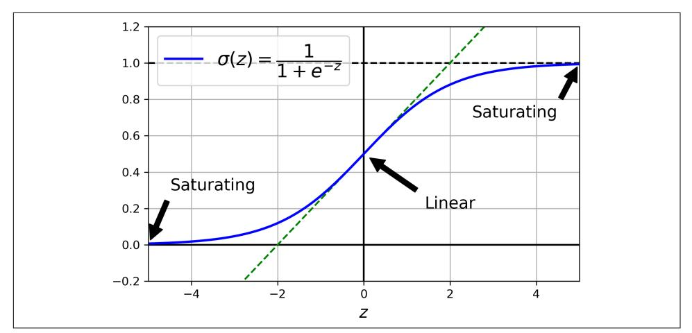

Figure 11-1. Sigmoid activation function saturation

#### **Glorot and He Initialization**

In their paper, Glorot and Bengio propose a way to significantly alleviate the unstable gradients problem. They point out that we need the signal to flow properly in both directions: in the forward direction when making predictions, and in the reverse direction when backpropagating gradients. We don't want the signal to die out, nor do we want it to explode and saturate. For the signal to flow properly, the authors argue that we need the variance of the outputs of each layer to be equal to the variance of its inputs,<sup>2</sup> and we need the gradients to have equal variance before and after flowing through a layer in the reverse direction (please check out the paper if you are interested in the mathematical details). It is actually not possible to guarantee both unless the layer has an equal number of inputs and outputs (these numbers are called the *fan-in* and *fan-out* of the layer), but Glorot and Bengio proposed a good compromise that has proven to work very well in practice: the connection weights of each layer must be initialized randomly as described in Equation 11-1, where  $fan_{\text{avg}} =$  $(\text{fan}_{in} + \text{fan}_{out})$  / 2. This initialization strategy is called Xavier initialization or Glorot initialization, after the paper's first author.

<sup>2</sup> Here's an analogy: if you set a microphone amplifier's knob too close to zero, people won't hear your voice, but if you set it too close to the max, your voice will be saturated and people won't understand what you are saying. Now imagine a chain of such amplifiers: they all need to be set properly in order for your voice to come out loud and clear at the end of the chain. Your voice has to come out of each amplifier at the same amplitude as it came in.

{387}------------------------------------------------

Equation 11-1. Glorot initialization (when using the sigmoid activation function)

Normal distribution with mean 0 and variance  $\sigma^2 = \frac{1}{fan_{\text{avg}}}$ Or a uniform distribution between  $-r$  and  $+r$ , with  $r = \sqrt{\frac{3}{fan_{\text{av}}}}$ 

If you replace  $fan_{\text{avg}}$  with  $fan_{\text{in}}$  in Equation 11-1, you get an initialization strategy that Yann LeCun proposed in the 1990s. He called it *LeCun initialization*. Genevieve Orr and Klaus-Robert Müller even recommended it in their 1998 book Neural Networks: Tricks of the Trade (Springer). LeCun initialization is equivalent to Glorot initialization when  $fan_{in} = fan_{out}$ . It took over a decade for researchers to realize how important this trick is. Using Glorot initialization can speed up training considerably, and it is one of the practices that led to the success of deep learning.

Some papers<sup>3</sup> have provided similar strategies for different activation functions. These strategies differ only by the scale of the variance and whether they use  $fan_{\text{avg}}$ or  $fan_{in}$ , as shown in Table 11-1 (for the uniform distribution, just use  $r = \sqrt{3\sigma^2}$ ). The initialization strategy proposed for the ReLU activation function and its variants is called *He initialization* or *Kaiming initialization*, after the paper's first author. For SELU, use Yann LeCun's initialization method, preferably with a normal distribution. We will cover all these activation functions shortly.

Table 11-1. Initialization parameters for each type of activation function

|        | Initialization Activation functions                            | $\sigma^2$ (Normal)    |
|--------|----------------------------------------------------------------|------------------------|
| Glorot | None, tanh, sigmoid, softmax                                   | 1 / $fan_{\text{ava}}$ |
| He     | ReLU, Leaky ReLU, ELU, GELU, Swish, Mish 2 / fan <sub>in</sub> |                        |
| l eCun | SFI U                                                          | 1 / fan <sub>in</sub>  |

By default, Keras uses Glorot initialization with a uniform distribution. When you create a layer, you can switch to He initialization by setting kernel\_initializer= "he\_uniform" or kernel\_initializer="he\_normal" like this:

```
import tensorflow as tf
dense = tf.keras.layers.Dense(50, activation="relu",kernel initializer="he normal")
```

Alternatively, you can obtain any of the initializations listed in Table 11-1 and more using the VarianceScaling initializer. For example, if you want He initialization

<sup>3</sup> E.g., Kaiming He et al., "Delving Deep into Rectifiers: Surpassing Human-Level Performance on ImageNet Classification," Proceedings of the 2015 IEEE International Conference on Computer Vision (2015): 1026-1034.

{388}------------------------------------------------

with a uniform distribution and based on  $fan_{\text{av}}$  (rather than  $fan_{\text{in}}$ ), you can use the following code:

```
he_avg_init = tf.keras.initializers.VarianceScaling(scale=2., mode="fan_avg",
                                                    distribution="uniform")
dense = tf.keras. layers. Dense(50. activation="sigma'd".kernel initializer=he avg init)
```

### **Better Activation Functions**

One of the insights in the 2010 paper by Glorot and Bengio was that the problems with unstable gradients were in part due to a poor choice of activation function. Until then most people had assumed that if Mother Nature had chosen to use roughly sigmoid activation functions in biological neurons, they must be an excellent choice. But it turns out that other activation functions behave much better in deep neural networks—in particular, the ReLU activation function, mostly because it does not saturate for positive values, and also because it is very fast to compute.

Unfortunately, the ReLU activation function is not perfect. It suffers from a problem known as the dying ReLUs: during training, some neurons effectively "die", meaning they stop outputting anything other than 0. In some cases, you may find that half of your network's neurons are dead, especially if you used a large learning rate. A neuron dies when its weights get tweaked in such a way that the input of the ReLU function (i.e., the weighted sum of the neuron's inputs plus its bias term) is negative for all instances in the training set. When this happens, it just keeps outputting zeros, and gradient descent does not affect it anymore because the gradient of the ReLU function is zero when its input is negative.<sup>4</sup>

To solve this problem, you may want to use a variant of the ReLU function, such as the leaky ReLU.

#### Leaky ReLU

The leaky ReLU activation function is defined as LeakyReLU<sub> $\alpha$ </sub> $(z)$  = max $(\alpha z, z)$  (see Figure 11-2). The hyperparameter  $\alpha$  defines how much the function "leaks": it is the slope of the function for  $z < 0$ . Having a slope for  $z < 0$  ensures that leaky ReLUs never die; they can go into a long coma, but they have a chance to eventually wake up. A 2015 paper by Bing Xu et al.<sup>5</sup> compared several variants of the ReLU activation function, and one of its conclusions was that the leaky variants always

<sup>4</sup> A dead neuron may come back to life if its inputs evolve over time and eventually return within a range where the ReLU activation function gets a positive input again. For example, this may happen if gradient descent tweaks the neurons in the layers below the dead neuron.

<sup>5</sup> Bing Xu et al., "Empirical Evaluation of Rectified Activations in Convolutional Network," arXiv preprint arXiv:1505.00853 (2015).

{389}------------------------------------------------

outperformed the strict ReLU activation function. In fact, setting  $\alpha = 0.2$  (a huge leak) seemed to result in better performance than  $\alpha = 0.01$  (a small leak). The paper also evaluated the randomized leaky ReLU (RReLU), where  $\alpha$  is picked randomly in a given range during training and is fixed to an average value during testing. RReLU also performed fairly well and seemed to act as a regularizer, reducing the risk of overfitting the training set. Finally, the paper evaluated the parametric leaky ReLU (PReLU), where  $\alpha$  is authorized to be learned during training: instead of being a hyperparameter, it becomes a parameter that can be modified by backpropagation like any other parameter. PReLU was reported to strongly outperform ReLU on large image datasets, but on smaller datasets it runs the risk of overfitting the training set.

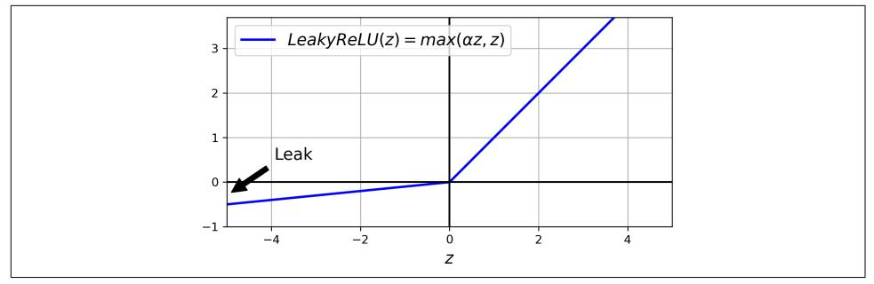

Figure 11-2. Leaky ReLU: like ReLU, but with a small slope for negative values

Keras includes the classes LeakyReLU and PReLU in the tf.keras.layers package. Just like for other ReLU variants, you should use He initialization with these. For example:

```
leaky relu = tf.keras.layers.LeakyReLU(alpha=0.2) # defaults to alpha=0.3
dense = tf.keras.layers.Dense(50, activation=leaky_relu,
                             kernel initializer="he normal")
```

If you prefer, you can also use LeakyReLU as a separate layer in your model; it makes no difference for training and predictions:

```
model = tf.keras.models. Sequential(f)[...] # more layers
    tf.keras.layers.Dense(50, kernel_initializer="he_normal"), # no activation
    tf.keras.layers.LeakyReLU(alpha=0.2), # activation as a separate layer
    [...] # more layers
\left| \right)
```

For PReLU, replace LeakyReLU with PReLU. There is currently no official implementation of RReLU in Keras, but you can fairly easily implement your own (to learn how to do that, see the exercises at the end of Chapter 12).

{390}------------------------------------------------

ReLU, leaky ReLU, and PReLU all suffer from the fact that they are not smooth functions: their derivatives abruptly change (at  $z = 0$ ). As we saw in Chapter 4 when we discussed lasso, this sort of discontinuity can make gradient descent bounce around the optimum, and slow down convergence. So now we will look at some smooth variants of the ReLU activation function, starting with ELU and SELU.

#### FI U and SFI U

In 2015, a paper by Djork-Arné Clevert et al.<sup>6</sup> proposed a new activation function, called the exponential linear unit (ELU), that outperformed all the ReLU variants in the authors' experiments: training time was reduced, and the neural network performed better on the test set. Equation 11-2 shows this activation function's definition.

Equation 11-2. ELU activation function

ELU<sub> $\alpha$ </sub> (z) =  $\begin{cases} \alpha(\exp(z) - 1) & \text{if } z < 0 \\ z & \text{if } z \ge 0 \end{cases}$ 

The ELU activation function looks a lot like the ReLU function (see Figure 11-3), with a few major differences:

- It takes on negative values when  $z < 0$ , which allows the unit to have an average output closer to 0 and helps alleviate the vanishing gradients problem. The hyperparameter  $\alpha$  defines the opposite of the value that the ELU function approaches when  $z$  is a large negative number. It is usually set to 1, but you can tweak it like any other hyperparameter.
- It has a nonzero gradient for  $z < 0$ , which avoids the dead neurons problem.
- If  $\alpha$  is equal to 1 then the function is smooth everywhere, including around  $z =$ 0, which helps speed up gradient descent since it does not bounce as much to the left and right of  $z = 0$ .

Using ELU with Keras is as easy as setting activation="elu", and like with other ReLU variants, you should use He initialization. The main drawback of the ELU activation function is that it is slower to compute than the ReLU function and its variants (due to the use of the exponential function). Its faster convergence rate during training may compensate for that slow computation, but still, at test time an ELU network will be a bit slower than a ReLU network.

<sup>6</sup> Djork-Arné Clevert et al., "Fast and Accurate Deep Network Learning by Exponential Linear Units (ELUs)," Proceedings of the International Conference on Learning Representations, arXiv preprint (2015).

{391}------------------------------------------------


Figure 11-3. ELU and SELU activation functions

Not long after, a 2017 paper by Günter Klambauer et al.<sup>7</sup> introduced the *scaled ELU* (SELU) activation function: as its name suggests, it is a scaled variant of the ELU activation function (about 1.05 times ELU, using  $\alpha \approx 1.67$ ). The authors showed that if you build a neural network composed exclusively of a stack of dense layers (i.e., an MLP), and if all hidden layers use the SELU activation function, then the network will *self-normalize*: the output of each layer will tend to preserve a mean of 0 and a standard deviation of 1 during training, which solves the vanishing/exploding gradients problem. As a result, the SELU activation function may outperform other activation functions for MLPs, especially deep ones. To use it with Keras, just set activation="selu". There are, however, a few conditions for self-normalization to happen (see the paper for the mathematical justification):

- The input features must be standardized: mean 0 and standard deviation 1.
- Every hidden layer's weights must be initialized using LeCun normal initialization. In Keras, this means setting kernel initializer="lecun normal".
- The self-normalizing property is only guaranteed with plain MLPs. If you try to use SELU in other architectures, like recurrent networks (see Chapter 15) or networks with *skip connections* (i.e., connections that skip layers, such as in Wide & Deep nets), it will probably not outperform ELU.
- You cannot use regularization techniques like  $\ell_1$  or  $\ell_2$  regularization, max-norm, batch-norm, or regular dropout (these are discussed later in this chapter).

These are significant constraints, so despite its promises, SELU did not gain a lot of traction. Moreover, three more activation functions seem to outperform it quite consistently on most tasks: GELU, Swish, and Mish.

<sup>7</sup> Günter Klambauer et al., "Self-Normalizing Neural Networks", Proceedings of the 31st International Conference on Neural Information Processing Systems (2017): 972-981.

{392}------------------------------------------------

#### **GELU, Swish, and Mish**

GELU was introduced in a 2016 paper by Dan Hendrycks and Kevin Gimpel.<sup>8</sup> Once again, you can think of it as a smooth variant of the ReLU activation function. Its definition is given in Equation 11-3, where  $\Phi$  is the standard Gaussian cumulative distribution function (CDF):  $\Phi(z)$  corresponds to the probability that a value sampled randomly from a normal distribution of mean 0 and variance 1 is lower than z.

Equation 11-3. GELU activation function

 $GELU(z) = z\Phi(z)$ 

As you can see in Figure 11-4, GELU resembles ReLU: it approaches 0 when its input  $z$  is very negative, and it approaches  $z$  when  $z$  is very positive. However, whereas all the activation functions we've discussed so far were both convex and monotonic,<sup>9</sup> the GELU activation function is neither: from left to right, it starts by going straight, then it wiggles down, reaches a low point around  $-0.17$  (near  $z \approx -0.75$ ), and finally bounces up and ends up going straight toward the top right. This fairly complex shape and the fact that it has a curvature at every point may explain why it works so well, especially for complex tasks: gradient descent may find it easier to fit complex patterns. In practice, it often outperforms every other activation function discussed so far. However, it is a bit more computationally intensive, and the performance boost it provides is not always sufficient to justify the extra cost. That said, it is possible to show that it is approximately equal to  $z\sigma(1.702\ z)$ , where  $\sigma$  is the sigmoid function: using this approximation also works very well, and it has the advantage of being much faster to compute.

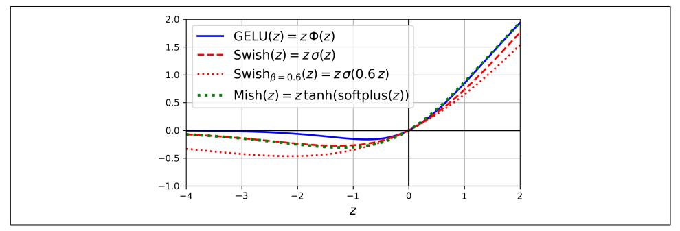

Figure 11-4. GELU, Swish, parametrized Swish, and Mish activation functions

<sup>8</sup> Dan Hendrycks and Kevin Gimpel, "Gaussian Error Linear Units (GELUs)", arXiv preprint arXiv:1606.08415  $(2016).$ 

<sup>9</sup> A function is convex if the line segment between any two points on the curve never lies below the curve. A monotonic function only increases, or only decreases.

{393}------------------------------------------------

The GELU paper also introduced the *sigmoid linear unit* (SiLU) activation function, which is equal to  $z\sigma(z)$ , but it was outperformed by GELU in the authors' tests. Interestingly, a 2017 paper by Prajit Ramachandran et al.<sup>10</sup> rediscovered the SiLU function by automatically searching for good activation functions. The authors named it Swish, and the name caught on. In their paper, Swish outperformed every other function, including GELU. Ramachandran et al. later generalized Swish by adding an extra hyperparameter  $\beta$  to scale the sigmoid function's input. The generalized Swish function is Swish<sub> $\delta$ </sub> $(z) = z\sigma(\beta z)$ , so GELU is approximately equal to the generalized Swish function using  $\beta = 1.702$ . You can tune  $\beta$  like any other hyperparameter. Alternatively, it's also possible to make  $\beta$  trainable and let gradient descent optimize it: much like PReLU, this can make your model more powerful, but it also runs the risk of overfitting the data.

Another quite similar activation function is Mish, which was introduced in a 2019 paper by Diganta Misra.<sup>11</sup> It is defined as mish( $z$ ) =  $z$ tanh(softplus( $z$ )), where soft $plus(z) = log(1 + exp(z))$ . Just like GELU and Swish, it is a smooth, nonconvex, and nonmonotonic variant of ReLU, and once again the author ran many experiments and found that Mish generally outperformed other activation functions-even Swish and GELU, by a tiny margin. Figure 11-4 shows GELU, Swish (both with the default  $\beta$  $= 1$  and with  $\beta = 0.6$ ), and lastly Mish. As you can see, Mish overlaps almost perfectly with Swish when  $z$  is negative, and almost perfectly with GELU when  $z$  is positive.


So, which activation function should you use for the hidden layers of your deep neural networks? ReLU remains a good default for simple tasks: it's often just as good as the more sophisticated activation functions, plus it's very fast to compute, and many libraries and hardware accelerators provide ReLU-specific optimizations. However, Swish is probably a better default for more complex tasks, and you can even try parametrized Swish with a learnable  $\beta$ parameter for the most complex tasks. Mish may give you slightly better results, but it requires a bit more compute. If you care a lot about runtime latency, then you may prefer leaky ReLU, or parametrized leaky ReLU for more complex tasks. For deep MLPs, give SELU a try, but make sure to respect the constraints listed earlier. If you have spare time and computing power, you can use cross-validation to evaluate other activation functions as well.

<sup>10</sup> Prajit Ramachandran et al., "Searching for Activation Functions", arXiv preprint arXiv:1710.05941 (2017).

<sup>11</sup> Diganta Misra, "Mish: A Self Regularized Non-Monotonic Activation Function", arXiv preprint arXiv:1908.08681 (2019).

{394}------------------------------------------------

Keras supports GELU and Swish out of the box; just use activation="gelu" or activation="swish". However, it does not support Mish or the generalized Swish activation function yet (but see Chapter 12 to see how to implement your own activation functions and layers).

That's all for activation functions! Now, let's look at a completely different way to solve the unstable gradients problem: batch normalization.

### **Batch Normalization**

Although using He initialization along with ReLU (or any of its variants) can significantly reduce the danger of the vanishing/exploding gradients problems at the beginning of training, it doesn't guarantee that they won't come back during training.

In a 2015 paper,<sup>12</sup> Sergey Ioffe and Christian Szegedy proposed a technique called batch normalization (BN) that addresses these problems. The technique consists of adding an operation in the model just before or after the activation function of each hidden layer. This operation simply zero-centers and normalizes each input, then scales and shifts the result using two new parameter vectors per layer: one for scaling, the other for shifting. In other words, the operation lets the model learn the optimal scale and mean of each of the layer's inputs. In many cases, if you add a BN layer as the very first layer of your neural network, you do not need to standardize your training set. That is, there's no need for StandardScaler or Normalization; the BN layer will do it for you (well, approximately, since it only looks at one batch at a time, and it can also rescale and shift each input feature).

In order to zero-center and normalize the inputs, the algorithm needs to estimate each input's mean and standard deviation. It does so by evaluating the mean and standard deviation of the input over the current mini-batch (hence the name "batch normalization"). The whole operation is summarized step by step in Equation 11-4.

<sup>12</sup> Sergey Ioffe and Christian Szegedy, "Batch Normalization: Accelerating Deep Network Training by Reducing Internal Covariate Shift", Proceedings of the 32nd International Conference on Machine Learning (2015): 448– 456.

{395}------------------------------------------------

Equation 11-4. Batch normalization algorithm

1. 
$$
\mu_B = \frac{1}{m_B} \sum_{i=1}^{m_B} \mathbf{x}^{(i)}
$$
  
\n2. 
$$
\sigma_B^2 = \frac{1}{m_B} \sum_{i=1}^{m_B} (\mathbf{x}^{(i)} - \mu_B)^2
$$
  
\n3. 
$$
\hat{\mathbf{x}}^{(i)} = \frac{\mathbf{x}^{(i)} - \mu_B}{\sqrt{\sigma_B^2 + \varepsilon}}
$$
  
\n4. 
$$
\mathbf{z}^{(i)} = \gamma \otimes \hat{\mathbf{x}}^{(i)} + \beta
$$

In this algorithm:

- $\mu_B$  is the vector of input means, evaluated over the whole mini-batch  $B$  (it contains one mean per input).
- $m_B$  is the number of instances in the mini-batch.
- $\sigma_B$  is the vector of input standard deviations, also evaluated over the whole mini-batch (it contains one standard deviation per input).
- $\hat{\mathbf{x}}^{(i)}$  is the vector of zero-centered and normalized inputs for instance *i*.
- $\varepsilon$  is a tiny number that avoids division by zero and ensures the gradients don't grow too large (typically  $10^{-5}$ ). This is called a *smoothing term*.
- $\gamma$  is the output scale parameter vector for the layer (it contains one scale parameter per input).
- $\otimes$  represents element-wise multiplication (each input is multiplied by its corresponding output scale parameter).
- $\beta$  is the output shift (offset) parameter vector for the layer (it contains one offset parameter per input). Each input is offset by its corresponding shift parameter.
- $z^{(i)}$  is the output of the BN operation. It is a rescaled and shifted version of the inputs.

So during training, BN standardizes its inputs, then rescales and offsets them. Good! What about at test time? Well, it's not that simple. Indeed, we may need to make predictions for individual instances rather than for batches of instances: in this case, we will have no way to compute each input's mean and standard deviation. Moreover, even if we do have a batch of instances, it may be too small, or the instances may not be independent and identically distributed, so computing statistics over the batch instances would be unreliable. One solution could be to wait until the end of training, then run the whole training set through the neural network and compute the mean and standard deviation of each input of the BN layer. These "final" input means 

{396}------------------------------------------------

and standard deviations could then be used instead of the batch input means and standard deviations when making predictions. However, most implementations of batch normalization estimate these final statistics during training by using a moving average of the layer's input means and standard deviations. This is what Keras does automatically when you use the BatchNormalization layer. To sum up, four parameter vectors are learned in each batch-normalized layer:  $\gamma$  (the output scale vector) and  $\beta$  (the output offset vector) are learned through regular backpropagation, and  $\mu$  (the final input mean vector) and  $\sigma$  (the final input standard deviation vector) are estimated using an exponential moving average. Note that  $\mu$  and  $\sigma$  are estimated during training, but they are used only after training (to replace the batch input means and standard deviations in Equation 11-4).

Ioffe and Szegedy demonstrated that batch normalization considerably improved all the deep neural networks they experimented with, leading to a huge improvement in the ImageNet classification task (ImageNet is a large database of images classified into many classes, commonly used to evaluate computer vision systems). The vanishing gradients problem was strongly reduced, to the point that they could use saturating activation functions such as the tanh and even the sigmoid activation function. The networks were also much less sensitive to the weight initialization. The authors were able to use much larger learning rates, significantly speeding up the learning process. Specifically, they note that:

Applied to a state-of-the-art image classification model, batch normalization achieves the same accuracy with 14 times fewer training steps, and beats the original model by a significant margin. [...] Using an ensemble of batch-normalized networks, we improve upon the best published result on ImageNet classification: reaching 4.9% top-5 validation error (and 4.8% test error), exceeding the accuracy of human raters.

Finally, like a gift that keeps on giving, batch normalization acts like a regularizer, reducing the need for other regularization techniques (such as dropout, described later in this chapter).

Batch normalization does, however, add some complexity to the model (although it can remove the need for normalizing the input data, as discussed earlier). Moreover, there is a runtime penalty: the neural network makes slower predictions due to the extra computations required at each layer. Fortunately, it's often possible to fuse the BN layer with the previous layer after training, thereby avoiding the runtime penalty. This is done by updating the previous layer's weights and biases so that it directly produces outputs of the appropriate scale and offset. For example, if the previous layer computes **XW** + **b**, then the BN layer will compute  $\gamma \otimes (XW + b - \mu) / \sigma +$  $\beta$  (ignoring the smoothing term  $\varepsilon$  in the denominator). If we define  $W' = \gamma \otimes W$  /  $\sigma$  and  $\mathbf{b}' = \gamma \otimes (\mathbf{b} - \mathbf{\mu}) / \sigma + \beta$ , the equation simplifies to XW' +  $\mathbf{b}'$ . So, if we replace the previous layer's weights and biases (W and b) with the updated weights and biases (W' and b'), we can get rid of the BN layer (TFLite's converter does this automatically; see Chapter 19).

{397}------------------------------------------------


You may find that training is rather slow, because each epoch takes much more time when you use batch normalization. This is usually counterbalanced by the fact that convergence is much faster with BN, so it will take fewer epochs to reach the same performance. All in all, wall time will usually be shorter (this is the time measured by the clock on your wall).

#### **Implementing batch normalization with Keras**

As with most things with Keras, implementing batch normalization is straightforward and intuitive. Just add a BatchNormalization layer before or after each hidden layer's activation function. You may also add a BN layer as the first layer in your model, but a plain Normalization layer generally performs just as well in this location (its only drawback is that you must first call its adapt() method). For example, this model applies BN after every hidden layer and as the first layer in the model (after flattening the input images):

```
model = tf.keras.Sequential(tf.keras.layers.Flatten(input_shape=[28, 28]),
    tf.keras.layers.BatchNormalization(),
    tf.keras.layers.Dense(300, activation="relu",
                          kernel initializer="he normal"),
    tf.keras.layers.BatchNormalization(),
    tf.keras.layers.Dense(100, activation="relu",
                          kernel initializer="he normal"),
    tf.keras.layers.BatchNormalization(),
    tf.keras.layers.Dense(10, activation="softmax")
\left| \right)
```

That's all! In this tiny example with just two hidden layers batch normalization is unlikely to have a large impact, but for deeper networks it can make a tremendous difference.

Let's display the model summary:

| >>> model.summary()<br>Model: "sequential" |              |         |
|--------------------------------------------|--------------|---------|
| Layer (type)                               | Output Shape | Param # |
| flatten (Flatten)                          | (None, 784)  | 0       |
| batch normalization (BatchNo (None, 784)   |              | 3136    |
| dense (Dense)                              | (None, 300)  | 235500  |
| batch normalization 1 (Batch (None, 300)   |              | 1200    |
| dense 1 (Dense)                            | (None, 100)  | 30100   |
|                                            |              |         |

{398}------------------------------------------------

batch\_normalization\_2 (Batch (None, 100) 400 dense\_2 (Dense) (None, 10) 1010 ---------------------------------------Total params: 271,346 Trainable params: 268,978 Non-trainable params: 2,368

As you can see, each BN layer adds four parameters per input:  $\gamma$ ,  $\beta$ ,  $\mu$ , and  $\sigma$  (for example, the first BN layer adds 3,136 parameters, which is  $4 \times 784$ ). The last two parameters,  $\mu$  and  $\sigma$ , are the moving averages; they are not affected by backpropagation, so Keras calls them "non-trainable"<sup>13</sup> (if you count the total number of BN parameters,  $3,136 + 1,200 + 400$ , and divide by 2, you get 2,368, which is the total number of non-trainable parameters in this model).

Let's look at the parameters of the first BN layer. Two are trainable (by backpropagation), and two are not:

```
>>> [(var.name, var.trainable) for var in model.layers[1].variables]
[('batch_normalization/gamma:0', True),
('batch_normalization/beta:0', True),
 ('batch_normalization/moving_mean:0', False),
 ('batch normalization/moving variance:0', False)]
```

The authors of the BN paper argued in favor of adding the BN layers before the activation functions, rather than after (as we just did). There is some debate about this, as which is preferable seems to depend on the task—you can experiment with this too to see which option works best on your dataset. To add the BN layers before the activation function, you must remove the activation functions from the hidden layers and add them as separate layers after the BN layers. Moreover, since a batch normalization layer includes one offset parameter per input, you can remove the bias term from the previous layer by passing use bias=False when creating it. Lastly, you can usually drop the first BN layer to avoid sandwiching the first hidden layer between two BN layers. The updated code looks like this:

```
model = tf.keras.Sequential([tf.keras.layers.Flatten(input_shape=[28, 28]),
    tf.keras.layers.Dense(300, kernel_initializer="he_normal", use_bias=False),
    tf.keras.layers.BatchNormalization(),
    tf.keras.layers.Activation("relu"),
    tf.keras.layers.Dense(100, kernel_initializer="he_normal", use_bias=False),
    tf.keras.layers.BatchNormalization(),
    tf.keras.layers.Activation("relu"),
    tf.keras.layers.Dense(10, activation="softmax")
\left| \right\rangle
```

<sup>13</sup> However, they are estimated during training based on the training data, so arguably they are trainable. In Keras, "non-trainable" really means "untouched by backpropagation".

{399}------------------------------------------------

The BatchNormalization class has quite a few hyperparameters you can tweak. The defaults will usually be fine, but you may occasionally need to tweak the momentum. This hyperparameter is used by the BatchNormalization layer when it updates the exponential moving averages; given a new value  $\bf{v}$  (i.e., a new vector of input means or standard deviations computed over the current batch), the layer updates the running average  $\hat{v}$  using the following equation:

 $\hat{\mathbf{v}} \leftarrow \hat{\mathbf{v}} \times \text{momentum} + \mathbf{v} \times (1 - \text{momentum})$ 

A good momentum value is typically close to 1; for example, 0.9, 0.99, or 0.999. You want more 9s for larger datasets and for smaller mini-batches.

Another important hyperparameter is axis: it determines which axis should be normalized. It defaults to -1, meaning that by default it will normalize the last axis (using the means and standard deviations computed across the *other* axes). When the input batch is 2D (i.e., the batch shape is [batch size, features]), this means that each input feature will be normalized based on the mean and standard deviation computed across all the instances in the batch. For example, the first BN layer in the previous code example will independently normalize (and rescale and shift) each of the 784 input features. If we move the first BN layer before the Flatten layer, then the input batches will be 3D, with shape [batch size, height, width]; therefore, the BN layer will compute 28 means and 28 standard deviations (1 per column of pixels, computed across all instances in the batch and across all rows in the column), and it will normalize all pixels in a given column using the same mean and standard deviation. There will also be just 28 scale parameters and 28 shift parameters. If instead you still want to treat each of the 784 pixels independently, then you should set  $axis=[1, 2]$ .

Batch normalization has become one of the most-used layers in deep neural networks, especially deep convolutional neural networks discussed in (Chapter 14), to the point that it is often omitted in the architecture diagrams: it is assumed that BN is added after every layer. Now let's look at one last technique to stabilize gradients during training: gradient clipping.

### **Gradient Clipping**

Another technique to mitigate the exploding gradients problem is to clip the gradients during backpropagation so that they never exceed some threshold. This is called gradient clipping.<sup>14</sup> This technique is generally used in recurrent neural networks, where using batch normalization is tricky (as you will see in Chapter 15).

<sup>14</sup> Razvan Pascanu et al., "On the Difficulty of Training Recurrent Neural Networks", Proceedings of the 30th International Conference on Machine Learning (2013): 1310-1318.

{400}------------------------------------------------

In Keras, implementing gradient clipping is just a matter of setting the clipvalue or clipnorm argument when creating an optimizer, like this:

```
optimize = tf.keras.optimizers.SGD(clipvalue=1.0)model.compile([...], optimizer=optimizer)
```

This optimizer will clip every component of the gradient vector to a value between -1.0 and 1.0. This means that all the partial derivatives of the loss (with regard to each and every trainable parameter) will be clipped between -1.0 and 1.0. The threshold is a hyperparameter you can tune. Note that it may change the orientation of the gradient vector. For instance, if the original gradient vector is [0.9, 100.0], it points mostly in the direction of the second axis; but once you clip it by value, you get [0.9, 1.0], which points roughly at the diagonal between the two axes. In practice, this approach works well. If you want to ensure that gradient clipping does not change the direction of the gradient vector, you should clip by norm by setting clipnorm instead of clipvalue. This will clip the whole gradient if its  $\ell_2$  norm is greater than the threshold you picked. For example, if you set clipnorm=1.0, then the vector  $[0.9, 100.0]$  will be clipped to  $[0.00899964, 0.9999595]$ , preserving its orientation but almost eliminating the first component. If you observe that the gradients explode during training (you can track the size of the gradients using TensorBoard), you may want to try clipping by value or clipping by norm, with different thresholds, and see which option performs best on the validation set.

## **Reusing Pretrained Layers**

It is generally not a good idea to train a very large DNN from scratch without first trying to find an existing neural network that accomplishes a similar task to the one you are trying to tackle (I will discuss how to find them in Chapter 14). If you find such as neural network, then you can generally reuse most of its layers, except for the top ones. This technique is called *transfer learning*. It will not only speed up training considerably, but also requires significantly less training data.

Suppose you have access to a DNN that was trained to classify pictures into 100 different categories, including animals, plants, vehicles, and everyday objects, and you now want to train a DNN to classify specific types of vehicles. These tasks are very similar, even partly overlapping, so you should try to reuse parts of the first network (see Figure  $11-5$ ).


If the input pictures for your new task don't have the same size as the ones used in the original task, you will usually have to add a preprocessing step to resize them to the size expected by the original model. More generally, transfer learning will work best when the inputs have similar low-level features.

{401}------------------------------------------------

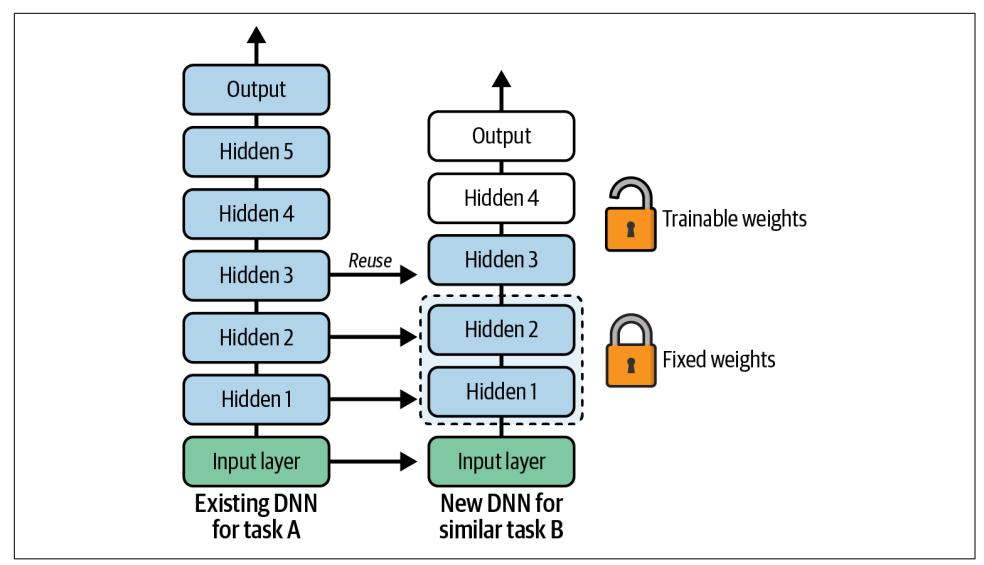

Figure 11-5. Reusing pretrained layers

The output layer of the original model should usually be replaced because it is most likely not useful at all for the new task, and probably will not have the right number of outputs.

Similarly, the upper hidden layers of the original model are less likely to be as useful as the lower layers, since the high-level features that are most useful for the new task may differ significantly from the ones that were most useful for the original task. You want to find the right number of layers to reuse.


The more similar the tasks are, the more layers you will want to reuse (starting with the lower layers). For very similar tasks, try to keep all the hidden layers and just replace the output layer.

Try freezing all the reused layers first (i.e., make their weights non-trainable so that gradient descent won't modify them and they will remain fixed), then train your model and see how it performs. Then try unfreezing one or two of the top hidden layers to let backpropagation tweak them and see if performance improves. The more training data you have, the more layers you can unfreeze. It is also useful to reduce the learning rate when you unfreeze reused layers: this will avoid wrecking their fine-tuned weights.

If you still cannot get good performance, and you have little training data, try dropping the top hidden layer(s) and freezing all the remaining hidden layers again. 

{402}------------------------------------------------

You can iterate until you find the right number of layers to reuse. If you have plenty of training data, you may try replacing the top hidden layers instead of dropping them, and even adding more hidden layers.

### **Transfer Learning with Keras**

Let's look at an example. Suppose the Fashion MNIST dataset only contained eight classes—for example, all the classes except for sandal and shirt. Someone built and trained a Keras model on that set and got reasonably good performance (>90%) accuracy). Let's call this model A. You now want to tackle a different task: you have images of T-shirts and pullovers, and you want to train a binary classifier: positive for T-shirts (and tops), negative for sandals. Your dataset is quite small; you only have 200 labeled images. When you train a new model for this task (let's call it model B) with the same architecture as model A, you get 91.85% test accuracy. While drinking your morning coffee, you realize that your task is quite similar to task A, so perhaps transfer learning can help? Let's find out!

First, you need to load model A and create a new model based on that model's layers. You decide to reuse all the layers except for the output layer:

```
\lceil \ldots \rceil # Assuming model A was already trained and saved to "my model A"
model_A = tf.keras.models.load_model("my_model_A")
model_B_{on_A} = tf_{i} = f_{i} = f_{i} = f_{i} = f_{i} = f_{i} = f_{i} = f_{i} = f_{i} = f_{i} = f_{i} = f_{i} = f_{i} = f_{i} = f_{i} = f_{i} = f_{i} = f_{i} = f_{i} = f_{i} = f_{i} = f_{i} = f_{i} = f_{i} 
model B on A.add(tf.keras.layers.Dense(1, activation="sigmoid"))
```

Note that model A and model B on A now share some layers. When you train model\_B\_on\_A, it will also affect model\_A. If you want to avoid that, you need to *clone* model\_A before you reuse its layers. To do this, you clone model A's architecture with clone\_model(), then copy its weights:

```
model A clone = tf.keras.models.clone model(model A)
model_A_clone.set_weights(model_A.get_weights())
```


tf.keras.models.clone\_model() only clones the architecture, not the weights. If you don't copy them manually using set\_weights(), they will be initialized randomly when the cloned model is first used.

Now you could train model B on A for task B, but since the new output layer was initialized randomly it will make large errors (at least during the first few epochs), so there will be large error gradients that may wreck the reused weights. To avoid this, one approach is to freeze the reused layers during the first few epochs, giving the new layer some time to learn reasonable weights. To do this, set every layer's trainable attribute to False and compile the model:

{403}------------------------------------------------

```
for layer in model B_{on}A. layers[:1]:layer.trainable = Falseoptimize r = tf.keras.optimizers.SGD(learning rate=0.001)
model B on A.compile(loss="binary crossentropy", optimizer=optimizer,
                     metrics=["accuracy"])
```


You must always compile your model after you freeze or unfreeze layers.

Now you can train the model for a few epochs, then unfreeze the reused layers (which requires compiling the model again) and continue training to fine-tune the reused layers for task B. After unfreezing the reused layers, it is usually a good idea to reduce the learning rate, once again to avoid damaging the reused weights.

```
history = model_B_on_A.fit(X_train_B, y_train_B, epochs=4,
                           validation_data=(X_valid_B, y_valid_B))
for layer in model B on A. layers[:-1]:
    layer.trainable = Trueoptimizer = tf.keras.optimizers.SGD(learning rate=0.001)
model_B_on_A.compile(loss="binary_crossentropy", optimizer=optimizer,
                     metrics=["accuracy"])
history = model_B_{on_A.fit(X_train_B, y_train_B, epochs=16,validation_data=(X_valid_B, y_valid_B))
```

So, what's the final verdict? Well, this model's test accuracy is 93.85%, up exactly two percentage points from 91.85%! This means that transfer learning reduced the error rate by almost 25%:

```
>>> model_B_on_A.evaluate(X_test_B, y_test_B)
[0.2546142041683197, 0.9384999871253967]
```

Are you convinced? You shouldn't be: I cheated! I tried many configurations until I found one that demonstrated a strong improvement. If you try to change the classes or the random seed, you will see that the improvement generally drops, or even vanishes or reverses. What I did is called "torturing the data until it confesses". When a paper just looks too positive, you should be suspicious: perhaps the flashy new technique does not actually help much (in fact, it may even degrade performance), but the authors tried many variants and reported only the best results (which may be due to sheer luck), without mentioning how many failures they encountered on the way. Most of the time, this is not malicious at all, but it is part of the reason so many results in science can never be reproduced.

{404}------------------------------------------------

Why did I cheat? It turns out that transfer learning does not work very well with small dense networks, presumably because small networks learn few patterns, and dense networks learn very specific patterns, which are unlikely to be useful in other tasks. Transfer learning works best with deep convolutional neural networks, which tend to learn feature detectors that are much more general (especially in the lower layers). We will revisit transfer learning in Chapter 14, using the techniques we just discussed (and this time there will be no cheating, I promise!).

#### **Unsupervised Pretraining**

Suppose you want to tackle a complex task for which you don't have much labeled training data, but unfortunately you cannot find a model trained on a similar task. Don't lose hope! First, you should try to gather more labeled training data, but if you can't, you may still be able to perform *unsupervised pretraining* (see Figure 11-6). Indeed, it is often cheap to gather unlabeled training examples, but expensive to label them. If you can gather plenty of unlabeled training data, you can try to use it to train an unsupervised model, such as an autoencoder or a generative adversarial network (GAN; see Chapter 17). Then you can reuse the lower layers of the autoencoder or the lower layers of the GAN's discriminator, add the output layer for your task on top, and fine-tune the final network using supervised learning (i.e., with the labeled training examples).

It is this technique that Geoffrey Hinton and his team used in 2006, and which led to the revival of neural networks and the success of deep learning. Until 2010, unsupervised pretraining—typically with restricted Boltzmann machines (RBMs; see the notebook at https://homl.info/extra-anns)—was the norm for deep nets, and only after the vanishing gradients problem was alleviated did it become much more common to train DNNs purely using supervised learning. Unsupervised pretraining (today typically using autoencoders or GANs rather than RBMs) is still a good option when you have a complex task to solve, no similar model you can reuse, and little labeled training data but plenty of unlabeled training data.

Note that in the early days of deep learning it was difficult to train deep models, so people would use a technique called *greedy layer-wise pretraining* (depicted in Figure 11-6). They would first train an unsupervised model with a single layer, typically an RBM, then they would freeze that layer and add another one on top of it, then train the model again (effectively just training the new layer), then freeze the new layer and add another layer on top of it, train the model again, and so on. Nowadays, things are much simpler: people generally train the full unsupervised model in one shot and use autoencoders or GANs rather than RBMs.

{405}------------------------------------------------

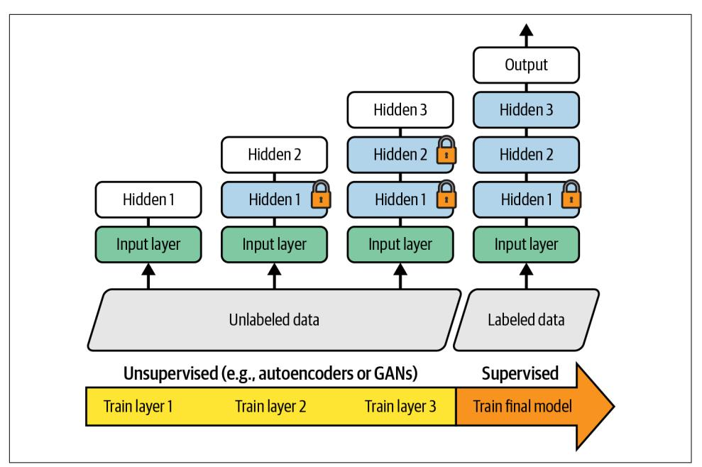

Figure 11-6. In unsupervised training, a model is trained on all data, including the unlabeled data, using an unsupervised learning technique, then it is fine-tuned for the final task on just the labeled data using a supervised learning technique; the unsupervised part may train one layer at a time as shown here, or it may train the full model directly

### **Pretraining on an Auxiliary Task**

If you do not have much labeled training data, one last option is to train a first neural network on an auxiliary task for which you can easily obtain or generate labeled training data, then reuse the lower layers of that network for your actual task. The first neural network's lower layers will learn feature detectors that will likely be reusable by the second neural network.

For example, if you want to build a system to recognize faces, you may only have a few pictures of each individual—clearly not enough to train a good classifier. Gathering hundreds of pictures of each person would not be practical. You could, however, gather a lot of pictures of random people on the web and train a first neural network to detect whether or not two different pictures feature the same person. Such a network would learn good feature detectors for faces, so reusing its lower layers would allow you to train a good face classifier that uses little training data.

For natural language processing (NLP) applications, you can download a corpus of millions of text documents and automatically generate labeled data from it. For example, you could randomly mask out some words and train a model to predict what the missing words are (e.g., it should predict that the missing word in the 

{406}------------------------------------------------

sentence "What \_\_\_\_\_ you saying?" is probably "are" or "were"). If you can train a model to reach good performance on this task, then it will already know quite a lot about language, and you can certainly reuse it for your actual task and fine-tune it on your labeled data (we will discuss more pretraining tasks in Chapter 15).


Self-supervised learning is when you automatically generate the labels from the data itself, as in the text-masking example, then you train a model on the resulting "labeled" dataset using supervised learning techniques.

### **Faster Optimizers**

Training a very large deep neural network can be painfully slow. So far we have seen four ways to speed up training (and reach a better solution): applying a good initialization strategy for the connection weights, using a good activation function, using batch normalization, and reusing parts of a pretrained network (possibly built for an auxiliary task or using unsupervised learning). Another huge speed boost comes from using a faster optimizer than the regular gradient descent optimizer. In this section we will present the most popular optimization algorithms: momentum, Nesterov accelerated gradient, AdaGrad, RMSProp, and finally Adam and its variants.

#### Momentum

Imagine a bowling ball rolling down a gentle slope on a smooth surface: it will start out slowly, but it will quickly pick up momentum until it eventually reaches terminal velocity (if there is some friction or air resistance). This is the core idea behind *momentum optimization*, proposed by Boris Polyak in 1964.<sup>15</sup> In contrast, regular gradient descent will take small steps when the slope is gentle and big steps when the slope is steep, but it will never pick up speed. As a result, regular gradient descent is generally much slower to reach the minimum than momentum optimization.

Recall that gradient descent updates the weights  $\theta$  by directly subtracting the gradient of the cost function  $J(\theta)$  with regard to the weights  $(\nabla_{\theta}J(\theta))$  multiplied by the learning rate  $\eta$ . The equation is  $\theta \leftarrow \theta - \eta \nabla_{\theta} J(\theta)$ . It does not care about what the earlier gradients were. If the local gradient is tiny, it goes very slowly.

Momentum optimization cares a great deal about what previous gradients were: at each iteration, it subtracts the local gradient from the *momentum vector* **m** (multiplied by the learning rate  $\eta$ ), and it updates the weights by adding this momentum vector (see Equation 11-5). In other words, the gradient is used as an acceleration, not

<sup>15</sup> Boris T. Polyak, "Some Methods of Speeding Up the Convergence of Iteration Methods", USSR Computational Mathematics and Mathematical Physics 4, no. 5 (1964): 1-17.

{407}------------------------------------------------

as a speed. To simulate some sort of friction mechanism and prevent the momentum from growing too large, the algorithm introduces a new hyperparameter  $\beta$ , called the *momentum*, which must be set between 0 (high friction) and 1 (no friction). A typical momentum value is 0.9.

Equation 11-5. Momentum algorithm

- $1.$  $\mathbf{m} \leftarrow \beta \mathbf{m} - \eta \nabla_{\mathbf{\theta}} J(\mathbf{\theta})$
- $\gamma$  $\theta \leftarrow \theta + m$

You can verify that if the gradient remains constant, the terminal velocity (i.e., the maximum size of the weight updates) is equal to that gradient multiplied by the learning rate  $\eta$  multiplied by 1 / (1 –  $\beta$ ) (ignoring the sign). For example, if  $\beta = 0.9$ , then the terminal velocity is equal to 10 times the gradient times the learning rate, so momentum optimization ends up going 10 times faster than gradient descent! This allows momentum optimization to escape from plateaus much faster than gradient descent. We saw in Chapter 4 that when the inputs have very different scales, the cost function will look like an elongated bowl (see Figure 4-7). Gradient descent goes down the steep slope quite fast, but then it takes a very long time to go down the valley. In contrast, momentum optimization will roll down the valley faster and faster until it reaches the bottom (the optimum). In deep neural networks that don't use batch normalization, the upper layers will often end up having inputs with very different scales, so using momentum optimization helps a lot. It can also help roll past local optima.


Due to the momentum, the optimizer may overshoot a bit, then come back, overshoot again, and oscillate like this many times before stabilizing at the minimum. This is one of the reasons it's good to have a bit of friction in the system: it gets rid of these oscillations and thus speeds up convergence.

Implementing momentum optimization in Keras is a no-brainer: just use the SGD optimizer and set its momentum hyperparameter, then lie back and profit!

```
optimizer = tf.keras.optimizers.SGD(learning_rate=0.001, momentum=0.9)
```

The one drawback of momentum optimization is that it adds yet another hyperparameter to tune. However, the momentum value of 0.9 usually works well in practice and almost always goes faster than regular gradient descent.

{408}------------------------------------------------

### **Nesterov Accelerated Gradient**

One small variant to momentum optimization, proposed by Yurii Nesterov in 1983,<sup>16</sup> is almost always faster than regular momentum optimization. The Nesterov accelerated gradient (NAG) method, also known as Nesterov momentum optimization, measures the gradient of the cost function not at the local position  $\theta$  but slightly ahead in the direction of the momentum, at  $\theta + \beta m$  (see Equation 11-6).

Equation 11-6. Nesterov accelerated gradient algorithm

- $\mathbf{m} \leftarrow \beta \mathbf{m} \eta \nabla_{\mathbf{\theta}} J(\mathbf{\theta} + \beta \mathbf{m})$  $1.$
- $2.1$  $\theta \leftarrow \theta + m$

This small tweak works because in general the momentum vector will be pointing in the right direction (i.e., toward the optimum), so it will be slightly more accurate to use the gradient measured a bit farther in that direction rather than the gradient at the original position, as you can see in Figure 11-7 (where  $\nabla$ <sub>1</sub> represents the gradient of the cost function measured at the starting point  $\theta$ , and  $\nabla$ , represents the gradient at the point located at  $\theta + \beta m$ ).


Figure 11-7. Regular versus Nesterov momentum optimization: the former applies the gradients computed before the momentum step, while the latter applies the gradients computed after

As you can see, the Nesterov update ends up closer to the optimum. After a while, these small improvements add up and NAG ends up being significantly faster than regular momentum optimization. Moreover, note that when the momentum pushes

<sup>16</sup> Yurii Nesterov, "A Method for Unconstrained Convex Minimization Problem with the Rate of Convergence  $O(1/k^2)$ ," Doklady AN USSR 269 (1983): 543-547.

{409}------------------------------------------------

the weights across a valley,  $\nabla_1$  continues to push farther across the valley, while  $\nabla_2$ pushes back toward the bottom of the valley. This helps reduce oscillations and thus NAG converges faster.

To use NAG, simply set nesterov=True when creating the SGD optimizer:

```
optimizer = tf.keras.optimizers.SGD(learning_rate=0.001, momentum=0.9,
                                    nesterov=True)
```

### **AdaGrad**

Consider the elongated bowl problem again: gradient descent starts by quickly going down the steepest slope, which does not point straight toward the global optimum, then it very slowly goes down to the bottom of the valley. It would be nice if the algorithm could correct its direction earlier to point a bit more toward the global optimum. The *AdaGrad* algorithm<sup>17</sup> achieves this correction by scaling down the gradient vector along the steepest dimensions (see Equation 11-7).

Equation 11-7. AdaGrad algorithm

- 1.  $\mathbf{s} \leftarrow \mathbf{s} + \nabla_{\mathbf{\theta}} J(\mathbf{\theta}) \otimes \nabla_{\mathbf{\theta}} J(\mathbf{\theta})$
- $\theta \leftarrow \theta \eta \nabla_{\theta} J(\theta) \oslash \sqrt{s + \varepsilon}$  $2.$

The first step accumulates the square of the gradients into the vector s (recall that the  $\otimes$  symbol represents the element-wise multiplication). This vectorized form is equivalent to computing  $s_i \leftarrow s_j + (\partial J(\theta) / \partial \theta_j)^2$  for each element  $s_j$  of the vector s; in other words, each  $s_i$  accumulates the squares of the partial derivative of the cost function with regard to parameter  $\theta_i$ . If the cost function is steep along the *i*<sup>th</sup> dimension, then  $s_i$  will get larger and larger at each iteration.

The second step is almost identical to gradient descent, but with one big difference: the gradient vector is scaled down by a factor of  $\sqrt{s+\epsilon}$  (the  $\oslash$  symbol represents the element-wise division, and  $\varepsilon$  is a smoothing term to avoid division by zero, typically set to  $10^{-10}$ ). This vectorized form is equivalent to simultaneously computing  $\theta_i \leftarrow \theta_i - \eta \partial J(\mathbf{\Theta})/\partial \theta_i/\sqrt{s_i + \varepsilon}$  for all parameters  $\theta_i$ .

In short, this algorithm decays the learning rate, but it does so faster for steep dimensions than for dimensions with gentler slopes. This is called an *adaptive learning* rate. It helps point the resulting updates more directly toward the global optimum (see Figure 11-8). One additional benefit is that it requires much less tuning of the learning rate hyperparameter  $\eta$ .

<sup>17</sup> John Duchi et al., "Adaptive Subgradient Methods for Online Learning and Stochastic Optimization", Journal of Machine Learning Research 12 (2011): 2121-2159.

{410}------------------------------------------------

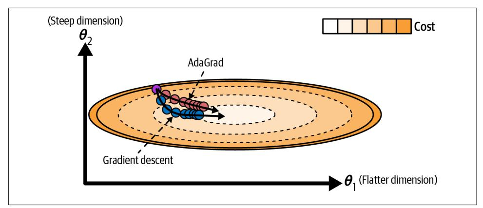

Figure 11-8. AdaGrad versus gradient descent: the former can correct its direction earlier to point to the optimum

AdaGrad frequently performs well for simple quadratic problems, but it often stops too early when training neural networks: the learning rate gets scaled down so much that the algorithm ends up stopping entirely before reaching the global optimum. So even though Keras has an Adagrad optimizer, you should not use it to train deep neural networks (it may be efficient for simpler tasks such as linear regression, though). Still, understanding AdaGrad is helpful to comprehend the other adaptive learning rate optimizers.

#### **RMSProp**

As we've seen, AdaGrad runs the risk of slowing down a bit too fast and never converging to the global optimum. The RMSProp algorithm<sup>18</sup> fixes this by accumulating only the gradients from the most recent iterations, as opposed to all the gradients since the beginning of training. It does so by using exponential decay in the first step (see Equation  $11-8$ ).

Equation 11-8. RMSProp algorithm

- $1.$  $\mathbf{s} \leftarrow \rho \mathbf{s} + (1 - \rho) \nabla_{\mathbf{\theta}} J(\mathbf{\theta}) \otimes \nabla_{\mathbf{\theta}} J(\mathbf{\theta})$
- 2.  $\theta \leftarrow \theta \eta \nabla_{\theta} J(\theta) \oslash \sqrt{s + \varepsilon}$

<sup>18</sup> This algorithm was created by Geoffrey Hinton and Tijmen Tieleman in 2012 and presented by Geoffrey Hinton in his Coursera class on neural networks (slides: https://homl.info/57; video: https://homl.info/58). Amusingly, since the authors did not write a paper to describe the algorithm, researchers often cite "slide 29 in lecture 6e" in their papers.

{411}------------------------------------------------

The decay rate  $\rho$  is typically set to 0.9.<sup>19</sup> Yes, it is once again a new hyperparameter, but this default value often works well, so you may not need to tune it at all.

As you might expect, Keras has an RMSprop optimizer:

optimizer = tf.keras.optimizers.RMSprop(learning\_rate=0.001, rho=0.9)

Except on very simple problems, this optimizer almost always performs much better than AdaGrad. In fact, it was the preferred optimization algorithm of many researchers until Adam optimization came around.

### Adam

Adam,<sup>20</sup> which stands for *adaptive moment estimation*, combines the ideas of momentum optimization and RMSProp: just like momentum optimization, it keeps track of an exponentially decaying average of past gradients; and just like RMSProp, it keeps track of an exponentially decaying average of past squared gradients (see Equation 11-9). These are estimations of the mean and (uncentered) variance of the gradients. The mean is often called the *first moment* while the variance is often called the *second moment*, hence the name of the algorithm.

Equation 11-9. Adam algorithm

1. 
$$
\mathbf{m} \leftarrow \beta_1 \mathbf{m} - (1 - \beta_1) \nabla_{\boldsymbol{\theta}} J(\boldsymbol{\theta})
$$
  
\n2.  $\mathbf{s} \leftarrow \beta_2 \mathbf{s} + (1 - \beta_2) \nabla_{\boldsymbol{\theta}} J(\boldsymbol{\theta}) \otimes \nabla_{\boldsymbol{\theta}} J(\boldsymbol{\theta})$ 

3. 
$$
\widehat{\mathbf{m}} \leftarrow \frac{\mathbf{m}}{1 - \beta_1^t}
$$

4. 
$$
\hat{\mathbf{s}} \leftarrow \frac{\mathbf{s}}{1 - \beta_2^t}
$$

$$
5. \qquad \boldsymbol{\theta} \leftarrow \boldsymbol{\theta} + \eta \, \widehat{\mathbf{m}} \oslash \sqrt{\widehat{\mathbf{s}} + \varepsilon}
$$

In this equation,  $t$  represents the iteration number (starting at 1).

If you just look at steps 1, 2, and 5, you will notice Adam's close similarity to both momentum optimization and RMSProp:  $\beta_1$  corresponds to  $\beta$  in momentum optimization, and  $\beta$ , corresponds to  $\rho$  in RMSProp. The only difference is that step 1 computes an exponentially decaying average rather than an exponentially decaying sum, but these are actually equivalent except for a constant factor (the decaying average is just  $1 - \beta_1$  times the decaying sum). Steps 3 and 4 are somewhat of a

<sup>19</sup>  $\rho$  is the Greek letter rho.

<sup>20</sup> Diederik P. Kingma and Jimmy Ba, "Adam: A Method for Stochastic Optimization", arXiv preprint arXiv:1412.6980 (2014).

{412}------------------------------------------------

technical detail: since m and s are initialized at 0, they will be biased toward 0 at the beginning of training, so these two steps will help boost **m** and s at the beginning of training.

The momentum decay hyperparameter  $\beta_1$  is typically initialized to 0.9, while the scaling decay hyperparameter  $\beta_2$  is often initialized to 0.999. As earlier, the smoothing term  $\varepsilon$  is usually initialized to a tiny number such as  $10^{-7}$ . These are the default values for the Adam class. Here is how to create an Adam optimizer using Keras:

```
optimizer = tf.keras.optimizers.Adam(learning_rate=0.001, beta_1=0.9,
                                    beta_2=0.999)
```

Since Adam is an adaptive learning rate algorithm, like AdaGrad and RMSProp, it requires less tuning of the learning rate hyperparameter  $\eta$ . You can often use the default value  $\eta = 0.001$ , making Adam even easier to use than gradient descent.


If you are starting to feel overwhelmed by all these different techniques and are wondering how to choose the right ones for your task, don't worry: some practical guidelines are provided at the end of this chapter.

Finally, three variants of Adam are worth mentioning: AdaMax, Nadam, and AdamW.

### **AdaMax**

The Adam paper also introduced AdaMax. Notice that in step 2 of Equation 11-9, Adam accumulates the squares of the gradients in s (with a greater weight for more recent gradients). In step 5, if we ignore  $\varepsilon$  and steps 3 and 4 (which are technical details anyway), Adam scales down the parameter updates by the square root of s. In short, Adam scales down the parameter updates by the  $\ell_2$  norm of the time-decayed gradients (recall that the  $\ell_2$  norm is the square root of the sum of squares).

AdaMax replaces the  $\ell_2$  norm with the  $\ell_{\infty}$  norm (a fancy way of saying the max). Specifically, it replaces step 2 in Equation 11-9 with  $s \leftarrow max(\beta_{2} s, abs(\nabla_{\theta} J(\theta)))$ , it drops step 4, and in step 5 it scales down the gradient updates by a factor of s, which is the max of the absolute value of the time-decayed gradients.

In practice, this can make AdaMax more stable than Adam, but it really depends on the dataset, and in general Adam performs better. So, this is just one more optimizer you can try if you experience problems with Adam on some task.

{413}------------------------------------------------

### **Nadam**

Nadam optimization is Adam optimization plus the Nesterov trick, so it will often converge slightly faster than Adam. In his report introducing this technique,<sup>21</sup> the researcher Timothy Dozat compares many different optimizers on various tasks and finds that Nadam generally outperforms Adam but is sometimes outperformed by RMSProp.

### **AdamW**

 $\text{AdamW}^{22}$  is a variant of Adam that integrates a regularization technique called *weight decay.* Weight decay reduces the size of the model's weights at each training iteration by multiplying them by a decay factor such as 0.99. This may remind you of  $\ell_2$  regularization (introduced in Chapter 4), which also aims to keep the weights small, and indeed it can be shown mathematically that  $\ell_2$  regularization is equivalent to weight decay when using SGD. However, when using Adam or its variants,  $\ell_2$ regularization and weight decay are not equivalent: in practice, combining Adam with  $\ell_2$  regularization results in models that often don't generalize as well as those produced by SGD. AdamW fixes this issue by properly combining Adam with weight decay.


Adaptive optimization methods (including RMSProp, Adam, Ada-Max, Nadam, and AdamW optimization) are often great, converging fast to a good solution. However, a 2017 paper<sup>23</sup> by Ashia C. Wilson et al. showed that they can lead to solutions that generalize poorly on some datasets. So when you are disappointed by your model's performance, try using NAG instead: your dataset may just be allergic to adaptive gradients. Also check out the latest research, because it's moving fast.

To use Nadam, AdaMax, or AdamW in Keras, replace tf.keras.optimiz ers.Adam with tf.keras.optimizers.Nadam, tf.keras.optimizers.Adamax, or tf.keras.optimizers.experimental.AdamW. For AdamW, you probably want to tune the weight\_decay hyperparameter.

All the optimization techniques discussed so far only rely on the *first-order partial* derivatives (Jacobians). The optimization literature also contains amazing algorithms

<sup>21</sup> Timothy Dozat, "Incorporating Nesterov Momentum into Adam" (2016).

<sup>22</sup> Ilya Loshchilov, and Frank Hutter, "Decoupled Weight Decay Regularization", arXiv preprint arXiv:1711.05101 (2017).

<sup>23</sup> Ashia C. Wilson et al., "The Marginal Value of Adaptive Gradient Methods in Machine Learning", Advances in Neural Information Processing Systems 30 (2017): 4148-4158.

{414}------------------------------------------------

based on the *second-order partial derivatives* (the *Hessians*, which are the partial derivatives of the Jacobians). Unfortunately, these algorithms are very hard to apply to deep neural networks because there are  $n^2$  Hessians per output (where *n* is the number of parameters), as opposed to just  $n$  Jacobians per output. Since DNNs typically have tens of thousands of parameters or more, the second-order optimization algorithms often don't even fit in memory, and even when they do, computing the Hessians is just too slow.

#### **Training Sparse Models**

All the optimization algorithms we just discussed produce dense models, meaning that most parameters will be nonzero. If you need a blazingly fast model at runtime, or if you need it to take up less memory, you may prefer to end up with a sparse model instead.

One way to achieve this is to train the model as usual, then get rid of the tiny weights (set them to zero). However, this will typically not lead to a very sparse model, and it may degrade the model's performance.

A better option is to apply strong  $\ell_1$  regularization during training (you'll see how later in this chapter), as it pushes the optimizer to zero out as many weights as it can (as discussed in "Lasso Regression" on page 158).

If these techniques remain insufficient, check out the TensorFlow Model Optimization Toolkit (TF-MOT), which provides a pruning API capable of iteratively removing connections during training based on their magnitude.

Table 11-2 compares all the optimizers we've discussed so far  $(*$  is bad, \*\* is average, and \*\*\* is good).

| Class                           |        | Convergence speed Convergence quality |
|---------------------------------|--------|---------------------------------------|
| SGD                             | $\ast$ | $***$                                 |
| $SGD(momentum=)$                | $***$  | $***$                                 |
| $SGD(momentum=, nesterov=True)$ | $***$  | ***                                   |
| Adagrad                         | $***$  | * (stops too early)                   |
| RMSprop                         | $***$  | $***$ or $***$                        |
| Adam                            | $***$  | $***$ or $***$                        |
| AdaMax                          | $***$  | $***$ or $***$                        |
| Nadam                           | $***$  | $**$ or $***$                         |
| AdamW                           | $***$  | $**$ or $***$                         |

Table 11-2. Optimizer comparison

{415}------------------------------------------------

## **Learning Rate Scheduling**

Finding a good learning rate is very important. If you set it much too high, training may diverge (as discussed in "Gradient Descent" on page 138). If you set it too low, training will eventually converge to the optimum, but it will take a very long time. If you set it slightly too high, it will make progress very quickly at first, but it will end up dancing around the optimum and never really settling down. If you have a limited computing budget, you may have to interrupt training before it has converged properly, yielding a suboptimal solution (see Figure 11-9).


Figure 11-9. Learning curves for various learning rates  $\eta$ 

As discussed in Chapter 10, you can find a good learning rate by training the model for a few hundred iterations, exponentially increasing the learning rate from a very small value to a very large value, and then looking at the learning curve and picking a learning rate slightly lower than the one at which the learning curve starts shooting back up. You can then reinitialize your model and train it with that learning rate.

But you can do better than a constant learning rate: if you start with a large learning rate and then reduce it once training stops making fast progress, you can reach a good solution faster than with the optimal constant learning rate. There are many different strategies to reduce the learning rate during training. It can also be beneficial to start with a low learning rate, increase it, then drop it again. These strategies are called *learning schedules* (I briefly introduced this concept in Chapter 4). These are the most commonly used learning schedules:

{416}------------------------------------------------

#### Power scheduling

Set the learning rate to a function of the iteration number t:  $\eta(t) = \eta_0 / (1 + t/s)^c$ . The initial learning rate  $\eta_0$ , the power c (typically set to 1), and the steps s are hyperparameters. The learning rate drops at each step. After s steps, the learning rate is down to  $\eta_0$  / 2. After *s* more steps it is down to  $\eta_0$  / 3, then it goes down to  $\eta_0$  / 4, then  $\eta_0$  / 5, and so on. As you can see, this schedule first drops quickly, then more and more slowly. Of course, power scheduling requires tuning  $\eta_0$  and s (and possibly  $c$ ).

Exponential scheduling

Set the learning rate to  $\eta(t) = \eta_0 0.1^{t/s}$ . The learning rate will gradually drop by a factor of 10 every s steps. While power scheduling reduces the learning rate more and more slowly, exponential scheduling keeps slashing it by a factor of 10 every s steps.

Piecewise constant scheduling

Use a constant learning rate for a number of epochs (e.g.,  $\eta_0 = 0.1$  for 5 epochs), then a smaller learning rate for another number of epochs (e.g.,  $\eta_1 = 0.001$  for 50 epochs), and so on. Although this solution can work very well, it requires fiddling around to figure out the right sequence of learning rates and how long to use each of them.

#### Performance scheduling

Measure the validation error every  $N$  steps (just like for early stopping), and reduce the learning rate by a factor of  $\lambda$  when the error stops dropping.

*lcycle scheduling* 

1 cycle was introduced in a 2018 paper by Leslie Smith.<sup>24</sup> Contrary to the other approaches, it starts by increasing the initial learning rate  $\eta_0$ , growing linearly up to  $\eta_1$  halfway through training. Then it decreases the learning rate linearly down to  $\eta_0$  again during the second half of training, finishing the last few epochs by dropping the rate down by several orders of magnitude (still linearly). The maximum learning rate  $\eta_1$  is chosen using the same approach we used to find the optimal learning rate, and the initial learning rate  $\eta_0$  is usually 10 times lower. When using a momentum, we start with a high momentum first (e.g., 0.95), then drop it down to a lower momentum during the first half of training (e.g., down to 0.85, linearly), and then bring it back up to the maximum value (e.g., 0.95) during the second half of training, finishing the last few epochs with that maximum value. Smith did many experiments showing that this approach was often able to speed up training considerably and reach better performance. For example,

<sup>24</sup> Leslie N. Smith, "A Disciplined Approach to Neural Network Hyper-Parameters: Part 1-Learning Rate, Batch Size, Momentum, and Weight Decay", arXiv preprint arXiv:1803.09820 (2018).

{417}------------------------------------------------

on the popular CIFAR10 image dataset, this approach reached 91.9% validation accuracy in just 100 epochs, compared to 90.3% accuracy in 800 epochs through a standard approach (with the same neural network architecture). This feat was dubbed super-convergence.

A 2013 paper by Andrew Senior et al.<sup>25</sup> compared the performance of some of the most popular learning schedules when using momentum optimization to train deep neural networks for speech recognition. The authors concluded that, in this setting, both performance scheduling and exponential scheduling performed well. They favored exponential scheduling because it was easy to tune and it converged slightly faster to the optimal solution. They also mentioned that it was easier to implement than performance scheduling, but in Keras both options are easy. That said, the 1cycle approach seems to perform even better.

Implementing power scheduling in Keras is the easiest option—just set the decay hyperparameter when creating an optimizer:

```
optimizer = tf.keras.optimizers.SGD(learning_rate=0.01, decay=1e-4)
```

The decay is the inverse of  $s$  (the number of steps it takes to divide the learning rate by one more unit), and Keras assumes that  $c$  is equal to 1.

Exponential scheduling and piecewise scheduling are quite simple too. You first need to define a function that takes the current epoch and returns the learning rate. For example, let's implement exponential scheduling:

```
def exponential decay fn(epoch):
    return 0.01 * 0.1 * * (epoch / 20)
```

If you do not want to hardcode  $\eta_0$  and s, you can create a function that returns a configured function:

```
def exponential_decay(lr0, s):
    def exponential_decay_fn(epoch):
        return \text{lr0} * 0.1 * * (\text{epoch} / s)return exponential_decay_fn
exponential\_decay_f n = exponential\_decay(lr0=0.01, s=20)
```

Next, create a LearningRateScheduler callback, giving it the schedule function, and pass this callback to the fit() method:

```
lr_scheduler = tf.keras.callbacks.LearningRateScheduler(exponential_decay_fn)
history = model.fit(X_train, y_train, [...], callbacks=[lr_scheduler])
```

<sup>25</sup> Andrew Senior et al., "An Empirical Study of Learning Rates in Deep Neural Networks for Speech Recognition", Proceedings of the IEEE International Conference on Acoustics, Speech, and Signal Processing (2013): 6724-6728.

{418}------------------------------------------------

The LearningRateScheduler will update the optimizer's learning rate attribute at the beginning of each epoch. Updating the learning rate once per epoch is usually enough, but if you want it to be updated more often, for example at every step, you can always write your own callback (see the "Exponential Scheduling" section of this chapter's notebook for an example). Updating the learning rate at every step may help if there are many steps per epoch. Alternatively, you can use the tf.keras. optimizers.schedules approach, described shortly.


After training, history.history["lr"] gives you access to the list of learning rates used during training.

The schedule function can optionally take the current learning rate as a second argument. For example, the following schedule function multiplies the previous learning rate by  $0.1^{1/20}$ , which results in the same exponential decay (except the decay now starts at the beginning of epoch 0 instead of 1):

```
def exponential decay fn(epoch, lr):
    return \ln * 0.1 ** (1 / 20)
```

This implementation relies on the optimizer's initial learning rate (contrary to the previous implementation), so make sure to set it appropriately.

When you save a model, the optimizer and its learning rate get saved along with it. This means that with this new schedule function, you could just load a trained model and continue training where it left off, no problem. Things are not so simple if your schedule function uses the epoch argument, however: the epoch does not get saved, and it gets reset to 0 every time you call the fit() method. If you were to continue training a model where it left off, this could lead to a very large learning rate, which would likely damage your model's weights. One solution is to manually set the fit() method's initial\_epoch argument so the epoch starts at the right value.

For piecewise constant scheduling, you can use a schedule function like the following one (as earlier, you can define a more general function if you want; see the "Piecewise Constant Scheduling" section of the notebook for an example), then create a LearningRateScheduler callback with this function and pass it to the fit() method, just like for exponential scheduling:

```
def piecewise constant fn(epoch):
   if epoch < 5:
        return 0.01elif epoch < 15:
        return 0.005else:
        return 0.001
```

{419}------------------------------------------------

For performance scheduling, use the ReduceLR0nPlateau callback. For example, if you pass the following callback to the fit() method, it will multiply the learning rate by 0.5 whenever the best validation loss does not improve for five consecutive epochs (other options are available; please check the documentation for more details):

```
lr scheduler = tf.keras.callbacks.ReduceLROnPlateau(factor=0.5, patience=5)
history = model.fit(X train, y train, [\ldots], callbacks=[\ldots] scheduler])
```

Lastly, Keras offers an alternative way to implement learning rate scheduling: you can define a scheduled learning rate using one of the classes available in tf.keras. optimizers. schedules, then pass it to any optimizer. This approach updates the learning rate at each step rather than at each epoch. For example, here is how to implement the same exponential schedule as the exponential decay fn() function we defined earlier:

```
import math
batch size = 32n epochs = 25
n_steps = n_epochs * math.ceil(len(X_train) / batch_size)
scheduled_learning_rate = tf.keras.optimizers.schedules.ExponentialDecay(
    initial_learning_rate=0.01, decay_steps=n_steps, decay_rate=0.1)
optimizer = tf.keras.optimizers.SGD(learning rate=scheduled learning rate)
```

This is nice and simple, plus when you save the model, the learning rate and its schedule (including its state) get saved as well.

As for 1 cycle, Keras does not support it, but it's possible to implement it in less than 30 lines of code by creating a custom callback that modifies the learning rate at each iteration. To update the optimizer's learning rate from within the callback's on\_batch\_begin() method, you need to call tf.keras. backend.set value(self.model.optimizer.learning rate, new learning rate). See the "1Cycle Scheduling" section of the notebook for an example.

To sum up, exponential decay, performance scheduling, and 1 cycle can considerably speed up convergence, so give them a try!

## **Avoiding Overfitting Through Regularization**

With four parameters I can fit an elephant and with five I can make him wiggle his trunk.

-John von Neumann, cited by Enrico Fermi in Nature 427

With thousands of parameters, you can fit the whole zoo. Deep neural networks typically have tens of thousands of parameters, sometimes even millions. This gives them an incredible amount of freedom and means they can fit a huge variety of complex 

{420}------------------------------------------------

datasets. But this great flexibility also makes the network prone to overfitting the training set. Regularization is often needed to prevent this.

We already implemented one of the best regularization techniques in Chapter 10: early stopping. Moreover, even though batch normalization was designed to solve the unstable gradients problems, it also acts like a pretty good regularizer. In this section we will examine other popular regularization techniques for neural networks:  $\ell_1$  and  $\ell_2$  regularization, dropout, and max-norm regularization.

### **L**, and L, Regularization

Just like you did in Chapter 4 for simple linear models, you can use  $\ell_2$  regularization to constrain a neural network's connection weights, and/or  $\ell_1$  regularization if you want a sparse model (with many weights equal to 0). Here is how to apply  $\ell$ , regularization to a Keras layer's connection weights, using a regularization factor of 0.01:

```
layer = tf.keras.layers.Dense(100, activation="relu",
                              kernel_initializer="he_normal",
                              kernel regularizer=tf.keras.regularizers.l2(0.01))
```

The 12() function returns a regularizer that will be called at each step during training to compute the regularization loss. This is then added to the final loss. As you might expect, you can just use  $tf.$  keras. regularizers.  $lt()$  if you want  $\ell_1$  regularization; if you want both  $\ell_1$  and  $\ell_2$  regularization, use tf.keras.regularizers.11\_12() (specifying both regularization factors).

Since you will typically want to apply the same regularizer to all layers in your network, as well as using the same activation function and the same initialization strategy in all hidden layers, you may find yourself repeating the same arguments. This makes the code ugly and error-prone. To avoid this, you can try refactoring your code to use loops. Another option is to use Python's functools.partial() function, which lets you create a thin wrapper for any callable, with some default argument values:

```
from functools import partial
RegularizedDense = partial(tf.keras.layers.Dense,
                           activation="relu".
                           kernel initializer="he normal",
                            kernel_regularizer=tf.keras.regularizers.l2(0.01))model = tf.keras.Sequential(tf.keras.layers.Flatten(input_shape=[28, 28]),
    RegularizedDense(100),
    RegularizedDense(100),
    RegularizedDense(10, activation="softmax")
\left| \right)
```

{421}------------------------------------------------


As we saw earlier,  $\ell_2$  regularization is fine when using SGD, momentum optimization, and Nesterov momentum optimization, but not with Adam and its variants. If you want to use Adam with weight decay, then do not use  $\ell_2$  regularization: use AdamW instead.

#### **Dropout**

*Dropout* is one of the most popular regularization techniques for deep neural networks. It was proposed in a paper<sup>26</sup> by Geoffrey Hinton et al. in 2012 and further detailed in a 2014 paper<sup>27</sup> by Nitish Srivastava et al., and it has proven to be highly successful: many state-of-the-art neural networks use dropout, as it gives them a 1%–2% accuracy boost. This may not sound like a lot, but when a model already has 95% accuracy, getting a 2% accuracy boost means dropping the error rate by almost 40% (going from 5% error to roughly 3%).

It is a fairly simple algorithm: at every training step, every neuron (including the input neurons, but always excluding the output neurons) has a probability  $p$  of being temporarily "dropped out", meaning it will be entirely ignored during this training step, but it may be active during the next step (see Figure 11-10). The hyperparameter p is called the *dropout rate*, and it is typically set between 10% and 50%: closer to 20%-30% in recurrent neural nets (see Chapter 15), and closer to 40%-50% in convolutional neural networks (see Chapter 14). After training, neurons don't get dropped anymore. And that's all (except for a technical detail we will discuss momentarily).

It's surprising at first that this destructive technique works at all. Would a company perform better if its employees were told to toss a coin every morning to decide whether or not to go to work? Well, who knows; perhaps it would! The company would be forced to adapt its organization; it could not rely on any single person to work the coffee machine or perform any other critical tasks, so this expertise would have to be spread across several people. Employees would have to learn to cooperate with many of their coworkers, not just a handful of them. The company would become much more resilient. If one person quit, it wouldn't make much of a difference. It's unclear whether this idea would actually work for companies, but it certainly does for neural networks. Neurons trained with dropout cannot co-adapt with their neighboring neurons; they have to be as useful as possible on their own. They also cannot rely excessively on just a few input neurons; they must pay attention to each of their input neurons. They end up being less sensitive to slight changes in the inputs. In the end, you get a more robust network that generalizes better.

<sup>26</sup> Geoffrey E. Hinton et al., "Improving Neural Networks by Preventing Co-Adaptation of Feature Detectors", arXiv preprint arXiv:1207.0580 (2012).

<sup>27</sup> Nitish Srivastava et al., "Dropout: A Simple Way to Prevent Neural Networks from Overfitting", Journal of Machine Learning Research 15 (2014): 1929-1958.

{422}------------------------------------------------


Figure 11-10. With dropout regularization, at each training iteration a random subset of all neurons in one or more layers—except the output layer—are "dropped out"; these neurons output 0 at this iteration (represented by the dashed arrows)

Another way to understand the power of dropout is to realize that a unique neural network is generated at each training step. Since each neuron can be either present or absent, there are a total of  $2^N$  possible networks (where  $N$  is the total number of droppable neurons). This is such a huge number that it is virtually impossible for the same neural network to be sampled twice. Once you have run 10,000 training steps, you have essentially trained 10,000 different neural networks, each with just one training instance. These neural networks are obviously not independent because they share many of their weights, but they are nevertheless all different. The resulting neural network can be seen as an averaging ensemble of all these smaller neural networks

{423}------------------------------------------------


In practice, you can usually apply dropout only to the neurons in the top one to three layers (excluding the output layer).

There is one small but important technical detail. Suppose  $p = 75\%$ : on average only 25% of all neurons are active at each step during training. This means that after training, a neuron would be connected to four times as many input neurons as it would be during training. To compensate for this fact, we need to multiply each neuron's input connection weights by four during training. If we don't, the neural network will not perform well as it will see different data during and after training. More generally, we need to divide the connection weights by the keep probability  $(1-p)$  during training.

To implement dropout using Keras, you can use the tf.keras.layers.Dropout layer. During training, it randomly drops some inputs (setting them to 0) and divides the remaining inputs by the keep probability. After training, it does nothing at all; it just passes the inputs to the next layer. The following code applies dropout regularization before every dense layer, using a dropout rate of 0.2:

```
model = tf.keras.Sequential(tf.keras.layers.Flatten(input_shape=[28, 28]),
    tf.keras.layers.Dropout(rate=0.2),
    tf.keras.layers.Dense(100, activation="relu",
                           kernel initializer="he normal"),
    tf.keras.layers.Dropout(rate=0.2),
    tf.keras.layers.Dense(100, activation="relu",
                           kernel_initializer="he_normal"),
    tf.keras.layers.Dropout(rate=0.2),
    tf.keras.layers.Dense(10, activation="softmax")
\left| \right\rangle[...] # compile and train the model
```


Since dropout is only active during training, comparing the training loss and the validation loss can be misleading. In particular, a model may be overfitting the training set and yet have similar training and validation losses. So, make sure to evaluate the training loss without dropout (e.g., after training).

If you observe that the model is overfitting, you can increase the dropout rate. Conversely, you should try decreasing the dropout rate if the model underfits the training set. It can also help to increase the dropout rate for large layers, and reduce it for small ones. Moreover, many state-of-the-art architectures only use dropout after the last hidden layer, so you may want to try this if full dropout is too strong.

{424}------------------------------------------------

Dropout does tend to significantly slow down convergence, but it often results in a better model when tuned properly. So, it is generally well worth the extra time and effort, especially for large models.


If you want to regularize a self-normalizing network based on the SELU activation function (as discussed earlier), you should use alpha dropout: this is a variant of dropout that preserves the mean and standard deviation of its inputs. It was introduced in the same paper as SELU, as regular dropout would break self-normalization.

### **Monte Carlo (MC) Dropout**

In 2016, a paper<sup>28</sup> by Yarin Gal and Zoubin Ghahramani added a few more good reasons to use dropout:

- First, the paper established a profound connection between dropout networks (i.e., neural networks containing Dropout layers) and approximate Bayesian inference,<sup>29</sup> giving dropout a solid mathematical justification.
- Second, the authors introduced a powerful technique called MC dropout, which can boost the performance of any trained dropout model without having to retrain it or even modify it at all. It also provides a much better measure of the model's uncertainty, and it can be implemented in just a few lines of code.

If this all sounds like some "one weird trick" clickbait, then take a look at the following code. It is the full implementation of MC dropout, boosting the dropout model we trained earlier without retraining it:

```
import numpy as np
y_probas = np.stack([model(X_test, training=True)
                     for sample in range(100)]y proba = y probas.mean(axis=0)
```

Note that  $model(X)$  is similar to  $model.predict(X) except it returns a tensor rather$ than a NumPy array, and it supports the training argument. In this code example, setting training=True ensures that the Dropout layer remains active, so all predictions will be a bit different. We just make 100 predictions over the test set, and we compute their average. More specifically, each call to the model returns a matrix with one row per instance and one column per class. Because there are 10,000 instances

<sup>28</sup> Yarin Gal and Zoubin Ghahramani, "Dropout as a Bayesian Approximation: Representing Model Uncertainty in Deep Learning", Proceedings of the 33rd International Conference on Machine Learning (2016): 1050-1059.

<sup>29</sup> Specifically, they show that training a dropout network is mathematically equivalent to approximate Bayesian inference in a specific type of probabilistic model called a *deep Gaussian process*.

{425}------------------------------------------------

in the test set and 10 classes, this is a matrix of shape [10000, 10]. We stack 100 such matrices, so y probas is a 3D array of shape [100, 10000, 10]. Once we average over the first dimension (axis=0) we get y\_proba, an array of shape [10000, 10], like we would get with a single prediction. That's all! Averaging over multiple predictions with dropout turned on gives us a Monte Carlo estimate that is generally more reliable than the result of a single prediction with dropout turned off. For example, let's look at the model's prediction for the first instance in the Fashion MNIST test set, with dropout turned off:

```
>>> model.predict(X_test[:1]).round(3)
                                     , 0.024, 0., 0.132, 0.
array([[0. , 0. , 0. , 0. , 0.
       0.844]], dtype=float32)
```

The model is fairly confident (84.4%) that this image belongs to class 9 (ankle boot). Compare this with the MC dropout prediction:

```
\Rightarrow y proba[\theta].round(3)
                                       , 0., 0.067, 0., 0.209, 0.001,
\arctan([0, 0, 0, 0, 0, 0, 0, 0, 0, 0, 0, 0, 0, 00.723], dtype=float32)
```

The model still seems to prefer class 9, but its confidence dropped down to 72.3%, and the estimated probabilities for classes 5 (sandal) and 7 (sneaker) have increased, which makes sense given they're also footwear.

MC dropout tends to improve the reliability of the model's probability estimates. This means that it's less likely to be confident but wrong, which can be dangerous: just imagine a self-driving car confidently ignoring a stop sign. It's also useful to know exactly which other classes are most likely. Additionally, you can take a look at the standard deviation of the probability estimates:

```
\Rightarrow y_std = y_probas.std(axis=0)
\Rightarrow y_std[\theta].round(3)
array([0. 10. 0. 0. 0. 0. 0.001, 0. 0.096, 0. 0.162, 0.001,0.183], dtype=float32)
```

Apparently there's quite a lot of variance in the probability estimates for class 9: the standard deviation is 0.183, which should be compared to the estimated probability of 0.723: if you were building a risk-sensitive system (e.g., a medical or financial system), you would probably treat such an uncertain prediction with extreme caution. You would definitely not treat it like an 84.4% confident prediction. The model's accuracy also got a (very) small boost from 87.0% to 87.2%:

```
\Rightarrow y pred = y proba.argmax(axis=1)
>>> accuracy = (y_pred == y_test).sum() / len(y_test)>>> accuracy
0.8717
```

{426}------------------------------------------------


The number of Monte Carlo samples you use (100 in this example) is a hyperparameter you can tweak. The higher it is, the more accurate the predictions and their uncertainty estimates will be. However, if you double it, inference time will also be doubled. Moreover, above a certain number of samples, you will notice little improvement. Your job is to find the right trade-off between latency and accuracy, depending on your application.

If your model contains other layers that behave in a special way during training (such as BatchNormalization layers), then you should not force training mode like we just did. Instead, you should replace the Dropout layers with the following MCDropout  $class:30$ 

```
class MCDropout(tf.keras.layers.Dropout):
    def call(self, inputs, training=False):
        return super().call(inputs, training=True)
```

Here, we just subclass the Dropout layer and override the call() method to force its training argument to True (see Chapter 12). Similarly, you could define an MCAlpha Dropout class by subclassing AlphaDropout instead. If you are creating a model from scratch, it's just a matter of using MCDropout rather than Dropout. But if you have a model that was already trained using Dropout, you need to create a new model that's identical to the existing model except with Dropout instead of MCDropout, then copy the existing model's weights to your new model.

In short, MC dropout is a great technique that boosts dropout models and provides better uncertainty estimates. And of course, since it is just regular dropout during training, it also acts like a regularizer.

### **Max-Norm Regularization**

Another popular regularization technique for neural networks is called *max-norm regularization:* for each neuron, it constrains the weights w of the incoming connections such that  $||\mathbf{w}||_2 \le r$ , where r is the max-norm hyperparameter and  $||\cdot||_2$  is the  $\ell_2$ norm.

Max-norm regularization does not add a regularization loss term to the overall loss function. Instead, it is typically implemented by computing  $\| \mathbf{w} \|_2$  after each training step and rescaling **w** if needed (**w**  $\leftarrow$  **w** r /  $\|\mathbf{w}\|_2$ ).

<sup>30</sup> This MCDropout class will work with all Keras APIs, including the sequential API. If you only care about the functional API or the subclassing API, you do not have to create an MCDropout class; you can create a regular Dropout layer and call it with training=True.

{427}------------------------------------------------

Reducing  $r$  increases the amount of regularization and helps reduce overfitting. Max-norm regularization can also help alleviate the unstable gradients problems (if you are not using batch normalization).

To implement max-norm regularization in Keras, set the kernel constraint argument of each hidden layer to a max norm() constraint with the appropriate max value, like this:

```
dense = tf_keras_lavers.Dense(100, activation="relu", kernel_initializer="he_normal",
   kernel_constraint=tf.keras.constraints.max_norm(1.))
```

After each training iteration, the model's fit() method will call the object returned by max\_norm(), passing it the layer's weights and getting rescaled weights in return, which then replace the layer's weights. As you'll see in Chapter 12, you can define your own custom constraint function if necessary and use it as the kernel\_ constraint. You can also constrain the bias terms by setting the bias constraint argument.

The max\_norm() function has an axis argument that defaults to 0. A Dense layer usually has weights of shape [*number of inputs, number of neurons*], so using axis=0 means that the max-norm constraint will apply independently to each neuron's weight vector. If you want to use max-norm with convolutional layers (see Chapter 14), make sure to set the  $max_norm()$  constraint's axis argument appropriately (usually  $axis=[0, 1, 2]$ ).

### **Summary and Practical Guidelines**

In this chapter we have covered a wide range of techniques, and you may be wondering which ones you should use. This depends on the task, and there is no clear consensus yet, but I have found the configuration in Table 11-3 to work fine in most cases, without requiring much hyperparameter tuning. That said, please do not consider these defaults as hard rules!

Table 11-3. Default DNN configuration

| Hyperparameter             | Default value                           |
|----------------------------|-----------------------------------------|
| Kernel initializer         | He initialization                       |
| <b>Activation function</b> | ReLU if shallow; Swish if deep          |
| <b>Normalization</b>       | None if shallow; batch norm if deep     |
| Regularization             | Early stopping; weight decay if needed  |
| Optimizer                  | Nesterov accelerated gradients or AdamW |
| Learning rate schedule     | Performance scheduling or 1 cycle       |

{428}------------------------------------------------

If the network is a simple stack of dense layers, then it can self-normalize, and you should use the configuration in Table 11-4 instead.

| Hyperparameter             | Default value                     |
|----------------------------|-----------------------------------|
| Kernel initializer         | LeCun initialization              |
| <b>Activation function</b> | SFI U                             |
| <b>Normalization</b>       | None (self-normalization)         |
| Regularization             | Alpha dropout if needed           |
| <b>Optimizer</b>           | Nesterov accelerated gradients    |
| Learning rate schedule     | Performance scheduling or 1 cycle |

Table 11-4. DNN configuration for a self-normalizing net

Don't forget to normalize the input features! You should also try to reuse parts of a pretrained neural network if you can find one that solves a similar problem, or use unsupervised pretraining if you have a lot of unlabeled data, or use pretraining on an auxiliary task if you have a lot of labeled data for a similar task.

While the previous guidelines should cover most cases, here are some exceptions:

- If you need a sparse model, you can use  $\ell_1$  regularization (and optionally zero out the tiny weights after training). If you need an even sparser model, you can use the TensorFlow Model Optimization Toolkit. This will break self-normalization, so you should use the default configuration in this case.
- If you need a low-latency model (one that performs lightning-fast predictions), you may need to use fewer layers, use a fast activation function such as ReLU or leaky ReLU, and fold the batch normalization layers into the previous layers after training. Having a sparse model will also help. Finally, you may want to reduce the float precision from 32 bits to 16 or even 8 bits (see "Deploying a Model to a Mobile or Embedded Device" on page 741). Again, check out TF-MOT.
- If you are building a risk-sensitive application, or inference latency is not very important in your application, you can use MC dropout to boost performance and get more reliable probability estimates, along with uncertainty estimates.

With these guidelines, you are now ready to train very deep nets! I hope you are now convinced that you can go quite a long way using just the convenient Keras API. There may come a time, however, when you need to have even more control; for example, to write a custom loss function or to tweak the training algorithm. For such cases you will need to use TensorFlow's lower-level API, as you will see in the next chapter.

{429}------------------------------------------------

### **Exercises**

- 1. What is the problem that Glorot initialization and He initialization aim to fix?
- 2. Is it OK to initialize all the weights to the same value as long as that value is selected randomly using He initialization?
- 3. Is it OK to initialize the bias terms to 0?
- 4. In which cases would you want to use each of the activation functions we discussed in this chapter?
- 5. What may happen if you set the momentum hyperparameter too close to 1 (e.g., 0.99999) when using an SGD optimizer?
- 6. Name three ways you can produce a sparse model.
- 7. Does dropout slow down training? Does it slow down inference (i.e., making predictions on new instances)? What about MC dropout?
- 8. Practice training a deep neural network on the CIFAR10 image dataset:
  - a. Build a DNN with 20 hidden layers of 100 neurons each (that's too many, but it's the point of this exercise). Use He initialization and the Swish activation function.
  - b. Using Nadam optimization and early stopping, train the network on the CIFAR10 dataset. You can load it with tf.keras.datasets.cifar10.load\_ data(). The dataset is composed of 60,000 32  $\times$  32-pixel color images (50,000 for training, 10,000 for testing) with 10 classes, so you'll need a softmax output layer with 10 neurons. Remember to search for the right learning rate each time you change the model's architecture or hyperparameters.
  - c. Now try adding batch normalization and compare the learning curves: is it converging faster than before? Does it produce a better model? How does it affect training speed?
  - d. Try replacing batch normalization with SELU, and make the necessary adjustments to ensure the network self-normalizes (i.e., standardize the input features, use LeCun normal initialization, make sure the DNN contains only a sequence of dense layers, etc.).
  - e. Try regularizing the model with alpha dropout. Then, without retraining your model, see if you can achieve better accuracy using MC dropout.
  - f. Retrain your model using 1 cycle scheduling and see if it improves training speed and model accuracy.

Solutions to these exercises are available at the end of this chapter's notebook, at https://homl.info/colab3.

{430}------------------------------------------------

## **CHAPTER 12 Custom Models and Training** with TensorFlow

Up until now, we've used only TensorFlow's high-level API, Keras, but it already got us pretty far: we built various neural network architectures, including regression and classification nets, Wide & Deep nets, and self-normalizing nets, using all sorts of techniques, such as batch normalization, dropout, and learning rate schedules. In fact, 95% of the use cases you will encounter will not require anything other than Keras (and tf.data; see Chapter 13). But now it's time to dive deeper into TensorFlow and take a look at its lower-level Python API. This will be useful when you need extra control to write custom loss functions, custom metrics, layers, models, initializers, regularizers, weight constraints, and more. You may even need to fully control the training loop itself; for example, to apply special transformations or constraints to the gradients (beyond just clipping them) or to use multiple optimizers for different parts of the network. We will cover all these cases in this chapter, and we will also look at how you can boost your custom models and training algorithms using TensorFlow's automatic graph generation feature. But first, let's take a quick tour of TensorFlow.

### **A Quick Tour of TensorFlow**

As you know, TensorFlow is a powerful library for numerical computation, particularly well suited and fine-tuned for large-scale machine learning (but you can use it for anything else that requires heavy computations). It was developed by the Google Brain team and it powers many of Google's large-scale services, such as Google Cloud Speech, Google Photos, and Google Search. It was open sourced in November 

{431}------------------------------------------------

2015, and it is now the most widely used deep learning library in the industry: countless projects use TensorFlow for all sorts of machine learning tasks, such as image classification, natural language processing, recommender systems, and time series forecasting.

So what does TensorFlow offer? Here's a summary:

- Its core is very similar to NumPy, but with GPU support.
- It supports distributed computing (across multiple devices and servers).
- It includes a kind of just-in-time (JIT) compiler that allows it to optimize computations for speed and memory usage. It works by extracting the *computation* graph from a Python function, optimizing it (e.g., by pruning unused nodes), and running it efficiently (e.g., by automatically running independent operations in parallel).
- Computation graphs can be exported to a portable format, so you can train a TensorFlow model in one environment (e.g., using Python on Linux) and run it in another (e.g., using Java on an Android device).
- It implements reverse-mode autodiff (see Chapter 10 and Appendix B) and provides some excellent optimizers, such as RMSProp and Nadam (see Chapter 11), so you can easily minimize all sorts of loss functions.

TensorFlow offers many more features built on top of these core features: the most important is of course Keras,<sup>2</sup> but it also has data loading and preprocessing ops (tf.data, tf.io, etc.), image processing ops (tf.image), signal processing ops (tf.signal), and more (see Figure 12-1 for an overview of TensorFlow's Python API).


We will cover many of the packages and functions of the Tensor-Flow API, but it's impossible to cover them all, so you should really take some time to browse through the API; you will find that it is quite rich and well documented.

At the lowest level, each TensorFlow operation (op for short) is implemented using highly efficient C++ code.<sup>3</sup> Many operations have multiple implementations called kernels: each kernel is dedicated to a specific device type, such as CPUs, GPUs, or even TPUs *(tensor processing units)*. As you may know, GPUs can dramatically speed up computations by splitting them into many smaller chunks and running them in

<sup>1</sup> However, Facebook's PyTorch library is currently more popular in academia: more papers cite PyTorch than TensorFlow or Keras. Moreover, Google's JAX library is gaining momentum, especially in academia.

<sup>2</sup> TensorFlow includes another deep learning API called the estimators API, but it is now deprecated.

<sup>3</sup> If you ever need to (but you probably won't), you can write your own operations using the C++ API.

{432}------------------------------------------------

parallel across many GPU threads. TPUs are even faster: they are custom ASIC chips built specifically for deep learning operations<sup>4</sup> (we will discuss how to use TensorFlow with GPUs or TPUs in Chapter 19).


Figure 12-1. TensorFlow's Python API

TensorFlow's architecture is shown in Figure 12-2. Most of the time your code will use the high-level APIs (especially Keras and tf.data), but when you need more flexibility you will use the lower-level Python API, handling tensors directly. In any case, TensorFlow's execution engine will take care of running the operations efficiently, even across multiple devices and machines if you tell it to.

TensorFlow runs not only on Windows, Linux, and macOS, but also on mobile devices (using TensorFlow Lite), including both iOS and Android (see Chapter 19). Note that APIs for other languages are also available, if you do not want to use the Python API: there are C++, Java, and Swift APIs. There is even a JavaScript implementation called TensorFlow.js that makes it possible to run your models directly in your browser.

<sup>4</sup> To learn more about TPUs and how they work, check out https://homl.info/tpus.

{433}------------------------------------------------


Figure 12-2. TensorFlow's architecture

There's more to TensorFlow than the library. TensorFlow is at the center of an extensive ecosystem of libraries. First, there's TensorBoard for visualization (see Chapter 10). Next, there's TensorFlow Extended (TFX), which is a set of libraries built by Google to productionize TensorFlow projects: it includes tools for data validation, preprocessing, model analysis, and serving (with TF Serving; see Chapter 19). Google's TensorFlow Hub provides a way to easily download and reuse pretrained neural networks. You can also get many neural network architectures, some of them pretrained, in TensorFlow's model garden. Check out the TensorFlow Resources and https://github.com/jtoy/awesome-tensorflow for more TensorFlow-based projects. You will find hundreds of TensorFlow projects on GitHub, so it is often easy to find existing code for whatever you are trying to do.


More and more ML papers are released along with their implementations, and sometimes even with pretrained models. Check out https://paperswithcode.com to easily find them.

Last but not least, TensorFlow has a dedicated team of passionate and helpful developers, as well as a large community contributing to improving it. To ask technical questions, you should use https://stackoverflow.com and tag your question with tensorflow and python. You can file bugs and feature requests through GitHub. For general discussions, join the TensorFlow Forum.

OK, it's time to start coding!

{434}------------------------------------------------

## **Using TensorFlow like NumPy**

TensorFlow's API revolves around *tensors*, which flow from operation to operation hence the name TensorFlow. A tensor is very similar to a NumPy ndarray: it is usually a multidimensional array, but it can also hold a scalar (a simple value, such as 42). These tensors will be important when we create custom cost functions, custom metrics, custom layers, and more, so let's see how to create and manipulate them.

### **Tensors and Operations**

You can create a tensor with tf.constant(). For example, here is a tensor representing a matrix with two rows and three columns of floats:

```
>>> import tensorflow as tf
>>> t = tf.constant([[1., 2., 3.], [4., 5., 6.]]) # matrix
\Rightarrow \Rightarrow \pm<tf.Tensor: shape=(2, 3), dtype=float32, numpy=
array([[1., 2., 3.],[4., 5., 6.]], dtype=float32)>
```

Just like an ndarray, a tf. Tensor has a shape and a data type (dtype):

```
>>> t.shape
TensorShape([2, 3])
>>> t.dtype
tf.float32
```

Indexing works much like in NumPy:

```
\gg t[:, 1:]
<tf.Tensor: shape=(2, 2), dtype=float32, numpy=
array([72., 3.][5., 6.]], dtype=float32)>
\Rightarrow t[..., 1, tf.newaxis]
<tf.Tensor: shape=(2, 1), dtype=float32, numpy=
array([[2.][5.]], dtype=float32)>
```

Most importantly, all sorts of tensor operations are available:

```
\Rightarrow t + 10<tf.Tensor: shape=(2, 3), dtype=float32, numpy=
array([[11., 12., 13.],[14., 15., 16.], dtype=float32)>
\Rightarrow \frac{1}{2} tf. square(t)
<tf.Tensor: shape=(2, 3), dtype=float32, numpy=
array([[1., 4., 9.],[16., 25., 36.], dtype=float32)>
\Rightarrow t \theta tf.transpose(t)
<tf.Tensor: shape=(2, 2), dtype=float32, numpy=
array([14., 32.],[32., 77.]], dtype=float32)>
```

{435}------------------------------------------------

Note that writing  $t + 10$  is equivalent to calling  $tf.add(t, 10)$  (indeed, Python calls the magic method t. \_\_add\_(10), which just calls tf.add(t, 10)). Other operators, like - and \*, are also supported. The @ operator was added in Python 3.5, for matrix multiplication: it is equivalent to calling the tf.matmul() function.


Many functions and classes have aliases. For example, tf.add() and tf.math.add() are the same function. This allows TensorFlow to have concise names for the most common operations<sup>5</sup> while preserving well-organized packages.

A tensor can also hold a scalar value. In this case, the shape is empty:

```
>>> tf.constant(42)
<tf.Tensor: shape=(), dtype=int32, numpy=42>
```


The Keras API has its own low-level API, located in tf.keras.backend. This package is usually imported as K, for conciseness. It used to include functions like K.square(), K.exp(), and K.sqrt(), which you may run across in existing code: this was useful to write portable code back when Keras supported multiple backends, but now that Keras is TensorFlow-only, you should call TensorFlow's low-level API directly (e.g., tf. square() instead of K.square()). Technically K.square() and its friends are still there for backward compatibility, but the documentation of the tf.keras.backend package only lists a handful of utility functions, such as clear\_session() (mentioned in Chapter 10).

You will find all the basic math operations you need  $(tf.add)$ ,  $tf.multiply()$ ,  $tf.\square$ square(),  $tf.\square$ p(),  $tf.\square$ sqrt(), etc.) and most operations that you can find in NumPy (e.g., tf.reshape(), tf.squeeze(), tf.tile()). Some functions have a different name than in NumPy; for instance, tf.reduce\_mean(), tf.reduce\_sum(), tf.reduce\_max(), and tf.math.log() are the equivalent of np.mean(), np.sum(), np.max(), and np.log(). When the name differs, there is usually a good reason for it. For example, in TensorFlow you must write  $tf.transpose(t)$ ; you cannot just write t. T like in NumPy. The reason is that the tf. transpose() function does not do exactly the same thing as NumPy's T attribute: in TensorFlow, a new tensor is created with its own copy of the transposed data, while in NumPy, t.T is just a transposed view on the same data. Similarly, the tf. reduce sum() operation is named this way because its GPU kernel (i.e., GPU implementation) uses a reduce algorithm that does

<sup>5</sup> A notable exception is tf.math.log(), which is commonly used but doesn't have a tf.log() alias, as it might be confused with logging.

{436}------------------------------------------------

not guarantee the order in which the elements are added: because 32-bit floats have limited precision, the result may change ever so slightly every time you call this operation. The same is true of tf. reduce mean() (but of course tf. reduce max() is deterministic).

### **Tensors and NumPy**

Tensors play nice with NumPy: you can create a tensor from a NumPy array, and vice versa. You can even apply TensorFlow operations to NumPy arrays and NumPy operations to tensors:

```
>>> import numpy as np
\Rightarrow a = np.array([2., 4., 5.])
>>> tf.constant(a)
\mathsf{eff}.\mathsf{Tensor}: \mathsf{id}=\mathsf{111}, \mathsf{shape}=\mathsf{(3,)}, \mathsf{dtype}=\mathsf{float64}, \mathsf{numpv}=\mathsf{array}(\mathsf{[2., 4., 5.]}) \times\Rightarrow t.numpy() # or np.array(t)
array([[1., 2., 3.],[4., 5., 6.]], dtype=float32)
\Rightarrow tf.square(a)
<tf.Tensor: id=116, shape=(3,), dtype=float64, numpy=array([4., 16., 25.])>
\Rightarrow np.square(t)
array([[1., 4., 9.],[16., 25., 36.], dtype=float32)
```


Notice that NumPy uses 64-bit precision by default, while Tensor-Flow uses 32-bit. This is because 32-bit precision is generally more than enough for neural networks, plus it runs faster and uses less RAM. So when you create a tensor from a NumPy array, make sure to set dtype=tf.float32.

### **Type Conversions**

Type conversions can significantly hurt performance, and they can easily go unnoticed when they are done automatically. To avoid this, TensorFlow does not perform any type conversions automatically: it just raises an exception if you try to execute an operation on tensors with incompatible types. For example, you cannot add a float tensor and an integer tensor, and you cannot even add a 32-bit float and a 64-bit float:

```
\Rightarrow tf.constant(2.) + tf.constant(40)
[...] InvalidArgumentError: [...] expected to be a float tensor [...]
>>> tf. constant(2.) + tf. constant(40., dtype=tf.float64)[...] InvalidArgumentError: [...] expected to be a float tensor [...]
```

This may be a bit annoying at first, but remember that it's for a good cause! And of course you can use tf.cast() when you really need to convert types:

```
\Rightarrow t2 = tf.constant(40., dtype=tf.float64)
>>> tf. constant(2.0) + tf.cast(t2, tf.float32)<tf.Tensor: id=136, shape=(), dtype=float32, numpy=42.0>
```

{437}------------------------------------------------

### **Variables**

The tf. Tensor values we've seen so far are immutable: we cannot modify them. This means that we cannot use regular tensors to implement weights in a neural network, since they need to be tweaked by backpropagation. Plus, other parameters may also need to change over time (e.g., a momentum optimizer keeps track of past gradients). What we need is a tf. Variable:

```
>>> v = tf.Variable([[1., 2., 3.], [4., 5., 6.]])>>v<tf.Variable 'Variable:0' shape=(2, 3) dtype=float32, numpy=
array([[1., 2., 3.],[4., 5., 6.]], dtype=float32)>
```

A tf. Variable acts much like a tf. Tensor: you can perform the same operations with it, it plays nicely with NumPy as well, and it is just as picky with types. But it can also be modified in place using the assign() method (or assign\_add() or assign sub(), which increment or decrement the variable by the given value). You can also modify individual cells (or slices), by using the cell's (or slice's) assign() method or by using the scatter\_update() or scatter\_nd\_update() methods:

```
v \cdot \text{assignment}(2 * v)# v now equals [[2., 4., 6.], [8., 10., 12.]]
v[0, 1].assign(42)# v now equals [[2., 42., 6.], [8., 10., 12.]]
v[:, 2]. assign([0., 1.]) # v now equals [[2., 42., 0.], [8., 10., 1.]]v.scatter_nd_update(
                       # v now equals [[100., 42., 0.], [8., 10., 200.]]
    indices=[[0, 0], [1, 2]], updates=[100., 200.]
```

Direct assignment will not work:

```
\Rightarrow \lor [1] = [7, 8, 9.][...] TypeError: 'ResourceVariable' object does not support item assignment
```


In practice you will rarely have to create variables manually; Keras provides an add weight() method that will take care of it for you, as you'll see. Moreover, model parameters will generally be updated directly by the optimizers, so you will rarely need to update variables manually.

#### **Other Data Structures**

TensorFlow supports several other data structures, including the following (see the "Other Data Structures" section in this chapter's notebook or Appendix C for more details):

{438}------------------------------------------------

Sparse tensors (tf. SparseTensor)

Efficiently represent tensors containing mostly zeros. The tf. sparse package contains operations for sparse tensors.

Tensor arrays (tf. TensorArray)

Are lists of tensors. They have a fixed length by default but can optionally be made extensible. All tensors they contain must have the same shape and data type.

Ragged tensors (tf.RaggedTensor)

Represent lists of tensors, all of the same rank and data type, but with varying sizes. The dimensions along which the tensor sizes vary are called the *ragged* dimensions. The tf. ragged package contains operations for ragged tensors.

String tensors

Are regular tensors of type tf.string. These represent byte strings, not Unicode strings, so if you create a string tensor using a Unicode string (e.g., a regular Python 3 string like "café"), then it will get encoded to UTF-8 automatically (e.g., b"caf\xc3\xa9"). Alternatively, you can represent Unicode strings using tensors of type tf. int32, where each item represents a Unicode code point (e.g., [99, 97, 102, 233]). The tf. strings package (with an s) contains ops for byte strings and Unicode strings (and to convert one into the other). It's important to note that a tf. string is atomic, meaning that its length does not appear in the tensor's shape. Once you convert it to a Unicode tensor (i.e., a tensor of type tf. int32 holding Unicode code points), the length appears in the shape.

**Sets** 

Are represented as regular tensors (or sparse tensors). For example, tf.constant( $[[1, 2], [3, 4]]$ ) represents the two sets  $\{1, 2\}$  and  $\{3, 4\}$ . More generally, each set is represented by a vector in the tensor's last axis. You can manipulate sets using operations from the tf. sets package.

#### **Oueues**

Store tensors across multiple steps. TensorFlow offers various kinds of queues: basic first-in, first-out (FIFO) queues (FIFOQueue), plus queues that can prioritize some items (PriorityQueue), shuffle their items (RandomShuffleQueue), and batch items of different shapes by padding (PaddingFIFOQueue). These classes are all in the tf.queue package.

With tensors, operations, variables, and various data structures at your disposal, you are now ready to customize your models and training algorithms!

{439}------------------------------------------------

## **Customizing Models and Training Algorithms**

You'll start by creating a custom loss function, which is a straightforward and common use case.

### **Custom Loss Functions**

Suppose you want to train a regression model, but your training set is a bit noisy. Of course, you start by trying to clean up your dataset by removing or fixing the outliers, but that turns out to be insufficient; the dataset is still noisy. Which loss function should you use? The mean squared error might penalize large errors too much and cause your model to be imprecise. The mean absolute error would not penalize outliers as much, but training might take a while to converge, and the trained model might not be very precise. This is probably a good time to use the Huber loss (introduced in Chapter 10) instead of the good old MSE. The Huber loss is available in Keras (just use an instance of the tf.keras.losses.Huber class), but let's pretend it's not there. To implement it, just create a function that takes the labels and the model's predictions as arguments, and uses TensorFlow operations to compute a tensor containing all the losses (one per sample):

```
def huber fn(y true, y pred):
    error = y true - y predis\_small\_error = tf.abs(error) < 1squared loss = tf.\squaresquare(error) / 2
    linear_loss = tf-abs(error) - 0.5return tf.where(is_small_error, squared_loss, linear_loss)
```


For better performance, you should use a vectorized implementation, as in this example. Moreover, if you want to benefit from TensorFlow's graph optimization features, you should use only TensorFlow operations.

It is also possible to return the mean loss instead of the individual sample losses, but this is not recommended as it makes it impossible to use class weights or sample weights when you need them (see Chapter 10).

Now you can use this Huber loss function when you compile the Keras model, then train your model as usual:

```
model.compile(loss=huber fn, optimizer="nadam")
model.fit(X_train, y_train, [...])
```

And that's it! For each batch during training, Keras will call the huber\_fn() function to compute the loss, then it will use reverse-mode autodiff to compute the gradients of the loss with regard to all the model parameters, and finally it will perform a gradient descent step (in this example using a Nadam optimizer). Moreover, it will

{440}------------------------------------------------

keep track of the total loss since the beginning of the epoch, and it will display the mean loss

But what happens to this custom loss when you save the model?

### **Saving and Loading Models That Contain Custom Components**

Saving a model containing a custom loss function works fine, but when you load it, you'll need to provide a dictionary that maps the function name to the actual function. More generally, when you load a model containing custom objects, you need to map the names to the objects:

```
model = tf.keras.models.load model("my model with a custom loss",
                                   custom objects={"huber fn": huber fn})
```


If you decorate the huber\_fn() function with @keras.utils. register keras\_serializable(), it will automatically be available to the load model() function: there's no need to include it in the custom objects dictionary.

With the current implementation, any error between  $-1$  and 1 is considered "small". But what if you want a different threshold? One solution is to create a function that creates a configured loss function:

```
def create_huber(threshold=1.0):
    def huber_fn(y_true, y_pred):
        error = y_{true} - y_{pred}is small error = tf</del>) < thresholdsquared loss = tf.\squaresquare(error) / 2
        linear_loss = threshold * tf.abs(error) - threshold ** 2 / 2return tf.where(is_small_error, squared_loss, linear_loss)
    return huber fn
```

```
model.compile(loss=create huber(2.0), optimizer="nadam")
```

Unfortunately, when you save the model, the threshold will not be saved. This means that you will have to specify the threshold value when loading the model (note that the name to use is "huber\_fn", which is the name of the function you gave Keras, not the name of the function that created it):

```
model = tf_keras_models.load model()"my model with a custom loss threshold 2",
    custom_objects={"huber_fn": create_huber(2.0)}
\lambda
```

You can solve this by creating a subclass of the tf.keras.losses.Loss class, and then implementing its get config() method:

{441}------------------------------------------------

```
class HuberLoss(tf.keras.losses.Loss):
   def init (self, threshold=1.0, **kwargs):
       self.threshold = threshold
       super(). init (**kwarqs)def call(self, y_true, y_pred):
       error = y_{true} - y_{pred}is\_small\_error = tf.abs(error) < self.thresholdsquared loss = tf.square(error) / 2
       linear loss = self.threshold * tf.abs(error) - self.threshold**2 / 2return tf.where(is_small_error, squared_loss, linear_loss)
   def get_config(self):
       base config = super() . get confiq()return {**base config, "threshold": self.threshold}
```

Let's walk through this code:

- The constructor accepts \*\*kwargs and passes them to the parent constructor, which handles standard hyperparameters: the name of the loss and the reduction algorithm to use to aggregate the individual instance losses. By default this is "AUTO", which is equivalent to "SUM OVER BATCH SIZE": the loss will be the sum of the instance losses, weighted by the sample weights, if any, and divided by the batch size (not by the sum of weights, so this is *not* the weighted mean).<sup>6</sup> Other possible values are "SUM" and "NONE".
- The call () method takes the labels and predictions, computes all the instance losses, and returns them.
- The get config() method returns a dictionary mapping each hyperparameter name to its value. It first calls the parent class's get\_config() method, then adds the new hyperparameters to this dictionary.<sup>7</sup>

You can then use any instance of this class when you compile the model:

model.compile(loss=HuberLoss(2.), optimizer="nadam")

When you save the model, the threshold will be saved along with it; and when you load the model, you just need to map the class name to the class itself:

```
model = tf.keras.models.load model("my model with a custom loss class",
                                   custom_objects={"HuberLoss": HuberLoss})
```

<sup>6</sup> It would not be a good idea to use a weighted mean: if you did, then two instances with the same weight but in different batches would have a different impact on training, depending on the total weight of each batch.

<sup>7</sup> The {\*\*x, [...]} syntax was added in Python 3.5, to merge all the key/value pairs from dictionary x into another dictionary. Since Python 3.9, you can use the nicer  $x \mid y$  syntax instead (where x and y are two dictionaries).

{442}------------------------------------------------

When you save a model, Keras calls the loss instance's get config() method and saves the config in the SavedModel format. When you load the model, it calls the from config() class method on the HuberLoss class: this method is implemented by the base class (Loss) and creates an instance of the class, passing \*\* config to the constructor.

That's it for losses! As you'll see now, custom activation functions, initializers, regularizers, and constraints are not much different.

#### **Custom Activation Functions, Initializers, Regularizers,** and Constraints

Most Keras functionalities, such as losses, regularizers, constraints, initializers, metrics, activation functions, layers, and even full models, can be customized in much the same way. Most of the time, you will just need to write a simple function with the appropriate inputs and outputs. Here are examples of a custom activation function (equivalent to tf.keras.activations.softplus() or tf.nn.softplus()), a custom Glorot initializer (equivalent to tf.keras.initializers.glorot\_normal()), a custom  $\ell_1$  regularizer (equivalent to tf.keras.regularizers.11(0.01)), and a custom constraint that ensures weights are all positive (equivalent to tf.keras. constraints.nonneg() or tf.nn.relu()):

```
def my softplus(z):
    return tf.\text{math.log}(1.0 + tf.\exp(z))def my glorot initializer(shape, dtype=tf.float32):
    stddev = tf.sqrt(2. / (shape[0] + shape[1]))return tf.random.normal(shape, stddev=stddev, dtype=dtype)
def my_l1_regularizer(weights):
    return tf.reduce sum(tf.abs(0.01 * weights))
def my_positive_weights(weights): # return value is just tf.nn.relu(weights)
    return tf.where(weights < 0., tf.zeros_like(weights), weights)
```

As you can see, the arguments depend on the type of custom function. These custom functions can then be used normally, as shown here:

```
layer = tf.keras. layers. Dense(1, activation=my softplus,kernel_initializer=my_glorot_initializer,
                              kernel_regularizer=my_l1_regularizer,
                              kernel constraint=my positive weights)
```

The activation function will be applied to the output of this Dense layer, and its result will be passed on to the next layer. The layer's weights will be initialized using the value returned by the initializer. At each training step the weights will be passed to the regularization function to compute the regularization loss, which will be added to the main loss to get the final loss used for training. Finally, the constraint function 

{443}------------------------------------------------

will be called after each training step, and the layer's weights will be replaced by the constrained weights.

If a function has hyperparameters that need to be saved along with the model, then you will want to subclass the appropriate class, such as tf. keras. regular izers.Regularizer, tf.keras.constraints.Constraint, tf.keras.initializers. Initializer, or tf.keras.layers.Layer (for any layer, including activation functions). Much as you did for the custom loss, here is a simple class for  $\ell_1$  regularization that saves its factor hyperparameter (this time you do not need to call the parent constructor or the get  $\text{config}()$  method, as they are not defined by the parent class):

```
class MyL1Regularizer(tf.keras.regularizers.Regularizer):
    def _init_(self, factor):
       self.factor = factordef __call_(self, weights):
       return tf.reduce_sum(tf.abs(self.factor * weights))
    def get config(self):
       return {"factor": self.factor}
```

Note that you must implement the call() method for losses, layers (including activation functions), and models, or the call () method for regularizers, initializers, and constraints. For metrics, things are a bit different, as you will see now.

### **Custom Metrics**

Losses and metrics are conceptually not the same thing: losses (e.g., cross entropy) are used by gradient descent to *train* a model, so they must be differentiable (at least at the points where they are evaluated), and their gradients should not be zero everywhere. Plus, it's OK if they are not easily interpretable by humans. In contrast, metrics (e.g., accuracy) are used to *evaluate* a model: they must be more easily interpretable, and they can be nondifferentiable or have zero gradients everywhere.

That said, in most cases, defining a custom metric function is exactly the same as defining a custom loss function. In fact, we could even use the Huber loss function we created earlier as a metric;<sup>8</sup> it would work just fine (and persistence would also work the same way, in this case only saving the name of the function, "huber\_fn", not the threshold):

```
model.compile(loss="mse", optimizer="nadam", metrics=[create huber(2.0)])
```

<sup>8</sup> However, the Huber loss is seldom used as a metric—the MAE or MSE is generally preferred.

{444}------------------------------------------------

For each batch during training, Keras will compute this metric and keep track of its mean since the beginning of the epoch. Most of the time, this is exactly what you want. But not always! Consider a binary classifier's precision, for example. As you saw in Chapter 3, precision is the number of true positives divided by the number of positive predictions (including both true positives and false positives). Suppose the model made five positive predictions in the first batch, four of which were correct: that's 80% precision. Then suppose the model made three positive predictions in the second batch, but they were all incorrect: that's 0% precision for the second batch. If you just compute the mean of these two precisions, you get 40%. But wait a second—that's not the model's precision over these two batches! Indeed, there were a total of four true positives  $(4 + 0)$  out of eight positive predictions  $(5 + 3)$ , so the overall precision is 50%, not 40%. What we need is an object that can keep track of the number of true positives and the number of false positives and that can compute the precision based on these numbers when requested. This is precisely what the tf.keras.metrics.Precision class does:

```
\gg precision = tf.keras.metrics.Precision()
>>> precision([0, 1, 1, 1, 0, 1, 0, 1], [1, 1, 0, 1, 0, 1, 0, 1])
<tf.Tensor: shape=(), dtype=float32, numpy=0.8>
>>> precision([0, 1, 0, 0, 1, 0, 1, 1], [1, 0, 1, 1, 0, 0, 0, 0])
<tf.Tensor: shape=(), dtype=float32, numpy=0.5>
```

In this example, we created a Precision object, then we used it like a function, passing it the labels and predictions for the first batch, then for the second batch (you can optionally pass sample weights as well, if you want). We used the same number of true and false positives as in the example we just discussed. After the first batch, it returns a precision of 80%; then after the second batch, it returns 50% (which is the overall precision so far, not the second batch's precision). This is called a *streaming* metric (or stateful metric), as it is gradually updated, batch after batch.

At any point, we can call the result() method to get the current value of the metric. We can also look at its variables (tracking the number of true and false positives) by using the variables attribute, and we can reset these variables using the reset\_states() method:

```
>>> precision.result()
<tf.Tensor: shape=(), dtype=float32, numpy=0.5>
>>> precision.variables
[<tf.Variable 'true positives:0' [...], numpy=array([4.], dtype=float32)>,
<tf.Variable 'false_positives:0' [...], numpy=array([4.], dtype=float32)>]
>>> precision.reset_states() # both variables get reset to 0.0
```

{445}------------------------------------------------

If you need to define your own custom streaming metric, create a subclass of the tf.keras.metrics.Metric class. Here is a basic example that keeps track of the total Huber loss and the number of instances seen so far. When asked for the result, it returns the ratio, which is just the mean Huber loss:

```
class HuberMetric(tf.keras.metrics.Metric):
   def __init__(self, threshold=1.0, **kwargs):
       super().__init_(**kwargs) # handles base args (e.g., dtype)
       self.threshold = threshold
       self.huber fn = create huber(threshold)
       self.total = self.add_weight("total", initializer="zeros")
       self.count = self.add_weight("count", initializer="zeros")
   def update_state(self, y_true, y_pred, sample_weight=None):
       sample metrics = self.huber fn(y true, y pred)self.total.assign_add(tf.reduce_sum(sample_metrics))
       self.count.assign_add(tf.cast(tf.size(y_true), tf.float32))
   def result(self):
       return self.total / self.count
   def get config(self):
       base\_config = super().get\_config()return {**base_config, "threshold": self.threshold}
```

Let's walk through this code:<sup>9</sup>

- The constructor uses the add weight() method to create the variables needed to keep track of the metric's state over multiple batches—in this case, the sum of all Huber losses (total) and the number of instances seen so far (count). You could just create variables manually if you preferred. Keras tracks any tf. Variable that is set as an attribute (and more generally, any "trackable" object, such as layers or models).
- The update\_state() method is called when you use an instance of this class as a function (as we did with the Precision object). It updates the variables, given the labels and predictions for one batch (and sample weights, but in this case we ignore them).
- The result() method computes and returns the final result, in this case the mean Huber metric over all instances. When you use the metric as a function, the update\_state() method gets called first, then the result() method is called, and its output is returned.

<sup>9</sup> This class is for illustration purposes only. A simpler and better implementation would just subclass the tf.keras.metrics.Mean class; see the "Streaming Metrics" section of this chapter's notebook for an example.

{446}------------------------------------------------

- We also implement the get config() method to ensure the threshold gets saved along with the model.
- The default implementation of the reset\_states() method resets all variables to 0.0 (but you can override it if needed).


Keras will take care of variable persistence seamlessly; no action is required.

When you define a metric using a simple function, Keras automatically calls it for each batch, and it keeps track of the mean during each epoch, just like we did manually. So the only benefit of our HuberMetric class is that the threshold will be saved. But of course, some metrics, like precision, cannot simply be averaged over batches: in those cases, there's no other option than to implement a streaming metric.

Now that you've built a streaming metric, building a custom layer will seem like a walk in the park!

### **Custom Layers**

You may occasionally want to build an architecture that contains an exotic layer for which TensorFlow does not provide a default implementation. Or you may simply want to build a very repetitive architecture, in which a particular block of layers is repeated many times, and it would be convenient to treat each block as a single layer. For such cases, you'll want to build a custom layer.

There are some layers that have no weights, such as tf.keras.layers.Flatten or tf.keras.layers.ReLU. If you want to create a custom layer without any weights, the simplest option is to write a function and wrap it in a tf.keras.layers.Lambda layer. For example, the following layer will apply the exponential function to its inputs:

```
exponential layer = tf.keras.layers.Lambda(lambda x: tf.exp(x))
```

This custom layer can then be used like any other layer, using the sequential API, the functional API, or the subclassing API. You can also use it as an activation function, or you could use activation=tf.exp. The exponential layer is sometimes used in the output layer of a regression model when the values to predict have very different scales (e.g., 0.001, 10., 1,000.). In fact, the exponential function is one of the standard activation functions in Keras, so you can just use activation="exponential".

{447}------------------------------------------------

As you might guess, to build a custom stateful layer (i.e., a layer with weights), you need to create a subclass of the tf.keras.layers.Layer class. For example, the following class implements a simplified version of the Dense layer:

```
class MyDense(tf.keras.layers.Layer):
    def __init__(self, units, activation=None, **kwargs):
        super(). init (** kwargs)
        self. units = unitsself. activation = tf. keras. activations.get(activation)def build(self, batch input shape):
        self. kernel = self.add_weight(name="kernel", shape=[batch_input_shape[-1], self.units],
           initializer="glorot normal")
        self.bias = self.add-weight(name="bias", shape=[self.units], initializer="zeros")
    def call(self, X):
        return self.activation(X @ self.kernel + self.bias)
   def get_config(self):
        base\_config = super().get\_config()return {**base_config, "units": self.units,
                "activation": tf.keras.activations.serialize(self.activation)}
```

Let's walk through this code:

- The constructor takes all the hyperparameters as arguments (in this example, units and activation), and importantly it also takes a \*\* kwargs argument. It calls the parent constructor, passing it the kwargs: this takes care of standard arguments such as input\_shape, trainable, and name. Then it saves the hyperparameters as attributes, converting the activation argument to the appropriate activation function using the tf.keras.activations.get() function (it accepts functions, standard strings like "relu" or "swish", or simply None).
- The build() method's role is to create the layer's variables by calling the add weight() method for each weight. The build() method is called the first time the layer is used. At that point, Keras will know the shape of this layer's inputs, and it will pass it to the build() method,<sup>10</sup> which is often necessary to create some of the weights. For example, we need to know the number of neurons in the previous layer in order to create the connection weights matrix (i.e., the "kernel"): this corresponds to the size of the last dimension of the inputs. At the end of the build() method (and only at the end), you must call

<sup>10</sup> The Keras API calls this argument input shape, but since it also includes the batch dimension, I prefer to call it batch input shape.

{448}------------------------------------------------

the parent's build() method: this tells Keras that the layer is built (it just sets  $self.buit = True$ ).

- The call() method performs the desired operations. In this case, we compute the matrix multiplication of the inputs X and the layer's kernel, we add the bias vector, and we apply the activation function to the result, and this gives us the output of the layer.
- The get\_config() method is just like in the previous custom classes. Note that we save the activation function's full configuration by calling tf.keras. activations.serialize().

You can now use a MyDense layer just like any other layer!


Keras automatically infers the output shape, except when the layer is dynamic (as you will see shortly). In this (rare) case, you need to implement the compute\_output\_shape() method, which must return a TensorShape object.

To create a layer with multiple inputs (e.g., Concatenate), the argument to the  $call()$ method should be a tuple containing all the inputs. To create a layer with multiple outputs, the call() method should return the list of outputs. For example, the following toy layer takes two inputs and returns three outputs:

```
class MyMultiLayer(tf.keras.layers.Layer):
   def call(self, X):
       X1. X2 = Xreturn X1 + X2, X1 * X2, X1 / X2
```

This layer may now be used like any other layer, but of course only using the functional and subclassing APIs, not the sequential API (which only accepts layers with one input and one output).

If your layer needs to have a different behavior during training and during testing (e.g., if it uses Dropout or BatchNormalization layers), then you must add a training argument to the call() method and use this argument to decide what to do. For example, let's create a layer that adds Gaussian noise during training (for regularization) but does nothing during testing (Keras has a layer that does the same thing, tf.keras.layers.GaussianNoise):

{449}------------------------------------------------

```
class MyGaussianNoise(tf.keras.layers.Layer):
    def init (self, stddev, **kwargs):
       super().__init__(**kwargs)
       self.stddev = stddev
    def call(self, X, training=False):
       if training:
            noise = tf.random.normal(tf.shape(X), stddev=self.stddev)
            return X + noiseelse:
            return X
```

With that, you can now build any custom layer you need! Now let's look at how to create custom models.

#### **Custom Models**

We already looked at creating custom model classes in Chapter 10, when we discussed the subclassing API.<sup>11</sup> It's straightforward: subclass the tf.keras. Model class, create layers and variables in the constructor, and implement the call() method to do whatever you want the model to do. For example, suppose we want to build the model represented in Figure 12-3.

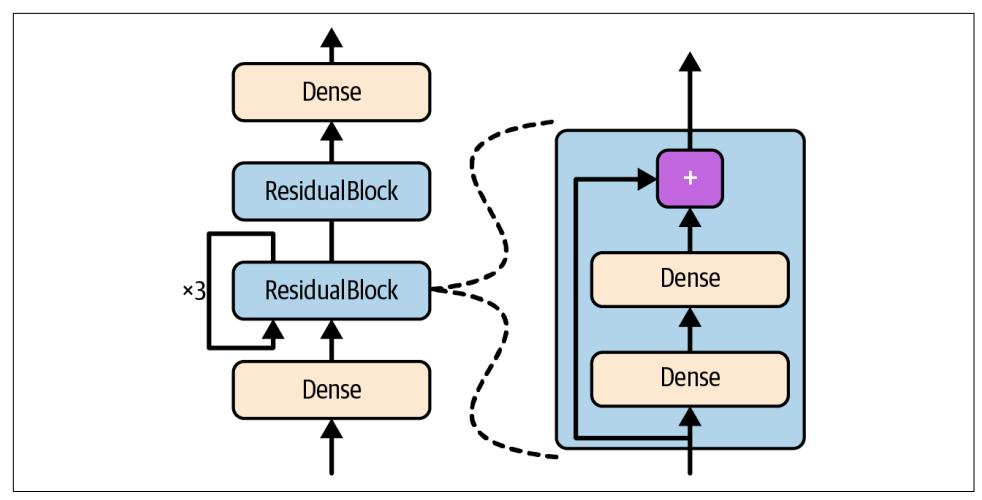

Figure 12-3. Custom model example: an arbitrary model with a custom ResidualBlock layer containing a skip connection

The inputs go through a first dense layer, then through a *residual block* composed of two dense layers and an addition operation (as you will see in Chapter 14, a residual

<sup>11</sup> The name "subclassing API" in Keras usually refers only to the creation of custom models by subclassing, although many other things can be created by subclassing, as you've seen in this chapter.

{450}------------------------------------------------

block adds its inputs to its outputs), then through this same residual block three more times, then through a second residual block, and the final result goes through a dense output layer. Don't worry if this model does not make much sense; it's just an example to illustrate the fact that you can easily build any kind of model you want, even one that contains loops and skip connections. To implement this model, it is best to first create a ResidualBlock layer, since we are going to create a couple of identical blocks (and we might want to reuse it in another model):

```
class ResidualBlock(tf.keras.layers.Layer):
    def _init_(self, n_layers, n_neurons, **kwargs):
        super()._init_(**kwargs)
        self.hidden = [tf.keras.layers.Dense(n_neurons, activation="relu",
                                              kernel initializer="he normal")
                       for in range(n layers)]
    def call(self, inputs):
       Z = \text{inputs}for layer in self.hidden:
            Z = \text{layer}(Z)return inputs + Z
```

This layer is a bit special since it contains other layers. This is handled transparently by Keras: it automatically detects that the hidden attribute contains trackable objects (layers in this case), so their variables are automatically added to this layer's list of variables. The rest of this class is self-explanatory. Next, let's use the subclassing API to define the model itself:

```
class ResidualRegressor(tf.keras.Model):
    def _init_(self, output_dim, **kwargs):
        super()._init_(**kwargs)
        self.hidden1 = tf.keras.layers.Dense(30, activation="relu",
                                             kernel initializer="he normal")
        self.block1 = ResidualBlock(2, 30)self.block2 = ResidualBlock(2, 30)self.out = tf.keras.layers.Dense(output dim)
    def call(self, inputs):
       Z = self.hidden1(inputs)for \frac{1}{2} in range(1 + 3):
           Z = self.block1(Z)Z = self.block2(Z)return self.out(Z)
```

We create the layers in the constructor and use them in the call() method. This model can then be used like any other model (compile it, fit it, evaluate it, and use it to make predictions). If you also want to be able to save the model using the save() method and load it using the tf.keras.models.load\_model() function, you must implement the get config() method (as we did earlier) in both the ResidualBlock 

{451}------------------------------------------------

class and the ResidualRegressor class. Alternatively, you can save and load the weights using the save weights() and load weights() methods.

The Model class is a subclass of the Layer class, so models can be defined and used exactly like layers. But a model has some extra functionalities, including of course its compile(), fit(), evaluate(), and predict() methods (and a few variants), plus the get\_layer() method (which can return any of the model's layers by name or by index) and the save() method (and support for tf.keras.models.load\_model() and tf.keras.models.clone\_model()).


If models provide more functionality than layers, why not just define every layer as a model? Well, technically you could, but it is usually cleaner to distinguish the internal components of your model (i.e., layers or reusable blocks of layers) from the model itself (i.e., the object you will train). The former should subclass the Laver class, while the latter should subclass the Model class.

With that, you can naturally and concisely build almost any model that you find in a paper, using the sequential API, the functional API, the subclassing API, or even a mix of these. "Almost" any model? Yes, there are still a few things that we need to look at: first, how to define losses or metrics based on model internals, and second, how to build a custom training loop.

### **Losses and Metrics Based on Model Internals**

The custom losses and metrics we defined earlier were all based on the labels and the predictions (and optionally sample weights). There will be times when you want to define losses based on other parts of your model, such as the weights or activations of its hidden layers. This may be useful for regularization purposes or to monitor some internal aspect of your model.

To define a custom loss based on model internals, compute it based on any part of the model you want, then pass the result to the add\_loss() method. For example, let's build a custom regression MLP model composed of a stack of five hidden layers plus an output layer. This custom model will also have an auxiliary output on top of the upper hidden layer. The loss associated with this auxiliary output will be called the *reconstruction loss* (see Chapter 17): it is the mean squared difference between the reconstruction and the inputs. By adding this reconstruction loss to the main loss, we will encourage the model to preserve as much information as possible through the hidden layers—even information that is not directly useful for the regression task itself. In practice, this loss sometimes improves generalization (it is a regularization loss). It is also possible to add a custom metric using the model's add\_metric()

{452}------------------------------------------------

method. Here is the code for this custom model with a custom reconstruction loss and a corresponding metric:

```
class ReconstructingRegressor(tf.keras.Model):
    def _init_(self, output_dim, **kwargs):
        super(). __init (**kwargs)
        self.hidden = [tf.keras.layers.Dense(30, activation="relu",
                                              kernel_initializer="he_normal")
                       for \lfloor in range(5)]
        self.out = tf.keras.layers.Dense(output_dim)
        self.reconstruction mean = tf.keras.metrics.Mean(
            name="reconstruction error")
    def build(self, batch_input_shape):
        n inputs = batch input shape[-1]
        self. reconstruction = tf. keras. layers. Dense(n inputs)def call(self, inputs, training=False):
        Z = \text{inputs}for layer in self.hidden:
            Z = \text{layer}(Z)reconstruction = self.reconstruct(Z)recon_loss = tf.reduce_mean(tf.square(reconstruction - inputs))
        self.add_loss(0.05 * recon_loss)if training:
            result = self.reconstruction mean(recon loss)
            self.add metric(result)
        return self.out(Z)
```

Let's go through this code:

- The constructor creates the DNN with five dense hidden layers and one dense output layer. We also create a Mean streaming metric to keep track of the reconstruction error during training.
- The build() method creates an extra dense layer that will be used to reconstruct the inputs of the model. It must be created here because its number of units must be equal to the number of inputs, and this number is unknown before the build() method is called.<sup>12</sup>
- The call() method processes the inputs through all five hidden layers, then passes the result through the reconstruction layer, which produces the reconstruction.
- Then the call() method computes the reconstruction loss (the mean squared difference between the reconstruction and the inputs), and adds it to the model's

<sup>12</sup> Due to TensorFlow issue #46858, the call to super().build() may fail in this case, unless the issue was fixed by the time you read this. If not, you need to replace this line with self. built = True.

{453}------------------------------------------------

list of losses using the add loss() method.<sup>13</sup> Notice that we scale down the reconstruction loss by multiplying it by 0.05 (this is a hyperparameter you can tune). This ensures that the reconstruction loss does not dominate the main loss.

- Next, during training only, the call () method updates the reconstruction metric and adds it to the model so it can be displayed. This code example can actually be simplified by calling self.add\_metric(recon\_loss) instead: Keras will automatically track the mean for you.
- Finally, the call() method passes the output of the hidden layers to the output layer and returns its output.

Both the total loss and the reconstruction loss will go down during training:

```
Epoch 1/5363/363 [========] - 1s 820us/step - loss: 0.7640 - reconstruction_error: 1.2728
Epoch 2/5
363/363 [========] - 0s 809us/step - loss: 0.4584 - reconstruction_error: 0.6340
\lceil \dots \rceil
```

In most cases, everything we have discussed so far will be sufficient to implement whatever model you want to build, even with complex architectures, losses, and metrics. However, for some architectures, such as GANs (see Chapter 17), you will have to customize the training loop itself. Before we get there, we must look at how to compute gradients automatically in TensorFlow.

### **Computing Gradients Using Autodiff**

To understand how to use autodiff (see Chapter 10 and Appendix B) to compute gradients automatically, let's consider a simple toy function:

```
def f(w1, w2):
    return 3 * w1 ** 2 + 2 * w1 * w2
```

If you know calculus, you can analytically find that the partial derivative of this function with regard to  $w1$  is 6 \*  $w1 + 2$  \* w2. You can also find that its partial derivative with regard to  $w2$  is  $2 * w1$ . For example, at the point  $(w1, w2) = (5, 3)$ , these partial derivatives are equal to 36 and 10, respectively, so the gradient vector at this point is (36, 10). But if this were a neural network, the function would be much more complex, typically with tens of thousands of parameters, and finding the partial derivatives analytically by hand would be a virtually impossible task. One solution could be to compute an approximation of each partial derivative by measuring how much the function's output changes when you tweak the corresponding parameter by a tiny amount:

<sup>13</sup> You can also call add loss() on any layer inside the model, as the model recursively gathers losses from all of its layers.

{454}------------------------------------------------

```
>> w1, w2 = 5, 3\Rightarrow \Rightarrow eps = 1e-6
\Rightarrow (f(w1 + eps, w2) - f(w1, w2)) / eps
36.000003007075065
\Rightarrow (f(w1, w2 + eps) - f(w1, w2)) / eps
10.000000003174137
```

Looks about right! This works rather well and is easy to implement, but it is just an approximation, and importantly you need to call f() at least once per parameter (not twice, since we could compute  $f(w1, w2)$  just once). Having to call  $f()$  at least once per parameter makes this approach intractable for large neural networks. So instead, we should use reverse-mode autodiff. TensorFlow makes this pretty simple:

```
w1, w2 = tf.Variable(5.), tf.Variable(3.)with tf.GradientTape() as tape:
    z = f(w1, w2)gradients = tape.gradient(z, [w1, w2])
```

We first define two variables w1 and w2, then we create a tf.GradientTape context that will automatically record every operation that involves a variable, and finally we ask this tape to compute the gradients of the result z with regard to both variables [w1, w2]. Let's take a look at the gradients that TensorFlow computed:

```
>>> gradients
[<tf.Tensor: shape=(), dtype=float32, numpy=36.0>,
 <tf.Tensor: shape=(), dtype=float32, numpy=10.0>]
```

Perfect! Not only is the result accurate (the precision is only limited by the floatingpoint errors), but the gradient() method only goes through the recorded computations once (in reverse order), no matter how many variables there are, so it is incredibly efficient. It's like magic!


In order to save memory, only put the strict minimum inside the tf.GradientTape() block. Alternatively, pause recording by creating a with tape.stop\_recording() block inside the tf.Gradient Tape() block.

The tape is automatically erased immediately after you call its gradient () method, so you will get an exception if you try to call gradient() twice:

```
with tf.GradientTape() as tape:
    z = f(w1, w2)dz_dw1 = tape.gradient(z, w1) # returns tensor 36.0dz dw2 = tape.gradient(z, w2) # raises a RuntimeError!
```

{455}------------------------------------------------

If you need to call gradient() more than once, you must make the tape persistent and delete it each time you are done with it to free resources:<sup>14</sup>

```
with tf.GradientTape(persistent=True) as tape:
    z = f(w1, w2)dz_dw1 = tape.gradient(z, w1) # returns tensor 36.0
dz dw2 = tape.qradient(z, w2) # returns tensor 10.0, works fine now!del tape
```

By default, the tape will only track operations involving variables, so if you try to compute the gradient of z with regard to anything other than a variable, the result will be None:

```
c1, c2 = tf.constant(5.), tf.constant(3.)with tf.GradientTape() as tape:
    z = f(c1, c2)gradients = tape.gradient(z, [c1, c2]) # returns [None, None]
```

However, you can force the tape to watch any tensors you like, to record every operation that involves them. You can then compute gradients with regard to these tensors, as if they were variables:

```
with tf.GradientTape() as tape:
    \text{tape.watch}(c1)tape.watch(c2)z = f(c1, c2)gradients = tape.gradient(z, [c1, c2]) # returns [tensor 36., tensor 10.]
```

This can be useful in some cases, like if you want to implement a regularization loss that penalizes activations that vary a lot when the inputs vary little: the loss will be based on the gradient of the activations with regard to the inputs. Since the inputs are not variables, you'll need to tell the tape to watch them.

Most of the time a gradient tape is used to compute the gradients of a single value (usually the loss) with regard to a set of values (usually the model parameters). This is where reverse-mode autodiff shines, as it just needs to do one forward pass and one reverse pass to get all the gradients at once. If you try to compute the gradients of a vector, for example a vector containing multiple losses, then TensorFlow will compute the gradients of the vector's sum. So if you ever need to get the individual gradients (e.g., the gradients of each loss with regard to the model parameters), you must call the tape's jacobian() method: it will perform reverse-mode autodiff once for each loss in the vector (all in parallel by default). It is even possible to

<sup>14</sup> If the tape goes out of scope, for example when the function that used it returns, Python's garbage collector will delete it for you.

{456}------------------------------------------------

compute second-order partial derivatives (the Hessians, i.e., the partial derivatives of the partial derivatives), but this is rarely needed in practice (see the "Computing Gradients Using Autodiff" section of this chapter's notebook for an example).

In some cases you may want to stop gradients from backpropagating through some part of your neural network. To do this, you must use the tf.stop\_gradient() function. The function returns its inputs during the forward pass (like  $tf.identity()$ ), but it does not let gradients through during backpropagation (it acts like a constant):

```
def f(w1, w2):
    return 3 * w1 ** 2 + tf.stop gradient(2 * w1 * w2)with tf.GradientTape() as tape:
    z = f(w1, w2) # the forward pass is not affected by stop_gradient()
gradients = tape.gradient(z, [w1, w2]) # returns [tensor 30., None]
```

Finally, you may occasionally run into some numerical issues when computing gradients. For example, if you compute the gradients of the square root function at  $x =$  $10^{-50}$ , the result will be infinite. In reality, the slope at that point is not infinite, but it's more than 32-bit floats can handle:

```
\Rightarrow x = tf.Variable(1e-50)>>> with tf.GradientTape() as tape:
\ldots z = tf.sqrt(x)
\ddotsc\Rightarrow tape.gradient(z, [x])
[<tf.Tensor: shape=(), dtype=float32, numpy=inf>]
```

To solve this, it's often a good idea to add a tiny value to  $x$  (such as  $10^{-6}$ ) when computing its square root.

The exponential function is also a frequent source of headaches, as it grows extremely fast. For example, the way my\_softplus() was defined earlier is not numerically stable. If you compute my\_softplus(100.0), you will get infinity rather than the correct result (about 100). But it's possible to rewrite the function to make it numerically stable: the softplus function is defined as  $log(1 + exp(z))$ , which is also equal to  $log(1 + exp(-|z|)) + max(z, 0)$  (see the notebook for the mathematical proof) and the advantage of this second form is that the exponential term cannot explode. So, here's a better implementation of the my\_softplus() function:

```
def my softplus(z):
   return tf.math.log(1 + tf.exp(-tf.abs(z))) + tf.maximum(0., z)
```

In some rare cases, a numerically stable function may still have numerically unstable gradients. In such cases, you will have to tell TensorFlow which equation to use for the gradients, rather than letting it use autodiff. For this, you must use the @tf.custom\_gradient decorator when defining the function, and return both the function's usual result and a function that computes the gradients. For example, let's 

{457}------------------------------------------------

update the my softplus() function to also return a numerically stable gradients function:

```
@tf.custom_gradient
def my_softplus(z):
    def my softplus gradients(grads): # grads = backprop'ed from upper layers
        return grads * (1 - 1 / (1 + tf.exp(z))) # stable grads of softplus
    result = tf.\nmathsf{math.log}(1 + tf.\exp(-tf.\nmathsf{abs}(z))) + tf.\nmathsf{maximum}(0., z)return result, my_softplus_gradients
```

If you know differential calculus (see the tutorial notebook on this topic), you can find that the derivative of  $log(1 + exp(z))$  is  $exp(z) / (1 + exp(z))$ . But this form is not stable: for large values of z, it ends up computing infinity divided by infinity, which returns NaN. However, with a bit of algebraic manipulation, you can show that it's also equal to  $1 - 1 / (1 + \exp(z))$ , which is stable. The my\_softplus\_gradients() function uses this equation to compute the gradients. Note that this function will receive as input the gradients that were backpropagated so far, down to the my\_soft plus() function, and according to the chain rule we must multiply them with this function's gradients.

Now when we compute the gradients of the my\_softplus() function, we get the proper result, even for large input values.

Congratulations! You can now compute the gradients of any function (provided it is differentiable at the point where you compute it), even blocking backpropagation when needed, and write your own gradient functions! This is probably more flexibility than you will ever need, even if you build your own custom training loops. You'll see how to do that next

### **Custom Training Loops**

In some cases, the fit() method may not be flexible enough for what you need to do. For example, the Wide & Deep paper we discussed in Chapter 10 uses two different optimizers: one for the wide path and the other for the deep path. Since the fit() method only uses one optimizer (the one that we specify when compiling the model), implementing this paper requires writing your own custom loop.

You may also like to write custom training loops simply to feel more confident that they do precisely what you intend them to do (perhaps you are unsure about some details of the fit() method). It can sometimes feel safer to make everything explicit. However, remember that writing a custom training loop will make your code longer, more error-prone, and harder to maintain.

{458}------------------------------------------------


Unless you're learning or you really need the extra flexibility, you should prefer using the fit() method rather than implementing your own training loop, especially if you work in a team.

First, let's build a simple model. There's no need to compile it, since we will handle the training loop manually:

```
l2 \text{ reg} = \text{tf}. keras. regularizers. l2(0.05)model = tf.keras.models.Sequential(tf.keras.layers.Dense(30, activation="relu", kernel_initializer="he_normal",
                            kernel_regularizer=l2_reg),
    tf.keras.layers.Dense(1, kernel_regularizer=l2_reg)
\overline{1}
```

Next, let's create a tiny function that will randomly sample a batch of instances from the training set (in Chapter 13 we will discuss the tf.data API, which offers a much better alternative):

```
def random batch(X, y, batch size=32):
    idx = np.random.randnint(len(X), size=batch size)return X[idx], y[idx]
```

Let's also define a function that will display the training status, including the number of steps, the total number of steps, the mean loss since the start of the epoch (we will use the Mean metric to compute it), and other metrics:

```
def print status bar(step, total, loss, metrics=None):
   metrics = " - ".join([f''[m.name]: [m.result():.4f]'for m in [loss] + (metrics or [])])
   end = "" if step < total else "n"print(f"\{step\}/\{total\} - " + metrics, end=end)
```

This code is self-explanatory, unless you are unfamiliar with Python string formatting:  $\{m$ .result():.4f} will format the metric's result as a float with four digits after the decimal point, and using  $\Gamma$  (carriage return) along with end="" ensures that the status bar always gets printed on the same line.

With that, let's get down to business! First, we need to define some hyperparameters and choose the optimizer, the loss function, and the metrics (just the MAE in this example):

```
n epochs = 5batch size = 32n_{\text{steps}} = \text{len}(X_{\text{train}}) // batch_size
optimize = tf.keras.optimizers.SGD(learning_rate=0.01)
loss_fn = tf.keras.losses.mean_squared_error
mean_loss = tf.keras.metrics.Mean(name="mean_loss")
metrics = [tf.keras.metrics.MeanAbsoluteError()]
```

And now we are ready to build the custom loop!

{459}------------------------------------------------

```
for epoch in range(1, n epochs + 1):
   print("Epoch {}/{}".format(epoch, n_epochs))
   for step in range(1, n_steps + 1):
       X batch, y batch = random batch(X train scaled, y train)
       with tf.GradientTape() as tape:
           y pred = model(X_batch, training=True)
           main_loss = tf.readuce_mean(loss_fn(y_batch, y_pred))loss = tf.add_n([main_loss] + model.\n)gradients = tape.gradient(loss, model.trainable_variables)
       optimizer.apply_gradients(zip(gradients, model.trainable_variables))
       mean loss(loss)
       for metric in metrics:
           metric(y batch, y pred)
       print_status_bar(step, n_steps, mean_loss, metrics)
   for metric in [mean_loss] + metrics:
       metric.reset states()
```

There's a lot going on in this code, so let's walk through it:

- We create two nested loops: one for the epochs, the other for the batches within an epoch.
- Then we sample a random batch from the training set.
- Inside the tf. Gradient Tape() block, we make a prediction for one batch, using the model as a function, and we compute the loss: it is equal to the main loss plus the other losses (in this model, there is one regularization loss per layer). Since the mean\_squared\_error() function returns one loss per instance, we compute the mean over the batch using tf.reduce\_mean() (if you wanted to apply different weights to each instance, this is where you would do it). The regularization losses are already reduced to a single scalar each, so we just need to sum them (using tf.add\_n(), which sums multiple tensors of the same shape and data type).
- Next, we ask the tape to compute the gradients of the loss with regard to each trainable variable—not all variables!—and we apply them to the optimizer to perform a gradient descent step.
- Then we update the mean loss and the metrics (over the current epoch), and we display the status bar.
- At the end of each epoch, we reset the states of the mean loss and the metrics.

If you want to apply gradient clipping (see Chapter 11), set the optimizer's clipnorm or clipvalue hyperparameter. If you want to apply any other transformation to the gradients, simply do so before calling the apply\_gradients() method. And if you want to add weight constraints to your model (e.g., by setting kernel\_constraint

{460}------------------------------------------------

or bias constraint when creating a layer), you should update the training loop to apply these constraints just after apply gradients(), like so:

```
for variable in model.variables:
    if variable.constraint is not None:
        variable.assign(variable.constraint(variable))
```


Don't forget to set training=True when calling the model in the training loop, especially if your model behaves differently during training and testing (e.g., if it uses BatchNormalization or Dropout). If it's a custom model, make sure to propagate the training argument to the layers that your model calls.

As you can see, there are quite a lot of things you need to get right, and it's easy to make a mistake. But on the bright side, you get full control.

Now that you know how to customize any part of your models<sup>15</sup> and training algorithms, let's see how you can use TensorFlow's automatic graph generation feature: it can speed up your custom code considerably, and it will also make it portable to any platform supported by TensorFlow (see Chapter 19).

## **TensorFlow Functions and Graphs**

Back in TensorFlow 1, graphs were unavoidable (as were the complexities that came with them) because they were a central part of TensorFlow's API. Since TensorFlow 2 (released in 2019), graphs are still there, but not as central, and they're much (much!) simpler to use. To show just how simple, let's start with a trivial function that computes the cube of its input:

```
def cube(x):return x * x 3
```

We can obviously call this function with a Python value, such as an int or a float, or we can call it with a tensor:

```
\Rightarrow \leq \leq \leq \leq \leq \leq \leq \leq \leq \leq \leq \leq \leq \leq \leq \leq \leq \leq \leq \leq \leq \leq \leq \leq \leq \leq \leq \leq \leq \leq \leq \leq \leq \leq \leq \leq 
\Rightarrow cube(tf.constant(2.0))
<tf.Tensor: shape=(), dtype=float32, numpy=8.0>
```

Now, let's use tf. function() to convert this Python function to a TensorFlow function:

<sup>15</sup> With the exception of optimizers, as very few people ever customize these; see the "Custom Optimizers" section in the notebook for an example.

{461}------------------------------------------------

```
>>> tf_cube = tf.function(cube)
>>> tf cube
<tensorflow.python.eager.def_function.Function at 0x7fbfe0c54d50>
```

This TF function can then be used exactly like the original Python function, and it will return the same result (but always as tensors):

```
\Rightarrow tf cube(2)
<tf.Tensor: shape=(), dtype=int32, numpy=8>
>>> tf_cube(tf.constant(2.0))
<tf.Tensor: shape=(), dtype=float32, numpy=8.0>
```

Under the hood, tf. function() analyzed the computations performed by the cube() function and generated an equivalent computation graph! As you can see, it was rather painless (we will look at how this works shortly). Alternatively, we could have used tf. function as a decorator; this is actually more common:

```
@tf.function
def tf_cube(x):return x ** 3
```

The original Python function is still available via the TF function's python\_function attribute, in case you ever need it:

```
>>> tf cube.python function(2)
R
```

TensorFlow optimizes the computation graph, pruning unused nodes, simplifying expressions (e.g.,  $1 + 2$  would get replaced with 3), and more. Once the optimized graph is ready, the TF function efficiently executes the operations in the graph, in the appropriate order (and in parallel when it can). As a result, a TF function will usually run much faster than the original Python function, especially if it performs complex computations.<sup>16</sup> Most of the time you will not really need to know more than that: when you want to boost a Python function, just transform it into a TF function. That's all!

Moreover, if you set jit\_compile=True when calling tf.function(), then Tensor-Flow will use accelerated linear algebra (XLA) to compile dedicated kernels for your graph, often fusing multiple operations. For example, if your TF function calls tf.reduce\_sum(a  $*$  b + c), then without XLA the function would first need to compute a \* b and store the result in a temporary variable, then add c to that variable, and lastly call  $tf$ . reduce\_sum() on the result. With XLA, the whole computation gets compiled into a single kernel, which will compute tf. reduce\_sum(a \* b + c) in one shot, without using any large temporary variable. Not only will this be much faster, it will also use dramatically less RAM.

<sup>16</sup> However, in this trivial example, the computation graph is so small that there is nothing at all to optimize, so tf cube() actually runs much slower than cube().

{462}------------------------------------------------

When you write a custom loss function, a custom metric, a custom layer, or any other custom function and you use it in a Keras model (as we've done throughout this chapter), Keras automatically converts your function into a TF function-no need to use tf. function(). So most of the time, the magic is 100% transparent. And if you want Keras to use XLA, you just need to set jit\_compile=True when calling the compile() method. Easy!


You can tell Keras not to convert your Python functions to TF functions by setting dynamic=True when creating a custom layer or a custom model. Alternatively, you can set run eagerly=True when calling the model's compile() method.

By default, a TF function generates a new graph for every unique set of input shapes and data types and caches it for subsequent calls. For example, if you call tf\_cube(tf.constant(10)), a graph will be generated for int32 tensors of shape []. Then if you call tf\_cube(tf.constant(20)), the same graph will be reused. But if you then call tf\_cube(tf.constant([10, 20])), a new graph will be generated for int32 tensors of shape [2]. This is how TF functions handle polymorphism (i.e., varying argument types and shapes). However, this is only true for tensor arguments: if you pass numerical Python values to a TF function, a new graph will be generated for every distinct value: for example, calling tf\_cube(10) and tf\_cube(20) will generate two graphs.


If you call a TF function many times with different numerical Python values, then many graphs will be generated, slowing down your program and using up a lot of RAM (you must delete the TF function to release it). Python values should be reserved for arguments that will have few unique values, such as hyperparameters like the number of neurons per layer. This allows TensorFlow to better optimize each variant of your model.

### **AutoGraph and Tracing**

So how does TensorFlow generate graphs? It starts by analyzing the Python function's source code to capture all the control flow statements, such as for loops, while loops, and if statements, as well as break, continue, and return statements. This first step is called AutoGraph. The reason TensorFlow has to analyze the source code is that Python does not provide any other way to capture control flow statements: it offers magic methods like \_add\_() and \_mul\_() to capture operators like + and \*, but there are no \_\_while\_() or \_\_if\_() magic methods. After analyzing the function's code, AutoGraph outputs an upgraded version of that function in which all the control flow statements are replaced by the appropriate TensorFlow operations,

{463}------------------------------------------------

such as tf.while loop() for loops and tf.cond() for if statements. For example, in Figure 12-4, AutoGraph analyzes the source code of the sum\_squares() Python function, and it generates the tf\_sum\_squares() function. In this function, the for loop is replaced by the definition of the loop body() function (containing the body of the original for loop), followed by a call to the for\_stmt() function. This call will build the appropriate tf.while\_loop() operation in the computation graph.

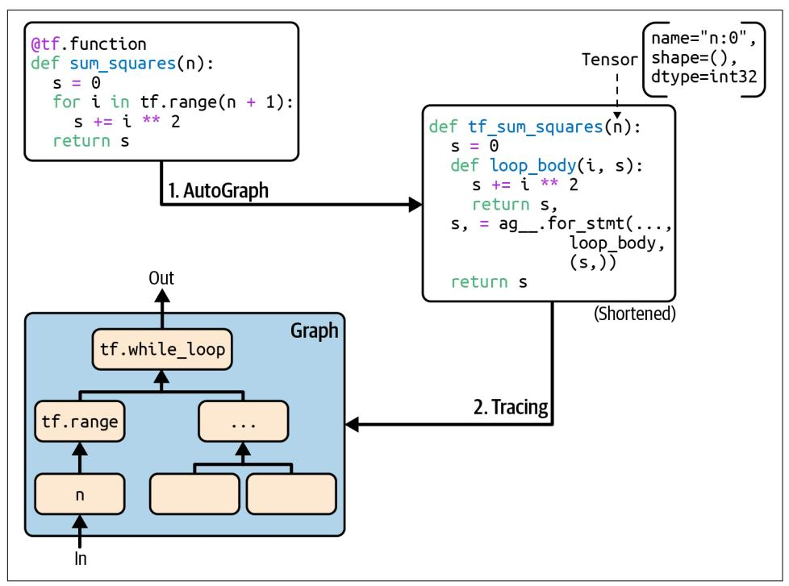

Figure 12-4. How TensorFlow generates graphs using AutoGraph and tracing

Next, TensorFlow calls this "upgraded" function, but instead of passing the argument, it passes a *symbolic tensor*—a tensor without any actual value, only a name, a data type, and a shape. For example, if you call sum\_squares(tf.constant(10)), then the tf sum squares() function will be called with a symbolic tensor of type int32 and shape []. The function will run in *graph mode*, meaning that each TensorFlow operation will add a node in the graph to represent itself and its output tensor(s) (as opposed to the regular mode, called *eager execution*, or *eager mode*). In graph mode, TF operations do not perform any computations. Graph mode was the default mode in TensorFlow 1. In Figure 12-4, you can see the tf\_sum\_squares() function being called with a symbolic tensor as its argument (in this case, an int32 tensor of shape []) and the final graph being generated during tracing. The nodes represent operations,

{464}------------------------------------------------

and the arrows represent tensors (both the generated function and the graph are simplified).


In order to view the generated function's source code, you can call tf.autograph.to\_code(sum\_squares.python\_function). The code is not meant to be pretty, but it can sometimes help for debugging.

### **TF Function Rules**

Most of the time, converting a Python function that performs TensorFlow operations into a TF function is trivial: decorate it with @tf.function or let Keras take care of it for you. However, there are a few rules to respect:

- If you call any external library, including NumPy or even the standard library, this call will run only during tracing; it will not be part of the graph. Indeed, a TensorFlow graph can only include TensorFlow constructs (tensors, operations, variables, datasets, and so on). So, make sure you use tf.reduce\_sum() instead of np.sum(), tf.sort() instead of the built-in sorted() function, and so on (unless you really want the code to run only during tracing). This has a few additional implications:
  - If you define a TF function  $f(x)$  that just returns np. random. rand(), a random number will only be generated when the function is traced, so  $f(tf.constant(2.))$  and  $f(tf.constant(3.))$  will return the same random number, but f(tf.constant([2., 3.])) will return a different one. If you replace  $np.random.random()$  with  $tf.randomUniform([])$ , then a new random number will be generated upon every call, since the operation will be part of the graph.
  - If your non-TensorFlow code has side effects (such as logging something or updating a Python counter), then you should not expect those side effects to occur every time you call the TF function, as they will only occur when the function is traced.
  - You can wrap arbitrary Python code in a tf.py\_function() operation, but doing so will hinder performance, as TensorFlow will not be able to do any graph optimization on this code. It will also reduce portability, as the graph will only run on platforms where Python is available (and where the right libraries are installed).
- You can call other Python functions or TF functions, but they should follow the same rules, as TensorFlow will capture their operations in the computation graph. Note that these other functions do not need to be decorated with @tf.function.

{465}------------------------------------------------

- If the function creates a TensorFlow variable (or any other stateful TensorFlow object, such as a dataset or a queue), it must do so upon the very first call, and only then, or else you will get an exception. It is usually preferable to create variables outside of the TF function (e.g., in the build() method of a custom layer). If you want to assign a new value to the variable, make sure you call its assign() method instead of using the = operator.
- The source code of your Python function should be available to TensorFlow. If the source code is unavailable (for example, if you define your function in the Python shell, which does not give access to the source code, or if you deploy only the compiled \*.pyc Python files to production), then the graph generation process will fail or have limited functionality.
- TensorFlow will only capture for loops that iterate over a tensor or a tf.data.Dataset (see Chapter 13). Therefore, make sure you use for i in  $tf.random(x)$  rather than for i in range(x), or else the loop will not be captured in the graph. Instead, it will run during tracing. (This may be what you want if the for loop is meant to build the graph; for example, to create each layer in a neural network.)
- As always, for performance reasons, you should prefer a vectorized implementation whenever you can, rather than using loops.

It's time to sum up! In this chapter we started with a brief overview of TensorFlow, then we looked at TensorFlow's low-level API, including tensors, operations, variables, and special data structures. We then used these tools to customize almost every component in the Keras API. Finally, we looked at how TF functions can boost performance, how graphs are generated using AutoGraph and tracing, and what rules to follow when you write TF functions (if you would like to open the black box a bit further and explore the generated graphs, you will find technical details in Appendix D).

In the next chapter, we will look at how to efficiently load and preprocess data with TensorFlow.

### **Exercises**

- 1. How would you describe TensorFlow in a short sentence? What are its main features? Can you name other popular deep learning libraries?
- 2. Is TensorFlow a drop-in replacement for NumPy? What are the main differences between the two?
- 3. Do you get the same result with  $tf.random(10)$  and  $tfن$ . constant(np.  $area(e(10))$ ?

{466}------------------------------------------------

- 4. Can you name six other data structures available in TensorFlow, beyond regular tensors?
- 5. You can define a custom loss function by writing a function or by subclassing the tf.keras.losses.Loss class. When would you use each option?
- 6. Similarly, you can define a custom metric in a function or as a subclass of tf.keras.metrics.Metric. When would you use each option?
- 7. When should you create a custom layer versus a custom model?
- 8. What are some use cases that require writing your own custom training loop?
- 9. Can custom Keras components contain arbitrary Python code, or must they be convertible to TF functions?
- 10. What are the main rules to respect if you want a function to be convertible to a TF function?
- 11. When would you need to create a dynamic Keras model? How do you do that? Why not make all your models dynamic?
- 12. Implement a custom layer that performs *layer normalization* (we will use this type of layer in Chapter 15):
  - a. The build() method should define two trainable weights  $\alpha$  and  $\beta$ , both of shape input\_shape[-1:] and data type  $tf.f$ loat32.  $\alpha$  should be initialized with 1s, and  $\beta$  with 0s.
  - b. The call() method should compute the mean  $\mu$  and standard deviation  $\sigma$ of each instance's features. For this, you can use tf.nn.moments(inputs, axes = -1, keepdims=True), which returns the mean  $\mu$  and the variance  $\sigma^2$ of all instances (compute the square root of the variance to get the standard deviation). Then the function should compute and return  $\alpha \otimes (X - \mu)/(\sigma + \varepsilon)$  $+$   $\beta$ , where  $\otimes$  represents itemwise multiplication (\*) and  $\varepsilon$  is a smoothing term (a small constant to avoid division by zero, e.g., 0.001).
  - c. Ensure that your custom layer produces the same (or very nearly the same) output as the tf. keras. layers. LayerNormalization layer.
- 13. Train a model using a custom training loop to tackle the Fashion MNIST dataset (see Chapter 10):
  - a. Display the epoch, iteration, mean training loss, and mean accuracy over each epoch (updated at each iteration), as well as the validation loss and accuracy at the end of each epoch.
  - b. Try using a different optimizer with a different learning rate for the upper layers and the lower layers.

Solutions to these exercises are available at the end of this chapter's notebook, at https://homl.info/colab3.

{467}------------------------------------------------

{468}------------------------------------------------

## **CHAPTER 13 Loading and Preprocessing** Data with TensorFlow

In Chapter 2, you saw that loading and preprocessing data is an important part of any machine learning project. You used Pandas to load and explore the (modified) California housing dataset—which was stored in a CSV file—and you applied Scikit-Learn's transformers for preprocessing. These tools are quite convenient, and you will probably be using them often, especially when exploring and experimenting with data.

However, when training TensorFlow models on large datasets, you may prefer to use TensorFlow's own data loading and preprocessing API, called *tf.data*. It is capable of loading and preprocessing data extremely efficiently, reading from multiple files in parallel using multithreading and queuing, shuffling and batching samples, and more. Plus, it can do all of this on the fly-it loads and preprocesses the next batch of data across multiple CPU cores, while your GPUs or TPUs are busy training the current batch of data.

The tf.data API lets you handle datasets that don't fit in memory, and it allows you to make full use of your hardware resources, thereby speeding up training. Off the shelf, the tf.data API can read from text files (such as CSV files), binary files with fixed-size records, and binary files that use TensorFlow's TFRecord format, which supports records of varying sizes.

TFRecord is a flexible and efficient binary format usually containing protocol buffers (an open source binary format). The tf.data API also has support for reading from SQL databases. Moreover, many open source extensions are available to read from all sorts of data sources, such as Google's BigQuery service (see https://tensorflow.org/io).

{469}------------------------------------------------

Keras also comes with powerful yet easy-to-use preprocessing layers that can be embedded in your models: this way, when you deploy a model to production, it will be able to ingest raw data directly, without you having to add any additional preprocessing code. This eliminates the risk of mismatch between the preprocessing code used during training and the preprocessing code used in production, which would likely cause *training/serving skew*. And if you deploy your model in multiple apps coded in different programming languages, you won't have to reimplement the same preprocessing code multiple times, which also reduces the risk of mismatch.

As you will see, both APIs can be used jointly—for example, to benefit from the efficient data loading offered by tf.data and the convenience of the Keras preprocessing layers.

In this chapter, we will first cover the tf.data API and the TFRecord format. Then we will explore the Keras preprocessing layers and how to use them with the tf.data API. Lastly, we will take a quick look at a few related libraries that you may find useful for loading and preprocessing data, such as TensorFlow Datasets and TensorFlow Hub. So, let's get started!

## The tf.data API

The whole tf.data API revolves around the concept of a tf.data.Dataset: this represents a sequence of data items. Usually you will use datasets that gradually read data from disk, but for simplicity let's create a dataset from a simple data tensor using tf.data.Dataset.from\_tensor\_slices():

```
>>> import tensorflow as tf
>>> X = tf.random(10) # any data tensor
>>> dataset = tf.data.Dataset.from tensor slices(X)
>>> dataset
<TensorSliceDataset shapes: (), types: tf.int32>
```

The from\_tensor\_slices() function takes a tensor and creates a tf.data.Dataset whose elements are all the slices of X along the first dimension, so this dataset contains 10 items: tensors  $0, 1, 2, ..., 9$ . In this case we would have obtained the same dataset if we had used tf.data.Dataset.range(10) (except the elements would be 64-bit integers instead of 32-bit integers).

You can simply iterate over a dataset's items like this:

```
>>> for item in dataset:
        print(item)
\ddotsc\overline{1}tf.Tensor(0, shape=(), dtype=int32)
tf.Tensor(1, shape=(), dtype=int32)
[\ldots]tf.Tensor(9, shape=(), dtype=int32)
```

{470}------------------------------------------------


The tf.data API is a streaming API: you can very efficiently iterate through a dataset's items, but the API is not designed for indexing or slicing.

A dataset may also contain tuples of tensors, or dictionaries of name/tensor pairs, or even nested tuples and dictionaries of tensors. When slicing a tuple, a dictionary, or a nested structure, the dataset will only slice the tensors it contains, while preserving the tuple/dictionary structure. For example:

```
>>> X_nested = \{"a": ([1, 2, 3], [4, 5, 6]), "b": [7, 8, 9]\}>>> dataset = tf.data.Dataset.from_tensor_slices(X_nested)
>>> for item in dataset:
        print(item)
\cdots\overline{1}\{'a': (\text{cf.Tensor}: [...] = 1> , \text{ <tf. Tensor}: [...] = 4>), 'b': \text{ <tf. Tensor}: [...] = 7> }{'a': (-tf.Tensor: [...]=2> , -tf.Tensor: [...]=5>), 'b': -tf.Tensor: [...]=8>}{'a': (ctf.Tensor: [...]=3> , ctf.Tensor: [...]=6>), 'b': <tf.Tensor: [...]=9>}
```

### **Chaining Transformations**

Once you have a dataset, you can apply all sorts of transformations to it by calling its transformation methods. Each method returns a new dataset, so you can chain transformations like this (this chain is illustrated in Figure 13-1):

```
>>> dataset = tf.data.Dataset.from tensor slices(tf.range(10))
\Rightarrow dataset = dataset.repeat(3).batch(7)
>>> for item in dataset:
        print(item)
\ddotsc\ddotsctf.Tensor([0 1 2 3 4 5 6], shape=(7, ), dtype=int32)
tf.Tensor([7 8 9 0 1 2 3], shape=(7, ), dtype=int32)
tf.Tensor([4 5 6 7 8 9 0], shape=(7, ), dtype=int32)
tf.Tensor([1 2 3 4 5 6 7], shape=(7, ), dtype=int32)
tf.Tensor([8 9], shape=(2,), dtype=int32)
```

In this example, we first call the repeat() method on the original dataset, and it returns a new dataset that repeats the items of the original dataset three times. Of course, this will not copy all the data in memory three times! If you call this method with no arguments, the new dataset will repeat the source dataset forever, so the code that iterates over the dataset will have to decide when to stop.

Then we call the batch() method on this new dataset, and again this creates a new dataset. This one will group the items of the previous dataset in batches of seven items.

{471}------------------------------------------------


Figure 13-1. Chaining dataset transformations

Finally, we iterate over the items of this final dataset. The batch() method had to output a final batch of size two instead of seven, but you can call batch() with drop\_remainder=True if you want it to drop this final batch, such that all batches have the exact same size.


The dataset methods do not modify datasets-they create new ones. So make sure to keep a reference to these new datasets (e.g., with dataset  $= \ldots$ , or else nothing will happen.

You can also transform the items by calling the map() method. For example, this creates a new dataset with all batches multiplied by two:

```
>>> dataset = dataset.map(lambda x: x * 2) # x is a batch
>>> for item in dataset:
       print(item)
\cdotstf.Tensor([0 2 4 6 8 10 12], shape=(7, ), dtype=int32)
tf.Tensor([14 16 18 0 2 4 6], shape=(7, ), dtype=int32)
[\ldots]
```

This map() method is the one you will call to apply any preprocessing to your data. Sometimes this will include computations that can be quite intensive, such as reshaping or rotating an image, so you will usually want to spawn multiple threads to speed things up. This can be done by setting the num\_parallel\_calls argument to the number of threads to run, or to tf.data.AUTOTUNE. Note that the function you pass to the map() method must be convertible to a TF function (see Chapter 12).

It is also possible to simply filter the dataset using the filter() method. For example, this code creates a dataset that only contains the batchs whose sum is greater than 50:

{472}------------------------------------------------

```
>>> dataset = dataset.filter(lambda x: tf.reduce_sum(x) > 50)
>>> for item in dataset:
        print(item)
\cdots\ddotsctf.Tensor([14 16 18 0 2 4 6], shape=(7, ), dtype=int32)
tf.Tensor([ 8 10 12 14 16 18 0], shape=(7,), dtype=int32)
tf.Tensor([ 2 4 6 8 10 12 14], shape=(7,), dtype=int32)
```

You will often want to look at just a few items from a dataset. You can use the take() method for that:

```
>>> for item in dataset.take(2):
       print(item)
\cdots\ddotsctf.Tensor([14 16 18 0 2 4 6], shape=(7, ), dtype=int32)
tf.Tensor([ 8 10 12 14 16 18 0], shape=(7,), dtype=int32)
```

### **Shuffling the Data**

As we discussed in Chapter 4, gradient descent works best when the instances in the training set are independent and identically distributed (IID). A simple way to ensure this is to shuffle the instances, using the shuffle() method. It will create a new dataset that will start by filling up a buffer with the first items of the source dataset. Then, whenever it is asked for an item, it will pull one out randomly from the buffer and replace it with a fresh one from the source dataset, until it has iterated entirely through the source dataset. At this point it will continue to pull out items randomly from the buffer until it is empty. You must specify the buffer size, and it is important to make it large enough, or else shuffling will not be very effective.<sup>1</sup> Just don't exceed the amount of RAM you have, though even if you have plenty of it, there's no need to go beyond the dataset's size. You can provide a random seed if you want the same random order every time you run your program. For example, the following code creates and displays a dataset containing the integers 0 to 9, repeated twice, shuffled using a buffer of size 4 and a random seed of 42, and batched with a batch size of 7:

```
\Rightarrow dataset = tf.data.Dataset.range(10).repeat(2)
>>> dataset = dataset.shuffle(buffer size=4, seed=42).batch(7)
>>> for item in dataset:
        print(item)
\cdotstf.Tensor([3 0 1 6 2 5 7], shape=(7, ), dtype=int64)
tf.Tensor([8 4 1 9 4 2 3], shape=(7, ), dtype=int64)
tf.Tensor([7 5 0 8 9 6], shape=(6, ), dtype=int64)
```

<sup>1</sup> Imagine a sorted deck of cards on your left: suppose you just take the top three cards and shuffle them, then pick one randomly and put it to your right, keeping the other two in your hands. Take another card on your left, shuffle the three cards in your hands and pick one of them randomly, and put it on your right. When you are done going through all the cards like this, you will have a deck of cards on your right: do you think it will be perfectly shuffled?

{473}------------------------------------------------


If you call repeat() on a shuffled dataset, by default it will generate a new order at every iteration. This is generally a good idea, but if you prefer to reuse the same order at each iteration (e.g., for tests or debugging), you can set reshuffle\_each\_iteration=False when calling shuffle().

For a large dataset that does not fit in memory, this simple shuffling-buffer approach may not be sufficient, since the buffer will be small compared to the dataset. One solution is to shuffle the source data itself (for example, on Linux you can shuffle text files using the shuf command). This will definitely improve shuffling a lot! Even if the source data is shuffled, you will usually want to shuffle it some more, or else the same order will be repeated at each epoch, and the model may end up being biased (e.g., due to some spurious patterns present by chance in the source data's order). To shuffle the instances some more, a common approach is to split the source data into multiple files, then read them in a random order during training. However, instances located in the same file will still end up close to each other. To avoid this you can pick multiple files randomly and read them simultaneously, interleaving their records. Then on top of that you can add a shuffling buffer using the shuffle() method. If this sounds like a lot of work, don't worry: the tf.data API makes all this possible in just a few lines of code. Let's go over how you can do this.

### **Interleaving Lines from Multiple Files**

First, suppose you've loaded the California housing dataset, shuffled it (unless it was already shuffled), and split it into a training set, a validation set, and a test set. Then you split each set into many CSV files that each look like this (each row contains eight input features plus the target median house value):

```
MedInc, HouseAge, AveRooms, AveBedrms, Popul..., AveOccup, Lat..., Long..., MedianHouseValue
3.5214, 15.0, 3.050, 1.107, 1447.0, 1.606, 37.63, -122.43, 1.442
5.3275.5.0.6.490.0.991.3464.0.3.443.33.69.-117.39.1.687
3.1,29.0,7.542,1.592,1328.0,2.251,38.44,-122.98,1.621
[\ldots]
```

Let's also suppose train\_filepaths contains the list of training filepaths (and you also have valid\_filepaths and test\_filepaths):

```
>>> train filepaths
['datasets/housing/my train 00.csv', 'datasets/housing/my train 01.csv', ...]
```

Alternatively, you could use file patterns; for example, train filepaths = "datasets/housing/my train \*.csv". Now let's create a dataset containing only these filepaths:

```
filepath_dataset = tf.data.Dataset.list_files(train_filepaths, seed=42)
```

{474}------------------------------------------------

By default, the list files() function returns a dataset that shuffles the filepaths. In general this is a good thing, but you can set shuffle=False if you do not want that for some reason.

Next, you can call the interleave() method to read from five files at a time and interleave their lines. You can also skip the first line of each file—which is the header row—using the skip() method):

```
n_{\text{readers}} = 5dataset = filepath dataset.interleave(
    lambda filepath: tf.data.TextLineDataset(filepath).skip(1),
    cycle length=n readers)
```

The interleave() method will create a dataset that will pull five filepaths from the filepath\_dataset, and for each one it will call the function you gave it (a lambda in this example) to create a new dataset (in this case a TextLineDataset). To be clear, at this stage there will be seven datasets in all: the filepath dataset, the interleave dataset, and the five TextLineDatasets created internally by the interleave dataset. When you iterate over the interleave dataset, it will cycle through these five TextLineDatasets, reading one line at a time from each until all datasets are out of items. Then it will fetch the next five filepaths from the filepath dataset and interleave them the same way, and so on until it runs out of filepaths. For interleaving to work best, it is preferable to have files of identical length; otherwise the end of the longest file will not be interleaved.

By default, interleave() does not use parallelism; it just reads one line at a time from each file, sequentially. If you want it to actually read files in parallel, you can set the interleave() method's num\_parallel\_calls argument to the number of threads you want (recall that the map() method also has this argument). You can even set it to tf.data.AUTOTUNE to make TensorFlow choose the right number of threads dynamically based on the available CPU. Let's look at what the dataset contains now:

```
\Rightarrow for line in dataset.take(5):
       print(line)
\cdotstf.Tensor(b'4.5909,16.0,[...],33.63,-117.71,2.418', shape=(), dtype=string)
tf.Tensor(b'2.4792,24.0, [\ldots], 34.18, -118.38, 2.0', shape=(), dtype=string)
tf.Tensor(b'4.2708,45.0,[...],37.48,-122.19,2.67', shape=(), dtype=string)
tf.Tensor(b'2.1856,41.0,[...],32.76,-117.12,1.205', shape=(), dtype=string)
tf.Tensor(b'4.1812,52.0, [...],33.73, -118.31,3.215', shape=(), dtype=string)
```

These are the first rows (ignoring the header row) of five CSV files, chosen randomly. Looks good!

{475}------------------------------------------------


It's possible to pass a list of filepaths to the TextLineDataset constructor: it will go through each file in order, line by line. If you also set the num parallel reads argument to a number greater than one, then the dataset will read that number of files in parallel and interleave their lines (without having to call the interleave() method). However, it will not shuffle the files, nor will it skip the header lines.

#### **Preprocessing the Data**

Now that we have a housing dataset that returns each instance as a tensor containing a byte string, we need to do a bit of preprocessing, including parsing the strings and scaling the data. Let's implement a couple custom functions that will perform this preprocessing:

```
X mean, X std = [\dots] # mean and scale of each feature in the training set
n inputs = 8def parse csv line(line):
    defs = [0.] * n inputs + [tf.config), dtype=tf.float32)]
    fields = tf.io.decode_csv(line, record_defaults=defs)
    return tf.stack(fields[:-1]), tf.stack(fields[-1:])
def preprocess(line):
    x, y = parse \text{ csv line} (line)
    return (x - X_mean) / X_std, y
```

Let's walk through this code:

- First, the code assumes that we have precomputed the mean and standard deviation of each feature in the training set. X\_mean and X\_std are just 1D tensors (or NumPy arrays) containing eight floats, one per input feature. This can be done using a Scikit-Learn Standard Scaler on a large enough random sample of the dataset. Later in this chapter, we will use a Keras preprocessing layer instead.
- The parse\_csv\_line() function takes one CSV line and parses it. To help with that, it uses the tf.io.decode\_csv() function, which takes two arguments: the first is the line to parse, and the second is an array containing the default value for each column in the CSV file. This array (defs) tells TensorFlow not only the default value for each column, but also the number of columns and their types. In this example, we tell it that all feature columns are floats and that missing values should default to zero, but we provide an empty array of type tf.float32 as the default value for the last column (the target): the array tells TensorFlow that this column contains floats, but that there is no default value, so it will raise an exception if it encounters a missing value.

{476}------------------------------------------------

- The tf.io.decode csv() function returns a list of scalar tensors (one per column), but we need to return a 1D tensor array. So we call tf.stack() on all tensors except for the last one (the target): this will stack these tensors into a 1D array. We then do the same for the target value: this makes it a 1D tensor array with a single value, rather than a scalar tensor. The tf.io.decode csv() function is done, so it returns the input features and the target.
- Finally, the custom preprocess() function just calls the parse csv line() function, scales the input features by subtracting the feature means and then dividing by the feature standard deviations, and returns a tuple containing the scaled features and the target.

Let's test this preprocessing function:

```
>>> preprocess(b'4.2083,44.0,5.3232,0.9171,846.0,2.3370,37.47,-122.2,2.782')
(<tf.Tensor: shape=(8,), dtype=float32, numpy=
array([ 0.16579159,  1.216324 , -0.05204564, -0.39215982, -0.5277444 ,-0.2633488, 0.8543046, -1.3072058], dtype=float32)>,
<tf.Tensor: shape=(1,), dtype=float32, numpy=array([2.782], dtype=float32)>)
```

Looks good! The preprocess() function can convert an instance from a byte string to a nice scaled tensor, with its corresponding label. We can now use the dataset's map() method to apply the preprocess() function to each sample in the dataset.

### **Putting Everything Together**

To make the code more reusable, let's put together everything we have discussed so far into another helper function; it will create and return a dataset that will efficiently load California housing data from multiple CSV files, preprocess it, shuffle it, and batch it (see Figure 13-2):

```
def csv_reader_dataset(filepaths, n_readers=5, n_read_threads=None,
                       n_parse_threads=5, shuffle_buffer_size=10_000, seed=42,
                       batch size=32):
    dataset = tf.data.Dataset.list files(filepaths, seed=seed)
    distance = dataset.interleave(lambda filepath: tf.data.TextLineDataset(filepath).skip(1),
        cycle_length=n_readers, num_parallel_calls=n_read_threads)
    dataset = dataset.map(preprocess, num parallel calls=n parse threads)
    dataset = dataset.shuffle(shuffle buffer size, seed=seed)
    return dataset.batch(batch_size).prefetch(1)
```

Note that we use the prefetch() method on the very last line. This is important for performance, as you will see now.

{477}------------------------------------------------

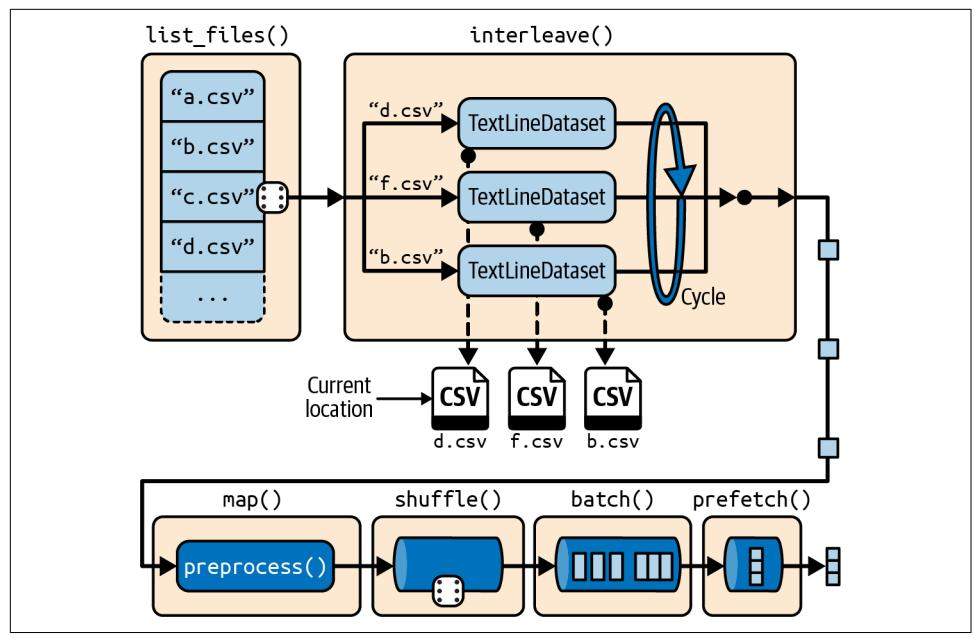

Figure 13-2. Loading and preprocessing data from multiple CSV files

### Prefetching

By calling  $prefetch(1)$  at the end of the custom  $csv$  reader dataset() function, we are creating a dataset that will do its best to always be one batch ahead.<sup>2</sup> In other words, while our training algorithm is working on one batch, the dataset will already be working in parallel on getting the next batch ready (e.g., reading the data from disk and preprocessing it). This can improve performance dramatically, as is illustrated in Figure 13-3.

If we also ensure that loading and preprocessing are multithreaded (by setting num\_parallel\_calls when calling interleave() and map()), we can exploit multiple CPU cores and hopefully make preparing one batch of data shorter than running a training step on the GPU: this way the GPU will be almost 100% utilized (except for the data transfer time from the CPU to the GPU<sup>3</sup>), and training will run much faster.

<sup>2</sup> In general, just prefetching one batch is fine, but in some cases you may need to prefetch a few more. Alternatively, you can let TensorFlow decide automatically by passing tf.data.AUTOTUNE to prefetch().

<sup>3</sup> But check out the experimental tf.data.experimental.prefetch\_to\_device() function, which can prefetch data directly to the GPU. Any TensorFlow function or class with experimental in its name may change without warning in future versions. If an experimental function fails, try removing the word experimental: it may have been moved to the core API. If not, then please check the notebook, as I will ensure it contains up-to-date code.

{478}------------------------------------------------


Figure 13-3. With prefetching, the CPU and the GPU work in parallel: as the GPU works on one batch, the CPU works on the next


If you plan to purchase a GPU card, its processing power and its memory size are of course very important (in particular, a large amount of RAM is crucial for large computer vision or natural language processing models). Just as important for good performance is the GPU's memory bandwidth; this is the number of gigabytes of data it can get into or out of its RAM per second.

If the dataset is small enough to fit in memory, you can significantly speed up training by using the dataset's cache() method to cache its content to RAM. You should generally do this after loading and preprocessing the data, but before shuffling, repeating, batching, and prefetching. This way, each instance will only be read and preprocessed once (instead of once per epoch), but the data will still be shuffled differently at each epoch, and the next batch will still be prepared in advance.

You have now learned how to build efficient input pipelines to load and preprocess data from multiple text files. We have discussed the most common dataset methods, but there are a few more you may want to look at, such as concatenate(), zip(), window(), reduce(), shard(), flat\_map(), apply(), unbatch(), and pad ded batch(). There are also a few more class methods, such as from\_generator()

{479}------------------------------------------------

and from tensors(), which create a new dataset from a Python generator or a list of tensors, respectively. Please check the API documentation for more details. Also note that there are experimental features available in tf.data.experimental, many of which will likely make it to the core API in future releases (e.g., check out the CsvDataset class, as well as the make\_csv\_dataset() method, which takes care of inferring the type of each column).

### **Using the Dataset with Keras**

Now we can use the custom csv reader dataset() function we wrote earlier to create a dataset for the training set, and for the validation set and the test set. The training set will be shuffled at each epoch (note that the validation set and the test set will also be shuffled, even though we don't really need that):

```
train set = csv reader dataset(train filepaths)
valid_set = csv_reader_dataset(valid_filepaths)
test_set = csv_reader_dataset(test_filepaths)
```

Now you can simply build and train a Keras model using these datasets. When you call the model's fit() method, you pass train set instead of X train, y train, and pass validation\_data=valid\_set instead of validation\_data=(X\_valid, y\_valid). The fit() method will take care of repeating the training dataset once per epoch, using a different random order at each epoch:

```
model = tf.keras.Sequential([...])model.compile(loss="mse", optimizer="sgd")
model.fit(train set, validation data=valid set, epochs=5)
```

Similarly, you can pass a dataset to the evaluate() and predict() methods:

```
test mse = model.evaluate(test set)
new_set = test_set.take(3) # pretend we have 3 new samples
y pred = model.predict(new set) # or you could just pass a NumPy array
```

Unlike the other sets, the new\_set will usually not contain labels. If it does, as is the case here, Keras will ignore them. Note that in all these cases, you can still use NumPy arrays instead of datasets if you prefer (but of course they need to have been loaded and preprocessed first).

If you want to build your own custom training loop (as discussed in Chapter 12), you can just iterate over the training set, very naturally:

```
n epochs = 5for epoch in range(n epochs):
    for X_batch, y_batch in train_set:
       [...] # perform one gradient descent step
```

In fact, it is even possible to create a TF function (see Chapter 12) that trains the model for a whole epoch. This can really speed up training:

{480}------------------------------------------------

```
@tf.function
def train_one_epoch(model, optimizer, loss_fn, train_set):
    for X_batch, y_batch in train_set:
       with tf.GradientTape() as tape:
           y pred = model(X batch)
            main_loss = tf.readuce_mean(loss_fn(y_batch, y_pred))loss = tf.add_n([main_loss] + model.\n)gradients = tape.gradient(loss, model.trainable_variables)
       optimizer.apply gradients(zip(gradients, model.trainable variables))
optimizer = tf.keras.optimizers.SGD(learning_rate=0.01)
loss fn = tf.keras.losses.mean squared error
for epoch in range(n_epochs):
    print("rEpoch {}'/{}').format(epoch + 1, n_epochs), end="")
    train one epoch(model, optimizer, loss fn, train set)
```

In Keras, the steps per execution argument of the compile() method lets you define the number of batches that the fit() method will process during each call to the tf. function it uses for training. The default is just 1, so if you set it to 50 you will often see a significant performance improvement. However, the on\_batch\_\*() methods of Keras callbacks will only be called every 50 batches.

Congratulations, you now know how to build powerful input pipelines using the tf.data API! However, so far we've been using CSV files, which are common, simple, and convenient but not really efficient, and do not support large or complex data structures (such as images or audio) very well. So, let's see how to use TFRecords instead.


If you are happy with CSV files (or whatever other format you are using), you do not have to use TFRecords. As the saying goes, if it ain't broke, don't fix it! TFRecords are useful when the bottleneck during training is loading and parsing the data.

### **The TFRecord Format**

The TFRecord format is TensorFlow's preferred format for storing large amounts of data and reading it efficiently. It is a very simple binary format that just contains a sequence of binary records of varying sizes (each record is comprised of a length, a CRC checksum to check that the length was not corrupted, then the actual data, and finally a CRC checksum for the data). You can easily create a TFRecord file using the tf.io.TFRecordWriter class:

```
with tf.io.TFRecordWriter("my data.tfrecord") as f:
   f.write(b"This is the first record")
   f.write(b"And this is the second record")
```

{481}------------------------------------------------

And you can then use a tf.data.TFRecordDataset to read one or more TFRecord files:

```
filepaths = ['my_data.tfrecord"]dataset = tf.data.TFRecordDataset(filepaths)
for item in dataset:
   print(item)
```

This will output:

```
tf.Tensor(b'This is the first record', shape=(), dtype=string)
tf.Tensor(b'And this is the second record', shape=(), dtype=string)
```


By default, a TFRecordDataset will read files one by one, but you can make it read multiple files in parallel and interleave their records by passing the constructor a list of filepaths and setting num\_parallel\_reads to a number greater than one. Alternatively, you could obtain the same result by using list files() and interleave() as we did earlier to read multiple CSV files.

### **Compressed TFRecord Files**

It can sometimes be useful to compress your TFRecord files, especially if they need to be loaded via a network connection. You can create a compressed TFRecord file by setting the options argument:

```
options = tf.io.TFRecordOptions(compression_type="GZIP")
with tf.io.TFRecordWriter("my_compressed.tfrecord", options) as f:
    f.write(b"Compress, compress, compress!")
```

When reading a compressed TFRecord file, you need to specify the compression type:

```
dataset = tf.data.TFRecordDataset(["my compressed.tfrecord"],
                                  compression type="GZIP")
```

### A Brief Introduction to Protocol Buffers

Even though each record can use any binary format you want, TFRecord files usually contain serialized protocol buffers (also called *protobufs*). This is a portable, extensible, and efficient binary format developed at Google back in 2001 and made open source in 2008; protobufs are now widely used, in particular in gRPC, Google's remote procedure call system. They are defined using a simple language that looks like this:

```
syntax = "proto3";message Person {
    string name = 1;
    int32 id = 2;repeated string email = 3;
\mathcal{L}
```

{482}------------------------------------------------

This protobuf definition says we are using version 3 of the protobuf format, and it specifies that each Person object<sup>4</sup> may (optionally) have a name of type string, an id of type int32, and zero or more email fields, each of type string. The numbers 1, 2, and 3 are the field identifiers: they will be used in each record's binary representation. Once you have a definition in a *proto* file, you can compile it. This requires protoc, the protobuf compiler, to generate access classes in Python (or some other language). Note that the protobuf definitions you will generally use in TensorFlow have already been compiled for you, and their Python classes are part of the TensorFlow library, so you will not need to use protoc. All you need to know is how to use protobuf access classes in Python. To illustrate the basics, let's look at a simple example that uses the access classes generated for the Person protobuf (the code is explained in the comments):

```
>>> from person pb2 import Person # import the generated access class
>>> person = Person(name="Al", id=123, email=["a@b.com"]) # create a Person
>>> print(person) # display the Person
name: "Al"
id: 123
email: "a@b.com"
>>> person.name # read a field
' A1'
>>> person.name = "Alice" # modify a field
>>> person.email[0] # repeated fields can be accessed like arrays
'a@b.com'
>>> person.email.append("c@d.com") # add an email address
>>> serialized = person.SerializeToString() # serialize person to a byte string
>>> serialized
b'\n\x05Alice\x10{\x1a\x07a@b.com\x1a\x07c@d.com'
\Rightarrow person2 = Person() # create a new Person
>>> person2.ParseFromString(serialized) # parse the byte string (27 bytes long)
27
\Rightarrow person == person2 # now they are equal
True
```

In short, we import the Person class generated by protoc, we create an instance and play with it, visualizing it and reading and writing some fields, then we serialize it using the SerializeToString() method. This is the binary data that is ready to be saved or transmitted over the network. When reading or receiving this binary data, we can parse it using the ParseFromString() method, and we get a copy of the object that was serialized<sup>5</sup>

You could save the serialized Person object to a TFRecord file, then load and parse it: everything would work fine. However, ParseFromString() is not a TensorFlow

<sup>4</sup> Since protobuf objects are meant to be serialized and transmitted, they are called *messages*.

<sup>5</sup> This chapter contains the bare minimum you need to know about protobufs to use TFRecords. To learn more about protobufs, please visit https://homl.info/protobuf.

{483}------------------------------------------------

operation, so you couldn't use it in a preprocessing function in a tf. data pipeline (except by wrapping it in a tf.py function() operation, which would make the code slower and less portable, as you saw in Chapter 12). However, you could use the tf.io.decode\_proto() function, which can parse any protobuf you want, provided you give it the protobuf definition (see the notebook for an example). That said, in practice you will generally want to use instead the predefined protobufs for which TensorFlow provides dedicated parsing operations. Let's look at these predefined protobufs now.

### **TensorFlow Protobufs**

The main protobuf typically used in a TFRecord file is the Example protobuf, which represents one instance in a dataset. It contains a list of named features, where each feature can either be a list of byte strings, a list of floats, or a list of integers. Here is the protobuf definition (from TensorFlow's source code):

```
syntax = "proto3";
message BytesList { repeated bytes value = 1; }
message FloatList { repeated float value = 1 [packed = true]; }
message Int64List { repeated int64 value = 1 [packed = true]; }
message Feature {
    oneof kind fBytesList bytes list = 1;
        FloatList float list = 2;
        Int64List int64 list = 3;
    \mathcal{F}\mathcal{E}:
message Features { map<string, Feature> feature = 1; };
message Example { Features features = 1; };
```

The definitions of BytesList, FloatList, and Int64List are straightforward enough. Note that [packed = true] is used for repeated numerical fields, for a more efficient encoding. A Feature contains either a BytesList, a FloatList, or an Int64List. A Features (with an s) contains a dictionary that maps a feature name to the corresponding feature value. And finally, an Example contains only a Features object.


Why was Example even defined, since it contains no more than a Features object? Well, TensorFlow's developers may one day decide to add more fields to it. As long as the new Example definition still contains the features field, with the same ID, it will be backward compatible. This extensibility is one of the great features of protobufs.

{484}------------------------------------------------

Here is how you could create a tf. train. Example representing the same person as earlier:

```
from tensorflow.train import BytesList, FloatList, Int64List
from tensorflow.train import Feature, Features, Example
person\_example = Example(features=Features(
        feature = \{"name": Feature(bytes_list=BytesList(value=[b"Alice"])),
            "id": Feature(int64 list=Int64List(value=[123])),
            "emails": Feature(bytes_list=BytesList(value=[b"a@b.com",
                                                          b"cd.com"]))
        \})
```

The code is a bit verbose and repetitive, but you could easily wrap it inside a small helper function. Now that we have an Example protobuf, we can serialize it by calling its SerializeToString() method, then write the resulting data to a TFRecord file. Let's write it five times to pretend we have several contacts:

```
with tf.io.TFRecordWriter("my contacts.tfrecord") as f:
    for in range(5):
       f.write(person_example.SerializeToString())
```

Normally you would write much more than five Examples! Typically, you would create a conversion script that reads from your current format (say, CSV files), creates an Example protobuf for each instance, serializes them, and saves them to several TFRecord files, ideally shuffling them in the process. This requires a bit of work, so once again make sure it is really necessary (perhaps your pipeline works fine with CSV files).

Now that we have a nice TFRecord file containing several serialized Examples, let's try to load it.

### **Loading and Parsing Examples**

To load the serialized Example protobufs, we will use a tf.data.TFRecordDataset once again, and we will parse each Example using tf.io.parse\_single\_example(). It requires at least two arguments: a string scalar tensor containing the serialized data, and a description of each feature. The description is a dictionary that maps each feature name to either a tf.io.FixedLenFeature descriptor indicating the feature's shape, type, and default value, or a tf.io.VarLenFeature descriptor indicating only the type if the length of the feature's list may vary (such as for the "emails" feature).

The following code defines a description dictionary, then creates a TFRecordDataset and applies a custom preprocessing function to it to parse each serialized Example protobuf that this dataset contains:

{485}------------------------------------------------

```
feature description = \{"name": tf.io.FixedLenFeature([], tf.string, default_value=""),
    "id": tf.io.FixedLenFeature([], tf.int64, default_value=0),
    "emails": tf.io.VarLenFeature(tf.string),
\mathcal{F}def parse(serialized_example):
    return tf.io.parse_single_example(serialized_example, feature_description)
dataset = tf.data.TFRecordDatasets('my contacts.tfrecord']).map(parse)for parsed_example in dataset:
    print(parsed example)
```

The fixed-length features are parsed as regular tensors, but the variable-length features are parsed as sparse tensors. You can convert a sparse tensor to a dense tensor using tf. sparse. to\_dense(), but in this case it is simpler to just access its values:

```
>>> tf.sparse.to_dense(parsed_example["emails"], default_value=b"")
<tf.Tensor: [...] dtype=string, numpy=array([b'a@b.com', b'c@d.com'], [...])>
>>> parsed_example["emails"].values
<tf.Tensor: [...] dtype=string, numpy=array([b'a@b.com', b'c@d.com'], [...])>
```

Instead of parsing examples one by one using tf.io.parse\_single\_example(), you may want to parse them batch by batch using tf.io.parse example():

```
def parse(serialized_examples):
   return tf.io.parse example(serialized examples, feature description)
dataset = tf.data.TFRecordDataset(["my contacts.tfrecord"]).batch(2).map(parse)
for parsed examples in dataset:
   print(parsed_examples) # two examples at a time
```

Lastly, a BytesList can contain any binary data you want, including any serialized object. For example, you can use tf.io.encode\_jpeg() to encode an image using the JPEG format and put this binary data in a BytesList. Later, when your code reads the TFRecord, it will start by parsing the Example, then it will need to call tf.io.decode\_jpeg() to parse the data and get the original image (or you can use tf.io.decode image(), which can decode any BMP, GIF, JPEG, or PNG image). You can also store any tensor you want in a BytesList by serializing the tensor using tf.io.serialize\_tensor() then putting the resulting byte string in a Bytes List feature. Later, when you parse the TFRecord, you can parse this data using tf.io.parse tensor(). See this chapter's notebook at https://homl.info/colab3 for examples of storing images and tensors in a TFRecord file.

As you can see, the Example protobuf is quite flexible, so it will probably be sufficient for most use cases. However, it may be a bit cumbersome to use when you are dealing with lists of lists. For example, suppose you want to classify text documents. Each document may be represented as a list of sentences, where each sentence is represented as a list of words. And perhaps each document also has a list of comments,

{486}------------------------------------------------

where each comment is represented as a list of words. There may be some contextual data too, such as the document's author, title, and publication date. TensorFlow's Sequence Example protobuf is designed for such use cases.

### **Handling Lists of Lists Using the Sequence Example Protobuf**

Here is the definition of the SequenceExample protobuf:

```
message FeatureList { repeated Feature feature = 1; };
message FeatureLists { map<string, FeatureList> feature_list = 1; };
message SequenceExample {
    Features context = 1;
    FeatureLists feature lists = 2;
\};
```

A SequenceExample contains a Features object for the contextual data and a FeatureLists object that contains one or more named FeatureList objects (e.g., a FeatureList named "content" and another named "comments"). Each FeatureList contains a list of Feature objects, each of which may be a list of byte strings, a list of 64-bit integers, or a list of floats (in this example, each Feature would represent a sentence or a comment, perhaps in the form of a list of word identifiers). Building a SequenceExample, serializing it, and parsing it is similar to building, serializing, and parsing an Example, but you must use tf.io.parse single sequence example() to parse a single Sequence Example or tf.io.parse sequence example() to parse a batch. Both functions return a tuple containing the context features (as a dictionary) and the feature lists (also as a dictionary). If the feature lists contain sequences of varying sizes (as in the preceding example), you may want to convert them to ragged tensors using tf. RaggedTensor. from\_sparse() (see the notebook for the full code):

```
parsed context, parsed feature lists = tf.io.parse single sequence example(
   serialized sequence example, context feature descriptions,
   sequence feature descriptions)
parsed content = tf.RaggedTensor.from sparse(parsed feature lists["content"])
```

Now that you know how to efficiently store, load, parse, and preprocess the data using the tf.data API, TFRecords, and protobufs, it's time to turn our attention to the Keras preprocessing layers.

## **Keras Preprocessing Layers**

Preparing your data for a neural network typically requires normalizing the numerical features, encoding the categorical features and text, cropping and resizing images, and more. There are several options for this:

• The preprocessing can be done ahead of time when preparing your training data files, using any tools you like, such as NumPy, Pandas, or Scikit-Learn. You will 

{487}------------------------------------------------

need to apply the exact same preprocessing steps in production, to ensure your production model receives preprocessed inputs similar to the ones it was trained on.

- Alternatively, you can preprocess your data on the fly while loading it with tf.data, by applying a preprocessing function to every element of a dataset using that dataset's map() method, as we did earlier in this chapter. Again, you will need to apply the same preprocessing steps in production.
- One last approach is to include preprocessing layers directly inside your model so it can preprocess all the input data on the fly during training, then use the same preprocessing layers in production. The rest of this chapter will look at this last approach.

Keras offers many preprocessing layers that you can include in your models: they can be applied to numerical features, categorical features, images, and text. We'll go over the numerical and categorical features in the next sections, as well as basic text preprocessing, and we will cover image preprocessing in Chapter 14 and more advanced text preprocessing in Chapter 16.

### **The Normalization Layer**

As we saw in Chapter 10, Keras provides a Normalization layer that we can use to standardize the input features. We can either specify the mean and variance of each feature when creating the layer or—more simply—pass the training set to the layer's adapt () method before fitting the model, so the layer can measure the feature means and variances on its own before training:

```
norm_layer = tf.keras.layers.Normalization()
model = tf.keras.models.Sequential(norm_layer,
    tf.keras.layers.Dense(1)
\left| \cdot \right|model.compile(loss="mse", optimizer=tf.keras.optimizers.SGD(learning rate=2e-3))
norm layer.adapt(X train) # computes the mean and variance of every feature
model.fit(X_train, y_train, validation_data=(X_valid, y_valid), epochs=5)
```


The data sample passed to the adapt() method must be large enough to be representative of your dataset, but it does not have to be the full training set: for the Normalization layer, a few hundred instances randomly sampled from the training set will generally be sufficient to get a good estimate of the feature means and variances.

Since we included the Normalization layer inside the model, we can now deploy this model to production without having to worry about normalization again: the model will just handle it (see Figure 13-4). Fantastic! This approach completely eliminates 

{488}------------------------------------------------

the risk of preprocessing mismatch, which happens when people try to maintain different preprocessing code for training and production but update one and forget to update the other. The production model then ends up receiving data preprocessed in a way it doesn't expect. If they're lucky, they get a clear bug. If not, the model's accuracy just silently degrades.

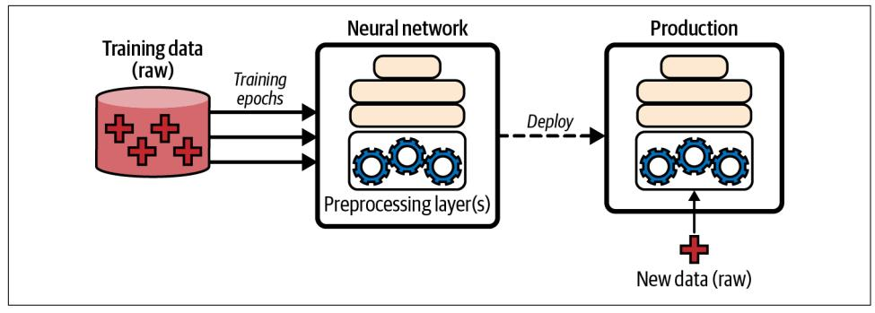

Figure 13-4. Including preprocessing layers inside a model

Including the preprocessing layer directly in the model is nice and straightforward, but it will slow down training (only very slightly in the case of the Normalization layer): indeed, since preprocessing is performed on the fly during training, it happens once per epoch. We can do better by normalizing the whole training set just once before training. To do this, we can use the Normalization layer in a standalone fashion (much like a Scikit-Learn StandardScaler):

```
norm\_layer = tf.keras. layers. Normalization()norm layer.adapt(X train)
X train scaled = norm layer(X train)
X valid scaled = norm layer(X valid)
```

Now we can train a model on the scaled data, this time without a Normalization layer:

```
model = tf.keras.models.Sequential([tf.keras.layers.Dense(1)])model.compile(loss="mse", optimizer=tf.keras.optimizers.SGD(learning_rate=2e-3))
model.fit(X_train_scaled, y_train, epochs=5,
          validation_data=(X_valid_scaled, y_valid))
```

Good! This should speed up training a bit. But now the model won't preprocess its inputs when we deploy it to production. To fix this, we just need to create a new model that wraps both the adapted Normalization layer and the model we just trained. We can then deploy this final model to production, and it will take care of both preprocessing its inputs and making predictions (see Figure 13-5):

```
final_model = tf.keras.Sequential([norm_layer, model])
X new = X test[:3] # pretend we have a few new instances (unscaled)
y pred = final model(X new) # preprocesses the data and makes predictions
```

{489}------------------------------------------------


Figure 13-5. Preprocessing the data just once before training using preprocessing layers, then deploying these layers inside the final model

Now we have the best of both worlds: training is fast because we only preprocess the data once before training begins, and the final model can preprocess its inputs on the fly without any risk of preprocessing mismatch.

Moreover, the Keras preprocessing layers play nicely with the tf.data API. For example, it's possible to pass a tf.data.Dataset to a preprocessing layer's adapt() method. It's also possible to apply a Keras preprocessing layer to a tf.data.Dataset using the dataset's map() method. For example, here's how you could apply an adapted Normalization layer to the input features of each batch in a dataset:

```
dataset = dataset.map(lambda X, y: (norm_layer(X), y))
```

Lastly, if you ever need more features than the Keras preprocessing layers provide, you can always write your own Keras layer, just like we discussed in Chapter 12. For example, if the Normalization layer didn't exist, you could get a similar result using the following custom layer:

```
import numpy as np
class MyNormalization(tf.keras.layers.Layer):
   def adapt(self, X):
       self. mean = np. mean(X, axis=0, keepdims=True)self. std = np. std(X, axis=0, keepdims=True)def call(self, inputs):
       eps = tf.keras.backend.epsilon() # a small smoothing term
       return (inputs - self.mean_) / (self.std + eps)
```

Next, let's look at another Keras preprocessing layer for numerical features: the Discretization layer.

{490}------------------------------------------------

### **The Discretization Layer**

The Discretization layer's goal is to transform a numerical feature into a categorical feature by mapping value ranges (called bins) to categories. This is sometimes useful for features with multimodal distributions, or with features that have a highly nonlinear relationship with the target. For example, the following code maps a numerical age feature to three categories, less than 18, 18 to 50 (not included), and 50 or over:

```
>>> age = tf.constant([[10.], [93.], [57.], [18.], [37.], [5.]])>>> discretize_layer = tf.keras.layers.Discretization(bin_boundaries=[18., 50.])
>>> age categories = discretize layer(age)
>>> age categories
\mathsf{str}.\mathsf{Tensor:}\ \mathsf{shape}=(6,\ 1),\ \mathsf{dtype}=\mathsf{int}64,\ \mathsf{number}=\mathsf{array}([\![0],[2],[2],[1],[1],[0]]\mathsf{)}
```

In this example, we provided the desired bin boundaries. If you prefer, you can instead provide the number of bins you want, then call the layer's adapt() method to let it find the appropriate bin boundaries based on the value percentiles. For example, if we set num\_bins=3, then the bin boundaries will be located at the values just below the 33rd and 66th percentiles (in this example, at the values 10 and 37):

```
>>> discretize_layer = tf.keras.layers.Discretization(num_bins=3)
>>> discretize layer.adapt(age)
>>> age categories = discretize layer(age)
>>> age_categories
\mathsf{str}.\mathsf{Tensor}: \mathsf{shape}=(6, 1), \mathsf{dtype}=\mathsf{int}64, \mathsf{numpy}=\mathsf{array}(\lceil{1\,\rceil}, \lceil{2}\rceil, \lceil{2}\rceil, \lceil{1}\rceil, \lceil{2}\rceil, \lceil{0}\rceil\rceil) >
```

Category identifiers such as these should generally not be passed directly to a neural network, as their values cannot be meaningfully compared. Instead, they should be encoded, for example using one-hot encoding. Let's look at how to do this now.

### **The CategoryEncoding Layer**

When there are only a few categories (e.g., less than a dozen or two), then one-hot encoding is often a good option (as discussed in Chapter 2). To do this, Keras provides the CategoryEncoding layer. For example, let's one-hot encode the age categories feature we just created:

```
>>> onehot_layer = tf.keras.layers.CategoryEncoding(num_tokens=3)
>>> onehot_layer(age_categories)
<tf.Tensor: shape=(6, 3), dtype=float32, numpy=
array([0., 1., 0.].[0., 0., 1.],[0., 0., 1.],[0., 1., 0.][0., 0., 1.],[1., 0., 0.], dtype=float32)>
```

{491}------------------------------------------------

If you try to encode more than one categorical feature at a time (which only makes) sense if they all use the same categories), the Category Encoding class will perform *multi-hot encoding* by default: the output tensor will contain a 1 for each category present in *any* input feature. For example:

```
>>> two_age_categories = np.array([[1, 0], [2, 2], [2, 0]])>>> onehot_layer(two_age_categories)
<tf.Tensor: shape=(3, 3), dtype=float32, numpy=
array([[1., 1., 0.],[0., 0., 1.],[1., 0., 1.], dtype=float32)>
```

If you believe it's useful to know how many times each category occurred, you can set output\_mode="count" when creating the CategoryEncoding layer, in which case the output tensor will contain the number of occurrences of each category. In the preceding example, the output would be the same except for the second row, which would become  $[0., 0., 2.]$ 

Note that both multi-hot encoding and count encoding lose information, since it's not possible to know which feature each active category came from. For example, both  $[0, 1]$  and  $[1, 0]$  are encoded as  $[1, 1, 0.]$ . If you want to avoid this, then you need to one-hot encode each feature separately and concatenate the outputs. This way,  $[0, 1]$  would get encoded as  $[1., 0., 0., 0., 1., 0.]$  and  $[1, 0]$  would get encoded as  $[0., 1., 0., 1., 0., 0.]$ . You can get the same result by tweaking the category identifiers so they don't overlap. For example:

```
>>> onehot_layer = tf.keras.layers.CategoryEncoding(num_tokens=3 + 3)
>>> onehot_layer(two_age_categories + [0, 3]) # adds 3 to the second feature
<tf.Tensor: shape=(3, 6), dtype=float32, numpy=
array([[0., 1., 0., 1., 0., 0.],[0., 0., 1., 0., 0., 1.],[0., 0., 1., 1., 0., 0.], dtype=float32)>
```

In this output, the first three columns correspond to the first feature, and the last three correspond to the second feature. This allows the model to distinguish the two features. However, it also increases the number of features fed to the model, and thereby requires more model parameters. It's hard to know in advance whether a single multi-hot encoding or a per-feature one-hot encoding will work best: it depends on the task, and you may need to test both options.

Now you can encode categorical integer features using one-hot or multi-hot encoding. But what about categorical text features? For this, you can use the StringLookup layer.

{492}------------------------------------------------

### **The StringLookup Layer**

Let's use the Keras StringLookup layer to one-hot encode a cities feature:

```
>>> cities = ["Auckland", "Paris", "Paris", "San Francisco"]
>>> str_lookup_layer = tf.keras.layers.StringLookup()
>>> str_lookup_layer.adapt(cities)
>>> str_lookup_layer([["Paris"], ["Auckland"], ["Auckland"], ["Montreal"]])
\mathsf{str}.\mathsf{Tensor:}\ \mathsf{shape}=(4,\ 1),\ \mathsf{dtype}=\mathsf{int64},\ \mathsf{numpy}=\mathsf{array}([\![1],\ [3],\ [3],\ [\![0]]\!)>
```

We first create a StringLookup layer, then we adapt it to the data: it finds that there are three distinct categories. Then we use the layer to encode a few cities. They are encoded as integers by default. Unknown categories get mapped to 0, as is the case for "Montreal" in this example. The known categories are numbered starting at 1, from the most frequent category to the least frequent.

Conveniently, if you set output\_mode="one\_hot" when creating the StringLookup layer, it will output a one-hot vector for each category, instead of an integer:

```
>>> str lookup layer = tf.keras.layers.StringLookup(output mode="one hot")
>>> str lookup layer.adapt(cities)
>>> str_lookup_layer([["Paris"], ["Auckland"], ["Auckland"], ["Montreal"]])
<tf.Tensor: shape=(4, 4), dtype=float32, numpy=
array([[0., 1., 0., 0.],[0., 0., 0., 1.].[0., 0., 0., 1.],[1., 0., 0., 0.]], dtype=float32)>
```


Keras also includes an IntegerLookup layer that acts much like the StringLookup layer but takes integers as input, rather than strings.

If the training set is very large, it may be convenient to adapt the layer to just a random subset of the training set. In this case, the layer's adapt() method may miss some of the rarer categories. By default, it would then map them all to category 0, making them indistinguishable by the model. To reduce this risk (while still adapting the layer only on a subset of the training set), you can set num\_oov\_indices to an integer greater than 1. This is the number of out-of-vocabulary (OOV) buckets to use: each unknown category will get mapped pseudorandomly to one of the OOV buckets, using a hash function modulo the number of OOV buckets. This will allow the model to distinguish at least some of the rare categories. For example:

```
>>> str lookup layer = tf.keras.layers.StringLookup(num oov indices=5)
>>> str_lookup_layer.adapt(cities)
>>> str_lookup_layer([["Paris"], ["Auckland"], ["Foo"], ["Bar"], ["Baz"]])
<tf.Tensor: shape=(4, 1), dtype=int64, numpy=array([[5], [7], [4], [3], [4]])>
```

{493}------------------------------------------------

Since there are five OOV buckets, the first known category's ID is now 5 ("Parts"). But "Foo", "Bar", and "Baz" are unknown, so they each get mapped to one of the OOV buckets. "Bar" gets its own dedicated bucket (with ID 3), but sadly "Foo" and "Baz" happen to be mapped to the same bucket (with ID 4), so they remain indistinguishable by the model. This is called a *hashing collision*. The only way to reduce the risk of collision is to increase the number of OOV buckets. However, this will also increase the total number of categories, which will require more RAM and extra model parameters once the categories are one-hot encoded. So, don't increase that number too much.

This idea of mapping categories pseudorandomly to buckets is called the *hashing* trick. Keras provides a dedicated layer which does just that: the Hashing layer.

### **The Hashing Layer**

For each category, the Keras Hashing layer computes a hash, modulo the number of buckets (or "bins"). The mapping is entirely pseudorandom, but stable across runs and platforms (i.e., the same category will always be mapped to the same integer, as long as the number of bins is unchanged). For example, let's use the Hashing layer to encode a few cities:

```
>>> hashing_layer = tf.keras.layers.Hashing(num_bins=10)
>>> hashing_layer([["Paris"], ["Tokyo"], ["Auckland"], ["Montreal"]])
<tf.Tensor: shape=(4, 1), dtype=int64, numpy=array([[0], [1], [9], [1]])>
```

The benefit of this layer is that it does not need to be adapted at all, which may sometimes be useful, especially in an out-of-core setting (when the dataset is too large to fit in memory). However, we once again get a hashing collision: "Tokyo" and "Montreal" are mapped to the same ID, making them indistinguishable by the model. So, it's usually preferable to stick to the StringLookup layer.

Let's now look at another way to encode categories: trainable embeddings.

### **Encoding Categorical Features Using Embeddings**

An embedding is a dense representation of some higher-dimensional data, such as a category, or a word in a vocabulary. If there are 50,000 possible categories, then one-hot encoding would produce a 50,000-dimensional sparse vector (i.e., containing mostly zeros). In contrast, an embedding would be a comparatively small dense vector; for example, with just 100 dimensions.

In deep learning, embeddings are usually initialized randomly, and they are then trained by gradient descent, along with the other model parameters. For example, the "NEAR BAY" category in the California housing dataset could be represented initially by a random vector such as  $[0.131, 0.890]$ , while the "NEAR OCEAN" category might be represented by another random vector such as  $[0.631, 0.791]$ . In this example,

{494}------------------------------------------------

we use 2D embeddings, but the number of dimensions is a hyperparameter you can tweak

Since these embeddings are trainable, they will gradually improve during training; and as they represent fairly similar categories in this case, gradient descent will certainly end up pushing them closer together, while it will tend to move them away from the "INLAND" category's embedding (see Figure 13-6). Indeed, the better the representation, the easier it will be for the neural network to make accurate predictions, so training tends to make embeddings useful representations of the categories. This is called *representation learning* (you will see other types of representation learning in Chapter 17).

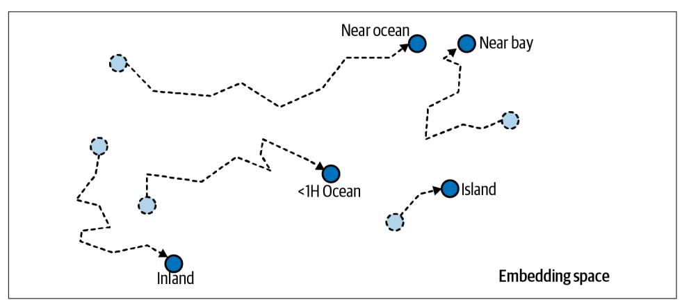

Figure 13-6. Embeddings will gradually improve during training

### **Word Embeddings**

Not only will embeddings generally be useful representations for the task at hand, but quite often these same embeddings can be reused successfully for other tasks. The most common example of this is *word embeddings* (i.e., embeddings of individual words): when you are working on a natural language processing task, you are often better off reusing pretrained word embeddings than training your own.

The idea of using vectors to represent words dates back to the 1960s, and many sophisticated techniques have been used to generate useful vectors, including using neural networks. But things really took off in 2013, when Tomáš Mikolov and other Google researchers published a paper<sup>6</sup> describing an efficient technique to learn word embeddings using neural networks, significantly outperforming previous attempts.

<sup>6</sup> Tomáš Mikolov et al., "Distributed Representations of Words and Phrases and Their Compositionality", Proceedings of the 26th International Conference on Neural Information Processing Systems 2 (2013): 3111– 3119.

{495}------------------------------------------------

This allowed them to learn embeddings on a very large corpus of text: they trained a neural network to predict the words near any given word and obtained astounding word embeddings. For example, synonyms had very close embeddings, and semantically related words such as France, Spain, and Italy ended up clustered together.

It's not just about proximity, though: word embeddings were also organized along meaningful axes in the embedding space. Here is a famous example: if you compute King – Man + Woman (adding and subtracting the embedding vectors of these words), then the result will be very close to the embedding of the word Queen (see Figure 13-7). In other words, the word embeddings encode the concept of gender! Similarly, you can compute *Madrid – Spain + France*, and the result is close to *Paris*, which seems to show that the notion of capital city was also encoded in the embeddings.


Figure 13-7. Word embeddings of similar words tend to be close, and some axes seem to encode meaningful concepts

Unfortunately, word embeddings sometimes capture our worst biases. For example, although they correctly learn that Man is to King as Woman is to Queen, they also seem to learn that Man is to Doctor as Woman is to Nurse: quite a sexist bias! To be fair, this particular example is probably exaggerated, as was pointed out in a 2019 paper<sup>7</sup> by Malvina Nissim et al. Nevertheless, ensuring fairness in deep learning algorithms is an important and active research topic.

Keras provides an Embedding layer, which wraps an embedding matrix: this matrix has one row per category and one column per embedding dimension. By default, it is initialized randomly. To convert a category ID to an embedding, the Embedding layer just looks up and returns the row that corresponds to that category. That's all

<sup>7</sup> Malvina Nissim et al., "Fair Is Better Than Sensational: Man Is to Doctor as Woman Is to Doctor", arXiv preprint arXiv:1905.09866 (2019).

{496}------------------------------------------------

there is to it! For example, let's initialize an Embedding layer with five rows and 2D embeddings, and use it to encode some categories:

```
>>> tf.random.set seed(42)
>>> embedding_layer = tf.keras.layers.Embedding(input_dim=5, output_dim=2)
>>> embedding_layer(np.array([2, 4, 2]))
<tf.Tensor: shape=(3, 2), dtype=float32, numpy=
array([[-0.04663396, 0.01846724],[-0.02736737, -0.02768031],[-0.04663396, 0.01846724]], dtype=float32)>
```

As you can see, category 2 gets encoded (twice) as the 2D vector [-0.04663396, 0.01846724], while category 4 gets encoded as [-0.02736737, -0.02768031]. Since the layer is not trained yet, these encodings are just random.


An Embedding layer is initialized randomly, so it does not make sense to use it outside of a model as a standalone preprocessing layer unless you initialize it with pretrained weights.

If you want to embed a categorical text attribute, you can simply chain a String Lookup layer and an Embedding layer, like this:

```
>>> tf.random.set seed(42)
>>> ocean prox = ["<1H OCEAN", "INLAND", "NEAR OCEAN", "NEAR BAY", "ISLAND"]
>>> str_lookup_layer = tf.keras.layers.StringLookup()
>>> str lookup layer.adapt(ocean prox)
\Rightarrow lookup and embed = tf.keras.Sequential(\lceilstr lookup layer.
\mathbf{1}\ddotsctf.keras.layers.Embedding(input dim=str lookup layer.vocabulary size(),
                                    output\_dim=2)\ddotsc\ldots 1)
\mathbf{1}>>> lookup_and_embed(np.array([["<1H OCEAN"], ["ISLAND"], ["<1H OCEAN"]]))
<tf.Tensor: shape=(3, 2), dtype=float32, numpy=
array([[ -0.01896119, 0.02223358],[0.02401174, 0.03724445],[-0.01896119, 0.02223358]], dtype=float32)>
```

Note that the number of rows in the embedding matrix needs to be equal to the vocabulary size: that's the total number of categories, including the known categories plus the OOV buckets (just one by default). The vocabulary size() method of the StringLookup class conveniently returns this number.

{497}------------------------------------------------


In this example we used 2D embeddings, but as a rule of thumb embeddings typically have 10 to 300 dimensions, depending on the task, the vocabulary size, and the size of your training set. You will have to tune this hyperparameter.

Putting everything together, we can now create a Keras model that can process a categorical text feature along with regular numerical features and learn an embedding for each category (as well as for each OOV bucket):

```
X_ttrain_num, X_ttrain_cat, y_ttrain = [...] # load the training set
X_valid_num, X_valid_cat, y_valid = [...] # and the validation setnum_input = tf.keras.layers.Input(shape=[8], name="num")
cat_input = tf.keras.layers.Input(shape=[], dtype=tf.string, name="cat")
cat embeddings = lookup_and embed(cat input)
encoded_inputs = tf.keras.layers.concatenate([num_input, cat_embeddings])
outputs = tf.keras.layers.Dense(1)(encoded inputs)model = tf.keras.models.Model(inputs=[num input, cat input], outputs=[outputs])
model.compile(loss="mse", optimizer="sgd")
history = model.fit((X_train_num, X_train_cat), y_train, epochs=5,
                   validation_data=((X_valid_num, X_valid_cat), y_valid))
```

This model takes two inputs: num input, which contains eight numerical features per instance, plus cat\_input, which contains a single categorical text input per instance. The model uses the lookup\_and\_embed model we created earlier to encode each ocean-proximity category as the corresponding trainable embedding. Next, it concatenates the numerical inputs and the embeddings using the concatenate() function to produce the complete encoded inputs, which are ready to be fed to a neural network. We could add any kind of neural network at this point, but for simplicity we just add a single dense output layer, and then we create the Keras Model with the inputs and output we've just defined. Next we compile the model and train it, passing both the numerical and categorical inputs.

As you saw in Chapter 10, since the Input layers are named "num" and "cat", we could also have passed the training data to the fit() method using a dictionary instead of a tuple: {"num": X\_train\_num, "cat": X\_train\_cat}. Alternatively, we could have passed a tf.data.Dataset containing batches, each represented as ((X\_batch\_num, X\_batch\_cat), y\_batch) or as ({"num": X\_batch\_num, "cat": X\_batch\_cat}, y\_batch). And of course the same goes for the validation data.

{498}------------------------------------------------


One-hot encoding followed by a Dense layer (with no activation function and no biases) is equivalent to an Embedding layer. However, the Embedding layer uses way fewer computations as it avoids many multiplications by zero-the performance difference becomes clear when the size of the embedding matrix grows. The Dense layer's weight matrix plays the role of the embedding matrix. For example, using one-hot vectors of size 20 and a Dense layer with 10 units is equivalent to using an Embedding layer with input\_dim=20 and output\_dim=10. As a result, it would be wasteful to use more embedding dimensions than the number of units in the layer that follows the Embedding layer.

OK, now that you have learned how to encode categorical features, it's time to turn our attention to text preprocessing.

### **Text Preprocessing**

Keras provides a TextVectorization layer for basic text preprocessing. Much like the StringLookup layer, you must either pass it a vocabulary upon creation, or let it learn the vocabulary from some training data using the adapt() method. Let's look at an example:

```
>>> train_data = ["To be", "!(to be)", "That's the question", "Be, be, be."]
>>> text vec layer = tf.keras.layers.TextVectorization()
>>> text vec layer.adapt(train data)
>>> text_vec_layer(["Be good!", "Question: be or be?"])
<tf.Tensor: shape=(2, 4), dtype=int64, numpy=
array([[2, 1, 0, 0],[6, 2, 1, 2]]
```

The two sentences "Be good!" and "Question: be or be?" were encoded as [2, 1, 0, 0] and [6, 2, 1, 2], respectively. The vocabulary was learned from the four sentences in the training data: "be" = 2, "to" = 3, etc. To construct the vocabulary, the adapt () method first converted the training sentences to lowercase and removed punctuation, which is why "Be", "be", and "be"? are all encoded as "be" = 2. Next, the sentences were split on whitespace, and the resulting words were sorted by descending frequency, producing the final vocabulary. When encoding sentences, unknown words get encoded as 1s. Lastly, since the first sentence is shorter than the second, it was padded with 0s.

{499}------------------------------------------------


The TextVectorization layer has many options. For example, you can preserve the case and punctuation if you want, by setting standardize=None, or you can pass any standardization function you please as the standardize argument. You can prevent splitting by setting split=None, or you can pass your own splitting function instead. You can set the output sequence length argument to ensure that the output sequences all get cropped or padded to the desired length, or you can set ragged=True to get a ragged tensor instead of a regular tensor. Please check out the documentation for more options.

The word IDs must be encoded, typically using an Embedding layer: we will do this in Chapter 16. Alternatively, you can set the TextVectorization layer's output mode argument to "multi\_hot" or "count" to get the corresponding encodings. However, simply counting words is usually not ideal: words like "to" and "the" are so frequent that they hardly matter at all, whereas, rarer words such as "basketball" are much more informative. So, rather than setting output\_mode to "multi\_hot" or "count", it is usually preferable to set it to " $tf_idf$ ", which stands for term-frequency  $\times$  inversedocument-frequency (TF-IDF). This is similar to the count encoding, but words that occur frequently in the training data are downweighted, and conversely, rare words are upweighted. For example:

```
>>> text vec layer = tf.keras.layers.TextVectorization(output mode="tf idf")
>>> text_vec_layer.adapt(train_data)
>>> text_vec_layer(["Be good!", "Question: be or be?"])
<tf.Tensor: shape=(2, 6), dtype=float32, numpy=
array([[0.96725637, 0.6931472 , 0. , 0. , 0. , 0. ]1.
       [0.96725637, 1.3862944, 0., 0., 0., 1.0986123 ]], dtype=float32)>
```

There are many TF-IDF variants, but the way the TextVectorization layer implements it is by multiplying each word count by a weight equal to  $log(1 + d/(f + 1))$ , where  $d$  is the total number of sentences (a.k.a., documents) in the training data and f counts how many of these training sentences contain the given word. For example, in this case there are  $d = 4$  sentences in the training data, and the word "be" appears in  $f = 3$  of these. Since the word "be" occurs twice in the sentence "Question: be or be?", it gets encoded as  $2 \times \log(1 + 4/(1 + 3)) \approx 1.3862944$ . The word "question" only appears once, but since it is a less common word, its encoding is almost as high:  $1 \times$  $log(1 + 4 / (1 + 1)) \approx 1.0986123$ . Note that the average weight is used for unknown words.

{500}------------------------------------------------

This approach to text encoding is straightforward to use and it can give fairly good results for basic natural language processing tasks, but it has several important limitations: it only works with languages that separate words with spaces, it doesn't distinguish between homonyms (e.g., "to bear" versus "teddy bear"), it gives no hint to your model that words like "evolution" and "evolutionary" are related, etc. And if you use multi-hot, count, or TF-IDF encoding, then the order of the words is lost. So what are the other options?

One option is to use the TensorFlow Text library, which provides more advanced text preprocessing features than the TextVectorization layer. For example, it includes several subword tokenizers capable of splitting the text into tokens smaller than words, which makes it possible for the model to more easily detect that "evolution" and "evolutionary" have something in common (more on subword tokenization in Chapter 16).

Yet another option is to use pretrained language model components. Let's look at this now.

### **Using Pretrained Language Model Components**

The TensorFlow Hub library makes it easy to reuse pretrained model components in your own models, for text, image, audio, and more. These model components are called modules. Simply browse the TF Hub repository, find the one you need, and copy the code example into your project, and the module will be automatically downloaded and bundled into a Keras layer that you can directly include in your model. Modules typically contain both preprocessing code and pretrained weights, and they generally require no extra training (but of course, the rest of your model will certainly require training).

For example, some powerful pretrained language models are available. The most powerful are quite large (several gigabytes), so for a quick example let's use the nnlm-en-dim50 module, version 2, which is a fairly basic module that takes raw text as input and outputs 50-dimensional sentence embeddings. We'll import TensorFlow Hub and use it to load the module, then use that module to encode two sentences to  $vectors<sup>8</sup>$ 

```
>>> import tensorflow_hub as hub
>>> hub_layer = hub.KerasLayer("https://tfhub.dev/google/nnlm-en-dim50/2")
>>> sentence_embeddings = hub_layer(tf.constant(["To be", "Not to be"]))
>>> sentence embeddings.numpy().round(2)
array([[ -0.25, 0.28, 0.01, 0.1, [-...], 0.05, 0.31],[-0.2, 0.2, -0.08, 0.02, [-..], -0.04, 0.15]], dtype=float32)
```

<sup>8</sup> TensorFlow Hub is not bundled with TensorFlow, but if you are running on Colab or if you followed the installation instructions at https://homl.info/install, then it's already installed.

{501}------------------------------------------------

The hub. KerasLayer layer downloads the module from the given URL. This particular module is a *sentence encoder*: it takes strings as input and encodes each one as a single vector (in this case, a 50-dimensional vector). Internally, it parses the string (splitting words on spaces) and embeds each word using an embedding matrix that was pretrained on a huge corpus: the Google News 7B corpus (seven billion words long!). Then it computes the mean of all the word embeddings, and the result is the sentence embedding.<sup>9</sup>

You just need to include this hub\_layer in your model, and you're ready to go. Note that this particular language model was trained on the English language, but many other languages are available, as well as multilingual models.

Last but not least, the excellent open source Transformers library by Hugging Face also makes it easy to include powerful language model components inside your own models. You can browse the Hugging Face Hub, choose the model you want, and use the provided code examples to get started. It used to contain only language models, but it has now expanded to include image models and more.

We will come back to natural language processing in more depth in Chapter 16. Let's now look at Keras's image preprocessing layers.

#### **Image Preprocessing Layers**

The Keras preprocessing API includes three image preprocessing layers:

- tf.keras.layers.Resizing resizes the input images to the desired size. For example, Resizing(height=100, width=200) resizes each image to  $100 \times 200$ , possibly distorting the image. If you set crop\_to\_aspect\_ratio=True, then the image will be cropped to the target image ratio, to avoid distortion.
- tf.keras.layers.Rescaling rescales the pixel values. For example, Rescaling (scale=2/255, offset=-1) scales the values from  $0 \rightarrow 255$  to  $-1 \rightarrow 1$ .
- tf.keras.layers.CenterCrop crops the image, keeping only a center patch of the desired height and width.

For example, let's load a couple of sample images and center-crop them. For this, we will use Scikit-Learn's load\_sample\_images() function; this loads two color images, one of a Chinese temple and the other of a flower (this requires the Pillow library, which should already be installed if you are using Colab or if you followed the installation instructions):

<sup>9</sup> To be precise, the sentence embedding is equal to the mean word embedding multiplied by the square root of the number of words in the sentence. This compensates for the fact that the mean of  $n$  random vectors gets shorter as  $n$  grows.

{502}------------------------------------------------

```
from sklearn.datasets import load_sample_images
images = load_sample_images()["images"]
crop image layer = tf.keras.layers.CenterCrop(height=100, width=100)
cropped images = crop image layer(images)
```

Keras also includes several layers for data augmentation, such as RandomCrop, RandomFlip, RandomTranslation, RandomRotation, RandomZoom, RandomHeight, RandomWidth, and RandomContrast. These layers are only active during training, and they randomly apply some transformation to the input images (their names are self-explanatory). Data augmentation will artificially increase the size of the training set, which often leads to improved performance, as long as the transformed images look like realistic (nonaugmented) images. We'll cover image processing more closely in the next chapter.


Under the hood, the Keras preprocessing layers are based on TensorFlow's low-level API. For example, the Normalization layer uses tf.nn.moments() to compute both the mean and variance, the Discretization layer uses tf.raw\_ops.Bucketize(), CategoricalEncoding uses tf.math.bincount(), IntegerLookup and StringLookup use the tf.lookup package, Hashing and TextVectorization use several ops from the tf.strings package, Embedding uses tf.nn.embedding lookup(), and the image preprocessing layers use the ops from the tf. image package. If the Keras preprocessing API isn't sufficient for your needs, you may occasionally need to use TensorFlow's low-level API directly.

Now let's look at another way to load data easily and efficiently in TensorFlow.

### **The TensorFlow Datasets Project**

The TensorFlow Datasets (TFDS) project makes it very easy to load common datasets, from small ones like MNIST or Fashion MNIST to huge datasets like ImageNet (you will need quite a bit of disk space!). The list includes image datasets, text datasets (including translation datasets), audio and video datasets, time series, and much more. You can visit https://homl.info/tfds to view the full list, along with a description of each dataset. You can also check out Know Your Data, which is a tool to explore and understand many of the datasets provided by TFDS.

{503}------------------------------------------------

TFDS is not bundled with TensorFlow, but if you are running on Colab or if you followed the installation instructions at https://homl.info/install, then it's already installed. You can then import tensorflow datasets, usually as tfds, then call the tfds.load() function, which will download the data you want (unless it was already downloaded earlier) and return the data as a dictionary of datasets (typically one for training and one for testing, but this depends on the dataset you choose). For example, let's download MNIST:

```
import tensorflow datasets as tfds
datasets = tfds.load(name="mnist")mnist_train, mnist_test = datasets["train"], datasets["test"]
```

You can then apply any transformation you want (typically shuffling, batching, and prefetching), and you're ready to train your model. Here is a simple example:

```
for batch in mnist_train.shuffle(10\_{000}, seed=42).batch(32).prefetch(1):
    images = batch["image"]labels = batch['label"]# [...] do something with the images and labels
```


The load() function can shuffle the files it downloads: just set shuffle files=True. However, this may be insufficient, so it's best to shuffle the training data some more.

Note that each item in the dataset is a dictionary containing both the features and the labels. But Keras expects each item to be a tuple containing two elements (again, the features and the labels). You could transform the dataset using the map() method, like this:

```
mnist train = mnist train.shuffle(buffer size=10 000, seed=42).batch(32)
mnist train = mnist train.map(lambda items: (items["image"], items["label"]))
mnist_train = mnist_train.preflect(h(1))
```

But it's simpler to ask the load() function to do this for you by setting as\_supervised=True (obviously this works only for labeled datasets).

Lastly, TFDS provides a convenient way to split the data using the split argument. For example, if you want to use the first 90% of the training set for training, the remaining 10% for validation, and the whole test set for testing, then you can set split=["train[:90%]", "train[90%:]", "test"]. The load() function will return all three sets. Here is a complete example, loading and splitting the MNIST dataset using TFDS, then using these sets to train and evaluate a simple Keras model:

{504}------------------------------------------------

```
train_set, valid_set, test_set = tfds.load(
    name="mnist",
    split=["train[:90%]", "train[90%:]", "test"],
    as supervised=True
\lambdatrain_set = train_set.shuffle(buffer_size=10_000, seed=42).batch(32).prefetch(1)
valid_set = valid_set.batch(32).cache()test_set = test_set.batch(32).cache()tf.random.set seed(42)
model = tf.keras.Sequential(tf.keras.layers.Flatten(input_shape=(28, 28)),
    tf.keras.layers.Dense(10, activation="softmax")
\mathcal{I}model.compile(loss="sparse categorical crossentropy", optimizer="nadam",
              metrics=["accuracy"])
history = model.fit(train_set, validation_data=valid_set, epochs=5)
test_loss, test_accuracy = model.evaluate(test_set)
```

Congratulations, you've reached the end of this quite technical chapter! You may feel that it is a bit far from the abstract beauty of neural networks, but the fact is deep learning often involves large amounts of data, and knowing how to load, parse, and preprocess it efficiently is a crucial skill to have. In the next chapter, we will look at convolutional neural networks, which are among the most successful neural net architectures for image processing and many other applications.

### **Exercises**

- 1. Why would you want to use the tf.data API?
- 2. What are the benefits of splitting a large dataset into multiple files?
- 3. During training, how can you tell that your input pipeline is the bottleneck? What can you do to fix it?
- 4. Can you save any binary data to a TFRecord file, or only serialized protocol buffers?
- 5. Why would you go through the hassle of converting all your data to the Example protobuf format? Why not use your own protobuf definition?
- 6. When using TFRecords, when would you want to activate compression? Why not do it systematically?
- 7. Data can be preprocessed directly when writing the data files, or within the tf.data pipeline, or in preprocessing layers within your model. Can you list a few pros and cons of each option?
- 8. Name a few common ways you can encode categorical integer features. What about text?

{505}------------------------------------------------

- 9. Load the Fashion MNIST dataset (introduced in Chapter 10); split it into a training set, a validation set, and a test set; shuffle the training set; and save each dataset to multiple TFRecord files. Each record should be a serialized Example protobuf with two features: the serialized image (use tf.io.serialize\_tensor() to serialize each image), and the label.<sup>10</sup> Then use tf.data to create an efficient dataset for each set. Finally, use a Keras model to train these datasets, including a preprocessing layer to standardize each input feature. Try to make the input pipeline as efficient as possible, using TensorBoard to visualize profiling data.
- 10. In this exercise you will download a dataset, split it, create a tf.data.Dataset to load it and preprocess it efficiently, then build and train a binary classification model containing an Embedding layer:
  - a. Download the Large Movie Review Dataset, which contains 50,000 movie reviews from the Internet Movie Database (IMDb). The data is organized in two directories, train and test, each containing a pos subdirectory with 12,500 positive reviews and a *neg* subdirectory with 12,500 negative reviews. Each review is stored in a separate text file. There are other files and folders (including preprocessed bag-of-words versions), but we will ignore them in this exercise.
  - b. Split the test set into a validation set  $(15,000)$  and a test set  $(10,000)$ .
  - c. Use tf.data to create an efficient dataset for each set.
  - d. Create a binary classification model, using a TextVectorization layer to preprocess each review.
  - e. Add an Embedding layer and compute the mean embedding for each review, multiplied by the square root of the number of words (see Chapter 16). This rescaled mean embedding can then be passed to the rest of your model.
  - f. Train the model and see what accuracy you get. Try to optimize your pipelines to make training as fast as possible.
  - g. Use TFDS to load the same dataset more easily: tfds. load("imdb\_reviews").

Solutions to these exercises are available at the end of this chapter's notebook, at https://homl.info/colab3.

<sup>10</sup> For large images, you could use tf.io.encode\_jpeg() instead. This would save a lot of space, but it would lose a bit of image quality.

{506}------------------------------------------------

## **CHAPTER 14 Deep Computer Vision Using Convolutional Neural Networks**

Although IBM's Deep Blue supercomputer beat the chess world champion Garry Kasparov back in 1996, it wasn't until fairly recently that computers were able to reliably perform seemingly trivial tasks such as detecting a puppy in a picture or recognizing spoken words. Why are these tasks so effortless to us humans? The answer lies in the fact that perception largely takes place outside the realm of our consciousness, within specialized visual, auditory, and other sensory modules in our brains. By the time sensory information reaches our consciousness, it is already adorned with high-level features; for example, when you look at a picture of a cute puppy, you cannot choose *not* to see the puppy, *not* to notice its cuteness. Nor can you explain how you recognize a cute puppy; it's just obvious to you. Thus, we cannot trust our subjective experience: perception is not trivial at all, and to understand it we must look at how our sensory modules work.

Convolutional neural networks (CNNs) emerged from the study of the brain's visual cortex, and they have been used in computer image recognition since the 1980s. Over the last 10 years, thanks to the increase in computational power, the amount of available training data, and the tricks presented in Chapter 11 for training deep nets, CNNs have managed to achieve superhuman performance on some complex visual tasks. They power image search services, self-driving cars, automatic video classification systems, and more. Moreover, CNNs are not restricted to visual perception: they are also successful at many other tasks, such as voice recognition and natural language processing. However, we will focus on visual applications for now.

{507}------------------------------------------------

In this chapter we will explore where CNNs came from, what their building blocks look like, and how to implement them using Keras. Then we will discuss some of the best CNN architectures, as well as other visual tasks, including object detection (classifying multiple objects in an image and placing bounding boxes around them) and semantic segmentation (classifying each pixel according to the class of the object it belongs to).

### The Architecture of the Visual Cortex

David H. Hubel and Torsten Wiesel performed a series of experiments on cats in  $1958<sup>1</sup>$  and  $1959<sup>2</sup>$  (and a few years later on monkeys<sup>3</sup>), giving crucial insights into the structure of the visual cortex (the authors received the Nobel Prize in Physiology or Medicine in 1981 for their work). In particular, they showed that many neurons in the visual cortex have a small local receptive field, meaning they react only to visual stimuli located in a limited region of the visual field (see Figure 14-1, in which the local receptive fields of five neurons are represented by dashed circles). The receptive fields of different neurons may overlap, and together they tile the whole visual field.

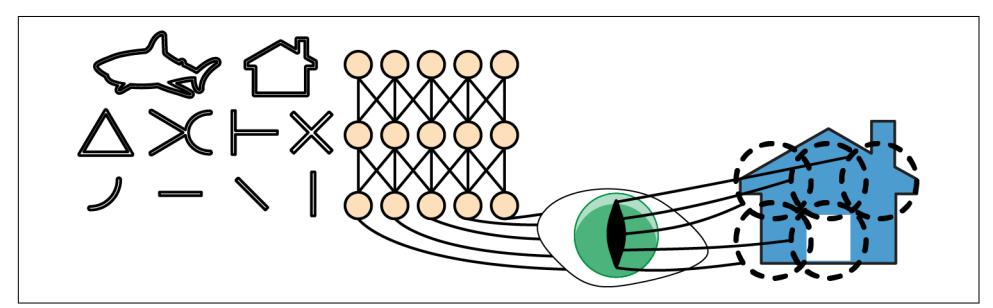

Figure 14-1. Biological neurons in the visual cortex respond to specific patterns in small regions of the visual field called receptive fields; as the visual signal makes its way through consecutive brain modules, neurons respond to more complex patterns in larger receptive fields

<sup>1</sup> David H. Hubel, "Single Unit Activity in Striate Cortex of Unrestrained Cats", The Journal of Physiology 147  $(1959): 226 - 238.$ 

<sup>2</sup> David H. Hubel and Torsten N. Wiesel, "Receptive Fields of Single Neurons in the Cat's Striate Cortex", The Journal of Physiology 148 (1959): 574-591.

<sup>3</sup> David H. Hubel and Torsten N. Wiesel, "Receptive Fields and Functional Architecture of Monkey Striate Cortex", The Journal of Physiology 195 (1968): 215-243.

{508}------------------------------------------------

Moreover, the authors showed that some neurons react only to images of horizontal lines, while others react only to lines with different orientations (two neurons may have the same receptive field but react to different line orientations). They also noticed that some neurons have larger receptive fields, and they react to more complex patterns that are combinations of the lower-level patterns. These observations led to the idea that the higher-level neurons are based on the outputs of neighboring lower-level neurons (in Figure 14-1, notice that each neuron is connected only to nearby neurons from the previous layer). This powerful architecture is able to detect all sorts of complex patterns in any area of the visual field.

These studies of the visual cortex inspired the neocognitron,<sup>4</sup> introduced in 1980, which gradually evolved into what we now call convolutional neural networks. An important milestone was a 1998 paper<sup>5</sup> by Yann LeCun et al. that introduced the famous LeNet-5 architecture, which became widely used by banks to recognize handwritten digits on checks. This architecture has some building blocks that you already know, such as fully connected layers and sigmoid activation functions, but it also introduces two new building blocks: convolutional layers and pooling layers. Let's look at them now.


Why not simply use a deep neural network with fully connected layers for image recognition tasks? Unfortunately, although this works fine for small images (e.g., MNIST), it breaks down for larger images because of the huge number of parameters it requires. For example, a  $100 \times 100$ -pixel image has 10,000 pixels, and if the first layer has just 1,000 neurons (which already severely restricts the amount of information transmitted to the next layer), this means a total of 10 million connections. And that's just the first layer. CNNs solve this problem using partially connected layers and weight sharing.

### **Convolutional Layers**

The most important building block of a CNN is the *convolutional layer*.<sup>6</sup> neurons in the first convolutional layer are not connected to every single pixel in the input image (like they were in the layers discussed in previous chapters), but only to pixels in their

<sup>4</sup> Kunihiko Fukushima, "Neocognitron: A Self-Organizing Neural Network Model for a Mechanism of Pattern Recognition Unaffected by Shift in Position", Biological Cybernetics 36 (1980): 193-202.

<sup>5</sup> Yann LeCun et al., "Gradient-Based Learning Applied to Document Recognition", Proceedings of the IEEE 86, no. 11 (1998): 2278-2324.

<sup>6</sup> A convolution is a mathematical operation that slides one function over another and measures the integral of their pointwise multiplication. It has deep connections with the Fourier transform and the Laplace transform and is heavily used in signal processing. Convolutional layers actually use cross-correlations, which are very similar to convolutions (see https://homl.info/76 for more details).

{509}------------------------------------------------

receptive fields (see Figure 14-2). In turn, each neuron in the second convolutional layer is connected only to neurons located within a small rectangle in the first layer. This architecture allows the network to concentrate on small low-level features in the first hidden layer, then assemble them into larger higher-level features in the next hidden layer, and so on. This hierarchical structure is common in real-world images, which is one of the reasons why CNNs work so well for image recognition.

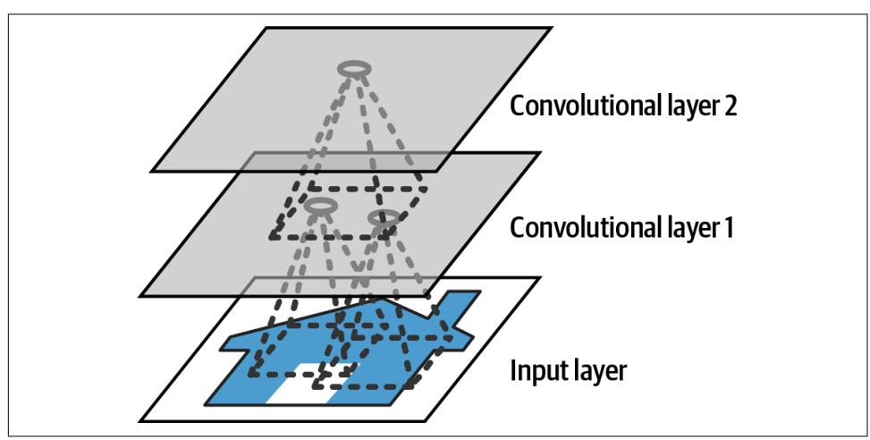

Figure 14-2. CNN layers with rectangular local receptive fields


All the multilayer neural networks we've looked at so far had layers composed of a long line of neurons, and we had to flatten input images to 1D before feeding them to the neural network. In a CNN each layer is represented in 2D, which makes it easier to match neurons with their corresponding inputs.

A neuron located in row *i*, column *j* of a given layer is connected to the outputs of the neurons in the previous layer located in rows *i* to  $i + f_h - 1$ , columns *j* to  $j + f_w$ - 1, where  $f_h$  and  $f_w$  are the height and width of the receptive field (see Figure 14-3). In order for a layer to have the same height and width as the previous layer, it is common to add zeros around the inputs, as shown in the diagram. This is called zero padding.

It is also possible to connect a large input layer to a much smaller layer by spacing out the receptive fields, as shown in Figure 14-4. This dramatically reduces the model's computational complexity. The horizontal or vertical step size from one receptive field to the next is called the *stride*. In the diagram, a  $5 \times 7$  input layer (plus zero padding) is connected to a 3  $\times$  4 layer, using 3  $\times$  3 receptive fields and a stride of 2 (in this example the stride is the same in both directions, but it does not have to be so). A neuron located in row  $i$ , column  $j$  in the upper layer is connected to the outputs of the

{510}------------------------------------------------


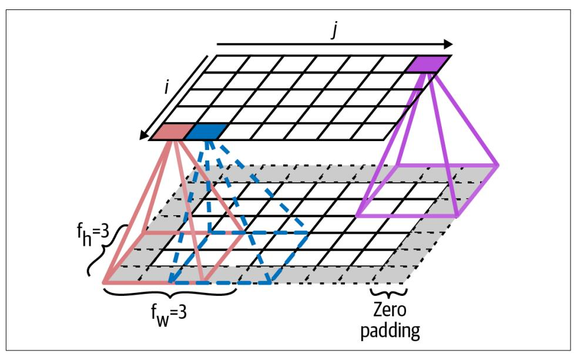

Figure 14-3. Connections between layers and zero padding

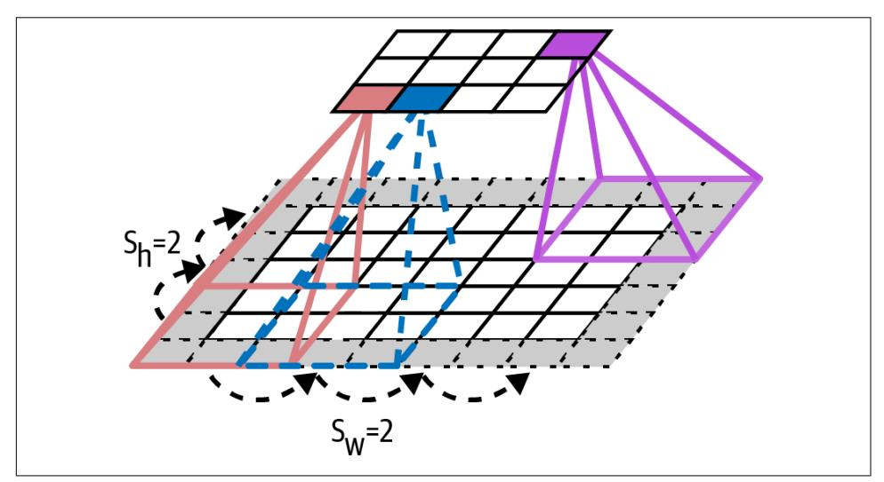

Figure 14-4. Reducing dimensionality using a stride of 2

{511}------------------------------------------------

### **Filters**

A neuron's weights can be represented as a small image the size of the receptive field. For example, Figure 14-5 shows two possible sets of weights, called *filters* (or convolution kernels, or just kernels). The first one is represented as a black square with a vertical white line in the middle (it's a  $7 \times 7$  matrix full of 0s except for the central column, which is full of 1s); neurons using these weights will ignore everything in their receptive field except for the central vertical line (since all inputs will be multiplied by 0, except for the ones in the central vertical line). The second filter is a black square with a horizontal white line in the middle. Neurons using these weights will ignore everything in their receptive field except for the central horizontal line.


Figure 14-5. Applying two different filters to get two feature maps

Now if all neurons in a layer use the same vertical line filter (and the same bias term), and you feed the network the input image shown in Figure 14-5 (the bottom image), the layer will output the top-left image. Notice that the vertical white lines get enhanced while the rest gets blurred. Similarly, the upper-right image is what you get if all neurons use the same horizontal line filter; notice that the horizontal white lines get enhanced while the rest is blurred out. Thus, a layer full of neurons using the same filter outputs a *feature map*, which highlights the areas in an image that activate the filter the most. But don't worry, you won't have to define the filters manually: instead, during training the convolutional layer will automatically learn the most useful filters for its task, and the layers above will learn to combine them into more complex patterns.

{512}------------------------------------------------

### **Stacking Multiple Feature Maps**

Up to now, for simplicity, I have represented the output of each convolutional layer as a 2D layer, but in reality a convolutional layer has multiple filters (you decide how many) and outputs one feature map per filter, so it is more accurately represented in 3D (see Figure 14-6). It has one neuron per pixel in each feature map, and all neurons within a given feature map share the same parameters (*i.e.*, the same kernel and bias term). Neurons in different feature maps use different parameters. A neuron's receptive field is the same as described earlier, but it extends across all the feature maps of the previous layer. In short, a convolutional layer simultaneously applies multiple trainable filters to its inputs, making it capable of detecting multiple features anywhere in its inputs.

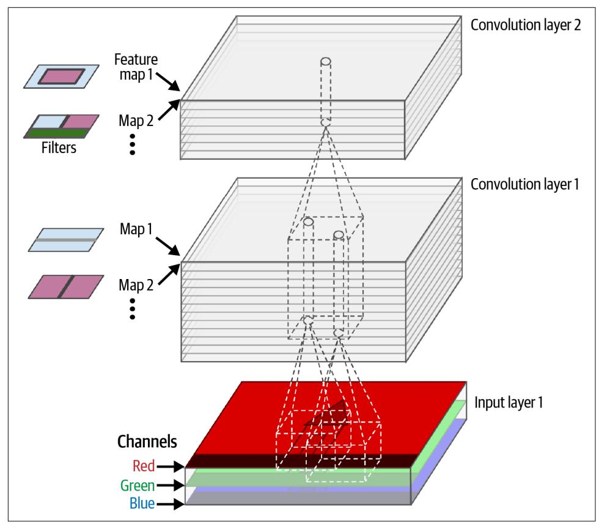

Figure 14-6. Two convolutional layers with multiple filters each (kernels), processing a color image with three color channels; each convolutional layer outputs one feature map per filter

{513}------------------------------------------------


The fact that all neurons in a feature map share the same parameters dramatically reduces the number of parameters in the model. Once the CNN has learned to recognize a pattern in one location, it can recognize it in any other location. In contrast, once a fully connected neural network has learned to recognize a pattern in one location, it can only recognize it in that particular location.

Input images are also composed of multiple sublayers: one per color channel. As mentioned in Chapter 9, there are typically three: red, green, and blue (RGB). Grayscale images have just one channel, but some images may have many more—for example, satellite images that capture extra light frequencies (such as infrared).

Specifically, a neuron located in row *i*, column *j* of the feature map  $k$  in a given convolutional layer  $l$  is connected to the outputs of the neurons in the previous layer *l* – 1, located in rows  $i \times s_h$  to  $i \times s_h + f_h$  – 1 and columns  $j \times s_w$  to  $j \times s_w + f_w$  – 1, across all feature maps (in layer  $l - 1$ ). Note that, within a layer, all neurons located in the same row *i* and column *j* but in different feature maps are connected to the outputs of the exact same neurons in the previous layer.

Equation 14-1 summarizes the preceding explanations in one big mathematical equation: it shows how to compute the output of a given neuron in a convolutional layer. It is a bit ugly due to all the different indices, but all it does is calculate the weighted sum of all the inputs, plus the bias term.

Equation 14-1. Computing the output of a neuron in a convolutional layer

$$
z_{i,j,k} = b_k + \sum_{u=0}^{f_h-1} \sum_{v=0}^{f_w-1} \sum_{k'=0}^{f_{n'}-1} x_{i',j',k'} \times w_{u,v,k',k} \quad \text{with } \begin{cases} i' = i \times s_h + u \\ j' = j \times s_w + v \end{cases}
$$

In this equation:

- $z_{i,j,k}$  is the output of the neuron located in row *i*, column *j* in feature map *k* of the convolutional layer (layer l).
- As explained earlier,  $s_h$  and  $s_w$  are the vertical and horizontal strides,  $f_h$  and  $f_w$  are the height and width of the receptive field, and  $f_{n'}$  is the number of feature maps in the previous layer (layer  $l-1$ ).
- $x_{i,i,k}$  is the output of the neuron located in layer  $l-1$ , row i', column j', feature map  $k'$  (or channel  $k'$  if the previous layer is the input layer).
- $b_k$  is the bias term for feature map  $k$  (in layer l). You can think of it as a knob that tweaks the overall brightness of the feature map k.

{514}------------------------------------------------

•  $W_{u,v,k'}$  is the connection weight between any neuron in feature map k of the layer  $l$  and its input located at row  $u$ , column  $v$  (relative to the neuron's receptive field), and feature map  $k'$ .

Let's see how to create and use a convolutional layer using Keras.

### **Implementing Convolutional Layers with Keras**

First, let's load and preprocess a couple of sample images, using Scikit-Learn's load\_sample\_image() function and Keras's CenterCrop and Rescaling layers (all of which were introduced in Chapter 13):

```
from sklearn.datasets import load_sample_images
import tensorflow as tf
images = load_sample_images()["images"]
images = tf.keras.layers.CenterCrop(height=70, width=120)(images)
images = tf.keras. layers. Rescaling(scale=1 / 255)(images)
```

Let's look at the shape of the images tensor:

>>> images.shape TensorShape([2, 70, 120, 3])

Yikes, it's a 4D tensor; we haven't seen this before! What do all these dimensions mean? Well, there are two sample images, which explains the first dimension. Then each image is  $70 \times 120$ , since that's the size we specified when creating the Center Crop layer (the original images were  $427 \times 640$ ). This explains the second and third dimensions. And lastly, each pixel holds one value per color channel, and there are three of them—red, green, and blue—which explains the last dimension.

Now let's create a 2D convolutional layer and feed it these images to see what comes out. For this, Keras provides a Convolution2D layer, alias Conv2D. Under the hood, this layer relies on TensorFlow's tf.nn.conv2d() operation. Let's create a convolutional layer with 32 filters, each of size  $7 \times 7$  (using kernel\_size=7, which is equivalent to using kernel\_size= $(7, 7)$ ), and apply this layer to our small batch of two images:

```
conv_layer = tf.keras.layers.Conv2D(filters=32, kernel_size=7)
fmaps = conv_{\text{layer}}(images)
```


When we talk about a 2D convolutional layer, "2D" refers to the number of *spatial* dimensions (height and width), but as you can see, the layer takes 4D inputs: as we saw, the two additional dimensions are the batch size (first dimension) and the channels (last dimension).

{515}------------------------------------------------

Now let's look at the output's shape:

```
>>> fmaps.shape
TensorShape([2, 64, 114, 32])
```

The output shape is similar to the input shape, with two main differences. First, there are 32 channels instead of 3. This is because we set filters=32, so we get 32 output feature maps: instead of the intensity of red, green, and blue at each location, we now have the intensity of each feature at each location. Second, the height and width have both shrunk by 6 pixels. This is due to the fact that the Conv2D layer does not use any zero-padding by default, which means that we lose a few pixels on the sides of the output feature maps, depending on the size of the filters. In this case, since the kernel size is 7, we lose 6 pixels horizontally and 6 pixels vertically (i.e., 3 pixels on each side).


The default option is surprisingly named padding="valid", which actually means no zero-padding at all! This name comes from the fact that in this case every neuron's receptive field lies strictly within *valid* positions inside the input (it does not go out of bounds). It's not a Keras naming quirk: everyone uses this odd nomenclature.

If instead we set padding="same", then the inputs are padded with enough zeros on all sides to ensure that the output feature maps end up with the *same* size as the inputs (hence the name of this option):

```
>>> conv layer = tf.keras.layers.Conv2D(filters=32, kernel size=7,
                                          padding="same")
\ddotsc\ddotsc>>> fmaps = conv layer(images)
>>> fmaps.shape
TensorShape([2, 70, 120, 32])
```

These two padding options are illustrated in Figure 14-7. For simplicity, only the horizontal dimension is shown here, but of course the same logic applies to the vertical dimension as well.

If the stride is greater than 1 (in any direction), then the output size will not be equal to the input size, even if padding="same". For example, if you set strides=2 (or equivalently strides=(2, 2)), then the output feature maps will be  $35 \times 60$ : halved both vertically and horizontally. Figure 14-8 shows what happens when strides=2, with both padding options.

{516}------------------------------------------------

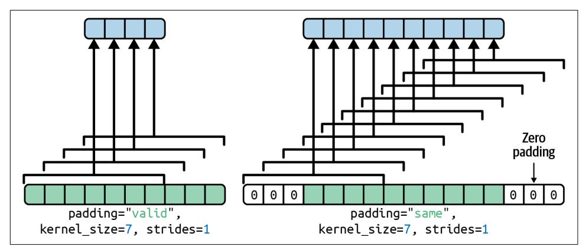

Figure 14-7. The two padding options, when strides=1


Figure 14-8. With strides greater than 1, the output is much smaller even when using "same" padding (and "valid" padding may ignore some inputs)

If you are curious, this is how the output size is computed:

- With padding="valid", if the width of the input is  $i<sub>h</sub>$ , then the output width is equal to  $(i_h - f_h + s_h) / s_h$ , rounded down. Recall that  $f_h$  is the kernel width, and  $s_h$  is the horizontal stride. Any remainder in the division corresponds to ignored columns on the right side of the input image. The same logic can be used to compute the output height, and any ignored rows at the bottom of the image.
- With padding="same", the output width is equal to  $i_h / s_h$ , rounded up. To make this possible, the appropriate number of zero columns are padded to the left and right of the input image (an equal number if possible, or just one more on the right side). Assuming the output width is  $o_w$ , then the number of padded zero columns is  $(o_w - 1) \times s_h + f_h - i_h$ . Again, the same logic can be used to compute the output height and the number of padded rows.

{517}------------------------------------------------

Now let's look at the layer's weights (which were noted  $w_{u,v,k,k}$  and  $b_k$  in Equation 14-1). Just like a Dense layer, a Conv2D layer holds all the layer's weights, including the kernels and biases. The kernels are initialized randomly, while the biases are initialized to zero. These weights are accessible as TF variables via the weights attribute, or as NumPy arrays via the get\_weights() method:

```
>>> kernels, biases = conv layer.get weights()
>>> kernels.shape
(7, 7, 3, 32)>>> biases.shape
(32, )
```

The kernels array is 4D, and its shape is [kernel\_height, kernel\_width, input\_channels, *output\_channels*]. The biases array is 1D, with shape [*output\_channels*]. The number of output channels is equal to the number of output feature maps, which is also equal to the number of filters.

Most importantly, note that the height and width of the input images do not appear in the kernel's shape: this is because all the neurons in the output feature maps share the same weights, as explained earlier. This means that you can feed images of any size to this layer, as long as they are at least as large as the kernels, and if they have the right number of channels (three in this case).

Lastly, you will generally want to specify an activation function (such as ReLU) when creating a Conv2D layer, and also specify the corresponding kernel initializer (such as He initialization). This is for the same reason as for Dense layers: a convolutional layer performs a linear operation, so if you stacked multiple convolutional layers without any activation functions they would all be equivalent to a single convolutional layer, and they wouldn't be able to learn anything really complex.

As you can see, convolutional layers have quite a few hyperparameters: filters, kernel\_size, padding, strides, activation, kernel\_initializer, etc. As always, you can use cross-validation to find the right hyperparameter values, but this is very time-consuming. We will discuss common CNN architectures later in this chapter, to give you some idea of which hyperparameter values work best in practice.

### **Memory Requirements**

Another challenge with CNNs is that the convolutional layers require a huge amount of RAM. This is especially true during training, because the reverse pass of backpropagation requires all the intermediate values computed during the forward pass.

For example, consider a convolutional layer with 200  $5 \times 5$  filters, with stride 1 and "same" padding. If the input is a  $150 \times 100$  RGB image (three channels), then the number of parameters is  $(5 \times 5 \times 3 + 1) \times 200 = 15,200$  (the + 1 corresponds to 

{518}------------------------------------------------

the bias terms), which is fairly small compared to a fully connected layer.<sup>7</sup> However, each of the 200 feature maps contains  $150 \times 100$  neurons, and each of these neurons needs to compute a weighted sum of its  $5 \times 5 \times 3 = 75$  inputs: that's a total of 225 million float multiplications. Not as bad as a fully connected layer, but still quite computationally intensive. Moreover, if the feature maps are represented using 32-bit floats, then the convolutional layer's output will occupy  $200 \times 150 \times 100 \times 32 = 96$ million bits (12 MB) of RAM.<sup>8</sup> And that's just for one instance—if a training batch contains 100 instances, then this layer will use up 1.2 GB of RAM!

During inference (i.e., when making a prediction for a new instance) the RAM occupied by one layer can be released as soon as the next layer has been computed, so you only need as much RAM as required by two consecutive layers. But during training everything computed during the forward pass needs to be preserved for the reverse pass, so the amount of RAM needed is (at least) the total amount of RAM required by all layers.


If training crashes because of an out-of-memory error, you can try reducing the mini-batch size. Alternatively, you can try reducing dimensionality using a stride, removing a few layers, using 16-bit floats instead of 32-bit floats, or distributing the CNN across multiple devices (you will see how to do this in Chapter 19).

Now let's look at the second common building block of CNNs: the *pooling layer*.

### **Pooling Layers**

Once you understand how convolutional layers work, the pooling layers are quite easy to grasp. Their goal is to *subsample* (i.e., shrink) the input image in order to reduce the computational load, the memory usage, and the number of parameters (thereby limiting the risk of overfitting).

Just like in convolutional layers, each neuron in a pooling layer is connected to the outputs of a limited number of neurons in the previous layer, located within a small rectangular receptive field. You must define its size, the stride, and the padding type, just like before. However, a pooling neuron has no weights; all it does is aggregate the inputs using an aggregation function such as the max or mean. Figure 14-9 shows a *max pooling layer*, which is the most common type of pooling layer. In this example,

<sup>7</sup> To produce the same size outputs, a fully connected layer would need  $200 \times 150 \times 100$  neurons, each connected to all  $150 \times 100 \times 3$  inputs. It would have  $200 \times 150 \times 100 \times (150 \times 100 \times 3 + 1) \approx 135$  billion parameters!

<sup>8</sup> In the international system of units (SI),  $1 \text{ MB} = 1,000 \text{ KB} = 1,000 \times 1,000 \text{ bytes} = 1,000 \times 1,000 \times 8 \text{ bits}$ . And  $1 \text{ MiB} = 1,024 \text{ kiB} = 1,024 \times 1,024 \text{ bytes.}$  So 12 MB  $\approx 11.44 \text{ MiB}$ .

{519}------------------------------------------------

we use a 2  $\times$  2 *pooling kernel*,<sup>9</sup> with a stride of 2 and no padding. Only the max input value in each receptive field makes it to the next layer, while the other inputs are dropped. For example, in the lower-left receptive field in Figure 14-9, the input values are 1, 5, 3, 2, so only the max value, 5, is propagated to the next layer. Because of the stride of 2, the output image has half the height and half the width of the input image (rounded down since we use no padding).


Figure 14-9. Max pooling layer ( $2 \times 2$  pooling kernel, stride 2, no padding)


A pooling layer typically works on every input channel independently, so the output depth (i.e., the number of channels) is the same as the input depth.

Other than reducing computations, memory usage, and the number of parameters, a max pooling layer also introduces some level of *invariance* to small translations, as shown in Figure 14-10. Here we assume that the bright pixels have a lower value than dark pixels, and we consider three images  $(A, B, C)$  going through a max pooling layer with a  $2 \times 2$  kernel and stride 2. Images B and C are the same as image A, but shifted by one and two pixels to the right. As you can see, the outputs of the max pooling layer for images A and B are identical. This is what translation invariance means. For image C, the output is different: it is shifted one pixel to the right (but there is still 50% invariance). By inserting a max pooling layer every few layers in a CNN, it is possible to get some level of translation invariance at a larger scale. Moreover, max pooling offers a small amount of rotational invariance and a slight scale invariance. Such invariance (even if it is limited) can be useful in cases where the prediction should not depend on these details, such as in classification tasks.

<sup>9</sup> Other kernels we've discussed so far had weights, but pooling kernels do not: they are just stateless sliding windows.

{520}------------------------------------------------

However, max pooling has some downsides too. It's obviously very destructive: even with a tiny  $2 \times 2$  kernel and a stride of 2, the output will be two times smaller in both directions (so its area will be four times smaller), simply dropping 75% of the input values. And in some applications, invariance is not desirable. Take semantic segmentation (the task of classifying each pixel in an image according to the object that pixel belongs to, which we'll explore later in this chapter): obviously, if the input image is translated by one pixel to the right, the output should also be translated by one pixel to the right. The goal in this case is *equivariance*, not invariance: a small change to the inputs should lead to a corresponding small change in the output.

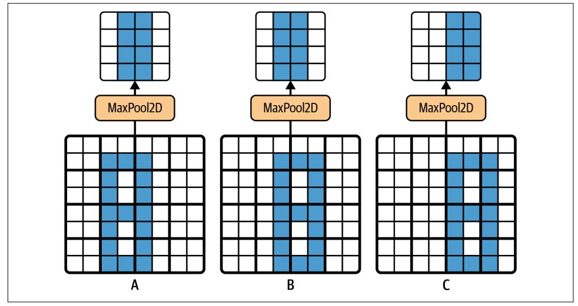

Figure 14-10. Invariance to small translations

### **Implementing Pooling Layers with Keras**

The following code creates a MaxPooling2D layer, alias MaxPool2D, using a  $2 \times 2$  kernel. The strides default to the kernel size, so this layer uses a stride of 2 (horizontally and vertically). By default, it uses "valid" padding (i.e., no padding at all):

```
max_pool = tf.keras.layers.MaxPool2D(pool_size=2)
```

To create an average pooling layer, just use AveragePooling2D, alias AvgPool2D, instead of MaxPool2D. As you might expect, it works exactly like a max pooling layer, except it computes the mean rather than the max. Average pooling layers used to be very popular, but people mostly use max pooling layers now, as they generally perform better. This may seem surprising, since computing the mean generally loses less information than computing the max. But on the other hand, max pooling preserves only the strongest features, getting rid of all the meaningless ones, so the 

{521}------------------------------------------------

next layers get a cleaner signal to work with. Moreover, max pooling offers stronger translation invariance than average pooling, and it requires slightly less compute.

Note that max pooling and average pooling can be performed along the depth dimension instead of the spatial dimensions, although it's not as common. This can allow the CNN to learn to be invariant to various features. For example, it could learn multiple filters, each detecting a different rotation of the same pattern (such as handwritten digits; see Figure 14-11), and the depthwise max pooling layer would ensure that the output is the same regardless of the rotation. The CNN could similarly learn to be invariant to anything: thickness, brightness, skew, color, and so on.


Figure 14-11. Depthwise max pooling can help the CNN learn to be invariant (to rotation in this case)

Keras does not include a depthwise max pooling layer, but it's not too difficult to implement a custom layer for that:

```
class DepthPool(tf.keras.layers.Layer):
   def __init__(self, pool_size=2, **kwargs):
       super(). init (** kwargs)
       self.pool size = pool size
    def call(self, inputs):
       shape = tf.shape(inputs) # shape[-1] is the number of channels
       groups = shape[-1] // self.pool_size # number of channel groups
       new\_shape = tf.concat([shape[:-1], [groups, self.pool_size]], axis=0)return tf.reduce_max(tf.reshape(inputs, new_shape), axis=-1)
```

{522}------------------------------------------------

This layer reshapes its inputs to split the channels into groups of the desired size (pool size), then it uses tf. reduce max() to compute the max of each group. This implementation assumes that the stride is equal to the pool size, which is generally what you want. Alternatively, you could use TensorFlow's tf.nn.max\_pool() operation, and wrap in a Lambda layer to use it inside a Keras model, but sadly this op does not implement depthwise pooling for the GPU, only for the CPU.

One last type of pooling layer that you will often see in modern architectures is the global average pooling layer. It works very differently: all it does is compute the mean of each entire feature map (it's like an average pooling layer using a pooling kernel with the same spatial dimensions as the inputs). This means that it just outputs a single number per feature map and per instance. Although this is of course extremely destructive (most of the information in the feature map is lost), it can be useful just before the output layer, as you will see later in this chapter. To create such a layer, simply use the GlobalAveragePooling2D class, alias GlobalAvgPool2D:

```
global avg pool = tf.keras.layers.GlobalAvgPool2D()
```

It's equivalent to the following Lambda layer, which computes the mean over the spatial dimensions (height and width):

```
global avg pool = tf.keras.layers.Lambda(
    lambda X: tf. reduce_mean(X, axis=[1, 2]))
```

For example, if we apply this layer to the input images, we get the mean intensity of red, green, and blue for each image:

```
>>> global_avg_pool(images)
<tf.Tensor: shape=(2, 3), dtype=float32, numpy=
array([[0.64338624, 0.5971759, 0.5824972],
       [0.76306933, 0.26011038, 0.10849128]], dtype=float32)>
```

Now you know all the building blocks to create convolutional neural networks. Let's see how to assemble them.

## **CNN Architectures**

Typical CNN architectures stack a few convolutional layers (each one generally followed by a ReLU layer), then a pooling layer, then another few convolutional layers (+ReLU), then another pooling layer, and so on. The image gets smaller and smaller as it progresses through the network, but it also typically gets deeper and deeper (i.e., with more feature maps), thanks to the convolutional layers (see Figure 14-12). At the top of the stack, a regular feedforward neural network is added, composed of a few fully connected layers (+ReLUs), and the final layer outputs the prediction (e.g., a softmax layer that outputs estimated class probabilities).

{523}------------------------------------------------

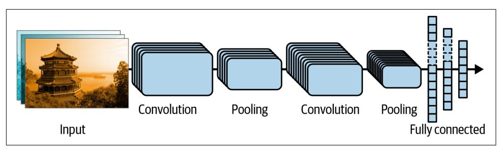

Figure 14-12. Typical CNN architecture


A common mistake is to use convolution kernels that are too large. For example, instead of using a convolutional layer with a 5  $\times$ 5 kernel, stack two layers with  $3 \times 3$  kernels: it will use fewer parameters and require fewer computations, and it will usually perform better. One exception is for the first convolutional layer: it can typically have a large kernel (e.g.,  $5 \times 5$ ), usually with a stride of 2 or more. This will reduce the spatial dimension of the image without losing too much information, and since the input image only has three channels in general, it will not be too costly.

Here is how you can implement a basic CNN to tackle the Fashion MNIST dataset (introduced in Chapter 10):

```
from functools import partial
DefaultConv2D = partial(tf.keras.layers.Conv2D, kernel_size=3, padding="same",
                         activation="relu", kernel initializer="he normal")
model = tf.keras.Sequential(DefaultConv2D(filters=64, kernel size=7, input shape=[28, 28, 1]),
    tf.keras.layers.MaxPool2D(),
    DefaultConv2D(filters=128),
    DefaultConv2D(filters=128),
    tf.keras.lavers.MaxPool2D().
    DefaultConv2D(filters=256),
    DefaultConv2D(filters=256),
    tf.keras.layers.MaxPool2D(),
    tf.keras.layers.Flatten(),
    tf.keras.layers.Dense(units=128, activation="relu",
                          kernel initializer="he normal").
    tf.keras.layers.Dropout(0.5),
    tf.keras.layers.Dense(units=64, activation="relu",
                          kernel_initializer="he_normal"),
    tf.keras.layers.Dropout(0.5),
    tf.keras.layers.Dense(units=10, activation="softmax")
\left| \right\rangle
```

{524}------------------------------------------------

Let's go through this code:

- We use the functools.partial() function (introduced in Chapter 11) to define DefaultConv2D, which acts just like Conv2D but with different default arguments: a small kernel size of 3, "same" padding, the ReLU activation function, and its corresponding He initializer.
- Next, we create the Sequential model. Its first layer is a DefaultConv2D with 64 fairly large filters (7  $\times$  7). It uses the default stride of 1 because the input images are not very large. It also sets input\_shape=[28, 28, 1], because the images are  $28 \times 28$  pixels, with a single color channel (i.e., grayscale). When you load the Fashion MNIST dataset, make sure each image has this shape: you may need to use np. reshape() or np. expanddims() to add the channels dimension. Alternatively, you could use a Reshape layer as the first layer in the model.
- We then add a max pooling layer that uses the default pool size of 2, so it divides each spatial dimension by a factor of 2.
- Then we repeat the same structure twice: two convolutional layers followed by a max pooling layer. For larger images, we could repeat this structure several more times. The number of repetitions is a hyperparameter you can tune.
- Note that the number of filters doubles as we climb up the CNN toward the output layer (it is initially 64, then 128, then 256): it makes sense for it to grow, since the number of low-level features is often fairly low (e.g., small circles, horizontal lines), but there are many different ways to combine them into higherlevel features. It is a common practice to double the number of filters after each pooling layer: since a pooling layer divides each spatial dimension by a factor of 2, we can afford to double the number of feature maps in the next layer without fear of exploding the number of parameters, memory usage, or computational  $load.$
- Next is the fully connected network, composed of two hidden dense layers and a dense output layer. Since it's a classification task with 10 classes, the output layer has 10 units, and it uses the softmax activation function. Note that we must flatten the inputs just before the first dense layer, since it expects a 1D array of features for each instance. We also add two dropout layers, with a dropout rate of 50% each, to reduce overfitting.

If you compile this model using the "sparse categorical crossentropy" loss and you fit the model to the Fashion MNIST training set, it should reach over 92% accuracy on the test set. It's not state of the art, but it is pretty good, and clearly much better than what we achieved with dense networks in Chapter 10.

{525}------------------------------------------------

Over the years, variants of this fundamental architecture have been developed, leading to amazing advances in the field. A good measure of this progress is the error rate in competitions such as the ILSVRC ImageNet challenge. In this competition, the top-five error rate for image classification—that is, the number of test images for which the system's top five predictions did *not* include the correct answer—fell from over 26% to less than 2.3% in just six years. The images are fairly large (e.g., 256 pixels high) and there are 1,000 classes, some of which are really subtle (try distinguishing 120 dog breeds). Looking at the evolution of the winning entries is a good way to understand how CNNs work, and how research in deep learning progresses.

We will first look at the classical LeNet-5 architecture (1998), then several winners of the ILSVRC challenge: AlexNet (2012), GoogLeNet (2014), ResNet (2015), and SENet (2017). Along the way, we will also look at a few more architectures, including Xception, ResNeXt, DenseNet, MobileNet, CSPNet, and EfficientNet.

#### LeNet-5

The LeNet-5 architecture<sup>10</sup> is perhaps the most widely known CNN architecture. As mentioned earlier, it was created by Yann LeCun in 1998 and has been widely used for handwritten digit recognition (MNIST). It is composed of the layers shown in Table 14-1.

| Layer            | Type                   | Maps | Size                        | Kernel size Stride Activation |               |            |
|------------------|------------------------|------|-----------------------------|-------------------------------|---------------|------------|
| 0ut              | <b>Fully connected</b> |      | 10                          |                               |               | <b>RBF</b> |
| F6               | <b>Fully connected</b> |      | 84                          |                               |               | tanh       |
| $\mathfrak{c}_5$ | Convolution            | 120  | $1 \times 1$                | $5 \times 5$                  | 1             | tanh       |
| S4               | Avg pooling            | 16   | $5 \times 5$                | $2 \times 2$                  | 2             | tanh       |
| $\mathcal{C}$    | Convolution            | 16   | $10 \times 10$              | $5 \times 5$                  | 1             | tanh       |
| S <sub>2</sub>   | Avg pooling            | 6    | $14 \times 14$ $2 \times 2$ |                               | $\mathfrak z$ | tanh       |
| C <sub>1</sub>   | Convolution            | 6    | $28 \times 28$ 5 $\times$ 5 |                               | 1             | tanh       |
| In               | Input                  | 1    | $32 \times 32$              |                               |               |            |

Table 14-1. LeNet-5 architecture

As you can see, this looks pretty similar to our Fashion MNIST model: a stack of convolutional layers and pooling layers, followed by a dense network. Perhaps the main difference with more modern classification CNNs is the activation functions: today, we would use ReLU instead of tanh and softmax instead of RBF. There were

<sup>10</sup> Yann LeCun et al., "Gradient-Based Learning Applied to Document Recognition", Proceedings of the IEEE 86, no. 11 (1998): 2278-2324.

{526}------------------------------------------------

several other minor differences that don't really matter much, but in case you are interested, they are listed in this chapter's notebook at https://homl.info/colab3. Yann LeCun's website also features great demos of LeNet-5 classifying digits.

#### **AlexNet**

The AlexNet CNN architecture<sup>11</sup> won the 2012 ILSVRC challenge by a large margin: it achieved a top-five error rate of 17%, while the second best competitor achieved only 26%! AlexaNet was developed by Alex Krizhevsky (hence the name), Ilya Sutskever, and Geoffrey Hinton. It is similar to LeNet-5, only much larger and deeper, and it was the first to stack convolutional layers directly on top of one another, instead of stacking a pooling layer on top of each convolutional layer. Table 14-2 presents this architecture.

| Layer           | <b>Type</b>            | <b>Maps</b> | Size             | Kernel size    | Stride         | Padding | <b>Activation</b> |
|-----------------|------------------------|-------------|------------------|----------------|----------------|---------|-------------------|
| 0ut             | <b>Fully connected</b> |             | 1,000            |                |                |         | Softmax           |
| F <sub>10</sub> | <b>Fully connected</b> |             | 4.096            |                |                |         | ReLU              |
| F9              | <b>Fully connected</b> |             | 4,096            |                |                |         | ReLU              |
| S8              | Max pooling            | 256         | $6 \times 6$     | $3 \times 3$   | 2              | valid   |                   |
| C <sub>7</sub>  | Convolution            | 256         | $13 \times 13$   | $3 \times 3$   | 1              | same    | ReLU              |
| C6              | Convolution            | 384         | $13 \times 13$   | $3 \times 3$   | 1              | same    | ReLU              |
| C <sub>5</sub>  | Convolution            | 384         | $13 \times 13$   | $3 \times 3$   | 1              | same    | ReLU              |
| S <sub>4</sub>  | Max pooling            | 256         | $13 \times 13$   | $3 \times 3$   | $\overline{2}$ | valid   |                   |
| C <sub>3</sub>  | Convolution            | 256         | $27 \times 27$   | $5 \times 5$   | 1              | same    | ReLU              |
| S2              | Max pooling            | 96          | $27 \times 27$   | $3 \times 3$   | 2              | valid   |                   |
| C <sub>1</sub>  | Convolution            | 96          | $55 \times 55$   | $11 \times 11$ | 4              | valid   | ReLU              |
| In              | Input                  | 3(RGB)      | $227 \times 227$ |                |                |         |                   |

Table 14-2 AlexNet architecture

To reduce overfitting, the authors used two regularization techniques. First, they applied dropout (introduced in Chapter 11) with a 50% dropout rate during training to the outputs of layers F9 and F10. Second, they performed data augmentation by randomly shifting the training images by various offsets, flipping them horizontally, and changing the lighting conditions.

<sup>11</sup> Alex Krizhevsky et al., "ImageNet Classification with Deep Convolutional Neural Networks", Proceedings of the 25th International Conference on Neural Information Processing Systems 1 (2012): 1097-1105.

{527}------------------------------------------------

#### **Data Augmentation**

Data augmentation artificially increases the size of the training set by generating many realistic variants of each training instance. This reduces overfitting, making this a regularization technique. The generated instances should be as realistic as possible: ideally, given an image from the augmented training set, a human should not be able to tell whether it was augmented or not. Simply adding white noise will not help; the modifications should be learnable (white noise is not).

For example, you can slightly shift, rotate, and resize every picture in the training set by various amounts and add the resulting pictures to the training set (see Figure 14-13). To do this, you can use Keras's data augmentation layers, introduced in Chapter 13 (e.g., RandomCrop, RandomRotation, etc.). This forces the model to be more tolerant to variations in the position, orientation, and size of the objects in the pictures. To produce a model that's more tolerant of different lighting conditions, you can similarly generate many images with various contrasts. In general, you can also flip the pictures horizontally (except for text, and other asymmetrical objects). By combining these transformations, you can greatly increase your training set size.


Figure 14-13. Generating new training instances from existing ones

Data augmentation is also useful when you have an unbalanced dataset: you can use it to generate more samples of the less frequent classes. This is called the *synthetic* minority oversampling technique, or SMOTE for short.

{528}------------------------------------------------

AlexNet also uses a competitive normalization step immediately after the ReLU step of layers C1 and C3, called *local response normalization* (LRN): the most strongly activated neurons inhibit other neurons located at the same position in neighboring feature maps. Such competitive activation has been observed in biological neurons. This encourages different feature maps to specialize, pushing them apart and forcing them to explore a wider range of features, ultimately improving generalization. Equation 14-2 shows how to apply LRN.

Equation 14-2. Local response normalization (LRN)

$$
b_i = a_i \left( k + \alpha \sum_{j = j_{\text{low}}}^{j_{\text{high}}} a_j^2 \right)^{-\beta} \quad \text{with } \begin{cases} j_{\text{high}} = \min \left( i + \frac{r}{2}, f_n - 1 \right) \\ j_{\text{low}} = \max \left( 0, i - \frac{r}{2} \right) \end{cases}
$$

In this equation:

- $b_i$  is the normalized output of the neuron located in feature map *i*, at some row *u* and column  $\nu$  (note that in this equation we consider only neurons located at this row and column, so  $u$  and  $v$  are not shown).
- $a_i$  is the activation of that neuron after the ReLU step, but before normalization.
- k,  $\alpha$ ,  $\beta$ , and r are hyperparameters. k is called the bias, and r is called the *depth* radius.
- $f_n$  is the number of feature maps.

For example, if  $r = 2$  and a neuron has a strong activation, it will inhibit the activation of the neurons located in the feature maps immediately above and below its own.

In AlexNet, the hyperparameters are set as:  $r = 5$ ,  $\alpha = 0.0001$ ,  $\beta = 0.75$ , and  $k = 2$ . You can implement this step by using the tf.nn.local\_response\_normalization() function (which you can wrap in a Lambda layer if you want to use it in a Keras model).

A variant of AlexNet called ZF Net<sup>12</sup> was developed by Matthew Zeiler and Rob Fergus and won the 2013 ILSVRC challenge. It is essentially AlexNet with a few tweaked hyperparameters (number of feature maps, kernel size, stride, etc.).

<sup>12</sup> Matthew D. Zeiler and Rob Fergus, "Visualizing and Understanding Convolutional Networks", Proceedings of the European Conference on Computer Vision (2014): 818-833.

{529}------------------------------------------------

### GoogLeNet

The GoogLeNet architecture was developed by Christian Szegedy et al. from Google Research,<sup>13</sup> and it won the ILSVRC 2014 challenge by pushing the top-five error rate below 7%. This great performance came in large part from the fact that the network was much deeper than previous CNNs (as you'll see in Figure 14-15). This was made possible by subnetworks called *inception modules*,<sup>14</sup> which allow GoogLeNet to use parameters much more efficiently than previous architectures: GoogLeNet actually has 10 times fewer parameters than AlexNet (roughly 6 million instead of 60 million).

Figure 14-14 shows the architecture of an inception module. The notation " $3 \times 3 +$  $1(S)$ " means that the layer uses a  $3 \times 3$  kernel, stride 1, and "same" padding. The input signal is first fed to four different layers in parallel. All convolutional layers use the ReLU activation function. Note that the top convolutional layers use different kernel sizes (1  $\times$  1, 3  $\times$  3, and 5  $\times$  5), allowing them to capture patterns at different scales. Also note that every single layer uses a stride of 1 and "same" padding (even the max pooling layer), so their outputs all have the same height and width as their inputs. This makes it possible to concatenate all the outputs along the depth dimension in the final *depth concatenation layer* (i.e., to stack the feature maps from all four top convolutional layers). It can be implemented using Keras's Concatenate layer, using the default  $axis = -1$ 


Figure 14-14. Inception module

<sup>13</sup> Christian Szegedy et al., "Going Deeper with Convolutions", Proceedings of the IEEE Conference on Computer Vision and Pattern Recognition (2015): 1-9.

<sup>14</sup> In the 2010 movie *Inception*, the characters keep going deeper and deeper into multiple layers of dreams; hence the name of these modules.

{530}------------------------------------------------

You may wonder why inception modules have convolutional layers with  $1 \times 1$  kernels. Surely these layers cannot capture any features because they look at only one pixel at a time, right? In fact, these layers serve three purposes:

- Although they cannot capture spatial patterns, they can capture patterns along the depth dimension (i.e., across channels).
- They are configured to output fewer feature maps than their inputs, so they serve as bottleneck layers, meaning they reduce dimensionality. This cuts the computational cost and the number of parameters, speeding up training and improving generalization.
- Each pair of convolutional layers ( $[1 \times 1, 3 \times 3]$  and  $[1 \times 1, 5 \times 5]$ ) acts like a single powerful convolutional layer, capable of capturing more complex patterns. A convolutional layer is equivalent to sweeping a dense layer across the image (at each location, it only looks at a small receptive field), and these pairs of convolutional layers are equivalent to sweeping two-layer neural networks across the image.

In short, you can think of the whole inception module as a convolutional layer on steroids, able to output feature maps that capture complex patterns at various scales.

Now let's look at the architecture of the GoogLeNet CNN (see Figure 14-15). The number of feature maps output by each convolutional layer and each pooling layer is shown before the kernel size. The architecture is so deep that it has to be represented in three columns, but GoogLeNet is actually one tall stack, including nine inception modules (the boxes with the spinning tops). The six numbers in the inception modules represent the number of feature maps output by each convolutional layer in the module (in the same order as in Figure 14-14). Note that all the convolutional layers use the ReLU activation function.

Let's go through this network:

- The first two layers divide the image's height and width by 4 (so its area is divided by 16), to reduce the computational load. The first layer uses a large kernel size,  $7 \times 7$ , so that much of the information is preserved.
- Then the local response normalization layer ensures that the previous layers learn a wide variety of features (as discussed earlier).
- Two convolutional layers follow, where the first acts like a bottleneck layer. As mentioned, you can think of this pair as a single smarter convolutional layer.
- Again, a local response normalization layer ensures that the previous layers capture a wide variety of patterns.
- Next, a max pooling layer reduces the image height and width by 2, again to speed up computations.

{531}------------------------------------------------

- Then comes the CNN's *backbone*: a tall stack of nine inception modules, interleaved with a couple of max pooling layers to reduce dimensionality and speed up the net.
- Next, the global average pooling layer outputs the mean of each feature map: this drops any remaining spatial information, which is fine because there is not much spatial information left at that point. Indeed, GoogLeNet input images are typically expected to be  $224 \times 224$  pixels, so after 5 max pooling layers, each dividing the height and width by 2, the feature maps are down to  $7 \times 7$ . Moreover, this is a classification task, not localization, so it doesn't matter where the object is. Thanks to the dimensionality reduction brought by this layer, there is no need to have several fully connected layers at the top of the CNN (like in AlexNet), and this considerably reduces the number of parameters in the network and limits the risk of overfitting.
- The last layers are self-explanatory: dropout for regularization, then a fully connected layer with 1,000 units (since there are 1,000 classes) and a softmax activation function to output estimated class probabilities.

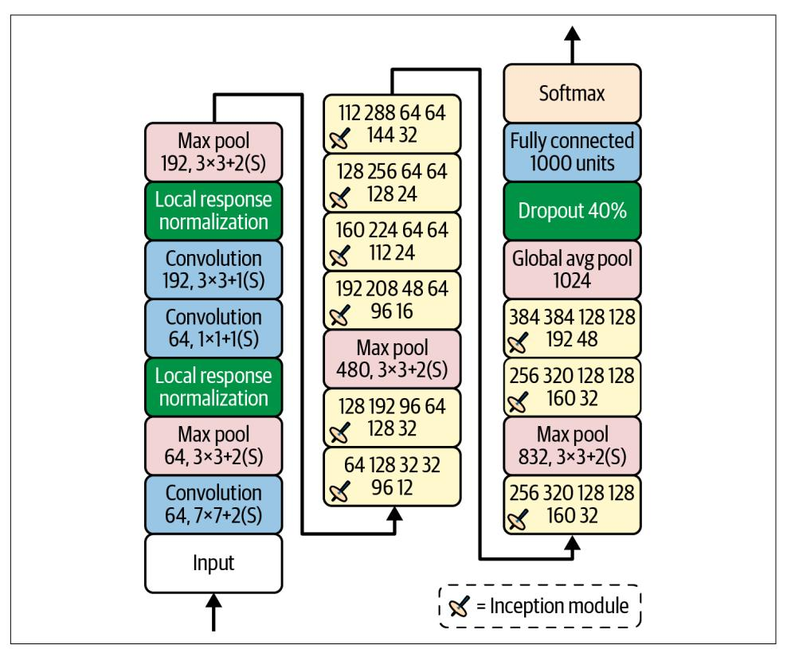

Figure 14-15. GoogLeNet architecture

{532}------------------------------------------------

The original GoogLeNet architecture included two auxiliary classifiers plugged on top of the third and sixth inception modules. They were both composed of one average pooling layer, one convolutional layer, two fully connected layers, and a softmax activation layer. During training, their loss (scaled down by 70%) was added to the overall loss. The goal was to fight the vanishing gradients problem and regularize the network, but it was later shown that their effect was relatively minor.

Several variants of the GoogLeNet architecture were later proposed by Google researchers, including Inception-v3 and Inception-v4, using slightly different inception modules to reach even better performance.

### **VGGNet**

The runner-up in the ILSVRC 2014 challenge was VGGNet,<sup>15</sup> Karen Simonyan and Andrew Zisserman, from the Visual Geometry Group (VGG) research lab at Oxford University, developed a very simple and classical architecture; it had 2 or 3 convolutional layers and a pooling layer, then again 2 or 3 convolutional layers and a pooling layer, and so on (reaching a total of 16 or 19 convolutional layers, depending on the VGG variant), plus a final dense network with 2 hidden layers and the output layer. It used small  $3 \times 3$  filters, but it had many of them.

#### **ResNet**

Kaiming He et al. won the ILSVRC 2015 challenge using a Residual Network (ResNet)<sup>16</sup> that delivered an astounding top-five error rate under 3.6%. The winning variant used an extremely deep CNN composed of 152 layers (other variants had 34, 50, and 101 layers). It confirmed the general trend: computer vision models were getting deeper and deeper, with fewer and fewer parameters. The key to being able to train such a deep network is to use skip connections (also called shortcut connections): the signal feeding into a layer is also added to the output of a layer located higher up the stack. Let's see why this is useful.

When training a neural network, the goal is to make it model a target function  $h(x)$ . If you add the input  $x$  to the output of the network (i.e., you add a skip connection), then the network will be forced to model  $f(x) = h(x) - x$  rather than  $h(x)$ . This is called residual learning (see Figure 14-16).

<sup>15</sup> Karen Simonyan and Andrew Zisserman, "Very Deep Convolutional Networks for Large-Scale Image Recognition", arXiv preprint arXiv:1409.1556 (2014).

<sup>16</sup> Kaiming He et al., "Deep Residual Learning for Image Recognition", arXiv preprint arXiv:1512:03385 (2015).

{533}------------------------------------------------

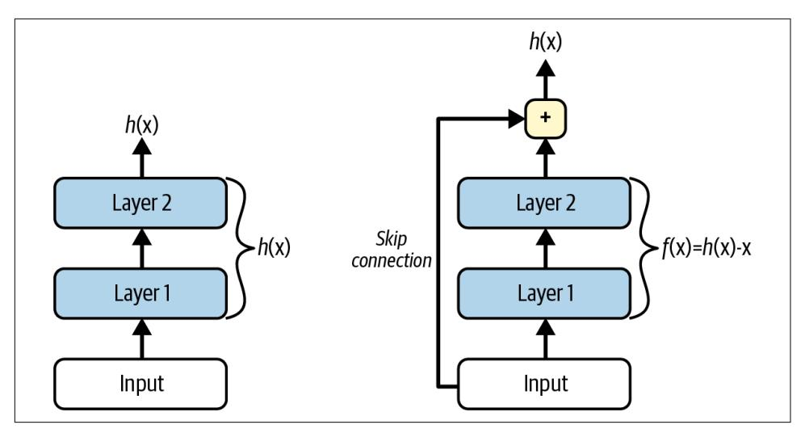

Figure 14-16. Residual learning

When you initialize a regular neural network, its weights are close to zero, so the network just outputs values close to zero. If you add a skip connection, the resulting network just outputs a copy of its inputs; in other words, it initially models the identity function. If the target function is fairly close to the identity function (which is often the case), this will speed up training considerably.

Moreover, if you add many skip connections, the network can start making progress even if several layers have not started learning yet (see Figure 14-17). Thanks to skip connections, the signal can easily make its way across the whole network. The deep residual network can be seen as a stack of *residual units* (RUs), where each residual unit is a small neural network with a skip connection.

Now let's look at ResNet's architecture (see Figure 14-18). It is surprisingly simple. It starts and ends exactly like GoogLeNet (except without a dropout layer), and in between is just a very deep stack of residual units. Each residual unit is composed of two convolutional layers (and no pooling layer!), with batch normalization (BN) and ReLU activation, using  $3 \times 3$  kernels and preserving spatial dimensions (stride 1, "same" padding).

{534}------------------------------------------------

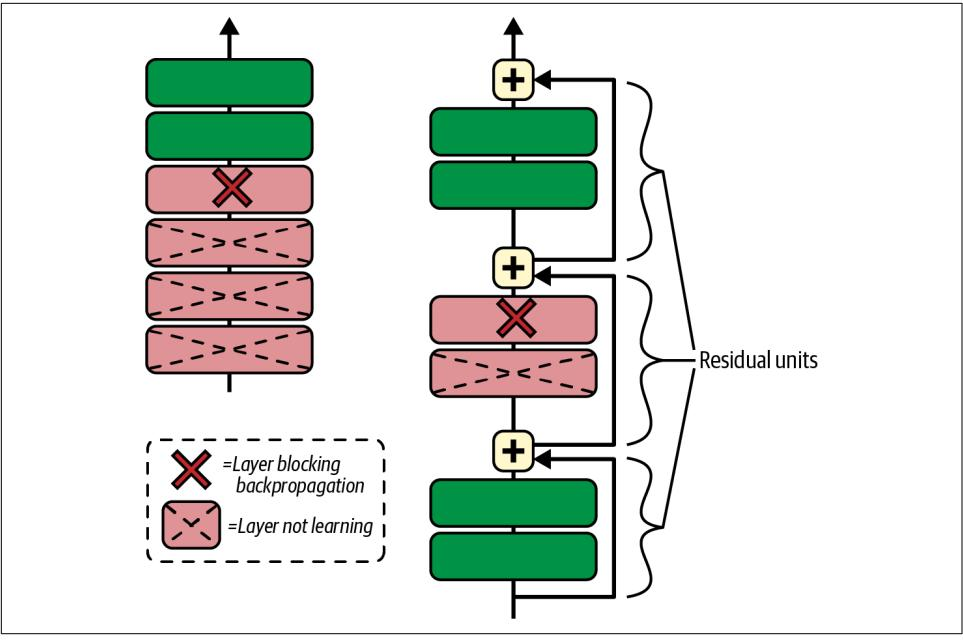

Figure 14-17. Regular deep neural network (left) and deep residual network (right)


Figure 14-18. ResNet architecture

{535}------------------------------------------------

Note that the number of feature maps is doubled every few residual units, at the same time as their height and width are halved (using a convolutional layer with stride 2). When this happens, the inputs cannot be added directly to the outputs of the residual unit because they don't have the same shape (for example, this problem affects the skip connection represented by the dashed arrow in Figure 14-18). To solve this problem, the inputs are passed through a  $1 \times 1$  convolutional layer with stride 2 and the right number of output feature maps (see Figure 14-19).


Figure 14-19. Skip connection when changing feature map size and depth

Different variations of the architecture exist, with different numbers of layers. ResNet-34 is a ResNet with 34 layers (only counting the convolutional layers and the fully connected layer)<sup>17</sup> containing 3 RUs that output 64 feature maps, 4 RUs with 128 maps, 6 RUs with 256 maps, and 3 RUs with 512 maps. We will implement this architecture later in this chapter.


Google's Inception-v4<sup>18</sup> architecture merged the ideas of GoogLe-Net and ResNet and achieved a top-five error rate of close to 3% on ImageNet classification.

ResNets deeper than that, such as ResNet-152, use slightly different residual units. Instead of two  $3 \times 3$  convolutional layers with, say, 256 feature maps, they use three convolutional layers: first a  $1 \times 1$  convolutional layer with just 64 feature maps (4  $\times$ less), which acts as a bottleneck layer (as discussed already), then a  $3 \times 3$  layer with 64 feature maps, and finally another  $1 \times 1$  convolutional layer with 256 feature maps (4 times 64) that restores the original depth. ResNet-152 contains 3 such RUs that

<sup>17</sup> It is a common practice when describing a neural network to count only layers with parameters.

<sup>18</sup> Christian Szegedy et al., "Inception-v4, Inception-ResNet and the Impact of Residual Connections on Learning", arXiv preprint arXiv:1602.07261 (2016).

{536}------------------------------------------------

output 256 maps, then 8 RUs with 512 maps, a whopping 36 RUs with 1,024 maps, and finally 3 RUs with 2,048 maps.

### **Xception**

Another variant of the GoogLeNet architecture is worth noting: Xception<sup>19</sup> (which stands for *Extreme Inception*) was proposed in 2016 by François Chollet (the author of Keras), and it significantly outperformed Inception-v3 on a huge vision task (350) million images and 17,000 classes). Just like Inception-v4, it merges the ideas of GoogLeNet and ResNet, but it replaces the inception modules with a special type of layer called a *depthwise separable convolution layer* (or *separable convolution layer* for short<sup>20</sup>). These layers had been used before in some CNN architectures, but they were not as central as in the Xception architecture. While a regular convolutional layer uses filters that try to simultaneously capture spatial patterns (e.g., an oval) and cross-channel patterns (e.g., mouth + nose + eyes = face), a separable convolutional layer makes the strong assumption that spatial patterns and cross-channel patterns can be modeled separately (see Figure 14-20). Thus, it is composed of two parts: the first part applies a single spatial filter to each input feature map, then the second part looks exclusively for cross-channel patterns—it is just a regular convolutional layer with  $1 \times 1$  filters.

Since separable convolutional layers only have one spatial filter per input channel, you should avoid using them after layers that have too few channels, such as the input layer (granted, that's what Figure 14-20 represents, but it is just for illustration purposes). For this reason, the Xception architecture starts with 2 regular convolutional layers, but then the rest of the architecture uses only separable convolutions (34 in all), plus a few max pooling layers and the usual final layers (a global average pooling layer and a dense output layer).

You might wonder why Xception is considered a variant of GoogLeNet, since it contains no inception modules at all. Well, as discussed earlier, an inception module contains convolutional layers with  $1 \times 1$  filters: these look exclusively for cross-channel patterns. However, the convolutional layers that sit on top of them are regular convolutional layers that look both for spatial and cross-channel patterns. So, you can think of an inception module as an intermediate between a regular convolutional layer (which considers spatial patterns and cross-channel patterns jointly) and a separable convolutional layer (which considers them separately). In practice, it seems that separable convolutional layers often perform better.

<sup>19</sup> François Chollet, "Xception: Deep Learning with Depthwise Separable Convolutions", arXiv preprint arXiv:1610.02357 (2016).

<sup>20</sup> This name can sometimes be ambiguous, since spatially separable convolutions are often called "separable" convolutions" as well.

{537}------------------------------------------------

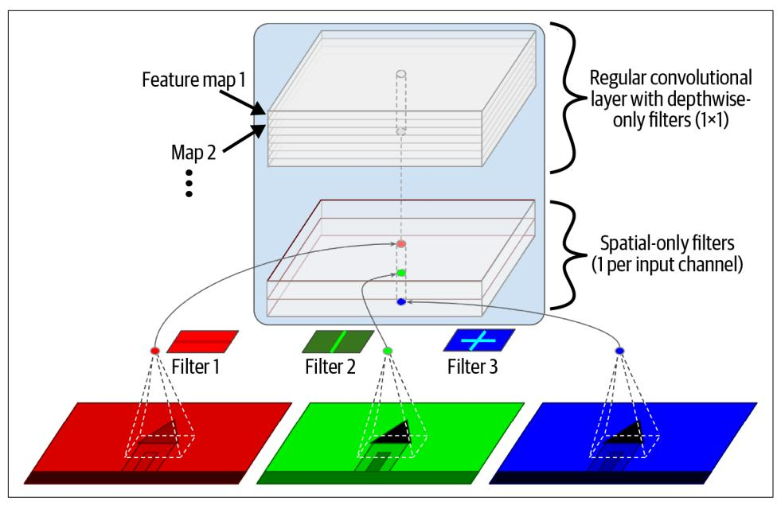

Figure 14-20. Depthwise separable convolutional layer


Separable convolutional layers use fewer parameters, less memory, and fewer computations than regular convolutional layers, and they often perform better. Consider using them by default, except after layers with few channels (such as the input channel). In Keras, just use SeparableConv2D instead of Conv2D: it's a drop-in replacement. Keras also offers a DepthwiseConv2D layer that implements the first part of a depthwise separable convolutional layer (i.e., applying one spatial filter per input feature map).

#### **SFNet**

The winning architecture in the ILSVRC 2017 challenge was the Squeeze-and-Excitation Network (SENet).<sup>21</sup> This architecture extends existing architectures such as inception networks and ResNets, and boosts their performance. This allowed SENet to win the competition with an astonishing 2.25% top-five error rate! The extended versions of inception networks and ResNets are called SE-Inception and SE-ResNet, respectively. The boost comes from the fact that a SENet adds a small neural network, called an SE block, to every inception module or residual unit in the original architecture, as shown in Figure 14-21.

<sup>21</sup> Jie Hu et al., "Squeeze-and-Excitation Networks", Proceedings of the IEEE Conference on Computer Vision and Pattern Recognition (2018): 7132-7141.

{538}------------------------------------------------

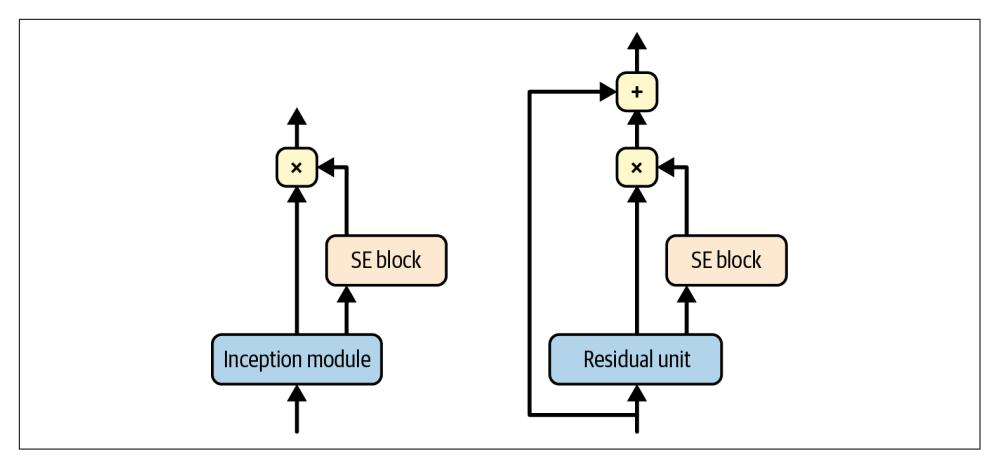

Figure 14-21. SE-Inception module (left) and SE-ResNet unit (right)

An SE block analyzes the output of the unit it is attached to, focusing exclusively on the depth dimension (it does not look for any spatial pattern), and it learns which features are usually most active together. It then uses this information to recalibrate the feature maps, as shown in Figure 14-22. For example, an SE block may learn that mouths, noses, and eyes usually appear together in pictures: if you see a mouth and a nose, you should expect to see eyes as well. So, if the block sees a strong activation in the mouth and nose feature maps, but only mild activation in the eye feature map, it will boost the eye feature map (more accurately, it will reduce irrelevant feature maps). If the eyes were somewhat confused with something else, this feature map recalibration will help resolve the ambiguity.

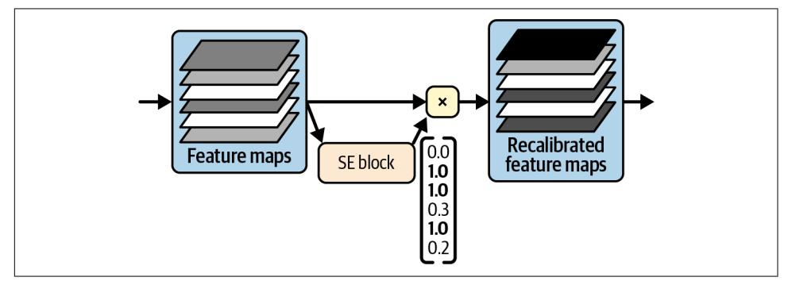

Figure 14-22. An SE block performs feature map recalibration

An SE block is composed of just three layers: a global average pooling layer, a hidden dense layer using the ReLU activation function, and a dense output layer using the sigmoid activation function (see Figure 14-23).

{539}------------------------------------------------


Figure 14-23. SE block architecture

As earlier, the global average pooling layer computes the mean activation for each feature map: for example, if its input contains 256 feature maps, it will output 256 numbers representing the overall level of response for each filter. The next layer is where the "squeeze" happens: this layer has significantly fewer than 256 neurons typically 16 times fewer than the number of feature maps (e.g., 16 neurons)—so the 256 numbers get compressed into a small vector (e.g., 16 dimensions). This is a low-dimensional vector representation (*i.e.*, an embedding) of the distribution of feature responses. This bottleneck step forces the SE block to learn a general representation of the feature combinations (we will see this principle in action again when we discuss autoencoders in Chapter 17). Finally, the output layer takes the embedding and outputs a recalibration vector containing one number per feature map (e.g., 256), each between 0 and 1. The feature maps are then multiplied by this recalibration vector, so irrelevant features (with a low recalibration score) get scaled down while relevant features (with a recalibration score close to 1) are left alone.

#### **Other Noteworthy Architectures**

There are many other CNN architectures to explore. Here's a brief overview of some of the most noteworthy:

#### $ResNeXt^{22}$

ResNeXt improves the residual units in ResNet. Whereas the residual units in the best ResNet models just contain 3 convolutional layers each, the ResNeXt residual units are composed of many parallel stacks (e.g., 32 stacks), with 3 convolutional layers each. However, the first two layers in each stack only use a few filters (e.g., just four), so the overall number of parameters remains the same as in ResNet. Then the outputs of all the stacks are added together, and the result is passed to the next residual unit (along with the skip connection).

<sup>22</sup> Saining Xie et al., "Aggregated Residual Transformations for Deep Neural Networks", arXiv preprint arXiv:1611.05431 (2016).

{540}------------------------------------------------

#### DenseNet<sup>23</sup>

A DenseNet is composed of several dense blocks, each made up of a few densely connected convolutional layers. This architecture achieved excellent accuracy while using comparatively few parameters. What does "densely connected" mean? The output of each layer is fed as input to every layer after it within the same block. For example, layer 4 in a block takes as input the depthwise concatenation of the outputs of layers 1, 2, and 3 in that block. Dense blocks are separated by a few transition layers.

#### $MobileNet<sup>24</sup>$

MobileNets are streamlined models designed to be lightweight and fast, making them popular in mobile and web applications. They are based on depthwise separable convolutional layers, like Xception. The authors proposed several variants, trading a bit of accuracy for faster and smaller models.

#### $CSPNet^{25}$

A Cross Stage Partial Network (CSPNet) is similar to a DenseNet, but part of each dense block's input is concatenated directly to that block's output, without going through the block.

#### EfficientNet<sup>26</sup>

EfficientNet is arguably the most important model in this list. The authors proposed a method to scale any CNN efficiently, by jointly increasing the depth (number of layers), width (number of filters per layer), and resolution (size of the input image) in a principled way. This is called *compound scaling*. They used neural architecture search to find a good architecture for a scaled-down version of ImageNet (with smaller and fewer images), and then used compound scaling to create larger and larger versions of this architecture. When EfficientNet models came out, they vastly outperformed all existing models, across all compute budgets, and they remain among the best models out there today.

Understanding EfficientNet's compound scaling method is helpful to gain a deeper understanding of CNNs, especially if you ever need to scale a CNN architecture. It is based on a logarithmic measure of the compute budget, noted  $\phi$ : if your compute budget doubles, then  $\phi$  increases by 1. In other words, the number of floating-point operations available for training is proportional to  $2^{\phi}$ . Your CNN architecture's depth,

<sup>23</sup> Gao Huang et al., "Densely Connected Convolutional Networks", arXiv preprint arXiv:1608.06993 (2016).

<sup>24</sup> Andrew G. Howard et al., "MobileNets: Efficient Convolutional Neural Networks for Mobile Vision Applications", arXiv preprint arxiv:1704.04861 (2017).

<sup>25</sup> Chien-Yao Wang et al., "CSPNet: A New Backbone That Can Enhance Learning Capability of CNN", arXiv preprint arXiv:1911.11929 (2019).

<sup>26</sup> Mingxing Tan and Quoc V. Le, "EfficientNet: Rethinking Model Scaling for Convolutional Neural Networks", arXiv preprint arXiv:1905.11946 (2019).

{541}------------------------------------------------

width, and resolution should scale as  $\alpha^{\phi}$ ,  $\beta^{\phi}$ , and  $\gamma^{\phi}$ , respectively. The factors  $\alpha$ ,  $\beta$ , and y must be greater than 1, and  $\alpha + \beta^2 + \gamma^2$  should be close to 2. The optimal values for these factors depend on the CNN's architecture. To find the optimal values for the EfficientNet architecture, the authors started with a small baseline model (EfficientNetB0), fixed  $\phi = 1$ , and simply ran a grid search: they found  $\alpha = 1.2$ ,  $\beta =$ 1.1, and  $\gamma = 1.1$ . They then used these factors to create several larger architectures, named EfficientNetB1 to EfficientNetB7, for increasing values of  $\phi$ .

#### **Choosing the Right CNN Architecture**

With so many CNN architectures, how do you choose which one is best for your project? Well, it depends on what matters most to you: Accuracy? Model size (e.g., for deployment to a mobile device)? Inference speed on CPU? On GPU? Table 14-3 lists the best pretrained models currently available in Keras (you'll see how to use them later in this chapter), sorted by model size. You can find the full list at https:// keras.io/api/applications. For each model, the table shows the Keras class name to use (in the tf.keras.applications package), the model's size in MB, the top-1 and top-5 validation accuracy on the ImageNet dataset, the number of parameters (millions), and the inference time on CPU and GPU in ms, using batches of 32 images on reasonably powerful hardware.<sup>27</sup> For each column, the best value is highlighted. As you can see, larger models are generally more accurate, but not always; for example, EfficientNetB2 outperforms InceptionV3 both in size and accuracy. I only kept Inception V3 in the list because it is almost twice as fast as Efficient Net B2 on a CPU. Similarly, InceptionResNetV2 is fast on a CPU, and ResNet50V2 and ResNet101V2 are blazingly fast on a GPU.

| Size (MB) |       |       |       | CPU (ms)                   | GPU (ms) |
|-----------|-------|-------|-------|----------------------------|----------|
| 14        | 71.3% | 90.1% | 3.5M  | 25.9                       | 3.8      |
| 16        | 70.4% | 89.5% | 4.3M  | 22.6                       | 3.4      |
| 23        | 74.4% | 91.9% | 5.3M  | 27.0                       | 6.7      |
| 29        | 77.1% | 93.3% | 5.3M  | 46.0                       | 4.9      |
| 31        | 79.1% | 94.4% | 7.9M  | 60.2                       | 5.6      |
| 36        | 80.1% | 94.9% | 9.2M  | 80.8                       | 6.5      |
| 48        | 81.6% | 95.7% | 12.3M | 140.0                      | 8.8      |
| 75        | 82.9% | 96.4% | 19.5M | 308.3                      | 15.1     |
| 92        | 77.9% | 93.7% | 23.9M | 42.2                       | 6.9      |
| 98        | 76.0% | 93.0% | 25.6M | 45.6                       | 4.4      |
|           |       |       |       | Top-1 acc Top-5 acc Params |          |

Table 14-3. Pretrained models available in Keras

27 A 92-core AMD EPYC CPU with IBPB, 1.7 TB of RAM, and an Nyidia Tesla A100 GPU.

{542}------------------------------------------------

| Class name        |     | Size (MB) Top-1 acc Top-5 acc Params CPU (ms) GPU (ms) |       |       |       |      |
|-------------------|-----|--------------------------------------------------------|-------|-------|-------|------|
| EfficientNetB5    | 118 | 83.6%                                                  | 96.7% | 30.6M | 579.2 | 25.3 |
| EfficientNetB6    | 166 | 84.0%                                                  | 96.8% | 43.3M | 958.1 | 40.4 |
| ResNet101V2       | 171 | 77.2%                                                  | 93.8% | 44.7M | 72.7  | 5.4  |
| InceptionResNetV2 | 215 | 80.3%                                                  | 95.3% | 55.9M | 130.2 | 10.0 |
| EfficientNetB7    | 256 | 84.3%                                                  | 97.0% | 66.7M | 15789 | 61.6 |

I hope you enjoyed this deep dive into the main CNN architectures! Now let's see how to implement one of them using Keras.

### Implementing a ResNet-34 CNN Using Keras

Most CNN architectures described so far can be implemented pretty naturally using Keras (although generally you would load a pretrained network instead, as you will see). To illustrate the process, let's implement a ResNet-34 from scratch with Keras. First, we'll create a ResidualUnit layer:

```
DefaultConv2D = partial(tf.keras.layers.Conv2D, kernel size=3, strides=1,
                         padding="same", kernel_initializer="he_normal",
                         use bias=False)
class ResidualUnit(tf.keras.layers.Layer):
    def __init__(self, filters, strides=1, activation="relu", **kwargs):
        super().__init__(**kwargs)
        self. activation = tf. keras. activations.get(activation)self.main layers = [DefaultConv2D(filters, strides=strides),
            tf.keras.layers.BatchNormalization(),
            self.activation,
            DefaultConv2D(filters),
            tf.keras.layers.BatchNormalization()
        \mathbf{1}self. skip\_layers = []if strides > 1:
            self.skip\_layers = [DefaultConv2D(filters, kernel size=1, strides=strides),
                 tf.keras.layers.BatchNormalization()
            \mathbf{1}def call(self, inputs):
        Z = \text{inputs}for layer in self.main_layers:
            Z = layer(Z)skip_Z = inputfor layer in self.skip layers:
            skip Z = \text{layer}(\text{skip } Z)return self.activation(Z +skip Z)
```

{543}------------------------------------------------

As you can see, this code matches Figure 14-19 pretty closely. In the constructor, we create all the layers we will need: the main layers are the ones on the right side of the diagram, and the skip layers are the ones on the left (only needed if the stride is greater than 1). Then in the call() method, we make the inputs go through the main layers and the skip layers (if any), and we add both outputs and apply the activation function.

Now we can build a ResNet-34 using a Sequential model, since it's really just a long sequence of layers—we can treat each residual unit as a single layer now that we have the ResidualUnit class. The code closely matches Figure 14-18:

```
model = tf.keras.Sequential(DefaultConv2D(64, kernel_size=7, strides=2, input_shape=[224, 224, 3]),
    tf.keras.layers.BatchNormalization(),
    tf.keras.layers.Activation("relu"),
    tf.keras.layers.MaxPool2D(pool_size=3, strides=2, padding="same"),
\left| \right\rangleprev_{tilters = 64}for filters in \lceil 64 \rceil * 3 + \lceil 128 \rceil * 4 + \lceil 256 \rceil * 6 + \lceil 512 \rceil * 3:
    strides = 1 if filters == prev filters else 2
    model.add(ResidualUnit(filters, strides=strides))
    prev filters = filters
model.add(tf.keras.layers.GlobalAvgPool2D())
model.add(tf.keras.layers.Flatten())
model.add(tf.keras.layers.Dense(10, activation="softmax"))
```

The only tricky part in this code is the loop that adds the ResidualUnit layers to the model: as explained earlier, the first 3 RUs have 64 filters, then the next 4 RUs have 128 filters, and so on. At each iteration, we must set the stride to 1 when the number of filters is the same as in the previous RU, or else we set it to 2; then we add the ResidualUnit, and finally we update prev filters.

It is amazing that in about 40 lines of code, we can build the model that won the ILSVRC 2015 challenge! This demonstrates both the elegance of the ResNet model and the expressiveness of the Keras API. Implementing the other CNN architectures is a bit longer, but not much harder. However, Keras comes with several of these architectures built in, so why not use them instead?

## **Using Pretrained Models from Keras**

In general, you won't have to implement standard models like GoogLeNet or ResNet manually, since pretrained networks are readily available with a single line of code in the tf.keras.applications package.

{544}------------------------------------------------

For example, you can load the ResNet-50 model, pretrained on ImageNet, with the following line of code:

```
model = tf.keras.applications.ResNet50(weights="imagenet")
```

That's all! This will create a ResNet-50 model and download weights pretrained on the ImageNet dataset. To use it, you first need to ensure that the images have the right size. A ResNet-50 model expects  $224 \times 224$ -pixel images (other models may expect other sizes, such as  $299 \times 299$ ), so let's use Keras's Resizing layer (introduced in Chapter 13) to resize two sample images (after cropping them to the target aspect ratio):

```
images = load_sample_images()["images"]
images_resized = tf.keras.layers.Resizing(height=224, width=224,
                                          crop_to_aspect_ratio=True)(images)
```

The pretrained models assume that the images are preprocessed in a specific way. In some cases they may expect the inputs to be scaled from 0 to 1, or from -1 to 1, and so on. Each model provides a preprocess\_input() function that you can use to preprocess your images. These functions assume that the original pixel values range from 0 to 255, which is the case here:

```
inputs = tf.keras.applications.resnet50.preprocess_input(images_resized)
```

Now we can use the pretrained model to make predictions:

```
\Rightarrow Y proba = model.predict(inputs)
>>> Y proba.shape
(2, 1000)
```

As usual, the output Y\_proba is a matrix with one row per image and one column per class (in this case, there are 1,000 classes). If you want to display the top  $K$ predictions, including the class name and the estimated probability of each predicted class, use the decode predictions() function. For each image, it returns an array containing the top K predictions, where each prediction is represented as an array containing the class identifier,<sup>28</sup> its name, and the corresponding confidence score:

```
top_K = tf.keras.applications.resnet50.decode_predictions(Y_proba, top=3)
for image_index in range(len(images)):
    print(f"Image #{image_index}")
    for class_id, name, y_proba in top_K[image_index]:
       print(f" {class_id} - {name:12s} {y_proba:.2%}")
```

The output looks like this:

<sup>28</sup> In the ImageNet dataset, each image is mapped to a word in the WordNet dataset: the class ID is just a WordNet ID.

{545}------------------------------------------------

| Image #0              |  |        |
|-----------------------|--|--------|
| n03877845 - palace    |  | 54.69% |
| n03781244 - monastery |  | 24.72% |
| n02825657 - bell cote |  | 18.55% |
| Image #1              |  |        |
| n04522168 - vase      |  | 32.66% |
| n11939491 - daisy     |  | 17.81% |
| n03530642 - honeycomb |  | 12.06% |
|                       |  |        |

The correct classes are palace and dahlia, so the model is correct for the first image but wrong for the second. However, that's because dahlia is not one of the 1,000 ImageNet classes. With that in mind, vase is a reasonable guess (perhaps the flower is in a vase?), and daisy is not a bad choice either, since dahlias and daisies are both from the same Compositae family.

As you can see, it is very easy to create a pretty good image classifier using a pretrained model. As you saw in Table 14-3, many other vision models are available in tf.keras.applications, from lightweight and fast models to large and accurate ones.

But what if you want to use an image classifier for classes of images that are not part of ImageNet? In that case, you may still benefit from the pretrained models by using them to perform transfer learning.

### **Pretrained Models for Transfer Learning**

If you want to build an image classifier but you do not have enough data to train it from scratch, then it is often a good idea to reuse the lower layers of a pretrained model, as we discussed in Chapter 11. For example, let's train a model to classify pictures of flowers, reusing a pretrained Xception model. First, we'll load the flowers dataset using TensorFlow Datasets (introduced in Chapter 13):

```
import tensorflow_datasets as tfds
dataset, info = tfds.load("tf_flowers", as_supervised=True, with_info=True)
dataset size = info.splits["train"].num examples # 3670class names = info.features["label"].names # f''dandelion", "daisy", ...]n_{\text{c}} classes = info.features["label"].num_classes # 5
```

Note that you can get information about the dataset by setting with\_info=True. Here, we get the dataset size and the names of the classes. Unfortunately, there is only a "train" dataset, no test set or validation set, so we need to split the training set. Let's call tfds. load() again, but this time taking the first 10% of the dataset for testing, the next 15% for validation, and the remaining 75% for training:

```
test_set_raw, valid_set_raw, train_set_raw = tfds.load(
   "tf_flowers",
   split=["train[:10%]", "train[10%:25%]", "train[25%:]"],
   as supervised=True)
```

{546}------------------------------------------------

All three datasets contain individual images. We need to batch them, but first we need to ensure they all have the same size, or batching will fail. We can use a Resizing layer for this. We must also call the tf.keras.applications. xception.preprocess\_input() function to preprocess the images appropriately for the Xception model. Lastly, we'll also shuffle the training set and use prefetching:

```
batch size = 32preprocess = tf.keras.Sequential[tf.keras.layers.Resizing(height=224, width=224, crop_to_aspect_ratio=True),
    tf.keras.layers.Lambda(tf.keras.applications.xception.preprocess_input)
\left| \right\rangletrain set = train set raw.map(lambda X, y: (preprocess(X), y))
train_set = train_set.shuffle(1000, seed=42).batch(batch_size).prefetch(1)
valid_set = valid_set_raw.map(lambda X, y: (preprocess(X), y)).batch(batch_size)
test set = test set raw.map(lambda X, y: (preprocess(X), y)).batch(batch size)
```

Now each batch contains 32 images, all of them  $224 \times 224$  pixels, with pixel values ranging from -1 to 1. Perfect!

Since the dataset is not very large, a bit of data augmentation will certainly help. Let's create a data augmentation model that we will embed in our final model. During training, it will randomly flip the images horizontally, rotate them a little bit, and tweak the contrast:

```
data augmentation = tf.keras. Sequential(\lceiltf.keras.layers.RandomFlip(mode="horizontal", seed=42),
    tf.keras.layers.RandomRotation(factor=0.05, seed=42),
    tf.keras.layers.RandomContrast(factor=0.2, seed=42)
\mathbf{I}
```


The tf.keras.preprocessing.image.ImageDataGenerator class makes it easy to load images from disk and augment them in various ways: you can shift each image, rotate it, rescale it, flip it horizontally or vertically, shear it, or apply any transformation function you want to it. This is very convenient for simple projects. However, a tf.data pipeline is not much more complicated, and it's generally faster. Moreover, if you have a GPU and you include the preprocessing or data augmentation layers inside your model, they will benefit from GPU acceleration during training.

Next let's load an Xception model, pretrained on ImageNet. We exclude the top of the network by setting include top=False. This excludes the global average pooling layer and the dense output layer. We then add our own global average pooling layer (feeding it the output of the base model), followed by a dense output layer with one unit per class, using the softmax activation function. Finally, we wrap all this in a Keras Model:

{547}------------------------------------------------

```
base_model = tf.keras.applications.xception.Xception(weights="imagenet",
                                                     include top=False)
avg = tf.keras.layers.GlobalAveragePooling2D()(base_model.output)
output = tf.keras.layers.Dense(n_classes, activation="softmax")(avg)
model = tf.keras.Model(inputs=base model.input, outputs=output)
```

As explained in Chapter 11, it's usually a good idea to freeze the weights of the pretrained layers, at least at the beginning of training:

```
for layer in base model. layers:
    layer.trainable = False
```


Since our model uses the base model's layers directly, rather than the base model object itself, setting base model.trainable=False would have no effect.

Finally, we can compile the model and start training:

```
optimize r = tf.keras.optimizers.SGD(learning rate=0.1, momentum=0.9)
model.compile(loss="sparse categorical crossentropy", optimizer=optimizer,
              metrics=["accuracy"])
history = model.fit(train_set, validation_data=valid_set, epochs=3)
```


If you are running in Colab, make sure the runtime is using a GPU: select Runtime  $\rightarrow$  "Change runtime type", choose "GPU" in the "Hardware accelerator" drop-down menu, then click Save. It's possible to train the model without a GPU, but it will be terribly slow (minutes per epoch, as opposed to seconds).

After training the model for a few epochs, its validation accuracy should reach a bit over 80% and then stop improving. This means that the top layers are now pretty well trained, and we are ready to unfreeze some of the base model's top layers, then continue training. For example, let's unfreeze layers 56 and above (that's the start of residual unit 7 out of 14, as you can see if you list the layer names):

```
for layer in base_model.layers[56:]:
   laver.trainable = True
```

Don't forget to compile the model whenever you freeze or unfreeze layers. Also make sure to use a much lower learning rate to avoid damaging the pretrained weights:

```
optimizer = tf.keras.optimizers.SGD(learning rate=0.01, momentum=0.9)
model.compile(loss="sparse_categorical_crossentropy", optimizer=optimizer,
              metrics=["accuracy"])
history = model.fit(train_set, validation_data=valid_set, epochs=10)
```

This model should reach around 92% accuracy on the test set, in just a few minutes of training (with a GPU). If you tune the hyperparameters, lower the learning rate, 

{548}------------------------------------------------

and train for quite a bit longer, you should be able to reach 95% to 97%. With that, you can start training amazing image classifiers on your own images and classes! But there's more to computer vision than just classification. For example, what if you also want to know where the flower is in a picture? Let's look at this now.

## **Classification and Localization**

Localizing an object in a picture can be expressed as a regression task, as discussed in Chapter 10: to predict a bounding box around the object, a common approach is to predict the horizontal and vertical coordinates of the object's center, as well as its height and width. This means we have four numbers to predict. It does not require much change to the model; we just need to add a second dense output layer with four units (typically on top of the global average pooling layer), and it can be trained using the MSE loss:

```
base_model = tf.keras.applications.xception.Xception(weights="imagenet",
                                                     include top=False)
avg = tf.keras.layers.GlobalAveragePooling2D()(base model.output)
class_output = tf.keras.layers.Dense(n_classes, activation="softmax")(avg)
loc_output = tf.keras.layers.Dense(4)(avg)
model = tf.keras.Model(inputs=base model.input,
                      outputs=[class output, loc output])
model.compile(loss=["sparse categorical crossentropy", "mse"],
              loss weights=[0.8, 0.2], # depends on what you care most about
              optimizer=optimizer, metrics=["accuracy"])
```

But now we have a problem: the flowers dataset does not have bounding boxes around the flowers. So, we need to add them ourselves. This is often one of the hardest and most costly parts of a machine learning project: getting the labels. It's a good idea to spend time looking for the right tools. To annotate images with bounding boxes, you may want to use an open source image labeling tool like VGG Image Annotator, LabelImg, OpenLabeler, or ImgLab, or perhaps a commercial tool like LabelBox or Supervisely. You may also want to consider crowdsourcing platforms such as Amazon Mechanical Turk if you have a very large number of images to annotate. However, it is quite a lot of work to set up a crowdsourcing platform, prepare the form to be sent to the workers, supervise them, and ensure that the quality of the bounding boxes they produce is good, so make sure it is worth the effort. Adriana Kovashka et al. wrote a very practical paper<sup>29</sup> about crowdsourcing in computer vision. I recommend you check it out, even if you do not plan to use crowdsourcing. If there are just a few hundred or a even a couple thousand images to label, and you don't plan to do this frequently, it may be preferable to do it

<sup>29</sup> Adriana Kovashka et al., "Crowdsourcing in Computer Vision", Foundations and Trends in Computer Graphics and Vision 10, no. 3 (2014): 177-243.

{549}------------------------------------------------

yourself: with the right tools, it will only take a few days, and you'll also gain a better understanding of your dataset and task.

Now let's suppose you've obtained the bounding boxes for every image in the flowers dataset (for now we will assume there is a single bounding box per image). You then need to create a dataset whose items will be batches of preprocessed images along with their class labels and their bounding boxes. Each item should be a tuple of the form (images, (class labels, bounding boxes)). Then you are ready to train your model!


The bounding boxes should be normalized so that the horizontal and vertical coordinates, as well as the height and width, all range from 0 to 1. Also, it is common to predict the square root of the height and width rather than the height and width directly: this way, a 10-pixel error for a large bounding box will not be penalized as much as a 10-pixel error for a small bounding box.

The MSE often works fairly well as a cost function to train the model, but it is not a great metric to evaluate how well the model can predict bounding boxes. The most common metric for this is the *intersection over union* (IoU): the area of overlap between the predicted bounding box and the target bounding box, divided by the area of their union (see Figure 14-24). In Keras, it is implemented by the tf.keras.metrics.MeanIoU class.

Classifying and localizing a single object is nice, but what if the images contain multiple objects (as is often the case in the flowers dataset)?


Figure 14-24. IoU metric for bounding boxes

{550}------------------------------------------------

## **Object Detection**

The task of classifying and localizing multiple objects in an image is called *object* detection. Until a few years ago, a common approach was to take a CNN that was trained to classify and locate a single object roughly centered in the image, then slide this CNN across the image and make predictions at each step. The CNN was generally trained to predict not only class probabilities and a bounding box, but also an *objectness score*: this is the estimated probability that the image does indeed contain an object centered near the middle. This is a binary classification output; it can be produced by a dense output layer with a single unit, using the sigmoid activation function and trained using the binary cross-entropy loss.


Instead of an objectness score, a "no-object" class was sometimes added, but in general this did not work as well: the questions "Is an object present?" and "What type of object is it?" are best answered separately.

This sliding-CNN approach is illustrated in Figure 14-25. In this example, the image was chopped into a  $5 \times 7$  grid, and we see a CNN—the thick black rectangle—sliding across all  $3 \times 3$  regions and making predictions at each step.


Figure 14-25. Detecting multiple objects by sliding a CNN across the image

{551}------------------------------------------------

In this figure, the CNN has already made predictions for three of these  $3 \times 3$  regions:

- When looking at the top-left  $3 \times 3$  region (centered on the red-shaded grid cell located in the second row and second column), it detected the leftmost rose. Notice that the predicted bounding box exceeds the boundary of this  $3 \times 3$ region. That's absolutely fine: even though the CNN could not see the bottom part of the rose, it was able to make a reasonable guess as to where it might be. It also predicted class probabilities, giving a high probability to the "rose" class. Lastly, it predicted a fairly high objectness score, since the center of the bounding box lies within the central grid cell (in this figure, the objectness score is represented by the thickness of the bounding box).
- When looking at the next  $3 \times 3$  region, one grid cell to the right (centered on the shaded blue square), it did not detect any flower centered in that region, so it predicted a very low objectness score; therefore, the predicted bounding box and class probabilities can safely be ignored. You can see that the predicted bounding box was no good anyway.
- finally, when looking at the next  $3 \times 3$  region, again one grid cell to the right (centered on the shaded green cell), it detected the rose at the top, although not perfectly: this rose is not well centered within this region, so the predicted objectness score was not very high.

You can imagine how sliding the CNN across the whole image would give you a total of 15 predicted bounding boxes, organized in a  $3 \times 5$  grid, with each bounding box accompanied by its estimated class probabilities and objectness score. Since objects can have varying sizes, you may then want to slide the CNN again across larger  $4 \times 4$ regions as well, to get even more bounding boxes.

This technique is fairly straightforward, but as you can see it will often detect the same object multiple times, at slightly different positions. Some postprocessing is needed to get rid of all the unnecessary bounding boxes. A common approach for this is called non-max suppression. Here's how it works:

- 1. First, get rid of all the bounding boxes for which the objectness score is below some threshold: since the CNN believes there's no object at that location, the bounding box is useless.
- 2. Find the remaining bounding box with the highest objectness score, and get rid of all the other remaining bounding boxes that overlap a lot with it (e.g., with an IoU greater than 60%). For example, in Figure 14-25, the bounding box with the max objectness score is the thick bounding box over the leftmost rose. The other bounding box that touches this same rose overlaps a lot with the max bounding box, so we will get rid of it (although in this example it would already have been removed in the previous step).

{552}------------------------------------------------

3. Repeat step 2 until there are no more bounding boxes to get rid of.

This simple approach to object detection works pretty well, but it requires running the CNN many times (15 times in this example), so it is quite slow. Fortunately, there is a much faster way to slide a CNN across an image: using a fully convolutional *network* (FCN).

#### **Fully Convolutional Networks**

The idea of FCNs was first introduced in a 2015 paper<sup>30</sup> by Jonathan Long et al., for semantic segmentation (the task of classifying every pixel in an image according to the class of the object it belongs to). The authors pointed out that you could replace the dense layers at the top of a CNN with convolutional layers. To understand this, let's look at an example: suppose a dense layer with 200 neurons sits on top of a convolutional layer that outputs 100 feature maps, each of size  $7 \times 7$  (this is the feature map size, not the kernel size). Each neuron will compute a weighted sum of all 100  $\times$  7  $\times$  7 activations from the convolutional layer (plus a bias term). Now let's see what happens if we replace the dense layer with a convolutional layer using 200 filters, each of size  $7 \times 7$ , and with "valid" padding. This layer will output 200 feature maps, each  $1 \times 1$  (since the kernel is exactly the size of the input feature maps and we are using "valid" padding). In other words, it will output 200 numbers, just like the dense layer did; and if you look closely at the computations performed by a convolutional layer, you will notice that these numbers will be precisely the same as those the dense layer produced. The only difference is that the dense layer's output was a tensor of shape [batch size, 200], while the convolutional layer will output a tensor of shape [batch size, 1, 1, 200].


To convert a dense layer to a convolutional layer, the number of filters in the convolutional layer must be equal to the number of units in the dense layer, the filter size must be equal to the size of the input feature maps, and you must use "valid" padding. The stride may be set to 1 or more, as you will see shortly.

Why is this important? Well, while a dense layer expects a specific input size (since it has one weight per input feature), a convolutional layer will happily process images of any size<sup>31</sup> (however, it does expect its inputs to have a specific number of channels, since each kernel contains a different set of weights for each input channel). Since

<sup>30</sup> Jonathan Long et al., "Fully Convolutional Networks for Semantic Segmentation", Proceedings of the IEEE Conference on Computer Vision and Pattern Recognition (2015): 3431-3440.

<sup>31</sup> There is one small exception: a convolutional layer using "valid" padding will complain if the input size is smaller than the kernel size.

{553}------------------------------------------------

an FCN contains only convolutional layers (and pooling layers, which have the same property), it can be trained and executed on images of any size!

For example, suppose we'd already trained a CNN for flower classification and localization. It was trained on  $224 \times 224$  images, and it outputs 10 numbers:

- Outputs 0 to 4 are sent through the softmax activation function, and this gives the class probabilities (one per class).
- Output 5 is sent through the sigmoid activation function, and this gives the objectness score.
- Outputs 6 and 7 represent the bounding box's center coordinates; they also go through a sigmoid activation function to ensure they range from 0 to 1.
- Lastly, outputs 8 and 9 represent the bounding box's height and width; they do not go through any activation function to allow the bounding boxes to extend beyond the borders of the image.

We can now convert the CNN's dense layers to convolutional layers. In fact, we don't even need to retrain it; we can just copy the weights from the dense layers to the convolutional layers! Alternatively, we could have converted the CNN into an FCN before training.

Now suppose the last convolutional layer before the output layer (also called the bottleneck layer) outputs  $7 \times 7$  feature maps when the network is fed a 224  $\times$  224 image (see the left side of Figure 14-26). If we feed the FCN a 448  $\times$  448 image (see the right side of Figure 14-26), the bottleneck layer will now output  $14 \times 14$ feature maps.<sup>32</sup> Since the dense output layer was replaced by a convolutional layer using 10 filters of size  $7 \times 7$ , with "valid" padding and stride 1, the output will be composed of 10 features maps, each of size  $8 \times 8$  (since  $14 - 7 + 1 = 8$ ). In other words, the FCN will process the whole image only once, and it will output an  $8 \times$ 8 grid where each cell contains 10 numbers (5 class probabilities, 1 objectness score, and 4 bounding box coordinates). It's exactly like taking the original CNN and sliding it across the image using 8 steps per row and 8 steps per column. To visualize this, imagine chopping the original image into a  $14 \times 14$  grid, then sliding a  $7 \times 7$  window across this grid; there will be  $8 \times 8 = 64$  possible locations for the window, hence  $8 \times$ 8 predictions. However, the FCN approach is *much* more efficient, since the network only looks at the image once. In fact, You Only Look Once (YOLO) is the name of a very popular object detection architecture, which we'll look at next.

<sup>32</sup> This assumes we used only "same" padding in the network: "valid" padding would reduce the size of the feature maps. Moreover, 448 can be neatly divided by 2 several times until we reach 7, without any rounding error. If any layer uses a different stride than 1 or 2, then there may be some rounding error, so again the feature maps may end up being smaller.

{554}------------------------------------------------


Figure 14-26. The same fully convolutional network processing a small image (left) and a large one (right)

### **You Only Look Once**

YOLO is a fast and accurate object detection architecture proposed by Joseph Redmon et al. in a 2015 paper.<sup>33</sup> It is so fast that it can run in real time on a video, as seen in Redmon's demo. YOLO's architecture is quite similar to the one we just discussed, but with a few important differences:

• For each grid cell, YOLO only considers objects whose bounding box center lies within that cell. The bounding box coordinates are relative to that cell, where  $(0, 0)$  means the top-left corner of the cell and  $(1, 1)$  means the bottom right. However, the bounding box's height and width may extend well beyond the cell.

<sup>33</sup> Joseph Redmon et al., "You Only Look Once: Unified, Real-Time Object Detection", Proceedings of the IEEE Conference on Computer Vision and Pattern Recognition (2016): 779-788.

{555}------------------------------------------------

- It outputs two bounding boxes for each grid cell (instead of just one), which allows the model to handle cases where two objects are so close to each other that their bounding box centers lie within the same cell. Each bounding box also comes with its own objectness score.
- YOLO also outputs a class probability distribution for each grid cell, predicting 20 class probabilities per grid cell since YOLO was trained on the PASCAL VOC dataset, which contains 20 classes. This produces a coarse class probability map. Note that the model predicts one class probability distribution per grid cell, not per bounding box. However, it's possible to estimate class probabilities for each bounding box during postprocessing, by measuring how well each bounding box matches each class in the class probability map. For example, imagine a picture of a person standing in front of a car. There will be two bounding boxes: one large horizontal one for the car, and a smaller vertical one for the person. These bounding boxes may have their centers within the same grid cell. So how can we tell which class should be assigned to each bounding box? Well, the class probability map will contain a large region where the "car" class is dominant, and inside it there will be a smaller region where the "person" class is dominant. Hopefully, the car's bounding box will roughly match the "car" region, while the person's bounding box will roughly match the "person" region: this will allow the correct class to be assigned to each bounding box.

YOLO was originally developed using Darknet, an open source deep learning framework initially developed in C by Joseph Redmon, but it was soon ported to Tensor-Flow, Keras, PyTorch, and more. It was continuously improved over the years, with YOLOv2, YOLOv3, and YOLO9000 (again by Joseph Redmon et al.), YOLOv4 (by Alexey Bochkovskiy et al.), YOLOv5 (by Glenn Jocher), and PP-YOLO (by Xiang Long et al.).

Each version brought some impressive improvements in speed and accuracy, using a variety of techniques; for example, YOLOv3 boosted accuracy in part thanks to *anchor priors*, exploiting the fact that some bounding box shapes are more likely than others, depending on the class (e.g., people tend to have vertical bounding boxes, while cars usually don't). They also increased the number of bounding boxes per grid cell, they trained on different datasets with many more classes (up to 9,000 classes organized in a hierarchy in the case of YOLO9000), they added skip connections to recover some of the spatial resolution that is lost in the CNN (we will discuss this shortly, when we look at semantic segmentation), and much more. There are many variants of these models too, such as YOLOv4-tiny, which is optimized to be trained on less powerful machines and which can run extremely fast (at over 1,000 frames per second!), but with a slightly lower mean average precision (mAP).

{556}------------------------------------------------

#### **Mean Average Precision**

A very common metric used in object detection tasks is the mean average precision. "Mean average" sounds a bit redundant, doesn't it? To understand this metric, let's go back to two classification metrics we discussed in Chapter 3: precision and recall. Remember the trade-off: the higher the recall, the lower the precision. You can visualize this in a precision/recall curve (see Figure 3-6). To summarize this curve into a single number, we could compute its area under the curve (AUC). But note that the precision/recall curve may contain a few sections where precision actually goes up when recall increases, especially at low recall values (you can see this at the top left of Figure 3-6). This is one of the motivations for the mAP metric.

Suppose the classifier has 90% precision at 10% recall, but 96% precision at 20% recall. There's really no trade-off here: it simply makes more sense to use the classifier at 20% recall rather than at 10% recall, as you will get both higher recall and higher precision. So instead of looking at the precision at 10% recall, we should really be looking at the *maximum* precision that the classifier can offer with *at least* 10% recall. It would be 96%, not 90%. Therefore, one way to get a fair idea of the model's performance is to compute the maximum precision you can get with at least 0% recall, then 10% recall, 20%, and so on up to 100%, and then calculate the mean of these maximum precisions. This is called the *average precision* (AP) metric. Now when there are more than two classes, we can compute the AP for each class, and then compute the mean AP (mAP). That's it!

In an object detection system, there is an additional level of complexity: what if the system detected the correct class, but at the wrong location (i.e., the bounding box is completely off)? Surely we should not count this as a positive prediction. One approach is to define an IoU threshold: for example, we may consider that a prediction is correct only if the IoU is greater than, say, 0.5, and the predicted class is correct. The corresponding mAP is generally noted mAP@0.5 (or mAP@50%, or sometimes just  $AP_{50}$ ). In some competitions (such as the PASCAL VOC challenge), this is what is done. In others (such as the COCO competition), the mAP is computed for different IoU thresholds (0.50, 0.55, 0.60, ..., 0.95), and the final metric is the mean of all these mAPs (noted mAP@[.50:.95] or mAP@[.50:0.05:.95]). Yes, that's a mean mean average.

{557}------------------------------------------------

Many object detection models are available on TensorFlow Hub, often with pretrained weights, such as YOLOv5,<sup>34</sup> SSD,<sup>35</sup> Faster R-CNN,<sup>36</sup> and EfficentDet.<sup>37</sup>

SSD and EfficientDet are "look once" detection models, similar to YOLO. Efficient-Det is based on the EfficientNet convolutional architecture. Faster R-CNN is more complex: the image first goes through a CNN, then the output is passed to a region *proposal network* (RPN) that proposes bounding boxes that are most likely to contain an object; a classifier is then run for each bounding box, based on the cropped output of the CNN. The best place to start using these models is TensorFlow Hub's excellent object detection tutorial.

So far, we've only considered detecting objects in single images. But what about videos? Objects must not only be detected in each frame, they must also be tracked over time. Let's take a quick look at object tracking now.

### **Object Tracking**

Object tracking is a challenging task: objects move, they may grow or shrink as they get closer to or further away from the camera, their appearance may change as they turn around or move to different lighting conditions or backgrounds, they may be temporarily occluded by other objects, and so on.

One of the most popular object tracking systems is DeepSORT.<sup>38</sup> It is based on a combination of classical algorithms and deep learning:

- It uses Kalman filters to estimate the most likely current position of an object given prior detections, and assuming that objects tend to move at a constant speed.
- It uses a deep learning model to measure the resemblance between new detections and existing tracked objects.

- 36 Shaoqing Ren et al., "Faster R-CNN: Towards Real-Time Object Detection with Region Proposal Networks", Proceedings of the 28th International Conference on Neural Information Processing Systems 1 (2015): 91-99.
- 37 Mingxing Tan et al., "EfficientDet: Scalable and Efficient Object Detection", arXiv preprint arXiv:1911.09070  $(2019).$

<sup>34</sup> You can find YOLOv3, YOLOv4, and their tiny variants in the TensorFlow Models project at https://homl.info/ *yolotf* 

<sup>35</sup> Wei Liu et al., "SSD: Single Shot Multibox Detector", Proceedings of the 14th European Conference on Computer Vision 1 (2016): 21-37.

<sup>38</sup> Nicolai Wojke et al., "Simple Online and Realtime Tracking with a Deep Association Metric", arXiv preprint arXiv:1703.07402 (2017).

{558}------------------------------------------------

• Lastly, it uses the *Hungarian algorithm* to map new detections to existing tracked objects (or to new tracked objects): this algorithm efficiently finds the combination of mappings that minimizes the distance between the detections and the predicted positions of tracked objects, while also minimizing the appearance discrepancy.

For example, imagine a red ball that just bounced off a blue ball traveling in the opposite direction. Based on the previous positions of the balls, the Kalman filter will predict that the balls will go through each other: indeed, it assumes that objects move at a constant speed, so it will not expect the bounce. If the Hungarian algorithm only considered positions, then it would happily map the new detections to the wrong balls, as if they had just gone through each other and swapped colors. But thanks to the resemblance measure, the Hungarian algorithm will notice the problem. Assuming the balls are not too similar, the algorithm will map the new detections to the correct balls.


There are a few DeepSORT implementations available on GitHub, including a TensorFlow implementation of YOLOv4 + DeepSORT: https://github.com/theAIGuysCode/yolov4-deepsort.

So far we have located objects using bounding boxes. This is often sufficient, but sometimes you need to locate objects with much more precision—for example, to remove the background behind a person during a videoconference call. Let's see how to go down to the pixel level.

## **Semantic Segmentation**

In semantic segmentation, each pixel is classified according to the class of the object it belongs to (e.g., road, car, pedestrian, building, etc.), as shown in Figure 14-27. Note that different objects of the same class are not distinguished. For example, all the bicycles on the right side of the segmented image end up as one big lump of pixels. The main difficulty in this task is that when images go through a regular CNN, they gradually lose their spatial resolution (due to the layers with strides greater than 1); so, a regular CNN may end up knowing that there's a person somewhere in the bottom left of the image, but it will not be much more precise than that.

{559}------------------------------------------------


Figure 14-27. Semantic segmentation

Just like for object detection, there are many different approaches to tackle this problem, some quite complex. However, a fairly simple solution was proposed in the 2015 paper by Jonathan Long et al. I mentioned earlier, on fully convolutional networks. The authors start by taking a pretrained CNN and turning it into an FCN. The CNN applies an overall stride of 32 to the input image (i.e., if you add up all the strides greater than 1), meaning the last layer outputs feature maps that are 32 times smaller than the input image. This is clearly too coarse, so they added a single *upsampling layer that multiplies the resolution by 32.* 

There are several solutions available for upsampling (increasing the size of an image), such as bilinear interpolation, but that only works reasonably well up to  $\times$ 4 or  $\times$ 8. Instead, they use a *transposed convolutional layer*<sup>39</sup> this is equivalent to first stretching the image by inserting empty rows and columns (full of zeros), then performing a regular convolution (see Figure 14-28). Alternatively, some people prefer to think of it as a regular convolutional layer that uses fractional strides (e.g., the stride is  $1/2$ in Figure 14-28). The transposed convolutional layer can be initialized to perform something close to linear interpolation, but since it is a trainable layer, it will learn to do better during training. In Keras, you can use the Conv2DTranspose layer.


In a transposed convolutional layer, the stride defines how much the input will be stretched, not the size of the filter steps, so the larger the stride, the larger the output (unlike for convolutional layers or pooling layers).

<sup>39</sup> This type of layer is sometimes referred to as a *deconvolution layer*, but it does not perform what mathematicians call a deconvolution, so this name should be avoided.

{560}------------------------------------------------


Figure 14-28. Upsampling using a transposed convolutional layer

#### **Other Keras Convolutional Layers** Keras also offers a few other kinds of convolutional layers: tf.keras.lavers.Conv1D A convolutional layer for 1D inputs, such as time series or text (sequences of letters or words), as you will see in Chapter 15. tf.keras.lavers.Conv3D A convolutional layer for 3D inputs, such as 3D PET scans. dilation rate Setting the dilation\_rate hyperparameter of any convolutional layer to a value of 2 or more creates an $\dot{a}$ -trous convolutional layer ("à trous" is French for "with holes"). This is equivalent to using a regular convolutional layer with a filter dilated by inserting rows and columns of zeros (i.e., holes). For example, a $1 \times$ 3 filter equal to [[1,2,3]] may be dilated with a *dilation rate* of 4, resulting in a dilated filter of $[1, 0, 0, 0, 2, 0, 0, 0, 3]$ . This lets the convolutional layer have a larger receptive field at no computational price and using no extra parameters.

Using transposed convolutional layers for upsampling is OK, but still too imprecise. To do better, Long et al. added skip connections from lower layers: for example, they upsampled the output image by a factor of 2 (instead of 32), and they added the output of a lower layer that had this double resolution. Then they upsampled the result by a factor of 16, leading to a total upsampling factor of 32 (see Figure 14-29). This recovered some of the spatial resolution that was lost in earlier pooling layers.

{561}------------------------------------------------

In their best architecture, they used a second similar skip connection to recover even finer details from an even lower layer. In short, the output of the original CNN goes through the following extra steps: upsample  $\times 2$ , add the output of a lower layer (of the appropriate scale), upsample  $\times$ 2, add the output of an even lower layer, and finally upsample  $\times$ 8. It is even possible to scale up beyond the size of the original image: this can be used to increase the resolution of an image, which is a technique called super-resolution.


Figure 14-29. Skip layers recover some spatial resolution from lower layers

*Instance segmentation* is similar to semantic segmentation, but instead of merging all objects of the same class into one big lump, each object is distinguished from the others (e.g., it identifies each individual bicycle). For example the Mask R-CNN architecture, proposed in a 2017 paper<sup>40</sup> by Kaiming He et al., extends the Faster R-CNN model by additionally producing a pixel mask for each bounding box. So, not only do you get a bounding box around each object, with a set of estimated class probabilities, but you also get a pixel mask that locates pixels in the bounding box that belong to the object. This model is available on TensorFlow Hub, pretrained on the COCO 2017 dataset. The field is moving fast, though so if you want to try the latest and greatest models, please check out the state-of-the-art section of https:// paperswithcode.com.

As you can see, the field of deep computer vision is vast and fast-paced, with all sorts of architectures popping up every year. Almost all of them are based on convolutional neural networks, but since 2020 another neural net architecture has entered the computer vision space: transformers (which we will discuss in Chapter 16). The progress made over the last decade has been astounding, and researchers are now focusing on harder and harder problems, such as *adversarial learning* (which attempts to make the network more resistant to images designed to fool it), explainability (understanding why the network makes a specific classification), realistic *image gen*eration (which we will come back to in Chapter 17), single-shot learning (a system that

<sup>40</sup> Kaiming He et al., "Mask R-CNN", arXiv preprint arXiv:1703.06870 (2017).

{562}------------------------------------------------

can recognize an object after it has seen it just once), predicting the next frames in a video, combining text and image tasks, and more.

Now on to the next chapter, where we will look at how to process sequential data such as time series using recurrent neural networks and convolutional neural networks.

### **Fxercises**

- 1. What are the advantages of a CNN over a fully connected DNN for image classification?
- 2. Consider a CNN composed of three convolutional layers, each with  $3 \times 3$  kernels, a stride of 2, and "same" padding. The lowest layer outputs 100 feature maps, the middle one outputs 200, and the top one outputs 400. The input images are RGB images of  $200 \times 300$  pixels:
  - a. What is the total number of parameters in the CNN?
  - b. If we are using 32-bit floats, at least how much RAM will this network require when making a prediction for a single instance?
  - c. What about when training on a mini-batch of 50 images?
- 3. If your GPU runs out of memory while training a CNN, what are five things you could try to solve the problem?
- 4. Why would you want to add a max pooling layer rather than a convolutional layer with the same stride?
- 5. When would you want to add a local response normalization layer?
- 6. Can you name the main innovations in AlexNet, as compared to LeNet-5? What about the main innovations in GoogLeNet, ResNet, SENet, Xception, and EfficientNet?
- 7. What is a fully convolutional network? How can you convert a dense layer into a convolutional layer?
- 8. What is the main technical difficulty of semantic segmentation?
- 9. Build your own CNN from scratch and try to achieve the highest possible accuracy on MNIST.
- 10. Use transfer learning for large image classification, going through these steps:
  - a. Create a training set containing at least 100 images per class. For example, you could classify your own pictures based on the location (beach, mountain, city, etc.), or alternatively you can use an existing dataset (e.g., from TensorFlow Datasets).
  - **b.** Split it into a training set, a validation set, and a test set.

{563}------------------------------------------------

- c. Build the input pipeline, apply the appropriate preprocessing operations, and optionally add data augmentation.
- d. Fine-tune a pretrained model on this dataset.
- 11. Go through TensorFlow's Style Transfer tutorial. This is a fun way to generate art using deep learning.

Solutions to these exercises are available at the end of this chapter's notebook, at https://homl.info/colab3.

{564}------------------------------------------------

## **CHAPTER 15 Processing Sequences Using RNNs and CNNs**

Predicting the future is something you do all the time, whether you are finishing a friend's sentence or anticipating the smell of coffee at breakfast. In this chapter we will discuss recurrent neural networks (RNNs)—a class of nets that can predict the future (well, up to a point). RNNs can analyze time series data, such as the number of daily active users on your website, the hourly temperature in your city, your home's daily power consumption, the trajectories of nearby cars, and more. Once an RNN learns past patterns in the data, it is able to use its knowledge to forecast the future, assuming of course that past patterns still hold in the future.

More generally, RNNs can work on sequences of arbitrary lengths, rather than on fixed-sized inputs. For example, they can take sentences, documents, or audio samples as input, making them extremely useful for natural language processing applications such as automatic translation or speech-to-text.

In this chapter, we will first go through the fundamental concepts underlying RNNs and how to train them using backpropagation through time. Then, we will use them to forecast a time series. Along the way, we will look at the popular ARMA family of models, often used to forecast time series, and use them as baselines to compare with our RNNs. After that, we'll explore the two main difficulties that RNNs face:

- Unstable gradients (discussed in Chapter 11), which can be alleviated using various techniques, including recurrent dropout and recurrent layer normalization.
- A (very) limited short-term memory, which can be extended using LSTM and GRU cells.

{565}------------------------------------------------

RNNs are not the only types of neural networks capable of handling sequential data. For small sequences, a regular dense network can do the trick, and for very long sequences, such as audio samples or text, convolutional neural networks can actually work quite well too. We will discuss both of these possibilities, and we will finish this chapter by implementing a WaveNet—a CNN architecture capable of handling sequences of tens of thousands of time steps. Let's get started!

### **Recurrent Neurons and Layers**

Up to now we have focused on feedforward neural networks, where the activations flow only in one direction, from the input layer to the output layer. A recurrent neural network looks very much like a feedforward neural network, except it also has connections pointing backward.

Let's look at the simplest possible RNN, composed of one neuron receiving inputs, producing an output, and sending that output back to itself, as shown in Figure 15-1 (left). At each *time step t* (also called a *frame*), this *recurrent neuron* receives the inputs  $\mathbf{x}_{(t)}$  as well as its own output from the previous time step,  $\hat{y}_{(t-1)}$ . Since there is no previous output at the first time step, it is generally set to 0. We can represent this tiny network against the time axis, as shown in Figure 15-1 (right). This is called unrolling *the network through time* (it's the same recurrent neuron represented once per time step).

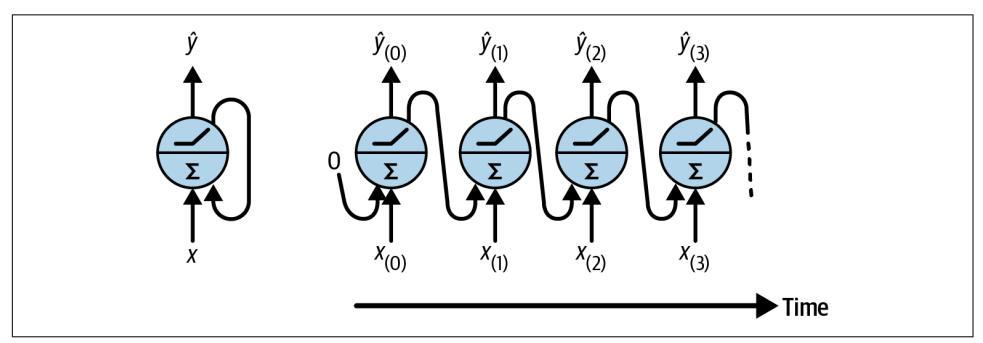

Figure 15-1. A recurrent neuron (left) unrolled through time (right)

You can easily create a layer of recurrent neurons. At each time step t, every neuron receives both the input vector  $\mathbf{x}_{(t)}$  and the output vector from the previous time step  $\hat{\mathbf{y}}_{(t-1)}$ , as shown in Figure 15-2. Note that both the inputs and outputs are now vectors (when there was just a single neuron, the output was a scalar).

{566}------------------------------------------------


Figure 15-2. A layer of recurrent neurons (left) unrolled through time (right)

Each recurrent neuron has two sets of weights: one for the inputs  $\mathbf{x}_{(t)}$  and the other for the outputs of the previous time step,  $\hat{y}_{(t-1)}$ . Let's call these weight vectors  $w_x$  and  $w_y$ . If we consider the whole recurrent layer instead of just one recurrent neuron, we can place all the weight vectors in two weight matrices:  $W_x$  and  $W_y$ .

The output vector of the whole recurrent layer can then be computed pretty much as you might expect, as shown in Equation 15-1, where **b** is the bias vector and  $\phi(\cdot)$  is the activation function (e.g., ReLU<sup>1</sup>).

Equation 15-1. Output of a recurrent layer for a single instance

 $\hat{\mathbf{y}}_{(t)} = \varphi(\mathbf{W}_x^\top \mathbf{x}_{(t)} + \mathbf{W}_\vartheta^\top \hat{\mathbf{y}}_{(t-1)} + \mathbf{b})$ 

Just as with feedforward neural networks, we can compute a recurrent layer's output in one shot for an entire mini-batch by placing all the inputs at time step  $t$  into an input matrix  $\mathbf{X}_{(t)}$  (see Equation 15-2).

Equation 15-2. Outputs of a layer of recurrent neurons for all instances in a pass: Imini-batch

$$
\hat{\mathbf{Y}}(t) = \varphi \big( \mathbf{X}(t) \mathbf{W}_x + \hat{\mathbf{Y}}(t-1) \mathbf{W}_y + \mathbf{b} \big)
$$
\n
$$
= \varphi \big( \big[ \mathbf{X}(t) \quad \hat{\mathbf{Y}}(t-1) \big] \mathbf{W} + \mathbf{b} \big) \text{ with } \mathbf{W} = \begin{bmatrix} \mathbf{W}_x \\ \mathbf{W}_y \end{bmatrix}
$$

<sup>1</sup> Note that many researchers prefer to use the hyperbolic tangent (tanh) activation function in RNNs rather than the ReLU activation function. For example, see Vu Pham et al.'s 2013 paper "Dropout Improves Recurrent Neural Networks for Handwriting Recognition". ReLU-based RNNs are also possible, as shown in Quoc V. Le et al.'s 2015 paper "A Simple Way to Initialize Recurrent Networks of Rectified Linear Units".

{567}------------------------------------------------

In this equation:

- $\hat{Y}_{(t)}$  is an  $m \times n_{\text{neurons}}$  matrix containing the layer's outputs at time step t for each instance in the mini-batch ( $m$  is the number of instances in the mini-batch and  $n_{\text{neurons}}$  is the number of neurons).
- $X_{(t)}$  is an  $m \times n_{\text{inputs}}$  matrix containing the inputs for all instances  $(n_{\text{inputs}})$  is the number of input features).
- $W_x$  is an  $n_{\text{inputs}} \times n_{\text{neurons}}$  matrix containing the connection weights for the inputs of the current time step.
- $W_{\gamma}$  is an  $n_{\text{neurons}} \times n_{\text{neurons}}$  matrix containing the connection weights for the outputs of the previous time step.
- $\bullet$  **b** is a vector of size  $n_{\text{neurons}}$  containing each neuron's bias term.
- The weight matrices  $W_x$  and  $W_y$  are often concatenated vertically into a single weight matrix **W** of shape  $(n_{\text{inputs}} + n_{\text{neurons}}) \times n_{\text{neurons}}$  (see the second line of Equation 15-2).
- The notation  $[\mathbf{X}_{(t)}, \hat{\mathbf{Y}}_{(t-1)}]$  represents the horizontal concatenation of the matrices  $\mathbf{X}_{(t)}$  and  $\hat{\mathbf{Y}}_{(t-1)}$ .

Notice that  $\hat{Y}_{(t)}$  is a function of  $X_{(t)}$  and  $\hat{Y}_{(t-1)}$ , which is a function of  $X_{(t-1)}$  and  $\hat{Y}_{(t-2)}$ , which is a function of  $X_{(t-2)}$  and  $\hat{Y}_{(t-3)}$ , and so on. This makes  $\hat{Y}_{(t)}$  a function of all the inputs since time  $t = 0$  (that is,  $\mathbf{X}_{(0)}, \mathbf{X}_{(1)}, \dots, \mathbf{X}_{(t)}$ ). At the first time step,  $t = 0$ , there are no previous outputs, so they are typically assumed to be all zeros.

### **Memory Cells**

Since the output of a recurrent neuron at time step  $t$  is a function of all the inputs from previous time steps, you could say it has a form of memory. A part of a neural network that preserves some state across time steps is called a *memory cell* (or simply a cell). A single recurrent neuron, or a layer of recurrent neurons, is a very basic cell, capable of learning only short patterns (typically about 10 steps long, but this varies depending on the task). Later in this chapter, we will look at some more complex and powerful types of cells capable of learning longer patterns (roughly 10 times longer, but again, this depends on the task).

A cell's state at time step t, denoted  $h_{(t)}$  (the "h" stands for "hidden"), is a function of some inputs at that time step and its state at the previous time step:  $\mathbf{h}_{(t)} = f(\mathbf{x}_{(t)}, \mathbf{h}_{(t-1)})$ . Its output at time step t, denoted  $\hat{y}_{(t)}$  is also a function of the previous state and the current inputs. In the case of the basic cells we have discussed so far, the output is just equal to the state, but in more complex cells this is not always the case, as shown in **Figure 15-3.** 

{568}------------------------------------------------


Figure 15-3. A cell's hidden state and its output may be different

### **Input and Output Sequences**

An RNN can simultaneously take a sequence of inputs and produce a sequence of outputs (see the top-left network in Figure 15-4). This type of sequence-to-sequence network is useful to forecast time series, such as your home's daily power consumption: you feed it the data over the last  $N$  days, and you train it to output the power consumption shifted by one day into the future (i.e., from  $N - 1$  days ago to tomorrow).

Alternatively, you could feed the network a sequence of inputs and ignore all outputs except for the last one (see the top-right network in Figure 15-4). This is a sequenceto-vector network. For example, you could feed the network a sequence of words corresponding to a movie review, and the network would output a sentiment score (e.g., from  $0$  [hate] to  $1$  [love]).

Conversely, you could feed the network the same input vector over and over again at each time step and let it output a sequence (see the bottom-left network of Figure 15-4). This is a *vector-to-sequence network*. For example, the input could be an image (or the output of a CNN), and the output could be a caption for that image.

Lastly, you could have a sequence-to-vector network, called an encoder, followed by a vector-to-sequence network, called a *decoder* (see the bottom-right network of Figure 15-4). For example, this could be used for translating a sentence from one language to another. You would feed the network a sentence in one language, the encoder would convert this sentence into a single vector representation, and then the decoder would decode this vector into a sentence in another language. This two-step model, called an *encoder-decoder*,<sup>2</sup> works much better than trying to translate on the fly with a single sequence-to-sequence RNN (like the one represented at the top left): the last words of a sentence can affect the first words of the translation, so you

<sup>2</sup> Nal Kalchbrenner and Phil Blunsom, "Recurrent Continuous Translation Models", Proceedings of the 2013 Conference on Empirical Methods in Natural Language Processing (2013): 1700-1709.

{569}------------------------------------------------

need to wait until you have seen the whole sentence before translating it. We will go through the implementation of an encoder-decoder in Chapter 16 (as you will see, it is a bit more complex than what Figure 15-4 suggests).


Figure 15-4. Sequence-to-sequence (top left), sequence-to-vector (top right), vector-tosequence (bottom left), and encoder-decoder (bottom right) networks

This versatility sounds promising, but how do you train a recurrent neural network?

## **Training RNNs**

To train an RNN, the trick is to unroll it through time (like we just did) and then use regular backpropagation (see Figure 15-5). This strategy is called backpropagation through time (BPTT).

Just like in regular backpropagation, there is a first forward pass through the unrolled network (represented by the dashed arrows). Then the output sequence is evaluated using a loss function  $\mathscr{L}(\mathbf{Y}_{(0)}, \mathbf{Y}_{(1)}, \ldots, \mathbf{Y}_{(T)}; \hat{\mathbf{Y}}_{(0)}, \hat{\mathbf{Y}}_{(1)}, \ldots, \hat{\mathbf{Y}}_{(T)})$  (where  $\mathbf{Y}_{(i)}$  is the *i*<sup>th</sup> target,  $\hat{Y}_{(i)}$  is the *i*<sup>th</sup> prediction, and *T* is the max time step). Note that this loss function may ignore some outputs. For example, in a sequence-to-vector RNN, all outputs are ignored except for the very last one. In Figure 15-5, the loss function is computed based on the last three outputs only. The gradients of that loss function are then propagated backward through the unrolled network (represented by the solid arrows). In this example, since the outputs  $\hat{Y}_{(0)}$  and  $\hat{Y}_{(1)}$  are not used to compute the loss, the gradients do not flow backward through them; they only flow through

{570}------------------------------------------------

 $\hat{Y}_{(2)}$ ,  $\hat{Y}_{(3)}$  and  $\hat{Y}_{(4)}$ . Moreover, since the same parameters W and b are used at each time step, their gradients will be tweaked multiple times during backprop. Once the backward phase is complete and all the gradients have been computed, BPTT can perform a gradient descent step to update the parameters (this is no different from regular backprop).


Figure 15-5. Backpropagation through time

Fortunately, Keras takes care of all of this complexity for you, as you will see. But before we get there, let's load a time series and start analyzing it using classical tools to better understand what we're dealing with, and to get some baseline metrics.

### **Forecasting a Time Series**

All right! Let's pretend you've just been hired as a data scientist by Chicago's Transit Authority. Your first task is to build a model capable of forecasting the number of passengers that will ride on bus and rail the next day. You have access to daily ridership data since 2001. Let's walk through together how you would handle this. We'll start by loading and cleaning up the data:<sup>3</sup>

```
import pandas as pd
from pathlib import Path
path = Path("datasets/ridership/CTA_-_Ridership_-_Daily_Boarding_Totals.csv")
df = pd.read_csv(path, parse_dates=["service_date"])
df.columns = ["date", "day_type", "bus", "rail", "total"] # shorter names
df = df.sort_values("date").set_index("date")
```

<sup>3</sup> The latest data from the Chicago Transit Authority is available at the Chicago Data Portal.

{571}------------------------------------------------

```
df = df.drop("total", axis=1) # no need for total, it's just bus + raildf = df.drop_duplicates() # remove duplicated months (2011-10 and 2014-07)
```

We load the CSV file, set short column names, sort the rows by date, remove the redundant total column, and drop duplicate rows. Now let's check what the first few rows look like:

| $\Rightarrow$ df.head() |          |        |        |  |  |  |
|-------------------------|----------|--------|--------|--|--|--|
|                         | day type | bus    | rail   |  |  |  |
| date                    |          |        |        |  |  |  |
| 2001-01-01              | Ш        | 297192 | 126455 |  |  |  |
| 2001-01-02              | М        | 780827 | 501952 |  |  |  |
| 2001-01-03              | М        | 824923 | 536432 |  |  |  |
| 2001-01-04              | W        | 870021 | 550011 |  |  |  |
| 2001-01-05              | М        | 890426 | 557917 |  |  |  |

On January 1st, 2001, 297,192 people boarded a bus in Chicago, and 126,455 boarded a train. The day\_type column contains W for Weekdays, A for Saturdays, and U for Sundays or holidays.

Now let's plot the bus and rail ridership figures over a few months in 2019, to see what it looks like (see Figure 15-6):

```
import matplotlib.pyplot as plt
  df["2019-03":"2019-05"].plot(grid=True, marker=".", figsize=(8, 3.5))
  plt.show()
800000
700000
600000
               bus
500000
               rail
```

date

May

Apr

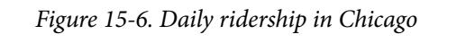

2019

{572}------------------------------------------------

Note that Pandas includes both the start and end month in the range, so this plots the data from the 1st of March all the way up to the 31st of May. This is a time series: data with values at different time steps, usually at regular intervals. More specifically, since there are multiple values per time step, this is called a *multivariate time series*. If we only looked at the bus column, it would be a *univariate time series*, with a single value per time step. Predicting future values (i.e., forecasting) is the most typical task when dealing with time series, and this is what we will focus on in this chapter. Other tasks include imputation (filling in missing past values), classification, anomaly detection, and more.

Looking at Figure 15-6, we can see that a similar pattern is clearly repeated every week. This is called a weekly seasonality. In fact, it's so strong in this case that forecasting tomorrow's ridership by just copying the values from a week earlier will yield reasonably good results. This is called naive forecasting: simply copying a past value to make our forecast. Naive forecasting is often a great baseline, and it can even be tricky to beat in some cases.


In general, naive forecasting means copying the latest known value (e.g., forecasting that tomorrow will be the same as today). However, in our case, copying the value from the previous week works better, due to the strong weekly seasonality.

To visualize these naive forecasts, let's overlay the two time series (for bus and rail) as well as the same time series lagged by one week (i.e., shifted toward the right) using dotted lines. We'll also plot the difference between the two (i.e., the value at time  $t$ minus the value at time  $t - 7$ ); this is called *differencing* (see Figure 15-7):

```
diff_7 = df[["bus", "rail"]].diff(7)["2019-03":"2019-05"]
fig, axis = plt.subplots(2, 1, sharex=True, figsize=(8, 5))df.plot(ax=axs[0], legend=False, marker=".") # original time series
df.shift(7).plot(ax=axs[0], grid=True, legend=False, linestyle=":") # lagged
diff_7.plot(ax=axs[1], grid=True, marker=".") # 7-day difference time series
plt.show()
```

Not too bad! Notice how closely the lagged time series track the actual time series. When a time series is correlated with a lagged version of itself, we say that the time series is *autocorrelated*. As you can see, most of the differences are fairly small, except at the end of May. Maybe there was a holiday at that time? Let's check the day\_type column:

```
>>> list(df.loc["2019-05-25":"2019-05-27"]["day_type"])
['A', 'U', 'U']
```

{573}------------------------------------------------


Figure 15-7. Time series overlaid with 7-day lagged time series (top), and difference between t and  $t - 7$  (bottom)

Indeed, there was a long weekend back then: the Monday was the Memorial Day holiday. We could use this column to improve our forecasts, but for now let's just measure the mean absolute error over the three-month period we're arbitrarily focusing on-March, April, and May 2019-to get a rough idea:

```
\Rightarrow diff 7.abs() . mean()hus
         43915.608696
rail
        42143.271739
dtype: float64
```

Our naive forecasts get an MAE of about 43,916 bus riders, and about 42,143 rail riders. It's hard to tell at a glance how good or bad this is, so let's put the forecast errors into perspective by dividing them by the target values:

```
>>> targets = df[["bus", "rail"]]["2019-03":"2019-05"]
>>> (diff_7 / targets).abs().mean()
bus
        0.082938
rail
        0.089948
dtype: float64
```

What we just computed is called the *mean absolute percentage error* (MAPE): it looks like our naive forecasts give us a MAPE of roughly 8.3% for bus and 9.0% for rail. It's interesting to note that the MAE for the rail forecasts looks slightly better than the MAE for the bus forecasts, while the opposite is true for the MAPE. That's because the bus ridership is larger than the rail ridership, so naturally the forecast errors are 

{574}------------------------------------------------

also larger, but when we put the errors into perspective, it turns out that the bus forecasts are actually slightly better than the rail forecasts.


The MAE, MAPE, and MSE are among the most common metrics you can use to evaluate your forecasts. As always, choosing the right metric depends on the task. For example, if your project suffers quadratically more from large errors than from small ones, then the MSE may be preferable, as it strongly penalizes large errors.

Looking at the time series, there doesn't appear to be any significant monthly seasonality, but let's check whether there's any yearly seasonality. We'll look at the data from 2001 to 2019. To reduce the risk of data snooping, we'll ignore more recent data for now. Let's also plot a 12-month rolling average for each series to visualize long-term trends (see Figure  $15-8$ ):

```
period = slice("2001", "2019")df monthly = df.resample('M').mean() # compute the mean for each month
rolling_average_12_months = df_monthly[period].rolling(window=12).mean()
```

```
fig, ax = plt.subplots(figsize=(8, 4))df_monthly[period].plot(ax=ax, marker=".")
rolling_average_12_months.plot(ax=ax, grid=True, legend=False)
plt.show()
```


Figure 15-8. Yearly seasonality and long-term trends

Yep! There's definitely some yearly seasonality as well, although it is noisier than the weekly seasonality, and more visible for the rail series than the bus series: we see peaks and troughs at roughly the same dates each year. Let's check what we get if we plot the 12-month difference (see Figure 15-9):

{575}------------------------------------------------


Figure 15-9. The 12-month difference

Notice how differencing not only removed the yearly seasonality, but it also removed the long-term trends. For example, the linear downward trend present in the time series from 2016 to 2019 became a roughly constant negative value in the differenced time series. In fact, differencing is a common technique used to remove trend and seasonality from a time series: it's easier to study a stationary time series, meaning one whose statistical properties remain constant over time, without any seasonality or trends. Once you're able to make accurate forecasts on the differenced time series, it's easy to turn them into forecasts for the actual time series by just adding back the past values that were previously subtracted.

You may be thinking that we're only trying to predict tomorrow's ridership, so the long-term patterns matter much less than the short-term ones. You're right, but still, we may be able to improve performance slightly by taking long-term patterns into account. For example, daily bus ridership dropped by about 2,500 in October 2017, which represents about 570 fewer passengers each week, so if we were at the end of October 2017, it would make sense to forecast tomorrow's ridership by copying the value from last week, minus 570. Accounting for the trend will make your forecasts a bit more accurate on average.

Now that you're familiar with the ridership time series, as well as some of the most important concepts in time series analysis, including seasonality, trend, differencing, and moving averages, let's take a quick look at a very popular family of statistical models that are commonly used to analyze time series.

{576}------------------------------------------------

### **The ARMA Model Family**

We'll start with the *autoregressive moving average* (ARMA) model, developed by Herman Wold in the 1930s: it computes its forecasts using a simple weighted sum of lagged values and corrects these forecasts by adding a moving average, very much like we just discussed. Specifically, the moving average component is computed using a weighted sum of the last few forecast errors. Equation 15-3 shows how the model makes its forecasts.

Equation 15-3. Forecasting using an ARMA model

$$
\widehat{y}(t) = \sum_{i=1}^{p} \alpha_i y(t-i) + \sum_{i=1}^{q} \theta_i \epsilon(t-i)
$$
  
with  $\epsilon(t) = y(t) - \widehat{y}(t)$ 

In this equation:

- $\hat{y}_{(t)}$  is the model's forecast for time step t.
- $y_{(t)}$  is the time series' value at time step t.
- The first sum is the weighted sum of the past  $p$  values of the time series, using the learned weights  $\alpha_i$ . The number p is a hyperparameter, and it determines how far back into the past the model should look. This sum is the *autoregressive* component of the model: it performs regression based on past values.
- The second sum is the weighted sum over the past q forecast errors  $\varepsilon_{(n)}$  using the learned weights  $\theta_i$ . The number q is a hyperparameter. This sum is the moving average component of the model.

Importantly, this model assumes that the time series is stationary. If it is not, then differencing may help. Using differencing over a single time step will produce an approximation of the derivative of the time series: indeed, it will give the slope of the series at each time step. This means that it will eliminate any linear trend, transforming it into a constant value. For example, if you apply one-step differencing to the series  $[3, 5, 7, 9, 11]$ , you get the differenced series  $[2, 2, 2, 2]$ .

If the original time series has a quadratic trend instead of a linear trend, then a single round of differencing will not be enough. For example, the series [1, 4, 9, 16, 25, 36] becomes  $[3, 5, 7, 9, 11]$  after one round of differencing, but if you run differencing for a second round, then you get  $[2, 2, 2, 2]$ . So, running two rounds of differencing will eliminate quadratic trends. More generally, running  $d$  consecutive rounds of differencing computes an approximation of the  $d<sup>th</sup>$  order derivative of the time series, so it will eliminate polynomial trends up to degree  $d$ . This hyperparameter  $d$  is called the order of integration.

{577}------------------------------------------------

Differencing is the central contribution of the *autoregressive integrated moving average* (ARIMA) model, introduced in 1970 by George Box and Gwilym Jenkins in their book Time Series Analysis (Wiley): this model runs d rounds of differencing to make the time series more stationary, then it applies a regular ARMA model. When making forecasts, it uses this ARMA model, then it adds back the terms that were subtracted by differencing.

One last member of the ARMA family is the *seasonal ARIMA* (SARIMA) model: it models the time series in the same way as ARIMA, but it additionally models a seasonal component for a given frequency (e.g., weekly), using the exact same ARIMA approach. It has a total of seven hyperparameters: the same  $p$ , d, and q hyperparameters as ARIMA, plus additional P, D, and Q hyperparameters to model the seasonal pattern, and lastly the period of the seasonal pattern, noted s. The hyperparameters  $P$ ,  $D$ , and  $Q$  are just like  $p$ ,  $d$ , and  $q$ , but they are used to model the time series at  $t - s$ ,  $t - 2s$ ,  $t - 3s$ , etc.

Let's see how to fit a SARIMA model to the rail time series, and use it to make a forecast for tomorrow's ridership. We'll pretend today is the last day of May 2019, and we want to forecast the rail ridership for "tomorrow", the 1st of June, 2019. For this, we can use the statsmodels library, which contains many different statistical models, including the ARMA model and its variants, implemented by the ARIMA class:

```
from statsmodels.tsa.arima.model import ARIMA
origin, today = "2019-01-01", "2019-05-31"
rail_series = df.loc[origin:today]["rail"].asfreq("D")
model = ARIMA(rail_series,order=(1, 0, 0),
              seasonal order=(0, 1, 1, 7))
model = model.fit()y_{\text{pred}} = \text{model.forecast}() # returns 427,758.6
```

In this code example:

- We start by importing the ARIMA class, then we take the rail ridership data from the start of 2019 up to "today", and we use asfreq("D") to set the time series' frequency to daily: this doesn't change the data at all in this case, since it's already daily, but without this the ARIMA class would have to guess the frequency, and it would display a warning.
- Next, we create an ARIMA instance, passing it all the data until "today", and we set the model hyperparameters: order=(1, 0, 0) means that  $p = 1$ ,  $d = 0$ ,  $q = 0$ , and seasonal\_order=(0, 1, 1, 7) means that  $P = 0$ ,  $D = 1$ ,  $Q = 1$ , and  $s = 7$ . Notice that the statsmodels API differs a bit from Scikit-Learn's API, since we pass the data to the model at construction time, instead of passing it to the fit() method.

{578}------------------------------------------------

• Next, we fit the model, and we use it to make a forecast for "tomorrow", the 1st of June, 2019.

The forecast is 427,759 passengers, when in fact there were 379,044. Yikes, we're 12.9% off—that's pretty bad. It's actually slightly worse than naive forecasting, which forecasts 426,932, off by 12.6%. But perhaps we were just unlucky that day? To check this, we can run the same code in a loop to make forecasts for every day in March, April, and May, and compute the MAE over that period:

```
origin, start date, end date = "2019-01-01", "2019-03-01", "2019-05-31"
time period = pd.date range(start date, end date)
rail_series = df.loc[origin:end_date]["rail"].asfreq("D")
v preds = \lceilfor today in time period.shift(-1):
   model = ARIMA(rail_series[origin:today], # train on data up to "today"
                  order=(1, 0, 0),
                  seasonal_order=(0, 1, 1, 7))
    model = model.fit() # note that we retrain the model every day!
    y pred = model.forecast()[0]
   v preds.append(v pred)
y_preds = pd.Series(y_preds, index=time_period)
mae = (y_preds - rail_series[time_period]).abs().mean() # returns 32,040.7)
```

Ah, that's much better! The MAE is about 32,041, which is significantly lower than the MAE we got with naive forecasting (42,143). So although the model is not perfect, it still beats naive forecasting by a large margin, on average.

At this point, you may be wondering how to pick good hyperparameters for the SARIMA model. There are several methods, but the simplest to understand and to get started with is the brute-force approach: just run a grid search. For each model you want to evaluate (i.e., each hyperparameter combination), you can run the preceding code example, changing only the hyperparameter values. Good  $p$ ,  $q$ ,  $P$ , and  $Q$  values are usually fairly small (typically 0 to 2, sometimes up to 5 or 6), and  $d$ and  $D$  are typically 0 or 1, sometimes 2. As for  $s$ , it's just the main seasonal pattern's period: in our case it's 7 since there's a strong weekly seasonality. The model with the lowest MAE wins. Of course, you can replace the MAE with another metric if it better matches your business objective. And that's it!<sup>4</sup>

<sup>4</sup> There are other more principled approaches to selecting good hyperparameters, based on analyzing the autocorrelation function (ACF) and partial autocorrelation function (PACF), or minimizing the AIC or BIC metrics (introduced in Chapter 9) to penalize models that use too many parameters and reduce the risk of overfitting the data, but grid search is a good place to start. For more details on the ACF-PACF approach, check out this very nice post by Jason Brownlee.

{579}------------------------------------------------

### **Preparing the Data for Machine Learning Models**

Now that we have two baselines, naive forecasting and SARIMA, let's try to use the machine learning models we've covered so far to forecast this time series, starting with a basic linear model. Our goal will be to forecast tomorrow's ridership based on the ridership of the past 8 weeks of data (56 days). The inputs to our model will therefore be sequences (usually a single sequence per day once the model is in production), each containing 56 values from time steps  $t - 55$  to t. For each input sequence, the model will output a single value: the forecast for time step  $t + 1$ .

But what will we use as training data? Well, that's the trick: we will use every 56-day window from the past as training data, and the target for each window will be the value immediately following it.

Keras actually has a nice utility function called tf.keras.utils.timeseries dataset\_from\_array() to help us prepare the training set. It takes a time series as input, and it builds a tf.data.Dataset (introduced in Chapter 13) containing all the windows of the desired length, as well as their corresponding targets. Here's an example that takes a time series containing the numbers 0 to 5 and creates a dataset containing all the windows of length 3, with their corresponding targets, grouped into batches of size 2:

```
import tensorflow as tf
my_series = [0, 1, 2, 3, 4, 5]my dataset = tf.keras.utils.timeseries dataset from array(
    my series,
    targets=my_series[3:], # the targets are 3 steps into the future
    sequence length=3.
    batch size=2
\lambda
```

Let's inspect the contents of this dataset:

```
>>> list(my dataset)
[(<tf.Tensor: shape=(2, 3), dtype=int32, numpy=
 array([[0, 1, 2],[1, 2, 3], dtype=int32)>,
 <tf.Tensor: shape=(2,), dtype=int32, numpy=array([3, 4], dtype=int32)>),
(\textsf{cf.Tensor: shape=(1, 3), dtype=ints2, numpy=array([[2, 3, 4]], dtype=int32)>,<tf.Tensor: shape=(1,), dtype=int32, numpy=array([5], dtype=int32)>)]
```

Each sample in the dataset is a window of length 3, along with its corresponding target (i.e., the value immediately after the window). The windows are  $[0, 1, 2]$ ,  $[1, 2]$ 2, 3, 3, and  $[2, 3, 4]$ , and their respective targets are 3, 4, and 5. Since there are three windows in total, which is not a multiple of the batch size, the last batch only contains one window instead of two.

{580}------------------------------------------------

Another way to get the same result is to use the window() method of tf.data's Dataset class. It's more complex, but it gives you full control, which will come in handy later in this chapter, so let's see how it works. The window() method returns a dataset of window datasets:

```
>>> for window dataset in tf.data.Dataset.range(6).window(4, shift=1):
        for element in window dataset:
\ddotscprint(f"{element}", end="")
\ddotscprint()\ddotsc\ddotsc01231 2 3 4
2 3 4 5
3 4 5
4 5
5
```

In this example, the dataset contains six windows, each shifted by one step compared to the previous one, and the last three windows are smaller because they've reached the end of the series. In general you'll want to get rid of these smaller windows by passing drop\_remainder=True to the window() method.

The window() method returns a *nested dataset*, analogous to a list of lists. This is useful when you want to transform each window by calling its dataset methods (e.g., to shuffle them or batch them). However, we cannot use a nested dataset directly for training, as our model will expect tensors as input, not datasets.

Therefore, we must call the flat\_map() method: it converts a nested dataset into a *flat dataset* (one that contains tensors, not datasets). For example, suppose  $\{1, 2, 3\}$ represents a dataset containing the sequence of tensors 1, 2, and 3. If you flatten the nested dataset  $\{\{1, 2\}, \{3, 4, 5, 6\}\}\$ , you get back the flat dataset  $\{1, 2, 3, 4, 5, 6\}$ .

Moreover, the flat\_map() method takes a function as an argument, which allows you to transform each dataset in the nested dataset before flattening. For example, if you pass the function lambda ds: ds.batch(2) to flat map(), then it will transform the nested dataset {{1, 2}, {3, 4, 5, 6}} into the flat dataset {[1, 2], [3, 4], [5, 6]}: it's a dataset containing 3 tensors, each of size 2.

With that in mind, we are ready to flatten our dataset:

```
>>> dataset = tf.data.Dataset.range(6).window(4, shift=1, drop_remainder=True)
>>> dataset = dataset.flat_map(lambda window_dataset: window_dataset.batch(4))
>>> for window tensor in dataset:
        print(f"{window_tensor}")
\ddotsc\ddotsc[0 1 2 3][1 2 3 4][2 3 4 5]
```

{581}------------------------------------------------

Since each window dataset contains exactly four items, calling batch(4) on a window produces a single tensor of size 4. Great! We now have a dataset containing consecutive windows represented as tensors. Let's create a little helper function to make it easier to extract windows from a dataset:

```
def to windows(dataset, length):
   dataset = dataset.window(length, shift=1, drop_remainder=True)
   return dataset.flat_map(lambda window_ds: window_ds.batch(length))
```

The last step is to split each window into inputs and targets, using the map() method. We can also group the resulting windows into batches of size 2:

```
>>> dataset = to_windows(tf.data.Dataset.range(6), 4) # 3 inputs + 1 target = 4
>>> dataset = dataset.map(lambda window: (window[:-1], window[-1]))
>>> list(dataset.batch(2))
[(<tf.Tensor: shape=(2, 3), dtype=int64, numpy=
 array([[0, 1, 2],[1, 2, 3]] >,
 <tf.Tensor: shape=(2, 1, 1), dtype=int64, numpy=array([3, 4])>),
 (\textsf{cf.Tensor: shape=(1, 3), dtype=int64, numpy=array([[2, 3, 4]])&;<tf.Tensor: shape=(1,), dtype=int64, numpy=array([5])>)]
```

As you can see, we now have the same output as we got earlier with the timeseries\_dataset\_from\_array() function (with a bit more effort, but it will be worthwhile soon).

Now, before we start training, we need to split our data into a training period, a validation period, and a test period. We will focus on the rail ridership for now. We will also scale it down by a factor of one million, to ensure the values are near the 0-1 range; this plays nicely with the default weight initialization and learning rate:

```
rail_train = df["rail"]["2016-01":"2018-12"] / 1e6
rail_valid = df["rail"]["2019-01":"2019-05"] / 1e6
ratio_{\text{test}} = df["tail"]['2019-06":] / 1e6
```


When dealing with time series, you generally want to split across time. However, in some cases you may be able to split along other dimensions, which will give you a longer time period to train on. For example, if you have data about the financial health of 10,000 companies from 2001 to 2019, you might be able to split this data across the different companies. It's very likely that many of these companies will be strongly correlated, though (e.g., whole economic sectors may go up or down jointly), and if you have correlated companies across the training set and the test set, your test set will not be as useful, as its measure of the generalization error will be optimistically biased.

{582}------------------------------------------------

Next, let's use timeseries dataset from array() to create datasets for training and validation. Since gradient descent expects the instances in the training set to be independent and identically distributed (IID), as we saw in Chapter 4, we must set the argument shuffle=True to shuffle the training windows (but not their contents):

```
seq length = 56train ds = tf.keras.utils.timeseries dataset from array(
    rail_train.to_numpy(),
    targets=rail train[seq length:],
    sequence_length=seq_length,
    batch size=32.
    shuffle=True,
    seed = 42\mathcal{E}valid_ds = tf.keras.utils.timeseries_dataset_from_array(
    rail valid.to numpy(),
    targets=rail valid[seq length:],
    sequence_length=seq_length,
    batch_size=32
\lambda
```

And now we're ready to build and train any regression model we want!

### **Forecasting Using a Linear Model**

Let's try a basic linear model first. We will use the Huber loss, which usually works better than minimizing the MAE directly, as discussed in Chapter 10. We'll also use early stopping:

```
tf.random.set seed(42)
model = tf.keras.Sequential(f)tf.keras.layers.Dense(1, input shape=[seq length])
\left| \right\rangleearly_stopping_cb = tf.keras.callbacks.EarlyStopping(
    monitor="val_mae", patience=50, restore_best_weights=True)
opt = tf.keras.optimizers.SGD(learning_rate=0.02, momentum=0.9)
model.compile(loss=tf.keras.losses.Huber(), optimizer=opt, metrics=["mae"])
history = model.fit(train_ds, validation_data=valid_ds, epochs=500,
                    callbacks=[early_stopping_cb])
```

This model reaches a validation MAE of about 37,866 (your mileage may vary). That's better than naive forecasting, but worse than the SARIMA model.<sup>5</sup>

Can we do better with an RNN? Let's see!

<sup>5</sup> Note that the validation period starts on the 1st of January 2019, so the first prediction is for the 26th of February 2019, eight weeks later. When we evaluated the baseline models we used predictions starting on the 1st of March instead, but this should be close enough.

{583}------------------------------------------------

### **Forecasting Using a Simple RNN**

Let's try the most basic RNN, containing a single recurrent layer with just one recurrent neuron, as we saw in Figure 15-1:

```
model = tf.keras.Sequential()tf.keras.layers.SimpleRNN(1, input_shape=[None, 1])
\left| \right)
```

All recurrent layers in Keras expect 3D inputs of shape [batch size, time steps, dimensionality], where *dimensionality* is 1 for univariate time series and more for multivariate time series. Recall that the input\_shape argument ignores the first dimension (i.e., the batch size), and since recurrent layers can accept input sequences of any length, we can set the second dimension to None, which means "any size". Lastly, since we're dealing with a univariate time series, we need the last dimension's size to be 1. This is why we specified the input shape [None, 1]: it means "univariate sequences" of any length". Note that the datasets actually contain inputs of shape [batch size, time steps], so we're missing the last dimension, of size 1, but Keras is kind enough to add it for us in this case.

This model works exactly as we saw earlier: the initial state  $h_{(init)}$  is set to 0, and it is passed to a single recurrent neuron, along with the value of the first time step,  $x_{(0)}$ . The neuron computes a weighted sum of these values plus the bias term, and it applies the activation function to the result, using the hyperbolic tangent function by default. The result is the first output,  $y_0$ . In a simple RNN, this output is also the new state  $h_0$ . This new state is passed to the same recurrent neuron along with the next input value,  $x_{(1)}$ , and the process is repeated until the last time step. At the end, the layer just outputs the last value: in our case the sequences are 56 steps long, so the last value is  $y_{55}$ . All of this is performed simultaneously for every sequence in the batch, of which there are 32 in this case.


By default, recurrent layers in Keras only return the final output. To make them return one output per time step, you must set return\_sequences=True, as you will see.

So that's our first recurrent model! It's a sequence-to-vector model. Since there's a single output neuron, the output vector has a size of 1.

Now if you compile, train, and evaluate this model just like the previous model, you will find that it's no good at all: its validation MAE is greater than 100,000! Ouch. That was to be expected, for two reasons:

{584}------------------------------------------------

- 1. The model only has a single recurrent neuron, so the only data it can use to make a prediction at each time step is the input value at the current time step and the output value from the previous time step. That's not much to go on! In other words, the RNN's memory is extremely limited: it's just a single number, its previous output. And let's count how many parameters this model has: since there's just one recurrent neuron with only two input values, the whole model only has three parameters (two weights plus a bias term). That's far from enough for this time series. In contrast, our previous model could look at all 56 previous values at once, and it had a total of 57 parameters.
- 2. The time series contains values from 0 to about 1.4, but since the default activation function is tanh, the recurrent layer can only output values between -1 and +1. There's no way it can predict values between 1.0 and 1.4.

Let's fix both of these issues: we will create a model with a larger recurrent layer, containing 32 recurrent neurons, and we will add a dense output layer on top of it with a single output neuron and no activation function. The recurrent layer will be able to carry much more information from one time step to the next, and the dense output layer will project the final output from 32 dimensions down to 1, without any value range constraints:

```
univar model = tf.keras.Sequential(\lceiltf.keras.layers.SimpleRNN(32, input_shape=[None, 1]),
    tf.keras.layers.Dense(1) # no activation function by default
\left| \right)
```

Now if you compile, fit, and evaluate this model just like the previous one, you will find that its validation MAE reaches 27,703. That's the best model we've trained so far, and it even beats the SARIMA model: we're doing pretty well!


We've only normalized the time series, without removing trend and seasonality, and yet the model still performs well. This is convenient, as it makes it possible to quickly search for promising models without worrying too much about preprocessing. However, to get the best performance, you may want to try making the time series more stationary; for example, using differencing.

### **Forecasting Using a Deep RNN**

It is quite common to stack multiple layers of cells, as shown in Figure 15-10. This gives you a *deep RNN*.

{585}------------------------------------------------

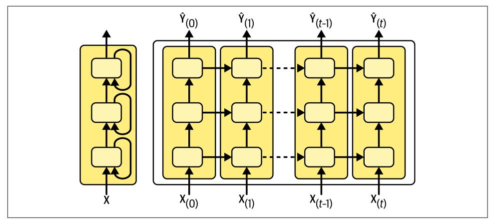

Figure 15-10. A deep RNN (left) unrolled through time (right)

Implementing a deep RNN with Keras is straightforward: just stack recurrent layers. In the following example, we use three SimpleRNN layers (but we could use any other type of recurrent layer instead, such as an LSTM layer or a GRU layer, which we will discuss shortly). The first two are sequence-to-sequence layers, and the last one is a sequence-to-vector layer. Finally, the Dense layer produces the model's forecast (you can think of it as a vector-to-vector layer). So this model is just like the model represented in Figure 15-10, except the outputs  $\hat{Y}_{(0)}$  to  $\hat{Y}_{(t-1)}$  are ignored, and there's a dense layer on top of  $\hat{Y}_{(i)}$ , which outputs the actual forecast:

```
deep model = tf. keras. Sequential(f)tf.keras.layers.SimpleRNN(32, return_sequences=True, input_shape=[None, 1]),
    tf.keras.layers.SimpleRNN(32, return_sequences=True),
    tf.keras.layers.SimpleRNN(32),
    tf.keras.layers.Dense(1)
\overline{1}
```


Make sure to set return\_sequences=True for all recurrent layers (except the last one, if you only care about the last output). If you forget to set this parameter for one recurrent layer, it will output a 2D array containing only the output of the last time step, instead of a 3D array containing outputs for all time steps. The next recurrent layer will complain that you are not feeding it sequences in the expected 3D format.

If you train and evaluate this model, you will find that it reaches an MAE of about 31,211. That's better than both baselines, but it doesn't beat our "shallower" RNN. It looks like this RNN is a bit too large for our task.

{586}------------------------------------------------

### **Forecasting Multivariate Time Series**

A great quality of neural networks is their flexibility: in particular, they can deal with multivariate time series with almost no change to their architecture. For example, let's try to forecast the rail time series using both the bus and rail data as input. In fact, let's also throw in the day type! Since we can always know in advance whether tomorrow is going to be a weekday, a weekend, or a holiday, we can shift the day type series one day into the future, so that the model is given tomorrow's day type as input. For simplicity, we'll do this processing using Pandas:

```
df mulvar = df[["bus", "rail"]]/1e6 # use both bus & rail series as inputdf_mulvar["next_day_type"] = df["day_type"].shift(-1) # we know tomorrow's type
df_{\text{mulvar}} = pd.get_{\text{dummies}}(df_{\text{mulvar}}) # one-hot encode the day type
```

Now df\_mulvar is a DataFrame with five columns: the bus and rail data, plus three columns containing the one-hot encoding of the next day's type (recall that there are three possible day types, W, A, and U). Next we can proceed much like we did earlier. First we split the data into three periods, for training, validation, and testing:

```
mulvar_train = df_mulvar["2016-01":"2018-12"]mulvar_valid = df_{m}ulvar["2019-01":"2019-05"]
mulvar_test = df_mulvar["2019-06":]
```

Then we create the datasets:

```
train mulvar ds = tf.keras.utils.timeseries dataset from array(
    mulvar train. to numpy(), # use all 5 columns as input
    targets=mulvar_train["rail"][seq_length:], # forecast only the rail series
    \lceil ... \rceil # the other 4 arguments are the same as earlier
\lambdavalid mulvar ds = tf.keras.utils.timeseries dataset from array(mulvar valid.to numpy(),
    targets=mulvar_valid["rail"][seq_length:],
    \lceil ... \rceil # the other 2 arguments are the same as earlier
\lambda
```

And finally we create the RNN:

```
mulvar model = tf.keras.Sequential(\lceiltf.keras.layers.SimpleRNN(32, input_shape=[None, 5]),
    tf.keras.layers.Dense(1)
\left| \right\rangle
```

Notice that the only difference from the univar model RNN we built earlier is the input shape: at each time step, the model now receives five inputs instead of one. This model actually reaches a validation MAE of 22,062. Now we're making big progress!

In fact, it's not too hard to make the RNN forecast both the bus and rail ridership. You just need to change the targets when creating the datasets, setting them to mulvar\_train[["bus", "rail"]][seq\_length:] for the training set, and mulvar\_valid[["bus", "rail"]][seq\_length:] for the validation set. You must 

{587}------------------------------------------------

also add an extra neuron in the output Dense layer, since it must now make two forecasts: one for tomorrow's bus ridership, and the other for rail. That's all there is to it!

As we discussed in Chapter 10, using a single model for multiple related tasks often results in better performance than using a separate model for each task, since features learned for one task may be useful for the other tasks, and also because having to perform well across multiple tasks prevents the model from overfitting (it's a form of regularization). However, it depends on the task, and in this particular case the multitask RNN that forecasts both the bus and the rail ridership doesn't perform quite as well as dedicated models that forecast one or the other (using all five columns as input). Still, it reaches a validation MAE of 25,330 for rail and 26,369 for bus, which is pretty good.

### **Forecasting Several Time Steps Ahead**

So far we have only predicted the value at the next time step, but we could just as easily have predicted the value several steps ahead by changing the targets appropriately (e.g., to predict the ridership 2 weeks from now, we could just change the targets to be the value 14 days ahead instead of 1 day ahead). But what if we want to predict the next 14 values?

The first option is to take the univar model RNN we trained earlier for the rail time series, make it predict the next value, and add that value to the inputs, acting as if the predicted value had actually occurred; we would then use the model again to predict the following value, and so on, as in the following code:

```
import numpy as np
X = \text{raid } \text{valid}. to \text{numpy}() [np. newaxis, :seq length, np. newaxis]
for step ahead in range(14):
    y pred one = univar model.predict(X)
    X = np.\text{concatenate}([X, y_pred\_one, reshape(1, 1, 1)], axis=1)
```

In this code, we take the rail ridership of the first 56 days of the validation period, and we convert the data to a NumPy array of shape  $[1, 56, 1]$  (recall that recurrent layers expect 3D inputs). Then we repeatedly use the model to forecast the next value, and we append each forecast to the input series, along the time axis (axis=1). The resulting forecasts are plotted in Figure 15-11.


If the model makes an error at one time step, then the forecasts for the following time steps are impacted as well: the errors tend to accumulate. So, it's preferable to use this technique only for a small number of steps.

{588}------------------------------------------------


Figure 15-11. Forecasting 14 steps ahead, 1 step at a time

The second option is to train an RNN to predict the next 14 values in one shot. We can still use a sequence-to-vector model, but it will output 14 values instead of 1. However, we first need to change the targets to be vectors containing the next 14 values. To do this, we can use timeseries dataset from array() again, but this time asking it to create datasets without targets (targets=None) and with longer sequences, of length seq length  $+14$ . Then we can use the datasets' map() method to apply a custom function to each batch of sequences, splitting them into inputs and targets. In this example, we use the multivariate time series as input (using all five columns), and we forecast the rail ridership for the next 14 days:<sup>6</sup>

```
def split_inputs_and_targets(mulvar_series, ahead=14, target_col=1):
    return mulvar_series[:, :-ahead], mulvar_series[:, -ahead:, target_col]
ahead train ds = tf.keras.utils.timeseries dataset from array(
    mulvar_train.to_numpy(),
    targets=None,
    sequence length=seq length + 14,
    \lceil ... \rceil # the other 3 arguments are the same as earlier
). map(split inputs and targets)
ahead_valid_ds = tf.keras.utils.timeseries_dataset_from_array(
    mulvar_valid.to_numpy(),
    targets=None,
    sequence_length=seq_length + 14,
    batch size=32
).map(split_inputs_and_targets)
```

Now we just need the output layer to have 14 units instead of 1:

<sup>6</sup> Feel free to play around with this model. For example, you can try forecasting both the bus and rail ridership for the next 14 days. You'll need to tweak the targets to include both, and make your model output 28 forecasts instead of 14.

{589}------------------------------------------------

```
abead_model = tf.keras.Sequential([tf.keras.layers.SimpleRNN(32, input shape=[None, 5]),
    tf.keras.layers.Dense(14)
\left| \right\rangle
```

After training this model, you can predict the next 14 values at once like this:

```
X = multvar_valid.to_number() [np.newaxis, :seq_length] # shape [1, 56, 5]Y_pred = ahead_model.predict(X) # shape [1, 14]
```

This approach works quite well. Its forecasts for the next day are obviously better than its forecasts for 14 days into the future, but it doesn't accumulate errors like the previous approach did. However, we can still do better, using a sequence-to-sequence (or seq2seq) model.

### Forecasting Using a Sequence-to-Sequence Model

Instead of training the model to forecast the next 14 values only at the very last time step, we can train it to forecast the next 14 values at each and every time step. In other words, we can turn this sequence-to-vector RNN into a sequence-to-sequence RNN. The advantage of this technique is that the loss will contain a term for the output of the RNN at each and every time step, not just for the output at the last time step.

This means there will be many more error gradients flowing through the model, and they won't have to flow through time as much since they will come from the output of each time step, not just the last one. This will both stabilize and speed up training.

To be clear, at time step 0 the model will output a vector containing the forecasts for time steps 1 to 14, then at time step 1 the model will forecast time steps 2 to 15, and so on. In other words, the targets are sequences of consecutive windows, shifted by one time step at each time step. The target is not a vector anymore, but a sequence of the same length as the inputs, containing a 14-dimensional vector at each step.

Preparing the datasets is not trivial, since each instance has a window as input and a sequence of windows as output. One way to do this is to use the to\_windows() utility function we created earlier, twice in a row, to get windows of consecutive windows. For example, let's turn the series of numbers 0 to 6 into a dataset containing sequences of 4 consecutive windows, each of length 3:

```
\Rightarrow my series = tf.data.DataFrame.*\Rightarrow dataset = to_windows(to_windows(my_series, 3), 4)
>>> list(dataset)
[<tf.Tensor: shape=(4, 3), dtype=int64, numpy=
array([[0, 1, 2],[1, 2, 3],[2, 3, 4],[3, 4, 5]])>,
 <tf.Tensor: shape=(4, 3), dtype=int64, numpy=
 array([[1, 2, 3],[2, 3, 4],
```

{590}------------------------------------------------

 $[3, 4, 5],$  $[4, 5, 6]$ ]>]

Now we can use the map() method to split these windows of windows into inputs and targets:

```
>>> dataset = dataset.map(lambda S: (S[:, 0], S[:, 1:]))>>> list(dataset)
[(<tf.Tensor: shape=(4, ), dtype=int64, numpy=array([0, 1, 2, 3])>,
  <tf.Tensor: shape=(4, 2), dtype=int64, numpy=
  array([[1, 2],[2, 3],[3, 4],[4, 5]])>),
 (\textsf{cf.Tensor: shape=(4,), dtype=int64, numpy=array([1, 2, 3, 4])>,
 <tf.Tensor: shape=(4, 2), dtype=int64, numpy=
  array([72, 3],[3, 4],[4, 5],
         [5, 6]]) >)]
```

Now the dataset contains sequences of length 4 as inputs, and the targets are sequences containing the next two steps, for each time step. For example, the first input sequence is [0, 1, 2, 3], and its corresponding targets are  $[1, 2]$ , [2, 3], [3, 4], [4, 5]], which are the next two values for each time step. If you're like me, you will probably need a few minutes to wrap your head around this. Take your time!


It may be surprising that the targets contain values that appear in the inputs. Isn't that cheating? Fortunately, not at all: at each time step, an RNN only knows about past time steps; it cannot look ahead. It is said to be a causal model.

Let's create another little utility function to prepare the datasets for our sequence-tosequence model. It will also take care of shuffling (optional) and batching:

```
def to_seq2seq_dataset(series, seq_length=56, ahead=14, target col=1,
                       batch_size=32, shuffle=False, seed=None):
    ds = to_windows(tf.data.DataFrame.com_tensor_slices(series), ahead + 1)ds = to_windows(ds, seq_length).map(lambda S: (S[:, 0], S[:, 1:, 1]))
    if shuffle:
        ds = ds.shuffle(8 * batch size, seed=seed)
    return ds.batch(batch size)
```

Now we can use this function to create the datasets:

```
seq2seq_train = to_seq2seq_dataset(mulvar_train, shuffle=True, seed=42)
seq2seq_valid = to_seq2seq_dataset(mulvar_valid)
```

{591}------------------------------------------------

And lastly, we can build the sequence-to-sequence model:

```
seq2seq model = tf.keras. Sequential(\lceiltf.keras.layers.SimpleRNN(32, return sequences=True, input shape=[None, 5]),
    tf.keras.layers.Dense(14)
\left| \right\rangle
```

It is almost identical to our previous model: the only difference is that we set return sequences=True in the SimpleRNN layer. This way, it will output a sequence of vectors (each of size 32), instead of outputting a single vector at the last time step. The Dense layer is smart enough to handle sequences as input: it will be applied at each time step, taking a 32-dimensional vector as input and outputting a 14-dimensional vector. In fact, another way to get the exact same result is to use a Conv1D layer with a kernel size of 1: Conv1D(14, kernel\_size=1).


Keras offers a TimeDistributed layer that lets you apply any vector-to-vector layer to every vector in the input sequences, at every time step. It does this efficiently, by reshaping the inputs so that each time step is treated as a separate instance, then it reshapes the layer's outputs to recover the time dimension. In our case, we don't need it since the Dense layer already supports sequences as inputs.

The training code is the same as usual. During training, all the model's outputs are used, but after training only the output of the very last time step matters, and the rest can be ignored. For example, we can forecast the rail ridership for the next 14 days like this:

```
X = multvar_value.to_number() [np.newaxis, :seq_length]y_pred_14 = seq2seq_model.predict(X)[0, -1] # only the last time step's output
```

If you evaluate this model's forecasts for  $t + 1$ , you will find a validation MAE of 25,519. For  $t + 2$  it's 26,274, and the performance continues to drop gradually as the model tries to forecast further into the future. At  $t + 14$ , the MAE is 34,322.


You can combine both approaches to forecasting multiple steps ahead: for example, you can train a model that forecasts 14 days ahead, then take its output and append it to the inputs, then run the model again to get forecasts for the following 14 days, and possibly repeat the process.

Simple RNNs can be quite good at forecasting time series or handling other kinds of sequences, but they do not perform as well on long time series or sequences. Let's discuss why and see what we can do about it.

{592}------------------------------------------------

## **Handling Long Sequences**

To train an RNN on long sequences, we must run it over many time steps, making the unrolled RNN a very deep network. Just like any deep neural network it may suffer from the unstable gradients problem, discussed in Chapter 11: it may take forever to train, or training may be unstable. Moreover, when an RNN processes a long sequence, it will gradually forget the first inputs in the sequence. Let's look at both these problems, starting with the unstable gradients problem.

### **Fighting the Unstable Gradients Problem**

Many of the tricks we used in deep nets to alleviate the unstable gradients problem can also be used for RNNs: good parameter initialization, faster optimizers, dropout, and so on. However, nonsaturating activation functions (e.g., ReLU) may not help as much here. In fact, they may actually lead the RNN to be even more unstable during training. Why? Well, suppose gradient descent updates the weights in a way that increases the outputs slightly at the first time step. Because the same weights are used at every time step, the outputs at the second time step may also be slightly increased, and those at the third, and so on until the outputs explode—and a nonsaturating activation function does not prevent that.

You can reduce this risk by using a smaller learning rate, or you can use a saturating activation function like the hyperbolic tangent (this explains why it's the default).

In much the same way, the gradients themselves can explode. If you notice that training is unstable, you may want to monitor the size of the gradients (e.g., using TensorBoard) and perhaps use gradient clipping.

Moreover, batch normalization cannot be used as efficiently with RNNs as with deep feedforward nets. In fact, you cannot use it between time steps, only between recurrent layers.

To be more precise, it is technically possible to add a BN layer to a memory cell (as you will see shortly) so that it will be applied at each time step (both on the inputs for that time step and on the hidden state from the previous step). However, the same BN layer will be used at each time step, with the same parameters, regardless of the actual scale and offset of the inputs and hidden state. In practice, this does not yield good results, as was demonstrated by César Laurent et al. in a 2015 paper:<sup>7</sup> the authors found that BN was slightly beneficial only when it was applied to the layer's inputs, not to the hidden states. In other words, it was slightly better than nothing when applied between recurrent layers (i.e., vertically in Figure 15-10), but not within

<sup>7</sup> César Laurent et al., "Batch Normalized Recurrent Neural Networks", Proceedings of the IEEE International Conference on Acoustics, Speech, and Signal Processing (2016): 2657-2661.

{593}------------------------------------------------

recurrent layers (i.e., horizontally). In Keras, you can apply BN between layers simply by adding a BatchNormalization layer before each recurrent layer, but it will slow down training, and it may not help much.

Another form of normalization often works better with RNNs: layer normalization. This idea was introduced by Jimmy Lei Ba et al. in a 2016 paper.<sup>8</sup> it is very similar to batch normalization, but instead of normalizing across the batch dimension, layer normalization normalizes across the features dimension. One advantage is that it can compute the required statistics on the fly, at each time step, independently for each instance. This also means that it behaves the same way during training and testing (as opposed to BN), and it does not need to use exponential moving averages to estimate the feature statistics across all instances in the training set, like BN does. Like BN, layer normalization learns a scale and an offset parameter for each input. In an RNN, it is typically used right after the linear combination of the inputs and the hidden states.

Let's use Keras to implement layer normalization within a simple memory cell. To do this, we need to define a custom memory cell, which is just like a regular layer, except its call() method takes two arguments: the inputs at the current time step and the hidden states from the previous time step.

Note that the states argument is a list containing one or more tensors. In the case of a simple RNN cell it contains a single tensor equal to the outputs of the previous time step, but other cells may have multiple state tensors (e.g., an LSTMCell has a long-term state and a short-term state, as you will see shortly). A cell must also have a state size attribute and an output size attribute. In a simple RNN, both are simply equal to the number of units. The following code implements a custom memory cell that will behave like a SimpleRNNCell, except it will also apply layer normalization at each time step:

```
class LNSimpleRNNCell(tf.keras.layers.Layer):
   def init (self, units, activation="tanh", **kwargs):
       super(). init (**kwargs)self. state\_size = unitsself.output size = units
       self.simple rnn cell = tf.keras.layers.SimpleRNNCell(units,
                                                             activation=None)
       self.layer_norm = tf.keras.layers.LayerNormalization()
       self. activation = tf. keras. activations.get(activation)def call(self, inputs, states):
       outputs, new states = self.simple rnn cell(inputs, states)
       norm outputs = self.activation(self.layer norm(outputs))
       return norm_outputs, [norm_outputs]
```

<sup>8</sup> Jimmy Lei Ba et al., "Layer Normalization", arXiv preprint arXiv:1607.06450 (2016).

{594}------------------------------------------------

Let's walk through this code:

- Our LNSimpleRNNCell class inherits from the tf.keras.layers.Layer class, just like any custom layer.
- The constructor takes the number of units and the desired activation function and sets the state size and output size attributes, then creates a SimpleRNN Cell with no activation function (because we want to perform layer normalization after the linear operation but before the activation function).<sup>9</sup> Then the constructor creates the LayerNormalization layer, and finally it fetches the desired activation function.
- The call() method starts by applying the simpleRNNCell, which computes a linear combination of the current inputs and the previous hidden states, and it returns the result twice (indeed, in a SimpleRNNCell, the outputs are just equal to the hidden states: in other words, new\_states[0] is equal to outputs, so we can safely ignore new states in the rest of the call() method). Next, the call() method applies layer normalization, followed by the activation function. Finally, it returns the outputs twice: once as the outputs, and once as the new hidden states. To use this custom cell, all we need to do is create a tf, keras, lavers, RNN layer, passing it a cell instance:

```
\text{custom } \ln \text{ model} = \text{tf.} \text{keras.} \text{Sequential}(\lceil \text{ } \rceil)tf.keras.layers.RNN(LNSimpleRNNCell(32), return sequences=True,
                                   input_shape=[None, 5]),
      tf.keras.layers.Dense(14)
\left| \right)
```

Similarly, you could create a custom cell to apply dropout between each time step. But there's a simpler way: most recurrent layers and cells provided by Keras have dropout and recurrent dropout hyperparameters: the former defines the dropout rate to apply to the inputs, and the latter defines the dropout rate for the hidden states, between time steps. So, there's no need to create a custom cell to apply dropout at each time step in an RNN.

With these techniques, you can alleviate the unstable gradients problem and train an RNN much more efficiently. Now let's look at how to deal with the short-term memory problem.

<sup>9</sup> It would have been simpler to inherit from SimpleRNNCell instead so that we wouldn't have to create an internal SimpleRNNCell or handle the state size and output size attributes, but the goal here was to show how to create a custom cell from scratch.

{595}------------------------------------------------


When forecasting time series, it is often useful to have some error bars along with your predictions. For this, one approach is to use MC dropout, introduced in Chapter 11: use recurrent dropout during training, then keep dropout active at inference time by calling the model using model(X, training=True). Repeat this several times to get multiple slightly different forecasts, then compute the mean and standard deviation of these predictions for each time step.

### **Tackling the Short-Term Memory Problem**

Due to the transformations that the data goes through when traversing an RNN, some information is lost at each time step. After a while, the RNN's state contains virtually no trace of the first inputs. This can be a showstopper. Imagine Dory the  $fish^{10}$  trying to translate a long sentence; by the time she's finished reading it, she has no clue how it started. To tackle this problem, various types of cells with long-term memory have been introduced. They have proven so successful that the basic cells are not used much anymore. Let's first look at the most popular of these long-term memory cells: the LSTM cell.

#### **LSTM** cells

The long short-term memory (LSTM) cell was proposed in 1997<sup>11</sup> by Sepp Hochreiter and Jürgen Schmidhuber and gradually improved over the years by several researchers, such as Alex Graves, Haşim Sak,<sup>12</sup> and Wojciech Zaremba.<sup>13</sup> If you consider the LSTM cell as a black box, it can be used very much like a basic cell, except it will perform much better; training will converge faster, and it will detect longer-term patterns in the data. In Keras, you can simply use the LSTM layer instead of the SimpleRNN laver:

```
model = tf.keras.Sequential(tf.keras.layers.LSTM(32, return_sequences=True, input_shape=[None, 5]),
    tf.keras.layers.Dense(14)
\left| \right)
```

Alternatively, you could use the general-purpose tf.keras.layers.RNN layer, giving it an LSTMCell as an argument. However, the LSTM layer uses an optimized implementation when running on a GPU (see Chapter 19), so in general it is prefera-

<sup>10</sup> A character from the animated movies Finding Nemo and Finding Dory who has short-term memory loss.

<sup>11</sup> Sepp Hochreiter and Jürgen Schmidhuber, "Long Short-Term Memory", Neural Computation 9, no. 8 (1997): 1735-1780.

<sup>12</sup> Haşim Sak et al., "Long Short-Term Memory Based Recurrent Neural Network Architectures for Large Vocabulary Speech Recognition", arXiv preprint arXiv:1402.1128 (2014).

<sup>13</sup> Wojciech Zaremba et al., "Recurrent Neural Network Regularization", arXiv preprint arXiv:1409.2329 (2014).

{596}------------------------------------------------

ble to use it (the RNN layer is mostly useful when you define custom cells, as we did earlier).

So how does an LSTM cell work? Its architecture is shown in Figure 15-12. If you don't look at what's inside the box, the LSTM cell looks exactly like a regular cell, except that its state is split into two vectors:  $h_{(t)}$  and  $c_{(t)}$  ("c" stands for "cell"). You can think of  $\mathbf{h}_{(t)}$  as the short-term state and  $\mathbf{c}_{(t)}$  as the long-term state.


Figure 15-12. An LSTM cell

Now let's open the box! The key idea is that the network can learn what to store in the long-term state, what to throw away, and what to read from it. As the long-term state  $c_{(t-1)}$  traverses the network from left to right, you can see that it first goes through a forget gate, dropping some memories, and then it adds some new memories via the addition operation (which adds the memories that were selected by an *input gate*). The result  $c_{(t)}$  is sent straight out, without any further transformation. So, at each time step, some memories are dropped and some memories are added. Moreover, after the addition operation, the long-term state is copied and passed through the tanh function, and then the result is filtered by the *output gate*. This produces the short-term state  $\mathbf{h}_{(t)}$  (which is equal to the cell's output for this time step,  $\mathbf{y}_{(t)}$ ). Now let's look at where new memories come from and how the gates work.

First, the current input vector  $\mathbf{x}_{(t)}$  and the previous short-term state  $\mathbf{h}_{(t-1)}$  are fed to four different fully connected layers. They all serve a different purpose:

{597}------------------------------------------------

- The main layer is the one that outputs  $\mathbf{g}_{(t)}$ . It has the usual role of analyzing the current inputs  $\mathbf{x}_{(t)}$  and the previous (short-term) state  $\mathbf{h}_{(t-1)}$ . In a basic cell, there is nothing other than this layer, and its output goes straight out to  $y_{(t)}$  and  $h_{(t)}$ . But in an LSTM cell, this layer's output does not go straight out; instead its most important parts are stored in the long-term state (and the rest is dropped).
- The three other layers are *gate controllers*. Since they use the logistic activation function, the outputs range from 0 to 1. As you can see, the gate controllers' outputs are fed to element-wise multiplication operations: if they output 0s they close the gate, and if they output 1s they open it. Specifically:
  - The forget gate (controlled by  $f_{(t)}$ ) controls which parts of the long-term state should be erased.
  - The *input gate* (controlled by  $\mathbf{i}_{(t)}$ ) controls which parts of  $\mathbf{g}_{(t)}$  should be added to the long-term state.
  - Finally, the *output gate* (controlled by  $\mathbf{o}_{(t)}$ ) controls which parts of the longterm state should be read and output at this time step, both to  $\mathbf{h}_{(t)}$  and to  $\mathbf{y}_{(t)}$ .

In short, an LSTM cell can learn to recognize an important input (that's the role of the input gate), store it in the long-term state, preserve it for as long as it is needed (that's the role of the forget gate), and extract it whenever it is needed. This explains why these cells have been amazingly successful at capturing long-term patterns in time series, long texts, audio recordings, and more.

Equation 15-4 summarizes how to compute the cell's long-term state, its short-term state, and its output at each time step for a single instance (the equations for a whole mini-batch are very similar).

Equation 15-4. LSTM computations

$$
\mathbf{i}_{(t)} = \sigma \big(\mathbf{W}_{xi} \mathbf{X}_{(t)} + \mathbf{W}_{hi} \mathbf{I}_{(t-1)} + \mathbf{b}_{i} \big)
$$
\n
$$
\mathbf{f}_{(t)} = \sigma \big(\mathbf{W}_{xf} \mathbf{X}_{(t)} + \mathbf{W}_{hf} \mathbf{I}_{(t-1)} + \mathbf{b}_{f} \big)
$$
\n
$$
\mathbf{o}_{(t)} = \sigma \big(\mathbf{W}_{xo} \mathbf{X}_{(t)} + \mathbf{W}_{ho} \mathbf{I}_{(t-1)} + \mathbf{b}_{o} \big)
$$
\n
$$
\mathbf{g}_{(t)} = \tanh \big(\mathbf{W}_{xg} \mathbf{X}_{(t)} + \mathbf{W}_{hg} \mathbf{I}_{(t-1)} + \mathbf{b}_{g} \big)
$$
\n
$$
\mathbf{c}_{(t)} = \mathbf{f}_{(t)} \otimes \mathbf{c}_{(t-1)} + \mathbf{i}_{(t)} \otimes \mathbf{g}_{(t)}
$$
\n
$$
\mathbf{y}_{(t)} = \mathbf{h}_{(t)} = \mathbf{o}_{(t)} \otimes \tanh \big(\mathbf{c}_{(t)} \big)
$$

In this equation:

•  $W_{x_i}$ ,  $W_{x_i}$ ,  $W_{x_o}$ , and  $W_{x_e}$  are the weight matrices of each of the four layers for their connection to the input vector  $\mathbf{x}_{(t)}$ .

{598}------------------------------------------------

- $W_{h^p}$ ,  $W_{h^p}$ ,  $W_{h^o}$ , and  $W_{h^q}$  are the weight matrices of each of the four layers for their connection to the previous short-term state  $h_{(t-1)}$ .
- $\mathbf{b}_p$ ,  $\mathbf{b}_p$ ,  $\mathbf{b}_q$ , and  $\mathbf{b}_g$  are the bias terms for each of the four layers. Note that Tensor-Flow initializes  $\mathbf{b}_f$  to a vector full of 1s instead of 0s. This prevents forgetting everything at the beginning of training.

There are several variants of the LSTM cell. One particularly popular variant is the GRU cell, which we will look at now.

#### **GRU cells**

The gated recurrent unit (GRU) cell (see Figure 15-13) was proposed by Kyunghyun Cho et al. in a 2014 paper<sup>14</sup> that also introduced the encoder-decoder network we discussed earlier.


Figure 15-13. GRU cell

<sup>14</sup> Kyunghyun Cho et al., "Learning Phrase Representations Using RNN Encoder-Decoder for Statistical Machine Translation", Proceedings of the 2014 Conference on Empirical Methods in Natural Language Processing  $(2014): 1724 - 1734.$ 

{599}------------------------------------------------

The GRU cell is a simplified version of the LSTM cell, and it seems to perform just as well<sup>15</sup> (which explains its growing popularity). These are the main simplifications:

- Both state vectors are merged into a single vector  $\mathbf{h}_{(t)}$ .
- A single gate controller  $z_{(i)}$  controls both the forget gate and the input gate. If the gate controller outputs a 1, the forget gate is open  $(= 1)$  and the input gate is closed  $(1 - 1 = 0)$ . If it outputs a 0, the opposite happens. In other words, whenever a memory must be stored, the location where it will be stored is erased first. This is actually a frequent variant to the LSTM cell in and of itself.
- There is no output gate; the full state vector is output at every time step. However, there is a new gate controller  $r_{(t)}$  that controls which part of the previous state will be shown to the main layer  $(g_{(t)})$ .

Equation 15-5 summarizes how to compute the cell's state at each time step for a single instance.

Equation 15-5. GRU computations

$$
\mathbf{z}_{(t)} = \sigma \big(\mathbf{W}_{xz}^\top \mathbf{x}_{(t)} + \mathbf{W}_{hz}^\top \mathbf{h}_{(t-1)} + \mathbf{b}_z\big)
$$
\n
$$
\mathbf{r}_{(t)} = \sigma \big(\mathbf{W}_{xr}^\top \mathbf{x}_{(t)} + \mathbf{W}_{hr}^\top \mathbf{h}_{(t-1)} + \mathbf{b}_r\big)
$$
\n
$$
\mathbf{g}_{(t)} = \tanh \big(\mathbf{W}_{xg}^\top \mathbf{x}_{(t)} + \mathbf{W}_{hg}^\top \big(\mathbf{r}_{(t)} \otimes \mathbf{h}_{(t-1)}\big) + \mathbf{b}_g\big)
$$
\n
$$
\mathbf{h}_{(t)} = \mathbf{z}_{(t)} \otimes \mathbf{h}_{(t-1)} + \big(1 - \mathbf{z}_{(t)}\big) \otimes \mathbf{g}_{(t)}
$$

Keras provides a tf.keras.layers.GRU layer: using it is just a matter of replacing SimpleRNN or LSTM with GRU. It also provides a tf.keras.layers.GRUCell, in case you want to create a custom cell based on a GRU cell.

LSTM and GRU cells are one of the main reasons behind the success of RNNs. Yet while they can tackle much longer sequences than simple RNNs, they still have a fairly limited short-term memory, and they have a hard time learning long-term patterns in sequences of 100 time steps or more, such as audio samples, long time series, or long sentences. One way to solve this is to shorten the input sequences; for example, using 1D convolutional layers.

<sup>15</sup> See Klaus Greff et al., "LSTM: A Search Space Odyssey", IEEE Transactions on Neural Networks and Learning Systems 28, no. 10 (2017): 2222-2232. This paper seems to show that all LSTM variants perform roughly the same.

{600}------------------------------------------------

#### Using 1D convolutional layers to process sequences

In Chapter 14, we saw that a 2D convolutional layer works by sliding several fairly small kernels (or filters) across an image, producing multiple 2D feature maps (one per kernel). Similarly, a 1D convolutional layer slides several kernels across a sequence, producing a 1D feature map per kernel. Each kernel will learn to detect a single very short sequential pattern (no longer than the kernel size). If you use 10 kernels, then the layer's output will be composed of 10 1D sequences (all of the same length), or equivalently you can view this output as a single 10D sequence. This means that you can build a neural network composed of a mix of recurrent layers and 1D convolutional layers (or even 1D pooling layers). If you use a 1D convolutional layer with a stride of 1 and "same" padding, then the output sequence will have the same length as the input sequence. But if you use "valid" padding or a stride greater than 1, then the output sequence will be shorter than the input sequence, so make sure you adjust the targets accordingly.

For example, the following model is the same as earlier, except it starts with a 1D convolutional layer that downsamples the input sequence by a factor of 2, using a stride of 2. The kernel size is larger than the stride, so all inputs will be used to compute the layer's output, and therefore the model can learn to preserve the useful information, dropping only the unimportant details. By shortening the sequences the convolutional layer may help the GRU layers detect longer patterns, so we can afford to double the input sequence length to 112 days. Note that we must also crop off the first three time steps in the targets: indeed, the kernel's size is 4, so the first output of the convolutional layer will be based on the input time steps 0 to 3, and the first forecasts will be for time steps 4 to 17 (instead of time steps 1 to 14). Moreover, we must downsample the targets by a factor of 2, because of the stride:

```
conv rnn model = tf.keras.Sequential(\lceiltf.keras.layers.Conv1D(filters=32, kernel size=4, strides=2,
                           activation="relu", input_shape=[None, 5]),
    tf.keras.layers.GRU(32, return sequences=True),
    tf.keras.layers.Dense(14)
\left| \cdot \right|longer_train = to_seq2seq_dataset(mulvar_train, seq_length=112,
                                        shuffle=True, seed=42)
longer_valid = to_seq2seq_dataset(mulvar_valid, seq_length=112)
downsampled_train = longer_train.map(lambda X, Y: (X, Y[:, 3::2]))downsampled valid = longer valid.map(lambda X, Y: (X, Y[:, 3::2]))
[...] # compile and fit the model using the downsampled datasets
```

If you train and evaluate this model, you will find that it outperforms the previous model (by a small margin). In fact, it is actually possible to use only 1D convolutional layers and drop the recurrent layers entirely!

{601}------------------------------------------------

#### **WaveNet**

In a 2016 paper,<sup>16</sup> Aaron van den Oord and other DeepMind researchers introduced a novel architecture called *WaveNet*. They stacked 1D convolutional layers, doubling the dilation rate (how spread apart each neuron's inputs are) at every layer: the first convolutional layer gets a glimpse of just two time steps at a time, while the next one sees four time steps (its receptive field is four time steps long), the next one sees eight time steps, and so on (see Figure 15-14). This way, the lower layers learn short-term patterns, while the higher layers learn long-term patterns. Thanks to the doubling dilation rate, the network can process extremely large sequences very efficiently.


Figure 15-14. WaveNet architecture

The authors of the paper actually stacked 10 convolutional layers with dilation rates of 1, 2, 4, 8,  $\dots$ , 256, 512, then they stacked another group of 10 identical layers (also with dilation rates 1, 2, 4, 8, ..., 256, 512), then again another identical group of 10 layers. They justified this architecture by pointing out that a single stack of 10 convolutional layers with these dilation rates will act like a super-efficient convolutional layer with a kernel of size 1,024 (except way faster, more powerful, and using significantly fewer parameters). They also left-padded the input sequences with a number of zeros equal to the dilation rate before every layer, to preserve the same sequence length throughout the network.

Here is how to implement a simplified WaveNet to tackle the same sequences as earlier:<sup>17</sup>

```
wavenet model = tf.keras.Sequential()
wavenet model.add(tf.keras.layers.Input(shape=[None, 5]))
```

<sup>16</sup> Aaron van den Oord et al., "WaveNet: A Generative Model for Raw Audio", arXiv preprint arXiv:1609.03499  $(2016).$ 

<sup>17</sup> The complete WaveNet uses a few more tricks, such as skip connections like in a ResNet, and gated activation units similar to those found in a GRU cell. See this chapter's notebook for more details.

{602}------------------------------------------------

```
for rate in (1, 2, 4, 8) * 2:
    wavenet model.add(tf.keras.layers.Conv1D(
        filters=32, kernel_size=2, padding="causal", activation="relu",
        dilation rate=rate))
wavenet model.add(tf.keras.layers.Conv1D(filters=14, kernel size=1))
```

This Sequential model starts with an explicit input layer-this is simpler than trying to set input\_shape only on the first layer. Then it continues with a 1D convolutional laver using "causal" padding, which is like "same" padding except that the zeros are appended only at the start of the input sequence, instead of on both sides. This ensures that the convolutional layer does not peek into the future when making predictions. Then we add similar pairs of layers using growing dilation rates: 1, 2, 4, 8, and again 1, 2, 4, 8. Finally, we add the output layer: a convolutional layer with 14 filters of size 1 and without any activation function. As we saw earlier, such a convolutional layer is equivalent to a Dense layer with 14 units. Thanks to the causal padding, every convolutional layer outputs a sequence of the same length as its input sequence, so the targets we use during training can be the full 112-day sequences: no need to crop them or downsample them.

The models we've discussed in this section offer similar performance for the ridership forecasting task, but they may vary significantly depending on the task and the amount of available data. In the WaveNet paper, the authors achieved state-of-the-art performance on various audio tasks (hence the name of the architecture), including text-to-speech tasks, producing incredibly realistic voices across several languages. They also used the model to generate music, one audio sample at a time. This feat is all the more impressive when you realize that a single second of audio can contain tens of thousands of time steps-even LSTMs and GRUs cannot handle such long sequences.


If you evaluate our best Chicago ridership models on the test period, starting in 2020, you will find that they perform much worse than expected! Why is that? Well, that's when the Covid-19 pandemic started, which greatly affected public transportation. As mentioned earlier, these models will only work well if the patterns they learned from the past continue in the future. In any case, before deploying a model to production, verify that it works well on recent data. And once it's in production, make sure to monitor its performance regularly.

With that, you can now tackle all sorts of time series! In Chapter 16, we will continue to explore RNNs, and we will see how they can tackle various NLP tasks as well.

{603}------------------------------------------------

### **Exercises**

- 1. Can you think of a few applications for a sequence-to-sequence RNN? What about a sequence-to-vector RNN, and a vector-to-sequence RNN?
- 2. How many dimensions must the inputs of an RNN layer have? What does each dimension represent? What about its outputs?
- 3. If you want to build a deep sequence-to-sequence RNN, which RNN layers should have return\_sequences=True? What about a sequence-to-vector RNN?
- 4. Suppose you have a daily univariate time series, and you want to forecast the next seven days. Which RNN architecture should you use?
- 5. What are the main difficulties when training RNNs? How can you handle them?
- 6. Can you sketch the LSTM cell's architecture?
- 7. Why would you want to use 1D convolutional layers in an RNN?
- 8. Which neural network architecture could you use to classify videos?
- 9. Train a classification model for the SketchRNN dataset, available in TensorFlow Datasets.
- 10. Download the Bach chorales dataset and unzip it. It is composed of 382 chorales composed by Johann Sebastian Bach. Each chorale is 100 to 640 time steps long, and each time step contains 4 integers, where each integer corresponds to a note's index on a piano (except for the value 0, which means that no note is played). Train a model—recurrent, convolutional, or both—that can predict the next time step (four notes), given a sequence of time steps from a chorale. Then use this model to generate Bach-like music, one note at a time: you can do this by giving the model the start of a chorale and asking it to predict the next time step, then appending these time steps to the input sequence and asking the model for the next note, and so on. Also make sure to check out Google's Coconet model, which was used for a nice Google doodle about Bach.

Solutions to these exercises are available at the end of this chapter's notebook, at https://homl.info/colab3.

{604}------------------------------------------------

## **CHAPTER 16 Natural Language Processing** with RNNs and Attention

When Alan Turing imagined his famous Turing test<sup>1</sup> in 1950, he proposed a way to evaluate a machine's ability to match human intelligence. He could have tested for many things, such as the ability to recognize cats in pictures, play chess, compose music, or escape a maze, but, interestingly, he chose a linguistic task. More specifically, he devised a *chatbot* capable of fooling its interlocutor into thinking it was human.<sup>2</sup> This test does have its weaknesses: a set of hardcoded rules can fool unsuspecting or naive humans (e.g., the machine could give vague predefined answers in response to some keywords, it could pretend that it is joking or drunk to get a pass on its weirdest answers, or it could escape difficult questions by answering them with its own questions), and many aspects of human intelligence are utterly ignored (e.g., the ability to interpret nonverbal communication such as facial expressions, or to learn a manual task). But the test does highlight the fact that mastering language is arguably Homo sapiens's greatest cognitive ability.

Can we build a machine that can master written and spoken language? This is the ultimate goal of NLP research, but it's a bit too broad, so in practice researchers focus on more specific tasks, such as text classification, translation, summarization, question answering, and many more.

<sup>1</sup> Alan Turing, "Computing Machinery and Intelligence", Mind 49 (1950): 433-460.

<sup>2</sup> Of course, the word chatbot came much later. Turing called his test the imitation game: machine A and human B chat with human interrogator C via text messages; the interrogator asks questions to figure out which one is the machine (A or B). The machine passes the test if it can fool the interrogator, while the human B must try to help the interrogator.

{605}------------------------------------------------

A common approach for natural language tasks is to use recurrent neural networks. We will therefore continue to explore RNNs (introduced in Chapter 15), starting with a *character RNN*, or *char-RNN*, trained to predict the next character in a sentence. This will allow us to generate some original text. We will first use a *stateless RNN* (which learns on random portions of text at each iteration, without any information on the rest of the text), then we will build a *stateful RNN* (which preserves the hidden state between training iterations and continues reading where it left off, allowing it to learn longer patterns). Next, we will build an RNN to perform sentiment analysis (e.g., reading movie reviews and extracting the rater's feeling about the movie), this time treating sentences as sequences of words, rather than characters. Then we will show how RNNs can be used to build an encoder-decoder architecture capable of performing neural machine translation (NMT), translating English to Spanish.

In the second part of this chapter, we will explore *attention mechanisms*. As their name suggests, these are neural network components that learn to select the part of the inputs that the rest of the model should focus on at each time step. First, we will boost the performance of an RNN-based encoder-decoder architecture using attention. Next, we will drop RNNs altogether and use a very successful attention-only architecture, called the *transformer*, to build a translation model. We will then discuss some of the most important advances in NLP in the last few years, including incredibly powerful language models such as GPT and BERT, both based on transformers. Lastly, I will show you how to get started with the excellent Transformers library by Hugging Face.

Let's start with a simple and fun model that can write like Shakespeare (sort of).

## **Generating Shakespearean Text Using a Character RNN**

In a famous 2015 blog post titled "The Unreasonable Effectiveness of Recurrent Neural Networks", Andrej Karpathy showed how to train an RNN to predict the next character in a sentence. This *char-RNN* can then be used to generate novel text, one character at a time. Here is a small sample of the text generated by a char-RNN model after it was trained on all of Shakespeare's works:

PANDARUS: Alas, I think he shall be come approached and the day When little srain would be attain'd into being never fed, And who is but a chain and subjects of his death, I should not sleep.

Not exactly a masterpiece, but it is still impressive that the model was able to learn words, grammar, proper punctuation, and more, just by learning to predict the next character in a sentence. This is our first example of a *language model*; similar (but 

{606}------------------------------------------------

much more powerful) language models, discussed later in this chapter, are at the core of modern NLP. In the remainder of this section we'll build a char-RNN step by step, starting with the creation of the dataset.

### **Creating the Training Dataset**

First, using Keras's handy tf.keras.utils.get\_file() function, let's download all of Shakespeare's works. The data is loaded from Andrej Karpathy's char-rnn project:

```
import tensorflow as tf
shakespeare url = "https://hom1.info/shakespeace" # shortcut URLfilepath = tf.keras.utils.get file("shakespeare.txt", shakespeare url)
with open(filepath) as f:
   shakespeare text = f.read()
```

Let's print the first few lines:

```
>>> print(shakespeare text[:80])
First Citizen:
Before we proceed any further, hear me speak.
All:
Speak, speak.
```

Looks like Shakespeare all right!

Next, we'll use a tf.keras.layers.TextVectorization layer (introduced in Chapter 13) to encode this text. We set split="character" to get character-level encoding rather than the default word-level encoding, and we use standardize="lower" to convert the text to lowercase (which will simplify the task):

```
text vec layer = tf.keras.layers.TextVectorization(split="character",
                                                   standardize="lower")
text_vec_layer.adapt([shakespeare_text])
encoded = text\_vec\_layer([shakespeace\_text])[0]
```

Each character is now mapped to an integer, starting at 2. The TextVectorization layer reserved the value 0 for padding tokens, and it reserved 1 for unknown characters. We won't need either of these tokens for now, so let's subtract 2 from the character IDs and compute the number of distinct characters and the total number of characters:

```
encoded -2 # drop tokens \theta (pad) and 1 (unknown), which we will not use
n_tokens = text_vec_layer.vocabulary_size() - 2 # number of distinct chars = 39
dataset_size = len(en-coded) # total number of chars = 1,115,394
```

Next, just like we did in Chapter 15, we can turn this very long sequence into a dataset of windows that we can then use to train a sequence-to-sequence RNN. The targets will be similar to the inputs, but shifted by one time step into the "future". For example, one sample in the dataset may be a sequence of character IDs representing 

{607}------------------------------------------------

the text "to be or not to b" (without the final "e"), and the corresponding target—a sequence of character IDs representing the text "o be or not to be" (with the final "e", but without the leading "t"). Let's write a small utility function to convert a long sequence of character IDs into a dataset of input/target window pairs:

```
def to_dataset(sequence, length, shuffle=F<mark>alse</mark>, seed=None, batch_size=32):
    ds = tf.data.Dataset.from tensor slices(sequence)
    ds = ds.window(length + 1, shift=1, drop remainder=True)
    ds = ds. flat_map(lambda window_ds: window_ds.batch(length + 1))if shuffle:
        ds = ds.shuffle(buffer_size=100_000, seed=seed)ds = ds.batch(batch_size)return ds.map(lambda window: (window[:, :-1], window[:, 1:])).prefetch(1)
```

This function starts much like the to windows() custom utility function we created in Chapter 15:

- It takes a sequence as input (i.e., the encoded text), and creates a dataset containing all the windows of the desired length.
- It increases the length by one, since we need the next character for the target.
- Then, it shuffles the windows (optionally), batches them, splits them into input/ output pairs, and activates prefetching.

Figure 16-1 summarizes the dataset preparation steps: it shows windows of length 11, and a batch size of 3. The start index of each window is indicated next to it.

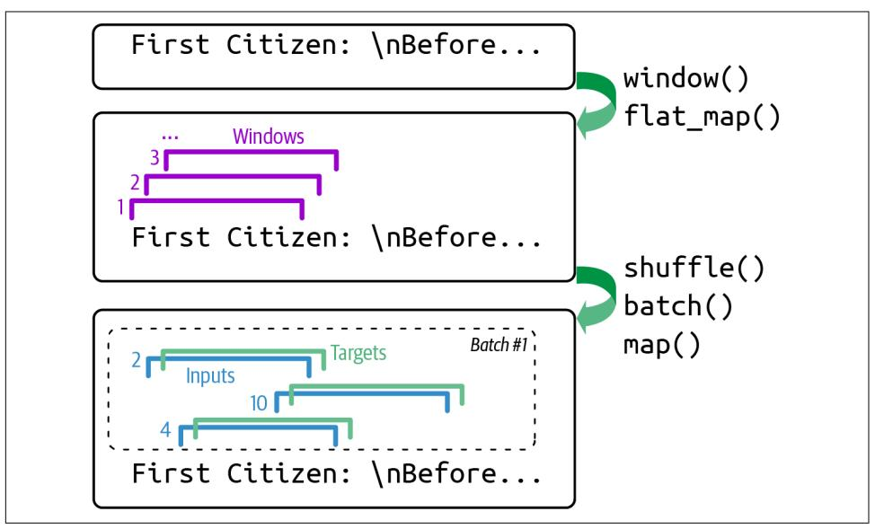

Figure 16-1. Preparing a dataset of shuffled windows

{608}------------------------------------------------

Now we're ready to create the training set, the validation set, and the test set. We will use roughly 90% of the text for training, 5% for validation, and 5% for testing:

```
lenath = 100
tf.random.set_seed(42)
train set = to dataset(encoded[:1 000 000], length=length, shuffle=True,
                       seed=42)valid_set = to_dataset(encoded[1_000_000:1_060_000], length=length)
test_set = to_dataset(encoded[1_060_000:], length=length)
```


We set the window length to 100, but you can try tuning it: it's easier and faster to train RNNs on shorter input sequences, but the RNN will not be able to learn any pattern longer than length, so don't make it too small.

That's it! Preparing the dataset was the hardest part. Now let's create the model.

### **Building and Training the Char-RNN Model**

Since our dataset is reasonably large, and modeling language is quite a difficult task, we need more than a simple RNN with a few recurrent neurons. Let's build and train a model with one GRU layer composed of 128 units (you can try tweaking the number of layers and units later, if needed):

```
model = tf.keras.Sequential(f)tf.keras.layers.Embedding(input_dim=n_tokens, output_dim=16),
    tf.keras.layers.GRU(128, return_sequences=True),
    tf.keras.layers.Dense(n_tokens, activation="softmax")
\left| \right\ranglemodel.compile(loss="sparse categorical crossentropy", optimizer="nadam",
              metrics = ['accuracy"]model_ckpt = tf.keras.callbacks.ModelCheckpoint(
    "my_shakespeare_model", monitor="val_accuracy", save_best_only=True)
history = model.fit(train_set, validation_data=valid_set, epochs=10,
                    callbacks=[model ckpt])
```

Let's go over this code:

- We use an Embedding layer as the first layer, to encode the character IDs (embeddings were introduced in Chapter 13). The Embedding layer's number of input dimensions is the number of distinct character IDs, and the number of output dimensions is a hyperparameter you can tune—we'll set it to 16 for now. Whereas the inputs of the Embedding layer will be 2D tensors of shape [batch size, window length], the output of the Embedding layer will be a 3D tensor of shape [batch size, window length, embedding size].
- We use a Dense layer for the output layer: it must have 39 units (n\_tokens) because there are 39 distinct characters in the text, and we want to output a

{609}------------------------------------------------

probability for each possible character (at each time step). The 39 output probabilities should sum up to 1 at each time step, so we apply the softmax activation function to the outputs of the Dense layer.

• Lastly, we compile this model, using the "sparse\_categorical\_crossentropy" loss and a Nadam optimizer, and we train the model for several epochs,<sup>3</sup> using a ModelCheckpoint callback to save the best model (in terms of validation accuracy) as training progresses.


If you are running this code on Colab with a GPU activated, then training should take roughly one to two hours. You can reduce the number of epochs if you don't want to wait that long, but of course the model's accuracy will probably be lower. If the Colab session times out, make sure to reconnect quickly, or else the Colab runtime will be destroyed.

This model does not handle text preprocessing, so let's wrap it in a final model containing the tf.keras.layers.TextVectorization layer as the first layer, plus a tf.keras.layers.Lambda layer to subtract 2 from the character IDs since we're not using the padding and unknown tokens for now:

```
shakespeare model = tf.keras.Sequential(\lceiltext_vec_layer,
    tf.keras.layers.Lambda(lambda X: X - 2), # no <PAD> or <UNK> tokens
    model
\left| \right)
```

And now let's use it to predict the next character in a sentence:

```
>>> y proba = shakespeare model.predict(\lceil"To be or not to b"])\lceil \theta, -1 \rceil>>> y_pred = tf.argmax(y_proba) # choose the most probable character ID
>>> text_vec_layer.get_vocabulary()[y_pred + 2]
'e'
```

Great, the model correctly predicted the next character. Now let's use this model to pretend we're Shakespeare!

#### **Generating Fake Shakespearean Text**

To generate new text using the char-RNN model, we could feed it some text, make the model predict the most likely next letter, add it to the end of the text, then give the extended text to the model to guess the next letter, and so on. This is called greedy *decoding*. But in practice this often leads to the same words being repeated over and

<sup>3</sup> Since the input windows overlap, the concept of *epoch* is not so clear in this case: during each epoch (as implemented by Keras), the model will actually see the same character multiple times.

{610}------------------------------------------------

over again. Instead, we can sample the next character randomly, with a probability equal to the estimated probability, using TensorFlow's tf.random.categorical() function. This will generate more diverse and interesting text. The categorical() function samples random class indices, given the class log probabilities (logits). For example:

```
>>> log probas = tf.math.log([0.5, 0.4, 0.1]) # probas = 50%, 40%, and 10%
>>> tf.random.set_seed(42)
>>> tf.random.categorical(log_probas, num_samples=8) # draw 8 samples
<tf.Tensor: shape=(1, 8), dtype=int64, numpy=array([0, 1, 0, 2, 1, 0, 0, 1]])>
```

To have more control over the diversity of the generated text, we can divide the logits by a number called the *temperature*, which we can tweak as we wish. A temperature close to zero favors high-probability characters, while a high temperature gives all characters an equal probability. Lower temperatures are typically preferred when generating fairly rigid and precise text, such as mathematical equations, while higher temperatures are preferred when generating more diverse and creative text. The following next\_char() custom helper function uses this approach to pick the next character to add to the input text:

```
def next_char(text, temperature=1):
    y proba = shakespeare model.predict([text])0, -1:
    rescaled logits = tf.math.log(y proba) / temperaturechar_id = tf.random.categorical(rescaled_logits, num_samples=1)[0, 0]
    return text_vec_layer.get_vocabulary()[char_id + 2]
```

Next, we can write another small helper function that will repeatedly call next char() to get the next character and append it to the given text:

```
def extend_text(text, n_chars=50, temperature=1):
   for in range(n_{class}):
       text += next char(text, temperature)return text
```

We are now ready to generate some text! Let's try with different temperature values:

```
>>> tf.random.set seed(42)
>>> print(extend text("To be or not to be", temperature=0.01))
To be or not to be the duke
as it is a proper strange death,
and the
>>> print(extend_text("To be or not to be", temperature=1))
To be or not to behold?
second push:
gremio, lord all, a sistermen,
>>> print(extend text("To be or not to be", temperature=100))
To be or not to bef ,mt'&o3fpadm!$
wh!nse?bws3est--vgerdjw?c-y-ewznq
```

{611}------------------------------------------------

Shakespeare seems to be suffering from a heatwave. To generate more convincing text, a common technique is to sample only from the top  $k$  characters, or only from the smallest set of top characters whose total probability exceeds some threshold (this is called nucleus sampling). Alternatively, you could try using beam search, which we will discuss later in this chapter, or using more GRU layers and more neurons per layer, training for longer, and adding some regularization if needed. Also note that the model is currently incapable of learning patterns longer than length, which is just 100 characters. You could try making this window larger, but it will also make training harder, and even LSTM and GRU cells cannot handle very long sequences. An alternative approach is to use a stateful RNN.

#### **Stateful RNN**

Until now, we have only used *stateless RNNs*: at each training iteration the model starts with a hidden state full of zeros, then it updates this state at each time step, and after the last time step, it throws it away as it is not needed anymore. What if we instructed the RNN to preserve this final state after processing a training batch and use it as the initial state for the next training batch? This way the model could learn long-term patterns despite only backpropagating through short sequences. This is called a *stateful RNN*. Let's go over how to build one.

First, note that a stateful RNN only makes sense if each input sequence in a batch starts exactly where the corresponding sequence in the previous batch left off. So the first thing we need to do to build a stateful RNN is to use sequential and nonoverlapping input sequences (rather than the shuffled and overlapping sequences we used to train stateless RNNs). When creating the tf.data.Dataset, we must therefore use shift=length (instead of shift=1) when calling the window() method. Moreover, we must not call the shuffle() method.

Unfortunately, batching is much harder when preparing a dataset for a stateful RNN than it is for a stateless RNN. Indeed, if we were to call batch(32), then 32 consecutive windows would be put in the same batch, and the following batch would not continue each of these windows where it left off. The first batch would contain windows 1 to 32 and the second batch would contain windows 33 to 64, so if you consider, say, the first window of each batch (i.e., windows 1 and 33), you can see that they are not consecutive. The simplest solution to this problem is to just use a batch size of 1. The following to dataset for stateful rnn() custom utility function uses this strategy to prepare a dataset for a stateful RNN:

{612}------------------------------------------------

```
def to_dataset_for_stateful_rnn(sequence, length):
   ds = tf.data.Dataset.from tensor slices(sequence)
   ds = ds.window(length + 1, shift=length, drop_remainder=True)
   ds = ds. flat map(lambda window: window.batch(length + 1)).batch(1)
   return ds.map(lambda window: (window[:, :-1], window[:, 1:])).prefetch(1)
stateful_train_set = to_dataset_for_stateful_rnn(encoded[:1_000_000], length)
stateful_valid_set = to_dataset_for_stateful_rnn(encoded[1_000_000:1_060_000],
                                                 lenath)
stateful_test_set = to_dataset_for_stateful_rnn(encoded[1_060_000:], length)
```

Figure 16-2 summarizes the main steps of this function.


Figure 16-2. Preparing a dataset of consecutive sequence fragments for a stateful RNN

Batching is harder, but it is not impossible. For example, we could chop Shakespeare's text into 32 texts of equal length, create one dataset of consecutive input sequences for each of them, and finally use tf.data.Dataset.zip(datasets).map(lambda \*windows: tf.stack(windows)) to create proper consecutive batches, where the  $n^{\text{th}}$ input sequence in a batch starts off exactly where the  $n<sup>th</sup>$  input sequence ended in the previous batch (see the notebook for the full code).

Now, let's create the stateful RNN. We need to set the stateful argument to True when creating each recurrent layer, and because the stateful RNN needs to know the batch size (since it will preserve a state for each input sequence in the batch). Therefore we must set the batch\_input\_shape argument in the first layer. Note that we can leave the second dimension unspecified, since the input sequences could have any length:

{613}------------------------------------------------

```
model = tf.keras.Sequential(tf.keras.layers.Embedding(input dim=n tokens, output dim=16,
                              batch_input_shape=[1, None]),
    tf.keras.layers.GRU(128, return sequences=True, stateful=True),
    tf.keras.layers.Dense(n tokens, activation="softmax")
\mathbf{I}
```

At the end of each epoch, we need to reset the states before we go back to the beginning of the text. For this, we can use a small custom Keras callback:

```
class ResetStatesCallback(tf.keras.callbacks.Callback):
   def on epoch begin(self, epoch, logs):
        self.model.reset states()
```

And now we can compile the model and train it using our callback:

```
model.compile(loss="sparse categorical crossentropy", optimizer="nadam",
              metrics = ['accuracy"]history = model.fit(stateful_train_set, validation_data=stateful_valid_set,
                    epochs=10, callbacks=[ResetStatesCallback(), model_ckpt])
```


After this model is trained, it will only be possible to use it to make predictions for batches of the same size as were used during training. To avoid this restriction, create an identical stateless model, and copy the stateful model's weights to this model.

Interestingly, although a char-RNN model is just trained to predict the next character, this seemingly simple task actually requires it to learn some higher-level tasks as well. For example, to find the next character after "Great movie, I really", it's helpful to understand that the sentence is positive, so what follows is more likely to be the letter "l" (for "loved") rather than "h" (for "hated"). In fact, a 2017 paper<sup>4</sup> by Alec Radford and other OpenAI researchers describes how the authors trained a big char-RNN-like model on a large dataset, and found that one of the neurons acted as an excellent sentiment analysis classifier: although the model was trained without any labels, the *sentiment neuron*—as they called it—reached state-of-the-art performance on sentiment analysis benchmarks. This foreshadowed and motivated unsupervised pretraining in NLP.

But before we explore unsupervised pretraining, let's turn our attention to word-level models and how to use them in a supervised fashion for sentiment analysis. In the process, you will learn how to handle sequences of variable lengths using masking.

<sup>4</sup> Alec Radford et al., "Learning to Generate Reviews and Discovering Sentiment", arXiv preprint arXiv:1704.01444 (2017).

{614}------------------------------------------------

## **Sentiment Analysis**

Generating text can be fun and instructive, but in real-life projects, one of the most common applications of NLP is text classification—especially sentiment analysis. If image classification on the MNIST dataset is the "Hello world!" of computer vision, then sentiment analysis on the IMDb reviews dataset is the "Hello world!" of natural language processing. The IMDb dataset consists of 50,000 movie reviews in English  $(25,000)$  for training, 25,000 for testing) extracted from the famous Internet Movie Database, along with a simple binary target for each review indicating whether it is negative  $(0)$  or positive  $(1)$ . Just like MNIST, the IMDb reviews dataset is popular for good reasons: it is simple enough to be tackled on a laptop in a reasonable amount of time, but challenging enough to be fun and rewarding.

Let's load the IMDb dataset using the TensorFlow Datasets library (introduced in Chapter 13). We'll use the first 90% of the training set for training, and the remaining 10% for validation:

```
import tensorflow_datasets as tfds
```

```
raw_train_set, raw_valid_set, raw_test_set = tfds.load(
    name="imdb_reviews",
    split=["train[:90%]", "train[90%:]", "test"],
    as supervised=True
\lambdatf.random.set seed(42)
train_set = raw_train_set.shuffle(5000, seed=42).batch(32).prefetch(1)
valid_set = raw_value_set.batch(32).prefetch(1)test_set = raw_test_set.batch(32).prefetch(1)
```


Keras also includes a function for loading the IMDb dataset, if you prefer: tf.keras.datasets.imdb.load\_data(). The reviews are already preprocessed as sequences of word IDs.

Let's inspect a few reviews:

```
>>> for review, label in raw_train_set.take(4):
        print(review.numpy().decode("utf-8"))
\cdotsprint("Label:", label.numpy())
\ddotsc\overline{1}This was an absolutely terrible movie. Don't be lured in by Christopher [\dots]Label: 0
I have been known to fall asleep during films, but this is usually due to [...]
Label: 0
Mann photographs the Alberta Rocky Mountains in a superb fashion, and [...]
Label: 0This is the kind of film for a snowy Sunday afternoon when the rest of the [\dots]Label: 1
```

{615}------------------------------------------------

Some reviews are easy to classify. For example, the first review includes the words "terrible movie" in the very first sentence. But in many cases things are not that simple. For example, the third review starts off positively, even though it's ultimately a negative review (label 0).

To build a model for this task, we need to preprocess the text, but this time we will chop it into words instead of characters. For this, we can use the tf.keras. layers. TextVectorization layer again. Note that it uses spaces to identify word boundaries, which will not work well in some languages. For example, Chinese writing does not use spaces between words, Vietnamese uses spaces even within words, and German often attaches multiple words together, without spaces. Even in English, spaces are not always the best way to tokenize text: think of "San Francisco" or "#ILoveDeepLearning".

Fortunately, there are solutions to address these issues. In a 2016 paper,<sup>5</sup> Rico Sennrich et al. from the University of Edinburgh explored several methods to tokenize and detokenize text at the subword level. This way, even if your model encounters a rare word it has never seen before, it can still reasonably guess what it means. For example, even if the model never saw the word "smartest" during training, if it learned the word "smart" and it also learned that the suffix "est" means "the most", it can infer the meaning of "smartest". One of the techniques the authors evaluated is byte pair encoding (BPE). BPE works by splitting the whole training set into individual characters (including spaces), then repeatedly merging the most frequent adjacent pairs until the vocabulary reaches the desired size.

A 2018 paper<sup>6</sup> by Taku Kudo at Google further improved subword tokenization, often removing the need for language-specific preprocessing prior to tokenization. Moreover, the paper proposed a novel regularization technique called *subword regula*rization, which improves accuracy and robustness by introducing some randomness in tokenization during training: for example, "New England" may be tokenized as "New" + "England", or "New" + "Eng" + "land", or simply "New England" (just one token). Google's SentencePiece project provides an open source implementation, which is described in a paper<sup>7</sup> by Taku Kudo and John Richardson.

<sup>5</sup> Rico Sennrich et al., "Neural Machine Translation of Rare Words with Subword Units", Proceedings of the 54th Annual Meeting of the Association for Computational Linguistics 1 (2016): 1715-1725.

<sup>6</sup> Taku Kudo, "Subword Regularization: Improving Neural Network Translation Models with Multiple Subword Candidates", arXiv preprint arXiv:1804.10959 (2018).

<sup>7</sup> Taku Kudo and John Richardson, "SentencePiece: A Simple and Language Independent Subword Tokenizer and Detokenizer for Neural Text Processing", arXiv preprint arXiv:1808.06226 (2018).

{616}------------------------------------------------

The TensorFlow Text library also implements various tokenization strategies, including WordPiece<sup>8</sup> (a variant of BPE), and last but not least, the Tokenizers library by Hugging Face implements a wide range of extremely fast tokenizers.

However, for the IMDb task in English, using spaces for token boundaries should be good enough. So let's go ahead with creating a TextVectorization layer and adapting it to the training set. We will limit the vocabulary to 1,000 tokens, including the most frequent 998 words plus a padding token and a token for unknown words, since it's unlikely that very rare words will be important for this task, and limiting the vocabulary size will reduce the number of parameters the model needs to learn:

```
vocab_size = 1000text vec layer = tf.keras.layers.TextVectorization(max tokens=vocab size)
text_vec_layer.adapt(train_set.map(lambda reviews, labels: reviews))
```

Finally, we can create the model and train it:

```
embed size = 128tf.random.set seed(42)
model = tf.keras.Sequential(f)text vec layer,
    tf.keras.layers.Embedding(vocab_size, embed_size),
    tf.keras.layers.GRU(128),
    tf.keras.layers.Dense(1, activation="sigmoid")
\left| \cdot \right|model.compile(loss="binary_crossentropy", optimizer="nadam",
              metrics=["accuracy"])
history = model.fit(train_set, validation_data=valid_set, epochs=2)
```

The first layer is the TextVectorization layer we just prepared, followed by an Embedding layer that will convert word IDs into embeddings. The embedding matrix needs to have one row per token in the vocabulary (vocab\_size) and one column per embedding dimension (this example uses 128 dimensions, but this is a hyperparameter you could tune). Next we use a GRU layer and a Dense layer with a single neuron and the sigmoid activation function, since this is a binary classification task: the model's output will be the estimated probability that the review expresses a positive sentiment regarding the movie. We then compile the model, and we fit it on the dataset we prepared earlier for a couple of epochs (or you can train for longer to get better results).

<sup>8</sup> Yonghui Wu et al., "Google's Neural Machine Translation System: Bridging the Gap Between Human and Machine Translation", arXiv preprint arXiv:1609.08144 (2016).

{617}------------------------------------------------

Sadly, if you run this code, you will generally find that the model fails to learn anything at all: the accuracy remains close to 50%, no better than random chance. Why is that? The reviews have different lengths, so when the TextVectorization layer converts them to sequences of token IDs, it pads the shorter sequences using the padding token (with ID 0) to make them as long as the longest sequence in the batch. As a result, most sequences end with many padding tokens—often dozens or even hundreds of them. Even though we're using a GRU layer, which is much better than a SimpleRNN layer, its short-term memory is still not great, so when it goes through many padding tokens, it ends up forgetting what the review was about! One solution is to feed the model with batches of equal-length sentences (which also speeds up training). Another solution is to make the RNN ignore the padding tokens. This can be done using masking.

### **Masking**

Making the model ignore padding tokens is trivial using Keras: simply add mask zero=True when creating the Embedding layer. This means that padding tokens (whose ID is 0) will be ignored by all downstream layers. That's all! If you retrain the previous model for a few epochs, you will find that the validation accuracy quickly reaches over 80%.

The way this works is that the Embedding layer creates a *mask tensor* equal to  $tf.math.not$  equal(inputs,  $0$ ): it is a Boolean tensor with the same shape as the inputs, and it is equal to False anywhere the token IDs are 0, or True otherwise. This mask tensor is then automatically propagated by the model to the next layer. If that layer's call() method has a mask argument, then it automatically receives the mask. This allows the layer to ignore the appropriate time steps. Each layer may handle the mask differently, but in general they simply ignore masked time steps (i.e., time steps for which the mask is False). For example, when a recurrent layer encounters a masked time step, it simply copies the output from the previous time step.

Next, if the layer's supports\_masking attribute is True, then the mask is automatically propagated to the next layer. It keeps propagating this way for as long as the layers have supports\_masking=True. As an example, a recurrent layer's supports\_ masking attribute is True when return\_sequences=True, but it's False when return\_ sequences=False since there's no need for a mask anymore in this case. So if you have a model with several recurrent layers with return sequences=True, followed by a recurrent layer with return sequences=False, then the mask will automatically propagate up to the last recurrent layer: that layer will use the mask to ignore masked steps, but it will not propagate the mask any further. Similarly, if you set mask\_zero=True when creating the Embedding layer in the sentiment analysis model we just built, then the GRU layer will receive and use the mask automatically, but it will not propagate it any further, since return\_sequences is not set to True.

{618}------------------------------------------------


Some layers need to update the mask before propagating it to the next layer: they do so by implementing the compute\_mask() method, which takes two arguments: the inputs and the previous mask. It then computes the updated mask and returns it. The default implementation of compute\_mask() just returns the previous mask unchanged.

Many Keras layers support masking: SimpleRNN, GRU, LSTM, Bidirectional, Dense, TimeDistributed, Add, and a few others (all in the tf.keras.layers package). However, convolutional layers (including Conv1D) do not support masking-it's not obvious how they would do so anyway.

If the mask propagates all the way to the output, then it gets applied to the losses as well, so the masked time steps will not contribute to the loss (their loss will be 0). This assumes that the model outputs sequences, which is not the case in our sentiment analysis model.


The LSTM and GRU layers have an optimized implementation for GPUs, based on Nvidia's cuDNN library. However, this implementation only supports masking if all the padding tokens are at the end of the sequences. It also requires you to use the default values for several hyperparameters: activation, recurrent activation, recurrent dropout, unroll, use bias, and reset after. If that's not the case, then these layers will fall back to the (much slower) default GPU implementation.

If you want to implement your own custom layer with masking support, you should add a mask argument to the call() method, and obviously make the method use the mask. Additionally, if the mask must be propagated to the next layers, then you should set self. supports masking=True in the constructor. If the mask must be updated before it is propagated, then you must implement the compute\_mask() method

If your model does not start with an Embedding layer, you may use the tf. keras. layers. Masking layer instead: by default, it sets the mask to tf. math. reduce\_any(tf.math.not\_equal(X, 0), axis=-1), meaning that time steps where the last dimension is full of zeros will be masked out in subsequent layers.

{619}------------------------------------------------

Using masking layers and automatic mask propagation works best for simple models. It will not always work for more complex models, such as when you need to mix Conv<sub>1</sub>D layers with recurrent layers. In such cases, you will need to explicitly compute the mask and pass it to the appropriate layers, using either the functional API or the subclassing API. For example, the following model is equivalent to the previous model, except it is built using the functional API and handles masking manually. It also adds a bit of dropout since the previous model was overfitting slightly:

```
inputs = tf.keras.layers.Input(shape=[], dtype=tf.string)
token\_ids = text\_vec\_layer(inputs)mask = tf.math.not_equal(token_ids, 0)Z = tf.keras.layers.Embedding(vocab_size, embed_size)(token_ids)
Z = tf.keras.layers.GRU(128, dropout=0.2)(Z, mask=mask)
outputs = tf.keras. layers. Dense(1, activation="sigmoid")(Z)model = tf.keras.Model(inputs=[inputs], outputs=[outputs])
```

One last approach to masking is to feed the model with ragged tensors.<sup>9</sup> In practice, all you need to do is to set ragged=True when creating the TextVectorization layer, so that the input sequences are represented as ragged tensors:

```
>>> text vec layer ragged = tf.keras.layers.TextVectorization(
        max tokens=vocab size, ragged=True)
\ddotsc>>> text vec layer ragged.adapt(train set.map(lambda reviews, labels: reviews))
>>> text_vec_layer_ragged(["Great movie!", "This is DiCaprio's best role."])
<tf.RaggedTensor [[86, 18], [11, 7, 1, 116, 217]]>
```

Compare this ragged tensor representation with the regular tensor representation, which uses padding tokens:

```
>>> text_vec_layer(["Great movie!", "This is DiCaprio's best role."])
<tf.Tensor: shape=(2, 5), dtype=int64, numpy=
array([[86, 18, 0, 0, 0],[11, 7, 1, 116, 217]]
```

Keras's recurrent layers have built-in support for ragged tensors, so there's nothing else you need to do: just use this TextVectorization layer in your model. There's no need to pass mask zero=True or handle masks explicitly—it's all implemented for you. That's convenient! However, as of early 2022, the support for ragged tensors in Keras is still fairly recent, so there are a few rough edges. For example, it is currently not possible to use ragged tensors as targets when running on the GPU (but this may be resolved by the time you read these lines).

Whichever masking approach you prefer, after training this model for a few epochs, it will become quite good at judging whether a review is positive or not. If you use the tf.keras.callbacks.TensorBoard() callback, you can visualize the embeddings

<sup>9</sup> Ragged tensors were introduced in Chapter 12, and they are detailed in Appendix C.

{620}------------------------------------------------

in TensorBoard as they are being learned: it is fascinating to see words like "awesome" and "amazing" gradually cluster on one side of the embedding space, while words like "awful" and "terrible" cluster on the other side. Some words are not as positive as you might expect (at least with this model), such as the word "good", presumably because many negative reviews contain the phrase "not good".

#### **Reusing Pretrained Embeddings and Language Models**

It's impressive that the model is able to learn useful word embeddings based on just 25,000 movie reviews. Imagine how good the embeddings would be if we had billions of reviews to train on! Unfortunately, we don't, but perhaps we can reuse word embeddings trained on some other (very) large text corpus (e.g., Amazon reviews, available on TensorFlow Datasets), even if it is not composed of movie reviews? After all, the word "amazing" generally has the same meaning whether you use it to talk about movies or anything else. Moreover, perhaps embeddings would be useful for sentiment analysis even if they were trained on another task: since words like "awesome" and "amazing" have a similar meaning, they will likely cluster in the embedding space even for tasks such as predicting the next word in a sentence. If all positive words and all negative words form clusters, then this will be helpful for sentiment analysis. So, instead of training word embeddings, we could just download and use pretrained embeddings, such as Google's Word2vec embeddings, Stanford's GloVe embeddings, or Facebook's FastText embeddings.

Using pretrained word embeddings was popular for several years, but this approach has its limits. In particular, a word has a single representation, no matter the context. For example, the word "right" is encoded the same way in "left and right" and "right and wrong", even though it means two very different things. To address this limitation, a 2018 paper<sup>10</sup> by Matthew Peters introduced Embeddings from Language Models (ELMo): these are contextualized word embeddings learned from the internal states of a deep bidirectional language model. Instead of just using pretrained embeddings in your model, you reuse part of a pretrained language model.

At roughly the same time, the Universal Language Model Fine-Tuning (ULMFiT) paper<sup>11</sup> by Jeremy Howard and Sebastian Ruder demonstrated the effectiveness of unsupervised pretraining for NLP tasks: the authors trained an LSTM language model on a huge text corpus using self-supervised learning (i.e., generating the labels automatically from the data), then they fine-tuned it on various tasks. Their model outperformed the state of the art on six text classification tasks by a large

<sup>10</sup> Matthew Peters et al., "Deep Contextualized Word Representations", Proceedings of the 2018 Conference of the North American Chapter of the Association for Computational Linguistics: Human Language Technologies 1  $(2018): 2227 - 2237.$ 

<sup>11</sup> Jeremy Howard and Sebastian Ruder, "Universal Language Model Fine-Tuning for Text Classification", Proceedings of the 56th Annual Meeting of the Association for Computational Linguistics 1 (2018): 328-339.

{621}------------------------------------------------

margin (reducing the error rate by 18–24% in most cases). Moreover, the authors showed a pretrained model fine-tuned on just 100 labeled examples could achieve the same performance as one trained from scratch on 10,000 examples. Before the ULMFIT paper, using pretrained models was only the norm in computer vision; in the context of NLP, pretraining was limited to word embeddings. This paper marked the beginning of a new era in NLP: today, reusing pretrained language models is the norm

For example, let's build a classifier based on the Universal Sentence Encoder, a model architecture introduced in a  $2018$  paper<sup>12</sup> by a team of Google researchers. This model is based on the transformer architecture, which we will look at later in this chapter. Conveniently, the model is available on TensorFlow Hub:

```
import os
import tensorflow_hub as hub
os.environ["TFHUB CACHE DIR"] = "my tfhub cache"
model = tf.keras.Sequential([hub.KerasLayer("https://tfhub.dev/google/universal-sentence-encoder/4",
                   trainable=True, dtype=tf.string, input shape=[]),
    tf.keras.layers.Dense(64, activation="relu"),
    tf.keras.layers.Dense(1, activation="sigmoid")
\mathbf{I}model.compile(loss="binary_crossentropy", optimizer="nadam",
              metrics=["accuracy"])
model.fit(train_set, validation_data=valid_set, epochs=10)
```


This model is quite large—close to 1 GB in size—so it may take a while to download. By default, TensorFlow Hub modules are saved to a temporary directory, and they get downloaded again and again every time you run your program. To avoid that, you must set the TFHUB CACHE DIR environment variable to a directory of your choice: the modules will then be saved there, and only downloaded once.

Note that the last part of the TensorFlow Hub module URL specifies that we want version 4 of the model. This versioning ensures that if a new module version is released on TF Hub, it will not break our model. Conveniently, if you just enter this URL in a web browser, you will get the documentation for this module.

<sup>12</sup> Daniel Cer et al., "Universal Sentence Encoder", arXiv preprint arXiv:1803.11175 (2018).

{622}------------------------------------------------

Also note that we set trainable=True when creating the hub. KerasLayer. This way, the pretrained Universal Sentence Encoder is fine-tuned during training; some of its weights are tweaked via backprop. Not all TensorFlow Hub modules are fine-tunable, so make sure to check the documentation for each pretrained module you're interested in.

After training, this model should reach a validation accuracy of over 90%. That's actually really good: if you try to perform the task yourself, you will probably do only marginally better since many reviews contain both positive and negative comments. Classifying these ambiguous reviews is like flipping a coin.

So far we have looked at text generation using a char-RNN, and sentiment analysis with word-level RNN models (based on trainable embeddings) and using a powerful pretrained language model from TensorFlow Hub. In the next section, we will explore another important NLP task: neural machine translation (NMT).

### An Encoder-Decoder Network for Neural Machine **Translation**

Let's begin with a simple NMT model<sup>13</sup> that will translate English sentences to Spanish (see Figure 16-3).

In short, the architecture is as follows: English sentences are fed as inputs to the encoder, and the decoder outputs the Spanish translations. Note that the Spanish translations are also used as inputs to the decoder during training, but shifted back by one step. In other words, during training the decoder is given as input the word that it *should* have output at the previous step, regardless of what it actually output. This is called teacher forcing-a technique that significantly speeds up training and improves the model's performance. For the very first word, the decoder is given the start-of-sequence (SOS) token, and the decoder is expected to end the sentence with an end-of-sequence (EOS) token.

Each word is initially represented by its ID (e.g., 854 for the word "soccer"). Next, an Embedding layer returns the word embedding. These word embeddings are then fed to the encoder and the decoder.

At each step, the decoder outputs a score for each word in the output vocabulary (i.e., Spanish), then the softmax activation function turns these scores into probabilities. For example, at the first step the word "Me" may have a probability of 7%, "Yo" may have a probability of 1%, and so on. The word with the highest probability is output. This is very much like a regular classification task, and indeed you can train the

<sup>13</sup> Ilya Sutskever et al., "Sequence to Sequence Learning with Neural Networks", arXiv preprint (2014).

{623}------------------------------------------------


model using the "sparse categorical crossentropy" loss, much like we did in the char-RNN model.

Figure 16-3. A simple machine translation model

Note that at inference time (after training), you will not have the target sentence to feed to the decoder. Instead, you need to feed it the word that it has just output at the previous step, as shown in Figure 16-4 (this will require an embedding lookup that is not shown in the diagram).


In a 2015 paper,<sup>14</sup> Samy Bengio et al. proposed gradually switching from feeding the decoder the previous target token to feeding it the previous output token during training.

<sup>14</sup> Samy Bengio et al., "Scheduled Sampling for Sequence Prediction with Recurrent Neural Networks", arXiv preprint arXiv:1506.03099 (2015).

{624}------------------------------------------------

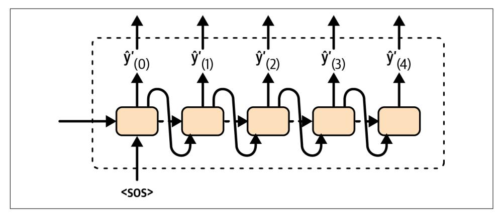

Figure 16-4. At inference time, the decoder is fed as input the word it just output at the previous time step

Let's build and train this model! First, we need to download a dataset of English/ Spanish sentence pairs:<sup>15</sup>

```
url = "https://storage.googleapis.com/download.tensorflow.org/data/spa-eng.zip"
path = tf.keras.utils.get_file("spa-eng.zip", origin=url, cache_dir="datasets",
                               extraction = True)text = (Path(path).with_name("spa-eng") / "spa.txt").read_text()
```

Each line contains an English sentence and the corresponding Spanish translation, separated by a tab. We'll start by removing the Spanish characters "i" and "i", which the TextVectorization layer doesn't handle, then we will parse the sentence pairs and shuffle them. Finally, we will split them into two separate lists, one per language:

```
import numpy as np
text = text.replace(";", "").replace(";", "")
pairs = [line.split(" \t\tt t") for line in text.splitlines()]
np.random.shuffle(pairs)
sentences_en, sentences_es = zip(*pairs) # separates the pairs into 2 lists
```

Let's take a look at the first three sentence pairs:

```
\Rightarrow for i in range(3):
        print(sentences_en[i], "=>", sentences_es[i])
\ddotsc\ddotscHow boring! => Qué aburrimiento!
I love sports. => Adoro el deporte.
Would you like to swap jobs? => Te gustaría que intercambiemos los trabajos?
```

<sup>15</sup> This dataset is composed of sentence pairs created by contributors of the Tatoeba project. About 120,000 sentence pairs were selected by the authors of the website https://manythings.org/anki. This dataset is released under the Creative Commons Attribution 2.0 France license. Other language pairs are available.

{625}------------------------------------------------

Next, let's create two TextVectorization layers—one per language—and adapt them to the text:

```
vocab_size = 1000max_length = 50text vec layer en = tf.keras.layers.TextVectorization(
   vocab_size, output_sequence_length=max_length)
text vec layer es = tf.keras.layers.TextVectorization(
   vocab size, output sequence length=max length)
text_vec_layer_en.adapt(sentences_en)
text vec layer es.adapt([f"startofseq {s} endofseq" for s in sentences es])
```

There are a few things to note here:

- We limit the vocabulary size to 1,000, which is quite small. That's because the training set is not very large, and because using a small value will speed up training. State-of-the-art translation models typically use a much larger vocabulary (e.g., 30,000), a much larger training set (gigabytes), and a much larger model (hundreds or even thousands of megabytes). For example, check out the Opus-MT models by the University of Helsinki, or the M2M-100 model by Facebook.
- Since all sentences in the dataset have a maximum of 50 words, we set output\_sequence\_length to 50: this way the input sequences will automatically be padded with zeros until they are all 50 tokens long. If there was any sentence longer than 50 tokens in the training set, it would be cropped to 50 tokens.
- For the Spanish text, we add "startofseq" and "endofseq" to each sentence when adapting the TextVectorization layer: we will use these words as SOS and EOS tokens. You could use any other words, as long as they are not actual Spanish words

Let's inspect the first 10 tokens in both vocabularies. They start with the padding token, the unknown token, the SOS and EOS tokens (only in the Spanish vocabulary), then the actual words, sorted by decreasing frequency:

```
>>> text_vec_layer_en.get_vocabulary()[:10]
['', '[UNK]', 'the', 'i', 'to', 'you', 'tom', 'a', 'is', 'he']
>>> text_vec_layer_es.get_vocabulary()[:10]
['', '[UNK]', 'startofseq', 'endofseq', 'de', 'que', 'a', 'no', 'tom', 'la']
```

Next, let's create the training set and the validation set (you could also create a test set if you needed it). We will use the first 100,000 sentence pairs for training, and the rest for validation. The decoder's inputs are the Spanish sentences plus an SOS token prefix. The targets are the Spanish sentences plus an EOS suffix:

```
X train = tf.constant(sentences en[:100 000])
X valid = tf.constant(sentences en[100 000:])
X_train_dec = tf.constant([f"startofseq {s}" for s in sentences_es[:100_000]])
X_valid_dec = tf.constant([f"startofseq {s}" for s in sentences_es[100_000:]])
```

{626}------------------------------------------------

```
Y_train = text_vec_layer_es([f"{s} endofseq" for s in sentences_es[:100_000]])
Y_valid = text_vec_layer_es([f"{s} endofseq" for s in sentences_es[100_000:]])
```

OK, we're now ready to build our translation model. We will use the functional API for that since the model is not sequential. It requires two text inputs—one for the encoder and one for the decoder-so let's start with that:

```
encoder_inputs = tf.keras.layers.Input(shape=[], dtype=tf.string)
decoder_inputs = tf.keras.layers.Input(shape=[], dtype=tf.string)
```

Next, we need to encode these sentences using the TextVectorization layers we prepared earlier, followed by an Embedding layer for each language, with mask zero=True to ensure masking is handled automatically. The embedding size is a hyperparameter you can tune, as always:

```
embed size = 128encoder_input_ids = text_vec_layer_en(encoder_inputs)
decoder_input_ids = text_vec_layer_es(decoder_inputs)
encoder_{en}bedding_layer = tf.keras.layers.Embedding(vocab_size, embed_size,
                                                    mask zero=True)
decoder embedding layer = tf.keras.layers.Embedding(vocab size, embed size,
                                                    mask zero=True)
encoder embeddings = encoder embedding layer(encoder input ids)
decoder_embeddings = decoder_embedding_layer(decoder_input_ids)
```


When the languages share many words, you may get better performance using the same embedding layer for both the encoder and the decoder.

Now let's create the encoder and pass it the embedded inputs:

```
encoder = tf.keras.layers.LSTM(512, return state=True)
encoder outputs, *encoder state = encoder(encoder embeddings)
```

To keep things simple, we just used a single LSTM layer, but you could stack several of them. We also set return\_state=True to get a reference to the layer's final state. Since we're using an LSTM layer, there are actually two states: the short-term state and the long-term state. The layer returns these states separately, which is why we had to write \*encoder\_state to group both states in a list.<sup>16</sup> Now we can use this (double) state as the initial state of the decoder:

```
decoder = tf.keras.layers.LSTM(512, return sequences=True)
decoder outputs = decoder(decoder embeddings, initial state=encoder state)
```

<sup>16</sup> In Python, if you run a, \*b = [1, 2, 3, 4], then a equals 1 and b equals [2, 3, 4].

{627}------------------------------------------------

Next, we can pass the decoder's outputs through a Dense layer with the softmax activation function to get the word probabilities for each step:

```
output_layer = tf.keras.layers.Dense(vocab_size, activation="softmax")
Y_proba = output_layer(decoder_outputs)
```

#### **Optimizing the Output Layer**

When the output vocabulary is large, outputting a probability for each and every possible word can be quite slow. If the target vocabulary contained, say, 50,000 Spanish words instead of 1,000, then the decoder would output 50,000-dimensional vectors, and computing the softmax function over such a large vector would be very computationally intensive. To avoid this, one solution is to look only at the logits output by the model for the correct word and for a random sample of incorrect words, then compute an approximation of the loss based only on these logits. This sampled softmax technique was introduced in 2015 by Sébastien Jean et al.<sup>17</sup> In TensorFlow you can use the tf.nn.sampled softmax loss() function for this during training and use the normal softmax function at inference time (sampled softmax cannot be used at inference time because it requires knowing the target).

Another thing you can do to speed up training—which is compatible with sampled softmax—is to tie the weights of the output layer to the transpose of the decoder's embedding matrix (you will see how to tie weights in Chapter 17). This significantly reduces the number of model parameters, which speeds up training and may sometimes improve the model's accuracy as well, especially if you don't have a lot of training data. The embedding matrix is equivalent to one-hot encoding followed by a linear layer with no bias term and no activation function that maps the one-hot vectors to the embedding space. The output layer does the reverse. So, if the model can find an embedding matrix whose transpose is close to its inverse (such a matrix is called an *orthogonal matrix*), then there's no need to learn a separate set of weights for the output layer.

And that's it! We just need to create the Keras Model, compile it, and train it:

```
model = tf.keras.Model(inputs=[encoder_inputs, decoder_inputs],
                       outputs=[Y_proba])
model.compile(loss="sparse_categorical_crossentropy", optimizer="nadam",
              metrics=["accuracy"])
model.fit((X_train, X_train_dec), Y_train, epochs=10,
          validation_data=((X_valid, X_valid_dec), Y_valid))
```

<sup>17</sup> Sébastien Jean et al., "On Using Very Large Target Vocabulary for Neural Machine Translation", Proceedings of the 53rd Annual Meeting of the Association for Computational Linguistics and the 7th International Joint Conference on Natural Language Processing of the Asian Federation of Natural Language Processing 1 (2015):  $1 - 10.$ 

{628}------------------------------------------------

After training, we can use the model to translate new English sentences to Spanish. But it's not as simple as calling model. predict(), because the decoder expects as input the word that was predicted at the previous time step. One way to do this is to write a custom memory cell that keeps track of the previous output and feeds it to the encoder at the next time step. However, to keep things simple, we can just call the model multiple times, predicting one extra word at each round. Let's write a little utility function for that:

```
def translate(sentence_en):
    translation = ""
    for word idx in range(max length):
       X = np.array([sentence_en]) # encoder inputX_dec = np.array(["startofseq " + translation]) # decoder input
       y proba = model.predict((X, X dec))[0, word idx] # last token's probas
       predictedل}wd_id = np.argvax(y_prob)predicted_word = text_vec_layer_es.get_vocabulary()[predicted_word_id]
       if predicted word == "endofseq":
           hreak
       translation += " + predicted word
    return translation.strip()
```

The function simply keeps predicting one word at a time, gradually completing the translation, and it stops once it reaches the EOS token. Let's give it a try!

```
>>> translate("I like soccer")
'me qusta el fútbol'
```

Hurray, it works! Well, at least it does with very short sentences. If you try playing with this model for a while, you will find that it's not bilingual yet, and in particular it really struggles with longer sentences. For example:

```
>>> translate("I like soccer and also going to the beach")
'me qusta el fútbol y a veces mismo al bus'
```

The translation says "I like soccer and sometimes even the bus". So how can you improve it? One way is to increase the training set size and add more LSTM layers in both the encoder and the decoder. But this will only get you so far, so let's look at more sophisticated techniques, starting with bidirectional recurrent layers.

### **Bidirectional RNNs**

At each time step, a regular recurrent layer only looks at past and present inputs before generating its output. In other words, it is *causal*, meaning it cannot look into the future. This type of RNN makes sense when forecasting time series, or in the decoder of a sequence-to-sequence (seq2seq) model. But for tasks like text classification, or in the encoder of a seq2seq model, it is often preferable to look ahead at the next words before encoding a given word.

{629}------------------------------------------------

For example, consider the phrases "the right arm", "the right person", and "the right to criticize": to properly encode the word "right", you need to look ahead. One solution is to run two recurrent layers on the same inputs, one reading the words from left to right and the other reading them from right to left, then combine their outputs at each time step, typically by concatenating them. This is what a *bidirectional recurrent layer* does (see Figure 16-5).

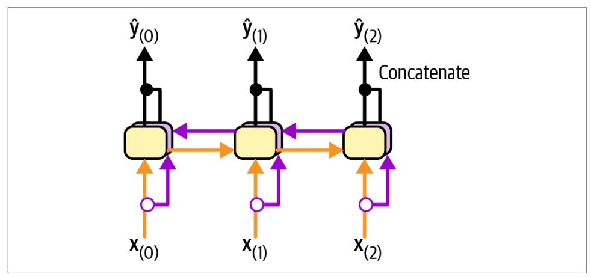

Figure 16-5. A bidirectional recurrent layer

To implement a bidirectional recurrent layer in Keras, just wrap a recurrent layer in a tf.keras.layers.Bidirectional layer. For example, the following Bidirectional layer could be used as the encoder in our translation model:

```
encoder = tf.keras.layers.Bidirectional(
   tf.keras.layers.LSTM(256, return state=True))
```


The Bidirectional layer will create a clone of the GRU layer (but in the reverse direction), and it will run both and concatenate their outputs. So although the GRU layer has 10 units, the Bidirectional layer will output 20 values per time step.

There's just one problem. This layer will now return four states instead of two: the final short-term and long-term states of the forward LSTM layer, and the final shortterm and long-term states of the backward LSTM layer. We cannot use this quadruple state directly as the initial state of the decoder's LSTM layer, since it expects just two states (short-term and long-term). We cannot make the decoder bidirectional, since it must remain causal: otherwise it would cheat during training and it would not work. Instead, we can concatenate the two short-term states, and also concatenate the two long-term states:

{630}------------------------------------------------

```
encoder_outputs, *encoder_state = encoder(encoder_embeddings)
encoder_state = [tf.concat(encode{\_}state[::2], axis=-1), # short-term (0 & 2)tf.\text{concat}(\text{encoder}\_\text{state}[1::2], \text{axis}=-1)] # long-term (1 & 3)
```

Now let's look at another popular technique that can greatly improve the performance of a translation model at inference time: beam search.

### **Beam Search**

Suppose you have trained an encoder-decoder model, and you use it to translate the sentence "I like soccer" to Spanish. You are hoping that it will output the proper translation "me gusta el fútbol", but unfortunately it outputs "me gustan los jugadores", which means "I like the players". Looking at the training set, you notice many sentences such as "I like cars", which translates to "me gustan los autos", so it wasn't absurd for the model to output "me gustan los" after seeing "I like". Unfortunately, in this case it was a mistake since "soccer" is singular. The model could not go back and fix it, so it tried to complete the sentence as best it could, in this case using the word "jugadores". How can we give the model a chance to go back and fix mistakes it made earlier? One of the most common solutions is beam search: it keeps track of a short list of the  $k$  most promising sentences (say, the top three), and at each decoder step it tries to extend them by one word, keeping only the  $k$  most likely sentences. The parameter  $k$  is called the beam width.

For example, suppose you use the model to translate the sentence "I like soccer" using beam search with a beam width of 3 (see Figure 16-6). At the first decoder step, the model will output an estimated probability for each possible first word in the translated sentence. Suppose the top three words are "me" (75% estimated probability), "a" (3%), and "como" (1%). That's our short list so far. Next, we use the model to find the next word for each sentence. For the first sentence ("me"), perhaps the model outputs a probability of 36% for the word "gustan", 32% for the word "gusta", 16% for the word "encanta", and so on. Note that these are actually conditional probabilities, given that the sentence starts with "me". For the second sentence ("a"), the model might output a conditional probability of 50% for the word "mi", and so on. Assuming the vocabulary has 1,000 words, we will end up with 1,000 probabilities per sentence.

Next, we compute the probabilities of each of the 3,000 two-word sentences we considered  $(3 \times 1,000)$ . We do this by multiplying the estimated conditional probability of each word by the estimated probability of the sentence it completes. For example, the estimated probability of the sentence "me" was 75%, while the estimated conditional probability of the word "gustan" (given that the first word is "me") was 36%, so the estimated probability of the sentence "me gustan" is  $75\% \times 36\% = 27\%$ . After computing the probabilities of all 3,000 two-word sentences, we keep only the top 3. In this example they all start with the word "me": "me gustan" (27%),

{631}------------------------------------------------

"me gusta" (24%), and "me encanta" (12%). Right now, the sentence "me gustan" is winning, but "me gusta" has not been eliminated.


Figure 16-6. Beam search, with a beam width of 3

Then we repeat the same process: we use the model to predict the next word in each of these three sentences, and we compute the probabilities of all 3,000 three-word sentences we considered. Perhaps the top three are now "me gustan los" (10%), "me gusta el" (8%), and "me gusta mucho" (2%). At the next step we may get "me gusta el fútbol" (6%), "me gusta mucho el" (1%), and "me gusta el deporte" (0.2%). Notice that "me gustan" was eliminated, and the correct translation is now ahead. We boosted our encoder-decoder model's performance without any extra training, simply by using it more wisely.


The TensorFlow Addons library includes a full seq2seq API that lets you build encoder-decoder models with attention, including beam search, and more. However, its documentation is currently very limited. Implementing beam search is a good exercise, so give it a try! Check out this chapter's notebook for a possible solution.

With all this, you can get reasonably good translations for fairly short sentences. Unfortunately, this model will be really bad at translating long sentences. Once again, the problem comes from the limited short-term memory of RNNs. Attention *mechanisms* are the game-changing innovation that addressed this problem.

### **Attention Mechanisms**

Consider the path from the word "soccer" to its translation "fútbol" back in Figure 16-3: it is quite long! This means that a representation of this word (along with all 

{632}------------------------------------------------

the other words) needs to be carried over many steps before it is actually used. Can't we make this path shorter?

This was the core idea in a landmark 2014 paper<sup>18</sup> by Dzmitry Bahdanau et al., where the authors introduced a technique that allowed the decoder to focus on the appropriate words (as encoded by the encoder) at each time step. For example, at the time step where the decoder needs to output the word "futbol", it will focus its attention on the word "soccer". This means that the path from an input word to its translation is now much shorter, so the short-term memory limitations of RNNs have much less impact. Attention mechanisms revolutionized neural machine translation (and deep learning in general), allowing a significant improvement in the state of the art, especially for long sentences (e.g., over 30 words).


The most common metric used in NMT is the bilingual evaluation understudy (BLEU) score, which compares each translation produced by the model with several good translations produced by humans: it counts the number of  $n$ -grams (sequences of  $n$  words) that appear in any of the target translations and adjusts the score to take into account the frequency of the produced  $n$ -grams in the target translations.

Figure 16-7 shows our encoder-decoder model with an added attention mechanism. On the left, you have the encoder and the decoder. Instead of just sending the encoder's final hidden state to the decoder, as well as the previous target word at each step (which is still done, although it is not shown in the figure), we now send all of the encoder's outputs to the decoder as well. Since the decoder cannot deal with all these encoder outputs at once, they need to be aggregated: at each time step, the decoder's memory cell computes a weighted sum of all the encoder outputs. This determines which words it will focus on at this step. The weight  $\alpha_{(t,i)}$  is the weight of the *i*<sup>th</sup> encoder output at the *t*<sup>th</sup> decoder time step. For example, if the weight  $\alpha_{(3,2)}$  is much larger than the weights  $\alpha_{(3,0)}$  and  $\alpha_{(3,1)}$ , then the decoder will pay much more attention to the encoder's output for word #2 ("soccer") than to the other two outputs, at least at this time step. The rest of the decoder works just like earlier: at each time step the memory cell receives the inputs we just discussed, plus the hidden state from the previous time step, and finally (although it is not represented in the diagram) it receives the target word from the previous time step (or at inference time, the output from the previous time step).

<sup>18</sup> Dzmitry Bahdanau et al., "Neural Machine Translation by Jointly Learning to Align and Translate", arXiv preprint arXiv:1409.0473 (2014).

{633}------------------------------------------------

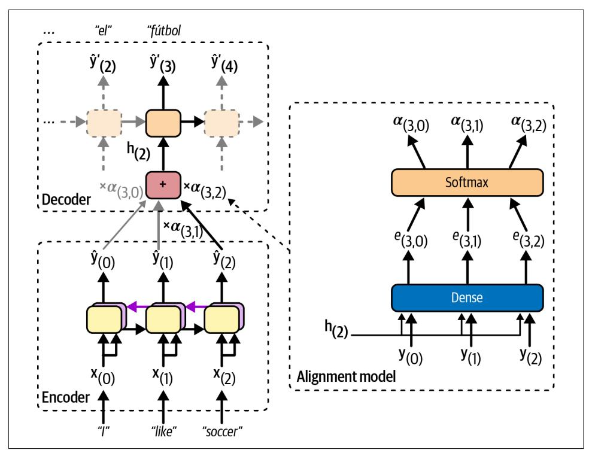

Figure 16-7. Neural machine translation using an encoder-decoder network with an attention model

But where do these  $\alpha_{(t,i)}$  weights come from? Well, they are generated by a small neural network called an *alignment model* (or an *attention layer*), which is trained jointly with the rest of the encoder-decoder model. This alignment model is illustrated on the righthand side of Figure 16-7. It starts with a Dense layer composed of a single neuron that processes each of the encoder's outputs, along with the decoder's previous hidden state (e.g.,  $h_{(2)}$ ). This layer outputs a score (or energy) for each encoder output (e.g.,  $e_{(3,2)}$ ): this score measures how well each output is aligned with the decoder's previous hidden state. For example, in Figure 16-7, the model has already output "me gusta el" (meaning "I like"), so it's now expecting a noun: the word "soccer" is the one that best aligns with the current state, so it gets a high score. Finally, all the scores go through a softmax layer to get a final weight for each encoder output (e.g.,  $\alpha_{(3,2)}$ ). All the weights for a given decoder time step add up to 1. This particular attention mechanism is called Bahdanau attention (named after the 2014 paper's first author). Since it concatenates the encoder output with the decoder's previous hidden state, it is sometimes called *concatenative attention* (or additive attention).

{634}------------------------------------------------


If the input sentence is  $n$  words long, and assuming the output sentence is about as long, then this model will need to compute about  $n<sup>2</sup>$  weights. Fortunately, this quadratic computational complexity is still tractable because even long sentences don't have thousands of words.

Another common attention mechanism, known as Luong attention or multiplicative attention, was proposed shortly after, in 2015,<sup>19</sup> by Minh-Thang Luong et al. Because the goal of the alignment model is to measure the similarity between one of the encoder's outputs and the decoder's previous hidden state, the authors proposed to simply compute the dot product (see Chapter 4) of these two vectors, as this is often a fairly good similarity measure, and modern hardware can compute it very efficiently. For this to be possible, both vectors must have the same dimensionality. The dot product gives a score, and all the scores (at a given decoder time step) go through a softmax layer to give the final weights, just like in Bahdanau attention. Another simplification Luong et al. proposed was to use the decoder's hidden state at the current time step rather than at the previous time step (i.e.,  $\mathbf{h}_{(t)}$  rather than  $\mathbf{h}_{(t-1)}$ ), then to use the output of the attention mechanism (noted  $\mathbf{h}_{(t)}$ ) directly to compute the decoder's predictions, rather than using it to compute the decoder's current hidden state. The researchers also proposed a variant of the dot product mechanism where the encoder outputs first go through a fully connected layer (without a bias term) before the dot products are computed. This is called the "general" dot product approach. The researchers compared both dot product approaches with the concatenative attention mechanism (adding a rescaling parameter vector  $v$ ), and they observed that the dot product variants performed better than concatenative attention. For this reason, concatenative attention is much less used now. The equations for these three attention mechanisms are summarized in Equation 16-1.

#### Equation 16-1. Attention mechanisms

$$
\widetilde{\mathbf{h}}(t) = \sum_{i} \alpha_{(t, i)} \mathbf{y}_{(i)}
$$
\nwith  $\alpha_{(t, i)} = \frac{\exp(e_{(t, i)})}{\sum_{i'} \exp(e_{(t, i')})}$   
\nand  $e_{(t, i)} = \begin{cases} \mathbf{h}_{(t)}^\top \mathbf{y}_{(i)} & \text{dot} \\ \mathbf{h}_{(t)}^\top \mathbf{W} \mathbf{y}_{(i)} & \text{general} \\ \mathbf{v}^\top \tanh(\mathbf{W}[\mathbf{h}_{(t)}; \mathbf{y}_{(i)}]) & \text{concat} \end{cases}$ 

<sup>19</sup> Minh-Thang Luong et al., "Effective Approaches to Attention-Based Neural Machine Translation", Proceedings of the 2015 Conference on Empirical Methods in Natural Language Processing (2015): 1412-1421.

{635}------------------------------------------------

Keras provides a tf.keras.layers.Attention layer for Luong attention, and an AdditiveAttention layer for Bahdanau attention. Let's add Luong attention to our encoder-decoder model. Since we will need to pass all the encoder's outputs to the Attention layer, we first need to set return\_sequences=True when creating the encoder:

```
encoder = tf.keras.lavers.Bidirectional()tf.keras.layers.LSTM(256, return_sequences=True, return_state=True))
```

Next, we need to create the attention layer and pass it the decoder's states and the encoder's outputs. However, to access the decoder's states at each step we would need to write a custom memory cell. For simplicity, let's use the decoder's outputs instead of its states: in practice this works well too, and it's much easier to code. Then we just pass the attention layer's outputs directly to the output layer, as suggested in the Luong attention paper:

```
attention layer = tf. keras. layers. Attention()
attention_outputs = attention_layer([decoder_outputs, encoder_outputs])
output layer = tf.keras.layers.Dense(vocab size, activation="softmax")
Y_proba = output_layer(attention_outputs)
```

And that's it! If you train this model, you will find that it now handles much longer sentences. For example:

```
>>> translate("I like soccer and also going to the beach")
'me gusta el fútbol y también ir a la playa'
```

In short, the attention layer provides a way to focus the attention of the model on part of the inputs. But there's another way to think of this layer: it acts as a differentiable memory retrieval mechanism.

For example, let's suppose the encoder analyzed the input sentence "I like soccer", and it managed to understand that the word "I" is the subject and the word "like" is the verb, so it encoded this information in its outputs for these words. Now suppose the decoder has already translated the subject, and it thinks that it should translate the verb next. For this, it needs to fetch the verb from the input sentence. This is analogous to a dictionary lookup: it's as if the encoder had created a dictionary {"subject": "They", "verb": "played", ...} and the decoder wanted to look up the value that corresponds to the key "verb".

However, the model does not have discrete tokens to represent the keys (like "subject" or "verb"); instead, it has vectorized representations of these concepts that it learned during training, so the query it will use for the lookup will not perfectly match any key in the dictionary. The solution is to compute a similarity measure between the query and each key in the dictionary, and then use the softmax function to convert these similarity scores to weights that add up to 1. As we saw earlier, that's exactly what the attention layer does. If the key that represents the verb is by far the most similar to the query, then that key's weight will be close to 1.

{636}------------------------------------------------

Next, the attention layer computes a weighted sum of the corresponding values: if the weight of the "verb" key is close to 1, then the weighted sum will be very close to the representation of the word "played".

This is why the Keras Attention and AdditiveAttention layers both expect a list as input, containing two or three items: the *queries*, the *keys*, and optionally the *values*. If you do not pass any values, then they are automatically equal to the keys. So, looking at the previous code example again, the decoder outputs are the queries, and the encoder outputs are both the keys and the values. For each decoder output (i.e., each query), the attention layer returns a weighted sum of the encoder outputs (i.e., the keys/values) that are most similar to the decoder output.

The bottom line is that an attention mechanism is a trainable memory retrieval system. It is so powerful that you can actually build state-of-the-art models using only attention mechanisms. Enter the transformer architecture.

#### Attention Is All You Need: The Original Transformer Architecture

In a groundbreaking 2017 paper,<sup>20</sup> a team of Google researchers suggested that "Attention Is All You Need". They created an architecture called the transformer, which significantly improved the state-of-the-art in NMT without using any recurrent or convolutional layers,<sup>21</sup> just attention mechanisms (plus embedding layers, dense layers, normalization layers, and a few other bits and pieces). Because the model is not recurrent, it doesn't suffer as much from the vanishing or exploding gradients problems as RNNs, it can be trained in fewer steps, it's easier to parallelize across multiple GPUs, and it can better capture long-range patterns than RNNs. The original 2017 transformer architecture is represented in Figure 16-8.

In short, the left part of Figure 16-8 is the encoder, and the right part is the decoder. Each embedding layer outputs a 3D tensor of shape [batch size, sequence length, embedding size]. After that, the tensors are gradually transformed as they flow through the transformer, but their shape remains the same.

<sup>20</sup> Ashish Vaswani et al., "Attention Is All You Need", Proceedings of the 31st International Conference on Neural Information Processing Systems (2017): 6000-6010.

<sup>21</sup> Since the transformer uses time-distributed dense layers, you could argue that it uses 1D convolutional layers with a kernel size of 1.

{637}------------------------------------------------


Figure 16-8. The original 2017 transformer architecture<sup>22</sup>

If you use the transformer for NMT, then during training you must feed the English sentences to the encoder and the corresponding Spanish translations to the decoder, with an extra SOS token inserted at the start of each sentence. At inference time, you must call the transformer multiple times, producing the translations one word at a time and feeding the partial translations to the decoder at each round, just like we did earlier in the translate() function.

<sup>22</sup> This is figure 1 from the "Attention Is All You Need" paper, reproduced with the kind permission of the authors.

{638}------------------------------------------------

The encoder's role is to gradually transform the inputs—word representations of the English sentence—until each word's representation perfectly captures the meaning of the word, in the context of the sentence. For example, if you feed the encoder with the sentence "I like soccer", then the word "like" will start off with a rather vague representation, since this word could mean different things in different contexts: think of "I like soccer" versus "It's like that". But after going through the encoder, the word's representation should capture the correct meaning of "like" in the given sentence (i.e., to be fond of), as well as any other information that may be required for translation (e.g., it's a verb).

The decoder's role is to gradually transform each word representation in the translated sentence into a word representation of the next word in the translation. For example, if the sentence to translate is "I like soccer", and the decoder's input sentence is "<SOS> me gusta el fútbol", then after going through the decoder, the word representation of the word "el" will end up transformed into a representation of the word "fútbol". Similarly, the representation of the word "fútbol" will be transformed into a representation of the EOS token.

After going through the decoder, each word representation goes through a final Dense layer with a softmax activation function, which will hopefully output a high probability for the correct next word and a low probability for all other words. The predicted sentence should be "me gusta el fútbol <EOS>".

That was the big picture; now let's walk through Figure 16-8 in more detail:

- First, notice that both the encoder and the decoder contain modules that are stacked N times. In the paper,  $N = 6$ . The final outputs of the whole encoder stack are fed to the decoder at each of these N levels.
- Zooming in, you can see that you are already familiar with most components: there are two embedding layers; several skip connections, each of them followed by a layer normalization layer; several feedforward modules that are composed of two dense layers each (the first one using the ReLU activation function, the second with no activation function); and finally the output layer is a dense layer using the softmax activation function. You can also sprinkle a bit of dropout after the attention layers and the feedforward modules, if needed. Since all of these layers are time-distributed, each word is treated independently from all the others. But how can we translate a sentence by looking at the words completely separately? Well, we can't, so that's where the new components come in:
  - The encoder's *multi-head attention* layer updates each word representation by attending to (i.e., paying attention to) all other words in the same sentence. That's where the vague representation of the word "like" becomes a richer and more accurate representation, capturing its precise meaning in the given sentence. We will discuss exactly how this works shortly.

{639}------------------------------------------------

- The decoder's masked multi-head attention layer does the same thing, but when it processes a word, it doesn't attend to words located after it: it's a causal layer. For example, when it processes the word "gusta", it only attends to the words "<SOS> me gusta", and it ignores the words "el fútbol" (or else that would be cheating).
- The decoder's upper *multi-head attention* layer is where the decoder pays attention to the words in the English sentence. This is called *cross*-attention, not self-attention in this case. For example, the decoder will probably pay close attention to the word "soccer" when it processes the word "el" and transforms its representation into a representation of the word "fútbol".
- The *positional encodings* are dense vectors (much like word embeddings) that represent the position of each word in the sentence. The  $n<sup>th</sup>$  positional encoding is added to the word embedding of the  $n<sup>th</sup>$  word in each sentence. This is needed because all layers in the transformer architecture ignore word positions: without positional encodings, you could shuffle the input sequences, and it would just shuffle the output sequences in the same way. Obviously, the order of words matters, which is why we need to give positional information to the transformer somehow: adding positional encodings to the word representations is a good way to achieve this.


The first two arrows going into each multi-head attention layer in Figure 16-8 represent the keys and values, and the third arrow represents the queries. In the self-attention layers, all three are equal to the word representations output by the previous layer, while in the decoder's upper attention layer, the keys and values are equal to the encoder's final word representations, and the queries are equal to the word representations output by the previous layer.

Let's go through the novel components of the transformer architecture in more detail, starting with the positional encodings.

#### **Positional encodings**

A positional encoding is a dense vector that encodes the position of a word within a sentence: the  $i<sup>th</sup>$  positional encoding is added to the word embedding of the  $i<sup>th</sup>$  word in the sentence. The easiest way to implement this is to use an Embedding layer and make it encode all the positions from 0 to the maximum sequence length in the batch, then add the result to the word embeddings. The rules of broadcasting will ensure that the positional encodings get applied to every input sequence. For example, here is how to add positional encodings to the encoder and decoder inputs:

{640}------------------------------------------------

```
max_length = 50 # max length in the whole training set
embed size = 128pos_embed_layer = tf.keras.layers.Embedding(max_length, embed_size)
batch max len enc = tf.shape(encoder embeddings)[1]encoder in = encoder embeddings + pos embed layer(tf.range(batch max len enc))
batch_max_len_dec = tf.shape(decoder_embeddings)[1]
decoder_in = decoder_embeddings + pos_embed_layer(tf.range(batch_max_len_dec))
```

Note that this implementation assumes that the embeddings are represented as regular tensors, not ragged tensors.<sup>23</sup> The encoder and the decoder share the same Embedding layer for the positional encodings, since they have the same embedding size (this is often the case).

Instead of using trainable positional encodings, the authors of the transformer paper chose to use fixed positional encodings, based on the sine and cosine functions at different frequencies. The positional encoding matrix  $P$  is defined in Equation 16-2 and represented at the top of Figure 16-9 (transposed), where  $P_{p,i}$  is the  $i<sup>th</sup>$  component of the encoding for the word located at the  $p<sup>th</sup>$  position in the sentence.


 $P_{p,i} = \begin{cases} \sin(p/10000^{i/d}) & \text{if } i \text{ is even} \\ \cos(p/10000^{(i-1)/d}) & \text{if } i \text{ is odd} \end{cases}$ 


Figure 16-9. Sine/cosine positional encoding matrix (transposed, top) with a focus on two values of *i* (bottom)

<sup>23</sup> It's possible to use ragged tensors instead, if you are using the latest version of TensorFlow.

{641}------------------------------------------------

This solution can give the same performance as trainable positional encodings, and it can extend to arbitrarily long sentences without adding any parameters to the model (however, when there is a large amount of pretraining data, trainable positional encodings are usually favored). After these positional encodings are added to the word embeddings, the rest of the model has access to the absolute position of each word in the sentence because there is a unique positional encoding for each position (e.g., the positional encoding for the word located at the 22nd position in a sentence is represented by the vertical dashed line at the top left of Figure 16-9, and you can see that it is unique to that position). Moreover, the choice of oscillating functions (sine and cosine) makes it possible for the model to learn relative positions as well. For example, words located 38 words apart (e.g., at positions  $p = 22$  and  $p = 60$ ) always have the same positional encoding values in the encoding dimensions  $i = 100$ and  $i = 101$ , as you can see in Figure 16-9. This explains why we need both the sine and the cosine for each frequency: if we only used the sine (the blue wave at  $i = 100$ ), the model would not be able to distinguish positions  $p = 22$  and  $p = 35$  (marked by a cross).

There is no PositionalEncoding layer in TensorFlow, but it is not too hard to create one. For efficiency reasons, we precompute the positional encoding matrix in the constructor. The call() method just truncates this encoding matrix to the max length of the input sequences, and it adds them to the inputs. We also set supports\_masking=True to propagate the input's automatic mask to the next layer:

```
class PositionalEncoding(tf.keras.layers.Layer):
   def init (self, max length, embed size, dtype=tf.float32, **kwargs):
       super().__init_(dtype=dtype, **kwargs)
       assert embed_size % 2 == 0, "embed_size must be even"
       p, i = np. meshgrid(np.arange(max_length),
                          2 * np.arange(embed_size // 2)pos\_emb = np .empty((1, max\_length, embed\_size))pos_{emb}[0, :, : : 2] = np \sin(p / 10_000** (i / embed_size)). T
       pos_{emb}[0, :, 1::2] = np.cos(p / 10_000 ** (i / embed_size)).self.pos encodings = tf.constant(pos emb.astype(self.dtype))self.supports_masking = True
   def call(self, inputs):
       batch_max_length = tf.shape(inputs)[1]return inputs + self.pos_encodings[:, :batch_max_length]
```

Let's use this layer to add the positional encoding to the encoder's inputs:

```
pos_embed_layer = PositionalEncoding(max_length, embed_size)
encoder_in = pos_embed_layer(encoder_embeddings)
decoder_in = pos_embed_layer(decoder_embeddings)
```

Now let's look deeper into the heart of the transformer model, at the multi-head attention layer.

{642}------------------------------------------------

#### **Multi-head attention**

To understand how a multi-head attention layer works, we must first understand the *scaled dot-product attention* layer, which it is based on. Its equation is shown in Equation 16-3, in a vectorized form. It's the same as Luong attention, except for a scaling factor.

Equation 16-3. Scaled dot-product attention

Attention (**Q**, **K**, **V**) = softmax  $\left(\frac{\mathbf{Q}\mathbf{K}^T}{\sqrt{d_{kone}}}\right)\mathbf{V}$ 

In this equation:

- Q is a matrix containing one row per *query*. Its shape is  $[n_{\text{queries}}, d_{\text{keys}}]$ , where  $n_{\text{queries}}$  is the number of queries and  $d_{\text{keys}}$  is the number of dimensions of each query and each key.
- K is a matrix containing one row per key. Its shape is  $[n_{\text{keys}}, d_{\text{keys}}]$ , where  $n_{\text{keys}}$  is the number of keys and values.
- V is a matrix containing one row per *value*. Its shape is  $[n_{\text{keys}}, d_{\text{values}}]$ , where  $d_{\text{values}}$ is the number of dimensions of each value.
- The shape of Q  $K^{\dagger}$  is  $[n_{\text{queries}}, n_{\text{keys}}]$ : it contains one similarity score for each query/key pair. To prevent this matrix from being huge, the input sequences must not be too long (we will discuss how to overcome this limitation later in this chapter). The output of the softmax function has the same shape, but all rows sum up to 1. The final output has a shape of  $[n_{\text{queries}}, d_{\text{values}}]$ : there is one row per query, where each row represents the query result (a weighted sum of the values).
- The scaling factor 1 / ( $\sqrt{d_{\text{keys}}}$ ) scales down the similarity scores to avoid saturating the softmax function, which would lead to tiny gradients.
- It is possible to mask out some key/value pairs by adding a very large negative value to the corresponding similarity scores, just before computing the softmax. This is useful in the masked multi-head attention layer.

If you set use\_scale=True when creating a tf.keras.layers.Attention layer, then it will create an additional parameter that lets the layer learn how to properly downscale the similarity scores. The scaled dot-product attention used in the transformer model is almost the same, except it always scales the similarity scores by the same factor,  $1 / (\sqrt{d_{\text{keys}}})$ .

Note that the Attention layer's inputs are just like  $Q$ ,  $K$ , and  $V$ , except with an extra batch dimension (the first dimension). Internally, the layer computes all the attention scores for all sentences in the batch with just one call to tf.matmul(queries, keys):

{643}------------------------------------------------

this makes it extremely efficient. Indeed, in TensorFlow, if A and B are tensors with more than two dimensions—say, of shape  $[2, 3, 4, 5]$  and  $[2, 3, 5, 6]$ , respectively then  $tf.\text{matmul}(A, B)$  will treat these tensors as  $2 \times 3$  arrays where each cell contains a matrix, and it will multiply the corresponding matrices: the matrix at the *i*<sup>th</sup> row and  $j<sup>th</sup>$  column in A will be multiplied by the matrix at the  $i<sup>th</sup>$  row and  $j<sup>th</sup>$  column in B. Since the product of a  $4 \times 5$  matrix with a  $5 \times 6$  matrix is a  $4 \times 6$  matrix, tf. matmul(A, B) will return an array of shape  $[2, 3, 4, 6]$ .

Now we're ready to look at the multi-head attention layer. Its architecture is shown in Figure 16-10.

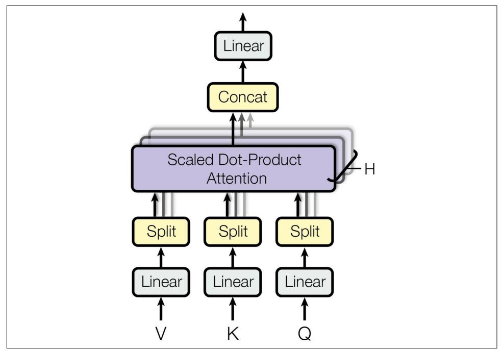

Figure 16-10. Multi-head attention layer architecture<sup>24</sup>

As you can see, it is just a bunch of scaled dot-product attention layers, each preceded by a linear transformation of the values, keys, and queries (i.e., a time-distributed dense layer with no activation function). All the outputs are simply concatenated, and they go through a final linear transformation (again, time-distributed).

But why? What is the intuition behind this architecture? Well, consider once again the word "like" in the sentence "I like soccer". The encoder was smart enough to

<sup>24</sup> This is the righthand part of figure 2 from "Attention Is All You Need", reproduced with the kind authorization of the authors.

{644}------------------------------------------------

encode the fact that it is a verb. But the word representation also includes its position in the text, thanks to the positional encodings, and it probably includes many other features that are useful for its translation, such as the fact that it is in the present tense. In short, the word representation encodes many different characteristics of the word. If we just used a single scaled dot-product attention layer, we would only be able to query all of these characteristics in one shot.

This is why the multi-head attention layer applies *multiple* different linear transformations of the values, keys, and queries: this allows the model to apply many different projections of the word representation into different subspaces, each focusing on a subset of the word's characteristics. Perhaps one of the linear layers will project the word representation into a subspace where all that remains is the information that the word is a verb, another linear layer will extract just the fact that it is present tense, and so on. Then the scaled dot-product attention layers implement the lookup phase, and finally we concatenate all the results and project them back to the original space.

Keras includes a tf.keras.layers.MultiHeadAttention layer, so we now have everything we need to build the rest of the transformer. Let's start with the full encoder, which is exactly like in Figure 16-8, except we use a stack of two blocks ( $N =$ 2) instead of six, since we don't have a huge training set, and we add a bit of dropout as well<sup>.</sup>

```
N = 2 # instead of 6
num\_heads = 8dropout_rate = 0.1n_units = 128 # for the first dense layer in each feedforward block
encoder_pad_mask = tf.math.not_equal(encoder_input_ids, 0)[:, tf.newaxis]Z = encoder infor \_ in range(N):
    skip = Zattn layer = tf.keras.layers.MultiHeadAttention(
       num_heads=num_heads, key_dim=embed_size, dropout=dropout_rate)
    Z = attn layer(Z, value=Z, attention mask=encoder pad mask)
    Z = tf.keras.layers.LayerNormalization()(tf.keras.layers.Add()([Z, skip]))
    skip = ZZ = tf.keras.layers.Dense(n_units, activation="relu")(Z)
    Z = tf.keras.layers.Dense(embed_size)(Z)
    Z = tf.keras.layers.Dropout(dropout rate)(Z)
    Z = tf.keras.layers.LayerNormalization()(tf.keras.layers.Add()([Z, skip]))
```

This code should be mostly straightforward, except for one thing: masking. As of the time of writing, the MultiHeadAttention layer does not support automatic masking.<sup>25</sup> so we must handle it manually. How can we do that?

<sup>25</sup> This will most likely change by the time you read this; check out Keras issue #16248 for more details. When this happens, there will be no need to set the attention mask argument, and therefore no need to create encoder pad mask.

{645}------------------------------------------------

The MultiHeadAttention laver accepts an attention mask argument, which is a Boolean tensor of shape [batch size, max query length, max value length]: for every token in every query sequence, this mask indicates which tokens in the corresponding value sequence should be attended to. We want to tell the MultiHeadAttention layer to ignore all the padding tokens in the values. So, we first compute the padding mask using tf.math.not equal(encoder input ids, 0). This returns a Boolean tensor of shape [batch size, max sequence length]. We then insert a second axis using  $[:,$  tf. newaxis], to get a mask of shape [batch size, 1, max sequence length]. This allows us to use this mask as the attention\_mask when calling the MultiHead Attention layer: thanks to broadcasting, the same mask will be used for all tokens in each query. This way, the padding tokens in the values will be ignored correctly.

However, the layer will compute outputs for every single query token, including the padding tokens. We need to mask the outputs that correspond to these padding tokens. Recall that we used mask\_zero in the Embedding layers, and we set supports\_masking to True in the PositionalEncoding layer, so the automatic mask was propagated all the way to the MultiHeadAttention layer's inputs (encoder\_in). We can use this to our advantage in the skip connection: indeed, the Add layer supports automatic masking, so when we add Z and skip (which is initially equal to encoder in), the outputs get automatically masked correctly.<sup>26</sup> Yikes! Masking required much more explanation than code.

Now on to the decoder! Once again, masking is going to be the only tricky part, so let's start with that. The first multi-head attention layer is a self-attention layer, like in the encoder, but it is a *masked* multi-head attention layer, meaning it is causal: it should ignore all tokens in the future. So, we need two masks: a padding mask and a causal mask. Let's create them:

```
decoder_pad_mask = tf.math.not_equal(decoder_input_ids, 0)[:, tf.newaxis]
causal_mask = tf.linalg.band-part( # creates a lower triangular matrix)tf.ones((batch_max_len_dec, batch_max_len_dec), tf.bool), -1, 0)
```

The padding mask is exactly like the one we created for the encoder, except it's based on the decoder's inputs rather than the encoder's. The causal mask is created using the tf.linalg.band part() function, which takes a tensor and returns a copy with all the values outside a diagonal band set to zero. With these arguments, we get a square matrix of size batch\_max\_len\_dec (the max length of the input sequences in the batch), with 1s in the lower-left triangle and 0s in the upper right. If we use this mask as the attention mask, we will get exactly what we want: the first query token will only attend to the first value token, the second will only attend to the first two,

<sup>26</sup> Currently Z + skip does not support automatic masking, which is why we had to write tf. keras. layers.Add()([Z, skip]) instead. Again, this may change by the time you read this.

{646}------------------------------------------------

the third will only attend to the first three, and so on. In other words, query tokens cannot attend to any value token in the future.

Let's now build the decoder:

```
encoder outputs = Z # let's save the encoder's final outputs
Z = decoder_in # the decoder starts with its own inputs
for in \text{ range}(N):
    skip = Zattn layer = tf.keras.layers.MultiHeadAttention(
        num heads=num heads, key dim=embed size, dropout=dropout rate)
    Z = attn_layer(Z, value=Z, attention_mask=causal_mask & decoder_pad_mask)
    Z = tf.keras.layers.LayerNormalization()(tf.keras.layers.Add()([Z, skip]))
    skip = Zattn layer = tf.keras.layers.MultiHeadAttention(
        num heads=num heads, key dim=embed size, dropout=dropout rate)
    Z = attn_layer(Z, value=encoder_outputs, attention_mask=encoder_pad_mask)
    Z = tf.keras.layers.LayerNormalization()(tf.keras.layers.Add()([Z, skip]))
    skip = ZZ = tf.keras.layers.Dense(n_units, activation="relu")(Z)
    Z = tf.keras.layers.Dense(embed size)(Z)
    Z = tf.keras.layers.LayerNormalization()(tf.keras.layers.Add()([Z, skip]))
```

For the first attention layer, we use causal mask & decoder pad mask to mask both the padding tokens and future tokens. The causal mask only has two dimensions: it's missing the batch dimension, but that's okay since broadcasting ensures that it gets copied across all the instances in the batch.

For the second attention layer, there's nothing special. The only thing to note is that we are using encoder\_pad\_mask, not decoder\_pad\_mask, because this attention layer uses the encoder's final outputs as its values.

We're almost done. We just need to add the final output layer, create the model, compile it, and train it:

```
Y proba = tf.keras.layers.Dense(vocab size, activation="softmax")(Z)
model = tf.keras.Model(inputs=[encoder_inputs, decoder_inputs],
                       outputs=[Y proba])
model.compile(loss="sparse_categorical_crossentropy", optimizer="nadam",
              metrics=["accuracy"])
model.fit((X_train, X_train_dec), Y_train, epochs=10,
          validation_data=((X_valid, X_valid_dec), Y_valid))
```

Congratulations! You've built a full transformer from scratch, and trained it for automatic translation. This is getting quite advanced!


The Keras team has created a new Keras NLP project, including an API to build a transformer more easily. You may also be interested in the new Keras CV project for computer vision.

{647}------------------------------------------------

But the field didn't stop there. Let's now explore some of the recent advances.

## An Avalanche of Transformer Models

The year 2018 has been called the "ImageNet moment for NLP". Since then, progress has been astounding, with larger and larger transformer-based architectures trained on immense datasets.

First, the GPT paper<sup>27</sup> by Alec Radford and other OpenAI researchers once again demonstrated the effectiveness of unsupervised pretraining, like the ELMo and ULMFiT papers before it, but this time using a transformer-like architecture. The authors pretrained a large but fairly simple architecture composed of a stack of 12 transformer modules using only masked multi-head attention layers, like in the original transformer's decoder. They trained it on a very large dataset, using the same autoregressive technique we used for our Shakespearean char-RNN: just predict the next token. This is a form of self-supervised learning. Then they fine-tuned it on various language tasks, using only minor adaptations for each task. The tasks were quite diverse: they included text classification, entailment (whether sentence A imposes, involves, or implies sentence B as a necessary consequence), $28$  similarity (e.g., "Nice weather today" is very similar to "It is sunny"), and question answering (given a few paragraphs of text giving some context, the model must answer some multiple-choice questions).

Then Google's BERT paper<sup>29</sup> came out: it also demonstrated the effectiveness of self-supervised pretraining on a large corpus, using a similar architecture to GPT but with nonmasked multi-head attention layers only, like in the original transformer's encoder. This means that the model is naturally bidirectional; hence the B in BERT (Bidirectional Encoder Representations from Transformers). Most importantly, the authors proposed two pretraining tasks that explain most of the model's strength:

Masked language model (MLM)

Each word in a sentence has a 15% probability of being masked, and the model is trained to predict the masked words. For example, if the original sentence is "She had fun at the birthday party", then the model may be given the sentence "She <mask> fun at the <mask> party" and it must predict the words "had" and "birthday" (the other outputs will be ignored). To be more precise, each selected word has an 80% chance of being masked, a 10% chance of being replaced by a

<sup>27</sup> Alec Radford et al., "Improving Language Understanding by Generative Pre-Training" (2018).

<sup>28</sup> For example, the sentence "Jane had a lot of fun at her friend's birthday party" entails "Jane enjoyed the party", but it is contradicted by "Everyone hated the party" and it is unrelated to "The Earth is flat".

<sup>29</sup> Jacob Devlin et al., "BERT: Pre-Training of Deep Bidirectional Transformers for Language Understanding", Proceedings of the 2018 Conference of the North American Chapter of the Association for Computational Linguistics: Human Language Technologies 1 (2019).

{648}------------------------------------------------

random word (to reduce the discrepancy between pretraining and fine-tuning, since the model will not see <mask> tokens during fine-tuning), and a 10% chance of being left alone (to bias the model toward the correct answer).

Next sentence prediction (NSP)

The model is trained to predict whether two sentences are consecutive or not. For example, it should predict that "The dog sleeps" and "It snores loudly" are consecutive sentences, while "The dog sleeps" and "The Earth orbits the Sun" are not consecutive. Later research showed that NSP was not as important as was initially thought, so it was dropped in most later architectures.

The model is trained on these two tasks simultaneously (see Figure 16-11). For the NSP task, the authors inserted a class token (<CLS>) at the start of every input, and the corresponding output token represents the model's prediction: sentence B follows sentence A, or it does not. The two input sentences are concatenated, separated only by a special separation token (<SEP>), and they are fed as input to the model. To help the model know which sentence each input token belongs to, a segment embedding is added on top of each token's positional embeddings: there are just two possible segment embeddings, one for sentence A and one for sentence B. For the MLM task, some input words are masked (as we just saw) and the model tries to predict what those words were. The loss is only computed on the NSP prediction and the masked tokens, not on the unmasked ones.

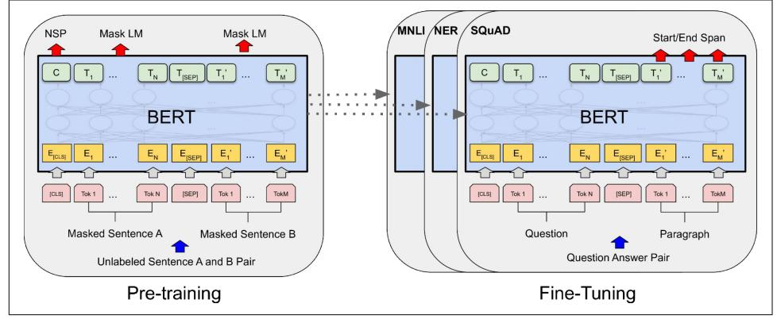

Figure 16-11. BERT training and fine-tuning process<sup>30</sup>

After this unsupervised pretraining phase on a very large corpus of text, the model is then fine-tuned on many different tasks, changing very little for each task. For example, for text classification such as sentiment analysis, all output tokens are

<sup>30</sup> This is figure 1 from the paper, reproduced with the kind authorization of the authors.

{649}------------------------------------------------

ignored except for the first one, corresponding to the class token, and a new output layer replaces the previous one, which was just a binary classification layer for NSP.

In February 2019, just a few months after BERT was published, Alec Radford, Jeffrey Wu, and other OpenAI researchers published the GPT-2 paper,<sup>31</sup> which proposed a very similar architecture to GPT, but larger still (with over 1.5 billion parameters!). The researchers showed that the new and improved GPT model could perform zero-shot learning (ZSL), meaning it could achieve good performance on many tasks without any fine-tuning. This was just the start of a race toward larger and larger models: Google's Switch Transformers<sup>32</sup> (introduced in January 2021) used 1 trillion parameters, and soon much larger models came out, such as the Wu Dao 2.0 model by the Beijing Academy of Artificial Intelligence (BAII), announced in June 2021.

An unfortunate consequence of this trend toward gigantic models is that only wellfunded organizations can afford to train such models: it can easily cost hundreds of thousands of dollars or more. And the energy required to train a single model corresponds to an American household's electricity consumption for several years; it's not eco-friendly at all. Many of these models are just too big to even be used on regular hardware: they wouldn't fit in RAM, and they would be horribly slow. Lastly, some are so costly that they are not released publicly.

Luckily, ingenious researchers are finding new ways to downsize transformers and make them more data-efficient. For example, the DistilBERT model,<sup>33</sup> introduced in October 2019 by Victor Sanh et al. from Hugging Face, is a small and fast transformer model based on BERT. It is available on Hugging Face's excellent model hub, along with thousands of others-you'll see an example later in this chapter.

DistilBERT was trained using *distillation* (hence the name): this means transferring knowledge from a teacher model to a student one, which is usually much smaller than the teacher model. This is typically done by using the teacher's predicted probabilities for each training instance as targets for the student. Surprisingly, distillation often works better than training the student from scratch on the same dataset as the teacher! Indeed, the student benefits from the teacher's more nuanced labels.

Many more transformer architectures came out after BERT, almost on a monthly basis, often improving on the state of the art across all NLP tasks: XLNet (June 2019), RoBERTa (July 2019), StructBERT (August 2019), ALBERT (September 2019), T5 (October 2019), ELECTRA (March 2020), GPT3 (May 2020), DeBERTa (June 2020),

<sup>31</sup> Alec Radford et al., "Language Models Are Unsupervised Multitask Learners" (2019).

<sup>32</sup> William Fedus et al., "Switch Transformers: Scaling to Trillion Parameter Models with Simple and Efficient Sparsity" (2021).

<sup>33</sup> Victor Sanh et al., "DistilBERT, A Distilled Version of Bert: Smaller, Faster, Cheaper and Lighter", arXiv preprint arXiv:1910.01108 (2019).

{650}------------------------------------------------

Switch Transformers (January 2021), Wu Dao 2.0 (June 2021), Gopher (December 2021), GPT-NeoX-20B (February 2022), Chinchilla (March 2022), OPT (May 2022), and the list goes on and on. Each of these models brought new ideas and techniques,<sup>34</sup> but I particularly like the T5 paper<sup>35</sup> by Google researchers: it frames all NLP tasks as text-to-text, using an encoder-decoder transformer. For example, to translate "I like soccer" to Spanish, you can just call the model with the input sentence "translate English to Spanish: I like soccer" and it outputs "me gusta el fútbol". To summarize a paragraph, you just enter "summarize:" followed by the paragraph, and it outputs the summary. For classification, you only need to change the prefix to "classify:" and the model outputs the class name, as text. This simplifies using the model, and it also makes it possible to pretrain it on even more tasks.

Last but not least, in April 2022, Google researchers used a new large-scale training platform named *Pathways* (which we will briefly discuss in Chapter 19) to train a humongous language model named the *Pathways Language Model* (PaLM),<sup>36</sup> with a whopping 540 billion parameters, using over 6,000 TPUs. Other than its incredible size, this model is a standard transformer, using decoders only (i.e., with masked multi-head attention layers), with just a few tweaks (see the paper for details). This model achieved incredible performance on all sorts of NLP tasks, particularly in natural language understanding (NLU). It's capable of impressive feats, such as explaining jokes, giving detailed step-by-step answers to questions, and even coding. This is in part due to the model's size, but also thanks to a technique called *Chain of thought prompting*,<sup>37</sup> which was introduced a couple months earlier by another team of Google researchers.

In question answering tasks, regular prompting typically includes a few examples of questions and answers, such as: "Q: Roger has 5 tennis balls. He buys 2 more cans of tennis balls. Each can has 3 tennis balls. How many tennis balls does he have now? A: 11." The prompt then continues with the actual question, such as "Q: John takes care of 10 dogs. Each dog takes .5 hours a day to walk and take care of their business. How many hours a week does he spend taking care of dogs? A:", and the model's job is to append the answer: in this case, "35."

<sup>34</sup> Mariya Yao summarized many of these models in this post: https://homl.info/yaopost.

<sup>35</sup> Colin Raffel et al., "Exploring the Limits of Transfer Learning with a Unified Text-to-Text Transformer", arXiv preprint arXiv:1910.10683 (2019).

<sup>36</sup> Aakanksha Chowdhery et al., "PaLM: Scaling Language Modeling with Pathways", arXiv preprint arXiv:2204.02311 (2022).

<sup>37</sup> Jason Wei et al., "Chain of Thought Prompting Elicits Reasoning in Large Language Models", arXiv preprint arXiv:2201.11903 (2022).

{651}------------------------------------------------

But with chain of thought prompting, the example answers include all the reasoning steps that lead to the conclusion. For example, instead of "A: 11", the prompt contains "A: Roger started with 5 balls. 2 cans of 3 tennis balls each is 6 tennis balls.  $5 + 6 =$ 11." This encourages the model to give a detailed answer to the actual question, such as "John takes care of 10 dogs. Each dog takes .5 hours a day to walk and take care of their business. So that is  $10 \times .5 = 5$  hours a day. 5 hours a day  $\times$  7 days a week = 35 hours a week. The answer is 35 hours a week." This is an actual example from the paper!

Not only does the model give the right answer much more frequently than using regular prompting—we're encouraging the model to think things through—but it also provides all the reasoning steps, which can be useful to better understand the rationale behind a model's answer.

Transformers have taken over NLP, but they didn't stop there: they soon expanded to computer vision as well.

## **Vision Transformers**

One of the first applications of attention mechanisms beyond NMT was in generating image captions using visual attention:<sup>38</sup> a convolutional neural network first processes the image and outputs some feature maps, then a decoder RNN equipped with an attention mechanism generates the caption, one word at a time.

At each decoder time step (i.e., each word), the decoder uses the attention model to focus on just the right part of the image. For example, in Figure 16-12, the model generated the caption "A woman is throwing a frisbee in a park", and you can see what part of the input image the decoder focused its attention on when it was about to output the word "frisbee": clearly, most of its attention was focused on the frisbee.

<sup>38</sup> Kelvin Xu et al., "Show, Attend and Tell: Neural Image Caption Generation with Visual Attention", Proceedings of the 32nd International Conference on Machine Learning (2015): 2048-2057.

{652}------------------------------------------------


Figure 16-12. Visual attention: an input image (left) and the model's focus before producing the word "frisbee" (right)<sup>39</sup>

#### **Explainability**

One extra benefit of attention mechanisms is that they make it easier to understand what led the model to produce its output. This is called *explainability*. It can be especially useful when the model makes a mistake: for example, if an image of a dog walking in the snow is labeled as "a wolf walking in the snow", then you can go back and check what the model focused on when it output the word "wolf". You may find that it was paying attention not only to the dog, but also to the snow, hinting at a possible explanation: perhaps the way the model learned to distinguish dogs from wolves is by checking whether or not there's a lot of snow around. You can then fix this by training the model with more images of wolves without snow, and dogs with snow. This example comes from a great 2016 paper<sup>40</sup> by Marco Tulio Ribeiro et al. that uses a different approach to explainability: learning an interpretable model locally around a classifier's prediction.

In some applications, explainability is not just a tool to debug a model; it can be a legal requirement—think of a system deciding whether or not it should grant you a loan.

<sup>39</sup> This is a part of figure 3 from the paper. It is reproduced with the kind authorization of the authors.

<sup>40</sup> Marco Tulio Ribeiro et al., "Why Should I Trust You?': Explaining the Predictions of Any Classifier", Proceedings of the 22nd ACM SIGKDD International Conference on Knowledge Discovery and Data Mining (2016): 1135-1144.

{653}------------------------------------------------

When transformers came out in 2017 and people started to experiment with them beyond NLP, they were first used alongside CNNs, without replacing them. Instead, transformers were generally used to replace RNNs, for example, in image captioning models. Transformers became slightly more visual in a 2020 paper<sup>41</sup> by Facebook researchers, which proposed a hybrid CNN-transformer architecture for object detection. Once again, the CNN first processes the input images and outputs a set of feature maps, then these feature maps are converted to sequences and fed to a transformer, which outputs bounding box predictions. But again, most of the visual work is still done by the CNN.

Then, in October 2020, a team of Google researchers released a paper<sup>42</sup> that introduced a fully transformer-based vision model, called a vision transformer (ViT). The idea is surprisingly simple: just chop the image into little  $16 \times 16$  squares, and treat the sequence of squares as if it were a sequence of word representations. To be more precise, the squares are first flattened into  $16 \times 16 \times 3 = 768$ -dimensional vectors—the 3 is for the RGB color channels—then these vectors go through a linear layer that transforms them but retains their dimensionality. The resulting sequence of vectors can then be treated just like a sequence of word embeddings: this means adding positional embeddings, and passing the result to the transformer. That's it! This model beat the state of the art on ImageNet image classification, but to be fair the authors had to use over 300 million additional images for training. This makes sense since transformers don't have as many *inductive biases* as convolution neural nets, so they need extra data just to learn things that CNNs implicitly assume.


An inductive bias is an implicit assumption made by the model, due to its architecture. For example, linear models implicitly assume that the data is, well, linear. CNNs implicitly assume that patterns learned in one location will likely be useful in other locations as well. RNNs implicitly assume that the inputs are ordered, and that recent tokens are more important than older ones. The more inductive biases a model has, assuming they are correct, the less training data the model will require. But if the implicit assumptions are wrong, then the model may perform poorly even if it is trained on a large dataset.

<sup>41</sup> Nicolas Carion et al., "End-to-End Object Detection with Transformers", arXiv preprint arxiv:2005.12872  $(2020).$ 

<sup>42</sup> Alexey Dosovitskiy et al., "An Image Is Worth 16x16 Words: Transformers for Image Recognition at Scale", arXiv preprint arxiv:2010.11929 (2020).

{654}------------------------------------------------

Just two months later, a team of Facebook researchers released a paper<sup>43</sup> that introduced data-efficient image transformers (DeiTs). Their model achieved competitive results on ImageNet without requiring any additional data for training. The model's architecture is virtually the same as the original ViT, but the authors used a distillation technique to transfer knowledge from state-of-the-art CNN models to their model.

Then, in March 2021, DeepMind released an important paper<sup>44</sup> that introduced the Perceiver architecture. It is a *multimodal* transformer, meaning you can feed it text, images, audio, or virtually any other modality. Until then, transformers had been restricted to fairly short sequences because of the performance and RAM bottleneck in the attention layers. This excluded modalities such as audio or video, and it forced researchers to treat images as sequences of patches, rather than sequences of pixels. The bottleneck is due to self-attention, where every token must attend to every other token: if the input sequence has  $M$  tokens, then the attention layer must compute an  $M \times M$  matrix, which can be huge if M is very large. The Perceiver solves this problem by gradually improving a fairly short *latent representation* of the inputs, composed of N tokens-typically just a few hundred. (The word latent means hidden, or internal.) The model uses cross-attention layers only, feeding them the latent representation as the queries, and the (possibly large) inputs as the values. This only requires computing an  $M \times N$  matrix, so the computational complexity is linear with regard to M, instead of quadratic. After going through several cross-attention layers, if everything goes well, the latent representation ends up capturing everything that matters in the inputs. The authors also suggested sharing the weights between consecutive cross-attention layers: if you do that, then the Perceiver effectively becomes an RNN. Indeed, the shared cross-attention layers can be seen as the same memory cell at different time steps, and the latent representation corresponds to the cell's context vector. The same inputs are repeatedly fed to the memory cell at every time step. It looks like RNNs are not dead after all!

Just a month later, Mathilde Caron et al. introduced DINO,<sup>45</sup> an impressive vision transformer trained entirely without labels, using self-supervision, and capable of high-accuracy semantic segmentation. The model is duplicated during training, with one network acting as a teacher and the other acting as a student. Gradient descent only affects the student, while the teacher's weights are just an exponential moving average of the student's weights. The student is trained to match the teacher's predic-

<sup>43</sup> Hugo Touvron et al., "Training Data-Efficient Image Transformers & Distillation Through Attention", arXiv preprint arxiv:2012.12877 (2020).

<sup>44</sup> Andrew Jaegle et al., "Perceiver: General Perception with Iterative Attention", arXiv preprint arxiv:2103.03206  $(2021).$ 

<sup>45</sup> Mathilde Caron et al., "Emerging Properties in Self-Supervised Vision Transformers", arXiv preprint arxiv:2104.14294 (2021).

{655}------------------------------------------------

tions: since they're almost the same model, this is called *self-distillation*. At each training step, the input images are augmented in different ways for the teacher and the student, so they don't see the exact same image, but their predictions must match. This forces them to come up with high-level representations. To prevent *mode collapse*, where both the student and the teacher would always output the same thing, completely ignoring the inputs, DINO keeps track of a moving average of the teacher's outputs, and it tweaks the teacher's predictions to ensure that they remain centered on zero, on average. DINO also forces the teacher to have high confidence in its predictions: this is called *sharpening*. Together, these techniques preserve diversity in the teacher's outputs.

In a 2021 paper,<sup>46</sup> Google researchers showed how to scale ViTs up or down, depending on the amount of data. They managed to create a huge 2 billion parameter model that reached over 90.4% top-1 accuracy on ImageNet. Conversely, they also trained a scaled-down model that reached over 84.8% top-1 accuracy on ImageNet, using only 10,000 images: that's just 10 images per class!

And progress in visual transformers has continued steadily to this day. For example, in March 2022, a paper<sup>47</sup> by Mitchell Wortsman et al. demonstrated that it's possible to first train multiple transformers, then average their weights to create a new and improved model. This is similar to an ensemble (see Chapter 7), except there's just one model in the end, which means there's no inference time penalty.

The latest trend in transformers consists in building large multimodal models, often capable of zero-shot or few-shot learning. For example, OpenAI's 2021 CLIP paper<sup>48</sup> proposed a large transformer model pretrained to match captions with images: this task allows it to learn excellent image representations, and the model can then be used directly for tasks such as image classification using simple text prompts such as "a photo of a cat". Soon after, OpenAI announced DALL-E,<sup>49</sup> capable of generating amazing images based on text prompts. The DALL E  $2,5^{\circ}$  which generates even higher quality images using a diffusion model (see Chapter 17).

In April 2022, DeepMind released the Flamingo paper,<sup>51</sup> which introduced a family of models pretrained on a wide variety of tasks across multiple modalities, including text, images, and videos. A single model can be used across very different tasks,

<sup>46</sup> Xiaohua Zhai et al., "Scaling Vision Transformers", arXiv preprint arxiv:2106.04560v1 (2021).

<sup>47</sup> Mitchell Wortsman et al., "Model Soups: Averaging Weights of Multiple Fine-tuned Models Improves Accuracy Without Increasing Inference Time", arXiv preprint arxiv:2203.05482v1 (2022).

<sup>48</sup> Alec Radford et al., "Learning Transferable Visual Models From Natural Language Supervision", arXiv preprint arxiv:2103.00020 (2021).

<sup>49</sup> Aditya Ramesh et al., "Zero-Shot Text-to-Image Generation", arXiv preprint arxiv:2102.12092 (2021).

<sup>50</sup> Aditya Ramesh et al., "Hierarchical Text-Conditional Image Generation with CLIP Latents", arXiv preprint arxiv:2204.06125 (2022).

{656}------------------------------------------------

such as question answering, image captioning, and more. Soon after, in May 2022, DeepMind introduced GATO,<sup>52</sup> a multimodal model that can be used as a policy for a reinforcement learning agent (RL will be introduced in Chapter 18). The same transformer can chat with you, caption images, play Atari games, control (simulated) robotic arms, and more, all with "only" 1.2 billion parameters. And the adventure continues!


These astounding advances have led some researchers to claim that human-level AI is near, that "scale is all you need", and that some of these models may be "slightly conscious". Others point out that despite the amazing progress, these models still lack the reliability and adaptability of human intelligence, our ability to reason symbolically, to generalize based on a single example, and more.

As you can see, transformers are everywhere! And the good news is that you generally won't have to implement transformers yourself since many excellent pretrained models are readily available for download via TensorFlow Hub or Hugging Face's model hub. You've already seen how to use a model from TF Hub, so let's close this chapter by taking a quick look at Hugging Face's ecosystem.

### **Hugging Face's Transformers Library**

It's impossible to talk about transformers today without mentioning Hugging Face, an AI company that has built a whole ecosystem of easy-to-use open source tools for NLP, vision, and beyond. The central component of their ecosystem is the Transformers library, which allows you to easily download a pretrained model, including its corresponding tokenizer, and then fine-tune it on your own dataset, if needed. Plus, the library supports TensorFlow, PyTorch, and JAX (with the Flax library).

The simplest way to use the Transformers library is to use the transformers. pipeline() function: you just specify which task you want, such as sentiment analysis, and it downloads a default pretrained model, ready to be used—it really couldn't be any simpler:

<sup>51</sup> Jean-Baptiste Alayrac et al., "Flamingo: a Visual Language Model for Few-Shot Learning", arXiv preprint arxiv:2204.14198 (2022).

<sup>52</sup> Scott Reed et al., "A Generalist Agent", arXiv preprint arxiv:2205.06175 (2022).

{657}------------------------------------------------

```
from transformers import pipeline
```

```
classifier = pipeline("sentiment-analysis") # many other tasks are available
result = classifier("The actors were very convincing".)
```

The result is a Python list containing one dictionary per input text:

```
>>> result
[{'label': 'POSITIVE', 'score': 0.9998071789741516}]
```

In this example, the model correctly found that the sentence is positive, with around 99.98% confidence. Of course, you can also pass a batch of sentences to the model:

```
>>> classifier(["I am from India.", "I am from Iraq."])
[{'label': 'POSITIVE', 'score': 0.9896161556243896},
 {'label': 'NEGATIVE', 'score': 0.9811071157455444}]
```

#### **Bias and Fairness**

As the output suggests, this specific classifier loves Indians, but is severely biased against Iraqis. You can try this code with your own country or city. Such an undesirable bias generally comes in large part from the training data itself: in this case, there were plenty of negative sentences related to the wars in Iraq in the training data. This bias was then amplified during the fine-tuning process since the model was forced to choose between just two classes: positive or negative. If you add a neutral class when fine-tuning, then the country bias mostly disappears. But the training data is not the only source of bias: the model's architecture, the type of loss or regularization used for training, the optimizer; all of these can affect what the model ends up learning. Even a mostly unbiased model can be used in a biased way, much like survey questions can be biased.

Understanding bias in AI and mitigating its negative effects is still an area of active research, but one thing is certain: you should pause and think before you rush to deploy a model to production. Ask yourself how the model could do harm, even indirectly. For example, if the model's predictions are used to decide whether or not to give someone a loan, the process should be fair. So, make sure you evaluate the model's performance not just on average over the whole test set, but across various subsets as well: for example, you may find that although the model works very well on average, its performance is abysmal for some categories of people. You may also want to run counterfactual tests: for example, you may want to check that the model's predictions do not change when you simply switch someone's gender.

If the model works well on average, it's tempting to push it to production and move on to something else, especially if it's just one component of a much larger system. But in general, if you don't fix such issues, no one else will, and your model may end up doing more harm than good. The solution depends on the problem: it may require rebalancing the dataset, fine-tuning on a different dataset, switching to another pretrained model, tweaking the model's architecture or hyperparameters, etc.

{658}------------------------------------------------

The pipeline() function uses the default model for the given task. For example, for text classification tasks such as sentiment analysis, at the time of writing, it defaults to distilbert-base-uncased-finetuned-sst-2-english-a DistilBERT model with an uncased tokenizer, trained on English Wikipedia and a corpus of English books, and fine-tuned on the Stanford Sentiment Treebank v2 (SST 2) task. It's also possible to manually specify a different model. For example, you could use a DistilBERT model fine-tuned on the Multi-Genre Natural Language Inference (MultiNLI) task, which classifies two sentences into three classes: contradiction, neutral, or entailment. Here is how:

```
>>> model name = "huggingface/distilbert-base-uncased-finetuned-mnli"
>>> classifier_mnli = pipeline("text-classification", model=model_name)
>>> classifier_mnli("She loves me. [SEP] She loves me not.")
[{'label': 'contradiction', 'score': 0.9790192246437073}]
```


You can find the available models at https://huggingface.co/models, and the list of tasks at https://huggingface.co/tasks.

The pipeline API is very simple and convenient, but sometimes you will need more control. For such cases, the Transformers library provides many classes, including all sorts of tokenizers, models, configurations, callbacks, and much more. For example, let's load the same DistilBERT model, along with its corresponding tokenizer, using the TFAutoModelForSequenceClassification and AutoTokenizer classes:

```
from transformers import AutoTokenizer, TFAutoModelForSequenceClassification
```

```
tokenizer = AutoTokenizer.from_pretrained(model_name)
model = TFAutoModelForSequenceClassification.from_pretrained(model_name)
```

Next, let's tokenize a couple of pairs of sentences. In this code, we activate padding and specify that we want TensorFlow tensors instead of Python lists:

```
token_ids = tokenizer(["I like soccer. [SEP] We all love soccer!",
                       "Joe lived for a very long time. [SEP] Joe is old."],
                     padding=True, return tensors="tf")
```


Instead of passing "Sentence 1 [SEP] Sentence 2" to the tokenizer, you can equivalently pass it a tuple: ("Sentence 1", "Sentence 2").

{659}------------------------------------------------

The output is a dictionary-like instance of the BatchEncoding class, which contains the sequences of token IDs, as well as a mask containing 0s for the padding tokens:

```
>>> token ids
{'input_ids': <tf.Tensor: shape=(2, 15), dtype=int32, numpy=
array([[ 101, 1045, 2066, 4715, 1012, 102, 2057, 2035, 2293, 4715, 999,
        102, 0, 0,0],
      [101, 3533, 2973, 2005, 1037, 2200, 2146, 2051, 1012, 102, 3533,2003, 2214, 1012, 102]], dtype=int32)>,
 'attention_mask': <tf.Tensor: shape=(2, 15), dtype=int32, numpy=
array([[1, 1, 1, 1, 1, 1, 1, 1, 1, 1, 1, 1, 1, 1[1, 1, 1, 1, 1, 1, 1, 1, 1, 1, 1, 1, 1, 1
```

If you set return\_token\_type\_ids=True when calling the tokenizer, you will also get an extra tensor that indicates which sentence each token belongs to. This is needed by some models, but not DistilBERT.

Next, we can directly pass this BatchEncoding object to the model; it returns a TFSequenceClassifierOutput object containing its predicted class logits:

```
>>> outputs = model(token_ids)
>>> outputs
TFSequenceClassifierOutput(loss=None, logits=[<tf.Tensor: [...] numpy=
array([[-2.1123817, 1.1786783, 1.4101017],
       [-0.01478387, 1.0962474, -0.9919954], dtype=float32)>], [...])
```

Lastly, we can apply the softmax activation function to convert these logits to class probabilities, and use the argmax() function to predict the class with the highest probability for each input sentence pair:

```
>>> Y probas = tf.keras.activations.softmax(outputs.logits)
>>> Y probas
<tf.Tensor: shape=(2, 3), dtype=float32, numpy=
array([[0.01619702, 0.43523544, 0.5485676],
       [0.08672056, 0.85204804, 0.06123142]], dtype=float32)>
>>> Y_pred = tf.argmax(Y_probas, axis=1)
>>> Y_pred \#\theta = contradiction, 1 = entailment, 2 = neutral
<tf.Tensor: shape=(2,), dtype=int64, numpy=array([2, 1])>
```

In this example, the model correctly classifies the first sentence pair as neutral (the fact that I like soccer does not imply that everyone else does) and the second pair as an entailment (Joe must indeed be quite old).

If you wish to fine-tune this model on your own dataset, you can train the model as usual with Keras since it's just a regular Keras model with a few extra methods. However, because the model outputs logits instead of probabilities, you must use the tf.keras.losses.SparseCategoricalCrossentropy(from logits=True) loss instead of the usual "sparse\_categorical\_crossentropy" loss. Moreover, the model does not support BatchEncoding inputs during training, so you must use its data attribute to get a regular dictionary instead:

{660}------------------------------------------------

```
sentences = [("Sky is blue", "Sky is red"), ("I love her", "She loves me")]
X_train = tokenizer(sentences, padding=True, return_tensors="tf").data
y_train = tf.config(), 2]) # contradiction, neutral
loss = tf.keras.losses.SparseCategoricalCrossentropy(from logits=True)
model.compile(loss=loss, optimizer="nadam", metrics=["accuracy"])
history = model.fit(X_train, y_train, epochs=2)
```

Hugging Face has also built a Datasets library that you can use to easily download a standard dataset (such as IMDb) or a custom one, and use it to fine-tune your model. It's similar to TensorFlow Datasets, but it also provides tools to perform common preprocessing tasks on the fly, such as masking. The list of datasets is available at https://huggingface.co/datasets.

This should get you started with Hugging Face's ecosystem. To learn more, you can head over to https://huggingface.co/docs for the documentation, which includes many tutorial notebooks, videos, the full API, and more. I also recommend you check out the O'Reilly book Natural Language Processing with Transformers: Building Language Applications with Hugging Face by Lewis Tunstall, Leandro von Werra, and Thomas Wolf—all from the Hugging Face team.

In the next chapter we will discuss how to learn deep representations in an unsupervised way using autoencoders, and we will use generative adversarial networks to produce images and more!

### **Exercises**

- 1. What are the pros and cons of using a stateful RNN versus a stateless RNN?
- 2. Why do people use encoder-decoder RNNs rather than plain sequence-tosequence RNNs for automatic translation?
- 3. How can you deal with variable-length input sequences? What about variablelength output sequences?
- 4. What is beam search, and why would you use it? What tool can you use to implement it?
- 5. What is an attention mechanism? How does it help?
- 6. What is the most important layer in the transformer architecture? What is its purpose?
- 7. When would you need to use sampled softmax?
- 8. *Embedded Reber grammars* were used by Hochreiter and Schmidhuber in their paper about LSTMs. They are artificial grammars that produce strings such as "BPBTSXXVPSEPE". Check out Jenny Orr's nice introduction to this topic, then choose a particular embedded Reber grammar (such as the one represented on Orr's page), then train an RNN to identify whether a string respects that

{661}------------------------------------------------

grammar or not. You will first need to write a function capable of generating a training batch containing about 50% strings that respect the grammar, and 50% that don't.

- 9. Train an encoder-decoder model that can convert a date string from one format to another (e.g., from "April 22, 2019" to "2019-04-22").
- 10. Go through the example on the Keras website for "Natural language image search with a Dual Encoder". You will learn how to build a model capable of representing both images and text within the same embedding space. This makes it possible to search for images using a text prompt, like in the CLIP model by OpenAI.
- 11. Use the Hugging Face Transformers library to download a pretrained language model capable of generating text (e.g., GPT), and try generating more convincing Shakespearean text. You will need to use the model's generate() method-see Hugging Face's documentation for more details.

Solutions to these exercises are available at the end of this chapter's notebook, at https://homl.info/colab3.

{662}------------------------------------------------

## **CHAPTER 17 Autoencoders, GANs, and Diffusion Models**

Autoencoders are artificial neural networks capable of learning dense representations of the input data, called *latent representations* or *codings*, without any supervision (i.e., the training set is unlabeled). These codings typically have a much lower dimensionality than the input data, making autoencoders useful for dimensionality reduction (see Chapter 8), especially for visualization purposes. Autoencoders also act as feature detectors, and they can be used for unsupervised pretraining of deep neural networks (as we discussed in Chapter 11). Lastly, some autoencoders are *generative models*: they are capable of randomly generating new data that looks very similar to the training data. For example, you could train an autoencoder on pictures of faces, and it would then be able to generate new faces.

Generative adversarial networks (GANs) are also neural nets capable of generating data. In fact, they can generate pictures of faces so convincing that it is hard to believe the people they represent do not exist. You can judge so for yourself by visiting https://thispersondoesnotexist.com, a website that shows faces generated by a GAN architecture called StyleGAN. You can also check out https://thisrentaldoesno texist.com to see some generated Airbnb listings. GANs are now widely used for super resolution (increasing the resolution of an image), colorization, powerful image editing (e.g., replacing photo bombers with realistic background), turning simple sketches into photorealistic images, predicting the next frames in a video, augmenting a dataset (to train other models), generating other types of data (such as text, audio, and time series), identifying the weaknesses in other models to strengthen them, and more.

A more recent addition to the generative learning party is *diffusion models*. In 2021, they managed to generate more diverse and higher-quality images than GANs, while also being much easier to train. However, diffusion models are much slower to run.

{663}------------------------------------------------

Autoencoders, GANs, and diffusion models are all unsupervised, they all learn latent representations, they can all be used as generative models, and they have many similar applications. However, they work very differently:

- Autoencoders simply learn to copy their inputs to their outputs. This may sound like a trivial task, but as you will see, constraining the network in various ways can make it rather difficult. For example, you can limit the size of the latent representations, or you can add noise to the inputs and train the network to recover the original inputs. These constraints prevent the autoencoder from trivially copying the inputs directly to the outputs, which forces it to learn efficient ways of representing the data. In short, the codings are byproducts of the autoencoder learning the identity function under some constraints.
- GANs are composed of two neural networks: a *generator* that tries to generate data that looks similar to the training data, and a *discriminator* that tries to tell real data from fake data. This architecture is very original in deep learning in that the generator and the discriminator compete against each other during training: the generator is often compared to a criminal trying to make realistic counterfeit money, while the discriminator is like the police investigator trying to tell real money from fake. Adversarial training (training competing neural networks) is widely considered one of the most important innovations of the 2010s. In 2016, Yann LeCun even said that it was "the most interesting idea in the last 10 years in machine learning".
- A denoising diffusion probabilistic model (DDPM) is trained to remove a tiny bit of noise from an image. If you then take an image entirely full of Gaussian noise and repeatedly run the diffusion model on that image, a high-quality image will gradually emerge, similar to the training images (but not identical).

In this chapter we will start by exploring in more depth how autoencoders work and how to use them for dimensionality reduction, feature extraction, unsupervised pretraining, or as generative models. This will naturally lead us to GANs. We will build a simple GAN to generate fake images, but we will see that training is often quite difficult. We will discuss the main difficulties you will encounter with adversarial training, as well as some of the main techniques to work around these difficulties. And lastly, we will build and train a DDPM and use it to generate images. Let's start with autoencoders!

{664}------------------------------------------------

### **Efficient Data Representations**

Which of the following number sequences do you find the easiest to memorize?

- $\bullet$  40, 27, 25, 36, 81, 57, 10, 73, 19, 68
- 50, 48, 46, 44, 42, 40, 38, 36, 34, 32, 30, 28, 26, 24, 22, 20, 18, 16, 14

At first glance, it would seem that the first sequence should be easier, since it is much shorter. However, if you look carefully at the second sequence, you will notice that it is just the list of even numbers from 50 down to 14. Once you notice this pattern, the second sequence becomes much easier to memorize than the first because you only need to remember the pattern (i.e., decreasing even numbers) and the starting and ending numbers (i.e., 50 and 14). Note that if you could quickly and easily memorize very long sequences, you would not care much about the existence of a pattern in the second sequence. You would just learn every number by heart, and that would be that. The fact that it is hard to memorize long sequences is what makes it useful to recognize patterns, and hopefully this clarifies why constraining an autoencoder during training pushes it to discover and exploit patterns in the data.

The relationship between memory, perception, and pattern matching was famously studied by William Chase and Herbert Simon<sup>1</sup> in the early 1970s. They observed that expert chess players were able to memorize the positions of all the pieces in a game by looking at the board for just five seconds, a task that most people would find impossible. However, this was only the case when the pieces were placed in realistic positions (from actual games), not when the pieces were placed randomly. Chess experts don't have a much better memory than you and I; they just see chess patterns more easily, thanks to their experience with the game. Noticing patterns helps them store information efficiently.

Just like the chess players in this memory experiment, an autoencoder looks at the inputs, converts them to an efficient latent representation, and then spits out something that (hopefully) looks very close to the inputs. An autoencoder is always composed of two parts: an encoder (or recognition network) that converts the inputs to a latent representation, followed by a *decoder* (or *generative network*) that converts the internal representation to the outputs (see Figure 17-1).

<sup>1</sup> William G. Chase and Herbert A. Simon, "Perception in Chess", Cognitive Psychology 4, no. 1 (1973): 55-81.

{665}------------------------------------------------


Figure 17-1. The chess memory experiment (left) and a simple autoencoder (right)

As you can see, an autoencoder typically has the same architecture as a multilayer perceptron (MLP; see Chapter 10), except that the number of neurons in the output layer must be equal to the number of inputs. In this example, there is just one hidden layer composed of two neurons (the encoder), and one output layer composed of three neurons (the decoder). The outputs are often called the *reconstructions* because the autoencoder tries to reconstruct the inputs. The cost function contains a reconstruction loss that penalizes the model when the reconstructions are different from the inputs.

Because the internal representation has a lower dimensionality than the input data (it) is 2D instead of 3D), the autoencoder is said to be *undercomplete*. An undercomplete autoencoder cannot trivially copy its inputs to the codings, yet it must find a way to output a copy of its inputs. It is forced to learn the most important features in the input data (and drop the unimportant ones).

Let's see how to implement a very simple undercomplete autoencoder for dimensionality reduction.

{666}------------------------------------------------

### **Performing PCA with an Undercomplete Linear** Autoencoder

If the autoencoder uses only linear activations and the cost function is the mean squared error (MSE), then it ends up performing principal component analysis (PCA; see Chapter 8).

The following code builds a simple linear autoencoder to perform PCA on a 3D dataset, projecting it to 2D:

```
import tensorflow as tf
encoder = tf.keras.Sequential([tf.keras.layers.Dense(2)])
decoder = tf.keras.Sequential([tf.keras.layers.Dense(3)])autoencoder = tf.keras.Sequential([encoder, decoder])optimizer = tf.keras.optimizers.SGD(learning rate=0.5)
autoencoder.compile(loss="mse", optimizer=optimizer)
```

This code is really not very different from all the MLPs we built in past chapters, but there are a few things to note:

- We organized the autoencoder into two subcomponents: the encoder and the decoder. Both are regular Sequential models with a single Dense layer each, and the autoencoder is a Sequential model containing the encoder followed by the decoder (remember that a model can be used as a layer in another model).
- The autoencoder's number of outputs is equal to the number of inputs (i.e., 3).
- To perform PCA, we do not use any activation function (i.e., all neurons are linear), and the cost function is the MSE. That's because PCA is a linear transformation. We will see more complex and nonlinear autoencoders shortly.

Now let's train the model on the same simple generated 3D dataset we used in Chapter 8 and use it to encode that dataset (i.e., project it to 2D):

```
X train = [\dots] # generate a 3D dataset, like in Chapter 8
history = autoencoder.fit(X_train, X_train, epochs=500, verbose=False)
codings = encoder.predict(X train)
```

Note that X\_train is used as both the inputs and the targets. Figure 17-2 shows the original 3D dataset (on the left) and the output of the autoencoder's hidden layer (i.e., the coding layer, on the right). As you can see, the autoencoder found the best 2D plane to project the data onto, preserving as much variance in the data as it could (just like PCA).

{667}------------------------------------------------

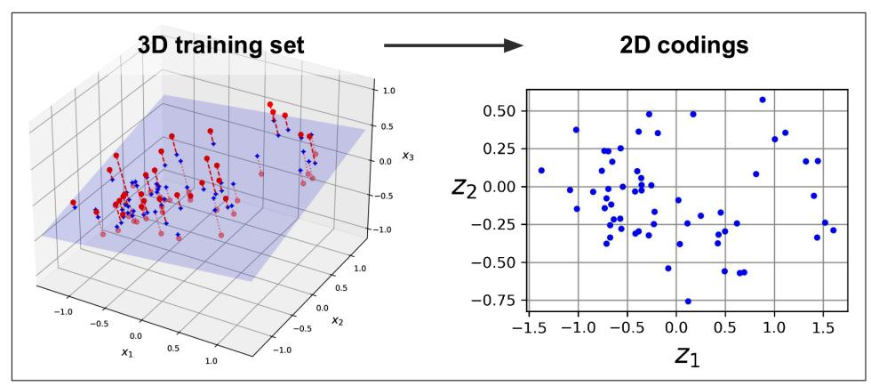

Figure 17-2. Approximate PCA performed by an undercomplete linear autoencoder


You can think of an autoencoder as performing a form of selfsupervised learning, since it is based on a supervised learning technique with automatically generated labels (in this case simply equal to the inputs).

### **Stacked Autoencoders**

Just like other neural networks we have discussed, autoencoders can have multiple hidden layers. In this case they are called *stacked autoencoders* (or *deep autoencoders*). Adding more layers helps the autoencoder learn more complex codings. That said, one must be careful not to make the autoencoder too powerful. Imagine an encoder so powerful that it just learns to map each input to a single arbitrary number (and the decoder learns the reverse mapping). Obviously such an autoencoder will reconstruct the training data perfectly, but it will not have learned any useful data representation in the process, and it is unlikely to generalize well to new instances.

The architecture of a stacked autoencoder is typically symmetrical with regard to the central hidden layer (the coding layer). To put it simply, it looks like a sandwich. For example, an autoencoder for Fashion MNIST (introduced in Chapter 10) may have 784 inputs, followed by a hidden layer with 100 neurons, then a central hidden layer of 30 neurons, then another hidden layer with 100 neurons, and an output layer with 784 neurons. This stacked autoencoder is represented in Figure 17-3.

{668}------------------------------------------------

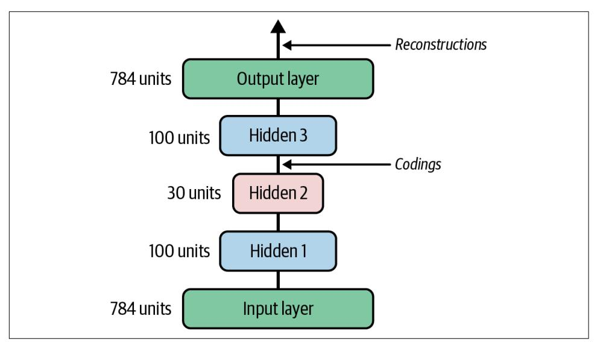

Figure 17-3. Stacked autoencoder

### **Implementing a Stacked Autoencoder Using Keras**

You can implement a stacked autoencoder very much like a regular deep MLP:

```
stacked_encoder = tf.keras.Sequential([
    tf.keras.layers.Flatten(),
    tf.keras.layers.Dense(100, activation="relu"),
    tf.keras.layers.Dense(30, activation="relu"),
\left| \right\ranglestacked_decoder = tf.keras.Sequential([
    tf.keras.layers.Dense(100, activation="relu"),
    tf.keras.layers.Dense(28 * 28),
    tf.keras.layers.Reshape([28, 28])
\left| \right\ranglestacked_ae = tf.keras.Sequential([stacked_encoder, stacked_decoder])
stacked_ae.compile(loss="mse", optimizer="nadam")
history = stacked_ae.fit(X_train, X_train, epochs=20,
                          validation data=(X valid, X valid))
```

{669}------------------------------------------------

Let's go through this code:

- Just like earlier, we split the autoencoder model into two submodels: the encoder and the decoder.
- The encoder takes 28  $\times$  28-pixel grayscale images, flattens them so that each image is represented as a vector of size 784, then processes these vectors through two Dense layers of diminishing sizes (100 units then 30 units), both using the ReLU activation function. For each input image, the encoder outputs a vector of size 30.
- The decoder takes codings of size 30 (output by the encoder) and processes them through two Dense layers of increasing sizes (100 units then 784 units), and it reshapes the final vectors into  $28 \times 28$  arrays so the decoder's outputs have the same shape as the encoder's inputs.
- When compiling the stacked autoencoder, we use the MSE loss and Nadam optimization.
- Finally, we train the model using X train as both the inputs and the targets. Similarly, we use X\_valid as both the validation inputs and targets.

### **Visualizing the Reconstructions**

One way to ensure that an autoencoder is properly trained is to compare the inputs and the outputs: the differences should not be too significant. Let's plot a few images from the validation set, as well as their reconstructions:

```
import numpy as np
def plot_reconstructions(model, images=X_valid, n_images=5):
    reconstructions = np.clip(model.predict(images[:n images]), 0, 1)
    fig = plt.figure(figsize=(n_inages * 1.5, 3))for image index in range(n images):
        plt.subplot(2, n images, 1 + image index)plt.imshow(images[image_index], cmap="binary")
        plt.axis("off")
        plt.subplot(2, n_iimages, 1 + n_iimages + image_index)plt.imshow(reconstructions[image_index], cmap="binary")
        plt.axis("off")
plot reconstructions(stacked ae)
plt.show()
```

Figure 17-4 shows the resulting images.

{670}------------------------------------------------

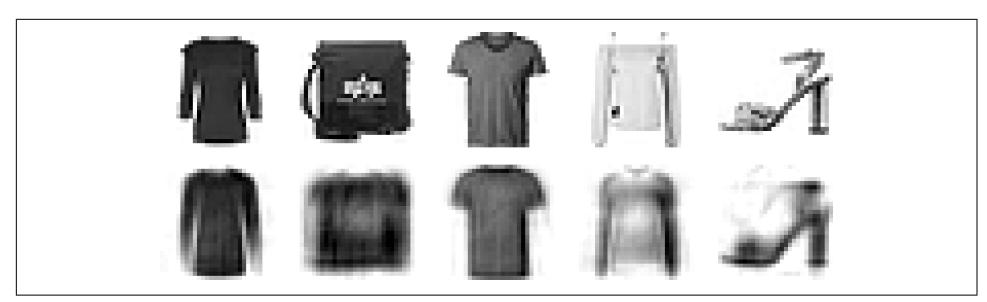

Figure 17-4. Original images (top) and their reconstructions (bottom)

The reconstructions are recognizable, but a bit too lossy. We may need to train the model for longer, or make the encoder and decoder deeper, or make the codings larger. But if we make the network too powerful, it will manage to make perfect reconstructions without having learned any useful patterns in the data. For now, let's go with this model.

### **Visualizing the Fashion MNIST Dataset**

Now that we have trained a stacked autoencoder, we can use it to reduce the dataset's dimensionality. For visualization, this does not give great results compared to other dimensionality reduction algorithms (such as those we discussed in Chapter 8), but one big advantage of autoencoders is that they can handle large datasets with many instances and many features. So, one strategy is to use an autoencoder to reduce the dimensionality down to a reasonable level, then use another dimensionality reduction algorithm for visualization. Let's use this strategy to visualize Fashion MNIST. First we'll use the encoder from our stacked autoencoder to reduce the dimensionality down to 30, then we'll use Scikit-Learn's implementation of the t-SNE algorithm to reduce the dimensionality down to 2 for visualization:

```
from sklearn.manifold import TSNE
```

```
X valid compressed = stacked encoder.predict(X valid)
tsne = TSNE(init="pca", learning rate="auto", random state=42)
X_valid_2D = tsne.fit_transform(X_valid_compressed)
```

Now we can plot the dataset:

```
plt.scatter(X_valid_2D[:, 0], X_valid_2D[:, 1], c=y_valid, s=10, cmap="tab10")
plt.show()
```

Figure 17-5 shows the resulting scatterplot, beautified a bit by displaying some of the images. The t-SNE algorithm identified several clusters that match the classes reasonably well (each class is represented by a different color).

{671}------------------------------------------------

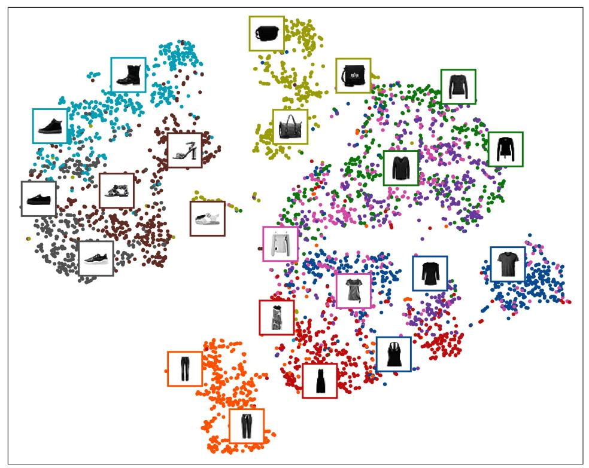

Figure 17-5. Fashion MNIST visualization using an autoencoder followed by t-SNE

So, autoencoders can be used for dimensionality reduction. Another application is for unsupervised pretraining.

### **Unsupervised Pretraining Using Stacked Autoencoders**

As we discussed in Chapter 11, if you are tackling a complex supervised task but you do not have a lot of labeled training data, one solution is to find a neural network that performs a similar task and reuse its lower layers. This makes it possible to train a high-performance model using little training data because your neural network won't have to learn all the low-level features; it will just reuse the feature detectors learned by the existing network.

Similarly, if you have a large dataset but most of it is unlabeled, you can first train a stacked autoencoder using all the data, then reuse the lower layers to create a neural network for your actual task and train it using the labeled data. For example, Figure 17-6 shows how to use a stacked autoencoder to perform unsupervised pretraining for a classification neural network. When training the classifier, if you really

{672}------------------------------------------------

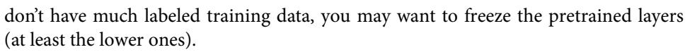

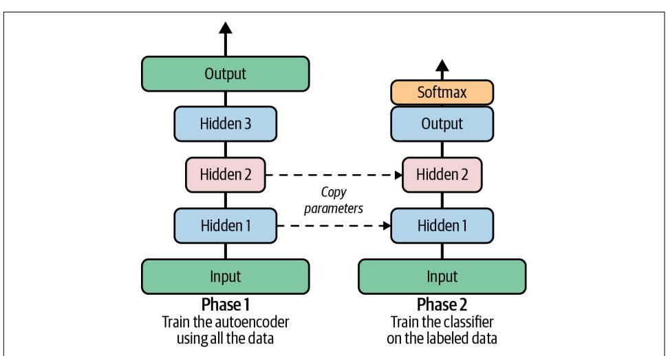

Figure 17-6. Unsupervised pretraining using autoencoders


Having plenty of unlabeled data and little labeled data is common. Building a large unlabeled dataset is often cheap (e.g., a simple script can download millions of images off the internet), but labeling those images (e.g., classifying them as cute or not) can usually be done reliably only by humans. Labeling instances is time-consuming and costly, so it's normal to have only a few thousand human-labeled instances, or even less.

There is nothing special about the implementation: just train an autoencoder using all the training data (labeled plus unlabeled), then reuse its encoder layers to create a new neural network (see the exercises at the end of this chapter for an example).

Next, let's look at a few techniques for training stacked autoencoders.

### **Tying Weights**

When an autoencoder is neatly symmetrical, like the one we just built, a common technique is to tie the weights of the decoder layers to the weights of the encoder layers. This halves the number of weights in the model, speeding up training and limiting the risk of overfitting. Specifically, if the autoencoder has a total of N layers (not counting the input layer), and  $W_L$  represents the connection weights of the  $L<sup>th</sup>$ layer (e.g., layer 1 is the first hidden layer, layer  $N/2$  is the coding layer, and layer  $N$ is the output layer), then the decoder layer weights can be defined as  $W_L = W_{N-L+1}$ <sup>T</sup> (with  $L = N/2 + 1, ..., N$ ).

{673}------------------------------------------------

To tie weights between layers using Keras, let's define a custom layer:

```
class DenseTranspose(tf.keras.layers.Layer):
    def init (self, dense, activation=None, **kwargs):
       super(). init (**kwargs)self.dense = denseself.activation = tf.keras.activations.get(activation)
    def build(self, batch_input_shape):
       self.biases = self.add_weight(name="bias",
                                     shape=self.dense.input shape[-1],
                                     initializer="zeros")
       super().build(batch input shape)
    def call(self, inputs):
       Z = tf.matmul(inputs, self.dense.weights[0], transpose b=True)return self.activation(Z + self.biases)
```

This custom layer acts like a regular Dense layer, but it uses another Dense layer's weights, transposed (setting transpose\_b=True is equivalent to transposing the second argument, but it's more efficient as it performs the transposition on the fly within the matmul() operation). However, it uses its own bias vector. Now we can build a new stacked autoencoder, much like the previous one but with the decoder's Dense layers tied to the encoder's Dense layers:

```
dense 1 = tf. keras. layers. Dense(100, activation="relu")
dense_2 = tf.keras.layers.Dense(30, activation="relu")tied encoder = tf.keras.Sequential(\lceiltf.keras.layers.Flatten(),
    dense 1,
    dense_2
\left| \right\rangletied decoder = tf.keras.Sequential(\lceilDenseTranspose(dense 2, activation="relu"),
    DenseTranspose(dense_1),
    tf.keras.layers.Reshape([28, 28])
\left| \right\rangle
```

tied ae = tf.keras.Sequential([tied encoder, tied decoder])

This model achieves roughly the same reconstruction error as the previous model, using almost half the number of parameters.

### **Training One Autoencoder at a Time**

Rather than training the whole stacked autoencoder in one go like we just did, it is possible to train one shallow autoencoder at a time, then stack all of them into a single stacked autoencoder (hence the name), as shown in Figure 17-7. This

{674}------------------------------------------------

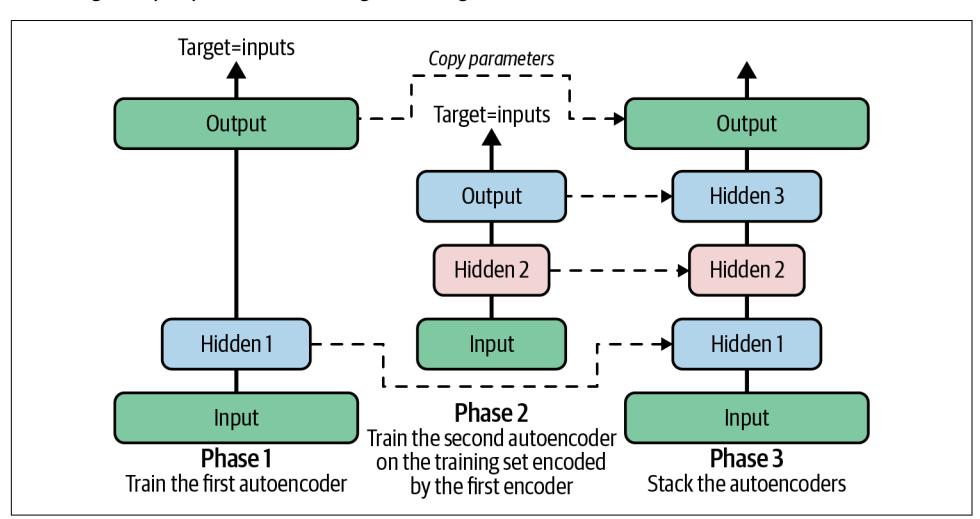

technique is not used so much these days, but you may still run into papers that talk about "greedy layerwise training", so it's good to know what it means.

Figure 17-7. Training one autoencoder at a time

During the first phase of training, the first autoencoder learns to reconstruct the inputs. Then we encode the whole training set using this first autoencoder, and this gives us a new (compressed) training set. We then train a second autoencoder on this new dataset. This is the second phase of training. Finally, we build a big sandwich using all these autoencoders, as shown in Figure 17-7 (i.e., we first stack the hidden layers of each autoencoder, then the output layers in reverse order). This gives us the final stacked autoencoder (see the "Training One Autoencoder at a Time" section in the chapter's notebook for an implementation). We could easily train more autoencoders this way, building a very deep stacked autoencoder.

As I mentioned earlier, one of the triggers of the deep learning tsunami was the discovery in 2006 by Geoffrey Hinton et al. that deep neural networks can be pretrained in an unsupervised fashion, using this greedy layerwise approach. They used restricted Boltzmann machines (RBMs; see https://homl.info/extra-anns) for this purpose, but in 2007 Yoshua Bengio et al.<sup>2</sup> showed that autoencoders worked just as well. For several years this was the only efficient way to train deep nets, until many of the techniques introduced in Chapter 11 made it possible to just train a deep net in one shot.

<sup>2</sup> Yoshua Bengio et al., "Greedy Layer-Wise Training of Deep Networks", Proceedings of the 19th International Conference on Neural Information Processing Systems (2006): 153-160.

{675}------------------------------------------------

Autoencoders are not limited to dense networks: you can also build convolutional autoencoders. Let's look at these now

## **Convolutional Autoencoders**

If you are dealing with images, then the autoencoders we have seen so far will not work well (unless the images are very small): as you saw in Chapter 14, convolutional neural networks are far better suited than dense networks to working with images. So if you want to build an autoencoder for images (e.g., for unsupervised pretraining or dimensionality reduction), you will need to build a *convolutional autoencoder*.<sup>3</sup> The encoder is a regular CNN composed of convolutional layers and pooling layers. It typically reduces the spatial dimensionality of the inputs (i.e., height and width) while increasing the depth (i.e., the number of feature maps). The decoder must do the reverse (upscale the image and reduce its depth back to the original dimensions), and for this you can use transpose convolutional layers (alternatively, you could combine upsampling layers with convolutional layers). Here is a basic convolutional autoencoder for Fashion MNIST:

```
conv\_encoder = tf.keras.Sequentialtf.keras.layers.Reshape([28, 28, 1]),
    tf.keras.layers.Conv2D(16, 3, padding="same", activation="relu"),
    tf.keras.layers.MaxPool2D(pool_size=2), # output: 14 \times 14 \times 16tf.keras.layers.Conv2D(32, 3, padding="same", activation="relu"),
    tf.keras.layers.MaxPool2D(pool_size=2), # output: 7 \times 7 \times 32tf.keras.layers.Conv2D(64, 3, padding="same", activation="relu"),
    tf.keras.layers.MaxPool2D(pool size=2), # output: 3 \times 3 \times 64tf.keras.layers.Conv2D(30, 3, padding="same", activation="relu"),
    tf.keras.layers.GlobalAvgPool2D() # output: 30
\left| \right\rangleconv decoder = tf.keras.Sequential(\lceiltf.keras.layers.Dense(3 * 3 * 16),
    tf.keras.layers.Reshape((3, 3, 16)),
    tf.keras.layers.Conv2DTranspose(32, 3, strides=2, activation="relu"),
    tf.keras.layers.Conv2DTranspose(16, 3, strides=2, padding="same",
                                      activation="relu"),
    tf.keras.layers.Conv2DTranspose(1, 3, strides=2, padding="same"),
    tf.keras.layers.Reshape([28, 28])
\left| \right\rangleconv_ae = tf.keras.Sequential([conv_encoder, conv_decoder])
```

<sup>3</sup> Jonathan Masci et al., "Stacked Convolutional Auto-Encoders for Hierarchical Feature Extraction", Proceedings of the 21st International Conference on Artificial Neural Networks 1 (2011): 52-59.

{676}------------------------------------------------

It's also possible to create autoencoders with other architecture types, such as RNNs (see the notebook for an example).

OK, let's step back for a second. So far we have looked at various kinds of autoencoders (basic, stacked, and convolutional), and how to train them (either in one shot or layer by layer). We also looked at a couple of applications: data visualization and unsupervised pretraining.

Up to now, in order to force the autoencoder to learn interesting features, we have limited the size of the coding layer, making it undercomplete. There are actually many other kinds of constraints that can be used, including ones that allow the coding layer to be just as large as the inputs, or even larger, resulting in an *overcomplete* autoencoder. Then, in the following sections we'll look at a few more kinds of autoencoders: denoising autoencoders, sparse autoencoders, and variational autoencoders.

## **Denoising Autoencoders**

Another way to force the autoencoder to learn useful features is to add noise to its inputs, training it to recover the original, noise-free inputs. This idea has been around since the 1980s (e.g., it is mentioned in Yann LeCun's 1987 master's thesis). In a 2008 paper,<sup>4</sup> Pascal Vincent et al. showed that autoencoders could also be used for feature extraction. In a 2010 paper,<sup>5</sup> Vincent et al. introduced *stacked denoising autoencoders*.

The noise can be pure Gaussian noise added to the inputs, or it can be randomly switched-off inputs, just like in dropout (introduced in Chapter 11). Figure 17-8 shows both options.

The implementation is straightforward: it is a regular stacked autoencoder with an additional Dropout layer applied to the encoder's inputs (or you could use a GaussianNoise layer instead). Recall that the Dropout layer is only active during training (and so is the GaussianNoise layer):

<sup>4</sup> Pascal Vincent et al., "Extracting and Composing Robust Features with Denoising Autoencoders", Proceedings of the 25th International Conference on Machine Learning (2008): 1096-1103.

<sup>5</sup> Pascal Vincent et al., "Stacked Denoising Autoencoders: Learning Useful Representations in a Deep Network with a Local Denoising Criterion", Journal of Machine Learning Research 11 (2010): 3371-3408.

{677}------------------------------------------------

```
dropout_{encoder} = tf_{keras.Sequential}tf.keras.layers.Flatten(),
    tf.keras.layers.Dropout(0.5),
    tf.keras.layers.Dense(100, activation="relu"),
    tf.keras.layers.Dense(30, activation="relu")
\mathcal{I}dropout decoder = tf.keras.Sequential(\lceiltf.keras.layers.Dense(100, activation="relu"),
    tf.keras.layers.Dense(28 * 28).
    tf.keras.layers.Reshape([28, 28])
\mathcal{I}dropout ae = tf.keras.Sequential([dropout encoder, dropout decoder])
```

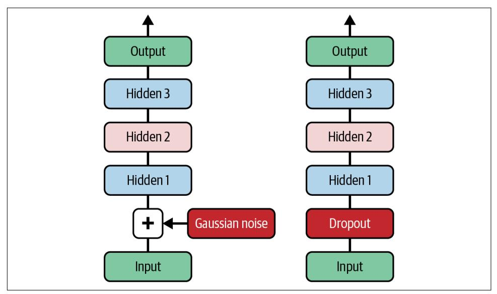

Figure 17-8. Denoising autoencoders, with Gaussian noise (left) or dropout (right)

Figure 17-9 shows a few noisy images (with half the pixels turned off), and the images reconstructed by the dropout-based denoising autoencoder. Notice how the autoencoder guesses details that are actually not in the input, such as the top of the white shirt (bottom row, fourth image). As you can see, not only can denoising autoencoders be used for data visualization or unsupervised pretraining, like the other autoencoders we've discussed so far, but they can also be used quite simply and efficiently to remove noise from images.

{678}------------------------------------------------

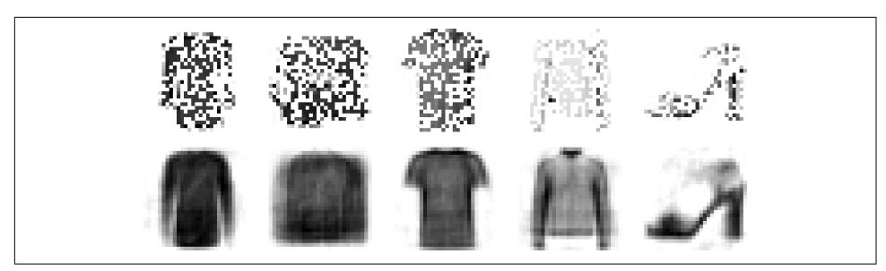

Figure 17-9. Noisy images (top) and their reconstructions (bottom)

## **Sparse Autoencoders**

Another kind of constraint that often leads to good feature extraction is *sparsity*: by adding an appropriate term to the cost function, the autoencoder is pushed to reduce the number of active neurons in the coding layer. For example, it may be pushed to have on average only 5% significantly active neurons in the coding layer. This forces the autoencoder to represent each input as a combination of a small number of activations. As a result, each neuron in the coding layer typically ends up representing a useful feature (if you could speak only a few words per month, you would probably try to make them worth listening to).

A simple approach is to use the sigmoid activation function in the coding layer (to constrain the codings to values between 0 and 1), use a large coding layer (e.g., with 300 units), and add some  $\ell_1$  regularization to the coding layer's activations. The decoder is just a regular decoder:

```
sparse \lambda1 encoder = tf.keras.Sequential([
    tf.keras.layers.Flatten(),
    tf.keras.layers.Dense(100, activation="relu"),
    tf.keras.layers.Dense(300, activation="sigmoid"),
    tf.keras.layers.ActivityRegularization(l1=1e-4)
\left| \right\ranglesparse \lambda1 decoder = tf.keras.Sequential([
    tf.keras.layers.Dense(100, activation="relu"),
    tf.keras.layers.Dense(28 * 28),
    tf.keras.layers.Reshape([28, 28])
\left| \right\ranglesparse l1 ae = tf.keras.Sequential([sparse l1 encoder, sparse l1 decoder])
```

{679}------------------------------------------------

This Activity Reqularization layer just returns its inputs, but as a side effect it adds a training loss equal to the sum of the absolute values of its inputs. This only affects training. Equivalently, you could remove the ActivityRegularization layer and set activity\_regularizer=tf.keras.regularizers.l1(1e-4) in the previous layer. This penalty will encourage the neural network to produce codings close to 0, but since it will also be penalized if it does not reconstruct the inputs correctly, it will have to output at least a few nonzero values. Using the  $\ell_1$  norm rather than the  $\ell_2$  norm will push the neural network to preserve the most important codings while eliminating the ones that are not needed for the input image (rather than just reducing all codings).

Another approach, which often yields better results, is to measure the actual sparsity of the coding layer at each training iteration, and penalize the model when the measured sparsity differs from a target sparsity. We do so by computing the average activation of each neuron in the coding layer, over the whole training batch. The batch size must not be too small, or else the mean will not be accurate.

Once we have the mean activation per neuron, we want to penalize the neurons that are too active, or not active enough, by adding a *sparsity loss* to the cost function. For example, if we measure that a neuron has an average activation of 0.3, but the target sparsity is 0.1, it must be penalized to activate less. One approach could be simply adding the squared error  $(0.3 - 0.1)^2$  to the cost function, but in practice a better approach is to use the Kullback–Leibler (KL) divergence (briefly discussed in Chapter 4), which has much stronger gradients than the mean squared error, as you can see in Figure 17-10.


Figure 17-10. Sparsity loss

{680}------------------------------------------------

Given two discrete probability distributions  $P$  and  $Q$ , the KL divergence between these distributions, noted  $D_{\text{KL}}(P \parallel Q)$ , can be computed using Equation 17-1.

Equation 17-1. Kullback-Leibler divergence

$$
D_{\text{KL}}(P \parallel Q) = \sum_{i} P(i) \log \frac{P(i)}{Q(i)}
$$

In our case, we want to measure the divergence between the target probability  $p$ that a neuron in the coding layer will activate and the actual probability  $q$ , estimated by measuring the mean activation over the training batch. So, the KL divergence simplifies to Equation 17-2.

Equation 17-2. KL divergence between the target sparsity  $p$  and the actual sparsity  $q$ 

$$
D_{\text{KL}}(p \parallel q) = p \log \frac{p}{q} + (1 - p) \log \frac{1 - p}{1 - q}
$$

Once we have computed the sparsity loss for each neuron in the coding layer, we sum up these losses and add the result to the cost function. In order to control the relative importance of the sparsity loss and the reconstruction loss, we can multiply the sparsity loss by a sparsity weight hyperparameter. If this weight is too high, the model will stick closely to the target sparsity, but it may not reconstruct the inputs properly, making the model useless. Conversely, if it is too low, the model will mostly ignore the sparsity objective and will not learn any interesting features.

We now have all we need to implement a sparse autoencoder based on the KL divergence. First, let's create a custom regularizer to apply KL divergence regularization:

```
kl_divergence = tf.keras.losses.kullback_leibler_divergence
class KLDivergenceRegularizer(tf.keras.regularizers.Regularizer):
    def _init_(self, weight, target):
       self. weight = weightself.target = targetdef __call__(self, inputs):
       mean_ activities = tf.reduce_mean(inputs, axis=0)
       return self.weight * (
           kl divergence(self.target, mean activities) +
           kl divergence(1. - self.target, 1. - mean activities)
```

Now we can build the sparse autoencoder, using the KLDivergenceRegularizer for the coding layer's activations:

{681}------------------------------------------------

```
kld_reg = KLDivergenceRegularizer(weight=5e-3, target=0.1)sparse kl encoder = tf.keras.Sequential(\lceiltf.keras.layers.Flatten(),
    tf.keras.layers.Dense(100, activation="relu"),
    tf.keras.layers.Dense(300, activation="sigmoid",
                            activity_regularizer=kld_reg)
\left| \right\ranglesparse_kl_decoder = tf.keras.Sequential([
    tf.keras.layers.Dense(100, activation="relu"),
    tf.keras.layers.Dense(28 * 28),
    tf.keras.layers.Reshape([28, 28])
\left| \right\ranglesparse_kl_ae = tf.keras.Sequential([sparse_kl_encoder, sparse_kl_decoder])
```

After training this sparse autoencoder on Fashion MNIST, the coding layer will have roughly 10% sparsity.

## **Variational Autoencoders**

An important category of autoencoders was introduced in 2013 by Diederik Kingma and Max Welling<sup>6</sup> and quickly became one of the most popular variants: variational autoencoders (VAEs).

VAEs are quite different from all the autoencoders we have discussed so far, in these particular ways:

- They are probabilistic autoencoders, meaning that their outputs are partly determined by chance, even after training (as opposed to denoising autoencoders, which use randomness only during training).
- Most importantly, they are *generative autoencoders*, meaning that they can generate new instances that look like they were sampled from the training set.

Both these properties make VAEs rather similar to RBMs, but they are easier to train, and the sampling process is much faster (with RBMs you need to wait for the network to stabilize into a "thermal equilibrium" before you can sample a new instance). As their name suggests, variational autoencoders perform variational Bayesian inference, which is an efficient way of carrying out approximate Bayesian inference. Recall that Bayesian inference means updating a probability distribution based on new data, using equations derived from Bayes' theorem. The original distribution is called the *prior*, while the updated distribution is called the *posterior*. In our case, we want to find a good approximation of the data distribution. Once we have that, we can sample from it.

<sup>6</sup> Diederik Kingma and Max Welling, "Auto-Encoding Variational Bayes", arXiv preprint arXiv:1312.6114  $(2013).$ 

{682}------------------------------------------------

Let's take a look at how VAEs work. Figure 17-11 (left) shows a variational autoencoder. You can recognize the basic structure of all autoencoders, with an encoder followed by a decoder (in this example, they both have two hidden layers), but there is a twist: instead of directly producing a coding for a given input, the encoder produces a *mean coding*  $\mu$  and a standard deviation  $\sigma$ . The actual coding is then sampled randomly from a Gaussian distribution with mean  $\mu$  and standard deviation σ. After that the decoder decodes the sampled coding normally. The right part of the diagram shows a training instance going through this autoencoder. First, the encoder produces  $\mu$  and  $\sigma$ , then a coding is sampled randomly (notice that it is not exactly located at  $\mu$ ), and finally this coding is decoded; the final output resembles the training instance.

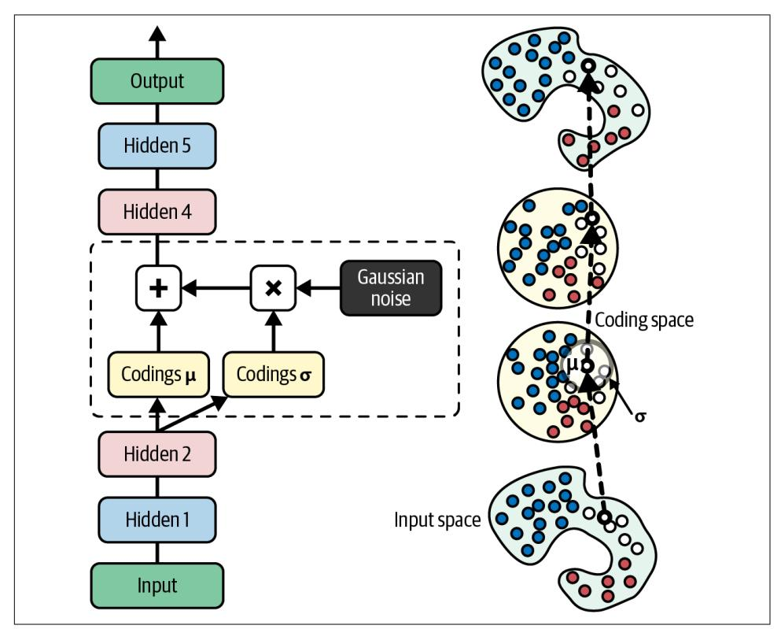

Figure 17-11. A variational autoencoder (left) and an instance going through it (right)

As you can see in the diagram, although the inputs may have a very convoluted distribution, a variational autoencoder tends to produce codings that look as though they were sampled from a simple Gaussian distribution:7 during training, the cost

<sup>7</sup> Variational autoencoders are actually more general; the codings are not limited to Gaussian distributions.

{683}------------------------------------------------

function (discussed next) pushes the codings to gradually migrate within the coding space (also called the *latent space*) to end up looking like a cloud of Gaussian points. One great consequence is that after training a variational autoencoder, you can very easily generate a new instance: just sample a random coding from the Gaussian distribution, decode it, and voilà!

Now, let's look at the cost function. It is composed of two parts. The first is the usual reconstruction loss that pushes the autoencoder to reproduce its inputs. We can use the MSE for this, as we did earlier. The second is the *latent loss* that pushes the autoencoder to have codings that look as though they were sampled from a simple Gaussian distribution: it is the KL divergence between the target distribution (i.e., the Gaussian distribution) and the actual distribution of the codings. The math is a bit more complex than with the sparse autoencoder, in particular because of the Gaussian noise, which limits the amount of information that can be transmitted to the coding layer. This pushes the autoencoder to learn useful features. Luckily, the equations simplify, so the latent loss can be computed using Equation 17-3.8

Equation 17-3. Variational autoencoder's latent loss

$$
\mathcal{L} = -\frac{1}{2} \sum_{i=1}^{n} \left[ 1 + \log(\sigma_i^2) - \sigma_i^2 - \mu_i^2 \right]
$$

In this equation,  $\mathcal{L}$  is the latent loss, *n* is the codings' dimensionality, and  $\mu_i$  and  $\sigma_i$ are the mean and standard deviation of the  $i<sup>th</sup>$  component of the codings. The vectors  $\mu$  and  $\sigma$  (which contain all the  $\mu_i$  and  $\sigma_i$ ) are output by the encoder, as shown in Figure 17-11 (left).

A common tweak to the variational autoencoder's architecture is to make the encoder output  $y = log(\sigma^2)$  rather than  $\sigma$ . The latent loss can then be computed as shown in Equation 17-4. This approach is more numerically stable and speeds up training.

Equation 17-4. Variational autoencoder's latent loss, rewritten using  $y = log(\sigma^2)$ 

$$
\mathcal{L} = -\frac{1}{2} \sum_{i=1}^{n} \left[ 1 + \gamma_i - \exp(\gamma_i) - \mu_i^2 \right]
$$

Let's start building a variational autoencoder for Fashion MNIST (as shown in Figure 17-11, but using the  $\gamma$  tweak). First, we will need a custom layer to sample the codings, given  $\mu$  and  $\gamma$ :

<sup>8</sup> For more mathematical details, check out the original paper on variational autoencoders, or Carl Doersch's great tutorial (2016).

{684}------------------------------------------------

```
class Sampling(tf.keras.layers.Layer):
    def call(self, inputs):
        mean, log_{var} = inputsreturn tf.random.normal(tf.shape(log var)) * tf.exp(log var / 2) + mean
```

This Sampling layer takes two inputs: mean  $(\mu)$  and log var  $(\gamma)$ . It uses the function tf.random.normal() to sample a random vector (of the same shape as  $y$ ) from the Gaussian distribution, with mean 0 and standard deviation 1. Then it multiplies it by  $\exp(\gamma/2)$  (which is equal to  $\sigma$ , as you can verify mathematically), and finally it adds  $\mu$ and returns the result. This samples a codings vector from the Gaussian distribution with mean  $\mu$  and standard deviation  $\sigma$ .

Next, we can create the encoder, using the functional API because the model is not entirely sequential:

```
codings size = 10inputs = tf.keras.layers.Input(shape=[28, 28])Z = tf.keras.layers.Flatten()(inputs)
Z = tf.keras.layers.Dense(150, activation="relu")(Z)
Z = tf.keras.layers.Dense(100, activation="relu")(Z)
codings_mean = tf.keras.layers.Dense(codings_size)(Z) \# \mucodings log var = tf.keras.layers.Dense(codings size)(Z) # ycodings = Sampling()([codings_mean, codings_log_var])
variational_encoder = tf.keras.Model(
    inputs=[inputs], outputs=[codings_mean, codings_log_var, codings])
```

Note that the Dense layers that output codings mean  $(\mu)$  and codings log var  $(y)$  have the same inputs (i.e., the outputs of the second Dense layer). We then pass both codings mean and codings log var to the Sampling layer. Finally, the variational\_encoder model has three outputs. Only the codings are required, but we add codings\_mean and codings\_log\_var as well, in case we want to inspect their values. Now let's build the decoder:

```
decoder inputs = tf.keras.layers.Input(shape=[codings size])
x = tf. keras. layers. Dense(100, activation="relu")(decoder inputs)
x = tf.keras.layers.Dense(150, activation="relu")(x)
x = tf.keras.layers.Dense(28 * 28)(x)
outputs = tf.keras.layers.Reshape([28, 28])(x)
variational_decoder = tf.keras.Model(inputs=[decoder_inputs], outputs=[outputs])
```

For this decoder, we could have used the sequential API instead of the functional API, since it is really just a simple stack of layers, virtually identical to many of the decoders we have built so far. Finally, let's build the variational autoencoder model:

```
_, _, codings = variational_encoder(inputs)
reconstructions = variational decoder(codings)
variational ae = tf.keras.Model(inputs=[inputs], outputs=[reconstructions])
```

We ignore the first two outputs of the encoder (we only want to feed the codings to the decoder). Lastly, we must add the latent loss and the reconstruction loss:

{685}------------------------------------------------

```
lateral_loss = -0.5 * tf.readuce_sum(1 + codings_log_var - tf.exp(codings_log_var) - tf.square(codings_mean),
   axis=-1)variational ae.add loss(tf.reduce mean(latent loss) / 784.)
```

We first apply Equation 17-4 to compute the latent loss for each instance in the batch, summing over the last axis. Then we compute the mean loss over all the instances in the batch, and we divide the result by 784 to ensure it has the appropriate scale compared to the reconstruction loss. Indeed, the variational autoencoder's reconstruction loss is supposed to be the sum of the pixel reconstruction errors, but when Keras computes the "mse" loss it computes the mean over all 784 pixels, rather than the sum. So, the reconstruction loss is 784 times smaller than we need it to be. We could define a custom loss to compute the sum rather than the mean, but it is simpler to divide the latent loss by 784 (the final loss will be 784 times smaller than it should be, but this just means that we should use a larger learning rate).

And finally, we can compile and fit the autoencoder!

```
variational_ae.compile(loss="mse", optimizer="nadam")
history = variational_ae.fit(X_train, X_train, epochs=25, batch_size=128,
                             validation_data=(X_valid, X_valid))
```

### **Generating Fashion MNIST Images**

Now let's use this variational autoencoder to generate images that look like fashion items. All we need to do is sample random codings from a Gaussian distribution and decode them:

```
codings = tf.random.normal(shape=[3 * 7, codings_size])images = variational decoder(codings).numpy()
```

Figure 17-12 shows the 12 generated images.

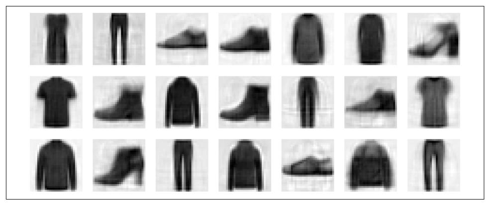

Figure 17-12. Fashion MNIST images generated by the variational autoencoder

{686}------------------------------------------------

The majority of these images look fairly convincing, if a bit too fuzzy. The rest are not great, but don't be too harsh on the autoencoder—it only had a few minutes to learn!

Variational autoencoders make it possible to perform semantic interpolation: instead of interpolating between two images at the pixel level, which would look as if the two images were just overlaid, we can interpolate at the codings level. For example, let's take a few codings along an arbitrary line in latent space and decode them. We get a sequence of images that gradually go from pants to sweaters (see Figure 17-13):

```
codings = np{\cdot}zeros([7, codings_size])codings[:, 3] = np.linspace(-0.8, 0.8, 7) # axis 3 looks best in this case
images = variational decoder(codings).numpv()
```

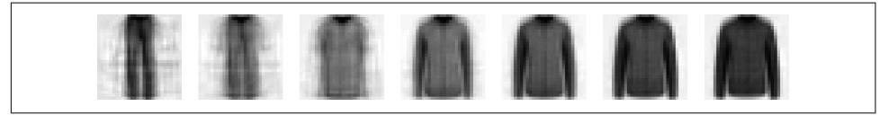

Figure 17-13. Semantic interpolation

Let's now turn our attention to GANs: they are harder to train, but when you manage to get them to work, they produce pretty amazing images.

### **Generative Adversarial Networks**

Generative adversarial networks were proposed in a 2014 paper<sup>9</sup> by Ian Goodfellow et al., and although the idea got researchers excited almost instantly, it took a few years to overcome some of the difficulties of training GANs. Like many great ideas, it seems simple in hindsight: make neural networks compete against each other in the hope that this competition will push them to excel. As shown in Figure 17-14, a GAN is composed of two neural networks:

Generator

Takes a random distribution as input (typically Gaussian) and outputs some data—typically, an image. You can think of the random inputs as the latent representations (i.e., codings) of the image to be generated. So, as you can see, the generator offers the same functionality as a decoder in a variational autoencoder, and it can be used in the same way to generate new images: just feed it some Gaussian noise, and it outputs a brand-new image. However, it is trained very differently, as you will soon see.

<sup>9</sup> Ian Goodfellow et al., "Generative Adversarial Nets", Proceedings of the 27th International Conference on Neural Information Processing Systems 2 (2014): 2672-2680.

{687}------------------------------------------------

#### *Discriminator*

Takes either a fake image from the generator or a real image from the training set as input, and must guess whether the input image is fake or real.

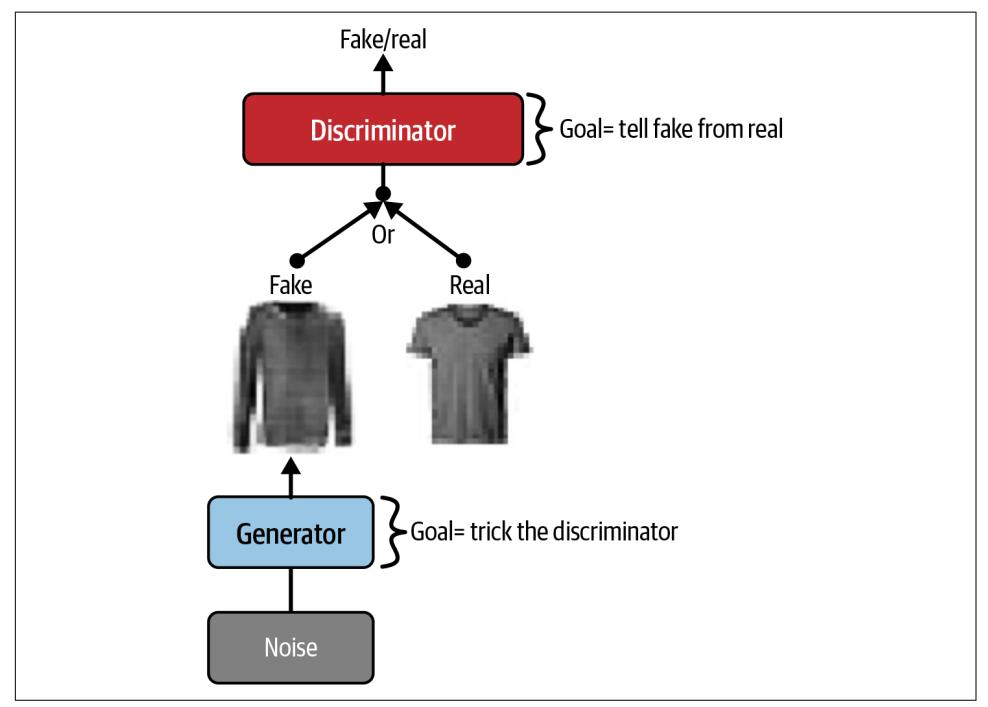

Figure 17-14. A generative adversarial network

During training, the generator and the discriminator have opposite goals: the discriminator tries to tell fake images from real images, while the generator tries to produce images that look real enough to trick the discriminator. Because the GAN is composed of two networks with different objectives, it cannot be trained like a regular neural network. Each training iteration is divided into two phases:

- In the first phase, we train the discriminator. A batch of real images is sampled from the training set and is completed with an equal number of fake images produced by the generator. The labels are set to 0 for fake images and 1 for real images, and the discriminator is trained on this labeled batch for one step, using the binary cross-entropy loss. Importantly, backpropagation only optimizes the weights of the discriminator during this phase.
- In the second phase, we train the generator. We first use it to produce another batch of fake images, and once again the discriminator is used to tell whether the images are fake or real. This time we do not add real images in the batch, and all the labels are set to 1 (real): in other words, we want the generator to

{688}------------------------------------------------

produce images that the discriminator will (wrongly) believe to be real! Crucially, the weights of the discriminator are frozen during this step, so backpropagation only affects the weights of the generator.


The generator never actually sees any real images, yet it gradually learns to produce convincing fake images! All it gets is the gradients flowing back through the discriminator. Fortunately, the better the discriminator gets, the more information about the real images is contained in these secondhand gradients, so the generator can make significant progress.

Let's go ahead and build a simple GAN for Fashion MNIST.

First, we need to build the generator and the discriminator. The generator is similar to an autoencoder's decoder, and the discriminator is a regular binary classifier: it takes an image as input and ends with a Dense layer containing a single unit and using the sigmoid activation function. For the second phase of each training iteration, we also need the full GAN model containing the generator followed by the discriminator:

```
codings size = 30Dense = tf.keras.layers.Dense
generator = tf.keras.Sequential(Dense(100, activation="relu", kernel_initializer="he_normal"),
    Dense(150, activation="relu", kernel_initializer="he_normal"),
    Dense(28 * 28, activation="sigmoid"),
    tf.keras.layers.Reshape([28, 28])
\mathbf{I}discriminator = tf.keras. Sequential( [tf.keras.layers.Flatten(),
    Dense(150, activation="relu", kernel_initializer="he_normal"),
    Dense(100, activation="relu", kernel initializer="he normal"),
    Dense(1, activation="sigmoid")
\left| \right\ranglegan = tf.keras.Sequential([generator, discriminator])
```

Next, we need to compile these models. As the discriminator is a binary classifier, we can naturally use the binary cross-entropy loss. The gan model is also a binary classifier, so it can use the binary cross-entropy loss as well. However, the generator will only be trained through the gan model, so we do not need to compile it at all. Importantly, the discriminator should not be trained during the second phase, so we make it non-trainable before compiling the gan model:

```
discriminator.compile(loss="binary_crossentropy", optimizer="rmsprop")
discriminator.trainable = False
gan.compile(loss="binary_crossentropy", optimizer="rmsprop")
```

{689}------------------------------------------------


The trainable attribute is taken into account by Keras only when compiling a model, so after running this code, the discriminator is trainable if we call its fit() method or its train on batch() method (which we will be using), while it is not trainable when we call these methods on the gan model.

Since the training loop is unusual, we cannot use the regular fit() method. Instead, we will write a custom training loop. For this, we first need to create a Dataset to iterate through the images:

```
batch size = 32dataset = tf.data.Dataset.from tensor slices(X train).shuffle(buffer size=1000)
dataset = dataset.batch(batch_size, drop_remainder=True).prefetch(1)
```

We are now ready to write the training loop. Let's wrap it in a train\_gan() function:

```
def train_gan(gan, dataset, batch_size, codings_size, n_epochs):
   generator, discriminator = gan.layers
   for epoch in range(n epochs):
       for X batch in dataset:
            # phase 1 - training the discriminator
            noise = tf.random.normal(shape=[batch_size, codings_size])
            generated images = generator(noise)X fake and real = tf.concat(fgenerated images, X batch], axis=0)y1 = tf.contrib constant([[0.]] * batch_size + [[1.]] * batch_size)discriminator.train_on_batch(X_fake_and_real, y1)
            # phase 2 - training the generator
            noise = tf.random.normal(shape=[batch_size, codings_size])
            y2 = tf.contrib constant([[1.]] * batch_size)gan.train_on_batch(noise, y2)
train_gan(gan, dataset, batch_size, codings_size, n_epochs=50)
```

- As discussed earlier, you can see the two phases at each iteration:
  - In phase one we feed Gaussian noise to the generator to produce fake images, and we complete this batch by concatenating an equal number of real images. The targets y1 are set to 0 for fake images and 1 for real images. Then we train the discriminator on this batch. Remember that the discriminator is trainable in this phase, but we are not touching the generator.
  - In phase two, we feed the GAN some Gaussian noise. Its generator will start by producing fake images, then the discriminator will try to guess whether these images are fake or real. In this phase, we are trying to improve the generator, which means that we want the discriminator to fail: this is why the targets y2 are all set to 1, although the images are fake. In this phase, the discriminator is not trainable, so the only part of the gan model that will improve is the generator.

{690}------------------------------------------------

That's it! After training, you can randomly sample some codings from a Gaussian distribution, and feed them to the generator to produce new images:

```
codings = tf.random.normal(shape=[batch size, codings size])
generated_images = generator.predict(codings)
```

If you display the generated images (see Figure 17-15), you will see that at the end of the first epoch, they already start to look like (very noisy) Fashion MNIST images.

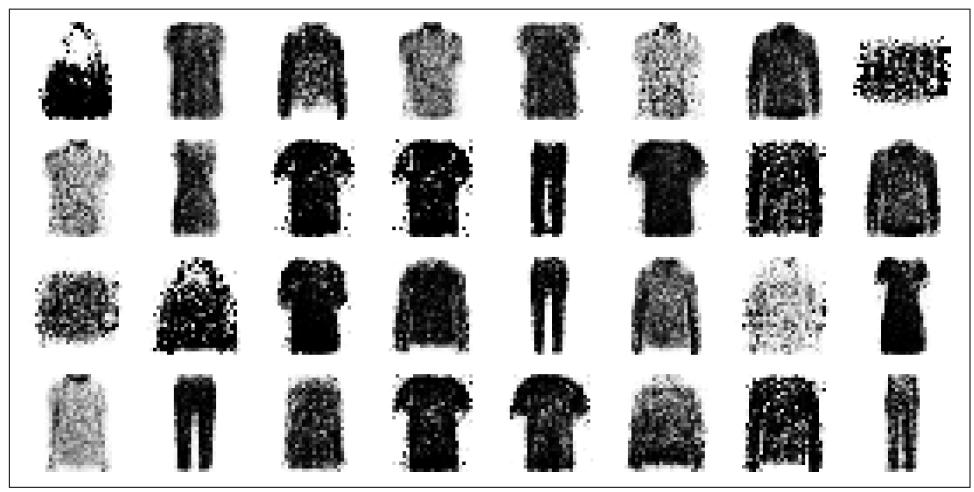

Figure 17-15. Images generated by the GAN after one epoch of training

Unfortunately, the images never really get much better than that, and you may even find epochs where the GAN seems to be forgetting what it learned. Why is that? Well, it turns out that training a GAN can be challenging. Let's see why.

### The Difficulties of Training GANs

During training, the generator and the discriminator constantly try to outsmart each other, in a zero-sum game. As training advances, the game may end up in a state that game theorists call a Nash equilibrium, named after the mathematician John Nash: this is when no player would be better off changing their own strategy, assuming the other players do not change theirs. For example, a Nash equilibrium is reached when everyone drives on the left side of the road: no driver would be better off being the only one to switch sides. Of course, there is a second possible Nash equilibrium: when everyone drives on the right side of the road. Different initial states and dynamics may lead to one equilibrium or the other. In this example, there is a single optimal strategy once an equilibrium is reached (i.e., driving on the same side as everyone else), but a Nash equilibrium can involve multiple competing strategies (e.g., a predator chases its prey, the prey tries to escape, and neither would be better off changing their strategy).

{691}------------------------------------------------

So how does this apply to GANs? Well, the authors of the GAN paper demonstrated that a GAN can only reach a single Nash equilibrium: that's when the generator produces perfectly realistic images, and the discriminator is forced to guess (50% real, 50% fake). This fact is very encouraging: it would seem that you just need to train the GAN for long enough, and it will eventually reach this equilibrium, giving you a perfect generator. Unfortunately, it's not that simple: nothing guarantees that the equilibrium will ever be reached.

The biggest difficulty is called *mode collapse*: this is when the generator's outputs gradually become less diverse. How can this happen? Suppose that the generator gets better at producing convincing shoes than any other class. It will fool the discriminator a bit more with shoes, and this will encourage it to produce even more images of shoes. Gradually, it will forget how to produce anything else. Meanwhile, the only fake images that the discriminator will see will be shoes, so it will also forget how to discriminate fake images of other classes. Eventually, when the discriminator manages to discriminate the fake shoes from the real ones, the generator will be forced to move to another class. It may then become good at shirts, forgetting about shoes, and the discriminator will follow. The GAN may gradually cycle across a few classes, never really becoming very good at any of them.

Moreover, because the generator and the discriminator are constantly pushing against each other, their parameters may end up oscillating and becoming unstable. Training may begin properly, then suddenly diverge for no apparent reason, due to these instabilities. And since many factors affect these complex dynamics, GANs are very sensitive to the hyperparameters: you may have to spend a lot of effort fine-tuning them. In fact, that's why I used RMSProp rather than Nadam when compiling the models: when using Nadam, I ran into a severe mode collapse.

These problems have kept researchers very busy since 2014: many papers have been published on this topic, some proposing new cost functions<sup>10</sup> (though a 2018 paper<sup>11</sup> by Google researchers questions their efficiency) or techniques to stabilize training or to avoid the mode collapse issue. For example, a popular technique called *experience replay* consists of storing the images produced by the generator at each iteration in a replay buffer (gradually dropping older generated images) and training the discriminator using real images plus fake images drawn from this buffer (rather than just fake images produced by the current generator). This reduces the chances that the discriminator will overfit the latest generator's outputs. Another common technique is called mini-batch discrimination: it measures how similar images are across the batch and provides this statistic to the discriminator, so it can easily reject a whole

<sup>10</sup> For a nice comparison of the main GAN losses, check out this great GitHub project by Hwalsuk Lee.

<sup>11</sup> Mario Lucic et al., "Are GANs Created Equal? A Large-Scale Study", Proceedings of the 32nd International Conference on Neural Information Processing Systems (2018): 698-707.

{692}------------------------------------------------

batch of fake images that lack diversity. This encourages the generator to produce a greater variety of images, reducing the chance of mode collapse. Other papers simply propose specific architectures that happen to perform well.

In short, this is still a very active field of research, and the dynamics of GANs are still not perfectly understood. But the good news is that great progress has been made, and some of the results are truly astounding! So let's look at some of the most successful architectures, starting with deep convolutional GANs, which were the state of the art just a few years ago. Then we will look at two more recent (and more complex) architectures.

### **Deep Convolutional GANs**

The authors of the original GAN paper experimented with convolutional layers, but only tried to generate small images. Soon after, many researchers tried to build GANs based on deeper convolutional nets for larger images. This proved to be tricky, as training was very unstable, but Alec Radford et al. finally succeeded in late 2015, after experimenting with many different architectures and hyperparameters. They called their architecture *deep convolutional GANs* (DCGANs).<sup>12</sup> Here are the main guidelines they proposed for building stable convolutional GANs:

- Replace any pooling layers with strided convolutions (in the discriminator) and transposed convolutions (in the generator).
- Use batch normalization in both the generator and the discriminator, except in the generator's output layer and the discriminator's input layer.
- Remove fully connected hidden layers for deeper architectures.
- Use ReLU activation in the generator for all layers except the output layer, which should use tanh.
- Use leaky ReLU activation in the discriminator for all layers.

These guidelines will work in many cases, but not always, so you may still need to experiment with different hyperparameters. In fact, just changing the random seed and training the exact same model again will sometimes work. Here is a small DCGAN that works reasonably well with Fashion MNIST:

<sup>12</sup> Alec Radford et al., "Unsupervised Representation Learning with Deep Convolutional Generative Adversarial Networks", arXiv preprint arXiv:1511.06434 (2015).

{693}------------------------------------------------

```
codings_size = 100generator = tf.keras.Sequential[tf.keras.layers.Dense(7 * 7 * 128).
    tf.keras.layers.Reshape([7, 7, 128]),
    tf.keras.layers.BatchNormalization(),
    tf.keras.layers.Conv2DTranspose(64, kernel_size=5, strides=2,
                                     padding="same", activation="relu"),
    tf.keras.layers.BatchNormalization(),
    tf.keras.layers.Conv2DTranspose(1, kernel_size=5, strides=2,
                                     padding="same", activation="tanh"),
\left| \right\ranglediscriminator = tf.keras. Sequential(tf.keras.layers.Conv2D(64, kernel size=5, strides=2, padding="same",
                           activation=tf.keras.layers.LeakyReLU(0.2)),
    tf.keras.layers.Dropout(0.4),
    tf.keras.layers.Conv2D(128, kernel_size=5, strides=2, padding="same",
                           activation=tf.keras.layers.LeakyReLU(0.2)),
    tf.keras.layers.Dropout(0.4).
    tf.keras.layers.Flatten(),
    tf.keras.layers.Dense(1, activation="sigmoid")
\overline{1}gan = tf.keras.Sequential([generator, discriminator])
```

The generator takes codings of size 100, projects them to 6,272 dimensions (7  $*$  7) \* 128), and reshapes the result to get a  $7 \times 7 \times 128$  tensor. This tensor is batch normalized and fed to a transposed convolutional layer with a stride of 2, which upsamples it from  $7 \times 7$  to  $14 \times 14$  and reduces its depth from 128 to 64. The result is batch normalized again and fed to another transposed convolutional layer with a stride of 2, which upsamples it from  $14 \times 14$  to  $28 \times 28$  and reduces the depth from 64 to 1. This layer uses the tanh activation function, so the outputs will range from -1 to 1. For this reason, before training the GAN, we need to rescale the training set to that same range. We also need to reshape it to add the channel dimension:

```
X_train_dcgan = X_train.reshape(-1, 28, 28, 1) * 2. - 1. # reshape and rescale
```

The discriminator looks much like a regular CNN for binary classification, except instead of using max pooling layers to downsample the image, we use strided convolutions (strides=2). Note that we use the leaky ReLU activation function. Overall, we respected the DCGAN guidelines, except we replaced the BatchNormalization layers in the discriminator with Dropout layers; otherwise, training was unstable in this case. Feel free to tweak this architecture: you will see how sensitive it is to the hyperparameters, especially the relative learning rates of the two networks.

Lastly, to build the dataset and then compile and train this model, we can use the same code as earlier. After 50 epochs of training, the generator produces images like those shown in Figure 17-16. It's still not perfect, but many of these images are pretty convincing.

{694}------------------------------------------------

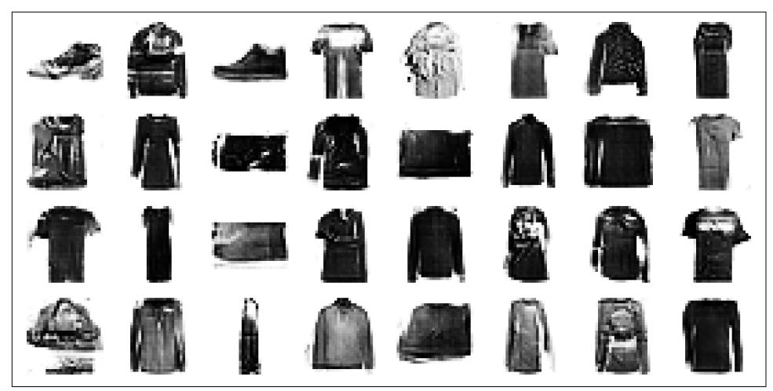

Figure 17-16. Images generated by the DCGAN after 50 epochs of training

If you scale up this architecture and train it on a large dataset of faces, you can get fairly realistic images. In fact, DCGANs can learn quite meaningful latent representations, as you can see in Figure 17-17: many images were generated, and nine of them were picked manually (top left), including three representing men with glasses, three men without glasses, and three women without glasses. For each of these categories, the codings that were used to generate the images were averaged, and an image was generated based on the resulting mean codings (lower left). In short, each of the three lower-left images represents the mean of the three images located above it. But this is not a simple mean computed at the pixel level (this would result in three overlapping faces), it is a mean computed in the latent space, so the images still look like normal faces. Amazingly, if you compute men with glasses, minus men without glasses, plus women without glasses—where each term corresponds to one of the mean codings—and you generate the image that corresponds to this coding, you get the image at the center of the  $3 \times 3$  grid of faces on the right: a woman with glasses! The eight other images around it were generated based on the same vector plus a bit of noise, to illustrate the semantic interpolation capabilities of DCGANs. Being able to do arithmetic on faces feels like science fiction!

DCGANs aren't perfect, though. For example, when you try to generate very large images using DCGANs, you often end up with locally convincing features but overall inconsistencies, such as shirts with one sleeve much longer than the other, different earrings, or eyes looking in opposite directions. How can you fix this?

{695}------------------------------------------------


Figure 17-17. Vector arithmetic for visual concepts (part of figure 7 from the DCGAN  $paper$ <sup>13</sup>


If you add each image's class as an extra input to both the generator and the discriminator, they will both learn what each class looks like, and thus you will be able to control the class of each image produced by the generator. This is called a conditional GAN(CGAN).<sup>14</sup>

### **Progressive Growing of GANs**

In a 2018 paper,<sup>15</sup> Nvidia researchers Tero Kerras et al. proposed an important technique: they suggested generating small images at the beginning of training, then gradually adding convolutional layers to both the generator and the discriminator to produce larger and larger images ( $4 \times 4$ ,  $8 \times 8$ ,  $16 \times 16$ , ...,  $512 \times 512$ ,  $1,024 \times$ 1,024). This approach resembles greedy layer-wise training of stacked autoencoders. The extra layers get added at the end of the generator and at the beginning of the discriminator, and previously trained layers remain trainable.

For example, when growing the generator's outputs from  $4 \times 4$  to  $8 \times 8$  (see Figure 17-18), an upsampling layer (using nearest neighbor filtering) is added to the

<sup>13</sup> Reproduced with the kind authorization of the authors.

<sup>14</sup> Mehdi Mirza and Simon Osindero, "Conditional Generative Adversarial Nets", arXiv preprint arXiv:1411.1784 (2014).

<sup>15</sup> Tero Karras et al., "Progressive Growing of GANs for Improved Quality, Stability, and Variation", Proceedings of the International Conference on Learning Representations (2018).

{696}------------------------------------------------

existing convolutional layer ("Conv 1") to produce  $8 \times 8$  feature maps. These are fed to the new convolutional layer ("Conv 2"), which in turn feeds into a new output convolutional layer. To avoid breaking the trained weights of Conv 1, we gradually fade in the two new convolutional layers (represented with dashed lines in Figure 17-18) and fade out the original output layer. The final outputs are a weighted sum of the new outputs (with weight  $\alpha$ ) and the original outputs (with weight  $1 - \alpha$ ), slowly increasing  $\alpha$  from 0 to 1. A similar fade-in/fade-out technique is used when a new convolutional layer is added to the discriminator (followed by an average pooling layer for downsampling). Note that all convolutional layers use "same" padding and strides of 1, so they preserve the height and width of their inputs. This includes the original convolutional layer, so it now produces  $8 \times 8$  outputs (since its inputs are now  $8 \times 8$ ). Lastly, the output layers use kernel size 1. They just project their inputs down to the desired number of color channels (typically 3).

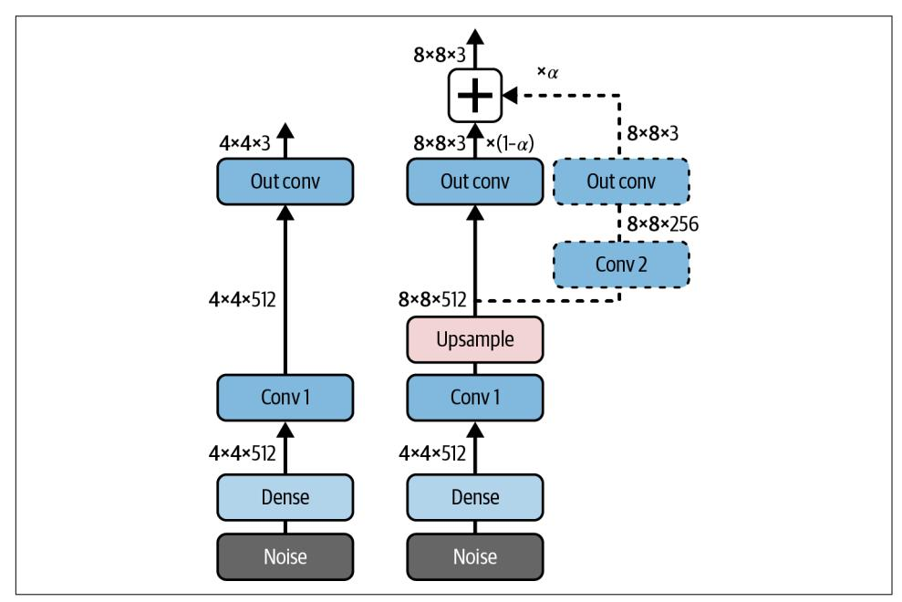

Figure 17-18. A progressively growing GAN: a GAN generator outputs  $4 \times 4$  color images (left); we extend it to output  $8 \times 8$  images (right)

The paper also introduced several other techniques aimed at increasing the diversity of the outputs (to avoid mode collapse) and making training more stable:

#### Mini-batch standard deviation layer

Added near the end of the discriminator. For each position in the inputs, it computes the standard deviation across all channels and all instances in the batch  $(S = tf.math.readuce_std(inputs, axis=[0, -1]))$ . These standard deviations

{697}------------------------------------------------

are then averaged across all points to get a single value  $(v = tf.readuce$ mean(S)). Finally, an extra feature map is added to each instance in the batch and filled with the computed value (tf.concat([inputs, tf.fill([batch\_size, height, width,  $1$ ], v)], axis=-1). How does this help? Well, if the generator produces images with little variety, then there will be a small standard deviation across feature maps in the discriminator. Thanks to this layer, the discriminator will have easy access to this statistic, making it less likely to be fooled by a generator that produces too little diversity. This will encourage the generator to produce more diverse outputs, reducing the risk of mode collapse.

Equalized learning rate

Initializes all weights using a Gaussian distribution with mean 0 and standard deviation 1 rather than using He initialization. However, the weights are scaled down at runtime (i.e., every time the layer is executed) by the same factor as in He initialization: they are divided by  $\sqrt{\frac{2}{n}}$  where  $n_{\text{inputs}}$  is the number of inputs to the layer. The paper demonstrated that this technique significantly improved the GAN's performance when using RMSProp, Adam, or other adaptive gradient optimizers. Indeed, these optimizers normalize the gradient updates by their estimated standard deviation (see Chapter 11), so parameters that have a larger dynamic range<sup>16</sup> will take longer to train, while parameters with a small dynamic range may be updated too quickly, leading to instabilities. By rescaling the weights as part of the model itself rather than just rescaling them upon initialization, this approach ensures that the dynamic range is the same for all parameters throughout training, so they all learn at the same speed. This both speeds up and stabilizes training.

Pixelwise normalization layer

Added after each convolutional layer in the generator. It normalizes each activation based on all the activations in the same image and at the same location, but across all channels (dividing by the square root of the mean squared activation). In TensorFlow code, this is inputs /  $tf.sqrt(tf.readuce_mean(tf-square(X),$  $axis=-1$ , keepdims=True) + 1e-8) (the smoothing term 1e-8 is needed to avoid division by zero). This technique avoids explosions in the activations due to excessive competition between the generator and the discriminator.

The combination of all these techniques allowed the authors to generate extremely convincing high-definition images of faces. But what exactly do we call "convincing"? Evaluation is one of the big challenges when working with GANs: although it is possible to automatically evaluate the diversity of the generated images, judging their quality is a much trickier and subjective task. One technique is to use human raters,

<sup>16</sup> The dynamic range of a variable is the ratio between the highest and the lowest value it may take.

{698}------------------------------------------------

but this is costly and time-consuming. So, the authors proposed to measure the similarity between the local image structure of the generated images and the training images, considering every scale. This idea led them to another groundbreaking innovation: StyleGANs.

### **StyleGANs**

The state of the art in high-resolution image generation was advanced once again by the same Nvidia team in a 2018 paper<sup>17</sup> that introduced the popular StyleGAN architecture. The authors used *style transfer* techniques in the generator to ensure that the generated images have the same local structure as the training images, at every scale, greatly improving the quality of the generated images. The discriminator and the loss function were not modified, only the generator. A StyleGAN generator is composed of two networks (see Figure 17-19):

Mapping network

An eight-layer MLP that maps the latent representations z (i.e., the codings) to a vector w. This vector is then sent through multiple affine transformations (i.e., Dense layers with no activation functions, represented by the "A" boxes in Figure 17-19), which produces multiple vectors. These vectors control the style of the generated image at different levels, from fine-grained texture (e.g., hair color) to high-level features (e.g., adult or child). In short, the mapping network maps the codings to multiple style vectors.

Synthesis network

Responsible for generating the images. It has a constant learned input (to be clear, this input will be constant after training, but *during* training it keeps getting tweaked by backpropagation). It processes this input through multiple convolutional and upsampling layers, as earlier, but there are two twists. First, some noise is added to the input and to all the outputs of the convolutional layers (before the activation function). Second, each noise layer is followed by an *adaptive instance normalization* (AdaIN) layer: it standardizes each feature map independently (by subtracting the feature map's mean and dividing by its standard deviation), then it uses the style vector to determine the scale and offset of each feature map (the style vector contains one scale and one bias term for each feature map).

<sup>17</sup> Tero Karras et al., "A Style-Based Generator Architecture for Generative Adversarial Networks", arXiv preprint arXiv:1812.04948 (2018).

{699}------------------------------------------------

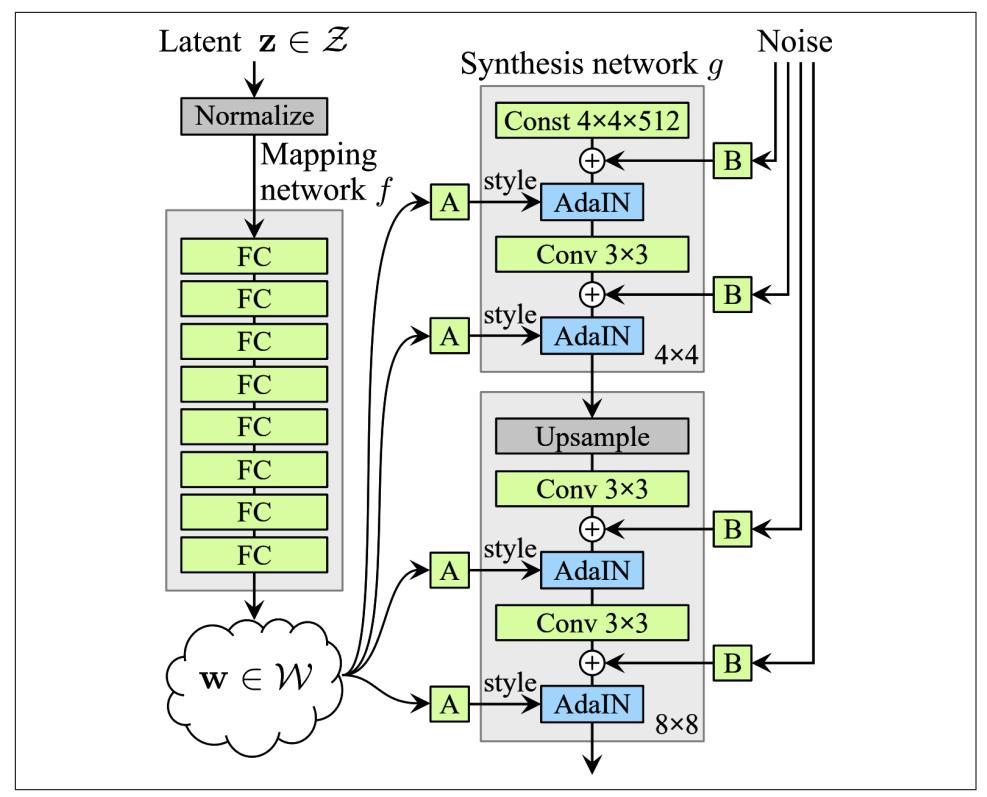

Figure 17-19. StyleGAN's generator architecture (part of Figure 1 from the StyleGAN  $paper)^{18}$ 

The idea of adding noise independently from the codings is very important. Some parts of an image are quite random, such as the exact position of each freckle or hair. In earlier GANs, this randomness had to either come from the codings or be some pseudorandom noise produced by the generator itself. If it came from the codings, it meant that the generator had to dedicate a significant portion of the codings' representational power to storing noise, which this is quite wasteful. Moreover, the noise had to be able to flow through the network and reach the final layers of the generator: this seems like an unnecessary constraint that probably slowed down training. And finally, some visual artifacts may appear because the same noise was used at different levels. If instead the generator tried to produce its own pseudorandom noise, this noise might not look very convincing, leading to more visual artifacts. Plus, part of the generator's weights would be dedicated to generating pseudorandom noise, which again seems wasteful. By adding extra noise inputs, all these issues are avoided; the

<sup>18</sup> Reproduced with the kind authorization of the authors.

{700}------------------------------------------------

GAN is able to use the provided noise to add the right amount of stochasticity to each part of the image.

The added noise is different for each level. Each noise input consists of a single feature map full of Gaussian noise, which is broadcast to all feature maps (of the given level) and scaled using learned per-feature scaling factors (this is represented by the "B" boxes in Figure 17-19) before it is added.

Finally, StyleGAN uses a technique called mixing regularization (or style mixing), where a percentage of the generated images are produced using two different codings. Specifically, the codings  $c_1$  and  $c_2$  are sent through the mapping network, giving two style vectors  $w_1$  and  $w_2$ . Then the synthesis network generates an image based on the styles  $w_1$  for the first levels and the styles  $w_2$  for the remaining levels. The cutoff level is picked randomly. This prevents the network from assuming that styles at adjacent levels are correlated, which in turn encourages locality in the GAN, meaning that each style vector only affects a limited number of traits in the generated image.

There is such a wide variety of GANs out there that it would require a whole book to cover them all. Hopefully this introduction has given you the main ideas, and most importantly the desire to learn more. Go ahead and implement your own GAN, and do not get discouraged if it has trouble learning at first: unfortunately, this is normal, and it will require quite a bit of patience to get it working, but the result is worth it. If you're struggling with an implementation detail, there are plenty of Keras or TensorFlow implementations that you can look at. In fact, if all you want is to get some amazing results quickly, then you can just use a pretrained model (e.g., there are pretrained StyleGAN models available for Keras).

Now that we've examined autoencoders and GANs, let's look at one last type of architecture: diffusion models.

## **Diffusion Models**

The ideas behind diffusion models have been around for many years, but they were first formalized in their modern form in a 2015 paper<sup>19</sup> by Jascha Sohl-Dickstein et al. from Stanford University and UC Berkeley. The authors applied tools from thermodynamics to model a diffusion process, similar to a drop of milk diffusing in a cup of tea. The core idea is to train a model to learn the reverse process: start from the completely mixed state, and gradually "unmix" the milk from the tea. Using this idea, they obtained promising results in image generation, but since GANs produced more convincing images back then, diffusion models did not get as much attention.

<sup>19</sup> Jascha Sohl-Dickstein et al., "Deep Unsupervised Learning using Nonequilibrium Thermodynamics", arXiv preprint arXiv:1503.03585 (2015).

{701}------------------------------------------------

Then, in 2020, Jonathan Ho et al., also from UC Berkeley, managed to build a diffusion model capable of generating highly realistic images, which they called a *denoising diffusion probabilistic model* (DDPM).<sup>20</sup> A few months later, a 2021 paper<sup>21</sup> by OpenAI researchers Alex Nichol and Prafulla Dhariwal analyzed the DDPM architecture and proposed several improvements that allowed DDPMs to finally beat GANs: not only are DDPMs much easier to train than GANs, but the generated images are more diverse and of even higher quality. The main downside of DDPMs, as you will see, is that they take a very long time to generate images, compared to GANs or VAEs.

So how exactly does a DDPM work? Well, suppose you start with a picture of a cat (like the one you'll see in Figure 17-20), noted  $\mathbf{x}_0$ , and at each time step t you add a little bit of Gaussian noise to the image, with mean 0 and variance  $\beta$ . This noise is independent for each pixel: we call it *isotropic*. You first obtain the image  $\mathbf{x}_1$ , then  $\mathbf{x}_2$ , and so on, until the cat is completely hidden by the noise, impossible to see. The last time step is noted T. In the original DDPM paper, the authors used  $T = 1,000$ , and they scheduled the variance  $\beta_t$  in such a way that the cat signal fades linearly between time steps 0 and  $T$ . In the improved DDPM paper,  $T$  was bumped up to 4,000, and the variance schedule was tweaked to change more slowly at the beginning and at the end. In short, we're gradually drowning the cat in noise: this is called the *forward* process.

As we add more and more Gaussian noise in the forward process, the distribution of pixel values becomes more and more Gaussian. One important detail I left out is that the pixel values get rescaled slightly at each step, by a factor of  $\sqrt{1 - \beta_t}$ . This ensures that the mean of the pixel values gradually approaches 0, since the scaling factor is a bit smaller than 1 (imagine repeatedly multiplying a number by 0.99). It also ensures that the variance will gradually converge to 1. This is because the standard deviation of the pixel values also gets scaled by  $\sqrt{1-\beta_t}$ , so the variance gets scaled by  $1-\beta_t$ (i.e., the square of the scaling factor). But the variance cannot shrink to 0 since we're adding Gaussian noise with variance  $\beta$ , at each step. And since variances add up when you sum Gaussian distributions, you can see that the variance can only converge to  $1 - \beta_t + \beta_t = 1.$ 

The forward diffusion process is summarized in Equation 17-5. This equation won't teach you anything new about the forward process, but it's useful to understand this type of mathematical notation, as it's often used in ML papers. This equation defines the probability distribution q of  $\mathbf{x}_t$  given  $\mathbf{x}_{t-1}$  as a Gaussian distribution with mean  $\mathbf{x}_{t-1}$ times the scaling factor, and with a covariance matrix equal to  $\beta_i$ . This is the identity matrix I multiplied by  $\beta$ , which means that the noise is isotropic with variance  $\beta$ .

<sup>20</sup> Jonathan Ho et al., "Denoising Diffusion Probabilistic Models" (2020).

<sup>21</sup> Alex Nichol and Prafulla Dhariwal, "Improved Denoising Diffusion Probabilistic Models" (2021).

{702}------------------------------------------------

Equation 17-5. Probability distribution q of the forward diffusion process  $q(\mathbf{x}_t | \mathbf{x}_{t-1}) = \mathcal{N}(\sqrt{1-\beta_t} \mathbf{x}_{t-1}, \beta_t \mathbf{I})$ 

Interestingly, there's a shortcut for the forward process: it's possible to sample an image  $\mathbf{x}_i$  given  $\mathbf{x}_0$  without having to first compute  $\mathbf{x}_1, \mathbf{x}_2, ..., \mathbf{x}_{t-1}$ . Indeed, since the sum of multiple Gaussian distributions is also a Gaussian distribution, all the noise can be added in just one shot using Equation 17-6. This is the equation we will be using, as it is much faster.

Equation 17-6. Shortcut for the forward diffusion process

$$
q(\mathbf{x}_t | \mathbf{x}_0) = \mathcal{N}\left(\sqrt{\overline{\alpha}_t} \mathbf{x}_0, \left(1 - \overline{\alpha}_t\right) \mathbf{I}\right)
$$

Our goal, of course, is not to drown cats in noise. On the contrary, we want to create many new cats! We can do so by training a model that can perform the reverse process: going from  $x_i$ , to  $x_{i-1}$ . We can then use it to remove a tiny bit of noise from an image, and repeat the operation many times until all the noise is gone. If we train the model on a dataset containing many cat images, then we can give it a picture entirely full of Gaussian noise, and the model will gradually make a brand new cat appear (see Figure 17-20).

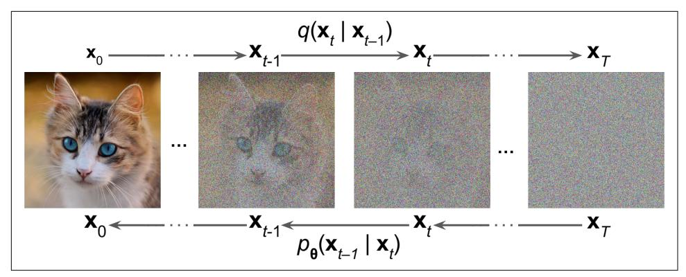

Figure 17-20. The forward process q and reverse process p

OK, so let's start coding! The first thing we need to do is to code the forward process. For this, we will first need to implement the variance schedule. How can we control how fast the cat disappears? Initially, 100% of the variance comes from the original cat image. Then at each time step t, the variance gets multiplied by  $1 - \beta_p$  as explained earlier, and noise gets added. So, the part of the variance that comes from the initial distribution shrinks by a factor of  $1 - \beta$ , at each step. If we define  $\alpha_i = 1 - \beta_i$ , then after *t* time steps, the cat signal will have been multiplied by a factor of  $\overline{\alpha_t} = \alpha_1 \times \alpha_2 \times ... \times \alpha_t =$  $\overline{\alpha}_t = \prod_{i=1}^t \alpha_t$ . It's this "cat signal" factor  $\overline{\alpha_t}$  that we want to schedule so it shrinks down

{703}------------------------------------------------

from 1 to 0 gradually between time steps 0 and *T*. In the improved DDPM paper, the authors schedule  $\alpha_t$  according to Equation 17-7. This schedule is represented in Figure 17-21.

Equation 17-7. Variance schedule equations for the forward diffusion process

$$
\beta_t = 1 - \frac{\overline{\alpha}_t}{\overline{\alpha}_{t-1}},
$$
 with  $\overline{\alpha}_t = \frac{f(t)}{f(0)}$  and  $f(t) = \cos\left(\frac{t/T + s}{1 + s} \cdot \frac{\pi}{2}\right)^2$ 

In these equations:

- *s* is a tiny value which prevents  $\beta_t$  from being too small near  $t = 0$ . In the paper, the authors used  $s = 0.008$ .
- $\beta_t$  is clipped to be no larger than 0.999, to avoid instabilities near  $t = T$ .

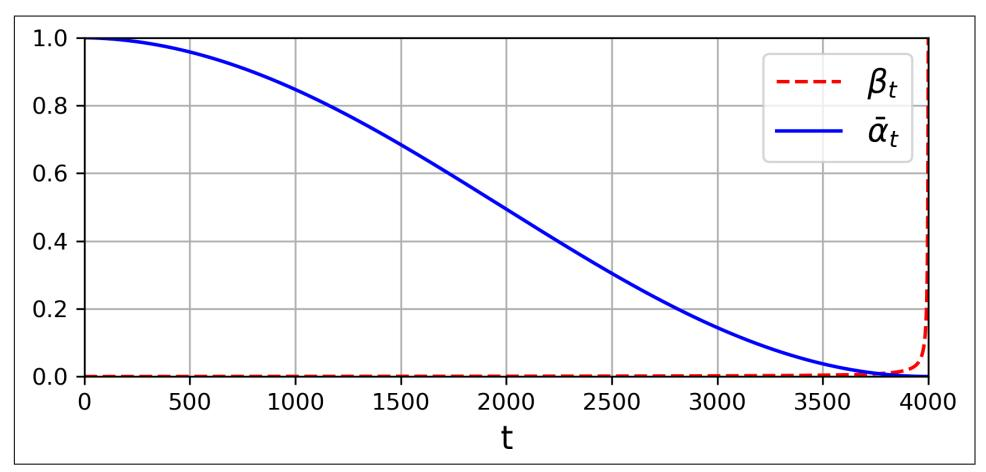

Figure 17-21. Noise variance schedule  $\beta_{v}$  and the remaining signal variance  $\alpha_{t}$ 

Let's create a small function to compute  $\alpha_i$ ,  $\beta_i$ , and  $\overline{\alpha_i}$ , and call it with  $T = 4,000$ :

```
def variance_schedule(T, s=0.008, max_beta=0.999):
    t = np.arange(T + 1)f = np.cos((t / T + s) / (1 + s) * np.pi / 2) ** 2
    alpha = npclip(f[1:] / f[:-1], 1 - max_beta, 1)alpha = np.append(1, alpha).astype(np.float32) # add a_0 = 1beta = 1 - alphaalpha cumprod = np.cumprod(alpha)return alpha, alpha_cumprod, beta # a_t, \overline{a}_t, \beta_t for t = \emptyset to T
T = 4000alpha, alpha cumprod, beta = variance_schedule(T)
```

{704}------------------------------------------------

To train our model to reverse the diffusion process, we will need noisy images from different time steps of the forward process. For this, let's create a prepare batch() function that will take a batch of clean images from the dataset and prepare them:

```
def prepare_batch(X):
    X = tf.cast(X[... , tf.newaxis], tf.float32) * 2 - 1 # scale from -1 to +1X shape = tf.shape(X)t = tf.random.uniform([X.shape[0]], minval=1, maxval=T + 1, dtype=tf.int32)alpha_c m = tf.gather(alpha_cumprod, t)alpha_{\text{cm}} = tf.\text{reshape}(\text{alpha\_cm}, [X_\text{shape[0]}] + [1] * (\text{len}(X_\text{shape}) - 1))noise = tf.random.normal(X shape)return <sub>f</sub>"X_noisy": alpha_cm ** 0.5 * X + (1 - alpha_cm) ** 0.5 * noise,
        "time": t,
    }, noise
```

Let's go through this code:

- For simplicity we will use Fashion MNIST, so the function must first add a channel axis. It will also help to scale the pixel values from -1 to 1, so it's closer to the final Gaussian distribution with mean 0 and variance 1.
- Next, the function creates t, a vector containing a random time step for each image in the batch, between 1 and T.
- Then it uses tf.gather() to get the value of alpha\_cumprod for each of the time steps in the vector t. This gives us the vector alpha\_cm, containing one value of  $\alpha_t$ for each image.
- The next line reshapes the alpha\_cm from  $[batch size]$  to  $[batch size, 1, 1, 1]$ . This is needed to ensure alpha\_cm can be broadcasted with the batch X.
- Then we generate some Gaussian noise with mean 0 and variance 1.
- Lastly, we use Equation 17-6 to apply the diffusion process to the images. Note that  $x \rightarrow x$  0.5 is equal to the square root of x. The function returns a tuple containing the inputs and the targets. The inputs are represented as a Python dict containing the noisy images and the time steps used to generate them. The targets are the Gaussian noise used to generate each image.


With this setup, the model will predict the noise that should be subtracted from the input image to get the original image. Why not predict the original image directly? Well, the authors tried: it simply doesn't work as well.

{705}------------------------------------------------

Next, we'll create a training dataset and a validation set that will apply the prepare batch() function to every batch. As earlier, X train and X valid contain the Fashion MNIST images with pixel values ranging from 0 to 1:

```
def prepare_dataset(X, batch_size=32, shuffle=False):
    ds = tf.data.DataFrameListener.from tensor slices(X)if shuffle:
        ds = ds.shuffle(buffer_size=10_000)return ds.batch(batch size).map(prepare batch).prefetch(1)
train set = prepare dataset(X train, batch size=32, shuffle=True)
valid set = prepare dataset(X valid, batch size=32)
```

Now we're ready to build the actual diffusion model itself. It can be any model you want, as long as it takes the noisy images and time steps as inputs, and predicts the noise to subtract from the input images:

```
def build diffusion model():
   X_noisy = tf.keras.layers.Input(shape=[28, 28, 1], name="X_noisy")
    time_input = tf.keras.layers.Input(shape=[], dtype=tf.int32, name="time")
    [...] # build the model based on the noisy images and the time steps
    outputs = [\dots] # predict the noise (same shape as the input images)
    return tf.keras.Model(inputs=[X noisy, time input], outputs=[outputs])
```

The DDPM authors used a modified U-Net architecture,<sup>22</sup> which has many similarities with the FCN architecture we discussed in Chapter 14 for semantic segmentation: it's a convolutional neural network that gradually downsamples the input images, then gradually upsamples them again, with skip connections crossing over from each level of the downsampling part to the corresponding level in the upsampling part. To take into account the time steps, they encoded them using the same technique as the positional encodings in the transformer architecture (see Chapter 16). At every level in the U-Net architecture, they passed these time encodings through Dense layers and fed them to the U-Net. Lastly, they also used multi-head attention layers at various levels. See this chapter's notebook for a basic implementation, or https://homl.info/ ddpmcode for the official implementation: it's based on TF 1.x, which is deprecated, but it's quite readable.

WE can now train the model normally. The authors noted that using the MAE loss worked better than the MSE. You can also use the Huber loss:

```
model = build_diffusion_model()
model.compile(loss=tf.keras.losses.Huber(), optimizer="nadam")
history = model.fit(train_set, validation_data=valid_set, epochs=100)
```

<sup>22</sup> Olaf Ronneberger et al., "U-Net: Convolutional Networks for Biomedical Image Segmentation", arXiv preprint arXiv:1505.04597 (2015).

{706}------------------------------------------------

Once the model is trained, you can use it to generate new images. Unfortunately, there's no shortcut in the reverse diffusion process, so you have to sample  $x_T$ randomly from a Gaussian distribution with mean 0 and variance 1, then pass it to the model to predict the noise; subtract it from the image using Equation 17-8, and you get  $\mathbf{x}_{T-1}$ . Repeat the process 3,999 more times until you get  $\mathbf{x}_0$ : if all went well, it should look like a regular Fashion MNIST image!

Equation 17-8. Going one step in reverse in the diffusion process

$$
\mathbf{x}_{t-1} = \frac{1}{\sqrt{\alpha_t}} \left( \mathbf{x}_t - \frac{\beta_t}{\sqrt{1 - \overline{\alpha}_t}} \mathbf{e}_0 \bigg( \mathbf{x}_t, t \bigg) \right) + \sqrt{\beta_t} \mathbf{z}
$$

In this equation,  $\epsilon_{\theta}(\mathbf{x}, t)$  represents the noise predicted by the model given the input image  $x_i$ , and the time step t. The  $\theta$  represents the model parameters. Moreover, z is Gaussian noise with mean 0 and variance 1. This makes the reverse process stochastic: if you run it multiple times, you will get different images.

Let's write a function that implements this reverse process, and call it to generate a few images:

```
def generate(model, batch size=32):
    X = tf.random.normal([batch_size, 28, 28, 1])for t in range(T, 0, -1):
        noise = (tf.random.normal if t > 1 else tf.zeros)(tf.shape(X))X_noise = model({"X_noisy": X, "time": tf.constant([t] * batch_size)})
        X = C1 / alpha[t] ** 0.5* (X - beta[t] / (1 - alpha_cumprod[t]) ** 0.5 * X_noise)+ (1 - alpha[t]) ** 0.5 * noise\lambdareturn X
```

```
X gen = generate(model) # generated images
```

This may take a minute or two. That's the main drawback of diffusion models: generating images is slow since the model needs to be called many times. It's possible to make this faster by using a smaller  $T$  value, or by using the same model prediction for several steps at a time, but the resulting images may not look as nice. That said, despite this speed limitation, diffusion models do produce high-quality and diverse images, as you can see in Figure 17-22.

{707}------------------------------------------------

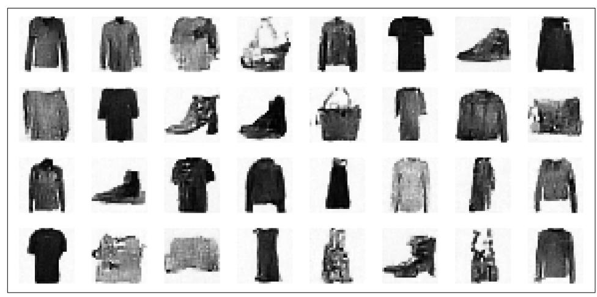

Figure 17-22. Images generated by the DDPM

Diffusion models have made tremendous progress recently. In particular, a paper published in December 2021 by Robin Rombach, Andreas Blattmann, et al.,<sup>23</sup> introduced latent diffusion models, where the diffusion process takes place in latent space, rather than in pixel space. To achieve this, a powerful autoencoder is used to compress each training image into a much smaller latent space, where the diffusion process takes place, then the autoencoder is used to decompress the final latent representation, generating the output image. This considerably speeds up image generation, and reduces training time and cost dramatically. Importantly, the quality of the generated images is outstanding.

Moreover, the researchers also adapted various conditioning techniques to guide the diffusion process using text prompts, images, or any other inputs. This makes it possible to quickly produce a beautiful, high-resolution image of a salamander reading a book, or anything else you might fancy. You can also condition the image generation process using an input image. This enables many applications, such as outpainting—where an input image is extended beyond its borders—or inpainting where holes in an image are filled in.

Lastly, a powerful pretrained latent diffusion model named Stable Diffusion was open sourced in August 2022 by a collaboration between LMU Munich and a few companies, including StabilityAI, and Runway, with support from EleutherAI and LAION. In September 2022, it was ported to TensorFlow and included in KerasCV, a computer vision library built by the Keras team. Now anyone can generate mind-

<sup>23</sup> Robin Rombach, Andreas Blattmann, et al., "High-Resolution Image Synthesis with Latent Diffusion Models", arXiv preprint arXiv:2112.10752 (2021).

{708}------------------------------------------------

blowing images in seconds, for free, even on a regular laptop (see the last exercise in this chapter). The possibilities are endless!

In the next chapter we will move on to an entirely different branch of deep learning: deep reinforcement learning.

### **Fxercises**

- 1. What are the main tasks that autoencoders are used for?
- 2. Suppose you want to train a classifier, and you have plenty of unlabeled training data but only a few thousand labeled instances. How can autoencoders help? How would you proceed?
- 3. If an autoencoder perfectly reconstructs the inputs, is it necessarily a good autoencoder? How can you evaluate the performance of an autoencoder?
- 4. What are undercomplete and overcomplete autoencoders? What is the main risk of an excessively undercomplete autoencoder? What about the main risk of an overcomplete autoencoder?
- 5. How do you tie weights in a stacked autoencoder? What is the point of doing so?
- 6. What is a generative model? Can you name a type of generative autoencoder?
- 7. What is a GAN? Can you name a few tasks where GANs can shine?
- 8. What are the main difficulties when training GANs?
- 9. What are diffusion models good at? What is their main limitation?
- 10. Try using a denoising autoencoder to pretrain an image classifier. You can use MNIST (the simplest option), or a more complex image dataset such as CIFAR10 if you want a bigger challenge. Regardless of the dataset you're using, follow these steps:
  - a. Split the dataset into a training set and a test set. Train a deep denoising autoencoder on the full training set.
  - b. Check that the images are fairly well reconstructed. Visualize the images that most activate each neuron in the coding layer.
  - c. Build a classification DNN, reusing the lower layers of the autoencoder. Train it using only 500 images from the training set. Does it perform better with or without pretraining?
- 11. Train a variational autoencoder on the image dataset of your choice, and use it to generate images. Alternatively, you can try to find an unlabeled dataset that you are interested in and see if you can generate new samples.

{709}------------------------------------------------

- 12. Train a DCGAN to tackle the image dataset of your choice, and use it to generate images. Add experience replay and see if this helps. Turn it into a conditional GAN where you can control the generated class.
- 13. Go through KerasCV's excellent Stable Diffusion tutorial, and generate a beautiful drawing of a salamander reading a book. If you post your best drawing on Twitter, please tag me at @aureliengeron. I'd love to see your creations!

Solutions to these exercises are available at the end of this chapter's notebook, at https://homl.info/colab3.

{710}------------------------------------------------

## **CHAPTER 18 Reinforcement Learning**

Reinforcement learning (RL) is one of the most exciting fields of machine learning today, and also one of the oldest. It has been around since the 1950s, producing many interesting applications over the years,<sup>1</sup> particularly in games (e.g., TD-Gammon, a Backgammon-playing program) and in machine control, but seldom making the headline news. However, a revolution took place in 2013, when researchers from a British startup called DeepMind demonstrated a system that could learn to play just about any Atari game from scratch,<sup>2</sup> eventually outperforming humans<sup>3</sup> in most of them, using only raw pixels as inputs and without any prior knowledge of the rules of the games.<sup>4</sup> This was the first of a series of amazing feats, culminating with the victory of their system AlphaGo against Lee Sedol, a legendary professional player of the game of Go, in March 2016 and against Ke Jie, the world champion, in May 2017. No program had ever come close to beating a master of this game, let alone the world champion. Today the whole field of RL is boiling with new ideas, with a wide range of applications.

So how did DeepMind (bought by Google for over \$500 million in 2014) achieve all this? With hindsight it seems rather simple: they applied the power of deep learning to the field of reinforcement learning, and it worked beyond their wildest dreams. In this chapter I will first explain what reinforcement learning is and what it's good at,

<sup>1</sup> For more details, be sure to check out Richard Sutton and Andrew Barto's book on RL, Reinforcement Learning: An Introduction (MIT Press).

<sup>2</sup> Volodymyr Mnih et al., "Playing Atari with Deep Reinforcement Learning", arXiv preprint arXiv:1312.5602  $(2013).$ 

<sup>3</sup> Volodymyr Mnih et al., "Human-Level Control Through Deep Reinforcement Learning", Nature 518 (2015): 529-533.

<sup>4</sup> Check out the videos of DeepMind's system learning to play Space Invaders, Breakout, and other video games at https://homl.info/dqn3.

{711}------------------------------------------------

then present two of the most important techniques in deep reinforcement learning. policy gradients and deep Q-networks, including a discussion of Markov decision processes. Let's get started!

## **Learning to Optimize Rewards**

In reinforcement learning, a software *agent* makes *observations* and takes *actions* within an *environment*, and in return it receives *rewards* from the environment. Its objective is to learn to act in a way that will maximize its expected rewards over time. If you don't mind a bit of anthropomorphism, you can think of positive rewards as pleasure, and negative rewards as pain (the term "reward" is a bit misleading in this case). In short, the agent acts in the environment and learns by trial and error to maximize its pleasure and minimize its pain.

This is quite a broad setting, which can apply to a wide variety of tasks. Here are a few examples (see Figure 18-1):

- a. The agent can be the program controlling a robot. In this case, the environment is the real world, the agent observes the environment through a set of *sensors* such as cameras and touch sensors, and its actions consist of sending signals to activate motors. It may be programmed to get positive rewards whenever it approaches the target destination, and negative rewards whenever it wastes time or goes in the wrong direction.
- b. The agent can be the program controlling *Ms. Pac-Man*. In this case, the environment is a simulation of the Atari game, the actions are the nine possible joystick positions (upper left, down, center, and so on), the observations are screenshots, and the rewards are just the game points.
- c. Similarly, the agent can be the program playing a board game such as Go. It only gets a reward if it wins.
- d. The agent does not have to control a physically (or virtually) moving thing. For example, it can be a smart thermostat, getting positive rewards whenever it is close to the target temperature and saves energy, and negative rewards when humans need to tweak the temperature, so the agent must learn to anticipate human needs.
- e. The agent can observe stock market prices and decide how much to buy or sell every second. Rewards are obviously the monetary gains and losses.

Note that there may not be any positive rewards at all; for example, the agent may move around in a maze, getting a negative reward at every time step, so it had better find the exit as quickly as possible! There are many other examples of tasks to which reinforcement learning is well suited, such as self-driving cars, recommender

{712}------------------------------------------------

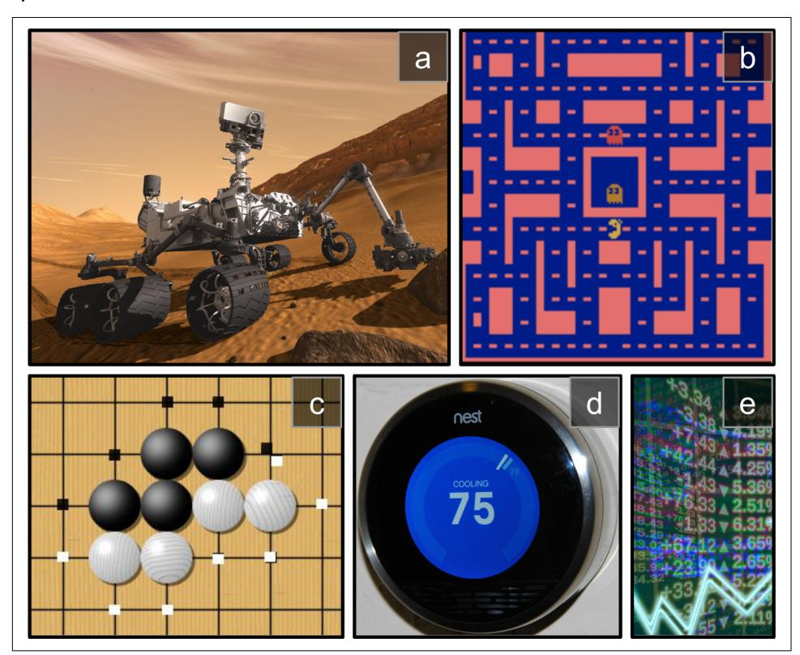

systems, placing ads on a web page, or controlling where an image classification system should focus its attention.

Figure 18-1. Reinforcement learning examples: (a) robotics, (b) Ms. Pac-Man, (c) Go player, (d) thermostat, (e) automatic trader<sup>5</sup>

## **Policy Search**

The algorithm a software agent uses to determine its actions is called its policy. The policy could be a neural network taking observations as inputs and outputting the action to take (see Figure 18-2).

<sup>5</sup> Images (a), (d), and (e) are in the public domain. Image (b) is a screenshot from the Ms. Pac-Man game, copyright Atari (fair use in this chapter). Image (c) is reproduced from Wikipedia; it was created by user Stevertigo and released under Creative Commons BY-SA 2.0.

{713}------------------------------------------------

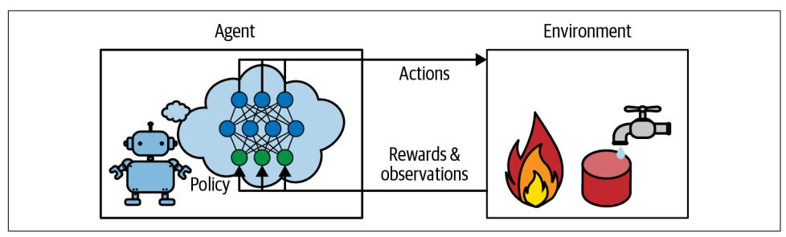

Figure 18-2. Reinforcement learning using a neural network policy

The policy can be any algorithm you can think of, and it does not have to be deterministic. In fact, in some cases it does not even have to observe the environment! For example, consider a robotic vacuum cleaner whose reward is the amount of dust it picks up in 30 minutes. Its policy could be to move forward with some probability p every second, or randomly rotate left or right with probability  $1 - p$ . The rotation angle would be a random angle between  $-r$  and  $+r$ . Since this policy involves some randomness, it is called a *stochastic policy*. The robot will have an erratic trajectory, which guarantees that it will eventually get to any place it can reach and pick up all the dust. The question is, how much dust will it pick up in 30 minutes?

How would you train such a robot? There are just two *policy parameters* you can tweak: the probability  $p$  and the angle range  $r$ . One possible learning algorithm could be to try out many different values for these parameters, and pick the combination that performs best (see Figure 18-3). This is an example of *policy search*, in this case using a brute-force approach. When the *policy space* is too large (which is generally the case), finding a good set of parameters this way is like searching for a needle in a gigantic haystack.

Another way to explore the policy space is to use *genetic algorithms*. For example, you could randomly create a first generation of 100 policies and try them out, then "kill" the 80 worst policies<sup>6</sup> and make the 20 survivors produce 4 offspring each. An offspring is a copy of its parent<sup>7</sup> plus some random variation. The surviving policies plus their offspring together constitute the second generation. You can continue to iterate through generations this way until you find a good policy.<sup>8</sup>

<sup>6</sup> It is often better to give the poor performers a slight chance of survival, to preserve some diversity in the "gene pool".

<sup>7</sup> If there is a single parent, this is called *asexual reproduction*. With two (or more) parents, it is called *sexual* reproduction. An offspring's genome (in this case a set of policy parameters) is randomly composed of parts of its parents' genomes.

<sup>8</sup> One interesting example of a genetic algorithm used for reinforcement learning is the NeuroEvolution of Augmenting Topologies (NEAT) algorithm.

{714}------------------------------------------------

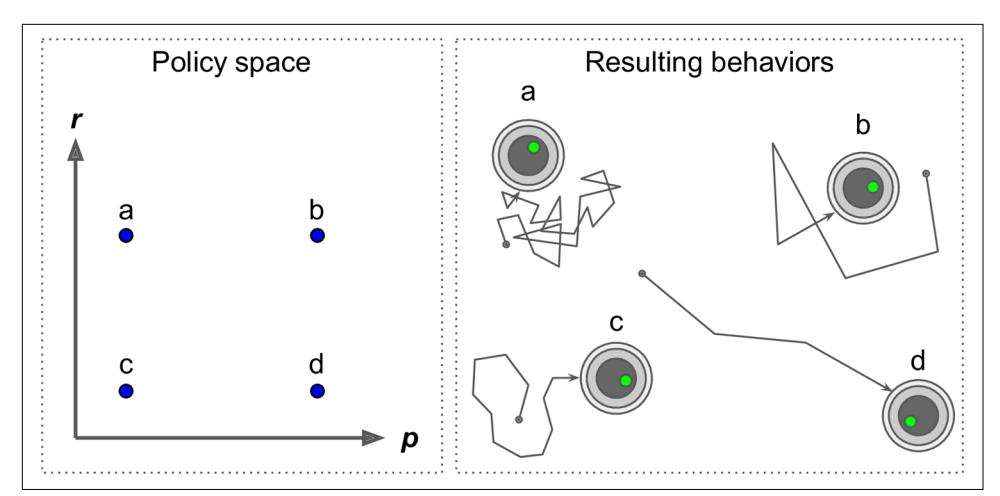

Figure 18-3. Four points in the policy space (left) and the agent's corresponding behavior  $(right)$ 

Yet another approach is to use optimization techniques, by evaluating the gradients of the rewards with regard to the policy parameters, then tweaking these parameters by following the gradients toward higher rewards.<sup>9</sup> We will discuss this approach, called policy gradients (PG), in more detail later in this chapter. Going back to the vacuum cleaner robot, you could slightly increase  $p$  and evaluate whether doing so increases the amount of dust picked up by the robot in 30 minutes; if it does, then increase  $p$  some more, or else reduce  $p$ . We will implement a popular PG algorithm using TensorFlow, but before we do, we need to create an environment for the agent to live in-so it's time to introduce OpenAI Gym.

### **Introduction to OpenAI Gym**

One of the challenges of reinforcement learning is that in order to train an agent, you first need to have a working environment. If you want to program an agent that will learn to play an Atari game, you will need an Atari game simulator. If you want to program a walking robot, then the environment is the real world, and you can directly train your robot in that environment. However, this has its limits: if the robot falls off a cliff, you can't just click Undo. You can't speed up time either—adding more computing power won't make the robot move any faster—and it's generally too expensive to train 1,000 robots in parallel. In short, training is hard and slow in the real world, so you generally need a *simulated environment* at least for bootstrap

<sup>9</sup> This is called *gradient ascent*. It's just like gradient descent, but in the opposite direction: maximizing instead of minimizing.

{715}------------------------------------------------

training. For example, you might use a library like PyBullet or MuJoCo for 3D physics simulation.

*OpenAI*  $Gym^{10}$  is a toolkit that provides a wide variety of simulated environments (Atari games, board games, 2D and 3D physical simulations, and so on), that you can use to train agents, compare them, or develop new RL algorithms.

OpenAI Gym is preinstalled on Colab, but it's an older version, so you'll need to replace it with the latest one. You also need to install a few of its dependencies. If you are coding on your own machine instead of Colab, and you followed the installation instructions at *https://homl.info/install*, then you can skip this step; otherwise, enter these commands:

```
# Only run these commands on Colab or Kaggle!
%pip install -q -U gym
%pip install -q -U gym[classic_control,box2d,atari,accept-rom-license]
```

The first %p ip command upgrades Gym to the latest version. The -q option stands for quiet: it makes the output less verbose. The -U option stands for upgrade. The second %pip command installs the libraries required to run various kinds of environments. This includes classic environments from control theory-the science of controlling dynamical systems-such as balancing a pole on a cart. It also includes environments based on the Box2D library—a 2D physics engine for games. Lastly, it includes environments based on the Arcade Learning Environment (ALE), which is an emulator for Atari 2600 games. Several Atari game ROMs are downloaded automatically, and by running this code you agree with Atari's ROM licenses.

With that, you're ready to use OpenAI Gym. Let's import it and make an environment:

```
import gym
```

```
env = gym.make("CartPole-v1", render_mode="rgb_array")
```

Here, we've created a CartPole environment. This is a 2D simulation in which a cart can be accelerated left or right in order to balance a pole placed on top of it (see Figure 18-4). This is a classic control task.


The gym.envs.registry dictionary contains the names and specifications of all the available environments.

<sup>10</sup> OpenAI is an artificial intelligence research company, funded in part by Elon Musk. Its stated goal is to promote and develop friendly AIs that will benefit humanity (rather than exterminate it).

{716}------------------------------------------------

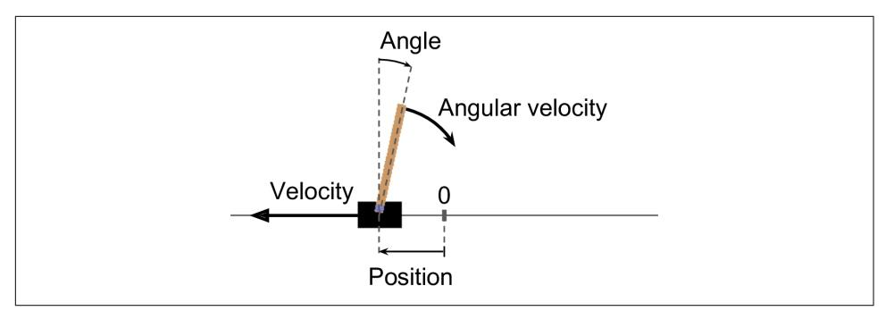

Figure 18-4. The CartPole environment

After the environment is created, you must initialize it using the reset() method, optionally specifying a random seed. This returns the first observation. Observations depend on the type of environment. For the CartPole environment, each observation is a 1D NumPy array containing four floats representing the cart's horizontal position  $(0.0 = \text{center})$ , its velocity (positive means right), the angle of the pole  $(0.0 =$ vertical), and its angular velocity (positive means clockwise). The reset() method also returns a dictionary that may contain extra environment-specific information. This can be useful for debugging or for training. For example, in many Atari environments, it contains the number of lives left. However, in the CartPole environment, this dictionary is empty.

```
>>> obs, info = env.reset(seed=42)
>>array([ 0.0273956 , -0.00611216, 0.03585979, 0.0197368 ], dtype=float32)
>>> info
{}
```

Let's call the render() method to render this environment as an image. Since we set render mode="rgb array" when creating the environment, the image will be returned as a NumPy array:

```
\Rightarrow \frac{1}{2} img = env.render()
\Rightarrow img.shape # height, width, channels (3 = Red, Green, Blue)
(400, 600, 3)
```

You can then use Matplotlib's imshow() function to display this image, as usual.

Now let's ask the environment what actions are possible:

```
>>> env.action_space
Discrete(2)
```

Discrete $(2)$  means that the possible actions are integers 0 and 1, which represent accelerating left or right. Other environments may have additional discrete actions, or other kinds of actions (e.g., continuous). Since the pole is leaning toward the right  $(obs[2] > 0)$ , let's accelerate the cart toward the right:

{717}------------------------------------------------

```
\Rightarrow action = 1 # accelerate right
>>> obs, reward, done, truncated, info = env.step(action)
>>> obs
array([ 0.02727336, 0.18847767, 0.03625453, -0.26141977], dtype=float32)
>>> reward
1.0sss done
False
>>> truncated
False
>>> info
{}
```

The step() method executes the desired action and returns five values:

obs

This is the new observation. The cart is now moving toward the right ( $obs[1] >$ 0). The pole is still tilted toward the right ( $obs[2] > 0$ ), but its angular velocity is now negative ( $obs[3] < 0$ ), so it will likely be tilted toward the left after the next step.

reward

In this environment, you get a reward of 1.0 at every step, no matter what you do, so the goal is to keep the episode running for as long as possible.

done

This value will be True when the episode is over. This will happen when the pole tilts too much, or goes off the screen, or after 200 steps (in this last case, you have won). After that, the environment must be reset before it can be used again.

truncated

This value will be True when an episode is interrupted early, for example by an environment wrapper that imposes a maximum number of steps per episode (see Gym's documentation for more details on environment wrappers). Some RL algorithms treat truncated episodes differently from episodes finished normally (i.e., when done is True), but in this chapter we will treat them identically.

info

This environment-specific dictionary may provide extra information, just like the one returned by the reset() method.


Once you have finished using an environment, you should call its close() method to free resources.

{718}------------------------------------------------

Let's hardcode a simple policy that accelerates left when the pole is leaning toward the left and accelerates right when the pole is leaning toward the right. We will run this policy to see the average rewards it gets over 500 episodes:

```
def basic policy(obs):
   angle = obs[2]return 0 if angle < 0 else 1
totals = [1]for episode in range(500):
    episode_rewards = \thetaobs, info = env.read(seed = episode)for step in range(200):
        action = basic policy(obs)obs, reward, done, truncated, info = env.step(action)
        episode rewards += reward
        if done or truncated:
            break
```

totals.append(episode rewards)

This code is self-explanatory. Let's look at the result:

```
>>> import numpy as np
>>> np.mean(totals), np.std(totals), min(totals), max(totals)
(41.698, 8.389445512070509, 24.0, 63.0)
```

Even with 500 tries, this policy never managed to keep the pole upright for more than 63 consecutive steps. Not great. If you look at the simulation in this chapter's notebook, you will see that the cart oscillates left and right more and more strongly until the pole tilts too much. Let's see if a neural network can come up with a better policy.

### **Neural Network Policies**

Let's create a neural network policy. This neural network will take an observation as input, and it will output the action to be executed, just like the policy we hardcoded earlier. More precisely, it will estimate a probability for each action, and then we will select an action randomly, according to the estimated probabilities (see Figure 18-5). In the case of the CartPole environment, there are just two possible actions (left or right), so we only need one output neuron. It will output the probability  $p$  of action 0 (left), and of course the probability of action 1 (right) will be  $1 - p$ . For example, if it outputs 0.7, then we will pick action 0 with 70% probability, or action 1 with 30% probability.

{719}------------------------------------------------

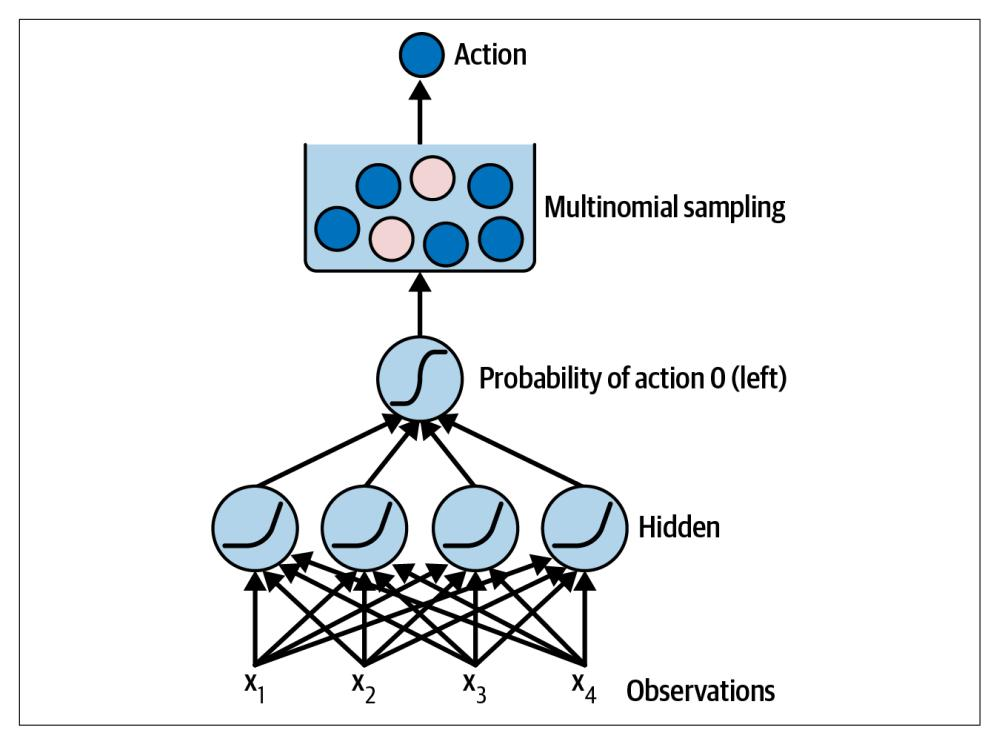

Figure 18-5. Neural network policy

You may wonder why we are picking a random action based on the probabilities given by the neural network, rather than just picking the action with the highest score. This approach lets the agent find the right balance between *exploring* new actions and *exploiting* the actions that are known to work well. Here's an analogy: suppose you go to a restaurant for the first time, and all the dishes look equally appealing, so you randomly pick one. If it turns out to be good, you can increase the probability that you'll order it next time, but you shouldn't increase that probability up to 100%, or else you will never try out the other dishes, some of which may be even better than the one you tried. This exploration/exploitation dilemma is central in reinforcement learning.

Also note that in this particular environment, the past actions and observations can safely be ignored, since each observation contains the environment's full state. If there were some hidden state, then you might need to consider past actions and observations as well. For example, if the environment only revealed the position of the cart but not its velocity, you would have to consider not only the current observation but also the previous observation in order to estimate the current velocity. Another example is when the observations are noisy; in that case, you generally want to use the past few observations to estimate the most likely current state. The CartPole 

{720}------------------------------------------------

problem is thus as simple as can be; the observations are noise-free, and they contain the environment's full state

Here is the code to build a basic neural network policy using Keras:

```
import tensorflow as tf
model = tf.keras.Sequential(tf.keras.layers.Dense(5, activation="relu"),
    tf.keras.layers.Dense(1, activation="sigmoid"),
\left| \right)
```

We use a Sequential model to define the policy network. The number of inputs is the size of the observation space—which in the case of CartPole is 4—and we have just five hidden units because it's a fairly simple task. Finally, we want to output a single probability—the probability of going left—so we have a single output neuron using the sigmoid activation function. If there were more than two possible actions, there would be one output neuron per action, and we would use the softmax activation function instead.

OK, we now have a neural network policy that will take observations and output action probabilities. But how do we train it?

### **Evaluating Actions: The Credit Assignment Problem**

If we knew what the best action was at each step, we could train the neural network as usual, by minimizing the cross entropy between the estimated probability distribution and the target probability distribution. It would just be regular supervised learning. However, in reinforcement learning the only guidance the agent gets is through rewards, and rewards are typically sparse and delayed. For example, if the agent manages to balance the pole for 100 steps, how can it know which of the 100 actions it took were good, and which of them were bad? All it knows is that the pole fell after the last action, but surely this last action is not entirely responsible. This is called the *credit assignment problem*: when the agent gets a reward, it is hard for it to know which actions should get credited (or blamed) for it. Think of a dog that gets rewarded hours after it behaved well; will it understand what it is being rewarded for?

To tackle this problem, a common strategy is to evaluate an action based on the sum of all the rewards that come after it, usually applying a *discount factor*,  $\gamma$  (gamma), at each step. This sum of discounted rewards is called the action's return. Consider the example in Figure 18-6. If an agent decides to go right three times in a row and gets +10 reward after the first step, 0 after the second step, and finally -50 after the third step, then assuming we use a discount factor  $y = 0.8$ , the first action will have a return of  $10 + y \times 0 + y^2 \times (-50) = -22$ . If the discount factor is close to 0, then future rewards won't count for much compared to immediate rewards. Conversely, if the discount factor is close to 1, then rewards far into the future will count almost

{721}------------------------------------------------

as much as immediate rewards. Typical discount factors vary from 0.9 to 0.99. With a discount factor of 0.95, rewards 13 steps into the future count roughly for half as much as immediate rewards (since  $0.95^{13} \approx 0.5$ ), while with a discount factor of 0.99, rewards 69 steps into the future count for half as much as immediate rewards. In the CartPole environment, actions have fairly short-term effects, so choosing a discount factor of 0.95 seems reasonable.

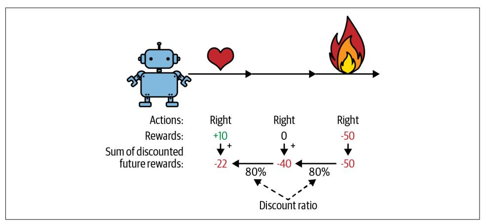

Figure 18-6. Computing an action's return: the sum of discounted future rewards

Of course, a good action may be followed by several bad actions that cause the pole to fall quickly, resulting in the good action getting a low return. Similarly, a good actor may sometimes star in a terrible movie. However, if we play the game enough times, on average good actions will get a higher return than bad ones. We want to estimate how much better or worse an action is, compared to the other possible actions, on average. This is called the *action advantage*. For this, we must run many episodes and normalize all the action returns, by subtracting the mean and dividing by the standard deviation. After that, we can reasonably assume that actions with a negative advantage were bad while actions with a positive advantage were good. OK, now that we have a way to evaluate each action, we are ready to train our first agent using policy gradients. Let's see how.

## **Policy Gradients**

As discussed earlier, PG algorithms optimize the parameters of a policy by following the gradients toward higher rewards. One popular class of PG algorithms, called 

{722}------------------------------------------------

REINFORCE algorithms, was introduced back in 1992<sup>11</sup> by Ronald Williams. Here is one common variant:

- 1. First, let the neural network policy play the game several times, and at each step, compute the gradients that would make the chosen action even more likely-but don't apply these gradients yet.
- 2. Once you have run several episodes, compute each action's advantage, using the method described in the previous section.
- 3. If an action's advantage is positive, it means that the action was probably good, and you want to apply the gradients computed earlier to make the action even more likely to be chosen in the future. However, if the action's advantage is negative, it means the action was probably bad, and you want to apply the opposite gradients to make this action slightly less likely in the future. The solution is to multiply each gradient vector by the corresponding action's advantage.
- 4. Finally, compute the mean of all the resulting gradient vectors, and use it to perform a gradient descent step.

Let's use Keras to implement this algorithm. We will train the neural network policy we built earlier so that it learns to balance the pole on the cart. First, we need a function that will play one step. We will pretend for now that whatever action it takes is the right one so that we can compute the loss and its gradients. These gradients will just be saved for a while, and we will modify them later depending on how good or bad the action turned out to be:

```
def play_one_step(env, obs, model, loss_fn):
    with tf.GradientTape() as tape:
        left\_prob = model(obj(np.newaxis])action = (tf.random.uniform([1, 1]) > left_prob)y_{\text{target}} = tf_{\text{constant}([1.]) - tf_{\text{cast}}(action, tf_{\text{total}})]loss = tf.reduce_mean(loss_fn(y_target, left_proba))
    grads = tape.gradient(loss, model.trainable variables)
    obs, reward, done, truncated, info = env.step(int(action))
    return obs, reward, done, truncated, grads
```

Let's walk though this function:

• Within the Gradient Tape block (see Chapter 12), we start by calling the model, giving it a single observation. We reshape the observation so it becomes a batch containing a single instance, as the model expects a batch. This outputs the probability of going left.

<sup>11</sup> Ronald J. Williams, "Simple Statistical Gradient-Following Algorithms for Connectionist Reinforcement Leaning", Machine Learning 8 (1992) : 229-256.

{723}------------------------------------------------

- Next, we sample a random float between 0 and 1, and we check whether it is greater than left proba. The action will be False with probability left proba, or True with probability 1 - left\_proba. Once we cast this Boolean to an integer, the action will be 0 (left) or 1 (right) with the appropriate probabilities.
- We now define the target probability of going left: it is 1 minus the action (cast to a float). If the action is 0 (left), then the target probability of going left will be 1. If the action is 1 (right), then the target probability will be 0.
- Then we compute the loss using the given loss function, and we use the tape to compute the gradient of the loss with regard to the model's trainable variables. Again, these gradients will be tweaked later, before we apply them, depending on how good or bad the action turned out to be.
- Finally, we play the selected action, and we return the new observation, the reward, whether the episode is ended or not, whether it is truncated or not, and of course the gradients that we just computed.

Now let's create another function that will rely on the play one step() function to play multiple episodes, returning all the rewards and gradients for each episode and each step:

```
def play_multiple_episodes(env, n_episodes, n_max_steps, model, loss_fn):
    all rewards = [1]all grads = \lceil \rceilfor episode in range(n_episodes):
        current rewards = []
        current grads = [ ]obs. info = env. reset()for step in range(n max steps):
            obs, reward, done, truncated, grads = play_one_step(
                env, obs, model, loss_fn)
            current rewards.append(reward)
            current grads.append(grads)
            if done or truncated:
                break
        all rewards.append(current rewards)
        all grads.append(current grads)
```

```
return all_rewards, all_grads
```

This code returns a list of reward lists: one reward list per episode, containing one reward per step. It also returns a list of gradient lists: one gradient list per episode, each containing one tuple of gradients per step and each tuple containing one gradient tensor per trainable variable.

The algorithm will use the play\_multiple\_episodes() function to play the game several times (e.g., 10 times), then it will go back and look at all the rewards, discount them, and normalize them. To do that, we need a couple more functions; the first 

{724}------------------------------------------------

will compute the sum of future discounted rewards at each step, and the second will normalize all these discounted rewards (i.e., the returns) across many episodes by subtracting the mean and dividing by the standard deviation:

```
def discount rewards(rewards, discount factor):
   discounted = np.array(rewards)for step in range(len(rewards) - 2, -1, -1):
       discounted[step] += discounted[step + 1] * discount_factor
   return discounted
def discount_and_normalize_rewards(all_rewards, discount_factor):
   all_discounted_rewards = [discount_rewards(rewards, discount_factor)
                             for rewards in all_rewards]
   flat_rewards = np.concatenate(all_discounted_rewards)
   reward mean = flat rewards.mean()
   reward\_std = flat\_rewards.stdout)return [(discounted_rewards - reward_mean) / reward_std
           for discounted_rewards in all_discounted_rewards]
```

Let's check that this works:

```
>>> discount_rewards([10, 0, -50], discount_factor=0.8)
array([ -22, -40, -50])>>> discount and_normalize_rewards([[10, 0, -50], [10, 20]],discount_factor=0.8)
\ddotsc\lceil \arctan \left( \lceil -0.28435071, -0.86597718, -1.18910299 \rceil \right)array([1.26665318, 1.0727777 ])]
```

The call to discount\_rewards() returns exactly what we expect (see Figure 18-6). You can verify that the function discount and normalize rewards() does indeed return the normalized action advantages for each action in both episodes. Notice that the first episode was much worse than the second, so its normalized advantages are all negative; all actions from the first episode would be considered bad, and conversely all actions from the second episode would be considered good.

We are almost ready to run the algorithm! Now let's define the hyperparameters. We will run 150 training iterations, playing 10 episodes per iteration, and each episode will last at most 200 steps. We will use a discount factor of 0.95:

```
n iterations = 150
n episodes per update = 10
n_max\_steps = 200discount factor = 0.95
```

We also need an optimizer and the loss function. A regular Nadam optimizer with learning rate 0.01 will do just fine, and we will use the binary cross-entropy loss function because we are training a binary classifier (there are two possible actions left or right):

```
optimize r = tf.keras.optimizers.Nadam(learning_rate=0.01)
loss_fn = tf.keras.losses.binary_crossentropy
```

{725}------------------------------------------------

We are now ready to build and run the training loop!

```
for iteration in range(n iterations):
   all rewards, all grads = play multiple episodes(
       env, n_episodes_per_update, n_max_steps, model, loss_fn)
   all final rewards = discount and normalize rewards(all rewards,
                                                       discount_factor)
   all_mean_grads = []for var_index in range(len(model.trainable_variables)):
       mean_grads = tf.readuce_mean([final_reward * all_grads[episode_index][step][var_index]
             for episode_index, final_rewards in enumerate(all_final_rewards)
                for step, final reward in enumerate(final rewards)], axis=0)
       all mean grads.append(mean grads)
```

```
optimizer.apply gradients(zip(all mean grads, model.trainable variables))
```

Let's walk through this code:

- At each training iteration, this loop calls the play\_multiple\_episodes() function, which plays 10 episodes and returns the rewards and gradients for each step in each episode.
- Then we call the discount\_and\_normalize\_rewards() function to compute each action's normalized advantage, called the final reward in this code. This provides a measure of how good or bad each action actually was, in hindsight.
- Next, we go through each trainable variable, and for each of them we compute the weighted mean of the gradients for that variable over all episodes and all steps, weighted by the final\_reward.
- Finally, we apply these mean gradients using the optimizer: the model's trainable variables will be tweaked, and hopefully the policy will be a bit better.

And we're done! This code will train the neural network policy, and it will successfully learn to balance the pole on the cart. The mean reward per episode will get very close to 200. By default, that's the maximum for this environment. Success!

The simple policy gradients algorithm we just trained solved the CartPole task, but it would not scale well to larger and more complex tasks. Indeed, it is highly sample *inefficient*, meaning it needs to explore the game for a very long time before it can make significant progress. This is due to the fact that it must run multiple episodes to estimate the advantage of each action, as we have seen. However, it is the foundation of more powerful algorithms, such as *actor-critic* algorithms (which we will discuss briefly at the end of this chapter).

{726}------------------------------------------------


Researchers try to find algorithms that work well even when the agent initially knows nothing about the environment. However, unless you are writing a paper, you should not hesitate to inject prior knowledge into the agent, as it will speed up training dramatically. For example, since you know that the pole should be as vertical as possible, you could add negative rewards proportional to the pole's angle. This will make the rewards much less sparse and speed up training. Also, if you already have a reasonably good policy (e.g., hardcoded), you may want to train the neural network to imitate it before using policy gradients to improve it.

We will now look at another popular family of algorithms. Whereas PG algorithms directly try to optimize the policy to increase rewards, the algorithms we will explore now are less direct: the agent learns to estimate the expected return for each state, or for each action in each state, then it uses this knowledge to decide how to act. To understand these algorithms, we must first consider Markov decision processes  $(MDPs)$ .

### **Markov Decision Processes**

In the early 20th century, the mathematician Andrey Markov studied stochastic processes with no memory, called Markov chains. Such a process has a fixed number of states, and it randomly evolves from one state to another at each step. The probability for it to evolve from a state s to a state s' is fixed, and it depends only on the pair  $(s,$  $s'$ ), not on past states. This is why we say that the system has no memory.

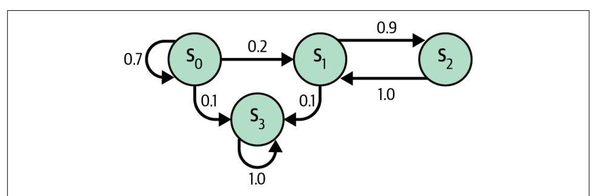

Figure 18-7 shows an example of a Markov chain with four states.

Figure 18-7. Example of a Markov chain

Suppose that the process starts in state  $s_0$ , and there is a 70% chance that it will remain in that state at the next step. Eventually it is bound to leave that state and never come back, because no other state points back to  $s_0$ . If it goes to state  $s_1$ , it will then most likely go to state  $s_2$  (90% probability), then immediately back to state  $s_1$ (with 100% probability). It may alternate a number of times between these two states,

{727}------------------------------------------------

but eventually it will fall into state  $s<sub>3</sub>$  and remain there forever, since there's no way out: this is called a *terminal state*. Markov chains can have very different dynamics, and they are heavily used in thermodynamics, chemistry, statistics, and much more.

Markov decision processes were first described in the 1950s by Richard Bellman.<sup>12</sup> They resemble Markov chains, but with a twist: at each step, an agent can choose one of several possible actions, and the transition probabilities depend on the chosen action. Moreover, some state transitions return some reward (positive or negative), and the agent's goal is to find a policy that will maximize reward over time.

For example, the MDP represented in Figure 18-8 has three states (represented by circles) and up to three possible discrete actions at each step (represented by diamonds).

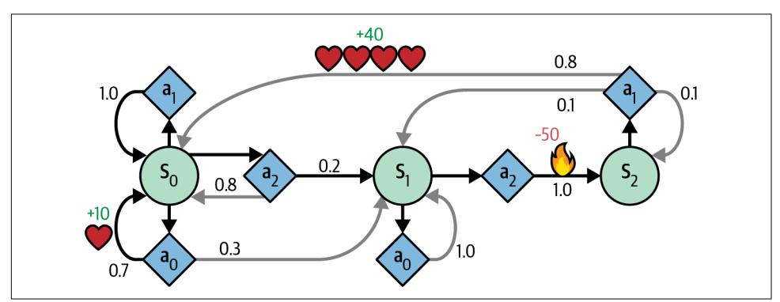

Figure 18-8. Example of a Markov decision process

If it starts in state  $s_0$ , the agent can choose between actions  $a_0$ ,  $a_1$ , or  $a_2$ . If it chooses action  $a_1$ , it just remains in state  $s_0$  with certainty, and without any reward. It can thus decide to stay there forever if it wants to. But if it chooses action  $a_0$ , it has a 70% probability of gaining a reward of +10 and remaining in state  $s_0$ . It can then try again and again to gain as much reward as possible, but at one point it is going to end up instead in state  $s_1$ . In state  $s_1$  it has only two possible actions:  $a_0$  or  $a_2$ . It can choose to stay put by repeatedly choosing action  $a_0$ , or it can choose to move on to state  $s_2$ and get a negative reward of -50 (ouch). In state  $s_2$  it has no choice but to take action  $a<sub>1</sub>$ , which will most likely lead it back to state  $s<sub>0</sub>$ , gaining a reward of +40 on the way. You get the picture. By looking at this MDP, can you guess which strategy will gain the most reward over time? In state  $s_0$  it is clear that action  $a_0$  is the best option, and in state s, the agent has no choice but to take action  $a_1$ , but in state s<sub>1</sub> it is not obvious whether the agent should stay put  $(a_0)$  or go through the fire  $(a_2)$ .

<sup>12</sup> Richard Bellman, "A Markovian Decision Process", Journal of Mathematics and Mechanics 6, no. 5 (1957): 679-684.

{728}------------------------------------------------

Bellman found a way to estimate the *optimal state value* of any state s, noted  $V^*(s)$ , which is the sum of all discounted future rewards the agent can expect on average after it reaches the state, assuming it acts optimally. He showed that if the agent acts optimally, then the *Bellman optimality equation* applies (see Equation 18-1). This recursive equation says that if the agent acts optimally, then the optimal value of the current state is equal to the reward it will get on average after taking one optimal action, plus the expected optimal value of all possible next states that this action can lead to.

Equation 18-1. Bellman optimality equation

$$
V^*(s) = \max_{a} \sum_{s'} T(s, a, s') [R(s, a, s') + \gamma \cdot V^*(s')] \text{ for all } s
$$

In this equation:

- $T(s, a, s')$  is the transition probability from state s to state s', given that the agent chose action *a*. For example, in Figure 18-8,  $T(s_2, a_1, s_0) = 0.8$ .
- $R(s, a, s')$  is the reward that the agent gets when it goes from state s to state s', given that the agent chose action a. For example, in Figure 18-8,  $R(s_2, a_1, a_2)$  $s_0$ ) = +40.
- $\nu$  is the discount factor.

This equation leads directly to an algorithm that can precisely estimate the optimal state value of every possible state: first initialize all the state value estimates to zero, and then iteratively update them using the *value iteration* algorithm (see Equation 18-2). A remarkable result is that, given enough time, these estimates are guaranteed to converge to the optimal state values, corresponding to the optimal policy.

Equation 18-2. Value iteration algorithm

$$
V_{k+1}(s) \leftarrow \max_{a} \sum_{s'} T(s, a, s') [R(s, a, s') + \gamma \cdot V_k(s')] \text{ for all } s
$$

In this equation,  $V_k(s)$  is the estimated value of state s at the  $k<sup>th</sup>$  iteration of the algorithm.


This algorithm is an example of *dynamic programming*, which breaks down a complex problem into tractable subproblems that can be tackled iteratively.

{729}------------------------------------------------

Knowing the optimal state values can be useful, in particular to evaluate a policy, but it does not give us the optimal policy for the agent. Luckily, Bellman found a very similar algorithm to estimate the optimal state-action values, generally called Q-values (quality values). The optimal Q-value of the state-action pair  $(s, a)$ , noted  $Q^*(s, a)$ , is the sum of discounted future rewards the agent can expect on average after it reaches the state s and chooses action a, but before it sees the outcome of this action, assuming it acts optimally after that action.

Let's look at how it works. Once again, you start by initializing all the Q-value estimates to zero, then you update them using the Q-value iteration algorithm (see Equation 18-3).

Equation 18-3. Q-value iteration algorithm

$$
Q_{k+1}(s,a) \leftarrow \sum_{s'} T(s,a,s') \Big[ R(s,a,s') + \gamma \cdot \max_{a'} Q_k(s',a') \Big] \text{ for all } (s,a)
$$

Once you have the optimal Q-values, defining the optimal policy, noted  $\pi^*(s)$ , is trivial; when the agent is in state s, it should choose the action with the highest Q-value for that state:  $\pi^*$ (s) = argmax  $Q^*$ (s, a).

Let's apply this algorithm to the MDP represented in Figure 18-8. First, we need to define the MDP:

```
transition_probabilities = [ # shape=[s, a, s']
   [[0.7, 0.3, 0.0], [1.0, 0.0, 0.0], [0.8, 0.2, 0.0]],[[0.0, 1.0, 0.0], None, [0.0, 0.0, 1.0]],[None, [0.8, 0.1, 0.1], None]rewards = [ # shape=[s, a, s']
   [[+10, 0, 0], [0, 0, 0], [0, 0, 0]],[[0, 0, 0], [0, 0, 0], [0, 0, -50]],[[0, 0, 0], [+40, 0, 0], [0, 0, 0]]1
possible_actions = [[0, 1, 2], [0, 2], [1]]
```

For example, to know the transition probability of going from  $s_2$  to  $s_0$  after playing action  $a_1$ , we will look up transition\_probabilities[2][1][0] (which is 0.8). Similarly, to get the corresponding reward, we will look up rewards[2][1] [0] (which is +40). And to get the list of possible actions in  $s_2$ , we will look up possible\_actions[2] (in this case, only action  $a_1$  is possible). Next, we must initialize all the Q-values to zero (except for the impossible actions, for which we set the O-values to  $-\infty$ ):

```
Q_values = np.full((3, 3), -np.inf) # -np.inf for impossible actionsfor state, actions in enumerate(possible_actions):
    Q values [state, actions] = 0.0 # for all possible actions
```

{730}------------------------------------------------

Now let's run the Q-value iteration algorithm. It applies Equation 18-3 repeatedly, to all Q-values, for every state and every possible action:

```
gamma = 0.90 # the discount factor
for iteration in range(50):
   Q prev = Q values.copy()
   for s in range(3):
       for a in possible_actions[s]:
            Q_values[s, a] = np.sum([transition_probabilities[s][a][sp]
                    * (rewards[s][a][sp] + gamma * Q_prev[sp].max())
                for sp in range(3)]
```

That's it! The resulting Q-values look like this:

```
>>> Q values
array([[18.91891892, 17.02702702, 13.62162162],
                 ,                                      
       Γ0.
                \cdotinf, 50.13365013,
       ſ
                                             -inf11)
```

For example, when the agent is in state  $s_0$  and it chooses action  $a_1$ , the expected sum of discounted future rewards is approximately 17.0.

For each state, we can find the action that has the highest Q-value:

```
>>> Q_values.argmax(axis=1) # optimal action for each state
array([0, 0, 1])
```

This gives us the optimal policy for this MDP when using a discount factor of 0.90: in state  $s_0$  choose action  $a_0$ , in state  $s_1$  choose action  $a_0$  (i.e., stay put), and in state  $s_2$ choose action  $a_1$  (the only possible action). Interestingly, if we increase the discount factor to 0.95, the optimal policy changes: in state  $s_1$  the best action becomes  $a_2$  (go through the fire!). This makes sense because the more you value future rewards, the more you are willing to put up with some pain now for the promise of future bliss.

## **Temporal Difference Learning**

Reinforcement learning problems with discrete actions can often be modeled as Markov decision processes, but the agent initially has no idea what the transition probabilities are (it does not know  $T(s, a, s')$ ), and it does not know what the rewards are going to be either (it does not know  $R(s, a, s')$ ). It must experience each state and each transition at least once to know the rewards, and it must experience them multiple times if it is to have a reasonable estimate of the transition probabilities.

The temporal difference (TD) learning algorithm is very similar to the Q-value iteration algorithm, but tweaked to take into account the fact that the agent has only partial knowledge of the MDP. In general we assume that the agent initially knows only the possible states and actions, and nothing more. The agent uses an explora*tion policy*—for example, a purely random policy—to explore the MDP, and as it 

{731}------------------------------------------------

progresses, the TD learning algorithm updates the estimates of the state values based on the transitions and rewards that are actually observed (see Equation 18-4).

Equation 18-4. TD learning algorithm

 $V_{k+1}(s) \leftarrow (1-\alpha)V_k(s) + \alpha(r + \gamma \cdot V_k(s'))$ or, equivalently:  $V_{k+1}(s) \leftarrow V_k(s) + \alpha \cdot \delta_k(s, r, s')$ with  $\delta_k(s, r, s') = r + \gamma \cdot \overset{n}{V}_k(s') - V_k(s)$ 

In this equation:

- $\alpha$  is the learning rate (e.g., 0.01).
- $r + \gamma \cdot V_k(s')$  is called the *TD target*.
- $\delta_k(s, r, s')$  is called the *TD error*.

A more concise way of writing the first form of this equation is to use the notation  $a \leftarrow b$ , which means  $a_{k+1} \leftarrow (1 - \alpha) \cdot a_k + \alpha \cdot b_k$ . So, the first line of Equation 18-4 can be rewritten like this:  $V(s) \leftarrow r + \gamma \cdot V(s')$ .


TD learning has many similarities with stochastic gradient descent, including the fact that it handles one sample at a time. Moreover, just like SGD, it can only truly converge if you gradually reduce the learning rate; otherwise, it will keep bouncing around the optimum Q-values.

For each state s, this algorithm keeps track of a running average of the immediate rewards the agent gets upon leaving that state, plus the rewards it expects to get later, assuming it acts optimally.

## **Q-Learning**

Similarly, the Q-learning algorithm is an adaptation of the Q-value iteration algorithm to the situation where the transition probabilities and the rewards are initially unknown (see Equation 18-5). Q-learning works by watching an agent play (e.g., randomly) and gradually improving its estimates of the Q-values. Once it has accurate Q-value estimates (or close enough), then the optimal policy is just choosing the action that has the highest Q-value (i.e., the greedy policy).

{732}------------------------------------------------

```
Equation 18-5. Q-learning algorithm
```

```
Q(s, a) \leftarrow r + \gamma \cdot \max_{a'} Q(s', a')
```

For each state-action pair  $(s, a)$ , this algorithm keeps track of a running average of the rewards  $r$  the agent gets upon leaving the state  $s$  with action  $a$ , plus the sum of discounted future rewards it expects to get. To estimate this sum, we take the maximum of the Q-value estimates for the next state  $s'$ , since we assume that the target policy will act optimally from then on.

Let's implement the Q-learning algorithm. First, we will need to make an agent explore the environment. For this, we need a step function so that the agent can execute one action and get the resulting state and reward:

```
def step(state, action):
   probas = transition_probabilities[state][action]
   next state = np.randomchoice([0, 1, 2], p=probas)reward = rewards[state][action][next_state]return next state, reward
```

Now let's implement the agent's exploration policy. Since the state space is pretty small, a simple random policy will be sufficient. If we run the algorithm for long enough, the agent will visit every state many times, and it will also try every possible action many times:

```
def exploration policy(state):
    return np.random.choice(possible_actions[state])
```

Next, after we initialize the O-values just like earlier, we are ready to run the Olearning algorithm with learning rate decay (using power scheduling, introduced in Chapter 11):

```
alpha0 = 0.05 # initial learning rate
decay = 0.005 # learning rate decay
gamma = 0.90 # discount factor
state = 0 # initial state
for iteration in range(10 000):
    action = exploration policy(state)next state, reward = step(state, action)next_value = Q_values[next_state].max() # greedy policy at the next step
    alpha = alpha0 / (1 + iteration * decay)Q_{value}state, action] *= 1 - alpha
    Q_values[state, action] += alpha * (reward + gamma * next_value)
    state = next\_state
```

{733}------------------------------------------------

This algorithm will converge to the optimal Q-values, but it will take many iterations, and possibly quite a lot of hyperparameter tuning. As you can see in Figure 18-9, the Q-value iteration algorithm (left) converges very quickly, in fewer than 20 iterations, while the Q-learning algorithm (right) takes about 8,000 iterations to converge. Obviously, not knowing the transition probabilities or the rewards makes finding the optimal policy significantly harder!

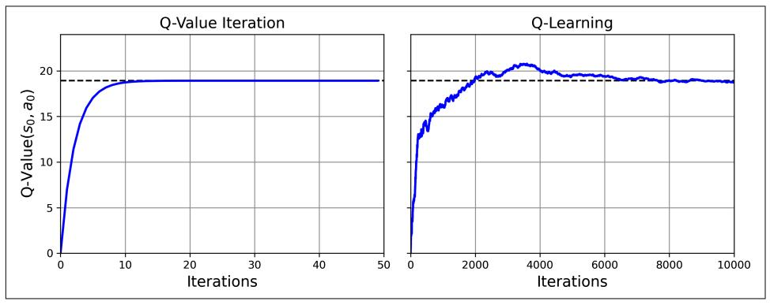

Figure 18-9. Learning curve of the Q-value iteration algorithm versus the Q-learning algorithm

The Q-learning algorithm is called an off-policy algorithm because the policy being trained is not necessarily the one used during training. For example, in the code we just ran, the policy being executed (the exploration policy) was completely random, while the policy being trained was never used. After training, the optimal policy corresponds to systematically choosing the action with the highest Q-value. Conversely, the policy gradients algorithm is an *on-policy* algorithm: it explores the world using the policy being trained. It is somewhat surprising that Q-learning is capable of learning the optimal policy by just watching an agent act randomly. Imagine learning to play golf when your teacher is a blindfolded monkey. Can we do better?

### **Exploration Policies**

Of course, Q-learning can work only if the exploration policy explores the MDP thoroughly enough. Although a purely random policy is guaranteed to eventually visit every state and every transition many times, it may take an extremely long time to do so. Therefore, a better option is to use the *ε-greedy policy* (ε is epsilon): at each step it acts randomly with probability  $\varepsilon$ , or greedily with probability 1- $\varepsilon$  (i.e., choosing the action with the highest Q-value). The advantage of the  $\varepsilon$ -greedy policy (compared to a completely random policy) is that it will spend more and more time exploring the interesting parts of the environment, as the Q-value estimates get better and better, while still spending some time visiting unknown regions of the MDP. It is

{734}------------------------------------------------

quite common to start with a high value for  $\varepsilon$  (e.g., 1.0) and then gradually reduce it (e.g., down to 0.05).

Alternatively, rather than relying only on chance for exploration, another approach is to encourage the exploration policy to try actions that it has not tried much before. This can be implemented as a bonus added to the Q-value estimates, as shown in Equation 18-6.

Equation 18-6. Q-learning using an exploration function  $Q(s, a) \leftarrow r + \gamma \cdot \max_{a'} f(Q(s', a'), N(s', a'))$ 

In this equation:

- $N(s', a')$  counts the number of times the action a' was chosen in state s'.
- $f(Q, N)$  is an exploration function, such as  $f(Q, N) = Q + \kappa/(1 + N)$ , where  $\kappa$  is a curiosity hyperparameter that measures how much the agent is attracted to the unknown.

### **Approximate Q-Learning and Deep Q-Learning**

The main problem with Q-learning is that it does not scale well to large (or even medium) MDPs with many states and actions. For example, suppose you wanted to use Q-learning to train an agent to play Ms. Pac-Man (see Figure 18-1). There are about 150 pellets that Ms. Pac-Man can eat, each of which can be present or absent (i.e., already eaten). So, the number of possible states is greater than  $2^{150} \approx 10^{45}$ . And if you add all the possible combinations of positions for all the ghosts and Ms. Pac-Man, the number of possible states becomes larger than the number of atoms in our planet, so there's absolutely no way you can keep track of an estimate for every single Q-value.

The solution is to find a function  $Q_0(s, a)$  that approximates the Q-value of any stateaction pair  $(s, a)$  using a manageable number of parameters (given by the parameter vector  $\theta$ ). This is called *approximate Q-learning*. For years it was recommended to use linear combinations of handcrafted features extracted from the state (e.g., the distances of the closest ghosts, their directions, and so on) to estimate Q-values, but in 2013, DeepMind showed that using deep neural networks can work much better, especially for complex problems, and it does not require any feature engineering. A DNN used to estimate Q-values is called a *deep Q-network* (DQN), and using a DQN for approximate Q-learning is called *deep Q-learning*.

Now, how can we train a DQN? Well, consider the approximate Q-value computed by the DQN for a given state-action pair  $(s, a)$ . Thanks to Bellman, we know we want

{735}------------------------------------------------

this approximate Q-value to be as close as possible to the reward  $r$  that we actually observe after playing action  $a$  in state  $s$ , plus the discounted value of playing optimally from then on. To estimate this sum of future discounted rewards, we can just execute the DQN on the next state s', for all possible actions  $a'$ . We get an approximate future Q-value for each possible action. We then pick the highest (since we assume we will be playing optimally) and discount it, and this gives us an estimate of the sum of future discounted rewards. By summing the reward  $r$  and the future discounted value estimate, we get a target Q-value  $y(s, a)$  for the state-action pair  $(s, a)$ , as shown in Equation 18-7.

Equation 18-7. Target Q-value

```
y(s, a) = r + \gamma \cdot \max_{a'} Q_{\theta}(s', a')
```

With this target Q-value, we can run a training step using any gradient descent algorithm. Specifically, we generally try to minimize the squared error between the estimated Q-value  $Q_0(s, a)$  and the target Q-value  $y(s, a)$ , or the Huber loss to reduce the algorithm's sensitivity to large errors. And that's the deep Q-learning algorithm! Let's see how to implement it to solve the CartPole environment.

## Implementing Deep Q-Learning

The first thing we need is a deep Q-network. In theory, we need a neural net that takes a state-action pair as input, and outputs an approximate Q-value. However, in practice it's much more efficient to use a neural net that takes only a state as input, and outputs one approximate Q-value for each possible action. To solve the CartPole environment, we do not need a very complicated neural net; a couple of hidden layers will do:

```
input_{shape} = [4] # == env.observation_space.shape
n outputs = 2 # == env.action space.nmodel = tf.keras. Sequential(f)tf.keras.layers.Dense(32, activation="elu", input shape=input shape),
    tf.keras.layers.Dense(32, activation="elu"),
    tf.keras.layers.Dense(n outputs)
\mathcal{I}
```

To select an action using this DQN, we pick the action with the largest predicted Q-value. To ensure that the agent explores the environment, we will use an  $\varepsilon$ -greedy policy (i.e., we will choose a random action with probability  $\varepsilon$ ):

{736}------------------------------------------------

```
def epsilon_greedy_policy(state, epsilon=0):
   if np.random.randn() < epsilon:
       return np.random.randint(n_outputs) # random action
   else:
       Q values = model.predict(state[np.newaxis], verbase=0)[0]return Q_values.argmax() # optimal action according to the DQN
```

Instead of training the DQN based only on the latest experiences, we will store all experiences in a replay buffer (or replay memory), and we will sample a random training batch from it at each training iteration. This helps reduce the correlations between the experiences in a training batch, which tremendously helps training. For this, we will just use a double-ended queue (deque):

```
from collections import deque
```

```
replay buffer = deque(maxlen=2000)
```


A *deque* is a queue elements can be efficiently added to or removed from on both ends. Inserting and deleting items from the ends of the queue is very fast, but random access can be slow when the queue gets long. If you need a very large replay buffer, you should use a circular buffer instead (see the notebook for an implementation), or check out DeepMind's Reverb library.

Each experience will be composed of six elements: a state s, the action a that the agent took, the resulting reward  $r$ , the next state  $s$  it reached, a Boolean indicating whether the episode ended at that point (done), and finally another Boolean indicating whether the episode was truncated at that point. We will need a small function to sample a random batch of experiences from the replay buffer. It will return six NumPy arrays corresponding to the six experience elements:

```
def sample experiences(batch size):
    indices = np.random.randint(len(replay_buffer), size=batch_size)
    batch = [replay_buffer[index] for index in indices]return [
       np.array([experience[field_index] for experience in batch])
       for field index in range(6)| # [states, actions, rewards, next states, dones, truncateds]
```

Let's also create a function that will play a single step using the  $\varepsilon$ -greedy policy, then store the resulting experience in the replay buffer:

```
def play one step(env, state, epsilon):
    action = epsilon greedy policy(state, epsilon)next_state, reward, done, truncated, info = env.step(action)
    replay_buffer.append((state, action, reward, next_state, done, truncated))
    return next_state, reward, done, truncated, info
```

{737}------------------------------------------------

Finally, let's create one last function that will sample a batch of experiences from the replay buffer and train the DQN by performing a single gradient descent step on this batch:

```
batch size = 32discount_factor = 0.95optimize <math>r = tf</math>.keras.optimizers. Nadam(learning rate=1e-2)loss_fn = tf.keras.losses.mean_squared_error
def training step(batch size):
    experiences = sample_experiences(batch_size)
    states, actions, rewards, next_states, dones, truncateds = experiences
    next_Q values = model.predict(next_states, verbose=0)
    max\_next_Q_values = next_Q_values.max(axis=1)runs = 1.0 - (dones | truncateds) # episode is not done or truncated
    target Q values = rewards + runs * discount factor * max next Q values
    target_Q_values = target_Q_values.read = false()mask = tf.one-hot(actions, n_outputs)with tf.GradientTape() as tape:
        all Q values = model(states)Q_values = tf.reduce_sum(all_Q_values * mask, axis=1, keepdims=True)
        loss = tf.reduce_mean(loss_fn(target_Q_values, Q_values))
    grads = tape.gradient(loss, model.trainable variables)
    optimizer.apply_gradients(zip(grads, model.trainable_variables))
```

Here's what's happening in this code:

- First we define some hyperparameters, and we create the optimizer and the loss function.
- Then we create the training\_step() function. It starts by sampling a batch of experiences, then it uses the DQN to predict the Q-value for each possible action in each experience's next state. Since we assume that the agent will be playing optimally, we only keep the maximum Q-value for each next state. Next, we use Equation 18-7 to compute the target Q-value for each experience's state-action pair.
- We want to use the DQN to compute the Q-value for each experienced stateaction pair, but the DON will also output the O-values for the other possible actions, not just for the action that was actually chosen by the agent. So, we need to mask out all the Q-values we do not need. The tf.one hot() function makes it possible to convert an array of action indices into such a mask. For example, if the first three experiences contain actions 1, 1, 0, respectively, then the mask will start with  $[0, 1]$ ,  $[0, 1]$ ,  $[1, 0]$ ,...]. We can then multiply the DQN's output with this mask, and this will zero out all the Q-values we do not want. We then sum over axis 1 to get rid of all the zeros, keeping only the Q-values of the experienced state-action pairs. This gives us the Q\_values tensor, containing one predicted Q-value for each experience in the batch.

{738}------------------------------------------------

- Next, we compute the loss: it is the mean squared error between the target and predicted Q-values for the experienced state-action pairs.
- Finally, we perform a gradient descent step to minimize the loss with regard to the model's trainable variables.

This was the hardest part. Now training the model is straightforward:

```
for episode in range(600):
    obs, info = env.read()for step in range(200):
       epsilon = max(1 - episode / 500, 0.01)obs, reward, done, truncated, info = play_one_step(env, obs, epsilon)
       if done or truncated:
            break
    if episode > 50:
       training_step(batch_size)
```

We run 600 episodes, each for a maximum of 200 steps. At each step, we first compute the epsilon value for the *ε*-greedy policy: it will go from 1 down to 0.01, linearly, in a bit under 500 episodes. Then we call the play one  $step()$  function, which will use the  $\varepsilon$ -greedy policy to pick an action, then execute it and record the experience in the replay buffer. If the episode is done or truncated, we exit the loop. Finally, if we are past episode 50, we call the training step() function to train the model on one batch sampled from the replay buffer. The reason we play many episodes without training is to give the replay buffer some time to fill up (if we don't wait enough, then there will not be enough diversity in the replay buffer). And that's it: we just implemented the Deep Q-learning algorithm!

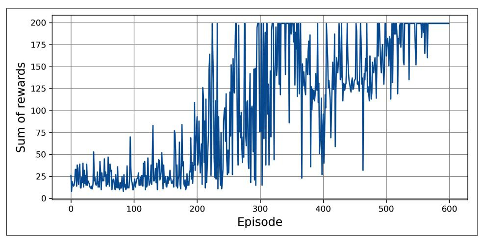

Figure 18-10 shows the total rewards the agent got during each episode.

Figure 18-10. Learning curve of the deep O-learning algorithm

{739}------------------------------------------------

As you can see, the algorithm took a while to start learning anything, in part because  $\varepsilon$  was very high at the beginning. Then its progress was erratic: it first reached the max reward around episode 220, but it immediately dropped, then bounced up and down a few times, and soon after it looked like it had finally stabilized near the max reward, at around episode 320, its score again dropped down dramatically. This is called *catastrophic forgetting*, and it is one of the big problems facing virtually all RL algorithms: as the agent explores the environment, it updates its policy, but what it learns in one part of the environment may break what it learned earlier in other parts of the environment. The experiences are quite correlated, and the learning environment keeps changing—this is not ideal for gradient descent! If you increase the size of the replay buffer, the algorithm will be less subject to this problem. Tuning the learning rate may also help. But the truth is, reinforcement learning is hard: training is often unstable, and you may need to try many hyperparameter values and random seeds before you find a combination that works well. For example, if you try changing the activation function from "elu" to "relu", the performance will be much lower


Reinforcement learning is notoriously difficult, largely because of the training instabilities and the huge sensitivity to the choice of hyperparameter values and random seeds.<sup>13</sup> As the researcher Andrej Karpathy put it, "[Supervised learning] wants to work. [...] RL must be forced to work". You will need time, patience, perseverance, and perhaps a bit of luck too. This is a major reason RL is not as widely adopted as regular deep learning (e.g., convolutional nets). But there are a few real-world applications, beyond AlphaGo and Atari games: for example, Google uses RL to optimize its datacenter costs, and it is used in some robotics applications, for hyperparameter tuning, and in recommender systems.

You might wonder why we didn't plot the loss. It turns out that loss is a poor indicator of the model's performance. The loss might go down, yet the agent might perform worse (e.g., this can happen when the agent gets stuck in one small region of the environment, and the DQN starts overfitting this region). Conversely, the loss could go up, yet the agent might perform better (e.g., if the DQN was underestimating the Q-values and it starts correctly increasing its predictions, the agent will likely perform better, getting more rewards, but the loss might increase because the DQN also sets the targets, which will be larger too). So, it's preferable to plot the rewards.

The basic deep Q-learning algorithm we've been using so far would be too unstable to learn to play Atari games. So how did DeepMind do it? Well, they tweaked the algorithm!

<sup>13</sup> A great 2018 post by Alex Irpan nicely lays out RL's biggest difficulties and limitations.

{740}------------------------------------------------

## **Deep Q-Learning Variants**

Let's look at a few variants of the deep Q-learning algorithm that can stabilize and speed up training.

### **Fixed Q-value Targets**

In the basic deep Q-learning algorithm, the model is used both to make predictions and to set its own targets. This can lead to a situation analogous to a dog chasing its own tail. This feedback loop can make the network unstable: it can diverge, oscillate, freeze, and so on. To solve this problem, in their 2013 paper the DeepMind researchers used two DQNs instead of one: the first is the *online model*, which learns at each step and is used to move the agent around, and the other is the target model used only to define the targets. The target model is just a clone of the online model:

```
target = tf.keras.models.clone model(model) # clone the model's architecture
target.set_weights(model.get_weights()) # copy the weights
```

Then, in the training step() function, we just need to change one line to use the target model instead of the online model when computing the Q-values of the next states:

```
next Q values = target.predict(new states, verbose=0)
```

Finally, in the training loop, we must copy the weights of the online model to the target model, at regular intervals (e.g., every 50 episodes):

```
if episode % 50 == 0:
    target.set_weights(model.get_weights())
```

Since the target model is updated much less often than the online model, the Q-value targets are more stable, the feedback loop we discussed earlier is dampened, and its effects are less severe. This approach was one of the DeepMind researchers' main contributions in their 2013 paper, allowing agents to learn to play Atari games from raw pixels. To stabilize training, they used a tiny learning rate of 0.00025, they updated the target model only every 10,000 steps (instead of 50), and they used a very large replay buffer of 1 million experiences. They decreased epsilon very slowly, from 1 to 0.1 in 1 million steps, and they let the algorithm run for 50 million steps. Moreover, their DQN was a deep convolutional net.

{741}------------------------------------------------

Now let's take a look at another DQN variant that managed to beat the state of the art once more

### **Double DON**

In a 2015 paper,<sup>14</sup> DeepMind researchers tweaked their DQN algorithm, increasing its performance and somewhat stabilizing training. They called this variant double DQN. The update was based on the observation that the target network is prone to overestimating Q-values. Indeed, suppose all actions are equally good: the Q-values estimated by the target model should be identical, but since they are approximations, some may be slightly greater than others, by pure chance. The target model will always select the largest Q-value, which will be slightly greater than the mean Q-value, most likely overestimating the true Q-value (a bit like counting the height of the tallest random wave when measuring the depth of a pool). To fix this, the researchers proposed using the online model instead of the target model when selecting the best actions for the next states, and using the target model only to estimate the Q-values for these best actions. Here is the updated training\_step() function:

```
def training step(batch size):
      experiences = sample_experiences(batch_size)
      states, actions, rewards, next_states, dones, truncateds = experiences
      next_Q values = model.predict(next_states, verbose=0) # # target.predict()
      best\_next\_actions = next_Q_values.argvmax(axis=1)next_mask = tf.one_hot(best_next_actions, n_outputs).numpy()
      max next Q values = (target.predict(next states, verbose=0) * next mask
                                    \sum_{s} \sum_{s} \sum_{s} \sum_{s} \sum_{s} \sum_{s} \sum_{s} \sum_{s} \sum_{s} \sum_{s} \sum_{s} \sum_{s} \sum_{s} \sum_{s} \sum_{s} \sum_{s} \sum_{s} \sum_{s} \sum_{s} \sum_{s} \sum_{s} \sum_{s} \sum_{s} \sum_{s} \sum_{s} \sum_{s} \sum_{s} \sum_{s\lceil ... \rceil # the rest is the same as earlier
```

Just a few months later, another improvement to the DQN algorithm was propose; we'll look at that next.

### **Prioritized Experience Replay**

Instead of sampling experiences *uniformly* from the replay buffer, why not sample important experiences more frequently? This idea is called *importance sampling* (IS) or prioritized experience replay (PER), and it was introduced in a 2015 paper<sup>15</sup> by DeepMind researchers (once again!).

<sup>14</sup> Hado van Hasselt et al., "Deep Reinforcement Learning with Double Q-Learning", Proceedings of the 30th AAAI Conference on Artificial Intelligence (2015): 2094-2100.

<sup>15</sup> Tom Schaul et al., "Prioritized Experience Replay", arXiv preprint arXiv:1511.05952 (2015).

{742}------------------------------------------------

More specifically, experiences are considered "important" if they are likely to lead to fast learning progress. But how can we estimate this? One reasonable approach is to measure the magnitude of the TD error  $\delta = r + \gamma V(s') - V(s)$ . A large TD error indicates that a transition  $(s, a, s')$  is very surprising, and thus probably worth learning from.<sup>16</sup> When an experience is recorded in the replay buffer, its priority is set to a very large value, to ensure that it gets sampled at least once. However, once it is sampled (and every time it is sampled), the TD error  $\delta$  is computed, and this experience's priority is set to  $p = |\delta|$  (plus a small constant to ensure that every experience has a nonzero probability of being sampled). The probability  $P$  of sampling an experience with priority p is proportional to  $p^{\zeta}$ , where  $\zeta$  is a hyperparameter that controls how greedy we want importance sampling to be: when  $\zeta = 0$ , we just get uniform sampling, and when  $\zeta = 1$ , we get full-blown importance sampling. In the paper, the authors used  $\zeta = 0.6$ , but the optimal value will depend on the task.

There's one catch, though: since the samples will be biased toward important experiences, we must compensate for this bias during training by downweighting the experiences according to their importance, or else the model will just overfit the important experiences. To be clear, we want important experiences to be sampled more often, but this also means we must give them a lower weight during training. To do this, we define each experience's training weight as  $w = (n P)^{-\beta}$ , where *n* is the number of experiences in the replay buffer, and  $\beta$  is a hyperparameter that controls how much we want to compensate for the importance sampling bias (0 means not at all, while 1 means entirely). In the paper, the authors used  $\beta = 0.4$  at the beginning of training and linearly increased it to  $\beta = 1$  by the end of training. Again, the optimal value will depend on the task, but if you increase one, you will usually want to increase the other as well.

Now let's look at one last important variant of the DQN algorithm.

### **Dueling DQN**

The *dueling DQN* algorithm (DDQN, not to be confused with double DQN, although both techniques can easily be combined) was introduced in yet another 2015 paper<sup>17</sup> by DeepMind researchers. To understand how it works, we must first note that the Q-value of a state-action pair  $(s, a)$  can be expressed as  $Q(s, a) = V(s) + A(s, a)$ , where  $V(s)$  is the value of state s and  $A(s, a)$  is the *advantage* of taking the action a in state s, compared to all other possible actions in that state. Moreover, the value of a state is equal to the Q-value of the best action  $a^*$  for that state (since we assume the optimal

<sup>16</sup> It could also just be that the rewards are noisy, in which case there are better methods for estimating an experience's importance (see the paper for some examples).

<sup>17</sup> Ziyu Wang et al., "Dueling Network Architectures for Deep Reinforcement Learning", arXiv preprint arXiv:1511.06581 (2015).

{743}------------------------------------------------

policy will pick the best action), so  $V(s) = Q(s, a^*)$ , which implies that  $A(s, a^*) = 0$ . In a dueling DQN, the model estimates both the value of the state and the advantage of each possible action. Since the best action should have an advantage of 0, the model subtracts the maximum predicted advantage from all predicted advantages. Here is a simple DDQN model, implemented using the functional API:

```
input_states = tf.keras.layers.Input(shape=[4])
hidden1 = tf.keras. layers. Dense(32, activation='elu") (input states)hidden2 = tf.keras. layers. Dense(32, activation='elu')(hidden1)state values = tf.keras.layers.Dense(1)(hidden2)
raw advantages = tf.keras.layers.Dense(n outputs)(hidden2)
advantages = raw_advantags - tf.readuce_max(range1, axis=1,keepdims=True)
Q_values = state_value + advantagesmodel = tf.keras.Model(inputs=[input_states], outputs=[Q_values])
```

The rest of the algorithm is just the same as earlier. In fact, you can build a double dueling DQN and combine it with prioritized experience replay! More generally, many RL techniques can be combined, as DeepMind demonstrated in a 2017 paper:<sup>18</sup> the paper's authors combined six different techniques into an agent called Rainbow, which largely outperformed the state of the art.

As you can see, deep reinforcement learning is a fast-growing field and there's much more to discover!

### **Overview of Some Popular RL Algorithms**

Before we close this chapter, let's take a brief look at a few other popular algorithms:

#### $AlphaGo^{19}$

AlphaGo uses a variant of Monte Carlo tree search (MCTS) based on deep neural networks to beat human champions at the game of Go. MCTS was invented in 1949 by Nicholas Metropolis and Stanislaw Ulam. It selects the best move after running many simulations, repeatedly exploring the search tree starting from the current position, and spending more time on the most promising branches. When it reaches a node that it hasn't visited before, it plays randomly until the game ends, and updates its estimates for each visited node (excluding the random moves), increasing or decreasing each estimate depending on the final outcome. AlphaGo is based on the same principle, but it uses a policy network to select moves, rather than playing randomly. This policy net is trained using policy gradients. The original algorithm involved three more neural networks,

<sup>18</sup> Matteo Hessel et al., "Rainbow: Combining Improvements in Deep Reinforcement Learning", arXiv preprint arXiv:1710.02298 (2017): 3215-3222.

<sup>19</sup> David Silver et al., "Mastering the Game of Go with Deep Neural Networks and Tree Search", Nature 529  $(2016): 484 - 489.$ 

{744}------------------------------------------------

and was more complicated, but it was simplified in the AlphaGo Zero paper,<sup>20</sup> which uses a single neural network to both select moves and evaluate game states. The AlphaZero paper<sup>21</sup> generalized this algorithm, making it capable of tackling not only the game of Go, but also chess and shogi (Japanese chess). Lastly, the MuZero paper<sup>22</sup> continued to improve upon this algorithm, outperforming the previous iterations even though the agent starts out without even knowing the rules of the game!

Actor-critic algorithms

Actor-critics are a family of RL algorithms that combine policy gradients with deep Q-networks. An actor-critic agent contains two neural networks: a policy net and a DQN. The DQN is trained normally, by learning from the agent's experiences. The policy net learns differently (and much faster) than in regular PG: instead of estimating the value of each action by going through multiple episodes, then summing the future discounted rewards for each action, and finally normalizing them, the agent (actor) relies on the action values estimated by the DQN (critic). It's a bit like an athlete (the agent) learning with the help of a coach (the DQN).

#### Asynchronous advantage actor-critic $(A3C)^{23}$

This is an important actor-critic variant introduced by DeepMind researchers in 2016 where multiple agents learn in parallel, exploring different copies of the environment. At regular intervals, but asynchronously (hence the name), each agent pushes some weight updates to a master network, then it pulls the latest weights from that network. Each agent thus contributes to improving the master network and benefits from what the other agents have learned. Moreover, instead of estimating the Q-values, the DQN estimates the advantage of each action (hence the second A in the name), which stabilizes training.

#### Advantage actor-critic (A2C)

A2C is a variant of the A3C algorithm that removes the asynchronicity. All model updates are synchronous, so gradient updates are performed over larger batches, which allows the model to better utilize the power of the GPU.

<sup>20</sup> David Silver et al., "Mastering the Game of Go Without Human Knowledge", Nature 550 (2017): 354-359.

<sup>21</sup> David Silver et al., "Mastering Chess and Shogi by Self-Play with a General Reinforcement Learning Algorithm", arXiv preprint arXiv:1712.01815.

<sup>22</sup> Julian Schrittwieser et al., "Mastering Atari, Go, Chess and Shogi by Planning with a Learned Model", arXiv preprint arXiv:1911.08265 (2019).

<sup>23</sup> Volodymyr Mnih et al., "Asynchronous Methods for Deep Reinforcement Learning", Proceedings of the 33rd International Conference on Machine Learning (2016): 1928-1937.

{745}------------------------------------------------

#### Soft actor-critic (SAC)<sup>24</sup>

SAC is an actor-critic variant proposed in 2018 by Tuomas Haarnoja and other UC Berkeley researchers. It learns not only rewards, but also to maximize the entropy of its actions. In other words, it tries to be as unpredictable as possible while still getting as many rewards as possible. This encourages the agent to explore the environment, which speeds up training, and makes it less likely to repeatedly execute the same action when the DQN produces imperfect estimates. This algorithm has demonstrated an amazing sample efficiency (contrary to all the previous algorithms, which learn very slowly).

#### Proximal policy optimization (PPO)<sup>25</sup>

This algorithm by John Schulman and other OpenAI researchers is based on A2C, but it clips the loss function to avoid excessively large weight updates (which often lead to training instabilities). PPO is a simplification of the previous trust region policy optimization<sup>26</sup> (TRPO) algorithm, also by OpenAI. OpenAI made the news in April 2019 with its AI called OpenAI Five, based on the PPO algorithm, which defeated the world champions at the multiplayer game Dota 2.

#### Curiosity-based exploration<sup>27</sup>

A recurring problem in RL is the sparsity of the rewards, which makes learning very slow and inefficient. Deepak Pathak and other UC Berkeley researchers have proposed an exciting way to tackle this issue: why not ignore the rewards, and just make the agent extremely curious to explore the environment? The rewards thus become intrinsic to the agent, rather than coming from the environment. Similarly, stimulating curiosity in a child is more likely to give good results than purely rewarding the child for getting good grades. How does this work? The agent continuously tries to predict the outcome of its actions, and it seeks situations where the outcome does not match its predictions. In other words, it wants to be surprised. If the outcome is predictable (boring), it goes elsewhere. However, if the outcome is unpredictable but the agent notices that it has no control over it, it also gets bored after a while. With only curiosity, the authors succeeded in training an agent at many video games: even though the agent gets no penalty for losing, the game starts over, which is boring so it learns to avoid it.

<sup>24</sup> Tuomas Haarnoja et al., "Soft Actor-Critic: Off-Policy Maximum Entropy Deep Reinforcement Learning with a Stochastic Actor", Proceedings of the 35th International Conference on Machine Learning (2018): 1856-1865.

<sup>25</sup> John Schulman et al., "Proximal Policy Optimization Algorithms", arXiv preprint arXiv:1707.06347 (2017).

<sup>26</sup> John Schulman et al., "Trust Region Policy Optimization", Proceedings of the 32nd International Conference on Machine Learning (2015): 1889-1897.

<sup>27</sup> Deepak Pathak et al., "Curiosity-Driven Exploration by Self-Supervised Prediction", Proceedings of the 34th International Conference on Machine Learning (2017): 2778-2787.

{746}------------------------------------------------

Open-ended learning (OEL)

The objective of OEL is to train agents capable of endlessly learning new and interesting tasks, typically generated procedurally. We're not there yet, but there has been some amazing progress over the last few years. For example, a 2019 paper<sup>28</sup> by a team of researchers from Uber AI introduced the *POET algorithm*, which generates multiple simulated 2D environments with bumps and holes and trains one agent per environment: the agent's goal is to walk as fast as possible while avoiding the obstacles. The algorithm starts out with simple environments, but they gradually get harder over time: this is called *curriculum* learning. Moreover, although each agent is only trained within one environment, it must regularly compete against other agents, across all environments. In each environment, the winner is copied over and it replaces the agent that was there before. This way, knowledge is regularly transferred across environments, and the most adaptable agents are selected. In the end, the agents are much better walkers than agents trained on a single task, and they can tackle much harder environments. Of course, this principle can be applied to other environments and tasks as well. If you're interested in OEL, make sure to check out the Enhanced POET paper,<sup>29</sup> as well as DeepMind's 2021 paper<sup>30</sup> on this topic.


If you'd like to learn more about reinforcement learning, check out the book Reinforcement Learning by Phil Winder (O'Reilly).

We covered many topics in this chapter: policy gradients, Markov chains, Markov decision processes, Q-learning, approximate Q-learning, and deep Q-learning and its main variants (fixed Q-value targets, double DQN, dueling DQN, and prioritized experience replay), and finally we took a quick look at a few other popular algorithms. Reinforcement learning is a huge and exciting field, with new ideas and algorithms popping out every day, so I hope this chapter sparked your curiosity: there is a whole world to explore!

<sup>28</sup> Rui Wang et al., "Paired Open-Ended Trailblazer (POET): Endlessly Generating Increasingly Complex and Diverse Learning Environments and Their Solutions", arXiv preprint arXiv:1901.01753 (2019).

<sup>29</sup> Rui Wang et al., "Enhanced POET: Open-Ended Reinforcement Learning Through Unbounded Invention of Learning Challenges and Their Solutions", arXiv preprint arXiv:2003.08536 (2020).

<sup>30</sup> Open-Ended Learning Team et al., "Open-Ended Learning Leads to Generally Capable Agents", arXiv preprint arXiv:2107.12808 (2021).

{747}------------------------------------------------

### **Exercises**

- 1. How would you define reinforcement learning? How is it different from regular supervised or unsupervised learning?
- 2. Can you think of three possible applications of RL that were not mentioned in this chapter? For each of them, what is the environment? What is the agent? What are some possible actions? What are the rewards?
- 3. What is the discount factor? Can the optimal policy change if you modify the discount factor?
- 4. How do you measure the performance of a reinforcement learning agent?
- 5. What is the credit assignment problem? When does it occur? How can you alleviate it?
- 6. What is the point of using a replay buffer?
- 7. What is an off-policy RL algorithm?
- 8. Use policy gradients to solve OpenAI Gym's LunarLander-v2 environment.
- 9. Use a double dueling DQN to train an agent that can achieve a superhuman level at the famous Atari Breakout game ("ALE/Breakout-v5"). The observations are images. To simplify the task, you should convert them to grayscale (i.e., average over the channels axis) then crop them and downsample them, so they're just large enough to play, but not more. An individual image does not tell you which way the ball and the paddles are going, so you should merge two or three consecutive images to form each state. Lastly, the DQN should be composed mostly of convolutional layers.
- 10. If you have about \$100 to spare, you can purchase a Raspberry Pi 3 plus some cheap robotics components, install TensorFlow on the Pi, and go wild! For an example, check out this fun post by Lukas Biewald, or take a look at GoPiGo or BrickPi. Start with simple goals, like making the robot turn around to find the brightest angle (if it has a light sensor) or the closest object (if it has a sonar sensor), and move in that direction. Then you can start using deep learning: for example, if the robot has a camera, you can try to implement an object detection algorithm so it detects people and moves toward them. You can also try to use RL to make the agent learn on its own how to use the motors to achieve that goal. Have fun!

Solutions to these exercises are available at the end of this chapter's notebook, at https://homl.info/colab3.

{748}------------------------------------------------

## **CHAPTER 19 Training and Deploying TensorFlow Models at Scale**

Once you have a beautiful model that makes amazing predictions, what do you do with it? Well, you need to put it in production! This could be as simple as running the model on a batch of data, and perhaps writing a script that runs this model every night. However, it is often much more involved. Various parts of your infrastructure may need to use this model on live data, in which case you will probably want to wrap your model in a web service: this way, any part of your infrastructure can query the model at any time using a simple REST API (or some other protocol), as we discussed in Chapter 2. But as time passes, you'll need to regularly retrain your model on fresh data and push the updated version to production. You must handle model versioning, gracefully transition from one model to the next, possibly roll back to the previous model in case of problems, and perhaps run multiple different models in parallel to perform A/B experiments.<sup>1</sup> If your product becomes successful, your service may start to get a large number of of queries per second (QPS), and it must scale up to support the load. A great solution to scale up your service, as you will see in this chapter, is to use TF Serving, either on your own hardware infrastructure or via a cloud service such as Google Vertex AI.<sup>2</sup> It will take care of efficiently serving your model, handle graceful model transitions, and more. If you use the cloud platform you will also get many extra features, such as powerful monitoring tools.

<sup>1</sup> An A/B experiment consists in testing two different versions of your product on different subsets of users in order to check which version works best and get other insights.

<sup>2</sup> Google AI Platform (formerly known as Google ML Engine) and Google AutoML merged in 2021 to form Google Vertex AI.

{749}------------------------------------------------

Moreover, if you have a lot of training data and compute-intensive models, then training time may be prohibitively long. If your product needs to adapt to changes quickly, then a long training time can be a showstopper (e.g., think of a news recommendation system promoting news from last week). Perhaps even more importantly, a long training time will prevent you from experimenting with new ideas. In machine learning (as in many other fields), it is hard to know in advance which ideas will work, so you should try out as many as possible, as fast as possible. One way to speed up training is to use hardware accelerators such as GPUs or TPUs. To go even faster, you can train a model across multiple machines, each equipped with multiple hardware accelerators. TensorFlow's simple yet powerful distribution strategies API makes this easy, as you will see.

In this chapter we will look at how to deploy models, first using TF Serving, then using Vertex AI. We will also take a quick look at deploying models to mobile apps, embedded devices, and web apps. Then we will discuss how to speed up computations using GPUs and how to train models across multiple devices and servers using the distribution strategies API. Lastly, we will explore how to train models and fine-tune their hyperparameters at scale using Vertex AI. That's a lot of topics to discuss, so let's dive in!

### **Serving a TensorFlow Model**

Once you have trained a TensorFlow model, you can easily use it in any Python code: if it's a Keras model, just call its predict() method! But as your infrastructure grows, there comes a point where it is preferable to wrap your model in a small service whose sole role is to make predictions and have the rest of the infrastructure query it (e.g., via a REST or gRPC API).<sup>3</sup> This decouples your model from the rest of the infrastructure, making it possible to easily switch model versions or scale the service up as needed (independently from the rest of your infrastructure), perform A/B experiments, and ensure that all your software components rely on the same model versions. It also simplifies testing and development, and more. You could create your own microservice using any technology you want (e.g., using the Flask library), but why reinvent the wheel when you can just use TF Serving?

### **Using TensorFlow Serving**

TF Serving is a very efficient, battle-tested model server, written in C++. It can sustain a high load, serve multiple versions of your models and watch a model repository to automatically deploy the latest versions, and more (see Figure 19-1).

<sup>3</sup> A REST (or RESTful) API is an API that uses standard HTTP verbs, such as GET, POST, PUT, and DELETE, and uses JSON inputs and outputs. The gRPC protocol is more complex but more efficient; data is exchanged using protocol buffers (see Chapter 13).

{750}------------------------------------------------

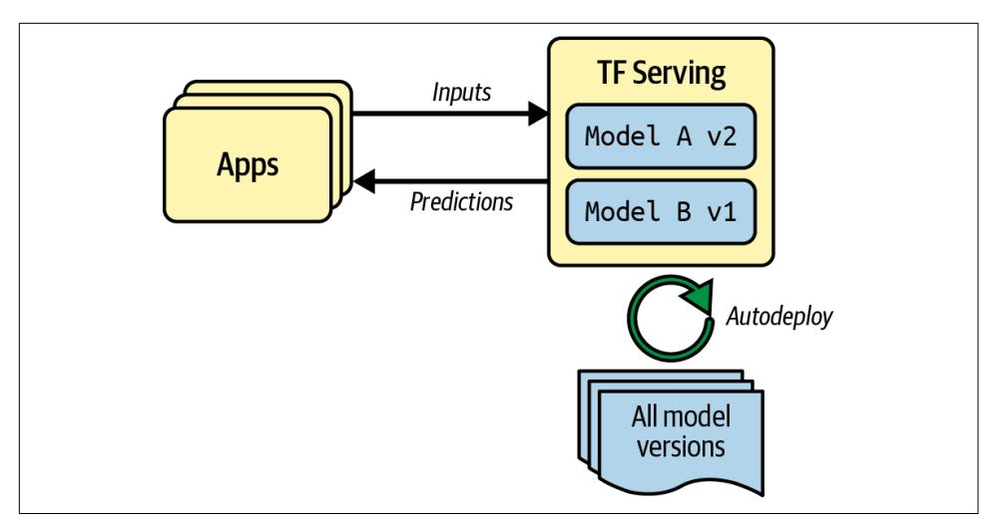

Figure 19-1. TF Serving can serve multiple models and automatically deploy the latest version of each model

So let's suppose you have trained an MNIST model using Keras, and you want to deploy it to TF Serving. The first thing you have to do is export this model to the SavedModel format, introduced in Chapter 10.

#### **Exporting SavedModels**

You already know how to save the model: just call model.save(). Now to version the model, you just need to create a subdirectory for each model version. Easy!

```
from pathlib import Path
import tensorflow as tf
X_train, X_valid, X_test = [...] # load and split the MNIST dataset
model = [\dots] # build & train an MNIST model (also handles image preprocessing)
model_name = "my_mnist_model"
model version = "0001"model_path = Path(model_name) / model_version
model.save(model_path, save_format="tf")
```

It's usually a good idea to include all the preprocessing layers in the final model you export so that it can ingest data in its natural form once it is deployed to production. This avoids having to take care of preprocessing separately within the application that uses the model. Bundling the preprocessing steps within the model also makes it simpler to update them later on and limits the risk of mismatch between a model and the preprocessing steps it requires.

{751}------------------------------------------------


Since a SavedModel saves the computation graph, it can only be used with models that are based exclusively on TensorFlow operations, excluding the tf.py\_function() operation, which wraps arbitrary Python code.

TensorFlow comes with a small saved\_model\_cli command-line interface to inspect SavedModels. Let use it to inspect our exported model:

```
$ saved model cli show --dir my mnist model/0001
The given SavedModel contains the following tag-sets:
'serve'
```

What does this output mean? Well, a SavedModel contains one or more *metagraphs*. A metagraph is a computation graph plus some function signature definitions, including their input and output names, types, and shapes. Each metagraph is identified by a set of tags. For example, you may want to have a metagraph containing the full computation graph, including the training operations: you would typically tag this one as "train". And you might have another metagraph containing a pruned computation graph with only the prediction operations, including some GPU-specific operations: this one might be tagged as "serve", "gpu". You might want to have other metagraphs as well. This can be done using TensorFlow's low-level SavedModel API. However, when you save a Keras model using its save() method, it saves a single metagraph tagged as "serve". Let's inspect this "serve" tag set:

```
$ saved_model_cli        show --dir 0001/my_mnist_model --tag_set        serve
The given SavedModel MetaGraphDef contains SignatureDefs with these keys:
SignatureDef key: "__saved_model_init_op"
SignatureDef key: "serving_default"
```

This metagraph contains two signature definitions: an initialization function called "\_\_saved\_model\_init\_op", which you do not need to worry about, and a default serving function called "serving\_default". When saving a Keras model, the default serving function is the model's call() method, which makes predictions, as you already know. Let's get more details about this serving function:

{752}------------------------------------------------

```
$ saved_model_cli        show --dir 0001/my_mnist_model --tag_set        serve \
                        --signature def serving default
The given SavedModel SignatureDef contains the following input(s):
  inputs['flatten input'] tensor info:
      dtype: DT UINT8
      shape: (-1, 28, 28)
      name: serving_default_flatten_input:0
The given SavedModel SignatureDef contains the following output(s):
  outputs['dense 1'] tensor info:
      dtype: DT FLOAT
      shape: (-1, 10)name: StatefulPartitionedCall:0
Method name is: tensorflow/serving/predict
```

Note that the function's input is named "flatten\_input", and the output is named "dense 1". These correspond to the Keras model's input and output layer names. You can also see the type and shape of the input and output data. Looks good!

Now that you have a SavedModel, the next step is to install TF Serving.

#### **Installing and starting TensorFlow Serving**

There are many ways to install TF Serving: using the system's package manager, using a Docker image,<sup>4</sup> installing from source, and more. Since Colab runs on Ubuntu, we can use Ubuntu's apt package manager like this:

```
url = "https://storage.google.google.com/tensorflow-serverving-apt"src = "stable tensorflow-model-server tensorflow-model-server-universal"
!echo 'deb {url} {src}' > /etc/apt/sources.list.d/tensorflow-serving.list
!curl '{url}/tensorflow-serving.release.pub.gpg' | apt-key add -
lapt update -q && apt-get install -y tensorflow-model-server
%pip install -q -U tensorflow-serving-api
```

This code starts by adding TensorFlow's package repository to Ubuntu's list of package sources. Then it downloads TensorFlow's public GPG key and adds it to the package manager's key list so it can verify TensorFlow's package signatures. Next, it uses apt to install the tensorflow-model-server package. Lastly, it installs the tensorflow-serving-api library, which we will need to communicate with the server.

<sup>4</sup> If you are not familiar with Docker, it allows you to easily download a set of applications packaged in a Docker image (including all their dependencies and usually some good default configuration) and then run them on your system using a Docker engine. When you run an image, the engine creates a Docker container that keeps the applications well isolated from your own system-but you can give it some limited access if you want. It is similar to a virtual machine, but much faster and lighter, as the container relies directly on the host's kernel. This means that the image does not need to include or run its own kernel.

{753}------------------------------------------------

Now we want to start the server. The command will require the absolute path of the base model directory (i.e., the path to my mnist model, not 0001), so let's save that to the MODEL DIR environment variable:

```
import os
os.environ["MODEL_DIR"] = str(model_path.parent.absolute())
```

We can then start the server:

```
%%bash -- bg
tensorflow_model_server \
     --port=8500 \
     -rest api port=8501 \
     --model name=my mnist model \
     --model base path="${MODEL DIR}" >my server.log 2>&1
```

In Jupyter or Colab, the %%bash --bg magic command executes the cell as a bash script, running it in the background. The >my\_server.log 2>&1 part redirects the standard output and standard error to the *my server.log* file. And that's it! TF Serving is now running in the background, and its logs are saved to *my\_server.log*. It loaded our MNIST model (version 1), and it is now waiting for gRPC and REST requests, respectively, on ports 8500 and 8501.

#### **Running TF Serving in a Docker Container**

If you are running the notebook on your own machine and you have installed Docker, you can run docker pull tensorflow/serving in a terminal to download the TF Serving image. The TensorFlow team highly recommends this installation method because it is simple, it will not mess with your system, and it offers high performance.<sup>5</sup> To start the server inside a Docker container, you can run the following command in a terminal:

```
$ docker run -it --rm -v "/path/to/my_mnist_model:/models/my_mnist_model" \
    -p 8500:8500 -p 8501:8501 -e MODEL NAME=my mnist model tensorflow/serving
```

Here is what all these command-line options mean:

 $-*i*$ t

Makes the container interactive (so you can press Ctrl-C to stop it) and displays the server's output.

 $- - cm$ 

Deletes the container when you stop it: no need to clutter your machine with interrupted containers. However, it does not delete the image.

<sup>5</sup> There are also GPU images available, and other installation options. For more details, please check out the official installation instructions.

{754}------------------------------------------------

```
-v "/path/to/my mnist model:/models/my mnist model"
    Makes the host's my mnist model directory available to the container at the
    path /models/mnist_model. You must replace /path/to/my_mnist_model with the
    absolute path of this directory. On Windows, remember to use \ instead of / in
    the host path, but not in the container path (since the container runs on Linux).
-p8500:8500Makes the Docker engine forward the host's TCP port 8500 to the container's
    TCP port 8500. By default, TF Serving uses this port to serve the gRPC API.
-p8501:8501Forwards the host's TCP port 8501 to the container's TCP port 8501. The Docker
    image is configured to use this port by default to serve the REST API.
-e MODEL NAME=my mnist model
    Sets the container's MODEL_NAME environment variable, so TF Serving knows
    which model to serve. By default, it will look for models in the /models directory,
    and it will automatically serve the latest version it finds.
tensorflow/serving
    This is the name of the image to run.
```

Now that the server is up and running, let's query it, first using the REST API, then the gRPC API.

#### Querying TF Serving through the REST API

Let's start by creating the query. It must contain the name of the function signature you want to call, and of course the input data. Since the request must use the JSON format, we have to convert the input images from a NumPy array to a Python list:

```
import json
X new = X test[:3] # pretend we have 3 new digit images to classify
request json = json.dumps({}"signature name": "serving default",
    "instances": X new.tolist(),
)
```

Note that the JSON format is 100% text-based. The request string looks like this:

```
>>> request_json
'{"signature_name": "serving_default", "instances": [[[0, 0, 0, 0, ... ]]]}'
```

Now let's send this request to TF Serving via an HTTP POST request. This can be done using the requests library (it is not part of Python's standard library, but it is preinstalled on Colab):

{755}------------------------------------------------

```
import requests
```

```
server_url = "http://localhost:8501/v1/models/my_mnist_model:predict"
response = requests.post(server url, data=request json)
response. raise for status() # raise an exception in case of error
response = response.join()
```

If all goes well, the response should be a dictionary containing a single "predictions" key. The corresponding value is the list of predictions. This list is a Python list, so let's convert it to a NumPy array and round the floats it contains to the second decimal:

```
>>> import numpy as np
>>> y_proba = np.array(response["predictions"])
>>> y_proba.round(2)
array([[0. , 0. , 0. , 0. , 0. , 0. , 0. , 0. , 1. , 0. , 0. ][0. , 0. , 0.99, 0.01, 0. , 0. , 0. , 0. , 0. , 0. ][0. , 0.97, 0.01, 0. , 0. , 0. , 0. , 0.01, 0. , 0. ]]
```

Hurray, we have the predictions! The model is close to 100% confident that the first image is a 7, 99% confident that the second image is a 2, and 97% confident that the third image is a 1. That's correct.

The REST API is nice and simple, and it works well when the input and output data are not too large. Moreover, just about any client application can make REST queries without additional dependencies, whereas other protocols are not always so readily available. However, it is based on JSON, which is text-based and fairly verbose. For example, we had to convert the NumPy array to a Python list, and every float ended up represented as a string. This is very inefficient, both in terms of serialization/deserialization time—we have to convert all the floats to strings and back—and in terms of payload size: many floats end up being represented using over 15 characters, which translates to over 120 bits for 32-bit floats! This will result in high latency and bandwidth usage when transferring large NumPy arrays.<sup>6</sup> So, let's see how to use gRPC instead.


When transferring large amounts of data, or when latency is important, it is much better to use the gRPC API, if the client supports it, as it uses a compact binary format and an efficient communication protocol based on HTTP/2 framing.

<sup>6</sup> To be fair, this can be mitigated by serializing the data first and encoding it to Base64 before creating the REST request. Moreover, REST requests can be compressed using gzip, which reduces the payload size significantly.

{756}------------------------------------------------

#### Querying TF Serving through the gRPC API

The gRPC API expects a serialized PredictRequest protocol buffer as input, and it outputs a serialized PredictResponse protocol buffer. These protobufs are part of the tensorflow-serving-api library, which we installed earlier. First, let's create the request:

```
from tensorflow serving.apis.predict pb2 import PredictRequest
request = PredictRequest()request.model spec.name = model name
request.model spec.signature name = "serving default"
input_name = model.input_names[0] # == "flatten_input"
request.inputs[input_name].CopyFrom(tf.make_tensor_proto(X_new))
```

This code creates a PredictRequest protocol buffer and fills in the required fields, including the model name (defined earlier), the signature name of the function we want to call, and finally the input data, in the form of a Tensor protocol buffer. The tf.make\_tensor\_proto() function creates a Tensor protocol buffer based on the given tensor or NumPy array, in this case X\_new.

Next, we'll send the request to the server and get its response. For this, we will need the grpcio library, which is preinstalled in Colab:

```
import grpc
from tensorflow_serving.apis import prediction service pb2 grpc
channel = g rpc.insecure channel('localhost:8500')predict_service = prediction_service_pb2_grpc.PredictionServiceStub(channel)
response = predict_service.Predict(request, timeout=10.0)
```

The code is quite straightforward: after the imports, we create a gRPC communication channel to *localhost* on TCP port 8500, then we create a gRPC service over this channel and use it to send a request, with a 10-second timeout. Note that the call is synchronous: it will block until it receives the response or when the timeout period expires. In this example the channel is insecure (no encryption, no authentication), but gRPC and TF Serving also support secure channels over SSL/TLS.

Next, let's convert the PredictResponse protocol buffer to a tensor:

```
output_name = model.output_names[0] # == "dense_1"outputs\; proto = response.outputs[output\;name]y_proba = tf.make_ndarray(outputs_proto)
```

If you run this code and print y\_proba.round(2), you will get the exact same estimated class probabilities as earlier. And that's all there is to it: in just a few lines of code, you can now access your TensorFlow model remotely, using either REST or gRPC.

{757}------------------------------------------------

#### Deploying a new model version

Now let's create a new model version and export a SavedModel, this time to the my\_mnist\_model/0002 directory:

```
model = [...] # build and train a new MNIST model version
model version = "0002"model path = Path(model name) / model version
model.save(model path, save format="tf")
```

At regular intervals (the delay is configurable), TF Serving checks the model directory for new model versions. If it finds one, it automatically handles the transition gracefully: by default, it answers pending requests (if any) with the previous model version, while handling new requests with the new version. As soon as every pending request has been answered, the previous model version is unloaded. You can see this at work in the TF Serving logs (in *my\_server.log*):

```
[\ldots]Reading SavedModel from: /models/my mnist model/0002
Reading meta graph with tags { serve }
[\ldots]Successfully loaded servable version {name: my_mnist_model version: 2}
Quiescing servable version {name: my_mnist_model version: 1}
Done quiescing servable version {name: my_mnist_model version: 1}
Unloading servable version {name: my mnist model version: 1}
```


If the SavedModel contains some example instances in the assets/ extra directory, you can configure TF Serving to run the new model on these instances before starting to use it to serve requests. This is called *model warmup*: it will ensure that everything is properly loaded, avoiding long response times for the first requests.

This approach offers a smooth transition, but it may use too much RAM—especially GPU RAM, which is generally the most limited. In this case, you can configure TF Serving so that it handles all pending requests with the previous model version and unloads it before loading and using the new model version. This configuration will avoid having two model versions loaded at the same time, but the service will be unavailable for a short period.

As you can see, TF Serving makes it straightforward to deploy new models. Moreover, if you discover that version 2 does not work as well as you expected, then rolling back to version 1 is as simple as removing the  $my$  mnist model/0002 directory.

{758}------------------------------------------------


Another great feature of TF Serving is its automatic batching capability, which you can activate using the --enable\_batching option upon startup. When TF Serving receives multiple requests within a short period of time (the delay is configurable), it will automatically batch them together before using the model. This offers a significant performance boost by leveraging the power of the GPU. Once the model returns the predictions, TF Serving dispatches each prediction to the right client. You can trade a bit of latency for a greater throughput by increasing the batching delay (see the --batching parameters file option).

If you expect to get many queries per second, you will want to deploy TF Serving on multiple servers and load-balance the queries (see Figure 19-2). This will require deploying and managing many TF Serving containers across these servers. One way to handle that is to use a tool such as Kubernetes, which is an open source system for simplifying container orchestration across many servers. If you do not want to purchase, maintain, and upgrade all the hardware infrastructure, you will want to use virtual machines on a cloud platform such as Amazon AWS, Microsoft Azure, Google Cloud Platform, IBM Cloud, Alibaba Cloud, Oracle Cloud, or some other platform as a service (PaaS) offering. Managing all the virtual machines, handling container orchestration (even with the help of Kubernetes), taking care of TF Serving configuration, tuning and monitoring—all of this can be a full-time job. Fortunately, some service providers can take care of all this for you. In this chapter we will use Vertex AI: it's the only platform with TPUs today; it supports TensorFlow 2, Scikit-Learn, and XGBoost; and it offers a nice suite of AI services. There are several other providers in this space that are capable of serving TensorFlow models as well, though, such as Amazon AWS SageMaker and Microsoft AI Platform, so make sure to check them out too

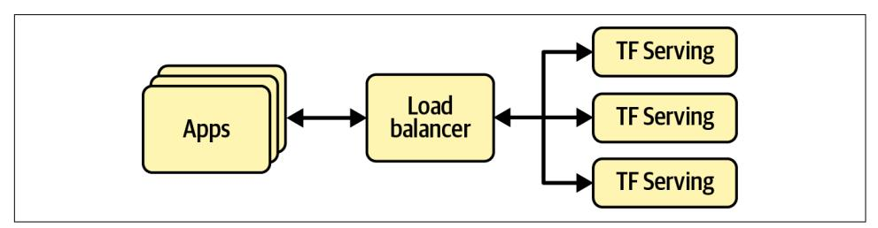

Figure 19-2. Scaling up TF Serving with load balancing

Now let's see how to serve our wonderful MNIST model on the cloud!

{759}------------------------------------------------

### **Creating a Prediction Service on Vertex AI**

Vertex AI is a platform within Google Cloud Platform (GCP) that offers a wide range of AI-related tools and services. You can upload datasets, get humans to label them, store commonly used features in a feature store and use them for training or in production, and train models across many GPU or TPU servers with automatic hyperparameter tuning or model architecture search (AutoML). You can also manage your trained models, use them to make batch predictions on large amounts of data, schedule multiple jobs for your data workflows, serve your models via REST or gRPC at scale, and experiment with your data and models within a hosted Jupyter environment called the Workbench. There's even a Matching Engine service that lets you compare vectors very efficiently (i.e., approximate nearest neighbors). GCP also includes other AI services, such as APIs for computer vision, translation, speech-totext, and more.

Before we start, there's a little bit of setup to take care of:

- 1. Log in to your Google account, and then go to the Google Cloud Platform console (see Figure 19-3). If you don't have a Google account, you'll have to create one.
- 2. If it's your first time using GCP, you'll have to read and accept the terms and conditions. New users are offered a free trial, including \$300 worth of GCP credit that you can use over the course of 90 days (as of May 2022). You'll only need a small portion of that to pay for the services you'll use in this chapter. Upon signing up for a free trial, you'll still need to create a payment profile and enter your credit card number: it's used for verification purposes-probably to avoid people using the free trial multiple times—but you won't be billed for the first \$300, and after that you'll only be charged if you opt in by upgrading to a paid account.


Figure 19-3. Google Cloud Platform console

{760}------------------------------------------------

- 3. If you have used GCP before and your free trial has expired, then the services you will use in this chapter will cost you some money. It shouldn't be too much, especially if you remember to turn off the services when you don't need them anymore. Make sure you understand and agree to the pricing conditions before you run any service. I hereby decline any responsibility if services end up costing more than you expected! Also make sure your billing account is active. To check, open the  $\equiv$  navigation menu at the top left and click Billing, then make sure you have set up a payment method and that the billing account is active.
- 4. Every resource in GCP belongs to a *project*. This includes all the virtual machines you may use, the files you store, and the training jobs you run. When you create an account, GCP automatically creates a project for you, called "My First Project". If you want, you can change its display name by going to the project settings: in the  $\equiv$  navigation menu, select "IAM and admin  $\rightarrow$  Settings", change the project's display name, and click SAVE. Note that the project also has a unique ID and number. You can choose the project ID when you create a project, but you cannot change it later. The project number is automatically generated and cannot be changed. If you want to create a new project, click the project name at the top of the page, then click NEW PROJECT and enter the project name. You can also click EDIT to set the project ID. Make sure billing is active for this new project so that service fees can be billed (to your free credits, if any).


Always set an alarm to remind yourself to turn services off when you know you will only need them for a few hours, or else you might leave them running for days or months, incurring potentially significant costs.

5. Now that you have a GCP account and a project, and billing is activated, you must activate the APIs you need. In the  $\equiv$  navigation menu, select "APIs and services", and make sure the Cloud Storage API is enabled. If needed, click + ENABLE APIS AND SERVICES, find Cloud Storage, and enable it. Also enable the Vertex AI API.

You could continue to do everything via the GCP console, but I recommend using Python instead: this way you can write scripts to automate just about anything you want with GCP, and it's often more convenient than clicking your way through menus and forms, especially for common tasks.

{761}------------------------------------------------

### **Google Cloud CLI and Shell**

Google Cloud's command-line interface (CLI) includes the gcloud command, which lets you control almost everything in GCP, and qsutil, which lets you interact with Google Cloud Storage. This CLI is preinstalled in Colab: all you need to do is authenticate using google.auth.authenticate\_user(), and you're good to go. For example, !gcloud config list will display the configuration.

GCP also offers a preconfigured shell environment called the Google Cloud Shell, which you can use directly in your web browser; it runs on a free Linux VM (Debian) with the Google Cloud SDK already preinstalled and configured for you, so there's no need to authenticate. The Cloud Shell is available anywhere in GCP: just click the Activate Cloud Shell icon at the top right of the page (see Figure 19-4).


Figure 19-4. Activating the Google Cloud Shell

If you prefer to install the CLI on your machine, then after installation you need to initialize it by running gcloud init: follow the instructions to log in to GCP and grant access to your GCP resources, then select the default GCP project you want to use (if you have more than one) and the default region where you want your jobs to run.

The first thing you need to do before you can use any GCP service is to authenticate. The simplest solution when using Colab is to execute the following code:

```
from google.colab import auth
```

```
auth.authenticate_user()
```

The authentication process is based on *OAuth 2.0*: a pop-up window will ask you to confirm that you want the Colab notebook to access your Google credentials. If you accept, you must select the same Google account you used for GCP. Then you will be asked to confirm that you agree to give Colab full access to all your data on Google Drive and in GCP. If you allow access, only the current notebook will have access, and only until the Colab runtime expires. Obviously, you should only accept this if you trust the code in the notebook.

{762}------------------------------------------------


If you are *not* working with the official notebooks from https:// github.com/ageron/handson-ml3, then you should be extra careful: if the notebook's author is mischievous, they could include code to do whatever they want with your data.

#### Authentication and Authorization on GCP

In general, using OAuth 2.0 authentication is only recommended when an application must access the user's personal data or resources from another application, on the user's behalf. For example, some applications allow the user to save data to their Google Drive, but for that the application first needs the user to authenticate with Google and allow access to Google Drive. In general, the application will only ask for the level of access it needs; it won't be an unlimited access: for example, the application will only request access to Google Drive, not Gmail or any other Google service. Moreover, the authorization usually expires after a while, and it can always be revoked.

When an application needs to access a service on GCP on its own behalf, not on behalf of the user, then it should generally use a service account. For example, if you build a website that needs to send prediction requests to a Vertex AI endpoint, then the website will be accessing the service on its own behalf. There's no data or resource that it needs to access in the user's Google account. In fact, many users of the website will not even have a Google account. For this scenario, you first need to create a service account. Select "IAM and admin  $\rightarrow$  Service accounts" in the GCP console's  $\equiv$  navigation menu (or use the search box), then click + CREATE SERVICE ACCOUNT, fill in the first page of the form (service account name, ID, description), and click CREATE AND CONTINUE. Next, you must give this account some access rights. Select the "Vertex AI user" role: this will allow the service account to make predictions and use other Vertex AI services, but nothing else. Click CONTINUE. You can now optionally grant some users access to the service account: this is useful when your GCP user account is part of an organization and you wish to authorize other users in the organization to deploy applications that will be based on this service account, or to manage the service account itself. Next, click DONE.

Once you have created a service account, your application must authenticate as that service account. There are several ways to do that. If your application is hosted on GCP-for example, if you are coding a website hosted on Google Compute Engine-then the simplest and safest solution is to attach the service account to the GCP resource that hosts your website, such as a VM instance or a Google App Engine service. This can be done when creating the GCP resource, by selecting the service account in the "Identity and API access" section. Some resources, such as VM instances, also let you attach the service account after the VM instance is created: you must stop it and edit its settings. In any case, once a service account is attached to a VM instance, or any other GCP resource running your code, GCP's client libraries 

{763}------------------------------------------------

(discussed shortly) will automatically authenticate as the chosen service account, with no extra step needed.

If your application is hosted using Kubernetes, then you should use Google's Workload Identity service to map the right service account to each Kubernetes service account. If your application is not hosted on GCP-for example, if you are just running the Jupyter notebook on your own machine—then you can either use the Workload Identity Federation service (that's the safest but hardest option), or just generate an access key for your service account, save it to a JSON file, and point the GOOGLE APPLICATION CREDENTIALS environment variable to it so your client application can access it. You can manage access keys by clicking the service account you just created, and then opening the KEYS tab. Make sure to keep the key file secret: it's like a password for the service account.

For more details on setting up authentication and authorization so your application can access GCP services, check out the documentation.

Now let's create a Google Cloud Storage bucket to store our SavedModels (a GCS bucket is a container for your data). For this we will use the google-cloud-storage library, which is preinstalled in Colab. We first create a Client object, which will serve as the interface with GCS, then we use it to create the bucket:

```
from google.cloud import storage
project_id = "my_project" # change this to your project ID
bucket_name = "my_bucket" # change this to a unique bucket name
location = "us-centrall"storage_client = storage.Client(project=project_id)
bucket = storage_client.create_bucket(bucket_name, location=location)
```


If you want to reuse an existing bucket, replace the last line with bucket = storage client.bucket(bucket name). Make sure location is set to the bucket's region.

GCS uses a single worldwide namespace for buckets, so simple names like "machinelearning" will most likely not be available. Make sure the bucket name conforms to DNS naming conventions, as it may be used in DNS records. Moreover, bucket names are public, so do not put anything private in the name. It is common to use your domain name, your company name, or your project ID as a prefix to ensure uniqueness, or simply use a random number as part of the name.

You can change the region if you want, but be sure to choose one that supports GPUs. Also, you may want to consider the fact that prices vary greatly between regions,

{764}------------------------------------------------

some regions produce much more  $CO<sub>2</sub>$  than others, some regions do not support all services, and using a single-region bucket improves performance. See Google Cloud's list of regions and Vertex AI's documentation on locations for more details. If you are unsure, it might be best to stick with "us-central1".

Next, let's upload the *my\_mnist\_model* directory to the new bucket. Files in GCS are called blobs (or objects), and under the hood they are all just placed in the bucket without any directory structure. Blob names can be arbitrary Unicode strings, and they can even contain forward slashes (/). The GCP console and other tools use these slashes to give the illusion that there are directories. So, when we upload the my\_mnist\_model directory, we only care about the files, not the directories:

```
def upload directory(bucket, dirpath):
    dirpath = Path(dirpath)for filepath in dirpath.glob("**/*"):
        if filepath.is file():
            blob = bucket.blob(filepath.relative_to(dirpath.parent).as_posix())
            blob.upload_from_filename(filepath)
```

```
upload_directory(bucket, "my_mnist_model")
```

This function works fine now, but it would be very slow if there were many files to upload. It's not too hard to speed it up tremendously by multithreading it (see the notebook for an implementation). Alternatively, if you have the Google Cloud CLI, then you can use following command instead:

```
!gsutil -m cp -r my mnist model gs://{bucket name}/
```

Next, let's tell Vertex AI about our MNIST model. To communicate with Vertex AI, we can use the google-cloud-aiplatform library (it still uses the old AI Platform name instead of Vertex AI). It's not preinstalled in Colab, so we need to install it. After that, we can import the library and initialize it—just to specify some default values for the project ID and the location—then we can create a new Vertex AI model: we specify a display name, the GCS path to our model (in this case the version 0001), and the URL of the Docker container we want Vertex AI to use to run this model. If you visit that URL and navigate up one level, you will find other containers you can use. This one supports TensorFlow 2.8 with a GPU:

```
from google.cloud import aiplatform
```

```
server_image = "gcr.io/cloud-aiplatform/prediction/tf2-gpu.2-8:latest"
aiplatform.init(project=project_id, location=location)
mnist_model = aiplatform.Model.upload(
    display name="mnist".
    artifact uri=f"gs://{bucket name}/my mnist model/0001",
    serving_container_image_uri=server_image,
\lambda
```

{765}------------------------------------------------

Now let's deploy this model so we can query it via a gRPC or REST API to make predictions. For this we first need to create an *endpoint*. This is what client applications connect to when they want to access a service. Then we need to deploy our model to this endpoint:

```
endpoint = aiplatform.Endpoint.create(display_name="mnist-endpoint")
endpoint.deploy(
   mnist_model,
    min replica count=1,
    max_replica_count=5,
   machine_type="n1-standard-4",
    accelerator type="NVIDIA TESLA K80",
    accelerator_count=1
\lambda
```

This code may take a few minutes to run, because Vertex AI needs to set up a virtual machine. In this example, we use a fairly basic machine of type n1-standard-4 (see https://homl.info/machinetypes for other types). We also use a basic GPU of type NVIDIA\_TESLA\_K80 (see https://homl.info/accelerators for other types). If you selected another region than "us-central1", then you may need to change the machine type or the accelerator type to values that are supported in that region (e.g., not all regions have Nvidia Tesla K80 GPUs).


Google Cloud Platform enforces various GPU quotas, both worldwide and per region: you cannot create thousands of GPU nodes without prior authorization from Google. To check your quotas, open "IAM and admin  $\rightarrow$  Quotas" in the GCP console. If some quotas are too low (e.g., if you need more GPUs in a particular region), you can ask for them to be increased; it often takes about 48 hours.

Vertex AI will initially spawn the minimum number of compute nodes (just one in this case), and whenever the number of queries per second becomes too high, it will spawn more nodes (up to the maximum number you defined, five in this case) and will load-balance the queries between them. If the QPS rate goes down for a while, Vertex AI will stop the extra compute nodes automatically. The cost is therefore directly linked to the load, as well as the machine and accelerator types you selected and the amount of data you store on GCS. This pricing model is great for occasional users and for services with important usage spikes. It's also ideal for startups: the price remains low until the startup actually starts up.

{766}------------------------------------------------

Congratulations, you have deployed your first model to the cloud! Now let's query this prediction service:

```
response = endpoint.predict(instances=X new.tolist())
```

We first need to convert the images we want to classify to a Python list, as we did earlier when we sent requests to TF Serving using the REST API. The response object contains the predictions, represented as a Python list of lists of floats. Let's round them to two decimal places and convert them to a NumPy array:

```
>>> import numpy as np
>>> np.round(response.predictions, 2)
array([[0. , 0. , 0. , 0. , 0. , 0. , 0. , 0. , 1. , 0. , 0. ]][\,0. \quad ,\,\, 0. \quad ,\,\, 0.99\,,\,\, 0.01\,,\,\, 0. \quad ,\,\, 0. \quad ,\,\, 0. \quad ,\,\, 0. \quad ,\,\, 0. \quad ,\,\, 0. \quad ]\,,[0. , 0.97, 0.01, 0. , 0. , 0. , 0. , 0.01, 0. , 0. ]]
```

Yes! We get the exact same predictions as earlier. We now have a nice prediction service running on the cloud that we can query from anywhere securely, and which can automatically scale up or down depending on the number of QPS. When you are done using the endpoint, don't forget to delete it, to avoid paying for nothing:

```
endpoint.undeploy_all() # undeploy all models from the endpoint
endpoint.delete()
```

Now let's see how to run a job on Vertex AI to make predictions on a potentially very large batch of data.

### **Running Batch Prediction Jobs on Vertex AI**

If we have a large number of predictions to make, then instead of calling our prediction service repeatedly, we can ask Vertex AI to run a prediction job for us. This does not require an endpoint, only a model. For example, let's run a prediction job on the first 100 images of the test set, using our MNIST model. For this, we first need to prepare the batch and upload it to GCS. One way to do this is to create a file containing one instance per line, each formatted as a JSON value—this format is called JSON Lines—then pass this file to Vertex AI. So let's create a JSON Lines file in a new directory, then upload this directory to GCS:

```
batch_path = Path("my_mnist_batch")
batch_path.mkdir(exist_ok=True)
with open(batch_path / "my_mnist_batch.jsonl", "w") as jsonl_file:
    for image in X test[:100].tolist():
        jsonl file.write(json.dumps(image))
        jsonl file.write("\ln")
upload directory(bucket, batch path)
```

{767}------------------------------------------------

Now we're ready to launch the prediction job, specifying the job's name, the type and number of machines and accelerators to use, the GCS path to the JSON Lines file we just created, and the path to the GCS directory where Vertex AI will save the model's predictions:

```
batch_prediction_job = mnist_model.batch_predict(
    job display name="my batch prediction job".
    machine type="n1-standard-4",
    starting_replica_count=1,
    max replica count=5,
    accelerator_type="NVIDIA_TESLA_K80",
    accelerator_count=1,
    gcs_source=[f"gs://{bucket_name}/{batch_path.name}/my_mnist_batch.jsonl"],
    gcs_destination_prefix=f"gs://{bucket_name}/my_mnist_predictions/",
    sync=True # set to False if you don't want to wait for completion
\mathcal{L}
```


For large batches, you can split the inputs into multiple JSON Lines files and list them all via the gcs source argument.

This will take a few minutes, mostly to spawn the compute nodes on Vertex AI. Once this command completes, the predictions will be available in a set of files named something like *prediction.results-00001-of-00002*. These files use the JSON Lines format by default, and each value is a dictionary containing an instance and its corresponding prediction (i.e., 10 probabilities). The instances are listed in the same order as the inputs. The job also outputs *prediction-errors*<sup>\*</sup> files, which can be useful for debugging if something goes wrong. We can iterate through all these output files using batch prediction job.iter outputs(), so let's go through all the predictions and store them in a y\_probas array:

```
v probas = [1]for blob in batch prediction job.iter outputs():
    if "prediction.results" in blob.name:
        for line in blob.download_as_text().splitlines():
            y proba = json.loads(line)["prediction"]
            y_probas.append(y_proba)
```

Now let's see how good these predictions are:

```
\Rightarrow y_pred = np.argmax(y_probas, axis=1)
>>> \arccuracy = np.sum(y pred == y test[:100]) / 1000.98
```

Nice, 98% accuracy!

{768}------------------------------------------------

The JSON Lines format is the default, but when dealing with large instances such as images, it is too verbose. Luckily, the batch\_predict() method accepts an instances\_format argument that lets you choose another format if you want. It defaults to "jsonl", but you can change it to "csv", "tf-record", "tf-recordgzip", "bigguery", or "file-list". If you set it to "file-list", then the gcs\_source argument should point to a text file containing one input filepath per line; for instance, pointing to PNG image files. Vertex AI will read these files as binary, encode them using Base64, and pass the resulting byte strings to the model. This means that you must add a preprocessing layer in your model to parse the Base64 strings, using tf.io.decode\_base64(). If the files are images, you must then parse the result using a function like tf.io.decode\_image() or tf.io.decode\_png(), as discussed in Chapter 13.

When you're finished using the model, you can delete it if you want, by running mnist model.delete(). You can also delete the directories you created in your GCS bucket, optionally the bucket itself (if it's empty), and the batch prediction job:

```
for prefix in ["my_mnist_model/", "my_mnist_batch/", "my_mnist_predictions/"]:
    blobs = bucket.list_blobs(prefix=prefix)
    for blob in blobs:
        blob.delete()
bucket.delete() # if the bucket is empty
batch prediction job.delete()
```

You now know how to deploy a model to Vertex AI, create a prediction service, and run batch prediction jobs. But what if you want to deploy your model to a mobile app instead? Or to an embedded device, such as a heating control system, a fitness tracker, or a self-driving car?

### Deploying a Model to a Mobile or Embedded Device

Machine learning models are not limited to running on big centralized servers with multiple GPUs: they can run closer to the source of data (this is called *edge comput*ing), for example in the user's mobile device or in an embedded device. There are many benefits to decentralizing the computations and moving them toward the edge: it allows the device to be smart even when it's not connected to the internet, it reduces latency by not having to send data to a remote server and reduces the load on the servers, and it may improve privacy, since the user's data can stay on the device.

However, deploying models to the edge has its downsides too. The device's computing resources are generally tiny compared to a beefy multi-GPU server. A large model may not fit in the device, it may use too much RAM and CPU, and it may take too long to download. As a result, the application may become unresponsive, and the device may heat up and quickly run out of battery. To avoid all this, you need to make

{769}------------------------------------------------

a lightweight and efficient model, without sacrificing too much of its accuracy. The TFLite library provides several tools<sup>7</sup> to help you deploy your models to the edge, with three main objectives:

- Reduce the model size, to shorten download time and reduce RAM usage.
- Reduce the amount of computations needed for each prediction, to reduce latency, battery usage, and heating.
- Adapt the model to device-specific constraints.

To reduce the model size, TFLite's model converter can take a SavedModel and compress it to a much lighter format based on FlatBuffers. This is an efficient crossplatform serialization library (a bit like protocol buffers) initially created by Google for gaming. It is designed so you can load FlatBuffers straight to RAM without any preprocessing: this reduces the loading time and memory footprint. Once the model is loaded into a mobile or embedded device, the TFLite interpreter will execute it to make predictions. Here is how you can convert a SavedModel to a FlatBuffer and save it to a .tflite file:

```
converter = tf.lite.TFLiteConverter.from_saved_model(str(model_path))
tflite model = converter.convert()
with open("my_converted_savedmodel.tflite", "wb") as f:
    f.write(tflite_model)
```


You can also save a Keras model directly to a FlatBuffer using tf.lite.TFLiteConverter.from\_keras\_model(model).

The converter also optimizes the model, both to shrink it and to reduce its latency. It prunes all the operations that are not needed to make predictions (such as training operations), and it optimizes computations whenever possible; for example,  $3 \times a$  +  $4 \times a$  + 5 x a will be converted to 12 x a. Additionally, it tries to fuse operations whenever possible. For example, if possible, batch normalization layers end up folded into the previous layer's addition and multiplication operations. To get a good idea of how much TFLite can optimize a model, download one of the pretrained TFLite models, such as *Inception\_V1\_quant* (click *tflite&pb*), unzip the archive, then open the excellent Netron graph visualization tool and upload the *pb* file to view the original model. It's a big, complex graph, right? Next, open the optimized *.tflite* model and marvel at its beauty!

<sup>7</sup> Also check out TensorFlow's Graph Transform Tool for modifying and optimizing computational graphs.

{770}------------------------------------------------

Another way you can reduce the model size—other than simply using smaller neural network architectures-is by using smaller bit-widths: for example, if you use halffloats (16 bits) rather than regular floats (32 bits), the model size will shrink by a factor of 2, at the cost of a (generally small) accuracy drop. Moreover, training will be faster, and you will use roughly half the amount of GPU RAM.

TFLite's converter can go further than that, by quantizing the model weights down to fixed-point, 8-bit integers! This leads to a fourfold size reduction compared to using 32-bit floats. The simplest approach is called *post-training quantization*: it just quantizes the weights after training, using a fairly basic but efficient symmetrical quantization technique. It finds the maximum absolute weight value,  $m$ , then it maps the floating-point range  $-m$  to  $+m$  to the fixed-point (integer) range  $-127$  to  $+127$ . For example, if the weights range from  $-1.5$  to  $+0.8$ , then the bytes  $-127$ , 0, and  $+127$ will correspond to the floats  $-1.5$ , 0.0, and  $+1.5$ , respectively (see Figure 19-5). Note that 0.0 always maps to 0 when using symmetrical quantization. Also note that the byte values  $+68$  to  $+127$  will not be used in this example, since they map to floats greater than  $+0.8$ .


Figure 19-5. From 32-bit floats to 8-bit integers, using symmetrical quantization

To perform this post-training quantization, simply add DEFAULT to the list of converter optimizations before calling the convert() method:

```
converter.optimizations = [tf.lite.Optimize.DEFAULT]
```

This technique dramatically reduces the model's size, which makes it much faster to download, and uses less storage space. At runtime the quantized weights get converted back to floats before they are used. These recovered floats are not perfectly identical to the original floats, but they're not too far off, so the accuracy loss is usually acceptable. To avoid recomputing the float values all the time, which would severely slow down the model, TFLite caches them: unfortunately, this means that this technique does not reduce RAM usage, and it doesn't speed up the model either. It's mostly useful to reduce the application's size.

{771}------------------------------------------------

The most effective way to reduce latency and power consumption is to also quantize the activations so that the computations can be done entirely with integers, without the need for any floating-point operations. Even when using the same bit-width (e.g., 32-bit integers instead of 32-bit floats), integer computations use less CPU cycles, consume less energy, and produce less heat. And if you also reduce the bit-width (e.g., down to 8-bit integers), you can get huge speedups. Moreover, some neural network accelerator devices—such as Google's Edge TPU—can only process integers, so full quantization of both weights and activations is compulsory. This can be done post-training; it requires a calibration step to find the maximum absolute value of the activations, so you need to provide a representative sample of training data to TFLite (it does not need to be huge), and it will process the data through the model and measure the activation statistics required for quantization. This step is typically fast.

The main problem with quantization is that it loses a bit of accuracy: it is similar to adding noise to the weights and activations. If the accuracy drop is too severe, then you may need to use *quantization-aware training*. This means adding fake quantization operations to the model so it can learn to ignore the quantization noise during training; the final weights will then be more robust to quantization. Moreover, the calibration step can be taken care of automatically during training, which simplifies the whole process.

I have explained the core concepts of TFLite, but going all the way to coding a mobile or embedded application woud require a dedicated book. Fortunately, some exist: if you want to learn more about building TensorFlow applications for mobile and embedded devices, check out the O'Reilly books TinyML: Machine Learning with TensorFlow on Arduino and Ultra-Low Power Micro-Controllers, by Pete Warden (former lead of the TFLite team) and Daniel Situnayake and AI and Machine Learning for On-Device Development, by Laurence Moroney.

Now what if you want to use your model in a website, running directly in the user's browser?

### **Running a Model in a Web Page**

Running your machine learning model on the client side, in the user's browser, rather than on the server side can be useful in many scenarios, such as:

- When your web application is often used in situations where the user's connectivity is intermittent or slow (e.g., a website for hikers), so running the model directly on the client side is the only way to make your website reliable.
- When you need the model's responses to be as fast as possible (e.g., for an online game). Removing the need to query the server to make predictions will definitely reduce the latency and make the website much more responsive.

{772}------------------------------------------------

• When your web service makes predictions based on some private user data, and you want to protect the user's privacy by making the predictions on the client side so that the private data never has to leave the user's machine.

For all these scenarios, you can use the TensorFlow.js (TFJS) JavaScript library. This library can load a TFLite model and make predictions directly in the user's browser. For example, the following JavaScript module imports the TFJS library, downloads a pretrained MobileNet model, and uses this model to classify an image and log the predictions. You can play with the code at https://homl.info/tfjscode, using Glitch.com, a website that lets you build web apps in your browser for free; click the PREVIEW button in the lower-right corner of the page to see the code in action:

```
import "https://cdn.jsdelivr.net/npm/@tensorflow/tfjs@latest";
import "https://cdn.jsdelivr.net/npm/@tensorflow-models/mobilenet@1.0.0";
const image = document.getElementById("image");
mobilenet.load().then(model => {
    model.classify(image).then(predictions = > {for (var i = 0; i < predictions. length; i++) {
            let className = predictions[i].classNameLet proba = (predictions[i].probability * 100).toFixed(1)
            console.log(className + " : " + prob + "%");
        <sup>1</sup>
    \});
\});
```

It's even possible to turn this website into a *progressive web app* (PWA): this is a website that respects a number of criteria<sup>8</sup> that allow it to be viewed in any browser, and even installed as a standalone app on a mobile device. For example, try visiting https://homl.info/tfjswpa on a mobile device: most modern browsers will ask you whether you would like to add TFJS Demo to your home screen. If you accept, you will see a new icon in your list of applications. Clicking this icon will load the TFJS Demo website inside its own window, just like a regular mobile app. A PWA can even be configured to work offline, by using a *service worker*: this is a JavaScript module that runs in its own separate thread in the browser and intercepts network requests, allowing it to cache resources so the PWA can run faster, or even entirely offline. It can also deliver push messages, run tasks in the background, and more. PWAs allow you to manage a single code base for the web and for mobile devices. They also make it easier to ensure that all users run the same version of your application. You can play with this TFJS Demo's PWA code on Glitch.com at https://homl.info/wpacode.

<sup>8</sup> For example, a PWA must include icons of various sizes for different mobile devices, it must be served via HTTPS, it must include a manifest file containing metadata such as the name of the app and the background color.

{773}------------------------------------------------


Check out many more demos of machine learning models running in your browser at https://tensorflow.org/js/demos.

TFJS also supports training a model directly in your web browser! And it's actually pretty fast. If your computer has a GPU card, then TFJS can generally use it, even if it's not an Nvidia card. Indeed, TFJS will use WebGL when it's available, and since modern web browsers generally support a wide range of GPU cards, TFJS actually supports more GPU cards than regular TensorFlow (which only supports Nvidia cards).

Training a model in a user's web browser can be especially useful to guarantee that this user's data remains private. A model can be trained centrally, and then fine-tuned locally, in the browser, based on that user's data. If you're interested in this topic, check out *federated learning*.

Once again, doing justice to this topic would require a whole book. If you want to learn more about TensorFlow.js, check out the O'reilly books Practical Deep Learning for Cloud, Mobile, and Edge, by Anirudh Koul et al., or Learning TensorFlow.js, by Gant Laborde.

Now that you've seen how to deploy TensorFlow models to TF Serving, or to the cloud with Vertex AI, or to mobile and embedded devices using TFLite, or to a web browser using TFJS, let's discuss how to use GPUs to speed up computations.

## **Using GPUs to Speed Up Computations**

In Chapter 11 we looked at several techniques that can considerably speed up training: better weight initialization, sophisticated optimizers, and so on. But even with all of these techniques, training a large neural network on a single machine with a single CPU can take hours, days, or even weeks, depending on the task. Thanks to GPUs, this training time can be reduced down to minutes or hours. Not only does this save an enormous amount of time, but it also means that you can experiment with various models much more easily, and frequently retrain your models on fresh data.

In the previous chapters, we used GPU-enabled runtimes on Google Colab. All you have to do for this is select "Change runtime type" from the Runtime menu, and choose the GPU accelerator type; TensorFlow automatically detects the GPU and uses it to speed up computations, and the code is exactly the same as without a GPU. Then, in this chapter you saw how to deploy your models to Vertex AI on multiple GPU-enabled compute nodes: it's just a matter of selecting the right GPU-enabled Docker image when creating the Vertex AI model, and selecting the desired GPU type when calling endpoint.deploy(). But what if you want to buy your own GPU?

{774}------------------------------------------------

And what if you want to distribute the computations across the CPU and multiple GPU devices on a single machine (see Figure 19-6)? This is what we will discuss now, then later in this chapter we will discuss how to distribute computations across multiple servers.


Figure 19-6. Executing a TensorFlow graph across multiple devices in parallel

### **Getting Your Own GPU**

If you know that you'll be using a GPU heavily and for a long period of time, then buying your own can make financial sense. You may also want to train your models locally because you do not want to upload your data to the cloud. Or perhaps you just want to buy a GPU card for gaming, and you'd like to use it for deep learning as well.

If you decide to purchase a GPU card, then take some time to make the right choice. You will need to consider the amount of RAM you will need for your tasks (e.g., typically at least 10 GB for image processing or NLP), the bandwidth (i.e., how fast you can send data into and out of the GPU), the number of cores, the cooling system, etc. Tim Dettmers wrote an excellent blog post to help you choose: I encourage you to read it carefully. At the time of this writing, TensorFlow only supports Nvidia cards with CUDA Compute Capability 3.5+ (as well as Google's TPUs, of course), but it may extend its support to other manufacturers, so make sure to check TensorFlow's documentation to see what devices are supported today.

{775}------------------------------------------------

If you go for an Nvidia GPU card, you will need to install the appropriate Nvidia drivers and several Nvidia libraries.<sup>9</sup> These include the Compute Unified Device Architecture library (CUDA) Toolkit, which allows developers to use CUDA-enabled GPUs for all sorts of computations (not just graphics acceleration), and the CUDA Deep Neural Network library (cuDNN), a GPU-accelerated library of common DNN computations such as activation layers, normalization, forward and backward convolutions, and pooling (see Chapter 14). cuDNN is part of Nvidia's Deep Learning SDK. Note that you will need to create an Nvidia developer account in order to download it. TensorFlow uses CUDA and cuDNN to control the GPU cards and accelerate computations (see Figure 19-7).

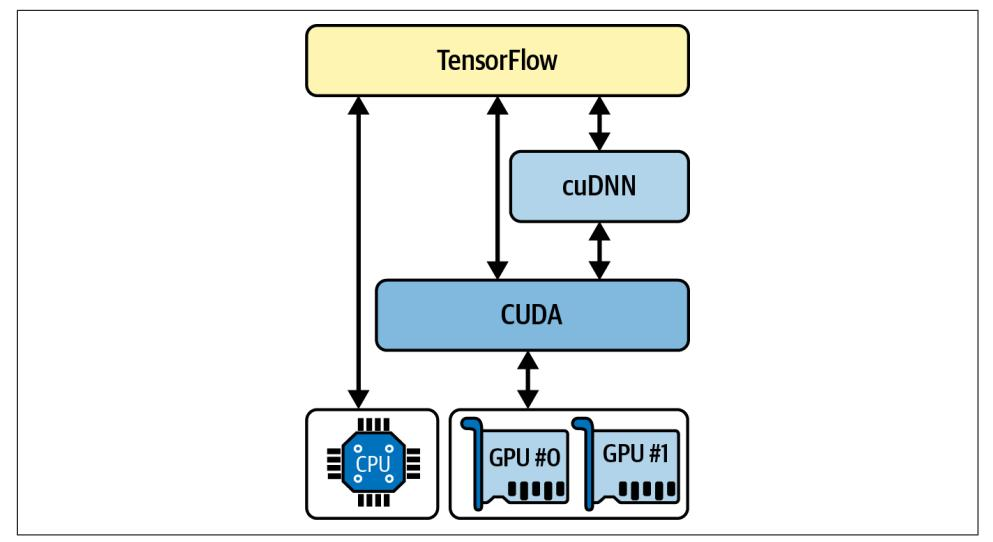

Figure 19-7. TensorFlow uses CUDA and cuDNN to control GPUs and boost DNNs

Once you have installed the GPU card(s) and all the required drivers and libraries, you can use the nvidia-smi command to check that everything is properly installed. This command lists the available GPU cards, as well as all the processes running on each card. In this example, it's an Nvidia Tesla T4 GPU card with about 15 GB of available RAM, and there are no processes currently running on it:

<sup>9</sup> Please check the TensorFlow docs for detailed and up-to-date installation instructions, as they change quite often.

{776}------------------------------------------------

```
$ nvidia-smi
Sun Apr 10 04:52:10 2022
+--------------------------------------
| NVIDIA-SMI 460.32.03                Driver Version: 460.32.03                CUDA Version: 11.2
|------------------------------+--------
.<br>| GPU Name          Persistence-M| Bus-Id          Disp.A | Volatile Uncorr. ECC |
| Fan Temp Perf Pwr:Usage/Cap|       Memory-Usage | GPU-Util Compute M. |<br>|                                 
|---------------------------------+------
| 0 TeslatT4 0ff | 00000000:00:04.0 Off | 0 00000000:00:04.0 Off | 0 0000000:00:04.0 Off | 0 0 0 0 0
|<br>| N/A 34C P8 9W/ 70W | 3MiB/15109MiB | 0% Default |<br>| N/A |
                 Contract Contract
                                     the control of the
                                                       N/A+-------------------------------+------
  . . . . . . . . . . . . . . . . . . . . 
Processes:
                 PID Type Process name
I GPU GI CI
                                                   GPU Memory |
                                               Usage |
   ID ID
|======================================
| No running processes found
+--------------------------------------
```

To check that TensorFlow actually sees your GPU, run the following commands and make sure the result is not empty:

```
>>> physical_gpus = tf.config.list_physical_devices("GPU")
>>> physical qpus
[PhysicalDevice(name='/physical device:GPU:0', device type='GPU')]
```

#### **Managing the GPU RAM**

By default TensorFlow automatically grabs almost all the RAM in all available GPUs the first time you run a computation. It does this to limit GPU RAM fragmentation. This means that if you try to start a second TensorFlow program (or any program that requires the GPU), it will quickly run out of RAM. This does not happen as often as you might think, as you will most often have a single TensorFlow program running on a machine: usually a training script, a TF Serving node, or a Jupyter notebook. If you need to run multiple programs for some reason (e.g., to train two different models in parallel on the same machine), then you will need to split the GPU RAM between these processes more evenly.

{777}------------------------------------------------

If you have multiple GPU cards on your machine, a simple solution is to assign each of them to a single process. To do this, you can set the CUDA VISIBLE DEVICES environment variable so that each process only sees the appropriate GPU card $(s)$ . Also set the CUDA\_DEVICE\_ORDER environment variable to PCI\_BUS\_ID to ensure that each ID always refers to the same GPU card. For example, if you have four GPU cards, you could start two programs, assigning two GPUs to each of them, by executing commands like the following in two separate terminal windows:

```
$ CUDA_DEVICE_ORDER=PCI_BUS_ID CUDA_VISIBLE_DEVICES=0,1 python3 program_1.py
# and in another terminal:
```

```
$ CUDA DEVICE ORDER=PCI BUS ID CUDA VISIBLE DEVICES=3,2 python3 program 2.py
```

Program 1 will then only see GPU cards 0 and 1, named "/qpu:0" and "/qpu:1", respectively, in TensorFlow, and program 2 will only see GPU cards 2 and 3, named "/gpu:1" and "/gpu:0", respectively (note the order). Everything will work fine (see Figure 19-8). Of course, you can also define these environment variables in Python by setting os.environ["CUDA\_DEVICE\_ORDER"] and os.environ["CUDA\_ VISIBLE\_DEVICES"], as long as you do so before using TensorFlow.


Figure 19-8. Each program gets two GPUs

Another option is to tell TensorFlow to grab only a specific amount of GPU RAM. This must be done immediately after importing TensorFlow. For example, to make TensorFlow grab only 2 GiB of RAM on each GPU, you must create a logical GPU device (sometimes called a virtual GPU device) for each physical GPU device and set its memory limit to 2 GiB (i.e., 2,048 MiB):

```
for gpu in physical gpus:
    tf.config.set_logical_device_configuration(
        qpu,
        [tf.config.LogicalDeviceConfiguration(memory_limit=2048)]
    \lambda
```

Let's suppose you have four GPUs, each with at least 4 GiB of RAM: in this case, two programs like this one can run in parallel, each using all four GPU cards (see Figure 19-9). If you run the nvidia-smi command while both programs are running, you should see that each process holds 2 GiB of RAM on each card.

{778}------------------------------------------------


Figure 19-9. Each program gets all four GPUs, but with only 2 GiB of RAM on each **GPU** 

Yet another option is to tell TensorFlow to grab memory only when it needs it. Again, this must be done immediately after importing TensorFlow:

```
for gpu in physical gpus:
    tf.config.experimental.set_memory_growth(gpu, True)
```

Another way to do this is to set the TF\_FORCE\_GPU\_ALLOW\_GROWTH environment variable to true. With this option, TensorFlow will never release memory once it has grabbed it (again, to avoid memory fragmentation), except of course when the program ends. It can be harder to guarantee deterministic behavior using this option (e.g., one program may crash because another program's memory usage went through the roof), so in production you'll probably want to stick with one of the previous options. However, there are some cases where it is very useful: for example, when you use a machine to run multiple Jupyter notebooks, several of which use TensorFlow. The TF FORCE GPU ALLOW GROWTH environment variable is set to true in Colab runtimes.

Lastly, in some cases you may want to split a GPU into two or more *logical devices*. For example, this is useful if you only have one physical GPU—like in a Colab runtime-but you want to test a multi-GPU algorithm. The following code splits GPU #0 into two logical devices, with 2 GiB of RAM each (again, this must be done immediately after importing TensorFlow):

```
tf.config.set_logical_device_configuration(
    physical qpus[0],[tf.config.LogicalDeviceConfiguration(memory_limit=2048),
     tf.config.LogicalDeviceConfiguration(memory_limit=2048)]
\mathcal{L}
```

These two logical devices are called "/ $gpu:0$ " and "/ $gpu:1$ ", and you can use them as if they were two normal GPUs. You can list all logical devices like this:

{779}------------------------------------------------

```
>>> logical_gpus = tf.config.list_logical_devices("GPU")
>>> logical gpus
[LogicalDevice(name='/device:GPU:0', device_type='GPU'),
LogicalDevice(name='/device:GPU:1', device type='GPU')]
```

Now let's see how TensorFlow decides which devices it should use to place variables and execute operations.

### **Placing Operations and Variables on Devices**

Keras and tf.data generally do a good job of placing operations and variables where they belong, but you can also place operations and variables manually on each device, if you want more control:

- You generally want to place the data preprocessing operations on the CPU, and place the neural network operations on the GPUs.
- GPUs usually have a fairly limited communication bandwidth, so it is important to avoid unnecessary data transfers into and out of the GPUs.
- Adding more CPU RAM to a machine is simple and fairly cheap, so there's usually plenty of it, whereas the GPU RAM is baked into the GPU: it is an expensive and thus limited resource, so if a variable is not needed in the next few training steps, it should probably be placed on the CPU (e.g., datasets generally belong on the CPU).

By default, all variables and all operations will be placed on the first GPU (the one named "/qpu:0"), except for variables and operations that don't have a GPU kernel:<sup>10</sup> these are placed on the CPU (always named "/cpu:0"). A tensor or variable's device attribute tells you which device it was placed on:<sup>11</sup>

```
>>> a = tf.Variable([1., 2., 3.]) # float32 variable goes to the GPU
>>> a.device
'/job:localhost/replica:0/task:0/device:GPU:0'
>>> b = tf.Variable([1, 2, 3]) # int32 variable goes to the CPU
>>> b.device
'/job:localhost/replica:0/task:0/device:CPU:0'
```

You can safely ignore the prefix /job: localhost/replica: 0/task: 0 for now; we will discuss jobs, replicas, and tasks later in this chapter. As you can see, the first variable was placed on GPU #0, which is the default device. However, the second variable was

<sup>10</sup> As we saw in Chapter 12, a kernel is an operation's implementation for a specific data type and device type. For example, there is a GPU kernel for the float32 tf.matmul() operation, but there is no GPU kernel for int32 tf.matmul(), only a CPU kernel.

<sup>11</sup> You can also use tf.debugging.set\_log\_device\_placement(True) to log all device placements.

{780}------------------------------------------------

placed on the CPU: this is because there are no GPU kernels for integer variables, or for operations involving integer tensors, so TensorFlow fell back to the CPU.

If you want to place an operation on a different device than the default one, use a tf.device() context:

```
>>> with tf.device("/cpu:0"):
... c = tf.Variable([1., 2., 3.])>>> c.device
'/job:localhost/replica:0/task:0/device:CPU:0'
```


The CPU is always treated as a single device ("/cpu:0"), even if your machine has multiple CPU cores. Any operation placed on the CPU may run in parallel across multiple cores if it has a multithreaded kernel.

If you explicitly try to place an operation or variable on a device that does not exist or for which there is no kernel, then TensorFlow will silently fall back to the device it would have chosen by default. This is useful when you want to be able to run the same code on different machines that don't have the same number of GPUs. However, you can run tf.config.set\_soft\_device\_placement(False) if you prefer to get an exception.

Now, how exactly does TensorFlow execute operations across multiple devices?

### **Parallel Execution Across Multiple Devices**

As we saw in Chapter 12, one of the benefits of using TF functions is parallelism. Let's look at this a bit more closely. When TensorFlow runs a TF function, it starts by analyzing its graph to find the list of operations that need to be evaluated, and it counts how many dependencies each of them has. TensorFlow then adds each operation with zero dependencies (i.e., each source operation) to the evaluation queue of this operation's device (see Figure 19-10). Once an operation has been evaluated, the dependency counter of each operation that depends on it is decremented. Once an operation's dependency counter reaches zero, it is pushed to the evaluation queue of its device. And once all the outputs have been computed, they are returned.

{781}------------------------------------------------


Figure 19-10. Parallelized execution of a TensorFlow graph

Operations in the CPU's evaluation queue are dispatched to a thread pool called the *inter-op thread pool*. If the CPU has multiple cores, then these operations will effectively be evaluated in parallel. Some operations have multithreaded CPU kernels: these kernels split their tasks into multiple suboperations, which are placed in another evaluation queue and dispatched to a second thread pool called the *intra-op* thread pool (shared by all multithreaded CPU kernels). In short, multiple operations and suboperations may be evaluated in parallel on different CPU cores.

For the GPU, things are a bit simpler. Operations in a GPU's evaluation queue are evaluated sequentially. However, most operations have multithreaded GPU kernels, typically implemented by libraries that TensorFlow depends on, such as CUDA and cuDNN. These implementations have their own thread pools, and they typically exploit as many GPU threads as they can (which is the reason why there is no need for an inter-op thread pool in GPUs: each operation already floods most GPU threads).

For example, in Figure 19-10, operations A, B, and C are source ops, so they can immediately be evaluated. Operations A and B are placed on the CPU, so they are sent to the CPU's evaluation queue, then they are dispatched to the inter-op thread pool and immediately evaluated in parallel. Operation A happens to have a multithreaded kernel; its computations are split into three parts, which are executed in parallel by the intra-op thread pool. Operation C goes to GPU  $#0$ 's evaluation queue, and in this example its GPU kernel happens to use cuDNN, which manages its own 

{782}------------------------------------------------

intra-op thread pool and runs the operation across many GPU threads in parallel. Suppose C finishes first. The dependency counters of D and E are decremented and they reach 0, so both operations are pushed to GPU #0's evaluation queue, and they are executed sequentially. Note that C only gets evaluated once, even though both D and E depend on it. Suppose B finishes next. Then F's dependency counter is decremented from 4 to 3, and since that's not 0, it does not run yet. Once A, D, and E are finished, then F's dependency counter reaches 0, and it is pushed to the CPU's evaluation queue and evaluated. Finally, TensorFlow returns the requested outputs.

An extra bit of magic that TensorFlow performs is when the TF function modifies a stateful resource, such as a variable: it ensures that the order of execution matches the order in the code, even if there is no explicit dependency between the statements. For example, if your TF function contains v.assign\_add(1) followed by v.assign(v \* 2), TensorFlow will ensure that these operations are executed in that order.


You can control the number of threads in the inter-op thread pool by calling tf.config.threading.set\_inter\_op\_parallel ism\_threads(). To set the number of intra-op threads, use tf.config.threading.set intra op parallelism threads(). This is useful if you do not want TensorFlow to use all the CPU cores or if you want it to be single-threaded.<sup>12</sup>

With that, you have all you need to run any operation on any device, and exploit the power of your GPUs! Here are some of the things you could do:

- · You could train several models in parallel, each on its own GPU: just write a training script for each model and run them in parallel, setting CUDA\_DEVICE\_ORDER and CUDA\_VISIBLE\_DEVICES so that each script only sees a single GPU device. This is great for hyperparameter tuning, as you can train in parallel multiple models with different hyperparameters. If you have a single machine with two GPUs, and it takes one hour to train one model on one GPU, then training two models in parallel, each on its own dedicated GPU, will take just one hour. Simple!
- You could train a model on a single GPU and perform all the preprocessing in parallel on the CPU, using the dataset's prefetch() method<sup>13</sup> to prepare the next few batches in advance so that they are ready when the GPU needs them (see Chapter 13).

<sup>12</sup> This can be useful if you want to guarantee perfect reproducibility, as I explain in this video, based on TF 1.

<sup>13</sup> At the time of writing, it only prefetches the data to the CPU RAM, but use tf.data.experimental.prefetch to device() to make it prefetch the data and push it to the device of your choice so that the GPU does not waste time waiting for the data to be transferred.

{783}------------------------------------------------

- If your model takes two images as input and processes them using two CNNs before joining their outputs,<sup>14</sup> then it will probably run much faster if you place each CNN on a different GPU.
- You can create an efficient ensemble: just place a different trained model on each GPU so that you can get all the predictions much faster to produce the ensemble's final prediction.

But what if you want to speed up training by using multiple GPUs?

### **Training Models Across Multiple Devices**

There are two main approaches to training a single model across multiple devices: *model parallelism*, where the model is split across the devices, and *data parallelism*, where the model is replicated across every device, and each replica is trained on a different subset of the data. Let's look at these two options.

#### **Model Parallelism**

So far we have trained each neural network on a single device. What if we want to train a single neural network across multiple devices? This requires chopping the model into separate chunks and running each chunk on a different device. Unfortunately, such model parallelism turns out to be pretty tricky, and its effectiveness really depends on the architecture of your neural network. For fully connected networks, there is generally not much to be gained from this approach (see Figure 19-11). Intuitively, it may seem that an easy way to split the model is to place each layer on a different device, but this does not work because each layer needs to wait for the output of the previous layer before it can do anything. So perhaps you can slice it vertically—for example, with the left half of each layer on one device, and the right part on another device? This is slightly better, since both halves of each layer can indeed work in parallel, but the problem is that each half of the next layer requires the output of both halves, so there will be a lot of cross-device communication (represented by the dashed arrows). This is likely to completely cancel out the benefit of the parallel computation, since cross-device communication is slow (and even more so when the devices are located on different machines).

<sup>14</sup> If the two CNNs are identical, then it is called a Siamese neural network.

{784}------------------------------------------------


Figure 19-11. Splitting a fully connected neural network

Some neural network architectures, such as convolutional neural networks (see Chapter 14), contain layers that are only partially connected to the lower layers, so it is much easier to distribute chunks across devices in an efficient way (Figure 19-12).


Figure 19-12. Splitting a partially connected neural network

{785}------------------------------------------------

Deep recurrent neural networks (see Chapter 15) can be split a bit more efficiently across multiple GPUs. If you split the network horizontally by placing each layer on a different device, and feed the network with an input sequence to process, then at the first time step only one device will be active (working on the sequence's first value), at the second step two will be active (the second layer will be handling the output of the first layer for the first value, while the first layer will be handling the second value), and by the time the signal propagates to the output layer, all devices will be active simultaneously (Figure 19-13). There is still a lot of cross-device communication going on, but since each cell may be fairly complex, the benefit of running multiple cells in parallel may (in theory) outweigh the communication penalty. However, in practice a regular stack of LSTM layers running on a single GPU actually runs much faster.


Figure 19-13. Splitting a deep recurrent neural network

In short, model parallelism may speed up running or training some types of neural networks, but not all, and it requires special care and tuning, such as making sure that devices that need to communicate the most run on the same machine.<sup>15</sup> Next we'll look at a much simpler and generally more efficient option: data parallelism.

<sup>15</sup> If you are interested in going further with model parallelism, check out Mesh TensorFlow.

{786}------------------------------------------------

### Data Parallelism

Another way to parallelize the training of a neural network is to replicate it on every device and run each training step simultaneously on all replicas, using a different mini-batch for each. The gradients computed by each replica are then averaged, and the result is used to update the model parameters. This is called *data parallelism*, or sometimes single program, multiple data (SPMD). There are many variants of this idea, so let's look at the most important ones.

#### Data parallelism using the mirrored strategy

Arguably the simplest approach is to completely mirror all the model parameters across all the GPUs and always apply the exact same parameter updates on every GPU. This way, all replicas always remain perfectly identical. This is called the mirrored strategy, and it turns out to be quite efficient, especially when using a single machine (see Figure 19-14).

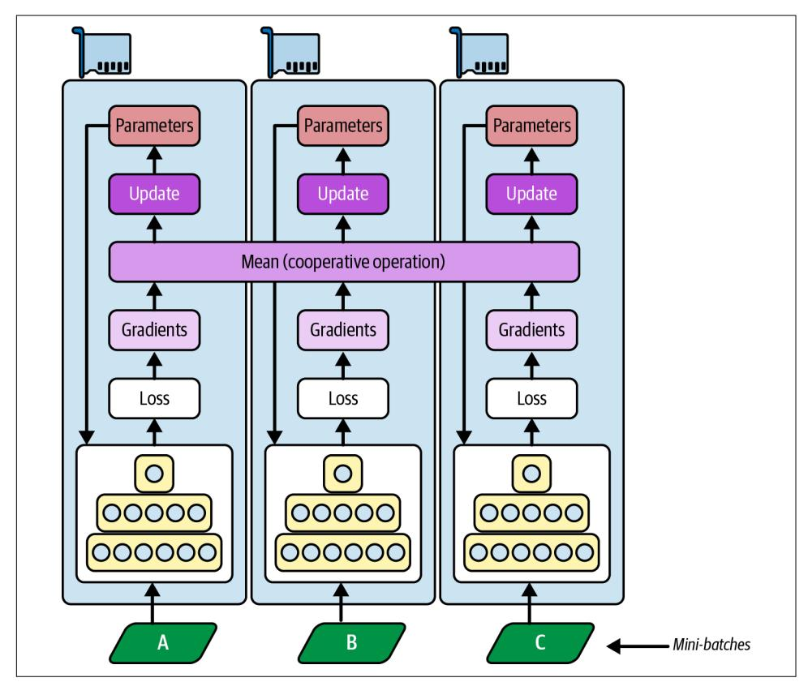

Figure 19-14. Data parallelism using the mirrored strategy

{787}------------------------------------------------

The tricky part when using this approach is to efficiently compute the mean of all the gradients from all the GPUs and distribute the result across all the GPUs. This can be done using an AllReduce algorithm, a class of algorithms where multiple nodes collaborate to efficiently perform a *reduce operation* (such as computing the mean, sum, and max), while ensuring that all nodes obtain the same final result. Fortunately, there are off-the-shelf implementations of such algorithms, as you will see.

#### Data parallelism with centralized parameters

Another approach is to store the model parameters outside of the GPU devices performing the computations (called *workers*); for example, on the CPU (see Figure 19-15). In a distributed setup, you may place all the parameters on one or more CPU-only servers called *parameter servers*, whose only role is to host and update the parameters.


Figure 19-15. Data parallelism with centralized parameters

Whereas the mirrored strategy imposes synchronous weight updates across all GPUs, this centralized approach allows either synchronous or asynchronous updates. Let's take a look at the pros and cons of both options.

{788}------------------------------------------------

**Synchronous updates.** With *synchronous updates*, the aggregator waits until all gradients are available before it computes the average gradients and passes them to the optimizer, which will update the model parameters. Once a replica has finished computing its gradients, it must wait for the parameters to be updated before it can proceed to the next mini-batch. The downside is that some devices may be slower than others, so the fast devices will have to wait for the slow ones at every step, making the whole process as slow as the slowest device. Moreover, the parameters will be copied to every device almost at the same time (immediately after the gradients are applied), which may saturate the parameter servers' bandwidth.


To reduce the waiting time at each step, you could ignore the gradients from the slowest few replicas (typically  $\sim$ 10%). For example, you could run 20 replicas, but only aggregate the gradients from the fastest 18 replicas at each step, and just ignore the gradients from the last 2. As soon as the parameters are updated, the first 18 replicas can start working again immediately, without having to wait for the 2 slowest replicas. This setup is generally described as having 18 replicas plus 2 spare replicas.<sup>16</sup>

Asynchronous updates. With asynchronous updates, whenever a replica has finished computing the gradients, the gradients are immediately used to update the model parameters. There is no aggregation (it removes the "mean" step in Figure 19-15) and no synchronization. Replicas work independently of the other replicas. Since there is no waiting for the other replicas, this approach runs more training steps per minute. Moreover, although the parameters still need to be copied to every device at every step, this happens at different times for each replica, so the risk of bandwidth saturation is reduced.

Data parallelism with asynchronous updates is an attractive choice because of its simplicity, the absence of synchronization delay, and its better use of the bandwidth. However, although it works reasonably well in practice, it is almost surprising that it works at all! Indeed, by the time a replica has finished computing the gradients based on some parameter values, these parameters will have been updated several times by other replicas (on average  $N - 1$  times, if there are N replicas), and there is no guarantee that the computed gradients will still be pointing in the right direction (see Figure 19-16). When gradients are severely out of date, they are called *stale* gradients: they can slow down convergence, introducing noise and wobble effects

<sup>16</sup> This name is slightly confusing because it sounds like some replicas are special, doing nothing. In reality, all replicas are equivalent: they all work hard to be among the fastest at each training step, and the losers vary at every step (unless some devices are really slower than others). However, it does mean that if one or two servers crash, training will continue just fine.

{789}------------------------------------------------

(the learning curve may contain temporary oscillations), or they can even make the training algorithm diverge.

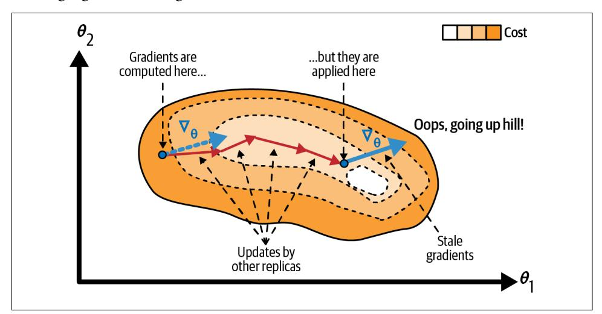

Figure 19-16. Stale gradients when using asynchronous updates

There are a few ways you can reduce the effect of stale gradients:

- Reduce the learning rate.
- Drop stale gradients or scale them down.
- Adjust the mini-batch size.
- Start the first few epochs using just one replica (this is called the *warmup phase*). Stale gradients tend to be more damaging at the beginning of training, when gradients are typically large and the parameters have not settled into a valley of the cost function yet, so different replicas may push the parameters in quite different directions.

A paper published by the Google Brain team in 2016<sup>17</sup> benchmarked various approaches and found that using synchronous updates with a few spare replicas was more efficient than using asynchronous updates, not only converging faster but also producing a better model. However, this is still an active area of research, so you should not rule out asynchronous updates just yet.

<sup>17</sup> Jianmin Chen et al., "Revisiting Distributed Synchronous SGD", arXiv preprint arXiv:1604.00981 (2016).

{790}------------------------------------------------

#### **Bandwidth saturation**

Whether you use synchronous or asynchronous updates, data parallelism with centralized parameters still requires communicating the model parameters from the parameter servers to every replica at the beginning of each training step, and the gradients in the other direction at the end of each training step. Similarly, when using the mirrored strategy, the gradients produced by each GPU will need to be shared with every other GPU. Unfortunately, there often comes a point where adding an extra GPU will not improve performance at all because the time spent moving the data into and out of GPU RAM (and across the network in a distributed setup) will outweigh the speedup obtained by splitting the computation load. At that point, adding more GPUs will just worsen the bandwidth saturation and actually slow down training.

Saturation is more severe for large dense models, since they have a lot of parameters and gradients to transfer. It is less severe for small models (but the parallelization gain is limited) and for large sparse models, where the gradients are typically mostly zeros and so can be communicated efficiently. Jeff Dean, initiator and lead of the Google Brain project, reported typical speedups of 25-40x when distributing computations across 50 GPUs for dense models, and a 300x speedup for sparser models trained across 500 GPUs. As you can see, sparse models really do scale better. Here are a few concrete examples:

- Neural machine translation: 6x speedup on 8 GPUs
- Inception/ImageNet: 32× speedup on 50 GPUs
- RankBrain: 300× speedup on 500 GPUs

There is plenty of research going on to alleviate the bandwidth saturation issue, with the goal of allowing training to scale linearly with the number of GPUs available. For example, a 2018 paper<sup>18</sup> by a team of researchers from Carnegie Mellon University, Stanford University, and Microsoft Research proposed a system called PipeDream that managed to reduce network communications by over 90%, making it possible to train large models across many machines. They achieved this using a new technique called *pipeline parallelism*, which combines model parallelism and data parallelism: the model is chopped into consecutive parts, called *stages*, each of which is trained on a different machine. This results in an asynchronous pipeline in which all machines work in parallel with very little idle time. During training, each stage alternates one round of forward propagation and one round of backpropagation (see Figure 19-17): it pulls a mini-batch from its input queue, processes it, and sends the outputs to the next stage's input queue, then it pulls one mini-batch of gradients from its gradient

<sup>18</sup> Aaron Harlap et al., "PipeDream: Fast and Efficient Pipeline Parallel DNN Training", arXiv preprint arXiv:1806.03377 (2018).

{791}------------------------------------------------

queue, backpropagates these gradients and updates its own model parameters, and pushes the backpropagated gradients to the previous stage's gradient queue. It then repeats the whole process again and again. Each stage can also use regular data parallelism (e.g., using the mirrored strategy), independently from the other stages.


Figure 19-17. PipeDream's pipeline parallelism

However, as it's presented here, PipeDream would not work so well. To understand why, consider mini-batch #5 in Figure 19-17: when it went through stage 1 during the forward pass, the gradients from mini-batch #4 had not yet been backpropagated through that stage, but by the time  $#5$ 's gradients flow back to stage 1,  $#4$ 's gradients will have been used to update the model parameters, so #5's gradients will be a bit stale. As we have seen, this can degrade training speed and accuracy, and even make it diverge: the more stages there are, the worse this problem becomes. The paper's authors proposed methods to mitigate this issue, though: for example, each stage saves weights during forward propagation and restores them during backpropagation, to ensure that the same weights are used for both the forward pass and the backward pass. This is called *weight stashing*. Thanks to this, PipeDream demonstrates impressive scaling capability, well beyond simple data parallelism.

The latest breakthrough in this field of research was published in a 2022 paper<sup>19</sup> by Google researchers: they developed a system called Pathways that uses automated model parallelism, asynchronous gang scheduling, and other techniques to reach close to 100% hardware utilization across thousands of TPUs! Scheduling means organizing when and where each task must run, and gang scheduling means running related tasks at the same time in parallel and close to each other to reduce the time tasks have to wait for the others' outputs. As we saw in Chapter 16, this system was used to train a massive language model across over 6,000 TPUs, with close to 100% hardware utilization: that's a mindblowing engineering feat.

At the time of writing, Pathways is not public yet, but it's likely that in the near future you will be able to train huge models on Vertex AI using Pathways or a similar system. In the meantime, to reduce the saturation problem, you'll probably want to use a few powerful GPUs rather than plenty of weak GPUs, and if you need to train a model across multiple servers, you should group your GPUs on few and

<sup>19</sup> Paul Barham et al., "Pathways: Asynchronous Distributed Dataflow for ML", arXiv preprint arXiv:2203.12533  $(2022).$ 

{792}------------------------------------------------

very well interconnected servers. You can also try dropping the float precision from 32 bits (tf.float32) to 16 bits (tf.bfloat16). This will cut in half the amount of data to transfer, often without much impact on the convergence rate or the model's performance. Lastly, if you are using centralized parameters, you can shard (split) the parameters across multiple parameter servers: adding more parameter servers will reduce the network load on each server and limit the risk of bandwidth saturation.

OK, now that we've gone through all the theory, let's actually train a model across multiple GPUs!

### **Training at Scale Using the Distribution Strategies API**

Luckily, TensorFlow comes with a very nice API that takes care of all the complexity of distributing your model across multiple devices and machines: the *distribution* strategies API. To train a Keras model across all available GPUs (on a single machine, for now) using data parallelism with the mirrored strategy, just create a Mirrored Strategy object, call its scope() method to get a distribution context, and wrap the creation and compilation of your model inside that context. Then call the model's fit() method normally:

```
strategy = tf.distribute.MirroredStrategy()with strategy.scope():
   model = tf.keras.Sequential([...]) # create a Keras model normally
   model.compile([...]) # compile the model normally
batch size = 100 # preferably divisible by the number of replicas
model.fit(X_train, y_train, epochs=10,
          validation data=(X valid, y valid), batch size=batch size)
```

Under the hood, Keras is distribution-aware, so in this MirroredStrategy context it knows that it must replicate all variables and operations across all available GPU devices. If you look at the model's weights, they are of type MirroredVariable:

```
>>> type(model.weights[0])
tensorflow.python.distribute.values.MirroredVariable
```

Note that the fit() method will automatically split each training batch across all the replicas, so it's preferable to ensure that the batch size is divisible by the number of replicas (i.e., the number of available GPUs) so that all replicas get batches of the same size. And that's all! Training will generally be significantly faster than using a single device, and the code change was really minimal.

{793}------------------------------------------------

Once you have finished training your model, you can use it to make predictions efficiently: call the predict() method, and it will automatically split the batch across all replicas, making predictions in parallel. Again, the batch size must be divisible by the number of replicas. If you call the model's save() method, it will be saved as a regular model, not as a mirrored model with multiple replicas. So when you load it, it will run like a regular model, on a single device: by default on GPU #0, or on the CPU if there are no GPUs. If you want to load a model and run it on all available devices, you must call tf.keras.models.load\_model() within a distribution context:

```
with strategy.scope():
    model = tf.keras.models.load model("my mirrored model")
```

If you only want to use a subset of all the available GPU devices, you can pass the list to the MirroredStrategy's constructor:

```
strategy = tf.distribute.MirroredStrategy(devices=["/gpu:0", "/gpu:1"])
```

By default, the MirroredStrategy class uses the NVIDIA Collective Communications Library (NCCL) for the AllReduce mean operation, but you can change it by setting the cross\_device\_ops argument to an instance of the tf.distribute.Hierarchical CopyAllReduce class, or an instance of the tf.distribute.ReductionToOneDevice class. The default NCCL option is based on the tf.distribute. NcclAllReduce class, which is usually faster, but this depends on the number and types of GPUs, so you may want to give the alternatives a try.<sup>20</sup>

If you want to try using data parallelism with centralized parameters, replace the MirroredStrategy with the CentralStorageStrategy:

```
strategy = tf.distribute.experimental.CentralStorageStrategy()
```

You can optionally set the compute\_devices argument to specify the list of devices you want to use as workers—by default it will use all available GPUs—and you can optionally set the parameter\_device argument to specify the device you want to store the parameters on. By default it will use the CPU, or the GPU if there is just one.

Now let's see how to train a model across a cluster of TensorFlow servers!

### **Training a Model on a TensorFlow Cluster**

A TensorFlow cluster is a group of TensorFlow processes running in parallel, usually on different machines, and talking to each other to complete some work—for example, training or executing a neural network model. Each TF process in the cluster is called a task, or a TF server. It has an IP address, a port, and a type (also called its

<sup>20</sup> For more details on AllReduce algorithms, read Yuichiro Ueno's post on the technologies behind deep learning and Sylvain Jeaugey's post on massively scaling deep learning training with NCCL.

{794}------------------------------------------------

*role* or its *job*). The type can be either "worker", "chief", "ps" (parameter server), or "evaluator":

- Each *worker* performs computations, usually on a machine with one or more GPU<sub>s</sub>
- The *chief* performs computations as well (it is a worker), but it also handles extra work such as writing TensorBoard logs or saving checkpoints. There is a single chief in a cluster. If no chief is specified explicitly, then by convention the first worker is the chief.
- A parameter server only keeps track of variable values, and it is usually on a CPUonly machine. This type of task is only used with the ParameterServerStrategy.
- An evaluator obviously takes care of evaluation. This type is not used often, and when it's used, there's usually just one evaluator.

To start a TensorFlow cluster, you must first define its specification. This means defining each task's IP address, TCP port, and type. For example, the following *cluster* specification defines a cluster with three tasks (two workers and one parameter server; see Figure 19-18). The cluster spec is a dictionary with one key per job, and the values are lists of task addresses (IP:port):

```
cluster spec = \{"worker": [
        "machine-a.example.com:2222".
                                        # /job:worker/task:0
        "machine-b.example.com:2222"
                                         # /job:worker/task:1
    1,
    "ps": ["machine-a.example.com:2221"] # /job:ps/task:0
\mathcal{F}
```

In general there will be a single task per machine, but as this example shows, you can configure multiple tasks on the same machine if you want. In this case, if they share the same GPUs, make sure the RAM is split appropriately, as discussed earlier.


By default, every task in the cluster may communicate with every other task, so make sure to configure your firewall to authorize all communications between these machines on these ports (it's usually simpler if you use the same port on every machine).

{795}------------------------------------------------


Figure 19-18. An example TensorFlow cluster

When you start a task, you must give it the cluster spec, and you must also tell it what its type and index are (e.g., worker #0). The simplest way to specify everything at once (both the cluster spec and the current task's type and index) is to set the TF\_CONFIG environment variable before starting TensorFlow. It must be a [SON-encoded dictionary containing a cluster specification (under the "cluster" key) and the type and index of the current task (under the "task" key). For example, the following TF\_CONFIG environment variable uses the cluster we just defined and specifies that the task to start is worker #0:

```
\cos .environ["TF_CONFIG"] = json.dumps({
    "cluster": cluster_spec,
    "task": {"type": "worker", "index": 0}
\}
```


In general you want to define the TF\_CONFIG environment variable outside of Python, so the code does not need to include the current task's type and index (this makes it possible to use the same code across all workers).

Now let's train a model on a cluster! We will start with the mirrored strategy. First, you need to set the TF\_CONFIG environment variable appropriately for each task. There should be no parameter server (remove the "ps" key in the cluster spec), and in general you will want a single worker per machine. Make extra sure you set a different task index for each task. Finally, run the following script on every worker:

{796}------------------------------------------------

```
import tempfile
import tensorflow as tf
strategy = tf.distribute.MultiplyOrkerMirroredStrategy() # at the start!
resolver = tf.distribute.cluster resolver.TFConfigClusterResolver()
print(f"Starting task {resolver.task_type} #{resolver.task_id}")
[...] # load and split the MNIST dataset
with strategy.scope():
    model = tf.keras.Sequential([...]) # build the Keras model
    model.compile([-..]) # compile the model
model.fit(X_train, y_train, validation_data=(X_valid, y_valid), epochs=10)
if resolver.task id == 0: # the chief saves the model to the right location
    model.save("my_mnist_multiworker_model", save_format="tf")
else:
    tmpdir = tempfile.mkdtemp() # other workers save to a temporary directory
    model.save(tmpdir, save format="tf")
    tf.io.getile.rntree(tmpdir) # and we can delete this directory at the end!
```

That's almost the same code you used earlier, except this time you are using the MultiWorkerMirroredStrategy. When you start this script on the first workers, they will remain blocked at the AllReduce step, but training will begin as soon as the last worker starts up, and you will see them all advancing at exactly the same rate since they synchronize at each step.


When using the MultiWorkerMirroredStrategy, it's important to ensure that all workers do the same thing, including saving model checkpoints or writing TensorBoard logs, even though you will only keep what the chief writes. This is because these operations may need to run the AllReduce operations, so all workers must be in sync.

There are two AllReduce implementations for this distribution strategy: a ring All-Reduce algorithm based on gRPC for the network communications, and NCCL's implementation. The best algorithm to use depends on the number of workers, the number and types of GPUs, and the network. By default, TensorFlow will apply some heuristics to select the right algorithm for you, but you can force NCCL (or RING) like this:

```
strategy = tf.distribute.MultiWorkerMirroredStrategy(
   communication_options=tf.distribute.experimental.CommunicationOptions(
       implementation=tf.distribute.experimental.CollectiveCommunication.NCCL))
```

{797}------------------------------------------------

If you prefer to implement asynchronous data parallelism with parameter servers, change the strategy to ParameterServerStrategy, add one or more parameter servers, and configure TF\_CONFIG appropriately for each task. Note that although the workers will work asynchronously, the replicas on each worker will work synchronously.

Lastly, if you have access to TPUs on Google Cloud—for example, if you use Colab and you set the accelerator type to TPU-then you can create a TPUStrategy like this:

```
resolver = tf.distribute.cluster_resolver.TPUClusterResolver()
tf.tpu.experimental.initialize tpu system(resolver)
strategy = tf.distribute.experimental.TPUStrategy(resolver)
```

This needs to be run right after importing TensorFlow. You can then use this strategy normally.


If you are a researcher, you may be eligible to use TPUs for free; see https://tensorflow.org/tfrc for more details.

You can now train models across multiple GPUs and multiple servers: give yourself a pat on the back! If you want to train a very large model, however, you will need many GPUs, across many servers, which will require either buying a lot of hardware or managing a lot of cloud virtual machines. In many cases, it's less hassle and less expensive to use a cloud service that takes care of provisioning and managing all this infrastructure for you, just when you need it. Let's see how to do that using Vertex AI.

### **Running Large Training Jobs on Vertex AI**

Vertex AI allows you to create custom training jobs with your own training code. In fact, you can use almost the same training code as you would use on your own TF cluster. The main thing you must change is where the chief should save the model, the checkpoints, and the TensorBoard logs. Instead of saving the model to a local directory, the chief must save it to GCS, using the path provided by Vertex AI in the AIP\_MODEL\_DIR environment variable. For the model checkpoints and TensorBoard logs, you should use the paths contained in the AIP\_CHECKPOINT\_DIR and AIP\_TENSORBOARD\_LOG\_DIR environment variables, respectively. Of course, you must also make sure that the training data can be accessed from the virtual machines, such as on GCS, or another GCP service like BigQuery, or directly from the web. Lastly, Vertex AI sets the "chief" task type explicitly, so you should identify the chief using resolved.task\_type == "chief" instead of resolved.task\_id ==  $0$ :

{798}------------------------------------------------

```
import os
\left[\ldots\right] # other imports, create MultiWorkerMirroredStrategy, and resolver
if resolver.test type == "chief":
    model dir = os.getenv("AIP MODEL DIR") # paths provided by Vertex AItensorboard_log_dir = os.getenv("AIP_TENSORBOARD_LOG_DIR")
    checkpoint_dir = os.getenv("AIP_CHECKPOINT_DIR")
else:
    tmp dir = Path(template.mkdtemp()) # other workers use temporary dirs
    model dir = tmp dir / "model"tensorboard_log_dir = tmp_dir / "logs"checkpoint dir = tmp dir / "ckpt"
calb is alleaks = [tf.keras.callbacks.TensorBoard(tensorboard, log dir),tf.keras.callbacks.ModelCheckpoint(checkpoint dir)]
[...] # build and compile using the strategy scope, just like earlier
model.fit(X_train, y_train, validation_data=(X_valid, y_valid), epochs=10,
          callbacks=callbacks)
model.save(model dir, save format="tf")
```


If you place the training data on GCS, you can create a tf.data.TextLineDataset or tf.data.TFRecordDataset to access it: just use the GCS paths as the filenames (e.g., gs://my\_bucket/ data/001.csv). These datasets rely on the tf.io.gfile package to access files: it supports both local files and GCS files.

Now you can create a custom training job on Vertex AI, based on this script. You'll need to specify the job name, the path to your training script, the Docker image to use for training, the one to use for predictions (after training), any additional Python libraries you may need, and lastly the bucket that Vertex AI should use as a staging directory to store the training script. By default, that's also where the training script will save the trained model, as well as the TensorBoard logs and model checkpoints (if any). Let's create the job:

```
\text{custom training job} = \text{aiplatform}.\text{CustomerTrainingJob}display_name="my_custom_training_job",
    script path="my vertex ai training task.py",
    container_uri="gcr.io/cloud-aiplatform/training/tf-gpu.2-4:latest",
    model_serving_container_image_uri=server_image,
    requirements=["gcsfs==2022.3.0"], # not needed, this is just an example
    staging_bucket=f"gs://{bucket_name}/staging"
\lambda
```

{799}------------------------------------------------

And now let's run it on two workers, each with two GPUs:

```
mist model2 = custom training job.run(machine_type="n1-standard-4".
    replica_count=2,
    accelerator type="NVIDIA TESLA K80",
    accelerator_count=2,
\lambda
```

And that's it: Vertex AI will provision the compute nodes you requested (within your quotas), and it will run your training script across them. Once the job is complete, the run() method will return a trained model that you can use exactly like the one you created earlier: you can deploy it to an endpoint, or use it to make batch predictions. If anything goes wrong during training, you can view the logs in the GCP console: in the  $\equiv$  navigation menu, select Vertex AI  $\rightarrow$  Training, click on your training job, and click VIEW LOGS. Alternatively, you can click the CUSTOM JOBS tab and copy the job's ID (e.g., 1234), then select Logging from the  $\equiv$  navigation menu and query resource.labels.job\_id=1234.


To visualize the training progress, just start TensorBoard and point its --logdir to the GCS path of the logs. It will use application default credentials, which you can set up using gcloud auth application-default login. Vertex AI also offers hosted Tensor-Board servers if you prefer.

If you want to try out a few hyperparameter values, one option is to run multiple jobs. You can pass the hyperparameter values to your script as command-line arguments by setting the args parameter when calling the run() method, or you can pass them as environment variables using the environment\_variables parameter.

However, if you want to run a large hyperparameter tuning job on the cloud, a much better option is to use Vertex AI's hyperparameter tuning service. Let's see how.

### **Hyperparameter Tuning on Vertex Al**

Vertex AI's hyperparameter tuning service is based on a Bayesian optimization algorithm, capable of quickly finding optimal combinations of hyperparameters. To use it, you first need to create a training script that accepts hyperparameter values as command-line arguments. For example, your script could use the argparse standard library like this:

{800}------------------------------------------------

```
import argparse
parser = argparse.ArgumentParser()parser.add argument("--n hidden", type=int, default=2)
parser.add argument("--n neurons", type=int, default=256)
parser.add_argument("--learning_rate", type=float, default=1e-2)
parser.add_argument("--optimizer", default="adam")
args = parser.parse_{args()
```

The hyperparameter tuning service will call your script multiple times, each time with different hyperparameter values: each run is called a *trial*, and the set of trials is called a *study*. Your training script must then use the given hyperparameter values to build and compile a model. You can use a mirrored distribution strategy if you want, in case each trial runs on a multi-GPU machine. Then the script can load the dataset and train the model. For example:

```
import tensorflow as tf
def build model(args):
    with tf.distribute.MirroredStrategy().scope():
        model = tf.keras.Sequential()model.add(tf.keras.layers.Flatten(input shape=[28, 28], dtype=tf.uint8))
        for \_ in range(args.n\_hidden):
            model.add(tf.keras.layers.Dense(args.n neurons, activation="relu"))
        model.add(tf.keras.layers.Dense(10, activation="softmax"))
        opt = tf.keras.optimizers.get(args.optimizer)
        opt.lengthing rate = args. learning rate
        model.compile(loss="sparse_categorical_crossentropy", optimizer=opt,
                      metrics = ['accuracy"]return model
```

```
\left[\ldots\right] # load the dataset
model = build_model(args)history = model.fit([...])
```


You can use the AIP\_\* environment variables we mentioned earlier to determine where to save the checkpoints, the TensorBoard logs, and the final model.

Lastly, the script must report the model's performance back to Vertex AI's hyperparameter tuning service, so it can decide which hyperparameters to try next. For this, you must use the hypertune library, which is automatically installed on Vertex AI training VMs:

{801}------------------------------------------------

```
import hypertune
hypertune = hypertune.HyperTune()
hypertune.report hyperparameter tuning metric(
   hyperparameter_metric_tag="accuracy", # name of the reported metric
   metric_value=max(history.history["val_accuracy"]), # metric value
   global_step=model.optimizer.iterations.numpy(),
\lambda
```

Now that your training script is ready, you need to define the type of machine you would like to run it on. For this, you must define a custom job, which Vertex AI will use as a template for each trial:

```
trial_job = aiplatform.CustomJob.from_local_script(
   display_name="my_search_trial_job",
   script_path="my_vertex_ai_trial.py", # path to your training script
   container_uri="gcr.io/cloud-aiplatform/training/tf-gpu.2-4:latest",
   staging bucket=f"gs://{bucket name}/staging",
   accelerator_type="NVIDIA_TESLA_K80",
   accelerator_count=2, # in this example, each trial will have 2 GPUs
\lambda
```

Finally, you're ready to create and run the hyperparameter tuning job:

```
from google.cloud.aiplatform import hyperparameter_tuning as hpt
```

```
hp_job = aiplatform.HyperparameterTuningJob(
   display_name="my_hp_search_job",
   custom_job=trial_job,
   metric spec={"accuracy": "maximize"},
   parameter spec={
       "learning_rate": hpt.DoubleParameterSpec(min=1e-3, max=10, scale="log"),
       "n_neurons": hpt.IntegerParameterSpec(min=1, max=300, scale="linear"),
       "n_hidden": hpt. IntegerParameterSpec(min=1, max=10, scale="linear"),
       "optimizer": hpt.CategoricalParameterSpec(["sgd", "adam"]),
   },
   max_trial_count=100,
   parallel trial count=20,
\lambdahp job.run()
```

Here, we tell Vertex AI to maximize the metric named "accuracy": this name must match the name of the metric reported by the training script. We also define the search space, using a log scale for the learning rate and a linear (i.e., uniform) scale for the other hyperparameters. The hyperparameter names must match the command-line arguments of the training script. Then we set the maximum number of trials to 100, and the maximum number of trials running in parallel to 20. If you increase the number of parallel trials to (say) 60, the total search time will be reduced significantly, by a factor of up to 3. But the first 60 trials will be started in parallel, so they will not benefit from the other trials' feedback. Therefore, you should increase the max number of trials to compensate—for example, up to about 140.

{802}------------------------------------------------

This will take quite a while. Once the job is completed, you can fetch the trial results using hp job.trials. Each trial result is represented as a protobuf object, containing the hyperparameter values and the resulting metrics. Let's find the best trial:

```
def get_final_metric(trial, metric_id):
   for metric in trial.final measurement.metrics:
       if metric.metric id == metric id:
           return metric.value
trials = hp job. trialstrial accuracies = [get final metric(trial, "accuracy") for trial in trials]
best trial = trials(np.argvax(train)
```

Now let's look at this trial's accuracy, and its hyperparameter values:

```
>>> max(trial accuracies)
0.977400004863739
>>> best_trial.id
'98'>>> best_trial.parameters
[parameter_id: "learning_rate" value { number_value: 0.001 },
 parameter id: "n hidden" value { number value: 8.0 },
parameter_id: "n_neurons" value { number_value: 216.0 },
parameter_id: "optimizer" value { string_value: "adam" }
1
```

That's it! Now you can get this trial's SavedModel, optionally train it a bit more, and deploy it to production.


Vertex AI also includes an AutoML service, which completely takes care of finding the right model architecture and training it for you. All you need to do is upload your dataset to Vertex AI using a special format that depends on the type of dataset (images, text, tabular, video, etc.), then create an AutoML training job, pointing to the dataset and specifying the maximum number of compute hours you're willing to spend. See the notebook for an example.

### **Hyperparameter Tuning Using Keras Tuner on Vertex AI**

Instead of using Vertex AI's hyperparameter tuning service, you can use Keras Tuner (introduced in Chapter 10) and run it on Vertex AI VMs. Keras Tuner provides a simple way to scale hyperparameter search by distributing it across multiple machines: it only requires setting three environment variables on each machine, then running your regular Keras Tuner code on each machine. You can use the exact same script on all machines. One of the machines acts as the chief (i.e., the oracle), and the others act as workers. Each worker asks the chief which hyperparameter values to try, then the worker trains the model using these hyperparameter values, and finally it reports the

{803}------------------------------------------------

model's performance back to the chief, which can then decide which hyperparameter values the worker should try next.

The three environment variables you need to set on each machine are:

```
KERASTUNER TUNER ID
```

This is equal to "chief" on the chief machine, or a unique identifier on each worker machine, such as "worker0", "worker1", etc.

```
KERASTUNER_ORACLE_IP
```

This is the IP address or hostname of the chief machine. The chief itself should generally use "0.0.0.0" to listen on every IP address on the machine.

```
KERASTUNER_ORACLE_PORT
```

This is the TCP port that the chief will be listening on.

You can distribute Keras Tuner across any set of machines. If you want to run it on Vertex AI machines, then you can spawn a regular training job, and just modify the training script to set the environment variables properly before using Keras Tuner. See the notebook for an example.

Now you have all the tools and knowledge you need to create state-of-the-art neural net architectures and train them at scale using various distribution strategies, on your own infrastructure or on the cloud, and then deploy them anywhere. In other words, you now have superpowers: use them well!

## **Exercises**

- 1. What does a SavedModel contain? How do you inspect its content?
- 2. When should you use TF Serving? What are its main features? What are some tools you can use to deploy it?
- 3. How do you deploy a model across multiple TF Serving instances?
- 4. When should you use the gRPC API rather than the REST API to query a model served by TF Serving?
- 5. What are the different ways TFLite reduces a model's size to make it run on a mobile or embedded device?
- 6. What is quantization-aware training, and why would you need it?
- 7. What are model parallelism and data parallelism? Why is the latter generally recommended?
- 8. When training a model across multiple servers, what distribution strategies can you use? How do you choose which one to use?

{804}------------------------------------------------

- 9. Train a model (any model you like) and deploy it to TF Serving or Google Vertex AI. Write the client code to query it using the REST API or the gRPC API. Update the model and deploy the new version. Your client code will now query the new version. Roll back to the first version.
- 10. Train any model across multiple GPUs on the same machine using the Mirrored Strategy (if you do not have access to GPUs, you can use Google Colab with a GPU runtime and create two logical GPUs). Train the model again using the CentralStorageStrategy and compare the training time.
- 11. Fine-tune a model of your choice on Vertex AI, using either Keras Tuner or Vertex AI's hyperparameter tuning service.

Solutions to these exercises are available at the end of this chapter's notebook, at https://homl.info/colab3.

## **Thank You!**

Before we close the last chapter of this book, I would like to thank you for reading it up to the last paragraph. I truly hope that you had as much fun reading this book as I had writing it, and that it will be useful for your projects, big or small.

If you find errors, please send feedback. More generally, I would love to know what you think, so please don't hesitate to contact me via O'Reilly, through the *ageron*/ handson-ml3 GitHub project, or on Twitter at @aureliengeron.

Going forward, my best advice to you is to practice and practice: try going through all the exercises (if you have not done so already), play with the notebooks, join Kaggle or some other ML community, watch ML courses, read papers, attend conferences, and meet experts. Things move fast, so try to keep up to date. Several YouTube channels regularly present deep learning papers in great detail, in a very approachable way. I particularly recommend the channels by Yannic Kilcher, Letitia Parcalabescu, and Xander Steenbrugge. For fascinating ML discussions and higher-level insights, make sure to check out ML Street Talk, and Lex Fridman's channel. It also helps tremendously to have a concrete project to work on, whether it is for work or for fun (ideally for both), so if there's anything you have always dreamed of building, give it a shot! Work incrementally; don't shoot for the moon right away, but stay focused on your project and build it piece by piece. It will require patience and perseverance, but when you have a walking robot, or a working chatbot, or whatever else you fancy building, it will be immensely rewarding!

My greatest hope is that this book will inspire you to build a wonderful ML application that will benefit all of us. What will it be?

— Aurélien Géron

{805}------------------------------------------------

{806}------------------------------------------------

## **APPENDIX A Machine Learning Project Checklist**

This checklist can guide you through your machine learning projects. There are eight main steps:

- 1. Frame the problem and look at the big picture.
- 2. Get the data.
- 3. Explore the data to gain insights.
- 4. Prepare the data to better expose the underlying data patterns to machine learning algorithms.
- 5. Explore many different models and shortlist the best ones.
- 6. Fine-tune your models and combine them into a great solution.
- 7. Present your solution.
- 8. Launch, monitor, and maintain your system.

Obviously, you should feel free to adapt this checklist to your needs.

### **Frame the Problem and Look at the Big Picture**

- 1. Define the objective in business terms.
- 2. How will your solution be used?
- 3. What are the current solutions/workarounds (if any)?
- 4. How should you frame this problem (supervised/unsupervised, online/offline,  $etc.$ )?
- 5. How should performance be measured?
- 6. Is the performance measure aligned with the business objective?

{807}------------------------------------------------

- 7. What would be the minimum performance needed to reach the business objective?
- 8. What are comparable problems? Can you reuse experience or tools?
- 9. Is human expertise available?
- 10. How would you solve the problem manually?
- 11. List the assumptions you (or others) have made so far.
- 12. Verify assumptions if possible.

### **Get the Data**

Note: automate as much as possible so you can easily get fresh data.

- 1. List the data you need and how much you need.
- 2. Find and document where you can get that data.
- 3. Check how much space it will take.
- 4. Check legal obligations, and get authorization if necessary.
- 5. Get access authorizations.
- 6. Create a workspace (with enough storage space).
- 7. Get the data.
- 8. Convert the data to a format you can easily manipulate (without changing the data itself).
- 9. Ensure sensitive information is deleted or protected (e.g., anonymized).
- 10. Check the size and type of data (time series, sample, geographical, etc.).
- 11. Sample a test set, put it aside, and never look at it (no data snooping!).

### **Explore the Data**

Note: try to get insights from a field expert for these steps.

- 1. Create a copy of the data for exploration (sampling it down to a manageable size if necessary).
- 2. Create a Jupyter notebook to keep a record of your data exploration.
- 3. Study each attribute and its characteristics:
  - Name
  - Type (categorical, int/float, bounded/unbounded, text, structured, etc.)
  - % of missing values

{808}------------------------------------------------

- Noisiness and type of noise (stochastic, outliers, rounding errors, etc.)
- Usefulness for the task
- Type of distribution (Gaussian, uniform, logarithmic, etc.)
- 4. For supervised learning tasks, identify the target attribute(s).
- 5. Visualize the data.
- 6. Study the correlations between attributes.
- 7. Study how you would solve the problem manually.
- 8. Identify the promising transformations you may want to apply.
- 9. Identify extra data that would be useful (go back to "Get the Data" on page 780).
- 10. Document what you have learned.

### **Prepare the Data**

Notes<sup>.</sup>

- Work on copies of the data (keep the original dataset intact).
- Write functions for all data transformations you apply, for five reasons:
  - So you can easily prepare the data the next time you get a fresh dataset
  - So you can apply these transformations in future projects
  - To clean and prepare the test set
  - To clean and prepare new data instances once your solution is live
  - To make it easy to treat your preparation choices as hyperparameters
- 1. Clean the data:
  - Fix or remove outliers (optional).
  - Fill in missing values (e.g., with zero, mean, median...) or drop their rows (or columns).
- 2. Perform feature selection (optional):
  - Drop the attributes that provide no useful information for the task.
- 3. Perform feature engineering, where appropriate:
  - Discretize continuous features.
  - Decompose features (e.g., categorical, date/time, etc.).
  - Add promising transformations of features (e.g.,  $log(x)$ , sqrt(x),  $x^2$ , etc.).
  - Aggregate features into promising new features.

{809}------------------------------------------------

- 4. Perform feature scaling:
  - Standardize or normalize features.

## **Shortlist Promising Models**

Notes:

- If the data is huge, you may want to sample smaller training sets so you can train many different models in a reasonable time (be aware that this penalizes complex models such as large neural nets or random forests).
- Once again, try to automate these steps as much as possible.
- 1. Train many quick-and-dirty models from different categories (e.g., linear, naive Bayes, SVM, random forest, neural net, etc.) using standard parameters.
- 2. Measure and compare their performance:
  - For each model, use N-fold cross-validation and compute the mean and standard deviation of the performance measure on the N folds.
- 3. Analyze the most significant variables for each algorithm.
- 4. Analyze the types of errors the models make:
  - What data would a human have used to avoid these errors?
- 5. Perform a quick round of feature selection and engineering.
- 6. Perform one or two more quick iterations of the five previous steps.
- 7. Shortlist the top three to five most promising models, preferring models that make different types of errors.

### **Fine-Tune the System**

Notes:

- You will want to use as much data as possible for this step, especially as you move toward the end of fine-tuning.
- As always, automate what you can.
- 1. Fine-tune the hyperparameters using cross-validation:
  - Treat your data transformation choices as hyperparameters, especially when you are not sure about them (e.g., if you're not sure whether to replace missing values with zeros or with the median value, or to just drop the rows).

{810}------------------------------------------------

- Unless there are very few hyperparameter values to explore, prefer random search over grid search. If training is very long, you may prefer a Bayesian optimization approach (e.g., using Gaussian process priors, as described by Jasper Snoek et al.<sup>1</sup>).
- 2. Try ensemble methods. Combining your best models will often produce better performance than running them individually.
- 3. Once you are confident about your final model, measure its performance on the test set to estimate the generalization error.


Don't tweak your model after measuring the generalization error: you would just start overfitting the test set.

### **Present Your Solution**

- 1. Document what you have done.
- 2. Create a nice presentation:
  - Make sure you highlight the big picture first.
- 3. Explain why your solution achieves the business objective.
- 4. Don't forget to present interesting points you noticed along the way:
  - Describe what worked and what did not.
  - List your assumptions and your system's limitations.
- 5. Ensure your key findings are communicated through beautiful visualizations or easy-to-remember statements (e.g., "the median income is the number-one predictor of housing prices").

## Launch!

- 1. Get your solution ready for production (plug into production data inputs, write unit tests, etc.).
- 2. Write monitoring code to check your system's live performance at regular intervals and trigger alerts when it drops:
  - Beware of slow degradation: models tend to "rot" as data evolves.

<sup>1</sup> Jasper Snoek et al., "Practical Bayesian Optimization of Machine Learning Algorithms", Proceedings of the 25th International Conference on Neural Information Processing Systems 2 (2012): 2951-2959.

{811}------------------------------------------------

- Measuring performance may require a human pipeline (e.g., via a crowdsourcing service).
- Also monitor your inputs' quality (e.g., a malfunctioning sensor sending random values, or another team's output becoming stale). This is particularly important for online learning systems.
- 3. Retrain your models on a regular basis on fresh data (automate as much as possible).

{812}------------------------------------------------

## **APPENDIX B** Autodiff

This appendix explains how TensorFlow's autodifferentiation (autodiff) feature works, and how it compares to other solutions.

Suppose you define a function  $f(x, y) = x^2y + y + 2$ , and you need its partial derivatives  $\partial f/\partial x$  and  $\partial f/\partial y$ , typically to perform gradient descent (or some other optimization algorithm). Your main options are manual differentiation, finite difference approximation, forward-mode autodiff, and reverse-mode autodiff. TensorFlow implements reverse-mode autodiff, but to understand it, it's useful to look at the other options first. So let's go through each of them, starting with manual differentiation.

### **Manual Differentiation**

The first approach to compute derivatives is to pick up a pencil and a piece of paper and use your calculus knowledge to derive the appropriate equation. For the function  $f(x, y)$  just defined, it is not too hard; you just need to use five rules:

- $\bullet$  The derivative of a constant is 0.
- The derivative of  $\lambda x$  is  $\lambda$  (where  $\lambda$  is a constant).
- The derivative of  $x^{\lambda}$  is  $\lambda x^{\lambda-1}$ , so the derivative of  $x^2$  is 2x.
- The derivative of a sum of functions is the sum of these functions' derivatives.
- The derivative of  $\lambda$  times a function is  $\lambda$  times its derivative.

{813}------------------------------------------------

From these rules, you can derive Equation B-1.

Equation B-1. Partial derivatives of  $f(x, y)$  $\frac{\partial f}{\partial x} = \frac{\partial (x^2y)}{\partial x} + \frac{\partial y}{\partial x} + \frac{\partial z}{\partial x} = y \frac{\partial (x^2)}{\partial x} + 0 + 0 = 2xy$  $\frac{\partial f}{\partial y} = \frac{\partial (x^2 y)}{\partial y} + \frac{\partial y}{\partial y} + \frac{\partial z}{\partial y} = x^2 + 1 + 0 = x^2 + 1$ 

This approach can become very tedious for more complex functions, and you run the risk of making mistakes. Fortunately, there are other options. Let's look at finite difference approximation now.

### **Finite Difference Approximation**

Recall that the derivative  $h'(x_0)$  of a function  $h(x)$  at a point  $x_0$  is the slope of the function at that point. More precisely, the derivative is defined as the limit of the slope of a straight line going through this point  $x_0$  and another point x on the function, as x gets infinitely close to  $x_0$  (see Equation B-2).

Equation B-2. Definition of the derivative of a function  $h(x)$  at point  $x_0$ 

$$
h'(x_0) = \lim_{x \to x_0} \frac{h(x) - h(x_0)}{x - x_0}
$$
$$
= \lim_{\varepsilon \to 0} \frac{h(x_0 + \varepsilon) - h(x_0)}{\varepsilon}
$$

So, if we wanted to calculate the partial derivative of  $f(x, y)$  with regard to x at  $x = 3$ and  $y = 4$ , we could compute  $f(3 + \varepsilon, 4) - f(3, 4)$  and divide the result by  $\varepsilon$ , using a very small value for  $\varepsilon$ . This type of numerical approximation of the derivative is called a finite difference approximation, and this specific equation is called Newton's difference quotient. That's exactly what the following code does:

```
def f(x, y):
   return x^{**}2^*y + y + 2def derivative(f, x, y, x_eps, y_eps):
    return (f(x + x_eps, y + y_eps) - f(x, y)) / (x_eps + y_eps)df_dx = derivative(f, 3, 4, 0.00001, 0)df_{dy} = derivative(f, 3, 4, 0, 0.00001)
```

Unfortunately, the result is imprecise (and it gets worse for more complicated functions). The correct results are respectively 24 and 10, but instead we get:

{814}------------------------------------------------

```
\Rightarrow df dx
24.000039999805264
>>> df dy
10.000000000331966
```

Notice that to compute both partial derivatives, we have to call  $f()$  at least three times (we called it four times in the preceding code, but it could be optimized). If there were  $1,000$  parameters, we would need to call  $f()$  at least  $1,001$  times. When you are dealing with large neural networks, this makes finite difference approximation way too inefficient.

However, this method is so simple to implement that it is a great tool to check that the other methods are implemented correctly. For example, if it disagrees with your manually derived function, then your function probably contains a mistake.

So far, we have considered two ways to compute gradients: using manual differentiation and using finite difference approximation. Unfortunately, both are fatally flawed for training a large-scale neural network. So let's turn to autodiff, starting with forward mode.

## **Forward-Mode Autodiff**

Figure B-1 shows how forward-mode autodiff works on an even simpler function,  $g(x, y) = 5 + xy$ . The graph for that function is represented on the left. After forwardmode autodiff, we get the graph on the right, which represents the partial derivative  $\partial g/\partial x = 0 + (0 \times x + y \times 1) = y$  (we could similarly obtain the partial derivative with regard to  $y$ ).

The algorithm will go through the computation graph from the inputs to the outputs (hence the name "forward mode"). It starts by getting the partial derivatives of the leaf nodes. The constant node (5) returns the constant 0, since the derivative of a constant is always 0. The variable x returns the constant 1 since  $\partial x/\partial x = 1$ , and the variable y returns the constant 0 since  $\frac{\partial y}{\partial x} = 0$  (if we were looking for the partial derivative with regard to  $y$ , it would be the reverse).

Now we have all we need to move up the graph to the multiplication node in function g. Calculus tells us that the derivative of the product of two functions  $u$  and  $v$  is  $\partial(u \times v)/\partial x = \partial v/\partial x \times u + v \times \partial u/\partial x$ . We can therefore construct a large part of the graph on the right, representing  $0 \times x + y \times 1$ .

Finally, we can go up to the addition node in function *g*. As mentioned, the derivative of a sum of functions is the sum of these functions' derivatives, so we just need to create an addition node and connect it to the parts of the graph we have already computed. We get the correct partial derivative:  $\frac{\partial g}{\partial x} = 0 + (0 \times x + y \times 1)$ .

{815}------------------------------------------------


Figure B-1. Forward-mode autodiff

However, this equation can be simplified (a lot). By applying a few pruning steps to the computation graph to get rid of all the unnecessary operations, we get a much smaller graph with just one node:  $\partial g/\partial x = y$ . In this case simplification is fairly easy, but for a more complex function forward-mode autodiff can produce a huge graph that may be tough to simplify and lead to suboptimal performance.

Note that we started with a computation graph, and forward-mode autodiff produced another computation graph. This is called *symbolic differentiation*, and it has two nice features: first, once the computation graph of the derivative has been produced, we can use it as many times as we want to compute the derivatives of the given function for any value of  $x$  and  $y$ ; second, we can run forward-mode autodiff again on the resulting graph to get second-order derivatives if we ever need to (i.e., derivatives of derivatives). We could even compute third-order derivatives, and so on.

But it is also possible to run forward-mode autodiff without constructing a graph (i.e., numerically, not symbolically), just by computing intermediate results on the fly. One way to do this is to use *dual numbers*, which are weird but fascinating numbers of the form  $a + b\varepsilon$ , where a and b are real numbers and  $\varepsilon$  is an infinitesimal number such that  $\varepsilon^2 = 0$  (but  $\varepsilon \neq 0$ ). You can think of the dual number  $42 + 24\varepsilon$  as something akin to 42.0000…000024 with an infinite number of 0s (but of course this

{816}------------------------------------------------

is simplified just to give you some idea of what dual numbers are). A dual number is represented in memory as a pair of floats. For example,  $42 + 24\varepsilon$  is represented by the pair (42.0, 24.0).

Dual numbers can be added, multiplied, and so on, as shown in Equation B-3.


Most importantly, it can be shown that  $h(a + b\varepsilon) = h(a) + b \times h'(a)\varepsilon$ , so computing  $h(a + \varepsilon)$  gives you both  $h(a)$  and the derivative  $h'(a)$  in just one shot. Figure B-2 shows that the partial derivative of  $f(x, y)$  with regard to x at  $x = 3$  and  $y = 4$  (which I will write  $\partial f/\partial x$  (3, 4)) can be computed using dual numbers. All we need to do is compute  $f(3 + \varepsilon, 4)$ ; this will output a dual number whose first component is equal to  $f(3, 4)$  and whose second component is equal to  $\partial f/\partial x$  (3, 4).


Figure B-2. Forward-mode autodiff using dual numbers

{817}------------------------------------------------

To compute  $\partial f/\partial y$  (3, 4) we would have to go through the graph again, but this time with  $x = 3$  and  $y = 4 + \varepsilon$ .

So, forward-mode autodiff is much more accurate than finite difference approximation, but it suffers from the same major flaw, at least when there are many inputs and few outputs (as is the case when dealing with neural networks): if there were 1,000 parameters, it would require 1,000 passes through the graph to compute all the partial derivatives. This is where reverse-mode autodiff shines: it can compute all of them in just two passes through the graph. Let's see how.

### **Reverse-Mode Autodiff**

Reverse-mode autodiff is the solution implemented by TensorFlow. It first goes through the graph in the forward direction (i.e., from the inputs to the output) to compute the value of each node. Then it does a second pass, this time in the reverse direction (i.e., from the output to the inputs), to compute all the partial derivatives. The name "reverse mode" comes from this second pass through the graph, where gradients flow in the reverse direction. Figure B-3 represents the second pass. During the first pass, all the node values were computed, starting from  $x = 3$  and  $y = 4$ . You can see those values at the bottom right of each node (e.g.,  $x \times x = 9$ ). The nodes are labeled  $n_1$  to  $n_7$  for clarity. The output node is  $n_7$ :  $f(3, 4) = n_7 = 42$ .


Figure B-3. Reverse-mode autodiff

{818}------------------------------------------------

The idea is to gradually go down the graph, computing the partial derivative of  $f(x, y)$ with regard to each consecutive node, until we reach the variable nodes. For this, reverse-mode autodiff relies heavily on the *chain rule*, shown in Equation B-4.

Equation B-4. Chain rule

$$
\frac{\partial f}{\partial x} = \frac{\partial f}{\partial n_i} \times \frac{\partial n_i}{\partial x}
$$

Since  $n_7$  is the output node,  $f = n_7$  so  $\partial f / \partial n_7 = 1$ .

Let's continue down the graph to  $n_5$ : how much does f vary when  $n_5$  varies? The answer is  $\partial f / \partial n_5 = \partial f / \partial n_7 \times \partial n_7 / \partial n_5$ . We already know that  $\partial f / \partial n_7 = 1$ , so all we need is  $\partial n_7$  /  $\partial n_5$ . Since  $n_7$  simply performs the sum  $n_5 + n_6$ , we find that  $\partial n_7$  /  $\partial n_5 = 1$ , so  $\partial f / \partial n_5 = 1 \times 1 = 1$ .

Now we can proceed to node  $n_4$ : how much does f vary when  $n_4$  varies? The answer is  $\partial f / \partial n_4 = \partial f / \partial n_5 \times \partial n_5 / \partial n_4$ . Since  $n_5 = n_4 \times n_2$ , we find that  $\partial n_5 / \partial n_4 = n_2$ , so  $\partial f / \partial n_4$  $= 1 \times n_2 = 4.$ 

The process continues until we reach the bottom of the graph. At that point we will have calculated all the partial derivatives of  $f(x, y)$  at the point  $x = 3$  and  $y = 4$ . In this example, we find  $\partial f / \partial x = 24$  and  $\partial f / \partial y = 10$ . Sounds about right!

Reverse-mode autodiff is a very powerful and accurate technique, especially when there are many inputs and few outputs, since it requires only one forward pass plus one reverse pass per output to compute all the partial derivatives for all outputs with regard to all the inputs. When training neural networks, we generally want to minimize the loss, so there is a single output (the loss), and hence only two passes through the graph are needed to compute the gradients. Reverse-mode autodiff can also handle functions that are not entirely differentiable, as long as you ask it to compute the partial derivatives at points that are differentiable.

In Figure B-3, the numerical results are computed on the fly, at each node. However, that's not exactly what TensorFlow does: instead, it creates a new computation graph. In other words, it implements *symbolic* reverse-mode autodiff. This way, the computation graph to compute the gradients of the loss with regard to all the parameters in the neural network only needs to be generated once, and then it can be executed over and over again, whenever the optimizer needs to compute the gradients. Moreover, this makes it possible to compute higher-order derivatives if needed.

{819}------------------------------------------------


If you ever want to implement a new type of low-level TensorFlow operation in C++, and you want to make it compatible with autodiff, then you will need to provide a function that returns the partial derivatives of the function's outputs with regard to its inputs. For example, suppose you implement a function that computes the square of its input:  $f(x) = x^2$ . In that case you would need to provide the corresponding derivative function:  $f(x) = 2x$ .

{820}------------------------------------------------

## **APPENDIX C Special Data Structures**

In this appendix we will take a very quick look at the data structures supported by TensorFlow, beyond regular float or integer tensors. This includes strings, ragged tensors, sparse tensors, tensor arrays, sets, and queues.

### **Strings**

Tensors can hold byte strings, which is useful in particular for natural language processing (see Chapter 16):

```
>>> tf.constant(b"hello world")
<tf.Tensor: shape=(), dtype=string, numpy=b'hello world'>
```

If you try to build a tensor with a Unicode string, TensorFlow automatically encodes it to UTF-8:

```
>>> tf.constant("café")
<tf.Tensor: shape=(), dtype=string, numpy=b'caf\xc3\xa9'>
```

It is also possible to create tensors representing Unicode strings. Just create an array of 32-bit integers, each representing a single Unicode code point:<sup>1</sup>

```
>>> u = tf.constant([ord(c) for c in "cafe"])>>=u<tf.Tensor: shape=(4,), [...], numpy=array([ 99, 97, 102, 233], dtype=int32)>
```

<sup>1</sup> If you are not familiar with Unicode code points, please check out https://homl.info/unicode.

{821}------------------------------------------------


In tensors of type tf.string, the string length is not part of the tensor's shape. In other words, strings are considered as atomic values. However, in a Unicode string tensor (i.e., an int32 tensor), the length of the string is part of the tensor's shape.

The tf.strings package contains several functions to manipulate string tensors, such as length() to count the number of bytes in a byte string (or the number of code points if you set unit="UTF8\_CHAR"), unicode\_encode() to convert a Unicode string tensor (i.e., int32 tensor) to a byte string tensor, and unicode\_decode() to do the reverse:

```
\Rightarrow b = tf.strings.unicode encode(u, "UTF-8")
> > b<tf.Tensor: shape=(), dtype=string, numpy=b'caf\xc3\xa9'>
>>> tf.strings.length(b, unit="UTF8 CHAR")
<tf.Tensor: shape=(), dtype=int32, numpy=4>
>>> tf.strings.unicode_decode(b, "UTF-8")
<tf.Tensor: shape=(4,), [...], numpy=array([99, 97, 102, 233], dtype=int32)>
```

You can also manipulate tensors containing multiple strings:

```
>>> p = tf.constant(["Café", "Coffee", "caffè", "咖啡"])
>>> tf.strings.length(p, unit="UTF8 CHAR")
\mathsf{eff}.\mathsf{Tensor:}\ \mathsf{shape}=(4,),\ \mathsf{dtype}= \mathsf{int32},\ \mathsf{number=array([4, 6, 5, 2],}\ \mathsf{dtype}= \mathsf{int32}>\Rightarrow r = tf.strings.unicode decode(p, "UTF8")>> r<tf.RaggedTensor [[67, 97, 102, 233], [67, 111, 102, 102, 101, 101], [99, 97,
102, 102, 232], [21654, 21857]]>
```

Notice that the decoded strings are stored in a RaggedTensor. What is that?

## **Ragged Tensors**

A ragged tensor is a special kind of tensor that represents a list of arrays of different sizes. More generally, it is a tensor with one or more ragged dimensions, meaning dimensions whose slices may have different lengths. In the ragged tensor r, the second dimension is a ragged dimension. In all ragged tensors, the first dimension is always a regular dimension (also called a *uniform dimension*).

All the elements of the ragged tensor  $\mathsf r$  are regular tensors. For example, let's look at the second element of the ragged tensor:

```
\Rightarrow \frac{11}{1}<tf.Tensor: [...], numpy=array([ 67, 111, 102, 102, 101, 101], dtype=int32)>
```

The tf. ragged package contains several functions to create and manipulate ragged tensors. Let's create a second ragged tensor using tf.ragged.constant() and concatenate it with the first ragged tensor, along axis 0:

{822}------------------------------------------------

```
>>> r2 = tf.raged.constant([[65, 66], [], [67]])>>> tf.concat([r, r2], axis=0)<tf.RaggedTensor [[67, 97, 102, 233], [67, 111, 102, 102, 101, 101], [99, 97,
102, 102, 232], [21654, 21857], [65, 66], [], [67]]>
```

The result is not too surprising: the tensors in  $r2$  were appended after the tensors in  $r$ along axis 0. But what if we concatenate r and another ragged tensor along axis 1?

```
>>> r3 = tf.\text{raged.constant}([ [68, 69, 70], [71], [], [72, 73]])>>> print(tf.config(r, r3], axis=1))
<tf.RaggedTensor [[67, 97, 102, 233, 68, 69, 70], [67, 111, 102, 102, 101, 101,
71], [99, 97, 102, 102, 232], [21654, 21857, 72, 73]]>
```

This time, notice that the *i*<sup>th</sup> tensor in r and the *i*<sup>th</sup> tensor in r3 were concatenated. Now that's more unusual, since all of these tensors can have different lengths.

If you call the to\_tensor() method, the ragged tensor gets converted to a regular tensor, padding shorter tensors with zeros to get tensors of equal lengths (you can change the default value by setting the default\_value argument):

```
>>> r.to tensor()
<tf.Tensor: shape=(4, 6), dtype=int32, numpy=
array([[ 67,  97,  102,  233,\theta,
                                                  01,67, 111, 102, 102, 101,
                                               101,
       \Gamma\begin{bmatrix} 99 & 97 & 102 & 102 & 232 \end{bmatrix}01.[21654, 21857,\theta.
                               \theta.
                                          \theta.
                                                  0]], dtype=int32)>
```

Many TF operations support ragged tensors. For the full list, see the documentation of the tf.RaggedTensor class.

## **Sparse Tensors**

TensorFlow can also efficiently represent *sparse tensors* (i.e., tensors containing mostly zeros). Just create a tf. SparseTensor, specifying the indices and values of the nonzero elements and the tensor's shape. The indices must be listed in "reading order" (from left to right, and top to bottom). If you are unsure, just use tf.sparse.reorder(). You can convert a sparse tensor to a dense tensor (i.e., a regular tensor) using tf.sparse.to dense():

```
>>> s = tf.SparseTensor(indices=[0, 1], [1, 0], [2, 3]],
                        values=[1., 2., 3.]\ddotscdense_shape=[3, 4])
\ddotsc\ddotsc>>> tf.sparse.to dense(s)
<tf.Tensor: shape=(3, 4), dtype=float32, numpy=
array([[0., 1., 0., 0.],[2., 0., 0., 0.][0., 0., 0., 3.], dtype=float32)>
```

{823}------------------------------------------------

Note that sparse tensors do not support as many operations as dense tensors. For example, you can multiply a sparse tensor by any scalar value, and you get a new sparse tensor, but you cannot add a scalar value to a sparse tensor, as this would not return a sparse tensor:

```
\gg s * 42.0
<tensorflow.python.framework.sparse tensor.SparseTensor at 0x7f84a6749f10>
555 + 42.0[...] TypeError: unsupported operand type(s) for +: 'SparseTensor' and 'float'
```

## **Tensor Arrays**

A tf. TensorArray represents a list of tensors. This can be handy in dynamic models containing loops, to accumulate results and later compute some statistics. You can read or write tensors at any location in the array:

```
array = tf.TensorArray(dtype=tf.float32, size=3)array = array.write(0, tf constant([1, 2,]))array = array.write(1, tf.constant([3., 10.]))array = array.write(2, tf.constant([5., 7.]))tensor1 = array.read(1) # => returns (and zeros out!) tf. constant([3., 10.]
```

By default, reading an item also replaces it with a tensor of the same shape but full of zeros. You can set clear\_after\_read to False if you don't want this.


When you write to the array, you must assign the output back to the array, as shown in this code example. If you don't, although your code will work fine in eager mode, it will break in graph mode (these modes are discussed in Chapter 12).

By default, a TensorArray has a fixed size that is set upon creation. Alternatively, you can set size=0 and dynamic\_size=True to let the array grow automatically when needed. However, this will hinder performance, so if you know the size in advance, it's better to use a fixed-size array. You must also specify the dtype, and all elements must have the same shape as the first one written to the array.

You can stack all the items into a regular tensor by calling the stack() method:

```
>>> array.stack()
<tf.Tensor: shape=(3, 2), dtype=float32, numpy=
array([[1., 2.],[0., 0.1,[5., 7.]], dtype=float32)>
```

{824}------------------------------------------------

## **Sets**

TensorFlow supports sets of integers or strings (but not floats). It represents sets using regular tensors. For example, the set {1, 5, 9} is just represented as the tensor [[1, 5, 9]]. Note that the tensor must have at least two dimensions, and the sets must be in the last dimension. For example,  $[1, 5, 9]$ ,  $[2, 5, 11]$  is a tensor holding two independent sets:  $\{1, 5, 9\}$  and  $\{2, 5, 11\}$ .

The tf.sets package contains several functions to manipulate sets. For example, let's create two sets and compute their union (the result is a sparse tensor, so we call to\_dense() to display it):

```
>>> a = tf constant([[1, 5, 9]])\Rightarrow b = tf.constant([[5, 6, 9, 11]])
\Rightarrow u = tf.sets.union(a, b)555 - 11<tensorflow.python.framework.sparse_tensor.SparseTensor at 0x132b60d30>
>>> tf.sparse.to_dense(u)
\mathsf{str}.\mathsf{Tensor}: [...], numpy=array([[1, 5, 6, 9, 11]], dtype=int32)>
```

You can also compute the union of multiple pairs of sets simultaneously. If some sets are shorter than others, you must pad them with a padding value, such as 0:

```
>>> a = tf.constant([1, 5, 9], [10, 0, 0])
>>> b = tf.constant([5, 6, 9, 11], [13, 0, 0, 0])
\Rightarrow u = tf.sets.union(a, b)>>> tf.sparse.to dense(u)
\mathsf{str}.\mathsf{Tensor}: [...] numpy=array([[1, 5, 6, 9, 11],
                                 [ 0, 10, 13, 0, 0 ], dtype=int32)>
```

If you prefer to use a different padding value, such as  $-1$ , then you must set default\_value=-1 (or your preferred value) when calling to\_dense().


The default default\_value is 0, so when dealing with string sets, you must set this parameter (e.g., to an empty string).

Other functions available in tf.sets include difference(), intersection(), and size(), which are self-explanatory. If you want to check whether or not a set contains some given values, you can compute the intersection of that set and the values. If you want to add some values to a set, you can compute the union of the set and the values.

{825}------------------------------------------------

## **Oueues**

A queue is a data structure to which you can push data records, and later pull them out. TensorFlow implements several types of queues in the tf.queue package. They used to be very important when implementing efficient data loading and preprocessing pipelines, but the tf.data API has essentially rendered them useless (except perhaps in some rare cases) because it is much simpler to use and provides all the tools you need to build efficient pipelines. For the sake of completeness, though, let's take a quick look at them.

The simplest kind of queue is the first-in, first-out (FIFO) queue. To build it, you need to specify the maximum number of records it can contain. Moreover, each record is a tuple of tensors, so you must specify the type of each tensor, and optionally their shapes. For example, the following code example creates a FIFO queue with a maximum of three records, each containing a tuple with a 32-bit integer and a string. Then it pushes two records to it, looks at the size (which is 2 at this point), and pulls a record out:

```
>>> q = tf.queue.FIF00ueue(3, [tf.int32, tf.string], shapes=(0, ()]\Rightarrow q.enqueue([10, b"windy"])
>>> q.enqueue([15, b"sunny"])
\gg q.size()
<tf.Tensor: shape=(), dtype=int32, numpy=2>
>>> q.dequeue()
[<tf.Tensor: shape=(), dtype=int32, numpy=10>,
 <tf.Tensor: shape=(), dtype=string, numpy=b'windy'>]
```

It is also possible to enqueue and dequeue multiple records at once using enqueue many() and dequeue many() (to use dequeue many(), you must specify the shapes argument when you create the queue, as we did previously):

```
>>> q.enqueue_many([[13, 16], [b'cloudy', b'rainy']])
\Rightarrow q.dequeue many(3)
[ <tf. Tensor: [...], numpy=array([15, 13, 16], dtype=int32)>,
 <tf.Tensor: [...], numpy=array([b'sunny', b'cloudy', b'rainy'], dtype=object)>]
```

Other queue types include:

PaddingFIF00ueue

Same as FIFOQueue, but its dequeue\_many() method supports dequeueing multiple records of different shapes. It automatically pads the shortest records to ensure all the records in the batch have the same shape.

PriorityQueue

A queue that dequeues records in a prioritized order. The priority must be a 64-bit integer included as the first element of each record. Surprisingly, records with a lower priority will be dequeued first. Records with the same priority will be dequeued in FIFO order.

{826}------------------------------------------------

RandomShuffleOueue

A queue whose records are dequeued in random order. This was useful to implement a shuffle buffer before tf.data existed.

If a queue is already full and you try to enqueue another record, the enqueue\*() method will freeze until a record is dequeued by another thread. Similarly, if a queue is empty and you try to dequeue a record, the dequeue\*() method will freeze until records are pushed to the queue by another thread.

{827}------------------------------------------------

{828}------------------------------------------------

## **APPENDIX D TensorFlow Graphs**

In this appendix, we will explore the graphs generated by TF functions (see Chapter 12).

### **TF Functions and Concrete Functions**

TF functions are polymorphic, meaning they support inputs of different types (and shapes). For example, consider the following tf\_cube() function:

```
@tf.function
def tf cube(x):
    return x ** 3
```

Every time you call a TF function with a new combination of input types or shapes, it generates a new *concrete function*, with its own graph specialized for this particular combination. Such a combination of argument types and shapes is called an *input signature*. If you call the TF function with an input signature it has already seen before, it will reuse the concrete function it generated earlier. For example, if you call tf\_cube(tf.constant(3.0)), the TF function will reuse the same concrete function it used for tf\_cube(tf.constant(2.0)) (for float32 scalar tensors). But it will generate a new concrete function if you call tf\_cube(tf.constant([2.0])) or  $tf_{\text{cube}}(tf_{\text{.}consstant}([3.0]))$  (for float 32 tensors of shape [1]), and yet another for  $tf_{\text{cube}}(tf_{\text{.}constant}([1.0, 2.0], [3.0, 4.0]]))$  (for float32 tensors of shape  $[2, 2]$ ). You can get the concrete function for a particular combination of inputs by calling the TF function's get\_concrete\_function() method. It can then be called like a regular function, but it will only support one input signature (in this example, float32 scalar tensors):

{829}------------------------------------------------

```
>>> concrete_function = tf_cube.get_concrete_function(tf.constant(2.0))
>>> concrete function
<ConcreteFunction tf cube(x) at 0x7F84411F4250>
>>> concrete function(tf.constant(2.0))
<tf.Tensor: shape=(), dtype=float32, numpy=8.0>
```

Figure D-1 shows the tf\_cube() TF function, after we called tf\_cube(2) and tf\_cube(tf.constant(2.0)): two concrete functions were generated, one for each signature, each with its own optimized *function graph* (FuncGraph) and its own function definition (FunctionDef). A function definition points to the parts of the graph that correspond to the function's inputs and outputs. In each FuncGraph, the nodes (ovals) represent operations (e.g., power, constants, or placeholders for arguments like  $x$ ), while the edges (the solid arrows between the operations) represent the tensors that will flow through the graph. The concrete function on the left is specialized for x=2, so TensorFlow managed to simplify it to just output 8 all the time (note that the function definition does not even have an input). The concrete function on the right is specialized for float 32 scalar tensors, and it could not be simplified. If we call tf\_cube(tf.constant(5.0)), the second concrete function will be called, the placeholder operation for x will output 5.0, then the power operation will compute  $5.0$  \*\* 3, so the output will be 125.0.


Figure  $D-1$ . The  $tf$  cube() TF function, with its ConcreteFunctions and their FuncGraphs

The tensors in these graphs are *symbolic tensors*, meaning they don't have an actual value, just a data type, a shape, and a name. They represent the future tensors that will flow through the graph once an actual value is fed to the placeholder x and the graph is executed. Symbolic tensors make it possible to specify ahead of time how to connect operations, and they also allow TensorFlow to recursively infer the data types and shapes of all tensors, given the data types and shapes of their inputs.

{830}------------------------------------------------

Now let's continue to peek under the hood, and see how to access function definitions and function graphs and how to explore a graph's operations and tensors.

## **Exploring Function Definitions and Graphs**

You can access a concrete function's computation graph using the graph attribute, and get the list of its operations by calling the graph's get\_operations() method:

```
>>> concrete function.graph
<tensorflow.python.framework.func_graph.FuncGraph at 0x7f84411f4790>
>>> ops = concrete_function.graph.get_operations()
>> ODS
[<tf.Operation 'x' type=Placeholder>,
 <tf.Operation 'pow/y' type=Const>,
 <tf.Operation 'pow' type=Pow>,
 <tf.Operation 'Identity' type=Identity>]
```

In this example, the first operation represents the input argument  $x$  (it is called a *placeholder*), the second "operation" represents the constant 3, the third operation represents the power operation  $(**)$ , and the final operation represents the output of this function (it is an identity operation, meaning it will do nothing more than copy the output of the power operation<sup>1</sup>). Each operation has a list of input and output tensors that you can easily access using the operation's inputs and outputs attributes. For example, let's get the list of inputs and outputs of the power operation:

```
\Rightarrow pow op = ops[2]
>>> list(pow_op.inputs)
[<tf.Tensor 'x:0' shape=() dtype=float32>,
<tf.Tensor 'pow/y:0' shape=() dtype=float32>]
>>> pow op.outputs
[<tf.Tensor 'pow:0' shape=() dtype=float32>]
```

This computation graph is represented in Figure D-2.

<sup>1</sup> You can safely ignore it—it is only here for technical reasons, to ensure that TF functions don't leak internal structures.

{831}------------------------------------------------

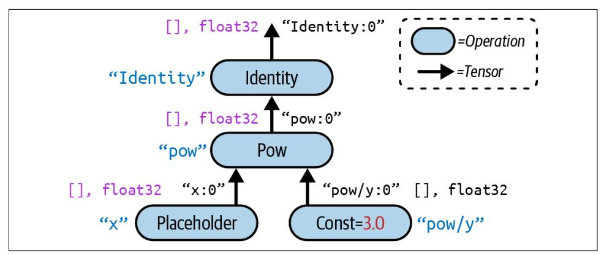

Figure D-2. Example of a computation graph

Note that each operation has a name. It defaults to the name of the operation (e.g., "pow"), but you can define it manually when calling the operation (e.g.,  $tf.pow(x)$ , 3, name="other\_name")). If a name already exists, TensorFlow automatically adds a unique index (e.g., "pow\_1", "pow\_2", etc.). Each tensor also has a unique name: it is always the name of the operation that outputs this tensor, plus: 0 if it is the operation's first output, or :1 if it is the second output, and so on. You can fetch an operation or a tensor by name using the graph's get\_operation\_by\_name() or get tensor by name() methods:

```
\gg concrete function.graph.get operation by name('x')
<tf.Operation 'x' type=Placeholder>
>>> concrete function.graph.get tensor by name('Identity:0')
<tf.Tensor 'Identity:0' shape=() dtype=float32>
```

The concrete function also contains the function definition (represented as a protocol buffer<sup>2</sup>), which includes the function's signature. This signature allows the concrete function to know which placeholders to feed with the input values, and which tensors to return:

```
>>> concrete function.function def.signature
name: "__inference_tf_cube_3515903"
input_arg {
  name: "x"
  type: DT FLOAT
ł
output arg \{name: "identity"
  type: DT_FLOAT
\mathcal{F}
```

<sup>2</sup> A popular binary format discussed in Chapter 13.

{832}------------------------------------------------

Now let's look more closely at tracing.

## **A Closer Look at Tracing**

Let's tweak the tf cube() function to print its input:

```
@tf.function
def tf cube(x):
    print(f''x = {x}'')return x ** 3
```

Now let's call it:

```
>>> result = tf cube(tf.constant(2.0))x = Tensor("x:0", shape=(), dtype=float32)>>> result
<tf.Tensor: shape=(), dtype=float32, numpy=8.0>
```

The result looks good, but look at what was printed: x is a symbolic tensor! It has a shape and a data type, but no value. Plus it has a name  $("x:0")$ . This is because the print() function is not a TensorFlow operation, so it will only run when the Python function is traced, which happens in graph mode, with arguments replaced with symbolic tensors (same type and shape, but no value). Since the print() function was not captured into the graph, the next times we call tf\_cube() with float32 scalar tensors, nothing is printed:

```
>>> result = tf cube(tf.constant(3.0))>>> result = tf_cube(tf.constant(4.0))
```

But if we call tf\_cube() with a tensor of a different type or shape, or with a new Python value, the function will be traced again, so the print () function will be called:

```
\Rightarrow result = tf_cube(2) # new Python value: trace!
x = 2>>> result = tf_cube(3) # new Python value: trace!
x = 3>>> result = tf_{\text{cube}}(tf_{\text{constant}}([1., 2.])) # new shape: trace!
x = Tensor("x:0", shape=(1, 2), dtype=float32)>>> result = tf cube(tf.constant([3., 4.], [5., 6.]])) # new shape: trace!
x = Tensor("x:0", shape=(None, 2), dtype=float32)>>> result = tf_{\text{cube}}(tf_{\text{.}} \text{constant}([7., 8.], [9., 10.]])) # same shape: no trace
```


If your function has Python side effects (e.g., it saves some logs to disk), be aware that this code will only run when the function is traced (i.e., every time the TF function is called with a new input signature). It's best to assume that the function may be traced (or not) any time the TF function is called.

{833}------------------------------------------------

In some cases, you may want to restrict a TF function to a specific input signature. For example, suppose you know that you will only ever call a TF function with batches of  $28 \times 28$ –pixel images, but the batches will have very different sizes. You may not want TensorFlow to generate a different concrete function for each batch size, or count on it to figure out on its own when to use None. In this case, you can specify the input signature like this:

```
@tf.function(input_signature=[tf.TensorSpec([None, 28, 28], tf.float32)])
def shrink(images):
    return images[:, :2, :2] # drop half the rows and columns
```

This TF function will accept any float 32 tensor of shape  $[$ <sup>\*</sup>, 28, 28], and it will reuse the same concrete function every time:

```
img\_batch_1 = tf.random.uniform(shape=[100, 28, 28])img\_batch_2 = tf.random.uniform(shape=[50, 28, 28])preprocessed_images = shrink(img_batch_1) # works fine, traces the function
preprocessed_images = shrink(img_batch_2) # works fine, same concrete function
```

However, if you try to call this TF function with a Python value, or a tensor of an unexpected data type or shape, you will get an exception:

```
img\_batch_3 = tf.random.uniform(shape=[2, 2, 2])preprocessed_images = shrink(img_batch_3) # ValueError! Incompatible inputs
```

### Using AutoGraph to Capture Control Flow

If your function contains a simple for loop, what do you expect will happen? For example, let's write a function that will add 10 to its input, by just adding 1 10 times:

```
@tf.function
def add_10(x):for i in range(10):
        x \neq 1return x
```

It works fine, but when we look at its graph, we find that it does not contain a loop: it just contains 10 addition operations!

```
\Rightarrow add_10(tf.constant(0))
<tf.Tensor: shape=(), dtype=int32, numpy=15>
>>> add 10.get concrete function(tf.constant(\theta)).graph.get operations()
[\langle tf.0peration \rangle x] type=Placeholder>, [\ldots],
<tf.Operation 'add' type=AddV2>, [...],
<tf.Operation 'add_1' type=AddV2>, [...],
<tf.Operation 'add_2' type=AddV2>, [...],
 [\ldots]<tf.Operation 'add 9' type=AddV2>, [...],
<tf.Operation 'Identity' type=Identity>]
```

{834}------------------------------------------------

This actually makes sense: when the function got traced, the loop ran 10 times, so the x += 1 operation was run 10 times, and since it was in graph mode, it recorded this operation 10 times in the graph. You can think of this for loop as a "static" loop that gets unrolled when the graph is created.

If you want the graph to contain a "dynamic" loop instead (i.e., one that runs when the graph is executed), you can create one manually using the tf.while\_loop() operation, but it is not very intuitive (see the "Using AutoGraph to Capture Control Flow" section of the Chapter 12 notebook for an example). Instead, it is much simpler to use TensorFlow's AutoGraph feature, discussed in Chapter 12. AutoGraph is actually activated by default (if you ever need to turn it off, you can pass autograph=False to tf. function()). So if it is on, why didn't it capture the for loop in the add\_10() function? It only captures for loops that iterate over tensors of tf.data.Dataset objects, so you should use tf. range(), not range(). This is to give you the choice:

- If you use range(), the for loop will be static, meaning it will only be executed when the function is traced. The loop will be "unrolled" into a set of operations for each iteration, as we saw.
- If you use tf. range(), the loop will be dynamic, meaning that it will be included in the graph itself (but it will not run during tracing).

Let's look at the graph that gets generated if we just replace range() with tf.range() in the add 10() function:

```
>>> add_10.get_concrete_function(tf.constant(0)).graph.get_operations()
[\langle tf.0 peration 'x' type=Placeholder>, [\ldots],
 <tf.Operation 'while' type=StatelessWhile>, [...]]
```

As you can see, the graph now contains a While loop operation, as if we had called the tf.while loop() function.

### **Handling Variables and Other Resources in TF Functions**

In TensorFlow, variables and other stateful objects, such as queues or datasets, are called *resources*. TF functions treat them with special care: any operation that reads or updates a resource is considered stateful, and TF functions ensure that stateful operations are executed in the order they appear (as opposed to stateless operations, which may be run in parallel, so their order of execution is not guaranteed). Moreover, when you pass a resource as an argument to a TF function, it gets passed by reference, so the function may modify it. For example:

{835}------------------------------------------------

```
counter = tf.Variable(0)@tf.function
def increment(counter, c=1):
    return counter. assign add(c)increment (counter) # counter is now equal to 1
increment (counter) # counter is now equal to 2
```

If you peek at the function definition, the first argument is marked as a resource:

```
>>> function_def = increment.get_concrete_function(counter).function_def
>>> function_def.signature.input_arg[0]
name: "counter"
type: DT RESOURCE
```

It is also possible to use a tf. Variable defined outside of the function, without explicitly passing it as an argument:

```
counter = tf.Variable(0)@tf.function
def increment(c=1):
    return counter.assign_add(c)
```

The TF function will treat this as an implicit first argument, so it will actually end up with the same signature (except for the name of the argument). However, using global variables can quickly become messy, so you should generally wrap variables (and other resources) inside classes. The good news is @tf.function works fine with methods too:

```
class Counter:
    def _init_(self):
       self.counter = tf.Variable(0)@tf.function
    def increment(self, c=1):
       return self.counter.assign add(c)
```


Do not use  $=$ ,  $+=$ ,  $-$ =, or any other Python assignment operator with TF variables. Instead, you must use the assign(), assign\_add(), or assign sub() methods. If you try to use a Python assignment operator, you will get an exception when you call the method.

A good example of this object-oriented approach is, of course, Keras. Let's see how to use TF functions with Keras.

{836}------------------------------------------------

## Using TF Functions with Keras (or Not)

By default, any custom function, layer, or model you use with Keras will automatically be converted to a TF function; you do not need to do anything at all! However, in some cases you may want to deactivate this automatic conversion—for example, if your custom code cannot be turned into a TF function, or if you just want to debug your code (which is much easier in eager mode). To do this, you can simply pass dynamic=True when creating the model or any of its layers:

```
model = MyModel(dynamic=True)
```

If your custom model or layer will always be dynamic, you can instead call the base class's constructor with dynamic=True:

```
class MyDense(tf.keras.layers.Layer):
    def _init_(self, units, **kwargs):
        super(). __init__(dynamic=True, **kwargs)
        [\ldots]
```

Alternatively, you can pass run\_eagerly=True when calling the compile() method:

```
model.compile(loss=my_mse, optimizer="nadam", metrics=[my_mae],
              run_eagerly=True)
```

Now you know how TF functions handle polymorphism (with multiple concrete functions), how graphs are automatically generated using AutoGraph and tracing, what graphs look like, how to explore their symbolic operations and tensors, how to handle variables and resources, and how to use TF functions with Keras.

{837}------------------------------------------------

{838}------------------------------------------------

## **Index**

#### **Symbols**

@ operator (matrix multiplication), 135  $\beta$  (momentum), 380  $\gamma$  (gamma) value, 182 ε (tolerance), 144, 183 ε greedy policy, 706 ε neighborhood, 279  $\varepsilon$  sensitive, 184  $\chi^2$  test, 202  $\ell_0$  norm, 45  $\ell_1$  norm, 45  $\ell_2$  norm, 45  $\ell_k$  norm, 45

#### A

A/B experiments, 721 accelerated k-means, 268 accelerated linear algebra (XLA), 434 accuracy performance measure, 4, 107 ACF (autocorrelation function), 551 action advantage, reinforcement learning, 694 action potentials (APs), 301 actions, in reinforcement learning, 684, 693-694 activation functions, 306, 312-313 for Conv2D laver, 490 custom models, 415 ELU, 363-366 GELU, 365-367 hyperbolic tangent (htan), 312, 565 hyperparameters, 352 initialization parameters, 360 leakyReLU, 361-363 Mish, 366

PReLU, 362 ReLU (see ReLU) RReLU, 362 SELU, 364, 397 sigmoid, 164, 312, 358, 651 SiLU, 366 softmax, 170, 315, 320, 600 softplus, 314 Swish, 366 active learning, 278 actor-critic, 717 actual class, 109 actual versus estimated probabilities, 118 AdaBoost, 222-226 AdaGrad, 382 Adam optimization, 384, 394 AdaMax, 385 AdamW, 386, 394 adaptive boosting (AdaBoost), 222-226 adaptive instance normalization (AdaIN), 671 adaptive learning rate algorithms, 382-387 adaptive moment estimation (Adam), 384 additive attention 606 advantage actor-critic (A2C), 717 adversarial learning, 534, 636 affine transformations, 671 affinity function, 261 affinity propagation, 283 agents, reinforcement learning, 16, 684, 699, 705 agglomerative clustering, 282 Akaike information criterion (AIC), 289 AlexNet, 499 algorithms, preparing data for, 67-88

{839}------------------------------------------------

alignment model, 606 AllReduce algorithm, 760 alpha dropout, 397 AlphaGo, 17, 683, 716 anchor priors, 528 ANNs (see artificial neural networks) anomaly detection, 8, 13 clustering for, 262 GMM, 288-289 isolation forest, 293 AP (average precision), 529 APs (action potentials), 301 area under the curve (AUC), 116  $argmax()$ , 171 ARIMA model, 550-551 ARMA model family, 549-551 artificial neural networks (ANNs), 299-353 autoencoders (see autoencoders) backpropagation, 309-312 biological neurons as background to, 301-302 evolution of, 300-301 hyperparameter fine-tuning, 344-353 implementing MLPs with Keras, 317-344 logical computations with neurons, 303-303 perceptrons (see multilayer perceptrons) reinforcement learning policies, 691 artificial neuron, 303 association rule learning, 14 assumptions, checking in model building, 37, 46 asynchronous advantage actor-critic (A3C), 717 asynchronous gang scheduling, 764 asynchronous updates, with centralized parameters, 761 à-trous convolutional layer, 533 attention mechanisms, 578, 604-619, 625 (see also transformer models) attributes, 52-55 categorical, 71, 74 combinations of, 66-67 preprocessed, 55 target, 55 unsupervised learning, 11 AUC (area under the curve), 116 autocorrelated time series, 545 autocorrelation function (ACF), 551 autodiff (automatic differentiation), 785-791

for computing gradients, 426-430 finite difference approximation, 786 forward-mode, 787-790 manual differentiation, 785 reverse-mode, 790-791 autoencoders, 635-659 convolutional, 648-649 denoising, 649-650 efficient data representations, 637-638 overcomplete, 649 PCA with undercomplete linear autoencoder, 639-640 sparse, 651-654 stacked, 640-648 training one at a time, 646-648 undercomplete, 638 variational, 654-658 Autograph, 435 AutoGraph, 806 AutoML service, 349, 775 autoregressive integrated moving average (ARIMA) model, 550-551 autoregressive model, 549 autoregressive moving average (ARMA) model family, 549-551 auxiliary task, pretraining on, 378 average absolute deviation, 45 average pooling layer, 493 average precision (AP), 529

#### B

backbone, model, 504 backpropagation, 309-312, 358, 429, 660 backpropagation through time (BPTT), 542 bagging (bootstrap aggregating), 215-219 Bahdanau attention, 606 balanced iterative reducing and clustering using hierarchies (BIRCH), 282 bandwidth saturation, 763-765 BaseEstimator, 80 batch gradient descent, 142-144, 156 batch learning, 18-19 batch normalization (BN), 367-372, 565 batch predictions, 731, 732, 739 Bayesian Gaussian mixtures, 292 Bayesian information criterion (BIC), 289 beam search, 603-604 Bellman optimality equation, 701 bias, 155

{840}------------------------------------------------

bias and fairness, NLP transformers, 630 bias term constant, 132, 137 bias/variance trade-off, 155 BIC (Bayesian information criterion), 289 bidirectional recurrent layer, 601 binary classifiers, 106, 164 binary logarithm, 200 binary trees, 198, 282 biological neural networks (BNNs), 301-302 BIRCH (balanced iterative reducing and clustering using hierarchies), 282 black box models, 199 blending, in stacking, 232 BN (batch normalization), 367, 565 BNNs (biological neural networks), 301-302 boosting, 222-231 bootstrap aggregating (bagging), 215-219 bootstrapping, 215 bottleneck layers, 503 bounding boxes, image identification, 521-530 BPTT (backpropagation through time), 542 bucketizing a feature, 77 byte pair encoding (BPE), 588

#### C

California Housing Prices dataset, 40-46 callbacks, 338-340 CART (Classification and Regression Tree) algorithm, 198, 200, 205 catastrophic forgetting, 712 categorical attributes, 71, 74 categorical features, encoding, 466-471 CategoryEncoding layer, 463 causal model, 563, 601 centralized parameters, 760-762 centroid, cluster, 262, 264, 265-268 chain rule, 311 chain-of-thought prompting, 623 ChainClassifier, 126 chaining transformations, 443-445 char-RNN model, 578-586 chatbot or personal assistant, 8 check\_estimator(), 82 chi-squared  $(\chi^2)$  test, 202 classification, 103-128 application examples of, 8-9 binary classifier, 106, 164 CNNs, 521-530 error analysis, 122-125

hard margin, 176, 187 hard voting classifiers, 212 image (see images) logistic regression (see logistic regression) MLPs for, 315-316 MNIST dataset, 103-105 multiclass, 119-121, 315-316 multilabel, 125-127 multioutput, 127-128 performance measures, 107-119 and regression, 10, 127 soft margin, 177-178 softmax regression, 170-173 SVMs (see support vector machines) text, 587-595 voting classifiers, 212-215 Classification and Regression Tree (CART) algorithm, 198, 200, 205 clone(), 163 closed-form equation/solution, 131, 134, 157, 166 cloud platform deployment with Vertex AI, 732-739 clustering algorithms, 9, 11, 260-283 affinity propagation, 283 agglomerative clustering, 282 applications for, 261-262 **BIRCH, 282** DBSCAN, 279-281 GMM, 283-294 image segmentation, 262, 273-275 k-means (see k-means algorithm) mean-shift, 282 responsibilities of clusters for instances, 285 semi-supervised learning with, 275-278 spectral clustering, 283 CNNs (see convolutional neural networks) Colab, 46-48 color channels, 486 color segmentation, images, 273 column vectors, 133 ColumnTransformer, 85 complex models with functional API, 329-335 compound scaling, 513 compressed TFRecord files, 454 compression and decompression, PCA, 249-250 computation graphs, 404 computational complexity

{841}------------------------------------------------

DBSCAN, 281 decision trees, 200 Gaussian mixture model, 288 histogram-based gradient boosting, 230 k-means algorithm, 265 Normal equation, 138 and SVM classes, 183 concatenative attention, 606 concrete function, 801-805 conditional GAN, 668 conditional probability, 603 confidence interval, 96 confusion matrix (CM), 108-110, 122-125 ConfusionMatrixDisplay, 122 connectionism, 300 constrained optimization, 187 constraints, custom models, 415 convergence rate, 144 convex function, 141 convex quadratic optimization, 188 convolution kernels (kernels), 484, 496 convolutional neural networks (CNNs), 479-535 architectures, 495-515

#### autoencoders, 648-649 classification and localization, 521-530 convolutional layers, 481-491, 531-535, 573, 574-575, 591 evolution of, 479 GANs, 665-667 object detection, 523-530 object tracking, 530 pooling layers, 491-495 pretrained models from Keras, 516-518 ResNet-34 CNN using Keras, 515 semantic segmentation, 8, 273, 531-535 splitting across devices, 757 transfer learning pretrained models, 518-521 U-Net, 678 and vision transformers, 624 visual cortex architecture, 480 WaveNet, 574-575 copy.deepcopy(), 163 core instance, 279 correlation coefficient, 63-66 cost function, 24, 45 in AdaBoost, 223 in autoencoders, 639

in bounding box prediction model, 522 in CART training algorithm, 200, 205 in elastic net, 161 in gradient descent, 132, 138-142, 145-148, 358 in lasso regression, 158-161 in Nesterov accelerated gradient, 381 in linear regression, 134 in logistic regression, 165-166 in momentum optimization, 379 in ridge regression, 156 in variational autoencoders, 656 credit assignment problem, 693-694 cross entropy, 171 cross-validation, 35, 89-91, 97, 107-108, 152-155 cross val predict(), 108, 113, 117, 122, 232  $cross_val_score(), 90, 107$ CUDA library, 747 curiosity-based exploration, 718 curriculum learning, 719 custom models and training algorithms, 412-433 activation functions, 415 autodiff for computing gradients, 426-430 constraints, 415 initializers, 415 layers, 419-422 loss functions, 412, 424-426 metrics, 416-419, 424-426 models, 422-424 regularizers, 415 saving and loading models, 413-415 training loops, 430-433 custom transformers, 79-83 customer segmentation, 261

#### D

DALL-E, 628 data downloading, 48-49 efficient data representations, 637-638 enqueuing and dequeuing, 798 finding correlations in, 63-66 making assumptions about, 37 overfitting (see overfitting of data) preparing for ML algorithms, 67-88 preparing for ML models, 552-555

{842}------------------------------------------------

preprocessing (see loading and preprocessing data) shuffling of, 445 test data (see test set) time series (see time series data) training data (see training set) underfitting of, 89, 151-155, 180 unreasonable effectiveness, 27 visualizing (see visualization) working with real data, 39-40 data analysis, clustering for, 261 data augmentation, 129, 500, 519 data cleaning, 68-71 data drift, 18 data mining, 7 data mismatch, 35 data parallelism, 759-765 data pipeline, 42 data snooping bias, 56 data structure, 51-55, 793-799 data-efficient image transformers (DeiT), 627 DataFrame, 68, 74, 78 Dataquest, xxi Datasets library, 475 DBSCAN, 279-281 DCGANs (deep convolutional GANS), 665-667 DDPM (denoising diffusion probabilistic model), 636, 674-681 DDQN (dueling DQN), 715 decision boundaries, 167-169, 172, 198, 207, 264 decision function, 111, 186-189 decision stumps, 226 decision threshold, 111-115 decision trees, 195-208, 211 (see also ensemble learning) bagging and pasting, 217 CART training algorithm, 200 class probability estimates, 199 computational complexity, 200 and decision boundaries, 198 GINI impurity or entropy measures, 201 high variance with, 207 predictions, 197-200 regression tasks, 204-205 regularization hyperparameters, 201-203 sensitivity to axis orientation, 206 training and visualizing, 195-196 in training the model, 89-91

DecisionTreeClassifier, 195, 201, 202, 207, 220 DecisionTreeRegressor, 89, 195, 204, 226 decision\_function(), 112 deconvolution layer, 532 deep autoencoders (see stacked autoencoders) deep convolutional GANS (DCGANs), 665-667 deep Gaussian process, 397 deep learning, xv (see also deep neural networks; reinforcement learning) deep neural networks (DNNs), 357-401 CNNs (see convolutional neural networks) default configuration, 400 faster optimizers for, 379-387 learning rate scheduling, 388-392 MLPs (see multilayer perceptrons) regularization, 392-400 reusing pretrained layers, 373-379 RNNs (see recurrent neural networks) and transfer learning, 16 unstable gradients, 358 vanishing and exploding gradients, 358-373 deep neuroevolution, 349 deep Q-learning, 707-716 deep Q-networks (DQNs) (see Q-learning algorithm) deepcopy(), 163 DeepMind, 17 degrees of freedom, 32, 155 DeiT (data-efficient image transformers), 627 denoising autoencoders, 649-650 denoising diffusion probabilistic model (DDPM), 636, 674-681 Dense layer, 305, 320, 321, 332 dense matrix, 76, 86 density estimation, 260, 279-281, 286 density threshold, 288 depth concatenation layer, 502 depthwise separable convolution layer, 509 deque, 709 describe(), 53 development set (dev set), 35 differencing, time series forecasting, 545, 548, 549 diffusion models, 635, 673-681 dilated filter, 533 dilation rate, 533 dimensionality reduction, 12, 237-257 approaches to, 239-242

{843}------------------------------------------------

autoencoders, 635, 638-640 choosing the right number of dimensions, 247 clustering, 261 curse of dimensionality, 238-239 for data visualization, 238 information loss from, 237 Isomap, 256 linear discriminant analysis, 257 LLE, 254-256 multidimensional scaling, 256 PCA (see principal component analysis) random projection algorithm, 252-254 t-distributed stochastic neighbor embedding, 256, 643 discount factor  $\gamma$  in reward system, 693 discounted rewards, 693, 696 Discretization layer, 463 discriminator, GAN, 636, 660-665 DistilBERT model, 622, 631-633 distillation, 622 distribution strategies API, 765 Docker container, 726 dot product, 607 Dota 2, 718 Double DQN, 714 downloading data, 48-49 DQNs (deep Q-networks) (see Q-learning algorithm)  $drop(), 68$  $dropna(), 68$ Dropout, 649 dropout rate, 394 dropout regularization, 394-397 dual numbers, 788 dual problem, 189-193 dueling DON (DDON), 715 dummy attributes, 72 dying ReLU problem, 361 dynamic models with subclassing API, 336-337 dynamic programming, 701

#### F

eager execution (eager mode), 436 early stopping regularization, 162-163, 229, 555 edge computing, 741 efficient data representations, autoencoders, 637-638 elastic net. 161

EllipticEnvelope, 293 ELMo (Embeddings from Language Models), 593 ELU (exponential linear unit), 363-366 EM (expectation-maximization), 284 embedded device, deploying model to, 741-744 embedded Reber grammars, 633 embedding matrix, 468, 600 embedding size, 599, 613 embeddings, 74 encoding categorical features using, 466-471 reusing pretrained, 593-595 sentiment analysis, 589 Embeddings from Language Models (ELMo), 593 encoder, 637 (see also autoencoders) encoder-decoder models, 541, 578, 595-604 (see also attention mechanisms) end-to-end ML project exercise, 39-100 building the model, 41-46 discovering and visualizing data, 60-67 fine-tuning your model, 91-97 getting the data, 46-60 preparing data for ML algorithms, 67-88 real data, advantages of working with, 39-40 selecting and training a model, 88-89 endpoint, deploying model on GCP, 738 ensemble learning, 211-235 bagging and pasting, 215-219 boosting, 222-231 cross-validation, 90 fine-tuning the system, 95 random forests (see random forests) stacking, 232-235 voting classifiers, 212-215 entailment, 620 entropy impurity measure, 201 environments, reinforcement learning, 684, 687-691 epochs, 143 equalized learning rate, GAN, 670 equivariance, 493 error analysis, classification, 122-125 estimated versus actual probabilities, 118 estimators, 70, 84, 214 Euclidean norm, 45 event files, TensorBoard, 340 Example protobuf, 456

{844}------------------------------------------------

exclusive or (XOR) problem, 307 exemplars, affinity propagation, 283 expectation-maximization (EM), 284 experience replay, 664 explainability, attention mechanisms, 625 explained variance ratio, 246 explained variance, plotting, 247-249 exploding gradients, 358 (see also vanishing and exploding gradients) exploration policies, 703, 706 exploration/exploitation dilemma, reinforcement learning, 692 exponential linear unit (ELU), 363-366 exponential scheduling, 389, 392 export\_graphviz(), 196 extra-trees, random forest, 220 extremely randomized trees ensemble (extra $trees), 221$ 

#### F

face-recognition classifier, 125 false negatives, confusion matrix, 109 false positive rate (FPR) or fall-out, 115 false positives, confusion matrix, 109 fan-in/fan-out, 359 fast-MCD, 293 FCNs (fully convolutional networks), 525-526, 532 feature engineering, 30, 262 feature extraction, 12, 30 feature maps, 485-487, 488, 508, 511 feature scaling, 75-79, 141, 176 feature selection, 30, 95, 159, 221 feature vectors, 45, 133, 186 features, 11 federated learning, 746 feedforward neural network (FNN), 309, 538 fetch\_openml(), 104  $fillna(), 68$ filters, convolutional layers, 484, 487, 497, 509 first moment (mean of gradient), 384 first-order partial derivatives (Jacobians), 386  $fit()$ and custom transformers, 80, 84 data cleaning, 69 versus partial fit(), 148 using only with training set, 75 fitness function, 24 fit\_transform(), 70, 75, 80, 84

fixed Q-value targets, 713 flat dataset, 553 flowers dataset, 518-519 FNN (feedforward neural network), 309, 538 folds, 90, 105, 107, 108 forecasting time series (see time series data) forget gate, LSTM, 569 forward pass, in backpropagation, 311 forward process, diffusion model, 674-676 FPR (false positive rate) or fall-out, 115 from predictions(), 122 full gradient descent, 143 fully connected layer, 305, 481, 491 fully convolutional networks (FCNs), 525-526, 532 function definition (FuncDef), 802 function graph (FuncGraph), 802 functional API, complex models with, 329-335 FunctionTransformer, 79  $F_1$  score, 111

#### G

game play (see reinforcement learning) gamma ( $\gamma$ ) value, 182 GANs (see generative adversarial networks) gate controllers, LSTM, 570 gated activation units, 574 gated recurrent unit (GRU) cell, 571-572, 591 Gaussian distribution, 76, 166, 656-657 Gaussian mixture model (GMM), 283-294 anomaly detection, 288-289 Bayesian Gaussian mixtures, 292 fast-MCD, 293 inverse\_transform() with PCA, 294 isolation forest, 293 and k-means limitations, 272 local outlier factor, 293 one-class SVM, 294 selecting number of clusters, 289-291 Gaussian process, 348 Gaussian RBF kernel, 80, 181-184, 192 GBRT (gradient boosted regression trees), 226, 227-231 GCP (Google Cloud Platform), 732-737 GCS (Google Cloud Storage), 736 GD (see gradient descent) GELU, 365-367 generalization error, 34-35

{845}------------------------------------------------

generative adversarial networks (GANs), 659-673 deep convolutional, 665-667 progressive growing of, 668-671 StyleGANs, 671-673 training difficulties, 663-665 generative autoencoders, 654 generative models, 635 (see also Gaussian mixture model) generator, GAN, 636, 659-665 genetic algorithm, 686 geodesic distance, 256 geographic data, visualizing, 61-62 get\_dummies(), 73 get\_feature\_names\_out(), 81 get\_params(), 80 GINI impurity, 197, 201 global average pooling layer, 495 global versus local minimum, gradient descent, 140 Glorot initialization, 359-361 GMM (see Gaussian mixture model) Google Cloud Platform (GCP), 732-737 Google Cloud Storage (GCS), 736 Google Colab, 46-48 Google Vertex AI (see Vertex AI) GoogLeNet, 502-505, 509 GPU implementation, 148, 746-756, 765 getting your own GPU, 747-749 managing RAM, 749-752 operations handling, 754 parallel execution across multiple devices, 753-756 placing operations and variables on devices, 752-753 gradient ascent, 687 gradient boosted regression trees (GBRT), 226, 227-231 gradient boosting, 226-230 gradient clipping, 372 gradient descent (GD), 132, 138-149 algorithm comparisons, 148 batch gradient descent, 142-144, 156 local versus global minimum, 140 mini-batch gradient descent, 148-149 minimizing hinge loss, 188 versus momentum optimization, 380 with optimizers, 379-387 shuffling data, 445

stochastic gradient descent, 145-148 gradient tree boosting, 226 gradients autodiff for computing, 426-430 bandwidth saturation issue, 763 PG algorithm, 687, 694-698 stale, 761 unstable (see vanishing and exploding gradients) graph mode, 436 graphical processing units (see GPU implementation) graphs and functions, TensorFlow, 404, 433-438, 801-809 Graphviz, 196 greedy algorithm, CART as, 200 greedy decoding, 582 greedy layer-wise pretraining, 377, 647, 668 grid search, 91-93 GridSearchCV, 91-93 gRPC API, querying through, 729 GRU (gated recurrent unit) cell, 571-572, 591

#### н

hard clustering, 264 hard margin classification, 176, 187 hard voting classifiers, 212 harmonic mean, 111 hashing collision, 466 Hashing layer, 466 hashing trick, 466 HDBSCAN (hierarchical DBSCAN), 281 He initialization, 359-361 Heaviside step function, 304 heavy tail, feature distribution, 76 Hebb's rule, 306 Hebbian learning, 306 Hessians, 386 hidden layers neurons per layer, 350 number of 349 stacked autoencoders, 640-648 hierarchical clustering, 11 hierarchical DBSCAN (HDBSCAN), 281 high variance, with decision trees, 207 hinge loss function, 188 histogram-based gradient boosting (HGB), 230-231 histograms, 54

{846}------------------------------------------------

hold-out sets, 34 holdout validation, 34 housing dataset, 40-46 Huber loss, 314, 412, 416, 555 Hugging Face, 629-633 Hungarian algorithm, 531 Hyperband tuner, 347 hyperbolic tangent (htan), 312, 565 hyperparameters, 32, 344-353 activation function, 352 batch size, 352 CART algorithm, 200 convolutional layers, 490 in custom transformations, 80 decision tree, 228 dimensionality reduction, 248 gamma  $(y)$  value, 182 GAN challenges, 664 Keras Tuner, 775 learning rate, 139, 351 momentum  $\beta$ , 380 Monte Carlo samples, 399 neurons per hidden layer, 350 and normalization, 76 number of hidden layers, 349 number of iterations, 352 optimizer, 352 PG algorithms, 697 preprocessor and model interaction, 92 randomized search, 344-346 saving along with model, 416 SGDClassifier, 183 subsample, 230 SVM classifiers with polynomial kernel, 180 tolerance  $(\varepsilon)$ , 183 tuning of, 34-35, 91-93, 97, 327, 772-776 hypothesis, 45 hypothesis boosting (see boosting) hypothesis function, 133

identity matrix, 157 IID (see independent and identically distributed) image generation, 534, 671, 673 image segmentation, 262, 273-275 images, classifying and generating, 8 autoencoders (see autoencoders) CNNs (see convolutional neural networks)

diffusion models, 673-681 generating with GANs, 659-673 implementing MLPs, 318-328 labels, 521 loading and preprocessing data, 474 representative images, 276 semantic segmentation, 273 tuning hyperparameters, 344 importance sampling (IS), 714 impurity measures, 197, 201 imputation, 68 incremental learning, 20 incremental PCA (IPCA), 250-251 independent and identically distributed (IID), training instances as, 147 inductive bias, 626 inertia, model, 267, 269 inference, 26  $info()$ , 52 information theory, 171, 201 inliers, 260 input and output sequences, RNNs, 541-542 input gate, LSTM, 569 input layer, neural network, 305, 320, 331 (see also hidden layers) input signature, 801 instance segmentation, 273, 534 instance-based learning, 21, 26 inter-op thread pool, 754 intercept term constant, 132 interleaving lines from multiple files, 446-447 interpretable ML, 199 invariance, max pooling layer, 492 inverse\_transform(), 78, 81, 249, 294 IPCA (incremental PCA), 250-251 iris dataset. 167 irreducible error, 155 IS (importance sampling), 714 isolation forest, 293 Isomap, 256 isotropic noise, 674 IterativeImputer, 69

Jacobians, 386 joblib library, 97-98 **JSON Lines, 739, 741** Jupyter, 46

{847}------------------------------------------------

#### K

k-fold cross-validation, 90, 107, 108 k-means algorithm, 82, 263-273 accelerated k-means, 268 centroid initialization methods, 267-268 finding optimal number of clusters, 269-271 limitations of, 272 mini-batch k-means, 268 workings of, 265-266 k-means++, 267 k-nearest neighbors regression, 26 Kaiming initialization, 360 Kalman Filters, 530 Keras API xvi 405 (see also artificial neural networks) and accessing TensorFlow API directly, 475 activation function support, 362, 363, 367 convolutional layer implementation, 487-490 custom functions in, 435 gradient clipping, 373 image preprocessing layers, 474 implementing MLPs with, 317-344 initialization handling, 360 initializers, 322 layer preprocessing, 459-474 learning rate scheduling, 390-392 loading a dataset, 318 PG algorithm, 694-698 pool layer implementation, 493-495 pretrained CNN models, 516-518 ResNet-34 CNN with, 515 saving models, 724, 742 stacked encoder implementation, 641 tf.data API dataset, 452-453 tf.keras library, 318 tf.keras.activations.get(), 420 tf.keras.activations.relu(), 320 tf.keras.applications module, 516 tf.keras.applications.xception.preprocess input $($ ), 519 tf.keras.backend module, 408 tf.keras.callbacks.EarlyStopping, 339 tf.keras.callbacks.LearningRateScheduler, 390 tf.keras.callbacks.ModelCheckpoint, 338 tf.keras.callbacks.TensorBoard, 341, 592 tf.keras.datasets.imdb.load data(), 587 tf.keras.initializers.VarianceScaling, 360

tf.keras.layers.ActivityRegularization, 652 tf.keras.layers.AdditiveAttention, 608 tf.keras.layers.Attention, 608 tf.keras.layers.AvgPool2D, 495 tf.keras.layers.BatchNormalization, 369, 370-372, 566 tf.keras.layers.Bidirectional, 602 tf.keras.layers.CategoryEncoding, 463 tf.keras.layers.CenterCrop, 474 tf.keras.layers.Concatenate, 331, 332, 502 tf.keras.layers.Conv1D, 533, 592 tf.keras.layers.Conv2D, 487 tf.keras.layers.Conv2DTranspose, 532 tf.keras.layers.Conv3D, 533 tf.keras.layers.Dense, 331, 332, 420-421, 471, 646, 657 tf.keras.layers.Discretization, 463 tf.keras.layers.Dropout, 396 tf.keras.layers.Embedding, 468, 581, 589, 613 tf.keras.layers.GlobalAvgPool2D, 495 tf.keras.layers.GRU, 572 tf.keras.layers.GRUCell, 572 tf.keras.layers.Hashing, 466 tf.keras.layers.Input, 331 tf.keras.layers.Lambda, 419, 582 tf.keras.layers.LayerNormalization, 566 tf.keras.layers.LeakyReLU, 362 tf.keras.layers.LSTM, 568 tf.keras.layers.Masking, 591 tf.keras.layers.MaxPool2D, 493 tf.keras.layers.MultiHeadAttention, 617 tf.keras.layers.Normalization, 329, 331, 460-462 tf.keras.layers.PReLU, 362 tf.keras.layers.Rescaling, 474 tf.keras.layers.Resizing, 474, 517 tf.keras.layers.RNN, 568 tf.keras.layers.SeparableConv2D, 510 tf.keras.layers.StringLookup, 465 tf.keras.layers.TextVectorization, 471-473, 579, 582, 588, 589-599 tf.keras.layers.TimeDistributed, 564 tf.keras.losses.Huber, 412 tf.keras.losses.kullback\_leibler\_divergence(), 653 tf.keras.losses.Loss, 413 tf.keras.losses.sparse\_categorical\_crossentropy(), 323, 497, 582, 596, 632

{848}------------------------------------------------

tf.keras.metrics.MeanIoU, 522 tf.keras.metrics.Metric, 418 tf.keras.metrics.Precision, 417 tf.keras.Model. 331 tf.keras.models.clone\_model(), 337, 375 tf.keras.models.load\_model(), 338, 413-415, 423, 766 tf.keras.optimizers.Adam, 329, 386 tf.keras.optimizers.Adamax, 386 tf.keras.optimizers.experimental.AdamW, 386 tf.keras.optimizers.Nadam, 386 tf.keras.optimizers.schedules, 391 tf.keras.optimizers.SGD, 380 tf.keras.preprocessing.image.ImageData-Generator, 519 tf.keras.regularizers.l1 l2(), 393 tf.keras.Sequential, 319, 329, 497 tf.keras.utils.get\_file(), 579 tf.keras.utils.set\_random\_seed(), 319 tf.keras.utils.timeseries\_dataset\_from\_array(), 552, 555 tf.keras.utils.to\_categorical(), 324 time series forecasting for RNN, 556-558 transfer learning with, 375-377 using TF functions (or not), 809 Keras session, 322 Keras Tuner, 775 kernel trick, 180-184, 190-193 kernelized SVMs, 190-193 kernels (convolution kernels), 484, 496 kernels (runtimes), 48 KL (Kullback-Leibler) divergence, 172, 653 KLDivergenceRegularizer, 653 KMeans, 81 KNeighborsClassifier, 125, 128 KNNImputer, 69 Kullback-Leibler (KL) divergence, 172, 652

#### L

label propagation, 277-278 labels, 43 in clustering, 263 image classification, 521 supervised learning, 11 unlabeled data issue, 645 landmarks, 181 language models, 578 (see also natural language processing) large margin classification, 175 Lasso, 161 lasso regression, 158-161 latent diffusion models, 680 latent loss, 656 latent representation of inputs, 627, 635, 637, 667 latent space, 656 law of large numbers, 213 layer normalization, 439, 537, 566 LDA (linear discriminant analysis), 257 leaf node, decision tree, 197, 199, 202 leakyReLU, 361-363 learning curves, overfit or underfit analysis, 152-155 learning rate, 20, 139, 143, 145, 351, 705 learning rate schedules, 388-392 learning schedules, 145 LeCun initialization, 360 LeNet-5, 481, 498 Levenshtein distance, 182 liblinear library, 183 libsym library, 183 life satisfaction dataset, 22 likelihood function, 290-291 linear discriminant analysis (LDA), 257 linear models forecasting time series, 555 linear regression (see linear regression) regularized, 156-163 SVM, 175-178 training and running example, 23 linear regression, 24-26, 132-149 comparison of algorithms, 149 computational complexity, 138 gradient descent in, 138-149 learning curves in, 151-155 Normal equation, 134-137 regularizing models (see regularization) ridge regression, 156-158, 161 training set evaluation, 88 using stochastic gradient descent, 147 linear SVM classification, 175-178, 186-193 linear threshold units (LTUs), 304 linearly separable, SVM classes, 175-176, 181 LinearRegression, 71, 79, 88, 137, 138, 150 LinearSVC, 177, 183, 188 LinearSVR, 184-186 Lipschitz continuous, derivative as, 141

{849}------------------------------------------------

LLE (locally linear embedding), 254-256 loading and preprocessing data, 441-477 image preprocessing layers, 474 layer preprocessing in Keras, 442, 459-474 tf.data API, 441-453 TFDS project, 475-477 TFRecord format, 441, 453-459 local outlier factor (LOF), 293 local receptive field, 480 local response normalization (LRN), 501 local versus global minimum, gradient descent, 140 locality sensitive hashing (LSH), 254 localization, CNNs, 521-525 locally linear embedding (LLE), 254-256 LOF (local outlier factor), 293  $log$  loss, 166 log-odds function, 165 log-transformer, 79 logical GPU device, 750 logistic function, 164 logistic regression, 10, 78, 164-173 decision boundaries illustration, 167-169 estimating probabilities, 164-165 softmax regression model, 170-173 training and cost function, 165-166 LogisticRegression, 168, 172 logit function, 165 long sequences, training RNN on, 565-575 short-term memory problem, 568-575 unstable gradients problem, 565-568 long short-term memory (LSTM) cell, 568-571, 591, 599, 602 loss functions based on model internals, 424-426 custom, 412 versus metrics, 416 output, 334 LRN (local response normalization), 501 LSH (locality sensitive hashing), 254 LSTM (long short-term memory) cell, 568-571, 591, 599, 602 LTUs (linear threshold units), 304 Luong attention, 607

#### M

machine learning (ML), 4 application/technique examples, 8-9 challenges of, 27-33

notations, 44-45 project checklist, 41 (see also end-to-end ML project exercise) reasons for using, 5-7 resources on, xxi-xxii spam filter example, 3-7 testing and validating, 34-37 types of systems, 9-26 MAE (mean absolute error), 45 majority-vote predictions, 209 make column selector(), 86 make\_column\_transformer(), 86 make pipeline(), 84, 154 Manhattan norm, 45 manifold hypothesis, 242 manifold learning, dimension reduction, 241-242 MAP (maximum a-posteriori) estimation, 291 mAP (mean average precision), 528 MAPE (mean absolute percentage error), 546 mapping network, StyleGANs, 671 MapReduce, 43 margin violations, 177, 187 Markov chains, 699 Markov decision processes (MDPs), 699-703, 706 mask R-CNN, 534 mask tensor, 590 masked language model (MLM), 620 masked multi-head attention layer, 612 masking, 590-593, 617 Matching Engine service, Vertex AI, 732 Matplotlib, 46 max pooling layer, 491, 497 max-norm regularization, 399 maximization step, Gaussian mixtures, 284 maximum a-posteriori (MAP) estimation, 291 maximum likelihood estimate (MLE), 291 MC (Monte Carlo) dropout regularization, 397-399 MCTS (Monte Carlo tree search), 716 MDPs (Markov decision processes), 699-703, 706 MDS (multidimensional scaling), 256 mean absolute error (MAE), 45 mean absolute percentage error (MAPE), 546 mean average precision (mAP), 528 mean squared error (MSE), 133, 656

{850}------------------------------------------------

mean-shift, clustering algorithms, 282 mean squared error(), 88 measure of similarity, 21 memory bandwidth, GPU card, 451 memory cells (cells), RNNs, 540, 568-575 memory requirements, convolutional layers, 490 Mercer's theorem, 192 meta learner, 232 metagraphs, SavedModel, 724 min-max scaling, 75 mini-batch discrimination, 664 mini-batch gradient descent, 148-149, 163 mini-batch k-means, 268 mini-batches, 19, 669 MinMaxScaler, 76 mirrored strategy, data parallelism, 759, 765, 768 Mish activation function, 366 mixing regularization, StyleGAN, 673 ML (see machine learning) ML Operations (MLOps), 100 MLE (maximum likelihood estimate), 291 MLM (masked language model), 620 MLPs (see multilayer perceptrons) MNIST dataset, 103-105 mobile device, deploying model to, 741-744 mode collapse, 628, 664 model parallelism, 756-758 model parameters, 23 early stopping regularization, 166 in gradient descent, 142, 144 linear SVM classifier mechanics, 186 and variable updating, 410 weight matrix shape, 323 model rot, 18 model selection, 23, 34-35 model server (see TensorFlow Serving) model warmup, 730 model-based learning, 22-26 modes, 77 momentum optimization, 379 momentum  $\beta$ , 380 Monte Carlo (MC) dropout, 397-399 Monte Carlo tree search (MCTS), 716 MSE (mean squared error), 133, 656 multi-head attention layer, 611, 615-619 multi-hot encoding, 464

multiclass (multinomial) classification, 119-121, 315-316 multidimensional scaling (MDS), 256 multilabel classifiers, 125-127 multilayer perceptrons (MLPs), 299, 308-344 and autoencoders, 638, 639 and backpropagation, 309-312 callbacks, 338-340 classification MLPs, 315-316 complex models, 329-335 dynamic models, 336-337 image classifier, 318-328 regression MLPs, 313-314, 328 saving and restoring a model, 337-338 visualization with TensorBoard, 340-344 multimodal distribution, 77 multimodal transformers, 627 multinomial logistic regression, 170-173 multioutput classifiers, 127-128 multiple regression, 43 multiplicative attention, 607 multitask classification, 333 multivariate regression, 43 multivariate time series, 545, 559-560

#### N

Nadam 386 NAG (Nesterov accelerated gradient), 381, 386 naive forecasting, 545 Nash equilibrium, 663 natural language processing (NLP), 577-633 char-RNN model to generate text, 578-586 encoder-decoder network for machine translation, 595-601 machine learning examples, 8 sentiment analysis, 587-595 text classification, 587-595 text encoding, 471-474 text summarization, 8 transformer models (see transformer models) word embeddings, 467 natural language understanding (NLU), 8 NCCL (Nvidia collective communications library), 766 NEAT (neuroevolution of augmenting topologies), 686 negative class, 109, 164 nested dataset, 553

{851}------------------------------------------------

Nesterov accelerated gradient (NAG), 381, 386 Nesterov momentum optimization, 381, 386 neural machine translation (NMT), 595-619 and attention mechanisms, 604-619 with transformers, 620-624 neural networks (see artificial neural networks) neuroevolution of augmenting topologies (NEAT), 686 next sentence prediction (NSP), 621 NLU (natural language understanding), 8 NMT (see neural machine translation) No Free Lunch theorem, 37 non-max suppression, bounding boxes, 524 nonlinear dimensionality reduction (NLDR), 254-256 nonlinear SVM classifiers, 178-184 nonparametric models, 201 nonrepresentative training data, 28 nonresponse bias, 29 normal distribution, 358, 360 Normal equation, 134-137 normalization, 76, 367-372, 565 Normalization layer, 460-462 normalized exponential (softmax function), 170 notations, 44-45, 134 novelty detection, 13, 288 NP-Complete problem, CART as, 200 NSP (next sentence prediction), 621 nucleus sampling, 584 null hypothesis, 202 number of inputs, 323, 359 number of neurons per hidden layer, 350 NumPy, 46 NumPy arrays, 71, 79, 407-411 Nvidia collective communications library (NCCL), 766 Nvidia GPU card, 748-749

#### $\bf{0}$

OAuth 2.0, 734 object detection, CNNs, 523-530 object tracking, CNNs, 530 objectness score, 523 observation space, reinforcement learning, 684, 693 observations, 689-690 OCR (optical character recognition), 3 OEL (open-ended learning), 719

off-policy algorithm, 706 offline learning, 18 on-policy algorithm, 706 one-class SVM, 294 one-hot encoding, 72-74, 464, 471 one-versus-all (OvA) strategy, 119-121 one-versus-one (OvO) strategy, 119-121 one-versus-the-rest (OvR) strategy, 119-121 1cycle scheduling, 389, 392 1D convolutional layers, 533, 573 OneHotEncoder, 72-74, 77, 86 online kernelized SVMs, 193 online learning, 19-20 online model, DQN, 713 OOB (out-of-bag) evaluation, 218-219 open-ended learning (OEL), 719 OpenAI Gym, 687-691 operations (ops) and tensors, 404, 407-408 optical character recognition (OCR), 3 optimal state value, MDP, 701 optimizers, 379-387 AdaGrad, 382 Adam optimization, 384 AdaMax, 385 AdamW, 386 hyperparameters, 352 momentum optimization, 379 Nadam, 386 Nesterov accelerated gradient, 381 output layer, 600 RMSProp, 383 oracle, 346 order of integration (d) hyperparameter, 549 OrdinalEncoder, 71 orthogonal matrix, 600 out-of-bag (OOB) evaluation, 218-219 out-of-core learning, 19 out-of-sample error, 34 outlier detection (see anomaly detection) outliers, 260 output gate, LSTM, 569 output layer, neural network, 600 OvA (one-versus-all) strategy, 119-121 overcomplete autoencoder, 649 overfitting of data, 30-33, 55 avoiding through regularization, 392-400 and decision trees, 201, 205 and dropout regularization, 396 gamma ( $\gamma$ ) hyperparameter to adjust, 182

{852}------------------------------------------------

image classification, 324 learning curves to assess, 152-155 number of neurons per hidden layer, 351 polynomial regression, 132 SVM model, 177 OvO (one-versus-one) strategy, 119-121 OvR (one-versus-the-rest) strategy, 119-121

#### P

p-value, 202 PACF (partial autocorrelation function), 551 padding options, convolutional layer, 488-489 PaLM (Pathways language model), 623 Pandas, 46, 64-66, 73, 78 parallelism, training models across devices, 756-776 data parallelism, 759-765 distribution strategies API, 765 with GPU, 753-756 hyperparameter tuning, 772-776 model parallelism, 756-758 on TensorFlow cluster, 767-770 Vertex AI for running large jobs, 770-772 parameter efficiency, 349 parameter matrix, 170 parameter servers, 760 parameter space, 142 parameter vector, 133, 138, 165, 170 parametric leaky ReLU (PReLU), 362 parametric models, 202 partial autocorrelation function (PACF), 551 partial derivative, 142 partial\_fit(), 148 Pathways language model (PaLM), 623 PCA (see principal component analysis) PDF (probability density function), 260, 291 Pearson's r. 63 penalties, reinforcement learning, 16 PER (prioritized experience replay), 714 Perceiver, 627 percentiles, 54 perceptrons, 299, 304-316 (see also multilayer perceptrons) performance measures, 107-119 confusion matrix, 108-110 cross-validation to measure accuracy, 107-108 precision and recall, 110-115 ROC curve, 115-119

selecting, 43-45 performance scheduling, 389, 392 permutation(), 56 PG (policy gradients) algorithm, 687, 694-698 piecewise constant scheduling, 389, 391 PipeDream, 763 Pipeline class, 83 Pipeline constructor, 84-87 pipelines, 42, 83-88, 154, 177 pixelwise normalization layer, 670 placeholders, function definitions, 803 POET algorithm, 719 policy gradients (PG) algorithm, 687, 694-698 policy parameters, 686 policy space, 686 policy, reinforcement learning, 16, 685, 691 polynomial features, SVM classifiers, 180 polynomial kernel, 180, 190 polynomial regression, 132, 149-151 polynomial time, 200 PolynomialFeatures, 150, 179 pooling kernel, 491 pooling layers, 491-495 positional encodings, 612-614 positive class, 109, 164 post-training quantization, 743 posterior distribution, 654 power law distribution, 76 power scheduling, 389 PPO (proximal policy optimization), 718 precision and recall, classifier metrics, 110-115 precision/recall curve (PR), 113, 117 precision/recall trade-off, 111-115 predict(), 71, 81, 84 predicted class, 109 prediction service, on Vertex AI, 732-741 predictions backpropagation, 312 confusion matrix, 108-110 cross-validation to measure accuracy, 107-108 decision trees, 197-200 with linear SVM classifier, 186 predictors, 11 (see also ensemble learning) predict\_log\_proba(), 178 predict\_proba(), 178 prefetching of data, 450-452 PReLU (parametric leaky ReLU), 362

{853}------------------------------------------------

preprocessed attributes, 55 preprocessing data (see loading and preprocessing data) preprocessing mismatch, 460 pretraining and pretrained layers on auxiliary task, 378 CNNs, 516-521 greedy layer-wise pretraining, 377, 647, 668 language model components, 473 reusing embeddings, 593-595 reusing layers, 373-379 in unsupervised learning, 377, 593, 620, 644 primal problem, 189 principal component (PC), 244-245 principal component analysis (PCA), 243-251 choosing number of dimensions, 247-249 for compression, 249-250 explained variance ratio, 246 finding principal components, 245 incremental PCA, 250-251 preserving variance, 243 projecting down to d dimensions, 245 randomized PCA, 250 for scaling data in decision trees, 206 with undercomplete linear autoencoder, 639-640 using Scikit Learn for, 246 prior distribution, 654 prioritized experience replay (PER), 714 probabilistic autoencoders, 654 probabilities, estimating, 164-165, 199, 215 probability density function (PDF), 260, 291 probability versus likelihood, 290-291 profiling the network, with TensorBoard, 340 progressive web app (PWA), 745 projection, dimensionality reduction, 239-240 propositional logic, 300 protocol buffers (protobuf), 454-457, 459, 729 proximal policy optimization (PPO), 718 pruning of decision tree nodes, 202 pseudoinverse, 137 PWA (progressive web app), 745 Python API, 46

#### Q

Q-learning algorithm, 704-716 approximate Q-learning, 707 exploration policies, 706 implementing deep Q-learning, 708-712

variants in deep Q-learning, 713-716 O-value iteration algorithm, 702-703 O-values, 702-703 quadratic equation, 150 quadratic programming (QP) problems, 188 quantization-aware training, 744 quartiles, 54 queries per second (QPS), 721, 738 question-answering modules, 8 queues, 411, 798

#### R

radial basis function (RBF), 77 ragged dimensions, 411 Rainbow agent, 716 random forests, 90, 211, 220-222 analysis of models and their errors, 95 decision trees (see decision trees) extra-trees, 221 feature importance measurement, 221 random initialization, 138, 140 random patches, 219 random projection algorithm, 252-254 random subspaces, 219 RandomForestClassifier, 117-119 RandomForestRegressor, 90 randomized leaky ReLU (RReLU), 362 randomized PCA, 250 randomized search, 93-94, 344-346 RBF (radial basis function), 77 rbf kernel(), 77, 80 recall metric, 110 receiver operating characteristic (ROC) curve, 115-119 recognition network, 637 (see also autoencoders) recommender system, 9 reconstruction error, 249, 646 reconstruction loss, 424, 638 rectified linear units (ReLU) (see ReLU) recurrent dropout, 537 recurrent layer normalization, 537, 566 recurrent neural networks (RNNs), 537-604 bidirectional, 601 deep RNN, 557 forecasting time series (see time series data) gradient clipping, 372 handling long sequences, 565-575 input and output sequences, 541-542

{854}------------------------------------------------

memory cells, 540, 568-575 NLP (see natural language processing) and Perceiver, 627 splitting across devices, 758 stateful, 578, 584-586 stateless, 578, 586 training, 542 and vision transformers, 624 recurrent neurons, 538 reduce operation, 760 region proposal network (RPN), 530 regression MLPs, 313-314 regression models and classification, 10, 127 decision tree tasks, 204-205 forecasting example, 8 lasso regression, 158-161 linear regression (see linear regression) logistic regression (see logistic regression) multiple regression, 43 multivariate regression, 43 polynomial regression, 132, 149-151 regression MLPs, 328 ridge regression, 156-158, 161 softmax regression, 170-173 SVM, 184-186 univariate regression, 43 regression to the mean, 10 regularization, 32, 392-400 custom regularizers, 415 decision trees, 203 dropout, 394-397 early stopping, 162-163, 229, 555 elastic net, 161 hyperparameters, 201-203 lasso regression, 158-161 linear models, 156-163 max-norm, 399 MC dropout, 397-399 ridge, 157 shrinkage, 228 subword, 588 Tikhonov, 156-158 weight decay, 386  $\ell_1$  and  $\ell_2$  regularization, 393 REINFORCE algorithms, 694 reinforcement learning (RL), 16, 683-719 actions, 693-694 credit assignment problem, 693-694

examples of, 9, 684 learning in order to optimizing rewards, 684 Markov decision processes, 699-703 neural network policies, 691 OpenAI Gym, 687-691 PG algorithms, 694-698 policy search, 685 Q-learning, 704-716 TD learning, 703 ReLU (rectified linear units) and backpropagation, 312 in CNN architectures, 495 as default for simple tasks, 366 leakyReLU, 361-363 and MLPS, 314 RNN unstable gradients problem, 565 RReLU, 362 tuning hyperparameters, 345 replay buffer, 709 representation learning, 74 (see also autoencoders) residual block, 423-424 residual errors, 226-230 residual learning, 505 residual network (ResNet), 505-509 residual units, 506 ResNet-152, 508 ResNet-34, 508, 515 ResNet-50, 517 ResNeXt, 512 REST API, querying through, 727 return, in reinforcement learning, 696 reverse process, diffusion model, 675-677 reverse-mode autodiff, 310, 428 rewards, reinforcement learning, 16, 684 Ridge, 157 ridge regression, 156-158, 161 ridge regularization, 157 RidgeCV, 158 RL (see reinforcement learning) RMSProp, 383 ROC (receiver operating characteristic) curve, 115-119 root mean square error (RMSE), 43-45, 88, 133, 162 root node, decision tree, 197, 198 RPN (region proposal network), 530 RReLU (randomized leaky ReLU), 362

{855}------------------------------------------------

#### S

SAC (soft actor-critic), 717 "same" padding, computer vision, 488 **SAMME, 225** sample inefficiency, 698 sampled softmax, 600 sampling bias, 29, 57 sampling noise, 29 SARIMA model, 550-551 SavedModel, 723-725 saving, loading, and restoring models, 337-338, 413-415 scaled dot-product attention layer, 616 scatter matrix, 64-65 Scikit-Learn, xvi bagging and pasting in, 217 CART algorithm, 199, 205 cross-validation, 89-91 design principles, 70-71 PCA implementation, 246 Pipeline constructor, 84-87 sklearn.base.BaseEstimator, 80 sklearn.base.clone(), 163 sklearn.base.TransformerMixin, 80 sklearn.cluster.DBSCAN, 279 sklearn.cluster.KMeans, 81, 263 sklearn.cluster.MiniBatchKMeans, 268 sklearn.compose.ColumnTransformer, 85 sklearn.compose.TransformedTargetRegressor, 79 sklearn.datasets.load iris(), 167 sklearn.datasets.make\_moons(), 179 sklearn.decomposition.IncrementalPCA, 251 sklearn.decomposition.PCA, 246 sklearn.ensemble.AdaBoostClassifier, 226 sklearn.ensemble.BaggingClassifier, 217 sklearn.ensemble.GradientBoostingRegressor, 227-230 sklearn.ensemble.HistGradientBoosting-Classifier, 230 sklearn.ensemble.HistGradientBoostingRegressor, 230 sklearn.ensemble.RandomForestClassifier. 117-119, 214, 220, 221, 248 sklearn.ensemble.RandomForestRegressor, 90, 220 sklearn.ensemble.StackingClassifier, 234 sklearn.ensemble.StackingRegressor, 234

sklearn.ensemble.VotingClassifier, 214 sklearn.externals.joblib, 97-98 sklearn.feature\_selection.SelectFromModel, 95 sklearn.impute.IterativeImputer, 69 sklearn.impute.KNNImputer, 69 sklearn.impute.SimpleImputer, 68 sklearn.linear model.ElasticNet, 162 sklearn.linear\_model.Lasso, 161 sklearn.linear\_model.LinearRegression, 25, 71, 79, 137, 138, 150 sklearn.linear model.LogisticRegression, 168, 172, 275 sklearn.linear\_model.Perceptron, 307 sklearn.linear\_model.Ridge, 157 sklearn.linear\_model.RidgeCV, 158 sklearn.linear model.SGDClassifier, 106, 111, 112, 117-119, 121, 183, 188, 307 sklearn.linear\_model.SGDRegressor, 147, 163 sklearn.manifold.LocallyLinearEmbedding,  $254$ sklearn.metrics.ConfusionMatrixDisplay, 122 sklearn.metrics.confusion\_matrix(), 109, 122 sklearn.metrics.f1 score(), 111, 126 sklearn.metrics.mean\_squared\_error(), 88 sklearn.metrics.precision\_recall\_curve(), 113, 117 sklearn.metrics.precision\_score(), 110 sklearn.metrics.recall score(), 110 sklearn.metrics.roc\_auc\_score(), 116 sklearn.metrics.roc\_curve(), 115 sklearn.metrics.silhouette\_score(), 271 sklearn.mixture.BayesianGaussianMixture, 292 sklearn.mixture.GaussianMixture, 283 sklearn.model\_selection.cross\_val\_predict(), 108, 113, 117, 122, 232 sklearn.model\_selection.cross\_val\_score(), 90 107 sklearn.model\_selection.GridSearchCV, 91-93 sklearn.model\_selection.learning\_curve(), 152 sklearn.model selection.Randomized-SearchCV, 248

{856}------------------------------------------------

sklearn.model\_selection.StratifiedKFold,  $108$ sklearn.model\_selection.StratifiedShuffleSplit, 59 sklearn.model\_selection.train\_test\_split(), 57, 59, 89 sklearn.multiclass.OneVsOneClassifier, 120 sklearn.multiclass.OneVsRestClassifier, 120 sklearn.multioutput.ChainClassifier, 126 sklearn.neighbors.KNeighborsClassifier, 125, 128, 280 sklearn.neighbors.KNeighborsRegressor, 26 sklearn.neural\_network.MLPClassifier, 316 sklearn.neural\_network.MLPRegressor, 313 sklearn.pipeline.make\_pipeline(), 154 sklearn.pipeline.Pipeline, 83 sklearn.preprocessing.FunctionTransformer, 79 sklearn.preprocessing.MinMaxScaler, 76 sklearn.preprocessing.OneHotEncoder, 72-74, 77, 86 sklearn.preprocessing.OrdinalEncoder, 71, 231 sklearn.preprocessing.PolynomialFeatures, 150, 179 sklearn.preprocessing.StandardScaler, 76, 141, 156, 179 sklearn.random\_projection.GaussianRandomProjection, 253 sklearn.random\_projection.SparseRandom-Projection, 253 sklearn.semi supervised.LabelPropagation, 278 sklearn.semi\_supervised.LabelSpreading, 278 sklearn.semi\_supervised.SelfTrainingClassifier, 278 sklearn.svm.LinearSVC, 177, 183, 188 sklearn.svm.SVC, 120, 180, 183, 188 sklearn.svm.SVR, 185 sklearn.tree.DecisionTreeClassifier, 195, 201, 202, 207, 220 sklearn.tree.DecisionTreeRegressor, 89, 195, 204, 226 sklearn.tree.export\_graphviz(), 196 sklearn.tree.ExtraTreesClassifier, 221 sklearn.utils.estimator checks. 82 sklearn.utils.validation module, 80 SVM classification classes, 183

score(), 71 search engines, clustering for, 262 search space, 93 seasonality, time series modeling, 545 second moment (variance of gradient), 384 second-order partial derivatives (Hessians), 386 segment embedding, 621 SelectFromModel, 95 self-attention layers, 612, 618, 627 self-distillation, 627 self-normalization, 364, 397, 401 self-supervised learning, 15-16 SELU (scaled ELU) activation function, 364, 397 semantic interpolation, 659 semantic segmentation, 8, 273, 531-535 semi-supervised learning, 14, 262, 275-278 SENet, 510-512 sensitivity (recall), ROC curve, 115 sensitivity metric, 110 sensors, 684 sentence encoder, 474, 594 SentencePiece project, 588 sentiment analysis, 587-595 sentiment neuron, 586 separable convolution layer, 509 sequence length, 573, 612 sequence-to-sequence (seq2seq) network, 541, 562-564 sequence-to-vector network, 541 SequenceExample protobuf, 459 sequential API, image classifier with, 318-328 service account, GCP, 735 service worker, 745 sets, 797 set\_params(), 80 SGD (see stochastic gradient descent) SGDClassifier, 106, 111, 112, 117-119, 121, 183, 188, 188 SGDRegressor, 147, 163 sharpening, NLP transformers, 628 shrinkage, 228 shuffle\_and\_split\_data(), 57, 57 shuffling data, 146, 445-446 Siamese neural network, 756 sigmoid activation function, 164, 312, 358, 651 signals, 301 silhouette coefficient, 270 silhouette diagram, 271

{857}------------------------------------------------

SiLU activation function, 366 similarity features, SVM, 181 SimpleImputer, 68 simulated annealing, 145 simulated environments, 687-691 single program, multiple data (SPMD), 759-765 single-shot learning, 534 singular value decomposition (SVD), 137, 245, 250 skewed datasets, 108 skewed left/right, 55 skip connections, 364, 505 slack variable, 188 smoothing terms, 368, 382 SMOTE (synthetic minority oversampling technique), 500 soft actor-critic (SAC), 717 soft clustering, 264 soft margin classification, 177-178, 188 soft voting, 215 softmax activation function, 170, 315, 320, 600 softmax regression, 170-173 softplus activation function, 314 spam filters, 3-7, 9-10 sparse autoencoders, 651-654 sparse features, SVC class, 183 sparse matrix, 73, 76, 86 sparse models, 159, 387 sparse tensors, 795 sparsity loss, 652 specificity, ROC curve, 115 spectral clustering, 283 speech recognition, 6, 8 split node, decision tree, 197 SPMD (single program, multiple data), 759-765 squared hinge loss, 188 Stable Diffusion, 680 stacked autoencoders, 640-648 stacking (stacked generalization), 232-235 stale gradients, 761 standard correlation coefficient, 63 standard deviation 53 standardization, 76 StandardScaler, 76, 141, 156, 179 state-action values (Q-Values), 702-703 stateful metric, 417 stateful RNN, 578, 584-586 stateless RNN, 578, 584, 586 stationary time series, 548

statistical mode, 216 statistical significance, 202 statsmodels library, 550 stemming, 130 step functions, TLU, 304 stochastic gradient boosting, 230 stochastic gradient descent (SGD), 145-148, 183 early stopping, 163 image classification, 324 and perceptron learning algorithm, 307 ridge regularization, 158 and TD learning, 704 training binary classifier, 106 stratified sampling, 58-60, 108 strat\_train\_set, 68 streaming metric, 417 strides, 482, 531, 573 string kernels, 182 string tensors, 411 StringLookup layer, 465 strings, 793-794 strong learners, 213 style mixing, StyleGAN, 673 style transfer, GANs, 671 StyleGANs, 671-673 subclassing API, 336-337 subgradient vector, 161 subsampling, pooling layer, 491 subword regularization, 588 super-convergence, 390 super-resolution, 534 supervised learning, 10 support vector machines (SVMs), 175-193 decision function, 186-189 dual problem, 189-193 kernelized SVMs, 190-193 linear classification, 175-178 mechanics of, 186-193 in multiclass classification, 120 nonlinear classifiers, 178 one-class SVM, 294 SVM regression, 184-186 support vectors, 176 SVC class, 180, 183 SVD (singular value decomposition), 137, 245, 250 SVMs (see support vector machines) SVR class, 185 Swish activation function, 366

{858}------------------------------------------------

Swiss roll dataset, 241-242 symbolic differentiation, 788 symbolic tensors, 436, 802 synchronous updates, with centralized parameters, 761 synthetic minority oversampling technique (SMOTE), 500

#### Τ

t-distributed stochastic neighbor embedding (t-SNE), 256, 643 target attributes, 55 target distribution, transforming, 78 target model, DQN, 713 TD error, 704 TD target, 704 TD-Gammon, 683 teacher forcing, 595 temperature, Char-RNN model, 583 temporal difference (TD) learning, 703, 715 tensor arrays, 796 tensor processing units (TPUs), 404, 731, 744, 770 TensorBoard, 340-344, 406, 592, 770 TensorFlow, xvi, xvi, 403-477, 721-776 (see also Keras API) architecture, 405 creating training function, 452 custom models (see custom models and training algorithms) deploying model to a mobile device, 741-744 functions and graphs, 801-809 GPU management with, 749-752, 753-756 graphs and functions, 404, 433-438, 801-809 hub.KerasLayer, 474 math operations, 408 with NumPy, 407-411 operations (ops) and tensors, 404, 407-409 parallelism to train models (see parallelism) platforms and APIs available, 405 serving a model (see TensorFlow Serving) special data structures, 793-799  $tf.add(), 408$ tf.autograph.to code(), 437  $tf.cast()$ , 409 tf.config.set\_soft\_device\_placement, 753 tf.config.threading.set\_inter\_op\_parallelism\_threads(), 755

tf.config.threading.set\_intra\_op\_parallelism threads(), 755  $tf. constant($ , 407 tf.data API (see tf.data API)  $tf\rule{0pt}{0pt}$ . 753 tf.distribute.experimental.CentralStorageStrategy, 766 tf.distribute.experimental.TPUStrategy, 770 tf.distribute.MirroredStrategy, 766, 773 tf.distribute.MultiWorkerMirroredStrategy, 768 tf.float32, 409 tf.float32 data type, 418, 448 tf.function(), 433, 437 tf.int32 data type, 411 tf.io.decode\_base64(), 741 tf.io.decode csv(), 449 tf.io.decode\_image(), 741 tf.io.decode\_png(), 741 tf.io.decode\_proto(), 456 tf.io.FixedLenFeature, 457  $tf.io.parse$  example $(), 458$ tf.io.parse\_sequence\_example(), 459 tf.io.parse\_single\_example(), 457 tf.io.parse\_single\_sequence\_example(), 459 tf.io.parse\_tensor(), 458 tf.io.serialize tensor(), 458 tf.io.TFRecordOptions, 454 tf.io.TFRecordWriter, 453 tf.io.VarLenFeature, 457 tf.linalg.band\_part(), 618 tf.lite.TFLiteConverter.from keras model(), 742 tf.make\_tensor\_proto(), 729  $tf.matmul(), 408, 616$  $tf.nn.comv2d(), 487$ tf.nn.embedding lookup(), 475 tf.nn.local\_response\_normalization(), 501  $tf.in.moments(), 475$ tf.nn.sampled\_softmax\_loss(), 600 tf.py\_function(), 437, 724 tf.queue module, 411 tf.queue.FIFOQueue, 798 tf.RaggedTensor, 411 tf.random.categorical(), 583  $tf.readucemax()$ , 495 tf.reduce mean(), 432  $tf.readuce sum(), 434$ tf.saved\_model\_cli command, 724

{859}------------------------------------------------

tf.sets module, 411  $tf.sort(), 437$ tf.SparseTensor, 411 tf.stack(), 449, 585 tf.string data type, 411 tf.strings module, 411 tf.Tensor, 407, 410 tf.TensorArray, 411 tf.transpose(), 408 tf.Variable, 410 tf.Variable.assign(), 410 type conversions, 409 variables, 410 web page, running a model in, 745 TensorFlow cluster, 767-770 TensorFlow Datasets (TFDS) project, 475-477 TensorFlow Extended (TFX), 406 TensorFlow Hub, 406, 473, 594 TensorFlow Lite, 406 TensorFlow playground, 316 TensorFlow Serving (TF Serving), 722-741 batch prediction jobs on Vertex AI, 739 creating prediction service, 732-739 deploying new model version, 730-731 Docker container, 726 exporting SavedModels, 723-725 gRPC API, querying through, 729 installing and starting up, 725-727 REST API, querying through, 727 TensorFlow Text, 473, 589 TensorFlow.js (TFJS) JavaScript library, 745 tensors, 407-409 term-frequency x inverse-document-frequency (TF-IDF), 472 terminal state, Markov chain, 699 test set, 34, 55-60 text attributes, 71 text processing (see natural language process $inp)$ TF Serving (see TensorFlow Serving) tf.data API, 442-453 chaining transformations, 443-445 interleaving lines from multiple files, 446-447 and Keras preprocessing layers, 462 prefetching, 450-452 preprocessing the data, 448-449 shuffling data, 445-446 tf.data.AUTOTUNE, 444

tf.data.Dataset.from\_tensor\_slices(), 442-444 tf.data.TFRecordDataset, 454, 454, 457 using dataset with Keras, 452-453 TFDS (TensorFlow Datasets) project, 475-477 TFJS (TensorFlow.js) JavaScript library, 745 TFLite, 742-744 TFRecord format, 441, 453-459 TFX (TensorFlow Extended), 406 theoretical information criterion, 289 3D convolutional layers, 533 threshold logic units (TLUs), 304, 309 Tikhonov regularization, 156-158, 161 time series data, forecasting, 537, 543-564 ARMA model family, 549-551 data preparation for ML models, 552-555 with deep RNN, 557 with linear model, 555 multivariate time series, 545, 559-560 with sequence-to-sequence model, 541, 562-564 several time steps ahead, 560-562 with simple RNN, 556-557 TLUs (threshold logic units), 304, 309 TNR (true negative rate), 115 tokenizers library, 589 tolerance  $(\epsilon)$ , 144, 183 TPR (true positive rate), 110, 115 TPUs (tensor processing units), 404, 731, 744, 770 train-dev set, 36 training, 24 training instance, 4 training loops, 430-433, 452 training models, 131-173 learning curves in, 151-155 linear regression, 131, 132-149 logistic regression, 164-173 perceptrons, 304-308 polynomial regression, 132, 149-151 training set, 4, 34 cost function of, 165-166 insufficient quantities, 27 irrelevant features, 30 min-max scaling, 75 nonrepresentative, 28 overfitting, 30-33 preparing for ML algorithms, 68 training and evaluating on, 88-89

{860}------------------------------------------------

transforming data, 79 underfitting, 33 visualizing data, 60 training set expansion, 129, 500, 519 training/serving skew, 442 train test split $($ ), 59, 89 transfer learning, 16, 373, 375-377, 518-521 transform(), 71, 73, 75, 80 transformation of data custom transformers, 79-83 estimator transformers, 70 and feature scaling, 75-79 transformer models (see transformer models) transformation pipelines, 83-88 TransformedTargetRegressor, 79 transformer. 609 transformer models attention mechanisms, 609-619, 625 **BERT, 620** DistilBERT, 622, 631-633 Hugging Face library, 629-633 Pathways language model, 623 vision transformers, 624-629 TransformerMixin, 80 transformers library, 629-632 translation, with RNNs, 578, 595-604 (see also transformer models) transpose operator, 44 transposed convolutional layer, 532-534 true negative rate (TNR), 115 true negatives, confusion matrix, 109 true positive rate (TPR), 110, 115 true positives, confusion matrix, 109 trust region policy optimization (TRPO), 718 2D convolutional layers, 487 tving weights, 645 type I errors, confusion matrix, 109 type II errors, confusion matrix, 109

#### U

uncertainty sampling, 278 undercomplete, autoencoder as, 638-640 underfitting of data, 33, 89, 151-155, 182 univariate regression, 43 univariate time series, 545 Universal Sentence Encoder 594-595 unreasonable effectiveness of data, 27 unrolling the network through time, 538 unstable gradients problem, 358, 565 (see also vanishing and exploding gradients) unsupervised learning, 11-14, 259-294 anomaly detection, 13 association rule learning, 14 autoencoders (see autoencoders) clustering (see clustering algorithms) density estimation, 260 diffusion models, 673-681 dimensionality reduction (see dimensionality reduction) GANs (see generative adversarial networks) GMM, 283-294 k-means (see k-means algorithm) novelty detection, 13 pretraining, 377, 593, 620, 644 stacked autoencoders, 644 transformer models, 621 visualization algorithms, 12-13 upsampling layer, 532 utility function, 24

#### V

VAEs (variational autoencoders), 654-658 "valid" padding, computer vision, 488 validation set, 35, 325-327 value  $counts()$ , 53 vanishing and exploding gradients, 358-373 activation function improvements, 361-366 batch normalization, 367-372 Glorot and He initialization, 359-361 gradient clipping, 372 unstable gradients problem, 565-568 variables handling in TF functions, 807-808 persistence of, 419 placing on GPUs, 752 in TensorFlow, 410 variance bias/variance trade-off, 155 explained, 246-249 high variance with decision trees, 207 preserving, 243 variational autoencoders (VAEs), 654-658 vector-to-sequence network, 541 vectors, norms for measuring distance, 45 Vertex AI, 98, 732-739, 770-772 VGGNet, 505 virtual GPU device, 750

{861}------------------------------------------------

vision transformers (ViTs), 624-629 visual cortex architecture, 480 visualization of data, 9, 12-13, 60-67 decision trees, 195-196 dimensionality reduction, 238, 247 end-to-end exercise, 60-67 MLPs with TensorBoard, 340-344 stacked autoencoders, 642-643 t-SNE, 256 ViTs (vision transformers), 624-629 voting classifiers, 212-215

#### W

wall time, 370 warmup phase, asynchronous model updates, 762 WaveNet, 538, 574-575 weak learners, 213 web page, running a model in, 744 weight decay, 386 weight stashing, 764 weight-tying, 645 weights boosting, 223-225 convolutional layers, 490 freezing reused layers, 374 of hidden layers, 319

in prioritized experience replay, 715 saving instead of whole model, 338 white box models, 199 Wide & Deep neural network, 329-333 window length, 581 wisdom of the crowd, 211 word embeddings, 467 neural machine translation, 595-604 sentiment analysis, 587-595 worker task type, 766 workers, 760

#### X

Xavier initialization, 359 Xception (Extreme Inception), 509-510, 518-521 XLA (accelerated linear algebra), 434 XOR (exclusive or) problem, 307

#### Y

You Only Look Once (YOLO), 527-530

#### Z

zero padding, 482, 488 zero-shot learning (ZSL), 622, 628 ZFNet, 501

{862}------------------------------------------------

#### **About the Author**

Aurélien Géron is a machine learning consultant and lecturer. A former Googler, he led YouTube's video classification team from 2013 to 2016. He's been a founder of and CTO at a few different companies: Wifirst, a leading wireless ISP in France; Polyconseil, a consulting firm focused on telecoms, media, and strategy; and Kiwisoft, a consulting firm focused on machine learning and data privacy.

Before all that Aurélien worked as an engineer in a variety of domains: finance (JP Morgan and Société Générale), defense (Canada's DOD), and healthcare (blood transfusion). He also published a few technical books (on  $C_{++}$ , WiFi, and internet architectures) and lectured about computer science at a French engineering school.

A few fun facts: he taught his three children to count in binary with their fingers (up to 1,023), he studied microbiology and evolutionary genetics before going into software engineering, and his parachute didn't open on the second jump.

#### Colophon

The animal on the cover of Hands-On Machine Learning with Scikit-Learn, Keras, and TensorFlow is the fire salamander (Salamandra salamandra), an amphibian found across most of Europe. Its black, glossy skin features large yellow spots on the head and back, signaling the presence of alkaloid toxins. This is a possible source of this amphibian's common name: contact with these toxins (which they can also spray short distances) causes convulsions and hyperventilation. Either the painful poisons or the moistness of the salamander's skin (or both) led to a misguided belief that these creatures not only could survive being placed in fire but could extinguish it as well.

Fire salamanders live in shaded forests, hiding in moist crevices and under logs near the pools or other freshwater bodies that facilitate their breeding. Though they spend most of their lives on land, they give birth to their young in water. They subsist mostly on a diet of insects, spiders, slugs, and worms. Fire salamanders can grow up to a foot in length, and in captivity may live as long as 50 years.

The fire salamander's numbers have been reduced by destruction of their forest habitat and capture for the pet trade, but the greatest threat they face is the susceptibility of their moisture-permeable skin to pollutants and microbes. Since 2014, they have become extinct in parts of the Netherlands and Belgium due to an introduced fungus.

Many of the animals on O'Reilly covers are endangered; all of them are important to the world. The cover illustration is by Karen Montgomery, based on an engraving from Wood's Illustrated Natural History. The cover fonts are URW Typewriter and Guardian Sans. The text font is Adobe Minion Pro; the heading font is Adobe Myriad Condensed; and the code font is Dalton Maag's Ubuntu Mono.

{863}------------------------------------------------

## **O'REILLY®**

## Learn from experts. Become one yourself.

Books | Live online courses **Instant Answers | Virtual events** Videos | Interactive learning

Get started at oreilly.com.